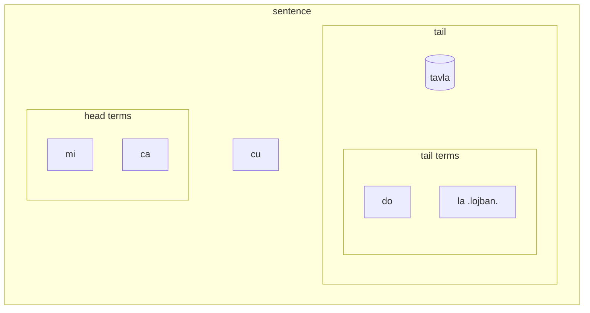
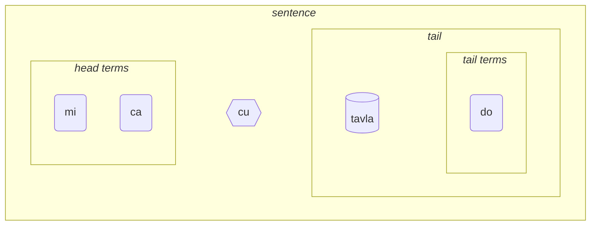

Lift($L$) can be determined by Lift Coefficient ($C_L$) like the following
equation.

$$
L = \frac{1}{2} \rho v^2 S C_L
$$

Basic sentence structure:

```mermaid
flowchart LR
    %% common structure:
    subgraph sentence
        direction LR
        head-terms
        cu
        tail
    end
    head-terms ~~~ cu ~~~ tail
    subgraph tail["tail"]
        %% direction LR
        selbri ~~~ tail-terms
    end
    %%  semi-automated
    subgraph head-terms["head terms"]
        t1
        t2
    end
    subgraph tail-terms["tail terms"]
        tt3
        tt4
    end
    %%todo: automatically link all terms to selbri

    t1[mi]
    t2[ca]
    selbri[(tavla)]
    tt3[do]
    tt4["la .lojban."]

```

```mermaid
flowchart LR
    %% common structure:
    subgraph sentence["<i>sentence</i>#nbsp;"]
        direction LR
        head-terms
        cu{{"cu"}}
        tail
    end
    head-terms ~~~ cu ~~~ tail
    subgraph tail["<i>tail</i>#nbsp;"]
        direction LR
        selbri ~~~ tail-terms
    end
    %%  semi-automated
    subgraph head-terms["<i>head terms</i>#nbsp;"]
        t1
        t2
    end
    subgraph tail-terms["<i>tail terms</i>#nbsp;"]
        tt3
        %% tt4
    end
    %%todo: automatically link all terms to selbri

    t1(mi)
    t2(ca)
    selbri[(tavla)]
    tt3(do)
    %% tt4["la .lojban."]
```