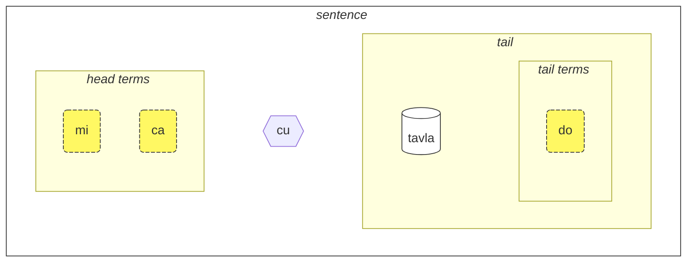
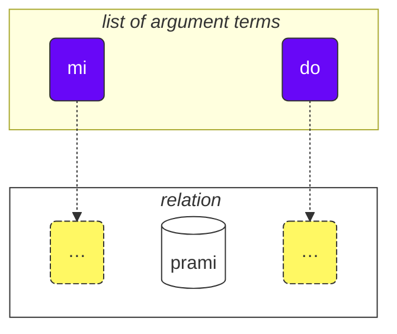

Wie man diesen Kurs benutzt:

1. lesen
2. Ihr Feedback und Ihre Vorschläge sammeln
3. sie an [💬 den Live-Chat](https://lojban.pw/en/articles/live_chat/) senden

## Lektion 1. Die Sprache auf einen Blick

### Alphabet

Das Grundlegende, das Sie über Lojban wissen müssen, ist das Alphabet.

Lojban verwendet das lateinische Alphabet (Vokale sind farbig markiert):

<dl><dd><b>a b c d e f g i j k l m n o p r s t u v x y z ' .</b></dd></dl>

Wörter werden so ausgesprochen, wie sie geschrieben werden.

Es gibt 10 Vokale in Lojban:

<table>
<tbody><tr>
<td><b class="audio-inline">a</b></td>
<td> wie in <i>V<u>a</u>ter</i></td>
</tr>
<tr>
<td><b class="audio-inline">e</b></td>
<td> wie in <i>S<u>e</u>e</i></td>
</tr>
<tr>
<td><b class="audio-inline">i</b></td>
<td> wie in <i>L<u>i</u>ed</i></td>
</tr>
<tr>
<td><b class="audio-inline">o</b></td>
<td> wie in <i>S<u>o</u>nne</i> (ein "reiner" Klang)</td>
</tr>
<tr>
<td><b class="audio-inline">u</b></td>
<td> wie in <i>g<u>u</u>t</i></td>
</tr>
<tr>
<td><b class="audio-inline">y</b></td>
<td> wie in <i>Böll<u>e</u></i> (Schwa-Laut)</td>
</tr>
</tbody></table>

4 Vokale werden durch Kombinationen von Buchstaben geschrieben:

<table>
<tbody><tr>
<td><b class="audio-inline">au</b></td>
<td> wie in <i>H<u>au</u>s</i></td></tr>
<tr>
<td><b class="audio-inline">ai</b></td>
<td> wie in <i>K<u>ai</u>ser</i></td></tr>
<tr>
<td><b class="audio-inline">ei</b></td>
<td> wie in <i>B<u>ei</u>n</i></td></tr>
<tr>
<td><b class="audio-inline">oi</b></td>
<td> wie in <i>h<u>eu</u>len</i></td></tr>
</tbody></table>

Was die Konsonanten betrifft, so werden sie wie im Deutschen ausgesprochen, aber es gibt einige Unterschiede:

<table>
<tbody><tr>
<td><b class="guibutton">c</b>
</td>
<td>wird ausgesprochen wie <i>sch</i> in <i>Schule</i>.
</td></tr>
<tr>
<td><b class="guibutton">g</b>
</td>
<td>immer wie <i>g</i> in <i>Garten</i> (nie wie <i>g</i> in <i>Genie</i>).
</td></tr>
<tr>
<td><b class="guibutton">j</b>
</td>
<td>wie <i>g</i> in <i>Gara<u>g</u>e</i>, <i>j</i> in <i>Journal</i> oder <i>g</i> in <i>Oran<u>g</u>e</i>. Dies entspricht dem stimmhaften sch-Laut (ʒ) in diesen Fremdwörtern.
</td></tr>
<tr>
<td><b class="guibutton">x</b>
</td>
<td>wie <i>ch</i> in <i>Bach</i> oder <i>Dach</i>.
</td></tr>
<tr>
<td><b class="guibutton"> ' </b>
</td>
<td>wie das deutsche <i>h</i> in <i>H</i>aus oder <i>h</i>aben. Das Apostroph wird daher als richtiger Buchstabe des Lojban angesehen und wie ein <i>h</i> ausgesprochen. Es kann nur zwischen Vokalen gefunden werden. Zum Beispiel wird <b>u'i</b> wie <i>u-hi</i> ausgesprochen (ähnlich wie in dem deutschen Wort <i>Uhu</i>, aber mit einer deutlicheren Trennung zwischen den Vokalen). Im Gegensatz dazu wird <b>ui</b> als Diphthong ausgesprochen, etwa wie <i>ui</i> in <i>pfui</i>.
</td></tr>
<tr>
<td><b>.</b>
</td>
<td>ein Punkt (Satzzeichen, Worttrennung) wird ebenfalls als Buchstabe im Lojban angesehen. Es ist eine kurze Pause in der Rede, um zu verhindern, dass Wörter ineinander übergehen. Tatsächlich wird vor jedem Wort, das mit einem Vokal beginnt, ein Punkt gesetzt. Dies hilft, unerwünschtes Verschmelzen von zwei aufeinanderfolgenden Wörtern zu einem zu verhindern.
</td></tr>
<tr>
<td><b>i</b>
</td>
<td><b>i</b> vor Vokalen wird als Konsonant betrachtet und kürzer ausgesprochen, zum Beispiel:
<ul><li><b>ia</b> wird ausgesprochen wie <i>ja</i> in <i>Jagd</i></li>
<li><b>ie</b> wird ausgesprochen wie <i>je</i> in <i>jetzt</i></li></ul>
</td></tr>
<tr>
<td><b>u</b>
</td>
<td><b>u</b> vor Vokalen wird als Konsonant betrachtet und kürzer ausgesprochen, ähnlich dem englischen /w/. Zum Beispiel:
<ul><li><b>ua</b> wird ausgesprochen wie <i>wa</i> im englischen <i>water</i></li>
<li><b>ue</b> wird ausgesprochen wie <i>we</i> im englischen <i>wet</i></li></ul>
Für deutsche Sprecher: Stellen Sie sich vor, Sie sprechen ein sehr schnelles "u" vor dem folgenden Vokal.
</td></tr></tbody></table>

Der Akzent liegt auf dem vorletzten Vokal. Wenn ein Wort nur einen Vokal hat, betont man es einfach nicht.

Der Buchstabe **r** kann wie das _r_ im Deutschen, als Zungen-R oder Zäpfchen-R, ausgesprochen werden, sodass es eine Bandbreite an akzeptabler Aussprache dafür gibt.

Nicht-Lojban-Vokale wie das kurze _i_ in _Fisch_ oder das kurze _u_ in _Mutter_, werden von einigen Leuten verwendet, um Konsonanten zu trennen. Wenn Sie also Schwierigkeiten haben, zwei Konsonanten hintereinander auszusprechen (z.B. das **vl** in **tavla**, was _sprechen mit_ bedeutet), dann können Sie _tavɪla_ sagen — wobei das _ɪ_ sehr kurz ist. Andere Vokale wie **a** und **u** müssen jedoch lang sein.

### Der einfachste Satz

Die Grundeinheit in Lojban ist der "Satz". Hier sind drei einfache Beispiele:

> **le prenu cu tavla mi**
> _Die Person spricht mit mir._

le prenu
: die Person

tavla
: … spricht mit …, … redet mit …

mi
: ich, mich

> **mi prami do**
> _Ich liebe dich._

prami
: … liebt … (jemanden)

do
: du

> **mi ca cu tavla do**
> _Ich spreche jetzt mit dir._

ca
: jetzt (ausgesprochen wie **shah**)

<pixra url="/assets/pixra/cilre/tavla.webp" caption="le prenu cu tavla mi" definition="Die Person spricht mit mir."></pixra>

<pixra url="/assets/pixra/cilre/mi.webp" caption="mi" definition="Ich / mich"></pixra>

<pixra url="/assets/pixra/cilre/mi_prami_do2.webp" caption="mi prami do" definition="Ich liebe dich."></pixra>

<pixra url="/assets/pixra/cilre/do.webp" caption="do" definition="du"></pixra>

Jeder Satz in Lojban besteht aus den folgenden Teilen von links nach rechts:

- der Kopf:
  - besteht aus sogenannten "Termen",
    - **le prenu** ist der einzige Kopf-Termin im obigen Beispiel **le prenu cu tavla mi**,
    - **mi**, **ca** sind Kopf-Terme im obigen Beispiel **mi ca cu tavla do**.
- der Kopf-Trenner **cu**:
  - ausgesprochen wie _shoe_, da **c** für _sh_ steht,
  - zeigt an, dass der Kopf beendet ist,
  - kann weggelassen werden, wenn klar ist, dass der Kopf abgeschlossen ist.
- der Schwanz:
  - die Hauptbeziehungskonstruktion (in Lojban "**selbrisni**" genannt)
  - \+ möglicherweise ein oder mehrere Terme danach,
    - **tavla**, **prami** sind selbrisni, Hauptbeziehungskonstruktionen in den obigen Beispielen.
    - **mi** ist der einzige Schwanz-Termin im obigen Beispiel **le prenu cu tavla mi**.
    - **do** ist der einzige Schwanz-Termin im obigen Beispiel **mi prami do**.

Auf Lojban sprechen wir meistens von Beziehungen anstatt von Substantiven oder Verben.

Hier sind die beiden Beziehungswörter, die ungefähr Verben entsprechen:

prenu
: … ist eine Person / sind Menschen

tavla
: … spricht zu …

Jede Beziehung hat eine oder mehrere Rollen, die auch als "Slots" oder "Plätze" bezeichnet werden können. Oben sind sie mit "…" gekennzeichnet. Diese Slots sollen mit Argumenten (genannt "**sumti**" in Lojban) gefüllt werden. Argumentbegriffe sind Konstrukte wie **le prenu**, **mi**, **do**, egal ob diese Begriffe am Anfang oder am Ende eines Satzes stehen. Wir setzen die Argumentbegriffe in eine Reihenfolge, füllen so diese Slots und geben der Beziehung eine konkrete Bedeutung.

Wir können eine solche Beziehung auch in einen Argumentbegriff umwandeln.

Dafür setzen wir ein kurzes Wort **le** davor:

prenu
: … ist eine Person

le prenu
: die Person, die Menschen

Ähnlich,

tavla
: … spricht zu …

und somit

le tavla
: der Sprecher, die Sprecher

Es mag seltsam klingen, wie _Person_ ein "Verb" sein kann, aber tatsächlich macht dies Lojban sehr einfach:

<table>
<thead>
<tr>
<th>Beziehungswort mit ungefüllten Slots</th>
<th>Argumentform (<b>sumti</b>)</th></tr>
</thead>
<tbody>
<tr>
<td><b>prenu</b> — <i>… (jemand) ist eine Person</i> </td>
<td><b>le prenu</b> — <i>die Person / die Menschen</i>
     <b>le prenu</b> — <i>derjenige, der eine Person ist / diejenigen, die Menschen sind</i>
</td></tr>
<tr>
<td><b>tavla</b> — <i>… (jemand) spricht zu … (jemand)</i> </td>
<td><b>le tavla</b> — <i>der Sprecher / die Sprecher</i>
     <b>le tavla</b> — <i>derjenige, der ein Sprecher ist / diejenigen, die Sprecher sind</i>
</td></tr>
</tbody></table>

Der erste Slot der Beziehungen verschwindet, wenn **le** verwendet wird, daher sind solche alternativen Übersetzungen wie _derjenige, der …_ möglich.

<!-- Wir können auch sagen, dass **le** ein Substantiv aus einem Beziehungskonstrukt mit ungefähr der Bedeutung von _derjenige, der … ist_ (_ist eine Person_ — _die Person_), oder sogar _diejenigen, die … tun_ (_zu sprechen_ — _die Sprecher_), _diejenigen, die … sind_ (_sind Menschen_ — _die Menschen_). -->

Beachten Sie, dass Lojban standardmäßig keine Anzahl zwischen _der Sprecher_ oder _die Sprecher_ angibt. Das heißt, **le tavla** ist in dieser Hinsicht vage, und wir werden bald Wege entdecken, die Anzahl zu definieren.

Apart von Argumentbegriffen gibt es modale Begriffe wie **ca**:

> **mi ca cu tavla do**
> _Ich spreche jetzt mit dir._

ca
: jetzt

Modale Begriffe füllen keine Slots der Hauptrelationskonstruktion ("**selbrisni**"). Stattdessen werden sie auf den gesamten Satz angewendet, um seine Bedeutung zu bereichern oder einzugrenzen.

So werden Begriffe in Lojban dargestellt mit:

- Argumentbegriffen, die Slots von Relationen füllen. Beispiele sind:
  - Substantive wie **le prenu** (_die Person_)
  - Pronomen wie **mi** (_ich_, _mich_), **do** (_du_). Pronomen funktionieren genau wie Substantive, aber **le** wird für sie nicht verwendet. Sie funktionieren als Argumente für sich.
- Modale Begriffe, die keine Slots von Relationen füllen, sondern zusätzliche, klärende Informationen angeben.
  - zum Beispiel **ca** (_jetzt, in der Gegenwart_).

Einige weitere Beispiele:

<pixra url="/assets/pixra/cilre/nintadni.webp" caption="mi nintadni" definition="Ich bin ein neuer Student, ein Neuling."></pixra>

> **mi nintadni**
> _Ich bin ein neuer Student._

nintadni
: … (jemand) ist ein neuer Student, ein Neuling

Im Gegensatz zum Englischen müssen wir das Verb "bin/ist/sind/sein" nicht zum Satz hinzufügen. Es ist bereits impliziert. Das Relationswort **nintadni** (_… ist ein neuer Student_) hat dieses englische "am/is/are/to be" bereits in seine englische Übersetzung eingebaut.

> **do jimpe**
> _Du verstehst._

jimpe
: … (jemand) versteht … (etwas)

<pixra url="/assets/pixra/cilre/pilno_le_fonxa.webp" caption="le prenu cu pilno le fonxa" definition="Die Person benutzt das Telefon."></pixra>

> **mi pilno le fonxa**
> _Ich benutze das Telefon._

pilno
: … (jemand) benutzt … (etwas)

fonxa
: … ist ein Telefon, … sind Telefone

le fonxa
: das Telefon, die Telefone

<pixra url="/assets/pixra/cilre/citka.webp" caption="mi citka" definition="Ich esse."></pixra>

> **mi citka**
> _Ich esse._

citka
: … (jemand) isst … (etwas)

> **do citka**
> _Du isst._

<!-- -->

> **mi citka le plise**
> _Ich esse die Äpfel._

<pixra url="/assets/pixra/cilre/le_plise_cu_kukte.webp" caption="le plise cu kukte" definition="Die Äpfel sind lecker."></pixra>

> **le plise cu kukte**
> _Die Äpfel sind lecker._

le plise
: die Äpfel

kukte
:  … (etwas) ist lecker

Ein einfacherer Satz in Lojban würde nur ein Hauptbeziehungswort enthalten:

<pixra url="/assets/pixra/cilre/karce.webp" caption="karce" definition="Es ist ein Auto."></pixra>

> **karce**
> _Auto!_
> _Es ist ein Auto._

Das könntest du sagen, wenn du ein Auto kommen siehst. Hier wäre der Kontext klar genug, dass irgendwo ein Auto ist und wahrscheinlich gefährlich ist.

**karce** selbst ist ein Beziehungswort, das _ist ein Auto_ bedeutet.

Wir können natürlich präziser sein und zum Beispiel sagen:

> **bolci**
> _Ball!_
> _Es ist ein Ball._

wo **bolci** ein Beziehungswort ist, das _ist ein Ball_ bedeutet.

> **ti bolci**
> _Das ist ein Ball in meiner Nähe._

<!-- -->
> **ta bolci**
> _Das ist ein Ball in deiner Nähe._

ti
: Pronomen: dieses Ding in meiner Nähe

ta
: Pronomen: dieses/das Ding in deiner Nähe

tu
: Pronomen: das dort weg von dir und mir

<pixra url="/assets/pixra/cilre/ti.webp" caption="ti" definition="dieses (in meiner Nähe, der Sprecher)"></pixra>

<pixra url="/assets/pixra/cilre/ta.webp" caption="ta" definition="dieses (in deiner Nähe, der Zuhörer)"></pixra>

<pixra url="/assets/pixra/cilre/tu.webp" caption="tu" definition="das dort drüben (weg von dir und mir)"></pixra>

Ähnlich kannst du sagen

<pixra url="/assets/pixra/cilre/carvi.webp" caption="carvi" definition="… ist Regen"></pixra>

> **carvi**
> _Es regnet._

wo

carvi
: … ist Regen, … regnet

oder

> **pluka**
> _Es ist angenehm._

wo

pluka
: … ist angenehm

Beachte, dass in Lojban das Wort _es_ in diesem Sinne nicht benötigt wird. Du verwendest einfach das benötigte Beziehungswort.

> **prami**
> _Jemand liebt._

<pixra url="/assets/pixra/cilre/bajra.webp" caption="le prenu cu bajra" definition="Die Person rennt."></pixra>

> **bajra**
> _Jemand rennt._

bajra
: … rennt mit Gliedmaßen

Wiederum würde der Kontext wahrscheinlich sagen, wer wen liebt und wer rennt.

### Aufgabe

<pixra url="/assets/pixra/cilre/pinxe_le_djacu.webp" caption="le prenu cu pinxe le djacu" definition="Die Person trinkt das Wasser."></pixra>

pinxe
: … trinkt … (etwas)

le djacu
: das Wasser

Schließe den rechten Teil der Tabelle. Übersetze die Sätze auf der linken Seite aus dem Lojban.

<table style="table-layout: fixed;">
<tbody><tr>
<td><b>do citka</b>
</td>
<td><i>Du isst.</i>
</td></tr>
<tr>
<td><b>mi pinxe le djacu</b>
</td>
<td><i>Ich trinke Wasser.</i>
</td></tr>
<tr>
<td><b>mi citka le plise</b>
</td>
<td><i>Ich esse Äpfel.</i>
</td></tr></tbody></table>

### «**.i**» trennt Sätze

Wir setzen ein kurzes Wort **.i** ein, um zwei aufeinanderfolgende Sätze zu trennen:

> **mi tavla le prenu .i le prenu cu tavla mi**
> _Ich spreche mit den Leuten. Die Leute sprechen mit mir._

**.i** trennt Sätze wie der Punkt am Ende von Sätzen in englischen Texten.

Wenn wir im Englischen einen Satz nach dem anderen sagen, machen wir eine Pause (sie kann kurz sein) dazwischen. Aber Pausen haben im Englischen viele verschiedene Bedeutungen. Im Lojban haben wir eine bessere Möglichkeit zu verstehen, wo ein Satz endet und ein anderer beginnt.

Beachten Sie auch, dass es manchmal, wenn man Wörter schnell ausspricht, schwierig ist zu erkennen, wo ein Satz endet und das Wort des nächsten Satzes beginnt. Daher wird empfohlen, das Wort **.i** zu verwenden, bevor man einen neuen Satz beginnt.

### Zahlen: ‘_1 2 3 4 5 6 7 8 9 0_’ = «**pa re ci vo mu xa ze bi so no**»

**le** verwandelt einfach eine Relationskonstruktion in ein Argument, aber ein solches Argument hat keine zugeordnete Zahl. Der Satz

> **le prenu cu tavla mi**
> _Die Leute sprechen mit mir._
> _Die Person spricht mit mir._

gibt nicht an, wie viele Leute mit mir sprechen. Im Englischen ist es unmöglich, die Zahl wegzulassen, weil _people_ im Englischen _mehr als eine Person_ impliziert. Im Lojban kann man jedoch die Zahl weglassen.

Nun wollen wir angeben, wie viele der Leute für unsere Diskussion relevant sind.

Fügen wir eine Zahl nach **le** hinzu.

<table>
<tbody><tr>
<td><b>pa</b>
</td>
<td><b>re</b>
</td>
<td><b>ci</b>
</td>
<td><b>vo</b>
</td>
<td><b>mu</b>
</td>
<td><b>xa</b>
</td>
<td><b>ze</b>
</td>
<td><b>bi</b>
</td>
<td><b>so</b>
</td>
<td><b>no</b>
</td></tr>
<tr>
<td> 1
</td>
<td> 2
</td>
<td> 3
</td>
<td> 4
</td>
<td> 5
</td>
<td> 6
</td>
<td> 7
</td>
<td> 8
</td>
<td> 9
</td>
<td> 0
</td>
</tr></tbody></table>

<pixra url="/assets/pixra/cilre/ci_prenu.webp" caption="le ci prenu" definition="Die drei Leute"></pixra>

> **le pa prenu cu tavla mi**
> _Die Person spricht mit mir._
> _Die eine Person spricht mit mir._

Wir fügen eine Zahl nach **le** hinzu und spezifizieren so einzelne Personen.

Bei Zahlen, die aus mehreren Ziffern bestehen, reihen wir diese Ziffern einfach aneinander:

> **le re mu prenu cu tavla mi**
> _Die 25 Personen sprechen mit mir._

Ja, so einfach ist das.

Wenn wir zählen wollen, können wir Zahlen mit **.i** trennen:

> **mu .i vo .i ci .i re .i pa .i no**
> _5 … 4 … 3 … 2 … 1 … 0_

Die Zahl **za'u** bedeutet _mehr als …_ (_\>_ in Mathe), die Zahl **me'i** bedeutet _weniger als_ (_<_ in Mathe):

> **le za'u re prenu cu tavla mi**
> _Mehr als zwei Personen sprechen mit mir._

<!-- -->

> **le me'i pa no prenu cu tavla mi**
> _Weniger als 10 Personen sprechen mit mir._

<!-- -->

> **le za'u ci prenu cu tavla mi**
> _Mehr als drei Personen sprechen mit mir._

Um einfach _Personen_ (Plural) im Gegensatz zu _eine Person_ zu sagen, verwenden wir **za'u pa**, _mehr als eine_ oder einfach **za'u**.

> **le za'u pa prenu cu tavla mi**
> **le za'u prenu cu tavla mi**
> _Die Personen sprechen mit mir._

**za'u** bedeutet standardmäßig **za'u pa**, daher ist eine solche Verkürzung möglich.

le prenu
: die Person / die Personen

le pa prenu
: die Person (eine in der Anzahl)

le za'u prenu
: die Personen (zwei oder mehr in der Anzahl)

### Aufgabe

stati
: … (jemand) ist klug, … hat ein Talent

<pixra url="/assets/pixra/cilre/stati.webp" caption="stati" definition="… hat ein Talent"></pixra>

klama
: … kommt zu … (einem Ort oder Objekt)

<pixra url="/assets/pixra/cilre/klama_ti.webp" caption="le prenu cu klama ti" definition="Die Person kam hierher."></pixra>

nelci
: … mag … (etwas)

le zarci
: der Markt

<pixra url="/assets/pixra/cilre/zarci.webp" caption="le prenu cu zvati le zarci" definition="Die Person ist im Laden."></pixra>

le najnimre
: die Orange (Frucht), die Orangen

<pixra url="/assets/pixra/cilre/najnimre.webp" caption="najnimre" definition="… ist eine Orange"></pixra>

le badna
: die Banane, Bananen

<pixra url="/assets/pixra/cilre/badna.webp" caption="badna" definition="… ist eine Banane"></pixra>

Schließe den rechten Teil der Tabelle. Übersetze die Sätze auf der linken Seite aus dem Lojban.

<table style="table-layout: fixed;">
 <tbody>
  <tr>
   <td>le mu prenu cu klama le zarci</td>
   <td>Die fünf Leute kommen zum Markt.</td>
  </tr>
  <tr>
   <td>le pa re prenu cu stati .i do stati</td>
   <td>Die 12 Leute sind schlau. Du bist schlau.</td>
  </tr>
  <tr>
   <td>le prenu cu nelci le plise</td>
   <td>Die Leute mögen die Äpfel.</td>
  </tr>
  <tr>
   <td>le za'u re prenu cu citka .i le me'i mu prenu cu pinxe le djacu</td>
   <td>Mehr als zwei Leute essen. Weniger als 5 Leute trinken das Wasser.</td>
  </tr>
  <tr>
   <td>le za'u re prenu cu stati</td>
   <td>Mehr als zwei Leute sind schlau.</td>
  </tr>
 </tbody>
</table>

Schließen Sie den rechten Teil der Tabelle. Übersetzen Sie die Sätze auf der linken Seite ins Lojban.

<table style="table-layout: fixed;">
 <tbody>
  <tr>
   <td>Die 256 Leute sind schlau.</td>
   <td>le re mu xa prenu cu stati</td>
  </tr>
  <tr>
   <td>Weniger als 12 Äpfel sind lecker.</td>
   <td>le me'i pa re plise cu kukte</td>
  </tr>
 </tbody>
</table>

### Zusammengesetzte Relation

Zusammengesetzte Relationskonstrukte (**tanru** in Lojban) sind mehrere Relationswörter, die nacheinander platziert werden.

> **tu melbi zdani**
> _Das ist ein schönes Zuhause._

<pixra url="/assets/pixra/cilre/melbi_zdani.webp" caption="melbi zdani" definition="… ist ein schönes Zuhause"></pixra>

tu
: das (weg von dir und mir)

melbi
: … ist schön, nett

zdani
: … ist ein Zuhause oder Nest für … (jemanden)

melbi zdani
: zusammengesetzte Relationskonstruktion: … ist ein schönes Zuhause für … (jemanden)

<pixra url="/assets/pixra/cilre/dansu.webp" caption="le prenu cu melbi dansu" definition="Die Person tanzt schön."></pixra>

> **do melbi dansu**
> _Du tanzt schön._

dansu
: … tanzt

Hier fügt die Relation **melbi** eine zusätzliche Bedeutung hinzu, da sie links von einer anderen Relation platziert ist: **zdani**. Die linke Komponente wird normalerweise mit Adjektiven und Adverbien übersetzt.

Zusammengesetzte Relationen sind ein mächtiges Merkmal, das reichere Bedeutungen erzeugt. Man reiht einfach zwei Relationswörter aneinander, und die linke Komponente einer solchen zusammengesetzten Relation fügt der rechten eine Nuance hinzu.

Wir können **le** (z.B. mit einer Zahl) links von einer solchen zusammengesetzten Relation setzen und erhalten einen reicheren Argumentbegriff:

le pa melbi zdani
: das schöne Zuhause

Jetzt wissen wir, warum es **cu** nach den Hauptbegriffen in unserem Beispiel gab:

> **le pa prenu cu tavla mi**
> _Die Person spricht mit mir._

Ohne **cu** würde es zu **le pa prenu tavla** werden, was die Bedeutung von _die Person-Sprecher_ hätte - was auch immer das bedeuten könnte.

Betrachten Sie:

> **le pa tavla pendo**
> _Der sprechende Freund_
<!-- -->
> **le pa tavla cu pendo**
> _Der Sprechende ist ein Freund._

Denken Sie daran, **cu** vor der Hauptbeziehungskonstruktion in einem Satz zu platzieren, um die unbeabsichtigte Erstellung von zusammengesetzten Beziehungen zu verhindern.

Eine zusammengesetzte Beziehung kann mehr als zwei Komponenten enthalten. In diesem Fall modifiziert die erste Beziehung die zweite, die zweite modifiziert die dritte und so weiter:

<pixra url="/assets/pixra/cilre/cmalu_karce.webp" caption="ti cmalu karce" definition="Das ist ein kleines Auto."></pixra>

> **le pa melbi cmalu karce**
> _das hübsch-kleine Auto, das Auto klein auf eine hübsche Weise_

<!-- -->

> **le mutce melbi zdani**
> _das sehr schöne Zuhause_

mutce
: … ist sehr, … ist viel

### Aufgabe

sutra
: … ist schnell

barda
: … ist groß

cmalu
: … ist klein

mlatu
: … ist eine Katze

Schließen Sie den rechten Teil der Tabelle. Übersetzen Sie die Sätze auf der linken Seite aus dem Lojban.

<table style="table-layout: fixed;">
<tbody><tr>
<td><b>le melbi karce</b>
</td>
<td><i>das schöne Auto / die schönen Autos</i>
</td></tr>
<tr>
<td><b>do sutra klama</b>
</td>
<td><i>Du kommst schnell. Du kommst schnell.</i>
</td></tr>
<tr>
<td><b>tu barda zdani</b>
</td>
<td><i>Das ist ein großes Zuhause.</i>
</td></tr>
<tr>
<td><b>le pa sutra bajra mlatu</b>
</td>
<td><i>die schnell laufende Katze</i>
</td></tr>
<tr>
<td><b>le pa sutra mlatu</b>
</td>
<td><i>die schnelle Katze</i>
</td></tr>
<tr>
<td><b>le pa bajra mlatu</b>
</td>
<td><i>die laufende Katze</i>
</td></tr></tbody></table>

Schließen Sie den rechten Teil der Tabelle. Übersetzen Sie die Sätze auf der linken Seite ins Lojban.

<table style="table-layout: fixed;">

<tbody><tr>
<td><i>Das ist ein kleines Auto.</i>
</td>
<td><b>ti cmalu karce</b>
</td></tr>
<tr>
<td><i>leckere Äpfel</i>
</td>
<td><b>le kukte plise</b>
</td></tr>
<tr>
<td><i>die schnellen Esser</i>
</td>
<td><b>le sutra citka</b>
</td></tr>
<tr>
<td><i>Du bist eine schnell gehende Person.</i>
</td>
<td><b>do sutra cadzu prenu</b>
</td></tr></tbody></table>

### ‘_Yes/No_’ Fragen

Im Englischen bilden wir eine _Ja/Nein_ Frage, indem wir die Wortreihenfolge ändern, zum Beispiel

> _You are … ⇒ Are you …?_

oder indem wir eine Form des Verbs _to do_ am Anfang verwenden, zum Beispiel:

> _You know … ⇒ Do you know?_

Im Lojban kann die Wortreihenfolge beibehalten werden. Um eine Aussage in eine _Ja/Nein_ Frage zu verwandeln, fügen wir einfach das Wort **xu** am Anfang des Satzes ein:

> **xu do nelci le gerku**
> _Magst du die Hunde?_

le gerku
: der Hund, die Hunde

<pixra url="/assets/pixra/cilre/le_prenu_e_le_gerku.webp" caption="ti prenu .i ti gerku" definition="Das ist eine Person. Das ist ein Hund."></pixra>

Denken Sie daran, dass im Lojban Satzzeichen wie "?" (Fragezeichen) optional sind und hauptsächlich aus stilistischen Gründen verwendet werden. Dies liegt daran, dass das Fragewort **xu** bereits zeigt, dass es sich um eine Frage handelt.

Weitere Beispiele:

> **xu mi klama**
> _Komme ich?_

klama
: … kommt zu … (irgendwohin)

> **xu pelxu**
> _Ist es gelb?_

pelxu
: … ist gelb

Wir können die Bedeutung verschieben, indem wir **xu** nach verschiedenen Teilen des Satzes setzen. Erklärungen, was sich in der Bedeutung geändert hat, sind in Klammern angegeben:

> **xu do nelci le gerku**
> _Magst du die Hunde?_

<!-- -->

> **do xu nelci le gerku**
> _Magst DU die Hunde?_ (Ich dachte, jemand anderes mag sie).

<!-- -->

> **do nelci xu le gerku**
> _Magst du DIE Hunde? (Ich dachte, du bist ihnen gegenüber neutral)._

<!-- -->

> **do nelci le xu gerku**
> _Magst du DIE HUNDE? (Ich dachte, du magst die Katzen)._

<!-- -->

> **do nelci le gerku xu**
> _Du magst diese Dinge, sind es Hunde? (Du hinterfragst nur die Gültigkeit der Beziehung **gerku**)._

Was im Englischen durch Intonation ausgedrückt wird, wird im Lojban durch das Verschieben von **xu** nach dem Teil, den wir betonen möchten, ausgedrückt. Beachten Sie, dass der erste Satz mit **xu** am Anfang die allgemeinste Frage stellt, ohne einen bestimmten Aspekt zu betonen.

**xu** ist ein Interjektionswort. Hier sind die Merkmale von Lojban-Interjektionen:

- Interjektion modifiziert die Konstruktion davor:

 > **do xu nelci le gerku**
 > _Magst DU die Hunde?_

- wenn am Anfang einer Relation platziert, modifiziert die Interjektion die ganze Relation:

 > **xu do nelci le gerku**
 > _Magst du die Hunde?_

- Interjektionen können nach verschiedenen Teilen derselben Relation platziert werden, um die Bedeutung zu verschieben.

 > **do nelci le gerku xu**
 > _Du magst diese Entitäten, sind es Hunde?_

 Hier wird nur die Relation **gerku** (nicht das Argument **le gerku**) durch das Fragewort **xu** modifiziert. Wir fragen also nur nach dieser Relation. Wir behaupten, dass du diese Objekte oder Lebewesen magst, und fragen dich, ob es Hunde sind.

Interjektionen unterbrechen keine zusammengesetzten Relationen, sie können innerhalb dieser verwendet werden:

> **do nelci le barda xu gerku**
> _Magst du die GROSSEN Hunde?_

Nun, wie antwortet man auf solche 'ja/nein'-Fragen? Wir wiederholen die Hauptrelation:

> **— xu le mlatu cu melbi**
> **— melbi**
> _— Sind die Katzen hübsch?_
> _— Hübsch._

Um 'nein' zu antworten, verwenden wir den Modalbegriff **na ku**:

> **— xu le mlatu cu melbi**
> **— na ku melbi**
> _— Sind die Katzen hübsch?_
> _— Nicht hübsch._

na ku
: Begriff: es ist falsch, dass …

Oder, wir können ein spezielles Relationswort **go'i** verwenden:

> **— xu le mlatu cu melbi**
> **— go'i**
> _— Sind die Katzen hübsch?_
> _— Hübsch._

go'i
: Relationswort, das die Hauptrelation des vorherigen Satzes wiederholt

Hier bedeutet **go'i** dasselbe wie **melbi**, da **melbi** die Relation des vorherigen Satzes ist.

> **— xu le mlatu cu melbi**
> **— na ku go'i**
> _— Sind die Katzen hübsch?_
> _— Nicht hübsch._

<!-- Dieser Kurs empfiehlt nicht, **go'i** für negative Antworten zu verneinen. Verwenden Sie einfach **je'u nai**. -->

Der Modalbegriff **na ku** kann nicht nur in Antworten verwendet werden:

> **na ku mi nelci le gerku**
> _Es ist falsch, dass ich die Hunde mag._
> _Ich mag die Hunde nicht._
<!-- -->
> **mi na ku nelci do**
> _Ich mag dich nicht._

Das Gegenteil, der Begriff **ja'a ku**, bestätigt die Bedeutung:

> **mi ja'a ku nelci do**
> _Ich mag dich wirklich._

ja'a ku
: Begriff: es ist wahr, dass …

### Aufgabe

Schließen Sie den rechten Teil der Tabelle. Übersetzen Sie die Sätze auf der linken Seite aus dem Lojban.

<table style="table-layout: fixed;">

<tbody><tr>
<td><b>xu le barda zdani cu melbi</b>
</td>
<td><i>Ist das große Haus schön?</i>
</td></tr>
<tr>
<td><b>— le prenu cu stati xu — na ku stati</b>
</td>
<td><i>— Sind die Leute klug? — Nein.</i>
</td></tr>
<tr>
<td><b>do klama le zarci xu</b>
</td>
<td><i>Gehst du zum Markt?</i>
</td></tr>
<tr>
<td><b>xu le verba cu prami le mlatu</b>
</td>
<td><i>Liebt das Kind die Katzen?</i>
</td></tr></tbody></table>

Schließe den rechten Teil der Tabelle. Übersetze die Sätze auf der linken Seite ins Lojban.

<table style="table-layout: fixed;">

<tbody><tr>
<td><i>Ist das Auto schnell?</i>
</td>
<td><b>xu le karce cu sutra</b>
</td></tr>
<tr>
<td><i>— Ist die Orange lecker? — Ja, das ist sie.</i>
</td>
<td><b>— xu le najnimre cu kukte — kukte</b>
</td></tr>
<tr>
<td><i>Liebt der Hund dich?</i>
</td>
<td><b>xu le gerku cu prami do</b>
</td></tr></tbody></table>

### Glück und höfliche Bitten: ‘_Yay!_’ = «**ui**», ‘_Bitte!_’ = «**.e'o**»

Die Interjektion **ui** zeigt die Freude des Sprechers. Sie wird genauso verwendet wie das Smiley-Gesicht ‘_:)_’ in Nachrichten, um anzuzeigen, dass man sich über etwas freut. Allerdings können Smileys mehrdeutig sein, und **ui** hat nur eine Bedeutung, was praktisch ist.

> **ui do klama**
> _Yay, du kommst!_

ui
: Interjektion: _Yay!_, Interjektion der Freude

Die Interjektion **.e'o** am Anfang eines Satzes macht daraus eine höfliche Bitte:

> **.e'o do lebna le fonxa**
> _Könntest du bitte das Telefon nehmen?_
> `Bitte nimm das Telefon.`

.e'o
: Interjektion: bitte (ausgesprochen als _eh-haw_ mit einer kurzen Pause oder Unterbrechung vor dem Wort)

lebna
: nehmen (etwas)

Im Englischen muss man höflich sein, indem man _could you_ + _please_ + eine Frage verwendet. Im Lojban reicht **.e'o** aus, um eine höfliche Bitte zu formulieren.

### Aufgabe

Schließe den rechten Teil der Tabelle. Übersetze die Sätze auf der linken Seite aus dem Lojban.

le tcati
: der Tee

<pixra url="/assets/pixra/cilre/tcati.webp" caption="tcati" definition="… ist etwas Tee"></pixra>

le ckafi
: Kaffee

<pixra url="/assets/pixra/cilre/ckafi.webp" caption="ckafi" definition="… ist etwas Kaffee"></pixra>

zgana
: beobachten, ansehen (mit allen Sinnen)

le skina
: der Film, der Kinofilm

<pixra url="/assets/pixra/cilre/zgana_le_skina.webp" caption="le prenu cu zgana le skina" definition="Die Person schaut den Film."></pixra>

kurji
: sich kümmern um (jemanden, etwas)

<table style="table-layout: fixed;">

<tbody>
<tr>
<td><b>ui carvi</b>
</td>
<td><i>Yay, es regnet! Yay, es regnet!</i>
</td></tr>
<tr>
<td><b>.e'o do sutra bajra</b>
</td>
<td><i>Lauf schnell!</i>
</td></tr>
<tr>
<td><b>.e'o do pinxe le tcati</b>
</td>
<td><i>Bitte, trink Tee!</i>
</td></tr>
<tr>
<td><b>.e'o zgana le skina</b>
</td>
<td><i>Bitte, schau den Film!</i>
</td></tr></tbody></table>

Schließe den rechten Teil der Tabelle. Übersetze die Sätze auf der linken Seite ins Lojban.

<table style="table-layout: fixed;">

<tbody><tr>
<td><i>Bitte, sei schlau!</i>
</td>
<td><b>.e'o do stati</b>
</td></tr>
<tr>
<td><i>Bitte, geh nach Hause!</i>
</td>
<td><b>.e'o do klama le zdani</b>
</td></tr>
<tr>
<td><i>Bitte, trink den Kaffee!</i>
</td>
<td><b>.e'o do pinxe le ckafi</b>
</td></tr>
<tr>
<tr>
<td><i>Juhu, ich rede mit dir!</i>
</td>
<td><b>ui mi tavla do</b>
</td></tr>
<tr>
<td><i>Bitte, kümmere dich um das Kind.</i>
</td>
<td><b>.e'o do kurji le verba</b>
</td></tr></tbody></table>

### ‘_Und_’ und ‘_oder_’

> **do nintadni .i je mi nintadni**
> _Du bist ein Neuling. Und ich bin ein Neuling._

<!-- -->

> **do .e mi nintadni**
> _Du und ich sind Neulinge._

<pixra url="/assets/pixra/cilre/do_e_mi_nintadni.webp" caption="do .e mi nintadni" definition="Du und ich sind neue Schüler."></pixra>

<!-- -->

> **mi tadni .i je mi tavla do**
> _Ich lerne. Und ich rede mit dir._

<!-- -->

> **mi tadni gi'e tavla do**
> _Ich lerne und rede mit dir._

.i je
: Konjunktion "und" verbindet Sätze zu einem.

.e
: Konjunktion "und" verbindet Argumente.

gi'e
: Konjunktion "und" verbindet Satzenden.

Wir können zwei Sätze zu einer Aussage kombinieren, indem wir die Konjunktion **.i je** verwenden, was _und_ bedeutet:

> **do nintadni .i je mi nintadni**
> _Du bist ein Neuling. Und ich bin ein Neuling._

Da beide Sätze das gleiche Ende haben, können wir eine Verkürzung verwenden: die Konjunktion **.e** bedeutet _und_ für Argumente:

> **do .e mi nintadni**
> _Du und ich sind Neulinge._

**do nintadni .i je mi nintadni** bedeutet genau dasselbe wie **do .e mi nintadni**

Wir können **.e** auch verwenden, um Argumente in anderen Positionen zu verbinden.

Beide Sätze bedeuten dasselbe.

> **mi pinxe le djacu .e le jisra**
> _Ich trinke das Wasser und den Saft._
> **mi pinxe le djacu .i je mi pinxe le jisra**
> _Ich trinke das Wasser, und ich trinke den Saft._

le jisra
: Saft

<pixra url="/assets/pixra/cilre/pinxe_le_jisra.webp" caption="le prenu cu pinxe le jisra" definition="Die Person trinkt den Saft."></pixra>

Wenn der Satzanfang gleich ist, aber die Enden unterschiedlich sind, verwenden wir die Konjunktion **gi'e**, die _und_ für Satzenden bedeutet:

> **mi tadni .i je mi tavla do**
> **mi tadni gi'e tavla do**
> _Ich lerne und spreche mit dir._

Beide Varianten bedeuten dasselbe; **gi'e** führt einfach zu einer kürzeren Form.

Es gibt auch Möglichkeiten, _und_ für Komponenten zusammengesetzter Relationen hinzuzufügen:

> **le melbi je cmalu zdani cu jibni ti**
> _Das hübsche und kleine Zuhause ist in der Nähe._

<pixra url="/assets/pixra/cilre/melbi_je_cmalu_zdani.webp" caption="melbi je cmalu zdani" definition="… ist ein hübsch-und-kleines Zuhause"></pixra>

jibni
: … ist in der Nähe von …

ti
: dieses Ding, dieser Ort in meiner Nähe

**je** ist eine Konjunktion, die _und_ in zusammengesetzten Relationen bedeutet.

Ohne **je** ändert sich die Bedeutung des Satzes:

> **le melbi cmalu zdani cu jibni**
> _Das hübsch kleine Zuhause ist in der Nähe._

Hier modifiziert **melbi** **cmalu**, und **melbi cmalu** modifiziert **zdani**, entsprechend der Funktionsweise zusammengesetzter Relationen.

In **le melbi je cmalu zdani** (_das hübsche und kleine Haus_) modifizieren sowohl **melbi** als auch **cmalu** direkt **zdani**.

Andere gebräuchliche Konjunktionen sind:

> **le verba cu fengu ja bilma**
> _Das Kind ist wütend oder krank (oder vielleicht beides, wütend und krank)_

<!-- -->

> **do .a mi ba vitke le dzena**
> _Du oder ich (oder wir beide) werden den Vorfahren besuchen._

ja
: _und/oder_ innerhalb zusammengesetzter Relationen

.a
: _und/oder_ beim Verbinden von Argumenten

fengu
: … ist wütend

<pixra url="/assets/pixra/cilre/fengu.webp" caption="fengu" definition="… ist wütend"></pixra>

bilma
: … ist krank

<pixra url="/assets/pixra/cilre/bilma.webp" caption="le prenu cu bilma" definition="Die Person ist krank"></pixra>

vitke
: besuchen (jemanden)

dzena
: … ist ein Vorfahre von …

<pixra url="/assets/pixra/cilre/dzena.webp" caption="dzena" definition="… ist ein Vorfahre von …"></pixra>

> **le karce cu blabi jo nai grusi**
> _Das Auto ist entweder weiß oder grau._

<!-- -->

> **do .o nai mi vitke le laldo**
> _Entweder du oder ich besuchen den Alten._

jo nai
: entweder … oder … aber nicht beides

.o nai
: entweder … oder … aber nicht beides (beim Verbinden von Argumenten)

laldo
: … ist alt

<pixra url="/assets/pixra/cilre/laldo.webp" caption="laldo" definition="… ist alt"></pixra>

Hinweis: Es ist besser, **jo nai** als eine einzelne Konstruktion zu merken, und dasselbe gilt für **.o nai**.

> **mi prami do .i ju do stati**
> _Ich liebe dich. Ob du klug bist oder nicht._

<!-- -->

> **le verba cu nelci le plise .u le badna**
> _Das Kind mag die Äpfel, ob (es) die Bananen mag oder nicht._

ju
: ob … oder nicht …

.u
: ob … oder nicht … (bei der Verbindung von Argumenten)

### «**joi**» ist ‘_und_’ für Massenaktionen

> **do joi mi casnu le bangu**
> _Du und ich diskutieren die Sprache._

casnu
: … diskutiert …

le bangu
: die Sprache

joi
: Konjunktion _und_ für Massen

Wenn ich sage **do .e mi casnu le bangu**, kann es bedeuten, dass du die Sprache diskutierst und ich die Sprache diskutiere. Aber es bedeutet nicht unbedingt, dass wir im selben Gespräch sind!

Diese Unterscheidung kann sichtbarer gemacht werden, wenn wir diesen Satz mit **.i je** erweitern:

> **do .e mi casnu le bangu**
> **do casnu le bangu .i je mi casnu le bangu**
> _Du diskutierst die Sprache. Und ich diskutiere die Sprache._

Um zu betonen, dass du und ich an derselben Aktion teilnehmen, verwenden wir eine spezielle Konjunktion **joi**, die _und_ bedeutet und eine "Masse" bildet:

> **do joi mi casnu le bangu**
> _Du und ich diskutieren die Sprache._
> _Du und ich als eine einzige Einheit für dieses Ereignis diskutieren die Sprache._

Es gibt auch ein Pronomen **mi'o** (_du und ich zusammen_), das als **mi joi do** umformuliert werden kann (es ist nur länger). Im Lojban kann man nicht nur ein einzelnes Wort für _wir_ verwenden, sondern präzisere Konstruktionen wie **mi joi le pendo** (wörtlich _ich und die Freunde_).

<pixra url="/assets/pixra/cilre/casnu.webp" caption="do joi le pendo joi mi casnu" definition="Du, der Freund und ich sind in einer Diskussion."></pixra>

### Aufgabe

Schließe den rechten Teil der Tabelle. Übersetze die Sätze auf der linken Seite aus dem Lojban.

<table style="table-layout: fixed;">

<tbody><tr>
<td><b>mi nelci le badna .e le plise</b>
</td>
<td><i>Ich mag die Bananen, und ich mag die Äpfel. Ich mag die Bananen und die Äpfel.</i>
</td></tr>
<tr>
<td><b>do sutra ja stati</b>
</td>
<td><i>Du bist schnell oder klug oder beides.</i>
</td></tr>
<tr>
<td><b>le za'u prenu cu casnu le karce .u le gerku</b>
</td>
<td><i>Die Leute diskutieren die Autos, ob (sie) die Hunde diskutieren oder nicht.</i>
</td></tr>
<tr>
<td><b>mi citka le najnimre .o nai le badna</b>
</td>
<td><i>Ich esse entweder die Orangen oder die Bananen.</i>
</td></tr></tbody></table>

Schließe den rechten Teil der Tabelle. Übersetze die Sätze auf der linken Seite ins Lojban.

<table style="table-layout: fixed;">

<tbody><tr>
<td><i>Die Freunde und ich mögen den Regen.</i>
</td>
<td><b>le pendo .e mi cu nelci le carvi</b>
</td></tr>
<tr>
<td><i>Entweder ich oder du gehst zum Markt.</i>
</td>
<td><b>mi .o nai do klama le zarci</b>
</td></tr>
<tr>
<td><i>Ich schaue das große und schöne Auto an.</i>
</td>
<td><b>mi catlu le barda je melbi karce</b>
</td></tr>
<tr>
<td><i>Das Kind trinkt das Wasser und/oder den Saft.</i>
</td>
<td><b>le verba cu pinxe le djacu .a le jisra</b>
</td></tr>
<tr>
<td><i>Das Kind und der Kleine diskutieren über das Auto.</i>
</td>
<td><b>le verba joi le pa cmalu cu casnu le karce</b> (beachte die Verwendung von <b>joi</b>. <i>der Kleine</i> ist einfach <b>le pa cmalu</b>).
</td></tr></tbody></table>

### Aber …

> **le najnimre cu barda .i je ku'i le badna cu cmalu**
> _Die Orangen sind groß. Aber die Bananen sind klein._

ku'i
: Interjektion: aber, jedoch

Tatsächlich ist im Englischen _but_ dasselbe wie _and_, und es fügt einen Hauch von Kontrast hinzu.

Im Lojban verwenden wir einfach die Konjunktion **.i je** (oder **.e**, **gi'e**, **je**, je nachdem, was wir verbinden) und fügen den Kontrastgeschmack mit der Interjektion **ku'i** hinzu. Wie üblich modifiziert die Interjektion die Konstruktion davor.

### Ereignisse: ‘_tanzen und zusammen sein_’ — «**le nu dansu .e le nu kansa**»

Einige Slots von Relationen erwarten ein Ereignis:

> **le cabna cu nicte**
> _Jetzt ist Nachtzeit. Zurzeit ist es Nacht._

cabna
: … (Ereignis) ist zurzeit mit …; … (Ereignis) passiert jetzt

le cabna
: die Gegenwart, das gegenwärtige Ereignis

nicte
: … (Ereignis) passiert nachts

Aber was, wenn wir ein Ereignis mit einem ganzen Satz beschreiben wollen?

Jeder Satz kann in eine Beziehungskonstruktion umgewandelt werden, indem man **nu** davor setzt:

> **le nicte cu nu mi viska le lunra**
> _Die Nacht ist, wenn ich den Mond sehe._
> `Die Nachtzeit ist ein Ereignis, wenn ich den Mond sehe.`

<pixra url="/assets/pixra/cilre/nicte_fi_mi.webp" caption="le nicte" definition="die Nachtzeit"></pixra>

le nicte
: die Nachtzeit, Nachtzeiten

viska
: sehen (etwas)

le lunra
: der Mond

Hier ist **le nicte** das erste Argument des Satzes und **nu mi viska le lunra** ist die Hauptbeziehungskonstruktion des Satzes. Allerdings können wir innerhalb dieser Hauptbeziehung eine weitere Beziehung sehen: **mi viska le lunra** eingebettet!

Das Wort **nu** verwandelt einen vollständigen Satz in eine Beziehung, die ein Ereignis bezeichnet (im generischen Sinne kann es ein Prozess, ein Zustand usw. sein).

Hier sind einige weitere Beispiele:

nu mi tavla
: … ist ein Ereignis, bei dem ich spreche

nu do tavla
: … ist ein Ereignis, bei dem du sprichst

Durch das Hinzufügen von **le** vor **nu** schaffen wir ein Argument, das ein Ereignis bezeichnet:

pinxe ⇒ le nu pinxe
: … trinkt ⇒ das Trinken

dansu ⇒ le nu dansu
: … tanzt ⇒ das Tanzen

kansa ⇒ le nu kansa
: … ist zusammen mit … ⇒ zusammen sein

klama ⇒ le nu klama
: … kommt zu … ⇒ das Kommen

le nu do klama
: das Kommen von dir, dein Kommen

**le nu** entspricht oft dem englischen _\-ing_, _\-tion_, _\-sion_.

Einige weitere Beispiele mit Slots, die Ereignisse anstelle von gewöhnlichen Entitäten erwarten:

> **mi djica le nu do klama ti**
> _Ich möchte, dass du hierher kommst (zu diesem Ort)_

djica
: … will … (ein Ereignis)

> **mi gleki le nu do klama**
> _Ich bin glücklich, weil du kommst._

gleki
: … ist glücklich über … (ein Ereignis)

<pixra url="/assets/pixra/cilre/gleki.webp" caption="gleki" definition="… ist glücklich über ein Ereignis …"></pixra>

> **le nu pinxe le jisra cu nabmi mi**
> _Das Trinken des Saftes ist ein Problem für mich._

nabmi
: … (Ereignis) ist ein Problem für … (jemanden), … (Ereignis) ist problematisch für … (jemanden)

### Aufgabe

Schließe den rechten Teil der Tabelle. Übersetze die Sätze auf der linken Seite aus dem Lojban.

pilno
: benutzen (etwas)

le skami
: der Computer

<table style="table-layout: fixed;">

<tbody><tr>
<td><b>mi nelci le nu do dansu</b>
</td>
<td><i>Ich mag es, wenn du tanzt.</i>
</td></tr>
<tr>
<td><b>xu do gleki le nu do pilno le skami</b>
</td>
<td><i>Bist du glücklich, Computer zu benutzen?</i>
</td></tr>
<tr>
<td><b>do djica le nu mi citka le plise xu</b>
</td>
<td><i>Möchtest du, dass ich den <u>Apfel</u> esse?</i>
</td></tr></tbody></table>

Schließe den rechten Teil der Tabelle. Übersetze die Sätze auf der linken Seite ins Lojban.

<table style="table-layout: fixed;">

<tbody><tr>
<td><i>Hierher zu kommen ist ein Problem.</i>
</td>
<td><b>le nu klama ti cu nabmi</b>
</td></tr>
<tr>
<td><i>Ich möchte, dass du glücklich bist.</i>
</td>
<td><b>mi djica le nu do gleki</b>
</td></tr></tbody></table>

### Modale Begriffe. Einfache Zeiten: ‘_war_’, ‘_ist_’, ‘_wird sein_’ — «**pu**», «**ca**», «**ba**»

Im Lojban drücken wir die Zeit, wann etwas passiert (grammatikalisch wird es im Englischen normalerweise _Zeit_ genannt), mit modalen Begriffen aus. Wir haben bereits den modalen Begriff **ca** gesehen, der _gegenwärtig_ bedeutet.

Hier ist eine Reihe von zeitbezogenen Begriffen, die sagen, <u>wann</u> etwas passiert:

> **le prenu pu cu tavla mi**
> _Die Leute sprachen mit mir._

<!-- -->

> **le prenu ca cu tavla mi**
> _Die Leute sprechen mit mir (gegenwärtig)._

<!-- -->

> **le prenu ba cu tavla mi**
> _Die Leute werden mit mir sprechen._

Wenn wir nach dem zeitbezogenen Partikel ein nacktes Argument platzieren, dann bilden wir einen Begriff mit einer leicht anderen Bedeutung:

> **mi pinxe le djacu ca le nu do klama**
> _Ich trinke das Wasser, während du kommst._

Der Teil **ca le nu do klama** ist ein langer Begriff, der _während du kommst_ bedeutet. **le nu do klama** ist ein Argument, das *dein Kommen* bedeutet.

> **mi citka ba le nu mi dansu**
> _Ich esse, nachdem ich tanze._

Zeitbezogene Partikel sind nach ihrer Bedeutung in Serien gruppiert, um sie leichter zu merken und zu verwenden.

Wörter für einfache Zeiten:

- **pu** bedeutet _vor … (einem Ereignis)_, **pu** allein bezeichnet die Vergangenheit.
- **ca** bedeutet _zur gleichen Zeit wie … (ein Ereignis)_, **ca** allein bezeichnet die Gegenwart.
- **ba** bedeutet _nach … (einem Ereignis)_, **ba** allein bezeichnet die Zukunft.

Zeiten fügen Informationen über die Zeit hinzu, wann etwas passiert. Das Englische zwingt uns, bestimmte Zeiten zu verwenden. Man muss wählen zwischen

- _Die Leute sprechen mit mir._
- _Die Leute sprachen mit mir._
- _Die Leute werden mit mir sprechen._

und anderen ähnlichen Entscheidungen.

Aber im Lojban sind Zeitpartikel optional, wir können so vage oder so präzise sein, wie wir wollen.

Der Satz

> **le prenu cu tavla mi**
> _Die Leute reden mit mir._

sagt eigentlich nichts darüber aus, wann das passiert. Der Kontext ist in den meisten Fällen klar genug und kann uns helfen. Aber wenn wir mehr Präzision brauchen, fügen wir einfach mehr Wörter hinzu.

**ba** bedeutet _nach … (einem Ereignis)_, also wenn wir sagen **mi ba cu citka**, meinen wir, dass wir nach dem Moment des Sprechens essen, deshalb bedeutet es _Ich werde essen_.

Wir können Zeitpartikel mit und ohne Argumente danach kombinieren:

> **mi pu cu citka le plise ba le nu mi dansu**
> _Ich aß die Äpfel, nachdem ich getanzt hatte._

Beachten Sie, dass der Begriff **pu** (Vergangenheit) nur in der Hauptbeziehung (**mi pu cu citka**) gesetzt wird. Im Lojban wird angenommen, dass das Ereignis _Ich tanzte_ relativ zum Ereignis des Essens stattfindet.

Wir sollten **pu** nicht mit **dansu** setzen (im Gegensatz zum Englischen), da **mi dansu** relativ zu **mi pu cu citka** betrachtet wird, sodass wir bereits wissen, dass alles in der Vergangenheit war.

Weitere Beispiele für zeitbezogene Begriffe:

> **le nicte cu pluka**
> _Die Nacht ist angenehm._

pluka
: … ist angenehm

> **ba le nicte cu pluka**
> _Nach der Nacht ist es angenehm._

Hier enthält der Kopf des Satzes einen Begriff **ba le nicte**, einen Modalbegriff mit seinem inneren Argument. Dann nach dem Trennzeichen **cu**, folgt die Hauptbeziehung des Satzes **pluka** (**pluka** allein bedeutet _Es ist angenehm._)

Um _wird angenehm sein_ zu sagen, sollten wir den Begriff der Zukunft verwenden:

> **le nicte ba cu pluka**
> _Die Nacht wird angenehm sein._

Beachten Sie auch, dass das Hinzufügen eines Arguments nach einem zeitbezogenen Partikel zu einer drastisch anderen Bedeutung führen kann:

> **le nicte ba le nu citka cu pluka**
> _Die Nacht ist angenehm nach dem Essen._

Beachten Sie, dass **ca** leicht in die Vergangenheit und die Zukunft reichen kann, was _gerade jetzt_ bedeutet. Somit spiegelt **ca** eine weltweit weit verbreitete Vorstellung von "Gegenwartszeit" wider.

Es ist auch möglich, Modalpartikel in die Hauptbeziehungskonstruktion zu integrieren:

> **le nicte ba cu pluka**
> **le nicte ba pluka**
> _Die Nacht wird angenehm sein._

Beide Sätze bedeuten dasselbe, **ba pluka** ist eine Beziehungskonstruktion, die _… wird angenehm sein_ bedeutet.

Die Struktur von **le nicte ba pluka** ist die folgende:

- **le nicte** — der Kopf des Satzes mit nur einem Begriff **le nicte**
- **ba pluka** — das Ende des Satzes, das nur aus der Relation **ba pluka** besteht

Vergleiche dies mit dem vorherigen Satz **le nicte ba cu pluka**:

- **le nicte ba** — der Kopf des Satzes mit zwei Begriffen **le nicte** und **ba**
- **pluka** — das Ende des Satzes, das nur aus der Relation **pluka** besteht

Der Vorteil von **le nicte ba pluka** gegenüber **le nicte ba cu pluka** liegt nur in der Kürze; man kann normalerweise **cu** in solchen Fällen weglassen, da der Satz sonst nicht verstanden werden kann.

Wenn du einen modalen Begriff vor einem Argumentbegriff setzen möchtest, kannst du ihn vom folgenden Text trennen, indem du den Begriff explizit mit dem Hilfswort **ku** "beendest":

> **ba ku le nicte cu pluka**
> **le nicte ba cu pluka**
> **le nicte ba pluka**
> _Die Nacht wird angenehm sein._

**ku** verhindert, dass **ba le nicte** erscheint, und behält somit **ba ku** und **le nicte** als separate Begriffe bei.

Ein letzter Hinweis: Englische Definitionen von Lojban-Wörtern können Zeitformen verwenden, auch wenn die ursprünglichen Lojban-Wörter diese nicht implizieren, z.B.:

tavla
: … spricht mit …, … redet mit …

pluka
: … ist angenehm

Obwohl _spricht_, _ist_ usw. im Präsens stehen (wir können nicht immer auf Zeitformen in englischen Wörtern verzichten, weil das so funktioniert), müssen wir immer davon ausgehen, dass Zeitformen nicht in der Bedeutung der definierten Lojban-Wörter impliziert sind, es sei denn, die englische Definition solcher Wörter erwähnt ausdrücklich solche Zeitbeschränkungen.

### Modale Begriffe. Ereigniskonturen: «**co'a**», «**ca'o**», «**co'i**»

Eine weitere Reihe von zeitbezogenen Partikeln, _Ereigniskonturen_:

co'a
: Zeitpartikel: das Ereignis befindet sich am Anfang

ca'o
: Zeitpartikel: das Ereignis ist im Gange

mo'u
: Zeitpartikel: das Ereignis ist abgeschlossen

co'i
: Zeitpartikel: das Ereignis wird als Ganzes betrachtet (hat begonnen und dann geendet)

Die meisten Relationswörter beschreiben Ereignisse, ohne das Stadium dieser Ereignisse anzugeben. Ereigniskonturen ermöglichen es uns, präziser zu sein:

> **mi pu co'a сu cikna**
> **mi pu co'a cikna**
> _Ich bin aufgewacht._

cikna
: … ist wach

co'a cikna
: … wacht auf, wird wach

pu co'a cikna
: … wachte auf, wurde wach

<pixra url="/assets/pixra/cilre/coha_cikna.webp" caption="le prenu co'a cikna" definition="Die Person wacht auf."></pixra>

Um das englische Progressive Tense präzise auszudrücken, verwenden wir **ca'o**:

> **mi pu ca'o сu sipna**
> **mi pu ca'o sipna**
> _Ich habe geschlafen._

sipna
: … schläft

<pixra url="/assets/pixra/cilre/sipna.webp" caption="le mlatu ca'o sipna" definition="Die Katze schläft."></pixra>

<!-- -->

> **mi ca ca'o pinxe**
> _Ich trinke._

<!-- -->

> **mi ba ca'o pinxe**
> _Ich werde trinken._

**mo'u** wird verwendet, um den Abschluss von Ereignissen zu beschreiben:

> **mi mo'u klama le tcana**
> _Ich bin am Bahnhof angekommen._

le tcana
: der Bahnhof

<pixra url="/assets/pixra/cilre/mohu_klama_le_tcana.webp" caption="le prenu mo'u klama le tcana" definition="Die Person ist am Bahnhof angekommen."></pixra>

**co'i** entspricht normalerweise dem englischen Perfekt:

> **le verba ca co'i pinxe le jisra**
> _Die Kinder haben den Saft getrunken._

Wir könnten **ca** in diesen Sätzen weglassen, da der Kontext in den meisten Fällen klar genug wäre.

Das englische Present Simple Tense beschreibt Ereignisse, die manchmal passieren:

> **le prenu ca ta'e tavla**
> _Die Leute (gewohnheitsmäßig, manchmal) reden._

ta'e
: einfache Zeitform: das Ereignis passiert gewohnheitsmäßig

Wir können die gleichen Regeln verwenden, um die Vergangenheit mit **pu** anstelle von **ca** oder die Zukunft mit **ba** zu beschreiben:

> **le prenu pu co'i tavla mi**
> _Die Leute hatten mit mir gesprochen._

<!-- -->

> **le prenu ba co'i tavla mi**
> _Die Leute werden mit mir gesprochen haben._

Die relative Reihenfolge der zeitbezogenen Partikel ist wichtig. In **ca co'i** sagen wir zuerst, dass etwas in der Gegenwart passiert (**ca**), dann stellen wir fest, dass dieses Ereignis in dieser Gegenwart abgeschlossen ist (**co'i**). Nur bei dieser Reihenfolge erhalten wir das Present Perfect Tense.

### Modale Begriffe. Intervalle: ‘_während_’ — «**ze'a**»

Eine andere Reihe von Modalpartikeln betont, dass Ereignisse während eines Intervalls passieren:

ze'i
: für eine kurze Zeit

ze'a
: durch eine gewisse Zeit, eine Weile, während …

ze'u
: für eine lange Zeit

> **mi pu ze'a cu sipna**
> **mi pu ze'a sipna**
> _Ich habe eine Weile geschlafen._

<!-- -->

<pixra url="/assets/pixra/cilre/sipna_zeha.webp" caption="le prenu cu sipna ze'a le nu carvi" definition="Die Person schläft, während es regnet."></pixra>

> **mi pu ze'a le nicte cu sipna**
> _Ich habe die ganze Nacht geschlafen._

Hinweis: Wir können **cu** hier nicht weglassen, da **nicte sipna** (_… ist ein Nachtschläfer_) ein tanru ist und somit zu einer anderen (wenn auch seltsamen) Bedeutung führen würde.

> **mi pu ze'i le nicte cu sipna**
> _Ich habe die kurze Nacht durchgeschlafen._

Vergleiche **ze'a** mit **ca**:

> **mi pu ca le nicte cu sipna**
> _Ich habe nachts geschlafen._

le nicte
: die Nachtzeit

Wenn wir **ze'a** verwenden, sprechen wir über das gesamte Intervall dessen, was wir beschreiben.

Beachte, dass **nicte** selbst ein Ereignis ist, daher brauchen wir hier kein **nu**.

### Modale Begriffe. ‘_weil_’ — «**ri'a**», ‘_in Richtung_’ — «**fa'a**», ‘_an (Ort)_’ — «**bu'u**»

Modalpartikel für _weil_:

> **mi pinxe ri'a le nu mi taske**
> _Ich trinke, weil ich durstig bin._

<!-- -->

> **mi citka ri'a le nu mi xagji**
> _Ich esse, weil ich hungrig bin._

ri'a
: weil … (aufgrund eines Ereignisses)

taske
: … ist durstig

<pixra url="/assets/pixra/cilre/taske.webp" caption="taske" definition="… ist durstig"></pixra>

xagji
: … ist hungrig

<pixra url="/assets/pixra/cilre/xagji.webp" caption="xagji" definition="… ist hungrig"></pixra>

Modalpartikel, die Orte bezeichnen, funktionieren auf die gleiche Weise:

> **mi cadzu fa'a do to'o le zdani**
> _Ich gehe in deine Richtung weg vom Haus._

Beachte, dass im Gegensatz zu **klama** die Modalpartikel **fa'a** und **to'o** Richtungen bezeichnen, nicht unbedingt Start- oder Endpunkte der Route. Zum Beispiel:

> **le prenu cu klama fa'a do**
> _Die Person kommt in deine Richtung._

bedeutet, dass die Person einfach in deine Richtung geht, aber nicht unbedingt zu dir (vielleicht zu einem Ort oder einer Person in deiner Nähe).

<!-- -->

> **mi cadzu bu'u le tcadu**
> _Ich gehe in der Stadt._

tcadu
: … ist eine Stadt

fa'a
: in Richtung …, in die Richtung von …

to'o
: von …, aus der Richtung von …

bu'u
: bei … (einem Ort)

Hinweis: **nu** zeigt an, dass ein neuer innerer eingebetteter Satz innerhalb des Hauptsatzes beginnt. Wir setzen **kei** nach einer solchen Beziehung, um deren rechtes Ende zu markieren, ähnlich wie wir ")" oder "]" in der Mathematik verwenden. Zum Beispiel:

> **le gerku cu plipe fa'a mi ca le nu do ca'o klama**
> _Der Hund springt auf mich zu, wenn du kommst._

<pixra url="/assets/pixra/cilre/le_gerku_faha_plipe.webp" caption="le gerku cu plipe fa'a mi" definition="Der Hund springt auf mich zu."></pixra>

plipe
: springen

aber

> **le gerku cu plipe ca le (nu do ca'o klama kei) fa'a mi**
> _Der Hund springt (wenn du kommst) auf mich zu._

Klammern _(_ und _)_ werden hier nur verwendet, um die Struktur zu zeigen; sie sind in einem normalen Lojban-Text nicht notwendig.

Wir verwenden **kei** nach dem inneren Satz **do ca'o klama**, um zu zeigen, dass er beendet ist, und der Rest des äußeren Satzes (***le gerku cu plipe...**) mit seinen Begriffen weitergeht.

Vergleichen Sie diesen Satz mit dem folgenden:

> **le gerku cu plipe ca le (nu do ca'o klama fa'a mi)**
> _Der Hund springt (wenn du auf mich zukommst)._

Wie Sie sehen können, ist **do klama fa'a mi** eine Beziehung innerhalb der größeren, also ist **fa'a mi** jetzt darin enthalten.

Jetzt ist es nicht der Hund, der auf mich zukommt, sondern du.

Am Ende von Sätzen ist **kei** nie notwendig, da das Ende eines jeden Satzes ohnehin eine rechte Grenze darstellt.

Betrachten Sie das folgende Beispiel mit einem zeitbezogenen Partikel:

> **mi pu citka le plise ba le nu mi dansu**
> _Ich aß die Äpfel, nachdem ich getanzt hatte._

<!-- -->

> **mi pu citka ba le nu mi dansu kei le plise**
> _Ich aß (nachdem ich getanzt hatte) die Äpfel._

Wir können den Satz umstellen, indem wir **ba le nu mi dansu** verschieben, solange es nach **pu** bleibt.

#### Aufgabe

Schließen Sie den rechten Teil der Tabelle. Übersetzen Sie die Sätze auf der linken Seite aus dem Lojban.

le tsani
: der Himmel

zvati
: … ist anwesend bei … (einem Ort oder Ereignis), … bleibt bei … (einem Ort)

le canko
: das Fenster

le fagri
: das Feuer

mi'o
: Du und ich

le purdi
: der Garten

le tcati
: der Tee

<table style="table-layout: fixed;">

<tbody><tr>
<td><b>mi ca gleki le nu do catlu le tsani</b>
</td>
<td><i>Ich bin glücklich, dass du den Himmel ansiehst.</i>
</td></tr>
<tr>
<td><b>xu le gerku pu ca'o zvati le zdani</b>
</td>
<td><i>Waren die Hunde zu Hause?</i>
</td></tr>
<tr>
<td><b>do pu citka le plise ba le nu mi pinxe le jisra</b>
</td>
<td><i>Du hast die Äpfel gegessen, nachdem ich den Saft getrunken habe.</i>
</td></tr>
<tr>
<td><b>ko catlu fa'a le canko</b>
</td>
<td><i>Schaue zum Fenster.</i>
</td></tr>
<tr>
<td><b>xu do gleki ca le nu do ca'o cadzu bu'u le purdi</b>
</td>
<td><i>Bist du glücklich, wenn du im Garten spazieren gehst?</i>
</td></tr>
<tr>
<td><b>ca le nu mi klama le zdani kei do pinxe le tcati ri'a le nu do taske</b>
</td>
<td><i>Wenn ich nach Hause komme, trinkst du Tee, weil du durstig bist.</i>
</td></tr></tbody></table>

Schließe den rechten Teil der Tabelle. Übersetze die Sätze auf der linken Seite ins Lojban.

<table style="table-layout: fixed;">

<tbody><tr>
<td><i>Du wirst das Auto ansehen.</i>
</td>
<td><b>do ba catlu le karce</b>
</td></tr>
<tr>
<td><i>Du möchtest, dass es in Zukunft regnet.</i>
</td>
<td><b>do ca djica le nu ba carvi</b>
</td></tr>
<tr>
<td><i>Lauf schnell weg vom Feuer!</i>
</td>
<td><b>ko sutra bajra to'o le fagri</b>
</td></tr>
<tr>
<td><i>Du und ich waren zusammen zu Hause, als es regnete.</i>
</td>
<td><b>mi'o pu ca'o zvati le zdani ca le nu carvi</b>
</td></tr></tbody></table>

### Namen. Einen Namen wählen

**cmevla**, oder _Namenswort_, ist eine spezielle Art von Wort, das verwendet wird, um Namen zu bilden. Es ist einfach, le cmevla im Textfluss zu erkennen, da sie die einzigen Wörter sind, die auf einen Konsonanten enden und von einem Punkt auf jeder Seite umschlossen sind.

Beispiele für le cmevla sind: **.paris.**, **.robin.**

Wenn jemandes Name _Bob_ ist, dann können wir selbst ein cmevla erstellen, das diesem Namen so nahe wie möglich kommt, zum Beispiel: **.bab.**

Das einfachste Beispiel für die Verwendung eines Namens wäre

> **la .bab. cu tcidu**
> _Bob liest._

tcidu
: … liest

<pixra url="/assets/pixra/cilre/tcidu_la_lojban.webp" caption="le prenu ca'o tcidu" definition="Die Person liest."></pixra>

**la** ist ähnlich wie **le**, aber es wandelt ein Wort in einen Namen um, anstatt in ein einfaches Argument.

Im Englischen beginnen wir ein Wort mit einem Großbuchstaben, um zu zeigen, dass es ein Name ist. Im Lojban verwenden wir das Präfixwort **la**.

Verwende immer **la**, wenn du Namen bildest!

Ein Name kann aus mehreren cmevla hintereinander bestehen:

> **la .bab.djansyn. cu tcidu**
> _Bob Johnson liest._

Hier haben wir die beiden cmevla nur mit einem Punkt getrennt, was ausreicht.

Es ist üblich, Punkte vor und nach le cmevla wegzulassen, um Texte schneller zu schreiben, zum Beispiel beim Textchatten. Schließlich sind le cmevla immer noch durch Leerzeichen von benachbarten Wörtern getrennt:

> **la bab djansyn cu tcidu**

Im gesprochenen Sprachgebrauch ist es jedoch immer noch notwendig, eine kurze Pause vor und nach le cmevla einzulegen.

Bobs Vorname, der Name der Sprache _Lojban_, kann im Lojban ohne viele Änderungen verwendet werden:

> **la .lojban. cu bangu mi**
> _Ich spreche Lojban._
> Lojban ist eine Sprache von mir.
> `Lojban ist eine Sprache, die ich benutze.`

bangu
: … ist eine Sprache, die von … (jemandem) verwendet wird

<!-- -->
> **mi nintadni la .lojban.**
> _Ich bin ein neuer Schüler von Lojban._
<!-- -->
> **mi tadni la .lojban.**
> _Ich lerne Lojban._

<pixra url="/assets/pixra/cilre/tadni.webp" caption="le prenu ca ca'o tadni la .lojban." definition="Die Person lernt jetzt Lojban."></pixra>

Lojban-Buchstaben entsprechen direkt den Lauten, daher gibt es einige Regeln, um Namen an die Schreibweise im Lojban anzupassen. Das mag seltsam klingen — schließlich ist ein Name ein Name — aber alle Sprachen tun dies bis zu einem gewissen Grad. Zum Beispiel neigen englische Sprecher dazu, _Jose_ als _Hozay_ auszusprechen, und _Margaret_ auf Chinesisch ist _Mǎgélìtè_. Einige Laute existieren einfach nicht in einigen Sprachen, daher muss man den Namen umschreiben, sodass er nur Lojban-Laute enthält und gemäß der Buchstaben-Laut-Korrespondenz geschrieben ist.

Zum Beispiel:

la .djansyn.
: Johnson (wahrscheinlich näher an der amerikanischen Aussprache)

la .suzyn.
: Susan (die beiden Buchstaben _s_ werden unterschiedlich ausgesprochen: der zweite ist eigentlich ein _z_, und das _a_ ist nicht wirklich ein _a_-Laut)

Achte darauf, wie der Name im Original ausgesprochen wird. Daher kommen die englischen und französischen Namen _Robert_ im Lojban unterschiedlich heraus: Der englische Name ist **.robyt.** im britischen Englisch oder **.rabyrt.** in einigen amerikanischen Dialekten, aber der französische ist **.rober.**

Hier sind einige "Lojbanisierungen" von Namen:

- _Alice_ ⇒ **la .alis.**
- _Mei Li_ ⇒ **la .meilis.**
- _Bob_ ⇒ **la .bab.**
- _Abdul_ ⇒ **la .abdul.**
- _Yan oder Ian_ ⇒ **la .ian.**
- _Ali_ ⇒ **la .al.**
- _Doris_ ⇒ **la .doris.**
- _Michelle_ ⇒ **la .micel.**
- _Kevin_ ⇒ **la .kevin.**
- _Edward_ ⇒ **la .edvard.**
- _Adam_ ⇒ **la .adam.**
- _Lucas_ ⇒ **la .lukas.**

Hinweise:

* Zwei zusätzliche Punkte (Pausen) sind notwendig, weil es sonst schwierig sein könnte, zu wissen, wo der Name beginnt und endet, oder mit anderen Worten, wo das vorherige Wort endet und das nächste Wort beginnt.
* Der letzte Buchstabe eines cmevla muss ein Konsonant sein. Wenn ein Name nicht mit einem Konsonanten endet, fügen wir normalerweise ein **s** am Ende hinzu; so wird im Lojban aus _Mary_ **.meris.**, aus _Joe_ wird **.djos.**, und so weiter. Alternativ können wir den letzten Vokal weglassen, so würde _Mary_ zu **.mer.** oder **.meir**.
* Man kann auch einen Punkt zwischen den Vor- und Nachnamen einer Person setzen (obwohl es nicht zwingend erforderlich ist), so wird aus _Jim Jones_ **.djim.djonz.**

### Regeln zur Erstellung von le cmevla

Hier ist eine kompakte Darstellung der Lojban-Laute:

- Vokale:
  - **a e i o u y au ai ei oi**
- Konsonanten:
  - **b d g v z j** (stimmhaft)
  - **p t k f s c x** (stimmlos)
  - **l m n r**
  - **i u**. Sie gelten als Konsonanten, wenn sie zwischen zwei Vokalen oder am Anfang eines Wortes stehen. **iaua** — **i** und **u** sind hier Konsonanten. **iai** — hier ist der Konsonant **i** mit dem Vokal **ai** danach.
  - **'** (Apostroph). Es wird nur zwischen zwei Vokalen gesetzt: **.e'e**, **.u'i**
  - **.** (Punkt, Worttrennung)

Um einen Lojban-Namen zu erstellen, befolge diese Regeln:

1. Der Name muss mit einem Konsonanten enden, außer **'**. Wenn nicht, füge selbst einen Konsonanten am Ende hinzu. Zusätzlich umschließe ihn mit einem Punkt von jeder Seite: **.lojban.**.
2. Vokale können nur zwischen zwei Konsonanten stehen: **.sam.**, **.no'am.**
3. Doppelte Konsonanten werden zu einem zusammengeführt: _dd_ wird zu **d**, _nn_ wird zu **n** usw. Oder ein **y** wird zwischen sie gesetzt: **.nyn.**
4. Wenn ein stimmhafter und ein stimmloser Konsonant nebeneinander stehen, füge ein **y** zwischen ihnen ein: **kv** wird zu **kyv**. Alternativ kannst du einen der Buchstaben entfernen: **pb** kann zu einem einzelnen **p** oder einem einzelnen **b** werden.
5. Wenn einer der **c**, **j**, **s**, **z** nebeneinander stehen, füge ein **y** zwischen ihnen ein: **jz** wird zu **jyz**. Alternativ kannst du einen der Buchstaben entfernen: **cs** kann zu einem einzelnen **c** oder einem einzelnen **s** werden.
6. Wenn **x** neben **c** oder neben **k** steht, füge ein **y** zwischen ihnen ein: **cx** wird zu **cyx**, **xk** wird zu **xyk**. Alternativ kannst du einen der Buchstaben entfernen: **kx** kann zu einem einzelnen **x** werden.
7. Die Teilstrings **mz**, **nts**, **ntc**, **ndz**, **ndj** werden durch das Hinzufügen eines **y** oder das Löschen eines der Buchstaben korrigiert: **nytc** oder **nc**, **.djeimyz.**
8. Doppelte **ii** zwischen Vokalen werden zu einem einzigen **i** zusammengeführt: **.eian.** (aber nicht **.eiian.**)
9. Doppelte **uu** zwischen Vokalen werden zu einem einzigen **u** zusammengeführt: **.auan.** (aber nicht **.auuan.**)
10. Der Laut für das englische "h" wie in Harry kann entweder weggelassen oder durch **x** ersetzt werden. _Harry_ kann zu **.aris.** oder **.xaris.** werden.

### Verwandtschaftswörter als Namen

Sie können einen angenehmen Spitznamen in Lojban wählen, indem Sie nicht nur cmevla, sondern auch Verwandtschaftswörter verwenden. Sie können auch Ihren aktuellen Namen in Lojban übersetzen, wenn Sie wissen, was er bedeutet, oder einen völlig neuen Lojban-Namen wählen.

Hier sind einige Beispiele:

<table>
<thead>
<tr>
<th> Originalname </th>
<th> Ursprüngliche Bedeutung </th>
<th> Wort in Lojban </th>
<th> Bedeutung in Lojban </th>
<th> Ihr Name
</th></tr>
</thead>
<tbody>
<tr>
<td> Alexis </td>
<td> <i>Helfer</i> auf Griechisch </td>
<td><b>le sidju</b></td>
<td><i>der Helfer</i> </td>
<td><b>la sidju</b>
</td></tr>
<tr>
<td> Ethan </td>
<td> <i>fest, während</i> auf Hebräisch </td>
<td><b>le sligu</b></td>
<td><i>der Feste</i> </td>
<td><b>la sligu</b>
</td></tr>
<tr>
<td> Mei Li </td>
<td><i>schön</i> auf Mandarin-Chinesisch </td>
<td><b>le melbi</b></td>
<td><i>die Schönen</i> </td>
<td><b>la melbi</b>
</td></tr></tbody></table>

### ‘_er_’ ‘_sie_’

Lojban hat keine unterschiedlichen Wörter für _er_ oder _sie_. Mögliche Lösungen:

le ninmu
: die Frau (im geschlechtlichen Sinne)

<pixra url="/assets/pixra/cilre/ninmu.webp" caption="le ninmu" definition="die Frau (weiblicher Mensch)"></pixra>

le nanmu
: der Mann (im geschlechtlichen Sinne)

<pixra url="/assets/pixra/cilre/nanmu.webp" caption="le nanmu" definition="der Mann (männlicher Mensch)"></pixra>

> **le ninmu cu tavla le nanmu .i le ninmu cu jatna**
> _Die Frau spricht mit dem Mann. Sie ist eine Anführerin._

jatna
: … ist ein Anführer, Kommandant

Lojbanisten haben verschiedene Wörter für andere Geschlechter vorgeschlagen wie

le nonmu
: die agender Person

le nunmu
: die nicht-binäre Person

In den meisten Situationen ist es jedoch ausreichend, **le prenu** (_die Person_) oder persönliche Namen zu verwenden.

Eine andere Möglichkeit ist die Verwendung des kurzen Pronomens **ri**, das sich auf den vorherigen Argumentterm bezieht:

> **mi pu klama le nurma .i ri melbi**
> _Ich ging aufs Land. Es war schön._

le nurma
: das ländliche Gebiet

melbi
: … ist schön, angenehm für … (jemanden)

Hier bezieht sich **ri** auf das Land.

<pixra url="/assets/pixra/cilre/nurma.webp" caption="nurma" definition="… ist ein ländliches Gebiet"></pixra>

> **mi tavla le pendo .i ri jundi**
> _Ich spreche mit dem Freund. Er/sie ist aufmerksam._

jundi
: … ist aufmerksam

Hier bezieht sich **ri** auf den Freund.

<pixra url="/assets/pixra/cilre/tinjuhi.webp" caption="le gerku cu jundi" definition="Der Hund ist aufmerksam."></pixra>

Hinweis: **ri** überspringt die Pronomen **mi** (_ich_) und **do** (_du_):

> **le prenu cu tavla mi .i ri pendo mi**
> _Die Person spricht mit mir. Er/sie ist ein Freund von mir._

Hier überspringt **ri** das vorherige Pronomen **mi** und bezieht sich somit auf **le prenu**, welches der vorhergehende Argumentterm ist.

Andere zwei ähnliche Pronomen sind **ra** und **ru**.

ra
: bezieht sich auf einen kürzlich verwendeten Argumentterm

ru
: bezieht sich auf einen noch früher verwendeten Argumentterm

> **le pendo pu klama le nurma .i ri melbi ra**
> _Der Freund ging aufs Land. Das Land war schön für ihn/sie._

Hier, da **ri** verwendet wird, muss sich **ra** auf einen kürzlich abgeschlossenen Argumentterm beziehen, der in diesem isolierten Beispiel **le pendo** ist. Argumente wie **mi** und **do** werden auch von **ra** übersprungen.

Wenn **ri** nicht verwendet wird, kann sich **ra** sogar auf den letzten abgeschlossenen Argumentterm beziehen:

> **le pendo pu klama le nurma .i ra melbi ru**
> _Der Freund ging aufs Land. Das Land war schön für ihn/sie._

**ra** ist bequemer, wenn man faul ist und der Kontext die Referenz sowieso auflösen würde.

### Sich vorstellen. Vokative

Im Lojban sind _Vokative_ Wörter, die sich wie Interjektionen verhalten (wie **xu**, das wir früher besprochen haben), aber sie erfordern, dass ein Argument rechts von ihnen angehängt wird:

> **coi do**
> _Hallo, du!_

coi
: Vokativ: Hallo! Hi!

<pixra url="/assets/pixra/cilre/coi.webp" caption="coi do" definition="Hallo zu dir!"></pixra>

Wir verwenden **coi** gefolgt von einem Argumentterm, um jemanden zu begrüßen.

> **co'o do**
> _Auf Wiedersehen zu dir._

co'o
: Vokativ: Auf Wiedersehen!

<pixra url="/assets/pixra/cilre/coho.webp" caption="co'o do" definition="Auf Wiedersehen zu dir!"></pixra>

> **coi ro do**
> _Hallo zusammen!_
> `Hallo an jeden von euch`

— ist, wie Leute normalerweise ein Gespräch mit mehreren Personen beginnen. Andere Zahlen sind natürlich möglich: **coi re do** bedeutet *Hallo ihr zwei* usw.

Da Vokative wie Interjektionen funktionieren, haben wir schöne Arten von Begrüßungen:

<pixra url="/assets/pixra/cilre/cerni.webp" caption="cerni" definition="… ist Morgen"></pixra>
<pixra url="/assets/pixra/cilre/donri.webp" caption="donri" definition="… ist Tageszeit"></pixra>
<pixra url="/assets/pixra/cilre/vanci.webp" caption="vanci" definition="… ist Abend"></pixra>
<pixra url="/assets/pixra/cilre/nicte.webp" caption="nicte" definition="… ist Nachtzeit"></pixra>

> **cerni coi**
> _Guten Morgen!_
> `Es ist Morgen — Hallo!`

> **vanci coi**
> _Guten Abend!_

> **donri coi**
> _Guten Tag!_

<!-- -->

> **nicte coi**
> _Nächtliche Grüße!_

Hinweis: Im Englischen bedeutet _Goodnight!_ _Auf Wiedersehen!_ oder drückt aus, dass man jemandem eine gute Nacht wünscht. Aufgrund seiner Bedeutung gehört _Goodnight!_ nicht zu den obigen Begrüßungen. Daher verwenden wir im Lojban eine andere Formulierung:

> **nicte co'o**
> _Gute Nacht!_

oder

> **.a'o pluka nicte**
> _Angenehme Nacht!_

.a'o
: Interjektion: Ich hoffe

pluka
: … ist angenehm für … (jemanden)

Natürlich können wir vage sein, indem wir einfach **pluka nicte** sagen (was nur _angenehme Nacht_ bedeutet, ohne explizit Wünsche auszudrücken).

Der Vokativ **mi'e** + ein Argument wird verwendet, um sich vorzustellen:

> **mi'e la .doris.**
> _Ich bin Doris. Hier spricht Doris._

mi'e
: Vokativ: identifiziert den Sprecher

Der Vokativ **doi** wird verwendet, um jemanden direkt anzusprechen:

> **mi cliva doi la .robert.**
> _Ich gehe, Robert._

cliva
: verlassen (etwas oder jemanden)

Ohne **doi** könnte der Name das erste Argument der Beziehung füllen:

> **mi cliva la .robert.**
> _Ich verlasse Robert._

**doi** ist wie das Altenglische _O_ (wie in _O ye of little faith_) oder der lateinische Vokativ (wie in _Et tu, Brute_). Einige Sprachen unterscheiden nicht zwischen diesen Kontexten, obwohl, wie Sie sehen können, Altenglisch und Latein dies taten.

Zwei weitere Vokative sind **ki'e** zum Danken und **je'e** zum Annehmen des Dankes:

> **— ki'e do do pu sidju mi**
> **— je'e do**
> _— Danke, du hast mir geholfen._
> _— Keine Ursache._

sidju
: … hilft … (jemandem)

Wir können das Argument nach dem Vokativ nur am Ende des Satzes weglassen. Zum Beispiel können wir einfach sagen:

> **— coi .i xu do kanro**
> _— Hallo. Wie geht es dir?_
> `— Hallo. Bist du gesund?`

kanro
: … ist gesund

Hier beginnt ein neuer Satz unmittelbar nach dem Vokativ **coi**, also haben wir den Namen weggelassen. Oder wir können sagen:

> **coi do mi djica le nu do sidju mi**
> _Hallo. Ich möchte, dass du mir hilfst._
> `Hallo du. Ich möchte, dass du mir hilfst.`

Wenn du also den Namen des Zuhörers nicht kennst und denselben Satz nach dem Vokativ fortsetzen möchtest, setzt du einfach **do** danach.

Wenn du den Vokativ allein verwendest (ohne ein Argument danach) und der Satz noch nicht beendet ist, musst du ihn vom Rest trennen. Dies liegt daran, dass die Dinge, die höchstwahrscheinlich dem Vokativ in einem Satz folgen, leicht missverstanden werden könnten, als ob sie deinen Adressaten beschreiben. Um ihn vom folgenden Argument zu trennen, verwende das Wort **do**. Zum Beispiel,

> **coi do la .alis. la .doris. pu cliva**
> _Hallo! Alice hat Doris verlassen._
> `Hallo du! Alice hat Doris verlassen`

<!-- -->

> **coi la .alis. la .doris. pu cliva**
> _Hallo, Alice! Doris hat verlassen._

Und wenn du sowohl Vokative als auch Interjektionen verwenden möchtest, die den ganzen Satz modifizieren, setze bitte die Interjektionen zuerst:

> **.ui coi do la .alis. la .doris. pu cliva**
> _Juhu, Hallo! Alice hat Doris verlassen._

Hinweis: Am Anfang eines Satzes werden Interjektionen normalerweise vor Vokativen gesetzt, weil:

> **coi .ui do la .alis. la .doris. pu cliva** bedeutet

> _Hallo (ich freue mich über diese Begrüßung) du! Alice hat Doris verlassen._

Eine Interjektion unmittelbar nach einem Vokativ modifiziert also diesen Vokativ. Ebenso modifiziert eine Interjektion das Argument eines Vokativs, wenn sie danach gesetzt wird:

> **coi do .ui la .alis. la .doris. pu cliva**
> _Hallo du (ich freue mich über dich)! Alice hat Doris verlassen._
