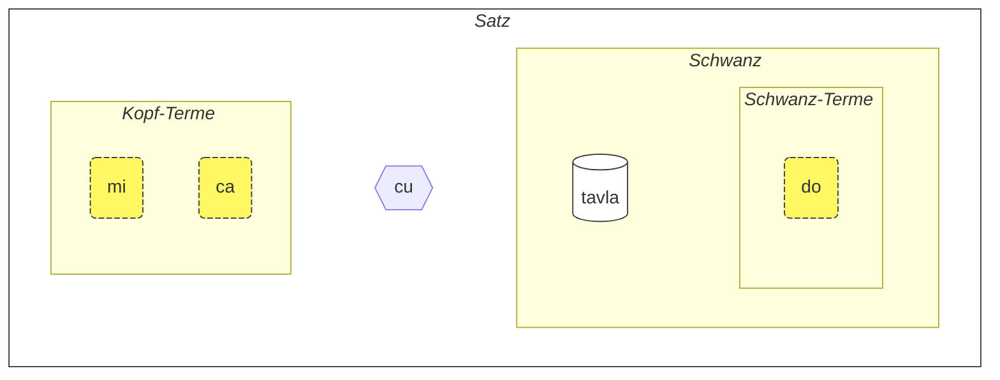
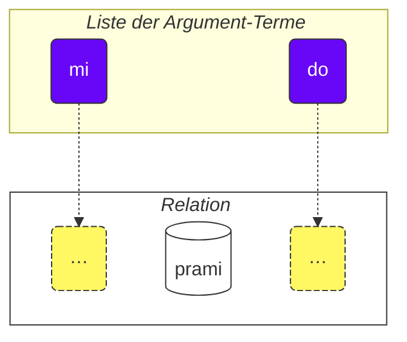

Wie man diesen Kurs benutzt:

1. lesen
2. Ihr Feedback und Ihre Vorschläge sammeln
3. sie an [💬 den Live-Chat](https://lojban.pw/de/articles/live_chat/) senden

## Lektion 1. Die Sprache auf einen Blick

### Alphabet

Das Grundlegende, das Sie über Lojban wissen müssen, ist das Alphabet.

Lojban verwendet das lateinische Alphabet (Vokale sind farbig markiert):

<dl><dd><b>a b c d e f g i j k l m n o p r s t u v x y z ' .</b></dd></dl>

Wörter werden so ausgesprochen, wie sie geschrieben werden.

Es gibt 10 Vokale in Lojban:

<table>
<tbody><tr>
<td><b class="audio-inline">a</b></td>
<td> wie in <i>V<u>a</u>ter</i></td>
</tr>
<tr>
<td><b class="audio-inline">e</b></td>
<td> wie in <i>S<u>e</u>e</i> oder <i>b<u>e</u>tt</i></td>
</tr>
<tr>
<td><b class="audio-inline">i</b></td>
<td> wie in <i>L<u>i</u>ed</i> oder <i>Mas<u>chi</u>ne</i></td>
</tr>
<tr>
<td><b class="audio-inline">o</b></td>
<td> wie in <i>S<u>o</u>nne</i> oder <i>T<u>o</u>n</i> (ein "reiner" Klang, nicht wie in <i>Mode</i>)</td>
</tr>
<tr>
<td><b class="audio-inline">u</b></td>
<td> wie in <i>g<u>u</u>t</i> oder <i>R<u>u</u>h</i></td>
</tr>
<tr>
<td><b class="audio-inline">y</b></td>
<td> wie in <i>bitt<u>e</u></i> (Schwa-Laut, unbetontes <i>e</i>)</td>
</tr>
<tr>
</tbody></table>

4 Vokale werden durch Kombinationen von Buchstaben geschrieben:

<table>
<tbody><tr>
<td><b class="audio-inline">au</b></td>
<td> wie in <i>H<u>au</u>s</i></td></tr>
<tr>
<td><b class="audio-inline">ai</b></td>
<td> wie in <i>M<u>ai</u></i> oder <i>K<u>ai</u>ser</i></td></tr>
<tr>
<td><b class="audio-inline">ei</b></td>
<td> wie in <i>B<u>ei</u>n</i> oder <i>m<u>ei</u>n</i></td></tr>
<tr>
<td><b class="audio-inline">oi</b></td>
<td> wie in <i>h<u>eu</u>te</i> oder <i>h<u>eu</u>len</i></td></tr>
</tbody></table>

Was die Konsonanten betrifft, so werden sie wie im Deutschen ausgesprochen, aber es gibt einige Unterschiede:

<table>
<tbody><tr>
<td><b class="guibutton">c</b>
</td>
<td>wird ausgesprochen wie <i>sch</i> in <i>Schule</i> oder <i>sch</i> in <i>Fisch</i>.
</td></tr>
<tr>
<td><b class="guibutton">g</b>
</td>
<td>immer wie <i>g</i> in <i>Garten</i> (nie wie <i>g</i> in <i>Genie</i>).
</td></tr>
<tr>
<td><b class="guibutton">j</b>
</td>
<td>wie <i>g</i> in <i>Gara<u>g</u>e</i>, <i>j</i> in <i>Journal</i> oder <i>g</i> in <i>Oran<u>g</u>e</i>. Dies entspricht dem stimmhaften sch-Laut (das Zeichen ʒ in der Lautschrift).
</td></tr>
<tr>
<td><b class="guibutton">x</b>
</td>
<td>wie <i>ch</i> in <i>Bach</i>, <i>Dach</i> oder <i>ach</i>.
</td></tr>
<tr>
<td><b class="guibutton"> ' </b>
</td>
<td>wie das deutsche <i>h</i> in <i>H</i>aus oder <i>h</i>aben. Das Apostroph wird daher als richtiger Buchstabe des Lojban angesehen und wie ein <i>h</i> ausgesprochen. Es kann nur zwischen Vokalen vorkommen. Zum Beispiel wird <b>u'i</b> wie <i>u-hi</i> ausgesprochen, ähnlich wie die zwei Silben in <i>Uhu</i>, aber mit einer deutlicheren Trennung zwischen den Vokalen (während <b>ui</b> als ein Diphthong ausgesprochen wird, etwa wie <i>ui</i> in <i>pfui</i>).
</td></tr>
<tr>
<td><b>.</b>
</td>
<td>ein Punkt (Satzzeichen, Worttrennung) wird ebenfalls als Buchstabe im Lojban angesehen. Es ist eine kurze Pause in der Rede, um zu verhindern, dass Wörter ineinander übergehen. Tatsächlich wird vor jedem Wort, das mit einem Vokal beginnt, ein Punkt gesetzt. Dies hilft, unerwünschtes Verschmelzen von zwei aufeinanderfolgenden Wörtern zu einem zu verhindern.
</td></tr>
<tr>
<td><b>i</b>
</td>
<td><b>i</b> vor Vokalen wird als Konsonant angesehen und kürzer ausgesprochen, zum Beispiel:
<ul><li><b>ia</b> wird ausgesprochen wie <i>ja</i> in <i>ja</i></li>
<li><b>ie</b> wird ausgesprochen wie <i>je</i> in <i>je</i></li></ul>
</td></tr>
<tr>
<td><b>u</b>
</td>
<td><b>u</b> vor Vokalen wird als Konsonant angesehen und kürzer ausgesprochen, zum Beispiel:
<ul><li><b>ua</b> wird ausgesprochen wie <i>wa</i> in <i>was</i></li>
<li><b>ue</b> wird ausgesprochen wie <i>we</i> in <i>weg</i></li></ul>
</td></tr></tbody></table>

Die Betonung liegt auf dem vorletzten Vokal. Wenn ein Wort nur einen Vokal hat, wird es einfach nicht betont.

Der Buchstabe **r** kann wie das _r_ im Deutschen ausgesprochen werden (gerollt oder als Rachen-R), es gibt also einen Spielraum für akzeptable Aussprachen.

Nicht-Lojban-Vokale wie das kurze _i_ und _u_ im Englischen _hit_ und _but_ werden von manchen Leuten verwendet, um Konsonanten zu trennen. Wenn Sie also Schwierigkeiten haben, zwei Konsonanten hintereinander auszusprechen (z.B. das **vl** in **tavla**, was _sprechen zu_ bedeutet), dann können Sie _tavɪla_ sagen — wobei das _ɪ_ sehr kurz ist. Allerdings müssen andere Vokale wie **a** und **u** lang sein.

### Der einfachste Satz

Die Grundeinheit in Lojban ist der „Satz". Hier sind drei einfache Beispiele:

> **le prenu cu tavla mi** > _Die Person spricht zu mir._

le prenu
: die Person

tavla
: … spricht zu …, … redet mit …

mi
: ich, mir, mich

> **mi prami do** > _Ich liebe dich._

prami
: … liebt … (jemanden)

do
: du, dich, dir

> **mi ca cu tavla do** > _Ich rede jetzt mit dir._

ca
: jetzt (ausgesprochen als **scha**)

<pixra url="/assets/pixra/cilre-xekri-g-out/tavla.webp" caption="le prenu cu tavla mi" definition="Die Person spricht zu mir."></pixra>

<pixra url="/assets/pixra/cilre-xekri-g-out/mi.webp" caption="mi" definition="ich / mir / mich"></pixra>

<pixra url="/assets/pixra/cilre-xekri-g-out/mi_prami_do2.webp" caption="mi prami do" definition="Ich liebe dich."></pixra>

<pixra url="/assets/pixra/cilre-xekri-g-out/do.webp" caption="do" definition="du / dich / dir"></pixra>

Jeder Satz in Lojban besteht aus folgenden Teilen von links nach rechts:

- der Kopf:
  - besteht aus sogenannten "Termen",
    - **le prenu** ist der einzige Kopf-Term im Beispiel **le prenu cu tavla mi** oben,
    - **mi**, **ca** sind Kopf-Terme im Beispiel **mi ca cu tavla do** oben.
- das Kopf-Trennzeichen **cu**:
  - ausgesprochen wie _schu_, da **c** für _sch_ steht,
  - zeigt an, dass der Kopf beendet ist,
  - kann weggelassen werden, wenn klar ist, dass der Kopf vollständig ist.
- der Schwanz:
  - das Hauptrelationskonstrukt (im Lojban **selbrisni** genannt)
  - \+ möglicherweise ein oder mehrere Terme danach,
    - **tavla**, **prami** sind selbrisni, Hauptrelationskonstrukte in den obigen Beispielen.
    - **mi** ist der einzige Schwanz-Term im Beispiel **le prenu cu tavla mi** oben.
    - **do** ist der einzige Schwanz-Term im Beispiel **mi prami do** oben.

In Lojban sprechen wir meist von Relationen und nicht von Nomen oder Verben.

Hier sind die zwei Relationswörter, die ungefähr Verben entsprechen:

prenu
: … ist eine Person / sind Personen

tavla
: … spricht zu …

Jede Relation hat eine oder mehrere Rollen, die auch „Plätze" oder „Stellen" genannt werden können. Oben sind sie mit „…" gekennzeichnet. Diese Plätze werden mit Argumenten (im Lojban **sumti** genannt) gefüllt. Argument-Terme sind Konstrukte wie **le prenu**, **mi**, **do**, egal ob diese Terme im Kopf oder im Schwanz eines Satzes enden. Wir setzen Argument-Terme in eine Reihenfolge und füllen so diese Plätze aus, wodurch wir der Relation eine konkrete Bedeutung geben.

Wir können solch eine Relation auch in einen Argument-Term verwandeln.

Dafür setzen wir ein kurzes Wort **le** davor:

prenu
: … ist eine Person

le prenu
: die Person, die Personen

Ebenso,

tavla
: … spricht zu …

und somit

le tavla
: der Sprecher, die Sprecher

Es mag seltsam klingen, wie _Person_ ein „Verb" sein kann, aber tatsächlich macht dies Lojban sehr einfach:

<table>
<thead>
<tr>
<th>Relationswort mit unausgefüllten Plätzen</th>
<th>Argumentform (<b>sumti</b>)</th></tr>
</thead>
<tbody>
<tr>
<td><b>prenu</b> — <i>… (jemand) ist eine Person</i> </td>
<td><b>le prenu</b> — <i>die Person / die Personen</i>
     <b>le prenu</b> — <i>derjenige, der eine Person ist / diejenigen, die Personen sind</i>
</td></tr>
<tr>
<td><b>tavla</b> — <i>… (jemand) spricht zu … (jemandem)</i> </td>
<td><b>le tavla</b> — <i>der Sprecher / die Sprecher</i>
     <b>le tavla</b> — <i>derjenige, der ein Sprecher ist / diejenigen, die Sprecher sind</i>
</td></tr>
</tbody></table>

Der erste Platz der Relationen verschwindet bei Verwendung von **le**, daher sind solche alternativen Übersetzungen wie _derjenige, der …_ möglich.

<!-- We can also say that **le** creates a noun from a relation construct with roughly the meaning of _the one which is …_ (_is a person_ — _the person_), or even _those who do…_ (_to speak to_ — _the speakers_), _those who are…_ (_are people_ — _the people_). -->

Beachten Sie, dass Lojban standardmäßig keine Anzahl zwischen _der Sprecher_ oder _die Sprecher_ angibt. Das heißt, **le tavla** ist in dieser Hinsicht vage, und wir werden bald Wege entdecken, die Anzahl zu definieren.

Neben Argument-Termen gibt es modale Terme wie **ca**:

> **mi ca cu tavla do** > _Ich rede jetzt mit dir._

ca
: jetzt

Modale Terme füllen keine Plätze des Hauptrelationskonstrukts (**selbrisni**) aus. Stattdessen werden sie auf den gesamten Satz angewendet und bereichern oder verengen seine Bedeutung.

Daher werden Terme in Lojban dargestellt durch:

- Argument-Terme, die Plätze von Relationen ausfüllen. Beispiele sind:
  - Nomen wie **le prenu** (_die Person_)
  - Pronomen wie **mi** (_ich_, _mir_, _mich_), **do** (_du_, _dich_, _dir_). Pronomen funktionieren genau wie Nomen, aber **le** wird für sie nicht verwendet. Sie funktionieren von sich aus als Argumente.
- modale Terme, die keine Plätze von Relationen ausfüllen, sondern zusätzliche, präzisierende Informationen angeben.
  - zum Beispiel **ca** (_jetzt, in der Gegenwart_).

Einige weitere Beispiele:

<pixra url="/assets/pixra/cilre-xekri-g-out/nintadni.webp" caption="mi nintadni" definition="Ich bin ein neuer Schüler, ein Anfänger."></pixra>

> **mi nintadni** > _Ich bin ein neuer Schüler._

nintadni
: … (jemand) ist ein neuer Schüler, ein Neuling

Im Gegensatz zum Englischen oder Deutschen müssen wir nicht das Verb „bin/ist/sind/sein" zum Satz hinzufügen. Es ist bereits impliziert. Das Relationswort **nintadni** (_… ist ein neuer Schüler_) hat dieses deutsche „bin/ist/sind/sein" bereits in seine deutsche Übersetzung eingebaut.

> **do jimpe** > _Du verstehst._

jimpe
: … (jemand) versteht … (etwas)

<pixra url="/assets/pixra/cilre-xekri-g-out/pilno_le_fonxa.webp" caption="le prenu cu pilno le fonxa" definition="Die Person benutzt das Telefon."></pixra>

> **mi pilno le fonxa** > _Ich benutze das Telefon._

pilno
: … (jemand) benutzt … (etwas)

fonxa
: … ist ein Telefon, … sind Telefone

le fonxa
: das Telefon, die Telefone

<pixra url="/assets/pixra/cilre-xekri-g-out/citka.webp" caption="mi citka" definition="Ich esse."></pixra>

> **mi citka** > _Ich esse._

citka
: … (jemand) isst … (etwas)

> **do citka** > _Du isst._

<!-- -->

> **mi citka le plise** > _Ich esse die Äpfel._

<pixra url="/assets/pixra/cilre-xekri-g-out/le_plise_cu_kukte.webp" caption="le plise cu kukte" definition="Die Äpfel sind lecker."></pixra>

> **le plise cu kukte** > _Die Äpfel sind lecker._

le plise
: die Äpfel

kukte
: … (etwas) ist lecker

Ein einfacherer Satz in Lojban würde nur ein Hauptrelationswort enthalten:

<pixra url="/assets/pixra/cilre-xekri-g-out/karce.webp" caption="karce" definition="Es ist ein Auto."></pixra>

> **karce** > _Auto!_ > _Es ist ein Auto._

Sie könnten dies sagen, wenn Sie ein Auto kommen sehen. Hier wäre der Kontext klar genug, dass irgendwo ein Auto ist und es wahrscheinlich gefährlich ist.

**karce** selbst ist ein Relationswort, das _ist ein Auto_ bedeutet.

Wir können natürlich präziser sein und zum Beispiel sagen:

> **bolci** > _Ball!_ > _Es ist ein Ball._

wobei **bolci** ein Relationswort ist, das _ist ein Ball_ bedeutet.

> **ti bolci** > _Dies ist ein Ball in meiner Nähe._

<!-- -->

> **ta bolci** > _Das ist ein Ball in deiner Nähe._

ti
: Pronomen: diese Sache in meiner Nähe

ta
: Pronomen: diese/jene Sache in deiner Nähe

tu
: Pronomen: jenes dort weg von dir und mir

<pixra url="/assets/pixra/cilre-xekri-g-out/ti.webp" caption="ti" definition="dies hier (nahe bei mir, dem Sprecher)"></pixra>

<pixra url="/assets/pixra/cilre-xekri-g-out/ta.webp" caption="ta" definition="das da (nahe bei dir, dem Zuhörer)"></pixra>

<pixra url="/assets/pixra/cilre-xekri-g-out/tu.webp" caption="tu" definition="jenes dort drüben (weg von dir und mir)"></pixra>

Ebenso können Sie sagen

<pixra url="/assets/pixra/cilre-xekri-g-out/carvi.webp" caption="carvi" definition="… ist Regen"></pixra>

> **carvi** > _Es regnet._

wobei

carvi
: … ist Regen, … regnet

oder

> **pluka** > _Es ist angenehm._

wobei

pluka
: … ist angenehm

Beachten Sie, dass es in Lojban kein Bedürfnis nach dem Wort _es_ in einem solchen Sinne gibt. Sie verwenden einfach das Relationswort, das Sie brauchen.

> **prami** > _Jemand liebt._

<pixra url="/assets/pixra/cilre-xekri-g-out/bajra.webp" caption="le prenu cu bajra" definition="Die Person rennt."></pixra>

> **bajra** > _Jemand rennt._

bajra
: … rennt unter Verwendung von Gliedmaßen

Auch hier würde der Kontext wahrscheinlich verraten, wer wen liebt und wer rennt.

#### Aufgabe

<pixra url="/assets/pixra/cilre-xekri-g-out/pinxe_le_djacu.webp" caption="le prenu cu pinxe le djacu" definition="Die Person trinkt das Wasser."></pixra>

pinxe
: … trinkt … (etwas)

le djacu
: das Wasser

Decken Sie den rechten Teil der Tabelle ab. Übersetzen Sie die Sätze auf der linken Seite aus dem Lojban.

<table style="table-layout: fixed;">
<tbody><tr>
<td><b>do citka</b>
</td>
<td><i>Du isst.</i>
</td></tr>
<tr>
<td><b>mi pinxe le djacu</b>
</td>
<td><i>Ich trinke Wasser.</i>
</td></tr>
<tr>
<td><b>mi citka le plise</b>
</td>
<td><i>Ich esse Äpfel.</i>
</td></tr></tbody></table>

### «**.i**» trennt Sätze

Wir setzen ein kurzes Wort **.i**, um zwei aufeinanderfolgende Sätze zu trennen:

> **mi tavla le prenu .i le prenu cu tavla mi** > _Ich spreche mit den Leuten. Die Leute sprechen mit mir._

**.i** trennt Sätze wie der Punkt am Ende von Sätzen in englischen Texten.

Wenn wir einen Satz nach dem anderen auf Englisch sagen, machen wir eine Pause (sie kann kurz sein) zwischen ihnen. Aber die Pause hat im Englischen viele verschiedene Bedeutungen. In Lojban haben wir eine bessere Möglichkeit zu verstehen, wo ein Satz endet und ein anderer beginnt.

Beachten Sie auch, dass manchmal, wenn man Wörter schnell ausspricht, man nicht herausfinden kann, wo ein Satz endet und das Wort des nächsten Satzes beginnt. Daher wird empfohlen, das Wort **.i** zu verwenden, bevor man einen neuen Satz beginnt.

### Zahlen: '_1 2 3 4 5 6 7 8 9 0_' = «**pa re ci vo mu xa ze bi so no**»

**le** verwandelt einfach ein Relationskonstrukt in ein Argument, aber ein solches Argument hat keine damit verbundene Anzahl. Der Satz

> **le prenu cu tavla mi** > _Die Leute sprechen mit mir._ > _Die Person spricht mit mir._

gibt nicht die Anzahl der Leute an, die mit mir sprechen. Im Deutschen ist es unmöglich, die Anzahl wegzulassen, weil _Leute_ auf Deutsch _mehr als eine Person_ impliziert. In Lojban können Sie jedoch die Anzahl weglassen.

Lassen Sie uns nun angeben, wie viele der Personen für unsere Diskussion relevant sind.

Fügen wir eine Zahl nach **le** hinzu.

<table>
<tbody><tr>
<td><b>pa</b>
</td>
<td><b>re</b>
</td>
<td><b>ci</b>
</td>
<td><b>vo</b>
</td>
<td><b>mu</b>
</td>
<td><b>xa</b>
</td>
<td><b>ze</b>
</td>
<td><b>bi</b>
</td>
<td><b>so</b>
</td>
<td><b>no</b>
</td></tr>
<tr>
<td> 1
</td>
<td> 2
</td>
<td> 3
</td>
<td> 4
</td>
<td> 5
</td>
<td> 6
</td>
<td> 7
</td>
<td> 8
</td>
<td> 9
</td>
<td> 0
</td>
</tr></tbody></table>

<pixra url="/assets/pixra/cilre-xekri-g-out/le_mu_prenu.webp" caption="le mu prenu" definition="Die fünf Personen"></pixra>

> **le pa prenu cu tavla mi** > _Die Person spricht mit mir._ > _Die eine Person spricht mit mir._

Wir fügen eine Zahl nach **le** hinzu und geben so einzelne Personen an.

Für Zahlen, die aus mehreren Ziffern bestehen, reihen wir diese Ziffern einfach aneinander:

> **le re mu prenu cu tavla mi** > _Die 25 Personen sprechen mit mir._

Ja, es ist so einfach.

Wenn wir zählen wollen, können wir Zahlen mit **.i** trennen:

> **mu .i vo .i ci .i re .i pa .i no** > _5 … 4 … 3 … 2 … 1 … 0_

Die Zahl **za'u** bedeutet _mehr als …_ (_\>_ in der Mathematik), die Zahl **me'i** bedeutet _weniger als_ (_<_ in der Mathematik):

> **le za'u re prenu cu tavla mi** > _Mehr als zwei Personen sprechen mit mir._

<!-- -->

> **le me'i pa no prenu cu tavla mi** > _Weniger als 10 Personen sprechen mit mir._

<!-- -->

> **le za'u ci prenu cu tavla mi** > _Mehr als drei Personen sprechen mit mir._

Um einfach _Leute_ (Pluralzahl) im Gegensatz zu _eine Person_ zu sagen, verwenden wir **za'u pa**, _mehr als eins_ oder einfach **za'u**.

> **le za'u pa prenu cu tavla mi** > **le za'u prenu cu tavla mi** > _Die Leute sprechen mit mir._

**za'u** bedeutet standardmäßig **za'u pa**, daher ist eine solche Verkürzung möglich.

le prenu
: die Person / die Leute

le pa prenu
: die Person (eins an der Zahl)

le za'u prenu
: die Leute (zwei oder mehr an der Zahl)

#### Aufgabe

stati
: … (jemand) ist klug, … hat ein Talent

<pixra url="/assets/pixra/cilre-xekri-g-out/stati.webp" caption="stati" definition="… hat ein Talent"></pixra>

klama
: … kommt zu … (einem Ort oder Objekt)

<pixra url="/assets/pixra/cilre-xekri-g-out/klama_ti.webp" caption="le prenu cu klama ti" definition="Die Person kam hierher."></pixra>

nelci
: … mag … (etwas)

le zarci
: der Markt

<pixra url="/assets/pixra/cilre-xekri-g-out/zarci.webp" caption="le prenu cu zvati le zarci" definition="Die Person ist am Markt."></pixra>

le najnimre
: die Orange (Frucht), die Orangen

<pixra url="/assets/pixra/cilre-xekri-g-out/najnimre.webp" caption="najnimre" definition="… ist eine Orange"></pixra>

le badna
: die Banane, Bananen

<pixra url="/assets/pixra/cilre-xekri-g-out/badna.webp" caption="badna" definition="… ist eine Banane"></pixra>

Decken Sie den rechten Teil der Tabelle ab. Übersetzen Sie die Sätze auf der linken Seite aus dem Lojban.

<table style="table-layout: fixed;">
 <tbody>
  <tr>
   <td>le mu prenu cu klama le zarci</td>
   <td>Die fünf Personen kommen zum Markt.</td>
  </tr>
  <tr>
   <td>le pa re prenu cu stati .i do stati</td>
   <td>Die 12 Personen sind klug. Du bist klug.</td>
  </tr>
  <tr>
   <td>le prenu cu nelci le plise</td>
   <td>Die Leute mögen die Äpfel.</td>
  </tr>
  <tr>
   <td>le za'u re prenu cu citka .i le me'i mu prenu cu pinxe le djacu</td>
   <td>Mehr als zwei Personen essen. Weniger als 5 Personen trinken das Wasser.</td>
  </tr>
  <tr>
   <td>le za'u re prenu cu stati</td>
   <td>Mehr als zwei Personen sind klug.</td>
  </tr>
 </tbody>
</table>

Decken Sie den rechten Teil der Tabelle ab. Übersetzen Sie die Sätze auf der linken Seite ins Lojban.

<table style="table-layout: fixed;">
 <tbody>
  <tr>
   <td>Die 256 Personen sind klug.</td>
   <td>le re mu xa prenu cu stati</td>
  </tr>
  <tr>
   <td>Weniger als 12 Äpfel sind lecker.</td>
   <td>le me'i pa re plise cu kukte</td>
  </tr>
 </tbody>
</table>

### Zusammengesetzte Relation

Zusammengesetzte Relationskonstrukte (**tanru** in Lojban) sind mehrere Relationswörter, die nacheinander platziert werden.

> **tu melbi zdani** > _Das ist ein schönes Zuhause._

<pixra url="/assets/pixra/cilre-xekri-g-out/melbi_zdani.webp" caption="melbi zdani" definition="… ist ein schönes Zuhause"></pixra>

tu
: jenes (weg von dir und mir)

melbi
: … ist schön, hübsch

zdani
: … ist ein Zuhause oder Nest für … (jemanden)

melbi zdani
: zusammengesetztes Relationskonstrukt: … ist ein schönes Zuhause für … (jemanden)

<pixra url="/assets/pixra/cilre-xekri-g-out/dansu.webp" caption="le prenu cu melbi dansu" definition="Die Person tanzt schön."></pixra>

> **do melbi dansu** > _Du tanzt schön._

dansu
: … tanzt

Hier fügt die Relation **melbi** eine zusätzliche Bedeutung hinzu, da sie links von einer anderen Relation platziert wird: **zdani**. Die linke Komponente wird normalerweise mit Adjektiven und Adverbien übersetzt.

Zusammengesetzte Relationen sind ein mächtiges Merkmal, das reichere Bedeutungen erzeugt. Sie reihen einfach zwei Relationswörter aneinander, und die linke Komponente einer solchen zusammengesetzten Relation fügt der rechten eine Nuance hinzu.

Wir können **le** (z.B. mit einer Zahl) links von einer solchen zusammengesetzten Relation setzen und erhalten einen reicheren Argument-Term:

le pa melbi zdani
: das schöne Zuhause

Jetzt wissen wir, warum es **cu** nach den Kopf-Termen in unserem Beispiel gab:

> **le pa prenu cu tavla mi** > _Die Person spricht mit mir._

Ohne **cu** würde es zu **le pa prenu tavla** werden, was die Bedeutung von _der Person-Sprecher_ hätte - was auch immer das bedeuten könnte.

Betrachten Sie:

> **le pa tavla pendo** > _Der sprechende Freund_

<!-- -->

> **le pa tavla cu pendo** > _Der Sprechende ist ein Freund._

Denken Sie daran, **cu** vor dem Hauptrelationskonstrukt in einem Satz zu platzieren, um die unbeabsichtigte Bildung zusammengesetzter Relationen zu verhindern.

Eine zusammengesetzte Relation kann mehr als zwei Komponenten enthalten. In diesem Fall modifiziert die erste Relation die zweite, die zweite modifiziert die dritte, und so weiter:

<pixra url="/assets/pixra/cilre-xekri-g-out/cmalu_karce.webp" caption="ti cmalu karce" definition="Dies ist ein kleines Auto."></pixra>

> **le pa melbi cmalu karce** > _das hübsch-kleine Auto, das Auto, das auf hübsche Weise klein ist_

<!-- -->

> **le mutce melbi zdani** > _das sehr schöne Zuhause_

mutce
: … ist sehr, … ist viel

#### Aufgabe

sutra
: … ist schnell

barda
: … ist groß

cmalu
: … ist klein

mlatu
: … ist eine Katze

Decken Sie den rechten Teil der Tabelle ab. Übersetzen Sie die Sätze auf der linken Seite aus dem Lojban.

<table style="table-layout: fixed;">
<tbody><tr>
<td><b>le melbi karce</b>
</td>
<td><i>das schöne Auto / die schönen Autos</i>
</td></tr>
<tr>
<td><b>do sutra klama</b>
</td>
<td><i>Du kommst schnell. Du kommst schnell an.</i>
</td></tr>
<tr>
<td><b>tu barda zdani</b>
</td>
<td><i>Das ist ein großes Zuhause.</i>
</td></tr>
<tr>
<td><b>le pa sutra bajra mlatu</b>
</td>
<td><i>die schnell rennende Katze</i>
</td></tr>
<tr>
<td><b>le pa sutra mlatu</b>
</td>
<td><i>die schnelle Katze</i>
</td></tr>
<tr>
<td><b>le pa bajra mlatu</b>
</td>
<td><i>die rennende Katze</i>
</td></tr></tbody></table>

Decken Sie den rechten Teil der Tabelle ab. Übersetzen Sie die Sätze auf der linken Seite ins Lojban.

<table style="table-layout: fixed;">

<tbody><tr>
<td><i>Dies ist ein kleines Auto.</i>
</td>
<td><b>ti cmalu karce</b>
</td></tr>
<tr>
<td><i>leckere Äpfel</i>
</td>
<td><b>le kukte plise</b>
</td></tr>
<tr>
<td><i>die schnellen Esser</i>
</td>
<td><b>le sutra citka</b>
</td></tr>
<tr>
<td><i>Du bist eine schnell gehende Person.</i>
</td>
<td><b>do sutra cadzu prenu</b>
</td></tr></tbody></table>

### '_Ja/Nein_'-Fragen

Im Deutschen bilden wir eine _Ja/Nein_-Frage, indem wir die Wortreihenfolge ändern, zum Beispiel

> _Du bist … ⇒ Bist du …?_

oder indem wir ein Hilfsverb am Anfang verwenden, zum Beispiel:

> _Du weißt … ⇒ Weißt du?_

In Lojban kann die Wortreihenfolge beibehalten werden. Um jede Aussage in eine _Ja/Nein_-Frage zu verwandeln, fügen wir einfach das Wort **xu** am Anfang des Satzes ein:

> **xu do nelci le gerku** > _Magst du die Hunde?_

le gerku
: der Hund, die Hunde

<pixra url="/assets/pixra/cilre-xekri-g-out/le_prenu_e_le_gerku.webp" caption="ti prenu .i ti gerku" definition="Dies ist eine Person. Dies ist ein Hund."></pixra>

Denken Sie daran, dass in Lojban Interpunktion wie "?" (Fragezeichen) optional ist und meist für stilistische Zwecke verwendet wird. Dies liegt daran, dass das Fragewort **xu** bereits zeigt, dass es sich um eine Frage handelt.

Weitere Beispiele:

> **xu mi klama** > _Komme ich?_

klama
: … kommt zu … (irgendwo)

> **xu pelxu** > _Ist es gelb?_

pelxu
: … ist gelb

Wir können die Bedeutung verschieben, indem wir **xu** nach verschiedenen Teilen des Satzes platzieren. Erklärungen, was sich in der Bedeutung geändert hat, werden in Klammern angegeben:

> **xu do nelci le gerku** > _Magst du die Hunde?_

<!-- -->

> **do xu nelci le gerku** > _Magst DU die Hunde?_ (Ich dachte, es sei jemand anders, der sie mag).

<!-- -->

> **do nelci xu le gerku** > _MAGST du die Hunde? (Ich dachte, du seiest ihnen gegenüber nur neutral)._

<!-- -->

> **do nelci le xu gerku** > _Magst du DIE HUNDE? (Ich dachte, du magst die Katzen)._

<!-- -->

> **do nelci le gerku xu** > _Du magst diese Dinge, sind es Hunde? (Du stellst nur die Gültigkeit der Relation **gerku** in Frage)._

Was im Deutschen durch Intonation ausgedrückt wird, wird in Lojban durch das Verschieben von **xu** nach dem Teil ausgedrückt, den wir betonen möchten. Beachten Sie, dass der erste Satz mit **xu** am Anfang die allgemeinste Frage stellt, ohne irgendeinen bestimmten Aspekt zu betonen.

**xu** ist ein Interjektionswort. Hier sind die Merkmale von Lojban-Interjektionen:

- Die Interjektion modifiziert das Konstrukt davor:

> **do xu nelci le gerku** > _Magst DU die Hunde?_

- Wenn sie am Anfang einer Relation platziert wird, modifiziert die Interjektion die gesamte Relation:

> **xu do nelci le gerku** > _Magst du die Hunde?_

- Interjektionen können nach verschiedenen Teilen derselben Relation platziert werden, um die Bedeutung zu verschieben.

> **do nelci le gerku xu** > _Du magst diese Wesen, sind es Hunde?_

Hier wird nur die Relation **gerku** (nicht das Argument **le gerku**) durch das Fragewort **xu** modifiziert. Also fragen wir hier nur nach dieser Relation. Wir behaupten, dass du diese Objekte oder Lebewesen magst, und wir fragen dich, ob das Hunde sind.

Interjektionen brechen zusammengesetzte Relationen nicht auf, sie können innerhalb von ihnen verwendet werden:

> **do nelci le barda xu gerku** > _Magst du die GROSSEN Hunde?_

Nun, wie antwortet man auf solche 'Ja/Nein'-Fragen? Wir wiederholen das Hauptrelationskonstrukt:

> **— xu le mlatu cu melbi** > **— melbi** > _— Sind die Katzen hübsch?_ > _— Hübsch._

Um mit 'nein' zu antworten, verwenden wir den modalen Term **na ku**:

> **— xu le mlatu cu melbi** > **— na ku melbi** > _— Sind die Katzen hübsch?_ > _— Nicht hübsch._

na ku
: Term: es ist falsch, dass …

Oder wir können ein spezielles Relationswort **go'i** verwenden:

> **— xu le mlatu cu melbi** > **— go'i** > _— Sind die Katzen hübsch?_ > _— Hübsch._

go'i
: Relationswort, das die Hauptrelation des vorherigen Satzes wiederholt

Hier bedeutet **go'i** dasselbe wie **melbi**, da **melbi** die Relation des vorherigen Satzes ist.

> **— xu le mlatu cu melbi** > **— na ku go'i** > _— Sind die Katzen hübsch?_ > _— Nicht hübsch._

<!-- This course doesn't recommend negating **go'i** for negative answers. Just use **je'u nai**. -->

Der modale Term **na ku** kann nicht nur in Antworten verwendet werden:

> **na ku mi nelci le gerku** > _Es ist falsch, dass ich die Hunde mag._ > _Ich mag die Hunde nicht._

<!-- -->

> **mi na ku nelci do** > _Ich mag dich nicht._

Sein Gegenteil, der Term **ja'a ku**, bejaht die Bedeutung:

> **mi ja'a ku nelci do** > _Ich mag dich wirklich._

ja'a ku
: Term: es ist wahr, dass …

#### Aufgabe

Decken Sie den rechten Teil der Tabelle ab. Übersetzen Sie die Sätze auf der linken Seite aus dem Lojban.

<table style="table-layout: fixed;">

<tbody><tr>
<td><b>xu le barda zdani cu melbi</b>
</td>
<td><i>Ist das große Zuhause schön?</i>
</td></tr>
<tr>
<td><b>— le prenu cu stati xu — na ku stati</b>
</td>
<td><i>— Sind die Leute klug? — Nein.</i>
</td></tr>
<tr>
<td><b>do klama le zarci xu</b>
</td>
<td><i>Gehst du zum Markt?</i>
</td></tr>
<tr>
<td><b>xu le verba cu prami le mlatu</b>
</td>
<td><i>Liebt das Kind die Katzen?</i>
</td></tr></tbody></table>

Decken Sie den rechten Teil der Tabelle ab. Übersetzen Sie die Sätze auf der linken Seite ins Lojban.

<table style="table-layout: fixed;">

<tbody><tr>
<td><i>Ist das Auto schnell?</i>
</td>
<td><b>xu le karce cu sutra</b>
</td></tr>
<tr>
<td><i>— Ist die Orange lecker? — Ja, ist sie.</i>
</td>
<td><b>— xu le najnimre cu kukte — kukte</b>
</td></tr>
<tr>
<td><i>Liebt der Hund dich?</i>
</td>
<td><b>xu le gerku cu prami do</b>
</td></tr></tbody></table>

### Freude und höfliche Bitten: '_Hurra!_' = «**ui**», '_Bitte!_' = «**.e'o**»

Die Interjektion **ui** zeigt die Freude des Sprechenden. Sie wird genau wie das Smiley-Gesicht '_:)_' in Nachrichten verwendet, um anzuzeigen, dass man sich über etwas freut. Obwohl Smileys mehrdeutig sein können, hat **ui** nur eine Bedeutung, was praktisch ist.

> **ui do klama** > _Hurra, du kommst!_

ui
: Interjektion: _Hurra!_, Interjektion der Freude

Die Interjektion **.e'o** am Anfang eines Satzes verwandelt ihn in eine höfliche Bitte:

> **.e'o do lebna le fonxa** > _Könntest du bitte das Telefon nehmen?_ > `Bitte nimm das Telefon.`

.e'o
: Interjektion: bitte (ausgesprochen als _eh-hoh_ mit einer kurzen Pause oder Unterbrechung vor dem Wort)

lebna
: nehmen (etwas)

Im Deutschen muss man, um höflich zu sein, _könntest du_ + _bitte_ + eine Frage verwenden. In Lojban reicht **.e'o** aus, um eine höfliche Bitte zu machen.

#### Aufgabe

Decken Sie den rechten Teil der Tabelle ab. Übersetzen Sie die Sätze auf der linken Seite aus dem Lojban.

le tcati
: der Tee

<pixra url="/assets/pixra/cilre-xekri-g-out/tcati.webp" caption="tcati" definition="… ist Tee"></pixra>

le ckafi
: der Kaffee

<pixra url="/assets/pixra/cilre-xekri-g-out/ckafi.webp" caption="ckafi" definition="… ist Kaffee"></pixra>

zgana
: beobachten, zuschauen (mit beliebigen Sinnen)

le skina
: der Film

<pixra url="/assets/pixra/cilre-xekri-g-out/zgana_le_skina.webp" caption="le prenu cu zgana le skina" definition="Die Person schaut sich den Film an."></pixra>

kurji
: sich kümmern um (jemanden, etwas)

<table style="table-layout: fixed;">

<tbody>
<tr>
<td><b>ui carvi</b>
</td>
<td><i>Hurra, es regnet! Hurra, es regnet!</i>
</td></tr>
<tr>
<td><b>.e'o do sutra bajra</b>
</td>
<td><i>Renn schnell!</i>
</td></tr>
<tr>
<td><b>.e'o do pinxe le tcati</b>
</td>
<td><i>Bitte, trink Tee!</i>
</td></tr>
<tr>
<td><b>.e'o zgana le skina</b>
</td>
<td><i>Bitte, schau den Film!</i>
</td></tr></tbody></table>

Decken Sie den rechten Teil der Tabelle ab. Übersetzen Sie die Sätze auf der linken Seite ins Lojban.

<table style="table-layout: fixed;">

<tbody><tr>
<td><i>Bitte, sei klug!</i>
</td>
<td><b>.e'o do stati</b>
</td></tr>
<tr>
<td><i>Bitte, geh nach Hause!</i>
</td>
<td><b>.e'o do klama le zdani</b>
</td></tr>
<tr>
<td><i>Bitte, trink den Kaffee!</i>
</td>
<td><b>.e'o do pinxe le ckafi</b>
</td></tr>
<tr>
<tr>
<td><i>Hurra, ich rede mit dir!</i>
</td>
<td><b>ui mi tavla do</b>
</td></tr>
<tr>
<td><i>Bitte, kümmere dich um das Kind.</i>
</td>
<td><b>.e'o do kurji le verba</b>
</td></tr></tbody></table>

### '_Und_' und '_oder_'

> **do nintadni .i je mi nintadni** > _Du bist ein Neuling. Und ich bin ein Neuling._

<!-- -->

> **do .e mi nintadni** > _Du und ich sind Neulinge._

<pixra url="/assets/pixra/cilre-xekri-g-out/do_e_mi_nintadni.webp" caption="do .e mi nintadni" definition="Du und ich sind neue Schüler."></pixra>

<!-- -->

> **mi tadni .i je mi tavla do** > _Ich studiere. Und ich rede mit dir._

<!-- -->

> **mi tadni gi'e tavla do** > _Ich studiere und rede mit dir._

.i je
: Konjunktion "und", die Sätze zu einem kombiniert.

.e
: Konjunktion "und", die Argumente verbindet.

gi'e
: Konjunktion "und", die Satz-Schwänze verbindet.

Wir können zwei Sätze zu einer Aussage kombinieren, indem wir die Konjunktion **.i je** verwenden, die _und_ bedeutet:

> **do nintadni .i je mi nintadni** > _Du bist ein Neuling. Und ich bin ein Neuling._

Da beide Sätze den gleichen Schwanz haben, können wir eine Verkürzung verwenden: Die Konjunktion **.e** bedeutet _und_ für Argumente:

> **do .e mi nintadni** > _Du und ich sind Neulinge._

**do nintadni .i je mi nintadni** bedeutet genau dasselbe wie **do .e mi nintadni**

Wir können **.e** auch zum Verbinden von Argumenten an anderen Positionen verwenden.

Beide Sätze bedeuten dasselbe.

> **mi pinxe le djacu .e le jisra** > _Ich trinke das Wasser und den Saft._ > **mi pinxe le djacu .i je mi pinxe le jisra** > _Ich trinke das Wasser, und ich trinke den Saft._

le jisra
: der Saft

<pixra url="/assets/pixra/cilre-xekri-g-out/pinxe_le_jisra.webp" caption="le prenu cu pinxe le jisra" definition="Die Person trinkt den Saft."></pixra>

Wenn der Satzkopf gleich ist, aber die Schwänze sich unterscheiden, verwenden wir die Konjunktion **gi'e**, die _und_ für Satz-Schwänze bedeutet:

> **mi tadni .i je mi tavla do** > **mi tadni gi'e tavla do** > _Ich studiere und rede mit dir._

Beide Varianten bedeuten dasselbe; **gi'e** führt einfach zu einer knapperen Form.

Es gibt auch Möglichkeiten, _und_ für Komponenten zusammengesetzter Relationen hinzuzufügen:

> **le melbi je cmalu zdani cu jibni ti** > _Das hübsche und kleine Zuhause ist in der Nähe._

<pixra url="/assets/pixra/cilre-xekri-g-out/melbi_je_cmalu_zdani.webp" caption="melbi je cmalu zdani" definition="… ist ein hübsches-und-kleines Zuhause"></pixra>

jibni
: … ist nahe bei …

ti
: diese Sache, dieser Ort in meiner Nähe

**je** ist eine Konjunktion, die _und_ in zusammengesetzten Relationen bedeutet.

Ohne **je** ändert sich die Bedeutung des Satzes:

> **le melbi cmalu zdani cu jibni** > _Das hübsch kleine Zuhause ist in der Nähe._

Hier modifiziert **melbi** **cmalu**, und **melbi cmalu** modifiziert **zdani**, entsprechend der Funktionsweise zusammengesetzter Relationen.

In **le melbi je cmalu zdani** (_das hübsche und kleine Haus_) modifizieren sowohl **melbi** als auch **cmalu** **zdani** direkt.

Andere häufige Konjunktionen umfassen:

> **le verba cu fengu ja bilma** > _Das Kind ist wütend oder krank (oder vielleicht sowohl wütend als auch krank)_

<!-- -->

> **do .a mi ba vitke le dzena** > _Du oder ich (oder wir beide) werden den Vorfahren besuchen._

ja
: _und/oder_ innerhalb zusammengesetzter Relationen

.a
: _und/oder_ beim Verbinden von Argumenten

fengu
: … ist wütend

<pixra url="/assets/pixra/cilre-xekri-g-out/fengu.webp" caption="fengu" definition="… ist wütend"></pixra>

bilma
: … ist krank

<pixra url="/assets/pixra/cilre-xekri-g-out/bilma.webp" caption="le prenu cu bilma" definition="Die Person ist krank"></pixra>

vitke
: besuchen (jemanden)

dzena
: … ist ein Vorfahre von …

<pixra url="/assets/pixra/cilre-xekri-g-out/dzena.webp" caption="dzena" definition="… ist ein Vorfahre von …"></pixra>

> **le karce cu blabi jo nai grusi** > _Das Auto ist entweder weiß oder grau._

<!-- -->

> **do .o nai mi vitke le laldo** > _Entweder du oder ich besuchen den Alten._

jo nai
: entweder … oder … aber nicht beides

.o nai
: entweder … oder … aber nicht beides (beim Verbinden von Argumenten)

laldo
: … ist alt

<pixra url="/assets/pixra/cilre-xekri-g-out/laldo.webp" caption="laldo" definition="… ist alt"></pixra>

Hinweis: Es ist besser, **jo nai** als ein einziges Konstrukt zu merken, und ebenso **.o nai**.

> **mi prami do .i ju do stati** > _Ich liebe dich. Ob du klug bist oder nicht._

<!-- -->

> **le verba cu nelci le plise .u le badna** > _Das Kind mag die Äpfel, ob es die Bananen mag oder nicht._

ju
: ob oder nicht …

.u
: ob oder nicht … (beim Verbinden von Argumenten)

### «**joi**» ist '_und_' für Massenaktionen

> **do joi mi casnu le bangu** > _Du und ich diskutieren über die Sprache._

casnu
: … diskutiert über …

le bangu
: die Sprache

joi
: Konjunktion _und_ für Massen

Wenn ich sage **do .e mi casnu le bangu**, kann das bedeuten, dass du über die Sprache diskutierst und ich über die Sprache diskutiere. Aber es bedeutet nicht unbedingt, dass wir in derselben Unterhaltung sind!

Dieser Unterschied kann deutlicher gemacht werden, wenn wir diesen Satz mit **.i je** erweitern:

> **do .e mi casnu le bangu** > **do casnu le bangu .i je mi casnu le bangu** > _Du diskutierst über die Sprache. Und ich diskutiere über die Sprache._

Um zu betonen, dass du und ich an derselben Aktion teilnehmen, verwenden wir eine spezielle Konjunktion **joi**, die _und_ bedeutet und eine "Masse" bildet:

> **do joi mi casnu le bangu** > _Du und ich diskutieren über die Sprache._ > _Du und ich als eine einzige Entität für dieses Ereignis diskutieren über die Sprache._

Es gibt auch ein Pronomen **mi'o** (_du und ich zusammen_), das als **mi joi do** umformuliert werden kann (es ist nur länger). In Lojban können Sie nicht ein einziges Wort für _wir_ verwenden, sondern präzisere Konstrukte wie **mi joi le pendo** (wörtlich _ich und die Freunde_).

<pixra url="/assets/pixra/cilre-xekri-g-out/casnu.webp" caption="do joi le pendo joi mi casnu" definition="Du, der Freund und ich sind in einer Diskussion."></pixra>

#### Aufgabe

Decken Sie den rechten Teil der Tabelle ab. Übersetzen Sie die Sätze auf der linken Seite aus dem Lojban.

<table style="table-layout: fixed;">

<tbody><tr>
<td><b>mi nelci le badna .e le plise</b>
</td>
<td><i>Ich mag die Bananen, und ich mag die Äpfel. Ich mag die Bananen und die Äpfel.</i>
</td></tr>
<tr>
<td><b>do sutra ja stati</b>
</td>
<td><i>Du bist schnell oder klug oder beides.</i>
</td></tr>
<tr>
<td><b>le za'u prenu cu casnu le karce .u le gerku</b>
</td>
<td><i>Die Leute diskutieren über die Autos, ob sie über die Hunde diskutieren oder nicht.</i>
</td></tr>
<tr>
<td><b>mi citka le najnimre .o nai le badna</b>
</td>
<td><i>Ich esse entweder die Orangen oder die Bananen.</i>
</td></tr></tbody></table>

Decken Sie den rechten Teil der Tabelle ab. Übersetzen Sie die Sätze auf der linken Seite ins Lojban.

<table style="table-layout: fixed;">

<tbody><tr>
<td><i>Die Freunde und ich mögen den Regen.</i>
</td>
<td><b>le pendo .e mi cu nelci le carvi</b>
</td></tr>
<tr>
<td><i>Entweder ich oder du gehen zum Markt.</i>
</td>
<td><b>mi .o nai do klama le zarci</b>
</td></tr>
<tr>
<td><i>Ich schaue mir das große und schöne Auto an.</i>
</td>
<td><b>mi catlu le barda je melbi karce</b>
</td></tr>
<tr>
<td><i>Das Kind trinkt das Wasser und/oder den Saft.</i>
</td>
<td><b>le verba cu pinxe le djacu .a le jisra</b>
</td></tr>
<tr>
<td><i>Das Kind und der Kleine diskutieren über das Auto.</i>
</td>
<td><b>le verba joi le pa cmalu cu casnu le karce</b> (beachten Sie die Verwendung von <b>joi</b>. <i>der Kleine</i> ist einfach <b>le pa cmalu</b>).
</td></tr></tbody></table>

### Aber …

> **le najnimre cu barda .i je ku'i le badna cu cmalu** > _Die Orangen sind groß. Aber die Bananen sind klein._

ku'i
: Interjektion: aber, jedoch

Tatsächlich ist im Deutschen _aber_ dasselbe wie _und_, und es fügt eine Nuance des Kontrasts hinzu.

In Lojban verwenden wir einfach die Konjunktion **.i je** (oder **.e**, **gi'e**, **je**, je nachdem, was wir verbinden) und fügen mit der Interjektion **ku'i** die Nuance des Kontrasts hinzu. Wie üblich modifiziert die Interjektion das Konstrukt davor.

### Ereignisse: '_tanzen und zusammen sein_' — «**le nu dansu .e le nu kansa**»

Einige Plätze von Relationen erwarten ein Ereignis:

> **le cabna cu nicte** > _Jetzt ist Nachtzeit. In der Gegenwart ist es Nacht._

cabna
: … (Ereignis) ist in der Gegenwart mit …; … (Ereignis) geschieht jetzt

le cabna
: die Gegenwart, das gegenwärtige Ereignis

nicte
: … (Ereignis) geschieht nachts

Aber was, wenn wir ein Ereignis mit einem ganzen Satz beschreiben wollen?

Jeder Satz kann in ein Relationskonstrukt verwandelt werden, indem wir **nu** davor setzen:

> **le nicte cu nu mi viska le lunra** > _Die Nacht ist, wenn ich den Mond sehe._ > `Nachtzeit ist ein Ereignis, wenn ich den Mond sehe.`

<pixra url="/assets/pixra/cilre-xekri-g-out/nicte_fi_mi.webp" caption="le nicte" definition="die Nachtzeit"></pixra>

le nicte
: die Nachtzeit, Nachtzeiten

viska
: sehen (etwas)

le lunra
: der Mond

Hier ist **le nicte** das erste Argument des Satzes und **nu mi viska le lunra** ist das Hauptrelationskonstrukt des Satzes. Innerhalb dieser Hauptrelation können wir jedoch eine andere Relation sehen: **mi viska le lunra** eingebettet!

Das Wort **nu** verwandelt einen vollständigen Satz in eine Relation, die ein Ereignis bezeichnet (in ihrem generischen Sinne, es kann ein Prozess, ein Zustand usw. sein).

Hier sind einige weitere Beispiele:

nu mi tavla
: … ist ein Ereignis von mir redend

nu do tavla
: … ist ein Ereignis von dir redend

Durch Hinzufügen von **le** vor **nu** erstellen wir ein Argument, das ein Ereignis bezeichnet:

pinxe ⇒ le nu pinxe
: … trinkt ⇒ das Trinken

dansu ⇒ le nu dansu
: … tanzt ⇒ das Tanzen

kansa ⇒ le nu kansa
: … ist zusammen mit … ⇒ das Zusammensein

klama ⇒ le nu klama
: … kommt zu … ⇒ das Kommen

le nu do klama
: das Kommen von dir, dein Kommen

**le nu** entspricht oft dem deutschen _\-en_, _\-ung_.

Einige weitere Beispiele mit Plätzen, die Ereignisse anstelle von gewöhnlichen Entitäten erwarten:

> **mi djica le nu do klama ti** > _Ich möchte, dass du hierher kommst (zu diesem Ort)_

djica
: … möchte … (ein Ereignis)

> **mi gleki le nu do klama** > _Ich bin froh, weil du kommst._

gleki
: … ist glücklich über … (ein Ereignis)

<pixra url="/assets/pixra/cilre-xekri-g-out/gleki.webp" caption="gleki" definition="… ist glücklich über Ereignis …"></pixra>

> **le nu pinxe le jisra cu nabmi mi** > _Den Saft zu trinken ist ein Problem für mich._

nabmi
: … (Ereignis) ist ein Problem für … (jemanden), … (Ereignis) ist problematisch für … (jemanden)

#### Aufgabe

Decken Sie den rechten Teil der Tabelle ab. Übersetzen Sie die Sätze auf der linken Seite aus dem Lojban.

pilno
: benutzen (etwas)

le skami
: der Computer

<table style="table-layout: fixed;">

<tbody><tr>
<td><b>mi nelci le nu do dansu</b>
</td>
<td><i>Ich mag, dass du tanzt.</i>
</td></tr>
<tr>
<td><b>xu do gleki le nu do pilno le skami</b>
</td>
<td><i>Bist du froh, Computer zu benutzen?</i>
</td></tr>
<tr>
<td><b>do djica le nu mi citka le plise xu</b>
</td>
<td><i>Möchtest du, dass ich den <u>Apfel</u> esse?</i>
</td></tr></tbody></table>

Decken Sie den rechten Teil der Tabelle ab. Übersetzen Sie die Sätze auf der linken Seite ins Lojban.

<table style="table-layout: fixed;">

<tbody><tr>
<td><i>Hierher zu kommen ist ein Problem.</i>
</td>
<td><b>le nu klama ti cu nabmi</b>
</td></tr>
<tr>
<td><i>Ich möchte, dass du glücklich bist.</i>
</td>
<td><b>mi djica le nu do gleki</b>
</td></tr></tbody></table>

### Modale Terme. Einfache Zeiten: '_war_', '_ist_', '_wird sein_' — «**pu**», «**ca**», «**ba**»

In Lojban drücken wir die Zeit aus, wann etwas geschieht (grammatikalisch im Deutschen wird dies normalerweise _Tempus_ genannt), mit modalen Termen. Wir haben bereits den modalen Term **ca** gesehen, der _in der Gegenwart_ bedeutet.

Hier ist eine Reihe zeitbezogener Terme, die angeben, <u>wann</u> etwas geschieht:

> **le prenu pu cu tavla mi** > _Die Leute sprachen mit mir._

<!-- -->

> **le prenu ca cu tavla mi** > _Die Leute sprechen mit mir (in der Gegenwart)._

<!-- -->

> **le prenu ba cu tavla mi** > _Die Leute werden mit mir sprechen._

Wenn wir nach dem zeitbezogenen Partikel ein bloßes Argument setzen, dann bilden wir einen Term mit einer etwas anderen Bedeutung:

> **mi pinxe le djacu ca le nu do klama** > _Ich trinke das Wasser, während du kommst._

Der Teil **ca le nu do klama** ist ein langer Term, der _während du kommst / während du kommst_ bedeutet. Das **le nu do klama** ist ein Argument, das _Kommen von dir, dein Kommen_ bedeutet.

> **mi citka ba le nu mi dansu** > _Ich esse, nachdem ich tanze._

Zeitbezogene Partikel sind nach ihrer Bedeutung in Reihen gruppiert, um sie leichter zu merken und zu verwenden.

Wörter für einfache Zeiten:

- **pu** bedeutet _vor … (einem Ereignis)_, **pu** allein bezeichnet Vergangenheit.
- **ca** bedeutet _zur gleichen Zeit wie … (ein Ereignis)_, **ca** allein bezeichnet Gegenwart.
- **ba** bedeutet _nach … (einem Ereignis)_, **ba** allein bezeichnet Zukunft.

Zeiten fügen Informationen darüber hinzu, wann etwas geschieht. Das Deutsche zwingt uns, bestimmte Zeiten zu verwenden. Man muss zwischen

- _Die Leute sprechen mit mir_.
- _Die Leute sprachen mit mir_.
- _Die Leute werden mit mir sprechen_.

und anderen ähnlichen Entscheidungen wählen.

Aber in Lojban sind Zeitpartikel optional, wir können so vage oder so präzise sein, wie wir wollen.

Der Satz

> **le prenu cu tavla mi** > _Die Leute sprechen mit mir._

sagt eigentlich nichts darüber aus, wann dies geschieht. Der Kontext ist in den meisten Fällen klar genug und kann uns helfen. Aber wenn wir mehr Präzision brauchen, fügen wir einfach mehr Wörter hinzu.

**ba** bedeutet _nach … (einem Ereignis)_, also wenn wir **mi ba cu citka** sagen, meinen wir, dass wir nach dem Moment des Sprechens essen, deshalb bedeutet es _ich werde essen_.

Wir können Zeitpartikel mit und ohne Argumente nach ihnen kombinieren:

> **mi pu cu citka le plise ba le nu mi dansu** > _Ich aß die Äpfel, nachdem ich tanzte._

Beachten Sie, dass der Term **pu** (Vergangenheit) nur in die Hauptrelation (**mi pu cu citka**) gesetzt wird. In Lojban wird angenommen, dass das Ereignis _ich tanzte_ relativ zum Ereignis des Essens auftritt.

Wir sollten **pu** nicht mit **dansu** setzen (anders als im Deutschen), da **mi dansu** relativ zu **mi pu cu citka** betrachtet wird, also wissen wir bereits, dass alles in der Vergangenheit war.

Weitere Beispiele für zeitbezogene Terme:

> **le nicte cu pluka** > _Die Nacht ist angenehm._

pluka
: … ist angenehm

> **ba le nicte cu pluka** > _Nach der Nacht ist es angenehm._

Hier enthält der Kopf des Satzes einen Term **ba le nicte**, einen modalen Term mit seinem inneren Argument. Dann folgt nach dem Trennzeichen **cu** die Hauptrelation des Satzes **pluka** (**pluka** allein bedeutet _Es ist angenehm._)

Um _wird angenehm sein_ zu sagen, sollten wir den Zukunftszeit-Term verwenden:

> **le nicte ba cu pluka** > _Die Nacht wird angenehm sein._

Beachten Sie auch, dass das Hinzufügen eines Arguments nach einem zeitbezogenen Partikel zu einer drastisch anderen Bedeutung führen kann:

> **le nicte ba le nu citka cu pluka** > _Die Nacht ist angenehm nach dem Essen._

Beachten Sie, dass **ca** sich leicht in die Vergangenheit und die Zukunft erstrecken kann, was _gerade jetzt_ bedeutet. Somit spiegelt **ca** eine weltweit weit verbreitete Vorstellung von "Gegenwart" wider.

Es ist auch möglich, modale Partikel in das Hauptrelationskonstrukt zu integrieren:

> **le nicte ba cu pluka** > **le nicte ba pluka** > _Die Nacht wird angenehm sein._

Beide Sätze bedeuten dasselbe, **ba pluka** ist ein Relationskonstrukt, das _… wird angenehm sein_ bedeutet.

Die Struktur von **le nicte ba pluka** ist wie folgt:

- **le nicte** — der Kopf des Satzes mit nur einem Term **le nicte**
- **ba pluka** — der Schwanz des Satzes, der nur aus der Relation **ba pluka** besteht

Vergleichen Sie dies mit dem vorherigen Satz **le nicte ba cu pluka**:

- **le nicte ba** — der Kopf des Satzes mit zwei Termen **le nicte** und **ba**
- **pluka** — der Schwanz des Satzes, der nur aus der Relation **pluka** besteht

Der Vorteil von **le nicte ba pluka** gegenüber **le nicte ba cu pluka** liegt nur in der Kürze; man kann **cu** in solchen Fällen normalerweise weglassen, da der Satz ohnehin nicht anders verstanden werden kann.

Wenn Sie einen modalen Term vor einem Argument-Term setzen möchten, können Sie ihn vom folgenden Text trennen, indem Sie den Term explizit mit dem Hilfswort **ku** "beenden":

> **ba ku le nicte cu pluka** > **le nicte ba cu pluka** > **le nicte ba pluka** > _Die Nacht wird angenehm sein._

**ku** verhindert, dass **ba le nicte** erscheint, und behält so **ba ku** und **le nicte** als separate Terme bei.

Eine letzte Anmerkung: Englische Definitionen von Lojban-Wörtern können Zeiten verwenden, auch wenn die ursprünglichen Lojban-Wörter sie nicht implizieren, z.B.:

tavla
: … spricht zu …, … redet mit …

pluka
: … ist angenehm

Obwohl _spricht_, _ist_ usw. im Präsens stehen (wir können nicht immer das Tempus in deutschen Wörtern loswerden, weil das Deutsche so funktioniert), müssen wir immer annehmen, dass das Tempus nicht in der Bedeutung der definierten Lojban-Wörter impliziert ist, es sei denn, die englische Definition solcher Wörter erwähnt explizit solche Zeitbeschränkungen.

#### Aufgabe

Decken Sie den rechten Teil der Tabelle ab. Übersetzen Sie aus dem Lojban:

<table>
<tbody><tr>
<td><b>mi pu gleki</b></td>
<td><i>Ich war glücklich.</i></td>
</tr>
<tr>
<td><b>do ba tavla mi</b></td>
<td><i>Du wirst mit mir sprechen.</i></td>
</tr>
<tr>
<td><b>le verba ca citka</b></td>
<td><i>Das Kind isst (jetzt).</i></td>
</tr>
<tr>
<td><b>mi pu citka ba le nu mi cadzu</b></td>
<td><i>Ich aß, nachdem ich ging.</i></td>
</tr></tbody></table>

Decken Sie den rechten Teil der Tabelle ab. Übersetzen Sie ins Lojban:

<table>
<tbody><tr>
<td><i>Ich werde stark sein.</i></td>
<td><b>mi ba tsali</b></td>
</tr>
<tr>
<td><i>Der Hund war klein.</i></td>
<td><b>le gerku pu cmalu</b></td>
</tr>
<tr>
<td><i>Ich esse, bevor ich schlafe.</i></td>
<td><b>mi citka pu le nu mi sipna</b></td>
</tr></tbody></table>

### Modale Terme. Ereigniskonturen: «**co'a**», «**ca'o**», «**co'i**»

Eine weitere Reihe zeitbezogener Partikel, _Ereigniskonturen_:

co'a
: Zeitpartikel: das Ereignis ist an seinem Anfang

ca'o
: Zeitpartikel: das Ereignis ist im Gange

mo'u
: Zeitpartikel: das Ereignis ist vollständig

co'i
: Zeitpartikel: das Ereignis wird als Ganzes betrachtet (hat begonnen und ist dann beendet)

Die meisten Relationswörter beschreiben Ereignisse, ohne die Phase dieser Ereignisse anzugeben. Ereigniskonturen ermöglichen es uns, präziser zu sein:

> **mi pu co'a сu cikna** > **mi pu co'a cikna** > _Ich wachte auf._

cikna
: … ist wach

co'a cikna
: … wacht auf, wird wach

pu co'a cikna
: … wachte auf, wurde wach

<pixra url="/assets/pixra/cilre-xekri-g-out/coha_cikna.webp" caption="le prenu co'a cikna" definition="Die Person wacht auf."></pixra>

Um das englische Progressive-Tempus präzise auszudrücken, verwenden wir **ca'o**:

> **mi pu ca'o сu sipna** > **mi pu ca'o sipna** > _Ich schlief._

sipna
: … schläft

<pixra url="/assets/pixra/cilre-xekri-g-out/sipna.webp" caption="le mlatu ca'o sipna" definition="Die Katze schläft."></pixra>

<!-- -->

> **mi ca ca'o pinxe** > _Ich trinke gerade._

<!-- -->

> **mi ba ca'o pinxe** > _Ich werde am Trinken sein._

**mo'u** wird verwendet, um den Abschluss von Ereignissen zu beschreiben:

> **mi mo'u klama le tcana** > _Ich bin am Bahnhof angekommen._

le tcana
: der Bahnhof

<pixra url="/assets/pixra/cilre-xekri-g-out/mohu_klama_le_tcana.webp" caption="le prenu mo'u klama le tcana" definition="Die Person ist am Bahnhof angekommen."></pixra>

**co'i** entspricht normalerweise dem englischen Perfect-Tempus:

> **le verba ca co'i pinxe le jisra** > _Die Kinder haben den Saft getrunken._

Wir könnten **ca** in diesen Sätzen weglassen, da der Kontext in den meisten solchen Fällen klar genug wäre.

Das englische Present Simple-Tempus beschreibt Ereignisse, die manchmal geschehen:

> **le prenu ca ta'e tavla** > _Die Leute sprechen (gewöhnlich, manchmal)._

ta'e
: einfache Zeit: das Ereignis geschieht gewöhnlich

Wir können die gleichen Regeln verwenden, um die Vergangenheit mit **pu** anstelle von **ca** oder die Zukunft mit **ba** zu beschreiben:

> **le prenu pu co'i tavla mi** > _Die Leute hatten mit mir gesprochen._

<!-- -->

> **le prenu ba co'i tavla mi** > _Die Leute werden mit mir gesprochen haben._

Die relative Reihenfolge zeitbezogener Partikel ist wichtig. In **ca co'i** sagen wir zuerst, dass etwas in der Gegenwart geschieht (**ca**), dann geben wir an, dass in dieser Gegenwartszeit das beschriebene Ereignis abgeschlossen wurde (**co'i**). Nur wenn wir diese Reihenfolge verwenden, erhalten wir das Present Perfect-Tempus.

#### Aufgabe

Decken Sie den rechten Teil der Tabelle ab. Übersetzen Sie aus dem Lojban:

<table>
<tbody><tr>
<td><b>mi co'a sipna</b></td>
<td><i>Ich schlief ein.</i></td>
</tr>
<tr>
<td><b>mi ca'o pinxe le tcati</b></td>
<td><i>Ich trinke gerade den Tee.</i></td>
</tr>
<tr>
<td><b>le prenu co'i tavla</b></td>
<td><i>Die Person hat gesprochen.</i></td>
</tr>
<tr>
<td><b>mi mo'u citka le plise</b></td>
<td><i>Ich habe den Apfel zu Ende gegessen.</i></td>
</tr></tbody></table>

Decken Sie den rechten Teil der Tabelle ab. Übersetzen Sie ins Lojban:

<table>
<tbody><tr>
<td><i>Ich werde am Schlafen sein.</i></td>
<td><b>mi ba ca'o sipna</b></td>
</tr>
<tr>
<td><i>Das Kind hat gegessen.</i></td>
<td><b>le verba co'i citka</b></td>
</tr>
<tr>
<td><i>Der Hund begann zu rennen.</i></td>
<td><b>le gerku co'a bajra</b></td>
</tr></tbody></table>

### Modale Terme. Intervalle: '_während_' — «**ze'a**»

Eine weitere Reihe modaler Partikel betont, dass Ereignisse während eines Intervalls geschehen:

ze'i
: für kurze Zeit

ze'a
: durch einige Zeit, für eine Weile, während …

ze'u
: für lange Zeit

> **mi pu ze'a cu sipna** > **mi pu ze'a sipna** > _Ich schlief eine Weile._

<!-- -->

<pixra url="/assets/pixra/cilre-xekri-g-out/sipna_zeha.webp" caption="le prenu cu sipna ze'a le nu carvi" definition="Die Person schläft, während es regnet."></pixra>

> **mi pu ze'a le nicte cu sipna** > _Ich schlief durch die Nacht. Ich schlief die ganze Nacht._

Hinweis: Wir können **cu** hier nicht weglassen, da **nicte sipna** (_… ist ein Nachtschläfer_) ein Tanru ist und daher zu einer anderen (wenn auch seltsamen) Bedeutung führen würde.

> **mi pu ze'i le nicte cu sipna** > _Ich schlief durch die kurze Nacht._

Vergleichen Sie **ze'a** mit **ca**:

> **mi pu ca le nicte cu sipna** > _Ich schlief nachts._

le nicte
: die Nachtzeit

Bei Verwendung von **ze'a** sprechen wir über das gesamte Intervall dessen, was wir beschreiben.

Beachten Sie, dass **nicte** selbst ein Ereignis ist, also brauchen wir hier kein **nu**.

#### Aufgabe

Decken Sie den rechten Teil der Tabelle ab. Übersetzen Sie aus dem Lojban:

<table>
<tbody><tr>
<td><b>mi ze'a sipna</b></td>
<td><i>Ich schlief eine Weile.</i></td>
</tr>
<tr>
<td><b>mi ze'u tavla do</b></td>
<td><i>Ich spreche lange mit dir.</i></td>
</tr>
<tr>
<td><b>mi ze'i citka</b></td>
<td><i>Ich esse für kurze Zeit.</i></td>
</tr>
<tr>
<td><b>mi pu ze'a cadzu</b></td>
<td><i>Ich ging eine Weile.</i></td>
</tr></tbody></table>

Decken Sie den rechten Teil der Tabelle ab. Übersetzen Sie ins Lojban:

<table>
<tbody><tr>
<td><i>Ich werde durch die Nacht schlafen.</i></td>
<td><b>mi ba ze'a le nicte cu sipna</b></td>
</tr>
<tr>
<td><i>Ich trank lange.</i></td>
<td><b>mi pu ze'u pinxe</b></td>
</tr>
<tr>
<td><i>Das Kind wird kurz spielen.</i></td>
<td><b>le verba ba ze'i kelci</b></td>
</tr></tbody></table>

### Modale Terme. '_weil_' — «**ri'a**», '_in Richtung_' — «**fa'a**», '_an (Ort)_' — «**bu'u**»

Modales Partikel für _weil_:

> **mi pinxe ri'a le nu mi taske** > _Ich trinke, weil ich durstig bin._

<!-- -->

> **mi citka ri'a le nu mi xagji** > _Ich esse, weil ich hungrig bin._

ri'a
: weil … (eines Ereignisses)

taske
: … ist durstig

<pixra url="/assets/pixra/cilre-xekri-g-out/taske.webp" caption="taske" definition="… ist durstig"></pixra>

xagji
: … ist hungrig

<pixra url="/assets/pixra/cilre-xekri-g-out/xagji.webp" caption="xagji" definition="… ist hungrig"></pixra>

Modale Partikel, die Orte bezeichnen, funktionieren auf die gleiche Weise:

> **mi cadzu fa'a do to'o le zdani** > _Ich gehe in deine Richtung weg vom Zuhause._

Beachten Sie, dass im Gegensatz zu **klama** die modalen Partikel **fa'a** und **to'o** Richtungen bezeichnen, nicht unbedingt Start- oder Endpunkte der Route. Zum Beispiel:

> **le prenu cu klama fa'a do** > _Die Person kommt in deine Richtung._

bedeutet, dass die Person sich einfach in deine Richtung bewegt, aber nicht unbedingt zu dir (vielleicht zu einem Ort oder einer Person in deiner Nähe).

<!-- -->

> **mi cadzu bu'u le tcadu** > _Ich gehe in der Stadt._

tcadu
: … ist eine Stadt

fa'a
: in Richtung …, in die Richtung von …

to'o
: von …, aus der Richtung von …

bu'u
: an … (einem Ort)

Hinweis: **nu** zeigt an, dass ein neuer innerer eingebetteter Satz innerhalb des Hauptsatzes beginnt. Wir setzen **kei** nach einer solchen Relation, um ihre rechte Grenze zu zeigen, ähnlich wie wir ")" oder "]" in der Mathematik verwenden. Zum Beispiel:

> **le gerku cu plipe fa'a mi ca le nu do ca'o klama** > _Der Hund springt zu mir, wenn du kommst._

<pixra url="/assets/pixra/cilre-xekri-g-out/le_gerku_faha_plipe.webp" caption="le gerku cu plipe fa'a mi" definition="Der Hund springt zu mir."></pixra>

plipe
: springen

aber

> **le gerku cu plipe ca le (nu do ca'o klama kei) fa'a mi** > _Der Hund springt (wenn du kommst) zu mir._

Klammern _(_ und _)_ werden hier nur verwendet, um die Struktur zu zeigen; sie sind in einem normalen Lojban-Text nicht notwendig.

Wir verwenden **kei** nach dem inneren Satz **do ca'o klama**, um zu zeigen, dass er beendet ist, und der Schwanz des äußeren Satzes (**\*le gerku cu plipe...**) mit seinen Termen fortsetzt.

Vergleichen Sie diesen Satz mit dem folgenden:

> **le gerku cu plipe ca le (nu do ca'o klama fa'a mi)** > _Der Hund springt (wenn du zu mir kommst)._

Wie Sie sehen können, ist **do klama fa'a mi** eine Relation innerhalb der größeren, also ist **fa'a mi** jetzt darin enthalten.

Nun ist es nicht der Hund, der zu mir kommt, sondern du.

Am Ende von Sätzen ist **kei** nie notwendig, da das Ende eines Satzes ohnehin eine rechte Grenze darstellt.

Betrachten Sie das folgende Beispiel mit einem zeitbezogenen Partikel:

> **mi pu citka le plise ba le nu mi dansu** > _Ich aß die Äpfel, nachdem ich tanzte._

<!-- -->

> **mi pu citka ba le nu mi dansu kei le plise** > _Ich aß (nachdem ich tanzte) die Äpfel._

Wir können den Satz umordnen, indem wir **ba le nu mi dansu** verschieben, solange es nach **pu** bleibt.

#### Aufgabe

Decken Sie den rechten Teil der Tabelle ab. Übersetzen Sie die Sätze auf der linken Seite aus dem Lojban.

le tsani
: der Himmel

zvati
: … ist anwesend an … (einem Ort oder Ereignis), … bleibt an … (einem Ort)

le canko
: das Fenster

le fagri
: das Feuer

mi'o
: Du und ich

le purdi
: der Garten

le tcati
: der Tee

<table style="table-layout: fixed;">

<tbody><tr>
<td><b>mi ca gleki le nu do catlu le tsani</b>
</td>
<td><i>Ich bin glücklich, dass du den Himmel anschaust.</i>
</td></tr>
<tr>
<td><b>xu le gerku pu ca'o zvati le zdani</b>
</td>
<td><i>Waren die Hunde zu Hause?</i>
</td></tr>
<tr>
<td><b>do pu citka le plise ba le nu mi pinxe le jisra</b>
</td>
<td><i>Du aßt die Äpfel, nachdem ich den Saft trank.</i>
</td></tr>
<tr>
<td><b>ko catlu fa'a le canko</b>
</td>
<td><i>Schau zum Fenster.</i>
</td></tr>
<tr>
<td><b>xu do gleki ca le nu do ca'o cadzu bu'u le purdi</b>
</td>
<td><i>Bist du glücklich, wenn du im Garten gehst?</i>
</td></tr>
<tr>
<td><b>ca le nu mi klama le zdani kei do pinxe le tcati ri'a le nu do taske</b>
</td>
<td><i>Wenn ich nach Hause gehe, trinkst du Tee, weil du durstig bist.</i>
</td></tr></tbody></table>

Decken Sie den rechten Teil der Tabelle ab. Übersetzen Sie die Sätze auf der linken Seite ins Lojban.

<table style="table-layout: fixed;">

<tbody><tr>
<td><i>Du wirst dir das Auto anschauen.</i>
</td>
<td><b>do ba catlu le karce</b>
</td></tr>
<tr>
<td><i>Du möchtest, dass es in Zukunft regnet.</i>
</td>
<td><b>do ca djica le nu ba carvi</b>
</td></tr>
<tr>
<td><i>Lauf schnell weg vom Feuer!</i>
</td>
<td><b>ko sutra bajra to'o le fagri</b>
</td></tr>
<tr>
<td><i>Du und ich waren zusammen zu Hause, als es regnete.</i>
</td>
<td><b>mi'o pu ca'o zvati le zdani ca le nu carvi</b>
</td></tr></tbody></table>

#### Aufgabe

Decken Sie den rechten Teil der Tabelle ab. Übersetzen Sie aus dem Lojban:

<table>
<tbody><tr>
<td><b>mi citka ri'a le nu mi xagji</b></td>
<td><i>Ich esse, weil ich hungrig bin.</i></td>
</tr>
<tr>
<td><b>mi cadzu fa'a le zdani</b></td>
<td><i>Ich gehe in Richtung des Hauses.</i></td>
</tr>
<tr>
<td><b>mi sipna bu'u le zdani</b></td>
<td><i>Ich schlafe im Haus.</i></td>
</tr>
<tr>
<td><b>mi cadzu to'o do</b></td>
<td><i>Ich gehe von dir weg.</i></td>
</tr></tbody></table>

Decken Sie den rechten Teil der Tabelle ab. Übersetzen Sie ins Lojban:

<table>
<tbody><tr>
<td><i>Ich renne, weil ich Angst habe.</i></td>
<td><b>mi bajra ri'a le nu mi terpa</b></td>
</tr>
<tr>
<td><i>Der Hund geht im Garten.</i></td>
<td><b>le gerku cu cadzu bu'u le purdi</b></td>
</tr>
<tr>
<td><i>Das Kind rennt zu mir.</i></td>
<td><b>le verba cu bajra fa'a mi</b></td>
</tr></tbody></table>

### Namen. Einen Namen wählen

**cmevla**, oder _Namenswort_, ist eine besondere Art von Wort, das zum Erstellen von Namen verwendet wird. Es ist leicht, le cmevla in einem Textfluss zu erkennen, da sie die einzigen Wörter sind, die auf einen Konsonanten enden und auf jeder Seite von einem Punkt umgeben sind.

Beispiele für le cmevla sind: **.paris.**, **.robin.**

Wenn jemandes Name _Bob_ ist, dann können wir selbst ein cmevla erstellen, das diesem Namen so nahe wie möglich klingt, zum Beispiel: **.bab.**

Das einfachste Beispiel für die Verwendung eines Namens wäre

> **la .bab. cu tcidu** > _Bob liest/liest gerade._

tcidu
: … liest

<pixra url="/assets/pixra/cilre-xekri-g-out/tcidu_la_lojban.webp" caption="le prenu ca'o tcidu" definition="Die Person liest."></pixra>

**la** ist ähnlich wie **le**, aber es verwandelt ein Wort in einen Namen anstelle eines einfachen Arguments.

Im Deutschen beginnen wir ein Wort mit einem Großbuchstaben, um zu zeigen, dass es ein Name ist. In Lojban verwenden wir das Präfixwort **la**.

Verwenden Sie immer **la** beim Erstellen von Namen!

Ein Name kann aus mehreren cmevla hintereinander bestehen:

> **la .bab.djansyn. cu tcidu** > _Bob Johnson liest/liest gerade._

Hier haben wir die zwei cmevla nur mit einem Punkt getrennt, was ausreicht.

Es ist üblich, Punkte vor und am Ende von le cmevla wegzulassen, um Texte schneller zu schreiben, zum Beispiel beim Chatten. Schließlich sind le cmevla immer noch durch Leerzeichen um sie herum von benachbarten Wörtern getrennt:

> **la bab djansyn cu tcidu**

In der gesprochenen Sprache ist es jedoch immer noch notwendig, eine kurze Pause vor und nach le cmevla zu machen.

Bobs Vorname, der Name der Sprache _Lojban_, kann in Lojban ohne viele Änderungen verwendet werden:

> **la .lojban. cu bangu mi** > _Ich spreche Lojban._
> Lojban ist eine Sprache von mir.
> `Lojban ist eine Sprache, die ich benutze.`

bangu
: … ist eine Sprache, die von … (jemandem) verwendet wird

<!-- -->

> **mi nintadni la .lojban.** > _Ich bin ein neuer Schüler von Lojban._

<!-- -->

> **mi tadni la .lojban.** > _Ich studiere Lojban._

<pixra url="/assets/pixra/cilre-xekri-g-out/tadni.webp" caption="le prenu ca ca'o tadni la .lojban." definition="Die Person studiert jetzt Lojban."></pixra>

Lojban-Buchstaben entsprechen direkt Lauten, daher gibt es einige Regeln zur Anpassung von Namen daran, wie sie in Lojban geschrieben werden. Das mag seltsam klingen — schließlich ist ein Name ein Name — aber alle Sprachen tun dies bis zu einem gewissen Grad. Zum Beispiel neigen englische Sprecher dazu, _Jose_ als _Hozay_ auszusprechen, und _Margaret_ auf Chinesisch ist _Mǎgélìtè_. Einige Laute existieren einfach nicht in einigen Sprachen, daher müssen Sie den Namen so umschreiben, dass er nur Lojban-Laute enthält und entsprechend der Buchstaben-Laut-Zuordnung geschrieben wird.

Zum Beispiel:

la .djansyn.
: Johnson (wahrscheinlich näher an der amerikanischen Aussprache)

la .suzyn.
: Susan (die zwei Buchstaben _s_ werden unterschiedlich ausgesprochen: der zweite ist eigentlich ein _z_, und das _a_ ist nicht wirklich ein _a_-Laut)

Achten Sie darauf, wie der Name nativ ausgesprochen wird. Als Ergebnis kommen die englischen und französischen Namen _Robert_ in Lojban unterschiedlich heraus: Der englische Name ist **.robyt.** im britischen Englisch oder **.rabyrt.** in einigen amerikanischen Dialekten, aber das Französische ist **.rober.**

Hier sind "Lojbanisierungen" einiger Namen:

- _Alice_ ⇒ **la .alis.**
- _Mei Li_ ⇒ **la .meilis.**
- _Bob_ ⇒ **la .bab.**
- _Abdul_ ⇒ **la .abdul.**
- _Yan or Ian_ ⇒ **la .ian.**
- _Ali_ ⇒ **la .al.**
- _Doris_ ⇒ **la .doris.**
- _Michelle_ ⇒ **la .micel.**
- _Kevin_ ⇒ **la .kevin.**
- _Edward_ ⇒ **la .edvard.**
- _Adam_ ⇒ **la .adam.**
- _Lucas_ ⇒ **la .lukas.**

Anmerkungen:

- Zwei zusätzliche Punkte (Satzzeichen) sind notwendig, denn wenn Sie diese Pausen beim Sprechen nicht machen, kann es schwierig werden zu wissen, wo der Name beginnt und endet, oder mit anderen Worten, wo das vorherige Wort endet und das nächste Wort beginnt.
- Der letzte Buchstabe eines cmevla muss ein Konsonant sein. Wenn ein Name nicht auf einem Konsonanten endet, fügen wir normalerweise ein **s** am Ende hinzu; also wird in Lojban _Mary_ zu **.meris.**, _Joe_ wird zu **.djos.** und so weiter. Alternativ können wir den letzten Vokal weglassen, also würde _Mary_ zu **.mer.** oder **.meir.** werden.
- Sie können auch einen Punkt zwischen Vor- und Nachnamen einer Person setzen (obwohl es nicht zwingend ist), also wird _Jim Jones_ zu **.djim.djonz.**

#### Aufgabe

Vervollständigen Sie die Tabelle, indem Sie diese Namen gemäß den Lojban-Regeln anpassen:

<table>
<tbody><tr>
<td>Mary</td>
<td><b>la .meris.</b> oder <b>la .mer.</b></td>
</tr>
<tr>
<td>Susan</td>
<td><b>la .suzyn.</b></td>
</tr>
<tr>
<td>Harry</td>
<td><b>la .xaris.</b> oder <b>la .aris.</b></td>
</tr>
<tr>
<td>Kevin Johnson</td>
<td><b>la .kevin.djonson.</b></td>
</tr>
<tr>
<td>Joe</td>
<td><b>la .djos.</b></td>
</tr></tbody></table>

### Regeln zur Erstellung von le cmevla

Hier ist eine kompakte Darstellung von Lojban-Lauten:

- Vokale:
  - **a e i o u y au ai ei oi**
- Konsonanten:
  - **b d g v z j** (stimmhaft)
  - **p t k f s c x** (stimmlos)
  - **l m n r**
  - **i u**. Sie werden als Konsonanten betrachtet, wenn sie zwischen zwei Vokalen oder am Anfang eines Wortes platziert werden. **iaua** — **i** und **u** sind hier Konsonanten. **iai** — hier ist das Konsonant **i** mit dem Vokal **ai** danach.
  - **'** (Apostroph). Er wird nur zwischen zwei Vokalen platziert: **.e'e**, **.u'i**
  - **.** (Punkt, Worttrennung)

Um einen Lojban-Namen zu erstellen, befolgen Sie diese Regeln:

1. Der Name muss auf einem Konsonanten enden, außer **'**. Wenn nicht, fügen Sie selbst einen Konsonanten am Ende hinzu. Zusätzlich umgeben Sie ihn auf jeder Seite mit einem Punkt: **.lojban.**.
2. Vokale können nur zwischen zwei Konsonanten platziert werden: **.sam.**, **.no'am.**
3. Doppelte Konsonanten werden zu einem verschmolzen: _dd_ wird zu **d**, _nn_ wird zu **n** usw. Oder ein **y** wird zwischen sie gesetzt: **.nyn.**
4. Wenn ein stimmhafter und ein stimmloser Konsonant nebeneinander stehen, fügen Sie ein **y** zwischen ihnen ein: **kv** wird zu **kyv**. Alternativ können Sie stattdessen einen der Buchstaben entfernen: **pb** kann in ein einzelnes **p** oder ein einzelnes **b** umgewandelt werden.
5. Wenn einer von **c**, **j**, **s**, **z** nebeneinander steht, fügen Sie ein **y** zwischen ihnen ein: **jz** wird zu **jyz**. Alternativ können Sie stattdessen einen der Buchstaben entfernen: **cs** kann in ein einzelnes **c** oder ein einzelnes **s** umgewandelt werden.
6. Wenn **x** neben **c** oder neben **k** steht, fügen Sie ein **y** zwischen ihnen ein: **cx** wird zu **cyx**, **xk** wird zu **xyk**. Alternativ können Sie stattdessen einen der Buchstaben entfernen: **kx** kann in ein einzelnes **x** umgewandelt werden.
7. Die Teilzeichenfolgen **mz**, **nts**, **ntc**, **ndz**, **ndj** werden behoben, indem ein **y** eingefügt oder einer der Buchstaben gelöscht wird: **nytc** oder **nc**, **.djeimyz.**
8. Doppeltes **ii** zwischen Vokalen wird zu einem einzelnen **i** verschmolzen: **.eian.** (aber nicht **.eiian.**)
9. Doppeltes **uu** zwischen Vokalen wird zu einem einzelnen **u** verschmolzen: **.auan.** (aber nicht **.auuan.**)
10. Der Laut für das englische "h" wie in Harry kann entweder weggelassen oder durch **x** ersetzt werden. _Harry_ kann zu **.aris.** oder **.xaris.** werden.

### Relationswörter als Namen

Sie können einen angenehmen Spitznamen in Lojban wählen, indem Sie nicht nur cmevla, sondern auch Relationswörter verwenden. Sie können auch Ihren gegenwärtigen Namen ins Lojban übersetzen, wenn Sie wissen, was er bedeutet, oder einen völlig neuen Lojban-Namen wählen.

Hier sind einige Beispiele:

<table>
<thead>
<tr>
<th> Ursprünglicher Name </th>
<th> Ursprüngliche Bedeutung </th>
<th> Wort in Lojban </th>
<th> Bedeutung in Lojban </th>
<th> Ihr Name
</th></tr>
</thead>
<tbody>
<tr>
<td> Alexis </td>
<td> <i>Helfer</i> auf Griechisch </td>
<td><b>le sidju</b></td>
<td><i>der Helfer</i> </td>
<td><b>la sidju</b>
</td></tr>
<tr>
<td> Ethan </td>
<td> <i>fest, während</i> auf Hebräisch </td>
<td><b>le sligu</b></td>
<td><i>der Feste</i> </td>
<td><b>la sligu</b>
</td></tr>
<tr>
<td> Mei Li </td>
<td><i>schön</i> auf Mandarin-Chinesisch </td>
<td><b>le melbi</b></td>
<td><i>die Schönen</i> </td>
<td><b>la melbi</b>
</td></tr></tbody></table>

### '_er_' '_sie_'

Lojban hat keine unterschiedlichen Wörter für _er_ oder _sie_. Mögliche Lösungen:

le ninmu
: die Frau (im Geschlechtssinne)

<pixra url="/assets/pixra/cilre-xekri-g-out/ninmu.webp" caption="le ninmu" definition="die Frau (weiblicher Mensch)"></pixra>

le nanmu
: der Mann (im Geschlechtssinne)

<pixra url="/assets/pixra/cilre-xekri-g-out/nanmu.webp" caption="le nanmu" definition="der Mann (männlicher Mensch)"></pixra>

> **le ninmu cu tavla le nanmu .i le ninmu cu jatna** > _Die Frau spricht mit dem Mann. Sie ist eine Anführerin._

jatna
: … ist ein Anführer, Befehlshaber

Lojbanisten haben verschiedene Wörter für andere Geschlechter vorgeschlagen wie

le nonmu
: die geschlechtslose Person

le nunmu
: die nicht-binär-geschlechtliche Person

In den meisten Situationen reicht es jedoch aus, **le prenu** (_die Person_) oder persönliche Namen zu verwenden.

Eine weitere Möglichkeit ist die Verwendung des kurzen Pronomens **ri**, das sich auf den vorherigen Argument-Term bezieht:

> **mi pu klama le nurma .i ri melbi** > _Ich ging aufs Land. Es war schön._

le nurma
: das ländliche Gebiet

melbi
: … ist schön, nett für … (jemanden)

Hier bezieht sich **ri** auf das Land.

<pixra url="/assets/pixra/cilre-xekri-g-out/nurma.webp" caption="nurma" definition="… ist ein ländliches Gebiet"></pixra>

> **mi tavla le pendo .i ri jundi** > _Ich spreche mit dem Freund. Er/sie ist aufmerksam._

jundi
: … ist aufmerksam

Hier bezieht sich **ri** auf den Freund.

<pixra url="/assets/pixra/cilre-xekri-g-out/tinjuhi.webp" caption="le gerku cu jundi" definition="Der Hund ist aufmerksam."></pixra>

Hinweis: **ri** überspringt Pronomen **mi** (_ich_) und **do** (_du_):

> **le prenu cu tavla mi .i ri pendo mi** > _Die Person spricht mit mir. Er/sie ist ein Freund von mir._

Hier überspringt **ri** das vorherige Pronomen **mi** und bezieht sich somit auf **le prenu**, das der vorangegangene verfügbare Argument-Term ist.

Zwei weitere ähnliche Pronomen sind **ra** und **ru**.

ra
: bezieht sich auf einen kürzlich verwendeten Argument-Term

ru
: bezieht sich auf einen noch früher verwendeten Argument-Term

> **le pendo pu klama le nurma .i ri melbi ra** > _Der Freund ging aufs Land. Das Land war schön für ihn/sie._

Hier muss sich **ra**, da **ri** verwendet wird, auf einen neueren abgeschlossenen Argument-Term beziehen, was für dieses isolierte Beispiel **le pendo** ist. Argumente wie **mi** und **do** werden auch von **ra** übersprungen.

Wenn **ri** nicht verwendet wird, dann kann sich **ra** sogar auf das zuletzt abgeschlossene Argument beziehen:

> **le pendo pu klama le nurma .i ra melbi ru** > _Der Freund ging aufs Land. Das Land war schön für ihn/sie._

**ra** ist bequemer, wenn man faul ist und der Kontext den Bezug ohnehin auflösen würde.

### Sich vorstellen. Vokative

In Lojban sind _Vokative_ Wörter, die sich wie Interjektionen verhalten (wie **xu**, das wir früher besprochen haben), aber sie erfordern, dass ein Argument rechts von ihnen angehängt wird:

> **coi do** > _Hallo, du!_

coi
: Vokativ: Hallo! Hi!

<pixra url="/assets/pixra/cilre-xekri-g-out/coi.webp" caption="coi do" definition="Hallo an dich!"></pixra>

Wir verwenden **coi** gefolgt von einem Argument-Term, um jemanden zu grüßen.

> **co'o do** > _Auf Wiedersehen an dich._

co'o
: Vokativ: auf Wiedersehen!

<pixra url="/assets/pixra/cilre-xekri-g-out/coho.webp" caption="co'o do" definition="Auf Wiedersehen an dich!"></pixra>

> **coi ro do** > _Hallo an alle!_ > `Hallo an jeden von euch`

— so beginnen Leute normalerweise ein Gespräch mit mehreren Personen. Andere Zahlen sind natürlich möglich: **coi re do** bedeutet _Hallo ihr zwei_ usw.

Da Vokative wie Interjektionen funktionieren, haben wir schöne Arten von Grüßen:

<pixra url="/assets/pixra/cilre-xekri-g-out/cerni.webp" caption="cerni" definition="… ist Morgen"></pixra>
<pixra url="/assets/pixra/cilre-xekri-g-out/donri.webp" caption="donri" definition="… ist Tageszeit"></pixra>
<pixra url="/assets/pixra/cilre-xekri-g-out/vanci.webp" caption="vanci" definition="… ist Abend"></pixra>
<pixra url="/assets/pixra/cilre-xekri-g-out/nicte.webp" caption="nicte" definition="… ist Nachtzeit"></pixra>

> **cerni coi** > _Guten Morgen!_ > `Es ist Morgen — Hallo!`

> **vanci coi** > _Guten Abend!_

> **donri coi** > _Guten Tag!_

<!-- -->

> **nicte coi** > _Nächtliche Grüße!_

Hinweis: Im Deutschen bedeutet _Gute Nacht!_ _Auf Wiedersehen!_ oder bezeichnet den Wunsch, jemandem eine gute Nacht zu wünschen. Nach seiner Bedeutung gehört _Gute Nacht!_ nicht zur Reihe der obigen Grüße. Daher verwenden wir in Lojban eine andere Formulierung:

> **nicte co'o** > _Gute Nacht!_

oder

> **.a'o pluka nicte** > _Angenehme Nacht!_

.a'o
: Interjektion: Ich hoffe

pluka
: … ist angenehm für … (jemanden)

Natürlich können wir vage sein, indem wir einfach **pluka nicte** sagen (was nur _angenehme Nacht_ bedeutet, ohne dass explizit Wünsche geäußert werden).

Das Vokativ **mi'e** + ein Argument wird verwendet, um sich vorzustellen:

> **mi'e la .doris.** > _Ich bin Doris. Hier spricht Doris._

mi'e
: Vokativ: identifiziert den Sprecher

Das Vokativ **doi** wird verwendet, um jemanden direkt anzusprechen:

> **mi cliva doi la .robert.** > _Ich gehe, Robert._

cliva
: verlassen (etwas oder jemanden)

Ohne **doi** könnte der Name das erste Argument der Relation ausfüllen:

> **mi cliva la .robert.** > _Ich verlasse Robert._

**doi** ist wie das altenglische _O_ (wie in _O ye of little faith_) oder das lateinische Vokativ (wie in _Et tu, Brute_). Einige Sprachen unterscheiden nicht zwischen diesen Kontexten, obwohl, wie Sie sehen können, Altenglisch und Latein dies taten.

Zwei weitere Vokative sind **ki'e** zum Danken und **je'e** zum Annehmen von Dank:

> **— ki'e do do pu sidju mi** > **— je'e do** > _— Danke, du hast mir geholfen._ > _— Gern geschehen._

sidju
: … hilft … (jemandem)

Wir können das Argument nach dem Vokativ nur am Ende des Satzes weglassen. Zum Beispiel können wir einfach sagen:

> **— coi .i xu do kanro** > _— Hallo. Wie geht es dir?_ > `— Hallo. Bist du gesund?`

kanro
: … ist gesund

Hier beginnt ein neuer Satz unmittelbar nach dem Vokativ **coi**, also haben wir den Namen weggelassen. Oder wir können sagen:

> **coi do mi djica le nu do sidju mi** > _Hallo. Ich möchte, dass du mir hilfst._ > `Hallo du. Ich möchte, dass du mir hilfst.`

Wenn Sie also den Namen des Zuhörers nicht kennen und denselben Satz nach dem Vokativ fortsetzen möchten, setzen Sie einfach **do** danach.

Wenn Sie das Vokativ allein verwenden (ohne ein Argument danach) und der Satz noch nicht beendet ist, dann müssen Sie es vom Rest trennen. Dies liegt daran, dass die Dinge, die höchstwahrscheinlich dem Vokativ in einem Satz folgen, leicht als Beschreibung Ihres Adressaten missverstanden werden könnten. Um es vom folgenden Argument zu trennen, verwenden Sie das Wort **do**. Zum Beispiel,

> **coi do la .alis. la .doris. pu cliva** > _Hallo! Alice verließ Doris._ > `Hallo du! Alice verließ Doris`

<!-- -->

> **coi la .alis. la .doris. pu cliva** > _Hallo, Alice! Doris ging weg._

Und wenn Sie sowohl Vokative als auch Interjektionen setzen möchten, die den gesamten Satz modifizieren, setzen Sie bitte die Interjektionen zuerst:

> **.ui coi do la .alis. la .doris. pu cliva** > _Hurra, Hallo! Alice verließ Doris._

Hinweis: Am Anfang eines Satzes werden Interjektionen normalerweise vor Vokativen gesetzt, weil:

> **coi .ui do la .alis. la .doris. pu cliva** bedeutet

> _Hallo (ich bin froh über diese Begrüßung) du! Alice verließ Doris._

Eine Interjektion unmittelbar nach einem Vokativ modifiziert also dieses Vokativ. Ebenso modifiziert eine Interjektion das Argument eines Vokativs, wenn sie danach gesetzt wird:

> **coi do .ui la .alis. la .doris. pu cliva** > _Hallo du (ich bin froh über dich)! Alice verließ Doris._

#### Aufgabe

Decken Sie den rechten Teil der Tabelle ab. Übersetzen Sie aus dem Lojban:

<table>
<tbody><tr>
<td><b>coi do mi viska do</b></td>
<td><i>Hallo, ich sehe dich.</i></td>
</tr>
<tr>
<td><b>mi'e la .alis.</b></td>
<td><i>Ich bin Alice.</i></td>
</tr>
<tr>
<td><b>— ki'e do .i do pu sidju mi — je'e do</b></td>
<td><i>— Danke, du hast mir geholfen. — Gern geschehen.</i></td>
</tr></tbody></table>

Decken Sie den rechten Teil der Tabelle ab. Übersetzen Sie ins Lojban:

<table>
<tbody><tr>
<td><i>Auf Wiedersehen!</i></td>
<td><b>co'o do</b></td>
</tr>
<tr>
<td><i>Hallo, mein Freund!</i></td>
<td><b>coi le pendo</b></td>
</tr>
<tr>
<td><i>Guten Morgen! Ich bin Bob.</i></td>
<td><b>cerni coi .i mi'e la .bab.</b></td>
</tr></tbody></table>
