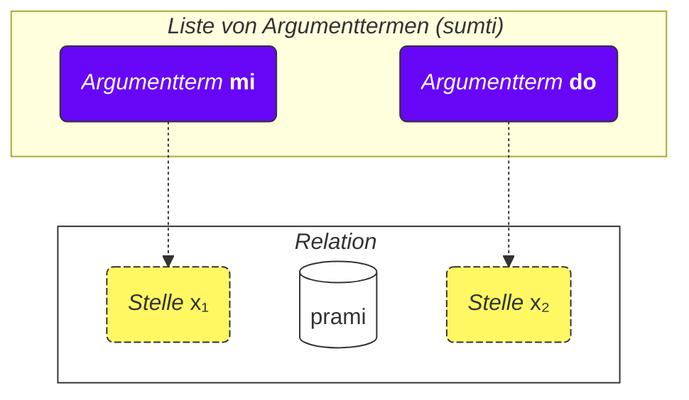
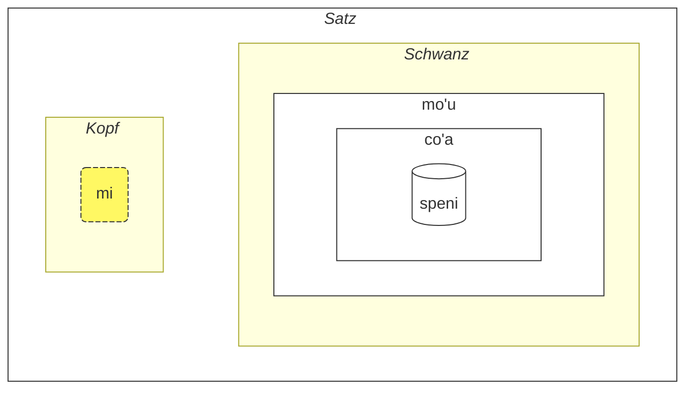

## Lektion 2. Weitere Grundlagen

### Wortarten

Lojban-Wörter sind in drei Gruppen unterteilt:

- Relationswörter (auf Lojban **selbrivla** genannt)
  - Beispiele: **gleki**, **klama**.
  - Solche Wörter enthalten mindestens ein Konsonantencluster (zwei oder mehr Konsonanten hintereinander) innerhalb der ersten 5 Laute + sie enden auf einen Vokal.
- Partikeln (auf Lojban **cmavo** genannt)
  - Beispiele: **le**, **nu**, **mi**, **fa'a**.
  - Sie beginnen mit einem Konsonanten (einem von **b d g v z j p t k f s c x l m n r i u**), gefolgt von einem Vokal (einem von **a e i o u y au ai ei oi**). Optional kann danach eine oder mehrere Sequenzen aus einem Apostroph (**'**) und einem folgenden Vokal folgen. Zum Beispiel sind **xa'a'a'a'a'a'a** und **ba'au'oi'a'e'o** mögliche Partikeln (auch wenn ihnen keine Bedeutung zugewiesen ist).
  - Es ist recht üblich, mehrere Partikeln ohne Leerzeichen dazwischen hintereinander zu schreiben. Dies ist durch die Lojban-Grammatik erlaubt. Wundern Sie sich also nicht, wenn Sie **lenu** statt **le nu**, **naku** statt **na ku**, **jonai** statt **jo nai** und so weiter sehen. Dies ändert nichts an der Bedeutung. Diese Regel gilt jedoch nicht für Relationswörter; Relationswörter sollten durch Leerzeichen getrennt werden.
- Namenswörter (auf Lojban **cmevla** genannt)
  - Beispiele: **.alis.**, **.doris**, **.lojban.**
  - Werden üblicherweise für Personennamen, Ortsnamen usw. verwendet.
  - Sie können leicht von den anderen Wortarten unterschieden werden, da sie auf einen Konsonanten enden. Zusätzlich sind sie mit zwei Punkten am Anfang und am Ende umschlossen. Umgangssprachlich können Punkte beim Schreiben weggelassen werden, aber beim Sprechen sind Pausen, die diesen Punkten entsprechen, ein Muss.

#### Aufgabe

Decken Sie den rechten Teil der Tabelle ab. Versuchen Sie, die Art jedes Lojban-Wortes anhand der gerade beschriebenen Regeln zu identifizieren.

<table>
<tbody><tr>
<td><b>le</b></td>
<td>Partikel (beginnt mit Konsonant gefolgt von Vokal)</td>
</tr>
<tr>
<td><b>melbi</b></td>
<td>Relationswort (enthält Konsonantencluster 'lb')</td>
</tr>
<tr>
<td><b>.paris.</b></td>
<td>Namenswort (endet auf Konsonant, hat Punkte drumherum)</td>
</tr>
<tr>
<td><b>mi'o</b></td>
<td>Partikel (enthält Apostroph zwischen Vokalen)</td>
</tr></tbody></table>

### Reihenfolge der Argumente

Früher hatten wir Definitionen von Relationswörtern wie:

mlatu
: … ist eine Katze, eine Katze sein

citka
: … isst …

prami
: … liebt …

klama
: … kommt zu …

Wörterbücher können Definitionen von Relationswörtern mit Symbolen wie x₁, x₂ usw. darstellen:

prami
: x₁ liebt x₂

karce
: x₁ ist ein Auto …

citka
: x₁ isst x₂ …

klama
: x₁ kommt zu x₂ …

Diese x₁, x₂ usw. sind die explizite Notation für die sogenannten _Stellen_ (andere Bezeichnungen sind: _Plätze_, _Rollen der Relation_, **terbricmi** auf Lojban). Stellen werden durch Argumentterme (**sumti**) im Satz gefüllt.

Die Zahlen repräsentieren die Reihenfolge, in der diese Stellen durch Argumente gefüllt werden sollen.

Zum Beispiel:

> **mi prami do**
> _Ich liebe dich._

Dieser Satz impliziert auch, dass

- x₁ _denjenigen bezeichnet, der liebt_, und
- x₂ _denjenigen bezeichnet, der geliebt wird_.

Mit anderen Worten, jede Relation hat eine oder mehrere Stellen, und diese Stellen sind spezifiziert und als x₁, x₂ usw. beschriftet. Wir setzen Argumente wie **mi**, **do**, **le tavla** usw. der Reihe nach ein und füllen so diese Stellen und geben der Relation eine konkrete Bedeutung, wodurch wir einen Satz bilden.

Der Vorteil dieser Art von Definitionen ist, dass sie <u>alle</u> möglichen Teilnehmer einer Relation sofort spezifiziert enthält.

Wir können auch Argumente weglassen und den Satz vager machen:

> **carvi**
> _Es regnet._
> `ist Regen, regnet`

(obwohl die Zeit hier durch den Kontext bestimmt wird, kann es auch _Es regnet oft_, _Es regnete_ usw. bedeuten)

> **prami do**
> _Jemand liebt dich._
> `liebt dich`

Alle weggelassenen Stellen in einer Relation bedeuten einfach **zo'e** = _etwas/jemand_, also bedeutet es dasselbe wie

> **zo'e prami do**
> _Jemand liebt dich._

Und

> **prami**

ist dasselbe wie

> **zo'e prami zo'e**
> _Jemand liebt jemanden._

zo'e
: Pronomen: etwas oder jemand Unbestimmtes oder aus dem Kontext Angenommenes

Modalterme wie **ca**, **fa'a** usw. fügen neue Stellen zu Relationen hinzu, füllen aber keine Stellen von Relationen aus. In

> **mi klama fa'a do**
> _Ich komme auf dich zu._

ist die zweite Stelle von **klama** immer noch weggelassen. Zum Beispiel:

> **mi klama fa'a le cmana le zdani**
> _Ich komme (in Richtung des Berges) zum Haus._

le cmana
: der Berg

<pixra url="/assets/pixra/cilre-xekri-g-out/cmana.webp" caption="cmana" definition="… ist ein Berg"></pixra>

Hier ist die zweite Stelle von **klama** **do**. Der Satz bedeutet, dass der Berg nur eine Richtung ist, während der Endpunkt du bist.

Hier ersetzt der Term **fa'a la cmana** (_in Richtung des Berges_) nicht die zweite Stelle der Relation **klama**. Die zweite Stelle von **klama** ist hier **le zdani**.

Der Satz bedeutet, dass mein Haus einfach in Richtung des Berges liegt, aber es bedeutet nicht unbedingt, dass ich diesen Berg erreichen will. Das endgültige Ziel meines Kommens ist nicht der Berg, sondern das Haus.

Ebenso ist in

> **mi citka ba le nu mi cadzu**
> _Ich esse, nachdem ich spazieren gehe._

die zweite Stelle von **citka** immer noch weggelassen. Ein neuer Term **ba** mit seinem Argument **le nu mi cadzu** fügt dem Satz Bedeutung hinzu.

Die Reihenfolge der Argumente einer zusammengesetzten Relation ist dieselbe wie die der letzten Komponente darin:

> **tu sutra bajra pendo mi**
> _Das ist mein schnell laufender Freund._
> `Das ist ein schnell laufender Freund von mir.`

> **tu pendo mi**
> _Das ist mein Freund._
> `Das ist ein Freund von mir.`

pendo
: … ist ein Freund von … (jemandem)

Die Reihenfolge der Argumente von **sutra bajra pendo** ist also dieselbe wie die von **pendo** allein.

#### Aufgabe

Decken Sie den rechten Teil der Tabelle ab. Identifizieren Sie für jedes Relationswort, welche Stellenstruktur korrekt ist.

<table>
<tbody><tr>
<td><b>klama</b></td>
<td>x₁ kommt zu x₂ von x₃</td>
</tr>
<tr>
<td><b>prami</b></td>
<td>x₁ liebt x₂</td>
</tr>
<tr>
<td><b>karce</b></td>
<td>x₁ ist ein Auto</td>
</tr>
<tr>
<td><b>citka</b></td>
<td>x₁ isst x₂</td>
</tr></tbody></table>

### Mehr als zwei Stellen

Eine Relation kann mehr als zwei Stellen haben. Zum Beispiel:

> **mi pinxe le djacu le kabri**
> _Ich trinke das Wasser aus der Tasse._

pinxe
: x₁ trinkt x₂ aus x₃

> **le kabri**
> _die Tasse_

In diesem Fall gibt es drei Stellen, und wenn Sie die zweite Stelle in der Mitte ausschließen möchten, müssen Sie **zo'e** verwenden:

> **mi pinxe zo'e le kabri**
> _Ich trinke \[etwas\] aus der Tasse._

Wenn wir **zo'e** weglassen, erhalten wir etwas Bedeutungsloses:

> **mi pinxe le kabri**
> _Ich trinke die Tasse._

Ein weiteres Beispiel:

> **mi plicru do le plise**
> _Ich gebe dir die Äpfel._

plicru
: x₁ gibt, spendet jemandem x₂ ein Objekt x₃; x₁ erlaubt jemandem x₂, x₃ zu verwenden

#### Aufgabe

zgana
: x₁ beobachtet/bemerkt x₂ mit den Sinnen x₃

Decken Sie den rechten Teil der Tabelle ab. Übersetzen Sie die Sätze links aus dem Lojban.

<table style="table-layout: fixed;">
<tbody><tr>
<td><b>mi zgana do le kanla</b></td>
<td><i>Ich beobachte dich mit meinen Augen.</i></td>
</tr>
<tr>
<td><b>mi pinxe le djacu le kabri</b></td>
<td><i>Ich trinke das Wasser aus der Tasse.</i></td>
</tr>
<tr>
<td><b>mi plicru do le plise</b></td>
<td><i>Ich gebe dir den Apfel.</i></td>
</tr></tbody></table>

Decken Sie den rechten Teil der Tabelle ab. Übersetzen Sie die Sätze links ins Lojban.

<table style="table-layout: fixed;">
<tbody><tr>
<td><i>Ich trinke Kaffee aus dem Glas.</i></td>
<td><b>mi pinxe le ckafi le kabri</b></td>
</tr>
<tr>
<td><i>Ich gebe dem Kind das Buch.</i></td>
<td><b>mi plicru le verba le cukta</b></td>
</tr></tbody></table>

### Relationen innerhalb von Relationen

In

> **le nicte cu nu mi viska le lunra**
> _Die Nacht ist, wenn ich den Mond sehe._

haben wir

- **le nicte** als x₁ der Relation,
- **nu mi viska le lunra** als die Hauptrelation.

Innerhalb von **nu mi viska le lunra** haben wir jedoch einen weiteren Satz mit

- **mi** - x₁ der inneren Relation,
- **viska** - die innere Relation,
- **le lunra** - x₂ der inneren Relation.

Trotz ihrer inneren Struktur ist **nu mi viska le lunra** also immer noch eine Relation, deren erster Term in diesem Fall mit **le nicte** gefüllt ist.

Ebenso haben wir in

> **mi citka ba le nu mi dansu**
> _Ich esse, nachdem ich tanze._

- **mi** als x₁, die erste Stelle der Relation,
- **citka** als die Hauptrelation,
- **ba le nu mi dansu** als einen Modalterm der Hauptrelation des Satzes.

Innerhalb dieses Terms haben wir:

- **mi** als x₁, die erste Stelle der Relation innerhalb des Terms
- **dansu** als die Hauptrelation innerhalb des Terms.

Ein solcher "rekursiver" Mechanismus des Einbettens von Relationen in Relationen erlaubt es, komplexe Ideen präzise auszudrücken.

#### Aufgabe

Decken Sie den rechten Teil der Tabelle ab. Identifizieren Sie, welche Terme zu inneren Relationen gehören.

<table>
<tbody><tr>
<td><b>le nicte cu nu mi viska le lunra</b></td>
<td>Innere Relation: <i>mi viska le lunra</i> (Ich sehe den Mond)</td>
</tr>
<tr>
<td><b>mi citka ba le nu mi dansu</b></td>
<td>Innere Relation: <i>mi dansu</i> (Ich tanze)</td>
</tr>
<tr>
<td><b>mi djica le nu do klama</b></td>
<td>Innere Relation: <i>do klama</i> (du kommst)</td>
</tr></tbody></table>

### Warum sind Relationswörter so definiert, wie sie sind?

Englisch verwendet eine begrenzte Anzahl von Präpositionen, die bei verschiedenen Verben wiederverwendet werden und daher keine feste Bedeutung haben. Betrachten Sie zum Beispiel die englische Präposition _to_:

> _I speak to you._ (Ich spreche zu dir.)

<!-- -->

> _I come to you._ (Ich komme zu dir.)

<!-- -->

> _To me it looks pretty._ (Für mich sieht es schön aus.)

In jedem dieser Beispiele hat _to_ eine neue Rolle, die bestenfalls entfernt ähnlich zu Rollen in anderen Sätzen ist.

Es ist wichtig zu beachten, dass andere Sprachen verschiedene Arten verwenden, um Rollen von Verben zu markieren, die in vielen Fällen sehr unterschiedlich von denen im Englischen sind.

Lojban zum Beispiel markiert Kernrollen (Stellen) von Relationen, indem solche Relationen vollständig mit den Rollen in Sequenz definiert werden (oder mit **fa**, **fe** usw. markiert):

klama
: x₁ kommt zu x₂ …

tavla
: x₁ spricht mit x₂ …

melbi
: x₁ ist schön, hübsch für x₂ …

Solche Kernrollen sind wesentlich bei der Definition von Relationen.

Es kann jedoch optionale Rollen geben, die Relationen präziser machen:

> _I speak to you while I'm eating._ (Ich spreche mit dir, während ich esse.)

<!-- -->

> _It's hard to me because this thing is heavy._ (Es ist schwer für mich, weil dieses Ding schwer ist.)

In Lojban wird eine ähnliche Vorstellung solcher optionalen Rollen über separate Relationen oder in den häufigsten Fällen mit Modaltermen ausgedrückt:

> **mi tavla do ze'a le nu mi citka**
> _Ich spreche mit dir, während ich esse._

<!-- -->

> **nandu mi ri'a le nu ti tilju**
> _Es ist schwer für mich, weil dieses Ding schwer ist._

nandu
: x₁ ist schwer für x₂

tilju
: x₁ ist schwer (Gewicht)

Präpositionen im Englischen sind ähnlich zu Modalpartikeln in Lojban, obwohl eine übliche englische Präposition viele Bedeutungen haben kann, während in Lojban jede Modalpartikel nur eine (wenn auch vage) Bedeutung hat.

#### Aufgabe

le zarci
: der Markt
le dinju
: das Gebäude
klama
: x₁ kommt zu x₂ von x₃

Decken Sie den rechten Teil der Tabelle ab. Identifizieren Sie, ob diese Sätze Kernargumente oder optionale Modalterme verwenden.

<table>
<tbody><tr>
<td><b>mi klama le zarci le dinju</b></td>
<td>Verwendet Kernargumente (x₂ und x₃ von klama)</td>
</tr>
<tr>
<td><b>mi klama le zarci ca le nu do pinxe</b></td>
<td>Verwendet Kernargument (x₂ = le zarci) und Modalterm (ca le nu do pinxe)</td>
</tr>
<tr>
<td><b>mi klama fa'a le zarci</b></td>
<td>Verwendet Modalterm (fa'a le zarci) anstelle von Kernargument</td>
</tr></tbody></table>

### Allgemeine Regeln in der Reihenfolge von Argumenten

Die Reihenfolge der Stellen in Relationen mag manchmal schwer zu merken sein, aber machen wir uns keine Sorgen - Sie müssen sich nicht alle Stellen aller Relationswörter merken. (Erinnern Sie sich an die Bedeutung von Hunderttausenden von Wörtern im Deutschen?)

Sie können Stellen studieren, wenn Sie sie nützlich finden oder wenn Leute sie im Dialog mit Ihnen verwenden.

Die meisten Relationswörter haben zwei bis drei Stellen.

Normalerweise können Sie die Reihenfolge anhand des Kontexts und einiger Faustregeln erraten:

1. Die erste Stelle ist oft die Person oder das Ding, das etwas tut oder etwas ist:

   **klama** = _x₁ geht …_

2. Das Objekt einer Handlung steht normalerweise direkt nach der ersten Stelle:

   **punji** = _x₁ legt x₂ auf x₃_,

3. Und die nächste Stelle wird normalerweise mit dem Empfänger gefüllt:

   **punji** = _x₁ legt x₂ auf x₃_,

4. Ziel (_zu_) Stellen kommen fast immer vor Herkunft (_von_) Stellen:

   **klama** = _x₁ geht zu x₂ von x₃_

   <pixra url="/assets/pixra/cilre-xekri-g-out/klama_fi.webp" caption="le prenu cu klama fi le zarci" definition="Die Person geht aus dem Laden heraus."></pixra>

5. Weniger verwendete Stellen kommen gegen Ende. Diese sind tendenziell Dinge wie _nach Standard_, _mittels_ oder _gemacht aus_.

Die allgemeine Idee ist, dass zuerst die Stellen kommen, die am wahrscheinlichsten verwendet werden.

Es müssen nicht immer alle Stellen gefüllt werden. Nicht gefüllte Stellen haben einfach Werte, die für den Sprecher irrelevant oder offensichtlich sind (sie nehmen den Wert **zo'e** = _etwas_ an).

#### Aufgabe

dunda
: x₁ gibt x₂ an x₃
benji
: x₁ überträgt x₂ an x₃ von x₄
lebna
: x₁ nimmt x₂ von x₃

Decken Sie den rechten Teil der Tabelle ab. Sagen Sie voraus, welche Stelle als nächstes in diesen Relationen kommt, basierend auf den allgemeinen Regeln.

<table>
<tbody><tr>
<td><b>dunda</b> - "der Geber ___, das Geschenk ___, der Empfänger ___"</td>
<td>Die Reihenfolge folgt der Regel: Täter zuerst, dann Objekt, dann Empfänger</td>
</tr>
<tr>
<td><b>benji</b> - "der Sender ___, das Gesendete ___, Ziel ___, Quelle ___"</td>
<td>Die Reihenfolge folgt der Regel: Täter zuerst, Objekt zweitens, Ziel vor Quelle</td>
</tr>
<tr>
<td><b>lebna</b> - "der Nehmer ___, das Genommene ___, Quelle ___"</td>
<td>Die Reihenfolge folgt der Regel: Täter zuerst, Objekt zweitens, Quelle zuletzt</td>
</tr></tbody></table>

### Infinitive

Infinitive sind Verben, die im Deutschen oft mit _zu_ eingeleitet werden. Beispiele sind _Ich mag zu laufen_, wobei _zu laufen_ der Infinitiv ist.

> **le verba cu troci le ka cadzu**
> _Das Kind versucht zu gehen._

le verba
: das Kind, die Kinder

troci
: x₁ versucht zu tun oder zu sein x₂ (ka)

cadzu
: x₁ geht

<pixra url="/assets/pixra/cilre-xekri-g-out/troci_cadzu.webp" caption="le verba cu troci le ka cadzu" definition="Das Kind versucht zu gehen."></pixra>

Die Partikel **ka** funktioniert ähnlich wie **nu**. Sie umschließt einen Satz.

Der Hauptunterschied ist, dass eine Stelle im umschlossenen Satz durch ein Argument außerhalb dieses Satzes verknüpft werden soll.

In diesem Fall macht das erste Argument **le verba** der Relation **troci** eine Verbindung zur ersten nicht gefüllten Stelle des inneren Satzes **cadzu** (der innerhalb von **ka** ist).

Mit anderen Worten, das Kind versucht, einen Zustand zu erreichen, in dem **le verba cu cadzu** (das Argument **le verba** würde die erste nicht gefüllte Stelle der Relation **cadzu** füllen).

Einige Relationen erfordern nur Infinitive in einigen ihrer Stellen. Definitionen solcher Wörter markieren solche Stellen als _Eigenschaft_ oder **ka**. Zum Beispiel:

cinmo
: x₁ fühlt x₂ (ka)

Das bedeutet, dass der Infinitiv in der zweiten Stelle (x₂) auf eine andere Stelle angewendet wird (höchstwahrscheinlich die erste Stelle, x₁). Fälle, in denen der Infinitiv auf andere Stellen als x₂ angewendet wird, sind selten und werden in Wörterbüchern für entsprechende Relationen erklärt oder können bei inoffiziell erfundenen Relationswörtern aus dem gesunden Menschenverstand durch Analogie mit anderen ähnlichen Relationswörtern abgeleitet werden.

Ein weiteres Beispiel:

<pixra url="/assets/pixra/cilre-xekri-g-out/sidju.webp" caption="ra sidju le pendo le ka bevri le dakli" definition="Er/sie hilft dem Freund, die Taschen zu tragen."></pixra>

> **ra sidju le pendo le ka bevri le dakli**
> _Er/sie hilft dem Freund, die Taschen zu tragen._

sidju
: x₁ hilft x₂, x₃ zu tun (ka)

Das Relationswort **sidju** erfordert, dass seine dritte Stelle mit einem Infinitiv gefüllt wird.

bevri
: x₁ trägt x₂

le dakli
: die Tasche, die Taschen

Beachten Sie, dass nur die erste nicht gefüllte Stelle der eingebetteten Relation die Bedeutung der äußeren Stelle annimmt:

> **mi troci le ka do prami**
> _Ich versuche, von dir geliebt zu werden._

tcidu
: x₁ liest x₂ von x₃

Hier ist die erste nicht gefüllte Stelle die zweite Stelle von **prami**, daher nimmt sie den Wert **mi** (_Ich_) an.

Es ist auch möglich, durch Verwendung des Pronomens **ce'u** eine Stelle explizit zu markieren, die auf ein äußeres Argument angewendet werden muss:

> **mi troci le ka do prami ce'u**
> _Ich versuche, von dir geliebt zu werden._

Ein weiteres Beispiel:

> **mi cinmo le ka xebni ce'u**
> **mi cinmo le ka se xebni**
> _Ich habe das Gefühl, dass mich jemand hasst._
> _Ich fühle mich gehasst._

#### Aufgabe

zgana
: x₁ beobachtet x₂

kakne
: x₁ ist fähig, x₂ zu tun (Eigenschaft)

nelci
: x₁ mag x₂

Decken Sie den rechten Teil der Tabelle ab. Wandeln Sie diese Sätze mit Infinitiven in ihre Bedeutungen um.

<table>
<tbody><tr>
<td><b>mi kakne le ka zgana</b></td>
<td>Ich bin fähig zu beobachten (etwas)</td>
</tr>
<tr>
<td><b>do kakne le ka nelci mi</b></td>
<td>Du bist fähig, mich zu mögen</td>
</tr>
<tr>
<td><b>mi nelci le ka zgana do</b></td>
<td>Ich mag es, dich zu beobachten</td>
</tr></tbody></table>

### Arten von Stellen

Das Wörterbuch erwähnt oft andere Arten von Stellen, zum Beispiel:

djica
: x₁ will x₂ (Ereignis)

Dieses _Ereignis_ bedeutet, dass Sie die Stelle mit einem Argument füllen müssen, das ein Ereignis darstellt. Zum Beispiel:

le nicte
: Nachtzeit

le nu mi dansu
: ich tanze

So erhalten wir

> **mi djica le nicte**
> _Ich will das Nachtereignis._

<!-- -->

> **do djica le nu mi dansu**
> _Du willst, dass ich tanze._

In Lojban ist es nicht erlaubt, zum Beispiel zu sagen:

> **mi djica le plise**
> _Ich will den Apfel._ 

weil Sie etwas mit dem Apfel tun wollen oder Sie wollen, dass ein Ereignis mit dem Apfel geschieht, wie zum Beispiel:

> **mi djica le nu mi citka le plise**
> _Ich will den Apfel essen._
> `Ich will, dass ich den Apfel esse.`

Beachten Sie, dass das Einwickeln einer Relation, die ein Ereignis erwartet, in ein **nu** die Bedeutung ändert:

> **le zekri cu cumki**
> _Das Verbrechen ist möglich._

zekri
: x₁ ist ein kriminelles Ereignis, x₁ (Ereignis) ein Verbrechen

cumki
: x₁ (Ereignis) ist möglich

Vergleichen Sie:

> **le nu zekri cu cumki**
> `Dass etwas kriminell ist, ist möglich.` > _Es ist möglich, dass etwas ein Verbrechen ist._

#### Aufgabe

nelci
: x₁ mag x₂

djica
: x₁ will x₂ (Ereignis)

Decken Sie den rechten Teil der Tabelle ab. Übersetzen Sie die Sätze links aus dem Lojban.

<table style="table-layout: fixed;">
<tbody><tr>
<td><b>mi nelci le nu do cisma</b></td>
<td><i>Ich mag es, dass du lächelst.</i></td>
</tr>
<tr>
<td><b>mi djica le nu mi citka le plise</b></td>
<td><i>Ich will den Apfel essen.</i></td>
</tr>
<tr>
<td><b>mi na ku djica le plise</b></td>
<td><i>Ich will den Apfel nicht. (falsche Verwendung)</i></td>
</tr></tbody></table>

Decken Sie den rechten Teil der Tabelle ab. Übersetzen Sie die Sätze links ins Lojban.

<table style="table-layout: fixed;">
<tbody><tr>
<td><i>Ich will, dass du tanzt.</i></td>
<td><b>mi djica le nu do dansu</b></td>
</tr>
<tr>
<td><i>Ich mag es, dass du klug bist.</i></td>
<td><b>mi nelci le nu do stati</b></td>
</tr></tbody></table>

### Raising

> **mi stidi le ka klama le barja**
> _Ich schlage vor, in die Kneipe zu gehen._

stidi
: x₁ schlägt Handlung x₂ (Eigenschaft) jemandem x₃ vor

> **mi stidi tu'a le barja**
> _Ich schlage die Kneipe vor._

tu'a le barja
: etwas über die Kneipe

> **mi djica le nu mi citka le plise**
> _Ich will einen Apfel essen._

<!-- -->

> **mi djica tu'a le titla**
> _Ich will die Süßigkeit._

tu'a le titla
: etwas über die Süßigkeit

titla
: … ist süß, … ist eine Süßigkeit

<pixra url="/assets/pixra/cilre-xekri-g-out/djica_tuha_le_titla.webp" caption="le prenu cu djica tu'a le titla" definition="Die Person will die Süßigkeit."></pixra>

Die Stellenstruktur kann zu viel Belastung beim Spezifizieren von Handlungen oder Ereignissen bedeuten. Manchmal wollen wir nur ein Objekt in diesen Ereignissen oder Stellen angeben und die Beschreibung der Handlung oder des Ereignisses ganz weglassen.

In den obigen Beispielen impliziert _Ich schlage die Kneipe vor_ höchstwahrscheinlich, dorthin zu gehen, und _Ich will den Apfel_ impliziert, ihn zu essen.

Das Lojban-Relationswort **stidi** erfordert jedoch eine Eigenschaft in seiner x₂-Stelle. Ebenso erfordert **djica** ein Ereignis in seiner x₂-Stelle.

Das kurze sogenannte Qualifizierwort **tu'a** vor einem Term impliziert eine Abstraktion (Eigenschaft, Ereignis oder Proposition), wählt aber nur diesen Term aus dieser Abstraktion aus und überspringt den Rest. Es kann vage als _etwas über_ übersetzt werden:

> **mi stidi tu'a le barja**
> _Ich schlage etwas über die Kneipe vor (vielleicht sie zu besuchen, sich in ihrer Nähe zu treffen usw.)._

<!-- -->

> **mi djica tu'a le plise**
> _Ich wünsche etwas in Bezug auf den Apfel (vielleicht ihn zu essen, zu kauen, zu lecken, ihn nach einem Freund zu werfen usw.)_

> **tu'a le cakla cu pluka mi**
> _Die Schokolade gefällt mir (wahrscheinlich wegen ihres Geschmacks)._
> `Etwas über die Schokolade ist mir angenehm`

cakla
: x₁ ist etwas Schokolade

Beim Überspringen von Abstraktionen sagt uns nur der Kontext, was weggelassen wurde.

Es ist auch möglich, die Hauptrelation zu modifizieren:

> **le cakla cu jai pluka mi**
> **tu'a le cakla cu pluka mi**
> _Die Schokolade gefällt mir._

Dies erlaubt die Erstellung vager Argumentterme mit **jai**:

> **le jai pluka cu zvati ti**
> _Das angenehme Ding ist hier._

Da **le pluka** (_das angenehme Ereignis_) abstrakt ist, ist es unmöglich, seinen Standort anzugeben. Ein Teilnehmer an der Abstraktion kann jedoch physisch irgendwo platziert werden.

#### Aufgabe

stidi
: x₁ schlägt x₂ (Eigenschaft) jemandem x₃ vor

Decken Sie den rechten Teil der Tabelle ab. Übersetzen Sie die Sätze links aus dem Lojban.

<table style="table-layout: fixed;">
<tbody><tr>
<td><b>mi stidi tu'a le karce</b></td>
<td><i>Ich schlage etwas über das Auto vor.</i></td>
</tr>
<tr>
<td><b>mi djica tu'a le najnimre</b></td>
<td><i>Ich will etwas über die Orange.</i></td>
</tr>
<tr>
<td><b>mi nelci tu'a le mlatu</b></td>
<td><i>Ich mag etwas über die Katze.</i></td>
</tr></tbody></table>

Decken Sie den rechten Teil der Tabelle ab. Übersetzen Sie die Sätze links ins Lojban.

<table style="table-layout: fixed;">
<tbody><tr>
<td><i>Ich schlage den Garten vor (etwas darüber).</i></td>
<td><b>mi stidi tu'a le purdi</b></td>
</tr>
<tr>
<td><i>Ich will das Buch (etwas darüber).</i></td>
<td><b>mi djica tu'a le cukta</b></td>
</tr></tbody></table>

### Stellen innerhalb von Argumenten

Wie sagen wir _Du bist mein Freund_?

> **do pendo mi**
> _Du bist mein Freund._
> `Du bist ein Freund von mir.`

<pixra url="/assets/pixra/cilre-xekri-g-out/pendo.webp" caption="le pendo" definition="der Freund / die Freunde"></pixra>

Und nun, wie sagen wir _Mein Freund ist klug_?

> **le pendo be mi cu stati**
> _Mein Freund ist klug._

Wenn wir also eine Relation in ein Argument umwandeln (**pendo** — _ein Freund sein_ in **le pendo** — _der Freund_), können wir immer noch andere Stellen dieser Relation beibehalten, indem wir **be** danach platzieren.

Standardmäßig wird die zweite Stelle (x₂) angehängt. Wir können mehr Stellen anhängen, indem wir sie mit **bei** trennen:

> **mi plicru do le plise**
> _Ich gebe dir den Apfel._

<pixra url="/assets/pixra/cilre-xekri-g-out/plicru.webp" caption="le prenu cu plicru le pendo le tutci" definition="Die Person gibt dem Freund das Utensil."></pixra>

<!-- -->

> **le plicru be mi bei le plise**
> _Der Geber des Apfels an mich_

<!-- -->

> **le plicru be mi bei le plise cu pendo mi**
> _Der Geber des Apfels an mich ist mein Freund._
> `Derjenige, der mir den Apfel gibt, ist ein Freund von mir.`

Ein weiteres Beispiel:

<!-- > **le pendo be mi cu tavla**
> _Die Freunde von mir sprechen._
> **le pendo mi cu tavla**
> **le pendo cu tavla mi**
> _Die Freunde sprechen mit mir._ -->

> **mi klama le pendo be do**
> _Ich komme zu einem Freund von dir._

klama
: x₁ kommt zu x₂ von x₃ …

Wir können **be** nicht weglassen, weil **le pendo do** zwei unabhängige Stellen sind:

> **mi klama le pendo do**
> _Ich komme zu einem Freund von dir._

Hier nahm **do** die dritte Stelle von **klama** ein, da es nicht über **be** an _pendo_ gebunden ist.

Wir konnten auch nicht **nu** verwenden, weil **le nu pendo do** das Ereignis ist, dass jemand dein Freund ist.

Also ist **le pendo be do** die richtige Lösung.

Ein weiteres Beispiel:

> **la .lojban. cu bangu mi**
> _Lojban ist meine Sprache._
> `Lojban ist eine Sprache von mir.`

Jedoch,

> **mi nelci le bangu be mi**
> _Ich mag meine Sprache._

Die Verwendung von **be** für Relationen, die nicht in Argumente umgewandelt wurden, hat keine Wirkung:

> **mi nelci be do** ist dasselbe wie
> **mi nelci do**

#### Aufgabe

ctuca
: x₁ unterrichtet x₂ (Fach) jemandem x₃
cmene
: x₁ ist ein Name von x₂, verwendet von x₃

Decken Sie den rechten Teil der Tabelle ab. Wandeln Sie diese Konstruktionen mit "be" in ihre Bedeutungen um.

<table>
<tbody><tr>
<td><b>le ctuca be mi bei la lojban</b></td>
<td>der Lehrer von mir in Lojban</td>
</tr>
<tr>
<td><b>le cmene be la paris bei la frank</b></td>
<td>der Name von Paris, verwendet von Frank</td>
</tr>
<tr>
<td><b>le ctuca be le verba bei la lojban</b></td>
<td>der Lehrer von Kindern in Lojban</td>
</tr></tbody></table>

### Relativsätze

> **le prenu poi pendo mi cu tavla mi**
> _Die Person, die mein Freund ist, spricht mit mir._

<!-- -->

> **le prenu noi pendo mi cu tavla mi**
> _Die Person, die übrigens mein Freund ist, spricht mit mir._

Im ersten Satz ist das Wort _die_ wesentlich für die Identifizierung der fraglichen Person. Es klärt, von wem unter den Personen im Kontext wir sprechen. Wir wählen nur diejenigen aus, die meine Freunde sind, aus wahrscheinlich vielen Personen in der Umgebung. Vielleicht gibt es nur eine Person in der Umgebung, die mein Freund ist.

Was _der übrigens mein Freund ist_ aus dem zweiten Satz betrifft, bietet es nur zusätzliche Informationen über die Person. Es hilft uns nicht, die Person zu identifizieren. Zum Beispiel könnte dies passieren, wenn alle Personen in der Umgebung meine Freunde sind.

**poi pendo mi** ist ein Relativsatz, eine Relation, die rechts vom Argument **le prenu** angehängt ist. Er endet kurz vor dem nächsten Wort **cu**:

> **le prenu (poi pendo mi) cu tavla mi**
> _Die Person, die mein Freund ist, spricht mit mir._

In Lojban verwenden wir **poi** für Relativsätze, die Entitäten (Objekte, Personen oder Ereignisse) identifizieren, und **noi** für nebensächliche Informationen.

> **la .bob. ba co'a speni le ninmu poi pu xabju le nurma**
> _Bob wird ein Mädchen heiraten, das auf dem Land lebte._

xabju
: … lebt in …, … bewohnt … (Ort, Objekt)

le nurma
: der ländliche Bereich

Dieser Satz schließt nicht aus, dass Bob auch jemand anderen heiratet! Das Entfernen des Relativsatzes mit **poi** ändert die Bedeutung:

> **la .bob. ba co'a speni le ninmu**
> _Bob wird ein Mädchen heiraten._

Ein weiteres Beispiel:

> **le prenu poi gleki cu ze'u renvi**
> _Menschen (welche?), die glücklich sind, leben lang._

ze'u
: Modalterm: für eine lange Zeit

renvi
: überleben

Das Entfernen des Relativsatzes mit **poi** ändert die Bedeutung:

> **le prenu ze'u renvi**
> _Die Menschen leben lang._

Andererseits enthalten Relativsätze mit **noi** nur zusätzliche Informationen über das Argument, an das sie angehängt sind. Dieses Argument ist bereits ausreichend definiert, sodass das Entfernen eines Relativsatzes mit **noi** seine Bedeutung nicht ändert:

> **mi nelci la .doris. noi mi ta'e zgana bu'u le panka**
> _Ich mag Doris, die ich gewöhnlich im Park sehe._
> _Ich mag Doris. Was kann ich sonst noch über sie sagen? Ich sehe sie gewöhnlich im Park._

zgana
: beobachten (mit beliebigen Sinnen)

<pixra url="/assets/pixra/cilre-xekri-g-out/se_penmi_fi_le_panka.webp" caption="le gerku noi mi ta'e zgana bu'u le panka" definition="Der Hund, den ich gewöhnlich im Park sehe."></pixra>

Das Entfernen des Relativsatzes mit **noi** behält die Bedeutung bei: _Ich mag Doris._

Im gesprochenen Englisch wird die Unterscheidung oft durch Intonation oder durch Raten erreicht. Auch Relativsätze mit **noi** werden im Englischen traditionell mit Kommas abgetrennt. Sie verwenden _which_ oder _who_, und das Wort _that_ wird in ihnen nicht verwendet.

Lassen Sie uns noch ein weiteres Beispiel nehmen.

> **mi klama le pa tricu**
> _Ich komme zum Baum._

<!-- -->

> **le pa tricu cu barda**
> _Der Baum ist groß._

le pa tricu
: der Baum (ein Baum)

barda
: x₁ ist groß/large

Und nun lassen Sie uns diese beiden Sätze verbinden:

> **le tricu noi mi klama ke'a cu barda**
> _Der Baum, zu dem ich komme, ist groß._

Beachten Sie das Wort **ke'a**. Wir verschieben den zweiten Satz über denselben Baum in einen Relativsatz und ersetzen das Argument **le tricu** durch **ke'a** im Relativsatz. Das Pronomen **ke'a** ist also wie _der_ und _welcher_ im Deutschen. Es verweist zurück auf das Argument, an das der Relativsatz angehängt ist.

Wörtlich klingt unser Lojban-Satz also wie

> _Der Baum, so dass ich zu welchem gehe, ist groß._

**ke'a** kann weggelassen werden, wenn der Kontext ausreichend ist. Die folgenden zwei Sätze bedeuten dasselbe:

> **le prenu poi pendo mi cu tavla mi**
> **le prenu poi ke'a pendo mi cu tavla mi**
> _Die Person, die mein Freund ist, spricht mit mir._

**ke'a** wird oft angenommen, dass es zur ersten nicht gefüllten Stelle geht:

> **mi nelci la .doris. noi mi ta'e zgana bu'u le panka**
> **mi nelci la .doris. noi mi ta'e zgana ke'a bu'u le panka**
> _Ich mag Doris, die ich gewöhnlich im Park sehe._

Hier füllt **mi** die erste Stelle der Relation **ta'e zgana** (_… sieht gewöhnlich …_), daher wird **ke'a** für die nächste, zweite Stelle angenommen.

Relativsätze können wie übliche Relationen Konstrukte mit Modaltermen enthalten:

> **le tricu noi mi pu klama ke'a ca le cabdei cu barda**
> _Der Baum, zu dem ich heute ging, ist groß._

<pixra url="/assets/pixra/cilre-xekri-g-out/le_tricu_cu_barda.webp" caption="le tricu cu barda" definition="Der Baum ist groß."></pixra>

le cabdei
: der Tag von heute

Beachten Sie, dass **ca le cabdei** zum Relativsatz gehört. Vergleichen Sie:

> **le tricu noi mi pu klama ke'a cu barda ca le cabdei**
> _Der Baum, zu dem ich ging, ist heute groß._

Die Bedeutung hat sich stark verändert.

Schließlich wird **voi** verwendet, um **le**-ähnliche Argumente, aber mit Relativsätzen zu bilden:

> **ti voi le nu ke'a cisma cu pluka mi cu zutse tu**
> _Diese, deren Lächeln mir gefällt, sitzen dort._

<pixra url="/assets/pixra/cilre-xekri-g-out/voi.webp" caption="mi nelci ti voi le nu ke'a cisma cu pluka mi" definition="Ich mag diese, deren Lächeln mir gefällt."></pixra>

ti
: dieser hier in meiner Nähe, diese hier in meiner Nähe

cisma
: x₁ lächelt

pluka
: x₁ ist angenehm für x₂

zutse
: x₁ sitzt, sitzt auf x₂

Hier definiert **voi** das Objekt in meiner Nähe.

Vergleichen Sie es mit:

> **ti poi le nu ke'a cisma cu pluka mi cu zutse**
> _Von diesen diejenigen, deren Lächeln mir gefällt, sitzen._

**poi** beschränkt die Auswahl auf diejenigen, die im Relativsatz beschrieben werden.
Dieses Beispiel könnte bedeuten, dass es viele Objekte (Personen usw.) um mich herum gibt, aber mit **poi** wähle ich nur die notwendigen aus.

Vergleichen Sie es mit:

> **ti noi le nu ke'a cisma cu pluka mi cu zutse**
> _Diese (die übrigens so sind, dass ihr Lächeln mir gefällt) sitzen._

**noi** fügt einfach nebensächliche Information hinzu, die nicht notwendig ist, um zu bestimmen, worauf sich **ti** (_diese_) bezieht. Vielleicht gibt es niemanden sonst in der Nähe zu beschreiben.

Schließlich haben wir, genau wie **nu** den rechten Grenzmarker **kei** hat,

ku'o
: rechter Grenzmarker für **poi**, **noi** und **voi**.

> **mi tavla la .doris. noi ca zutse tu ku'o .e la .alis. noi ca cisma**
> _Ich spreche mit Doris, die jetzt dort sitzt, und Alice, die jetzt lächelt._

Beachten Sie, dass wir ohne **ku'o** **tu** (_dort drüben_) zusammen mit **la .alis.** (_Alice_) hätten, was zu einer seltsamen Bedeutung führt:

> **mi tavla la .doris. noi ca zutse tu .e la .alis. noi ca cisma**
> _Ich spreche mit Doris, die jetzt dort sitzt und oben auf Alice (die jetzt lächelt)._

Beachten Sie den **zutse tu .e la .alis.** Teil.

Für alle **poi**, **noi** und **voi** ist der rechte Grenzmarker immer noch derselbe: **ku'o**.

#### Aufgabe

ctuca
: x₁ unterrichtet x₂ jemandem x₃

Decken Sie den rechten Teil der Tabelle ab. Übersetzen Sie die Sätze links aus dem Lojban.

<table style="table-layout: fixed;">
<tbody><tr>
<td><b>mi tavla le prenu poi ctuca mi</b></td>
<td><i>Ich spreche mit der Person, die mich unterrichtet.</i></td>
</tr>
<tr>
<td><b>le gerku noi mi nelci ke'a cu citka</b></td>
<td><i>Der Hund, den ich mag, isst.</i></td>
</tr>
<tr>
<td><b>le prenu poi ke'a ctuca mi cu stati</b></td>
<td><i>Die Person, die mich unterrichtet, ist klug.</i></td>
</tr></tbody></table>

Decken Sie den rechten Teil der Tabelle ab. Übersetzen Sie die Sätze links ins Lojban.

<table style="table-layout: fixed;">
<tbody><tr>
<td><i>Ich sehe den Hund, der läuft.</i></td>
<td><b>mi viska le gerku poi bajra</b></td>
</tr>
<tr>
<td><i>Die Person, die klug ist, spricht mit mir.</i></td>
<td><b>le prenu noi stati cu tavla mi</b></td>
</tr></tbody></table>

### Kurze Relativsätze. '_Über_'

Manchmal müssen Sie möglicherweise ein zusätzliches Argument an ein anderes Argument anhängen:

> **mi djuno le vajni pe do**
> _Ich weiß etwas Wichtiges über dich._

le vajni
: etwas Wichtiges

**pe** und **ne** sind ähnlich wie **poi** und **noi**, aber sie hängen Argumente an Argumente an:

> **le pa penbi pe mi cu xunre**
> _Der Stift, der meiner ist, ist rot._ (_meiner_ ist wesentlich, um den fraglichen Stift zu identifizieren)

<!-- -->

> **le pa penbi ne mi cu xunre**
> _Der Stift, der meiner ist, ist rot._ (zusätzliche Information)

ne
: welcher über ist, Beziehung hat zu … (ein Argument folgt)

pe
: der über ist, Beziehung hat zu … (ein Argument folgt)

> **le pa penbi ne mi ge'u .e le pa fonxa ne do cu xunre**
> _Der Stift, der meiner ist, und das Telefon, das deines ist, sind rot._

ge'u
: rechter Grenzmarker für **pe**, **ne**.

#### Aufgabe

Decken Sie den rechten Teil der Tabelle ab. Übersetzen Sie die Sätze links aus dem Lojban.

<table style="table-layout: fixed;">
<tbody><tr>
<td><b>le penbi pe mi cu xunre</b></td>
<td><i>Der Stift, der meiner ist, ist rot.</i></td>
</tr>
<tr>
<td><b>le mlatu ne mi cu melbi</b></td>
<td><i>Die Katze, die meine ist, ist schön.</i></td>
</tr>
<tr>
<td><b>mi tavla le prenu pe do</b></td>
<td><i>Ich spreche mit der Person, die mit dir in Beziehung steht.</i></td>
</tr></tbody></table>

Decken Sie den rechten Teil der Tabelle ab. Übersetzen Sie die Sätze links ins Lojban.

<table style="table-layout: fixed;">
<tbody><tr>
<td><i>Das Haus, das meins ist, ist groß.</i></td>
<td><b>le zdani pe mi cu barda</b></td>
</tr>
<tr>
<td><i>Das Auto, das deins ist, ist schön.</i></td>
<td><b>le karce ne do cu melbi</b></td>
</tr></tbody></table>

### «**be**» und «**pe**»

Beachten Sie, dass Relativsätze an Argumente angehängt werden, während **be** ein Teil der Relation ist.

Eigentlich ist **le bangu pe mi** eine bessere Übersetzung von _meine Sprache_, da wie im Deutschen die beiden Argumente auf vage Weise miteinander in Beziehung stehen.

Sie können jedoch **le birka be mi** als _mein Arm_ sagen. Selbst wenn Sie Ihren Arm absägen, wird er immer noch Ihrer sein. Deshalb hat **birka** eine Stelle des Besitzers:

birka
: x₁ ist ein Arm von x₂

Lassen Sie uns noch einmal zeigen, dass ein Konstrukt mit **be** ein Teil der Relation ist, während **pe**, **ne**, **poi** und **noi** an Argumente anhängen:

> **le pa melbi be mi fonxa pe le pa pendo be mi cu barda**
> `Das für mich schöne Telefon des Freundes von mir ist groß.`

Hier ist **be mi** an die Relation **melbi** = _schön sein für … (jemanden)_ angehängt und erzeugt somit eine neue Relation **melbi be mi** = _schön für mich sein_. Aber **pe le pa pendo be mi** (_des Freundes von mir_) wird auf das gesamte Argument **le pa melbi be mi fonxa** (_das für mich schöne Telefon_) angewendet.

Es kann auch vorkommen, dass wir **be** an eine Relation anhängen müssen, diese Relation in ein Argument umwandeln und dann **pe** an dieses Argument anhängen müssen:

> **le pa pendo be do be'o pe la .paris. cu stati**
> _Der Freund von dir, der mit Paris in Beziehung steht, ist klug._
> (<b>pe la .paris.</b> ist an das gesamte Argument <b>le pa pendo be do be'o</b> angehängt)

<!-- -->

> **le pu plicru be do bei le pa plise be'o pe la .paris. cu stati**
> _Wer dir den Apfel gegeben hat (und der mit Paris in Beziehung steht), ist klug._
> (<b>pe la .paris.</b> ist an das gesamte Argument <b>le pu plicru be do bei le pa plise be'o</b> angehängt)

be'o
: rechter Grenzmarker für die Reihe von Termen, die mit **be** und **bei** angehängt sind

In diesen beiden Beispielen hat Ihr Freund eine Beziehung zu Paris (vielleicht ist er/sie aus Paris).

Vergleichen Sie es mit:

> **le pa pendo be do pe la .paris. cu stati**
> _Der Freund von dir (du, der mit Paris in Beziehung steht), ist klug._

<!-- -->

> **le pu plicru be do bei le pa plise pe la .paris. cu stati**
> _Wer dir den Apfel gegeben hat (der Apfel, der mit Paris in Beziehung steht), ist klug._

In diesen letzten beiden Beispielen stehst jedoch entweder du oder der Apfel in Beziehung zu Paris.

#### Aufgabe

Decken Sie den rechten Teil der Tabelle ab. Übersetzen Sie die Sätze links aus dem Lojban.

<table style="table-layout: fixed;">
<tbody><tr>
<td><b>le melbi be mi cu stati</b></td>
<td><i>Derjenige, der für mich schön ist, ist klug.</i></td>
</tr>
<tr>
<td><b>le pendo be do bei mi cu tavla</b></td>
<td><i>Der Freund von dir und mir spricht.</i></td>
</tr>
<tr>
<td><b>le pampe'o be do pe mi cu melbi</b></td>
<td><i>Mein Papier von dir ist schön.</i></td>
</tr></tbody></table>

Decken Sie den rechten Teil der Tabelle ab. Übersetzen Sie die Sätze links ins Lojban.

<table style="table-layout: fixed;">
<tbody><tr>
<td><i>Derjenige, der nett zu mir und klug zu dir ist, spricht.</i></td>
<td><b>le pluka be mi bei do cu tavla</b></td>
</tr>
<tr>
<td><i>Der Freund von mir, der mit Paris in Beziehung steht, ist klug.</i></td>
<td><b>le pendo be mi be'o pe la .paris. cu stati</b></td>
</tr></tbody></table>

### '_Alice ist eine Lehrerin_' und '_Alice ist die Lehrerin_'

Im Deutschen lässt das Verb _sein_ ein Substantiv wie ein Verb funktionieren. In Lojban funktionieren sogar solche Konzepte wie _Katze_ (**mlatu**), _Person_ (**prenu**), _Haus_ (**dinju**), _Zuhause_ (**zdani**) standardmäßig wie Verben (Relationen). Nur Pronomen funktionieren als Argumente.

Hier sind jedoch drei Fälle:

> **la .alis. cu ctuca**
> _Alice unterrichtet._

<pixra url="/assets/pixra/cilre-xekri-g-out/ctuca.webp" caption="mi ctuca" definition="Ich unterrichte / Ich bin ein Lehrer."></pixra>

<!-- -->

> **la .alis. cu me le ctuca**
> _Alice ist eine der Lehrerinnen._

me
: … ist unter …, … ist eines von …, … sind Mitglieder von … (Argument folgt)

> **la .alis. ta'e ctuca**
> _Alice unterrichtet gewöhnlich._

ta'e
: Modalpartikel: das Ereignis geschieht gewöhnlich

> **la .alis. cu du le ctuca**
> _Alice ist die Lehrerin._

du
: … ist identisch mit …

Die Partikel **me** nimmt ein Argument nach sich und zeigt an, dass es wahrscheinlich andere Lehrer gibt und Alice einer unter ihnen ist.

Die Partikel **du** wird verwendet, wenn Alice zum Beispiel die Lehrerin ist, nach der wir gesucht haben oder über die wir gesprochen haben. Sie zeigt Identität an.

Somit können **me** und **du** manchmal dem entsprechen, was wir im Deutschen mit dem Verb _sein/ist/war_ ausdrücken.

In Lojban priorisieren wir die Bedeutung dessen, was wir sagen wollen, anstatt uns darauf zu verlassen, wie es wörtlich im Deutschen oder in anderen Sprachen ausgedrückt wird.

Weitere Beispiele:

> **mi me la .bond.**
> _Ich bin Bond._

<!-- -->

> **mi du la .kevin.**
> _Ich bin Kevin (derjenige, den du gebraucht hast)._

<!-- -->

> **ti du la .alis. noi mi ta'e zgana bu'u le panka**
> _Das ist Alice, die ich gewöhnlich im Park sehe._

**noi du** und **poi du** werden verwendet, um alternative Namen für etwas einzuführen. Sie entsprechen dem deutschen _nämlich, d.h._:

> **la .alis. cu penmi le prenu noi du la .abdul.**
> _Alice traf die Person, nämlich Abdul._

Bei Verwendung von **me** können Sie mehrere Argumente mit _und_ verbinden:

> **tu me le pendo be mi be'o .e le tunba be mi**
> _Das sind einige (oder alle) meiner Freunde und meine Geschwister._

tunba
: x₁ ist ein Geschwister von x₂

<pixra url="/assets/pixra/cilre-xekri-g-out/tunba.webp" caption="do tunba mi" definition="Du bist mein Geschwister."></pixra>

#### Aufgabe

gerku
: x₁ ist ein Hund
banana
: x₁ ist eine Banane
pendo
: x₁ ist ein Freund von x₂

Decken Sie den rechten Teil der Tabelle ab. Übersetzen Sie diese Sätze mit geeigneten Wörtern für "ist/sind".

<table>
<tbody><tr>
<td><i>Das sind einige meiner Freunde</i></td>
<td><b>tu me le pendo be mi</b></td>
</tr>
<tr>
<td><i>Das ist der Hund, nach dem wir gesucht haben</i></td>
<td><b>ta du le gerku</b></td>
</tr>
<tr>
<td><i>Dieses gelbe Ding ist eine Banane</i></td>
<td><b>ti pelxu gi'e me le banana</b></td>
</tr></tbody></table>

### Relationen mit Modalpartikeln

Wir können eine Modalpartikel nicht nur vor dem Hauptrelationskonstrukt des Satzes platzieren, sondern auch am Ende, wodurch dasselbe Ergebnis erzeugt wird:

> **mi ca tcidu**
> **mi tcidu ca**
> _Ich (lese jetzt)._

tcidu
: lesen (einen Text)

Bei Verwendung von **nu** erstellen wir eine Relation, die ein Ereignis beschreibt. Beachten Sie den Unterschied zwischen diesen beiden Beispielen:

> **le nu tcidu ca cu nandu**
> _Das aktuelle Lesen ist kompliziert, schwierig._

<!-- -->

> **le nu tcidu cu ca nandu**
> _Das Lesen ist jetzt kompliziert._

Weitere Beispiele:

> **mi klama le pa cmana pu**
> _Ich ging zum Berg._
> `Ich gehe zu einem Berg (in der Vergangenheit).`

<!-- -->

> **le nu mi klama le pa cmana pu cu pluka**
> _Dass ich zum Berg ging, ist angenehm._

Wir können auch eine oder mehrere Modalpartikeln als erstes Element eines Relationskonstrukts setzen und z.B. eine solche angereicherte Relation in Argumentform verwenden:

<pixra url="/assets/pixra/cilre-xekri-g-out/coha_purdi.webp" caption="le pu kunti tumla ca purdi" definition="Was eine Wüste war, ist jetzt ein Garten."></pixra>

> **le pu kunti tumla ca purdi**
> _Was eine Wüste war, ist jetzt ein Garten._

**pu** gehört zu **le kunti tumla** und **ca** gehört zu **purdi** (da **le pu kunti tumla** kein **ca** am Ende hinzufügen kann).

<!-- Dies widerspricht nicht der Verwendung von **be** nach dem Verb, da Sie mit **be** das Verb ändern: **bangu be mi** wird als ein Verb betrachtet. -->

Mehrere Modalpartikeln hintereinander zu haben, ist kein Problem:

> **le pu ze'u kunti tumla ca purdi**
> _Was lange Zeit eine Wüste war, ist jetzt ein Garten._

ze'u
: Modalterm: für eine lange Zeit

Das Platzieren von Termpartikeln nach Substantiven bindet sie an äußere Relationen:

<pixra url="/assets/pixra/cilre-xekri-g-out/cohu_purdi.webp" caption="le kunti tumla pu purdi" definition="Die Wüste war ein Garten."></pixra>

> **le kunti tumla pu purdi**
> **(le kunti tumla) pu purdi**
> _Die Wüste war ein Garten._

#### Aufgabe

melbi
: x₁ ist schön
sutra
: x₁ ist schnell

Decken Sie den rechten Teil der Tabelle ab. Zeigen Sie, wo die Modalpartikeln in diesen Sätzen angewendet werden.

<table>
<tbody><tr>
<td><b>mi ca melbi</b></td>
<td>Das "ca" (Gegenwart) gilt für "melbi" - Ich bin jetzt schön</td>
</tr>
<tr>
<td><b>le nu mi melbi ca cu sutra</b></td>
<td>Das "ca" gilt für "sutra" - mein Schönsein ist jetzt schnell</td>
</tr>
<tr>
<td><b>le pu sutra ca melbi</b></td>
<td>Das "pu" gehört zu "sutra" und "ca" gehört zu "melbi" - was schnell war, ist jetzt schön</td>
</tr></tbody></table>

### Neue Argumente aus Stellen derselben Relation

> **do plicru mi ti**
> _Du gibst mir das._

<!-- -->

> **mi se plicru do ti**
> _Mir wird das von dir gegeben._

plicru
: x₁ gibt x₂ etwas x₃ zur Verwendung

Wir können die ersten beiden Stellen in der Relation mit **se** tauschen und somit die Stellenstruktur ändern.

**do plicru mi ti** bedeutet genau dasselbe wie **mi se plicru do ti**. Der Unterschied liegt nur im Stil.

Sie möchten vielleicht die Dinge zum Zweck einer anderen Betonung ändern, zum Beispiel um die wichtigeren Dinge in einem Satz zuerst zu erwähnen. Die folgenden Paare bedeuten also dasselbe:

> **mi prami do**
> _Ich liebe dich._

<!-- -->

> **do se prami mi**
> _Du wirst von mir geliebt._

<!-- -->

> **le nu mi tadni la .lojban. cu xamgu mi**
> _Mein Studium von Lojban ist gut für mich._

xamgu
: … ist gut für (jemanden)

> **mi se xamgu le nu mi tadni la .lojban.**
> _Für mich ist es gut, Lojban zu lernen._

Dasselbe kann getan werden, wenn Relationen beim Erstellen von Argumenten verwendet werden:

le plicru
: diejenigen, die geben, die Geber, die Spender

le se plicru
: diejenigen, denen gegeben wird, Empfänger von Geschenken

le te plicru
: diese Objekte, die zur Verwendung gegeben werden, Geschenke

**te** tauscht die erste und dritte Stelle von Relationen.

Wie wir wissen, wird es zu einem Argument, wenn wir **le** vor ein Relationskonstrukt setzen. Also

- **le plicru** bedeutet _diejenigen, die in die erste Stelle von **plicru** passen könnten_
- **le se plicru** bedeutet _diejenigen, die in die zweite Stelle von **plicru** passen könnten_
- **le te plicru** bedeutet _diejenigen, die in die dritte Stelle von **plicru** passen könnten_

In Lojban brauchen wir also keine separaten Wörter für _Spender_, _Empfänger_ und _Geschenk_. Wir verwenden dieselbe Relation wieder und sparen viel Aufwand wegen eines solchen cleveren Designs. In der Tat können wir uns kein Geschenk vorstellen, ohne zu implizieren, dass jemand es gegeben hat oder geben wird. Wenn nützliche Phänomene miteinander verbunden sind, spiegelt Lojban dies wider.

<!-- TODO: DwE: Zur Erleichterung des Verständnisses und Merkens: Prädikatwörter mit den Präfixen **se**, **te** werden im Wörterbuch in Einträgen für viele Verben zusammen mit ihren Definitionen aufgeführt, obwohl Sie ihre Bedeutung selbst herausfinden können. -->

#### Aufgabe

vecnu
: x₁ verkauft x₂ an x₃ zum Preis x₄
ciska
: x₁ schreibt x₂ auf Oberfläche x₃ mit Werkzeug x₄

Decken Sie den rechten Teil der Tabelle ab. Wandeln Sie diese Relationen mit se/te/ve um.

<table>
<tbody><tr>
<td><b>le se vecnu</b></td>
<td>was verkauft wird (die Ware)</td>
</tr>
<tr>
<td><b>le te vecnu</b></td>
<td>der Käufer</td>
</tr>
<tr>
<td><b>le ve ciska</b></td>
<td>das Schreibgerät</td>
</tr>
<tr>
<td><b>le te ciska</b></td>
<td>die Schreibfläche</td>
</tr></tbody></table>

### Ändern anderer Stellen in Hauptrelationen

Die Serie **se, te, ve, xe** (in alphabetischer Reihenfolge) besteht aus Partikeln, die Stellen in Hauptrelationen ändern:

- **se** tauscht die erste und zweite Stelle
- **te** tauscht die erste und dritte Stelle
- **ve** tauscht die erste und vierte Stelle
- **xe** tauscht die erste und fünfte Stelle.

> **mi zbasu le pa stizu le mudri**
> _Ich machte den Stuhl aus dem Holzstück._

zbasu
: x₁ baut, macht x₂ aus x₃

le pa stizu
: der Stuhl

le mudri
: das Holzstück

> **le mudri cu te zbasu le stizu mi**
> _Das Holzstück ist das, woraus der Stuhl von mir gemacht ist._

Das **mi** ist nun zur dritten Stelle der Relation verschoben worden und kann weggelassen werden, wenn wir zu faul sind anzugeben, wer den Stuhl gemacht hat, oder wenn wir einfach nicht wissen, wer ihn gemacht hat:

> **le mudri cu te zbasu le stizu**
> _Das Holzstück ist das Material des Stuhls._

Ähnlich wie bei unserem Beispiel mit **le se plicru** (_der Empfänger_) und **le te plicru** (_das Geschenk_) können wir **te**, **ve**, **xe** verwenden, um mehr Wörter aus anderen Stellen von Relationswörtern abzuleiten:

klama
: x₁ geht zu x₂ von x₃ via x₄ mit Mitteln x₅

Somit können wir ableiten, dass

le klama
: der Kommende / die Kommenden

le se klama
: der Zielort

le te klama
: der Herkunftsort der Bewegung

le ve klama
: die Route

le xe klama
: das Mittel des Kommens

**le xe klama** und die fünfte Stelle von **klama** können jedes Mittel der Fortbewegung bezeichnen, wie das Fahren eines Autos oder das Gehen zu Fuß.

**se** wird häufiger verwendet als die anderen Partikeln zum Tauschen von Stellen.

#### Aufgabe

mrilu
: x₁ schickt x₂ per Post an x₃ von x₄ mit Träger x₅
pagbu
: x₁ ist ein Teil von x₂

Decken Sie den rechten Teil der Tabelle ab. Identifizieren Sie, auf welche Stellen sich diese umgewandelten Relationen beziehen.

<table>
<tbody><tr>
<td><b>le xe mrilu</b></td>
<td>der Träger/Dienst, der für die Post verwendet wird</td>
</tr>
<tr>
<td><b>le se pagbu</b></td>
<td>das Ganze, von dem etwas ein Teil ist</td>
</tr>
<tr>
<td><b>le ve mrilu</b></td>
<td>der Ursprung der Postsendung</td>
</tr>
<tr>
<td><b>mi te mrilu do ti</b></td>
<td>Du bist der Empfänger dieser Sache, die ich per Post schicke</td>
</tr></tbody></table>

### Freie Wortreihenfolge: Tags für Rollen in Relationen

Normalerweise brauchen wir nicht alle Stellen, Plätze einer Relation, also können wir die unnötigen weglassen, indem wir sie durch **zo'e** ersetzen. Wir können jedoch _Stellentags_ verwenden, um explizit auf eine benötigte Stelle zu verweisen. Stellentags funktionieren wie Modalpartikeln, befassen sich aber mit der Stellenstruktur von Relationen:

> **mi prami do** ist dasselbe wie
> **fa mi prami fe do**
> _Ich liebe dich._

- **fa** markiert das Argument, das die erste Stelle einer Relation füllt (x₁)
- **fe** markiert das Argument, das die zweite Stelle füllt (x₂)
- **fi** markiert das Argument, das die dritte Stelle füllt (x₃)
- **fo** markiert das Argument, das die vierte Stelle füllt (x₄)
- **fu** markiert das Argument, das die fünfte Stelle füllt (x₅)

Weitere Beispiele:

> **mi klama fi le tcadu**
> _Ich gehe von der Stadt weg._

**fi** markiert **le tcadu** als die dritte Stelle von **klama** (der Herkunftsort der Bewegung). Ohne **fi** würde der Satz zu **mi klama le tcadu**, was _Ich gehe zur Stadt_ bedeutet.

> **mi pinxe fi le kabri** ist dasselbe wie
> **mi pinxe zo'e le kabri**
> _Ich trinke (etwas) aus der Tasse._

pinxe
: x₁ trinkt x₂ aus x₃

le kabri
: die Tasse, das Glas

<pixra url="/assets/pixra/cilre-xekri-g-out/pinxe_fi_le_kabri.webp" caption="le prenu cu pinxe fi le kabri" definition="Die Person trinkt aus dem Glas."></pixra>

> **mi tugni zo'e le nu vitke le rirni**
> **mi tugni fi le nu vitke le rirni**
> _Ich stimme (mit jemandem) überein, die Eltern zu besuchen._

tugni
: x₁ stimmt mit jemandem x₂ überein über x₃ (Proposition)

le rirni
: der Elternteil / die Eltern

Mit Stellentags können wir Stellen verschieben:

> **fe mi fi le plise pu plicru**
> _Jemand gab mir den Apfel._

Hier,

- **le plise** = _der Apfel_, wir setzen ihn in die dritte Stelle von **plicru**, was gegeben wird
- **mi** = _mir_, wir setzen es in die zweite Stelle von **plicru**, der Empfänger.

Wie wir im letzten Beispiel sehen können, können wir nicht einmal die Reihenfolge der Wörter in seiner deutschen Übersetzung widerspiegeln.

Umfassende Verwendung von Stellentags kann unsere Sprache schwerer verständlich machen, aber sie ermöglichen mehr Freiheit.

Im Gegensatz zur **se**-Serie ändert die Verwendung von Stellentags wie **fa** die Stellenstruktur nicht.

---

Wir können Stellentags innerhalb von Argumenten verwenden, indem wir sie nach **be** platzieren:

> **le pa klama be fi le tcadu cu pendo mi**
> _Derjenige, der von der Stadt kommt, ist mein Freund._

---

Wir können auch alle Argumente einer Hauptrelation vor den Satzschwanz setzen (unter Beibehaltung ihrer relativen Reihenfolge). Aufgrund dieser Freiheit können wir sagen:

> **mi do prami** was dasselbe ist wie
> **mi do cu prami** was dasselbe ist wie
> **mi prami do**
> _Ich liebe dich._

<!-- -->

> **ko kurji ko** ist dasselbe wie
> **ko ko kurji**
> _Kümmere dich um dich selbst._

Die folgenden Sätze haben auch dieselbe Bedeutung:

> **mi plicru do le pa plise**
> _Ich gebe dir den Apfel._

<!-- -->

> **mi do cu plicru le pa plise**
> _Ich dir gebe den Apfel._

<!-- -->

> **mi do le pa plise cu plicru**
> _Ich dir den Apfel gebe._

#### Aufgabe

dunda
: x₁ gibt x₂ an x₃
xamgu
: x₁ ist gut für x₂
cuxna
: x₁ wählt x₂ aus unter x₃

Decken Sie den rechten Teil der Tabelle ab. Sagen Sie für jeden Satz, welche Stellen der Relation gefüllt sind.

<table>
<tbody><tr>
<td><b>fi do fe le plise fa mi dunda</b></td>
<td>x₁ = mi, x₂ = le plise, x₃ = do (Ich gebe dir den Apfel)</td>
</tr>
<tr>
<td><b>fe mi fi le zgike xamgu</b></td>
<td>x₁ nicht angegeben, x₂ = mi, x₃ = le zgike (etwas ist gut für mich bezüglich Musik)</td>
</tr>
<tr>
<td><b>fi le prenu fe le melbi fo le xunre fa mi cuxna</b></td>
<td>x₁ = mi, x₂ = le melbi, x₃ = le prenu, x₄ = le xunre (Ich wähle die schöne aus unter den Leuten aus den roten)</td>
</tr></tbody></table>

### Prenex

Prenex ist ein "Präfix" einer Relation, in dem Sie Variablen deklarieren können, die später verwendet werden:

> **pa da poi pendo mi zo'u da tavla da**
> _Es gibt jemanden, der ein Freund von mir ist, so dass er/sie mit sich selbst spricht_

zo'u
: Prenex-Trenner

da
: Pronomen: Variable.

Das Pronomen **da** wird als _es gibt etwas/jemanden …_ übersetzt. Wenn wir **da** ein zweites Mal in derselben Relation verwenden, bezieht es sich immer auf dieselbe Sache wie das erste **da**:

> **mi djica le nu su'o da poi kukte zo'u mi citka da**
> _Ich wünschte, es gäbe mindestens etwas Leckeres, so dass ich es esse._

su'o
: Zahl: mindestens 1

Wenn die Variable in derselben Relation verwendet wird und nicht in eingebetteten Relationen, dann können Sie den Prenex ganz weglassen:

> **mi djica le nu su'o da poi kukte zo'u mi citka da**
> **mi djica le nu mi citka su'o da poi kukte**
> _Ich wünschte, es gäbe mindestens etwas Leckeres, so dass ich es esse._
> _Ich wünsche, dass etwas so ist, dass ich es esse._

Beide Beispiele bedeuten dasselbe, in beiden Fällen bezeichnet **su'o da** _es gibt (gab/wird geben) etwas oder jemanden_.

Prenex ist jedoch nützlich und notwendig, wenn Sie **da** tief in Ihrer Relation verwenden müssen, d.h. innerhalb eingebetteter Relationen:

> **su'o da poi kukte zo'u mi djica le nu mi citka da**
> _Es gibt mindestens etwas Leckeres: Ich wünsche, ich äße es, ich will es essen._
> _Es gibt etwas Leckeres, das ich essen möchte._

Beachten Sie, wie sich die Bedeutung ändert. Hier können wir den Prenex nicht weglassen, weil er die Bedeutung des vorherigen Beispiels ändern würde.

Weitere Beispiele:

> **mi tavla**
> _Ich spreche._

<!-- -->

> **mi tavla su'o da**
> **mi tavla da**
> _Es gibt jemanden, mit dem ich spreche._

Standardmäßig bedeutet **da** als Pronomen allein dasselbe wie **su'o da** (_es gibt mindestens einen …_), es sei denn, eine explizite Zahl wird verwendet.

> **da tavla da**
> _Jemand spricht mit sich selbst._

<!-- -->

> **da tavla da da**
> _Jemand spricht mit sich selbst über sich selbst._

tavla
: x₁ spricht mit jemandem x₂ über Thema x₃

> **pa da poi ckape zo'u mi djica le nu da na ku fasnu**
> _Es gibt eine gefährliche Sache: Ich wünsche, sie geschieht nie._

**da** impliziert keine bestimmten Objekte oder Ereignisse, was oft nützlich ist:

> **xu do tavla su'o da poi na ku slabu do**
> _Sprichst du mit jemandem, der dir nicht vertraut ist? (keine bestimmte Person wird beschrieben)._

<!-- -->

> **.e'u mi joi do casnu bu'u su'o da poi drata**
> _Lass uns an einem anderen Ort diskutieren (kein bestimmter Ort im Sinn)_

#### Aufgabe

nelci
: x₁ mag x₂
citka
: x₁ isst x₂
djuno
: x₁ weiß x₂ (Fakt) über x₃

Decken Sie den rechten Teil der Tabelle ab. Sagen Sie, worauf sich jede Variable in diesen Sätzen bezieht.

<table>
<tbody><tr>
<td><b>da poi prenu zo'u da nelci mi</b></td>
<td>Es gibt jemanden, der eine Person ist und der mich mag (da bezieht sich beide Male auf dieselbe Entität)</td>
</tr>
<tr>
<td><b>da citka da</b></td>
<td>Etwas isst sich selbst (da bezieht sich an beiden Stellen auf dieselbe Entität)</td>
</tr>
<tr>
<td><b>su'o da poi djuno zo'u mi djica le nu da djuno ri</b></td>
<td>Es gibt jemanden Wissenden, so dass ich will, dass er/sie darüber Bescheid weiß (da bezieht sich auf den Wissenden)</td>
</tr></tbody></table>

### Argumente der Existenz

> **pa da poi me le pendo be mi zo'u mi prami da**
> _Es gibt jemanden, der ein Freund von mir ist, so dass ich ihn/sie liebe._

Da **da** nur einmal verwendet wird, könnten wir versucht sein, den Prenex loszuwerden. Aber wie sollten wir den Relativsatz **poi pendo mi** (_der ein Freund von mir ist_) behandeln?

Zum Glück gibt es in Lojban eine Abkürzung:

> **pa da poi me le pendo be mi zo'u mi prami da**
> **mi prami pa le pendo be mi**
> _Es gibt jemanden, der ein Freund von mir ist, so dass ich ihn/sie liebe._

Beide Sätze bedeuten dasselbe.

Argumente, die mit Zahlen beginnen, wie **pa le pendo** (_es gibt jemanden, der ein Freund von mir ist_), **ci le prenu** (_es gibt drei Personen_), können sich jedes Mal auf neue Entitäten beziehen, wenn sie verwendet werden. Deshalb ist

> **pa le pendo be mi ca tavla pa le pendo be mi**
> _Es gibt einen Freund von mir, der mit einem Freund von mir spricht._

Dieser Satz ist nicht präzise darin, ob es Ihr Freund ist, der mit sich selbst spricht, oder ob Sie zwei Ihrer Freunde beschreiben, so dass der erste mit Ihrem zweiten spricht.

Es ist vernünftiger zu sagen:

> **le pa pendo be mi ca tavla ri**
> _Der Freund von mir spricht mit sich selbst._

ri
: Pronomen: bezieht sich auf das vorherige Argument außer **mi**, **do**.

Hier bezieht sich **ri** auf das vorherige Argument: **le pa pendo** insgesamt.

Beachten Sie den Unterschied:

- **da** bedeutet _es gibt etwas/jemanden_, **da** bezieht sich immer auf dieselbe Entität, wenn es mehr als einmal in derselben Relation verwendet wird.
- Argumente wie **pa le mlatu** (mit einer nackten Zahl) sind ähnlich wie die Verwendung von **pa da poi me le mlatu**, aber sie können sich jedes Mal auf neue Entitäten beziehen, wenn sie verwendet werden.

> **mi nitcu le nu pa da poi mikce zo'u da kurju mi**
> _Ich brauche einen Arzt, der sich um mich kümmert (implizierend "jeder Arzt wird genügen")._

<!-- -->

> **pa da poi mikce zo'u mi nitcu le nu da kurju mi**
> _Es gibt einen Arzt, den ich brauche, um sich um mich zu kümmern._

Ein weiteres Beispiel:

> **le nu pilno pa le bangu kei na ku banzu**
> _Nur eine der Sprachen zu verwenden, reicht nicht aus._

pilno
: … benutzt …

banzu
: … ist genug für Zweck …

Vergleichen Sie es mit:

> **le nu pilno le pa bangu kei na ku banzu**
> _Die Sprache (die fragliche) zu verwenden, reicht nicht aus._

Argumente der Existenz werden natürlich in inneren Relationen und mit **tu'a** verwendet:

> **mi djica le nu mi citka pa le plise**
> _Ich will einen Apfel essen, irgendeinen Apfel._

> **mi djica tu'a pa le plise**
> _Ich will etwas über einen Apfel, irgendeinen Apfel (wahrscheinlich ihn zu essen, vielleicht zu kauen, zu lecken, ihn nach deinem Freund zu werfen usw.)_

Beachten Sie den Unterschied:

> **mi djica tu'a le pa plise**
> _Ich will etwas über den Apfel (den fraglichen Apfel)._

#### Aufgabe

nelci
: x₁ mag x₂
zmadu
: x₁ übertrifft x₂ in Eigenschaft x₃
mlatu
: x₁ ist eine Katze

Decken Sie den rechten Teil der Tabelle ab. Erklären Sie den Bedeutungsunterschied zwischen diesen Sätzen.

<table>
<tbody><tr>
<td><b>pa da poi mlatu cu nelci mi</b> vs <b>mi nelci pa le mlatu</b></td>
<td>Ersteres bedeutet "Es gibt eine spezifische Katze, die mich mag", Zweiteres bedeutet "Ich mag irgendeine Katze (irgendeine Katze)"</td>
</tr>
<tr>
<td><b>re da poi prenu cu zmadu pa de poi prenu</b> vs <b>re le prenu cu zmadu pa le prenu</b></td>
<td>Ersteres bedeutet "Zwei spezifische Personen übertreffen eine spezifische Person", Zweiteres könnte sich jedes Mal auf unterschiedliche Personen beziehen</td>
</tr>
<tr>
<td><b>da tavla da</b> vs <b>pa le prenu cu tavla pa le prenu</b></td>
<td>Ersteres bedeutet "Jemand spricht mit sich selbst", Zweiteres könnte entweder Selbstgespräch bedeuten oder dass eine Person mit einer anderen spricht</td>
</tr></tbody></table>

### '_Ich habe einen Arm._' '_Ich habe einen Bruder._'

Das deutsche Verb _haben_ hat mehrere Bedeutungen. Lassen Sie uns einige davon auflisten.

> **pa da birka mi**
> _Ich habe einen Arm._
> `Es gibt etwas, das ein Arm von mir ist`

birka
: x₁ ist ein Arm von x₂

Wir verwenden dieselbe Strategie zum Ausdrücken von Familienverhältnissen:

> **pa da bruna mi**
> **mi se bruna pa da**
> _Jemand ist mein Bruder._
> _Ich habe einen Bruder._
> `Es gibt jemanden, der ein Bruder von mir ist`

<!-- -->

> **re lo bruna be mi cu clani**
> _Ich habe zwei Brüder, und sie sind groß._

clani
: x₁ ist lang, groß

Wir brauchen also nicht das Verb _haben_, um solche Beziehungen zu bezeichnen. Dasselbe gilt für andere Familienmitglieder:

> **da mamta mi**
> **mi se mamta da**
> _Ich habe eine Mutter._

<!-- -->

> **da patfu mi**
> **mi se patfu da**
> _Ich habe einen Vater._

<!-- -->

> **da mensi mi**
> **mi se mensi da**
> _Ich habe eine Schwester._

<!-- -->

> **da panzi mi**
> **mi se panzi da**
> _Ich habe ein Kind (oder Kinder)._

panzi
: x₁ ist ein Kind, Nachkomme von x₂

Beachten Sie, dass die Verwendung einer Zahl vor **da** nicht notwendig ist, wenn der Kontext ausreicht.

---

Eine andere Bedeutung von _haben_ ist _behalten_:

> **mi ralte le pa gerku**
> _Ich habe den Hund._
> `Ich behalte den Hund`

<!-- -->

> **mi ralte le pa karce**
> _Ich habe das Auto._

ralte
: x₁ behält x₂ in seinem Besitz

---

Wenn Sie etwas besitzen, gemäß irgendeinem Gesetz oder Dokumenten, sollten Sie **ponse** verwenden:

> **mi ponse le karce**
> _Ich besitze das Auto._
> _Ich habe das Auto._

ponse
: x₁ besitzt x₂

#### Aufgabe

mamta
: x₁ ist eine Mutter von x₂
patfu
: x₁ ist ein Vater von x₂
ralte
: x₁ behält x₂ in seinem Besitz
ponse
: x₁ besitzt rechtmäßig x₂

Decken Sie den rechten Teil der Tabelle ab. Wandeln Sie diese deutschen Sätze über Besitz ins Lojban um.

<table>
<tbody><tr>
<td><i>Ich habe eine Schwester</i></td>
<td><b>mi se mensi da</b> oder <b>da mensi mi</b></td>
</tr>
<tr>
<td><i>Sie haben zwei Kinder</i></td>
<td><b>re da panzi ri</b> oder <b>ri se panzi re da</b></td>
</tr>
<tr>
<td><i>Ich habe (besitze) das Buch</i></td>
<td><b>mi ponse le cukta</b></td>
</tr>
<tr>
<td><i>Ich habe (behalte) ein Haustier</i></td>
<td><b>mi ralte le danlu pendo</b></td>
</tr></tbody></table>

### Skopus

<pixra url="/assets/pixra/cilre-xekri-g-out/xa_verba.webp" caption="ci le prenu cu tavla re le verba" definition="Drei Menschen sprechen jeweils mit zwei Kindern."></pixra>

Die Reihenfolge von

- Termen, die mit Zahlen beginnen,
- Modaltermen und
- Modalpartikeln von Relationskonstrukten,

ist wichtig und sollte von links nach rechts gelesen werden:

> **ci le pendo cu tavla re le verba**
> _Es gibt drei Freunde, die jeweils mit zwei Kindern sprechen._

Die Gesamtzahl der Kinder kann hier bis zu sechs betragen.

Durch Verwendung von **zo'u** können wir unseren Satz klarer machen:

> **ci da poi me le pendo ku'o re de poi me le verba zo'u da tavla de**
> _Für drei **da**, die unter den Freunden sind, für zwei **de**, die unter den Kindern sind: **da** spricht mit **de**._

Hier sehen wir, dass jeder der Freunde mit zwei Kindern spricht, und es könnten jedes Mal verschiedene Kinder sein, mit insgesamt bis zu sechs Kindern.

Wie können wir dann die andere Interpretation ausdrücken, bei der nur zwei Kinder beteiligt sind? Wir können nicht einfach die Reihenfolge der Variablen im Prenex umkehren zu:

> **re de poi me le verba ku'o ci da poi me le pendo zo'u da tavla de**
> _Für zwei **de**, die unter den Kindern sind, für drei **da**, die unter den Freunden sind, spricht **da** mit **de**_

Obwohl wir die Anzahl der Kinder nun auf genau zwei begrenzt haben, enden wir mit einer unbestimmten Anzahl von Freunden, die von drei bis sechs reicht. Diese Unterscheidung wird "Skopusunterscheidung" genannt: Im ersten Beispiel wird gesagt, dass **ci da poi me le pendo** einen weiteren Skopus hat als **re de poi me le verba**, und daher geht es im Prenex voraus. Im zweiten Beispiel ist das Gegenteil der Fall.

Um den Skopus gleich zu machen, verwenden wir eine spezielle Konjunktion **ce'e**, die zwei Terme verbindet:

> **ci da poi me le pendo ce'e re de poi me le verba cu tavla**
> **ci le pendo ce'e re le verba cu tavla**
> _Drei Freunde [und] zwei Kinder sprechen._

Dies wählt zwei Gruppen aus, eine von drei Freunden und die andere von zwei Kindern, und sagt, dass jeder der Freunde mit jedem der Kinder spricht.

Die Reihenfolge ist auch bei Modalpartikeln wichtig, die Hauptrelationskonstrukte modifizieren:

> **mi speni**
> _Ich bin verheiratet, ich habe eine Ehefrau oder einen Ehemann._

<!-- -->

> **mi co'a speni**
> _Ich heirate._

<!-- -->

> **mi mo'u speni**
> _Ich bin verwitwet._

mo'u
: Term: das Ereignis ist abgeschlossen

Jetzt vergleichen Sie:

> **mi mo'u co'a speni**
> _Ich bin frisch verheiratet._
> `Ich beende den Prozess des Verheiratens.`

> **mi co'a mo'u speni**
> _Ich werde verwitwet._
> `Ich beginne damit, verheiratet zu sein zu beenden.`

Wenn es mehrere Modalpartikeln in einem Satz gibt, ist die Regel, dass wir sie von links nach rechts zusammen lesen und dabei an eine sogenannte _imaginäre Reise_ denken. Wir beginnen an einem impliziten Punkt in Zeit und Raum (das "Jetzt und Hier" des Sprechers, wenn kein Argument rechts angehängt ist), und folgen dann den Modalen nacheinander von links nach rechts.

Nehmen wir **mi mo'u co'a speni**.

**mo'u** bedeutet, dass ein Ereignis abgeschlossen ist. Welches Ereignis? Das Ereignis **co'a speni** — verheiratet zu werden. Daher bedeutet **mi mo'u co'a speni** _Ich beende den Prozess des Verheiratens_, d.h. _Ich bin frisch verheiratet._

In solchen Fällen sagen wir, dass **co'a speni** innerhalb des "Skopus" von **mo'u** ist.

In **mi co'a mo'u speni** ist die Reihenfolge der Ereignisse anders.

Zuerst wird gesagt, dass ein Ereignis begonnen hat (**co'a**), dann wird festgestellt, dass es ein Ereignis des Beendens des Verheiratetsein ist. Daher bedeutet **mi co'a mo'u speni** _Ich werde verwitwet_.

Wir können sagen, dass hier **mo'u speni** innerhalb des "Skopus" von **co'a** ist.

Ein weiteres Beispiel:

> **mi co'a ta'e citka**
> _Ich beginne, gewöhnlich zu essen._

<!-- -->

> **mi ta'e co'a citka**
> _Ich beginne gewöhnlich zu essen._

Beispiele mit einfachen Zeiten:

> **mi pu ba klama le cmana**
> _Es geschah vorher, dass ich zum Berg gehen werde._
> `Ich in Vergangenheit: in Zukunft: gehe zum Berg.`

> **mi ba pu klama le cmana**
> _Es wird geschehen, nachdem ich zum Berg ging._
> `Ich in Zukunft: in Vergangenheit: gehe zum Berg.`

Die Regel, Terme von links nach rechts zu lesen, kann durch Verbindung von Modalpartikeln mit der Konjunktion **ce'e** überschrieben werden:

> **mi ba ce'e pu klama le cmana**
> _Ich ging und werde zum Berg gehen._
> `Ich in Zukunft und in Vergangenheit: gehe zum Berg.`

> **mi cadzu ba le nu mi citka ce'e pu le nu mi sipna**
> _Ich gehe, nachdem ich esse und bevor ich schlafe._

#### Aufgabe

tavla
: x₁ spricht mit x₂ über x₃
zgana
: x₁ beobachtet x₂
citka
: x₁ isst x₂

Decken Sie den rechten Teil der Tabelle ab. Erklären Sie den Bedeutungsunterschied zwischen diesen Sätzen mit unterschiedlichem Skopus.

<table>
<tbody><tr>
<td><b>ci le prenu cu tavla re le verba</b> vs <b>re le verba cu se tavla ci le prenu</b></td>
<td>Ersteres: Drei Personen sprechen jeweils mit zwei Kindern (insgesamt bis zu 6 Kinder). Zweiteres: Mit zwei bestimmten Kindern wird von drei Personen gesprochen</td>
</tr>
<tr>
<td><b>mi ca'o zgana re le mlatu</b> vs <b>re le mlatu ca'o se zgana mi</b></td>
<td>Ersteres: Ich beobachte zwei Katzen (irgendwelche zwei). Zweiteres: Zwei bestimmte Katzen werden von mir beobachtet</td>
</tr>
<tr>
<td><b>mi pu co'a citka</b> vs <b>co'a mi pu citka</b></td>
<td>Ersteres: In der Vergangenheit begann ich zu essen. Zweiteres: Es begann, dass ich in der Vergangenheit aß</td>
</tr></tbody></table>

### Modalpartikeln + «**da**» + Argumente, die mit Zahlen beginnen

Wie bei Modaltermen ist die Position von **da** wichtig:

> **mi ponse da**
> _Es gibt etwas, das ich besitze._

<!-- -->

> **mi co'u ponse da**
> _Ich habe meinen gesamten Besitz verloren._

ponse
: x₁ besitzt x₂

co'u
: Modalterm: das Ereignis stoppt

Dies könnte wie ein verblüffendes Beispiel aussehen. Hier konnte eine Person sagen _Ich besitze etwas._ Aber dann endete für alles, was die Person besaß, diese Situation.

Ein weiteres Beispiel:

> **ro da vi cu cizra**
> _Alles ist hier seltsam._
> `Jedes Ding hier seltsam`

vi
: hier, in kurzer Entfernung

cizra
: x₁ ist seltsam

> **vi ku ro da cizra**
> _Hier ist alles seltsam._
> `Hier: jedes Ding seltsam`

Haben Sie den Unterschied erfasst?

1. _Alles ist hier seltsam_ bedeutet, dass wenn etwas irgendwo nicht seltsam ist, es an diesem Ort seltsam wird.
2. _Hier ist alles seltsam_ beschreibt einfach jene Objekte oder Ereignisse, die hier sind (und sie sind seltsam). Wir wissen nichts über andere an anderen Orten.

<pixra url="/assets/pixra/cilre-xekri-g-out/viku_cizra.webp" caption="vi ku ro da cizra" definition="Hier ist alles seltsam."></pixra>

Ein weiteres Beispiel mit einem Argumentterm, der mit einer Zahl beginnt:

> **pa le prenu ta'e jundi**
> _Es gibt eine Person, die gewöhnlich aufmerksam ist._

— es ist dieselbe Person, die aufmerksam ist.

> **ta'e ku pa le prenu cu jundi**
> _Es geschieht gewöhnlich, dass es eine Person gibt, die aufmerksam ist._

— es ist immer so, dass eine Person aufmerksam ist. Die Personen können wechseln, aber es gibt immer eine aufmerksame Person.

#### Aufgabe

stati
: x₁ ist klug/intelligent
jundi
: x₁ ist aufmerksam auf x₂
zvati
: x₁ ist anwesend bei x₂

Decken Sie den rechten Teil der Tabelle ab. Erklären Sie, wie die Position von Modaltermen und Existenzargumenten die Bedeutung ändert.

<table>
<tbody><tr>
<td><b>pa le prenu ca stati</b> vs <b>ca ku pa le prenu cu stati</b></td>
<td>Ersteres: Eine bestimmte Person ist jetzt klug. Zweiteres: Jetzt gibt es eine Person, die klug ist (könnte zu verschiedenen Zeiten unterschiedliche Personen sein)</td>
</tr>
<tr>
<td><b>da vi cu jundi</b> vs <b>vi ku da jundi</b></td>
<td>Ersteres: Etwas ist hier aufmerksam (könnte anderswo nicht aufmerksam sein). Zweiteres: Hier ist etwas aufmerksam (sagt nichts über anderswo)</td>
</tr>
<tr>
<td><b>su'o da zo'u da pu zvati</b> vs <b>pu ku su'o da zvati</b></td>
<td>Ersteres: Es gibt etwas, das anwesend war. Zweiteres: In der Vergangenheit gab es etwas, das anwesend war</td>
</tr></tbody></table>

### Generische Argumente. 'Ich mag Katzen (im Allgemeinen)'. Mengen

> **mi nelci le'e mlatu**
> _Ich mag Katzen._

Wir haben **le** gesehen, das meistens als das deutsche _der/die/das_ übersetzt wird. In einigen Fällen möchten wir jedoch ein typisches Objekt oder Ereignis beschreiben, das am besten einen Typ von Objekt oder Ereignis in unserem Kontext veranschaulicht. In diesem Fall ersetzen wir **le** durch **le'e**:

> **mi nelci le'e badna .i mi na ku nelci le'e plise**
> _Ich mag Bananen. Ich mag keine Äpfel._

Ich habe möglicherweise keine Bananen oder Äpfel zur Hand. Ich spreche einfach über Bananen und Äpfel, wie ich sie verstehe, mich erinnere oder definiere.

Um einen Argumentterm zu erstellen, der die Menge von Objekten oder Ereignissen beschreibt (aus der wir ein solches typisches Element ableiten), verwenden wir das Wort **le'i**:

> **le danlu pendo pe mi cu mupli le ka ca da co'a morsi kei le'i mabru**
> _Mein Haustier ist ein Beispiel dafür, dass Säugetiere irgendwann sterben._

danlu
: x₁ ist ein Säugetier

morsi
: x₁ ist tot

co'a morsi
: x₁ stirbt

ca da
: zu irgendeinem Zeitpunkt

mupli
: x₁ ist ein Beispiel für x₂ (Eigenschaft) unter x₃ (Menge)

Wörterbücher geben Stellen von Relationen an, die mit Mengen gefüllt werden müssen.

#### Aufgabe

nelci
: x₁ mag x₂
mupli
: x₁ ist ein Beispiel für x₂ unter x₃
le'e
: Artikel für typische Elemente
le'i
: Artikel für Mengen

Decken Sie den rechten Teil der Tabelle ab. Wandeln Sie diese Sätze mit geeigneten Artikeln um.

<table>
<tbody><tr>
<td><i>Ich mag Hunde (im Allgemeinen)</i></td>
<td><b>mi nelci le'e gerku</b></td>
</tr>
<tr>
<td><i>Diese Katze repräsentiert alle Katzen</i></td>
<td><b>ti mupli le ka gerku kei le'i gerku</b></td>
</tr>
<tr>
<td><i>Ich mag die typische Frucht</i></td>
<td><b>mi nelci le'e grute</b></td>
</tr></tbody></table>

### Massen

> **lei prenu pu sruri le jubme**
> _Die Leute umringten den Tisch._
> `Die Masse der Leute umringte den Tisch.`

<pixra url="/assets/pixra/cilre-xekri-g-out/sruri.webp" caption="lei prenu cu sruri le jubme" definition="Die Leute umringten den Tisch."></pixra>

Wir verwenden **lei** statt **le**, um zu zeigen, dass die Masse von Objekten für die Handlung relevant ist, aber nicht unbedingt jedes dieser Objekte einzeln. Vergleichen Sie:

> **le prenu pu smaji**
> _Die Leute waren still._

> **lei prenu pu smaji**
> _Die Menge war still._

le prenu
: die Person, die Leute

lei prenu
: die Menge, die Masse der Leute

smaji
: x₁ ist still

> **le since cu sruri le garna**
> _Die Schlangen umringten die Stange._
> _Jede der Schlangen umringte die Stange._

— hier umringte jede Schlange die Stange wahrscheinlich, indem sie sich darum ringelte.

> **lei since cu sruri le garna**
> _Die Schlangen umringten die Stange._
> _Die Schlangen umringten zusammen als Masse die Stange._

— hier kümmern wir uns nicht um einzelne Schlangen, aber wir stellen fest, dass die Schlangen als Masse kollektiv die Stange umringten.

<pixra url="/assets/pixra/cilre-xekri-g-out/sruri_since.webp" caption="le pa since cu sruri le prenu" definition="Die Schlange umringte die Person."></pixra>

> **lei re djine cu sinxa la .lojban.**
> _Die zwei Ringe sind ein Symbol von Lojban._

> **na ku re le djine cu sinxa la lojban**
> _Es ist nicht wahr, dass jeder der zwei Ringe ein Symbol von Lojban ist._

djine
: x₁ ist ein Ring

In der Tat bilden nur die zwei Ringe zusammen ein Symbol.

Betrachten Sie einen Satz:

> _Äpfel sind schwer._

Bedeutet das, dass jeder Apfel schwer ist, oder bedeutet es, dass sie zusammen genommen schwer sind?

In Lojban können wir leicht zwischen diesen beiden Fällen unterscheiden:

> **le ci plise cu tilju**
> _Jeder der drei Äpfel ist schwer._

> **le plise cu tilju**
> _Jeder der Äpfel ist schwer._

> **lei ci plise cu tilju**
> _Die drei Äpfel sind insgesamt schwer._
> (so dass jeder Apfel leicht sein könnte, aber zusammen sie schwer sind)

tilju
: x₁ ist schwer

Wie Sie sehen können, gibt es einen wichtigen Unterschied zwischen der Beschreibung eines Objekts innerhalb einer Masse und der Beschreibung der Masse selbst.

#### Aufgabe

gunma
: x₁ ist eine Masse gebildet aus Komponenten x₂
barda
: x₁ ist groß/large
zvati
: x₁ ist anwesend bei x₂

Decken Sie den rechten Teil der Tabelle ab. Erklären Sie den Unterschied zwischen der Verwendung von le und lei.

<table>
<tbody><tr>
<td><b>le prenu cu barda</b> vs <b>lei prenu cu barda</b></td>
<td>Ersteres: Jede Person ist groß. Zweiteres: Die Masse der Leute ist groß (während Individuen klein sein könnten)</td>
</tr>
<tr>
<td><b>le pa ci mlatu cu zvati le zdani</b> vs <b>lei pa ci mlatu cu zvati le zdani</b></td>
<td>Ersteres: Jede der 13 Katzen ist zu Hause. Zweiteres: Die Gruppe von 13 Katzen ist (zusammen) zu Hause</td>
</tr>
<tr>
<td><b>le ratcu cu citka le cirla</b> vs <b>lei ratcu cu citka lei cirla</b></td>
<td>Ersteres: Jede Ratte isst jedes Stück Käse. Zweiteres: Die Masse der Ratten isst die Masse des Käses</td>
</tr></tbody></table>

### Zahlen in Stellen

> **le ci plise cu grake li pa no no**
> _Jeder der drei Äpfel wiegt 100 Gramm._

<!-- -->

> **lei ci plise cu grake li pa no no**
> _Die drei Äpfel wiegen insgesamt 100 Gramm._
> (so dass jeder Apfel im Durchschnitt ≈ 33 Gramm wiegt)

grake
: x₁ wiegt x₂ (Zahl) Gramm

Wenn eine Stelle einer Relation eine Zahl erfordert, wie vom Wörterbuch erwähnt, dann müssen wir diese Zahl mit dem Wort **li** präfixen, um sie zu verwenden.

**li** ist ein Präfix, das signalisiert, dass eine Zahl, ein Zeitstempel oder ein mathematischer Ausdruck kommt.

> **li mu no**
> _Die Zahl 50._

Ein einfaches **mu no**, das nicht mit **li** präfixiert wird, würde verwendet, um 50 Objekte oder Ereignisse zu bezeichnen.

#### Aufgabe

grake
: x₁ wiegt x₂ (Zahl) Gramm

Decken Sie den rechten Teil der Tabelle ab. Übersetzen Sie die Sätze links aus dem Lojban.

<table style="table-layout: fixed;">
<tbody><tr>
<td><b>lei ci prenu cu grake li pa no no</b></td>
<td><i>Die drei Personen wiegen zusammen 100 Gramm.</i></td>
</tr>
<tr>
<td><b>le ci plise cu grake li pa no no</b></td>
<td><i>Jeder der drei Äpfel wiegt 100 Gramm.</i></td>
</tr>
<tr>
<td><b>lei za'u re prenu cu tilju</b></td>
<td><i>Mehr als zwei Personen sind zusammen schwer.</i></td>
</tr></tbody></table>

Decken Sie den rechten Teil der Tabelle ab. Übersetzen Sie die Sätze links ins Lojban.

<table style="table-layout: fixed;">
<tbody><tr>
<td><i>Jeder der fünf Äpfel wiegt 20 Gramm.</i></td>
<td><b>le mu plise cu grake li re no</b></td>
</tr>
<tr>
<td><i>Die sechs Personen wiegen zusammen 300 Gramm.</i></td>
<td><b>lei xa prenu cu grake li ci no no</b></td>
</tr></tbody></table>
