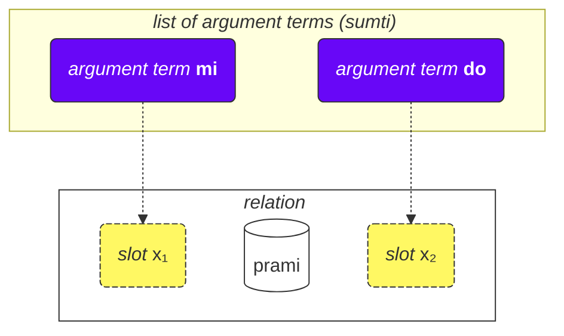
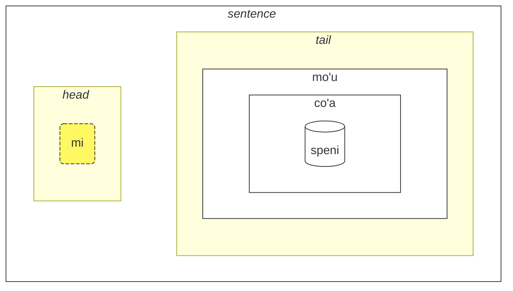

## Lektion 2. Mehr grundlegende Dinge

### Wortarten

Lojban-Wörter sind in drei Gruppen unterteilt:

- Relationswörter (auf Lojban **selbrivla** genannt)
  - Beispiele: **gleki**, **klama**.
  - Solche Wörter enthalten mindestens einen Konsonantencluster (zwei oder mehr Konsonanten hintereinander) innerhalb der ersten 5 Laute + sie enden auf einen Vokal.
- Partikel (auf Lojban **cmavo** genannt)
  - Beispiele: **le**, **nu**, **mi**, **fa'a**.
  - Sie beginnen mit einem Konsonanten (einer von **b d g v z j p t k f s c x l m n r i u**), gefolgt von einem Vokal (einer von **a e i o u y au ai ei oi**). Optional kann danach eine oder mehrere Sequenzen eines Apostrophs (**'**) und eines folgenden Vokals kommen. Zum Beispiel sind **xa'a'a'a'a'a'a** und **ba'au'oi'a'e'o** mögliche Partikel (auch wenn ihnen keine Bedeutung zugewiesen ist).
  - Es ist ziemlich üblich, mehrere Partikel hintereinander ohne Leerzeichen zu schreiben. Dies ist durch die Lojban-Grammatik erlaubt. Also, sei nicht überrascht, **lenu** statt **le nu**, **naku** statt **na ku**, **jonai** statt **jo nai** usw. zu sehen. Dies ändert die Bedeutung nicht. Diese Regel gilt jedoch nicht für Relationswörter; Relationswörter sollten durch Leerzeichen getrennt werden.
- Namenwörter (auf Lojban **cmevla** genannt)
  - Beispiele: **.alis.**, **.doris**, **.lojban.**
  - Üblicherweise verwendet für Personennamen, Ortsnamen usw.
  - Sie können leicht von den anderen Wortarten unterschieden werden, da sie auf einen Konsonanten enden. Zusätzlich sind sie am Anfang und Ende mit zwei Punkten umschlossen. Umgangssprachlich können Punkte beim Schreiben weggelassen werden, aber beim Sprechen sind Pausen, die diesen Punkten entsprechen, immer noch ein Muss.

### Reihenfolge der Argumente

Früher hatten wir Definitionen von Relationswörtern wie:

mlatu
: … ist eine Katze, eine Katze sein

citka
: … isst …

prami
: … liebt …

klama
: … kommt zu …

Wörterbücher können Definitionen von Relationswörtern mit Symbolen wie $x_1$, $x_2$ usw. präsentieren:

prami
: $x_1$ liebt $x_2$

karce
: $x_1$ ist ein Auto …

citka
: $x_1$ isst $x_2$ …

klama
: $x_1$ kommt zu $x_2$ …

Diese $x_1$, $x_2$ usw. sind die explizite Notation für die sogenannten _Slots_ (andere Namen sind: _Plätze_, _Rollen der Relation_, **terbricmi** auf Lojban). Slots werden im Satz durch Argumentbegriffe (**sumti**) gefüllt.

Zahlen repräsentieren die Reihenfolge, in der diese Slots durch Argumente gefüllt werden sollen.

Zum Beispiel:

> **mi prami do**
> _Ich liebe dich._

Dieser Satz impliziert auch, dass

- $x_1$ _denjenigen bezeichnet, der liebt_, und
- $x_2$ _denjenigen bezeichnet, der geliebt wird_.

Mit anderen Worten, jede Beziehung hat einen oder mehrere Slots, und diese Slots sind als $x_1$, $x_2$ usw. spezifiziert und gekennzeichnet. Wir setzen Argumente wie **mi**, **do**, **le tavla** usw. in Reihenfolge, füllen diese Slots und geben der Beziehung eine konkrete Bedeutung, wodurch ein Satz entsteht.

Der Vorteil eines solchen Definitionsstils ist, dass er <u>alle</u> möglichen Teilnehmer einer Beziehung sofort spezifiziert.

Wir können auch Argumente weglassen, wodurch der Satz vager wird:

> **carvi**
> _Es regnet._
> `ist Regen, regnet`

(obwohl die Zeit hier durch den Kontext bestimmt wird, kann es auch bedeuten _Es regnet oft_, _Es hat geregnet_, usw.)

> **prami do**
> _Jemand liebt dich._
> `liebt dich`

Alle ausgelassenen Stellen in einer Beziehung bedeuten einfach **zo'e** = _etwas/jemand_, also bedeutet es dasselbe wie

> **zo'e prami do**
> _Jemand liebt dich._

Und

> **prami**

ist dasselbe wie

> **zo'e prami zo'e**
> _Jemand liebt jemanden._

zo'e
: Pronomen: etwas oder jemand unbestimmt oder aus dem Kontext angenommen

Modale Begriffe wie **ca**, **fa'a** usw. fügen Beziehungen neue Stellen hinzu, aber sie füllen keine Slots der Beziehungen. In

> **mi klama fa'a do**
> _Ich komme zu dir._

ist der zweite Platz von **klama** immer noch ausgelassen. Zum Beispiel:

> **mi klama fa'a le cmana le zdani**
> _Ich komme (in Richtung des Berges) zum Haus._

le cmana
: der Berg

<pixra url="/assets/pixra/cilre/cmana.webp" caption="cmana" definition="… ist ein Berg"></pixra>

Hier ist der zweite Platz von **klama** **do**. Der Satz bedeutet, dass der Berg nur eine Richtung ist, während der Endpunkt du bist.

Hier ersetzt der Begriff **fa'a la cmana** (_in Richtung des Berges_) nicht den zweiten Platz der Beziehung **klama**. Der zweite Platz von **klama** ist hier **le zdani**.

Der Satz bedeutet, dass mein Zuhause einfach in Richtung des Berges liegt, aber das bedeutet nicht unbedingt, dass ich diesen Berg erreichen möchte. Das endgültige Ziel meines Kommens ist nicht der Berg, sondern das Zuhause.

Ähnlich, in

> **mi citka ba le nu mi cadzu**
> _Ich esse, nachdem ich gehe._

wird der zweite Platz von **citka** immer noch weggelassen. Ein neuer Begriff **ba** mit seinem Argument **le nu mi cadzu** fügt dem Satz Bedeutung hinzu.

Die Reihenfolge der Argumente einer zusammengesetzten Relation ist dieselbe wie die des letzten Bestandteils darin:

> **tu sutra bajra pendo mi**
> _Das ist mein schnell laufender Freund._
> `Das ist ein schnell laufender Freund von mir.`

> **tu pendo mi**
> _Das ist mein Freund._
> `Das ist ein Freund von mir.`

pendo
: … ist ein Freund von … (jemandem)

Also ist die Reihenfolge der Argumente von **sutra bajra pendo** dieselbe wie die von **pendo** allein.

### Mehr als zwei Plätze

Eine Relation kann mehr als zwei Plätze haben. Zum Beispiel:

> **mi pinxe le djacu le kabri**
> _Ich trinke das Wasser aus der Tasse._

pinxe
: $x_1$ trinkt $x_2$ aus $x_3$

> **le kabri**
> _die Tasse_

In diesem Fall gibt es drei Plätze, und wenn man den zweiten Platz in der Mitte ausschließen möchte, muss man **zo'e** verwenden:
> **mi pinxe zo'e le kabri**
> _Ich trinke \[etwas\] aus der Tasse._

Wenn wir **zo'e** weglassen, erhalten wir etwas Sinnloses:

> **mi pinxe le kabri**
> _Ich trinke die Tasse._

Ein weiteres Beispiel:

> **mi plicru do le plise**
> _Ich gebe dir die Äpfel._

plicru
: $x_1$ gibt, spendet an $x_2$ ein Objekt $x_3$; $x_1$ erlaubt jemandem $x_2$, $x_3$ zu benutzen

### Relationen innerhalb von Relationen

In
> **le nicte cu nu mi viska le lunra**
> *Die Nacht ist, wenn ich den Mond sehe.*

haben wir

- **le nicte** als $x_1$ der Relation,
- **nu mi viska le lunra** als die Hauptrelation.

Jedoch, innerhalb von **nu mi viska le lunra**, haben wir einen weiteren Satz mit

- **mi** - $x_1$ der inneren Relation,
- **viska** - die innere Relation,
- **le lunra** - $x_2$ der inneren Relation.

Also, trotz einer inneren Struktur, ist **nu mi viska le lunra** immer noch eine Relation mit ihrem ersten Begriff, der in diesem Fall mit **le nicte** gefüllt ist.

Ähnlich, in

> **mi citka ba le nu mi dansu**
> _Ich esse, nachdem ich tanze._

haben wir

- **mi** als $x_1$, die erste Stelle der Relation,
- **citka** als das Hauptrelationskonstrukt,
- **ba le nu mi dansu** als modalen Begriff der Hauptrelation des Satzes.

Innerhalb dieses Begriffs haben wir:

- **mi** als $x_1$, die erste Stelle der Relation innerhalb des Begriffs
- **dansu** als das Hauptrelationskonstrukt innerhalb des Begriffs.

Ein solcher "rekursiver" Mechanismus des Einbettens von Relationen in Relationen ermöglicht es, komplexe Ideen präzise auszudrücken.

### Warum sind Relationswörter so definiert, wie sie sind?

Englisch verwendet eine begrenzte Anzahl von Präpositionen, die über verschiedene Verben hinweg wiederverwendet werden und daher keine feste Bedeutung haben. Betrachten Sie zum Beispiel die englische Präposition _to_:

> _I speak to you._

<!-- -->
> _I come to you._
<!-- -->

> _To me it looks pretty._

In jedem dieser Beispiele hat _to_ eine neue Rolle, die bestenfalls entfernt ähnlich zu den Rollen in anderen Sätzen ist.

Es ist wichtig zu beachten, dass andere Sprachen unterschiedliche Methoden verwenden, um die Rollen von Verben zu kennzeichnen, die in vielen Fällen sehr unterschiedlich zu denen im Englischen sind.

Lojban beispielsweise kennzeichnet Kernrollen (Slots) von Relationen, indem solche Relationen vollständig mit den in Reihenfolge platzierten Rollen (oder markiert mit **fa**, **fe** usw.) definiert werden:

klama
: $x_1$ kommt zu $x_2$ …

tavla
: $x_1$ spricht zu $x_2$ …

melbi
: $x_1$ ist schön, hübsch zu $x_2$ …

Solche Kernrollen sind wesentlich zur Definition von Relationen.

Es kann jedoch optionale Rollen geben, die Relationen präziser machen:

> _I speak to you while I'm eating._
<!-- -->

> _It's hard to me because this thing is heavy._

In Lojban wird ein ähnlicher Begriff solcher optionalen Rollen durch separate Relationen oder, in den häufigsten Fällen, durch modale Begriffe ausgedrückt:

> **mi tavla do ze'a le nu mi citka**
> _Ich spreche zu dir, während ich esse._
<!-- -->
> **nandu mi ri'a le nu ti tilju**
> _Es ist schwer für mich, weil diese Sache schwer ist._

nandu
: $x_1$ ist schwer für $x_2$

tilju
: $x_1$ ist schwer

Präpositionen im Englischen sind ähnlich wie modale Partikel im Lojban, obwohl eine übliche englische Präposition viele Bedeutungen haben kann, während im Lojban jede modale Partikel nur eine (wenn auch vage) Bedeutung hat.

### Allgemeine Regeln in der Reihenfolge der Argumente

Die Reihenfolge der Orte in Beziehungen kann manchmal schwer zu merken sein, aber keine Sorge — du musst nicht alle Orte aller Beziehungswörter auswendig lernen. (Erinnerst du dich an die Bedeutung von Hunderttausenden von Wörtern auf Englisch?)

Du kannst die Orte studieren, wenn du sie nützlich findest oder wenn Leute sie in einem Dialog mit dir verwenden.

Die meisten Beziehungswörter haben zwei bis drei Orte.

Normalerweise kannst du die Reihenfolge anhand des Kontexts und einiger Faustregeln erraten:

1. Der erste Ort ist oft die Person oder das Ding, das etwas tut oder ist:

    **klama** = _$x_1$ geht …_

2. Das Objekt einer Handlung steht normalerweise direkt nach dem ersten Ort:

    **punji** = _$x_1$ legt $x_2$ auf $x_3$_,

3. Und der nächste Ort wird normalerweise mit dem Empfänger gefüllt:

    **punji** = _$x_1$ legt $x_2$ auf $x_3$_,

4. Zielorte (_zu_) kommen fast immer vor Ursprungsorten (_von_):

    **klama** = _$x_1$ geht zu $x_2$ von $x_3$_

    <pixra url="/assets/pixra/cilre/klama_fi.webp" caption="le prenu cu klama fi le zarci" definition="Die Person geht aus dem Laden."></pixra>

5. Weniger genutzte Orte kommen gegen Ende. Diese neigen dazu, Dinge wie _nach Standard_, _durch Mittel_ oder _bestehend aus_ zu sein.

Die allgemeine Idee ist, dass zuerst die Orte kommen, die am wahrscheinlichsten verwendet werden.

Es ist nicht notwendig, immer alle Orte auszufüllen. Unausgefüllte Orte haben einfach Werte, die für den Sprecher irrelevant oder offensichtlich sind (sie nehmen den Wert von **zo'e** = _etwas_ an).

### Infinitive

Infinitive sind Verben, die im Englischen oft mit _to_ eingeleitet werden. Beispiele sind _I like to run_, wobei _to run_ der Infinitiv ist.

> **le verba cu troci le ka cadzu**
> _Das Kind versucht zu laufen._

le verba
: das Kind, die Kinder

troci
: $x_1$ versucht zu tun oder zu sein $x_2$ (ka)

cadzu
: $x_1$ geht

<pixra url="/assets/pixra/cilre/troci_cadzu.webp" caption="le verba cu troci le ka cadzu" definition="Das Kind versucht zu laufen."></pixra>

Der Partikel **ka** funktioniert ähnlich wie **nu**. Er umschließt einen Satz.

Der Hauptunterschied ist, dass ein Slot im umschlossenen Satz durch ein Argument außerhalb dieses Satzes verknüpft werden soll.

In diesem Fall macht das erste Argument **le verba** der Relation **troci** einen Link zum ersten unausgefüllten Platz des inneren Satzes **cadzu** (der sich innerhalb von **ka** befindet).

Mit anderen Worten, das Kind versucht einen Zustand zu erreichen, in dem **le verba cu cadzu** (das Argument **le verba** würde den ersten unausgefüllten Platz der Relation **cadzu** ausfüllen).

Einige Relationen erfordern nur Infinitive in einigen ihrer Plätze. Definitionen solcher Wörter markieren solche Plätze als _Eigenschaft_ oder **ka**. Zum Beispiel:

cinmo
: $x_1$ fühlt $x_2$ (ka)

Das bedeutet, dass der Infinitiv im zweiten Platz ($x_2$) auf einen anderen Platz angewendet wird (höchstwahrscheinlich der erste Platz, $x_1$). Fälle, in denen der Infinitiv auf andere Plätze als $x_2$ angewendet wird, sind selten und werden in Wörterbüchern für entsprechende Relationen erklärt oder im Fall von inoffiziell erfundenen Relationswörtern kann dies durch gesunden Menschenverstand analog zu anderen ähnlichen Relationswörtern abgeleitet werden.

Ein weiteres Beispiel:

<pixra url="/assets/pixra/cilre/sidju.webp" caption="ra sidju le pendo le ka bevri le dakli" definition="Er/sie hilft dem Freund, die Taschen zu tragen."></pixra>

> **ra sidju le pendo le ka bevri le dakli**
> _Er/sie hilft dem Freund, die Taschen zu tragen._

sidju
: $x_1$ hilft $x_2$ $x_3$ zu tun (ka)

Das Relationswort **sidju** erfordert, dass sein dritter Platz mit einem Infinitiv ausgefüllt wird.

bevri
: $x_1$ trägt $x_2$

le dakli
: die Tasche, die Taschen

Beachten Sie, dass nur der erste unausgefüllte Platz der eingebetteten Relation die Bedeutung des äußeren Platzes annimmt:

> **mi troci le ka do prami**
> _Ich versuche, von dir geliebt zu werden._

tcidu
: $x_1$ liest $x_2$ von $x_3$

Hier ist der erste unausgefüllte Platz der zweite Platz von **prami**, daher nimmt er den Wert **mi** (_ich_) an.

Es ist auch möglich, durch die Verwendung des Pronomens **ce'u** explizit einen Platz zu markieren, der auf ein äußeres Argument angewendet werden muss:

> **mi troci le ka do prami ce'u**
> _Ich versuche, von dir geliebt zu werden._

Ein weiteres Beispiel:

> **mi cinmo le ka xebni ce'u**
> **mi cinmo le ka se xebni**
> _Ich fühle mich, als ob mich jemand hasst._
> _Ich fühle mich gehasst._

### Arten von Plätzen

Das Wörterbuch erwähnt oft andere Arten von Plätzen, zum Beispiel:

djica
: $x_1$ will $x_2$ (Ereignis)

Dieses _Ereignis_ bedeutet, dass du den Platz mit einem Argument füllen musst, das ein Ereignis darstellt. Zum Beispiel:

le nicte
: Nachtzeit

le nu mi dansu
: ich tanze

Also erhalten wir

> **mi djica le nicte**
> _Ich will das Nachtzeit-Ereignis._

<!-- -->

> **do djica le nu mi dansu**
> _Du willst, dass ich tanze._

Im Lojban ist es nicht erlaubt zu sagen, zum Beispiel:

> **mi djica le plise**
> _Ich will den Apfel._ 

 

weil du etwas mit dem Apfel machen willst oder ein Ereignis mit dem Apfel passieren soll, wie zum Beispiel:

> **mi djica le nu mi citka le plise**
> _Ich will den Apfel essen._
> `Ich will, dass ich den Apfel esse.`

Beachte, dass das Einwickeln einer Relation, die ein Ereignis erwartet, in ein **nu** die Bedeutung ändert:

> **le zekri cu cumki**
> _Das Verbrechen ist möglich._

zekri
: $x_1$ ist ein kriminelles Ereignis, $x_1$ (Ereignis) ein Verbrechen

cumki
: $x_1$ (Ereignis) ist möglich

Vergleiche:

> **le nu zekri cu cumki**
> `Dass es kriminell ist, ist möglich.`
> _Es ist möglich, dass etwas ein Verbrechen ist._

### Raising

> **mi stidi le ka klama le barja**
> _Ich schlage vor, in die Kneipe zu gehen._

stidi
: $x_1$ schlägt Aktion $x_2$ (Eigenschaft) $x_3$ vor

> **mi stidi tu'a le barja**
> _Ich schlage die Kneipe vor._

tu'a le barja
: etwas über die Kneipe

> **mi djica le nu mi citka le plise**
> _Ich will einen Apfel essen._

<!-- -->

> **mi djica tu'a le titla**
> _Ich will das Süße._

tu'a le titla
: etwas über das Süße

titla
: … ist süß, … ist ein Süßes

<pixra url="/assets/pixra/cilre/djica_tuha_le_titla.webp" caption="le prenu cu djica tu'a le titla" definition="Die Person will das Süße."></pixra>

Die Platzstruktur kann zu viel Aufwand beim Spezifizieren von Aktionen oder Ereignissen erfordern. Manchmal wollen wir nur ein Objekt in diesen Ereignissen oder Orten spezifizieren und die Beschreibung der Aktion oder des Ereignisses ganz überspringen.

In den obigen Beispielen _Ich schlage die Kneipe vor._ impliziert höchstwahrscheinlich, in die Kneipe zu gehen, und _Ich will den Apfel._ impliziert, ihn zu essen.

Jedoch erfordert das Lojban-Relationswort **stidi** eine Eigenschaft in seinem $x_2$ Slot. Ebenso erfordert **djica** ein Ereignis in seinem $x_2$ Slot.

Das kurze sogenannte Qualifikationswort **tu'a** vor einem Begriff impliziert eine Abstraktion (Eigenschaft, Ereignis oder Aussage), wählt aber nur diesen Begriff aus dieser Abstraktion aus und überspringt den Rest. Es kann vage als _etwas über_ übersetzt werden:

> **mi stidi tu'a le barja**
> _Ich schlage etwas über die Kneipe vor (vielleicht sie zu besuchen, sich in ihrer Nähe zu treffen usw.)._

<!-- -->

> **mi djica tu'a le plise**
> _Ich wünsche etwas im Zusammenhang mit dem Apfel (vielleicht ihn zu essen, zu kauen, zu lecken, ihn einem Freund zuzuwerfen usw.)_

> **tu'a le cakla cu pluka mi**
> _Die Schokolade gefällt mir (wahrscheinlich wegen ihres Geschmacks)._
> `Etwas über die Schokolade ist angenehm für mich`

cakla
: $x_1$ ist etwas Schokolade

Beim Überspringen von Abstraktionen sagt uns nur der Kontext, was weggelassen wurde.

Es ist auch möglich, die Hauptbeziehungskonstruktion zu modifizieren:

> **le cakla cu jai pluka mi**
> **tu'a le cakla cu pluka mi**
> _Die Schokolade gefällt mir._

Dies ermöglicht die Erstellung vager Argumentbegriffe mit **jai**:

> **le jai pluka cu zvati ti**
> _Das Angenehme ist hier._

Da **le pluka** (_das angenehme Ereignis_) abstrakt ist, ist es unmöglich, seinen Standort anzugeben. Ein Teilnehmer der Abstraktion kann jedoch physisch irgendwo platziert werden.

### Plätze innerhalb von Argumenten

Wie sagen wir _Du bist mein Freund_?

> **do pendo mi**
> _Du bist mein Freund._
> `Du bist ein Freund von mir.`

<pixra url="/assets/pixra/cilre/pendo.webp" caption="le pendo" definition="der Freund / die Freunde"></pixra>

Und nun, wie sagen wir _Mein Freund ist schlau._?

> **le pendo be mi cu stati**
> _Mein Freund ist schlau._

Wenn wir also eine Beziehung in ein Argument umwandeln (**pendo** — _ein Freund sein_ in **le pendo** — _der Freund_), können wir immer noch andere Plätze dieser Beziehung beibehalten, indem wir **be** danach setzen.

Standardmäßig wird der zweite Platz ($x_2$) angehängt. Wir können weitere Plätze anhängen, indem wir sie mit **bei** trennen:

> **mi plicru do le plise**
> _Ich gebe dir den Apfel._

<pixra url="/assets/pixra/cilre/plicru.webp" caption="le prenu cu plicru le pendo le plise" definition="Die Person gibt dem Freund den Apfel."></pixra>
<!-- -->

> **le plicru be mi bei le plise**
> _Der Geber des Apfels an mich_

<!-- -->

> **le plicru be mi bei le plise cu pendo mi**
> _Der Geber des Apfels an mich ist mein Freund._
> `Derjenige, der mir den Apfel gibt, ist ein Freund von mir.`

Ein weiteres Beispiel:

<!-- > **le pendo be mi cu tavla**
> _Meine Freunde reden._
> **le pendo mi cu tavla**
> **le pendo cu tavla mi**
> _Die Freunde reden mit mir._ -->

> **mi klama le pendo be do**
> _Ich komme zu einem Freund von dir._

klama
: $x_1$ kommt zu $x_2$ von $x_3$ …

Wir können **be** nicht weglassen, weil **le pendo do** zwei unabhängige Orte sind:

> **mi klama le pendo do**
> _Ich komme zu einem Freund von dir._

Hier hat **do** den dritten Platz von **klama** eingenommen, da es nicht über **be** an _pendo_ gebunden ist.

Wir könnten auch nicht **nu** verwenden, weil **le nu pendo do** das Ereignis ist, dass jemand dein Freund ist.

Also ist **le pendo be do** die richtige Lösung.

Ein weiteres Beispiel:

> **la .lojban. cu bangu mi**
> _Lojban ist meine Sprache._
> `Lojban ist eine Sprache von mir.`

Jedoch,

> **mi nelci le bangu be mi**
> _Ich mag meine Sprache._

Die Verwendung von **be** für Beziehungen, die nicht in Argumente umgewandelt wurden, hat keine Wirkung:

> **mi nelci be do** ist dasselbe wie 
> **mi nelci do**

### Relativsätze

> **le prenu poi pendo mi cu tavla mi**
> _Die Person, die mein Freund ist, spricht mit mir._

<!-- -->

> **le prenu noi pendo mi cu tavla mi**
> _Die Person, die zufällig mein Freund ist, spricht mit mir._

blabi
: … ist weiß

Im ersten Satz ist das Wort _die_ wesentlich, um die betreffende Person zu identifizieren. Es klärt, von wem unter den Personen im Kontext wir sprechen. Wir wählen nur diejenigen aus, die meine Freunde sind, wahrscheinlich aus vielen Menschen um uns herum. Vielleicht gibt es nur eine Person, die mein Freund ist.

Was _die zufällig mein Freund ist_ im zweiten Satz betrifft, so liefert es nur zusätzliche Informationen über die Person. Es hilft uns nicht, die Person zu identifizieren. Zum Beispiel könnte dies passieren, wenn alle Menschen um uns herum meine Freunde sind.

**poi pendo mi** ist ein Relativsatz, eine Beziehung, die rechts vom Argument **le prenu** angehängt ist. Es endet direkt vor dem nächsten Wort **cu**:

> **le prenu (poi pendo mi) cu tavla mi**
> _Die Person, die mein Freund ist, spricht mit mir._

Im Lojban verwenden wir **poi** für Relativsätze, die Entitäten (Objekte, Personen oder Ereignisse) identifizieren, und **noi** für beiläufige Informationen.

> **la .bob. ba co'a speni le ninmu poi pu xabju le nurma**
> _Bob wird ein Mädchen heiraten, das auf dem Land gelebt hat._

xabju
: … lebt in …, … bewohnt … (Ort, Objekt)

le nurma
: das ländliche Gebiet

Dieser Satz schließt nicht aus, dass Bob auch jemand anderen heiratet! Das Entfernen des Relativsatzes mit **poi** ändert die Bedeutung:

> **la .bob. ba co'a speni le ninmu**
> _Bob wird ein Mädchen heiraten._

Ein weiteres Beispiel:

> **le prenu poi gleki cu ze'u renvi**
> _Menschen (welche?), die glücklich sind, leben lange._

ze'u
: modaler Begriff: für eine lange Zeit

renvi
: überleben

Das Entfernen des Relativsatzes mit **poi** ändert die Bedeutung:

> **le prenu ze'u renvi**
> _Die Menschen leben lange._

Andererseits enthalten Relativsätze mit **noi** nur zusätzliche Informationen über das Argument, an das sie angehängt sind. Dieses Argument ist ausreichend definiert, sodass das Entfernen eines Relativsatzes mit **noi** seine Bedeutung nicht ändert:

> **mi nelci la .doris. noi mi ta'e zgana bu'u le panka**
> _Ich mag Doris, die ich gewöhnlich im Park sehe._
> _Ich mag Doris. Was kann ich noch über sie sagen? Ich sehe sie gewöhnlich im Park._

zgana
: beobachten (mit allen Sinnen)

<pixra url="/assets/pixra/cilre/panka_ninmu.webp" caption="le prenu noi mi ta'e zgana bu'u le panka" definition="Die Person, die ich gewöhnlich im Park sehe."></pixra>

Das Entfernen des Relativsatzes mit **noi** behält die Bedeutung bei: _Ich mag Doris._

Im gesprochenen Englisch wird der Unterschied oft durch Intonation oder durch Raten erreicht. Auch werden Relativsätze mit **noi** traditionell im Englischen durch Kommas getrennt. Sie verwenden _which_ oder _who_, und das Wort _that_ wird in ihnen nicht verwendet.

Lassen Sie uns ein weiteres Beispiel betrachten.

> **mi klama le pa tricu**
> _Ich komme zu dem Baum._

<!-- -->

> **le pa tricu cu barda**
> _Der Baum ist groß._

le pa tricu
: der Baum (ein Baum)

barda
: $x_1$ ist groß

Und jetzt verbinden wir diese beiden Sätze:

> **le tricu noi mi klama ke'a cu barda**
> _Der Baum, zu dem ich komme, ist groß._

Beachte das Wort **ke'a**. Wir verschieben den zweiten Satz über denselben Baum in einen Relativsatz und ersetzen das Argument **le tricu** durch **ke'a** im Relativsatz. Das Pronomen **ke'a** ist also wie _der_ und _welcher_ im Deutschen. Es verweist auf das Argument, an das der Relativsatz angehängt ist.

Wörtlich klingt unser lojbanischer Satz also wie

> _Der Baum, zu dem ich gehe, ist groß._

**ke'a** kann weggelassen werden, wenn der Kontext ausreichend ist. Die beiden folgenden Sätze bedeuten dasselbe:

> **le prenu poi pendo mi cu tavla mi**
> **le prenu poi ke'a pendo mi cu tavla mi**
> _Die Person, die mein Freund ist, spricht mit mir._

**ke'a** wird oft als das erste nicht ausgefüllte Argument angenommen:

> **mi nelci la .doris. noi mi ta'e zgana bu'u le panka**
> **mi nelci la .doris. noi mi ta'e zgana ke'a bu'u le panka**
> _Ich mag Doris, die ich gewöhnlich im Park sehe._

Hier füllt **mi** den ersten Platz der Relation **ta'e zgana** (_… sieht gewöhnlich …_), daher wird **ke'a** für den nächsten, zweiten Platz angenommen.

Relativsätze können wie gewöhnliche Relationen Konstrukte mit Modalbegriffen enthalten:

> **le tricu noi mi pu klama ke'a ca le cabdei cu barda**
> _Der Baum, zu dem ich heute gegangen bin, ist groß._

<pixra url="/assets/pixra/cilre/le_tricu_cu_barda.webp" caption="le tricu cu barda" definition="Der Baum ist groß."></pixra>

le cabdei
: der heutige Tag

Beachte, dass **ca le cabdei** zum Relativsatz gehört. Vergleiche:

> **le tricu noi mi pu klama ke'a cu barda ca le cabdei**
> _Der Baum, zu dem ich gegangen bin, ist heute groß._

Die Bedeutung hat sich stark verändert.

Schließlich wird **voi** verwendet, um **le**-ähnliche Argumente, aber mit Relativsätzen zu bilden:

> **ti voi le nu ke'a cisma cu pluka mi cu zutse tu**
> _Diese, deren Lächeln mir gefällt, sitzen dort._

<pixra url="/assets/pixra/cilre/voi.webp" caption="mi nelci ti voi le nu ke'a cisma cu pluka mi" definition="Ich mag diese, deren Lächeln mir gefällt."></pixra>

ti
: dieses hier bei mir, diese hier bei mir

cisma
: $x_1$ lächelt

pluka
: $x_1$ ist angenehm für $x_2$

zutse
: $x_1$ sitzt, sitzt auf $x_2$

Hier definiert **voi** das Objekt in meiner Nähe.

Vergleiche es mit:

> **ti poi le nu ke'a cisma cu pluka mi cu zutse**
> _Von diesen hier sitzen diejenigen, deren Lächeln mir gefällt._

**poi** beschränkt die Auswahl auf diejenigen, die im Relativsatz beschrieben werden.
Dieses Beispiel könnte implizieren, dass viele Objekte (Menschen etc.) um mich herum sind, aber mit **poi** wähle ich nur die notwendigen aus.

Vergleiche es mit:

> **ti noi le nu ke'a cisma cu pluka mi cu zutse**
> _Diese hier (die zufällig so sind, dass ihr Lächeln mir gefällt) sitzen._

**noi** fügt einfach zufällige Informationen hinzu, die nicht notwendig sind, um zu bestimmen, worauf sich **ti** (_diese hier_) bezieht. Vielleicht gibt es niemanden sonst, den man beschreiben könnte.

Schließlich, genau wie **nu** den rechten Begrenzungsmarker **kei** hat, haben wir

ku'o
: rechter Begrenzungsmarker für **poi**, **noi** und **voi**.

> **mi tavla la .doris. noi ca zutse tu ku'o .e la .alis. noi ca cisma**
> _Ich spreche mit Doris, die jetzt dort drüben sitzt, und Alice, die jetzt lächelt._

Beachte, dass ohne **ku'o** **tu** (_dort drüben_) zusammen mit **la .alis.** (_Alice_) verbunden wäre, was zu einer seltsamen Bedeutung führen würde:

> **mi tavla la .doris. noi ca zutse tu .e la .alis. noi ca cisma**
> _Ich spreche mit Doris, die jetzt dort drüben sitzt und auf Alice (die jetzt lächelt)._

Beachte den Teil **zutse tu .e la .alis.**.

Für alle **poi**, **noi** und **voi** ist der rechte Begrenzungsmarker immer noch derselbe: **ku'o**.

### Kurze Relativsätze. ‘_Über_’

Manchmal musst du möglicherweise ein zusätzliches Argument an ein anderes Argument anhängen:

> **mi djuno le vajni pe do**
> _Ich weiß etwas Wichtiges über dich._

le vajni
: etwas Wichtiges

**pe** und **ne** sind ähnlich wie **poi** und **noi**, aber sie hängen Argumente an Argumente an:

> **le pa penbi pe mi cu xunre**
> _Der Stift, der mir gehört, ist rot._ (_meiner_ ist wesentlich, um den fraglichen Stift zu identifizieren)

<!-- -->

> **le pa penbi ne mi cu xunre**
> _Der Stift, der mir gehört, ist rot._ (zusätzliche Information)

ne
: das sich bezieht auf, in Bezug auf … (ein Argument folgt)

pe
: das sich bezieht auf, in Bezug auf … (ein Argument folgt)

> **le pa penbi ne mi ge'u .e le pa fonxa ne do cu xunre**
> _Der Stift, der mir gehört, und das Telefon, das dir gehört, sind rot._

ge'u
: rechter Begrenzungsmarker für **pe**, **ne**.

### «**be**» und «**pe**»

Beachten Sie, dass Relativsätze an Argumente angehängt werden, während **be** ein Teil der Beziehung ist.

Tatsächlich ist **le bangu pe mi** eine bessere Übersetzung von _meine Sprache_, da, wie im Englischen, die beiden Argumente in einer vagen Weise miteinander verbunden sind.

Sie können jedoch **le birka be mi** als _mein Arm_ sagen. Selbst wenn Sie Ihren Arm absägen, wird er immer noch Ihnen gehören. Deshalb hat **birka** einen Platz für den Besitzer:

birka
: $x_1$ ist ein Arm von $x_2$

Zeigen wir noch einmal, dass ein Konstrukt mit **be** ein Teil der Beziehung ist, während **pe**, **ne**, **poi** und **noi** an Argumente angehängt werden:

> **le pa melbi be mi fonxa pe le pa pendo be mi cu barda**
> `Das schöne für mich Telefon des Freundes von mir ist groß.`

Hier ist **be mi** an die Beziehung **melbi** = _schön sein für … (jemanden)_ angehängt und schafft somit eine neue Beziehung **melbi be mi** = _schön sein für mich_. Aber **pe le pa pendo be mi** (_des Freundes von mir_) wird auf das gesamte Argument **le pa melbi be mi fonxa** (_das schöne für mich Telefon_) angewendet.

Es kann auch vorkommen, dass wir **be** an eine Beziehung anhängen müssen, diese Beziehung in ein Argument umwandeln und dann **pe** an dieses Argument anhängen:

> **le pa pendo be do be'o pe la .paris. cu stati**
> _Der Freund von dir, der mit Paris in Verbindung steht, ist klug._
> (<b>pe la .paris.</b> ist an das gesamte Argument <b>le pa pendo be do be'o</b> angehängt)

<!-- -->

> **le pu plicru be do bei le pa plise be'o pe la .paris. cu stati**
> _Wer dir den Apfel gegeben hat (und der mit Paris in Verbindung steht), ist klug._
> (<b>pe la .paris.</b> ist an das gesamte Argument <b>le pu plicru be do bei le pa plise be'o</b> angehängt)

be'o
: rechter Begrenzungsmarker für die Kette von Begriffen, die mit **be** und **bei** angehängt sind

In diesen beiden Beispielen hat dein Freund eine Beziehung zu Paris (vielleicht kommt er/sie aus Paris).

Vergleiche es mit:

> **le pa pendo be do pe la .paris. cu stati**
> _Der Freund von dir (du, der mit Paris verbunden ist) ist intelligent._

<!-- -->

> **le pu plicru be do bei le pa plise pe la .paris. cu stati**
> _Wer dir den Apfel gegeben hat (der Apfel, der mit Paris verbunden ist), ist intelligent._

In diesen letzten beiden Beispielen bist entweder du oder der Apfel mit Paris verbunden.

### ‘_Alice ist Lehrerin_’ und ‘_Alice ist die Lehrerin_’

Im Englischen lässt das Verb _is, are, to be_ ein Substantiv wie ein Verb funktionieren. Im Lojban funktionieren sogar solche Konzepte wie _Katze_ (**mlatu**), _Person_ (**prenu**), _Haus_ (**dinju**), _Zuhause_ (**zdani**) standardmäßig wie Verben (Relationen). Nur Pronomen funktionieren als Argumente.

Hier sind jedoch drei Fälle:

> **la .alis. cu ctuca**
> _Alice unterrichtet._

<pixra url="/assets/pixra/cilre/ctuca.webp" caption="mi ctuca" definition="Ich unterrichte / Ich bin Lehrer."></pixra>

<!-- -->

> **la .alis. cu me le ctuca**
> _Alice ist eine der Lehrer._

me
: … ist unter …, … ist eine/r von …, … sind Mitglieder von … (Argument folgt)

> **la .alis. ta'e ctuca**
> _Alice unterrichtet gewöhnlich._

ta'e
: Modalpartikel: das Ereignis passiert gewöhnlich

> **la .alis. cu du le ctuca**
> _Alice ist die Lehrerin._

du
: … ist identisch mit …

Die Partikel **me** nimmt ein Argument nach sich und zeigt an, dass es wahrscheinlich andere Lehrer gibt und Alice eine von ihnen ist.

Die Partikel **du** wird verwendet, wenn Alice zum Beispiel die Lehrerin ist, die wir gesucht oder über die wir gesprochen haben. Es zeigt Identität an.

So können **me** und **du** manchmal dem entsprechen, was wir im Englischen mit dem Verb _to be/is/was_ ausdrücken.

Im Lojban priorisieren wir die Bedeutung dessen, was wir sagen wollen, anstatt uns darauf zu verlassen, wie es wörtlich im Englischen oder anderen Sprachen ausgedrückt wird.

Weitere Beispiele:

> **mi me la .bond.**
> _Ich bin Bond._

<!-- -->

> **mi du la .kevin.**
> _Ich bin Kevin (derjenige, den du gebraucht hast)._

<!-- -->

> **ti du la .alis. noi mi ta'e zgana bu'u le panka**
> _Das ist Alice, die ich gewöhnlich im Park sehe._

**noi du** und **poi du** werden verwendet, um alternative Namen für etwas einzuführen. Sie entsprechen dem englischen _namely, i.e._:

> **la .alis. cu penmi le prenu noi du la .abdul.**
> _Alice traf die Person, nämlich Abdul._

Wenn man **me** verwendet, kann man mehrere Argumente mit _und_ verbinden:

> **tu me le pendo be mi be'o .e le tunba be mi**
> _Das sind einige (oder alle) meiner Freunde und meiner Geschwister._

tunba
: $x_1$ ist ein Geschwister von $x_2$

<pixra url="/assets/pixra/cilre/tunba.webp" caption="do tunba mi" definition="Du bist mein Geschwister."></pixra>

### Beziehungen mit Modalpartikeln

Wir können eine Modalpartikel nicht nur vor dem Hauptbeziehungskonstrukt des Satzes platzieren, sondern auch am Ende, was das gleiche Ergebnis erzielt:

> **mi ca tcidu**
> **mi tcidu ca**
> _Ich (jetzt lese)._

tcidu
: lesen (einen Text)

Wenn man **nu** verwendet, erstellt man eine Beziehung, die ein Ereignis beschreibt. Beachten Sie den Unterschied zwischen diesen beiden Beispielen:

> **le nu tcidu ca cu nandu**
> _Das aktuelle Lesen ist kompliziert, schwierig._

<!-- -->

> **le nu tcidu cu ca nandu**
> _Das Lesen ist jetzt kompliziert._

Weitere Beispiele:

> **mi klama le pa cmana pu**
> _Ich ging zum Berg._
> `Ich gehe zu einem Berg (in der Vergangenheit).`

<!-- -->

> **le nu mi klama le pa cmana pu cu pluka**
> _Dass ich zu einem Berg ging, ist angenehm._

Wir können auch eine oder mehrere Modalpartikeln als erstes Element eines Beziehungskonstrukts setzen und z.B. eine solche angereicherte Beziehung in einer Argumentform verwenden:

<pixra url="/assets/pixra/cilre/coha_purdi.webp" caption="le pu kunti tumla ca purdi" definition="Was eine Wüste war, ist jetzt ein Garten."></pixra>

> **le pu kunti tumla ca purdi**
> _Was eine Wüste war, ist jetzt ein Garten._

**pu** gehört zu **le kunti tumla** und **ca** gehört zu **purdi** (da **le pu kunti tumla** nicht **ca** am Ende hinzufügen kann).

<!-- Dies widerspricht nicht der Verwendung von **be** nach dem Verb, da man mit **be** das Verb ändert: **bangu be mi** wird als ein Verb betrachtet. -->

Mehrere Modalpartikeln in Reihenfolge sind kein Problem:
> **le pu ze'u kunti tumla ca purdi**
> _Was lange Zeit eine Wüste war, ist jetzt ein Garten._

ze'u
: modaler Begriff: für eine lange Zeit

Das Platzieren von Partikeln nach Substantiven bindet sie an äußere Beziehungen:

<pixra url="/assets/pixra/cilre/cohu_purdi.webp" caption="le kunti tumla pu purdi" definition="Die Wüste war ein Garten."></pixra>

> **le kunti tumla pu purdi**
> **(le kunti tumla) pu purdi**
> _Die Wüste war ein Garten._

### Neue Argumente aus Slots derselben Beziehung

> **do plicru mi ti**
> _Du gewährst mir dies._

<!-- -->

> **mi se plicru ti do**
> _Mir wird dies von dir gewährt._

plicru
: $x_1$ gibt $x_2$ etwas $x_3$ zur Nutzung

Wir können die ersten beiden Plätze in der Beziehung mit **se** tauschen und somit die Platzstruktur ändern.

**do plicru mi ti** bedeutet genau dasselbe wie **mi se plicru do ti**. Der Unterschied liegt ausschließlich im Stil.

Man möchte Dinge möglicherweise anders anordnen, um verschiedene Betonungen zu setzen, zum Beispiel, um die wichtigeren Dinge in einem Satz zuerst zu erwähnen. Die folgenden Paare bedeuten also dasselbe:

> **mi prami do**
> _Ich liebe dich._

<!-- -->

> **do se prami mi**
> _Du wirst von mir geliebt._

<!-- -->

> **le nu mi tadni la .lojban. cu xamgu mi**
> _Mein Studium von Lojban ist gut für mich._

xamgu
: … ist gut für (jemanden)

> **mi se xamgu le nu mi tadni la .lojban.**
> _Für mich ist es gut, Lojban zu studieren._

Dasselbe kann getan werden, wenn Beziehungen verwendet werden, um Argumente zu erstellen:

le plicru
: diejenigen, die geben, die Geber, die Spender

le se plicru
: diejenigen, denen gegeben wird, Empfänger von Geschenken

le te plicru
: diejenigen Objekte, die zur Nutzung gegeben werden, Geschenke

**te** tauscht die ersten und dritten Plätze der Beziehungen.

Wie wir wissen, wird ein Argument daraus, wenn wir **le** vor eine Beziehungsstruktur setzen. Also

- **le plicru** bedeutet _diejenigen, die in den ersten Platz von **plicru** passen könnten_
- **le se plicru** bedeutet _diejenigen, die in den zweiten Platz von **plicru** passen könnten_
- **le te plicru** bedeutet _diejenigen, die in den dritten Platz von **plicru** passen könnten_

Daher benötigen wir im Lojban keine separaten Wörter für _Spender_, _Empfänger_ und _Geschenk_. Wir verwenden dieselbe Beziehung erneut und sparen viel Aufwand aufgrund eines solch cleveren Designs. Tatsächlich können wir uns kein Geschenk vorstellen, ohne zu implizieren, dass es jemand gegeben hat oder geben wird. Wenn nützliche Phänomene miteinander verbunden sind, spiegelt Lojban dies wider.

<!-- TODO: DwE: For the ease of understanding and memorizing: predicate words prefixed with **se**, **te** are put into the dictionary in entries for many verbs together with their definitions, although you can figure out their meaning yourself. -->

### Andere Stellen in Hauptrelationen ändern

Die Serie **se, te, ve, xe** (in alphabetischer Reihenfolge) besteht aus Partikeln, die Stellen in Hauptrelationen ändern:

- **se** tauscht den ersten und zweiten Platz
- **te** tauscht den ersten und dritten Platz
- **ve** tauscht den ersten und vierten Platz
- **xe** tauscht den ersten und fünften Platz.

> **mi zbasu le pa stizu le mudri**
> _Ich habe den Stuhl aus dem Stück Holz gemacht._

zbasu
: $x_1$ baut, macht $x_2$ aus $x_3$

le pa stizu
: der Stuhl

le mudri
: das Stück Holz

> **le mudri cu te zbasu le stizu mi**
> _Das Stück Holz ist das, woraus der Stuhl von mir gemacht wurde._

Das **mi** ist jetzt an die dritte Stelle der Relation gerückt und kann weggelassen werden, wenn wir zu faul sind, anzugeben, wer den Stuhl gemacht hat, oder wenn wir einfach nicht wissen, wer ihn gemacht hat:

> **le mudri cu te zbasu le stizu**
> _Das Stück Holz ist das Material des Stuhls._

Ähnlich wie in unserem Beispiel mit **le se plicru** (_der Empfänger_) und **le te plicru** (_das Geschenk_), können wir **te**, **ve**, **xe** verwenden, um mehr Wörter aus anderen Stellen von Relationswörtern abzuleiten:

klama
: $x_1$ geht zu $x_2$ von $x_3$ über $x_4$ mit Mitteln $x_5$

Daher können wir ableiten, dass

le klama
: der Ankömmling / die Ankömmlinge

le se klama
: der Zielort

le te klama
: der Ursprungsort der Bewegung

le ve klama
: die Route

le xe klama
: die Mittel des Kommens

**le xe klama** und der fünfte Platz von **klama** können jedes Mittel der Bewegung bezeichnen, wie z.B. Autofahren oder zu Fuß gehen.

**se** wird häufiger verwendet als die anderen Partikeln zum Tauschen von Plätzen.

### Freie Wortstellung: Tags für Rollen in Relationen

Normalerweise benötigen wir nicht alle Slots, Plätze einer Relation, sodass wir die unnötigen durch **zo'e** ersetzen können. Wir können jedoch _Platz-Tags_ verwenden, um explizit auf einen benötigten Slot zu verweisen. Platz-Tags funktionieren wie Modalpartikeln, befassen sich jedoch mit der Platzstruktur von Relationen:

> **mi prami do** ist dasselbe wie
> **fa mi prami fe do**
> _Ich liebe dich._

- **fa** markiert das Argument, das den ersten Platz einer Relation füllt ($x_1$)
- **fe** markiert das Argument, das den zweiten Platz füllt ($x_2$)
- **fi** markiert das Argument, das den dritten Platz füllt ($x_3$)
- **fo** markiert das Argument, das den vierten Platz füllt ($x_4$)
- **fu** markiert das Argument, das den fünften Platz füllt ($x_5$)

Weitere Beispiele:

> **mi klama fi le tcadu**
> _Ich gehe von der Stadt._

**fi** markiert **le tcadu** als den dritten Platz von **klama** (den Ursprung der Bewegung). Ohne **fi** würde der Satz zu **mi klama le tcadu** werden, was bedeutet _Ich gehe in die Stadt._

> **mi pinxe fi le kabri** ist dasselbe wie
> **mi pinxe zo'e le kabri**
> _Ich trinke (etwas) aus der Tasse._

pinxe
: $x_1$ trinkt $x_2$ aus $x_3$

le kabri
: die Tasse, das Glas

<pixra url="/assets/pixra/cilre/pinxe_fi_le_kabri.webp" caption="le prenu cu pinxe fi le kabri" definition="Die Person trinkt aus dem Glas."></pixra>

> **mi tugni zo'e le nu vitke le rirni**
> **mi tugni fi le nu vitke le rirni**
> _Ich stimme (mit jemandem) über den Besuch der Eltern überein._

tugni
: $x_1$ stimmt mit jemandem $x_2$ über $x_3$ (Vorschlag) überein

le rirni
: der Elternteil / die Eltern

Mit Platzmarkierungen können wir die Plätze verschieben:

> **fe mi fi le plise pu plicru**
> _Jemand gab mir den Apfel._

Hier,

- **le plise** = _der Apfel_, wir setzen es in den dritten Platz von **plicru**, was gegeben wird
- **mi** = _mir_, wir setzen es in den zweiten Platz von **plicru**, der Empfänger.

Wie wir im letzten Beispiel sehen können, können wir die Wortreihenfolge in der englischen Übersetzung nicht einmal widerspiegeln.

Der umfangreiche Gebrauch von Platzmarkierungen kann unsere Rede schwerer verständlich machen, aber sie ermöglichen mehr Freiheit.

Im Gegensatz zur **se**-Serie ändert die Verwendung von Platzmarkierungen wie **fa** nicht die Platzstruktur.

---

Wir können Platzmarkierungen innerhalb von Argumenten verwenden, indem wir sie nach **be** setzen:

> **le pa klama be fi le tcadu cu pendo mi**
> _Derjenige, der in die Stadt kommt, ist mein Freund._

---

Wir können auch alle Argumente einer Hauptrelation vor das Satzende setzen (unter Beibehaltung ihrer relativen Reihenfolge). Aufgrund dieser Freiheit können wir sagen:

> **mi do prami** was dasselbe ist wie
> **mi do cu prami** was dasselbe ist wie
> **mi prami do**
> _Ich liebe dich._

<!-- -->

> **ko kurji ko** ist dasselbe wie
> **ko ko kurji**
> _Pass auf dich auf._

Die folgenden Sätze haben ebenfalls die gleiche Bedeutung:

> **mi plicru do le pa plise**
> _Ich gebe dir den Apfel._

<!-- -->

> **mi do cu plicru le pa plise**
> _Ich gebe dir den Apfel._

<!-- -->

> **mi do le pa plise cu plicru**
> _Ich gebe dir den Apfel._

### Prenex

Prenex ist ein "Präfix" der Relation, in dem Sie Variablen deklarieren können, die später verwendet werden:

> **pa da poi pendo mi zo'u da tavla da**
> _Es gibt jemanden, der mein Freund ist, sodass er/sie mit sich selbst spricht._

zo'u
: Prenex-Trenner

da
: Pronomen: Variable.

Das Pronomen **da** wird übersetzt als _es gibt etwas/jemanden …_ Wenn wir **da** das zweite Mal in derselben Relation verwenden, bezieht es sich immer auf dasselbe wie das erste **da**:

> **mi djica le nu su'o da poi kukte zo'u mi citka da**
> _Ich wünschte, es gäbe zumindest etwas Leckeres, damit ich es esse._

su'o
: Zahl: mindestens 1

Wenn die Variable in derselben Relation und nicht in eingebetteten Relationen verwendet wird, können Sie den Prenex ganz weglassen:

> **mi djica le nu su'o da poi kukte zo'u mi citka da**
> **mi djica le nu mi citka su'o da poi kukte**
> _Ich wünschte, es gäbe zumindest etwas Leckeres, damit ich es esse._
> _Ich wünsche mir, dass es etwas gibt, damit ich es esse._

Beide Beispiele bedeuten dasselbe, in beiden Fällen bezeichnet **su'o da** _es gibt (gab/wird geben) etwas oder jemanden_.

Prenex ist jedoch nützlich und notwendig, wenn Sie **da** tief in Ihrer Relation verwenden müssen, d.h. innerhalb eingebetteter Relationen:

> **su'o da poi kukte zo'u mi djica le nu mi citka da**
> _Es gibt zumindest etwas Leckeres: Ich wünschte, ich hätte es gegessen, ich möchte es essen._
> _Es gibt etwas Leckeres, das ich essen möchte._

Beachten Sie, wie sich die Bedeutung ändert. Hier können wir den Prenex nicht weglassen, da dies die Bedeutung des vorherigen Beispiels ändern würde.

Weitere Beispiele:

> **mi tavla**
> _Ich spreche._

<!-- -->

> **mi tavla su'o da**
> **mi tavla da**
> _Es gibt jemanden, mit dem ich spreche._

By default bedeutet **da** als Pronomen allein dasselbe wie **su'o da** (_es gibt mindestens einen …_), es sei denn, es wird eine explizite Zahl verwendet.

> **da tavla da**
> _Jemand spricht mit sich selbst._

<!-- -->

> **da tavla da da**
> _Jemand spricht mit sich selbst über sich selbst._

tavla
: $x_1$ spricht mit jemandem $x_2$ über das Thema $x_3$

> **pa da poi ckape zo'u mi djica le nu da na ku fasnu**
> _Es gibt eine gefährliche Sache: Ich wünsche, dass sie nie passiert._

**da** impliziert keine bestimmten Objekte oder Ereignisse, was oft nützlich ist:

> **xu do tavla su'o da poi na ku slabu do**
> _Sprichst du mit jemandem, der dir nicht vertraut ist? (keine bestimmte Person ist gemeint)._

<!-- -->

> **.e'u mi joi do casnu bu'u su'o da poi drata**
> _Lass uns an einem anderen Ort diskutieren (kein bestimmter Ort ist gemeint)_

### Argumente der Existenz

> **pa da poi me le pendo be mi zo'u mi prami da**
> _Es gibt jemanden, der mein Freund ist, sodass ich ihn liebe._

Da **da** nur einmal verwendet wird, könnten wir versucht sein, den Prenex zu entfernen. Aber wie sollten wir den Relativsatz **poi pendo mi** (_der mein Freund ist_) behandeln?

Glücklicherweise gibt es im Lojban eine Abkürzung:

> **pa da poi me le pendo be mi zo'u mi prami da**
> **mi prami pa le pendo be mi**
> _Es gibt jemanden, der mein Freund ist, sodass ich ihn liebe._

Beide Sätze bedeuten dasselbe.

Argumente, die mit Zahlen beginnen wie **pa le pendo** (_es gibt jemanden, der mein Freund ist_), **ci le prenu** (_es gibt drei Personen_) können sich jedes Mal auf neue Entitäten beziehen, wenn sie verwendet werden. Deshalb

> **pa le pendo be mi ca tavla pa le pendo be mi**
> _Es gibt einen Freund von mir, der mit einem Freund von mir spricht._

Dieser Satz ist nicht präzise darin, ob dein Freund mit sich selbst spricht oder ob du zwei deiner Freunde beschreibst, sodass der erste mit dem zweiten spricht.

Es ist vernünftiger zu sagen:

> **le pa pendo be mi ca tavla ri**
> _Mein Freund spricht mit sich selbst._

ri
: Pronomen: bezieht sich auf das vorherige Argument, ausgenommen **mi**, **do**.

Hier bezieht sich **ri** auf das vorherige Argument: **le pa pendo** insgesamt.

Note the difference:

- **da** bedeutet _es gibt etwas/jemanden_, **da** bezieht sich immer auf dieselbe Entität, wenn es mehr als einmal in derselben Beziehung verwendet wird.
- Ein Argument wie **pa le mlatu** (mit einer bloßen Zahl) ist ähnlich wie **pa da poi me le mlatu**, kann sich jedoch jedes Mal auf neue Entitäten beziehen, wenn es verwendet wird.

> **mi nitcu le nu pa da poi mikce zo'u da kurju mi**
> _Ich brauche einen Arzt, der sich um mich kümmert (impliziert "jeder Arzt ist in Ordnung")._

<!-- -->

> **pa da poi mikce zo'u mi nitcu le nu da kurju mi**
> _Es gibt einen Arzt, den ich brauche, um sich um mich zu kümmern._

Ein weiteres Beispiel:

> **le nu pilno pa le bangu kei na ku banzu**
> _Nur eine der Sprachen zu verwenden, ist nicht genug._

pilno
: … benutzt …

banzu
: … ist genug für den Zweck …

Vergleiche es mit:

> **le nu pilno le pa bangu kei na ku banzu**
> _Die Sprache (die in Frage steht) zu verwenden, ist nicht genug._

Existenzargumente werden natürlich innerhalb innerer Beziehungen und mit **tu'a** verwendet:

> **mi djica le nu mi citka pa le plise**
> _Ich möchte einen Apfel essen, irgendeinen Apfel._

> **mi djica tu'a pa le plise**
> _Ich möchte etwas über einen Apfel, irgendeinen Apfel (wahrscheinlich, ihn essen, vielleicht kauen, lecken, ihn auf deinen Freund werfen usw.)_

Beachte den Unterschied:

> **mi djica tu'a le pa plise**
> _Ich möchte etwas über den Apfel (den Apfel in Frage)._

### ‘_I have an arm._’ ‘_I have a brother._’

Das englische Verb _to have_ hat mehrere Bedeutungen. Lassen Sie uns einige davon auflisten.

> **pa da birka mi**
> _Ich habe einen Arm._
> `Es gibt etwas, das ein Arm von mir ist`

birka
: $x_1$ ist ein Arm von $x_2$

Wir verwenden dieselbe Strategie, um familiäre Beziehungen auszudrücken:

> **pa da bruna mi**
> **mi se bruna pa da**
> _Jemand ist mein Bruder._
> _Ich habe einen Bruder._
> `Es gibt jemanden, der ein Bruder von mir ist`

<!-- -->

> **re lo bruna be mi cu clani**
> _Ich habe zwei Brüder, und sie sind groß._

clani
: $x_1$ ist lang, groß

Wir brauchen also nicht das Verb _to have_, um solche Beziehungen zu kennzeichnen. Dasselbe gilt für andere Familienmitglieder:

> **da mamta mi**
> **mi se mamta da**
> _Ich habe eine Mutter._

<!-- -->

> **da patfu mi**
> **mi se patfu da**
> _Ich habe einen Vater._

<!-- -->

> **da mensi mi**
> **mi se mensi da**
> _Ich habe eine Schwester._

<!-- -->

> **da panzi mi**
> **mi se panzi da**
> _Ich habe ein Kind (oder Kinder)._

panzi
: $x_1$ ist ein Kind, Nachkomme von $x_2$

Beachten Sie, dass die Verwendung einer Zahl vor **da** nicht notwendig ist, wenn der Kontext ausreicht.

---

Eine andere Bedeutung von _haben_ ist _behalten_:

> **mi ralte le pa gerku**
> _Ich habe den Hund._
> `Ich behalte den Hund`

<!-- -->

> **mi ralte le pa karce**
> _Ich habe das Auto._

ralte
: $x_1$ behält $x_2$ in seinem Besitz

---

Wenn Sie etwas gemäß einem Gesetz oder Dokumenten besitzen, sollten Sie **ponse** verwenden:

> **mi ponse le karce**
> _Ich besitze das Auto._
> _Ich habe das Auto._

ponse
: $x_1$ besitzt $x_2$

### Umfang

Die Reihenfolge von
* Begriffen, beginnend mit Zahlen,
* modalen Begriffen und
* modalen Partikeln von Beziehungskonstrukten,

ist wichtig und sollte von links nach rechts gelesen werden:

> **ci le pendo cu tavla re le verba**
> _Es gibt drei Freunde, die jeweils mit zwei Kindern sprechen._

Die Gesamtzahl der Kinder kann hier bis zu sechs betragen.

Durch die Verwendung von **zo'u** können wir unseren Satz klarer machen:

> **ci da poi me le pendo ku'o re de poi me le verba zo'u da tavla de**
> _Für drei **da**, die zu den Freunden gehören, für zwei **de**, die zu den Kindern gehören: **da** spricht mit **de**._

Hier sehen wir, dass jeder der Freunde mit zwei Kindern spricht, und es könnten jedes Mal unterschiedliche Kinder sein, mit insgesamt bis zu sechs Kindern.

Wie können wir dann die andere Interpretation ausdrücken, bei der nur zwei Kinder beteiligt sind? Wir können nicht einfach die Reihenfolge der Variablen im Prenex umkehren zu:

> **re de poi me le verba ku'o ci da poi me le pendo zo'u da tavla de**
> _Für zwei **de**, die zu den Kindern gehören, für drei **da**, die zu den Freunden gehören, **da** spricht mit **de**_

Obwohl wir jetzt die Anzahl der Kinder auf genau zwei begrenzt haben, enden wir mit einer unbestimmten Anzahl von Freunden, die von drei bis sechs reicht. Diese Unterscheidung wird als „Umfangsunterscheidung“ bezeichnet: Im ersten Beispiel hat **ci da poi me le pendo** einen größeren Umfang als **re de poi me le verba** und geht daher im Prenex voraus. Im zweiten Beispiel ist das Gegenteil der Fall.

Um den Geltungsbereich gleich zu machen, verwenden wir eine spezielle Konjunktion **ce'e**, die zwei Begriffe verbindet:

> **ci da poi me le pendo ce'e re de poi me le verba cu tavla**
> **ci le pendo ce'e re le verba cu tavla**
> _Drei Freunde [und] zwei Kinder, reden._

Dies wählt zwei Gruppen aus, eine mit drei Freunden und die andere mit zwei Kindern, und sagt, dass jeder der Freunde mit jedem der Kinder spricht.

Die Reihenfolge ist auch bei modalen Partikeln, die Hauptbeziehungsstrukturen modifizieren, wichtig:

> **mi speni**
> _Ich bin verheiratet, ich habe eine Frau oder einen Mann._

<!-- -->

> **mi co'a speni**
> _Ich heirate._

<!-- -->

> **mi mo'u speni**
> _Ich bin verwitwet._

mo'u
: Begriff: das Ereignis ist abgeschlossen

Vergleichen wir nun:

> **mi mo'u co'a speni**
> _Ich bin frisch verheiratet._
> `Ich habe den Prozess des Heiratens abgeschlossen.`

> **mi co'a mo'u speni**
> _Ich werde verwitwet._
> `Ich werde das Beenden des Verheiratetseins.`

Wenn es mehrere modale Partikeln in einem Satz gibt, lautet die Regel, dass wir sie von links nach rechts zusammen lesen und uns das als eine sogenannte _imaginäre Reise_ vorstellen. Wir beginnen an einem impliziten Punkt in Zeit und Raum (das "Jetzt und Hier" des Sprechers, wenn kein Argument rechts angehängt ist) und folgen dann den Modalen nacheinander von links nach rechts.

Nehmen wir **mi mo'u co'a speni**.

**mo'u** bedeutet, dass ein Ereignis abgeschlossen ist. Welches Ereignis? Das Ereignis **co'a speni** — zu heiraten. Daher bedeutet **mi mo'u co'a speni** _Ich beende den Prozess des Heiratens_, d.h. _Ich bin frisch verheiratet._

In solchen Fällen sagen wir, dass **co'a speni** im "Geltungsbereich" von **mo'u** liegt.

In **mi co'a mo'u speni** ist die Reihenfolge der Ereignisse anders.

Zuerst wird gesagt, dass ein Ereignis begonnen hat (**co'a**), dann wird festgestellt, dass es sich um ein Ereignis des Beendens des Verheiratetseins handelt. Daher bedeutet **mi co'a mo'u speni** _Ich werde verwitwet._

Wir können sagen, dass hier **mo'u speni** im "Geltungsbereich" von **co'a** liegt.

Ein weiteres Beispiel:

> **mi co'a ta'e citka**
> _Ich beginne, gewohnheitsmäßig zu essen._

<!-- -->

> **mi ta'e co'a citka**
> _Ich beginne gewohnheitsmäßig zu essen._

Beispiele mit einfachen Zeiten:

> **mi pu ba klama le cmana**
> _Es geschah, bevor ich zum Berg ging._
> `Ich in Vergangenheit: in Zukunft: gehe zum Berg.`

> **mi ba pu klama le cmana**
> _Es wird passieren, nachdem ich zum Berg gegangen bin._
> `Ich in Zukunft: in Vergangenheit: gehe zum Berg.`

Die Regel, Begriffe von links nach rechts zu lesen, kann durch das Verbinden von Modalpartikeln mit der Konjunktion **ce'e** außer Kraft gesetzt werden:

> **mi ba ce'e pu klama le cmana**
> _Ich ging und werde zum Berg gehen._
> `Ich in Zukunft und in Vergangenheit: gehe zum Berg.`

> **mi cadzu ba le nu mi citka ce'e pu le nu mi sipna**
> _Ich gehe, nachdem ich gegessen habe und bevor ich schlafe._

### Modalpartikeln + «**da**» + Argumente, die mit Zahlen beginnen

Wie bei Modalbegriffen ist die Position von **da** wichtig:

> **mi ponse da**
> _Es gibt etwas, das ich besitze._

<!-- -->

> **mi co'u ponse da**
> _Ich habe mein ganzes Eigentum verloren._

ponse
: $x_1$ besitzt $x_2$

co'u
: Modalbegriff: das Ereignis endet

Dies könnte wie ein verwirrendes Beispiel aussehen. Hier konnte eine Person sagen _Ich besitze etwas._ Aber dann endete diese Situation für alles, was die Person besaß.

Ein weiteres Beispiel:

> **ro da vi cu cizra**
> _Alles ist hier seltsam._
> `Jedes Ding hier seltsam`

vi
: hier, in kurzer Entfernung

cizra
: $x_1$ ist seltsam

> **vi ku ro da cizra**
> _Hier ist alles seltsam._
> `Hier: jedes Ding seltsam`

Hast du den Unterschied bemerkt?

1. _Alles ist hier seltsam_ bedeutet, dass wenn etwas irgendwo nicht seltsam ist, es an diesem Ort seltsam wird.
2. _Hier ist alles seltsam_ beschreibt einfach jene Objekte oder Ereignisse, die hier sind (und sie sind seltsam). Wir wissen nichts über andere an anderen Orten.

<pixra url="/assets/pixra/cilre/viku_cizra.webp" caption="vi ku ro da cizra" definition="Hier ist alles seltsam."></pixra>

Ein weiteres Beispiel mit einem Argumentbegriff, der mit einer Zahl beginnt:

> **pa le prenu ta'e jundi**
> _Es gibt eine Person, die gewohnheitsmäßig aufmerksam ist._

— es ist dieselbe Person, die aufmerksam ist.

> **ta'e ku pa le prenu cu jundi**
> _Es passiert gewohnheitsmäßig, dass es eine Person gibt, die aufmerksam ist._

— es ist immer diese eine Person aufmerksam. Die Menschen können sich ändern, aber es gibt immer eine aufmerksame Person.

### Generische Argumente. ‘Ich mag Katzen (im Allgemeinen)’. Mengen

> **mi nelci le'e mlatu**
> _Ich mag Katzen._

Wir haben gesehen, dass **le** meistens als das englische _the_ übersetzt wird. In einigen Fällen möchten wir jedoch ein typisches Objekt oder Ereignis beschreiben, das am besten einen Objekttyp oder ein Ereignis in unserem Kontext veranschaulicht. In diesem Fall ersetzen wir **le** durch **le'e**:

> **mi nelci le'e badna .i mi na ku nelci le'e plise**
> _Ich mag Bananen. Ich mag keine Äpfel._

Ich habe vielleicht keine Bananen oder Äpfel zur Hand. Ich spreche einfach über Bananen und Äpfel, wie ich sie verstehe, erinnere oder definiere.

Um einen Argumentbegriff zu bilden, der die Menge von Objekten oder Ereignissen beschreibt (aus denen wir ein solches typisches Element ableiten), verwenden wir das Wort **le'i**:

> **le danlu pendo pe mi cu mupli le ka ca da co'a morsi kei le'i mabru**
> _Mein Haustier ist ein Beispiel dafür, dass Säugetiere irgendwann sterben._

danlu
: $x_1$ ist ein Säugetier

morsi
: $x_1$ ist tot

co'a morsi
: $x_1$ stirbt

ca da
: zu einem bestimmten Zeitpunkt

mupli
: $x_1$ ist ein Beispiel für $x_2$ (Eigenschaft) unter $x_3$ (Menge)

Wörterbücher geben die zu füllenden Beziehungsslots an, die mit Mengen gefüllt werden müssen.

### Massen

> **lei prenu pu sruri le jubme**
> _Die Leute umringten den Tisch._
> `Die Masse der Leute umringte den Tisch.`

<pixra url="/assets/pixra/cilre/sruri.webp" caption="lei prenu cu sruri le jubme" definition="Die Leute umringten den Tisch."></pixra>

Wir verwenden **lei** anstelle von **le**, um zu zeigen, dass die Masse der Objekte für die Handlung relevant ist, aber nicht unbedingt jedes dieser Objekte einzeln. Vergleiche:

> **le prenu pu smaji**
> _Die Leute waren still._

> **lei prenu pu smaji**
> _Die Menge war still._

le prenu
: die Person, die Leute

lei prenu
: die Menge, die Masse der Leute

smaji
: $x_1$ ist still

> **le since cu sruri le garna**
> _Die Schlangen umringten den Stab._
> _Jede der Schlangen umringte den Stab._

— hier umringte wahrscheinlich jede Schlange den Stab, indem sie sich darum wickelte.

> **lei since cu sruri le garna**
> _Die Schlangen umringten den Stab._
> _Die Schlangen umringten den Stab als Masse._

— hier kümmern wir uns nicht um einzelne Schlangen, sondern stellen fest, dass die Schlangen als Masse kollektiv den Stab umringten.

<pixra url="/assets/pixra/cilre/sruri_since.webp" caption="le pa since cu sruri le prenu" definition="Die Schlange umgab die Person."></pixra>

> **lei re djine cu sinxa la .lojban.**
> _Die zwei Ringe sind ein Symbol für Lojban._

> **na ku re le djine cu sinxa la lojban**
> _Es ist nicht wahr, dass jeder der beiden Ringe ein Symbol für Lojban ist._

djine
: $x_1$ ist ein Ring

Tatsächlich bilden nur die beiden Ringe zusammen ein Symbol.

Betrachten Sie einen Satz:

> _Äpfel sind schwer._

Bedeutet das, dass jeder Apfel schwer ist, oder bedeutet es, dass sie schwer sind, wenn man sie zusammen nimmt?

Im Lojban können wir leicht zwischen diesen beiden Fällen unterscheiden:

> **le ci plise cu tilju**
> _Jeder der drei Äpfel ist schwer._

> **le plise cu tilju**
> _Jeder der Äpfel ist schwer._

> **lei ci plise cu tilju**
> _Die drei Äpfel sind insgesamt schwer._
> (sodass jeder Apfel leicht sein könnte, aber zusammen sind sie schwer)

tilju
: $x_1$ ist schwer

Wie Sie sehen können, gibt es einen wichtigen Unterschied zwischen der Beschreibung eines Objekts innerhalb einer Masse und der Beschreibung der Masse selbst.

### Zahlen in Stellen

> **le ci plise cu grake li pa no no**
> _Jeder der drei Äpfel wiegt 100 Gramm._

<!-- -->

> **lei ci plise cu grake li pa no no**
> _Die drei Äpfel wiegen insgesamt 100 Gramm._
> (sodass jeder Apfel im Durchschnitt ≈ 33 Gramm wiegt)

grake
: $x_1$ wiegt $x_2$ (Zahl) Gramm

Wenn eine Stelle einer Relation eine Zahl erfordert, wie im Wörterbuch erwähnt, dann verwenden wir diese Zahl, indem wir sie mit dem Wort **li** voranstellen.

**li** ist ein Präfix, das signalisiert, dass eine Zahl, ein Zeitstempel oder ein mathematischer Ausdruck folgt.

> **li mu no**
> _Zahl 50._

Ein einfaches **mu no**, das nicht mit **li** vorangestellt ist, würde verwendet, um 50 Objekte oder Ereignisse zu bezeichnen.
