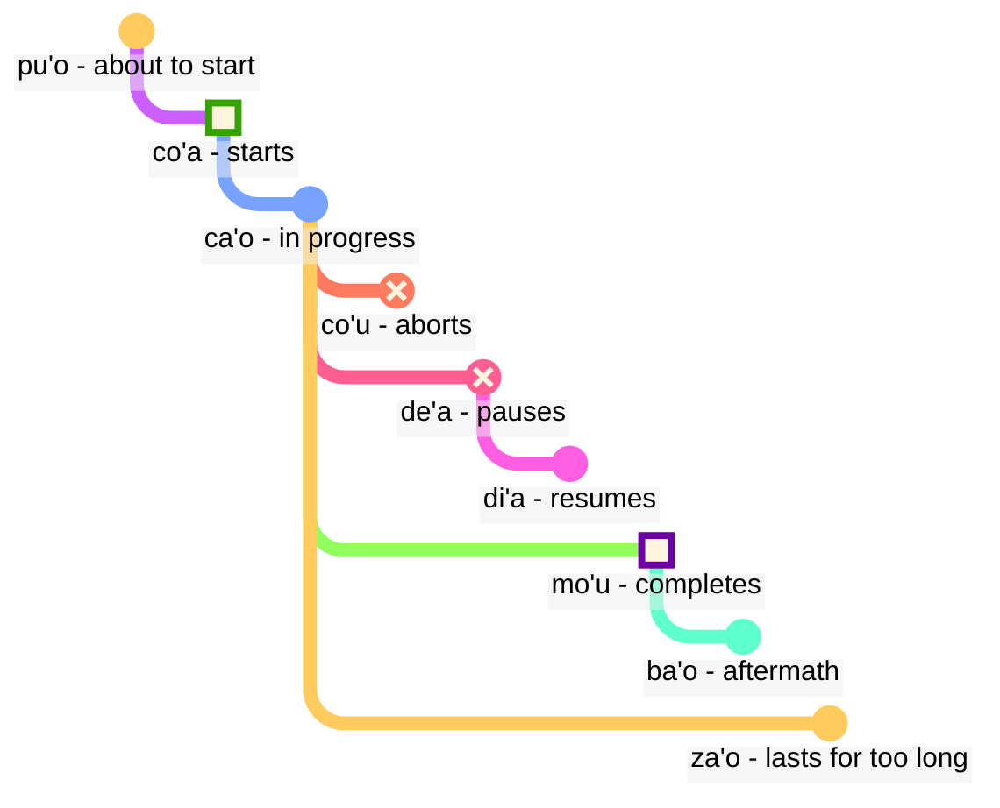

## Lektion 6: modale Begriffe: Zeit und Raum

> **mi citka le cirla**

Mögliche Übersetzungen:

> _Ich esse Käse._
> _Ich aß Käse._
> _Ich esse immer Käse._
> _In einem Moment werde ich gerade fertig sein, Käse zu essen._

Zeitformen in Lojban sind optional; wir müssen nicht die ganze Zeit darüber nachdenken, welche Zeitform wir verwenden sollen.

Der Kontext klärt oft, was korrekt ist. Wir fügen Zeitformen hinzu, wenn wir das Gefühl haben, dass wir sie brauchen.

Lojban behandelt Zeit und Raum gleich. Zu sagen, dass _ich vor langer Zeit gearbeitet habe_, ist grammatisch nicht anders als zu sagen, _ich arbeite weit im Norden_. Englisch behandelt Wörter wie _früher_, die Vergangenheitsform _-ed_ und Raumwörter wie _in_ oder _nahe_ in drei verschiedenen Schemata, während sie in Lojban dem gleichen Prinzip folgen.

### Punkte in Zeit und Raum

Ein modales Zeitpartikel ohne ein folgendes Argument beschreibt das Ereignis relativ zu _hier_ und _jetzt_:

> **mi pinxe ba**
> **mi ba pinxe**
> _Ich werde trinken._

<!-- -->

> **mi pinxe bu'u**
> **mi bu'u pinxe**
> _Ich trinke an diesem Ort._

Ein modaler Zeitbegriff mit einem folgenden Argument beschreibt das Ereignis relativ zu dem Ereignis in diesem Argument:

> **mi pinxe ba le nu mi cadzu**
> _Ich trinke, nachdem ich gehe._

### Ereignisse relativ zu anderen Ereignissen in der Zeit

Im Englischen verwenden wir die sogenannte "Abfolge der Zeiten":

> **la .alis. pu cusku le se du'u ri pu penmi la .doris.**
> _Alice sagte, dass sie Doris zuvor gesehen hatte._

Hier passiert das Ereignis _hatte Doris gesehen_ vor dem Ereignis _Alice sagte_. Jedoch in

> **la .alis. pu cusku le se du'u ri ca kansa la .doris.**
> _Alice sagte, dass sie mit Doris zusammen war._

passieren die beiden Ereignisse (_sagte_ und _war mit Doris_) zur gleichen Zeit.

Daher im Englischen:

- die Zeitform der Hauptbeziehung wird relativ zu demjenigen verstanden, der diese Beziehung äußert.
- die Zeitform der Beziehung innerhalb der Hauptbeziehung wird auch relativ zu demjenigen verstanden, der diese Beziehung äußert.

Im Lojban:

- nur die Zeitform der Hauptbeziehung ist relativ zu demjenigen, der die Beziehung äußert.
- die anderen Zeitformen sind relativ zueinander. Deshalb ist im Satz **la .alis. pu cusku le se du'u ri pu penmi la .doris.** das zweite **pu** relativ zum ersten **pu**. In **la .alis. pu cusku le se du'u ri ca kansa la .doris.** verwenden wir **ca** (_zur gleichen Zeit_), was relativ zur äußeren Beziehung (**pu cusku** — _sagte_) ist.

Jedoch können wir den Modalbegriff **nau** (_zur Zeit oder am Ort des Sprechers_) verwenden, der denselben Effekt wie im Englischen hat:

Hier ist ein Beispiel im englischen Stil:

> **la .alis. pu cusku le se du'u ri nau pu kansa la .doris.**
> _Alis sagte, dass sie mit Doris zusammen war._

<!-- Um solche Phrasen wie `in drei Tagen` oder `vor zwei Jahren` zu sagen, setzen wir im Grunde Zeitintervalle ohne Überlappung in eine Reihenfolge. Daher ein neues Verb:

> **le cabna cu dzoli le nu mi penmi do kei li ci le ka prulamdei**
> _Ich werde dich in drei Tagen treffen (gemessen ab jetzt)._

> **dzoli le nu mi penmi do kei li ci le ka prulamdei**
> **dzoli le nu mi penmi do kei li ci le ka prulamdei**
> **prulamdeidzo le nu mi penmi do kei li ci**
> **mi penmi do fi'o prulamdeidzo be fi li ci**
> _Ich werde dich in drei Tagen treffen._

> **le cabna cu dzoli le nu mi zvati le stuzi kei li re le ka bavlamdeidzo**
> **le nu mi zvati le stuzi kei le cabna cu dzoli li re le ka prulamdeidzo**
> _Ich habe diesen Ort vor zwei Jahren besucht._ -->

### Entfernung in Zeit und Raum

fau
: Modalbegriff: zur gleichen Zeit, am gleichen Ort oder in der gleichen Situation wie …

ca
: Modalbegriff: um … (zu einer bestimmten Zeit), zur gleichen Zeit wie …; "Gegenwartsform"

bu'u
: Modalbegriff: an … (einem bestimmten Ort); hier (an diesem Ort)

zi
: _gerade_ (vor kurzer Zeit) oder _bald_ (in kurzer Zeit)

vi
: in der Nähe von …

za
: _vor einer Weile_ oder _in einer Weile, zu einer unbestimmten Zeit_

va
: nicht weit von …

zu
: _vor langer Zeit_ oder _in langer Zeit_

vu
: weit weg von …; weit entfernt

So können wir Zeitkombinationen verwenden, um anzugeben, wie weit wir in die Vergangenheit oder Zukunft gehen:

- **pu zu** bedeutet _vor langer Zeit_
- **pu za** bedeutet _vor einer Weile_
- **pu zi** bedeutet _gerade_
- **ba zi** bedeutet _bald_
- **ba za** bedeutet _in einer Weile_
- **ba zu** bedeutet _in langer Zeit_

Beachten Sie die Vokalreihenfolge **i**, **a** und **u**. Diese Reihenfolge erscheint wiederholt im Lojban und könnte es wert sein, sie auswendig zu lernen. _Kurz_ und _lang_ sind immer kontextabhängig, relativ und subjektiv. Zum Beispiel sind zweihundert Jahre eine kurze Zeit für die Evolution einer Spezies, aber eine lange Zeit, um auf den Bus zu warten.

**zi**, **za** und **zu** modifizieren das Zeitpartikel wie **pu** und **ba**, das davor gesagt wird:

- **pu zu** ist _vor langer Zeit_. **pu** zeigt, dass wir in der Vergangenheit beginnen, und **zu** zeigt an, dass es weit zurückliegt.
- **zu pu** ist _weit entfernt in der Zeit; es gibt einen Punkt nach einem Ereignis_. **zu** zeigt, dass wir an einem Punkt weit entfernt in der Zeit von jetzt beginnen, und **pu** zeigt an, dass wir von diesem Punkt rückwärts gehen.

Daher ist **pu zu** immer in der Vergangenheit, während **zu pu** in der Zukunft sein könnte.

Räumliche Entfernung wird ähnlich durch **vi**, **va** und **vu** für kurze, unbestimmte (mittlere) und lange Entfernung im Raum markiert.

Um Entfernung in Zeit oder Raum anzugeben, verwenden wir den Modalbegriff **la'u** mit einem Argument, das die Entfernung angibt:

> **ba ku la'u le djedi be li ci mi zvati ti**
> _In drei Tagen werde ich hier sein._

Das räumliche Äquivalent von **ca** ist **bu'u**, und **fau** ist vager als die beiden, da es Zeit, Raum oder Situation bedeuten kann.

> **ba za vu ku mi gunka**
> _Irgendwann in der Zukunft werde ich an einem weit entfernten Ort arbeiten._

gunka
: arbeiten

> **mi bu'u pu zu gunka**
> _Früher habe ich hier vor langer Zeit gearbeitet._
> `Ich hier-Vergangenheit-lange-Zeit-Entfernung arbeiten`

> **pu zu vu ku zasti fa le ninmu .e le nanmu**
> _Vor langer Zeit und weit entfernt lebten eine Frau und ein Mann._

Der letzte Satz ist, wie Märchen oft beginnen.

### Dauer in Zeit und Raum

ze'i
: Modalbegriff: für kurze Zeit

ve'i
: Modalbegriff: über einen kleinen Raum

ze'a
: Modalbegriff: für einige Zeit

ve'a
: Modalbegriff: über einen Raum

ze'u
: Modalbegriff: für lange Zeit

ve'u
: Modalbegriff: über den langen Raum

Wieder ist es leicht zu merken, wenn man das Muster **i**, **a**, **u** beachtet.

> **mi ze'u bajra**
> _Ich laufe lange._
<!-- -->
> **do ze'u klama le mi'a gugde ze'u**
> _Du verbringst lange Zeit damit, in unser Land zu kommen._
mi'a
: wir ohne dich

gugde
: … ist ein Land

> **mi ba zi ze'a xabju la .djakartas.**
> _Bald werde ich eine Weile in Jakarta leben._
<!-- -->

> **le jenmi pe la .romas. ba ze'u gunta la .kart.xadact.**
> _Die Armee der Römer wird Karthago lange angreifen._

Das bedeutet nicht, dass die Römer Karthago heutzutage nicht angreifen. In Lojban, wenn wir sagen, dass etwas zu einer bestimmten Zeit wahr ist, bedeutet das nicht, dass es zu keiner anderen Zeit wahr ist. Man kann **pu ba ze'u** sagen, damit wir wissen, dass diese Aktivität in der Zukunft war, wenn sie von einem Punkt in der Vergangenheit betrachtet wird, aber in der Vergangenheit, wenn sie von heute betrachtet wird.

> **le xamsi**
> _Meer/Ozean_
<!-- -->

> **le ve'u xamsi**
> _Ozean_

<pixra url="/assets/pixra/cilre/le_vehi_ja_vehu_cmana.webp" caption="le ve'i cmana cu jibni le ve'u cmana" definition="Der Hügel ist in der Nähe des Berges."></pixra>

> **le cmana**
> _Berg/Hügel_
<!-- -->

> **le ve'u cmana**
> _Berg_
<!-- -->

> **le ve'i cmana**
> _Hügel_
<!-- -->

> **ti ve'u gerku**
> _Das ist ein großer Hund. Dies ist ein Hund, der eine große Fläche abdeckt._

### «**pu'o**» — ‘_im Begriff zu sein_’, «**ba'o**» — ‘_nicht mehr_’, «**za'o**» — ‘_noch_’, «**xa'o**» — ‘_schon_’

Hier sind mehrere Sätze von modalen Begriffen, die uns helfen können, feinere Bedeutungen hinzuzufügen, wenn nötig.

Mit _Ereigniskonturen_, im Gegensatz zu **pu**, **ca** und **ba**, betrachten wir jedes Ereignis als eine Form mit bestimmten Phasen:

pu'o
: modaler Begriff: im Begriff sein, etwas zu tun (das Ereignis ist noch nicht passiert)

ba'o
: modaler Begriff: nicht mehr etwas tun, etwas getan haben (das Ereignis ist beendet)

Beispiele:

> **mi ba tavla le mikce**
> _Ich werde mit dem Arzt sprechen (und ich könnte jetzt auch sprechen)._

mikce
: $x_1$ ist ein Arzt

<!-- -->

> **mi pu pu'o tavla le mikce**
> _Ich war im Begriff, mit dem Arzt zu sprechen (ich sprach zu dieser Zeit nicht, das Ereignis hatte zu diesem Zeitpunkt noch nicht begonnen)._

<pixra url="/assets/pixra/cilre/puho_nenri.webp" caption="le prenu pu'o zvati le nenri" definition="Die Person ist im Begriff, drinnen zu sein."></pixra>

<!-- -->

> **le sanmi ca pu'o bredi**
> _Das Essen ist noch nicht fertig._

<!-- -->

> **mi pu ba'o tavla le mikce**
> _Ich hatte mit dem Arzt gesprochen._

<pixra url="/assets/pixra/cilre/baho_carvi.webp" caption="ba'o carvi" definition="Nach dem Regen. Der Regen hat aufgehört."></pixra>

<!-- -->

> **mi ba ba'o tavla le mikce**
> _Ich werde mit dem Arzt gesprochen haben._

<!-- -->

> **.a'o mi ba zi ba'o gunka**
> _Ich hoffe, bald werde ich die Arbeit erledigt haben._

za'o
: modaler Begriff: noch. Das Ereignis ist über seinen natürlichen Endpunkt hinaus im Gange

xa'o
: inoffizieller modaler Begriff: schon, zu früh. Das Ereignis hat bereits begonnen und es ist zu früh

Beispiele:

> **ri'a ma do za'o zvati vi**
> _Warum bist du noch hier?_

<!-- -->

> **la .kevin. xa'o zvati vi**
> _Kevin ist schon hier._

### Phasen des Ereignisses

> **mi co'a tavla**
> _Ich habe angefangen zu sprechen._

<!-- -->

> **ra ca'o ciska**
> _Sie schreibt weiter._

<!-- -->

> **ra pu co'u vasxu**
> _Er hörte auf zu atmen (plötzliche unvorhersehbare Veränderung)._

vasxu
: $x_1$ atmet $x_2$

> **mi pu mo'u citka le plise**
> _Ich habe den Apfel aufgegessen._

<!-- -->

> **la .maks. pu mo'u zbasu ti voi dinju**
> _Max hat dieses Haus gebaut._

<!-- -->

> **ra pu de'a vasxu**
> _Sie hörte auf zu atmen (kann später wieder atmen)._

<pixra url="/assets/pixra/cilre/deha_vasxu.webp" caption="mi de'a vasxu" definition="Ich pausiere beim Atmen. Ich halte den Atem an."></pixra>

<!-- -->

> **mi pu di'a citka le plise**
> _Ich habe wieder angefangen, Äpfel zu essen._

<pixra url="/assets/pixra/cilre/diha_vasxu.webp" caption="mi di'a vasxu" definition="Ich atme wieder."></pixra>

co'a
: modaler Begriff: das Ereignis beginnt (die Grenze des Ereignisses)

ca'o
: modaler Begriff: etwas tun (das Ereignis ist im Gange)

co'u
: modaler Begriff: das Ereignis hört auf

mo'u
: modaler Begriff: das Ereignis endet (die Grenze des Ereignisses)

de'a
: das Ereignis pausiert (das Ereignis kann voraussichtlich fortgesetzt werden)

di'a
: das Ereignis wird fortgesetzt

> **mi de'a ze'i jundi**
> _BRB (Ich bin gleich zurück)._

<!-- -->

> **mi di'a jundi**
> _Ich bin zurück (aufmerksam sein)._

jundi
: $x_1$ achtet auf $x_2$

Diese beiden Ausdrücke sind in Textchats üblich, um anzuzeigen, dass man weg ist oder nicht aufpasst, und dann wieder online kommt:

Man könnte natürlich auch einfach **de'a** oder **di'a** sagen und hoffen, dass der Punkt rüberkommt.

### Kontinuierliche und progressive Ereignisse

ru'i
: modaler Begriff: das Ereignis ist kontinuierlich

> **.i mi pu ru'i citka le plise**
> _Ich habe kontinuierlich Äpfel gegessen._

Beachte den Unterschied:

- **ru'i** zeigt an, dass das Ereignis kontinuierlich ist und nie pausiert.
- **ca'o** impliziert, dass das Ereignis fortschreitet. Es kann manchmal pausieren und dann seinen Fortschritt fortsetzen.

### Ortskonturen

Ereigniskonturen können verwendet werden, um sich auf den Raum zu beziehen, wenn wir sie mit **fe'e** präfixen:

> **le rokci cu fe'e ro roi zvati**
> _Die Steine sind überall._

### ‘_to the left_’, ‘_to the right_’

> **le prenu cu sanli le dertu bu'u le pritu be mi**
> _Die Person steht auf dem Boden rechts von mir._

<!-- -->

> **le gerku cu vreta le ckana bu'u le zunle be le verba**
> _Der Hund liegt auf dem Bett links von einem Kind._

<!-- -->

> **ko jgari le panbi poi zunle**
> _Nimm den Stift auf der linken Seite._

<!-- -->

> **le mlatu cu plipe bu'u le crane be do**
> _Eine Katze springt vor dir._

<!-- -->

> **ko catlu le dinju poi crane**
> _Schau dir das Haus vorne an._

<!-- -->

> **le verba cu zutse le stizu bu'u le trixe be mi**
> _Das Kind sitzt auf dem Stuhl hinter mir._

<!-- -->

> **le prenu cu sanli ki mi bu'u le pritu be le tricu bei mi**
> _Die Person steht rechts von einem Baum aus meiner Sicht._

<!-- -->

> **le dinju cu zunle le rokci ti**
> _Das Haus ist links vom Felsen, wenn man von hier aus schaut._

zunle
: $x_1$ ist links von $x_2$ aus der Sicht von $x_3$

pritu
: $x_1$ ist rechts von $x_2$ aus der Sicht von $x_3$

crane
: $x_1$ ist vor $x_2$ ($x_1$ ist zwischen $x_2$ und dem Beobachter) aus der Sicht von $x_3$

trixe
: $x_1$ ist hinter $x_2$ aus der Sicht von $x_3$

sanli
: $x_1$ steht auf $x_2$

zutse
: $x_1$ sitzt auf $x_2$

vreta
: $x_1$ liegt auf $x_2$

le dertu
: der Boden, der Dreck

le ckana
: das Bett

le stizu
: der Stuhl

le pelji
: das Papier

le penbi
: der Stift

### Practice: position

<table>
<tbody><tr>
<td style="text-align:right;"><b>ma nabmi</b>
</td>
<td><i>Was ist das Problem?</i>
</td></tr>
<tr>
<td style="text-align:right;"><b>ma'a nitcu tu'a le fonxa pe la .alis.</b>
</td>
<td><i>Wir brauchen Alices Telefon.</i>
</td></tr>
<tr>
<td style="text-align:right;"><b>.i la .alis. ca zvati ma</b>
</td>
<td><i>Wo ist Alice?</i>
</td></tr>
<tr>
<td style="text-align:right;"><b>la .alis. ca na ku zvati le bu'u tcadu .i mi pu mrilu le srana be le fonxa fi la .alis. .i ri ca ca'o vofli la .paris. .i ku'i mi pu zi te benji le se mrilu be la .alis. .i ri curmi le nu mi'a pilno le fonxa .i .e'o do bevri ri mi</b>
</td>
<td> Alice ist jetzt nicht in der Stadt. Ich habe ihr über das Telefon geschrieben. Alice fliegt jetzt nach Paris. Aber ich habe gerade eine Nachricht von ihr erhalten. Sie erlaubt uns, das Telefon zu benutzen. Bitte, bring es mir.
</td></tr>
<tr>
<td style="text-align:right;"><b>.i bu'u ma mi ka'e cpacu le fonxa</b>
</td>
<td>Wo kann ich das Telefon bekommen?
</td></tr>
<tr>
<td style="text-align:right;"><b>le purdi .i .e'o do klama le bartu</b>
</td>
<td>Im Garten. Bitte, geh nach draußen.
</td></tr>
<tr>
<td style="text-align:right;"><b>mi ca zvati ne'a le vorme .i ei mi ca klama ma</b>
</td>
<td>Ich bin in der Nähe der Tür. Wohin soll ich jetzt gehen?
</td></tr>
<tr>
<td style="text-align:right;"><b>ko klama le zunle be le tricu .i ba ku do viska le pa jubme</b>
</td>
<td>Geh nach links vom Baum. Dann wirst du einen Tisch sehen.
</td></tr>
<tr>
<td style="text-align:right;"><b>mi zgana no jubme</b>
</td>
<td>Ich sehe keine Tische.
</td></tr>
<tr>
<td style="text-align:right;"><b>ko carna gi'e muvdu le pritu .i le jubme cu crane le cmalu dinju .i le fonxa cu cpana le jubme .i ji'a ko jgari le penbi .e le pelji .i le za'u dacti cu cpana si'a le jubme .i ba ku ko bevri le ci dacti le zdani gi'e punji fi le sledi'u pe mi</b>
</td>
<td>Dreh dich um und geh nach rechts. Der Tisch ist vor einem kleinen Gebäude. Das Telefon liegt auf dem Tisch. Nimm auch einen Stift und ein Papier. Sie liegen ebenfalls auf dem Tisch. Dann bring die drei Dinge nach Hause und lege sie in mein Zimmer.
</td></tr>
<tr>
<td style="text-align:right;"><b>vi'o</b>
</td>
<td>Wird gemacht.
</td></tr></tbody></table>

### Übung: Fahrzeuge

<table>

<tbody><tr>
<td style="text-align:right;"><b>mi jo'u le pendo be mi pu ca'o litru le barda rirxe bu'u le bloti</b>
</td>
<td><i>Ich und meine Freunde reisten auf einem großen Fluss in einem Boot.</i>
</td></tr>
<tr>
<td style="text-align:right;"><b>.i ba bo mi'a klama le vinji tcana</b>
</td>
<td><i>Dann gingen wir zu einem Flughafen.</i>
</td></tr>
<tr>
<td style="text-align:right;"><b>.i xu do se marce le karce</b>
</td>
<td><i>Hast du ein Auto genommen?</i>
</td></tr>
<tr>
<td style="text-align:right;"><b>.i na ku se marce .i mi'a pu klama fu le trene .i ze'a le cacra mi'a zvati bu'u le carce</b>
</td>
<td><i>Nein. Wir fuhren mit dem Zug. Für eine Stunde waren wir in einem Wagen.</i>
</td></tr></tbody></table>

marce
: $x_1$ ist ein Fahrzeug, das $x_2$ transportiert

se marce
: $x_1$ ist ein Passagier von $x_2$

<!-- jai zu'e se marce
: $x_1$ nimmt ein Fahrzeug $x_2$ als Passagier -->

karce
: $x_1$ ist ein Auto, das $x_2$ transportiert

bloti
: $x_1$ ist ein Boot, das $x_2$ transportiert

vinji
: $x_1$ ist ein Flugzeug, das $x_2$ transportiert

trene
: $x_1$ ist ein Zug von Wagen $x_2$

### Wortschatz erweitern. Neue Wörter mit Zeitformen

Viele einzelne englische Wörter entsprechen Wortkombinationen im Lojban:

pixra
: $x_1$ ist ein Bild von $x_3$

le vi'a pixra
: das Bild in 2D

le vi'u pixra
: das Bild in 3D, eine Skulptur

<pixra url="/assets/pixra/cilre/viha_pixra.webp" caption="vi'a pixra" definition="2D-Bild, 2D-Zeichnung."></pixra>

<pixra url="/assets/pixra/cilre/vihu_pixra.webp" caption="vi'u pixra" definition="3D-Bild, Skulptur."></pixra>

le ve'i cmana
: der Hügel (wörtlich "Berg/Hügel, der wenig Platz einnimmt")

le ve'u xamsi
: der Ozean (wörtlich "Meer/Ozean, das viel Platz einnimmt")

le ba'o tricu
: Baumstumpf (wörtlich "der nicht mehr Baum")
