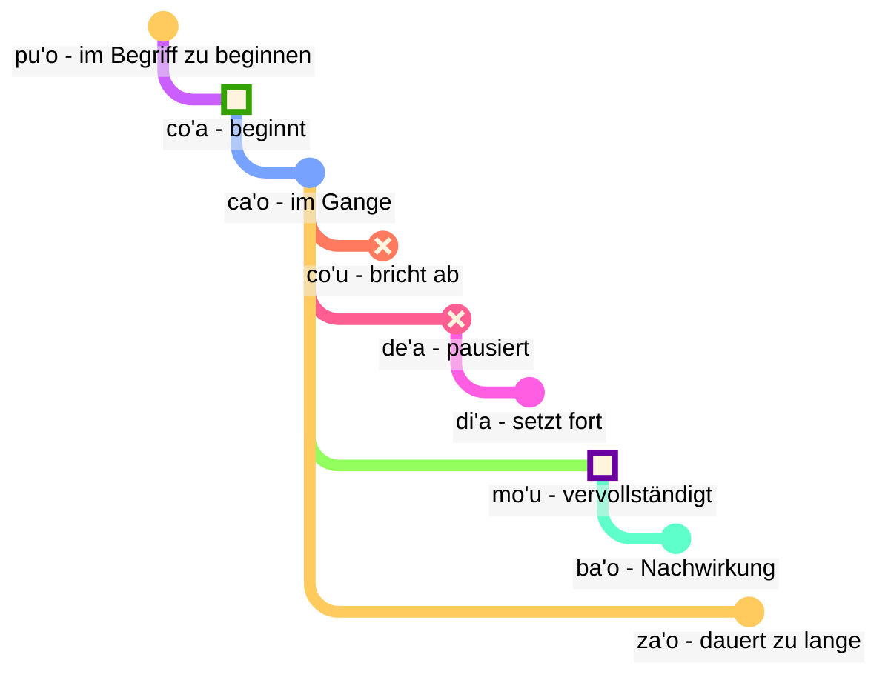

## Lektion 6: Modalbegriffe: Zeit und Raum

> **mi citka le cirla**

Mögliche Übersetzungen:

> _Ich esse Käse._
> _Ich aß Käse._
> _Ich esse immer Käse._
> _In einem Moment werde ich gerade fertig sein, Käse zu essen._

Zeitformen in Lojban sind optional; wir müssen nicht ständig darüber nachdenken, welche Zeitform wir verwenden sollen.

Der Kontext klärt oft, was richtig ist. Wir fügen Zeitformen hinzu, wenn wir das Gefühl haben, dass wir sie brauchen.

Lojban behandelt Zeit und Raum gleich. Zu sagen, dass _ich vor langer Zeit gearbeitet habe_, ist grammatisch nicht anders als zu sagen, _ich arbeite weit weg im Norden_. Das Deutsche behandelt Wörter wie _früher_, Vergangenheitsformen und Raumwörter wie _in_ oder _nahe_ in verschiedenen Kategorien, während sie in Lojban demselben Prinzip folgen.

### Punkte in Zeit und Raum

Ein modales Zeitpartikel ohne ein folgendes Argument beschreibt das Ereignis relativ zu _hier_ und _jetzt_:

> **mi pinxe ba**
> **mi ba pinxe**
> _Ich werde trinken._

<!-- -->

> **mi pinxe bu'u**
> **mi bu'u pinxe**
> _Ich trinke an diesem Ort._

Ein modaler Zeitbegriff mit einem folgenden Argument beschreibt das Ereignis relativ zu dem Ereignis in diesem Argument:

> **mi pinxe ba le nu mi cadzu**
> _Ich trinke, nachdem ich gehe._

#### Aufgabe

Decke die rechte Seite der Tabelle ab. Übersetze aus dem Lojban:

<table>
<tbody><tr>
<td><b>mi bu'u pinxe</b></td>
<td><i>Ich trinke hier.</i></td></tr>
<tr>
<td><b>mi ba citka le plise</b></td>
<td><i>Ich werde den Apfel essen.</i></td></tr>
<tr>
<td><b>mi pinxe ba le nu mi cadzu</b></td>
<td><i>Ich trinke, nachdem ich gehe.</i></td></tr>
</tbody></table>

Übersetze ins Lojban:
<table>
<tbody><tr>
<td><i>Ich werde gehen.</i></td>
<td><b>mi ba cadzu</b></td></tr>
<tr>
<td><i>Ich trinke, bevor ich schlafe.</i></td>
<td><b>mi pinxe pu le nu mi sipna</b></td></tr>
</tbody></table>

### Ereignisse relativ zu anderen Ereignissen in der Zeit

Im Deutschen verwenden wir verschiedene Zeitformen in Haupt- und Nebensätzen:

> **la .alis. pu cusku le se du'u ri pu penmi la .doris.**
> _Alice sagte, dass sie Doris zuvor getroffen hatte._

Hier passiert das Ereignis _hatte Doris getroffen_ vor dem Ereignis _Alice sagte_. Jedoch in

> **la .alis. pu cusku le se du'u ri ca kansa la .doris.**
> _Alice sagte, dass sie mit Doris zusammen war._

passieren die beiden Ereignisse (_sagte_ und _war mit Doris_) zur gleichen Zeit.

Daher im Deutschen:

- die Zeitform der Hauptrelation wird relativ zu demjenigen verstanden, der diese Relation äußert.
- die Zeitform der Relation innerhalb der Hauptrelation wird auch relativ zu demjenigen verstanden, der diese Relation äußert.

Im Lojban:

- nur die Zeitform der Hauptrelation ist relativ zu demjenigen, der die Relation äußert.
- die anderen Zeitformen sind relativ zueinander. Deshalb ist im Satz **la .alis. pu cusku le se du'u ri pu penmi la .doris.** das zweite **pu** relativ zum ersten **pu**. In **la .alis. pu cusku le se du'u ri ca kansa la .doris.** verwenden wir **ca** (_zur gleichen Zeit_), was relativ zur äußeren Relation (**pu cusku** — _sagte_) ist.

Jedoch können wir den Modalbegriff **nau** (_zur Zeit oder am Ort des Sprechers_) verwenden, der denselben Effekt wie im Deutschen hat:

Hier ist ein Beispiel im deutschen Stil:

> **la .alis. pu cusku le se du'u ri nau pu kansa la .doris.**
> _Alice sagte, dass sie mit Doris zusammen war._

<!-- To say such phrases as `in three days` or `two years ago` we basically put time intervals in sequence without overlapping. Hence a new verb:

> **le cabna cu dzoli le nu mi penmi do kei li ci le ka prulamdei**
> _I will meet you in three days (as measured from now)._

> **dzoli le nu mi penmi do kei li ci le ka prulamdei**
> **dzoli le nu mi penmi do kei li ci le ka prulamdei**
> **prulamdeidzo le nu mi penmi do kei li ci**
> **mi penmi do fi'o prulamdeidzo be fi li ci**
> _I will meet you in three days._

> **le cabna cu dzoli le nu mi zvati le stuzi kei li re le ka bavlamdeidzo**
> **le nu mi zvati le stuzi kei le cabna cu dzoli li re le ka prulamdeidzo**
> _I visited that place two years ago._ -->

#### Aufgabe

Decke die rechte Seite der Tabelle ab. Übersetze aus dem Lojban:

<table>
<tbody><tr>
<td><b>la .alis. pu cusku le se du'u ri ba penmi la .doris.</b></td>
<td><i>Alice sagte, dass sie Doris treffen würde.</i></td></tr>
<tr>
<td><b>mi pu djuno le du'u do ca gunka</b></td>
<td><i>Ich wusste, dass du arbeitest/arbeitetest.</i></td></tr>
<tr>
<td><b>mi pu na djuno le du'u do ba zvati ti</b></td>
<td><i>Ich wusste nicht, dass du hier sein würdest.</i></td></tr></tbody></table>

Decke die rechte Seite der Tabelle ab. Übersetze ins Lojban:

<table>
<tbody><tr>
<td><i>Sie sagte mir, dass sie zu Hause gewesen war.</i></td>
<td><b>ri pu cusku le se du'u ri pu zvati le zdani</b></td></tr>
<tr>
<td><i>Ich weiß, dass du klug bist.</i></td>
<td><b>mi djuno le du'u do ca stati</b></td></tr></tbody></table>

### Entfernung in Zeit und Raum

fau
: Modalbegriff: zur gleichen Zeit, am gleichen Ort oder in der gleichen Situation wie …

ca
: Modalbegriff: um … (zu einer bestimmten Zeit), zur gleichen Zeit wie …; "Gegenwartsform"

bu'u
: Modalbegriff: an … (einem bestimmten Ort); hier (an diesem Ort)

zi
: _gerade_ (vor kurzer Zeit) oder _bald_ (in kurzer Zeit)

vi
: nahe …

za
: _vor einer Weile_ oder _in einer Weile, zu einer unbestimmten Zeit_

va
: nicht weit von …

zu
: _vor langer Zeit_ oder _in langer Zeit_

vu
: weit weg von …; weit weg

So können wir Zeitkombinationen verwenden, um anzugeben, wie weit wir in die Vergangenheit oder Zukunft gehen:

- **pu zu** bedeutet _vor langer Zeit_
- **pu za** bedeutet _vor einer Weile_
- **pu zi** bedeutet _gerade_
- **ba zi** bedeutet _bald_
- **ba za** bedeutet _in einer Weile_
- **ba zu** bedeutet _in langer Zeit_

Beachte die Vokalreihenfolge **i**, **a** und **u**. Diese Reihenfolge tritt wiederholt in Lojban auf und ist es wert, sich zu merken. _Kurz_ und _lang_ sind immer kontextabhängig, relativ und subjektiv. Zum Beispiel sind zweihundert Jahre eine kurze Zeit für eine Art, sich zu entwickeln, aber eine lange Zeit, auf den Bus zu warten.

**zi**, **za** und **zu** modifizieren das Zeitpartikel wie **pu** und **ba**, das davor gesagt wird:

- **pu zu** ist _vor langer Zeit_. **pu** zeigt, dass wir in der Vergangenheit beginnen, und **zu** zeigt an, dass es eine lange Zeit rückwärts ist.
- **zu pu** ist _weit weg in der Zeit; es gibt einen Punkt nach einem Ereignis_. **zu** zeigt, dass wir an einem Punkt beginnen, der weit weg von jetzt ist, und **pu** zeigt an, dass wir von diesem Punkt rückwärts gehen.

Daher ist **pu zu** immer in der Vergangenheit, während **zu pu** in der Zukunft sein könnte.

Die räumliche Entfernung wird ähnlich durch **vi**, **va** und **vu** für kurze, unbestimmte (mittlere) und lange Entfernung im Raum markiert.

Um die Entfernung in Zeit oder Raum zu spezifizieren, verwenden wir den Modalbegriff **la'u** mit einem Argument, das die Entfernung angibt:

> **ba ku la'u le djedi be li ci mi zvati ti**
> _In drei Tagen werde ich hier sein._

Das räumliche Äquivalent von **ca** ist **bu'u**, und **fau** ist vager als die beiden, da es Zeit, Raum oder Situation bedeuten kann.

> **ba za vu ku mi gunka**
> _Irgendwann in der Zukunft werde ich an einem weit entfernten Ort arbeiten._

gunka
: arbeiten

> **mi bu'u pu zu gunka**
> _Ich arbeitete hier vor langer Zeit._
> `Ich hier-Vergangenheit-lange-Zeit-Entfernung arbeite`

> **pu zu vu ku zasti fa le ninmu .e le nanmu**
> _Vor langer Zeit und weit weg lebten eine Frau und ein Mann._

Der letzte Satz ist, wie Märchen oft beginnen.

#### Aufgabe

Decke die rechte Seite der Tabelle ab. Übersetze aus dem Lojban:

<table>
<tbody><tr>
<td><b>mi pu zu gunka</b></td>
<td><i>Ich arbeitete vor langer Zeit.</i></td></tr>
<tr>
<td><b>do ba zi cliva</b></td>
<td><i>Du wirst bald gehen.</i></td></tr>
<tr>
<td><b>mi vu zvati</b></td>
<td><i>Ich bin weit weg.</i></td></tr>
</tbody></table>

Übersetze ins Lojban:
<table>
<tbody><tr>
<td><i>Ich werde in einer Weile arbeiten.</i></td>
<td><b>mi ba za gunka</b></td></tr>
<tr>
<td><i>Du bist in der Nähe.</i></td>
<td><b>do vi zvati</b></td></tr>
</tbody></table>

### Dauer in Zeit und Raum

ze'i
: Modalbegriff: für eine kurze Zeit

ve'i
: Modalbegriff: über einen kleinen Raum

ze'a
: Modalbegriff: für eine Weile

ve'a
: Modalbegriff: über einen Raum

ze'u
: Modalbegriff: für eine lange Zeit

ve'u
: Modalbegriff: über den langen Raum

Wieder ist es leicht zu merken, gegeben das Muster **i**, **a**, **u**.

> **mi ze'u bajra**
> _Ich laufe für eine lange Zeit._
<!-- -->
> **do ze'u klama le mi'a gugde ze'u**
> _Du verbringst eine lange Zeit damit, in unser Land zu kommen._
mi'a
: wir ohne dich

gugde
: … ist ein Land

> **mi ba zi ze'a xabju la .djakartas.**
> _Ziemlich bald werde ich für eine Weile in Jakarta leben._
<!-- -->

> **le jenmi pe la .romas. ba ze'u gunta la .kart.xadact.**
> _Die Armee der Römer wird Karthago für eine lange Zeit angreifen._

Das bedeutet nicht, dass die Römer Karthago heutzutage nicht angreifen. In Lojban bedeutet es nicht, dass etwas zu keiner anderen Zeit wahr ist, wenn wir sagen, dass etwas zu einer bestimmten Zeit wahr ist. Man kann **pu ba ze'u** sagen, damit wir wissen, dass diese Aktivität in der Zukunft war, wenn von einem Punkt in der Vergangenheit aus betrachtet, aber in der Vergangenheit, wenn von heute aus betrachtet.

> **le xamsi**
> _Meer/Ozean_
<!-- -->

> **le ve'u xamsi**
> _Ozean_

<pixra url="/assets/pixra/cilre/le_vehi_ja_vehu_cmana.webp" caption="le ve'i cmana cu jibni le ve'u cmana" definition="Der Hügel ist nahe beim Berg."></pixra>

> **le cmana**
> _Berg/Hügel_
<!-- -->

> **le ve'u cmana**
> _Berg_
<!-- -->

> **le ve'i cmana**
> _Hügel_
<!-- -->

> **ti ve'u gerku**
> _Das ist ein großer Hund. Das ist ein Hund, der einen großen Raum einnimmt._

#### Aufgabe

Decke die rechte Seite der Tabelle ab. Übersetze aus dem Lojban:

<table>
<tbody><tr>
<td><b>mi ze'u pinxe le tcati</b></td>
<td><i>Ich trinke für eine lange Zeit Tee.</i></td></tr>
<tr>
<td><b>mi ve'i zvati le kumfa</b></td>
<td><i>Ich bin in einem kleinen Raum.</i></td></tr>
</tbody></table>

Übersetze ins Lojban:
<table>
<tbody><tr>
<td><i>Ich werde für eine Weile hierbleiben.</i></td>
<td><b>mi ze'a zvati ti</b></td></tr>
<tr>
<td><i>Der Hund nimmt einen großen Raum ein.</i></td>
<td><b>le gerku cu ve'u zvati</b></td></tr>
</tbody></table>

### «**pu'o**» — '_im Begriff sein_', «**ba'o**» — '_nicht mehr_', «**za'o**» — '_noch_', «**xa'o**» — '_schon_'

Hier sind mehrere Sätze von Modalbegriffen, die uns helfen können, bei Bedarf feinere Bedeutungen hinzuzufügen.

Mit _Ereigniskonturen_, im Gegensatz zu **pu**, **ca** und **ba**, betrachten wir jedes Ereignis als eine Form mit bestimmten Phasen:

pu'o
: Modalbegriff: im Begriff sein, etwas zu tun (das Ereignis ist noch nicht geschehen)

ba'o
: Modalbegriff: nicht mehr etwas tun, etwas getan haben (das Ereignis ist beendet)

Beispiele:

> **mi ba tavla le mikce**
> _Ich werde mit dem Arzt sprechen (und ich könnte jetzt auch sprechen)._

mikce
: $x_1$ ist ein Arzt

<!-- -->

> **mi pu pu'o tavla le mikce**
> _Ich war im Begriff, mit dem Arzt zu sprechen (ich sprach zu diesem Zeitpunkt nicht, das Ereignis hatte zu diesem Zeitpunkt noch nicht begonnen)._

<pixra url="/assets/pixra/cilre/puho_nenri.webp" caption="le prenu pu'o zvati le nenri" definition="Die Person ist im Begriff, drinnen zu sein."></pixra>

<!-- -->

> **le sanmi ca pu'o bredi**
> _Das Essen ist noch nicht fertig._

<!-- -->

> **mi pu ba'o tavla le mikce**
> _Ich hatte mit dem Arzt gesprochen._

<pixra url="/assets/pixra/cilre/baho_carvi.webp" caption="ba'o carvi" definition="Nach dem Regen. Der Regen hat aufgehört."></pixra>

<!-- -->

> **mi ba ba'o tavla le mikce**
> _Ich werde mit dem Arzt gesprochen haben._

<!-- -->

> **.a'o mi ba zi ba'o gunka**
> _Ich hoffe, ich werde die Arbeit bald erledigt haben._

za'o
: Modalbegriff: noch. Das Ereignis ist über sein natürliches Ende hinaus im Gange

xa'o
: inoffizieller Modalbegriff: schon, zu früh. Das Ereignis hat schon begonnen und es ist zu früh

Beispiele:

> **ri'a ma do za'o zvati vi**
> _Warum bist du noch hier?_

<!-- -->

> **la .kevin. xa'o zvati vi**
> _Kevin ist schon hier._

#### Aufgabe

Decke die rechte Seite der Tabelle ab. Übersetze aus dem Lojban:

<table>
<tbody><tr>
<td><b>mi pu pu'o ciska</b></td>
<td><i>Ich war im Begriff zu schreiben.</i></td></tr>
<tr>
<td><b>le sanmi ba'o jukpa</b></td>
<td><i>Das Essen wird nicht mehr gekocht.</i></td></tr>
<tr>
<td><b>mi za'o kelci</b></td>
<td><i>Ich spiele noch (länger als erwartet).</i></td></tr>
</tbody></table>

Übersetze ins Lojban:
<table>
<tbody><tr>
<td><i>Ich bin schon gegangen.</i></td>
<td><b>mi xa'o cliva</b></td></tr>
<tr>
<td><i>Das Essen wird fertig sein.</i></td>
<td><b>le cidja ba bredi</b></td></tr>
</tbody></table>

### Phasen des Ereignisses

> **mi co'a tavla**
> _Ich fing an zu sprechen._

<!-- -->

> **ra ca'o ciska**
> _Sie schreibt weiter._

<!-- -->

> **ra pu co'u vasxu**
> _Er hörte auf zu atmen (plötzliche unvorhersehbare Veränderung)._

vasxu
: $x_1$ atmet $x_2$

> **mi pu mo'u citka le plise**
> _Ich habe den Apfel aufgegessen._

<!-- -->

> **la .maks. pu mo'u zbasu ti voi dinju**
> _Max hat dieses Haus fertiggebaut._

<!-- -->

> **ra pu de'a vasxu**
> _Sie hörte auf zu atmen (kann aber später wieder atmen)._

<pixra url="/assets/pixra/cilre/deha_vasxu.webp" caption="mi de'a vasxu" definition="Ich pausiere beim Atmen. Ich halte den Atem an."></pixra>

<!-- -->

> **mi pu di'a citka le plise**
> _Ich begann wieder, Äpfel zu essen._

<pixra url="/assets/pixra/cilre/diha_vasxu.webp" caption="mi di'a vasxu" definition="Ich atme wieder."></pixra>

co'a
: Modalbegriff: das Ereignis beginnt (die Grenze des Ereignisses)

ca'o
: Modalbegriff: etwas tun (das Ereignis ist im Gange)

co'u
: Modalbegriff: das Ereignis hört auf

mo'u
: Modalbegriff: das Ereignis endet (die Grenze des Ereignisses)

de'a
: das Ereignis pausiert (das Ereignis kann voraussichtlich fortgesetzt werden)

di'a
: das Ereignis wird fortgesetzt

> **mi de'a ze'i jundi**
> _BRB (Ich bin gleich wieder da)._

<!-- -->

> **mi di'a jundi**
> _Ich bin zurück (aufmerksam)._

jundi
: $x_1$ achtet auf $x_2$

Diese beiden Ausdrücke sind üblich in Textchats, um anzuzeigen, dass du weg bist oder nicht aufmerksam, und dann wieder online kommst:

Man könnte natürlich auch nur **de'a** oder **di'a** sagen und hoffen, dass der Punkt rüberkommt.

#### Aufgabe

Decke die rechte Seite der Tabelle ab. Übersetze aus dem Lojban:

<table>
<tbody><tr>
<td><b>mi co'a tavla</b></td>
<td><i>Ich fing an zu sprechen.</i></td></tr>
<tr>
<td><b>mi ca'o pinxe le tcati</b></td>
<td><i>Ich trinke den Tee.</i></td></tr>
<tr>
<td><b>mi co'u tavla</b></td>
<td><i>Ich hörte auf zu sprechen.</i></td></tr>
<tr>
<td><b>mi de'a vasxu</b></td>
<td><i>Ich pausiere beim Atmen.</i></td></tr>
</tbody></table>

Übersetze ins Lojban:
<table>
<tbody><tr>
<td><i>Ich setze das Arbeiten fort.</i></td>
<td><b>mi di'a gunka</b></td></tr>
<tr>
<td><i>Ich habe das Essen beendet.</i></td>
<td><b>mi mo'u citka</b></td></tr>
</tbody></table>

### Kontinuierliche und progressive Ereignisse

ru'i
: Modalbegriff: das Ereignis ist kontinuierlich

> **.i mi pu ru'i citka le plise**
> _Ich aß kontinuierlich Äpfel._

Beachte den Unterschied:

- **ru'i** zeigt an, dass das Ereignis kontinuierlich ist und niemals pausiert.
- **ca'o** impliziert, dass das Ereignis voranschreitet. Es kann manchmal pausieren und dann seinen Fortschritt fortsetzen.

#### Aufgabe

Decke die rechte Seite der Tabelle ab. Übersetze aus dem Lojban:

<table>
<tbody><tr>
<td><b>mi pu ru'i citka le plise</b></td>
<td><i>Ich aß kontinuierlich Äpfel.</i></td></tr>
<tr>
<td><b>le mlatu cu ru'i sipna</b></td>
<td><i>Die Katze schläft kontinuierlich.</i></td></tr>
<tr>
<td><b>xu do ca'o kelci</b></td>
<td><i>Spielst du (noch im Gange)?</i></td></tr></tbody></table>

kelci
: spielen

Decke die rechte Seite der Tabelle ab. Übersetze ins Lojban:

<table>
<tbody><tr>
<td><i>Ich arbeite kontinuierlich hier.</i></td>
<td><b>mi ru'i gunka bu'u</b></td></tr>
<tr>
<td><i>Sie tanzen noch.</i></td>
<td><b>ri ca'o dansu</b></td></tr></tbody></table>

### Ortskonturen

Ereigniskonturen können verwendet werden, um sich auf den Raum zu beziehen, wenn wir sie mit **fe'e** präfixieren:

> **le rokci cu fe'e ro roi zvati**
> _Die Steine sind überall._

### '_links_', '_rechts_'

> **le prenu cu sanli le dertu bu'u le pritu be mi**
> _Die Person steht auf dem Boden rechts von mir._

<!-- -->

> **le gerku cu vreta le ckana bu'u le zunle be le verba**
> _Der Hund liegt auf dem Bett links von einem Kind._

<!-- -->

> **ko jgari le panbi poi zunle**
> _Nimm den Stift links._

<!-- -->

> **le mlatu cu plipe bu'u le crane be do**
> _Eine Katze springt vor dir._

<!-- -->

> **ko catlu le dinju poi crane**
> _Schau dir das Haus vorne an._

<!-- -->

> **le verba cu zutse le stizu bu'u le trixe be mi**
> _Das Kind sitzt auf dem Stuhl hinter mir._

<!-- -->

> **le prenu cu sanli ki mi bu'u le pritu be le tricu bei mi**
> _Die Person steht rechts von einem Baum aus meiner Sicht._

<!-- -->

> **le dinju cu zunle le rokci ti**
> _Das Haus ist links vom Felsen, wenn von hier aus betrachtet._

zunle
: $x_1$ ist links von $x_2$, wie von $x_3$ aus gesehen

pritu
: $x_1$ ist rechts von $x_2$, wie von $x_3$ aus gesehen

crane
: $x_1$ ist vor $x_2$ ($x_1$ ist zwischen $x_2$ und demjenigen, der beobachtet), wie von $x_3$ aus gesehen

trixe
: $x_1$ ist hinter $x_2$, wie von $x_3$ aus gesehen

sanli
: $x_1$ steht auf $x_2$

zutse
: $x_1$ sitzt auf $x_2$

vreta
: $x_1$ liegt auf $x_2$

le dertu
: der Boden, die Erde

le ckana
: das Bett

le stizu
: der Stuhl

le pelji
: das Papier

le penbi
: der Stift

#### Aufgabe

Decke die rechte Seite der Tabelle ab. Übersetze aus dem Lojban:

<table>
<tbody><tr>
<td><b>le mlatu cu zunle le gerku</b></td>
<td><i>Die Katze ist links vom Hund.</i></td></tr>
<tr>
<td><b>ko cadzu le crane be mi</b></td>
<td><i>Geh vor mir.</i></td></tr>
<tr>
<td><b>le prenu cu sanli le trixe be le dinju</b></td>
<td><i>Die Person steht hinter dem Haus.</i></td></tr>
</tbody></table>

Übersetze ins Lojban:
<table>
<tbody><tr>
<td><i>Der Hund ist rechts von mir.</i></td>
<td><b>le gerku cu pritu mi</b></td></tr>
<tr>
<td><i>Sitz vor dem Haus.</i></td>
<td><b>ko zutse le crane be le dinju</b></td></tr>
</tbody></table>

### Übung: Position

<table>
<tbody><tr>
<td style="text-align:right;"><b>ma nabmi</b>
</td>
<td><i>Was ist das Problem?</i>
</td></tr>
<tr>
<td style="text-align:right;"><b>ma'a nitcu tu'a le fonxa pe la .alis.</b>
</td>
<td><i>Wir brauchen Alices Telefon.</i>
</td></tr>
<tr>
<td style="text-align:right;"><b>.i la .alis. ca zvati ma</b>
</td>
<td><i>Wo ist Alice?</i>
</td></tr>
<tr>
<td style="text-align:right;"><b>la .alis. ca na ku zvati le bu'u tcadu .i mi pu mrilu le srana be le fonxa fi la .alis. .i ri ca ca'o vofli la .paris. .i ku'i mi pu zi te benji le se mrilu be la .alis. .i ri curmi le nu mi'a pilno le fonxa .i .e'o do bevri ri mi</b>
</td>
<td> Alice ist jetzt nicht in der Stadt. Ich habe ihr eine Mail über das Telefon geschickt. Alice fliegt jetzt nach Paris. Aber ich habe gerade eine Mail von ihr erhalten. Sie erlaubt uns, das Telefon zu benutzen. Bitte bring es mir.
</td></tr>
<tr>
<td style="text-align:right;"><b>.i bu'u ma mi ka'e cpacu le fonxa</b>
</td>
<td>Wo kann ich das Telefon bekommen?
</td></tr>
<tr>
<td style="text-align:right;"><b>le purdi .i .e'o do klama le bartu</b>
</td>
<td>Im Garten. Bitte geh nach draußen.
</td></tr>
<tr>
<td style="text-align:right;"><b>mi ca zvati ne'a le vorme .i ei mi ca klama ma</b>
</td>
<td>Ich bin nahe der Tür. Wohin soll ich jetzt gehen?
</td></tr>
<tr>
<td style="text-align:right;"><b>ko klama le zunle be le tricu .i ba ku do viska le pa jubme</b>
</td>
<td>Geh links vom Baum. Dann wirst du einen Tisch sehen.
</td></tr>
<tr>
<td style="text-align:right;"><b>mi zgana no jubme</b>
</td>
<td>Ich bemerke keine Tische.
</td></tr>
<tr>
<td style="text-align:right;"><b>ko carna gi'e muvdu le pritu .i le jubme cu crane le cmalu dinju .i le fonxa cu cpana le jubme .i ji'a ko jgari le penbi .e le pelji .i le za'u dacti cu cpana si'a le jubme .i ba ku ko bevri le ci dacti le zdani gi'e punji fi le sledi'u pe mi</b>
</td>
<td>Dreh dich und bewege dich nach rechts. Der Tisch ist vor einem kleinen Gebäude. Das Telefon ist auf dem Tisch. Nimm auch einen Bleistift und ein Papier. Sie sind ebenfalls auf dem Tisch. Dann bring die drei Dinge nach Hause und leg sie in mein Zimmer.
</td></tr>
<tr>
<td style="text-align:right;"><b>vi'o</b>
</td>
<td>Wird gemacht.
</td></tr></tbody></table>

### Übung: Fahrzeuge

<table>

<tbody><tr>
<td style="text-align:right;"><b>mi jo'u le pendo be mi pu ca'o litru le barda rirxe bu'u le bloti</b>
</td>
<td><i>Ich und meine Freunde reisten auf einem großen Fluss in einem Boot.</i>
</td></tr>
<tr>
<td style="text-align:right;"><b>.i ba bo mi'a klama le vinji tcana</b>
</td>
<td><i>Dann gingen wir zu einem Flughafen.</i>
</td></tr>
<tr>
<td style="text-align:right;"><b>.i xu do se marce le karce</b>
</td>
<td><i>Seid ihr mit dem Auto gefahren?</i>
</td></tr>
<tr>
<td style="text-align:right;"><b>.i na ku se marce .i mi'a pu klama fu le trene .i ze'a le cacra mi'a zvati bu'u le carce</b>
</td>
<td><i>Nein. Wir sind mit dem Zug gefahren. Eine Stunde lang waren wir in einem Waggon.</i>
</td></tr></tbody></table>

marce
: $x_1$ ist ein Fahrzeug, das $x_2$ trägt

se marce
: $x_1$ ist ein Passagier von $x_2$

<!-- jai zu'e se marce
: $x_1$ takes a vehicle $x_2$ as a passenger -->

karce
: $x_1$ ist ein Auto, das $x_2$ trägt

bloti
: $x_1$ ist ein Boot, das $x_2$ trägt

vinji
: $x_1$ ist ein Flugzeug, das $x_2$ trägt

trene
: $x_1$ ist ein Zug aus Wagen $x_2$

### Wortschatz erweitern. Neue Wörter mit Zeitformen

Viele einzelne deutsche Wörter entsprechen Wortkombinationen in Lojban:

pixra
: $x_1$ ist ein Bild von $x_3$

le vi'a pixra
: das Bild in 2D

le vi'u pixra
: das Bild in 3D, eine Skulptur

<pixra url="/assets/pixra/cilre/viha_pixra.webp" caption="vi'a pixra" definition="2D-Bild, 2D-Zeichnung."></pixra>

<pixra url="/assets/pixra/cilre/vihu_pixra.webp" caption="vi'u pixra" definition="3D-Bild, Skulptur."></pixra>

le ve'i cmana
: der Hügel (wörtlich "Berg/Hügel, der wenig Raum einnimmt")

le ve'u xamsi
: der Ozean (wörtlich "Meer/Ozean, der großen Raum einnimmt")

le ba'o tricu
: Stumpf eines Baumes (wörtlich "der nicht-mehr-Baum")

