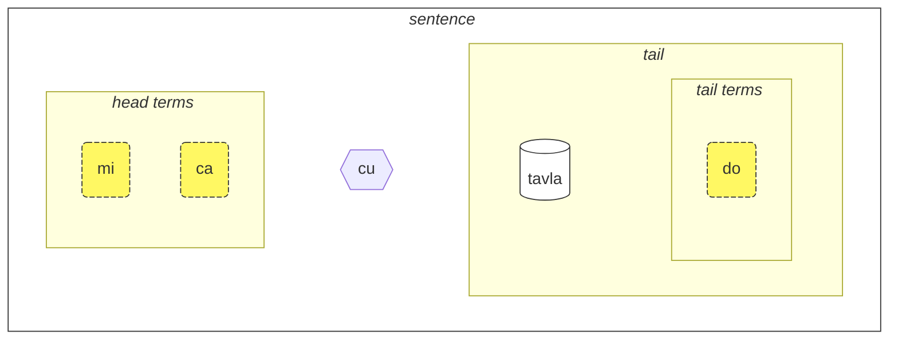
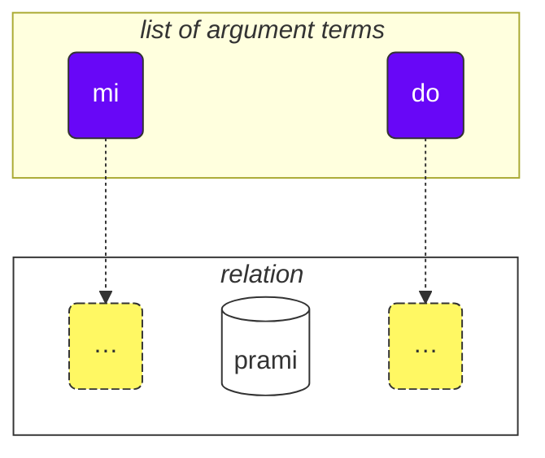

## Lesson 1. The language at a glance

### Alphabet

The basic thing you need to know about Lojban is the alphabet.

Lojban uses the Latin alphabet (vowels are colored):

<dl><dd><b>a b c d e f g i j k l m n o p r s t u v x y z ' .</b></dd></dl>

Words are pronounced as they are written.

There are 10 vowels in Lojban:

<table>
<tbody><tr>
<td><b class="audio-inline">a</b></td>
<td> as in <i>f<u>a</u>ther</i> (not as in <i>face</i>)</td>
</tr>
<tr>
<td><b class="audio-inline">e</b></td>
<td> as in <i>g<u>e</u>t</i></td>
</tr>
<tr>
<td><b class="audio-inline">i</b></td>
<td> as in <i>mach<u>i</u>ne</i> (not as in <i>hit</i>)</td>
</tr>
<tr>
<td><b class="audio-inline">o</b></td>
<td> as in <i>ch<u>o</u>ice</i>, <i>n<u>o</u>t</i> or <i>ough</i> in <i>th<u>ough</u>t</i> (not as in <i>so</i>, <b>o</b> should be a "pure" sound).</td>
</tr>
<tr>
<td><b class="audio-inline">u</b></td>
<td> as in <i>c<u>oo</u>l</i> (not as in <i>but</i>)</td>
</tr>
<tr>
<td><b class="audio-inline">y</b></td>
<td> as in <i>comm<u>a</u></i> (not as in <i>misty</i> or <i>cycle</i>)</td>
</tr>
<tr>
</tbody></table>

4 vowels are written using combinations of letters:

<table>
<tbody><tr>
<td><b class="audio-inline">au</b></td>
<td> as in <i>c<u>ow</u></i></td></tr>
<tr>
<td><b class="audio-inline">ai</b></td>
<td> as in <i>h<u>igh</u></i></td></tr>
<tr>
<td><b class="audio-inline">ei</b></td>
<td> as in <i>w<u>eigh</u></i></td></tr>
<tr>
<td><b class="audio-inline">oi</b></td>
<td> as in <i>b<u>oy</u></i></td></tr>
</tbody></table>

As for consonants, they are pronounced like in English or Latin, but there are several differences:

<table>
<tbody><tr>
<td><b class="guibutton">c</b>
</td>
<td>is pronounced as <i>c</i> in <i>ocean</i>, as <i>sh</i> in <i>shop</i>.
</td></tr>
<tr>
<td><b class="guibutton">g</b>
</td>
<td>always <i>g</i> as in <i>gum</i> (never <i>g</i> as in <i>gem</i>).
</td></tr>
<tr>
<td><b class="guibutton">j</b>
</td>
<td>like <i>s</i> in <i>pleasure</i> or <i>treasure</i>, like <i>j</i> in French <i>bonjour</i>.
</td></tr>
<tr>
<td><b class="guibutton">x</b>
</td>
<td>like <i>ch</i> in Scottish <i>loch</i> or as in German <i>Bach</i>, like <i>J</i> in Spanish <i>Jose</i> or <i>Kh</i> in Modern Arabic <i>Khaled</i>. Try pronouncing <i>ksss</i> while keeping your tongue down and you get this sound.
</td></tr>
<tr>
<td><b class="guibutton"> ' </b>
</td>
<td>like English <i>h</i>. So the apostrophe is regarded as a proper letter of Lojban and pronounced like a <i>h</i>. It can be found only between vowels. For example, <b>u'i</b> is pronounced as <i>oo-hee</i> (whereas <b>ui</b> is pronounced as <i>wee</i>).
</td></tr>
<tr>
<td><b>.</b>
</td>
<td>a full stop (period, word break) is also regarded as a letter in Lojban. It's a short pause in speech to stop words running into each other. Actually any word starting with a vowel has a full stop placed in front of it. This helps prevent undesirable merging of two sequential words into one.
</td></tr>
<tr>
<td><b>i</b>
</td>
<td><b>i</b> before vowels is considered a consonant and pronounced shorter, for example:
<ul><li><b>ia</b> is pronounced as <i>ya</i> in <i>yard</i></li>
<li><b>ie</b> is pronounced as <i>ye</i> in <i>yes</i></li></ul>
</td></tr>
<tr>
<td><b>u</b>
</td>
<td><b>u</b> before vowels is considered a consonant and pronounced shorter, for example:
<ul><li><b>ua</b> is pronounced as <i>wo</i> in <i>wow</i></li>
<li><b>ue</b> is pronounced as <i>whe</i> in <i>when</i></li></ul>
</td></tr></tbody></table>

Stress is placed on the second to last vowel. If a word has only one vowel, you just don't stress it.

The letter **r** can be pronounced like the the _r_ in English, Scottish, Russian, so there is a range of acceptable pronunciation for it.

Non-Lojban vowels like the short _i_ and _u_ in Standard British English _hit_ and _but_, are used by some people to separate consonants. So, if you have trouble pronouncing two consonants in a row (e.g. the **vl** in **tavla**, which means _to talk to_), then you can say _tavɪla_ — where the _ɪ_ is very short. However, other vowels like **a** and **u** must be long.

### The simplest sentence

The basic unit in Lojban is "sentence". Here are three simple examples:

> **le prenu cu tavla mi**
> _The person speaks to me._

le prenu
: the person

tavla
: … talks to …, … speaks to …

mi
: I, me

> **mi prami do**
> _I love you._

prami
: … loves … (someone)

do
: you

> **mi ca cu tavla do**
> _I now talk to you._

ca
: now (pronounced as **shah**)

Each sentence in Lojban consists of the following parts from the left to the right:

<pixra url="/assets/pixra/cilre/tavla.webp" caption="le prenu cu tavla mi" definition="The person talks to me."></pixra>

<pixra url="/assets/pixra/cilre/mi.webp" caption="mi" definition="I / me"></pixra>

<pixra url="/assets/pixra/cilre/mi_prami_do2.webp" caption="mi prami do" definition="I love you."></pixra>

<pixra url="/assets/pixra/cilre/do.webp" caption="do" definition="you"></pixra>

- the head:
  - consists of so-called "terms",
    - **le prenu** is the only head term in the example **le prenu cu tavla mi** above,
    - **mi**, **ca** are head terms in the example **mi ca cu tavla do** above.
- the head separator **cu**:
  - pronounced as _shoe_ since **c** is for _sh_,
  - shows that the head has ended,
  - can be omitted when it's clear that the head is completed.
- the tail:
  - the main relation construct (called "**selbrisni**" in Lojban) 
  - \+ possibly one or more terms after it,
    - **tavla**, **prami** are selbrisni, main relation constructs in the examples above.
    - **mi** is the only tail term in the example **le prenu cu tavla mi** above.
    - **do** is the only tail term in the example **mi prami do** above.

In Lojban, we mostly speak of relations rather than nouns or verbs.

Here are the two relation words, which roughly correspond to verbs:

prenu
: … is a person / are people

tavla
: … speaks to …

Each relation has one or more roles that can also be called "slots" or "places". Above, they are labelled with "…" Those slots are to be filled with arguments (called "**sumti**" in Lojban). Argument terms are constructs like **le prenu**, **mi**, **do** no matter whether those terms end up being in a head or in a tail of a sentence. We put argument terms in order, thus filling these slots and giving a concrete meaning to the relation.

We can also turn such relation into an argument term.

For that we put a short word **le** in front of it:

prenu
: … is a person

le prenu
: the person, the people

Similarly,

tavla
: … speaks to …

and thus

le tavla
: the speaker, the speakers

It might sound strange how _person_ can be a "verb", but in fact, this makes Lojban very simple:

<table>
<thead>
<tr>
<th>relation word with slots unfilled</th>
<th>argument form (<b>sumti</b>)</th></tr>
</thead>
<tbody>
<tr>
<td><b>prenu</b> — <i>… (someone) is a person</i> </td>
<td><b>le prenu</b> — <i>the person / the people</i>
     <b>le prenu</b> — <i>the one who is a person / those who are people</i>
</td></tr>
<tr>
<td><b>tavla</b> — <i>… (someone) speaks to … (someone)</i> </td>
<td><b>le tavla</b> — <i>the speaker / the speakers</i>
     <b>le tavla</b> — <i>the one who is a speaker / those who are speakers</i>
</td></tr>
</tbody></table>

The first slot of the relations disappears when using **le**, hence such alternative translations as _the one who …_ is possible.

<!-- We can also say that **le** creates a noun from a relation construct with roughly the meaning of _the one which is …_ (_is a person_ — _the person_), or even _those who do…_ (_to speak to_ — _the speakers_), _those who are…_ (_are people_ — _the people_). -->

Notice, that Lojban, by default, doesn't specify number between _the speaker_ or _the speakers_. That is, **le tavla** is vague in that regard, and we will soon discover ways to define the number.

Apart from argument terms there are modal terms like **ca**:

> **mi ca cu tavla do**
> _I now talk to you._

ca
: now

Modal terms do not fill slots of the main relation construct ("**selbrisni**"). Instead, they are applied to the whole sentence enriching or narrowing its meaning.

Thus, terms in Lojban are represented with:

- argument terms that fill in slots of relations. Examples are:
  - nouns like **le prenu** (_the person_)
  - pronouns like **mi** (_I_, _me_), **do** (_you_). Pronouns work exactly as nouns, but **le** is not used for them. They work as arguments on their own.
- modal terms that do not fill slots of relations but specify additional, сlarifying information.
  - for example, **ca** (_now, in present_).

Some more examples:

<pixra url="/assets/pixra/cilre/nintadni.webp" caption="mi nintadni" definition="I am a new student, a fresher."></pixra>

> **mi nintadni**
> _I am a new student._

nintadni
: … (someone) is a new student, a newbie

Unlike in English we don't have to add the verb "am/is/are/to be" to the sentence. It is already implied. The relation word **nintadni** (_… is a new student_) already has this English "am/is/are/to be" built into its English translation.

> **do jimpe**
> _You understand._

jimpe
: … (someone) understands … (something)

<pixra url="/assets/pixra/cilre/pilno_le_fonxa.webp" caption="le prenu cu pilno le fonxa" definition="The person uses the phone."></pixra>

> **mi pilno le fonxa**
> _I use the phone._

pilno
: … (someone) uses … (something)

fonxa
: … is a phone, … are phones

le fonxa
: the phone, the phones

<pixra url="/assets/pixra/cilre/citka.webp" caption="mi citka" definition="I eat."></pixra>

> **mi citka**
> _I eat._

citka
: … (someone) eats … (something)

> **do citka**
> _You eat._

<!-- -->

> **mi citka le plise**
> _I eat the apples._

<pixra url="/assets/pixra/cilre/le_plise_cu_kukte.webp" caption="le plise cu kukte" definition="The apples are tasty."></pixra>

> **le plise cu kukte**
> _The apples are tasty._

le plise
: the apples

kukte
:  … (something) is tasty

A simpler sentence in Lojban would contain only one main relation word:

<pixra url="/assets/pixra/cilre/karce.webp" caption="karce" definition="It is a car."></pixra>

> **karce**
> _Car!_
> _It is a car._

You could say this when you see a car coming. Here the context would be clear enough that there is a car somewhere around and probably it's dangerous.

**karce** itself is a relation word meaning _is a car_.

We can of course be more precise and say, for example:

> **bolci**
> _Ball!_
> _It is a ball._

where **bolci** is a relation word meaning _is a ball_.

> **ti bolci**
> _This is a ball near me._

<!-- -->
> **ta bolci**
> _This is a ball near you._

ti
: pronoun: this thing near me

ta
: pronoun: this/that thing near you

tu
: pronoun: that one away from you and me

<pixra url="/assets/pixra/cilre/ti.webp" caption="ti" definition="this one (near me, the speaker)"></pixra>

<pixra url="/assets/pixra/cilre/ta.webp" caption="ta" definition="this one (near you, the listener)"></pixra>

<pixra url="/assets/pixra/cilre/tu.webp" caption="tu" definition="that one over there (away from you and me)"></pixra>

Similarly, you can say

<pixra url="/assets/pixra/cilre/carvi.webp" caption="carvi" definition="… is a rain"></pixra>

> **carvi**
> _It is raining._

where

carvi
: … is a rain, … is raining

or

> **pluka**
> _It's pleasant_

where

pluka
: … is pleasant

Notice that in Lojban there is no need in the word _it_ in such sense. You just use the relation word you need.

> **prami**
> _Someone loves._

<pixra url="/assets/pixra/cilre/bajra.webp" caption="le prenu cu bajra" definition="The person runs."></pixra>

> **bajra**
> _Someone runs._

bajra
: … runs using limbs

Again context would probably tell who loves whom and who runs.

### Task

<pixra url="/assets/pixra/cilre/pinxe_le_djacu.webp" caption="le prenu cu pinxe le djacu" definition="The person drinks the water."></pixra>

pinxe
: … drinks … (something)

le djacu
: the water

Close the right part of the table. Translate the sentences on the left from Lojban.

<table style="table-layout: fixed;">
<tbody><tr>
<td><b>do citka</b>
</td>
<td><i>You eat.</i>
</td></tr>
<tr>
<td><b>mi pinxe le djacu</b>
</td>
<td><i>I drink water.</i>
</td></tr>
<tr>
<td><b>mi citka le plise</b>
</td>
<td><i>I eat apples.</i>
</td></tr></tbody></table>

### «**.i**» separates sentences

We place a short word **.i** to separate any two consecutive sentences:

> **mi tavla le prenu .i le prenu cu tavla mi**
> _I'm talking to the people. The people are talking to me._

**.i** separates sentences like the full stop (period) at the end of sentences in English texts.

When saying one sentence after another in English we make a pause (it may be short) between them. But pause has many different meanings in English. In Lojban we have a better way of understanding where one sentence ends and another begins.

Also note that sometimes when pronouncing words quickly you can't figure out where one sentence ends and the word of the next sentence begins. Therefore it's advised to use the word **.i** before starting a new sentence.

### Numbers: ‘_1 2 3 4 5 6 7 8 9 0_’ = «**pa re ci vo mu xa ze bi so no**»

**le** simply turns a relation construct into an argument, but such argument has no number associated with it. The sentence

> **le prenu cu tavla mi**
> _The people talk to me._
> _The person talks to me._

doesn't specify the number of people talking to me. In English, it is impossible to omit the number because _people_ in English implies _more than one person_. However, in Lojban, you can omit the number.

Now let's specify how many of the people are relevant to our discussion.

Let's add a number after **le**.

<table>
<tbody><tr>
<td><b>pa</b>
</td>
<td><b>re</b>
</td>
<td><b>ci</b>
</td>
<td><b>vo</b>
</td>
<td><b>mu</b>
</td>
<td><b>xa</b>
</td>
<td><b>ze</b>
</td>
<td><b>bi</b>
</td>
<td><b>so</b>
</td>
<td><b>no</b>
</td></tr>
<tr>
<td> 1
</td>
<td> 2
</td>
<td> 3
</td>
<td> 4
</td>
<td> 5
</td>
<td> 6
</td>
<td> 7
</td>
<td> 8
</td>
<td> 9
</td>
<td> 0
</td>
</tr></tbody></table>

<pixra url="/assets/pixra/cilre/ci_prenu.webp" caption="le ci prenu" definition="The three people"></pixra>

> **le pa prenu cu tavla mi**
> _The person talks to me._
> _The one person talks to me._

We add a number after **le** and thus specify individual people.

For numbers consisting of several digits, we just string those digits together:

> **le re mu prenu cu tavla mi**
> _The 25 people talk to me._

Yes, it's that simple.

If we want to count, we can separate numbers with **.i**:

> **mu .i vo .i ci .i re .i pa .i no**
> _5 … 4 … 3 … 2 … 1 … 0_

The number **za'u** means _more than …_ (_\>_ in math), the number **me'i** means _less than_ (_<_ in math):

> **le za'u re prenu cu tavla mi**
> _More than two people talk to me._

<!-- -->

> **le me'i pa no prenu cu tavla mi**
> _Fewer than 10 people talk to me._

<!-- -->

> **le za'u ci prenu cu tavla mi**
> _More than three people talk to me._

To say just _people_ (plural number) as opposed to _one person_, we use **za'u pa**, _more than one_ or simply **za'u**.

> **le za'u pa prenu cu tavla mi**
> **le za'u prenu cu tavla mi**
> _The people talk to me._

**za'u** by default means **za'u pa**, hence such contraction is possible.

le prenu
: the person / the people

le pa prenu
: the person (one in number)

le za'u prenu
: the people (two or more in number)

### Task

stati
: … (someone) is smart, … has a talent

<pixra url="/assets/pixra/cilre/stati.webp" caption="stati" definition="… has a talent"></pixra>

klama
: … comes to … (some place or object)

<pixra url="/assets/pixra/cilre/klama_ti.webp" caption="le prenu cu klama ti" definition="The person came here."></pixra>

nelci
: … likes (something)

le zarci
: the market

<pixra url="/assets/pixra/cilre/zarci.webp" caption="le prenu cu zvati le zarci" definition="The person is at the store."></pixra>

le najnimre
: the orange (fruit), the oranges

<pixra url="/assets/pixra/cilre/najnimre.webp" caption="najnimre" definition="… is an orange"></pixra>

le badna
: the banana, bananas

<pixra url="/assets/pixra/cilre/badna.webp" caption="badna" definition="… is a banana"></pixra>

Close the right part of the table. Translate the sentences on the left from Lojban.

<table style="table-layout: fixed;">
 <tbody>
  <tr>
   <td>le mu prenu cu klama le zarci</td>
   <td>The five people come to the market.</td>
  </tr>
  <tr>
   <td>le pa re prenu cu stati .i do stati</td>
   <td>The 12 people are smart. You are smart.</td>
  </tr>
  <tr>
   <td>le prenu cu nelci le plise</td>
   <td>The people like the apples.</td>
  </tr>
  <tr>
   <td>le za'u re prenu cu citka .i le me'i mu prenu cu pinxe le djacu</td>
   <td>More than two people eat. Fewer than 5 people drink the water.</td>
  </tr>
  <tr>
   <td>le za'u re prenu cu stati</td>
   <td>More than two people are smart.</td>
  </tr>
 </tbody>
</table>

Close the right part of the table. Translate the sentences on the left to Lojban.

<table style="table-layout: fixed;">
 <tbody>
  <tr>
   <td>The 256 people are smart.</td>
   <td>le re mu xa prenu cu stati</td>
  </tr>
  <tr>
   <td>Fewer than 12 apples are tasty.</td>
   <td>le me'i pa re plise cu kukte</td>
  </tr>
 </tbody>
</table>

### Compound relation

Compound relation construct (**tanru** in Lojban) are several relation words placed one after another.

> **tu melbi zdani**
> _That one is a nice home._

<pixra url="/assets/pixra/cilre/melbi_zdani.webp" caption="melbi zdani" definition="… is a nice home"></pixra>

tu
: that one (away from you and me)

melbi
: … is beautiful, nice

zdani
: … is a home or nest to … (someone)

melbi zdani
: compound relation construct: … is a beautiful home to … (someone)

<pixra url="/assets/pixra/cilre/dansu.webp" caption="le prenu cu melbi dansu" definition="The person nicely dances."></pixra>

> **do melbi dansu**
> _You nicely dance._

dansu
: … dances

Here, the relation **melbi** adds an additional meaning as it is placed to the left of another relation: **zdani**. The left component is usually translated using adjectives and adverbs.

Compound relations are a powerful feature that produces richer meanings. You just string two relation words together, and the left component of such compound relation adds a flavor to the right one.

We can put **le** (e.g. with a number) to the left of such compound relation getting a richer argument term:

le pa melbi zdani
: the beautiful home

Now you know why there was **cu** after head terms in our example:

> **le pa prenu cu tavla mi**
> _The person talks to me._

Without **cu** it'd turn into **le pa prenu tavla**, which would have the meaning of _the person-talker_ - whatever that could mean.

Consider:

> **le pa tavla pendo**
> _The talking friend_
<!-- -->
> **le pa tavla cu pendo**
> _The talking one is a friend._

Remember about placing **cu** before the main relation construct in a sentence to prevent unintentional creation of compound relations.

Compound relation can contain more than two components. In this case, the first relation modifies the second one, the second one modifies the third, and so on:

<pixra url="/assets/pixra/cilre/cmalu_karce.webp" caption="ti cmalu karce" definition="This is a small car."></pixra>

> **le pa melbi cmalu karce**
> _the pretty-small car, the car small in a pretty way_

<!-- -->

> **le mutce melbi zdani**
> _the very beautiful home_

mutce
: … is very, … is much

### Task

sutra
: … is quick

barda
: … is big

cmalu
: … is small

mlatu
: … is a cat

Close the right part of the table. Translate the sentences on the left from Lojban.

<table style="table-layout: fixed;">
<tbody><tr>
<td><b>le melbi karce</b>
</td>
<td><i>the beautiful car / the beautiful cars</i>
</td></tr>
<tr>
<td><b>do sutra klama</b>
</td>
<td><i>You quickly come. You come fast.</i>
</td></tr>
<tr>
<td><b>tu barda zdani</b>
</td>
<td><i>That is a big home.</i>
</td></tr>
<tr>
<td><b>le pa sutra bajra mlatu</b>
</td>
<td><i>the quickly running cat</i>
</td></tr>
<tr>
<td><b>le pa sutra mlatu</b>
</td>
<td><i>the quick cat</i>
</td></tr>
<tr>
<td><b>le pa bajra mlatu</b>
</td>
<td><i>the running cat</i>
</td></tr></tbody></table>

Close the right part of the table. Translate the sentences on the left to Lojban.

<table style="table-layout: fixed;">

<tbody><tr>
<td><i>This is a small car.</i>
</td>
<td><b>ti cmalu karce</b>
</td></tr>
<tr>
<td><i>tasty apples</i>
</td>
<td><b>le kukte plise</b>
</td></tr>
<tr>
<td><i>the quick eaters</i>
</td>
<td><b>le sutra citka</b>
</td></tr>
<tr>
<td><i>You are a quickly walking person.</i>
</td>
<td><b>do sutra cadzu prenu</b>
</td></tr></tbody></table>

### ‘_Yes/No_’ questions

In English, we form a _yes/no_ question by changing the order of the words, for example

> _You are … ⇒ Are you …?_

or by using some form of the verb _to do_ at the beginning, for example:

> _You know … ⇒ Do you know?_

In Lojban, the word order can be retained. To turn any assertion into a _yes/no_ question, we simply insert the word **xu** somewhere in the sentence, for example, at the beginning:

> **xu do nelci le gerku**
> _Do you like the dogs?_

le gerku
: the dog, the dogs

<pixra url="/assets/pixra/cilre/le_prenu_e_le_gerku.webp" caption="ti prenu .i ti gerku" definition="This is a person. This is a dog."></pixra>

Remember that in Lojban, punctuation like "?" (question mark) is optional and used mostly for stylistic purposes. This is because the question word **xu** already shows that it is a question.

Other examples:

> **xu mi klama**
> _Am I coming?_

klama
: … comes to … (somewhere)

> **xu pelxu**
> _Is it yellow?_

pelxu
: … is yellow

We can shift the meaning by placing **xu** after different parts of the relation. Explanations what changed in the meaning are given in brackets:

> **xu do nelci le gerku**
> _Do you like the dogs?_

<!-- -->

> **do xu nelci le gerku**
> _Do YOU like the dogs?_ (I thought it was someone else who likes them).

<!-- -->

> **do nelci xu le gerku**
> _Do you LIKE the dogs? (I thought you were just neutral towards them)._

<!-- -->

> **do nelci le xu gerku**
> _Do you like THE DOGS? (I thought you liked the cats)._

<!-- -->

> **do nelci le gerku xu**
> _You like those things, are they dogs? (You only question the validity of the relation **gerku**)._

What is expressed using intonation in English is expressed by moving **xu** after the part we want to emphasize in Lojban. Note that the first sentence with **xu** in the beginning asks the most generic question without stressing any particular aspect.

**xu** is an interjection word. Here are the features of Lojban interjections:

- interjection modifies the construct before it:

 > **do xu nelci le gerku**
 > _Do YOU like the dogs?_

- when placed at the beginning of a relation, interjection modifies the whole relation:

 > **xu do nelci le gerku**
 > _Do you like the dogs?_

- interjections can be placed after different parts of the same relation to shift the meaning.

  > **do nelci le gerku xu**
  > _You like those entities, are they dogs?_

  Here, only the relation **gerku** (not the argument **le gerku**) is modified by the question word **xu**. So here we wonder only of that relation. We assert that you like these objects or live beings and we ask you if those are dogs.

Interjections don't break compound relations, they can be used within them:

> **do nelci le barda xu gerku**
> _Do you like the BIG dogs?_

Now, how to reply to such 'yes/no' questions? You repeat the main relation construct:

> **— xu le mlatu cu melbi**
> **— melbi**
> _— Are the cats pretty?_
> _— Pretty._

To answer 'no', we use the modal term **na ku**:

> **— xu le mlatu cu melbi**
> **— na ku melbi**
> _— Are the cats pretty?_
> _— Not pretty._

na ku
: term: it is false that …

Or, we can use a special relation word **go'i**:

> **— xu le mlatu cu melbi**
> **— go'i**
> _— Are the cats pretty?_
> _— Pretty._

go'i
: relation word that repeats the main relation of the previous sentence

Here, **go'i** means the same as **melbi** since **melbi** is the relation of the previous relation.

> **— xu le mlatu cu melbi**
> **— na ku go'i**
> _— Are the cats pretty?_
> _— Not pretty._

<!-- This course doesn't recommend negating **go'i** for negative answers. Just use **je'u nai**. -->

The modal term **na ku** can be used not only in answers:

> **na ku mi nelci le gerku**
> _It is false that I like the dogs._
> _I don't like the dogs._
<!-- -->
> **mi na ku nelci do**
> _I don't like you._

Its opposite, the term **ja'a ku** affirms the meaning:

> **mi ja'a ku nelci do**
> _I do like you._

ja'a ku
: term: it is true that …

### Task

Close the right part of the table. Translate the sentences on the left from Lojban.

<table style="table-layout: fixed;">

<tbody><tr>
<td><b>xu le barda zdani cu melbi</b>
</td>
<td><i>Is the big home beautiful?</i>
</td></tr>
<tr>
<td><b>— le prenu cu stati xu — na ku stati</b>
</td>
<td><i>— Are the people smart? — No.</i>
</td></tr>
<tr>
<td><b>do klama le zarci xu</b>
</td>
<td><i>Do you go to the market?</i>
</td></tr>
<tr>
<td><b>xu le verba cu prami le mlatu</b>
</td>
<td><i>Does the child love the cats?</i>
</td></tr></tbody></table>

Close the right part of the table. Translate the sentences on the left to Lojban.

<table style="table-layout: fixed;">

<tbody><tr>
<td><i>Is the car fast?</i>
</td>
<td><b>xu le karce cu sutra</b>
</td></tr>
<tr>
<td><i>— Is the orange tasty? — Yes, it is.</i>
</td>
<td><b>— xu le najnimre cu kukte — kukte</b>
</td></tr>
<tr>
<td><i>Does the dog love you?</i>
</td>
<td><b>xu le gerku cu prami do</b>
</td></tr></tbody></table>

### Happiness and polite requests: ‘_Yay!_’ = «**ui**», ‘_Please!_’ = «**.e'o**»

The interjection **ui** show happiness of the one who is speaking. It is used just like the smiley face ‘_:)_’ the smiley-face in messaging, to indicate that you're glad of something. Although, smileys can be ambiguous, and **ui** has only one meaning, which is handy.

> **ui do klama**
> _Yay, you are coming!_

ui
: interjection: _Yay!_, interjection of happiness

The interjection **.e'o** at the beginning of a sentence turns it into a polite request:

> **.e'o do lebna le fonxa**
> _Could you take the phone, please?_
> `Please take the phone.`

.e'o
: interjection: please (pronounced as _eh-haw_ with a short pause or break before the word)

lebna
: to take (something)

In English, to be polite, one has to use _could you_ + _please_ + a question. In Lojban, **.e'o** is enough to make a polite request.

### Task

Close the right part of the table. Translate the sentences on the left from Lojban.

le tcati
: the tea

<pixra url="/assets/pixra/cilre/tcati.webp" caption="tcati" definition="… is some tea"></pixra>

le ckafi
: coffee

<pixra url="/assets/pixra/cilre/ckafi.webp" caption="ckafi" definition="… is some coffee"></pixra>

zgana
: to watch, observe (using any senses)

le skina
: the film, the movie

<pixra url="/assets/pixra/cilre/zgana_le_skina.webp" caption="le prenu cu zgana le skina" definition="The person watches the movie."></pixra>

kurji
: to care of (someone, something)

<table style="table-layout: fixed;">

<tbody>
<tr>
<td><b>ui carvi</b>
</td>
<td><i>Yay, it rains! Yay, it is raining!</i>
</td></tr>
<tr>
<td><b>.e'o do sutra bajra</b>
</td>
<td><i>Run quickly!</i>
</td></tr>
<tr>
<td><b>.e'o do pinxe le tcati</b>
</td>
<td><i>Please, drink tea!</i>
</td></tr>
<tr>
<td><b>.e'o zgana le skina</b>
</td>
<td><i>Please, watch the film!</i>
</td></tr></tbody></table>

Close the right part of the table. Translate the sentences on the left to Lojban.

<table style="table-layout: fixed;">

<tbody><tr>
<td><i>Please, be smart!</i>
</td>
<td><b>.e'o stati</b>
</td></tr>
<tr>
<td><i>Please, go home!</i>
</td>
<td><b>.e'o do klama le zdani</b>
</td></tr>
<tr>
<td><i>Please, drink the coffee!</i>
</td>
<td><b>.e'o do pinxe le ckafi</b>
</td></tr>
<tr>
<tr>
<td><i>Yay, I talk to you!</i>
</td>
<td><b>ui mi tavla do</b>
</td></tr>
<tr>
<td><i>Please, take care of the child.</i>
</td>
<td><b>.e'o do kurji le verba</b>
</td></tr></tbody></table>

### ‘_And_’ and ‘_or_’

> **do nintadni .i je mi nintadni**
> _You are a newbie. And I am a newbie._

<!-- -->

> **do .e mi nintadni**
> _You and I are newbies._

<pixra url="/assets/pixra/cilre/do_e_mi_nintadni.webp" caption="do .e mi nintadni" definition="You and I are new students."></pixra>

<!-- -->

> **mi tadni .i je mi tavla do**
> _I study. And I talk to you._

<!-- -->

> **mi tadni gi'e tavla do**
> _I study and talk to you._

.i je
: conjunction "and" combining sentences into one.

.e
: conjunction "and" connecting arguments.

gi'e
: conjunction "and" connecting sentence tails.

We can combine two sentences into one statement using the conjunction **.i je**, which means _and_:

> **do nintadni .i je mi nintadni**
> _You are a newbie. And I am a newbie._

Since both sentences have the same tail, we can use a contraction: the conjunction **.e** means _and_ for arguments:

> **do .e mi nintadni**
> _You and I are newbies._

**do nintadni .i je mi nintadni** means exactly the same as **do .e mi nintadni**

We can also use **.e** for connecting arguments in other positions.

Both of these sentences mean the same thing.

> **mi pinxe le djacu .e le jisra**
> _I drink the water and the juice._
> **mi pinxe le djacu .i je mi pinxe le jisra**
> _I drink the water, and I drink the juice._

le jisra
: juice

<pixra url="/assets/pixra/cilre/pinxe_le_jisra.webp" caption="le prenu cu pinxe le jisra" definition="The person drinks the juice."></pixra>

If the sentence head is the same but the tails differ, we use the conjunction **gi'e**, which means _and_ for sentence tails:

> **mi tadni .i je mi tavla do**
> **mi tadni gi'e tavla do**
> _I study and talk to you._

Both variations mean the same; **gi'e** simply leads to a more consise realization.

We also have tools to add _and_ for components of compound relations:

> **le melbi je cmalu zdani cu jibni ti**
> _The pretty and small home is near._

<pixra url="/assets/pixra/cilre/melbi_je_cmalu_zdani.webp" caption="melbi je cmalu zdani" definition="… is a pretty-and-small home"></pixra>

jibni
: … is near to …

ti
: this thing, this place near me

**je** is a conjunction in Lojban that means _and_ in compound relations.

Without **je**, the sentence changes the meaning:

> **le melbi cmalu zdani cu jibni**
> _The prettily small home is near._

Here **melbi** modifies **cmalu**, and **melbi cmalu** modifies **zdani**, according to how compound relations work.

In **le melbi je cmalu zdani** (_the pretty and small house_) both **melbi** and **cmalu** modify **zdani** directly.

Other common conjunctions include:

> **le verba cu fengu ja bilma**
> _The child is angry or ill (or maybe both angry and ill)_

<!-- -->

> **do .a mi ba vitke le dzena**
> _You or I (or both of us) will visit the ancestor._

ja
: and/or

**.a** = _and/or_ when connecting arguments.

fengu
: … is angry

<pixra url="/assets/pixra/cilre/fengu.webp" caption="fengu" definition="… is angry"></pixra>

bilma
: … is ill

<pixra url="/assets/pixra/cilre/bilma.webp" caption="le prenu cu bilma" definition="The person is ill"></pixra>

vitke
: to visit

dzena
: … is an ancestor of …

<pixra url="/assets/pixra/cilre/dzena.webp" caption="dzena" definition="… is an ancestor of …"></pixra>

> **le karce cu blabi jo nai grusi**
> _The car is either white or gray._

<!-- -->

> **do .o nai mi vitke le laldo**
> _Either you or I visit the old one._

jo nai
: either … or … but not both

.o nai
: either … or … but not both (when connecting arguments)

laldo
: … is old

Note: it's better to remember **jo nai** as a single construct, and the same for **.o nai**.

> **mi prami do .i ju do stati**
> _I love you. Whether or not you are smart._

<!-- -->

> **le verba cu nelci le plise .u le badna**
> _The child likes the apples whether or not (he/she likes) the bananas._

ju
: whether or not …

.u
: whether or not … (when connecting arguments)

### «**joi**» is ‘_and_’ for mass actions

> **do joi mi casnu le bangu**
> _You and I are discussing the language._

casnu
: … discusses …

le bangu
: the language

joi
: conjunction _and_ for masses

If I say **do .e mi casnu le bangu** it may mean that you discuss the language, and I discuss the language. But it doesn't necessarily mean that we are in the same conversation!

This can be made more visible if we expand this using **.i je**:

> **do .e mi casnu le bangu**
> **do casnu le bangu .i je mi casnu le bangu**
> _You discuss the language. And I discuss the language._

In order to emphasize that you and I participate in the same action, we use a special conjunction **joi** meaning _and_ that forms a "mass":

> **do joi mi casnu le bangu**
> _You and I are discussing the language._
> _You and I being a single entity for this event are discussing the language._

The pronoun **mi'o** (_you and I together_) can actually be expressed as **mi joi do**, which means exactly the same (it's just longer). In Lojban, you may use not a single word for _we_ but more precise constructs like **mi joi le pendo** (literally _I and the friends_).

<pixra url="/assets/pixra/cilre/casnu.webp" caption="do joi le pendo joi mi casnu" definition="You, the friend and I are in a discussion."></pixra>

### Task

Close the right part of the table. Translate the sentences on the left from Lojban.

<table style="table-layout: fixed;">

<tbody><tr>
<td><b>mi nelci le badna .e le plise</b>
</td>
<td><i>I like the bananas, and I like the apples. I like the bananas and the apples.</i>
</td></tr>
<tr>
<td><b>do sutra ja stati</b>
</td>
<td><i>You are quick or smart or both.</i>
</td></tr>
<tr>
<td><b>le za'u prenu cu casnu le karce .u le gerku</b>
</td>
<td><i>The people discuss the cars whether or not (they discuss) the dogs.</i>
</td></tr>
<tr>
<td><b>mi citka le najnimre .o nai le badna</b>
</td>
<td><i>I eat either the oranges or the bananas.</i>
</td></tr></tbody></table>

Close the right part of the table. Translate the sentences on the left to Lojban.

<table style="table-layout: fixed;">

<tbody><tr>
<td><i>The friends and I like the rain.</i>
</td>
<td><b>le pendo .e mi cu nelci le carvi</b>
</td></tr>
<tr>
<td><i>Either I or you go to the market.</i>
</td>
<td><b>mi .o nai do klama le zarci</b>
</td></tr>
<tr>
<td><i>I look at the big and beautiful car.</i>
</td>
<td><b>mi catlu le barda je melbi karce</b>
</td></tr>
<tr>
<td><i>The child drinks the water and/or the juice.</i>
</td>
<td><b>le verba cu pinxe le djacu .a le jisra</b>
</td></tr>
<tr>
<td><i>The child and the small one discuss the car.</i>
</td>
<td><b>le verba joi le pa cmalu cu casnu le karce</b> (note the use of <b>joi</b>. <i>the small one</i> is just <b>le pa cmalu</b>).
</td></tr></tbody></table>

### But …

> **le najnimre cu barda .i je ku'i le badna cu cmalu**
> _The oranges are big. But the bananas are small._

ku'i
: interjection: but, however

Actually, in English, _but_ is the same as _and_, and it adds a flavor of contrast.

In Lojban, we just use the conjunction **.i je** (or **.e**, **gi'e**, **je**, depending on what we connect) and add the flavor of contrast to it with the interjection **ku'i**. That will give us the necessary contrast. As usual, the interjection modifies the construct before it.

### Events: ‘_dancing and being together_’ — «**le nu dansu .e le nu kansa**»

Some slots of relations expect an event:

> **le cabna cu nicte**
> _Now it's nighttime. At present it's night._

cabna
: … (event) is at present with …; … (event) happens now

le cabna
: the present time, the present event

nicte
: … (event) happens at night

But what if we want to describe an event using a whole sentence?

Any sentence can be turned into a relation construct by putting **nu** in front of it:

> **le nicte cu nu mi viska le lunra**
> _The night is when I see the Moon._
> `Nighttime is an event when I see the Moon.`

<pixra url="/assets/pixra/cilre/nicte_fi_mi.webp" caption="le nicte" definition="the nighttime"></pixra>

le nicte
: the nighttime, nighttimes

viska
: to see (something)

le lunra
: the Moon

Here, **le nicte** is the first argument of the sentence and **nu mi viska le lunra** is the main relation construct of the sentence. However, inside this main relation, we can see another relation: **mi viska le lunra** embedded!

The word **nu** transforms a complete sentence into a relation that denotes an event (in its generic sense, its can be a process, a state etc.)

Here are some more examples:

nu mi tavla
: … is an event of me talking

nu do tavla
: … is an event of you talking

By adding **le** in front of **nu**, we create an argument that denotes an event:

pinxe ⇒ le nu pinxe
: … drinks ⇒ the drinking

dansu ⇒ le nu dansu
: … dances ⇒ the dancing

kansa ⇒ le nu kansa
: … is together with … ⇒ being together

klama ⇒ le nu klama
: … comes to … ⇒ the coming

le nu do klama
: the coming of you, you coming

**le nu** often corresponds to English _\-ing_, _\-tion_, _\-sion_.

Some more examples with slots that expect events instead of ordinary entities:

> **mi djica le nu do klama ti**
> _I want you to come here (to this place)_

djica
: … wants … (some event)

> **mi gleki le nu do klama**
> _I'm happy because you are coming._

gleki
: … is happy of … (some event)

<pixra url="/assets/pixra/cilre/gleki.webp" caption="gleki" definition="… is happy about event …"></pixra>

> **le nu pinxe le jisra cu nabmi mi**
> _Drinking the juice is a problem to me._

nabmi
: … (event) is a problem to … (someone), … (event) is problematic to … (someone)

### Task

Close the right part of the table. Translate the sentences on the left from Lojban.

pilno
: to use (something)

le skami
: the computer

<table style="table-layout: fixed;">

<tbody><tr>
<td><b>mi nelci le nu do dansu</b>
</td>
<td><i>I like you dancing.</i>
</td></tr>
<tr>
<td><b>xu do gleki le nu do pilno le skami</b>
</td>
<td><i>Are you happy of using computers?</i>
</td></tr>
<tr>
<td><b>do djica le nu mi citka le plise xu</b>
</td>
<td><i>Do you want me to eat the <u>apple</u>?</i>
</td></tr></tbody></table>

Close the right part of the table. Translate the sentences on the left to Lojban.

<table style="table-layout: fixed;">

<tbody><tr>
<td><i>Coming here is a problem.</i>
</td>
<td><b>le nu klama ti cu nabmi</b>
</td></tr>
<tr>
<td><i>I want you to be happy.</i>
</td>
<td><b>mi djica le nu do gleki</b>
</td></tr></tbody></table>

### Modal terms. Simple tenses: ‘_was_’, ‘_is_’, ‘_will be_’ — «**pu**», «**ca**», «**ba**»

In Lojban, we express the time when something happens (grammatically, in English it's usually called _tense_) with modal terms. We've already seen the modal term **ca** meaning _at present_.

Here is a series of time-related terms that tell when something happens:

> **le prenu pu cu tavla mi**
> _The people talked to me._

<!-- -->

> **le prenu ca cu tavla mi**
> _The people talk to me (at present)._

<!-- -->

> **le prenu ba cu tavla mi**
> _The people will talk to me._

When after the time-related particle we place a bare argument then we form a term with a slightly different meaning:

> **mi pinxe le djacu ca le nu do klama**
> _I drink the water while you are coming._

The **ca le nu do klama** part is a long term meaning _while you come / while you are coming_. The **le nu do klama** is an argument meaning *coming of you, you coming*.

> **mi citka ba le nu mi dansu**
> _I eat after I dance._

Time-related particles are grouped into series by their meaning to make them easier to remember and use.

Words for simple tense:

- **pu** means _before … (some event)_, **pu** alone denotes past tense.
- **ca** means _at the same time as … (some event)_, **ca** alone denotes present tense.
- **ba** means _after … (some event)_, **ba** alone denotes future tense.

Tenses add information about time when something happens. English forces us to use certain tenses. One has to choose between

- _The people talk to me_.
- _The people talked to me_.
- _The people will talk to me_.

and other similar choices.

But in Lojban tense particles are optional, we can be as vague or as precise as we want.

The sentence

> **le prenu cu tavla mi**
> _The people talk to me._

actually says nothing about when this happens. Context is clear enough in most cases and can help us. But if we need more precision we just add more words.

**ba** means _after … (some event)_ so when we say **mi ba cu citka** we mean that we eat after the moment of speaking, that's why it means _I will eat_.

We can combine tense particles with and without arguments after them:

> **mi pu cu citka le plise ba le nu mi dansu**
> _I ate the apples after I danced._

Note that the term **pu** (past tense) is put only in the main relation (**mi pu cu citka**). In Lojban, it is assumed that the event _I danced_ occurs relative to the event of eating.

We shouldn't put **pu** with **dansu** (unlike English) as **mi dansu** is viewed relative to **mi pu cu citka** so we already know that everything was in past.

More examples of time-related terms:

> **le nicte cu pluka**
> _The night is pleasant._

pluka
: … is pleasant

> **ba le nicte cu pluka**
> _After the night it is pleasant._

Here, the head of the sentence contains one term **ba le nicte**, a modal term with its inner argument. Then after the separator **cu**, the main relation of the sentence **pluka** is followed (**pluka** alone means _It is pleasant._)

To say _will be pleasant_ we should use the past tense term:

> **le nicte ba cu pluka**
> _The night will be pleasant._

Also note that adding an argument after a time-related particle can lead to a drastically different meaning:

> **le nicte ba le nu citka cu pluka**
> _The night is pleasant after eating._

Note that **ca** can extend slightly into the past and the future, meaning _just about now_. Thus, **ca** reflects a widely used around the world notion of "present time".

It's also possible to integrate modal particles into the main relation construct:

> **le nicte ba cu pluka**
> **le nicte ba pluka**
> _The night will be pleasant._

Both sentences mean the same, **ba pluka** is a relation construct meaning _… will be pleasant_.

The structure of **le nicte ba pluka** is the following:

- **le nicte** — the head of the sentence with just one term **le nicte**
- **ba pluka** — the tail of the sentence that only consists of the relation **ba pluka**

Contrast this with the previous sentence **le nicte ba cu pluka**:

- **le nicte ba** — the head of the sentence with two terms **le nicte** and **ba**
- **pluka** — the tail of the sentence that only consists of the relation **pluka**

The advantage of **le nicte ba pluka** over **le nicte ba cu pluka** is only in conciseness; you can usually skip saying **cu** in such cases since the sentence can't be understood otherwise anyway.

If you wish to put a modal term before an argument term you can separate it from the following text by explicitly "ending" the term with the helper word **ku**:

> **ba ku le nicte cu pluka**
> **le nicte ba cu pluka**
> **le nicte ba pluka**
> _The night will be pleasant._

**ku** prevents **ba le nicte** from appearing thus retaining **ba ku** and **le nicte** as separate terms.

One last note: English definitions of Lojban words may use tenses even when the original Lojban words do not imply them, e.g.:

tavla
: … talks to …, … speaks to …

pluka
: … is pleasant

Although _talks_, _is_ etc. are in the present tense (we can't always get rid of tense in English words because that's how English works), we must always assume that tense is not implied in the meaning of the defined Lojban words unless the English definition of such words explicitly mentions such tense restrictions.

### Modal terms. Event contours: «**co'a**», «**ca'o**», «**co'i**»

Another series of time-related particles, _event contours_:

co'a
: tense particle: the event is at its beginning

ca'o
: tense particle: the event is in progress

mo'u
: tense particle: the event is complete

co'i
: tense particle: the event is viewed as a whole (has started and then finished)

Most relation words describe events without specifying the stage of those events. Event contours allow us to be more precise:

> **mi pu co'a сu cikna**
> **mi pu co'a cikna**
> _I woke up._

cikna
: … is awake

co'a cikna
: … wakes up, becomes awake

pu co'a cikna
: … woke up, became awake

<pixra url="/assets/pixra/cilre/coha_cikna.webp" caption="le prenu co'a cikna" definition="The person wakes up."></pixra>

To precisely express the English Progressive tense, we use **ca'o**:

> **mi pu ca'o сu sipna**
> **mi pu ca'o sipna**
> _I was sleeping._

sipna
: … sleeps

<pixra url="/assets/pixra/cilre/sipna.webp" caption="le prenu ca'o sipna" definition="The person is sleeping."></pixra>

<!-- -->

> **mi ca ca'o pinxe**
> _I am drinking._

<!-- -->

> **mi ba ca'o pinxe**
> _I will be drinking._

**mo'u** is used for describing the completion of events:

> **mi mo'u klama le tcana**
> _I arrived at the station._

le tcana
: the station

<pixra url="/assets/pixra/cilre/mohu_klama_le_tcana.webp" caption="le prenu mo'u klama le tcana" definition="The person has arrived at the station."></pixra>

**co'i** usually corresponds to the English Perfect tense:

> **le verba ca co'i pinxe le jisra**
> _The children have drunk the juice._

We could omit **ca** in these sentence since the context would be clear enough in most such cases.

he English Present Simple tense describes events that happen sometimes:

> **le prenu ca ta'e tavla**
> _The people (habitually, sometimes) talk._

ta'e
: simple tense: the event happens habitually

We can use the same rules for describing the past using **pu** instead of **ca** or the future using **ba**:

> **le prenu pu co'i tavla mi**
> _The people had talked to me._

<!-- -->

> **le prenu ba co'i tavla mi**
> _The people will have talked to me._

The relative order of time-related particles is important. In **ca co'i** we first say something happens in present (**ca**), then we state that in this present time, the described event has been completed (**co'i**). Only when using this order do we get the Present Perfect tense.

### Modal terms. Intervals: ‘_during_’ — «**ze'a**»

Another series of modal particles emphasizes that events happen during an interval:

ze'i
: for a short time

ze'a
: through some time, for a while, during …

ze'u
: for a long time

> **mi pu ze'a cu sipna**
> **mi pu ze'a sipna**
> _I slept for a while._

<!-- -->

<pixra url="/assets/pixra/cilre/sipna_zeha.webp" caption="le prenu cu sipna ze'a le nu carvi" definition="The person is sleeping while it's raining."></pixra>

> **mi pu ze'a le nicte cu sipna**
> _I slept through the night. I slept all night._

Note: we cannot elide **cu** here since **nicte sipna** (_… is a night sleeper_) is a tanru and thus would lead to some other (if weird) meaning.

> **mi pu ze'i le nicte cu sipna**
> _I slept through the short night._

Compare **ze'a** with **ca**:

> **mi pu ca le nicte cu sipna**
> _I slept at night._

le nicte
: the nighttime

When using **ze'a**, we are talking about the whole interval of what we describe.

Note that **nicte** is itself an event, so we don't need **nu** here.

### Modal terms. ‘_because_’ — «**ri'a**», ‘_towards_’ — «**fa'a**», ‘_at (place)_’ — «**bu'u**»

Modal particle for _because_:

> **mi pinxe ri'a le nu mi taske**
> _I drink because I am thirsty._

<!-- -->

> **mi citka ri'a le nu mi xagji**
> _I eat because I am hungry._

ri'a
: because … (of some event)

taske
: … is thirsty

<pixra url="/assets/pixra/cilre/taske.webp" caption="taske" definition="… is thirsty"></pixra>

xagji
: … is hungry

<pixra url="/assets/pixra/cilre/xagji.webp" caption="xagji" definition="… is hungry"></pixra>

Modal particles denoting place work in the same way:

> **mi cadzu fa'a do to'o le zdani**
> _I walk in the direction of you away from the home._

Note that, unlike **klama**, the modal particles **fa'a** and **to'o** denote directions, not necessarily start or end points of the route. For example:

> **le prenu cu klama fa'a do**
> _The person comes towards you._

means that the person is simply moving towards your direction, but not necessarily to you (maybe to some place or person near you).
 
<!-- -->

> **mi cadzu bu'u le tcadu**
> _I walk in the city._

fa'a
: towards …, in the direction of …

to'o
: from …, from the direction of …

bu'u
: at … (some place)

Note: **nu** shows that a new inner embedded sentence starts within the main sentence. We put **kei** after such relation to show its right border, similar to how we use ")" or "]" in math. For example:

> **le gerku cu plipe fa'a mi ca le nu do ca'o klama**
> _The dog jumps towards me when you are coming._

<pixra url="/assets/pixra/cilre/le_gerku_faha_plipe.webp" caption="le gerku cu plipe fa'a mi" definition="The dog jumps towards me."></pixra>

plipe
: to jump

but

> **le gerku cu plipe ca le (nu do ca'o klama kei) fa'a mi**
> _The dog jumps (when you are coming) towards me._

Brackets _(_ and_)_ are used here only to show the structure; they are not necessary in a normal Lojban text.

We use **kei** after the inner sentence **do ca'o klama** to show that it ended, and the tail of the sentence continues with its terms.

Compare this sentence with the following:

> **le gerku cu plipe ca le (nu do ca'o klama fa'a mi)**
> _The dog jumps (when you are coming towards me)._

As you can see, **do klama fa'a mi** is a relation inside the bigger one, so **fa'a mi** is now inside it.

Now, it's not the dog that comes towards me, but you.

At the end of the statement, **kei** is never needed as it already signifies the right border.

Consider the following example with a time-related particle:

> **mi pu citka le plise ba le nu mi dansu**
> _I ate the apples after I danced._

<!-- -->

> **mi pu citka ba le nu mi dansu kei le plise**
> _I ate (after I danced) the apples._

We can rearrange the sentence by moving **ba le nu mi dansu** around, as long as it remains after **pu**.

#### Task

Close the right part of the table. Translate the sentences on the left from Lojban.

le tsani
: the sky

zvati
: …is present at … (some place or event), … stays at … (some place)

le canko
: the window

le fagri
: the fire

mi'o
: You and I

le purdi
: the garden

le tcati
: the tea

<table style="table-layout: fixed;">

<tbody><tr>
<td><b>mi ca gleki le nu do catlu le tsani</b>
</td>
<td><i>I am happy that you look at the sky.</i>
</td></tr>
<tr>
<td><b>xu le gerku pu ca'o zvati le zdani</b>
</td>
<td><i>Were the dogs staying at home?</i>
</td></tr>
<tr>
<td><b>do pu citka le plise ba le nu mi pinxe le jisra</b>
</td>
<td><i>You ate the apples after I drank the juice.</i>
</td></tr>
<tr>
<td><b>ko catlu fa'a le canko</b>
</td>
<td><i>Look towards the window.</i>
</td></tr>
<tr>
<td><b>xu do gleki ca le nu do ca'o cadzu bu'u le purdi</b>
</td>
<td><i>Are you happy when you are walking in the garden?</i>
</td></tr>
<tr>
<td><b>ca le nu mi klama le zdani kei do pinxe le tcati ri'a le nu do taske</b>
</td>
<td><i>When I go home you drink tea because you are thirsty.</i>
</td></tr></tbody></table>

Close the right part of the table. Translate the sentences on the left to Lojban.

<table style="table-layout: fixed;">

<tbody><tr>
<td><i>You will look at the car.</i>
</td>
<td><b>do ba catlu le karce</b>
</td></tr>
<tr>
<td><i>You want it to rain in future.</i>
</td>
<td><b>do ca djica le nu ba carvi</b>
</td></tr>
<tr>
<td><i>Quickly run away from the fire!</i>
</td>
<td><b>ko sutra bajra to'o le fagri</b>
</td></tr>
<tr>
<td><i>You and I were staying together at home when it was raining.</i>
</td>
<td><b>mi'o pu ca'o zvati le zdani ca le nu carvi</b>
</td></tr></tbody></table>

### Names. Choosing a name

**cmevla**, or _name word_, is a special kind of word used to build personal names. It's easy to recognize le cmevla in a text flow, as they are the only words that end in a consonant and are wrapped by one dot on each side.

Examples of le cmevla are: **.paris.**, **.robin.**

If one's name is _Bob_ then we can create a cmevla ourselves that would sound as close as possible to this name, for example: **.bab.**

The simplest example of using a name would be

> **la .bab. cu tcidu**
> _Bob reads/is reading._

tcidu
: … reads

<pixra url="/assets/pixra/cilre/tcidu_la_lojban.webp" caption="le prenu ca'o tcidu" definition="The person is reading."></pixra>

**la** is similar to **le**, but it converts a word into a name instead of a simple argument.

In English, we start a word with a capital letter to show that it is a name. In Lojban, we use the prefix word **la**.

Always use **la** when producing names!

A name can consist of several cmevla one after another:

> **la .bab.djansyn. cu tcidu**
> _Bob Johnson reads/is reading._

Here, we separated the two cmevla with just one dot, which is enough.

It's common to omit dots in front of and at the end of le cmevla to write texts faster, for example, when text chatting. After all, le cmevla are still separated from neighboring words by spaces around them:

> **la bab djansyn cu tcidu**

However, in spoken language, it is still necessary to put a short pause before and after le cmevla.

Bob's first name, the name of the language _Lojban_, can be used in Lojban without many changes:

> **la .lojban. cu bangu mi**
> _I speak Lojban._
> Lojban is a language of me.
> `Lojban is a language I use.`

bangu
: … is a language used by … (someone)

<!-- -->
> **mi nintadni la .lojban.**
> _I am a new student of Lojban._
<!-- -->
> **mi tadni la .lojban.**
> _I study Lojban._

<pixra url="/assets/pixra/cilre/tadni.webp" caption="le prenu ca ca'o tadni la .lojban." definition="The person is now studying Lojban."></pixra>

Lojban letters directly correspond to sounds, so there are some rules for adapting names to how they are written in Lojban. This may sound strange — after all, a name is a name — but all languages do this to some extent. For example, English speakers tend to pronounce _Jose_ as _Hozay_, and _Margaret_ in Chinese is _Magelita_. Some sounds simply don't exist in some languages, so you need to rewrite the name so that it only contains Lojban sounds and is spelt according to letter-sound correspondence.

For example:

la .djansyn.
: Johnson (probably, closer to American pronunciation)

la .suzyn.
: Susan (the two letters _s_ are pronounced differently: the second one is actually a _z_, and the _a_ is not really an _a_ sound)

Pay attention to how the name is pronounced natively. As a result, the English and French names _Robert_ come out differently in Lojban: the English name is **.robyt.** in UK English, or **.rabyrt.** in some American dialects, but the French is **.rober.**

Here are "Lojbanizations" of some names:

- _Alice_ ⇒ **la .alis.**
- _Mei Li_ ⇒ **la .meilis.**
- _Bob_ ⇒ **la .bab.**
- _Abdul_ ⇒ **la .abdul.**
- _Yan or Ian_ ⇒ **la .ian.**
- _Ali_ ⇒ **la .al.**
- _Doris_ ⇒ **la .doris.**
- _Michelle_ ⇒ **la .micel.**
- _Kevin_ ⇒ **la .kevin.**
- _Edward_ ⇒ **la .edvard.**
- _Adam_ ⇒ **la .adam.**
- _Lucas_ ⇒ **la .lukas.**

Notes:

* Two additional full stops (periods) are necessary because if you don't put those pauses in speech, it might become difficult to know where the name starts and ends, or in other words, where the previous word ends and the next word begins.
* The last letter of a cmevla must be a consonant. If a name doesn't end in a consonant, we usually add an **s** to the end; so in Lojban, _Mary_ becomes **.meris.**, _Joe_ becomes **.djos.**, and so on. Alternatively, we can leave out the last vowel, so _Mary_ would become **.mer.** or **.meir**.
* You can also put a full stop between a person's first and last names (though it's not compulsory), so _Jim Jones_ becomes **.djim.djonz.**

### Rules for making le cmevla

Here is a compact representation of Lojban sounds:

- vowels:
  - **a e i o u y au ai ei oi**
- consonants:
  - **b d g v z j** (voiced)
  - **p t k f s c x** (unvoiced)
  - **l m n r**
  - **i u**. They are considered consonants when placed between two vowels or at the beginning of a word. **.iaua** — **i** and **u** are consonants here. **.iai** — here is the consonant **i** with the vowel **ai** after it.
  - **'** (apostrophe). It is placed only between two vowels: **.e'e**, **.u'i**
  - **.** (dot, word break)

To create a Lojban name, follow these rules:

1. the name must end in a consonant except **'**. If not, add a consonant at the end yourself. Additionally, wrap it with a dot from each side: **.lojban.**.
2. vowels can only be placed between two consonants:  **.sam.**, **.no'am.**
3. double consonants are merged into one: _dd_ becomes **d**, _nn_ becomes **n** etc. Or a **y** is placed between them: **.nyn.**
4. if a voiced and an unvoiced consonants are next to each other, insert a **y** between them: **kv** becomes **kyv**. Alternatively, you can remove one of the letters instead: **pb** can be turned into a single **p** or a single **b**.
5. if one of **c**, **j**, **s**, **z** are next to each other, insert a **y** between them: **jz** becomes **jyz**. Alternatively, you can remove one of the letters instead: **cs** can be turned into a single **c** or a single **s**.
6. if **x** is next to **c** or next to **k**, insert a **y** between them: **cx** becomes **cyx**, **xk** becomes **xyk**. Alternatively, you can remove one of the letters instead: **kx** can be turned into a single **x**.
7. the substrings **mz**, **nts**, **ntc**, **ndz**, **ndj** are fixed by adding a **y** inside or deleting one of the letters: **nytc** or **nc**, **.djeimyz.**
8. double **ii** between vowels is merged into a single **i**: **.eian.** (but not **.eiian.**)
9. double **uu** between vowels is merged into a single **u**: **.auan.** (but not **.auuan.**)
10. the sound for the English "h" as in Harry can be either dropped or replaced with **x**. _Harry_ can become **.aris.** or **.xaris.**

### Relation words as names

You can select an enjoyable nickname in Lojban by using not only cmevla but also relation words. You can also translate your present name into Lojban if you know what it means, or choose a completely new Lojban name.

Here are a few examples:

<table>
<thead>
<tr>
<th> Original name </th>
<th> Original meaning </th>
<th> Word in Lojban </th>
<th> Meaning in Lojban </th>
<th> Your name
</th></tr>
</thead>
<tbody>
<tr>
<td> Alexis </td>
<td> <i>helper</i> in Greek </td>
<td><b>le sidju</b></td>
<td><i>the helper</i> </td>
<td><b>la sidju</b>
</td></tr>
<tr>
<td> Ethan </td>
<td> <i>solid, during</i> in Hebrew </td>
<td><b>le sligu</b></td>
<td><i>the solid</i> </td>
<td><b>la sligu</b>
</td></tr>
<tr>
<td> Mei Li </td>
<td><i>beautiful</i> in Mandarin Chinese </td>
<td><b>le melbi</b></td>
<td><i>the beautiful ones</i> </td>
<td><b>la melbi</b>
</td></tr></tbody></table>

### ‘_he_’ ‘_she_’

Lojban doesn't have distinct words for _he_ or _she_. Possible solutions:

le ninmu
: the woman (in gender sense)

<pixra url="/assets/pixra/cilre/ninmu.webp" caption="le ninmu" definition="the woman (female human)"></pixra>

le nanmu
: the male man (in gender sense)

<pixra url="/assets/pixra/cilre/nanmu.webp" caption="le nanmu" definition="the man (male human)"></pixra>

> **le ninmu cu tavla le nanmu .i le ninmu cu jatna**
> _The woman talk to the man. She is a leader._

jatna
: … is a leader, commander

Lojbanists have proposed various words for other genders like

le nonmu
: the agender person

le nunmu
: the non-binary-gendered person

However, in most situations, using **le prenu** (_the person_) or personal names is sufficient.

Another choice is to use the short pronoun **ri**, which refers to the previous argument term:

> **mi pu klama le nurma .i ri melbi**
> _I went to the countryside. It was beautiful._

le nurma
: the rural area

melbi
: … is beautiful, nice to … (someone)

Here, **ri** refers to the country side.

<pixra url="/assets/pixra/cilre/nurma.webp" caption="nurma" definition="… is a rural area"></pixra>

> **mi tavla le pendo .i ri jundi**
> _I talk to the friend. He/she is attentive._

jundi
: … is attentive

Here, **ri** refers to the friend.

<pixra url="/assets/pixra/cilre/jundi.webp" caption="le prenu cu jundi" definition="The person is attentive."></pixra>

Note: **ri** skips pronouns **mi** (_I_) and **do** (_you_):

> **le prenu cu tavla mi .i ri pendo mi**
> _The person talks to me. He/she is a friend of mine._

Here, **ri** skips the previous pronoun **mi** and thus refers to **le prenu** which is the preceding argument term available.

Other two similar pronouns are **ra** and **ru**.

ra
: refers to a recently used argument term

ru
: refers to an even earlier used argument term

> **le pendo pu klama le nurma .i ri melbi ra**
> _The friend went to the countryside. The countryside was beautiful to her/him._

Here, since **ri** is used **ra** has to refer to a more recent completed argument term, which for this isolated example is **le pendo**. Arguments like **mi** and **do** are also skipped by **ra**.

If **ri** is not used then **ra** can refer even to the last completed argument:

> **le pendo pu klama le nurma .i ra melbi ru**
> _The friend went to the countryside. The countryside was beautiful to her/him._

**ra** is more convenient when you are lazy and context would resolve reference anyway.

### Introducing yourself. Vocatives

In Lojban, _vocatives_ are words that behave like interjections (such as **xu** which we earlier discussed), but they require an argument to be attached to the right of them:

> **coi do**
> _Hello, you!_

coi
: vocative: Hello! Hi!

<pixra url="/assets/pixra/cilre/coi.webp" caption="coi do" definition="Hello to you!"></pixra>

We use **coi** followed by an argument term to greet someone.

> **co'o do**
> _Goodbye to you._

co'o
: vocative: goodbye!

<pixra url="/assets/pixra/cilre/coho.webp" caption="co'o do" definition="Good-bye to you!"></pixra>

> **coi ro do**
> _Hello everyone!_
> `Hello each of you`

— is how people usually start a conversation with several people. Other numbers are possible of course: **coi re do** means *Hello you two* etc.

Since vocatives work like interjections we have nice types of greetings:

<pixra url="/assets/pixra/cilre/cerni.webp" caption="cerni" definition="… is morning"></pixra>
<pixra url="/assets/pixra/cilre/donri.webp" caption="donri" definition="… is daylight time"></pixra>
<pixra url="/assets/pixra/cilre/vanci.webp" caption="vanci" definition="… is evening"></pixra>
<pixra url="/assets/pixra/cilre/nicte.webp" caption="nicte" definition="… is nighttime"></pixra>

> **cerni coi**
> _Good morning!_
> `It's morning — Hello!`

> **vanci coi**
> _Good evening!_

> **donri coi**
> _Good day!_

<!-- -->

> **nicte coi**
> _Nightly greetings!_

Note: in English _Goodnight!_ means _Goodbye!_ or denotes wishing someone a good night. By its meaning, _Goodnight!_ doesn't belong to the series of greetings above. Thus, we use different wording in Lojban:

> **nicte co'o**
> _Good night!_

or

> **.a'o pluka nicte**
> _Pleasant night!_

.a'o
: interjection: I hope

pluka
: … is pleasant to … (someone)

Of course, we can be vague by just saying **pluka nicte** (just meaning _pleasant night_ without any wishes explicitly said).

The vocative **mi'e** + an argument is used to introduce yourself:

> **mi'e la .doris.**
> _I'm Doris. This is Doris speaking._

mi'e
: vocative: identifies speaker

The vocative **doi** is used to address someone directly:

> **mi cliva doi la .robert.**
> _I'm leaving, Robert._

cliva
: to leave (something or someone)

Without **doi**, the name might fill the first argument of the relation:

> **mi cliva la .robert.**
> _I'm leaving Robert._

**doi** is a like Old English _O_ (as in _O ye of little faith_) or the Latin vocative (as in _Et tu, Brute_). Some languages don't distinguish between these contexts, although as you can see, Old English and Latin did.

Two more vocatives are **ki'e** for saying thanks and **je'e** for accepting them:

> **— ki'e do do pu sidju mi**
> **— je'e do**
> _— Thank you, you helped me._
> _— Not at all._

sidju
: … helps … (someone)

We can omit the argument after the vocative only at the end of the sentence. For example, we can just say:

> **— coi .i xu do kanro**
> _— Hello. How do you do?_
> `— Hello. Are you healthy?`

kanro
: … is healthy

Here, a new sentence starts immediately after the vocative **coi**, so we omitted the name. Or we can say:

> **coi do mi djica le nu do sidju mi**
> _Hello. I want you to help me._
> `Hello you. I want that you help me.`

Thus, if you don't know the name of the listener and you want to continue the same sentence after the vocative, you just place **do** after it.

If you use the vocative on its own (without an argument after it) and the sentence is not finished yet, then you need to separate it from the rest. This is because the things that are most likely to follow the vocative in a sentence could easily be misconstrued as describing your addressee. To separate it from the following argument, use the word **do**. For example,

> **coi do la .alis. la .doris. pu cliva**
> _Hello! Alice left Doris._
> `Hello you! Alice left Doris`

<!-- -->

> **coi la .alis. la .doris. pu cliva**
> _Hello, Alice! Doris left._

And if you want to put both vocatives and interjections, modifying the whole sentence please put the interjections first:

> **.ui coi do la .alis. la .doris. pu cliva**
> _Yay, Hello! Alice left Doris._

Note: in the beginning of a sentence, interjections are usually put before vocatives because:

> **coi .ui do la .alis. la .doris. pu cliva** means

> _Hello (I'm happy about this greeting) you! Alice left Doris._

So an interjection immediately after a vocative modifies that vocative. Similarly, an interjection modifies the argument of a vocative when being put after it:

> **coi do .ui la .alis. la .doris. pu cliva**
> _Hello you (I'm happy about you)! Alice left Doris._