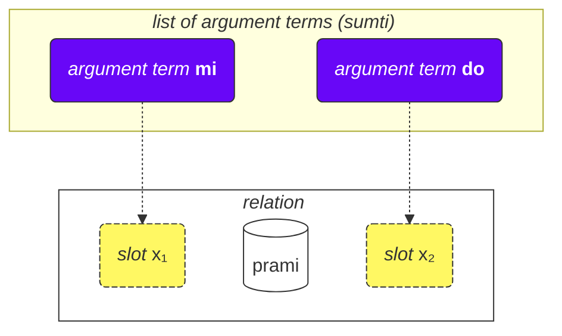
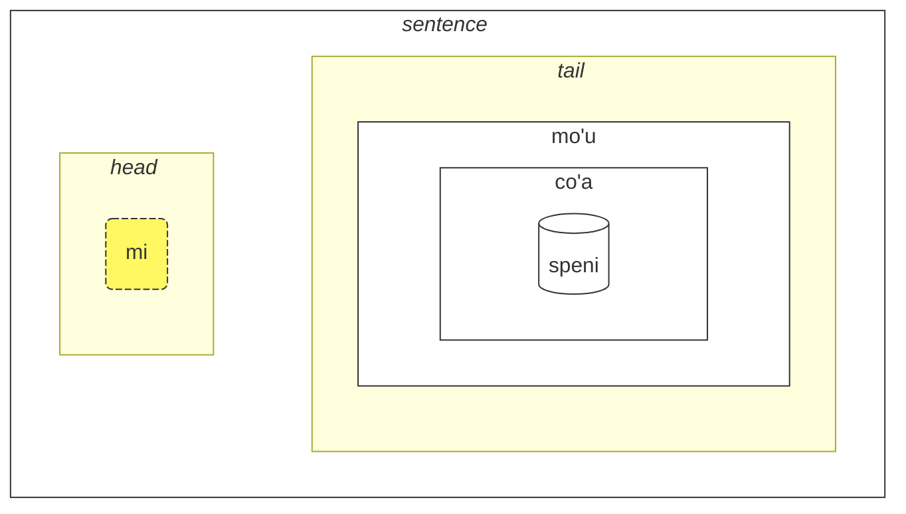

## Lesson 2. More basic stuff

### Types of words

All Lojban words are divided into three groups:

- Relation words (called **selbrivla** in Lojban)
  - Examples: **gleki**, **klama**.
  - Such words contain at least a cluster of consonants (two or more consonants one after another) within the first 5 sounds + they end in a vowel.
- Particles (called **cmavo** in Lojban)
  - Examples: **le**, **nu**, **mi**, **fa'a**.
  - They start with a consonant (one of **b d g v z j p t k f s c x l m n r i u**), followed by a vowel (one of **a e i o u y au ai ei oi**). Optionally, after that, there can be one or more sequences of an apostrophe (**'**) and a following vowel. For example, **xa'a'a'a'a'a'a** and **ba'au'oi'a'e'o** are possible particles (even if no meaning is assigned to them).
  - It is quite common to write several particles consecutively without spaces between them. This is allowed by Lojban grammar. So, don't be surprised to see **lenu** instead of **le nu**, **naku** instead of **na ku**, **jonai** instead of **jo nai**, and so on. This doesn't change the meaning. However, this rule does not apply to relation words; relation words should be separated by spaces.
- Name words (called **cmevla** in Lojban)
  - Examples: **.alis.**, **.doris**, **.lojban.**
  - Usually used for names.
  - They can be easily distinguished from the other types of words since they end in a consonant. Additionally, they are wrapped with two dots at the beginning and at the end. Colloquially, dots can be omitted when writing, but when speaking, pauses that correspond to those dots are still a must.

### Order of arguments

Earlier we provided definitions of relation words such as:

mlatu
: … is a cat, to be a cat

citka
: … eats …

prami
: … loves …

klama
: … come to …

Dictionaries can present definitions of relation words with symbols such as $x_1$, $x_2$ etc.:

prami
: $x_1$ loves $x_2$

karce
: $x_1$ is a car …

citka
: $x_1$ eats $x_2$ …

klama
: $x_1$ comes to $x_2$ …

These $x_1$, $x_2$, and so on is the explicit notation for the _slots_ (other names are: _places_, _roles of relation_, **terbricmi** in Lojban), which are filled by argument terms (**sumti**) in the sentence. 

Numbers represent the order in which those slots are to be filled by arguments.

For example:

> **mi prami do**
> _I love you._

This sentence also implies that

- $x_1$ denotes _the one who loves_, and
- $x_2$ denotes _the one who is loved by_.

In other words, each relation has one or more slots, and those slots are specified and labeled as $x_1$, $x_2$, and so on. We put arguments like **mi**, **do**, **le tavla** etc. in order, thus filling these slots and giving a concrete meaning to the relation, thus forming a sentence.

The advantage of such style of definitions is that all participants of a relation are in one definition.

We can also omit arguments making the sentence more vague:

> **carvi**
> _It is raining._
> `is rain, is raining`

(although time here is determined by context, it can also mean _It often rains_, _It was raining_, etc.)

> **prami do**
> _Someone loves you._
> `loves you`

All omitted places in a relation just mean **zo'e** = _something/someone_ so it means the same as

> **zo'e prami do**
> _Someone loves you._

And

> **prami**

is the same as

> **zo'e prami zo'e**
> _Someone loves someone._

Modal terms like **ca**, **fa'a** etc. add new places to relations, but they don't fill slots of relations. In

> **mi klama fa'a do**
> _I come towards you._

the second place of **klama** is still omitted. For example:

> **mi klama fa'a le cmana le zdani**
> _I come (in the direction of the mountain) to the home._

le cmana
: the mountain

<pixra url="/assets/pixra/cilre/cmana.webp" caption="cmana" definition="… is a mountain"></pixra>

Here, the second place of **klama** is **do**. The sentence means that the mountain is just a direction, whereas the final point is you.

Here, the term **fa'a la cmana** (_in the direction of the mountain_) doesn't replace the second place of the relation **klama**. The second place of **klama** is **le zdani** here.

The sentence means that my home is simply located in the direction of the mountain, but it doesn't necessarily mean I want to reach that mountain. The final destination of me coming is not necessarily the mountain but the home.

Similarly, in

> **mi citka ba le nu mi cadzu**
> _I eat after I walk._

the second place of **citka** is still omitted. A new word **ba** with its argument **le nu mi cadzu** adds meaning to the sentence.

The order of arguments of compound relation is the same as the one of the last component in it:

> **tu sutra bajra pendo mi**
> _That is my quickly running friend._
> `That is a quickly running friend of me.`

> **tu pendo mi**
> _That is my riend._
> `That is a friend of me.`

pendo
: … is a friend of … (someone)

So the order of arguments is the same as that of **pendo** alone.

### More than two places

There might be more than two places. For example:

> **mi pinxe le djacu le kabri**
> _I drink the water from the cup._

pinxe
: $x_1$ drinks $x_2$ from $x_3$

> **le kabri**
> _the cup_

In this case, there are three places, and if you want to exclude the second place in the middle, you have to use **zo'e**:
> **mi pinxe zo'e le kabri**
> _I drink \[something\] from the cup._

If we omit **zo'e**, we get something meaningless:

> **mi pinxe le kabri**
> _I drink the cup._

Another example:

> **mi plicru do le plise**
> _I give you the apples._

plicru
: $x_1$ gives, donates to $x_2$ some object $x_3$; $x_1$ allows someone $x_2$ to use $x_3$ 

### Relations inside relations

In
> **le nicte cu nu mi viska le lunra**
> *The night is when I see the Moon.*

we have

- **le nicte** as $x_1$ of the relation,
- **nu mi viska le lunra** as the main relation.

However, inside **nu mi viska le lunra**, we have another sentence with

- **mi** - $x_1$ of the inner relation,
- **viska** - the inner relation,
- **le lunra** - $x_2$ of the inner relation.

So, despite having an inner structure, **nu mi viska le lunra** is still a relation with its first term filled with **le nicte** in this case.

Similarly, in

> **mi citka ba le nu mi dansu**
> _I eat after I dance._

we have

- **mi** as $x_1$ of the relation,
- **citka** as the main relation construct,
- **ba le nu mi dansu** as a modal term of the main relation of the sentence.

Inside this term, we have:

- **mi** as $x_1$ of the relation inside the term
- **dansu** as the main relation construct inside the term.

Such "recursive" mechanism of wrapping relations into relations allows expressing complex ideas precisely.

### Why are relation words defined the way they are?

English uses a limited set of prepositions that are reused across various verbs and, thus, have no fixed meaning. For example, consider the English preposition _to_:

> _I speak to you._

<!-- -->
> _I come to you._
<!-- -->

> _To me it looks pretty._

In each of those examples, _to_ has a new role that is, at best, remotely similar to roles in other sentences.

It's important to note that other languages use different ways of marking roles of verbs that, in many cases, are very different from those used in English.

Lojban, for instance, marks core roles (slots) of relations by fully defining such relations with the roles placed in sequence (or marked with **fa**, **fe**, and so on):

klama
: $x_1$ comes to $x_2$ …

tavla
: $x_1$ talks to $x_2$ …

melbi
: $x_1$ is beautiful, pretty to $x_2$ …

Such core roles are essential in defining relations.

However, there can be optional roles that make relations more precise:

> _I speak to you while I'm eating._
<!-- -->

> _It's hard to me because this thing is heavy._

In Lojban, a similar notion of such optional roles is expressed via separate relations or, for most common cases, with modal terms:

> **mi tavla do ze'a le nu mi citka**
> _I speak to you while I'm eating._
<!-- -->
> **nandu mi ri'a le nu ti tilju**
> _It's hard to me because this thing is heavy._

nandu
: $x_1$ is hard to $x_2$

tilju
: $x_1$ is heavy

Prepositions in English are similar to modal particles in Lojban, although a usual English preposition can have many meanings while in Lojban, every modal particle has only one (even if vague) meaning.

### General rules in the order of arguments

The order of places in relations might be sometimes hard to remember, but let's not worry — you don't need to remember all the places of all relation words. (Do you remember the meaning of hundreds of thousands of words in English?)

You may study places when you find them useful or when people use them in a dialogue with you.

Most relation words have two-three places.

Usually, you can guess the order using context and a few rules of thumb:

1. The first place is often the person or thing that does something or is something:

    **klama** = _$x_1$ goes …_

2. The object of some action is usually just after the first place:

    **punji** = _$x_1$ puts $x_2$ on $x_3$_,

3. And the next place will usually be filled with the recipient:

    **punji** = _$x_1$ puts $x_2$ on $x_3$_,

4. Destination (_to_) places nearly always come before origin (_from_) places:

    **klama** = _$x_1$ goes to $x_2$ from $x_3$_

    <pixra url="/assets/pixra/cilre/klama_fi.webp" caption="le prenu cu klama fi le zarci" definition="The person goes out of the shop."></pixra>

5. Less-used places come towards the end. These tend to be things like _by standard_, _by means_ or _made of_.

The general idea is that first come the places which are most likely to be used.

No need to fill all places all the time. Unfilled places just have values irrelevant or obvious to the speaker (they take the value of **zo'e** = _something_).

### Infinitives

Infinitives are verbs that are often prefixed with _to_ in English. Examples include _I like to run_, with _to run_ being the infinitive.

> **le verba cu troci le ka cadzu**
> _The child is trying to walk._

le verba
: the child, the children

troci
: $x_1$ tries to do or to be $x_2$ (ka)

cadzu
: $x_1$ walks

<pixra url="/assets/pixra/cilre/troci_cadzu.webp" caption="le verba cu troci le ka cadzu" definition="The child tries to walk."></pixra>

The particle **ka** works much like **nu**. It wraps a sentence.

The main difference is that some slot in the wrapped sentence is to be linked by some argument outside this sentence.

In this case the first argument **le verba** of the relation **troci** makes a link to the first unfilled slot of the inner sentence **cadzu** (which is inside **ka**).

In other words, the child tries to achieve a state where **le verba cu cadzu** (the argument **le verba** would fill the first unfilled slot of the relation **cadzu**).

Some relations require only infinitives in some of their slots. Definitions of such words mark such slots as _property_ or **ka**. For example:

cinmo
: $x_1$ feels $x_2$ (ka)

This means that the infinitive in the second slot ($x_2$) is applied to some other slot (most likely, the first slot, $x_1$). Cases where the infinitive is applied to slots other than $x_2$ are rare and are explained in dictionaries for corresponding relations or in the case of relation words invented unofficially, can be deduced from common sense by analogy with other similar relation words.

Another example:

<pixra url="/assets/pixra/cilre/sidju.webp" caption="ra sidju le pendo le ka bevri le dakli" definition="He/she helps the friend to carry the bags."></pixra>

> **ra sidju le pendo le ka bevri le dakli**
> _He/she helps the friend to carry the bags._

sidju
: $x_1$ helps $x_2$ do $x_3$ (ka)

The relation word **sidju** requires its third slot to be filled with an infinitive. 

bevri
: $x_1$ carries $x_2$

le dakli
: the bag, the bags

Note that only the first unfilled place of the embedded relation takes the meaning of the outer place:

> **mi troci le ka do prami**
> _I try to be loved by you._

tcidu
: $x_1$ reads $x_2$ from $x_3$

Here, the first unfilled place is the second place of **prami**, thus it takes the value **mi** (_I_).

It is also possible by using the pronoun **ce'u** to explicitly mark a place that has to be applied to some outer argument:

> **mi troci le ka do prami ce'u**
> _I try to be loved by you._

Another example:

> **mi cinmo le ka xebni ce'u**
> **mi cinmo le ka se xebni**
> _I feel like someone hates me._
> _I feel being hated._

### Types of places

The dictionary often mentions other types of places, for example:

djica
: $x_1$ wants $x_2$ (event)

This _event_ means that you have to fill the place with an argument that represents an event. For instance:

le nicte
: nighttime

le nu mi dansu
: me dancing

So we get

> **mi djica le nicte**
> _I want the nighttime event._

<!-- -->

> **do djica le nu mi dansu**
> _You want me to dance._

In Lojban, it is not allowed to say, for example:

> **mi djica le plise**
> _I want the apple._ 

 

because you want to do something with the apple or you want some event happening with the apple, such as:

> **mi djica le nu mi citka le plise**
> _I want to eat the apple._
> `I want that I eat the apple.`

Notice that wrapping a relation expecting an event into a **nu** changes the meaning:

> **le zekri cu cumki**
> _The crime is possible._

zekri
: $x_1$ is a criminal event, $x_1$ (event) a crime

cumki
: $x_1$ (event) is possible

Compare:

> **le nu zekri cu cumki**
> `That is criminal is possible.`
> _It is possible that something is a crime._

### Raising

> **mi stidi le ka klama le barja**
> _I suggest going to the pub._

stidi
: $x_1$ suggest action $x_2$ (property) to $x_3$

> **mi stidi tu'a le barja**
> _I suggest the pub._

tu'a le barja
: something about the pub

> **mi djica le nu mi citka le plise**
> _I want to eat an apple._

<!-- -->

> **mi djica tu'a le titla**
> _I want the sweetie._

tu'a le titla
: something about the sweetie

titla
: … is sweet, … is a sweetie

<pixra url="/assets/pixra/cilre/djica_tuha_le_titla.webp" caption="le prenu cu djica tu'a le titla" definition="The person wants the sweetie."></pixra>

Place structure may put too much burden on specifying actions or events. Sometimes we want to specify only some object in those events or places and skip describing the action or the event altogether.

In the examples above _I suggest the pub._ most likely implies going to the pub and _I want the apple._ implies eating it.

However, the Lojban relation word **stidi** requires a property in its $x_2$ slot. Similarly, **djica** requires an event in its $x_2$ slot.

The short so called qualifier word **tu'a** before a term implies an abstraction (property, event, or proposition) but selects only this term from this abstraction skipping the rest. It can be vaguely translated as _something about_:

> **mi stidi tu'a le barja**
> _I suggest something about the pub (maybe visiting it, meeting near it etc.)._

<!-- -->

> **mi djica tu'a le plise**
> _I desire something related to the apple (perhaps eating, chewing, licking, throwing it at a friend, etc.)_

> **tu'a le cakla cu pluka mi**
> _The chocolate is pleasing to me (likely due to its taste)._
> `Something about the chocolate is pleasant to me`

cakla
: $x_1$ is some chocolate

When skipping abstractions, only context tells us what was omitted.

It is also possible to modify the main relational construct:

> **le cakla cu jai pluka mi**
> **tu'a le cakla cu pluka mi**
> _The chocolate is pleasing to me._

This allows for the creation of vague argument terms with **jai**:

> **le jai pluka cu zvati ti**
> _The pleasurable thing is here._

Since **le pluka** (_the pleasant event_) is abstract, it's impossible to specify its location. However, a participant in the abstraction can be physically placed somewhere.

### Places inside arguments

How do we say _You are my friend_ ?

> **do pendo mi**
> _You are my friend._
> `You are a friend of me.`

<pixra url="/assets/pixra/cilre/pendo.webp" caption="le pendo" definition="the friend / the friends"></pixra>

And now, how do we say _My friend is smart._?

> **le pendo be mi cu stati**
> _My friend is smart._

So when we convert a relation into an argument (**pendo** — _to be a friend_ into **le pendo** — _the friend_), we can still retain other places of that relation by placing **be** after it.

By default it attaches the second place ($x_2$). We can attach more places by separating them with **bei**:

> **mi plicru do le plise**
> _I give you the apple._

<pixra url="/assets/pixra/cilre/plicru.webp" caption="le prenu cu plicru le pendo le plise" definition="The person gives to the friend the apple."></pixra>
<!-- -->

> **le plicru be mi bei le plise**
> _The grantor of the apple to me_

<!-- -->

> **le plicru be mi bei le plise cu pendo mi**
> _The giver of the apple to me is my friend._
> `The one who gives me the apple is a friend of mine.`

Another example:

<!-- > **le pendo be mi cu tavla**
> _The friends of mine are talking._
> **le pendo mi cu tavla**
> **le pendo cu tavla mi**
> _The friends are talking to me._ -->

> **mi klama le pendo be do**
> _I come to a friend of yours._

klama
: $x_1$ comes to $x_2$ from $x_3$ …

We can't omit **be** because **le pendo do** are two independent places:

> **mi klama le pendo do**
> _I come to a friend from you._

Here, **do** took the third place of **klama** since it's not bound to _pendo_ via **be**.

Neither could we use **nu** because **le nu pendo do** is the event of someone being a friend of yours.

So **le pendo be do** is the correct solution.

Another example:

> **la .lojban. cu bangu mi**
> _Lojban is my language._
> `Lojban is a language of me.`

However,

> **mi nelci le bangu be mi**
> _I like my language._

Using **be** for relations not converted to arguments has no effect: 

> **mi nelci be do** is the same as 
> **mi nelci do**

### Relative clauses

> **le prenu poi pendo mi cu tavla mi**
> _The person that is friend of mine talks to me._

<!-- -->

> **le prenu noi pendo mi cu tavla mi**
> _The person, who incidentally is a friend of mine, talks to me._

blabi
: … is white

In the first sentence, the word _that_ is essential to identifying the person in question. It clarifies whom among the people in the context we are talking about. We choose only those who are my friends out of probably many people around. Maybe there is only one person around that is my friend.

As for _who is incidentally a friend of mine_ from the second sentence, it just provides additional information about the person. It doesn't help us identify the person. For example, this might happen when all the people around are my friends.

**poi pendo mi** is a relative clause, a relation attached to the right of the argument **le prenu**. It ends just before the next word **cu**:

> **le prenu (poi pendo mi) cu tavla mi**
> _The person that is friend of mine talks to me._

In Lojban, we use **poi** for relative clauses that identify entities (objects, people or events) and **noi** for incidental information.

> **la .bob. ba co'a speni le ninmu poi pu xabju le nurma**
> _Bob will marry a girl who lived in the country._

xabju
: … lives in …, … inhabits … (place, object)

le nurma
: the rural area

This sentence doesn't exclude Bob marrying someone else as well! Removing the relative clause with **poi** changes the meaning:

> **la .bob. ba co'a speni le ninmu**
> _Bob will marry a girl._

Another example:

> **le prenu poi gleki cu ze'u renvi**
> _People (which ones?) who are happy live long._

ze'u
: modal term: for a long time

renvi
: to survive

Removing the relative clause with **poi** changes the meaning:

> **le prenu ze'u renvi**
> _The people live long._

On the other hand, relative clauses with **noi** contain just additional information about the argument, to which they are attached. That argument is sufficiently defined by itself so that removing a relative clause with **noi** doesn't change its meaning:

> **mi nelci la .doris. noi mi ta'e zgana bu'u le panka**
> _I like Doris whom I habitually see in the park._
> _I like Doris. What else can I say about her? I habitually see her in the park._

zgana
: to observe (using any senses)

<pixra url="/assets/pixra/cilre/panka_ninmu.webp" caption="le prenu noi mi ta'e zgana bu'u le panka" definition="The person whom I habitually see in the park."></pixra>

Removing the relative clause with **noi** retains the meaning: _I like Doris._

In spoken English, the distinction is often achieved using intonation or by guessing. Also, relative clauses with **noi** are traditionally separated with commas in English. They use _which_ or _who_, and the word _that_ is not used in them.

Let's have another example.

> **mi klama le pa tricu**
> _I come to the tree._

<!-- -->

> **le pa tricu cu barda**
> _The tree is big._

le pa tricu
: the tree (one tree)

barda
: $x_1$ is big/large

And now let's join those two sentences:

> **le tricu noi mi klama ke'a cu barda**
> _The tree, to which I come, is big._

Note the word **ke'a**. We move the second sentence about the same tree into a relative clause and replace the argument **le tricu** with **ke'a** in the relative clause. So the pronoun **ke'a** is like _who_ and _which_ in English. It points back to the argument to which the relative clause is attached.

So literally our Lojbanic sentence sounds like

> _The tree, such that I go to which, is big._

**ke'a** can be dropped if context is sufficient enough. The two following sentences mean the same:

> **le prenu poi pendo mi cu tavla mi**
> **le prenu poi ke'a pendo mi cu tavla mi**
> _The person that is friend of mine talks to me._

**ke'a** is often assumed to go to the first unfilled place:

> **mi nelci la .doris. noi mi ta'e zgana bu'u le panka**
> **mi nelci la .doris. noi mi ta'e zgana ke'a bu'u le panka**
> _I like Doris whom I habitually see in the park._

Here, **mi** fills the first slot of the relation **ta'e zgana** (_… habitually sees …_), thus, **ke'a** is assumed for the next, second place.

Relative clauses like usual relations can contain constructs with modal terms:

> **le tricu noi mi pu klama ke'a ca le cabdei cu barda**
> _The tree, to which I went today, is big._

<pixra url="/assets/pixra/cilre/le_tricu_cu_barda.webp" caption="le tricu cu barda" definition="The tree is big."></pixra>

le cabdei
: the day of today

Note that **ca le cabdei** belongs to the relative clause. Compare:

> **le tricu noi mi pu klama ke'a cu barda ca le cabdei**
> _The tree, to which I went, is big today._

The meaning has changed a lot.

Finally, **voi** is used to form **le**-like arguments but with relative clauses:

> **ti voi le nu ke'a cisma cu pluka mi cu zutse tu**
> _These ones whose smile pleases me are sitting down._

<pixra url="/assets/pixra/cilre/voi.webp" caption="mi nelci ti voi le nu ke'a cisma cu pluka mi" definition="I like these whose smiles pleases me."></pixra>

ti
: this one near me, these ones near me

cisma
: $x_1$ smiles

pluka
: $x_1$ is pleasant to $x_2$

zutse
: $x_1$ sits, is sitting on $x_2$

Here, **voi** defines the object near me.

Compare it to:

> **ti poi le nu ke'a cisma cu pluka mi cu zutse**
> _Of these ones those whose smile pleases me are sitting down._

**poi** restricts the selection to those described in the relative clause.
This example might imply that there are many objects (people etc.) around me but with **poi** I select only necessary ones.

Compare it to:

> **ti noi le nu ke'a cisma cu pluka mi cu zutse**
> _These ones (who are incidentally such that their smile pleases me) are sitting down._

**noi** simply adds incidental information that is not necessary to determine what **ti** (_these ones_) refers to. Perhaps, there is nobody else around to describe.

Finally, just like **nu** has the right border marker **kei**, we have 

ku'o
: right border marker for **poi**, **noi** and **voi**.

> **mi tavla la .doris. noi ca zutse tu ku'o .e la .alis. noi ca cisma**
> _I talk to Doris, who is now sitting over there, and Alice who now smiles._

Notice that without **ku'o** we would have **tu** (_over there_) joined together with **la .alis.** (_Alice_) leading to a weird meaning:

> **mi tavla la .doris. noi ca zutse tu .e la .alis. noi ca cisma**
> _I talk to Doris, who is now sitting over there and on top of Alice (who now smiles)._

Notice the **zutse tu .e la .alis.** part.

For all of **poi**, **noi** and **voi** the right border marker is still the same: **ku'o**.

### Short relative clauses. ‘_About_’

Sometimes, you might need to attach an additional argument to another argument:

> **mi djuno le vajni pe do**
> _I know something important about you._

le vajni
: something important

**pe** and **ne** are similar to **poi** and **noi**, but they attach arguments to arguments:

> **le pa penbi pe mi cu xunre**
> _The pen that is mine is red._ (_mine_ is essential to identifying the pen in question)

<!-- -->

> **le pa penbi ne mi cu xunre**
> _The pen, which is mine, is red._ (additional information)

ne
: which is about, has relation to … (an argument follows)

pe
: that is about, has relation to … (an argument follows)

> **le pa penbi ne mi ge'u .e le pa fonxa ne do cu xunre**
> _The pen, which is mine, and the phone, which is yours, are red._

ge'u
: right border marker for **pe**, **ne**.

### «**be**» and «**pe**»

Note that relative clauses are attached to arguments, while **be** is a part of the relation.

Actually, **le bangu pe mi** is a better translation of _my language_, since, like in English, the two arguments are related to each other in a vague way.

However, you can say **le birka be mi** as _my arm_. Even if you saw off your arm, it will still be yours. That's why **birka** has a place of the owner:

birka
: $x_1$ is an arm of $x_2$

Let's show once again that a construct with **be** is a part of the relation, whereas **pe**, **ne**, **poi** and **noi** attach to arguments:

> **le pa melbi be mi fonxa pe le pa pendo be mi cu barda**
> `The beautiful to me phone of the friend of mine is big.`

Here, **be mi** is attached to the relation **melbi** = _to be beautiful to … (someone)_ and thus creates a new relation **melbi be mi** = _to be beautiful to me_. But **pe le pa pendo be mi** (_of my friend_) is applied to the whole argument **le pa melbi be mi fonxa** (_the beautiful to me phone_).

It can also happen that we need to attach **be** to a relation, transform that relation into an argument and then attach **pe** to that argument:

> **le pa pendo be do be'o pe la .paris. cu stati**
> _The friend of yours who is related to Paris is smart._
> (<b>pe la .paris.</b> is attached to the whole argument <b>le pa pendo be do be'o</b>)

<!-- -->

> **le pu plicru be do bei le pa plise be'o pe la .paris. cu stati**
> _Who gave you the apple (and who is related to Paris) is smart._
> (<b>pe la .paris.</b> is attached to the whole argument <b>le pu plicru be do bei le pa plise be'o</b>)

be'o
: right border marker for the string of terms attached with **be** and **bei**

In these two examples, your friend has some relation to Paris (maybe, he/she is from Paris).

Compare it to:

> **le pa pendo be do pe la .paris. cu stati**
> _The friend of you (you who is related to Paris) is smart._

<!-- -->

> **le pu plicru be do bei le pa plise pe la .paris. cu stati**
> _Who gave you the apple (the apple that is related to Paris) is smart._

In these last two examples, however, either you are related to Paris or the apple.

### ‘_Alice is a teacher_’ and ‘_Alice is the teacher_’

In English, the verb _is, are, to be_ makes a noun work like a verb. In Lojban, even such concepts as _cat_ (**mlatu**), _person_ (**prenu**), _house_ (**dinju**), _home_ (**zdani**) function like verbs (relations) by default. Only pronouns work as arguments.

However, here are three cases:

> **la .alis. cu ctuca**
> _Alice teaches._

<pixra url="/assets/pixra/cilre/ctuca.webp" caption="mi ctuca" definition="I teach / I am a teacher."></pixra>

<!-- -->

> **la .alis. cu me le ctuca**
> _Alice is one of the teachers._

me
: … is among …, … is one of …, … are members of … (argument follows)

> **la .alis. ta'e ctuca**
> _Alice habitually teaches._

ta'e
: modal particle: the event happens habitually

> **la .alis. cu du le ctuca**
> _Alice is the teacher._

du
: … is identical to …

The particle **me** takes an argument after it and indicates that there are likely other teachers, and Alice is one among them.

The particle **du** is used when Alice is, for example, the teacher that we have been searching for or talking about. It indicates identity.

Thus, **me** and **du** can sometimes correspond to what in English we express using the verb _to be/is/was_.

In Lojban, we prioritize the meaning of what we intend to say, rather than relying on how it is literally expressed in English or other languages.

Other examples:

> **mi me la .bond.**
> _I am Bond._

<!-- -->

> **mi du la .kevin.**
> _I am Kevin (the one you needed)._

<!-- -->

> **ti du la .alis. noi mi ta'e zgana bu'u le panka**
> _This is Alice whom I habitually see in the park._

**noi du** and **poi du** are used to introduce alternate names for something. They correspond to English _namely, i.e._:

> **la .alis. cu penmi le prenu noi du la .abdul.**
> _Alice met the person, namely Abdul._

When using **me**, you can connect several arguments with _and_:

> **tu me le pendo be mi be'o .e le tunba be mi**
> _Those are some (or all) of my friends and my siblings._

tunba
: $x_1$ is a sibling of $x_2$

<pixra url="/assets/pixra/cilre/tunba.webp" caption="do tunba mi" definition="You are my sibling."></pixra>

### Relations with modal particles

We can place a modal particle not only before the main relation construct of the sentence but also at the end of it, producing the same result:

> **mi ca tcidu**
> **mi tcidu ca**
> _I (now read)._

tcidu
: to read (some text)

When using **nu**, we create a relation describing some event. Notice the difference between these two examples:

> **le nu tcidu ca cu nandu**
> _The current reading is complicated, difficult._

<!-- -->

> **le nu tcidu cu ca nandu**
> _The reading is now complicated._

Other examples:

> **mi klama le pa cmana pu**
> _I went to the mountain._
> `I go to a mountain (in the past).`

<!-- -->

> **le nu mi klama le pa cmana pu cu pluka**
> _That I went to a mountain is pleasant._

We can also put one or more modal particles as the first element of a relation construct and e.g. use such enriched relation in an argument form:

<pixra url="/assets/pixra/cilre/coha_purdi.webp" caption="le pu kunti tumla ca purdi" definition="What was a desert is now a garden."></pixra>

> **le pu kunti tumla ca purdi**
> _What was a desert is now a garden._

**pu** belongs to **le kunti tumla** and **ca** belongs to **purdi** (as **le pu kunti tumla** can't add **ca** at the end).

<!-- This doesn't contradict using **be** after the verb since, with **be**, you change the verb: **bangu be mi** is considered one verb. -->

Having several modal particles in order is not a problem:
> **le pu ze'u kunti tumla ca purdi**
> _What was a desert for a long time is now a garden._

ze'u
: modal term: for a long time

Placing term particles after nouns binds them to outer relations:

<pixra url="/assets/pixra/cilre/cohu_purdi.webp" caption="le kunti tumla pu purdi" definition="The desert was a garden."></pixra>

> **le kunti tumla pu purdi**
> **(le kunti tumla) pu purdi**
> _The desert was a garden._

### New arguments from slots of the same relation

> **do plicru mi ti**
> _You grant me this._

<!-- -->

> **mi se plicru ti do**
> _I'm granted this by you._

plicru
: $x_1$ gives $x_2$ something $x_3$ for use

We can swap the first two places in the relation using **se** and thus change the place structure.

**do plicru mi ti** means exactly the same as **mi se plicru do ti**. The difference is solely in style.

You may want to change things around for different emphasis, for example, to mention the more important things in a sentence first. So the following pairs mean the same thing:

> **mi prami do**
> _I love you._

<!-- -->

> **do se prami mi**
> _You are loved by me._

<!-- -->

> **le nu mi tadni la .lojban. cu xamgu mi**
> _My study of Lojban is good for me._

xamgu
: … is good for (someone)

> **mi se xamgu le nu mi tadni la .lojban.**
> _For me, it's good to study Lojban._

The same can be done when relation are used when creating arguments:

le plicru
: those who give, the givers, the donors, the donators

le se plicru
: those who are given to, recipients of gifts

le te plicru
: those objects that are given for use, gifts

**te** swaps the first and third places of relations.

As we know, when we add **le** in front of a relation construct, it becomes an argument. So

- **le plicru** means _those which could fit in the first place of **plicru**_
- **le se plicru** means _those which could fit in the second place of **plicru**_
- **le te plicru** means _those which could fit in the third place of **plicru**_

Thus, in Lojban, we don't need separate words for _donor_, _recipient_, and _gift_. We reuse the same relation and save a lot of effort because of such clever design. Indeed, we can't imagine a gift without implying that someone gave it or will give it. When useful phenomena are interconnected, Lojban reflects this.

<!-- TODO: DwE: For the ease of understanding and memorizing: predicate words prefixed with **se**, **te** are put into the dictionary in entries for many verbs together with their definitions, although you can figure out their meaning yourself. -->

### Changing other places in main relations

The series **se, te, ve, xe** (in alphabetical order) consists of particles that change places in main relations:

- **se** swaps the first and second places
- **te** swaps the first and third places
- **ve** swaps the first and fourth places
- **xe** swaps the first and fifth places.

> **mi zbasu le pa stizu le mudri**
> _I made the chair out of the piece of wood._

zbasu
: $x_1$ builds, makes $x_2$ out of $x_3$

le pa stizu
: the chair

le mudri
: the piece of wood

> **le mudri cu te zbasu le stizu mi**
> _The piece of wood is what the chair is made of by me._

The **mi** has now moved to the third place of the relation and can be dropped if we are too lazy to specify who made the chair or if we just don't know who made it:

> **le mudri cu te zbasu le stizu**
> _The piece of wood is the material of the chair._

Similarly to our example with **le se plicru** (_the recipient_) and **le te plicru** (_the gift_), we can use **te**, **ve**, **xe** to derive more words from other places of relation words:

klama
: $x_1$ goes to $x_2$ from $x_3$ via $x_4$ by means $x_5$

Thus, we can derive that

le klama
: the comer / the comers

le se klama
: the destination place

le te klama
: the place of origin of the movement

le ve klama
: the route

le xe klama
: the means of coming

**le xe klama** and the fifth place of **klama** can denote any means of movement, like driving a car or walking on foot.

**se** is used more frequently than the other particles for swapping places.

### Free word order: tags for roles in relations

Usually, we don't need all the slots, places of a relation, so we can omit the unnecessary ones by replacing them with **zo'e**. However, we can use _place tags_ to explicitly refer to a needed slot. Place tags work like modal particles but deal with the place structure of relations:

> **mi prami do** is the same as
> **fa mi prami fe do**
> _I love you._

- **fa** marks the argument that fills the first slot of a relation ($x_1$)
- **fe** marks the argument that fills the second slot ($x_2$)
- **fi** marks the argument that fills the third slot ($x_3$)
- **fo** marks the argument that fills the fourth slot ($x_4$)
- **fu** marks the argument that fills the fifth slot ($x_5$)

More examples:

> **mi klama fi le tcadu**
> _I go from the city._

**fi** marks **le tcadu** as the third place of **klama** (the origin of movement). Without **fi**, the sentence would turn into **mi klama le tcadu**, meaning _I go to the city._

> **mi pinxe fi le kabri** is the same as
> **mi pinxe zo'e le kabri**
> _I drink (something) from the cup._

pinxe
: $x_1$ drinks $x_2$ from $x_3$

le kabri
: the cup, the glass

<pixra url="/assets/pixra/cilre/pinxe_fi_le_kabri.webp" caption="le prenu cu pinxe fi le kabri" definition="The person drinks from the glass."></pixra>

> **mi tugni zo'e le nu vitke le rirni**
> **mi tugni fi le nu vitke le rirni**
> _I agree (with someone) about visiting parents._

tugni
: $x_1$ agrees with someone $x_2$ about $x_3$ (proposition)

le rirni
: the parent / the parents

With place tags, we can move places around:

> **fe mi fi le plise pu plicru**
> _Someone gave the apple to me._

Here,

- **le plise** = _the apple_, we put it into the third place of **plicru**, what is given
- **mi** = _me_, we put it into the second place of **plicru**, the recipient.

As we can see in the last example, we can't even reflect the order of words in its English translation.

Extensive use of place tags can make our speech harder to perceive, but they allow for more freedom.

Unlike **se** series, using place tags like **fa** doesn't change the place structure.

---

We can use place tags inside arguments by placing them after **be**:

> **le pa klama be fi le tcadu cu pendo mi**
> _The one who comes to the city is my friend._

---

We may also put all the arguments of one main relation in front of the sentence tail (preserving their relative order). Because of this freedom, we can say:

> **mi do prami** which is the same as
> **mi do cu prami** which is the same as
> **mi prami do**
> _I love you._

<!-- -->

> **ko kurji ko** is the same as
> **ko ko kurji**
> _Take care of yourself._

The following sentences are also equal in meaning:

> **mi plicru do le pa plise**
> _I give you the apple._

<!-- -->

> **mi do cu plicru le pa plise**
> _I you give the apple._

<!-- -->

> **mi do le pa plise cu plicru**
> _I you the apple give._

### Prenex

Prenex is a "prefix" of relation, in which you can declare variables to be used later:

> **pa da poi pendo mi zo'u da tavla da**
> _There is someone who is a friend of me such that he/she talks to himself/herself_

zo'u
: prenex separator

da
: pronoun: variable.

The pronoun **da** is translated as _there is something/someone …_ If we use **da** the second time in the same relation, it always refers to the same thing as the first **da**:

> **mi djica le nu su'o da poi kukte zo'u mi citka da**
> _I wish there was at least something tasty so that I eat it._

su'o
: number: at least 1

If the variable is used in the same relation and not in any embedded relations, then you can omit the prenex altogether:

> **mi djica le nu su'o da poi kukte zo'u mi citka da**
> **mi djica le nu mi citka su'o da poi kukte**
> _I wish there was at least something tasty so that I eat it._
> _I wish for something to be so that I eat it._

Both examples mean the same, in both cases **su'o da** denotes _there is (were/will be) something or somebody_.

However, prenex is useful and necessary when you need to use **da** deep inside your relation, i.e. within embedded relations:

> **su'o da poi kukte zo'u mi djica le nu mi citka da**
> _There is at least something tasty: I wish I ate it, I want to eat it._
> _There is something tasty I wish to eat._

Notice how the meaning changes. Here, we can't omit the prenex because it will change the meaning of the previous example.

More examples:

> **mi tavla**
> _I talk._

<!-- -->

> **mi tavla su'o da**
> **mi tavla da**
> _There is someone I talk to._

By default, **da** as a pronoun alone means the same as **su'o da** (_there is at least one …_) unless an explicit number is used.

> **da tavla da**
> _Someone talks to themselves._

<!-- -->

> **da tavla da da**
> _Someone talks to themselves about themselves._

tavla
: $x_1$ talks to someone $x_2$ about topic $x_3$

> **pa da poi ckape zo'u mi djica le nu da na ku fasnu**
> _There is one dangerous thing: I wish it never happens._

**da** doesn't imply any particular objects or events, which is often useful:

> **xu do tavla su'o da poi na ku slabu do**
> _Do you talk to someone not familiar to you? (no particular person in mind is described)._

<!-- -->

> **.e'u mi joi do casnu bu'u su'o da poi drata**
> _Let's discuss in another place (no particular place in mind)_

### Arguments of existence

> **pa da poi me le pendo be mi zo'u mi prami da**
> _There is someone who is a friend of mine, such that I love them._

Since **da** is used only once, we might be tempted to get rid of the prenex. But how should we handle the relative clause **poi pendo mi** (_who is a friend of mine_)?

Thankfully, in Lojban there is a shortcut:

> **pa da poi me le pendo be mi zo'u mi prami da**
> **mi prami pa le pendo be mi**
> _There is someone who is a friend of mine, such that I love them._

Both sentences mean the same.

Arguments starting with numbers like **pa le pendo** (_there is someone who is a friend of mine_), **ci le prenu** (_there are three people_) may refer to new entities every time they are used. That's why

> **pa le pendo be mi ca tavla pa le pendo be mi**
> _There is one friend of mine who talks to one friend of mine._

This sentence is not precise in telling whether it's your friend talking to himself/herself, or you are describing two friends of yours such that the first one is talking to your second one.

It's more reasonable to say:

> **le pa pendo be mi ca tavla ri**
> _The friend of mine is talking to himself/herself._

ri
: pronoun: refers to the previous argument excluding **mi**, **do**.

Here, **ri** refers to the previous argument: **le pa pendo** altogether.

Note the difference:

- **da** means _there is something/someone_, **da** always refers to the same entity when used more than once in the same relation.
- argument like **pa le mlatu** (with a bare number) is similar to using **pa da poi me le mlatu** but it can refer to new entities every time it is used.

> **mi nitcu le nu pa da poi mikce zo'u da kurju mi**
> _I need a doctor to take care of me (implying "any doctor will do")._

<!-- -->

> **pa da poi mikce zo'u mi nitcu le nu da kurju mi**
> _There is a doctor whom I need to take care of me._

One more example:

> **le nu pilno pa le bangu kei na ku banzu**
> _Using just one of the languages is not enough._

pilno
: … uses …

banzu
: … is enough for purpose …

Compare it to:

> **le nu pilno le pa bangu kei na ku banzu**
> _Using the language (the one in question) is not enough._

Arguments of existence are naturally used inside inner relations and with **tu'a**:

> **mi djica le nu mi citka pa le plise**
> _I want to eat an apple, some apple._

> **mi djica tu'a pa le plise**
> _I want something about an apple, some apple (probably, eating it, maybe chewing it, licking it, throwing it at your friend etc.)_

Notice the difference:

> **mi djica tu'a le pa plise**
> _I want something about the apple (the apple in question)._

### ‘_I have an arm._’ ‘_I have a brother._’

The English verb _to have_ has several meanings. Let's list some of them.

> **pa da birka mi**
> _I have an arm._
> `There is something that is an arm of me`

birka
: $x_1$ is an arm of $x_2$

We use the same strategy for expressing family relationships:

> **pa da bruna mi**
> **mi se bruna pa da**
> _Someone is my brother._
> _I have one brother._
> `There is someone who is a brother of me`

<!-- -->

> **re lo bruna be mi cu clani**
> _I have two brothers, and they are tall._

clani
: $x_1$ is long, tall

So we don't need the verb _to have_ to denote such relationships. The same applies to other family members:

> **da mamta mi**
> **mi se mamta da**
> _I have a mother._

<!-- -->

> **da patfu mi**
> **mi se patfu da**
> _I have a father._

<!-- -->

> **da mensi mi**
> **mi se mensi da**
> _I have a sister._

<!-- -->

> **da panzi mi**
> **mi se panzi da**
> _I have a child (or children)._

panzi
: $x_1$ is a child, offspring of $x_2$

Note that using a number in front of **da** isn't necessary if the context is enough.

---

Another meaning of _to have_ is _to keep_:

> **mi ralte le pa gerku**
> _I have the dog._
> `I keep the dog`

<!-- -->

> **mi ralte le pa karce**
> _I have the car._

ralte
: $x_1$ keeps $x_2$ in their possession

---

If you own, possess something according to some law or documents, you should use **ponse**:

> **mi ponse le karce**
> _I own the car._
> _I have the car._

ponse
: $x_1$ owns $x_2$

### Scope

The order of 
* terms, starting with numbers,
* modal terms, and
* modal particles of relation constructs,

matters and should be read from left to right:

> **ci le pendo cu tavla re le verba**
> _There are three friends, each talking to two children._

The overall number of children here may be as high as six.

By using **zo'u**, we can make our sentence clearer:

> **ci da poi me le pendo ku'o re de poi me le verba zo'u da tavla de**
> _For three **da** which are among the friends, for two **de** which are among the children: **da** talks to **de**._

Here, we see that each of the friends is said to talk to two children, and it might be different children each time, with up to six children in total.

How then can we express the other interpretation, in which just two children are involved? We cannot merely reverse the order of variables in the prenex to:

> **re de poi me le verba ku'o ci da poi me le pendo zo'u da tavla de**
> _For two **de** which are among the children, for three **da** which are among the friends, **da** talks to **de**_

Although we have now limited the number of children to exactly two, we end up with an indeterminate number of friends, ranging from three to six. This distinction is called a “scope distinction”: in the first example, **ci da poi me le pendo** is said to have a wider scope than **re de poi me le verba**, and therefore precedes it in the prenex. In the second example, the reverse is true.

To make the scope equal, we use a special conjunction **ce'e** connecting two terms:

> **ci da poi me le pendo ce'e re de poi me le verba cu tavla**
> **ci le pendo ce'e re le verba cu tavla**
> _Three friends [and] two children, talk._

This picks out two groups, one of three friends and the other of two children, and says that each of the friends talks to each of the children.

The order matters with modal particles modifying main relation constructs too:

> **mi speni**
> _I am married, I have a wife or a husband._

<!-- -->

> **mi co'a speni**
> _I get married._

<!-- -->

> **mi mo'u speni**
> _I am widowed._

mo'u
: term: the event is completed

Now compare:

> **mi mo'u co'a speni**
> _I am newlywed._
> `I finished becoming a married person.`

> **mi co'a mo'u speni**
> _I get widowed._
> `I become finishing being married.`

If there are several modal particles in one sentence, the rule is that we read them from left to right together, thinking of it as a so-called _imaginary journey_. We begin at an implied point in time and space (the speaker's "now and here" if no argument is attached to the right), and then follow the modals one after another from left to right.

Let's take **mi mo'u co'a speni**.

**mo'u** means that an event is complete. Which event? The event **co'a speni** — to become married. Hence, **mi mo'u co'a speni** means _I finish the process of becoming married_, i.e., _I am newlywed._

In such cases, we say that **co'a speni** is within the "scope" of **mo'u**.

In **mi co'a mo'u speni**, the order of events is different.

First, it is said that an event started (**co'a**), then it is stated that it is an event of finishing being married. Hence, **mi co'a mo'u speni** means _I get widowed_.

We can say that here **mo'u speni** is within the "scope" of **co'a**.

Another example:

> **mi co'a ta'e citka**
> _I start to habitually eat._

<!-- -->

> **mi ta'e co'a citka**
> _I habitually start to eat._

Examples with simple tenses:

> **mi pu ba klama le cmana**
> _It happened before I went to the mountain._
> `I in past: in future: go to the mountain.`

> **mi ba pu klama le cmana**
> _It will happen after I went to the mountain._
> `I in future: in past: go to the mountain.`

The rule of reading terms from left to right can be overridden by connecting modal particles with the conjunction **ce'e**:

> **mi ba ce'e pu klama le cmana**
> _I went and will go to the mountain._
> `I in future and in past: go to the mountain.`

> **mi cadzu ba le nu mi citka ce'e pu le nu mi sipna**
> _I walk after I eat and before I sleep._

### Modal particles + «**da**» + arguments that start with numbers

Like with modal terms, the position of **da** matters:

> **mi ponse da**
> _There is something I own._

<!-- -->

> **mi co'u ponse da**
> _I lost all my property._

ponse
: $x_1$ owns $x_2$

co'u
: modal term: the event stops

This might look like a mind-breaking example. Here, a person was able to say _I own something._ But then for everything the person owned, this situation ended.

Another example:

> **ro da vi cu cizra**
> _Everything is strange here._
> `Every thing here strange`

vi
: here, at a short distance

cizra
: $x_1$ is strange

> **vi ku ro da cizra**
> _Here, everything is strange._
> `Here: every thing strange`

Did you catch the difference?

1. _Everything is strange here_ means that if something is not strange somewhere, it becomes strange at this place.
2. _Here, everything is strange_ simply describes those objects or events that are here (and they are strange). We don't know anything about others in other places.

<pixra url="/assets/pixra/cilre/viku_cizra.webp" caption="vi ku ro da cizra" definition="Here, everything is strange."></pixra>

Another example with an argument term starting with a number:

> **pa le prenu ta'e jundi**
> _There is one person who is habitually attentive._

— it is the same person who is attentive.

> **ta'e ku pa le prenu cu jundi**
> _It habitually happens that there is one person who is attentive._

— it is always that one person is attentive. People may change, but there is always one attentive person.

### Generic arguments. ‘I like cats (in general)’. Sets

> **mi nelci le'e mlatu**
> _I like cats._

We've seen **le** being mostly translated as the English _the_. However, in some cases, we might want to describe a typical object or event that best exemplifies a type of object or event in our context. In this case, we replace **le** with **le'e**:

> **mi nelci le'e badna .i mi na ku nelci le'e plise**
> _I like bananas. I don't like apples._

I might not have any bananas or apples at hand. I'm simply talking about bananas and apples as I understand, remember, or define them.

To make an argument term describing the set of objects or events (from which we derive such a typical element), we use the word **le'i**:

> **le danlu pendo pe mi cu mupli le ka ca da co'a morsi kei le'i mabru**
> _My pet is an example that at one point mammals die._

danlu
: $x_1$ is a mammal

morsi
: $x_1$ is dead

co'a morsi
: $x_1$ dies

ca da
: at some point in time

mupli
: $x_1$ is an example of $x_2$ (property) among $x_3$ (set)

Dictionaries specify slots of relations that have to be filled with sets.

### Masses

> **lei prenu pu sruri le jubme**
> _The people surrounded the table._
> `The mass of people did surround the table.`

<pixra url="/assets/pixra/cilre/sruri.webp" caption="lei prenu cu sruri le jubme" definition="The people surrounded the table."></pixra>

We use **lei** instead of **le** to show that the mass of objects is relevant to the action, but not necessarily each of those objects individually. Compare:

> **le prenu pu smaji**
> _The people were silent._

> **lei prenu pu smaji**
> _The crowd was silent._

le prenu
: the person, the people

lei prenu
: the crowd, the mass of people

smaji
: $x_1$ is silent

> **le since cu sruri le garna**
> _The snakes surrounded the rod._
> _Each of the snakes surrounded the rod._

— here, each snake surrounded the rod probably by curling around it.

> **lei since cu sruri le garna**
> _The snakes surrounded the rod._
> _The snakes together as a mass surrounded the rod._

— here, we don't care about individual snakes, but we state that the snakes as a mass collectively surrounded the rod.

<pixra url="/assets/pixra/cilre/sruri_since.webp" caption="le pa since cu sruri le prenu" definition="The snake surrounded the person."></pixra>

> **lei re djine cu sinxa la .lojban.**
> _The two rings are a symbol of Lojban._

> **na ku re le djine cu sinxa la lojban**
> _It's not true that each of the two rings is a symbol of Lojban._

djine
: $x_1$ is a ring

Indeed, only the two rings together form a symbol.

Consider a sentence:

> _Apples are heavy._

Does it mean that each apple is heavy, or does it mean that they are heavy if taken together?

In Lojban, we can easily distinguish between these two cases:

> **le ci plise cu tilju**
> _Each of the three apples is heavy._

> **le plise cu tilju**
> _Each of the apples is heavy._

> **lei ci plise cu tilju**
> _The three apples are heavy in total._
> (so that every apple might be light, but together they are heavy)

tilju
: $x_1$ is heavy

As you can see, there is an important difference between describing an object within a mass and describing the mass itself.

### Numbers in places

> **le ci plise cu grake li pa no no**
> _Each of the three apples weigh 100 grams._

<!-- -->

> **lei ci plise cu grake li pa no no**
> _The three apples weigh 100 grams in total._
> (so that every apple weighs ≈ 33 grams on average)

grake
: $x_1$ weighs $x_2$ (number) grams

When a place of a relation requires a number as mentioned by the dictionary, then to use that number, we prefix it with the word **li**.

**li** is a prefix signaling that a number, a timestamp, or some math expression is coming.

> **li mu no**
> _Number 50._

A simple **mu no** not being prefixed by **li** would be used to denote 50 objects or events.