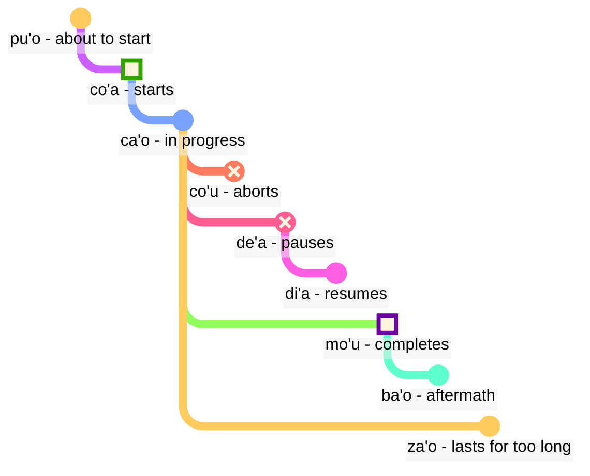

## Lesson 6: modal terms: time and space

> **mi citka le cirla**

Possible translations:

> _I eat cheese._
> _I ate cheese._
> _I always eat cheese._
> _In a moment, I will have just finished eating cheese._

Tenses in Lojban are optional; we don't have to think all the time about which tense to use.

Context often resolves what is correct. We add tenses when we feel we need them.

Lojban tenses treat time and space the same. Saying that _I worked a long time ago_ is not grammatically different from saying _I work far away to the north_. English treats words like _earlier_, past tense ending _-ed_, and space words like _in_ or _near_ in three different schemes, while in Lojban they follow the same principle.

### Points in time and place

A tense modal particle without an argument following it describes the event as relative to _here_ and _now_:

> **mi pinxe ba**
> **mi ba pinxe**
> _I will drink._

<!-- -->

> **mi pinxe bu'u**
> **mi bu'u pinxe**
> _I drink at this place._

A tense modal term with an argument following it describes the event as relative to the event in that argument:

> **mi pinxe ba le nu mi cadzu**
> _I drink after I walk._

### Events relative to other events in time

In English, we use the so-called "sequence of tenses":

> **la .alis. pu cusku le se du'u ri pu penmi la .doris. la'u le djedi be li ci**
> _Alice told that she had seen Doris three days before._

Here, the event _had seen Doris_ happens before the event _Alice said_. However, in

> **la .alis. pu cusku le se du'u ri ca kansa la .doris.**
> _Alice told that she was with Doris._

the two events (_told_ and _was with Doris_) happen at the same time.

Thus, in English:

- the tense of the main relation is understood relative to whoever utters this relation.
- the tense of the relation inside the main relation is also understood relative to whoever utters this relation.

In Lojban:

- only the tense of the main relation is relative to whoever utters the relation.
- the other tenses are relative to each other. This is why, in **la .alis. pu cusku le se du'u ri pu penmi la .doris. la'u le djedi be li ci** the second **pu** is relative to the first **pu**. In **la .alis. pu cusku le se du'u ri ca kansa la .doris.**, we use **ca** (_at the same time_) which is relative to the outer relation (**pu cusku** — _said_).

However, we can use the modal term **nau** (_at the time or place of the speaker_), which will give the same effect as how English works:

Here is an example in English style:

> **la .alis. pu cusku le se du'u ri nau pu kansa la .doris.**
> _Alis said that she was with Doris._

<!-- To say such phrases as `in three days` or `two years ago` we basically put time intervals in sequence without overlapping. Hence a new verb:

> **le cabna cu dzoli le nu mi penmi do kei li ci le ka prulamdei**
> _I will meet you in three days (as measured from now)._

> **dzoli le nu mi penmi do kei li ci le ka prulamdei**
> **dzoli le nu mi penmi do kei li ci le ka prulamdei**
> **prulamdeidzo le nu mi penmi do kei li ci**
> **mi penmi do fi'o prulamdeidzo be fi li ci**
> _I will meet you in three days._

> **le cabna cu dzoli le nu mi zvati le stuzi kei li re le ka bavlamdeidzo**
> **le nu mi zvati le stuzi kei le cabna cu dzoli li re le ka prulamdeidzo**
> _I visited that place two years ago._ -->

### Distance in time and space

fau
: modal term: at the same time, place or situation as …

ca
: modal term: at … (some time), at the same time as …; "present tense"

bu'u
: modal term: at … (some place); here (at this place)

zi
: _just_ (short time ago) or _soon_ (in a short time)

vi
: near …

za
: _a while ago_ or _in a while, in an unspecified time_

va
: not far from …

zu
: _long time ago_ or _in a long time_

vu
: far away from …; far away

This is how we can use tense combinations to specify how far we go into the past or future:

- **pu zu** means _a long time ago_
- **pu za** means _a while ago_
- **pu zi** means _just_
- **ba zi** means _soon_
- **ba za** means _in a while_
- **ba zu** means _in a long time_

Notice the vowel order **i**, **a**, and **u**. This order appears repeatedly in Lojban and might be worth memorizing. _Short_ and _long_ are always context-dependent, relative, and subjective. For example, two hundred years is a short time for a species to evolve but a long time to wait for the bus.

**zi**, **za**, and **zu** modify the tense particle like **pu** and **ba** that is said before it:

- **pu zu** is _a long time ago_. **pu** shows that we begin in the past, and **zu** indicates that it is a long time backwards.
- **zu pu** is _far away in time; there is a point after some event_. **zu** shows that we begin at some point far away in time from now, and **pu** indicates that we move backward from that point.

Thus, **pu zu** is always in the past, whereas **zu pu** could be in the future.

Spatial distance is marked similarly by **vi**, **va**, and **vu** for short, unspecified (medium), and long distance in space.

To specify distance in time or space, we use the modal term **la'u** with an argument specifying the distance:

> **ba ku la'u le djedi be li ci mi zvati ti**
> _In three days, I will be here._

The space equivalent of **ca** is **bu'u**, and **fau** is more vague than the two of them, as it can mean time, space, or situation.

> **ba za vu ku mi gunka**
> _Some time in the future, I will work a place far away._

gunka
: to work

> **mi bu'u pu zu gunka**
> _I used to work here a long time ago._
> `I here-past-long-time-distance work`

> **pu zu vu ku zasti fa le ninmu .e le nanmu**
> _Long ago and far away, a woman and a man lived._

The last sentence is how fairy tales often begin.

### Duration in time and space

ze'i
: modal term: for a short time

ve'i
: modal term: over a small space

ze'a
: modal term: for some time

ve'a
: modal term: over some space

ze'u
: modal term: for a long time

ve'u
: modal term: over the long space

Again, it's easy to remember given the pattern **i**, **a**, **u**.

> **mi ze'u bajra**
> _I run for a long time._
<!-- -->
> **do ze'u klama le mi'a gugde ze'u**
> _You spend a long time coming to our country._
mi'a
: we without you

gugde
: … is a country

> **mi ba zi ze'a xabju la .djakartas.**
> _Pretty soon, I'm going to live in Jakarta for a while._
<!-- -->

> **le jenmi pe la .romas. ba ze'u gunta la .kart.xadact.**
> _The army of Romans will be attacking Carthage for a long time._

This does not mean that Romans are not attacking Carthage these days. In Lojban, if we say that something is true at a particular time, it doesn't mean that it is not true at any other time. You can say **pu ba ze'u** so that we know that this activity was in the future when viewed from some point in the past but in the past when viewed from today.

> **le xamsi**
> _sea/ocean_
<!-- -->

> **le ve'u xamsi**
> _ocean_

<pixra url="/assets/pixra/cilre/le_vehi_ja_vehu_cmana.webp" caption="le ve'i cmana cu jibni le ve'u cmana" definition="The hill is near the mountain."></pixra>

> **le cmana**
> _mountain/hill_
<!-- -->

> **le ve'u cmana**
> _mountain_
<!-- -->

> **le ve'i cmana**
> _hill_
<!-- -->

> **ti ve'u gerku**
> _That's a big dog. This is a dog covering a large space._

### «**pu'o**» — ‘_to be about_’, «**ba'o**» — ‘_no longer_’, «**za'o**» — ‘_still_’, «**xa'o**» — ‘_already_’

Here are several sets of modal terms that can help us add finer meanings when necessary.

With _event contours_, unlike **pu**, **ca**, and **ba**, we view each event as having a shape with certain stages:

pu'o
: modal term: to be about to do something (the event has not yet happened)

ba'o
: modal term: to be no longer doing something, to have done something (the event has ended)

Examples:

> **mi ba tavla le mikce**
> _I will speak to the doctor (and I might be speaking now too)._

mikce
: x1 is a doctor

<!-- -->

> **mi pu pu'o tavla le mikce**
> _I was about to speak to the doctor (I was not speaking at that time, the event hadn't started by that time)._

<pixra url="/assets/pixra/cilre/puho_nenri.webp" caption="le prenu pu'o zvati le nenri" definition="The person is about to be inside."></pixra>

<!-- -->

> **le sanmi ca pu'o bredi**
> _The meal is not ready yet._

<!-- -->

> **mi pu ba'o tavla le mikce**
> _I had spoken to the doctor._

<pixra url="/assets/pixra/cilre/baho_carvi.webp" caption="ba'o carvi" definition="Aftermath of the rain. The rain has stopped."></pixra>

<!-- -->

> **mi ba ba'o tavla le mikce**
> _I will have spoken to the doctor._

<!-- -->

> **.a'o mi ba zi ba'o gunka**
> _I hope soon I will have done the work._

za'o
: modal term: still. The event is in process beyond its natural end

xa'o
: unofficial modal term: already, too early. The event already started and it is too early

Examples:

> **ri'a ma do za'o zvati vi**
> _Why are you still here?_

<!-- -->

> **la .kevin. xa'o zvati vi**
> _Kevin is already here._

### Stages of event

> **mi co'a tavla**
> _I started talking._

<!-- -->

> **ra ca'o ciska**
> _She keeps writing._

<!-- -->

> **ra pu co'u vasxu**
> _He stopped breathing (sudden unpredictable change)._

vasxu
: $x_1$ breathes $x_2$

> **mi pu mo'u citka le plise**
> _I've eaten the apple up._

<!-- -->

> **la .maks. pu mo'u zbasu ti voi dinju**
> _Max has built this house._

<!-- -->

> **ra pu de'a vasxu**
> _She ceased to breath (but may breath again later)._

<pixra url="/assets/pixra/cilre/deha_vasxu.webp" caption="mi de'a vasxu" definition="I pause in breathing. I hold my breath."></pixra>

<!-- -->

> **mi pu di'a citka le plise**
> _I resumed eating apples._

<pixra url="/assets/pixra/cilre/diha_vasxu.webp" caption="mi di'a vasxu" definition="I resume breathing."></pixra>

co'a
: modal term: the event starts (the border of the event)

ca'o
: modal term: to be doing something (the event is in progress)

co'u
: modal term: the event stops

mo'u
: modal term: the event ends (the border of the event)

de'a
: the event pauses (the event can be expected to continue)

di'a
: the event resumes

> **mi de'a ze'i jundi**
> _BRB (I'll be right back)._

<!-- -->

> **mi di'a jundi**
> _I am back (being attentive)._

jundi
: $x_1$ pays attention to $x_2$

These two expressions are common in text chats for indicating that you are away or not paying attention, and then coming back online:

One could, of course, also say just **de'a** or **di'a** and hope the point gets across.

### Continuous and progressive events

ru'i
: modal term: the event is continuous

> **.i mi pu ru'i citka le plise**
> _I was continuously eating apples._

Note the difference:

- **ru'i** indicates that the event is continuous and never pauses.
- **ca'o** implies that the event progresses. It may sometimes pause and then resume its progress.

### Place contours

Event contours can be used to refer to space if we prefix them with **fe'e**:

> **le rokci cu fe'e ro roi zvati**
> _The stones are everywhere._

### ‘_to the left_’, ‘_to the right_’

> **le prenu cu sanli le dertu bu'u le pritu be mi**
> _The person stands on the ground to the right of me._

<!-- -->

> **le gerku cu vreta le ckana bu'u le zunle be le verba**
> _The dog is lying on the bed to the left of a child._

<!-- -->

> **ko jgari le panbi poi zunle**
> _Take the pen on the left._

<!-- -->

> **le mlatu cu plipe bu'u le crane be do**
> _A cat jumps in front of you._

<!-- -->

> **ko catlu le dinju poi crane**
> _Look at the house in the front._

<!-- -->

> **le verba cu zutse le stizu bu'u le trixe be mi**
> _The child sits on the chair behind me._

<!-- -->

> **le prenu cu sanli ki mi bu'u le pritu be le tricu bei mi**
> _The person stands to the right of a tree from my viewpoint._

<!-- -->

> **le dinju cu zunle le rokci ti**
> _The house is to the left of the rock if viewed from here._

zunle
: $x_1$ is to the left of $x_2$ as viewed from $x_3$

pritu
: $x_1$ is to the right of $x_2$ as viewed from $x_3$

crane
: $x_1$ is in front of $x_2$ ($x_1$ is between $x_2$ and whoever watches) as viewed from $x_3$

trixe
: $x_1$ is behind $x_2$ as viewed from $x_3$

sanli
: $x_1$ stands on $x_2$

zutse
: $x_1$ sits on $x_2$

vreta
: $x_1$ lies on $x_2$

le dertu
: the ground, the dirt

le ckana
: the bed

le stizu
: the chair

le pelji
: the paper

le penbi
: the pen

### Practice: position

<table>
<tbody><tr>
<td style="text-align:right;"><b>ma nabmi</b>
</td>
<td><i>What's the problem?</i>
</td></tr>
<tr>
<td style="text-align:right;"><b>ma'a nitcu tu'a le fonxa pe la .alis.</b>
</td>
<td><i>We need Alice's phone.</i>
</td></tr>
<tr>
<td style="text-align:right;"><b>.i la .alis. ca zvati ma</b>
</td>
<td><i>Where is Alice?</i>
</td></tr>
<tr>
<td style="text-align:right;"><b>la .alis. ca na ku zvati le bu'u tcadu .i mi pu mrilu le srana be le fonxa fi la .alis. .i ri ca ca'o vofli la .paris. .i ku'i mi pu zi te benji le se mrilu be la .alis. .i ri curmi le nu mi'a pilno le fonxa .i .e'o do bevri ri mi</b>
</td>
<td> Alice is now not in the city. I mailed about the phone to her. Alice is now flying to Paris. But I just received a mail from her. She allows us to use the phone. Please, bring it to me.
</td></tr>
<tr>
<td style="text-align:right;"><b>.i bu'u ma mi ka'e cpacu le fonxa</b>
</td>
<td>Where can I get the phone?
</td></tr>
<tr>
<td style="text-align:right;"><b>le purdi .i .e'o do klama le bartu</b>
</td>
<td>In the garden. Please, go outside.
</td></tr>
<tr>
<td style="text-align:right;"><b>mi ca zvati ne'a le vorme .i ei mi ca klama ma</b>
</td>
<td>I am near the door. Now where should I go?
</td></tr>
<tr>
<td style="text-align:right;"><b>ko klama le zunle be le tricu .i ba ku do viska le pa jubme</b>
</td>
<td>Go to the left of the tree. Then you will see a table.
</td></tr>
<tr>
<td style="text-align:right;"><b>mi zgana no jubme</b>
</td>
<td>I notice no tables.
</td></tr>
<tr>
<td style="text-align:right;"><b>ko carna gi'e muvdu le pritu .i le jubme cu crane le cmalu dinju .i le fonxa cu cpana le jubme .i ji'a ko jgari le penbi .e le pelji .i le za'u dacti cu cpana si'a le jubme .i ba ku ko bevri le ci dacti le zdani gi'e punji fi le sledi'u pe mi</b>
</td>
<td>Turn and move to the right. The table is in front of a small building. The phone is on top of the table. Also, take a pencil and a paper. They are similarly on top of the table. Then bring the three things home and put them to my room.
</td></tr>
<tr>
<td style="text-align:right;"><b>vi'o</b>
</td>
<td>Will do.
</td></tr></tbody></table>

### Practice: vehicles

<table>

<tbody><tr>
<td style="text-align:right;"><b>mi jo'u le pendo be mi pu ca'o litru le barda rirxe bu'u le bloti</b>
</td>
<td><i>I and my friends were traveling on a big river in a boat.</i>
</td></tr>
<tr>
<td style="text-align:right;"><b>.i ba bo mi'a klama le vinji tcana</b>
</td>
<td><i>Then we went to an airport.</i>
</td></tr>
<tr>
<td style="text-align:right;"><b>.i xu do se marce le karce</b>
</td>
<td><i>Did you take a car?</i>
</td></tr>
<tr>
<td style="text-align:right;"><b>.i na ku se marce .i mi'a pu klama fu le trene .i ze'a le cacra mi'a zvati bu'u le carce</b>
</td>
<td><i>No. We went by train. For one hour we were in a wagon.</i>
</td></tr></tbody></table>

marce
: $x_1$ is a vehicle carrying $x_2$

se marce
: $x_1$ is a passenger of $x_2$

<!-- jai zu'e se marce
: $x_1$ takes a vehicle $x_2$ as a passenger -->

karce
: $x_1$ is a car carrying $x_2$

bloti
: $x_1$ is a boat carrying $x_2$

vinji
: $x_1$ is an aircraft carrying $x_2$

trene
: $x_1$ is a train of cars $x_2$

### Enriching vocabulary. New words using tenses

Many single English words correspond to word combinations in Lojban:

pixra
:$x_1$ is a picture of $x_3$

le vi'a pixra
: the picture in 2D

le vi'u pixra
: the picture in 3D, a sculpture

<pixra url="/assets/pixra/cilre/viha_pixra.webp" caption="vi'a pixra" definition="2D picture, 2D drawing."></pixra>

<pixra url="/assets/pixra/cilre/vihu_pixra.webp" caption="vi'u pixra" definition="3D picture, sculpture."></pixra>

le ve'i cmana
: the hill (literally "mountain/hill covering little space")

le ve'u xamsi
: the ocean (literally "sea/ocean covering large space")

le ba'o tricu
: stump of a tree (literally "the no longer tree")
