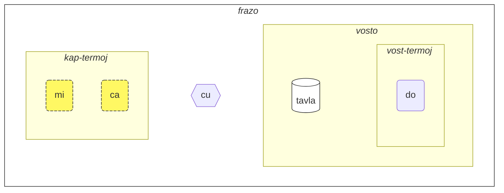
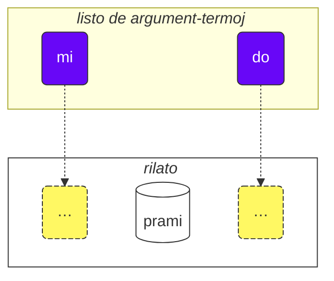

Kiel uzi ĉi tiun kurson:

1. legu ĝin
2. kolektu vian reagon kaj sugestojn
3. sendu ilin al [💬 la vivanta babilejo](https://lojban.pw/eo/articles/live_chat/)

## Leciono 1. La lingvo en mallongigo

### Alfabeto

La baza afero, kiun vi devas scii pri Loĵbano, estas la alfabeto.

Loĵbano uzas la latinan alfabeton (vokaloj estas kolorigitaj):

<dl><dd><b>a b c d e f g i j k l m n o p r s t u v x y z ' .</b></dd></dl>

Vortoj estas prononcataj kiel ili estas skribitaj.

Estas 10 vokaloj en Loĵbano:

<table>
<tbody><tr>
<td><b class="audio-inline">a</b></td>
<td> kiel en Esperanto <i>p<u>a</u>tro</i></td>
</tr>
<tr>
<td><b class="audio-inline">e</b></td>
<td> kiel en Esperanto <i>r<u>e</u>to</i></td>
</tr>
<tr>
<td><b class="audio-inline">i</b></td>
<td> kiel en Esperanto <i>maŝ<u>i</u>no</i></td>
</tr>
<tr>
<td><b class="audio-inline">o</b></td>
<td> kiel en Esperanto <i>v<u>o</u>ĉo</i> (devas esti "pura" sono, ne diftongiĝanta)</td>
</tr>
<tr>
<td><b class="audio-inline">u</b></td>
<td> kiel en Esperanto <i>k<u>u</u>lo</i></td>
</tr>
<tr>
<td><b class="audio-inline">y</b></td>
<td> kiel la ŝva-sono en la angla <i>comm<u>a</u></i>. Tio estas neakcentita centra vokalo.</td>
</tr>
<tr>
</tbody></table>

4 vokaloj estas skribitaj uzante kombinojn de literoj:

<table>
<tbody><tr>
<td><b class="audio-inline">au</b></td>
<td> kiel en Esperanto <i><u>aŭ</u>to</i></td></tr>
<tr>
<td><b class="audio-inline">ai</b></td>
<td> kiel en Esperanto <i>k<u>aj</u></i></td></tr>
<tr>
<td><b class="audio-inline">ei</b></td>
<td> kiel en Esperanto <i>pl<u>ej</u></i></td></tr>
<tr>
<td><b class="audio-inline">oi</b></td>
<td> kiel en Esperanto <i>k<u>oj</u>no</i></td></tr>
</tbody></table>

Kiel konsonantoj, ili estas prononcataj kiel en Esperanto aŭ Latino, sed estas kelkaj diferencoj:

<table>
<tbody><tr>
<td><b class="guibutton">c</b>
</td>
<td>estas prononcata kiel Esperanta <i>ŝ</i>.
</td></tr>
<tr>
<td><b class="guibutton">g</b>
</td>
<td>ĉiam <i>g</i> kiel en Esperanto <i>guto</i> (neniam kiel <i>ĝ</i>).
</td></tr>
<tr>
<td><b class="guibutton">j</b>
</td>
<td>kiel Esperanta <i>ĵ</i>, kiel <i>j</i> en la franca <i>bonjour</i>.
</td></tr>
<tr>
<td><b class="guibutton">x</b>
</td>
<td>kiel Esperanta <i>ĥ</i>, kiel <i>ch</i> en la skota <i>loch</i> aŭ en la germana <i>Bach</i>, kiel <i>j</i> en la hispana <i>Jose</i> aŭ <i>Kh</i> en la moderna araba <i>Khaled</i>. Provu prononcadi <i>ksss</i> tenante vian langon malsupre kaj vi ricevos tiun sonon.
</td></tr>
<tr>
<td><b class="guibutton"> ' </b>
</td>
<td>kiel Esperanta <i>h</i>. Do la apostrofo estas rigardata kiel vera litero de Loĵbano kaj prononcata kiel <i>h</i>. Ĝi estas trovebla nur inter vokaloj. Ekzemple, <b>u'i</b> estas prononcata kiel <i>u-hi</i> (dum <b>ui</b> estas prononcata kiel <i>ŭi</i>).
</td></tr>
<tr>
<td><b>.</b>
</td>
<td>punkto (fina punkto, vortopaŭzo) estas ankaŭ rigardata kiel litero en Loĵbano. Ĝi estas mallonga paŭzo en parolo por haltigi vortojn kunfluantajn. Fakte, antaŭ ĉiu vorto komenciĝanta per vokalo estas metita punkto. Tio helpas malhelpi nedeziratarn kunfandiĝon de du sekvaj vortoj en unu.
</td></tr>
<tr>
<td><b>i</b>
</td>
<td><b>i</b> antaŭ vokaloj estas konsiderata konsonanto kaj prononcata pli mallonge, ekzemple:
<ul><li><b>ia</b> estas prononcata kiel <i>ja</i> en Esperanto <i>jaro</i></li>
<li><b>ie</b> estas prononcata kiel <i>je</i> en Esperanto <i>jeso</i></li></ul>
</td></tr>
<tr>
<td><b>u</b>
</td>
<td><b>u</b> antaŭ vokaloj estas konsiderata konsonanto kaj prononcata pli mallonge, ekzemple:
<ul><li><b>ua</b> estas prononcata kiel <i>ŭa</i> en Esperanto <i>kvazo</i></li>
<li><b>ue</b> estas prononcata kiel <i>ŭe</i> en Esperanto <i>kverko</i></li></ul>
</td></tr></tbody></table>

Akcento estas metata sur la antaŭlastan vokalon. Se vorto havas nur unu vokalon, vi simple ne akcentas ĝin.

La litero **r** povas esti prononcata kiel la _r_ en la angla, skota, rusa, do estas gamo de akcepteblaj prononc manieroj por ĝi.

Ne-Loĵbanaj vokaloj kiel la mallonga _i_ kaj _u_ en la brita angla _hit_ kaj _but_, estas uzataj de kelkaj homoj por apartigi konsonantojn. Do, se vi havas malfacilaĵon prononcante du konsonantojn vicie (ekz. la **vl** en **tavla**, kiu signifas _paroli al_), tiam vi povas diri _tavɪla_ — kie la _ɪ_ estas tre mallonga. Tamen, aliaj vokaloj kiel **a** kaj **u** devas esti longaj.

### La plej simpla frazo

La baza unuo en Loĵbano estas "frazo". Jen tri simplaj ekzemploj:

> **le prenu cu tavla mi**
> _La persono parolas al mi._

le prenu
: la persono

tavla
: … parolas al …, … konversacias kun …

mi
: mi, min

> **mi prami do**
> _Mi amas vin._

prami
: … amas … (iun)

do
: vi

> **mi ca cu tavla do**
> _Mi nun parolas al vi._

ca
: nun (prononcata kiel **ŝa**)

<pixra url="/assets/pixra/cilre/tavla.webp" caption="le prenu cu tavla mi" definition="La persono parolas al mi."></pixra>

<pixra url="/assets/pixra/cilre/mi.webp" caption="mi" definition="mi / min"></pixra>

<pixra url="/assets/pixra/cilre/mi_prami_do2.webp" caption="mi prami do" definition="Mi amas vin."></pixra>

<pixra url="/assets/pixra/cilre/do.webp" caption="do" definition="vi / vin"></pixra>

Ĉiu frazo en Loĵbano konsistas el la jenaj partoj de maldekstre dekstren:

- la kapo:
  - konsistas el tiel nomataj "termoj",
    - **le prenu** estas la nura kap-termo en la ekzemplo **le prenu cu tavla mi** supre,
    - **mi**, **ca** estas kap-termoj en la ekzemplo **mi ca cu tavla do** supre.
- la kap-apartigilo **cu**:
  - prononcata kiel _ŝu_,
  - montras ke la kapo finiĝis,
  - povas esti forlas ita kiam estas klare ke la kapo kompletiĝis.
- la vosto:
  - la ĉefa rilat-konstruo (nomata "**selbrisni**" en Loĵbano)
  - \+ eble unu aŭ pli da termoj post ĝi,
    - **tavla**, **prami** estas selbrisni, ĉefaj rilat-konstruoj en la supraj ekzemploj.
    - **mi** estas la nura vost-termo en la ekzemplo **le prenu cu tavla mi** supre.
    - **do** estas la nura vost-termo en la ekzemplo **mi prami do** supre.

En Loĵbano, ni ĉefe parolas pri rilatoj prefere ol pri substantivoj aŭ verboj.

Jen la du rilat-vortoj, kiuj proksimume respondas al verboj:

prenu
: … estas persono / estas personoj

tavla
: … parolas al …

Ĉiu rilato havas unu aŭ pli da roloj, kiuj ankaŭ povas esti nomataj "lokoj" aŭ "pozicioj". Supre, ili estas etikeditaj per "…" Tiuj lokoj estas plenigataj per argumentoj (nomataj "**sumti**" en Loĵbano). Argument-termoj estas konstruoj kiel **le prenu**, **mi**, **do** sendepende de ĉu tiuj termoj finiĝas kiel kapo aŭ vosto de frazo. Ni metas argument-termojn laŭ ordo, tiel plenig ante tiujn lokojn kaj donante konkretan signifon al la rilato.

Ni ankaŭ povas transformi tian rilaton en argument-termon.

Por tio ni metas mallongan vorton **le** antaŭ ĝi:

prenu
: … estas persono

le prenu
: la persono, la personoj

Simile,

tavla
: … parolas al …

kaj tiel

le tavla
: la parolanto, la parolantoj

Eble sonas strange kiel _persono_ povas esti "verbo", sed fakte, tio igas Loĵbanon tre simpla:

<table>
<thead>
<tr>
<th>rilat-vorto kun neplenaj lokoj</th>
<th>argument-formo (<b>sumti</b>)</th></tr>
</thead>
<tbody>
<tr>
<td><b>prenu</b> — <i>… (iu) estas persono</i> </td>
<td><b>le prenu</b> — <i>la persono / la personoj</i>
     <b>le prenu</b> — <i>tiu kiu estas persono / tiuj kiuj estas personoj</i>
</td></tr>
<tr>
<td><b>tavla</b> — <i>… (iu) parolas al … (iu)</i> </td>
<td><b>le tavla</b> — <i>la parolanto / la parolantoj</i>
     <b>le tavla</b> — <i>tiu kiu estas parolanto / tiuj kiuj estas parolantoj</i>
</td></tr>
</tbody></table>

La unua loko de la rilatoj malaperas kiam oni uzas **le**, tial tiaj alternativaj tradukoj kiel _tiu kiu …_ estas eblaj.

<!-- We can also say that **le** creates a noun from a relation construct with roughly the meaning of _the one which is …_ (_is a person_ — _the person_), or even _those who do…_ (_to speak to_ — _the speakers_), _those who are…_ (_are people_ — _the people_). -->

Rimarku, ke Loĵbano, defaŭlte, ne specifas nombron inter _la parolanto_ aŭ _la parolantoj_. Tio estas, **le tavla** estas vaga pri tio, kaj ni baldaŭ malkovros manierojn difini la nombron.

Krom argument-termoj ekzistas modalaj termoj kiel **ca**:

> **mi ca cu tavla do**
> _Mi nun parolas al vi._

ca
: nun

Modalaj termoj ne plenigas lokojn de la ĉefa rilat-konstruo ("**selbrisni**"). Anstataŭe, ili estas aplikataj al la tuta frazo riĉigante aŭ limigante ĝian signifon.

Tiel, termoj en Loĵbano estas reprezentataj per:

- argument-termoj kiuj plenigas lokojn de rilatoj. Ekzemploj estas:
  - substantivoj kiel **le prenu** (_la persono_)
  - pronomoj kiel **mi** (_mi_), **do** (_vi_). Pronomoj funkcias precize kiel substantivoj, sed **le** ne estas uzata por ili. Ili funkcias kiel argumentoj memstare.
- modalaj termoj kiuj ne plenigas lokojn de rilatoj sed specifas aldonan, klarigan informon.
  - ekzemple, **ca** (_nun, en prezenco_).

Jen kelkaj pliaj ekzemploj:

<pixra url="/assets/pixra/cilre/nintadni.webp" caption="mi nintadni" definition="Mi estas nova studento, komencanto."></pixra>

> **mi nintadni**
> _Mi estas nova studento._

nintadni
: … (iu) estas nova studento, komencanto

Malkiel en la angla ni ne devas aldoni la verbon "estas" al la frazo. Ĝi jam estas implikita. La rilat-vorto **nintadni** (_… estas nova studento_) jam havas tiun anglan "estas" enkonstruita en ĝian anglan tradukon.

> **do jimpe**
> _Vi komprenas._

jimpe
: … (iu) komprenas … (ion)

<pixra url="/assets/pixra/cilre/pilno_le_fonxa.webp" caption="le prenu cu pilno le fonxa" definition="La persono uzas la telefonon."></pixra>

> **mi pilno le fonxa**
> _Mi uzas la telefonon._

pilno
: … (iu) uzas … (ion)

fonxa
: … estas telefono, … estas telefonoj

le fonxa
: la telefono, la telefonoj

<pixra url="/assets/pixra/cilre/citka.webp" caption="mi citka" definition="Mi manĝas."></pixra>

> **mi citka**
> _Mi manĝas._

citka
: … (iu) manĝas … (ion)

> **do citka**
> _Vi manĝas._

<!-- -->

> **mi citka le plise**
> _Mi manĝas la pomojn._

<pixra url="/assets/pixra/cilre/le_plise_cu_kukte.webp" caption="le plise cu kukte" definition="La pomoj estas bonegustaj."></pixra>

> **le plise cu kukte**
> _La pomoj estas bonegustaj._

le plise
: la pomoj

kukte
:  … (io) estas bongusta

Pli simpla frazo en Loĵbano entenus nur unu ĉefan rilat-vorton:

<pixra url="/assets/pixra/cilre/karce.webp" caption="karce" definition="Ĝi estas aŭto."></pixra>

> **karce**
> _Aŭto!_
> _Ĝi estas aŭto._

Vi povus diri tion kiam vi vidas aŭton venanta. Ĉi tie la kunteksto estus sufiĉe klara ke estas aŭto ie ĉirkaŭe kaj verŝajne ĝi estas danĝera.

**karce** mem estas rilat-vorto signifanta _estas aŭto_.

Ni povas kompreneble esti pli precizaj kaj diri, ekzemple:

> **bolci**
> _Pilko!_
> _Ĝi estas pilko._

kie **bolci** estas rilat-vorto signifanta _estas pilko_.

> **ti bolci**
> _Tio ĉi estas pilko proksima al mi._

<!-- -->
> **ta bolci**
> _Tio estas pilko proksima al vi._

ti
: pronomo: tio ĉi proksime al mi

ta
: pronomo: tio proksime al vi

tu
: pronomo: tio malproksime de vi kaj mi

<pixra url="/assets/pixra/cilre/ti.webp" caption="ti" definition="tio ĉi (proksime al mi, la parolanto)"></pixra>

<pixra url="/assets/pixra/cilre/ta.webp" caption="ta" definition="tio (proksime al vi, la aŭskultanto)"></pixra>

<pixra url="/assets/pixra/cilre/tu.webp" caption="tu" definition="tio tie (malproksime de vi kaj mi)"></pixra>

Simile, vi povas diri

<pixra url="/assets/pixra/cilre/carvi.webp" caption="carvi" definition="… estas pluvo"></pixra>

> **carvi**
> _Pluvas._

kie

carvi
: … estas pluvo, … pluvas

aŭ

> **pluka**
> _Ĝi estas agrabla._

kie

pluka
: … estas agrabla

Rimarku, ke en Loĵbano ne estas necesa la vorto _ĝi_ en tia senco. Vi simple uzas la rilat-vorton kiun vi bezonas.

> **prami**
> _Iu amas._

<pixra url="/assets/pixra/cilre/bajra.webp" caption="le prenu cu bajra" definition="La persono kuras."></pixra>

> **bajra**
> _Iu kuras._

bajra
: … kuras uzante membrojn

Denove la kunteksto verŝajne dirus kiu amas kiun kaj kiu kuras.

#### Tasko

<pixra url="/assets/pixra/cilre/pinxe_le_djacu.webp" caption="le prenu cu pinxe le djacu" definition="La persono trinkas la akvon."></pixra>

pinxe
: … trinkas … (ion)

le djacu
: la akvo

Kovru la dekstran parton de la tabelo. Traduku la frazojn maldekstre el Loĵbano.

<table style="table-layout: fixed;">
<tbody><tr>
<td><b>do citka</b>
</td>
<td><i>Vi manĝas.</i>
</td></tr>
<tr>
<td><b>mi pinxe le djacu</b>
</td>
<td><i>Mi trinkas akvon.</i>
</td></tr>
<tr>
<td><b>mi citka le plise</b>
</td>
<td><i>Mi manĝas pomojn.</i>
</td></tr></tbody></table>

### «**.i**» apartigas frazojn

Ni metas mallongan vorton **.i** por apartigi du sinsekvajn frazojn:

> **mi tavla le prenu .i le prenu cu tavla mi**
> _Mi parolas al la personoj. La personoj parolas al mi._

**.i** apartigas frazojn kiel la fina punkto je la fino de frazoj en anglaj tekstoj.

Kiam ni diras unu frazon post la alia en la angla ni faras paŭzon (ĝi povas esti mallonga) inter ili. Sed paŭzo havas multajn malsamajn signifojn en la angla. En Loĵbano ni havas pli bonan manieron kompreni kie unu frazo finiĝas kaj alia komenciĝas.

Ankaŭ notu, ke foje kiam ni prononcas vortojn rapide vi ne povas distingi kie unu frazo finiĝas kaj la vorto de la sekva frazo komenciĝas. Tial estas konsilinde uzi la vorton **.i** antaŭ ol komenci novan frazon.

### Numeroj: '_1 2 3 4 5 6 7 8 9 0_' = «**pa re ci vo mu xa ze bi so no**»

**le** simple transformas rilat-konstruon en argumenton, sed tia argumento ne havas nombron asociitan al ĝi. La frazo

> **le prenu cu tavla mi**
> _La personoj parolas al mi._
> _La persono parolas al mi._

ne specifas la nombron de personoj parolantaj al mi. En la angla, estas neebla forlas i la nombron ĉar _people_ en la angla implicas _pli ol unu persono_. Tamen, en Loĵbano, vi povas forlasi la nombron.

Nun ni specifu kiom da la personoj estas rilataj al nia diskuto.

Ni aldonu nombron post **le**.

<table>
<tbody><tr>
<td><b>pa</b>
</td>
<td><b>re</b>
</td>
<td><b>ci</b>
</td>
<td><b>vo</b>
</td>
<td><b>mu</b>
</td>
<td><b>xa</b>
</td>
<td><b>ze</b>
</td>
<td><b>bi</b>
</td>
<td><b>so</b>
</td>
<td><b>no</b>
</td></tr>
<tr>
<td> 1
</td>
<td> 2
</td>
<td> 3
</td>
<td> 4
</td>
<td> 5
</td>
<td> 6
</td>
<td> 7
</td>
<td> 8
</td>
<td> 9
</td>
<td> 0
</td>
</tr></tbody></table>

<pixra url="/assets/pixra/cilre/le_mu_prenu.webp" caption="le mu prenu" definition="La kvin personoj"></pixra>

> **le pa prenu cu tavla mi**
> _La persono parolas al mi._
> _La unu persono parolas al mi._

Ni aldonas nombron post **le** kaj tiel specifas individuajn personojn.

Por numeroj konsistantaj el pluraj ciferoj, ni simple ligas tiujn ciferojn:

> **le re mu prenu cu tavla mi**
> _La 25 personoj parolas al mi._

Jes, estas tiel simpla.

Se ni volas kalkuli, ni povas apartigi numerojn per **.i**:

> **mu .i vo .i ci .i re .i pa .i no**
> _5 … 4 … 3 … 2 … 1 … 0_

La nombro **za'u** signifas _pli ol …_ (_\>_ en matematiko), la nombro **me'i** signifas _malpli ol_ (_<_ en matematiko):

> **le za'u re prenu cu tavla mi**
> _Pli ol du personoj parolas al mi._

<!-- -->

> **le me'i pa no prenu cu tavla mi**
> _Malpli ol 10 personoj parolas al mi._

<!-- -->

> **le za'u ci prenu cu tavla mi**
> _Pli ol tri personoj parolas al mi._

Por diri simple _personoj_ (pluralo) kontraste al _unu persono_, ni uzas **za'u pa**, _pli ol unu_ aŭ simple **za'u**.

> **le za'u pa prenu cu tavla mi**
> **le za'u prenu cu tavla mi**
> _La personoj parolas al mi._

**za'u** defaŭlte signifas **za'u pa**, tial tia mallongigo estas ebla.

le prenu
: la persono / la personoj

le pa prenu
: la persono (unu laŭ nombro)

le za'u prenu
: la personoj (du aŭ pli laŭ nombro)

#### Tasko

stati
: … (iu) estas saĝa, … havas talenton

<pixra url="/assets/pixra/cilre/stati.webp" caption="stati" definition="… havas talenton"></pixra>

klama
: … venas al … (iu loko aŭ objekto)

<pixra url="/assets/pixra/cilre/klama_ti.webp" caption="le prenu cu klama ti" definition="La persono venis ĉi tien."></pixra>

nelci
: … ŝatas … (ion)

le zarci
: la merkato

<pixra url="/assets/pixra/cilre/zarci.webp" caption="le prenu cu zvati le zarci" definition="La persono estas ĉe la vendejo."></pixra>

le najnimre
: la oranĝo (frukto), la oranĝoj

<pixra url="/assets/pixra/cilre/najnimre.webp" caption="najnimre" definition="… estas oranĝo"></pixra>

le badna
: la banano, bananoj

<pixra url="/assets/pixra/cilre/badna.webp" caption="badna" definition="… estas banano"></pixra>

Kovru la dekstran parton de la tabelo. Traduku la frazojn maldekstre el Loĵbano.

<table style="table-layout: fixed;">
 <tbody>
  <tr>
   <td>le mu prenu cu klama le zarci</td>
   <td>La kvin personoj venas al la merkato.</td>
  </tr>
  <tr>
   <td>le pa re prenu cu stati .i do stati</td>
   <td>La 12 personoj estas saĝaj. Vi estas saĝa.</td>
  </tr>
  <tr>
   <td>le prenu cu nelci le plise</td>
   <td>La personoj ŝatas la pomojn.</td>
  </tr>
  <tr>
   <td>le za'u re prenu cu citka .i le me'i mu prenu cu pinxe le djacu</td>
   <td>Pli ol du personoj manĝas. Malpli ol 5 personoj trinkas la akvon.</td>
  </tr>
  <tr>
   <td>le za'u re prenu cu stati</td>
   <td>Pli ol du personoj estas saĝaj.</td>
  </tr>
 </tbody>
</table>

Kovru la dekstran parton de la tabelo. Traduku la frazojn maldekstre al Loĵbano.

<table style="table-layout: fixed;">
 <tbody>
  <tr>
   <td>La 256 personoj estas saĝaj.</td>
   <td>le re mu xa prenu cu stati</td>
  </tr>
  <tr>
   <td>Malpli ol 12 pomoj estas bonegustaj.</td>
   <td>le me'i pa re plise cu kukte</td>
  </tr>
 </tbody>
</table>

### Kunmetita rilato

Kunmetita rilat-konstruo (**tanru** en Loĵbano) estas pluraj rilat-vortoj metitaj unu post la alia.

> **tu melbi zdani**
> _Tio estas bela hejmo._

<pixra url="/assets/pixra/cilre/melbi_zdani.webp" caption="melbi zdani" definition="… estas bela hejmo"></pixra>

tu
: tio (malproksime de vi kaj mi)

melbi
: … estas bela, agrabla

zdani
: … estas hejmo aŭ nesto al … (iu)

melbi zdani
: kunmetita rilat-konstruo: … estas bela hejmo al … (iu)

<pixra url="/assets/pixra/cilre/dansu.webp" caption="le prenu cu melbi dansu" definition="La persono bele dancas."></pixra>

> **do melbi dansu**
> _Vi bele dancas._

dansu
: … dancas

Ĉi tie, la rilato **melbi** aldonas plian signifon ĉar ĝi estas metita maldekstre de alia rilato: **zdani**. La maldekstra komponanto kutime estas tradukata uzante adjektivojn kaj adverbojn.

Kunmetitaj rilatoj estas potenca eco kiu produktas pli riĉajn signifojn. Vi simple ligas du rilat-vortojn, kaj la maldekstra komponanto de tia kunmetita rilato aldonas nuancon al la dekstra.

Ni povas meti **le** (ekz. kun nombro) maldekstre de tia kunmetita rilato ricevante pli riĉan argument-termon:

le pa melbi zdani
: la bela hejmo

Nun ni scias kial estis **cu** post kap-termoj en nia ekzemplo:

> **le pa prenu cu tavla mi**
> _La persono parolas al mi._

Sen **cu** ĝi fariĝus **le pa prenu tavla**, kiu havus la signifon de _la persono-parolanto_ - kion ajn tio povus signifi.

Konsideru:

> **le pa tavla pendo**
> _La parolema amiko_
<!-- -->
> **le pa tavla cu pendo**
> _La parolanto estas amiko._

Memoru pri meti **cu** antaŭ la ĉefa rilat-konstruo en frazo por malhelpi neintencitan kreadon de kunmetitaj rilatoj.

Kunmetita rilato povas enhavi pli ol du komponentojn. En tiu kazo, la unua rilato modifas la duan, la dua modifas la trian, kaj tiel plu:

<pixra url="/assets/pixra/cilre/cmalu_karce.webp" caption="ti cmalu karce" definition="Tio ĉi estas malgranda aŭto."></pixra>

> **le pa melbi cmalu karce**
> _la bel-malgranda aŭto, la aŭto malgranda en bela maniero_

<!-- -->

> **le mutce melbi zdani**
> _la tre bela hejmo_

mutce
: … estas tre, … estas multe

#### Tasko

sutra
: … estas rapida

barda
: … estas granda

cmalu
: … estas malgranda

mlatu
: … estas kato

Kovru la dekstran parton de la tabelo. Traduku la frazojn maldekstre el Loĵbano.

<table style="table-layout: fixed;">
<tbody><tr>
<td><b>le melbi karce</b>
</td>
<td><i>la bela aŭto / la belaj aŭtoj</i>
</td></tr>
<tr>
<td><b>do sutra klama</b>
</td>
<td><i>Vi rapide venas. Vi venas rapide.</i>
</td></tr>
<tr>
<td><b>tu barda zdani</b>
</td>
<td><i>Tio estas granda hejmo.</i>
</td></tr>
<tr>
<td><b>le pa sutra bajra mlatu</b>
</td>
<td><i>la rapide kuranta kato</i>
</td></tr>
<tr>
<td><b>le pa sutra mlatu</b>
</td>
<td><i>la rapida kato</i>
</td></tr>
<tr>
<td><b>le pa bajra mlatu</b>
</td>
<td><i>la kuranta kato</i>
</td></tr></tbody></table>

Kovru la dekstran parton de la tabelo. Traduku la frazojn maldekstre al Loĵbano.

<table style="table-layout: fixed;">

<tbody><tr>
<td><i>Tio ĉi estas malgranda aŭto.</i>
</td>
<td><b>ti cmalu karce</b>
</td></tr>
<tr>
<td><i>bonegustaj pomoj</i>
</td>
<td><b>le kukte plise</b>
</td></tr>
<tr>
<td><i>la rapidaj manĝantoj</i>
</td>
<td><b>le sutra citka</b>
</td></tr>
<tr>
<td><i>Vi estas rapide anta persono.</i>
</td>
<td><b>do sutra cadzu prenu</b>
</td></tr></tbody></table>

### Demandoj '_Jes/Ne_'

En la angla, ni formas _jes/ne_ demandon ŝanĝante la ordon de la vortoj, ekzemple

> _Vi estas … ⇒ Ĉu vi estas …?_

aŭ uzante ian formon de la verbo _fari_ je la komenco, ekzemple:

> _Vi scias … ⇒ Ĉu vi scias?_

En Loĵbano, la vortordo povas esti konservita. Por transformi iun ajn aserton en _jes/ne_ demandon, ni simple enmetas la vorton **xu** je la komenco de la frazo:

> **xu do nelci le gerku**
> _Ĉu vi ŝatas la hundojn?_

le gerku
: la hundo, la hundoj

<pixra url="/assets/pixra/cilre/le_prenu_e_le_gerku.webp" caption="ti prenu .i ti gerku" definition="Tio ĉi estas persono. Tio ĉi estas hundo."></pixra>

Memoru, ke en Loĵbano, interpunkcio kiel "?" (demandosigno) estas nedeviga kaj uzata ĉefe por stila celoj. Tio estas ĉar la demanda vorto **xu** jam montras ke ĝi estas demando.

Aliaj ekzemploj:

> **xu mi klama**
> _Ĉu mi venas?_

klama
: … venas al … (ien)

> **xu pelxu**
> _Ĉu ĝi estas flava?_

pelxu
: … estas flava

Ni povas ŝanĝi la signifon metante **xu** post malsamaj partoj de la frazo. Klarigoj kio ŝanĝiĝis en la signifo estas donitaj en krampoj:

> **xu do nelci le gerku**
> _Ĉu vi ŝatas la hundojn?_

<!-- -->

> **do xu nelci le gerku**
> _Ĉu VI ŝatas la hundojn?_ (Mi pensis ke estis iu alia kiu ŝatas ilin).

<!-- -->

> **do nelci xu le gerku**
> _Ĉu vi ŜATAS la hundojn? (Mi pensis ke vi estis nur neŭtrala rilate ilin)._

<!-- -->

> **do nelci le xu gerku**
> _Ĉu vi ŝatas LA HUNDOJN? (Mi pensis ke vi ŝatis la katojn)._

<!-- -->

> **do nelci le gerku xu**
> _Vi ŝatas tiujn aferojn, ĉu ili estas hundoj? (Vi nur demandas pri la valideco de la rilato **gerku**)._

Kio estas esprimata uzante intonacion en la angla estas esprimata movarite **xu** post la parto kiun ni volas emfazi en Loĵbano. Notu, ke la unua frazo kun **xu** je la komenco demandas la plej ĝeneralan demandon sen emfazi iun ajn apartan aspekton.

**xu** estas interjekcio. Jen la trajtoj de Loĵbanaj interjekcioj:

- interjekcio modifas la konstruon antaŭ ĝi:

 > **do xu nelci le gerku**
 > _Ĉu VI ŝatas la hundojn?_

- kiam metita je la komenco de rilato, interjekcio modifas la tutan rilaton:

 > **xu do nelci le gerku**
 > _Ĉu vi ŝatas la hundojn?_

- interjekcioj povas esti metitaj post malsamaj partoj de la sama rilato por ŝanĝi la signifon.

 > **do nelci le gerku xu**
 > _Vi ŝatas tiujn entojn, ĉu ili estas hundoj?_

 Ĉi tie, nur la rilato **gerku** (ne la argumento **le gerku**) estas modifita per la demanda vorto **xu**. Do ĉi tie ni demandas nur pri tiu rilato. Ni asertas ke vi ŝatas tiujn objektojn aŭ vivaĵojn kaj ni demandas vin ĉu tiuj estas hundoj.

Interjekcioj ne rompas kunmetitajn rilatojn, ili povas esti uzataj ene de ili:

> **do nelci le barda xu gerku**
> _Ĉu vi ŝatas la GRANDAJN hundojn?_

Nun, kiel respondi al tiaj 'jes/ne' demandoj? Ni ripetas la ĉefan rilat-konstruon:

> **— xu le mlatu cu melbi**
> **— melbi**
> _— Ĉu la katoj estas belaj?_
> _— Belaj._

Por respondi 'ne', ni uzas la modalan termon **na ku**:

> **— xu le mlatu cu melbi**
> **— na ku melbi**
> _— Ĉu la katoj estas belaj?_
> _— Ne belaj._

na ku
: termo: estas malvere ke …

Aŭ, ni povas uzi specialan rilat-vorton **go'i**:

> **— xu le mlatu cu melbi**
> **— go'i**
> _— Ĉu la katoj estas belaj?_
> _— Belaj._

go'i
: rilat-vorto kiu ripetas la ĉefan rilaton de la antaŭa frazo

Ĉi tie, **go'i** signifas same kiel **melbi** ĉar **melbi** estas la rilato de la antaŭa rilato.

> **— xu le mlatu cu melbi**
> **— na ku go'i**
> _— Ĉu la katoj estas belaj?_
> _— Ne belaj._

<!-- This course doesn't recommend negating **go'i** for negative answers. Just use **je'u nai**. -->

La modala termo **na ku** povas esti uzata ne nur en respondoj:

> **na ku mi nelci le gerku**
> _Estas malvere ke mi ŝatas la hundojn._
> _Mi ne ŝatas la hundojn._
<!-- -->
> **mi na ku nelci do**
> _Mi ne ŝatas vin._

Ĝia kontraŭo, la termo **ja'a ku** konfirmas la signifon:

> **mi ja'a ku nelci do**
> _Mi ja ŝatas vin._

ja'a ku
: termo: estas vere ke …

#### Tasko

Kovru la dekstran parton de la tabelo. Traduku la frazojn maldekstre el Loĵbano.

<table style="table-layout: fixed;">

<tbody><tr>
<td><b>xu le barda zdani cu melbi</b>
</td>
<td><i>Ĉu la granda hejmo estas bela?</i>
</td></tr>
<tr>
<td><b>— le prenu cu stati xu — na ku stati</b>
</td>
<td><i>— Ĉu la personoj estas saĝaj? — Ne.</i>
</td></tr>
<tr>
<td><b>do klama le zarci xu</b>
</td>
<td><i>Ĉu vi iras al la merkato?</i>
</td></tr>
<tr>
<td><b>xu le verba cu prami le mlatu</b>
</td>
<td><i>Ĉu la infano amas la katojn?</i>
</td></tr></tbody></table>

Kovru la dekstran parton de la tabelo. Traduku la frazojn maldekstre al Loĵbano.

<table style="table-layout: fixed;">

<tbody><tr>
<td><i>Ĉu la aŭto estas rapida?</i>
</td>
<td><b>xu le karce cu sutra</b>
</td></tr>
<tr>
<td><i>— Ĉu la oranĝo estas bongusta? — Jes, ĝi estas.</i>
</td>
<td><b>— xu le najnimre cu kukte — kukte</b>
</td></tr>
<tr>
<td><i>Ĉu la hundo amas vin?</i>
</td>
<td><b>xu le gerku cu prami do</b>
</td></tr></tbody></table>

### Feliĉo kaj ĝentilaj petoj: '_Hurau!_' = «**ui**», '_Bonvolu!_' = «**.e'o**»

La interjekcio **ui** montras feliĉon de tiu kiu parolas. Ĝi estas uzata same kiel la rideta vizaĝo '_:)_' en mesaĝado, por indiki ke vi ĝojas pri io. Kvankam, ridetaj vizaĝoj povas esti ambiguaj, kaj **ui** havas nur unu signifon, kio estas oportuna.

> **ui do klama**
> _Hurau, vi venas!_

ui
: interjekcio: _Hurau!_, interjekcio de feliĉo

La interjekcio **.e'o** je la komenco de frazo transformas ĝin en ĝentilan peton:

> **.e'o do lebna le fonxa**
> _Ĉu vi povus preni la telefonon, bonvolu?_
> `Bonvolu preni la telefonon.`

.e'o
: interjekcio: bonvolu (prononcata kiel _e-ha-o_ kun mallonga paŭzo aŭ rompo antaŭ la vorto)

lebna
: preni (ion)

En la angla, por esti ĝentila, oni devas uzi _could you_ + _please_ + demandon. En Loĵbano, **.e'o** sufiĉas por fari ĝentilan peton.

#### Tasko

Kovru la dekstran parton de la tabelo. Traduku la frazojn maldekstre el Loĵbano.

le tcati
: la teo

<pixra url="/assets/pixra/cilre/tcati.webp" caption="tcati" definition="… estas iom da teo"></pixra>

le ckafi
: kafo

<pixra url="/assets/pixra/cilre/ckafi.webp" caption="ckafi" definition="… estas iom da kafo"></pixra>

zgana
: observi, rigardi (uzante iun ajn sensojn)

le skina
: la filmo, la kinejo

<pixra url="/assets/pixra/cilre/zgana_le_skina.webp" caption="le prenu cu zgana le skina" definition="La persono rigardas la filmon."></pixra>

kurji
: zorgi pri (iu, io)

<table style="table-layout: fixed;">

<tbody>
<tr>
<td><b>ui carvi</b>
</td>
<td><i>Hurau, pluvas! Hurau, estas pluvanta!</i>
</td></tr>
<tr>
<td><b>.e'o do sutra bajra</b>
</td>
<td><i>Kuru rapide!</i>
</td></tr>
<tr>
<td><b>.e'o do pinxe le tcati</b>
</td>
<td><i>Bonvolu, trinku teon!</i>
</td></tr>
<tr>
<td><b>.e'o zgana le skina</b>
</td>
<td><i>Bonvolu, rigardu la filmon!</i>
</td></tr></tbody></table>

Kovru la dekstran parton de la tabelo. Traduku la frazojn maldekstre al Loĵbano.

<table style="table-layout: fixed;">

<tbody><tr>
<td><i>Bonvolu, estu saĝa!</i>
</td>
<td><b>.e'o do stati</b>
</td></tr>
<tr>
<td><i>Bonvolu, iru hejmen!</i>
</td>
<td><b>.e'o do klama le zdani</b>
</td></tr>
<tr>
<td><i>Bonvolu, trinku la kafon!</i>
</td>
<td><b>.e'o do pinxe le ckafi</b>
</td></tr>
<tr>
<tr>
<td><i>Hurau, mi parolas al vi!</i>
</td>
<td><b>ui mi tavla do</b>
</td></tr>
<tr>
<td><i>Bonvolu, zorgu pri la infano.</i>
</td>
<td><b>.e'o do kurji le verba</b>
</td></tr></tbody></table>

### '_Kaj_' kaj '_aŭ_'

> **do nintadni .i je mi nintadni**
> _Vi estas komencanto. Kaj mi estas komencanto._

<!-- -->

> **do .e mi nintadni**
> _Vi kaj mi estas komencantoj._

<pixra url="/assets/pixra/cilre/do_e_mi_nintadni.webp" caption="do .e mi nintadni" definition="Vi kaj mi estas novaj studentoj."></pixra>

<!-- -->

> **mi tadni .i je mi tavla do**
> _Mi studas. Kaj mi parolas al vi._

<!-- -->

> **mi tadni gi'e tavla do**
> _Mi studas kaj parolas al vi._

.i je
: konjunkcio "kaj" kuniganta frazojn en unu.

.e
: konjunkcio "kaj" liganta argumentojn.

gi'e
: konjunkcio "kaj" liganta fraz-vostojn.

Ni povas kombini du frazojn en unu aserton uzante la konjunkcion **.i je**, kiu signifas _kaj_:

> **do nintadni .i je mi nintadni**
> _Vi estas komencanto. Kaj mi estas komencanto._

Ĉar ambaŭ frazoj havas la saman voston, ni povas uzi mallongigon: la konjunkcio **.e** signifas _kaj_ por argumentoj:

> **do .e mi nintadni**
> _Vi kaj mi estas komencantoj._

**do nintadni .i je mi nintadni** signifas precize same kiel **do .e mi nintadni**

Ni ankaŭ povas uzi **.e** por ligi argumentojn en aliaj pozicioj.

Ambaŭ el ĉi tiuj frazoj signifas la samon.

> **mi pinxe le djacu .e le jisra**
> _Mi trinkas la akvon kaj la suk on._
> **mi pinxe le djacu .i je mi pinxe le jisra**
> _Mi trinkas la akvon, kaj mi trinkas la sukon._

le jisra
: suko

<pixra url="/assets/pixra/cilre/pinxe_le_jisra.webp" caption="le prenu cu pinxe le jisra" definition="La persono trinkas la sukon."></pixra>

Se la fraz-kapo estas la sama sed la vostoj malsamas, ni uzas la konjunkcion **gi'e**, kiu signifas _kaj_ por fraz-vostoj:

> **mi tadni .i je mi tavla do**
> **mi tadni gi'e tavla do**
> _Mi studas kaj parolas al vi._

Ambaŭ variantoj signifas la samon; **gi'e** simple kondukas al pli konciza formo.

Estas ankaŭ manieroj aldoni _kaj_ por komponentoj de kunmetitaj rilatoj:

> **le melbi je cmalu zdani cu jibni ti**
> _La bela kaj malgranda hejmo estas proksime._

<pixra url="/assets/pixra/cilre/melbi_je_cmalu_zdani.webp" caption="melbi je cmalu zdani" definition="… estas bel-kaj-malgranda hejmo"></pixra>

jibni
: … estas proksime al …

ti
: tio ĉi, ĉi tiu loko proksime al mi

**je** estas konjunkcio kiu signifas _kaj_ en kunmetitaj rilatoj.

Sen **je**, la frazo ŝanĝas la signifon:

> **le melbi cmalu zdani cu jibni**
> _La bel-malgranda hejmo estas proksime._

Ĉi tie **melbi** modifas **cmalu**, kaj **melbi cmalu** modifas **zdani**, laŭ kiel kunmetitaj rilatoj funkcias.

En **le melbi je cmalu zdani** (_la bela kaj malgranda domo_) ambaŭ **melbi** kaj **cmalu** modifas **zdani** rekte.

Aliaj oftaj konjunkcioj inkluzivas:

> **le verba cu fengu ja bilma**
> _La infano estas kolera aŭ malsana (aŭ eble ambaŭ kolera kaj malsana)_

<!-- -->

> **do .a mi ba vitke le dzena**
> _Vi aŭ mi (aŭ ambaŭ el ni) vizitos la praavon._

ja
: _kaj/aŭ_ ene de kunmetitaj rilatoj

.a
: _kaj/aŭ_ kiam oni ligas argumentojn

fengu
: … estas kolera

<pixra url="/assets/pixra/cilre/fengu.webp" caption="fengu" definition="… estas kolera"></pixra>

bilma
: … estas malsana

<pixra url="/assets/pixra/cilre/bilma.webp" caption="le prenu cu bilma" definition="La persono estas malsana"></pixra>

vitke
: viziti (iun)

dzena
: … estas prapatro de …

<pixra url="/assets/pixra/cilre/dzena.webp" caption="dzena" definition="… estas prapatro de …"></pixra>

> **le karce cu blabi jo nai grusi**
> _La aŭto estas aŭ blanka aŭ griza._

<!-- -->

> **do .o nai mi vitke le laldo**
> _Aŭ vi aŭ mi vizitas la maljunulon._

jo nai
: aŭ … aŭ … sed ne ambaŭ

.o nai
: aŭ … aŭ … sed ne ambaŭ (kiam oni ligas argumentojn)

laldo
: … estas maljuna

<pixra url="/assets/pixra/cilre/laldo.webp" caption="laldo" definition="… estas maljuna"></pixra>

Notu: estas pli bone memori **jo nai** kiel ununuran konstruon, kaj same por **.o nai**.

> **mi prami do .i ju do stati**
> _Mi amas vin. Ĉu vi estas saĝa aŭ ne._

<!-- -->

> **le verba cu nelci le plise .u le badna**
> _La infano ŝatas la pomojn ĉu li/ŝi ŝatas la bananojn aŭ ne._

ju
: ĉu … aŭ ne …

.u
: ĉu … aŭ ne … (kiam oni ligas argumentojn)

### «**joi**» estas '_kaj_' por amasaj agoj

> **do joi mi casnu le bangu**
> _Vi kaj mi diskutas la lingvon._

casnu
: … diskutas …

le bangu
: la lingvo

joi
: konjunkcio _kaj_ por amasoj

Se mi diras **do .e mi casnu le bangu** ĝi povas signifi ke vi diskutas la lingvon, kaj mi diskutas la lingvon. Sed ĝi ne nepre signifas ke ni estas en la sama konversacio!

Ĉi tiu distingo povas esti pli videbla se ni etendigas ĉi tiun frazon uzante **.i je**:

> **do .e mi casnu le bangu**
> **do casnu le bangu .i je mi casnu le bangu**
> _Vi diskutas la lingvon. Kaj mi diskutas la lingvon._

Por emfazi ke vi kaj mi partoprenas en la sama ago, ni uzas specialan konjunkcion **joi** signifanta _kaj_ kiu formas "amason":

> **do joi mi casnu le bangu**
> _Vi kaj mi diskutas la lingvon._
> _Vi kaj mi estante ununura ento por ĉi tiu evento diskutas la lingvon._

Ankaŭ ekzistas pronomo **mi'o** (_vi kaj mi kune_), kiu povas esti refrazita kiel **mi joi do** (ĝi estas nur pli longa). En Loĵbano, vi povas uzi ne ununuran vorton por _ni_ sed pli precizajn konstruojn kiel **mi joi le pendo** (laŭvorte _mi kaj la amikoj_).

<pixra url="/assets/pixra/cilre/casnu.webp" caption="do joi le pendo joi mi casnu" definition="Vi, la amiko kaj mi estas en diskuto."></pixra>

#### Tasko

Kovru la dekstran parton de la tabelo. Traduku la frazojn maldekstre el Loĵbano.

<table style="table-layout: fixed;">

<tbody><tr>
<td><b>mi nelci le badna .e le plise</b>
</td>
<td><i>Mi ŝatas la bananojn, kaj mi ŝatas la pomojn. Mi ŝatas la bananojn kaj la pomojn.</i>
</td></tr>
<tr>
<td><b>do sutra ja stati</b>
</td>
<td><i>Vi estas rapida aŭ saĝa aŭ ambaŭ.</i>
</td></tr>
<tr>
<td><b>le za'u prenu cu casnu le karce .u le gerku</b>
</td>
<td><i>La personoj diskutas la aŭtojn ĉu ili diskutas la hundojn aŭ ne.</i>
</td></tr>
<tr>
<td><b>mi citka le najnimre .o nai le badna</b>
</td>
<td><i>Mi manĝas aŭ la oranĝojn aŭ la bananojn.</i>
</td></tr></tbody></table>

Kovru la dekstran parton de la tabelo. Traduku la frazojn maldekstre al Loĵbano.

<table style="table-layout: fixed;">

<tbody><tr>
<td><i>La amikoj kaj mi ŝatas la pluvon.</i>
</td>
<td><b>le pendo .e mi cu nelci le carvi</b>
</td></tr>
<tr>
<td><i>Aŭ mi aŭ vi iras al la merkato.</i>
</td>
<td><b>mi .o nai do klama le zarci</b>
</td></tr>
<tr>
<td><i>Mi rigardas la grandan kaj belan aŭton.</i>
</td>
<td><b>mi catlu le barda je melbi karce</b>
</td></tr>
<tr>
<td><i>La infano trinkas la akvon kaj/aŭ la sukon.</i>
</td>
<td><b>le verba cu pinxe le djacu .a le jisra</b>
</td></tr>
<tr>
<td><i>La infano kaj la malgranda diskutas la aŭton.</i>
</td>
<td><b>le verba joi le pa cmalu cu casnu le karce</b> (notu la uzon de <b>joi</b>. <i>la malgranda</i> estas nur <b>le pa cmalu</b>).
</td></tr></tbody></table>

### Sed …

> **le najnimre cu barda .i je ku'i le badna cu cmalu**
> _La oranĝoj estas grandaj. Sed la bananoj estas malgrandaj._

ku'i
: interjekcio: sed, tamen

Fakte, en la angla, _sed_ estas sama kiel _kaj_, kaj ĝi aldonas nuancon de kontrasto.

En Loĵbano, ni simple uzas la konjunkcion **.i je** (aŭ **.e**, **gi'e**, **je**, depende de kion ni ligas) kaj aldonas la nuancon de kontrasto al ĝi per la interjekcio **ku'i**. Kiel kutime, la interjekcio modifas la konstruon antaŭ ĝi.

### Eventoj: '_dancante kaj estante kune_' — «**le nu dansu .e le nu kansa**»

Kelkaj lokoj de rilatoj atendas eventon:

> **le cabna cu nicte**
> _Nun estas nokto. En prezenco estas nokto._

cabna
: … (evento) estas en prezenco kun …; … (evento) okazas nun

le cabna
: la nuna tempo, la nuna evento

nicte
: … (evento) okazas nokte

Sed kio se ni volas priskribi eventon uzante tutan frazon?

Iu ajn frazo povas esti transformita en rilat-konstruon metante **nu** antaŭ ĝi:

> **le nicte cu nu mi viska le lunra**
> _La nokto estas kiam mi vidas la Lunon._
> `Nokt-tempo estas evento kiam mi vidas la Lunon.`

<pixra url="/assets/pixra/cilre/nicte_fi_mi.webp" caption="le nicte" definition="la nokt-tempo"></pixra>

le nicte
: la nokt-tempo, nokt-tempoj

viska
: vidi (ion)

le lunra
: la Luno

Ĉi tie, **le nicte** estas la unua argumento de la frazo kaj **nu mi viska le lunra** estas la ĉefa rilat-konstruo de la frazo. Tamen, ene de ĉi tiu ĉefa rilato, ni povas vidi alian rilaton: **mi viska le lunra** enkorpigita!

La vorto **nu** transformas kompletan frazon en rilaton kiu indikas eventon (en ĝia ĝenerala senco, ĝi povas esti proceso, stato ktp.)

Jen kelkaj pliaj ekzemploj:

nu mi tavla
: … estas evento de mi parolanta

nu do tavla
: … estas evento de vi parolanta

Aldonante **le** antaŭ **nu**, ni kreas argumenton kiu indikas eventon:

pinxe ⇒ le nu pinxe
: … trinkas ⇒ la trinkado

dansu ⇒ le nu dansu
: … dancas ⇒ la dancado

kansa ⇒ le nu kansa
: … estas kune kun … ⇒ esti kune

klama ⇒ le nu klama
: … venas al … ⇒ la venado

le nu do klama
: la venado de vi, via venado

**le nu** ofte respondas al angla _\-ing_, _\-tion_, _\-sion_.

Kelkaj pliaj ekzemploj kun lokoj kiuj atendas eventojn anstataŭ ordinaraj entoj:

> **mi djica le nu do klama ti**
> _Mi deziras ke vi venu ĉi tien (al ĉi tiu loko)_

djica
: … deziras … (ian eventon)

> **mi gleki le nu do klama**
> _Mi estas feliĉa ĉar vi venas._

gleki
: … estas feliĉa pri … (ia evento)

<pixra url="/assets/pixra/cilre/gleki.webp" caption="gleki" definition="… estas feliĉa pri evento …"></pixra>

> **le nu pinxe le jisra cu nabmi mi**
> _Trinki la sukon estas problemo al mi._

nabmi
: … (evento) estas problemo al … (iu), … (evento) estas problema al … (iu)

#### Tasko

Kovru la dekstran parton de la tabelo. Traduku la frazojn maldekstre el Loĵbano.

pilno
: uzi (ion)

le skami
: la komputilo

<table style="table-layout: fixed;">

<tbody><tr>
<td><b>mi nelci le nu do dansu</b>
</td>
<td><i>Mi ŝatas ke vi dancas.</i>
</td></tr>
<tr>
<td><b>xu do gleki le nu do pilno le skami</b>
</td>
<td><i>Ĉu vi estas feliĉa pri uzi komputilojn?</i>
</td></tr>
<tr>
<td><b>do djica le nu mi citka le plise xu</b>
</td>
<td><i>Ĉu vi deziras ke mi manĝu la <u>pomon</u>?</i>
</td></tr></tbody></table>

Kovru la dekstran parton de la tabelo. Traduku la frazojn maldekstre al Loĵbano.

<table style="table-layout: fixed;">

<tbody><tr>
<td><i>Veni ĉi tien estas problemo.</i>
</td>
<td><b>le nu klama ti cu nabmi</b>
</td></tr>
<tr>
<td><i>Mi deziras ke vi estu feliĉa.</i>
</td>
<td><b>mi djica le nu do gleki</b>
</td></tr></tbody></table>

### Modalaj termoj. Simplaj tempoj: '_estis_', '_estas_', '_estos_' — «**pu**», «**ca**», «**ba**»

En Loĵbano, ni esprimas la tempon kiam io okazas (gramatike, en la angla ĝi kutime estas nomata _tenso_) per modalaj termoj. Ni jam vidis la modalan termon **ca** signifanta _en prezenco_.

Jen serio de temp-rilataj termoj kiuj diras <u>kiam</u> io okazas:

> **le prenu pu cu tavla mi**
> _La personoj parolis al mi._

<!-- -->

> **le prenu ca cu tavla mi**
> _La personoj parolas al mi (en prezenco)._

<!-- -->

> **le prenu ba cu tavla mi**
> _La personoj parolos al mi._

Kiam post la temp-rilata partiklo ni metas nudan argumenton tiam ni formas termon kun iomete malsama signifo:

> **mi pinxe le djacu ca le nu do klama**
> _Mi trinkas la akvon dum vi venas._

La parto **ca le nu do klama** estas longa termo signifanta _dum vi venas / dum vi estas venanta_. La **le nu do klama** estas argumento signifanta *venado de vi, via venado*.

> **mi citka ba le nu mi dansu**
> _Mi manĝas post kiam mi dancas._

Temp-rilataj partikloj estas grupigitaj en seriojn laŭ ilia signifo por fari ilin pli facile memoreblaĵ kaj uzeblaj.

Vortoj por simpla tenso:

- **pu** signifas _antaŭ … (ia evento)_, **pu** sola indikas pasintecn.
- **ca** signifas _samtempe kiel … (ia evento)_, **ca** sola indikas nuntempon.
- **ba** signifas _post … (ia evento)_, **ba** sola indikas estontecn.

Tensoj aldonas informon pri tempo kiam io okazas. Esperanto devigas nin uzi certajn tensojn. Oni devas elekti inter

- _La homoj parolas al mi_.
- _La homoj parolis al mi_.
- _La homoj parolos al mi_.

kaj aliaj similaj elektoj.

Sed en Loĵbano tensaj partikloj estas nedevigaj, ni povas esti tiom vagaj aŭ precizaj kiom ni volas.

La frazo

> **le prenu cu tavla mi**
> _La personoj parolas al mi._

efektive diras nenion pri kiam ĉi tio okazas. Kunteksto estas sufiĉe klara en plej multaj kazoj kaj povas helpi nin. Sed se ni bezonas pli da precizeco ni simple aldonas pli da vortoj.

**ba** signifas _post … (ia evento)_ do kiam ni diras **mi ba cu citka** ni signifas ke ni manĝas post la momento de parolado, tial ĝi signifas _Mi manĝos_.

Ni povas kombini tensajn partiklojn kun kaj sen argumentoj post ili:

> **mi pu cu citka le plise ba le nu mi dansu**
> _Mi manĝis la pomojn post kiam mi dancis._

Notu, ke la termo **pu** (pasinteco) estas metita nur en la ĉefa rilato (**mi pu cu citka**). En Loĵbano, estas supozate ke la evento _mi dancis_ okazas rilate al la evento de manĝado.

Ni ne devus meti **pu** kun **dansu** (malkiel la angla) ĉar **mi dansu** estas vidata rilate al **mi pu cu citka** do ni jam scias ke ĉio estis en pasinteco.

Pliaj ekzemploj de temp-rilataj termoj:

> **le nicte cu pluka**
> _La nokto estas agrabla._

pluka
: … estas agrabla

> **ba le nicte cu pluka**
> _Post la nokto estas agrabla._

Ĉi tie, la kapo de la frazo enhavas unu termon **ba le nicte**, modalan termon kun ĝia interna argumento. Tiam post la apartigilo **cu**, la ĉefa rilato de la frazo **pluka** sekvas (**pluka** sola signifas _Ĝi estas agrabla._)

Por diri _estos agrabla_ ni devus uzi la estontecan tensan termon:

> **le nicte ba cu pluka**
> _La nokto estos agrabla._

Ankaŭ notu, ke aldoni argumenton post temp-rilata partiklo povas konduki al draste malsama signifo:

> **le nicte ba le nu citka cu pluka**
> _La nokto estas agrabla post manĝado._

Notu, ke **ca** povas etendiĝi iomete en la pasinteco kaj la estonteco, signifante _ĵus nun_. Tiel, **ca** reflektas vaste uzatan ĉirkaŭ la mondo nocion de "nuna tempo".

Estas ankaŭ ebla integri modalajn partiklojn en la ĉefan rilat-konstruon:

> **le nicte ba cu pluka**
> **le nicte ba pluka**
> _La nokto estos agrabla._

Ambaŭ frazoj signifas la samon, **ba pluka** estas rilat-konstruo signifanta _… estos agrabla_.

La strukturo de **le nicte ba pluka** estas la jena:

- **le nicte** — la kapo de la frazo kun nur unu termo **le nicte**
- **ba pluka** — la vosto de la frazo kiu konsistas nur el la rilato **ba pluka**

Komparu ĉi tion kun la antaŭa frazo **le nicte ba cu pluka**:

- **le nicte ba** — la kapo de la frazo kun du termoj **le nicte** kaj **ba**
- **pluka** — la vosto de la frazo kiu konsistas nur el la rilato **pluka**

La avantaĝo de **le nicte ba pluka** super **le nicte ba cu pluka** estas nur en koncizeco; vi kutime povas preterlasi diri **cu** en tiaj kazoj ĉar la frazo ne povas esti komprenata alie ĉiukaze.

Se vi deziras meti modalan termon antaŭ argument-termon vi povas apartigi ĝin de la sekva teksto eksplicite "finiante" la termon per la helpa vorto **ku**:

> **ba ku le nicte cu pluka**
> **le nicte ba cu pluka**
> **le nicte ba pluka**
> _La nokto estos agrabla._

**ku** malhelpas **ba le nicte** aperi tiel konservante **ba ku** kaj **le nicte** kiel apartajn termojn.

Unu lasta noto: anglaj difinoj de Loĵbanaj vortoj povas uzi tensojn eĉ kiam la originalaj Loĵbanaj vortoj ne implicas ilin, ekz.:

tavla
: … parolas al …, … konversacias kun …

pluka
: … estas agrabla

Kvankam _parolas_, _estas_ ktp. estas en la nuntempo (ni ne ĉiam povas forigi tenson en anglaj vortoj ĉar tiel funkcias la angla), ni devas ĉiam supozi ke tenso ne estas implikita en la signifo de la difinitaj Loĵbanaj vortoj krom se la angla difino de tiaj vortoj eksplicite mencias tiajn tensajn limigojn.

#### Tasko

Kovru la dekstran parton de la tabelo. Traduku el Loĵbano:

<table>
<tbody><tr>
<td><b>mi pu gleki</b></td>
<td><i>Mi estis feliĉa.</i></td>
</tr>
<tr>
<td><b>do ba tavla mi</b></td>
<td><i>Vi parolos al mi.</i></td>
</tr>
<tr>
<td><b>le verba ca citka</b></td>
<td><i>La infano manĝas (nun).</i></td>
</tr>
<tr>
<td><b>mi pu citka ba le nu mi cadzu</b></td>
<td><i>Mi manĝis post kiam mi marŝis.</i></td>
</tr></tbody></table>

Kovru la dekstran parton de la tabelo. Traduku al Loĵbano:

<table>
<tbody><tr>
<td><i>Mi estos forta.</i></td>
<td><b>mi ba tsali</b></td>
</tr>
<tr>
<td><i>La hundo estis malgranda.</i></td>
<td><b>le gerku pu cmalu</b></td>
</tr>
<tr>
<td><i>Mi manĝas antaŭ ol mi dormas.</i></td>
<td><b>mi citka pu le nu mi sipna</b></td>
</tr></tbody></table>

### Modalaj termoj. Event-konturoj: «**co'a**», «**ca'o**», «**co'i**»

Alia serio de temp-rilataj partikloj, _event-konturoj_:

co'a
: tensa partiklo: la evento estas ĉe sia komenco

ca'o
: tensa partiklo: la evento estas en progreso

mo'u
: tensa partiklo: la evento estas kompleta

co'i
: tensa partiklo: la evento estas vidata kiel tuto (komenciĝis kaj poste finiĝis)

Plej multaj rilat-vortoj priskribas eventojn sen specifi la stadion de tiuj eventoj. Event-konturoj permesas nin esti pli precizaj:

> **mi pu co'a сu cikna**
> **mi pu co'a cikna**
> _Mi vekiĝis._

cikna
: … estas veka

co'a cikna
: … vekiĝas, iĝas veka

pu co'a cikna
: … vekiĝis, iĝis veka

<pixra url="/assets/pixra/cilre/coha_cikna.webp" caption="le prenu co'a cikna" definition="La persono vekiĝas."></pixra>

Por precize esprimi la anglan Progresivan tenson, ni uzas **ca'o**:

> **mi pu ca'o сu sipna**
> **mi pu ca'o sipna**
> _Mi estis dormanta._

sipna
: … dormas

<pixra url="/assets/pixra/cilre/sipna.webp" caption="le mlatu ca'o sipna" definition="La kato estas dormanta."></pixra>

<!-- -->

> **mi ca ca'o pinxe**
> _Mi estas trinkanta._

<!-- -->

> **mi ba ca'o pinxe**
> _Mi estos trinkanta._

**mo'u** estas uzata por priskribi la kompleton de eventoj:

> **mi mo'u klama le tcana**
> _Mi alvenis ĉe la stacidomo._

le tcana
: la stacidomo

<pixra url="/assets/pixra/cilre/mohu_klama_le_tcana.webp" caption="le prenu mo'u klama le tcana" definition="La persono alvenis ĉe la stacidomo."></pixra>

**co'i** kutime respondas al la angla Perfekta tenso:

> **le verba ca co'i pinxe le jisra**
> _La infanoj trinkis la sukon._

Ni povus forlasi **ca** en ĉi tiuj frazoj ĉar la kunteksto estus sufiĉe klara en plej multaj tiaj kazoj.

La angla Nuna Simpla tenso priskribas eventojn kiuj okazas foje:

> **le prenu ca ta'e tavla**
> _La personoj (kutime, foje) parolas._

ta'e
: simpla tenso: la evento okazas kutime

Ni povas uzi la samajn regulojn por priskribi la pasintecn uzante **pu** anstataŭ **ca** aŭ la estontecn uzante **ba**:

> **le prenu pu co'i tavla mi**
> _La personoj parolis al mi._

<!-- -->

> **le prenu ba co'i tavla mi**
> _La personoj parolos al mi._

La relativa ordo de temp-rilataj partikloj estas grava. En **ca co'i** ni unue diras io okazas en prezenco (**ca**), tiam ni konstatas ke en ĉi tiu nuna tempo, la priskribita evento kompletiĝis (**co'i**). Nur uzante ĉi tiun ordon ni ricevas la Nunan Perfektan tenson.

#### Tasko

Kovru la dekstran parton de la tabelo. Traduku el Loĵbano:

<table>
<tbody><tr>
<td><b>mi co'a sipna</b></td>
<td><i>Mi endormiĝis.</i></td>
</tr>
<tr>
<td><b>mi ca'o pinxe le tcati</b></td>
<td><i>Mi estas trinkanta la teon.</i></td>
</tr>
<tr>
<td><b>le prenu co'i tavla</b></td>
<td><i>La persono parolis.</i></td>
</tr>
<tr>
<td><b>mi mo'u citka le plise</b></td>
<td><i>Mi finis manĝi la pomon.</i></td>
</tr></tbody></table>

Kovru la dekstran parton de la tabelo. Traduku al Loĵbano:

<table>
<tbody><tr>
<td><i>Mi estos dormanta.</i></td>
<td><b>mi ba ca'o sipna</b></td>
</tr>
<tr>
<td><i>La infano manĝis.</i></td>
<td><b>le verba co'i citka</b></td>
</tr>
<tr>
<td><i>La hundo komencis kuri.</i></td>
<td><b>le gerku co'a bajra</b></td>
</tr></tbody></table>

### Modalaj termoj. Intervaloj: '_dum_' — «**ze'a**»

Alia serio de modalaj partikloj emfazas ke eventoj okazas dum intervalo:

ze'i
: por mallonga tempo

ze'a
: tra iom da tempo, por momento, dum …

ze'u
: por longa tempo

> **mi pu ze'a cu sipna**
> **mi pu ze'a sipna**
> _Mi dormis por momento._

<!-- -->

<pixra url="/assets/pixra/cilre/sipna_zeha.webp" caption="le prenu cu sipna ze'a le nu carvi" definition="La persono dormas dum pluvas."></pixra>

> **mi pu ze'a le nicte cu sipna**
> _Mi dormis tra la nokto. Mi dormis la tutan nokton._

Notu: ni ne povas forlasi **cu** ĉi tie ĉar **nicte sipna** (_… estas nokt-dormanto_) estas tanru kaj tiel kondukus al iu alia (se stranga) signifo.

> **mi pu ze'i le nicte cu sipna**
> _Mi dormis tra la mallonga nokto._

Komparu **ze'a** kun **ca**:

> **mi pu ca le nicte cu sipna**
> _Mi dormis nokte._

le nicte
: la nokt-tempo

Kiam ni uzas **ze'a**, ni parolas pri la tuta intervalo de tio kion ni priskribas.

Notu, ke **nicte** mem estas evento, do ni ne bezonas **nu** ĉi tie.

#### Tasko

Kovru la dekstran parton de la tabelo. Traduku el Loĵbano:

<table>
<tbody><tr>
<td><b>mi ze'a sipna</b></td>
<td><i>Mi dormis por momento.</i></td>
</tr>
<tr>
<td><b>mi ze'u tavla do</b></td>
<td><i>Mi parolas al vi por longa tempo.</i></td>
</tr>
<tr>
<td><b>mi ze'i citka</b></td>
<td><i>Mi manĝas por mallonga tempo.</i></td>
</tr>
<tr>
<td><b>mi pu ze'a cadzu</b></td>
<td><i>Mi marŝis por momento.</i></td>
</tr></tbody></table>

Kovru la dekstran parton de la tabelo. Traduku al Loĵbano:

<table>
<tbody><tr>
<td><i>Mi dormos tra la nokto.</i></td>
<td><b>mi ba ze'a le nicte cu sipna</b></td>
</tr>
<tr>
<td><i>Mi trinkis por longa tempo.</i></td>
<td><b>mi pu ze'u pinxe</b></td>
</tr>
<tr>
<td><i>La infano ludos por mallonga tempo.</i></td>
<td><b>le verba ba ze'i kelci</b></td>
</tr></tbody></table>

### Modalaj termoj. '_ĉar_' — «**ri'a**», '_al_' — «**fa'a**», '_ĉe (loko)_' — «**bu'u**»

Modala partiklo por _ĉar_:

> **mi pinxe ri'a le nu mi taske**
> _Mi trinkas ĉar mi estas soifa._

<!-- -->

> **mi citka ri'a le nu mi xagji**
> _Mi manĝas ĉar mi estas malsata._

ri'a
: ĉar … (ia evento)

taske
: … estas soifa

<pixra url="/assets/pixra/cilre/taske.webp" caption="taske" definition="… estas soifa"></pixra>

xagji
: … estas malsata

<pixra url="/assets/pixra/cilre/xagji.webp" caption="xagji" definition="… estas malsata"></pixra>

Modalaj partikloj indikantaj lokon funkcias sammaniere:

> **mi cadzu fa'a do to'o le zdani**
> _Mi marŝas en la direkto al vi for de la hejmo._

Notu, ke malkiel **klama**, la modalaj partikloj **fa'a** kaj **to'o** indikas direktojn, ne nepre komencajn aŭ finajn punktojn de la vojo. Ekzemple:

> **le prenu cu klama fa'a do**
> _La persono venas al vi._

signifas ke la persono simple moviĝas al via direkto, sed ne nepre al vi (eble al iu loko aŭ persono proksime de vi).
 
<!-- -->

> **mi cadzu bu'u le tcadu**
> _Mi marŝas en la urbo._

tcadu
: … estas urbo

fa'a
: al …, en la direkto de …

to'o
: de …, de la direkto de …

bu'u
: ĉe … (ia loko)

Notu: **nu** montras ke nova interna enkorpigita frazo komenciĝas ene de la ĉefa frazo. Ni metas **kei** post tia rilato por montri ĝian dekstran limon, simile al kiel ni uzas ")" aŭ "]" en matematiko. Ekzemple:

> **le gerku cu plipe fa'a mi ca le nu do ca'o klama**
> _La hundo saltas al mi kiam vi venas._

<pixra url="/assets/pixra/cilre/le_gerku_faha_plipe.webp" caption="le gerku cu plipe fa'a mi" definition="La hundo saltas al mi."></pixra>

plipe
: salti

sed

> **le gerku cu plipe ca le (nu do ca'o klama kei) fa'a mi**
> _La hundo saltas (kiam vi venas) al mi._

Krampoj _(_ kaj _)_ estas uzataj ĉi tie nur por montri la strukturon; ili ne estas necesaj en normala Loĵbana teksto.

Ni uzas **kei** post la interna frazo **do ca'o klama** por montri ke ĝi finiĝis, kaj la vosto de la ekstera frazo (***le gerku cu plipe...**) daŭrigas kun ĝiaj termoj.

Komparu ĉi tiun frazon kun la jena:

> **le gerku cu plipe ca le (nu do ca'o klama fa'a mi)**
> _La hundo saltas (kiam vi venas al mi)._

Kiel vi povas vidi, **do klama fa'a mi** estas rilato ene de la pli granda, do **fa'a mi** nun estas ene de ĝi.

Nun, ne estas la hundo kiu venas al mi, sed vi.

Je la fino de frazoj, **kei** neniam estas bezonata ĉar la fino de iu ajn frazo estas dekstra limo mem ĉiukaze.

Konsideru la jenan ekzemplon kun temp-rilata partiklo:

> **mi pu citka le plise ba le nu mi dansu**
> _Mi manĝis la pomojn post kiam mi dancis._

<!-- -->

> **mi pu citka ba le nu mi dansu kei le plise**
> _Mi manĝis (post kiam mi dancis) la pomojn._

Ni povas rearanĝi la frazon movante **ba le nu mi dansu** ĉirkaŭe, kondiĉe ke ĝi restas post **pu**.

#### Tasko

Kovru la dekstran parton de la tabelo. Traduku la frazojn maldekstre el Loĵbano.

le tsani
: la ĉielo

zvati
: …estas ĉeesta ĉe … (ia loko aŭ evento), … restas ĉe … (ia loko)

le canko
: la fenestro

le fagri
: la fajro

mi'o
: Vi kaj mi

le purdi
: la ĝardeno

le tcati
: la teo

<table style="table-layout: fixed;">

<tbody><tr>
<td><b>mi ca gleki le nu do catlu le tsani</b>
</td>
<td><i>Mi estas feliĉa ke vi rigardas la ĉielon.</i>
</td></tr>
<tr>
<td><b>xu le gerku pu ca'o zvati le zdani</b>
</td>
<td><i>Ĉu la hundoj restis hejme?</i>
</td></tr>
<tr>
<td><b>do pu citka le plise ba le nu mi pinxe le jisra</b>
</td>
<td><i>Vi manĝis la pomojn post kiam mi trinkis la sukon.</i>
</td></tr>
<tr>
<td><b>ko catlu fa'a le canko</b>
</td>
<td><i>Rigardu al la fenestro.</i>
</td></tr>
<tr>
<td><b>xu do gleki ca le nu do ca'o cadzu bu'u le purdi</b>
</td>
<td><i>Ĉu vi estas feliĉa kiam vi marŝas en la ĝardeno?</i>
</td></tr>
<tr>
<td><b>ca le nu mi klama le zdani kei do pinxe le tcati ri'a le nu do taske</b>
</td>
<td><i>Kiam mi iras hejmen vi trinkas teon ĉar vi estas soifa.</i>
</td></tr></tbody></table>

Kovru la dekstran parton de la tabelo. Traduku la frazojn maldekstre al Loĵbano.

<table style="table-layout: fixed;">

<tbody><tr>
<td><i>Vi rigardos la aŭton.</i>
</td>
<td><b>do ba catlu le karce</b>
</td></tr>
<tr>
<td><i>Vi deziras ke pluvos en estonteco.</i>
</td>
<td><b>do ca djica le nu ba carvi</b>
</td></tr>
<tr>
<td><i>Rapide kuru for de la fajro!</i>
</td>
<td><b>ko sutra bajra to'o le fagri</b>
</td></tr>
<tr>
<td><i>Vi kaj mi restis kune hejme kiam estis pluvanta.</i>
</td>
<td><b>mi'o pu ca'o zvati le zdani ca le nu carvi</b>
</td></tr></tbody></table>

#### Tasko

Kovru la dekstran parton de la tabelo. Traduku el Loĵbano:

<table>
<tbody><tr>
<td><b>mi citka ri'a le nu mi xagji</b></td>
<td><i>Mi manĝas ĉar mi malsatas.</i></td>
</tr>
<tr>
<td><b>mi cadzu fa'a le zdani</b></td>
<td><i>Mi marŝas al la domo.</i></td>
</tr>
<tr>
<td><b>mi sipna bu'u le zdani</b></td>
<td><i>Mi dormas en la domo.</i></td>
</tr>
<tr>
<td><b>mi cadzu to'o do</b></td>
<td><i>Mi marŝas for de vi.</i></td>
</tr></tbody></table>

Kovru la dekstran parton de la tabelo. Traduku al Loĵbano:

<table>
<tbody><tr>
<td><i>Mi kuras ĉar mi timas.</i></td>
<td><b>mi bajra ri'a le nu mi terpa</b></td>
</tr>
<tr>
<td><i>La hundo marŝas en la ĝardeno.</i></td>
<td><b>le gerku cu cadzu bu'u le purdi</b></td>
</tr>
<tr>
<td><i>La infano kuras al mi.</i></td>
<td><b>le verba cu bajra fa'a mi</b></td>
</tr></tbody></table>

### Nomoj. Elekti nomon

**cmevla**, aŭ _nomvorto_, estas speciala speco de vorto uzata por konstrui nomojn. Estas facile rekoni cmevlojn en teksta fluo, ĉar ili estas la solaj vortoj kiuj finiĝas per konsonanto kaj estas ĉirkaŭitaj de unu punkto ĉe ĉiu flanko.

Ekzemploj de cmevloj estas: **.paris.**, **.robin.**

Se ies nomo estas _Bob_ tiam ni povas krei cmevlon ni mem kiu sonus kiel eble plej proksime al ĉi tiu nomo, ekzemple: **.bab.**

La plej simpla ekzemplo de uzi nomon estus

> **la .bab. cu tcidu**
> _Bob legas/estas leganta._

tcidu
: … legas

<pixra url="/assets/pixra/cilre/tcidu_la_lojban.webp" caption="le prenu ca'o tcidu" definition="La persono estas leganta."></pixra>

**la** estas simila al **le**, sed ĝi transformas vorton en nomon anstataŭ simplan argumenton.

En la angla, ni komencas vorton per majusklo por montri ke ĝi estas nomo. En Loĵbano, ni uzas la prefiksan vorton **la**.

Ĉiam uzu **la** kiam vi produktas nomojn!

Nomo povas konsisti el pluraj cmevloj unu post la alia:

> **la .bab.djansyn. cu tcidu**
> _Bob Johnson legas/estas leganta._

Ĉi tie, ni apartigis la du cmevlojn per nur unu punkto, kio sufiĉas.

Estas kutima forlasi punktojn antaŭ kaj je la fino de cmevloj por skribi tekstojn pli rapide, ekzemple, kiam babilante. Post ĉio, cmevloj estas ankoraŭ apartigitaj de najbaraj vortoj per spacoj ĉirkaŭ ili:

> **la bab djansyn cu tcidu**

Tamen, en parolata lingvo, estas ankoraŭ necesa meti mallongan paŭzon antaŭ kaj post cmevloj.

La persona nomo de Bob, la nomo de la lingvo _Loĵbano_, povas esti uzata en Loĵbano sen multaj ŝanĝoj:

> **la .lojban. cu bangu mi**
> _Mi parolas Loĵbanon._
> Loĵbano estas lingvo de mi.
> `Loĵbano estas lingvo kiun mi uzas.`

bangu
: … estas lingvo uzata de … (iu)

<!-- -->
> **mi nintadni la .lojban.**
> _Mi estas nova studento de Loĵbano._
<!-- -->
> **mi tadni la .lojban.**
> _Mi studas Loĵbanon._

<pixra url="/assets/pixra/cilre/tadni.webp" caption="le prenu ca ca'o tadni la .lojban." definition="La persono nun studas Loĵbanon."></pixra>

Loĵbanaj literoj rekte respondas al sonoj, do estas iuj reguloj por adapti nomojn al kiel ili estas skribitaj en Loĵbano. Ĉi tio povas soni strange — post ĉio, nomo estas nomo — sed ĉiuj lingvoj faras ĉi tion ĝis ia grado. Ekzemple, angleparolantoj emas prononcadi _Jose_ kiel _Hozey_, kaj _Margaret_ en la ĉina estas _Mǎgélìtè_. Kelkaj sonoj simple ne ekzistas en kelkaj lingvoj, do vi bezonas reskribi la nomon tiel ke ĝi enhavas nur Loĵbanajn sonojn kaj estas literumita laŭ liter-sona korespondeco.

Ekzemple:

la .djansyn.
: Johnson (verŝajne, pli proksime al amerika prononco)

la .suzyn.
: Susan (la du literoj _s_ estas prononcataj malsame: la dua efektive estas _z_, kaj la _a_ ne vere estas _a_ sono)

Atentu kiel la nomo estas prononcata indiĝene. Kiel rezulto, la anglaj kaj francaj nomoj _Robert_ eliras malsame en Loĵbano: la angla nomo estas **.robyt.** en brita angla, aŭ **.rabyrt.** en kelkaj amerikaj dialektoj, sed la franca estas **.rober.**

Jen "Loĵbanigoj" de kelkaj nomoj:

- _Alice_ ⇒ **la .alis.**
- _Mei Li_ ⇒ **la .meilis.**
- _Bob_ ⇒ **la .bab.**
- _Abdul_ ⇒ **la .abdul.**
- _Yan aŭ Ian_ ⇒ **la .ian.**
- _Ali_ ⇒ **la .al.**
- _Doris_ ⇒ **la .doris.**
- _Michelle_ ⇒ **la .micel.**
- _Kevin_ ⇒ **la .kevin.**
- _Edward_ ⇒ **la .edvard.**
- _Adam_ ⇒ **la .adam.**
- _Lucas_ ⇒ **la .lukas.**

Notoj:

* Du aldonaj punktoj estas necesaj ĉar se vi ne metas tiujn paŭzojn en parolo, povus iĝi malfacile scii kie la nomo komenciĝas kaj finiĝas, aŭ alivorte, kie la antaŭa vorto finiĝas kaj la sekva vorto komenciĝas.
* La lasta litero de cmevlo devas esti konsonanto krom **'**. Se ne, aldonu konsonanton ĉe la fino mem. Aldone, ĉirkaŭu ĝin per punkto ĉe ĉiu flanko: **.lojban.**.
* Vi ankaŭ povas meti punkton inter la persona nomo kaj familia nomo de persono (kvankam ĝi ne estas deviga), do _Jim Jones_ fariĝas **.djim.djonz.**

#### Tasko

Komplet igu la tabelon adaptante ĉi tiujn nomojn laŭ Loĵbanaj reguloj:

<table>
<tbody><tr>
<td>Mary</td>
<td><b>la .meris.</b> aŭ <b>la .mer.</b></td>
</tr>
<tr>
<td>Susan</td>
<td><b>la .suzyn.</b></td>
</tr>
<tr>
<td>Harry</td>
<td><b>la .xaris.</b> aŭ <b>la .aris.</b></td>
</tr>
<tr>
<td>Kevin Johnson</td>
<td><b>la .kevin.djonson.</b></td>
</tr>
<tr>
<td>Joe</td>
<td><b>la .djos.</b></td>
</tr></tbody></table>

### Reguloj por krei cmevlojn

Jen kompakta prezento de Loĵbanaj sonoj:

- vokaloj:
  - **a e i o u y au ai ei oi**
- konsonantoj:
  - **b d g v z j** (sonoraj)
  - **p t k f s c x** (sensonaj)
  - **l m n r**
  - **i u**. Ili estas konsiderataj konsonantoj kiam metitaj inter du vokaloj aŭ je la komenco de vorto. **iaua** — **i** kaj **u** estas konsonantoj ĉi tie. **iai** — ĉi tie estas la konsonanto **i** kun la vokalo **ai** post ĝi.
  - **'** (apostrofo). Ĝi estas metata nur inter du vokaloj: **.e'e**, **.u'i**
  - **.** (punkto, vort-rompo)

Por krei Loĵbanan nomon, sekvu ĉi tiujn regulojn:

1. la nomo devas finiĝi per konsonanto krom **'**. Se ne, aldonu konsonanton ĉe la fino mem. Aldone, ĉirkaŭu ĝin per punkto ĉe ĉiu flanko: **.lojban.**.
2. vokaloj povas esti metitaj nur inter du konsonantoj: **.sam.**, **.no'am.**
3. duoblaj konsonantoj estas kunfanditaj en unu: _dd_ fariĝas **d**, _nn_ fariĝas **n** ktp. Aŭ **y** estas metita inter ili: **.nyn.**
4. se sonora kaj sensona konsonantoj estas apud unu la alia, enmetu **y** inter ili: **kv** fariĝas **kyv**. Alternative, vi povas forigi unu el la literoj anstataŭe: **pb** povas esti transformita en solan **p** aŭ solan **b**.
5. se unu el **c**, **j**, **s**, **z** estas apud unu la alia, enmetu **y** inter ili: **jz** fariĝas **jyz**. Alternative, vi povas forigi unu el la literoj anstataŭe: **cs** povas esti transformita en solan **c** aŭ solan **s**.
6. se **x** estas apud **c** aŭ apud **k**, enmetu **y** inter ili: **cx** fariĝas **cyx**, **xk** fariĝas **xyk**. Alternative, vi povas forigi unu el la literoj anstataŭe: **kx** povas esti transformita en solan **x**.
7. la subĉenoj **mz**, **nts**, **ntc**, **ndz**, **ndj** estas riparitaj aldonante **y** interne aŭ forigante unu el la literoj: **nytc** aŭ **nc**, **.djeimyz.**
8. duobla **ii** inter vokaloj estas kunfandita en solan **i**: **.eian.** (sed ne **.eiian.**)
9. duobla **uu** inter vokaloj estas kunfandita en solan **u**: **.auan.** (sed ne **.auuan.**)
10. la sono por la angla "h" kiel en Harry povas esti aŭ forigita aŭ anstataŭigita per **x**. _Harry_ povas iĝi **.aris.** aŭ **.xaris.**

### Rilat-vortoj kiel nomoj

Vi povas elekti ĝuindan kromnomon en Loĵbano uzante ne nur cmevlojn sed ankaŭ rilat-vortojn. Vi ankaŭ povas traduki vian nunan nomon al Loĵbano se vi scias kion ĝi signifas, aŭ elekti tute novan Loĵbanan nomon.

Jen kelkaj ekzemploj:

<table>
<thead>
<tr>
<th> Originala nomo </th>
<th> Originala signifo </th>
<th> Vorto en Loĵbano </th>
<th> Signifo en Loĵbano </th>
<th> Via nomo
</th></tr>
</thead>
<tbody>
<tr>
<td> Alexis </td>
<td> <i>helpanto</i> en la greka </td>
<td><b>le sidju</b></td>
<td><i>la helpanto</i> </td>
<td><b>la sidju</b>
</td></tr>
<tr>
<td> Ethan </td>
<td> <i>solida, daŭra</i> en la hebrea </td>
<td><b>le sligu</b></td>
<td><i>la solida</i> </td>
<td><b>la sligu</b>
</td></tr>
<tr>
<td> Mei Li </td>
<td><i>bela</i> en la mandarena ĉina </td>
<td><b>le melbi</b></td>
<td><i>la beluloj</i> </td>
<td><b>la melbi</b>
</td></tr></tbody></table>

### '_li_' '_ŝi_'

Loĵbano ne havas apartajn vortojn por _li_ aŭ _ŝi_. Eblaj solvoj:

le ninmu
: la virino (laŭ genra senco)

<pixra url="/assets/pixra/cilre/ninmu.webp" caption="le ninmu" definition="la virino (virina homo)"></pixra>

le nanmu
: la vira viro (laŭ genra senco)

<pixra url="/assets/pixra/cilre/nanmu.webp" caption="le nanmu" definition="la viro (vira homo)"></pixra>

> **le ninmu cu tavla le nanmu .i le ninmu cu jatna**
> _La virino parolas al la viro. Ŝi estas gvidanto._

jatna
: … estas gvidanto, komandanto

Loĵbanistoj proponis diversajn vortojn por aliaj genroj kiel

le nonmu
: la sengenra persono

le nunmu
: la ne-duuma-genra persono

Tamen, en plej multaj situacioj, uzi **le prenu** (_la persono_) aŭ personajn nomojn sufiĉas.

Alia elekto estas uzi la mallongan pronomon **ri**, kiu referencas la antaŭan argument-termon:

> **mi pu klama le nurma .i ri melbi**
> _Mi iris al la kamparo. Ĝi estis bela._

le nurma
: la kampara areo

melbi
: … estas bela, agrabla al … (iu)

Ĉi tie, **ri** referencas la kamparon.

<pixra url="/assets/pixra/cilre/nurma.webp" caption="nurma" definition="… estas kampara areo"></pixra>

> **mi tavla le pendo .i ri jundi**
> _Mi parolas al la amiko. Li/ŝi estas atenta._

jundi
: … estas atenta

Ĉi tie, **ri** referencas la amikon.

<pixra url="/assets/pixra/cilre/tinjuhi.webp" caption="le gerku cu jundi" definition="La hundo estas atenta."></pixra>

Notu: **ri** preterpasas pronomojn **mi** (_mi_) kaj **do** (_vi_):

> **le prenu cu tavla mi .i ri pendo mi**
> _La persono parolas al mi. Li/ŝi estas amiko de mi._

Ĉi tie, **ri** preterpasas la antaŭan pronomon **mi** kaj tiel referencas **le prenu** kiu estas la antaŭa disponebl a argument-termo.

Aliaj du similaj pronomoj estas **ra** kaj **ru**.

ra
: referencas lastatempeuzi tan argument-termon

ru
: referencas eĉ pli fruan uzitan argument-termon

> **le pendo pu klama le nurma .i ri melbi ra**
> _La amiko iris al la kamparo. La kamparo estis bela al li/ŝi._

Ĉi tie, ĉar **ri** estas uzata **ra** devas referenci al pli freŝa kompletita argument-termo, kiu por ĉi tiu izolita ekzemplo estas **le pendo**. Argumentoj kiel **mi** kaj **do** estas ankaŭ preterpasataj de **ra**.

Se **ri** ne estas uzata tiam **ra** povas referenci eĉ al la lasta kompletita argumento:

> **le pendo pu klama le nurma .i ra melbi ru**
> _La amiko iris al la kamparo. La kamparo estis bela al li/ŝi._

**ra** estas pli oportuna kiam vi estas maldiligenta kaj kunteksto ĉiukaze solvus referencon.

### Prezenti sin. Vokativoj

En Loĵbano, _vokativoj_ estas vortoj kiuj kondutas kiel interjekcioj (kiel **xu** kiun ni antaŭe diskutis), sed ili postulas argumenton esti alkroĉita dekstre de ili:

> **coi do**
> _Saluton, vi!_

coi
: vokativo: Saluton! Sal'!

<pixra url="/assets/pixra/cilre/coi.webp" caption="coi do" definition="Saluton al vi!"></pixra>

Ni uzas **coi** sekvata de argument-termo por saluti iun.

> **co'o do**
> _Ĝis revido al vi._

co'o
: vokativo: ĝis revido!

<pixra url="/assets/pixra/cilre/coho.webp" caption="co'o do" definition="Ĝis revido al vi!"></pixra>

> **coi ro do**
> _Saluton ĉiuj!_
> `Saluton al ĉiu el vi`

— estas kiel homoj kutime komencas konversacion kun pluraj homoj. Aliaj numeroj estas eblaj kompreneble: **coi re do** signifas *Saluton vi du* ktp.

Ĉar vokativoj funkcias kiel interjekcioj ni havas ĝojajn tipojn de salutoj:

<pixra url="/assets/pixra/cilre/cerni.webp" caption="cerni" definition="… estas mateno"></pixra>
<pixra url="/assets/pixra/cilre/donri.webp" caption="donri" definition="… estas taga lumo"></pixra>
<pixra url="/assets/pixra/cilre/vanci.webp" caption="vanci" definition="… estas vespero"></pixra>
<pixra url="/assets/pixra/cilre/nicte.webp" caption="nicte" definition="… estas nokto"></pixra>

> **cerni coi**
> _Bonan matenon!_
> `Estas mateno — Saluton!`

> **vanci coi**
> _Bonan vesperon!_

> **donri coi**
> _Bonan tagon!_

<!-- -->

> **nicte coi**
> _Noktajn salutojn!_

Notu: en la angla _Goodnight!_ signifas _Goodbye!_ aŭ indikas deziri al iu bonan nokton. Laŭ ĝia signifo, _Goodnight!_ ne apartenas al la serio de salutoj supre. Tiel, ni uzas malsaman vortaron en Loĵbano:

> **nicte co'o**
> _Bonan nokton!_

aŭ

> **.a'o pluka nicte**
> _Agrablantanokton!_

.a'o
: interjekcio: Mi esperas

pluka
: … estas agrabla al … (iu)

Kompreneble, ni povas esti vagaj simple dirante **pluka nicte** (nur signifante _agrabla nokto_ sen iuj deziroj eksplicite diriataj).

La vokativo **mi'e** + argumento estas uzata por prezenti sin:

> **mi'e la .doris.**
> _Mi estas Doris. Ĉi tie parolas Doris._

mi'e
: vokativo: identigas parolanton

La vokativo **doi** estas uzata por alparoli iun rekte:

> **mi cliva doi la .robert.**
> _Mi foriras, Robert._

cliva
: forlasi (ion aŭ iun)

Sen **doi**, la nomo povus plenigi la unuan argumenton de la rilato:

> **mi cliva la .robert.**
> _Mi forlasas Robert._

**doi** similas al malnova angla _O_ (kiel en _O ye of little faith_) aŭ la latina vokativo (kiel en _Et tu, Brute_). Kelkaj lingvoj ne distingas inter ĉi tiuj kuntekstoj, kvankam kiel vi povas vidi, malnova angla kaj latino faris.

Du pliaj vokativoj estas **ki'e** por diri dankon kaj **je'e** por akcepti ilin:

> **— ki'e do do pu sidju mi**
> **— je'e do**
> _— Dankon, vi helpis min._
> _— Ne dankinde._

sidju
: … helpas … (iun)

Ni povas forlasi la argumenton post la vokativo nur je la fino de la frazo. Ekzemple, ni povas simple diri:

> **— coi .i xu do kanro**
> _— Saluton. Kiel vi fartas?_
> `— Saluton. Ĉu vi estas sana?`

kanro
: … estas sana

Ĉi tie, nova frazo komenciĝas tuj post la vokativo **coi**, do ni forlasis la nomon. Aŭ ni povas diri:

> **coi do mi djica le nu do sidju mi**
> _Saluton. Mi volas ke vi helpu min._
> `Saluton vi. Mi volas ke vi helpu min.`

Tiel, se vi ne scias la nomon de la aŭskultanto kaj vi volas daŭrigi la saman frazon post la vokativo, vi simple metas **do** post ĝi.

Se vi uzas la vokativon sola (sen argumento post ĝi) kaj la frazo ankoraŭ ne finiĝis, tiam vi bezonas apartigi ĝin de la resto. Ĉi tio estas ĉar la aferoj kiuj plej verŝajne sekvos la vokativon en frazo povus facile esti miskomprenitaj kiel priskribantaj vian alparolaton. Por apartigi ĝin de la sekva argumento, uzu la vorton **do**. Ekzemple,

> **coi do la .alis. la .doris. pu cliva**
> _Saluton! Alice forlasis Doris._
> `Saluton vi! Alice forlasis Doris`

<!-- -->

> **coi la .alis. la .doris. pu cliva**
> _Saluton, Alice! Doris foriris._

Kaj se vi volas meti ambaŭ vokativojn kaj interjekciojn, modifante la tutan frazon bonvolu meti la interjekciojn unue:

> **.ui coi do la .alis. la .doris. pu cliva**
> _Hurau, Saluton! Alice forlasis Doris._

Notu: je la komenco de frazo, interjekcioj kutime estas metitaj antaŭ vokativoj ĉar:

> **coi .ui do la .alis. la .doris. pu cliva** signifas

> _Saluton (mi ĝojas pri ĉi tiu saluto) vi! Alice forlasis Doris._

Do interjekcio tuj post vokativo modifas tiun vokativon. Simile, interjekcio modifas la argumenton de vokativo kiam metita post ĝi:

> **coi do .ui la .alis. la .doris. pu cliva**
> _Saluton vi (mi ĝojas pri vi)! Alice forlasis Doris._

#### Tasko

Kovru la dekstran parton de la tabelo. Traduku el Loĵbano:

<table>
<tbody><tr>
<td><b>coi do mi viska do</b></td>
<td><i>Saluton, mi vidas vin.</i></td>
</tr>
<tr>
<td><b>mi'e la .alis.</b></td>
<td><i>Mi estas Alice.</i></td>
</tr>
<tr>
<td><b>— ki'e do .i do pu sidju mi — je'e do</b></td>
<td><i>— Dankon, vi helpis min. — Ne dankinde.</i></td>
</tr></tbody></table>

Kovru la dekstran parton de la tabelo. Traduku al Loĵbano:

<table>
<tbody><tr>
<td><i>Ĝis revido!</i></td>
<td><b>co'o do</b></td>
</tr>
<tr>
<td><i>Saluton, mia amiko!</i></td>
<td><b>coi le pendo</b></td>
</tr>
<tr>
<td><i>Bonan matenon! Mi estas Bob.</i></td>
<td><b>cerni coi .i mi'e la .bab.</b></td>
</tr></tbody></table>

