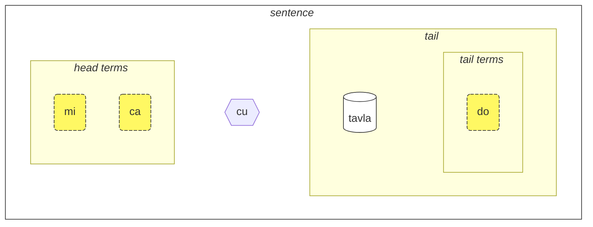

## Leciono 1. La lingvo en mallongigo

### Alfabeto

La baza afero, kiun vi devas scii pri Loĵbano, estas la alfabeto.

Loĵbano uzas la latinan alfabeton (vokaloj estas kolorigitaj):

<dl><dd><b>a b c d e f g i j k l m n o p r s t u v x y z ' .</b></dd></dl>

Vortoj estas prononcataj kiel ili estas skribitaj.

Estas 10 vokaloj en Loĵbano:

<table>
<tbody><tr>
<td><b class="audio-inline">a</b></td>
<td> kiel en <i>patr<u>o</u></i> (ne kiel en <i>vizaĝo</i>)</td>
</tr>
<tr>
<td><b class="audio-inline">e</b></td>
<td> kiel en <i>g<u>et</u></i></td>
</tr>
<tr>
<td><b class="audio-inline">i</b></td>
<td> kiel en <i>maŝ<u>in</u></i> (ne kiel en <i>frapi</i>)</td>
</tr>
<tr>
<td><b class="audio-inline">o</b></td>
<td> kiel en <i>voĉ<u>o</u></i>, <i>n<u>o</u>t</i> aŭ <i>ough</i> en <i>th<u>ough</u>t</i> (ne kiel en <i>so</i>, <b>o</b> devus esti "pura" sono).</td>
</tr>
<tr>
<td><b class="audio-inline">u</b></td>
<td> kiel en <i>ku<u>l</u>o</i> (ne kiel en <i>sed</i>)</td>
</tr>
<tr>
<td><b class="audio-inline">y</b></td>
<td> kiel en <i>komm<u>a</u></i> (ne kiel en <i>nebula</i> aŭ <i>ciklo</i>)</td>
</tr>
<tr>
</tbody></table>

4 vokaloj estas skribitaj uzante kombinojn de literoj:

<table>
<tbody><tr>
<td><b class="audio-inline">au</b></td>
<td> kiel en <i>bov<u>o</u></i></td></tr>
<tr>
<td><b class="audio-inline">ai</b></td>
<td> kiel en <i>alt<u>a</u></i></td></tr>
<tr>
<td><b class="audio-inline">ei</b></td>
<td> kiel en <i>pez<u>i</u></i></td></tr>
<tr>
<td><b class="audio-inline">oi</b></td>
<td> kiel en <i>knab<u>o</u></i></td></tr>
</tbody></table>

Kiel konsonantoj, ili estas elparolataj kiel en la angla aŭ la latina, sed estas kelkaj diferencoj:

<table>
<tbody><tr>
<td><b class="guibutton">c</b>
</td>
<td>estas elparolata kiel <i>c</i> en <i>oceano</i>, kiel <i>sh</i> en <i>shop</i>.
</td></tr>
<tr>
<td><b class="guibutton">g</b>
</td>
<td>ĉiam <i>g</i> kiel en <i>gum</i> (neniam <i>g</i> kiel en <i>gem</i>).
</td></tr>
<tr>
<td><b class="guibutton">j</b>
</td>
<td>kiel <i>s</i> en <i>pleasure</i> aŭ <i>treasure</i>, kiel <i>j</i> en la franca <i>bonjour</i>.
</td></tr>
<tr>
<td><b class="guibutton">x</b>
</td>
<td>kiel <i>ch</i> en la skota <i>loch</i> aŭ kiel en la germana <i>Bach</i>, kiel <i>J</i> en la hispana <i>Jose</i> aŭ <i>Kh</i> en la moderna araba <i>Khaled</i>. Provu elparoli <i>ksss</i> tenante vian lango malsupren kaj vi ricevos tiun sonon.
</td></tr>
<tr>
<td><b class="guibutton"> ' </b>
</td>
<td>kiel la angla <i>h</i>. Do la apostrofo estas rigardata kiel propra litero de Loĵbano kaj elparolata kiel <i>h</i>. Ĝi povas troviĝi nur inter vokaloj. Ekzemple, <b>u'i</b> estas elparolata kiel <i>oo-hee</i> (dum <b>ui</b> estas elparolata kiel <i>wee</i>).
</td></tr>
<tr>
<td><b>.</b>
</td>
<td>punkto (fina punkto, vortopaŭzo) estas ankaŭ rigardata kiel litero en Loĵbano. Ĝi estas mallonga paŭzo en parolo por haltigi vortojn kuniĝantajn. Fakte, antaŭ iu ajn vorto komenciĝanta per vokalo estas metita punkto. Tio helpas malhelpi maldeziratan kunfluiĝon de du sekvaj vortoj en unu.
</td></tr>
<tr>
<td><b>i</b>
</td>
<td><b>i</b> antaŭ vokaloj estas konsiderata konsonanto kaj elparolata pli mallonge, ekzemple:
<ul><li><b>ia</b> estas elparolata kiel <i>ya</i> en <i>yard</i></li>
<li><b>ie</b> estas elparolata kiel <i>ye</i> en <i>yes</i></li></ul>
</td></tr>
<tr>
<td><b>u</b>
</td>
<td><b>u</b> antaŭ vokaloj estas konsiderata konsonanto kaj elparolata pli mallonge, ekzemple:
<ul><li><b>ua</b> estas elparolata kiel <i>wo</i> en <i>wow</i></li>
<li><b>ue</b> estas elparolata kiel <i>whe</i> en <i>when</i></li></ul>
</td></tr></tbody></table>

Streso estas metita sur la dua al la lasta vokalo. Se vorto havas nur unu vokalon, simple ne stresu ĝin.

La litero **r** povas esti elparolita kiel la _r_ en la angla, skota, rusa, do ekzistas gamo de akcepteblaj prononcoj por ĝi.

Nevortojn kiel la mallonga _i_ kaj _u_ en la Norma Brita Angla _hit_ kaj _but_, uzas iuj homoj por apartigi konsonantojn. Do, se vi havas malfacilaĵojn prononci du konsonantojn sinsekve (ekz., la **vl** en **tavla**, kiu signifas _paroli al_), tiam vi povas diri _tavɪla_ — kie la _ɪ_ estas tre mallonga. Tamen, aliaj vokaloj kiel **a** kaj **u** devas esti longaj.

### La plej simpla frazo

La baza unuo en Loĵbano estas "frazo". Jen tri simplaj ekzemploj:

> **le prenu cu tavla mi**
> _La persono parolas al mi._

le prenu
: la persono

tavla
: … parolas al …, … parolas al …

mi
: mi, min

> **mi prami do**
> _Mi amas vin._

prami
: … amas … (iun)

do
: vi

> **mi ca cu tavla do**
> _Mi nun parolas al vi._

ca
: nun (prononcata kiel **shah**)

Ĉiu frazo en Loĵbano konsistas el la sekvantaj partoj de maldekstre dekstren:

<pixra url="/assets/pixra/cilre/tavla.webp" caption="le prenu cu tavla mi" definition="La persono parolas al mi."></pixra>

<pixra url="/assets/pixra/cilre/mi.webp" caption="mi" definition="Mi / min"></pixra>

<pixra url="/assets/pixra/cilre/mi_prami_do2.webp" caption="mi prami do" definition="Mi amas vin."></pixra>

<pixra url="/assets/pixra/cilre/do.webp" caption="do" definition="vi"></pixra>

- la kapo:
  - konsistas el tiel-nomataj "terminoj",
    - **le prenu** estas la sola kapotermino en la ekzemplo **le prenu cu tavla mi** supre,
    - **mi**, **ca** estas kapoterminoj en la ekzemplo **mi ca cu tavla do** supre.
- la kaposeparilo **cu**:
  - prononcata kiel _shoe_ ĉar **c** estas por _sh_,
  - montras ke la kapo finiĝis,
  - povas esti preterlasita kiam estas klare ke la kapo estas finita.
- la vosto:
  - la ĉefa rilata konstruo (nomata "**selbrisni**" en Loĵbano) 
  - \+ eble unu aŭ pli da terminoj post ĝi,
    - **tavla**, **prami** estas selbrisni, ĉefaj rilataj konstruoj en la ekzemploj supre.
    - **mi** estas la sola vostotermino en la ekzemplo **le prenu cu tavla mi** supre.
    - **do** estas la sola vostotermino en la ekzemplo **mi prami do** supre.

En Loĵbano, ni plejparte parolas pri rilatoj anstataŭ substantivoj aŭ verboj.

Jen la du rilataj vortoj, kiuj proksimume korespondas al verboj:

prenu
: … estas persono / estas homoj

tavla
: … parolas al …

Ĉiu rilato havas unu aŭ pli da roloj, kiuj ankaŭ nomiĝas "lokoj" aŭ "spacoj". Supre, ili estas etikeditaj per "…" Tiuj lokoj devas esti plenigitaj per argumentoj (nomitaj "**sumti**" en Loĵbano). Argumentaj terminoj estas konstruaĵoj kiel **le prenu**, **mi**, **vi** ne gravas ĉu tiuj terminoj finas en ĉefo aŭ vosto de frazo. Ni metas argumentajn terminojn en ordo, tiel plenigante tiujn lokojn kaj donante konkretan signifon al la rilato.

Ni ankaŭ povas transformi tian rilaton en argumentan terminon.

Por tio ni metas mallongan vorton **le** antaŭ ĝi:

prenu
: … estas persono

le prenu
: la persono, la homoj

Simile,

tavla
: … parolas al …

kaj tiel

le tavla
: la parolanto, la parolantoj

Povas ŝajni stranga kiel _persono_ povas esti "verbo", sed fakte, tio faras Loĵbanon tre simpla:

<table>
<thead>
<tr>
<th>rilata vorto kun neplenigitaj lokoj</th>
<th>argumenta formo (<b>sumti</b>)</th></tr>
</thead>
<tbody>
<tr>
<td><b>prenu</b> — <i>… (iu) estas persono</i> </td>
<td><b>le prenu</b> — <i>la persono / la homoj</i>
     <b>le prenu</b> — <i>tiu, kiu estas persono / tiuj, kiuj estas homoj</i>
</td></tr>
<tr>
<td><b>tavla</b> — <i>… (iu) parolas al … (iu)</i> </td>
<td><b>le tavla</b> — <i>la parolanto / la parolantoj</i>
     <b>le tavla</b> — <i>tiu, kiu estas parolanto / tiuj, kiuj estas parolantoj</i>
</td></tr>
</tbody></table>

La unua loko de la rilatoj malaperas kiam uzante **le**, tial tiaj alternativaj tradukoj kiel _tiu, kiu …_ estas eblaj.

<!-- Ni ankaŭ povas diri, ke **le** kreas substantivon el rilata konstruaĵo kun proksimuma signifo de _tiu, kiu estas …_ (_estas persono_ — _la persono_), aŭ eĉ _tiuj, kiuj faras…_ (_paroli al_ — _la parolantoj_), _tiuj, kiuj estas…_ (_estas homoj_ — _la homoj_). -->

Notu, ke Loĵbano, implicita, ne specifas nombron inter _la parolanto_ aŭ _la parolantoj_. Tio estas, **le tavla** estas neklara rilate al tiu aspekto, kaj baldaŭ ni malkovros manierojn por difini la nombron.

Krom argumentaj terminoj estas modalaj terminoj kiel **ca**:

> **mi ca cu tavla do**
> _Mi nun parolas al vi._

ca
: nun

Modalaj terminoj ne plenigas lokojn de la ĉefa rilata konstruo ("**selbrisni**"). Anstataŭe, ili estas aplikitaj al la tuta frazo plirigante aŭ limigante ĝian signifon.

Do, terminoj en Loĵbano estas reprezentitaj per:

- argumentaj terminoj kiuj plenigas lokojn de rilatoj. Ekzemploj estas:
  - substantivoj kiel **le prenu** (_la persono_)
  - pronomoj kiel **mi** (_mi_), **do** (_vi_). Pronomoj funkcias same kiel substantivoj, sed **le** ne estas uzata por ili. Ili funkcias kiel argumentoj mem.
- modalaj terminoj kiuj ne plenigas lokojn de rilatoj sed specifas aldonan, klarigan informon.
  - ekzemple, **ca** (_nun, en la nuna tempo_).

Kelkaj pliaj ekzemploj:

<pixra url="/assets/pixra/cilre/nintadni.webp" caption="mi nintadni" definition="Mi estas nova studento, komencanto."></pixra>

> **mi nintadni**
> _Mi estas nova studento._

nintadni
: … (iu) estas nova studento, komencanto

Kontraŭe al la angla, ni ne devas aldoni la verbon "estas" al la frazo. Ĝi jam estas subkomprenita. La rilata vorto **nintadni** (_… estas nova studento_) jam havas tiun anglan "estas" enkonstruitan en ĝian anglan tradukon.

> **do jimpe**
> _Vi komprenas._

jimpe
: … (iu) komprenas … (ion)

<pixra url="/assets/pixra/cilre/pilno_le_fonxa.webp" caption="le prenu cu pilno le fonxa" definition="La persono uzas la telefonon."></pixra>

> **mi pilno le fonxa**
> _Mi uzas la telefonon._

pilno
: … (iu) uzas … (ion)

fonxa
: … estas telefono, … estas telefonoj

le fonxa
: la telefono, la telefonoj

<pixra url="/assets/pixra/cilre/citka.webp" caption="mi citka" definition="Mi manĝas."></pixra>

> **mi citka**
> _Mi manĝas._

citka
: … (iu) manĝas … (ion)

> **do citka**
> _Vi manĝas._

<!-- -->

> **mi citka le plise**
> _Mi manĝas la pomojn._

<pixra url="/assets/pixra/cilre/le_plise_cu_kukte.webp" caption="le plise cu kukte" definition="La pomoj estas gustaj."></pixra>

> **le plise cu kukte**
> _La pomoj estas gustaj._

le plise
: la pomoj

kukte
:  … (io) estas gustega

Unu pli simpla frazo en Loĵbano enhavus nur unu ĉefan rilata vorton:

<pixra url="/assets/pixra/cilre/karce.webp" caption="karce" definition="Ĝi estas aŭto."></pixra>

> **karce**
> _Aŭto!_
> _Ĝi estas aŭto._

Vi povus diri tion kiam vi vidas aŭton venantan. Ĉi tie la kunteksto estus sufiĉe klara ke estas aŭto ie ĉirkaŭe kaj verŝajne ĝi estas danĝera.

**karce** mem estas rilata vorto signifanta _estas aŭto_.

Kompreneble ni povas esti pli precizaj kaj diri, ekzemple:

> **bolci**
> _Pilko!_
> _Ĝi estas pilko._

kie **bolci** estas rilata vorto signifanta _estas pilko_.

> **ti bolci**
> _Tio estas pilko apud mi._

<!-- -->
> **ta bolci**
> _Tio estas pilko apud vi._

ti
: pronomo: tiu afero apud mi

ta
: pronomo: tiu afero apud vi

tu
: pronomo: tiu tie for de vi kaj mi

<pixra url="/assets/pixra/cilre/ti.webp" caption="ti" definition="tiu ĉi (apud mi, la parolanto)"></pixra>

<pixra url="/assets/pixra/cilre/ta.webp" caption="ta" definition="tiu ĉi (apud vi, la aŭskultanto)"></pixra>

<pixra url="/assets/pixra/cilre/tu.webp" caption="tu" definition="tiu tie (for de vi kaj mi)"></pixra>

Simile, vi povas diri

<pixra url="/assets/pixra/cilre/carvi.webp" caption="carvi" definition="… estas pluvo"></pixra>

> **carvi**
> _Estas pluvante._

kie

carvi
: … estas pluvo, … estas pluvante

aŭ

> **pluka**
> _Estas agrable_

kie

pluka
: … estas agrable

Notu ke en Loĵbano ne estas bezono de la vorto _ĝi_ en tia senco. Vi simple uzas la rilatan vorton kiun vi bezonas.

> **prami**
> _Iu amas._

<pixra url="/assets/pixra/cilre/bajra.webp" caption="le prenu cu bajra" definition="La persono kuras."></pixra>

> **bajra**
> _Iu kuras._

bajra
: … kuras uzante membrojn

Denove la kunteksto verŝajne montrus kiu amas kiu kaj kiu kuras.

### Task

<pixra url="/assets/pixra/cilre/pinxe_le_djacu.webp" caption="le prenu cu pinxe le djacu" definition="La persono trinkas la akvon."></pixra>

pinxe
: … trinkas … (ion)

le djacu
: la akvo

Fermu la dekstran parton de la tabelo. Traduku la frazojn maldekstre el Loĵbano.

<table style="table-layout: fixed;">
<tbody><tr>
<td><b>do citka</b>
</td>
<td><i>Vi manĝas.</i>
</td></tr>
<tr>
<td><b>mi pinxe le djacu</b>
</td>
<td><i>Mi trinkas akvon.</i>
</td></tr>
<tr>
<td><b>mi citka le plise</b>
</td>
<td><i>Mi manĝas pomojn.</i>
</td></tr></tbody></table>

### «**.i**» separas frazojn

Ni metas mallongan vorton **.i** por apartigi du konsekutajn frazojn:

> **mi tavla le prenu .i le prenu cu tavla mi**
> _Mi parolas kun la homoj. La homoj parolas kun mi._

**.i** apartigas frazojn kiel la punkto (periodo) ĉe la fino de frazoj en anglaj tekstoj.

Kiam oni diras unu frazon post la alia en la angla, ni faras paŭzon (povas esti mallonga) inter ili. Sed paŭzo havas multajn malsamajn signifojn en la angla. En Loĵbano ni havas pli bonan manieron por kompreni kie unu frazo finiĝas kaj alia komenciĝas.

Ankaŭ rimarku ke foje, kiam oni prononcas vortojn rapide, oni ne povas malkovri kie unu frazo finiĝas kaj la vorto de la sekvanta frazo komenciĝas. Tial estas konsilebla uzi la vorton **.i** antaŭ komenci novan frazon.

### Nombroj: ‘_1 2 3 4 5 6 7 8 9 0_’ = «**pa re ci vo mu xa ze bi so no**»

**le** simple transformas rilatan konstruaĵon en argumenton, sed tia argumento ne havas asociitan nombron. La frazo

> **le prenu cu tavla mi**
> _La homoj parolas kun mi._
> _La persono parolas kun mi._

ne specifas la nombron de homoj parolantaj kun mi. En la angla, estas neebla forigi la nombron ĉar _people_ en la angla implicas _pli ol unu persono_. Tamen, en Loĵbano, vi povas forigi la nombron.

Nun ni specifos kiom da la homoj estas rilataj al nia diskuto.

Ni aldonu numeron post **le**.

<table>
<tbody><tr>
<td><b>pa</b>
</td>
<td><b>re</b>
</td>
<td><b>ci</b>
</td>
<td><b>vo</b>
</td>
<td><b>mu</b>
</td>
<td><b>xa</b>
</td>
<td><b>ze</b>
</td>
<td><b>bi</b>
</td>
<td><b>so</b>
</td>
<td><b>no</b>
</td></tr>
<tr>
<td> 1
</td>
<td> 2
</td>
<td> 3
</td>
<td> 4
</td>
<td> 5
</td>
<td> 6
</td>
<td> 7
</td>
<td> 8
</td>
<td> 9
</td>
<td> 0
</td>
</tr></tbody></table>

<pixra url="/assets/pixra/cilre/ci_prenu.webp" caption="le ci prenu" definition="La tri homoj"></pixra>

> **la pa prenu cu tavla mi**
> _La persono parolas al mi._
> _La unu persono parolas al mi._

Ni aldonas numeron post **la** kaj tiel specifas individuajn homojn.

Por nombroj konsistantaj el pluraj ciferoj, ni simple kunigas tiujn ciferojn:

> **la re mu prenu cu tavla mi**
> _La 25 homoj parolas al mi._

Jes, tiel simplas.

Se ni volas kalkuli, ni apartigas nombrojn per **.i**:

> **mu .i vo .i ci .i re .i pa .i no**
> _5 … 4 … 3 … 2 … 1 … 0_

La nombro **za'u** signifas _pli ol …_ (_\>_ en matematiko), la nombro **me'i** signifas _malpli ol_ (_<_ en matematiko):

> **la za'u re prenu cu tavla mi**
> _Pli ol du homoj parolas al mi._

<!-- -->

> **la me'i pa no prenu cu tavla mi**
> _Malpli ol 10 homoj parolas al mi._

<!-- -->

> **la za'u ci prenu cu tavla mi**
> _Pli ol tri homoj parolas al mi._

Por simple diri _homoj_ (pluralan nombron) kontraŭ _unu persono_, ni uzas **za'u pa**, _pli ol unu_ aŭ simple **za'u**.

> **la za'u pa prenu cu tavla mi**
> **la za'u prenu cu tavla mi**
> _La homoj parolas al mi._

**za'u** implicitas **za'u pa** per defaŭlto, do tia mallongigo estas ebla.

la prenu
: la persono / la homoj

la pa prenu
: la persono (unu en nombro)

la za'u prenu
: la homoj (du aŭ pli en nombro)

### Task

stati
: … (iu) estas inteligenta, … havas talenton

<pixra url="/assets/pixra/cilre/stati.webp" caption="stati" definition="… havas talenton"></pixra>

klama
: … venas al … (iu loko aŭ objekto)

<pixra url="/assets/pixra/cilre/klama_ti.webp" caption="la persono venis ĉi tien" definition="La persono venis ĉi tien."></pixra>

nelci
: … ŝatas (ion)

la zarci
: la merkato

<pixra url="/assets/pixra/cilre/zarci.webp" caption="la persono estas ĉe la butiko" definition="La persono estas ĉe la butiko."></pixra>

la najnimre
: la oranĝo (frukto), la oranĝoj

<pixra url="/assets/pixra/cilre/najnimre.webp" caption="najnimre" definition="… estas oranĝo"></pixra>

la badna
: la banano, bananoj

<pixra url="/assets/pixra/cilre/badna.webp" caption="badna" definition="… estas banano"></pixra>

Fermu la dekstran parton de la tabelo. Traduku la frazojn sur la maldekstra flanko el Loĵbano.

<table style="table-layout: fixed;">
 <tbody>
  <tr>
   <td>le mu prenu cu klama le zarci</td>
   <td>The five people come to the market.</td>
  </tr>
  <tr>
   <td>le pa re prenu cu stati .i do stati</td>
   <td>The 12 people are smart. You are smart.</td>
  </tr>
  <tr>
   <td>le prenu cu nelci le plise</td>
   <td>The people like the apples.</td>
  </tr>
  <tr>
   <td>le za'u re prenu cu citka .i le me'i mu prenu cu pinxe le djacu</td>
   <td>More than two people eat. Fewer than 5 people drink the water.</td>
  </tr>
  <tr>
   <td>le za'u re prenu cu stati</td>
   <td>More than two people are smart.</td>
  </tr>
 </tbody>
</table>

Fermu la dekstra parto de la tabelo. Traduku la frazojn maldekstre al Loĵbano.

<table style="table-layout: fixed;">
 <tbody>
  <tr>
   <td>The 256 people are smart.</td>
   <td>le re mu xa prenu cu stati</td>
  </tr>
  <tr>
   <td>Fewer than 12 apples are tasty.</td>
   <td>le me'i pa re plise cu kukte</td>
  </tr>
 </tbody>
</table>

### Kunmeta rilato

Kunmeta rilato konstruoj (**tanru** en Loĵbano) estas pluraj rilataj vortoj metitaj unu post la alia.

> **tu melbi zdani**
> _Tiu estas bela hejmo._

<pixra url="/assets/pixra/cilre/melbi_zdani.webp" caption="melbi zdani" definition="… estas bela hejmo"></pixra>

tu
: tiu (for de vi kaj mi)

melbi
: … estas bela, bela

zdani
: … estas hejmo aŭ nesto por … (iu)

melbi zdani
: kunmeta rilato konstruo: … estas bela hejmo por … (iu)

<pixra url="/assets/pixra/cilre/dansu.webp" caption="le prenu cu melbi dansu" definition="La persono bele dancas."></pixra>

> **do melbi dansu**
> _Vi bele dancas._

dansu
: … dancas

Ĉi tie, la rilato **melbi** aldonas aldonan signifon ĉar ĝi estas metita maldekstre de alia rilato: **zdani**. La maldekstra komponento kutime estas tradukita uzante adjektivojn kaj adverbojn.

Kunmetaj rilatoj estas potenca trajto kiu produktas pli riĉajn signifojn. Vi simple kunligas du rilatajn vortojn, kaj la maldekstra komponento de tia kunmeta rilato aldonas guston al la dekstra.

Ni povas meti **le** (ekz., kun nombro) maldekstre de tia kunmeta rilato por ricevi pli riĉan argumentan terminon:

le pa melbi zdani
: la bela hejmo

Nun vi scias kial estis **cu** post ĉefaj terminoj en nia ekzemplo:

> **le pa prenu cu tavla mi**
> _La persono parolas al mi._

Sen **cu** ĝi iĝus **le pa prenu tavla**, kio signifus _la persono-parolanto_ - kion ajn tio povus signifi.

Konsideru:

> **le pa tavla pendo**
> _La parolanta amiko_
<!-- -->
> **le pa tavla cu pendo**
> _La parolanta estas amiko._

Memoru pri metado de **cu** antaŭ la ĉefa rilata konstruaĵo en frazo por eviti neintencajn kreadojn de kunmetitaj rilatoj.

Kunmetita rilato povas enhavi pli ol du komponentojn. En tiu ĉi kazo, la unua rilato modifas la duan, la dua modifas la trian, kaj tiel plu:

<pixra url="/assets/pixra/cilre/cmalu_karce.webp" caption="ti cmalu karce" definition="Tio estas malgranda aŭto."></pixra>

> **le pa melbi cmalu karce**
> _la bela malgranda aŭto, la aŭto malgranda sur bela maniero_

<!-- -->

> **le mutce melbi zdani**
> _la tre bela hejmo_

mutce
: … estas tre, … estas multe

### Task

sutra
: … estas rapida

barda
: … estas granda

cmalu
: … estas malgranda

mlatu
: … estas kato

Fermu la dekstran parton de la tabelo. Traduku la frazojn sur la maldekstra flanko el Loĵbano.

<table style="table-layout: fixed;">
<tbody><tr>
<td><b>le melbi karce</b>
</td>
<td><i>la bela aŭto / la belaj aŭtoj</i>
</td></tr>
<tr>
<td><b>do sutra klama</b>
</td>
<td><i>Vi rapide venas. Vi venas rapide.</i>
</td></tr>
<tr>
<td><b>tu barda zdani</b>
</td>
<td><i>Tio estas granda hejmo.</i>
</td></tr>
<tr>
<td><b>le pa sutra bajra mlatu</b>
</td>
<td><i>la rapide kurema kato</i>
</td></tr>
<tr>
<td><b>le pa sutra mlatu</b>
</td>
<td><i>la rapida kato</i>
</td></tr>
<tr>
<td><b>le pa bajra mlatu</b>
</td>
<td><i>la kurema kato</i>
</td></tr></tbody></table>

Fermu la dekstran parton de la tabelo. Traduku la frazojn sur la maldekstra flanko al Loĵbano.

<table style="table-layout: fixed;">

<tbody><tr>
<td><i>Tio estas malgranda aŭto.</i>
</td>
<td><b>ti cmalu karce</b>
</td></tr>
<tr>
<td><i>gustaj pomoj</i>
</td>
<td><b>le kukte plise</b>
</td></tr>
<tr>
<td><i>la rapidaj manĝantoj</i>
</td>
<td><b>le sutra citka</b>
</td></tr>
<tr>
<td><i>Vi estas rapide marŝanta persono.</i>
</td>
<td><b>do sutra cadzu prenu</b>
</td></tr></tbody></table>

### ‘_Jes/Ne_’ demandoj

En la angla, ni formas _jes/ne_ demandon ŝanĝante la ordon de la vortoj, ekzemple

> _You are … ⇒ Are you …?_

aŭ uzante ian formon de la verbo _to do_ je la komenco, ekzemple:

> _You know … ⇒ Do you know?_

En Loĵbano, la vortordo povas resti. Por fari iun ajn aserton en _jes/ne_ demandon, ni simple enmetas la vorton **xu** ie en la frazo, ekzemple, je la komenco:

> **xu do nelci le gerku**
> _Ĉu vi ŝatas la hundojn?_

le gerku
: la hundo, la hundoj

<pixra url="/assets/pixra/cilre/le_prenu_e_le_gerku.webp" caption="ti prenu .i ti gerku" definition="Tio estas persono. Tio estas hundo."></pixra>

Memoru, ke en Loĵbano, interpunkcio kiel "?" (demando signo) estas opcio kaj uzata plejparte por stila celo. Tio estas ĉar la demandovorto **xu** jam montras, ke temas pri demando.

Aliaj ekzemploj:

> **xu mi klama**
> _Ĉu mi venas?_

klama
: … venas al … (ie)

> **xu pelxu**
> _Ĉu ĝi estas flava?_

pelxu
: … estas flava

Ni povas ŝanĝi la signifon metante **xu** post malsamaj partoj de la rilato. Klarigoj pri la ŝanĝo en la signifo estas donitaj en krampoj:

> **xu do nelci le gerku**
> _Ĉu vi ŝatas la hundojn?_

<!-- -->

> **do xu nelci le gerku**
> _Ĉu VI ŝatas la hundojn? (Mi pensis, ke estas iu alia, kiu ŝatas ilin)._

<!-- -->

> **do nelci xu le gerku**
> _Ĉu vi ŜATAS la hundojn? (Mi pensis, ke vi estis nur neŭtrala al ili)._

<!-- -->

> **do nelci le xu gerku**
> _Ĉu vi ŝatas LA HUNDOJN? (Mi pensis, ke vi ŝatas la katojn)._

<!-- -->

> **do nelci le gerku xu**
> _Vi ŝatas tiujn aferojn, ĉu ili estas hundoj? (Vi nur demandas la validon de la rilato **gerku**)._

Tio, kion esprimas intonacio en la angla, estas esprimata movante **xu** post la parto, kiun ni volas emfazi en Loĵbano. Notu, ke la unua frazo kun **xu** je la komenco demandas la plej ĝeneralan demandon sen emfazi ian apartan aspekton.

**xu** estas interjekcio. Jen la trajtoj de Loĵbana interjekcio:

- interjekcio modifas la konstruaĵon antaŭ ĝi:

 > **do xu nelci le gerku**
 > _Ĉu VI ŝatas la hundojn?_

- kiam metita je la komenco de rilato, interjekcio modifas la tutan rilaton:

 > **xu do nelci le gerku**
 > _Ĉu vi ŝatas la hundojn?_

- interjekcioj povas esti metitaj post malsamaj partoj de la sama rilato por ŝanĝi la signifon.

 > **do nelci le gerku xu**
 > _Vi ŝatas tiujn entojn, ĉu ili estas hundoj?_

Ĉi tie, nur la rilato **gerku** (ne la argumento **le gerku**) estas modifita per la demandovorto **xu**. Do ni demandas nur pri tiu rilato. Ni asertas ke vi ŝatas tiujn objektojn aŭ vivajn estaĵojn kaj ni demandas al vi ĉu tiuj estas hundoj.

Interjekcioj ne rompasn komponitajn rilatojn, ili povas esti uzataj ene de ili:

> **do nelci le barda xu gerku**
> _Ĉu vi ŝatas la GRANDAJN hundojn?_

Nun, kiel respondi al tiaj 'jes/ne' demandoj? Vi ripetas la ĉefan rilatokonstruaĵon:

> **— xu le mlatu cu melbi**
> **— melbi**
> _— Ĉu la katoj estas belaj?_
> _— Belaj._

Por respondi 'ne', ni uzas la modalan terminon **na ku**:

> **— xu le mlatu cu melbi**
> **— na ku melbi**
> _— Ĉu la katoj estas belaj?_
> _— Ne belaj._

na ku
: termino: estas malvero ke …

Aŭ, ni povas uzi specialan rilatovorton **go'i**:

> **— xu le mlatu cu melbi**
> **— go'i**
> _— Ĉu la katoj estas belaj?_
> _— Belaj._

go'i
: rilatovorto kiu ripetas la ĉefan rilaton de la antaŭa frazo

Ĉi tie, **go'i** signifas la samon kiel **melbi** ĉar **melbi** estas la rilato de la antaŭa rilato.

> **— xu le mlatu cu melbi**
> **— na ku go'i**
> _— Ĉu la katoj estas belaj?_
> _— Ne belaj._

<!-- Ĉi tiu kurso ne rekomendas neigi **go'i** por negativaj respondoj. Simple uzu **je'u nai**. -->

La modalan terminon **na ku** oni povas uzi ne nur en respondoj:

> **na ku mi nelci le gerku**
> _Estas malvero ke mi ŝatas la hundojn._
> _Mi ne ŝatas la hundojn._
<!-- -->
> **mi na ku nelci do**
> _Mi ne ŝatas vin._

Ĝia kontraŭo, la termino **ja'a ku** konfirmas la signifon:

> **mi ja'a ku nelci do**
> _Mi ja ŝatas vin._

ja'a ku
: termino: estas vero ke …

### Task

Fermu la dekstran parton de la tabelo. Traduku la frazojn sur la maldekstra flanko el Loĵbano.

<table style="table-layout: fixed;">

<tbody><tr>
<td><b>xu le barda zdani cu melbi</b>
</td>
<td><i>Ĉu la granda hejmo estas bela?</i>
</td></tr>
<tr>
<td><b>— le prenu cu stati xu — na ku stati</b>
</td>
<td><i>— Ĉu la homoj estas inteligentaj? — Ne.</i>
</td></tr>
<tr>
<td><b>do klama le zarci xu</b>
</td>
<td><i>Ĉu vi iras al la merkato?</i>
</td></tr>
<tr>
<td><b>xu le verba cu prami le mlatu</b>
</td>
<td><i>Ĉu la infano amas la katojn?</i>
</td></tr></tbody></table>

<table style="table-layout: fixed;">
<thead><tr>
<td><i>Ĉu la aŭtomobilo estas rapida?</i>
</td>
<td><b>xu le karce cu sutra</b>
</td></tr>
<tr>
<td><i>— Ĉu la oranĝo estas bongusta? — Jes, jes.</i>
</td>
<td><b>— xu le najnimre cu kukte — kukte</b>
</td></tr>
<tr>
<td><i>Ĉu la hundo amas vin?</i>
</td>
<td><b>xu le gerku cu prami do</b>
</td></tr></tbody></table>

### Feliĉo kaj ĝentilaj petoj: ‘_Ja!_’ = «**ui**», ‘_Bonvolu!_’ = «**.e'o**»

La interjekcio **ui** montras feliĉon de tiu, kiu parolas. Ĝi estas uzata same kiel la rideto ‘_:)_’ la rideto en mesaĝado, por indiki ke vi ĝojas pri io. Kvankam, ridetaĵoj povas esti ambiguaj, kaj **ui** havas nur unu signifon, kiu estas oportuna.

> **ui do klama**
> _Jes, vi venas!_

ui
: interjekcio: _Yay!_, interjekcio de feliĉo

La interjekcio **.e'o** komence de frazo igas ĝin ĝentila peto:

> **.e'o do lebna le fonxa**
> _Ĉu vi povus preni la telefonon, mi petas?_
> `Bonvolu preni la telefonon.`

.e'o
: interjekcio: bonvolu (prononcata kiel _eh-haw_ kun mallonga paŭzo aŭ paŭzo antaŭ la vorto)

lebna
: preni (ion)

En la angla, por esti ĝentila, oni devas uzi _could you_ + _please_ + demandon. En Loĵbano sufiĉas **.e'o** por fari ĝentilan peton.

### Tasko

Fermu la dekstran parton de la tablo. Traduku la frazojn maldekstre el Loĵbano.

**le tcati**
: la te

<pixra url="/assets/pixra/cilre/tcati.webp" caption="tcati" definition="… estas iom da teo"></pixra>

**le ckafi**
: kafo

<pixra url="/assets/pixra/cilre/ckafi.webp" caption="ckafi" definition="… estas iom da kafo"></pixra>

**zgana**
: observi (uzante ajnan senton)

**le skina**
: la filmo

<pixra url="/assets/pixra/cilre/zgana_le_skina.webp" caption="La persono observas la filmon." definition=""></pixra>

**kurji**
: zorgi pri (iu, io)

<table style="table-layout: fixed;">

<tkorpo>
<tr>
<td><b>ui carvi</b>
</td>
<td><i>Jes, pluvas! Jes, pluvas!</i>
</td></tr>
<tr>
<td><b>.e'o do sutra bajra</b>
</td>
<td><i>Kuru rapide!</i>
</td></tr>
<tr>
<td><b>.e'o do pinxe le tcati</b>
</td>
<td><i>Bonvolu trinki teon!</i>
</td></tr>
<tr>
<td><b>.e'o zgana le skina</b>
</td>
<td><i>Bonvolu spekti la filmon!</i>
</td></tr></ tbody ></ tablo >

<table style="table-layout: fixed;">

<tkorpo><tr>
<td><i>**Bonvolu esti inteligenta!**</i>
</td>
<td><b>.e'o stati</b>
</td></tr>
<tr>
<td><i>**Bonvolu, iru hejmen!**</i>
</td>
<td><b>.e'o do klama le zdani</b>
</td></tr>
<tr>
<td><i>**Bonvolu trinki la kafon!**</i>
</td>
<td><b>.e'o do pinxe le ckafi</b>
</td></tr>
<tr>
<tr>
<td><i>**Jes, mi parolas kun vi!**</i>
</td>
<td><b>ui mi tavla do</b>
</td></tr>
<tr>
<td><i>**Bonvolu, zorgi pri la infano.**</i>
</td>
<td><b>.e'o do kurji le verbo</b>
</td></tr></ tbody ></ tablo >

### ‘_Kaj_’ kaj ‘_aŭ_’

> **do nintadni .i je mi nintadni**
> _Vi estas novulo. Kaj mi estas novulo._

<!-- -->

> **do .e mi nintadni**
> _Vi kaj mi estas novuloj._

<pixra url="/assets/pixra/cilre/do_e_mi_nintadni.webp" caption="do .e mi nintadni" definition="Vi kaj mi estas novaj studentoj."></pixra>

<!-- -->

> **mi tadni .i je mi tavla do**
> _Mi studas. Kaj mi parolas kun vi._

<!-- -->

> **mi tadni gi'e tavla do**
> _Mi studas kaj parolas kun vi._

.i je
: konjunkcio "kaj" kunigante frazojn en unu.

.e
: konjunkcio "kaj" kunligantaj argumentojn.

gi'e
: konjunkcio "kaj" kunliganta frazvostojn.

Ni povas kombini du frazojn en unu deklaron uzante la konjunkcion **.i je**, kiu signifas _kaj_:

> **do nintadni .i je mi nintadni**
> _Vi estas novulo. Kaj mi estas novulo._

Ĉar ambaŭ frazoj havas la saman voston, oni povas uzi kuntiriĝon: la konjunkcio **.e** signifas _kaj_ por argumentoj:

> **do .e mi nintadni**
> _Vi kaj mi estas novuloj._

**do nintadni .i je mi nintadni** signifas ekzakte same kiel **do .e mi nintadni**

Ni ankaŭ povas uzi **.e** por kunligi argumentojn en aliaj pozicioj.

Ambaŭ ĉi tiuj frazoj signifas la samon.

> **mi pinxe le djacu .e le jisra**
> _Mi trinkas la akvon kaj la sukon._
> **mi pinxe le djacu .i je mi pinxe le jisra**
> _Mi trinkas la akvon, kaj mi trinkas la sukon._

le jisra
: suko

<pixra url="/assets/pixra/cilre/pinxe_le_jisra.webp" caption="le prenu cu pinxe le jisra" definition="La persono trinkas la sukon."></pixra>

Se la komenca parto de la frazo estas la sama sed la fino diferencas, ni uzas la konjunkcion **gi'e**, kiu signifas _kaj_ por la fino de la frazoj:

> **mi tadni .i je mi tavla do**
> **mi tadni gi'e tavla do**
> _Mi studas kaj parolas kun vi._

Ambaŭ variaĵoj signifas la samon; **gi'e** simple kondukas al pli konciza realigo.

Ni ankaŭ havas ilojn por aldoni _kaj_ por partoj de kunmetitaj rilatoj:

> **le melbi je cmalu zdani cu jibni ti**
> _La bela kaj malgranda hejmo estas proksime._

<pixra url="/assets/pixra/cilre/melbi_je_cmalu_zdani.webp" caption="melbi je cmalu zdani" definition="… estas bela-kaj-malgranda hejmo"></pixra>

jibni
: … estas proksima al …

ti
: tiu afero, tiu loko proksime de mi

**je** estas konjunkcio en Loĵbano kiu signifas _kaj_ en kunmetitaj rilatoj.

Sen **je**, la frazo ŝanĝas la signifon:

> **le melbi cmalu zdani cu jibni**
> _La bele malgranda hejmo estas proksime._

Ĉi tie **melbi** modifas **cmalu**, kaj **melbi cmalu** modifas **zdani**, laŭ kiel kunmetitaj rilatoj funkcias.

En **le melbi je cmalu zdani** (_la bela kaj malgranda hejmo_) ambaŭ **melbi** kaj **cmalu** modifas **zdani** rekte.

Aliaj oftaj konjunkcioj inkluzivas:

> **le verba cu fengu ja bilma**
> _La infano estas kolera aŭ malsana (aŭ eble ambaŭ kolera kaj malsana)_

<!-- -->

> **do .a mi ba vitke le dzena**
> _Vi aŭ mi (aŭ ambaŭ el ni) vizitos la prapatron._

ja
: kaj/aŭ

**.a** = _kaj/aŭ_ kiam kunligante argumentojn.

fengu
: … estas kolera

<pixra url="/assets/pixra/cilre/fengu.webp" caption="fengu" definition="… estas kolera"></pixra>

bilma
: … estas malsana

<pixra url="/assets/pixra/cilre/bilma.webp" caption="le prenu cu bilma" definition="La persono estas malsana"></pixra>

vitke
: viziti

dzena
: … estas prapatro de …

<pixra url="/assets/pixra/cilre/dzena.webp" caption="dzena" definition="… estas prapatro de …"></pixra>

> **le karce cu blabi jo nai grusi**
> _La aŭto estas aŭ blanka aŭ griza._

<!-- -->

> **do .o nai mi vitke le laldo**
> _Aŭ vi aŭ mi vizitos la malnovan._

jo nai
: aŭ … aŭ … sed ne ambaŭ

.o nai
: aŭ … aŭ … sed ne ambaŭ (kiam kunligante argumentojn)

laldo
: … estas malnova

<pixra url="/assets/pixra/cilre/laldo.webp" caption="laldo" definition="… estas malnova"></pixra>

Noto: estas pli bone memori **jo nai** kiel unuopa konstruo, kaj la samon por **.o nai**.

> **mi prami do .i ju do stati**
> _Mi amas vin. Ĉu vi estas inteligenta aŭ ne._

<!-- -->

> **le verba cu nelci le plise .u le badna**
> _La infano ŝatas la pomojn ĉu (li/ŝi ŝatas) la bananojn aŭ ne._

ju
: ĉu aŭ ne …

.u
: ĉu aŭ ne … (kiam kunligante argumentojn)

### «**joi**» estas ‘_kaj_’ por masaj agoj

> **do joi mi casnu le bangu**
> _Vi kaj mi diskutas la lingvon._

casnu
: … diskutas …

le bangu
: la lingvon

joi
: konjunkcio _kaj_ por masoj

Se mi diras **do .e mi casnu le bangu** tio povas signifi ke vi diskutas la lingvon, kaj mi diskutas la lingvon. Sed tio ne nepre signifas ke ni estas en la sama konversacio!

Tio povas esti pli videbla se ni plilongigas tion uzante **.i je**:

> **do .e mi casnu le bangu**
> **do casnu le bangu .i je mi casnu le bangu**
> _Vi diskutas la lingvon. Kaj mi diskutas la lingvon._

Por emfazi ke vi kaj mi partoprenas en la sama ago, ni uzas specialan konjunkcion **joi** signifanta _kaj_ kiu formas "masson":

> **do joi mi casnu le bangu**
> _Vi kaj mi diskutas la lingvon._
> _Vi kaj mi estante unu ento por tiu evento diskutas la lingvon._

La pronomo **mi'o** (_vi kaj mi kune_) fakte povas esti esprimata kiel **mi joi do**, kio signifas precize la samon (ĝi estas nur pli longa). En Loĵbano, vi povas uzi ne unu vorton por _ni_ sed pli precizajn konstruaĵojn kiel **mi joi le pendo** (literale _mi kaj la amikoj_).

<pixra url="/assets/pixra/cilre/casnu.webp" caption="do joi le pendo joi mi casnu" definition="Vi, la amiko kaj mi estas en diskuto."></pixra>

### Task

Fermu la dekstran parton de la tabelo. Traduku la frazojn sur la maldekstra flanko de la tabelo el Loĵbano.

<table style="table-layout: fixed;">

<tbody><tr>
<td><b>mi nelci le badna .e le plise</b>
</td>
<td><i>Mi ŝatas la bananojn, kaj mi ŝatas la pomojn. Mi ŝatas la bananojn kaj la pomojn.</i>
</td></tr>
<tr>
<td><b>do sutra ja stati</b>
</td>
<td><i>Vi estas rapida aŭ inteligenta aŭ ambaŭ.</i>
</td></tr>
<tr>
<td><b>le za'u prenu cu casnu le karce .u le gerku</b>
</td>
<td><i>La homoj diskutas la aŭtojn ĉu (ili diskutas) la hundojn aŭ ne.</i>
</td></tr>
<tr>
<td><b>mi citka le najnimre .o nai le badna</b>
</td>
<td><i>Mi manĝas aŭ la oranĝojn aŭ la bananojn.</i>
</td></tr></tbody></table>

<table style="table-layout: fixed;">

<tbody><tr>
<td><i>le pendo gi'e mi cu gleki le bruna</i>
</td>
<td><b>le pendo .e mi cu nelci le carvi</b>
</td></tr>
<tr>
<td><i>mi .e nai do klama le zarci</i>
</td>
<td><b>mi .o nai do klama le zarci</b>
</td></tr>
<tr>
<td><i>mi viska le karce le barda je melbi</i>
</td>
<td><b>mi catlu le barda je melbi karce</b>
</td></tr>
<tr>
<td><i>le verba cu pinxe le djacu .a le jisra</i>
</td>
<td><b>le verba cu pinxe le djacu .a le jisra</b>
</td></tr>
<tr>
<td><i>le verba gi'e le pa cmalu cu casnu le karce</i>
</td>
<td><b>le verba joi le pa cmalu cu casnu le karce</b> (note the use of <b>joi</b>. <i>the small one</i> is just <b>le pa cmalu</b>).
</td></tr></tbody></table>

le nicte
: la nokto, noktoj

viska
: vidi (ion)

le lunra
: la Luno

Ĉi tie, **le nicte** estas la unua argumento de la frazo kaj **nu mi viska le lunra** estas la ĉefa rilata konstruo de la frazo. Tamen, en ĉi tiu ĉefa rilato, ni povas vidi alian rilaton: **mi viska le lunra** enkorpigita!

La vorto **nu** transformas kompleta frazo en rilato kiu signifas eventon (en ĝia ĝenerala senco, tio povas esti procezo, stato ktp.)

Jen kelkaj pliaj ekzemploj:

nu mi tavla
: ... estas evento de mi parolanta

nu do tavla
: ... estas evento de vi parolanta

Aldonante **le** antaŭ **nu**, ni kreas argumenton kiu signifas eventon:

pinxe ⇒ le nu pinxe
: ... trinkas ⇒ la trinkado

dansu ⇒ le nu dansu
: ... dancas ⇒ la dancado

kansa ⇒ le nu kansa
: ... estas kune kun ... ⇒ estante kune

klama ⇒ le nu klama
: ... venas al ... ⇒ la venado

le nu do klama
: la venado de vi, vi venanta

**le nu** ofte korespondas al la angla _\-ing_, _\-tion_, _\-sion_.

Kelkaj pliaj ekzemploj kun lokoj kiuj atendas eventojn anstataŭ ordinaraĵoj:

> **mi djica le nu do klama ti**
> _Mi deziras, ke vi venu ĉi tien._

djica
: ... deziras ... (iun eventon)

> **mi gleki le nu do klama**
> _Mi ĝojas, ĉar vi venas._

gleki
: ... ĝojas pri ... (iu evento)

<pixra url="/assets/pixra/cilre/gleki.webp" caption="gleki" definition="... ĝojas pri evento ..."></pixra>

> **le nu pinxe le jisra cu nabmi mi**
> _Trinki la sukon estas problemo por mi._

nabmi
: ... (evento) estas problemo por ... (iu), ... (evento) estas problematika por ... (iu)

### Task

Fermu la dekstran parton de la tabelo. Traduku la frazojn sur la maldekstra flanko el la Loĵbano.

pilno
: uzi (ion)

le skami
: la komputilo

<table style="table-layout: fixed;">

<tkorpo><tr>
<td><b>mi nelci le nu do dansu</b>
</td>
<td><i>Mi ŝatas, ke vi dancu.</i>
</td></tr>
<tr>
<td><b>xu do gleki le nu do pilno le skami</b>
</td>
<td><i>Ĉu vi feliĉas uzi komputilojn?</i>
</td></tr>
<tr>
<td><b>do djica le nu mi citka le plise xu</b>
</td>
<td><i>Ĉu vi volas, ke mi manĝu la <u>pomon</u>?</i>
</td></tr></tbody></table>

Fermu la dekstran parton de la tablo. Traduku la frazojn maldekstre al Loĵbano.

<table style="table-layout: fixed;">

<tkorpo><tr>
<td><i>Veni ĉi tien estas problemo.</i>
</td>
<td><b>le nu klama ti cu nabmi</b>
</td></tr>
<tr>
<td><i>Mi volas, ke vi estu feliĉa.</i>
</td>
<td><b>mi djica le nu do gleki</b>
</td></tr></tbody></table>

### Modalaj terminoj. Simplaj tempoj: ‘_estis_’, ‘_estas_’, ‘_estos_’ — «**pu**», «**ca**», «**ba**»

En Loĵbano oni esprimas la tempon, kiam io okazas (gramatike, en la angla oni kutime nomas _tenso_) per modalaj terminoj. Ni jam vidis la modalan terminon **ca** kiu signifas _nuntempe_.

Jen serio da tempo-rilataj terminoj, kiuj diras, kiam io okazas:

> **le prenu pu cu tavla mi**
> _La homoj parolis kun mi._

<!-- -->

> **le prenu ca cu tavla mi**
> _La homoj parolas kun mi (nuntempe)._

<!-- -->

> **le prenu ba cu tavla mi**
> _La homoj parolos kun mi._

Kiam post la tempo-rilata partiklo ni metas nudan argumenton, tiam ni formas terminon kun iomete malsama signifo:

> **mi pinxe le djacu ca le nu do klama**
> _Mi trinkas la akvon dum vi venas._

La **ca le nu do klama** parto estas longtempa signifo _dum vi venas / dum vi venas_. La **le nu do klama** estas argumento kun la signifo *veno de vi, vi venanta*.

> **mi citka ba le nu mi dansu**
> _Mi manĝas post mi dancado._

Tempo-rilataj partikloj estas grupigitaj en seriojn per sia signifo por faciligi ilin memori kaj uzi.

Vortoj por simpla tempo:

- **pu** signifas _antaŭ … (iu okazaĵo)_, **pu** sole indikas pasintan tempon.
- **ca** signifas _samtempe kiel … (iu evento)_, **ca** sole indikas nunan tempon.
- **ba** signifas _post … (iu okazaĵo)_, **ba** sole indikas estontan tempon.

Tempoj aldonas informojn pri tempo kiam io okazas. La angla devigas nin uzi certajn tempojn. Oni devas elekti inter

- _La homoj parolas kun mi_.
- _La homoj parolis kun mi_.
- _La homoj parolos kun mi_.

kaj aliaj similaj elektoj.

Sed en Loĵbano streĉaj partikloj estas laŭvolaj, ni povas esti tiel malprecizaj aŭ precizaj, kiel ni volas.

La frazo

> **le prenu cu tavla mi**
> _La homoj parolas al mi._

fakte ne diras nenion pri kiam tio okazas. La kunteksto estas sufiĉe klara en la plej multaj kazoj kaj povas helpi nin. Sed se ni bezonas pli precizecon, ni simple aldonas pli da vortoj.

**ba** signifas _post ... (iu evento)_ do kiam ni diras **mi ba cu citka** ni celas ke ni manĝos post la momento de parolado, tial tio signifas _mi manĝos_.

Ni povas kombini tempajn partiklojn kun kaj sen argumentoj post ili:

> **mi pu cu citka le plise ba le nu mi dansu**
> _Mi manĝis la pomojn post kiam mi dancis._

Notu ke la vorto **pu** (pasinta tempo) estas metita nur en la ĉefa rilato (**mi pu cu citka**). En Loĵbano, oni supozas ke la evento _mi dancis_ okazas rilate al la evento de manĝado.

Ni ne devas meti **pu** kun **dansu** (malsame ol en la angla) ĉar **mi dansu** estas rigardata rilate al **mi pu cu citka** do ni jam scias ke ĉio estis en la pasinteco.

Pliaj ekzemploj de temp-rilataj terminoj:

> **le nicte cu pluka**
> _La nokto estas agrabla._

pluka
: ... estas agrabla

> **ba le nicte cu pluka**
> _Post la nokto ĝi estas agrabla._

Ĉi tie, la ĉefaĵo de la frazo enhavas unu terminon **ba le nicte**, modalan terminon kun sia interna argumento. Post la apartigilo **cu**, la ĉefa rilato de la frazo **pluka** estas sekvata (**pluka** sola signifas _Ĝi estas agrabla._)

Por diri _estos agrabla_ ni devas uzi la pasintan tempan terminon:

> **le nicte ba cu pluka**
> _La nokto estos agrabla._

Ankaŭ notu ke aldoni argumenton post temp-rilata partiklo povas konduki al draste malsama signifo:

> **le nicte ba le nu citka cu pluka**
> _La nokto estas agrabla post manĝado._

Notu ke **ca** povas etendiĝi iom en la pasintecon kaj la estontecon, signifante _ĵus nun_. Do, **ca** reflektas tre uzatan ĉirkaŭ la mondo ideon pri "nuna tempo".

Estas ankaŭ eble integri modalajn partiklojn en la ĉefan rilata konstruaĵon:

> **le nicte ba cu pluka**
> **le nicte ba pluka**
> _La nokto estos agrabla._

Ambaŭ frazoj signifas la samon, **ba pluka** estas rilata konstruaĵo signifanta _... estos agrabla_.

La strukturo de **le nicte ba pluka** estas la jena:

- **le nicte** — la ĉefo de la frazo kun nur unu termo **le nicte**
- **ba pluka** — la fino de la frazo kiu konsistas nur el la rilato **ba pluka**

Kontrastu tion kun la antaŭa frazo **le nicte ba cu pluka**:

- **le nicte ba** — la ĉefo de la frazo kun du terminoj **le nicte** kaj **ba**
- **pluka** — la fino de la frazo kiu konsistas nur el la rilato **pluka**

La avantaĝo de **le nicte ba pluka** super **le nicte ba cu pluka** estas nur en la koncizeco; vi kutime povas preterlasi diri **cu** en tiaj kazoj ĉar la frazo ne povas esti komprenita alie ajn.

Se vi deziras meti modalan terminon antaŭ argumentotermino, vi povas apartigi ĝin de la sekvanta teksto eksplicite "finante" la terminon per la helpa vorto **ku**:

> **ba ku le nicte cu pluka**
> **le nicte ba cu pluka**
> **le nicte ba pluka**
> _La nokto estos agrabla._

**ku** malhelpas **ba le nicte** aperi tiel konservante **ba ku** kaj **le nicte** kiel apartajn terminojn.

Unu lastan noton: Anglaj difinoj de Lojbanaj vortoj eble uzas tempojn eĉ kiam la originalaj Lojbanaj vortoj ne subkomprenigas ilin, ekz.:

tavla
: … parolas al …, … parolas kun …

pluka
: … estas agrabla

Kvankam _parolas_, _estas_ ktp. estas en la prezenta tempo (ni ne ĉiam povas forigi tempon en anglaj vortoj ĉar tiel funkcias la angla), ni devas ĉiam supozi ke tempo ne estas subkomprenigita en la signifo de la difinitaj Lojbanaj vortoj, escepte se la angla difino de tiaj vortoj eksplicite mencias tiajn tempajn limigojn.

### Modalaj terminoj. Eventaj konturoj: «**co'a**», «**ca'o**», «**co'i**»

Alia serio de tempo-rilataj partikloj, _eventaj konturoj_:

co'a
: tempa partiklo: la evento estas ĉe sia komenco

ca'o
: tempa partiklo: la evento estas en progreso

mo'u
: tempa partiklo: la evento estas finita

co'i
: tempa partiklo: la evento estas rigardata kiel tuta (komencis kaj poste finiĝis)

La plej multaj rilataj vortoj priskribas eventojn sen specifiki la stadin de tiuj eventoj. Eventaj konturoj permesas al ni esti pli precizaj:

> **mi pu co'a сu cikna**
> **mi pu co'a cikna**
> _Mi vekiĝis._

cikna
: ... estas vekita

co'a cikna
: ... vekiĝas, fariĝas vekita

pu co'a cikna
: ... vekiĝis, fariĝis vekita

<pixra url="/assets/pixra/cilre/coha_cikna.webp" caption="le prenu co'a cikna" definition="La persono vekiĝas."></pixra>

Por precize esprimi la anglan Progresivan tempotakson, ni uzas **ca'o**:

> **mi pu ca'o сu sipna**
> **mi pu ca'o sipna**
> _Mi dormis._

sipna
: ... dormas

<pixra url="/assets/pixra/cilre/sipna.webp" caption="le mlatu ca'o sipna" definition="La kato dormas."></pixra>

<!-- -->

> **mi ca ca'o pinxe**
> _Mi trinkas._

<!-- -->

> **mi ba ca'o pinxe**
> _Mi trinkos._

**mo'u** estas uzata por priskribi la finon de eventoj:

> **mi mo'u klama le tcana**
> _Mi alvenis ĉe la stacidomo._

le tcana
: la stacidomo

<pixra url="/assets/pixra/cilre/mohu_klama_le_tcana.webp" caption="le prenu mo'u klama le tcana" definition="La persono alvenis ĉe la stacidomo."></pixra>

**co'i** kutime korespondas al la angla Perfekta tempo:

> **le verba ca co'i pinxe le jisra**
> _La infanoj trinkis la sukon._

Ni povus forigi **ca** en tiuj frazoj, ĉar la kunteksto estus sufiĉe klara en la plej multaj kazoj.

La angla Nuna Simplaj tempo priskribas eventojn kiuj okazas kelkfoje:

> **le prenu ca ta'e tavla**
> _La homoj (kutime, kelkfoje) parolas._

ta'e
: simpla tempo: la evento okazas kutime

Ni povas uzi samajn regulojn por priskribi la pasintecon uzante **pu** anstataŭ **ca** aŭ la estontecon uzante **ba**:

> **le prenu pu co'i tavla mi**
> _La homoj jam parolis al mi._

<!-- -->

> **le prenu ba co'i tavla mi**
> _La homoj parolos al mi._

La relativeco de la temporelataj partikloj estas grava. En **ca co'i** ni unue diras ke io okazas en la nuna tempo (**ca**), poste ni asertas ke en tiu nuna tempo, la priskribita evento estas finita (**co'i**). Nur uzante tiun ordon ni ricevas la Nuna Perfekta tempon.

### Modalaj terminoj. Intervaloj: ‘_during_’ — «**ze'a**»

Alia serio de modalaj partikloj emfazas ke eventoj okazas dum intervalo:

ze'i
: por mallonga tempo

ze'a
: tra iom da tempo, dum iom da tempo, dum …

ze'u
: dum longa tempo

> **mi pu ze'a cu sipna**
> **mi pu ze'a sipna**
> _Mi dormis dum iom da tempo._

<!-- -->

<pixra url="/assets/pixra/cilre/sipna_zeha.webp" caption="le prenu cu sipna ze'a le nu carvi" definition="La persono dormas dum la pluvo."></pixra>

> **mi pu ze'a le nicte cu sipna**
> _Mi dormis dum la nokto. Mi dormis la tutan nokton._

Noto: ni ne povas elizi **cu** ĉi tie ĉar **nicte sipna** (_… estas nokta dormanto_) estas tanru kaj tiel kondukus al iu alia (se strangaj) signifo.

> **mi pu ze'a le nicte cu sipna**
> _Mi dormis dum la mallonga nokto._

Komparu **ze'a** kun **ca**:

> **mi pu ca le nicte cu sipna**
> _Mi dormis nokte._

la nicte
: la nokta tempo

Kiam uzante **ze'a**, ni parolas pri la tuta intervalo de tio, pri kio ni priskribas.

Notu ke **nicte** estas mem evento, do ni ne bezonas **nu** ĉi tie.

### Modalaj terminoj. ‘_because_’ — «**ri'a**», ‘_towards_’ — «**fa'a**», ‘_at (place)_’ — «**bu'u**»

Modalpartikulo por _because_:

> **mi pinxe ri'a le nu mi taske**
> _Mi trinkas ĉar mi estas soifa._

<!-- -->

> **mi citka ri'a le nu mi xagji**
> _Mi manĝas ĉar mi estas malsata._

ri'a
: ĉar … (pro iu evento)

taske
: … estas soifa

<pixra url="/assets/pixra/cilre/taske.webp" caption="taske" definition="… estas soifa"></pixra>

xagji
: … estas malsata

<pixra url="/assets/pixra/cilre/xagji.webp" caption="xagji" definition="… estas malsata"></pixra>

Modalpartikuloj signifantaj lokon funkcias same:

> **mi cadzu fa'a do to'o le zdani**
> _Mi marŝas en via direkto for de la hejmo._

Notu ke, malsimile al **klama**, la modalpartikuloj **fa'a** kaj **to'o** montras direktojn, ne necesajn startajn aŭ finajn punktojn de la vojo. Ekzemple:

> **le prenu cu klama fa'a do**
> _La persono venas al vi._

signifas ke la persono simple moviĝas al via direkto, sed ne necesas al vi (eble al iu loko aŭ persono proksime de vi).

<!-- -->

> **mi cadzu bu'u le tcadu**
> _Mi marŝas en la urbo._

tcadu
: … estas urbo

fa'a
: al …, en la direkto de …

to'o
: de …, de la direkto de …

bu'u
: ĉe … (iu loko)

Noto: **nu** montras ke nova enkapsigita frazo komenciĝas ene de la ĉefa frazo. Ni metas **kei** post tia rilato por montri ĝian dekstran limon, simile al kiel ni uzas ")" aŭ "]" en matematiko. Ekzemple:

> **le gerku cu plipe fa'a mi ca le nu do ca'o klama**
> _La hundo saltas al mi kiam vi venas._

<pixra url="/assets/pixra/cilre/le_gerku_faha_plipe.webp" caption="le gerku cu plipe fa'a mi" definition="La hundo saltas al mi."></pixra>

plipe
: salti

sed

> **le gerku cu plipe ca le (nu do ca'o klama kei) fa'a mi**
> _La hundo saltas (kiam vi venas) al mi._

La parentezoj _(_ kaj _)_ estas uzataj ĉi tie nur por montri la strukturon; ili ne estas necesaj en normala loĵbana teksto.

Ni uzas **kei** post la interna frazo **do ca'o klama** por montri ke ĝi finiĝis, kaj la vosto de la frazo daŭras kun siaj terminoj.

Komparu tiun ĉi frazon kun la sekvanta:

> **le gerku cu plipe ca le (nu do ca'o klama fa'a mi)**
> _La hundo saltas (kiam vi venas al mi)._

Kiel vi povas vidi, **do klama fa'a mi** estas rilato ene de la pli granda, do **fa'a mi** nun estas ene de ĝi.

Je la fino de la deklaro, **kei** neniam estas necesa ĉar ĝi jam signifas la dekstran limon.

Konsideru la sekvantan ekzemplon kun temporelata partiklo:

> **mi pu citka le plise ba le nu mi dansu**
> _Mi manĝis la pomojn post kiam mi dancis._

<!-- -->

> **mi pu citka ba le nu mi dansu kei le plise**
> _Mi manĝis (post kiam mi dancis) la pomojn._

Ni povas rearanĝi la frazon movante **ba le nu mi dansu** ĉirkaŭe, tiel longe kiel ĝi restas post **pu**.

#### Task

Fermu la dekstran parton de la tabelo. Traduku la frazojn maldekstre el loĵbano.

le tsani
: la ĉielo

zvati
: …estas ĉe … (iu loko aŭ evento), … restas ĉe … (iu loko)

le canko
: la fenestro

le fagri
: la fajro

mi'o
: Vi kaj mi

le purdi
: la ĝardeno

le tcati
: la teo

<table style="table-layout: fixed;">

<tbody><tr>
<td><b>mi ca gleki le nu do catlu le tsani</b>
</td>
<td><i>Mi feliĉas ke vi rigardas la ĉielon.</i>
</td></tr>
<tr>
<td><b>xu le gerku pu ca'o zvati le zdani</b>
</td>
<td><i>Ĉu la hundoj restis hejme?</i>
</td></tr>
<tr>
<td><b>do pu citka le plise ba le nu mi pinxe le jisra</b>
</td>
<td><i>Vi manĝis la pomojn post kiam mi trinkis la sukon.</i>
</td></tr>
<tr>
<td><b>ko catlu fa'a le canko</b>
</td>
<td><i>Rigardu al la fenestro.</i>
</td></tr>
<tr>
<td><b>xu do gleki ca le nu do ca'o cadzu bu'u le purdi</b>
</td>
<td><i>Ĉu vi feliĉas kiam vi promenas en la ĝardeno?</i>
</td></tr>
<tr>
<td><b>ca le nu mi klama le zdani kei do pinxe le tcati ri'a le nu do taske</b>
</td>
<td><i>Kiam mi iras hejmen, vi trinkas teon ĉar vi soifas.</i>
</td></tr></tbody></table>

<table style="table-layout: fixed;">

<tbody><tr>
<td><i>do pu viska le karce</i>
</td>
<td><b>do ba catlu le karce</b>
</td></tr>
<tr>
<td><i>do djica le nu ba carvi</i>
</td>
<td><b>do ca djica le nu ba carvi</b>
</td></tr>
<tr>
<td><i>ko sutra klama fi le fagri</i>
</td>
<td><b>ko sutra bajra to'o le fagri</b>
</td></tr>
<tr>
<td><i>mi'o pu zvati le zdani ca le nu carvi</i>
</td>
<td><b>mi'o pu ca'o zvati le zdani ca le nu carvi</b>
</td></tr></tbody></table>

### Names. Choosing a name

**cmevla**, aŭ _noma vorto_, estas speciala speco de vorto uzata por konstrui personajn nomojn. Estas facile rekoni le cmevla en teksta fluo, ĉar ili estas la solaj vortoj, kiuj finiĝas per konsonanto kaj estas ĉirkaŭigitaj de po unu punkto ĉiuflanke.

Ekzemploj de le cmevla estas: **.paris.**, **.robin.**

Se la nomo de iu estas _Bob_, ni povas krei cmevla mem, kiu sonus tiel proksime kiel eble al tiu nomo, ekzemple: **.bab.**

La plej simpla ekzemplo de uzi nomon estus

> **la .bab. cu tcidu**
> _Bob legas/legas._

tcidu
: … legas

<pixra url="/assets/pixra/cilre/tcidu_la_lojban.webp" caption="La persono legas." definition="La persono legas."></pixra>

**la** estas simila al **le**, sed ĝi konvertas vorton en nomon anstataŭ simple argumento.

En la angla, ni komencas vorton per majuskla litero por montri, ke ĝi estas nomo. En la loĵbana, ni uzas la prefikson **la**.

Ĉiam uzu **la** kiam produktante nomojn!

Nomo povas konsisti el pluraj cmevla unu post la alia:

> **la .bab.djansyn. cu tcidu**
> _Bob Johnson legas/legas._

Ĉi tie, ni apartigis la du cmevla per nur unu punkto, kio sufiĉas.

Estas kutime preterlasi punktojn antaŭ kaj post le cmevla por skribi tekstojn pli rapide, ekzemple, dum teksta babilado. Post ĉio, le cmevla ankoraŭ estas apartigitaj de najbaraj vortoj per spacoj ĉirkaŭ ili:

> **la bab djansyn cu tcidu**

Tamen, en parolata lingvo, ankoraŭ estas necese meti mallongan paŭzon antaŭ kaj post le cmevla.

Bob's first name, the name of the language _Lojban_, can be used in Lojban without many changes:

> **la .lojban. cu bangu mi**
> _Mi parolas Loĵbanon._
> Loĵbano estas lingvo de mi.
> `Loĵbano estas lingvo, kiun mi uzas.`

bangu
: ... estas lingvo uzata de ... (iu)

<!-- -->
> **mi nintadni la .lojban.**
> _Mi estas nova studento de Loĵbano._
<!-- -->
> **mi tadni la .lojban.**
> _Mi studas Loĵbanon._

<pixra url="/assets/pixra/cilre/tadni.webp" caption="La persono nun studas Loĵbanon." definition="La persono nun studas Loĵbanon."></pixra>

Literoj en Loĵbano rekte korespondas al sonoj, do estas kelkaj reguloj por adapti nomojn al kiel ili estas skribitaj en Loĵbano. Tio eble sonas strange — post ĉio, nomo estas nomo — sed ĉiuj lingvoj faras tion iom. Ekzemple, anglalingvanoj ofte prononcas _Jose_ kiel _Hozay_, kaj _Margaret_ en Ĉinio estas _Magelita_. Kelkaj sonoj simple ne ekzistas en kelkaj lingvoj, do vi devas reskribi la nomon tiel, ke ĝi nur enhavas Loĵban-sonojn kaj estas literumita laŭ la leter-sono-korespondado.

Ekzemple:

la .djansyn.
: Johnson (verŝajne, pli proksime al la amerika prononco)

la .suzyn.
: Susan (la du literoj _s_ estas prononcitaj malsame: la dua estas fakte _z_, kaj la _a_ ne estas vere _a_-sono)

Atentu al kiel la nomo estas prononcata denaske. Pro tio, la angla kaj franca nomo _Robert_ eliras malsame en Loĵbano: la angla nomo estas **.robyt.** en brita angla, aŭ **.rabyrt.** en kelkaj usonaj dialektoj, sed la franca estas **.rober.**

Jen "Loĵbanigoj" de kelkaj nomoj:

- _Alice_ ⇒ **la .alis.**
- _Mei Li_ ⇒ **la .meilis.**
- _Bob_ ⇒ **la .bab.**
- _Abdul_ ⇒ **la .abdul.**
- _Yan or Ian_ ⇒ **la .ian.**
- _Ali_ ⇒ **la .al.**
- _Doris_ ⇒ **la .doris.**
- _Michelle_ ⇒ **la .micel.**
- _Kevin_ ⇒ **la .kevin.**
- _Edward_ ⇒ **la .edvard.**
- _Adam_ ⇒ **la .adam.**
- _Lucas_ ⇒ **la .lukas.**

Notoj:

* Du aldonaj punktoj estas necesaj ĉar se vi ne metas tiujn paŭzojn en parolo, povas iĝi malfacile scii kie la nomo komenciĝas kaj finiĝas, aŭ alie, kie la antaŭa vorto finiĝas kaj la sekvanta vorto komenciĝas.
* La lasta litero de cmevla devas esti konsonanto. Se nomo ne finiĝas per konsonanto, ni kutime aldonas **s** al la fino; do en Loĵbano, _Mary_ iĝas **.meris.**, _Joe_ iĝas **.djos.**, kaj tiel plu. Aŭ ni povas forlasi la lastan vokalon, do _Mary_ iĝus **.mer.** aŭ **.meir**.
* Vi ankaŭ povas meti punkton inter la unua kaj lasta nomo de persono (kvankam ne estas deviga), do _Jim Jones_ iĝas **.djim.djonz.**

### Reguloj por krei le cmevla

Jen kompakta reprezentado de la sonoj en Loĵbano:

- vokaloj:
  - **a e i o u y au ai ei oi**
- konsonantoj:
  - **b d g v z j** (voĉa)
  - **p t k f s c x** (nevoĉa)
  - **l m n r**
  - **i u**. Ili estas konsiderataj konsonantoj kiam ili estas inter du vokaloj aŭ ĉe la komenco de vorto. **.iaua** — **i** kaj **u** estas konsonantoj ĉi tie. **.iai** — ĉi tie estas la konsonanto **i** kun la vokalo **ai** post ĝi.
  - **'** (apostrofo). Ĝi estas metita nur inter du vokaloj: **.e'e**, **.u'i**
  - **.** (punkto, vortrompo)

Por krei Loĵbanan nomon, sekvu tiujn regulojn:

1. la nomo devas finiĝi per konsonanto krom **'**. Se ne, aldonu konsonanton mem. Aldone, ĉirkaŭu ĝin per punktoj de ĉiu flanko: **.lojban.**.
2. vokaloj povas esti metitaj nur inter du konsonantoj: **.sam.**, **.no'am.**
3. duoblaj konsonantoj estas kunfanditaj en unu: _dd_ fariĝas **d**, _nn_ fariĝas **n** ktp. Aŭ **y** estas metita inter ili: **.nyn.**
4. se voĉa kaj nevoĉa konsonantoj estas apud unu la alian, enmetu **y** inter ili: **kv** fariĝas **kyv**. Aŭ vi povas forigi unu el la literoj anstataŭe: **pb** povas fariĝi unu **p** aŭ unu **b**.
5. se unu el **c**, **j**, **s**, **z** estas apud unu la alian, enmetu **y** inter ili: **jz** fariĝas **jyz**. Aŭ vi povas forigi unu el la literoj anstataŭe: **cs** povas fariĝi unu **c** aŭ unu **s**.
6. se **x** estas apud **c** aŭ apud **k**, enmetu **y** inter ili: **cx** fariĝas **cyx**, **xk** fariĝas **xyk**. Aŭ vi povas forigi unu el la literoj anstataŭe: **kx** povas fariĝi unu **x**.
7. la subĉenoj **mz**, **nts**, **ntc**, **ndz**, **ndj** estas riparitaj per enmeto de **y** aŭ forigo de unu el la literoj: **nytc** aŭ **nc**, **.djeimyz.**
8. duobla **ii** inter vokaloj estas kunfandita en unu **i**: **.eian.** (sed ne **.eiian.**)
9. duobla **uu** inter vokaloj estas kunfandita en unu **u**: **.auan.** (sed ne **.auuan.**)
10. la sono por la angla "h" kiel en Harry povas esti aŭ forigita aŭ anstataŭigita per **x**. _Harry_ povas fariĝi **.aris.** aŭ **.xaris.**

### Relaciaj vortoj kiel nomoj

Vi povas elekti agrablan alnomon en Loĵbano uzante ne nur cmevla sed ankaŭ relaciajn vortojn. Vi ankaŭ povas traduki vian nunan nomon en Loĵbano se vi scias kion ĝi signifas, aŭ elekti tute novan Loĵban-nomon.

Jen kelkaj ekzemploj:

<table>
<thead>
<tr>
<th> Originala nomo </th>
<th> Originala signifo </th>
<th> Vorto en Loĵbano </th>
<th> Signifo en Loĵbano </th>
<th> Via nomo
</th></tr>
</thead>
<tbody>
<tr>
<td> Alexis </td>
<td> <i>helpanto</i> en la greka </td>
<td><b>le sidju</b></td>
<td><i>la helpanto</i> </td>
<td><b>la sidju</b>
</td></tr>
<tr>
<td> Ethan </td>
<td> <i>solida, dum</i> en la hebrea </td>
<td><b>le sligu</b></td>
<td><i>la solida</i> </td>
<td><b>la sligu</b>
</td></tr>
<tr>
<td> Mei Li </td>
<td><i>belega</i> en la mandarena ĉina </td>
<td><b>le melbi</b></td>
<td><i>la beleguloj</i> </td>
<td><b>la melbi</b>
</td></tr></tbody></table>

### '_li_’ '_ŝi_’

Loĵbano ne havas apartajn vortojn por _li_ aŭ _ŝi_. Eblaj solvoj:

le ninmu
: la virino (en la senco de sekso)

<pixra url="/assets/pixra/cilre/ninmu.webp" caption="le ninmu" definition="la virino (virhoma)"></pixra>

le nanmu
: la vira viro (en la senco de sekso)

<pixra url="/assets/pixra/cilre/nanmu.webp" caption="le nanmu" definition="la viro (virmenskulo)"></pixra>

> **le ninmu cu tavla le nanmu .i le ninmu cu jatna**
> _La virino parolas al la viro. Ŝi estas gvidanto._

jatna
: … estas gvidanto, komandanto

Loĵbanistoj proponis diversajn vortojn por aliaj seksoj kiel

le nonmu
: la sen-genra persono

le nunmu
: la nebinara-genra persono

Tamen, en la plej multaj situacioj, uzi **le prenu** (_la persono_) aŭ personajn nomojn sufiĉas.

Alia elekto estas uzi la mallongan pronomon **ri**, kiu rilatas al la antaŭa argumentotermino:

> **mi pu klama le nurma .i ri melbi**
> _Mi iris al la kamparo. Ĝi estis belega._

le nurma
: la kampara areo

melbi
: … estas belega, agrabla al … (iu)

Ĉi tie, **ri** rilatas al la kampara areo.

<pixra url="/assets/pixra/cilre/nurma.webp" caption="nurma" definition="… estas kampara areo"></pixra>

> **mi tavla le pendo .i ri jundi**
> _Mi parolas kun la amiko. Ri atentas._

jundi
: ... atentas

Ĉi tie, **ri** rilatas al la amiko.

<pixra url="/assets/pixra/cilre/jundi.webp" caption="le prenu cu jundi" definition="La persono estas atenta."></pixra>

Noto: **ri** preterlasas la pronomojn **mi** (_I_) kaj **do** (_you_):

> **le prenu cu tavla mi .i ri pendo mi**
> _La persono parolas kun mi. Ri estas mia amiko._

Ĉi tie, **ri** preterlasas la antaŭan pronomon **mi** kaj tiel rilatas al **le prenu**, kiu estas la antaŭa argumento disponebla.

Aliaj du similaj pronomoj estas **ra** kaj **ru**.

ra
: rilatas al antaŭe uzita argumento

ru
: rilatas al eĉ pli frua uzita argumento

> **le pendo pu klama le nurma .i ri melbi ra**
> _La amiko iris al la kamparo. La kamparo estis bela al li/ŝi._

Ĉi tie, ĉar **ri** estas uzita, **ra** devas rilati al pli lastatempe kompletigita argumento, kiu por tiu izolita ekzemplo estas **le pendo**. Argumentoj kiel **mi** kaj **do** ankaŭ estas preterlasitaj de **ra**.

Se **ri** ne estas uzita, tiam **ra** povas rilati eĉ al la lastatempe kompletigita argumento:

> **le pendo pu klama le nurma .i ra melbi ru**
> _La amiko iris al la kamparo. La kamparo estis bela al li/ŝi._

**ra** estas pli oportuna kiam oni estas pigra kaj la kunteksto ja solvos la referencon.

### Sinprezento. Vokativoj

En Loĵbano, _vokativoj_ estas vortoj kiuj kondutas kiel interjekcioj (ekzemple **xu** kiun ni antaŭe diskutis), sed ili postulas argumenton esti aldonita dekstre de ili:

> **coi do**
> _Saluton, vi!_

coi
: vokativo: Saluton! Saluton!

<pixra url="/assets/pixra/cilre/coi.webp" caption="coi do" definition="Saluton al vi!"></pixra>

Ni uzas **coi** sekve de argumento por saluti iun.

> **co'o do**
> _Ĝis revido al vi._

co'o
: vokativo: ĝis revido!

<pixra url="/assets/pixra/cilre/coho.webp" caption="co'o do" definition="Ĝis revido al vi!"></pixra>

> **coi ro do**
> _Saluton ĉiuj!_
> `Saluton al ĉiu el vi`

— estas kiel homoj kutime komencas konversacion kun pluraj personoj. Aliaj nombroj estas eble, kompreneble: **coi re do** signifas *Saluton al vi du* ktp.

Ekde vokativoj funkcias kiel interjekcioj, ni havas belajn salutojn:

<pixra url="/assets/pixra/cilre/cerni.webp" caption="cerni" definition="... estas mateno"></pixra>
<pixra url="/assets/pixra/cilre/donri.webp" caption="donri" definition="... estas tagtempo"></pixra>
<pixra url="/assets/pixra/cilre/vanci.webp" caption="vanci" definition="... estas vespero"></pixra>
<pixra url="/assets/pixra/cilre/nicte.webp" caption="nicte" definition="... estas nokto"></pixra>

> **cerni coi**
> _Bonan matenon!_
> `Estas mateno — Saluton!`

> **vanci coi**
> _Bonan vesperon!_

> **donri coi**
> _Bonan tagon!_

<!-- -->

> **nicte coi**
> _Noktaj salutoj!_

Noto: En la angla _Bonan nokton!_ signifas _Ĝis revido!_ aŭ esprimas bonan nokton al iu. Laŭ sia signifo, _Bonan nokton!_ ne apartenas al la serio de salutoj supre. Do, ni uzas malsaman esprimon en Loĵbano:

> **nicte co'o**
> _Bonan nokton!_

aŭ

> **.a'o pluka nicte**
> _Plej bonan nokton!_

.a'o
: interjekcio: Mi esperas

pluka
: ... estas agrabla al ... (iu)

Kompreneble, ni povas esti neklaraj simple dirante **pluka nicte** (nur signifante _bonan nokton_ sen ajnaj eksplicitaj deziroj).

La vokativo **mi'e** + argumento estas uzata por prezenti vin mem:

> **mi'e la .doris.**
> _Mi estas Doris. Jen parolas Doris._

mi'e
: vokativo: identigas parolanton

La vokativo **doi** estas uzata por rekte adresiĝi al iu:

> **mi cliva doi la .robert.**
> _Mi foriras, Robert._

cliva
: foriri (ion aŭ iun)

Sen **doi**, la nomo povas plenigi la unuan argumenton de la rilato:

> **mi cliva la .robert.**
> _Mi foriras Robert._

**doi** estas kiel la malnova angla _O_ (kiel en _Ho vi de malmulte da fido_) aŭ la latina vokativo (kiel en _Et tu, Brute_). Kelkaj lingvoj ne distingas inter tiuj kuntekstoj, kvankam, kiel vi povas vidi, la malnova angla kaj la latina faris.

Du pliaj vokativoj estas **ki'e** por diri dankon kaj **je'e** por akcepti ilin:

> **— ki'e do do pu sidju mi**
> **— je'e do**
> _— Dankon, vi helpis min._
> _— Ne dankinde._

sidju
: ... helpas ... (iun)

Ni povas forlasi la argumenton post la vokativo nur ĉe la fino de la frazo. Ekzemple, ni povas simple diri:

> **— coi .i xu do kanro**
> _— Saluton. Kiel vi fartas?_
> `— Saluton. Ĉu vi estas sana?`

kanro
: ... estas sana

Ĉi tie, nova frazo komenciĝas tuj post la vokativo **coi**, do ni forlasis la nomon. Aŭ ni povas diri:

> **coi do mi djica le nu do sidju mi**
> _Saluton. Mi volas, ke vi helpu min._
> `Saluton vi. Mi volas, ke vi helpu min.`

Do, se vi ne scias la nomon de la aŭskultanto kaj vi volas daŭrigi la saman frazon post la vokativo, simple metu **do** post ĝi.

Se vi uzas la vokativon sole (sen argumento post ĝi) kaj la frazo ankoraŭ ne finiĝis, tiam vi devas apartigi ĝin de la resto. Tio estas ĉar la aferoj, kiuj plej verŝajne sekvas la vokativon en frazo, facile povus esti miskomprenitaj kiel priskribado de via adreso. Por apartigi ĝin de la sekvanta argumento, uzu la vorton **do**. Ekzemple,

> **coi do la .alis. la .doris. pu cliva**
> _Saluton! Alice foriris de Doris._
> `Saluton vi! Alice foriris de Doris`

<!-- -->

> **coi la .alis. la .doris. pu cliva**
> _Saluton, Alice! Doris foriris._

Kaj se vi volas meti kaj vokativojn kaj interjekciojn, modifante la tutan frazon, bonvolu meti la interjekciojn unue:

> **.ui coi do la .alis. la .doris. pu cliva**
> _Hurra, Saluton! Alice foriris de Doris._

Noto: en la komenco de frazo, interjekcioj kutime estas metitaj antaŭ vokativoj ĉar:

> **coi .ui do la .alis. la .doris. pu cliva** signifas

> _Saluton (mi ĝojas pri tiu saluto) vi! Alice foriris de Doris._

Do interjekcio tuj post vokativo modifas tiun vokativon. Simile, interjekcio modifas la argumenton de vokativo kiam ĝi estas metita post ĝi:

> **coi do .ui la .alis. la .doris. pu cliva**
> _Saluton vi (mi ĝojas pri vi)! Alice foriris de Doris._
