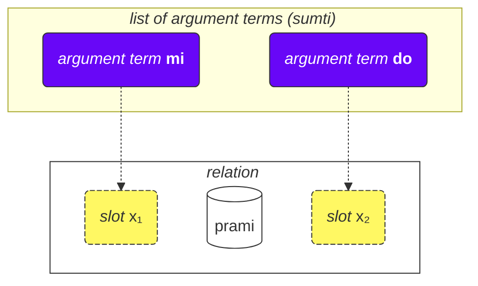
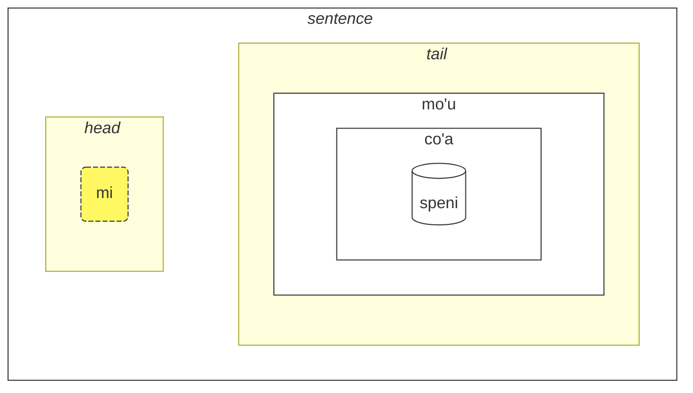

## Leciono 2. Pliaj bazaj aferoj

### Tipoj de vortoj

Ĉiuj Loĵbanaj vortoj estas dividitaj en tri grupojn:

- Rilataj vortoj (nomataj **selbrivla** en Loĵbano)
  - Ekzemploj: **gleki**, **klama**.
  - Tiaj vortoj enhavas almenaŭ grupon de konsonantoj (du aŭ pli da konsonantoj unu post la alia) en la unuaj 5 sonoj + ili finiĝas per vokalo.
- Partikloj (nomataj **cmavo** en Loĵbano)
  - Ekzemploj: **le**, **nu**, **mi**, **fa'a**.
  - Ili komenciĝas per konsonanto (unu el **b d g v z j p t k f s c x l m n r i u**), sekvata de vokalo (unu el **a e i o u y au ai ei oi**). Facultative, post tio, povas sekvi unu aŭ pli da serioj de apostrofo (**'**) kaj sekva vokalo. Ekzemple, **xa'a'a'a'a'a'a** kaj **ba'au'oi'a'e'o** estas eblaj partikloj (ĉeestas eĉ se ne estas asignita signifo al ili).
  - Estas tre ofte skribi plurajn partiklojn sinsekve sen spacoj inter ili. Tio estas permesita de la Lojba gramatiko. Do, ne surpriziĝu vidi **lenu** anstataŭ **le nu**, **naku** anstataŭ **na ku**, **jonai** anstataŭ **jo nai**, kaj tiel plu. Tio ne ŝanĝas la signifon. Tamen, tiu regulo ne validas por rilataj vortoj; rilataj vortoj devas esti apartigitaj per spacoj.
- Nomo-vortoj (nomataj **cmevla** en Loĵbano)
  - Ekzemploj: **.alis.**, **.doris**, **.lojban.**
  - Kutime uzataj por nomoj.
  - Ili facile distingiĝas de la aliaj tipoj de vortoj ĉar ili finiĝas per konsonanto. Aldone, ili estas ĉirkaŭitaj de du punktoj je la komenco kaj je la fino. En la parola lingvo, punktoj povas esti preterlasitaj dum skribado, sed dum parolado, paŭzoj korespondantaj al tiuj punktoj ankoraŭ estas devigaj.

### Ordo de argumentoj

Antaŭe ni provizis difinojn de rilataj vortoj kiel:

mlatu
: … estas kato, esti kato

citka
: … manĝas …

prami
: … amas …

klama
: … venas al …

Vortaroj povas prezenti difinojn de rilataj vortoj per simboloj kiel $x_1$, $x_2$ ktp.:

prami
: $x_1$ amas $x_2$

karce
: $x_1$ estas aŭto …

citka
: $x_1$ manĝas $x_2$ …

klama
: $x_1$ venas al $x_2$ …

Tiu $x_1$, $x_2$, kaj tiel plu estas la eksplicita notado por la _fendoj_ (aliaj nomoj estas: _lokoj_, _roloj de rilato_, **terbricmi** en Loĵbano), kiuj estas plenigitaj per argumentaj terminoj (**sumti**) en la frazo.

Nombroj reprezentas la ordon en kiu tiuj lokoj devas esti plenigitaj per argumentoj.

Ekzemple:

> **mi prami do**
> _I love you._

Ĉi tiu frazo ankaŭ subkomprenas ke

- $x_1$ signifas _la amanto_, kaj
- $x_2$ signifas _la amata_.

Aliafaze, ĉiu rilato havas unu aŭ pli da lokoj, kaj tiuj lokoj estas specifitaj kaj etikeditaj kiel $x_1$, $x_2$, kaj tiel plu. Ni metas argumentojn kiel **mi**, **do**, **le tavla** ktp. en ordo, tiel plenigante tiujn lokojn kaj donante konkretan signifon al la rilato, tiel formante frazon.

La avantaĝo de tia stilo de difinoj estas ke ĉiuj partoprenantoj de rilato estas en unu difino.

Ni ankaŭ povas preterlasi argumentojn, farante la frazon pli neklara:

> **carvi**
> _Pluvas._
> `pluvas, pluvi`

(kvankam la tempo ĉi tie estas determinata de kunteksto, ĝi ankaŭ povas signifi _Ofte pluvas_, _Estis pluvante_, ktp.)

> **prami do**
> _Iu amas vin._
> `amas vin`

Ĉiuj preterlasitaj lokoj en rilato simple signifas **zo'e** = _io/iu_, do ĝi signifas la samon kiel

> **zo'e prami do**
> _Iu amas vin._

Kaj

> **prami**

estas la sama kiel

> **zo'e prami zo'e**
> _Iu amas iun._

Modalaj terminoj kiel **ca**, **fa'a** ktp. aldonas novajn lokojn al rilatoj, sed ili ne plenigas lokojn de rilatoj. En

> **mi klama fa'a do**
> _Mi venas al vi._

la dua loko de **klama** ankoraŭ estas preterlasita. Ekzemple:

> **mi klama fa'a le cmana le zdani**
> _Mi venas (en la direkto de la monto) al la hejmo._

le cmana
: la monto

<pixra url="/assets/pixra/cilre/cmana.webp" caption="cmana" definition="… estas monto"></pixra>

Ĉi tie, la dua loko de **klama** estas **do**. La frazo signifas ke la monto estas nur direkto, dum la fina punkto estas vi.

Ĉi tie, la termino **fa'a la cmana** (_en la direkto de la monto_) ne anstataŭigas la duan lokon de la rilato **klama**. La dua loko de **klama** estas **le zdani** ĉi tie.

La frazo signifas ke mia hejmo simple situas en la direkto de la monto, sed ne necesas ke mi volas atingi tiun monton. La fina celo de mia venado ne necesas ke estu la monto sed la hejmo.

Tiel same, en

> **mi citka ba le nu mi cadzu**
> _Mi manĝas post kiam mi promenas._

la dua loko de **citka** ankoraŭ estas preterlasita. Nova vorto **ba** kun sia argumento **le nu mi cadzu** aldonas signifon al la frazo.

La ordo de argumentoj de kunmeta rilato estas la sama kiel tiu de la lasta komponento en ĝi:

> **tu sutra bajra pendo mi**
> _Tio estas mia rapide kurema amiko._
> `Tio estas rapide kurema amiko de mi.`

> **tu pendo mi**
> _Tio estas mia amiko._
> `Tio estas amiko de mi.`

pendo
: ... estas amiko de ... (iu)

Do la ordo de argumentoj estas la sama kiel tiu de **pendo** sole.

### Pluraj ol du lokoj

Eblas havi pli ol du lokoj. Ekzemple:

> **mi pinxe le djacu le kabri**
> _Mi trinkas la akvon el la taso._

pinxe
: $x_1$ trinkas $x_2$ el $x_3$

> **le kabri**
> _la taso_

En tiu ĉi kazo, estas tri lokoj, kaj se vi volas ekskludi la duan lokon en la mezo, vi devas uzi **zo'e**:
> **mi pinxe zo'e le kabri**
> _Mi trinkas \[ion\] el la taso._

Se ni preterlasas **zo'e**, ni ricevas senchavajon:

> **mi pinxe le kabri**
> _Mi trinkas la tason._

Alia ekzemplo:

> **mi plicru do le plise**
> _Mi donas al vi la pomojn._

plicru
: $x_1$ donas, donacas al $x_2$ iun objekton $x_3$; $x_1$ permesas al iu $x_2$ uzi $x_3$

### Rilatoj ene de rilatoj

En
> **le nicte cu nu mi viska le lunra**
> *La nokto estas kiam mi vidas la Lunon.*

ni havas

- **le nicte** kiel $x_1$ de la rilato,
- **nu mi viska le lunra** kiel la ĉefrilato.

Tamen, ene de **nu mi viska le lunra**, ni havas alian frazon kun

- **mi** - $x_1$ de la interna rilato,
- **viska** - la interna rilato,
- **le lunra** - $x_2$ de la interna rilato.

Do, malgraŭ havante internan strukturon, **nu mi viska le lunra** ankoraŭ estas rilato kun sia unua termo plenigita per **le nicte** en tiu ĉi kazo.

Tiel same, en

> **mi citka ba le nu mi dansu**
> _Mi manĝas post kiam mi dancas._

ni havas

- **mi** kiel $x_1$ de la rilato,
- **citka** kiel la ĉefa rilata konstruo,
- **ba le nu mi dansu** kiel modala termo de la ĉefa rilato de la frazo.

Ene de ĉi tiu termino, ni havas:

- **mi** kiel $x_1$ de la rilato ene de la termino
- **dansu** kiel la ĉefa rilatkonstruaĵo ene de la termino.

Tia "rekursiva" mekanismo de envolvi rilatojn en rilatojn permesas precize esprimi kompleksajn ideojn.

### Kial rilataj vortoj estas difinitaj kiel ili estas?

La angla uzas limigitan aron de prepozicioj, kiuj estas reuzataj tra diversaj verboj kaj, tiel, ne havas fiksan signifon. Ekzemple, konsideru la anglan prepozicion _to_:

> _Mi parolas al vi._

<!-- -->
> _Mi venas al vi._
<!-- -->

> _Al mi ĝi aspektas bela._

En ĉiu el tiuj ekzemploj, _to_ havas novan rolon kiu estas, en la plej bona kazo, malproksime simila al roloj en aliaj frazoj.

Gravas noti, ke aliaj lingvoj uzas malsamajn manierojn marki rolojn de verboj, kiuj, en multaj kazoj, estas tre malsamaj ol tiuj uzataj en la angla.

Loĵbano, ekzemple, markas kernrolojn (fendoj) de rilatoj plene difinante tiajn rilatojn kun la roloj metitaj en sinsekvo (aŭ markitaj per **fa**, **fe**, ktp):

klama
: $x_1$ venas al $x_2$…

tavla
: $x_1$ parolas kun $x_2$…

melbi
: $x_1$ estas bela, bela al $x_2$...

Tiaj kernaj roloj estas esencaj en difinado de rilatoj.

Tamen, povas ekzisti laŭvolaj roloj kiuj igas rilatojn pli precizaj:

> _Mi parolas al vi dum mi manĝas._
<!-- -->

> _Estas malfacile al mi ĉar ĉi tiu afero estas peza._

En Loĵbano, simila nocio de tiaj laŭvolaj roloj estas esprimita per apartaj rilatoj aŭ, por plej oftaj kazoj, per modalaj terminoj:

> **mi tavla do ze'a le nu mi citka**
> _Mi parolas al vi dum mi manĝas._
<!-- -->
> **nandu mi ri'a le nu ti tilju**
> _Estas malfacile al mi ĉar ĉi tiu afero estas peza._

nandu
: $x_1$ malfacilas $x_2$

tilju
: $x_1$ estas peza

Prepozicioj en la angla estas similaj al modalaj partikloj en Loĵbano, kvankam kutima angla prepozicio povas havi multajn signifojn dum en Loĵbano, ĉiu modala partiklo havas nur unu (eĉ se neklara) signifon.

### Ĝeneralaj reguloj en la ordo de argumentoj

La ordo de lokoj en rilatoj eble estas foje malfacile memorebla, sed ni ne zorgu — vi ne bezonas memori ĉiujn lokojn de ĉiuj rilataj vortoj. (Ĉu vi memoras la signifon de centoj da miloj da vortoj en la angla?)

Vi povas studi lokojn kiam vi trovas ilin utilaj aŭ kiam homoj uzas ilin en dialogo kun vi.

La plej multaj rilataj vortoj havas du-tri lokojn.

Kutime, vi povas diveni la ordon uzante kuntekston kaj kelkajn regulojn:

1. La unua loko ofte estas la persono aŭ aĵo kiu faras ion aŭ estas io:

    **klama** = _$x_1$ iras …_

2. La objekto de iu ago kutime estas tuj post la unua loko:

    **punji** = _$x_1$ metas $x_2$ sur $x_3$_,

3. Kaj la sekvanta loko kutime estos plenigita per la ricevanto:

    **punji** = _$x_1$ metas $x_2$ sur $x_3$_,

4. Destinaciaj (_al_) lokoj preskaŭ ĉiam venas antaŭ origina (_de_) lokoj:

    **klama** = _$x_1$ iras al $x_2$ de $x_3$_

    <pixra url="/assets/pixra/cilre/klama_fi.webp" caption="le prenu cu klama fi le zarci" definition="La persono eliras el la butiko."></pixra>

5. Malpli uzataj lokoj venas ĉe la fino. Ili kutime estas aferoj kiel _laŭ normo_, _per rimedo_ aŭ _farita de_.

La ĝenerala ideo estas ke unue venas la lokoj kiuj plej verŝajne estos uzataj.

Ne necesas plenigi ĉiujn lokojn ĉiam. Neplenigitaj lokoj simple havas valorojn nesignifaj aŭ evidente al la parolanto (ili prenas la valoron de **zo'e** = _io_).

### Infinitivoj

Infinitivoj estas verboj kiuj ofte estas antaŭmetitaj per _to_ en la angla. Ekzemploj inkluzivas _Mi ŝatas kuri_, kun _kuri_ estante la infinitivo.

> **le verba cu troci le ka cadzu**
> _La infano provas piediri._

le verba
: la infano, la infanoj

troci
: $x_1$ provas fari aŭ esti $x_2$ (ka)

cadzu
: $x_1$ piediras

<pixra url="/assets/pixra/cilre/troci_cadzu.webp" caption="le verba cu troci le ka cadzu" definition="La infano provas piediri."></pixra>

La partikulo **ka** funkcias kiel **nu**. Ĝi ĉirkaŭas frazon.

La ĉefa diferenco estas ke iu loketo en la ĉirkaŭita frazo devas esti ligita per iu argumento ekster la frazo.

En ĉi tiu kazo la unua argumento **le verba** de la rilato **troci** faras ligon al la unua neplenigita loketo de la interna frazo **cadzu** (kiu estas en **ka**).

Aliaj vortoj, la infano provas atingi staton kie **le verba cu cadzu** (la argumento **le verba** plenigus la unuan neplenigitan loketon de la rilato **cadzu**).

Kelkaj rilatoj postulas nur infinitivojn en kelkaj el iliaj lokoj. Difinoj de tiaj vortoj markas tiajn lokojn kiel _property_ aŭ **ka**. Ekzemple:

cinmo
: $x_1$ sentas $x_2$ (ka)

Tio signifas ke la infinitivo en la dua loko ($x_2$) estas aplikiĝanta al iu alia loko (plej verŝajne, la unua loko, $x_1$). Kazoj kie la infinitivo estas aplikiĝanta al lokoj aliaj ol $x_2$ estas maloftaj kaj estas klarigitaj por korespondaj rilatoj aŭ en la kazo de rilataj vortoj inventitaj neoficiale, povas esti deduktitaj el komuna prudento.

Alia ekzemplo:

<pixra url="/assets/pixra/cilre/sidju.webp" caption="ra sidju le pendo le ka bevri le dakli" definition="Li/ŝi helpas la amikon porti la sakojn."></pixra>

> **ra sidju le pendo le ka bevri le dakli**
> _Li/ŝi helpas la amikon porti la sakojn._

sidju
: $x_1$ helpas $x_2$ fari $x_3$ (ka)

La rilata vorto **sidju** postulas ke ĝia tria loko estu plenigita per infinitivo.

bevri
: $x_1$ portas $x_2$

le dakli
: la sako, la sakoj

Notu ke nur la unua neplenigita loko de la enkorpigita rilato prenas la signifon de la ekstera loko:

> **mi troci le ka do prami**
> _Mi provas esti amata de vi._

tcidu
: $x_1$ legas $x_2$ el $x_3$

Ĉi tie, la unua neplenigita loko estas la dua loko de **prami**, do ĝi prenas la valoron **mi** (_I_).

Ankaŭ estas eble per la uzado de la pronomo **ce'u** eksplicite marki lokon kiu devas esti aplikiĝanta al iu ekstera argumento:

> **mi troci le ka do prami ce'u**
> _Mi provas esti amata de vi._

Alia ekzemplo:

> **mi cinmo le ka xebni ce'u**
> **mi cinmo le ka se xebni**
> _Mi sentas, ke iu min malamas._
> _Mi sentas, ke mi estas malamata._

### Tipoj de lokoj

La vortaro ofte mencias aliajn tipojn de lokoj, ekzemple:

djica
: $x_1$ deziras $x_2$ (evento)

Tiu _evento_ signifas ke vi devas plenigi la lokon per argumento kiu reprezentas eventon. Ekzemple:

le nicte
: nokto

le nu mi dansu
: mi dancante

Do ni ricevas

> **mi djica le nicte**
> _Mi deziras la nokto eventon._

<!-- -->

> **do djica le nu mi dansu**
> _Vi deziras, ke mi dancu._

En Loĵbano, ne estas permesite diri, ekzemple:

> **mi deziras la pomon.** 

 

ĉar vi deziras fari ion kun la pomo aŭ vi deziras ke okazu io kun la pomo, kiel ekzemple:

> **mi deziras manĝi la pomon.**
> `Mi deziras, ke mi manĝu la pomon.`

Notu ke enpakigi rilaton atendante eventon en **nu** ŝanĝas la signifon:

> **la krimo estas ebla.**

zekri
: $x_1$ estas krima evento, $x_1$ (evento) krimo

cumki
: $x_1$ (evento) estas ebla

Komparu:

> **la fakto ke estas krimo estas ebla.**
> _Estas ebla, ke io estas krimo._

### Levado

> **mi sugestas iri al la drinkloko.**

sugestas
: $x_1$ sugestas agon $x_2$ (eco) al $x_3$

> **mi sugestas pri la drinkloko.**

pri la drinkloko
: io pri la drinkloko

> **mi deziras manĝi pomon.**

<!-- -->

> **mi deziras la dolĉaĵon.**

pri la dolĉaĵon
: io pri la dolĉaĵo

<pixra url="/assets/pixra/cilre/djica_tuha_le_titla.webp" caption="la persono deziras la dolĉaĵon." difino="La persono deziras la dolĉaĵon."></pixra>

Loko-strukturo povas tro multe ŝarĝi la specifon de agoj aŭ eventoj. Foje ni deziras specifi nur ian objekton en tiuj eventoj aŭ lokoj kaj preterlasi priskribi la agon aŭ la eventon tute.

En la supraj ekzemploj _mi sugestas la drinklokon._ plej verŝajne implikas iri al la drinkloko kaj _mi deziras la pomon._ implikas manĝi ĝin.

Tamen, la loĵbana rilata vorto **sugestas** postulas eco en sia $x_2$ loko. Simile, **deziras** postulas eventon en sia $x_2$ loko.

La mallonga tiel nomata kvalifikanto-vorto **pri** antaŭ termino implikas abstraktigon (eco, evento, aŭ propono) sed elektas nur tiun terminon el tiu abstrakto preterlasante la ceteron. Ĝi povas esti vage tradukita kiel _io pri_:

> **mi sugestas pri la drinkloko.**
> _Mi sugestas ion pri la drinkloko (eble viziti ĝin, renkonti apud ĝi ktp.)._

<!-- -->

> **mi djica tu'a le pomo**
> _Mi deziras ion rilatan al la pomo (eble manĝi, ĉewi, leki, ĵeti ĝin al amiko, ktp.)_

> **tu'a le ĉokolado plaĉas al mi**
> _La ĉokolado plaĉas al mi (verŝajne pro ĝia gusto)._
> `Iu ajn pri la ĉokolado plaĉas al mi`

cakla
: $x_1$ estas iom da ĉokolado

Kiam oni preterlasas abstraktaĵojn, nur la kunteksto informas pri tio, kio estis preterlasita.

Ankaŭ estas ebla modifi la ĉefan rilatan konstruaĵon:

> **le ĉokolado cu jai plaĉas al mi**
> **tu'a le ĉokolado cu plaĉas al mi**
> _La ĉokolado plaĉas al mi._

Tio ebligas la kreadon de neklaraj argumentaj terminoj kun **jai**:

> **le jai plaĉa cu estas ĉi tie**
> _La plaĉaĵo estas ĉi tie._

Ĉar **le plaĉa** (_la plaĉa evento_) estas abstrakta, estas neebla specifi ĝian lokon. Tamen, partoprenanto en la abstraktaĵo povas esti fizike lokigita ie.

### Lokoj en argumentoj

Kiel ni diras _Vi estas mia amiko_?

> **vi estas mia amiko**
> _Vi estas mia amiko._
> `Vi estas amiko de mi.`

<pixra url="/assets/pixra/cilre/pendo.webp" caption="le amiko" definition="la amiko / la amikoj"></pixra>

Kaj nun, kiel ni diras _Mia amiko estas inteligenta._?

> **le amiko de mi estas inteligenta**
> _Mia amiko estas inteligenta._

Do kiam ni konvertas rilaton en argumenton (**amiko** — _esti amiko_ en **le amiko** — _la amiko_), ni ankoraŭ povas konservi aliajn lokojn de tiu rilato per metado de **de** post ĝi.

Per defaŭlto, ĝi aligas la duan lokon ($x_2$). Ni povas aligi pli da lokoj per apartigado de ili per **dei**:

> **mi donas al vi la pomon**
> _Mi donas al vi la pomojn._

<pixra url="/assets/pixra/cilre/plicru.webp" caption="la homo donas al la amiko la pomon" definition="La homo donas al la amiko la pomon."></pixra>
<!-- -->

> **la donanto de la pomo al mi**
> _La donanto de la pomo al mi_

<!-- -->

> **la donanto de la pomo al mi estas mia amiko**
> _La donanto de la pomo al mi estas mia amiko._
> `La persono kiu donas al mi la pomon estas amiko de mi.`

Alia ekzemplo:

<!-- > **la amikoj de mi parolas**
> _Miaj amikoj parolas._
> **miaj amikoj parolas al mi**
> **la amikoj parolas al mi**
> _La amikoj parolas al mi._ -->

**mi klama le pendo be do**
_Mi venas al amiko de vi._

klama
: $x_1$ venas al $x_2$ de $x_3$ …

Ni ne povas preterlasi **be** ĉar **le pendo do** estas du sendependaj lokoj:

**mi klama le pendo do**
_Mi venas al amiko de vi._

Ĉi tie, **do** prenis la trian lokon de **klama** ĉar ĝi ne ligiĝas al _pendo_ per **be**.

Ankaŭ ni ne povas uzi **nu** ĉar **le nu pendo do** estas la evento de iu esti via amiko.

Do **le pendo be do** estas la ĝusta solvo.

Alia ekzemplo:

**la .lojban. cu bangu mi**
_Loĵbano estas mia lingvo._
`Loĵbano estas lingvo de mi.`

Tamen,

**mi nelci le bangu be mi**
_Mi ŝatas mian lingvon._

Uzi **be** por rilatoj kiuj ne estas konvertitaj en argumentoj ne havas efikon:

**mi nelci be do** estas la sama kiel
**mi nelci do**

### Relativaj frazoj

**le prenu poi pendo mi cu tavla mi**
_La persono kiu estas mia amiko parolas al mi._

<!-- -->

**le prenu noi pendo mi cu tavla mi**
_La persono, kiu hazarde estas mia amiko, parolas al mi._

blabi
: … estas blanka

En la unua frazo, la vorto _kiu_ estas esenca por identigi la personon en demando. Ĝi klarigas pri kiu el la homoj en la kunteksto ni parolas. Ni elektas nur tiujn kiuj estas miaj amikoj el eble multaj homoj ĉirkaŭe. Eble estas nur unu persono ĉirkaŭe kiu estas mia amiko.

Pri _kiu hazarde estas mia amiko_ en la dua frazo, ĝi nur provizas aldonan informon pri la persono. Ĝi ne helpas nin identigi la personon. Ekzemple, tio povas okazi kiam ĉiuj homoj ĉirkaŭe estas miaj amikoj.

**poi pendo mi** estas relativaj frazoj, rilatoj aldonitaj dekstre de la argumento **le prenu**. Ĝi finiĝas ĝuste antaŭ la sekvanta vorto **cu**:

**le prenu (poi pendo mi) cu tavla mi**
_La persono kiu estas mia amiko parolas al mi._

En Loĵbano, ni uzas **poi** por relativaj frazoj kiuj identigas entojn (objektojn, homojn aŭ eventojn) kaj **noi** por hazarde informo.

**la .bob. ba co'a speni le ninmu poi pu xabju le nurma**
_Bob edziĝos kun virino kiu loĝis en la kamparo._

xabju
: ... loĝas en ..., ... loĝas en ... (loko, objekto)

le nurma
: la kampara regiono

This sentence doesn't exclude Bob marrying someone else as well! Removing the relative clause with **poi** changes the meaning:

> **la .bob. ba co'a speni le ninmu**
> _Bob edziĝos al knabino._

Another example:

> **le prenu poi gleki cu ze'u renvi**
> _Homoj (kiujaj?) kiuj estas feliĉaj vivas longe._

ze'u
: modala termino: longe

renvi
: supervivi

Removing the relative clause with **poi** changes the meaning:

> **le prenu ze'u renvi**
> _La homoj vivas longe._

On the other hand, relative clauses with **noi** contain just additional information about the argument, to which they are attached. That argument is sufficiently defined by itself so that removing a relative clause with **noi** doesn't change its meaning:

> **mi ŝatas la .doris. noi mi kutime vidas en la parko**
> _Mi ŝatas Doris, kiun mi kutime vidas en la parko._
> _Mi ŝatas Doris. Kion alian mi povas diri pri ŝi? Mi kutime vidas ŝin en la parko._

zgana
: observi (uzante ajnan senton)

<pixra url="/assets/pixra/cilre/panka_ninmu.webp" caption="la persono kiun mi kutime vidas en la parko" definition="La persono kiun mi kutime vidas en la parko."></pixra>

Removing the relative clause with **noi** retains the meaning: _Mi ŝatas Doris._

In spoken English, the distinction is often achieved using intonation or by guessing. Also, relative clauses with **noi** are traditionally separated with commas in English. They use _which_ or _who_, and the word _that_ is not used in them.

Let's have another example.

> **mi venas al la arbo**
> _Mi venas al la arbo._

<!-- -->

> **la arbo estas granda**
> _La arbo estas granda._

le pa tricu
: la arbo (unu arbo)

barda
: $x_1$ estas granda

And now let's join those two sentences:

> **la tricu noi mi venas al ĝi cu granda**
> _La arbo, al kiu mi venas, estas granda._

Note the word **ĝi**. We move the second sentence about the same tree into a relative clause and replace the argument **la tricu** with **ĝi** in the relative clause. So the pronoun **ĝi** is like _who_ and _which_ in English. It points back to the argument to which the relative clause is attached.

Do you want me to translate the whole text or just a part of it?

> **ti noi le nu ke'a cisma cu pluka mi cu zutse**
> _Tiuj (kiuj okaze estas tiaj, ke ilia rideto plaĉas al mi) sidas._

**noi** simple aldonas okaza informo, kiu ne estas necesa por determini al kio **ti** (_tiuj_) rilatas. Eble, ne estas aliaj ĉirkaŭ por priskribi.

Fine, same kiel **nu** havas la dekstran limmarkilon **kei**, ni havas 

ku'o
: dekstra limmarkilo por **poi**, **noi** kaj **voi**.

> **mi tavlas al Doris, kiu nun sidas tie ku'o, kaj al Alice, kiu nun ridetas**
> _Mi parolas kun Doris, kiu nun sidas tie, kaj Alice, kiu nun ridetas._

Atentu ke sen **ku'o** ni havus **tie** (_tie_) kunligita kun **la .alis.** (_Alice_) kondukante al stranga signifo:

> **mi tavlas al Doris, kiu nun sidas tie kaj sur Alice (kiu nun ridetas)**
> _Mi parolas kun Doris, kiu nun sidas tie kaj sur Alice (kiu nun ridetas)._

Atentu la parton **zutse tu .e la .alis.**.

Por ĉiuj **poi**, **noi** kaj **voi** la dekstra limmarkilo restas la sama: **ku'o**.

### Mallongaj rilataj frazpartoj. ‘_Pri_’

Kelkfoje, vi eble bezonas aligi aldonan argumenton al alia argumento:

> **mi scias la gravan pri vi**
> _Mi scias ion gravan pri vi._

la gravan
: ion gravan

**pe** kaj **ne** similas al **poi** kaj **noi**, sed ili aligas argumentojn al argumentoj:

> **la plumo pe mi estas ruĝa**
> _La plumo, kiu estas mia, estas ruĝa._ (_mia_ estas esenca por identigi la plumon en demando)

<!-- -->

> **la plumo ne mi estas ruĝa**
> _La plumo, kiu estas mia, estas ruĝa._ (aldona informo)

ne
: kiu estas pri, havas rilaton al … (sekvas argumento)

pe
: kiu estas pri, havas rilaton al … (sekvas argumento)

> **la plumo ne mi kaj la telefono ne vi estas ruĝaj**
> _La plumo, kiu estas mia, kaj la telefono, kiu estas via, estas ruĝaj._

ge'u
: dekstra limmarkilo por **pe**, **ne**.

### «**be**» kaj «**pe**»

Notu ke rilataj frazpartoj estas aligitaj al argumentoj, dum **be** estas parto de la rilato.

Fakte, **la lingvo pe mi** estas pli bona traduko de _mia lingvo_, ĉar, simile al la angla, la du argumentoj rilatas unu al la alia en neklara maniero.

Tamen, vi povas diri **le birka be mi** kiel _mia brako_. Eĉ se vi trancus vian brakon, ĝi ankoraŭ estos via. Tial **birka** havas lokon de la posedanto:

birka
: $x_1$ estas brako de $x_2$

Montru denove ke konstruo kun **be** estas parto de la rilato, dum **pe**, **ne**, **poi** kaj **noi** aligas al argumentoj:

> **le pa melbi be mi fonxa pe le pa pendo be mi cu barda**
> `La bela al mi telefono de mia amiko estas granda.`

Ĉi tie, **be mi** estas aligita al la rilato **melbi** = _esti bela al … (iu)_ kaj tiel kreas novan rilaton **melbi be mi** = _esti bela al mi_. Sed **pe le pa pendo be mi** (_de mia amiko_) estas aligita al la tuta argumento **le pa melbi be mi fonxa** (_la bela al mi telefono_).

Ankaŭ povas okazi ke ni bezonas aligi **be** al rilato, transformi tiun rilaton en argumenton kaj poste aligi **pe** al tiu argumento:

> **le pa pendo be do be'o pe la .paris. cu stati**
> _Via amiko kiu rilatas al Parizo estas inteligenta._
> (**pe la .paris.** estas aligita al la tuta argumento **le pa pendo be do be'o**)

<!-- -->

> **le pu plicru be do bei le pa plise be'o pe la .paris. cu stati**
> _Kiu donis al vi la pomon (kaj kiu rilatas al Parizo) estas inteligenta._
> (**pe la .paris.** estas aligita al la tuta argumento **le pu plicru be do bei le pa plise be'o**)

be'o
: dekstra limmarkilo por la serio de terminoj aligitaj per **be** kaj **bei**

En tiuj du ekzemploj, via amiko havas ian rilaton al Parizo (eble, li/ŝi estas el Parizo).

Komparu tion kun:

> **le pa pendo be do pe la .paris. cu stati**
> _Via amiko (vi kiu rilatas al Parizo) estas inteligenta._

<!-- -->

> **le pu plicru be do bei le pa plise pe la .paris. cu stati**
> _Kiu donis al vi la pomon (la pomo kiu rilatas al Parizo) estas inteligenta._

En tiuj lastaj du ekzemploj, tamen, aŭ vi rilatas al Parizo aŭ la pomo.

### ‘_Alice estas instruisto_’ kaj ‘_Alice estas la instruisto_’

En la angla, la verbo _is, are, to be_ faras ke substantivo funkcias kiel verbo. En Loĵbano, eĉ tiaj konceptoj kiel _kato_ (**mlatu**), _persono_ (**prenu**), _domo_ (**dinju**), _hejmo_ (**zdani**) funkcias kiel verboj (rilatoj) laŭ defaŭlto. Nur pronomoj funkcias kiel argumentoj.

Tamen, jen tri kazoj:

> **la .alis. cu ctuca**
> _Alice instruas._

<pixra url="/assets/pixra/cilre/ctuca.webp" caption="mi ctuca" definition="Mi instruas / Mi estas instruisto."></pixra>

<!-- -->

> **la .alis. cu me le ctuca**
> _Alice estas unu el la instruistoj._

me
: … estas inter …, … estas unu el …, … estas membroj de … (sekvas argumenton)

> **la .alis. ta'e ctuca**
> _Alice kutime instruas._

ta'e
: modala partiklo: la evento okazas kutime

> **la .alis. cu du le ctuca**
> _Alice estas la instruisto._

du
: … estas identa al …

La partiklo **me** prenas argumenton post ĝi kaj montras ke verŝajne estas aliaj instruistoj, kaj Alice estas unu inter ili.

La partiklo **du** estas uzata kiam Alice estas, ekzemple, la instruisto pri kiu ni serĉis aŭ priparolis. Ĝi montras identecon.

Do, **me** kaj **du** foje kongruas kun tio, kion en la angla ni esprimas uzante la verbon _to be/is/was_.

En Loĵbano, ni prioritatas la signifon de tio, kion ni intencas diri, anstataŭ fidi pri kiel ĝi estas literale esprimita en la angla aŭ aliaj lingvoj.

Aliaj ekzemploj:

> **mi me la .bond.**
> _Mi estas Bond._

<!-- -->

> **mi du la .kevin.**
> _Mi estas Kevin (tiun vi bezonis)._

<!-- -->

> **ti du la .alis. noi mi ta'e zgana bu'u le panka**
> _Tio estas Alice, kiun mi kutime vidas en la parko._

**noi du** kaj **poi du** estas uzataj por prezenti alternativajn nomojn por io. Ili kongruas kun la angla _namely, i.e._:

> **la .alis. cu penmi le prenu noi du la .abdul.**
> _Alice renkontis la personon, nome Abdul._

Uzante **me**, vi povas ligi plurajn argumentojn per _kaj_:

> **tu me le pendo be mi be'o .e le tunba be mi**
> _Tio estas iuj (aŭ ĉiuj) de miaj amikoj kaj miaj gefratoj._

tunba
: $x_1$ estas gefrato de $x_2$

<pixra url="/assets/pixra/cilre/tunba.webp" caption="do tunba mi" definition="Vi estas mia gefrato."></pixra>

### Rilatoj kun modalecoj

Ni povas meti modalecon ne nur antaŭ la ĉefan rilata konstruaĵon de la frazo, sed ankaŭ ĉe la fino de ĝi, produktante la saman rezulton:

> **mi ca tcidu**
> **mi tcidu ca**
> _Mi (nun legas)._

tcidu
: legi (iu tekston)

Kiam ni uzas **nu**, ni kreas rilaton priskribantan iun eventon. Rimarku la diferencon inter tiuj du ekzemploj:

> **le nu tcidu ca cu nandu**
> _La nuntempa legado estas komplika, malfacila._

<!-- -->

> **le nu tcidu cu ca nandu**
> _La legado nun estas komplika._

Aliaj ekzemploj:

> **mi klama le pa cmana pu**
> _Mi iris al la monto._
> `Mi iras al monto (en la pasinteco).`

<!-- -->

> **le nu mi klama le pa cmana pu cu pluka**
> _Ke mi iris al la monto estas agrabla._

Ni ankaŭ povas meti unu aŭ pli da modalaj partikloj kiel la unua elemento de rilata konstruo kaj ekzemple uzi tiun riĉigitan rilaton en argumenta formo:

<pixra url="/assets/pixra/cilre/coha_purdi.webp" caption="le pu kunti tumla ca purdi" definition="Kio antaŭe estis dezerto nun estas ĝardeno."></pixra>

> **le pu kunti tumla ca purdi**
> _Kio antaŭe estis dezerto nun estas ĝardeno._

**pu** apartenas al **le kunti tumla** kaj **ca** apartenas al **purdi** (ĉar **le pu kunti tumla** ne povas aldoni **ca** ĉe la fino).

<!-- Tio ne kontraŭdiras la uzon de **be** post la verbo ĉar, kun **be**, vi ŝanĝas la verbon: **bangu be mi** estas konsiderata unu verbo. -->

Havi plurajn modalajn partiklojn en ordo ne estas problemo:
> **le pu ze'u kunti tumla ca purdi**
> _Kio estis dezerto dum longa tempo nun estas ĝardeno._

ze'u
: modaltermo: dum longa tempo

Metante terminajn partiklojn post substantivoj ligas ilin al eksteraj rilatoj:

<pixra url="/assets/pixra/cilre/cohu_purdi.webp" caption="le kunti tumla pu purdi" definition="La dezerto estis ĝardeno."></pixra>

> **le kunti tumla pu purdi**
> **(le kunti tumla) pu purdi**
> _La dezerto estis ĝardeno._

### Novaj argumentoj el lokoj de sama rilato

> **do plicru mi ti**
> _Vi donas al mi tion._

<!-- -->

> **mi se plicru ti do**
> _Mi estas donita tion de vi._

plicru
: $x_1$ donas $x_2$ ion $x_3$ por uzo

Ni povas interŝanĝi la unuajn du lokojn en la rilato uzante **se** kaj tiel ŝanĝi la lokstrukturon.

**do plicru mi ti** signifas precize la saman aferon kiel **mi se plicru do ti**. La diferenco estas nur stila.

Vi eble volas ŝanĝi aferojn por malsamaj emfazoj, ekzemple, por mencii la pli gravajn aferojn en frazo unue. Do la sekvaj paroj signifas la saman aferon:

> **mi prami do**  
> _Mi amas vin._

<!-- -->

> **do se prami mi**  
> _Vi estas amata de mi._

<!-- -->

> **le nu mi tadni la .lojban. cu xamgu mi**  
> _Mia studo de Loĵbano estas bona por mi._

xamgu  
: ... estas bona por (iu)

> **mi se xamgu le nu mi tadni la .lojban.**  
> _Por mi, estas bona studi Loĵbanon._

La sama povas esti farita kiam rilatoj estas uzataj por krei argumentojn:

le plicru  
: tiuj, kiuj donas, la donantoj

le se plicru  
: tiuj, kiuj estas donitaj, ricevantoj de donacoj

le te plicru  
: tiuj objektoj kiuj estas donitaj por uzi, donacoj

**te** interscias la unuan kaj trian lokon de rilatoj.

Kiel ni scias, kiam ni aldonas **le** antaŭ rilata konstruo, ĝi iĝas argumento. Do

- **le plicru** signifas _tiuj kiuj povus enigi en la unuan lokon de **plicru**_
- **le se plicru** signifas _tiuj kiuj povus enigi en la duan lokon de **plicru**_
- **le te plicru** signifas _tiuj kiuj povus enigi en la trian lokon de **plicru**_

Do, en Loĵbano, ni ne bezonas apartajn vortojn por _donanto_, _ricevanto_, kaj _donaco_. Ni reuzas la saman rilaton kaj ŝparas multe da peno pro tia lerta dizajno. Fakte, ni ne povas imagi donacon sen subkompreni ke iu ĝin donis aŭ donos. Kiam utilaj fenomenoj estas interligitaj, Loĵbano reflektas tion.

### Ŝanĝante aliajn lokojn en ĉefaj rilatoj

La serio **se, te, ve, xe** (en alfabetorda ordo) konsistas el partikloj kiuj ŝanĝas lokojn en ĉefaj rilatoj:

- **se** interscias la unuan kaj duan lokon
- **te** interscias la unuan kaj trian lokon
- **ve** interscias la unuan kaj kvaran lokon
- **xe** interscias la unuan kaj kvinan lokon.

> **mi zbasu le pa stizu le mudri**  
> _Mi faris la seĝon el la peco de ligno._

zbasu  
: $x_1$ konstruas, faras $x_2$ el $x_3$

le pa stizu  
: la seĝo

le mudri  
: la peco de ligno

> **le mudri cu te zbasu le stizu mi**  
> _La peco de ligno estas el kio la seĝo estas farita de mi._

La **mi** nun moviĝis al la tria loko de la rilato kaj povas esti forlasita se ni estas tro pigraj por specifi kiu faris la seĝon aŭ se ni simple ne scias kiu faris ĝin:

> **le mudri cu te zbasu le stizu**  
> _La peco da ligno estas la materialo de la seĝo._

Simile al nia ekzemplo kun **le se plicru** (_la ricevanto_) kaj **le te plicru** (_la donaco_), ni povas uzi **te**, **ve**, **xe** por derivi pli da vortoj el aliaj lokoj de rilataj vortoj:

klama
: $x_1$ iras al $x_2$ de $x_3$ tra $x_4$ per helpo de $x_5$

Do, ni povas derivi ke

le klama
: la venantoj

le se klama
: la cello

le te klama
: la loko de origino de la movado

le ve klama
: la vojo

le xe klama
: la metodo de venado

**le xe klama** kaj la kvina loko de **klama** povas signifi ian ajn movadon, kiel veturado per aŭto aŭ piedirado.

**se** estas uzata pli ofte ol la aliaj partikloj por interŝanĝi lokojn.

### Libera vortordo: etikedoj por roloj en rilatoj

Kutime, ni ne bezonas ĉiujn lokojn de rilato, do ni povas preterlasi la ne necesajn per anstataŭigado de **zo'e**. Tamen, ni povas uzi _loketikedojn_ por eksplicite rilati al necesa loko. Loketikedoj funkcias kiel modalaj partikloj sed temas pri la loka strukturo de rilatoj:

> **mi prami do** estas la sama kiel
> **fa mi prami fe do**
> _Mi amas vin._

- **fa** markas la argumenton kiu plenigas la unuan lokon de rilato ($x_1$)
- **fe** markas la argumenton kiu plenigas la duan lokon ($x_2$)
- **fi** markas la argumenton kiu plenigas la trian lokon ($x_3$)
- **fo** markas la argumenton kiu plenigas la kvaran lokon ($x_4$)
- **fu** markas la argumenton kiu plenigas la kvinan lokon ($x_5$)

Pliaj ekzemploj:

> **mi klama fi le tcadu**
> _Mi iras el la urbo._

**fi** markas **le tcadu** kiel la trian lokon de **klama** (la origino de la movado). Sen **fi**, la frazo iĝus **mi klama le tcadu**, signifante _Mi iras al la urbo._

> **mi pinxe fi le kabri** estas la sama kiel
> **mi pinxe zo'e le kabri**
> _Mi trinkas (ion) el la taso._

pinxe
: $x_1$ trinkas $x_2$ el $x_3$

le kabri
: la taso, la glaso

<pixra url="/assets/pixra/cilre/pinxe_fi_le_kabri.webp" caption="le prenu cu pinxe fi le kabri" definition="La persono trinkas el la glaso."></pixra>

> **mi tugni zo'e le nu vitke le rirni**
> **mi tugni fi le nu vitke le rirni**
> _Mi konsentas (kun iu) pri viziti gepatrojn._

tugni
: $x_1$ konsentas kun iu $x_2$ pri $x_3$ (propono)

le rirni
: la gepatro / la gepatroj

Per lokaj etikedoj, ni povas movi lokojn ĉirkaŭe:

> **fe mi fi le plise pu plicru**
> _Iu donis la pomon al mi._

Ĉi tie,

- **le plise** = _la pomo_, ni metas ĝin en la trian lokon de **plicru**, kio estas donita
- **mi** = _mi_, ni metas ĝin en la duan lokon de **plicru**, la ricevanto.

Kiel ni povas vidi en la lasta ekzemplo, ni eĉ ne povas reflekti la ordon de vortoj en ĝia angla traduko.

Etenda uzo de lokaj etikedoj povas malfaciligi nian parolon, sed ili permesas pli da libereco.

Kontraŭe al la **se** serio, uzi lokajn etikedojn kiel **fa** ne ŝanĝas la strukturon de lokoj.

---

Ni povas uzi lokajn etikedojn ene de argumentoj metante ilin post **be**:

> **le pa klama be fi le tcadu cu pendo mi**
> _La persono kiu venas al la urbo estas mia amiko._

---

Ni ankaŭ povas meti ĉiujn argumentojn de unu ĉefa rilato antaŭ la vostro de la frazo (konservante ilian relative ordon). Pro tiu libereco, ni povas diri:

> **mi do prami** kio estas la sama kiel
> **mi do cu prami** kio estas la sama kiel
> **mi prami do**
> _Mi amas vin._

<!-- -->

> **ko kurji ko** estas la sama kiel
> **ko ko kurji**
> _Zorgu pri vi mem._

La sekvaj frazoj ankaŭ egalas la signifon:

> **mi plicru do le pa plise**
> _Mi donas al vi la pomon._

<!-- -->

> **mi do cu plicru le pa plise**
> _Mi vin donas la pomon._

<!-- -->

> **mi do le pa plise cu plicru**
> _Mi vin la pomon donas._

### Prenex

Prenex estas "prefikso" de rilato, en kiu vi povas deklari variablojn por uzi poste:

> **pa da poi pendo mi zo'u da tavla da**
> _Estas iu kiu estas mia amiko tia ke li/ŝi parolas al si mem_

zo'u
: prenex-separilo

da
: pronomo: variablo.

La pronomo **da** estas tradukita kiel _estas io/iu …_ Se ni uzas **da** la duan fojon en la sama rilato, ĝi ĉiam rilatas al la sama afero kiel la unua **da**:

> **mi djica le nu su'o da poi kukte zo'u mi citka da**
> _Mi deziras, ke estu almenaŭ io bongusta, por ke mi manĝu ĝin._

su'o
: nombro: almenaŭ 1

Se la variablo estas uzata en la sama rilato kaj ne en iaj enkapsulitaj rilatoj, tiam vi povas tute neglekti la preneksan parton:

> **mi djica le nu su'o da poi kukte zo'u mi citka da**
> **mi djica le nu mi citka su'o da poi kukte**
> _Mi deziras, ke estu almenaŭ io bongusta, por ke mi manĝu ĝin._
> _Mi deziras, ke io estu, por ke mi manĝu ĝin._

Ambaŭ ekzemploj signifas la samon, en ambaŭ kazoj **su'o da** signifas _estas (estis/estos) io aŭ iu_.

Tamen, la preneksa parto estas utila kaj necesas kiam vi bezonas uzi **da** profunde en via rilato, t.e. en enkapsulitaj rilatoj:

> **su'o da poi kukte zo'u mi djica le nu mi citka da**
> _Estas almenaŭ io bongusta: Mi deziras, ke mi manĝu ĝin._

Notu kiel la signifo ŝanĝiĝas. Ĉi tie, ni ne povas neglekti la preneksan parton ĉar tio ŝanĝus la signifon de la antaŭa ekzemplo.

Pliaj ekzemploj:

> **mi tavla**
> _Mi parolas._

<!-- -->

> **mi tavla su'o da**
> **mi tavla da**
> _Estas iu, kun kiu mi parolas._

Laŭdefaŭlte, **da** kiel pronomo sola signifas la samon kiel **su'o da** (_estas almenaŭ unu …_) se ne estas uzata eksplicita nombro.

> **da tavla da**
> _Iu parolas al si mem._

<!-- -->

> **da tavla da da**
> _Iu parolas al si mem pri si mem._

tavla
: $x_1$ parolas al iu $x_2$ pri temo $x_3$

> **pa da poi ckape zo'u mi djica le nu da na ku fasnu**
> _Estas unu danĝera afero: Mi deziras, ke ĝi neniam okazu._

**da** ne subkomprenigas iujn specifajn objektojn aŭ eventojn, kio ofte estas utila:

> **xu do tavla su'o da poi na ku slabu do**
> _Ĉu vi parolas kun iu ne konata al vi? (neniu specifa persono estas priskribita en la menso)._

<!-- -->

> **.e'u mi joi do casnu bu'u su'o da poi drata**
> _Ni diskutu en alia loko (neniu specifa loko estas en la menso)._

### Argumentoj de ekzisto

> **pa da poi me le pendo be mi zo'u mi prami da**
> _Estas iu, kiu estas mia amiko, tiel ke mi amas ilin._

Ĉar **da** estas uzata nur unufoje, ni eble tentiĝus forigi la antaŭparolon. Sed kiel ni traktos la rilatan frazon **poi pendo mi** (_kiu estas mia amiko_)?

Feliĉe, en Loĵbano estas simpligo:

> **pa da poi me le pendo be mi zo'u mi prami da**
> **mi prami pa le pendo be mi**
> _Estas iu, kiu estas mia amiko, tiel ke mi amas ilin._

Ambaŭ frazoj signifas la samon.

Argumentoj, kiuj komenciĝas per nombroj kiel **pa le pendo** (_estas iu, kiu estas mia amiko_), **ci le prenu** (_estas tri homoj_), povas rilati al novaj entoj ĉiufoje kiam ili estas uzataj. Tial

> **pa le pendo be mi ca tavla pa le pendo be mi**
> _Estas unu mia amiko, kiu parolas kun unu mia amiko._

Ĉi tiu frazo ne precizigas ĉu estas via amiko parolanta al si mem, aŭ ĉu vi priskribas du amikojn viajn tiel ke la unua parolas al la dua.

Estas pli racie diri:

> **le pa pendo be mi ca tavla ri**
> _La amiko mia parolas al si mem._

ri
: pronomo: rilatas al la antaŭa argumento escepte **mi**, **vi**.

Ĉi tie, **ri** rilatas al la antaŭa argumento: **le pa pendo** kune.

Atentu la diferencon:

- **da** signifas _estas io/iu_, **da** ĉiam rilatas al la sama ento kiam uzata pli ol unufoje en la sama rilato.
- argumento kiel **pa le mlatu** (kun nuda nombro) estas simila al uzado de **pa da poi me le mlatu** sed ĝi povas rilati al novaj entoj ĉiufoje kiam ĝi estas uzata.

> **mi nitcu le nu pa da poi mikce zo'u da kurju mi**
> _Mi bezonas kuraciston zorgi pri mi (subkomprenante "iu kuracisto sufiĉos")._

<!-- -->

> **pa da poi mikce zo'u mi nitcu le nu da kurju mi**
> _Estas kuracisto, kiun mi bezonas zorgi pri mi._

Unu plia ekzemplo:

> **le nu pilno pa le bangu kei na ku banzu**
> _Uzi nur unu el la lingvoj ne sufiĉas._

pilno
: … uzas …

banzu
: … sufiĉas por celo …

> **le nu pilno le pa bangu kei na ku banzu**
> _Uzi la lingvon (tiun en demando) ne estas sufiĉa._

Argumentoj de ekzisto estas nature uzataj en internaj rilatoj kaj kun **tu'a**:

> **mi djica le nu mi citka pa le plise**
> _Mi deziras manĝi pomon, iom da pomo._

> **mi djica tu'a pa le plise**
> _Mi deziras ion pri pomo, iom da pomo (verŝajne, manĝi ĝin, eble ĝin ĉewi, leki ĝin, ĵeti ĝin al via amiko ktp.)_

Atentu la diferencon:

> **mi djica tu'a le pa plise**
> _Mi deziras ion pri la pomo (la pomo en demando)._

### ‘_Mi havas brakon._’ ‘_Mi havas fraton._’

La angla verbo _to have_ havas plurajn signifojn. Ni listigu kelkajn el ili.

> **pa da birka mi**
> _Mi havas brakon._
> `Estas io, kio estas brako de mi`

birka
: $x_1$ estas brako de $x_2$

Ni uzas la saman strategion por esprimi familian rilaton:

> **pa da bruna mi**
> **mi se bruna pa da**
> _Iu estas mia frato._
> _Mi havas unu fraton._
> `Estas iu, kiu estas frato de mi`

<!-- -->

> **re lo bruna be mi cu clani**
> _Mi havas du fratojn, kaj ili estas altaj._

clani
: $x_1$ estas longa, alta

Do ni ne bezonas la verbon _to have_ por signifi tiajn rilatojn. La sama aplikeblas al aliaj familianoj:

> **da mamta mi**
> **mi se mamta da**
> _Mi havas patrinon._

<!-- -->

> **da patfu mi**
> **mi se patfu da**
> _Mi havas patron._

<!-- -->

> **da mensi mi**
> **mi se mensi da**
> _Mi havas fratrinon._

<!-- -->

> **da panzi mi**
> **mi se panzi da**
> _Mi havas infanon (aŭ infanojn)._

panzi
: $x_1$ estas infano, ido de $x_2$

Notu ke uzi nombron antaŭ **da** ne estas necesa se la kunteksto sufiĉas.

---

Alia signifo de _to have_ estas _to keep_:

> **mi ralte le pa gerku**
> _Mi havas la hundon._
> `Mi konservas la hundon`

<!-- -->

> **mi ralte le pa karce**
> _Mi havas la aŭton._

ralte
: $x_1$ konservas $x_2$ en sia posedo

---

Se vi posedas ion laŭ ia leĝo aŭ dokumentoj, vi devus uzi **ponse**:

> **mi ponse le karce**
> _Mi posedas la aŭton._
> _Mi havas la aŭton._

ponse
: $x_1$ posedas $x_2$

### Kampo

La ordo de 
* terminoj, komencante per nombroj,
* modalaj terminoj, kaj
* modalaj partikloj de rilataj konstruoj,

estas gravaj kaj devus esti legataj de maldekstre dekstren:

> **ci le pendo cu tavla re le verba**
> _Estas tri amikoj, ĉiu parolanta al du infanoj._

La totala nombro de infanoj ĉi tie povas esti tiel alta kiel ses.

Per uzado de **zo'u**, ni povas fari nian frazon pli klara:

> **ci da poi me le pendo ku'o re de poi me le verba zo'u da tavla de**
> _Por tri **da** kiuj estas inter la amikoj, por du **de** kiuj estas inter la infanoj: **da** parolas al **de**._

Ĉi tie, ni vidas ke ĉiu el la amikoj estas dirita paroli al du infanoj, kaj tio povas esti malsamaj infanoj ĉiufoje, kun totalo de ses infanoj.

Kiel do ni povas esprimi la alian interpreton, en kiu nur du infanoj estas implikitaj? Ni ne povas simple inversigi la ordon de variabloj en la preneks al:

> **re de poi me le verba ku'o ci da poi me le pendo zo'u da tavla de**
> _Por du **de** kiuj estas inter la infanoj, por tri **da** kiuj estas inter la amikoj, **da** parolas al **de**_

Malgraŭ ni nun limigis la nombron de infanoj al precize du, ni finas kun nedifinita nombro de amikoj, de tri ĝis ses. Tiu distingo estas nomata "kampa distingo": en la unua ekzemplo, **ci da poi me le pendo** estas dirita havi pli larĝan kampion ol **re de poi me le verba**, kaj tial antaŭas ĝin en la preneks. En la dua ekzemplo, la inverso estas vera.

Por egaligi la kampion, ni uzas specialan konjunkcion **ce'e** konektante du terminojn:

> **ci da poi me le pendo ce'e re de poi me le verba cu tavla**
> **ci le pendo ce'e re le verba cu tavla**
> _Tri amikoj [kaj] du infanoj, parolas._

Tio elektas du grupojn, unu de tri amikoj kaj la alia de du infanoj, kaj diras ke ĉiu el la amikoj parolas al ĉiu el la infanoj.

La ordo gravas ankaŭ kun modalaj partikloj modifantaj ĉefajn rilatajn konstruojn:

> **mi speni**
> _Mi estas geedzita, mi havas edzinon aŭ edzon._

<!-- -->

> **mi co'a speni**
> _Mi geedziĝas._

<!-- -->

> **mi mo'u speni**
> _Mi estas vidvino._

mo'u
: termino: la evento estas finita

Nun komparu:

> **mi mo'u co'a speni**
> _Mi estas geedziĝinta._
> `Mi finis fariĝi geedziĝinta.`

> **mi co'a mo'u speni**
> _Mi vidviĝas._
> `Mi fariĝas finiĝanta geedziĝinta.`

Se estas pluraj modalaj partikloj en unu frazo, la regulo estas ke ni legas ilin de maldekstre dekstren kune, pensante pri tio kiel pri tiel nomata _imagina vojaĝo_. Ni komencas ĉe subkomprenita punkto en tempo kaj spaco (la "nun kaj ĉi tie" de la parolanto se neniu argumento estas aldonita dekstre), kaj poste sekvas la modalojn unu post la alia de maldekstre dekstren.

Prenu **mi mo'u co'a speni**.

**mo'u** signifas ke evento estas finita. Kiu evento? La evento **co'a speni** — geedziĝi. Do, **mi mo'u co'a speni** signifas _mi finas la proceson de geedziĝo_, t.e., _mi estas geedziĝinta._

En tiaj kazoj, ni diras ke **co'a speni** estas en la "scopo" de **mo'u**.

En **mi co'a mo'u speni**, la ordo de eventoj estas malsama.

Unue, estas dirite ke evento komenciĝis (**co'a**), poste estas deklarite ke estas evento de finiĝanta geedziĝo. Do, **mi co'a mo'u speni** signifas _mi vidviĝas_.

Ni povas diri ke ĉi tie **mo'u speni** estas en la "scopo" de **co'a**.

Alia ekzemplo:

> **mi co'a ta'e citka**
> _Mi komencas kutime manĝi._

<!-- -->

> **mi ta'e co'a citka**
> _Mi kutime komencas manĝi._

Ekzemploj kun simplaj tempoj:

> **mi pu ba klama le cmana**
> _Tio okazis antaŭ ol mi iris al la monto._
> `Mi en pasinteco: en estonteco: iri al la monto.`

> **mi ba pu klama le cmana**
> _Tio okazos post kiam mi iris al la monto._
> `Mi en estonteco: en pasinteco: iri al la monto.`

La regulo de legado de terminoj de maldekstre dekstren povas esti anstataŭigita per konektado de modalaj partikloj per la konjunkcio **ce'e**:

> **mi ba ce'e pu klama le cmana**
> _Mi iris kaj iros al la monto._
> `Mi en estonteco kaj en pasinteco: iri al la monto.`

> **mi cadzu ba le nu mi citka ce'e pu le nu mi sipna**
> _Mi piediras post kiam mi manĝas kaj antaŭ kiam mi dormas._

### Modalaj partikloj + «**da**» + argumentoj kiuj komenciĝas per nombroj

Kiel kun la modalaj terminoj, la pozicio de **da** gravas:

> **mi ponse da**
> _Estas io, kion mi posedas._

<!-- -->

> **mi co'u ponse da**
> _Mi perdis ĉiujn miajn posedaĵojn._

ponse
: $x_1$ posedas $x_2$

co'u
: modaltermo: la evento finiĝas

Tio eble ŝajnas kiel ekzemplo, kiu rompas la cerbon. Tie, iu povis diri _Mi posedas ion._ Sed poste por ĉio, kion tiu persono posedis, tiu situacio finiĝis.

Alia ekzemplo:

> **ro da vi cu cizra**
> _Ĉio estas stranga ĉi tie._
> `Ĉio ĉi tie stranga`

vi
: ĉi tie, je mallonga distanco

cizra
: $x_1$ estas stranga

> **vi ku ro da cizra**
> _Ĉi tie, ĉio estas stranga._
> `Ĉi tie: ĉio stranga`

Ĉu vi kaptis la diferencon?

1. _Ĉio estas stranga ĉi tie_ signifas, ke se io ne estas stranga ie, ĝi iĝas stranga ĉe tiu loko.
2. _Ĉi tie, ĉio estas stranga_ simple priskribas tiujn objektojn aŭ eventojn, kiuj estas ĉi tie (kaj ili estas strangaj). Ni ne scias ion pri aliaj en aliaj lokoj.

<pixra url="/assets/pixra/cilre/viku_cizra.webp" caption="vi ku ro da cizra" definition="Ĉi tie, ĉio estas stranga."></pixra>

Alia ekzemplo kun argumenta termino, kiu komenciĝas per nombro:

> **pa le prenu ta'e jundi**
> _Estas unu persono, kiu kutime atentas._

— estas la sama persono, kiu atentas.

> **ta'e ku pa le prenu cu jundi**
> _Kutime okazas, ke estas unu persono, kiu atentas._

— ĉiam estas tiu unu persono, kiu atentas. Homoj povas ŝanĝiĝi, sed ĉiam estas unu atenta persono.

### Ĝenerikaj argumentoj. ‘Mi ŝatas katojn (ĝenerale)’. Aroj

> **mi nelci le'e mlatu**
> _Mi ŝatas katojn._

Ni vidis **le** esti plejparte tradukita kiel la angla _the_. Tamen, en kelkaj kazoj, ni eble volas priskribi tipan objekton aŭ eventon, kiu plej bone ekzempligas tipon de objekto aŭ evento en nia kunteksto. En tiu ĉi kazo, ni anstataŭigas **le** per **le'e**:

> **mi nelci le'e badna .i mi na ku nelci le'e plise**
> _Mi ŝatas bananojn. Mi ne ŝatas pomojn._

Eble mi ne havas bananojn aŭ pomojn ĉe mano. Mi simple parolas pri bananoj kaj pomoj laŭ mia kompreno, memoro, aŭ difino.

Por fari terminon de argumento priskribanta la aro de objektoj aŭ eventoj (el kiuj ni derivas tian tipan elementon), ni uzas la vorton **le'i**:

> **le danlu pendo pe mi cu mupli le ka ca da co'a morsi kei le'i mabru**
> _Mia besto estas ekzemplo ke iam mamuloj mortas._

danlu
: $x_1$ estas mamulo

morsi
: $x_1$ estas mortinta

co'a morsi
: $x_1$ mortas

ca da
: iam ajn en la tempo

mupli
: $x_1$ estas ekzemplo de $x_2$ (eco) inter $x_3$ (aro)

Vortaroj specifas lokojn de rilatoj kiuj devas esti plenigitaj per aroj.

### Masoj

> **lei prenu pu sruri le jubme**
> _La homoj ĉirkaŭis la tablon._
> `La maso de homoj ĉirkaŭis la tablon.`

<pixra url="/assets/pixra/cilre/sruri.webp" caption="lei prenu cu sruri le jubme" definition="La homoj ĉirkaŭis la tablon."></pixra>

Ni uzas **lei** anstataŭ **le** por montri ke la maso de objektoj estas rilata al la ago, sed ne necesas ke ĉiu el tiuj objektoj estas individue signifa. Komparu:

> **le prenu pu smaji**
> _La homoj silentis._

> **lei prenu pu smaji**
> _La amaso de homoj silentis._

le prenu
: la persono, la homoj

lei prenu
: la amaso, la homoj

smaji
: $x_1$ estas silenta

> **le since cu sruri le garna**
> _La serpentoj ĉirkaŭis la stangon._
> _Ĉiu el la serpentoj ĉirkaŭis la stangon._

— ĉi tie, ĉiu serpento verŝajne ĉirkaŭis la stangon eble per ruliĝado ĉirkaŭ ĝi.

> **lei since cu sruri le garna**
> _La serpentoj ĉirkaŭis la stangon._
> _La serpentoj kune kiel maso ĉirkaŭis la stangon._

— ĉi tie, ni ne zorgas pri individuaj serpentoj, sed ni deklaras ke la serpentoj kune kiel maso kolektive ĉirkaŭis la stangon.

<pixra url="/assets/pixra/cilre/sruri_since.webp" caption="le pa since cu sruri le prenu" definition="La serpento ĉirkaŭis la personon."></pixra>

> **lei re djine cu sinxa la .lojban.**
> _La du ringoj estas simbolo de Loĵbano._

> **na ku re le djine cu sinxa la lojban**
> _Ne estas vera ke ĉiu el la du ringoj estas simbolo de Loĵbano._

djine
: $x_1$ estas ringo

Fakte, nur la du ringoj kune formas simbolon.

Pripensu frazon:

> _Pomoj estas pezaj._

Ĉu tio signifas ke ĉiu pomo estas peza, aŭ ĉu ĝi signifas ke ili estas pezaj se prenitaj kune?

En Loĵbano, ni facile distingas inter tiuj du kazoj:

> **le ci plise cu tilju**
> _Ĉiu el la tri pomoj estas peza._

> **le plise cu tilju**
> _Ĉiu el la pomoj estas peza._

> **lei ci plise cu tilju**
> _La tri pomoj estas pezaj en la tuto._
> (tiel ke ĉiu pomo povas esti malpeza, sed kune ili estas pezaj)

tilju
: $x_1$ estas peza

Kiel vi povas vidi, estas grava diferenco inter priskribi objekton en maso kaj priskribi la mason mem.

### Nombroj en lokoj

> **le ci plise cu grake li pa no no**
> _Ĉiu el la tri pomoj pezas 100 gramojn._

<!-- -->

> **lei ci plise cu grake li pa no no**
> _La tri pomoj pezas 100 gramojn en la tuto._
> (tiel ke ĉiu pomo pezas ≈ 33 gramojn averaĝe)

grake
: $x_1$ pezas $x_2$ (nombro) gramojn

Kiam loko de rilato postulas nombro, kiel menciite en la vortaro, tiam por uzi tiun nombron, ni antaŭmetas ĝin per la vorto **li**.

**li** estas antaŭmetilo signalanta ke nombro, tempmarko, aŭ iu matematika esprimo venas.

> **li mu no**
> _Nombro 50._

Simpla **mu no** sen antaŭmetilo **li** estus uzata por signifi 50 objektojn aŭ eventojn.
