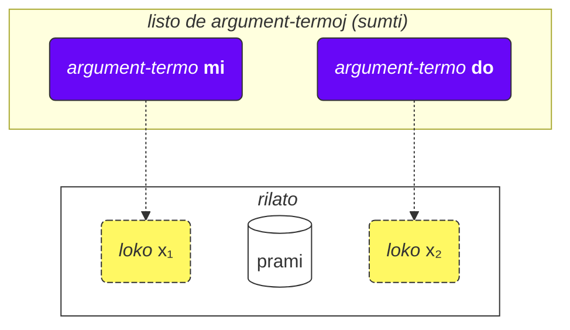
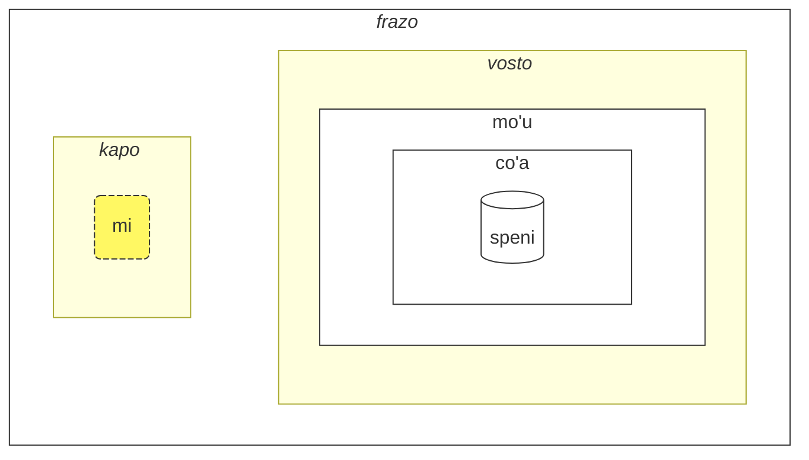

## Leciono 2. Pli da bazaĵoj

### Tipoj de vortoj

Loĵbanaj vortoj estas dividitaj en tri grupojn:

- Rilat-vortoj (nomataj **selbrivla** en Loĵbano)
  - Ekzemploj: **gleki**, **klama**.
  - Tiaj vortoj enhavas almenaŭ konsonant-aron (du aŭ pli da konsonantoj unu post la alia) ene de la unuaj 5 sonoj + ili finiĝas per vokalo.
- Partikloj (nomataj **cmavo** en Loĵbano)
  - Ekzemploj: **le**, **nu**, **mi**, **fa'a**.
  - Ili komenciĝas per konsonanto (unu el **b d g v z j p t k f s c x l m n r i u**), sekvata de vokalo (unu el **a e i o u y au ai ei oi**). Laŭvole, post tio, povas esti unu aŭ pli da sekvencoj de apostrofo (**'**) kaj sekva vokalo. Ekzemple, **xa'a'a'a'a'a'a** kaj **ba'au'oi'a'e'o** estas eblaj partikloj (eĉ se neniu signifo estas asignita al ili).
  - Estas tre kutima skribi plurajn partiklojn sinsekvajn sen spacoj inter ili. Ĉi tio estas permesata de Loĵbana gramatiko. Do, ne miru vidi **lenu** anstataŭ **le nu**, **naku** anstataŭ **na ku**, **jonai** anstataŭ **jo nai**, kaj tiel plu. Ĉi tio ne ŝanĝas la signifon. Tamen, ĉi tiu regulo ne aplikas al rilat-vortoj; rilat-vortoj devus esti apartigitaj per spacoj.
- Nomvortoj (nomataj **cmevla** en Loĵbano)
  - Ekzemploj: **.alis.**, **.doris**, **.lojban.**
  - Kutime uzataj por personaj nomoj, nomoj de lokoj ktp.
  - Ili povas esti facile distingataj de la aliaj tipoj de vortoj ĉar ili finiĝas per konsonanto. Aldone, ili estas ĉirkaŭitaj per du punktoj je la komenco kaj je la fino. Babillingve, punktoj povas esti forlasitaj kiam oni skribas, sed kiam oni parolas, paŭzoj kiuj respondas al tiuj punktoj estas ankoraŭ devigaj.

#### Tasko

Kovru la dekstran parton de la tabelo. Provu identigi la tipon de ĉiu Loĵbana vorto uzante regulojn ĵus priskritajn.

<table>
<tbody><tr>
<td><b>le</b></td>
<td>partiklo (komenciĝas per konsonanto sekvata de vokalo)</td>
</tr>
<tr>
<td><b>melbi</b></td>
<td>rilat-vorto (enhavas konsonant-aron 'lb')</td>
</tr>
<tr>
<td><b>.paris.</b></td>
<td>nomvorto (finiĝas per konsonanto, havas punktojn ĉirkaŭ ĝi)</td>
</tr>
<tr>
<td><b>mi'o</b></td>
<td>partiklo (enhavas apostrofon inter vokaloj)</td>
</tr></tbody></table>

### Ordo de argumentoj

Pli frue ni havis difinojn de rilat-vortoj kiel:

mlatu
: … estas kato, esti kato

citka
: … manĝas …

prami
: … amas …

klama
: … venas al …

Vortaroj povas prezenti difinojn de rilat-vortoj kun simboloj kiel x₁, x₂ ktp.:

prami
: x₁ amas x₂

karce
: x₁ estas aŭto …

citka
: x₁ manĝas x₂ …

klama
: x₁ venas al x₂ …

Ĉi tiuj x₁, x₂, kaj tiel plu estas la eksplicita notacio por la tiel nomataj _lokoj_ (aliaj nomoj estas: _pozicioj_, _roloj de rilato_, **terbricmi** en Loĵbano). Lokoj estas plenigataj per argument-termoj (**sumti**) en la frazo.

Numeroj reprezentas la ordon en kiu tiuj lokoj estas plenigataj per argumentoj.

Ekzemple:

> **mi prami do**
> _Mi amas vin._

Ĉi tiu frazo ankaŭ implicas ke

- x₁ indikas _tiun kiu amas_, kaj
- x₂ indikas _tiun kiu estas amata de_.

Alivorte, ĉiu rilato havas unu aŭ pli da lokoj, kaj tiuj lokoj estas specifitaj kaj etikeditaj kiel x₁, x₂, kaj tiel plu. Ni metas argumentojn kiel **mi**, **do**, **le tavla** ktp. laŭ ordo, tiel plenigante tiujn lokojn kaj donante konkretan signifon al la rilato, tiel formante frazon.

La avantaĝo de tia stilo de difinoj estas ke ĝi enhavas <u>ĉiujn</u> eblajn partoprenantojn de rilato tuj specifitajn.

Ni ankaŭ povas forlasi argumentojn igante la frazon pli vaga:

> **carvi**
> _Pluvas._ > `estas pluvo, estas pluvanta`

(kvankam tempo ĉi tie estas determinita de kunteksto, ĝi ankaŭ povas signifi _Ofte pluvas_, _Estis pluvanta_, ktp.)

> **prami do**
> _Iu amas vin._ > `amas vin`

Ĉiuj forlasitaj lokoj en rilato simple signifas **zo'e** = _io/iu_ do ĝi signifas same kiel

> **zo'e prami do**
> _Iu amas vin._

Kaj

> **prami**

estas same kiel

> **zo'e prami zo'e**
> _Iu amas iun._

zo'e
: pronomo: io aŭ iu nespecifita aŭ supozata el kunteksto

Modalaj termoj kiel **ca**, **fa'a** ktp. aldonas novajn lokojn al rilatoj, sed ili ne plenigas lokojn de rilatoj. En

> **mi klama fa'a do**
> _Mi venas al vi._

la dua loko de **klama** estas ankoraŭ forlasita. Ekzemple:

> **mi klama fa'a le cmana le zdani**
> _Mi venas (en la direkto de la monto) al la hejmo._

le cmana
: la monto

<pixra url="/assets/pixra/cilre-xekri-g-out/cmana.webp" caption="cmana" definition="… estas monto"></pixra>

Ĉi tie, la dua loko de **klama** estas **le zdani**. La frazo signifas ke la monto estas nur direkto, dum la fina punkto estas la hejmo.

Ĉi tie, la termo **fa'a le cmana** (_en la direkto de la monto_) ne anstataŭas la duan lokon de la rilato **klama**. La dua loko de **klama** estas **le zdani** ĉi tie.

La frazo signifas ke mia hejmo estas simple lokita en la direkto de la monto, sed ĝi ne nepre signifas ke mi volas atingi tiun monton. La fina celo de mia veno ne estas la monto sed la hejmo.

Simile, en

> **mi citka ba le nu mi cadzu**
> _Mi manĝas post kiam mi marŝas._

la dua loko de **citka** estas ankoraŭ forlasita. Nova termo **ba** kun ĝia argumento **le nu mi cadzu** aldonas signifon al la frazo.

La ordo de argumentoj de kunmetita rilato estas sama kiel tiu de la lasta komponanto en ĝi:

> **tu sutra bajra pendo mi**
> _Tio estas mia rapide kuranta amiko._ > `Tio estas rapide kuranta amiko de mi.`

> **tu pendo mi**
> _Tio estas mia amiko._ > `Tio estas amiko de mi.`

pendo
: … estas amiko de … (iu)

Do la ordo de argumentoj de **sutra bajra pendo** estas sama kiel tiu de **pendo** sola.

#### Tasko

Kovru la dekstran parton de la tabelo. Por ĉiu rilat-vorto, identig u kiun loko-strukturon estas ĝusta.

<table>
<tbody><tr>
<td><b>klama</b></td>
<td>x₁ venas al x₂ el x₃</td>
</tr>
<tr>
<td><b>prami</b></td>
<td>x₁ amas x₂</td>
</tr>
<tr>
<td><b>karce</b></td>
<td>x₁ estas aŭto</td>
</tr>
<tr>
<td><b>citka</b></td>
<td>x₁ manĝas x₂</td>
</tr></tbody></table>

### Pli ol du lokoj

Rilato povas havi pli ol du lokojn. Ekzemple:

> **mi pinxe le djacu le kabri**
> _Mi trinkas la akvon el la taso._

pinxe
: x₁ trinkas x₂ el x₃

> **le kabri**
> _la taso_

En ĉi tiu kazo, estas tri lokoj, kaj se vi volas ekskludi la duan lokon en la mezo, vi devas uzi **zo'e**:

> **mi pinxe zo'e le kabri**
> _Mi trinkas \[ion\] el la taso._

Se ni forlasas **zo'e**, ni ricevas ion sensignifan:

> **mi pinxe le kabri**
> _Mi trinkas la tason._

Alia ekzemplo:

> **mi plicru do le plise**
> _Mi donas al vi la pomojn._

plicru
: x₁ donas, donacas al x₂ objekton x₃; x₁ permesas al iu x₂ uzi x₃

#### Tasko

zgana
: x₁ observas/rimarkas x₂ uzante sensojn x₃

Kovru la dekstran parton de la tabelo. Traduku la frazojn maldekstre el Loĵbano.

<table style="table-layout: fixed;">
<tbody><tr>
<td><b>mi zgana do le kanla</b></td>
<td><i>Mi observas vin per miaj okuloj.</i></td>
</tr>
<tr>
<td><b>mi pinxe le djacu le kabri</b></td>
<td><i>Mi trinkas la akvon el la taso.</i></td>
</tr>
<tr>
<td><b>mi plicru le plise do</b></td>
<td><i>Mi donas la pomon al vi.</i></td>
</tr></tbody></table>

Kovru la dekstran parton de la tabelo. Traduku la frazojn maldekstre al Loĵbano.

<table style="table-layout: fixed;">
<tbody><tr>
<td><i>Mi trinkas kafon el la glaso.</i></td>
<td><b>mi pinxe le ckafi le kabri</b></td>
</tr>
<tr>
<td><i>Mi donas la libron al la infano.</i></td>
<td><b>mi plicru le cukta le verba</b></td>
</tr></tbody></table>

### Rilatoj ene de rilatoj

En

> **le nicte cu nu mi viska le lunra**
> _La nokto estas kiam mi vidas la Lunon._

ni havas

- **le nicte** kiel x₁ de la rilato,
- **nu mi viska le lunra** kiel la ĉefa rilato.

Tamen, ene de **nu mi viska le lunra**, ni havas alian frazon kun

- **mi** - x₁ de la interna rilato,
- **viska** - la interna rilato,
- **le lunra** - x₂ de la interna rilato.

Do, malgraŭ havi internan strukturon, **nu mi viska le lunra** estas ankoraŭ rilato kun ĝia unua termo plenita per **le nicte** en ĉi tiu kazo.

Simile, en

> **mi citka ba le nu mi dansu**
> _Mi manĝas post kiam mi dancas._

ni havas

- **mi** kiel x₁, la unua loko de la rilato,
- **citka** kiel la ĉefa rilat-konstruo,
- **ba le nu mi dansu** kiel modala termo de la ĉefa rilato de la frazo.

Ene de ĉi tiu termo, ni havas:

- **mi** kiel x₁, la unua loko de la rilato ene de la termo
- **dansu** kiel la ĉefa rilat-konstruo ene de la termo.

Tia "rikura" mekanismo de envolvado de rilatoj en rilatojn permesas esprimi kompleksajn ideojn precize.

#### Tasko

Kovru la dekstran parton de la tabelo. Identigu kiuj termoj apartenas al internaj rilatoj.

<table>
<tbody><tr>
<td><b>le nicte cu nu mi viska le lunra</b></td>
<td>Interna rilato: <i>mi viska le lunra</i> (mi vidas la lunon)</td>
</tr>
<tr>
<td><b>mi citka ba le nu mi dansu</b></td>
<td>Interna rilato: <i>mi dansu</i> (mi dancas)</td>
</tr>
<tr>
<td><b>mi djica le nu do klama</b></td>
<td>Interna rilato: <i>do klama</i> (vi venas)</td>
</tr></tbody></table>

### Kial rilat-vortoj estas difinitaj kiel ili estas?

La angla uzas limigitan aron de prepozicioj kiuj estas reuzataj tra diversaj verboj kaj, tiel, havas neniun fiksan signifon. Ekzemple, konsideru la anglan prepozicion _to_:

> _I speak to you._ (_Mi parolas al vi._)

<!-- -->

> _I come to you._ (_Mi venas al vi._)

<!-- -->

> _To me it looks pretty._ (_Al mi ĝi aspektas bela._)

En ĉiu el tiuj ekzemploj, _to_ havas novan rolon kiu estas, plej multe, malproksime simila al roloj en aliaj frazoj.

Estas grave noti ke aliaj lingvoj uzas malsamajn manierojn marki rolojn de verboj kiuj, en multaj kazoj, estas tre malsamaj de tiuj uzataj en la angla.

Loĵbano, ekzemple, markas kernajn rolojn (lokojn) de rilatoj per plene difini tiajn rilatojn kun la roloj metitaj en sekvenco (aŭ markitaj per **fa**, **fe**, kaj tiel plu):

klama
: x₁ venas al x₂ …

tavla
: x₁ parolas al x₂ …

melbi
: x₁ estas bela, agrabla al x₂ …

Tiaj kernaj roloj estas esencaj en difini rilatojn.

Tamen, povas esti laŭvolaj roloj kiuj igas rilatojn pli precizaj:

> _I speak to you while I'm eating._ (_Mi parolas al vi dum mi manĝas._)

<!-- -->

> _It's hard to me because this thing is heavy._ (_Estas malfacila al mi ĉar ĉi tiu afero estas peza._)

En Loĵbano, simila nocio de tiaj laŭvolaj roloj estas esprimata per apartaj rilatoj aŭ, por plej oftaj kazoj, kun modalaj termoj:

> **mi tavla do ze'a le nu mi citka**
> _Mi parolas al vi dum mi manĝas._

<!-- -->

> **nandu mi ri'a le nu ti tilju**
> _Estas malfacila al mi ĉar ĉi tio estas peza._

nandu
: x₁ estas malfacila al x₂

tilju
: x₁ estas peza

Prepozicioj en la angla similas al modalaj partikloj en Loĵbano, kvankam kutima angla prepozicio povas havi multajn signifojn dum en Loĵbano, ĉiu modala partiklo havas nur unu (eĉ se vaga) signifon.

#### Tasko

le zarci
: la merkato
le dinju
: la konstruaĵo
klama
: x₁ venas al x₂ el x₃

Kovru la dekstran parton de la tabelo. Identigu ĉu ĉi tiuj frazoj uzas kernajn argumentojn aŭ laŭvolajn modalajn termojn.

<table>
<tbody><tr>
<td><b>mi klama le zarci le dinju</b></td>
<td>Uzas kernajn argumentojn (x₂ kaj x₃ de klama)</td>
</tr>
<tr>
<td><b>mi klama le zarci ca le nu do pinxe</b></td>
<td>Uzas kernan argumenton (x₂ = le zarci) kaj modalan termon (ca le nu do pinxe)</td>
</tr>
<tr>
<td><b>mi klama fa'a le zarci</b></td>
<td>Uzas modalan termon (fa'a le zarci) anstataŭ kerna argumento</td>
</tr></tbody></table>

### Ĝeneralaj reguloj en la ordo de argumentoj

La ordo de lokoj en rilatoj povas esti foje malfacile memorebla, sed ni ne zorgu — vi ne bezonas memori ĉiujn lokojn de ĉiuj rilat-vortoj. (Ĉu vi memoras la signifon de cent miloj da vortoj en Esperanto?)

Vi povas studi lokojn kiam vi trovas ilin utilaj aŭ kiam homoj uzas ilin en dialogo kun vi.

Plej multaj rilat-vortoj havas du-tri lokojn.

Kutime, vi povas diveni la ordon uzante kuntekston kaj kelkajn difinojn-regulojn:

1. La unua loko ofte estas la persono aŭ afero kiu faras ion aŭ estas io:

   **klama** = _x₁ iras …_

2. La objekto de ia ago kutime estas tuj post la unua loko:

   **punji** = _x₁ metas x₂ sur x₃_,

3. Kaj la sekva loko kutime estos plenita per la ricevanto:

   **punji** = _x₁ metas x₂ sur x₃_,

4. Celo (_al_) lokoj preskaŭ ĉiam venas antaŭ deveno (_el_) lokoj:

   **klama** = _x₁ iras al x₂ el x₃_

   <pixra url="/assets/pixra/cilre-xekri-g-out/klama_fi.webp" caption="le prenu cu klama fi le zarci" definition="La persono eliras el la vendejo."></pixra>

5. Malpli-uzataj lokoj venas al la fino. Ĉi tiuj tendencas esti aferoj kiel _laŭ normo_, _per rimedo_ aŭ _farita el_.

La ĝenerala ideo estas ke unue venas la lokoj kiuj plej verŝajne estos uzataj.

Ne necesas plenigi ĉiujn lokojn ĉiam. Neplenaj lokoj simple havas valorojn nerilata j aŭ evidentajn al la parolanto (ili prenas la valoron de **zo'e** = _io_).

#### Tasko

dunda
: x₁ donas x₂ al x₃
benji
: x₁ transdonas x₂ al x₃ el x₄
lebna
: x₁ prenas x₂ el x₃

Kovru la dekstran parton de la tabelo. Antaŭdiru kiu loko venas sekve en ĉi tiuj rilatoj bazite sur la ĝeneralaj reguloj.

<table>
<tbody><tr>
<td><b>dunda</b> - "la donanto ___, la donaco ___, la ricevanto ___"</td>
<td>La ordo sekvas la regulon: faranto unue, tiam objekto, tiam ricevanto</td>
</tr>
<tr>
<td><b>benji</b> - "la sendanto ___, la sendata afero ___, celo ___, fonto ___"</td>
<td>La ordo sekvas la regulon: faranto unue, objekto due, celo antaŭ fonto</td>
</tr>
<tr>
<td><b>lebna</b> - "la prenanto ___, la prenata afero ___, fonto ___"</td>
<td>La ordo sekvas la regulon: faranto unue, objekto due, fonto laste</td>
</tr></tbody></table>

### Infinitivoj

Infinitivoj estas verboj kiuj ofte estas prefiksitaj per _to_ en la angla. Ekzemploj inkluzivas _I like to run_ (_Mi ŝatas kuri_), kun _to run_ (_kuri_) estanta la infinitivo.

> **le verba cu troci le ka cadzu**
> _La infano provas marŝi._

le verba
: la infano, la infanoj

troci
: x₁ provas fari aŭ esti x₂ (ka)

cadzu
: x₁ marŝas

<pixra url="/assets/pixra/cilre-xekri-g-out/troci_cadzu.webp" caption="le verba cu troci le ka cadzu" definition="La infano provas marŝi."></pixra>

La partiklo **ka** funkcias similege kiel **nu**. Ĝi envolvaspfrazon.

La ĉefa diferenco estas ke iu loko en la envolvita frazo estas ligota per iu argumento ekster ĉi tiu frazo.

En ĉi tiu kazo la unua argumento **le verba** de la rilato **troci** faras ligon al la unua neplena loko de la interna frazo **cadzu** (kiu estas ene de **ka**).

Alivorte, la infano provas atingi staton kie **le verba cu cadzu** (la argumento **le verba** plenus la unuan neplenan lokon de la rilato **cadzu**).

Kelkaj rilatoj postulas nur infinitivojn en kelkaj el siaj lokoj. Difinoj de tiaj vortoj markas tiajn lokojn kiel _eco_ aŭ **ka**. Ekzemple:

cinmo
: x₁ sentas x₂ (ka)

Ĉi tio signifas ke la infinitivo en la dua loko (x₂) estas aplikata al iu alia loko (plej verŝajne, la unua loko, x₁). Kazoj kie la infinitivo estas aplikata al lokoj aliaj ol x₂ estas maloftaj kaj estas klarigitaj en vortaroj por respondaj rilatoj aŭ en la kazo de rilat-vortoj elpensite neoficiale, povas esti deduktitaj el komuna senco per analogio kun aliaj similaj rilat-vortoj.

Alia ekzemplo:

<pixra url="/assets/pixra/cilre-xekri-g-out/sidju.webp" caption="ra sidju le pendo le ka bevri le dakli" definition="Li/ŝi helpas la amikon porti la sakojn."></pixra>

> **ra sidju le pendo le ka bevri le dakli**
> _Li/ŝi helpas la amikon porti la sakojn._

sidju
: x₁ helpas x₂ fari x₃ (ka)

La rilat-vorto **sidju** postulas ke ĝia tria loko estu plenita per infinitivo.

bevri
: x₁ portas x₂

le dakli
: la sako, la sakoj

Notu, ke nur la unua neplena loko de la enkorpigita rilato prenas la signifon de la ekstera loko:

> **mi troci le ka do prami**
> _Mi provas esti amata de vi._

tcidu
: x₁ legas x₂ el x₃

Ĉi tie, la unua neplena loko estas la dua loko de **prami**, tiel ĝi prenas la valoron **mi** (_mi_).

Estas ankaŭ ebla per uzi la pronomon **ce'u** eksplicite marki lokon kiu devas esti aplikata al iu ekstera argumento:

> **mi troci le ka do prami ce'u**
> _Mi provas esti amata de vi._

Alia ekzemplo:

> **mi cinmo le ka xebni ce'u**
> **mi cinmo le ka se xebni**
> _Mi sentas kvazaŭ iu malamas min._ > _Mi sentas esti malamata._

#### Tasko

zgana
: x₁ observas x₂
kakne
: x₁ kapablas fari x₂ (eco)
nelci
: x₁ ŝatas x₂

Kovru la dekstran parton de la tabelo. Konvertu ĉi tiujn frazojn kun infinitivoj al iliaj signifoj.

<table>
<tbody><tr>
<td><b>mi kakne le ka zgana</b></td>
<td>Mi kapablas observi (ion)</td>
</tr>
<tr>
<td><b>do kakne le ka nelci mi</b></td>
<td>Vi kapablas ŝati min</td>
</tr>
<tr>
<td><b>mi nelci le ka zgana do</b></td>
<td>Mi ŝatas observi vin</td>
</tr></tbody></table>

### Tipoj de lokoj

La vortaro ofte mencias aliajn tipojn de lokoj, ekzemple:

djica
: x₁ deziras x₂ (evento)

Ĉi tiu _evento_ signifas ke vi devas plenigi la lokon per argumento kiu reprezentas eventon. Ekzemple:

le nicte
: nokt-tempo

le nu mi dansu
: mi dancanta

Do ni ricevas

> **mi djica le nicte**
> _Mi deziras la nokt-tempan eventon._

<!-- -->

> **do djica le nu mi dansu**
> _Vi deziras ke mi dancu._

En Loĵbano, ne estas permesate diri, ekzemple:

> **mi djica le plise**
> _Mi deziras la pomon._ 

ĉar vi deziras fari ion kun la pomo aŭ vi deziras ian eventon okazanta kun la pomo, kiel:

> **mi djica le nu mi citka le plise**
> _Mi deziras manĝi la pomon._ > `Mi deziras ke mi manĝu la pomon.`

Rimarku, ke envolvado de rilato atendanta eventon en **nu** ŝanĝas la signifon:

> **le zekri cu cumki**
> _La krimo estas ebla._

zekri
: x₁ estas krimaga evento, x₁ (evento) krimo

cumki
: x₁ (evento) estas ebla

Komparu:

> **le nu zekri cu cumki**
> `Ke estas krimaga estas ebla.` > _Estas eble ke io estas krimo._

#### Tasko

nelci
: x₁ ŝatas x₂

djica
: x₁ deziras x₂ (evento)

Kovru la dekstran parton de la tabelo. Traduku la frazojn maldekstre el Loĵbano.

<table style="table-layout: fixed;">
<tbody><tr>
<td><b>mi nelci le nu do cisma</b></td>
<td><i>Mi ŝatas ke vi ridetas.</i></td>
</tr>
<tr>
<td><b>mi djica le nu mi citka le plise</b></td>
<td><i>Mi deziras manĝi la pomon.</i></td>
</tr>
<tr>
<td><b>mi na ku djica le plise</b></td>
<td><i>Mi ne deziras la pomon. (malĝusta uzado)</i></td>
</tr></tbody></table>

Kovru la dekstran parton de la tabelo. Traduku la frazojn maldekstre al Loĵbano.

<table style="table-layout: fixed;">
<tbody><tr>
<td><i>Mi deziras ke vi dancu.</i></td>
<td><b>mi djica le nu do dansu</b></td>
</tr>
<tr>
<td><i>Mi ŝatas ke vi estas saĝa.</i></td>
<td><b>mi nelci le nu do stati</b></td>
</tr></tbody></table>

### Levado

> **mi stidi le ka klama le barja**
> _Mi sugestas iri al la drinkejo._

stidi
: x₁ sugestas agon x₂ (eco) al x₃

> **mi stidi tu'a le barja**
> _Mi sugestas la drinkejon._

tu'a le barja
: io pri la drinkejo

> **mi djica le nu mi citka le plise**
> _Mi deziras manĝi pomon._

<!-- -->

> **mi djica tu'a le titla**
> _Mi deziras la dolĉaĵon._

tu'a le titla
: io pri la dolĉaĵo

titla
: … estas dolĉa, … estas dolĉaĵo

<pixra url="/assets/pixra/cilre-xekri-g-out/djica_tuha_le_titla.webp" caption="le prenu cu djica tu'a le titla" definition="La persono deziras la dolĉaĵon."></pixra>

Loko-strukturo povas meti tro da ŝarĝon sur specifi agojn aŭ eventojn. Foje ni volas specifi nur iun objekton en tiuj eventoj aŭ lokoj kaj preterpasi priskribi la agon aŭ la eventon tute.

En la supraj ekzemploj _Mi sugestas la drinkejon._ plej verŝajne implicas iri al la drinkejo kaj _Mi deziras la pomon._ implicas manĝi ĝin.

Tamen, la Loĵbana rilat-vorto **stidi** postulas econ en sia x₂ loko. Simile, **djica** postulas eventon en sia x₂ loko.

La mallonga tiel nomata kvaligila vorto **tu'a** antaŭ termo implicas abstrakton (eco, evento, aŭ propozicio) sed elektas nur ĉi tiun termon el ĉi tiu abstrakto preterpasante la reston. Ĝi povas esti vage tradukata kiel _io pri_:

> **mi stidi tu'a le barja**
> _Mi sugestas ion pri la drinkejo (eble viziti ĝin, renkontiĝi apud ĝi ktp.)._

<!-- -->

> **mi djica tu'a le plise**
> _Mi deziras ion rilatan al la pomo (eble manĝi, maĉi, leki, ĵeti ĝin al amiko, ktp.)_

> **tu'a le cakla cu pluka mi**
> _La ĉokolado estas agrabla al mi (verŝajne pro ĝia gusto)._ > `Io pri la ĉokolado estas agrabla al mi`

cakla
: x₁ estas iom da ĉokolado

Kiam ni preterpasas abstraktojn, nur kunteksto diras al ni kio estis forlasita.

Estas ankaŭ ebla modifi la ĉefan rilatan konstruon:

> **le cakla cu jai pluka mi**
> **tu'a le cakla cu pluka mi**
> _La ĉokolado estas agrabla al mi._

Ĉi tio permesas la kreadon de vagaj argument-termoj kun **jai**:

> **le jai pluka cu zvati ti**
> _La agrabla afero estas ĉi tie._

Ĉar **le pluka** (_la agrabla evento_) estas abstrakta, estas neebla specifi ĝian lokon. Tamen, partoprenanto en la abstrakto povas esti fizike metita ie.

#### Tasko

stidi
: x₁ sugestas x₂ (eco) al x₃

Kovru la dekstran parton de la tabelo. Traduku la frazojn maldekstre el Loĵbano.

<table style="table-layout: fixed;">
<tbody><tr>
<td><b>mi stidi tu'a le karce</b></td>
<td><i>Mi sugestas ion pri la aŭto.</i></td>
</tr>
<tr>
<td><b>mi djica tu'a le najnimre</b></td>
<td><i>Mi deziras ion pri la oranĝo.</i></td>
</tr>
<tr>
<td><b>mi nelci tu'a le mlatu</b></td>
<td><i>Mi ŝatas ion pri la kato.</i></td>
</tr></tbody></table>

Kovru la dekstran parton de la tabelo. Traduku la frazojn maldekstre al Loĵbano.

<table style="table-layout: fixed;">
<tbody><tr>
<td><i>Mi sugestas la ĝardenon (ion pri ĝi).</i></td>
<td><b>mi stidi tu'a le purdi</b></td>
</tr>
<tr>
<td><i>Mi deziras la libron (ion pri ĝi).</i></td>
<td><b>mi djica tu'a le cukta</b></td>
</tr></tbody></table>

### Lokoj ene de argumentoj

Kiel ni diras _Vi estas mia amiko_?

> **do pendo mi**
> _Vi estas mia amiko._ > `Vi estas amiko de mi.`

<pixra url="/assets/pixra/cilre-xekri-g-out/pendo.webp" caption="le pendo" definition="la amiko / la amikoj"></pixra>

Kaj nun, kiel ni diras _Mia amiko estas saĝa._?

> **le pendo be mi cu stati**
> _Mia amiko estas saĝa._

Do kiam ni transformas rilaton en argumenton (**pendo** — _esti amiko_ en **le pendo** — _la amiko_), ni ankoraŭ povas reteni aliajn lokojn de tiu rilato metante **be** post ĝi.

Defaŭlte, ĝi alkroĉas la duan lokon (x₂). Ni povas alkroĉi pli da lokoj apartigante ilin per **bei**:

> **mi plicru do le plise**
> _Mi donas al vi la pomon._

<pixra url="/assets/pixra/cilre-xekri-g-out/plicru.webp" caption="le prenu cu plicru le pendo le plise" definition="La persono donas al la amiko la pomon."></pixra>

<!-- -->

> **le plicru be mi bei le plise**
> _La donanto de la pomo al mi_

<!-- -->

> **le plicru be mi bei le plise cu pendo mi**
> _La donanto de la pomo al mi estas mia amiko._ > `Tiu kiu donas al mi la pomon estas amiko de mi.`

Alia ekzemplo:

<!-- > **le pendo be mi cu tavla**
> _La amikoj de mi parolas._
> **le pendo mi cu tavla**
> **le pendo cu tavla mi**
> _La amikoj parolas al mi._ -->

> **mi klama le pendo be do**
> _Mi venas al amiko de vi._

klama
: x₁ venas al x₂ el x₃ …

Ni ne povas forlasi **be** ĉar **le pendo do** estas du sendependaj lokoj:

> **mi klama le pendo do**
> _Mi venas al amiko el vi._

Ĉi tie, **do** prenis la trian lokon de **klama** ĉar ĝi ne estas ligita al _pendo_ per **be**.

Nek ni povus uzi **nu** ĉar **le nu pendo do** estas la evento de iu esti amiko de vi.

Do **le pendo be do** estas la ĝusta solvo.

Alia ekzemplo:

> **la .lojban. cu bangu mi**
> _Loĵbano estas mia lingvo._ > `Loĵbano estas lingvo de mi.`

Tamen,

> **mi nelci le bangu be mi**
> _Mi ŝatas mian lingvon._

Uzi **be** por rilatoj ne transformitaj al argumentoj havas neniun efikon:

> **mi nelci be do** estas sama kiel
> **mi nelci do**

#### Tasko

ctuca
: x₁ instruas x₂ (temo) al x₃
cmene
: x₁ estas nomo de x₂ uzata de x₃

Kovru la dekstran parton de la tabelo. Konvertu ĉi tiujn konstruojn uzantajn "be" en iliajn signifojn.

<table>
<tbody><tr>
<td><b>le ctuca be mi bei la lojban</b></td>
<td>la instruisto de mi en Loĵbano</td>
</tr>
<tr>
<td><b>le cmene be la paris bei la frank</b></td>
<td>la nomo de Parizo uzata de Frank</td>
</tr>
<tr>
<td><b>le ctuca be le verba bei la lojban</b></td>
<td>la instruisto de infanoj en Loĵbano</td>
</tr></tbody></table>

### Relativaj frazoj

> **le prenu poi pendo mi cu tavla mi**
> _La persono kiu estas amiko de mi parolas al mi._

<!-- -->

> **le prenu noi pendo mi cu tavla mi**
> _La persono, kiu hazarde estas amiko de mi, parolas al mi._

blabi
: … estas blanka

En la unua frazo, la vorto _kiu_ estas esenca por identigi la personon koncernan. Ĝi klarigas pri kiu inter la personoj en la kunteksto ni parolas. Ni elektas nur tiujn kiuj estas miaj amikoj el verŝajne multaj personoj ĉirkaŭe. Eble estas nur unu persono ĉirkaŭe kiu estas mia amiko.

Pri _kiu hazarde estas amiko de mi_ el la dua frazo, ĝi simple provizas aldonan informon pri la persono. Ĝi ne helpas nin identigi la personon. Ekzemple, tio povus okazi kiam ĉiuj personoj ĉirkaŭe estas miaj amikoj.

**poi pendo mi** estas relativa frazo, rilato alkroĉita dekstre de la argumento **le prenu**. Ĝi finiĝas ĵus antaŭ la sekva vorto **cu**:

> **le prenu (poi pendo mi) cu tavla mi**
> _La persono kiu estas amiko de mi parolas al mi._

En Loĵbano, ni uzas **poi** por relativaj frazoj kiuj identigas entojn (objektojn, personojn aŭ eventojn) kaj **noi** por hazarda informo.

> **la .bob. ba co'a speni le ninmu poi pu xabju le nurma**
> _Bob edziniĝos kun knabino kiu loĝis en la kamparo._

xabju
: … loĝas en …, … loĝas … (loko, objekto)

le nurma
: la kampara areo

Ĉi tiu frazo ne ekskludas ke Bob edziniĝu kun iu alia ankaŭ! Forigi la relativan frazon kun **poi** ŝanĝas la signifon:

> **la .bob. ba co'a speni le ninmu**
> _Bob edziniĝos kun knabino._

Alia ekzemplo:

> **le prenu poi gleki cu ze'u renvi**
> _Personoj (kiuj?) kiuj estas feliĉaj vivas longe._

ze'u
: modala termo: por longa tempo

renvi
: pluvivi

Forigi la relativan frazon kun **poi** ŝanĝas la signifon:

> **le prenu ze'u renvi**
> _La personoj vivas longe._

Aliflanke, relativaj frazoj kun **noi** enhavas nur aldonan informon pri la argumento, al kiu ili estas alkroĉitaj. Tiu argumento estas sufiĉe difinita de si mem tiel ke forigi relativan frazon kun **noi** ne ŝanĝas ĝian signifon:

> **mi nelci la .doris. noi mi ta'e zgana bu'u le panka**
> _Mi ŝatas Doris kiun mi kutime vidas en la parko._ > _Mi ŝatas Doris. Kion alian mi povas diri pri ŝi? Mi kutime vidas ŝin en la parko._

zgana
: observi (uzante iun ajn sensojn)

<pixra url="/assets/pixra/cilre-xekri-g-out/panka_ninmu.webp" caption="le prenu noi mi ta'e zgana bu'u le panka" definition="La persono kiun mi kutime vidas en la parko."></pixra>

Forigi la relativan frazon kun **noi** konservas la signifon: _Mi ŝatas Doris._

En parolata angla, la distingo ofte estas atingata uzante intonacion aŭ divenante. Ankaŭ, relativaj frazoj kun **noi** estas tradicie apartigitaj per komoj en la angla. Ili uzas _which_ aŭ _who_, kaj la vorto _that_ ne estas uzata en ili.

Ni havu alian ekzemplon.

> **mi klama le pa tricu**
> _Mi venas al la arbo._

<!-- -->

> **le pa tricu cu barda**
> _La arbo estas granda._

le pa tricu
: la arbo (unu arbo)

barda
: x₁ estas granda/ampleksa

Kaj nun ni kunligu tiujn du frazojn:

> **le tricu noi mi klama ke'a cu barda**
> _La arbo, al kiu mi venas, estas granda._

Notu la vorton **ke'a**. Ni movas la duan frazon pri la sama arbo en relativan frazon kaj anstataŭigas la argumenton **le tricu** per **ke'a** en la relativa frazo. Do la pronomo **ke'a** estas kiel _kiu_ kaj _kiun_ en Esperanto. Ĝi montras reen al la argumento al kiu la relativa frazo estas alkroĉita.

Do laŭvorte nia Loĵbana frazo sonas kiel

> _La arbo, tia ke mi iras al kiu, estas granda._

**ke'a** povas esti forlasita se kunteksto estas sufiĉe sufiĉa. La du jenaj frazoj signifas la samon:

> **le prenu poi pendo mi cu tavla mi**
> **le prenu poi ke'a pendo mi cu tavla mi**
> _La persono kiu estas amiko de mi parolas al mi._

**ke'a** estas ofte supozata iri al la unua neplena loko:

> **mi nelci la .doris. noi mi ta'e zgana bu'u le panka**
> **mi nelci la .doris. noi mi ta'e zgana ke'a bu'u le panka**
> _Mi ŝatas Doris kiun mi kutime vidas en la parko._

Ĉi tie, **mi** plenigas la unuan lokon de la rilato **ta'e zgana** (_… kutime vidas …_), tiel, **ke'a** estas supozata por la sekva, dua loko.

Relativaj frazoj kiel kutimaj rilatoj povas enhavi konstruojn kun modalaj termoj:

> **le tricu noi mi pu klama ke'a ca le cabdei cu barda**
> _La arbo, al kiu mi iris hodiaŭ, estas granda._

<pixra url="/assets/pixra/cilre-xekri-g-out/le_tricu_cu_barda.webp" caption="le tricu cu barda" definition="La arbo estas granda."></pixra>

le cabdei
: la tago de hodiaŭ

Notu, ke **ca le cabdei** apartenas al la relativa frazo. Komparu:

> **le tricu noi mi pu klama ke'a cu barda ca le cabdei**
> _La arbo, al kiu mi iris, estas granda hodiaŭ._

La signifo ŝanĝiĝis multe.

Fine, **voi** estas uzata por formi **le**-similajn argumentojn sed kun relativaj frazoj:

> **ti voi le nu ke'a cisma cu pluka mi cu zutse tu**
> _Ĉi tiuj kies rideto plaĉas al mi sidas._

<pixra url="/assets/pixra/cilre-xekri-g-out/voi.webp" caption="mi nelci ti voi le nu ke'a cisma cu pluka mi" definition="Mi ŝatas ĉi tiujn kies ridetoj plaĉas al mi."></pixra>

ti
: tio ĉi proksime al mi, ĉi tiuj proksime al mi

cisma
: x₁ ridetas

pluka
: x₁ estas agrabla al x₂

zutse
: x₁ sidas, estas sidanta sur x₂

Ĉi tie, **voi** difinas la objekton proksime al mi.

Komparu ĝin al:

> **ti poi le nu ke'a cisma cu pluka mi cu zutse**
> _El ĉi tiuj tiuj kies rideto plaĉas al mi sidas._

**poi** limigas la elekton al tiuj priskribita j en la relativa frazo.
Ĉi tiu ekzemplo povus implici ke estas multaj objektoj (personoj ktp.) ĉirkaŭ mi sed kun **poi** mi elektas nur necesajn.

Komparu ĝin al:

> **ti noi le nu ke'a cisma cu pluka mi cu zutse**
> _Ĉi tiuj (kiuj hazarde estas tiaj ke ilia rideto plaĉas al mi) sidas._

**noi** simple aldonas hazardan informon kiu ne estas necesa por determini kion **ti** (_ĉi tiuj_) referencas. Eble, estas neniu alia ĉirkaŭe por priskribi.

Fine, same kiel **nu** havas la dekstran lim-markon **kei**, ni havas

ku'o
: dekstra lim-marko por **poi**, **noi** kaj **voi**.

> **mi tavla la .doris. noi ca zutse tu ku'o .e la .alis. noi ca cisma**
> _Mi parolas al Doris, kiu nun sidas tie, kaj Alice kiu nun ridetas._

Rimarku, ke sen **ku'o** ni havus **tu** (_tie_) kunligitan kun **la .alis.** (_Alice_) kondukante al stranga signifo:

> **mi tavla la .doris. noi ca zutse tu .e la .alis. noi ca cisma**
> _Mi parolas al Doris, kiu nun sidas tie kaj supre de Alice (kiu nun ridetas)._

Rimarku la parton **zutse tu .e la .alis.**.

Por ĉiuj el **poi**, **noi** kaj **voi** la dekstra lim-marko estas ankoraŭ la sama: **ku'o**.

#### Tasko

ctuca
: x₁ instruas x₂ al x₃

Kovru la dekstran parton de la tabelo. Traduku la frazojn maldekstre el Loĵbano.

<table style="table-layout: fixed;">
<tbody><tr>
<td><b>mi tavla le prenu poi ctuca mi</b></td>
<td><i>Mi parolas al la persono kiu instruas min.</i></td>
</tr>
<tr>
<td><b>le gerku noi mi nelci ke'a cu citka</b></td>
<td><i>La hundo, kiun mi ŝatas, manĝas.</i></td>
</tr>
<tr>
<td><b>le prenu poi ke'a ctuca mi cu stati</b></td>
<td><i>La persono kiu instruas min estas saĝa.</i></td>
</tr></tbody></table>

Kovru la dekstran parton de la tabelo. Traduku la frazojn maldekstre al Loĵbano.

<table style="table-layout: fixed;">
<tbody><tr>
<td><i>Mi vidas la hundon kiu kuras.</i></td>
<td><b>mi viska le gerku poi bajra</b></td>
</tr>
<tr>
<td><i>La persono, kiu estas saĝa, parolas al mi.</i></td>
<td><b>le prenu noi stati cu tavla mi</b></td>
</tr></tbody></table>

### Mallongaj relativaj frazoj. '_Pri_'

Foje, vi povus bezoni alkroĉi aldonan argumenton al alia argumento:

> **mi djuno le vajni pe do**
> _Mi scias ion gravan pri vi._

le vajni
: io grava

**pe** kaj **ne** similas al **poi** kaj **noi**, sed ili alkroĉas argumentojn al argumentoj:

> **le pa penbi pe mi cu xunre**
> _La plumo kiu estas mia estas ruĝa._ (_mia_ estas esenca por identigi la plumon koncernan)

<!-- -->

> **le pa penbi ne mi cu xunre**
> _La plumo, kiu estas mia, estas ruĝa._ (aldona informo)

ne
: kiu estas pri, havas rilaton al … (argumento sekvas)

pe
: kiu estas pri, havas rilaton al … (argumento sekvas)

> **le pa penbi ne mi ge'u .e le pa fonxa ne do cu xunre**
> _La plumo, kiu estas mia, kaj la telefono, kiu estas via, estas ruĝaj._

ge'u
: dekstra lim-marko por **pe**, **ne**.

#### Tasko

Kovru la dekstran parton de la tabelo. Traduku la frazojn maldekstre el Loĵbano.

<table style="table-layout: fixed;">
<tbody><tr>
<td><b>le penbi pe mi cu xunre</b></td>
<td><i>La plumo kiu estas mia estas ruĝa.</i></td>
</tr>
<tr>
<td><b>le mlatu ne mi cu melbi</b></td>
<td><i>La kato, kiu estas mia, estas bela.</i></td>
</tr>
<tr>
<td><b>mi tavla le prenu pe do</b></td>
<td><i>Mi parolas al la persono rilata al vi.</i></td>
</tr></tbody></table>

Kovru la dekstran parton de la tabelo. Traduku la frazojn maldekstre al Loĵbano.

<table style="table-layout: fixed;">
<tbody><tr>
<td><i>La domo kiu estas mia estas granda.</i></td>
<td><b>le zdani pe mi cu barda</b></td>
</tr>
<tr>
<td><i>La aŭto, kiu estas via, estas bela.</i></td>
<td><b>le karce ne do cu melbi</b></td>
</tr></tbody></table>

### «**be**» kaj «**pe**»

Notu, ke relativaj frazoj estas alkroĉitaj al argumentoj, dum **be** estas parto de la rilato.

Fakte, **le bangu pe mi** estas pli bona traduko de _mia lingvo_, ĉar, kiel en Esperanto, la du argumentoj estas rilataj unu al la alia en vaga maniero.

Tamen, vi povas diri **le birka be mi** kiel _mia brako_. Eĉ se vi fortranĉus vian brakon, ĝi ankoraŭ estus via. Tial **birka** havas lokon de la posedanto:

birka
: x₁ estas brako de x₂

Ni montru denove ke konstruo kun **be** estas parto de la rilato, dum **pe**, **ne**, **poi** kaj **noi** alkroĉas al argumentoj:

> **le pa melbi be mi fonxa pe le pa pendo be mi cu barda**
> `La bela al mi telefono de la amiko de mi estas granda.`

Ĉi tie, **be mi** estas alkroĉita al la rilato **melbi** = _esti bela al … (iu)_ kaj tiel kreas novan rilaton **melbi be mi** = _esti bela al mi_. Sed **pe le pa pendo be mi** (_de mia amiko_) estas aplikata al la tuta argumento **le pa melbi be mi fonxa** (_la bela al mi telefono_).

Povas ankaŭ okazi ke ni bezonas alkroĉi **be** al rilato, transformi tiun rilaton en argumenton kaj poste alkroĉi **pe** al tiu argumento:

> **le pa pendo be do be'o pe la .paris. cu stati**
> _La amiko de vi kiu estas rilata al Parizo estas saĝa._ > (<b>pe la .paris.</b> estas alkroĉita al la tuta argumento <b>le pa pendo be do be'o</b>)

<!-- -->

> **le pu plicru be do bei le pa plise be'o pe la .paris. cu stati**
> _Tiu kiu donis al vi la pomon (kaj kiu estas rilata al Parizo) estas saĝa._ > (<b>pe la .paris.</b> estas alkroĉita al la tuta argumento <b>le pu plicru be do bei le pa plise be'o</b>)

be'o
: dekstra lim-marko por la ĉeno de termoj alkroĉitaj per **be** kaj **bei**

En ĉi tiuj du ekzemploj, via amiko havas iun rilaton al Parizo (eble, li/ŝi estas el Parizo).

Komparu ĝin al:

> **le pa pendo be do pe la .paris. cu stati**
> _La amiko de vi (vi kiu estas rilata al Parizo) estas saĝa._

<!-- -->

> **le pu plicru be do bei le pa plise pe la .paris. cu stati**
> _Tiu kiu donis al vi la pomon (la pomo kiu estas rilata al Parizo) estas saĝa._

En ĉi tiuj lastaj du ekzemploj, tamen, aŭ vi estas rilata al Parizo aŭ la pomo.

#### Tasko

Kovru la dekstran parton de la tabelo. Traduku la frazojn maldekstre el Loĵbano.

<table style="table-layout: fixed;">
<tbody><tr>
<td><b>le melbi be mi cu stati</b></td>
<td><i>Tiu kiu estas bela al mi estas saĝa.</i></td>
</tr>
<tr>
<td><b>le pendo be do bei mi cu tavla</b></td>
<td><i>La amiko de vi kaj mi parolas.</i></td>
</tr>
<tr>
<td><b>le pampe'o be do pe mi cu melbi</b></td>
<td><i>Mia papero de vi estas bela.</i></td>
</tr></tbody></table>

Kovru la dekstran parton de la tabelo. Traduku la frazojn maldekstre al Loĵbano.

<table style="table-layout: fixed;">
<tbody><tr>
<td><i>Tiu kiu estas agrabla al mi kaj saĝa al vi parolas.</i></td>
<td><b>le pluka be mi bei do cu tavla</b></td>
</tr>
<tr>
<td><i>La amiko de mi kiu estas rilata al Parizo estas saĝa.</i></td>
<td><b>le pendo be mi be'o pe la .paris. cu stati</b></td>
</tr></tbody></table>

### '_Alice estas instruisto_' kaj '_Alice estas la instruisto_'

En la angla, la verbo _is, are, to be_ igas substantivon funkcii kiel verbo. En Loĵbano, eĉ tiaj konceptoj kiel _kato_ (**mlatu**), _persono_ (**prenu**), _domo_ (**dinju**), _hejmo_ (**zdani**) funkcias kiel verboj (rilatoj) defaŭlte. Nur pronomoj funkcias kiel argumentoj.

Tamen, jen tri kazoj:

> **la .alis. cu ctuca**
> _Alice instruas._

<pixra url="/assets/pixra/cilre-xekri-g-out/ctuca.webp" caption="mi ctuca" definition="Mi instruas / Mi estas instruisto."></pixra>

<!-- -->

> **la .alis. cu me le ctuca**
> _Alice estas unu el la instruistoj._

me
: … estas inter …, … estas unu el …, … estas membroj de … (argumento sekvas)

> **la .alis. ta'e ctuca**
> _Alice kutime instruas._

ta'e
: modala partiklo: la evento okazas kutime

> **la .alis. cu du le ctuca**
> _Alice estas la instruisto._

du
: … estas identa al …

La partiklo **me** prenas argumenton post ĝi kaj indikas ke verŝajne estas aliaj instruistoj, kaj Alice estas unu inter ili.

La partiklo **du** estas uzata kiam Alice estas, ekzemple, la instruisto kiun ni serĉis aŭ pri kiu ni parolis. Ĝi indikas identecon.

Tiel, **me** kaj **du** povas foje respundi al tio kion en Esperanto ni esprimas uzante la verbon _esti_.

En Loĵbano, ni prioritatas la signifon de tio kion ni intencas diri, prefere ol fidi pri kiel ĝi estas laŭvorte esprimata en Esperanto aŭ aliaj lingvoj.

Aliaj ekzemploj:

> **mi me la .bond.**
> _Mi estas Bond._

<!-- -->

> **mi du la .kevin.**
> _Mi estas Kevin (tiu kiun vi bezonis)._

<!-- -->

> **ti du la .alis. noi mi ta'e zgana bu'u le panka**
> _Tio ĉi estas Alice kiun mi kutime vidas en la parko._

**noi du** kaj **poi du** estas uzataj por enkonduki alternativajn nomojn por io. Ili respondas al Esperanto _nome, t.e._:

> **la .alis. cu penmi le prenu noi du la .abdul.**
> _Alice renkontis la personon, nome Abdul._

Kiam ni uzas **me**, vi povas ligi plurajn argumentojn per _kaj_:

> **tu me le pendo be mi be'o .e le tunba be mi**
> _Tiuj estas iuj (aŭ ĉiuj) el miaj amikoj kaj miaj gefratoj._

tunba
: x₁ estas gefrato de x₂

<pixra url="/assets/pixra/cilre-xekri-g-out/tunba.webp" caption="do tunba mi" definition="Vi estas mia gefrato."></pixra>

#### Tasko

gerku
: x₁ estas hundo
banana
: x₁ estas banano
pendo
: x₁ estas amiko de x₂

Kovru la dekstran parton de la tabelo. Traduku ĉi tiujn frazojn uzante taŭgajn vortojn por "estas".

<table>
<tbody><tr>
<td><i>Tiuj estas iuj el miaj amikoj</i></td>
<td><b>tu me le pendo be mi</b></td>
</tr>
<tr>
<td><i>Tio estas la hundo kiun ni serĉis</i></td>
<td><b>ta du le gerku</b></td>
</tr>
<tr>
<td><i>Tio ĉi flava afero estas banano</i></td>
<td><b>ti pelxu gi'e me le banana</b></td>
</tr></tbody></table>

### Rilatoj kun modalaj partikloj

Ni povas meti modalan partiklon ne nur antaŭ la ĉefa rilat-konstruo de la frazo sed ankaŭ je la fino de ĝi, produktante la saman rezulton:

> **mi ca tcidu**
> **mi tcidu ca**
> _Mi (nun legas)._

tcidu
: legi (iun tekston)

Kiam ni uzas **nu**, ni kreas rilaton priskribanta ian eventon. Rimarku la diferencon inter ĉi tiuj du ekzemploj:

> **le nu tcidu ca cu nandu**
> _La nuna legado estas malfacila, komplika._

<!-- -->

> **le nu tcidu cu ca nandu**
> _La legado estas nun malfacila._

Aliaj ekzemploj:

> **mi klama le pa cmana pu**
> _Mi iris al la monto._ > `Mi iras al monto (en la pasinto).`

<!-- -->

> **le nu mi klama le pa cmana pu cu pluka**
> _Ke mi iris al monto estas agrabla._

Ni ankaŭ povas meti unu aŭ pli da modalaj partikloj kiel la unua elemento de rilat-konstruo kaj ekz. uzi tian riĉigitan rilaton en argument-formo:

<pixra url="/assets/pixra/cilre-xekri-g-out/coha_purdi.webp" caption="le pu kunti tumla ca purdi" definition="Kio estis dezerto estas nun ĝardeno."></pixra>

> **le pu kunti tumla ca purdi**
> _Kio estis dezerto estas nun ĝardeno._

**pu** apartenas al **le kunti tumla** kaj **ca** apartenas al **purdi** (ĉar **le pu kunti tumla** ne povas aldoni **ca** je la fino).

<!-- This doesn't contradict using **be** after the verb since, with **be**, you change the verb: **bangu be mi** is considered one verb. -->

Havi plurajn modalajn partiklojn en vico ne estas problemo:

> **le pu ze'u kunti tumla ca purdi**
> _Kio estis dezerto longe estas nun ĝardeno._

ze'u
: modala termo: por longa tempo

Meti term-partiklojn post substantivoj ligas ilin al eksteraj rilatoj:

<pixra url="/assets/pixra/cilre-xekri-g-out/cohu_purdi.webp" caption="le kunti tumla pu purdi" definition="La dezerto estis ĝardeno."></pixra>

> **le kunti tumla pu purdi**
> **(le kunti tumla) pu purdi**
> _La dezerto estis ĝardeno._

#### Tasko

melbi
: x₁ estas bela
sutra
: x₁ estas rapida

Kovru la dekstran parton de la tabelo. Montru kie la modalaj partikloj aplikas en ĉi tiuj frazoj.

<table>
<tbody><tr>
<td><b>mi ca melbi</b></td>
<td>La "ca" (nuna tempo) aplikas al "melbi" - mi estas nun bela</td>
</tr>
<tr>
<td><b>le nu mi melbi ca cu sutra</b></td>
<td>La "ca" aplikas al "sutra" - mia estado bela estas nun rapida</td>
</tr>
<tr>
<td><b>le pu sutra ca melbi</b></td>
<td>La "pu" apartenas al "sutra" kaj "ca" apartenas al "melbi" - kio estis rapida estas nun bela</td>
</tr></tbody></table>

### Novaj argumentoj el lokoj de la sama rilato

> **do plicru mi ti**
> _Vi donas al mi ĉi tion._

<!-- -->

> **mi se plicru ti do**
> _Mi ricevas ĉi tion de vi._

plicru
: x₁ donas al x₂ ion x₃ por uzo

Ni povas interŝanĝi la unuajn du lokojn en la rilato uzante **se** kaj tiel ŝanĝi la loko-strukturon.

**do plicru mi ti** signifas precize la samon kiel **mi se plicru do ti**. La diferenco estas sole en stilo.

Vi eble volas ŝanĝi aferojn ĉirkaŭe por malsama emfazo, ekzemple, por mencii la pli gravajn aferojn en frazo unue. Do la jenaj paroj signifas la samon:

> **mi prami do**
> _Mi amas vin._

<!-- -->

> **do se prami mi**
> _Vi estas amata de mi._

<!-- -->

> **le nu mi tadni la .lojban. cu xamgu mi**
> _Mia studo de Loĵbano estas bona por mi._

xamgu
: … estas bona por (iu)

> **mi se xamgu le nu mi tadni la .lojban.**
> _Por mi, estas bone studi Loĵbanon._

La samo povas esti farita kiam rilatoj estas uzataj kiam oni kreas argumentojn:

le plicru
: tiuj kiuj donas, la donantoj

le se plicru
: tiuj al kiuj estas donite, ricevantoj de donacoj

le te plicru
: tiuj objektoj kiuj estas donitaj por uzo, donacoj

**te** interŝanĝas la unuan kaj trian lokojn de rilatoj.

Kiel ni scias, kiam ni aldonas **le** antaŭ rilat-konstruo, ĝi iĝas argumento. Do

- **le plicru** signifas _tiuj kiuj povus taŭgi en la unuan lokon de **plicru**_
- **le se plicru** signifas _tiuj kiuj povus taŭgi en la duan lokon de **plicru**_
- **le te plicru** signifas _tiuj kiuj povus taŭgi en la trian lokon de **plicru**_

Tiel, en Loĵbano, ni ne bezonas apartajn vortojn por _donanto_, _ricevanto_, kaj _donaco_. Ni reuzas la saman rilaton kaj ŝparas multe da peno pro tia lerta dezajno. Efektive, ni ne povas imagi donaĵon sen implici ke iu donis ĝin aŭ donos ĝin. Kiam utilaj fenomenoj estas interligitaj, Loĵbano reflektas ĉi tion.

<!-- TODO: DwE: For the ease of understanding and memorizing: predicate words prefixed with **se**, **te** are put into the dictionary in entries for many verbs together with their definitions, although you can figure out their meaning yourself. -->

#### Tasko

vecnu
: x₁ vendas x₂ al x₃ por prezo x₄
ciska
: x₁ skribas x₂ sur surfaco x₃ per ilo x₄

Kovru la dekstran parton de la tabelo. Konvertu ĉi tiujn rilatojn uzante se/te/ve.

<table>
<tbody><tr>
<td><b>le se vecnu</b></td>
<td>kio estas vendita (la varo)</td>
</tr>
<tr>
<td><b>le te vecnu</b></td>
<td>la aĉetanto</td>
</tr>
<tr>
<td><b>le ve ciska</b></td>
<td>la skrib-ilo</td>
</tr>
<tr>
<td><b>le te ciska</b></td>
<td>la skrib-surfaco</td>
</tr></tbody></table>

### Ŝanĝi aliajn lokojn en ĉefaj rilatoj

La serio **se, te, ve, xe** (en alfabet-ordo) konsistas el partikloj kiuj ŝanĝas lokojn en ĉefaj rilatoj:

- **se** interŝanĝas la unuan kaj duan lokojn
- **te** interŝanĝas la unuan kaj trian lokojn
- **ve** interŝanĝas la unuan kaj kvaran lokojn
- **xe** interŝanĝas la unuan kaj kvinan lokojn.

> **mi zbasu le pa stizu le mudri**
> _Mi faris la seĝon el la peĉo da ligno._

zbasu
: x₁ konstruas, faras x₂ el x₃

le pa stizu
: la seĝo

le mudri
: la peĉo da ligno

> **le mudri cu te zbasu le stizu mi**
> _La peĉo da ligno estas tio el kio la seĝo estas farita de mi._

La **mi** nun moviĝis al la tria loko de la rilato kaj povas esti forlasita se ni estas tro maldiligentaj por specifi kiu faris la seĝon aŭ se ni simple ne scias kiu faris ĝin:

> **le mudri cu te zbasu le stizu**
> _La peĉo da ligno estas la materialo de la seĝo._

Simile al nia ekzemplo kun **le se plicru** (_la ricevanto_) kaj **le te plicru** (_la donaco_), ni povas uzi **te**, **ve**, **xe** por derivi pli da vortoj el aliaj lokoj de rilat-vortoj:

klama
: x₁ iras al x₂ el x₃ tra x₄ per rimedo x₅

Tiel, ni povas derivi ke

le klama
: la venanto / la venantoj

le se klama
: la cel-loko

le te klama
: la loko de deveno de la movo

le ve klama
: la vojo

le xe klama
: la rimedo de veno

**le xe klama** kaj la kvina loko de **klama** povas indiki iun ajn rimedon de movado, kiel veturi aŭton aŭ marŝi piede.

**se** estas uzata pli ofte ol la aliaj partikloj por interŝanĝi lokojn.

#### Tasko

mrilu
: x₁ poŝtas x₂ al x₃ el x₄ per transportanto x₅
pagbu
: x₁ estas parto de x₂

Kovru la dekstran parton de la tabelo. Identigu al kiuj lokoj ĉi tiuj konvertitaj rilatoj referencas.

<table>
<tbody><tr>
<td><b>le xe mrilu</b></td>
<td>la transportanto/servo uzata por poŝti</td>
</tr>
<tr>
<td><b>le se pagbu</b></td>
<td>la tutaĵo de kiu io estas parto</td>
</tr>
<tr>
<td><b>le ve mrilu</b></td>
<td>la deveno de poŝtado</td>
</tr>
<tr>
<td><b>mi te mrilu do ti</b></td>
<td>Vi estas la ricevanto de ĉi tiu afero kiun mi poŝtas</td>
</tr></tbody></table>

### Libera vort-ordo: etikedoj por roloj en rilatoj

Kutime, ni ne bezonas ĉiujn lokojn de rilato, do ni povas forlasi la nebezonatajn anstataŭigante ilin per **zo'e**. Tamen, ni povas uzi _lok-etikedojn_ por eksplicite referenci al bezonata loko. Lok-etikedoj funkcias kiel modalaj partikloj sed traktas la loko-strukturon de rilatoj:

> **mi prami do** estas sama kiel
> **fa mi prami fe do**
> _Mi amas vin._

- **fa** markas la argumenton kiu plenigas la unuan lokon de rilato (x₁)
- **fe** markas la argumenton kiu plenigas la duan lokon (x₂)
- **fi** markas la argumenton kiu plenigas la trian lokon (x₃)
- **fo** markas la argumenton kiu plenigas la kvaran lokon (x₄)
- **fu** markas la argumenton kiu plenigas la kvinan lokon (x₅)

Pli da ekzemploj:

> **mi klama fi le tcadu**
> _Mi iras el la urbo._

**fi** markas **le tcadu** kiel la tria loko de **klama** (la deveno de movado). Sen **fi**, la frazo transformiĝus en **mi klama le tcadu**, signifante _Mi iras al la urbo._

> **mi pinxe fi le kabri** estas sama kiel
> **mi pinxe zo'e le kabri**
> _Mi trinkas (ion) el la taso._

pinxe
: x₁ trinkas x₂ el x₃

le kabri
: la taso, la glaso

<pixra url="/assets/pixra/cilre-xekri-g-out/pinxe_fi_le_kabri.webp" caption="le prenu cu pinxe fi le kabri" definition="La persono trinkas el la glaso."></pixra>

> **mi tugni zo'e le nu vitke le rirni**
> **mi tugni fi le nu vitke le rirni**
> _Mi konsentas (kun iu) pri viziti gepatrojn._

tugni
: x₁ konsentas kun iu x₂ pri x₃ (propozicio)

le rirni
: la gepatro / la gepatroj

Kun lok-etikedoj, ni povas movi lokojn ĉirkaŭe:

> **fe mi fi le plise pu plicru**
> _Iu donis la pomon al mi._

Ĉi tie,

- **le plise** = _la pomo_, ni metas ĝin en la trian lokon de **plicru**, kio estas donita
- **mi** = _mi_, ni metas ĝin en la duan lokon de **plicru**, la ricevanto.

Kiel ni povas vidi en la lasta ekzemplo, ni eĉ ne povas reflekti la ordon de vortoj en ĝia Esperanta traduko.

Vasta uzo de lok-etikedoj povas igi nian paroladon pli malfacile perceptebla, sed ili permesas pli da libereco.

Male al **se** serio, uzi lok-etikedojn kiel **fa** ne ŝanĝas la loko-strukturon.

---

Ni povas uzi lok-etikedojn ene de argumentoj metante ilin post **be**:

> **le pa klama be fi le tcadu cu pendo mi**
> _Tiu kiu venas el la urbo estas mia amiko._

---

Ni ankaŭ povas meti ĉiujn argumentojn de unu ĉefa rilato antaŭ la frazo-vosto (konservante ilian relativan ordon). Pro ĉi tiu libereco, ni povas diri:

> **mi do prami** kiu estas sama kiel
> **mi do cu prami** kiu estas sama kiel
> **mi prami do**
> _Mi amas vin._

<!-- -->

> **ko kurji ko** estas sama kiel
> **ko ko kurji**
> _Zorgu pri vi mem._

La jenaj frazoj ankaŭ estas egalaj en signifo:

> **mi plicru do le pa plise**
> _Mi donas al vi la pomon._

<!-- -->

> **mi do cu plicru le pa plise**
> _Mi vin donas la pomon._

<!-- -->

> **mi do le pa plise cu plicru**
> _Mi vin la pomon donas._

#### Tasko

dunda
: x₁ donas x₂ al x₃
xamgu
: x₁ estas bona por x₂
cuxna
: x₁ elektas x₂ el inter x₃

Kovru la dekstran parton de la tabelo. Por ĉiu frazo, diru kiujn lokojn de la rilato estas plenigitaj.

<table>
<tbody><tr>
<td><b>fi do fe le plise fa mi dunda</b></td>
<td>x₁ = mi, x₂ = le plise, x₃ = do (Mi donas la pomon al vi)</td>
</tr>
<tr>
<td><b>fe mi fi le zgike xamgu</b></td>
<td>x₁ ne specifita, x₂ = mi, x₃ = le zgike (io estas bona por mi laŭ muziko)</td>
</tr>
<tr>
<td><b>fi le prenu fe le melbi fo le xunre fa mi cuxna</b></td>
<td>x₁ = mi, x₂ = le melbi, x₃ = le prenu, x₄ = le xunre (Mi elektas la belan el inter personoj el la ruĝaj)</td>
</tr></tbody></table>

### Prenekso

Prenekso estas "prefikso" de rilato, en kiu vi povas deklari variablojn uzotajn poste:

> **pa da poi pendo mi zo'u da tavla da**
> _Estas iu kiu estas amiko de mi tia ke li/ŝi parolas al si mem_

zo'u
: preneksa apartigilo

da
: pronomo: variablo.

La pronomo **da** estas tradukata kiel _estas io/iu …_ Se ni uzas **da** la duan fojon en la sama rilato, ĝi ĉiam referencas al la sama afero kiel la unua **da**:

> **mi djica le nu su'o da poi kukte zo'u mi citka da**
> _Mi deziras ke estu almenaŭ io bongusta por ke mi manĝu ĝin._

su'o
: numero: almenaŭ 1

Se la variablo estas uzata en la sama rilato kaj ne en iuj enkorpigitaj rilatoj, tiam vi povas forlasi la prenekson tute:

> **mi djica le nu su'o da poi kukte zo'u mi citka da**
> **mi djica le nu mi citka su'o da poi kukte**
> _Mi deziras ke estu almenaŭ io bongusta por ke mi manĝu ĝin._ > _Mi deziras por io esti tia ke mi manĝas ĝin._

Ambaŭ ekzemploj signifas la samon, en ambaŭ kazoj **su'o da** indikas _estas (estis/estos) io aŭ iu_.

Tamen, prenekso estas utila kaj necesa kiam vi bezonas uzi **da** profunde ene de via rilato, t.e. ene de enkorpigitaj rilatoj:

> **su'o da poi kukte zo'u mi djica le nu mi citka da**
> _Estas almenaŭ io bongusta: mi deziras ke mi manĝu ĝin, mi volas manĝi ĝin._ > _Estas io bongusta kiun mi deziras manĝi._

Rimarku kiel la signifo ŝanĝiĝas. Ĉi tie, ni ne povas forlasi la prenekson ĉar ĝi ŝanĝos la signifon de la antaŭa ekzemplo.

Pli da ekzemploj:

> **mi tavla**
> _Mi parolas._

<!-- -->

> **mi tavla su'o da**
> **mi tavla da**
> _Estas iu al kiu mi parolas._

Defaŭlte, **da** kiel pronomo sola signifas la samon kiel **su'o da** (_estas almenaŭ unu …_) krom se eksplicita numero estas uzata.

> **da tavla da**
> _Iu parolas al si mem._

<!-- -->

> **da tavla da da**
> _Iu parolas al si mem pri si mem._

tavla
: x₁ parolas al iu x₂ pri temo x₃

> **pa da poi ckape zo'u mi djica le nu da na ku fasnu**
> _Estas unu danĝera afero: mi deziras ke ĝi neniam okazu._

**da** ne implicas iujn apartajn objektojn aŭ eventojn, kio ofte estas utila:

> **xu do tavla su'o da poi na ku slabu do**
> _Ĉu vi parolas al iu ne konata al vi? (neniu aparta persono en menso estas priskribita)._

<!-- -->

> **.e'u mi joi do casnu bu'u su'o da poi drata**
> _Ni diskutu en alia loko (neniu aparta loko en menso)_

#### Tasko

nelci
: x₁ ŝatas x₂
citka
: x₁ manĝas x₂
djuno
: x₁ scias x₂ (fakto) pri x₃

Kovru la dekstran parton de la tabelo. Diru kion ĉiu variablo referencas en ĉi tiuj frazoj.

<table>
<tbody><tr>
<td><b>da poi prenu zo'u da nelci mi</b></td>
<td>Ekzistas iu kiu estas persono kaj kiu ŝatas min (da referencas la saman enton ambaŭfoje)</td>
</tr>
<tr>
<td><b>da citka da</b></td>
<td>Io manĝas sin mem (da referencas la saman enton en ambaŭ lokoj)</td>
</tr>
<tr>
<td><b>su'o da poi djuno zo'u mi djica le nu da djuno ri</b></td>
<td>Ekzistas iu scianta tia ke mi volas ke li/ŝi sciu pri ĝi (da referencas la sciant on)</td>
</tr></tbody></table>

### Argumentoj de ekzisto

> **pa da poi me le pendo be mi zo'u mi prami da**
> _Estas iu kiu estas amiko de mi, tia ke mi amas lin/ŝin._

Ĉar **da** estas uzata nur unufoje, ni eble estos tentitaj forigi la prenekson. Sed kiel ni devus trakti la relativan frazon **poi pendo mi** (_kiu estas amiko de mi_)?

Bonŝance, en Loĵbano estas fulmovojeto:

> **pa da poi me le pendo be mi zo'u mi prami da**
> **mi prami pa le pendo be mi**
> _Estas iu kiu estas amiko de mi, tia ke mi amas lin/ŝin._

Ambaŭ frazoj signifas la samon.

Argumentoj komenciĝantaj per numeroj kiel **pa le pendo** (_estas iu kiu estas amiko de mi_), **ci le prenu** (_estas tri personoj_) povas referenci al novaj entoj ĉiufoje kiam ili estas uzataj. Tial

> **pa le pendo be mi ca tavla pa le pendo be mi**
> _Estas unu amiko de mi kiu parolas al unu amiko de mi._

Ĉi tiu frazo ne estas preciza pri ĉu estas via amiko parolanta al si mem, aŭ vi priskribas du amikojn de vi tiajn ke la unua parolas al via dua.

Estas pli racia diri:

> **le pa pendo be mi ca tavla ri**
> _La amiko de mi parolas al si mem._

ri
: pronomo: referencas la antaŭan argumenton ekskludante **mi**, **do**.

Ĉi tie, **ri** referencas la antaŭan argumenton: **le pa pendo** entute.

Notu la diferencon:

- **da** signifas _estas io/iu_, **da** ĉiam referencas la saman enton kiam uzata pli ol unufoje en la sama rilato.
- argumento kiel **pa le mlatu** (kun nuda numero) similas al uzi **pa da poi me le mlatu** sed ĝi povas referenci al novaj entoj ĉiufoje kiam ĝi estas uzata.

> **mi nitcu le nu pa da poi mikce zo'u da kurju mi**
> _Mi bezonas kuraciston por zorgi pri mi (implikante "iu ajn kuracisto taŭgos")._

<!-- -->

> **pa da poi mikce zo'u mi nitcu le nu da kurju mi**
> _Estas kuracisto kiun mi bezonas por zorgi pri mi._

Unu plia ekzemplo:

> **le nu pilno pa le bangu kei na ku banzu**
> _Uzi nur unu el la lingvoj ne sufiĉas._

pilno
: … uzas …

banzu
: … sufiĉas por celo …

Komparu ĝin al:

> **le nu pilno le pa bangu kei na ku banzu**
> _Uzi la lingvon (tiun koncernan) ne sufiĉas._

Argumentoj de ekzisto estas nature uzataj ene de internaj rilatoj kaj kun **tu'a**:

> **mi djica le nu mi citka pa le plise**
> _Mi volas manĝi pomon, iun pomon._

> **mi djica tu'a pa le plise**
> _Mi volas ion pri pomo, iu pomo (verŝajne, manĝi ĝin, eble maĉi ĝin, leki ĝin, ĵeti ĝin al via amiko ktp.)_

Rimarku la diferencon:

> **mi djica tu'a le pa plise**
> _Mi volas ion pri la pomo (la pomo koncernata)._

#### Tasko

nelci
: x₁ ŝatas x₂
zmadu
: x₁ superas x₂ en eco x₃
mlatu
: x₁ estas kato

Kovru la dekstran parton de la tabelo. Klarigu la diferencon en signifo inter ĉi tiuj frazoj.

<table>
<tbody><tr>
<td><b>pa da poi mlatu cu nelci mi</b> vs <b>mi nelci pa le mlatu</b></td>
<td>Unue signifas "Ekzistas specifa kato kiu ŝatas min", due signifas "Mi ŝatas iun katon (iu ajn kato)"</td>
</tr>
<tr>
<td><b>re da poi prenu cu zmadu pa de poi prenu</b> vs <b>re le prenu cu zmadu pa le prenu</b></td>
<td>Unue signifas "Du specifa j personoj superas unu specifan personon", due povus referenci al malsamaj personoj ĉiufoje</td>
</tr>
<tr>
<td><b>da tavla da</b> vs <b>pa le prenu cu tavla pa le prenu</b></td>
<td>Unue signifas "Iu parolas al si mem", due povus signifi aŭ mem-paroladon aŭ unu persono parolanta al alia</td>
</tr></tbody></table>

### '_Mi havas brakon._' '_Mi havas fraton._'

La Esperanta verbo _havi_ havas plurajn signifojn. Ni listigu kelkajn el ili.

> **pa da birka mi**
> _Mi havas brakon._ > `Estas io kiu estas brako de mi`

birka
: x₁ estas brako de x₂

Ni uzas la saman strategion por esprimi familiajn rilatojn:

> **pa da bruna mi**
> **mi se bruna pa da**
> _Iu estas mia frato._ > _Mi havas unu fraton._ > `Estas iu kiu estas frato de mi`

<!-- -->

> **re lo bruna be mi cu clani**
> _Mi havas du fratojn, kaj ili estas altaj._

clani
: x₁ estas longa, alta

Do ni ne bezonas la verbon _havi_ por indiki tiajn rilatojn. La samo aplikas al aliaj famili-membroj:

> **da mamta mi**
> **mi se mamta da**
> _Mi havas patrinon._

<!-- -->

> **da patfu mi**
> **mi se patfu da**
> _Mi havas patron._

<!-- -->

> **da mensi mi**
> **mi se mensi da**
> _Mi havas fratinon._

<!-- -->

> **da panzi mi**
> **mi se panzi da**
> _Mi havas infanon (aŭ infanojn)._

panzi
: x₁ estas infano, ido de x₂

Notu, ke uzi numeron antaŭ **da** ne estas necesa se la kunteksto sufiĉas.

---

Alia signifo de _havi_ estas _teni_:

> **mi ralte le pa gerku**
> _Mi havas la hundon._ > `Mi tenas la hundon`

<!-- -->

> **mi ralte le pa karce**
> _Mi havas la aŭton._

ralte
: x₁ tenas x₂ en sia posedo

---

Se vi posedas, posedas ion laŭ iu leĝo aŭ dokumentoj, vi devus uzi **ponse**:

> **mi ponse le karce**
> _Mi posedas la aŭton._ > _Mi havas la aŭton._

ponse
: x₁ posedas x₂

#### Tasko

mamta
: x₁ estas patrino de x₂
patfu
: x₁ estas patro de x₂
ralte
: x₁ tenas x₂ en sia posedo
ponse
: x₁ laŭleĝe posedas x₂

Kovru la dekstran parton de la tabelo. Konvertu ĉi tiujn Esperantajn frazojn pri posedo al Loĵbano.

<table>
<tbody><tr>
<td><i>Mi havas fratinon</i></td>
<td><b>mi se mensi da</b> aŭ <b>da mensi mi</b></td>
</tr>
<tr>
<td><i>Ili havas du infanojn</i></td>
<td><b>re da panzi ri</b> aŭ <b>ri se panzi re da</b></td>
</tr>
<tr>
<td><i>Mi havas (posedas) la libron</i></td>
<td><b>mi ponse le cukta</b></td>
</tr>
<tr>
<td><i>Mi havas (tenas) hejmbeston</i></td>
<td><b>mi ralte le danlu pendo</b></td>
</tr></tbody></table>

### Amplekso

<pixra url="/assets/pixra/cilre-xekri-g-out/xa_verba.webp" caption="ci le prenu cu tavla re le verba" definition="Tri personoj parolas ĉiu al du infanoj."></pixra>

La ordo de

- termoj, komenciĝantaj per numeroj,
- modalaj termoj, kaj
- modalaj partikloj de rilat-konstruoj,

gravas kaj devus esti legata de maldekstre dekstren:

> **ci le pendo cu tavla re le verba**
> _Estas tri amikoj, ĉiu parolanta al du infanoj._

La totala nombro de infanoj ĉi tie povas esti ĝis ses.

Uzante **zo'u**, ni povas igi nian frazon pli klara:

> **ci da poi me le pendo ku'o re de poi me le verba zo'u da tavla de**
> _Por tri **da** kiuj estas inter la amikoj, por du **de** kiuj estas inter la infanoj: **da** parolas al **de**._

Ĉi tie, ni vidas ke ĉiu el la amikoj estas dirita paroli al du infanoj, kaj ĝi povus esti malsamaj infanoj ĉiufoje, kun ĝis ses infanoj entute.

Kiel do ni povas esprimi la alian interpreton, en kiu nur du infanoj estas implikata j? Ni ne povas simple inversigi la ordon de variabloj en la prenekso al:

> **re de poi me le verba ku'o ci da poi me le pendo zo'u da tavla de**
> _Por du **de** kiuj estas inter la infanoj, por tri **da** kiuj estas inter la amikoj, **da** parolas al **de**_

Kvankam ni nun limigis la nombron de infanoj al precize du, ni finas kun nedeterminita nombro de amikoj, variante de tri ĝis ses. Ĉi tiu distingo estas nomata "ampleksa distingo": en la unua ekzemplo, **ci da poi me le pendo** estas dirita havi pli ampleksan amplekson ol **re de poi me le verba**, kaj tial antaŭiras ĝin en la prenekso. En la dua ekzemplo, la malo estas vera.

Por igi la amplekson egala, ni uzas specialan konjunkcion **ce'e** konektantan du termojn:

> **ci da poi me le pendo ce'e re de poi me le verba cu tavla**
> **ci le pendo ce'e re le verba cu tavla**
> _Tri amikoj [kaj] du infanoj, parolas._

Ĉi tio elektas du grupojn, unu el tri amikoj kaj la alia el du infanoj, kaj diras ke ĉiu el la amikoj parolas al ĉiu el la infanoj.

La ordo gravas ankaŭ kun modalaj partikloj modifantaj ĉefajn rilat-konstruojn:

> **mi speni**
> _Mi estas edziĝinta, mi havas edzinon aŭ edzon._

<!-- -->

> **mi co'a speni**
> _Mi edziĝas._

<!-- -->

> **mi mo'u speni**
> _Mi estas vidvigita._

mo'u
: termo: la evento estas kompletita

Nun komparu:

> **mi mo'u co'a speni**
> _Mi estas freŝ-edzigita._ > `Mi finis iĝi edziĝinta persono.`

> **mi co'a mo'u speni**
> _Mi vidviĝas._ > `Mi iĝas finanta esti edziĝinta.`

Se estas pluraj modalaj partikloj en unu frazo, la regulo estas ke ni legas ilin de maldekstre dekstren kune, pensante pri ĝi kiel tiel nomata _imaga vojaĝo_. Ni komencas ĉe implicita punkto en tempo kaj spaco (la parolanto "nun kaj ĉi tie" se neniu argumento estas alkroĉita dekstre), kaj poste sekvas la modalojn unu post la alia de maldekstre dekstren.

Ni prenu **mi mo'u co'a speni**.

**mo'u** signifas ke evento estas kompleta. Kiu evento? La evento **co'a speni** — iĝi edziĝinta. Tial, **mi mo'u co'a speni** signifas _Mi finas la procezon de iĝi edziĝinta_, t.e., _Mi estas freŝ-edzigita._

En tiaj kazoj, ni diras ke **co'a speni** estas ene de la "amplekso" de **mo'u**.

En **mi co'a mo'u speni**, la ordo de eventoj estas malsama.

Unue, estas dirite ke evento komenciĝis (**co'a**), tiam estas konstata ke ĝi estas evento de fini esti edziĝinta. Tial, **mi co'a mo'u speni** signifas _Mi vidviĝas_.

Ni povas diri ke ĉi tie **mo'u speni** estas ene de la "amplekso" de **co'a**.

Alia ekzemplo:

> **mi co'a ta'e citka**
> _Mi komencas kutime manĝi._

<!-- -->

> **mi ta'e co'a citka**
> _Mi kutime komencas manĝi._

Ekzemploj kun simplaj tempoj:

> **mi pu ba klama le cmana**
> _Okazis antaŭe ke mi iros al la monto._ > `Mi en pasinto: en futuro: iras al la monto.`

> **mi ba pu klama le cmana**
> _Okazos poste ke mi iris al la monto._ > `Mi en futuro: en pasinto: iras al la monto.`

La regulo legi termojn de maldekstre dekstren povas esti nulita per konekti modalajn partiklojn kun la konjunkcio **ce'e**:

> **mi ba ce'e pu klama le cmana**
> _Mi iris kaj iros al la monto._ > `Mi en futuro kaj en pasinto: iras al la monto.`

> **mi cadzu ba le nu mi citka ce'e pu le nu mi sipna**
> _Mi marŝas post kiam mi manĝas kaj antaŭ ol mi dormas._

#### Tasko

tavla
: x₁ parolas al x₂ pri x₃
zgana
: x₁ observas x₂
citka
: x₁ manĝas x₂

Kovru la dekstran parton de la tabelo. Klarigu la diferencon en signifo inter ĉi tiuj frazoj kun malsama amplekso.

<table>
<tbody><tr>
<td><b>ci le prenu cu tavla re le verba</b> vs <b>re le verba cu se tavla ci le prenu</b></td>
<td>Unue: Tri personoj ĉiu parolas al du infanoj (ĝis 6 infanoj entute). Due: Du specifikaj infanoj estas parolataj al de tri personoj</td>
</tr>
<tr>
<td><b>mi ca'o zgana re le mlatu</b> vs <b>re le mlatu ca'o se zgana mi</b></td>
<td>Unue: Mi observas du katojn (iujn ajn du). Due: Du specifaj katoj estas observataj de mi</td>
</tr>
<tr>
<td><b>mi pu co'a citka</b> vs <b>co'a mi pu citka</b></td>
<td>Unue: En la pasinto mi komencis manĝi. Due: Komenciĝis ke en la pasinto mi manĝis</td>
</tr></tbody></table>

### Modalaj partikloj + «**da**» + argumentoj kiuj komenciĝas per numeroj

Kiel kun modalaj termoj, la pozicio de **da** gravas:

> **mi ponse da**
> _Estas io kion mi posedas._

<!-- -->

> **mi co'u ponse da**
> _Mi perdis mian tutan havaĵon._

ponse
: x₁ posedas x₂

co'u
: modala termo: la evento ĉesas

Ĉi tio povus aspekti kiel ekzemplo rompanta la menson. Ĉi tie, persono povis diri _Mi posedas ion._ Sed tiam por ĉio kion la persono posedis, ĉi tiu situacio finiĝis.

Alia ekzemplo:

> **ro da vi cu cizra**
> _Ĉio estas stranga ĉi tie._ > `Ĉiu afero ĉi tie stranga`

vi
: ĉi tie, je mallonga distanco

cizra
: x₁ estas stranga

> **vi ku ro da cizra**
> _Ĉi tie, ĉio estas stranga._ > `Ĉi tie: ĉiu afero stranga`

Ĉu vi kaptis la diferencon?

1. _Ĉio estas stranga ĉi tie_ signifas ke se io ne estas stranga ie, ĝi iĝas stranga ĉe ĉi tiu loko.
2. _Ĉi tie, ĉio estas stranga_ simple priskribas tiujn objektojn aŭ eventojn kiuj estas ĉi tie (kaj ili estas strangaj). Ni scias nenion pri aliaj en aliaj lokoj.

<pixra url="/assets/pixra/cilre-xekri-g-out/viku_cizra.webp" caption="vi ku ro da cizra" definition="Ĉi tie, ĉio estas stranga."></pixra>

Alia ekzemplo kun argument-termo komenciĝanta per numero:

> **pa le prenu ta'e jundi**
> _Estas unu persono kiu estas kutime atenta._

— estas la sama persono kiu estas atenta.

> **ta'e ku pa le prenu cu jundi**
> _Kutime okazas ke estas unu persono kiu estas atenta._

— ĉiam estas tiel ke unu persono estas atenta. Personoj povas ŝanĝiĝi, sed ĉiam estas unu atenta persono.

#### Tasko

stati
: x₁ estas saĝa/lerta
jundi
: x₁ estas atenta al x₂
zvati
: x₁ ĉeestas ĉe x₂

Kovru la dekstran parton de la tabelo. Klarigu kiel la pozicio de modalaj termoj kaj ekzistaj argumentoj ŝanĝas la signifon.

<table>
<tbody><tr>
<td><b>pa le prenu ca stati</b> vs <b>ca ku pa le prenu cu stati</b></td>
<td>Unue: Specifa persono estas nun lerta. Due: Nun, estas unu persono kiu estas lerta (povus esti malsamaj personoj je malsamaj tempoj)</td>
</tr>
<tr>
<td><b>da vi cu jundi</b> vs <b>vi ku da jundi</b></td>
<td>Unue: Io estas atenta ĉi tie (eble ne estas atenta aliloke). Due: Ĉi tie, io estas atenta (diras nenion pri aliloke)</td>
</tr>
<tr>
<td><b>su'o da zo'u da pu zvati</b> vs <b>pu ku su'o da zvati</b></td>
<td>Unue: Ekzistas io kiu estis ĉeestanta. Due: En la pasinto, io ekzistis kiu estis ĉeestanta</td>
</tr></tbody></table>

### Ĝeneralaj argumentoj. 'Mi ŝatas katojn (ĝenerale)'. Aroj

> **mi nelci le'e mlatu**
> _Mi ŝatas katojn._

Ni vidis **le** esti plejparte tradukata kiel la Esperanta _la_. Tamen, en kelkaj kazoj, ni eble volas priskribi tipan objekton aŭ eventon kiu plej bone ekzempligas tipon de objekto aŭ evento en nia kunteksto. En ĉi tiu kazo, ni anstataŭigas **le** per **le'e**:

> **mi nelci le'e badna .i mi na ku nelci le'e plise**
> _Mi ŝatas bananojn. Mi ne ŝatas pomojn._

Mi eble ne havas iujn bananojn aŭ pomojn je mano. Mi simple parolas pri bananoj kaj pomoj kiel mi komprenas, memoras, aŭ difinas ilin.

Por fari argument-termon priskribanta la aron de objektoj aŭ eventoj (el kiu ni derivas tian tipan elementon), ni uzas la vorton **le'i**:

> **le danlu pendo pe mi cu mupli le ka ca da co'a morsi kei le'i mabru**
> _Mia hejmbesto estas ekzemplo ke je iu momento mamuloj mortas._

danlu
: x₁ estas mamulo

morsi
: x₁ estas morta

co'a morsi
: x₁ mortas

ca da
: je iu momento en tempo

mupli
: x₁ estas ekzemplo de x₂ (eco) inter x₃ (aro)

Vortaroj specifas lokojn de rilatoj kiuj devas esti plenigitaj per aroj.

#### Tasko

nelci
: x₁ ŝatas x₂
mupli
: x₁ estas ekzemplo de x₂ inter x₃
le'e
: artikolo por tipaj elementoj
le'i
: artikolo por aroj

Kovru la dekstran parton de la tabelo. Konvertu ĉi tiujn frazojn uzante taŭgajn artikolojn.

<table>
<tbody><tr>
<td><i>Mi ŝatas hundojn (ĝenerale)</i></td>
<td><b>mi nelci le'e gerku</b></td>
</tr>
<tr>
<td><i>Ĉi tiu kato reprezentas ĉiujn katojn</i></td>
<td><b>ti mupli le ka gerku kei le'i gerku</b></td>
</tr>
<tr>
<td><i>Mi ŝatas la tipan frukton</i></td>
<td><b>mi nelci le'e grute</b></td>
</tr></tbody></table>

### Masoj

> **lei prenu pu sruri le jubme**
> _La personoj ĉirkaŭis la tablon._ > `La maso de personoj ĉirkaŭis la tablon.`

<pixra url="/assets/pixra/cilre-xekri-g-out/sruri.webp" caption="lei prenu cu sruri le jubme" definition="La personoj ĉirkaŭis la tablon."></pixra>

Ni uzas **lei** anstataŭ **le** por montri ke la maso de objektoj estas rilata al la ago, sed ne nepre ĉiu el tiuj objektoj individue. Komparu:

> **le prenu pu smaji**
> _La personoj estis silentaj._

> **lei prenu pu smaji**
> _La amaso estis silenta._

le prenu
: la persono, la personoj

lei prenu
: la amaso, la maso de personoj

smaji
: x₁ estas silenta

> **le since cu sruri le garna**
> _La serpentoj ĉirkaŭis la vergon._ > _Ĉiu el la serpentoj ĉirkaŭis la vergon._

— ĉi tie, ĉiu serpento ĉirkaŭis la vergon verŝajne per volviĝi ĉirkaŭ ĝi.

> **lei since cu sruri le garna**
> _La serpentoj ĉirkaŭis la vergon._ > _La serpentoj kune kiel maso ĉirkaŭis la vergon._

— ĉi tie, ni ne zorgas pri individuaj serpentoj, sed ni konstatas ke la serpentoj kiel maso kolektive ĉirkaŭis la vergon.

<pixra url="/assets/pixra/cilre-xekri-g-out/sruri_since.webp" caption="le pa since cu sruri le prenu" definition="La serpento ĉirkaŭis la personon."></pixra>

> **lei re djine cu sinxa la .lojban.**
> _La du ringoj estas simbolo de Loĵbano._

> **na ku re le djine cu sinxa la lojban**
> _Ne estas vere ke ĉiu el la du ringoj estas simbolo de Loĵbano._

djine
: x₁ estas ringo

Efektive, nur la du ringoj kune formas simbolon.

Konsideru frazon:

> _Pomoj estas pezaj._

Ĉu ĝi signifas ke ĉiu pomo estas peza, aŭ ĉu ĝi signifas ke ili estas pezaj se prenataj kune?

En Loĵbano, ni povas facile distingi inter ĉi tiuj du kazoj:

> **le ci plise cu tilju**
> _Ĉiu el la tri pomoj estas peza._

> **le plise cu tilju**
> _Ĉiu el la pomoj estas peza._

> **lei ci plise cu tilju**
> _La tri pomoj estas pezaj entute._
> (tiel ke ĉiu pomo povus esti malpeza, sed kune ili estas pezaj)

tilju
: x₁ estas peza

Kiel vi povas vidi, estas grava diferenco inter priskribi objekton ene de maso kaj priskribi la mason mem.

#### Tasko

gunma
: x₁ estas maso formita el komponantoj x₂
barda
: x₁ estas granda/ampleksa
zvati
: x₁ ĉeestas ĉe x₂

Kovru la dekstran parton de la tabelo. Klarigu la diferencon inter uzi le kaj lei.

<table>
<tbody><tr>
<td><b>le prenu cu barda</b> vs <b>lei prenu cu barda</b></td>
<td>Unue: Ĉiu persono estas granda. Due: La maso de personoj estas granda (dum individuoj povus esti malgrandaj)</td>
</tr>
<tr>
<td><b>le pa ci mlatu cu zvati le zdani</b> vs <b>lei pa ci mlatu cu zvati le zdani</b></td>
<td>Unue: Ĉiu el la 13 katoj estas hejme. Due: La grupo de 13 katoj estas hejme (kune)</td>
</tr>
<tr>
<td><b>le ratcu cu citka le cirla</b> vs <b>lei ratcu cu citka lei cirla</b></td>
<td>Unue: Ĉiu rato manĝas ĉiun pecon de fromaĝo. Due: La maso de ratoj manĝas la mason de fromaĝo</td>
</tr></tbody></table>

### Numeroj en lokoj

> **le ci plise cu grake li pa no no**
> _Ĉiu el la tri pomoj pezas 100 gramojn._

<!-- -->

> **lei ci plise cu grake li pa no no**
> _La tri pomoj pezas 100 gramojn entute._
> (tiel ke ĉiu pomo pezas ≈ 33 gramojn averaĝe)

grake
: x₁ pezas x₂ (numero) gramojn

Kiam loko de rilato postulas numeron kiel menciita de la vortaro, tiam por uzi tiun numeron, ni prefiksas ĝin per la vorto **li**.

**li** estas prefikso signalanta ke numero, tempstampo, aŭ iu matematika esprimo venas.

> **li mu no**
> _Numero 50._

Simpla **mu no** ne estante prefiksita de **li** estus uzata por indiki 50 objektojn aŭ eventojn.

#### Tasko

grake
: x₁ pezas x₂ (numero) gramojn

Kovru la dekstran parton de la tabelo. Traduku la frazojn maldekstre el Loĵbano.

<table style="table-layout: fixed;">
<tbody><tr>
<td><b>lei ci prenu cu grake li pa no no</b></td>
<td><i>La tri personoj kune pezas 100 gramojn.</i></td>
</tr>
<tr>
<td><b>le ci plise cu grake li pa no no</b></td>
<td><i>Ĉiu el la tri pomoj pezas 100 gramojn.</i></td>
</tr>
<tr>
<td><b>lei za'u re prenu cu tilju</b></td>
<td><i>Pli ol du personoj kune estas pezaj.</i></td>
</tr></tbody></table>

Kovru la dekstran parton de la tabelo. Traduku la frazojn maldekstre al Loĵbano.

<table style="table-layout: fixed;">
<tbody><tr>
<td><i>Ĉiu el la kvin pomoj pezas 20 gramojn.</i></td>
<td><b>le mu plise cu grake li re no</b></td>
</tr>
<tr>
<td><i>La ses personoj kune pezas 300 gramojn.</i></td>
<td><b>lei xa prenu cu grake li ci no no</b></td>
</tr></tbody></table>
