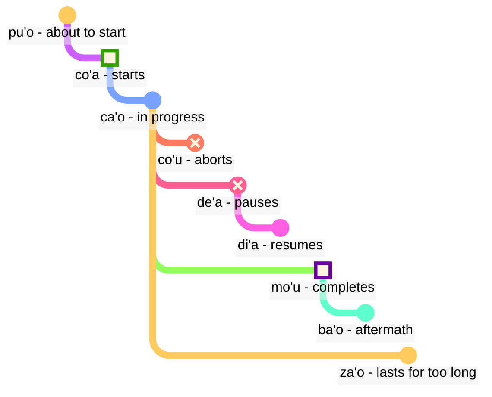

## Leciono 6: modalaj terminoj: tempo kaj spaco

> **mi citka le cirla**

Mogaj tradukoj:

> _Mi manĝas fromaĝon._
> _Mi manĝis fromaĝon._
> _Mi ĉiam manĝas fromaĝon._
> _Baldaŭ mi finos manĝi fromaĝon._

Tempoj en Loĵbano estas opcionalaj; ni ne devas ĉiam pensi pri kiu tempo uzi.

Kunteksto ofte solvas kio estas ĝusta. Ni aldonas tempojn kiam ni sentas ke ni bezonas ilin.

Loĵbana tempoj traktas tempon kaj spacon sammaniere. Dirante ke _mi laboris antaŭ longa tempo_ ne estas gramatike malsama ol diri _mi laboras malproksime al la nordo_. La angla traktas vortojn kiel _antaŭe_, pasinta tempo finiĝanta je _-ed_, kaj spacajn vortojn kiel _en_ aŭ _apud_ en tri malsamaj skemoj, dum en Loĵbano ili sekvas la saman principon.

### Punktoj en tempo kaj spaco

Tempa modalpartikulo sen posta argumento priskribas la eventon relative al _tie_ kaj _nun_:

> **mi pinxe ba**
> **mi ba pinxe**
> _Mi trinkos._

<!-- -->

> **mi pinxe bu'u**
> **mi bu'u pinxe**
> _Mi trinkas ĉi tie._

Tempa modaltermo kun posta argumento priskribas la eventon relative al la evento en tiu argumento:

> **mi pinxe ba le nu mi cadzu**
> _Mi trinkas post kiam mi promenas._

### Eventoj relative al aliaj eventoj en tempo

En la angla, ni uzas la tiel-nomatan "sekvencon de tempoj":

> **la .alis. pu cusku le se du'u ri pu penmi la .doris.**
> _Aliso diris ke ŝi vidis Doris antaŭe._

Ĉi tie, la evento _vidis Doris_ okazas antaŭ la evento _Aliso diris_. Tamen, en

> **la .alis. pu cusku le se du'u ri ca kansa la .doris.**
> _Aliso diris ke ŝi estis kun Doris._

la du eventoj (_diris_ kaj _estis kun Doris_) okazas samtempe.

Do, en la angla:

- la tempo de la ĉefa rilato estas komprenita relative al kiu ajn elparolas tiun rilaton.
- la tempo de la rilato ene de la ĉefa rilato ankaŭ estas komprenita relative al kiu ajn elparolas tiun rilaton.

En Loĵbano:

- nur la tempo de la ĉefa rilato estas relative al kiu ajn elparolas la rilaton.
- la aliaj tempoj estas relative al si mem. Tial, en **la .alis. pu cusku le se du'u ri pu penmi la .doris.** la dua **pu** estas relative al la unua **pu**. En **la .alis. pu cusku le se du'u ri ca kansa la .doris.**, ni uzas **ca** (_samtempe_) kiu estas relative al la ekstera rilato (**pu cusku** — _diris_).

Tamen, ni povas uzi la modalan terminon **nau** (_en la tempo aŭ loko de la parolanto_), kiu donos la saman efikon kiel en la angla:

Jen ekzemplo en angla stilo:

> **la .alis. pu cusku le se du'u ri nau pu kansa la .doris.**
> _Alis diris ke ŝi estis kun Doris._

<!-- Por diri frazojn kiel `en tri tagoj` aŭ `antaŭ du jaroj` ni bazalie metas tempajn intervalojn en sekvan ordon sen superpoziĉo. Do nova verbo:

> **le cabna cu dzoli le nu mi penmi do kei li ci le ka prulamdei**
> _Mi renkontos vin post tri tagoj (kiel mezurite de nun)._

> **dzoli le nu mi penmi do kei li ci le ka prulamdei**
> **dzoli le nu mi penmi do kei li ci le ka prulamdei**
> **prulamdeidzo le nu mi penmi do kei li ci**
> **mi penmi do fi'o prulamdeidzo be fi li ci**
> _Mi renkontos vin post tri tagoj._

> **le cabna cu dzoli le nu mi zvati le stuzi kei li re le ka bavlamdeidzo**
> **le nu mi zvati le stuzi kei le cabna cu dzoli li re le ka prulamdeidzo**
> _Mi vizitis tiun lokon antaŭ du jaroj._ -->

### Distanco en tempo kaj spaco

fau
: modaltermo: en la sama tempo, loko aŭ situacio kiel ...

ca
: modaltermo: je ... (iu tempo), samtempe kiel ...; "nuna tempo"

bu'u
: modaltermo: je ... (iu loko); ĉi tie (en tiu loko)

zi
: _ĵus_ (antaŭ mallonga tempo) aŭ _baldaŭ_ (post mallonga tempo)

vi
: proksime de ...

za
: _antaŭ iom da tempo_ aŭ _post iom da tempo, en neprecizigita tempo_

va
: ne malproksime de ...

zu
: _antaŭ longa tempo_ aŭ _post longa tempo_

vu
: malproksime de ...; malproksime

Tiel ni povas uzi kombinojn de tempoj por precizigi kiom for ni iras en la pasinteco aŭ estontecon:

- **pu zu** signifas _antaŭ longa tempo_
- **pu za** signifas _antaŭ iom da tempo_
- **pu zi** signifas _ĵus_
- **ba zi** signifas _baldaŭ_
- **ba za** signifas _post iom da tempo_
- **ba zu** signifas _post longa tempo_

Atentu la vokalordon **i**, **a**, kaj **u**. Ĉi tiu ordo aperas ripete en Loĵbano kaj eble meritas memori. _Mallonga_ kaj _longa_ ĉiam dependas de la kunteksto, estas relative kaj subjektivaj. Ekzemple, ducent jaroj estas mallonga tempo por specio evolui sed longa tempo atendi la buson.

**zi**, **za**, kaj **zu** modifas la tempoparton kiel **pu** kaj **ba** kiuj estas diritaj antaŭe:

- **pu zu** estas _antaŭ longa tempo_. **pu** montras ke ni komencas en la pasinteco, kaj **zu** indikas ke estas longa tempo malantaŭen.
- **zu pu** estas _malproksime en tempo; estas punkto post iu evento_. **zu** montras ke ni komencas je iu punkto malproksime en tempo de nun, kaj **pu** indikas ke ni moviĝas malantaŭen de tiu punkto.

Do, **pu zu** ĉiam estas en la pasinteco, dum **zu pu** povus esti en la estonteco.

Spacan distancon markas simile per **vi**, **va**, kaj **vu** por mallonga, neprecizigita (meza), kaj longa distanco en spaco.

Por specifi distancon en tempo aŭ spaco, ni uzas la modalan terminon **la'u** kun argumento specifanta la distancon:

> **ba ku la'u le djedi be li ci mi zvati ti**
> _Post tri tagoj, mi estos ĉi tie._

La spaca ekvivalento de **ca** estas **bu'u**, kaj **fau** estas pli neklara ol la du, ĉar ĝi povas signifi tempon, spacon, aŭ situacion.

> **ba za vu ku mi gunka**
> _Iam en la estonteco, mi laboros en loko malproksima._

gunka
: labori

> **mi bu'u pu zu gunka**
> _Antaŭ longa tempo, mi laboris ĉi tie._
> `Mi ĉi tie-pasinta-longa-tempa-distanco laboris`

> **pu zu vu ku zasti fa le ninmu .e le nanmu**
> _Antaŭ longa tempo kaj malproksime, virino kaj viro loĝis._

La lasta frazo estas kiel komenciĝas fabeloj ofte.

### Daŭro en tempo kaj spaco

ze'i
: modala termino: por mallonga tempo

ve'i
: modala termino: super malgranda spaco

ze'a
: modala termino: por iom da tempo

ve'a
: modala termino: super iom da spaco

ze'u
: modala termino: por longa tempo

ve'u
: modala termino: super la longa spaco

Denove, estas facile memori ĝin donita la modelo **i**, **a**, **u**.

> **mi ze'u bajra**
> _Mi kuras longan tempon._
<!-- -->
> **do ze'u klama le mi'a gugde ze'u**
> _Vi pasigas longan tempon venante al nia lando._
mi'a
: ni sen vi

gugde
: … estas lando

> **mi ba zi ze'a xabju la .djakartas.**
> _Tre baldaŭ, mi loĝos en Jakarta iom da tempo._
<!-- -->

> **le jenmi pe la .romas. ba ze'u gunta la .kart.xadact.**
> _La armeo de la Romianoj atakos Kartagon longan tempon._

Tio ne signifas ke la Romianoj ne atakas Kartagon nuntempe. En Loĵbano, se ni diras ke io estas vera je aparta tempo, tio ne signifas ke ĝi ne estas vera je iu alia tempo. Ni povas diri **pu ba ze'u** por ke ni sciu ke tiu ago estis en la estonteco kiam rigardita de iu punkto en la pasinteco sed en la pasinteco kiam rigardita de hodiaŭ.

> **la xamsi**
> _maro/oceano_
<!-- -->

> **la ve'u xamsi**
> _oceano_

<pixra url="/assets/pixra/cilre/le_vehi_ja_vehu_cmana.webp" caption="la monteto estas proksima al la monto." definition="La hill estas proksima al la mountain."></pixra>

> **la cmana**
> _monto/monteto_
<!-- -->

> **la ve'u cmana**
> _monto_
<!-- -->

> **la ve'i cmana**
> _monteto_
<!-- -->

> **ti ve'u gerku**
> _Tio estas granda hundo. Tio estas hundo kiu kovras grandan spacon._

### «**pu'o**» — ‘_esti proksima_’, «**ba'o**» — ‘_jam ne_’, «**za'o**» — ‘_ankoraŭ_’, «**xa'o**» — ‘_jam_’

Jen pluraj grupoj de modalaj terminoj kiuj povas helpi nin aldoni pli precizajn signifojn laŭ neceso.

Kun _eventaj konturoj_, malsame al **pu**, **nun**, kaj **jam**, ni rigardas ke ĉiu evento havas formon kun certaj stadioj:

pu'o
: modaltermo: esti proksima fari ion (la evento ankoraŭ ne okazis)

ba'o
: modaltermo: jam ne fari ion, jam fari ion (la evento finiĝis)

Ekzemploj:

> **mi ba tavla le mikce**
> _Mi parolos al la kuracisto (kaj eble mi jam parolas nun)._

mikce
: $x_1$ estas kuracisto

<!-- -->

> **mi pu pu'o tavla le mikce**
> _Mi estis proksima paroli al la kuracisto (mi ne parolis je tiu tempo, la evento ne komenciĝis je tiu tempo)._

<pixra url="/assets/pixra/cilre/puho_nenri.webp" caption="la persono estas proksima eniri." definition="La persono estas proksima eniri."></pixra>

<!-- -->

> **la sanmi ca pu'o bredi**
> _La manĝaĵo ankoraŭ ne estas preta._

<!-- -->

> **mi pu ba'o tavla le mikce**
> _Mi jam parolis al la kuracisto._

<pixra url="/assets/pixra/cilre/baho_carvi.webp" caption="ba'o carvi" definition="Post la pluvo. La pluvo ĉesis."></pixra>

<!-- -->

> **mi ba ba'o tavla le mikce**
> _Mi jam parolos al la kuracisto._

<!-- -->

> **.a'o mi ba zi ba'o gunka**
> _Mi esperas baldaŭ mi jam faros la laboron._

za'o
: modaltermo: ankoraŭ. La evento estas en procezo post sia natura fino

Ekzemploj:

> **ri'a ma do za'o zvati vi**
> _Kial vi estas ankoraŭ ĉi tie?_

<!-- -->

> **la .kevin. xa'o zvati vi**
> _Kevin jam estas ĉi tie._

### Etapoj de evento

> **mi co'a tavla**
> _Mi ekparolis._

<!-- -->

> **ra ca'o ciska**
> _Ŝi daŭre skribas._

<!-- -->

> **ra pu co'u vasxu**
> _Li ĉesis spiri (subita neantaŭvidebla ŝanĝo)._

vasxu
: $x_1$ spiras $x_2$

> **mi pu mo'u citka le plise**
> _Mi manĝis la pomon._

<!-- -->

> **la .maks. pu mo'u zbasu ti voi dinju**
> _Max konstruis ĉi tiun domon._

<!-- -->

> **ra pu de'a vasxu**
> _Ŝi ĉesis spiri (sed eble denove spiri poste)._

<pixra url="/assets/pixra/cilre/deha_vasxu.webp" caption="mi de'a vasxu" definition="Mi paŭzas en spirado. Mi retenas la spiron."></pixra>

<!-- -->

> **mi pu di'a citka le plise**
> _Mi rekomencis manĝi pomojn._

<pixra url="/assets/pixra/cilre/diha_vasxu.webp" caption="mi di'a vasxu" definition="Mi rekomencas spiradon."></pixra>

co'a
: modala termino: la evento komenciĝas (la limo de la evento)

ca'o
: modala termino: esti faranta ion (la evento estas en progreso)

co'u
: modala termino: la evento ĉesas

mo'u
: modala termino: la evento finiĝas (la limo de la evento)

DEA
: la evento paŭzas (la evento povas esti atendita daŭri)

di'a
: la evento rekomenciĝas

> **mi de'a ze'i jundi**
> _BRB (mi tuj revenos)._

<!-- -->

> **mi di'a jundi**
> _Mi revenis (estas atentema)._

jundi
: $x_1$ atentas $x_2$

Ĉi tiuj du esprimoj estas oftaj en tekstaj babilejoj por indiki ke vi estas for aŭ ne atentas, kaj poste revenas interrete:

Oni povus kompreneble ankaŭ diri nur **de'a** aŭ **di'a** kaj esperi, ke la punkto transiros.

### Daŭraj kaj progresaj eventoj

ru'i
: modala termino: la evento estas daŭra

> **.i mi pu ru'i citka le plise**
> _Mi estis daŭre manĝanta pomojn._

Notu la diferencon:

- **ru'i** indikas ke la evento estas daŭra kaj neniam paŭzas.
- **ca'o** implicas ke la evento progresas. Ĝi eble foje paŭzas kaj poste denove daŭras sian progreson.

### Loko-konturoj

Eventaj konturoj povas esti uzataj por rilati al spaco se ni antaŭmetas ilin per **fe'e**:

> **le rokci cu fe'e ro roi zvati**
> _La ŝtonoj estas ĉie._

### ‘_maldekstren_’, ‘_dekstren_’

> **le prenu cu sanli le dertu bu'u le pritu be mi**
> _La persono staras sur la tero dekstre de mi._

<!-- -->

> **le gerku cu vreta le ckana bu'u le zunle be le verba**
> _La hundo kuŝas sur la lito maldekstre de infano._

<!-- -->

> **ko jgari le panbi poi zunle**
> _Prenu la plumon maldekstre._

<!-- -->

> **le mlatu cu plipe bu'u le crane be do**
> _Kato saltas antaŭ vi._

<!-- -->

> **ko catlu le dinju poi crane**
> _Rigardu la domon antaŭe._

<!-- -->

> **le verba cu zutse le stizu bu'u le trixe be mi**
> _La infano sidas sur la seĝo malantaŭ mi._

<!-- -->

> **le prenu cu sanli ki mi bu'u le pritu be le tricu bei mi**
> _La persono staras dekstre de arbo de mia vidpunkto._

<!-- -->

> **le dinju cu zunle le rokci ti**
> _La domo estas maldekstre de la roko se rigardata de ĉi tie._

zunle
: $x_1$ estas maldekstre de $x_2$ laŭ vido de $x_3$

pritu
: $x_1$ estas dekstre de $x_2$ laŭ vido de $x_3$

crane
: $x_1$ estas antaŭ $x_2$ (inter $x_2$ kaj la spektanto) laŭ vido de $x_3$

trixe
: $x_1$ estas malantaŭ $x_2$ laŭ vido de $x_3$

sanli
: $x_1$ staras sur $x_2$

zutse
: $x_1$ sidas sur $x_2$

vreta
: $x_1$ kuŝas sur $x_2$

le dertu
: la tero, la tero

le ckana
: la lito

le stizu
: la seĝo

le pelji
: la papero

le penbi
: la plumo

### Ekzerciĝo: pozicio

<table>
<tbody><tr>
<td style="text-align:right;"><b>ma nabmi</b>
</td>
<td><i>Kio estas la problemo?</i>
</td></tr>
<tr>
<td style="text-align:right;"><b>ma'a nitcu tu'a le fonxa pe la .alis.</b>
</td>
<td><i>Ni bezonas la telefonon de Alice.</i>
</td></tr>
<tr>
<td style="text-align:right;"><b>.i la .alis. ca zvati ma</b>
</td>
<td><i>Kie estas Alice?</i>
</td></tr>
<tr>
<td style="text-align:right;"><b>la .alis. ca na ku zvati le bu'u tcadu .i mi pu mrilu le srana be le fonxa fi la .alis. .i ri ca ca'o vofli la .paris. .i ku'i mi pu zi te benji le se mrilu be la .alis. .i ri curmi le nu mi'a pilno le fonxa .i .e'o do bevri ri mi</b>
</td>
<td> Alice nun ne estas en la urbo. Mi sendis leteron pri la telefono al ŝi. Alice nun flugas al Parizo. Sed mi ĵus ricevis leteron de ŝi. Ŝi permesas al ni uzi la telefonon. Bonvolu alporti ĝin al mi.
</td></tr>
<tr>
<td style="text-align:right;"><b>.i bu'u ma mi ka'e cpacu le fonxa</b>
</td>
<td>Kie mi povas preni la telefonon?
</td></tr>
<tr>
<td style="text-align:right;"><b>le purdi .i .e'o do klama le bartu</b>
</td>
<td>En la ĝardeno. Bonvolu, iru eksteren.
</td></tr>
<tr>
<td style="text-align:right;"><b>mi ca zvati ne'a le vorme .i ei mi ca klama ma</b>
</td>
<td>Mi estas apud la pordo. Nun kien mi devas iri?
</td></tr>
<tr>
<td style="text-align:right;"><b>ko klama le zunle be le tricu .i ba ku do viska le pa jubme</b>
</td>
<td>Irante maldekstren de la arbo. Poste vi vidos tablon.
</td></tr>
<tr>
<td style="text-align:right;"><b>mi zgana no jubme</b>
</td>
<td>Mi ne rimarkas tablojn.
</td></tr>
<tr>
<td style="text-align:right;"><b>ko carna gi'e muvdu le pritu .i le jubme cu crane le cmalu dinju .i le fonxa cu cpana le jubme .i ji'a ko jgari le penbi .e le pelji .i le za'u dacti cu cpana si'a le jubme .i ba ku ko bevri le ci dacti le zdani gi'e punji fi le sledi'u pe mi</b>
</td>
<td>Turniĝu kaj moviĝu dekstren. La tablo estas antaŭ malgranda konstruaĵo. La telefono estas sur la tablo. Ankaŭ, prenu plumon kaj paperon. Ili estas sammaniere sur la tablo. Poste alportu la tri aferojn hejmen kaj metu ilin en mian ĉambron.
</td></tr>
<tr>
<td style="text-align:right;"><b>vi'o</b>
</td>
<td>Faru.
</td></tr></tbody></table>

### Ekzercado: veturiloj

<table>

<tbody><tr>
<td style="text-align:right;"><b>mi jo'u le pendo be mi pu ca'o litru le barda rirxe bu'u le bloti</b>
</td>
<td><i>Mi kaj miaj amikoj vojaĝis sur granda rivero en boato.</i>
</td></tr>
<tr>
<td style="text-align:right;"><b>.i ba bo mi'a klama le vinji tcana</b>
</td>
<td><i>Tiam ni iris al flughaveno.</i>
</td></tr>
<tr>
<td style="text-align:right;"><b>.i xu do se marce le karce</b>
</td>
<td><i>Ĉu vi prenis aŭton?</i>
</td></tr>
<tr>
<td style="text-align:right;"><b>.i na ku se marce .i mi'a pu klama fu le trene .i ze'a le cacra mi'a zvati bu'u le carce</b>
</td>
<td><i>Ne. Ni iris per trajno. Horon ni estis en vagono.</i>
</td></tr></tbody></table>

marce
: $x_1$ estas veturilo, kiu transportas $x_2$

se marce
: $x_1$ estas pasaĝero de $x_2$

karce
: $x_1$ estas aŭto, kiu transportas $x_2$

bloti
: $x_1$ estas boato, kiu transportas $x_2$

vinji
: $x_1$ estas aviadilo, kiu transportas $x_2$

trene
: $x_1$ estas trajno el vagonoj $x_2$

### Enriĉante vortprovizon. Novaj vortoj uzante tempojn

Multaj unuaj anglaj vortoj korespondas al vortkombinaĵoj en Loĵbano:

pixra
: $x_1$ estas bildo de $x_3$

le vi'a pixra
: la bildo en 2D

le vi'u pixra
: la bildo en 3D, skulpturo

<pixra url="/assets/pixra/cilre/viha_pixra.webp" caption="vi'a pixra" definition="2D bildo, 2D desegno."></pixra>

<pixra url="/assets/pixra/cilre/vihu_pixra.webp" caption="vi'u pixra" definition="3D bildo, skulpturo."></pixra>

le ve'i cmana
: la monteto (literale "monto/monteto kovranta malmulton da spaco")

le ve'u xamsi
: la oceano (literale "maro/oceano kovranta grandan spacon")

le ba'o tricu
: trunko de arbo (literale "la jam ne plu arbo")
