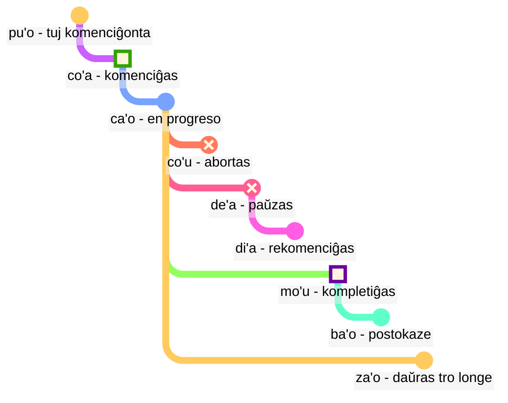

## Leciono 6: modalaj terminoj: tempo kaj spaco

> **mi citka le cirla**

Eblaj tradukoj:

> _Mi manĝas fromaĝon._
> _Mi manĝis fromaĝon._
> _Mi ĉiam manĝas fromaĝon._
> _Post momento, mi estos ĵus fininta manĝi fromaĝon._

Tempoj en Loĵbano estas opcionalaj; ni ne devas ĉiam pensi pri kiu tempo uzi.

Kunteksto ofte solvas kio estas ĝusta. Ni aldonas tempojn kiam ni sentas ke ni bezonas ilin.

Loĵbanaj tempoj traktas tempon kaj spacon sammaniere. Diri ke _mi laboris antaŭ longa tempo_ ne estas gramatike malsama ol diri _mi laboras malproksime norde_. Esperanto traktas vortojn kiel _antaŭe_, pasinta tempo finiĝanta je _-is_, kaj spacajn vortojn kiel _en_ aŭ _apud_ laŭ tri malsamaj skemoj, dum en Loĵbano ili sekvas la saman principon.

### Punktoj en tempo kaj loko

Tempa modala partiklo sen posta argumento priskribas la eventon kiel rilatan al _ĉi tie_ kaj _nun_:

> **mi pinxe ba**
> **mi ba pinxe**
> _Mi trinkos._

<!-- -->

> **mi pinxe bu'u**
> **mi bu'u pinxe**
> _Mi trinkas ĉe ĉi tiu loko._

Tempa modala termino kun posta argumento priskribas la eventon kiel rilatan al la evento en tiu argumento:

> **mi pinxe ba le nu mi cadzu**
> _Mi trinkas post kiam mi promenas._

#### Tasko

Kovru la dekstran parton de la tabelo. Traduku el Loĵbano:

<table>
<tbody><tr>
<td><b>mi bu'u pinxe</b></td>
<td><i>Mi trinkas ĉi tie.</i></td></tr>
<tr>
<td><b>mi ba citka le plise</b></td>
<td><i>Mi manĝos la pomon.</i></td></tr>
<tr>
<td><b>mi pinxe ba le nu mi cadzu</b></td>
<td><i>Mi trinkas post kiam mi promenas.</i></td></tr>
</tbody></table>

Traduku al Loĵbano:

<table>
<tbody><tr>
<td><i>Mi promenos.</i></td>
<td><b>mi ba cadzu</b></td></tr>
<tr>
<td><i>Mi trinkas antaŭ ol mi dormas.</i></td>
<td><b>mi pinxe pu le nu mi sipna</b></td></tr>
</tbody></table>

### Eventoj relative al aliaj eventoj en tempo

En Esperanto, ni uzas la tiel nomatan "sinsekvon de tempoj":

> **la .alis. pu cusku le se du'u ri pu penmi la .doris.**
> _Alico diris ke ŝi antaŭe vidis Doris._

Ĉi tie, la evento _vidis Doris antaŭe_ okazas antaŭ la evento _Alico diris_. Tamen, en

> **la .alis. pu cusku le se du'u ri ca kansa la .doris.**
> _Alico diris ke ŝi estis kun Doris._

la du eventoj (_diris_ kaj _estis kun Doris_) okazas samtempe.

Tiel, en Esperanto:

- la tempo de la ĉefa rilato estas komprenata relative al tiu, kiu esprimas tiun rilaton.
- la tempo de la rilato ene de la ĉefa rilato ankaŭ estas komprenata relative al tiu, kiu esprimas tiun rilaton.

En Loĵbano:

- nur la tempo de la ĉefa rilato estas rilata al tiu, kiu esprimas la rilaton.
- la aliaj tempoj estas rilataj unu al la alia. Jen kial, en **la .alis. pu cusku le se du'u ri pu penmi la .doris.** la dua **pu** estas rilata al la unua **pu**. En **la .alis. pu cusku le se du'u ri ca kansa la .doris.**, ni uzas **ca** (_samtempe_) kiu estas rilata al la ekstera rilato (**pu cusku** — _diris_).

Tamen, ni povas uzi la modalan terminon **nau** (_je la tempo aŭ loko de la parolanto_), kiu donos la saman efikon kiel funkcias Esperanto:

Jen ekzemplo en esperanta stilo:

> **la .alis. pu cusku le se du'u ri nau pu kansa la .doris.**
> _Alico diris ke ŝi estis kun Doris._

<!-- Por diri frazojn kiel `post tri tagoj` aŭ `antaŭ du jaroj` ni bazale metas tempajn intervalojn en sekvenco sen interkovrado. Jen nova verbo:

> **le cabna cu dzoli le nu mi penmi do kei li ci le ka prulamdei**
> _Mi renkontos vin post tri tagoj (kiel mezurite el nun)._

> **dzoli le nu mi penmi do kei li ci le ka prulamdei**
> **dzoli le nu mi penmi do kei li ci le ka prulamdei**
> **prulamdeidzo le nu mi penmi do kei li ci**
> **mi penmi do fi'o prulamdeidzo be fi li ci**
> _Mi renkontos vin post tri tagoj._

> **le cabna cu dzoli le nu mi zvati le stuzi kei li re le ka bavlamdeidzo**
> **le nu mi zvati le stuzi kei le cabna cu dzoli li re le ka prulamdeidzo**
> _Mi vizitis tiun lokon antaŭ du jaroj._ -->

#### Tasko

Kovru la dekstran parton de la tabelo. Traduku el Loĵbano:

<table>
<tbody><tr>
<td><b>la .alis. pu cusku le se du'u ri ba penmi la .doris.</b></td>
<td><i>Alico diris ke ŝi renkontos Doris.</i></td></tr>
<tr>
<td><b>mi pu djuno le du'u do ca gunka</b></td>
<td><i>Mi sciis ke vi laboris.</i></td></tr>
<tr>
<td><b>mi pu na djuno le du'u do ba zvati ti</b></td>
<td><i>Mi ne sciis ke vi estos ĉi tie.</i></td></tr></tbody></table>

Kovru la dekstran parton de la tabelo. Traduku al Loĵbano:

<table>
<tbody><tr>
<td><i>Ŝi diris al mi ke ŝi antaŭe estis hejme.</i></td>
<td><b>ri pu cusku le se du'u ri pu zvati le zdani</b></td></tr>
<tr>
<td><i>Mi scias ke vi estas saĝa.</i></td>
<td><b>mi djuno le du'u do ca stati</b></td></tr></tbody></table>

### Distanco en tempo kaj spaco

fau
: modala termino: je la sama tempo, loko aŭ situacio kiel …

ca
: modala termino: je … (iu tempo), samtempe kiel …; "nuna tempo"

bu'u
: modala termino: je … (iu loko); ĉi tie (ĉe ĉi tiu loko)

zi
: _ĵus_ (antaŭ mallonga tempo) aŭ _baldaŭ_ (post mallonga tempo)

vi
: proksime de …

za
: _antaŭ iom da tempo_ aŭ _post iom da tempo, post nespecifa tempo_

va
: ne malproksime de …

zu
: _antaŭ longa tempo_ aŭ _post longa tempo_

vu
: malproksime de …; malproksime

Jen kiel ni povas uzi temp-kombinojn por specifi kiom malproksimen ni iras en la pasinteco aŭ estonteco:

- **pu zu** signifas _antaŭ longa tempo_
- **pu za** signifas _antaŭ iom da tempo_
- **pu zi** signifas _ĵus_
- **ba zi** signifas _baldaŭ_
- **ba za** signifas _post iom da tempo_
- **ba zu** signifas _post longa tempo_

Notu la vokalan ordon **i**, **a**, kaj **u**. Ĉi tiu ordo aperas ripete en Loĵbano kaj povus esti inda memorigi. _Mallonga_ kaj _longa_ estas ĉiam kunteksto-dependaj, relativaj, kaj subjektivaj. Ekzemple, ducent jaroj estas mallonga tempo por specio evolui sed longa tempo por atendi la buson.

**zi**, **za**, kaj **zu** modifas la temp-partiklon kiel **pu** kaj **ba** kiu estas dirita antaŭ ĝi:

- **pu zu** estas _antaŭ longa tempo_. **pu** montras ke ni komencas en la pasinteco, kaj **zu** indikas ke ĝi estas longa tempo malantaŭen.
- **zu pu** estas _malproksime en tempo; estas punkto post iu evento_. **zu** montras ke ni komencas je iu punkto malproksime en tempo de nun, kaj **pu** indikas ke ni moviĝas malantaŭen de tiu punkto.

Tiel, **pu zu** estas ĉiam en la pasinteco, dum **zu pu** povus esti en la estonteco.

Spaca distanco estas markita simile per **vi**, **va**, kaj **vu** por mallonga, nespecifa (meza), kaj longa distanco en spaco.

Por specifi distancon en tempo aŭ spaco, ni uzas la modalan terminon **la'u** kun argumento specifanta la distancon:

> **ba ku la'u le djedi be li ci mi zvati ti**
> _Post tri tagoj, mi estos ĉi tie._

La spaca ekvivalento de **ca** estas **bu'u**, kaj **fau** estas pli vaga ol la du, ĉar ĝi povas signifi tempon, spacon, aŭ situacion.

> **ba za vu ku mi gunka**
> _Post iom da tempo en la estonteco, mi laboros je loko malproksime._

gunka
: labori

> **mi bu'u pu zu gunka**
> _Mi kutimis labori ĉi tie antaŭ longa tempo._
> `Mi ĉi-tie-pasinta-longa-tempo-distanco laboras`

> **pu zu vu ku zasti fa le ninmu .e le nanmu**
> _Antaŭ longa tempo kaj malproksime, vivis virino kaj viro._

La lasta frazo estas kiel fabeloj ofte komenciĝas.

#### Tasko

Kovru la dekstran parton de la tabelo. Traduku el Loĵbano:

<table>
<tbody><tr>
<td><b>mi pu zu gunka</b></td>
<td><i>Mi laboris antaŭ longa tempo.</i></td></tr>
<tr>
<td><b>do ba zi cliva</b></td>
<td><i>Vi foriros baldaŭ.</i></td></tr>
<tr>
<td><b>mi vu zvati</b></td>
<td><i>Mi estas malproksime.</i></td></tr>
</tbody></table>

Traduku al Loĵbano:

<table>
<tbody><tr>
<td><i>Mi laboros post iom da tempo.</i></td>
<td><b>mi ba za gunka</b></td></tr>
<tr>
<td><i>Vi estas proksime.</i></td>
<td><b>do vi zvati</b></td></tr>
</tbody></table>

### Daŭro en tempo kaj spaco

ze'i
: modala termino: dum mallonga tempo

ve'i
: modala termino: tra malgranda spaco

ze'a
: modala termino: dum iom da tempo

ve'a
: modala termino: tra iom da spaco

ze'u
: modala termino: dum longa tempo

ve'u
: modala termino: tra longa spaco

Denove, estas facile memori dank al la ŝablono **i**, **a**, **u**.

> **mi ze'u bajra**
> _Mi kuras dum longa tempo._

<!-- -->

> **do ze'u klama le mi'a gugde ze'u**
> _Vi pasigas longan tempon venante al nia lando._
> mi'a
> : ni sen vi

gugde
: … estas lando

> **mi ba zi ze'a xabju la .djakartas.**
> _Tre baldaŭ, mi loĝos en Ĝakarto dum iom da tempo._

<!-- -->

> **le jenmi pe la .romas. ba ze'u gunta la .kart.xadact.**
> _La armeo de Romio atakas Kartagon dum longa tempo._

Ĉi tio ne signifas ke romanoj ne atakas Kartagon ĉi tiujn tagojn. En Loĵbano, se ni diras ke io estas vera je aparta tempo, ĝi ne signifas ke ĝi ne estas vera je iu alia tempo. Vi povas diri **pu ba ze'u** por ke ni sciu ke ĉi tiu aktiveco estis en la estonteco kiam vidita el iu punkto en la pasinteco sed en la pasinteco kiam vidita el hodiaŭ.

> **le xamsi**
> _maro/oceano_

<!-- -->

> **le ve'u xamsi**
> _oceano_

<pixra url="/assets/pixra/cilre-xekri-g-out/le_vehi_ja_vehu_cmana.webp" caption="le ve'i cmana cu jibni le ve'u cmana" definition="La monteto estas proksima al la monto."></pixra>

> **le cmana**
> _monto/monteto_

<!-- -->

> **le ve'u cmana**
> _monto_

<!-- -->

> **le ve'i cmana**
> _monteto_

<!-- -->

> **ti ve'u gerku**
> _Tio estas granda hundo. Ĉi tio estas hundo kovranta grandan spacon._

#### Tasko

Kovru la dekstran parton de la tabelo. Traduku el Loĵbano:

<table>
<tbody><tr>
<td><b>mi ze'u pinxe le tcati</b></td>
<td><i>Mi trinkas teon dum longa tempo.</i></td></tr>
<tr>
<td><b>mi ve'i zvati le kumfa</b></td>
<td><i>Mi estas en malgranda ĉambro.</i></td></tr>
</tbody></table>

Traduku al Loĵbano:

<table>
<tbody><tr>
<td><i>Mi restos ĉi tie dum iom da tempo.</i></td>
<td><b>mi ze'a zvati ti</b></td></tr>
<tr>
<td><i>La hundo kovras grandan spacon.</i></td>
<td><b>le gerku cu ve'u zvati</b></td></tr>
</tbody></table>

### «**pu'o**» — '_esti tuj faronta_', «**ba'o**» — '_ne plu_', «**za'o**» — '_ankoraŭ_', «**xa'o**» — '_jam_'

Jen kelkaj aroj de modalaj terminoj kiuj povas helpi nin aldoni pli subtilajn signifojn kiam necese.

Per _event-konturoj_, male al **pu**, **ca**, kaj **ba**, ni rigardas ĉiun eventon kiel havantan formon kun certaj stadioj:

pu'o
: modala termino: esti tuj faronta ion (la evento ankoraŭ ne okazis)

ba'o
: modala termino: ne plu fari ion, esti farinta ion (la evento finiĝis)

Ekzemploj:

> **mi ba tavla le mikce**
> _Mi parolos al la kuracisto (kaj mi eble ankaŭ parolas nun)._

mikce
: x₁ estas kuracisto

<!-- -->

> **mi pu pu'o tavla le mikce**
> _Mi estis tuj parolonta al la kuracisto (mi ne parolis je tiu tempo, la evento ankoraŭ ne komenciĝis je tiu tempo)._

<pixra url="/assets/pixra/cilre-xekri-g-out/puho_nenri.webp" caption="le prenu pu'o zvati le nenri" definition="La persono estas tuj enironta."></pixra>

<!-- -->

> **le sanmi ca pu'o bredi**
> _La manĝo ankoraŭ ne pretas._

<!-- -->

> **mi pu ba'o tavla le mikce**
> _Mi estis parolinta al la kuracisto._

<pixra url="/assets/pixra/cilre-xekri-g-out/baho_carvi.webp" caption="ba'o carvi" definition="Post-pluvo. La pluvo ĉesis."></pixra>

<!-- -->

> **mi ba ba'o tavla le mikce**
> _Mi estos parolinta al la kuracisto._

<!-- -->

> **.a'o mi ba zi ba'o gunka**
> _Mi esperas ke baldaŭ mi estos farinta la laboron._

za'o
: modala termino: ankoraŭ. La evento estas en progreso preter sia natura fino

xa'o
: neoficila modala termino: jam, tro frue. La evento jam komenciĝis kaj estas tro frue

Ekzemploj:

> **ri'a ma do za'o zvati vi**
> _Kial vi ankoraŭ estas ĉi tie?_

<!-- -->

> **la .kevin. xa'o zvati vi**
> _Kevin jam estas ĉi tie._

#### Tasko

Kovru la dekstran parton de la tabelo. Traduku el Loĵbano:

<table>
<tbody><tr>
<td><b>mi pu pu'o ciska</b></td>
<td><i>Mi estis tuj skribonta.</i></td></tr>
<tr>
<td><b>le sanmi ba'o jukpa</b></td>
<td><i>La manĝo ne plu estas kuirata.</i></td></tr>
<tr>
<td><b>mi za'o kelci</b></td>
<td><i>Mi ankoraŭ ludas (pli longe ol atendite).</i></td></tr>
</tbody></table>

Traduku al Loĵbano:

<table>
<tbody><tr>
<td><i>Mi jam foriris.</i></td>
<td><b>mi xa'o cliva</b></td></tr>
<tr>
<td><i>La manĝaĵo pretos.</i></td>
<td><b>le cidja ba bredi</b></td></tr>
</tbody></table>

### Stadioj de evento

> **mi co'a tavla**
> _Mi komencis paroli._

<!-- -->

> **ra ca'o ciska**
> _Ŝi daŭre skribas._

<!-- -->

> **ra pu co'u vasxu**
> _Li ĉesis spiri (subita neantaŭvidebla ŝanĝo)._

vasxu
: x₁ spiras x₂

> **mi pu mo'u citka le plise**
> _Mi finmanĝis la pomon._

<!-- -->

> **la .maks. pu mo'u zbasu ti voi dinju**
> _Max finkonstruis ĉi tiun domon._

<!-- -->

> **ra pu de'a vasxu**
> _Ŝi ĉesis spiri (sed eble spiros denove poste)._

<pixra url="/assets/pixra/cilre-xekri-g-out/deha_vasxu.webp" caption="mi de'a vasxu" definition="Mi paŭzas en spirado. Mi retenas mian spiradon."></pixra>

<!-- -->

> **mi pu di'a citka le plise**
> _Mi rekomencis manĝi pomojn._

<pixra url="/assets/pixra/cilre-xekri-g-out/diha_vasxu.webp" caption="mi di'a vasxu" definition="Mi rekomencas spiri."></pixra>

co'a
: modala termino: la evento komenciĝas (la limo de la evento)

ca'o
: modala termino: fari ion (la evento estas en progreso)

co'u
: modala termino: la evento haltas

mo'u
: modala termino: la evento finiĝas (la limo de la evento)

de'a
: la evento paŭzas (la evento povas esti atendata daŭrigi)

di'a
: la evento rekomenciĝas

> **mi de'a ze'i jundi**
> _Tuj revenos (Mi tuj revenos)._

<!-- -->

> **mi di'a jundi**
> _Mi reestas (atentante)._

jundi
: x₁ atentas al x₂

Ĉi tiuj du esprimoj estas oftaj en tekstaj babilejoj por indiki ke vi estas for aŭ ne atentas, kaj poste revenante enrete:

Oni povus, kompreneble, ankaŭ diri nur **de'a** aŭ **di'a** kaj esperi ke la poento traigas.

#### Tasko

Kovru la dekstran parton de la tabelo. Traduku el Loĵbano:

<table>
<tbody><tr>
<td><b>mi co'a tavla</b></td>
<td><i>Mi komencis paroli.</i></td></tr>
<tr>
<td><b>mi ca'o pinxe le tcati</b></td>
<td><i>Mi trinkas la teon.</i></td></tr>
<tr>
<td><b>mi co'u tavla</b></td>
<td><i>Mi ĉesis paroli.</i></td></tr>
<tr>
<td><b>mi de'a vasxu</b></td>
<td><i>Mi paŭzas spiradon.</i></td></tr>
</tbody></table>

Traduku al Loĵbano:

<table>
<tbody><tr>
<td><i>Mi rekomencas labori.</i></td>
<td><b>mi di'a gunka</b></td></tr>
<tr>
<td><i>Mi finmanĝis.</i></td>
<td><b>mi mo'u citka</b></td></tr>
</tbody></table>

### Kontinuaj kaj progresaj eventoj

ru'i
: modala termino: la evento estas kontinua

> **.i mi pu ru'i citka le plise**
> _Mi kontinue manĝis pomojn._

Notu la diferencon:

- **ru'i** indikas ke la evento estas kontinua kaj neniam paŭzas.
- **ca'o** implicas ke la evento progresas. Ĝi povas foje paŭzi kaj poste rekomenci sian progreson.

#### Tasko

Kovru la dekstran parton de la tabelo. Traduku el Loĵbano:

<table>
<tbody><tr>
<td><b>mi pu ru'i citka le plise</b></td>
<td><i>Mi kontinue manĝis pomojn.</i></td></tr>
<tr>
<td><b>le mlatu cu ru'i sipna</b></td>
<td><i>La kato dormas kontinue.</i></td></tr>
<tr>
<td><b>xu do ca'o kelci</b></td>
<td><i>Ĉu vi ludas (ankoraŭ en progreso)?</i></td></tr></tbody></table>

kelci
: ludi

Kovru la dekstran parton de la tabelo. Traduku al Loĵbano:

<table>
<tbody><tr>
<td><i>Mi kontinue laboras ĉi tie.</i></td>
<td><b>mi ru'i gunka bu'u</b></td></tr>
<tr>
<td><i>Ili ankoraŭ dancas.</i></td>
<td><b>ri ca'o dansu</b></td></tr></tbody></table>

### Lokaj konturoj

Event-konturoj povas esti uzataj por referenci al spaco se ni prefiksas ilin per **fe'e**:

> **le rokci cu fe'e ro roi zvati**
> _La ŝtonoj estas ĉie._

### '_maldekstre_', '_dekstre_'

<pixra url="/assets/pixra/cilre-xekri-g-out/pritu_le_tricu.webp" caption="le prenu cu pritu le tricu le zgana" definition="La persono estas dekstre de la arbo el la vidpunkto de la observanto."></pixra>

> **le prenu cu sanli le dertu bu'u le pritu be mi**
> _La persono staras sur la tero dekstre de mi._

<!-- -->

> **le gerku cu vreta le ckana bu'u le zunle be le verba**
> _La hundo kuŝas sur la lito maldekstre de infano._

<!-- -->

> **ko jgari le panbi poi zunle**
> _Prenu la plumon maldekstre._

<!-- -->

> **le mlatu cu plipe bu'u le crane be do**
> _Kato saltas antaŭ vi._

<!-- -->

> **ko catlu le dinju poi crane**
> _Rigardu la domon antaŭe._

<!-- -->

> **le verba cu zutse le stizu bu'u le trixe be mi**
> _La infano sidas sur la seĝo malantaŭ mi._

<!-- -->

> **le prenu cu sanli ki mi bu'u le pritu be le tricu bei mi**
> _La persono staras dekstre de arbo el mia vidpunkto._

<!-- -->

> **le dinju cu zunle le rokci ti**
> _La domo estas maldekstre de la ŝtono se vidita el ĉi tie._

zunle
: x₁ estas maldekstre de x₂ kiel vidita el x₃

pritu
: x₁ estas dekstre de x₂ kiel vidita el x₃

crane
: x₁ estas antaŭ x₂ (x₁ estas inter x₂ kaj kiu ajn rigardas) kiel vidita el x₃

trixe
: x₁ estas malantaŭ x₂ kiel vidita el x₃

sanli
: x₁ staras sur x₂

zutse
: x₁ sidas sur x₂

vreta
: x₁ kuŝas sur x₂

le dertu
: la tero, la grundo

le ckana
: la lito

le stizu
: la seĝo

le pelji
: la papero

le penbi
: la plumo

#### Tasko

Kovru la dekstran parton de la tabelo. Traduku el Loĵbano:

<table>
<tbody><tr>
<td><b>le mlatu cu zunle le gerku</b></td>
<td><i>La kato estas maldekstre de la hundo.</i></td></tr>
<tr>
<td><b>ko cadzu le crane be mi</b></td>
<td><i>Marŝu antaŭ mi.</i></td></tr>
<tr>
<td><b>le prenu cu sanli le trixe be le dinju</b></td>
<td><i>La persono staras malantaŭ la domo.</i></td></tr>
</tbody></table>

Traduku al Loĵbano:

<table>
<tbody><tr>
<td><i>La hundo estas dekstre de mi.</i></td>
<td><b>le gerku cu pritu mi</b></td></tr>
<tr>
<td><i>Sidu antaŭ la domo.</i></td>
<td><b>ko zutse le crane be le dinju</b></td></tr>
</tbody></table>

### Ekzerco: pozicio

<table>
<tbody><tr>
<td style="text-align:right;"><b>ma nabmi</b>
</td>
<td><i>Kio estas la problemo?</i>
</td></tr>
<tr>
<td style="text-align:right;"><b>ma'a nitcu tu'a le fonxa pe la .alis.</b>
</td>
<td><i>Ni bezonas la telefonon de Alico.</i>
</td></tr>
<tr>
<td style="text-align:right;"><b>.i la .alis. ca zvati ma</b>
</td>
<td><i>Kie estas Alico?</i>
</td></tr>
<tr>
<td style="text-align:right;"><b>la .alis. ca na ku zvati le bu'u tcadu .i mi pu mrilu le srana be le fonxa fi la .alis. .i ri ca ca'o vofli la .paris. .i ku'i mi pu zi te benji le se mrilu be la .alis. .i ri curmi le nu mi'a pilno le fonxa .i .e'o do bevri ri mi</b>
</td>
<td> Alico ne estas nun en la urbo. Mi retpoŝtis pri la telefono al ŝi. Alico nun flugas al Parizo. Sed mi ĵus ricevis retpoŝton de ŝi. Ŝi permesas ke ni uzu la telefonon. Bonvolu, alportu ĝin al mi.
</td></tr>
<tr>
<td style="text-align:right;"><b>.i bu'u ma mi ka'e cpacu le fonxa</b>
</td>
<td>Kie mi povas ricevi la telefonon?
</td></tr>
<tr>
<td style="text-align:right;"><b>le purdi .i .e'o do klama le bartu</b>
</td>
<td>En la ĝardeno. Bonvolu, iru eksteren.
</td></tr>
<tr>
<td style="text-align:right;"><b>mi ca zvati ne'a le vorme .i ei mi ca klama ma</b>
</td>
<td>Mi estas proksime de la pordo. Nun kien mi devus iri?
</td></tr>
<tr>
<td style="text-align:right;"><b>ko klama le zunle be le tricu .i ba ku do viska le pa jubme</b>
</td>
<td>Iru maldekstren de la arbo. Tiam vi vidos tablon.
</td></tr>
<tr>
<td style="text-align:right;"><b>mi zgana no jubme</b>
</td>
<td>Mi rimarkas neniujn tablojn.
</td></tr>
<tr>
<td style="text-align:right;"><b>ko carna gi'e muvdu le pritu .i le jubme cu crane le cmalu dinju .i le fonxa cu cpana le jubme .i ji'a ko jgari le penbi .e le pelji .i le za'u dacti cu cpana si'a le jubme .i ba ku ko bevri le ci dacti le zdani gi'e punji fi le sledi'u pe mi</b>
</td>
<td>Turnu kaj moviĝu dekstren. La tablon estas antaŭ malgranda konstruaĵo. La telefono estas sur la tablo. Ankaŭ, prenu krajonon kaj paperon. Ili estas simile sur la tablo. Tiam alportu la tri aferojn hejmen kaj metu ilin en mian ĉambron.
</td></tr>
<tr>
<td style="text-align:right;"><b>vi'o</b>
</td>
<td>Faros.
</td></tr></tbody></table>

### Ekzerco: veturiloj

<table>

<tbody><tr>
<td style="text-align:right;"><b>mi jo'u le pendo be mi pu ca'o litru le barda rirxe bu'u le bloti</b>
</td>
<td><i>Mi kaj miaj amikoj vojaĝis sur granda rivero en boato.</i>
</td></tr>
<tr>
<td style="text-align:right;"><b>.i ba bo mi'a klama le vinji tcana</b>
</td>
<td><i>Tiam ni iris al flughaveno.</i>
</td></tr>
<tr>
<td style="text-align:right;"><b>.i xu do se marce le karce</b>
</td>
<td><i>Ĉu vi prenis aŭton?</i>
</td></tr>
<tr>
<td style="text-align:right;"><b>.i na ku se marce .i mi'a pu klama fu le trene .i ze'a le cacra mi'a zvati bu'u le carce</b>
</td>
<td><i>Ne. Ni iris per trajno. Dum unu horo ni estis en vagono.</i>
</td></tr></tbody></table>

marce
: x₁ estas veturilo portanta x₂

se marce
: x₁ estas pasaĝero de x₂

<!-- jai zu'e se marce
: x₁ prenas veturilon x₂ kiel pasaĝero -->

karce
: x₁ estas aŭto portanta x₂

bloti
: x₁ estas boato portanta x₂

vinji
: x₁ estas aviadilo portanta x₂

trene
: x₁ estas trajno de vagonoj x₂

### Riĉigante la vortaron. Novaj vortoj uzante tensojn

Multaj unuopaj esperantaj vortoj respondas al vort-kombinoj en Loĵbano:

pixra
: x₁ estas bildo de x₃

le vi'a pixra
: la bildo en 2D

le vi'u pixra
: la bildo en 3D, skulptaĵo

<pixra url="/assets/pixra/cilre-xekri-g-out/viha_pixra.webp" caption="vi'a pixra" definition="2D bildo, 2D desegno."></pixra>

<pixra url="/assets/pixra/cilre-xekri-g-out/vihu_pixra.webp" caption="vi'u pixra" definition="3D bildo, skulptaĵo."></pixra>

le ve'i cmana
: la monteto (laŭvorte "monto/monteto kovranta malgrandan spacon")

le ve'u xamsi
: la oceano (laŭvorte "maro/oceano kovranta grandan spacon")

le ba'o tricu
: stumpo de arbo (laŭvorte "la ne-plu arbo")
