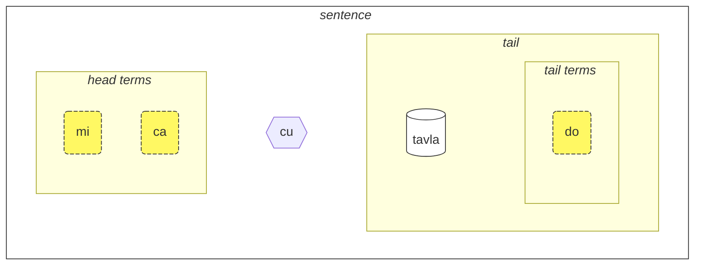
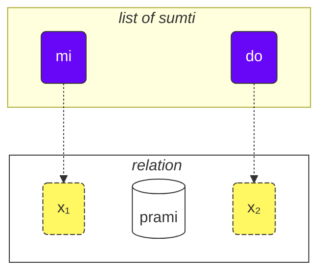
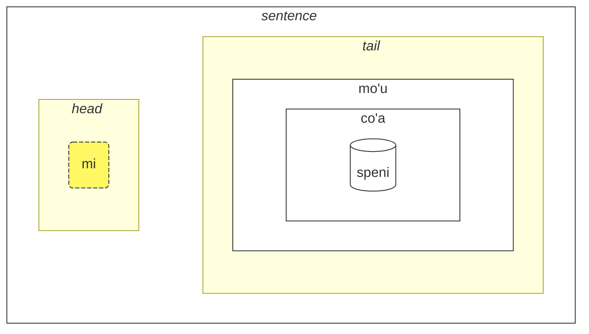
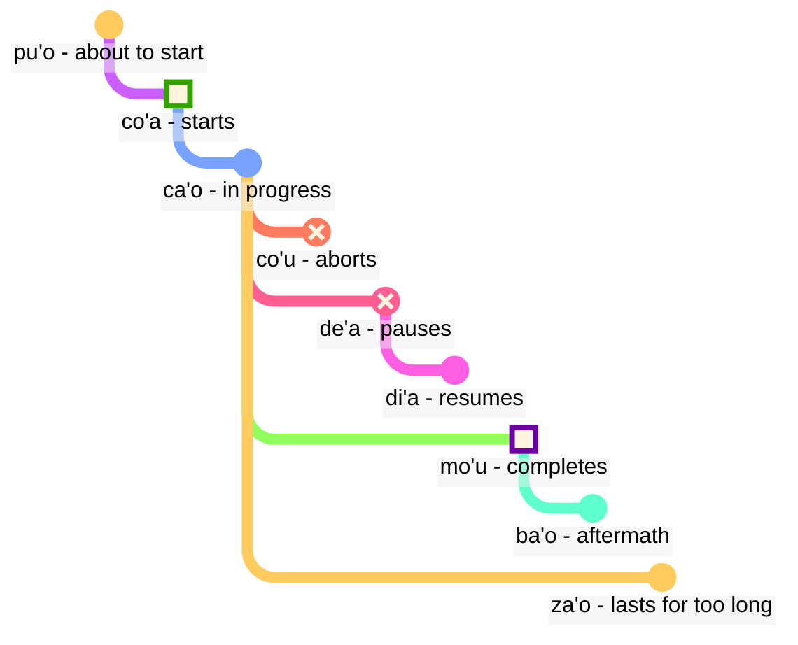

[📁 Versión PDF de esta página](/vreji/uencu/learn-lojban.pdf)

Cómo usar este curso:

1. léelo
2. recopila tus comentarios y sugerencias
3. envíalos a [💬 el chat en vivo](https://lojban.pw/articles/live_chat/)
## Lección 1. El idioma de un vistaz

### Alfabeto

Lo básico que necesitas saber sobre Lojban es el alfabeto.

Lojban utiliza el alfabeto latino (las vocales están en color):

<dl><dd><b>a b c d e f g i j k l m n o p r s t u v x y z ' .</b></dd></dl>

Las letras se pronuncian como se escriben.

Hay 10 vocales en Lojban:

<table>
<tbody><tr>
<td><b class="audio-inline">a</b></td>
<td> como en <i>padre</i> (no como en <i>cara</i>)</td>
</tr>
<tr>
<td><b class="audio-inline">e</b></td>
<td> como en <i>get</i></td>
</tr>
<tr>
<td><b class="audio-inline">i</b></td>
<td> como en <i>máquina</i> (no como en <i>golpear</i>)</td>
</tr>
<tr>
<td><b class="audio-inline">o</b></td>
<td> como en <i>elección</i>, <i>no</i> o <i>ough</i> en <i>thought</i> (no como en <i>so</i>, la <b>o</b> debe ser un sonido "puro").</td>
</tr>
<tr>
<td><b class="audio-inline">u</b></td>
<td> como en <i>cool</i> (no como en <i>pero</i>)</td>
</tr>
<tr>
<td><b class="audio-inline">y</b></td>
<td> como en <i>coma</i> (no como en <i>brumoso</i> o <i>ciclo</i>)</td>
</tr>
<tr>
</tbody></table>

4 vocales se escriben usando combinaciones de letras:

<table>
<tbody><tr>
<td><b class="audio-inline">au</b></td>
<td> como en <i>vaca</i></td></tr>
<tr>
<td><b class="audio-inline">ai</b></td>
<td> como en <i>alto</i></td></tr>
<tr>
<td><b class="audio-inline">ei</b></td>
<td> como en <i>weigh</i></td></tr>
<tr>
<td><b class="audio-inline">oi</b></td>
<td> como en <i>boy</i></td></tr>
</tbody></table>

En cuanto a las consonantes, se pronuncian como en inglés o latín, pero hay varias diferencias:

<table>
<tbody><tr>
<td><b class="guibutton">c</b>
</td>
<td>se pronuncia como <i>c</i> en <i>océano</i>, como <i>sh</i> en <i>tienda</i>.
</td></tr>
<tr>
<td><b class="guibutton">g</b>
</td>
<td>siempre <i>g</i> como en <i>goma</i> (nunca <i>g</i> como en <i>joya</i>).
</td></tr>
<tr>
<td><b class="guibutton">j</b>
</td>
<td>como <i>s</i> en <i>placer</i> o <i>tesoro</i>, como <i>j</i> en francés <i>bonjour</i>.
</td></tr>
<tr>
<td><b class="guibutton">x</b>
</td>
<td>como <i>ch</i> en escocés <i>loch</i> o como en alemán <i>Bach</i>, como <i>J</i> en español <i>José</i> o <i>Kh</i> en árabe moderno <i>Khaled</i>. Intenta pronunciar <i>ksss</i> manteniendo tu lengua abajo y obtendrás este sonido.
</td></tr>
<tr>
<td><b class="guibutton"> ' </b>
</td>

<td>como el inglés <i>h</i>. Por lo tanto, el apóstrofo se considera una letra adecuada de Lojban y se pronuncia como una <i>h</i>. Solo se puede encontrar entre vocales. Por ejemplo, <b>u'i</b> se pronuncia como <i>oo-hee</i> (mientras que <b>ui</b> se pronuncia como <i>wee</i>).
</td></tr>
<tr>
<td><b>.</b>
</td>
<td>un punto (periodo, pausa entre palabras) también se considera una letra en Lojban. Es una breve pausa en el habla para detener las palabras que se ejecutan entre sí. En realidad, cualquier palabra que comience con una vocal tiene un punto completo colocado delante de ella. Esto ayuda a evitar la fusión indeseable de dos palabras secuenciales en una.
</td></tr>
<tr>
<td><b>i</b>
</td>
<td><b>i</b> antes de las vocales se considera una consonante y se pronuncia más corta, por ejemplo:
<ul><li><b>ia</b> se pronuncia como <i>ya</i> en <i>yarda</i></li>
<li><b>ie</b> se pronuncia como <i>ye</i> en <i>yeso</i></li></ul>
</td></tr>
<tr>
<td><b>u</b>
</td>
<td><b>u</b> antes de las vocales se considera una consonante y se pronuncia más corta, por ejemplo:
<ul><li><b>ua</b> se pronuncia como <i>wo</i> en <i>wow</i></li>
<li><b>ue</b> se pronuncia como <i>whe</i> en <i>when</i></li></ul>
</td></tr></tbody></table>

El énfasis se coloca en la penúltima vocal. Si una palabra tiene solo una vocal, simplemente no la enfatiza.

La letra **r** se puede pronunciar como la _r_ en inglés, escocés, ruso, por lo que hay una variedad de pronunciaciones aceptables para ella.

Algunas personas usan vocales no lojban como la _i_ corta y la _u_ en inglés británico estándar _hit_ y _but_, para separar consonantes. Entonces, si tiene problemas para pronunciar dos consonantes seguidas (por ejemplo, el **vl** en **tavla**, que significa _hablar con_), entonces puede decir _tavɪla_ — donde la _ɪ_ es muy corta. Sin embargo, otras vocales como **a** y **u** deben ser largas.

### La oración más simple

La unidad básica en Lojban es la "oración". Aquí hay tres ejemplos simples:

> **le prenu cu tavla mi**
> _La persona me habla._

le prenu
: la persona

tavla
: … habla con …, … habla a …

mi
: yo, me

> **mi prami do**
> _Te amo._

prami
: … ama a … (alguien)

do
: tú

> **mi ca cu tavla do**
> _Ahora te hablo._

ca
: ahora

Cada oración en Lojban consta de las siguientes partes de izquierda a derecha:

- la cabeza:
  - consta de los llamados "términos",
  - **le prenu** es el único término de la cabeza en el ejemplo **le prenu cu tavla mi** anterior,
  - **mi**, **ca** son términos de la cabeza en el ejemplo **mi ca cu tavla do** anterior.
- el separador de cabeza **cu**:
  - pronunciado como _shoe_ ya que **c** es para _sh_,
  - muestra que la cabeza ha terminado,
  - se puede omitir cuando está claro que la cabeza se ha completado.
- la cola:
  - la construcción principal de relación (**tavla**, **prami**) con posiblemente uno o más términos después de ella,
  - **mi** es el único término de la cola en el ejemplo **le prenu cu tavla mi** anterior.
  - **do** es el único término de la cola en el ejemplo **mi ca cu tavla do** anterior.

<pixra url="/assets/pixra/cilre/tavla.svg" caption="le prenu cu tavla mi" definition="La persona me habla."></pixra>

<pixra url="/assets/pixra/cilre/mi.svg" caption="mi" definition="Yo / me"></pixra>

<pixra url="/assets/pixra/cilre/mi_prami_do2.svg" caption="mi prami do" definition="Te amo."></pixra>

<pixra url="/assets/pixra/cilre/do.svg" caption="do" definition="tú"></pixra>

En Lojban, hablamos principalmente de relaciones en lugar de sustantivos y verbos.

Aquí están las dos palabras de relación, que corresponden aproximadamente a verbos:

prenu
: … es una persona / son personas

tavla
: … habla con …

Para convertir tal "verbo" en un sustantivo, ponemos una palabra corta **le** delante de él:

le prenu
: la persona

De manera similar,

tavla
: … habla con …

y así

le tavla
: el hablante

Puede sonar extraño cómo _persona_ puede ser un "verbo", pero de hecho, esto hace que Lojban sea muy simple:

<table>
<thead>
<tr>
<th>palabra de relación</th>
<th>sustantivo</th></tr>
</thead>
<tbody>
<tr>
<td><b>prenu</b> — <i>ser una persona</i> </td>
<td><b>le prenu</b> — <i>la persona</i>
</td></tr>
<tr>
<td><b>tavla</b> — <i>hablar con</i> </td>
<td><b>le tavla</b> — <i>el hablante</i>
</td></tr>
</tbody></table>

Aquí también podemos decir que **le** crea un sustantivo a partir de una construcción de relación con el significado aproximado de _el que es..._ (_es una persona_ - _la persona_), o incluso _aquellos que hacen..._ (_hablar con_ - _los hablantes_), _aquellos que son..._ (_son personas_ - _la gente_).

Nótese que, por defecto, Lojban no diferencia entre _el hablante_ o _los hablantes_. Es decir, **le tavla** es vago en ese sentido, y pronto descubriremos formas de definir el número.

Los términos en Lojban, sin importar dónde se usen en una oración dada, se representan principalmente con:

- sustantivos como **le prenu** (_la persona_)
- pronombres como **mi** (_yo_, _me_), **do** (_tú_). Los pronombres funcionan exactamente como los sustantivos, pero no se usa **le** para ellos. Funcionan como sustantivos por sí solos.
- términos modales como **ca** (_ahora, en presente_). Los términos modales especifican información adicional y aclaratoria.

Algunos ejemplos más:

> **mi nintadni**
> _Soy un estudiante nuevo._

nintadni
: ... es un estudiante nuevo, un novato

<pixra url="/assets/pixra/cilre/nintadni.svg" caption="mi nintadni" definition="Soy un estudiante nuevo, un novato."></pixra>

A diferencia del inglés, no tenemos que agregar el verbo "ser/estar" a la oración. Ya está allí. La palabra de relación **nintadni** (_... es un estudiante nuevo_) ya tiene este "ser/estar" en su traducción al inglés.

> **do jimpe**
> _Tú entiendes._

jimpe
: ... entiende ... (algo)
<!-- -->

<pixra url="/assets/pixra/cilre/pilno_le_fonxa.svg" caption="le prenu cu pilno le fonxa" definition="La persona usa el teléfono."></pixra>

> **mi pilno le fonxa**
> _Yo uso el teléfono._

pilno
: ... usa ... (algo)

fonxa
: ... es un teléfono, ... son teléfonos

le fonxa
: el teléfono, los teléfonos

> **mi citka**
> _Yo como._

citka
: ... come ... (algo)

<pixra url="/assets/pixra/cilre/citka.svg" caption="mi citka" definition="Yo como."></pixra>
<!-- -->

> **do citka**
> _Tú comes._

<!-- -->

> **mi citka le plise**
> _Yo como las manzanas._

<!-- -->

> **le plise cu kukte**
> _Las manzanas son sabrosas._

<pixra url="/assets/pixra/cilre/le_plise_cu_kukte.svg" caption="le plise cu kukte" definition="Las manzanas son sabrosas."></pixra>

Aquí, **le plise** significa _las manzanas_, **kukte** significa _es sabroso / son sabrosos_.

Una oración más simple en Lojban contendría solo una palabra de relación principal:

<pixra url="/assets/pixra/cilre/karce.svg" caption="karce" definition="Es un coche."></pixra>

> **karce**
> _¡Coche!_
> _Es un coche._

Podrías decir esto cuando veas un coche venir. Aquí el contexto sería lo suficientemente claro de que hay un coche en algún lugar y probablemente es peligroso.

**karce** en sí mismo es un verbo que significa _es un coche, ser un coche_.

Por supuesto, podemos ser más precisos y decir, por ejemplo:

> **ti karce**
> _Este es un coche._

ti
: pronombre: esta cosa cerca de mí

<pixra url="/assets/pixra/cilre/ti.svg" caption="ti" definition="esto (cerca de mí, el hablante)"></pixra>

De manera similar, puedes decir

> **carvi**
> _Está lloviendo._

donde

carvi
: ... es una lluvia, ... está lloviendo

<pixra url="/assets/pixra/cilre/carvi.svg" caption="carvi" definition="... es una lluvia"></pixra>

o

> **pluka**
> _Es agradable_

donde

pluka
: ... es agradable

Aquí se observa que en Lojban no es necesario utilizar la palabra _it_ en ese sentido. Simplemente se utiliza la palabra de relación que se necesita.

> **prami**
> _Alguien ama._

<!-- -->

> **bajra**
> _Alguien corre._

bajra
: ... corre usando las extremidades

De nuevo, el contexto probablemente indicaría quién ama a quién y quién corre. 

<pixra url="/assets/pixra/cilre/bajra.svg" caption="le prenu cu bajra" definition="La persona corre."></pixra> 

Nota: No se necesita la palabra "it" en Lojban porque el idioma utiliza palabras de relación específicas para indicar el sujeto.

#### Tarea

<pixra url="/assets/pixra/cilre/pinxe_le_djacu.svg" caption="le prenu cu pinxe le djacu" definition="La persona bebe agua."></pixra>

pinxe
: … bebe … (algo)

le djacu
: el agua

Cierra la parte derecha de la tabla. Traduce las frases de la izquierda del Lojban.

<table style="table-layout: fixed;">
<tbody><tr>
<td><b>do citka</b>
</td>
<td><i>Tú comes.</i>
</td></tr>
<tr>
<td><b>mi pinxe le djacu</b>
</td>
<td><i>Yo bebo agua.</i>
</td></tr>
<tr>
<td><b>mi citka le plise</b>
</td>
<td><i>Yo como manzanas.</i>
</td></tr></tbody></table>

### «**.i**» separa las frases

La forma más precisa de pronunciar o escribir frases en Lojban sería colocar una palabra corta **.i** al principio de cada una de ellas:

> **mi tavla le prenu .i le prenu cu tavla mi**
> _Estoy hablando con la gente. La gente está hablando conmigo._

**.i** separa las frases como el punto al final de las frases en textos en inglés.

Cuando decimos una frase después de otra en inglés, hacemos una pausa (puede ser corta) entre ellas. Pero la pausa tiene muchos significados diferentes en inglés. En Lojban tenemos una mejor manera de entender dónde termina una frase y comienza otra.

También tenga en cuenta que a veces al pronunciar palabras rápidamente no se puede averiguar dónde termina una frase y comienza la palabra de la siguiente frase. Por lo tanto, se recomienda usar la palabra **.i** antes de comenzar una nueva frase.

### Números: ‘_1 2 3 4 5 6 7 8 9 0_’ = «**pa re ci vo mu xa ze bi so no**»

**le** simplemente convierte un verbo en un sustantivo, pero dicho sustantivo no tiene número asociado. La oración

> **le prenu cu tavla mi**
> _La gente habla conmigo._
> _La persona habla conmigo._

no especifica el número de personas que hablan conmigo. En inglés, es imposible omitir el número porque _people_ en inglés implica _más de una persona_. Sin embargo, en Lojban, puedes omitir el número incluso si es plural.

Ahora especifiquemos cuántas de las personas son relevantes para nuestra discusión.

Agreguemos un número después de **le**.

<table>
<tbody><tr>
<td><b>pa</b>
</td>
<td><b>re</b>
</td>
<td><b>ci</b>
</td>
<td><b>vo</b>
</td>
<td><b>mu</b>
</td>
<td><b>xa</b>
</td>
<td><b>ze</b>
</td>
<td><b>bi</b>
</td>
<td><b>so</b>
</td>
<td><b>no</b>
</td></tr>
<tr>
<td> 1
</td>
<td> 2
</td>
<td> 3
</td>
<td> 4
</td>
<td> 5
</td>
<td> 6
</td>
<td> 7
</td>
<td> 8
</td>
<td> 9
</td>
<td> 0
</td>
</tr></tbody></table>

<pixra url="/assets/pixra/cilre/ci_prenu.svg" caption="le ci prenu" definition="Las tres personas"></pixra>

> **le pa prenu cu tavla mi**
> _La persona habla conmigo._

Agregamos un número después de **le** y así especificamos personas individuales.

Para números que consisten en varios dígitos, simplemente unimos esos dígitos.

> **le re mu prenu cu tavla mi**
> _Las 25 personas hablan conmigo._

Sí, es así de simple.

Si queremos contar, podemos separar los números con **.i**:

> **mu .i vo .i ci .i re .i pa .i no**
> _5 … 4 … 3 … 2 … 1 … 0_

El número **za'u** significa _más de …_ (_\>_ en matemáticas), el número **me'i** significa _menos de_ (_<_ en matemáticas):

> **le za'u re prenu cu tavla mi**
> _Más de dos personas hablan conmigo._

<!-- -->

> **le me'i pa no prenu cu tavla mi**
> _Menos de 10 personas hablan conmigo._

<!-- -->

> **le za'u ci prenu cu tavla mi**
> _Más de tres personas hablan conmigo._

Para decir solo _personas_ (número plural) en lugar de _una persona_, usamos **za'u pa**, _más de uno_ o simplemente **za'u**.

> **le za'u pa prenu cu tavla mi**
> **le za'u prenu cu tavla mi**
> _La gente habla conmigo._

**za'u** por defecto significa **za'u pa**, por lo tanto, es posible tal contracción.

le prenu
: la persona / la gente (en general)

le pa prenu
: la persona (uno en número)

le za'u prenu
: la gente (dos o más en número) 

### Números: ‘_1 2 3 4 5 6 7 8 9 0_’ = «**pa re ci vo mu xa ze bi so no**»

**le** simplemente convierte un verbo en un sustantivo, pero dicho sustantivo no tiene número asociado. La oración

> **le prenu cu tavla mi**
> _La gente habla conmigo._
> _La persona habla conmigo._

no especifica el número de personas que hablan conmigo. En inglés, es imposible omitir el número porque _people_ en inglés implica _más de una persona_. Sin embargo, en Lojban, puedes omitir el número incluso si es plural.

Ahora especifiquemos cuántas de las personas son relevantes para nuestra discusión.

Agreguemos un número después de **le**.

<table>
<tbody><tr>
<td><b>pa</b>
</td>
<td><b>re</b>
</td>
<td><b>ci</b>
</td>
<td><b>vo</b>
</td>
<td><b>mu</b>
</td>
<td><b>xa</b>
</td>
<td><b>ze</b>
</td>
<td><b>bi</b>
</td>
<td><b>so</b>
</td>
<td><b>no</b>
</td></tr>
<tr>
<td> 1
</td>
<td> 2
</td>
<td> 3
</td>
<td> 4
</td>
<td> 5
</td>
<td> 6
</td>
<td> 7
</td>
<td> 8
</td>
<td> 9
</td>
<td> 0
</td>
</tr></tbody></table>

<pixra url="/assets/pixra/cilre/ci_prenu.svg" caption="le ci prenu" definition="Las tres personas"></pixra>

> **le pa prenu cu tavla mi**
> _La persona habla conmigo._

Agregamos un número después de **le** y así especificamos personas individuales.

Para números que consisten en varios dígitos, simplemente unimos esos dígitos.

> **le re mu prenu cu tavla mi**
> _Las 25 personas hablan conmigo._

Sí, es así de simple.

Si queremos contar, podemos separar los números con **.i**:

> **mu .i vo .i ci .i re .i pa .i no**
> _5 … 4 … 3 … 2 … 1 … 0_

El número **za'u** significa _más de …_ (_\>_ en matemáticas), el número **me'i** significa _menos de_ (_<_ en matemáticas):

> **le za'u re prenu cu tavla mi**
> _Más de dos personas hablan conmigo._

<!-- -->

> **le me'i pa no prenu cu tavla mi**
> _Menos de 10 personas hablan conmigo._

<!-- -->

> **le za'u ci prenu cu tavla mi**
> _Más de tres personas hablan conmigo._

Para decir solo _personas_ (número plural) en lugar de _una persona_, usamos **za'u pa**, _más de uno_ o simplemente **za'u**.

> **le za'u pa prenu cu tavla mi**
> **le za'u prenu cu tavla mi**
> _La gente habla conmigo._

**za'u** por defecto significa **za'u pa**, por lo tanto, es posible tal contracción.

le prenu
: la persona / la gente (en general)

le pa prenu
: la persona (uno en número)

le za'u prenu
: la gente (dos o más en número)

#### Tarea

stati
: ... es inteligente, ... tiene un talento

<pixra url="/assets/pixra/cilre/stati.svg" caption="stati" definition="... tiene un talento"></pixra>

klama
: ... viene a ... (algún lugar u objeto)

<pixra url="/assets/pixra/cilre/klama_ti.svg" caption="le prenu cu klama ti" definition="La persona vino aquí."></pixra>

nelci
: ... le gusta (algo)

le zarci
: el mercado

<pixra url="/assets/pixra/cilre/zarci.svg" caption="le prenu cu zvati le zarci" definition="La persona está en la tienda."></pixra>

le najnimre
: la naranja (fruta), las naranjas

<pixra url="/assets/pixra/cilre/najnimre.svg" caption="najnimre" definition="... es una naranja"></pixra>

le badna
: el plátano, los plátanos

<pixra url="/assets/pixra/cilre/badna.svg" caption="badna" definition="... es un plátano"></pixra>

Cierra la parte derecha de la tabla. Traduce las frases de la izquierda del Lojban.

<table style="table-layout: fixed;">
 <tbody>
  <tr>
   <td>le mu prenu cu klama le zarci</td>
   <td>Los cinco personas van al mercado.</td>
  </tr>
  <tr>
   <td>le pa re prenu cu stati .i do stati</td>
   <td>Las 12 personas son inteligentes. Tú eres inteligente.</td>
  </tr>
  <tr>
   <td>le prenu cu nelci le plise</td>
   <td>A las personas les gustan las manzanas.</td>
  </tr>
  <tr>
   <td>le za'u re prenu cu citka .i le me'i mu prenu cu pinxe le djacu</td>
   <td>Más de dos personas comen. Menos de 5 personas beben agua.</td>
  </tr>
  <tr>
   <td>le za'u re prenu cu stati</td>
   <td>Más de dos personas son inteligentes.</td>
  </tr>
 </tbody>
</table>

Cierra la parte derecha de la tabla. Traduce las frases de la izquierda al Lojban.

<table style="table-layout: fixed;">
 <tbody>
  <tr>
   <td>The 256 people are smart.</td>
   <td>le re mu xa prenu cu stati</td>
  </tr>
  <tr>
   <td>Fewer than 12 apples are tasty.</td>
   <td>le me'i pa re plise cu kukte</td>
  </tr>
 </tbody>
</table>

### Verbo compuesto

El verbo compuesto (**le tanru** en Lojban) son varias palabras verbales colocadas una tras otra.

> **tu melbi zdani**
> _Ese es un hogar bonito._

<pixra url="/assets/pixra/cilre/melbi_zdani.svg" caption="melbi zdani" definition="… es un hogar bonito"></pixra>

tu
: ese (lejos de ti y de mí)

melbi
: … es hermoso, bonito

zdani
: … es un hogar o nido para … (alguien)

<pixra url="/assets/pixra/cilre/dansu.svg" caption="le prenu cu melbi dansu" definition="La persona baila bonito."></pixra>

> **do melbi dansu**
> _Tú bailas bonito._

Aquí, el verbo **melbi** agrega un significado adicional ya que se coloca a la izquierda de otro verbo: **zdani**. La parte izquierda generalmente se traduce usando adjetivos y adverbios.

Los verbos compuestos son una característica poderosa que produce significados más ricos. Solo tienes que unir dos verbos, y la parte izquierda de dicho verbo compuesto agrega un sabor al derecho.

Podemos poner **le** (por ejemplo, con un número) a la izquierda de dicho verbo compuesto obteniendo un sustantivo compuesto:

le pa melbi zdani
: el hogar bonito

Ahora sabes por qué había **cu** después de los sustantivos en nuestro ejemplo:

> **le pa prenu cu tavla mi**
> _La persona me habla._

Sin **cu** se convertiría en **le pa prenu tavla**, lo que tendría el significado de _la persona hablante_ - lo que sea que eso pudiera significar.

Considera:

> **le pa tavla pendo**
> _El amigo hablante_
<!-- -->
> **le pa tavla cu pendo**
> _El hablante es un amigo._

Recuerda colocar **cu** antes del constructo de relación principal en una oración para evitar la creación involuntaria de verbos compuestos.

Los verbos compuestos pueden contener más de dos verbos. En este caso, el primer verbo modifica el segundo, el segundo modifica el tercero, y así sucesivamente:

<pixra url="/assets/pixra/cilre/cmalu_karce.svg" caption="ti cmalu karce" definition="Este es un auto pequeño."></pixra>

> **le pa melbi cmalu karce**
> _el auto bonito-pequeño, el auto pequeño de una manera bonita_

<!-- -->

> **le mutce melbi zdani**
> _el hogar muy bonito_

mutce
: … es muy, … es mucho

#### Tarea

sutra
: ... es rápido

barda
: ... es grande

cmalu
: ... es pequeño

mlatu
: ... es un gato

Cierra la parte derecha de la tabla. Traduce las frases de la izquierda del Lojban.

<table style="table-layout: fixed;">
<tbody><tr>
<td><b>le melbi karce</b>
</td>
<td><i>el coche hermoso / los coches hermosos</i>
</td></tr>
<tr>
<td><b>do sutra klama</b>
</td>
<td><i>Tú vienes rápidamente. Vienes rápido.</i>
</td></tr>
<tr>
<td><b>tu barda zdani</b>
</td>
<td><i>Esa es una casa grande.</i>
</td></tr>
<tr>
<td><b>le pa sutra bajra mlatu</b>
</td>
<td><i>el gato corriendo rápidamente</i>
</td></tr>
<tr>
<td><b>le pa sutra mlatu</b>
</td>
<td><i>el gato rápido</i>
</td></tr>
<tr>
<td><b>le pa bajra mlatu</b>
</td>
<td><i>el gato corriendo</i>
</td></tr></tbody></table>

Cierra la parte derecha de la tabla. Traduce las frases de la izquierda al Lojban.

<table style="table-layout: fixed;">

<tbody><tr>
<td><i>Este es un coche pequeño.</i>
</td>
<td><b>ti cmalu karce</b>
</td></tr>
<tr>
<td><i>manzanas sabrosas</i>
</td>
<td><b>le kukte plise</b>
</td></tr>
<tr>
<td><i>los comedores rápidos</i>
</td>
<td><b>le sutra citka</b>
</td></tr>
<tr>
<td><i>Tú eres una persona que camina rápidamente.</i>
</td>
<td><b>do sutra cadzu prenu</b>
</td></tr></tbody></table>

### Preguntas de 'Sí/No'

En inglés, formamos una pregunta de 'sí/no' cambiando el orden de las palabras, por ejemplo:

> _You are … ⇒ Are you …?_

o usando alguna forma del verbo _to do_ al principio, por ejemplo:

> _You know … ⇒ Do you know?_

En Lojban, el orden de las palabras puede mantenerse. Para convertir cualquier afirmación en una pregunta de 'sí/no', simplemente insertamos la palabra **xu** en alguna parte de la oración, por ejemplo, al principio:

> **xu do nelci le gerku**
> _¿Te gustan los perros?_

le gerku
: el perro, los perros

<pixra url="/assets/pixra/cilre/le_prenu_e_le_gerku.svg" caption="ti prenu .i ti gerku" definition="Esta es una persona. Este es un perro."></pixra>

Recuerda que en Lojban, la puntuación como "?" (signo de interrogación) es en su mayoría opcional y se usa principalmente con fines estilísticos. Esto se debe a que la palabra interrogativa **xu** ya muestra que es una pregunta.

Otros ejemplos:

> **xu mi klama**
> _¿Voy?_

klama
: … va a … (algún lugar)

> **xu pelxu**
> _¿Es amarillo?_

pelxu
: … es amarillo

Podemos cambiar el significado colocando **xu** después de diferentes partes de la relación. Las explicaciones de lo que cambió en el significado se dan entre corchetes:

> **xu do nelci le gerku**
> _¿Te gustan los perros?_

<!-- -->

> **do xu nelci le gerku**
> _¿A TI te gustan los perros?_ (Pensé que era otra persona quien les gustaba).

<!-- -->

> **do nelci xu le gerku**
> _¿Te GUSTAN los perros? (Pensé que eras neutral hacia ellos)._

<!-- -->

> **do nelci le xu gerku**
> _¿Te gustan LOS PERROS? (Pensé que te gustaban los gatos)._

Lo que se expresa mediante la entonación en inglés se expresa moviendo **xu** después de la parte que queremos enfatizar en Lojban. Ten en cuenta que la primera oración con **xu** al principio hace la pregunta más genérica sin enfatizar ningún aspecto en particular.

**xu** es una palabra interjección. Aquí están las características de las interjecciones en Lojban:

- la interjección modifica la construcción anterior a ella. Entonces, cuando se coloca después de ciertas partes de la relación, como pronombres o verbos, modifica ese verbo:

 > **do xu nelci le gerku**
 > _¿A TI te gustan los perros?_

- cuando se coloca al principio de una relación, la interjección modifica toda la relación:

 > **xu do nelci le gerku**
 > _¿Te gustan los perros?_

- las interjecciones se pueden colocar después de diferentes partes de la misma relación para cambiar el significado.

Las interjecciones no rompen los verbos compuestos, se pueden usar dentro de ellos:

> **do nelci le barda xu gerku**
> _¿Te gustan los perros GRANDES?_

Ahora, ¿cómo responder a estas preguntas de 'sí/no'? Repites la relación principal:

> **— xu le mlatu cu melbi**
> **— melbi**
> _— ¿Los gatos son bonitos?_
> _— Bonitos._

Para responder 'no', usamos el término modal **na ku**:

> **— xu le mlatu cu melbi**
> **— na ku melbi**
> _— ¿Los gatos son bonitos?_
> _— No bonitos._

na ku
: término: es falso que …

O, podemos usar un verbo especial **go'i**:

> **— xu le mlatu cu melbi**
> **— go'i**
> _— ¿Los gatos son bonitos?_
> _— Bonitos._

go'i
: verbo que repite la relación principal de la oración anterior

Aquí, **go'i** significa lo mismo que **melbi** ya que **melbi** es la relación de la relación anterior.

> **— xu le mlatu cu melbi**
> **— na ku go'i**
> _— ¿Los gatos son bonitos?_
> _— No bonitos._

<!-- Este curso no recomienda negar **go'i** para respuestas negativas. Simplemente usa **je'u nai**. -->

El término modal **na ku** se puede usar no solo en respuestas:

> **na ku mi nelci le gerku**
> _Es falso que me gusten los perros._
> _No me gustan los perros._
<!-- -->
> **mi na ku nelci do**
> _No me gustas._

Su opuesto, el término **ja'a ku** afirma el significado:

> **mi ja'a ku nelci do**
> _Me gustas._

ja'a ku
: término: es verdad que ... 

#### Tarea

Cierra la parte derecha de la tabla. Traduce las frases de la izquierda del Lojban.

<table style="table-layout: fixed;">

<tbody><tr>
<td><b>xu le barda zdani cu melbi</b>
</td>
<td><i>¿Es hermosa la casa grande?</i>
</td></tr>
<tr>
<td><b>— le prenu cu stati xu — na ku stati</b>
</td>
<td><i>— ¿Son inteligentes las personas? — No.</i>
</td></tr>
<tr>
<td><b>do klama le zarci xu</b>
</td>
<td><i>¿Vas al mercado?</i>
</td></tr>
<tr>
<td><b>xu le verba cu prami le mlatu</b>
</td>
<td><i>¿Ama el niño a los gatos?</i>
</td></tr></tbody></table>

Cierra la parte derecha de la tabla. Traduce las frases de la izquierda al Lojban.

<table style="table-layout: fixed;">

<tbody><tr>
<td><i>¿Es rápido el coche?</i>
</td>
<td><b>xu le karce cu sutra</b>
</td></tr>
<tr>
<td><i>— ¿Es sabrosa la naranja? — Sí, lo es.</i>
</td>
<td><b>— xu le najnimre cu kukte — kukte</b>
</td></tr>
<tr>
<td><i>¿Te ama el perro?</i>
</td>
<td><b>xu le gerku cu prami do</b>
</td></tr></tbody></table>
### Felicidad y solicitudes educadas: ‘_¡Yay!_’ = «**ui**», ‘_¡Por favor!_’ = «**.e'o**»

La interjección **ui** muestra la felicidad de quien habla. Se utiliza como la cara sonriente ‘_:)_’ en los mensajes, para indicar que estás contento con algo. Aunque las caras sonrientes pueden ser ambiguas, **ui** tiene solo un significado, lo que es útil.

> **ui do klama**
> _¡Yay, vienes!_

ui
: interjección: _¡Yay!_, interjección de felicidad

La interjección **.e'o** al comienzo de una oración la convierte en una solicitud educada:

> **.e'o do lebna le fonxa**
> _¿Podrías tomar el teléfono, por favor?_
> `Por favor, toma el teléfono.`

.e'o
: interjección: por favor (pronunciada como _eh-haw_ con una breve pausa o descanso antes de la palabra)

lebna
: tomar (algo)

En inglés, para ser educado, uno tiene que usar _could you_ + _please_ + una pregunta). En Lojban, **.e'o** es suficiente para hacer una solicitud educada. 

Nota: Este texto ha sido traducido automáticamente por GPT-3.5 Turbo, un modelo de lenguaje natural. Si encuentra algún error en la traducción, por favor háganoslo saber.

#### Tarea

Cierra la parte derecha de la tabla. Traduce las frases de la izquierda del Lojban.

le tcati
: el té

<pixra url="/assets/pixra/cilre/tcati.svg" caption="tcati" definition="… es un poco de té"></pixra>

le ckafi
: el café

<pixra url="/assets/pixra/cilre/ckafi.svg" caption="ckafi" definition="… es un poco de café"></pixra>

zgana
: observar, mirar (usando cualquier sentido)

le skina
: la película

<pixra url="/assets/pixra/cilre/zgana_le_skina.svg" caption="le prenu cu zgana le skina" definition="La persona mira la película."></pixra>

kurji
: cuidar de (alguien, algo)

<table style="table-layout: fixed;">

<tbody>
<tr>
<td><b>ui carvi</b>
</td>
<td><i>¡Hurra, llueve! ¡Hurra, está lloviendo!</i>
</td></tr>
<tr>
<td><b>.e'o do sutra bajra</b>
</td>
<td><i>¡Corre rápido!</i>
</td></tr>
<tr>
<td><b>.e'o do pinxe le tcati</b>
</td>
<td><i>Por favor, bebe té.</i>
</td></tr>
<tr>
<td><b>.e'o zgana le skina</b>
</td>
<td><i>Por favor, mira la película.</i>
</td></tr></tbody></table>

Cierra la parte derecha de la tabla. Traduce las frases de la izquierda al Lojban.

<table style="table-layout: fixed;">

<tbody><tr>
<td><i>¡Por favor, sé inteligente!</i>
</td>
<td><b>.e'o stati</b>
</td></tr>
<tr>
<td><i>¡Por favor, vete a casa!</i>
</td>
<td><b>.e'o do klama le zdani</b>
</td></tr>
<tr>
<td><i>¡Por favor, bebe el café!</i>
</td>
<td><b>.e'o do pinxe le ckafi</b>
</td></tr>
<tr>
<tr>
<td><i>¡Hurra, hablo contigo!</i>
</td>
<td><b>ui mi tavla do</b>
</td></tr>
<tr>
<td><i>Por favor, cuida del niño.</i>
</td>
<td><b>.e'o do kurji le verba</b>
</td></tr></tbody></table>

### 'Y' y 'o'

> **do nintadni .i je mi nintadni**
> _Eres un novato. Y yo soy un novato._

<!-- -->

> **do .e mi nintadni**
> _Tú y yo somos novatos._

<pixra url="/assets/pixra/cilre/do_e_mi_nintadni.svg" caption="do .e mi nintadni" definition="Tú y yo somos nuevos estudiantes."></pixra>

<!-- -->

> **mi tadni .i je mi tavla do**
> _Estudio. Y hablo contigo._

<!-- -->

> **mi tadni gi'e tavla do**
> _Estudio y hablo contigo._

.i je
: conjunción "y" que combina oraciones en una.

.e
: conjunción "y" que conecta sustantivos.

gi'e
: conjunción "y" que conecta las colas de las oraciones.

Podemos combinar dos oraciones en una declaración usando la conjunción **.i je**, que significa _y_:

> **do nintadni .i je mi nintadni**
> _Eres un novato. Y yo soy un novato._

Dado que ambas oraciones tienen la misma cola, podemos usar una contracción: la conjunción **.e** significa _y_ para sustantivos y pronombres:

> **do .e mi nintadni**
> _Tú y yo somos novatos._

**do nintadni .i je mi nintadni** significa exactamente lo mismo que **do .e mi nintadni**

También podemos usar **.e** para conectar sustantivos y pronombres en otras posiciones.

Ambas oraciones significan lo mismo.

> **mi pinxe le djacu .e le jisra**
> _Bebo el agua y el jugo._
> **mi pinxe le djacu .i je mi pinxe le jisra**
> _Bebo el agua, y bebo el jugo._

le jisra
: jugo

<pixra url="/assets/pixra/cilre/pinxe_le_jisra.svg" caption="le prenu cu pinxe le jisra" definition="La persona bebe jugo."></pixra>

Si la cabeza de la oración es la misma pero las colas difieren, usamos la conjunción **gi'e**, que significa _y_ para las colas de las oraciones:

> **mi tadni .i je mi tavla do**
> **mi tadni gi'e tavla do**
> _Estudio y hablo contigo._

Ambas variaciones significan lo mismo; **gi'e** simplemente conduce a una realización más concisa.

También tenemos herramientas para agregar _y_ para los componentes de los verbos compuestos:

> **le melbi je cmalu zdani cu jibni ti**
> _La casa bonita y pequeña está cerca._

<pixra url="/assets/pixra/cilre/melbi_je_cmalu_zdani.svg" caption="melbi je cmalu zdani" definition="... es una casa bonita y pequeña"></pixra>

jibni
: ... está cerca de ...

ti
: esta cosa, este lugar cerca de mí

**je** es una conjunción en Lojban que significa _y_ en verbos compuestos.

Sin **je**, la oración cambia de significado:

> **le melbi cmalu zdani cu jibni**
> _La casa bonita y pequeña está cerca._

Aquí **melbi** modifica **cmalu**, y **melbi cmalu** modifica **zdani**, según cómo funcionan los verbos compuestos.

En **le melbi je cmalu zdani** (_la casa bonita y pequeña_) tanto **melbi** como **cmalu** modifican directamente **zdani**.

Otras conjunciones comunes incluyen:

> **le verba cu fengu ja bilma**
> _El niño está enojado o enfermo (o tal vez ambos enojados y enfermos)_

<!-- -->

> **do .a mi ba vitke le dzena**
> _Tú o yo (o ambos) visitaremos al ancestro._

ja
: y/o

**.a** = _y/o_ al conectar sustantivos y pronombres.

fengu
: ... está enojado

<pixra url="/assets/pixra/cilre/fengu.svg" caption="fengu" definition="... está enojado"></pixra>

bilma
: ... está enfermo

<pixra url="/assets/pixra/cilre/bilma.svg" caption="le prenu cu bilma" definition="La persona está enferma"></pixra>

vitke
: visitar

dzena
: ... es un ancestro de ...

html
<pixra url="/assets/pixra/cilre/dzena.svg" caption="dzena" definition="… es un ancestro de …"></pixra>

> **le karce cu blabi jo nai grusi**
> _El coche es blanco o gris, pero no ambos._

<!-- -->

> **do .o nai mi vitke le laldo**
> _O tú o yo visitamos al anciano._

jo nai
: o bien ... o bien ... pero no ambos

.o nai
: o bien ... o bien ... pero no ambos (cuando se conectan sustantivos y pronombres)

laldo
: ... es viejo

Nota: es mejor recordar **jo nai** como una sola construcción, y lo mismo para **.o nai**.

> **mi prami do .i ju do stati**
> _Te amo. Seas inteligente o no._

<!-- -->

> **le verba cu nelci le plise .u le badna**
> _Al niño le gustan las manzanas, ya sea que le gusten o no los plátanos._

ju
: ya sea que ... o no ...

.u
: ya sea que ... o no ... (cuando se conectan sustantivos y pronombres)

### «**joi**» es ‘_y_’ para acciones en masa

> **do joi mi casnu le bangu**
> _Tú y yo estamos discutiendo el lenguaje._

casnu
: … discute …

le bangu
: el lenguaje

joi
: conjunción _y_ para masas

Si digo **do .e mi casnu le bangu** puede significar que tú discutes el lenguaje, y yo discuto el lenguaje. ¡Pero no necesariamente significa que estamos en la misma conversación!

Esto puede hacerse más visible si lo expandimos usando **.i je**:

> **do .e mi casnu le bangu**
> **do casnu le bangu .i je mi casnu le bangu**
> _Tú discutes el lenguaje. Y yo discuto el lenguaje._

Para enfatizar que tú y yo participamos en la misma acción, usamos una conjunción especial **joi** que significa _y_ y forma una "masa":

> **do joi mi casnu le bangu**
> _Tú y yo estamos discutiendo el lenguaje._
> _Tú y yo siendo una sola entidad para este evento estamos discutiendo el lenguaje._

El pronombre **mi'o** (_tú y yo juntos_) puede expresarse como **mi joi do**, que significa exactamente lo mismo (solo es más largo). En Lojban, puedes usar no una sola palabra para _nosotros_ sino construcciones más precisas como **mi joi le pendo** (literalmente _yo y los amigos_).

<pixra url="/assets/pixra/cilre/casnu.svg" caption="do joi le pendo joi mi casnu" definition="Tú, el amigo y yo estamos en una discusión."></pixra>
#### Tarea

Cierra la parte derecha de la tabla. Traduce las frases de la izquierda del Lojban.

<table style="table-layout: fixed;">

<tbody><tr>
<td><b>mi nelci le badna .e le plise</b>
</td>
<td><i>Me gustan los plátanos, y me gustan las manzanas. Me gustan los plátanos y las manzanas.</i>
</td></tr>
<tr>
<td><b>do sutra ja stati</b>
</td>
<td><i>Eres rápido o inteligente o ambos.</i>
</td></tr>
<tr>
<td><b>le za'u prenu cu casnu le karce .u le gerku</b>
</td>
<td><i>Las personas discuten los coches, ya sea que discutan o no los perros.</i>
</td></tr>
<tr>
<td><b>mi citka le najnimre .o nai le badna</b>
</td>
<td><i>Como naranjas o plátanos.</i>
</td></tr></tbody></table>

Cierra la parte derecha de la tabla. Traduce las frases de la izquierda al Lojban.

<table style="table-layout: fixed;">

<tbody><tr>
<td><i>Los amigos y yo nos gusta la lluvia.</i>
</td>
<td><b>le pendo .e mi cu nelci le carvi</b>
</td></tr>
<tr>
<td><i>O yo o tú vas al mercado.</i>
</td>
<td><b>mi .o nai do klama le zarci</b>
</td></tr>
<tr>
<td><i>Miro el coche grande y hermoso.</i>
</td>
<td><b>mi catlu le barda je melbi karce</b>
</td></tr>
<tr>
<td><i>El niño bebe agua y/o jugo.</i>
</td>
<td><b>le verba cu pinxe le djacu .a le jisra</b>
</td></tr>
<tr>
<td><i>El niño y el pequeño discuten el coche.</i>
</td>
<td><b>le verba joi le pa cmalu cu casnu le karce</b> (nota el uso de <b>joi</b>. <i>el pequeño</i> es solo <b>le pa cmalu</b>).
</td></tr></tbody></table>

### Pero...

> **le najnimre cu barda .i je ku'i le badna cu cmalu**
> _Las naranjas son grandes. Pero los plátanos son pequeños._

ku'i
: interjección: pero, sin embargo

En realidad, en inglés, _but_ es lo mismo que _and_, y agrega un sabor de contraste.

En Lojban, simplemente usamos la conjunción **.i je** (o **.e**, **gi'e**, **je**, dependiendo de lo que conectemos) y le agregamos el sabor de contraste con la interjección **ku'i**. Eso nos dará el contraste necesario. Como de costumbre, la interjección modifica la construcción anterior.

### Eventos: '_bailar y estar juntos_' — «**le nu dansu .e le nu kansa**»

Cualquier relación puede convertirse en un verbo colocando **nu** delante de ella:

> **le nicte cu nu mi viska le lunra**
> _La noche es cuando veo la Luna._
> `La noche es un evento cuando veo la Luna.`

nicte
: (algún evento) es de noche

<pixra url="/assets/pixra/cilre/nicte_fi_mi.svg" caption="le nicte" definition="la noche"></pixra>

le nicte
: la noche, las noches

viska
: ver (algo)

le lunra
: la Luna

Aquí, **le nicte** es un sustantivo en la oración y **nu mi viska le lunra** es la relación principal de la oración. Sin embargo, dentro de esta relación principal, ¡podemos ver otra relación: **mi viska le lunra** incrustada!

La palabra **nu** transforma una oración en un verbo que denota un evento o un proceso.

Al agregar **le** delante de **nu**, creamos un sustantivo que denota un evento:

pinxe ⇒ le nu pinxe
: beber ⇒ el beber

dansu ⇒ le nu dansu
: bailar ⇒ el bailar

kansa ⇒ le nu kansa
: ... está junto con ... ⇒ estar juntos

klama ⇒ le nu klama
: venir a ... ⇒ la venida

le nu do klama
: la venida de ti, tu venida

**le nu** a menudo corresponde a _\-ing_, _\-ción_, _\-sión_ en inglés.

Algunos verbos requieren el uso de eventos en lugar de sustantivos ordinarios. Por ejemplo:

> **mi djica le nu do klama ti**
> _Quiero que vengas aquí (a este lugar)_

djica
: querer (algún evento)

> **mi gleki le nu do klama**
> _Estoy feliz porque vienes._

gleki
: ... está feliz (de algún evento)

<pixra url="/assets/pixra/cilre/gleki.svg" caption="gleki" definition="... está feliz acerca del evento ..."></pixra>

Algunos sustantivos describen eventos por sí mismos, por lo que no se usa **le nu**:

> **le cabna cu nicte**
> _Ahora es de noche. Actualmente es de noche._

le cabna
: el tiempo presente, el evento presente.

Los sustantivos hechos con **le nu** se pueden usar para verbos que describen eventos por sí mismos:

> **le nu pinxe le jisra cu nabmi mi**
> _Beber el jugo es un problema para mí._

nabmi
: (evento) es un problema (para alguien), (evento) es problemático (para alguien)

Todas las palabras de Lojban se dividen en dos grupos:

- partículas (llamadas **le cmavo** en Lojban). Ejemplos: **le**, **nu**, **mi**
- verbos (llamados **le selbrivla** en Lojban). Ejemplos: **gleki**, **klama**.
  Es bastante común escribir varias partículas una tras otra sin espacios entre ellas. Esto está permitido por la gramática de Lojban. Así que no te sorprendas al ver **lenu** en lugar de **le nu**, **naku** en lugar de **na ku**, **jonai** en lugar de **jo nai** y así sucesivamente. Esto no cambia el significado. Sin embargo, esto no se aplica a los verbos: deben separarse con espacios.

#### Tarea

Cerrar la parte derecha de la tabla. Traducir las frases de la izquierda del Lojban.

pilno
: usar (algo)

le skami
: la computadora

<table style="table-layout: fixed;">

<tbody><tr>
<td><b>mi nelci le nu do dansu</b>
</td>
<td><i>Me gusta que bailes.</i>
</td></tr>
<tr>
<td><b>xu do gleki le nu do pilno le skami</b>
</td>
<td><i>¿Estás feliz de usar computadoras?</i>
</td></tr>
<tr>
<td><b>do djica le nu mi citka le plise xu</b>
</td>
<td><i>¿Quieres que coma la <u>manzana</u>?</i>
</td></tr></tbody></table>

Cerrar la parte derecha de la tabla. Traducir las frases de la izquierda al Lojban.

<table style="table-layout: fixed;">

<tbody><tr>
<td><i>Venir aquí es un problema.</i>
</td>
<td><b>le nu klama ti cu nabmi</b>
</td></tr>
<tr>
<td><i>Quiero que seas feliz.</i>
</td>
<td><b>mi djica le nu do gleki</b>
</td></tr></tbody></table>

### Términos modales. Tiempos simples: ‘_was_’, ‘_is_’, ‘_will be_’ — «**pu**», «**ca**», «**ba**»

En Lojban, expresamos el tiempo en que ocurre algo (gramaticalmente, en inglés se llama _tense_) con términos modales. Ya hemos visto el término modal **ca** que significa _en el presente_.

Aquí hay una serie de términos relacionados con el tiempo que indican cuándo ocurre algo:

> **le prenu pu cu tavla mi**
> _La gente habló conmigo._

<!-- -->

> **le prenu ca cu tavla mi**
> _La gente me habla (en el presente)._

<!-- -->

> **le prenu ba cu tavla mi**
> _La gente hablará conmigo._

Cuando después de la partícula relacionada con el tiempo colocamos un sustantivo desnudo, entonces formamos un término con un significado ligeramente diferente:

> **mi pinxe le djacu ca le nu do klama**
> _Bebo agua mientras vienes._

La parte **ca le nu do klama** es un término largo que significa _mientras vienes_. El **le nu do klama** es un sustantivo que significa **tu venida**.

> **mi citka ba le nu mi dansu**
> _Como después de bailar._

Las partículas relacionadas con el tiempo se agrupan en series por su significado para hacerlas más fáciles de recordar y usar.

Palabras para tiempos simples:

- **pu** significa _antes de... (algún evento)_, **pu** solo denota tiempo pasado.
- **ca** significa _al mismo tiempo que... (algún evento)_, **ca** solo denota tiempo presente.
- **ba** significa _después de... (algún evento)_, **ba** solo denota tiempo futuro.

Los tiempos añaden información sobre el tiempo en que ocurre algo. El inglés nos obliga a usar ciertos tiempos. Uno tiene que elegir entre

- _La gente me habla._
- _La gente me habló._
- _La gente hablará conmigo._

y otras opciones similares.

Pero en Lojban, las partículas de tiempo son opcionales, podemos ser tan vagos o precisos como queramos.

La frase

> **le prenu cu tavla mi**
> _La gente me habla._

en realidad no dice nada sobre cuándo sucede esto. El contexto es lo suficientemente claro en la mayoría de los casos y puede ayudarnos. Pero si necesitamos más precisión, simplemente agregamos más palabras.

De manera similar, **ba** significa _después de... (algún evento)_ por lo que cuando decimos **mi ba cu citka** queremos decir que comemos después del momento de hablar, por eso significa _voy a comer_.

Podemos combinar partículas de tiempo con y sin argumentos de sustantivo después de ellas:

> **mi pu cu citka le plise ba le nu mi dansu**
> _Comí las manzanas después de bailar._

Note que el término **pu** (tiempo pasado) se coloca solo en la relación principal (**mi pu cu citka**). En Lojban, se asume que el evento _bailé_ ocurre en relación al evento de comer.

No debemos poner **pu** con **dansu** (a diferencia del inglés) ya que **mi dansu** se ve en relación a **mi pu cu citka** por lo que ya sabemos que todo estaba en pasado.

Más ejemplos de términos relacionados con el tiempo:

> **le nicte cu pluka**
> _La noche es agradable._

pluka
: ... es agradable

> **ba le nicte cu pluka**
> _Después de la noche es agradable._

Aquí, la cabeza de la oración contiene un término **ba le nicte**, un término con su sustantivo. Luego, después del separador **cu**, se sigue la relación principal de la oración **pluka** (**pluka** solo significa _Es agradable._)

Para decir _será agradable_ debemos usar el término de tiempo pasado:

> **le nicte ba cu pluka**
> _La noche será agradable._

También tenga en cuenta que agregar un sustantivo después de una partícula relacionada con el tiempo puede llevar a un significado drásticamente diferente:

> **le nicte ba le nu citka cu pluka**
> _La noche es agradable después de comer._

Tenga en cuenta que **ca** puede extenderse ligeramente hacia el pasado y el futuro, lo que significa _justo ahora_. Por lo tanto, **ca** refleja una noción ampliamente utilizada en todo el mundo de "tiempo presente".

También es posible integrar partículas modales en la construcción principal de la relación:

> **le nicte ba cu pluka**
> **le nicte ba pluka**
> _La noche será agradable._

Ambas oraciones significan lo mismo, **ba pluka** es una construcción de relación que significa _... será agradable_.

La estructura de **le nicte ba pluka** es la siguiente:

- **le nicte** - la cabeza de la oración con solo un término **le nicte**
- **ba pluka** - la cola de la oración con solo un verbo **ba pluka**

Contrasta esto con la oración anterior **le nicte ba cu pluka**:

- **le nicte ba** - la cabeza de la oración con dos términos **le nicte** y **ba**
- **pluka** - la cola de la oración con solo un verbo **pluka**

La ventaja de **le nicte ba pluka** sobre **le nicte ba cu pluka** es solo en concisión; generalmente puedes omitir decir **cu** en tales casos ya que la oración no se puede entender de otra manera de todos modos.

Si desea poner un término modal antes de un sustantivo, puede separarlo del texto siguiente "terminando" el término con la palabra auxiliar **ku**:

> **ba ku le nicte cu pluka**
> **le nicte ba cu pluka**
> **le nicte ba pluka**
> _La noche será agradable._

**ku** evita que aparezca **ba le nicte** y retiene **ba ku** y **le nicte** como términos separados.

Una última nota: las definiciones en inglés de las palabras Lojban pueden usar tiempos verbales incluso cuando las palabras Lojban originales no los implican, por ejemplo:

tavla
: ... habla con ..., ... se comunica con ...

pluka
: ... es agradable

Aunque _habla_, _es_ etc. están en tiempo presente (no siempre podemos deshacernos del tiempo en las palabras en inglés porque así es como funciona el inglés), siempre debemos asumir que el tiempo no está implícito en el significado de las palabras Lojban definidas a menos que la definición en inglés de dichas palabras mencione explícitamente tales restricciones de tiempo.

### Términos modales. Contornos de eventos: «**co'a**», «**ca'o**», «**co'i**»

Otra serie de partículas relacionadas con el tiempo, _contornos de eventos_:

co'a
: partícula de tiempo: el evento está en su inicio

ca'o
: partícula de tiempo: el evento está en progreso

mo'u
: partícula de tiempo: el evento está completo

co'i
: partícula de tiempo: el evento se ve como un todo (ha comenzado y luego terminado)

La mayoría de los verbos describen eventos sin especificar la etapa de esos eventos. Los contornos de eventos nos permiten ser más precisos:

> **mi pu co'a сu cikna**
> **mi pu co'a cikna**
> _Me desperté._

cikna
: … está despierto

co'a cikna
: … se despierta, se vuelve despierto

pu co'a cikna
: … se despertó, se volvió despierto

<pixra url="/assets/pixra/cilre/coha_cikna.svg" caption="le prenu co'a cikna" definition="La persona se despierta."></pixra>

Para expresar precisamente el tiempo progresivo en inglés, usamos **ca'o**:

> **mi pu ca'o сu sipna**
> **mi pu ca'o sipna**
> _Estaba durmiendo._

sipna
: … duerme

<pixra url="/assets/pixra/cilre/sipna.svg" caption="le prenu ca'o sipna" definition="La persona está durmiendo."></pixra>

<!-- -->

> **mi ca ca'o pinxe**
> _Estoy bebiendo._

<!-- -->

> **mi ba ca'o pinxe**
> _Estaré bebiendo._

**mo'u** se usa para describir la finalización de eventos:

> **mi mo'u klama le tcana**
> _Llegué a la estación._

le tcana
: la estación

<pixra url="/assets/pixra/cilre/mohu_klama_le_tcana.svg" caption="le prenu mo'u klama le tcana" definition="La persona ha llegado a la estación."></pixra>

**co'i** generalmente corresponde al tiempo perfecto en inglés:

> **le verba ca co'i pinxe le jisra**
> _Los niños han bebido el jugo._

Podríamos omitir **ca** en estas oraciones ya que el contexto sería lo suficientemente claro en la mayoría de los casos.

El tiempo presente simple en inglés describe eventos que suceden a veces:

> **le prenu ca ta'e tavla**
> _Las personas (habitualmente, a veces) hablan._

ta'e
: tiempo simple: el evento sucede habitualmente

Podemos usar las mismas reglas para describir el pasado usando **pu** en lugar de **ca** o el futuro usando **ba**:

> **le prenu pu co'i tavla mi**
> _Las personas habían hablado conmigo._

<!-- -->

> **le prenu ba co'i tavla mi**
> _Las personas habrán hablado conmigo._

El orden relativo de las partículas relacionadas con el tiempo es importante. En **ca co'i** primero decimos que algo sucede en el presente (**ca**), luego afirmamos que en este momento presente, el evento descrito ha sido completado (**co'i**). Solo al usar este orden obtenemos el tiempo presente perfecto.

### Términos modales. Intervalos: ‘_durante_’ — «**ze'a**»

Otra serie de partículas modales enfatiza que los eventos ocurren durante un intervalo:

ze'i
: por un corto tiempo

ze'a
: durante algún tiempo, por un tiempo, durante...

ze'u
: por un largo tiempo

> **mi pu ze'a cu sipna**
> **mi pu ze'a sipna**
> _Dormí por un tiempo._

<!-- -->

<pixra url="/assets/pixra/cilre/sipna_zeha.svg" caption="le prenu cu sipna ze'a le nu carvi" definition="La persona está durmiendo mientras llueve."></pixra>

> **mi pu ze'a le nicte cu sipna**
> _Dormí toda la noche._

Nota: no podemos omitir **cu** aquí ya que **nicte sipna** (_... es un durmiente nocturno_) es un tanru y, por lo tanto, llevaría a algún otro significado (si bien extraño).

> **mi pu ze'i le nicte cu sipna**
> _Dormí durante la corta noche._

Compare **ze'a** con **ca**:

> **mi pu ca le nicte cu sipna**
> _Dormí por la noche._

le nicte
: la noche

Al usar **ze'a**, estamos hablando de todo el intervalo de lo que describimos.

Tenga en cuenta que **nicte** es en sí mismo un evento, por lo que no necesitamos **nu** aquí. 

### Términos modales. Intervalos: ‘_durante_’ — «**ze'a**»

Otra serie de partículas modales enfatiza que los eventos ocurren durante un intervalo:

ze'i
: por un corto tiempo

ze'a
: durante algún tiempo, por un tiempo, durante...

ze'u
: por un largo tiempo

> **mi pu ze'a cu sipna**
> **mi pu ze'a sipna**
> _Dormí por un tiempo._

<!-- -->

<pixra url="/assets/pixra/cilre/sipna_zeha.svg" caption="le prenu cu sipna ze'a le nu carvi" definition="La persona está durmiendo mientras llueve."></pixra>

> **mi pu ze'a le nicte cu sipna**
> _Dormí toda la noche._

Nota: no podemos omitir **cu** aquí ya que **nicte sipna** (_... es un durmiente nocturno_) es un tanru y, por lo tanto, llevaría a algún otro significado (si bien extraño).

> **mi pu ze'i le nicte cu sipna**
> _Dormí durante la corta noche._

Compare **ze'a** con **ca**:

> **mi pu ca le nicte cu sipna**
> _Dormí por la noche._

le nicte
: la noche

Al usar **ze'a**, estamos hablando de todo el intervalo de lo que describimos.

Tenga en cuenta que **nicte** es en sí mismo un evento, por lo que no necesitamos **nu** aquí.

### Términos modales. ‘_porque_’ — «**ri'a**», ‘_hacia_’ — «**fa'a**», ‘_en (lugar)_’ — «**bu'u**»

Partícula modal para _porque_:

> **mi pinxe ri'a le nu mi taske**
> _Bebo porque tengo sed._

<!-- -->

> **mi citka ri'a le nu mi xagji**
> _Como porque tengo hambre._

ri'a
: porque … (de algún evento)

<pixra url="/assets/pixra/cilre/taske.svg" caption="taske" definition="… tiene sed"></pixra>

taske
: … tiene sed

<pixra url="/assets/pixra/cilre/xagji.svg" caption="xagji" definition="… tiene hambre"></pixra>

Las partículas modales que denotan lugar funcionan de la misma manera:

> **mi cadzu fa'a do to'o le zdani**
> _Camino en tu dirección lejos de casa._

Tenga en cuenta que, a diferencia de **klama**, las partículas modales **fa'a** y **to'o** denotan direcciones, no necesariamente puntos de inicio o final de la ruta. Por ejemplo:

> **le prenu cu klama fa'a do**
> _La persona viene hacia ti._

significa que la persona simplemente se mueve hacia tu dirección, pero no necesariamente hacia ti (tal vez hacia algún lugar o persona cerca de ti).

<!-- -->

> **mi cadzu bu'u le tcadu**
> _Camino en la ciudad._

fa'a
: hacia …, en dirección a …

to'o
: desde …, desde la dirección de …

bu'u
: en … (algún lugar)

Nota: **nu** muestra que una nueva oración incrustada comienza dentro de la oración principal. Ponemos **kei** después de dicha relación para mostrar su borde derecho, similar a cómo usamos ")" o "]" en matemáticas. Por ejemplo:

> **le gerku cu plipe fa'a mi ca le nu do ca'o klama**
> _El perro salta hacia mí cuando vienes._

<pixra url="/assets/pixra/cilre/le_gerku_faha_plipe.svg" caption="le gerku cu plipe fa'a mi" definition="El perro salta hacia mí."></pixra>

plipe
: saltar

pero

> **le gerku cu plipe ca le (nu do ca'o klama kei) fa'a mi**
> _El perro salta (cuando vienes) hacia mí._

Los corchetes _(_ y_)_ se usan aquí solo para mostrar la estructura; no son necesarios en un texto normal de Lojban.

Usamos **kei** después de la oración interna **do ca'o klama** para mostrar que terminó y la relación principal continúa con su **cu**, términos, sustantivos, pronombres.

Compare esta oración con la siguiente:

> **le gerku cu plipe ca le (nu do ca'o klama fa'a mi)**
> _El perro salta (cuando vienes hacia mí)._

Como puede ver, **do klama fa'a mi** es una relación dentro de la más grande, por lo que **fa'a mi** está ahora dentro de ella.

Ahora, no es el perro el que viene hacia mí, sino tú.

Al final de la declaración, **kei** nunca es necesario ya que ya significa el borde derecho.

Considere el siguiente ejemplo con una partícula relacionada con el tiempo:

> **mi pu citka le plise ba le nu mi dansu**
> _Comí las manzanas después de bailar._

<!-- -->

> **mi pu citka ba le nu mi dansu kei le plise**
> _Comí (después de bailar) las manzanas._

Podemos reorganizar la oración moviendo **ba le nu mi dansu** alrededor, siempre y cuando permanezca después de **pu**. 

El resultado es el siguiente:

### Términos modales. ‘_porque_’ — «**ri'a**», ‘_hacia_’ — «**fa'a**», ‘_en (lugar)_’ — «**bu'u**»

Partícula modal para _porque_:

> **mi pinxe ri'a le nu mi taske**
> _Bebo porque tengo sed._

<!-- -->

> **mi citka ri'a le nu mi xagji**
> _Como porque tengo hambre._

ri'a
: porque … (de algún evento)

<pixra url="/assets/pixra/cilre/taske.svg" caption="taske" definition="… tiene sed"></pixra>

taske
: … tiene sed

<pixra url="/assets/pixra/cilre/xagji.svg" caption="xagji" definition="… tiene hambre"></pixra>

Las partículas modales que denotan lugar funcionan de la misma manera:

> **mi cadzu fa'a do to'o le zdani**
> _Camino en tu dirección lejos de casa._

Tenga en cuenta que, a diferencia de **klama**, las partículas modales **fa'a** y **to'o** denotan direcciones, no necesariamente puntos de inicio o final de la ruta. Por ejemplo:

> **le prenu cu klama fa'a do**
> _La persona viene hacia ti._

significa que la persona simplemente se mueve hacia tu dirección, pero no necesariamente hacia ti (tal vez hacia algún lugar o persona cerca de ti).

<!-- -->

> **mi cadzu bu'u le tcadu**
> _Camino en la ciudad._

fa'a
: hacia …, en dirección a …

to'o
: desde …, desde la dirección de …

bu'u
: en … (algún lugar)

Nota: **nu** muestra que una nueva oración incrustada comienza dentro de la oración principal. Ponemos **kei** después de dicha relación para mostrar su borde derecho, similar a cómo usamos ")" o "]" en matemáticas. Por ejemplo:

> **le gerku cu plipe fa'a mi ca le nu do ca'o klama**
> _El perro salta hacia mí cuando vienes._

<pixra url="/assets/pixra/cilre/le_gerku_faha_plipe.svg" caption="le gerku cu plipe fa'a mi" definition="El perro salta hacia mí."></pixra>

plipe
: saltar

pero

> **le gerku cu plipe ca le (nu do ca'o klama kei) fa'a mi**
> _El perro salta (cuando vienes) hacia mí._

Los corchetes _(_ y_)_ se usan aquí solo para mostrar la estructura; no son necesarios en un texto normal de Lojban.

Usamos **kei** después de la oración interna **do ca'o klama** para mostrar que terminó y la relación principal continúa con su **cu**, términos, sustantivos, pronombres.

Compare esta oración con la siguiente:

> **le gerku cu plipe ca le (nu do ca'o klama fa'a mi)**
> _El perro salta (cuando vienes hacia mí)._

Como puede ver, **do klama fa'a mi** es una relación dentro de la más grande, por lo que **fa'a mi** está ahora dentro de ella.

Ahora, no es el perro el que viene hacia mí, sino tú.

Al final de la declaración, **kei** nunca es necesario ya que ya significa el borde derecho.

Considere el siguiente ejemplo con una partícula relacionada con el tiempo:

> **mi pu citka le plise ba le nu mi dansu**
> _Comí las manzanas después de bailar._

<!-- -->

> **mi pu citka ba le nu mi dansu kei le plise**
> _Comí (después de bailar) las manzanas._

Podemos reorganizar la oración moviendo **ba le nu mi dansu** alrededor, siempre y cuando permanezca después de **pu**.

#### Tarea

Cierra la parte derecha de la tabla. Traduce las frases de la izquierda del Lojban.

le tsani
: el cielo

zvati
: ...está presente en... (algún lugar o evento), ...se queda en... (algún lugar)

le canko
: la ventana

le fagri
: el fuego

mi'o
: tú y yo

le purdi
: el jardín

le tcati
: el té

<table style="table-layout: fixed;">

<tbody><tr>
<td><b>mi ca gleki le nu do catlu le tsani</b>
</td>
<td><i>Estoy feliz de que mires el cielo.</i>
</td></tr>
<tr>
<td><b>xu le gerku pu ca'o zvati le zdani</b>
</td>
<td><i>¿Los perros se quedaron en casa?</i>
</td></tr>
<tr>
<td><b>do pu citka le plise ba le nu mi pinxe le jisra</b>
</td>
<td><i>Tú comiste las manzanas después de que bebí el jugo.</i>
</td></tr>
<tr>
<td><b>ko catlu fa'a le canko</b>
</td>
<td><i>Mira hacia la ventana.</i>
</td></tr>
<tr>
<td><b>xu do gleki ca le nu do ca'o cadzu bu'u le purdi</b>
</td>
<td><i>¿Eres feliz cuando caminas en el jardín?</i>
</td></tr>
<tr>
<td><b>ca le nu mi klama le zdani kei do pinxe le tcati ri'a le nu do taske</b>
</td>
<td><i>Cuando llego a casa, bebes té porque tienes sed.</i>
</td></tr></tbody></table>

Cierra la parte derecha de la tabla. Traduce las frases de la izquierda al Lojban.

<table style="table-layout: fixed;">

<tbody><tr>
<td><i>You will look at the car.</i>
</td>
<td><b>do ba catlu le karce</b>
</td></tr>
<tr>
<td><i>You want it to rain in future.</i>
</td>
<td><b>do ca djica le nu ba carvi</b>
</td></tr>
<tr>
<td><i>Quickly run away from the fire!</i>
</td>
<td><b>ko sutra bajra to'o le fagri</b>
</td></tr>
<tr>
<td><i>You and I were staying together at home when it was raining.</i>
</td>
<td><b>mi'o pu ca'o zvati le zdani ca le nu carvi</b>
</td></tr></tbody></table>

### Nombres. Elección de un nombre

**le cmevla**, o _palabra de nombre_, es un tipo especial de palabra utilizada para construir nombres personales. Es fácil reconocer le cmevla en un flujo de texto, ya que son las únicas palabras que terminan en una consonante y están envueltas por un punto a cada lado.

Ejemplos de le cmevla son: **.paris.**, **.robin.**

Si el nombre de alguien es _Bob_, entonces podemos crear un cmevla nosotros mismos que suene lo más parecido posible a este nombre, por ejemplo: **.bab.**

El ejemplo más simple de uso de un nombre sería

> **la .bab. cu tcidu**
> _Bob lee/está leyendo._

tcidu
: … lee

<pixra url="/assets/pixra/cilre/tcidu_la_lojban.svg" caption="le prenu ca'o tcidu" definition="La persona está leyendo."></pixra>

**la** es similar a **le**, pero convierte una palabra en un nombre en lugar de un simple sustantivo.

En inglés, comenzamos una palabra con una letra mayúscula para mostrar que es un nombre. En lojban, usamos la palabra prefijo **la**.

¡Siempre use **la** al producir nombres!

Un nombre puede consistir en varios cmevla uno tras otro:

> **la .bab.djansyn. cu tcidu**
> _Bob Johnson lee/está leyendo._

Aquí, separamos los dos cmevla con solo un punto, que es suficiente.

Es común omitir los puntos delante y al final de le cmevla para escribir textos más rápido, por ejemplo, al chatear por texto. Después de todo, le cmevla todavía están separados de las palabras vecinas por espacios alrededor de ellos:

> **la bab djansyn cu tcidu**

Sin embargo, en el lenguaje hablado, todavía es necesario poner una breve pausa antes y después de le cmevla.

El primer nombre de Bob, el nombre del idioma _Lojban_, se puede usar en Lojban sin muchos cambios:

> **la .lojban. cu bangu mi**
> _Hablo Lojban._
> Lojban es un idioma mío.
> `Lojban es un idioma que uso.`

bangu
: … es un idioma utilizado por … (alguien)

<!-- -->
> **mi nintadni la .lojban.**
> _Soy un nuevo estudiante de Lojban._
<!-- -->
> **mi tadni la .lojban.**
> _Estudio Lojban._

<pixra url="/assets/pixra/cilre/tadni.svg" caption="le prenu ca ca'o tadni la .lojban." definition="La persona está estudiando Lojban ahora."></pixra>

Las letras de Lojban corresponden directamente a los sonidos, por lo que hay algunas reglas para adaptar los nombres a cómo se escriben en Lojban. Esto puede sonar extraño, después de todo, un nombre es un nombre, pero todos los idiomas hacen esto en cierta medida. Por ejemplo, los hablantes de inglés tienden a pronunciar _Jose_ como _Hozay_, y _Margaret_ en chino es _Magelita_. Algunos sonidos simplemente no existen en algunos idiomas, por lo que es necesario reescribir el nombre para que solo contenga sonidos de Lojban y se escriba de acuerdo con la correspondencia letra-sonido.

Por ejemplo:

la .djansyn.
: Johnson (probablemente, más cercano a la pronunciación estadounidense)

la .suzyn.
: Susan (las dos letras _s_ se pronuncian de manera diferente: la segunda es en realidad una _z_, y la _a_ no es realmente un sonido de _a_)

Preste atención a cómo se pronuncia el nombre de forma nativa. Como resultado, los nombres ingleses y franceses _Robert_ salen de manera diferente en Lojban: el nombre inglés es **.robyt.** en inglés británico, o **.rabyrt.** en algunos dialectos estadounidenses, pero el francés es **.rober.**

Aquí hay algunas "Lojbanizaciones" de algunos nombres:

- _Alice_ ⇒ **la .alis.**
- _Mei Li_ ⇒ **la .meilis.**
- _Bob_ ⇒ **la .bab.**
- _Abdul_ ⇒ **la .abdul.**
- _Yan o Ian_ ⇒ **la .ian.**
- _Ali_ ⇒ **la .al.**

- _Doris_ ⇒ **la .doris.**
- _Michelle_ ⇒ **la .micel.**
- _Kevin_ ⇒ **la .kevin.**
- _Edward_ ⇒ **la .edvard.**
- _Adam_ ⇒ **la .adam.**
- _Lucas_ ⇒ **la .lukas.**

Notas:

* Se necesitan dos puntos adicionales (puntos) porque si no se ponen esas pausas en el habla, puede resultar difícil saber dónde comienza y termina el nombre, o en otras palabras, dónde termina la palabra anterior y comienza la siguiente.
* La última letra de un cmevla debe ser una consonante. Si un nombre no termina en una consonante, generalmente agregamos una **s** al final; por lo tanto, en Lojban, _Mary_ se convierte en **.meris.**, _Joe_ se convierte en **.djos.**, y así sucesivamente. Alternativamente, podemos omitir la última vocal, por lo que _Mary_ se convertiría en **.mer.** o **.meir**.
* También se puede poner un punto entre el primer y el último nombre de una persona (aunque no es obligatorio), por lo que _Jim Jones_ se convierte en **.djim.djonz.**

### Reglas para crear le cmevla

Aquí está una representación compacta de los sonidos del Lojban:

- vocales:
  - **a e i o u y au ai ei oi**
- consonantes:
  - **b d g v z j** (sonoras)
  - **p t k f s c x** (sordas)
  - **l m n r**
  - **i u**. Se consideran consonantes cuando se colocan entre dos vocales o al comienzo de una palabra. **.iaua** — aquí **i** y **u** son consonantes. **.iai** — aquí está la consonante **i** con la vocal **ai** después de ella.
  - **'** (apóstrofe). Se coloca solo entre dos vocales: **.e'e**, **.u'i**
  - **.** (punto, separación de palabras)

Para crear un nombre en Lojban, sigue estas reglas:

1. el nombre debe terminar en una consonante excepto **'**. Si no es así, agrega una consonante al final tú mismo. Además, envuélvelo con un punto de cada lado: **.lojban.**.
2. las vocales solo se pueden colocar entre dos consonantes: **.sam.**, **.no'am.**
3. las consonantes dobles se fusionan en una: _dd_ se convierte en **d**, _nn_ se convierte en **n**, etc. O se coloca una **y** entre ellas: **.nyn.**
4. si una consonante sonora y una sorda están juntas, inserta una **y** entre ellas: **kv** se convierte en **kyv**. Alternativamente, puedes eliminar una de las letras: **pb** se puede convertir en una sola **p** o una sola **b**.
5. si una de las letras **c**, **j**, **s**, **z** está junto a otra, inserta una **y** entre ellas: **jz** se convierte en **jyz**. Alternativamente, puedes eliminar una de las letras: **cs** se puede convertir en una sola **c** o una sola **s**.
6. si **x** está junto a **c** o junto a **k**, inserta una **y** entre ellas: **cx** se convierte en **cyx**, **xk** se convierte en **xyk**. Alternativamente, puedes eliminar una de las letras: **kx** se puede convertir en una sola **x**.
7. las subcadenas **mz**, **nts**, **ntc**, **ndz**, **ndj** se arreglan agregando una **y** dentro o eliminando una de las letras: **nytc** o **nc**, **.djeimyz.**
8. las dobles **ii** entre vocales se fusionan en una sola **i**: **.eian.** (pero no **.eiian.**)
9. las dobles **uu** entre vocales se fusionan en una sola **u**: **.auan.** (pero no **.auuan.**)
10. el sonido para la "h" en inglés como en Harry se puede eliminar o reemplazar con **x**. _Harry_ puede convertirse en **.aris.** o **.xaris.**

### Palabras de relación como nombres

Puedes elegir un apodo agradable en Lojban usando no solo cmevla sino también palabras de relación. También puedes traducir tu nombre actual al Lojban si sabes lo que significa, o elegir un nombre completamente nuevo en Lojban.

Aquí hay algunos ejemplos:

<table>
<thead>
<tr>
<th>Nombre original</th>
<th>Significado original</th>
<th>Palabra en Lojban</th>
<th>Significado en Lojban</th>
<th>Tu nombre</th>
</tr>
</thead>
<tbody>
<tr>
<td>Alexis</td>
<td><i>ayudante</i> en griego</td>
<td><b>le sidju</b></td>
<td><i>el ayudante</i></td>
<td><b>la sidju</b></td>
</tr>
<tr>
<td>Ethan</td>
<td><i>sólido, durante</i> en hebreo</td>
<td><b>le sligu</b></td>
<td><i>lo sólido</i></td>
<td><b>la sligu</b></td>
</tr>
<tr>
<td>Mei Li</td>
<td><i>hermosa</i> en mandarín chino</td>
<td><b>le melbi</b></td>
<td><i>los hermosos</i></td>
<td><b>la melbi</b></td>
</tr>
</tbody>
</table>

### ‘_he_’ ‘_she_’

Lojban no tiene palabras distintas para _he_ o _she_. Soluciones posibles:

le ninmu
: la mujer (en el sentido de género)

<pixra url="/assets/pixra/cilre/ninmu.svg" caption="le ninmu" definition="la mujer (humana hembra)"></pixra>

le nanmu
: el hombre (en el sentido de género)

<pixra url="/assets/pixra/cilre/nanmu.svg" caption="le nanmu" definition="el hombre (humano macho)"></pixra>

> **le ninmu cu tavla le nanmu .i le ninmu cu jatna**
> _La mujer habla con el hombre. Ella es una líder._

jatna
: … es un líder, comandante

Los lojbanistas han propuesto varias palabras para otros géneros como

le nonmu
: la persona sin género

le nunmu
: la persona con género no binario

Sin embargo, en la mayoría de las situaciones, usar **le prenu** (_la persona_) o nombres personales es suficiente.

Otra opción es usar el pronombre corto **ri**, que se refiere al sustantivo anterior:

> **mi pu klama le nurma .i ri melbi**
> _Fui al campo. Era hermoso._

le nurma
: el área rural

Aquí, **ri** se refiere al campo.

<pixra url="/assets/pixra/cilre/nurma.svg" caption="nurma" definition="… es un área rural"></pixra>

> **mi tavla le pendo .i ri jundi**
> _Hablé con el amigo. Él/Ella es atento/a._

jundi
: … es atento/a

Aquí, **ri** se refiere al amigo.

<pixra url="/assets/pixra/cilre/jundi.svg" caption="le prenu cu jundi" definition="La persona es atenta."></pixra>

Nota: **ri** omite los pronombres **mi** (_yo_) y **do** (_tú_):

> **le prenu cu tavla mi .i ri pendo mi**
> _La persona habla conmigo. Él/Ella es un amigo mío._

Aquí, **ri** omite el pronombre anterior **mi** y se refiere a **le prenu**, que es el sustantivo/pronombre anterior disponible.

### Presentándote. Vocativos

En Lojban, los _vocativos_ son palabras que se comportan como interjecciones (como **xu** que discutimos anteriormente), pero requieren que el sustantivo siguiente se les adjunte:

> **coi do**
> _¡Hola, tú!_

coi
: vocativo: ¡Hola! ¡Hola!

Usamos **coi** seguido de un sustantivo o pronombre para saludar a alguien.

> **co'o do**
> _Adiós a ti._

co'o
: vocativo: ¡adiós!

<pixra url="/assets/pixra/cilre/coho.svg" caption="co'o do" definition="¡Adiós a ti!"></pixra>

> **coi ro do**
> _¡Hola a todos!_
> `Hola a cada uno de ustedes`

— es como la gente suele comenzar una conversación con varias personas. Otros números son posibles, por supuesto: **coi re do** significa *Hola a los dos* etc.

Dado que los vocativos funcionan como interjecciones, tenemos tipos agradables de saludos:

<pixra url="/assets/pixra/cilre/cerni.svg" caption="cerni" definition="… es la mañana"></pixra>
<pixra url="/assets/pixra/cilre/donri.svg" caption="donri" definition="… es la hora del día"></pixra>
<pixra url="/assets/pixra/cilre/vanci.svg" caption="vanci" definition="… es la tarde"></pixra>
<pixra url="/assets/pixra/cilre/nicte.svg" caption="nicte" definition="… es la noche"></pixra>

> **cerni coi**
> _¡Buenos días!_
> `Es la mañana - ¡Hola!`

> **vanci coi**
> _¡Buenas tardes!_

> **donri coi**
> _¡Buen día!_

<!-- -->

> **nicte coi**
> _¡Saludos nocturnos!_

Nota: en inglés, _Goodnight!_ significa _¡Adiós!_ o denota desearle a alguien una buena noche. Por su significado, _Goodnight!_ no pertenece a la serie de saludos anteriores. Por lo tanto, usamos una redacción diferente en Lojban:

> **nicte co'o**
> _¡Buenas noches!_

o

> **.a'o pluka nicte**
> _¡Noche agradable!_

.a'o
: interjección: espero

pluka
: … es agradable para … (alguien)

Por supuesto, podemos ser vagos diciendo solo **pluka nicte** (solo significa _noche agradable_ sin que se expresen explícitamente deseos).

El vocativo **mi'e** + un sustantivo/pronombre se usa para presentarse:

> **mi'e la .doris.**
> _Soy Doris. Habla Doris._

mi'e
: vocativo: identifica al hablante

El vocativo **doi** se usa para dirigirse directamente a alguien:

> **mi cliva doi la .robert.**
> _Me voy, Robert._

cliva
: irse (algo o alguien)

Sin **doi**, el nombre podría convertirse en el primer sustantivo de la relación:

> **mi cliva la .robert.**
> _Me voy de Robert._

**doi** es como el inglés antiguo _O_ (como en _O ye of little faith_) o el vocativo latino (como en _Et tu, Brute_). Algunos idiomas no distinguen entre estos contextos, aunque como puede ver, el inglés antiguo y el latín sí lo hacían.

Dos vocativos más son **ki'e** para dar las gracias y **je'e** para aceptarlas:

> **— ki'e do do pu sidju mi**
> **— je'e do**
> _— Gracias, me ayudaste._
> _— De nada._

sidju
: … ayuda a … (alguien)

Podemos omitir el sustantivo después del vocativo solo si este está al final de la oración. Por ejemplo, podemos decir simplemente:

> **— coi .i xu do kanro**
> _— ¡Hola! ¿Cómo estás?_
> `— ¡Hola! ¿Estás sano?`

kanro
: … es saludable

Aquí, una nueva oración comienza inmediatamente después del vocativo **coi**, por lo que omitimos el nombre. O podemos decir:

> **coi do mi djica le nu do sidju mi**
> _Hola. Quiero que me ayudes._
> `Hola tú. Quiero que me ayudes.`

Así que, si no conoces el nombre del oyente y quieres continuar la misma oración después del vocativo, simplemente coloca **do** después de él.

Si usas el vocativo por sí solo (sin un sustantivo después) y la oración aún no ha terminado, entonces necesitas separarlo del resto. Esto se debe a que las cosas que son más propensas a seguir al vocativo en una oración podrían ser fácilmente malinterpretadas como describiendo a tu interlocutor. Para separarlo del sustantivo/pronombre siguiente, usa la palabra **do**. Por ejemplo,

> **coi do la .alis. la .doris. pu cliva**
> _¡Hola! Alice se fue de Doris._
> `¡Hola tú! Alice se fue de Doris.`

<!-- -->

> **coi la .alis. la .doris. pu cliva**
> _¡Hola, Alice! Doris se fue._

Y si quieres poner tanto vocativos como interjecciones, modificando toda la oración, por favor pon las interjecciones primero:

> **.ui coi do la .alis. la .doris. pu cliva**
> _¡Hurra, hola! Alice se fue de Doris._

Nota: al principio de una oración, las interjecciones suelen ponerse antes de los vocativos porque:

> **coi .ui do la .alis. la .doris. pu cliva** significa

> _Hola (estoy feliz por este saludo) tú! Alice se fue de Doris._

Así que una interjección inmediatamente después de un vocativo modifica ese vocativo. De manera similar, una interjección modifica el sustantivo vocativo cuando se coloca después de él:

> **coi do .ui la .alis. la .doris. pu cliva**
> _Hola tú (estoy feliz por ti)! Alice se fue de Doris._

## Lección 2. Más cosas básicas

### Orden de los argumentos

Anteriormente proporcionamos definiciones de verbos como:

mlatu
: … es un gato, ser un gato

citka
: … come …

prami
: … ama …

klama
: … venir a …

Los diccionarios pueden presentar verbos con símbolos como $x_1$, $x_2$, etc.:

prami
: $x_1$ ama $x_2$

karce
: $x_1$ es un coche …

citka
: $x_1$ come $x_2$ …

klama
: $x_1$ viene a $x_2$ …

Estos $x_1$, $x_2$, y así sucesivamente se llaman _lugares_, _roles de relación_ o _argumentos_, y representan el orden en el que colocamos sustantivos o pronombres en la oración. Por ejemplo:

> **mi prami do**
> _Te amo._

Esta oración también implica que

- $x_1$ denota _el que ama_, y
- $x_2$ denota _el que es amado por_.

En otras palabras, cada relación tiene uno o más roles, y esos roles se especifican y etiquetan como $x_1$, $x_2$, y así sucesivamente. Colocamos sustantivos y pronombres en orden, llenando así estos roles y dando un significado concreto a la relación, formando así una oración.

La ventaja de este estilo de definiciones es que todos los participantes de una relación están en una definición.

También podemos omitir sustantivos haciendo que la oración sea más vaga:

> **carvi**
> _Está lloviendo._
> `llueve, está lloviendo`

(aunque el tiempo aquí está determinado por el contexto, también puede significar _A menudo llueve_, _Estaba lloviendo_, etc.)

> **prami do**
> _Alguien te ama._
> `te ama`

Todos los lugares omitidos en una relación simplemente significan **zo'e** = _algo/alguien_, por lo que significa lo mismo que

> **zo'e prami do**
> _Alguien te ama._

Y

> **prami**

es lo mismo que

> **zo'e prami zo'e**
> _Alguien ama a alguien._

Los términos modales como **ca**, **fa'a**, etc. agregan nuevos lugares a las relaciones, pero no eliminan los lugares existentes de los verbos. En

> **mi klama fa'a do**
> _Vengo hacia ti._

el segundo lugar de **klama** todavía está omitido. Por ejemplo:

> **mi klama fa'a le cmana le zdani**
> _Voy (en dirección a la montaña) a casa._

le cmana
: la montaña

<pixra url="/assets/pixra/cilre/cmana.svg" caption="cmana" definition="… es una montaña"></pixra>

Y aquí, el segundo lugar de **klama** es **do**. La oración significa que la montaña es solo una dirección, mientras que el punto final eres tú.

Aquí, el término **fa'a la cmana** (_en dirección a la montaña_) no reemplaza el segundo lugar del verbo **klama**. El segundo lugar de **klama** es **le zdani** aquí.

La oración significa que mi casa está simplemente ubicada en la dirección de la montaña, pero no necesariamente significa que quiero llegar a esa montaña. El destino final de mi llegada no es necesariamente la montaña sino la casa.

De manera similar, en

> **mi citka ba le nu mi cadzu**
> _Yo como después de caminar._

el segundo lugar de **citka** todavía está omitido. Una nueva palabra **ba** con su argumento **le nu mi cadzu** agrega significado a la oración.

El orden de los argumentos de los verbos compuestos es el mismo que el del último verbo en él:

> **tu sutra bajra pendo mi**
> _Ese es mi amigo que corre rápidamente._
> `Ese es un amigo que corre rápidamente de mí.`

pendo
: ... es un amigo de ... (alguien)

Por lo tanto, el orden de los argumentos es el mismo que el de **pendo** solo.

### Más de dos lugares

Puede haber más de dos lugares. Por ejemplo:

> **mi pinxe le djacu le kabri**
> _Yo bebo el agua del vaso._

pinxe
: $x_1$ bebe $x_2$ de $x_3$

> **le kabri**
> _el vaso_

En este caso, hay tres lugares, y si desea excluir el segundo lugar en el medio, debe usar **zo'e**:
> **mi pinxe zo'e le kabri**
> _Yo bebo \[algo\] del vaso._

Si omitimos **zo'e**, obtenemos algo sin sentido:

> **mi pinxe le kabri**
> _Yo bebo el vaso._

Otro ejemplo:

> **mi plicru do le plise**
> _Yo te doy las manzanas._

plicru
: $x_1$ da, dona a $x_2$ algún objeto $x_3$; $x_1$ permite a alguien $x_2$ usar $x_3$ 

### Relaciones dentro de relaciones

En
> **le nicte cu nu mi viska le lunra**
> *La noche es cuando veo la Luna.*

tenemos

- **le nicte** como $x_1$ de la relación,
- **nu mi viska le lunra** como la relación principal.

Sin embargo, dentro de **nu mi viska le lunra**, tenemos otra oración con

- **mi** - $x_1$ de la relación interna,
- **viska** - la relación interna,
- **le lunra** - $x_2$ de la relación interna.

Por lo tanto, a pesar de tener una estructura interna, **nu mi viska le lunra** sigue siendo una relación con su primer término lleno de **le nicte** en este caso.

De manera similar, en

> **mi citka ba le nu mi dansu**
> _Yo como después de bailar._

tenemos

- **mi** como $x_1$ de la relación,
- **citka** como la construcción principal de la relación,
- **ba le nu mi dansu** como un término modal de la relación principal de la oración.

Dentro de este término, tenemos:

- **mi** como $x_1$ de la relación dentro del término
- **dansu** como la construcción principal de la relación dentro del término.

Este mecanismo "recursivo" de envolver relaciones en relaciones permite expresar ideas complejas con precisión.

### ¿Por qué los verbos están definidos de la manera en que lo están?

El inglés utiliza un conjunto limitado de preposiciones que se reutilizan en varios verbos y, por lo tanto, no tienen un significado fijo. Por ejemplo, considera la preposición inglesa _to_:

> _Te hablo a ti._

<!-- -->
> _Vengo hacia ti._
<!-- -->

> _Para mí se ve bonito._

En cada uno de esos ejemplos, _to_ tiene un nuevo papel que, en el mejor de los casos, es remotamente similar a los roles en otras oraciones.

Es importante tener en cuenta que otros idiomas utilizan diferentes formas de marcar los roles de los verbos que, en muchos casos, son muy diferentes de los utilizados en inglés.

Lojban, por ejemplo, marca los roles principales de las relaciones definiendo completamente dichas relaciones con los roles colocados en secuencia (o marcados con **fa**, **fe**, y así sucesivamente):

klama
: $x_1$ viene hacia $x_2$ …

tavla
: $x_1$ habla con $x_2$ …

melbi
: $x_1$ es hermoso, bonito para $x_2$ …

Estos roles principales son esenciales para definir relaciones.

Sin embargo, puede haber roles opcionales que hacen que las relaciones sean más precisas:

> _Te hablo a ti mientras como._
<!-- -->

> _Es difícil para mí porque esto es pesado._

En Lojban, una noción similar de tales roles opcionales se expresa mediante relaciones separadas o, para la mayoría de los casos comunes, con términos modales:

> **mi tavla do ze'a le nu mi citka**
> _Te hablo a ti mientras como._
<!-- -->
> **nandu mi ri'a le nu ti tilju**
> _Es difícil para mí porque esto es pesado._

nandu
: $x_1$ es difícil para $x_2$

tilju
: $x_1$ es pesado

Las preposiciones en inglés son similares a las partículas modales en Lojban, aunque una preposición en inglés común puede tener muchos significados mientras que en Lojban, cada partícula modal tiene solo uno (incluso si es vago) significado.

### Reglas generales en el orden de los argumentos

El orden de los lugares en los verbos puede ser a veces difícil de recordar, pero no te preocupes, no necesitas recordar todos los lugares de todos los verbos. (¿Recuerdas el significado de cientos de miles de palabras en inglés?)

Puedes estudiar los lugares cuando los encuentres útiles o cuando las personas los usen en un diálogo contigo.

La mayoría de los verbos tienen dos o tres lugares.

Por lo general, puedes adivinar el orden utilizando el contexto y algunas reglas prácticas:

1. El primer lugar suele ser la persona o cosa que hace algo o es algo:

    **klama** = _$x_1$ va …_

2. El objeto de alguna acción suele estar justo después del primer lugar:

    **punji** = _$x_1$ pone $x_2$ en $x_3$_,

3. Y el siguiente lugar generalmente se llenará con el destinatario:

    **punji** = _$x_1$ pone $x_2$ en $x_3$_,

4. Los lugares de destino (_to_) casi siempre vienen antes de los lugares de origen (_from_):

    **klama** = _$x_1$ va a $x_2$ desde $x_3$_

    <pixra url="/assets/pixra/cilre/klama_fi.svg" caption="le prenu cu klama fi le zarci" definition="La persona sale de la tienda."></pixra>

5. Los lugares menos utilizados vienen hacia el final. Estos tienden a ser cosas como _por estándar_, _por medio de_ o _hecho de_.

La idea general es que primero vienen los lugares que son más propensos a ser utilizados.

No es necesario llenar todos los lugares todo el tiempo. Los lugares no llenados solo tienen valores irrelevantes u obvios para el hablante (toman el valor de **zo'e** = _algo_).

### Infinitivos

Los infinitivos son verbos que a menudo se prefijan con _to_ en inglés. Ejemplos incluyen _I like to run_, con _to run_ siendo el infinitivo.

> **le verba cu troci le ka cadzu**
> _El niño está intentando caminar._

le verba
: el niño, los niños

troci
: $x_1$ intenta hacer o ser $x_2$ (ka)

cadzu
: $x_1$ camina

<pixra url="/assets/pixra/cilre/troci_cadzu.svg" caption="le verba cu troci le ka cadzu" definition="El niño intenta caminar."></pixra>

La partícula **ka** funciona de manera similar a **nu**, pero indica que el sustantivo a la izquierda hace o haría la acción que sigue a **ka**. Hace que el primer sustantivo del verbo externo (**troci** en este caso) también sea el primer sustantivo omitido del verbo incrustado iniciado por **ka** (**cadzu** en este caso), por lo que no tienes que repetir este sustantivo la segunda vez.

Algunos verbos requieren solo infinitivos en algunos de sus lugares. Las definiciones de tales palabras marcan dichos lugares con el término _property_ o **ka**. Por ejemplo:

cinmo
: $x_1$ siente $x_2$ (ka)

Esto significa que el infinitivo en el segundo lugar ($x_2$) se aplica a algún lugar (probablemente, el primer lugar, $x_1$). Los casos en los que el infinitivo se aplica a lugares distintos de $x_2$ son raros y se explican para los verbos correspondientes o, en el caso de verbos inventados de manera no oficial, se pueden deducir del sentido común.

Ten en cuenta que solo el primer lugar sin llenar de la relación incrustada toma el significado del lugar externo:

> **mi troci le ka do prami**
> _Intento ser amado por ti._

tcidu
: $x_1$ lee $x_2$ de $x_3$

Aquí, el primer lugar sin llenar es el segundo lugar de **prami**, por lo que toma el valor **mi** (_yo_).

También es posible, mediante el pronombre **ce'u**, marcar explícitamente un lugar que debe aplicarse a algún sustantivo externo:

> **mi troci le ka do prami ce'u**
> _Intento ser amado por ti._

Otro ejemplo:

> **mi cinmo le ka xebni ce'u**
> **mi cinmo le ka se xebni**
> _Siento que alguien me odia._
> _Siento que estoy siendo odiado._

### Tipos de lugares

El diccionario a menudo menciona otros tipos de lugares, por ejemplo:

djica
: $x_1$ quiere $x_2$ (evento)

Este _evento_ significa que debes llenar el lugar con un sustantivo que represente un evento. Por ejemplo:

le nicte
: la noche

le nu mi dansu
: yo bailando

Entonces obtenemos:

> **mi djica le nicte**
> _Quiero el evento de la noche._

<!-- -->

> **do djica le nu mi dansu**
> _Quieres que baile._

En Lojban, no está permitido decir, por ejemplo:

> **mi djica le plise**
> _Quiero la manzana._ 

 

porque quieres hacer algo con la manzana o quieres que suceda algún evento con la manzana, como:

> **mi djica le nu mi citka le plise**
> _Quiero comer la manzana._
> `Quiero que yo coma la manzana.`

### Raising

> **mi stidi le ka klama le barja**
> _Sugiero ir al pub._

stidi
: $x_1$ sugiere la acción $x_2$ (propiedad) a $x_3$

> **mi stidi tu'a le barja**
> _Sugiero el pub._

tu'a le barja
: algo sobre el pub

> **mi djica le nu mi citka le plise**
> _Quiero comer una manzana._

<!-- -->

> **mi djica tu'a le titla**
> _Quiero el dulce._

tu'a le titla
: algo sobre el dulce

titla
: ... es dulce, ... es un dulce

<pixra url="/assets/pixra/cilre/djica_tuha_le_titla.svg" caption="le prenu cu djica tu'a le titla" definition="La persona quiere el dulce."></pixra>

La estructura de lugar puede poner demasiada carga en la especificación de acciones o eventos. A veces queremos especificar solo algún objeto en esos eventos o lugares y omitir la descripción de la acción o el evento por completo.

En los ejemplos anteriores, _Sugiero el pub._ probablemente implica ir al pub y _Quiero la manzana._ implica comerla.

Sin embargo, el verbo lojban **stidi** requiere una propiedad en su lugar $x_2$. De manera similar, **djica** requiere un evento en su lugar $x_2$.

La corta palabra calificadora llamada **tu'a** antes de un término implica una abstracción (propiedad, evento o proposición) pero selecciona solo este término de esta abstracción omitiendo el resto. Puede traducirse vagamente como _algo sobre_:

> **mi stidi tu'a le barja**
> _Sugiero algo sobre el pub (tal vez visitarlo, reunirse cerca de él, etc.)._

<!-- -->

> **mi djica tu'a le plise**
> _Deseo algo relacionado con la manzana (tal vez comer, masticar, lamer, lanzarla a un amigo, etc.)_

> **tu'a le cakla cu pluka mi**
> _El chocolate me agrada (probablemente debido a su sabor)._
> `Algo en el chocolate me resulta agradable`

cakla
: x1 es algún chocolate

Cuando se omiten abstracciones, solo el contexto nos dice qué se omitió.

También es posible modificar la estructura relacional principal:

> **le cakla cu jai pluka mi**
> **tu'a le cakla cu pluka mi**
> _El chocolate me agrada._

Esto permite la creación de sustantivos vagos con **jai**:

> **le jai pluka cu zvati ti**
> _La cosa placentera está aquí._

Dado que **le pluka** (_el evento placentero_) es abstracto, es imposible especificar su ubicación. Sin embargo, un participante en la abstracción puede ubicarse físicamente en algún lugar.

### Lugares para sustantivos

¿Cómo decimos _Eres mi amigo_?

> **do pendo mi**
> _Eres mi amigo._
> `Eres un amigo mío.`

<pixra url="/assets/pixra/cilre/pendo.svg" caption="le pendo" definition="el amigo / los amigos"></pixra>

Y ahora, ¿cómo decimos _Mi amigo es inteligente_?

> **le pendo be mi cu stati**
> _Mi amigo es inteligente._

Entonces, cuando convertimos un verbo en un sustantivo (**pendo** - _ser un amigo_ en **le pendo** - _un amigo_), todavía podemos retener otros lugares de ese verbo colocando **be** después de él.

Por defecto, se adjunta el segundo lugar ($x_2$). Podemos adjuntar más lugares separándolos con **bei**:

> **mi plicru do le plise**
> _Te doy la manzana._

<pixra url="/assets/pixra/cilre/plicru.svg" caption="le prenu cu plicru le pendo le plise" definition="La persona le da la manzana al amigo."></pixra>
<!-- -->

> **le plicru be mi bei le plise**
> _El otorgante de la manzana para mí_

<!-- -->

> **le plicru be mi bei le plise cu pendo mi**
> _El que me da la manzana es mi amigo._
> `El que me da la manzana es un amigo mío.`

Otro ejemplo:

<!-- > **le pendo be mi cu tavla**
> _The friends of mine are talking._
> **le pendo mi cu tavla**
> **le pendo cu tavla mi**
> _The friends are talking to me._ -->

> **mi klama le pendo be do**
> _Voy a un amigo tuyo._

klama
: $x_1$ viene a $x_2$ desde $x_3$ ...

No podemos omitir **be** porque **le pendo do** son dos lugares independientes:

> **mi klama le pendo do**
> _Voy a un amigo tuyo._

Aquí, **do** tomó el tercer lugar de **klama** ya que no está unido a _pendo_ a través de **be**.

Tampoco podríamos usar **nu** porque **le nu pendo do** es el evento de alguien siendo tu amigo.

Entonces **le pendo be do** es la solución correcta.

Otro ejemplo:

> **la .lojban. cu bangu mi**
> _Lojban es mi idioma._
> `Lojban es un idioma mío.`

Sin embargo,

> **mi nelci le bangu be mi**
> _Me gusta mi idioma._

Usar **be** para verbos que no se convierten en sustantivos no tiene efecto: **mi nelci be do** es lo mismo que **mi nelci do**. 

### Lugares para sustantivos

¿Cómo decimos _Eres mi amigo_?

> **do pendo mi**
> _Eres mi amigo._
> `Eres un amigo mío.`

<pixra url="/assets/pixra/cilre/pendo.svg" caption="le pendo" definition="el amigo / los amigos"></pixra>

Y ahora, ¿cómo decimos _Mi amigo es inteligente_?

> **le pendo be mi cu stati**
> _Mi amigo es inteligente._

Entonces, cuando convertimos un verbo en un sustantivo (**pendo** - _ser un amigo_ en **le pendo** - _un amigo_), todavía podemos retener otros lugares de ese verbo colocando **be** después de él.

Por defecto, se adjunta el segundo lugar ($x_2$). Podemos adjuntar más lugares separándolos con **bei**:

> **mi plicru do le plise**
> _Te doy la manzana._

<pixra url="/assets/pixra/cilre/plicru.svg" caption="le prenu cu plicru le pendo le plise" definition="La persona le da la manzana al amigo."></pixra>
<!-- -->

> **le plicru be mi bei le plise**
> _El otorgante de la manzana para mí_

<!-- -->

> **le plicru be mi bei le plise cu pendo mi**
> _El que me da la manzana es mi amigo._
> `El que me da la manzana es un amigo mío.`

Otro ejemplo:

> **mi klama le pendo be do**
> _Voy a un amigo tuyo._

klama
: $x_1$ viene a $x_2$ desde $x_3$ ...

No podemos omitir **be** porque **le pendo do** son dos lugares independientes:

> **mi klama le pendo do**
> _Voy a un amigo tuyo._

Aquí, **do** tomó el tercer lugar de **klama** ya que no está unido a _pendo_ a través de **be**.

Tampoco podríamos usar **nu** porque **le nu pendo do** es el evento de alguien siendo tu amigo.

Entonces **le pendo be do** es la solución correcta.

Otro ejemplo:

> **la .lojban. cu bangu mi**
> _Lojban es mi idioma._
> `Lojban es un idioma mío.`

Sin embargo,

> **mi nelci le bangu be mi**
> _Me gusta mi idioma._

Usar **be** para verbos que no se convierten en sustantivos no tiene efecto: **mi nelci be do** es lo mismo que **mi nelci do**.

### Cláusulas relativas

> **le prenu poi pendo mi cu tavla mi**
> _La persona que es amiga mía me habla._

<!-- -->

> **le prenu noi pendo mi cu tavla mi**
> _La persona, que incidentalmente es amiga mía, me habla._

blabi
: ... es blanco

En la primera oración, la palabra _que_ es esencial para identificar a la persona en cuestión. Aclara a quién entre las personas en el contexto estamos hablando. Elegimos solo a aquellos que son mis amigos de entre probablemente muchas personas alrededor. Tal vez solo haya una persona alrededor que sea mi amiga.

En cuanto a _quien es incidentalmente mi amigo_ de la segunda oración, solo proporciona información adicional sobre la persona. No nos ayuda a identificar a la persona. Por ejemplo, esto podría suceder cuando todas las personas alrededor son mis amigos.

**poi pendo mi** es una cláusula relativa, una relación adjunta a la derecha del sustantivo **le prenu**. Termina justo antes de la siguiente palabra **cu**:

> **le prenu (poi pendo mi) cu tavla mi**
> _La persona que es amiga mía me habla._

En Lojban, usamos **poi** para cláusulas relativas que identifican entidades (objetos, personas o eventos) y **noi** para información incidental.

> **la .bob. ba co'a speni le ninmu poi pu xabju le nurma**
> _Bob se casará con una chica que vivía en el campo._

xabju
: ... vive en ..., ... habita ... (lugar, objeto)

le nurma
: el área rural

¡Esta oración no excluye que Bob se case con alguien más también! ¡Eliminar la cláusula relativa con **poi** cambia el significado:

> **la .bob. ba co'a speni le ninmu**
> _Bob se casará con una chica._

Otro ejemplo:

> **le prenu poi gleki cu ze'u renvi**
> _Las personas (¿cuáles?) que son felices viven mucho tiempo._

ze'u
: término modal: por mucho tiempo

renvi
: sobrevivir

Eliminar la cláusula relativa con **poi** cambia el significado:

> **le prenu ze'u renvi**
> _Las personas viven mucho tiempo._

Por otro lado, las cláusulas relativas con **noi** contienen información adicional sobre el sustantivo al que están adjuntas. Ese sustantivo está suficientemente definido por sí mismo para que eliminar una cláusula relativa con **noi** no cambie su significado:

> **mi nelci la .doris. noi mi ta'e zgana bu'u le panka**
> _Me gusta Doris, a quien veo habitualmente en el parque._
> _Me gusta Doris. ¿Qué más puedo decir sobre ella? La veo habitualmente en el parque._

zgana
: observar (usando cualquier sentido)

<pixra url="/assets/pixra/cilre/panka_ninmu.svg" caption="le prenu noi mi ta'e zgana bu'u le panka" definition="La persona a la que veo habitualmente en el parque."></pixra>

Eliminar la cláusula relativa con **noi** conserva el significado: _Me gusta Doris._

En inglés hablado, la distinción se logra a menudo mediante la entonación o adivinando. Además, las cláusulas relativas con **noi** se separan tradicionalmente con comas en inglés. Usan _which_ o _who_, y no se usa la palabra _that_ en ellas.

Veamos otro ejemplo.

> **mi klama le pa tricu**
> _Voy al árbol._

<!-- -->

> **le pa tricu cu barda**
> _El árbol es grande._

le pa tricu
: el árbol (un árbol)

barda
: $x_1$ es grande

Y ahora unamos esas dos oraciones:

> **le tricu noi mi klama ke'a cu barda**
> _El árbol, al que voy, es grande._

Ten en cuenta la palabra **ke'a**. Movemos la segunda oración sobre el mismo árbol a una cláusula relativa y reemplazamos el sustantivo **le tricu** con **ke'a** en la cláusula relativa. Entonces, el pronombre **ke'a** es como _who_ y _which_ en inglés. Se refiere al sustantivo al que está adjunta la cláusula relativa.

Literalmente, nuestra oración en Lojban suena como

> _El árbol, tal que voy a él, es grande._

**ke'a** puede ser omitido si el contexto es suficiente. Las dos siguientes oraciones significan lo mismo:

> **le prenu poi pendo mi cu tavla mi**
> **le prenu poi ke'a pendo mi cu tavla mi**
> _La persona que es amiga mía me habla._

A menudo se asume que **ke'a** va al primer lugar sin llenar:

> **mi nelci la .doris. noi mi ta'e zgana bu'u le panka**
> **mi nelci la .doris. noi mi ta'e zgana ke'a bu'u le panka**
> _Me gusta Doris a quien veo habitualmente en el parque._

Aquí, **mi** llena el primer lugar del verbo **ta'e zgana** (_… ve habitualmente …_), por lo tanto, se asume **ke'a** para el siguiente, segundo lugar.

Las cláusulas relativas como relaciones usuales pueden contener construcciones con términos modales:

> **le tricu noi mi pu klama ke'a ca le cabdei cu barda**
> _El árbol, al que fui hoy, es grande._

<pixra url="/assets/pixra/cilre/le_tricu_cu_barda.svg" caption="le tricu cu barda" definition="El árbol es grande."></pixra>

le cabdei
: el día de hoy

Ten en cuenta que **ca le cabdei** pertenece a la cláusula relativa. Compara:

> **le tricu noi mi pu klama ke'a cu barda ca le cabdei**
> _El árbol, al que fui, es grande hoy._

El significado ha cambiado mucho.

Finalmente, **voi** se usa para formar sustantivos como **le** pero con cláusulas relativas:

> **ti voi le nu ke'a cisma cu pluka mi cu zutse tu**
> _Estos, cuya sonrisa me complace, están sentados._

<pixra url="/assets/pixra/cilre/voi.svg" caption="mi nelci ti voi le nu ke'a cisma cu pluka mi" definition="Me gustan estos cuyas sonrisas me complace."></pixra>

ti
: este cerca de mí, estos cerca de mí

cisma
: $x_1$ sonríe

pluka
: $x_1$ es agradable para $x_2$

zutse
: $x_1$ se sienta, está sentado en $x_2$

Aquí, **voi** define el objeto cerca de mí.

Compáralo con:

> **ti poi le nu ke'a cisma cu pluka mi cu zutse**
> _De estos, aquellos cuya sonrisa me complace están sentados._

**poi** restringe la selección a aquellos descritos en la cláusula relativa.
Este ejemplo podría implicar que hay muchos objetos (personas, etc.) a mi alrededor, pero con **poi** solo selecciono los necesarios.

Compáralo con:

> **ti noi le nu ke'a cisma cu pluka mi cu zutse**
> _Estos (que incidentalmente son tales que su sonrisa me complace) están sentados._

**noi** simplemente agrega información incidental que no es necesaria para determinar a qué se refiere **ti** (_estos_). Quizás no haya nadie más alrededor para describir.

Finalmente, al igual que **nu** tiene el marcador de borde derecho **kei**, tenemos

ku'o
: marcador de borde derecho para **poi**, **noi** y **voi**.

> **mi tavla la .doris. noi ca zutse tu ku'o .e la .alis. noi ca cisma**
> _Hablo con Doris, que ahora está sentada allí, y Alice, que ahora sonríe._

Observa que sin **ku'o** tendríamos **tu** (_allí_) unido con **la .alis.** (_Alice_), lo que llevaría a un significado extraño:

**mi tavla la .doris. noi ca zutse tu .e la .alis. noi ca cisma**
_Hablo con Doris, quien ahora está sentada allí y encima de Alice (quien ahora sonríe)._

Ten en cuenta la parte **zutse tu .e la .alis.**.

Para todos los **poi**, **noi** y **voi**, el marcador de borde derecho sigue siendo el mismo: **ku'o**.

### Cláusulas relativas cortas. ‘_Acerca de_’

A veces, es posible que necesite adjuntar un sustantivo o pronombre adicional a otro sustantivo:

> **mi djuno le vajni pe do**
> _Sé algo importante acerca de ti._

le vajni
: algo importante

**pe** y **ne** son similares a **poi** y **noi**, pero conectan sustantivos (y pronombres) con sustantivos:

> **le pa penbi pe mi cu xunre**
> _El bolígrafo que es mío es rojo._ (_mío_ es esencial para identificar el bolígrafo en cuestión)

<!-- -->

> **le pa penbi ne mi cu xunre**
> _El bolígrafo, que es mío, es rojo._ (información adicional)

ne
: que se refiere a, tiene relación con ... (un sustantivo/pronombre sigue)

pe
: que se refiere a, tiene relación con ... (un sustantivo/pronombre sigue)

> **le pa penbi ne mi ge'u .e le pa fonxa ne do cu xunre**
> _El bolígrafo, que es mío, y el teléfono, que es tuyo, son rojos._

ge'u
: marcador de borde derecho para **pe**, **ne**.
### «**be**» y «**pe**»

Tenga en cuenta que las cláusulas relativas se adjuntan a los sustantivos, mientras que **be** es parte del verbo.

De hecho, **le bangu pe mi** es una mejor traducción de _mi idioma_, ya que, como en inglés, los dos sustantivos están relacionados entre sí de manera vaga.

Sin embargo, se puede decir **le birka be mi** como _mi brazo_. Incluso si se corta el brazo, seguirá siendo tuyo. Es por eso que **birka** tiene un lugar del propietario:

birka
: $x_1$ es un brazo de $x_2$

Mostremos una vez más que una construcción con **be** es parte del verbo, mientras que **pe**, **ne**, **poi** y **noi** se adjuntan a los sustantivos:

> **le pa melbi be mi fonxa pe le pa pendo be mi cu barda**
> `El teléfono hermoso para mí del amigo mío es grande.`

Aquí, **be mi** está adjunto al verbo **melbi** = _ser hermoso para ... (alguien)_ y así crea un nuevo verbo **melbi be mi** = _ser hermoso para mí_. Pero **pe le pa pendo be mi** (_de mi amigo_) se aplica a todo el sustantivo **le pa melbi be mi fonxa** (_el teléfono hermoso para mí_).

También puede suceder que necesitemos adjuntar **be** a un verbo, transformar ese verbo en un sustantivo y luego adjuntar **pe** a ese sustantivo:

> **le pa pendo be do be'o pe la .paris. cu stati**
> _Tu amigo que está relacionado con París es inteligente._

<!-- -->

> **le pu plicru be do bei le pa plise be'o pe la .paris. cu stati**
> _Quien te dio la manzana (y que está relacionado con París) es inteligente._

be'o
: marcador de borde derecho para la cadena de sustantivos adjuntos con **be** y **bei**

En estos ejemplos, **pe la .paris.** está adjunto a todo el sustantivo **le pa pendo be do be'o** y a todo el sustantivo **le pu plicru be do bei le pa plise be'o**.

En estos dos ejemplos, tu amigo tiene alguna relación con París (tal vez, es de París).

Compararlo con:

> **le pa pendo be do pe la .paris. cu stati**
> _Tu amigo (tú que estás relacionado con París) es inteligente._

<!-- -->

> **le pu plicru be do bei le pa plise pe la .paris. cu stati**
> _Quien te dio la manzana (la manzana que está relacionada con París) es inteligente._

En estos dos últimos ejemplos, sin embargo, o bien tú estás relacionado con París o la manzana lo está.

### ‘_Alice es una maestra_’ y ‘_Alice es la maestra_’

En inglés, el verbo _is, are, to be_ hace que un sustantivo funcione como un verbo. En Lojban, incluso conceptos como _gato_ (**mlatu**), _persona_ (**prenu**), _casa_ (**dinju**), _hogar_ (**zdani**) funcionan como verbos por defecto. Solo los pronombres funcionan como sustantivos.

Sin embargo, hay tres casos:

> **la .alis. cu ctuca**
> _Alice enseña._

<!-- -->

> **la .alis. cu me le ctuca**
> _Alice es una de las maestras._

me
: … está entre …, … es uno de …, … son miembros de … (el sustantivo sigue)

> **la .alis. ta'e ctuca**
> _Alice enseña habitualmente._

ta'e
: partícula modal: el evento ocurre habitualmente

> **la .alis. cu du le ctuca**
> _Alice es la maestra._

du
: … es idéntico a …

La partícula **me** toma un sustantivo después de ella e indica que probablemente hay otros maestros, y Alice es uno de ellos.

La partícula **du** se usa cuando Alice es, por ejemplo, la maestra que hemos estado buscando o hablando. Indica identidad.

Así, **me** y **du** a veces pueden corresponder a lo que en inglés expresamos usando el verbo _to be/is/was_.

En Lojban, priorizamos el significado de lo que pretendemos decir, en lugar de confiar en cómo se expresa literalmente en inglés u otros idiomas.

Otros ejemplos:

> **mi me la .bond.**
> _Soy Bond._

<!-- -->

> **mi du la .kevin.**
> _Soy Kevin (el que necesitabas)._

<!-- -->

> **ti du la .alis. noi mi ta'e zgana bu'u le panka**
> _Esta es Alice a quien veo habitualmente en el parque._

**noi du** y **poi du** se usan para presentar nombres alternativos para algo. Corresponden al inglés _namely, i.e._:

> **la .alis. cu penmi le prenu noi du la .abdul.**
> _Alice conoció a la persona, a saber, Abdul._

Cuando se usa **me**, puedes conectar varios sustantivos con _and_:

> **tu me le pendo be mi be'o .e le tunba be mi**
> _Esos son algunos (o todos) mis amigos y mis hermanos._

tunba
: $x_1$ es un hermano de $x_2$

### Partículas modales dentro de sustantivos

Podemos colocar una partícula modal no solo antes del constructo de relación principal de la oración sino también al final de ella, produciendo el mismo resultado:

> **mi ca tcidu**
> **mi tcidu ca**
> _Yo (ahora leo)._

tcidu
: leer (algún texto)

Al usar **nu**, creamos una relación que describe algún evento. Note la diferencia entre estos dos ejemplos:

> **le nu tcidu ca cu nandu**
> _La lectura actual es complicada, difícil._

<!-- -->

> **le nu tcidu cu ca nandu**
> _La lectura ahora es complicada._

Otros ejemplos:

> **mi klama le pa cmana pu**
> _Fui a la montaña._
> `Voy a una montaña (en el pasado).`

<!-- -->

> **le nu mi klama le pa cmana pu cu pluka**
> _Que fui a la montaña es agradable._

Cuando no usamos **nu**, no tenemos relaciones de eventos. Los sustantivos comienzan con **le** y terminan con su verbo (ya sea un verbo simple o compuesto, con el constructo **be** en ellos o no). Por lo tanto, podemos poner partículas de término antes de un verbo en un sustantivo solo antes de ese verbo:

<pixra url="/assets/pixra/cilre/coha_purdi.svg" caption="le pu kunti tumla ca purdi" definition="Lo que era un desierto ahora es un jardín."></pixra>

> **le pu kunti tumla ca purdi**
> _Lo que era un desierto ahora es un jardín._

Entonces, **pu** pertenece a **le kunti tumla** y **ca** pertenece a **purdi** (ya que **le pu kunti tumla** no puede agregar **ca** al final).

Esto no contradice el uso de **be** después del verbo ya que, con **be**, cambias el verbo: **bangu be mi** se considera un solo verbo.

Tener varias partículas modales en orden no es un problema:
> **le pu ze'u kunti tumla ca purdi**
> _Lo que era un desierto por mucho tiempo ahora es un jardín._

ze'u
: término modal: por mucho tiempo

Colocar partículas de término después de los sustantivos los une a los verbos externos:

<pixra url="/assets/pixra/cilre/cohu_purdi.svg" caption="le kunti tumla pu purdi" definition="El desierto era un jardín."></pixra>

> **le kunti tumla pu purdi**
> **(le kunti tumla) pu purdi**
> _El desierto era un jardín._

### Nuevos sustantivos a partir de lugares del mismo verbo

> **do plicru mi ti**
> _Tú me concedes esto._

<!-- -->

> **mi se plicru ti do**
> _Esto me es concedido por ti._

plicru
: $x_1$ le da algo $x_3$ a $x_2$ para su uso

Podemos intercambiar los dos primeros lugares en el verbo usando **se** y, por lo tanto, cambiar la estructura del lugar.

**do plicru mi ti** significa exactamente lo mismo que **mi se plicru do ti**. La diferencia está únicamente en el estilo.

Es posible que desees cambiar las cosas para enfatizar diferentes aspectos, por ejemplo, para mencionar las cosas más importantes en una oración primero. Entonces, los siguientes pares significan lo mismo:

> **mi prami do**
> _Te amo._

<!-- -->

> **do se prami mi**
> _Eres amado por mí._

<!-- -->

> **le nu mi tadni la .lojban. cu xamgu mi**
> _Mi estudio de Lojban es bueno para mí._

xamgu
: ... es bueno para (alguien)

> **mi se xamgu le nu mi tadni la .lojban.**
> _Para mí, es bueno estudiar Lojban._

Lo mismo se puede hacer con los sustantivos:

le plicru
: aquellos que dan, los donantes

le se plicru
: aquellos que reciben, los receptores de regalos

le te plicru
: aquellos objetos que se dan para su uso, los regalos

**te** intercambia el primer y tercer lugar de los verbos.

Como sabemos, cuando agregamos **le** delante de un verbo, se convierte en un sustantivo. Entonces

- **le plicru** significa _aquellos que podrían encajar en el primer lugar de **plicru**_
- **le se plicru** significa _aquellos que podrían encajar en el segundo lugar de **plicru**_
- **le te plicru** significa _aquellos que podrían encajar en el tercer lugar de **plicru**_

Así, en Lojban, no necesitamos palabras separadas para _donante_, _receptor_ y _regalo_. Reutilizamos el mismo verbo y ahorramos mucho esfuerzo gracias a este diseño inteligente. De hecho, no podemos imaginar un regalo sin implicar que alguien lo dio o lo dará. Cuando los fenómenos útiles están interconectados, Lojban lo refleja.

Para facilitar la comprensión y memorización de las palabras predicativas con prefijos **se**, **te**, se incluyen en el diccionario junto con sus definiciones, aunque puedes deducir su significado por ti mismo.

### Cambiando otros lugares en las relaciones principales

La serie **se, te, ve, xe** (en orden alfabético) consiste en partículas que cambian lugares en las relaciones principales:

- **se** intercambia el primer y segundo lugar
- **te** intercambia el primer y tercer lugar
- **ve** intercambia el primer y cuarto lugar
- **xe** intercambia el primer y quinto lugar.

> **mi zbasu le pa stizu le mudri**  
> _Hice la silla con el trozo de madera._

zbasu
: $x_1$ construye, hace $x_2$ de $x_3$

le pa stizu
: la silla

le mudri
: el trozo de madera

> **le mudri cu te zbasu le stizu mi**  
> _El trozo de madera es de lo que está hecha la silla por mí._

El **mi** ahora se ha movido al tercer lugar de la relación y se puede omitir si somos demasiado perezosos para especificar quién hizo la silla o si simplemente no sabemos quién la hizo:

> **le mudri cu te zbasu le stizu**  
> _El trozo de madera es el material de la silla._

De manera similar a nuestro ejemplo con **le se plicru** (_el destinatario_) y **le te plicru** (_el regalo_), podemos usar **te**, **ve**, **xe** para derivar más palabras de otros lugares de los verbos:

klama
: $x_1$ va a $x_2$ desde $x_3$ a través de $x_4$ por medio de $x_5$

Así, podemos derivar que

le klama
: el que viene / los que vienen

le se klama
: el lugar de destino

le te klama
: el lugar de origen del movimiento

le ve klama
: la ruta

le xe klama
: el medio de transporte

**le xe klama** y el quinto lugar de **klama** pueden denotar cualquier medio de transporte, como conducir un coche o caminar a pie.

**se** se utiliza con más frecuencia que las otras partículas para intercambiar lugares.

### Orden libre de palabras: etiquetas para lugares

Normalmente, no necesitamos todos los lugares de un verbo, por lo que podemos omitir los innecesarios reemplazándolos con **zo'e**. Sin embargo, podemos usar _etiquetas de lugar_ para referirnos explícitamente a un lugar necesario. Las etiquetas de lugar funcionan como partículas modales pero tratan con la estructura de lugar de las relaciones:

> **mi prami do** es lo mismo que
> **fa mi prami fe do**
> _Te quiero._

- **fa** marca el primer lugar de un verbo ($x_1$)
- **fe** marca el segundo lugar ($x_2$)
- **fi** marca el tercer lugar ($x_3$)
- **fo** marca el cuarto lugar ($x_4$)
- **fu** marca el quinto lugar ($x_5$)

Más ejemplos:

> **mi klama fi le tcadu**
> _Voy desde la ciudad._

**fi** marca **le tcadu** como el tercer lugar de **klama** (el origen del movimiento). Sin **fi**, la oración se convertiría en **mi klama le tcadu**, lo que significa _Voy a la ciudad._

> **mi pinxe fi le kabri** es lo mismo que
> **mi pinxe zo'e le kabri**
> _Bebo (algo) de la taza._

pinxe
: $x_1$ bebe $x_2$ de $x_3$

le kabri
: la taza, el vaso

<pixra url="/assets/pixra/cilre/pinxe_fi_le_kabri.svg" caption="le prenu cu pinxe fi le kabri" definition="La persona bebe de la taza."></pixra>

> **mi tugni zo'e le nu vitke le rirni**
> **mi tugni fi le nu vitke le rirni**
> _Estoy de acuerdo (con alguien) en visitar a los padres._

tugni
: $x_1$ está de acuerdo con alguien $x_2$ sobre $x_3$ (proposición)

le rirni
: el padre / los padres

Con las etiquetas de lugar, podemos mover los lugares:

> **fe mi fi le plise pu plicru**
> _Alguien me dio la manzana._

Aquí,

- **le plise** = _la manzana_, la ponemos en el tercer lugar de **plicru**, lo que se da
- **mi** = _yo_, lo ponemos en el segundo lugar de **plicru**, el receptor.

Como podemos ver en el último ejemplo, ni siquiera podemos reflejar el orden de las palabras en su traducción al inglés.

El uso extensivo de las etiquetas de lugar puede hacer que nuestro discurso sea más difícil de percibir, pero permiten más libertad.

A diferencia de la serie **se**, el uso de etiquetas de lugar como **fa** no cambia la estructura del lugar.

---

Podemos usar etiquetas de lugar dentro de los sustantivos colocándolos después de **be**:

> **le pa klama be fi le tcadu cu pendo mi**
> _El que viene a la ciudad es mi amigo._

---

También podemos poner todos los sustantivos de una relación principal al frente de la cola de la oración (preservando su orden relativo). Debido a esta libertad, podemos decir:

> **mi do prami** que es lo mismo que
> **mi do cu prami** que es lo mismo que
> **mi prami do**
> _Te quiero._

<!-- -->

> **ko kurji ko** es lo mismo que
> **ko ko kurji**
> _Cuídate._

Las siguientes oraciones también son iguales en significado:

> **mi plicru do le pa plise**
> _Te doy la manzana._

<!-- -->

> **mi do cu plicru le pa plise**
> _Te doy la manzana._

<!-- -->

> **mi do le pa plise cu plicru**
> _Te doy la manzana._

### Prenex

Prenex es un "prefijo" de relación, en el que puedes declarar variables para usar más tarde:

> **pa da poi pendo mi zo'u da tavla da**
> _Hay alguien que es amigo mío y que habla consigo mismo._

zo'u
: separador de prenex

da
: pronombre: variable.

El pronombre **da** se traduce como _hay algo/alguien …_ Si usamos **da** por segunda vez en la misma relación, siempre se refiere a lo mismo que el primer **da**:

> **mi djica le nu su'o da poi kukte zo'u mi citka da**
> _Deseo que haya al menos algo sabroso para que lo coma._

su'o
: número: al menos 1

Si la variable se usa en la misma relación y no en ninguna relación incrustada, entonces se puede omitir el prenex por completo:

> **mi djica le nu su'o da poi kukte zo'u mi citka da**
> **mi djica le nu mi citka su'o da poi kukte**
> _Deseo que haya al menos algo sabroso para que lo coma._
> _Deseo que haya algo para que lo coma._

Ambos ejemplos significan lo mismo, en ambos casos **su'o da** denota _hay (había/habrá) algo o alguien_.

Sin embargo, el prenex es útil y necesario cuando necesitas usar **da** profundamente dentro de tu relación, es decir, dentro de relaciones incrustadas:

> **su'o da poi kukte zo'u mi djica le nu mi citka da**
> _Hay al menos algo sabroso: deseo haberlo comido, quiero comerlo._
> _Hay algo sabroso que deseo comer._

Observa cómo cambia el significado. Aquí, no podemos omitir el prenex porque cambiará el significado del ejemplo anterior.

Más ejemplos:

> **mi tavla**
> _Hablo._

<!-- -->

> **mi tavla su'o da**
> **mi tavla da**
> _Hay alguien con quien hablo._

Por defecto, **da** como pronombre solo significa lo mismo que **su'o da** (_hay al menos uno …_) a menos que se use un número explícito.

> **da tavla da**
> _Alguien habla consigo mismo._

<!-- -->

> **da tavla da da**
> _Alguien habla consigo mismo sobre sí mismo._

tavla
: $x_1$ habla con alguien $x_2$ sobre el tema $x_3$

> **pa da poi ckape zo'u mi djica le nu da na ku fasnu**
> _Hay una cosa peligrosa: deseo que nunca suceda._

**da** no implica ningún objeto o evento en particular, lo cual a menudo es útil:

> **xu do tavla su'o da poi na ku slabu do**
> _¿Hablas con alguien que no conoces? (no se describe a ninguna persona en particular)._

<!-- -->

> **.e'u mi joi do casnu bu'u su'o da poi drata**
> _Discutamos en otro lugar (no se tiene en mente ningún lugar en particular)._

### Sustantivos de existencia

> **pa da poi me le pendo be mi zo'u mi prami da**
> _Hay alguien que es mi amigo, tal que los amo._

Dado que **da** se usa solo una vez, podríamos estar tentados a deshacernos del prenex. Pero, ¿cómo deberíamos manejar la cláusula relativa **poi pendo mi** (_que es mi amigo_)?

Afortunadamente, en Lojban hay un atajo:

> **pa da poi me le pendo be mi zo'u mi prami da**
> **mi prami pa le pendo be mi**
> _Hay alguien que es mi amigo, tal que los amo._

Ambas oraciones significan lo mismo.

Los sustantivos que comienzan con números como **pa le pendo** (_hay alguien que es mi amigo_), **ci le prenu** (_hay tres personas_) pueden referirse a nuevas entidades cada vez que se usan. Es por eso que

> **pa le pendo be mi ca tavla pa le pendo be mi**
> _Hay un amigo mío que habla con un amigo mío._

Esta oración no es precisa al decir si tu amigo está hablando consigo mismo o si estás describiendo a dos amigos tuyos tal que el primero está hablando con el segundo.

Es más razonable decir:

> **le pa pendo be mi ca tavla ri**
> _El amigo mío está hablando consigo mismo._

ri
: pronombre: se refiere al sustantivo anterior excluyendo **mi**, **do**.

Aquí, **ri** se refiere al sustantivo anterior: **le pa pendo** en conjunto.

Nota la diferencia:

- **da** significa _hay algo/alguien_, **da** siempre se refiere a la misma entidad cuando se usa más de una vez en la misma relación.
- un sustantivo como **pa le mlatu** (con un número desnudo) es similar a usar **pa da poi me le mlatu** pero puede referirse a nuevas entidades cada vez que se usa.

> **mi nitcu le nu pa da poi mikce zo'u da kurju mi**
> _Necesito un médico que cuide de mí (implicando "cualquier médico servirá")._

<!-- -->

> **pa da poi mikce zo'u mi nitcu le nu da kurju mi**
> _Hay un médico que necesito que cuide de mí._

Un ejemplo más:

> **le nu pilno pa le bangu kei na ku banzu**
> _Usar solo uno de los idiomas no es suficiente._

pilno
: … usa …

banzu
: … es suficiente para el propósito …

Compararlo con:

> **le nu pilno le pa bangu kei na ku banzu**
> _Usar el idioma (el que se está discutiendo) no es suficiente._

Los sustantivos de existencia se usan naturalmente dentro de relaciones internas y con **tu'a**:

> **mi djica le nu mi citka pa le plise**
> _Quiero comer una manzana, algunas manzanas._

> **mi djica tu'a pa le plise**
> _Quiero algo sobre una manzana, algunas manzanas (probablemente, comerla, tal vez masticarla, lamerla, lanzarla a tu amigo, etc.)_

Observa la diferencia:

> **mi djica tu'a le pa plise**
> _Quiero algo sobre la manzana (la manzana en cuestión)._

### ‘_Tengo un brazo._’ ‘_Tengo un hermano._’

El verbo inglés _to have_ tiene varios significados. Enumeremos algunos de ellos.

> **pa da birka mi**
> _Tengo un brazo._
> `Hay algo que es un brazo mío`

birka
: $x_1$ es un brazo de $x_2$

Utilizamos la misma estrategia para expresar relaciones familiares:

> **pa da bruna mi**
> **mi se bruna pa da**
> _Alguien es mi hermano._
> _Tengo un hermano._
> `Hay alguien que es un hermano mío`

<!-- -->

> **re lo bruna be mi cu clani**
> _Tengo dos hermanos, y son altos._

clani
: $x_1$ es largo, alto

Por lo tanto, no necesitamos el verbo _to have_ para denotar tales relaciones. Lo mismo se aplica a otros miembros de la familia:

> **da mamta mi**
> **mi se mamta da**
> _Tengo una madre._

<!-- -->

> **da patfu mi**
> **mi se patfu da**
> _Tengo un padre._

<!-- -->

> **da mensi mi**
> **mi se mensi da**
> _Tengo una hermana._

<!-- -->

> **da panzi mi**
> **mi se panzi da**
> _Tengo un hijo (o hijos)._

panzi
: $x_1$ es un niño, descendiente de $x_2$

Tenga en cuenta que usar un número delante de **da** no es necesario si el contexto es suficiente.

---

Otro significado de _to have_ es _mantener_:

> **mi ralte le pa gerku**
> _Tengo el perro._
> `Mantengo el perro`

<!-- -->

> **mi ralte le pa karce**
> _Tengo el coche._

ralte
: $x_1$ mantiene $x_2$ en su posesión

---

Si posee algo según alguna ley o documentos, debe usar **ponse**:

> **mi ponse le karce**
> _Poseo el coche._
> _Tengo el coche._

ponse
: $x_1$ posee $x_2$

### Alcance

El orden de 
* términos, comenzando con números,
* términos modales, y
* partículas modales de construcciones de relación,

importa y debe leerse de izquierda a derecha:

> **ci le pendo cu tavla re le verba**
> _Hay tres amigos, cada uno hablando con dos niños._

El número total de niños aquí puede ser de hasta seis.

Usando **zo'u**, podemos hacer nuestra oración más clara:

> **ci da poi me le pendo ku'o re de poi me le verba zo'u da tavla de**
> _Para tres **da** que están entre los amigos, para dos **de** que están entre los niños: **da** habla con **de**._

Aquí, vemos que se dice que cada uno de los amigos habla con dos niños, y puede ser diferentes niños cada vez, con un total de hasta seis niños.

¿Cómo podemos expresar la otra interpretación, en la que solo están involucrados dos niños? No podemos simplemente invertir el orden de las variables en el prenexo a:

> **re de poi me le verba ku'o ci da poi me le pendo zo'u da tavla de**
> _Para dos **de** que están entre los niños, para tres **da** que están entre los amigos, **da** habla con **de**_

Aunque ahora hemos limitado el número de niños a exactamente dos, terminamos con un número indeterminado de amigos, que van desde tres hasta seis. Esta distinción se llama "distinción de alcance": en el primer ejemplo, se dice que **ci da poi me le pendo** tiene un alcance más amplio que **re de poi me le verba**, y por lo tanto lo precede en el prenexo. En el segundo ejemplo, ocurre lo contrario.

Para hacer que el alcance sea igual, usamos una conjunción especial **ce'e** que conecta dos sustantivos:

> **ci da poi me le pendo ce'e re de poi me le verba cu tavla**
> **ci le pendo ce'e re le verba cu tavla**
> _Tres amigos [y] dos niños, hablan._

Esto selecciona dos grupos, uno de tres amigos y otro de dos niños, y dice que cada uno de los amigos habla con cada uno de los niños.

El orden importa también con partículas modales que modifican construcciones de relación principales:

> **mi speni**
> _Estoy casado, tengo una esposa o un esposo._

<!-- -->

> **mi co'a speni**
> _Me caso._

<!-- -->

> **mi mo'u speni**
> _Estoy viudo._

mo'u
: término: el evento está completo

Ahora compara:

> **mi mo'u co'a speni**
> _Soy recién casado._
> `Terminé convirtiéndome en una persona casada.`

> **mi co'a mo'u speni**
> _Me quedo viudo._
> `Me convierto en terminar siendo casado.`

Si hay varias partículas modales en una oración, la regla es que las leemos de izquierda a derecha juntas, pensando en ella como un llamado _viaje imaginario_. Comenzamos en un punto implícito en el tiempo y el espacio (el "ahora y aquí" del hablante si no sigue un sustantivo), y luego seguimos las partículas una tras otra de izquierda a derecha.

Tomemos **mi mo'u co'a speni**.

**mo'u** significa que un evento está completo. ¿Qué evento? El evento **co'a speni** — casarse. Por lo tanto, **mi mo'u co'a speni** significa _Termino el proceso de casarme_, es decir, _Soy recién casado._

En tales casos, decimos que **co'a speni** está dentro del "alcance" de **mo'u**.

En **mi co'a mo'u speni**, el orden de los eventos es diferente.

Primero, se dice que un evento comenzó (**co'a**), luego se afirma que es un evento de terminar de estar casado. Por lo tanto, **mi co'a mo'u speni** significa _Me quedo viudo_.

Podemos decir que aquí **mo'u speni** está dentro del "alcance" de **co'a**.

Otro ejemplo:

> **mi co'a ta'e citka**
> _Empiezo a comer habitualmente._

<!-- -->

> **mi ta'e co'a citka**
> _Habitualmente empiezo a comer._

Ejemplos con tiempos simples:

> **mi pu ba klama le cmana**
> _Sucedió antes de que fuera a la montaña._
> `Yo en pasado: en futuro: ir a la montaña.`

> **mi ba pu klama le cmana**
> _Sucederá después de que haya ido a la montaña._
> `Yo en futuro: en pasado: ir a la montaña.`

La regla de leer los términos de izquierda a derecha puede ser anulada conectando partículas modales con la conjunción **ce'e**:

> **mi ba ce'e pu klama le cmana**
> _Fui y voy a ir a la montaña._
> `Yo en futuro y en pasado: ir a la montaña.`

> **mi cadzu ba le nu mi citka ce'e pu le nu mi sipna**
> _Camino después de comer y antes de dormir._

### Partículas modales + «**da**» + sustantivos que comienzan con números

Al igual que con los términos modales, la posición de **da** importa:

> **mi ponse da**
> _Hay algo que poseo._

<!-- -->

> **mi co'u ponse da**
> _Perdí toda mi propiedad._

ponse
: $x_1$ posee $x_2$

co'u
: término modal: el evento se detiene

Esto puede parecer un ejemplo que rompe la mente. Aquí, una persona pudo decir _Poseo algo._ Pero luego, para todo lo que la persona poseía, esta situación terminó.

Otro ejemplo:

> **ro da vi cu cizra**
> _Todo es extraño aquí._
> `Cada cosa aquí es extraña`

vi
: aquí, a corta distancia

cizra
: $x_1$ es extraño

> **vi ku ro da cizra**
> _Aquí, todo es extraño._
> `Aquí: cada cosa es extraña`

¿Captaste la diferencia?

1. _Todo es extraño aquí_ significa que si algo no es extraño en algún lugar, se vuelve extraño en este lugar.
2. _Aquí, todo es extraño_ simplemente describe aquellos objetos o eventos que están aquí (y son extraños). No sabemos nada sobre otros en otros lugares.

<pixra url="/assets/pixra/cilre/viku_cizra.svg" caption="vi ku ro da cizra" definition="Aquí, todo es extraño."></pixra>

Otro ejemplo con un sustantivo que comienza con un número:

> **pa le prenu ta'e jundi**
> _Hay una persona que está habitualmente atenta._

— es la misma persona que está atenta.

> **ta'e ku pa le prenu cu jundi**
> _Sucede habitualmente que hay una persona que está atenta._

— siempre hay una persona atenta. Las personas pueden cambiar, pero siempre hay una persona atenta.

### Sustantivos genéricos. ‘Me gustan los gatos (en general)’. Conjuntos

> **mi nelci le'e mlatu**
> _Me gustan los gatos._

Hemos visto que **le** se traduce principalmente como el inglés _the_. Sin embargo, en algunos casos, es posible que deseemos describir un objeto o evento típico que mejor ejemplifique un tipo de objeto o evento en nuestro contexto. En este caso, reemplazamos **le** con **le'e**:

> **mi nelci le'e badna .i mi na ku nelci le'e plise**
> _Me gustan los plátanos. No me gustan las manzanas._

Es posible que no tenga plátanos ni manzanas a mano. Simplemente estoy hablando de plátanos y manzanas como los entiendo, recuerdo o defino.

Para hacer un sustantivo que describa el conjunto de objetos o eventos (a partir del cual derivamos dicho elemento típico), usamos la palabra **le'i**:

> **le danlu pendo pe mi cu mupli le ka ca da co'a morsi kei le'i mabru**
> _Mi mascota es un ejemplo de que en algún momento los mamíferos mueren._

danlu
: $x_1$ es un mamífero

morsi
: $x_1$ está muerto

co'a morsi
: $x_1$ muere

ca da
: en algún momento en el tiempo

mupli
: $x_1$ es un ejemplo de $x_2$ (propiedad) entre $x_3$ (conjunto)

Los diccionarios especifican los lugares de los verbos que deben llenarse con conjuntos.

### Masas

> **lei prenu pu sruri le jubme**
> _La gente rodeó la mesa._
> `La masa de gente rodeó la mesa.`

<pixra url="/assets/pixra/cilre/sruri.svg" caption="lei prenu cu sruri le jubme" definition="La gente rodeó la mesa."></pixra>

Usamos **lei** en lugar de **le** para mostrar que la masa de objetos es relevante para la acción, pero no necesariamente cada uno de esos objetos individualmente. Compare:

> **le prenu pu smaji**
> _La gente estaba en silencio._

> **lei prenu pu smaji**
> _La multitud estaba en silencio._

le prenu
: la persona, la gente

lei prenu
: la multitud, la masa de gente

smaji
: $x_1$ está en silencio

> **le since cu sruri le garna**
> _Las serpientes rodearon la vara._
> _Cada una de las serpientes rodeó la vara._

— aquí, cada serpiente rodeó la vara probablemente enrollándose alrededor de ella.

> **lei since cu sruri le garna**
> _Las serpientes rodearon la vara._
> _Las serpientes juntas como masa rodearon la vara._

— aquí, no nos importan las serpientes individuales, pero afirmamos que las serpientes como masa colectivamente rodearon la vara.

<pixra url="/assets/pixra/cilre/sruri_since.svg" caption="le pa since cu sruri le prenu" definition="La serpiente rodeó a la persona."></pixra>

> **lei re djine cu sinxa la .lojban.**
> _Los dos anillos son un símbolo de Lojban._

> **na ku re le djine cu sinxa la lojban**
> _No es cierto que cada uno de los dos anillos sea un símbolo de Lojban._

djine
: $x_1$ es un anillo

De hecho, solo los dos anillos juntos forman un símbolo.

Considera una oración:

> _Las manzanas son pesadas._

¿Significa que cada manzana es pesada, o significa que son pesadas si se toman juntas?

En Lojban, podemos distinguir fácilmente entre estos dos casos:

> **le ci plise cu tilju**
> _Cada una de las tres manzanas es pesada._

> **le plise cu tilju**
> _Cada una de las manzanas es pesada._

> **lei ci plise cu tilju**
> _Las tres manzanas son pesadas en total._
> (por lo que cada manzana podría ser ligera, pero juntas son pesadas)

tilju
: $x_1$ es pesado

Como puedes ver, hay una diferencia importante entre describir un objeto dentro de una masa y describir la masa en sí misma.

### Números en lugares

> **le ci plise cu grake li pa no no**
> _Cada una de las tres manzanas pesa 100 gramos._

<!-- -->

> **lei ci plise cu grake li pa no no**
> _Las tres manzanas pesan 100 gramos en total._
> (por lo que cada manzana pesa ≈ 33 gramos en promedio)

grake
: $x_1$ pesa $x_2$ (número) gramos

Cuando un lugar de una relación requiere un número como se menciona en el diccionario, entonces para usar ese número, lo precedemos con la palabra **li**.

**li** es un prefijo que indica que viene un número, una marca de tiempo o alguna expresión matemática.

> **li mu no**
> _Número 50._

Un simple **mu no** que no se precede con **li** se usaría para denotar 50 objetos o eventos.

## Lección 3. Citas. Preguntas. Interjecciones

### «**sei**»: comentarios sobre el texto

La partícula **sei** permite insertar un comentario sobre nuestra actitud con respecto a lo que se dice en una relación:

> **do jinga sei mi gleki**
> _¡Ganaste! (¡Estoy feliz por eso!)_

Sin embargo:

> **do jinga sei la .ian. cu gleki**
> _¡Ganaste! (¡Yan está feliz por eso!)_

Al igual que con los sustantivos formados con **le**, la relación formada con **sei** debe terminar en un verbo.

> **la .alis. cu prami (sei la .bob. cu gleki) la .kevin.**
> _Alice ama (Bob está feliz) a Kevin._
> _Alice ama a Kevin (Bob está feliz)._

Podemos agregar más sustantivos al verbo con **be** y **bei** como lo hacemos para los sustantivos:

> **do jinga sei mi zausku be fo la fircku**
> _¡Ganaste! (Publicaré felicitaciones en Facebook)_

la fircku
: Facebook

zausku
: x1 elogia a x2 para la audiencia x3 a través de los medios x4

### Comillas

Para citar texto, colocamos la partícula de cita **lu** antes de la cita y colocamos **li'u** después de ella. El resultado es un sustantivo que representa el texto citado:

> **mi cusku lu mi prami do li'u**
> _Digo "Te quiero"._

cusku
: $x_1$ expresa/dice $x_2$ (cita) a la audiencia $x_3$

Una característica interesante del Lojban es que las marcas de **lu** - «cita» y **li'u** - «descita» son pronunciables. Es bastante práctico ya que, en el Lojban hablado, no tienes que cambiar la entonación para mostrar dónde comienza y termina un texto citado.

Sin embargo, en el texto escrito que cita una conversación, el autor a menudo llama la atención del lector sobre el contenido de las citas. En tales casos, se prefiere **sei**.

También podemos anidar citas, por ejemplo:

> **la .ian. pu cusku lu la .djein. pu cusku lu coi li'u mi li'u**
> _Yan dijo: "Jane dijo 'Hola' a mí"._

que es similar a

> **la .ian. pu cusku lu la .djein. pu rinsa mi li'u**
> _Yan dijo: "Jane me saludó"._

rinsa
: $x_1$ saluda a alguien $x_2$

<pixra url="/assets/pixra/cilre/rinsa2.svg" caption="le prenu cu rinsa le pendo" definition="La persona saluda al amigo."></pixra>

Ten en cuenta que en Lojban, distinguimos las cosas y sus nombres:

> **lu le munje li'u cu cmalu**
> _"El universo" es pequeño._

<!-- -->

> **le munje na ku cmalu**
> _El universo no es pequeño._

le munje
: el universo, el mundo

Aquí, el texto _"el universo"_ es pequeño, mientras que el universo no lo es.

---

Las interjecciones y los vocativos funcionan como construcciones de **sei**:

> **je'u mi jinga sei ra cusku**
> _Realmente, "gané", dijo él._

je'u
: interjección: realmente

Como puedes ver, **je'u** no es parte de sus palabras. Representa tu actitud hacia la relación. Si quieres citar "**je'u mi jinga**", usa comillas así:

> **lu je'u mi jinga li'u se cusku ra**
> _"Realmente, gané", dijo él._

¿Notas la diferencia entre los dos ejemplos?

Aquí hay varios verbos comunes relacionados con hablar:

> **ra pu retsku lu do klama ma li'u**
> _Ella preguntó: "¿A dónde vas?"_

<!-- -->

> **mi pu spusku lu mi klama le zdani li'u**
> _Respondí: "Voy a casa"._

<!-- -->

> **mi pu spuda le se retsku be ra le ka spusku lu mi klama le zdani li'u**
> _Respondí a su pregunta diciendo: "Voy a casa"._

spuda
: $x_1$ responde a $x_2$ haciendo $x_3$ (propiedad de $x_1$)

Los tres verbos restantes tienen la misma estructura de lugar:

cusku
: $x_1$ expresa/dice $x_2$ (cita) a la audiencia $x_3$

retsku
: $x_1$ pregunta $x_2$ (cita) a la audiencia $x_3$

spusku
: $x_1$ responde/dice la respuesta $x_2$ (cita) a la audiencia $x_3$

### «**zo**» — citando una palabra

**zo** es un marcador de cita, similar a **lu**. Sin embargo, **zo** cita solo una palabra inmediatamente después de ella. Esto significa que no requiere una palabra de des-cita como **li'u**; ya sabemos dónde termina la cita. Al hacer esto, ahorramos dos sílabas y hacemos nuestro discurso más conciso.

> **zo .robin. cmene mi**
> _"Robin" es mi nombre._
> _Mi nombre es Robin._

cmene
: $x_1$ (cita) es un nombre de $x_2$ ...

Para presentarse en Lojban usando su nombre Lojbanizado, siga el ejemplo anterior. Si su nombre consta de más de una palabra verbal, use **lu ... li'u**:

> **lu .robin.djonsyn. li'u cmene mi**
> _Robin Johnson es mi nombre._

Otro enfoque es usar **me**:

> **mi me la .robin.djonsyn.**
> _Soy Robin Johnson._

Observe la diferencia: _"Robin"_ con comillas es un nombre citado, mientras que Robin es una persona.

Para mostrar esto mejor, aquí hay una variación tonta:
> **zo .robin. cmene la .robin.**
> _"Robin" es el nombre de Robin._
> _"Robin" es un nombre de Robin._

El primer lugar de **cmene** es una cita, un texto. Por lo tanto, usamos **lu ... li'u** o **zo** para crear una cita y llenar el primer lugar de **cmene** con ella, en lugar de **la** (prefijo para nombres).
### Verbos de habla

Aquí hay algunas relaciones relacionadas con el habla:

> **mi pu skicu le purdi le pendo be mi lo ka bredi**
> _Le dije a mi amigo acerca de que mi jardín estaba listo._

skicu
: $x_1$ cuenta sobre $x_1$ (objeto/evento/estado) a $x_3$ con descripción $x_4$ (propiedad)

bredi
: ... está listo para ...

> **mi pu cusku lu le purdi cu bredi li'u le pendo be mi lo ka cladu bacru**
> _Le dije a mi amigo, "El jardín está listo", al pronunciarlo en voz alta._

cusku
: $x_1$ dice $x_2$ (texto) para la audiencia $x_3$ a través del medio $x_4$

cladu
: ... es ruidoso

> **mi pu tavla le pendo be mi le nu le purdi cu bredi kei le lojbo**
> _Hablé con mi amigo en Lojban sobre el jardín que estaba listo._

tavla
: $x_1$ habla con $x_2$ sobre el tema $x_3$ en el idioma $x_4$

En resumen:

* **skicu** significa _decir_, _describir con alguna descripción_,
* **cusku** significa _decir algún texto_,
* **tavla** significa _hablar en un idioma_. 

### Preguntas de contenido

El inglés tiene varias palabras de pregunta _wh-_ — _who_, _what_ etc. En Lojban, usamos una palabra para todas estas: **ma**. Esto es como una instrucción para llenar el lugar faltante. Por ejemplo:

> **— do klama ma**
> **— la .london.**
> _— ¿A dónde vas?_
> _— Londres._

<!-- -->

> **— ma klama la .london.**
> **— la .kevin.**
> _— ¿Quién va a Londres?_
> _— Kevin._

<!-- -->

> **— mi plicru do ma**
> **— le plise**
> _— ¿Te doy qué?_ (probablemente significa _¿Qué se suponía que debía darte?_)
> _— La manzana._

Para traducir _which/what_, también usamos **ma**:

> **— ma gugde gi'e se xabju do**
> **— le gugde'usu**
> _— ¿En qué país vives?_
> _— EE. UU._
> `— ¿Qué es un país y está habitado por ti?`
> `— EE. UU.`

xabju
: … (alguien) habita … (algún lugar)

se xabju
: … (algún lugar) es habitado por … (alguien)

**mo** es similar a **ma**, pero cuestiona la relación principal en lugar de un sustantivo. Es como preguntar _¿Qué hace X?_ o _¿Qué es X?_ en inglés (recuerda, ¡Lojban no te obliga a distinguir entre ser y hacer!).

Podemos ver **mo** como pedirle a alguien que describa la relación entre los sustantivos en la pregunta.

> **— do mo**
> _— ¿Cómo estás? ¿Qué tal?_
> `— ¿Eres qué, haces qué?`

Esta es la forma más común de preguntar _¿Cómo estás?_ o _¿Qué tal?_ en Lojban. Algunas respuestas posibles:

> **— mi gleki**
> _— Estoy feliz._

gleki
: $x_1$ es feliz

> **— mi kanro**
> _— Estoy saludable._

<!-- -->

> **mi tatpi**
> _Estoy cansado._

<!-- -->

> **mi gunka**
> _Estoy trabajando._

Otra forma de preguntar _¿Cómo estás?_:

> **— do cinmo le ka mo**
> _— ¿Cómo te sientes (emocionalmente)?_

cinmo
: $x_1$ siente $x_2$ (propiedad de $x_1$)

Otros ejemplos:

> **ti mo**
> _¿Qué es esto?_

<!-- -->

> **la .meilis. cu mo**
> _¿Quién es Mei Li? / ¿Qué es Mei Li? / ¿Qué está haciendo Mei Li?_

Posibles respuestas dependiendo del contexto:

- **ninmu**: _Es una mujer._
- **jungo**: _Es china._
- **pulji**: _Es una oficial de policía._
- **sanga**: _Es una cantante_ o _Está cantando._

Note una vez más que el tiempo no es importante aquí: así como **cinba** puede significar _besar_, _besó_, _besará_ y así sucesivamente, **mo** no hace una pregunta sobre ningún momento en particular.

Para diferenciar entre _hacer_ y _ser alguien o algo_ usamos verbos adicionales con **ma**:

> **la meilis cu zukte ma**
> `¿Qué hace Mei Li?`

> **la meilis cu zukte le ka lumci**
> _Mei Li está limpiando._

zukte
: $x_1$ hace $x_2$ (propiedad de $x_1$)

lumci
: limpiar (algo)

> **do du ma**
> `¿Quién eres?`

> **mi du le ctuca**
> _Soy el profesor._

Usar términos modales con **ma** puede darnos otras preguntas útiles:

<table>
<tbody><tr>
<th>palabra
</th>
<th>significado
</th>
<th><tt>[literalmente]</tt>
</th></tr>
<tr>
<td><b>ca ma</b>
</td>
<td>¿Cuándo?
</td>
<td>durante qué
</td></tr>
<tr>

html
<td><b>bu'u ma</b>
</td>
<td>¿Dónde?
</td>
<td>a qué
</td></tr>
<tr>
<td><b>ma prenu gi'e …</b>
</td>
<td>¿Quién?
</td>
<td>quién es una persona y …
</td></tr>
<tr>
<td><b>ma dacti gi'e</b>
</td>
<td>¿Qué? (sobre objetos)
</td>
<td>qué es un objeto y …
</td></tr>
<tr>
<td><b>ri'a ma</b>
</td>
<td>¿Por qué?
</td>
<td>por qué razón
</td></tr>
<tr>
<td><b>pe ma</b>
</td>
<td>¿De quién? ¿Cuál? ¿Sobre qué?
</td>
<td>relativo a qué o a quién
</td></tr>
<tr>
<td><b>le mlatu poi mo</b>
</td>
<td>¿Qué gato? ¿Qué tipo de gato?
</td>
<td>
</td></tr></tbody></table>

**pe ma** se adjunta solo a sustantivos:

> **le penbi pe ma cu zvati le jubme**
> _¿De quién es la pluma que está en la mesa?_

### Preguntas de número

> **le xo prenu cu klama ti**
> _¿Cuántas personas vienen aquí?_

<!-- -->

> **mu**
> _Cinco._

La palabra **xo** significa _¿Cuántos?_ y por lo tanto pregunta por un número. La respuesta completa será:

> **le mu prenu cu klama ti**
> _Las 5 personas vienen a este lugar._

Se supone que la persona a la que se le pregunta debe poner un valor apropiado en lugar de **xo**.

Aquí hay algunos ejemplos más:

> **le xo botpi cu kunti**
> _¿Cuántas botellas están vacías?_

<!-- -->

> **do ralte le xo gerku**
> _¿Cuántos perros tienes?_

### Verbos de hechos

Considera el ejemplo:

> **mi djuno le du'u do stati**
> _Sé que eres inteligente._

djuno
: $x_1$ sabe $x_2$ (proposición) sobre $x_3$

> **mi jimpe le du'u do pu citka**
> _Entiendo que estabas comiendo._

jimpe
: $x_1$ entiende $x_2$ (proposición) sobre $x_3$

<pixra url="/assets/pixra/cilre/na_jimpe.svg" caption="mi na jimpe" definition="No entiendo."></pixra>

En lugares que describen hechos, se usa la partícula **du'u** (en lugar de **nu**).

**djuno** (_saber_) y **jimpe** (_entender_) describen hechos. Sería ilógico decir, _Entiendo que estabas comiendo, pero en realidad no lo estabas haciendo._

Ten en cuenta que la relación que comienza con **du'u** no tiene que ser verdadera:

> **le du'u do mlatu cu jitfa**
> _Que eres un gato es falso._

jitfa
: $x_1$ (proposición) es falso

¿Cuándo debes usar **du'u** y cuándo debes usar **nu**? Puedes consultar el diccionario:

- La etiqueta _(du'u)_ o _(proposición)_ marca los lugares donde se recomienda **du'u**.
- La etiqueta _(nu)_ o _(evento)_ marca los lugares donde se recomienda **nu**.

Si usas **nu** por error en lugar de **du'u**, aún serás entendido. Sin embargo, los hablantes fluidos de Lojban suelen distinguir entre estas partículas.

### Preguntas indirectas

> **mi djuno le du'u ma kau tadni la .lojban.**
> _Sé quién está estudiando Lojban._

Esto se llama una pregunta indirecta. La palabra _quién_ aquí no es una solicitud de información, y no hay signo de interrogación. La respuesta se presume, y de hecho, tú mismo conoces la respuesta a la pregunta _¿Quién está aprendiendo Lojban?_

**kau** es una interjección que ponemos después de una palabra de pregunta para indicar que es una pregunta indirecta.

Si te hago la pregunta **ma tadni la .lojban.**, sabes qué valor poner en el espacio **ma**: **la .kevin.** Así que podrías decir simplemente:

> **ma tadni la .lojban.**
> _¿Quién está estudiando Lojban?_

<!-- -->

> **mi djuno le du'u ma kau tadni la .lojban.**
> _Sé quién está estudiando Lojban. Conozco la identidad de la persona que está estudiando Lojban._

<!-- -->

> **mi djica le nu ma tadni la .lojban.**
> _¿A quién quiero que estudie Lojban?_
> `¿A quién quiero que estudie Lojban?`

Esto nunca puede ser una pregunta indirecta: está pidiendo una respuesta (incluso si lo estás haciendo retóricamente).

Puedes ponerlo después de otras palabras de pregunta:

> **mi djuno le du'u le xo kau prenu cu tadni la .lojban.**
> _Sé cuántas personas estudian Lojban._

### Citas indirectas (discurso informado): ‘_Dije que vendría._’

Una relación como _Alice dijo, "Michelle dijo, 'Hola' a mí"_ también se puede expresar de una manera más sutil:

> **la .alis. pu cusku zo'e pe le nu la .micel. pu rinsa le ninmu**
> _Alice dijo algo sobre Michelle saludándola antes._
> `Alice dijo algo sobre el evento de Michelle saludándola.`

Alternativamente, puedes hacerlo más corto:

> **la .alis. pu cusku le se du'u la .micel. pu rinsa le ninmu**
> _Alice dijo que Michelle la había saludado._

La combinación **se du'u** permite la expresión de discurso indirecto.

Aquí hay algunos ejemplos de verbos relacionados con hablar al usar el discurso informado:

> **le ninmu pu retsku le se du'u mi klama ma kau**
> _Ella preguntó a dónde iba._

<!-- -->

> **mi pu spusku le se du'u mi klama le zdani**
> _Respondí que iba a casa._

<!-- -->

> **mi pu spuda le se retsku be le ninmu le ka spusku le se du'u mi klama le zdani**
> _Respondí a su pregunta diciendo en respuesta que iba a casa._

Preguntas en discurso informado:

> **mi pu cusku le se du'u ma tadni la .lojban.**
> _¿Quién dije que está estudiando Lojban?_
> `Dije quién está estudiando Lojban.`

Así, Lojban tiene varias palabras para _eso …_, dependiendo de qué tipo de cosa se quiera decir.

- Si _eso_ describe lo que se puede ver, oír o lo que sucede, usa **nu**.
- Si _eso_ describe lo que piensas, algún hecho o información, usa **du'u**.
- Si _eso_ describe lo que dices, usa **se du'u**.
  - Pero si necesitas una cita literal, usa **lu … li'u**. 

El resultado de la traducción es el siguiente código:

### Citas indirectas (discurso informado): ‘_Dije que vendría._’

Una relación como _Alice dijo, "Michelle dijo, 'Hola' a mí"_ también se puede expresar de una manera más sutil:

> **la .alis. pu cusku zo'e pe le nu la .micel. pu rinsa le ninmu**
> _Alice dijo algo sobre Michelle saludándola antes._
> `Alice dijo algo sobre el evento de Michelle saludándola.`

Alternativamente, puedes hacerlo más corto:

> **la .alis. pu cusku le se du'u la .micel. pu rinsa le ninmu**
> _Alice dijo que Michelle la había saludado._

La combinación **se du'u** permite la expresión de discurso indirecto.

Aquí hay algunos ejemplos de verbos relacionados con hablar al usar el discurso informado:

> **le ninmu pu retsku le se du'u mi klama ma kau**
> _Ella preguntó a dónde iba._

<!-- -->

> **mi pu spusku le se du'u mi klama le zdani**
> _Respondí que iba a casa._

<!-- -->

> **mi pu spuda le se retsku be le ninmu le ka spusku le se du'u mi klama le zdani**
> _Respondí a su pregunta diciendo en respuesta que iba a casa._

Preguntas en discurso informado:

> **mi pu cusku le se du'u ma tadni la .lojban.**
> _¿Quién dije que está estudiando Lojban?_
> `Dije quién está estudiando Lojban.`

Así, Lojban tiene varias palabras para _eso …_, dependiendo de qué tipo de cosa se quiera decir.

- Si _eso_ describe lo que se puede ver, oír o lo que sucede, usa **nu**.
- Si _eso_ describe lo que piensas, algún hecho o información, usa **du'u**.
- Si _eso_ describe lo que dices, usa **se du'u**.
  - Pero si necesitas una cita literal, usa **lu … li'u**.

### Interjecciones emocionales: ‘_Yay!_’ = «**ui**», ‘_Aye!_’ = «**ie**», ‘_Phew!_’ = «**.o'u**»

Conocemos estas interjecciones como **ui** (_¡Hurra!_), **.a'o** (_Espero_).

> **do jinga ui**
> _¡Ganaste! (¡Estoy feliz por eso!)_

ui
: interjección: _¡Hurra!_, interjección de felicidad

<pixra url="/assets/pixra/cilre/ui_jinga.svg" caption="ui mi jinga" definition="¡Hurra! ¡Gané!"></pixra>

Las interjecciones funcionan como **sei** con sus relaciones. **ui** significa lo mismo que **sei mi gleki**, por lo que podríamos decir **do jinga sei mi gleki** que significa lo mismo (aunque es un poco más largo).

Hay interjecciones que expresan otros estados emocionales. Son similares a los emoticonos como ;-) o :-(, pero en Lojban, podemos ser más específicos acerca de nuestras emociones y seguir siendo concisos en nuestro habla.

> **ie tu mlatu**
> _Sí, eso es un gato._

<!-- -->

> **ie nai .i tu na ku mlatu**
> _No, no estoy de acuerdo. Eso no es un gato._

ie
: interjección: _Sí_ (acuerdo)

ie nai
: interjección: desacuerdo

> **.ai mi vitke do**
> _Voy a visitarte._

.ai
: interjección: _Voy a …_ (intención)

> **.au do kanro**
> _Ojalá estuvieras sano._

.au
: interjección de deseo

<pixra url="/assets/pixra/cilre/clira.svg" caption="mi clira klama" definition="Llegué temprano."></pixra>

> **.a'o do clira klama**
> _Espero que llegues temprano._

.a'o
: interjección: Espero

clira
: $x_1$ sucede temprano

<pixra url="/assets/pixra/cilre/ciska.svg" caption=".ei mi ciska le xatra ti voi pelji ku'o le penbi" definition="Debería escribir la carta en este papel usando el bolígrafo."></pixra>

> **.ei mi ciska le xatra le pelji le penbi**
> _Debería escribir la carta en el papel usando el bolígrafo._

.ei
: Debería … (obligación)

ciska
: $x_1$ escribe $x_2$ en el medio $x_4$

> **.i'e do pu gunka le vajni**
> _¡Muy bien! Hiciste un trabajo importante._

.i'e
: interjección: _¡Bien!_ (aprobación)

> **.o'u tu mlatu**
> _Oh, solo es un gato._

.o'u
: interjección: _¡Uf!_ (relajación)

En este caso, probablemente pensaste que era algo peligroso, pero solo es un gato, por lo que estás diciendo **.o'u**.

> **.u'i ti zmitci**
> _Ja-ja, esto es un robot._

.u'i
: interjección: _Ja-ja!_ (diversión)

zmitci
: … es una herramienta automática

Puedes agregar o quitar interjecciones a una oración sin riesgo de romperla.

Cualquier palabra que comience con una vocal pura (excluyendo **u** e **i** antes de las vocales) se antepone con un punto en Lojban al escribir y con una pausa al hablar. Por lo tanto, la ortografía correcta es **.a'o** y así sucesivamente. Es común omitir los puntos al escribir. Sin embargo, al hablar, siempre debes mostrar este punto haciendo una breve pausa antes de decir tal palabra para evitar fusionar dos palabras vecinas en una sola.

Al igual que con las relaciones **xu** o **sei**, podemos agregar interjecciones después de cualquier sustantivo, pronombre o verbo, expresando así nuestra actitud hacia esa parte de la oración.

### Interjecciones de urgencia

Un grupo especial de interjecciones "imperativas/hortativas" se utilizan para instigaciones, comandos y solicitudes. Ya hemos encontrado **.e'o**:

> **.e'o mi ciksi da poi mi cusku djica**
> _Por favor, déjame explicar lo que quiero decir._

.e'o
: interjección: _Por favor ..._ (solicitud)

> **— au mi klama le nenri**
> **— .e'a**
> _— Quiero entrar._
> _— Por favor._

.e'a
: interjección: _Permito, puedes ..._ (permiso)

le nenri
: el interior, lo que está dentro

> **.e'ei do zukte**
> _¡Vamos, hazlo!_

.e'ei
: interjección: _¡Vamos!_ (estímulo, instigación, provocación). Palabra no oficial

> **.e'i do zutse doi le verba**
> _¡Siéntate, niño!_

.e'i
: interjección: _Haz eso!_ (comando)

> **.e'u do pinxe le jisra**
> _Sugiero que bebas el jugo. Sería mejor que bebieras el jugo._

.e'u
: interjección: _Vamos a ..._ (sugerencia)

### «**ko**» para urgencias más rápidas

> **do bajra**
> _Tú corres._

<!-- -->

> **bajra**
> _Alguien corre._

En inglés, el verbo en sí mismo es un comando:

> _¡Corre!_

En lojban, **bajra** como una oración significa _Alguien corre_ (o _está corriendo_ / _corrió_, dependiendo del contexto). **bajra** también puede significar un comando, _¡Corre!_, pero a veces el contexto no es suficiente para determinar si es una urgencia para correr o simplemente una afirmación de que alguien corre o está corriendo.

El pronombre **ko** se utiliza en lugar de **do** para hacer solicitudes, sugerencias o comandos:

> **ko bajra**
> _¡Corre! Hazlo para que corras!_

**ko** es una alternativa más vaga a **do .e'o**, **do .e'u**, **do .e'i**.

Es perfectamente aceptable decir algo más preciso, como:

> **do .e'o bajra**
> _Tú, por favor, corre!_

poniendo el énfasis en nuestra cortesía en **do** (_tú_).

Al mover **ko** en una relación, el comando/solicitud se mueve a esa parte. Por ejemplo:

> **nelci ko**
> _¡Haz que alguien te quiera!_

nelci
: ... le gusta ... (algo o alguien)

Como se puede ver, tenemos que reestructurar esta relación en inglés, lo que todavía suena extraño. Sin embargo, se podría usar en lojban en el sentido de _Trata de causar una buena impresión._

Tenga en cuenta que **prami** corresponde al inglés _amar_, mientras que **nelci** corresponde al inglés _gustar_.

Incluso podemos tener varios **ko** en una oración:

> **ko kurji ko**
> _Cuida de ti mismo._

kurji
: ... cuida de ... (alguien o algo)

### Interjecciones discursivas

> **au mi citka le salta .e ji'a le grute**
> _Quiero comer la ensalada y también las frutas._

ji'a
: _además, también_, significa que existen otros que también son iguales (_tú_ en este caso) o que hacen lo mismo

salta
: ... es una ensalada

grute
: ... es una fruta

> **mi si'a nelci do**
> `Yo también te quiero`

<!-- -->
> **— mi nelci le'e mlatu**
> **— mi si'a nelci le'e mlatu**
> _— Me gustan los gatos._
> _— A mí también me gustan los gatos._

si'a
: _igualmente, también_, denota que algo es similar aunque sea diferente en otros aspectos no mencionados

### Estructura de las interjecciones: «**nai**», «**sai**», «**pei**», «**dai**»

Las interjecciones pueden consistir en:

1. la raíz, como **ui** (_¡Hurra!_)
2. después de ella, sufijos como **pei**, **dai**, **zo'o**:

    > **ui zo'o**
    > _¡Hurra! (bromeando, en realidad no estoy feliz)_

3. tanto la raíz como cada uno de los sufijos pueden ser modificados con partículas escalares como **nai**:

    > **ui nai**
    > _¡Ay!_

    <!-- -->
    > **ui nai zo'o**
    > _¡Ay! (bromeando, no estoy en serio en este sentimiento)_

    <!-- -->
    > **ui nai zo'o nai**
    > _¡Ay, no estoy bromeando, me siento infeliz_

Algunos ejemplos de cómo funcionan las partículas escalares.

- **ju'o** = _interjección: Estoy seguro (certeza)_
- **ju'o cu'i** = _interjección: Tal vez, quizás (incertidumbre)_
- **ju'o nai** = _interjección: ¡No tengo idea!_

Ejemplos comunes de interjecciones:

- una interjección hecha de una raíz desnuda:

 > **ju'o le bruna co'i klama**
 > _Estoy seguro, el hermano ha venido._

- la partícula escalar **cu'i** convierte una interjección de raíz desnuda en su actitud media:

 > **ju'o cu'i le bruna co'i klama**
 > _Tal vez el hermano ha venido, no estoy seguro._

- la partícula escalar **nai** convierte la interjección en la actitud opuesta:

 > **ju'o nai le bruna co'i klama**
 > _Tal vez el hermano ha venido, tal vez no, no tengo idea_

 De manera similar, **ui** es _¡Hurra!_, mientras que **ui nai** significa _¡Ay!_

 Los significados precisos de las interjecciones que son significativas con sus partículas escalares **cu'i** y **nai** se dan en el diccionario.

- la partícula escalar **sai** denota una fuerte intensidad de interjección:

 > **.u'i sai**
 > _Ja-ja-ja!_

Los vocativos también pueden ser modificados con partículas escalares:

> **ki'e sai do**
> _¡Muchas gracias!_

Los sufijos se agregan después de la raíz de la interjección (junto con sus partículas escalares si las usamos):

- el sufijo de interjección **pei** convierte la interjección en una pregunta.

 > **— .au pei do .e mi klama le zarci**
 > **— .au cu'i**
 > _— ¿Quieres que tú y yo vayamos a la tienda?_
 > _— Meh, no tengo preferencias._

 <!-- -->

 > **— ie pei tu melbi**
 > **— ie**
 > _— Ese es bonito, ¿no?_
 > _— Sí._

- el sufijo de interjección **dai** muestra los sentimientos de los demás, no los sentimientos del hablante:

 > **ui nai dai do na ku co'i jinga**
 > _Debes estar triste, no has ganado._

 <!-- -->

 > **.a'u**
 > _¡Eso es interesante!_

 <!-- -->

 > **.a'u dai**
 > _¡Eso debe haber sido interesante para ti!_

- Las interjecciones desnudas expresan la actitud del hablante. **ei do cliva** no significa _Deberías irte_, sino _Siento la obligación de que te vayas_. **dai** muestra que el hablante está empatizando los sentimientos de otra persona.

 > **.ei dai do cliva**
 > _Sientes la obligación de que tú mismo te vayas._

Tenga en cuenta que las interjecciones no necesariamente muestran actitud hacia los hablantes mismos. En cambio, expresan la actitud de los hablantes hacia otras cosas.

- el sufijo de interjección **zo'o** marca la actitud como expresada no seriamente:

 > **.e'u zo'o do pinxe ti**
 > _Sugiero que lo bebas (bromeando)._

- Los sufijos también se pueden modificar con partículas escalares:

 > **ie zo'o nai**
 > _Estoy de acuerdo (no bromeando)._

- **zo'o nai** se usa para mostrar que la información no es una broma:

  > **zo'o nai ra pu klama la .paris.**
  > _— Estoy hablando en serio, él fue a París._

- Los sufijos pueden ser usados por sí solos:

  - **pei** cuando se usa solo, pregunta por cualquier interjección que el oyente considere apropiada:

  > **— pei le lunra cu crino**
  > **— .ie nai**
  > _— La luna es verde (¿qué sientes al respecto?)_
  > _— No estoy de acuerdo._

- Para otros sufijos, significa que se omitió la interjección raíz **ju'a** (_Yo afirmo_):

 > **zo'o do kusru**
 > **ju'a zo'o do kusru**
 > _Eres cruel (bromeando)._

 ju'a
 : interjección: Yo afirmo (no confundir con **ju'o** (Estoy seguro))

Aquí hay una referencia: interjecciones en tablas

Aquí hay una vista más completa: interjecciones emocionales, instigantes y varias otras por serie.

<table>
<tbody><tr>
<td><b>.au</b> <i>Deseo …</i>
</td>
<td><b>.ai</b> <i>Voy a …</i>
</td>
<td><b>.ei</b> <i>Debería ser …</i>
</td>
<td><b>.oi</b> <i>¡Ay!</i>
</td></tr>
<tr>
<td><b>.au cu'i</b> <i>meh</i> indiferencia
</td>
<td><b>.ai cu'i</b> indecisión
</td>
<td><b>.ei cu'i</b>
</td>
<td><b>.oi cu'i</b>
</td></tr>
<tr>
<td><b>.au nai</b> <i>¡No! ¡No quiero!</i> desgana, renuencia
</td>
<td><b>.ai nai</b> sin intención, accidentalmente
</td>
<td><b>.ei nai</b> libertad, cómo las cosas podrían no necesitar ser
</td>
<td><b>.oi nai</b> placer
</td></tr>
</tbody></table>

<table>
<thead><tr><th colspan="5">Emoción</th></tr></thead>
<tbody>
<tr>
<td><b>ua</b> <small>"wah" como en "<u>wo</u>n", "<u>o</u>nce"</small> <i>¡Ajá! ¡Eureka!</i>
</td>
<td><b>ue</b> <small>"weh" como en "<u>we</u>t"</small> <i>¡Qué sorpresa!</i>
</td>
<td><b>ui</b> <small>"weeh" como "we"</small> <i>¡Hurra!</i>
</td>
<td><b>uo</b> <small>"woh" como en "<u>wo</u>mbat", "<u>wha</u>t"</small> <i>¡Voilà!</i>
</td>
<td><b>uu</b> <small>"wooh" como "woo"</small> <i>¡Pobre cosa!</i>
</td></tr>
<tr>
<td><b>ua cu'i</b> &nbsp;
</td>
<td><b>ue cu'i</b> <i>No estoy realmente sorprendido</i>
</td>
<td><b>ui cu'i</b> &nbsp;
</td>
<td><b>uo cu'i</b> &nbsp;
</td>
<td><b>uu cu'i</b> &nbsp;
</td></tr>
<tr>
<td><b>ua nai</b> <i>¡Bah! ¡No lo entiendo!</i> confusión
</td>
<td><b>ue nai</b> expectativa, falta de sorpresa
</td>
<td><b>ui nai</b> <i>¡Ay!</i> sentimiento de infelicidad
</td>
<td><b>uo nai</b> sentimiento de incompletitud
</td>
<td><b>uu nai</b> <i>¡Mwa ha ha!</i> crueldad
</td></tr>
</tbody></table>

<table>
<thead><tr><th colspan="5">Emoción</th></tr></thead>
<tbody>
<tr>
<td><b>ia</b> <small>"yah" como en "<u>ya</u>rd"</small> <i>Creo</i>
</td>
<td><b>ie</b> <small>"yeh" como en "<u>ye</u>s"</small> <i>¡Sí! ¡De acuerdo!</i>
</td>
<td><b>ii</b> <small>"yeeh" como en "hear <u>ye</u>"</small> <i>¡Ay caramba!</i>
</td>
<td><b>io</b> <small>"yoh" como en "<u>yo</u>gurt"</small> <i>respeto</i>
</td>
<td><b>iu</b> <small>"yooh" como en "c<u>u</u>te, d<u>ew</u>"</small> <i>Me encanta</i>
</td></tr>
<tr>
<td><b>ia cu'i</b> &nbsp;
</td>
<td><b>ie cu'i</b> &nbsp;
</td>
<td><b>ii cu'i</b> &nbsp;
</td>
<td><b>io cu'i</b> &nbsp;
</td>
<td><b>iu cu'i</b> &nbsp;
</td></tr>
<tr>
<td><b>ia nai</b> <i>¡Bah! ¡No me lo creo!</i> incredulidad
</td>
<td><b>ie nai</b> desacuerdo
</td>
<td><b>ii nai</b> <i>Me siento seguro</i>
</td>
<td><b>io nai</b> falta de respeto
</td>
<td><b>iu nai</b> odio
</td></tr>
</tbody></table>

<table>
<thead><tr><th colspan="5">Emoción</th></tr></thead>
<tbody>
<tr>
<td><b>.u'a</b> <small>"oohah" como en "t<u>wo ha</u>lves"</small> <i>ganancia</i>
</td>
<td><b>.u'e</b> <small>"ooheh" como en "t<u>wo hea</u>ds"</small> <i>¡Qué maravilla!</i>
</td>
<td><b>.u'i</b> <small>"ooheeh" como en "t<u>wo hee</u>ls"</small> <i>¡Jajaja!</i>
</td>

<td><b>.u'o</b> <small>"oohoh" como en "dos halcones"</small> <i>coraje</i>
</td>
<td><b>.u'u</b> <small>"oohooh" como en "dos capuchas"</small> <i>¡lo siento!</i>
</td></tr>
<tr>
<td><b>.u'a cu'i</b> &nbsp;
</td>
<td><b>.u'e cu'i</b> &nbsp;
</td>
<td><b>.u'i cu'i</b> &nbsp;
</td>
<td><b>.u'o cu'i</b> timidez
</td>
<td><b>.u'u cu'i</b> &nbsp;
</td></tr>
<tr>
<td><b>.u'a nai</b> pérdida
</td>
<td><b>.u'e nai</b> <i>¡Bah!</i> cotidiano
</td>
<td><b>.u'i nai</b> <i>Aburrido</i> cansancio
</td>
<td><b>.u'o nai</b> cobardía
</td>
<td><b>.u'u nai</b> &nbsp;
</td></tr>
</tbody></table>

<table>
<thead><tr><th colspan="5">Actitud</th></tr></thead>
<tbody>
<tr>
<td><b>.i'a</b> <small>"eehah" como en "casa"</small> <i>ok, lo acepto</i>
</td>
<td><b>.i'e</b> <small>"eeheh" como en "cabeza"</small> <i>¡Lo apruebo!</i>
</small></td>
<td><b>.i'i</b> <small>"eeheeh" como en "caliente"</small> <i>Estoy contigo en eso</i>
</td>
<td><b>.i'o</b> <small>"eehoh" como en "caza"</small> <i>gracias a eso</i>
</td>
<td><b>.i'u</b> <small>"eehooh" como en "gancho"</small> <i>familiaridad</i>
</td></tr>
<tr>
<td><b>.i'a cu'i</b> &nbsp;
</td>
<td><b>.i'e cu'i</b> no aprobación
</td>
<td><b>.i'i cu'i</b> &nbsp;
</td>
<td><b>.i'o cu'i</b> &nbsp;
</td>
<td><b>.i'u cu'i</b> &nbsp;
</td></tr>
<tr>
<td><b>.i'a nai</b> resistencia
</td>
<td><b>.i'e nai</b> <i>¡Abucheo!</i> desaprobación
</td>
<td><b>.i'i nai</b> sentimiento de antagonismo
</td>
<td><b>.i'o nai</b> envidia
</td>
<td><b>.i'u nai</b> falta de familiaridad
</td></tr>
</tbody></table>

<table>
<thead><tr><th colspan="5">Apego a la situación</th></tr></thead>
<tbody>
<tr>
</td>
<td><b>.a'a</b> <small>"ahah" como "aja"</small> <i>Estoy escuchando</i>
</td>
<td><b>.a'e</b> <small>"aheh"</small> <i>Alerta</i>
</td>
<td><b>.a'i</b> <small>"aheeh" como en "Swahili"</small> <i>¡Uf!</i> esfuerzo
</td>
<td><b>.a'o</b> <small></small> <i>Espero</i>
</td>
<td><b>.a'u</b> <small></small> <i>hm, me pregunto...</i>
</td></tr>
<tr>
<td><b>.a'a cu'i</b> inatentamente
</td>
<td><b>.a'e cu'i</b> &nbsp;
</td>
<td><b>.a'i cu'i</b> sin esfuerzo especial
</td>
<td><b>.a'o cu'i</b> &nbsp;
</td>
<td><b>.a'u cu'i</b> <i>Aburrido</i> desinterés
</td></tr>
<tr>
<td><b>.a'a nai</b> evitando
</td>
<td><b>.a'e nai</b> <i>Estoy cansado</i>
</td>
<td><b>.a'i nai</b> reposo
</td>
<td><b>.a'o nai</b> <i>¡Bah!</i> desesperación
</td>
<td><b>.a'u nai</b> <i>¡Puaj! ¡Qué asco!</i> repulsión
</td></tr>
</tbody></table>

<table>
<thead><tr><th colspan="5">Instigación</th></tr></thead>
<tbody>
<tr>
</td>
<td><b>.e'a</b> <small>"ehah"</small> <i>puedes</i>
</td>
<td><b>.e'ei</b> <small>"ehey"</small> <i>¡Vamos, hazlo!</i>
</td>
<td><b>.e'i</b> <small>"eheeh"</small> <i>¡Hazlo!</i>
</td>
<td><b>.e'o</b> <small>"ehoh"</small> <i>por favor, hazlo</i>
</td>
<td><b>.e'u</b> <small>"ehooh"</small> <i>Te sugiero</i>
</td></tr>
<tr>
<td><b>.e'a cu'i</b> &nbsp;
</td>
<td><b>.e'ei cu'i</b> &nbsp;
</td></tr>
</tbody></table>

<table>
<thead><tr><th colspan="5">Emoción</th></tr></thead>
<tbody>
<tr>
<td><b>.o'a</b> <small>"ohah"</small> <i>orgullo</i>
</td>
<td><b>.o'e</b> <small>"oheh"</small> <i>lo siento cerca</i>
</td>
<td><b>.o'i</b> <small>"oheeh"</small> <i>¡peligro!</i>
</td>
<td><b>.o'o</b> <small>"ohoh" como en "s<u>awho</u>rse"</small> <i>paciencia</i>
</td>
<td><b>.o'u</b> <small>"ohooh"</small> <i>relajación</i>
</td></tr>
<tr>
<td><b>.o'a cu'i</b> modestia, humildad
</td>
<td><b>.o'e cu'i</b> &nbsp;
</td>
<td><b>.o'i cu'i</b> &nbsp;
</td>
<td><b>.o'o cu'i</b> mera tolerancia
</td>
<td><b>.o'u cu'i</b> serenidad, equilibrio
</td></tr>
<tr>
<td><b>.o'a nai</b> <i>¡Qué vergüenza! Me hace sentir avergonzado.</i>
</td>
<td><b>.o'e nai</b> distancia
</td>
<td><b>.o'i nai</b> imprudencia, temeridad
</td>
<td><b>.o'o nai</b> impaciencia, intolerancia
</td>
<td><b>.o'u nai</b> estrés, ansiedad
</td></tr>
<tr>
<td><b>.e'a nai</b> prohibiendo
</td>
<td><b>.e'ei nai</b> expresando desaliento, desmoralización
</td>
<td><b>.e'i cu'i</b> &nbsp;
</td>
<td><b>.e'o nai</b> ofreciendo, concediendo
</td>
<td><b>.e'u nai</b> advirtiendo, desaconsejando
</td></tr>
<tr>
<td><b>.e'a cu'i</b> &nbsp;
</td>
<td><b>.e'ei cu'i</b> &nbsp;
</td>
<td><b>.e'i nai</b> expresando duda, incertidumbre
</td>
<td><b>.e'o cu'i</b> &nbsp;
</td>
<td><b>.e'u cu'i</b> &nbsp;
</td></tr>
<tr>
<td><b>.e'a</b> permitiendo
</td>
<td><b>.e'ei</b> alentando, motivando
</td>
<td><b>.e'i</b> afirmando, confirmando
</td>
<td><b>.e'o</b> pidiendo, sugiriendo
</td>
<td><b>.e'u</b> dejando en libertad, permitiendo
</td></tr>
<tr>
<td><b>.e'a nai</b> prohibiendo
</td>
<td><b>.e'ei nai</b> desalentando, desmotivando
</td>
<td><b>.e'i nai</b> negando, refutando
</td>
<td><b>.e'o nai</b> rechazando, negándose
</td>
<td><b>.e'u nai</b> impidiendo, prohibiendo
</td></tr>
</tbody></table>

### Combinando interjecciones

> **iu ui nai**
> _Infelizmente enamorado._

<!-- -->

> **ue ui do jinga**
> _¡Oh, ganaste! ¡Estoy tan feliz!_

jinga
: … gana

En este caso, la victoria fue improbable, así que estoy sorprendido y feliz al mismo tiempo.

Las interjecciones (a diferencia de las partículas escalares y los sufijos de interjección) no se modifican entre sí:

> **ue ui do jinga**
> **ui ue do jinga**
> _¡Oh, ganaste! ¡Estoy tan feliz!_

Aquí, dos interjecciones modifican el mismo constructo (toda la oración) pero no se modifican entre sí, por lo que su orden no es importante.

> **pei .u'i le gerku cu sutra plipe**
> _(¿Qué sientes?) Jeje, el perro está saltando rápidamente._

Aquí, **pei** se usa solo y no modifica a **.u'i**, que se coloca después de él.

### ¿Olvidaste poner una interjección al principio?

> **do pu sidju mi ui**
> _Me ayudaste (¡yay!)_

**ui** modifica solo el pronombre **mi**, poniendo la actitud solo hacia _mí_.

> **ui do pu sidju mi**
> _¡Yay, me ayudaste!_

¿Qué pasa si olvidamos agregar **ui** al principio de esta oración?

Podemos etiquetar explícitamente la relación como completa con **vau** y luego poner la interjección:

> **do pu sidju mi vau ui**
> _Me ayudaste, ¡yay!_

## Lección 4. Práctica

Ahora conocemos las partes más importantes de la gramática y podemos empezar a acumular nuevas palabras a través de situaciones.

Aquí hay algunas estructuras comunes utilizadas por hablantes fluidos de Lojban, junto con ejemplos que ilustran su uso.

Pueden ayudarte a acostumbrarte al Lojban coloquial más rápidamente.

- <dl><dt>.i ku'i</dt><dd>Pero…</dd></dl>
 > **mi djuno .i ku'i mi na ku djica**
 > _Lo sé. Pero no quiero._
 >
- <dl><dt>mi djica le nu</dt><dd>Quiero que …</dd></dl>

 > **mi djica le nu mi sipna**
 > _Quiero dormir._
 > `Quiero que yo duerma.`
 >
- <dl><dt>mi djuno le du'u ma kau</dt><dd>Sé qué/quién …</dd></dl>

 > **mi djuno le du'u ma kau smuni zo coi**
 > _Sé lo que significa **coi**._

 <!-- -->

 > **mi na ku djuno**
 > _No lo sé._
 >
- <dl><dt>jinvi le du'u</dt><dd>… tiene la opinión de que …</dd></dl>

 > **mi jinvi le du'u la .lojban. cu zabna**
 > _Creo que Lojban es genial._

 <!-- -->

 > **coi ro do**
 > _¡Hola a todos!_

 <!-- -->

 > **co'o ro do**
 > _¡Adiós a todos!_
 >
- <dl><dt>jinvi le du'u</dt><dd>… tiene la opinión de que …</dd></dl>

 > **ai mi cliva .i co'o**
 > _Me voy. ¡Adiós!_
 >
- <dl><dt>.ei mi</dt><dd>Debería …</dd></dl>

 > **.ei mi citka .i co'o**
 > _Debería comer. ¡Adiós!_
 >
- <dl><dt>ca le nu</dt><dd>Cuando …</dd></dl>

 > **mi pu bebna ca le nu mi citno**
 > _Era tonto cuando era joven._
 >
- <dl><dt>va'o le nu</dt><dd>Siempre y cuando …</dd></dl>

 > **va'o le nu do djica kei mi ka'e ciksi**
 > _Si quieres, puedo explicar._
 >
- <dl><dt>simlu le ka</dt><dd>Parece ser …</dd></dl>

 > **simlu le ka zabna**
 > _Parece ser genial._
 >
- <dl><dt>ca le cabdei</dt><dd>Hoy</dd></dl>
 ca le cabdei
 : hoy

 > **pu ce'e ca le cabdei mi surla**
 > _Hoy descansé._
 >
- <dl><dt>mi nelci</dt><dd>Me gusta</dd></dl>

 > **mi nelci le mlatu**
 > _Me gusta el gato._
 >
- <dl><dt>le nu pilno</dt><dd>Usando …</dd></dl>

 > **na ku le nu pilno le vlaste cu nandu**
 > _Usar diccionarios no es difícil._
 >
- <dl><dt>kakne le ka</dt><dd>Capaz de …</dd></dl>

 > **xu do kakne le ka sutra tavla**
 > _¿Eres capaz de hablar rápido?_
 >
- <dl><dt>tavla fi</dt><dd>Hablar sobre …</dd></dl>

 > **.e'ei tavla fi le skami**
 > _¡Hablemos de computadoras!_
 >
- <dl><dt>mutce le ka</dt><dd>Muy …</dd></dl>

 > **mi mutce le ka se cinri**
 > _Estoy muy interesado._
 >
- <dl><dt>troci le ka</dt><dd>Intenta …</dd></dl>

 > **mi troci le ka tavla fo la .lojban.**
 > _Estoy intentando hablar en Lojban._
 >
- <dl><dt>rinka le nu</dt><dd>(evento) lleva a …</dd></dl>

 > **le nu mi tadni la .lojban. cu rinka le nu mi jimpe fi do**
 > _Que estudie Lojban me hace entenderte._
 >
- <dl><dt>gasnu le nu</dt><dd>(agente) causa …</dd></dl>

<pixra url="/assets/pixra/cilre/tadni.svg" caption="mi tadni" definition="Estudio."></pixra>

 > **mi pu gasnu le nu le skami pe mi co'a spofu**
 > _Hice que mi computadora se rompiera._
 >
- <dl><dt>xusra le du'u</dt><dd>Afirmar que …</dd></dl>

 > **xu do xusra le du'u mi na ku drani**
 > _¿Afirmas que no tengo razón?_
 >
- <dl><dt>kanpe le du'u</dt><dd>Esperar (en el sentido de evaluación, predicción) que …</dd></dl>

 <!-- -->

 > **mi na ku kanpe le du'u mi jinga**
 > _No espero ganar._

### Un diálogo simple

> **coi la .alis.**
> _¡Hola, Alice!_
<!-- -->
> **coi la .doris.**
> _¡Hola, Doris!_
<!-- -->
> **do mo**
>_¿Cómo estás?_
<!-- -->
> **mi kanro .i mi ca tadni la .lojban. .i mi troci le ka tavla do**
> _Estoy saludable. Ahora estudio Lojban. Estoy tratando de hablar contigo._

kanro
: estar saludable

tadni
: estudiar … (algo)

troci
: intentar … (hacer algo)

tavla
: hablar [con alguien]

> **zabna .i ma tcima ca le bavlamdei**
> _Bien. ¿Cómo estará el clima mañana?_

zabna
: … es agradable, fresco

tcima
: … es el clima

ca
: en (algún momento)

le bavlamdei
: día de mañana

> **mi na ku djuno .i le solri sei mi pacna**
> _No lo sé. Espero que esté soleado._

djuno
: saber (un hecho)

le solri
: el sol

Tenga en cuenta que **le solri cu tcima** (literalmente _el sol es el clima_) es la forma de usar **tcima** en Lojban.

sei
: comienza un comentario

pacna
: esperar (por algún evento)

> **mi jimpe**
> _Entiendo._

> **co'o**
> _Adiós._

El resultado en un bloque de código es:

### Un diálogo simple

> **coi la .alis.**
> _¡Hola, Alice!_
<!-- -->
> **coi la .doris.**
> _¡Hola, Doris!_
<!-- -->
> **do mo**
>_¿Cómo estás?_
<!-- -->
> **mi kanro .i mi ca tadni la .lojban. .i mi troci le ka tavla do**
> _Estoy saludable. Ahora estudio Lojban. Estoy tratando de hablar contigo._

kanro
: estar saludable

tadni
: estudiar … (algo)

troci
: intentar … (hacer algo)

tavla
: hablar [con alguien]

> **zabna .i ma tcima ca le bavlamdei**
> _Bien. ¿Cómo estará el clima mañana?_

zabna
: … es agradable, fresco

tcima
: … es el clima

ca
: en (algún momento)

le bavlamdei
: día de mañana

> **mi na ku djuno .i le solri sei mi pacna**
> _No lo sé. Espero que esté soleado._

djuno
: saber (un hecho)

le solri
: el sol

Tenga en cuenta que **le solri cu tcima** (literalmente _el sol es el clima_) es la forma de usar **tcima** en Lojban.

sei
: comienza un comentario

pacna
: esperar (por algún evento)

> **mi jimpe**
> _Entiendo._

> **co'o**
> _Adiós._

### Sentidos humanos

> **ju'i la .alis.**
> _¡Oye, Alice!_

ju'i
: vocativo que llama la atención: _¡Oye! ¡Psst! ¡Ahem! ¡Atención!_

> **re'i**
> _Escuchando._

re'i
: vocativo: _Estoy listo para recibir información._

> **xu do viska ta**
> _¿Ves esa cosa cerca de ti?_

En inglés decimos _Can you see_, en Lojban decimos solo **xu do viska** — _¿Ves?_

----

Los verbos relacionados con la percepción se explicarán después del diálogo.

> **viska .i plise**
> **.i le plise cu xunre .i skari le ka xunre**
> _Sí. Es una manzana._
> _La manzana es roja. Está coloreada de rojo._

> **xu do viska le tarmi be le plise**
> _¿Puedes ver la forma de la manzana?_

<!-- -->

> **viska .i le plise cu barda**
> _Sí. La manzana es grande._

<!-- -->

> **xu do jinvi le du'u le plise ca makcu**
> _¿Crees que la manzana está madura?_

makcu
: ... está maduro

> **.au mi zgana le sefta be le plise**
> _Me gustaría palparla._

> **.i ua xutla**
> _Oh, es suave._

> **.i mi pacna le nu makcu ie**
> _Espero que esté madura, sí._

<!-- -->

> **panci pei**
> _¿Y el olor?_

> **.i .e'o do sumne le plise**
> _Por favor, huelela._

<!-- -->

> **le xrula cu panci**
> _Huele a flores._

> **.i .au mi zgana le vrusi be le plise**
> _Me gustaría probar la manzana._

> **.i .oi nai le kukte cu vrusi**
> _Mmm, sabe dulce._

> **.i .oi**
> _Oh-no._

le xrula
: la(s) flor(es)

<pixra url="/assets/pixra/cilre/xrula.svg" caption="xrula" definition="flor"></pixra>

> **ma pu fasnu**
> _¿Qué pasó?_

<!-- -->

> **mi pu farlu fi le ve'i cmana**
> _Caí de la colina._

<!-- -->

> **xu do cortu**
> _¿Sientes dolor?_

<!-- -->

> **cortu .i mi cortu le cidni**
> _Sí, siento dolor en la rodilla._

> **.i na ku ckape**
> _No es peligroso._

> **.i ca ti mi ganse le nu da vi zvati**
> _Y ahora puedo sentir la presencia de alguien aquí._

<!-- -->

> **doi la .alis. do cliva .e'o sai**
> _¡Alice, por favor, regresa inmediatamente!_

<!-- -->

> **ko denpa .i mi ca tirna le sance**
> _Espera, puedo oír algún sonido._

<!-- -->

> **le sance be ma**
> _¿Un sonido de qué?_

<!-- -->

> **mi pu tirna le nu le prenu cu tavla**
> _Oí a alguien hablando._

> **.i ca ti mi zgana le lenku**
> _Ahora siento frío._

<!-- -->

> **ju'i la .alis.**
> _¡Oye, Alice!.._

En este diálogo se usaron los verbos más importantes para los sentidos humanos. En las siguientes secciones explicaremos sus estructuras de lugar, junto con verbos adicionales y ejemplos.

#### Visión

viska
: $x_1$ ve $x_2$ (objeto, forma, color)

skari
: $x_1$ es un objeto con el color $x_2$ (propiedad)

tarmi
: $x_1$ es la forma de $x_2$

cukla
: $x_1$ es redondo (en forma)

<pixra url="/assets/pixra/cilre/coha_viska.svg" caption="le prenu co'a viska le cipni" definition="La persona nota, comienza a ver el pájaro."></pixra>

> **mi viska le plise**
> _Veo la manzana._

> **mi viska le tarmi be le plise**
> _Veo la forma de la manzana._

> **.i le plise cu se tarmi le cukla**
> _La manzana es redonda._

Nota: podemos decir tanto _ver la forma de la manzana_ como _ver la manzana_.

#### Oído

tirna
: $x_1$ oye $x_2$ (objeto o sonido)

<pixra url="/assets/pixra/cilre/le_prenu_cu_tirna_lei_djacu.svg" caption="le prenu cu tirna lei djacu" definition="La persona oye las aguas."></pixra>

> **mi tirna le palta**
> _Oigo el plato_

<!-- -->

> **mi tirna le sance be le palta poi ca'o porpi**
> _Oigo el sonido de un plato que se está cayendo._

> **.i le palta cu se sance le cladu**
> _Suena fuerte._

le palta
: el plato

cladu
: $x_1$ es ruidoso

tolycladu
: $x_1$ es bastante silencioso

tonga
: $x_1$ es un tono de $x_2$

Podemos usar **cladu** y palabras similares directamente:

> **mi tirna le cladu**
> _Oigo algo ruidoso._

<!-- -->

> **mi tirna le tolycladu**
> _Oigo algo bastante silencioso._

<!-- -->

> **mi tirna le tonga be le palta poi farlu**
> _Oigo el tono del plato cayendo._

Al igual que con la visión, podemos decir _oír un sonido_ y _oír algo que produce el sonido_:

> **— ma sance gi'e se tirna do**
> _— ¿Qué sonido oyes?_

> **— le zgike**
> _— La música._

<!-- -->

> **— do tirna le sance be ma**
> _— ¿Oyes un sonido de qué?_

> **— le plise poi co'i farlu**
> _— La manzana que ha caído._

#### Percepción en general

También podemos usar el vago **ganse** — _sentir estímulo_.

ganse
: $x_1$ siente el estímulo $x_2$ (objeto, evento) por medio de $x_3$

ganse le glare
: sentir el calor

ganse le lenku
: sentir el frío

> **mi ganse le plise**
> _Siento la manzana._

<!-- -->

Para observar nuestras percepciones podemos usar **zgana**:

> **mi zgana le tarmi be le plise**
> _Observo la forma de una manzana._

> **.i le plise cu se tarmi le'e cukla**
> _La manzana es redonda._

zgana
: $x_1$ nota, observa, mira $x_2$. No se limita a la visión

Algunas palabras se pueden usar con diferentes verbos sensoriales. Por ejemplo, podemos

viska le sefta
: ver la superficie

zgana le sefta
: palpar la superficie

#### Sentido del olfato

sumne
: $x_1$ huele $x_2$ (olor)

panci
: $x_1$ es un olor de $x_2$ (objeto)

<pixra url="/assets/pixra/cilre/sumne.svg" caption="le mlatu cu sumne le xrula" definition="El gato huele la flor."></pixra>

> **mi sumne le xrula**
> _Huelo la flor._

<!-- -->

> **mi sumne le panci be le za'u xrula**
> _Huelo el olor de las flores._

<!-- -->

> **mi sumne le panci be le plise**
> _Huelo el olor de la manzana._

> **.i le plise cu se panci le xrula**
> _La manzana huele a flores._

Tenga en cuenta que el inglés puede ser confuso cuando se trata de distinguir entre oler un olor y oler un objeto que produce ese olor. Decimos _oler la manzana_, _la manzana huele a flores (tiene el aroma de las flores)_. Esta distinción doble es importante porque una manzana produce partículas aromáticas que son distintas de la manzana en sí. Lo mismo se aplica a un plato que cae y su sonido — puede que no queramos mezclarlos.

En Lojban, podemos separar fácilmente estos casos, como se muestra en los ejemplos anteriores.

#### Sentido del gusto

vrusi
: $x_1$ es un sabor de $x_2$

<pixra url="/assets/pixra/cilre/zgana_le_vrusi.svg" caption="le prenu cu zgana le vrusi be le grute" definition="La persona prueba, observa el sabor de la fruta."></pixra>

> **mi zgana le vrusi be le grute**
> _Yo pruebo la manzana._
> `Yo observo el sabor de la fruta`

le grute
: la fruta, las frutas
<!-- -->

<pixra url="/assets/pixra/cilre/se_vrusi_lo_ka_kukte.svg" caption="le grute cu se vrusi le titla" definition="Las frutas son dulces."></pixra>

> **.i le plise cu se vrusi le titla**
> _La manzana tiene un sabor dulce._

titla
: ... es dulce, ... es un dulce
#### Sentido del tacto

sefta
: $x_1$ es una superficie de $x_2$

> **mi zgana le sefta be le plise**
> _Yo palpo, siento la superficie de la manzana._

<!-- -->

> **.i le plise cu se sefta le xutla**
> _La manzana tiene una superficie suave._
#### Dolor

> **mi cortu le birka be mi**
> _Siento dolor en mi brazo._
> _Mi brazo duele._

<!-- -->

<pixra url="/assets/pixra/cilre/cortu.svg" caption="mi cortu le cidni be mi" definition="Me duele la rodilla."></pixra>

> **mi cortu le cidni**
> _Siento dolor en mi rodilla, me duele la rodilla._

cortu
: $x_1$ siente dolor en $x_2$ (órgano, parte del cuerpo de $x_1$)

cidni
: $x_1$ es una rodilla de $x_2$

#### Colores

Diferentes idiomas usan diferentes conjuntos de palabras para denotar colores. Algunos idiomas simplemente se refieren a los colores haciendo referencia a otros objetos "prototipo" con colores, tonos o formas similares. En Lojban, usamos todas las opciones:

> **ti xunre**
> _Esto es rojo._

xunre
: $x_1$ es rojo

> **ti skari le ka xunre**
> _Esto es rojo. Esto tiene el color de cosas rojas._

<!-- -->

> **ti skari le ka ciblu**
> _Esto tiene el color de la sangre._

le ciblu
: la sangre

Aquí hay algunos ejemplos de colores que se alinean con el idioma inglés. También puedes usar otros verbos de color, reflejando la forma en que los hablantes de diferentes idiomas típicamente categorizan las cosas.

> **le tsani cu xunre ca le cerni**
> _El cielo es rojo por la mañana._

le tsani
: el cielo

> **.i le solri cu simlu le ka narju**
> _El sol parece ser naranja._

le solri
: el Sol

<pixra url="/assets/pixra/cilre/tsani.svg" caption="tsani .i solri" definition="El cielo. El sol."></pixra>

simlu
: $x_1$ parece $x_2$ (propiedad de $x_1$)

> **.i le pelxu xrula cu se farna le solri**
> _Las flores amarillas están orientadas hacia el Sol._

se farna
: $x_1$ está orientado hacia $x_2$

farna
: $x_1$ es la dirección de $x_2$

> **.i le pezli be le tricu cu crino**
> _Las hojas de los árboles son verdes._

pezli
: $x_1$ es una hoja de $x_2$

le tricu
: árbol

> **.i mi zvati le korbi be le blanu xamsi**
> _Estoy en la frontera de un mar azul._

zvati
: … está presente en …

korbi
: $x_1$ es la frontera de $x_2$

le xamsi
: mar

> **.i mi catlu le prenu noi dasni le zirpu taxfu**
> _Miro a una persona que lleva un vestido violeta._

dasni
: $x_1$ lleva $x_2$ (algo)

xunre
: $x_1$ es rojo

narju
: $x_1$ es naranja

pelxu
: $x_1$ es amarillo

crino
: $x_1$ es verde

blanu
: $x_1$ es azul

zirpu
: $x_1$ es violeta

Otros verbos útiles:

> **le gusni be le manku pagbu pu na ku carmi**
> _La luz que ilumina áreas oscuras no era intensa._

<!-- -->

> **le gusni be fi le solri pu carmi**
> _La luz del Sol era intensa._

gusni
: $x_1$ es una luz que ilumina $x_2$ desde la fuente de luz $x_3$

carmi
: $x_1$ es intenso, brillante

manku
: $x_1$ es oscuro

### «**sipna**» — ‘_dormir_’, «**sanji**» — ‘_estar consciente_’

Los siguientes ejemplos ilustran algunos aspectos básicos de la mente:

> **pu ku mi cikna gi'e ku'i na ganse le nu do klama**
> _Estaba despierto pero no sentí tu llegada._

<!-- -->

> **pu ku ca le nu mi sipna kei mi ganse ku'i le nu do klama**
> _Mientras dormía, sin embargo, sentí que venías._

<!-- -->

<pixra url="/assets/pixra/cilre/le_prenu_cu_senva_tuha_le_nei.svg" caption="mi ca'o sipna gi'e sanji le nu mi sipna" definition="Duermo y soy consciente de que duermo."></pixra>

> **pu ku mi ca'o sipna gi'e sanji le nu mi sipna**
> _Estaba durmiendo y era consciente de que estaba durmiendo._
> _Estaba teniendo un sueño lúcido._

<!-- -->

> **mi sanji le nu mi sanji**
> _Soy consciente de que soy consciente._
> _Soy autoconsciente._

sipna
: $x_1$ duerme

cikna
: $x_1$ está despierto

ganse
: el observador $x_1$ percibe, nota algún estímulo (evento) por medio de $x_3$

sanji
: $x_1$ es consciente, está al tanto de $x_2$ (evento)

**ganse** no implica ningún procesamiento mental; simplemente describe la percepción, el reconocimiento, la detección de algún estímulo a través de canales sensoriales (especificados en $x_3$).

Por otro lado, **sanji** describe la percepción pasiva, que implica procesamiento mental pero no necesariamente a través de entradas sensoriales en absoluto (algunas relaciones mentales no son detectadas por los sentidos).

### Emociones: «**cmila**» — ‘_reír_’, «**cisma**» — ‘_sonreír_’

> **coi**
> **.i ma nuzba**
> **.i do simlu le ka badri**
> _Hola._
> _¿Cuáles son las noticias?_
> _Pareces estar triste._

badri
: $x_1$ está triste por $x_2$

<pixra url="/assets/pixra/cilre/badri.svg" caption="le prenu cu simlu lo ka badri" definition="La persona parece estar triste."></pixra>

> **mi steba le nu le bruna be mi co'a speni le ninmu**
> _Estoy frustrado de que mi hermano se case con la mujer._

steba
: $x_1$ siente frustración por $x_2$

> **mi se cfipu**
> **.i xu do na ku gleki le nu le bruna co'a speni**
> _Estoy confundido._
> _¿No estás feliz de que tu hermano se case?_

se cfipu
: $x_1$ está confundido acerca de $x_2$

gleki
: $x_1$ está feliz por $x_2$

> **ie**
> **.i le ninmu cu pindi**
> **.i le ninmu na ku ponse le jdini**
> **.i mi na ku kakne le ka ciksi**
> _Sí._
> _La mujer es pobre._
> _Ella no tiene dinero._
> _No puedo explicar._

le jdini
: el dinero

kakne
: $x_1$ es capaz de $x_2$ (propiedad de $x_1$)

> **ua**
> **.i la'a do kanpe le nu le ninmu na ku prami le bruna**
> _¡Ah!_
> _Probablemente, esperas que la mujer no le guste al hermano._

la'a
: interjección: probablemente, es probable

kanpe
: $x_1$ espera $x_2$ (algún evento)

> **mi terpa le nu le ninmu ba tarti lo xlali**
> **.i ku'i le bruna cu cisma ca ro nu ri tavla le ninmu**
> **.i ri ta'e cmila**
> _Tengo miedo de que ella se comporte mal._
> _Pero el hermano sonríe cada vez que habla con ella._
> _Y ella suele reír._

terpa
: $x_1$ teme $x_2$

cisma
: $x_1$ sonríe

cmila
: $x_1$ ríe

> **mi kucli le nu le ninmu cu prami le bruna**
> _Me pregunto si la chica le gusta al hermano._

kucli
: $x_1$ está curioso acerca de $x_2$

> **mi na ku kanpe**
> _No espero eso._

kanpe
: $x_1$ espera que $x_2$ (evento) suceda

> **ko surla**
> _¡Relájate!_

surla
: $x_1$ se relaja haciendo $x_2$ (propiedad de $x_1$)

cinmo
: $x_1$ siente emoción $x_2$ (propiedad de $x_1$)

nelci
: $x_1$ le gusta $x_2$

manci
: $x_1$ siente asombro o admiración por $x_2$

fengu
: $x_1$ está enojado por $x_2$

xajmi
: $x_1$ piensa que $x_2$ es gracioso

se zdile
: $x_1$ está entretenido por $x_2$

zdile
: $x_1$ es entretenido

djica
: $x_1$ desea $x_2$

pacna
: $x_1$ espera que $x_2$ sea verdad

### Salud

> **ca glare**
> _Ahora hace calor._

<!-- -->

> **.i ku'i mi ganse le lenku**
> _Pero siento frío._

ku'i
: interjección: pero, sin embargo

> **xu do bilma**
> _¿Estás enfermo?_

<!-- -->

> **bilma**
> _Sí._

<!-- -->

> **xu do bilma fi le vidru**
> **.i .e'u do klama le mikce**
> _¿Tienes un virus? Te sugiero que vayas al médico._

le vidru
: el virus

le mikce
: médico

> **mi bilma le ka cortu le galxe**
> **.i mi sruma le du'u mi bilma fi la .zukam.**
> _Mis síntomas son que me duele la garganta._
> _Supongo que tengo un resfriado._

cortu
: $x_1$ tiene dolor en $x_2$ (órgano, parte del cuerpo de $x_1$)

la .zukam.
: resfriado común (enfermedad)

> **ko kanro**
> _¡Que te mejores!_

kanro
: $x_1$ está sano

> **ki'e**
> _Gracias._

bilma
: $x_1$ está enfermo o tiene síntomas $x_2$ de la enfermedad $x_3$

Tenga en cuenta que el segundo lugar de **bilma** describe los síntomas, como **le ka cortu le galxe** = _tener dolor de garganta_. El tercer lugar indica el nombre de la enfermedad que causa esos síntomas. Obviamente, puede optar por no completar estos lugares de **bilma**.

### Cuerpo humano

> **le nanmu cu se xadni le clani**
> _El hombre tiene un cuerpo largo. El hombre es alto._

se xadni
: $x_1$ tiene el cuerpo $x_2$

xadni
: $x_1$ es el cuerpo de $x_2$

> **mi pu darxi fi le stedu .e le zunle xance**
> **.i ca ti le degji be le xance cu cortu**
> **.i ku'i le pritu xance na ku cortu**
> _Golpeé algo con la cabeza y la mano izquierda. Ahora el dedo de la mano duele. Pero la mano derecha no duele._

darxi
: $x_1$ golpea a $x_2$ con $x_3$

La mayoría de las palabras para partes del cuerpo tienen la misma estructura de lugar que **xadni**:

stedu
: $x_1$ es la cabeza de $x_2$

Sin embargo, algunas describen partes más pequeñas:

degji
: $x_1$ es un dedo/dedo del pie en la parte $x_2$ (mano, pie)

> **le degji be le xance be le ninmu cu clani**
> _Los dedos de la mujer son largos._
> `Los dedos de la mano de la mujer son largos`

> **mi viska le jamfu .i ku'i mi na ku viska le degji be le jamfu**
> _Puedo ver los pies. Pero no veo sus dedos._

janco
: $x_1$ es una articulación que une las extremidades $x_2$

ctebi
: $x_1$ es un labio de la boca, orificio $x_2$

cidni
: $x_1$ es una rodilla o codo de la extremidad $x_2$

### Parentesco

> **coi do mi se cmene zo .adam.**
> **.i ti du la .alis.**
> **.i ri speni mi**
> _Hola a ti. Me llamo "Adam"._
> _Esta es Alice._
> _Ella es mi esposa._

<!-- -->

> **pluka fa le ka penmi do**
> **.i .e'o do klama le nenri be le dinju**
> _Encantado de conocerte._
> _Por favor, entra en la casa._

<!-- -->

> **ki'e**
> _Gracias._

<!-- -->

> **.i .au gau mi do co'a slabu le lanzu be mi**
> **.i le re verba cu panzi mi**
> **.i le tixnu cu se cmene zo .flor.**
> **.i la .karl. cu du le bersa**
> _Me gustaría que conozcas a mi familia._
> _Los dos niños son mis descendientes._
> _La hija se llama "Flor"._
> _Karl es el hijo._

<!-- -->

> **la .karl. cu mutce citno**
> _Karl es muy joven._

<!-- -->

> **ie**
> _Sí._

<!-- -->

> **.i ji'a mi se tunba re da noi ca na ku zvati le dinju**
> **.i sa'e mi se tunba le pa bruna .e le pa mensi**
> _También tengo dos hermanos que no están en la casa ahora._
> _Para ser precisos, tengo un hermano y una hermana._

<!-- -->

> **ue**
> **.i le lanzu be do cu barda**
> _¡Guau!_
> _Tu familia es grande._

<!-- -->

> **je'u pei**
> _¿De verdad?_

je'u
: interjección: verdaderamente

Los verbos para los nombres de los miembros de la familia tienen una estructura de lugar similar:

speni
: $x_1$ es un esposo / esposa de $x_2$

**co'a speni** significa _casarse_:

> **mi co'a speni la .suzan.**
> _Me casé con Susan._

lanzu
: $x_1$ es una familia que incluye a $x_2$

panzi
: $x_1$ es un hijo de $x_2$

tixnu
: $x_1$ es una hija de $x_2$

bersa
: $x_1$ es un hijo de $x_2$

tunba
: $x_1$ es un hermano / hermana de $x_2$

bruna
: $x_1$ es un hermano de $x_2$

mensi
: $x_1$ es una hermana de $x_2$

Tenga en cuenta que **panzi** se puede aplicar a hijos adultos:

verba
: $x_1$ es un niño, una persona inmadura de edad $x_2$ (evento)

panzi
: $x_1$ es un niño, descendiente de $x_2$

**verba** no necesariamente habla del niño como miembro de la familia:

> **le bersa be le pendo be mi cu verba le nanca be li ci**
> _El hijo de mi amigo es un niño de tres años._

citno
: $x_1$ es joven

laldo
: $x_1$ es viejo, de edad avanzada

Pares de palabras tradicionales (solo para humanos):

le ninmu
: mujer / mujeres

le nanmu
: hombre / hombres

le nixli
: las niñas

le nanla
: los niños

le remna
: los humanos

Tenga en cuenta que **le prenu** significa _las personas_ o _los individuos_. En cuentos de hadas e historias fantásticas, no solo los humanos (**lo'e remna**) sino también los animales o seres extraterrestres de otros planetas pueden considerarse personas.

Estas palabras se pueden usar para describir el sexo determinado genéticamente (tanto en animales como en humanos) en contraposición al género:

le fetsi
: la hembra

le nakni
: el macho

Estas palabras describen relaciones parentales (no necesariamente genéticas):

mamta
: $x_1$ es una madre de $x_2$, $x_1$ actúa maternalmente

patfu
: $x_1$ es un padre de $x_2$

rirni
: $x_1$ es un padre / madre de $x_2$, $x_1$ cría a $x_2$

### En la tienda

> **ue**
> **do pu te vecnu le laldo karce**
> _¡Guau!_
> _Compraste un coche viejo._

<!-- -->

> **ie**
> **.i ku'i mi na ku pu pleji le so'i jdini**
> _Sí._
> _Pero no pagué mucho dinero._

<!-- -->

> **ma pu jdima le karce**
> _¿Cuál fue el precio del coche?_

<!-- -->

> **mi pu pleji le rupnusudu be li pa ki'o le kagni le karce**
> _Pagué mil dólares a la compañía por el coche._

<!-- -->

> **mi pu vecnu le laldo karce pe mi le pendo be mi**
> **.i le pendo pu pleji le rupne'uru be li re ki'o mi le karce**
> _Vendí un coche viejo mío a mi amigo._
> _El amigo pagó 2 000 euros por el coche._

ki'o
: coma entre dígitos para que **pa ki'o** sea _1,000_ (_mil_)

vecnu
: $x_1$ vende $x_2$ a $x_3$

te vecnu
: $x_1$ compra $x_2$ de $x_3$

pleji
: $x_1$ paga $x_2$ a $x_3$ por $x_4$

jdima
: $x_1$ es el precio de $x_2$

jdini
: $x_1$ es dinero

rupnusudu
: $x_1$ cuesta $x_2$ (número) dólares estadounidenses

rupne'uru
: $x_1$ cuesta $x_2$ (número) euros

### Tienda, edificios

> **ma stuzi le zdani be do**
> _¿Cuál es la ubicación de tu hogar?_

<!-- -->

> **le korbi be le cmana**
> **.i mi se zdani le nurma**
> **.i le zdani be mi cu barda dinju gi'e se sledi'u ci da .e le vimstu .e le lumstu**
> _El borde de la montaña._
> _Vivo en el campo._
> _Mi hogar es una casa grande y tiene tres habitaciones más un inodoro y un baño._

<!-- -->

> **je'e**
> **.i ku'i mi pu jbena le tcadu .i je ca ti mi se zdani le jarbu be la .paris.**
> **.i mi xabju ne'a le zarci**
> _Entiendo._
> _Pero nací en la ciudad y ahora vivo en las afueras de París._
> _Vivo cerca de una tienda._

stuzi
: $x_1$ es un lugar

dinju
: $x_1$ es un edificio, casa

sledi'u
: $x_1$ es una habitación, una parte de un edificio $x_2$

vimstu
: $x_1$ es un inodoro, un lugar para excretar

lumstu
: $x_1$ es un baño, un lugar para lavar algo

zdani
: $x_1$ es un hogar de $x_2$

se zdani
: $x_1$ vive en $x_2$, $x_1$ habita en $x_2$

tcadu
: $x_1$ es una ciudad o pueblo

jarbu
: $x_1$ es un área suburbana de la ciudad/pueblo $x_2$

nurma
: $x_1$ es un área rural, $x_1$ está en el campo

zarci
: $x_1$ es una tienda

## Lección 5. Términos modales, «**da**», su posición relativa

### ¿Cómo se refieren los términos modales a la relación?

Algunos términos modales, como los que describen el tiempo (tensión), conectan la relación actual con la que está en el sustantivo después de ellos:

> **mi cadzu ca le nu le cipni cu vofli**
> _Camino cuando los pájaros vuelan._

cadzu
: … camina

le cipni
: el pájaro/los pájaros

vofli
: … vuela hacia …

> **mi pu cadzu fa'a le rirxe**
> _Caminé hacia el río._

<!-- -->

> **mi pu cadzu se ka'a le rirxe**
> _Caminé al río._

se ka'a
: llegando a …

fa'a
: directamente hacia …

Los términos modales no eliminan los lugares ordenados (**fa**, **fe**, **fi**, **fo**, **fu**) de la relación:

> **mi klama se ka'a le rirxe le dinju**
> **mi klama fe le rirxe .e le dinju**
> _Voy a un río, a una casa._

En el primer ejemplo, **se ka'a** conecta **le rirxe** y luego sigue el segundo lugar de **klama**, que se llena con **le dinju**. Es lo mismo que llenar el segundo lugar de **klama** dos veces, conectándolos con **.e** — _y_.

Sin embargo, **se ka'a** es útil cuando se aplica a otros verbos como **cadzu** en un ejemplo anterior.

> **le prenu pu cadzu tai le nu ri bevri su'o da poi tilju**
> _La persona caminó como si llevara algo pesado._

bevri
: $x_1$ lleva $x_2$

tai
: término modal: como …, parecido a …

<!--
- Algunos términos describen las relaciones del primer lugar de la relación con el sustantivo después del término:

>**mi jinga se rai le ka clani**
>_Gano siendo el más alto._

se rai
: término de **se traji**: siendo el más en …

Aquí $x_1$ de la relación corresponde al más alto en comparación especificado después de **se rai**.

- Finalmente, algunos términos describen las relaciones del primer lugar de la relación y la relación en sí con el sustantivo después del término:

>**le fragari cu se nelci mi te rai le'i jbari**
>_De las bayas, las fresas son las que más me gustan._

te rai
: término de **te traji**: prefiriendo de …

lo fragari
: fresas

lo jbari
: bayas

$x_1$ de la relación describe el más en esta comparación, la relación en sí describe la comparación.

El diccionario explica estos casos complicados donde la relación definida por el término puede presentar dificultades. En la práctica, la relación a menudo es clara a partir de los ejemplos proporcionados. --> 

### ¿Cómo se refieren los términos modales a la relación?

Algunos términos modales, como los que describen el tiempo (tensión), conectan la relación actual con la que está en el sustantivo después de ellos:

> **mi cadzu ca le nu le cipni cu vofli**
> _Camino cuando los pájaros vuelan._

cadzu
: … camina

le cipni
: el pájaro/los pájaros

vofli
: … vuela hacia …

> **mi pu cadzu fa'a le rirxe**
> _Caminé hacia el río._

<!-- -->

> **mi pu cadzu se ka'a le rirxe**
> _Caminé al río._

se ka'a
: llegando a …

fa'a
: directamente hacia …

Los términos modales no eliminan los lugares ordenados (**fa**, **fe**, **fi**, **fo**, **fu**) de la relación:

> **mi klama se ka'a le rirxe le dinju**
> **mi klama fe le rirxe .e le dinju**
> _Voy a un río, a una casa._

En el primer ejemplo, **se ka'a** conecta **le rirxe** y luego sigue el segundo lugar de **klama**, que se llena con **le dinju**. Es lo mismo que llenar el segundo lugar de **klama** dos veces, conectándolos con **.e** — _y_.

Sin embargo, **se ka'a** es útil cuando se aplica a otros verbos como **cadzu** en un ejemplo anterior.

> **le prenu pu cadzu tai le nu ri bevri su'o da poi tilju**
> _La persona caminó como si llevara algo pesado._

bevri
: $x_1$ lleva $x_2$

tai
: término modal: como …, parecido a …

<!--
- Algunos términos describen las relaciones del primer lugar de la relación con el sustantivo después del término:

>**mi jinga se rai le ka clani**
>_Gano siendo el más alto._

se rai
: término de **se traji**: siendo el más en …

Aquí $x_1$ de la relación corresponde al más alto en comparación especificado después de **se rai**.

- Finalmente, algunos términos describen las relaciones del primer lugar de la relación y la relación en sí con el sustantivo después del término:

>**le fragari cu se nelci mi te rai le'i jbari**
>_De las bayas, las fresas son las que más me gustan._

te rai
: término de **te traji**: prefiriendo de …

lo fragari
: fresas

lo jbari
: bayas

$x_1$ de la relación describe el más en esta comparación, la relación en sí describe la comparación.

El diccionario explica estos casos complicados donde la relación definida por el término puede presentar dificultades. En la práctica, la relación a menudo es clara a partir de los ejemplos proporcionados. -->

### Usando «**ne**» + término. «**se mau**» — ‘_más que …_’

**mi ne se mau do cu melbi**
_Soy más bonito que tú._

se mau
: término de **se zmadu**: más que; la relación en sí describe la comparación

Este ejemplo es similar a

> **mi zmadu do le ka melbi**
> _Te supero en belleza._

En otras palabras, la relación principal **melbi** es similar al tercer lugar de **zmadu**, que especifica los criterios de comparación. Dos ejemplos más:

> **mi prami do ne se mau la .doris.**
> _Te quiero más que a Doris._

<!-- -->

> **mi ne se mau la .doris. cu prami do**
> _Te quiero más que Doris._
> `Yo (más que Doris) te quiero.`

Más ejemplos:

> **mi nelci le'e pesxu ne se mau le'e jisra**
> _Me gusta más la mermelada que el jugo._

pesxu
: … es mermelada

> **le'e pesxu cu zmadu le'e jisra le ka mi nelci**
> _Me gusta más la mermelada que el jugo._
> `La mermelada supera al jugo en cuánto me gusta.`

Y ahora una oración interesante:

> _Bob likes Betty more than Mary._

¡Puede significar dos cosas diferentes en inglés!

1. Bob le gusta Betty y le gusta menos Mary.
2. Bob le gusta Betty pero Mary también le gusta a Betty, aunque no tanto como a Bob.

¿Comparamos a Betty con Mary en cómo Bob las quiere?

¿O en cambio comparamos a Bob con Mary en cómo les gusta Betty?

El inglés es ambiguo al respecto.

Sin embargo, **se mau** siempre compara el sustantivo después de él con el primer lugar de la relación, sabemos lo que obtenemos:

> **la .bob. ne se mau la .maris. cu nelci la .betis.**
> **la .bob. cu nelci la .betis. se mau la .maris.**
> _Bob (comparado con Mary) quiere más a Betty. Mary quiere menos a Betty._

<!-- -->

> **la .betis. cu se nelci la .bob. se mau la .maris.**
> _Betty es amada por Bob más que por Mary. Bob quiere menos a Mary._
### Comparaciones: ‘_igual_’, ‘_lo mismo_’

> **I am as big as my sister, but I'm not her.**
> _Igualo a mi hermana en metros, pero no soy idéntico a ella._

dunli
: $x_1$ (cualquier tipo) es igual a $x_2$ (cualquier tipo) en $x_3$ (propiedad de $x_1$ y $x_2$ con **kau**)

mitre
: $x_1$ mide $x_2$ metros de largo

du
: $x_1$ (cualquier tipo) es idéntico a $x_2$ (cualquier tipo)

**dunli** compara dos lugares para una sola propiedad, mientras que **du** compara para la identidad. Mi hermana y yo tenemos la misma altura, pero no somos la misma persona. Clark Kent y Superman tienen diferentes admiradores, pero son la misma persona.

Lo mismo ocurre con otros dos verbos:

> **We differ from each other in what we like.**
> _Diferimos el uno del otro en lo que nos gusta._

<!-- -->

> **Someone other than me is able to help.**

frica
: $x_1$ (cualquier tipo) difiere de $x_2$ (cualquier tipo) en $x_3$ (propiedad de $x_1$ y $x_2$ con **kau**)

drata
: $x_1$ (cualquier tipo) no es lo mismo que $x_2$ (cualquier tipo)

### El concepto de ‘_sólo_’

> **mi .e no le pendo be mi cu nelci le'e badna**
> _A mí y a ninguno de mis amigos nos gustan los plátanos._
> _Entre mis amigos, soy el único al que le gustan los plátanos._

El concepto de _no sólo_ se expresa de manera similar:

> **mi .e le su'o pendo be mi cu nelci le'e badna**
> _No sólo a mí me gustan los plátanos entre mis amigos._
> _A mí y a algunos de mis amigos nos gustan los plátanos._

<!-- Una versión más precisa:

> **mi se steci le ka nelci le'e badna kei le'i pendo be mi**
> _Soy el único al que le gustan los plátanos entre mis amigos._ (por cierto, implicando que eres amigo de ti mismo)

se steci
: $x_1$ es el único en $x_2$ (propiedad de $x_1$) entre $x_3$ (conjunto) -->

<!-- ¡Ten en cuenta que este ejemplo implica que eres amigo de ti mismo! :) De lo contrario, por favor, utiliza una afirmación aún más precisa:

> **mi se steci le ka nelci le'e badna kei le'i me mi .e le pendo be mi**
> _Soy el único al que le gustan los plátanos entre el conjunto de mí y mis amigos._ -->

<!-- Negando esto obtenemos:

> **na ku mi se steci le ka nelci le'e badna**
> _No es cierto que sólo a mí me gusten los plátanos._

— tal vez a nadie le gusten los plátanos, tal vez a mí + otros les gusten. -->

<!-- Otro ejemplo interesante:

> **le'e troci cu se steci le ka snada**
> _Sólo el que lo intenta tiene éxito._
> `Quien lo intenta es el único que tiene éxito.`

> **le'e po'o zukte be le ka troci cu fliba**
> _El único que sólo intenta falla._
> `El que hace intentos y nada más falla.`

troci
: $x_1$ intenta hacer $x_2$ (propiedad de $x_1$)

snada
: $x_1$ tiene éxito al hacer $x_2$ (propiedad de $x_1$)
.
fliba
: $x_1$ falla al hacer $x_2$ (propiedad de $x_1$)

Y una solución más:

> **ro snada pu troci**
> _Todos los que tienen éxito lo intentaron._

ro
: número: cada, todos

Como puedes ver, el lojban ofrece diferentes métodos para decir lo mismo, algunos de los cuales pueden diferir significativamente de las formas en inglés. -->
### ‘_La mayoría_’, ‘_muchos_’ y ‘_demasiado_’

Palabras como _la mayoría_ y _muchos_ también son números en lojban:

<table>
<tbody><tr>
<td><b>ro</b>
</td>
<td><i>cada</i>
</td></tr>
<tr>
<td><b>so'a</b>
</td>
<td><i>casi todos</i>
</td></tr>
<tr>
<td><b>so'e</b>
</td>
<td><i>la mayoría</i>
</td></tr>
<tr>
<td><b>so'i</b>
</td>
<td><i>muchos</i>, <i>un montón de</i>
</td></tr>
<tr>
<td><b>so'o</b>
</td>
<td><i>varios</i>
</td></tr>
<tr>
<td><b>so'u</b>
</td>
<td><i>pocos</i>
</td></tr>
<tr>
<td><b>no</b>
</td>
<td><i>cero</i>, <i>ninguno</i>
</td></tr>
<tr>
<td><b>su'e</b>
</td>
<td><i>a lo sumo</i>
</td></tr>
<tr>
<td><b>su'o</b>
</td>
<td><i>al menos</i>
</td></tr>
<tr>
<td><b>za'u</b>
</td>
<td><i>más de …</i>
</td></tr>
<tr>
<td><b>du'e</b>
</td>
<td><i>demasiados</i>
</td></tr></tbody></table>

Algunos ejemplos:

> **su'e re no le prenu ba klama**
> _No vendrán más de 20 personas._

<!-- -->

> **su'o pa le prenu cu prami do**
> _Al menos una persona te quiere._

### El concepto de ‘_sólo_’

> **mi .e no le pendo be mi cu nelci le'e badna**
> _A mí y a ninguno de mis amigos nos gustan los plátanos._
> _Entre mis amigos, soy el único al que le gustan los plátanos._

El concepto de _no sólo_ se expresa de manera similar:

> **mi .e le su'o pendo be mi cu nelci le'e badna**
> _No sólo a mí me gustan los plátanos entre mis amigos._
> _A mí y a algunos de mis amigos nos gustan los plátanos._

<!-- Una versión más precisa:

> **mi se steci le ka nelci le'e badna kei le'i pendo be mi**
> _Soy el único al que le gustan los plátanos entre mis amigos._ (por cierto, implicando que eres amigo de ti mismo)

se steci
: $x_1$ es el único en $x_2$ (propiedad de $x_1$) entre $x_3$ (conjunto) -->

<!-- ¡Ten en cuenta que este ejemplo implica que eres amigo de ti mismo! :) De lo contrario, por favor, utiliza una afirmación aún más precisa:

> **mi se steci le ka nelci le'e badna kei le'i me mi .e le pendo be mi**
> _Soy el único al que le gustan los plátanos entre el conjunto de mí y mis amigos._ -->

<!-- Negando esto obtenemos:

> **na ku mi se steci le ka nelci le'e badna**
> _No es cierto que sólo a mí me gusten los plátanos._

— tal vez a nadie le gusten los plátanos, tal vez a mí + otros les gusten. -->

<!-- Otro ejemplo interesante:

> **le'e troci cu se steci le ka snada**
> _Sólo el que lo intenta tiene éxito._
> `Quien lo intenta es el único que tiene éxito.`

> **le'e po'o zukte be le ka troci cu fliba**
> _El único que sólo intenta falla._
> `El que hace intentos y nada más falla.`

troci
: $x_1$ intenta hacer $x_2$ (propiedad de $x_1$)

snada
: $x_1$ tiene éxito al hacer $x_2$ (propiedad de $x_1$)
.
fliba
: $x_1$ falla al hacer $x_2$ (propiedad de $x_1$)

Y una solución más:

> **ro snada pu troci**
> _Todos los que tienen éxito lo intentaron._

ro
: número: cada, todos

Como puedes ver, el lojban ofrece diferentes métodos para decir lo mismo, algunos de los cuales pueden diferir significativamente de las formas en inglés. -->
### ‘_La mayoría_’, ‘_muchos_’ y ‘_demasiado_’

Palabras como _la mayoría_ y _muchos_ también son números en lojban:

<table>
<tbody><tr>
<td><b>ro</b>
</td>
<td><i>cada</i>
</td></tr>
<tr>
<td><b>so'a</b>
</td>
<td><i>casi todos</i>
</td></tr>
<tr>
<td><b>so'e</b>
</td>
<td><i>la mayoría</i>
</td></tr>
<tr>
<td><b>so'i</b>
</td>
<td><i>muchos</i>, <i>un montón de</i>
</td></tr>
<tr>
<td><b>so'o</b>
</td>
<td><i>varios</i>
</td></tr>
<tr>
<td><b>so'u</b>
</td>
<td><i>pocos</i>
</td></tr>
<tr>
<td><b>no</b>
</td>
<td><i>cero</i>, <i>ninguno</i>
</td></tr>
<tr>
<td><b>su'e</b>
</td>
<td><i>a lo sumo</i>
</td></tr>
<tr>
<td><b>su'o</b>
</td>
<td><i>al menos</i>
</td></tr>
<tr>
<td><b>za'u</b>
</td>
<td><i>más de …</i>
</td></tr>
<tr>
<td><b>du'e</b>
</td>
<td><i>demasiados</i>
</td></tr></tbody></table>

Algunos ejemplos:

> **su'e re no le prenu ba klama**
> _No vendrán más de 20 personas._

<!-- -->

> **su'o pa le prenu cu prami do**
> _Al menos una persona te quiere._

### ‘_nunca_’ — «**no roi**», ‘_siempre_’ — «**ro roi**»

Términos que especifican la cantidad de veces:

- **no roi** = _nunca_
- **pa roi** = _una vez_
- **re roi** = _dos veces_
- **ci roi** = _tres veces_

…

- **so'i roi** = _muchas veces_
- **so'u roi** = _unas pocas veces_
- **du'e roi** = _demasiadas veces_
- **ro roi** = _siempre_

> **mi du'e roi klama le zarci**
> _Voy al mercado demasiado a menudo._

zarci
: $x_1$ es un mercado

> **mi pu re roi klama le zarci**
> _Fui al mercado dos veces._

Sin **pu**, la construcción **re roi** puede significar que fui al mercado una vez, pero la segunda vez que estaré allí solo sucederá en el futuro. Estas partículas relacionadas con el tiempo se pueden usar con un sustantivo después de ellas:

> **mi klama ti pa roi le jeftu**
> _Vengo aquí una vez a la semana._
### ‘_por primera vez_’ — «**pa re'u**», ‘_por última vez_’ — «**ro re'u**»

- **pa re'u** = _por primera vez_
- **re re'u** = _por segunda vez_

…

- **za'u re'u** = _de nuevo_
- **ro re'u** = _por última vez_

La partícula relacionada con el tiempo **re'u** funciona como **roi**, pero indica el número de iteraciones para las cuales ocurre el evento.

Comparar:

> **mi pa roi klama le muzga**
> _Visité el museo una vez._

<!-- -->

> **mi pa re'u klama le muzga**
> _Visité el museo por primera vez._

<!-- -->

> **mi za'u roi klama le muzga**
> _Visité el museo varias veces._

<!-- -->

> **mi za'u re'u klama le muzga**
> _Visité el museo de nuevo._

<!-- -->

> **mi za'u pa roi klama le muzga**
> _Visité el museo más de una vez._

<!-- -->

> **mi za'u pa re'u klama le muzga**
> _No visité el museo por primera vez (tal vez por segunda/tercera, etc.)_

vitke
: visitar (a alguien o algo)

Tenga en cuenta la diferencia entre:

za'u re'u
: de nuevo, no por primera vez

re re'u
: por segunda vez (aquí también, no se necesita contexto e incluso se da el número exacto de veces)
### Partículas modales: su ubicación dentro de una relación

> **le nu tcidu kei ca cu nandu**
> _Leer es difícil ahora._

<!-- -->

> **ca ku le nu tcidu cu nandu**
> _Ahora leer es difícil._

Los términos simples sin argumentos después de ellos pueden moverse alrededor de la oración agregando **ku** después de ellos.

**ku** evita que los sustantivos siguientes se adhieran a dichos términos. Comparar:

> **ca le nu tcidu cu nandu**
> _Cuando se lee, es difícil._

Aquí hay varios lugares donde pueden ir las partículas modales.

- El término modal modifica la relación a su derecha:

  > **ca ku mi citka**
  > _Ahora como._

  — aquí el término está etiquetado con la palabra **ku** como completado.

  > **ca le cabdei mi citka**
  > _Hoy como._

  — aquí el término tiene un sustantivo después de él como su argumento.

  > **mi ca citka**
  > _Ahora como._

  — aquí la partícula modal es parte del constructo de relación principal y sin un sustantivo.

- El término modal se aplica a toda la relación:

  > **mi citka ca**
  > _Como ahora._

  — aquí el término modal está al final de la relación.

### Uniendo declaraciones con modales

> **mi pinxe le jisra ca le nu do co'i klama le zdani**
> _Estoy bebiendo el jugo cuando llegas a casa._

<!-- -->

> **mi pinxe le jisra .i ca bo do co'i klama le zdani**
> _Estoy bebiendo el jugo, y al mismo tiempo llegas a casa._

Ambos ejemplos transmiten el mismo significado. La segunda opción se usa principalmente cuando cualquiera de las relaciones originales suena voluminosa.

Otro uso es mover los términos modales fuera del alcance de otros términos modales:

> **mi na ku te vecnu ki'u le nu kargu**
> _No es cierto que compre porque es caro._

En este ejemplo, uno podría suponer que solo compro cosas si son caras. Sin embargo, ese no es el caso.

Aquí, **na ku** niega que _compre cosas porque son caras_. **na ku** se aplica a toda la relación, por lo que "cubre" **ki'u**.

> **mi na ku te vecnu .i ki'u bo kargu**
> _No compro. Es porque es caro._

En este caso, no compro cosas. ¿Por qué? Porque son caras. Tal vez prefiero solo cosas baratas.

Aquí, **ki'u** se coloca en otra oración. Por lo tanto, **na ku** no se extiende sobre ella.

Ambos ejemplos podrían traducirse como _No compro porque es caro._ Sin embargo, significan cosas diferentes.

Una regla especial es para usar **.i ba bo** y **.i pu bo**. Comparar:

> **mi cadzu pu le nu mi citka**
> _Camino antes de comer._

<!-- -->

> **mi cadzu .i ba bo mi citka**
> _Camino, y luego como._

**.i ba bo** significa _después, entonces_. La oración después de **.i ba bo** se refiere a algo que tuvo lugar más tarde que lo que tuvo lugar en la relación anterior.

**pu** se cambia por **ba**, y viceversa. Esta regla especial para Lojban se hizo por analogía con los idiomas naturales. Así que solo tienes que recordar este comportamiento especial de estas dos palabras.

### Cosas existentes, '_hay ..._'

En realidad, hay tres palabras en la serie **da**: **da**, **de** y **di**. Los usamos cuando nos referimos a diferentes objetos en un discurso:

> **ci le mlatu cu citka re le finpe**
> _Hay tres gatos, hay dos peces para cada gato, y cada gato come dos peces._

Si necesitas más palabras de este tipo en un discurso, agrega un sufijo **xi** a ellas y luego cualquier número (que podemos llamar índice). Así,

- **da xi pa** es lo mismo que **da** simple,
- **da xi re** es lo mismo que **de**,
- **da xi ci** es lo mismo que **di**
- **da xi vo** es el cuarto "algo" y así sucesivamente ...

### Tema y comentario. «**zo'u**»

A veces es útil mostrar el tema de una relación y luego hacer un comentario al respecto:

> **le'e finpe zo'u mi nelci le'e salmone**
> _En cuanto al pescado, me gusta el salmón._

salmone
: ... es un salmón

zo'u
: termina el tema y comienza el comentario de la relación

**zo'u** es más útil cuando un pronombre como **da** está definido en el tema y luego se usa en el comentario:

> **su'o da zo'u mi viska da**
> _Hay algo tal que lo veo._

<!-- -->

> **ro da poi gerku zo'u mi nelci da**
> _Para cada cosa que es un perro: me gusta._
> _Me gustan todos los perros._

<!-- -->

> **da de zo'u da viska de**
> _Hay **da** y **de** tal que **da** ve a **de**._

Los dos pronombres **da** y **de** indican que hay dos cosas que están en la relación de que uno ve al otro. Puede ser el caso de que las dos cosas supuestas sean realmente solo una cosa que se ama a sí misma: nada en la oración descarta esa interpretación, por eso la traducción coloquial no dice _Alguien ve a alguien más._ Las cosas a las que se refieren los diferentes pronombres de la serie **da** pueden ser diferentes o iguales.

Es perfectamente aceptable que estos pronombres aparezcan más de una vez en la misma oración:

> **da zo'u da prami da**
> _Hay **da** tal que **da** se ama a sí mismo. Hay alguien que se ama a sí mismo._

No es necesario que un pronombre sea el sustantivo directo de la relación:

> **da zo'u le gerku pe da cu viska mi**
> _Hay **da** tal que su perro me ve. El perro de alguien me ve._ 

El resultado en español es el siguiente:

### Tema y comentario. «**zo'u**»

A veces es útil mostrar el tema de una relación y luego hacer un comentario al respecto:

> **le'e finpe zo'u mi nelci le'e salmone**
> _En cuanto al pescado, me gusta el salmón._

salmone
: ... es un salmón

zo'u
: termina el tema y comienza el comentario de la relación

**zo'u** es más útil cuando un pronombre como **da** está definido en el tema y luego se usa en el comentario:

> **su'o da zo'u mi viska da**
> _Hay algo tal que lo veo._

<!-- -->

> **ro da poi gerku zo'u mi nelci da**
> _Para cada cosa que es un perro: me gusta._
> _Me gustan todos los perros._

<!-- -->

> **da de zo'u da viska de**
> _Hay **da** y **de** tal que **da** ve a **de**._

Los dos pronombres **da** y **de** indican que hay dos cosas que están en la relación de que uno ve al otro. Puede ser el caso de que las dos cosas supuestas sean realmente solo una cosa que se ama a sí misma: nada en la oración descarta esa interpretación, por eso la traducción coloquial no dice _Alguien ve a alguien más._ Las cosas a las que se refieren los diferentes pronombres de la serie **da** pueden ser diferentes o iguales.

Es perfectamente aceptable que estos pronombres aparezcan más de una vez en la misma oración:

> **da zo'u da prami da**
> _Hay **da** tal que **da** se ama a sí mismo. Hay alguien que se ama a sí mismo._

No es necesario que un pronombre sea el sustantivo directo de la relación:

> **da zo'u le gerku pe da cu viska mi**
> _Hay **da** tal que su perro me ve. El perro de alguien me ve._

### 'Cualquier' y 'algunos' en ejemplos

Las palabras 'cualquier' y 'algunos', junto con sus derivados, tienen muchos significados en inglés. Debemos tener cuidado al traducir el significado deseado:

Traduciendo como **da**:

- _algunos_: algo no especificado:

  > **da pu klama .i je ko smadi le du'u da me ma kau**
  > _Alguien vino. Adivina quién fue._

  <!-- -->

  > **mi pu tirna da .i je mi fliba le ka jimpe le du'u da mo kau**
  > _Escuché algo, pero no entiendo qué era._

- _algunos_ en preguntas se convierte en _cualquier cosa_, _cualquier persona_; en Lojban, todavía es **da**:

  > **xu su'o da pu klama**
  > _¿Vino alguien?_

- _algunos_ al usar comandos, solicitudes o sugerencias:

  > **.e'u mi'o pilno su'o da poi drata**
  > _Intentemos algo más. Intentemos otras cosas._

  <!-- -->

  > **.e'u mi'o troci bu'u su'o da poi drata**
  > _Intentemos en otro lugar._

- _cualquier_ se puede usar en relaciones internas:

  > **mi rivbi le ka jdice da**
  > _Evité tomar cualquier decisión._

  Como en relaciones dentro de términos modales:

  > **ba le nu do zgana da kei ko klama**
  > _¡Después de que notes algo, ven!_

- Alcance: _cualquier_ se usa en inglés cuando se niega, mientras que Lojban usa **na ku** pero luego todavía **da**:

  > **mi na ku viska su'o da poi prenu**
  > _No veo a nadie._

- _cualquier_ se usa cuando no se hace ninguna distinción entre los miembros de los que hablamos:

  > **.au nai mi tavla su'o da poi na ku slabu mi**
  > _No quiero hablar con cualquiera._

- Alcance: La negación debe usarse en una relación apropiada, como se muestra a continuación:

  > **mi jinvi le du'u na ku da jimpe**
  > _No creo que nadie entienda._

  Esto se puede reformular como:

  > **mi jinvi le du'u no da jimpe**
  > _Creo que nadie entiende._

- En comparaciones, _cada_ se convierte en _cualquier_ y se traduce como **ro da**:

  > **do zmadu ro da le ka se canlu**
  > _Eres más alto que cualquier persona._
  > `Superas a todos en tamaño.`

- Al proporcionar opciones, se usa _cualquier_ y se traduce como **ro da**:

  > **ro da poi do nelci zo'u .e'a do citka da**
  > _Puedes comer cualquier cosa que te guste._
  > `Para todo lo que te gusta, te permito comerlo.`

- Para términos como _cualquiera_ y _en algún lugar_:

  > **.e'u mi'o troci bu'u su'o da poi drata**
  > _Intentemos en otro lugar._

  Aquí, **su'o da poi drata** significa _cualquier otra cosa o cosas, lugar o lugares_. El número de dichos lugares no está especificado, aunque cualquier lugar de este tipo podría servir.

  Para decir _cualquier lugar pero solo un lugar_, use:

  > **.e'u mi'o troci bu'u pa da poi drata**
  > _Intentemos en otro lugar._

- Traduciendo _cualquier_ como **le'e** en declaraciones genéricas:

  > **le'e gerku cu se tuple le vo da**
  > _Cualquier perro tiene cuatro patas. Se espera que los perros tengan cuatro patas._

- Usando **le** al describir objetos, lugares o eventos específicos:

  > **le drata zo'u .e'u mi'o pilno ri**
  > _La otra cosa, usemos eso._

  > **le drata stuzi zo'u .e'u mi'o troci bu'u ri**
  > _El otro lugar, intentemos allí._

### 'cualquier' y 'algunos' en ejemplos

Las palabras 'cualquier' y 'algunos', junto con sus derivados, tienen muchos significados en inglés. Debemos tener cuidado al traducir el significado deseado:

Traduciendo como **da**:

- _algunos_: algo no especificado:

  > **da pu klama .i je ko smadi le du'u da me ma kau**
  > _Alguien vino. Adivina quién fue._

  <!-- -->

  > **mi pu tirna da .i je mi fliba le ka jimpe le du'u da mo kau**
  > _Escuché algo, pero no entiendo qué era._

- _algunos_ en preguntas se convierte en _cualquier cosa_, _cualquier persona_; en Lojban, todavía es **da**:

  > **xu su'o da pu klama**
  > _¿Vino alguien?_

- _algunos_ al usar comandos, solicitudes o sugerencias:

  > **.e'u mi'o pilno su'o da poi drata**
  > _Intentemos algo más. Intentemos otras cosas._

  <!-- -->

  > **.e'u mi'o troci bu'u su'o da poi drata**
  > _Intentemos en otro lugar._

- _cualquier_ se puede usar en relaciones internas:

  > **mi rivbi le ka jdice da**
  > _Evité tomar cualquier decisión._

  Como en relaciones dentro de términos modales:

  > **ba le nu do zgana da kei ko klama**
  > _¡Después de que notes algo, ven!_

- Alcance: _cualquier_ se usa en inglés cuando se niega, mientras que Lojban usa **na ku** pero luego todavía **da**:

  > **mi na ku viska su'o da poi prenu**
  > _No veo a nadie._

- _cualquier_ se usa cuando no se hace ninguna distinción entre los miembros de los que hablamos:

  > **.au nai mi tavla su'o da poi na ku slabu mi**
  > _No quiero hablar con cualquiera._

- Alcance: La negación debe usarse en una relación apropiada, como se muestra a continuación:

  > **mi jinvi le du'u na ku da jimpe**
  > _No creo que nadie entienda._

  Esto se puede reformular como:

  > **mi jinvi le du'u no da jimpe**
  > _Creo que nadie entiende._

- En comparaciones, _cada_ se convierte en _cualquier_ y se traduce como **ro da**:

  > **do zmadu ro da le ka se canlu**
  > _Eres más alto que cualquier persona._
  > `Superas a todos en tamaño.`

- Al proporcionar opciones, se usa _cualquier_ y se traduce como **ro da**:

  > **ro da poi do nelci zo'u .e'a do citka da**
  > _Puedes comer cualquier cosa que te guste._
  > `Para todo lo que te gusta, te permito comerlo.`

- Para términos como _cualquiera_ y _en algún lugar_:

  > **.e'u mi'o troci bu'u su'o da poi drata**
  > _Intentemos en otro lugar._

  Aquí, **su'o da poi drata** significa _cualquier otra cosa o cosas, lugar o lugares_. El número de dichos lugares no está especificado, aunque cualquier lugar de este tipo podría servir.

  Para decir _cualquier lugar pero solo un lugar_, use:

  > **.e'u mi'o troci bu'u pa da poi drata**
  > _Intentemos en otro lugar._

- Traduciendo _cualquier_ como **le'e** en declaraciones genéricas:

  > **le'e gerku cu se tuple le vo da**
  > _Cualquier perro tiene cuatro patas. Se espera que los perros tengan cuatro patas._

- Usando **le** al describir objetos, lugares o eventos específicos:

  > **le drata zo'u .e'u mi'o pilno ri**
  > _La otra cosa, usemos eso._

  > **le drata stuzi zo'u .e'u mi'o troci bu'u ri**
  > _El otro lugar, intentemos allí._

### Resumen: ¿qué construcciones afectan el alcance?

El alcance se crea solo por:

- los bordes de las relaciones,
- los términos modales y las partículas modales del constructo de relación principal,
- sustantivos que comienzan con números (como **pa le prenu** - _una de las personas_).
<!-- - interjecciones discursivas **po'o**, **ji'a**. -->

**da**, **de**, **di** si se usan sin un prenex y sin un número explícito al frente significan **su'o da**, **su'o de**, **su'o di** y, por lo tanto, también crean alcance.

Por lo tanto, el orden relativo de dichas construcciones cambia el significado:

> **pa le prenu ca ku zvati**
> _Hay una persona que está presente ahora._

> **ca ku pa le prenu ca zvati**
> _Ahora hay una persona._

El alcance no es relevante para los verbos y los sustantivos que comienzan con **le** (como **le prenu** o **le re prenu**). Ambas oraciones significan lo mismo:

> **le prenu ca ku zvati le zdani**
> **ca ku le prenu cu zvati le zdani**
> **ca ku fe le zdani fa le prenu cu zvati**
> _Las personas están presentes ahora._

El alcance del término modal se extiende desde donde se usa hacia la derecha de la relación hasta que la relación y todas sus relaciones internas (si las hay) terminen.

Aquí, **ki'u le nu kargu** está bajo el alcance de **na ku**:

> **na ku mi te vecnu ki'u le nu kargu**
> _No es cierto que: compro porque es caro._

Pero aquí, **ki'u le ne kargu** no está bajo el alcance de **na ku**. **ki'u** se aplica a toda la oración anterior, incluyendo **na ku**:

> **mi na ku te vecnu .i ki'u bo kargu**
> _No compro. Es porque es caro._
## Lección 6: términos modales: tiempo y espacio

> **mi citka le cirla**

Posibles traducciones:

> _Como queso._
> _Comí queso._
> _Siempre como queso._
> _En un momento, acabo de terminar de comer queso._

Los tiempos en Lojban son opcionales; no tenemos que pensar todo el tiempo en qué tiempo usar.

El contexto a menudo resuelve lo que es correcto. Agregamos tiempos cuando sentimos que los necesitamos.

Los tiempos de Lojban tratan el tiempo y el espacio de la misma manera. Decir que _trabajé hace mucho tiempo_ no es gramaticalmente diferente de decir _trabajo lejos al norte_. El inglés trata las palabras como _anteriormente_, el final del tiempo pasado _-ed_, y las palabras de espacio como _en_ o _cerca_ en tres esquemas diferentes, mientras que en Lojban siguen el mismo principio.
### Puntos en el tiempo y el espacio

Una partícula modal sin un sustantivo que la siga describe el evento como relativo a _aquí_ y _ahora_:

> **mi pinxe ba**
> **mi ba pinxe**
> _Voy a beber._

<!-- -->

> **mi pinxe bu'u**
> **mi bu'u pinxe**
> _Bebo en este lugar._

Un término modal con un sustantivo que lo sigue describe el evento como relativo al evento en ese sustantivo:

> **mi pinxe ba le nu mi cadzu**
> _Bebo después de caminar._

El resultado en español es:

### Resumen: ¿qué construcciones afectan el alcance?

El alcance se crea solo por:

- los bordes de las relaciones,
- los términos modales y las partículas modales del constructo de relación principal,
- sustantivos que comienzan con números (como **pa le prenu** - _una de las personas_).
<!-- - interjecciones discursivas **po'o**, **ji'a**. -->

**da**, **de**, **di** si se usan sin un prenex y sin un número explícito al frente significan **su'o da**, **su'o de**, **su'o di** y, por lo tanto, también crean alcance.

Por lo tanto, el orden relativo de dichas construcciones cambia el significado:

> **pa le prenu ca ku zvati**
> _Hay una persona que está presente ahora._

> **ca ku pa le prenu ca zvati**
> _Ahora hay una persona._

El alcance no es relevante para los verbos y los sustantivos que comienzan con **le** (como **le prenu** o **le re prenu**). Ambas oraciones significan lo mismo:

> **le prenu ca ku zvati le zdani**
> **ca ku le prenu cu zvati le zdani**
> **ca ku fe le zdani fa le prenu cu zvati**
> _Las personas están presentes ahora._

El alcance del término modal se extiende desde donde se usa hacia la derecha de la relación hasta que la relación y todas sus relaciones internas (si las hay) terminen.

Aquí, **ki'u le nu kargu** está bajo el alcance de **na ku**:

> **na ku mi te vecnu ki'u le nu kargu**
> _No es cierto que: compro porque es caro._

Pero aquí, **ki'u le ne kargu** no está bajo el alcance de **na ku**. **ki'u** se aplica a toda la oración anterior, incluyendo **na ku**:

> **mi na ku te vecnu .i ki'u bo kargu**
> _No compro. Es porque es caro._
## Lección 6: términos modales: tiempo y espacio

> **mi citka le cirla**

Posibles traducciones:

> _Como queso._
> _Comí queso._
> _Siempre como queso._
> _En un momento, acabo de terminar de comer queso._

Los tiempos en Lojban son opcionales; no tenemos que pensar todo el tiempo en qué tiempo usar.

El contexto a menudo resuelve lo que es correcto. Agregamos tiempos cuando sentimos que los necesitamos.

Los tiempos de Lojban tratan el tiempo y el espacio de la misma manera. Decir que _trabajé hace mucho tiempo_ no es gramaticalmente diferente de decir _trabajo lejos al norte_. El inglés trata las palabras como _anteriormente_, el final del tiempo pasado _-ed_, y las palabras de espacio como _en_ o _cerca_ en tres esquemas diferentes, mientras que en Lojban siguen el mismo principio.
### Puntos en el tiempo y el espacio

Una partícula modal sin un sustantivo que la siga describe el evento como relativo a _aquí_ y _ahora_:

> **mi pinxe ba**
> **mi ba pinxe**
> _Voy a beber._

<!-- -->

> **mi pinxe bu'u**
> **mi bu'u pinxe**
> _Bebo en este lugar._

Un término modal con un sustantivo que lo sigue describe el evento como relativo al evento en ese sustantivo:

> **mi pinxe ba le nu mi cadzu**
> _Bebo después de caminar._

### Eventos relativos a otros eventos en el tiempo

En inglés, usamos la llamada "secuencia de tiempos":

> **la .alis. pu cusku le se du'u ri pu penmi la .doris. la'u le djedi be li ci**
> _Alice dijo que había visto a Doris tres días antes._

Aquí, el evento _había visto a Doris_ ocurre antes del evento _Alice dijo_. Sin embargo, en

> **la .alis. pu cusku le se du'u ri ca kansa la .doris.**
> _Alice dijo que estaba con Doris._

los dos eventos (_dijo_ y _estaba con Doris_) ocurren al mismo tiempo.

Así, en inglés:

- el tiempo de la relación principal se entiende en relación con quien pronuncia esta relación.
- el tiempo de la relación dentro de la relación principal también se entiende en relación con quien pronuncia esta relación.

En Lojban:

- solo el tiempo de la relación principal es relativo a quien pronuncia la relación.
- los demás tiempos son relativos entre sí. Es por eso que, en **la .alis. pu cusku le se du'u ri pu penmi la .doris. la'u le djedi be li ci** el segundo **pu** es relativo al primer **pu**. En **la .alis. pu cusku le se du'u ri ca kansa la .doris.**, usamos **ca** (_al mismo tiempo_) que es relativo a la relación externa (**pu cusku** — _dijo_).

Sin embargo, podemos usar el término modal **nau** (_en el momento o lugar del hablante_), lo que dará el mismo efecto que en inglés:

Aquí hay un ejemplo al estilo inglés:

> **la .alis. pu cusku le se du'u ri nau pu kansa la .doris.**
> _Alis dijo que estaba con Doris._

<!-- Para decir frases como `en tres días` o `hace dos años`, básicamente ponemos intervalos de tiempo en secuencia sin superponerlos. Por lo tanto, un nuevo verbo:

> **le cabna cu dzoli le nu mi penmi do kei li ci le ka prulamdei**
> _Te veré en tres días (medidos desde ahora)._

> **dzoli le nu mi penmi do kei li ci le ka prulamdei**
> **dzoli le nu mi penmi do kei li ci le ka prulamdei**
> **prulamdeidzo le nu mi penmi do kei li ci**
> **mi penmi do fi'o prulamdeidzo be fi li ci**
> _Te veré en tres días._

> **le cabna cu dzoli le nu mi zvati le stuzi kei li re le ka bavlamdeidzo**
> **le nu mi zvati le stuzi kei le cabna cu dzoli li re le ka prulamdeidzo**
> _Visité ese lugar hace dos años._ --> 

### Eventos relativos a otros eventos en el tiempo

En inglés, usamos la llamada "secuencia de tiempos":

> **la .alis. pu cusku le se du'u ri pu penmi la .doris. la'u le djedi be li ci**
> _Alice dijo que había visto a Doris tres días antes._

Aquí, el evento _había visto a Doris_ ocurre antes del evento _Alice dijo_. Sin embargo, en

> **la .alis. pu cusku le se du'u ri ca kansa la .doris.**
> _Alice dijo que estaba con Doris._

los dos eventos (_dijo_ y _estaba con Doris_) ocurren al mismo tiempo.

Así, en inglés:

- el tiempo de la relación principal se entiende en relación con quien pronuncia esta relación.
- el tiempo de la relación dentro de la relación principal también se entiende en relación con quien pronuncia esta relación.

En Lojban:

- solo el tiempo de la relación principal es relativo a quien pronuncia la relación.
- los demás tiempos son relativos entre sí. Es por eso que, en **la .alis. pu cusku le se du'u ri pu penmi la .doris. la'u le djedi be li ci** el segundo **pu** es relativo al primer **pu**. En **la .alis. pu cusku le se du'u ri ca kansa la .doris.**, usamos **ca** (_al mismo tiempo_) que es relativo a la relación externa (**pu cusku** — _dijo_).

Sin embargo, podemos usar el término modal **nau** (_en el momento o lugar del hablante_), lo que dará el mismo efecto que en inglés:

Aquí hay un ejemplo al estilo inglés:

> **la .alis. pu cusku le se du'u ri nau pu kansa la .doris.**
> _Alis dijo que estaba con Doris._

<!-- Para decir frases como `en tres días` o `hace dos años`, básicamente ponemos intervalos de tiempo en secuencia sin superponerlos. Por lo tanto, un nuevo verbo:

> **le cabna cu dzoli le nu mi penmi do kei li ci le ka prulamdei**
> _Te veré en tres días (medidos desde ahora)._

> **dzoli le nu mi penmi do kei li ci le ka prulamdei**
> **dzoli le nu mi penmi do kei li ci le ka prulamdeidzo**
> **prulamdeidzo le nu mi penmi do kei li ci**
> **mi penmi do fi'o prulamdeidzo be fi li ci**
> _Te veré en tres días._

> **le cabna cu dzoli le nu mi zvati le stuzi kei li re le ka bavlamdeidzo**
> **le nu mi zvati le stuzi kei le cabna cu dzoli li re le ka prulamdeidzo**
> _Visité ese lugar hace dos años._ -->

### Distancia en tiempo y espacio

fau
: término modal: al mismo tiempo, lugar o situación que …

ca
: término modal: en … (algún momento), al mismo tiempo que …; "tiempo presente"

bu'u
: término modal: en … (algún lugar); aquí (en este lugar)

zi
: _justo_ (hace poco tiempo) o _pronto_ (en poco tiempo)

vi
: cerca de …

za
: _hace un rato_ o _en un rato, en un tiempo no especificado_

va
: no lejos de …

zu
: _hace mucho tiempo_ o _en mucho tiempo_

vu
: lejos de …; muy lejos

Así es como podemos usar combinaciones de tiempo para especificar cuánto vamos al pasado o al futuro:

- **pu zu** significa _hace mucho tiempo_
- **pu za** significa _hace un rato_
- **pu zi** significa _justo_
- **ba zi** significa _pronto_
- **ba za** significa _en un rato_
- **ba zu** significa _en mucho tiempo_

Observa el orden de las vocales **i**, **a** y **u**. Este orden aparece repetidamente en Lojban y puede valer la pena memorizarlo. _Corto_ y _largo_ siempre dependen del contexto, son relativos y subjetivos. Por ejemplo, doscientos años es un tiempo corto para que una especie evolucione, pero es un tiempo largo para esperar el autobús.

**zi**, **za** y **zu** modifican la partícula de tiempo como **pu** y **ba** que se dice antes de ella:

- **pu zu** es _hace mucho tiempo_. **pu** muestra que comenzamos en el pasado, y **zu** indica que es un tiempo largo hacia atrás.
- **zu pu** es _lejos en el tiempo; hay un punto después de algún evento_. **zu** muestra que comenzamos en algún punto lejano en el tiempo desde ahora, y **pu** indica que nos movemos hacia atrás desde ese punto.

Así, **pu zu** siempre está en el pasado, mientras que **zu pu** podría estar en el futuro.

La distancia espacial se marca de manera similar por **vi**, **va** y **vu** para distancias cortas, no especificadas (medias) y largas en el espacio.

Para especificar la distancia en tiempo o espacio, usamos el término modal **la'u** con un argumento que especifica la distancia:

> **ba ku la'u le djedi be li ci mi zvati ti**
> _En tres días, estaré aquí._

El equivalente espacial de **ca** es **bu'u**, y **fau** es más vago que los dos, ya que puede significar tiempo, espacio o situación.

> **ba za vu ku mi gunka**
> _En algún momento en el futuro, trabajaré en un lugar lejano._

gunka
: trabajar

> **mi bu'u pu zu gunka**
> _Solía trabajar aquí hace mucho tiempo._
> `Yo aquí-pasado-distancia-larga trabajo`

> **pu zu vu ku zasti fa le ninmu .e le nanmu**
> _Hace mucho tiempo y lejos, vivían una mujer y un hombre._

La última oración es cómo suelen comenzar los cuentos de hadas.

### Duración en tiempo y espacio

ze'i
: término modal: por un corto tiempo

ve'i
: término modal: sobre un pequeño espacio

ze'a
: término modal: por algún tiempo

ve'a
: término modal: sobre algún espacio

ze'u
: término modal: por un largo tiempo

ve'u
: término modal: sobre un espacio largo

Nuevamente, es fácil de recordar dado el patrón **i**, **a**, **u**.

> **mi ze'u bajra**
> _Yo corro por un largo tiempo._
<!-- -->
> **do ze'u klama le mi'a gugde ze'u**
> _Tú pasas un largo tiempo viniendo a nuestro país._
mi'a
: nosotros sin ti

gugde
: … es un país

> **mi ba zi ze'a xabju la .djakartas.**
> _Pronto, voy a vivir en Yakarta por un tiempo._
<!-- -->

> **le jenmi pe la .romas. ba ze'u gunta la .kart.xadact.**
> _El ejército de los romanos estará atacando Cartago por un largo tiempo._

Esto no significa que los romanos no estén atacando Cartago en estos días. En Lojban, si decimos que algo es verdadero en un momento particular, no significa que no sea verdadero en ningún otro momento. Puedes decir **pu ba ze'u** para que sepamos que esta actividad estaba en el futuro cuando se veía desde algún punto en el pasado, pero en el pasado cuando se ve desde hoy.

> **le xamsi**
> _mar/océano_
<!-- -->

> **le ve'u xamsi**
> _océano_

<pixra url="/assets/pixra/cilre/le_vehi_ja_vehu_cmana.svg" caption="le ve'i cmana cu jibni le ve'u cmana" definition="La colina está cerca de la montaña."></pixra>

> **le cmana**
> _montaña/colina_
<!-- -->

> **le ve'u cmana**
> _montaña_
<!-- -->

> **le ve'i cmana**
> _colina_
<!-- -->

> **ti ve'u gerku**
> _Ese es un perro grande. Este es un perro que cubre un espacio grande._

### «**pu'o**» — ‘_estar a punto de_’, «**ba'o**» — ‘_ya no_’, «**za'o**» — ‘_todavía_’, «**xa'o**» — ‘_ya_’

Aquí hay varios conjuntos de términos modales que pueden ayudarnos a agregar significados más precisos cuando sea necesario.

Con los _contornos de eventos_, a diferencia de **pu**, **ca** y **ba**, vemos cada evento como teniendo una forma con ciertas etapas:

pu'o
: término modal: estar a punto de hacer algo (el evento aún no ha sucedido)

ba'o
: término modal: ya no hacer algo, haber hecho algo (el evento ha terminado)

Ejemplos:

> **mi ba tavla le mikce**
> _Hablaré con el médico (y tal vez esté hablando ahora también)._

mikce
: x1 es un médico

<!-- -->

> **mi pu pu'o tavla le mikce**
> _Estaba a punto de hablar con el médico (no estaba hablando en ese momento, el evento aún no había comenzado)._

<pixra url="/assets/pixra/cilre/puho_nenri.svg" caption="le prenu pu'o zvati le nenri" definition="La persona está a punto de estar adentro."></pixra>

<!-- -->

> **le sanmi ca pu'o bredi**
> _La comida aún no está lista._

<!-- -->

> **mi pu ba'o tavla le mikce**
> _Hablé con el médico._

<pixra url="/assets/pixra/cilre/baho_carvi.svg" caption="ba'o carvi" definition="Secuelas de la lluvia. La lluvia ha parado."></pixra>

<!-- -->

> **mi ba ba'o tavla le mikce**
> _Habré hablado con el médico._

<!-- -->

> **.a'o mi ba zi ba'o gunka**
> _Espero que pronto haya hecho el trabajo._

za'o
: término modal: todavía. El evento está en proceso más allá de su final natural

xa'o
: término modal no oficial: ya, demasiado temprano. El evento ya comenzó y es demasiado temprano

Ejemplos:

> **ri'a ma do za'o zvati vi**
> _¿Por qué todavía estás aquí?_

<!-- -->

> **la .kevin. xa'o zvati vi**
> _Kevin ya está aquí._

### Etapas del evento

> **mi co'a tavla**
> _Comencé a hablar._

<!-- -->

> **ra ca'o ciska**
> _Ella sigue escribiendo._

<!-- -->

> **ra pu co'u vasxu**
> _Dejó de respirar (cambio repentino e impredecible)._

vasxu
: $x_1$ respira $x_2$

> **mi pu mo'u citka le plise**
> _Me he comido la manzana._

<!-- -->

> **la .maks. pu mo'u zbasu ti voi dinju**
> _Max ha construido esta casa._

<!-- -->

> **ra pu de'a vasxu**
> _Dejó de respirar (pero puede volver a respirar más tarde)._

<pixra url="/assets/pixra/cilre/deha_vasxu.svg" caption="mi de'a vasxu" definition="Hago una pausa en la respiración. Aguanto la respiración."></pixra>

<!-- -->

> **mi pu di'a citka le plise**
> _Reanudé la comida de manzanas._

<pixra url="/assets/pixra/cilre/diha_vasxu.svg" caption="mi di'a vasxu" definition="Reanudo la respiración."></pixra>

co'a
: término modal: el evento comienza (el borde del evento)

ca'o
: término modal: estar haciendo algo (el evento está en progreso)

co'u
: término modal: el evento se detiene

mo'u
: término modal: el evento termina (el borde del evento)

de'a
: el evento hace una pausa (se espera que el evento continúe)

di'a
: el evento se reanuda

> **mi de'a ze'i jundi**
> _Vuelvo enseguida (BRB)._

<!-- -->

> **mi di'a jundi**
> _He vuelto (estoy atento)._

jundi
: $x_1$ presta atención a $x_2$

Estas dos expresiones son comunes en los chats de texto para indicar que estás ausente o no prestando atención, y luego volver en línea:

Por supuesto, también se puede decir solo **de'a** o **di'a** y esperar que se entienda el punto.

### Eventos continuos y progresivos

ru'i
: término modal: el evento es continuo

> **.i mi pu ru'i citka le plise**
> _Estaba comiendo manzanas continuamente._

Tenga en cuenta la diferencia:

- **ru'i** indica que el evento es continuo y nunca se detiene.
- **ca'o** implica que el evento progresa. A veces puede detenerse y luego reanudar su progreso.

### Colocar contornos

Los contornos de eventos se pueden usar para referirse al espacio si los precedemos con **fe'e**:

> **le rokci cu fe'e ro roi zvati**
> _Las piedras están en todas partes._

### ‘_a la izquierda_’, ‘_a la derecha_’

> **le prenu cu sanli le dertu bu'u le pritu be mi**
> _La persona está parada en el suelo a mi derecha._

<!-- -->

> **le gerku cu vreta le ckana bu'u le zunle be le verba**
> _El perro está acostado en la cama a la izquierda de un niño._

<!-- -->

> **ko jgari le panbi poi zunle**
> _Toma el bolígrafo de la izquierda._

<!-- -->

> **le mlatu cu plipe bu'u le crane be do**
> _Un gato salta delante de ti._

<!-- -->

> **ko catlu le dinju poi crane**
> _Mira la casa al frente._

<!-- -->

> **le verba cu zutse le stizu bu'u le trixe be mi**
> _El niño está sentado en la silla detrás de mí._

<!-- -->

> **le prenu cu sanli ki mi bu'u le pritu be le tricu bei mi**
> _La persona está a la derecha de un árbol desde mi punto de vista._

<!-- -->

> **le dinju cu zunle le rokci ti**
> _La casa está a la izquierda de la roca si se ve desde aquí._

zunle
: $x_1$ está a la izquierda de $x_2$ visto desde $x_3$

pritu
: $x_1$ está a la derecha de $x_2$ visto desde $x_3$

crane
: $x_1$ está delante de $x_2$ ($x_1$ está entre $x_2$ y quien mira) visto desde $x_3$

trixe
: $x_1$ está detrás de $x_2$ visto desde $x_3$

sanli
: $x_1$ está de pie sobre $x_2$

zutse
: $x_1$ está sentado en $x_2$

vreta
: $x_1$ está acostado en $x_2$

le dertu
: el suelo, la tierra

le ckana
: la cama

le stizu
: la silla

le pelji
: el papel

le penbi
: el bolígrafo

### Práctica: posición

<table>
<tbody><tr>
<td style="text-align:right;"><b>ma nabmi</b>
</td>
<td><i>¿Cuál es el problema?</i>
</td></tr>
<tr>
<td style="text-align:right;"><b>ma'a nitcu tu'a le fonxa pe la .alis.</b>
</td>
<td><i>Necesitamos el teléfono de Alice.</i>
</td></tr>
<tr>
<td style="text-align:right;"><b>.i la .alis. ca zvati ma</b>
</td>
<td><i>¿Dónde está Alice?</i>
</td></tr>
<tr>
<td style="text-align:right;"><b>la .alis. ca na ku zvati le bu'u tcadu .i mi pu mrilu le srana be le fonxa fi la .alis. .i ri ca ca'o vofli la .paris. .i ku'i mi pu zi te benji le se mrilu be la .alis. .i ri curmi le nu mi'a pilno le fonxa .i .e'o do bevri ri mi</b>
</td>
<td>Alice no está en la ciudad en este momento. Le envié un correo sobre el teléfono. Alice está volando a París en este momento. Pero acabo de recibir un correo de ella. Ella nos permite usar el teléfono. Por favor, tráemelo.
</td></tr>
<tr>
<td style="text-align:right;"><b>.i bu'u ma mi ka'e cpacu le fonxa</b>
</td>
<td>¿Dónde puedo conseguir el teléfono?
</td></tr>
<tr>
<td style="text-align:right;"><b>le purdi .i .e'o do klama le bartu</b>
</td>
<td>En el jardín. Por favor, sal afuera.
</td></tr>
<tr>
<td style="text-align:right;"><b>mi ca zvati ne'a le vorme .i ei mi ca klama ma</b>
</td>
<td>Estoy cerca de la puerta. ¿A dónde debo ir ahora?
</td></tr>
<tr>
<td style="text-align:right;"><b>ko klama le zunle be le tricu .i ba ku do viska le pa jubme</b>
</td>
<td>Ve a la izquierda del árbol. Luego verás una mesa.
</td></tr>
<tr>
<td style="text-align:right;"><b>mi zgana no jubme</b>
</td>
<td>No veo ninguna mesa.
</td></tr>
<tr>
<td style="text-align:right;"><b>ko carna gi'e muvdu le pritu .i le jubme cu crane le cmalu dinju .i le fonxa cu cpana le jubme .i ji'a ko jgari le penbi .e le pelji .i le za'u dacti cu cpana si'a le jubme .i ba ku ko bevri le ci dacti le zdani gi'e punji fi le sledi'u pe mi</b>
</td>
<td>Gira y muévete hacia la derecha. La mesa está frente a un edificio pequeño. El teléfono está encima de la mesa. También, toma un lápiz y un papel. Están igualmente encima de la mesa. Luego lleva las tres cosas a casa y ponlas en mi habitación.
</td></tr>
<tr>
<td style="text-align:right;"><b>vi'o</b>
</td>
<td>Entendido.
</td></tr></tbody></table>

### Práctica: vehículos

<table>

<tbody><tr>
<td style="text-align:right;"><b>mi jo'u le pendo be mi pu ca'o litru le barda rirxe bu'u le bloti</b>
</td>
<td><i>Yo y mis amigos estábamos viajando en un gran río en un barco.</i>
</td></tr>
<tr>
<td style="text-align:right;"><b>.i ba bo mi'a klama le vinji tcana</b>
</td>
<td><i>Luego fuimos a un aeropuerto.</i>
</td></tr>
<tr>
<td style="text-align:right;"><b>.i xu do se marce le karce</b>
</td>
<td><i>¿Tomaste un coche?</i>
</td></tr>
<tr>
<td style="text-align:right;"><b>.i na ku se marce .i mi'a pu klama fu le trene .i ze'a le cacra mi'a zvati bu'u le carce</b>
</td>
<td><i>No. Fuimos en tren. Durante una hora estuvimos en un vagón.</i>
</td></tr></tbody></table>

marce
: $x_1$ es un vehículo que transporta a $x_2$

se marce
: $x_1$ es un pasajero de $x_2$

<!-- jai zu'e se marce
: $x_1$ toma un vehículo $x_2$ como pasajero -->

karce
: $x_1$ es un coche que transporta a $x_2$

bloti
: $x_1$ es un barco que transporta a $x_2$

vinji
: $x_1$ es una aeronave que transporta a $x_2$

trene
: $x_1$ es un tren de coches $x_2$
## Lección 7. Letras, referencias a relaciones, fechas

### Nombres de las letras en Lojban

Cada letra tiene un nombre en Lojban.

La siguiente tabla representa el alfabeto básico de Lojban y cómo pronunciar las letras (debajo de cada letra):

<table>
<tbody><tr>
<td>'
</td>
<td><b>a</b>
</td>
<td>b
</td>
<td>c
</td>
<td>d
</td>
<td><b>e</b>
</td></tr>
<tr>
<td><b>.y'y.</b>
</td>
<td><b>.a bu</b>
</td>
<td><b>by.</b>
</td>
<td><b>cy.</b>
</td>
<td><b>dy.</b>
</td>
<td><b>.ebu</b>
</td></tr>
<tr>
<td colspan="6">
</td></tr>
<tr>
<td>f
</td>
<td>g
</td>
<td><b>i</b>
</td>
<td>j
</td>
<td>k
</td>
<td>l
</td></tr>
<tr>
<td><b>fy.</b>
</td>
<td><b>gy.</b>
</td>
<td><b>.i bu</b>
</td>
<td><b>jy.</b>
</td>
<td><b>ky.</b>
</td>
<td><b>ly.</b>
</td></tr>
<tr>
<td colspan="6">
</td></tr>
<tr>
<td>m
</td>
<td>n
</td>
<td><b>o</b>
</td>
<td>p
</td>
<td>r
</td>
<td>s
</td></tr>
<tr>
<td><b>my.</b>
</td>
<td><b>ny.</b>
</td>
<td><b>.o bu</b>
</td>
<td><b>py.</b>
</td>
<td><b>ry.</b>
</td>
<td><b>sy.</b>
</td></tr>
<tr>
<td colspan="6">
</td></tr>
<tr>
<td>t
</td>
<td><b>u</b>
</td>
<td>v
</td>
<td>x
</td>
<td><b>y</b>
</td>
<td>z
</td></tr>
<tr>
<td><b>ty.</b>
</td>
<td><b>.u bu</b>
</td>
<td><b>vy.</b>
</td>
<td><b>xy.</b>
</td>
<td><b>.y bu</b>
</td>
<td><b>zy.</b>
</td></tr></tbody></table>

Como se puede ver:

- para obtener el nombre de una vocal, agregamos la palabra **bu**.
- para obtener el nombre de una consonante, agregamos **y.** a la consonante.
- la palabra para **'** (apóstrofe) es **.y'y**.

Podemos deletrear palabras usando estos nombres. Por ejemplo, CNN será **cy. ny. ny.**

<!-- Una letra mayúscula sola tiene un significado especial. Denota el nombre de esa letra:

**A** es lo mismo que **.abu**, **B** es lo mismo que **by.** y así sucesivamente. Significan lo mismo e incluso se leen igual que **.abu**, **by.** etc. Entonces, _CNN_ también se puede escribir como **CNN** en Lojban y aún se pronunciará y significará lo mismo que **cy. ny. ny.** -->

### Letras en lugar de ‘_he_’ y ‘_she_’

Una cadena de uno o más nombres de letras puede funcionar como un pronombre, proporcionando un método alternativo para referirse a sustantivos y nombres mencionados previamente en el discurso.

> **la .alis. pu klama le nurma .i le nurma cu melbi la .alis.**
> **la .alis. pu klama le nurma .i ri melbi la .alis.**
> **la .alis. pu klama le nurma .i ny. melbi la .alis.**
> **la .alis. pu klama le nurma .i ny. melbi .a bu**
> _Alice fue al campo. El área rural es hermosa para Alice._
> _Alice fue al campo. Es hermoso para ella._

Todas las variantes de Lojban anteriores tienen el mismo significado.

Dado que la primera letra en **.alis.** es **a** (ignorando el punto) y la primera letra en **nurma** es **n**, podemos usar palabras de letras para referirnos a esos sustantivos correspondientemente:

- **.a bu** se refiere a **la .alis.**
- **ny.** se refiere a **le nurma**

Este método puede ser más conveniente que el inglés _he_ o _she_, o incluso Lojban **ri** o **ra**. Nos permite hacer el discurso más conciso pero preciso, sin tener que repetir nombres o sustantivos potencialmente largos repetidamente.

Sin embargo, es importante tener en cuenta que puede haber situaciones en las que queramos referirnos de nuevo, por ejemplo, a **le nurma**, pero otro sustantivo o nombre que comienza con **n** aparece en el ínterin, lo que hace que **ny.** no pueda referirse al área rural. En tales casos, la solución más rápida es repetir todo el sustantivo o nombre, es decir, decir **le nurma**:

> **bu'u le nurma la .alis. pu penmi la .nik. i ri se zdani bu'u le nurma**
> _En el campo, Alice conoció a Nick. Él tiene su hogar en el campo._

zdani
: … es un hogar para …

se zdani
: … tiene un hogar …, … vive en …

Si un nombre consta de varios cmevla, puede usar las primeras letras de ellos para referirse a ese nombre. Lo mismo se aplica a los verbos compuestos:

> **la .djan.smit. cu citka le glare stasu .i dy.sy. nelci fy.sy.**
> _John Smith está comiendo la sopa caliente. Le gusta._

glare
: … es caliente

**dy.sy.** es un pronombre único. Lo mismo se aplica a **fy.sy.**.

Si necesita poner varios pronombres uno después del otro, sepárelos con la palabra **boi**:

> **mi klama la .paris. la .moskov.**
> _Voy a París desde Moscú._

<!-- -->

> **mi klama py. boi my.**
> _Voy a P desde M._

La oración **mi klama py. my.** significaría _Voy a PM_, lo que significaría algo diferente.

> **la .tom.silver. pu zvati .i je'u ty. sy. boi .ui pu sidju mi**
> _Tom Silver estaba presente. Y de hecho, TS (¡sí!) me ayudó._

Si coloca una interjección después de tales letras, sepárelas con **boi**. Sin **boi**, las interjecciones se referirán a la última letra. 

### Letras en lugar de ‘_he_’ y ‘_she_’

Una cadena de uno o más nombres de letras puede funcionar como un pronombre, proporcionando un método alternativo para referirse a sustantivos y nombres mencionados previamente en el discurso.

> **la .alis. pu klama le nurma .i le nurma cu melbi la .alis.**
> **la .alis. pu klama le nurma .i ri melbi la .alis.**
> **la .alis. pu klama le nurma .i ny. melbi la .alis.**
> **la .alis. pu klama le nurma .i ny. melbi .a bu**
> _Alice fue al campo. El área rural es hermosa para Alice._
> _Alice fue al campo. Es hermoso para ella._

Todas las variantes de Lojban anteriores tienen el mismo significado.

Dado que la primera letra en **.alis.** es **a** (ignorando el punto) y la primera letra en **nurma** es **n**, podemos usar palabras de letras para referirnos a esos sustantivos correspondientemente:

- **.a bu** se refiere a **la .alis.**
- **ny.** se refiere a **le nurma**

Este método puede ser más conveniente que el inglés _he_ o _she_, o incluso Lojban **ri** o **ra**. Nos permite hacer el discurso más conciso pero preciso, sin tener que repetir nombres o sustantivos potencialmente largos repetidamente.

Sin embargo, es importante tener en cuenta que puede haber situaciones en las que queramos referirnos de nuevo, por ejemplo, a **le nurma**, pero otro sustantivo o nombre que comienza con **n** aparece en el ínterin, lo que hace que **ny.** no pueda referirse al área rural. En tales casos, la solución más rápida es repetir todo el sustantivo o nombre, es decir, decir **le nurma**:

> **bu'u le nurma la .alis. pu penmi la .nik. i ri se zdani bu'u le nurma**
> _En el campo, Alice conoció a Nick. Él tiene su hogar en el campo._

zdani
: … es un hogar para …

se zdani
: … tiene un hogar …, … vive en …

Si un nombre consta de varios cmevla, puede usar las primeras letras de ellos para referirse a ese nombre. Lo mismo se aplica a los verbos compuestos:

> **la .djan.smit. cu citka le glare stasu .i dy.sy. nelci fy.sy.**
> _John Smith está comiendo la sopa caliente. Le gusta._

glare
: … es caliente

**dy.sy.** es un pronombre único. Lo mismo se aplica a **fy.sy.**.

Si necesita poner varios pronombres uno después del otro, sepárelos con la palabra **boi**:

> **mi klama la .paris. la .moskov.**
> _Voy a París desde Moscú._

<!-- -->

> **mi klama py. boi my.**
> _Voy a P desde M._

La oración **mi klama py. my.** significaría _Voy a PM_, lo que significaría algo diferente.

> **la .tom.silver. pu zvati .i je'u ty. sy. boi .ui pu sidju mi**
> _Tom Silver estaba presente. Y de hecho, TS (¡sí!) me ayudó._

Si coloca una interjección después de tales letras, sepárelas con **boi**. Sin **boi**, las interjecciones se referirán a la última letra.

### Diferentes formas de decir '_nosotros_' en Lojban

En Lojban, hay varios pronombres cercanos en significado a _nosotros_:

mi'o
: tú y yo

mi'a
: nosotros sin ti

ma'a
: tú, yo y otros

Así que, al hablar, tienes que tener más cuidado sobre qué significado de _nosotros_ necesitas.

Y finalmente:

mi
: yo o los hablantes

¡**mi** también puede significar _nosotros_! Lojban no hace distinción entre singular y plural por defecto. Así que, si varias personas están hablando juntas, **mi** (que se refiere a uno o más hablantes) es perfectamente correcto para _nosotros_. En la práctica, normalmente encontrarás **mi** usado de esta manera cuando una persona está presumiendo hablar (o más a menudo, escribir) en nombre de otros.

Algunos ejemplos:

> **mi prami do**
> _Te quiero._

<!-- -->

> **mi'a ba penmi do**
> _Te encontraremos._

<!-- -->

> **ma'a remna**
> _Todos somos humanos._

<!-- -->

> **mi djica le nu do cliva**
> _Queremos que te vayas._

cliva
: $x_1$ se v

Aquí se explica el uso del pronombre **ri** en lugar de "él" y "ella".

Anteriormente, aprendimos sobre el pronombre **ri**:

ri
: pronombre: se refiere al sustantivo o pronombre anterior que acaba de terminar (omitir los pronombres estables como **mi**, **do**, palabras para "nosotros")

> **mi catlu le nanmu .i ri melbi**
> _Miro al hombre. Él es guapo._

melbi
: $x_1$ es hermoso / bonito / guapo para alguien $x_2$

**ri** se refiere al sustantivo anterior utilizado en el texto o en el discurso de alguien:

> **la .alis. cu sipna bu'u le sledi'u pe la .alis.**
> _Alice duerme en la habitación de Alice._
> `Alice duerme-en la habitación-de-Alice.`

> **la .alis. cu sipna bu'u le sledi'u pe ri**
> _Alice duerme en su habitación._
> `Alice duerme en la habitación de [sustantivo anterior].`

sledi'u
: $x_1$ es una habitación para el propósito $x_2$ (proposición)

El **ri** es equivalente a repetir el último sustantivo o nombre, que es **la .alis.** aquí.

Un aspecto a tener en cuenta es que **ri** no repite **le sledi'u pe ri** (que también es un sustantivo), porque **ri** es parte de ese sustantivo y, por lo tanto, ese sustantivo no es "anterior", no ha terminado todavía cuando aparece **ri**. Esto evita que **ri** se refiera recursivamente a sí mismo.

Otro ejemplo:

> **le du'u le prenu cu melbi cu se djuno ri**
> _Ella sabe que ella es bonita._

El **ri** se refiere a **le prenu** (y no a **le du'u le prenu cu melbi** aunque ambos sustantivos estén completos: **le prenu** comienza al final, después del inicio de **le du'u le prenu cu melbi**).

La relación dentro de las formas **sei** forma un texto paralelo. **ri** omite los sustantivos dentro de las relaciones **sei**:

> **mi viska la .lukas. sei la .doris. pu cusku .i ri jibni la .micel.**
> _Veo a Lucas, dijo Doris. Él está cerca de Michelle._

En este ejemplo, **ri** no puede referirse a **la .doris.** Simplemente omitimos toda la relación **sei la .doris. pu cusku** al decidir a qué debe referirse **ri**.

Los pronombres que son estables en el diálogo o la historia son ignorados por **ri**. Simplemente los repetimos directamente:

> **mi lumci mi**
> _Me lavo._
> `Me lavo`

lumci
: $x_1$ lava $x_2$

> **mi prami mi**
> _Me amo._
> `Me amo.`

Sin embargo:

- los pronombres **ti**, **ta**, **tu** son recogidos por **ri** porque podrías haber cambiado a lo que estás señalando, por lo que repetir **tu** puede no ser efectivo.
- de manera similar, **ri** en sí mismo (o más bien, su antecedente) puede ser repetido por un **ri** posterior. De hecho, una cadena de palabras **ri** sin otros sustantivos intermedios siempre repetirá el mismo sustantivo:

  > **la .alis. cu catlu le nanmu .i ri melbi .i ri co'a zgana .a bu**
  > _Alice nota a un hombre. Él es guapo. Ella nota a Alice._

zgana
: observar

co'a zgana
: comenzar a observar, notar

En este ejemplo, el segundo **ri** tiene el primer **ri** como su antecedente, que a su vez tiene **le nanmu** como su antecedente. Los tres se refieren a lo mismo: el hombre.

En última instancia, decides qué, dónde y cuándo usar en el discurso: el método con palabras **le**+verbo, el método con nombres de letras o con **ri**.

### «**go'i**» para la relación anterior

> **la .alis. cu klama le barja .i la .alis. cu viska le nanmu**
> **la .alis. cu klama le barja .i le go'i cu viska le nanmu**
> _Alice va al bar. Ella ve a un hombre._

- **le go'i** se refiere al primer lugar de la relación anterior.
  - **go'i** presenta otra forma de referirse a un sustantivo que necesitamos.
- **le se go'i** se refiere al segundo lugar de la relación anterior.
- **le te go'i** se refiere al tercer lugar, y así sucesivamente.

Ejemplos:

> **.i la .alis. cu zgana le nanmu .i ri melbi**
> **.i la .alis. cu zgana le nanmu .i le se go'i cu melbi**
> _Alice mira a un hombre. Él es guapo._

Aquí, **le se go'i** se refiere al segundo lugar ($x_2$) de la relación anterior, que es **le nanmu**.

Otro ejemplo:

> _Bill vio a Nick. Él lo golpeó._

El inglés no se preocupa por la precisión aquí: _él_ simplemente significa _alguna persona masculina mencionada en algún lugar cercano en el texto o deducida del contexto._ ¿Bill golpeó a Bob o Bob golpeó a Bill? No lo sabemos. En Lojban, podemos decir:

> **la .bil. pu viska la .nik. .i le se go'i cu darxi le go'i**
> _Bill vio a Nick. Nick golpeó a Bill._

Sin embargo, en la mayoría de los casos, se pueden usar **ri** o palabras de letras:

> **la .bil. cu viska la .nik. i ri darxi la .bil.**
> **la .bil. cu viska la .nik. i ny. darxi by.**
> _Bill vio a Nick. Nick golpeó a Bill._

**go'i** en sí mismo es un verbo, y por lo tanto tiene una estructura de lugar:

> **mi tatpi .i do ji'a go'i**
> _Estoy cansado. Y tú también._

Cuando decimos **do go'i**, repetimos la relación anterior pero reemplazamos su primer lugar con **do**. En otras palabras, **do ji'a go'i** aquí es lo mismo que decir **do ji'a tatpi**.

### Hora del día

> **— ma tcika ti**
> _¿Qué hora es?_

<!-- -->

> **— li cacra bu pa pa**
> _Once horas_

tcika
: $x_1$ (horas, minutos, segundos) es la hora del evento $x_2$

En Lojban, las horas siempre son las horas de algo. Entonces preguntamos qué hora es de **ti**, que significa _este evento/cosa_, o en otras palabras, _ahora_.

**li**, un prefijo para números, también se usa para marcar el tiempo.

- **cacra bu** es un prefijo que indica que sigue el número de horas. Casi siempre se usa el formato de 24 horas en Lojban.
- **mentu bu** es un prefijo que indica que sigue el número de minutos.
- **snidu bu** es un prefijo que indica que sigue el número de segundos.

> **li cacra bu pa pa mentu bu pa no**
> _11:10 (Diez minutos después de las once)_

<!-- -->

> **li cacra bu pa pa mentu bu pa no snidu bu pa ci**
> _11 horas, 10 minutos y 13 segundos._

<!-- -->

> **li cacra bu pa no mentu bu mu no**
> _10:50, diez para las once_

Si queremos dar la hora de un evento, en lugar de solo decir la hora, se llena el segundo lugar:

> **li cacra bu pa no tcika le nu mi klama**
> _Las diez en punto es la hora en que llego._

Usando el término **de'i** podemos obtener una oración más natural:

> **mi klama de'i li cacra bu pa no**
> _Llego a las 10 en punto._

de'i
: a las ... (hora), en ... (fecha)

Y un ejemplo útil:

> **ca tcika le nu .ei sipna**
> _Es hora de dormir._

### Fechas

> **— ma detri ti**
> _¿Cuál es la fecha de hoy?_

> **— li mastu bu ze djedi bu pa**
> _Es julio, 1._

detri
: $x_1$ (año, mes, día) es la fecha/hora del evento $x_2$

Otra opción:

> **— ma ca detri**
> _— ¿Cuál es la fecha ahora?_

- **nanca bu** es un prefijo que indica que sigue el año.
- **masti bu** es un prefijo que indica que sigue el mes.
- **jefydei bu** es un prefijo que indica que sigue el día de la semana.
- **djedi bu** es un prefijo que indica que sigue el día.

Los prefijos con números después de ellos se pueden usar en cualquier orden (usaremos dígitos para mostrar los números):

> **li djedi bu 2 ca detri**
> _Es el segundo día del mes ahora._

<!-- -->

> **li masti bu 4 djedi bu 1 ca detri**
> _Es abril, el primero ahora._

<!-- -->

> **li djedi bu 5 masti bu 7 nanca bu 2005 detri le nu mi jbena**
> _El quinto de julio (séptimo mes), año 2005 es cuando nací._

jbena
: $x_1$ nace

También podemos usar **de'i**:

> **mi ba klama de'i li masti bu pano**
> _Voy a venir en octubre._

Las partículas en Lojban se pueden escribir sin espacios entre ellas, como en este **pano**, que es lo mismo que **pa no**.

Para los días de la semana, por lo general, el lunes es el primer día:

> **mi gunka de'i li jefydei bu pa**
> _Trabajo los lunes._

<!-- -->

> **mi gunka ca ro se detri be li jefydei bu re**
> _Trabajo todos los martes._

<!-- -->

> **xu do pu zvati la .paris. de'i li jefydei bu ci**
> _¿Estuviste en París el miércoles?_

### Especificando intervalos de tiempo

> **mi nanca li re re**
> _Tengo 22 años._

nanca
: $x_1$ tiene una duración de $x_2$ (número) años

**nanca** especifica la duración, y para decir _dos años de duración_, se llena el segundo lugar con un número precedido por **li**.

> **le verba cu masti li re**
> _El niño tiene dos meses de edad._

masti
: $x_1$ tiene una duración de $x_2$ meses

> **le nu carvi cu djedi li ci**
> _Está lloviendo durante tres días._

djedi
: $x_1$ (evento) tiene una duración de $x_2$ (número) días completos
### Nuevos verbos de una escala: ‘_diferente de_’ — «**na'e**», ‘_anti-_’ — «**to'e**»

> **mi na'e nelci do**
> _No me gustas._

Las partículas de la "escala izquierda" (a la que pertenece **na'e**) se colocan a la izquierda de las construcciones que afectan, formando una escala:

La escala en sí se puede especificar usando la etiqueta modal **ci'u**.

- **je'a** = _de hecho (la posición afirmativa en la escala)_. La palabra **je'a** confirma el significado de una parte de una oración. Por lo general, se omite.

  > **mi je'a nelci do**
  > _Realmente me gustas._

- **na'e** = _no- (diferente de la posición afirmativa en la escala)_

  > **mi na'e nelci do**
  > _No me gustas._

  > **le stizu cu na'e xunre be ci'u le ka skari**
  > _La silla tiene un color que no es rojo._
  > `La silla es diferente de rojo en la escala de tener un color`

- **no'e** = _no realmente (punto medio en la escala)_. La palabra **no'e** da a una parte de una oración un significado intermedio.

  > **mi no'e nelci do**
  > _En cuanto a si te amo o te odio, me da igual. No te quiero ni te odio._

- **to'e** = _anti-, dis-, mis- etc. (opuesto en la escala)_. La palabra **to'e** da a una parte de una oración un significado opuesto. Es similar al prefijo en inglés _anti-_.

  > **mi to'e nelci do**
  > _Te odio._
  > `Te anti-gusto`

**na'e** es más vago que **no'e** y **to'e**; puede significar cualquiera de ellos cuando no te importa el significado exacto.

### Términos modales complejos: ‘_porque_’ — «**ki'u**», ‘_a pesar de_’ — «**to'e ki'u nai**»

Los términos modales pueden ser negados de dos maneras para obtener significados relacionados.

ki'u
: término modal: porque, debido a la explicación …, que puede ser explicado por el hecho de que …

> **ki'u ma do cusku zo co'o**
> _¿Por qué te despides?_

Agregando el sufijo **nai** cambia el significado:

ki'u nai
: término modal: no porque, que no puede ser explicado por el hecho de que …

> **mi se nabmi ki'u nai le nu mi laldo ce'e ki'u le nu mi na certu**
> _Estoy en problemas no porque sea viejo sino porque no soy un experto._

nabmi
: x1 es un problema para x2

se nabmi
: x1 tiene un problema x2

laldo
: x1 es viejo …

certu
: x1 es un experto, profesional en propiedad x2

Agregando **to'e** establece la negación del significado:

to'e ki'u
: porque no, que puede ser explicado por el hecho de que no sucede que …

> **mi jinga to'e ki'u le nu mi pu surla**
> _Gané porque no había descansado._

Combinando tanto **to'e** como **nai** obtenemos:

to'e ki'u nai
: a pesar de la razón …, no porque no, que no puede ser explicado por el hecho de que no sucede…, 

> **.i to'e ki'u nai le nu le mamta cu sanga su'o melbi kei le verba na snada lo ka sipna**
> _A pesar de que la madre canta hermosamente, el niño no logra dormirse._

Usando **se** cambia el orden de los argumentos. De lo contrario, el significado se preserva.

se ki'u
: por lo tanto, lo que explica el hecho de que …

> **ra bilma se ki'u le nu ra na pu cusku zo coi do**
> _Está enfermo, lo que explica por qué no te saludó._

se ki'u nai
: pero no sigue que …, que no explica el hecho de que …

> **ra bilma se ki'u nai le nu ra klama le drata tcadu**
> _Está enfermo, lo que no explica por qué va a otra ciudad._

se to'e ki'u
: …, cuya ausencia explica el hecho de que …

> **ra bilma se to'e ki'u le nu ra klama le drata tcadu**
> _No está enfermo, y eso explica por qué va a otra ciudad._

se to'e ki'u nai
: …, cuya ausencia no explica el hecho de que …

> **ra bilma se to'e ki'u nai le nu ra penmi le mikce**
> _No está enfermo, y eso no explica por qué se encuentra con el médico._

mikce
: x1 es un médico
## Lección 8. Términos y matemáticas
### ‘_Posiblemente pueda_’, ‘_ha sido_’ y ‘_no ha sido todavía_’

<!-- -->

> **le'e cipni ka'e vofli**
> _Los pájaros pueden volar._

<!-- -->

> **le pendo be mi ca'a xendo prenu**
> _Mi amigo se muestra como una persona amistosa._

<!-- -->

> **le pendo be mi ka'e litru bu'u ro da**
> _Un amigo mío puede viajar a cualquier lugar._

<!-- -->

> **mi ca'a zvati la .madrid.**
> _Estoy en Madrid._

<!-- -->

> **mi pu'i zvati la .madrid.**
> _He estado en Madrid._

<!-- -->

> **mi nu'o zvati la .madrid.**
> _Nunca he estado en Madrid._

ka'e
: término de potencial: posiblemente pueda

ca'a
: término de potencial: realmente es

pu'i
: término de potencial: ya ha sucedido

nu'o
: término de potencial: nunca ha sucedido

Esta serie de llamados términos de potencial describe situaciones posibles.

Tenga en cuenta que **ka'e** significa que un evento puede suceder, mientras que, por ejemplo,

> **le'e cipni cu kakne le ka vofli**
> _Los pájaros son capaces de volar._

describe habilidades dependientes de las acciones de los participantes.

### ‘_Más_’ y ‘_menos_’

<!-- -->

> **li mu du li re su'i ci**
> _Cinco es igual a dos más tres._

**li** que vimos anteriormente es similar a **le** pero comienza una expresión matemática (o simplemente un número o una marca de tiempo).

Tenga en cuenta que **li re su'i ci** (_2+3_) se considera una sola expresión y se trata como un sustantivo.

**du** es un verbo y significa _ser igual a_.

- **su'i** significa _más_.
- **vu'u** significa _menos_.
- **pi'i** significa _por_ y se utiliza para la multiplicación.
- **fe'i** significa _dividido por_ y se utiliza para la división.

**pi** es un separador decimal, por lo que **no pi mu** significa _0,5_, y **ci ze pi pa so** significa _37,19_.

En algunas notaciones, 0,35 se puede escribir como .35, y en Lojban, también podemos eliminar el cero diciendo **pi mu**.

Aquí hay algunos otros ejemplos:

> **li pare fe'i ci du li vo**
> _12 : 3 = 4._

<!-- -->

> **li re pi'i re du li vo**
> _dos por dos son cuatro_

<!-- -->

> **li pano vu'u mu pi'i re du li no**
> _10 — 5 ⋅ 2 = 0._

Observe que se coloca **li** solo una vez antes de la ecuación y una vez después de ella. Por lo tanto, _12 : 3_ se considera un número. De hecho, _4_ es lo mismo que _12 : 3_. Ambos son números.

Para pedir un número, usamos **ma**:

> **li ci su'i vo du ma**
> _3 + 4 = ?_

<!-- -->

> **li ze**
> _7_
### ‘_Primero_’, ‘_segundo_’, ‘_último_’

Los números ordinales como _primero_, _segundo_ y _tercero_ se utilizan para ordenar elementos. En Lojban, se forman agregando un número seguido de **moi**:

pa moi
: $x_1$ es el primero entre $x_2$ (conjunto)

re moi
: $x_1$ es el segundo entre $x_2$ (conjunto)

ci moi
: $x_1$ es el tercero entre $x_2$ (conjunto)

…

ro moi
: $x_1$ es el último entre $x_2$ (conjunto)

También se pueden utilizar verbos en lugar de números:

me mi moi
: $x_1$ es mío

me do moi
: $x_1$ es tuyo

En este caso, tuvimos que convertir pronombres en verbos usando **me**.

> **le prenu cu pa moi le'i se prami be mi**
> _Él es mi primer amor._

<!-- -->

> **tu ro moi le'i ratcu pe mi**
> _Ese es mi último ratón._

<!-- -->

> **le cerni tarci cu ro moi le'i tarci poi cumki fa le nu viska ke'a pu le nu co'a donri**
> _La estrella de la mañana es la última estrella que es visible antes del amanecer._

<!-- -->

> **tu me mi moi**
> _Eso es mío._

<!-- -->

> **tu me mi moi le'i stizu**
> **tu me mi moi stizu** (usando un verbo compuesto, tanru para concisión)

> _Ese es mi lugar._

<!-- -->

> **.i ti voi stizu cu me mi moi le'i pa ci stizu poi jibni le jubme**
> _Este lugar es mío entre los 13 lugares cerca de la mesa._

Los números cardinales se colocan antes de los números ordinales en una cadena y se separan por **boi**:

> **le ci boi pa moi be le'i kabri pe le ckafi**
> _las primeras tres tazas de café_

Sin **boi**, se convertiría en **ci pa moi** — _trigésimo primero_. 

### ‘_Más_’ y ‘_menos_’

<!-- -->

> **li mu du li re su'i ci**
> _Cinco es igual a dos más tres._

**li** que vimos anteriormente es similar a **le** pero comienza una expresión matemática (o simplemente un número o una marca de tiempo).

Tenga en cuenta que **li re su'i ci** (_2+3_) se considera una sola expresión y se trata como un sustantivo.

**du** es un verbo y significa _ser igual a_.

- **su'i** significa _más_.
- **vu'u** significa _menos_.
- **pi'i** significa _por_ y se utiliza para la multiplicación.
- **fe'i** significa _dividido por_ y se utiliza para la división.

**pi** es un separador decimal, por lo que **no pi mu** significa _0,5_, y **ci ze pi pa so** significa _37,19_.

En algunas notaciones, 0,35 se puede escribir como .35, y en Lojban, también podemos eliminar el cero diciendo **pi mu**.

Aquí hay algunos otros ejemplos:

> **li pare fe'i ci du li vo**
> _12 : 3 = 4._

<!-- -->

> **li re pi'i re du li vo**
> _dos por dos son cuatro_

<!-- -->

> **li pano vu'u mu pi'i re du li no**
> _10 — 5 ⋅ 2 = 0._

Observe que se coloca **li** solo una vez antes de la ecuación y una vez después de ella. Por lo tanto, _12 : 3_ se considera un número. De hecho, _4_ es lo mismo que _12 : 3_. Ambos son números.

Para pedir un número, usamos **ma**:

> **li ci su'i vo du ma**
> _3 + 4 = ?_

<!-- -->

> **li ze**
> _7_
### ‘_Primero_’, ‘_segundo_’, ‘_último_’

Los números ordinales como _primero_, _segundo_ y _tercero_ se utilizan para ordenar elementos. En Lojban, se forman agregando un número seguido de **moi**:

pa moi
: $x_1$ es el primero entre $x_2$ (conjunto)

re moi
: $x_1$ es el segundo entre $x_2$ (conjunto)

ci moi
: $x_1$ es el tercero entre $x_2$ (conjunto)

…

ro moi
: $x_1$ es el último entre $x_2$ (conjunto)

También se pueden utilizar verbos en lugar de números:

me mi moi
: $x_1$ es mío

me do moi
: $x_1$ es tuyo

En este caso, tuvimos que convertir pronombres en verbos usando **me**.

> **le prenu cu pa moi le'i se prami be mi**
> _Él es mi primer amor._

<!-- -->

> **tu ro moi le'i ratcu pe mi**
> _Ese es mi último ratón._

<!-- -->

> **le cerni tarci cu ro moi le'i tarci poi cumki fa le nu viska ke'a pu le nu co'a donri**
> _La estrella de la mañana es la última estrella que es visible antes del amanecer._

<!-- -->

> **tu me mi moi**
> _Eso es mío._

<!-- -->

> **tu me mi moi le'i stizu**
> **tu me mi moi stizu** (usando un verbo compuesto, tanru para concisión)

> _Ese es mi lugar._

<!-- -->

> **.i ti voi stizu cu me mi moi le'i pa ci stizu poi jibni le jubme**
> _Este lugar es mío entre los 13 lugares cerca de la mesa._

Los números cardinales se colocan antes de los números ordinales en una cadena y se separan por **boi**:

> **le ci boi pa moi be le'i kabri pe le ckafi**
> _las primeras tres tazas de café_

Sin **boi**, se convertiría en **ci pa moi** — _trigésimo primero_.

### «**gau**» — haz que lo hagan

El término **gau** marca el agente de un evento:

> **le canko cu kalri**
> _La ventana está abierta._

<!-- -->

> **le canko gau do kalri**
> _Tú abres la ventana._
> `La ventana impulsada por ti está abierta`

**gau**:
- término modal: causado por ... (agente), impulsado por ... (alguien, algún objeto)

**kalri**:
- $x_1$ está abierto

Así, verbos como _abrir algo_ y _mover algo_ se pueden reformular como _hacer que algo se abra_ y _hacer que algo se mueva_. Por lo tanto, no necesitamos aprender verbos adicionales para cada uno de estos significados. En su lugar, agregamos el término **gau** todo el tiempo.

También hay otro método que mantiene el mismo orden de palabras que en inglés:

> **le canko gau ko kalri**
> **ko jai gau kalri fai le canko**
> _¡Abre la ventana!_

Aquí, transformamos el verbo **kalri** — _estar abierto_ en un verbo:

**jai gau kalri**:
- abrir algo

El primer lugar de **kalri** se puede mostrar usando una etiqueta de lugar **fai**.

Algunas variaciones más:

> **le pa karce cu muvdu**
> _El coche se mueve._

<!-- -->

> **ko jai gau muvdu fai le karce**
> **le karce gau ko muvdu**
> _¡Mueve el coche! Haz que el coche se mueva!_

<!-- -->

> **le karce cu muvdu ti**
> **fa le karce cu muvdu fe ti**
> _El coche se mueve aquí._

<!-- -->

> **ko jai gau muvdu fai le karce fe ti**
> _¡Mueve el coche aquí!_

**muvdu** — _se mueve a algún lugar_ se transforma en un nuevo verbo **jai gau muvdu** — _mover algo o alguien a algún lugar_.

**muvdu**:
- $x_1$ se mueve a $x_2$ desde $x_3$ a través de $x_4$

**jai gau muvdu fai le karce**:
- $x_1$ mueve el coche a $x_2$ desde $x_3$ a través de $x_4$

> **la .alis. cu klama**
> _Alice viene._

<!-- -->

> **la .alis. gau ko klama**
> _¡Haz que Alice venga!_

### «**gau**» — haz que lo hagan

El término **gau** marca el agente de un evento:

> **le canko cu kalri**
> _La ventana está abierta._

<!-- -->

> **le canko gau do kalri**
> _Tú abres la ventana._
> `La ventana impulsada por ti está abierta`

**gau**:
- término modal: causado por ... (agente), impulsado por ... (alguien, algún objeto)

**kalri**:
- $x_1$ está abierto

Así, verbos como _abrir algo_ y _mover algo_ se pueden reformular como _hacer que algo se abra_ y _hacer que algo se mueva_. Por lo tanto, no necesitamos aprender verbos adicionales para cada uno de estos significados. En su lugar, agregamos el término **gau** todo el tiempo.

También hay otro método que mantiene el mismo orden de palabras que en inglés:

> **le canko gau ko kalri**
> **ko jai gau kalri fai le canko**
> _¡Abre la ventana!_

Aquí, transformamos el verbo **kalri** — _estar abierto_ en un verbo:

**jai gau kalri**:
- abrir algo

El primer lugar de **kalri** se puede mostrar usando una etiqueta de lugar **fai**.

Algunas variaciones más:

> **le pa karce cu muvdu**
> _El coche se mueve._

<!-- -->

> **ko jai gau muvdu fai le karce**
> **le karce gau ko muvdu**
> _¡Mueve el coche! Haz que el coche se mueva!_

<!-- -->

> **le karce cu muvdu ti**
> **fa le karce cu muvdu fe ti**
> _El coche se mueve aquí._

<!-- -->

> **ko jai gau muvdu fai le karce fe ti**
> _¡Mueve el coche aquí!_

**muvdu** — _se mueve a algún lugar_ se transforma en un nuevo verbo **jai gau muvdu** — _mover algo o alguien a algún lugar_.

**muvdu**:
- $x_1$ se mueve a $x_2$ desde $x_3$ a través de $x_4$

**jai gau muvdu fai le karce**:
- $x_1$ mueve el coche a $x_2$ desde $x_3$ a través de $x_4$

> **la .alis. cu klama**
> _Alice viene._

<!-- -->

> **la .alis. gau ko klama**
> _¡Haz que Alice venga!_

### ‘_¿Por qué_?’ — «**ri'a**», «**ni'i**», «**mu'i**», «**ki'u**»

> **- ri'a ma carvi**
> _- ¿Por qué está lloviendo?_

> **- le nu le dilnu ca klaku**
> _- Porque las nubes están llorando._

ri'a
: término modal: debido a ... (algún evento)

ri'a ma
: ¿por qué?

klaku
: $x_1$ llora

A diferencia de **gau**, el término **ri'a** no espera un agente, sino un evento, como _las nubes están llorando_:

> **le dilnu cu klaku ri'a le nu le dargu cu cilmo**
> _El cielo está llorando, lo que resulta en la carretera mojada._

_Por lo tanto_ es la palabra inversa en comparación con _porque_:

> **le dilnu cu klaku .i se ri'a bo le dargu cu cilmo**
> _El cielo está llorando. Por lo tanto, la carretera está mojada._

**cilmo**
: ... está mojado

Otro tipo de _por qué_ es **ni'i**:

> **- ni'i ma nicte**
> **- le nu le solri na ku te gusni**
> _- ¿Por qué es de noche?_
> _- Porque el sol no está brillando._

<!-- -->

> **le solri na ku te gusni .i se ni'i bo nicte**
> _El sol no está brillando. Por lo tanto, es de noche._

**ni'i**
: término modal: lógicamente debido a ...

**se ni'i**
: término modal: con la consecuencia lógica de ..., lógicamente por lo tanto

Aquí, no podemos usar **ri'a** ya que no estamos hablando de un resultado sino de implicación lógica. El hecho de que sea de noche sigue lógicamente del sol que no brilla.

> **mi darxi la .kevin. mu'i le nu ky. lacpu le kerfa be mi**
> _Golpeé a Kevin porque me jaló el cabello._

**mu'i**
: término: porque (de motivo ...)

En este ejemplo, no tenemos dos eventos que estén físicamente conectados, como nubes y lluvia, sino tres eventos:

1. Kevin me jala el cabello.
2. Decido, como resultado de esto, golpear a Kevin.
3. Golpeo a Kevin.

El inglés omite el segundo evento y dice _Sally golpeó a Joey porque él le jaló el cabello._ Sin embargo, esto no solo es vago sino, algunos dirían, psicológicamente peligroso. Las personas no reaccionan generalmente a los estímulos automáticamente, sino como resultado de la motivación, y confundir respuestas complejas con una simple causalidad física puede llevarnos a creer que no tenemos control sobre nuestras emociones o incluso nuestras acciones. Por lo tanto, a menudo es útil decir no solo reacciones físicas (**ri'a**) sino enfatizar respuestas que tienen un elemento cognitivo/emocional (**mu'i**).

> **le ctuca pu plicru la .ben. le jemna ki'u le nu by. pu zabna gunka**
> _El maestro le dio a Ben la gema como regalo porque trabajó bien._

**le ctuca**
: el maestro

**le jemna**
: la gema

zabna
: $x_1$ es genial, agradable

gunka
: $x_1$ trabaja

ki'u
: término modal: porque (debido a la explicación ...)

La diferencia entre motivación y justificación no siempre está clara, pero podemos decir que la justificación implica alguna regla o estándar, mientras que la motivación no lo requiere. Comparar:

> **le ctuca pu plicru la .ben. le jemna ki'u le nu by. pu zabna gunka**
> _El maestro le dio a Ben la gema como regalo, motivado por su buen trabajo._

Esto dice solo que el arduo trabajo de Ben motivó al maestro a darle la gema, mientras que con **ki'u**, podríamos implicar que es costumbre que los maestros den gemas como recompensa por un buen trabajo.

Nota: No confundas **ki'u** con **ku'i**, que significa _pero, sin embargo_.

**ki'u** apela a consideraciones más generales que **mu'i**, pero aún así trata de estándares humanos, no de leyes lógicas. Solo un estudiante muy ingenuo creería que si se le da una joya a un estudiante, debe implicar lógicamente que el estudiante ha trabajado bien.

En el caso de **ni'i ma nicte**, sin embargo, el hecho de que el Sol no brille por la noche implica lógicamente que el Sol no está brillando. Aquí, podemos usar **ni'i** con confianza.

### ‘_So … that_’

La expresión _so … that_ se expresa en Lojban dividiendo la oración en dos:

> **mi tai galtu plipe .i ja'e bo mi farlu**
> _Salté tan alto que caí._

ja'e
: término modal: con el resultado de …

tai
: término modal: a la manera de …

Otros ejemplos:

> **mi tai zukte**
> _Actúo de esta manera_

<!-- -->

> **mi tai fengu**
> _Estoy tan enojado._

fengu
: $x_1$ está enojado con $x_2$ (cláusula) por la acción $x_3$ (propiedad de $x_2$)

### ‘_If … then_’

> **ba ku fau le nu do cizra kei mi prami do**
> _Si eres extraño, entonces te amaré._

fau
: término modal: con el evento de …, bajo circunstancias …, simultáneamente con …

**fau** es muy similar a **ca** (_cuando_) o **bu'u** (_en (algún lugar)_).

En muchos casos, podemos reemplazar **fau** con **ca** para obtener casi el mismo significado (a veces más preciso):

> **mi ba prami do ca le nu do cizra**
> _Te amaré cuando seas extraño._

Podemos reemplazar **le** con **ro lo** en tales términos obteniendo un nuevo significado:

> **mi ba prami do ca ro lo nu do cizra**
> _Te amaré siempre que seas extraño._

### «**fau**» y «**da'i**». ‘_What if …_’

> **da'i mi turni**
> _Podría ser gobernador._

<!-- -->

> **da'i nai mi turni**
> _Soy gobernador._

- La interjección **da'i** marca la relación en la que se coloca como descripción de un evento imaginario.
- La interjección opuesta **da'i nai** marca la relación como descripción de un evento real y actual.

Las construcciones con **da'i** suelen traducirse al inglés con verbos auxiliares como _can/could, will/would, may/might, should_ y _must_. Las relaciones marcadas con **da'i** en inglés se dicen que están en el _modo subjuntivo_.

Omitir **da'i** o **da'i nai** hace que la oración sea clara solo por el contexto, que suele ser bastante transparente. Es por eso que **da'i** o **da'i nai** no es obligatorio. Lo usamos para claridad cuando sea necesario.

Las relaciones con **da'i** pueden incluir el término con **fau**:

> **da'i mi gleki fau le nu mi ponse le rupnusudu be li pa ki'o ki'o**
> _Sería feliz si tuviera un millón de dólares._

fau
: con el evento de …

rupnusudu
: $x_1$ cuesta $x_2$ (número) dólares estadounidenses

pa ki'o ki'o
: 1 millón

> **mo da'i fau le nu mi cusku lu ie nai li'u**
> _¿Qué pasa si digo "no"?_

Aquí, el evento dentro de **fau** se imagina igualmente junto con **mi gleki**. Y aquí está el ejemplo inverso:

> **da'i nai mi gleki fau le nu mi ponse le rupnusudu be li pa ki'o ki'o**
> _Teniendo un millón de dólares, soy feliz._

En muchas circunstancias, la palabra **fau** se puede reemplazar de manera segura con solo **ca** (_al mismo tiempo que …_):

> **da'i nai mi gleki ca le nu do klama**
> _Soy feliz cuando vienes._

Se pueden usar otras preposiciones cuando sea necesario:

> **da'i mi denpa ze'a le nu do limna**
> _Esperaría mientras te das un baño._

denpa
: $x_1$ espera por $x_2$ (evento)…

ze'a
: durante algún tiempo, por un tiempo, durante …

limna
: $x_1$ nada

### Probabilidades

Supongamos que llegas a casa y escuchas a alguien rascando. Puedes decir una de las siguientes frases:

> **fau su'o da tu mlatu**
> **fau da tu mlatu**
> _Esto podría ser/posiblemente es un gato. Es posible que esto sea un gato._
> (Tienes varios animales en casa. Así que podría ser tu gato rascando, pero no estás seguro.)

<!-- -->

> **fau ro da tu mlatu**
> _Esto debe ser/ciertamente es el gato._
> (Tienes un gato, y tal ruido puede ser producido por solo un objeto, ese gato.)

<!-- -->

> **fau so'e da tu mlatu**
> _Esto debería ser/probablemente es el gato._
> (Si tienes un perro, entonces también puede producir tales sonidos, pero tu perro normalmente no lo hace, por lo que es más probable que sea el gato.)

<!-- -->

> **fau so'u da tu mlatu**
> _No es probable que esto sea el gato._

<!-- -->

> **fau no da tu mlatu**
> _Esto no puede ser el gato. Esto no debe ser el gato. Es imposible que esto sea el gato._

Observa que omitimos **da'i** por brevedad. Pero si queremos ser explícitamente claros acerca de que los eventos son imaginarios, **da'i** en estos ejemplos debe colocarse dentro de la relación **fau**:

1. **fau da'i da** denota que el evento en esta relación _es posible, puede/suceder._
2. **fau da'i ro da** — el evento _necesariamente sucedería._
3. **fau da'i so'e da** — el evento _es probable, probablemente sucederá, es probable que suceda._
4. **fau da'i so'o da** — el evento _es remotamente probable, podría/suceder._
5. **fau da'i so'u da** — el evento _no es probable, probablemente no sucede._
6. **fau da'i no da** — el evento _no es posible._

La diferencia entre estos está en la cantidad de situaciones imaginarias que tenemos en cuenta. No describimos esas situaciones; simplemente las marcamos como **da** (_algo_), dejando que el contexto (o nuestros oyentes) decidan cuáles son esas situaciones. 

### Probabilidades

Supongamos que llegas a casa y escuchas a alguien rascando. Puedes decir una de las siguientes frases:

> **fau su'o da tu mlatu**
> **fau da tu mlatu**
> _Esto podría ser/posiblemente es un gato. Es posible que esto sea un gato._
> (Tienes varios animales en casa. Así que podría ser tu gato rascando, pero no estás seguro.)

<!-- -->

> **fau ro da tu mlatu**
> _Esto debe ser/ciertamente es el gato._
> (Tienes un gato, y tal ruido puede ser producido por solo un objeto, ese gato.)

<!-- -->

> **fau so'e da tu mlatu**
> _Esto debería ser/probablemente es el gato._
> (Si tienes un perro, entonces también puede producir tales sonidos, pero tu perro normalmente no lo hace, por lo que es más probable que sea el gato.)

<!-- -->

> **fau so'u da tu mlatu**
> _No es probable que esto sea el gato._

<!-- -->

> **fau no da tu mlatu**
> _Esto no puede ser el gato. Esto no debe ser el gato. Es imposible que esto sea el gato._

Observa que omitimos **da'i** por brevedad. Pero si queremos ser explícitamente claros acerca de que los eventos son imaginarios, **da'i** en estos ejemplos debe colocarse dentro de la relación **fau**:

1. **fau da'i da** denota que el evento en esta relación _es posible, puede/suceder._
2. **fau da'i ro da** — el evento _necesariamente sucedería._
3. **fau da'i so'e da** — el evento _es probable, probablemente sucederá, es probable que suceda._
4. **fau da'i so'o da** — el evento _es remotamente probable, podría/suceder._
5. **fau da'i so'u da** — el evento _no es probable, probablemente no sucede._
6. **fau da'i no da** — el evento _no es posible._

La diferencia entre estos está en la cantidad de situaciones imaginarias que tenemos en cuenta. No describimos esas situaciones; simplemente las marcamos como **da** (_algo_), dejando que el contexto (o nuestros oyentes) decidan cuáles son esas situaciones.

### Posibilidad implícita en lugares de relaciones

Algunos verbos tienen **da'i** implícito en algunos de sus lugares cuando no se usa **da'i** explícitamente:

> **mi pacna le nu do ba pluka sipna**
> _Espero que tengas un sueño agradable._

pacna
: $x_1$ espera por $x_2$ (evento posible) con probabilidad $x_3$ (número, por defecto **li so'a** es decir, cerca de 1)

> **mi kanpe le nu do klama**
> _Espero que vengas._

<!-- -->

> **mi kanpe le nu do ba jinga kei li so'e**
> _Probablemente ganarás._
> `Espero con una alta probabilidad que ganes.`

<!-- -->

> **mi kanpe le nu mi cortu fau ro lo nu su'o lo rokci cu farlu le tuple be mi**
> _Sé que si una roca cae en mi pie, dolerá._

kanpe
: $x_1$ espera $x_2$ (evento posible) con probabilidad esperada $x_3$ (un número de 0 a 1, el valor predeterminado es **li so'a**, es decir, cerca de 1)

A diferencia de **pacna**, el verbo **kanpe** no implica necesariamente esperanza o deseo. Puede describir una expectativa imparcial, evaluación subjetiva de la probabilidad de una situación.

> **cumki fa le nu do jinga**
> _Es posible que ganes._

<!-- -->

> **- xu ba carvi**
> **- cumki**
> _¿Lloverá?_
> _- Tal vez._

cumki
: $x_1$ (evento posible) es posible, $x_1$ puede, podría ocurrir, $x_1$ es un tal vez.

> **- xu ba carvi**
> **- lakne**
> _¿Lloverá?_
> _- Probablemente._

lakne
: $x_1$ (evento posible) es probable, probablemente

> **mi djica le nu do jinga**
> _Quiero que ganes._

<!-- -->

> **mi djica le nu mi klama la .paris.**
> _Prefiero visitar París. Quiero visitar París._

djica
: $x_1$ quiere $x_2$ (evento posible)

> **mi te mukti le ka klama la .paris.**
> _Voy a visitar París. Estoy motivado para visitar París._

<!-- -->

> **mi te mukti klama la .paris.**
> _Estoy visitando París intencionalmente._

te mukti
: $x_1$ está motivado para lograr el objetivo $x_2$ (evento posible) por motivo $x_3$ (evento)

> **mi kakne le ka limna**
> _Puedo nadar._

<!-- -->

> **mi pu kakne le ka gunka**
> _Podía trabajar. Era capaz de trabajar._

kakne
: $x_1$ puede, es capaz de hacer $x_2$ (propiedad de $x_1$)

$x_2$ describe un evento posible.

> **mi nitcu le nu mi sipna**
> _Necesito dormir._

nitcu
: $x_1$ necesita $x_2$ (evento posible)

> **mi bilga le ka gunka**
> _Debo trabajar. Estoy obligado a trabajar._

bilga
: $x_1$ debe, está obligado a hacer $x_2$ (propiedad de $x_1$)

> **mi curmi le nu do citka ti**
> _Te permito comer esto._

curmi
: $x_1$ permite $x_2$ (evento posible)

> **mi tolcru le nu do nerkla**
> _Te prohíbo entrar._

tolcru
: $x_1$ prohíbe $x_2$ (evento posible)

> **xu do stidi le ka sipna kei mi**
> _¿Sugieres que duerma?_

stidi
: $x_1$ inspira $x_2$ (acción posible) en el actor $x_3$

<!-- >**mi na ku birti le du'u ra klama**
>_No estoy seguro si viene._

birti
: $x_1$ está seguro de que $x_2$ (proposición) es verdadera -->

> **mi senpi le du'u ra kakne le ka limna**
> _Dudo que pueda nadar._

senpi
: $x_1$ duda que $x_2$ (proposición) sea verdadera

<!-- **senpi** es lo mismo que **na'e birti** -->

> **mi se xanri le nu mi pavyseljirna**
> _Me imagino siendo un unicornio. Podría ser un unicornio._

<!-- -->

> **se xanri**
> _$x_1$ imagina $x_2$ (evento posible)_

<!-- -->

> **xanri**

> _$x_1$ (posible evento) es imaginado por $x_2$_

## Lección 9. Conjunciones lógicas

Las conjunciones lógicas en Lojban se basan en 4 primitivas: **.a**, **.e**, **.o**, **.u**. En esta lección, las cubriremos en detalle.

### Conjunciones lógicas para sustantivos

Aquí están las conjunciones que combinan dos palabras: _este_ y _ese_.

- **ti .a ta** = _este y/o ese_

  > **mi ba vitke le mamta .a le tamne**
  >_Visitaré a la madre o al primo._

  Tenga en cuenta que **.a** también se puede traducir como _al menos uno de los dos valores_, y por lo tanto deja abierta la posibilidad de que los visite a ambos en algún momento.

- **ti .e ta** = _este y ese_

  > **mi ralte le pa gerku .e le re mlatu**
  >_Tengo un perro y dos gatos._
  >`Tengo un perro y dos gatos.`

- **ti .o ta** = _o este y ese, o ninguno_

  > **mi ba vitke le mamta .o le tamne**
  >_Visitaré a ambos, la madre y el primo, o a ninguno de ellos._

- **ti .u ta** = _este, y quizás ese_, _este, ya sea que ese esté presente o no_

  > **mi ba vitke le mamta .u le tamne**
  >_Visitaré a la madre, ya sea que visite o no al primo._

  **.u** solo enfatiza que el segundo valor no afecta la verdad de la oración.

Colocar **nai** después de una conjunción niega lo que está a la derecha de ella. Colocar **na** antes de una conjunción niega lo que está a la izquierda de ella:

- **ti .e nai ta** = _este y no ese_

  > **mi nelci la .bob. e nai la .alis.**
  >_Me gusta Bob pero no me gusta Alice._
  >`Me gusta Bob y no Alice`

  También podemos decir **ti .e nai ku'i ta** (_este pero no ese_) agregando un sabor de contraste para el segundo sustantivo.

- **ti na .e ta** = _no este, sino ese_

  > **mi nelci la .alis. na .e la .bob.**
  >_No me gusta Alice, pero sí me gusta Bob._
  >`Me gusta Alice no y Bob`

  Esto puede sonar un poco extraño para los hablantes de inglés (`I like Alice not…`), por lo que puede preferir intercambiar los sustantivos y usar **.e nai** en su lugar: **mi nelci la .bob. e nai la .alis.** o incluso **mi nelci la .bob. i mi na ku nelci la .alis.** significará lo mismo.

- **ti na .e nai ta** = _ni este ni ese (ninguno)_

  > **mi nelci la .alis. na .e nai la .bob.**
  >_No me gusta ni Alice ni Bob_

Negar con otras conjunciones primitivas puede no parecer intuitivamente utilizable, simplemente puede aprenderlas a partir de ejemplos:
- **ti .a nai ta** = _este si ese_, _para que esto suceda, la condición exclusiva es que_

  > **mi ba vitke le mamta .a nai le tamne**
  > _Visitaré a la madre, pero para que eso suceda, necesito visitar al primo._

  Por lo tanto, **ti .a nai ta** significa que **ta** es necesario (pero puede no ser la única condición) para que se aplique **ti**.

- **ti .o nai ta** = _o este o ese_

  > **mi ba vitke le mamta .o nai le tamne**
  > _Visitaré a la madre o al primo._

  Si quiero decir que visitaré a la madre o al primo pero no a ambos, necesito **.o nai** (_o uno u otro_). A diferencia de **.a** (_y/o_) donde puedo visitar a ambos.

- **ti na .u ta** = no influye _(no este, pero quizás ese)_
- **ti na .u nai ta** = no influye _(no este, pero quizás ese)_

- **ti se .u ta** = _quizás este, y ese_
- **ti se .u nai ta** = _quizás este, pero no ese_

<!-- **se** se usa solo para **.u** porque en otros casos no tiene efecto en el significado. -->

Aquí se usan para conectar sustantivos. Para conectar partes de verbos compuestos, usamos conjunciones similares: **ja**, **je**, **jo**, **ju**. Así que en lugar del punto (pausa) usamos **j** aquí. 

<!-- Es común usar **ja**, **je**, **jo**, **ju** también para conectar sustantivos. --> 

Estos se usan para conectar sustantivos. Para conectar partes de verbos compuestos, usamos conjunciones similares: **ja**, **je**, **jo**, **ju**. Así que en lugar del punto (pausa) usamos **j** aquí.

<!-- Es común usar **ja**, **je**, **jo**, **ju** también para conectar sustantivos. -->

### Conjunciones lógicas para oraciones

Esta es una forma más concisa de decir:

> **mi ralte le pa gerku .i je mi ralte le re mlatu**
> _Tengo un perro y tengo dos gatos._

**.i je** une dos oraciones con un _y_ lógico, mostrando que ambas oraciones son parte de un mismo pensamiento y son verdaderas.

Aquí hay ejemplos de otras conjunciones para oraciones:

> **la .rome'os. cu prami la .djuliet. i je la .djuliet. cu prami la .rome'os.**
> _Romeo ama a Julieta, <u>y</u> Julieta ama a Romeo._

Esto significa que ambas declaraciones son verdaderas, es decir, Romeo y Julieta se aman.

Lo mismo se aplica a otras conjunciones:

> **la .rome'os. cu prami la .djuliet. i ja la .djuliet. cu prami la .rome'os.**
> _Romeo ama a Julieta, y/o Julieta ama a Romeo._

Esto significa que uno de ellos ama al otro, y tal vez ambos lo hacen.

> **la .rome'os. cu prami la .djuliet. i jo nai la .djuliet. cu prami la .rome'os.**
> _O Romeo ama a Julieta o Julieta ama a Romeo._

Aquí, o bien Romeo ama a Julieta (pero ella no lo ama), o Julieta ama a Romeo (pero él no la ama).

> **la .rome'os. cu prami la .djuliet. i ja nai la .djuliet. cu prami la .rome'os.**
> _Para que Romeo ame a Julieta, es necesario que Julieta ame a Romeo._

Esto significa que si Julieta ama a Romeo, él definitivamente la ama, pero tal vez la ame de todos modos (el único resultado imposible es que Julieta ame a Romeo pero él no la ame).

> **la .rome'os. cu prami la .djuliet. i jo la .djuliet. cu prami la .rome'os.**
> _O Romeo ama a Julieta y Julieta ama a Romeo, o ninguno de los dos eventos sucede._

Esto significa que si Julieta ama a Romeo, él la ama, y si ella no lo ama, él no la ama.

> **la .rome'os. cu prami la .djuliet. i ju la .djuliet. cu prami la .rome'os.**
> _Romeo ama a Julieta, ya sea que Julieta lo ame o no._

Note cómo lojbanizamos el nombre "Romeo": la combinación "eo" es imposible en lojban, así que usamos "e'o" y agregamos una consonante al final de su nombre.

Tenga en cuenta que **da** se refiere a la misma entidad cuando se conectan varias oraciones.
### Conjunciones lógicas para verbos compuestos

> **le melbi xunre fonxa**
> _teléfonos hermosos y rojos_

<!-- -->

> **le melbi je xunre fonxa**
> _teléfonos hermosos y rojos_

Otras conjunciones también tienen sentido:

> **mi nelci ro tu voi xajmi ja melbi prenu**
> _Me gustan todas las personas que son divertidas o guapas (o ambas)._

<!-- -->

> **mi nelci ro tu voi xajmi jo nai melbi prenu**
> _Me gustan todas las personas que son divertidas o hermosas._

Esto podría explicarse si, por ejemplo, encuentro que las cualidades del humor y la buena apariencia son incompatibles, es decir, una mezcla de las dos sería demasiado.

> **mi nelci ro tu voi xajmi ju melbi nanmu**
> _Me gustan todas las personas que son divertidas (ya sea que sean hermosas o no)._

Y una vez más, no debemos olvidar la diferencia entre conectar sustantivos y conectar partes de verbos compuestos:

> **mi ba vitke le pa pendo .e le pa speni**
> _Visitaré a un amigo y a un cónyuge._

<!-- -->

> **mi ba vitke le pa pendo je speni**
> _Visitaré a un amigo-y-cónyuge._

La última oración en lojban significa que el amigo también es un cónyuge. 

### Conjunciones lógicas para oraciones

Esta es una forma más concisa de decir:

> **mi ralte le pa gerku .i je mi ralte le re mlatu**
> _Tengo un perro y tengo dos gatos._

**.i je** une dos oraciones con un _y_ lógico, mostrando que ambas oraciones son parte de un mismo pensamiento y son verdaderas.

Aquí hay ejemplos de otras conjunciones para oraciones:

> **la .rome'os. cu prami la .djuliet. i je la .djuliet. cu prami la .rome'os.**
> _Romeo ama a Julieta, <u>y</u> Julieta ama a Romeo._

Esto significa que ambas declaraciones son verdaderas, es decir, Romeo y Julieta se aman.

Lo mismo se aplica a otras conjunciones:

> **la .rome'os. cu prami la .djuliet. i ja la .djuliet. cu prami la .rome'os.**
> _Romeo ama a Julieta, y/o Julieta ama a Romeo._

Esto significa que uno de ellos ama al otro, y tal vez ambos lo hacen.

> **la .rome'os. cu prami la .djuliet. i jo nai la .djuliet. cu prami la .rome'os.**
> _O Romeo ama a Julieta o Julieta ama a Romeo._

Aquí, o bien Romeo ama a Julieta (pero ella no lo ama), o Julieta ama a Romeo (pero él no la ama).

> **la .rome'os. cu prami la .djuliet. i ja nai la .djuliet. cu prami la .rome'os.**
> _Para que Romeo ame a Julieta, es necesario que Julieta ame a Romeo._

Esto significa que si Julieta ama a Romeo, él definitivamente la ama, pero tal vez la ame de todos modos (el único resultado imposible es que Julieta ame a Romeo pero él no la ame).

> **la .rome'os. cu prami la .djuliet. i jo la .djuliet. cu prami la .rome'os.**
> _O Romeo ama a Julieta y Julieta ama a Romeo, o ninguno de los dos eventos sucede._

Esto significa que si Julieta ama a Romeo, él la ama, y si ella no lo ama, él no la ama.

> **la .rome'os. cu prami la .djuliet. i ju la .djuliet. cu prami la .rome'os.**
> _Romeo ama a Julieta, ya sea que Julieta lo ame o no._

Note cómo lojbanizamos el nombre "Romeo": la combinación "eo" es imposible en lojban, así que usamos "e'o" y agregamos una consonante al final de su nombre.

Tenga en cuenta que **da** se refiere a la misma entidad cuando se conectan varias oraciones.

### Conjunciones lógicas para verbos compuestos

> **le melbi xunre fonxa**
> _teléfonos hermosos y rojos_

<!-- -->

> **le melbi je xunre fonxa**
> _teléfonos hermosos y rojos_

Otras conjunciones también tienen sentido:

> **mi nelci ro tu voi xajmi ja melbi prenu**
> _Me gustan todas las personas que son divertidas o guapas (o ambas)._

<!-- -->

> **mi nelci ro tu voi xajmi jo nai melbi prenu**
> _Me gustan todas las personas que son divertidas o hermosas._

Esto podría explicarse si, por ejemplo, encuentro que las cualidades del humor y la buena apariencia son incompatibles, es decir, una mezcla de las dos sería demasiado.

> **mi nelci ro tu voi xajmi ju melbi nanmu**
> _Me gustan todas las personas que son divertidas (ya sea que sean hermosas o no)._

Y una vez más, no debemos olvidar la diferencia entre conectar sustantivos y conectar partes de verbos compuestos:

> **mi ba vitke le pa pendo .e le pa speni**
> _Visitaré a un amigo y a un cónyuge._

<!-- -->

> **mi ba vitke le pa pendo je speni**
> _Visitaré a un amigo-y-cónyuge._

La última oración en lojban significa que el amigo también es un cónyuge.

### Conjunciones lógicas para colas de relaciones

> **pu ku mi uantida la .soker. gi'e klama le zdani gi'e citka le badna**
> _Jugué al fútbol, fui a casa, comí la banana._

uantida
: un verbo no oficial: $x_1$ juega el juego, participa en el juego $x_2$

**gi'e** conecta varias relaciones en una con algunos sustantivos compartidos. Mira esto: Se expande en **pu ku mi kelci la .soker. i je pu ku mi klama le zdani** ... lo que sería más largo.

Con **gi'e**, mantenemos la cabeza de la relación constante y especificamos sustantivos después de cada uno de los verbos (**kelci la .soker.**, **klama le zdani** ...).

Por lo tanto, al usar **gi'e**, tenemos varias relaciones en la cola unidas pero con una cabeza común.

**gi'e** tiene la misma vocal final que en **je** y por lo tanto significa _y_.

Otras conjunciones para unir colas de relaciones:

- **gi'a** para _y/o_
- **gi'o nai** para _o bien ... o_
- **gi'u** para _si o no_ etc.

Estas conjunciones tienen el mismo final que aquellos en la serie **.a**, **.o**, **.u**.

### Términos en oraciones con varias colas

Tenga en cuenta que los tiempos como términos y los tiempos adjuntos a la relación principal de la relación hacen una diferencia cuando se aplican a oraciones que contienen varias relaciones adjuntas:

- Un término en la cabeza de la oración se aplica a todas sus colas:

  > **mi ba'o cu citka le badna gi'e pinxe**
  > _Ya no como la banana y ya no bebo._

  Aquí, **ba'o** se aplica a **citka le badna gi'e pinxe**.

- Una palabra de tiempo que es parte del verbo se aplica solo a esa relación:

  > **mi ba'o citka le badna gi'e pinxe**
  > _Ya no como la banana, pero sí bebo._

  Aquí, **ba'o** se aplica solo a la relación implícita **mi citka le badna** pero no a la relación implícita **mi pinxe**.

### Preguntas de elección

Otro tipo de "o" en inglés se puede encontrar en preguntas:

> **— xu do pinxe le tcati .o nai le ckafi?**
> **— pinxe**
> _— ¿Tomarás té o café?_
> _— Sí._

Esa es una respuesta peculiar, pero perfectamente razonable: _Sí, tomaré té o café._

Esto sucede porque "o" tiene varios significados en inglés:

1. _A o B_ puede significar _o A, o B pero no ambos_. Usamos **.onai** aquí.
2. _A o B_ puede significar _A o B o ambos_. Usamos **.a** aquí.
3. _¿A o B?_ puede ser una pregunta que significa _selecciona de A y B, ¿cuál eliges?_ Usamos **ji** aquí.

Así, en el último caso, usamos una conjunción de pregunta separada **ji**:

> **— do pinxe le tcati ji le ckafi?**
> _— ¿Tomarás té o café?_

Posibles respuestas:

> **le tcati .e le ckafi**
> _Té y café._

<!-- -->

> **le tcati**
> _Té._

<!-- -->

> **le ckafi**
> _Café._

También es posible usar conjunciones al responder:

> **.e** — _Ambos_ (se elige el primer y el segundo elemento)

<!-- -->

> **.e nai** — _El primero (té)_ (se elige el primero pero no el segundo)

<!-- -->

> **na .e** — _El segundo (café)_ (no se elige el primero pero se elige el segundo)

<!-- -->

> **na .e nai** — _Ninguno_ (no se elige el primero ni el segundo)

Puedes hacer preguntas de la misma manera sobre los otros tipos de conjunciones que hemos visto. La conjunción interrogativa para las colas de relación es **gi'i**, para los verbos compuestos — **je'i**, para las oraciones — **.i je'i**.

Las preguntas indirectas se logran usando **ji kau**:

Considera que el camarero le pregunta a un visitante

> **- le'e dembi ji le'e rismi**
> _- ¿Los frijoles o el arroz?_

Una vez que el visitante responde, el camarero sabe si el visitante quiere comer cordero o carne de res:

> **ba le nu le vitke cu spusku kei le bevri cu djuno le du'u le vitke cu djica le nu ri citka le'e dembi ji kau le'e rismi**
> _Después de que el visitante responde, el camarero sabe si el visitante quiere comer los frijoles o el arroz._
### Conjunciones de antelación

> **ge do gi mi**
> _tanto tú como yo_

<!-- -->

> **ge nai do gi mi**
> _No tú sino yo_

<!-- -->

> **ge do gi nai mi**
> _Tú pero no yo_

<!-- -->

> **go nai do gi mi**
> _O tú o yo_

La conjunción de antelación **ge** significa _y_, pero se coloca antes del primer sustantivo, con **gi** separando los dos sustantivos. Esta serie es paralela a otras conjunciones: **ga**, **ge**, **go**, **gu**, así como **ga nai**, **ge nai**, **go nai**, etc. El separador **gi** es el mismo para todos ellos.

Usar estas conjunciones es una cuestión de conveniencia:

> **mi citka ge nai le badna gi le plise**
> _No como el plátano sino la manzana._

Aquí, como en inglés, _no_ se indica antes del primer sustantivo.

**ge** y las palabras de esta serie también se pueden usar para conectar relaciones:

> **ge mi dansu gi mi zgipli le pipno**
> _Tanto bailo como toco el piano._

zgipli
: $x_1$ toca el instrumento musical $x_2$

le pipno
: piano

> **.i ga nai pu zi carvi gi ca cilmo**
> _Si ha estado lloviendo recientemente, ahora está mojado._
## Lección 10. Estructurando el texto

### «**ju'a**» y afirmaciones

> **le prenu cu cizra .i ji'a je la .alis. cu jinvi le du'u go'i**
> _La persona es extraña. Y Alice también piensa eso._

<!-- -->

> **la .alis. cu jinvi le du'u le prenu cu cizra**
> _Alice tiene la opinión de que la persona es extraña._

Por defecto, la relación principal de una oración afirma alguna información. Las relaciones dentro de lugares o las relaciones que son relaciones relativas pueden no ser afirmadas. En el último ejemplo, el hecho de que el hombre sea extraño no es afirmado por el hablante; es solo la opinión de Alice.

La interjección **ju'a** hace que la relación sea afirmada por el hablante. La primera oración se puede reformular como:

> **la .alis. cu jinvi le du'u ju'a le prenu cu cizra**
> _Alice tiene la opinión de que la persona es extraña, y así es._

El inglés a menudo no logra traducir este poderoso **ju'a** de manera concisa, por lo que la traducción al inglés no sigue el orden de las palabras del original en Lojban.

Aquí hay otro ejemplo:

> **mi nelci le nu do dansu**
> _Me gusta cuando bailas._

<!-- -->

> **mi nelci le nu ju'a do dansu**
> _Me gusta que bailes._

En el segundo caso, el hablante afirma _Tú bailas_.

### «**pe'a**» para metáforas, «**za'e**» para palabras inventadas, «**ba'e**» para énfasis

> **La mujer es una estrella, hablando metafóricamente. En otras palabras, es famosa.**

pe'a
: interjección: marca un constructo como usado metafóricamente.

tarci
: $x_1$ es una estrella

**tarci** denota estrellas reales, objetos en el cielo. La interjección **pe'a** lo transforma en un significado metafórico.

> **Luego, vi un lugar extraño con un fuego adentro. Me acerqué al, digamos, "lugar del fuego".**

za'e
: interjección izquierda: marca el siguiente constructo como usado no en su significado habitual

Las interjecciones izquierdas, como su nombre indica, se colocan antes de un constructo modificado (mientras que otras interjecciones se colocan después).

La interjección izquierda **za'e** muestra que el siguiente constructo, **le fagrystu** en este caso, está inventado o se usa no en su significado estándar. Por lo tanto, no es necesario buscarlo en el diccionario o preguntar específicamente al hablante sobre el significado de esta palabra, ya que se usa para describir más detalladamente la historia.

> **¡Alice, no Kevin, me golpeó!**

<!-- -->

> **Sé quién me golpeó. Sin embargo, no sé quién te golpeó.**

ba'e
: interjección izquierda: pone énfasis en el siguiente constructo

Para enfatizar una palabra, usaríamos el estrés en inglés hablado, y subrayado, cursiva o letras mayúsculas en inglés escrito. En Lojban, usamos la interjección izquierda **ba'e**.

### Párrafos y separación de oraciones

**ni'o** funciona exactamente como **.i** pero comienza un nuevo párrafo. Los párrafos suelen estar asociados con nuevos temas.

Es normal usar **.i** en el habla para separar oraciones, pero es posible que desee usar **ni'o** especialmente en texto escrito para estructurarlo.

<table>
 <tr>
  <td>ni'o</td>
  <td></td>
 </tr>
 <tr>
  <td>.i le pa nintadni cu klama le ctuca bu'u le galtu bu'u le darno cmana</td>
  <td>Un novato visitó al maestro en lo alto de las montañas.</td>
 </tr>
 <tr>
  <td>.i sei le nintadni cu cusku doi le ctuca noi certu tavla fo la .lojban. ku'o do skicu .e'o fi mi fe le nu fi ma kau fa la .lojban. cu frica le'e drata bangu</td>
  <td>El novato dijo: "Maestro, hablas fluidamente Lojban. Por favor, dime cuál es la diferencia entre Lojban y otros idiomas."</td>
 </tr>
 <tr>
  <td>.i le ctuca cu friti tu'a le kabri be lei jinto djacu le nintadni gi'e ba bo cusku</td>
  <td>El maestro le ofreció una taza de agua de manantial y luego dijo:</td>
 </tr>
 <tr>
  <td>lu .i ca ti ko catlu le djacu gi'e skicu ri li'u</td>
  <td>Ahora mira el agua y descríbela.</td>
 </tr>
 <tr>
  <td>.i ku'i sei le nintadni cu cusku mi mo'u pinxe ri i je mi na ku kakne le ka catlu</td>
  <td>El novato dijo: "Pero me la bebí. No puedo mirarla."</td>
 </tr>
 <tr>
  <td>.i ki'u ma do na ku kakne sei le ctuca cu cusku</td>
  <td>¿Por qué no puedes?, dijo el maestro.</td>
 </tr>
 <tr>
  <td>.i sei le nintadni cu cusku le djacu ca pagbu le xadni be mi</td>
  <td>El novato dijo: "Ahora es parte de mi cuerpo."</td>
 </tr>
 <tr>
  <td>ni'o</td>
  <td></td>
 </tr>
 <tr>
  <td>.i su'o da poi prenu zo'u le mudri co'a pagbu le zdani be da</td>
  <td>Un trozo de madera se convierte en parte de la casa de alguien.</td>
 </tr>
 <tr>
  <td>.i su'o de poi prenu zo'u su'o lo bangu poi se tadni cu co'a pagbu le menli be de</td>
  <td>Un idioma aprendido se convierte en parte de la mente de alguien.</td>
 </tr>
 <tr>
  <td>.i su'o di zo'u le dirgo be le djacu co'a pagbu da poi zmadu fi le ka banli</td>
  <td>Una gota de agua se convierte en parte de algo más grande.</td>
 </tr>
</table>

dirgo
: $x_1$ es una gota de material $x_2$ ...

### «**to**» … «**toi**» para comentarios entre paréntesis

Los comentarios colocados dentro de paréntesis en el texto en inglés se forman utilizando la palabra **to** en lugar del paréntesis izquierdo y **toi** en lugar del paréntesis derecho:

> **ti poi to vi'o nai do mi na ku djica tu'a su'o lo drata toi plise cu fusra**
> _Esta (¡no, no quiero otra!) manzana está podrida._

djica
: desear

drata
: ... es diferente de ...

plise
: $x_1$ es una manzana

fusra
: $x_1$ se pudre o se descompone con el agente $x_2$

Los comentarios entre paréntesis pueden ir en cualquier lugar donde puedan ir las interjecciones, lo que significa que se pueden colocar prácticamente en cualquier lugar en una oración en Lojban. Con los paréntesis, al igual que con las comillas, es necesario saber dónde comienza y dónde termina el paréntesis.

### Corrigiendo errores en el habla

Al corregirte, es importante saber cómo arreglar tus errores. Puedes usar dos palabras para eliminar tus palabras anteriores:

si
: eliminación: elimina solo la última palabra

sa
: eliminación: elimina hacia atrás hasta el siguiente cmavo hablado

Eliminan palabras como si nunca hubieran sido habladas. Sin embargo, no funcionan dentro de ciertas comillas (todas las comillas excepto **lu…li'u**), ya que eso haría imposible citar estas palabras. Usar múltiples **si** seguidos elimina varias palabras.

En inglés, cuando cometes un error al hablar (factual o gramatical), generalmente no te molestas en corregirlo, incluso si te das cuenta de que cometiste un error. ¡Eso se debe a que el inglés es bastante redundante (por esta misma razón!). Si nos damos cuenta de que cometimos un error en inglés, proporcionamos rápidamente una corrección sin entrar en detalles como cuántas palabras deben cancelarse: el contexto generalmente nos ayuda. Por ejemplo:

> _Estoy aprendiendo la palabra en inglés, ... eh, palabra en Lojban._

El contexto y el sentido común dictan que _palabra en Lojban_ está destinada a reemplazar _palabra en inglés_. Pero ¿y si se suponía que reemplazaría _Estoy aprendiendo la palabra en inglés_? Normalmente no nos importaría en los idiomas naturales.

Sin embargo, Lojban te permite ser más preciso acerca de qué palabras estás corrigiendo.

**si** borra la palabra inmediatamente anterior. Si desea borrar dos palabras seguidas, diga **si si** después de ellas. En Lojban, la corrección anterior sería:

> **.i mi tadni le glico valsi si si lojbo valsi**
> _Estoy aprendiendo la palabra en inglés, ... eh, palabra en Lojban._

valsi
: $x_1$ es una palabra con el significado $x_2$ en el idioma $x_3$

El problema con **si** es que tienes que contar las palabras. Esto puede volverse tedioso, y no deberías tener que mantener una transcripción de tus palabras cuando quieres corregirte.

La otra palabra de corrección **sa** es más útil: **sa** toma como argumento la palabra que le sigue. Luego, este **sa** elimina palabras hacia atrás hasta que encuentra la misma palabra o una palabra de la misma clase. Por ejemplo:

> **.i mi tadni le sa .i mi tadni le lojbo valsi**
> _Estoy aprendiendo la ... eh, estoy aprendiendo la palabra en Lojban._
> **.i mi tadni le lojbo valsi**

El argumento de **sa** es la palabra **.i**. Entonces, la oración siguiente a **sa** reemplaza la oración actual hasta e incluyendo **sa**. O considera:

> **.i mi mrilu fi do de'i li jefydei bu pa sa de'i li jefydei bu re**
> _Te envié un correo el lunes, ... eh, el martes._
> _El lunes te lo envié, ... eh, en realidad, fue el martes._
> **.i mi mrilu fi do de'i li jefydei bu re**

La corrección es **de'i li jefydei bu re** — _el martes_. Entonces, lo que reemplaza es todo desde la última relación que comienza con **de'i**: **de'i li jefydei bu pa** — _el lunes_.

### Tratando con malentendidos

> **— .i mi pu zi te vecnu le flokati**
> **— .i le flokati ki'a**
> _— Acabo de comprar un flokati._
> _— ¿Flokati?_

ki'a
: interjección de pregunta: confusión acerca de algo dicho. _¿Eh? ¿Qué? (confusión), ¿perdón?_

Cuando no entiendes lo que alguien acaba de decir, ya sea porque no entiendes a qué se referían, no conoces la palabra o la gramática te confundió, puedes repetir la palabra o relación que no entendiste y agregar **ki'a** como una solicitud de aclaración. Esto es incluso mejor que _¿Eh?_, porque puedes señalar exactamente lo que te hizo decir _¿Eh?_

Aquí hay un diálogo:

> **— mi nelci le kalci**
> **— ki'a ?**
> _— Me gusta la mierda._
> _— ¿¡Qué!?_

**Nota:** Dado que **zo** cita cualquier palabra que le sigue, cualquier palabra, resulta que **zo ki'a** no significa _zo? ¿Eh?_ en absoluto, sino _La palabra **ki'a**._ Para preguntar _zo? ¿Eh?_, tendrás que recurrir a **zo zo ki'a**.

### Invertir «**mi**» y «**do**» usando «**ra'o**»

> **- mi prami do**
> **- go'i ra'o**
> _- Te amo._
> _- Yo también te amo._

ra'o
: interjección: actualiza el significado desde el punto de vista del hablante actual

Si alguien dice **mi prami do** y respondes **go'i ra'o**, eso invierte los pronombres **mi** y **do** para que se apliquen desde tu punto de vista. Por lo tanto, cada pronombre se reevalúa.

Compara:

> **- mi prami do**
> **- go'i**
> _- Te amo._
> _- Tú lo haces._

Un simple **go'i** todavía hace que **mi** se refiera a la persona que lo usó y **do** se refiera al oyente de la persona que lo dijo.

## Lección 11. Temas más difíciles
### Cuatro significados de «_you_» en inglés

Ya hemos visto dos pronombres personales, **mi** (_yo_ o _me_) y **do** (_tú_). Sin embargo, _you_ en inglés puede tener múltiples significados, que se traducen al lojban de maneras específicas:

- _you_ como _la única persona a la que estoy hablando_:

  > **le pa do**
  > _tú uno_

  Sabemos que **le re prenu** significa _las dos personas_. También es posible poner números después de **le** y antes de los pronombres.

- _you_ como _todas las personas a las que estoy hablando_:

  > **ro do**
  > _cada uno de ustedes_, _todos ustedes_ (o en el sur de EE. UU. _y'all_)

  También se pueden usar números con **ko**:

  > **ro ko klama ti**
  > _Todos ustedes, vengan aquí._

- _you_ como _un número específico de personas a las que estoy hablando_:

  > **le re do**
  > _ustedes dos_

  Por ejemplo, se pueden comenzar correos electrónicos a los padres con **coi le re do**.

  Observa que **re do** significa _dos de ustedes_ y **re le ci do** significa _dos de ustedes tres_.

- _you_ como _la persona o personas a las que estoy hablando más alguna otra persona o personas_:

  > **do'o**
  > _tú y alguien más_

- _you_ como _cualquier persona_ (por ejemplo, _El dinero no puede comprar el amor._):

  Por lo general, se expresa por:

  > **ro da**
  > _todos **da**_

  o

  > **ro lo prenu**
  > _todas las personas_

Sin embargo, a menudo puedes omitirlo por completo o colocar **zo'e** en esa posición.
<!-- El método recomendado es convertir los pronombres en verbos primero:

>**lo re me do ko klama ti**
>_Ustedes dos, vengan aquí._

Es posible omitir **me** en esta posición y decir **lo re do ko klama ti**, pero esto puede llevar a confusión en los principiantes. -->

### Más sobre cláusulas relativas cortas

Las cláusulas relativas cortas con un pronombre que las sigue pueden colocarse inmediatamente después de **le**:

> **le pe mi gerku**
> **le gerku pe mi**
> _Mi perro_

En tales casos, incluso se puede omitir **pe**:

> **le mi gerku**
> **le gerku pe mi**
> _Mi perro_

Así, "**le** + sustantivo + verbo" es equivalente a "**le** + verbo + **pe** + sustantivo".

Algunas reglas:

- si desea utilizar un sustantivo convertido de un verbo (por ejemplo, con **le**) o un nombre, es recomendable usar **pe** y colocarlo después del sustantivo: **le gerku pe la .alis.** (_el perro de Alicia_).
- omitir **pe** solo es aceptable al usar pronombres sin números delante de ellos: **le do gerku** (_tu perro_) pero no **le pa do gerku** (= **le pa do cu gerku** = _uno de ustedes es un perro_).

Es mucho más seguro usar **pe** explícitamente y colocarlo después del sustantivo al que está unido: **le gerku pe la .alis.** y **le gerku pe mi** son las construcciones más intuitivas. 

### Más sobre cláusulas relativas cortas

Las cláusulas relativas cortas con un pronombre que las sigue pueden colocarse inmediatamente después de **le**:

> **le pe mi gerku**
> **le gerku pe mi**
> _Mi perro_

En tales casos, incluso se puede omitir **pe**:

> **le mi gerku**
> **le gerku pe mi**
> _Mi perro_

Así, "**le** + sustantivo + verbo" es equivalente a "**le** + verbo + **pe** + sustantivo".

Algunas reglas:

- si desea utilizar un sustantivo convertido de un verbo (por ejemplo, con **le**) o un nombre, es recomendable usar **pe** y colocarlo después del sustantivo: **le gerku pe la .alis.** (_el perro de Alicia_).
- omitir **pe** solo es aceptable al usar pronombres sin números delante de ellos: **le do gerku** (_tu perro_) pero no **le pa do gerku** (= **le pa do cu gerku** = _uno de ustedes es un perro_).

Es mucho más seguro usar **pe** explícitamente y colocarlo después del sustantivo al que está unido: **le gerku pe la .alis.** y **le gerku pe mi** son las construcciones más intuitivas.

### Citando texto en diferentes idiomas

**zoi** es una marca de cita para citar texto no-Lojban. Su sintaxis es **zoi X. texto .X**, donde X es una palabra Lojban (llamada la palabra delimitadora) que se separa del texto citado por pausas, y que no se encuentra en el texto escrito o en el flujo de fonemas hablados dentro de esa cita. Es común, pero no obligatorio, usar el nombre de alguna letra, que corresponde al nombre Lojban del idioma que se está citando:

> **zoi gy. John is a man .gy. cu glico jufra**
> _"John is a man" es una oración en inglés._

donde **gy.** significa **glico**. Otras opciones populares de palabras delimitadoras son la palabra _zoi_ en sí misma y una palabra Lojban que sugiere el tema de la cita.

Lojban evita estrictamente cualquier confusión entre las cosas y los nombres de las cosas:

> **zo .bob. cmene la .bob.**
> `La-palabra "Bob" es-el-nombre-de el-llamado Bob.`

**zo .bob.** es la palabra, mientras que **la .bob.** es la cosa nombrada por la palabra. Las palabras cortas calificadoras **la'e** y **lu'e** colocadas antes de los términos convierten hacia atrás y hacia adelante entre referencias y sus referentes:

> **zo .bob. cmene la'e zo .bob.**
> _La-palabra "Bob" es-el-nombre-del-referente-de la-palabra "Bob"._

<!-- -->

> **lu'e la .bob. cmene la .bob.**
> _Un-símbolo-para Bob es-el-nombre-de Bob._

Los últimos dos ejemplos significan lo mismo. Pero esto es diferente:

> **la .bob. cu cmene la .bob.**
> _Bob es el nombre de Bob._

y dice que Bob es tanto el nombre como la cosa nombrada, una situación poco probable. Las personas no son nombres.

**la'o** sirve para marcar nombres no-Lojban, por ejemplo, los nombres binomiales linneanos (como "Homo sapiens"), que son los nombres estandarizados internacionalmente para especies de animales y plantas.

Los nombres conocidos internacionalmente que pueden ser reconocidos más fácilmente por la ortografía que por la pronunciación, como _Goethe_, también pueden aparecer en texto Lojban con **la'o**:

> **la'o dy. Goethe .dy. cu me la'o ly. Homo sapiens .ly.**
> _Goethe es un Homo sapiens._

Sin embargo, usar **la'o** para todos los nombres en lugar de adaptarlos a Lojban puede hacer que el texto sea engorroso.

Todo lo expresado en texto también debe ser expresado en habla y viceversa. Por lo tanto, no puede haber ninguna puntuación que no se pronuncie. Esto significa que Lojban tiene una amplia gama de palabras para citar otras palabras. Todos los Lojban convierten un texto en un sustantivo.

**lu** ... **li'u** citan solo texto que es gramaticalmente correcto. Para citar cualquier texto Lojban, usamos las citas **lo'u** ... **le'u** en su lugar.

> **— xu lo'u je le'u lojbo sumsmi**
> **— na ku sumsmi**
> _— ¿"je" es un término?_
> _— No._

<!-- -->

> **ma xe fanva zoi gy.What's up?.gy. la .lojban.**
> _¿Cómo se traduce "What's up?" al Lojban?_

### Enriqueciendo el vocabulario. Nuevas palabras usando tiempos verbales

Muchas palabras en inglés corresponden a combinaciones de palabras en Lojban:

le ve'i cmana
: la colina (literalmente "montaña/colina que cubre poco espacio")

le ve'u xamsi
: el océano (literalmente "mar/océano que cubre gran espacio")

le ba'o tricu
: tocón de un árbol (literalmente "el árbol ya no")

### Términos internos

Usando **be**, puedes adjuntar no solo los lugares predeterminados de los verbos sino también términos:

> **le xatra be de'i li vo cu se mrilu de'i li ze**
> _Esta carta, fechada el 4, es enviada el 7_

xatra
: $x_1$ es una carta

Una fecha etiquetada con **de'i** se aplica solo a **xatra**. Compara:

> **le xatra de'i li vo cu se mrilu de'i li ze**
> _La carta del 4 se envía el 7_ (lo que sea que eso signifique)

Sin **be**, el término **de'i li vo** se aplicaría a toda la relación, no a **xatra**. Lo que queremos decir es que la fecha anterior se aplica solo a la carta y la fecha posterior se aplica al envío de la carta. Esto significa que el 4, como fecha, se aplica solo al verbo **le xatra**, y no a toda la relación. 

### Términos internos

Usando **be**, puedes adjuntar no solo los lugares predeterminados de los verbos sino también términos:

> **le xatra be de'i li vo cu se mrilu de'i li ze**
> _Esta carta, fechada el 4, es enviada el 7_

xatra
: $x_1$ es una carta

Una fecha etiquetada con **de'i** se aplica solo a **xatra**. Compara:

> **le xatra de'i li vo cu se mrilu de'i li ze**
> _La carta del 4 se envía el 7_ (lo que sea que eso signifique)

Sin **be**, el término **de'i li vo** se aplicaría a toda la relación, no a **xatra**. Lo que queremos decir es que la fecha anterior se aplica solo a la carta y la fecha posterior se aplica al envío de la carta. Esto significa que el 4, como fecha, se aplica solo al verbo **le xatra**, y no a toda la relación.

### Verbos compuestos en detalle

La agrupación de términos en la gramática Lojban es particularmente importante cuando se trata de tanru (verbos compuestos). La forma en que los verbos se agrupan en un tanru determina lo que ese tanru significa. Por ejemplo,

> _la mala revista de música_

tiene dos interpretaciones en inglés: una mala revista sobre música o una revista sobre mala música. En Lojban, su equivalente

> **le xlali zgike karni**

tiene solo la interpretación _una revista de música mala_, porque los primeros dos verbos (_xlali zgike_ — _mala música_) se agrupan primero. Es importante modificar la agrupación de los verbos para asegurar que el tanru transmita el significado deseado. Por esa razón, Lojban tiene un par de mecanismos para hacer que los tanru se agrupen correctamente.

En inglés, usamos corchetes para estructurar el texto. De manera similar, para los tanru, usamos **ke** para el corchete izquierdo y **ke'e** para el corchete derecho.

**le xlali ke zgike karni** significa _la mala revista de música_.

Como puede ver, separamos **xlali** del resto del tanru y lo aplicamos a todo el tanru. No es necesario **ke'e** al final del tanru, ya que sabemos que termina aquí.

> **.i mi pu zi te vecnu le xlali ke zgike karni .i to'e zanru la'o gy.Eurythmics.gy.**
> _Acabo de comprar una mala revista de música. Criticó a Eurythmics._

Esa es una forma de agrupar verbos en tanru. La otra forma es usar **bo** en un nuevo papel. Cuando **bo** aparece entre dos verbos, significa que esos verbos se agrupan más estrechamente que cualquier otra cosa. Entonces, una forma alternativa de decir _mala {revista de música}_ es

le xlali zgike bo karni
: la mala revista de música

**bo** aquí es similar al guión en la traducción al inglés. Esto significa que **zgike bo karni** debe contar como una unidad, a la que se aplica **xlali** (_mala_).

Entonces, **bo** hace que las conexiones sean más estrechas:

> **la .doris. e la .alis. o nai bo la .bob.**
> _Doris y (ya sea Alice o Bob)_

**ke** también se puede usar con conectores (aunque no con oraciones; tienen su propio tipo de corchete, **tu'e … tu'u**). Entonces también podríamos decir

> **la .doris. e ke la .alis. o nai la .bob.**

Recuerde que el corchete derecho **ke'e** a menudo se puede omitir sin cambiar el significado (como en este caso).

Los conectores de previsión también se usan con frecuencia porque pueden eliminar la necesidad de corchetes derechos:

> **ge la .doris. gi go nai la .alis. gi la .bob.**
> _Doris y ya sea Alice o Bob_

y

> **go nai ge la .doris. gi la .alis. gi la .bob.**
> _Ya sea Doris y Alice, o Bob_

No es necesario **bo** o **ke** con conectores de previsión.

### «**co**» para cambiar el orden en verbos compuestos

Hay otra forma de reestructurar verbos compuestos.

> **mi fanva se jibri**
> _Soy un traductor profesional_

jibri
: $x_1$ es un trabajo de $x_2$

Si quisiera decir que soy un traductor profesional de inglés a alemán, podría usar **be** y **bei**:

> **mi fanva be le dotco bei le glico be'o se jibri**
> _Soy un traductor profesional al alemán desde el inglés._

dotco
: $x_1$ es alemán

glico
: $x_1$ es inglés

El hecho de que fuera un verbo compuesto podría perderse rápidamente en el habla debido a la estructura complicada de la oración. Aquí, podemos usar la palabra **co**:

**co** — invierte el verbo compuesto, haciendo que la palabra del verbo más a la derecha modifique la del verbo más a la izquierda en lugar de al revés. Cualquier sustantivo anterior llena el modificado, cualquier sustantivo posterior llena el modificador.

> **mi se jibri co fanva le dotco le glico**

Es la misma relación que la anterior en Lojban, pero mucho más fácil de entender. Observe que cualquier sustantivo antes del verbo compuesto llena **se jibri**, mientras que cualquier sustantivo que lo siga solo llena el verbo modificador: **fanva**.

La fuerza con la que dos verbos están unidos con **co** es muy débil, incluso más débil que el agrupamiento normal de verbos compuestos sin palabras de agrupamiento. Esto asegura que, en una construcción co, el componente más a la izquierda siempre sea el verbo que se está modificando, y el componente más a la derecha siempre modifica, incluso si alguna de esas partes son verbos compuestos. Esto hace que una construcción co sea fácil de entender:

> **ti pelxu plise co kukte**

se lee como **ti (pelxu plise) co kukte**, que es lo mismo que **ti kukte pelxu bo plise**. Esto también significa que un **ke … ke'e** no puede abarcar un **co**.

Otro ejemplo:

> **mi merko limna co mutce certu**
> _Soy un nadador estadounidense muy experimentado._

merko
: $x_1$ es estadounidense (en el sentido de EE. UU.)

Aquí está la lista de diferentes tipos de agrupadores en verbos compuestos clasificados desde el más ajustado hasta el más suelto:

1. **bo** y **ke … ke'e**
2. conectores lógicos para verbos compuestos como **je**
3. no usar palabras de agrupamiento
4. **co**
### Terminación explícita de sustantivos

La pequeña palabra **ku** se puede usar al final de un sustantivo para mostrar explícitamente su borde derecho. **ku** es análogo al corchete derecho en matemáticas.

> **tu du le badna ku ui**
> **tu du le ui badna**
> _Esa es la banana (¡yay!)_

A diferencia de:

> **tu du le badna ui**
> _Esa es la banana (¡yay que es una banana y no algo más en la naturaleza!)_

### «**co**» para cambiar el orden en verbos compuestos

Hay otra forma de reestructurar verbos compuestos.

> **mi fanva se jibri**
> _Soy un traductor profesional_

jibri
: $x_1$ es un trabajo de $x_2$

Si quisiera decir que soy un traductor profesional de inglés a alemán, podría usar **be** y **bei**:

> **mi fanva be le dotco bei le glico be'o se jibri**
> _Soy un traductor profesional al alemán desde el inglés._

dotco
: $x_1$ es alemán

glico
: $x_1$ es inglés

El hecho de que fuera un verbo compuesto podría perderse rápidamente en el habla debido a la estructura complicada de la oración. Aquí, podemos usar la palabra **co**:

**co** — invierte el verbo compuesto, haciendo que la palabra del verbo más a la derecha modifique la del verbo más a la izquierda en lugar de al revés. Cualquier sustantivo anterior llena el modificado, cualquier sustantivo posterior llena el modificador.

> **mi se jibri co fanva le dotco le glico**

Es la misma relación que la anterior en Lojban, pero mucho más fácil de entender. Observe que cualquier sustantivo antes del verbo compuesto llena **se jibri**, mientras que cualquier sustantivo que lo siga solo llena el verbo modificador: **fanva**.

La fuerza con la que dos verbos están unidos con **co** es muy débil, incluso más débil que el agrupamiento normal de verbos compuestos sin palabras de agrupamiento. Esto asegura que, en una construcción co, el componente más a la izquierda siempre sea el verbo que se está modificando, y el componente más a la derecha siempre modifica, incluso si alguna de esas partes son verbos compuestos. Esto hace que una construcción co sea fácil de entender:

> **ti pelxu plise co kukte**

se lee como **ti (pelxu plise) co kukte**, que es lo mismo que **ti kukte pelxu bo plise**. Esto también significa que un **ke … ke'e** no puede abarcar un **co**.

Otro ejemplo:

> **mi merko limna co mutce certu**
> _Soy un nadador estadounidense muy experimentado._

merko
: $x_1$ es estadounidense (en el sentido de EE. UU.)

Aquí está la lista de diferentes tipos de agrupadores en verbos compuestos clasificados desde el más ajustado hasta el más suelto:

1. **bo** y **ke … ke'e**
2. conectores lógicos para verbos compuestos como **je**
3. no usar palabras de agrupamiento
4. **co**
### Terminación explícita de sustantivos

La pequeña palabra **ku** se puede usar al final de un sustantivo para mostrar explícitamente su borde derecho. **ku** es análogo al corchete derecho en matemáticas.

> **tu du le badna ku ui**
> **tu du le ui badna**
> _Esa es la banana (¡yay!)_

A diferencia de:

> **tu du le badna ui**
> _Esa es la banana (¡yay que es una banana y no algo más en la naturaleza!)_

### Evitando la terminación explícita
Otro estilo de hablar implica evitar la terminación. Aquí hay algunos casos comunes:

Eliminación de **li'u**, la comilla derecha:

> **lu mi prami do li'u cu se cusku la .alis.**
> **lu mi prami do li'u se cusku la .alis.**
> **lu mi prami do cu se cusku la .alis.**
> _"Te quiero", dijo Alice._

**li'u** se puede omitir aquí porque no puede haber dos construcciones de relación principales en una oración. Por lo tanto, primero leemos la parte **lu mi prami do**, y luego cuando vemos el **cu**, nos damos cuenta de que no podemos continuar esta oración citada más lejos. Suponemos que la cita ha terminado y la oración exterior continúa. Por lo tanto, no surge ninguna ambigüedad.

Eliminación de **ku'o**, el borde derecho de las cláusulas relativas:

> **le prenu noi mi zgana ke'a ku'o ca tavla le pendo be mi**
> **le prenu noi mi zgana ke'a ca tavla le pendo be mi**
> _La persona a la que estoy observando está hablando con mi amigo._

**ku'o** se puede omitir aquí cuando la cláusula relativa que necesitamos (**mi zgana ke'a**) termina en un término, en este caso **ke'a**. Después de la cláusula relativa, algo que no sea un término comienza, por lo que la cláusula relativa no se puede continuar, y así sabemos que termina con éxito sin ninguna palabra explícita de corchete derecho.

Un truco similar sería siempre colocar **ke'a** al final de la cláusula relativa:

> **le prenu noi ke'a melbi ku'o ca tavla le pendo be mi**
> **le prenu noi melbi fa ke'a ca tavla le pendo be mi**
> _La persona que es bonita está hablando con mi amigo._

Sin embargo, en el siguiente caso, la terminación es necesaria:

> **le prenu noi mi zgana ke'a ku'o le pendo be mi ca tavla**
> _La persona a la que estoy observando está hablando con mi amigo._

porque después de la cláusula relativa **mi zgana ke'a**, elegimos colocar otro término (**le pendo be mi**) que no pertenece a la cláusula relativa actual.

Un semi-truco aquí sería usar **ce'e**:

> **le prenu noi mi ke'a zgana ce'e le pendo be mi ca tavla**
> _La persona a la que estoy observando está hablando con mi amigo._

Aquí, terminamos la cláusula relativa con la construcción de relación principal **zgana**. Luego tenemos la conjunción **ce'e** y un término después (**le pendo be mi**). Como **ce'e** solo puede unir términos, sabemos que a la izquierda de **ce'e**, tenemos un término, que solo puede ser **le prenu noi mi ke'a**. Por lo tanto, se mantiene el significado y no surge ninguna ambigüedad. Tenga en cuenta que todavía necesitamos una palabra separada, **ce'e**, en tales casos, por lo que aunque eliminamos la palabra de corchete brillante, todavía tuvimos que introducir algo más.

Eliminación de **kei**, el borde derecho de las oraciones internas:

> **mi cinmo le ka badri kei le tcini**
> **le ka badri cu se cinmo mi le tcini**
> **mi cinmo fi le tcini fe le ka badri**
> **mi cinmo le ka badri ce'e le tcini**
> _Me siento triste con respecto a la situación._

> **mi stidi lo ka citka su'o da kei do**
> **mi stidi lo ka ce'u su'o da citka ce'e do**
> _Sugiero que comas algo._

Como puede ver, ningún truco hace que el resultado sea más corto que el original con **kei**, por lo que por concisión, es posible que desee usar **kei**.

### Conversión de conjuntos a masas

**le prenu cu pa moi le'i pendo be mi ku noi lu'o ke'a ca smaji**
_Es el primero entre mis amigos que guardan silencio juntos._
_La persona es la primera entre el conjunto de mis amigos que ahora, como multitud, están en silencio._

La palabra calificadora **lu'o** colocada antes de un sustantivo lo convierte en una masa compuesta por miembros de ese sustantivo. En este caso, **ke'a** se refiere al conjunto de mis amigos **le'i pendo be mi** y luego **lu'o** convierte a los miembros del conjunto en una masa, la multitud de mis amigos. 

### Conversión de conjuntos a masas

**le prenu cu pa moi le'i pendo be mi ku noi lu'o ke'a ca smaji**
_Es el primero entre mis amigos que guardan silencio juntos._
_La persona es la primera entre el conjunto de mis amigos que ahora, como multitud, están en silencio._

La palabra calificadora **lu'o** colocada antes de un sustantivo lo convierte en una masa compuesta por miembros de ese sustantivo. En este caso, **ke'a** se refiere al conjunto de mis amigos **le'i pendo be mi** y luego **lu'o** convierte a los miembros del conjunto en una masa, la multitud de mis amigos.

### Conjuntos y subconjuntos

Algunos infinitivos pueden implicar más de un **ce'u**:

> **le'i prenu cu simxu le ka prami**
> **le'i prenu cu simxu le ka ce'u prami ce'u**
> _Las personas se aman mutuamente._

simxu
: los miembros del conjunto $x_1$ se hacen mutuamente $x_2$

El verbo **simxu** toma todas las posibles parejas del conjunto especificado en el lugar $x_1$ y afirma la relación especificada en $x_2$.

Si tenemos tres personas, entonces significaría que todos se aman mutuamente.

> **do ce la .alis. ce mi simxu le ka prami**
> **do ce la .alis. ce mi simxu le ka ce'u prami ce'u**
> _Tú, Alice y yo nos amamos mutuamente._

ce
: conjunción: convierte varios sustantivos/pronombres en un conjunto

La conjunción **ce** conecta sustantivos y pronombres en un conjunto. Así, **do ce la .alis. ce mi** podría ser una forma más detallada de **le'i prenu** del ejemplo anterior cuando queremos nombrar a los miembros del conjunto.

En total, afirmamos 6 relaciones:

1. Tú amas a Alice.
2. Tú me amas.
3. Alice me ama.
4. Alice te ama.
5. Yo amo a Alice.
6. Yo te amo.

Por lo tanto, **simxu** es un buen atajo para expresar relaciones mutuas.

Ahora considera el ejemplo:

> **le'i su'o cmima be le'i prenu cu simxu le ka prami**
> _Algunas de las personas se aman mutuamente._

cmima
: $x_1$ es un miembro del conjunto $x_2$

En este ejemplo, mostramos que un subconjunto de las personas en cuestión (un subconjunto de **le'i prenu**) tiene amor mutuo.

Esto nos permite transmitir ideas aún más complicadas:

> **le'i su'o citno cmima be le'i stati prenu cu simxu le ka prami**
> _Algunos jóvenes de esas personas inteligentes se aman mutuamente._
> `Algunos miembros jóvenes del conjunto de personas inteligentes se aman mutuamente.`

<!-- ## Lógica de segundo orden

Hemos visto que **da** (y **de**, **di**) es una "variable" en forma de sustantivo con significados declarados dependiendo de las proposiciones dadas.
Por lo general, se traduce como _hay X, hay X tales que..._

Sin embargo, por curiosidad debo mencionar la serie de verbos que también sirven como "variables" pero en forma de verbo, es decir, en forma de relación:

>**su'o bu'a zo'u mi bu'a do**
>_Hay alguna relación o propiedad: tengo esta relación contigo._
> _Tú y yo estamos relacionados de al menos una manera._

>**ro bu'a zo'u ga nai le'e mlatu cu bu'a gi la .dinas. bu'a**
>>_Para cada posible relación o propiedad: si los gatos la tienen, entonces Dinah también la tiene._ (Así que asumimos que Dinah es un gato.)

El razonamiento detrás de estos verbos variables está oculto en la lógica formal. No hace falta decir que rara vez se usan en el habla, pero aquí hay un posible ejemplo:

su'o bu'a zo'u ge ge da na bu'a gi su'o da su'o de zo'u ge da .e de bu'a gi da manci de gi ro da ro de zo'u da bu'a .ije da manci de .inaja de bu'a
- arreglar la oración 
-->

<!-- ## Cosas aún no formalizadas en Lojban

Aunque Lojban podría ser el lenguaje hablado No.1 en el mundo por lo detallada que es su gramática, todavía hay algunas cosas que no están formalizadas.
No se sabe lo que significa **ta'e na** en comparación con **na ta'e**.

No se sabe cómo tratar **na go'i**.

No se sabe cómo funciona xorlo cuando necesitamos una conversión explícita entre conjuntos y masas, cómo operar conjuntos en general, cómo usar xorlo junto con la lógica de segundo orden como bu'a.

postoxorlo trabajando con anáforas y cuantificadores externos. -->

<!-- ## Sistema de conectores no estándar

Algunas personas, en lugar de usar **a**, **e**, **o**, **u** para conectar sustantivos, usan **ja**, **je**, **jo**, **ju**.

Es decir, en lugar de

>**mi e do nelci le plise**
>_Me gustan las manzanas, y a ti te gustan las manzanas._

dicen

>**mi je do nelci le plise**
>_Me gustan las manzanas, y a ti te gustan las manzanas._

Este es un enfoque no estándar. Las personas usan este estilo porque hay menos conjunciones que recordar.

Pero debes tener cuidado de no olvidar **le** o los números para formar sustantivos: **mi nelci le plise je jisra** significaría _Me gusta algo que es una manzana (o manzanas) y es jugo_ (?!)

La oración correcta usa **le** para formar cada sustantivo:

>**mi nelci le plise je le jisra**
>_Me gustan las manzanas y el jugo._

En el enfoque estándar, el hablante usa una conjunción separada **e** al conectar sustantivos, y es más fácil ver la diferencia y el significado correcto:

>**mi nelci le plise .e le jisra**
>_Me gustan las manzanas y el jugo._
-->

## Comunidad Lojban

Únete al [💬 chat en vivo](https://lojban.pw/articles/live_chat/) para obtener más información.
## [Diccionario](https://la-lojban.github.io/uncll/romoi/xhtml_section_chunks/go01.html)

Contiene frases con ejemplos de su posible uso.