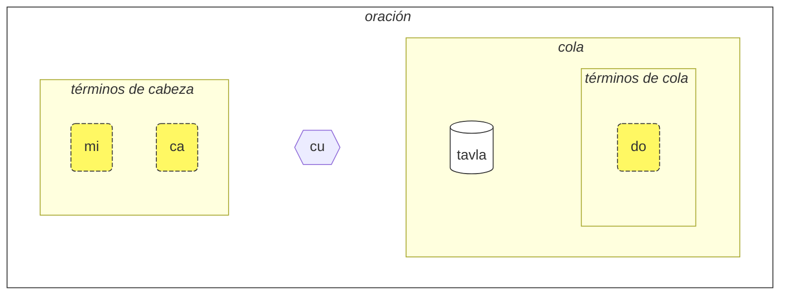
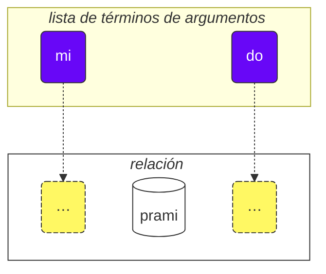

Cómo usar este curso:

1. léelo
2. recopila tus comentarios y sugerencias
3. envíalos a [💬 el chat en vivo](https://lojban.pw/es/articles/live_chat/)

## Lección 1. El idioma de un vistazo

### Alfabeto

Lo básico que necesitas saber sobre Lojban es el alfabeto.

Lojban utiliza el alfabeto latino (las vocales están coloreadas):

<dl><dd><b>a b c d e f g i j k l m n o p r s t u v x y z ' .</b></dd></dl>

Las palabras se pronuncian tal como se escriben.

Hay 10 vocales en Lojban:

<table>
<tbody><tr>
<td><b class="audio-inline">a</b></td>
<td> como la <i>a</i> en <i>p<u>a</u>dre</i></td>
</tr>
<tr>
<td><b class="audio-inline">e</b></td>
<td> como la <i>e</i> en <i>p<u>e</u>rro</i></td>
</tr>
<tr>
<td><b class="audio-inline">i</b></td>
<td> como la <i>i</i> en <i>m<u>i</u>na</i> (no como en inglés <i>hit</i>)</td>
</tr>
<tr>
<td><b class="audio-inline">o</b></td>
<td> como la <i>o</i> en <i>l<u>o</u>ro</i> (debe ser un sonido "puro", no como la <i>o</i> en inglés <i>so</i>)</td>
</tr>
<tr>
<td><b class="audio-inline">u</b></td>
<td> como la <i>u</i> en <i>l<u>u</u>na</i> (no como en inglés <i>but</i>)</td>
</tr>
<tr>
<td><b class="audio-inline">y</b></td>
<td> como la <i>e</i> átona en francés (como en inglés <i>comm<u>a</u></i>), no como en <i>misty</i> o <i>cycle</i></td>
</tr>
<tr>
</tbody></table>

4 vocales se escriben usando combinaciones de letras:

<table>
<tbody><tr>
<td><b class="audio-inline">au</b></td>
<td> como <i>au</i> en <i><u>au</u>to</i></td></tr>
<tr>
<td><b class="audio-inline">ai</b></td>
<td> como <i>ai</i> en <i><u>ai</u>re</i></td></tr>
<tr>
<td><b class="audio-inline">ei</b></td>
<td> como <i>ei</i> en <i>r<u>ei</u>na</i></td></tr>
<tr>
<td><b class="audio-inline">oi</b></td>
<td> como <i>oi</i> en <i>v<u>oy</u></i></td></tr>
</tbody></table>

En cuanto a las consonantes, se pronuncian como en español o latín, pero hay varias diferencias:

<table>
<tbody><tr>
<td><b class="guibutton">c</b>
</td>
<td>se pronuncia como <i>ch</i> en <i><u>ch</u>ico</i>, como <i>sh</i> en inglés <i>shop</i>.
</td></tr>
<tr>
<td><b class="guibutton">g</b>
</td>
<td>siempre <i>g</i> como en <i><u>g</u>ato</i> (nunca como <i>g</i> en <i>gente</i>).
</td></tr>
<tr>
<td><b class="guibutton">j</b>
</td>
<td>como la <i>j</i> francesa en <i>bonjour</i>, o como la <i>s</i> en inglés <i>pleasure</i> o <i>treasure</i>.
</td></tr>
<tr>
<td><b class="guibutton">x</b>
</td>
<td>como la <i>j</i> en español <i><u>J</u>osé</i>, como <i>ch</i> en escocés <i>loch</i> o en alemán <i>Bach</i>. Intenta pronunciar <i>ksss</i> manteniendo la lengua abajo y obtendrás este sonido.
</td></tr>
<tr>
<td><b class="guibutton"> ' </b>
</td>
<td>como la <i>h</i> aspirada en inglés. El apóstrofo se considera una letra propia de Lojban y se pronuncia como una <i>h</i> aspirada. Solo puede aparecer entre vocales. Por ejemplo, <b>u'i</b> se pronuncia como <i>u-hi</i> (mientras que <b>ui</b> se pronuncia como <i>ui</i>).
</td></tr>
<tr>
<td><b>.</b>
</td>
<td>un punto (pausa, separación de palabras) también se considera una letra en Lojban. Es una breve pausa en el habla para evitar que las palabras se fusionen entre sí. En realidad, cualquier palabra que comience con una vocal tiene un punto colocado delante de ella. Esto ayuda a evitar la fusión indeseable de dos palabras consecutivas en una sola.
</td></tr>
<tr>
<td><b>i</b>
</td>
<td><b>i</b> antes de vocales se considera una consonante y se pronuncia más breve, por ejemplo:
<ul><li><b>ia</b> se pronuncia como <i>ya</i> en <i>yate</i></li>
<li><b>ie</b> se pronuncia como <i>ye</i> en <i>yeso</i></li></ul>
</td></tr>
<tr>
<td><b>u</b>
</td>
<td><b>u</b> antes de vocales se considera una consonante y se pronuncia más breve, por ejemplo:
<ul><li><b>ua</b> se pronuncia como <i>wa</i> en <i>guante</i></li>
<li><b>ue</b> se pronuncia como <i>we</i> en <i>güero</i></li></ul>
</td></tr></tbody></table>

El acento se coloca en la penúltima vocal. Si una palabra tiene solo una vocal, simplemente no se acentúa.

La letra **r** puede pronunciarse como la _r_ en español, inglés, escocés o ruso, así que hay un rango de pronunciaciones aceptables para ella.

Las vocales cortas del inglés como la _i_ corta y la _u_ corta en _hit_ y _but_ son usadas por algunas personas para separar consonantes. Entonces, si tienes problemas para pronunciar dos consonantes seguidas (por ejemplo, la **vl** en **tavla**, que significa _hablar con_), puedes decir _tavɪla_ — donde la _ɪ_ es muy breve. Sin embargo, otras vocales como **a** y **u** deben ser largas.

### La oración más simple

La unidad básica en Lojban es la "oración". Aquí hay tres ejemplos simples:

> **le prenu cu tavla mi** > _La persona me habla._

le prenu
: la persona

tavla
: … habla con …, … conversa con …

mi
: yo, me, mí

> **mi prami do** > _Te amo._

prami
: … ama a … (alguien)

do
: tú, te, ti

> **mi ca cu tavla do** > _Ahora te hablo._

ca
: ahora (pronunciado como **cha**)

<pixra url="/assets/pixra/cilre-xekri-g-out/tavla.webp" caption="le prenu cu tavla mi" definition="La persona me habla."></pixra>

<pixra url="/assets/pixra/cilre-xekri-g-out/mi.webp" caption="mi" definition="yo / mí"></pixra>

<pixra url="/assets/pixra/cilre-xekri-g-out/mi_prami_do2.webp" caption="mi prami do" definition="Te amo."></pixra>

<pixra url="/assets/pixra/cilre-xekri-g-out/do.webp" caption="do" definition="tú"></pixra>

Cada oración en Lojban consta de las siguientes partes de izquierda a derecha:

- la cabeza:
  - consiste en los llamados "términos",
    - **le prenu** es el único término de cabeza en el ejemplo **le prenu cu tavla mi** arriba,
    - **mi**, **ca** son términos de cabeza en el ejemplo **mi ca cu tavla do** arriba.
- el separador de cabeza **cu**:
  - pronunciado como _chu_ ya que **c** es como _ch_,
  - muestra que la cabeza ha terminado,
  - puede omitirse cuando está claro que la cabeza ha terminado.
- la cola:
  - el constructo de relación principal (llamado "**selbrisni**" en Lojban)
  - \+ posiblemente uno o más términos después de él,
    - **tavla**, **prami** son selbrisni, constructos de relación principales en los ejemplos anteriores.
    - **mi** es el único término de cola en el ejemplo **le prenu cu tavla mi** arriba.
    - **do** es el único término de cola en el ejemplo **mi prami do** arriba.

En Lojban, hablamos principalmente de relaciones en lugar de sustantivos o verbos.

Aquí están las dos palabras de relación, que corresponden aproximadamente a verbos:

prenu
: … es una persona / son personas

tavla
: … habla con …

Cada relación tiene uno o más roles que también pueden llamarse "espacios" o "lugares". Arriba, están etiquetados con "…". Esos espacios deben llenarse con argumentos (llamados "**sumti**" en Lojban). Los términos de argumentos son constructos como **le prenu**, **mi**, **do** sin importar si esos términos terminan siendo en una cabeza o en una cola de una oración. Colocamos términos de argumentos en orden, llenando así estos espacios y dando un significado concreto a la relación.

También podemos convertir tal relación en un término de argumento.

Para eso colocamos una palabra corta **le** delante de ella:

prenu
: … es una persona

le prenu
: la persona, las personas

De manera similar,

tavla
: … habla con …

y por lo tanto

le tavla
: el hablante, los hablantes

Puede sonar extraño cómo _persona_ puede ser un "verbo", pero de hecho, esto hace que Lojban sea muy simple:

<table>
<thead>
<tr>
<th>palabra de relación con espacios sin llenar</th>
<th>forma de argumento (<b>sumti</b>)</th></tr>
</thead>
<tbody>
<tr>
<td><b>prenu</b> — <i>… (alguien) es una persona</i> </td>
<td><b>le prenu</b> — <i>la persona / las personas</i>
     <b>le prenu</b> — <i>el que es una persona / los que son personas</i>
</td></tr>
<tr>
<td><b>tavla</b> — <i>… (alguien) habla con … (alguien)</i> </td>
<td><b>le tavla</b> — <i>el hablante / los hablantes</i>
     <b>le tavla</b> — <i>el que es un hablante / los que son hablantes</i>
</td></tr>
</tbody></table>

El primer espacio de las relaciones desaparece al usar **le**, por lo tanto, tales traducciones alternativas como _el que …_ son posibles.

<!-- We can also say that **le** creates a noun from a relation construct with roughly the meaning of _the one which is …_ (_is a person_ — _the person_), or even _those who do…_ (_to speak to_ — _the speakers_), _those who are…_ (_are people_ — _the people_). -->

Nota que Lojban, por defecto, no especifica el número entre _el hablante_ o _los hablantes_. Es decir, **le tavla** es vago en ese sentido, y pronto descubriremos formas de definir el número.

Aparte de los términos de argumentos, hay términos modales como **ca**:

> **mi ca cu tavla do** > _Ahora te hablo._

ca
: ahora

Los términos modales no llenan los espacios del constructo de relación principal ("**selbrisni**"). En cambio, se aplican a toda la oración enriqueciendo o estrechando su significado.

Por lo tanto, los términos en Lojban están representados con:

- términos de argumentos que llenan los espacios de las relaciones. Ejemplos son:
  - sustantivos como **le prenu** (_la persona_)
  - pronombres como **mi** (_yo_, _me_), **do** (_tú_, _te_). Los pronombres funcionan exactamente como los sustantivos, pero **le** no se usa para ellos. Funcionan como argumentos por sí mismos.
- términos modales que no llenan espacios de relaciones pero especifican información adicional y clarificadora.
  - por ejemplo, **ca** (_ahora, en el presente_).

Algunos ejemplos más:

<pixra url="/assets/pixra/cilre-xekri-g-out/nintadni.webp" caption="mi nintadni" definition="Soy un estudiante nuevo, un novato."></pixra>

> **mi nintadni** > _Soy un estudiante nuevo._

nintadni
: … (alguien) es un estudiante nuevo, un novato

A diferencia del español, no tenemos que agregar el verbo "soy/es/son/ser" a la oración. Ya está implícito. La palabra de relación **nintadni** (_… es un estudiante nuevo_) ya tiene este "soy/es/son/ser" del español incorporado en su traducción al español.

> **do jimpe** > _Entiendes._

jimpe
: … (alguien) entiende … (algo)

<pixra url="/assets/pixra/cilre-xekri-g-out/pilno_le_fonxa.webp" caption="le prenu cu pilno le fonxa" definition="La persona usa el teléfono."></pixra>

> **mi pilno le fonxa** > _Uso el teléfono._

pilno
: … (alguien) usa … (algo)

fonxa
: … es un teléfono, … son teléfonos

le fonxa
: el teléfono, los teléfonos

<pixra url="/assets/pixra/cilre-xekri-g-out/citka.webp" caption="mi citka" definition="Como."></pixra>

> **mi citka** > _Como._

citka
: … (alguien) come … (algo)

> **do citka** > _Comes._

<!-- -->

> **mi citka le plise** > _Como las manzanas._

<pixra url="/assets/pixra/cilre-xekri-g-out/le_plise_cu_kukte.webp" caption="le plise cu kukte" definition="Las manzanas son sabrosas."></pixra>

> **le plise cu kukte** > _Las manzanas son sabrosas._

le plise
: las manzanas

kukte
: … (algo) es sabroso

Una oración más simple en Lojban contendría solo una palabra de relación principal:

<pixra url="/assets/pixra/cilre-xekri-g-out/karce.webp" caption="karce" definition="Es un coche."></pixra>

> **karce** > _¡Coche!_ > _Es un coche._

Podrías decir esto cuando ves un coche venir. Aquí el contexto sería lo suficientemente claro como para que haya un coche en algún lugar cercano y probablemente sea peligroso.

**karce** en sí es una palabra de relación que significa _es un coche_.

Por supuesto, podemos ser más precisos y decir, por ejemplo:

> **bolci** > _¡Pelota!_ > _Es una pelota._

donde **bolci** es una palabra de relación que significa _es una pelota_.

> **ti bolci** > _Esto es una pelota cerca de mí._

<!-- -->

> **ta bolci** > _Eso es una pelota cerca de ti._

ti
: pronombre: esto cerca de mí

ta
: pronombre: esto/eso cerca de ti

tu
: pronombre: aquello lejos de ti y de mí

<pixra url="/assets/pixra/cilre-xekri-g-out/ti.webp" caption="ti" definition="esto (cerca de mí, el hablante)"></pixra>

<pixra url="/assets/pixra/cilre-xekri-g-out/ta.webp" caption="ta" definition="eso (cerca de ti, el oyente)"></pixra>

<pixra url="/assets/pixra/cilre-xekri-g-out/tu.webp" caption="tu" definition="aquello allá (lejos de ti y de mí)"></pixra>

De manera similar, puedes decir

<pixra url="/assets/pixra/cilre-xekri-g-out/carvi.webp" caption="carvi" definition="… es una lluvia"></pixra>

> **carvi** > _Está lloviendo._

donde

carvi
: … es una lluvia, … está lloviendo

o

> **pluka** > _Es agradable._

donde

pluka
: … es agradable

Nota que en Lojban no hay necesidad de la palabra _eso_ en ese sentido. Simplemente usas la palabra de relación que necesitas.

> **prami** > _Alguien ama._

<pixra url="/assets/pixra/cilre-xekri-g-out/bajra.webp" caption="le prenu cu bajra" definition="La persona corre."></pixra>

> **bajra** > _Alguien corre._

bajra
: … corre usando las extremidades

De nuevo, el contexto probablemente diría quién ama a quién y quién corre.

#### Tarea

<pixra url="/assets/pixra/cilre-xekri-g-out/pinxe_le_djacu.webp" caption="le prenu cu pinxe le djacu" definition="La persona bebe el agua."></pixra>

pinxe
: … bebe … (algo)

le djacu
: el agua

Cubre la parte derecha de la tabla. Traduce las oraciones de la izquierda desde Lojban.

<table style="table-layout: fixed;">
<tbody><tr>
<td><b>do citka</b>
</td>
<td><i>Comes.</i>
</td></tr>
<tr>
<td><b>mi pinxe le djacu</b>
</td>
<td><i>Bebo agua.</i>
</td></tr>
<tr>
<td><b>mi citka le plise</b>
</td>
<td><i>Como manzanas.</i>
</td></tr></tbody></table>

### «**.i**» separa oraciones

Colocamos una palabra corta **.i** para separar dos oraciones consecutivas cualesquiera:

> **mi tavla le prenu .i le prenu cu tavla mi** > _Hablo con las personas. Las personas me hablan._

**.i** separa oraciones como el punto al final de las oraciones en los textos en español.

Cuando decimos una oración después de otra en español, hacemos una pausa (puede ser corta) entre ellas. Pero la pausa tiene muchos significados diferentes en español. En Lojban tenemos una mejor manera de entender dónde termina una oración y comienza otra.

También nota que a veces, cuando pronunciamos palabras rápidamente, no puedes distinguir dónde termina una oración y comienza la palabra de la siguiente oración. Por lo tanto, se aconseja usar la palabra **.i** antes de comenzar una nueva oración.

### Números: '_1 2 3 4 5 6 7 8 9 0_' = «**pa re ci vo mu xa ze bi so no**»

**le** simplemente convierte un constructo de relación en un argumento, pero tal argumento no tiene un número asociado con él. La oración

> **le prenu cu tavla mi** > _Las personas me hablan._ > _La persona me habla._

no especifica el número de personas que me hablan. En español, es imposible omitir el número porque _personas_ en español implica _más de una persona_. Sin embargo, en Lojban, puedes omitir el número.

Ahora especifiquemos cuántas de las personas son relevantes para nuestra discusión.

Agreguemos un número después de **le**.

<table>
<tbody><tr>
<td><b>pa</b>
</td>
<td><b>re</b>
</td>
<td><b>ci</b>
</td>
<td><b>vo</b>
</td>
<td><b>mu</b>
</td>
<td><b>xa</b>
</td>
<td><b>ze</b>
</td>
<td><b>bi</b>
</td>
<td><b>so</b>
</td>
<td><b>no</b>
</td></tr>
<tr>
<td> 1
</td>
<td> 2
</td>
<td> 3
</td>
<td> 4
</td>
<td> 5
</td>
<td> 6
</td>
<td> 7
</td>
<td> 8
</td>
<td> 9
</td>
<td> 0
</td>
</tr></tbody></table>

<pixra url="/assets/pixra/cilre-xekri-g-out/le_mu_prenu.webp" caption="le mu prenu" definition="Las cinco personas"></pixra>

> **le pa prenu cu tavla mi** > _La persona me habla._ > _Una persona me habla._

Agregamos un número después de **le** y así especificamos personas individuales.

Para números que consisten en varios dígitos, simplemente encadenamos esos dígitos juntos:

> **le re mu prenu cu tavla mi** > _Las 25 personas me hablan._

Sí, es así de simple.

Si queremos contar, podemos separar los números con **.i**:

> **mu .i vo .i ci .i re .i pa .i no** > _5 … 4 … 3 … 2 … 1 … 0_

El número **za'u** significa _más de …_ (_\>_ en matemáticas), el número **me'i** significa _menos de_ (_<_ en matemáticas):

> **le za'u re prenu cu tavla mi** > _Más de dos personas me hablan._

<!-- -->

> **le me'i pa no prenu cu tavla mi** > _Menos de 10 personas me hablan._

<!-- -->

> **le za'u ci prenu cu tavla mi** > _Más de tres personas me hablan._

Para decir simplemente _personas_ (número plural) en contraposición a _una persona_, usamos **za'u pa**, _más de uno_ o simplemente **za'u**.

> **le za'u pa prenu cu tavla mi** > **le za'u prenu cu tavla mi** > _Las personas me hablan._

**za'u** por defecto significa **za'u pa**, por lo que tal contracción es posible.

le prenu
: la persona / las personas

le pa prenu
: la persona (una en número)

le za'u prenu
: las personas (dos o más en número)

#### Tarea

stati
: … (alguien) es inteligente, … tiene talento

<pixra url="/assets/pixra/cilre-xekri-g-out/stati.webp" caption="stati" definition="… tiene talento"></pixra>

klama
: … viene a … (algún lugar u objeto)

<pixra url="/assets/pixra/cilre-xekri-g-out/klama_ti.webp" caption="le prenu cu klama ti" definition="La persona vino aquí."></pixra>

nelci
: … le gusta … (algo)

le zarci
: el mercado

<pixra url="/assets/pixra/cilre-xekri-g-out/zarci.webp" caption="le prenu cu zvati le zarci" definition="La persona está en la tienda."></pixra>

le najnimre
: la naranja (fruta), las naranjas

<pixra url="/assets/pixra/cilre-xekri-g-out/najnimre.webp" caption="najnimre" definition="… es una naranja"></pixra>

le badna
: el plátano, los plátanos

<pixra url="/assets/pixra/cilre-xekri-g-out/badna.webp" caption="badna" definition="… es un plátano"></pixra>

Cubre la parte derecha de la tabla. Traduce las oraciones de la izquierda desde Lojban.

<table style="table-layout: fixed;">
 <tbody>
  <tr>
   <td>le mu prenu cu klama le zarci</td>
   <td>Las cinco personas vienen al mercado.</td>
  </tr>
  <tr>
   <td>le pa re prenu cu stati .i do stati</td>
   <td>Las 12 personas son inteligentes. Eres inteligente.</td>
  </tr>
  <tr>
   <td>le prenu cu nelci le plise</td>
   <td>A las personas les gustan las manzanas.</td>
  </tr>
  <tr>
   <td>le za'u re prenu cu citka .i le me'i mu prenu cu pinxe le djacu</td>
   <td>Más de dos personas comen. Menos de 5 personas beben el agua.</td>
  </tr>
  <tr>
   <td>le za'u re prenu cu stati</td>
   <td>Más de dos personas son inteligentes.</td>
  </tr>
 </tbody>
</table>

Cubre la parte derecha de la tabla. Traduce las oraciones de la izquierda al Lojban.

<table style="table-layout: fixed;">
 <tbody>
  <tr>
   <td>Las 256 personas son inteligentes.</td>
   <td>le re mu xa prenu cu stati</td>
  </tr>
  <tr>
   <td>Menos de 12 manzanas son sabrosas.</td>
   <td>le me'i pa re plise cu kukte</td>
  </tr>
 </tbody>
</table>

### Relación compuesta

Los constructos de relación compuestos (**tanru** en Lojban) son varias palabras de relación colocadas una tras otra.

> **tu melbi zdani** > _Aquello es un hogar bonito._

<pixra url="/assets/pixra/cilre-xekri-g-out/melbi_zdani.webp" caption="melbi zdani" definition="… es un hogar bonito"></pixra>

tu
: aquello (lejos de ti y de mí)

melbi
: … es hermoso, bonito

zdani
: … es un hogar o nido para … (alguien)

melbi zdani
: constructo de relación compuesto: … es un hogar hermoso para … (alguien)

<pixra url="/assets/pixra/cilre-xekri-g-out/dansu.webp" caption="le prenu cu melbi dansu" definition="La persona baila bonito."></pixra>

> **do melbi dansu** > _Bailas bonito._

dansu
: … baila

Aquí, la relación **melbi** agrega un significado adicional ya que está colocada a la izquierda de otra relación: **zdani**. El componente izquierdo generalmente se traduce usando adjetivos y adverbios.

Las relaciones compuestas son una característica poderosa que produce significados más ricos. Simplemente unes dos palabras de relación juntas, y el componente izquierdo de tal relación compuesta añade un matiz al derecho.

Podemos poner **le** (por ejemplo, con un número) a la izquierda de tal relación compuesta obteniendo un término de argumento más rico:

le pa melbi zdani
: el hogar hermoso

Ahora sabemos por qué había **cu** después de los términos de cabeza en nuestro ejemplo:

> **le pa prenu cu tavla mi** > _La persona me habla._

Sin **cu** se convertiría en **le pa prenu tavla**, que tendría el significado de _la persona-hablante_ - lo que sea que eso pueda significar.

Considera:

> **le pa tavla pendo** > _El amigo hablador_

<!-- -->

> **le pa tavla cu pendo** > _El que habla es un amigo._

Recuerda colocar **cu** antes del constructo de relación principal en una oración para evitar la creación involuntaria de relaciones compuestas.

Una relación compuesta puede contener más de dos componentes. En este caso, la primera relación modifica a la segunda, la segunda modifica a la tercera, y así sucesivamente:

<pixra url="/assets/pixra/cilre-xekri-g-out/cmalu_karce.webp" caption="ti cmalu karce" definition="Esto es un coche pequeño."></pixra>

> **le pa melbi cmalu karce** > _el coche pequeño y bonito, el coche pequeño de una manera bonita_

<!-- -->

> **le mutce melbi zdani** > _el hogar muy hermoso_

mutce
: … es muy, … es mucho

#### Tarea

sutra
: … es rápido

barda
: … es grande

cmalu
: … es pequeño

mlatu
: … es un gato

Cubre la parte derecha de la tabla. Traduce las oraciones de la izquierda desde Lojban.

<table style="table-layout: fixed;">
<tbody><tr>
<td><b>le melbi karce</b>
</td>
<td><i>el coche hermoso / los coches hermosos</i>
</td></tr>
<tr>
<td><b>do sutra klama</b>
</td>
<td><i>Vienes rápidamente. Vienes rápido.</i>
</td></tr>
<tr>
<td><b>tu barda zdani</b>
</td>
<td><i>Eso es un hogar grande.</i>
</td></tr>
<tr>
<td><b>le pa sutra bajra mlatu</b>
</td>
<td><i>el gato que corre rápidamente</i>
</td></tr>
<tr>
<td><b>le pa sutra mlatu</b>
</td>
<td><i>el gato rápido</i>
</td></tr>
<tr>
<td><b>le pa bajra mlatu</b>
</td>
<td><i>el gato que corre</i>
</td></tr></tbody></table>

Cubre la parte derecha de la tabla. Traduce las oraciones de la izquierda al Lojban.

<table style="table-layout: fixed;">

<tbody><tr>
<td><i>Esto es un coche pequeño.</i>
</td>
<td><b>ti cmalu karce</b>
</td></tr>
<tr>
<td><i>manzanas sabrosas</i>
</td>
<td><b>le kukte plise</b>
</td></tr>
<tr>
<td><i>los comedores rápidos</i>
</td>
<td><b>le sutra citka</b>
</td></tr>
<tr>
<td><i>Eres una persona que camina rápidamente.</i>
</td>
<td><b>do sutra cadzu prenu</b>
</td></tr></tbody></table>

### Preguntas de '_Sí/No_'

En español, formamos una pregunta de _sí/no_ cambiando el orden de las palabras, por ejemplo

> _Tú eres … ⇒ ¿Eres tú …?_

o usando alguna forma del verbo auxiliar al principio, por ejemplo:

> _Tú sabes … ⇒ ¿Sabes?_

En Lojban, se puede mantener el orden de las palabras. Para convertir cualquier afirmación en una pregunta de _sí/no_, simplemente insertamos la palabra **xu** al principio de la oración:

> **xu do nelci le gerku** > _¿Te gustan los perros?_

le gerku
: el perro, los perros

<pixra url="/assets/pixra/cilre-xekri-g-out/le_prenu_e_le_gerku.webp" caption="ti prenu .i ti gerku" definition="Esto es una persona. Esto es un perro."></pixra>

Recuerda que en Lojban, la puntuación como "?" (signo de interrogación) es opcional y se usa principalmente con fines estilísticos. Esto es porque la palabra de pregunta **xu** ya muestra que es una pregunta.

Otros ejemplos:

> **xu mi klama** > _¿Vengo?_

klama
: … viene a … (algún lugar)

> **xu pelxu** > _¿Es amarillo?_

pelxu
: … es amarillo

Podemos cambiar el significado colocando **xu** después de diferentes partes de la oración. Las explicaciones de qué cambió en el significado se dan entre paréntesis:

> **xu do nelci le gerku** > _¿Te gustan los perros?_

<!-- -->

> **do xu nelci le gerku** > _¿TÚ gustan los perros?_ (Pensé que era otra persona a quien le gustaban).

<!-- -->

> **do nelci xu le gerku** > _¿Te GUSTAN los perros? (Pensé que simplemente eras neutral hacia ellos)._

<!-- -->

> **do nelci le xu gerku** > _¿Te gustan LOS PERROS? (Pensé que te gustaban los gatos)._

<!-- -->

> **do nelci le gerku xu** > _Te gustan esas cosas, ¿son perros? (Solo cuestionas la validez de la relación **gerku**)._

Lo que se expresa usando entonación en español se expresa moviendo **xu** después de la parte que queremos enfatizar en Lojban. Nota que la primera oración con **xu** al principio hace la pregunta más genérica sin enfatizar ningún aspecto particular.

**xu** es una palabra de interjección. Aquí están las características de las interjecciones de Lojban:

- la interjección modifica el constructo antes de ella:

> **do xu nelci le gerku** > _¿TÚ gustan los perros?_

- cuando se coloca al principio de una relación, la interjección modifica toda la relación:

> **xu do nelci le gerku** > _¿Te gustan los perros?_

- las interjecciones se pueden colocar después de diferentes partes de la misma relación para cambiar el significado.

> **do nelci le gerku xu** > _Te gustan esas entidades, ¿son perros?_

Aquí, solo la relación **gerku** (no el argumento **le gerku**) es modificada por la palabra de pregunta **xu**. Así que aquí solo nos preguntamos sobre esa relación. Afirmamos que te gustan esos objetos o seres vivos y te preguntamos si esos son perros.

Las interjecciones no rompen las relaciones compuestas, se pueden usar dentro de ellas:

> **do nelci le barda xu gerku** > _¿Te gustan los perros GRANDES?_

Ahora, ¿cómo responder a tales preguntas de 'sí/no'? Repetimos el constructo de relación principal:

> **— xu le mlatu cu melbi** > **— melbi** > _— ¿Los gatos son bonitos?_ > _— Bonitos._

Para responder 'no', usamos el término modal **na ku**:

> **— xu le mlatu cu melbi** > **— na ku melbi** > _— ¿Los gatos son bonitos?_ > _— No bonitos._

na ku
: término: es falso que …

O, podemos usar una palabra de relación especial **go'i**:

> **— xu le mlatu cu melbi** > **— go'i** > _— ¿Los gatos son bonitos?_ > _— Bonitos._

go'i
: palabra de relación que repite la relación principal de la oración anterior

Aquí, **go'i** significa lo mismo que **melbi** ya que **melbi** es la relación de la relación anterior.

> **— xu le mlatu cu melbi** > **— na ku go'i** > _— ¿Los gatos son bonitos?_ > _— No bonitos._

<!-- This course doesn't recommend negating **go'i** for negative answers. Just use **je'u nai**. -->

El término modal **na ku** se puede usar no solo en respuestas:

> **na ku mi nelci le gerku** > _Es falso que me gustan los perros._ > _No me gustan los perros._

<!-- -->

> **mi na ku nelci do** > _No me gustas._

Su opuesto, el término **ja'a ku** afirma el significado:

> **mi ja'a ku nelci do** > _Sí me gustas._

ja'a ku
: término: es verdad que …

#### Tarea

Cubre la parte derecha de la tabla. Traduce las oraciones de la izquierda desde Lojban.

<table style="table-layout: fixed;">

<tbody><tr>
<td><b>xu le barda zdani cu melbi</b>
</td>
<td><i>¿El hogar grande es hermoso?</i>
</td></tr>
<tr>
<td><b>— le prenu cu stati xu — na ku stati</b>
</td>
<td><i>— ¿Las personas son inteligentes? — No.</i>
</td></tr>
<tr>
<td><b>do klama le zarci xu</b>
</td>
<td><i>¿Vas al mercado?</i>
</td></tr>
<tr>
<td><b>xu le verba cu prami le mlatu</b>
</td>
<td><i>¿El niño ama a los gatos?</i>
</td></tr></tbody></table>

Cubre la parte derecha de la tabla. Traduce las oraciones de la izquierda al Lojban.

<table style="table-layout: fixed;">

<tbody><tr>
<td><i>¿El coche es rápido?</i>
</td>
<td><b>xu le karce cu sutra</b>
</td></tr>
<tr>
<td><i>— ¿La naranja es sabrosa? — Sí, lo es.</i>
</td>
<td><b>— xu le najnimre cu kukte — kukte</b>
</td></tr>
<tr>
<td><i>¿El perro te ama?</i>
</td>
<td><b>xu le gerku cu prami do</b>
</td></tr></tbody></table>

### Felicidad y peticiones corteses: '_¡Viva!_' = «**ui**», '_¡Por favor!_' = «**.e'o**»

La interjección **ui** muestra la felicidad del que está hablando. Se usa igual que la carita sonriente '_:)_' en mensajería, para indicar que estás contento de algo. Aunque, las caritas pueden ser ambiguas, y **ui** tiene solo un significado, lo cual es práctico.

> **ui do klama** > _¡Viva, vienes!_

ui
: interjección: _¡Viva!_, interjección de felicidad

La interjección **.e'o** al principio de una oración la convierte en una petición cortés:

> **.e'o do lebna le fonxa** > _¿Podrías tomar el teléfono, por favor?_ > `Por favor toma el teléfono.`

.e'o
: interjección: por favor (pronunciado como _eh-ho_ con una breve pausa o ruptura antes de la palabra)

lebna
: tomar (algo)

En español, para ser cortés, uno tiene que usar _podrías_ + _por favor_ + una pregunta. En Lojban, **.e'o** es suficiente para hacer una petición cortés.

#### Tarea

Cubre la parte derecha de la tabla. Traduce las oraciones de la izquierda desde Lojban.

le tcati
: el té

<pixra url="/assets/pixra/cilre-xekri-g-out/tcati.webp" caption="tcati" definition="… es té"></pixra>

le ckafi
: el café

<pixra url="/assets/pixra/cilre-xekri-g-out/ckafi.webp" caption="ckafi" definition="… es café"></pixra>

zgana
: observar, mirar (usando cualquier sentido)

le skina
: la película, el filme

<pixra url="/assets/pixra/cilre-xekri-g-out/zgana_le_skina.webp" caption="le prenu cu zgana le skina" definition="La persona ve la película."></pixra>

kurji
: cuidar de (alguien, algo)

<table style="table-layout: fixed;">

<tbody>
<tr>
<td><b>ui carvi</b>
</td>
<td><i>¡Viva, llueve! ¡Viva, está lloviendo!</i>
</td></tr>
<tr>
<td><b>.e'o do sutra bajra</b>
</td>
<td><i>¡Corre rápidamente!</i>
</td></tr>
<tr>
<td><b>.e'o do pinxe le tcati</b>
</td>
<td><i>¡Por favor, bebe té!</i>
</td></tr>
<tr>
<td><b>.e'o zgana le skina</b>
</td>
<td><i>¡Por favor, mira la película!</i>
</td></tr></tbody></table>

Cubre la parte derecha de la tabla. Traduce las oraciones de la izquierda al Lojban.

<table style="table-layout: fixed;">

<tbody><tr>
<td><i>¡Por favor, sé inteligente!</i>
</td>
<td><b>.e'o do stati</b>
</td></tr>
<tr>
<td><i>¡Por favor, ve a casa!</i>
</td>
<td><b>.e'o do klama le zdani</b>
</td></tr>
<tr>
<td><i>¡Por favor, bebe el café!</i>
</td>
<td><b>.e'o do pinxe le ckafi</b>
</td></tr>
<tr>
<tr>
<td><i>¡Viva, te hablo!</i>
</td>
<td><b>ui mi tavla do</b>
</td></tr>
<tr>
<td><i>Por favor, cuida del niño.</i>
</td>
<td><b>.e'o do kurji le verba</b>
</td></tr></tbody></table>

### '_Y_' y '_o_'

> **do nintadni .i je mi nintadni** > _Eres un novato. Y yo soy un novato._

<!-- -->

> **do .e mi nintadni** > _Tú y yo somos novatos._

<pixra url="/assets/pixra/cilre-xekri-g-out/do_e_mi_nintadni.webp" caption="do .e mi nintadni" definition="Tú y yo somos estudiantes nuevos."></pixra>

<!-- -->

> **mi tadni .i je mi tavla do** > _Estudio. Y te hablo._

<!-- -->

> **mi tadni gi'e tavla do** > _Estudio y te hablo._

.i je
: conjunción "y" que combina oraciones en una.

.e
: conjunción "y" que conecta argumentos.

gi'e
: conjunción "y" que conecta colas de oración.

Podemos combinar dos oraciones en una afirmación usando la conjunción **.i je**, que significa _y_:

> **do nintadni .i je mi nintadni** > _Eres un novato. Y yo soy un novato._

Dado que ambas oraciones tienen la misma cola, podemos usar una contracción: la conjunción **.e** significa _y_ para argumentos:

> **do .e mi nintadni** > _Tú y yo somos novatos._

**do nintadni .i je mi nintadni** significa exactamente lo mismo que **do .e mi nintadni**

También podemos usar **.e** para conectar argumentos en otras posiciones.

Ambas oraciones significan lo mismo.

> **mi pinxe le djacu .e le jisra** > _Bebo el agua y el jugo._ > **mi pinxe le djacu .i je mi pinxe le jisra** > _Bebo el agua, y bebo el jugo._

le jisra
: el jugo

<pixra url="/assets/pixra/cilre-xekri-g-out/pinxe_le_jisra.webp" caption="le prenu cu pinxe le jisra" definition="La persona bebe el jugo."></pixra>

Si la cabeza de la oración es la misma pero las colas difieren, usamos la conjunción **gi'e**, que significa _y_ para colas de oración:

> **mi tadni .i je mi tavla do** > **mi tadni gi'e tavla do** > _Estudio y te hablo._

Ambas variaciones significan lo mismo; **gi'e** simplemente conduce a una forma más concisa.

También hay formas de agregar _y_ para componentes de relaciones compuestas:

> **le melbi je cmalu zdani cu jibni ti** > _El hogar bonito y pequeño está cerca._

<pixra url="/assets/pixra/cilre-xekri-g-out/melbi_je_cmalu_zdani.webp" caption="melbi je cmalu zdani" definition="… es un hogar bonito-y-pequeño"></pixra>

jibni
: … está cerca de …

ti
: esto, este lugar cerca de mí

**je** es una conjunción que significa _y_ en relaciones compuestas.

Sin **je**, la oración cambia el significado:

> **le melbi cmalu zdani cu jibni** > _El hogar bonitamente pequeño está cerca._

Aquí **melbi** modifica **cmalu**, y **melbi cmalu** modifica **zdani**, según cómo funcionan las relaciones compuestas.

En **le melbi je cmalu zdani** (_el hogar bonito y pequeño_) tanto **melbi** como **cmalu** modifican **zdani** directamente.

Otras conjunciones comunes incluyen:

> **le verba cu fengu ja bilma** > _El niño está enojado o enfermo (o tal vez tanto enojado como enfermo)_

<!-- -->

> **do .a mi ba vitke le dzena** > _Tú o yo (o ambos) visitaremos al ancestro._

ja
: _y/o_ dentro de relaciones compuestas

.a
: _y/o_ al conectar argumentos

fengu
: … está enojado

<pixra url="/assets/pixra/cilre-xekri-g-out/fengu.webp" caption="fengu" definition="… está enojado"></pixra>

bilma
: … está enfermo

<pixra url="/assets/pixra/cilre-xekri-g-out/bilma.webp" caption="le prenu cu bilma" definition="La persona está enferma"></pixra>

vitke
: visitar (a alguien)

dzena
: … es un ancestro de …

<pixra url="/assets/pixra/cilre-xekri-g-out/dzena.webp" caption="dzena" definition="… es un ancestro de …"></pixra>

> **le karce cu blabi jo nai grusi** > _El coche es o blanco o gris._

<!-- -->

> **do .o nai mi vitke le laldo** > _O tú o yo visitamos al anciano._

jo nai
: o … o … pero no ambos

.o nai
: o … o … pero no ambos (al conectar argumentos)

laldo
: … es anciano

<pixra url="/assets/pixra/cilre-xekri-g-out/laldo.webp" caption="laldo" definition="… es anciano"></pixra>

Nota: es mejor recordar **jo nai** como un constructo único, y lo mismo para **.o nai**.

> **mi prami do .i ju do stati** > _Te amo. Sea que seas inteligente o no._

<!-- -->

> **le verba cu nelci le plise .u le badna** > _Al niño le gustan las manzanas sea que (le gusten) o no los plátanos._

ju
: sea o no …

.u
: sea o no … (al conectar argumentos)

### «**joi**» es '_y_' para acciones masivas

> **do joi mi casnu le bangu** > _Tú y yo estamos discutiendo el idioma._

casnu
: … discute …

le bangu
: el idioma

joi
: conjunción _y_ para masas

Si digo **do .e mi casnu le bangu** puede significar que tú discutes el idioma, y yo discuto el idioma. ¡Pero no significa necesariamente que estemos en la misma conversación!

Esta distinción puede hacerse más visible si expandimos esta oración usando **.i je**:

> **do .e mi casnu le bangu** > **do casnu le bangu .i je mi casnu le bangu** > _Tú discutes el idioma. Y yo discuto el idioma._

Para enfatizar que tú y yo participamos en la misma acción, usamos una conjunción especial **joi** que significa _y_ que forma una "masa":

> **do joi mi casnu le bangu** > _Tú y yo estamos discutiendo el idioma._ > _Tú y yo siendo una sola entidad para este evento estamos discutiendo el idioma._

También existe un pronombre **mi'o** (_tú y yo juntos_), que puede reformularse como **mi joi do** (simplemente es más largo). En Lojban, puedes usar no una sola palabra para _nosotros_ sino constructos más precisos como **mi joi le pendo** (literalmente _yo y los amigos_).

<pixra url="/assets/pixra/cilre-xekri-g-out/casnu.webp" caption="do joi le pendo joi mi casnu" definition="Tú, el amigo y yo estamos en una discusión."></pixra>

#### Tarea

Cubre la parte derecha de la tabla. Traduce las oraciones de la izquierda desde Lojban.

<table style="table-layout: fixed;">

<tbody><tr>
<td><b>mi nelci le badna .e le plise</b>
</td>
<td><i>Me gustan los plátanos, y me gustan las manzanas. Me gustan los plátanos y las manzanas.</i>
</td></tr>
<tr>
<td><b>do sutra ja stati</b>
</td>
<td><i>Eres rápido o inteligente o ambos.</i>
</td></tr>
<tr>
<td><b>le za'u prenu cu casnu le karce .u le gerku</b>
</td>
<td><i>Las personas discuten los coches sea que (discutan) o no los perros.</i>
</td></tr>
<tr>
<td><b>mi citka le najnimre .o nai le badna</b>
</td>
<td><i>Como o las naranjas o los plátanos.</i>
</td></tr></tbody></table>

Cubre la parte derecha de la tabla. Traduce las oraciones de la izquierda al Lojban.

<table style="table-layout: fixed;">

<tbody><tr>
<td><i>A los amigos y a mí nos gusta la lluvia.</i>
</td>
<td><b>le pendo .e mi cu nelci le carvi</b>
</td></tr>
<tr>
<td><i>O yo o tú vamos al mercado.</i>
</td>
<td><b>mi .o nai do klama le zarci</b>
</td></tr>
<tr>
<td><i>Miro el coche grande y hermoso.</i>
</td>
<td><b>mi catlu le barda je melbi karce</b>
</td></tr>
<tr>
<td><i>El niño bebe el agua y/o el jugo.</i>
</td>
<td><b>le verba cu pinxe le djacu .a le jisra</b>
</td></tr>
<tr>
<td><i>El niño y el pequeño discuten el coche.</i>
</td>
<td><b>le verba joi le pa cmalu cu casnu le karce</b> (nota el uso de <b>joi</b>. <i>el pequeño</i> es simplemente <b>le pa cmalu</b>).
</td></tr></tbody></table>

### Pero …

> **le najnimre cu barda .i je ku'i le badna cu cmalu** > _Las naranjas son grandes. Pero los plátanos son pequeños._

ku'i
: interjección: pero, sin embargo

En realidad, en español, _pero_ es lo mismo que _y_, y agrega un matiz de contraste.

En Lojban, simplemente usamos la conjunción **.i je** (o **.e**, **gi'e**, **je**, dependiendo de lo que conectemos) y le agregamos el matiz de contraste con la interjección **ku'i**. Como es habitual, la interjección modifica el constructo antes de ella.

### Eventos: '_bailar y estar juntos_' — «**le nu dansu .e le nu kansa**»

Algunos espacios de relaciones esperan un evento:

> **le cabna cu nicte** > _Ahora es de noche. En el presente es de noche._

cabna
: … (evento) está en el presente con …; … (evento) sucede ahora

le cabna
: el tiempo presente, el evento presente

nicte
: … (evento) sucede de noche

¿Pero qué pasa si queremos describir un evento usando una oración completa?

Cualquier oración puede convertirse en un constructo de relación poniendo **nu** delante de ella:

> **le nicte cu nu mi viska le lunra** > _La noche es cuando veo la Luna._ > `La noche es un evento cuando veo la Luna.`

<pixra url="/assets/pixra/cilre-xekri-g-out/nicte_fi_mi.webp" caption="le nicte" definition="la noche"></pixra>

le nicte
: la noche, las noches

viska
: ver (algo)

le lunra
: la Luna

Aquí, **le nicte** es el primer argumento de la oración y **nu mi viska le lunra** es el constructo de relación principal de la oración. Sin embargo, dentro de esta relación principal, ¡podemos ver otra relación: **mi viska le lunra** incrustada!

La palabra **nu** transforma una oración completa en una relación que denota un evento (en su sentido genérico, puede ser un proceso, un estado, etc.)

Aquí hay algunos ejemplos más:

nu mi tavla
: … es un evento de yo hablar

nu do tavla
: … es un evento de tú hablar

Al agregar **le** delante de **nu**, creamos un argumento que denota un evento:

pinxe ⇒ le nu pinxe
: … bebe ⇒ el beber

dansu ⇒ le nu dansu
: … baila ⇒ el bailar

kansa ⇒ le nu kansa
: … está junto con … ⇒ estar juntos

klama ⇒ le nu klama
: … viene a … ⇒ el venir

le nu do klama
: el venir de ti, tú viniendo

**le nu** a menudo corresponde al español _\-ar_, _\-ción_, _\-sión_.

Algunos ejemplos más con espacios que esperan eventos en lugar de entidades ordinarias:

> **mi djica le nu do klama ti** > _Quiero que vengas aquí (a este lugar)_

djica
: … quiere … (algún evento)

> **mi gleki le nu do klama** > _Estoy feliz porque vienes._

gleki
: … está feliz de … (algún evento)

<pixra url="/assets/pixra/cilre-xekri-g-out/gleki.webp" caption="gleki" definition="… está feliz por el evento …"></pixra>

> **le nu pinxe le jisra cu nabmi mi** > _Beber el jugo es un problema para mí._

nabmi
: … (evento) es un problema para … (alguien), … (evento) es problemático para … (alguien)

#### Tarea

Cubre la parte derecha de la tabla. Traduce las oraciones de la izquierda desde Lojban.

pilno
: usar (algo)

le skami
: la computadora

<table style="table-layout: fixed;">

<tbody><tr>
<td><b>mi nelci le nu do dansu</b>
</td>
<td><i>Me gusta que bailes.</i>
</td></tr>
<tr>
<td><b>xu do gleki le nu do pilno le skami</b>
</td>
<td><i>¿Estás feliz de usar computadoras?</i>
</td></tr>
<tr>
<td><b>do djica le nu mi citka le plise xu</b>
</td>
<td><i>¿Quieres que coma la <u>manzana</u>?</i>
</td></tr></tbody></table>

Cubre la parte derecha de la tabla. Traduce las oraciones de la izquierda al Lojban.

<table style="table-layout: fixed;">

<tbody><tr>
<td><i>Venir aquí es un problema.</i>
</td>
<td><b>le nu klama ti cu nabmi</b>
</td></tr>
<tr>
<td><i>Quiero que seas feliz.</i>
</td>
<td><b>mi djica le nu do gleki</b>
</td></tr></tbody></table>

### Términos modales. Tiempos simples: '_era_', '_es_', '_será_' — «**pu**», «**ca**», «**ba**»

En Lojban, expresamos el tiempo cuando algo sucede (gramaticalmente, en inglés generalmente se llama _tiempo verbal_) con términos modales. Ya hemos visto el término modal **ca** que significa _en el presente_.

Aquí hay una serie de términos relacionados con el tiempo que indican <u>cuándo</u> sucede algo:

> **le prenu pu cu tavla mi** > _Las personas me hablaron._

<!-- -->

> **le prenu ca cu tavla mi** > _Las personas me hablan (en el presente)._

<!-- -->

> **le prenu ba cu tavla mi** > _Las personas me hablarán._

Cuando después de la partícula relacionada con el tiempo colocamos un argumento simple, formamos un término con un significado ligeramente diferente:

> **mi pinxe le djacu ca le nu do klama** > _Bebo el agua mientras vienes._

La parte **ca le nu do klama** es un término largo que significa _mientras vienes / mientras estás viniendo_. El **le nu do klama** es un argumento que significa _tu venir, tú viniendo_.

> **mi citka ba le nu mi dansu** > _Como después de bailar._

Las partículas relacionadas con el tiempo se agrupan en series por su significado para que sean más fáciles de recordar y usar.

Palabras para tiempo simple:

- **pu** significa _antes de … (algún evento)_, **pu** solo denota tiempo pasado.
- **ca** significa _al mismo tiempo que … (algún evento)_, **ca** solo denota tiempo presente.
- **ba** significa _después de … (algún evento)_, **ba** solo denota tiempo futuro.

Los tiempos agregan información sobre el tiempo cuando algo sucede. El español nos obliga a usar ciertos tiempos. Uno tiene que elegir entre

- _Las personas me hablan_.
- _Las personas me hablaron_.
- _Las personas me hablarán_.

y otras opciones similares.

Pero en Lojban las partículas de tiempo son opcionales, podemos ser tan vagos o tan precisos como queramos.

La oración

> **le prenu cu tavla mi** > _Las personas me hablan._

en realidad no dice nada sobre cuándo sucede esto. El contexto es lo suficientemente claro en la mayoría de los casos y puede ayudarnos. Pero si necesitamos más precisión, simplemente agregamos más palabras.

**ba** significa _después de … (algún evento)_ así que cuando decimos **mi ba cu citka** queremos decir que comemos después del momento de hablar, por eso significa _comeré_.

Podemos combinar partículas de tiempo con y sin argumentos después de ellas:

> **mi pu cu citka le plise ba le nu mi dansu** > _Comí las manzanas después de bailar._

Nota que el término **pu** (tiempo pasado) se coloca solo en la relación principal (**mi pu cu citka**). En Lojban, se asume que el evento _bailé_ ocurre en relación con el evento de comer.

No deberíamos poner **pu** con **dansu** (a diferencia del español) ya que **mi dansu** se ve en relación con **mi pu cu citka** así que ya sabemos que todo fue en el pasado.

Más ejemplos de términos relacionados con el tiempo:

> **le nicte cu pluka** > _La noche es agradable._

pluka
: … es agradable

> **ba le nicte cu pluka** > _Después de la noche es agradable._

Aquí, la cabeza de la oración contiene un término **ba le nicte**, un término modal con su argumento interno. Luego, después del separador **cu**, se sigue la relación principal de la oración **pluka** (**pluka** solo significa _Es agradable._)

Para decir _será agradable_ debemos usar el término de tiempo futuro:

> **le nicte ba cu pluka** > _La noche será agradable._

También nota que agregar un argumento después de una partícula relacionada con el tiempo puede llevar a un significado drásticamente diferente:

> **le nicte ba le nu citka cu pluka** > _La noche es agradable después de comer._

Nota que **ca** puede extenderse ligeramente al pasado y al futuro, significando _justo ahora_. Por lo tanto, **ca** refleja una noción ampliamente usada en todo el mundo de "tiempo presente".

También es posible integrar partículas modales en el constructo de relación principal:

> **le nicte ba cu pluka** > **le nicte ba pluka** > _La noche será agradable._

Ambas oraciones significan lo mismo, **ba pluka** es un constructo de relación que significa _… será agradable_.

La estructura de **le nicte ba pluka** es la siguiente:

- **le nicte** — la cabeza de la oración con solo un término **le nicte**
- **ba pluka** — la cola de la oración que solo consiste de la relación **ba pluka**

Contrasta esto con la oración anterior **le nicte ba cu pluka**:

- **le nicte ba** — la cabeza de la oración con dos términos **le nicte** y **ba**
- **pluka** — la cola de la oración que solo consiste de la relación **pluka**

La ventaja de **le nicte ba pluka** sobre **le nicte ba cu pluka** es solo en concisión; generalmente puedes omitir decir **cu** en tales casos ya que la oración no puede entenderse de otra manera de todos modos.

Si deseas poner un término modal antes de un término de argumento, puedes separarlo del texto siguiente "terminando" explícitamente el término con la palabra auxiliar **ku**:

> **ba ku le nicte cu pluka** > **le nicte ba cu pluka** > **le nicte ba pluka** > _La noche será agradable._

**ku** evita que **ba le nicte** aparezca, reteniendo así **ba ku** y **le nicte** como términos separados.

Una última nota: las definiciones en español de las palabras de Lojban pueden usar tiempos incluso cuando las palabras originales de Lojban no los implican, por ejemplo:

tavla
: … habla con …, … conversa con …

pluka
: … es agradable

Aunque _habla_, _es_ etc. están en tiempo presente (no siempre podemos deshacernos del tiempo en las palabras en español porque así funciona el español), siempre debemos asumir que el tiempo no está implícito en el significado de las palabras de Lojban definidas a menos que la definición en español de tales palabras mencione explícitamente tales restricciones de tiempo.

#### Tarea

Cubre la parte derecha de la tabla. Traduce desde Lojban:

<table>
<tbody><tr>
<td><b>mi pu gleki</b></td>
<td><i>Estaba feliz.</i></td>
</tr>
<tr>
<td><b>do ba tavla mi</b></td>
<td><i>Me hablarás.</i></td>
</tr>
<tr>
<td><b>le verba ca citka</b></td>
<td><i>El niño come (ahora).</i></td>
</tr>
<tr>
<td><b>mi pu citka ba le nu mi cadzu</b></td>
<td><i>Comí después de caminar.</i></td>
</tr></tbody></table>

Cubre la parte derecha de la tabla. Traduce al Lojban:

<table>
<tbody><tr>
<td><i>Seré fuerte.</i></td>
<td><b>mi ba tsali</b></td>
</tr>
<tr>
<td><i>El perro era pequeño.</i></td>
<td><b>le gerku pu cmalu</b></td>
</tr>
<tr>
<td><i>Como antes de dormir.</i></td>
<td><b>mi citka pu le nu mi sipna</b></td>
</tr></tbody></table>

### Términos modales. Contornos de eventos: «**co'a**», «**ca'o**», «**co'i**»

Otra serie de partículas relacionadas con el tiempo, _contornos de eventos_:

co'a
: partícula de tiempo: el evento está en su comienzo

ca'o
: partícula de tiempo: el evento está en progreso

mo'u
: partícula de tiempo: el evento está completo

co'i
: partícula de tiempo: el evento se ve como un todo (ha comenzado y luego terminado)

La mayoría de las palabras de relación describen eventos sin especificar la etapa de esos eventos. Los contornos de eventos nos permiten ser más precisos:

> **mi pu co'a сu cikna** > **mi pu co'a cikna** > _Me desperté._

cikna
: … está despierto

co'a cikna
: … se despierta, se vuelve despierto

pu co'a cikna
: … se despertó, se volvió despierto

<pixra url="/assets/pixra/cilre-xekri-g-out/coha_cikna.webp" caption="le prenu co'a cikna" definition="La persona se despierta."></pixra>

Para expresar con precisión el tiempo progresivo del español, usamos **ca'o**:

> **mi pu ca'o сu sipna** > **mi pu ca'o sipna** > _Estaba durmiendo._

sipna
: … duerme

<pixra url="/assets/pixra/cilre-xekri-g-out/sipna.webp" caption="le mlatu ca'o sipna" definition="El gato está durmiendo."></pixra>

<!-- -->

> **mi ca ca'o pinxe** > _Estoy bebiendo._

<!-- -->

> **mi ba ca'o pinxe** > _Estaré bebiendo._

**mo'u** se usa para describir la finalización de eventos:

> **mi mo'u klama le tcana** > _Llegué a la estación._

le tcana
: la estación

<pixra url="/assets/pixra/cilre-xekri-g-out/mohu_klama_le_tcana.webp" caption="le prenu mo'u klama le tcana" definition="La persona ha llegado a la estación."></pixra>

**co'i** generalmente corresponde al tiempo perfecto del español:

> **le verba ca co'i pinxe le jisra** > _Los niños han bebido el jugo._

Podríamos omitir **ca** en estas oraciones ya que el contexto sería lo suficientemente claro en la mayoría de tales casos.

El tiempo presente simple del español describe eventos que suceden a veces:

> **le prenu ca ta'e tavla** > _Las personas (habitualmente, a veces) hablan._

ta'e
: tiempo simple: el evento sucede habitualmente

Podemos usar las mismas reglas para describir el pasado usando **pu** en lugar de **ca** o el futuro usando **ba**:

> **le prenu pu co'i tavla mi** > _Las personas me habían hablado._

<!-- -->

> **le prenu ba co'i tavla mi** > _Las personas me habrán hablado._

El orden relativo de las partículas relacionadas con el tiempo es importante. En **ca co'i** primero decimos que algo sucede en el presente (**ca**), luego afirmamos que en este tiempo presente, el evento descrito se ha completado (**co'i**). Solo cuando usamos este orden obtenemos el tiempo Pretérito Perfecto.

#### Tarea

Cubre la parte derecha de la tabla. Traduce desde Lojban:

<table>
<tbody><tr>
<td><b>mi co'a sipna</b></td>
<td><i>Me dormí.</i></td>
</tr>
<tr>
<td><b>mi ca'o pinxe le tcati</b></td>
<td><i>Estoy bebiendo el té.</i></td>
</tr>
<tr>
<td><b>le prenu co'i tavla</b></td>
<td><i>La persona ha hablado.</i></td>
</tr>
<tr>
<td><b>mi mo'u citka le plise</b></td>
<td><i>Terminé de comer la manzana.</i></td>
</tr></tbody></table>

Cubre la parte derecha de la tabla. Traduce al Lojban:

<table>
<tbody><tr>
<td><i>Estaré durmiendo.</i></td>
<td><b>mi ba ca'o sipna</b></td>
</tr>
<tr>
<td><i>El niño ha comido.</i></td>
<td><b>le verba co'i citka</b></td>
</tr>
<tr>
<td><i>El perro comenzó a correr.</i></td>
<td><b>le gerku co'a bajra</b></td>
</tr></tbody></table>

### Términos modales. Intervalos: '_durante_' — «**ze'a**»

Otra serie de partículas modales enfatiza que los eventos suceden durante un intervalo:

ze'i
: por un tiempo corto

ze'a
: a través de algún tiempo, por un rato, durante …

ze'u
: por mucho tiempo

> **mi pu ze'a cu sipna** > **mi pu ze'a sipna** > _Dormí por un rato._

<!-- -->

<pixra url="/assets/pixra/cilre-xekri-g-out/sipna_zeha.webp" caption="le prenu cu sipna ze'a le nu carvi" definition="La persona está durmiendo mientras llueve."></pixra>

> **mi pu ze'a le nicte cu sipna** > _Dormí durante la noche. Dormí toda la noche._

Nota: no podemos elidir **cu** aquí ya que **nicte sipna** (_… es un durmiente nocturno_) es un tanru y por lo tanto conduciría a algún otro significado (aunque extraño).

> **mi pu ze'i le nicte cu sipna** > _Dormí durante la corta noche._

Compara **ze'a** con **ca**:

> **mi pu ca le nicte cu sipna** > _Dormí de noche._

le nicte
: la noche

Cuando usamos **ze'a**, estamos hablando de todo el intervalo de lo que describimos.

Nota que **nicte** es en sí mismo un evento, así que no necesitamos **nu** aquí.

#### Tarea

Cubre la parte derecha de la tabla. Traduce desde Lojban:

<table>
<tbody><tr>
<td><b>mi ze'a sipna</b></td>
<td><i>Dormí por un rato.</i></td>
</tr>
<tr>
<td><b>mi ze'u tavla do</b></td>
<td><i>Te hablo por mucho tiempo.</i></td>
</tr>
<tr>
<td><b>mi ze'i citka</b></td>
<td><i>Como por un tiempo corto.</i></td>
</tr>
<tr>
<td><b>mi pu ze'a cadzu</b></td>
<td><i>Caminé por un rato.</i></td>
</tr></tbody></table>

Cubre la parte derecha de la tabla. Traduce al Lojban:

<table>
<tbody><tr>
<td><i>Dormiré durante la noche.</i></td>
<td><b>mi ba ze'a le nicte cu sipna</b></td>
</tr>
<tr>
<td><i>Bebí por mucho tiempo.</i></td>
<td><b>mi pu ze'u pinxe</b></td>
</tr>
<tr>
<td><i>El niño jugará por un tiempo corto.</i></td>
<td><b>le verba ba ze'i kelci</b></td>
</tr></tbody></table>

### Términos modales. '_porque_' — «**ri'a**», '_hacia_' — «**fa'a**», '_en (lugar)_' — «**bu'u**»

Partícula modal para _porque_:

> **mi pinxe ri'a le nu mi taske** > _Bebo porque tengo sed._

<!-- -->

> **mi citka ri'a le nu mi xagji** > _Como porque tengo hambre._

ri'a
: porque … (de algún evento)

taske
: … tiene sed

<pixra url="/assets/pixra/cilre-xekri-g-out/taske.webp" caption="taske" definition="… tiene sed"></pixra>

xagji
: … tiene hambre

<pixra url="/assets/pixra/cilre-xekri-g-out/xagji.webp" caption="xagji" definition="… tiene hambre"></pixra>

Las partículas modales que denotan lugar funcionan de la misma manera:

> **mi cadzu fa'a do to'o le zdani** > _Camino en dirección a ti alejándome del hogar._

Nota que, a diferencia de **klama**, las partículas modales **fa'a** y **to'o** denotan direcciones, no necesariamente puntos de inicio o fin de la ruta. Por ejemplo:

> **le prenu cu klama fa'a do** > _La persona viene hacia ti._

significa que la persona simplemente se mueve hacia tu dirección, pero no necesariamente hacia ti (tal vez hacia algún lugar o persona cerca de ti).

<!-- -->

> **mi cadzu bu'u le tcadu** > _Camino en la ciudad._

tcadu
: … es una ciudad

fa'a
: hacia …, en dirección a …

to'o
: desde …, desde la dirección de …

bu'u
: en … (algún lugar)

Nota: **nu** muestra que comienza una nueva oración interna incrustada dentro de la oración principal. Ponemos **kei** después de tal relación para mostrar su borde derecho, similar a cómo usamos ")" o "]" en matemáticas. Por ejemplo:

> **le gerku cu plipe fa'a mi ca le nu do ca'o klama** > _El perro salta hacia mí cuando vienes._

<pixra url="/assets/pixra/cilre-xekri-g-out/le_gerku_faha_plipe.webp" caption="le gerku cu plipe fa'a mi" definition="El perro salta hacia mí."></pixra>

plipe
: saltar

pero

> **le gerku cu plipe ca le (nu do ca'o klama kei) fa'a mi** > _El perro salta (cuando vienes) hacia mí._

Los paréntesis _(_ y _)_ se usan aquí solo para mostrar la estructura; no son necesarios en un texto normal de Lojban.

Usamos **kei** después de la oración interna **do ca'o klama** para mostrar que terminó, y la cola de la oración externa (**\*le gerku cu plipe...**) continúa con sus términos.

Compara esta oración con la siguiente:

> **le gerku cu plipe ca le (nu do ca'o klama fa'a mi)** > _El perro salta (cuando vienes hacia mí)._

Como puedes ver, **do klama fa'a mi** es una relación dentro de la más grande, así que **fa'a mi** ahora está dentro de ella.

Ahora, no es el perro el que viene hacia mí, sino tú.

Al final de las oraciones, **kei** nunca es necesario ya que el final de cualquier oración es un borde derecho de todos modos.

Considera el siguiente ejemplo con una partícula relacionada con el tiempo:

> **mi pu citka le plise ba le nu mi dansu** > _Comí las manzanas después de bailar._

<!-- -->

> **mi pu citka ba le nu mi dansu kei le plise** > _Comí (después de bailar) las manzanas._

Podemos reorganizar la oración moviendo **ba le nu mi dansu** alrededor, siempre que permanezca después de **pu**.

#### Tarea

Cubre la parte derecha de la tabla. Traduce las oraciones de la izquierda desde Lojban.

le tsani
: el cielo

zvati
: …está presente en … (algún lugar o evento), … permanece en … (algún lugar)

le canko
: la ventana

le fagri
: el fuego

mi'o
: Tú y yo

le purdi
: el jardín

le tcati
: el té

<table style="table-layout: fixed;">

<tbody><tr>
<td><b>mi ca gleki le nu do catlu le tsani</b>
</td>
<td><i>Estoy feliz de que mires el cielo.</i>
</td></tr>
<tr>
<td><b>xu le gerku pu ca'o zvati le zdani</b>
</td>
<td><i>¿Los perros estaban permaneciendo en casa?</i>
</td></tr>
<tr>
<td><b>do pu citka le plise ba le nu mi pinxe le jisra</b>
</td>
<td><i>Comiste las manzanas después de que bebí el jugo.</i>
</td></tr>
<tr>
<td><b>ko catlu fa'a le canko</b>
</td>
<td><i>Mira hacia la ventana.</i>
</td></tr>
<tr>
<td><b>xu do gleki ca le nu do ca'o cadzu bu'u le purdi</b>
</td>
<td><i>¿Estás feliz cuando caminas en el jardín?</i>
</td></tr>
<tr>
<td><b>ca le nu mi klama le zdani kei do pinxe le tcati ri'a le nu do taske</b>
</td>
<td><i>Cuando voy a casa bebes té porque tienes sed.</i>
</td></tr></tbody></table>

Cubre la parte derecha de la tabla. Traduce las oraciones de la izquierda al Lojban.

<table style="table-layout: fixed;">

<tbody><tr>
<td><i>Mirarás el coche.</i>
</td>
<td><b>do ba catlu le karce</b>
</td></tr>
<tr>
<td><i>Quieres que llueva en el futuro.</i>
</td>
<td><b>do ca djica le nu ba carvi</b>
</td></tr>
<tr>
<td><i>¡Corre rápidamente lejos del fuego!</i>
</td>
<td><b>ko sutra bajra to'o le fagri</b>
</td></tr>
<tr>
<td><i>Tú y yo estábamos permaneciendo juntos en casa cuando llovía.</i>
</td>
<td><b>mi'o pu ca'o zvati le zdani ca le nu carvi</b>
</td></tr></tbody></table>

#### Tarea

Cubre la parte derecha de la tabla. Traduce desde Lojban:

<table>
<tbody><tr>
<td><b>mi citka ri'a le nu mi xagji</b></td>
<td><i>Como porque tengo hambre.</i></td>
</tr>
<tr>
<td><b>mi cadzu fa'a le zdani</b></td>
<td><i>Camino hacia la casa.</i></td>
</tr>
<tr>
<td><b>mi sipna bu'u le zdani</b></td>
<td><i>Duermo en la casa.</i></td>
</tr>
<tr>
<td><b>mi cadzu to'o do</b></td>
<td><i>Camino alejándome de ti.</i></td>
</tr></tbody></table>

Cubre la parte derecha de la tabla. Traduce al Lojban:

<table>
<tbody><tr>
<td><i>Corro porque tengo miedo.</i></td>
<td><b>mi bajra ri'a le nu mi terpa</b></td>
</tr>
<tr>
<td><i>El perro camina en el jardín.</i></td>
<td><b>le gerku cu cadzu bu'u le purdi</b></td>
</tr>
<tr>
<td><i>El niño corre hacia mí.</i></td>
<td><b>le verba cu bajra fa'a mi</b></td>
</tr></tbody></table>

### Nombres. Elegir un nombre

**cmevla**, o _palabra de nombre_, es un tipo especial de palabra usado para construir nombres. Es fácil reconocer le cmevla en un flujo de texto, ya que son las únicas palabras que terminan en una consonante y están envueltas por un punto en cada lado.

Ejemplos de le cmevla son: **.paris.**, **.robin.**

Si el nombre de uno es _Bob_ entonces podemos crear un cmevla nosotros mismos que sonaría lo más cercano posible a este nombre, por ejemplo: **.bab.**

El ejemplo más simple de usar un nombre sería

> **la .bab. cu tcidu** > _Bob lee/está leyendo._

tcidu
: … lee

<pixra url="/assets/pixra/cilre-xekri-g-out/tcidu_la_lojban.webp" caption="le prenu ca'o tcidu" definition="La persona está leyendo."></pixra>

**la** es similar a **le**, pero convierte una palabra en un nombre en lugar de un argumento simple.

En español, comenzamos una palabra con mayúscula para mostrar que es un nombre. En Lojban, usamos la palabra prefijo **la**.

¡Siempre usa **la** cuando produzcas nombres!

Un nombre puede consistir en varios cmevla uno tras otro:

> **la .bab.djansyn. cu tcidu** > _Bob Johnson lee/está leyendo._

Aquí, separamos los dos cmevla con solo un punto, lo cual es suficiente.

Es común omitir puntos al frente y al final de le cmevla para escribir textos más rápido, por ejemplo, al chatear. Después de todo, le cmevla todavía están separados de las palabras vecinas por espacios alrededor de ellos:

> **la bab djansyn cu tcidu**

Sin embargo, en el lenguaje hablado, todavía es necesario hacer una breve pausa antes y después de le cmevla.

El nombre de Bob, el nombre del idioma _Lojban_, puede usarse en Lojban sin muchos cambios:

> **la .lojban. cu bangu mi** > _Hablo Lojban._
> Lojban es un idioma de mí.
> `Lojban es un idioma que uso.`

bangu
: … es un idioma usado por … (alguien)

<!-- -->

> **mi nintadni la .lojban.** > _Soy un estudiante nuevo de Lojban._

<!-- -->

> **mi tadni la .lojban.** > _Estudio Lojban._

<pixra url="/assets/pixra/cilre-xekri-g-out/tadni.webp" caption="le prenu ca ca'o tadni la .lojban." definition="La persona ahora está estudiando Lojban."></pixra>

Las letras de Lojban corresponden directamente a sonidos, así que hay algunas reglas para adaptar nombres a cómo se escriben en Lojban. Esto puede sonar extraño — después de todo, un nombre es un nombre — pero todos los idiomas hacen esto en cierta medida. Por ejemplo, los hablantes de inglés tienden a pronunciar _José_ como _Hozay_, y _Margarita_ en chino es _Mǎgélìtè_. Algunos sonidos simplemente no existen en algunos idiomas, así que necesitas reescribir el nombre para que solo contenga sonidos de Lojban y se escriba según la correspondencia letra-sonido.

Por ejemplo:

la .djansyn.
: Johnson (probablemente, más cercano a la pronunciación americana)

la .suzyn.
: Susan (las dos letras _s_ se pronuncian de manera diferente: la segunda en realidad es una _z_, y la _a_ no es realmente un sonido _a_)

Presta atención a cómo se pronuncia el nombre nativamente. Como resultado, los nombres en inglés y francés _Robert_ salen diferente en Lojban: el nombre inglés es **.robyt.** en inglés británico, o **.rabyrt.** en algunos dialectos americanos, pero el francés es **.rober.**

Aquí hay "lojbanizaciones" de algunos nombres:

- _Alicia_ ⇒ **la .alis.**
- _Mei Li_ ⇒ **la .meilis.**
- _Roberto_ ⇒ **la .bab.**
- _Abdul_ ⇒ **la .abdul.**
- _Yan o Ian_ ⇒ **la .ian.**
- _Ali_ ⇒ **la .al.**
- _Doris_ ⇒ **la .doris.**
- _Michelle_ ⇒ **la .micel.**
- _Kevin_ ⇒ **la .kevin.**
- _Eduardo_ ⇒ **la .edvard.**
- _Adán_ ⇒ **la .adam.**
- _Lucas_ ⇒ **la .lukas.**

Notas:

- Dos puntos adicionales son necesarios porque si no pones esas pausas en el habla, puede volverse difícil saber dónde comienza y termina el nombre, o en otras palabras, dónde termina la palabra anterior y comienza la siguiente palabra.
- La última letra de un cmevla debe ser una consonante. Si un nombre no termina en una consonante, generalmente agregamos una **s** al final; así que en Lojban, _María_ se convierte en **.meris.**, _Joe_ se convierte en **.djos.**, y así sucesivamente. Alternativamente, podemos dejar fuera la última vocal, así que _María_ se convertiría en **.mer.** o **.meir**.
- También puedes poner un punto entre el nombre y apellido de una persona (aunque no es obligatorio), así que _Jim Jones_ se convierte en **.djim.djonz.**

#### Tarea

Completa la tabla adaptando estos nombres según las reglas de Lojban:

<table>
<tbody><tr>
<td>María</td>
<td><b>la .meris.</b> o <b>la .mer.</b></td>
</tr>
<tr>
<td>Susana</td>
<td><b>la .suzyn.</b></td>
</tr>
<tr>
<td>Enrique</td>
<td><b>la .xaris.</b> o <b>la .aris.</b></td>
</tr>
<tr>
<td>Kevin Johnson</td>
<td><b>la .kevin.djonson.</b></td>
</tr>
<tr>
<td>José</td>
<td><b>la .djos.</b></td>
</tr></tbody></table>

### Reglas para hacer le cmevla

Aquí hay una representación compacta de los sonidos de Lojban:

- vocales:
  - **a e i o u y au ai ei oi**
- consonantes:
  - **b d g v z j** (sonoras)
  - **p t k f s c x** (sordas)
  - **l m n r**
  - **i u**. Se consideran consonantes cuando se colocan entre dos vocales o al principio de una palabra. **iaua** — **i** y **u** son consonantes aquí. **iai** — aquí está la consonante **i** con la vocal **ai** después de ella.
  - **'** (apóstrofo). Se coloca solo entre dos vocales: **.e'e**, **.u'i**
  - **.** (punto, separación de palabras)

Para crear un nombre de Lojban, sigue estas reglas:

1. el nombre debe terminar en una consonante excepto **'**. Si no, agrega una consonante al final tú mismo. Además, envuélvelo con un punto de cada lado: **.lojban.**.
2. las vocales solo pueden colocarse entre dos consonantes: **.sam.**, **.no'am.**
3. las consonantes dobles se fusionan en una: _dd_ se convierte en **d**, _nn_ se convierte en **n** etc. O se coloca una **y** entre ellas: **.nyn.**
4. si una consonante sonora y una sorda están una al lado de la otra, inserta una **y** entre ellas: **kv** se convierte en **kyv**. Alternativamente, puedes eliminar una de las letras en su lugar: **pb** puede convertirse en una sola **p** o una sola **b**.
5. si una de **c**, **j**, **s**, **z** están una al lado de la otra, inserta una **y** entre ellas: **jz** se convierte en **jyz**. Alternativamente, puedes eliminar una de las letras en su lugar: **cs** puede convertirse en una sola **c** o una sola **s**.
6. si **x** está al lado de **c** o al lado de **k**, inserta una **y** entre ellas: **cx** se convierte en **cyx**, **xk** se convierte en **xyk**. Alternativamente, puedes eliminar una de las letras en su lugar: **kx** puede convertirse en una sola **x**.
7. las subcadenas **mz**, **nts**, **ntc**, **ndz**, **ndj** se arreglan agregando una **y** dentro o eliminando una de las letras: **nytc** o **nc**, **.djeimyz.**
8. la doble **ii** entre vocales se fusiona en una sola **i**: **.eian.** (pero no **.eiian.**)
9. la doble **uu** entre vocales se fusiona en una sola **u**: **.auan.** (pero no **.auuan.**)
10. el sonido de la "h" del inglés como en Harry puede eliminarse o reemplazarse con **x**. _Harry_ puede convertirse en **.aris.** o **.xaris.**

### Palabras de relación como nombres

Puedes seleccionar un apodo agradable en Lojban usando no solo cmevla sino también palabras de relación. También puedes traducir tu nombre actual al Lojban si sabes lo que significa, o elegir un nombre completamente nuevo en Lojban.

Aquí hay algunos ejemplos:

<table>
<thead>
<tr>
<th> Nombre original </th>
<th> Significado original </th>
<th> Palabra en Lojban </th>
<th> Significado en Lojban </th>
<th> Tu nombre
</th></tr>
</thead>
<tbody>
<tr>
<td> Alexis </td>
<td> <i>ayudante</i> en griego </td>
<td><b>le sidju</b></td>
<td><i>el ayudante</i> </td>
<td><b>la sidju</b>
</td></tr>
<tr>
<td> Ethan </td>
<td> <i>sólido, duradero</i> en hebreo </td>
<td><b>le sligu</b></td>
<td><i>el sólido</i> </td>
<td><b>la sligu</b>
</td></tr>
<tr>
<td> Mei Li </td>
<td><i>hermoso</i> en chino mandarín </td>
<td><b>le melbi</b></td>
<td><i>los hermosos</i> </td>
<td><b>la melbi</b>
</td></tr></tbody></table>

### '_él_' '_ella_'

Lojban no tiene palabras distintas para _él_ o _ella_. Soluciones posibles:

le ninmu
: la mujer (en sentido de género)

<pixra url="/assets/pixra/cilre-xekri-g-out/ninmu.webp" caption="le ninmu" definition="la mujer (humano femenino)"></pixra>

le nanmu
: el hombre masculino (en sentido de género)

<pixra url="/assets/pixra/cilre-xekri-g-out/nanmu.webp" caption="le nanmu" definition="el hombre (humano masculino)"></pixra>

> **le ninmu cu tavla le nanmu .i le ninmu cu jatna** > _La mujer habla con el hombre. Ella es una líder._

jatna
: … es un líder, comandante

Los lojbanistas han propuesto varias palabras para otros géneros como

le nonmu
: la persona sin género

le nunmu
: la persona de género no binario

Sin embargo, en la mayoría de situaciones, usar **le prenu** (_la persona_) o nombres personales es suficiente.

Otra opción es usar el pronombre corto **ri**, que se refiere al término de argumento anterior:

> **mi pu klama le nurma .i ri melbi** > _Fui al campo. Era hermoso._

le nurma
: el área rural

melbi
: … es hermoso, agradable para … (alguien)

Aquí, **ri** se refiere al campo.

<pixra url="/assets/pixra/cilre-xekri-g-out/nurma.webp" caption="nurma" definition="… es un área rural"></pixra>

> **mi tavla le pendo .i ri jundi** > _Hablo con el amigo. Él/ella es atento/a._

jundi
: … es atento

Aquí, **ri** se refiere al amigo.

<pixra url="/assets/pixra/cilre-xekri-g-out/tinjuhi.webp" caption="le gerku cu jundi" definition="El perro es atento."></pixra>

Nota: **ri** omite los pronombres **mi** (_yo_) y **do** (_tú_):

> **le prenu cu tavla mi .i ri pendo mi** > _La persona me habla. Él/ella es un amigo mío._

Aquí, **ri** omite el pronombre anterior **mi** y por lo tanto se refiere a **le prenu** que es el término de argumento precedente disponible.

Otros dos pronombres similares son **ra** y **ru**.

ra
: se refiere a un término de argumento usado recientemente

ru
: se refiere a un término de argumento usado aún antes

> **le pendo pu klama le nurma .i ri melbi ra** > _El amigo fue al campo. El campo era hermoso para él/ella._

Aquí, dado que **ri** se usa, **ra** tiene que referirse a un término de argumento completado más reciente, que para este ejemplo aislado es **le pendo**. Argumentos como **mi** y **do** también son omitidos por **ra**.

Si **ri** no se usa entonces **ra** puede referirse incluso al último argumento completado:

> **le pendo pu klama le nurma .i ra melbi ru** > _El amigo fue al campo. El campo era hermoso para él/ella._

**ra** es más conveniente cuando eres perezoso y el contexto resolvería la referencia de todos modos.

### Presentándote. Vocativos

En Lojban, los _vocativos_ son palabras que se comportan como interjecciones (como **xu** que discutimos anteriormente), pero requieren que se les adjunte un argumento a la derecha de ellos:

> **coi do** > _¡Hola, tú!_

coi
: vocativo: ¡Hola! ¡Saludos!

<pixra url="/assets/pixra/cilre-xekri-g-out/coi.webp" caption="coi do" definition="¡Hola para ti!"></pixra>

Usamos **coi** seguido de un término de argumento para saludar a alguien.

> **co'o do** > _Adiós para ti._

co'o
: vocativo: ¡adiós!

<pixra url="/assets/pixra/cilre-xekri-g-out/coho.webp" caption="co'o do" definition="¡Adiós para ti!"></pixra>

> **coi ro do** > _¡Hola a todos!_ > `Hola a cada uno de ustedes`

— es cómo la gente generalmente comienza una conversación con varias personas. Otros números son posibles por supuesto: **coi re do** significa _Hola ustedes dos_ etc.

Dado que los vocativos funcionan como interjecciones tenemos tipos bonitos de saludos:

<pixra url="/assets/pixra/cilre-xekri-g-out/cerni.webp" caption="cerni" definition="… es mañana"></pixra>
<pixra url="/assets/pixra/cilre-xekri-g-out/donri.webp" caption="donri" definition="… es tiempo de luz del día"></pixra>
<pixra url="/assets/pixra/cilre-xekri-g-out/vanci.webp" caption="vanci" definition="… es tarde"></pixra>
<pixra url="/assets/pixra/cilre-xekri-g-out/nicte.webp" caption="nicte" definition="… es noche"></pixra>

> **cerni coi** > _¡Buenos días!_ > `Es mañana — ¡Hola!`

> **vanci coi** > _¡Buenas tardes!_

> **donri coi** > _¡Buen día!_

<!-- -->

> **nicte coi** > _¡Saludos nocturnos!_

Nota: en inglés _Goodnight!_ significa _Goodbye!_ o denota desear a alguien una buena noche. Por su significado, _Goodnight!_ no pertenece a la serie de saludos anteriores. Por lo tanto, usamos una redacción diferente en Lojban:

> **nicte co'o** > _¡Buenas noches!_

o

> **.a'o pluka nicte** > _¡Noche agradable!_

.a'o
: interjección: espero

pluka
: … es agradable para … (alguien)

Por supuesto, podemos ser vagos simplemente diciendo **pluka nicte** (solo significando _noche agradable_ sin ningún deseo dicho explícitamente).

El vocativo **mi'e** + un argumento se usa para presentarte:

> **mi'e la .doris.** > _Soy Doris. Habla Doris._

mi'e
: vocativo: identifica al hablante

El vocativo **doi** se usa para dirigirse a alguien directamente:

> **mi cliva doi la .robert.** > _Me voy, Robert._

cliva
: dejar (algo o alguien)

Sin **doi**, el nombre podría llenar el primer argumento de la relación:

> **mi cliva la .robert.** > _Dejo a Robert._

**doi** es como el _Oh_ del inglés antiguo (como en _Oh ye of little faith_) o el vocativo latino (como en _Et tu, Brute_). Algunos idiomas no distinguen entre estos contextos, aunque como puedes ver, el inglés antiguo y el latín sí lo hacían.

Dos vocativos más son **ki'e** para agradecer y **je'e** para aceptarlos:

> **— ki'e do do pu sidju mi** > **— je'e do** > _— Gracias, me ayudaste._ > _— De nada._

sidju
: … ayuda a … (alguien)

Podemos omitir el argumento después del vocativo solo al final de la oración. Por ejemplo, podemos simplemente decir:

> **— coi .i xu do kanro** > _— Hola. ¿Cómo estás?_ > `— Hola. ¿Estás sano?`

kanro
: … está sano

Aquí, una nueva oración comienza inmediatamente después del vocativo **coi**, así que omitimos el nombre. O podemos decir:

> **coi do mi djica le nu do sidju mi** > _Hola. Quiero que me ayudes._ > `Hola tú. Quiero que me ayudes.`

Por lo tanto, si no sabes el nombre del oyente y quieres continuar la misma oración después del vocativo, simplemente colocas **do** después de él.

Si usas el vocativo por sí solo (sin un argumento después de él) y la oración aún no ha terminado, entonces necesitas separarlo del resto. Esto es porque las cosas que probablemente sigan al vocativo en una oración podrían interpretarse fácilmente como describiendo a tu interlocutor. Para separarlo del argumento siguiente, usa la palabra **do**. Por ejemplo,

> **coi do la .alis. la .doris. pu cliva** > _¡Hola! Alicia dejó a Doris._ > `¡Hola tú! Alicia dejó a Doris`

<!-- -->

> **coi la .alis. la .doris. pu cliva** > _Hola, Alicia! Doris se fue._

Y si quieres poner tanto vocativos como interjecciones, modificando toda la oración, por favor pon las interjecciones primero:

> **.ui coi do la .alis. la .doris. pu cliva** > _¡Viva, Hola! Alicia dejó a Doris._

Nota: al principio de una oración, las interjecciones generalmente se colocan antes de los vocativos porque:

> **coi .ui do la .alis. la .doris. pu cliva** significa

> _Hola (Estoy feliz por este saludo) ¡tú! Alicia dejó a Doris._

Así que una interjección inmediatamente después de un vocativo modifica ese vocativo. De manera similar, una interjección modifica el argumento de un vocativo cuando se coloca después de él:

> **coi do .ui la .alis. la .doris. pu cliva** > _Hola tú (Estoy feliz por ti)! Alicia dejó a Doris._

#### Tarea

Cubre la parte derecha de la tabla. Traduce desde Lojban:

<table>
<tbody><tr>
<td><b>coi do mi viska do</b></td>
<td><i>Hola, te veo.</i></td>
</tr>
<tr>
<td><b>mi'e la .alis.</b></td>
<td><i>Soy Alicia.</i></td>
</tr>
<tr>
<td><b>— ki'e do .i do pu sidju mi — je'e do</b></td>
<td><i>— Gracias, me ayudaste. — De nada.</i></td>
</tr></tbody></table>

Cubre la parte derecha de la tabla. Traduce al Lojban:

<table>
<tbody><tr>
<td><i>¡Adiós!</i></td>
<td><b>co'o do</b></td>
</tr>
<tr>
<td><i>¡Hola, mi amigo!</i></td>
<td><b>coi le pendo</b></td>
</tr>
<tr>
<td><i>¡Buenos días! Soy Bob.</i></td>
<td><b>cerni coi .i mi'e la .bab.</b></td>
</tr></tbody></table>
