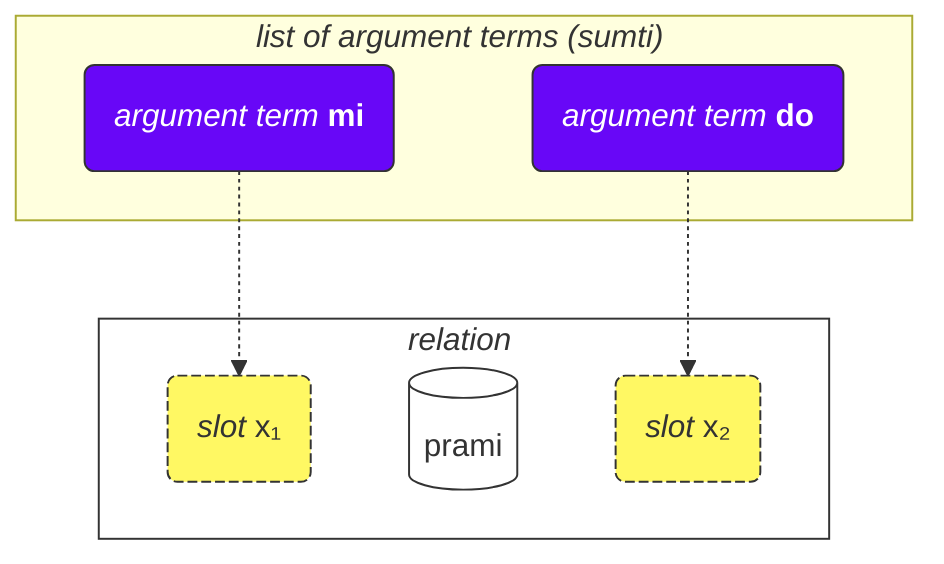
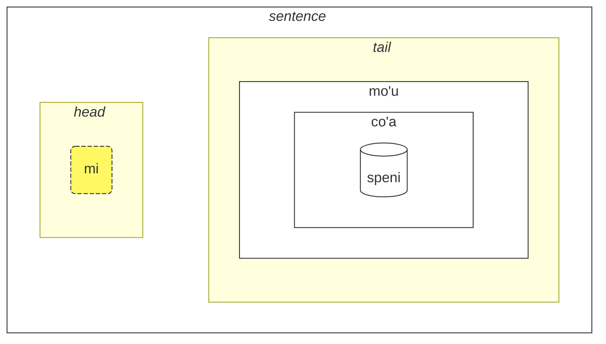

## Lección 2. Más cosas básicas

### Tipos de palabras

Las palabras de Lojban se dividen en tres grupos:

- Palabras de relación (llamadas **selbrivla** en Lojban)
  - Ejemplos: **gleki**, **klama**.
  - Tales palabras contienen al menos un grupo de consonantes (dos o más consonantes una tras otra) dentro de los primeros 5 sonidos + terminan en una vocal.
- Partículas (llamadas **cmavo** en Lojban)
  - Ejemplos: **le**, **nu**, **mi**, **fa'a**.
  - Comienzan con una consonante (una de **b d g v z j p t k f s c x l m n r i u**), seguida de una vocal (una de **a e i o u y au ai ei oi**). Opcionalmente, después de eso, puede haber una o más secuencias de un apóstrofo (**'**) y una vocal siguiente. Por ejemplo, **xa'a'a'a'a'a'a** y **ba'au'oi'a'e'o** son posibles partículas (incluso si no se les asigna significado).
  - Es bastante común escribir varias partículas consecutivamente sin espacios entre ellas. Esto está permitido por la gramática de Lojban. Así que no te sorprendas al ver **lenu** en lugar de **le nu**, **naku** en lugar de **na ku**, **jonai** en lugar de **jo nai**, y así sucesivamente. Esto no cambia el significado. Sin embargo, esta regla no se aplica a las palabras de relación; las palabras de relación deben estar separadas por espacios.
- Palabras de nombre (llamadas **cmevla** en Lojban)
  - Ejemplos: **.alis.**, **.doris**, **.lojban.**
  - Usualmente se utilizan para nombres personales, nombres de lugares, etc.
  - Se pueden distinguir fácilmente de los otros tipos de palabras ya que terminan en una consonante. Además, están envueltas con dos puntos al principio y al final. Coloquialmente, los puntos pueden omitirse al escribir, pero al hablar, las pausas que corresponden a esos puntos aún son obligatorias.

#### Tarea

Cubre la parte derecha de la tabla. Intenta identificar el tipo de cada palabra de Lojban usando las reglas recién descritas.

<table>
<tbody><tr>
<td><b>le</b></td>
<td>partícula (comienza con consonante seguida de vocal)</td>
</tr>
<tr>
<td><b>melbi</b></td>
<td>palabra de relación (contiene grupo de consonantes 'lb')</td>
</tr>
<tr>
<td><b>.paris.</b></td>
<td>palabra de nombre (termina en consonante, tiene puntos alrededor)</td>
</tr>
<tr>
<td><b>mi'o</b></td>
<td>partícula (contiene apóstrofo entre vocales)</td>
</tr></tbody></table>

### Orden de los argumentos

Anteriormente teníamos definiciones de palabras de relación como:

mlatu
: … es un gato, ser un gato

citka
: … come …

prami
: … ama …

klama
: … viene a …

Los diccionarios pueden presentar definiciones de palabras de relación con símbolos como x₁, x₂ etc.:

prami
: x₁ ama a x₂

karce
: x₁ es un coche …

citka
: x₁ come x₂ …

klama
: x₁ viene a x₂ …

Estos x₁, x₂, y así sucesivamente son la notación explícita para los llamados _espacios_ (otros nombres son: _lugares_, _roles de relación_, **terbricmi** en Lojban). Los espacios son llenados por términos de argumentos (**sumti**) en la oración.

Los números representan el orden en que esos espacios deben ser llenados por los argumentos.

Por ejemplo:

> **mi prami do**
> _Te amo._

Esta oración también implica que

- x₁ denota _el que ama_, y
- x₂ denota _el que es amado_.

En otras palabras, cada relación tiene uno o más espacios, y esos espacios se especifican y etiquetan como x₁, x₂, y así sucesivamente. Colocamos argumentos como **mi**, **do**, **le tavla** etc. en orden, llenando así estos espacios y dando un significado concreto a la relación, formando así una oración.

La ventaja de este estilo de definiciones es que contiene <u>todos</u> los participantes posibles de una relación inmediatamente especificados.

También podemos omitir argumentos haciendo la oración más vaga:

> **carvi**
> _Está lloviendo._
> `es lluvia, está lloviendo`

(aunque el tiempo aquí está determinado por el contexto, también puede significar _A menudo llueve_, _Estaba lloviendo_, etc.)

> **prami do**
> _Alguien te ama._
> `te ama`

Todos los lugares omitidos en una relación simplemente significan **zo'e** = _algo/alguien_ así que significa lo mismo que

> **zo'e prami do**
> _Alguien te ama._

Y

> **prami**

es lo mismo que

> **zo'e prami zo'e**
> _Alguien ama a alguien._

zo'e
: pronombre: algo o alguien no especificado o asumido por el contexto

Los términos modales como **ca**, **fa'a** etc. agregan nuevos lugares a las relaciones, pero no llenan espacios de las relaciones. En

> **mi klama fa'a do**
> _Vengo hacia ti._

el segundo lugar de **klama** todavía está omitido. Por ejemplo:

> **mi klama fa'a le cmana le zdani**
> _Vengo (en dirección a la montaña) al hogar._

le cmana
: la montaña

<pixra url="/assets/pixra/cilre-xekri-g-out/cmana.webp" caption="cmana" definition="… es una montaña"></pixra>

Aquí, el segundo lugar de **klama** es **do**. La oración significa que la montaña es solo una dirección, mientras que el punto final eres tú.

Aquí, el término **fa'a la cmana** (_en dirección a la montaña_) no reemplaza el segundo lugar de la relación **klama**. El segundo lugar de **klama** es **le zdani** aquí.

La oración significa que mi hogar simplemente está ubicado en la dirección de la montaña, pero no necesariamente significa que quiero llegar a esa montaña. El destino final de mi venida no es la montaña sino el hogar.

De manera similar, en

> **mi citka ba le nu mi cadzu**
> _Como después de caminar._

el segundo lugar de **citka** todavía está omitido. Un nuevo término **ba** con su argumento **le nu mi cadzu** agrega significado a la oración.

El orden de los argumentos de una relación compuesta es el mismo que el del último componente en ella:

> **tu sutra bajra pendo mi**
> _Ese es mi amigo que corre rápidamente._
> `Ese es un amigo que corre rápidamente mío.`

> **tu pendo mi**
> _Ese es mi amigo._
> `Ese es un amigo mío.`

pendo
: … es un amigo de … (alguien)

Así que el orden de los argumentos de **sutra bajra pendo** es el mismo que el de **pendo** solo.

#### Tarea

Cubre la parte derecha de la tabla. Para cada palabra de relación, identifica qué estructura de lugares es correcta.

<table>
<tbody><tr>
<td><b>klama</b></td>
<td>x₁ viene a x₂ desde x₃</td>
</tr>
<tr>
<td><b>prami</b></td>
<td>x₁ ama a x₂</td>
</tr>
<tr>
<td><b>karce</b></td>
<td>x₁ es un coche</td>
</tr>
<tr>
<td><b>citka</b></td>
<td>x₁ come x₂</td>
</tr></tbody></table>

### Más de dos lugares

Una relación puede tener más de dos lugares. Por ejemplo:

> **mi pinxe le djacu le kabri**
> _Bebo el agua del vaso._

pinxe
: x₁ bebe x₂ de x₃

> **le kabri**
> _el vaso_

En este caso, hay tres lugares, y si quieres excluir el segundo lugar en el medio, tienes que usar **zo'e**:

> **mi pinxe zo'e le kabri**
> _Bebo \[algo\] del vaso._

Si omitimos **zo'e**, obtenemos algo sin sentido:

> **mi pinxe le kabri**
> _Bebo el vaso._

Otro ejemplo:

> **mi plicru do le plise**
> _Te doy las manzanas._

plicru
: x₁ da, dona a x₂ algún objeto x₃; x₁ permite que alguien x₂ use x₃

#### Tarea

zgana
: x₁ observa/nota x₂ usando sentidos x₃

le kanla
: el ojo, los ojos

Cubre la parte derecha de la tabla. Traduce las oraciones de la izquierda desde Lojban.

<table style="table-layout: fixed;">
<tbody><tr>
<td><b>mi zgana do le kanla</b></td>
<td><i>Te observo con mis ojos.</i></td>
</tr>
<tr>
<td><b>mi pinxe le djacu le kabri</b></td>
<td><i>Bebo el agua del vaso.</i></td>
</tr>
<tr>
<td><b>mi plicru do le plise</b></td>
<td><i>Te doy la manzana.</i></td>
</tr></tbody></table>

Cubre la parte derecha de la tabla. Traduce las oraciones de la izquierda al Lojban.

<table style="table-layout: fixed;">
<tbody><tr>
<td><i>Bebo café del vaso.</i></td>
<td><b>mi pinxe le ckafi le kabri</b></td>
</tr>
<tr>
<td><i>Doy la manzana al niño.</i></td>
<td><b>mi plicru le verba le plise</b></td>
</tr></tbody></table>

### Relaciones dentro de relaciones

En

> **le nicte cu nu mi viska le lunra**
> _La noche es cuando veo la Luna._

tenemos

- **le nicte** como x₁ de la relación,
- **nu mi viska le lunra** como la relación principal.

Sin embargo, dentro de **nu mi viska le lunra**, tenemos otra oración con

- **mi** - x₁ de la relación interna,
- **viska** - la relación interna,
- **le lunra** - x₂ de la relación interna.

Así que, a pesar de tener una estructura interna, **nu mi viska le lunra** sigue siendo una relación con su primer término llenado con **le nicte** en este caso.

De manera similar, en

> **mi citka ba le nu mi dansu**
> _Como después de bailar._

tenemos

- **mi** como x₁, el primer lugar de la relación,
- **citka** como el constructo de relación principal,
- **ba le nu mi dansu** como un término modal de la relación principal de la oración.

Dentro de este término, tenemos:

- **mi** como x₁, el primer lugar de la relación dentro del término
- **dansu** como el constructo de relación principal dentro del término.

Este mecanismo "recursivo" de envolver relaciones en relaciones permite expresar ideas complejas con precisión.

#### Tarea

Cubre la parte derecha de la tabla. Identifica qué términos pertenecen a relaciones internas.

<table>
<tbody><tr>
<td><b>le nicte cu nu mi viska le lunra</b></td>
<td>Relación interna: <i>mi viska le lunra</i> (Veo la luna)</td>
</tr>
<tr>
<td><b>mi citka ba le nu mi dansu</b></td>
<td>Relación interna: <i>mi dansu</i> (Bailo)</td>
</tr>
<tr>
<td><b>mi djica le nu do klama</b></td>
<td>Relación interna: <i>do klama</i> (Vienes)</td>
</tr></tbody></table>

### ¿Por qué se definen las palabras de relación de la manera en que lo hacen?

El español usa un conjunto limitado de preposiciones que se reutilizan en varios verbos y, por lo tanto, no tienen un significado fijo. Por ejemplo, considera la preposición española _a_:

> _Te hablo a ti._

<!-- -->

> _Voy a ti._

<!-- -->

> _A mí me parece bonito._

En cada uno de esos ejemplos, _a_ tiene un nuevo rol que, en el mejor de los casos, está remotamente similar a los roles en otras oraciones.

Es importante señalar que otros idiomas usan formas diferentes de marcar los roles de los verbos que, en muchos casos, son muy diferentes de los usados en español.

Lojban, por ejemplo, marca los roles centrales (espacios) de las relaciones definiendo completamente tales relaciones con los roles colocados en secuencia (o marcados con **fa**, **fe**, y así sucesivamente):

klama
: x₁ viene a x₂ …

tavla
: x₁ habla con x₂ …

melbi
: x₁ es hermoso, bonito para x₂ …

Tales roles centrales son esenciales para definir relaciones.

Sin embargo, puede haber roles opcionales que hacen las relaciones más precisas:

> _Te hablo mientras como._

<!-- -->

> _Es difícil para mí porque esto es pesado._

En Lojban, una noción similar de tales roles opcionales se expresa a través de relaciones separadas o, para los casos más comunes, con términos modales:

> **mi tavla do ze'a le nu mi citka**
> _Te hablo mientras como._

<!-- -->

> **nandu mi ri'a le nu ti tilju**
> _Es difícil para mí porque esto es pesado._

nandu
: x₁ es difícil para x₂

tilju
: x₁ es pesado

Las preposiciones en español son similares a las partículas modales en Lojban, aunque una preposición usual del español puede tener muchos significados mientras que en Lojban, cada partícula modal tiene solo un significado (incluso si es vago).

#### Tarea

le zarci
: el mercado

le dinju
: el edificio

klama
: x₁ viene a x₂ desde x₃

Cubre la parte derecha de la tabla. Identifica si estas oraciones usan argumentos centrales u términos modales opcionales.

<table>
<tbody><tr>
<td><b>mi klama le zarci le dinju</b></td>
<td>Usa argumentos centrales (x₂ y x₃ de klama)</td>
</tr>
<tr>
<td><b>mi klama le zarci ca le nu do pinxe</b></td>
<td>Usa argumento central (x₂ = le zarci) y término modal (ca le nu do pinxe)</td>
</tr>
<tr>
<td><b>mi klama fa'a le zarci</b></td>
<td>Usa término modal (fa'a le zarci) en lugar de argumento central</td>
</tr></tbody></table>

### Reglas generales en el orden de los argumentos

El orden de los lugares en las relaciones a veces puede ser difícil de recordar, pero no nos preocupemos — no necesitas recordar todos los lugares de todas las palabras de relación. (¿Recuerdas el significado de cientos de miles de palabras en español?)

Puedes estudiar los lugares cuando los encuentres útiles o cuando la gente los use en un diálogo contigo.

La mayoría de las palabras de relación tienen dos o tres lugares.

Usualmente, puedes adivinar el orden usando el contexto y algunas reglas generales:

1. El primer lugar es a menudo la persona o cosa que hace algo o es algo:

   **klama** = _x₁ va …_

2. El objeto de alguna acción generalmente está justo después del primer lugar:

   **punji** = _x₁ pone x₂ en x₃_,

3. Y el siguiente lugar generalmente se llenará con el receptor:

   **punji** = _x₁ pone x₂ en x₃_,

4. Los lugares de destino (_a_) casi siempre vienen antes que los lugares de origen (_de_):

   **klama** = _x₁ va a x₂ desde x₃_

   <pixra url="/assets/pixra/cilre-xekri-g-out/klama_fi.webp" caption="le prenu cu klama fi le zarci" definition="La persona sale de la tienda."></pixra>

5. Los lugares menos usados vienen hacia el final. Estos tienden a ser cosas como _según el estándar_, _por medio de_ o _hecho de_.

La idea general es que primero vienen los lugares que es más probable que se usen.

No es necesario llenar todos los lugares todo el tiempo. Los lugares sin llenar simplemente tienen valores irrelevantes u obvios para el hablante (toman el valor de **zo'e** = _algo_).

#### Tarea

dunda
: x₁ da x₂ a x₃

benji
: x₁ transfiere x₂ a x₃ desde x₄

lebna
: x₁ toma x₂ de x₃

Cubre la parte derecha de la tabla. Predice qué lugar viene después en estas relaciones basándote en las reglas generales.

<table>
<tbody><tr>
<td><b>dunda</b> - "el que da ___, el regalo ___, el receptor ___"</td>
<td>El orden sigue la regla: el que hace primero, luego el objeto, luego el receptor</td>
</tr>
<tr>
<td><b>benji</b> - "el remitente ___, la cosa enviada ___, destino ___, fuente ___"</td>
<td>El orden sigue la regla: el que hace primero, objeto segundo, destino antes que fuente</td>
</tr>
<tr>
<td><b>lebna</b> - "el que toma ___, la cosa tomada ___, fuente ___"</td>
<td>El orden sigue la regla: el que hace primero, objeto segundo, fuente al final</td>
</tr></tbody></table>

### Infinitivos

Los infinitivos son verbos que a menudo tienen el prefijo _-ar_, _-er_, _-ir_ en español. Ejemplos incluyen _Me gusta correr_, siendo _correr_ el infinitivo.

> **le verba cu troci le ka cadzu**
> _El niño está tratando de caminar._

le verba
: el niño, los niños

troci
: x₁ trata de hacer o ser x₂ (ka)

cadzu
: x₁ camina

<pixra url="/assets/pixra/cilre-xekri-g-out/troci_cadzu.webp" caption="le verba cu troci le ka cadzu" definition="El niño trata de caminar."></pixra>

La partícula **ka** funciona muy parecido a **nu**. Envuelve una oración.

La principal diferencia es que algún espacio en la oración envuelta debe estar vinculado por algún argumento fuera de esta oración.

En este caso, el primer argumento **le verba** de la relación **troci** hace un enlace al primer espacio sin llenar de la oración interna **cadzu** (que está dentro de **ka**).

En otras palabras, el niño trata de lograr un estado donde **le verba cu cadzu** (el argumento **le verba** llenaría el primer espacio sin llenar de la relación **cadzu**).

Algunas relaciones requieren solo infinitivos en algunos de sus espacios. Las definiciones de tales palabras marcan tales espacios como _propiedad_ o **ka**. Por ejemplo:

cinmo
: x₁ siente x₂ (ka)

Esto significa que el infinitivo en el segundo espacio (x₂) se aplica a algún otro espacio (muy probablemente, el primer espacio, x₁). Los casos donde el infinitivo se aplica a espacios distintos de x₂ son raros y se explican en diccionarios para las relaciones correspondientes o en el caso de palabras de relación inventadas no oficialmente, pueden deducirse del sentido común por analogía con otras palabras de relación similares.

Otro ejemplo:

<pixra url="/assets/pixra/cilre-xekri-g-out/sidju.webp" caption="ra sidju le pendo le ka bevri le dakli" definition="Él/ella ayuda al amigo a llevar las bolsas."></pixra>

> **ra sidju le pendo le ka bevri le dakli**
> _Él/ella ayuda al amigo a llevar las bolsas._

sidju
: x₁ ayuda a x₂ a hacer x₃ (ka)

La palabra de relación **sidju** requiere que su tercer espacio se llene con un infinitivo.

bevri
: x₁ lleva x₂

le dakli
: la bolsa, las bolsas

Nota que solo el primer lugar sin llenar de la relación incrustada toma el significado del lugar externo:

> **mi troci le ka do prami**
> _Trato de ser amado por ti._

Aquí, el primer lugar sin llenar es el segundo lugar de **prami**, por lo tanto toma el valor **mi** (_yo_).

También es posible usando el pronombre **ce'u** marcar explícitamente un lugar que debe aplicarse a algún argumento externo:

> **mi troci le ka do prami ce'u**
> _Trato de ser amado por ti._

Otro ejemplo:

> **mi cinmo le ka xebni ce'u**
> **mi cinmo le ka se xebni**
> _Siento que alguien me odia._
> _Siento ser odiado._

#### Tarea

zgana
: x₁ observa x₂

kakne
: x₁ es capaz de hacer x₂ (propiedad)

nelci
: x₁ le gusta x₂

Cubre la parte derecha de la tabla. Convierte estas oraciones con infinitivos a sus significados.

<table>
<tbody><tr>
<td><b>mi kakne le ka zgana</b></td>
<td>Soy capaz de observar (algo)</td>
</tr>
<tr>
<td><b>do kakne le ka nelci mi</b></td>
<td>Eres capaz de gustarme</td>
</tr>
<tr>
<td><b>mi nelci le ka zgana do</b></td>
<td>Me gusta observarte</td>
</tr></tbody></table>

### Tipos de lugares

El diccionario a menudo menciona otros tipos de lugares, por ejemplo:

djica
: x₁ quiere x₂ (evento)

Este _evento_ significa que tienes que llenar el lugar con un argumento que representa un evento. Por ejemplo:

le nicte
: la noche

le nu mi dansu
: yo bailando

Así que obtenemos

> **mi djica le nicte**
> _Quiero el evento nocturno._

<!-- -->

> **do djica le nu mi dansu**
> _Quieres que yo baile._

En Lojban, no está permitido decir, por ejemplo:

> **mi djica le plise**
> _Quiero la manzana._ 

porque quieres hacer algo con la manzana o quieres que ocurra algún evento con la manzana, como:

> **mi djica le nu mi citka le plise**
> _Quiero comer la manzana._
> `Quiero que yo coma la manzana.`

Nota que envolver una relación que espera un evento en un **nu** cambia el significado:

> **le zekri cu cumki**
> _El crimen es posible._

zekri
: x₁ es un evento criminal, x₁ (evento) un crimen

cumki
: x₁ (evento) es posible

Compara:

> **le nu zekri cu cumki**
> `Que sea criminal es posible.` > _Es posible que algo sea un crimen._

#### Tarea

nelci
: x₁ le gusta x₂

djica
: x₁ quiere x₂ (evento)

cisma
: x₁ sonríe

Cubre la parte derecha de la tabla. Traduce las oraciones de la izquierda desde Lojban.

<table style="table-layout: fixed;">
<tbody><tr>
<td><b>mi nelci le nu do cisma</b></td>
<td><i>Me gusta que sonrías.</i></td>
</tr>
<tr>
<td><b>mi djica le nu mi citka le plise</b></td>
<td><i>Quiero comer la manzana.</i></td>
</tr>
<tr>
<td><b>mi na ku djica le plise</b></td>
<td><i>No quiero la manzana. (uso incorrecto)</i></td>
</tr></tbody></table>

Cubre la parte derecha de la tabla. Traduce las oraciones de la izquierda al Lojban.

<table style="table-layout: fixed;">
<tbody><tr>
<td><i>Quiero que bailes.</i></td>
<td><b>mi djica le nu do dansu</b></td>
</tr>
<tr>
<td><i>Me gusta que seas inteligente.</i></td>
<td><b>mi nelci le nu do stati</b></td>
</tr></tbody></table>

### Elevación

> **mi stidi le ka klama le barja**
> _Sugiero ir al bar._

stidi
: x₁ sugiere acción x₂ (propiedad) a x₃

> **mi stidi tu'a le barja**
> _Sugiero el bar._

tu'a le barja
: algo acerca del bar

> **mi djica le nu mi citka le plise**
> _Quiero comer una manzana._

<!-- -->

> **mi djica tu'a le titla**
> _Quiero la comida dulce._

tu'a le titla
: algo acerca de la comida dulce

titla
: … es dulce

<pixra url="/assets/pixra/cilre-xekri-g-out/djica_tuha_le_titla.webp" caption="le prenu cu djica tu'a le titla" definition="La persona quiere la comida dulce."></pixra>

La estructura de lugares puede poner demasiada carga en especificar acciones o eventos. A veces queremos especificar solo algún objeto en esos eventos o lugares y omitir describir la acción o el evento por completo.

En los ejemplos anteriores _Sugiero el bar._ muy probablemente implica ir al bar y _Quiero la manzana._ implica comerla.

Sin embargo, la palabra de relación de Lojban **stidi** requiere una propiedad en su espacio x₂. De manera similar, **djica** requiere un evento en su espacio x₂.

La palabra calificadora corta **tu'a** antes de un término implica una abstracción (propiedad, evento o proposición) pero selecciona solo este término de esta abstracción omitiendo el resto. Puede traducirse vagamente como _algo acerca de_:

> **mi stidi tu'a le barja**
> _Sugiero algo acerca del bar (tal vez visitarlo, reunirse cerca de él, etc.)._

<!-- -->

> **mi djica tu'a le plise**
> _Deseo algo relacionado con la manzana (tal vez comerla, masticarla, lamerla, lanzarla a un amigo, etc.)_

> **tu'a le cakla cu pluka mi**
> _El chocolate es agradable para mí (probablemente debido a su sabor)._
> `Algo acerca del chocolate es agradable para mí`

cakla
: x₁ es chocolate

Cuando omitimos abstracciones, solo el contexto nos dice qué se omitió.

También es posible modificar el constructo relacional principal:

> **le cakla cu jai pluka mi**
> **tu'a le cakla cu pluka mi**
> _El chocolate es agradable para mí._

Esto permite la creación de términos de argumento vagos con **jai**:

> **le jai pluka cu zvati ti**
> _La cosa agradable está aquí._

Dado que **le pluka** (_el evento agradable_) es abstracto, es imposible especificar su ubicación. Sin embargo, un participante en la abstracción puede estar físicamente ubicado en algún lugar.

#### Tarea

stidi
: x₁ sugiere x₂ (propiedad) a x₃

Cubre la parte derecha de la tabla. Traduce las oraciones de la izquierda desde Lojban.

<table style="table-layout: fixed;">
<tbody><tr>
<td><b>mi stidi tu'a le karce</b></td>
<td><i>Sugiero algo acerca del coche.</i></td>
</tr>
<tr>
<td><b>mi djica tu'a le najnimre</b></td>
<td><i>Quiero algo acerca de la naranja.</i></td>
</tr>
<tr>
<td><b>mi nelci tu'a le mlatu</b></td>
<td><i>Me gusta algo acerca del gato.</i></td>
</tr></tbody></table>

Cubre la parte derecha de la tabla. Traduce las oraciones de la izquierda al Lojban.

<table style="table-layout: fixed;">
<tbody><tr>
<td><i>Sugiero el jardín (algo acerca de él).</i></td>
<td><b>mi stidi tu'a le purdi</b></td>
</tr>
<tr>
<td><i>Quiero el libro (algo acerca de él).</i></td>
<td><b>mi djica tu'a le cukta</b></td>
</tr></tbody></table>

### Lugares dentro de argumentos

¿Cómo decimos _Tú eres mi amigo_?

> **do pendo mi**
> _Tú eres mi amigo._
> `Tú eres un amigo de mí.`

<pixra url="/assets/pixra/cilre-xekri-g-out/pendo.webp" caption="le pendo" definition="el amigo / los amigos"></pixra>

Y ahora, ¿cómo decimos _Mi amigo es inteligente_?

> **le pendo be mi cu stati**
> _Mi amigo es inteligente._

Entonces, cuando convertimos una relación en un argumento (**pendo** — _ser un amigo_ en **le pendo** — _el amigo_), aún podemos retener otros lugares de esa relación colocando **be** después de ella.

Por defecto, adjunta el segundo lugar (x₂). Podemos adjuntar más lugares separándolos con **bei**:

> **mi plicru do le plise**
> _Te doy la manzana._

<pixra url="/assets/pixra/cilre-xekri-g-out/plicru.webp" caption="le prenu cu plicru le pendo le tutci" definition="La persona le da al amigo el utensilio."></pixra>

<!-- -->

> **le plicru be mi bei le plise**
> _El dador de la manzana a mí_

<!-- -->

> **le plicru be mi bei le plise cu pendo mi**
> _El dador de la manzana a mí es mi amigo._
> `El que me da la manzana es un amigo mío.`

Otro ejemplo:

<!-- > **le pendo be mi cu tavla**
> _The friends of mine are talking._
> **le pendo mi cu tavla**
> **le pendo cu tavla mi**
> _The friends are talking to me._ -->

> **mi klama le pendo be do**
> _Vengo a un amigo tuyo._

klama
: x₁ viene a x₂ desde x₃ …

No podemos omitir **be** porque **le pendo do** son dos lugares independientes:

> **mi klama le pendo do**
> _Vengo a un amigo desde ti._

Aquí, **do** tomó el tercer lugar de **klama** ya que no está vinculado a _pendo_ mediante **be**.

Tampoco podríamos usar **nu** porque **le nu pendo do** es el evento de que alguien sea tu amigo.

Así que **le pendo be do** es la solución correcta.

Otro ejemplo:

> **la .lojban. cu bangu mi**
> _El lojban es mi idioma._
> `El lojban es un idioma de mí.`

Sin embargo,

> **mi nelci le bangu be mi**
> _Me gusta mi idioma._

Usar **be** para relaciones no convertidas en argumentos no tiene efecto:

> **mi nelci be do** es lo mismo que
> **mi nelci do**

#### Tarea

ctuca
: x₁ enseña a alguien x₂ la materia x₃

cmene
: x₁ es un nombre de x₂ usado por x₃

Cubre la parte derecha de la tabla. Convierte estas construcciones usando "be" en sus significados.

<table>
<tbody><tr>
<td><b>le ctuca be mi bei la lojban</b></td>
<td>el maestro de mí en lojban</td>
</tr>
<tr>
<td><b>le cmene be la paris bei la frank</b></td>
<td>el nombre de París usado por Frank</td>
</tr>
<tr>
<td><b>le ctuca be le verba bei la lojban</b></td>
<td>el maestro de niños en lojban</td>
</tr></tbody></table>

### Cláusulas relativas

> **le prenu poi pendo mi cu tavla mi**
> _La persona que es amiga mía me habla._

<!-- -->

> **le prenu noi pendo mi cu tavla mi**
> _La persona, que por cierto es amiga mía, me habla._

En la primera oración, la palabra _que_ es esencial para identificar a la persona en cuestión. Aclara de quién entre las personas del contexto estamos hablando. Elegimos solo aquellas que son mis amigas de entre probablemente muchas personas alrededor. Quizás solo hay una persona alrededor que es mi amiga.

En cuanto a _que por cierto es amiga mía_ de la segunda oración, solo proporciona información adicional sobre la persona. No nos ayuda a identificar a la persona. Por ejemplo, esto podría ocurrir cuando todas las personas alrededor son mis amigas.

**poi pendo mi** es una cláusula relativa, una relación adjunta a la derecha del argumento **le prenu**. Termina justo antes de la siguiente palabra **cu**:

> **le prenu (poi pendo mi) cu tavla mi**
> _La persona que es amiga mía me habla._

En lojban, usamos **poi** para cláusulas relativas que identifican entidades (objetos, personas o eventos) y **noi** para información incidental.

> **la .bob. ba co'a speni le ninmu poi pu xabju le nurma**
> _Bob se casará con una chica que vivió en el campo._

xabju
: … vive en …, … habita … (lugar, objeto)

le nurma
: el área rural

¡Esta oración no excluye que Bob se case con alguien más también! Eliminar la cláusula relativa con **poi** cambia el significado:

> **la .bob. ba co'a speni le ninmu**
> _Bob se casará con una chica._

speni
: x₁ está casado con x₂

Otro ejemplo:

> **le prenu poi gleki cu ze'u renvi**
> _Las personas (¿cuáles?) que son felices viven mucho tiempo._

ze'u
: término modal: por mucho tiempo

renvi
: sobrevivir

Eliminar la cláusula relativa con **poi** cambia el significado:

> **le prenu ze'u renvi**
> _Las personas viven mucho tiempo._

Por otro lado, las cláusulas relativas con **noi** contienen solo información adicional sobre el argumento al que están adjuntas. Ese argumento está suficientemente definido por sí mismo, de modo que eliminar una cláusula relativa con **noi** no cambia su significado:

> **mi nelci la .doris. noi mi ta'e zgana bu'u le panka**
> _Me gusta Doris, a quien habitualmente veo en el parque._
> _Me gusta Doris. ¿Qué más puedo decir de ella? La veo habitualmente en el parque._

zgana
: observar (usando cualquier sentido)

<pixra url="/assets/pixra/cilre-xekri-g-out/se_penmi_fi_le_panka.webp" caption="le gerku noi mi ta'e zgana bu'u le panka" definition="El perro a quien habitualmente veo en el parque."></pixra>

Eliminar la cláusula relativa con **noi** mantiene el significado: _Me gusta Doris._

En inglés hablado, la distinción a menudo se logra usando entonación o adivinando. Además, las cláusulas relativas con **noi** se separan tradicionalmente con comas en inglés. Usan _which_ o _who_, y la palabra _that_ no se usa en ellas.

Veamos otro ejemplo.

> **mi klama le pa tricu**
> _Vengo al árbol._

<!-- -->

> **le pa tricu cu barda**
> _El árbol es grande._

le pa tricu
: el árbol (un árbol)

barda
: x₁ es grande

Y ahora unamos esas dos oraciones:

> **le tricu noi mi klama ke'a cu barda**
> _El árbol, al cual vengo, es grande._

Nota la palabra **ke'a**. Movemos la segunda oración sobre el mismo árbol a una cláusula relativa y reemplazamos el argumento **le tricu** con **ke'a** en la cláusula relativa. Así que el pronombre **ke'a** es como _que_ y _el cual_ en español. Apunta de vuelta al argumento al que está adjunta la cláusula relativa.

Así que literalmente nuestra oración en lojban suena como

> _El árbol, tal que yo voy al cual, es grande._

**ke'a** puede omitirse si el contexto es suficientemente claro. Las dos siguientes oraciones significan lo mismo:

> **le prenu poi pendo mi cu tavla mi**
> **le prenu poi ke'a pendo mi cu tavla mi**
> _La persona que es amiga mía me habla._

**ke'a** a menudo se asume que va al primer lugar sin llenar:

> **mi nelci la .doris. noi mi ta'e zgana bu'u le panka**
> **mi nelci la .doris. noi mi ta'e zgana ke'a bu'u le panka**
> _Me gusta Doris, a quien habitualmente veo en el parque._

Aquí, **mi** llena el primer espacio de la relación **ta'e zgana** (_… habitualmente ve …_), por lo tanto, **ke'a** se asume para el siguiente, segundo lugar.

Las cláusulas relativas, como las relaciones usuales, pueden contener construcciones con términos modales:

> **le tricu noi mi pu klama ke'a ca le cabdei cu barda**
> _El árbol, al cual fui hoy, es grande._

<pixra url="/assets/pixra/cilre-xekri-g-out/le_tricu_cu_barda.webp" caption="le tricu cu barda" definition="El árbol es grande."></pixra>

le cabdei
: el día de hoy

Nota que **ca le cabdei** pertenece a la cláusula relativa. Compara:

> **le tricu noi mi pu klama ke'a cu barda ca le cabdei**
> _El árbol, al cual fui, es grande hoy._

El significado ha cambiado mucho.

Finalmente, **voi** se usa para formar argumentos tipo **le** pero con cláusulas relativas:

> **ti voi le nu ke'a cisma cu pluka mi cu zutse tu**
> _Estos cuya sonrisa me agrada están sentados._

<pixra url="/assets/pixra/cilre-xekri-g-out/voi.webp" caption="mi nelci ti voi le nu ke'a cisma cu pluka mi" definition="Me gustan estos cuyas sonrisas me agradan."></pixra>

ti
: este cerca de mí, estos cerca de mí

cisma
: x₁ sonríe

pluka
: x₁ es agradable para x₂

zutse
: x₁ se sienta, está sentado en x₂

Aquí, **voi** define el objeto cerca de mí.

Compáralo con:

> **ti poi le nu ke'a cisma cu pluka mi cu zutse**
> _De estos, aquellos cuya sonrisa me agrada están sentados._

**poi** restringe la selección a aquellos descritos en la cláusula relativa.
Este ejemplo podría implicar que hay muchos objetos (personas, etc.) cerca de mí, pero con **poi** selecciono solo los necesarios.

Compáralo con:

> **ti noi le nu ke'a cisma cu pluka mi cu zutse**
> _Estos (que por cierto son tales que su sonrisa me agrada) están sentados._

**noi** simplemente añade información incidental que no es necesaria para determinar a qué se refiere **ti** (_estos_). Quizás no haya nadie más alrededor para describir.

Finalmente, así como **nu** tiene el marcador de borde derecho **kei**, tenemos

ku'o
: marcador de borde derecho para **poi**, **noi** y **voi**.

> **mi tavla la .doris. noi ca zutse tu ku'o .e la .alis. noi ca cisma**
> _Hablo con Doris, que ahora está sentada allí, y Alice que ahora sonríe._

Nota que sin **ku'o** tendríamos **tu** (_allí_) unido junto con **la .alis.** (_Alice_) llevando a un significado extraño:

> **mi tavla la .doris. noi ca zutse tu .e la .alis. noi ca cisma**
> _Hablo con Doris, que ahora está sentada allí y encima de Alice (que ahora sonríe)._

Nota la parte **zutse tu .e la .alis.**

Para todos de **poi**, **noi** y **voi** el marcador de borde derecho es aún el mismo: **ku'o**.

#### Tarea

ctuca
: x₁ enseña a alguien x₂ la materia x₃

Cubre la parte derecha de la tabla. Traduce las oraciones de la izquierda del lojban.

<table style="table-layout: fixed;">
<tbody><tr>
<td><b>mi tavla le prenu poi ctuca mi</b></td>
<td><i>Hablo con la persona que me enseña.</i></td>
</tr>
<tr>
<td><b>le gerku noi mi nelci ke'a cu citka</b></td>
<td><i>El perro, que me gusta, come.</i></td>
</tr>
<tr>
<td><b>le prenu poi ke'a ctuca mi cu stati</b></td>
<td><i>La persona que me enseña es inteligente.</i></td>
</tr></tbody></table>

Cubre la parte derecha de la tabla. Traduce las oraciones de la izquierda al lojban.

<table style="table-layout: fixed;">
<tbody><tr>
<td><i>Veo el perro que corre.</i></td>
<td><b>mi viska le gerku poi bajra</b></td>
</tr>
<tr>
<td><i>La persona, que es inteligente, me habla.</i></td>
<td><b>le prenu noi stati cu tavla mi</b></td>
</tr></tbody></table>

### Cláusulas relativas cortas. '_Acerca de_'

A veces, podrías necesitar adjuntar un argumento adicional a otro argumento:

> **mi djuno le vajni pe do**
> _Sé algo importante acerca de ti._

le vajni
: algo importante

**pe** y **ne** son similares a **poi** y **noi**, pero adjuntan argumentos a argumentos:

> **le pa penbi pe mi cu xunre**
> _El bolígrafo que es mío es rojo._ (_mío_ es esencial para identificar el bolígrafo en cuestión)

le penbi
: el bolígrafo

<!-- -->

> **le pa penbi ne mi cu xunre**
> _El bolígrafo, que es mío, es rojo._ (información adicional)

ne
: que es acerca de, tiene relación con … (sigue un argumento)

pe
: que es acerca de, tiene relación con … (sigue un argumento)

> **le pa penbi ne mi ge'u .e le pa fonxa ne do cu xunre**
> _El bolígrafo, que es mío, y el teléfono, que es tuyo, son rojos._

ge'u
: marcador de borde derecho para **pe**, **ne**.

#### Tarea

Cubre la parte derecha de la tabla. Traduce las oraciones de la izquierda del lojban.

<table style="table-layout: fixed;">
<tbody><tr>
<td><b>le penbi pe mi cu xunre</b></td>
<td><i>El bolígrafo que es mío es rojo.</i></td>
</tr>
<tr>
<td><b>le mlatu ne mi cu melbi</b></td>
<td><i>El gato, que es mío, es hermoso.</i></td>
</tr>
<tr>
<td><b>mi tavla le prenu pe do</b></td>
<td><i>Hablo con la persona relacionada contigo.</i></td>
</tr></tbody></table>

Cubre la parte derecha de la tabla. Traduce las oraciones de la izquierda al lojban.

<table style="table-layout: fixed;">
<tbody><tr>
<td><i>La casa que es mía es grande.</i></td>
<td><b>le zdani pe mi cu barda</b></td>
</tr>
<tr>
<td><i>El auto, que es tuyo, es hermoso.</i></td>
<td><b>le karce ne do cu melbi</b></td>
</tr></tbody></table>

### «**be**» y «**pe**»

Nota que las cláusulas relativas están adjuntas a argumentos, mientras que **be** es parte de la relación.

En realidad, **le bangu pe mi** es una mejor traducción de _mi idioma_, ya que, como en español, los dos argumentos están relacionados entre sí de una manera vaga.

Sin embargo, puedes decir **le birka be mi** como _mi brazo_. Incluso si te cortas el brazo, seguirá siendo tuyo. Por eso **birka** tiene un lugar del dueño:

birka
: x₁ es un brazo de x₂

Mostremos una vez más que una construcción con **be** es parte de la relación, mientras que **pe**, **ne**, **poi** y **noi** se adjuntan a argumentos:

> **le pa melbi be mi fonxa pe le pa pendo be mi cu barda**
> `El hermoso para mí teléfono del amigo de mí es grande.`

Aquí, **be mi** está adjunto a la relación **melbi** = _ser hermoso para … (alguien)_ y así crea una nueva relación **melbi be mi** = _ser hermoso para mí_. Pero **pe le pa pendo be mi** (_de mi amigo_) se aplica a todo el argumento **le pa melbi be mi fonxa** (_el teléfono hermoso para mí_).

También puede suceder que necesitemos adjuntar **be** a una relación, transformar esa relación en un argumento y luego adjuntar **pe** a ese argumento:

> **le pa pendo be do be'o pe la .paris. cu stati**
> _El amigo tuyo que está relacionado con París es inteligente._
> (<b>pe la .paris.</b> está adjunto a todo el argumento <b>le pa pendo be do be'o</b>)

<!-- -->

> **le pu plicru be do bei le pa plise be'o pe la .paris. cu stati**
> _Quien te dio la manzana (y quien está relacionado con París) es inteligente._
> (<b>pe la .paris.</b> está adjunto a todo el argumento <b>le pu plicru be do bei le pa plise be'o</b>)

be'o
: marcador de borde derecho para la cadena de términos adjuntos con **be** y **bei**

En estos dos ejemplos, tu amigo tiene alguna relación con París (tal vez, él/ella es de París).

Compáralo con:

> **le pa pendo be do pe la .paris. cu stati**
> _El amigo de ti (tú que estás relacionado con París) es inteligente._

<!-- -->

> **le pu plicru be do bei le pa plise pe la .paris. cu stati**
> _Quien te dio la manzana (la manzana que está relacionada con París) es inteligente._

En estos últimos dos ejemplos, sin embargo, o tú estás relacionado con París o la manzana.

#### Tarea

Cubre la parte derecha de la tabla. Traduce las oraciones de la izquierda del lojban.

<table style="table-layout: fixed;">
<tbody><tr>
<td><b>le melbi be mi fonxa cu barda</b></td>
<td><i>El teléfono que es hermoso para mí es grande.</i></td>
</tr>
<tr>
<td><b>le fonxa pe mi cu melbi</b></td>
<td><i>El teléfono que es mío es hermoso.</i></td>
</tr>
<tr>
<td><b>le pendo be do cu tavla</b></td>
<td><i>El amigo tuyo habla.</i></td>
</tr>
<tr>
<td><b>le pendo be mi be'o pe la .paris. cu stati</b></td>
<td><i>El amigo mío que está relacionado con París es inteligente.</i></td>
</tr>
<tr>
<td><b>le pa melbi be mi fonxa pe le pa pendo be mi cu barda</b></td>
<td><i>El hermoso para mí teléfono del amigo de mí es grande.</i></td>
</tr></tbody></table>

Cubre la parte derecha de la tabla. Traduce las oraciones de la izquierda al lojban.

tuple
: x₁ es una pierna de x₂

clani
: x₁ es largo, extenso

cinri
: x₁ (evento) es interesante para alguien x₂

le cukta
: el libro, los libros

<table style="table-layout: fixed;">
<tbody><tr>
<td><i>Tus piernas son largas.</i></td>
<td><b>le tuple be do cu clani</b></td>
</tr>
<tr>
<td><i>El libro que es mío es interesante.</i></td>
<td><b>le cukta pe mi cu cinri</b></td>
</tr>
<tr>
<td><i>La persona relacionada contigo es inteligente.</i></td>
<td><b>le prenu pe do cu stati</b></td>
</tr>
<tr>
<td><i>El amigo tuyo que está relacionado con París es inteligente.</i></td>
<td><b>le pendo be do be'o pe la .paris. cu stati</b></td>
</tr>
<tr>
<td><i>El hermoso para mí teléfono de mi amigo es grande.</i></td>
<td><b>le pa melbi be mi fonxa pe le pa pendo be mi cu barda</b></td>
</tr></tbody></table>

### '_Alicia es una maestra_' y '_Alicia es la maestra_'

En español, el verbo _ser, estar_ hace que un sustantivo funcione como un verbo. En lojban, incluso conceptos como _gato_ (**mlatu**), _persona_ (**prenu**), _casa_ (**dinju**), _hogar_ (**zdani**) funcionan como verbos (relaciones) por defecto. Solo los pronombres funcionan como argumentos.

Sin embargo, aquí hay tres casos:

> **la .alis. cu ctuca**
> _Alicia enseña._

<pixra url="/assets/pixra/cilre-xekri-g-out/ctuca.webp" caption="mi ctuca" definition="Yo enseño / Soy un maestro."></pixra>

<!-- -->

> **la .alis. cu me le ctuca**
> _Alicia es una de las maestras._

me
: … está entre …, … es uno de …, … son miembros de … (sigue un argumento)

> **la .alis. ta'e ctuca**
> _Alicia habitualmente enseña._

ta'e
: partícula modal: el evento ocurre habitualmente

> **la .alis. cu du le ctuca**
> _Alicia es la maestra._

du
: … es idéntico a …

La partícula **me** toma un argumento después de ella e indica que probablemente hay otros maestros, y Alicia es una entre ellos.

La partícula **du** se usa cuando Alicia es, por ejemplo, la maestra que hemos estado buscando o de la que hemos estado hablando. Indica identidad.

Por lo tanto, **me** y **du** pueden a veces corresponder a lo que en español expresamos usando el verbo _ser/estar_.

En lojban, priorizamos el significado de lo que pretendemos decir, en lugar de depender de cómo se expresa literalmente en español u otros idiomas.

Otros ejemplos:

> **mi me la .bond.**
> _Soy Bond._

<!-- -->

> **mi du la .kevin.**
> _Soy Kevin (el que necesitabas)._

<!-- -->

> **ti du la .alis. noi mi ta'e zgana bu'u le panka**
> _Esta es Alicia, a quien habitualmente veo en el parque._

**noi du** y **poi du** se usan para introducir nombres alternativos para algo. Corresponden al español _es decir, o sea_:

> **la .alis. cu penmi le prenu noi du la .abdul.**
> _Alicia conoció a la persona, es decir Abdul._

penmi
: … conoce a … (alguien)

Cuando usas **me**, puedes conectar varios argumentos con _y_:

> **tu me le pendo be mi be'o .e le tunba be mi**
> _Esos son algunos (o todos) de mis amigos y mis hermanos._

tunba
: x₁ es un hermano de x₂

<pixra url="/assets/pixra/cilre-xekri-g-out/tunba.webp" caption="do tunba mi" definition="Eres mi hermano."></pixra>

#### Tarea

gerku
: x₁ es un perro

badna
: x₁ es un plátano

pendo
: x₁ es un amigo de x₂

Cubre la parte derecha de la tabla. Traduce estas oraciones usando palabras apropiadas para "es/son".

<table>
<tbody><tr>
<td><i>Esos son algunos de mis amigos</i></td>
<td><b>tu me le pendo be mi</b></td>
</tr>
<tr>
<td><i>Ese es el perro que estábamos buscando</i></td>
<td><b>ta du le gerku</b></td>
</tr>
<tr>
<td><i>Esta cosa amarilla es un plátano</i></td>
<td><b>ti pelxu gi'e me le badna</b></td>
</tr></tbody></table>

### Relaciones con partículas modales

Podemos colocar una partícula modal no solo antes de la construcción de relación principal de la oración sino también al final de ella, produciendo el mismo resultado:

> **mi ca tcidu**
> **mi tcidu ca**
> _Yo (leo ahora)._

tcidu
: leer (algún texto)

Cuando usamos **nu**, creamos una relación que describe algún evento. Nota la diferencia entre estos dos ejemplos:

> **le nu tcidu ca cu nandu**
> _La lectura actual es complicada, difícil._

<!-- -->

> **le nu tcidu cu ca nandu**
> _La lectura es ahora complicada._

Otros ejemplos:

> **mi klama le pa cmana pu**
> _Fui a la montaña._
> `Yo voy a una montaña (en el pasado).`

<!-- -->

> **le nu mi klama le pa cmana pu cu pluka**
> _Que fui a una montaña es agradable._

También podemos poner una o más partículas modales como el primer elemento de una construcción de relación y por ejemplo usar tal relación enriquecida en forma de argumento:

<pixra url="/assets/pixra/cilre-xekri-g-out/coha_purdi.webp" caption="le pu kunti tumla ca purdi" definition="Lo que era un desierto ahora es un jardín."></pixra>

> **le pu kunti tumla ca purdi**
> _Lo que era un desierto ahora es un jardín._

kunti
: x₁ está vacío

tumla
: x₁ es una parcela de tierra

**pu** pertenece a **le kunti tumla** y **ca** pertenece a **purdi** (ya que **le pu kunti tumla** no puede agregar **ca** al final).

<!-- This doesn't contradict using **be** after the verb since, with **be**, you change the verb: **bangu be mi** is considered one verb. -->

Tener varias partículas modales en orden no es un problema:

> **le pu ze'u kunti tumla ca purdi**
> _Lo que fue un desierto durante mucho tiempo ahora es un jardín._

ze'u
: término modal: por mucho tiempo

Colocar partículas de término después de sustantivos las vincula a relaciones externas:

<pixra url="/assets/pixra/cilre-xekri-g-out/cohu_purdi.webp" caption="le kunti tumla pu purdi" definition="El desierto era un jardín."></pixra>

> **le kunti tumla pu purdi**
> **(le kunti tumla) pu purdi**
> _El desierto era un jardín._

#### Tarea

melbi
: x₁ es hermoso

sutra
: x₁ es rápido

Cubre la parte derecha de la tabla. Muestra dónde se aplican las partículas modales en estas oraciones.

<table>
<tbody><tr>
<td><b>mi ca melbi</b></td>
<td>El "ca" (tiempo presente) se aplica a "melbi" - Ahora soy hermoso</td>
</tr>
<tr>
<td><b>le nu mi melbi ca cu sutra</b></td>
<td>El "ca" se aplica a "mi melbi" - mi ser hermoso ahora es rápido</td>
</tr>
<tr>
<td><b>le pu sutra ca melbi</b></td>
<td>El "pu" pertenece a "sutra" y "ca" pertenece a "melbi" - lo que era rápido ahora es hermoso</td>
</tr></tbody></table>

### Nuevos argumentos de lugares de la misma relación

> **do plicru mi ti**
> _Tú me concedes esto._

<!-- -->

> **mi se plicru do ti**
> _Me es concedido esto por ti._

plicru
: x₁ da a x₂ algo x₃ para uso

Podemos intercambiar los primeros dos lugares en la relación usando **se** y así cambiar la estructura de lugares.

**do plicru mi ti** significa exactamente lo mismo que **mi se plicru do ti**. La diferencia es únicamente de estilo.

Puedes querer cambiar las cosas para dar diferente énfasis, por ejemplo, mencionar las cosas más importantes en una oración primero. Así que los siguientes pares significan lo mismo:

> **mi prami do**
> _Te amo._

<!-- -->

> **do se prami mi**
> _Eres amado por mí._

<!-- -->

> **le nu mi tadni la .lojban. cu xamgu mi**
> _Mi estudio del lojban es bueno para mí._

xamgu
: … es bueno para (alguien)

> **mi se xamgu le nu mi tadni la .lojban.**
> _Para mí, es bueno estudiar lojban._

Lo mismo se puede hacer cuando las relaciones se usan al crear argumentos:

le plicru
: aquellos que dan, los dadores, los donantes, los donadores

le se plicru
: aquellos a quienes se les da, receptores de regalos

le te plicru
: aquellos objetos que se dan para uso, regalos

**te** intercambia el primer y tercer lugares de las relaciones.

Como sabemos, cuando agregamos **le** frente a una construcción de relación, se convierte en un argumento. Así que

- **le plicru** significa _aquellos que podrían encajar en el primer lugar de **plicru**_
- **le se plicru** significa _aquellos que podrían encajar en el segundo lugar de **plicru**_
- **le te plicru** significa _aquellos que podrían encajar en el tercer lugar de **plicru**_

Así, en lojban, no necesitamos palabras separadas para _donante_, _receptor_ y _regalo_. Reutilizamos la misma relación y ahorramos mucho esfuerzo debido a un diseño tan inteligente. De hecho, no podemos imaginar un regalo sin implicar que alguien lo dio o lo dará. Cuando los fenómenos útiles están interconectados, el lojban refleja esto.

<!-- TODO: DwE: For the ease of understanding and memorizing: predicate words prefixed with **se**, **te** are put into the dictionary in entries for many verbs together with their definitions, although you can figure out their meaning yourself. -->

#### Tarea

vecnu
: x₁ vende x₂ a x₃ por el precio x₄

ciska
: x₁ escribe x₂ en la superficie x₃ con la herramienta x₄

Cubre la parte derecha de la tabla. Convierte estas relaciones usando se/te/ve.

<table>
<tbody><tr>
<td><b>le se vecnu</b></td>
<td>lo que se vende (la mercancía)</td>
</tr>
<tr>
<td><b>le te vecnu</b></td>
<td>el comprador</td>
</tr>
<tr>
<td><b>le ve ciska</b></td>
<td>el implemento de escritura</td>
</tr>
<tr>
<td><b>le te ciska</b></td>
<td>la superficie de escritura</td>
</tr></tbody></table>

### Cambiar otros lugares en las relaciones principales

La serie **se, te, ve, xe** (en orden alfabético) consiste en partículas que cambian lugares en las relaciones principales:

- **se** intercambia el primer y segundo lugares
- **te** intercambia el primer y tercer lugares
- **ve** intercambia el primer y cuarto lugares
- **xe** intercambia el primer y quinto lugares.

> **mi zbasu le pa stizu le mudri**
> _Hice la silla de la pieza de madera._

zbasu
: x₁ construye, hace x₂ de x₃

le pa stizu
: la silla

le mudri
: la pieza de madera

> **le mudri cu te zbasu le stizu mi**
> _La pieza de madera es de lo que la silla está hecha por mí._

El **mi** ahora se ha movido al tercer lugar de la relación y puede omitirse si somos demasiado perezosos para especificar quién hizo la silla o si simplemente no sabemos quién la hizo:

> **le mudri cu te zbasu le stizu**
> _La pieza de madera es el material de la silla._

De manera similar a nuestro ejemplo con **le se plicru** (_el receptor_) y **le te plicru** (_el regalo_), podemos usar **te**, **ve**, **xe** para derivar más palabras de otros lugares de las palabras de relación:

klama
: x₁ va a x₂ desde x₃ vía x₄ por medio x₅

Por lo tanto, podemos derivar que

le klama
: el que viene / los que vienen

le se klama
: el lugar de destino

le te klama
: el lugar de origen del movimiento

le ve klama
: la ruta

le xe klama
: el medio de venir

**le xe klama** y el quinto lugar de **klama** pueden denotar cualquier medio de movimiento, como conducir un auto o caminar a pie.

**se** se usa con más frecuencia que las otras partículas para intercambiar lugares.

#### Tarea

mrilu
: x₁ envía por correo objeto x₂ a dirección de destinatario x₃ desde buzón x₄ por red de transportista x₅

pagbu
: x₁ es una parte de x₂

Cubre la parte derecha de la tabla. Identifica a qué lugares se refieren estas relaciones convertidas.

<table>
<tbody><tr>
<td><b>le xe mrilu</b></td>
<td>el transportista/servicio usado para el envío por correo</td>
</tr>
<tr>
<td><b>le se pagbu</b></td>
<td>el todo del cual algo es una parte</td>
</tr>
<tr>
<td><b>le ve mrilu</b></td>
<td>el origen del envío por correo</td>
</tr>
<tr>
<td><b>do te mrilu ti mi</b></td>
<td>Tú eres el receptor de esta cosa que envío por correo</td>
</tr></tbody></table>

### Orden libre de palabras: etiquetas para roles en las relaciones

Usualmente, no necesitamos todos los espacios, lugares de una relación, así que podemos omitir los innecesarios reemplazándolos con **zo'e**. Sin embargo, podemos usar _etiquetas de lugar_ para referirnos explícitamente a un espacio necesario. Las etiquetas de lugar funcionan como partículas modales pero tratan con la estructura de lugares de las relaciones:

> **mi prami do** es lo mismo que
> **fa mi prami fe do**
> _Te amo._

- **fa** marca el argumento que llena el primer espacio de una relación (x₁)
- **fe** marca el argumento que llena el segundo espacio (x₂)
- **fi** marca el argumento que llena el tercer espacio (x₃)
- **fo** marca el argumento que llena el cuarto espacio (x₄)
- **fu** marca el argumento que llena el quinto espacio (x₅)

Más ejemplos:

> **mi klama fi le tcadu**
> _Vengo de la ciudad._

**fi** marca **le tcadu** como el tercer lugar de **klama** (el origen del movimiento). Sin **fi**, la oración se convertiría en **mi klama le tcadu**, que significa _Voy a la ciudad_.

> **mi pinxe fi le kabri** es lo mismo que
> **mi pinxe zo'e le kabri**
> _Bebo (algo) de la taza._

pinxe
: x₁ bebe x₂ de x₃

le kabri
: la taza, el vaso

<pixra url="/assets/pixra/cilre-xekri-g-out/pinxe_fi_le_kabri.webp" caption="le prenu cu pinxe fi le kabri" definition="La persona bebe del vaso."></pixra>

> **mi tugni zo'e le nu vitke le rirni**
> **mi tugni fi le nu vitke le rirni**
> _Estoy de acuerdo (con alguien) acerca de visitar a los padres._

tugni
: x₁ está de acuerdo con alguien x₂ acerca de x₃ (proposición)

le rirni
: el padre / los padres

Con etiquetas de lugar, podemos mover lugares:

> **fe mi fi le plise pu plicru**
> _Alguien me dio la manzana._

Aquí,

- **le plise** = _la manzana_, la ponemos en el tercer lugar de **plicru**, lo que se da
- **mi** = _yo_, lo ponemos en el segundo lugar de **plicru**, el receptor.

Como podemos ver en el último ejemplo, ni siquiera podemos reflejar el orden de palabras en su traducción al español.

El uso extensivo de etiquetas de lugar puede hacer nuestro discurso más difícil de percibir, pero permiten más libertad.

A diferencia de la serie **se**, usar etiquetas de lugar como **fa** no cambia la estructura de lugares.

---

Podemos usar etiquetas de lugar dentro de argumentos colocándolas después de **be**:

> **le pa klama be fi le tcadu cu pendo mi**
> _El que viene de la ciudad es mi amigo._

---

También podemos poner todos los argumentos de una relación principal frente a la cola de la oración (preservando su orden relativo). Debido a esta libertad, podemos decir:

> **mi do prami** que es lo mismo que
> **mi do cu prami** que es lo mismo que
> **mi prami do**
> _Te amo._

<!-- -->

> **ko kurji ko** es lo mismo que
> **ko ko kurji**
> _Cuídate._

Las siguientes oraciones también son iguales en significado:

> **mi plicru do le pa plise**
> _Te doy la manzana._

<!-- -->

> **mi do cu plicru le pa plise**
> _Yo a ti doy la manzana._

<!-- -->

> **mi do le pa plise cu plicru**
> _Yo a ti la manzana doy._

#### Tarea

dunda
: x₁ da x₂ a x₃

xamgu
: x₁ es bueno para x₂ en términos de x₃

cuxna
: x₁ elige x₂ de entre x₃

zgike
: x₁ es música

Cubre la parte derecha de la tabla. Para cada oración, di qué lugares de la relación están llenos.

<table>
<tbody><tr>
<td><b>fi do fe le plise fa mi dunda</b></td>
<td>x₁ = mi, x₂ = le plise, x₃ = do (Te doy la manzana)</td>
</tr>
<tr>
<td><b>fe mi fi le zgike cu xamgu</b></td>
<td>x₁ no especificado, x₂ = mi, x₃ = le zgike (algo es bueno para mí en términos de música)</td>
</tr></tbody></table>

### Prenex

El prenex es un "prefijo" de relación, en el que puedes declarar variables para usar después:

> **pa da poi pendo mi zo'u da tavla da**
> _Hay alguien que es amigo mío tal que él/ella habla consigo mismo/a_

zo'u
: separador de prenex

da
: pronombre: variable.

El pronombre **da** se traduce como _hay algo/alguien …_ Si usamos **da** por segunda vez en la misma relación, siempre se refiere a la misma cosa que el primer **da**:

> **mi djica le nu su'o da poi kukte zo'u mi citka da**
> _Deseo que hubiera al menos algo sabroso para que yo lo coma._

su'o
: número: al menos 1

Si la variable se usa en la misma relación y no en ninguna relación embebida, entonces puedes omitir el prenex por completo:

> **mi djica le nu su'o da poi kukte zo'u mi citka da**
> **mi djica le nu mi citka su'o da poi kukte**
> _Deseo que hubiera al menos algo sabroso para que yo lo coma._
> _Deseo que algo sea para que yo lo coma._

Ambos ejemplos significan lo mismo, en ambos casos **su'o da** denota _hay (hubo/habrá) algo o alguien_.

Sin embargo, el prenex es útil y necesario cuando necesitas usar **da** en lo profundo de tu relación, es decir, dentro de relaciones embebidas:

> **su'o da poi kukte zo'u mi djica le nu mi citka da**
> _Hay al menos algo sabroso: deseo comerlo, quiero comerlo._
> _Hay algo sabroso que deseo comer._

Nota cómo cambia el significado. Aquí, no podemos omitir el prenex porque cambiará el significado del ejemplo anterior.

Más ejemplos:

> **mi tavla**
> _Hablo._

<!-- -->

> **mi tavla su'o da**
> **mi tavla da**
> _Hay alguien con quien hablo._

Por defecto, **da** como pronombre solo significa lo mismo que **su'o da** (_hay al menos uno …_) a menos que se use un número explícito.

> **da tavla da**
> _Alguien habla consigo mismo._

<!-- -->

> **da tavla da da**
> _Alguien habla consigo mismo acerca de sí mismo._

tavla
: x₁ habla con alguien x₂ acerca del tema x₃

> **pa da poi ckape zo'u mi djica le nu da na ku fasnu**
> _Hay una cosa peligrosa: deseo que nunca suceda._

**da** no implica ningún objeto o evento en particular, lo cual es a menudo útil:

> **xu do tavla su'o da poi na ku slabu do**
> _¿Hablas con alguien no familiar para ti? (no se describe ninguna persona en particular en mente)._

<!-- -->

> **.e'u mi joi do casnu bu'u su'o da poi drata**
> _Discutamos en otro lugar (ningún lugar en particular en mente)_

#### Tarea

nelci
: x₁ le gusta x₂

citka
: x₁ come x₂

djuno
: x₁ sabe x₂ (hecho) acerca de x₃

Cubre la parte derecha de la tabla. Di a qué se refiere cada variable en estas oraciones.

<table>
<tbody><tr>
<td><b>da poi prenu zo'u da nelci mi</b></td>
<td>Existe alguien que es una persona y a quien le gusto (da se refiere a la misma entidad ambas veces)</td>
</tr>
<tr>
<td><b>da citka da</b></td>
<td>Algo se come a sí mismo (da se refiere a la misma entidad en ambos lugares)</td>
</tr>
<tr>
<td><b>su'o da poi djuno zo'u mi djica le nu da djuno ri</b></td>
<td>Existe alguien conocedor tal que quiero que sepa acerca de ello (da se refiere al conocedor)</td>
</tr></tbody></table>

### Argumentos de existencia

> **pa da poi me le pendo be mi zo'u mi prami da**
> _Hay alguien que es amigo mío, tal que lo amo._

Ya que **da** se usa solo una vez, podríamos sentirnos tentados a deshacernos del prenex. Pero ¿cómo debemos manejar la cláusula relativa **poi pendo mi** (_que es amigo mío_)?

Afortunadamente, en lojban hay un atajo:

> **pa da poi me le pendo be mi zo'u mi prami da**
> **mi prami pa le pendo be mi**
> _Hay alguien que es amigo mío, tal que lo amo._

Ambas oraciones significan lo mismo.

Los argumentos que comienzan con números como **pa le pendo** (_hay alguien que es amigo mío_), **ci le prenu** (_hay tres personas_) pueden referirse a nuevas entidades cada vez que se usan. Por eso

> **pa le pendo be mi ca tavla pa le pendo be mi**
> _Hay un amigo mío que habla con un amigo mío._

Esta oración no es precisa al decir si es tu amigo hablando consigo mismo, o si estás describiendo dos amigos tuyos tal que el primero está hablando con tu segundo amigo.

Es más razonable decir:

> **le pa pendo be mi ca tavla ri**
> _El amigo mío está hablando consigo mismo._

ri
: pronombre: se refiere al argumento anterior excluyendo **mi**, **do**.

Aquí, **ri** se refiere al argumento anterior: **le pa pendo** en conjunto.

Nota la diferencia:

- **da** significa _hay algo/alguien_, **da** siempre se refiere a la misma entidad cuando se usa más de una vez en la misma relación.
- un argumento como **pa le mlatu** (con un número simple) es similar a usar **pa da poi me le mlatu** pero puede referirse a nuevas entidades cada vez que se usa.

> **mi nitcu le nu pa da poi mikce zo'u da kurju mi**
> _Necesito un doctor para cuidarme (implicando "cualquier doctor servirá")._

<!-- -->

> **pa da poi mikce zo'u mi nitcu le nu da kurju mi**
> _Hay un doctor que necesito para cuidarme._

Un ejemplo más:

> **le nu pilno pa le bangu kei na ku banzu**
> _Usar solo uno de los idiomas no es suficiente._

pilno
: … usa …

banzu
: … es suficiente para el propósito …

Compáralo con:

> **le nu pilno le pa bangu kei na ku banzu**
> _Usar el idioma (el que está en cuestión) no es suficiente._

Los argumentos de existencia se usan naturalmente dentro de relaciones internas y con **tu'a**:

> **mi djica le nu mi citka pa le plise**
> _Quiero comer una manzana, alguna manzana._

> **mi djica tu'a pa le plise**
> _Quiero algo acerca de una manzana, alguna manzana (probablemente, comerla, quizás masticarla, lamerla, arrojarla a tu amigo, etc.)_

Nota la diferencia:

> **mi djica tu'a le pa plise**
> _Quiero algo acerca de la manzana (la manzana en cuestión)._

#### Tarea con argumentos de existencia

nelci
: x₁ le gusta x₂

zmadu
: x₁ excede a x₂ en la propiedad x₃

mlatu
: x₁ es un gato

Cubre la parte derecha de la tabla. Explica la diferencia en significado entre estas oraciones.

<table>
<tbody><tr>
<td><b>pa da poi mlatu cu nelci mi</b> vs <b>mi nelci pa le mlatu</b></td>
<td>La primera significa "Existe un gato específico que le gusto", la segunda significa "Me gusta algún gato (cualquier gato)"</td>
</tr>
<tr>
<td><b>re da poi prenu cu zmadu pa de poi prenu</b> vs <b>re le prenu cu zmadu pa le prenu</b></td>
<td>La primera significa "Dos personas específicas exceden a una persona específica", la segunda podría referirse a diferentes personas cada vez</td>
</tr>
<tr>
<td><b>da tavla da</b> vs <b>pa le prenu cu tavla pa le prenu</b></td>
<td>La primera significa "Alguien habla consigo mismo", la segunda podría significar autohabla o una persona hablando con otra</td>
</tr></tbody></table>

### '_Tengo un brazo._' '_Tengo un hermano._'

El verbo español _tener_ tiene varios significados. Listemos algunos de ellos.

> **pa da birka mi**
> _Tengo un brazo._
> `Hay algo que es un brazo de mí`

birka
: x₁ es un brazo de x₂

Usamos la misma estrategia para expresar relaciones familiares:

> **pa da bruna mi**
> **mi se bruna pa da**
> _Alguien es mi hermano._
> _Tengo un hermano._
> `Hay alguien que es un hermano de mí`

<!-- -->

> **re lo bruna be mi cu clani**
> _Tengo dos hermanos, y son altos._

clani
: x₁ es largo, alto

Así que no necesitamos el verbo _tener_ para denotar tales relaciones. Lo mismo se aplica a otros miembros de la familia:

> **da mamta mi**
> **mi se mamta da**
> _Tengo una madre._

<!-- -->

> **da patfu mi**
> **mi se patfu da**
> _Tengo un padre._

<!-- -->

> **da mensi mi**
> **mi se mensi da**
> _Tengo una hermana._

<!-- -->

> **da panzi mi**
> **mi se panzi da**
> _Tengo un hijo (o hijos)._

panzi
: x₁ es un hijo, descendiente de x₂

Nota que usar un número frente a **da** no es necesario si el contexto es suficiente.

---

Otro significado de _tener_ es _mantener/conservar_:

> **mi ralte le pa gerku**
> _Tengo el perro._
> `Mantengo el perro`

<!-- -->

> **mi ralte le pa karce**
> _Tengo el auto._

ralte
: x₁ mantiene x₂ en su posesión

---

Si posees algo según alguna ley o documentos, debes usar **ponse**:

> **mi ponse le karce**
> _Soy dueño del auto._
> _Tengo el auto._

ponse
: x₁ posee x₂

#### Tarea sobre posesión

mamta
: x₁ es una madre de x₂

patfu
: x₁ es un padre de x₂

ralte
: x₁ mantiene x₂ en su posesión

ponse
: x₁ legalmente posee x₂

danlu
: … es un animal

Cubre la parte derecha de la tabla. Convierte estas oraciones en inglés sobre posesión al lojban.

<table>
<tbody><tr>
<td><i>Tengo una hermana</i></td>
<td><b>mi se mensi da</b> o <b>da mensi mi</b></td>
</tr>
<tr>
<td><i>Tienen dos hijos</i></td>
<td><b>re da panzi ri</b> o <b>ri se panzi re da</b></td>
</tr>
<tr>
<td><i>Tengo (poseo) el libro</i></td>
<td><b>mi ponse le cukta</b></td>
</tr>
<tr>
<td><i>Tengo (mantengo) una mascota</i></td>
<td><b>mi ralte le danlu pendo</b></td>
</tr></tbody></table>

### Ámbito

<pixra url="/assets/pixra/cilre-xekri-g-out/xa_verba.webp" caption="ci le prenu cu tavla re le verba" definition="Tres personas hablan cada una con dos niños."></pixra>

El orden de

- términos, comenzando con números,
- términos modales, y
- partículas modales de construcciones de relación,

importa y debe leerse de izquierda a derecha:

> **ci le pendo cu tavla re le verba**
> _Hay tres amigos, cada uno hablando con dos niños._

El número total de niños aquí puede ser tan alto como seis.

Al usar **zo'u**, podemos hacer nuestra oración más clara:

> **ci da poi me le pendo ku'o re de poi me le verba zo'u da tavla de**
> _Para tres **da** que están entre los amigos, para dos **de** que están entre los niños: **da** habla con **de**._

Aquí, vemos que se dice que cada uno de los amigos habla con dos niños, y pueden ser niños diferentes cada vez, con hasta seis niños en total.

¿Cómo entonces podemos expresar la otra interpretación, en la que solo dos niños están involucrados? No podemos simplemente invertir el orden de las variables en el prenex a:

> **re de poi me le verba ku'o ci da poi me le pendo zo'u da tavla de**
> _Para dos **de** que están entre los niños, para tres **da** que están entre los amigos, **da** habla con **de**_

Aunque ahora hemos limitado el número de niños a exactamente dos, terminamos con un número indeterminado de amigos, variando de tres a seis. Esta distinción se llama "distinción de ámbito": en el primer ejemplo, se dice que **ci da poi me le pendo** tiene un ámbito más amplio que **re de poi me le verba**, y por lo tanto lo precede en el prenex. En el segundo ejemplo, ocurre lo contrario.

Para hacer el ámbito igual, usamos una conjunción especial **ce'e** conectando dos términos:

> **ci da poi me le pendo ce'e re de poi me le verba cu tavla**
> **ci le pendo ce'e re le verba cu tavla**
> _Tres amigos [y] dos niños, hablan._

Esto selecciona dos grupos, uno de tres amigos y el otro de dos niños, y dice que cada uno de los amigos habla con cada uno de los niños.

El orden importa con las partículas modales que modifican construcciones de relación principal también:

> **mi speni**
> _Estoy casado, tengo una esposa o un esposo._

<!-- -->

> **mi co'a speni**
> _Me caso._

<!-- -->

> **mi mo'u speni**
> _Soy viudo._

mo'u
: término: el evento está completado

Ahora compara:

> **mi mo'u co'a speni**
> _Soy recién casado._
> `Terminé de convertirme en una persona casada.`

> **mi co'a mo'u speni**
> _Me vuelvo viudo._
> `Me convierto en terminar de estar casado.`

Si hay varias partículas modales en una oración, la regla es que las leemos de izquierda a derecha juntas, pensando en ello como un llamado _viaje imaginario_. Comenzamos en un punto implícito en el tiempo y el espacio (el "ahora y aquí" del hablante si no hay argumento adjunto a la derecha), y luego seguimos las modales una tras otra de izquierda a derecha.

Tomemos **mi mo'u co'a speni**.

**mo'u** significa que un evento está completo. ¿Qué evento? El evento **co'a speni** — convertirse en casado. Por lo tanto, **mi mo'u co'a speni** significa _Termino el proceso de casarme_, es decir, _Soy recién casado._

En tales casos, decimos que **co'a speni** está dentro del "ámbito" de **mo'u**.

En **mi co'a mo'u speni**, el orden de los eventos es diferente.

Primero, se dice que un evento comenzó (**co'a**), luego se establece que es un evento de terminar de estar casado. Por lo tanto, **mi co'a mo'u speni** significa _Me vuelvo viudo_.

Podemos decir que aquí **mo'u speni** está dentro del "ámbito" de **co'a**.

Otro ejemplo:

> **mi co'a ta'e citka**
> _Empiezo a comer habitualmente._

<!-- -->

> **mi ta'e co'a citka**
> _Habitualmente empiezo a comer._

Ejemplos con tiempos simples:

> **mi pu ba klama le cmana**
> _Sucedió antes de que fuera a la montaña._
> `Yo en pasado: en futuro: voy a la montaña.`

> **mi ba pu klama le cmana**
> _Sucederá después de que fui a la montaña._
> `Yo en futuro: en pasado: voy a la montaña.`

La regla de leer términos de izquierda a derecha puede ser anulada conectando partículas modales con la conjunción **ce'e**:

> **mi ba ce'e pu klama le cmana**
> _Fui y voy a ir a la montaña._
> `Yo en futuro y en pasado: voy a la montaña.`

> **mi cadzu ba le nu mi citka ce'e pu le nu mi sipna**
> _Camino después de comer y antes de dormir._

#### Tarea

tavla
: x₁ habla con x₂ acerca de x₃

zgana
: x₁ observa x₂

citka
: x₁ come x₂

Cubre la parte derecha de la tabla. Explica la diferencia en significado entre estas oraciones con diferente ámbito.

<table>
<tbody><tr>
<td><b>ci le prenu cu tavla re le verba</b> vs <b>re le verba cu se tavla ci le prenu</b></td>
<td>Primera: Tres personas cada una habla con dos niños (hasta 6 niños en total). Segunda: Dos niños específicos son hablados por tres personas</td>
</tr>
<tr>
<td><b>mi ca'o zgana re le mlatu</b> vs <b>re le mlatu ca'o se zgana mi</b></td>
<td>Primera: Estoy observando dos gatos (cualquier dos). Segunda: Dos gatos específicos están siendo observados por mí</td>
</tr>
<tr>
<td><b>mi pu co'a citka</b> vs <b>co'a mi pu citka</b></td>
<td>Primera: En el pasado empecé a comer. Segunda: Comenzó que en el pasado comí</td>
</tr></tbody></table>

### Partículas modales + «**da**» + argumentos que comienzan con números

Como con los términos modales, la posición de **da** importa:

> **mi ponse da**
> _Hay algo que poseo._

<!-- -->

> **mi co'u ponse da**
> _Perdí toda mi propiedad._

ponse
: x₁ posee x₂

co'u
: término modal: el evento se detiene

Este podría parecer un ejemplo que rompe la mente. Aquí, una persona pudo decir _Poseo algo._ Pero entonces para todo lo que la persona poseía, esta situación terminó.

Otro ejemplo:

> **ro da vi cu cizra**
> _Todo es extraño aquí._
> `Cada cosa aquí extraña`

vi
: aquí, a corta distancia

cizra
: x₁ es extraño

> **vi ku ro da cizra**
> _Aquí, todo es extraño._
> `Aquí: cada cosa extraña`

¿Captaste la diferencia?

1. _Todo es extraño aquí_ significa que si algo no es extraño en algún lugar, se vuelve extraño en este lugar.
2. _Aquí, todo es extraño_ simplemente describe aquellos objetos o eventos que están aquí (y son extraños). No sabemos nada sobre otros en otros lugares.

<pixra url="/assets/pixra/cilre-xekri-g-out/viku_cizra.webp" caption="vi ku ro da cizra" definition="Aquí, todo es extraño."></pixra>

Otro ejemplo con un término de argumento que comienza con un número:

> **pa le prenu ta'e jundi**
> _Hay una persona que es habitualmente atenta._

— es la misma persona que es atenta.

> **ta'e ku pa le prenu cu jundi**
> _Habitualmente sucede que hay una persona que es atenta._

— siempre es que una persona es atenta. Las personas pueden cambiar, pero siempre hay una persona atenta.

#### Tarea

stati
: x₁ es inteligente/listo

jundi
: x₁ está atento a x₂

zvati
: x₁ está presente en x₂

Cubre la parte derecha de la tabla. Explica cómo la posición de los términos modales y argumentos existenciales cambia el significado.

<table>
<tbody><tr>
<td><b>pa le prenu ca stati</b> vs <b>ca ku pa le prenu cu stati</b></td>
<td>Primera: Una persona específica es ahora inteligente. Segunda: Ahora, hay una persona que es inteligente (podrían ser personas diferentes en momentos diferentes)</td>
</tr>
<tr>
<td><b>da vi cu jundi</b> vs <b>vi ku da jundi</b></td>
<td>Primera: Algo es atento aquí (podría no ser atento en otro lugar). Segunda: Aquí, algo es atento (no dice nada sobre otros lugares)</td>
</tr>
<tr>
<td><b>su'o da zo'u da pu zvati</b> vs <b>pu ku su'o da zvati</b></td>
<td>Primera: Existe algo que estuvo presente. Segunda: En el pasado, existió algo que estuvo presente</td>
</tr></tbody></table>

### Argumentos genéricos. 'Me gustan los gatos (en general)'. Conjuntos

> **mi nelci le'e mlatu**
> _Me gustan los gatos._

Hemos visto que **le** se traduce principalmente como el español _el/la/los/las_. Sin embargo, en algunos casos, podríamos querer describir un objeto o evento típico que mejor ejemplifica un tipo de objeto o evento en nuestro contexto. En este caso, reemplazamos **le** con **le'e**:

> **mi nelci le'e badna .i mi na ku nelci le'e plise**
> _Me gustan los plátanos. No me gustan las manzanas._

Puede que no tenga ningún plátano o manzana a mano. Simplemente estoy hablando de plátanos y manzanas como los entiendo, recuerdo o defino.

Para hacer un término de argumento que describe el conjunto de objetos o eventos (del cual derivamos tal elemento típico), usamos la palabra **le'i**:

> **le danlu pendo pe mi cu mupli le ka ca da co'a morsi kei le'i mabru**
> _Mi mascota es un ejemplo de que en algún punto los mamíferos mueren._

danlu
: x₁ es un mamífero

morsi
: x₁ está muerto

co'a morsi
: x₁ muere

ca da
: en algún punto en el tiempo

mupli
: x₁ es un ejemplo de x₂ (propiedad) entre x₃ (conjunto)

Los diccionarios especifican espacios de relaciones que deben llenarse con conjuntos.

#### Tarea

nelci
: x₁ le gusta x₂

mupli
: x₁ es un ejemplo de x₂ entre x₃

le'e
: artículo para elementos típicos

le'i
: artículo para conjuntos

grute
: … es una fruta

Cubre la parte derecha de la tabla. Convierte estas oraciones usando artículos apropiados.

<table>
<tbody><tr>
<td><i>Me gustan los perros (en general)</i></td>
<td><b>mi nelci le'e gerku</b></td>
</tr>
<tr>
<td><i>Este gato representa a todos los gatos</i></td>
<td><b>ti mupli le ka gerku kei le'i gerku</b></td>
</tr>
<tr>
<td><i>Me gusta la fruta típica</i></td>
<td><b>mi nelci le'e grute</b></td>
</tr></tbody></table>

### Masas

> **lei prenu pu sruri le jubme**
> _Las personas rodearon la mesa._
> `La masa de personas sí rodeó la mesa.`

sruri
: … rodea … (algo)

le jubme
: la mesa, las mesas

<pixra url="/assets/pixra/cilre-xekri-g-out/sruri.webp" caption="lei prenu cu sruri le jubme" definition="Las personas rodearon la mesa."></pixra>

Usamos **lei** en lugar de **le** para mostrar que la masa de objetos es relevante para la acción, pero no necesariamente cada uno de esos objetos individualmente. Compara:

> **le prenu pu smaji**
> _Las personas estaban en silencio._

> **lei prenu pu smaji**
> _La multitud estaba en silencio._

le prenu
: la persona, las personas

lei prenu
: la multitud, la masa de personas

smaji
: x₁ está en silencio

le since
: la serpiente, las serpientes

le garna
: la vara, las varas

> **le since cu sruri le garna**
> _Las serpientes rodearon la vara._
> _Cada una de las serpientes rodeó la vara._

— aquí, cada serpiente rodeó la vara probablemente enroscándose alrededor de ella.

> **lei since cu sruri le garna**
> _Las serpientes rodearon la vara._
> _Las serpientes juntas como una masa rodearon la vara._

— aquí, no nos importan las serpientes individuales, sino que declaramos que las serpientes como una masa colectivamente rodearon la vara.

<pixra url="/assets/pixra/cilre-xekri-g-out/sruri_since.webp" caption="le pa since cu sruri le prenu" definition="La serpiente rodeó a la persona."></pixra>

> **lei re djine cu sinxa la .lojban.**
> _Los dos anillos son un símbolo del lojban._

> **na ku re le djine cu sinxa la lojban**
> _No es cierto que cada uno de los dos anillos sea un símbolo del lojban._

djine
: x₁ es un anillo

De hecho, solo los dos anillos juntos forman un símbolo.

Considera una oración:

> _Las manzanas son pesadas._

¿Significa que cada manzana es pesada, o significa que son pesadas si se toman juntas?

En lojban, podemos distinguir fácilmente entre estos dos casos:

> **le ci plise cu tilju**
> _Cada una de las tres manzanas es pesada._

> **le plise cu tilju**
> _Cada una de las manzanas es pesada._

> **lei ci plise cu tilju**
> _Las tres manzanas son pesadas en total._
> (de modo que cada manzana podría ser ligera, pero juntas son pesadas)

tilju
: x₁ es pesado

Como puedes ver, hay una diferencia importante entre describir un objeto dentro de una masa y describir la masa misma.

#### Tarea

gunma
: x₁ es una masa formada por componentes x₂

barda
: x₁ es grande

zvati
: x₁ está presente en x₂

le ratcu
: la rata, las ratas

le cirla
: el queso

Cubre la parte derecha de la tabla. Explica la diferencia entre usar le y lei.

<table>
<tbody><tr>
<td><b>le prenu cu barda</b> vs <b>lei prenu cu barda</b></td>
<td>Primera: Cada persona es grande. Segunda: La masa de personas es grande (mientras los individuos podrían ser pequeños)</td>
</tr>
<tr>
<td><b>le pa ci mlatu cu zvati le zdani</b> vs <b>lei pa ci mlatu cu zvati le zdani</b></td>
<td>Primera: Cada uno de los 13 gatos está en casa. Segunda: El grupo de 13 gatos está en casa (juntos)</td>
</tr>
<tr>
<td><b>le ratcu cu citka le cirla</b> vs <b>lei ratcu cu citka lei cirla</b></td>
<td>Primera: Cada rata come cada pedazo de queso. Segunda: La masa de ratas come la masa de queso</td>
</tr></tbody></table>

### Números en lugares

> **le ci plise cu grake li pa no no**
> _Cada una de las tres manzanas pesa 100 gramos._

<!-- -->

> **lei ci plise cu grake li pa no no**
> _Las tres manzanas pesan 100 gramos en total._
> (de modo que cada manzana pesa ≈ 33 gramos en promedio)

grake
: x₁ pesa x₂ (número) gramos

Cuando un lugar de una relación requiere un número como se menciona en el diccionario, entonces para usar ese número, lo prefijamos con la palabra **li**.

**li** es un prefijo que señala que viene un número, una marca de tiempo o alguna expresión matemática.

> **li mu no**
> _Número 50._

Un simple **mu no** que no esté prefijado por **li** se usaría para denotar 50 objetos o eventos.

#### Tarea

grake
: x₁ pesa x₂ (número) gramos

Cubre la parte derecha de la tabla. Traduce las oraciones de la izquierda del lojban.

<table style="table-layout: fixed;">
<tbody><tr>
<td><b>lei ci prenu cu grake li pa no no</b></td>
<td><i>Las tres personas juntas pesan 100 gramos.</i></td>
</tr>
<tr>
<td><b>le ci plise cu grake li pa no no</b></td>
<td><i>Cada una de las tres manzanas pesa 100 gramos.</i></td>
</tr>
<tr>
<td><b>lei za'u re prenu cu tilju</b></td>
<td><i>Más de dos personas juntas son pesadas.</i></td>
</tr></tbody></table>

Cubre la parte derecha de la tabla. Traduce las oraciones de la izquierda al lojban.

<table style="table-layout: fixed;">
<tbody><tr>
<td><i>Cada una de las cinco manzanas pesa 20 gramos.</i></td>
<td><b>le mu plise cu grake li re no</b></td>
</tr>
<tr>
<td><i>Las seis personas juntas pesan 300 gramos.</i></td>
<td><b>lei xa prenu cu grake li ci no no</b></td>
</tr></tbody></table>
