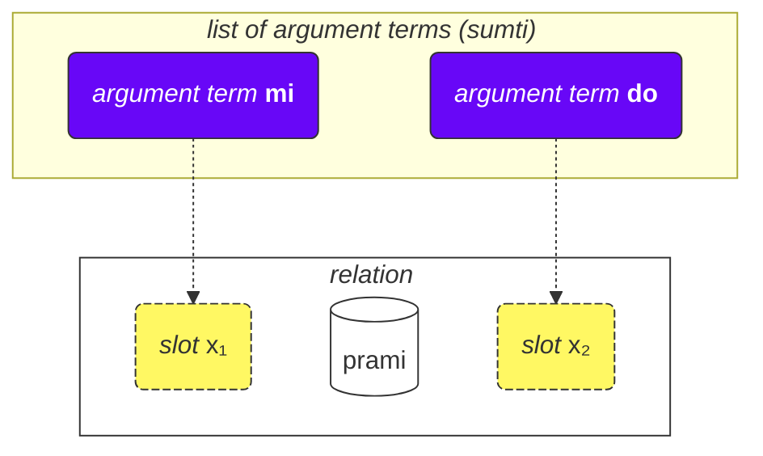
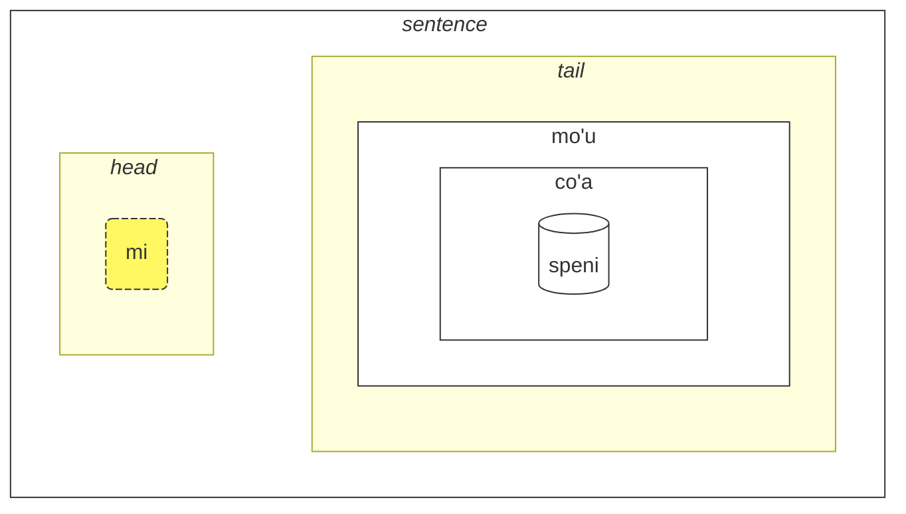

## Lección 2. Más cosas básicas

### Tipos de palabras

Todas las palabras en Lojban se dividen en tres grupos:

- Palabras de relación (llamadas **selbrivla** en Lojban)
  - Ejemplos: **gleki**, **klama**.
  - Estas palabras contienen al menos un grupo de consonantes (dos o más consonantes seguidas) dentro de los primeros 5 sonidos + terminan en una vocal.
- Partículas (llamadas **cmavo** en Lojban)
  - Ejemplos: **le**, **nu**, **mi**, **fa'a**.
  - Comienzan con una consonante (una de **b d g v z j p t k f s c x l m n r i u**), seguida de una vocal (una de **a e i o u y au ai ei oi**). Opcionalmente, después de eso, puede haber una o más secuencias de un apóstrofe (**'**) y una vocal siguiente. Por ejemplo, **xa'a'a'a'a'a'a** y **ba'au'oi'a'e'o** son posibles partículas (aunque no tengan un significado asignado).
  - Es bastante común escribir varias partículas consecutivamente sin espacios entre ellas. Esto está permitido por la gramática de Lojban. Así que no te sorprendas si ves **lenu** en lugar de **le nu**, **naku** en lugar de **na ku**, **jonai** en lugar de **jo nai**, y así sucesivamente. Esto no cambia el significado. Sin embargo, esta regla no se aplica a las palabras de relación; las palabras de relación deben estar separadas por espacios.
- Palabras de nombre (llamadas **cmevla** en Lojban)
  - Ejemplos: **.alis.**, **.doris**, **.lojban.**
  - Usualmente se utilizan para nombres.
  - Se pueden distinguir fácilmente de los otros tipos de palabras ya que terminan en una consonante. Además, están envueltas con dos puntos al principio y al final. Coloquialmente, los puntos pueden omitirse al escribir, pero al hablar, las pausas que corresponden a esos puntos aún son necesarias.

### Orden de los argumentos

Anteriormente proporcionamos definiciones de palabras de relación como:

mlatu
: ... es un gato, ser un gato

citka
: ... come ...

prami
: ... ama ...

klama
: ... venir a ...

Los diccionarios pueden presentar definiciones de palabras de relación con símbolos como $x_1$, $x_2$, etc.:

prami
: $x_1$ ama a $x_2$

karce
: $x_1$ es un coche ...

citka
: $x_1$ come a $x_2$ ...

klama
: $x_1$ viene a $x_2$ ...

Estos $x_1$, $x_2$, y así sucesivamente, son la notación explícita para los _espacios_ (otros nombres son: _lugares_, _roles de relación_, **terbricmi** en Lojban), que son llenados por términos de argumento (**sumti**) en la oración.

Los números representan el orden en el que esos espacios deben ser llenados por los argumentos.

Por ejemplo:

> **mi prami do**
> _Te amo._

Esta frase también implica que

- $x_1$ denota _el que ama_, y
- $x_2$ denota _el que es amado por_.

En otras palabras, cada relación tiene uno o más espacios, y esos espacios se especifican y etiquetan como $x_1$, $x_2$, y así sucesivamente. Colocamos los argumentos como **mi**, **do**, **le tavla**, etc. en orden, llenando así estos espacios y dándole un significado concreto a la relación, formando así una frase.

La ventaja de este estilo de definiciones es que todos los participantes de una relación están en una definición.

También podemos omitir argumentos para hacer la frase más vaga:

> **carvi**
> _Está lloviendo._
> `es lluvia, está lloviendo`

(aunque el tiempo aquí se determina por el contexto, también puede significar _A menudo llueve_, _Estaba lloviendo_, etc.)

> **prami do**
> _Alguien te ama._
> `te ama`

Todos los espacios omitidos en una relación simplemente significan **zo'e** = _algo/alguien_, por lo que significa lo mismo que

> **zo'e prami do**
> _Alguien te ama._

Y

> **prami**

es lo mismo que

> **zo'e prami zo'e**
> _Alguien ama a alguien._

Términos modales como **ca**, **fa'a**, etc. añaden nuevos espacios a las relaciones, pero no llenan los espacios de las relaciones. En

> **mi klama fa'a do**
> _Voy hacia ti._

el segundo espacio de **klama** todavía está omitido. Por ejemplo:

> **mi klama fa'a le cmana le zdani**
> _Voy (en dirección de la montaña) hacia la casa._

le cmana
: la montaña

<pixra url="/assets/pixra/cilre/cmana.webp" caption="cmana" definition="… es una montaña"></pixra>

Aquí, el segundo espacio de **klama** es **do**. La frase significa que la montaña es solo una dirección, mientras que el punto final eres tú.

Aquí, el término **fa'a la cmana** (_en dirección de la montaña_) no reemplaza el segundo espacio de la relación **klama**. El segundo espacio de **klama** es **le zdani** aquí.

La frase significa que mi casa simplemente está ubicada en dirección de la montaña, pero no necesariamente significa que quiero llegar a esa montaña. El destino final de mi llegada no es necesariamente la montaña, sino la casa.

De manera similar, en

> **mi citka ba le nu mi cadzu**
> _Yo como después de caminar._

el segundo lugar de **citka** aún está omitido. Una nueva palabra **ba** con su argumento **le nu mi cadzu** agrega significado a la oración.

El orden de los argumentos de una relación compuesta es el mismo que el del último componente en ella:

> **tu sutra bajra pendo mi**
> _Ese es mi amigo que corre rápidamente._
> `Ese es un amigo que corre rápidamente mío.`

> **tu pendo mi**
> _Ese es mi amigo._
> `Ese es un amigo mío.`

pendo
: ... es un amigo de ... (alguien)

Por lo tanto, el orden de los argumentos es el mismo que el de **pendo** solo.

### Más de dos lugares

Puede haber más de dos lugares. Por ejemplo:

> **mi pinxe le djacu le kabri**
> _Yo bebo el agua del vaso._

pinxe
: $x_1$ bebe $x_2$ de $x_3$

> **le kabri**
> _el vaso_

En este caso, hay tres lugares, y si quieres excluir el segundo lugar en el medio, debes usar **zo'e**:
> **mi pinxe zo'e le kabri**
> _Yo bebo \[algo\] del vaso._

Si omitimos **zo'e**, obtenemos algo sin sentido:

> **mi pinxe le kabri**
> _Yo bebo el vaso._

Otro ejemplo:

> **mi plicru do le plise**
> _Yo te doy las manzanas._

plicru
: $x_1$ da, dona a $x_2$ algún objeto $x_3$; $x_1$ permite que alguien $x_2$ use $x_3$

### Relaciones dentro de relaciones

En
> **le nicte cu nu mi viska le lunra**
> *La noche es cuando veo la Luna.*

tenemos

- **le nicte** como $x_1$ de la relación,
- **nu mi viska le lunra** como la relación principal.

Sin embargo, dentro de **nu mi viska le lunra**, tenemos otra oración con

- **mi** - $x_1$ de la relación interna,
- **viska** - la relación interna,
- **le lunra** - $x_2$ de la relación interna.

Entonces, a pesar de tener una estructura interna, **nu mi viska le lunra** sigue siendo una relación con su primer término lleno de **le nicte** en este caso.

De manera similar, en

> **mi citka ba le nu mi dansu**
> _Yo como después de bailar._

tenemos

- **mi** como $x_1$ de la relación,
- **citka** como la construcción principal de la relación,
- **ba le nu mi dansu** como un término modal de la relación principal de la oración.

Dentro de este término, tenemos:

- **mi** como $x_1$ de la relación dentro del término
- **dansu** como la construcción principal de la relación dentro del término.

Este mecanismo "recursivo" de envolver relaciones dentro de relaciones permite expresar ideas complejas de manera precisa.

### ¿Por qué se definen las palabras de relación de la forma en que se definen?

El inglés utiliza un conjunto limitado de preposiciones que se reutilizan en varios verbos y, por lo tanto, no tienen un significado fijo. Por ejemplo, considera la preposición en inglés _to_:

> _Hablo contigo._

<!-- -->
> _Vengo hacia ti._
<!-- -->

> _Para mí se ve bonito._

En cada uno de esos ejemplos, _to_ tiene un nuevo papel que, en el mejor de los casos, es remotamente similar a los roles en otras oraciones.

Es importante tener en cuenta que otros idiomas utilizan diferentes formas de marcar los roles de los verbos que, en muchos casos, son muy diferentes de los utilizados en inglés.

Por ejemplo, en Lojban, se marcan los roles principales (espacios) de las relaciones definiendo completamente dichas relaciones con los roles colocados en secuencia (o marcados con **fa**, **fe**, y así sucesivamente):

klama
: $x_1$ viene hacia $x_2$ …

tavla
: $x_1$ habla con $x_2$ …

melbi
: $x_1$ es hermoso, bonito para $x_2$ …

Estos roles principales son esenciales para definir relaciones.

Sin embargo, puede haber roles opcionales que hacen que las relaciones sean más precisas:

> _Hablo contigo mientras como._
<!-- -->

> _Es difícil para mí porque esta cosa es pesada._

En Lojban, una noción similar de roles opcionales se expresa mediante relaciones separadas o, en la mayoría de los casos comunes, con términos modales:

> **mi tavla do ze'a le nu mi citka**
> _Hablo contigo mientras como._
<!-- -->
> **nandu mi ri'a le nu ti tilju**
> _Es difícil para mí porque esta cosa es pesada._

nandu
: $x_1$ es difícil para $x_2$

tilju
: $x_1$ es pesado

Las preposiciones en inglés son similares a las partículas modales en Lojban, aunque una preposición común en inglés puede tener muchos significados, mientras que en Lojban, cada partícula modal tiene solo uno (aunque vago) significado.

### Reglas generales en el orden de los argumentos

El orden de los lugares en las relaciones a veces puede ser difícil de recordar, pero no te preocupes, no necesitas recordar todos los lugares de todas las palabras de relación. (¿Recuerdas el significado de cientos de miles de palabras en inglés?)

Puedes estudiar lugares cuando los encuentres útiles o cuando las personas los usen en un diálogo contigo.

La mayoría de las palabras de relación tienen dos o tres lugares.

Por lo general, puedes adivinar el orden utilizando el contexto y algunas reglas generales:

1. El primer lugar suele ser la persona o cosa que hace algo o es algo:

    **klama** = _$x_1$ va ..._

2. El objeto de alguna acción suele ir justo después del primer lugar:

    **punji** = _$x_1$ pone $x_2$ en $x_3$_,

3. Y el siguiente lugar generalmente se llenará con el destinatario:

    **punji** = _$x_1$ pone $x_2$ en $x_3$_,

4. Los lugares de destino (_a_) casi siempre van antes de los lugares de origen (_desde_):

    **klama** = _$x_1$ va a $x_2$ desde $x_3$_

    <pixra url="/assets/pixra/cilre/klama_fi.webp" caption="le prenu cu klama fi le zarci" definition="La persona sale de la tienda."></pixra>

5. Los lugares menos utilizados van hacia el final. Estos tienden a ser cosas como _por estándar_, _por medio de_ o _hecho de_.

La idea general es que primero vienen los lugares que son más propensos a ser utilizados.

No es necesario llenar todos los lugares todo el tiempo. Los lugares sin llenar solo tienen valores irrelevantes u obvios para el hablante (toman el valor de **zo'e** = _algo_).

### Infinitivos

Los infinitivos son verbos que a menudo se les agrega el prefijo _to_ en inglés. Ejemplos incluyen _Me gusta correr_, con _correr_ siendo el infinitivo.

> **le verba cu troci le ka cadzu**
> _El niño está intentando caminar._

le verba
: el niño, los niños

troci
: $x_1$ intenta hacer o ser $x_2$ (ka)

cadzu
: $x_1$ camina

<pixra url="/assets/pixra/cilre/troci_cadzu.webp" caption="le verba cu troci le ka cadzu" definition="El niño intenta caminar."></pixra>

La partícula **ka** funciona de manera similar a **nu**. Envuelve una oración.

La diferencia principal es que algún lugar en la oración envuelta debe estar vinculado a algún argumento fuera de esta oración.

En este caso, el primer argumento **le verba** de la relación **troci** establece un vínculo con el primer lugar sin llenar de la oración interna **cadzu** (que está dentro de **ka**).

En otras palabras, el niño intenta lograr un estado donde **le verba cu cadzu** (el argumento **le verba** llenaría el primer lugar sin llenar de la relación **cadzu**).

Algunas relaciones requieren solo infinitivos en algunos de sus espacios. Las definiciones de estas palabras marcan esos espacios como _propiedad_ o **ka**. Por ejemplo:

cinmo
: $x_1$ siente $x_2$ (ka)

Esto significa que el infinitivo en el segundo lugar ($x_2$) se aplica a algún lugar (probablemente, el primer lugar, $x_1$). Los casos en los que el infinitivo se aplica a lugares distintos de $x_2$ son raros y se explican en las relaciones correspondientes o, en el caso de palabras de relación inventadas de manera no oficial, se pueden deducir del sentido común.

Ten en cuenta que solo el primer espacio sin llenar de la relación incrustada toma el significado del espacio externo:

> **mi troci le ka do prami**
> _Intento ser amado por ti._

tcidu
: $x_1$ lee $x_2$ de $x_3$

Aquí, el primer espacio sin llenar es el segundo lugar de **prami**, por lo tanto, toma el valor **mi** (_yo_).

También es posible usar el pronombre **ce'u** para marcar explícitamente un lugar que debe aplicarse a algún argumento externo:

> **mi troci le ka do prami ce'u**
> _Intento ser amado por ti._

Otro ejemplo:

> **mi cinmo le ka xebni ce'u**
> **mi cinmo le ka se xebni**
> _Siento que alguien me odia._
> _Siento ser odiado._

### Tipos de espacios

El diccionario a menudo menciona otros tipos de espacios, por ejemplo:

djica
: $x_1$ desea $x_2$ (evento)

Este _evento_ significa que debes llenar el espacio con un argumento que represente un evento. Por ejemplo:

le nicte
: la noche

le nu mi dansu
: yo bailando

Entonces obtenemos:

> **mi djica le nicte**
> _Deseo el evento de la noche._

<!-- -->

> **do djica le nu mi dansu**
> _Quieres que yo baile._

En Lojban, no está permitido decir, por ejemplo:

> **mi djica le plise**
> _Deseo la manzana._ 

porque quieres hacer algo con la manzana o quieres que ocurra algún evento con la manzana, como:

> **mi djica le nu mi citka le plise**
> _Deseo comer la manzana._
> `Deseo que yo coma la manzana.`

Observe que envolver una relación que espera un evento en otro **nu** cambia el significado:

> **le zekri cu cumki**
> _El crimen es posible._

zekri
: $x_1$ (evento) es un hecho delictivo, $x_1$ (evento) un delito,

cumki
: $x_1$ (evento) es posible

Comparar:

> **le nu zekri cu cumki**
> `Que sea delictivo es posible.`
> _Es posible que algo sea un delito._

### Elevación

> **mi stidi le ka klama le barja**
> _Sugiero ir al pub._

stidi
: $x_1$ sugiere la acción $x_2$ (propiedad) a $x_3$

> **mi stidi tu'a le barja**
> _Sugiero el pub._

tu'a le barja
: algo sobre el pub

> **mi djica le nu mi citka le plise**
> _Quiero comer una manzana._

<!-- -->

> **mi djica tu'a le titla**
> _Quiero el dulce._

tu'a le titla
: algo sobre el dulce

titla
: ...es dulce, ...es un dulce

<pixra url="/assets/pixra/cilre/djica_tuha_le_titla.webp" caption="le prenu cu djica tu'a le titla" definition="La persona quiere el dulce."></pixra>

La estructura de lugar puede poner demasiada carga en la especificación de acciones o eventos. A veces queremos especificar solo algún objeto en esos eventos o lugares y omitir la descripción de la acción o el evento por completo.

En los ejemplos anteriores, _Sugiero el pub._ probablemente implica ir al pub y _Quiero la manzana._ implica comerla.

Sin embargo, la palabra de relación en Lojban **stidi** requiere una propiedad en su espacio $x_2$. De manera similar, **djica** requiere un evento en su espacio $x_2$.

La corta palabra calificadora llamada **tu'a** antes de un término implica una abstracción (propiedad, evento o proposición), pero selecciona solo este término de esta abstracción, omitiendo el resto. Se puede traducir vagamente como _algo sobre_:

> **mi stidi tu'a le barja**
> _Sugiero algo sobre el pub (tal vez visitarlo, encontrarse cerca de él, etc.)._

<!-- -->

> **mi djica tu'a le plise**
> _Deseo algo relacionado con la manzana (tal vez comerla, masticarla, lamerla, lanzarla a un amigo, etc.)_

> **tu'a le cakla cu pluka mi**
> _El chocolate me agrada (probablemente debido a su sabor)._
> `Algo sobre el chocolate me agrada`

cakla
: x1 es un poco de chocolate

Al omitir abstracciones, solo el contexto nos dice qué se omitió.

También es posible modificar la construcción relacional principal:

> **le cakla cu jai pluka mi**
> **tu'a le cakla cu pluka mi**
> _El chocolate me agrada._

Esto permite la creación de términos de argumento vagos con **jai**:

> **le jai pluka cu zvati ti**
> _La cosa placentera está aquí._

Dado que **le pluka** (_el evento placentero_) es abstracto, es imposible especificar su ubicación. Sin embargo, un participante en la abstracción puede estar físicamente ubicado en algún lugar.

### Lugares dentro de argumentos

¿Cómo decimos _Eres mi amigo_?

> **do pendo mi**
> _Eres mi amigo._
> `Eres un amigo mío.`

<pixra url="/assets/pixra/cilre/pendo.webp" caption="le pendo" definition="el amigo / los amigos"></pixra>

Y ahora, ¿cómo decimos _Mi amigo es inteligente_?

> **le pendo be mi cu stati**
> _Mi amigo es inteligente._

Cuando convertimos una relación en un argumento (**pendo** — _ser un amigo_ se convierte en **le pendo** — _el amigo_), aún podemos conservar otros lugares de esa relación colocando **be** después de él.

Por defecto, se adjunta al segundo lugar ($x_2$). Podemos adjuntar más lugares separándolos con **bei**:

> **mi plicru do le plise**
> _Te doy la manzana._

<pixra url="/assets/pixra/cilre/plicru.webp" caption="le prenu cu plicru le pendo le plise" definition="La persona le da la manzana al amigo."></pixra>
<!-- -->

> **le plicru be mi bei le plise**
> _El otorgante de la manzana para mí_

<!-- -->

> **le plicru be mi bei le plise cu pendo mi**
> _La persona que me da la manzana es mi amigo._
> `La persona que me da la manzana es un amigo mío.`

Otro ejemplo:

<!-- > **le pendo be mi cu tavla**
> _Mis amigos están hablando._
> **le pendo mi cu tavla**
> **le pendo cu tavla mi**
> _Los amigos me están hablando._ -->

> **mi klama le pendo be do**
> _Voy a un amigo tuyo._

klama
: $x_1$ va hacia $x_2$ desde $x_3$ …

No podemos omitir **be** porque **le pendo do** son dos lugares independientes:

> **mi klama le pendo do**
> _Voy a un amigo tuyo._

Aquí, **do** tomó el tercer lugar de **klama** ya que no está vinculado a _pendo_ mediante **be**.

Tampoco podríamos usar **nu** porque **le nu pendo do** es el evento de alguien siendo tu amigo.

Entonces **le pendo be do** es la solución correcta.

Otro ejemplo:

> **la .lojban. cu bangu mi**
> _Lojban es mi idioma._
> `Lojban es un idioma mío.`

Sin embargo,

> **mi nelci le bangu be mi**
> _Me gusta mi idioma._

Usar **be** para relaciones que no se convierten en argumentos no tiene efecto:

> **mi nelci be do** es lo mismo que
> **mi nelci do**

### Cláusulas relativas

> **le prenu poi pendo mi cu tavla mi**
> _La persona que es amiga mía me habla._

<!-- -->

> **le prenu noi pendo mi cu tavla mi**
> _La persona, que casualmente es amiga mía, me habla._

blabi
: ...es blanco/a

En la primera oración, la palabra _que_ es esencial para identificar a la persona en cuestión. Aclara a quién de las personas en el contexto nos referimos. Elegimos solo a aquellos que son mis amigos entre posiblemente muchas personas alrededor. Tal vez solo haya una persona alrededor que sea mi amiga.

En cuanto a _que casualmente es amiga mía_ en la segunda oración, solo proporciona información adicional sobre la persona. No nos ayuda a identificar a la persona. Por ejemplo, esto podría suceder cuando todas las personas alrededor son mis amigos.

**poi pendo mi** es una cláusula relativa, una relación adjunta a la derecha del argumento **le prenu**. Termina justo antes de la siguiente palabra **cu**:

> **le prenu (poi pendo mi) cu tavla mi**
> _La persona que es amiga mía me habla._

En Lojban, usamos **poi** para cláusulas relativas que identifican entidades (objetos, personas o eventos) y **noi** para información incidental.

> **la .bob. ba co'a speni le ninmu poi pu xabju le nurma**
> _Bob se casará con una chica que vivió en el campo._

xabju
: ...vive en..., ...habita... (lugar, objeto)

le nurma
: el área rural

¡Esta oración no excluye que Bob se case con alguien más también! ¡Eliminar la cláusula relativa con **poi** cambia el significado:

> **la .bob. ba co'a speni le ninmu**
> _Bob se casará con una chica._

Otro ejemplo:

> **le prenu poi gleki cu ze'u renvi**
> _Las personas (¿cuáles?) que son felices viven mucho tiempo._

ze'u
: término modal: durante mucho tiempo

renvi
: sobrevivir

Eliminar la cláusula relativa con **poi** cambia el significado:

> **le prenu ze'u renvi**
> _Las personas viven mucho tiempo._

Por otro lado, las cláusulas relativas con **noi** contienen solo información adicional sobre el argumento al que están adjuntas. Ese argumento está suficientemente definido por sí mismo, por lo que eliminar una cláusula relativa con **noi** no cambia su significado:

> **me gusta Doris a quien veo habitualmente en el parque.**
> _I like Doris whom I habitually see in the park._
> _I like Doris. ¿Qué más puedo decir sobre ella? La veo habitualmente en el parque._

zgana
: observar (usando cualquier sentido)

<pixra url="/assets/pixra/cilre/panka_ninmu.webp" caption="la persona a quien veo habitualmente en el parque." definition="The person whom I habitually see in the park."></pixra>

Eliminar la cláusula relativa con **noi** conserva el significado: _Me gusta Doris._

En inglés hablado, a menudo se logra la distinción mediante la entonación o adivinando. Además, las cláusulas relativas con **noi** se separan tradicionalmente con comas en inglés. Se utilizan _which_ o _who_, y la palabra _that_ no se utiliza en ellas.

Veamos otro ejemplo.

> **Voy al árbol.**
> _I come to the tree._

<!-- -->

> **El árbol es grande.**
> _The tree is big._

le pa tricu
: el árbol (un árbol)

barda
: $x_1$ es grande

Y ahora unamos esas dos oraciones:

> **El árbol, al que voy, es grande.**
> _The tree, to which I come, is big._

Observa la palabra **ke'a**. Movemos la segunda oración sobre el mismo árbol a una cláusula relativa y reemplazamos el argumento **le tricu** con **ke'a** en la cláusula relativa. Por lo tanto, el pronombre **ke'a** es como _who_ y _which_ en inglés. Se refiere al argumento al que se adjunta la cláusula relativa.

Literalmente, nuestra oración en Lojban suena como

> _El árbol, tal que voy a él, es grande._

**ke'a** se puede omitir si el contexto es suficiente. Las dos siguientes oraciones significan lo mismo:

> **La persona que es amiga mía me habla.**
> **La persona que ke'a es amiga mía me habla.**
> _The person that is friend of mine talks to me._

A menudo se asume que **ke'a** va al primer lugar sin llenar:

> **Me gusta Doris a quien veo habitualmente en el parque.**
> **Me gusta Doris a quien veo ke'a habitualmente en el parque.**
> _I like Doris whom I habitually see in the park._

Aquí, **mi** llena el primer lugar de la relación **ta'e zgana** (_… ve habitualmente …_), por lo tanto, se asume **ke'a** para el siguiente segundo lugar.

Las cláusulas relativas, al igual que las relaciones habituales, pueden contener construcciones con términos modales:

> **le tricu noi mi pu klama ke'a ca le cabdei cu barda**
> _El árbol, al cual fui hoy, es grande._

<pixra url="/assets/pixra/cilre/le_tricu_cu_barda.webp" caption="le tricu cu barda" definition="El árbol es grande."></pixra>

le cabdei
: el día de hoy

Ten en cuenta que **ca le cabdei** pertenece a la cláusula relativa. Compara:

> **le tricu noi mi pu klama ke'a cu barda ca le cabdei**
> _El árbol, al cual fui, es grande hoy._

El significado ha cambiado mucho.

Finalmente, **voi** se utiliza para formar argumentos similares a **le** pero con cláusulas relativas:

> **ti voi le nu ke'a cisma cu pluka mi cu zutse tu**
> _Estos, cuya sonrisa me agrada, están sentados._

<pixra url="/assets/pixra/cilre/voi.webp" caption="mi nelci ti voi le nu ke'a cisma cu pluka mi" definition="Me gustan estos cuya sonrisa me agrada."></pixra>

ti
: este cerca de mí, estos cerca de mí

cisma
: $x_1$ sonríe

pluka
: $x_1$ es agradable para $x_2$

zutse
: $x_1$ se sienta, está sentado en $x_2$

Aquí, **voi** define el objeto cerca de mí.

Comparémoslo con:

> **ti poi le nu ke'a cisma cu pluka mi cu zutse**
> _De estos, aquellos cuya sonrisa me agrada están sentados._

**poi** restringe la selección a aquellos descritos en la cláusula relativa. Este ejemplo podría implicar que hay muchos objetos (personas, etc.) a mi alrededor, pero con **poi** solo selecciono los necesarios.

Comparémoslo con:

> **ti noi le nu ke'a cisma cu pluka mi cu zutse**
> _Estos (que incidentalmente son tales que su sonrisa me agrada) están sentados._

**noi** simplemente agrega información incidental que no es necesaria para determinar a qué se refiere **ti** (_estos_). Tal vez no haya nadie más alrededor para describir.

Finalmente, al igual que **nu** tiene el marcador de límite derecho **kei**, tenemos:

ku'o
: marcador de límite derecho para **poi**, **noi** y **voi**.

> **mi tavla la .doris. noi ca zutse tu ku'o .e la .alis. noi ca cisma**
> _Hablo con Doris, quien está sentada allí, y Alice, quien está sonriendo._

Observa que sin **ku'o** tendríamos **tu** (_allí_) unido con **la .alis.** (_Alice_), lo que llevaría a un significado extraño:

> **hablo con Doris, quien ahora está sentada allí y encima de Alice (quien ahora sonríe).**

Ten en cuenta la parte **zutse tu .e la .alis.**.

Para **poi**, **noi** y **voi**, el marcador de límite derecho sigue siendo el mismo: **ku'o**.

### Cláusulas relativas cortas. '_Acerca de_'

A veces, es posible que necesites adjuntar un argumento adicional a otro argumento:

> **sé algo importante acerca de ti.**

le vajni
: algo importante

**pe** y **ne** son similares a **poi** y **noi**, pero se adjuntan a argumentos:

> **el bolígrafo que es mío es rojo.** (_mío_ es esencial para identificar el bolígrafo en cuestión)

<!-- -->

> **el bolígrafo, que es mío, es rojo.** (información adicional)

ne
: que se trata de, tiene relación con ... (un argumento sigue)

pe
: que se trata de, tiene relación con ... (un argumento sigue)

> **el bolígrafo, que es mío, y el teléfono, que es tuyo, son rojos.**

ge'u
: marcador de límite derecho para **pe**, **ne**.

### «**be**» y «**pe**»

Ten en cuenta que las cláusulas relativas se adjuntan a los argumentos, mientras que **be** es parte de la relación.

De hecho, **le bangu pe mi** es una mejor traducción de _mi idioma_, ya que, al igual que en inglés, los dos argumentos están relacionados entre sí de manera vaga.

Sin embargo, puedes decir **le birka be mi** como _mi brazo_. Incluso si te cortas el brazo, seguirá siendo tuyo. Por eso **birka** tiene un lugar para el propietario:

birka
: $x_1$ es un brazo de $x_2$

Veamos una vez más que una construcción con **be** es parte de la relación, mientras que **pe**, **ne**, **poi** y **noi** se adjuntan a los argumentos:

> **el hermoso teléfono para mí del amigo mío es grande.**

Aquí, **be mi** se adjunta a la relación **melbi** = _ser hermoso para ... (alguien)_ y así crea una nueva relación **melbi be mi** = _ser hermoso para mí_. Pero **pe le pa pendo be mi** (_del amigo mío_) se aplica a todo el argumento **le pa melbi be mi fonxa** (_el hermoso teléfono para mí_).

También puede suceder que necesitemos adjuntar **be** a una relación, transformar esa relación en un argumento y luego adjuntar **pe** a ese argumento:

> **le pa pendo be do be'o pe la .paris. cu stati**
> _El amigo tuyo que está relacionado con París es inteligente._
> (**pe la .paris.** está adjunto a todo el argumento **le pa pendo be do be'o**)

<!-- -->

> **le pu plicru be do bei le pa plise be'o pe la .paris. cu stati**
> _Quien te dio la manzana (y quien está relacionado con París) es inteligente._
> (**pe la .paris.** está adjunto a todo el argumento **le pu plicru be do bei le pa plise be'o**)

be'o
: marcador de límite derecho para la cadena de términos adjuntos con **be** y **bei**

En estos dos ejemplos, tu amigo tiene alguna relación con París (quizás sea de París).

Comparalo con:

> **le pa pendo be do pe la .paris. cu stati**
> _El amigo tuyo (tú que estás relacionado con París) es inteligente._

<!-- -->

> **le pu plicru be do bei le pa plise pe la .paris. cu stati**
> _Quien te dio la manzana (la manzana que está relacionada con París) es inteligente._

En estos últimos dos ejemplos, sin embargo, o bien tú estás relacionado con París o la manzana lo está.

### ‘_Alice es una maestra_’ y ‘_Alice es la maestra_’

En inglés, el verbo _is, are, to be_ hace que un sustantivo funcione como un verbo. En Lojban, incluso conceptos como _gato_ (**mlatu**), _persona_ (**prenu**), _casa_ (**dinju**), _hogar_ (**zdani**) funcionan como verbos (relaciones) por defecto. Solo los pronombres funcionan como argumentos.

Sin embargo, aquí hay tres casos:

> **la .alis. cu ctuca**
> _Alice enseña._

<!-- -->

> **la .alis. cu me le ctuca**
> _Alice es una de las maestras._

me
: … está entre …, … es uno de …, … son miembros de … (el argumento sigue)

> **la .alis. ta'e ctuca**
> _Alice enseña habitualmente._

ta'e
: partícula modal: el evento ocurre habitualmente

> **la .alis. cu du le ctuca**
> _Alice es la maestra._

du
: … es idéntico a …

La partícula **me** toma un argumento después de ella e indica que probablemente haya otros maestros, y Alice es uno de ellos.

La partícula **du** se usa cuando Alice es, por ejemplo, la maestra que hemos estado buscando o de la que hemos estado hablando. Indica identidad.

Así, **me** y **du** a veces pueden corresponder a lo que en inglés expresamos usando el verbo _to be/is/was_.

En Lojban, priorizamos el significado de lo que queremos decir, en lugar de depender de cómo se expresa literalmente en inglés u otros idiomas.

Otros ejemplos:

> **mi me la .bond.**
> _Soy Bond._

<!-- -->

> **mi du la .kevin.**
> _Soy Kevin (el que necesitabas)._

<!-- -->

> **ti du la .alis. noi mi ta'e zgana bu'u le panka**
> _Esta es Alice, a quien veo habitualmente en el parque._

**noi du** y **poi du** se utilizan para introducir nombres alternativos para algo. Corresponden a _namely, i.e._ en inglés:

> **la .alis. cu penmi le prenu noi du la .abdul.**
> _Alice conoció a la persona, es decir, Abdul._

Cuando usamos **me**, podemos conectar varios argumentos con _and_:

> **tu me le pendo be mi be'o .e le tunba be mi**
> _Esos son algunos (o todos) mis amigos y mis hermanos._

tunba
: $x_1$ es un hermano de $x_2$

### Relaciones con partículas modales

Podemos colocar una partícula modal no solo antes de la construcción principal de la relación de la oración, sino también al final de ella, produciendo el mismo resultado:

> **mi ca tcidu**
> **mi tcidu ca**
> _Estoy (leyendo) ahora._

tcidu
: leer (un texto)

Cuando usamos **nu**, creamos una relación que describe algún evento. Observa la diferencia entre estos dos ejemplos:

> **le nu tcidu ca cu nandu**
> _La lectura actual es complicada, difícil._

<!-- -->

> **le nu tcidu cu ca nandu**
> _La lectura ahora es complicada._

Otros ejemplos:

> **mi klama le pa cmana pu**
> _Fui a la montaña._
> `Voy a una montaña (en el pasado).`

<!-- -->

> **le nu mi klama le pa cmana pu cu pluka**
> _Que fui a la montaña es agradable._

También podemos poner una o más partículas modales como el primer elemento de una construcción de relación y, por ejemplo, usar esa relación enriquecida en una forma de argumento:

<pixra url="/assets/pixra/cilre/coha_purdi.webp" caption="le pu kunti tumla ca purdi" definition="Lo que era un desierto ahora es un jardín."></pixra>

> **le pu kunti tumla ca purdi**
> _Lo que era un desierto ahora es un jardín._

**pu** pertenece a **le kunti tumla** y **ca** pertenece a **purdi** (ya que **le pu kunti tumla** no puede agregar **ca** al final).

<!-- Esto no contradice el uso de **ser** después del verbo, ya que con **ser**, se cambia el verbo: **bangu be mi** se considera un solo verbo. -->

Tener varias partículas modales en orden no es un problema:
> **le pu ze'u kunti tumla ca purdi**
> _Lo que fue un desierto durante mucho tiempo ahora es un jardín._

ze'u
: término modal: durante mucho tiempo

Colocar partículas terminales después de los sustantivos los vincula a relaciones externas:

<pixra url="/assets/pixra/cilre/cohu_purdi.webp" caption="le kunti tumla pu purdi" definition="El desierto era un jardín."></pixra>

> **le kunti tumla pu purdi**
> **(le kunti tumla) pu purdi**
> _El desierto era un jardín._

### Nuevos argumentos de ranuras de la misma relación

> **do plicru mi ti**
> _Tú me concedes esto._

<!-- -->

> **mi se plicru ti do**
> _Esto me es concedido por ti._

plicru
: $x_1$ le da a $x_2$ algo $x_3$ para usar

Podemos intercambiar los dos primeros lugares en la relación usando **se** y así cambiar la estructura de lugar.

**do plicru mi ti** significa exactamente lo mismo que **mi se plicru do ti**. La diferencia está únicamente en el estilo.

Puedes cambiar las cosas para enfatizar diferentes aspectos, por ejemplo, mencionar las cosas más importantes primero en una oración. Por lo tanto, las siguientes parejas significan lo mismo:

> **mi prami do**
> _Te amo._

<!-- -->

> **do se prami mi**
> _Eres amado por mí._

<!-- -->

> **le nu mi tadni la .lojban. cu xamgu mi**
> _Mi estudio de Lojban es bueno para mí._

xamgu
: ... es bueno para (alguien)

> **mi se xamgu le nu mi tadni la .lojban.**
> _Para mí, es bueno estudiar Lojban._

Lo mismo se puede hacer cuando se utilizan relaciones al crear argumentos:

le plicru
: aquellos que dan, los donantes

le se plicru
: aquellos a quienes se les da, los receptores de regalos

le te plicru
: aquellos objetos que se dan para usar, los regalos

**te** intercambia el primer y tercer lugar de las relaciones.

Como sabemos, cuando agregamos **le** delante de una construcción de relación, se convierte en un argumento. Entonces,

- **le plicru** significa _aquellos que podrían encajar en el primer lugar de **plicru**_
- **le se plicru** significa _aquellos que podrían encajar en el segundo lugar de **plicru**_
- **le te plicru** significa _aquellos que podrían encajar en el tercer lugar de **plicru**_

Así, en Lojban, no necesitamos palabras separadas para _donante_, _destinatario_ y _regalo_. Reutilizamos la misma relación y ahorramos mucho esfuerzo gracias a este diseño inteligente. De hecho, no podemos imaginar un regalo sin implicar que alguien lo dio o lo dará. Cuando fenómenos útiles están interconectados, Lojban refleja esto.

<!-- TODO: DwE: Para facilitar la comprensión y memorización: las palabras predicado con prefijos **se**, **te** se incluyen en el diccionario en las entradas de muchos verbos junto con sus definiciones, aunque puedes deducir su significado por ti mismo. -->

### Cambiando otros lugares en las relaciones principales

La serie **se, te, ve, xe** (en orden alfabético) consiste en partículas que cambian los lugares en las relaciones principales:

- **se** intercambia el primer y segundo lugar
- **te** intercambia el primer y tercer lugar
- **ve** intercambia el primer y cuarto lugar
- **xe** intercambia el primer y quinto lugar.

> **mi zbasu le pa stizu le mudri**  
> _Hice la silla con el trozo de madera._

zbasu
: $x_1$ construye, hace $x_2$ con $x_3$

le pa stizu
: la silla

le mudri
: el trozo de madera

> **le mudri cu te zbasu le stizu mi**  
> _El trozo de madera es de lo que está hecha la silla por mí._

El **mi** ahora se ha movido al tercer lugar de la relación y se puede omitir si somos demasiado perezosos para especificar quién hizo la silla o si simplemente no sabemos quién la hizo:

> **le mudri cu te zbasu le stizu**  
> _El trozo de madera es el material de la silla._

De manera similar a nuestro ejemplo con **le se plicru** (_el destinatario_) y **le te plicru** (_el regalo_), podemos usar **te**, **ve**, **xe** para derivar más palabras de otros lugares de las palabras de relación:

klama
: $x_1$ va a $x_2$ desde $x_3$ a través de $x_4$ por medio de $x_5$

Así, podemos derivar que

le klama
: el que viene / los que vienen

le se klama
: el lugar de destino

le te klama
: el lugar de origen del movimiento

le ve klama
: la ruta

le xe klama
: el medio de transporte

**le xe klama** y el quinto lugar de **klama** pueden denotar cualquier medio de movimiento, como conducir un coche o caminar a pie.

**se** se utiliza con más frecuencia que las otras partículas para intercambiar lugares.

### Orden libre de palabras: etiquetas para roles en relaciones

Normalmente, no necesitamos todos los espacios, lugares de una relación, por lo que podemos omitir los innecesarios reemplazándolos con **zo'e**. Sin embargo, podemos usar _etiquetas de lugar_ para referirnos explícitamente a un espacio necesario. Las etiquetas de lugar funcionan como partículas modales pero se ocupan de la estructura de lugar de las relaciones:

> **mi prami do** es lo mismo que
> **fa mi prami fe do**
> _Te amo._

- **fa** marca el argumento que llena el primer espacio de una relación ($x_1$)
- **fe** marca el argumento que llena el segundo espacio ($x_2$)
- **fi** marca el argumento que llena el tercer espacio ($x_3$)
- **fo** marca el argumento que llena el cuarto espacio ($x_4$)
- **fu** marca el argumento que llena el quinto espacio ($x_5$)

Más ejemplos:

> **mi klama fi le tcadu**
> _Voy desde la ciudad._

**fi** marca **le tcadu** como el tercer lugar de **klama** (el origen del movimiento). Sin **fi**, la oración se convertiría en **mi klama le tcadu**, lo que significa _Voy a la ciudad._

> **mi pinxe fi le kabri** es lo mismo que
> **mi pinxe zo'e le kabri**
> _Bebo (algo) del vaso._

pinxe
: $x_1$ bebe $x_2$ de $x_3$

le kabri
: el vaso, el copa

<pixra url="/assets/pixra/cilre/pinxe_fi_le_kabri.webp" caption="le prenu cu pinxe fi le kabri" definition="La persona bebe del vaso."></pixra>

> **mi tugni zo'e le nu vitke le rirni**
> **mi tugni fi le nu vitke le rirni**
> _Estoy de acuerdo (con alguien) acerca de visitar a los padres._

tugni
: $x_1$ está de acuerdo con alguien $x_2$ acerca de $x_3$ (proposición)

le rirni
: el padre / los padres

Con las etiquetas de lugar, podemos mover los lugares alrededor:

> **fe mi fi le plise pu plicru**
> _Alguien me dio la manzana._

Aquí,

- **le plise** = _la manzana_, la colocamos en el tercer lugar de **plicru**, lo que se da
- **mi** = _me_, lo colocamos en el segundo lugar de **plicru**, el receptor.

Como podemos ver en el último ejemplo, ni siquiera podemos reflejar el orden de las palabras en su traducción al inglés.

El uso extensivo de etiquetas de lugar puede dificultar la comprensión de nuestro discurso, pero permite más libertad.

A diferencia de la serie **se**, el uso de etiquetas de lugar como **fa** no cambia la estructura del lugar.

---

Podemos usar etiquetas de lugar dentro de los argumentos colocándolos después de **be**:

> **le pa klama be fi le tcadu cu pendo mi**
> _El que viene a la ciudad es mi amigo._

---

También podemos colocar todos los argumentos de una relación principal al principio de la oración (preservando su orden relativo). Debido a esta libertad, podemos decir:

> **mi do prami** que es lo mismo que
> **mi do cu prami** que es lo mismo que
> **mi prami do**
> _Te amo._

<!-- -->

> **ko kurji ko** es lo mismo que
> **ko ko kurji**
> _Cuídate._

Las siguientes oraciones también tienen el mismo significado:

> **mi plicru do le pa plise**
> _Te doy la manzana._

<!-- -->

> **mi do cu plicru le pa plise**
> _Te doy la manzana._

<!-- -->

> **mi do le pa plise cu plicru**
> _Te doy la manzana._

### Prenex

Prenex es un "prefijo" de relación, en el cual puedes declarar variables para usar más adelante:

> **pa da poi pendo mi zo'u da tavla da**
> _Hay alguien que es amigo mío y que habla consigo mismo._

zo'u
: separador de prenex

da
: pronombre: variable.

El pronombre **da** se traduce como _hay algo/alguien …_ Si usamos **da** por segunda vez en la misma relación, siempre se refiere a lo mismo que el primer **da**:

> **mi djica le nu su'o da poi kukte zo'u mi citka da**
> _Deseo que haya al menos algo delicioso para poder comerlo._

su'o
: número: al menos 1

Si la variable se utiliza en la misma relación y no en ninguna relación incrustada, entonces puedes omitir completamente el prenex:

> **mi djica le nu su'o da poi kukte zo'u mi citka da**
> **mi djica le nu mi citka su'o da poi kukte**
> _Deseo que haya al menos algo delicioso para poder comerlo._
> _Deseo que haya algo para poder comerlo._

Ambos ejemplos significan lo mismo, en ambos casos **su'o da** denota _hay (había/habrá) algo o alguien_.

Sin embargo, el prenex es útil y necesario cuando necesitas usar **da** en el interior de tu relación, es decir, dentro de relaciones incrustadas:

> **su'o da poi kukte zo'u mi djica le nu mi citka da**
> _Hay al menos algo delicioso: deseo comerlo._

> **mi tavla**
> _Yo hablo._

> **mi tavla su'o da**
> **mi tavla da**
> _Hay alguien con quien hablo._

> **da tavla da**
> _Alguien habla consigo mismo._

> **da tavla da da**
> _Alguien habla consigo mismo acerca de sí mismo._

tavla
: $x_1$ habla con alguien $x_2$ acerca del tema $x_3$

> **pa da poi ckape zo'u mi djica le nu da na ku fasnu**
> _Hay algo peligroso: deseo que nunca suceda._

**da** no implica ningún objeto o evento en particular, lo cual es útil en muchas ocasiones:

> **xu do tavla su'o da poi na ku slabu do**
> _¿Hablas con alguien que no te es familiar? (no se describe a una persona en particular)._

> **.e'u mi joi do casnu bu'u su'o da poi drata**
> _Hablemos en otro lugar (no se especifica un lugar en particular)_

### Argumentos de existencia

> **pa da poi me le pendo be mi zo'u mi prami da**
> _Hay alguien que es amigo mío, a quien amo._

Dado que **da** se usa solo una vez, podríamos pensar en eliminar el prenex. Pero, ¿cómo manejamos la cláusula relativa **poi pendo mi** (_que es amigo mío_)?

Afortunadamente, en Lojban hay un atajo:

> **pa da poi me le pendo be mi zo'u mi prami da**
> **mi prami pa le pendo be mi**
> _Hay alguien que es amigo mío, a quien amo._

Ambas oraciones tienen el mismo significado.

Los argumentos que comienzan con números como **pa le pendo** (_hay alguien que es amigo mío_), **ci le prenu** (_hay tres personas_) pueden referirse a nuevas entidades cada vez que se usan. Por eso,

> **pa le pendo be mi ca tavla pa le pendo be mi**
> _Hay un amigo mío que habla con un amigo mío._

Esta oración no es precisa para indicar si es tu amigo hablando consigo mismo o si estás describiendo a dos amigos tuyos, donde el primero está hablando con el segundo.

Sería más razonable decir:

> **le pa pendo be mi ca tavla ri**
> _El amigo mío está hablando consigo mismo._

ri
: pronombre: se refiere al argumento anterior excluyendo **mi**, **do**.

Aquí, **ri** se refiere al argumento anterior: **le pa pendo** en conjunto.

Observa la diferencia:

- **da** significa _hay algo/alguien_, **da** siempre se refiere a la misma entidad cuando se usa más de una vez en la misma relación.
- un argumento como **pa le mlatu** (con un número sin especificar) es similar a usar **pa da poi me le mlatu**, pero puede referirse a nuevas entidades cada vez que se usa.

> **mi nitcu le nu pa da poi mikce zo'u da kurju mi**
> _Necesito un médico que cuide de mí (implicando "cualquier médico servirá")._

<!-- -->

> **pa da poi mikce zo'u mi nitcu le nu da kurju mi**
> _Hay un médico al que necesito para que cuide de mí._

Un ejemplo más:

> **le nu pilno pa le bangu kei na ku banzu**
> _Usar solo uno de los idiomas no es suficiente._

pilno
: … utiliza …

banzu
: … es suficiente para el propósito …

Comparado con:

> **le nu pilno le pa bangu kei na ku banzu**
> _Usar el idioma (el que se está discutiendo) no es suficiente._

Los argumentos de existencia se usan naturalmente dentro de relaciones internas y con **tu'a**:

> **mi djica le nu mi citka pa le plise**
> _Quiero comer una manzana, alguna manzana._

> **mi djica tu'a pa le plise**
> _Quiero algo relacionado con una manzana, alguna manzana (probablemente, comiéndola, tal vez masticándola, lamiéndola, lanzándola a tu amigo, etc.)_

Observa la diferencia:

> **mi djica tu'a le pa plise**
> _Quiero algo relacionado con la manzana (la manzana en cuestión)._

### ‘_Tengo un brazo._’ ‘_Tengo un hermano._’

El verbo en inglés _to have_ tiene varios significados. Veamos algunos de ellos.

> **pa da birka mi**
> _Tengo un brazo._
> `Hay algo que es un brazo mío`

birka
: $x_1$ es un brazo de $x_2$

Utilizamos la misma estrategia para expresar relaciones familiares:

> **pa da bruna mi**
> **mi se bruna pa da**
> _Alguien es mi hermano._
> _Tengo un hermano._
> `Hay alguien que es mi hermano`

<!-- -->

> **re lo bruna be mi cu clani**
> _Tengo dos hermanos y son altos._

clani
: $x_1$ es largo, alto

Así que no necesitamos el verbo _tener_ para denotar tales relaciones. Lo mismo se aplica a otros miembros de la familia:

> **da mamta mi**
> **mi se mamta da**
> _Tengo una madre._

<!-- -->

> **da patfu mi**
> **mi se patfu da**
> _Tengo un padre._

<!-- -->

> **da mensi mi**
> **mi se mensi da**
> _Tengo una hermana._

<!-- -->

> **da panzi mi**
> **mi se panzi da**
> _Tengo un hijo (o hijos)._

panzi
: $x_1$ es un niño, descendiente de $x_2$

Ten en cuenta que usar un número delante de **da** no es necesario si el contexto es suficiente.

---

Otro significado de _tener_ es _mantener_:

> **mi ralte le pa gerku**
> _Tengo al perro._
> `Mantengo al perro`

<!-- -->

> **mi ralte le pa karce**
> _Tengo el coche._

ralte
: $x_1$ mantiene $x_2$ en su posesión

---

Si posees, tienes algo según alguna ley o documentos, debes usar **ponse**:

> **mi ponse le karce**
> _Poseo el coche._
> _Tengo el coche._

ponse
: $x_1$ posee $x_2$

### Alcance

El orden de 
* términos, comenzando con números,
* términos modales, y
* partículas modales de construcciones de relación,

importa y debe leerse de izquierda a derecha:

> **ci le pendo cu tavla re le verba**
> _Hay tres amigos, cada uno hablando con dos niños._

El número total de niños aquí puede ser de hasta seis.

Usando **zo'u**, podemos hacer nuestra oración más clara:

> **ci da poi me le pendo ku'o re de poi me le verba zo'u da tavla de**
> _Para tres **da** que están entre los amigos, para dos **de** que están entre los niños: **da** habla con **de**._

Aquí vemos que cada uno de los amigos se dice que habla con dos niños, y puede ser diferentes niños cada vez, con un total de hasta seis niños.

¿Cómo podemos expresar la otra interpretación, en la que solo están involucrados dos niños? No podemos simplemente invertir el orden de las variables en el prenexo a:

> **re de poi me le verba ku'o ci da poi me le pendo zo'u da tavla de**
> _Para dos **de** que están entre los niños, para tres **da** que están entre los amigos, **da** habla con **de**_

Aunque ahora hemos limitado el número de niños a exactamente dos, terminamos con un número indeterminado de amigos, que va desde tres hasta seis. Esta distinción se llama "distinción de alcance": en el primer ejemplo, se dice que **ci da poi me le pendo** tiene un alcance más amplio que **re de poi me le verba**, y por lo tanto lo precede en el preámbulo. En el segundo ejemplo, ocurre lo contrario.

Para igualar el alcance, usamos una conjunción especial **ce'e** que conecta dos términos:

> **ci da poi me le pendo ce'e re de poi me le verba cu tavla**
> **ci le pendo ce'e re le verba cu tavla**
> _Tres amigos [y] dos niños, hablan._

Esto selecciona dos grupos, uno de tres amigos y otro de dos niños, y dice que cada uno de los amigos habla con cada uno de los niños.

El orden también importa con las partículas modales que modifican las construcciones principales de relaciones:

> **mi speni**
> _Estoy casado, tengo una esposa o un esposo._

<!-- -->

> **mi co'a speni**
> _Me caso._

<!-- -->

> **mi mo'u speni**
> _Estoy viudo._

mo'u
: término: el evento está completado

Ahora compara:

> **mi mo'u co'a speni**
> _Soy recién casado._
> `Terminé de convertirme en una persona casada.`

> **mi co'a mo'u speni**
> _Me quedo viudo._
> `Termino de estar casado.`

Si hay varias partículas modales en una oración, la regla es que las leemos de izquierda a derecha juntas, pensando en ello como un llamado _viaje imaginario_. Comenzamos en un punto implícito en el tiempo y el espacio (el "ahora y aquí" del hablante si no se adjunta ningún argumento a la derecha), y luego seguimos las partículas modales una tras otra de izquierda a derecha.

Tomemos **mi mo'u co'a speni**.

**mo'u** significa que un evento está completo. ¿Qué evento? El evento **co'a speni** — casarse. Por lo tanto, **mi mo'u co'a speni** significa _Termino el proceso de casarme_, es decir, _Soy recién casado_.

En estos casos, decimos que **co'a speni** está dentro del "alcance" de **mo'u**.

En **mi co'a mo'u speni**, el orden de los eventos es diferente.

Primero, se dice que un evento comenzó (**co'a**), luego se afirma que es un evento de terminar de estar casado. Por lo tanto, **mi co'a mo'u speni** significa _Me quedo viudo/a_.

Podemos decir que aquí **mo'u speni** está dentro del "alcance" de **co'a**.

Otro ejemplo:

> **mi co'a ta'e citka**
> _Empiezo a comer habitualmente._

<!-- -->

> **mi ta'e co'a citka**
> _Habitualmente empiezo a comer._

Ejemplos con tiempos simples:

> **mi pu ba klama le cmana**
> _Sucedió antes de que fuera a la montaña._
> `Yo en pasado: en futuro: ir a la montaña.`

> **mi ba pu klama le cmana**
> _Sucederá después de que vaya a la montaña._
> `Yo en futuro: en pasado: ir a la montaña.`

La regla de leer los términos de izquierda a derecha puede ser anulada al conectar partículas modales con la conjunción **ce'e**:

> **mi ba ce'e pu klama le cmana**
> _Fui y voy a ir a la montaña._
> `Yo en futuro y en pasado: ir a la montaña.`

> **mi cadzu ba le nu mi citka ce'e pu le nu mi sipna**
> _Camino después de comer y antes de dormir._

### Partículas modales + «**da**» + argumentos que comienzan con números

Al igual que con los términos modales, la posición de **da** es importante:

> **mi ponse da**
> _Hay algo que poseo._

<!-- -->

> **mi co'u ponse da**
> _Perdí toda mi propiedad._

ponse
: $x_1$ posee $x_2$

co'u
: término modal: el evento se detiene

Este ejemplo puede parecer confuso. Aquí, una persona pudo decir _Poseo algo_. Pero luego, para todo lo que la persona poseía, esta situación terminó.

Otro ejemplo:

> **ro da vi cu cizra**
> _Todo es extraño aquí._
> `Cada cosa aquí extraña`

vi
: aquí, a una corta distancia

cizra
: $x_1$ es extraño

> **vi ku ro da cizra**
> _Aquí, todo es extraño._
> `Aquí: cada cosa extraña`

¿Captaste la diferencia?

1. _Todo es extraño aquí_ significa que si algo no es extraño en otro lugar, se vuelve extraño en este lugar.
2. _Aquí, todo es extraño_ simplemente describe aquellos objetos o eventos que están aquí (y son extraños). No sabemos nada sobre los demás en otros lugares.

<pixra url="/assets/pixra/cilre/viku_cizra.webp" caption="vi ku ro da cizra" definition="Aquí, todo es extraño."></pixra>

Otro ejemplo con un término de argumento que comienza con un número:

> **pa le prenu ta'e jundi**
> _Hay una persona que está habitualmente atenta._

— es la misma persona que está atenta.

> **ta'e ku pa le prenu cu jundi**
> _Sucede habitualmente que hay una persona que está atenta._

— siempre es esa persona la que está atenta. Las personas pueden cambiar, pero siempre hay una persona atenta.

### Argumentos genéricos. ‘Me gustan los gatos (en general)’. Conjuntos

> **mi nelci le'e mlatu**
> _Me gustan los gatos._

Hemos visto que **le** se traduce principalmente como _el_ en inglés. Sin embargo, en algunos casos, es posible que queramos describir un objeto o evento típico que ejemplifique mejor un tipo de objeto o evento en nuestro contexto. En este caso, reemplazamos **le** con **le'e**:

> **mi nelci le'e badna .i mi na ku nelci le'e plise**
> _Me gustan los plátanos. No me gustan las manzanas._

Es posible que no tenga plátanos ni manzanas a mano. Simplemente estoy hablando de plátanos y manzanas tal como los entiendo, recuerdo o defino.

Para hacer un término de argumento que describa el conjunto de objetos o eventos (a partir del cual derivamos dicho elemento típico), usamos la palabra **le'i**:

> **le danlu pendo pe mi cu mupli le ka ca da co'a morsi kei le'i mabru**
> _Mi mascota es un ejemplo de que en algún momento los mamíferos mueren._

danlu
: $x_1$ es un mamífero

morsi
: $x_1$ está muerto

co'a morsi
: $x_1$ muere

ca da
: en algún momento en el tiempo

mupli
: $x_1$ es un ejemplo de $x_2$ (propiedad) entre $x_3$ (conjunto)

Los diccionarios especifican espacios de relaciones que deben llenarse con conjuntos.

### Masas

> **lei prenu pu sruri le jubme**
> _Las personas rodearon la mesa._
> `La masa de personas rodeó la mesa.`

<pixra url="/assets/pixra/cilre/sruri.webp" caption="lei prenu cu sruri le jubme" definition="Las personas rodearon la mesa."></pixra>

Usamos **lei** en lugar de **le** para mostrar que la masa de objetos es relevante para la acción, pero no necesariamente cada uno de esos objetos individualmente. Comparar:

> **le prenu pu smaji**
> _Las personas estaban en silencio._

> **lei prenu pu smaji**
> _La multitud estaba en silencio._

le prenu
: la persona, las personas

lei prenu
: la multitud, la masa de personas

smaji
: $x_1$ está en silencio

> **le since cu sruri le garna**
> _Las serpientes rodearon la vara._
> _Cada una de las serpientes rodeó la vara._

— aquí, cada serpiente rodeó la vara probablemente enrollándose alrededor de ella.

> **lei since cu sruri le garna**
> _Las serpientes rodearon la vara._
> _Las serpientes, como masa, rodearon la vara._

— aquí, no nos importan las serpientes individuales, sino que afirmamos que las serpientes como masa rodearon colectivamente la vara.

<pixra url="/assets/pixra/cilre/sruri_since.webp" caption="le pa since cu sruri le prenu" definition="La serpiente rodeó a la persona."></pixra>

> **lei re djine cu sinxa la .lojban.**
> _Los dos anillos son un símbolo de Lojban._

> **na ku re le djine cu sinxa la lojban**
> _No es cierto que cada uno de los dos anillos sea un símbolo de Lojban._

djine
: $x_1$ es un anillo

De hecho, solo los dos anillos juntos forman un símbolo.

Considera una oración:

> _Las manzanas son pesadas._

¿Significa que cada manzana es pesada o significa que son pesadas si se toman juntas?

En Lojban, podemos distinguir fácilmente entre estos dos casos:

> **le ci plise cu tilju**
> _Cada una de las tres manzanas es pesada._

> **le plise cu tilju**
> _Cada una de las manzanas es pesada._

> **lei ci plise cu tilju**
> _Las tres manzanas son pesadas en total._
> (por lo que cada manzana podría ser liviana, pero juntas son pesadas)

tilju
: $x_1$ es pesado

Como puedes ver, hay una diferencia importante entre describir un objeto dentro de una masa y describir la masa en sí misma.

### Números en lugares

> **le ci plise cu grake li pa no no**
> _Cada una de las tres manzanas pesa 100 gramos._

<!-- -->

> **lei ci plise cu grake li pa no no**
> _Las tres manzanas pesan 100 gramos en total._
> (por lo que cada manzana pesa ≈ 33 gramos en promedio)

grake
: $x_1$ pesa $x_2$ (número) gramos

Cuando un lugar de una relación requiere un número según lo mencionado en el diccionario, entonces para usar ese número, lo precedemos con la palabra **li**.

**li** es un prefijo que indica que viene un número, una marca de tiempo o alguna expresión matemática.

> **li mu no**
> _Número 50._

Un simple **mu no** sin el prefijo **li** se usaría para denotar 50 objetos o eventos.