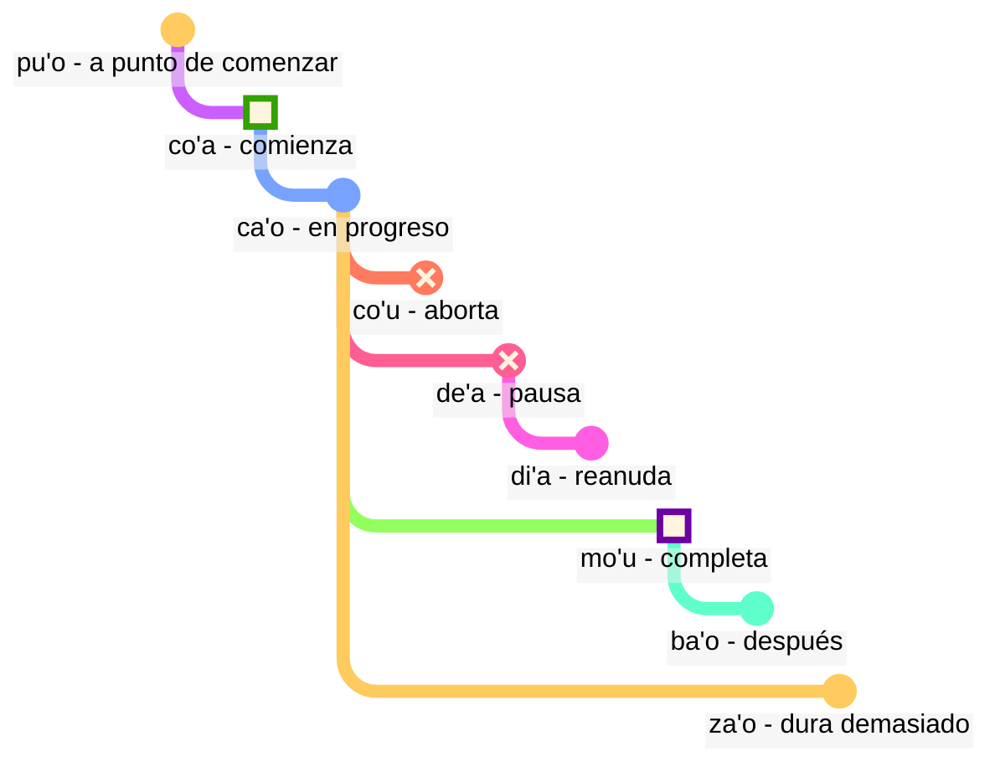

## Lección 6: términos modales: tiempo y espacio

> **mi citka le cirla**

Posibles traducciones:

> _Como queso._
> _Comí queso._
> _Siempre como queso._
> _En un momento, habré terminado de comer queso._

Los tiempos verbales en lojban son opcionales; no tenemos que pensar todo el tiempo en qué tiempo usar.

El contexto a menudo resuelve lo que es correcto. Agregamos tiempos cuando sentimos que los necesitamos.

El lojban trata el tiempo y el espacio de la misma manera. Decir que _trabajé hace mucho tiempo_ no es gramaticalmente diferente de decir _trabajo lejos hacia el norte_. El inglés trata palabras como _earlier_ (antes), terminación de tiempo pasado _-ed_, y palabras de espacio como _in_ (en) o _near_ (cerca) en tres esquemas diferentes, mientras que en lojban siguen el mismo principio.

### Puntos en el tiempo y el lugar

Una partícula modal de tiempo sin un argumento después describe el evento como relativo a _aquí_ y _ahora_:

> **mi pinxe ba**
> **mi ba pinxe**
> _Beberé._

<!-- -->

> **mi pinxe bu'u**
> **mi bu'u pinxe**
> _Bebo en este lugar._

Un término modal de tiempo con un argumento después describe el evento como relativo al evento en ese argumento:

> **mi pinxe ba le nu mi cadzu**
> _Bebo después de caminar._

#### Tarea

Cierra la parte derecha de la tabla. Traduce desde el lojban:

<table>
<tbody><tr>
<td><b>mi bu'u pinxe</b></td>
<td><i>Bebo aquí.</i></td></tr>
<tr>
<td><b>mi ba citka le plise</b></td>
<td><i>Comeré la manzana.</i></td></tr>
<tr>
<td><b>mi pinxe ba le nu mi cadzu</b></td>
<td><i>Bebo después de caminar.</i></td></tr>
</tbody></table>

Traduce al lojban:

<table>
<tbody><tr>
<td><i>Caminaré.</i></td>
<td><b>mi ba cadzu</b></td></tr>
<tr>
<td><i>Bebo antes de dormir.</i></td>
<td><b>mi pinxe pu le nu mi sipna</b></td></tr>
</tbody></table>

### Eventos relativos a otros eventos en el tiempo

En inglés, usamos la llamada "secuencia de tiempos":

> **la .alis. pu cusku le se du'u ri pu penmi la .doris.**
> _Alice dijo que había visto a Doris antes._

Aquí, el evento _había visto a Doris_ ocurre antes del evento _Alice dijo_. Sin embargo, en

> **la .alis. pu cusku le se du'u ri ca kansa la .doris.**
> _Alice dijo que estaba con Doris._

los dos eventos (_dijo_ y _estaba con Doris_) ocurren al mismo tiempo.

Así, en inglés:

- el tiempo del verbo de la relación principal se entiende en relación con quien pronuncia esta relación.
- el tiempo del verbo de la relación dentro de la relación principal también se entiende en relación con quien pronuncia esta relación.

En lojban:

- solo el tiempo del verbo de la relación principal es relativo a quien pronuncia la relación.
- los otros tiempos son relativos entre sí. Por eso, en **la .alis. pu cusku le se du'u ri pu penmi la .doris.** el segundo **pu** es relativo al primer **pu**. En **la .alis. pu cusku le se du'u ri ca kansa la .doris.**, usamos **ca** (_al mismo tiempo_) que es relativo a la relación exterior (**pu cusku** — _dijo_).

Sin embargo, podemos usar el término modal **nau** (_en el tiempo o lugar del hablante_), que dará el mismo efecto que cómo funciona el inglés:

Aquí hay un ejemplo al estilo inglés:

> **la .alis. pu cusku le se du'u ri nau pu kansa la .doris.**
> _Alice dijo que estaba con Doris._

<!-- Para decir frases como `en tres días` o `hace dos años` básicamente ponemos intervalos de tiempo en secuencia sin superposición. De ahí un nuevo verbo:

> **le cabna cu dzoli le nu mi penmi do kei li ci le ka prulamdei**
> _Te encontraré en tres días (medido desde ahora)._

> **dzoli le nu mi penmi do kei li ci le ka prulamdei**
> **dzoli le nu mi penmi do kei li ci le ka prulamdei**
> **prulamdeidzo le nu mi penmi do kei li ci**
> **mi penmi do fi'o prulamdeidzo be fi li ci**
> _Te encontraré en tres días._

> **le cabna cu dzoli le nu mi zvati le stuzi kei li re le ka bavlamdeidzo**
> **le nu mi zvati le stuzi kei le cabna cu dzoli li re le ka prulamdeidzo**
> _Visité ese lugar hace dos años._ -->

#### Tarea

Cierra la parte derecha de la tabla. Traduce desde el lojban:

<table>
<tbody><tr>
<td><b>la .alis. pu cusku le se du'u ri ba penmi la .doris.</b></td>
<td><i>Alice dijo que se encontraría con Doris.</i></td></tr>
<tr>
<td><b>mi pu djuno le du'u do ca gunka</b></td>
<td><i>Yo sabía que estabas trabajando.</i></td></tr>
<tr>
<td><b>mi pu na djuno le du'u do ba zvati ti</b></td>
<td><i>No sabía que estarías aquí.</i></td></tr></tbody></table>

Cierra la parte derecha de la tabla. Traduce al lojban:

<table>
<tbody><tr>
<td><i>Ella me dijo que había estado en casa.</i></td>
<td><b>ri pu cusku le se du'u ri pu zvati le zdani</b></td></tr>
<tr>
<td><i>Sé que eres inteligente.</i></td>
<td><b>mi djuno le du'u do ca stati</b></td></tr></tbody></table>

### Distancia en tiempo y espacio

fau
: término modal: al mismo tiempo, lugar o situación que …

ca
: término modal: en … (algún tiempo), al mismo tiempo que …; "tiempo presente"

bu'u
: término modal: en … (algún lugar); aquí (en este lugar)

zi
: _apenas_ (hace poco tiempo) o _pronto_ (en poco tiempo)

vi
: cerca de …

za
: _hace un rato_ o _en un rato, en un tiempo no especificado_

va
: no lejos de …

zu
: _hace mucho tiempo_ o _dentro de mucho tiempo_

vu
: lejos de …; a lo lejos

Así es como podemos usar combinaciones de tiempos para especificar qué tan lejos vamos hacia el pasado o el futuro:

- **pu zu** significa _hace mucho tiempo_
- **pu za** significa _hace un rato_
- **pu zi** significa _apenas_
- **ba zi** significa _pronto_
- **ba za** significa _en un rato_
- **ba zu** significa _dentro de mucho tiempo_

Nota el orden de vocales **i**, **a** y **u**. Este orden aparece repetidamente en lojban y podría valer la pena memorizarlo. _Corto_ y _largo_ siempre dependen del contexto, son relativos y subjetivos. Por ejemplo, doscientos años es un tiempo corto para que una especie evolucione pero un tiempo largo para esperar el autobús.

**zi**, **za** y **zu** modifican la partícula de tiempo como **pu** y **ba** que se dice antes:

- **pu zu** es _hace mucho tiempo_. **pu** muestra que comenzamos en el pasado, y **zu** indica que es mucho tiempo hacia atrás.
- **zu pu** es _lejos en el tiempo; hay un punto después de algún evento_. **zu** muestra que comenzamos en algún punto lejos en el tiempo desde ahora, y **pu** indica que nos movemos hacia atrás desde ese punto.

Así, **pu zu** siempre está en el pasado, mientras que **zu pu** podría estar en el futuro.

La distancia espacial se marca de manera similar con **vi**, **va** y **vu** para distancia corta, no especificada (media) y larga en el espacio.

Para especificar distancia en tiempo o espacio, usamos el término modal **la'u** con un argumento que especifica la distancia:

> **ba ku la'u le djedi be li ci mi zvati ti**
> _En tres días, estaré aquí._

El equivalente espacial de **ca** es **bu'u**, y **fau** es más vago que los dos, ya que puede significar tiempo, espacio o situación.

> **ba za vu ku mi gunka**
> _En algún momento en el futuro, trabajaré en un lugar lejano._

gunka
: trabajar

> **mi bu'u pu zu gunka**
> _Solía trabajar aquí hace mucho tiempo._
> `Yo aquí-pasado-larga-distancia-tiempo trabajo`

> **pu zu vu ku zasti fa le ninmu .e le nanmu**
> _Hace mucho tiempo y lejos, vivían una mujer y un hombre._

La última oración es como a menudo comienzan los cuentos de hadas.

#### Tarea

Cierra la parte derecha de la tabla. Traduce desde el lojban:

<table>
<tbody><tr>
<td><b>mi pu zu gunka</b></td>
<td><i>Trabajé hace mucho tiempo.</i></td></tr>
<tr>
<td><b>do ba zi cliva</b></td>
<td><i>Te irás pronto.</i></td></tr>
<tr>
<td><b>mi vu zvati</b></td>
<td><i>Estoy lejos.</i></td></tr>
</tbody></table>

Traduce al lojban:

<table>
<tbody><tr>
<td><i>Trabajaré en un rato.</i></td>
<td><b>mi ba za gunka</b></td></tr>
<tr>
<td><i>Estás cerca.</i></td>
<td><b>do vi zvati</b></td></tr>
</tbody></table>

### Duración en tiempo y espacio

ze'i
: término modal: durante poco tiempo

ve'i
: término modal: sobre un espacio pequeño

ze'a
: término modal: durante algún tiempo

ve'a
: término modal: sobre algún espacio

ze'u
: término modal: durante mucho tiempo

ve'u
: término modal: sobre el espacio largo

De nuevo, es fácil de recordar dado el patrón **i**, **a**, **u**.

> **mi ze'u bajra**
> _Corro durante mucho tiempo._

<!-- -->

> **do ze'u klama le mi'a gugde ze'u**
> _Pasas mucho tiempo viniendo a nuestro país._
> mi'a
> : nosotros sin ti

gugde
: … es un país

> **mi ba zi ze'a xabju la .djakartas.**
> _Muy pronto, voy a vivir en Yakarta durante un tiempo._

<!-- -->

> **le jenmi pe la .romas. ba ze'u gunta la .kart.xadact.**
> _El ejército de los romanos atacará Cartago durante mucho tiempo._

Esto no significa que los romanos no estén atacando Cartago en estos días. En lojban, si decimos que algo es cierto en un momento particular, no significa que no sea cierto en ningún otro momento. Puedes decir **pu ba ze'u** para que sepamos que esta actividad estaba en el futuro cuando se ve desde algún punto en el pasado pero en el pasado cuando se ve desde hoy.

> **le xamsi**
> _mar/océano_

<!-- -->

> **le ve'u xamsi**
> _océano_

<pixra url="/assets/pixra/cilre-xekri-g-out/le_vehi_ja_vehu_cmana.webp" caption="le ve'i cmana cu jibni le ve'u cmana" definition="La colina está cerca de la montaña."></pixra>

> **le cmana**
> _montaña/colina_

<!-- -->

> **le ve'u cmana**
> _montaña_

<!-- -->

> **le ve'i cmana**
> _colina_

<!-- -->

> **ti ve'u gerku**
> _Ese es un perro grande. Este es un perro que cubre un espacio grande._

#### Tarea

Cierra la parte derecha de la tabla. Traduce desde el lojban:

<table>
<tbody><tr>
<td><b>mi ze'u pinxe le tcati</b></td>
<td><i>Bebo té durante mucho tiempo.</i></td></tr>
<tr>
<td><b>mi ve'i zvati le kumfa</b></td>
<td><i>Estoy en una habitación pequeña.</i></td></tr>
</tbody></table>

Traduce al lojban:

<table>
<tbody><tr>
<td><i>Me quedaré aquí durante un tiempo.</i></td>
<td><b>mi ze'a zvati ti</b></td></tr>
<tr>
<td><i>El perro cubre un espacio grande.</i></td>
<td><b>le gerku cu ve'u zvati</b></td></tr>
</tbody></table>

### «**pu'o**» — '_estar a punto de_', «**ba'o**» — '_ya no_', «**za'o**» — '_todavía_', «**xa'o**» — '_ya_'

Aquí hay varios conjuntos de términos modales que pueden ayudarnos a agregar significados más finos cuando sea necesario.

Con los _contornos de evento_, a diferencia de **pu**, **ca** y **ba**, vemos cada evento como teniendo una forma con ciertas etapas:

pu'o
: término modal: estar a punto de hacer algo (el evento aún no ha ocurrido)

ba'o
: término modal: ya no estar haciendo algo, haber hecho algo (el evento ha terminado)

Ejemplos:

> **mi ba tavla le mikce**
> _Hablaré con el doctor (y podría estar hablando ahora también)._

mikce
: x₁ es un doctor

<!-- -->

> **mi pu pu'o tavla le mikce**
> _Estaba a punto de hablar con el doctor (no estaba hablando en ese momento, el evento no había comenzado para ese momento)._

<pixra url="/assets/pixra/cilre-xekri-g-out/puho_nenri.webp" caption="le prenu pu'o zvati le nenri" definition="La persona está a punto de estar adentro."></pixra>

<!-- -->

> **le sanmi ca pu'o bredi**
> _La comida aún no está lista._

<!-- -->

> **mi pu ba'o tavla le mikce**
> _Había hablado con el doctor._

<pixra url="/assets/pixra/cilre-xekri-g-out/baho_carvi.webp" caption="ba'o carvi" definition="Después de la lluvia. La lluvia se ha detenido."></pixra>

<!-- -->

> **mi ba ba'o tavla le mikce**
> _Habré hablado con el doctor._

<!-- -->

> **.a'o mi ba zi ba'o gunka**
> _Espero que pronto haya terminado el trabajo._

za'o
: término modal: todavía. El evento está en proceso más allá de su final natural

xa'o
: término modal no oficial: ya, demasiado pronto. El evento ya comenzó y es demasiado pronto

Ejemplos:

> **ri'a ma do za'o zvati vi**
> _¿Por qué todavía estás aquí?_

<!-- -->

> **la .kevin. xa'o zvati vi**
> _Kevin ya está aquí._

#### Tarea

Cierra la parte derecha de la tabla. Traduce desde el lojban:

<table>
<tbody><tr>
<td><b>mi pu pu'o ciska</b></td>
<td><i>Estaba a punto de escribir.</i></td></tr>
<tr>
<td><b>le sanmi ba'o jukpa</b></td>
<td><i>La comida ya no se está cocinando.</i></td></tr>
<tr>
<td><b>mi za'o kelci</b></td>
<td><i>Todavía estoy jugando (más tiempo del esperado).</i></td></tr>
</tbody></table>

Traduce al lojban:

<table>
<tbody><tr>
<td><i>Ya me fui.</i></td>
<td><b>mi xa'o cliva</b></td></tr>
<tr>
<td><i>La comida estará lista.</i></td>
<td><b>le cidja ba bredi</b></td></tr>
</tbody></table>

### Etapas de evento

> **mi co'a tavla**
> _Empecé a hablar._

<!-- -->

> **ra ca'o ciska**
> _Ella sigue escribiendo._

<!-- -->

> **ra pu co'u vasxu**
> _Él dejó de respirar (cambio repentino e impredecible)._

vasxu
: x₁ respira x₂

> **mi pu mo'u citka le plise**
> _Me he comido la manzana._

<!-- -->

> **la .maks. pu mo'u zbasu ti voi dinju**
> _Max ha construido esta casa._

<!-- -->

> **ra pu de'a vasxu**
> _Ella dejó de respirar (pero puede respirar de nuevo más tarde)._

<pixra url="/assets/pixra/cilre-xekri-g-out/deha_vasxu.webp" caption="mi de'a vasxu" definition="Hago una pausa en la respiración. Aguanto la respiración."></pixra>

<!-- -->

> **mi pu di'a citka le plise**
> _Reanudé comer manzanas._

<pixra url="/assets/pixra/cilre-xekri-g-out/diha_vasxu.webp" caption="mi di'a vasxu" definition="Reanudo la respiración."></pixra>

co'a
: término modal: el evento comienza (el borde del evento)

ca'o
: término modal: estar haciendo algo (el evento está en progreso)

co'u
: término modal: el evento se detiene

mo'u
: término modal: el evento termina (el borde del evento)

de'a
: el evento hace una pausa (se puede esperar que el evento continúe)

di'a
: el evento se reanuda

> **mi de'a ze'i jundi**
> _Ya vuelvo (volveré pronto)._

<!-- -->

> **mi di'a jundi**
> _Ya volví (estoy prestando atención)._

jundi
: x₁ presta atención a x₂

Estas dos expresiones son comunes en chats de texto para indicar que estás ausente o no prestando atención, y luego volviendo en línea:

Uno podría, por supuesto, simplemente decir **de'a** o **di'a** y esperar que se entienda el punto.

#### Tarea

Cierra la parte derecha de la tabla. Traduce desde el lojban:

<table>
<tbody><tr>
<td><b>mi co'a tavla</b></td>
<td><i>Empecé a hablar.</i></td></tr>
<tr>
<td><b>mi ca'o pinxe le tcati</b></td>
<td><i>Estoy bebiendo el té.</i></td></tr>
<tr>
<td><b>mi co'u tavla</b></td>
<td><i>Dejé de hablar.</i></td></tr>
<tr>
<td><b>mi de'a vasxu</b></td>
<td><i>Hago una pausa en la respiración.</i></td></tr>
</tbody></table>

Traduce al lojban:

<table>
<tbody><tr>
<td><i>Reanudo el trabajo.</i></td>
<td><b>mi di'a gunka</b></td></tr>
<tr>
<td><i>Terminé de comer.</i></td>
<td><b>mi mo'u citka</b></td></tr>
</tbody></table>

### Eventos continuos y progresivos

ru'i
: término modal: el evento es continuo

> **.i mi pu ru'i citka le plise**
> _Estuve comiendo manzanas continuamente._

Nota la diferencia:

- **ru'i** indica que el evento es continuo y nunca hace pausa.
- **ca'o** implica que el evento progresa. Puede a veces hacer pausa y luego reanudar su progreso.

#### Tarea

Cierra la parte derecha de la tabla. Traduce desde el lojban:

<table>
<tbody><tr>
<td><b>mi pu ru'i citka le plise</b></td>
<td><i>Estuve comiendo manzanas continuamente.</i></td></tr>
<tr>
<td><b>le mlatu cu ru'i sipna</b></td>
<td><i>El gato duerme continuamente.</i></td></tr>
<tr>
<td><b>xu do ca'o kelci</b></td>
<td><i>¿Estás jugando (todavía en progreso)?</i></td></tr></tbody></table>

kelci
: jugar

Cierra la parte derecha de la tabla. Traduce al lojban:

<table>
<tbody><tr>
<td><i>Trabajo aquí continuamente.</i></td>
<td><b>mi ru'i gunka bu'u</b></td></tr>
<tr>
<td><i>Todavía están bailando.</i></td>
<td><b>ri ca'o dansu</b></td></tr></tbody></table>

### Contornos de lugar

Los contornos de evento se pueden usar para referirse al espacio si los prefijamos con **fe'e**:

> **le rokci cu fe'e ro roi zvati**
> _Las piedras están en todas partes._

### '_a la izquierda_', '_a la derecha_'

<pixra url="/assets/pixra/cilre-xekri-g-out/pritu_le_tricu.webp" caption="le prenu cu pritu le tricu le zgana" definition="La persona está a la derecha del árbol desde el punto de vista del observador."></pixra>

> **le prenu cu sanli le dertu bu'u le pritu be mi**
> _La persona está parada en el suelo a mi derecha._

<!-- -->

> **le gerku cu vreta le ckana bu'u le zunle be le verba**
> _El perro está acostado en la cama a la izquierda de un niño._

<!-- -->

> **ko jgari le panbi poi zunle**
> _Toma el bolígrafo de la izquierda._

<!-- -->

> **le mlatu cu plipe bu'u le crane be do**
> _Un gato salta frente a ti._

<!-- -->

> **ko catlu le dinju poi crane**
> _Mira la casa del frente._

<!-- -->

> **le verba cu zutse le stizu bu'u le trixe be mi**
> _El niño está sentado en la silla detrás de mí._

<!-- -->

> **le prenu cu sanli ki mi bu'u le pritu be le tricu bei mi**
> _La persona está parada a la derecha de un árbol desde mi punto de vista._

<!-- -->

> **le dinju cu zunle le rokci ti**
> _La casa está a la izquierda de la roca si se ve desde aquí._

zunle
: x₁ está a la izquierda de x₂ visto desde x₃

pritu
: x₁ está a la derecha de x₂ visto desde x₃

crane
: x₁ está enfrente de x₂ (x₁ está entre x₂ y quien mira) visto desde x₃

trixe
: x₁ está detrás de x₂ visto desde x₃

sanli
: x₁ está parado/parada sobre x₂

zutse
: x₁ está sentado/sentada sobre x₂

vreta
: x₁ está acostado/acostada sobre x₂

le dertu
: el suelo, la tierra

le ckana
: la cama

le stizu
: la silla

le pelji
: el papel

le penbi
: el bolígrafo

#### Tarea

Cierra la parte derecha de la tabla. Traduce desde el lojban:

<table>
<tbody><tr>
<td><b>le mlatu cu zunle le gerku</b></td>
<td><i>El gato está a la izquierda del perro.</i></td></tr>
<tr>
<td><b>ko cadzu le crane be mi</b></td>
<td><i>Camina frente a mí.</i></td></tr>
<tr>
<td><b>le prenu cu sanli le trixe be le dinju</b></td>
<td><i>La persona está parada detrás de la casa.</i></td></tr>
</tbody></table>

Traduce al lojban:

<table>
<tbody><tr>
<td><i>El perro está a mi derecha.</i></td>
<td><b>le gerku cu pritu mi</b></td></tr>
<tr>
<td><i>Siéntate frente a la casa.</i></td>
<td><b>ko zutse le crane be le dinju</b></td></tr>
</tbody></table>

### Práctica: posición

<table>
<tbody><tr>
<td style="text-align:right;"><b>ma nabmi</b>
</td>
<td><i>¿Cuál es el problema?</i>
</td></tr>
<tr>
<td style="text-align:right;"><b>ma'a nitcu tu'a le fonxa pe la .alis.</b>
</td>
<td><i>Necesitamos el teléfono de Alice.</i>
</td></tr>
<tr>
<td style="text-align:right;"><b>.i la .alis. ca zvati ma</b>
</td>
<td><i>¿Dónde está Alice?</i>
</td></tr>
<tr>
<td style="text-align:right;"><b>la .alis. ca na ku zvati le bu'u tcadu .i mi pu mrilu le srana be le fonxa fi la .alis. .i ri ca ca'o vofli la .paris. .i ku'i mi pu zi te benji le se mrilu be la .alis. .i ri curmi le nu mi'a pilno le fonxa .i .e'o do bevri ri mi</b>
</td>
<td> Alice no está ahora en la ciudad. Le envié un correo sobre el teléfono. Alice está ahora volando a París. Pero acabo de recibir un correo de ella. Ella nos permite usar el teléfono. Por favor, tráemelo.
</td></tr>
<tr>
<td style="text-align:right;"><b>.i bu'u ma mi ka'e cpacu le fonxa</b>
</td>
<td>¿Dónde puedo conseguir el teléfono?
</td></tr>
<tr>
<td style="text-align:right;"><b>le purdi .i .e'o do klama le bartu</b>
</td>
<td>En el jardín. Por favor, sal afuera.
</td></tr>
<tr>
<td style="text-align:right;"><b>mi ca zvati ne'a le vorme .i ei mi ca klama ma</b>
</td>
<td>Estoy cerca de la puerta. ¿Adónde debo ir ahora?
</td></tr>
<tr>
<td style="text-align:right;"><b>ko klama le zunle be le tricu .i ba ku do viska le pa jubme</b>
</td>
<td>Ve a la izquierda del árbol. Entonces verás una mesa.
</td></tr>
<tr>
<td style="text-align:right;"><b>mi zgana no jubme</b>
</td>
<td>No veo ninguna mesa.
</td></tr>
<tr>
<td style="text-align:right;"><b>ko carna gi'e muvdu le pritu .i le jubme cu crane le cmalu dinju .i le fonxa cu cpana le jubme .i ji'a ko jgari le penbi .e le pelji .i le za'u dacti cu cpana si'a le jubme .i ba ku ko bevri le ci dacti le zdani gi'e punji fi le sledi'u pe mi</b>
</td>
<td>Gira y muévete a la derecha. La mesa está frente a un edificio pequeño. El teléfono está sobre la mesa. También, toma un lápiz y un papel. Están igualmente sobre la mesa. Luego trae las tres cosas a casa y ponlas en mi habitación.
</td></tr>
<tr>
<td style="text-align:right;"><b>vi'o</b>
</td>
<td>Lo haré.
</td></tr></tbody></table>

### Práctica: vehículos

<table>

<tbody><tr>
<td style="text-align:right;"><b>mi jo'u le pendo be mi pu ca'o litru le barda rirxe bu'u le bloti</b>
</td>
<td><i>Mis amigos y yo estábamos viajando por un gran río en un bote.</i>
</td></tr>
<tr>
<td style="text-align:right;"><b>.i ba bo mi'a klama le vinji tcana</b>
</td>
<td><i>Luego fuimos a un aeropuerto.</i>
</td></tr>
<tr>
<td style="text-align:right;"><b>.i xu do se marce le karce</b>
</td>
<td><i>¿Tomaste un coche?</i>
</td></tr>
<tr>
<td style="text-align:right;"><b>.i na ku se marce .i mi'a pu klama fu le trene .i ze'a le cacra mi'a zvati bu'u le carce</b>
</td>
<td><i>No. Fuimos en tren. Durante una hora estuvimos en un vagón.</i>
</td></tr></tbody></table>

marce
: x₁ es un vehículo que transporta a x₂

se marce
: x₁ es un pasajero de x₂

<!-- jai zu'e se marce
: x₁ toma un vehículo x₂ como pasajero -->

karce
: x₁ es un coche que transporta a x₂

bloti
: x₁ es un bote que transporta a x₂

vinji
: x₁ es una aeronave que transporta a x₂

trene
: x₁ es un tren de vagones x₂

### Enriqueciendo el vocabulario. Nuevas palabras usando tiempos

Muchas palabras del español corresponden a combinaciones de palabras en lojban:

pixra
: x₁ es una imagen de x₃

le vi'a pixra
: la imagen en 2D

le vi'u pixra
: la imagen en 3D, una escultura

<pixra url="/assets/pixra/cilre-xekri-g-out/viha_pixra.webp" caption="vi'a pixra" definition="Imagen en 2D, dibujo en 2D."></pixra>

<pixra url="/assets/pixra/cilre-xekri-g-out/vihu_pixra.webp" caption="vi'u pixra" definition="Imagen en 3D, escultura."></pixra>

le ve'i cmana
: la colina (literalmente "montaña/colina que cubre poco espacio")

le ve'u xamsi
: el océano (literalmente "mar/océano que cubre mucho espacio")

le ba'o tricu
: tocón de un árbol (literalmente "el ya no árbol")
