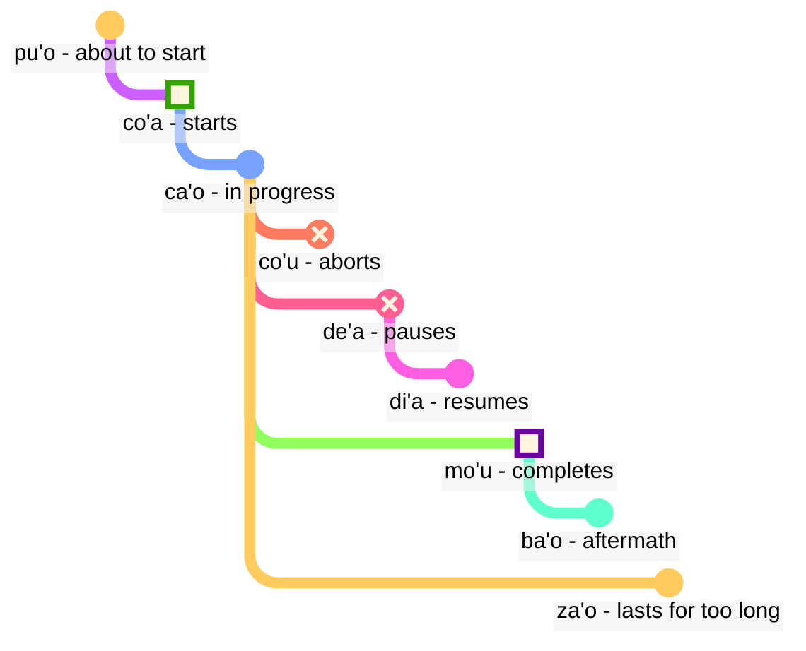

## Lección 6: términos modales: tiempo y espacio

> **mi citka le cirla**

Posibles traducciones:

> _Como queso._
> _Comí queso._
> _Siempre como queso._
> _En un momento, acabo de terminar de comer queso._

Los tiempos en Lojban son opcionales; no tenemos que pensar todo el tiempo en qué tiempo usar.

El contexto a menudo resuelve lo que es correcto. Agregamos tiempos cuando sentimos que los necesitamos.

Los tiempos en Lojban tratan el tiempo y el espacio de la misma manera. Decir que _trabajé hace mucho tiempo_ no es gramaticalmente diferente de decir _trabajo lejos al norte_. El inglés trata palabras como _anteriormente_, el final en pasado _-ed_, y palabras de espacio como _en_ o _cerca_ en tres esquemas diferentes, mientras que en Lojban siguen el mismo principio.

### Puntos en el tiempo y el espacio

Una partícula modal de tiempo sin un argumento que la siga describe el evento como relativo a _aquí_ y _ahora_:

> **mi pinxe ba**
> **mi ba pinxe**
> _Voy a beber._

<!-- -->

> **mi pinxe bu'u**
> **mi bu'u pinxe**
> _Bebo en este lugar._

Un término modal de tiempo con un argumento que lo sigue describe el evento como relativo al evento en ese argumento:

> **mi pinxe ba le nu mi cadzu**
> _Bebo después de caminar._

### Eventos relativos a otros eventos en el tiempo

En inglés, usamos la llamada "secuencia de tiempos":

> **la .alis. pu cusku le se du'u ri pu penmi la .doris. la'u le djedi be li ci**
> _Alice dijo que había visto a Doris tres días antes._

Aquí, el evento _había visto a Doris_ ocurre antes del evento _Alice dijo_. Sin embargo, en

> **la .alis. pu cusku le se du'u ri ca kansa la .doris.**
> _Alice dijo que estaba con Doris._

los dos eventos (_dijo_ y _estaba con Doris_) ocurren al mismo tiempo.

Así, en español:

- el tiempo de la relación principal se entiende en relación a quien pronuncia esta relación.
- el tiempo de la relación dentro de la relación principal también se entiende en relación a quien pronuncia esta relación.

En Lojban:

- solo el tiempo de la relación principal es relativo a quien pronuncia la relación.
- los otros tiempos son relativos entre sí. Por eso, en **la .alis. pu cusku le se du'u ri pu penmi la .doris. la'u le djedi be li ci**, el segundo **pu** es relativo al primer **pu**. En **la .alis. pu cusku le se du'u ri ca kansa la .doris.**, usamos **ca** (_al mismo tiempo_) que es relativo a la relación externa (**pu cusku** — _dijo_).

Sin embargo, podemos usar el término modal **nau** (_en el momento o lugar del hablante_), que dará el mismo efecto que en inglés:

Aquí hay un ejemplo en estilo inglés:

> **la .alis. pu cusku le se du'u ri nau pu kansa la .doris.**
> _Alis dijo que ella estaba con Doris._

<!-- Para decir frases como `en tres días` o `hace dos años`, básicamente colocamos intervalos de tiempo en secuencia sin superposición. Por lo tanto, tenemos un nuevo verbo:

> **le cabna cu dzoli le nu mi penmi do kei li ci le ka prulamdei**
> _Me encontraré contigo en tres días (medidos desde ahora)._

> **dzoli le nu mi penmi do kei li ci le ka prulamdei**
> **dzoli le nu mi penmi do kei li ci le ka prulamdei**
> **prulamdeidzo le nu mi penmi do kei li ci**
> **mi penmi do fi'o prulamdeidzo be fi li ci**
> _Me encontraré contigo en tres días._

> **le cabna cu dzoli le nu mi zvati le stuzi kei li re le ka bavlamdeidzo**
> **le nu mi zvati le stuzi kei le cabna cu dzoli li re le ka prulamdeidzo**
> _Visité ese lugar hace dos años._ -->

### Distancia en tiempo y espacio

fau
: término modal: al mismo tiempo, lugar o situación que ...

ca
: término modal: en ... (algún momento), al mismo tiempo que ...; "tiempo presente"

bu'u
: término modal: en ... (algún lugar); aquí (en este lugar)

zi
: _recién_ (hace poco tiempo) o _pronto_ (en poco tiempo)

vi
: cerca de ...

za
: _hace un rato_ o _dentro de un rato, en un tiempo no especificado_

va
: no lejos de ...

zu
: _hace mucho tiempo_ o _en mucho tiempo_

vu
: lejos de...; lejos

Así es como podemos usar combinaciones de tiempos verbales para especificar cuánto nos adentramos en el pasado o en el futuro:

- **pu zu** significa _hace mucho tiempo_
- **pu za** significa _hace un rato_
- **pu zi** significa _justo ahora_
- **ba zi** significa _pronto_
- **ba za** significa _dentro de un rato_
- **ba zu** significa _dentro de mucho tiempo_

Observa el orden de las vocales **i**, **a** y **u**. Este orden aparece repetidamente en Lojban y puede valer la pena memorizarlo. _Corto_ y _largo_ siempre dependen del contexto, son relativos y subjetivos. Por ejemplo, doscientos años es un tiempo corto para que una especie evolucione, pero es mucho tiempo para esperar el autobús.

**zi**, **za** y **zu** modifican la partícula de tiempo como **pu** y **ba** que se dice antes de ella:

- **pu zu** es _hace mucho tiempo_. **pu** indica que comenzamos en el pasado, y **zu** indica que es un tiempo largo hacia atrás.
- **zu pu** es _lejos en el tiempo; hay un punto después de algún evento_. **zu** indica que comenzamos en algún punto lejano en el tiempo desde ahora, y **pu** indica que nos movemos hacia atrás desde ese punto.

Así, **pu zu** siempre está en el pasado, mientras que **zu pu** podría estar en el futuro.

La distancia espacial se marca de manera similar con **vi**, **va** y **vu** para distancias cortas, no especificadas (medias) y largas en el espacio.

Para especificar la distancia en el tiempo o en el espacio, usamos el término modal **la'u** con un argumento que especifica la distancia:

> **ba ku la'u le djedi be li ci mi zvati ti**
> _En tres días, estaré aquí._

El equivalente espacial de **ca** es **bu'u**, y **fau** es más vago que los dos, ya que puede significar tiempo, espacio o situación.

> **ba za vu ku mi gunka**
> _En algún momento en el futuro, trabajaré en un lugar lejano._

gunka
: trabajar

> **mi bu'u pu zu gunka**
> _Solía trabajar aquí hace mucho tiempo._
> `Yo aquí-pasado-tiempo-largo trabajar`

> **pu zu vu ku zasti fa le ninmu .e le nanmu**
> _Hace mucho tiempo y lejos, vivían una mujer y un hombre._

La última oración es cómo suelen comenzar los cuentos de hadas.

### Duración en el tiempo y el espacio

ze'i
: término modal: por un corto tiempo

ve'i
: término modal: sobre un espacio pequeño

ze'a
: término modal: durante algún tiempo

ve'a
: término modal: sobre algún espacio

ze'u
: término modal: durante mucho tiempo

ve'u
: término modal: sobre un espacio largo

Nuevamente, es fácil de recordar dado el patrón **i**, **a**, **u**.

> **mi ze'u bajra**
> _Yo corro durante mucho tiempo._
<!-- -->
> **do ze'u klama le mi'a gugde ze'u**
> _Tú pasas mucho tiempo viniendo a nuestro país._
mi'a
: nosotros sin ti

gugde
: ... es un país

> **mi ba zi ze'a xabju la .djakartas.**
> _Pronto, voy a vivir en Yakarta por un tiempo._
<!-- -->

> **le jenmi pe la .romas. ba ze'u gunta la .kart.xadact.**
> _El ejército de los romanos estará atacando Cartago durante mucho tiempo._

Esto no significa que los romanos no estén atacando Cartago en estos días. En Lojban, si decimos que algo es cierto en un momento particular, no significa que no sea cierto en ningún otro momento. Puedes decir **pu ba ze'u** para que sepamos que esta actividad estaba en el futuro cuando se veía desde algún punto en el pasado, pero en el pasado cuando se ve desde hoy.

> **le xamsi**
> _mar/océano_
<!-- -->

> **le ve'u xamsi**
> _océano_

<pixra url="/assets/pixra/cilre/le_vehi_ja_vehu_cmana.webp" caption="le ve'i cmana cu jibni le ve'u cmana" definition="La colina está cerca de la montaña."></pixra>

> **le cmana**
> _montaña/colina_
<!-- -->

> **le ve'u cmana**
> _montaña_
<!-- -->

> **le ve'i cmana**
> _colina_
<!-- -->

> **ti ve'u gerku**
> _Ese es un perro grande. Este es un perro que ocupa un espacio grande._

### «**pu'o**» — ‘_estar a punto de_’, «**ba'o**» — ‘_ya no_’, «**za'o**» — ‘_todavía_’, «**xa'o**» — ‘_ya_’

Aquí hay varios conjuntos de términos modales que nos pueden ayudar a agregar significados más precisos cuando sea necesario.

Con _contornos de evento_, a diferencia de **pu**, **ca** y **ba**, vemos cada evento como teniendo una forma con ciertas etapas:

pu'o
: término modal: estar a punto de hacer algo (el evento aún no ha ocurrido)

ba'o
: término modal: ya no estar haciendo algo, haber hecho algo (el evento ha terminado)

Ejemplos:

> **mi ba tavla le mikce**
> _Voy a hablar con el médico (y tal vez esté hablando ahora también)._

mikce
: x1 es un médico

> **mi pu pu'o tavla le mikce**
> _Estaba a punto de hablar con el doctor (no estaba hablando en ese momento, el evento aún no había comenzado)._

<pixra url="/assets/pixra/cilre/puho_nenri.webp" caption="le prenu pu'o zvati le nenri" definition="La persona está a punto de entrar."></pixra>

<!-- -->

> **le sanmi ca pu'o bredi**
> _La comida aún no está lista._

<!-- -->

> **mi pu ba'o tavla le mikce**
> _Había hablado con el doctor._

<pixra url="/assets/pixra/cilre/baho_carvi.webp" caption="ba'o carvi" definition="Después de la lluvia. La lluvia ha parado."></pixra>

<!-- -->

> **mi ba ba'o tavla le mikce**
> _Habré hablado con el doctor._

<!-- -->

> **.a'o mi ba zi ba'o gunka**
> _Espero que pronto haya terminado el trabajo._

za'o
: término modal: todavía. El evento está en proceso más allá de su final natural

xa'o
: término modal no oficial: ya, demasiado temprano. El evento ya ha comenzado y es demasiado temprano

Ejemplos:

> **ri'a ma do za'o zvati vi**
> _¿Por qué todavía estás aquí?_

<!-- -->

> **la .kevin. xa'o zvati vi**
> _Kevin ya está aquí._

### Etapas del evento

> **mi co'a tavla**
> _Comencé a hablar._

<!-- -->

> **ra ca'o ciska**
> _Ella sigue escribiendo._

<!-- -->

> **ra pu co'u vasxu**
> _Dejó de respirar (cambio repentino e impredecible)._

vasxu
: $x_1$ respira $x_2$

> **mi pu mo'u citka le plise**
> _Me he comido la manzana por completo._

<!-- -->

> **la .maks. pu mo'u zbasu ti voi dinju**
> _Max ha construido esta casa._

<!-- -->

> **ra pu de'a vasxu**
> _Dejó de respirar (pero puede volver a respirar más tarde)._

<pixra url="/assets/pixra/cilre/deha_vasxu.webp" caption="mi de'a vasxu" definition="Hago una pausa en la respiración. Aguanto la respiración."></pixra>

<!-- -->

> **mi pu di'a citka le plise**
> _Continué comiendo manzanas._

<pixra url="/assets/pixra/cilre/diha_vasxu.webp" caption="mi di'a vasxu" definition="Vuelvo a respirar."></pixra>

co'a
: término modal: el evento comienza (el límite del evento)

ca'o
: término modal: estar haciendo algo (el evento está en progreso)

co'u
: término modal: el evento se detiene

mo'u
: término modal: el evento termina (el límite del evento)

de'a
: la actividad se pausa (se espera que la actividad continúe)

di'a
: la actividad se reanuda

> **mi de'a ze'i jundi**
> _Vuelvo enseguida (estaré de vuelta)._

<!-- -->

> **mi di'a jundi**
> _He vuelto (estoy atento)._

jundi
: $x_1$ presta atención a $x_2$

Estas dos expresiones son comunes en chats de texto para indicar que estás ausente o no estás prestando atención, y luego volver en línea:

Por supuesto, también se puede decir solo **de'a** o **di'a** y esperar que se entienda el punto.

### Eventos continuos y progresivos

ru'i
: término modal: la actividad es continua

> **.i mi pu ru'i citka le plise**
> _Estaba comiendo manzanas continuamente._

Observa la diferencia:

- **ru'i** indica que la actividad es continua y nunca se pausa.
- **ca'o** implica que la actividad progresa. A veces puede pausar y luego reanudar su progreso.

### Contornos de lugar

Los contornos de eventos se pueden usar para referirse al espacio si los precedemos con **fe'e**:

> **le rokci cu fe'e ro roi zvati**
> _Las piedras están en todas partes._

### ‘_a la izquierda_’, ‘_a la derecha_’

> **le prenu cu sanli le dertu bu'u le pritu be mi**
> _La persona está de pie en el suelo a mi derecha._

<!-- -->

> **le gerku cu vreta le ckana bu'u le zunle be le verba**
> _El perro está acostado en la cama a la izquierda de un niño._

<!-- -->

> **ko jgari le panbi poi zunle**
> _Toma el bolígrafo de la izquierda._

<!-- -->

> **le mlatu cu plipe bu'u le crane be do**
> _Un gato salta delante de ti._

<!-- -->

> **ko catlu le dinju poi crane**
> _Mira la casa de enfrente._

<!-- -->

> **le verba cu zutse le stizu bu'u le trixe be mi**
> _El niño se sienta en la silla detrás de mí._

<!-- -->

> **le prenu cu sanli ki mi bu'u le pritu be le tricu bei mi**
> _La persona está a la derecha de un árbol desde mi punto de vista._

<!-- -->

> **le dinju cu zunle le rokci ti**
> _La casa está a la izquierda de la roca si se ve desde aquí._

zunle
: $x_1$ está a la izquierda de $x_2$ visto desde $x_3$

pritu
: $x_1$ está a la derecha de $x_2$ visto desde $x_3$

crane
: $x_1$ está delante de $x_2$ ($x_1$ está entre $x_2$ y quien observa) visto desde $x_3$

trixe
: $x_1$ está detrás de $x_2$ visto desde $x_3$

sanli
: $x_1$ está de pie sobre $x_2$

zutse
: $x_1$ está sentado en $x_2$

vreta
: $x_1$ está acostado sobre $x_2$

le dertu
: el suelo, la tierra

le ckana
: la cama

le stizu
: la silla

le pelji
: el papel

le penbi
: el bolígrafo

### Práctica: posición

<table>
<tbody><tr>
<td style="text-align:right;"><b>ma nabmi</b>
</td>
<td><i>¿Cuál es el problema?</i>
</td></tr>
<tr>
<td style="text-align:right;"><b>ma'a nitcu tu'a le fonxa pe la .alis.</b>
</td>
<td><i>Necesitamos el teléfono de Alice.</i>
</td></tr>
<tr>
<td style="text-align:right;"><b>.i la .alis. ca zvati ma</b>
</td>
<td><i>¿Dónde está Alice?</i>
</td></tr>
<tr>
<td style="text-align:right;"><b>la .alis. ca na ku zvati le bu'u tcadu .i mi pu mrilu le srana be le fonxa fi la .alis. .i ri ca ca'o vofli la .paris. .i ku'i mi pu zi te benji le se mrilu be la .alis. .i ri curmi le nu mi'a pilno le fonxa .i .e'o do bevri ri mi</b>
</td>
<td>Alice no está en la ciudad en este momento. Le envié un correo sobre el teléfono. Alice está volando a París ahora. Pero acabo de recibir un correo de ella. Ella nos permite usar el teléfono. Por favor, tráemelo.
</td></tr>
<tr>
<td style="text-align:right;"><b>.i bu'u ma mi ka'e cpacu le fonxa</b>
</td>
<td>¿Dónde puedo conseguir el teléfono?
</td></tr>
<tr>
<td style="text-align:right;"><b>le purdi .i .e'o do klama le bartu</b>
</td>
<td>En el jardín. Por favor, sal afuera.
</td></tr>
<tr>
<td style="text-align:right;"><b>mi ca zvati ne'a le vorme .i ei mi ca klama ma</b>
</td>
<td>Estoy cerca de la puerta. Ahora, ¿a dónde debo ir?
</td></tr>
<tr>
<td style="text-align:right;"><b>ko klama le zunle be le tricu .i ba ku do viska le pa jubme</b>
</td>
<td>Ve hacia la izquierda del árbol. Luego verás una mesa.
</td></tr>
<tr>
<td style="text-align:right;"><b>mi zgana no jubme</b>
</td>
<td>No veo ninguna mesa.
</td></tr>
<tr>
<td style="text-align:right;"><b>ko carna gi'e muvdu le pritu .i le jubme cu crane le cmalu dinju .i le fonxa cu cpana le jubme .i ji'a ko jgari le penbi .e le pelji .i le za'u dacti cu cpana si'a le jubme .i ba ku ko bevri le ci dacti le zdani gi'e punji fi le sledi'u pe mi</b>
</td>
<td>Gira y muévete hacia la derecha. La mesa está frente a un edificio pequeño. El teléfono está encima de la mesa. Además, toma un lápiz y un papel. También están encima de la mesa. Luego lleva las tres cosas a casa y ponlas en mi habitación.
</td></tr>
<tr>
<td style="text-align:right;"><b>vi'o</b>
</td>
<td>Entendido.
</td></tr></tbody></table>

### Práctica: vehículos

<table>

<tbody><tr>
<td style="text-align:right;"><b>mi jo'u le pendo be mi pu ca'o litru le barda rirxe bu'u le bloti</b>
</td>
<td><i>Yo y mis amigos estábamos viajando en un río grande en un barco.</i>
</td></tr>
<tr>
<td style="text-align:right;"><b>.i ba bo mi'a klama le vinji tcana</b>
</td>
<td><i>Luego fuimos a un aeropuerto.</i>
</td></tr>
<tr>
<td style="text-align:right;"><b>.i xu do se marce le karce</b>
</td>
<td><i>¿Tomaste un coche?</i>
</td></tr>
<tr>
<td style="text-align:right;"><b>.i na ku se marce .i mi'a pu klama fu le trene .i ze'a le cacra mi'a zvati bu'u le carce</b>
</td>
<td><i>No. Fuimos en tren. Durante una hora estuvimos en un vagón.</i>
</td></tr></tbody></table>

marce
: $x_1$ es un vehículo que lleva a $x_2$

se marce
: $x_1$ es un pasajero de $x_2$

<!-- jai zu'e se marce
: $x_1$ toma un vehículo $x_2$ como pasajero -->

karce
: $x_1$ es un coche que lleva a $x_2$

bloti
: $x_1$ es un barco que lleva a $x_2$

vinji
: $x_1$ es una aeronave que lleva a $x_2$

trene
: $x_1$ es un tren de coches $x_2$

### Enriqueciendo el vocabulario. Nuevas palabras utilizando tiempos verbales

Muchas palabras en inglés corresponden a combinaciones de palabras en lojban:

le ve'i cmana
: la colina (literalmente "montaña/colina que ocupa poco espacio")

le ve'u xamsi
: el océano (literalmente "mar/océano que ocupa mucho espacio")

le ba'o tricu
: el tocón de un árbol (literalmente "el árbol ya no")
