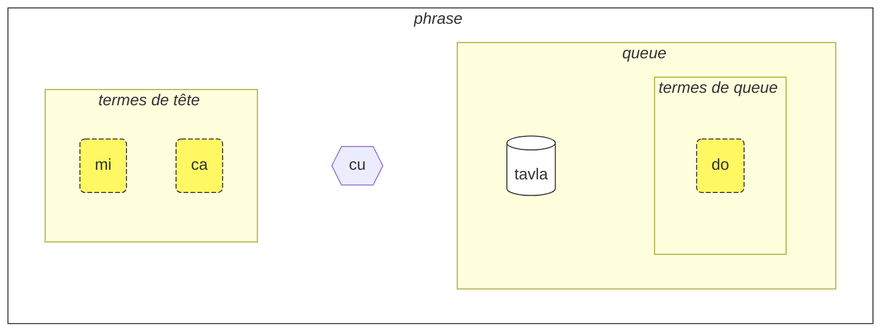
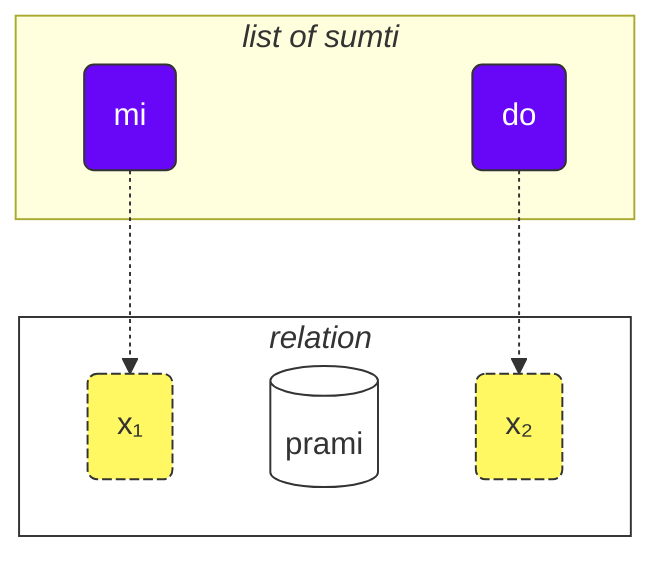
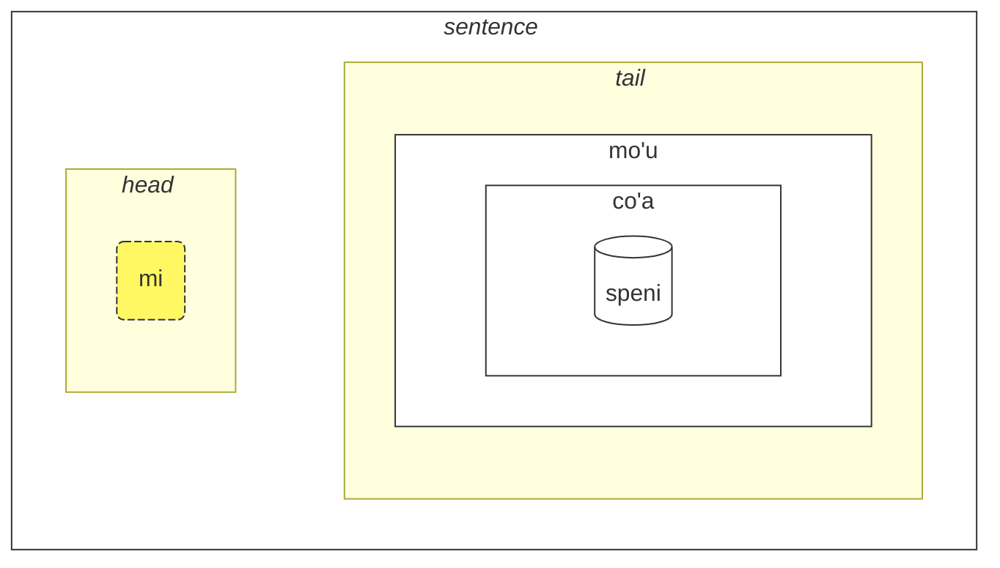
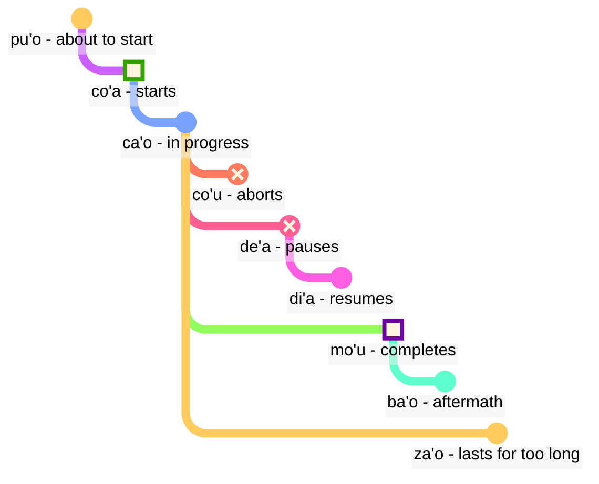

<!-- Author of trans-creation (translation, localisation, adaptation to culture): Sukender (Benoit NEIL) -->
<!-- Source language: English -->
<!-- Target language: FR_fr - Français, France (orthographe moderne, dite "1990") -->
<!-- Special additions or changes (compared to the source) are tagged with "L10N" in this source code: "L10N: <somme additional info>" -->

[📁 Version PDF de cette page](/vreji/uencu/learn-lojban.pdf)

À propos de ce cours :

1. Lisez-le !
2. Notez vos commentaires et suggestions.
3. Envoyez-les sur [💬 le chat](https://lojban.pw/articles/live_chat/)
## Leçon 1. Tour d'horizon de la langue

### Alphabet

Pour commencer, il faut savoir que l'alphabet du lojban s'appuie sur un alphabet latin, comme en français (voyelles en couleur) :

<dl><dd><b>a b c d e f g i j k l m n o p r s t u v x y z ' .</b></dd></dl>

<!-- L10N: Added examples of phonetic languages -->
En revanche, tout se prononce comme cela s'écrit, et tout s'écrit comme cela se prononce ! Le lojban possède une écriture parfaitement phonétique, comme le turc ou le finnois. D'autres langues sont "presque" dans ce cas, comme l'espagnol, l'italien, ou le russe.

Il y a 6 voyelles simples en lojban, qui sont relativement proches des voyelles françaises :

<table>
<tbody><tr>
<td><b class="audio-inline">a</b></td>
<td> comme dans <i>t<u>a</u>ble</i></td>
</tr>
<tr>
<td><b class="audio-inline">e</b></td>
<td> comme dans <i>m<u>e</u>rci</i> ou dans <i>fen<u>ê</u>tre</i> ("è", et non "e" ou "eu" comme dans <i>jeu</i>)</td>
</tr>
<tr>
<td><b class="audio-inline">i</b></td>
<td> comme dans <i>mach<u>i</u>ne</i></td>
</tr>
<tr>
<td><b class="audio-inline">o</b></td>
<td> comme dans <i>p<u>o</u>rte</i> (un "o" ouvert, et non fermé comme dans <i>beau</i> ou <i>bateau</i>).</td>
</tr>
<tr>
<td><b class="audio-inline">u</b></td>
<td> comme dans <i>p<u>ou</u>le</i> ("ou", et non "u" comme dans <i>but</i>)</td>
</tr>
<tr>
<td><b class="audio-inline">y</b></td>
<td> comme dans <i>d<u>e</u></i> ("e ouvert") ou <i>entreprise</i></td>
</tr>
<tr>
</tbody></table>

<!-- L10N: Added detail about "graphèmes" -->
Il n'y a en lojban que des "graphèmes simples". Cela signifie que les lettres successives sont lues séparément et qu'il n'y a pas de "groupe" de lettres (digramme, trigramme, etc.) comme "ai" (prononcé "è"), "ez" (prononcé "é"), "ou", "ain", etc.
Malgré tout, on peut considérer les "voyelles composites" suivantes :

<table>
<tbody><tr>
<td><b class="audio-inline">au</b></td>
<td> comme dans "<i>mi<u>aou</u> !</i>"</tr>
<tr>
<td><b class="audio-inline">ai</b></td>
<td> comme dans <i>m<u>aï</u>s</i></td></tr>
<tr>
<td><b class="audio-inline">ei</b></td>
<td> comme dans <i>p<u>ay</u>s</i></td></tr>
<tr>
<td><b class="audio-inline">oi</b></td>
<td> comme dans <i>M<u>oï</u>se</i></td></tr>
</tbody></table>

Quant aux consonnes, elles sont elles aussi très proches du français, de l'anglais, ou du latin. Il y a tout de même quelques différences :

<table>
<tbody><tr>
<td><b class="guibutton">c</b>
</td>
<td>est prononcé <i>ch</i> comme dans <i>chou</i> ("c" prononcé "à l'italienne").
</td></tr>
<tr>
<td><b class="guibutton">g</b>
</td>
<td>toujours prononcé <i>gu</i> comme dans <i>gâteau</i> (jamais <i>j</i> comme dans <i>gérer</i>, même suivi d'un "e" ou d'un "i").
</td></tr>
<tr>
<td><b class="guibutton">j</b>
</td>
<td>comme dans <i>bonjour</i>.
</td></tr>
<tr>
<td><b class="guibutton">x</b>
</td>
<td>son inexistant en français, se prononçant comme la "jota" espagnole (<i>j</i> dans le prénom <i>Jose</i>), ou comme <i>ch</i> dans le mot écossais <i>loch</i>, ou <i>Kh</i> dans le prénom arabe moderne <i>Khaled</i>, ou comme dans le nom allemand <i>Bach</i>.
</td></tr>
<tr>
<td><b class="guibutton"> ' </b>
</td>
<td><i>h</i> aspiré. L'apostrophe est considérée comme une lettre à part entière en lojban. Elle ne peut être trouvée qu'entre des voyelles. Par exemple, <b>u'i</b> est prononcé comme <i>ou-h-i</i> (alors que <b>ui</b> est prononcé comme <i>ou-i</i>).
</td></tr>
<tr>
<td><b>.</b>
</td>
<td>le point ("arrêt") est également considéré comme une lettre en lojban. Ce n'est pas un signe de ponctuation. C'est une courte pause dans la parole pour éviter que les mots ne se chevauchent. En fait, tout mot commençant par une voyelle a un point placé devant lui. Cela aide à éviter la fusion indésirable de deux mots consécutifs.
</td></tr>
<tr>
<!-- L10N: Added a table entry for "r", removed the sentence about it below the table. -->
<td><b class="guibutton">r</b>
</td>
<td>prononcé comme un "r roulé", comme le <i>r</i> en anglais, écossais, russe, ou autre. Il y a une large gamme de prononciations acceptables. Notez qu'il n'est pas recommandé de prononcer le <i>r</i> "à la française" car trop proche du <i>x</i> lojban.
</td></tr>
<tr>
<!-- L10N: Added a specific entry for "s" as it is pronounced "z" in many cases in French. -->
<td><b class="guibutton">s</b>
</td>
<td>toujours prononcé <i>s</i> comme dans <i>passer</i> (jamais <i>z</i> comme dans <i>poser</i>).
</td></tr>
<tr>
<td><b>i</b>
</td>
<td><b>i</b> avant les voyelles est considéré comme une <a href="https://fr.wikipedia.org/wiki/Semi-voyelle">semi-voyelle</a> et prononcé plus court, par exemple :
<ul><li><b>ia</b> est prononcé comme dans <i>pa<u>illa</u>sson</i></li>
<li><b>ie</b> est prononcé comme dans <i>ma<u>illet</u></i></li></ul>
</td></tr>
<tr>
<td><b>u</b>
</td>
<td>De même, <b>u</b> avant les voyelles est considéré comme une <a href="https://fr.wikipedia.org/wiki/Semi-voyelle">semi-voyelle</a> et prononcé plus court, par exemple :
<ul><li><b>ui</b> est prononcé comme <i>oui</i></li>
<li><b>ue</b> est prononcé comme <i>ouais</i></ul>
</td></tr></tbody></table>

L'accent tonique d'un mot est mis sur l'avant-dernière voyelle du mot (si tant est qu'il ait plus d'une seule voyelle !). Ainsi <i>tavla</i> (qui signifie _parler à_) sera articulé <i>t<b>a</b>vla</i>.

Notez que certains locuteurs utilisent des voyelles non-lojban (comme le _i_ court et le _u_ dans l'anglais britannique _hit_ et _but_) pour séparer les sons quand ils ont du mal à prononcer deux consonnes à la suite. Vous pourrez par exemple entendre **tavla** prononcé _tavɪla_ — où le _ɪ_ est très court. C'est cependant une exception : les voyelles (comme **a** et **u**) doivent être "longues".

### Phrases simples

Construisons maintenant nos premières phrases en lojban. Voici trois exemples simples :

> **le prenu cu tavla mi**
> _La personne me parle._

le prenu
: la personne

tavla
: … parler à …, … parler avec …

mi
: moi

> **mi prami do**
> _Je t'aime._

prami
: … aimer … (quelqu'un)

do
: toi

> **mi ca cu tavla do**
> _Je te parle maintenant._

ca
: maintenant

Les phrases lojban contiennent les parties suivantes, de gauche à droite :

- la tête :
  - composée de "termes",
  - **le prenu** est le seul terme de tête dans l'exemple **le prenu cu tavla mi** ci-dessus,
  - **mi**, **ca** sont des termes de tête dans l'exemple **mi ca cu tavla do** ci-dessus.
- le séparateur de tête (**cu**) :
  - prononcé comme _chou_ (rappel: **c** se prononce _ch_),
  - indique que la tête est terminée,
  - peut être omis (lorsqu'il est évident).
- la queue :
  - la relation principale (**tavla**, **prami**) avec éventuellement un ou plusieurs termes après,
  - **mi** est le seul terme de queue dans l'exemple **le prenu cu tavla mi**.
  - **do** est le seul terme de queue dans l'exemple **mi ca cu tavla do**.

<pixra url="/assets/pixra/cilre/tavla.svg" caption="le prenu cu tavla mi" definition="La personne me parle."></pixra>

<pixra url="/assets/pixra/cilre/mi.svg" caption="mi" definition="Je / moi"></pixra>

<pixra url="/assets/pixra/cilre/mi_prami_do2.svg" caption="mi prami do" definition="Je t'aime."></pixra>

<pixra url="/assets/pixra/cilre/do.svg" caption="do" definition="toi"></pixra>

En lojban, on parle plutôt de "relation" que de "noms" ou de "verbes".

Dans notre cas présent, les mots de relation lojban correspondent plus ou moins à des verbes en français :

prenu
: … être une personne / des gens

tavla
: … parler à …

Pour transformer un de ces mots ("verbes") en nom, on le préfixe par **le** :

le prenu
: la personne

De même,

tavla
: … parler à …

devient

le tavla
: le locuteur

Cela peut sembler surprenant que _personne_ puisse être un "verbe" ; pourtant cela rend le lojban très simple dans la construction de mots :

<table>
<thead>
<tr>
<th>mot de relation</th>
<th>nom</th></tr>
</thead>
<tbody>
<tr>
<td><b>prenu</b> — <i>être une personne</i> </td>
<td><b>le prenu</b> — <i>la personne</i>
</td></tr>
<tr>
<td><b>tavla</b> — <i>parler à</i> </td>
<td><b>le tavla</b> — <i>le locuteur</i>
</td></tr>
</tbody></table>

On peut ainsi dire que **le** crée un nom à partir d'un mot de relation. On peut le lire comme _celui qui est…_ (_est une personne_ / _la personne_), ou _ceux qui font…_ (_parler à_ / _les locuteurs_), _ceux qui sont…_ (_sont des gens_ / _les gens_), etc.

Par défaut, le lojban ne précise ni genre ni nombre. On ne différencie donc pas _le locuteur_ / _les locuteurs_ / _la locutrice_ / _les locutrices_. On pourra bien évidemment préciser genre et nombre dans la phrase (plus loin dans ce cours) ou déduire des informations du contexte.
<!-- L10N: Added info about translations in French, as language has neither neutral gender nor neutral number --> Vous verrez ainsi que les traductions en français seront variables : parfois un terme sera traduit au singulier, parfois au pluriel. Il en va de même avec le genre : si la phrase en lojban ne précise rien sur une personne, la traduction pourra être construite avec "il" ou "elle", par exemple. Plus loin dans ce cours, vous apprendrez que le lojban peut aussi être neutre sur le temps (de conjugaison).

Les termes en lojban, quel que soit l'endroit où ils sont utilisés dans la phrase, sont principalement représentés par :

- des noms comme **le prenu** (_la personne_)
- des pronoms comme **mi** (_je_, _moi_), **do** (_tu_). Les pronoms fonctionnent exactement comme des noms, mais n'ont pas besoin de **le** (un peu comme si c'était déjà intégré dans le pronom).
- des termes modaux comme **ca** (_maintenant, au présent_). Les modaux ajoutent des précisions, des informations complémentaires.

Quelques exemples supplémentaires :

> **mi nintadni**
> _Je suis un nouvel étudiant._

nintadni
: … être un nouvel étudiant, un débutant

<pixra url="/assets/pixra/cilre/nintadni.svg" caption="mi nintadni" definition="Je suis un nouvel étudiant, un débutant."></pixra>

Notez qu'il n'y a pas à introduire de verbe "être" : la relation **nintadni** (_… être un nouvel étudiant_) se suffit à elle-même, un peu comme si "être" était déjà intégré dans le mot de relation.

> **do jimpe**
> _Tu comprends._

jimpe
: … comprendre … (quelque chose)
<!-- -->

<pixra url="/assets/pixra/cilre/pilno_le_fonxa.svg" caption="le prenu cu pilno le fonxa" definition="La personne utilise le téléphone."></pixra>

> **mi pilno le fonxa**
> _J'utilise le téléphone._

pilno
: … utiliser … (quelque chose)

fonxa
: … être un téléphone, des téléphones

le fonxa
: le téléphone, les téléphones

> **mi citka**
> _Je mange._

citka
: … manger … (quelque chose)

<pixra url="/assets/pixra/cilre/citka.svg" caption="mi citka" definition="Je mange."></pixra>
<!-- -->

> **do citka**
> _Tu manges._

<!-- -->

> **mi citka le plise**
> _Je mange les pommes._

<!-- -->

> **le plise cu kukte**
> _Les pommes sont délicieuses._

<pixra url="/assets/pixra/cilre/le_plise_cu_kukte.svg" caption="le plise cu kukte" definition="Les pommes sont délicieuses."></pixra>

Ici, **le plise** signifie _les pommes_, **kukte** signifie _est délicieux / sont délicieuses_.

Notez que l'on peut construire une phrase en lojban avec un unique mot de relation :

<pixra url="/assets/pixra/cilre/karce.svg" caption="karce" definition="C'est une voiture."></pixra>

> **karce**
> _Voiture !_
> _C'est une voiture._

On peut utiliser **karce** seul, en voyant une voiture arriver : avec le contexte, on comprend que nous sommes dans une situation de danger avec une voiture qui approche (par exemple).

**karce** est une relation qui signifie _est une voiture, être une voiture_.

On peut évidemment être plus précis et dire, par exemple :

> **ti karce**
> _Ceci est une voiture._

ti
: pronom : cette chose près de moi

<pixra url="/assets/pixra/cilre/ti.svg" caption="ti" definition="celui-ci (près de moi, l'orateur)"></pixra>

De même:

> **carvi**
> _Il pleut._

où

carvi
: … pleuvoir, … être de la pluie

<pixra url="/assets/pixra/cilre/carvi.svg" caption="carvi" definition="… être une pluie"></pixra>

ou

> **pluka**
> _C'est agréable._

où

pluka
: … être agréable

Remarquez qu'en lojban, il n'y a pas besoin d'ajouter _c'est_. Utilisez simplement le mot de relation dont vous avez besoin.

> **prami**
> _Quelqu'un aime._

<!-- -->

> **bajra**
> _Quelqu'un court._

bajra
: … courir

Encore une fois, le contexte indique probablement "qui" aime "qui", et "qui" court.

<pixra url="/assets/pixra/cilre/bajra.svg" caption="le prenu cu bajra" definition="La personne court."></pixra>

#### Exercice

<pixra url="/assets/pixra/cilre/pinxe_le_djacu.svg" caption="le prenu cu pinxe le djacu" definition="La personne boit de l'eau."></pixra>

pinxe
: … boire … (quelque chose)

le djacu
: l'eau

Cachez la partie droite du tableau et entrainez-vous à traduire les phrases de gauche en français.

<table style="table-layout: fixed;">
<tbody><tr>
<td><b>do citka</b>
</td>
<td><i>Tu manges.</i>
</td></tr>
<tr>
<td><b>mi pinxe le djacu</b>
</td>
<td><i>Je bois de l'eau.</i>
</td></tr>
<tr>
<td><b>mi citka le plise</b>
</td>
<td><i>Je mange des pommes (ou "une pomme").</i>
</td></tr></tbody></table>

### Le séparateur de phrases «**.i**»

Il n'existe pas de ponctuation en lojban, à proprement parler. C'est le petit mot **.i** qui sépare les phrases consécutives.

> **mi tavla le prenu .i le prenu cu tavla mi**
> _Je parle aux gens. Les gens me parlent._

**.i** sépare les phrases, à la manière du point en fin de phrase en français.

<!-- L10N: Reorganized sentences contents. -->
<!-- L10N: Added precision about voice tone. -->
<!-- L10N: Added precision about French punctuation. -->
Lorsqu'on enchaine des phrases en français, on fait une pause relativement courte entre deux et la tonalité de la voix change en fin de phrase. Mais une pause peut aussi avoir d'autres significations (virgule, point-virgule, points de suspension…).
Notez qu'en parlant rapidement il est parfois difficile (ou ambigu) de savoir où une phrase se termine et où le mot de la phrase suivante commence.

En lojban, cette séparation est explicite. Il est même conseillé d'utiliser le mot **.i** _avant_ de commencer une nouvelle phrase, afin de bien marquer son intention.

### Chiffres et nombres: ‘_1 2 3 4 5 6 7 8 9 0_’ = «**pa re ci vo mu xa ze bi so no**»

Comme vu précédemment, **le** transforme simplement un "verbe" en un "nom", mais sans nombre associé. La phrase

> **le prenu cu tavla mi**
> _La personne me parle._
> _Les gens (les personnes) me parlent._

ne précise pas le nombre de personnes qui me parlent. En français, comme en anglais, il n'est pas possible d'omettre le nombre ; par exemple les mots _gens_ et _personnes_ indiquent un pluriel, et donc qu'il y a _plus d'une personne_. En lojban, la précision est optionnelle.

Voyons comment spécifier le nombre de personnes dans notre cas.

Ajoutons un nombre après **le**.

<table>
<tbody><tr>
<td><b>pa</b>
</td>
<td><b>re</b>
</td>
<td><b>ci</b>
</td>
<td><b>vo</b>
</td>
<td><b>mu</b>
</td>
<td><b>xa</b>
</td>
<td><b>ze</b>
</td>
<td><b>bi</b>
</td>
<td><b>so</b>
</td>
<td><b>no</b>
</td></tr>
<tr>
<td> 1
</td>
<td> 2
</td>
<td> 3
</td>
<td> 4
</td>
<td> 5
</td>
<td> 6
</td>
<td> 7
</td>
<td> 8
</td>
<td> 9
</td>
<td> 0
</td>
</tr></tbody></table>

<pixra url="/assets/pixra/cilre/ci_prenu.svg" caption="le ci prenu" definition="Les trois personnes"></pixra>

> **le pa prenu cu tavla mi**
> _La personne me parle._

En ajoutant un nombre après **le**, cela précise une quantité.

Pour les nombres composés de plusieurs chiffres, nous les mettons simplement bout à bout.

> **le re mu prenu cu tavla mi**
> _Les 25 personnes me parlent._

Oui, c'est aussi simple que ça !

Du coup, pour compter ou énumérer, il suffit de séparer les nombres avec **.i** :

> **mu .i vo .i ci .i re .i pa .i no**
> _5 … 4 … 3 … 2 … 1 … 0_

<!-- L10N: Added -->Il y a même la possibilité d'avoir des "nombres" qui ne sont pas des valeurs numériques, mais des ensembles ou des notions vagues.
Le nombre **za'u** signifie _plus de …_ (_\>_ en mathématiques), le nombre **me'i** signifie _moins de_ (_<_) :

> **le za'u re prenu cu tavla mi**
> _Plus de deux personnes me parlent._

<!-- -->

> **le me'i pa no prenu cu tavla mi**
> _Moins de 10 personnes me parlent._

<!-- -->

> **le za'u ci prenu cu tavla mi**
> _Plus de trois personnes me parlent._

Pour dire simplement _les gens_ (nombre pluriel) par opposition à _une personne_, nous utilisons **za'u pa**, _plus d'une_ ou simplement **za'u**.

> **le za'u pa prenu cu tavla mi**
> **le za'u prenu cu tavla mi**
> _Les gens me parlent._

**za'u** signifie par défaut **za'u pa**. C'est pour cela que l'on peut omettre de préciser la quantité.

le prenu
: la personne / les gens (en général)

le pa prenu
: la personne (singulier, une seule)

le za'u prenu
: les gens (pluriel, deux ou plus)

#### Exercice

stati
: … être doué, … a un talent

<pixra url="/assets/pixra/cilre/stati.svg" caption="stati" definition="… a un talent"></pixra>

klama
: … aller à / venir à … (un lieu ou un objet)

<pixra url="/assets/pixra/cilre/klama_ti.svg" caption="le prenu cu klama ti" definition="La personne est venue ici."></pixra>

nelci
: … aimer, apprécier (quelque chose)

le zarci
: le marché, le magasin

<pixra url="/assets/pixra/cilre/zarci.svg" caption="le prenu cu zvati le zarci" definition="La personne est au magasin."></pixra>

le najnimre
: l'orange (fruit), les oranges

<pixra url="/assets/pixra/cilre/najnimre.svg" caption="najnimre" definition="… être une orange"></pixra>

le badna
: la banane, les bananes

<pixra url="/assets/pixra/cilre/badna.svg" caption="badna" definition="… être une banane"></pixra>

Cachez la partie droite du tableau et entrainez-vous à traduire les phrases de gauche en français.

<table style="table-layout: fixed;">
 <tbody>
  <tr>
   <td>le mu prenu cu klama le zarci</td>
   <td>Les cinq personnes vont au marché.</td>
  </tr>
  <tr>
   <td>le pa re prenu cu stati .i do stati</td>
   <td>Les 12 personnes sont douées. Tu es doué(e).</td>
  </tr>
  <tr>
   <td>le prenu cu nelci le plise</td>
   <td>Les gens aiment les pommes.</td>
  </tr>
  <tr>
   <td>le za'u re prenu cu citka .i le me'i mu prenu cu pinxe le djacu</td>
   <td>Plus de deux personnes mangent. Moins de 5 personnes boivent de l'eau.</td>
  </tr>
  <tr>
   <td>le za'u re prenu cu stati</td>
   <td>Plus de deux personnes sont douées.</td>
  </tr>
 </tbody>
</table>

Cachez la partie droite du tableau et entrainez-vous à traduire les phrases de gauche en lojban.

<table style="table-layout: fixed;">
 <tbody>
  <tr>
   <td>Les 256 personnes sont douées.</td>
   <td>le re mu xa prenu cu stati</td>
  </tr>
  <tr>
   <td>Moins de 12 pommes sont délicieuses.</td>
   <td>le me'i pa re plise cu kukte</td>
  </tr>
 </tbody>
</table>

### Verbe composé

Un verbe composé (**le tanru**, en lojban) est un verbe constitué de plusieurs verbes, simplement juxtaposés.

> **tu melbi zdani**
> _C'est une belle maison._

<pixra url="/assets/pixra/cilre/melbi_zdani.svg" caption="melbi zdani" definition="… être une belle maison"></pixra>

tu
: celui-là (loin de toi et moi)

melbi
: … être beau, joli

zdani
: … être une maison ou un nid pour … (quelqu'un)

<pixra url="/assets/pixra/cilre/dansu.svg" caption="le prenu cu melbi dansu" definition="La personne danse bien (joliment)."></pixra>

> **do melbi dansu**
> _Tu danses bien (joliment)._

Ici, le verbe **melbi** ajoute une signification supplémentaire car il est placé à gauche d'un autre verbe : **zdani**. La partie gauche est généralement traduite comme adjectifs ou adverbes.

Le verbe composé est une règle de grammaire simple mais puissante, qui ajoute du sens et des précisions. Il suffit d'accoler un deuxième verbe à gauche du premier, et la partie de gauche "qualifie" (modifie) celle de droite.

Comme un **tanru** est un verbe, le faire précéder de **le** (possiblement avec un nombre) permet d'obtenir un _nom_ composé :

le pa melbi zdani
: la belle maison

Maintenant, vous savez pourquoi il y avait **cu** après les noms ! En effet, l'exemple

> **le pa prenu cu tavla mi**
> _La personne me parle._

sans **cu** deviendrait **le pa prenu tavla**. Cela signifierait _la personne-parlante_ — quoi que cela puisse vouloir dire !

Autre exemple :

> **le pa tavla pendo**
> _L'ami qui parle_
<!-- -->
> **le pa tavla cu pendo**
> _Celui qui parle est un ami._

N'oubliez pas de placer **cu** avant le mot de relation dans une phrase, afin d'éviter la création involontaire de verbes composés.

Les verbes composés peuvent contenir plus de deux verbes. Dans ce cas, le premier verbe modifie le deuxième, le deuxième modifie le troisième, et ainsi de suite :

<pixra url="/assets/pixra/cilre/cmalu_karce.svg" caption="ti cmalu karce" definition="Ceci est une petite voiture."></pixra>

> **le pa melbi cmalu karce**
> _la jolie petite voiture ("la voiture, petite, d'une jolie manière")_

<!-- -->

> **le mutce melbi zdani**
> _la très belle maison_

mutce
: … être très, … être beaucoup

#### Exercice

sutra
: … être rapide

barda
: … être grand

cmalu
: … être petit

mlatu
: … être un chat

Cachez la partie droite du tableau et entrainez-vous à traduire les phrases de gauche en français.

<table style="table-layout: fixed;">
<tbody><tr>
<td><b>le melbi karce</b>
</td>
<td><i>la belle voiture / les belles voitures</i>
</td></tr>
<tr>
<td><b>do sutra klama</b>
</td>
<td><i>Vous allez vite / Vous venez rapidement.</i>
</td></tr>
<tr>
<td><b>tu barda zdani</b>
</td>
<td><i>C'est une grande maison.</i>
</td></tr>
<tr>
<td><b>le pa sutra bajra mlatu</b>
</td>
<td><i>le chat qui court rapidement</i>
</td></tr>
<tr>
<td><b>le pa sutra mlatu</b>
</td>
<td><i>le chat rapide</i>
</td></tr>
<tr>
<td><b>le pa bajra mlatu</b>
</td>
<td><i>le chat qui court</i>
</td></tr></tbody></table>

Cachez la partie droite du tableau et entrainez-vous à traduire les phrases de gauche en lojban.

<table style="table-layout: fixed;">

<tbody><tr>
<td><i>C'est une petite voiture.</i>
</td>
<td><b>ti cmalu karce</b>
</td></tr>
<tr>
<td><i>des pommes savoureuses</i>
</td>
<td><b>le kukte plise</b>
</td></tr>
<tr>
<td><i>les mangeurs rapides</i>
</td>
<td><b>le sutra citka</b>
</td></tr>
<tr>
<td><i>Vous êtes une personne qui marche rapidement.</i>
</td>
<td><b>do sutra cadzu prenu</b>
</td></tr></tbody></table>

### Questions totales (« oui/non »)

Une question totale est une question fermée à laquelle on ne peut répondre que par "oui" ou "non". En français, une question totale peut être structurée de différentes manières. On peut par exemple faire une inversion sujet-verbe :

> _Tu es … ⇒ Es-tu … ?_

ou conserver la phrase affirmative et la préfixer :

> _Est-ce que … ?_

Mais il existe bien d'autres manières. En lojban, c'est plus simple. Pour transformer une affirmation en une question totale, il suffit d'ajouter **xu** quelque part dans la phrase (le plus souvent au début) en conservant l'ordre des mots :

> **xu do nelci le gerku**
> _Est-ce que tu aimes les chiens ? Aimes-tu les chiens ?_

le gerku
: le chien, les chiens

<pixra url="/assets/pixra/cilre/le_prenu_e_le_gerku.svg" caption="ti prenu .i ti gerku" definition="Ceci est une personne. Ceci est un chien."></pixra>

Rappelez-vous qu'en lojban, la ponctuation n'existe pas à proprement parler. On peut en ajouter de manière facultative, comme le point d'interrogation, mais c'est surtout à des fins stylistiques. C'est parce que le mot interrogatif **xu** marque déjà qu'il s'agit d'une question.

D'autres exemples :

> **xu mi klama**
> _Est-ce que je viens ?_

klama
: … aller à / venir à … (quelque part)

> **xu pelxu**
> _Est-ce jaune ? Est-ce que c'est jaune ?_

pelxu
: … être jaune

Il est possible de déplacer **xu** pour préciser la question. Le mot précédent est alors mis en _emphase_ (on "insiste" dessus), afin de faire porter la réponse sur ce mot. En français, on aurait tendance à le prononcer plus fort à l'oral, ou parfois à faire un geste en le prononçant. Dans les exemples ci-dessous, des exemples d'interprétation sont données entre parenthèses :

> **xu do nelci le gerku**
> _Est-ce que tu aimes les chiens ?_

<!-- -->

> **do xu nelci le gerku**
> _Est-ce que TU aimes les chiens ? (Je pensais que c'était quelqu'un d'autre qui les aimait)._

<!-- -->

> **do nelci xu le gerku**
> _Est-ce que tu AIMES les chiens ? (Je pensais que tu étais simplement neutre à leur égard)._

<!-- -->

> **do nelci le gerku xu**
> _Est-ce que tu aimes les CHIENS ? (Je pensais que tu aimais les chats)._

Ce qui est exprimé par l'intonation en français est explicité par le placement du mot **xu** en lojban. Celui-ci est placé après la partie à mettre en évidence. Notez que la phrase avec **xu** au début pose la question sans mettre d'accent sur un mot particulier.

Grammaticalement parlant, **xu** est une interjection :

- une interjection modifie la construction qui la précède. Ainsi, lorsqu'elle est placée après certaines parties de la relation, comme le pronom ou le verbe, elle le modifie :

 > **do xu nelci le gerku**
 > _Est-ce que TU aimes les chiens ?_

- lorsqu'elle est placée au début d'une relation, l'interjection modifie toute la relation :

 > **xu do nelci le gerku**
 > _Est-ce que tu aimes les chiens ? Aimes-tu les chiens ?_

- les interjections peuvent être placées après différentes parties de la même relation pour changer le sens.

Les interjections ne rompent pas les verbes composés. Elles peuvent être utilisées entre deux :

> **do nelci le barda xu gerku**
> _Est-ce que tu aimes les GROS chiens ?_

Maintenant que vous savez poser une question totale (« oui/non »), voyons comment y répondre. En lojban, il est possible de répéter le mot de la relation principale :

> **— xu le mlatu cu melbi**
> **— melbi**
> _— Les chats sont-ils jolis ?_
> _— Jolis._

Et pour répondre « non », on ajoute le terme modal **na ku** :

> **— xu le mlatu cu melbi**
> **— na ku melbi**
> _— Les chats sont-ils jolis ?_
> _— Pas jolis._

na ku
: terme : il est faux que …

Cela dit, nous pouvons aussi utiliser le verbe spécial **go'i** :

> **— xu le mlatu cu melbi**
> **— go'i**
> _— Les chats sont-ils jolis ?_
> _— Jolis._

go'i
: verbe qui répète la relation principale de la phrase précédente

Ici, **go'i** signifie la même chose que **melbi** puisque **melbi** est la relation de la relation précédente.

> **— xu le mlatu cu melbi**
> **— na ku go'i**
> _— Les chats sont-ils beaux ?_
> _— Pas jolis._

<!-- Ce cours ne recommande pas **go'i** à la forme négative. Préférez **je'u nai**. -->

Le terme modal **na ku** peut être utilisé ailleurs que dans les réponses :

> **na ku mi nelci le gerku**
> _Il est faux que j'aime les chiens._
> _Je n'aime pas les chiens._
<!-- -->
> **mi na ku nelci do**
> _Je ne t'aime pas._

Son opposé, **ja'a ku** affirme (ou confirme) le sens :

> **mi ja'a ku nelci do**
> _Je t'apprécie / Je t'apprécie vraiment._

ja'a ku
: terme : il est vrai que … 

<!-- L10N: Added explanation since affirming with ja'a (jbo) or do (eng) doesn't have a direct equivalent in French. -->
Cette formulation permet d'insister sur le verbe. Elle existe en anglais (<i>do + verbe</i>), mais elle n'a pas d'équivalent direct en français. On peut la traduire par des adverbes ou compléments ("je veux" / "je veux vraiment" / "je veux à tout prix"), une intonation plus prononcée ("je VEUX"), des synonymes plus forts ("j'exige"), et/ou une ponctuation spécifique (souvent des points d'exclamation).

#### Exercice

Cachez la partie droite du tableau et entrainez-vous à traduire les phrases de gauche en français.

<table style="table-layout: fixed;">

<tbody><tr>
<td><b>xu le barda zdani cu melbi</b>
</td>
<td><i>La grande maison est-elle belle ?</i>
</td></tr>
<tr>
<td><b>— le prenu cu stati xu — na ku stati</b>
</td>
<td><i>— Les gens sont-ils doués ? — Non.</i>
</td></tr>
<tr>
<td><b>do klama le zarci xu</b>
</td>
<td><i>Allez-vous au MARCHÉ ?</i>
</td></tr>
<tr>
<td><b>xu le verba cu prami le mlatu</b>
</td>
<td><i>L'enfant aime-t-il les chats ?</i>
</td></tr></tbody></table>

Cachez la partie droite du tableau et entrainez-vous à traduire les phrases de gauche en lojban.

<table style="table-layout: fixed;">

<tbody><tr>
<td><i>La voiture est-elle rapide ?</i>
</td>
<td><b>xu le karce cu sutra</b>
</td></tr>
<tr>
<td><i>— L'orange est-elle bonne ? — Oui, elle l'est.</i>
</td>
<td><b>— xu le najnimre cu kukte — kukte</b>
</td></tr>
<tr>
<td><i>Le chien t'aime-t-il ?</i>
</td>
<td><b>xu le gerku cu prami do</b>
</td></tr></tbody></table>

### Joie et demandes polies : « _Youpi !_ » = « **ui** », « _S'il vous plait_ » = « **.e'o** »

<!-- L10N: Added introductory sentence. -->
Les interjections lojban permettent de modifier radicalement une phrase, en précisant un sentiment ou une intention globale.

L'interjection **ui** indique que celui qui parle est heureux, joyeux. Elle est utilisée comme le smiley « _:)_» sur messagerie, pour indiquer que vous êtes content de quelque chose. Les smileys peuvent être ambigus, mais **ui** n'a qu'une seule signification, ce qui est bien pratique.

> **ui do klama**
> _Super, tu viens !_

ui
: interjection de joie, comme _Youpi !_, _Super !_, etc.

L'interjection **.e'o** au début d'une phrase la transforme en une demande polie :

> **.e'o do lebna le fonxa**
> _Pourrais-tu prendre le téléphone, s'il te plait ?_
> `S'il te plait, prends le téléphone.`

.e'o
: interjection : s'il te plait (prononcé comme _é-h-o_ avec un _h_ aspiré, et une courte pause avant le mot)

lebna
: prendre (quelque chose)

En français, pour être poli, on utilise des constructions complexes, comme _Pourrais-tu (une requête), s'il te plait ?_. En lojban, **.e'o** devant une affirmation suffit pour en faire une demande polie.

#### Exercice

Cachez la partie droite du tableau et entrainez-vous à traduire les phrases de gauche en français.

le tcati
: le thé

<pixra url="/assets/pixra/cilre/tcati.svg" caption="tcati" definition="… être du thé"></pixra>

le ckafi
: le café

<pixra url="/assets/pixra/cilre/ckafi.svg" caption="ckafi" definition="… être du café"></pixra>

zgana
: observer, regarder (en utilisant tous les sens)

le skina
: le film

<pixra url="/assets/pixra/cilre/zgana_le_skina.svg" caption="le prenu cu zgana le skina" definition="La personne regarde le film."></pixra>

kurji
: prendre soin de (quelqu'un, quelque chose)

<table style="table-layout: fixed;">
<tbody>
<tr>
<td><b>ui carvi</b>
</td>
<td><i>Hourra, il pleut !</i>
</td></tr>
<tr>
<td><b>.e'o do sutra bajra</b>
</td>
<td><i>Cours vite, s'il te plait !</i>
</td></tr>
<tr>
<td><b>.e'o do pinxe le tcati</b>
</td>
<td><i>Je t'en prie, bois du thé !</i>
</td></tr>
<tr>
<td><b>.e'o zgana le skina</b>
</td>
<td><i>S'il te plait, regarde le film !</i>
</td></tr></tbody></table>

Cachez la partie droite du tableau et entrainez-vous à traduire les phrases de gauche en lojban.

<table style="table-layout: fixed;">
<tbody><tr>
<!-- L10N: Changed initial example (".e'o stati"), as it was a non-trivial translation. Indeed, it may require to be translated "S'il te plait, fais attention !" in some contexts. -->
<td><i>Parle, s'il te plait.</i>
</td>
<td><b>.e'o tavla</b>
</td></tr>
<tr>
<td><i>S'il te plait, rentre chez toi.</i>
</td>
<td><b>.e'o do klama le zdani</b>
</td></tr>
<tr>
<td><i>Je t'en prie, bois le café !</i>
</td>
<td><b>.e'o do pinxe le ckafi</b>
</td></tr>
<tr>
<td><i>Je suis super content de te parler !</i>
</td>
<td><b>ui mi tavla do</b>
</td></tr>
<tr>
<td><i>S'il te plait, prends soin de l'enfant.</i>
</td>
<td><b>.e'o do kurji le verba</b>
</td></tr></tbody></table>

<!-- CONTINUER LA TRADUCTION CI-DESSOUS -->

### 'Et' et 'ou'

> **do nintadni .i je mi nintadni**
> _Tu es un débutant. Et je suis un débutant._

<!-- -->

> **do .e mi nintadni**
> _Toi et moi sommes des débutants._

<pixra url="/assets/pixra/cilre/do_e_mi_nintadni.svg" caption="do .e mi nintadni" definition="Toi et moi sommes de nouveaux étudiants."></pixra>

<!-- -->

> **mi tadni .i je mi tavla do**
> _J'étudie. Et je te parle._

<!-- -->

> **mi tadni gi'e tavla do**
> _J'étudie et je te parle._

.i je
: conjonction "et" combinant des phrases en une seule.

.e
: conjonction "et" reliant des noms.

gi'e
: conjonction "et" reliant des fins de phrases.

Nous pouvons combiner deux phrases en une seule déclaration en utilisant la conjonction **.i je**, qui signifie _et_ :

> **do nintadni .i je mi nintadni**
> _Tu es un débutant. Et je suis un débutant._

Comme les deux phrases ont la même fin, nous pouvons utiliser une contraction : la conjonction **.e** signifie _et_ pour les noms et les pronoms :

> **do .e mi nintadni**
> _Toi et moi sommes des débutants._

**do nintadni .i je mi nintadni** signifie exactement la même chose que **do .e mi nintadni**

Nous pouvons également utiliser **.e** pour relier des noms et des pronoms à d'autres positions.

Ces deux phrases signifient la même chose.

> **mi pinxe le djacu .e le jisra**
> _Je bois de l'eau et du jus._
> **mi pinxe le djacu .i je mi pinxe le jisra**
> _Je bois de l'eau, et je bois du jus._

le jisra
: le jus, du jus

<pixra url="/assets/pixra/cilre/pinxe_le_jisra.svg" caption="le prenu cu pinxe le jisra" definition="La personne boit du jus."></pixra>

Si la tête de la phrase est la même mais que les fins diffèrent, nous utilisons la conjonction **gi'e**, qui signifie _et_ pour les fins de phrases :

> **mi tadni .i je mi tavla do**
> **mi tadni gi'e tavla do**
> _J'étudie et je te parle._

Les deux variations signifient la même chose ; **gi'e** conduit simplement à une réalisation plus concise.

Nous avons également des outils pour ajouter _et_ pour les composants des verbes composés :

> **le melbi je cmalu zdani cu jibni ti**
> _La belle et petite maison est proche._

<pixra url="/assets/pixra/cilre/melbi_je_cmalu_zdani.svg" caption="melbi je cmalu zdani" definition="… être une maison jolie-et-petite"></pixra>

jibni
: … être presque comme, être proche de, ressembler à …

ti
: cette chose, cet endroit près de moi

**je** est une conjonction en lojban qui signifie _et_ dans les verbes composés.

Sans **je**, la phrase change de sens :

> **le melbi cmalu zdani cu jibni**
> _La maison jolie petite est proche._

Ici, **melbi** modifie **cmalu**, et **melbi cmalu** modifie **zdani**, selon le fonctionnement des verbes composés.

Dans **le melbi je cmalu zdani** (_la belle et petite maison_), **melbi** et **cmalu** modifient directement **zdani**.

D'autres conjonctions courantes incluent :

> **le verba cu fengu ja bilma**
> _L'enfant est en colère ou malade (ou peut-être les deux)_

<!-- -->

> **do .a mi ba vitke le dzena**
> _Toi ou moi (ou nous deux) visiterons l'ancêtre._

ja
: et/ou

**.a** = _et/ou_ lors de la connexion de noms et de pronoms.

fengu
: … être en colère

<pixra url="/assets/pixra/cilre/fengu.svg" caption="fengu" definition="… être en colère"></pixra>

bilma
: … être malade

<pixra url="/assets/pixra/cilre/bilma.svg" caption="le prenu cu bilma" definition="La personne est malade"></pixra>

vitke
: visiter

dzena
: … être un ancêtre de …

<pixra url="/assets/pixra/cilre/dzena.svg" caption="dzena" definition="… être un ancêtre de …"></pixra>

> **le karce cu blabi jo nai grusi**
> _La voiture est soit blanche soit grise._

<!-- -->

> **do .o nai mi vitke le laldo**
> _Soit tu, soit moi visitons le vieux._

jo nai
: soit … soit … mais pas les deux

.o nai
: soit … soit … mais pas les deux (lors de la connexion de noms et de pronoms)

laldo
: … être vieux

Note: il est préférable de se souvenir de **jo nai** comme d'une seule construction, et de même pour **.o nai**.

> **mi prami do .i ju do stati**
> _Je t'aime. Que tu sois intelligent ou non._

<!-- -->

> **le verba cu nelci le plise .u le badna**
> _L'enfant aime les pommes que (il/elle aime) ou non les bananes._

ju
: que ce soit ou non …

.u
: que ce soit ou non … (lors de la connexion de noms et de pronoms)

### «**joi**» est « _et_ » pour les actions de masse

> **do joi mi casnu le bangu**
> _Toi et moi discutons de la langue._

casnu
: … discuter …

le bangu
: la langue

joi
: conjonction _et_ pour les masses

Si je dis **do .e mi casnu le bangu**, cela peut signifier que tu discutes de la langue et que je discute de la langue. Mais cela ne signifie pas nécessairement que nous sommes dans la même conversation !

Cela peut être rendu plus visible si nous l'étendons en utilisant **.i je** :

> **do .e mi casnu le bangu**
> **do casnu le bangu .i je mi casnu le bangu**
> _Tu discutes de la langue. Et moi, je discute de la langue._

Afin de souligner que toi et moi participons à la même action, nous utilisons une conjonction spéciale **joi** signifiant _et_ qui forme une "masse" :

> **do joi mi casnu le bangu**
> _Toi et moi discutons de la langue._
> _Toi et moi étant une seule entité pour cet événement, nous discutons de la langue._

Le pronom **mi'o** (_toi et moi ensemble_) peut en fait être exprimé comme **mi joi do**, ce qui signifie exactement la même chose (c'est juste plus long). En lojban, vous pouvez utiliser non pas un seul mot pour _nous_, mais des constructions plus précises comme **mi joi le pendo** (littéralement _moi et les amis_).

<pixra url="/assets/pixra/cilre/casnu.svg" caption="do joi le pendo joi mi casnu" definition="Toi, l'ami et moi sommes en train de discuter."></pixra>

#### Exercice

Cachez la partie droite du tableau et entrainez-vous à traduire les phrases de gauche en français.

<table style="table-layout: fixed;">

<tbody><tr>
<td><b>mi nelci le badna .e le plise</b>
</td>
<td><i>J'aime les bananes et j'aime les pommes. J'aime les bananes et les pommes.</i>
</td></tr>
<tr>
<td><b>do sutra ja stati</b>
</td>
<td><i>Tu es rapide ou intelligent ou les deux.</i>
</td></tr>
<tr>
<td><b>le za'u prenu cu casnu le karce .u le gerku</b>
</td>
<td><i>Les gens discutent des voitures, qu'ils discutent ou non des chiens.</i>
</td></tr>
<tr>
<td><b>mi citka le najnimre .o nai le badna</b>
</td>
<td><i>Je mange soit les oranges, soit les bananes.</i>
</td></tr></tbody></table>

Cachez la partie droite du tableau et entrainez-vous à traduire les phrases de gauche en lojban.

<table style="table-layout: fixed;">

<tbody><tr>
<td><i>Les amis et moi aimons la pluie.</i>
</td>
<td><b>le pendo .e mi cu nelci le carvi</b>
</td></tr>
<tr>
<td><i>Soit moi, soit toi va au marché.</i>
</td>
<td><b>mi .o nai do klama le zarci</b>
</td></tr>
<tr>
<td><i>Je regarde la voiture grande et belle.</i>
</td>
<td><b>mi catlu le barda je melbi karce</b>
</td></tr>
<tr>
<td><i>L'enfant boit de l'eau et/ou du jus.</i>
</td>
<td><b>le verba cu pinxe le djacu .a le jisra</b>
</td></tr>
<tr>
<td><i>L'enfant et le petit discutent de la voiture.</i>
</td>
<td><b>le verba joi le pa cmalu cu casnu le karce</b> (notez l'utilisation de <b>joi</b>. <i>le petit</i> est juste <b>le pa cmalu</b>).
</td></tr></tbody></table>

### Mais …

> **le najnimre cu barda .i je ku'i le badna cu cmalu**
> _Les oranges sont grandes. Mais les bananes sont petites._

ku'i
: interjection : mais, cependant

En fait, en anglais, _but_ est la même chose que _and_, et cela ajoute une saveur de contraste.

En lojban, nous utilisons simplement la conjonction **.i je** (ou **.e**, **gi'e**, **je**, selon ce que nous connectons) et ajoutons la saveur de contraste avec l'interjection **ku'i**. Cela nous donnera le contraste nécessaire. Comme d'habitude, l'interjection modifie la construction avant elle.

### Événements : « **le nu dansu .e le nu kansa** » — « _danser nu et être ensemble nu_ »

Toute relation peut être transformée en verbe en ajoutant **nu** devant :

> **le nicte cu nu mi viska le lunra**
> _La nuit est quand je vois la Lune._
> `La nuit est un événement où je vois la Lune.`

nicte
: (quelque événement) est la nuit

<pixra url="/assets/pixra/cilre/nicte_fi_mi.svg" caption="le nicte" definition="la nuit"></pixra>

le nicte
: la nuit, les nuits

viska
: voir (quelque chose)

le lunra
: la Lune

Ici, **le nicte** est un nom dans la phrase et **nu mi viska le lunra** est la relation principale de la phrase. Cependant, dans cette relation principale, nous pouvons voir une autre relation : **mi viska le lunra** intégrée !

Le mot **nu** transforme une phrase en verbe qui désigne un événement ou un processus.

En ajoutant **le** devant **nu**, nous créons un nom qui désigne un événement :

pinxe ⇒ le nu pinxe
: boire ⇒ la boisson

dansu ⇒ le nu dansu
: danser ⇒ la danse

kansa ⇒ le nu kansa
: … être ensemble avec … ⇒ être ensemble

klama ⇒ le nu klama
: venir à … ⇒ la venue

le nu do klama
: la venue de toi, ta venue

**le nu** correspond souvent à _\-ing_, _\-tion_, _\-sion_ en anglais.

Certains verbes nécessitent l'utilisation d'événements au lieu de noms ordinaires. Par exemple :

> **mi djica le nu do klama ti**
> _Je veux que tu viennes ici (à cet endroit)_

djica
: vouloir (quelque événement)

> **mi gleki le nu do klama**
> _Je suis heureux parce que tu viens._

gleki
: … être heureux (de quelque événement)

<pixra url="/assets/pixra/cilre/gleki.svg" caption="gleki" definition="… être heureux à propos de l'événement …"></pixra>

Certains noms décrivent des événements par eux-mêmes, donc aucun **le nu** n'est utilisé :

> **le cabna cu nicte**
> _Maintenant, c'est la nuit. À présent, c'est la nuit._

le cabna
: le temps présent, l'événement présent.

Les noms faits avec **le nu** peuvent être utilisés pour les verbes qui décrivent des événements par eux-mêmes :

> **le nu pinxe le jisra cu nabmi mi**
> _Boire le jus est un problème pour moi._

nabmi
: (événement) est un problème (pour quelqu'un), (événement) est problématique (pour quelqu'un)

Tous les mots lojban sont divisés en deux groupes :

- particules (appelées **le cmavo** en lojban). Exemples : **le**, **nu**, **mi**
- verbes (appelés **le selbrivla** en lojban). Exemples : **gleki**, **klama**.
  Il est assez courant d'écrire plusieurs particules l'une après l'autre sans espaces entre elles. Cela est autorisé par la grammaire lojban. Ne soyez donc pas surpris de voir **lenu** au lieu de **le nu**, **naku** au lieu de **na ku**, **jonai** au lieu de **jo nai**, etc. Cela ne change pas le sens. Cependant, cela ne s'applique pas aux verbes : ils doivent être séparés par des espaces.

#### Exercice

Cachez la partie droite du tableau et entrainez-vous à traduire les phrases de gauche en français.

pilno
: utiliser (quelque chose)

le skami
: l'ordinateur

<table style="table-layout: fixed;">

<tbody><tr>
<td><b>mi nelci le nu do dansu</b>
</td>
<td><i>J'aime te voir danser.</i>
</td></tr>
<tr>
<td><b>xu do gleki le nu do pilno le skami</b>
</td>
<td><i>Es-tu heureux d'utiliser des ordinateurs ?</i>
</td></tr>
<tr>
<td><b>do djica le nu mi citka le plise xu</b>
</td>
<td><i>Veux-tu que je mange la <u>pomme</u> ?</i>
</td></tr></tbody></table>

Cachez la partie droite du tableau et entrainez-vous à traduire les phrases de gauche en lojban.

<table style="table-layout: fixed;">

<tbody><tr>
<td><i>Venir ici est un problème.</i>
</td>
<td><b>le nu klama ti cu nabmi</b>
</td></tr>
<tr>
<td><i>Je veux que tu sois heureux.</i>
</td>
<td><b>mi djica le nu do gleki</b>
</td></tr></tbody></table>

### Termes modaux. Temps simples : « _était_ », « _est_ », « _sera_ » — « **pu** », « **ca** », « **ba** »

En lojban, nous exprimons le temps où quelque chose se produit (grammaticalement, en anglais, on l'appelle généralement _tense_) avec des termes modaux. Nous avons déjà vu le terme modal **ca** qui signifie _actuellement_.

Voici une série de termes liés au temps qui indiquent quand quelque chose se produit :

> **le prenu pu cu tavla mi**
> _Les gens m'ont parlé._

<!-- -->

> **le prenu ca cu tavla mi**
> _Les gens me parlent (actuellement)._

<!-- -->

> **le prenu ba cu tavla mi**
> _Les gens me parleront._

Lorsque nous plaçons un nom nu après la particule liée au temps, nous formons un terme avec une signification légèrement différente :

> **mi pinxe le djacu ca le nu do klama**
> _Je bois de l'eau pendant que tu viens._

La partie **ca le nu do klama** est un terme long qui signifie _pendant que tu viens / pendant que tu es en train de venir_. Le **le nu do klama** est un nom qui signifie **ton arrivée, ton arrivée**.

> **mi citka ba le nu mi dansu**
> _Je mange après avoir dansé._

Les particules liées au temps sont regroupées en séries selon leur signification pour les rendre plus faciles à retenir et à utiliser.

Mots pour les temps simples :

- **pu** signifie _avant … (un événement)_, **pu** seul indique le passé.
- **ca** signifie _en même temps que … (un événement)_, **ca** seul indique le présent.
- **ba** signifie _après … (un événement)_, **ba** seul indique le futur.

Les temps ajoutent des informations sur le moment où quelque chose se produit. L'anglais nous force à utiliser certains temps. On doit choisir entre

- _Les gens me parlent._
- _Les gens m'ont parlé._
- _Les gens me parleront._

et d'autres choix similaires.

Mais en lojban, les particules de temps sont facultatives, nous pouvons être aussi vagues ou précis que nous le souhaitons.

La phrase

> **le prenu cu tavla mi**
> _Les gens me parlent._

ne dit en fait rien sur le moment où cela se produit. Le contexte est suffisamment clair dans la plupart des cas et peut nous aider. Mais si nous avons besoin de plus de précision, nous ajoutons simplement plus de mots.

De même, **ba** signifie _après … (un événement)_ donc lorsque nous disons **mi ba cu citka** nous voulons dire que nous mangeons après le moment où nous parlons, c'est pourquoi cela signifie _Je vais manger_.

Nous pouvons combiner des particules de temps avec et sans arguments nominaux après eux :

> **mi pu cu citka le plise ba le nu mi dansu**
> _J'ai mangé les pommes après avoir dansé._

Notez que le terme **pu** (temps passé) est placé uniquement dans la relation principale (**mi pu cu citka**). En lojban, on suppose que l'événement _j'ai dansé_ se produit par rapport à l'événement de manger.

Nous ne devrions pas mettre **pu** avec **dansu** (contrairement à l'anglais) car **mi dansu** est vu par rapport à **mi pu cu citka** donc nous savons déjà que tout était dans le passé.

Plus d'exemples de termes liés au temps :

> **le nicte cu pluka**
> _La nuit est agréable._

pluka
: … être agréable

> **ba le nicte cu pluka**
> _Après la nuit, c'est agréable._

Ici, la tête de la phrase contient un terme **ba le nicte**, un terme avec son nom. Ensuite, après le séparateur **cu**, la relation principale de la phrase **pluka** est suivie (**pluka** seul signifie _C'est agréable._)

Pour dire _sera agréable_, nous devons utiliser le terme au passé :

> **le nicte ba cu pluka**
> _La nuit sera agréable._

Notez également que l'ajout d'un nom après une particule liée au temps peut conduire à une signification radicalement différente :

> **le nicte ba le nu citka cu pluka**
> _La nuit est agréable après avoir mangé._

Notez que **ca** peut s'étendre légèrement dans le passé et le futur, signifiant _juste maintenant_. Ainsi, **ca** reflète une notion largement utilisée dans le monde entier de "temps présent".

Il est également possible d'intégrer des particules modales dans la construction de la relation principale :

> **le nicte ba cu pluka**
> **le nicte ba pluka**
> _La nuit sera agréable._

Les deux phrases signifient la même chose, **ba pluka** est une construction de relation signifiant _… sera agréable_.

La structure de **le nicte ba pluka** est la suivante :

- **le nicte** - la tête de la phrase avec un seul terme **le nicte**
- **ba pluka** - la queue de la phrase avec un seul verbe **ba pluka**

Contrastez cela avec la phrase précédente **le nicte ba cu pluka** :

- **le nicte ba** - la tête de la phrase avec deux termes **le nicte** et **ba**
- **pluka** - la queue de la phrase avec un seul verbe **pluka**

L'avantage de **le nicte ba pluka** par rapport à **le nicte ba cu pluka** est seulement dans la concision ; vous pouvez généralement sauter le **cu** dans de tels cas puisque la phrase ne peut de toute façon pas être comprise autrement.

Si vous souhaitez mettre un terme modal avant un nom, vous pouvez le séparer du texte suivant en "terminant" explicitement le terme avec le mot auxiliaire **ku** :

> **ba ku le nicte cu pluka**
> **le nicte ba cu pluka**
> **le nicte ba pluka**
> _La nuit sera agréable._

**ku** empêche **ba le nicte** d'apparaitre, conservant ainsi **ba ku** et **le nicte** en tant que termes distincts.

Une dernière note : les définitions anglaises des mots lojban peuvent utiliser des temps même lorsque les mots lojban originaux ne les impliquent pas, par exemple :

tavla
: … parler à …, … s'adresser à …

pluka
: … être agréable

Bien que _parle_, _est_, etc. soient au présent (nous ne pouvons pas toujours nous débarrasser du temps dans les mots anglais car c'est ainsi que l'anglais fonctionne), nous devons toujours supposer que le temps n'est pas implicite dans la signification des mots lojban définis à moins que la définition anglaise de ces mots ne mentionne explicitement de telles restrictions de temps. 

### Termes modaux. Contours d'événements : « **co'a** », « **ca'o** », « **co'i** »

Une autre série de particules liées au temps, les _contours d'événements_ :

co'a
: particule de temps : l'événement commence

ca'o
: particule de temps : l'événement est en cours

mo'u
: particule de temps : l'événement est terminé

co'i
: particule de temps : l'événement est considéré dans son ensemble (a commencé et s'est terminé)

La plupart des verbes décrivent des événements sans préciser l'étape de ces événements. Les contours d'événements nous permettent d'être plus précis :

> **mi pu co'a сu cikna**
> **mi pu co'a cikna**
> _Je me suis réveillé._

cikna
: … être éveillé

co'a cikna
: … se réveiller, devenir éveillé

pu co'a cikna
: … s'être réveillé, être devenu éveillé

<pixra url="/assets/pixra/cilre/coha_cikna.svg" caption="le prenu co'a cikna" definition="La personne se réveille."></pixra>

Pour exprimer précisément le temps progressif anglais, nous utilisons **ca'o** :

> **mi pu ca'o сu sipna**
> **mi pu ca'o sipna**
> _Je dormais._

sipna
: … dormir

<pixra url="/assets/pixra/cilre/sipna.svg" caption="le prenu ca'o sipna" definition="La personne dort."></pixra>

<!-- -->

> **mi ca ca'o pinxe**
> _Je bois._

<!-- -->

> **mi ba ca'o pinxe**
> _Je boirai._

**mo'u** est utilisé pour décrire l'achèvement des événements :

> **mi mo'u klama le tcana**
> _Je suis arrivé à la gare._

le tcana
: la gare

<pixra url="/assets/pixra/cilre/mohu_klama_le_tcana.svg" caption="le prenu mo'u klama le tcana" definition="La personne est arrivée à la gare."></pixra>

**co'i** correspond généralement au temps parfait anglais :

> **le verba ca co'i pinxe le jisra**
> _Les enfants ont bu le jus._

Nous pourrions omettre **ca** dans ces phrases car le contexte serait suffisamment clair dans la plupart des cas.

Le temps présent simple anglais décrit des événements qui se produisent parfois :

> **le prenu ca ta'e tavla**
> _Les gens (habituellement, parfois) parlent._

ta'e
: temps simple : l'événement se produit habituellement

Nous pouvons utiliser les mêmes règles pour décrire le passé en utilisant **pu** au lieu de **ca** ou le futur en utilisant **ba** :

> **le prenu pu co'i tavla mi**
> _Les gens m'ont parlé._

<!-- -->

> **le prenu ba co'i tavla mi**
> _Les gens me parleront._

L'ordre relatif des particules liées au temps est important. Dans **ca co'i**, nous disons d'abord que quelque chose se produit dans le présent (**ca**), puis nous déclarons que, à ce moment présent, l'événement décrit a été achevé (**co'i**). Ce n'est qu'en utilisant cet ordre que nous obtenons le temps présent parfait.

### Termes modaux. Intervalle : '_during_' — «**ze'a**»

Une autre série de particules modales met l'accent sur le fait que les événements se produisent pendant un intervalle :

ze'i
: pendant une courte période

ze'a
: pendant un certain temps, pendant un moment, pendant …

ze'u
: pendant une longue période

> **mi pu ze'a cu sipna**
> **mi pu ze'a sipna**
> _J'ai dormi pendant un moment._

<!-- -->

<pixra url="/assets/pixra/cilre/sipna_zeha.svg" caption="le prenu cu sipna ze'a le nu carvi" definition="La personne dort pendant qu'il pleut."></pixra>

> **mi pu ze'a le nicte cu sipna**
> _J'ai dormi toute la nuit._

Remarque : nous ne pouvons pas éluder **cu** ici car **nicte sipna** (_… être un dormeur nocturne_) est un tanru et conduirait donc à une autre signification (si étrange soit-elle).

> **mi pu ze'i le nicte cu sipna**
> _J'ai dormi pendant la courte nuit._

Comparez **ze'a** avec **ca** :

> **mi pu ca le nicte cu sipna**
> _J'ai dormi la nuit._

le nicte
: la nuit

Lorsque nous utilisons **ze'a**, nous parlons de l'ensemble de l'intervalle que nous décrivons.

Notez que **nicte** est en soi un événement, nous n'avons donc pas besoin de **nu** ici.

### Termes modaux. « _parce que_ » - « **ri'a** », « _vers_ » - « **fa'a** », « _à (endroit)_ » - « **bu'u** »

Particule modale pour « parce que » :

> **mi pinxe ri'a le nu mi taske**
> _Je bois parce que j'ai soif._

<!-- -->

> **mi citka ri'a le nu mi xagji**
> _Je mange parce que j'ai faim._

ri'a
: parce que … (d'un événement)

<pixra url="/assets/pixra/cilre/taske.svg" caption="taske" definition="… a soif"></pixra>

taske
: … avoir soif

<pixra url="/assets/pixra/cilre/xagji.svg" caption="xagji" definition="… a faim"></pixra>

Les particules modales indiquant un lieu fonctionnent de la même manière :

> **mi cadzu fa'a do to'o le zdani**
> _Je marche en direction de toi loin de la maison._

Notez que, contrairement à **klama**, les particules modales **fa'a** et **to'o** indiquent des directions, pas nécessairement des points de départ ou d'arrivée de l'itinéraire. Par exemple :

> **le prenu cu klama fa'a do**
> _La personne vient vers toi._

signifie simplement que la personne se déplace vers ta direction, mais pas nécessairement vers toi (peut-être vers un endroit ou une personne près de toi).

<!-- -->

> **mi cadzu bu'u le tcadu**
> _Je marche dans la ville._

fa'a
: vers …, dans la direction de …

to'o
: de …, dans la direction de …

bu'u
: à … (un endroit)

Note : **nu** indique qu'une nouvelle phrase interne imbriquée commence dans la phrase principale. Nous mettons **kei** après cette relation pour montrer sa bordure droite, de manière similaire à la façon dont nous utilisons ")" ou "]" en mathématiques. Par exemple :

> **le gerku cu plipe fa'a mi ca le nu do ca'o klama**
> _Le chien saute vers moi quand tu arrives._

<pixra url="/assets/pixra/cilre/le_gerku_faha_plipe.svg" caption="le gerku cu plipe fa'a mi" definition="Le chien saute vers moi."></pixra>

plipe
: sauter

mais

> **le gerku cu plipe ca le (nu do ca'o klama kei) fa'a mi**
> _Le chien saute (quand tu viens) vers moi._

Les parenthèses _(_ et_)_ sont utilisées ici uniquement pour montrer la structure ; elles ne sont pas nécessaires dans un texte normal en lojban.

Nous utilisons **kei** après la phrase interne **do ca'o klama** pour montrer qu'elle est terminée, et que la relation principale continue avec son **cu**, ses termes, ses noms, ses pronoms.

Comparez cette phrase avec la suivante :

> **le gerku cu plipe ca le (nu do ca'o klama fa'a mi)**
> _Le chien saute (quand tu viens vers moi)._

Comme vous pouvez le voir, **do klama fa'a mi** est une relation à l'intérieur de la plus grande, donc **fa'a mi** est maintenant à l'intérieur.

Maintenant, ce n'est pas le chien qui vient vers moi, mais toi.

À la fin de la déclaration, **kei** n'est jamais nécessaire car il signifie déjà la bordure droite.

Considérez l'exemple suivant avec une particule liée au temps :

> **mi pu citka le plise ba le nu mi dansu**
> _J'ai mangé les pommes après avoir dansé._

<!-- -->

> **mi pu citka ba le nu mi dansu kei le plise**
> _J'ai mangé (après avoir dansé) les pommes._

Nous pouvons réorganiser la phrase en déplaçant **ba le nu mi dansu** autour, tant qu'elle reste après **pu**. 

### Termes modaux. « _parce que_ » - « **ri'a** », « _vers_ » - « **fa'a** », « _à (endroit)_ » - « **bu'u** »

Particule modale pour « parce que » :

> **mi pinxe ri'a le nu mi taske**
> _Je bois parce que j'ai soif._

<!-- -->

> **mi citka ri'a le nu mi xagji**
> _Je mange parce que j'ai faim._

ri'a
: parce que … (d'un événement)

<pixra url="/assets/pixra/cilre/taske.svg" caption="taske" definition="… a soif"></pixra>

taske
: … avoir soif

<pixra url="/assets/pixra/cilre/xagji.svg" caption="xagji" definition="… a faim"></pixra>

Les particules modales indiquant un lieu fonctionnent de la même manière :

> **mi cadzu fa'a do to'o le zdani**
> _Je marche en direction de toi loin de la maison._

Notez que, contrairement à **klama**, les particules modales **fa'a** et **to'o** indiquent des directions, pas nécessairement des points de départ ou d'arrivée de l'itinéraire. Par exemple :

> **le prenu cu klama fa'a do**
> _La personne vient vers toi._

signifie simplement que la personne se déplace vers ta direction, mais pas nécessairement vers toi (peut-être vers un endroit ou une personne près de toi).

<!-- -->

> **mi cadzu bu'u le tcadu**
> _Je marche dans la ville._

fa'a
: vers …, dans la direction de …

to'o
: de …, dans la direction de …

bu'u
: à … (un endroit)

Note : **nu** indique qu'une nouvelle phrase interne imbriquée commence dans la phrase principale. Nous mettons **kei** après cette relation pour montrer sa bordure droite, de manière similaire à la façon dont nous utilisons ")" ou "]" en mathématiques. Par exemple :

> **le gerku cu plipe fa'a mi ca le nu do ca'o klama**
> _Le chien saute vers moi quand tu arrives._

<pixra url="/assets/pixra/cilre/le_gerku_faha_plipe.svg" caption="le gerku cu plipe fa'a mi" definition="Le chien saute vers moi."></pixra>

plipe
: sauter

mais

> **le gerku cu plipe ca le (nu do ca'o klama kei) fa'a mi**
> _Le chien saute (quand tu viens) vers moi._

Les parenthèses _(_ et_)_ sont utilisées ici uniquement pour montrer la structure ; elles ne sont pas nécessaires dans un texte normal en lojban.

Nous utilisons **kei** après la phrase interne **do ca'o klama** pour montrer qu'elle est terminée, et que la relation principale continue avec son **cu**, ses termes, ses noms, ses pronoms.

Comparez cette phrase avec la suivante :

> **le gerku cu plipe ca le (nu do ca'o klama fa'a mi)**
> _Le chien saute (quand tu viens vers moi)._

Comme vous pouvez le voir, **do klama fa'a mi** est une relation à l'intérieur de la plus grande, donc **fa'a mi** est maintenant à l'intérieur.

Maintenant, ce n'est pas le chien qui vient vers moi, mais toi.

À la fin de la déclaration, **kei** n'est jamais nécessaire car il signifie déjà la bordure droite.

Considérez l'exemple suivant avec une particule liée au temps :

> **mi pu citka le plise ba le nu mi dansu**
> _J'ai mangé les pommes après avoir dansé._

<!-- -->

> **mi pu citka ba le nu mi dansu kei le plise**
> _J'ai mangé (après avoir dansé) les pommes._

Nous pouvons réorganiser la phrase en déplaçant **ba le nu mi dansu** autour, tant qu'elle reste après **pu**.

#### Exercice

Cachez la partie droite du tableau et entrainez-vous à traduire les phrases de gauche en français.

le tsani
: le ciel

zvati
: … être présent à … (un lieu ou un évènement), … rester à … (un lieu)

le canko
: la fenêtre

le fagri
: le feu

mi'o
: toi et moi

le purdi
: le jardin

le tcati
: le thé

<table style="table-layout: fixed;">

<tbody><tr>
<td><b>mi ca gleki le nu do catlu le tsani</b>
</td>
<td><i>Je suis heureux que tu regardes le ciel.</i>
</td></tr>
<tr>
<td><b>xu le gerku pu ca'o zvati le zdani</b>
</td>
<td><i>Les chiens étaient-ils à la maison ?</i>
</td></tr>
<tr>
<td><b>do pu citka le plise ba le nu mi pinxe le jisra</b>
</td>
<td><i>Tu as mangé les pommes après que j'ai bu le jus.</i>
</td></tr>
<tr>
<td><b>ko catlu fa'a le canko</b>
</td>
<td><i>Regarde vers la fenêtre.</i>
</td></tr>
<tr>
<td><b>xu do gleki ca le nu do ca'o cadzu bu'u le purdi</b>
</td>
<td><i>Es-tu heureux quand tu marches dans le jardin ?</i>
</td></tr>
<tr>
<td><b>ca le nu mi klama le zdani kei do pinxe le tcati ri'a le nu do taske</b>
</td>
<td><i>Quand je rentre à la maison, tu bois du thé parce que tu as soif.</i>
</td></tr></tbody></table>

Cachez la partie droite du tableau et entrainez-vous à traduire les phrases de gauche en lojban.

<table style="table-layout: fixed;">

<tbody><tr>
<td><i>You will look at the car.</i>
</td>
<td><b>do ba catlu le karce</b>
</td></tr>
<tr>
<td><i>You want it to rain in future.</i>
</td>
<td><b>do ca djica le nu ba carvi</b>
</td></tr>
<tr>
<td><i>Quickly run away from the fire!</i>
</td>
<td><b>ko sutra bajra to'o le fagri</b>
</td></tr>
<tr>
<td><i>You and I were staying together at home when it was raining.</i>
</td>
<td><b>mi'o pu ca'o zvati le zdani ca le nu carvi</b>
</td></tr></tbody></table>

### Noms. Choix d'un nom

Le **cmevla**, ou _mot-nom_, est un type spécial de mot utilisé pour construire des noms personnels. Il est facile de reconnaitre le cmevla dans un flux de texte, car ce sont les seuls mots qui se terminent par une consonne et qui sont enveloppés d'un point de chaque côté.

Des exemples de cmevla sont : **.paris.**, **.robin.**

Si le nom de quelqu'un est _Bob_, alors nous pouvons créer un cmevla nous-mêmes qui sonnerait aussi proche que possible de ce nom, par exemple : **.bab.**

Le plus simple exemple d'utilisation d'un nom serait

> **la .bab. cu tcidu**
> _Bob lit/est en train de lire._

tcidu
: … lire

<pixra url="/assets/pixra/cilre/tcidu_la_lojban.svg" caption="le prenu ca'o tcidu" definition="La personne lit."></pixra>

**la** est similaire à **le**, mais elle convertit un mot en un nom au lieu d'un simple nom.

En anglais, nous commençons un mot avec une lettre majuscule pour montrer qu'il s'agit d'un nom. En lojban, nous utilisons le mot préfixe **la**.

Utilisez toujours **la** lors de la production de noms !

Un nom peut être composé de plusieurs cmevla l'un après l'autre :

> **la .bab.djansyn. cu tcidu**
> _Bob Johnson lit/est en train de lire._

Ici, nous avons séparé les deux cmevla avec un seul point, ce qui est suffisant.

Il est courant d'omettre les points devant et à la fin du cmevla pour écrire des textes plus rapidement, par exemple, lors de la discussion de texte. Après tout, les cmevla sont toujours séparés des mots voisins par des espaces autour d'eux :

> **la bab djansyn cu tcidu**

Cependant, dans la langue parlée, il est toujours nécessaire de mettre une courte pause avant et après le cmevla.

Le prénom de Bob, le nom de la langue _Lojban_, peut être utilisé en lojban sans beaucoup de changements :

> **la .lojban. cu bangu mi**
> _Je parle lojban._
> Le lojban est une langue que j'utilise.
> `Le lojban est une langue que j'utilise.`

bangu
: … être une langue utilisée par … (quelqu'un)

<!-- -->
> **mi nintadni la .lojban.**
> _Je suis un nouvel étudiant de lojban._
<!-- -->
> **mi tadni la .lojban.**
> _J'étudie lojban._

<pixra url="/assets/pixra/cilre/tadni.svg" caption="le prenu ca ca'o tadni la .lojban." definition="La personne étudie maintenant lojban."></pixra>

Les lettres lojban correspondent directement aux sons, il y a donc des règles pour adapter les noms à la façon dont ils sont écrits en lojban. Cela peut sembler étrange — après tout, un nom est un nom — mais toutes les langues le font dans une certaine mesure. Par exemple, les anglophones ont tendance à prononcer _Jose_ comme _Hozay_, et _Margaret_ en chinois est _Magelita_. Certains sons n'existent tout simplement pas dans certaines langues, il faut donc réécrire le nom de manière à ce qu'il ne contienne que des sons lojban et soit orthographié selon la correspondance lettre-son.

Par exemple :

la .djansyn.
: Johnson (probablement, plus proche de la prononciation américaine)

la .suzyn.
: Susan (les deux lettres _s_ sont prononcées différemment : la deuxième est en fait un _z_, et le _a_ n'est pas vraiment un son _a_)

Faites attention à la façon dont le nom est prononcé nativement. En conséquence, les noms anglais et français _Robert_ sortent différemment en lojban : le nom anglais est **.robyt.** en anglais britannique, ou **.rabyrt.** dans certains dialectes américains, mais le français est **.rober.**

Voici des "lojbanisations" de certains noms :

- _Alice_ ⇒ **la .alis.**
- _Mei Li_ ⇒ **la .meilis.**
- _Bob_ ⇒ **la .bab.**
- _Abdul_ ⇒ **la .abdul.**
- _Yan ou Ian_ ⇒ **la .ian.**
- _Ali_ ⇒ **la .al.**
- _Doris_ ⇒ **la .doris.**
- _Michelle_ ⇒ **la .micel.**
- _Kevin_ ⇒ **la .kevin.**
- _Edward_ ⇒ **la .edvard.**
- _Adam_ ⇒ **la .adam.**
- _Lucas_ ⇒ **la .lukas.**

Notes :

* Deux points supplémentaires sont nécessaires car si vous ne mettez pas ces pauses dans la parole, il pourrait devenir difficile de savoir où commence et se termine le nom, ou en d'autres termes, où le mot précédent se termine et où le mot suivant commence.
* La dernière lettre d'un cmevla doit être une consonne. Si un nom ne se termine pas par une consonne, nous ajoutons généralement un **s** à la fin ; ainsi en lojban, _Mary_ devient **.meris.**, _Joe_ devient **.djos.**, et ainsi de suite. Alternativement, nous pouvons omettre la dernière voyelle, donc _Mary_ deviendrait **.mer.** ou **.meir**.
* Vous pouvez également mettre un point entre le prénom et le nom de famille d'une personne (bien que ce ne soit pas obligatoire), donc _Jim Jones_ devient **.djim.djonz.**

### Règles pour créer le cmevla

Voici une représentation compacte des sons en lojban :

- voyelles :
  - **a e i o u y au ai ei oi**
- consonnes :
  - **b d g v z j** (voisé)
  - **p t k f s c x** (non-voisé)
  - **l m n r**
  - **i u**. Elles sont considérées comme des consonnes lorsqu'elles sont placées entre deux voyelles ou au début d'un mot. **.iaua** — **i** et **u** sont des consonnes ici. **.iai** — ici, la consonne est **i** avec la voyelle **ai** après elle.
  - **'** (apostrophe). Il est placé uniquement entre deux voyelles : **.e'e**, **.u'i**
  - **.** (point, séparation de mots)

Pour créer un nom en lojban, suivez ces règles :

1. le nom doit se terminer par une consonne sauf **'**. Si ce n'est pas le cas, ajoutez une consonne à la fin vous-même. De plus, entourez-le d'un point de chaque côté : **.lojban.**.
2. les voyelles ne peuvent être placées qu'entre deux consonnes : **.sam.**, **.no'am.**
3. les doubles consonnes sont fusionnées en une seule : _dd_ devient **d**, _nn_ devient **n**, etc. Ou un **y** est placé entre eux : **.nyn.**
4. si une consonne voisé et une non-voisé sont l'une à côté de l'autre, insérez un **y** entre elles : **kv** devient **kyv**. Alternativement, vous pouvez supprimer l'une des lettres : **pb** peut être transformé en un seul **p** ou un seul **b**.
5. si l'un des **c**, **j**, **s**, **z** sont l'un à côté de l'autre, insérez un **y** entre eux : **jz** devient **jyz**. Alternativement, vous pouvez supprimer l'une des lettres : **cs** peut être transformé en un seul **c** ou un seul **s**.
6. si **x** est à côté de **c** ou à côté de **k**, insérez un **y** entre eux : **cx** devient **cyx**, **xk** devient **xyk**. Alternativement, vous pouvez supprimer l'une des lettres : **kx** peut être transformé en un seul **x**.
7. les sous-chaines **mz**, **nts**, **ntc**, **ndz**, **ndj** sont corrigées en ajoutant un **y** à l'intérieur ou en supprimant l'une des lettres : **nytc** ou **nc**, **.djeimyz.**
8. les doubles **ii** entre voyelles sont fusionnés en un seul **i** : **.eian.** (mais pas **.eiian.**)
9. les doubles **uu** entre voyelles sont fusionnés en un seul **u** : **.auan.** (mais pas **.auuan.**)
10. le son pour le "h" anglais comme dans Harry peut être supprimé ou remplacé par **x**. _Harry_ peut devenir **.aris.** ou **.xaris.**

### Mots de relation comme noms

Vous pouvez choisir un surnom agréable en lojban en utilisant non seulement des cmevla mais aussi des mots de relation. Vous pouvez également traduire votre nom actuel en lojban si vous savez ce qu'il signifie, ou choisir un tout nouveau nom en lojban.

Voici quelques exemples :

<table>
<thead>
<tr>
<th> Nom original </th>
<th> Signification originale </th>
<th> Mot en lojban </th>
<th> Signification en lojban </th>
<th> Votre nom
</th></tr>
</thead>
<tbody>
<tr>
<td> Alexis </td>
<td> <i>helper</i> en grec </td>
<td><b>le sidju</b></td>
<td><i>l'assistant</i> </td>
<td><b>la sidju</b>
</td></tr>
<tr>
<td> Ethan </td>
<td> <i>solide, pendant</i> en hébreu </td>
<td><b>le sligu</b></td>
<td><i>le solide</i> </td>
<td><b>la sligu</b>
</td></tr>
<tr>
<td> Mei Li </td>
<td><i>beau</i> en mandarin chinois </td>
<td><b>le melbi</b></td>
<td><i>les beaux</i> </td>
<td><b>la melbi</b>
</td></tr></tbody></table>
### ‘_il_’ ‘_elle_’

lojban n'a pas de mots distincts pour _il_ ou _elle_. Solutions possibles :

le ninmu
: la femme (au sens de genre)

<pixra url="/assets/pixra/cilre/ninmu.svg" caption="le ninmu" definition="la femme (être humain femelle)"></pixra>

le nanmu
: l'homme (au sens de genre)

<pixra url="/assets/pixra/cilre/nanmu.svg" caption="le nanmu" definition="l'homme (être humain mâle)"></pixra>

> **le ninmu cu tavla le nanmu .i le ninmu cu jatna**
> _La femme parle à l'homme. Elle est une leader._

jatna
: … être un leader / un commandant

Les lojbanistes ont proposé divers mots pour d'autres genres comme

le nonmu
: la personne sans genre

le nunmu
: la personne non-binaire

Cependant, dans la plupart des situations, utiliser **le prenu** (_la personne_) ou les noms personnels est suffisant.

Une autre option est d'utiliser le pronom court **ri**, qui se réfère au nom précédent :

> **mi pu klama le nurma .i ri melbi**
> _Je suis allé à la campagne. C'était beau._

le nurma
: la zone rurale

Ici, **ri** se réfère à la campagne.

<pixra url="/assets/pixra/cilre/nurma.svg" caption="nurma" definition="… être une zone rurale"></pixra>

> **mi tavla le pendo .i ri jundi**
> _Je parle à l'ami. Il/elle est attentif/ve._

jundi
: … être attentif/ve

Ici, **ri** se réfère à l'ami.

<pixra url="/assets/pixra/cilre/jundi.svg" caption="le prenu cu jundi" definition="La personne est attentive."></pixra>

Note : **ri** saute les pronoms **mi** (_je_) et **do** (_tu_) :

> **le prenu cu tavla mi .i ri pendo mi**
> _La personne me parle. C'est un de mes amis._

Ici, **ri** saute le pronom précédent **mi** et se réfère donc à **le prenu** qui est le nom/pronom précédent disponible.

### Se présenter. Les vocatifs

En lojban, les _vocatifs_ sont des mots qui se comportent comme des interjections (comme **xu** que nous avons discuté plus tôt), mais ils nécessitent que le nom suivant leur soit attaché :

> **coi do**
> _Bonjour, toi !_

coi
: vocatif : Salut ! Bonjour !

Nous utilisons **coi** suivi d'un nom ou d'un pronom pour saluer quelqu'un.

> **co'o do**
> _Au revoir à toi._

co'o
: vocatif : au revoir !

<pixra url="/assets/pixra/cilre/coho.svg" caption="co'o do" definition="Au revoir à toi !"></pixra>

> **coi ro do**
> _Bonjour à tous !_
> `Bonjour à chacun de vous`

- c'est ainsi que les gens commencent généralement une conversation avec plusieurs personnes. D'autres nombres sont bien sûr possibles : **coi re do** signifie *Bonjour vous deux* etc.

Puisque les vocatifs fonctionnent comme des interjections, nous avons de belles formules de salutations :

<pixra url="/assets/pixra/cilre/cerni.svg" caption="cerni" definition="… être le matin"></pixra>
<pixra url="/assets/pixra/cilre/donri.svg" caption="donri" definition="… être le temps du jour"></pixra>
<pixra url="/assets/pixra/cilre/vanci.svg" caption="vanci" definition="… être le soir"></pixra>
<pixra url="/assets/pixra/cilre/nicte.svg" caption="nicte" definition="… être la nuit"></pixra>

> **cerni coi**
> _Bonjour le matin !_
> `C'est le matin - Bonjour !`

> **vanci coi**
> _Bonsoir !_

> **donri coi**
> _Bonjour !_

<!-- -->

> **nicte coi**
> _Salutations nocturnes !_

Note : en anglais, _Goodnight !_ signifie _Au revoir !_ ou souhaite à quelqu'un une bonne nuit. Par sa signification, _Goodnight !_ ne fait pas partie de la série de salutations ci-dessus. Ainsi, nous utilisons une formulation différente en lojban :

> **nicte co'o**
> _Bonne nuit !_

ou

> **.a'o pluka nicte**
> _Bonne nuit agréable !_

.a'o
: interjection : J'espère

pluka
: … être agréable pour … (quelqu'un)

Bien sûr, nous pouvons être vagues en disant simplement **pluka nicte** (signifiant simplement _nuit agréable_ sans aucun souhait explicitement exprimé).

Le vocatif **mi'e** + un nom/pronom est utilisé pour se présenter :

> **mi'e la .doris.**
> _Je suis Doris. C'est Doris qui parle._

mi'e
: vocatif : identifie le locuteur

Le vocatif **doi** est utilisé pour s'adresser directement à quelqu'un :

> **mi cliva doi la .robert.**
> _Je pars, Robert._

cliva
: partir (quelque chose ou quelqu'un)

Sans **doi**, le nom pourrait devenir le premier nom de la relation :

> **mi cliva la .robert.**
> _Je quitte Robert._

**doi** est comme le vieux anglais _O_ (comme dans _O ye of little faith_) ou le vocatif latin (comme dans _Et tu, Brute_). Certaines langues ne font pas la distinction entre ces contextes, bien que comme vous pouvez le voir, l'anglais ancien et le latin le faisaient.

Deux autres vocatifs sont **ki'e** pour dire merci et **je'e** pour les accepter :

> **— ki'e do do pu sidju mi**
> **— je'e do**
> _— Merci, tu m'as aidé._
> _— De rien._

sidju
: … aider … (quelqu'un)

Nous pouvons omettre le nom après le vocatif seulement si celui-ci est à la fin de la phrase. Par exemple, nous pouvons simplement dire :

> **— coi .i xu do kanro**
> _— Bonjour. Comment allez-vous ?_
> `— Bonjour. Êtes-vous en bonne santé ?`

kanro
: … être en bonne santé

Ici, une nouvelle phrase commence immédiatement après le vocatif **coi**, donc nous avons omis le nom. Ou nous pouvons dire:

> **coi do mi djica le nu do sidju mi**
> _Bonjour. Je veux que vous m'aidiez._
> `Bonjour vous. Je veux que vous m'aidiez.`

Ainsi, si vous ne connaissez pas le nom de l'interlocuteur et que vous voulez continuer la même phrase après le vocatif, vous placez simplement **do** après celui-ci.

Si vous utilisez le vocatif seul (sans nom après lui) et que la phrase n'est pas encore terminée, vous devez le séparer du reste. Cela est dû au fait que les choses les plus susceptibles de suivre le vocatif dans une phrase pourraient facilement être mal interprétées comme décrivant votre interlocuteur. Pour le séparer du nom/pronom suivant, utilisez le mot **do**. Par exemple,

> **coi do la .alis. la .doris. pu cliva**
> _Bonjour ! Alice est partie de chez Doris._
> `Bonjour vous ! Alice est partie de chez Doris`

<!-- -->

> **coi la .alis. la .doris. pu cliva**
> _Bonjour, Alice ! Doris est partie._

Et si vous voulez mettre à la fois des vocatifs et des interjections, modifiant toute la phrase, veuillez mettre les interjections en premier:

> **.ui coi do la .alis. la .doris. pu cliva**
> _Hourra, Bonjour ! Alice est partie de chez Doris._

Note: au début d'une phrase, les interjections sont généralement placées avant les vocatifs car:

> **coi .ui do la .alis. la .doris. pu cliva** signifie

> _Bonjour (Je suis content de ce salut) vous ! Alice est partie de chez Doris._

Ainsi, une interjection immédiatement après un vocatif modifie ce vocatif. De même, une interjection modifie le nom du vocatif lorsqu'elle est placée après celui-ci:

> **coi do .ui la .alis. la .doris. pu cliva**
> _Bonjour vous (Je suis content de vous) ! Alice est partie de chez Doris._

## Leçon 2. Plus de choses de base

### Ordre des arguments

Plus tôt, nous avons fourni des définitions de verbes tels que :

mlatu
: … être un chat

citka
: … manger …

prami
: … aimer …

klama
: … venir à, aller à …

Les dictionnaires peuvent présenter des verbes avec des symboles tels que $x_1$, $x_2$, etc. :

prami
: $x_1$ aime $x_2$

karce
: $x_1$ est une voiture …

citka
: $x_1$ mange $x_2$ …

klama
: $x_1$ vient à $x_2$ …

Ces $x_1$, $x_2$, et ainsi de suite sont appelés _places_, _rôles de relation_ ou _arguments_, et ils représentent l'ordre dans lequel nous plaçons les noms ou les pronoms dans la phrase. Par exemple :

> **mi prami do**
> _Je t'aime._

Cette phrase implique également que

- $x_1$ désigne _celui qui aime_, et
- $x_2$ désigne _celui qui est aimé par_.

En d'autres termes, chaque relation a un ou plusieurs rôles, et ces rôles sont spécifiés et étiquetés comme $x_1$, $x_2$, et ainsi de suite. Nous mettons les noms et les pronoms dans l'ordre, remplissant ainsi ces rôles et donnant une signification concrète à la relation, formant ainsi une phrase.

L'avantage d'un tel style de définitions est que tous les participants d'une relation sont dans une seule définition.

Nous pouvons également omettre des noms, rendant la phrase plus vague :

> **carvi**
> _Il pleut._
> `pleut, est en train de pleuvoir`

(bien que le temps ici soit déterminé par le contexte, cela peut aussi signifier _Il pleut souvent_, _Il pleuvait_, etc.)

> **prami do**
> _Quelqu'un t'aime._
> `t'aime`

Toutes les places omises dans une relation signifient simplement **zo'e** = _quelque chose/quelqu'un_, donc cela signifie la même chose que

> **zo'e prami do**
> _Quelqu'un t'aime._

Et

> **prami**

est la même chose que

> **zo'e prami zo'e**
> _Quelqu'un aime quelqu'un._

Les termes modaux tels que **ca**, **fa'a**, etc. ajoutent de nouvelles places aux relations, mais ils ne suppriment pas les places existantes des verbes. Dans

> **mi klama fa'a do**
> _Je viens vers toi._

la deuxième place de **klama** est toujours omise. Par exemple :

> **mi klama fa'a le cmana le zdani**
> _Je viens (en direction de la montagne) à la maison._

le cmana
: la montagne

<pixra url="/assets/pixra/cilre/cmana.svg" caption="cmana" definition="… être une montagne"></pixra>

Et ici, la deuxième place de **klama** est **do**. La phrase signifie que la montagne est juste une direction, tandis que le point final est toi.

Ici, le terme **fa'a la cmana** (_en direction de la montagne_) ne remplace pas la deuxième place du verbe **klama**. La deuxième place de **klama** est **le zdani** ici.

La phrase signifie que ma maison est simplement située dans la direction de la montagne, mais cela ne signifie pas nécessairement que je veux atteindre cette montagne. La destination finale de ma venue n'est pas nécessairement la montagne mais la maison.

De même, dans

> **mi citka ba le nu mi cadzu**
> _Je mange après avoir marché._

le deuxième argument de **citka** est toujours omis. Un nouveau mot **ba** avec son argument **le nu mi cadzu** ajoute du sens à la phrase.

L'ordre des arguments des verbes composés est le même que celui du dernier mot verbe qui le compose :

> **tu sutra bajra pendo mi**
> _C'est mon ami qui court rapidement._
> `C'est un ami qui court rapidement de moi.`

pendo
: … être un ami de … (quelqu'un)

Ainsi, l'ordre des arguments est le même que celui de **pendo** seul. 

### Plus de deux endroits

Il peut y avoir plus de deux endroits. Par exemple:

> **mi pinxe le djacu le kabri**
> _Je bois l'eau de la tasse._

pinxe
: $x_1$ boit $x_2$ de $x_3$

> **le kabri**
> _la tasse_

Dans ce cas, il y a trois endroits, et si vous voulez exclure le deuxième endroit au milieu, vous devez utiliser **zo'e**:
> **mi pinxe zo'e le kabri**
> _Je bois \[quelque chose\] de la tasse._

Si nous omettons **zo'e**, nous obtenons quelque chose de sans signification:

> **mi pinxe le kabri**
> _Je bois la tasse._

Un autre exemple:

> **mi plicru do le plise**
> _Je te donne les pommes._

plicru
: $x_1$ donne, fait don à $x_2$ d'un objet $x_3$; $x_1$ permet à quelqu'un $x_2$ d'utiliser $x_3$ 

### Relations à l'intérieur des relations

Dans
> **le nicte cu nu mi viska le lunra**
> *La nuit est quand je vois la Lune.*

nous avons

- **le nicte** comme $x_1$ de la relation,
- **nu mi viska le lunra** comme la relation principale.

Cependant, à l'intérieur de **nu mi viska le lunra**, nous avons une autre phrase avec

- **mi** - $x_1$ de la relation intérieure,
- **viska** - la relation intérieure,
- **le lunra** - $x_2$ de la relation intérieure.

Ainsi, malgré une structure interne, **nu mi viska le lunra** est toujours une relation avec son premier terme rempli de **le nicte** dans ce cas.

De même, dans

> **mi citka ba le nu mi dansu**
> _Je mange après avoir dansé._

nous avons

- **mi** comme $x_1$ de la relation,
- **citka** comme la construction de relation principale,
- **ba le nu mi dansu** comme terme modal de la relation principale de la phrase.

À l'intérieur de ce terme, nous avons:

- **mi** comme $x_1$ de la relation à l'intérieur du terme
- **dansu** comme la construction de relation principale à l'intérieur du terme.

Un tel mécanisme "récursif" d'emballage de relations dans des relations permet d'exprimer des idées complexes avec précision.

### Pourquoi les verbes sont-ils définis de cette manière ?

L'anglais utilise un ensemble limité de prépositions qui sont réutilisées dans divers verbes et, par conséquent, n'ont pas de signification fixe. Par exemple, considérez la préposition anglaise _to_ :

> _Je te parle._

<!-- -->
> _Je viens vers toi._
<!-- -->

> _Pour moi, cela semble joli._

Dans chacun de ces exemples, _to_ a un nouveau rôle qui est, au mieux, vaguement similaire aux rôles dans d'autres phrases.

Il est important de noter que d'autres langues utilisent différentes façons de marquer les rôles des verbes qui, dans de nombreux cas, sont très différents de ceux utilisés en anglais.

Le lojban, par exemple, marque les rôles principaux des relations en définissant entièrement de telles relations avec les rôles placés en séquence (ou marqués avec **fa**, **fe**, etc.) :

klama
: $x_1$ vient vers $x_2$ …

tavla
: $x_1$ parle à $x_2$ …

melbi
: $x_1$ est beau, joli pour $x_2$ …

Ces rôles principaux sont essentiels pour définir les relations.

Cependant, il peut y avoir des rôles facultatifs qui rendent les relations plus précises :

> _Je te parle pendant que je mange._
<!-- -->

> _C'est difficile pour moi parce que cette chose est lourde._

En lojban, une notion similaire de tels rôles facultatifs est exprimée via des relations séparées ou, pour la plupart des cas courants, avec des termes modaux :

> **mi tavla do ze'a le nu mi citka**
> _Je te parle pendant que je mange._
<!-- -->
> **nandu mi ri'a le nu ti tilju**
> _C'est difficile pour moi parce que cette chose est lourde._

nandu
: $x_1$ est difficile pour $x_2$

tilju
: $x_1$ est lourd

Les prépositions en anglais sont similaires aux particules modales en lojban, bien qu'une préposition anglaise habituelle puisse avoir de nombreuses significations tandis qu'en lojban, chaque particule modale n'a qu'une seule signification (même si vague).

### Règles générales dans l'ordre des arguments

L'ordre des places dans les verbes peut parfois être difficile à retenir, mais ne vous inquiétez pas — vous n'avez pas besoin de vous souvenir de toutes les places de tous les verbes. (Vous souvenez-vous de la signification de centaines de milliers de mots en anglais ?)

Vous pouvez étudier les places lorsque vous les trouvez utiles ou lorsque les gens les utilisent dans un dialogue avec vous.

La plupart des verbes ont deux ou trois places.

En général, vous pouvez deviner l'ordre en utilisant le contexte et quelques règles empiriques :

1. La première place est souvent la personne ou la chose qui fait quelque chose ou qui est quelque chose :

    **klama** = _$x_1$ va…_

2. L'objet d'une action est généralement juste après la première place :

    **punji** = _$x_1$ met $x_2$ sur $x_3$_,

3. Et la place suivante sera généralement remplie par le destinataire :

    **punji** = _$x_1$ met $x_2$ sur $x_3$_,

4. Les lieux de destination (_vers_) viennent presque toujours avant les lieux d'origine (_de_) :

    **klama** = _$x_1$ va à $x_2$ depuis $x_3$_

    <pixra url="/assets/pixra/cilre/klama_fi.svg" caption="le prenu cu klama fi le zarci" definition="La personne sort du magasin."></pixra>

5. Les places moins utilisées viennent vers la fin. Ce sont généralement des choses comme _par défaut_, _par moyen_ ou _fait de_.

L'idée générale est que les places les plus susceptibles d'être utilisées viennent en premier.

Pas besoin de remplir toutes les places tout le temps. Les places non remplies ont simplement des valeurs non pertinentes ou évidentes pour le locuteur (elles prennent la valeur de **zo'e** = _quelque chose_).

### Infinitifs

Les infinitifs sont des verbes qui sont souvent précédés de _to_ en anglais. Des exemples incluent _I like to run_, avec _to run_ étant l'infinitif.

> **le verba cu troci le ka cadzu**
> _L'enfant essaie de marcher._

le verba
: l'enfant, les enfants

troci
: $x_1$ essaie de faire ou d'être $x_2$ (ka)

cadzu
: $x_1$ marche

<pixra url="/assets/pixra/cilre/troci_cadzu.svg" caption="le verba cu troci le ka cadzu" definition="L'enfant essaie de marcher."></pixra>

La particule **ka** fonctionne comme nu, mais elle indique que le nom à gauche fait ou ferait l'action suivant **ka**. Elle fait du premier nom de la relation externe (**troci** dans ce cas) également le premier nom omis de la relation interne commencée par **ka** (**cadzu** dans ce cas), de sorte que vous n'avez pas à répéter ce nom la deuxième fois.

Certains verbes ne nécessitent que des infinitifs dans certains de leurs emplacements. Les définitions de ces mots marquent ces emplacements avec le terme _property_ ou **ka**. Par exemple:

cinmo
: $x_1$ ressent $x_2$ (ka)

Cela signifie que l'infinitif à la deuxième place ($x_2$) est appliqué à un endroit (probablement, la première place, $x_1$). Les cas où l'infinitif est appliqué à des endroits autres que $x_2$ sont rares et sont expliqués pour les verbes correspondants ou, dans le cas de verbes inventés de manière non officielle, peuvent être déduits du bon sens.

Notez que seul le premier endroit non rempli de la relation intégrée prend le sens de l'endroit externe:

> **mi troci le ka do prami**
> _J'essaie d'être aimé par toi._

tcidu
: $x_1$ lit $x_2$ de $x_3$

Ici, le premier endroit non rempli est la deuxième place de **prami**, donc il prend la valeur **mi** (_je_).

Il est également possible d'utiliser le pronom **ce'u** pour marquer explicitement un endroit qui doit être appliqué à un nom externe:

> **mi troci le ka do prami ce'u**
> _J'essaie d'être aimé par toi._

Un autre exemple:

> **mi cinmo le ka xebni ce'u**
> **mi cinmo le ka se xebni**
> _Je me sens comme si quelqu'un me détestait._
> _Je me sens détesté._

### Types d'emplacements

Le dictionnaire mentionne souvent d'autres types d'emplacements, par exemple:

djica
: $x_1$ veut $x_2$ (événement)

Cet _événement_ signifie que vous devez remplir l'endroit avec un nom qui représente un événement. Par exemple:

le nicte
: la nuit

le nu mi dansu
: moi dansant

Nous obtenons donc:

> **mi djica le nicte**
> _Je veux l'événement de la nuit._

<!-- -->

> **do djica le nu mi dansu**
> _Tu veux que je danse._

En lojban, il n'est pas autorisé de dire, par exemple:

> **mi djica le plise**
> _Je veux la pomme._ 

 

parce que vous voulez faire quelque chose avec la pomme ou vous voulez qu'un événement se produise avec la pomme, comme:

> **mi djica le nu mi citka le plise**
> _Je veux manger la pomme._
> `Je veux que je mange la pomme.`

### Élévation

> **mi stidi le ka klama le barja**
> _Je suggère d'aller au pub._

stidi
: $x_1$ suggère l'action $x_2$ (propriété) à $x_3$

> **mi stidi tu'a le barja**
> _Je suggère le pub._

tu'a le barja
: quelque chose à propos du pub

> **mi djica le nu mi citka le plise**
> _Je veux manger une pomme._

<!-- -->

> **mi djica tu'a le titla**
> _Je veux le bonbon._

tu'a le titla
: quelque chose à propos du bonbon

titla
: … être sucré, … être un bonbon

<pixra url="/assets/pixra/cilre/djica_tuha_le_titla.svg" caption="le prenu cu djica tu'a le titla" definition="La personne veut le bonbon."></pixra>

La structure de lieu peut mettre trop de charge sur la spécification des actions ou des événements. Parfois, nous voulons spécifier seulement un objet dans ces événements ou lieux et sauter la description de l'action ou de l'événement entièrement.

Dans les exemples ci-dessus, _Je suggère le pub._ implique très probablement d'aller au pub et _Je veux la pomme._ implique de la manger.

Cependant, le verbe lojban **stidi** nécessite une propriété dans son lieu $x_2$. De même, **djica** nécessite un événement dans son lieu $x_2$.

Le court mot qualificatif appelé **tu'a** avant un terme implique une abstraction (propriété, événement ou proposition) mais ne sélectionne que ce terme de cette abstraction en sautant le reste. Il peut être vaguement traduit par _quelque chose à propos de_ :

> **mi stidi tu'a le barja**
> _Je suggère quelque chose à propos du pub (peut-être le visiter, se rencontrer près de lui, etc.)._

<!-- -->

> **mi djica tu'a le plise**
> _Je veux quelque chose à propos de la pomme (probablement la manger, peut-être la mâcher, la lécher, la jeter à votre ami, etc.)_

Lorsque nous sautons des abstractions, seul le contexte nous indique ce qui a été sauté.

### Endroits pour les noms

Comment dit-on _Tu es mon ami._ ?

> **do pendo mi**
> _Tu es mon ami._
> `Tu es un ami à moi.`

<pixra url="/assets/pixra/cilre/pendo.svg" caption="le pendo" definition="l'ami / les amis"></pixra>

Et maintenant, comment dit-on _My friend is smart._ ?

> **le pendo be mi cu stati**
> _Mon ami est intelligent._

Ainsi, lorsque nous convertissons un verbe en un nom (**pendo** - _être un ami_ en **le pendo** - _un ami_), nous pouvons toujours conserver d'autres endroits de ce verbe en plaçant **be** après celui-ci.

Par défaut, il attache le deuxième endroit ($x_2$). Nous pouvons attacher plus d'endroits en les séparant avec **bei** :

> **mi plicru do le plise**
> _Je te donne la pomme._

<pixra url="/assets/pixra/cilre/plicru.svg" caption="le prenu cu plicru le pendo le plise" definition="La personne donne à l'ami la pomme."></pixra>
<!-- -->

> **le plicru be mi bei le plise**
> _Le donateur de la pomme pour moi_

<!-- -->

> **le plicru be mi bei le plise cu pendo mi**
> _Celui qui me donne la pomme est mon ami._
> `Celui qui me donne la pomme est un ami à moi.`

Un autre exemple :

<!-- > **le pendo be mi cu tavla**
> _Les amis à moi parlent._
> **le pendo mi cu tavla**
> **le pendo cu tavla mi**
> _Les amis me parlent._ -->

> **mi klama le pendo be do**
> _Je viens chez un de tes amis._

klama
: $x_1$ vient à $x_2$ de $x_3$ …

Nous ne pouvons pas omettre **be** car **le pendo do** sont deux endroits indépendants :

> **mi klama le pendo do**
> _Je viens chez un ami de toi._

Ici, **do** a pris la troisième place de **klama** car il n'est pas lié à _pendo_ via **be**.

Nous ne pouvons pas non plus utiliser **nu** car **le nu pendo do** est l'événement de quelqu'un qui est ton ami.

Ainsi, **le pendo be do** est la solution correcte.

Un autre exemple :

> **la .lojban. cu bangu mi**
> _Le lojban est ma langue._
> `Le lojban est une langue à moi.`

Cependant,

> **mi nelci le bangu be mi**
> _J'aime ma langue._

Utiliser **be** pour les verbes non convertis en noms n'a aucun effet : **mi nelci be do** est identique à **mi nelci do**.

### Propositions relatives

> **le prenu poi pendo mi cu tavla mi**
> _La personne qui est mon ami me parle._

<!-- -->

> **le prenu noi pendo mi cu tavla mi**
> _La personne, qui est accessoirement mon ami, me parle._

blabi
: … être blanc

Dans la première phrase, le mot _that_ est essentiel pour identifier la personne en question. Il clarifie qui parmi les personnes dans le contexte dont nous parlons. Nous choisissons seulement ceux qui sont mes amis parmi probablement beaucoup de gens autour. Peut-être qu'il n'y a qu'une seule personne autour qui est mon ami.

Quant à _qui est accessoirement mon ami_ de la deuxième phrase, cela fournit simplement des informations supplémentaires sur la personne. Cela ne nous aide pas à identifier la personne. Par exemple, cela peut arriver lorsque toutes les personnes autour sont mes amis.

**poi pendo mi** est une proposition relative, une relation attachée à droite du nom **le prenu**. Elle se termine juste avant le mot suivant **cu**:

> **le prenu (poi pendo mi) cu tavla mi**
> _La personne qui est mon ami me parle._

En lojban, nous utilisons **poi** pour les propositions relatives qui identifient des entités (objets, personnes ou événements) et **noi** pour les informations accessoires.

> **la .bob. ba co'a speni le ninmu poi pu xabju le nurma**
> _Bob va épouser une fille qui vivait à la campagne._

xabju
: … vivre dans …, habiter … (lieu, objet)

le nurma
: la zone rurale

Cette phrase n'exclut pas que Bob épouse quelqu'un d'autre aussi ! Enlever la proposition relative avec **poi** change le sens :

> **la .bob. ba co'a speni le ninmu**
> _Bob va épouser une fille._

Un autre exemple :

> **le prenu poi gleki cu ze'u renvi**
> _Les gens (lesquels ?) qui sont heureux vivent longtemps._

ze'u
: terme modal : pendant longtemps

renvi
: survivre

Enlever la proposition relative avec **poi** change le sens :

> **le prenu ze'u renvi**
> _Les gens vivent longtemps._

D'autre part, les propositions relatives avec **noi** contiennent simplement des informations supplémentaires sur le nom auquel elles sont attachées. Ce nom est suffisamment défini par lui-même pour que l'enlèvement d'une proposition relative avec **noi** ne change pas son sens :

> **mi nelci la .doris. noi mi ta'e zgana bu'u le panka**
> _J'aime Doris que je vois habituellement dans le parc._
> _J'aime Doris. Que puis-je dire d'autre à son sujet ? Je la vois habituellement dans le parc._

zgana
: observer (en utilisant tous les sens)

<pixra url="/assets/pixra/cilre/panka_ninmu.svg" caption="le prenu noi mi ta'e zgana bu'u le panka" definition="La personne que je vois habituellement dans le parc."></pixra>

Enlever la proposition relative avec **noi** conserve le sens : _J'aime Doris._

En anglais parlé, la distinction est souvent réalisée en utilisant l'intonation ou en devinant. De plus, les propositions relatives avec **noi** sont traditionnellement séparées par des virgules en anglais. Elles utilisent _which_ ou _who_, et le mot _that_ n'est pas utilisé dans ces propositions.

Prenons un autre exemple.

> **mi klama le pa tricu**
> _Je viens à l'arbre._

<!-- -->

> **le pa tricu cu barda**
> _L'arbre est grand._

le pa tricu
: l'arbre (un arbre)

barda

: $x_1$ est grand/gros

Et maintenant, joignons ces deux phrases :

> **le tricu noi mi klama ke'a cu barda**
> _L'arbre, auquel je viens, est grand._

Notez le mot **ke'a**. Nous déplaçons la deuxième phrase sur le même arbre dans une proposition relative et remplaçons le nom **le tricu** par **ke'a** dans la proposition relative. Ainsi, le pronom **ke'a** est comme _qui_ et _que_ en anglais. Il renvoie au nom auquel la proposition relative est attachée.

Donc, littéralement, notre phrase lojbanique sonne comme

> _L'arbre, tel que je vais à lui, est grand._

**ke'a** peut être omis si le contexte est suffisant. Les deux phrases suivantes signifient la même chose :

> **le prenu poi pendo mi cu tavla mi**
> **le prenu poi ke'a pendo mi cu tavla mi**
> _La personne qui est mon ami me parle._

**ke'a** est souvent supposé aller à la première place non remplie :

> **mi nelci la .doris. noi mi ta'e zgana bu'u le panka**
> **mi nelci la .doris. noi mi ta'e zgana ke'a bu'u le panka**
> _J'aime Doris que je vois habituellement dans le parc._

Ici, **mi** remplit la première place du verbe **ta'e zgana** (_… voit habituellement …_), donc **ke'a** est supposé pour la place suivante, la deuxième.

Les propositions relatives comme les relations habituelles peuvent contenir des constructions avec des termes modaux :

> **le tricu noi mi pu klama ke'a ca le cabdei cu barda**
> _L'arbre, auquel je suis allé aujourd'hui, est grand._

<pixra url="/assets/pixra/cilre/le_tricu_cu_barda.svg" caption="le tricu cu barda" definition="L'arbre est grand."></pixra>

le cabdei
: le jour d'aujourd'hui

Notez que **ca le cabdei** appartient à la proposition relative. Comparez :

> **le tricu noi mi pu klama ke'a cu barda ca le cabdei**
> _L'arbre, auquel je suis allé, est grand aujourd'hui._

Le sens a beaucoup changé.

Enfin, **voi** est utilisé pour former des noms similaires à **le** mais avec des propositions relatives :

> **ti voi le nu ke'a cisma cu pluka mi cu zutse tu**
> _Ceux dont le sourire me plait sont assis._

<pixra url="/assets/pixra/cilre/voi.svg" caption="mi nelci ti voi le nu ke'a cisma cu pluka mi" definition="J'aime ceux dont le sourire me plait."></pixra>

ti
: celui-ci près de moi, ceux-ci près de moi

cisma
: $x_1$ sourit

pluka
: $x_1$ est agréable à $x_2$

zutse
: $x_1$ est assis, est assis sur $x_2$

Ici, **voi** définit l'objet près de moi.

Comparez-le à :

> **ti poi le nu ke'a cisma cu pluka mi cu zutse**
> _De ceux-ci, ceux dont le sourire me plait sont assis._

**poi** restreint la sélection à ceux décrits dans la proposition relative.
Cet exemple pourrait impliquer qu'il y a beaucoup d'objets (personnes, etc.) autour de moi, mais avec **poi**, je ne sélectionne que ceux nécessaires.

Comparez-le à :

> **ti noi le nu ke'a cisma cu pluka mi cu zutse**
> _Ceux-ci (qui sont accessoirement tels que leur sourire me plait) sont assis._

**noi** ajoute simplement des informations incidentes qui ne sont pas nécessaires pour déterminer à quoi **ti** (_ceux-ci_) se réfère. Peut-être qu'il n'y a personne d'autre autour à décrire.

Enfin, tout comme **nu** a le marqueur de bordure droite **kei**, nous avons

ku'o
: marqueur de bordure droite pour **poi**, **noi** et **voi**.

> **mi tavla la .doris. noi ca zutse tu ku'o .e la .alis. noi ca cisma**
> _Je parle à Doris, qui est assise là-bas maintenant, et à Alice qui sourit maintenant._

Remarquez que sans **ku'o**, nous aurions **tu** (_là-bas_) joint à **la .alis.** (_Alice_), ce qui donnerait un sens étrange :

> **mi tavla la .doris. noi ca zutse tu .e la .alis. noi ca cisma**
> _Je parle à Doris, qui est maintenant assise là-bas et sur Alice (qui sourit maintenant)._

Remarquez la partie **zutse tu .e la .alis.**.

Pour tous les cas de **poi**, **noi** et **voi**, le marqueur de bordure droite reste le même : **ku'o**.

### Courtes propositions relatives. « _À propos de_ »

Parfois, vous pourriez avoir besoin d'attacher un nom ou un pronom supplémentaire à un autre nom :

> **mi djuno le vajni pe do**
> _Je sais quelque chose d'important à propos de toi._

le vajni
: quelque chose d'important

**pe** et **ne** sont similaires à **poi** et **noi**, mais ils relient des noms (et des pronoms) à des noms :

> **le pa penbi pe mi cu xunre**
> _Le stylo qui est à moi est rouge._ (_à moi_ est essentiel pour identifier le stylo en question)

<!-- -->

> **le pa penbi ne mi cu xunre**
> _Le stylo, qui est à moi, est rouge._ (information supplémentaire)

ne
: qui est à propos de, a une relation avec … (un nom/pronom suit)

pe
: qui est à propos de, a une relation avec … (un nom/pronom suit)

> **le pa penbi ne mi ge'u .e le pa fonxa ne do cu xunre**
> _Le stylo, qui est à moi, et le téléphone, qui est à toi, sont rouges._

ge'u
: marqueur de bordure droite pour **pe**, **ne**.
### «**be**» et «**pe**»

Notez que les propositions relatives sont attachées aux noms, tandis que **be** fait partie du verbe.

En fait, **le bangu pe mi** est une meilleure traduction de _ma langue_, car, comme en anglais, les deux noms sont liés l'un à l'autre de manière vague.

Cependant, vous pouvez dire **le birka be mi** comme _mon bras_. Même si vous vous coupez le bras, il sera toujours à vous. C'est pourquoi **birka** a une place de propriétaire :

birka
: $x_1$ est un bras de $x_2$

Montrons une fois de plus qu'une construction avec **be** fait partie du verbe, tandis que **pe**, **ne**, **poi** et **noi** sont attachés aux noms :

> **le pa melbi be mi fonxa pe le pa pendo be mi cu barda**
> `Le téléphone beau pour moi de mon ami est grand.`

Ici, **be mi** est attaché au verbe **melbi** = _être beau pour … (quelqu'un)_ et crée ainsi un nouveau verbe **melbi be mi** = _être beau pour moi_. Mais **pe le pa pendo be mi** (_de mon ami_) est appliqué à tout le nom **le pa melbi be mi fonxa** (_le téléphone beau pour moi_).

Il peut également arriver que nous devions attacher **be** à un verbe, transformer ce verbe en nom, puis attacher **pe** à ce nom :

> **le pa pendo be do be'o pe la .paris. cu stati**
> _Ton ami qui est lié à Paris est intelligent._

<!-- -->

> **le pu plicru be do bei le pa plise be'o pe la .paris. cu stati**
> _Celui qui t'a donné la pomme (et qui est lié à Paris) est intelligent._

be'o
: marqueur de bordure droite pour la chaine de noms attachés avec **be** et **bei**

Dans ces exemples, **pe la .paris.** est attaché à tout le nom **le pa pendo be do be'o** et à tout le nom **le pu plicru be do bei le pa plise be'o**.

Dans ces deux exemples, votre ami a une relation avec Paris (peut-être est-il/elle de Paris).

Comparez-le à :

> **le pa pendo be do pe la .paris. cu stati**
> _Ton ami (toi qui est lié à Paris) est intelligent._

<!-- -->

> **le pu plicru be do bei le pa plise pe la .paris. cu stati**
> _Celui qui t'a donné la pomme (la pomme qui est liée à Paris) est intelligent._

Dans ces deux derniers exemples, cependant, soit vous êtes lié à Paris, soit la pomme l'est.

### « _Alice est une enseignante_ » et « _Alice est l'enseignante_ »

En anglais, le verbe _is, are, to be_ fait fonctionner un nom comme un verbe. En lojban, même des concepts tels que _chat_ (**mlatu**), _personne_ (**prenu**), _maison_ (**dinju**), _domicile_ (**zdani**) fonctionnent comme des verbes par défaut. Seuls les pronoms fonctionnent comme des noms.

Cependant, voici trois cas :

> **la .alis. cu ctuca**
> _Alice enseigne._

<!-- -->

> **la .alis. cu me le ctuca**
> _Alice est l'un des enseignants._

me
: … être parmi …, … être l'un des …, … être membre de … (le nom suit)

> **la .alis. ta'e ctuca**
> _Alice enseigne habituellement._

ta'e
: particule modale : l'événement se produit habituellement

> **la .alis. cu du le ctuca**
> _Alice est l'enseignante._

du
: … être identique / égal à …

La particule **me** prend un nom après elle et indique qu'il y a probablement d'autres enseignants, et Alice en est un parmi eux.

La particule **du** est utilisée lorsque Alice est, par exemple, l'enseignante que nous avons cherchée ou dont nous avons parlé. Elle indique l'identité.

Ainsi, **me** et **du** peuvent parfois correspondre à ce que nous exprimons en anglais en utilisant le verbe _to be/is/was_.

En lojban, nous privilégions le sens de ce que nous voulons dire, plutôt que de nous appuyer sur la façon dont il est littéralement exprimé en anglais ou dans d'autres langues.

Autres exemples :

> **mi me la .bond.**
> _Je suis Bond._

<!-- -->

> **mi du la .kevin.**
> _Je suis Kevin (celui dont vous aviez besoin)._

<!-- -->

> **ti du la .alis. noi mi ta'e zgana bu'u le panka**
> _C'est Alice que je vois habituellement dans le parc._

**noi du** et **poi du** sont utilisés pour introduire des noms alternatifs pour quelque chose. Ils correspondent à l'anglais _namely, i.e._ :

> **la .alis. cu penmi le prenu noi du la .abdul.**
> _Alice a rencontré la personne, à savoir Abdul._

Lorsque vous utilisez **me**, vous pouvez connecter plusieurs noms avec _and_ :

> **tu me le pendo be mi be'o .e le tunba be mi**
> _Ce sont certains (ou tous) de mes amis et de mes frères et sœurs._

tunba
: $x_1$ est un frère ou une sœur de $x_2$

### Particules modales à l'intérieur des noms

Nous pouvons placer une particule modale non seulement avant la construction de relation principale de la phrase, mais aussi à la fin de celle-ci, produisant le même résultat :

> **mi ca tcidu**
> **mi tcidu ca**
> _Je (lis maintenant)._

tcidu
: lire (du texte)

Lorsque nous utilisons **nu**, nous créons une relation décrivant un événement. Remarquez la différence entre ces deux exemples :

> **le nu tcidu ca cu nandu**
> _La lecture actuelle est compliquée, difficile._

<!-- -->

> **le nu tcidu cu ca nandu**
> _La lecture est maintenant compliquée._

Autres exemples :

> **mi klama le pa cmana pu**
> _Je suis allé à la montagne._
> `Je vais à une montagne (dans le passé).`

<!-- -->

> **le nu mi klama le pa cmana pu cu pluka**
> _Le fait que je suis allé à la montagne est agréable._

Lorsque nous n'utilisons pas **nu**, nous n'avons pas de relations d'événements. Les noms commencent par **le** et se terminent par leur verbe (qu'il s'agisse d'un verbe simple ou composé, avec une construction **be** ou non). Ainsi, nous pouvons placer des particules de terme avant un verbe dans un nom uniquement avant ce verbe :

<pixra url="/assets/pixra/cilre/coha_purdi.svg" caption="le pu kunti tumla ca purdi" definition="Ce qui était un désert est maintenant un jardin."></pixra>

> **le pu kunti tumla ca purdi**
> _Ce qui était un désert est maintenant un jardin._

Ainsi, **pu** appartient à **le kunti tumla** et **ca** appartient à **purdi** (puisque **le pu kunti tumla** ne peut pas ajouter **ca** à la fin).

Cela ne contredit pas l'utilisation de **be** après le verbe, car avec **be**, vous changez le verbe : **bangu be mi** est considéré comme un seul verbe.

Avoir plusieurs particules modales dans l'ordre n'est pas un problème :
> **le pu ze'u kunti tumla ca purdi**
> _Ce qui était un désert depuis longtemps est maintenant un jardin._

ze'u
: terme modal : depuis longtemps

Placer des particules de terme après des noms les lie à des verbes extérieurs :

<pixra url="/assets/pixra/cilre/cohu_purdi.svg" caption="le kunti tumla pu purdi" definition="Le désert était un jardin."></pixra>

> **le kunti tumla pu purdi**
> **(le kunti tumla) pu purdi**
> _Le désert était un jardin._

### Nouveaux noms à partir de lieux du même verbe

> **do plicru mi ti**
> _Tu me donnes ceci._

<!-- -->

> **mi se plicru ti do**
> _Je reçois ceci de toi._

plicru
: $x_1$ donne à $x_2$ quelque chose $x_3$ pour utilisation

Nous pouvons échanger les deux premiers endroits dans le verbe en utilisant **se** et ainsi changer la structure de l'endroit.

**do plicru mi ti** signifie exactement la même chose que **mi se plicru do ti**. La différence est uniquement stylistique.

Vous pouvez vouloir changer les choses pour différentes emphases, par exemple, pour mentionner les choses les plus importantes dans une phrase en premier. Ainsi, les paires suivantes signifient la même chose:

> **mi prami do**
> _Je t'aime._

<!-- -->

> **do se prami mi**
> _Tu es aimé par moi._

<!-- -->

> **le nu mi tadni la .lojban. cu xamgu mi**
> _Mon étude du lojban est bonne pour moi._

xamgu
: … être bon pour (quelqu'un)

> **mi se xamgu le nu mi tadni la .lojban.**
> _Pour moi, c'est bien d'étudier le lojban._

La même chose peut être faite avec des noms:

le plicru
: ceux qui donnent, les donateurs

le se plicru
: ceux qui reçoivent des cadeaux, les bénéficiaires

le te plicru
: les objets qui sont donnés pour utilisation, les cadeaux

**te** échange les premier et troisième endroits des verbes.

Comme nous le savons, lorsque nous ajoutons **le** devant un verbe, il devient un nom. Donc

- **le plicru** signifie _ceux qui pourraient s'adapter à la première place de **plicru**_
- **le se plicru** signifie _ceux qui pourraient s'adapter à la deuxième place de **plicru**_
- **le te plicru** signifie _ceux qui pourraient s'adapter à la troisième place de **plicru**_

Ainsi, en lojban, nous n'avons pas besoin de mots séparés pour _donneur_, _bénéficiaire_ et _cadeau_. Nous réutilisons le même verbe et économisons beaucoup d'efforts grâce à une conception aussi intelligente. En effet, nous ne pouvons pas imaginer un cadeau sans impliquer que quelqu'un l'a donné ou le donnera. Lorsque des phénomènes utiles sont interconnectés, le lojban reflète cela.

Pour faciliter la compréhension et la mémorisation des mots prédicatifs préfixés par **se**, **te** sont mis dans le dictionnaire dans des entrées pour de nombreux verbes avec leurs définitions, bien que vous puissiez en déduire leur signification vous-même.

### Changer d'autres endroits dans les relations principales

La série **se, te, ve, xe** (par ordre alphabétique) se compose de particules qui changent de place dans les relations principales :

- **se** échange les première et deuxième places
- **te** échange les première et troisième places
- **ve** échange les première et quatrième places
- **xe** échange les première et cinquième places.

> **mi zbasu le pa stizu le mudri**  
> _J'ai fabriqué la chaise à partir du morceau de bois._

zbasu
: $x_1$ construit, fabrique $x_2$ à partir de $x_3$

le pa stizu
: la chaise

le mudri
: le morceau de bois

> **le mudri cu te zbasu le stizu mi**  
> _Le morceau de bois est ce dont la chaise est faite par moi._

Le **mi** est maintenant déplacé à la troisième place de la relation et peut être supprimé si nous sommes trop paresseux pour préciser qui a fabriqué la chaise ou si nous ne savons tout simplement pas qui l'a fabriquée :

> **le mudri cu te zbasu le stizu**  
> _Le morceau de bois est le matériau de la chaise._

De même que dans notre exemple avec **le se plicru** (_le destinataire_) et **le te plicru** (_le cadeau_), nous pouvons utiliser **te**, **ve**, **xe** pour dériver plus de mots à partir d'autres endroits des verbes :

klama
: $x_1$ va à $x_2$ depuis $x_3$ via $x_4$ par le moyen de $x_5$

Ainsi, nous pouvons déduire que

le klama
: le venu / les venus

le se klama
: le lieu de destination

le te klama
: le lieu d'origine du mouvement

le ve klama
: l'itinéraire

le xe klama
: le moyen de venir

**le xe klama** et la cinquième place de **klama** peuvent désigner n'importe quel moyen de déplacement, comme conduire une voiture ou marcher à pied.

**se** est utilisé plus fréquemment que les autres particules pour échanger les places.

### Ordre libre des mots : balises pour les lieux

Généralement, nous n'avons pas besoin de tous les lieux d'un verbe, donc nous pouvons omettre les lieux inutiles en les remplaçant par **zo'e**. Cependant, nous pouvons utiliser des _balises de lieu_ pour faire référence explicitement à un lieu nécessaire. Les balises de lieu fonctionnent comme des particules modales mais traitent de la structure de lieu des relations :

> **mi prami do** est la même chose que
> **fa mi prami fe do**
> _Je t'aime._

- **fa** marque le premier lieu d'un verbe ($x_1$)
- **fe** marque le deuxième lieu ($x_2$)
- **fi** marque le troisième lieu ($x_3$)
- **fo** marque le quatrième lieu ($x_4$)
- **fu** marque le cinquième lieu ($x_5$)

Plus d'exemples :

> **mi klama fi le tcadu**
> _Je vais de la ville._

**fi** marque **le tcadu** comme le troisième lieu de **klama** (l'origine du mouvement). Sans **fi**, la phrase deviendrait **mi klama le tcadu**, ce qui signifie _Je vais à la ville._

> **mi pinxe fi le kabri** est la même chose que
> **mi pinxe zo'e le kabri**
> _Je bois (quelque chose) dans la tasse._

pinxe
: $x_1$ boit $x_2$ dans $x_3$

le kabri
: la tasse, le verre

<pixra url="/assets/pixra/cilre/pinxe_fi_le_kabri.svg" caption="le prenu cu pinxe fi le kabri" definition="La personne boit dans le verre."></pixra>

> **mi tugni zo'e le nu vitke le rirni**
> **mi tugni fi le nu vitke le rirni**
> _Je suis d'accord (avec quelqu'un) pour rendre visite aux parents._

tugni
: $x_1$ est d'accord avec quelqu'un $x_2$ à propos de $x_3$ (proposition)

le rirni
: le parent / les parents

Avec les balises de lieu, nous pouvons déplacer les lieux :

> **fe mi fi le plise pu plicru**
> _Quelqu'un m'a donné la pomme._

Ici,

- **le plise** = _la pomme_, nous la mettons dans le troisième lieu de **plicru**, ce qui est donné
- **mi** = _moi_, nous le mettons dans le deuxième lieu de **plicru**, le destinataire.

Comme on peut le voir dans le dernier exemple, nous ne pouvons même pas refléter l'ordre des mots dans sa traduction en anglais.

L'utilisation intensive des balises de lieu peut rendre notre discours plus difficile à percevoir, mais elles permettent plus de liberté.

Contrairement à la série **se**, l'utilisation de balises de lieu comme **fa** ne change pas la structure de lieu.

---

Nous pouvons utiliser des balises de lieu à l'intérieur des noms en les plaçant après **be** :

> **le pa klama be fi le tcadu cu pendo mi**
> _Celui qui vient en ville est mon ami._

---

Nous pouvons également mettre tous les noms d'une relation principale à l'avant de la phrase (en préservant leur ordre relatif). Grâce à cette liberté, nous pouvons dire :

> **mi do prami** qui est la même chose que
> **mi do cu prami** qui est la même chose que
> **mi prami do**
> _Je t'aime._

<!-- -->

> **ko kurji ko** est la même chose que
> **ko ko kurji**
> _Prends soin de toi._

Les phrases suivantes sont également équivalentes en signification :

> **mi plicru do le pa plise**
> _Je te donne la pomme._

<!-- -->

> **mi do cu plicru le pa plise**
> _Je te donne la pomme._

<!-- -->

> **mi do le pa plise cu plicru**
> _Je te donne la pomme._

### Prenex

Prenex est un "préfixe" de relation, dans lequel vous pouvez déclarer des variables à utiliser plus tard :

> **pa da poi pendo mi zo'u da tavla da**
> _Il y a quelqu'un qui est mon ami et qui parle à lui-même._

zo'u
: séparateur de prenex

da
: pronom : variable.

Le pronom **da** est traduit par _il y a quelque chose/quelqu'un…_ Si nous utilisons **da** une deuxième fois dans la même relation, il fait toujours référence à la même chose que le premier **da** :

> **mi djica le nu su'o da poi kukte zo'u mi citka da**
> _Je souhaite qu'il y ait au moins quelque chose de savoureux pour que je le mange._

su'o
: nombre : au moins 1

Si la variable est utilisée dans la même relation et non dans des relations imbriquées, vous pouvez omettre le prenex :

> **mi djica le nu su'o da poi kukte zo'u mi citka da**
> **mi djica le nu mi citka su'o da poi kukte**
> _Je souhaite qu'il y ait au moins quelque chose de savoureux pour que je le mange._
> _Je souhaite que quelque chose soit pour que je le mange._

Les deux exemples signifient la même chose, dans les deux cas **su'o da** désigne _il y a (avait/aura) quelque chose ou quelqu'un_.

Cependant, le prenex est utile et nécessaire lorsque vous avez besoin d'utiliser **da** profondément à l'intérieur de votre relation, c'est-à-dire dans des relations imbriquées :

> **su'o da poi kukte zo'u mi djica le nu mi citka da**
> _Il y a au moins quelque chose de savoureux : je souhaite l'avoir mangé, je veux le manger._
> _Il y a quelque chose de savoureux que je souhaite manger._

Remarquez comment le sens change. Ici, nous ne pouvons pas omettre le prenex car cela changera le sens de l'exemple précédent.

Plus d'exemples :

> **mi tavla**
> _Je parle._

<!-- -->

> **mi tavla su'o da**
> **mi tavla da**
> _Il y a quelqu'un à qui je parle._

Par défaut, **da** en tant que pronom seul signifie la même chose que **su'o da** (_il y a au moins un(e) …_) sauf si un nombre explicite est utilisé.

> **da tavla da**
> _Quelqu'un parle à lui-même._

<!-- -->

> **da tavla da da**
> _Quelqu'un parle à lui-même à propos de lui-même._

tavla
: $x_1$ parle à quelqu'un $x_2$ à propos du sujet $x_3$

> **pa da poi ckape zo'u mi djica le nu da na ku fasnu**
> _Il y a une chose dangereuse : je souhaite qu'elle ne se produise jamais._

**da** n'implique aucun objet ou événement particulier, ce qui est souvent utile :

> **xu do tavla su'o da poi na ku slabu do**
> _Parlez-vous à quelqu'un qui ne vous est pas familier ? (aucune personne particulière n'est décrite en tête)._

<!-- -->

> **.e'u mi joi do casnu bu'u su'o da poi drata**
> _Discutons dans un autre endroit (aucun endroit particulier en tête)._

### Noms d'existence

> **pa da poi me le pendo be mi zo'u mi prami da**
> _Il y a quelqu'un qui est mon ami, que j'aime._

Puisque **da** est utilisé une seule fois, nous pourrions être tentés de nous débarrasser du préfixe. Mais comment devrions-nous gérer la proposition relative **poi pendo mi** (_qui est mon ami_) ?

Heureusement, en lojban, il y a un raccourci:

> **pa da poi me le pendo be mi zo'u mi prami da**
> **mi prami pa le pendo be mi**
> _Il y a quelqu'un qui est mon ami, que j'aime._

Les deux phrases signifient la même chose.

Les noms commençant par des nombres comme **pa le pendo** (_il y a quelqu'un qui est mon ami_), **ci le prenu** (_il y a trois personnes_) peuvent se référer à de nouvelles entités chaque fois qu'ils sont utilisés. C'est pourquoi

> **pa le pendo be mi ca tavla pa le pendo be mi**
> _Il y a un ami à moi qui parle à un ami à moi._

Cette phrase n'est pas précise pour dire s'il s'agit de votre ami qui parle à lui-même, ou si vous décrivez deux de vos amis tels que le premier parle au second.

Il est plus raisonnable de dire:

> **le pa pendo be mi ca tavla ri**
> _L'ami à moi parle à lui-même._

ri
: pronom: se réfère au nom précédent à l'exclusion de **mi**, **do**.

Ici, **ri** se réfère au nom précédent: **le pa pendo** dans son ensemble.

Notez la différence:

- **da** signifie _il y a quelque chose/quelqu'un_, **da** se réfère toujours à la même entité lorsqu'il est utilisé plus d'une fois dans la même relation.
- un nom comme **pa le mlatu** (avec un nombre nu) est similaire à l'utilisation de **pa da poi me le mlatu** mais peut se référer à de nouvelles entités chaque fois qu'il est utilisé.

> **mi nitcu le nu pa da poi mikce zo'u da kurju mi**
> _J'ai besoin d'un médecin pour prendre soin de moi (impliquant "n'importe quel médecin fera l'affaire")._

<!-- -->

> **pa da poi mikce zo'u mi nitcu le nu da kurju mi**
> _Il y a un médecin dont j'ai besoin pour prendre soin de moi._

Un autre exemple:

> **le nu pilno pa le bangu kei na ku banzu**
> _Utiliser seulement une des langues n'est pas suffisant._

pilno
: … utiliser …

banzu
: … être suffisant pour le but …

Comparez-le à:

> **le nu pilno le pa bangu kei na ku banzu**
> _Utiliser la langue (celle en question) n'est pas suffisant._

Les noms d'existence sont naturellement utilisés à l'intérieur de relations internes et avec **tu'a**:

> **mi djica le nu mi citka pa le plise**
> _Je veux manger une pomme, des pommes._

> **mi djica tu'a pa le plise**
> _Je veux quelque chose à propos d'une pomme, des pommes (probablement, la manger, peut-être la mâcher, la lécher, la jeter à votre ami, etc.)_

Remarquez la différence:

> **mi djica tu'a le pa plise**
> _Je veux quelque chose à propos de la pomme (la pomme en question)._

### « _J'ai un bras._ » « _J'ai un frère._ »

Le verbe anglais _to have_ a plusieurs significations. En voici quelques-unes.

> **pa da birka mi**
> _J'ai un bras._
> `Il y a quelque chose qui est un bras de moi`

birka
: $x_1$ est un bras de $x_2$

Nous utilisons la même stratégie pour exprimer les relations familiales :

> **pa da bruna mi**
> **mi se bruna pa da**
> _Quelqu'un est mon frère._
> _J'ai un frère._
> `Il y a quelqu'un qui est un frère de moi`

<!-- -->

> **re lo bruna be mi cu clani**
> _J'ai deux frères, et ils sont grands._

clani
: $x_1$ est grand, long

Nous n'avons donc pas besoin du verbe _to have_ pour dénoter de telles relations. Il en va de même pour les autres membres de la famille :

> **da mamta mi**
> **mi se mamta da**
> _J'ai une mère._

<!-- -->

> **da patfu mi**
> **mi se patfu da**
> _J'ai un père._

<!-- -->

> **da mensi mi**
> **mi se mensi da**
> _J'ai une sœur._

<!-- -->

> **da panzi mi**
> **mi se panzi da**
> _J'ai un enfant (ou des enfants)._

panzi
: $x_1$ est un enfant, un descendant de $x_2$

Notez que l'utilisation d'un nombre devant **da** n'est pas nécessaire si le contexte est suffisant.

---

Une autre signification de _to have_ est _to keep_ :

> **mi ralte le pa gerku**
> _J'ai le chien._
> `Je garde le chien`

<!-- -->

> **mi ralte le pa karce**
> _J'ai la voiture._

ralte
: $x_1$ garde $x_2$ en sa possession

---

Si vous possédez quelque chose selon une loi ou des documents, vous devez utiliser **ponse** :

> **mi ponse le karce**
> _Je possède la voiture._
> _J'ai la voiture._

ponse
: $x_1$ possède $x_2$

### Portée

L'ordre des 
* termes, commençant par des nombres,
* termes modaux, et
* particules modales de constructions de relation,

est important et doit être lu de gauche à droite :

> **ci le pendo cu tavla re le verba**
> _Il y a trois amis, chacun parlant à deux enfants._

Le nombre total d'enfants peut être aussi élevé que six.

En utilisant **zo'u**, nous pouvons rendre notre phrase plus claire :

> **ci da poi me le pendo ku'o re de poi me le verba zo'u da tavla de**
> _Pour trois **da** qui sont parmi les amis, pour deux **de** qui sont parmi les enfants : **da** parle à **de**._

Ici, nous voyons que chacun des amis est dit parler à deux enfants, et cela peut être des enfants différents à chaque fois, avec jusqu'à six enfants au total.

Comment pouvons-nous alors exprimer l'autre interprétation, dans laquelle seuls deux enfants sont impliqués ? Nous ne pouvons pas simplement inverser l'ordre des variables dans le prénex pour :

> **re de poi me le verba ku'o ci da poi me le pendo zo'u da tavla de**
> _Pour deux **de** qui sont parmi les enfants, pour trois **da** qui sont parmi les amis, **da** parle à **de**_

Bien que nous ayons maintenant limité le nombre d'enfants à exactement deux, nous nous retrouvons avec un nombre indéterminé d'amis, allant de trois à six. Cette distinction est appelée une « distinction de portée » : dans le premier exemple, **ci da poi me le pendo** est dit avoir une portée plus large que **re de poi me le verba**, et le précède donc dans le prénex. Dans le deuxième exemple, c'est l'inverse.

Pour rendre la portée égale, nous utilisons une conjonction spéciale **ce'e** reliant deux noms :

> **ci da poi me le pendo ce'e re de poi me le verba cu tavla**
> **ci le pendo ce'e re le verba cu tavla**
> _Trois amis [et] deux enfants, parlent._

Cela sélectionne deux groupes, l'un de trois amis et l'autre de deux enfants, et dit que chacun des amis parle à chacun des enfants.

L'ordre est également important avec les particules modales modifiant les constructions de relation principales :

> **mi speni**
> _Je suis marié, j'ai une femme ou un mari._

<!-- -->

> **mi co'a speni**
> _Je me marie._

<!-- -->

> **mi mo'u speni**
> _Je suis veuf._

mo'u
: terme : l'événement est terminé

Maintenant, comparons :

> **mi mo'u co'a speni**
> _Je suis nouvellement marié._
> `J'ai fini de devenir une personne mariée.`

> **mi co'a mo'u speni**
> _Je deviens veuf._
> `Je finis d'être marié.`

S'il y a plusieurs particules modales dans une phrase, la règle est que nous les lisons de gauche à droite ensemble, en pensant à un soi-disant _voyage imaginaire_. Nous commençons à un point implicite dans le temps et l'espace (le "maintenant et ici" du locuteur s'il n'y a pas de nom qui suit), puis suivons les modaux l'un après l'autre de gauche à droite.

Prenons **mi mo'u co'a speni**.

**mo'u** signifie qu'un événement est terminé. Quel événement ? L'événement **co'a speni** — devenir marié. Ainsi, **mi mo'u co'a speni** signifie _J'ai fini le processus de devenir marié_, c'est-à-dire _Je suis nouvellement marié._

Dans de tels cas, nous disons que **co'a speni** est dans la « portée » de **mo'u**.

Dans **mi co'a mo'u speni**, l'ordre des événements est différent.

D'abord, il est dit qu'un événement a commencé (**co'a**), puis il est déclaré qu'il s'agit d'un événement de fin de mariage. Ainsi, **mi co'a mo'u speni** signifie _Je deviens veuf/veuve_.

On peut dire qu'ici **mo'u speni** est dans la "portée" de **co'a**.

Un autre exemple :

> **mi co'a ta'e citka**
> _Je commence à manger habituellement._

<!-- -->

> **mi ta'e co'a citka**
> _Je commence habituellement à manger._

Exemples avec des temps simples :

> **mi pu ba klama le cmana**
> _Cela s'est produit avant que je ne sois allé à la montagne._
> `Je au passé : au futur : aller à la montagne.`

> **mi ba pu klama le cmana**
> _Cela se produira après que je serai allé à la montagne._
> `Je au futur : au passé : aller à la montagne.`

La règle de lecture des termes de gauche à droite peut être remplacée en connectant des particules modales avec la conjonction **ce'e** :

> **mi ba ce'e pu klama le cmana**
> _Je suis allé et j'irai à la montagne._
> `Je au futur et au passé : aller à la montagne.`

> **mi cadzu ba le nu mi citka ce'e pu le nu mi sipna**
> _Je marche après avoir mangé et avant de dormir._

### Particules modales + «**da**» + noms commençant par des nombres

Comme avec les termes modaux, la position de **da** est importante :

> **mi ponse da**
> _Il y a quelque chose que je possède._

<!-- -->

> **mi co'u ponse da**
> _J'ai perdu toutes mes propriétés._

ponse
: $x_1$ possède $x_2$

co'u
: terme modal : l'événement s'arrête

Cela peut sembler être un exemple difficile à comprendre. Ici, une personne a pu dire _Je possède quelque chose._ Mais ensuite, pour tout ce que la personne possédait, cette situation s'est terminée.

Un autre exemple :

> **ro da vi cu cizra**
> _Tout est étrange ici._
> `Chaque chose ici est étrange`

vi
: ici, à une courte distance

cizra
: $x_1$ est étrange

> **vi ku ro da cizra**
> _Ici, tout est étrange._
> `Ici : chaque chose est étrange`

Avez-vous remarqué la différence ?

1. _Tout est étrange ici_ signifie que si quelque chose n'est pas étrange quelque part, il devient étrange à cet endroit.
2. _Ici, tout est étrange_ décrit simplement les objets ou événements qui sont ici (et ils sont étranges). Nous ne savons rien des autres dans d'autres endroits.

<pixra url="/assets/pixra/cilre/viku_cizra.svg" caption="vi ku ro da cizra" definition="Ici, tout est étrange."></pixra>

Un autre exemple avec un nom commençant par un nombre :

> **pa le prenu ta'e jundi**
> _Il y a une personne qui est habituellement attentive._

— c'est la même personne qui est attentive.

> **ta'e ku pa le prenu cu jundi**
> _Il arrive habituellement qu'il y ait une personne attentive._

— c'est toujours la même personne qui est attentive. Les gens peuvent changer, mais il y a toujours une personne attentive.

### Noms génériques. « J'aime les chats (en général) ». Ensembles

> **mi nelci le'e mlatu**
> _J'aime les chats._

Nous avons vu que **le** est principalement traduit en anglais par _the_. Cependant, dans certains cas, nous voulons peut-être décrire un objet ou un événement typique qui illustre le mieux un type d'objet ou d'événement dans notre contexte. Dans ce cas, nous remplaçons **le** par **le'e** :

> **mi nelci le'e badna .i mi na ku nelci le'e plise**
> _J'aime les bananes. Je n'aime pas les pommes._

Je n'ai peut-être pas de bananes ou de pommes sous la main. Je parle simplement de bananes et de pommes telles que je les comprends, les rappelle ou les définis.

Pour faire un nom décrivant l'ensemble d'objets ou d'événements (à partir duquel nous dérivons un élément typique), nous utilisons le mot **le'i** :

> **le danlu pendo pe mi cu mupli le ka ca da co'a morsi kei le'i mabru**
> _Mon animal de compagnie est un exemple que les mammifères meurent à un moment donné._

danlu
: $x_1$ est un mammifère

morsi
: $x_1$ est mort

co'a morsi
: $x_1$ meurt

ca da
: à un moment donné

mupli
: $x_1$ est un exemple de $x_2$ (propriété) parmi $x_3$ (ensemble)

Les dictionnaires précisent les endroits des verbes qui doivent être remplis avec des ensembles.

### Masses

> **lei prenu pu sruri le jubme**
> _Les gens ont entouré la table._
> `La masse de gens a entouré la table.`

<pixra url="/assets/pixra/cilre/sruri.svg" caption="lei prenu cu sruri le jubme" definition="Les gens ont entouré la table."></pixra>

Nous utilisons **lei** au lieu de **le** pour montrer que la masse d'objets est pertinente pour l'action, mais pas nécessairement chaque objet individuellement. Comparez :

> **le prenu pu smaji**
> _Les gens étaient silencieux._

> **lei prenu pu smaji**
> _La foule était silencieuse._

le prenu
: la personne, les gens

lei prenu
: la foule, la masse de gens

smaji
: $x_1$ est silencieux

> **le since cu sruri le garna**
> _Les serpents ont entouré la tige._
> _Chaque serpent a entouré la tige._

— ici, chaque serpent a probablement entouré la tige en s'enroulant autour.

> **lei since cu sruri le garna**
> _Les serpents ont entouré la tige._
> _Les serpents ensemble en tant que masse ont entouré la tige._

— ici, nous ne nous soucions pas des serpents individuels, mais nous déclarons que les serpents en tant que masse ont collectivement entouré la tige.

<pixra url="/assets/pixra/cilre/sruri_since.svg" caption="le pa since cu sruri le prenu" definition="Le serpent a entouré la personne."></pixra>

> **lei re djine cu sinxa la .lojban.**
> _Les deux anneaux sont un symbole du lojban._

> **na ku re le djine cu sinxa la lojban**
> _Il n'est pas vrai que chacun des deux anneaux est un symbole du lojban._

djine
: $x_1$ est un anneau

En effet, seuls les deux anneaux ensemble forment un symbole.

Considérez une phrase :

> _Les pommes sont lourdes._

Est-ce que cela signifie que chaque pomme est lourde, ou est-ce que cela signifie qu'elles sont lourdes si elles sont prises ensemble ?

En lojban, nous pouvons facilement distinguer ces deux cas :

> **le ci plise cu tilju**
> _Chacune des trois pommes est lourde._

> **le plise cu tilju**
> _Chacune des pommes est lourde._

> **lei ci plise cu tilju**
> _Les trois pommes sont lourdes en tout._
> (de sorte que chaque pomme pourrait être légère, mais ensemble elles sont lourdes)

tilju
: $x_1$ est lourd

Comme vous pouvez le voir, il y a une différence importante entre décrire un objet dans une masse et décrire la masse elle-même.

### Nombres dans les places

> **le ci plise cu grake li pa no no**
> _Chacune des trois pommes pèse 100 grammes._

<!-- -->

> **lei ci plise cu grake li pa no no**
> _Les trois pommes pèsent 100 grammes au total._
> (de sorte que chaque pomme pèse ≈ 33 grammes en moyenne)

grake
: $x_1$ pèse $x_2$ (nombre) grammes

Lorsqu'une place d'une relation nécessite un nombre tel que mentionné dans le dictionnaire, alors pour utiliser ce nombre, nous le préfixons avec le mot **li**.

**li** est un préfixe signalant qu'un nombre, une horodatage ou une expression mathématique arrive.

> **li mu no**
> _Nombre 50._

Un simple **mu no** non préfixé par **li** serait utilisé pour désigner 50 objets ou événements.

## Leçon 3. Citations. Questions. Interjections

### «**sei**» : commentaires sur le texte

La particule **sei** permet d'insérer un commentaire sur notre attitude à l'égard de ce qui est dit dans une relation :

> **do jinga sei mi gleki**
> _Tu as gagné ! (Je suis heureux à ce sujet !)_

Cependant :

> **do jinga sei la .ian. cu gleki**
> _Tu as gagné ! (Et Yan est heureux à ce sujet !)_

Comme pour les noms formés avec **le**, la relation formée avec **sei** doit se terminer par un verbe.

> **la .alis. cu prami sei la .bob. cu gleki la .kevin.**

Ajoutons des parenthèses pour le rendre plus facilement lisible.

> **la .alis. cu prami (sei la .bob. cu gleki) la .kevin.**
> _Alice aime (Bob est heureux) Kevin._
> _Alice aime Kevin (Bob est heureux)._

Nous pouvons ajouter plus de noms au verbe avec **be** et **bei** comme nous le faisons pour les noms :

> **do jinga sei mi zausku be fo la fircku**
> _Tu as gagné ! (Je vais poster des félicitations sur Facebook)_

la fircku
: Facebook

zausku
: x1 fait l'éloge de x2 pour le public x3 via les moyens x4

### Guillemets

Pour citer du texte, nous plaçons la particule de citation **lu** avant la citation et plaçons **li'u** après. Le résultat est un nom représentant le texte cité :

> **mi cusku lu mi prami do li'u**
> _Je dis "Je t'aime"._

cusku
: $x_1$ exprime/dit $x_2$ (citation) à l'audience $x_3$

Une caractéristique intéressante du lojban est que les marques de citation **lu** - « citation » et **li'u** - « non-citation » sont prononçables. C'est assez pratique car, en lojban parlé, vous n'avez pas besoin de changer l'intonation pour montrer où commence et se termine un texte cité.

Cependant, dans un texte écrit qui cite une conversation, l'auteur attire souvent l'attention du lecteur sur le contenu des citations. Dans de tels cas, **sei** est préféré.

Nous pouvons également imbriquer des citations, par exemple :

> **la .ian. pu cusku lu la .djein. pu cusku lu coi li'u mi li'u**
> _Yan a dit : "Jane a dit 'Bonjour' à moi"._

ce qui est similaire à

> **la .ian. pu cusku lu la .djein. pu rinsa mi li'u**
> _Yan a dit : "Jane m'a salué"._

rinsa
: $x_1$ salue quelqu'un $x_2$

<pixra url="/assets/pixra/cilre/rinsa2.svg" caption="le prenu cu rinsa le pendo" definition="La personne salue l'ami."></pixra>

Notez qu'en lojban, nous distinguons les choses et leurs noms :

> **lu le munje li'u cu cmalu**
> _"L'univers" est petit._

<!-- -->

> **le munje na ku cmalu**
> _L'univers n'est pas petit._

le munje
: l'univers, le monde

Ici, le texte _"l'univers"_ est petit, alors que l'univers ne l'est pas.

---

Les interjections et les vocatifs fonctionnent comme des constructions **sei** :

> **je'u mi jinga sei ra cusku**
> _Vraiment, "J'ai gagné", dit-il._

je'u
: interjection : vraiment

Comme vous pouvez le voir, **je'u** ne fait pas partie de ses mots. Il représente votre attitude envers la relation. Si vous voulez citer "**je'u mi jinga**", utilisez des guillemets comme ceci :

> **lu je'u mi jinga li'u se cusku ra**
> _"Vraiment, j'ai gagné", dit-il._

Remarquez la différence entre les deux exemples ?

Voici plusieurs verbes courants liés à la parole :

> **ra pu retsku lu do klama ma li'u**
> _Elle a demandé : "Où vas-tu ?"_

<!-- -->

> **mi pu spusku lu mi klama le zdani li'u**
> _J'ai répondu : "Je rentre chez moi."_

<!-- -->

> **mi pu spuda le se retsku be ra le ka spusku lu mi klama le zdani li'u**
> _J'ai répondu à sa question en disant : "Je rentre chez moi."_

spuda
: $x_1$ répond à $x_2$ en faisant $x_3$ (propriété de $x_1$)

Les trois verbes restants ont une structure de place identique :

cusku
: $x_1$ exprime/dit $x_2$ (citation) à l'audience $x_3$

retsku
: $x_1$ demande $x_2$ (citation) à l'audience $x_3$

spusku
: $x_1$ répond/dit la réponse $x_2$ (citation) à l'audience $x_3$

### «**zo**» — citer un mot

**zo** est un marqueur de citation, similaire à **lu**. Cependant, **zo** ne cite qu'un seul mot immédiatement après lui. Cela signifie qu'il ne nécessite pas de mot de fin de citation comme **li'u**; nous savons déjà où se termine la citation. En faisant cela, nous économisons deux syllabes et rendons notre discours plus concis.

> **zo .robin. cmene mi**
> _"Robin" est mon nom._
> _Mon nom est Robin._

cmene
: $x_1$ (citation) est un nom de $x_2$ …

Pour vous présenter en lojban en utilisant votre nom lojbanisé, suivez l'exemple ci-dessus. Si votre nom se compose de plus d'un mot verbe, utilisez **lu … li'u**:

> **lu .robin.djonsyn. li'u cmene mi**
> _Robin Johnson est mon nom._

Une autre approche consiste à utiliser **me**:

> **mi me la .robin.djonsyn.**
> _Je suis Robin Johnson._

Remarquez la différence: _"Robin"_ entre guillemets est un nom cité, tandis que Robin est une personne.

Pour mieux le montrer, voici une variation stupide:
> **zo .robin. cmene la .robin.**
> _"Robin" est le nom de Robin._
> _"Robin" est un nom de Robin._

Le premier endroit de **cmene** est une citation, un texte. Par conséquent, nous utilisons **lu … li'u** ou **zo** pour créer une citation et remplir le premier endroit de **cmene** avec celui-ci, au lieu de **la** (préfixe pour les noms).
### Verbes de parole

Voici quelques relations liées à la parole:

> **mi pu skicu le purdi le pendo be mi lo ka bredi**
> _J'ai dit à mon ami que mon jardin était prêt._

skicu
: $x_1$ raconte à $x_3$ à propos de $x_2$ (objet/événement/état) avec la description $x_4$ (propriété)

bredi
: … être prêt à …

> **mi pu cusku lu le purdi cu bredi li'u le pendo be mi lo ka cladu bacru**
> _J'ai dit à mon ami, "Le jardin est prêt", en le prononçant fort._

cusku
: $x_1$ dit $x_2$ (texte) à l'audience $x_3$ via le médium $x_4$

cladu
: … être fort

> **mi pu tavla le pendo be mi le nu le purdi cu bredi kei le lojbo**
> _J'ai parlé à mon ami en lojban du fait que le jardin était prêt._

tavla
: $x_1$ parle à $x_2$ de sujet $x_3$ dans la langue $x_4$

En bref:

* **skicu** signifie _raconter_, _décrire avec une certaine description_,
* **cusku** signifie _dire un texte_,
* **tavla** signifie _parler dans une langue_.

### Questions de contenu

L'anglais a plusieurs mots interrogatifs en _wh-_ — _who_, _what_ etc. En lojban, nous utilisons un seul mot pour tous ces mots : **ma**. C'est comme une instruction pour remplir l'espace manquant. Par exemple :

> **— do klama ma**
> **— la .london.**
> _— Où vas-tu ?_
> _— Londres._

<!-- -->

> **— ma klama la .london.**
> **— la .kevin.**
> _— Qui va à Londres ?_
> _— Kevin._

<!-- -->

> **— mi plicru do ma**
> **— le plise**
> _— Je te donne quoi ?_ (probablement signifiant _Qu'est-ce que je devais te donner ?_)
> _— La pomme._

Pour traduire _which/what_, nous utilisons également **ma** :

> **— ma gugde gi'e se xabju do**
> **— le gugde'usu**
> _— Dans quel pays habites-tu ?_
> _— USA_
> `— Qu'est-ce qu'un pays et est habité par toi`
> `— USA`

xabju
: … (quelqu'un) habiter … (un endroit)

se xabju
: … (un endroit) être habité par … (quelqu'un)

**mo** est similaire à **ma**, mais il interroge la relation principale au lieu d'un nom. C'est comme demander _Que fait X ?_ ou _Qu'est-ce que X ?_ en anglais (rappelez-vous, le lojban ne vous oblige pas à faire la distinction entre être et faire !).

Nous pouvons voir **mo** comme demandant à quelqu'un de décrire la relation entre les noms dans la question.

> **— do mo**
> _— Comment vas-tu ? Quoi de neuf ?_
> `— Tu es quoi, tu fais quoi ?`

C'est la façon la plus courante de demander _Comment vas-tu ?_ ou _Salut ?_ en lojban. Quelques réponses possibles :

> **— mi gleki**
> _— Je suis heureux._

gleki
: $x_1$ est heureux

> **— mi kanro**
> _— Je suis en bonne santé._

<!-- -->

> **mi tatpi**
> _Je suis fatigué._

<!-- -->

> **mi gunka**
> _Je travaille._

Une autre façon de demander _Comment vas-tu ?_ :

> **— do cinmo le ka mo**
> _— Comment te sens-tu (émotionnellement) ?_

cinmo
: $x_1$ ressent $x_2$ (propriété de $x_1$)

Autres exemples :

> **ti mo**
> _Qu'est-ce que c'est ?_

<!-- -->

> **la .meilis. cu mo**
> _Qui est Mei Li ? / Qu'est-ce que Mei Li ? / Que fait Mei Li ?_

Réponses possibles en fonction du contexte :

- **ninmu** : _Elle est une femme._
- **jungo** : _Elle est chinoise._
- **pulji** : _Elle est policière._
- **sanga** : _Elle est chanteuse_ ou _Elle chante._

> **do mo la .kevin.**
> _Qu'es-tu pour Kevin ?_
> `Tu es quoi (tu fais quoi) pour Kevin.`

La réponse dépend du contexte. Les réponses possibles à cette question sont :

- **nelci** : _Je l'aime._
- **pendo** : _Je suis son ami(e)._
- **prami** : _Je l'adore/suis amoureux(se) d'elle/lui._
- **xebni** : _Je la déteste._
- **fengu** : _Je suis en colère contre elle/lui._
- **cinba** : _Je l'ai embrassé(e)._

Notez une fois de plus que le temps n'est pas important ici : tout comme **cinba** peut signifier _embrasser_, _embrassé_, _embrassera_ et ainsi de suite, **mo** ne pose pas de question sur un moment particulier.

Pour différencier entre _faire_ et _être quelqu'un ou quelque chose_, nous utilisons des verbes supplémentaires avec **ma** :

> **la meilis cu zukte ma**
> `Que fait Mei Li ?`

> **la meilis cu zukte le ka lumci**
> _Mei Li fait le ménage._

zukte
: $x_1$ fait $x_2$ (propriété de $x_1$)

lumci
: nettoyer (quelque chose)

> **do du ma**
> `Qui es-tu ?`

> **mi du le ctuca**
> _Je suis l'enseignant(e)._

Voici le texte traduit :

L'utilisation de termes modaux avec **ma** peut nous donner d'autres questions utiles :

<table>
<tbody><tr>
<th>mot
</th>
<th>signification
</th>
<th><tt>[littéralement]</tt>
</th></tr>
<tr>
<td><b>ca ma</b>
</td>
<td>Quand ?
</td>
<td>pendant quoi
</td></tr>
<tr>
<td><b>bu'u ma</b>
</td>
<td>Où ?
</td>
<td>à quoi
</td></tr>
<tr>
<td><b>ma prenu gi'e …</b>
</td>
<td>Qui ?
</td>
<td>qui est une personne et …
</td></tr>
<tr>
<td><b>ma dacti gi'e</b>
</td>
<td>Quoi ? (à propos d'objets)
</td>
<td>qu'est-ce qu'un objet et …
</td></tr>
<tr>
<td><b>ri'a ma</b>
</td>
<td>Pourquoi ?
</td>
<td>à cause de quoi
</td></tr>
<tr>
<td><b>pe ma</b>
</td>
<td>À qui ? Lequel ? À propos de quoi ?
</td>
<td>concernant quoi ou qui
</td></tr>
<tr>
<td><b>le mlatu poi mo</b>
</td>
<td>Quel chat ? Quel genre de chat ?
</td>
<td>
</td></tr></tbody></table>

**pe ma** est attaché uniquement aux noms :

> **le penbi pe ma cu zvati le jubme**
> _À qui appartient le stylo sur la table ?_

### Questions de nombre

> **le xo prenu cu klama ti**
> _Combien de personnes viennent ici ?_

<!-- -->

> **mu**
> _Cinq._

Le mot **xo** signifie _Combien ?_ et demande donc un nombre. La réponse complète sera:

> **le mu prenu cu klama ti**
> _Les 5 personnes viennent à cet endroit._

La personne interrogée est censée mettre une valeur appropriée à la place de **xo**.

Voici quelques exemples supplémentaires:

> **le xo botpi cu kunti**
> _Combien de bouteilles sont vides ?_

<!-- -->

> **do ralte le xo gerku**
> _Combien de chiens possédez-vous ?_

### Verbes de faits

Considérez l'exemple:

> **mi djuno le du'u do stati**
> _Je sais que vous êtes intelligent._

djuno
: $x_1$ sait $x_2$ (proposition) à propos de $x_3$

> **mi jimpe le du'u do pu citka**
> _Je comprends que vous mangiez._

jimpe
: $x_1$ comprend $x_2$ (proposition) à propos de $x_3$

<pixra url="/assets/pixra/cilre/na_jimpe.svg" caption="mi na jimpe" definition="Je ne comprends pas."></pixra>

Dans les endroits qui décrivent des faits, la particule **du'u** est utilisée (au lieu de **nu**).

**djuno** (_savoir_) et **jimpe** (_comprendre_) décrivent des faits. Il serait illogique de dire, _Je comprends que vous mangiez, mais en fait, vous ne mangiez pas._

Notez que la relation commencée avec **du'u** n'a pas besoin d'être vraie:

> **le du'u do mlatu cu jitfa**
> _Le fait que vous êtes un chat est faux._

jitfa
: $x_1$ (proposition) est faux

Quand devez-vous utiliser **du'u** et quand devez-vous utiliser **nu** ? Vous pouvez consulter le dictionnaire:

- L'étiquette _(du'u)_ ou _(proposition)_ marque les endroits où **du'u** est recommandé.
- L'étiquette _(nu)_ ou _(événement)_ marque les endroits où **nu** est recommandé.

Si vous utilisez par erreur **nu** au lieu de **du'u**, vous serez quand même compris. Cependant, les locuteurs courants de lojban distinguent généralement ces particules.

### Questions indirectes

> **mi djuno le du'u ma kau tadni la .lojban.**
> _Je sais qui étudie le lojban._

Ceci est appelé une question indirecte. Le mot _qui_ ici n'est pas une demande d'information, et il n'y a pas de point d'interrogation. La réponse est présumée, et en fait, vous connaissez vous-même la réponse à la question _Qui apprend le lojban ?_

**kau** est une interjection que nous mettons après un mot interrogatif pour indiquer qu'il s'agit d'une question indirecte.

Si je vous pose la question **ma tadni la .lojban.**, vous savez quelle valeur remplir dans l'emplacement **ma**: **la .kevin.** Donc vous pourriez simplement dire

> **ma tadni la .lojban.**
> _Qui étudie le lojban ?_

<!-- -->

> **mi djuno le du'u ma kau tadni la .lojban.**
> _Je sais qui étudie le lojban. Je connais l'identité de la personne qui étudie le lojban._

<!-- -->

> **mi djica le nu ma tadni la .lojban.**
> _Qui est-ce que je veux étudier le lojban ?_
> `Je veux qui étudier le lojban ?`

Cela ne peut jamais être une question indirecte: on demande une réponse (même si vous le faites de manière rhétorique).

Vous pouvez le mettre après d'autres mots interrogatifs:

> **mi djuno le du'u le xo kau prenu cu tadni la .lojban.**
> _Je sais combien de personnes étudient le lojban._

### Citations indirectes (discours rapporté) : « J'ai dit que je viendrais. »

Une relation comme _Alice a dit, "Michelle m'a dit 'Bonjour'"_ peut également être exprimée de manière plus subtile :

> **la .alis. pu cusku zo'e pe le nu la .micel. pu rinsa le ninmu**
> _Alice a dit quelque chose à propos de Michelle qui la saluait avant._
> `Alice a dit quelque chose à propos de l'événement où Michelle la saluait.`

Alternativement, vous pouvez le raccourcir :

> **la .alis. pu cusku le se du'u la .micel. pu rinsa le ninmu**
> _Alice a dit que Michelle l'avait saluée._

La combinaison **se du'u** permet l'expression du discours indirect.

Voici quelques exemples de verbes liés à la parole lors de l'utilisation du discours rapporté :

> **le ninmu pu retsku le se du'u mi klama ma kau**
> _Elle a demandé où j'allais._

<!-- -->

> **mi pu spusku le se du'u mi klama le zdani**
> _J'ai répondu que je rentrais chez moi._

<!-- -->

> **mi pu spuda le se retsku be le ninmu le ka spusku le se du'u mi klama le zdani**
> _J'ai répondu à sa question en disant en réponse que je rentrais chez moi._

Questions dans le discours rapporté :

> **mi pu cusku le se du'u ma tadni la .lojban.**
> _Qui ai-je dit étudier le lojban ?_
> `J'ai dit qui étudie le lojban ?`

Ainsi, le lojban a plusieurs mots pour _que…_, selon ce qui est voulu.

- Si _que_ décrit ce qui peut être vu, entendu ou ce qui se passe, utilisez **nu**.
- Si _que_ décrit ce que vous pensez, un fait ou une information, utilisez **du'u**.
- Si _que_ décrit ce que vous dites, utilisez **se du'u**.
  - Mais si vous avez besoin d'une citation littérale, utilisez **lu…li'u**.

### Interjections émotionnelles : ‘_Yay!_’ = «**ui**», ‘_Aye!_’ = «**ie**», ‘_Phew!_’ = «**.o'u**»

Nous connaissons de telles interjections comme **ui** (_Yay!_), **.a'o** (_J'espère_).

> **do jinga ui**
> _Tu as gagné ! (Je suis heureux de ça !)_

ui
: interjection : _Yay!_, interjection de bonheur

<pixra url="/assets/pixra/cilre/ui_jinga.svg" caption="ui mi jinga" definition="Yay! J'ai gagné !"></pixra>

Les interjections fonctionnent comme **sei** avec leurs relations. **ui** signifie la même chose que **sei mi gleki** donc nous pourrions tout aussi bien dire **do jinga sei mi gleki** signifiant la même chose (bien que ce soit un peu plus long).

Il y a des interjections exprimant d'autres états émotionnels. Ils sont similaires aux smileys comme ;-) ou :-( mais en lojban, nous pouvons être plus précis sur nos émotions tout en restant concis dans notre discours.

> **ie tu mlatu**
> _Oui, c'est un chat._

<!-- -->

> **ie nai .i tu na ku mlatu**
> _Non, je ne suis pas d'accord. Ce n'est pas un chat._

ie
: interjection : _Ouais ! Aye !_ (accord)

ie nai
: interjection : désaccord

> **.ai mi vitke do**
> _Je vais te rendre visite._

.ai
: interjection : _Je vais …_ (intention)

> **.au do kanro**
> _Je souhaite que tu sois en bonne santé._

.au
: interjection de désir

<pixra url="/assets/pixra/cilre/clira.svg" caption="mi clira klama" definition="Je suis arrivé tôt."></pixra>

> **.a'o do clira klama**
> _J'espère que tu viendras tôt._

.a'o
: interjection : J'espère

clira
: $x_1$ arrive tôt

<pixra url="/assets/pixra/cilre/ciska.svg" caption=".ei mi ciska le xatra ti voi pelji ku'o le penbi" definition="Je devrais écrire la lettre sur ce papier en utilisant le stylo."></pixra>

> **.ei mi ciska le xatra le pelji le penbi**
> _Je devrais écrire la lettre sur le papier en utilisant le stylo._

.ei
: Je devrais … (obligation)

ciska
: $x_1$ écrit $x_2$ sur le support $x_4$

> **.i'e do pu gunka le vajni**
> _Très bien ! Tu as fait un travail important._

.i'e
: interjection : _Bien !_ (approbation)

> **.o'u tu mlatu**
> _Oh, ce n'est qu'un chat._

.o'u
: interjection : _Phew!_ (relaxation)

Dans ce cas, vous avez probablement pensé que c'était quelque chose de dangereux, mais ce n'est qu'un chat, donc vous dites **.o'u**.

> **.u'i ti zmitci**
> _Ha-ha, c'est un robot._

.u'i
: interjection : _Ha-ha !_ (amusement)

zmitci
: … être un outil automatique

Vous pouvez ajouter ou supprimer des interjections à ou d'une phrase sans risque de la casser.

Tout mot qui commence par une voyelle pure (à l'exclusion de **u** et **i** avant les voyelles) est préfixé d'un point en lojban à l'écrit et avec une pause à l'oral. Ainsi, l'orthographe correcte est **.a'o** et ainsi de suite. Il est courant d'omettre les points à l'écriture. Cependant, en parlant, vous devriez toujours montrer ce point en faisant une courte pause avant de dire un tel mot pour éviter de fusionner deux mots voisins en un seul.

Comme avec les relations **xu** ou **sei**, nous pouvons ajouter des interjections après n'importe quel nom, pronom ou verbe, exprimant ainsi notre attitude envers cette partie de la phrase.

### Interjections d'incitation

Un groupe spécial d'interjections "impératives/hortatives" est utilisé pour les incitations, les commandes et les demandes. Nous avons déjà rencontré **.e'o** :

> **.e'o mi ciksi da poi mi cusku djica**
> _S'il vous plait, laissez-moi expliquer ce que je veux dire._

.e'o
: interjection : _S'il vous plait …_ (demande)

> **— au mi klama le nenri**
> **— .e'a**
> _— Je voudrais entrer._
> _— S'il vous plait._

.e'a
: interjection : _Je permets, vous pouvez …_ (permission)

le nenri
: l'intérieur, ce qui est à l'intérieur

> **.e'ei do zukte**
> _Allez, fais-le !_

.e'ei
: interjection : _Allez !_ (encouragement, provocation). Mot non officiel

> **.e'i do zutse doi le verba**
> _Assieds-toi, enfant !_

.e'i
: interjection : _Fais ça !_ (commande)

> **.e'u do pinxe le jisra**
> _Je suggère que vous buviez le jus. Vous feriez mieux de boire le jus._

.e'u
: interjection : _Allons …_ (suggestion)

### «**ko**» pour des incitations plus rapides

> **do bajra**
> _Tu cours._

<!-- -->

> **bajra**
> _Quelqu'un court._

En anglais, le verbe lui-même est une commande :

> _Cours !_

En lojban, **bajra** en tant que phrase signifie _Quelqu'un court_ (ou _est en train de courir_ / _courait_, selon le contexte). **bajra** peut également signifier une commande, _Cours !_, mais parfois le contexte n'est pas suffisant pour déterminer s'il s'agit d'une incitation à courir ou simplement d'une déclaration que quelqu'un court ou est en train de courir.

Le pronom **ko** est utilisé à la place de **do** pour faire des demandes, des suggestions ou des commandes :

> **ko bajra**
> _Cours ! Fais-le pour que tu cours !_

**ko** est une alternative plus vague à **do .e'o**, **do .e'u**, **do .e'i**.

Il est tout à fait possible de dire quelque chose de plus précis, comme :

> **do .e'o bajra**
> _Toi, s'il te plait, cours !_

en mettant l'accent sur notre politesse sur **do** (_toi_).

En déplaçant **ko** dans une relation, la commande/demande est déplacée vers cette partie. Par exemple :

> **nelci ko**
> _Fais en sorte que tu sois aimé par quelqu'un !_

nelci
: … aimer, apprécier … (quelque chose ou quelqu'un)

Comme vous pouvez le voir, nous devons restructurer cette relation en anglais, ce qui sonne toujours étrange. Cependant, vous pourriez l'utiliser en lojban dans le sens de _Essayer de faire bonne impression._

Notez que **prami** correspond à l'anglais _aimer_, tandis que **nelci** correspond à l'anglais _apprécier_.

Nous pouvons même avoir plusieurs **ko** dans une phrase :

> **ko kurji ko**
> _Prends soin de toi._

kurji
: … prendre soin de … (quelqu'un ou quelque chose)

### Interjections discursives

> **au mi citka le salta .e ji'a le grute**
> _Je voudrais manger la salade et les fruits aussi._

ji'a
: _en outre, aussi_, signifie qu'il existe d'autres personnes qui sont également les mêmes (_vous_ dans ce cas) ou qui font la même chose

salta
: … être une salade

grute
: … être un fruit

> **mi si'a nelci do**
> `Moi aussi, je t'aime`

<!-- -->
> **— mi nelci le'e mlatu**
> **— mi si'a nelci le'e mlatu**
> _— J'aime les chats._
> _— Moi aussi, j'aime les chats._

si'a
: _de même, aussi_, indique que quelque chose est similaire tout en étant différent dans d'autres aspects non mentionnés

### Structure des interjections : « **nai** », « **sai** », « **pei** », « **dai** »

Les interjections peuvent consister en :

1. la racine, comme **ui** (_Youpi !_)
2. après elle, des suffixes comme **pei**, **dai**, **zo'o** :

    > **ui zo'o**
    > _Youpi ! (je plaisante, je ne suis pas vraiment heureux)_

3. la racine et chacun des suffixes peuvent être modifiés avec des particules scalaires comme **nai** :

    > **ui nai**
    > _Hélas !_

    <!-- -->
    > **ui nai zo'o**
    > _Hélas ! (je plaisante, je ne suis pas sérieux dans ce sentiment)_

    <!-- -->
    > **ui nai zo'o nai**
    > _Hélas, je ne plaisante pas, je me sens malheureux_

Quelques exemples de la façon dont les particules scalaires fonctionnent.

- **ju'o** = _interjection : je suis sûr (certitude)_
- **ju'o cu'i** = _interjection : peut-être, peut-être pas (incertitude)_
- **ju'o nai** = _interjection : je n'en ai aucune idée !_

Exemples courants d'interjections :

- une interjection composée d'une racine nue :

 > **ju'o le bruna co'i klama**
 > _Je suis sûr que le frère est venu._

- la particule scalaire **cu'i** transforme une interjection de racine nue en son attitude moyenne :

 > **ju'o cu'i le bruna co'i klama**
 > _Peut-être que le frère est venu, je n'en suis pas sûr._

- la particule scalaire **nai** transforme l'interjection en attitude opposée :

 > **ju'o nai le bruna co'i klama**
 > _Peut-être que le frère est venu, peut-être pas, je n'en ai aucune idée_

 De même, **ui** signifie _Youpi !_, tandis que **ui nai** signifie _Hélas !_

 Les significations précises des interjections qui ont un sens avec leurs particules scalaires **cu'i** et **nai** sont données dans le dictionnaire.

- la particule scalaire **sai** indique une forte intensité de l'interjection :

 > **.u'i sai**
 > _Ha-ha-ha !_

Les vocatifs peuvent également être modifiés avec des particules scalaires :

> **ki'e sai do**
> _Merci beaucoup !_

Les suffixes sont ajoutés après la racine de l'interjection (avec ses particules scalaires si nous les avons utilisées) :

- le suffixe d'interjection **pei** transforme l'interjection en question.

 > **— .au pei do .e mi klama le zarci**
 > **— .au cu'i**
 > _— Veux-tu que toi et moi allions au magasin ?_
 > _— Meh, je n'ai pas de préférences._

 <!-- -->

 > **— ie pei tu melbi**
 > **— ie**
 > _— Celui-là est joli, n'est-ce pas ?_
 > _— Oui._

- le suffixe d'interjection **dai** montre les sentiments des autres, pas les sentiments de l'orateur :

 > **ui nai dai do na ku co'i jinga**
 > _Tu dois être triste, tu n'as pas gagné._

 <!-- -->

 > **.a'u**
 > _C'est intéressant !_

 <!-- -->

 > **.a'u dai**
 > _Ça a dû être intéressant pour toi !_

- Les interjections nues expriment l'attitude de l'orateur. **ei do cliva** ne signifie pas _Tu devrais partir_, mais _Je ressens l'obligation pour toi de partir_. **dai** montre que l'orateur compatit aux sentiments de quelqu'un d'autre.

 > **.ei dai do cliva**
 > _Tu ressens l'obligation pour toi-même de partir._

Notez que les interjections ne montrent pas nécessairement l'attitude envers les orateurs eux-mêmes. Au lieu de cela, elles expriment l'attitude des orateurs envers d'autres choses.

- le suffixe d'interjection **zo'o** marque l'attitude comme exprimée sans sérieux :

 > **.e'u zo'o do pinxe ti**
 > _Je suggère que vous le buviez (je plaisante)._

- Les suffixes peuvent également être modifiés avec des particules scalaires :

 > **ie zo'o nai**
 > _Je suis d'accord (je ne plaisante pas)._

- **zo'o nai** est utilisé pour montrer que l'information n'est pas une blague :

  > **zo'o nai ra pu klama la .paris.**
  > _— Je suis sérieux, il est allé à Paris._

- Les suffixes peuvent être utilisés seuls :

  - **pei** lorsqu'il est utilisé seul demande toute interjection que l'auditeur jugerait appropriée :

  > **— pei le lunra cu crino**
  > **— .ie nai**
  > _— La lune est verte (quel est votre sentiment à ce sujet ?)_
  > _— Je ne suis pas d'accord._

- Pour les autres suffixes, cela signifie que l'interjection racine **ju'a** (_Je déclare_) a été omise :

 > **zo'o do kusru**
 > **ju'a zo'o do kusru**
 > _Tu es cruel (je plaisante)._

 ju'a
 : interjection : Je déclare (ne la confondez pas avec **ju'o** (Je suis sûr))

### Juste pour référence : interjections dans les tableaux

Voici une vue plus complète : interjections émotionnelles, incitatives et diverses par série.

<table>
<tbody><tr>
<td><b>.au</b> <i>Je souhaite…</i>
</td>
<td><b>.ai</b> <i>Je vais…</i>
</td>
<td><b>.ei</b> <i>Ça devrait être…</i>
</td>
<td><b>.oi</b> <i>Aïe !</i>
</td></tr>
<tr>
<td><b>.au cu'i</b> <i>meh</i> indifférence
</td>
<td><b>.ai cu'i</b> indécision
</td>
<td><b>.ei cu'i</b>
</td>
<td><b>.oi cu'i</b>
</td></tr>
<tr>
<td><b>.au nai</b> <i>Nuh-uh !</i> désinclination, réticence
</td>
<td><b>.ai nai</b> involontairement, accidentellement
</td>
<td><b>.ei nai</b> liberté, comment les choses pourraient ne pas être nécessaires
</td>
<td><b>.oi nai</b> plaisir
</td></tr>
</tbody></table>

<table>
<thead><tr><th colspan="5">Émotion</th></tr></thead>
<tbody>
<tr>
<td><b>ua</b> <small>"wah" comme dans "<u>wo</u>n", "<u>o</u>nce"</small> <i>Aha ! Eureka !</i>
</td>
<td><b>ue</b> <small>"weh" comme dans "<u>we</u>t"</small> <i>Quelle surprise !</i>
</td>
<td><b>ui</b> <small>"weeh" comme "we"</small> <i>hourra !</i>
</td>
<td><b>uo</b> <small>"woh" comme dans "<u>wo</u>mbat", "<u>wha</u>t"</small> <i>voilà !</i>
</td>
<td><b>uu</b> <small>"wooh" comme "woo"</small> <i>oh pauvre chose</i>
</td></tr>
<tr>
<td><b>ua cu'i</b> &nbsp;
</td>
<td><b>ue cu'i</b> <i>Je ne suis pas vraiment surpris</i>
</td>
<td><b>ui cu'i</b> &nbsp;
</td>
<td><b>uo cu'i</b> &nbsp;
</td>
<td><b>uu cu'i</b> &nbsp;
</td></tr>
<tr>
<td><b>ua nai</b> <i>Duh ! Je ne comprends pas !</i> confusion
</td>
<td><b>ue nai</b> attente, manque de surprise
</td>
<td><b>ui nai</b> <i>Hélas !</i> sentiment de malheur
</td>
<td><b>uo nai</b> sentiment d'incomplétude
</td>
<td><b>uu nai</b> <i>Mwa ha ha !</i> cruauté
</td></tr>
</tbody></table>

<table>
<thead><tr><th colspan="5">Émotion</th></tr></thead>
<tbody>
<tr>
<td><b>ia</b> <small>"yah" comme dans "<u>ya</u>rd"</small> <i>Je crois</i>
</td>
<td><b>ie</b> <small>"yeh" comme dans "<u>ye</u>s"</small> <i>Oui ! D'accord !</i>
</td>
<td><b>ii</b> <small>"yeeh" comme "hear <u>ye</u>"</small> <i>oups !</i>
</td>
<td><b>io</b> <small>"yoh" comme dans "<u>yo</u>gurt"</small> <i>respect</i>
</td>
<td><b>iu</b> <small>"yooh" comme dans "c<u>u</u>te, d<u>ew</u>"</small> <i>J'adore ça</i>
</td></tr>
<tr>
<td><b>ia cu'i</b> &nbsp;
</td>
<td><b>ie cu'i</b> &nbsp;
</td>
<td><b>ii cu'i</b> &nbsp;
</td>
<td><b>io cu'i</b> &nbsp;
</td>
<td><b>iu cu'i</b> &nbsp;
</td></tr>
<tr>
<td><b>ia nai</b> <i>Pshaw !</i> incrédulité
</td>
<td><b>ie nai</b> désaccord
</td>
<td><b>ii nai</b> <i>Je me sens en sécurité</i>
</td>
<td><b>io nai</b> irrespect
</td>
<td><b>iu nai</b> haine
</td></tr>
</tbody></table>

<table>
<thead><tr><th colspan="5">Émotion</th></tr></thead>
<tbody>
<tr>
<td><b>.u'a</b> <small>"oohah" comme dans "t<u>wo ha</u>lves"</small> <i>gain</i>
</td>
<td><b>.u'e</b> <small>"ooheh" comme dans "deux têtes"</small> <i>quel émerveillement !</i>
</td>
<td><b>.u'i</b> <small>"ooheeh" comme dans "deux talons"</small> <i>hahaha !</i>
</td>
<td><b>.u'o</b> <small>"oohoh" comme dans "deux faucons"</small> <i>courage</i>
</td>
<td><b>.u'u</b> <small>"oohooh" comme dans "deux hiboux"</small> <i>désolé !</i>
</td></tr>
<tr>
<td><b>.u'a cu'i</b> &nbsp;
</td>
<td><b>.u'e cu'i</b> &nbsp;
</td>
<td><b>.u'i cu'i</b> &nbsp;
</td>
<td><b>.u'o cu'i</b> la timidité
</td>
<td><b>.u'u cu'i</b> &nbsp;
</td></tr>
<tr>
<td><b>.u'a nai</b> la perte
</td>
<td><b>.u'e nai</b> <i>Pff !</i> banalité
</td>
<td><b>.u'i nai</b> <i>Blah</i> lassitude
</td>
<td><b>.u'o nai</b> la lâcheté
</td>
<td><b>.u'u nai</b> &nbsp;
</td></tr>
</tbody></table>

<table>
<thead><tr><th colspan="5">Attitude</th></tr></thead>
<tbody>
<tr>
<td><b>.i'a</b> <small>"eehah" comme dans "maison"</small> <i>d'accord, je l'accepte</i>
</td>
<td><b>.i'e</b> <small>"eeheh" comme dans "tête"</small> <i>j'approuve !</i>
</small></td>
<td><b>.i'i</b> <small>"eeheeh" comme dans "chaud"</small> <i>je suis avec toi là-dessus</i>
</td>
<td><b>.i'o</b> <small>"eehoh" comme dans "faucon"</small> <i>grâce à cela</i>
</td>
<td><b>.i'u</b> <small>"eehooh" comme dans "crochet"</small> <i>familiarité</i>
</td></tr>
<tr>
<td><b>.i'a cu'i</b> &nbsp;
</td>
<td><b>.i'e cu'i</b> non-approbation
</td>
<td><b>.i'i cu'i</b> &nbsp;
</td>
<td><b>.i'o cu'i</b> &nbsp;
</td>
<td><b>.i'u cu'i</b> &nbsp;
</td></tr>
<tr>
<td><b>.i'a nai</b> la résistance
</td>
<td><b>.i'e nai</b> <i>Boo !</i> la désapprobation
</td>
<td><b>.i'i nai</b> le sentiment d'antagonisme
</td>
<td><b>.i'o nai</b> l'envie
</td>
<td><b>.i'u nai</b> la non-familiarité
</td></tr>
</tbody></table>

<table>
<thead><tr><th colspan="5">Attachement à la situation</th></tr></thead>
<tbody>
<tr>
</td>
<td><b>.a'a</b> <small>"ahah" comme "aha"</small> <i>je t'écoute</i>
</td>
<td><b>.a'e</b> <small>"aheh"</small> <i>l'alerte</i>
</td>
<td><b>.a'i</b> <small>"aheeh" comme dans "Swahili"</small> <i>oumph !</i> l'effort
</td>
<td><b>.a'o</b> <small></small> <i>j'espère</i>
</td>
<td><b>.a'u</b> <small></small> <i>hm, je me demande…</i>
</td></tr>
<tr>
<td><b>.a'a cu'i</b> inattentivement
</td>
<td><b>.a'e cu'i</b> &nbsp;
</td>
<td><b>.a'i cu'i</b> aucun effort particulier
</td>
<td><b>.a'o cu'i</b> &nbsp;
</td>
<td><b>.a'u cu'i</b> <i>Ho-hum</i> le désintérêt
</td></tr>
<tr>
<td><b>.a'a nai</b> l'évitement
</td>
<td><b>.a'e nai</b> <i>Je suis fatigué</i>
</td>
<td><b>.a'i nai</b> le repos
</td>
<td><b>.a'o nai</b> <i>Gah !</i> le désespoir
</td>
<td><b>.a'u nai</b> <i>Berk ! Beurk !</i> la répulsion
</td></tr>
</tbody></table>

<table>
<thead><tr><th colspan="5">Incitation</th></tr></thead>
<tbody>
<tr>
</td>

<td><b>.e'a</b> <small>"ehah"</small> <i>vous pouvez le faire</i>
</td>
<td><b>.e'ei</b> <small>"ehey"</small> <i>allez, fais-le !</i>
</td>
<td><b>.e'i</b> <small>"eheeh"</small> <i>fais-le !</i>
</td>
<td><b>.e'o</b> <small>"ehoh"</small> <i>s'il te plait, fais-le</i>
</td>
<td><b>.e'u</b> <small>"ehooh"</small> <i>je suggère</i>
</td></tr>
<tr>
<td><b>.e'a cu'i</b> &nbsp;
</td>
<td><b>.e'ei cu'i</b> &nbsp;
</td>
<td><b>.e'i cu'i</b> &nbsp;
</td>
<td><b>.e'o cu'i</b> &nbsp;
</td>
<td><b>.e'u cu'i</b> &nbsp;
</td></tr>
<tr>
<td><b>.e'a nai</b> interdiction
</td>
<td><b>.e'ei nai</b> exprimant le découragement, la démoralisation
</td>
<td><b>.e'i nai</b> &nbsp;
</td>
<td><b>.e'o nai</b> offrant, accordant
</td>
<td><b>.e'u nai</b> avertissement, déconseil
</td></tr>
</tbody></table>

<table>
<thead><tr><th colspan="5">Emotion</th></tr></thead>
<tbody>
<tr>
</td>
<td><b>.o'a</b> <small>"ohah"</small> <i>fierté</i>
</td>
<td><b>.o'e</b> <small>"oheh"</small> <i>Je le sens à portée de main</i>
</td>
<td><b>.o'i</b> <small>"oheeh"</small> <i>danger !</i>
</td>
<td><b>.o'o</b> <small>"ohoh" comme dans "s<u>awho</u>rse"</small> <i>patience</i>
</td>
<td><b>.o'u</b> <small>"ohooh"</small> <i>détente</i>
</td></tr>
<tr>
<td><b>.o'a cu'i</b> modestie, humilité
</td>
<td><b>.o'e cu'i</b> &nbsp;
</td>
<td><b>.o'i cu'i</b> &nbsp;
</td>
<td><b>.o'o cu'i</b> simple tolérance
</td>
<td><b>.o'u cu'i</b> composure, équilibre
</td></tr>
<tr>
<td><b>.o'a nai</b> <i>Que c'est embarrassant. Cela me rend honteux.</i>
</td>
<td><b>.o'e nai</b> distance
</td>
<td><b>.o'i nai</b> imprudence, témérité
</td>
<td><b>.o'o nai</b> impatience, intolérance
</td>
<td><b>.o'u nai</b> stress, anxiété
</td></tr></tbody></table>

Remarquez comment une émotion change en son opposé lors de l'utilisation de **nai**, et en l'émotion intermédiaire lors de l'utilisation de **cu'i**.

Pourquoi certaines cellules d'interjections avec **cu'i** et **nai** sont-elles vides ? Parce que l'anglais manque de moyens concis pour exprimer de telles émotions.

De plus, bon nombre de ces interjections sont rarement utilisées.

### Combinaison d'interjections

> **iu ui nai**
> _Malheureusement amoureux._

<!-- -->

> **ue ui do jinga**
> _Oh, tu as gagné ! Je suis tellement heureux !_

jinga
: … gagner

Dans ce cas, la victoire était improbable, donc je suis surpris et heureux en même temps.

Les interjections (contrairement aux particules scalaires et aux suffixes d'interjection) ne se modifient pas mutuellement:

> **ue ui do jinga**
> **ui ue do jinga**
> _Oh, tu as gagné ! Je suis tellement heureux !_

Ici, deux interjections modifient la même construction (toute la phrase) mais elles ne se modifient pas mutuellement, donc leur ordre n'est pas important.

> **pei .u'i le gerku cu sutra plipe**
> _(Que ressens-tu ?) Hé, le chien saute rapidement._

Ici, **pei** est utilisé seul et ne modifie pas **.u'i**, qui est placé après lui.

### Oublié de mettre une interjection au début ?

> **do pu sidju mi ui**
> _Tu m'aides (youpi !)_

**ui** ne modifie que le pronom **mi**, mettant l'attitude seulement sur _moi_.

> **ui do pu sidju mi**
> _Youpi, tu m'as aidé._

Et si nous avons oublié d'ajouter **ui** au début de cette phrase ?

Nous pouvons explicitement étiqueter la relation comme complète avec **vau** et ensuite mettre l'interjection:

> **do pu sidju mi vau ui**
> _Tu m'as aidé, youpi !_

## Leçon 4. Pratique

Maintenant que nous connaissons les parties les plus importantes de la grammaire, nous pouvons commencer à accumuler de nouveaux mots à travers des situations.

### Expressions courantes

Voici quelques structures courantes utilisées par les locuteurs courants de lojban, ainsi que des exemples illustrant leur utilisation.

Ils peuvent vous aider à vous habituer plus rapidement au lojban courant.

- <dl><dt>.i ku'i</dt><dd>Mais…</dd></dl>
 > **mi djuno .i ku'i mi na ku djica**
 > _Je sais. Mais je ne veux pas._
 >
- <dl><dt>mi djica le nu</dt><dd>Je veux que …</dd></dl>

 > **mi djica le nu mi sipna**
 > _Je veux dormir._
 > `Je veux que je dorme.`
 >
- <dl><dt>mi djuno le du'u ma kau</dt><dd>Je sais quoi/qui …</dd></dl>

 > **mi djuno le du'u ma kau smuni zo coi**
 > _Je sais ce que signifie **coi**._

 <!-- -->

 > **mi na ku djuno**
 > _Je ne sais pas._
 >
- <dl><dt>jinvi le du'u</dt><dd>… a une opinion que …</dd></dl>

 > **mi jinvi le du'u la .lojban. cu zabna**
 > _Je pense que le lojban est cool._

 <!-- -->

 > **coi ro do**
 > _Bonjour tout le monde !_

 <!-- -->

 > **co'o ro do**
 > _Au revoir tout le monde !_
 >
- <dl><dt>jinvi le du'u</dt><dd>… a une opinion que …</dd></dl>

 > **ai mi cliva .i co'o**
 > _Je vais partir. Au revoir !_
 >
- <dl><dt>.ei mi</dt><dd>Je devrais …</dd></dl>

 > **.ei mi citka .i co'o**
 > _Je devrais manger. Au revoir !_
 >
- <dl><dt>ca le nu</dt><dd>quand …</dd></dl>

 > **mi pu bebna ca le nu mi citno**
 > _J'étais stupide quand j'étais jeune._
 >
- <dl><dt>va'o le nu</dt><dd>à condition que …</dd></dl>

 > **va'o le nu do djica kei mi ka'e ciksi**
 > _Si vous voulez, je peux expliquer._
 >
- <dl><dt>simlu le ka</dt><dd>… semble être …</dd></dl>

 > **simlu le ka zabna**
 > _Ça semble cool._
 >
- <dl><dt>ca le cabdei</dt><dd>aujourd'hui</dd></dl>
 ca le cabdei
 : aujourd'hui

 > **pu ce'e ca le cabdei mi surla**
 > _Aujourd'hui, j'ai pris un repos._
 >
- <dl><dt>mi nelci</dt><dd>J'aime</dd></dl>

 > **mi nelci le mlatu**
 > _J'aime le chat._
 >
- <dl><dt>le nu pilno</dt><dd>en utilisant …</dd></dl>

 > **na ku le nu pilno le vlaste cu nandu**
 > _Utiliser des dictionnaires n'est pas difficile._
 >
- <dl><dt>kakne le ka</dt><dd>capable de …</dd></dl>

 > **xu do kakne le ka sutra tavla**
 > _Pouvez-vous parler rapidement ?_
 >
- <dl><dt>tavla fi</dt><dd>parler de …</dd></dl>

 > **.e'ei tavla fi le skami**
 > _Parlons d'ordinateurs !_
 >
- <dl><dt>mutce le ka</dt><dd>très …</dd></dl>

 > **mi mutce le ka se cinri**
 > _Je suis très intéressé._
 >
- <dl><dt>troci le ka</dt><dd>… essaie de …</dd></dl>

 > **mi troci le ka tavla fo la .lojban.**
 > _J'essaie de parler en lojban._
 >
- <dl><dt>rinka le nu</dt><dd>(événement) conduit à …</dd></dl>

 > **le nu mi tadni la .lojban. cu rinka le nu mi jimpe fi do**
 > _Le fait que j'étudie le lojban me fait vous comprendre._
 >
- <dl><dt>gasnu le nu</dt><dd>(agent) cause …</dd></dl>

<pixra url="/assets/pixra/cilre/tadni.svg" caption="mi tadni" definition="J'étudie."></pixra>

 > **mi pu gasnu le nu le skami pe mi co'a spofu**
 > _J'ai fait en sorte que mon ordinateur soit cassé._
 >
- <dl><dt>xusra le du'u</dt><dd>affirmer que …</dd></dl>

 > **xu do xusra le du'u mi na ku drani**
 > _Affirmez-vous que je n'ai pas raison ?_
 >

- <dl><dt>kanpe le du'u</dt><dd>s'attendre (dans le sens d'évaluation, de prédiction) que …</dd></dl>

 <!-- -->

 > **mi na ku kanpe le du'u mi jinga**
 > _Je ne m'attends pas à gagner._

### Un dialogue simple

> **coi la .alis.**
> _Salut, Alice !_
<!-- -->
> **coi la .doris.**
> _Salut, Doris !_
<!-- -->
> **do mo**
> _Comment vas-tu ?_
<!-- -->
> **mi kanro .i mi ca tadni la .lojban. .i mi troci le ka tavla do**
> _Je suis en bonne santé. J'étudie maintenant le lojban. J'essaie de te parler._

kanro
: être en bonne santé

tadni
: étudier … (quelque chose)

troci
: essayer de … (faire quelque chose)

tavla
: parler [à quelqu'un]

> **zabna .i ma tcima ca le bavlamdei**
> _Bien. Quel temps fera-t-il demain ?_

zabna
: … être agréable, frais

tcima
: … être le temps, être du temps

ca
: à (un moment)

le bavlamdei
: jour de demain

> **mi na ku djuno .i le solri sei mi pacna**
> _Je ne sais pas. Il fera ensoleillé, j'espère._

djuno
: savoir (un fait)

le solri
: le soleil

Notez que **le solri cu tcima** (littéralement _le soleil est le temps_) est la façon d'utiliser **tcima** en lojban.

sei
: commentaire commence

pacna
: espérer (pour un événement)

> **mi jimpe**
> _Je comprends._

> **co'o**
> _Au revoir._

### Sens humains

> **ju'i la .alis.**
> _Hé, Alice !_

ju'i
: vocatif qui attire l'attention : _Hé ! Psst ! Ahem ! Attention !_

> **re'i**
> _J'écoute._

re'i
: vocatif : _Je suis prêt à recevoir de l'information._

> **xu do viska ta**
> _Tu vois cette chose près de toi ?_

En anglais, on dit _Can you see_, en lojban on dit simplement **xu do viska** — _Tu vois ?_

----

Les verbes liés à la perception seront expliqués après le dialogue.

> **viska .i plise**
> **.i le plise cu xunre .i skari le ka xunre**
> _Oui. C'est une pomme._
> _La pomme est rouge. Elle est de couleur rouge._

> **xu do viska le tarmi be le plise**
> _Peux-tu voir la forme de la pomme ?_

<!-- -->

> **viska .i le plise cu barda**
> _Oui. La pomme est grande._

<!-- -->

> **xu do jinvi le du'u le plise ca makcu**
> _Penses-tu que la pomme est mure ?_

makcu
: … être mûr

> **.au mi zgana le sefta be le plise**
> _J'aimerais la palper._

> **.i ua xutla**
> _Oh, elle est lisse._

> **.i mi pacna le nu makcu ie**
> _J'espère qu'elle est mure, ouais._

<!-- -->

> **panci pei**
> _Et l'odeur ?_

> **.i .e'o do sumne le plise**
> _S'il te plait, sens-la._

<!-- -->

> **le xrula cu panci**
> _Ça sent les fleurs._

> **.i .au mi zgana le vrusi be le plise**
> _J'aimerais gouter la pomme._

> **.i .oi nai le kukte cu vrusi**
> _Miam, elle a un gout sucré._

> **.i .oi**
> _Oh-non._

le xrula
: la/les fleur(s)

<pixra url="/assets/pixra/cilre/xrula.svg" caption="xrula" definition="fleur"></pixra>

> **ma pu fasnu**
> _Qu'est-ce qui s'est passé ?_

<!-- -->

> **mi pu farlu fi le ve'i cmana**
> _Je suis tombé de la colline._

<!-- -->

> **xu do cortu**
> _As-tu mal ?_

<!-- -->

> **cortu .i mi cortu le cidni**
> _Oui, j'ai mal au genou._

> **.i na ku ckape**
> _Ce n'est pas dangereux._

> **.i ca ti mi ganse le nu da vi zvati**
> _Et maintenant, je sens la présence de quelqu'un ici._

<!-- -->

> **doi la .alis. do cliva .e'o sai**
> _Alice, s'il te plait, reviens immédiatement !_

<!-- -->

> **ko denpa .i mi ca tirna le sance**
> _Attends, j'entends un son._

<!-- -->

> **le sance be ma**
> _Un son de quoi ?_

<!-- -->

> **mi pu tirna le nu le prenu cu tavla**
> _J'ai entendu une personne parler._

> **.i ca ti mi zgana le lenku**
> _Maintenant, j'ai froid._

<!-- -->

> **ju'i la .alis.**
> _Hé, Alice !.._

Dans ce dialogue, les verbes les plus importants pour les sens humains ont été utilisés. Dans les sections suivantes, nous expliquerons leurs structures de place, ainsi que des verbes supplémentaires et des exemples.

#### Vision

viska
: $x_1$ voit $x_2$ (objet, forme, couleur)

skari
: $x_1$ est un objet de couleur $x_2$ (propriété)

tarmi
: $x_1$ est la forme de $x_2$

cukla
: $x_1$ est rond (en forme)

<pixra url="/assets/pixra/cilre/coha_viska.svg" caption="le prenu co'a viska le cipni" definition="La personne remarque, commence à voir l'oiseau."></pixra>

> **mi viska le plise**
> _Je vois la pomme._

> **mi viska le tarmi be le plise**
> _Je vois la forme de la pomme._

> **.i le plise cu se tarmi le cukla**
> _La pomme est ronde._

<!-- -->
<!-- > **mi viska le se skari be le plise**
> _Je vois la couleur de la pomme._ -->

> **.i le plise cu skari le ka xunre**
> _La pomme est de couleur rouge._

Note: nous pouvons dire à la fois "voir la forme de la pomme" et "voir la pomme".
#### Hearing

tirna
: $x_1$ entend $x_2$ (objet ou son)

<pixra url="/assets/pixra/cilre/le_prenu_cu_tirna_lei_djacu.svg" caption="le prenu cu tirna lei djacu" definition="La personne entend les eaux."></pixra>

> **mi tirna le palta**
> _J'entends l'assiette._

<!-- -->

> **mi tirna le sance be le palta poi ca'o porpi**
> _J'entends le son d'une assiette qui tombe._

> **.i le palta cu se sance le cladu**
> _Ça sonne fort._

le palta
: l'assiette

cladu
: $x_1$ est fort

tolycladu
: $x_1$ est assez doux

tonga
: $x_1$ est une tonalité de $x_2$

Nous pouvons utiliser **cladu** et des mots similaires directement :

> **mi tirna le cladu**
> _J'entends quelque chose de fort._

<!-- -->

> **mi tirna le tolycladu**
> _J'entends quelque chose de plutôt doux._

<!-- -->

> **mi tirna le tonga be le palta poi farlu**
> _J'entends la tonalité de l'assiette qui tombe._

De même que pour la vision, nous pouvons dire "entendre un son" et "entendre quelque chose produisant le son" :

> **— ma sance gi'e se tirna do**
> _— Quel son entends-tu ?_

> **— le zgike**
> _— La musique._

<!-- -->

> **— do tirna le sance be ma**
> _— Tu entends un son de quoi ?_

> **— le plise poi co'i farlu**
> _— La pomme qui est tombée._
#### Perception en général

Nous pouvons également utiliser le vague **ganse** — _percevoir un stimulus_.

ganse
: $x_1$ perçoit le stimulus $x_2$ (objet, événement) par le moyen $x_3$

ganse le glare
: ressentir la chaleur

ganse le lenku
: ressentir le froid

> **mi ganse le plise**
> _Je perçois la pomme._

<!-- -->

Pour observer nos perceptions, nous pouvons utiliser **zgana** :

> **mi zgana le tarmi be le plise**
> _J'observe la forme d'une pomme._

> **.i le plise cu se tarmi le'e cukla**
> _La pomme est ronde._

zgana
: $x_1$ remarque, observe, regarde $x_2$. Pas limité à la vision

Certains mots peuvent être utilisés avec différents verbes sensoriels. Par exemple, nous pouvons

viska le sefta
: voir la surface

zgana le sefta
: palper la surface

#### Sens de l'odorat

sumne
: $x_1$ sent $x_2$ (odeur)

panci
: $x_1$ est une odeur de $x_2$ (objet)

<pixra url="/assets/pixra/cilre/sumne.svg" caption="le mlatu cu sumne le xrula" definition="Le chat sent la fleur."></pixra>

> **mi sumne le xrula**
> _Je sens la fleur._

<!-- -->

> **mi sumne le panci be le za'u xrula**
> _Je sens l'odeur des fleurs._

<!-- -->

> **mi sumne le panci be le plise**
> _Je sens l'odeur de la pomme._

> **.i le plise cu se panci le xrula**
> _La pomme sent la fleur._

Notez que l'anglais peut être déroutant lorsqu'il s'agit de distinguer entre sentir une odeur et sentir un objet qui produit cette odeur. Nous disons _sentir la pomme_, _la pomme sent les fleurs (a l'odeur des fleurs)_. Cette distinction est importante car une pomme produit des particules aromatiques qui sont distinctes de la pomme elle-même. Il en va de même pour une assiette qui tombe et son bruit — nous ne voulons peut-être pas les mélanger.

En lojban, nous pouvons facilement séparer ces cas, comme le montrent les exemples ci-dessus.

#### Sens du gout

vrusi
: $x_1$ est un gout de $x_2$

<pixra url="/assets/pixra/cilre/zgana_le_vrusi.svg" caption="le prenu cu zgana le vrusi be le grute" definition="La personne goute, observe le gout du fruit."></pixra>

> **mi zgana le vrusi be le grute**
> _Je goute la pomme._
> `J'observe le gout du fruit`

le grute
: le fruit, les fruits
<!-- -->

<pixra url="/assets/pixra/cilre/se_vrusi_lo_ka_kukte.svg" caption="le grute cu se vrusi le titla" definition="Les fruits sont sucrés."></pixra>

> **.i le plise cu se vrusi le titla**
> _La pomme a un gout sucré._

titla
: … être sucré, … être un bonbon
#### Sens du toucher

sefta
: $x_1$ est une surface de $x_2$

> **mi zgana le sefta be le plise**
> _Je palpe, je touche la surface de la pomme._

<!-- -->

> **.i le plise cu se sefta le xutla**
> _La pomme a une surface lisse._
#### Douleur

> **mi cortu le birka be mi**
> _J'ai mal au bras._
> _Mon bras fait mal._

<!-- -->

<pixra url="/assets/pixra/cilre/cortu.svg" caption="mi cortu le cidni be mi" definition="Mon genou me fait mal."></pixra>

> **mi cortu le cidni**
> _J'ai mal au genou._

cortu
: $x_1$ ressent de la douleur dans $x_2$ (organe, partie du corps de $x_1$)

cidni
: $x_1$ est un genou de $x_2$

#### Couleurs

Différentes langues utilisent différents ensembles de mots pour désigner les couleurs. Certaines langues se réfèrent simplement aux couleurs en faisant référence à d'autres objets "prototypes" ayant des couleurs, des nuances ou des formes similaires. En lojban, nous utilisons toutes les options :

> **ti xunre**
> _Ceci est rouge._

xunre
: $x_1$ est rouge

> **ti skari le ka xunre**
> _Ceci est rouge. Ceci a la couleur des choses rouges._

<!-- -->

> **ti skari le ka ciblu**
> _Ceci a la couleur du sang._

le ciblu
: le sang

Voici quelques exemples de couleurs qui correspondent à la langue anglaise. Vous pouvez également utiliser d'autres verbes de couleur, reflétant la façon dont les locuteurs de différentes langues catégorisent généralement les choses.

> **le tsani cu xunre ca le cerni**
> _Le ciel est rouge le matin._

le tsani
: le ciel

> **.i le solri cu simlu le ka narju**
> _Le soleil semble être orange._

le solri
: le Soleil

<pixra url="/assets/pixra/cilre/tsani.svg" caption="tsani .i solri" definition="Le ciel. Le soleil."></pixra>

simlu
: $x_1$ ressemble à $x_2$ (propriété de $x_1$)

> **.i le pelxu xrula cu se farna le solri**
> _Les fleurs jaunes sont orientées vers le Soleil._

se farna
: $x_1$ est orienté vers $x_2$

farna
: $x_1$ est la direction de $x_2$

> **.i le pezli be le tricu cu crino**
> _Les feuilles des arbres sont vertes._

pezli
: $x_1$ est une feuille de $x_2$

le tricu
: arbre

> **.i mi zvati le korbi be le blanu xamsi**
> _Je suis à la frontière d'une mer bleue._

zvati
: … être présent à …

korbi
: $x_1$ est la frontière de $x_2$

le xamsi
: mer

> **.i mi catlu le prenu noi dasni le zirpu taxfu**
> _Je regarde une personne qui porte une robe violette._

dasni
: $x_1$ porte $x_2$ (quelque chose)

xunre
: $x_1$ est rouge

narju
: $x_1$ est orange

pelxu
: $x_1$ est jaune

crino
: $x_1$ est vert

blanu
: $x_1$ est bleu

zirpu
: $x_1$ est violet

Autres verbes utiles :

> **le gusni be le manku pagbu pu na ku carmi**
> _La lumière illuminant les zones sombres n'était pas intense._

<!-- -->

> **le gusni be fi le solri pu carmi**
> _La lumière du Soleil était intense._

gusni
: $x_1$ est une lumière illuminant $x_2$ depuis la source de lumière $x_3$

carmi
: $x_1$ est intense, brillant

manku
: $x_1$ est sombre

### «**sipna**» — ‘_dormir_’, «**sanji**» — ‘_être conscient_’

Les exemples suivants illustrent certains aspects fondamentaux de l'esprit :

> **pu ku mi cikna gi'e ku'i na ganse le nu do klama**
> _J'étais éveillé mais je n'ai pas senti votre arrivée._

<!-- -->

> **pu ku ca le nu mi sipna kei mi ganse ku'i le nu do klama**
> _Pendant que je dormais, j'ai néanmoins senti que vous veniez._

<!-- -->

<pixra url="/assets/pixra/cilre/le_prenu_cu_senva_tuha_le_nei.svg" caption="mi ca'o sipna gi'e sanji le nu mi sipna" definition="Je dors et je suis conscient que je dors."></pixra>

> **pu ku mi ca'o sipna gi'e sanji le nu mi sipna**
> _Je dormais et j'étais conscient que je dormais._
> _Je faisais un rêve lucide._

<!-- -->

> **mi sanji le nu mi sanji**
> _Je suis conscient que je suis conscient._
> _Je suis conscient de moi-même._

sipna
: $x_1$ dort

cikna
: $x_1$ est éveillé

ganse
: l'observateur $x_1$ perçoit, remarque un stimulus (événement) par l'intermédiaire de $x_3$

sanji
: $x_1$ est conscient, conscient de $x_2$ (événement)

**ganse** n'implique aucun traitement mental ; il décrit simplement la perception, la reconnaissance, la détection d'un stimulus via des canaux sensoriels (spécifiés dans $x_3$).

D'autre part, **sanji** décrit la perception passive, qui implique un traitement mental mais pas nécessairement via des entrées sensorielles du tout (certaines relations mentales ne sont pas détectées par les sens). 

### Émotions : « **cmila** » — ‘_rire_’, « **cisma** » — ‘_sourire_’

> **coi**
> **.i ma nuzba**
> **.i do simlu le ka badri**
> _Salut._
> _Quoi de neuf ?_
> _Tu sembles triste._

badri
: $x_1$ est triste à propos de $x_2$

<pixra url="/assets/pixra/cilre/badri.svg" caption="le prenu cu simlu lo ka badri" definition="La personne semble être triste."></pixra>

> **mi steba le nu le bruna be mi co'a speni le ninmu**
> _Je suis frustré que mon frère épouse la femme._

steba
: $x_1$ ressent de la frustration à propos de $x_2$

> **mi se cfipu**
> **.i xu do na ku gleki le nu le bruna co'a speni**
> _Je suis confus._
> _Tu n'es pas heureux que ton frère se marie ?_

se cfipu
: $x_1$ est confus à propos de $x_2$

gleki
: $x_1$ est heureux à propos de $x_2$

> **ie**
> **.i le ninmu cu pindi**
> **.i le ninmu na ku ponse le jdini**
> **.i mi na ku kakne le ka ciksi**
> _Oui._
> _La femme est pauvre._
> _Elle n'a pas d'argent._
> _Je ne peux pas expliquer._

le jdini
: l'argent

kakne
: $x_1$ est capable de $x_2$ (propriété de $x_1$)

> **ua**
> **.i la'a do kanpe le nu le ninmu na ku prami le bruna**
> _Ah !_
> _Probablement, tu t'attends à ce que la femme n'aime pas le frère._

la'a
: interjection : probablement, c'est probable

kanpe
: $x_1$ s'attend à $x_2$ (un événement)

> **mi terpa le nu le ninmu ba tarti lo xlali**
> **.i ku'i le bruna cu cisma ca ro nu ri tavla le ninmu**
> **.i ri ta'e cmila**
> _J'ai peur qu'elle se comporte mal._
> _Mais le frère sourit à chaque fois qu'il parle avec elle._
> _Et elle rit habituellement._

terpa
: $x_1$ a peur de $x_2$

cisma
: $x_1$ sourit

cmila
: $x_1$ rit

> **mi kucli le nu le ninmu cu prami le bruna**
> _Je me demande si la fille aime le frère._

kucli
: $x_1$ est curieux de $x_2$

> **mi na ku kanpe**
> _Je ne m'attends pas à ça._

kanpe
: $x_1$ s'attend à ce que $x_2$ (un événement) se produise

> **ko surla**
> _Détends-toi !_

surla
: $x_1$ se détend en faisant $x_2$ (propriété de $x_1$)

cinmo
: $x_1$ ressent l'émotion $x_2$ (propriété de $x_1$)

nelci
: $x_1$ aime $x_2$

manci
: $x_1$ ressent de l'admiration ou de l'émerveillement à propos de $x_2$

fengu
: $x_1$ est en colère à propos de $x_2$

xajmi
: $x_1$ pense que $x_2$ est drôle

se zdile
: $x_1$ est amusé par $x_2$

zdile
: $x_1$ est amusant

djica
: $x_1$ désire $x_2$

pacna
: $x_1$ espère que $x_2$ est vrai

### Santé

> **ca glare**
> _Il fait chaud maintenant._

<!-- -->

> **.i ku'i mi ganse le lenku**
 _Mais j'ai froidku'i
: inter : mais, cependant

> **xu do bilma**
> _Es-tu malade ?_

<!-- -->

> **bilma**
> _Oui._

<!-- -->

> **xu do bilma fi le vidru**
> **.i .e'u do klama le mikce**
> _As-tu un virus ? Je te suggère d'aller chez un médecin._

le vidru
: le virus

le mikce
: médecin

> **mi bilma le ka cortu le galxe**
> **.i mi sruma le du'u mi bilma fi la .zukam.**
> _Mes symptômes sont que j'ai mal à la gorge._
> _Je suppose que j'ai un rhume._

cortu
: $x_1$ a mal à $x_2$ (organe, partie du corps de $x_1$)

la .zukam.
: rhume (maladie)

> **ko kanro**
> _Remets-toi bien !_

kanro
: $x_1$ est en bonne santé

> **ki'e**
> _Merci._

bilma
: $x_1$ est malade ou souffre de symptômes $x_2$ de la maladie $x_3$

Notez que le deuxième endroit de **bilma** décrit les symptômes, tels que **le ka cortu le galxe** = _avoir mal à la gorge_. Le troisième endroit indique le nom de la maladie qui cause ces symptômes. Vous pouvez évidemment choisir de ne pas remplir ces endroits de **bilma**.

### Corps humain

> **le nanmu cu se xadni le clani**
> _L'homme a un corps long. L'homme est grand._

se xadni
: $x_1$ a le corps $x_2$

xadni
: $x_1$ est le corps de $x_2$

> **mi pu darxi fi le stedu .e le zunle xance**
> **.i ca ti le degji be le xance cu cortu**
> **.i ku'i le pritu xance na ku cortu**
> _J'ai frappé quelque chose avec la tête et la main gauche. Maintenant, le doigt de la main me fait mal. Mais la main droite ne fait pas mal._

darxi
: $x_1$ frappe $x_2$ avec $x_3$

La plupart des mots pour les parties du corps ont la même structure de place que **xadni** :

stedu
: $x_1$ est une tête de $x_2$

Cependant, certains décrivent des parties plus petites :

degji
: $x_1$ est un doigt/orteil sur la partie $x_2$ (main, pied)

> **le degji be le xance be le ninmu cu clani**
> _Les doigts de la femme sont longs._
> `Les doigts de la main de la femme sont longs`

> **mi viska le jamfu .i ku'i mi na ku viska le degji be le jamfu**
> _Je peux voir les pieds. Mais je ne vois pas les orteils._

janco
: $x_1$ est une articulation reliant les membres $x_2$

ctebi
: $x_1$ est une lèvre de la bouche, orifice $x_2$

cidni
: $x_1$ est un genou ou un coude du membre $x_2$

### Parenté

> **coi do mi se cmene zo .adam.**
> **.i ti du la .alis.**
> **.i ri speni mi**
> _Bonjour à vous. Je m'appelle "Adam"._
> _Voici Alice._
> _Elle est ma femme._

<!-- -->

> **pluka fa le ka penmi do**
> **.i .e'o do klama le nenri be le dinju**
> _Ravi de vous rencontrer._
> _S'il vous plait, entrez dans la maison._

<!-- -->

> **ki'e**
> _Merci._

<!-- -->

> **.i .au gau mi do co'a slabu le lanzu be mi**
> **.i le re verba cu panzi mi**
> **.i le tixnu cu se cmene zo .flor.**
> **.i la .karl. cu du le bersa**
> _J'aimerais que vous fassiez connaissance avec ma famille._
> _Les deux enfants sont mes descendants._
> _La fille s'appelle "Flor"._
> _Karl est le fils._

<!-- -->

> **la .karl. cu mutce citno**
> _Karl est très jeune._

<!-- -->

> **ie**
> _Oui._

<!-- -->

> **.i ji'a mi se tunba re da noi ca na ku zvati le dinju**
> **.i sa'e mi se tunba le pa bruna .e le pa mensi**
> _J'ai aussi deux frères et sœurs qui ne sont pas actuellement dans la maison._
> _Pour être précis, j'ai un frère et une sœur._

<!-- -->

> **ue**
> **.i le lanzu be do cu barda**
> _Wow !_
> _Votre famille est grande._

<!-- -->

> **je'u pei**
> _Vraiment ?_

je'u
: interjection: vraiment

Les verbes pour les noms de membres de la famille ont une structure de lieu similaire:

speni
: $x_1$ est un mari / une femme de $x_2$

**co'a speni** signifie _se marier_ :

> **mi co'a speni la .suzan.**
> _J'ai épousé Susan._

lanzu
: $x_1$ est une famille comprenant $x_2$

panzi
: $x_1$ est un enfant de $x_2$

tixnu
: $x_1$ est une fille de $x_2$

bersa
: $x_1$ est un fils de $x_2$

tunba
: $x_1$ est un frère / une sœur de $x_2$

bruna
: $x_1$ est un frère de $x_2$

mensi
: $x_1$ est une sœur de $x_2$

Notez que **panzi** peut s'appliquer aux enfants adultes :

verba
: $x_1$ est un enfant, une personne immature de l'âge $x_2$ (événement)

panzi
: $x_1$ est un enfant, un descendant de $x_2$

**verba** ne parle pas nécessairement de l'enfant comme d'un membre de la famille :

> **le bersa be le pendo be mi cu verba le nanca be li ci**
> _Le fils de mon ami est un enfant de trois ans._

citno
: $x_1$ est jeune

laldo
: $x_1$ est vieux, âgé

Paires de mots traditionnels (pour les humains seulement) :

le ninmu
: femme / femmes

le nanmu
: homme mâle / hommes mâles

le nixli
: les filles

le nanla
: les garçons

le remna
: les humains

Notez que **le prenu** signifie _les gens_ ou _les personnes_. Dans les contes de fées et les histoires fantastiques, non seulement les humains (**lo'e remna**) mais aussi les animaux ou les êtres extraterrestres d'autres planètes peuvent être considérés comme des personnes.

Ces mots peuvent être utilisés pour décrire le sexe déterminé génétiquement (chez les animaux et les humains) par opposition au genre :

le fetsi
: la femelle

le nakni
: mâle

Ces mots décrivent les relations parentales (pas nécessairement génétiques) :

mamta
: $x_1$ est une mère de $x_2$, $x_1$ agit maternellement

patfu
: $x_1$ est un père de $x_2$

rirni
: $x_1$ est un parent de $x_2$, $x_1$ élève $x_2$

### Dans le magasin

> **ue**
> **do pu te vecnu le laldo karce**
> _Waouh !_
> _Tu as acheté une vieille voiture._

<!-- -->

> **ie**
> **.i ku'i mi na ku pu pleji le so'i jdini**
> _Oui._
> _Mais je n'ai pas payé beaucoup d'argent._

<!-- -->

> **ma pu jdima le karce**
> _Quel était le prix de la voiture ?_

<!-- -->

> **mi pu pleji le rupnusudu be li pa ki'o le kagni le karce**
> _J'ai payé mille dollars à la compagnie pour la voiture._

<!-- -->

> **mi pu vecnu le laldo karce pe mi le pendo be mi**
> **.i le pendo pu pleji le rupne'uru be li re ki'o mi le karce**
> _J'ai vendu une vieille voiture à mon ami._
> _L'ami a payé 2 000 euros pour la voiture._

ki'o
: virgule entre les chiffres pour que **pa ki'o** soit _1 000_ (_mille_)

vecnu
: $x_1$ vend $x_2$ à $x_3$

te vecnu
: $x_1$ achète $x_2$ de $x_3$

pleji
: $x_1$ paie $x_2$ à $x_3$ pour $x_4$

jdima
: $x_1$ est le prix de $x_2$

jdini
: $x_1$ est de l'argent

rupnusudu
: $x_1$ coute $x_2$ (nombre) dollars américains

rupne'uru
: $x_1$ coute $x_2$ (nombre) euros
### Magasin, bâtiments

> **ma stuzi le zdani be do**
> _Où se trouve ta maison ?_

<!-- -->

> **le korbi be le cmana**
> **.i mi se zdani le nurma**
> **.i le zdani be mi cu barda dinju gi'e se sledi'u ci da .e le vimstu .e le lumstu**
> _Le bord de la montagne._
> _Je vis à la campagne._
> _Ma maison est une grande maison et a trois chambres plus des toilettes plus une salle de bain._

<!-- -->

> **je'e**
> **.i ku'i mi pu jbena le tcadu .i je ca ti mi se zdani le jarbu be la .paris.**
> **.i mi xabju ne'a le zarci**
> _Je vois._
> _Mais je suis né en ville, et maintenant je vis dans la banlieue de Paris._
> _Je vis près d'un magasin._

stuzi
: $x_1$ est un endroit

dinju
: $x_1$ est un bâtiment, une maison

sledi'u
: $x_1$ est une chambre, une partie d'un bâtiment $x_2$

vimstu
: $x_1$ est des toilettes, un endroit pour excreter

lumstu
: $x_1$ est une salle de bain, un endroit pour se laver

zdani
: $x_1$ est une maison de $x_2$

se zdani
: $x_1$ habite dans $x_2$, $x_1$ habite $x_2$

tcadu
: $x_1$ est une ville ou une ville

jarbu
: $x_1$ est une zone suburbaine de la ville/village $x_2$

nurma
: $x_1$ est une zone rurale, $x_1$ est à la campagne

zarci
: $x_1$ est un magasin
## Leçon 5. Termes modaux, «**da**», leur position relative

### Comment les termes modaux se réfèrent-ils à la relation ?

Certains termes modaux, comme ceux qui décrivent le temps (tense), relient la relation actuelle à celle dans le nom qui suit:

> **mi cadzu ca le nu le cipni cu vofli**
> _Je marche quand les oiseaux volent._

cadzu
: … marcher

le cipni
: l'oiseau/les oiseaux

vofli
: … voler vers …

> **mi pu cadzu fa'a le rirxe**
> _J'ai marché vers la rivière._

<!-- -->

> **mi pu cadzu se ka'a le rirxe**
> _J'ai marché jusqu'à la rivière._

se ka'a
: arriver à …

fa'a
: directement vers …

Les termes modaux ne suppriment pas les places ordonnées (**fa**, **fe**, **fi**, **fo**, **fu**) de la relation:

> **mi klama se ka'a le rirxe le dinju**
> **mi klama fe le rirxe .e le dinju**
> _Je vais vers une rivière, vers une maison._

Dans le premier exemple, **se ka'a** relie **le rirxe** et ensuite la deuxième place de **klama** suit, étant remplie avec **le dinju**. C'est la même chose que de remplir simplement la deuxième place de **klama** deux fois, en les reliant avec **.e** — _et_.

Cependant, **se ka'a** est utile lorsqu'il est appliqué à d'autres verbes comme **cadzu** dans un exemple précédent.

> **le prenu pu cadzu tai le nu ri bevri su'o da poi tilju**
> _La personne a marché comme si elle portait quelque chose de lourd._

bevri
: $x_1$ porte $x_2$

tai
: terme modal: comme …, ressemblant à …

<!--
- Certains termes décrivent les relations de la première place de la relation avec le nom après le terme:

>**mi jinga se rai le ka clani**
>_Je gagne en étant le plus grand._

se rai
: terme de **se traji**: étant le plus dans …

Ici, $x_1$ de la relation correspond au plus grand en comparaison spécifié après **se rai**.

- Enfin, certains termes décrivent les relations de la première place de la relation et de la relation elle-même avec le nom après le terme:

>**le fragari cu se nelci mi te rai le'i jbari**
>_Parmi les baies, j'aime le plus les fraises._

te rai
: terme de **te traji**: préférant parmi …

lo fragari
: les fraises

lo jbari
: les baies

$x_1$ de la relation décrit le plus grand dans cette comparaison, la relation elle-même décrit la comparaison.

Le dictionnaire explique de tels cas délicats où la relation définie par le terme peut poser des difficultés. En pratique, la relation est souvent claire à partir des exemples fournis. -->

### Utilisation de «**ne**» + terme. «**se mau**» — ‘_plus que …_’

**mi ne se mau do cu melbi**
_Je suis plus joli que toi._

se mau
: terme de **se zmadu**: plus que; la relation elle-même décrit la comparaison

Cet exemple est similaire à

> **mi zmadu do le ka melbi**
> _Je te dépasse en beauté._

En d'autres termes, la relation principale **melbi** est similaire à la troisième place de **zmadu**, qui spécifie les critères de comparaison. Deux autres exemples :

> **mi prami do ne se mau la .doris.**
> _Je t'aime plus que Doris._

<!-- -->

> **mi ne se mau la .doris. cu prami do**
> _Je t'aime plus que Doris ne t'aime._
> _Je t'aime plus que Doris t'aime._
> `Je t'aime (plus que Doris).`

Plus d'exemples :

> **mi nelci le'e pesxu ne se mau le'e jisra**
> _J'aime la confiture plus que le jus._

pesxu
: … être de la confiture

> **le'e pesxu cu zmadu le'e jisra le ka mi nelci**
> _J'aime la confiture plus que le jus._
> `La confiture dépasse le jus en termes de mon appréciation.`

Et maintenant une phrase intéressante :

> _Bob aime Betty plus que Mary._

Cela peut signifier deux choses différentes en anglais !

1. Bob aime Betty et il aime Mary moins.
2. Bob aime Betty mais Mary aime aussi Betty, bien que pas autant que Bob !

Comparons-nous Betty avec Mary dans la façon dont Bob les aime ?

Ou bien comparons-nous Bob avec Mary dans la façon dont ils aiment Betty ?

L'anglais est ambigu à cet égard.

Cependant, **se mau** compare toujours le nom qui suit avec le premier endroit de la relation que nous connaissons ce que nous obtenons :

> **la .bob. ne se mau la .maris. cu nelci la .betis.**
> **la .bob. cu nelci la .betis. se mau la .maris.**
> _Bob (comparé à Mary) aime plus Betty. Mary aime moins Betty._

<!-- -->

> **la .betis. cu se nelci la .bob. se mau la .maris.**
> _Betty est aimée par Bob plus que Mary. Bob aime moins Mary._
### Comparaisons : ‘_égal_’, ‘_le même_’

> **Je suis aussi grand que ma sœur, mais je ne suis pas elle.**
> _Je suis égal à ma sœur en mètres, mais je ne suis pas identique à elle._

dunli
: $x_1$ (n'importe quel type) est égal à $x_2$ (n'importe quel type) en $x_3$ (propriété de $x_1$ et $x_2$ avec **kau**)

mitre
: $x_1$ mesure $x_2$ mètres de long

du
: $x_1$ (n'importe quel type) est identique à $x_2$ (n'importe quel type)

**dunli** compare deux endroits pour une seule propriété, tandis que **du** compare pour l'identité. Ma sœur et moi avons la même taille, mais nous ne sommes pas la même personne. Clark Kent et Superman ont des admirateurs différents, mais ils sont la même personne.

Il en va de même pour deux autres verbes :

> **Nous différons les uns des autres dans ce que nous aimons.**
> _Je diffère de toi en aimant quoi._

<!-- -->

> **Quelqu'un d'autre que moi est capable d'aider.**

frica
: $x_1$ (n'importe quel type) diffère de $x_2$ (n'importe quel type) en $x_3$ (propriété de $x_1$ et $x_2$ avec **kau**)

drata
: $x_1$ (n'importe quel type) n'est pas identique à $x_2$ (n'importe quel type)

### Le concept de « seulement »

> **mi .e no le pendo be mi cu nelci le'e badna**
> _Moi et aucun de mes amis n'aimons les bananes._
> _Parmi mes amis, je suis le seul à aimer les bananes._

Le concept de _non seulement_ est exprimé de manière similaire :

> **mi .e le su'o pendo be mi cu nelci le'e badna**
> _Ce n'est pas seulement moi qui aime les bananes parmi mes amis._
> _Moi et certains de mes amis aimons les bananes._

<!-- Une formulation plus précise :

> **mi se steci le ka nelci le'e badna kei le'i pendo be mi**
> _Je suis le seul à aimer les bananes parmi mes amis._ (ce qui implique que vous êtes votre propre ami)

se steci
: $x_1$ est le seul dans $x_2$ (propriété de $x_1$) parmi $x_3$ (ensemble) -->

<!-- Notez que cet exemple implique que vous êtes votre propre ami :) Sinon, veuillez utiliser une formulation encore plus précise :

> **mi se steci le ka nelci le'e badna kei le'i me mi .e le pendo be mi**
> _Je suis le seul à aimer les bananes parmi l'ensemble de moi et de mes amis._ -->

<!-- En niant cela, nous obtenons :

> **na ku mi se steci le ka nelci le'e badna**
> _Ce n'est pas vrai que je suis le seul à aimer les bananes._

— peut-être que personne n'aime les bananes, peut-être que moi + d'autres les aiment. -->

<!-- Un autre exemple intéressant :

> **le'e troci cu se steci le ka snada**
> _Seul celui qui essaie réussit._
> `Celui qui essaie est le seul à réussir.`

> **le'e po'o zukte be le ka troci cu fliba**
> _Le seul qui essaie échoue._
> `Celui qui essaie et rien d'autre échoue.`

troci
: $x_1$ essaie de faire $x_2$ (propriété de $x_1$)

snada
: $x_1$ réussit à faire $x_2$ (propriété de $x_1$)

fliba
: $x_1$ échoue à faire $x_2$ (propriété de $x_1$)

Et une autre solution :

> **ro snada pu troci**
> _Tout le monde qui réussit a essayé._

ro
: nombre : chaque, tout

Comme vous pouvez le voir, le lojban offre différentes méthodes pour dire la même chose, certaines pouvant différer considérablement des formes anglaises. -->
### « La plupart », « beaucoup » et « trop »

Des mots comme _la plupart_ et _beaucoup_ sont également des nombres en lojban :

<table>
<tbody><tr>
<td><b>ro</b>
</td>
<td><i>chaque</i>
</td></tr>
<tr>
<td><b>so'a</b>
</td>
<td><i>presque tous</i>
</td></tr>
<tr>
<td><b>so'e</b>
</td>
<td><i>la plupart</i>
</td></tr>
<tr>
<td><b>so'i</b>
</td>
<td><i>beaucoup</i>, <i>un grand nombre de</i>
</td></tr>
<tr>
<td><b>so'o</b>
</td>
<td><i>plusieurs</i>
</td></tr>
<tr>
<td><b>so'u</b>
</td>
<td><i>peu</i>
</td></tr>
<tr>
<td><b>no</b>
</td>
<td><i>zéro</i>, <i>aucun</i>
</td></tr>
<tr>
<td><b>su'e</b>
</td>
<td><i>au plus</i>
</td></tr>
<tr>
<td><b>su'o</b>
</td>
<td><i>au moins</i>
</td></tr>
<tr>
<td><b>za'u</b>
</td>
<td><i>plus de …</i>
</td></tr>
<tr>
<td><b>du'e</b>
</td>
<td><i>trop</i>
</td></tr></tbody></table>

Quelques exemples :

> **su'e re no le prenu ba klama**
> _Pas plus de 20 personnes viendront._

<!-- -->

> **su'o pa le prenu cu prami do**
> _Au moins une personne t'aime._

### ‘_never_’ — «**no roi**», ‘_always_’ — «**ro roi**»

Termes spécifiant le nombre de fois :

- **no roi** = _never_
- **pa roi** = _once_
- **re roi** = _twice_
- **ci roi** = _thrice_

…

- **so'i roi** = _many times_
- **so'u roi** = _a few times_
- **du'e roi** = _too many times_
- **ro roi** = _always_

> **mi du'e roi klama le zarci**
> _Je vais trop souvent au marché._

zarci
: $x_1$ est un marché

> **mi pu re roi klama le zarci**
> _Je suis allé au marché deux fois._

Sans **pu**, la construction **re roi** peut signifier que je suis allé au marché une fois mais que la deuxième fois n'arrivera que dans le futur. Ces particules liées au temps peuvent être utilisées avec un nom après elles :

> **mi klama ti pa roi le jeftu**
> _Je viens ici une fois par semaine._
### ‘_for the first time_’ — «**pa re'u**», ‘_for the last time_’ — «**ro re'u**»

- **pa re'u** = _for the first time_
- **re re'u** = _for the second time_

…

- **za'u re'u** = _again_
- **ro re'u** = _for the last time_

La particule liée au temps **re'u** fonctionne comme **roi**, mais indique le nombre d'itérations pour lesquelles l'événement se produit.

Comparer :

> **mi pa roi klama le muzga**
> _J'ai visité le musée une fois._

<!-- -->

> **mi pa re'u klama le muzga**
> _J'ai visité le musée pour la première fois._

<!-- -->

> **mi za'u roi klama le muzga**
> _J'ai visité le musée plusieurs fois._

<!-- -->

> **mi za'u re'u klama le muzga**
> _J'ai visité le musée à nouveau._

<!-- -->

> **mi za'u pa roi klama le muzga**
> _J'ai visité le musée plus d'une fois._

<!-- -->

> **mi za'u pa re'u klama le muzga**
> _Je ne suis pas allé au musée pour la première fois (peut-être pour la deuxième/troisième, etc.)_

vitke
: visiter (quelqu'un ou quelque chose)

Notez la différence entre :

za'u re'u
: à nouveau, pas pour la première fois

re re'u
: pour la deuxième fois (ici aussi, aucun contexte n'est nécessaire, et même le nombre exact de fois est donné)
### Particules modales : leur emplacement au sein d'une relation

> **le nu tcidu kei ca cu nandu**
> _Lire est maintenant difficile._

<!-- -->

> **ca ku le nu tcidu cu nandu**
> _Maintenant, la lecture est difficile._

Les termes nus sans arguments après eux peuvent être déplacés dans la phrase en ajoutant **ku** après eux.

**ku** empêche les noms suivants de s'attacher à de tels termes. Comparer :

> **ca le nu tcidu cu nandu**
> _Quand on lit, c'est difficile._

Voici plusieurs endroits où les particules modales peuvent aller.

- Le terme modal modifie la relation à sa droite :

  > **ca ku mi citka**
  > _Maintenant, je mange._

  — ici, le terme est étiqueté avec le mot **ku** comme étant terminé.

  > **ca le cabdei mi citka**
  > _Aujourd'hui, je mange._

  — ici, le terme a un nom après lui comme argument.

  > **mi ca citka**
  > _Je mange maintenant._

  — ici, la particule modale fait partie de la construction de la relation principale et sans nom.

- Le terme modal s'applique à toute la relation :

  > **mi citka ca**
  > _Je mange maintenant._

  — ici, le terme modal est à la fin de la relation.

### Joindre des énoncés avec des modaux

> **mi pinxe le jisra ca le nu do co'i klama le zdani**
> _Je bois le jus quand tu rentres à la maison._

<!-- -->

> **mi pinxe le jisra .i ca bo do co'i klama le zdani**
> _Je bois le jus, et en même temps tu rentres à la maison._

Les deux exemples transmettent la même signification. La deuxième option est principalement utilisée lorsque l'une des relations originales semble encombrante.

Une autre utilisation est de déplacer les termes modaux hors de la portée d'autres termes modaux :

> **mi na ku te vecnu ki'u le nu kargu**
> _Ce n'est pas vrai que j'achète parce que c'est cher._

Dans cet exemple, on pourrait supposer que j'achète seulement des choses si elles sont chères. Cependant, ce n'est pas le cas.

Ici, **na ku** nie que _j'achète des choses parce qu'elles sont chères_. **na ku** est appliqué à toute la relation, donc il "couvre" **ki'u**.

> **mi na ku te vecnu .i ki'u bo kargu**
> _Je n'achète pas. C'est parce que c'est cher._

Dans ce cas, je n'achète pas de choses. Pourquoi ? Parce qu'elles sont chères. Peut-être que je préfère seulement les choses bon marché.

Ici, **ki'u** est placé dans une autre phrase. Ainsi, **na ku** ne s'étend pas dessus.

Les deux exemples pourraient être traduits par _Je n'achète pas parce que c'est cher._ Cependant, ils signifient des choses différentes.

Une règle spéciale est pour l'utilisation de **.i ba bo** et **.i pu bo**. Comparez :

> **mi cadzu pu le nu mi citka**
> _Je marche avant de manger._

<!-- -->

> **mi cadzu .i ba bo mi citka**
> _Je marche, puis je mange._

**.i ba bo** signifie _ensuite, puis_. La phrase après **.i ba bo** se réfère à quelque chose qui a eu lieu plus tard que ce qui s'est passé dans la relation avant.

**pu** est changé en **ba**, et vice versa. Cette règle spéciale pour le lojban a été faite par analogie avec les langues naturelles. Vous devez donc simplement vous souvenir de ce comportement spécial de ces deux mots.

### Choses existantes, '_il y a …_'

Il y a en fait trois mots dans la série **da** : **da**, **de** et **di**. Nous les utilisons lorsque nous nous référons à différents objets dans un discours :

> **ci le mlatu cu citka re le finpe**
> _Il y a trois chats, il y a deux poissons pour chaque chat, et chaque chat mange deux poissons._

Si vous avez besoin de plus de mots de ce type dans un discours, ajoutez un suffixe **xi** à ceux-ci, puis un nombre (que nous pouvons appeler un index). Ainsi,

- **da xi pa** est identique à **da** simple,
- **da xi re** est identique à **de**,
- **da xi ci** est identique à **di**
- **da xi vo** est le quatrième "quelque chose" et ainsi de suite…

### Sujet et commentaire. « zo'u »

Parfois, il est utile de montrer le sujet d'une relation et de faire un commentaire à ce sujet :

> **le'e finpe zo'u mi nelci le'e salmone**
> _En ce qui concerne le poisson, j'aime le saumon._

salmone
: … être un saumon

zo'u
: termine le sujet et commence le commentaire de la relation

**zo'u** est plus utile lorsqu'un pronom comme **da** est défini dans le sujet et ensuite utilisé dans le commentaire :

> **su'o da zo'u mi viska da**
> _Il y a une chose telle que je la vois._

<!-- -->

> **ro da poi gerku zo'u mi nelci da**
> _Pour chaque chose qui est un chien : je l'aime._
> _J'aime tous les chiens._

<!-- -->

> **da de zo'u da viska de**
> _Il y a **da** et **de** tels que **da** voit **de**._

Les deux pronoms **da** et **de** indiquent qu'il y a deux choses qui sont en relation, l'une voit l'autre. Il se peut que les deux choses supposées soient en réalité une seule chose qui s'aime elle-même : rien dans la phrase n'exclut cette interprétation, c'est pourquoi la traduction courante ne dit pas _Quelqu'un voit quelqu'un d'autre._ Les choses auxquelles se réfèrent les différents pronoms de la série **da** peuvent être différentes ou identiques.

Il est tout à fait acceptable que ces pronoms apparaissent plusieurs fois dans la même phrase :

> **da zo'u da prami da**
> _Il y a **da** tel que **da** s'aime lui-même. Il y a quelqu'un qui s'aime lui-même._

Il n'est pas nécessaire qu'un pronom soit le nom direct de la relation :

> **da zo'u le gerku pe da cu viska mi**
> _Il y a **da** tel que son chien me voit. Le chien de quelqu'un me voit._

### ‘_any_’ et ‘_some_’ dans des exemples

Les mots _any_ et _some_, ainsi que leurs dérivés, ont de nombreuses significations en anglais. Nous devons être prudents lors de la traduction de la signification voulue :

Traduction en **da** :

- _some_ : quelque chose de non spécifié :

  > **da pu klama .i je ko smadi le du'u da me ma kau**
  > _Quelqu'un est venu. Devine qui c'était._

  <!-- -->

  > **mi pu tirna da .i je mi fliba le ka jimpe le du'u da mo kau**
  > _J'ai entendu quelque chose, mais je ne parviens pas à comprendre ce que c'était._

- _some_ dans les questions devient _anything_, _anybody_ ; en lojban, c'est toujours **da** :

  > **xu su'o da pu klama**
  > _Est-ce que quelqu'un est venu ?_

- _some_ lors de l'utilisation de commandes, de demandes ou de suggestions :

  > **.e'u mi'o pilno su'o da poi drata**
  > _Essayons autre chose. Essayons d'autres choses._

  <!-- -->

  > **.e'u mi'o troci bu'u su'o da poi drata**
  > _Essayons ailleurs._

- _any_ peut être utilisé dans des relations internes :

  > **mi rivbi le ka jdice da**
  > _J'ai évité de prendre une décision._

  Comme dans les relations à l'intérieur des termes modaux :

  > **ba le nu do zgana da kei ko klama**
  > _Après avoir remarqué quelque chose, viens !_

- Portée : _any_ est utilisé en anglais lors de la négation, tandis que le lojban utilise **na ku** mais toujours **da** :

  > **mi na ku viska su'o da poi prenu**
  > _Je ne vois personne._

- _any_ est utilisé lorsqu'aucune distinction n'est faite parmi les membres dont nous parlons :

  > **.au nai mi tavla su'o da poi na ku slabu mi**
  > _Je ne veux pas parler à n'importe qui._

- Portée : La négation doit être utilisée dans une relation appropriée, comme indiqué ci-dessous :

  > **mi jinvi le du'u na ku da jimpe**
  > _Je ne pense pas que quelqu'un comprenne._

  Cela peut être reformulé comme suit :

  > **mi jinvi le du'u no da jimpe**
  > _Je pense que personne ne comprend._

- Dans les comparaisons, _every_ est transformé en _any_ et traduit par **ro da** :

  > **do zmadu ro da le ka se canlu**
  > _Tu es plus grand que n'importe qui._
  > `Tu dépasses tout le monde en taille.`

- Lorsqu'il s'agit de choix, _any_ est utilisé et traduit par **ro da** :

  > **ro da poi do nelci zo'u .e'a do citka da**
  > _Tu peux manger ce que tu veux._
  > `Pour tout ce que tu aimes, je te permets de le manger.`

- Pour des termes tels que _anyone_ et _somewhere_ :

  > **.e'u mi'o troci bu'u su'o da poi drata**
  > _Essayons ailleurs._

  Ici, **su'o da poi drata** signifie _n'importe quelle autre chose ou lieu_. Le nombre de ces endroits n'est pas spécifié, bien que n'importe quel endroit de ce type puisse convenir.

  Pour dire _n'importe quel endroit mais seulement un endroit_, utilisez :

  > **.e'u mi'o troci bu'u pa da poi drata**
  > _Essayons à un autre endroit._

- Traduction de _any_ en **le'e** dans des déclarations génériques :

  > **le'e gerku cu se tuple le vo da**
  > _Tout chien a quatre pattes. Les chiens sont censés avoir quatre pattes._

- Utilisation de **le** lors de la description d'objets, de lieux ou d'événements spécifiques :

  > **le drata zo'u .e'u mi'o pilno ri**
  > _L'autre chose, utilisons-la._

  > **le drata stuzi zo'u .e'u mi'o troci bu'u ri**
  > _L'autre endroit, essayons là-bas._

### Résumé : quels sont les éléments affectés par la portée ?

La portée est créée uniquement par :

- les limites des relations,
- les termes modaux et les particules modales du constructeur de relation principal,
- les noms commençant par des nombres (comme **pa le prenu** - _l'un des individus_).
<!-- - les interjections discursives **po'o**, **ji'a**. -->

**da**, **de**, **di** s'ils sont utilisés sans préfixe et sans nombre explicite devant sont censés signifier **su'o da**, **su'o de**, **su'o di** et créent donc également une portée.

Ainsi, l'ordre relatif de ces constructions change le sens :

> **pa le prenu ca ku zvati**
> _Il y a une personne qui est maintenant présente._

> **ca ku pa le prenu ca zvati**
> _Maintenant, il y a une personne._

La portée n'est pas pertinente pour les verbes et les noms commençant par **le** (comme **le prenu** ou **le re prenu**). Les deux phrases signifient la même chose :

> **le prenu ca ku zvati le zdani**
> **ca ku le prenu cu zvati le zdani**
> **ca ku fe le zdani fa le prenu cu zvati**
> _Les gens sont maintenant présents._

La portée du terme modal s'étend de l'endroit où il est utilisé jusqu'à la fin de la relation et de toutes ses relations internes (si elles sont présentes).

Ici, **ki'u le nu kargu** est sous la portée de **na ku** :

> **na ku mi te vecnu ki'u le nu kargu**
> _Ce n'est pas vrai que : j'achète parce que c'est cher._

Mais ici, **ki'u le ne kargu** n'est pas sous la portée de **na ku**. **ki'u** s'applique à toute la phrase précédente, y compris **na ku** :

> **mi na ku te vecnu .i ki'u bo kargu**
> _Je n'achète pas. C'est parce que c'est cher._

## Leçon 6 : termes modaux : temps et espace

> **mi citka le cirla**

Traductions possibles :

> _Je mange du fromage._
> _J'ai mangé du fromage._
> _Je mange toujours du fromage._
> _Dans un instant, je viens de finir de manger du fromage._

Les temps en lojban sont facultatifs ; nous n'avons pas besoin de réfléchir tout le temps à quel temps utiliser.

Le contexte résout souvent ce qui est correct. Nous ajoutons des temps quand nous sentons que nous en avons besoin.

Les temps en lojban traitent le temps et l'espace de la même manière. Dire que _j'ai travaillé il y a longtemps_ n'est pas grammaticalement différent de dire _je travaille loin au nord_. L'anglais traite les mots comme _plus tôt_, la terminaison du passé en _-ed_, et les mots d'espace comme _dans_ ou _près_ dans trois schémas différents, tandis qu'en lojban, ils suivent le même principe.

### Points dans le temps et l'espace

Une particule modale sans nom qui la suit décrit l'événement par rapport à _ici_ et _maintenant_ :

> **mi pinxe ba**
> **mi ba pinxe**
> _Je vais boire._

<!-- -->

> **mi pinxe bu'u**
> **mi bu'u pinxe**
> _Je bois à cet endroit._

Un terme modal avec un nom qui le suit décrit l'événement par rapport à l'événement dans ce nom :

> **mi pinxe ba le nu mi cadzu**
> _Je bois après avoir marché._

### Événements relatifs à d'autres événements dans le temps

En anglais, nous utilisons la soi-disant "séquence des temps":

> **la .alis. pu cusku le se du'u ri pu penmi la .doris. la'u le djedi be li ci**
> _Alice a dit qu'elle avait vu Doris trois jours auparavant._

Ici, l'événement _avait vu Doris_ se produit avant l'événement _Alice a dit_. Cependant, dans

> **la .alis. pu cusku le se du'u ri ca kansa la .doris.**
> _Alice a dit qu'elle était avec Doris._

les deux événements (_a dit_ et _était avec Doris_) se produisent en même temps.

Ainsi, en anglais:

- le temps de la relation principale est compris par rapport à celui qui énonce cette relation.
- le temps de la relation à l'intérieur de la relation principale est également compris par rapport à celui qui énonce cette relation.

En lojban:

- seul le temps de la relation principale est relatif à celui qui énonce la relation.
- les autres temps sont relatifs les uns aux autres. C'est pourquoi, dans **la .alis. pu cusku le se du'u ri pu penmi la .doris. la'u le djedi be li ci** le deuxième **pu** est relatif au premier **pu**. Dans **la .alis. pu cusku le se du'u ri ca kansa la .doris.**, nous utilisons **ca** (_en même temps_) qui est relatif à la relation extérieure (**pu cusku** — _a dit_).

Cependant, nous pouvons utiliser le terme modal **nau** (_au moment ou à l'endroit du locuteur_), qui donnera le même effet que l'anglais:

Voici un exemple dans le style anglais:

> **la .alis. pu cusku le se du'u ri nau pu kansa la .doris.**
> _Alis a dit qu'elle était avec Doris._

<!-- Pour dire des phrases telles que `dans trois jours` ou `il y a deux ans`, nous mettons essentiellement des intervalles de temps en séquence sans se chevaucher. D'où un nouveau verbe:

> **le cabna cu dzoli le nu mi penmi do kei li ci le ka prulamdei**
> _Je te rencontrerai dans trois jours (à partir de maintenant)._

> **dzoli le nu mi penmi do kei li ci le ka prulamdei**
> **dzoli le nu mi penmi do kei li ci le ka prulamdei**
> **prulamdeidzo le nu mi penmi do kei li ci**
> **mi penmi do fi'o prulamdeidzo be fi li ci**
> _Je te rencontrerai dans trois jours._

> **le cabna cu dzoli le nu mi zvati le stuzi kei li re le ka bavlamdeidzo**
> **le nu mi zvati le stuzi kei le cabna cu dzoli li re le ka prulamdeidzo**
> _J'ai visité cet endroit il y a deux ans._ -->

### Distance in time and space

fau
: terme modal : au même moment, endroit ou situation que …

ca
: terme modal : à … (un certain temps), en même temps que … ; "temps présent"

bu'u
: terme modal : à … (un certain endroit) ; ici (à cet endroit)

zi
: _juste_ (il y a peu de temps) ou _bientôt_ (dans un court laps de temps)

vi
: près de …

za
: _il y a un moment_ ou _dans un moment, à un moment non spécifié_

va
: pas loin de …

zu
: _il y a longtemps_ ou _dans longtemps_

vu
: loin de … ; loin

Voici comment nous pouvons utiliser des combinaisons de temps pour spécifier à quelle distance nous allons dans le passé ou le futur :

- **pu zu** signifie _il y a longtemps_
- **pu za** signifie _il y a un moment_
- **pu zi** signifie _juste_
- **ba zi** signifie _bientôt_
- **ba za** signifie _dans un moment_
- **ba zu** signifie _dans longtemps_

Remarquez l'ordre des voyelles **i**, **a** et **u**. Cet ordre apparait souvent en lojban et il vaut peut-être la peine de le mémoriser. _Court_ et _long_ sont toujours dépendants du contexte, relatifs et subjectifs. Par exemple, deux cents ans est un court laps de temps pour une espèce à évoluer mais un long moment à attendre le bus.

**zi**, **za** et **zu** modifient la particule de temps comme **pu** et **ba** qui est dite avant :

- **pu zu** est _il y a longtemps_. **pu** montre que nous commençons dans le passé, et **zu** indique que c'est il y a longtemps.
- **zu pu** est _loin dans le temps ; il y a un point après un événement_. **zu** montre que nous commençons à un certain point loin dans le temps à partir de maintenant, et **pu** indique que nous nous déplaçons en arrière à partir de ce point.

Ainsi, **pu zu** est toujours dans le passé, tandis que **zu pu** pourrait être dans le futur.

La distance spatiale est marquée de manière similaire par **vi**, **va** et **vu** pour la distance courte, non spécifiée (moyenne) et longue dans l'espace.

Pour spécifier la distance dans le temps ou l'espace, nous utilisons le terme modal **la'u** avec un argument spécifiant la distance :

> **ba ku la'u le djedi be li ci mi zvati ti**
> _Dans trois jours, je serai ici._

L'équivalent spatial de **ca** est **bu'u**, et **fau** est plus vague que les deux, car il peut signifier le temps, l'espace ou la situation.

> **ba za vu ku mi gunka**
> _À un moment donné dans le futur, je travaillerai dans un endroit loin d'ici._

gunka
: travailler

> **mi bu'u pu zu gunka**
> _Je travaillais ici il y a longtemps._
> `Je ici-passé-longue-distance travailler`

> **pu zu vu ku zasti fa le ninmu .e le nanmu**
> _Il y a longtemps et loin, une femme et un homme vivaient._

La dernière phrase est souvent la façon dont les contes de fées commencent.

### Durée dans le temps et l'espace

ze'i
: terme modal : pour une courte période

ve'i
: terme modal : sur une petite surface

ze'a
: terme modal : pendant un certain temps

ve'a
: terme modal : sur une certaine surface

ze'u
: terme modal : pendant une longue période

ve'u
: terme modal : sur une grande surface

Encore une fois, c'est facile à retenir avec le modèle **i**, **a**, **u**.

> **mi ze'u bajra**
> _Je cours pendant une longue période._
<!-- -->
> **do ze'u klama le mi'a gugde ze'u**
> _Tu passes beaucoup de temps à venir dans notre pays._
mi'a
: nous sans toi

gugde
: … être un pays

> **mi ba zi ze'a xabju la .djakartas.**
> _Bientôt, je vais vivre à Jakarta pendant un certain temps._
<!-- -->

> **le jenmi pe la .romas. ba ze'u gunta la .kart.xadact.**
> _L'armée des Romains attaquera Carthage pendant une longue période._

Cela ne signifie pas que les Romains n'attaquent pas Carthage ces jours-ci. En lojban, si nous disons que quelque chose est vrai à un moment donné, cela ne signifie pas que ce n'est pas vrai à un autre moment. Vous pouvez dire **pu ba ze'u** pour que nous sachions que cette activité était dans le futur lorsqu'elle était vue à partir d'un certain point dans le passé, mais dans le passé lorsqu'elle est vue à partir d'aujourd'hui.

> **le xamsi**
> _mer/océan_
<!-- -->

> **le ve'u xamsi**
> _océan_

<pixra url="/assets/pixra/cilre/le_vehi_ja_vehu_cmana.svg" caption="le ve'i cmana cu jibni le ve'u cmana" definition="La colline est proche de la montagne."></pixra>

> **le cmana**
> _montagne/colline_
<!-- -->

> **le ve'u cmana**
> _montagne_
<!-- -->

> **le ve'i cmana**
> _colline_
<!-- -->

> **ti ve'u gerku**
> _C'est un gros chien. C'est un chien qui couvre une grande surface._

### «**pu'o**» — ‘_être sur le point de_’, «**ba'o**» — ‘_ne plus_’, «**za'o**» — ‘_encore_’, «**xa'o**» — ‘_déjà_’

Voici plusieurs ensembles de termes modaux qui peuvent nous aider à ajouter des nuances de sens lorsque cela est nécessaire.

Avec les _contours d'événements_, contrairement à **pu**, **ca**, et **ba**, nous considérons chaque événement comme ayant une forme avec certaines étapes :

pu'o
: terme modal : être sur le point de faire quelque chose (l'événement n'a pas encore eu lieu)

ba'o
: terme modal : ne plus faire quelque chose, avoir fait quelque chose (l'événement est terminé)

Exemples :

> **mi ba tavla le mikce**
> _Je vais parler au médecin (et je pourrais parler maintenant aussi)._

mikce
: x1 est un médecin

<!-- -->

> **mi pu pu'o tavla le mikce**
> _J'étais sur le point de parler au médecin (je ne parlais pas à ce moment-là, l'événement n'avait pas encore commencé à ce moment-là)._

<pixra url="/assets/pixra/cilre/puho_nenri.svg" caption="le prenu pu'o zvati le nenri" definition="La personne est sur le point d'être à l'intérieur."></pixra>

<!-- -->

> **le sanmi ca pu'o bredi**
> _Le repas n'est pas encore prêt._

<!-- -->

> **mi pu ba'o tavla le mikce**
> _J'avais parlé au médecin._

<pixra url="/assets/pixra/cilre/baho_carvi.svg" caption="ba'o carvi" definition="Après la pluie. La pluie s'est arrêtée."></pixra>

<!-- -->

> **mi ba ba'o tavla le mikce**
> _J'aurai parlé au médecin._

<!-- -->

> **.a'o mi ba zi ba'o gunka**
> _J'espère bientôt avoir fait le travail._

za'o
: terme modal : encore. L'événement est en cours au-delà de sa fin naturelle

xa'o
: terme modal non officiel : déjà, trop tôt. L'événement a déjà commencé et il est trop tôt

Exemples :

> **ri'a ma do za'o zvati vi**
> _Pourquoi es-tu encore ici ?_

<!-- -->

> **la .kevin. xa'o zvati vi**
> _Kevin est déjà ici._

### Étapes de l'événement

> **mi co'a tavla**
> _J'ai commencé à parler._

<!-- -->

> **ra ca'o ciska**
> _Elle continue d'écrire._

<!-- -->

> **ra pu co'u vasxu**
> _Il a arrêté de respirer (changement soudain et imprévisible)._

vasxu
: $x_1$ respire $x_2$

> **mi pu mo'u citka le plise**
> _J'ai mangé la pomme jusqu'au bout._

<!-- -->

> **la .maks. pu mo'u zbasu ti voi dinju**
> _Max a construit cette maison._

<!-- -->

> **ra pu de'a vasxu**
> _Elle a cessé de respirer (mais peut respirer à nouveau plus tard)._

<pixra url="/assets/pixra/cilre/deha_vasxu.svg" caption="mi de'a vasxu" definition="Je fais une pause dans la respiration. Je retiens mon souffle."></pixra>

<!-- -->

> **mi pu di'a citka le plise**
> _J'ai repris à manger des pommes._

<pixra url="/assets/pixra/cilre/diha_vasxu.svg" caption="mi di'a vasxu" definition="Je reprends ma respiration."></pixra>

co'a
: terme modal : l'événement commence (la frontière de l'événement)

ca'o
: terme modal : être en train de faire quelque chose (l'événement est en cours)

co'u
: terme modal : l'événement s'arrête

mo'u
: terme modal : l'événement se termine (la frontière de l'événement)

de'a
: l'événement fait une pause (l'événement peut être attendu pour continuer)

di'a
: l'événement reprend

> **mi de'a ze'i jundi**
> _BRB (Je reviens tout de suite)._

<!-- -->

> **mi di'a jundi**
> _Je suis de retour (en étant attentif)._

jundi
: $x_1$ fait attention à $x_2$

Ces deux expressions sont courantes dans les discussions textuelles pour indiquer que vous êtes absent ou que vous ne prêtez pas attention, puis que vous revenez en ligne :

On pourrait bien sûr dire simplement **de'a** ou **di'a** et espérer que le message passe.

### Événements continus et progressifs

ru'i
: terme modal : l'événement est continu

> **.i mi pu ru'i citka le plise**
> _Je mangeais continuellement des pommes._

Notez la différence :

- **ru'i** indique que l'événement est continu et ne s'arrête jamais.
- **ca'o** implique que l'événement progresse. Il peut parfois faire une pause puis reprendre sa progression.

### Contours de lieu

Les contours d'événements peuvent être utilisés pour se référer à l'espace si nous les préfixons avec **fe'e** :

> **le rokci cu fe'e ro roi zvati**
> _Les pierres sont partout._

### "_à gauche_", "_à droite_"

> **le prenu cu sanli le dertu bu'u le pritu be mi**
> _La personne se tient sur le sol à ma droite._

<!-- -->

> **le gerku cu vreta le ckana bu'u le zunle be le verba**
> _Le chien est couché sur le lit à gauche d'un enfant._

<!-- -->

> **ko jgari le panbi poi zunle**
> _Prends le stylo sur la gauche._

<!-- -->

> **le mlatu cu plipe bu'u le crane be do**
> _Un chat saute devant toi._

<!-- -->

> **ko catlu le dinju poi crane**
> _Regarde la maison devant._

<!-- -->

> **le verba cu zutse le stizu bu'u le trixe be mi**
> _L'enfant est assis sur la chaise derrière moi._

<!-- -->

> **le prenu cu sanli ki mi bu'u le pritu be le tricu bei mi**
> _La personne se tient à droite d'un arbre depuis mon point de vue._

<!-- -->

> **le dinju cu zunle le rokci ti**
> _La maison est à gauche de la pierre si vue d'ici._

zunle
: $x_1$ est à gauche de $x_2$ tel que vu de $x_3$

pritu
: $x_1$ est à droite de $x_2$ tel que vu de $x_3$

crane
: $x_1$ est devant $x_2$ ($x_1$ est entre $x_2$ et celui qui regarde) tel que vu de $x_3$

trixe
: $x_1$ est derrière $x_2$ tel que vu de $x_3$

sanli
: $x_1$ se tient sur $x_2$

zutse
: $x_1$ est assis sur $x_2$

vreta
: $x_1$ est couché sur $x_2$

le dertu
: le sol, la terre

le ckana
: le lit

le stizu
: la chaise

le pelji
: le papier

le penbi
: le stylo

### Pratique : position

<table>
<tbody><tr>
<td style="text-align:right;"><b>ma nabmi</b>
</td>
<td><i>Quel est le problème ?</i>
</td></tr>
<tr>
<td style="text-align:right;"><b>ma'a nitcu tu'a le fonxa pe la .alis.</b>
</td>
<td><i>Nous avons besoin du téléphone d'Alice.</i>
</td></tr>
<tr>
<td style="text-align:right;"><b>.i la .alis. ca zvati ma</b>
</td>
<td><i>Où est Alice ?</i>
</td></tr>
<tr>
<td style="text-align:right;"><b>la .alis. ca na ku zvati le bu'u tcadu .i mi pu mrilu le srana be le fonxa fi la .alis. .i ri ca ca'o vofli la .paris. .i ku'i mi pu zi te benji le se mrilu be la .alis. .i ri curmi le nu mi'a pilno le fonxa .i .e'o do bevri ri mi</b>
</td>
<td> Alice n'est actuellement pas dans la ville. Je lui ai envoyé un courrier concernant le téléphone. Alice est maintenant en train de voler vers Paris. Mais je viens juste de recevoir un courrier d'elle. Elle nous permet d'utiliser le téléphone. S'il vous plait, apportez-le moi.
</td></tr>
<tr>
<td style="text-align:right;"><b>.i bu'u ma mi ka'e cpacu le fonxa</b>
</td>
<td>Où puis-je obtenir le téléphone ?
</td></tr>
<tr>
<td style="text-align:right;"><b>le purdi .i .e'o do klama le bartu</b>
</td>
<td>Dans le jardin. S'il vous plait, sortez.
</td></tr>
<tr>
<td style="text-align:right;"><b>mi ca zvati ne'a le vorme .i ei mi ca klama ma</b>
</td>
<td>Je suis près de la porte. Maintenant, où dois-je aller ?
</td></tr>
<tr>
<td style="text-align:right;"><b>ko klama le zunle be le tricu .i ba ku do viska le pa jubme</b>
</td>
<td>Allez à gauche de l'arbre. Ensuite, vous verrez une table.
</td></tr>
<tr>
<td style="text-align:right;"><b>mi zgana no jubme</b>
</td>
<td>Je ne remarque aucune table.
</td></tr>
<tr>
<td style="text-align:right;"><b>ko carna gi'e muvdu le pritu .i le jubme cu crane le cmalu dinju .i le fonxa cu cpana le jubme .i ji'a ko jgari le penbi .e le pelji .i le za'u dacti cu cpana si'a le jubme .i ba ku ko bevri le ci dacti le zdani gi'e punji fi le sledi'u pe mi</b>
</td>
<td>Tournez et déplacez-vous vers la droite. La table est en face d'un petit bâtiment. Le téléphone est sur la table. Prenez également un crayon et du papier. Ils sont également sur la table. Ensuite, ramenez les trois choses à la maison et mettez-les dans ma chambre.
</td></tr>
<tr>
<td style="text-align:right;"><b>vi'o</b>
</td>
<td>D'accord.
</td></tr></tbody></table>

### Pratique : véhicules

<table>

<tbody><tr>
<td style="text-align:right;"><b>mi jo'u le pendo be mi pu ca'o litru le barda rirxe bu'u le bloti</b>
</td>
<td><i>Mes amis et moi voyagions sur une grande rivière dans un bateau.</i>
</td></tr>
<tr>
<td style="text-align:right;"><b>.i ba bo mi'a klama le vinji tcana</b>
</td>
<td><i>Ensuite, nous sommes allés à un aéroport.</i>
</td></tr>
<tr>
<td style="text-align:right;"><b>.i xu do se marce le karce</b>
</td>
<td><i>As-tu pris une voiture ?</i>
</td></tr>
<tr>
<td style="text-align:right;"><b>.i na ku se marce .i mi'a pu klama fu le trene .i ze'a le cacra mi'a zvati bu'u le carce</b>
</td>
<td><i>Non. Nous sommes allés en train. Pendant une heure, nous étions dans un wagon.</i>
</td></tr></tbody></table>

marce
: $x_1$ est un véhicule transportant $x_2$

se marce
: $x_1$ est un passager de $x_2$

<!-- jai zu'e se marce
: $x_1$ prend un véhicule $x_2$ en tant que passager -->

karce
: $x_1$ est une voiture transportant $x_2$

bloti
: $x_1$ est un bateau transportant $x_2$

vinji
: $x_1$ est un avion transportant $x_2$

trene
: $x_1$ est un train de voitures $x_2$
## Leçon 7. Lettres, faisant référence à des relations, des dates

### Noms des lettres en lojban

Chaque lettre a un nom en lojban.

Le tableau suivant représente l'alphabet de base en lojban et comment prononcer les lettres (sous chaque lettre) :

<table>
<tbody><tr>
<td>'
</td>
<td><b>a</b>
</td>
<td>b
</td>
<td>c
</td>
<td>d
</td>
<td><b>e</b>
</td></tr>
<tr>
<td><b>.y'y.</b>
</td>
<td><b>.a bu</b>
</td>
<td><b>by.</b>
</td>
<td><b>cy.</b>
</td>
<td><b>dy.</b>
</td>
<td><b>.ebu</b>
</td></tr>
<tr>
<td colspan="6">
</td></tr>
<tr>
<td>f
</td>
<td>g
</td>
<td><b>i</b>
</td>
<td>j
</td>
<td>k
</td>
<td>l
</td></tr>
<tr>
<td><b>fy.</b>
</td>
<td><b>gy.</b>
</td>
<td><b>.i bu</b>
</td>
<td><b>jy.</b>
</td>
<td><b>ky.</b>
</td>
<td><b>ly.</b>
</td></tr>
<tr>
<td colspan="6">
</td></tr>
<tr>
<td>m
</td>
<td>n
</td>
<td><b>o</b>
</td>
<td>p
</td>
<td>r
</td>
<td>s
</td></tr>
<tr>
<td><b>my.</b>
</td>
<td><b>ny.</b>
</td>
<td><b>.o bu</b>
</td>
<td><b>py.</b>
</td>
<td><b>ry.</b>
</td>
<td><b>sy.</b>
</td></tr>
<tr>
<td colspan="6">
</td></tr>
<tr>
<td>t
</td>
<td><b>u</b>
</td>
<td>v
</td>
<td>x
</td>
<td><b>y</b>
</td>
<td>z
</td></tr>
<tr>
<td><b>ty.</b>
</td>
<td><b>.u bu</b>
</td>
<td><b>vy.</b>
</td>
<td><b>xy.</b>
</td>
<td><b>.y bu</b>
</td>
<td><b>zy.</b>
</td></tr></tbody></table>

Comme vous pouvez le voir :

- pour obtenir le nom d'une voyelle, nous ajoutons le mot **bu**.
- pour obtenir le nom d'une consonne, nous ajoutons **y.** à la consonne.
- le mot pour **'** (apostrophe) est **.y'y**.

Nous pouvons épeler des mots en utilisant ces noms. Par exemple, CNN sera **cy. ny. ny.**

<!-- Une lettre majuscule seule a une signification spéciale. Elle désigne le nom de cette lettre :

**A** est identique à **.abu**, **B** est identique à **by.** et ainsi de suite. Ils signifient la même chose et sont même lus de la même manière que **.abu**, **by.** etc. Ainsi, _CNN_ peut également être écrit comme **CNN** en lojban et sera toujours prononcé et signifiera la même chose que **cy. ny. ny.** -->

### Des lettres à la place de « _he_ » et « _she_ »

Une chaine d'un ou plusieurs noms de lettres peut fonctionner comme un pronom, offrant une méthode alternative pour se référer à des noms et des noms précédemment mentionnés dans la parole.

> **la .alis. pu klama le nurma .i le nurma cu melbi la .alis.**
> **la .alis. pu klama le nurma .i ri melbi la .alis.**
> **la .alis. pu klama le nurma .i ny. melbi la .alis.**
> **la .alis. pu klama le nurma .i ny. melbi .a bu**
> _Alice est allée à la campagne. La zone rurale est belle pour Alice._
> _Alice est allée à la campagne. C'est beau pour elle._

Toutes les variantes lojban ci-dessus ont la même signification.

Puisque la première lettre dans **.alis.** est **a** (en ignorant le point) et la première lettre dans **nurma** est **n**, nous pouvons utiliser des mots de lettres pour se référer à ces noms correspondamment:

- **.a bu** se réfère à **la .alis.**
- **ny.** se réfère à **le nurma**

Cette méthode peut être plus pratique que l'anglais _he_ ou _she_, ou même lojban **ri** ou **ra**. Cela nous permet de rendre la parole plus concise mais précise, sans avoir à répéter des noms ou des noms potentiellement longs à plusieurs reprises.

Cependant, il est important de noter qu'il peut y avoir des situations où nous voulons nous référer à, par exemple, **le nurma**, mais un autre nom ou nom commençant par **n** apparait entre-temps, rendant **ny.** incapable de se référer à la zone rurale. Dans de tels cas, la solution la plus rapide est de répéter l'ensemble du nom ou du nom, c'est-à-dire dire **le nurma**:

> **bu'u le nurma la .alis. pu penmi la .nik. i ri se zdani bu'u le nurma**
> _Dans la campagne, Alice a rencontré Nick. Il a sa maison dans la campagne._

zdani
: … être une maison pour …

se zdani
: … avoir une maison …, … habiter à …

Si un nom est composé de plusieurs cmevla, vous pouvez utiliser les premières lettres pour vous référer à ce nom. Il en va de même pour les verbes composés:

> **la .djan.smit. cu citka le glare stasu .i dy.sy. nelci fy.sy.**
> _John Smith mange la soupe chaude. Il l'aime._

glare
: … être chaud

**dy.sy.** est un seul pronom. Il en va de même pour **fy.sy.**.

Si vous devez mettre plusieurs pronoms l'un après l'autre, séparez-les avec le mot **boi**:

> **mi klama la .paris. la .moskov.**
> _Je vais à Paris depuis Moscou._

<!-- -->

> **mi klama py. boi my.**
> _Je vais à P depuis M._

La phrase **mi klama py. my.** signifierait _Je vais à PM_, ce qui signifierait quelque chose de différent.

> **la .tom.silver. pu zvati .i je'u ty. sy. boi .ui pu sidju mi**
> _Tom Silver était présent. Et en fait, TS (yay !) m'a aidé._

Si vous mettez une interjection après de telles lettres, séparez-les avec **boi**. Sans **boi**, les interjections se référeront à la dernière lettre.

### Différentes façons de dire « nous » en lojban

En lojban, il existe plusieurs pronoms proches en signification de « nous » :

mi'o
: toi et moi

mi'a
: nous sans toi

ma'a
: toi, moi et d'autres

Ainsi, lorsqu'on parle, il faut être plus attentif à la signification de « nous » dont on a besoin.

Et enfin :

mi
: moi ou les locuteurs

**mi** peut également signifier « nous » ! Le lojban ne fait pas de distinction entre le singulier et le pluriel par défaut. Ainsi, si plusieurs personnes parlent ensemble, **mi** (qui se réfère à un ou plusieurs locuteurs) est parfaitement correct pour « nous ». En pratique, on trouve généralement **mi** utilisé de cette manière lorsqu'une personne présume de parler (ou plus souvent, d'écrire) au nom des autres.

Quelques exemples :

> **mi prami do**
> _Je t'aime._

<!-- -->

> **mi'a ba penmi do**
> _Nous te rencontrerons._

<!-- -->

> **ma'a remna**
> _Nous sommes tous humains._

<!-- -->

> **mi djica le nu do cliva**
> _Nous voulons que tu partes._

cliva
: $x_1$ part

### «**ri**» au lieu de «_il_» et «_elle_»

Plus tôt, nous avons appris le pronom **ri** :

ri
: pronom : se réfère au nom ou au pronom précédent qui vient juste de finir (en sautant les pronoms stables comme **mi**, **do**, les mots pour _nous_)

> **mi catlu le nanmu .i ri melbi**
> _Je regarde l'homme. Il est beau._

melbi
: $x_1$ est beau / joli / séduisant pour quelqu'un $x_2$

**ri** se réfère au nom précédent utilisé dans le texte ou dans le discours de quelqu'un :

> **la .alis. cu sipna bu'u le sledi'u pe la .alis.**
> _Alice dort dans la chambre d'Alice._
> `Alice dort-dans la chambre-de-Alice.`

> **la .alis. cu sipna bu'u le sledi'u pe ri**
> _Alice dort dans sa chambre._
> `Alice dort dans la chambre de [nom précédent].`

sledi'u
: $x_1$ est une chambre pour la raison $x_2$ (proposition)

Le **ri** est équivalent à répéter le dernier nom ou prénom, qui est **la .alis.** ici.

Un aspect à remarquer est que **ri** ne répète pas **le sledi'u pe ri** (qui est également un nom), car **ri** fait partie de ce nom et donc ce nom n'est pas "précédent", pas encore fini quand **ri** apparait. Cela empêche **ri** de se référer récursivement à lui-même.

Un autre exemple :

> **le du'u le prenu cu melbi cu se djuno ri**
> _Que la personne est belle est connu d'elle-même._

Le **ri** se réfère à **le prenu** (et non à **le du'u le prenu cu melbi** bien que les deux noms soient complets : **le prenu** commence en dernier, après le début de **le du'u le prenu cu melbi**).

La relation à l'intérieur des formes **sei** forme un texte parallèle. **ri** saute les noms à l'intérieur des relations **sei** :

> **mi viska la .lukas. sei la .doris. pu cusku .i ri jibni la .micel.**
> _Je vois Lucas, - a dit Doris. Il est près de Michelle._

Dans cet exemple, **ri** ne peut pas se référer à **la .doris.** Nous sautons simplement toute la relation **sei la .doris. pu cusku** lors de la décision de ce à quoi **ri** devrait se référer.

Les pronoms qui sont stables tout au long du dialogue ou de l'histoire sont ignorés par **ri**. Nous les répétons simplement directement :

> **mi lumci mi**
> _Je me lave._
> `Je me lave`

lumci
: $x_1$ lave $x_2$

> **mi prami mi**
> _Je m'aime._
> `Je m'aime.`

Cependant :

- les pronoms **ti**, **ta**, **tu** sont pris en compte par **ri** car vous pourriez avoir changé ce à quoi vous pointez, donc répéter **tu** peut ne pas être efficace.
- de même, **ri** lui-même (ou plutôt, son antécédent) peut être répété par un **ri** ultérieur. En fait, une chaine de mots **ri** sans autres noms intermédiaires répétera toujours le même nom :

  > **la .alis. cu catlu le nanmu .i ri melbi .i ri co'a zgana .a bu**
  > _Alice remarque un homme. Il est beau. Elle remarque Alice._

zgana
: observer

co'a zgana
: commencer à observer, remarquer

Dans cet exemple, le deuxième **ri** a le premier **ri** comme antécédent, qui a lui-même **le nanmu** comme antécédent. Les trois se réfèrent à la même chose : l'homme.

En fin de compte, vous décidez quoi, où et quand utiliser dans la parole : la méthode avec les mots **le**+verbe, la méthode avec les noms de lettres, ou avec **ri**.

<!-- ### "_Myself, themselves_" --> 

### «**ri**» au lieu de «_il_» et «_elle_»

Plus tôt, nous avons appris le pronom **ri** :

ri
: pronom : se réfère au nom ou au pronom précédent qui vient juste de finir (en sautant les pronoms stables comme **mi**, **do**, les mots pour _nous_)

> **mi catlu le nanmu .i ri melbi**
> _Je regarde l'homme. Il est beau._

melbi
: $x_1$ est beau / joli / séduisant pour quelqu'un $x_2$

**ri** se réfère au nom précédent utilisé dans le texte ou dans le discours de quelqu'un :

> **la .alis. cu sipna bu'u le sledi'u pe la .alis.**
> _Alice dort dans la chambre d'Alice._
> `Alice dort-dans la chambre-de-Alice.`

> **la .alis. cu sipna bu'u le sledi'u pe ri**
> _Alice dort dans sa chambre._
> `Alice dort dans la chambre de [nom précédent].`

sledi'u
: $x_1$ est une chambre pour la raison $x_2$ (proposition)

Le **ri** est équivalent à répéter le dernier nom ou prénom, qui est **la .alis.** ici.

Un aspect à remarquer est que **ri** ne répète pas **le sledi'u pe ri** (qui est également un nom), car **ri** fait partie de ce nom et donc ce nom n'est pas "précédent", pas encore fini quand **ri** apparait. Cela empêche **ri** de se référer récursivement à lui-même.

Un autre exemple :

> **le du'u le prenu cu melbi cu se djuno ri**
> _Que la personne est belle est connu d'elle-même._

Le **ri** se réfère à **le prenu** (et non à **le du'u le prenu cu melbi** bien que les deux noms soient complets : **le prenu** commence en dernier, après le début de **le du'u le prenu cu melbi**).

La relation à l'intérieur des formes **sei** forme un texte parallèle. **ri** saute les noms à l'intérieur des relations **sei** :

> **mi viska la .lukas. sei la .doris. pu cusku .i ri jibni la .micel.**
> _Je vois Lucas, - a dit Doris. Il est près de Michelle._

Dans cet exemple, **ri** ne peut pas se référer à **la .doris.** Nous sautons simplement toute la relation **sei la .doris. pu cusku** lors de la décision de ce à quoi **ri** devrait se référer.

Les pronoms qui sont stables tout au long du dialogue ou de l'histoire sont ignorés par **ri**. Nous les répétons simplement directement :

> **mi lumci mi**
> _Je me lave._
> `Je me lave`

lumci
: $x_1$ lave $x_2$

> **mi prami mi**
> _Je m'aime._
> `Je m'aime.`

Cependant :

- les pronoms **ti**, **ta**, **tu** sont pris en compte par **ri** car vous pourriez avoir changé ce à quoi vous pointez, donc répéter **tu** peut ne pas être efficace.
- de même, **ri** lui-même (ou plutôt, son antécédent) peut être répété par un **ri** ultérieur. En fait, une chaine de mots **ri** sans autres noms intermédiaires répétera toujours le même nom :

  > **la .alis. cu catlu le nanmu .i ri melbi .i ri co'a zgana .a bu**
  > _Alice remarque un homme. Il est beau. Elle remarque Alice._

zgana
: observer

co'a zgana
: commencer à observer, remarquer

Dans cet exemple, le deuxième **ri** a le premier **ri** comme antécédent, qui a lui-même **le nanmu** comme antécédent. Les trois se réfèrent à la même chose : l'homme.

En fin de compte, vous décidez quoi, où et quand utiliser dans la parole : la méthode avec les mots **le**+verbe, la méthode avec les noms de lettres, ou avec **ri**.

<!-- ### "_Myself, themselves_" -->

Dans les langues slaves, les gens disent littéralement _Je me lave_. Pour être plus proche du style slave, nous pouvons utiliser **lo nei**.

> **mi nelci mi**
> _Je m'aime._

> `Je m'aime.`

Cela a la même signification que :

> **mi nelci lo nei**
> _Je m'aime._

> **mi lumci mi**
> **mi lumci lo nei**
> _Je me lave._

> **la ian ca lumci lo nei**
> **la ian ca lumci ri**
> _Yan se lave._

**lo nei** renvoie au premier nom de la relation actuelle.

Rappelez-vous que **ri** ne peut pas se référer à des pronoms comme **mi**, donc **lo nei** pourrait être préféré dans le dernier exemple. Lorsque le premier nom est modifié, **lo nei** ne change pas, ce qui est assez pratique :

> **mi lumci lo nei i do lumci lo nei i la ian cu lumci lo nei**
> _Je me lave. Tu te laves. Yan se lave._

> **la .doris. cu pensi lo nei**
> _Doris pense à elle-même._

> **pa gerku cu batci lo nei**
> _Un chien se mord._

---

**nei** fonctionne bien lorsqu'une phrase ne contient qu'une seule relation. Mais lorsqu'elle contient plusieurs relations imbriquées, nous pourrions avoir besoin de quelque chose de différent. Dans

> **la .doris. cu djuno lo du'u la .alis. cu prami lo nei**
> _Doris sait qu'Alice s'aime._

**lo nei** se réfère à **la .alis.**

Que faire si nous voulons nous référer à Doris ? Voici une solution :

> **la .doris. cu djuno lo du'u la .alis. cu prami vo'a**
> _Doris sait qu'Alice l'aime._

Ainsi, tandis que **lo nei** se réfère au premier nom de la relation actuelle, **vo'a** se réfère au premier nom de la phrase actuelle.

Lorsqu'il n'y a pas de relations imbriquées, ces deux mots signifient la même chose :

> **la .alis. cu prami vo'a** est la même chose que **la .alis. cu prami lo nei**
> _Alice s'aime._

- **vo'a** se réfère au premier nom de la phrase actuelle.
- **vo'e** se réfère au deuxième nom de la phrase actuelle.
- **vo'i** se réfère au troisième nom de la phrase actuelle.
- **vo'o** se réfère au quatrième nom de la phrase actuelle.
- **vo'u** se réfère au cinquième nom de la phrase actuelle.

---

**lo nei** peut donner des résultats amusants lorsqu'il est appliqué à des actions mutuelles :

> **la .alis. e la .kevin. cu cinba lo nei**
> _Alice s'embrasse elle-même, et Kevin s'embrasse lui-même._

Voici la solution :

> **la .alis. jo'u la .kevin. cu cinba zu'ai**
> _Alice et Kevin s'embrassent mutuellement._

Cela signifie la même chose que :

> **la alis cu cinba la kevin i je la kevin cu cinba la alis**
> _Alice embrasse Kevin, et Kevin embrasse Alice._

**zu'ai** est mis à la deuxième place du verbe. Il montre l'action mutuelle entre la première place et la deuxième place. Les membres de cette action mutuelle sont mis en premier et connectés avec la conjonction **jo'u**.

### «**go'i**» pour la relation précédente

> **la .alis. cu klama le barja .i la .alis. cu viska le nanmu**
> **la .alis. cu klama le barja .i le go'i cu viska le nanmu**
> _Alice va au bar. Elle voit un homme._

- **le go'i** se réfère à la première place de la relation précédente.
  - **go'i** présente une autre façon de se référer à un nom dont nous avons besoin.
- **le se go'i** se réfère à la deuxième place de la relation précédente.
- **le te go'i** se réfère à la troisième place, et ainsi de suite.

Exemples :

> **.i la .alis. cu zgana le nanmu .i ri melbi**
> **.i la .alis. cu zgana le nanmu .i le se go'i cu melbi**
> _Alice regarde un homme. Il est beau._

Ici, **le se go'i** se réfère à la deuxième place ($x_2$) de la relation précédente, qui est **le nanmu**.

Un autre exemple :

> _Bill a vu Nick. Il l'a frappé._

L'anglais ne se soucie pas de la précision ici - _he_ signifie simplement _une personne masculine mentionnée quelque part dans le texte ou déduite du contexte._ Bill a-t-il frappé Bob, ou Bob a-t-il frappé Bill ? Nous ne savons pas. En lojban, nous pouvons dire :

> **la .bil. pu viska la .nik. .i le se go'i cu darxi le go'i**
> _Bill a vu Nick. Nick a frappé Bill._

Cependant, dans la plupart des cas, **ri** ou des mots de lettre peuvent être utilisés :

> **la .bil. cu viska la .nik. i ri darxi la .bil.**
> **la .bil. cu viska la .nik. i ny. darxi by.**
> _Bill a vu Nick. Nick a frappé Bill._

**go'i** est lui-même un verbe, et il a donc une structure de place :

> **mi tatpi .i do ji'a go'i**
> _Je suis fatigué. Et toi aussi._

Lorsque nous disons **do go'i**, nous répétons la relation précédente mais remplaçons sa première place par **do**. En d'autres termes, **do ji'a go'i** ici est la même chose que de dire **do ji'a tatpi**.

<!-- ### Que copie **go'i** ?

Les interjections comme **pei** (lorsqu'elles sont utilisées seules), **xu**, **.ui**, **.u'i**, **je'u** celles formées avec **sei** et l'interjection de question ne sont pas des parties de relations. Ainsi, elles ne sont pas copiées par **go'i**.

Les termes comme **na ku**, **pu**, les négateurs de gauche comme **na'e**, **no'e**, **to'e** sont des parties de relations.

Ainsi, **go'i** copie la relation précédente avec ces particules :

>— **la .bob. na ku prami la .alis.**
>— _**go'i**_

>— _Il n'est pas vrai que Bob aime Alice._

>— _Il ne l'aime pas._

> **— la .bob. na'e prami la .alis.**
> _— Bob n'aime pas Alice._

> **— go'i**
> _— Il ne l'aime pas._

Pour dire "Non, il l'aime", nous utilisons directement le verbe nécessaire :

> **— la .bob. na ku prami la .alis.**
> _Bob n'aime pas Alice._

> **— ja'a ku go'i**
> _Bob aime Alice._

Ici, **ja'a ku** remplace **na ku** dans la relation originale. -->

### Heure de la journée

> **— ma tcika ti**
> _Quelle heure est-il ?_

<!-- -->

> **— li cacra bu pa pa**
> _Onze heures_

tcika
: $x_1$ (heures, minutes, secondes) est l'heure de l'événement $x_2$

En lojban, les heures sont toujours les heures de quelque chose. Nous demandons donc quelle heure il est de **ti**, ce qui signifie _cet événement/cette chose_, ou, en d'autres termes, _maintenant_.

**li**, un préfixe pour les nombres, est également utilisé pour les horodatages.

- **cacra bu** est un préfixe signalant que le nombre d'heures suit. Le temps de 24 heures est presque toujours utilisé en lojban.
- **mentu bu** est un préfixe signalant que le nombre de minutes suit.
- **snidu bu** est un préfixe signalant que le nombre de secondes suit.

> **li cacra bu pa pa mentu bu pa no**
> _11h10 (Dix minutes après onze heures)_

<!-- -->

> **li cacra bu pa pa mentu bu pa no snidu bu pa ci**
> _11 heures, 10 minutes et 13 secondes._

<!-- -->

> **li cacra bu pa no mentu bu mu no**
> _10h50, dix heures cinquante_

Si nous voulons donner l'heure d'un événement, plutôt que simplement dire l'heure, la deuxième place est remplie :

> **li cacra bu pa no tcika le nu mi klama**
> _Dix heures est l'heure à laquelle je viens._

En utilisant le terme **de'i**, nous pouvons obtenir une phrase plus naturelle :

> **mi klama de'i li cacra bu pa no**
> _Je viens à 10 heures._

de'i
: à … (heure), le … (date)

Et un exemple utile :

> **ca tcika le nu .ei sipna**
> _Il est temps de dormir._

### Dates

> **— ma detri ti**
> _Quelle est la date aujourd'hui ?_

> **— li mastu bu ze djedi bu pa**
> _Nous sommes le 1er juillet._

detri
: $x_1$ (année, mois, jour) est la date/heure de l'événement $x_2$

Une autre option :

> **— ma ca detri**
> _— Quelle est la date maintenant ?_

- **nanca bu** est un préfixe signalant que l'année suit.
- **masti bu** est un préfixe signalant que le mois suit.
- **jefydei bu** est un préfixe signalant que le jour de la semaine suit.
- **djedi bu** est un préfixe signalant que le jour suit.

Les préfixes avec des nombres après eux peuvent être utilisés dans n'importe quel ordre (utilisons des chiffres pour montrer les nombres) :

> **li djedi bu 2 ca detri**
> _Nous sommes le deuxième jour du mois maintenant._

<!-- -->

> **li masti bu 4 djedi bu 1 ca detri**
> _Nous sommes en avril, le premier maintenant._

<!-- -->

> **li djedi bu 5 masti bu 7 nanca bu 2005 detri le nu mi jbena**
> _Le cinquième juillet (septième mois), l'année 2005 est quand je suis né._

jbena
: $x_1$ est né

Nous pouvons également utiliser **de'i** :

> **mi ba klama de'i li masti bu pano**
> _Je viendrai en octobre._

Les particules en lojban peuvent être écrites sans espaces entre elles, comme dans ce **pano**, qui est identique à **pa no**.

Pour les jours de la semaine, généralement, le lundi est le premier jour :

> **mi gunka de'i li jefydei bu pa**
> _Je travaille le lundi._

<!-- -->

> **mi gunka ca ro se detri be li jefydei bu re**
> _Je travaille tous les mardis._

<!-- -->

> **xu do pu zvati la .paris. de'i li jefydei bu ci**
> _Étiez-vous à Paris mercredi ?_

### Spécification des intervalles de temps

> **mi nanca li re re**
> _J'ai 22 ans._

nanca
: $x_1$ a une durée de $x_2$ (nombre) années

**nanca** spécifie la durée, et pour dire _deux ans de long_, remplissez la deuxième place avec un nombre précédé de **li**.

> **le verba cu masti li re**
> _L'enfant a deux mois._

masti
: $x_1$ a une durée de $x_2$ mois

> **le nu carvi cu djedi li ci**
> _Il pleut depuis trois jours._

djedi
: $x_1$ (événement) a une durée de $x_2$ jours complets

### Nouveaux verbes à partir d'une échelle : ‘_autre que_’ — «**na'e**», ‘_anti-_’ — «**to'e**»

> **mi na'e nelci do**
> _Je ne t'aime pas._

Les particules de l'échelle de gauche (à laquelle **na'e** appartient) sont placées à gauche des constructions qu'elles affectent, formant une échelle :

L'échelle elle-même peut être spécifiée à l'aide de l'étiquette modale **ci'u**.

- **je'a** = _en effet (la position affirmative sur l'échelle)_. Le mot **je'a** confirme le sens d'une partie d'une phrase. Habituellement, il est simplement omis.

  > **mi je'a nelci do**
  > _Je t'aime vraiment._

- **na'e** = _non- (autre que la position affirmative sur l'échelle)_

  > **mi na'e nelci do**
  > _Je ne t'aime pas._

  > **le stizu cu na'e xunre be ci'u le ka skari**
  > _La chaise n'est pas de couleur rouge._
  > `La chaise est autre que rouge sur l'échelle de la couleur`

- **no'e** = _pas vraiment (milieu de l'échelle)_. Le mot **no'e** donne à une partie d'une phrase un sens moyen.

  > **mi no'e nelci do**
  > _En ce qui concerne si je t'aime ou si je te déteste, je suis indifférent à toi. Je ne t'aime ni ne te déteste._

- **to'e** = _anti-, dis-, mis- etc. (opposé sur l'échelle)_. Le mot **to'e** donne à une partie d'une phrase un sens opposé. Il est similaire au préfixe anglais _anti-_.

  > **mi to'e nelci do**
  > _Je te déteste._
  > `Je suis anti-amoureux de toi`

**na'e** est plus vague que **no'e** et **to'e** ; cela peut signifier n'importe lequel d'entre eux lorsque vous ne vous souciez pas du sens exact.

### Termes modaux complexes : « _because_ » — « **ki'u** », « _despite_ » — « **to'e ki'u nai** »

Les termes modaux peuvent être négatifs de deux manières pour obtenir des significations connexes.

ki'u
: terme modal : parce que, en raison d'une explication …, qui peut être expliquée par le fait que …

> **ki'u ma do cusku zo co'o**
> _Pourquoi dis-tu au revoir ?_

Ajouter le suffixe **nai** change la signification :

ki'u nai
: terme modal : pas parce que, qui ne peut pas être expliqué par le fait que …

> **mi se nabmi ki'u nai le nu mi laldo ce'e ki'u le nu mi na certu**
> _Je suis en difficulté non pas parce que je suis vieux mais parce que je ne suis pas un expert._

nabmi
: x1 est un problème pour x2

se nabmi
: x1 a un problème x2

laldo
: x1 est vieux …

certu
: x1 est un expert, professionnel en propriété x2

Ajouter **to'e** définit la négation de la signification :

to'e ki'u
: parce que non, qui peut être expliqué par le fait que cela ne se produit pas que …

> **mi jinga to'e ki'u le nu mi pu surla**
> _J'ai gagné parce que je ne m'étais pas reposé._

En combinant **to'e** et **nai**, nous obtenons :

to'e ki'u nai
: malgré la raison …, pas parce que non, qui ne peut pas être expliqué par le fait que cela ne se produit pas …, 

> **.i to'e ki'u nai le nu le mamta cu sanga su'o melbi kei le verba na snada lo ka sipna**
> _Malgré la belle chanson de la mère, l'enfant ne parvient pas à s'endormir._

En utilisant **se**, l'ordre des arguments est inversé. Sinon, la signification est préservée.

se ki'u
: donc, ce qui explique le fait que …

> **ra bilma se ki'u le nu ra na pu cusku zo coi do**
> _Il est malade, ce qui explique pourquoi il ne t'a pas salué._

se ki'u nai
: mais cela ne signifie pas que …, ce qui n'explique pas le fait que …

> **ra bilma se ki'u nai le nu ra klama le drata tcadu**
> _Il est malade, ce qui n'explique pas pourquoi il va dans une autre ville._

se to'e ki'u
: …, dont l'absence explique le fait que …

> **ra bilma se to'e ki'u le nu ra klama le drata tcadu**
> _Il n'est pas malade, et cela explique pourquoi il va dans une autre ville._

se to'e ki'u nai
: …, dont l'absence n'explique pas le fait que …

> **ra bilma se to'e ki'u nai le nu ra penmi le mikce**
> _Il n'est pas malade, et cela n'explique pas pourquoi il rencontre le médecin._

mikce
: x1 est un médecin
## Leçon 8. Termes et mathématiques

### '_Possibly can_', '_have been_' and '_haven't yet been_'

<!-- -->

> **le'e cipni ka'e vofli**
> _Les oiseaux peuvent voler._

<!-- -->

> **le pendo be mi ca'a xendo prenu**
> _Mon ami se montre comme une personne amicale._

<!-- -->

> **le pendo be mi ka'e litru bu'u ro da**
> _Un de mes amis peut voyager n'importe où._

<!-- -->

> **mi ca'a zvati la .madrid.**
> _Je suis à Madrid._

<!-- -->

> **mi pu'i zvati la .madrid.**
> _Je suis allé à Madrid._

<!-- -->

> **mi nu'o zvati la .madrid.**
> _Je ne suis jamais allé à Madrid._

ka'e
: terme de potentiel : peut potentiellement

ca'a
: terme de potentiel : est actuellement

pu'i
: terme de potentiel : s'est déjà produit

nu'o
: terme de potentiel : ne s'est jamais produit

Cette série de termes de potentiel décrit des situations possibles.

Notez que **ka'e** signifie qu'un événement peut se produire, tandis que, par exemple,

> **le'e cipni cu kakne le ka vofli**
> _Les oiseaux sont capables de voler._

décrit des capacités dépendantes des actions des participants.

### '_Plus_' et '_moins_'

<!-- -->

> **li mu du li re su'i ci**
> _Cinq égale deux plus trois._

**li** que nous avons vu précédemment est similaire à **le** mais il commence une expression mathématique (ou juste un nombre ou un horodatage).

Notez que **li re su'i ci** (_2+3_) est considéré comme une seule expression et traité comme un seul nom.

**du** est un verbe et signifie _être égal à_.

- **su'i** signifie _plus_.
- **vu'u** signifie _moins_.
- **pi'i** signifie _fois_ et est utilisé pour la multiplication.
- **fe'i** signifie _divisé par_ et est utilisé pour la division.

**pi** est un séparateur décimal, donc **no pi mu** signifie _0,5_, et **ci ze pi pa so** signifie _37,19_.

Dans certaines notations, 0,35 peut être écrit comme .35, et en lojban, nous pouvons également supprimer le zéro en disant **pi mu**.

Voici quelques autres exemples :

> **li pare fe'i ci du li vo**
> _12 : 3 = 4._

<!-- -->

> **li re pi'i re du li vo**
> _Deux fois deux font quatre._

<!-- -->

> **li pano vu'u mu pi'i re du li no**
> _10 - 5 x 2 = 0._

Remarquez que vous mettez **li** une seule fois avant l'équation et une fois après. Ainsi, _12 : 3_ est considéré comme un seul nombre. En effet, _4_ est la même chose que _12 : 3_. Ce sont tous les deux des nombres.

Pour demander un nombre, nous utilisons **ma** :

> **li ci su'i vo du ma**
> _3 + 4 = ?_

<!-- -->

> **li ze**
> _7_

Voici le texte traduit :

### ‘_Premier_’, ‘_deuxième_’, ‘_dernier_’

Les nombres ordinaux tels que _premier_, _deuxième_ et _troisième_ sont utilisés pour classer les éléments dans un ordre. En lojban, ils sont formés en ajoutant un nombre suivi de **moi** :

pa moi
: $x_1$ est le premier parmi $x_2$ (ensemble)

re moi
: $x_1$ est le deuxième parmi $x_2$ (ensemble)

ci moi
: $x_1$ est le troisième parmi $x_2$ (ensemble)

…

ro moi
: $x_1$ est le dernier parmi $x_2$ (ensemble)

Les verbes peuvent également être utilisés à la place des nombres :

me mi moi
: $x_1$ est à moi

me do moi
: $x_1$ est à toi

Dans ce cas, nous avons dû convertir les pronoms en verbes en utilisant **me**.

> **le prenu cu pa moi le'i se prami be mi**
> _Il est mon premier amour._

<!-- -->

> **tu ro moi le'i ratcu pe mi**
> _C'est mon dernier rat._

<!-- -->

> **le cerni tarci cu ro moi le'i tarci poi cumki fa le nu viska ke'a pu le nu co'a donri**
> _L'étoile du matin est la dernière étoile visible avant l'aube._

<!-- -->

> **tu me mi moi**
> _C'est à moi._

<!-- -->

> **tu me mi moi le'i stizu**
> **tu me mi moi stizu** (en utilisant un verbe composé, tanru pour la concision)

> _C'est ma place._

<!-- -->

> **.i ti voi stizu cu me mi moi le'i pa ci stizu poi jibni le jubme**
> _Cet endroit est à moi parmi les 13 endroits près de la table._

Les nombres cardinaux sont placés avant les nombres ordinaux dans une chaine et séparés par **boi** :

> **le ci boi pa moi be le'i kabri pe le ckafi**
> _les trois premières tasses de café_

Sans **boi**, cela deviendrait **ci pa moi** — _trente et unième_. 

### «**gau**» — les faire faire

Le terme **gau** marque l'agent d'un événement :

> **le canko cu kalri**
> _La fenêtre est ouverte._

<!-- -->

> **le canko gau do kalri**
> _Tu ouvres la fenêtre._
> `La fenêtre est ouverte par toi`

**gau** :
- terme modal : causé par … (agent), conduit par … (quelqu'un, un objet)

**kalri** :
- $x_1$ est ouvert

Ainsi, des verbes comme _ouvrir quelque chose_ et _déplacer quelque chose_ peuvent être reformulés comme _faire quelque chose s'ouvrir_ et _faire quelque chose se déplacer_. Par conséquent, nous n'avons pas besoin d'apprendre des verbes supplémentaires pour chaque signification de ce type. Au lieu de cela, nous ajoutons le terme **gau** tout le temps.

Il existe également une autre méthode qui conserve le même ordre des mots qu'en anglais :

> **le canko gau ko kalri**
> **ko jai gau kalri fai le canko**
> _Ouvre la fenêtre !_

Ici, nous transformons le verbe **kalri** — _être ouvert_ en un verbe :

**jai gau kalri** :
- ouvrir quelque chose

Le premier endroit de **kalri** peut être indiqué en utilisant une balise de lieu **fai**.

Quelques variations supplémentaires :

> **le pa karce cu muvdu**
> _La voiture bouge._

<!-- -->

> **ko jai gau muvdu fai le karce**
> **le karce gau ko muvdu**
> _Bouge la voiture ! Fais bouger la voiture !_

<!-- -->

> **le karce cu muvdu ti**
> **fa le karce cu muvdu fe ti**
> _La voiture bouge ici._

<!-- -->

> **ko jai gau muvdu fai le karce fe ti**
> _Bouge la voiture ici !_

**muvdu** — _se déplace vers un endroit_ est transformé en un nouveau verbe **jai gau muvdu** — _déplacer quelque chose ou quelqu'un vers un endroit_.

**muvdu** :
- $x_1$ se déplace vers $x_2$ depuis $x_3$ via $x_4$

**jai gau muvdu fai le karce** :
- $x_1$ déplace la voiture vers $x_2$ depuis $x_3$ via $x_4$

> **la .alis. cu klama**
> _Alice vient._

<!-- -->

> **la .alis. gau ko klama**
> _Fais venir Alice !_

### '_Pourquoi_ ?' — «**ri'a**», «**ni'i**», «**mu'i**», «**ki'u**»

> **- ri'a ma carvi**
> _- Pourquoi pleut-il ?_

> **- le nu le dilnu ca klaku**
> _- Parce que les nuages pleurent._

ri'a
: terme modal : à cause de … (un événement)

ri'a ma
: pourquoi ?

klaku
: $x_1$ pleure

Contrairement à **gau**, le terme **ri'a** n'attend pas un agent, mais un événement, comme _les nuages pleurent_ :

> **le dilnu cu klaku ri'a le nu le dargu cu cilmo**
> _Le ciel pleure, ce qui rend la route mouillée._

_Par conséquent_ est le mot inverse par rapport à _parce que_ :

> **le dilnu cu klaku .i se ri'a bo le dargu cu cilmo**
> _Le ciel pleure. Par conséquent, la route est mouillée._

**cilmo**
: … être mouillé

Un autre type de _pourquoi_ est **ni'i** :

> **- ni'i ma nicte**
> **- le nu le solri na ku te gusni**
> _- Pourquoi est-il nuit ?_
> _- Parce que le soleil ne brille pas._

<!-- -->

> **le solri na ku te gusni .i se ni'i bo nicte**
> _Le soleil ne brille pas. Par conséquent, c'est la nuit._

**ni'i**
: terme modal : logiquement à cause de …

**se ni'i**
: terme modal : avec la conséquence logique que …, donc logiquement

Ici, nous ne pouvons pas utiliser **ri'a** car nous ne parlons pas d'un résultat mais d'une implication logique. Le fait qu'il fasse nuit découle logiquement du fait que le soleil ne brille pas.

> **mi darxi la .kevin. mu'i le nu ky. lacpu le kerfa be mi**
> _J'ai frappé Kevin parce qu'il m'a tiré les cheveux._

**mu'i**
: terme : parce que (de motif …)

Dans cet exemple, ce que nous avons n'est pas deux événements qui sont physiquement connectés, comme les nuages et la pluie, mais trois événements :

1. Kevin tire mes cheveux.
2. Je décide, en conséquence, de frapper Kevin.
3. Je frappe Kevin.

L'anglais omet le deuxième événement et dit _Sally a frappé Joey parce qu'il lui a tiré les cheveux._ Cependant, cela est non seulement vague mais, certains diraient, psychologiquement dangereux. Les gens ne réagissent pas généralement aux stimuli automatiquement, mais en conséquence de la motivation, et confondre des réponses complexes avec une simple causalité physique peut nous faire croire que nous n'avons aucun contrôle sur nos émotions ou même nos actions. Ainsi, il est souvent utile de dire non seulement des réactions physiques (**ri'a**) mais d'insister sur des réponses qui ont un élément cognitif/émotionnel (**mu'i**).

> **le ctuca pu plicru la .ben. le jemna ki'u le nu by. pu zabna gunka**
> _Le professeur a donné la pierre précieuse à Ben en cadeau parce qu'il a bien travaillé._

**le ctuca**
: le professeur

**le jemna**
: la pierre précieuse

zabna
: $x_1$ est cool, agréable

gunka
: $x_1$ travaille

ki'u
: terme modal : parce que (en raison d'une explication …)

La différence entre la motivation et la justification n'est pas toujours claire, mais nous pouvons dire que la justification implique une règle ou une norme, tandis que la motivation ne l'exige pas. Comparez :

> **le ctuca pu plicru la .ben. le jemna ki'u le nu by. pu zabna gunka**
> _Le professeur a donné la pierre précieuse à Ben en cadeau, motivé par son bon travail._

Cela dit seulement que le dur travail de Ben a motivé le professeur à lui donner la pierre précieuse, tandis qu'avec **ki'u**, nous pourrions sous-entendre que c'est la coutume pour les professeurs de donner des pierres précieuses en récompense pour un bon travail.

Note : Ne confondez pas **ki'u** avec **ku'i**, qui signifie _mais, cependant_.

**ki'u** fait appel à des considérations plus générales que **mu'i**, mais il traite toujours des normes humaines, pas des lois logiques. Seul un étudiant très naïf croirait que si un étudiant reçoit une pierre précieuse, cela implique logiquement que l'étudiant a travaillé gentiment.

Dans le cas de **ni'i ma nicte**, cependant, le fait que le soleil ne brille pas la nuit implique logiquement que le soleil ne brille pas. Ici, nous pouvons utiliser **ni'i** en toute confiance.

### ‘_Donc … que_’

L'expression _so … that_ est exprimée en lojban en divisant la phrase en deux :

> **mi tai galtu plipe .i ja'e bo mi farlu**
> _J'ai sauté si haut que je suis tombé._

ja'e
: terme modal : avec le résultat de …

tai
: terme modal : de la manière de …

Autres exemples :

> **mi tai zukte**
> _Je fais comme ça._

<!-- -->

> **mi tai fengu**
> _Je suis tellement en colère._

fengu
: $x_1$ est en colère contre $x_2$ (clause) pour l'action $x_3$ (propriété de $x_2$)

### ‘_Si … alors_’

> **ba ku fau le nu do cizra kei mi prami do**
> _Si tu es étrange, alors je t'aimerai._

fau
: terme modal : avec l'événement de …, dans des circonstances …, simultanément avec …

**fau** est très similaire à **ca** (_quand_) ou **bu'u** (_à (un endroit)_).

Dans de nombreux cas, nous pouvons remplacer **fau** par **ca** pour obtenir presque le même sens (parfois plus précis) :

> **mi ba prami do ca le nu do cizra**
> _Je t'aimerai quand tu seras étrange._

Nous pouvons remplacer **le** par **ro lo** dans de tels termes pour obtenir un nouveau sens :

> **mi ba prami do ca ro lo nu do cizra**
> _Je t'aimerai chaque fois que tu seras étrange._

### «**fau**» et «**da'i**». ‘_Et si …_’

> **da'i mi turni**
> _Je pourrais être gouverneur._

<!-- -->

> **da'i nai mi turni**
> _Je suis gouverneur._

- L'interjection **da'i** marque la relation dans laquelle elle est mise comme décrivant un événement imaginaire.
- L'interjection opposée **da'i nai** marque la relation comme décrivant un événement réel, réel.

Les constructions avec **da'i** sont généralement traduites en anglais avec des verbes auxiliaires tels que _can/could, will/would, may/might, should_, et _must_. Les relations marquées avec **da'i** en anglais sont dites être à l'_imparfait du subjonctif_.

Omettre **da'i** ou **da'i nai** rend la phrase claire uniquement par le contexte, qui est généralement assez transparent. C'est pourquoi **da'i** ou **da'i nai** n'est pas obligatoire. Nous l'utilisons pour la clarté lorsque cela est nécessaire.

Les relations avec **da'i** peuvent inclure le terme avec **fau** :

> **da'i mi gleki fau le nu mi ponse le rupnusudu be li pa ki'o ki'o**
> _Je serais heureux si j'avais un million de dollars._

fau
: avec l'événement de …

rupnusudu
: $x_1$ coute $x_2$ (nombre) de dollars américains

pa ki'o ki'o
: 1 million

> **mo da'i fau le nu mi cusku lu ie nai li'u**
> _Et si je disais "non" ?_

Ici, l'événement à l'intérieur de **fau** est également imaginé avec **mi gleki**. Et voici l'exemple inverse :

> **da'i nai mi gleki fau le nu mi ponse le rupnusudu be li pa ki'o ki'o**
> _Ayant un million de dollars, je suis heureux._

Dans de nombreuses circonstances, le mot **fau** peut être remplacé en toute sécurité par simplement **ca** (_en même temps que …_):

> **da'i nai mi gleki ca le nu do klama**
> _Je suis heureux quand tu viens._

D'autres prépositions peuvent être utilisées si nécessaire :

> **da'i mi denpa ze'a le nu do limna**
> _J'attendrais pendant que tu nages._

denpa
: $x_1$ attend $x_2$ (événement)…

ze'a
: pendant un certain temps, pendant un moment, pendant …

limna
: $x_1$ nage

### Probabilités

Supposons que vous rentrez chez vous et entendez quelqu'un gratter. Vous pouvez dire l'une des phrases suivantes :

> **fau su'o da tu mlatu**
> **fau da tu mlatu**
> _Cela pourrait être/est peut-être un chat. Il est possible que ce soit un chat._
> (Vous avez plusieurs animaux à la maison. Il pourrait s'agir de votre chat qui griffe, mais vous n'en êtes pas sûr.)

<!-- -->

> **fau ro da tu mlatu**
> _C'est certainement le chat._
> (Vous avez un chat, et un tel bruit ne peut être produit que par un seul objet, ce chat.)

<!-- -->

> **fau so'e da tu mlatu**
> _Cela devrait être/probablement est le chat._
> (Si vous avez un chien, il peut également produire de tels sons, mais votre chien ne le fait généralement pas, donc le chat est plus probable.)

<!-- -->

> **fau so'u da tu mlatu**
> _Il est peu probable que ce soit le chat._

<!-- -->

> **fau no da tu mlatu**
> _Ce ne peut pas être le chat. Cela ne doit pas être le chat. Il est impossible que ce soit le chat._

Remarquez que nous avons omis **da'i** pour des raisons de brièveté. Mais si nous voulons être explicitement clairs sur le fait que les événements sont imaginaires, **da'i** dans ces exemples doit être mis à l'intérieur de la relation **fau** :

1. **fau da'i da** indique que l'événement dans cette relation _est possible, peut/can arriver._
2. **fau da'i ro da** - l'événement _arriverait nécessairement._
3. **fau da'i so'e da** - l'événement _est probable, arrivera probablement, est susceptible de se produire._
4. **fau da'i so'o da** - l'événement _est peu probable, pourrait/se pourrait._
5. **fau da'i so'u da** - l'événement _n'est pas probable, n'arrive probablement pas._
6. **fau da'i no da** - l'événement _n'est pas possible._

La différence entre ces phrases réside dans le nombre de situations imaginaires que nous prenons en compte. Nous ne décrivons pas ces situations ; nous les marquons simplement comme **da** (_quelque chose_), laissant le contexte (ou nos auditeurs) décider de ce que sont ces situations.

### Possibilité implicite dans les relations

Certains verbes ont **da'i** implicite dans certains de leurs arguments lorsque vous n'utilisez pas **da'i** explicitement :

> **mi pacna le nu do ba pluka sipna**
> _J'espère que tu auras un sommeil agréable._

pacna
: $x_1$ espère $x_2$ (événement possible) avec une probabilité de $x_3$ (nombre, par défaut **li so'a** c'est-à-dire proche de 1)

> **mi kanpe le nu do klama**
> _Je m'attends à ce que tu viennes._

<!-- -->

> **mi kanpe le nu do ba jinga kei li so'e**
> _Tu vas probablement gagner._
> `Je m'attends avec une forte probabilité à ce que tu gagnes.`

<!-- -->

> **mi kanpe le nu mi cortu fau ro lo nu su'o lo rokci cu farlu le tuple be mi**
> _Je sais que si un rocher tombe sur mon pied, ça fera mal._

kanpe
: $x_1$ s'attend à $x_2$ (événement possible) avec une probabilité attendue de $x_3$ (un nombre de 0 à 1, la valeur par défaut est **li so'a**, c'est-à-dire proche de 1)

Contrairement à **pacna**, le verbe **kanpe** n'implique pas nécessairement l'espoir ou le souhait. Il peut décrire une attente impartiale, une évaluation subjective de la probabilité d'une situation.

> **cumki fa le nu do jinga**
> _Il est possible que tu gagnes._

<!-- -->

> **- xu ba carvi**
> **- cumki**
> _- Va-t-il pleuvoir ?_
> _- Peut-être._

cumki
: $x_1$ (événement possible) est possible, $x_1$ peut, pourrait se produire, $x_1$ est un peut-être.

> **- xu ba carvi**
> **- lakne**
> _- Va-t-il pleuvoir ?_
> _- Probablement._

lakne
: $x_1$ (événement possible) est probable, probablement

> **mi djica le nu do jinga**
> _Je veux que tu gagnes._

<!-- -->

> **mi djica le nu mi klama la .paris.**
> _Je préférerais visiter Paris. Je veux visiter Paris._

djica
: $x_1$ veut $x_2$ (événement possible)

> **mi te mukti le ka klama la .paris.**
> _Je vais visiter Paris. Je suis motivé pour visiter Paris._

<!-- -->

> **mi te mukti klama la .paris.**
> _Je visite Paris intentionnellement._

te mukti
: $x_1$ est motivé pour réaliser l'objectif $x_2$ (événement possible) par le motif $x_3$ (événement)

> **mi kakne le ka limna**
> _Je suis capable de nager._

<!-- -->

> **mi pu kakne le ka gunka**
> _Je pouvais travailler. J'étais capable de travailler._

kakne
: $x_1$ peut, est capable de faire $x_2$ (propriété de $x_1$)

$x_2$ décrit un événement possible.

> **mi nitcu le nu mi sipna**
> _J'ai besoin de dormir._

nitcu
: $x_1$ a besoin de $x_2$ (événement possible)

> **mi bilga le ka gunka**
> _Je dois travailler. Je suis obligé de travailler._

bilga
: $x_1$ doit, est obligé de faire $x_2$ (propriété de $x_1$)

> **mi curmi le nu do citka ti**
> _Je te permets de manger ça._

curmi
: $x_1$ permet/autorise $x_2$ (événement possible)

> **mi tolcru le nu do nerkla**
> _Je t'interdis d'entrer._

tolcru
: $x_1$ interdit/prohibe $x_2$ (événement possible)

> **xu do stidi le ka sipna kei mi**
> _Suggères-tu que je dorme ?_

stidi
: $x_1$ inspire $x_2$ (action possible) à l'acteur $x_3$

<!-- >**mi na ku birti le du'u ra klama**
>_Je ne suis pas sûr qu'il vienne._

birti
: $x_1$ est sûr que $x_2$ (proposition) est vraie -->

> **mi senpi le du'u ra kakne le ka limna**
> _Je doute qu'il puisse nager._

senpi
: $x_1$ doute que $x_2$ (proposition) soit vraie

<!-- **senpi** est la même chose que **na'e birti** -->

> **mi se xanri le nu mi pavyseljirna**
> _Je m'imagine être une licorne. Je pourrais être une licorne._

<!-- -->

> **se xanri**
> _$x_1$ imagine $x_2$ (événement possible)_

<!-- -->

> **xanri**
> _$x_1$ (événement possible) est imaginé par $x_2$_

## Leçon 9. Conjonctions logiques

Les conjonctions logiques en lojban sont basées sur 4 primitives : **.a**, **.e**, **.o**, **.u**. Dans cette leçon, nous les couvrirons en détail.

### Conjonctions logiques pour les noms

Voici les conjonctions combinant deux mots : _ceci_ et _cela_.

- **ti .a ta** = _ceci et/ou cela_

  > **mi ba vitke le mamta .a le tamne**
  >_Je vais rendre visite à la mère ou au cousin._

  Notez que **.a** peut également être traduit par _au moins une des deux valeurs_, laissant ainsi la possibilité que je finisse par rendre visite aux deux à un moment donné.

- **ti .e ta** = _ceci et cela_

  > **mi ralte le pa gerku .e le re mlatu**
  >_J'ai un chien et deux chats._
  >`Je garde un chien et deux chats.`

- **ti .o ta** = _soit ceci et cela, soit aucun_

  > **mi ba vitke le mamta .o le tamne**
  >_Je vais rendre visite soit à la mère et au cousin, soit à aucun d'eux._

- **ti .u ta** = _ceci, et peut-être cela_, _ceci que cela soit vrai ou non_

  > **mi ba vitke le mamta .u le tamne**
  >_Je vais rendre visite à la mère que je rende visite ou non au cousin._

  **.u** souligne simplement que la deuxième valeur n'affecte pas la vérité de la phrase.

Placer **nai** après une conjonction nie ce qui se trouve à droite de celle-ci. Placer **na** avant une conjonction nie ce qui se trouve à gauche de celle-ci :

- **ti .e nai ta** = _ceci et non cela_

  > **mi nelci la .bob. e nai la .alis.**
  >_J'aime Bob mais pas Alice._
  >`J'aime Bob et pas Alice`

  Nous pouvons également dire **ti .e nai ku'i ta** (_ceci mais pas cela_) en ajoutant une saveur de contraste pour le deuxième nom.

- **ti na .e ta** = _pas ceci mais cela_

  > **mi nelci la .alis. na .e la .bob.**
  >_Je n'aime pas Alice mais j'aime Bob._
  >`Je n'aime pas Alice et j'aime Bob`

  Cela peut sembler un peu étrange pour les anglophones (`I like Alice not…`) donc vous pouvez préférer échanger les noms et utiliser **.e nai** à la place : **mi nelci la .bob. e nai la .alis.** ou même **mi nelci la .bob. i mi na ku nelci la .alis.** signifiera la même chose.

- **ti na .e nai ta** = _ni ceci ni cela (aucun)_

  > **mi nelci la .alis. na .e nai la .bob.**
  >_Je n'aime ni Alice ni Bob_

Nier avec d'autres conjonctions primitives peut ne pas sembler intuitivement utilisable, vous pouvez simplement les apprendre à partir d'exemples :
- **ti .a nai ta** = _ceci si cela_, _pour que ceci arrive, la condition exclusive est que cela arrive_

  > **mi ba vitke le mamta .a nai le tamne**
  > _Je vais rendre visite à la mère mais pour que cela arrive, j'ai besoin de rendre visite au cousin._

  Ainsi, **ti .a nai ta** signifie que **ta** est nécessaire (mais peut ne pas être la seule condition) pour que **ti** soit appliqué.

- **ti .o nai ta** = _soit ceci soit cela_

  > **mi ba vitke le mamta .o nai le tamne**
  > _Je vais rendre visite soit à la mère soit au cousin._

  Si je veux dire que je vais rendre visite soit à la mère soit au cousin mais pas aux deux, j'ai besoin de **.o nai** (_soit/ou_). C'est différent de **.a** (_et/ou_) où je peux rendre visite aux deux.

- **ti na .u ta** = n'influence pas _(pas ceci, mais peut-être cela)_
- **ti na .u nai ta** = n'influence pas _(pas ceci, mais peut-être cela)_

- **ti se .u ta** = _peut-être ceci, et cela_
- **ti se .u nai ta** = _peut-être ceci mais pas cela_

<!-- **se** est utilisé uniquement pour **.u** car dans d'autres cas, cela n'affecte pas le sens. -->

Ceux-ci sont utilisés pour connecter des noms. Pour connecter des parties de verbes composés, nous utilisons des conjonctions similaires: **ja**, **je**, **jo**, **ju**. Donc, au lieu du point (pause), nous utilisons **j** ici.

<!-- Il est courant d'utiliser **ja**, **je**, **jo**, **ju** pour connecter également des noms. -->

Voici le texte traduit :

### Conjonctions logiques pour les phrases

Ceci est une façon plus concise de dire :

> **mi ralte le pa gerku .i je mi ralte le re mlatu**
> _J'ai un chien, et j'ai deux chats._

**.i je** relie deux phrases avec un _et_ logique, montrant que les deux phrases font partie d'une même pensée et sont vraies.

Voici des exemples d'autres conjonctions pour les phrases :

> **la .rome'os. cu prami la .djuliet. i je la .djuliet. cu prami la .rome'os.**
> _Roméo aime Juliette, <u>et</u> Juliette aime Roméo._

Cela signifie que les deux déclarations sont vraies, c'est-à-dire que Roméo et Juliette s'aiment.

Il en va de même pour les autres conjonctions :

> **la .rome'os. cu prami la .djuliet. i ja la .djuliet. cu prami la .rome'os.**
> _Roméo aime Juliette, et/ou Juliette aime Roméo._

Cela signifie que l'un d'eux aime l'autre, et peut-être les deux.

> **la .rome'os. cu prami la .djuliet. i jo nai la .djuliet. cu prami la .rome'os.**
> _Soit Roméo aime Juliette, soit Juliette aime Roméo._

Ici, soit Roméo aime Juliette (mais Juliette ne l'aime pas), soit Juliette aime Roméo (mais il ne l'aime pas).

> **la .rome'os. cu prami la .djuliet. i ja nai la .djuliet. cu prami la .rome'os.**
> _Pour que Roméo aime Juliette, il est nécessaire que Juliette aime Roméo._

Cela signifie que si Juliette aime Roméo, il l'aime certainement, mais il peut l'aimer de toute façon (le seul résultat impossible est que Juliette aime Roméo mais qu'il ne l'aime pas).

> **la .rome'os. cu prami la .djuliet. i jo la .djuliet. cu prami la .rome'os.**
> _Soit Roméo aime Juliette et Juliette aime Roméo, soit aucun des deux événements ne se produit._

Cela signifie que si Juliette aime Roméo, il l'aime, et si elle ne l'aime pas, il ne l'aime pas.

> **la .rome'os. cu prami la .djuliet. i ju la .djuliet. cu prami la .rome'os.**
> _Roméo aime Juliette que Juliette l'aime ou non._

Remarquez comment nous avons lojbanisé le nom "Roméo" : la combinaison "eo" est impossible en lojban, nous avons donc utilisé "e'o" et ajouté une consonne à la fin de son nom.

Notez que **da** fait référence à la même entité lorsque plusieurs phrases sont connectées.

### Conjonctions logiques pour les phrases

Ceci est une façon plus concise de dire :

> **mi ralte le pa gerku .i je mi ralte le re mlatu**
> _J'ai un chien, et j'ai deux chats._

**.i je** relie deux phrases avec un _et_ logique, montrant que les deux phrases font partie d'une même pensée et sont vraies.

Voici des exemples d'autres conjonctions pour les phrases :

> **la .rome'os. cu prami la .djuliet. i je la .djuliet. cu prami la .rome'os.**
> _Roméo aime Juliette, <u>et</u> Juliette aime Roméo._

Cela signifie que les deux déclarations sont vraies, c'est-à-dire que Roméo et Juliette s'aiment.

Il en va de même pour les autres conjonctions :

> **la .rome'os. cu prami la .djuliet. i ja la .djuliet. cu prami la .rome'os.**
> _Roméo aime Juliette, et/ou Juliette aime Roméo._

Cela signifie que l'un d'eux aime l'autre, et peut-être les deux.

> **la .rome'os. cu prami la .djuliet. i jo nai la .djuliet. cu prami la .rome'os.**
> _Soit Roméo aime Juliette, soit Juliette aime Roméo._

Ici, soit Roméo aime Juliette (mais Juliette ne l'aime pas), soit Juliette aime Roméo (mais il ne l'aime pas).

> **la .rome'os. cu prami la .djuliet. i ja nai la .djuliet. cu prami la .rome'os.**
> _Pour que Roméo aime Juliette, il est nécessaire que Juliette aime Roméo._

Cela signifie que si Juliette aime Roméo, il l'aime certainement, mais il peut l'aimer de toute façon (le seul résultat impossible est que Juliette aime Roméo mais qu'il ne l'aime pas).

> **la .rome'os. cu prami la .djuliet. i jo la .djuliet. cu prami la .rome'os.**
> _Soit Roméo aime Juliette et Juliette aime Roméo, soit aucun des deux événements ne se produit._

Cela signifie que si Juliette aime Roméo, il l'aime, et si elle ne l'aime pas, il ne l'aime pas.

> **la .rome'os. cu prami la .djuliet. i ju la .djuliet. cu prami la .rome'os.**
> _Roméo aime Juliette que Juliette l'aime ou non._

Remarquez comment nous avons lojbanisé le nom "Roméo" : la combinaison "eo" est impossible en lojban, nous avons donc utilisé "e'o" et ajouté une consonne à la fin de son nom.

Notez que **da** fait référence à la même entité lorsque plusieurs phrases sont connectées.

### Conjonctions logiques pour les verbes composés

> **le melbi xunre fonxa**
> _beaux téléphones rouges_

<!-- -->

> **le melbi je xunre fonxa**
> _beaux et téléphones rouges_

D'autres conjonctions ont également du sens :

> **mi nelci ro tu voi xajmi ja melbi prenu**
> _J'aime toutes les personnes qui sont drôles ou belles (ou les deux)._

<!-- -->

> **mi nelci ro tu voi xajmi jo nai melbi prenu**
> _J'aime toutes les personnes qui sont soit drôles soit belles._

Cela pourrait s'expliquer si, par exemple, je trouve que les qualités d'humour et de beauté sont incompatibles, c'est-à-dire qu'un mélange des deux serait juste trop.

> **mi nelci ro tu voi xajmi ju melbi nanmu**
> _J'aime toutes les personnes qui sont drôles (qu'elles soient belles ou non)._

Et encore une fois, nous ne devons pas oublier la différence entre la connexion de noms et la connexion de parties de verbes composés :

> **mi ba vitke le pa pendo .e le pa speni**
> _Je vais rendre visite à un ami et un conjoint._

<!-- -->

> **mi ba vitke le pa pendo je speni**
> _Je vais rendre visite à un ami-et-conjoint._

La dernière phrase en lojban signifie que l'ami est également un conjoint.

### Conjonctions logiques pour les queues de relation

> **pu ku mi uantida la .soker. gi'e klama le zdani gi'e citka le badna**
> _J'ai joué au soccer, suis rentré à la maison et ai mangé la banane._

uantida
: un verbe non officiel : $x_1$ joue au jeu, participe au jeu $x_2$

**gi'e** connecte plusieurs relations en une avec certains noms partagés. Regardez ceci : cela se développe en **pu ku mi kelci la .soker. i je pu ku mi klama le zdani** … ce qui serait plus long.

Avec **gi'e**, nous gardons la tête de la relation constante et spécifions les noms après chacun des verbes (**kelci la .soker.**, **klama le zdani** …).

Ainsi, lors de l'utilisation de **gi'e**, nous avons plusieurs relations dans la queue jointes ensemble mais ayant une tête commune.

**gi'e** a la même voyelle finale que dans **je** et signifie donc _et_.

D'autres conjonctions pour joindre les queues de relation :

- **gi'a** pour _et/ou_
- **gi'o nai** pour _soit … soit_
- **gi'u** pour _que ce soit ou non_, etc.

Ces conjonctions ont la même terminaison que celles de la série **.a**, **.o**, **.u**.

### Termes dans les phrases avec plusieurs queues

Notez que les temps en tant que termes et les temps attachés à la relation principale de la relation font une différence lorsqu'ils sont appliqués aux phrases qui contiennent plusieurs relations attachées :

- Un terme dans la tête de la phrase est appliqué à toutes ses queues :

  > **mi ba'o cu citka le badna gi'e pinxe**
  > _Je ne mange plus la banane et ne bois plus._

  Ici, **ba'o** est appliqué à **citka le badna gi'e pinxe**.

- Un mot de temps qui fait partie du verbe est appliqué à cette relation uniquement :

  > **mi ba'o citka le badna gi'e pinxe**
  > _Je ne mange plus la banane, mais je bois._

  Ici, **ba'o** est appliqué uniquement à la relation implicite **mi citka le badna** mais pas à la relation implicite **mi pinxe**.

### Questions à choix multiples

Un autre type de "ou" en anglais peut être trouvé dans les questions :

> **— xu do pinxe le tcati .o nai le ckafi ?**
> **— pinxe**
> _— Vas-tu boire du thé ou du café ?_
> _— Oui._

C'est une réponse étrange, mais parfaitement raisonnable : _Oui, je vais boire du thé ou du café._

Cela se produit parce que "ou" a plusieurs significations en anglais :

1. _A ou B_ peut signifier _soit A, soit B mais pas les deux_. Nous utilisons **.onai** ici.
2. _A ou B_ peut signifier _A ou B ou les deux_. Nous utilisons **.a** ici.
3. _A ou B ?_ peut être une question signifiant _choisissez entre A et B, lequel choisissez-vous ?_ Nous utilisons **ji** ici.

Ainsi, dans le dernier cas, nous utilisons une conjonction de question séparée **ji** :

> **— do pinxe le tcati ji le ckafi ?**
> _— Vas-tu boire du thé ou du café ?_

Réponses possibles :

> **le tcati .e le ckafi**
> _Thé et café._

<!-- -->

> **le tcati**
> _Thé._

<!-- -->

> **le ckafi**
> _Café._

Il est également possible d'utiliser des conjonctions lors de la réponse :

> **.e** — _Les deux_ (le premier et le deuxième élément sont choisis)

<!-- -->

> **.e nai** — _Le premier (thé)_ (le premier mais pas le deuxième est choisi)

<!-- -->

> **na .e** — _Le deuxième (café)_ (pas le premier mais le deuxième est choisi)

<!-- -->

> **na .e nai** — _Aucun_ (ni le premier ni le deuxième n'est choisi)

Vous pouvez poser des questions de la même manière sur les autres types de conjonctions que nous avons examinés. La conjonction interrogative pour les queues de relation est **gi'i**, pour les verbes composés — **je'i**, pour les phrases — **.i je'i**.

Les questions indirectes sont obtenues en utilisant **ji kau** :

Considérez que le serveur demande à un visiteur :

> **- le'e dembi ji le'e rismi**
> _- Les haricots ou le riz ?_

Une fois que le visiteur répond, le serveur sait si le visiteur veut manger de l'agneau ou du bœuf :

> **ba le nu le vitke cu spusku kei le bevri cu djuno le du'u le vitke cu djica le nu ri citka le'e dembi ji kau le'e rismi**
> _Après que le visiteur a répondu, le serveur sait si le visiteur veut manger les haricots ou le riz._

### Conjonctions de prévision

> **ge do gi mi**
> _toi et moi tous les deux_

<!-- -->

> **ge nai do gi mi**
> _Pas toi mais moi_

<!-- -->

> **ge do gi nai mi**
> _Toi mais pas moi_

<!-- -->

> **go nai do gi mi**
> _Soit toi soit moi_

La conjonction de prévision **ge** signifie _et_, mais elle est placée avant le premier nom, avec **gi** qui sépare les deux noms. Cette série est parallèle à d'autres conjonctions : **ga**, **ge**, **go**, **gu**, ainsi que **ga nai**, **ge nai**, **go nai**, etc. Le séparateur **gi** est le même pour tous.

L'utilisation de ces conjonctions est une question de commodité :

> **mi citka ge nai le badna gi le plise**
> _Je ne mange pas la banane mais la pomme._

Ici, comme en anglais, _pas_ est indiqué avant le premier nom.

**ge** et les mots de cette série peuvent également être utilisés pour connecter des relations :

> **ge mi dansu gi mi zgipli le pipno**
> _Je danse et je joue du piano._

zgipli
: $x_1$ joue d'un instrument de musique $x_2$

le pipno
: piano

> **.i ga nai pu zi carvi gi ca cilmo**
> _S'il a plu récemment, il est mouillé maintenant._
## Leçon 10. Structuration du texte
### «**ju'a**» et assertions

> **le prenu cu cizra .i ji'a je la .alis. cu jinvi le du'u go'i**
> _La personne est étrange. Et Alice pense la même chose._

<!-- -->

> **la .alis. cu jinvi le du'u le prenu cu cizra**
> _Alice a une opinion que la personne est étrange._

Par défaut, la relation principale d'une phrase affirme une information. Les relations à l'intérieur des lieux ou les relations qui sont des relations relatives peuvent ne pas être affirmées. Dans le dernier exemple, le fait que l'homme soit étrange n'est pas affirmé par le locuteur ; c'est seulement l'opinion d'Alice.

L'interjection **ju'a** rend la relation affirmée par le locuteur. La première phrase peut être reformulée comme suit :

> **la .alis. cu jinvi le du'u ju'a le prenu cu cizra**
> _Alice a une opinion que la personne est étrange, et c'est ainsi._

L'anglais échoue souvent à traduire ce puissant **ju'a** de manière concise, donc la traduction anglaise ne suit pas l'ordre des mots de l'original en lojban.

Voici un autre exemple :

> **mi nelci le nu do dansu**
> _J'aime quand tu danses._

<!-- -->

> **mi nelci le nu ju'a do dansu**
> _J'aime que tu danses._

Dans le deuxième cas, le locuteur affirme _Tu danses_.

### «**pe'a**» pour les métaphores, «**za'e**» pour les mots de circonstance, «**ba'e**» pour l'accentuation
> **La femme est une étoile, pour ainsi dire. En d'autres termes, elle est célèbre.**

pe'a
: interjection : marque une construction comme utilisée de manière métaphorique.

tarci
: $x_1$ est une étoile

**tarci** désigne les étoiles réelles, les objets dans le ciel. L'interjection **pe'a** le transforme en un sens métaphorique.

> **Ensuite, j'ai vu un endroit étrange avec un feu à l'intérieur. Je me suis approché, disons, du "foyer".**

za'e
: interjection de gauche : marque la construction suivante comme utilisée non dans son sens habituel

Les interjections de gauche, comme leur nom l'indique, sont placées avant une construction modifiée (alors que les autres interjections sont placées après).

L'interjection de gauche **za'e** montre que la construction suivante, **le fagrystu** dans ce cas, est inventée ou utilisée non dans son sens habituel. Ainsi, il n'est pas nécessaire de chercher le mot dans le dictionnaire ou de demander spécifiquement au locuteur la signification de ce mot, car le mot est utilisé pour décrire davantage l'histoire.

> **Alice, pas Kevin, m'a frappé !**

<!-- -->

> **Je sais qui m'a frappé. Cependant, je ne sais pas qui t'a frappé.**

ba'e
: interjection de gauche : met l'accent sur la construction suivante

Pour mettre l'accent sur un mot, nous utiliserions l'accentuation en anglais parlé, et souligner, mettre en italique ou en majuscules en anglais écrit. En lojban, nous utilisons l'interjection de gauche **ba'e**.

### Paragraphes et séparation des phrases

**ni'o** fonctionne exactement comme **.i** mais commence un nouveau paragraphe. Les paragraphes sont généralement associés à de nouveaux sujets.

Il est normal d'utiliser **.i** dans la parole pour séparer les phrases, mais vous pouvez utiliser **ni'o** surtout dans le texte écrit pour le structurer.

<table>
 <tr>
  <td>ni'o</td>
  <td></td>
 </tr>
 <tr>
  <td>.i le pa nintadni cu klama le ctuca bu'u le galtu bu'u le darno cmana</td>
  <td>Un débutant a rendu visite au maitre haut dans les montagnes.</td>
 </tr>
 <tr>
  <td>.i sei le nintadni cu cusku doi le ctuca noi certu tavla fo la .lojban. ku'o do skicu .e'o fi mi fe le nu fi ma kau fa la .lojban. cu frica le'e drata bangu</td>
  <td>Le débutant a dit: "Maitre, vous parlez couramment le lojban. S'il vous plait, dites-moi quelle est la différence entre le lojban et les autres langues."</td>
 </tr>
 <tr>
  <td>.i le ctuca cu friti tu'a le kabri be lei jinto djacu le nintadni gi'e ba bo cusku</td>
  <td>Le maitre lui a offert une tasse d'eau de source et a ensuite dit:</td>
 </tr>
 <tr>
  <td>lu .i ca ti ko catlu le djacu gi'e skicu ri li'u</td>
  <td>Maintenant, regardez l'eau et décrivez-la.</td>
 </tr>
 <tr>
  <td>.i ku'i sei le nintadni cu cusku mi mo'u pinxe ri i je mi na ku kakne le ka catlu</td>
  <td>Le débutant a dit: "Mais je l'ai bu. Je ne peux pas la regarder."</td>
 </tr>
 <tr>
  <td>.i ki'u ma do na ku kakne sei le ctuca cu cusku</td>
  <td>Pourquoi ne pouvez-vous pas ?, a dit le maitre.</td>
 </tr>
 <tr>
  <td>.i sei le nintadni cu cusku le djacu ca pagbu le xadni be mi</td>
  <td>Le débutant a dit: "Maintenant, c'est une partie de mon corps."</td>
 </tr>
 <tr>
  <td>ni'o</td>
  <td></td>
 </tr>
 <tr>
  <td>.i su'o da poi prenu zo'u le mudri co'a pagbu le zdani be da</td>
  <td>Un morceau de bois devient une partie de la maison de quelqu'un.</td>
 </tr>
 <tr>
  <td>.i su'o de poi prenu zo'u su'o lo bangu poi se tadni cu co'a pagbu le menli be de</td>
  <td>Une langue apprise devient une partie de l'esprit de quelqu'un.</td>
 </tr>
 <tr>
  <td>.i su'o di zo'u le dirgo be le djacu co'a pagbu da poi zmadu fi le ka banli</td>
  <td>Une goutte d'eau devient une partie de quelque chose de plus grand.</td>
 </tr>
</table>

dirgo
: $x_1$ est une goutte de matériau $x_2$ …

### «**to**» … «**toi**» pour les remarques parenthétiques

Les commentaires placés entre parenthèses dans le texte anglais sont formés en utilisant le mot **to** au lieu de la parenthèse gauche et **toi** au lieu de la parenthèse droite:

> **ti poi to vi'o nai do mi na ku djica tu'a su'o lo drata toi plise cu fusra**
> _Cette (non, je ne veux pas d'autre !) pomme est pourrie._

djica
: désirer

drata
: … être différent de …

plise
: $x_1$ est une pomme

fusra
: $x_1$ pourrit ou se décompose avec l'agent $x_2$

Les remarques parenthétiques peuvent aller n'importe où où les interjections peuvent aller, ce qui signifie qu'elles peuvent être placées à peu près n'importe où dans une phrase en lojban. Avec les parenthèses, tout comme avec les guillemets, vous devez savoir où commence la parenthèse et où elle se termine.

### Correction d'erreurs de parole

Lorsque vous vous corrigez, il est important de savoir comment corriger vos erreurs. Vous pouvez utiliser deux mots pour supprimer vos mots précédents :

si
: suppression : supprime le dernier mot seulement

sa
: suppression : supprime en arrière jusqu'au prochain cmavo prononcé

Ils suppriment des mots comme si ces mots n'avaient jamais été prononcés. Cependant, ils ne fonctionnent pas à l'intérieur de certaines citations (toutes les citations sauf **lu…li'u**), car cela rendrait impossible de citer ces mots. L'utilisation de plusieurs **si** à la suite supprime plusieurs mots.

En anglais, lorsque vous faites une erreur en parlant (factuelle ou grammaticale), vous ne vous embêtez généralement pas à la corriger, même si vous réalisez que vous avez fait une erreur. C'est parce que l'anglais est assez redondant (pour cette raison même !). Si nous nous rendons compte que nous avons commis une erreur en anglais, nous fournissons rapidement une correction sans entrer dans les détails comme le nombre de mots qui doivent être annulés : le contexte nous aide généralement. Par exemple :

> _J'apprends le mot anglais, … euh, le mot lojban._

Le contexte et le bon sens dictent que _mot lojban_ est destiné à remplacer _mot anglais_. Mais que se passerait-il s'il était destiné à remplacer _J'apprends le mot anglais_ ? Nous ne nous en soucierions normalement pas dans les langues naturelles.

Cependant, le lojban vous permet d'être plus précis sur les mots que vous corrigez.

**si** efface le mot immédiatement précédent. Si vous voulez effacer deux mots d'affilée, vous dites **si si** après eux. En lojban, la correction ci-dessus serait :

> **.i mi tadni le valsi be la glico si si le valsi be la lojbo**
> _J'apprends le mot anglais, … euh, le mot lojban._

valsi
: $x_1$ est un mot ayant la signification $x_2$ dans la langue $x_3$

Le problème avec **si** est que vous devez compter les mots. Cela peut devenir fastidieux, et vous ne devriez pas avoir à tenir un compte rendu de vos mots lorsque vous voulez vous corriger.

L'autre mot de correction **sa** est plus utile : **sa** prend comme argument le mot qui le suit. Ensuite, ce **sa** supprime les mots en arrière jusqu'à ce qu'il trouve le même mot ou un mot de la même classe. Par exemple :

> **.i mi tadni le sa .i mi tadni le valsi be la lojbo**
> _J'apprends le … euh, j'apprends le mot lojban._
> **.i mi tadni le valsi be la lojbo**

L'argument de **sa** est le mot **.i**. Ainsi, la phrase suivant **sa** remplace la phrase actuelle jusqu'à et y compris **sa**. Ou considérez :

> **.i mi mrilu fi do de'i li jefydei bu pa sa de'i li jefydei bu re**
> _Je vous ai envoyé un courrier le lundi, … euh, le mardi._
> _Le lundi, je vous l'ai envoyé, … euh, en fait, c'était le mardi._
> **.i mi mrilu fi do de'i li jefydei bu re**

La correction est **de'i li jefydei bu re** — _le mardi_. Donc ce qu'elle remplace est tout à partir de la dernière relation commençant par **de'i** : **de'i li jefydei bu pa** — _le lundi_.

### Gérer les malentendus

> **— .i mi pu zi te vecnu le flokati**
> **— .i le flokati ki'a**
> _— Je viens juste d'acheter un flokati._
> _— Flokati, hein ?_

ki'a
: interjection d'interrogation : confusion à propos de quelque chose qui a été dit. _Hein ? Quoi ? (confusion), pardon ?_

Lorsque vous ne comprenez pas ce que quelqu'un vient de dire — que ce soit parce que vous ne comprenez pas à quoi il faisait référence, que vous ne connaissez pas le mot, ou que la grammaire vous a confondu — vous pouvez répéter le mot ou la relation que vous n'avez pas compris et ajouter **ki'a** comme une demande plaintive de clarification. C'est encore mieux que _Hein ?_, car vous pouvez préciser exactement ce qui vous a fait dire _Hein ?_

Voici un dialogue :

> **— mi nelci le kalci**
> **— ki'a ?**
> _— J'aime la merde._
> _— Hein ? Quoi ?_

**Note :** Comme **zo** cite n'importe quel mot qui le suit — n'importe quel mot — il s'avère que **zo ki'a** ne signifie pas du tout _zo ? Hein ?_, mais _Le mot **ki'a**._ Pour demander _zo ? Hein ?_, vous devrez recourir à **zo zo ki'a**.

### Inverser « **mi** » et « **do** » en utilisant « **ra'o** »

> **- mi prami do**
> **- go'i ra'o**
> _- Je t'aime._
> _- Moi aussi, je t'aime._

ra'o
: interjection : met à jour la signification du point de vue de l'orateur actuel

Si quelqu'un dit **mi prami do** et que vous répondez **go'i ra'o**, cela inverse les pronoms **mi** et **do** de sorte qu'ils s'appliquent de votre point de vue. Ainsi, chaque pronom est réévalué.

Comparez :

> **- mi prami do**
> **- go'i**
> _- Je t'aime._
> _- Tu fais._

Un simple **go'i** fait toujours référence à la personne qui l'a utilisé, et **do** fait référence à l'auditeur de la personne qui l'a dit.

## Leçon 11. Sujets plus difficiles

### Quatre significations de '_you_' en anglais

Nous avons déjà vu deux pronoms personnels, **mi** (_je_ ou _moi_) et **do** (_tu_). Cependant, _you_ en anglais peut avoir plusieurs significations, qui sont traduites en lojban de manière spécifique :

- _you_ comme _la personne à qui je parle_ :

  > **le pa do**
  > _toi un_

  Nous savons que **le re prenu** signifie _les deux personnes_. Il est également possible de mettre des nombres après **le** et avant les pronoms.

- _you_ comme _toutes les personnes à qui je parle_ :

  > **ro do**
  > _chacun de vous_, _vous tous_ (ou _y'all_ dans le sud des États-Unis)

  On peut également utiliser des nombres avec **ko** :

  > **ro ko klama ti**
  > _Vous tous, venez ici._

- _you_ comme _un nombre spécifique de personnes à qui je parle_ :

  > **le re do**
  > _vous deux_

  Par exemple, on peut commencer des courriels à ses parents avec **coi le re do**.

  Remarquez que **re do** signifie _deux d'entre vous_ et **re le ci do** signifie _deux d'entre vous trois_.

- _you_ comme _la personne ou les personnes à qui je parle plus une autre personne ou d'autres personnes_ :

  > **do'o**
  > _toi et quelqu'un d'autre_

- _you_ comme _n'importe qui_ (par exemple, _L'argent ne peut pas acheter l'amour._) :

  Cela s'exprime généralement par :

  > **ro da**
  > _tous **da**_

  ou

  > **ro lo prenu**
  > _toutes les personnes_

Cependant, vous pouvez souvent l'omettre complètement ou placer **zo'e** à cette position.
<!-- La méthode recommandée consiste à transformer d'abord les pronoms en verbes :

>**lo re me do ko klama ti**
>_Vous deux, venez ici._

Il est possible d'omettre **me** dans cette position et de dire **lo re do ko klama ti** mais cela peut conduire à la confusion chez les débutants. -->
### Plus sur les courtes propositions relatives

Les courtes propositions relatives avec un pronom qui les suit peuvent être placées immédiatement après **le** :

> **le pe mi gerku**
> **le gerku pe mi**
> _Mon chien_

Dans de tels cas, **pe** peut même être omis :

> **le mi gerku**
> **le gerku pe mi**
> _Mon chien_

Ainsi, "**le** + nom + verbe" est équivalent à "**le** + verbe + **pe** + nom".

Quelques règles :

- si vous voulez utiliser un nom converti à partir d'un verbe (par exemple, avec **le**) ou un nom, il est conseillé d'utiliser **pe** et de le placer après le nom : **le gerku pe la .alis.** (_le chien d'Alice_).
- l'omission de **pe** est acceptable uniquement lors de l'utilisation de pronoms sans nombres devant eux : **le do gerku** (_ton chien_) mais pas **le pa do gerku** (= **le pa do cu gerku** = _l'un de vous est un chien_).

Il est beaucoup plus sûr d'utiliser **pe** explicitement et de le placer après le nom auquel il est attaché : **le gerku pe la .alis.** et **le gerku pe mi** sont les constructions les plus intuitives.

### Citer du texte dans différentes langues

**zoi** est une marque de citation pour citer du texte non-lojban. Sa syntaxe est **zoi X. texte .X**, où X est un mot lojban (appelé mot délimitant) qui est séparé du texte cité par des pauses, et qui n'est pas trouvé dans le texte écrit ou dans le flux phonème parlé à l'intérieur de cette citation. Il est courant, mais pas obligatoire, d'utiliser le nom de certaines lettres, qui correspondent au nom lojban de la langue citée :

> **zoi gy. John is a man .gy. cu glico jufra**
> _"John is a man" est une phrase anglaise._

où **gy.** signifie **glico**. D'autres choix populaires de mots délimitants sont le mot _zoi_ lui-même et un mot lojban suggérant le sujet de la citation.

Le lojban évite strictement toute confusion entre les choses et les noms des choses :

> **zo .bob. cmene la .bob.**
> `Le mot "Bob" est le nom de celui nommé Bob.`

**zo .bob.** est le mot, tandis que **la .bob.** est la chose nommée par le mot. Les courtes qualificatrices **la'e** et **lu'e** placées avant les termes convertissent les références et leurs référents :

> **zo .bob. cmene la'e zo .bob.**
> _Le mot "Bob" est le nom du référent du mot "Bob"._

<!-- -->

> **lu'e la .bob. cmene la .bob.**
> _Un symbole pour Bob est le nom de Bob._

Les deux derniers exemples signifient la même chose. Mais ceci est différent :

> **la .bob. cu cmene la .bob.**
> _Bob est le nom de Bob._

et dit que Bob est à la fois le nom et la chose nommée, une situation peu probable. Les gens ne sont pas des noms.

**la'o** sert à marquer les noms non-lojban, par exemple, les noms binomiaux linéens (comme "Homo sapiens"), qui sont les noms normalisés internationalement pour les espèces animales et végétales.

Les noms connus internationalement qui peuvent être plus facilement reconnus par l'orthographe que par la prononciation, tels que _Goethe_, peuvent également apparaitre dans le texte lojban avec **la'o** :

> **la'o dy. Goethe .dy. cu me la'o ly. Homo sapiens .ly.**
> _Goethe est un Homo sapiens._

Cependant, utiliser **la'o** pour tous les noms plutôt que de les adapter au lojban peut rendre le texte lourd.

Tout ce qui est exprimé dans le texte doit également être exprimé dans la parole et vice versa. Par conséquent, il ne peut y avoir aucune ponctuation qui n'est pas prononcée. Cela signifie que le lojban a une large gamme de mots pour citer d'autres mots. Tous les lojban convertissent un texte en un nom.

**lu** … **li'u** ne citent que du texte grammaticalement correct. Pour citer n'importe quel texte lojban, nous utilisons plutôt des citations **lo'u** … **le'u**.

> **— xu lo'u je le'u lojbo sumsmi**
> **— na ku sumsmi**
> _— "Je" est-il un terme ?_
> _— Non._

<!-- -->

> **ma xe fanva zoi gy.What's up?.gy. la .lojban.**
> _Comment traduire "What's up?" en lojban ?_
### Enrichissement du vocabulaire. Nouveaux mots utilisant les temps

De nombreux mots anglais simples correspondent à des combinaisons de mots en lojban :

le ve'i cmana
: la colline (littéralement "montagne/colline couvrant peu d'espace")

le ve'u xamsi
: l'océan (littéralement "mer/océan couvrant un grand espace")

le ba'o tricu
: souche d'un arbre (littéralement "l'arbre qui n'est plus")

### Termes internes

En utilisant **be**, vous pouvez attacher non seulement les lieux par défaut des verbes, mais aussi des termes :

> **le xatra be de'i li vo cu se mrilu de'i li ze**
> _Cette lettre, datée du 4, est envoyée le 7_

xatra
: $x_1$ est une lettre

Une date marquée avec **de'i** s'applique uniquement à **xatra**. Comparez :

> **le xatra de'i li vo cu se mrilu de'i li ze**
> _La lettre du 4 est envoyée le 7_ (quoi que cela puisse signifier)

Sans **be**, le terme **de'i li vo** s'appliquerait à toute la relation, et non à **xatra**. Ce que nous voulons dire, c'est que la date antérieure s'applique uniquement à la lettre, et la date ultérieure s'applique à l'envoi de la lettre. Cela signifie que le 4, en tant que date, s'applique uniquement au verbe **le xatra**, et non à toute la relation.

### Verbes composés en détail

Le regroupement de termes en grammaire lojban est particulièrement important en ce qui concerne les tanru (verbes composés). La façon dont les verbes se regroupent dans un tanru détermine ce que ce tanru signifie. Par exemple,

> _the bad music magazine_

a deux interprétations en anglais : un mauvais magazine sur la musique ou un magazine sur la mauvaise musique. En lojban, son équivalent

> **le xlali zgike karni**

n'a que l'interprétation _un mauvais magazine de musique_, car les deux premiers verbes (_xlali zgike_ — _mauvaise musique_) se regroupent d'abord. Il est important de modifier le regroupement des verbes pour que le tanru transmette le sens voulu. Pour cette raison, le lojban dispose de quelques mécanismes pour faire en sorte que les tanru se regroupent correctement.

En anglais, nous utilisons des parenthèses pour structurer le texte. De même, pour les tanru, nous utilisons **ke** pour la parenthèse gauche et **ke'e** pour la parenthèse droite.

**le xlali ke zgike karni** signifie _le mauvais magazine de musique_.

Comme vous pouvez le voir, nous avons séparé **xlali** du reste du tanru et l'avons appliqué à l'ensemble du tanru. Il n'est pas nécessaire d'utiliser **ke'e** à la fin du tanru car nous savons déjà qu'il se termine ici.

> **.i mi pu zi te vecnu le xlali ke zgike karni .i to'e zanru la'o gy.Eurythmics.gy.**
> _Je viens d'acheter un mauvais magazine de musique. Il a critiqué les Eurythmics._

C'est une façon de regrouper les verbes dans un tanru. L'autre façon est d'utiliser **bo** dans un nouveau rôle. Lorsque **bo** apparait entre deux verbes, cela signifie que ces verbes se regroupent plus étroitement que tout autre chose. Ainsi, une autre façon de dire _mauvais {magazine de musique}_ est

le xlali zgike bo karni
: le mauvais magazine de musique

**bo** ici est similaire au trait d'union dans la traduction anglaise. Cela signifie que **zgike bo karni** doit être considéré comme une unité, à laquelle **xlali** (_mauvais_) s'applique.

Ainsi, **bo** rend les connexions plus étroites :

> **la .doris. e la .alis. o nai bo la .bob.**
> _Doris et (soit Alice, soit Bob)_

**ke** peut également être utilisé avec des connecteurs (mais pas avec des phrases ; elles ont leur propre type de parenthèses, **tu'e … tu'u**). Ainsi, nous pourrions également dire

> **la .doris. e ke la .alis. o nai la .bob.**

Rappelez-vous que la parenthèse droite **ke'e** peut souvent être omise sans changer le sens (comme dans ce cas).

Les conjonctions de prévoyance sont également fréquemment utilisées car elles peuvent éliminer le besoin de parenthèses droites :

> **ge la .doris. gi go nai la .alis. gi la .bob.**
> _Doris et soit Alice, soit Bob_

et

> **go nai ge la .doris. gi la .alis. gi la .bob.**
> _Soit Doris et Alice, soit Bob_

Il n'est pas nécessaire d'utiliser **bo** ou **ke** avec les conjonctions de prévoyance.

### «**co**» pour changer l'ordre dans les verbes composés

Il existe une autre façon de restructurer les verbes composés.

> **mi fanva se jibri**
> _Je suis un traducteur professionnel_

jibri
: $x_1$ est un travail de $x_2$

Si je voulais dire que je suis un traducteur professionnel de l'anglais vers l'allemand, je pourrais utiliser **be** et **bei** :

> **mi fanva be le dotco bei le glico be'o se jibri**
> _Je suis un traducteur professionnel en allemand depuis l'anglais._

dotco
: $x_1$ est allemand

glico
: $x_1$ est anglais

Le fait que ce soit un verbe composé pourrait rapidement se perdre à l'oral en raison de la structure compliquée de la phrase. Ici, nous pouvons utiliser le mot **co** :

**co** — inverse le verbe composé, faisant du mot de verbe le plus à droite la modification du plus à gauche au lieu de l'inverse. Tout nom précédent remplit le modifié, tout nom suivant remplit le modificateur.

> **mi se jibri co fanva le dotco le glico**

C'est la même relation que la précédente en lojban, mais beaucoup plus facile à comprendre. Remarquez que tout nom avant le verbe composé remplit **se jibri**, tandis que tout nom le suivant ne remplit que le verbe modificateur : **fanva**.

La force par laquelle deux verbes sont liés ensemble avec **co** est très faible — encore plus faible que le regroupement normal des verbes composés sans aucun mot de regroupement. Cela garantit que, dans une construction co, le composant le plus à gauche est toujours le verbe modifié, et le composant le plus à droite modifie toujours, même si l'une de ces parties est un verbe composé. Cela rend une construction co facile à comprendre :

> **ti pelxu plise co kukte**

est lu comme **ti (pelxu plise) co kukte**, ce qui est la même chose que **ti kukte pelxu bo plise**. Cela signifie également qu'un **ke … ke'e** ne peut pas englober un **co**.

Un autre exemple :

> **mi merko limna co mutce certu**
> _Je suis un nageur américain très expérimenté._

merko
: $x_1$ est américain (sens des États-Unis)

Voici la liste des différents types de groupes dans les verbes composés classés du plus serré au plus lâche :

1. **bo** et **ke … ke'e**
2. connecteurs logiques pour les verbes composés comme **je**
3. ne pas utiliser de mots de regroupement
4. **co**

### Terminaison explicite des noms

Le petit mot **ku** peut être utilisé à la fin d'un nom pour montrer explicitement sa bordure droite. **ku** est analogue au crochet droit en mathématiques.

> **tu du le badna ku ui**
> **tu du le ui badna**
> _C'est la banane (youpi !)_

Contrairement à :

> **tu du le badna ui**
> _C'est la banane (youpi c'est une banane et pas autre chose dans la nature !)_

### «**co**» pour changer l'ordre dans les verbes composés

Il existe une autre façon de restructurer les verbes composés.

> **mi fanva se jibri**
> _Je suis un traducteur professionnel_

jibri
: $x_1$ est un travail de $x_2$

Si je voulais dire que je suis un traducteur professionnel de l'anglais vers l'allemand, je pourrais utiliser **be** et **bei** :

> **mi fanva be le dotco bei le glico be'o se jibri**
> _Je suis un traducteur professionnel en allemand depuis l'anglais._

dotco
: $x_1$ est allemand

glico
: $x_1$ est anglais

Le fait que ce soit un verbe composé pourrait rapidement se perdre à l'oral en raison de la structure compliquée de la phrase. Ici, nous pouvons utiliser le mot **co** :

**co** — inverse le verbe composé, faisant du mot de verbe le plus à droite la modification du plus à gauche au lieu de l'inverse. Tout nom précédent remplit le modifié, tout nom suivant remplit le modificateur.

> **mi se jibri co fanva le dotco le glico**

C'est la même relation que la précédente en lojban, mais beaucoup plus facile à comprendre. Remarquez que tout nom avant le verbe composé remplit **se jibri**, tandis que tout nom le suivant ne remplit que le verbe modificateur : **fanva**.

La force par laquelle deux verbes sont liés ensemble avec **co** est très faible — encore plus faible que le regroupement normal des verbes composés sans aucun mot de regroupement. Cela garantit que, dans une construction co, le composant le plus à gauche est toujours le verbe modifié, et le composant le plus à droite modifie toujours, même si l'une de ces parties est un verbe composé. Cela rend une construction co facile à comprendre :

> **ti pelxu plise co kukte**

est lu comme **ti (pelxu plise) co kukte**, ce qui est la même chose que **ti kukte pelxu bo plise**. Cela signifie également qu'un **ke … ke'e** ne peut pas englober un **co**.

Un autre exemple :

> **mi merko limna co mutce certu**
> _Je suis un nageur américain très expérimenté._

merko
: $x_1$ est américain (sens des États-Unis)

Voici la liste des différents types de groupes dans les verbes composés classés du plus serré au plus lâche :

1. **bo** et **ke … ke'e**
2. connecteurs logiques pour les verbes composés comme **je**
3. ne pas utiliser de mots de regroupement
4. **co**

### Terminaison explicite des noms

Le petit mot **ku** peut être utilisé à la fin d'un nom pour montrer explicitement sa bordure droite. **ku** est analogue au crochet droit en mathématiques.

> **tu du le badna ku ui**
> **tu du le ui badna**
> _C'est la banane (youpi !)_

Contrairement à :

> **tu du le badna ui**
> _C'est la banane (youpi c'est une banane et pas autre chose dans la nature !)_

### Éviter la terminaison explicite
Un autre style de discours consiste à éviter la terminaison. Voici quelques cas courants :

Élimination de **li'u**, le guillemet droit :

> **lu mi prami do li'u cu se cusku la .alis.**
> **lu mi prami do li'u se cusku la .alis.**
> **lu mi prami do cu se cusku la .alis.**
> _"Je t'aime", dit Alice._

**li'u** peut être omis ici car il ne peut y avoir deux constructions de relation principales dans une phrase. Ainsi, nous lisons d'abord la partie **lu mi prami do**, et lorsque nous voyons le **cu**, nous réalisons que nous ne pouvons pas continuer cette phrase citée plus loin. Nous supposons que la citation est terminée et que la phrase extérieure continue. Ainsi, aucune ambigüité ne se produit.

Élimination de **ku'o**, la bordure droite des propositions relatives :

> **le prenu noi mi zgana ke'a ku'o ca tavla le pendo be mi**
> **le prenu noi mi zgana ke'a ca tavla le pendo be mi**
> _La personne que j'observe parle maintenant à mon ami._

**ku'o** peut être omis ici lorsque la proposition relative dont nous avons besoin (**mi zgana ke'a**) se termine par un terme, **ke'a** dans ce cas. Après la proposition relative, quelque chose d'autre qu'un terme commence, donc la proposition relative ne peut pas être poursuivie, et nous savons donc qu'elle se termine avec succès sans aucun mot de droite de crochet explicite.

Un tour similaire serait de toujours placer **ke'a** à la fin de la proposition relative :

> **le prenu noi ke'a melbi ku'o ca tavla le pendo be mi**
> **le prenu noi melbi fa ke'a ca tavla le pendo be mi**
> _La personne qui est jolie parle maintenant à mon ami._

Cependant, dans le cas suivant, la terminaison est nécessaire :

> **le prenu noi mi zgana ke'a ku'o le pendo be mi ca tavla**
> _La personne que j'observe parle maintenant à mon ami._

car après la proposition relative **mi zgana ke'a**, nous avons choisi de placer un autre terme (**le pendo be mi**) qui n'appartient pas à la proposition relative actuelle.

Un semi-tour ici serait d'utiliser **ce'e** :

> **le prenu noi mi ke'a zgana ce'e le pendo be mi ca tavla**
> _La personne que j'observe parle maintenant à mon ami._

Ici, nous terminons la proposition relative avec la construction de relation principale **zgana**. Ensuite, nous avons la conjonction **ce'e** et un terme après (**le pendo be mi**). Comme **ce'e** ne peut joindre que des termes, nous savons qu'à gauche de **ce'e**, nous avons un terme, qui ne peut être que **le prenu noi mi ke'a**. Ainsi, le sens est conservé et aucune ambigüité ne se produit. Notez que nous avons toujours besoin d'un mot séparé, **ce'e**, dans de tels cas, donc bien que nous ayons éliminé le mot de crochet droit, nous avons quand même dû introduire quelque chose d'autre.

Élimination de **kei**, la bordure droite des phrases intérieures :

> **mi cinmo le ka badri kei le tcini**
> **le ka badri cu se cinmo mi le tcini**
> **mi cinmo fi le tcini fe le ka badri**
> **mi cinmo le ka badri ce'e le tcini**
> _Je me sens triste à propos de la situation._

> **mi stidi lo ka citka su'o da kei do**
> **mi stidi lo ka ce'u su'o da citka ce'e do**
> _Je suggère que vous mangiez quelque chose._

Comme vous pouvez le voir, aucun tour de passe-passe ne rend le résultat plus court que l'original avec **kei**, donc pour la concision, vous voudrez peut-être utiliser **kei**.

### Conversion des ensembles en masses

**le prenu cu pa moi le'i pendo be mi ku noi lu'o ke'a ca smaji**
_Il est le premier parmi mes amis qui gardent le silence ensemble._
_La personne est la première parmi l'ensemble de mes amis qui sont maintenant, en tant que foule, silencieux._

Le mot qualificatif **lu'o** placé avant un nom le convertit en une masse composée de membres de ce nom. Dans ce cas, **ke'a** fait référence à l'ensemble de mes amis **le'i pendo be mi** et ensuite **lu'o** convertit les membres de l'ensemble en une masse, la foule de mes amis.

### Ensembles et sous-ensembles

Certains infinitifs peuvent impliquer plus d'un **ce'u** :

> **le'i prenu cu simxu le ka prami**
> **le'i prenu cu simxu le ka ce'u prami ce'u**
> _Les gens s'aiment les uns les autres._

simxu
: les membres de l'ensemble $x_1$ font réciproquement $x_2$

Le verbe **simxu** prend chaque paire possible de l'ensemble spécifié en place $x_1$ et affirme la relation spécifiée dans $x_2$.

Si nous avons trois personnes, cela signifierait qu'elles s'aiment toutes les unes les autres.

> **do ce la .alis. ce mi simxu le ka prami**
> **do ce la .alis. ce mi simxu le ka ce'u prami ce'u**
> _Toi, Alice et moi, nous nous aimons tous les uns les autres._

ce
: conjonction : transforme plusieurs noms/pronoms en un ensemble

La conjonction **ce** relie les noms et les pronoms en un ensemble. Ainsi, **do ce la .alis. ce mi** pourrait être une façon plus verbeuse de **le'i prenu** de l'exemple précédent lorsque nous voulons nommer les membres de l'ensemble.

Au total, nous affirmons 6 relations :

1. Tu aimes Alice.
2. Tu m'aimes.
3. Alice m'aime.
4. Alice t'aime.
5. Je t'aime.
6. Je l'aime.

Ainsi, **simxu** est un raccourci pratique pour exprimer des relations mutuelles.

Considérons maintenant l'exemple :

> **le'i su'o cmima be le'i prenu cu simxu le ka prami**
> _Certains des gens s'aiment les uns les autres._

cmima
: $x_1$ est un membre de l'ensemble $x_2$

Dans cet exemple, nous montrons qu'un sous-ensemble des personnes en question (un sous-ensemble de **le'i prenu**) a un amour mutuel.

Cela nous permet de transmettre des idées encore plus complexes :

> **le'i su'o citno cmima be le'i stati prenu cu simxu le ka prami**
> _Certains jeunes de ces gens intelligents s'aiment les uns les autres._
> `Certains jeunes membres de l'ensemble des gens intelligents s'aiment les uns les autres.`

<!-- ## Logique du second ordre

Nous avons vu que **da** (et **de**, **di**) est une "variable" sous forme de nom avec des significations déclarées en fonction des propositions données.
Il est généralement traduit par _il y a X, il y a X tels que…_

Cependant, par curiosité, je dois mentionner la série de verbes qui servent également de "variables" mais sous forme de verbe, c'est-à-dire sous forme de relation :

>**su'o bu'a zo'u mi bu'a do**
>_Il y a une certaine relation ou propriété : j'ai cette relation avec toi._
> _Toi et moi sommes liés d'au moins une manière._

>**ro bu'a zo'u ga nai le'e mlatu cu bu'a gi la .dinas. bu'a**
>>_Pour chaque relation ou propriété possible : si les chats l'ont, alors Dinah l'a aussi._ (Ainsi, nous supposons que Dinah est un chat.)

Le raisonnement derrière ces verbes variables est caché dans la logique formelle. Inutile de dire qu'ils sont rarement utilisés dans la parole, mais voici un exemple possible :

su'o bu'a zo'u ge ge da na bu'a gi su'o da su'o de zo'u ge da .e de bu'a gi da manci de gi ro da ro de zo'u da bu'a .ije da manci de .inaja de bu'a
- corriger la phrase -->

<!-- ## Choses pas encore formalisées en lojban

Bien que le lojban puisse être la langue parlée n°1 dans le monde en raison de la précision de sa grammaire, il y a encore des choses qui ne sont pas formalisées.

On ne sait pas ce que signifie **ta'e na** par opposition à **na ta'e**.

On ne sait pas comment traiter **na go'i**.

Voici le texte traduit :

On ne sait pas comment xorlo fonctionne lorsque nous avons besoin d'une conversion explicite entre ensembles et masses, comment opérer avec des ensembles en général, comment utiliser xorlo avec la logique du second ordre comme bu'a.

postoxorlo fonctionne avec l'anaphore et les quantificateurs externes. -->

<!-- ## Système de connectivité non standard

Certaines personnes pour connecter des noms au lieu de

- **a**, **e**, **o**, **u**

utilisent

- **ja**, **je**, **jo**, **ju**

C'est-à-dire qu'au lieu de

>**mi e do nelci le plise**
>_J'aime les pommes, et tu aimes les pommes._

ils disent

>**mi je do nelci le plise**
>_J'aime les pommes, et tu aimes les pommes._

C'est une approche non standard. Les gens utilisent ce style car il y a moins de conjonctions à retenir.

Mais vous devez faire attention à ne pas oublier **le** ou les nombres pour former des noms : **mi nelci le plise je jisra** signifierait _J'aime quelque chose qui est une pomme (ou des pommes) et est du jus_ (?!)

La phrase correcte utilise **le** pour former chaque nom :

>**mi nelci le plise je le jisra**
>_J'aime les pommes et le jus._

Dans l'approche standard, le locuteur utilise une conjonction séparée **e** lorsqu'il connecte des noms, et il est plus facile de voir la différence et la signification correcte :

>**mi nelci le plise .e le jisra**
>_J'aime les pommes et le jus._ -->

## Communauté lojban

Rejoignez le [💬 chat en direct](https://lojban.pw/articles/live_chat/) pour plus d'informations.
## [Dictionnaire](https://la-lojban.github.io/uncll/romoi/xhtml_section_chunks/go01.html)

Contient des phrases avec des exemples de leur utilisation possible.