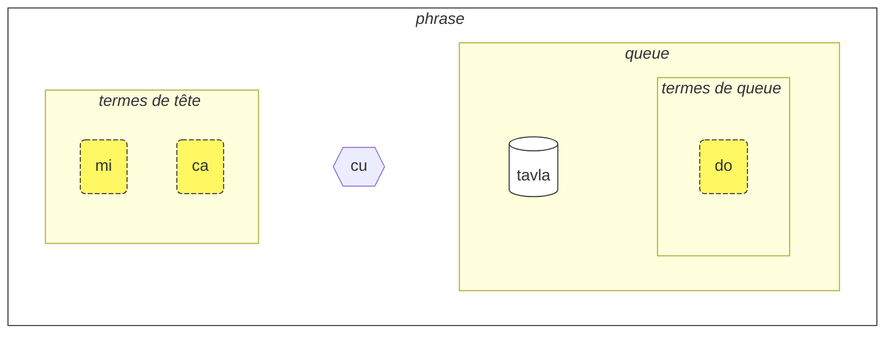
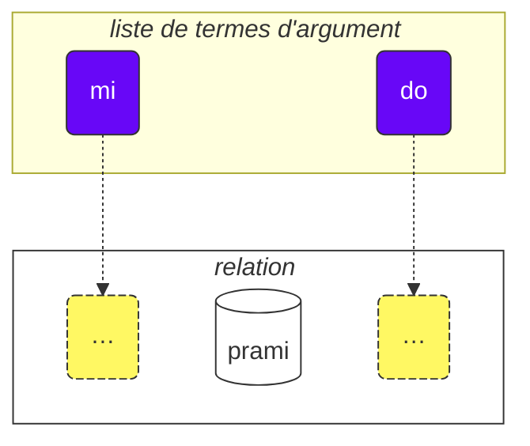

Comment utiliser ce cours :

1. lisez-le
2. notez vos remarques et suggestions
3. envoyez-les sur [💬 le chat en direct](https://lojban.pw/fr/articles/live_chat/)

## Leçon 1. La langue en un coup d'œil

### Alphabet

La première chose à savoir sur le lojban est son alphabet.

Le lojban utilise l'alphabet latin (les voyelles sont colorées) :

<dl><dd><b>a b c d e f g i j k l m n o p r s t u v x y z ' .</b></dd></dl>

Les mots se prononcent comme ils s'écrivent.

Il y a 10 voyelles en lojban :

<table>
<tbody><tr>
<td><b class="audio-inline">a</b></td>
<td> comme dans <i>t<u>a</u>ble</i> (pas comme dans le "a" anglais de <i>face</i>)</td>
</tr>
<tr>
<td><b class="audio-inline">e</b></td>
<td> comme dans <i>m<u>e</u>rci</i> ou <i>fen<u>ê</u>tre</i></td>
</tr>
<tr>
<td><b class="audio-inline">i</b></td>
<td> comme dans <i>mach<u>i</u>ne</i> (pas comme dans le "i" anglais de <i>hit</i>)</td>
</tr>
<tr>
<td><b class="audio-inline">o</b></td>
<td> comme dans <i>p<u>o</u>rte</i>, <i>s<u>o</u>rte</i> ou <i>b<u>o</u>nne</i> (pas comme dans <i>beau</i>, le <b>o</b> doit être un son « pur »).</td>
</tr>
<tr>
<td><b class="audio-inline">u</b></td>
<td> comme dans <i>p<u>ou</u>le</i> (pas comme dans le "u" anglais de <i>but</i>)</td>
</tr>
<tr>
<td><b class="audio-inline">y</b></td>
<td> comme dans <i>d<u>e</u></i> (le « e » final de certains mots, pas comme dans <i>misty</i> ou <i>cycle</i> en anglais)</td>
</tr>
<tr>
</tbody></table>

4 voyelles s'écrivent à l'aide de combinaisons de lettres :

<table>
<tbody><tr>
<td><b class="audio-inline">au</b></td>
<td> comme dans <i>mi<u>aou</u></i></td></tr>
<tr>
<td><b class="audio-inline">ai</b></td>
<td> comme dans <i>m<u>aï</u>s</i></td></tr>
<tr>
<td><b class="audio-inline">ei</b></td>
<td> comme dans <i>p<u>ay</u>s</i>, <i>ab<u>ay</u>e</i></td></tr>
<tr>
<td><b class="audio-inline">oi</b></td>
<td> comme dans <i>M<u>oï</u>se</i></td></tr>
</tbody></table>

Quant aux consonnes, elles se prononcent comme en français, en anglais ou en latin, mais il existe quelques différences :

<table>
<tbody><tr>
<td><b class="guibutton">c</b>
</td>
<td>se prononce comme <i>ch</i> dans <i>chou</i>, comme <i>sh</i> en anglais dans <i>shop</i>.
</td></tr>
<tr>
<td><b class="guibutton">g</b>
</td>
<td>toujours <i>g</i> comme dans <i>gâteau</i> (jamais <i>j</i> comme dans <i>gérer</i>).
</td></tr>
<tr>
<td><b class="guibutton">j</b>
</td>
<td>comme <i>j</i> dans <i>bonjour</i>, comme <i>s</i> dans le mot anglais <i>pleasure</i> ou <i>treasure</i>.
</td></tr>
<tr>
<td><b class="guibutton">x</b>
</td>
<td>comme <i>ch</i> dans le mot écossais <i>loch</i> ou comme dans le nom allemand <i>Bach</i>, comme <i>J</i> dans le prénom espagnol <i>Jose</i> ou <i>Kh</i> dans le prénom arabe moderne <i>Khaled</i>. Essayez de prononcer <i>ksss</i> en gardant votre langue en bas et vous obtiendrez ce son.
</td></tr>
<tr>
<td><b class="guibutton"> ' </b>
</td>
<td>comme le <i>h</i> anglais. L'apostrophe est donc considérée comme une véritable lettre du lojban et se prononce comme un <i>h</i>. Elle ne se trouve qu'entre des voyelles. Par exemple, <b>u'i</b> se prononce <i>ou-hi</i> (alors que <b>ui</b> se prononce <i>oui</i>).
</td></tr>
<tr>
<td><b>.</b>
</td>
<td>le point (point final, pause entre mots) est également considéré comme une lettre en lojban. C'est une courte pause dans la parole pour empêcher les mots de s'enchaîner les uns aux autres. En fait, tout mot commençant par une voyelle a un point placé devant lui. Cela aide à éviter la fusion indésirable de deux mots consécutifs en un seul.
</td></tr>
<tr>
<td><b>i</b>
</td>
<td><b>i</b> devant des voyelles est considéré comme une consonne et se prononce plus court, par exemple :
<ul><li><b>ia</b> se prononce comme <i>ya</i> dans le mot anglais <i>yard</i>, ou comme dans <i>yacht</i> en français</li>
<li><b>ie</b> se prononce comme <i>ye</i> dans le mot anglais <i>yes</i>, ou comme <i>yé</i> en français</li></ul>
</td></tr>
<tr>
<td><b>u</b>
</td>
<td><b>u</b> devant des voyelles est considéré comme une consonne et se prononce plus court, par exemple :
<ul><li><b>ua</b> se prononce comme <i>wo</i> dans le mot anglais <i>wow</i>, ou comme <i>oua</i> en français</li>
<li><b>ue</b> se prononce comme <i>whe</i> dans le mot anglais <i>when</i>, ou comme <i>oué</i> en français</li></ul>
</td></tr></tbody></table>

L'accent tonique est placé sur l'avant-dernière voyelle. Si un mot n'a qu'une seule voyelle, vous ne l'accentuez tout simplement pas.

La lettre **r** peut se prononcer comme le _r_ en français, en anglais, en écossais, en russe, il existe donc une gamme de prononciations acceptables pour cette lettre.

Les voyelles non-lojban comme le _i_ court et le _u_ court de l'anglais standard britannique _hit_ et _but_ sont utilisées par certaines personnes pour séparer les consonnes. Donc, si vous avez du mal à prononcer deux consonnes d'affilée (par exemple, le **vl** dans **tavla**, qui signifie _parler à_), alors vous pouvez dire _tavɪla_ — où le _ɪ_ est très court. Cependant, les autres voyelles comme **a** et **u** doivent être longues.

### La phrase la plus simple

L'unité de base en lojban est la « phrase ». Voici trois exemples simples :

> **le prenu cu tavla mi**
> _La personne me parle._

le prenu
: la personne

tavla
: … parle à …

mi
: je, moi

> **mi prami do**
> _Je t'aime._

prami
: … aime … (quelqu'un)

do
: tu, toi, vous

> **mi ca cu tavla do**
> _Je te parle maintenant._

ca
: maintenant (se prononce comme **cha**)

<pixra url="/assets/pixra/cilre/tavla.webp" caption="le prenu cu tavla mi" definition="La personne me parle."></pixra>

<pixra url="/assets/pixra/cilre/mi.webp" caption="mi" definition="je / moi"></pixra>

<pixra url="/assets/pixra/cilre/mi_prami_do2.webp" caption="mi prami do" definition="Je t'aime."></pixra>

<pixra url="/assets/pixra/cilre/do.webp" caption="do" definition="tu / toi / vous"></pixra>

Chaque phrase en lojban se compose des parties suivantes, de gauche à droite :

- la tête :
  - se compose de ce qu'on appelle des « termes »,
    - **le prenu** est le seul terme de tête dans l'exemple **le prenu cu tavla mi** ci-dessus,
    - **mi**, **ca** sont des termes de tête dans l'exemple **mi ca cu tavla do** ci-dessus.
- le séparateur de tête **cu** :
  - se prononce comme _chou_ puisque **c** représente _ch_,
  - indique que la tête s'est terminée,
  - peut être omis lorsqu'il est clair que la tête est terminée.
- la queue :
  - la construction de relation principale (appelée « **selbrisni** » en lojban) 
  - \+ éventuellement un ou plusieurs termes après elle,
    - **tavla**, **prami** sont des selbrisni, des constructions de relation principales dans les exemples ci-dessus.
    - **mi** est le seul terme de queue dans l'exemple **le prenu cu tavla mi** ci-dessus.
    - **do** est le seul terme de queue dans l'exemple **mi prami do** ci-dessus.

En lojban, nous parlons principalement de relations plutôt que de noms ou de verbes.

Voici deux mots de relation, qui correspondent approximativement à des verbes :

prenu
: … est une personne / sont des personnes

tavla
: … parle à …

Chaque relation a un ou plusieurs rôles qui peuvent également être appelés « emplacements » ou « places ». Ci-dessus, ils sont marqués avec « … ». Ces emplacements doivent être remplis avec des arguments (appelés « **sumti** » en lojban). Les termes d'argument sont des constructions comme **le prenu**, **mi**, **do**, que ces termes finissent par être dans une tête ou dans une queue de phrase. Nous plaçons les termes d'argument dans l'ordre, remplissant ainsi ces emplacements et donnant un sens concret à la relation.

Nous pouvons également transformer une telle relation en terme d'argument.

Pour cela, nous plaçons un petit mot **le** devant :

prenu
: … est une personne

le prenu
: la personne, les personnes

De même,

tavla
: … parle à …

et donc

le tavla
: l'orateur, les orateurs, celui/celle qui parle

Cela peut sembler étrange qu'une _personne_ puisse être un « verbe », mais en fait, cela rend le lojban très simple :

<table>
<thead>
<tr>
<th>mot de relation avec emplacements non remplis</th>
<th>forme d'argument (<b>sumti</b>)</th></tr>
</thead>
<tbody>
<tr>
<td><b>prenu</b> — <i>… (quelqu'un) est une personne</i> </td>
<td><b>le prenu</b> — <i>la personne / les personnes</i>
     <b>le prenu</b> — <i>celui qui est une personne / ceux qui sont des personnes</i>
</td></tr>
<tr>
<td><b>tavla</b> — <i>… (quelqu'un) parle à … (quelqu'un)</i> </td>
<td><b>le tavla</b> — <i>l'orateur / les orateurs</i>
     <b>le tavla</b> — <i>celui qui parle / ceux qui parlent</i>
</td></tr>
</tbody></table>

Le premier emplacement des relations disparaît lors de l'utilisation de **le**, d'où des traductions alternatives telles que _celui qui …_ sont possibles.

<!-- Nous pouvons également dire que **le** crée un nom à partir d'une construction de relation avec à peu près le sens de _celui qui est …_ (_est une personne_ — _la personne_), ou même _ceux qui font…_ (_parler à_ — _les orateurs_), _ceux qui sont…_ (_sont des personnes_ — _les personnes_). -->

Notez que le lojban, par défaut, ne spécifie pas le nombre entre _l'orateur_ ou _les orateurs_. C'est-à-dire que **le tavla** est vague à cet égard, et nous découvrirons bientôt des moyens de définir le nombre.

Outre les termes d'argument, il existe des termes modaux comme **ca** :

> **mi ca cu tavla do**
> _Je te parle maintenant._

ca
: maintenant

Les termes modaux ne remplissent pas les emplacements de la construction de relation principale (« **selbrisni** »). Au lieu de cela, ils sont appliqués à l'ensemble de la phrase, enrichissant ou précisant sa signification.

Ainsi, les termes en lojban sont représentés par :

- des termes d'argument qui remplissent les emplacements des relations. Les exemples sont :
  - des noms comme **le prenu** (_la personne_)
  - des pronoms comme **mi** (_je_, _moi_), **do** (_tu_, _toi_, _vous_). Les pronoms fonctionnent exactement comme les noms, mais **le** n'est pas utilisé pour eux. Ils fonctionnent comme des arguments en eux-mêmes.
- des termes modaux qui ne remplissent pas les emplacements des relations mais spécifient des informations supplémentaires et clarificatrices.
  - par exemple, **ca** (_maintenant, au présent_).

Quelques exemples supplémentaires :

<pixra url="/assets/pixra/cilre/nintadni.webp" caption="mi nintadni" definition="Je suis un nouvel étudiant, un débutant."></pixra>

> **mi nintadni**
> _Je suis un nouvel étudiant._

nintadni
: … (quelqu'un) est un nouvel étudiant, un débutant

Contrairement à l'anglais, nous n'avons pas besoin d'ajouter le verbe « suis/es/est/être » à la phrase. Il est déjà implicite. Le mot de relation **nintadni** (_… est un nouvel étudiant_) a déjà ce « suis/es/est/être » anglais intégré dans sa traduction française.

> **do jimpe**
> _Tu comprends._

jimpe
: … (quelqu'un) comprend … (quelque chose)

<pixra url="/assets/pixra/cilre/pilno_le_fonxa.webp" caption="le prenu cu pilno le fonxa" definition="La personne utilise le téléphone."></pixra>

> **mi pilno le fonxa**
> _J'utilise le téléphone._

pilno
: … (quelqu'un) utilise … (quelque chose)

fonxa
: … est un téléphone, … sont des téléphones

le fonxa
: le téléphone, les téléphones

<pixra url="/assets/pixra/cilre/citka.webp" caption="mi citka" definition="Je mange."></pixra>

> **mi citka**
> _Je mange._

citka
: … (quelqu'un) mange … (quelque chose)

> **do citka**
> _Tu manges._

<!-- -->

> **mi citka le plise**
> _Je mange les pommes._

<pixra url="/assets/pixra/cilre/le_plise_cu_kukte.webp" caption="le plise cu kukte" definition="Les pommes sont délicieuses."></pixra>

> **le plise cu kukte**
> _Les pommes sont délicieuses._

le plise
: les pommes

kukte
:  … (quelque chose) est délicieux

Une phrase plus simple en lojban ne contiendrait qu'un seul mot de relation principal :

<pixra url="/assets/pixra/cilre/karce.webp" caption="karce" definition="C'est une voiture."></pixra>

> **karce**
> _Voiture !_
> _C'est une voiture._

Vous pourriez dire cela lorsque vous voyez une voiture arriver. Ici, le contexte serait suffisamment clair qu'il y a une voiture quelque part et probablement qu'elle est dangereuse.

**karce** lui-même est un mot de relation signifiant _est une voiture_.

Nous pouvons bien sûr être plus précis et dire, par exemple :

> **bolci**
> _Ballon !_
> _C'est un ballon._

où **bolci** est un mot de relation signifiant _est un ballon_.

> **ti bolci**
> _Ceci est un ballon près de moi._

<!-- -->
> **ta bolci**
> _Ceci est un ballon près de toi._

ti
: pronom : cette chose près de moi

ta
: pronom : cette chose près de toi

tu
: pronom : cette chose loin de toi et de moi

<pixra url="/assets/pixra/cilre/ti.webp" caption="ti" definition="celui-ci (près de moi, le locuteur)"></pixra>

<pixra url="/assets/pixra/cilre/ta.webp" caption="ta" definition="celui-ci (près de toi, l'auditeur)"></pixra>

<pixra url="/assets/pixra/cilre/tu.webp" caption="tu" definition="celui-là là-bas (loin de toi et de moi)"></pixra>

De même, vous pouvez dire

<pixra url="/assets/pixra/cilre/carvi.webp" caption="carvi" definition="… est de la pluie"></pixra>

> **carvi**
> _Il pleut._

où

carvi
: … est de la pluie, … pleut

ou

> **pluka**
> _C'est agréable._

où

pluka
: … est agréable

Notez qu'en lojban, il n'y a pas besoin du mot _il_ dans ce sens. Vous utilisez simplement le mot de relation dont vous avez besoin.

> **prami**
> _Quelqu'un aime._

<pixra url="/assets/pixra/cilre/bajra.webp" caption="le prenu cu bajra" definition="La personne court."></pixra>

> **bajra**
> _Quelqu'un court._

bajra
: … court en utilisant des membres

Encore une fois, le contexte indiquerait probablement qui aime qui et qui court.

#### Exercice

<pixra url="/assets/pixra/cilre/pinxe_le_djacu.webp" caption="le prenu cu pinxe le djacu" definition="La personne boit l'eau."></pixra>

pinxe
: … boit … (quelque chose)

le djacu
: l'eau

Cachez la partie droite du tableau. Traduisez les phrases à gauche depuis le lojban.

<table style="table-layout: fixed;">
<tbody><tr>
<td><b>do citka</b>
</td>
<td><i>Tu manges.</i>
</td></tr>
<tr>
<td><b>mi pinxe le djacu</b>
</td>
<td><i>Je bois de l'eau.</i>
</td></tr>
<tr>
<td><b>mi citka le plise</b>
</td>
<td><i>Je mange des pommes.</i>
</td></tr></tbody></table>

### «**.i**» sépare les phrases

Nous plaçons un petit mot **.i** pour séparer deux phrases consécutives :

> **mi tavla le prenu .i le prenu cu tavla mi**
> _Je parle aux personnes. Les personnes me parlent._

**.i** sépare les phrases comme le point final à la fin des phrases dans les textes français.

Lorsque nous disons une phrase après l'autre en français, nous faisons une pause (elle peut être courte) entre elles. Mais la pause a de nombreuses significations différentes en français. En lojban, nous avons un meilleur moyen de comprendre où une phrase se termine et une autre commence.

Notez également que parfois, lorsque vous prononcez des mots rapidement, vous ne pouvez pas déterminer où une phrase se termine et où le mot de la phrase suivante commence. Il est donc conseillé d'utiliser le mot **.i** avant de commencer une nouvelle phrase.

### Les nombres : '_1 2 3 4 5 6 7 8 9 0_' = «**pa re ci vo mu xa ze bi so no**»

**le** transforme simplement une construction de relation en argument, mais un tel argument n'a pas de nombre associé. La phrase

> **le prenu cu tavla mi**
> _Les personnes me parlent._
> _La personne me parle._

ne spécifie pas le nombre de personnes qui me parlent. En français, il est impossible d'omettre le nombre parce que _personnes_ en français implique _plus d'une personne_. Cependant, en lojban, vous pouvez omettre le nombre.

Maintenant, spécifions combien de personnes sont pertinentes pour notre discussion.

Ajoutons un nombre après **le**.

<table>
<tbody><tr>
<td><b>pa</b>
</td>
<td><b>re</b>
</td>
<td><b>ci</b>
</td>
<td><b>vo</b>
</td>
<td><b>mu</b>
</td>
<td><b>xa</b>
</td>
<td><b>ze</b>
</td>
<td><b>bi</b>
</td>
<td><b>so</b>
</td>
<td><b>no</b>
</td></tr>
<tr>
<td> 1
</td>
<td> 2
</td>
<td> 3
</td>
<td> 4
</td>
<td> 5
</td>
<td> 6
</td>
<td> 7
</td>
<td> 8
</td>
<td> 9
</td>
<td> 0
</td>
</tr></tbody></table>

<pixra url="/assets/pixra/cilre/ci_prenu.webp" caption="le ci prenu" definition="Les trois personnes"></pixra>

> **le pa prenu cu tavla mi**
> _La personne me parle._
> _La seule personne me parle._

Nous ajoutons un nombre après **le** et spécifions ainsi des personnes individuelles.

Pour les nombres composés de plusieurs chiffres, nous enchaînons simplement ces chiffres :

> **le re mu prenu cu tavla mi**
> _Les 25 personnes me parlent._

Oui, c'est aussi simple que ça.

Si nous voulons compter, nous pouvons séparer les nombres avec **.i** :

> **mu .i vo .i ci .i re .i pa .i no**
> _5 … 4 … 3 … 2 … 1 … 0_

Le nombre **za'u** signifie _plus de …_ (_\>_ en mathématiques), le nombre **me'i** signifie _moins de_ (_<_ en mathématiques) :

> **le za'u re prenu cu tavla mi**
> _Plus de deux personnes me parlent._

<!-- -->

> **le me'i pa no prenu cu tavla mi**
> _Moins de 10 personnes me parlent._

<!-- -->

> **le za'u ci prenu cu tavla mi**
> _Plus de trois personnes me parlent._

Pour dire simplement _des personnes_ (nombre pluriel) par opposition à _une personne_, nous utilisons **za'u pa**, _plus d'un_ ou simplement **za'u**.

> **le za'u pa prenu cu tavla mi**
> **le za'u prenu cu tavla mi**
> _Les personnes me parlent._

**za'u** signifie par défaut **za'u pa**, d'où une telle contraction est possible.

le prenu
: la personne / les personnes

le pa prenu
: la personne (une en nombre)

le za'u prenu
: les personnes (deux ou plus en nombre)

#### Exercice

stati
: … (quelqu'un) est intelligent, … a du talent

<pixra url="/assets/pixra/cilre/stati.webp" caption="stati" definition="… a du talent"></pixra>

klama
: … vient à … (un endroit ou un objet)

<pixra url="/assets/pixra/cilre/klama_ti.webp" caption="le prenu cu klama ti" definition="La personne est venue ici."></pixra>

nelci
: … aime … (quelque chose)

le zarci
: le marché

<pixra url="/assets/pixra/cilre/zarci.webp" caption="le prenu cu zvati le zarci" definition="La personne est au magasin."></pixra>

le najnimre
: l'orange (fruit), les oranges

<pixra url="/assets/pixra/cilre/najnimre.webp" caption="najnimre" definition="… est une orange"></pixra>

le badna
: la banane, les bananes

<pixra url="/assets/pixra/cilre/badna.webp" caption="badna" definition="… est une banane"></pixra>

Cachez la partie droite du tableau. Traduisez les phrases à gauche depuis le lojban.

<table style="table-layout: fixed;">
 <tbody>
  <tr>
   <td>le mu prenu cu klama le zarci</td>
   <td>Les cinq personnes viennent au marché.</td>
  </tr>
  <tr>
   <td>le pa re prenu cu stati .i do stati</td>
   <td>Les 12 personnes sont intelligentes. Tu es intelligent.</td>
  </tr>
  <tr>
   <td>le prenu cu nelci le plise</td>
   <td>Les personnes aiment les pommes.</td>
  </tr>
  <tr>
   <td>le za'u re prenu cu citka .i le me'i mu prenu cu pinxe le djacu</td>
   <td>Plus de deux personnes mangent. Moins de 5 personnes boivent l'eau.</td>
  </tr>
  <tr>
   <td>le za'u re prenu cu stati</td>
   <td>Plus de deux personnes sont intelligentes.</td>
  </tr>
 </tbody>
</table>

Cachez la partie droite du tableau. Traduisez les phrases à gauche vers le lojban.

<table style="table-layout: fixed;">
 <tbody>
  <tr>
   <td>Les 256 personnes sont intelligentes.</td>
   <td>le re mu xa prenu cu stati</td>
  </tr>
  <tr>
   <td>Moins de 12 pommes sont délicieuses.</td>
   <td>le me'i pa re plise cu kukte</td>
  </tr>
 </tbody>
</table>

### Relation composée

Les constructions de relation composées (**tanru** en lojban) sont plusieurs mots de relation placés les uns après les autres.

> **tu melbi zdani**
> _C'est une belle maison._

<pixra url="/assets/pixra/cilre/melbi_zdani.webp" caption="melbi zdani" definition="… est une belle maison"></pixra>

tu
: celui-là (loin de toi et de moi)

melbi
: … est beau, joli

zdani
: … est une maison ou un nid pour … (quelqu'un)

melbi zdani
: construction de relation composée : … est une belle maison pour … (quelqu'un)

<pixra url="/assets/pixra/cilre/dansu.webp" caption="le prenu cu melbi dansu" definition="La personne danse joliment."></pixra>

> **do melbi dansu**
> _Tu danses joliment._

dansu
: … danse

Ici, la relation **melbi** ajoute un sens supplémentaire car elle est placée à gauche d'une autre relation : **zdani**. Le composant de gauche est généralement traduit en utilisant des adjectifs et des adverbes.

Les relations composées sont une fonctionnalité puissante qui produit des significations plus riches. Vous enchaînez simplement deux mots de relation ensemble, et le composant de gauche d'une telle relation composée ajoute une saveur à celui de droite.

Nous pouvons mettre **le** (par exemple avec un nombre) à gauche d'une telle relation composée pour obtenir un terme d'argument plus riche :

le pa melbi zdani
: la belle maison

Maintenant nous savons pourquoi il y avait **cu** après les termes de tête dans notre exemple :

> **le pa prenu cu tavla mi**
> _La personne me parle._

Sans **cu**, cela se transformerait en **le pa prenu tavla**, qui aurait le sens de _la personne-parleur_ - quoi que cela puisse signifier.

Considérez :

> **le pa tavla pendo**
> _L'ami parleur_
<!-- -->
> **le pa tavla cu pendo**
> _Celui qui parle est un ami._

Rappelez-vous de placer **cu** avant la construction de relation principale dans une phrase pour éviter la création involontaire de relations composées.

Une relation composée peut contenir plus de deux composants. Dans ce cas, la première relation modifie la deuxième, la deuxième modifie la troisième, et ainsi de suite :

<pixra url="/assets/pixra/cilre/cmalu_karce.webp" caption="ti cmalu karce" definition="Ceci est une petite voiture."></pixra>

> **le pa melbi cmalu karce**
> _la jolie petite voiture, la voiture petite d'une jolie manière_

<!-- -->

> **le mutce melbi zdani**
> _la maison très belle_

mutce
: … est très, … est beaucoup

#### Exercice

sutra
: … est rapide

barda
: … est grand

cmalu
: … est petit

mlatu
: … est un chat

Cachez la partie droite du tableau. Traduisez les phrases à gauche depuis le lojban.

<table style="table-layout: fixed;">
<tbody><tr>
<td><b>le melbi karce</b>
</td>
<td><i>la belle voiture / les belles voitures</i>
</td></tr>
<tr>
<td><b>do sutra klama</b>
</td>
<td><i>Tu viens rapidement. Tu viens vite.</i>
</td></tr>
<tr>
<td><b>tu barda zdani</b>
</td>
<td><i>C'est une grande maison.</i>
</td></tr>
<tr>
<td><b>le pa sutra bajra mlatu</b>
</td>
<td><i>le chat qui court rapidement</i>
</td></tr>
<tr>
<td><b>le pa sutra mlatu</b>
</td>
<td><i>le chat rapide</i>
</td></tr>
<tr>
<td><b>le pa bajra mlatu</b>
</td>
<td><i>le chat qui court</i>
</td></tr></tbody></table>

Cachez la partie droite du tableau. Traduisez les phrases à gauche vers le lojban.

<table style="table-layout: fixed;">

<tbody><tr>
<td><i>Ceci est une petite voiture.</i>
</td>
<td><b>ti cmalu karce</b>
</td></tr>
<tr>
<td><i>pommes délicieuses</i>
</td>
<td><b>le kukte plise</b>
</td></tr>
<tr>
<td><i>les mangeurs rapides</i>
</td>
<td><b>le sutra citka</b>
</td></tr>
<tr>
<td><i>Tu es une personne qui marche rapidement.</i>
</td>
<td><b>do sutra cadzu prenu</b>
</td></tr></tbody></table>

### Questions '_Oui/Non_'

En français, nous formons une question _oui/non_ en changeant l'ordre des mots ou en utilisant une intonation montante, par exemple

> _Tu es … ⇒ Es-tu …?_

ou en ajoutant « est-ce que » au début, par exemple :

> _Tu sais … ⇒ Est-ce que tu sais ?_

En lojban, l'ordre des mots peut être conservé. Pour transformer n'importe quelle affirmation en question _oui/non_, nous insérons simplement le mot **xu** au début de la phrase :

> **xu do nelci le gerku**
> _Aimes-tu les chiens ?_

le gerku
: le chien, les chiens

<pixra url="/assets/pixra/cilre/le_prenu_e_le_gerku.webp" caption="ti prenu .i ti gerku" definition="Ceci est une personne. Ceci est un chien."></pixra>

Rappelez-vous qu'en lojban, la ponctuation comme « ? » (point d'interrogation) est facultative et utilisée principalement à des fins stylistiques. C'est parce que le mot interrogatif **xu** montre déjà qu'il s'agit d'une question.

Autres exemples :

> **xu mi klama**
> _Est-ce que je viens ?_

klama
: … vient à … (quelque part)

> **xu pelxu**
> _Est-ce jaune ?_

pelxu
: … est jaune

Nous pouvons déplacer le sens en plaçant **xu** après différentes parties de la phrase. Les explications de ce qui a changé dans le sens sont données entre crochets :

> **xu do nelci le gerku**
> _Aimes-tu les chiens ?_

<!-- -->

> **do xu nelci le gerku**
> _TOI, aimes-tu les chiens ?_ (Je pensais que c'était quelqu'un d'autre qui les aimait).

<!-- -->

> **do nelci xu le gerku**
> _AIMES-tu les chiens ? (Je pensais que tu étais juste neutre envers eux)._

<!-- -->

> **do nelci le xu gerku**
> _Aimes-tu LES CHIENS ? (Je pensais que tu aimais les chats)._

<!-- -->

> **do nelci le gerku xu**
> _Tu aimes ces choses, sont-ce des chiens ? (Tu questionnes seulement la validité de la relation **gerku**)._

Ce qui est exprimé en utilisant l'intonation en français est exprimé en déplaçant **xu** après la partie que nous voulons mettre en emphase en lojban. Notez que la première phrase avec **xu** au début pose la question la plus générique sans insister sur un aspect particulier.

**xu** est un mot interjection. Voici les caractéristiques des interjections en lojban :

- l'interjection modifie la construction qui la précède :

 > **do xu nelci le gerku**
 > _TOI, aimes-tu les chiens ?_

- lorsqu'elle est placée au début d'une relation, l'interjection modifie toute la relation :

 > **xu do nelci le gerku**
 > _Aimes-tu les chiens ?_

- les interjections peuvent être placées après différentes parties de la même relation pour déplacer le sens.

 > **do nelci le gerku xu**
 > _Tu aimes ces entités, sont-ce des chiens ?_

 Ici, seule la relation **gerku** (pas l'argument **le gerku**) est modifiée par le mot interrogatif **xu**. Donc ici, nous nous interrogeons seulement sur cette relation. Nous affirmons que tu aimes ces objets ou êtres vivants et nous te demandons si ce sont des chiens.

Les interjections ne brisent pas les relations composées, elles peuvent être utilisées à l'intérieur d'elles :

> **do nelci le barda xu gerku**
> _Aimes-tu les GRANDS chiens ?_

Maintenant, comment répondre à de telles questions 'oui/non' ? Nous répétons la construction de relation principale :

> **— xu le mlatu cu melbi**
> **— melbi**
> _— Les chats sont-ils jolis ?_
> _— Jolis._

Pour répondre 'non', nous utilisons le terme modal **na ku** :

> **— xu le mlatu cu melbi**
> **— na ku melbi**
> _— Les chats sont-ils jolis ?_
> _— Pas jolis._

na ku
: terme : il est faux que …

Ou, nous pouvons utiliser un mot de relation spécial **go'i** :

> **— xu le mlatu cu melbi**
> **— go'i**
> _— Les chats sont-ils jolis ?_
> _— Jolis._

go'i
: mot de relation qui répète la relation principale de la phrase précédente

Ici, **go'i** signifie la même chose que **melbi** puisque **melbi** est la relation de la relation précédente.

> **— xu le mlatu cu melbi**
> **— na ku go'i**
> _— Les chats sont-ils jolis ?_
> _— Pas jolis._

<!-- Ce cours ne recommande pas de nier **go'i** pour les réponses négatives. Utilisez simplement **je'u nai**. -->

Le terme modal **na ku** peut être utilisé pas seulement dans les réponses :

> **na ku mi nelci le gerku**
> _Il est faux que j'aime les chiens._
> _Je n'aime pas les chiens._
<!-- -->
> **mi na ku nelci do**
> _Je ne t'aime pas._

Son opposé, le terme **ja'a ku** affirme le sens :

> **mi ja'a ku nelci do**
> _J'aime vraiment te._

ja'a ku
: terme : il est vrai que …

#### Exercice

Cachez la partie droite du tableau. Traduisez les phrases à gauche depuis le lojban.

<table style="table-layout: fixed;">

<tbody><tr>
<td><b>xu le barda zdani cu melbi</b>
</td>
<td><i>La grande maison est-elle belle ?</i>
</td></tr>
<tr>
<td><b>— le prenu cu stati xu — na ku stati</b>
</td>
<td><i>— Les personnes sont-elles intelligentes ? — Non.</i>
</td></tr>
<tr>
<td><b>do klama le zarci xu</b>
</td>
<td><i>Tu vas au marché ?</i>
</td></tr>
<tr>
<td><b>xu le verba cu prami le mlatu</b>
</td>
<td><i>L'enfant aime-t-il les chats ?</i>
</td></tr></tbody></table>

Cachez la partie droite du tableau. Traduisez les phrases à gauche vers le lojban.

<table style="table-layout: fixed;">

<tbody><tr>
<td><i>La voiture est-elle rapide ?</i>
</td>
<td><b>xu le karce cu sutra</b>
</td></tr>
<tr>
<td><i>— L'orange est-elle délicieuse ? — Oui, elle l'est.</i>
</td>
<td><b>— xu le najnimre cu kukte — kukte</b>
</td></tr>
<tr>
<td><i>Le chien t'aime-t-il ?</i>
</td>
<td><b>xu le gerku cu prami do</b>
</td></tr></tbody></table>

### Bonheur et demandes polies : '_Youpii !_' = «**ui**», '_S'il te plaît !_' = «**.e'o**»

L'interjection **ui** montre le bonheur de celui qui parle. Elle est utilisée tout comme l'émoticône '_:)_' dans les messages, pour indiquer que vous êtes content de quelque chose. Bien que les émoticônes puissent être ambigües, **ui** n'a qu'une seule signification, ce qui est pratique.

> **ui do klama**
> _Youpii, tu viens !_

ui
: interjection : _Youpii !_, interjection de bonheur

L'interjection **.e'o** au début d'une phrase la transforme en demande polie :

> **.e'o do lebna le fonxa**
> _Pourrais-tu prendre le téléphone, s'il te plaît ?_
> `S'il te plaît, prends le téléphone.`

.e'o
: interjection : s'il te plaît (se prononce _eh-haw_ avec une courte pause ou une interruption avant le mot)

lebna
: prendre (quelque chose)

En français, pour être poli, on doit utiliser _pourrais-tu_ + _s'il te plaît_ + une question. En lojban, **.e'o** suffit pour faire une demande polie.

#### Exercice

Cachez la partie droite du tableau. Traduisez les phrases à gauche depuis le lojban.

le tcati
: le thé

<pixra url="/assets/pixra/cilre/tcati.webp" caption="tcati" definition="… est du thé"></pixra>

le ckafi
: le café

<pixra url="/assets/pixra/cilre/ckafi.webp" caption="ckafi" definition="… est du café"></pixra>

zgana
: regarder, observer (en utilisant tous les sens)

le skina
: le film

<pixra url="/assets/pixra/cilre/zgana_le_skina.webp" caption="le prenu cu zgana le skina" definition="La personne regarde le film."></pixra>

kurji
: prendre soin de (quelqu'un, quelque chose)

<table style="table-layout: fixed;">

<tbody>
<tr>
<td><b>ui carvi</b>
</td>
<td><i>Youpii, il pleut !</i>
</td></tr>
<tr>
<td><b>.e'o do sutra bajra</b>
</td>
<td><i>Cours vite !</i>
</td></tr>
<tr>
<td><b>.e'o do pinxe le tcati</b>
</td>
<td><i>S'il te plaît, bois du thé !</i>
</td></tr>
<tr>
<td><b>.e'o zgana le skina</b>
</td>
<td><i>S'il te plaît, regarde le film !</i>
</td></tr></tbody></table>

Cachez la partie droite du tableau. Traduisez les phrases à gauche vers le lojban.

<table style="table-layout: fixed;">

<tbody><tr>
<td><i>S'il te plaît, sois intelligent !</i>
</td>
<td><b>.e'o do stati</b>
</td></tr>
<tr>
<td><i>S'il te plaît, rentre à la maison !</i>
</td>
<td><b>.e'o do klama le zdani</b>
</td></tr>
<tr>
<td><i>S'il te plaît, bois le café !</i>
</td>
<td><b>.e'o do pinxe le ckafi</b>
</td></tr>
<tr>
<tr>
<td><i>Youpii, je te parle !</i>
</td>
<td><b>ui mi tavla do</b>
</td></tr>
<tr>
<td><i>S'il te plaît, prends soin de l'enfant.</i>
</td>
<td><b>.e'o do kurji le verba</b>
</td></tr></tbody></table>

### '_Et_' et '_ou_'

> **do nintadni .i je mi nintadni**
> _Tu es un débutant. Et je suis un débutant._

<!-- -->

> **do .e mi nintadni**
> _Toi et moi sommes des débutants._

<pixra url="/assets/pixra/cilre/do_e_mi_nintadni.webp" caption="do .e mi nintadni" definition="Toi et moi sommes de nouveaux étudiants."></pixra>

<!-- -->

> **mi tadni .i je mi tavla do**
> _J'étudie. Et je te parle._

<!-- -->

> **mi tadni gi'e tavla do**
> _J'étudie et te parle._

.i je
: conjonction « et » combinant des phrases en une seule.

.e
: conjonction « et » reliant des arguments.

gi'e
: conjonction « et » reliant des queues de phrase.

Nous pouvons combiner deux phrases en une seule déclaration en utilisant la conjonction **.i je**, qui signifie _et_ :

> **do nintadni .i je mi nintadni**
> _Tu es un débutant. Et je suis un débutant._

Puisque les deux phrases ont la même queue, nous pouvons utiliser une contraction : la conjonction **.e** signifie _et_ pour les arguments :

> **do .e mi nintadni**
> _Toi et moi sommes des débutants._

**do nintadni .i je mi nintadni** signifie exactement la même chose que **do .e mi nintadni**

Nous pouvons également utiliser **.e** pour connecter des arguments dans d'autres positions.

Ces deux phrases signifient la même chose.

> **mi pinxe le djacu .e le jisra**
> _Je bois de l'eau et du jus._
> **mi pinxe le djacu .i je mi pinxe le jisra**
> _Je bois de l'eau, et je bois du jus._

le jisra
: le jus

<pixra url="/assets/pixra/cilre/pinxe_le_jisra.webp" caption="le prenu cu pinxe le jisra" definition="La personne boit du jus."></pixra>

Si la tête de la phrase est la même mais les queues diffèrent, nous utilisons la conjonction **gi'e**, qui signifie _et_ pour les queues de phrase :

> **mi tadni .i je mi tavla do**
> **mi tadni gi'e tavla do**
> _J'étudie et te parle._

Les deux variantes signifient la même chose ; **gi'e** mène simplement à une forme plus concise.

Il existe également des façons d'ajouter _et_ pour les composants de relations composées :

> **le melbi je cmalu zdani cu jibni ti**
> _La jolie et petite maison est proche._

<pixra url="/assets/pixra/cilre/melbi_je_cmalu_zdani.webp" caption="melbi je cmalu zdani" definition="… est une maison jolie-et-petite"></pixra>

jibni
: … est proche de …

ti
: cette chose, cet endroit près de moi

**je** est une conjonction qui signifie _et_ dans les relations composées.

Sans **je**, la phrase change de signification :

> **le melbi cmalu zdani cu jibni**
> _La joliment petite maison est proche._

Ici **melbi** modifie **cmalu**, et **melbi cmalu** modifie **zdani**, selon le fonctionnement des relations composées.

Dans **le melbi je cmalu zdani** (_la jolie et petite maison_) à la fois **melbi** et **cmalu** modifient **zdani** directement.

D'autres conjonctions courantes incluent :

> **le verba cu fengu ja bilma**
> _L'enfant est en colère ou malade (ou peut-être à la fois en colère et malade)_

<!-- -->

> **do .a mi ba vitke le dzena**
> _Tu ou moi (ou nous deux) visiterons l'ancêtre._

ja
: _et/ou_ à l'intérieur de relations composées

.a
: _et/ou_ lors de la connexion d'arguments

fengu
: … est en colère

<pixra url="/assets/pixra/cilre/fengu.webp" caption="fengu" definition="… est en colère"></pixra>

bilma
: … est malade

<pixra url="/assets/pixra/cilre/bilma.webp" caption="le prenu cu bilma" definition="La personne est malade"></pixra>

vitke
: visiter (quelqu'un)

dzena
: … est un ancêtre de …

<pixra url="/assets/pixra/cilre/dzena.webp" caption="dzena" definition="… est un ancêtre de …"></pixra>

> **le karce cu blabi jo nai grusi**
> _La voiture est soit blanche soit grise._

<!-- -->

> **do .o nai mi vitke le laldo**
> _Soit toi soit moi visitons l'ancien._

jo nai
: soit … soit … mais pas les deux

.o nai
: soit … soit … mais pas les deux (lors de la connexion d'arguments)

laldo
: … est vieux

<pixra url="/assets/pixra/cilre/laldo.webp" caption="laldo" definition="… est vieux"></pixra>

Remarque : il est préférable de se souvenir de **jo nai** comme d'une construction unique, et de même pour **.o nai**.

> **mi prami do .i ju do stati**
> _Je t'aime. Que tu sois intelligent ou non._

<!-- -->

> **le verba cu nelci le plise .u le badna**
> _L'enfant aime les pommes qu'il/elle aime ou non les bananes._

ju
: que … ou non

.u
: que … ou non (lors de la connexion d'arguments)

### «**joi**» est '_et_' pour les actions de masse

> **do joi mi casnu le bangu**
> _Toi et moi discutons de la langue._

casnu
: … discute de …

le bangu
: la langue

joi
: conjonction _et_ pour les masses

Si je dis **do .e mi casnu le bangu** cela peut signifier que tu discutes de la langue, et je discute de la langue. Mais cela ne signifie pas nécessairement que nous sommes dans la même conversation !

Cette distinction peut être rendue plus visible si nous développons cette phrase en utilisant **.i je** :

> **do .e mi casnu le bangu**
> **do casnu le bangu .i je mi casnu le bangu**
> _Tu discutes de la langue. Et je discute de la langue._

Afin de souligner que toi et moi participons à la même action, nous utilisons une conjonction spéciale **joi** signifiant _et_ qui forme une « masse » :

> **do joi mi casnu le bangu**
> _Toi et moi discutons de la langue._
> _Toi et moi formant une seule entité pour cet événement discutons de la langue._

Il existe également un pronom **mi'o** (_toi et moi ensemble_), qui peut être reformulé comme **mi joi do** (c'est juste plus long). En lojban, vous pouvez ne pas utiliser un seul mot pour _nous_ mais des constructions plus précises comme **mi joi le pendo** (littéralement _moi et les amis_).

<pixra url="/assets/pixra/cilre/casnu.webp" caption="do joi le pendo joi mi casnu" definition="Toi, l'ami et moi sommes dans une discussion."></pixra>

#### Exercice

Cachez la partie droite du tableau. Traduisez les phrases à gauche depuis le lojban.

<table style="table-layout: fixed;">

<tbody><tr>
<td><b>mi nelci le badna .e le plise</b>
</td>
<td><i>J'aime les bananes, et j'aime les pommes. J'aime les bananes et les pommes.</i>
</td></tr>
<tr>
<td><b>do sutra ja stati</b>
</td>
<td><i>Tu es rapide ou intelligent ou les deux.</i>
</td></tr>
<tr>
<td><b>le za'u prenu cu casnu le karce .u le gerku</b>
</td>
<td><i>Les personnes discutent des voitures qu'elles discutent ou non des chiens.</i>
</td></tr>
<tr>
<td><b>mi citka le najnimre .o nai le badna</b>
</td>
<td><i>Je mange soit les oranges soit les bananes.</i>
</td></tr></tbody></table>

Cachez la partie droite du tableau. Traduisez les phrases à gauche vers le lojban.

<table style="table-layout: fixed;">

<tbody><tr>
<td><i>Les amis et moi aimons la pluie.</i>
</td>
<td><b>le pendo .e mi cu nelci le carvi</b>
</td></tr>
<tr>
<td><i>Soit moi soit toi allons au marché.</i>
</td>
<td><b>mi .o nai do klama le zarci</b>
</td></tr>
<tr>
<td><i>Je regarde la grande et belle voiture.</i>
</td>
<td><b>mi catlu le barda je melbi karce</b>
</td></tr>
<tr>
<td><i>L'enfant boit de l'eau et/ou du jus.</i>
</td>
<td><b>le verba cu pinxe le djacu .a le jisra</b>
</td></tr>
<tr>
<td><i>L'enfant et le petit discutent de la voiture.</i>
</td>
<td><b>le verba joi le pa cmalu cu casnu le karce</b> (notez l'utilisation de <b>joi</b>. <i>le petit</i> est juste <b>le pa cmalu</b>).
</td></tr></tbody></table>

### Mais …

> **le najnimre cu barda .i je ku'i le badna cu cmalu**
> _Les oranges sont grandes. Mais les bananes sont petites._

ku'i
: interjection : mais, cependant

En fait, en français, _mais_ est la même chose que _et_, et cela ajoute une saveur de contraste.

En lojban, nous utilisons simplement la conjonction **.i je** (ou **.e**, **gi'e**, **je**, selon ce que nous connectons) et ajoutons la saveur de contraste avec l'interjection **ku'i**. Comme d'habitude, l'interjection modifie la construction qui la précède.

### Événements : '_danser et être ensemble_' — «**le nu dansu .e le nu kansa**»

Certains emplacements de relations attendent un événement :

> **le cabna cu nicte**
> _Maintenant c'est la nuit. À présent c'est la nuit._

cabna
: … (événement) est au présent avec … ; … (événement) se passe maintenant

le cabna
: le moment présent, l'événement présent

nicte
: … (événement) se passe la nuit

Mais que se passe-t-il si nous voulons décrire un événement en utilisant une phrase complète ?

N'importe quelle phrase peut être transformée en construction de relation en plaçant **nu** devant :

> **le nicte cu nu mi viska le lunra**
> _La nuit est quand je vois la Lune._
> `La nuit est un événement quand je vois la Lune.`

<pixra url="/assets/pixra/cilre/nicte_fi_mi.webp" caption="le nicte" definition="la nuit"></pixra>

le nicte
: la nuit, les nuits

viska
: voir (quelque chose)

le lunra
: la Lune

Ici, **le nicte** est le premier argument de la phrase et **nu mi viska le lunra** est la construction de relation principale de la phrase. Cependant, à l'intérieur de cette relation principale, nous pouvons voir une autre relation : **mi viska le lunra** intégrée !

Le mot **nu** transforme une phrase complète en une relation qui dénote un événement (dans son sens générique, cela peut être un processus, un état, etc.)

Voici quelques exemples supplémentaires :

nu mi tavla
: … est un événement où je parle

nu do tavla
: … est un événement où tu parles

En ajoutant **le** devant **nu**, nous créons un argument qui dénote un événement :

pinxe ⇒ le nu pinxe
: … boit ⇒ le fait de boire

dansu ⇒ le nu dansu
: … danse ⇒ la danse

kansa ⇒ le nu kansa
: … est avec … ⇒ être ensemble

klama ⇒ le nu klama
: … vient à … ⇒ la venue

le nu do klama
: la venue de toi, toi venant

**le nu** correspond souvent en français à _le fait de_, _l'action de_, ou aux noms d'action en _\-tion_, _\-sion_.

Quelques exemples supplémentaires avec des emplacements qui attendent des événements au lieu d'entités ordinaires :

> **mi djica le nu do klama ti**
> _Je veux que tu viennes ici (à cet endroit)_

djica
: … veut … (un événement)

> **mi gleki le nu do klama**
> _Je suis content que tu viennes._

gleki
: … est content de … (un événement)

<pixra url="/assets/pixra/cilre/gleki.webp" caption="gleki" definition="… est content de l'événement …"></pixra>

> **le nu pinxe le jisra cu nabmi mi**
> _Boire du jus est un problème pour moi._

nabmi
: … (événement) est un problème pour … (quelqu'un), … (événement) est problématique pour … (quelqu'un)

#### Exercice

Cachez la partie droite du tableau. Traduisez les phrases à gauche depuis le lojban.

pilno
: utiliser (quelque chose)

le skami
: l'ordinateur

<table style="table-layout: fixed;">

<tbody><tr>
<td><b>mi nelci le nu do dansu</b>
</td>
<td><i>J'aime que tu danses.</i>
</td></tr>
<tr>
<td><b>xu do gleki le nu do pilno le skami</b>
</td>
<td><i>Es-tu content d'utiliser l'ordinateur ?</i>
</td></tr>
<tr>
<td><b>do djica le nu mi citka le plise xu</b>
</td>
<td><i>Veux-tu que je mange la <u>pomme</u> ?</i>
</td></tr></tbody></table>

Cachez la partie droite du tableau. Traduisez les phrases à gauche vers le lojban.

<table style="table-layout: fixed;">

<tbody><tr>
<td><i>Venir ici est un problème.</i>
</td>
<td><b>le nu klama ti cu nabmi</b>
</td></tr>
<tr>
<td><i>Je veux que tu sois content.</i>
</td>
<td><b>mi djica le nu do gleki</b>
</td></tr></tbody></table>

### Termes modaux. Temps simples : '_était_', '_est_', '_sera_' — «**pu**», «**ca**», «**ba**»

En lojban, nous exprimons le moment où quelque chose se passe (grammaticalement, en français on appelle généralement cela le _temps_) avec des termes modaux. Nous avons déjà vu le terme modal **ca** signifiant _au présent_.

Voici une série de termes liés au temps qui indiquent <u>quand</u> quelque chose se passe :

> **le prenu pu cu tavla mi**
> _Les personnes m'ont parlé._

<!-- -->

> **le prenu ca cu tavla mi**
> _Les personnes me parlent (au présent)._

<!-- -->

> **le prenu ba cu tavla mi**
> _Les personnes me parleront._

Lorsqu'après la particule liée au temps nous plaçons un argument simple, nous formons un terme avec une signification légèrement différente :

> **mi pinxe le djacu ca le nu do klama**
> _Je bois de l'eau pendant que tu viens._

La partie **ca le nu do klama** est un terme long signifiant _pendant que tu viens_. Le **le nu do klama** est un argument signifiant *ta venue, toi venant*.

> **mi citka ba le nu mi dansu**
> _Je mange après avoir dansé._

Les particules liées au temps sont regroupées en séries selon leur signification pour les rendre plus faciles à retenir et à utiliser.

Mots pour le temps simple :

- **pu** signifie _avant … (un événement)_, **pu** seul dénote le passé.
- **ca** signifie _en même temps que … (un événement)_, **ca** seul dénote le présent.
- **ba** signifie _après … (un événement)_, **ba** seul dénote le futur.

Les temps ajoutent des informations sur le moment où quelque chose se passe. Le français nous force à utiliser certains temps. On doit choisir entre

- _Les personnes me parlent_.
- _Les personnes m'ont parlé_.
- _Les personnes me parleront_.

et d'autres choix similaires.

Mais en lojban, les particules de temps sont optionnelles, nous pouvons être aussi vagues ou aussi précis que nous le voulons.

La phrase

> **le prenu cu tavla mi**
> _Les personnes me parlent._

ne dit en fait rien sur quand cela se passe. Le contexte est suffisamment clair dans la plupart des cas et peut nous aider. Mais si nous avons besoin de plus de précision, nous ajoutons simplement plus de mots.

**ba** signifie _après … (un événement)_ donc quand nous disons **mi ba cu citka** nous voulons dire que nous mangeons après le moment où nous parlons, c'est pourquoi cela signifie _Je mangerai_.

Nous pouvons combiner des particules de temps avec et sans arguments après elles :

> **mi pu cu citka le plise ba le nu mi dansu**
> _J'ai mangé les pommes après avoir dansé._

Notez que le terme **pu** (passé) n'est placé que dans la relation principale (**mi pu cu citka**). En lojban, on suppose que l'événement _j'ai dansé_ se produit par rapport à l'événement de manger.

Nous ne devrions pas mettre **pu** avec **dansu** (contrairement au français) car **mi dansu** est vu par rapport à **mi pu cu citka** donc nous savons déjà que tout était dans le passé.

Plus d'exemples de termes liés au temps :

> **le nicte cu pluka**
> _La nuit est agréable._

pluka
: … est agréable

> **ba le nicte cu pluka**
> _Après la nuit c'est agréable._

Ici, la tête de la phrase contient un terme **ba le nicte**, un terme modal avec son argument interne. Puis après le séparateur **cu**, la relation principale de la phrase **pluka** suit (**pluka** seul signifie _C'est agréable._)

Pour dire _sera agréable_ nous devons utiliser le terme du futur :

> **le nicte ba cu pluka**
> _La nuit sera agréable._

Notez également que l'ajout d'un argument après une particule liée au temps peut conduire à une signification radicalement différente :

> **le nicte ba le nu citka cu pluka**
> _La nuit est agréable après manger._

Notez que **ca** peut s'étendre légèrement dans le passé et le futur, signifiant _juste maintenant_. Ainsi, **ca** reflète une notion largement utilisée dans le monde du « temps présent ».

Il est également possible d'intégrer des particules modales dans la construction de relation principale :

> **le nicte ba cu pluka**
> **le nicte ba pluka**
> _La nuit sera agréable._

Les deux phrases signifient la même chose, **ba pluka** est une construction de relation signifiant _… sera agréable_.

La structure de **le nicte ba pluka** est la suivante :

- **le nicte** — la tête de la phrase avec juste un terme **le nicte**
- **ba pluka** — la queue de la phrase qui ne consiste qu'en la relation **ba pluka**

Comparez cela avec la phrase précédente **le nicte ba cu pluka** :

- **le nicte ba** — la tête de la phrase avec deux termes **le nicte** et **ba**
- **pluka** — la queue de la phrase qui ne consiste qu'en la relation **pluka**

L'avantage de **le nicte ba pluka** sur **le nicte ba cu pluka** n'est que dans la concision ; vous pouvez généralement sauter **cu** dans de tels cas puisque la phrase ne peut pas être comprise autrement de toute façon.

Si vous souhaitez placer un terme modal avant un terme d'argument, vous pouvez le séparer du texte suivant en « terminant » explicitement le terme avec le mot auxiliaire **ku** :

> **ba ku le nicte cu pluka**
> **le nicte ba cu pluka**
> **le nicte ba pluka**
> _La nuit sera agréable._

**ku** empêche **ba le nicte** d'apparaître, conservant ainsi **ba ku** et **le nicte** comme des termes séparés.

Une dernière remarque : les définitions en français des mots lojban peuvent utiliser des temps même lorsque les mots lojban originaux ne les impliquent pas, par ex. :

tavla
: … parle à …

pluka
: … est agréable

Bien que _parle_, _est_ etc. soient au présent (nous ne pouvons pas toujours nous débarrasser du temps dans les mots français parce que c'est ainsi que le français fonctionne), nous devons toujours supposer que le temps n'est pas impliqué dans la signification des mots lojban définis à moins que la définition en français de tels mots ne mentionne explicitement de telles restrictions temporelles.

#### Exercice

Cachez la partie droite du tableau. Traduisez depuis le lojban :

<table>
<tbody><tr>
<td><b>mi pu gleki</b></td>
<td><i>J'étais content.</i></td>
</tr>
<tr>
<td><b>do ba tavla mi</b></td>
<td><i>Tu me parleras.</i></td>
</tr>
<tr>
<td><b>le verba ca citka</b></td>
<td><i>L'enfant mange (maintenant).</i></td>
</tr>
<tr>
<td><b>mi pu citka ba le nu mi cadzu</b></td>
<td><i>J'ai mangé après avoir marché.</i></td>
</tr></tbody></table>

Cachez la partie droite du tableau. Traduisez vers le lojban :

<table>
<tbody><tr>
<td><i>Je serai fort.</i></td>
<td><b>mi ba tsali</b></td>
</tr>
<tr>
<td><i>Le chien était petit.</i></td>
<td><b>le gerku pu cmalu</b></td>
</tr>
<tr>
<td><i>Je mange avant de dormir.</i></td>
<td><b>mi citka pu le nu mi sipna</b></td>
</tr></tbody></table>

### Termes modaux. Contours d'événement : «**co'a**», «**ca'o**», «**co'i**»

Une autre série de particules liées au temps, les _contours d'événement_ :

co'a
: particule de temps : l'événement est à son début

ca'o
: particule de temps : l'événement est en cours

mo'u
: particule de temps : l'événement est terminé

co'i
: particule de temps : l'événement est vu dans son ensemble (a commencé puis s'est terminé)

La plupart des mots de relation décrivent des événements sans spécifier l'étape de ces événements. Les contours d'événement nous permettent d'être plus précis :

> **mi pu co'a сu cikna**
> **mi pu co'a cikna**
> _Je me suis réveillé._

cikna
: … est éveillé

co'a cikna
: … se réveille, devient éveillé

pu co'a cikna
: … s'est réveillé, est devenu éveillé

<pixra url="/assets/pixra/cilre/coha_cikna.webp" caption="le prenu co'a cikna" definition="La personne se réveille."></pixra>

Pour exprimer précisément le temps progressif français, nous utilisons **ca'o** :

> **mi pu ca'o сu sipna**
> **mi pu ca'o sipna**
> _Je dormais._

sipna
: … dort

<pixra url="/assets/pixra/cilre/sipna.webp" caption="le mlatu ca'o sipna" definition="Le chat dort."></pixra>

<!-- -->

> **mi ca ca'o pinxe**
> _Je suis en train de boire._

<!-- -->

> **mi ba ca'o pinxe**
> _Je serai en train de boire._

**mo'u** est utilisé pour décrire l'achèvement d'événements :

> **mi mo'u klama le tcana**
> _Je suis arrivé à la gare._

le tcana
: la gare

<pixra url="/assets/pixra/cilre/mohu_klama_le_tcana.webp" caption="le prenu mo'u klama le tcana" definition="La personne est arrivée à la gare."></pixra>

**co'i** correspond généralement au passé composé français :

> **le verba ca co'i pinxe le jisra**
> _Les enfants ont bu du jus._

Nous pourrions omettre **ca** dans ces phrases puisque le contexte serait suffisamment clair dans la plupart de ces cas.

Le présent simple français décrit des événements qui se produisent parfois :

> **le prenu ca ta'e tavla**
> _Les personnes parlent (habituellement, parfois)._

ta'e
: temps simple : l'événement se produit habituellement

Nous pouvons utiliser les mêmes règles pour décrire le passé en utilisant **pu** au lieu de **ca** ou le futur en utilisant **ba** :

> **le prenu pu co'i tavla mi**
> _Les personnes m'avaient parlé._

<!-- -->

> **le prenu ba co'i tavla mi**
> _Les personnes m'auront parlé._

L'ordre relatif des particules liées au temps est important. Dans **ca co'i** nous disons d'abord que quelque chose se passe au présent (**ca**), puis nous déclarons que dans ce temps présent, l'événement décrit a été achevé (**co'i**). Ce n'est qu'en utilisant cet ordre que nous obtenons le passé composé.

#### Exercice

Cachez la partie droite du tableau. Traduisez depuis le lojban :

<table>
<tbody><tr>
<td><b>mi co'a sipna</b></td>
<td><i>Je me suis endormi.</i></td>
</tr>
<tr>
<td><b>mi ca'o pinxe le tcati</b></td>
<td><i>Je suis en train de boire du thé.</i></td>
</tr>
<tr>
<td><b>le prenu co'i tavla</b></td>
<td><i>La personne a parlé.</i></td>
</tr>
<tr>
<td><b>mi mo'u citka le plise</b></td>
<td><i>J'ai fini de manger la pomme.</i></td>
</tr></tbody></table>

Cachez la partie droite du tableau. Traduisez vers le lojban :

<table>
<tbody><tr>
<td><i>Je serai en train de dormir.</i></td>
<td><b>mi ba ca'o sipna</b></td>
</tr>
<tr>
<td><i>L'enfant a mangé.</i></td>
<td><b>le verba co'i citka</b></td>
</tr>
<tr>
<td><i>Le chien a commencé à courir.</i></td>
<td><b>le gerku co'a bajra</b></td>
</tr></tbody></table>

### Termes modaux. Intervalles : '_pendant_' — «**ze'a**»

Une autre série de particules modales souligne que les événements se produisent pendant un intervalle :

ze'i
: pendant un court moment

ze'a
: pendant un certain temps, pendant un moment, durant …

ze'u
: pendant longtemps

> **mi pu ze'a cu sipna**
> **mi pu ze'a sipna**
> _J'ai dormi pendant un moment._

<!-- -->

<pixra url="/assets/pixra/cilre/sipna_zeha.webp" caption="le prenu cu sipna ze'a le nu carvi" definition="La personne dort pendant qu'il pleut."></pixra>

> **mi pu ze'a le nicte cu sipna**
> _J'ai dormi toute la nuit._

Remarque : nous ne pouvons pas éluder **cu** ici car **nicte sipna** (_… est un dormeur nocturne_) est un tanru et conduirait donc à une autre signification (si bizarre).

> **mi pu ze'i le nicte cu sipna**
> _J'ai dormi pendant la courte nuit._

Comparez **ze'a** avec **ca** :

> **mi pu ca le nicte cu sipna**
> _J'ai dormi la nuit._

le nicte
: la nuit

Lors de l'utilisation de **ze'a**, nous parlons de l'intervalle entier de ce que nous décrivons.

Notez que **nicte** est lui-même un événement, donc nous n'avons pas besoin de **nu** ici.

#### Exercice

Cachez la partie droite du tableau. Traduisez depuis le lojban :

<table>
<tbody><tr>
<td><b>mi ze'a sipna</b></td>
<td><i>J'ai dormi pendant un moment.</i></td>
</tr>
<tr>
<td><b>mi ze'u tavla do</b></td>
<td><i>Je te parle pendant longtemps.</i></td>
</tr>
<tr>
<td><b>mi ze'i citka</b></td>
<td><i>Je mange pendant un court moment.</i></td>
</tr>
<tr>
<td><b>mi pu ze'a cadzu</b></td>
<td><i>J'ai marché pendant un moment.</i></td>
</tr></tbody></table>

Cachez la partie droite du tableau. Traduisez vers le lojban :

<table>
<tbody><tr>
<td><i>Je dormirai toute la nuit.</i></td>
<td><b>mi ba ze'a le nicte cu sipna</b></td>
</tr>
<tr>
<td><i>J'ai bu pendant longtemps.</i></td>
<td><b>mi pu ze'u pinxe</b></td>
</tr>
<tr>
<td><i>L'enfant jouera pendant un court moment.</i></td>
<td><b>le verba ba ze'i kelci</b></td>
</tr></tbody></table>

### Termes modaux. '_parce que_' — «**ri'a**», '_vers_' — «**fa'a**», '_à (lieu)_' — «**bu'u**»

Particule modale pour _parce que_ :

> **mi pinxe ri'a le nu mi taske**
> _Je bois parce que j'ai soif._

<!-- -->

> **mi citka ri'a le nu mi xagji**
> _Je mange parce que j'ai faim._

ri'a
: parce que … (un événement)

taske
: … a soif

<pixra url="/assets/pixra/cilre/taske.webp" caption="taske" definition="… a soif"></pixra>

xagji
: … a faim

<pixra url="/assets/pixra/cilre/xagji.webp" caption="xagji" definition="… a faim"></pixra>

Les particules modales dénotant un lieu fonctionnent de la même manière :

> **mi cadzu fa'a do to'o le zdani**
> _Je marche dans ta direction loin de la maison._

Notez que, contrairement à **klama**, les particules modales **fa'a** et **to'o** dénotent des directions, pas nécessairement des points de départ ou d'arrivée de l'itinéraire. Par exemple :

> **le prenu cu klama fa'a do**
> _La personne vient vers toi._

signifie que la personne se déplace simplement dans ta direction, mais pas nécessairement jusqu'à toi (peut-être vers un endroit ou une personne près de toi).
 
<!-- -->

> **mi cadzu bu'u le tcadu**
> _Je marche dans la ville._

tcadu
: … est une ville

fa'a
: vers …, dans la direction de …

to'o
: depuis …, de la direction de …

bu'u
: à … (un endroit)

Remarque : **nu** montre qu'une nouvelle phrase interne intégrée commence à l'intérieur de la phrase principale. Nous mettons **kei** après une telle relation pour montrer sa bordure droite, de la même manière que nous utilisons ")" ou "]" en mathématiques. Par exemple :

> **le gerku cu plipe fa'a mi ca le nu do ca'o klama**
> _Le chien saute vers moi quand tu viens._

<pixra url="/assets/pixra/cilre/le_gerku_faha_plipe.webp" caption="le gerku cu plipe fa'a mi" definition="Le chien saute vers moi."></pixra>

plipe
: sauter

mais

> **le gerku cu plipe ca le (nu do ca'o klama kei) fa'a mi**
> _Le chien saute (quand tu viens) vers moi._

Les parenthèses _(_ et _)_ sont utilisées ici seulement pour montrer la structure ; elles ne sont pas nécessaires dans un texte lojban normal.

Nous utilisons **kei** après la phrase interne **do ca'o klama** pour montrer qu'elle s'est terminée, et la queue de la phrase externe (***le gerku cu plipe...**) continue avec ses termes.

Comparez cette phrase avec la suivante :

> **le gerku cu plipe ca le (nu do ca'o klama fa'a mi)**
> _Le chien saute (quand tu viens vers moi)._

Comme vous pouvez le voir, **do klama fa'a mi** est une relation à l'intérieur de la plus grande, donc **fa'a mi** est maintenant à l'intérieur d'elle.

Maintenant, ce n'est pas le chien qui vient vers moi, mais toi.

À la fin des phrases, **kei** n'est jamais nécessaire car la fin de toute phrase est déjà une bordure droite de toute façon.

Considérez l'exemple suivant avec une particule liée au temps :

> **mi pu citka le plise ba le nu mi dansu**
> _J'ai mangé les pommes après avoir dansé._

<!-- -->

> **mi pu citka ba le nu mi dansu kei le plise**
> _J'ai mangé (après avoir dansé) les pommes._

Nous pouvons réorganiser la phrase en déplaçant **ba le nu mi dansu**, tant qu'il reste après **pu**.

#### Exercice

Cachez la partie droite du tableau. Traduisez les phrases à gauche depuis le lojban.

le tsani
: le ciel

zvati
: … est présent à … (un endroit ou un événement), … reste à … (un endroit)

le canko
: la fenêtre

le fagri
: le feu

mi'o
: Toi et moi

le purdi
: le jardin

le tcati
: le thé

<table style="table-layout: fixed;">

<tbody><tr>
<td><b>mi ca gleki le nu do catlu le tsani</b>
</td>
<td><i>Je suis content que tu regardes le ciel.</i>
</td></tr>
<tr>
<td><b>xu le gerku pu ca'o zvati le zdani</b>
</td>
<td><i>Les chiens étaient-ils à la maison ?</i>
</td></tr>
<tr>
<td><b>do pu citka le plise ba le nu mi pinxe le jisra</b>
</td>
<td><i>Tu as mangé les pommes après que j'ai bu du jus.</i>
</td></tr>
<tr>
<td><b>ko catlu fa'a le canko</b>
</td>
<td><i>Regarde vers la fenêtre.</i>
</td></tr>
<tr>
<td><b>xu do gleki ca le nu do ca'o cadzu bu'u le purdi</b>
</td>
<td><i>Es-tu content quand tu te promènes dans le jardin ?</i>
</td></tr>
<tr>
<td><b>ca le nu mi klama le zdani kei do pinxe le tcati ri'a le nu do taske</b>
</td>
<td><i>Quand je rentre à la maison tu bois du thé parce que tu as soif.</i>
</td></tr></tbody></table>

Cachez la partie droite du tableau. Traduisez les phrases à gauche vers le lojban.

<table style="table-layout: fixed;">

<tbody><tr>
<td><i>Tu regarderas la voiture.</i>
</td>
<td><b>do ba catlu le karce</b>
</td></tr>
<tr>
<td><i>Tu veux qu'il pleuve à l'avenir.</i>
</td>
<td><b>do ca djica le nu ba carvi</b>
</td></tr>
<tr>
<td><i>Cours vite loin du feu !</i>
</td>
<td><b>ko sutra bajra to'o le fagri</b>
</td></tr>
<tr>
<td><i>Toi et moi étions ensemble à la maison quand il pleuvait.</i>
</td>
<td><b>mi'o pu ca'o zvati le zdani ca le nu carvi</b>
</td></tr></tbody></table>

#### Exercice

Cachez la partie droite du tableau. Traduisez depuis le lojban :

<table>
<tbody><tr>
<td><b>mi citka ri'a le nu mi xagji</b></td>
<td><i>Je mange parce que j'ai faim.</i></td>
</tr>
<tr>
<td><b>mi cadzu fa'a le zdani</b></td>
<td><i>Je marche vers la maison.</i></td>
</tr>
<tr>
<td><b>mi sipna bu'u le zdani</b></td>
<td><i>Je dors à la maison.</i></td>
</tr>
<tr>
<td><b>mi cadzu to'o do</b></td>
<td><i>Je m'éloigne de toi.</i></td>
</tr></tbody></table>

Cachez la partie droite du tableau. Traduisez vers le lojban :

<table>
<tbody><tr>
<td><i>Je cours parce que j'ai peur.</i></td>
<td><b>mi bajra ri'a le nu mi terpa</b></td>
</tr>
<tr>
<td><i>Le chien marche dans le jardin.</i></td>
<td><b>le gerku cu cadzu bu'u le purdi</b></td>
</tr>
<tr>
<td><i>L'enfant court vers moi.</i></td>
<td><b>le verba cu bajra fa'a mi</b></td>
</tr></tbody></table>

### Noms. Choisir un nom

**cmevla**, ou _mot-nom_, est un type spécial de mot utilisé pour construire des noms. Il est facile de reconnaître le cmevla dans un flux de texte, car ce sont les seuls mots qui se terminent par une consonne et qui sont entourés d'un point de chaque côté.

Des exemples de cmevla sont : **.paris.**, **.robin.**

Si le nom de quelqu'un est _Bob_ alors nous pouvons créer nous-mêmes un cmevla qui sonnerait aussi proche que possible de ce nom, par exemple : **.bab.**

L'exemple le plus simple d'utilisation d'un nom serait

> **la .bab. cu tcidu**
> _Bob lit._

tcidu
: … lit

<pixra url="/assets/pixra/cilre/tcidu_la_lojban.webp" caption="le prenu ca'o tcidu" definition="La personne lit."></pixra>

**la** est similaire à **le**, mais il convertit un mot en nom au lieu d'un simple argument.

En français, nous commençons un mot par une lettre majuscule pour montrer que c'est un nom. En lojban, nous utilisons le mot-préfixe **la**.

Utilisez toujours **la** lors de la production de noms !

Un nom peut consister en plusieurs cmevla les uns après les autres :

> **la .bab.djansyn. cu tcidu**
> _Bob Johnson lit._

Ici, nous avons séparé les deux cmevla avec juste un point, ce qui est suffisant.

Il est courant d'omettre les points au début et à la fin des cmevla pour écrire des textes plus rapidement, par exemple, lors de conversations en ligne. Après tout, les cmevla sont toujours séparés des mots voisins par des espaces autour d'eux :

> **la bab djansyn cu tcidu**

Cependant, dans la langue parlée, il est toujours nécessaire de faire une courte pause avant et après les cmevla.

Le prénom de Bob, le nom de la langue _Lojban_, peut être utilisé en lojban sans beaucoup de changements :

> **la .lojban. cu bangu mi**
> _Je parle lojban._
> Le lojban est une langue de moi.
> `Le lojban est une langue que j'utilise.`

bangu
: … est une langue utilisée par … (quelqu'un)

<!-- -->
> **mi nintadni la .lojban.**
> _Je suis un nouvel étudiant en lojban._
<!-- -->
> **mi tadni la .lojban.**
> _J'étudie le lojban._

<pixra url="/assets/pixra/cilre/tadni.webp" caption="le prenu ca ca'o tadni la .lojban." definition="La personne étudie maintenant le lojban."></pixra>

Les lettres lojban correspondent directement aux sons, il existe donc quelques règles pour adapter les noms à la façon dont ils sont écrits en lojban. Cela peut sembler étrange — après tout, un nom est un nom — mais toutes les langues font cela dans une certaine mesure. Par exemple, les anglophones ont tendance à prononcer _Jose_ comme _Hozay_, et _Margaret_ en chinois est _Mǎgélìtè_. Certains sons n'existent tout simplement pas dans certaines langues, vous devez donc réécrire le nom pour qu'il ne contienne que des sons lojban et soit orthographié selon la correspondance lettre-son.

Par exemple :

la .djansyn.
: Johnson (probablement, plus proche de la prononciation américaine)

la .suzyn.
: Susan (les deux lettres _s_ sont prononcées différemment : la seconde est en fait un _z_, et le _a_ n'est pas vraiment un son _a_)

Faites attention à la façon dont le nom est prononcé en natif. En conséquence, les noms français et anglais _Robert_ sortent différemment en lojban : le nom anglais est **.robyt.** en anglais britannique, ou **.rabyrt.** dans certains dialectes américains, mais le français est **.rober.**

Voici des « lojbanisations » de quelques noms :

- _Alice_ ⇒ **la .alis.**
- _Mei Li_ ⇒ **la .meilis.**
- _Bob_ ⇒ **la .bab.**
- _Abdul_ ⇒ **la .abdul.**
- _Yan ou Ian_ ⇒ **la .ian.**
- _Ali_ ⇒ **la .al.**
- _Doris_ ⇒ **la .doris.**
- _Michelle_ ⇒ **la .micel.**
- _Kevin_ ⇒ **la .kevin.**
- _Edward_ ⇒ **la .edvard.**
- _Adam_ ⇒ **la .adam.**
- _Lucas_ ⇒ **la .lukas.**

Remarques :

* Deux points supplémentaires sont nécessaires car si vous ne mettez pas ces pauses dans la parole, il pourrait devenir difficile de savoir où le nom commence et se termine, ou en d'autres termes, où le mot précédent se termine et où le mot suivant commence.
* La dernière lettre d'un cmevla doit être une consonne. Si un nom ne se termine pas par une consonne, nous ajoutons généralement un **s** à la fin ; donc en lojban, _Mary_ devient **.meris.**, _Joe_ devient **.djos.**, et ainsi de suite. Alternativement, nous pouvons laisser de côté la dernière voyelle, donc _Mary_ deviendrait **.mer.** ou **.meir**.
* Vous pouvez également mettre un point entre le prénom et le nom de famille d'une personne (bien que ce ne soit pas obligatoire), donc _Jim Jones_ devient **.djim.djonz.**

#### Exercice

Complétez le tableau en adaptant ces noms selon les règles du lojban :

<table>
<tbody><tr>
<td>Mary</td>
<td><b>la .meris.</b> ou <b>la .mer.</b></td>
</tr>
<tr>
<td>Susan</td>
<td><b>la .suzyn.</b></td>
</tr>
<tr>
<td>Harry</td>
<td><b>la .xaris.</b> ou <b>la .aris.</b></td>
</tr>
<tr>
<td>Kevin Johnson</td>
<td><b>la .kevin.djonson.</b></td>
</tr>
<tr>
<td>Joe</td>
<td><b>la .djos.</b></td>
</tr></tbody></table>

### Règles pour créer les cmevla

Voici une représentation compacte des sons du lojban :

- voyelles :
  - **a e i o u y au ai ei oi**
- consonnes :
  - **b d g v z j** (voisées)
  - **p t k f s c x** (non voisées)
  - **l m n r**
  - **i u**. Elles sont considérées comme des consonnes lorsqu'elles sont placées entre deux voyelles ou au début d'un mot. **iaua** — **i** et **u** sont des consonnes ici. **iai** — ici se trouve la consonne **i** avec la voyelle **ai** après elle.
  - **'** (apostrophe). Elle n'est placée qu'entre deux voyelles : **.e'e**, **.u'i**
  - **.** (point, pause de mot)

Pour créer un nom lojban, suivez ces règles :

1. le nom doit se terminer par une consonne sauf **'**. Sinon, ajoutez vous-même une consonne à la fin. De plus, enveloppez-le d'un point de chaque côté : **.lojban.**.
2. les voyelles ne peuvent être placées qu'entre deux consonnes : **.sam.**, **.no'am.**
3. les consonnes doubles sont fusionnées en une seule : _dd_ devient **d**, _nn_ devient **n** etc. Ou un **y** est placé entre elles : **.nyn.**
4. si une consonne voisée et une consonne non voisée sont l'une à côté de l'autre, insérez un **y** entre elles : **kv** devient **kyv**. Alternativement, vous pouvez supprimer l'une des lettres à la place : **pb** peut être transformé en un seul **p** ou un seul **b**.
5. si l'un de **c**, **j**, **s**, **z** sont l'un à côté de l'autre, insérez un **y** entre eux : **jz** devient **jyz**. Alternativement, vous pouvez supprimer l'une des lettres à la place : **cs** peut être transformé en un seul **c** ou un seul **s**.
6. si **x** est à côté de **c** ou à côté de **k**, insérez un **y** entre eux : **cx** devient **cyx**, **xk** devient **xyk**. Alternativement, vous pouvez supprimer l'une des lettres à la place : **kx** peut être transformé en un seul **x**.
7. les sous-chaînes **mz**, **nts**, **ntc**, **ndz**, **ndj** sont corrigées en ajoutant un **y** à l'intérieur ou en supprimant l'une des lettres : **nytc** ou **nc**, **.djeimyz.**
8. le double **ii** entre les voyelles est fusionné en un seul **i** : **.eian.** (mais pas **.eiian.**)
9. le double **uu** entre les voyelles est fusionné en un seul **u** : **.auan.** (mais pas **.auuan.**)
10. le son pour le "h" anglais comme dans Harry peut être soit abandonné soit remplacé par **x**. _Harry_ peut devenir **.aris.** ou **.xaris.**

### Mots de relation comme noms

Vous pouvez sélectionner un surnom agréable en lojban en utilisant non seulement des cmevla mais aussi des mots de relation. Vous pouvez également traduire votre nom actuel en lojban si vous savez ce qu'il signifie, ou choisir un nom lojban complètement nouveau.

Voici quelques exemples :

<table>
<thead>
<tr>
<th> Nom original </th>
<th> Signification originale </th>
<th> Mot en lojban </th>
<th> Signification en lojban </th>
<th> Votre nom
</th></tr>
</thead>
<tbody>
<tr>
<td> Alexis </td>
<td> <i>helper (aide)</i> en grec </td>
<td><b>le sidju</b></td>
<td><i>l'aide</i> </td>
<td><b>la sidju</b>
</td></tr>
<tr>
<td> Ethan </td>
<td> <i>solid, during (solide, durable)</i> en hébreu </td>
<td><b>le sligu</b></td>
<td><i>le solide</i> </td>
<td><b>la sligu</b>
</td></tr>
<tr>
<td> Mei Li </td>
<td><i>beautiful (beau)</i> en chinois mandarin </td>
<td><b>le melbi</b></td>
<td><i>les beaux</i> </td>
<td><b>la melbi</b>
</td></tr></tbody></table>

### '_il_' '_elle_'

Le lojban n'a pas de mots distincts pour _il_ ou _elle_. Solutions possibles :

le ninmu
: la femme (au sens de genre)

<pixra url="/assets/pixra/cilre/ninmu.webp" caption="le ninmu" definition="la femme (humain féminin)"></pixra>

le nanmu
: l'homme mâle (au sens de genre)

<pixra url="/assets/pixra/cilre/nanmu.webp" caption="le nanmu" definition="l'homme (humain mâle)"></pixra>

> **le ninmu cu tavla le nanmu .i le ninmu cu jatna**
> _La femme parle à l'homme. Elle est un leader._

jatna
: … est un leader, commandant

Les lojbanistes ont proposé divers mots pour d'autres genres comme

le nonmu
: la personne agenre

le nunmu
: la personne de genre non-binaire

Cependant, dans la plupart des situations, utiliser **le prenu** (_la personne_) ou des noms personnels est suffisant.

Un autre choix est d'utiliser le pronom court **ri**, qui fait référence au terme d'argument précédent :

> **mi pu klama le nurma .i ri melbi**
> _Je suis allé à la campagne. C'était beau._

le nurma
: la zone rurale

melbi
: … est beau, joli pour … (quelqu'un)

Ici, **ri** fait référence à la campagne.

<pixra url="/assets/pixra/cilre/nurma.webp" caption="nurma" definition="… est une zone rurale"></pixra>

> **mi tavla le pendo .i ri jundi**
> _Je parle à l'ami. Il/elle est attentif/attentive._

jundi
: … est attentif

Ici, **ri** fait référence à l'ami.

<pixra url="/assets/pixra/cilre/tinjuhi.webp" caption="le gerku cu jundi" definition="Le chien est attentif."></pixra>

Remarque : **ri** saute les pronoms **mi** (_je_) et **do** (_tu_) :

> **le prenu cu tavla mi .i ri pendo mi**
> _La personne me parle. Il/elle est mon ami._

Ici, **ri** saute le pronom précédent **mi** et fait donc référence à **le prenu** qui est le terme d'argument précédent disponible.

Deux autres pronoms similaires sont **ra** et **ru**.

ra
: fait référence à un terme d'argument récemment utilisé

ru
: fait référence à un terme d'argument utilisé encore plus tôt

> **le pendo pu klama le nurma .i ri melbi ra**
> _L'ami est allé à la campagne. La campagne était belle pour lui/elle._

Ici, puisque **ri** est utilisé **ra** doit faire référence à un terme d'argument complété plus récent, qui pour cet exemple isolé est **le pendo**. Les arguments comme **mi** et **do** sont également sautés par **ra**.

Si **ri** n'est pas utilisé alors **ra** peut faire référence même au dernier argument complété :

> **le pendo pu klama le nurma .i ra melbi ru**
> _L'ami est allé à la campagne. La campagne était belle pour lui/elle._

**ra** est plus pratique quand vous êtes paresseux et que le contexte résoudrait la référence de toute façon.

### Se présenter. Vocatifs

En lojban, les _vocatifs_ sont des mots qui se comportent comme des interjections (comme **xu** dont nous avons discuté plus tôt), mais ils nécessitent qu'un argument soit attaché à leur droite :

> **coi do**
> _Bonjour, toi !_

coi
: vocatif : Bonjour ! Salut !

<pixra url="/assets/pixra/cilre/coi.webp" caption="coi do" definition="Bonjour à toi !"></pixra>

Nous utilisons **coi** suivi d'un terme d'argument pour saluer quelqu'un.

> **co'o do**
> _Au revoir à toi._

co'o
: vocatif : au revoir !

<pixra url="/assets/pixra/cilre/coho.webp" caption="co'o do" definition="Au revoir à toi !"></pixra>

> **coi ro do**
> _Bonjour tout le monde !_
> `Bonjour chacun de vous`

— c'est ainsi que les gens commencent généralement une conversation avec plusieurs personnes. D'autres nombres sont bien sûr possibles : **coi re do** signifie *Bonjour vous deux* etc.

Puisque les vocatifs fonctionnent comme des interjections, nous avons de beaux types de salutations :

<pixra url="/assets/pixra/cilre/cerni.webp" caption="cerni" definition="… est le matin"></pixra>
<pixra url="/assets/pixra/cilre/donri.webp" caption="donri" definition="… est le jour"></pixra>
<pixra url="/assets/pixra/cilre/vanci.webp" caption="vanci" definition="… est le soir"></pixra>
<pixra url="/assets/pixra/cilre/nicte.webp" caption="nicte" definition="… est la nuit"></pixra>

> **cerni coi**
> _Bonjour ! (le matin)_
> `C'est le matin — Bonjour !`

> **vanci coi**
> _Bonsoir !_

> **donri coi**
> _Bonjour ! (dans la journée)_

<!-- -->

> **nicte coi**
> _Salutations nocturnes !_

Remarque : en français _Bonne nuit !_ signifie _Au revoir !_ ou dénote le fait de souhaiter à quelqu'un une bonne nuit. Par son sens, _Bonne nuit !_ n'appartient pas à la série de salutations ci-dessus. Ainsi, nous utilisons une formulation différente en lojban :

> **nicte co'o**
> _Bonne nuit !_

ou

> **.a'o pluka nicte**
> _Nuit agréable !_

.a'o
: interjection : j'espère

pluka
: … est agréable pour … (quelqu'un)

Bien sûr, nous pouvons être vagues en disant simplement **pluka nicte** (signifiant simplement _nuit agréable_ sans aucun souhait explicitement dit).

Le vocatif **mi'e** + un argument est utilisé pour se présenter :

> **mi'e la .doris.**
> _Je suis Doris. C'est Doris qui parle._

mi'e
: vocatif : identifie le locuteur

Le vocatif **doi** est utilisé pour s'adresser directement à quelqu'un :

> **mi cliva doi la .robert.**
> _Je pars, Robert._

cliva
: quitter (quelque chose ou quelqu'un)

Sans **doi**, le nom pourrait remplir le premier argument de la relation :

> **mi cliva la .robert.**
> _Je quitte Robert._

**doi** est comme le _Ô_ du vieux français (comme dans _Ô vous de peu de foi_) ou le vocatif latin (comme dans _Et tu, Brute_). Certaines langues ne font pas de distinction entre ces contextes, bien que comme vous pouvez le voir, le vieux français et le latin le faisaient.

Deux autres vocatifs sont **ki'e** pour dire merci et **je'e** pour les accepter :

> **— ki'e do do pu sidju mi**
> **— je'e do**
> _— Merci, tu m'as aidé._
> _— De rien._

sidju
: … aide … (quelqu'un)

Nous ne pouvons omettre l'argument après le vocatif qu'à la fin de la phrase. Par exemple, nous pouvons simplement dire :

> **— coi .i xu do kanro**
> _— Bonjour. Comment vas-tu ?_
> `— Bonjour. Es-tu en bonne santé ?`

kanro
: … est en bonne santé

Ici, une nouvelle phrase commence immédiatement après le vocatif **coi**, donc nous avons omis le nom. Ou nous pouvons dire :

> **coi do mi djica le nu do sidju mi**
> _Bonjour. Je veux que tu m'aides._
> `Bonjour toi. Je veux que tu m'aides.`

Ainsi, si vous ne connaissez pas le nom de l'auditeur et que vous voulez continuer la même phrase après le vocatif, vous placez simplement **do** après lui.

Si vous utilisez le vocatif seul (sans argument après lui) et que la phrase n'est pas encore terminée, alors vous devez le séparer du reste. C'est parce que les choses qui sont les plus susceptibles de suivre le vocatif dans une phrase pourraient facilement être interprétées à tort comme décrivant votre interlocuteur. Pour le séparer de l'argument suivant, utilisez le mot **do**. Par exemple,

> **coi do la .alis. la .doris. pu cliva**
> _Bonjour ! Alice a quitté Doris._
> `Bonjour toi ! Alice a quitté Doris`

<!-- -->

> **coi la .alis. la .doris. pu cliva**
> _Bonjour, Alice ! Doris est partie._

Et si vous voulez mettre à la fois des vocatifs et des interjections, modifiant toute la phrase, veuillez mettre les interjections en premier :

> **.ui coi do la .alis. la .doris. pu cliva**
> _Youpii, Bonjour ! Alice a quitté Doris._

Remarque : au début d'une phrase, les interjections sont généralement placées avant les vocatifs parce que :

> **coi .ui do la .alis. la .doris. pu cliva** signifie

> _Bonjour (je suis content de ce salut) toi ! Alice a quitté Doris._

Donc une interjection immédiatement après un vocatif modifie ce vocatif. De même, une interjection modifie l'argument d'un vocatif lorsqu'elle est placée après lui :

> **coi do .ui la .alis. la .doris. pu cliva**
> _Bonjour toi (je suis content de toi) ! Alice a quitté Doris._

#### Exercice

Cachez la partie droite du tableau. Traduisez depuis le lojban :

<table>
<tbody><tr>
<td><b>coi do mi viska do</b></td>
<td><i>Bonjour, je te vois.</i></td>
</tr>
<tr>
<td><b>mi'e la .alis.</b></td>
<td><i>Je suis Alice.</i></td>
</tr>
<tr>
<td><b>— ki'e do .i do pu sidju mi — je'e do</b></td>
<td><i>— Merci, tu m'as aidé. — De rien.</i></td>
</tr></tbody></table>

Cachez la partie droite du tableau. Traduisez vers le lojban :

<table>
<tbody><tr>
<td><i>Au revoir !</i></td>
<td><b>co'o do</b></td>
</tr>
<tr>
<td><i>Bonjour, mon ami !</i></td>
<td><b>coi le pendo</b></td>
</tr>
<tr>
<td><i>Bonjour (le matin) ! Je suis Bob.</i></td>
<td><b>cerni coi .i mi'e la .bab.</b></td>
</tr></tbody></table>

