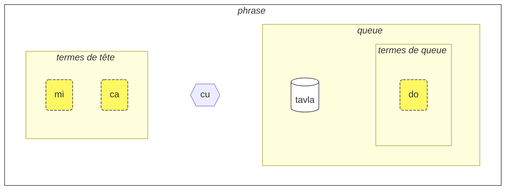
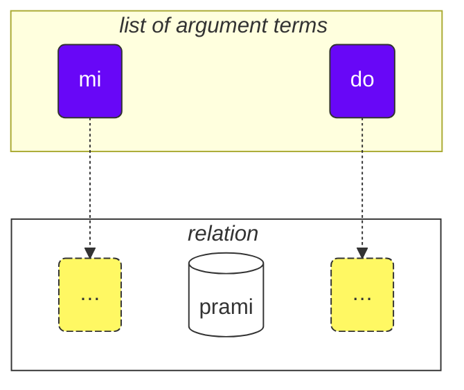

Comment procéder avec ce cours :

<ol data-md-type="list" data-md-list-type="ordered" data-md-list-tight="true">
<li data-md-type="list_item" data-md-list-type="ordered">Lisez-le !</li>
<li data-md-type="list_item" data-md-list-type="ordered">Notez vos commentaires et suggestions.</li>
<li data-md-type="list_item" data-md-list-type="ordered">Envoyez-les sur <a href="https://lojban.pw/fr/articles/live_chat/" data-md-type="link">💬 le chat</a>.</li>
</ol>

## Leçon 1. Tour d'horizon de la langue

### Alphabet

Pour commencer, il faut savoir que l'alphabet du lojban s'appuie sur un alphabet latin, comme en français (voyelles en couleur) :

<dl><dd><b>a b c d e f g i j k l m n o p r s t u v x y z ' .</b></dd></dl>

<!-- L10N: Added examples of phonetic languages -->
En revanche, tout se prononce comme cela s'écrit, et tout s'écrit comme cela se prononce ! Le lojban possède une écriture parfaitement phonétique, comme le turc ou le finnois. D'autres langues sont "presque" dans ce cas, comme l'espagnol, l'italien, ou le russe.

Il y a 6 voyelles simples en lojban, qui sont relativement proches des voyelles françaises :

<table>
<tbody><tr>
<td><b class="audio-inline">a</b></td>
<td> comme dans <i>t<u>a</u>ble</i></td>
</tr>
<tr>
<td><b class="audio-inline">e</b></td>
<td> comme dans <i>m<u>e</u>rci</i> ou dans <i>fen<u>ê</u>tre</i> ("è", et non "e" ou "eu" comme dans <i>jeu</i>)</td>
</tr>
<tr>
<td><b class="audio-inline">i</b></td>
<td> comme dans <i>mach<u>i</u>ne</i></td>
</tr>
<tr>
<td><b class="audio-inline">o</b></td>
<td> comme dans <i>p<u>o</u>rte</i> (un "o" ouvert, et non fermé comme dans <i>beau</i> ou <i>bateau</i>).</td>
</tr>
<tr>
<td><b class="audio-inline">u</b></td>
<td> comme dans <i>p<u>ou</u>le</i> ("ou", et non "u" comme dans <i>but</i>)</td>
</tr>
<tr>
<td><b class="audio-inline">y</b></td>
<td> comme dans <i>d<u>e</u></i> ("e ouvert") ou <i>entreprise</i></td>
</tr>
<tr>
</tbody></table>

<!-- L10N: Added detail about "graphèmes" -->
Il n'y a en lojban que des "graphèmes simples". Cela signifie que les lettres successives sont lues séparément et qu'il n'y a pas de "groupe" de lettres (digramme, trigramme, etc.) comme "ai" (prononcé "è"), "ez" (prononcé "é"), "ou", "ain", etc.
Malgré tout, on peut considérer les "voyelles composites" suivantes :

<table>
<tbody><tr>
<td><b class="audio-inline">au</b></td>
<td> comme dans "<i>mi<u>aou</u> !</i>"</tr>
<tr>
<td><b class="audio-inline">ai</b></td>
<td> comme dans <i>m<u>aï</u>s</i></td></tr>
<tr>
<td><b class="audio-inline">ei</b></td>
<td> comme dans <i>p<u>ay</u>s</i></td></tr>
<tr>
<td><b class="audio-inline">oi</b></td>
<td> comme dans <i>M<u>oï</u>se</i></td></tr>
</tbody></table>

Quant aux consonnes, elles sont elles aussi très proches du français, de l'anglais, ou du latin. Il y a tout de même quelques différences :

<table>
<tbody><tr>
<td><b class="guibutton">c</b>
</td>
<td>est prononcé <i>ch</i> comme dans <i>chou</i> ("c" prononcé "à l'italienne").
</td></tr>
<tr>
<td><b class="guibutton">g</b>
</td>
<td>toujours prononcé <i>gu</i> comme dans <i>gâteau</i> (jamais <i>j</i> comme dans <i>gérer</i>, même suivi d'un "e" ou d'un "i").
</td></tr>
<tr>
<td><b class="guibutton">j</b>
</td>
<td>comme dans <i>bonjour</i>.
</td></tr>
<tr>
<td><b class="guibutton">x</b>
</td>
<td>son inexistant en français, se prononçant comme la "jota" espagnole (<i>j</i> dans le prénom <i>Jose</i>), ou comme <i>ch</i> dans le mot écossais <i>loch</i>, ou <i>Kh</i> dans le prénom arabe moderne <i>Khaled</i>, ou comme dans le nom allemand <i>Bach</i>.
</td></tr>
<tr>
<td><b class="guibutton"> ' </b>
</td>
<td><i>h</i> aspiré. L'apostrophe est considérée comme une lettre à part entière en lojban. Elle ne peut être trouvée qu'entre des voyelles. Par exemple, <b>u'i</b> est prononcé comme <i>ou-h-i</i> (alors que <b>ui</b> est prononcé comme <i>ou-i</i>).
</td></tr>
<tr>
<td><b>.</b>
</td>
<td>le point ("arrêt") est également considéré comme une lettre en lojban. Ce n'est pas un signe de ponctuation. C'est une courte pause dans la parole pour éviter que les mots ne se chevauchent. En fait, tout mot commençant par une voyelle a un point placé devant lui. Cela aide à éviter la fusion indésirable de deux mots consécutifs.
</td></tr>
<tr>
<!-- L10N: Added a table entry for "r", removed the sentence about it below the table. -->
<td><b class="guibutton">r</b>
</td>
<td>prononcé comme un "r roulé", comme le <i>r</i> en anglais, écossais, russe, ou autre. Il y a une large gamme de prononciations acceptables. Notez qu'il n'est pas recommandé de prononcer le <i>r</i> "à la française" car trop proche du <i>x</i> lojban.
</td></tr>
<tr>
<!-- L10N: Added a specific entry for "s" as it is pronounced "z" in many cases in French. -->
<td><b class="guibutton">s</b>
</td>
<td>toujours prononcé <i>s</i> comme dans <i>passer</i> (jamais <i>z</i> comme dans <i>poser</i>).
</td></tr>
<tr>
<td><b>i</b>
</td>
<td><b>i</b> avant les voyelles est considéré comme une <a href="https://fr.wikipedia.org/wiki/Semi-voyelle">semi-voyelle</a> et prononcé plus court, par exemple :
<ul><li><b>ia</b> est prononcé comme dans <i>pa<u>illa</u>sson</i></li>
<li><b>ie</b> est prononcé comme dans <i>ma<u>illet</u></i></li></ul>
</td></tr>
<tr>
<td><b>u</b>
</td>
<td>De même, <b>u</b> avant les voyelles est considéré comme une <a href="https://fr.wikipedia.org/wiki/Semi-voyelle">semi-voyelle</a> et prononcé plus court, par exemple :
<ul><li><b>ui</b> est prononcé comme <i>oui</i></li>
<li><b>ue</b> est prononcé comme <i>ouais</i></ul>
</td></tr></tbody></table>

L'accent tonique d'un mot est mis sur l'avant-dernière voyelle du mot (si tant est qu'il ait plus d'une seule voyelle !). Ainsi <i>tavla</i> (qui signifie _parler à_) sera articulé <i>t<b>a</b>vla</i>.

Notez que certains locuteurs utilisent des voyelles non-lojban (comme le _i_ court et le _u_ dans l'anglais britannique _hit_ et _but_) pour séparer les sons quand ils ont du mal à prononcer deux consonnes à la suite. Vous pourrez par exemple entendre **tavla** prononcé _tavɪla_ — où le _ɪ_ est très court. C'est cependant une exception : les voyelles (comme **a** et **u**) doivent être "longues".

### Phrases simples

Construisons maintenant nos premières phrases en lojban. Voici trois exemples simples :

> **le prenu cu tavla mi**
> _La personne me parle._

le prenu
: la personne

tavla
: … parler à …, … parler avec …

mi
: moi

> **mi prami do**
> _Je t'aime._

prami
: … aimer … (quelqu'un)

do
: toi

> **mi ca cu tavla do**
> _Je te parle maintenant._

ca
: maintenant

<pixra url="/assets/pixra/cilre/tavla.webp" caption="le prenu cu tavla mi" definition="The person talks to me."></pixra>

<pixra url="/assets/pixra/cilre/mi.webp" caption="mi" definition="I / me"></pixra>

<pixra url="/assets/pixra/cilre/mi_prami_do2.webp" caption="mi prami do" definition="I love you."></pixra>

<pixra url="/assets/pixra/cilre/do.webp" caption="do" definition="you"></pixra>

Les phrases lojban contiennent les parties suivantes, de gauche à droite :

- la tête :
  - composée de "termes",
  - **le prenu** est le seul terme de tête dans l'exemple **le prenu cu tavla mi** ci-dessus,
  - **mi**, **ca** sont des termes de tête dans l'exemple **mi ca cu tavla do** ci-dessus.
    - **le prenu** is the only head term in the example **le prenu cu tavla mi** above,
    - **mi**, **ca** are head terms in the example **mi ca cu tavla do** above.
- le séparateur de tête (**cu**) :
  - prononcé comme _chou_ (rappel: **c** se prononce _ch_),
  - indique que la tête est terminée,
  - peut être omis (lorsqu'il est évident).
<!-- - la queue :
  - la relation principale (**tavla**, **prami**) avec éventuellement un ou plusieurs termes après,
  - **mi** est le seul terme de queue dans l'exemple **le prenu cu tavla mi**.
  - **do** est le seul terme de queue dans l'exemple **mi ca cu tavla do**. -->
- the main relation construct (called "**selbrisni**" in Lojban) 
  - \+ possibly one or more terms after it,
    - **tavla**, **prami** are selbrisni, main relation constructs in the examples above.
    - **mi** is the only tail term in the example **le prenu cu tavla mi** above.
    - **do** is the only tail term in the example **mi prami do** above.

En lojban, on parle plutôt de "relation" que de "noms" ou de "verbes".

Dans notre cas présent, les mots de relation lojban correspondent plus ou moins à des verbes en français :

prenu
: … être une personne / des gens

tavla
: … parler à …

Each relation has one or more roles that can also be called "slots" or "places". Above, they are labelled with "…" Those slots are to be filled with arguments (called "**sumti**" in Lojban). Argument terms are constructs like **le prenu**, **mi**, **do** no matter whether those terms end up being in a head or in a tail of a sentence. We put argument terms in order, thus filling these slots and giving a concrete meaning to the relation.

We can also turn such relation into an argument term.

For that we put a short word **le** in front of it:

prenu
: … is a person

le prenu
: the person, the people

De même,

tavla
: … parler à …

devient

le tavla
: le locuteur, les locuteurs

Cela peut sembler surprenant que _personne_ puisse être un "verbe" ; pourtant cela rend le lojban très simple dans la construction de mots :

<table>
<thead>
<tr>
<th>relation word with slots unfilled</th>
<th>argument form (<b>sumti</b>)</th></tr>
</thead>
<tbody>
<tr>
<td><b>prenu</b> — <i>… (someone) is a person</i> </td>
<td><b>le prenu</b> — <i>the person / the people</i>
     <b>le prenu</b> — <i>the one who is a person / those who are people</i>
</td></tr>
<tr>
<td><b>tavla</b> — <i>… (someone) speaks to … (someone)</i> </td>
<td><b>le tavla</b> — <i>the speaker / the speakers</i>
     <b>le tavla</b> — <i>the one who is a speaker / those who are speakers</i>
</td></tr>
</tbody></table>

The first slot of the relations disappears when using **le**, hence such alternative translations as _the one who …_ is possible.

Notice, that Lojban, by default, doesn't specify number between _the speaker_ or _the speakers_. That is, **le tavla** is vague in that regard, and we will soon discover ways to define the number.

Apart from argument terms there are modal terms like **ca**:

> **mi ca cu tavla do**
> _I now talk to you._

ca
: now

Modal terms do not fill slots of the main relation construct ("**selbrisni**"). Instead, they are applied to the whole sentence enriching or narrowing its meaning.

Thus, terms in Lojban are represented with:

- argument terms that fill in slots of relations. Examples are:
  - nouns like **le prenu** (_the person_)
  - pronouns like **mi** (_I_, _me_), **do** (_you_). Pronouns work exactly as nouns, but **le** is not used for them. They work as arguments on their own.
- modal terms that do not fill slots of relations but specify additional, сlarifying information.
  - for example, **ca** (_now, in present_).

On peut ainsi dire que **le** crée un nom à partir d'un mot de relation. On peut le lire comme _celui qui est…_ (_est une personne_ / _la personne_), _ceux qui font…_ (_parler à_ / _les locuteurs_), _ceux qui sont…_ (_sont des gens_ / _les gens_), etc.

Par défaut, le lojban ne précise ni genre ni nombre. On ne différencie donc pas _le locuteur_ / _les locuteurs_ / _la locutrice_ / _les locutrices_. On pourra bien évidemment préciser genre et nombre dans la phrase (plus loin dans ce cours) ou déduire des informations du contexte.
<!-- L10N: Added info about translations in French, as language has neither neutral gender nor neutral number -->
Vous verrez ainsi que les traductions en français seront variables : parfois un terme sera traduit au singulier, parfois au pluriel. Il en va de même avec le genre : si la phrase en lojban ne précise rien sur une personne, la traduction pourra être construite avec "il" ou "elle", par exemple. Plus loin dans ce cours, vous apprendrez que le lojban peut aussi être neutre sur le temps (de conjugaison).

Les termes en lojban, quel que soit l'endroit où ils sont utilisés dans la phrase, sont principalement représentés par :

- des noms comme **le prenu** (_la personne_)
- des pronoms comme **mi** (_je_, _moi_), **do** (_tu_). Les pronoms fonctionnent exactement comme des noms, mais n'ont pas besoin de **le** (un peu comme si c'était déjà intégré dans le pronom).
- des termes modaux comme **ca** (_maintenant, au présent_). Les modaux ajoutent des précisions, des informations complémentaires.

Quelques exemples supplémentaires :

<pixra url="/assets/pixra/cilre/nintadni.webp" caption="mi nintadni" definition="I am a new student, a fresher."></pixra>

> **mi nintadni**
> _Je suis un nouvel étudiant._

nintadni
: … être un nouvel étudiant, un débutant

Notez qu'il n'y a pas à introduire de verbe "être" : la relation **nintadni** (_… être un nouvel étudiant_) se suffit à elle-même, un peu comme si "être" était déjà intégré dans le mot de relation.

> **do jimpe**
> _Tu comprends._

jimpe
: … comprendre … (quelque chose)

<pixra url="/assets/pixra/cilre/pilno_le_fonxa.webp" caption="le prenu cu pilno le fonxa" definition="La personne utilise le téléphone."></pixra>

> **mi pilno le fonxa**
> _J'utilise le téléphone._

pilno
: … utiliser … (quelque chose)

fonxa
: … être un téléphone, des téléphones

le fonxa
: le téléphone, les téléphones

<pixra url="/assets/pixra/cilre/citka.webp" caption="mi citka" definition="I eat."></pixra>
<pixra url="/assets/pixra/cilre/citka.webp" caption="mi citka" definition="Je mange."></pixra>

> **mi citka**
> _Je mange._

citka
: … manger … (quelque chose)

<!-- -->

> **do citka**
> _Tu manges._

> **mi citka le plise**
> _Je mange les pommes._

<pixra url="/assets/pixra/cilre/le_plise_cu_kukte.webp" caption="le plise cu kukte" definition="Les pommes sont délicieuses."></pixra>

> **le plise cu kukte**
> _Les pommes sont délicieuses._

Ici, **le plise** signifie _les pommes_, **kukte** signifie _est délicieux / sont délicieuses_.

Notez que l'on peut construire une phrase en lojban avec un unique mot de relation :

<pixra url="/assets/pixra/cilre/karce.webp" caption="karce" definition="C'est une voiture."></pixra>

> **karce**
> _Voiture !_
> _C'est une voiture._

On peut utiliser **karce** seul, en voyant une voiture arriver : avec le contexte, on comprend que nous sommes dans une situation de danger avec une voiture qui approche (par exemple).

**karce** lui-même est un mot relationnel signifiant _est une voiture_.

On peut évidemment être plus précis et dire, par exemple :

> **ti karce**
> _Ceci est une voiture._

ti
: pronom : cette chose près de moi

<pixra url="/assets/pixra/cilre/ti.webp" caption="ti" definition="celui-ci (près de moi, l'orateur)"></pixra>

De même:

<pixra url="/assets/pixra/cilre/carvi.webp" caption="carvi" definition="… être une pluie"></pixra>

> **carvi**
> _Il pleut._

où

carvi
: … pleuvoir, … être de la pluie

ou

> **pluka**
> _C'est agréable._

où

pluka
: … être agréable

Remarquez qu'en lojban, il n'y a pas besoin d'ajouter _c'est_. Utilisez simplement le mot de relation dont vous avez besoin.

> **prami**
> _Quelqu'un aime._

<pixra url="/assets/pixra/cilre/bajra.webp" caption="le prenu cu bajra" definition="La personne court."></pixra>

> **bajra**
> _Quelqu'un court._

bajra
: … courir

Encore une fois, le contexte indique probablement "qui" aime "qui", et "qui" court.

### Exercice

<pixra url="/assets/pixra/cilre/pinxe_le_djacu.webp" caption="le prenu cu pinxe le djacu" definition="La personne boit de l'eau."></pixra>

pinxe
: … boire … (quelque chose)

le djacu
: l'eau

Cachez la partie droite du tableau et entrainez-vous à traduire les phrases de gauche en français.

<table style="table-layout: fixed;">
<tbody><tr>
<td><b>do citka</b>
</td>
<td><i>Tu manges.</i>
</td></tr>
<tr>
<td><b>mi pinxe le djacu</b>
</td>
<td><i>Je bois de l'eau.</i>
</td></tr>
<tr>
<td><b>mi citka le plise</b>
</td>
<td><i>Je mange des pommes (ou "une pomme").</i>
</td></tr></tbody></table>

### Le séparateur de phrases « **.i** »

Il n'existe pas de ponctuation en lojban, à proprement parler. C'est le petit mot **.i** qui sépare les phrases consécutives.

> **mi tavla le prenu .i le prenu cu tavla mi**
> _Je parle aux gens. Les gens me parlent._

**.i** sépare les phrases, à la manière du point en fin de phrase en français.

<!-- L10N: Reorganized sentences contents. -->
<!-- L10N: Added precision about voice tone. -->
<!-- L10N: Added precision about French punctuation. -->
Lorsqu'on enchaine des phrases en français, on fait une pause relativement courte entre deux et la tonalité de la voix change en fin de phrase. Mais une pause peut aussi avoir d'autres significations (virgule, point-virgule, points de suspension…).
Notez qu'en parlant rapidement il est parfois difficile (ou ambigu) de savoir où une phrase se termine et où le mot de la phrase suivante commence.

En lojban, cette séparation est explicite. Il est même conseillé d'utiliser le mot **.i** _avant_ de commencer une nouvelle phrase, afin de bien marquer son intention.

### Chiffres et nombres: ‘_1 2 3 4 5 6 7 8 9 0_’ = « **pa re ci vo mu xa ze bi so no** »

**le** simply turns a relation construct into an argument, but such argument has no number associated with it. The sentence

<!-- Comme vu précédemment, **le** transforme simplement un "verbe" en un "nom", mais sans nombre associé. La phrase -->

> **le prenu cu tavla mi**
> _La personne me parle._
> _Les gens (les personnes) me parlent._

<!-- ne précise pas le nombre de personnes qui me parlent. En français, comme en anglais, il n'est pas possible d'omettre le nombre ; par exemple les mots _gens_ et _personnes_ indiquent un pluriel, et donc qu'il y a _plus d'une personne_. En lojban, la précision est optionnelle. -->

doesn't specify the number of people talking to me. In English, it is impossible to omit the number because _people_ in English implies _more than one person_. However, in Lojban, you can omit the number.

Voyons comment spécifier le nombre de personnes dans notre cas.

Ajoutons un nombre après **le**.

<table>
<tbody><tr>
<td><b>pa</b>
</td>
<td><b>re</b>
</td>
<td><b>ci</b>
</td>
<td><b>vo</b>
</td>
<td><b>mu</b>
</td>
<td><b>xa</b>
</td>
<td><b>ze</b>
</td>
<td><b>bi</b>
</td>
<td><b>so</b>
</td>
<td><b>no</b>
</td></tr>
<tr>
<td> 1
</td>
<td> 2
</td>
<td> 3
</td>
<td> 4
</td>
<td> 5
</td>
<td> 6
</td>
<td> 7
</td>
<td> 8
</td>
<td> 9
</td>
<td> 0
</td>
</tr></tbody></table>

<pixra url="/assets/pixra/cilre/ci_prenu.webp" caption="le ci prenu" definition="Les trois personnes"></pixra>

> **le pa prenu cu tavla mi**
> _La personne me parle._

En ajoutant un nombre après **le**, cela précise une quantité.

Pour les nombres composés de plusieurs chiffres, nous les mettons simplement bout à bout.

> **le re mu prenu cu tavla mi**
> _Les 25 personnes me parlent._

Oui, c'est aussi simple que ça !

Du coup, pour compter ou énumérer, il suffit de séparer les nombres avec **.i** :

> **mu .i vo .i ci .i re .i pa .i no**
> _5 … 4 … 3 … 2 … 1 … 0_

<!-- L10N: Added -->
Il y a même la possibilité d'avoir des "nombres" qui ne sont pas des valeurs numériques, mais des ensembles ou des notions vagues.
Le nombre **za'u** signifie _plus de …_ (_\>_ en mathématiques), le nombre **me'i** signifie _moins de_ (_<_) :

> **le za'u re prenu cu tavla mi**
> _Plus de deux personnes me parlent._

<!-- -->

> **le me'i pa no prenu cu tavla mi**
> _Moins de 10 personnes me parlent._

<!-- -->

> **le za'u ci prenu cu tavla mi**
> _Plus de trois personnes me parlent._

Pour dire simplement _les gens_ (nombre pluriel) par opposition à _une personne_, nous utilisons **za'u pa**, _plus d'une_ ou simplement **za'u**.

> **le za'u pa prenu cu tavla mi**
> **le za'u prenu cu tavla mi**
> _Les gens me parlent._

**za'u** signifie par défaut **za'u pa**. C'est pour cela que l'on peut omettre de préciser la quantité.

le prenu
: la personne / les gens (en général)

le pa prenu
: la personne (singulier, une seule)

le za'u prenu
: les gens (pluriel, deux ou plus)

### Exercice

stati
: … être doué, … a un talent

<pixra url="/assets/pixra/cilre/stati.webp" caption="stati" definition="… a un talent"></pixra>

klama
: … aller à / venir à … (un lieu ou un objet)

<pixra url="/assets/pixra/cilre/klama_ti.webp" caption="le prenu cu klama ti" definition="La personne est venue ici."></pixra>

nelci
: … aimer, apprécier (quelque chose)

le zarci
: le marché, le magasin

<pixra url="/assets/pixra/cilre/zarci.webp" caption="le prenu cu zvati le zarci" definition="La personne est au magasin."></pixra>

le najnimre
: l'orange (fruit), les oranges

<pixra url="/assets/pixra/cilre/najnimre.webp" caption="najnimre" definition="… être une orange"></pixra>

le badna
: la banane, les bananes

<pixra url="/assets/pixra/cilre/badna.webp" caption="badna" definition="… être une banane"></pixra>

Cachez la partie droite du tableau et entrainez-vous à traduire les phrases de gauche en français.

<table style="table-layout: fixed;">
 <tbody>
  <tr>
   <td>le mu prenu cu klama le zarci</td>
   <td>Les cinq personnes vont au marché.</td>
  </tr>
  <tr>
   <td>le pa re prenu cu stati .i do stati</td>
   <td>Les 12 personnes sont douées. Tu es doué(e).</td>
  </tr>
  <tr>
   <td>le prenu cu nelci le plise</td>
   <td>Les gens aiment les pommes.</td>
  </tr>
  <tr>
   <td>le za'u re prenu cu citka .i le me'i mu prenu cu pinxe le djacu</td>
   <td>Plus de deux personnes mangent. Moins de 5 personnes boivent de l'eau.</td>
  </tr>
  <tr>
   <td>le za'u re prenu cu stati</td>
   <td>Plus de deux personnes sont douées.</td>
  </tr>
 </tbody>
</table>

Cachez la partie droite du tableau et entrainez-vous à traduire les phrases de gauche en lojban.

<table style="table-layout: fixed;">
 <tbody>
  <tr>
   <td>Les 256 personnes sont douées.</td>
   <td>le re mu xa prenu cu stati</td>
  </tr>
  <tr>
   <td>Moins de 12 pommes sont délicieuses.</td>
   <td>le me'i pa re plise cu kukte</td>
  </tr>
 </tbody>
</table>

### Relation composée

Une relation composé (**le tanru**, en lojban) est une relation constituée de plusieurs relations, simplement juxtaposés.

> **tu melbi zdani**
> _C'est une belle maison._

<pixra url="/assets/pixra/cilre/melbi_zdani.webp" caption="melbi zdani" definition="… être une belle maison"></pixra>

tu
: celui-là (loin de toi et moi)

melbi
: … être beau, joli

zdani
: … être une maison ou un nid pour … (quelqu'un)

melbi zdani
: compound relation construct: … is a beautiful home to … (someone)

<pixra url="/assets/pixra/cilre/dansu.webp" caption="le prenu cu melbi dansu" definition="La personne danse bien (joliment)."></pixra>

> **do melbi dansu**
> _Tu danses bien (joliment)._

Here, the relation **melbi** adds an additional meaning as it is placed to the left of another relation: **zdani**. The left component is usually translated using adjectives and adverbs.

Compound relations are a powerful feature that produces richer meanings. You just string two relation words together, and the left component of such compound relation adds a flavor to the right one.

We can put **le** (e.g. with a number) to the left of such compound relation getting a richer argument term:

<!-- 
Ici, le verbe **melbi** ajoute une signification supplémentaire car il est placé à gauche d'un autre verbe : **zdani**. La partie gauche est généralement traduite comme adjectifs ou adverbes.

Le verbe composé est une règle de grammaire simple mais puissante, qui ajoute du sens et des précisions. Il suffit d'accoler un deuxième verbe à gauche du premier, et la partie de gauche "qualifie" (modifie) celle de droite.

Comme un **tanru** est un verbe, le faire précéder de **le** (possiblement avec un nombre) permet d'obtenir un _nom_ composé : -->

le pa melbi zdani
: la belle maison

Now you know why there was **cu** after head terms in our example:
<!-- Maintenant, vous savez pourquoi il y avait **cu** après les noms ! En effet, l'exemple -->

> **le pa prenu cu tavla mi**
> _La personne me parle._

sans **cu** deviendrait **le pa prenu tavla**. Cela signifierait _la personne-parlante_ — quoi que cela puisse vouloir dire !

Autre exemple :

> **le pa tavla pendo**
> _L'ami qui parle_
<!-- -->
> **le pa tavla cu pendo**
> _Celui qui parle est un ami._

Remember about placing **cu** before the main relation construct in a sentence to prevent unintentional creation of compound relations.

Compound relation can contain more than two components. In this case, the first relation modifies the second one, the second one modifies the third, and so on:

<!-- N'oubliez pas de placer **cu** avant le mot de relation dans une phrase, afin d'éviter la création involontaire de verbes composés.

Les verbes composés peuvent contenir plus de deux verbes. Dans ce cas, le premier verbe modifie le deuxième, le deuxième modifie le troisième, et ainsi de suite : -->

<pixra url="/assets/pixra/cilre/cmalu_karce.webp" caption="ti cmalu karce" definition="Ceci est une petite voiture."></pixra>

> **le pa melbi cmalu karce**
> _la jolie petite voiture ("la voiture, petite, d'une jolie manière")_

<!-- -->

> **le mutce melbi zdani**
> _la très belle maison_

mutce
: … être très, … être beaucoup

### Exercice

sutra
: … être rapide

barda
: … être grand

cmalu
: … être petit

mlatu
: … être un chat

Cachez la partie droite du tableau et entrainez-vous à traduire les phrases de gauche en français.

<table style="table-layout: fixed;">
<tbody><tr>
<td><b>le melbi karce</b>
</td>
<td><i>la belle voiture / les belles voitures</i>
</td></tr>
<tr>
<td><b>do sutra klama</b>
</td>
<td><i>Vous allez vite / Vous venez rapidement.</i>
</td></tr>
<tr>
<td><b>tu barda zdani</b>
</td>
<td><i>C'est une grande maison.</i>
</td></tr>
<tr>
<td><b>le pa sutra bajra mlatu</b>
</td>
<td><i>le chat qui court rapidement</i>
</td></tr>
<tr>
<td><b>le pa sutra mlatu</b>
</td>
<td><i>le chat rapide</i>
</td></tr>
<tr>
<td><b>le pa bajra mlatu</b>
</td>
<td><i>le chat qui court</i>
</td></tr></tbody></table>

Cachez la partie droite du tableau et entrainez-vous à traduire les phrases de gauche en lojban.

<table style="table-layout: fixed;">

<tbody><tr>
<td><i>C'est une petite voiture.</i>
</td>
<td><b>ti cmalu karce</b>
</td></tr>
<tr>
<td><i>des pommes savoureuses</i>
</td>
<td><b>le kukte plise</b>
</td></tr>
<tr>
<td><i>les mangeurs rapides</i>
</td>
<td><b>le sutra citka</b>
</td></tr>
<tr>
<td><i>Vous êtes une personne qui marche rapidement.</i>
</td>
<td><b>do sutra cadzu prenu</b>
</td></tr></tbody></table>

### Questions totales (« oui/non »)

Une question totale est une question fermée à laquelle on ne peut répondre que par "oui" ou "non". En français, une question totale peut être structurée de différentes manières. On peut par exemple faire une inversion sujet-verbe :

> _Tu es … ⇒ Es-tu … ?_

ou conserver la phrase affirmative et la préfixer :

> _Est-ce que … ?_

Mais il existe bien d'autres manières. En lojban, c'est plus simple. Pour transformer une affirmation en une question totale, il suffit d'ajouter **xu** quelque part dans la phrase (le plus souvent au début) en conservant l'ordre des mots :

> **xu do nelci le gerku**
> _Est-ce que tu aimes les chiens ? Aimes-tu les chiens ?_

le gerku
: le chien, les chiens

<pixra url="/assets/pixra/cilre/le_prenu_e_le_gerku.webp" caption="ti prenu .i ti gerku" definition="Ceci est une personne. Ceci est un chien."></pixra>

Rappelez-vous qu'en lojban, la ponctuation n'existe pas à proprement parler. On peut en ajouter de manière facultative, comme le point d'interrogation, mais c'est surtout à des fins stylistiques. C'est parce que le mot interrogatif **xu** marque déjà qu'il s'agit d'une question.

D'autres exemples :

> **xu mi klama**
> _Est-ce que je viens ?_

klama
: … aller à / venir à … (quelque part)

> **xu pelxu**
> _Est-ce jaune ? Est-ce que c'est jaune ?_

pelxu
: … être jaune

Il est possible de déplacer **xu** pour préciser la question. Le mot précédent est alors mis en _emphase_ (on "insiste" dessus), afin de faire porter la réponse sur ce mot. En français, on aurait tendance à le prononcer plus fort à l'oral, ou parfois à faire un geste en le prononçant. Dans les exemples ci-dessous, des exemples d'interprétation sont donnés entre parenthèses :

> **xu do nelci le gerku**
> _Est-ce que tu aimes les chiens ?_

<!-- -->

> **do xu nelci le gerku**
> _Est-ce que TU aimes les chiens ? (Je pensais que c'était quelqu'un d'autre qui les aimait)._

<!-- -->

> **do nelci xu le gerku**
> _Est-ce que tu AIMES les chiens ? (Je pensais que tu étais simplement neutre à leur égard)._

<!-- -->

> **do nelci le xu gerku**
> _Est-ce que tu aimes LES CHIENS ? (Je pensais que tu aimais les chats)._

<!-- -->

> **do nelci le gerku xu**
> _You like those things, are they dogs? (You only question the validity of the relation **gerku**)._

Ce qui est exprimé par l'intonation en français est explicité par le placement du mot **xu** en lojban, celui-ci étant placé après la partie à mettre en évidence. Notez que la phrase avec **xu** au début pose la question sans mettre d'accent sur un mot particulier.

Grammaticalement parlant, **xu** est une interjection :

- une interjection modifie la construction qui la précède:

 > **do xu nelci le gerku**
 > _Est-ce que TU aimes les chiens ?_

- lorsqu'elle est placée au début d'une relation, l'interjection modifie toute la relation :

 > **xu do nelci le gerku**
 > _Est-ce que tu aimes les chiens ? Aimes-tu les chiens ?_

- les interjections peuvent être placées après différentes parties de la même relation pour changer le sens.

 > **do nelci le gerku xu**
 > _You like those entities, are they dogs?_

 Here, only the relation **gerku** (not the argument **le gerku**) is modified by the question word **xu**. So here we wonder only of that relation. We assert that you like these objects or live beings and we ask you if those are dogs.

Les interjections ne rompent pas les relations composées. Elles peuvent être utilisées entre deux :

> **do nelci le barda xu gerku**
> _Est-ce que tu aimes les GROS chiens ?_

Maintenant que vous savez poser une question totale (« oui/non »), voyons comment y répondre. En lojban, il est possible de répéter le mot de la relation principale :

> **— xu le mlatu cu melbi**
> **— melbi**
> _— Les chats sont-ils jolis ?_
> _— Jolis._

Et pour répondre « non », on ajoute le terme modal **na ku** :

> **— xu le mlatu cu melbi**
> **— na ku melbi**
> _— Les chats sont-ils jolis ?_
> _— Pas jolis._

na ku
: terme : il est faux que …

Cela dit, nous pouvons aussi utiliser la relation spéciale **go'i** :

> **— xu le mlatu cu melbi**
> **— go'i**
> _— Les chats sont-ils jolis ?_
> _— Jolis._

go'i
: relation qui répète la relation principale de la phrase précédente

Ici, **go'i** signifie la même chose que **melbi** puisque **melbi** est la relation de la relation précédente.

> **— xu le mlatu cu melbi**
> **— na ku go'i**
> _— Les chats sont-ils beaux ?_
> _— Pas jolis._

<!-- Ce cours ne recommande pas **go'i** à la forme négative. Préférez **je'u nai**. -->

Le terme modal **na ku** peut être utilisé ailleurs que dans les réponses :

> **na ku mi nelci le gerku**
> _Il est faux que j'aime les chiens._
> _Je n'aime pas les chiens._
<!-- -->
> **mi na ku nelci do**
> _Je ne t'aime pas._

Son opposé, **ja'a ku** affirme (ou confirme) le sens :

> **mi ja'a ku nelci do**
> _Je t'apprécie / Je t'apprécie vraiment._

ja'a ku
: terme : il est vrai que … 

<!-- L10N: Added explanation since affirming with ja'a (jbo) or do (eng) doesn't have a direct equivalent in French. -->
Cette formulation permet d'insister sur le verbe. Elle existe en anglais (<i>do + verbe</i>), mais elle n'a pas d'équivalent direct en français. On peut la traduire par des adverbes ou compléments ("je veux" / "je veux vraiment" / "je veux à tout prix"), une intonation plus prononcée ("je VEUX"), des synonymes plus forts ("j'exige"), et/ou une ponctuation spécifique (souvent des points d'exclamation).

### Exercice

Cachez la partie droite du tableau et entrainez-vous à traduire les phrases de gauche en français.

<table style="table-layout: fixed;">

<tbody><tr>
<td><b>xu le barda zdani cu melbi</b>
</td>
<td><i>La grande maison est-elle belle ?</i>
</td></tr>
<tr>
<td><b>— le prenu cu stati xu — na ku stati</b>
</td>
<td><i>— Les gens sont-ils doués ? — Non.</i>
</td></tr>
<tr>
<td><b>do klama le zarci xu</b>
</td>
<td><i>Allez-vous au MARCHÉ ?</i>
</td></tr>
<tr>
<td><b>xu le verba cu prami le mlatu</b>
</td>
<td><i>L'enfant aime-t-il les chats ?</i>
</td></tr></tbody></table>

Cachez la partie droite du tableau et entrainez-vous à traduire les phrases de gauche en lojban.

<table style="table-layout: fixed;">

<tbody><tr>
<td><i>La voiture est-elle rapide ?</i>
</td>
<td><b>xu le karce cu sutra</b>
</td></tr>
<tr>
<td><i>— L'orange est-elle bonne ? — Oui, elle l'est.</i>
</td>
<td><b>— xu le najnimre cu kukte — kukte</b>
</td></tr>
<tr>
<td><i>Le chien t'aime-t-il ?</i>
</td>
<td><b>xu le gerku cu prami do</b>
</td></tr></tbody></table>

### Joie et demandes polies : « _Youpi !_ » = « **ui** », « _S'il vous plait_ » = « **.e'o** »

<!-- L10N: Added introductory sentence. -->
Les interjections lojban permettent de modifier radicalement une phrase, en précisant un sentiment ou une intention globale.

L'interjection **ui** indique que celui qui parle est heureux, joyeux. Elle est utilisée comme le smiley « _:)_ » sur messagerie, pour indiquer que vous êtes content de quelque chose. Les smileys peuvent être ambigus, mais **ui** n'a qu'une seule signification, ce qui est bien pratique.

> **ui do klama**
> _Super, tu viens !_

ui
: interjection de joie, comme _Youpi !_, _Super !_, etc.

L'interjection **.e'o** au début d'une phrase la transforme en une demande polie :

> **.e'o do lebna le fonxa**
> _Pourrais-tu prendre le téléphone, s'il te plait ?_
> `S'il te plait, prends le téléphone.`

.e'o
: interjection : s'il te plait (prononcé comme _é-h-o_ avec un _h_ aspiré, et une courte pause avant le mot)

lebna
: prendre (quelque chose)

En français, pour être poli, on utilise des constructions complexes, comme _Pourrais-tu (une requête), s'il te plait ?_. En lojban, **.e'o** devant une affirmation suffit pour en faire une demande polie.

### Exercice

Cachez la partie droite du tableau et entrainez-vous à traduire les phrases de gauche en français.

le tcati
: le thé

<pixra url="/assets/pixra/cilre/tcati.webp" caption="tcati" definition="… être du thé"></pixra>

le ckafi
: le café

<pixra url="/assets/pixra/cilre/ckafi.webp" caption="ckafi" definition="… être du café"></pixra>

zgana
: observer, regarder (en utilisant tous les sens)

le skina
: le film

<pixra url="/assets/pixra/cilre/zgana_le_skina.webp" caption="le prenu cu zgana le skina" definition="La personne regarde le film."></pixra>

kurji
: prendre soin de (quelqu'un, quelque chose)

<table style="table-layout: fixed;">
<tbody>
<tr>
<td><b>ui carvi</b>
</td>
<td><i>Hourra, il pleut !</i>
</td></tr>
<tr>
<td><b>.e'o do sutra bajra</b>
</td>
<td><i>Cours vite, s'il te plait !</i>
</td></tr>
<tr>
<td><b>.e'o do pinxe le tcati</b>
</td>
<td><i>Je t'en prie, bois du thé !</i>
</td></tr>
<tr>
<td><b>.e'o zgana le skina</b>
</td>
<td><i>S'il te plait, regarde le film !</i>
</td></tr></tbody></table>

Cachez la partie droite du tableau et entrainez-vous à traduire les phrases de gauche en lojban.

<table style="table-layout: fixed;">
<tbody><tr>
<!-- L10N: Changed initial example (".e'o do stati"), as it was a non-trivial translation. Indeed, it may require to be translated "S'il te plait, fais attention !" in some contexts. -->
<td><i>Parle, s'il te plait.</i>
</td>
<td><b>.e'o tavla</b>
</td></tr>
<tr>
<td><i>S'il te plait, rentre chez toi.</i>
</td>
<td><b>.e'o do klama le zdani</b>
</td></tr>
<tr>
<td><i>Je t'en prie, bois le café !</i>
</td>
<td><b>.e'o do pinxe le ckafi</b>
</td></tr>
<tr>
<td><i>Je suis super content de te parler !</i>
</td>
<td><b>ui mi tavla do</b>
</td></tr>
<tr>
<td><i>S'il te plait, prends soin de l'enfant.</i>
</td>
<td><b>.e'o do kurji le verba</b>
</td></tr></tbody></table>

### 'Et' et 'ou'

> **do nintadni .i je mi nintadni**
> _Tu es un débutant. Et je suis un débutant._

<!-- -->

> **do .e mi nintadni**
> _Toi et moi sommes des débutants._

<pixra url="/assets/pixra/cilre/do_e_mi_nintadni.webp" caption="do .e mi nintadni" definition="Toi et moi sommes des débutants / apprentis."></pixra>

<!-- -->

> **mi tadni .i je mi tavla do**
> _J'étudie. Et je te parle._

<!-- -->

> **mi tadni gi'e tavla do**
> _J'étudie et je te parle._

.i je
: conjonction "et" combinant des phrases en une seule.

.e
: conjonction "et" reliant des arguments.

gi'e
: conjonction "et" reliant des fins de phrases.

On peut combiner deux phrases en une seule en utilisant la conjonction **.i je** (qui signifie _et_) :

> **do nintadni .i je mi nintadni**
> _Tu es un débutant. Et je suis un débutant._

Comme les deux phrases ont la même fin, on peut utiliser une contraction. La conjonction **.e** signifie _et_ pour les arguments :

> **do .e mi nintadni**
> _Toi et moi sommes des débutants._

**do nintadni .i je mi nintadni** signifie exactement la même chose que **do .e mi nintadni**

On peut également utiliser **.e** pour relier des arguments à d'autres endroits de la phrase. Ainsi les deux phrases suivantes ont le même sens :

> **mi pinxe le djacu .e le jisra**
> _Je bois de l'eau et du jus._
> **mi pinxe le djacu .i je mi pinxe le jisra**
> _Je bois de l'eau, et je bois du jus._

le jisra
: le jus, du jus

<pixra url="/assets/pixra/cilre/pinxe_le_jisra.webp" caption="le prenu cu pinxe le jisra" definition="La personne boit du jus."></pixra>

Si la tête de la phrase est la même mais que les fins diffèrent, c'est la conjonction **gi'e** (_et_) qui est utilisée pour les fins de phrases :

> **mi tadni .i je mi tavla do**
> **mi tadni gi'e tavla do**
> _J'étudie et je te parle._

Les deux variantes signifient la même chose ; **gi'e** permet simplement une écriture plus concise.

Il y a aussi la possibilité d'ajouter _et_ au sein des relations composées :

<!-- L10N: Added second translation, specific to FRA -->
> **le melbi je cmalu zdani cu jibni ti**
> _La belle et petite maison est proche._
> _La jolie petite maison est proche._

<pixra url="/assets/pixra/cilre/melbi_je_cmalu_zdani.webp" caption="melbi je cmalu zdani" definition="… être une maison jolie-et-petite"></pixra>

jibni
: … être presque comme, être proche de, ressembler à …

ti
: cette chose, cet endroit près de moi

**je** est une conjonction en lojban qui signifie _et_ dans les relations composées.

Attention ! Sans **je**, la phrase change de sens :

<!-- L10N: Added second translation, specific to FRA -->
> **le melbi cmalu zdani cu jibni**
> _La maison joliment petite est proche._
> _La mignonette maison est proche._

Ici, **melbi** modifie **cmalu**, et **melbi cmalu** modifie **zdani**. C'est le fonctionnement des relations composées.

Dans **le melbi je cmalu zdani** (_la belle et petite maison_), **melbi** et **cmalu** modifient directement **zdani**.

<!-- L10N: Added precision about translations being close -->
Les deux traductions françaises sont assez proches. Mais dans la dernière sans **je**, _joliement petite_ se traduirait plutôt par un mot proche, comme _mignonette_, en français courant.

Voici quelques autres conjonctions courantes :

> **le verba cu fengu ja bilma**
> _L'enfant est en colère ou malade (ou peut-être les deux)_

<!-- -->

> **do .a mi ba vitke le dzena**
> _Toi ou moi (ou nous deux) rendrons visite à l'ancêtre._

ja
: ou inclusif (et/ou)

<!-- L10N: Changed format of definition below, to be similar to others around. -->
.a
: ou inclusif (et/ou) lors de la connexion de arguments.

fengu
: … être en colère

<pixra url="/assets/pixra/cilre/fengu.webp" caption="fengu" definition="… être en colère"></pixra>

bilma
: … être malade

<pixra url="/assets/pixra/cilre/bilma.webp" caption="le prenu cu bilma" definition="La personne est malade"></pixra>

vitke
: visiter, rendre visite à

dzena
: … être un ancêtre de …

<pixra url="/assets/pixra/cilre/dzena.webp" caption="dzena" definition="… être un ancêtre de …"></pixra>

> **le karce cu blabi jo nai grusi**
> _La voiture est soit blanche soit grise._

<!-- -->

> **do .o nai mi vitke le laldo**
> _Soit toi soit moi rendons visite au vieux._
> _Toi ou moi rendons visite au vieux (mais pas les deux)._

jo nai
: soit … soit … mais pas les deux (_ou_ exclusif)

.o nai
: soit … soit … mais pas les deux (_ou_ exclusif, lors de la connexion des arguments)

laldo
: … être vieux

Note: il est plus simple de se souvenir de **jo nai** comme d'une seule expression plutôt que comme deux mots séparés. Idem pour **.o nai**.

> **mi prami do .i ju do stati**
> _Je t'aime. Que tu sois doué(e) ou non._

<!-- -->

> **le verba cu nelci le plise .u le badna**
> _L'enfant aime les pommes, qu'il aime les bananes ou non._

ju
: que ce soit ou non / quel que soit …

.u
: que ce soit ou non / quel que soit … (lors de la connexion des arguments)

### « **joi**» : le « _et_ de masse »

> **do joi mi casnu le bangu**
> _Toi et moi discutons de la langue._

casnu
: … discuter de …

le bangu
: la langue, le langage

joi
: _et_ (conjonction) pour les masses

En disant **do .e mi casnu le bangu**, cela peut signifier que _tu_ discutes de la langue et que _je_ discute de la langue... mais pas nécessairement que nous sommes dans la même conversation !

Il est plus facile de comprendre pourquoi lorsque l'on utilise l'équivalent avec **.i je** :

> **do .e mi casnu le bangu**
> **do casnu le bangu .i je mi casnu le bangu**
> _Tu discutes de la langue. Et moi, je discute de la langue._

Si l'on souhaite exprimer que les deux participent à la même action, on utilise la conjonction **joi**. Elle signifie _et_, et forme ce qu'on appelle une "masse", c'est-à-dire un groupe interprété comme une entité unique :

> **do joi mi casnu le bangu**
> _Toi et moi discutons de la langue._
> _Toi et moi, conjointement pour cet évènement, nous discutons de la langue._

On peut ainsi créer des "masses" avec **joi** et n'importe quels éléments adéquats. Par exemple **mi joi le pendo** signifie littéralement _moi et l'ami_ ou _moi et les amis_. D'ailleurs, le pronom **mi'o** (_toi et moi, ensemble_) est l'équivalent de **mi joi do** (c'est juste plus long).

<pixra url="/assets/pixra/cilre/casnu.webp" caption="do joi le pendo joi mi casnu" definition="Toi, l'ami, et moi sommes en train de discuter."></pixra>

### Exercice

Cachez la partie droite du tableau et entrainez-vous à traduire les phrases de gauche en français.

<table style="table-layout: fixed;">

<tbody><tr>
<td><b>mi nelci le badna .e le plise</b>
</td>
<td><i>J'aime les bananes et j'aime les pommes. J'aime les bananes et les pommes.</i>
</td></tr>
<tr>
<td><b>do sutra ja stati</b>
</td>
<td><i>Tu es rapide ou intelligent ou les deux.</i>
</td></tr>
<tr>
<td><b>le za'u prenu cu casnu le karce .u le gerku</b>
</td>
<td><i>Les gens discutent des voitures, qu'ils discutent ou non des chiens.</i>
</td></tr>
<tr>
<td><b>mi citka le najnimre .o nai le badna</b>
</td>
<td><i>Je mange soit l'orange, soit la banane.</i>
</td></tr></tbody></table>

Cachez la partie droite du tableau et entrainez-vous à traduire les phrases de gauche en lojban.

<table style="table-layout: fixed;">

<tbody><tr>
<td><i>Les amis et moi aimons la pluie.</i>
</td>
<td><b>le pendo .e mi cu nelci le carvi</b>
</td></tr>
<tr>
<td><i>Soit moi, soit toi allons au marché.</i>
</td>
<td><b>mi .o nai do klama le zarci</b>
</td></tr>
<tr>
<td><i>Je regarde la voiture grande et belle.</i>
</td>
<td><b>mi catlu le barda je melbi karce</b>
</td></tr>
<tr>
<td><i>L'enfant boit de l'eau et/ou du jus.</i>
</td>
<td><b>le verba cu pinxe le djacu .a le jisra</b>
</td></tr>
<tr>
<td><i>L'enfant et le petit discutent de la voiture (ensemble).</i>
</td>
<td><b>le verba joi le pa cmalu cu casnu le karce</b> (notez l'utilisation de <b>joi</b>. <i>le petit</i> est traduit <b>le pa cmalu</b>).
</td></tr></tbody></table>

### Mais …

> **le najnimre cu barda .i je ku'i le badna cu cmalu**
> _Les oranges sont grandes. Mais les bananes sont petites._

ku'i
: interjection : mais, cependant

En français, _mais_ est équivalent à un _et_ avec l'ajout d'une nuance.

En lojban, on utilise la conjonction **.i je** (ou **.e**, **gi'e**, **je**, selon ce que l'on relie), et on ajoute la nuance avec l'interjection **ku'i**. Comme d'habitude, l'interjection modifie la construction placée avant.

### Évènements : « **le nu dansu .e le nu kansa** » — « _la danse et l'union_ »

Some slots of relations expect an event:

> **le cabna cu nicte**
> _Now it's nighttime. At present it's night._

cabna
: … (event) is at present with …; … (event) happens now

le cabna
: the present time, the present event

nicte
: … (event) happens at night

But what if we want to describe an event using a whole sentence?

Any sentence can be turned into a relation construct by putting **nu** in front of it:

> **le nicte cu nu mi viska le lunra**
> _The night is when I see the Moon._
> `Nighttime is an event when I see the Moon.`

<pixra url="/assets/pixra/cilre/nicte_fi_mi.webp" caption="le nicte" definition="la nuit"></pixra>

le nicte
: la nuit, les nuits

viska
: voir (quelque chose)

le lunra
: la Lune

Here, **le nicte** is the first argument of the sentence and **nu mi viska le lunra** is the main relation construct of the sentence. However, inside this main relation, we can see another relation: **mi viska le lunra** embedded!

The word **nu** transforms a complete sentence into a relation that denotes an event (in its generic sense, its can be a process, a state etc.)

Here are some more examples:

nu mi tavla
: … is an event of me talking

nu do tavla
: … is an event of you talking

By adding **le** in front of **nu**, we create an argument that denotes an event:

pinxe ⇒ le nu pinxe
: boire ⇒ la boisson

dansu ⇒ le nu dansu
: danser ⇒ la danse

kansa ⇒ le nu kansa
: … être avec (ensemble) … ⇒ l'union, le rassemblement (le fait d'être ensemble)

klama ⇒ le nu klama
: aller ⇒ la venue

le nu do klama
: ta venue ("la venue de toi", l'évènement "tu vas")

<!-- L10N: Added detail for French language -->
**le nu** est souvent équivalent au substantif (nom) correspondant au verbe, en français. Ceux-ci sont souvent avec des terminaisons (-age, -ance / -ence, -ment, -tion, etc.). Sauf que contrairement au lojban, il faut les connaitre par cœur (nettoyer ⇒ nettoyage, exister ⇒ existence, refuser ⇒ refus, entrer ⇒ entrée...) !

Some more examples with slots that expect events instead of ordinary entities:

<!-- Certains cas nécessitent l'utilisation de subordonnées relatives au lieu de noms communs. Par exemple : -->

> **mi djica le nu do klama ti**
> _Je veux que tu viennes ici (à cet endroit)_

djica
: vouloir (un évènement)

> **mi gleki le nu do klama**
> _Je suis heureux que tu viennes._

gleki
: … être heureux de … (un évènement)

<pixra url="/assets/pixra/cilre/gleki.webp" caption="gleki" definition="… être heureux de l'évènement …"></pixra>

> **le nu pinxe le jisra cu nabmi mi**
> _Boire le jus est un problème pour moi._

nabmi
: ... (évènement) est un problème pour ... (quelqu'un), ... (évènement) est problématique pour ... (quelqu'un)

### Exercice

Cachez la partie droite du tableau et entrainez-vous à traduire les phrases de gauche en français.

pilno
: utiliser (quelque chose)

le skami
: l'ordinateur

<table style="table-layout: fixed;">

<tbody><tr>
<td><b>mi nelci le nu do dansu</b>
</td>
<td><i>J'aime quand tu danses. J'aime te voir danser.</i>
</td></tr>
<tr>
<td><b>xu do gleki le nu do pilno le skami</b>
</td>
<td><i>Es-tu content d'utiliser l'ordinateur ?</i>
</td></tr>
<tr>
<td><b>do djica le nu mi citka le plise xu</b>
</td>
<td><i>Veux-tu que je mange la <u>pomme</u> ?</i>
</td></tr></tbody></table>

Cachez la partie droite du tableau et entrainez-vous à traduire les phrases de gauche en lojban.

<table style="table-layout: fixed;">

<tbody><tr>
<td><i>Venir ici est un problème.</i>
</td>
<td><b>le nu klama ti cu nabmi</b>
</td></tr>
<tr>
<td><i>Je veux que tu sois heureux.</i>
</td>
<td><b>mi djica le nu do gleki</b>
</td></tr></tbody></table>

<!-- CONTINUER LA TRADUCTION CI-DESSOUS -->

### Termes modaux. Temps simples : « _était_ », « _est_ », « _sera_ » — « **pu** », « **ca** », « **ba** »

En lojban, nous exprimons le temps où quelque chose se produit avec des termes modaux, alors qu'en français nous faisons de la conjugaison. Rappel : le terme modal **ca** signifie _actuellement_ (_maintenant_).

Voici une série de termes liés au temps qui indiquent quand quelque chose se produit :

> **le prenu pu cu tavla mi**
> _Les gens m'ont parlé._

<!-- -->

> **le prenu ca cu tavla mi**
> _Les gens me parlent (actuellement)._

<!-- -->

> **le prenu ba cu tavla mi**
> _Les gens me parleront._

Lorsque nous plaçons un argument nu après la particule liée au temps, nous formons un terme avec une signification légèrement différente :

> **mi pinxe le djacu ca le nu do klama**
> _Je bois de l'eau pendant que tu viens._

La partie **ca le nu do klama** est un terme long qui signifie _pendant que tu viens / pendant que tu es en train de venir_. Le **le nu do klama** est un argument qui signifie *ton arrivée, ton arrivée*.

> **mi citka ba le nu mi dansu**
> _Je mange après avoir dansé._

Les particules liées au temps sont regroupées en séries selon leur signification pour les rendre plus faciles à retenir et à utiliser.

Mots pour les temps simples :

- **pu** signifie _avant … (un évènement)_, **pu** seul indique le passé.
- **ca** signifie _en même temps que … (un évènement)_, **ca** seul indique le présent.
- **ba** signifie _après … (un évènement)_, **ba** seul indique le futur.

Les temps ajoutent des informations sur le moment où quelque chose se produit. L'anglais nous force à utiliser certains temps. On doit choisir entre

- _Les gens me parlent._
- _Les gens m'ont parlé._
- _Les gens me parleront._

et d'autres choix similaires.

Mais en lojban, les particules de temps sont facultatives, nous pouvons être aussi vagues ou précis que nous le souhaitons.

La phrase

> **le prenu cu tavla mi**
> _Les gens me parlent._

ne dit en fait rien sur le moment où cela se produit. Le contexte est suffisamment clair dans la plupart des cas et peut nous aider. Mais si nous avons besoin de plus de précision, nous ajoutons simplement plus de mots.

**ba** signifie _après … (un évènement)_ donc lorsque nous disons **mi ba cu citka** nous voulons dire que nous mangeons après le moment où nous parlons, c'est pourquoi cela signifie _Je vais manger_.

Nous pouvons combiner des particules de temps avec et sans arguments après eux :

> **mi pu cu citka le plise ba le nu mi dansu**
> _J'ai mangé les pommes après avoir dansé._

Notez que le terme **pu** (temps passé) est placé uniquement dans la relation principale (**mi pu cu citka**). En lojban, on suppose que l'évènement _j'ai dansé_ se produit par rapport à l'évènement de manger.

Nous ne devrions pas mettre **pu** avec **dansu** (contrairement à l'anglais) car **mi dansu** est vu par rapport à **mi pu cu citka** donc nous savons déjà que tout était dans le passé.

Plus d'exemples de termes liés au temps :

> **le nicte cu pluka**
> _La nuit est agréable._

pluka
: … être agréable

> **ba le nicte cu pluka**
> _Après la nuit, c'est agréable._

Ici, la tête de la phrase contient un terme **ba le nicte**, un terme modal avec son argument intérieur. Ensuite, après le séparateur **cu**, la relation principale de la phrase **pluka** est suivie (**pluka** seul signifie _C'est agréable._)

Pour dire _sera agréable_, nous devons utiliser le terme au passé :

> **le nicte ba cu pluka**
> _La nuit sera agréable._

Notez également que l'ajout d'un argument après une particule liée au temps peut conduire à une signification radicalement différente :

> **le nicte ba le nu citka cu pluka**
> _La nuit est agréable après avoir mangé._

Notez que **ca** peut s'étendre légèrement dans le passé et le futur, signifiant _juste maintenant_. Ainsi, **ca** reflète une notion largement utilisée dans le monde entier de "temps présent".

Il est également possible d'intégrer des particules modales dans la construction de la relation principale :

> **le nicte ba cu pluka**
> **le nicte ba pluka**
> _La nuit sera agréable._

Les deux phrases signifient la même chose, **ba pluka** est une construction de relation signifiant _… sera agréable_.

La structure de **le nicte ba pluka** est la suivante :

- **le nicte** - la tête de la phrase avec un seul terme **le nicte**
- **ba pluka** - la queue de la phrase avec une seulr relation **ba pluka**

Contrastez cela avec la phrase précédente **le nicte ba cu pluka** :

- **le nicte ba** - la tête de la phrase avec deux termes **le nicte** et **ba**
- **pluka** - la queue de la phrase avec une seul relation **pluka**

L'avantage de **le nicte ba pluka** par rapport à **le nicte ba cu pluka** est seulement dans la concision ; vous pouvez généralement sauter le **cu** dans de tels cas puisque la phrase ne peut de toute façon pas être comprise autrement.

Si vous souhaitez mettre un terme modal avant un terme-argument, vous pouvez le séparer du texte suivant en "terminant" explicitement le terme avec le mot auxiliaire **ku** :

> **ba ku le nicte cu pluka**
> **le nicte ba cu pluka**
> **le nicte ba pluka**
> _La nuit sera agréable._

**ku** empêche **ba le nicte** d'apparaitre, conservant ainsi **ba ku** et **le nicte** en tant que termes distincts.

Une dernière note : les définitions anglaises des mots lojban peuvent utiliser des temps même lorsque les mots lojban originaux ne les impliquent pas, par exemple :

tavla
: … parler à …, … s'adresser à …

pluka
: … être agréable

Bien que _parle_, _est_, etc. soient au présent (nous ne pouvons pas toujours nous débarrasser du temps dans les mots anglais car c'est ainsi que l'anglais fonctionne), nous devons toujours supposer que le temps n'est pas implicite dans la signification des mots lojban définis à moins que la définition anglaise de ces mots ne mentionne explicitement de telles restrictions de temps. 

### Termes modaux. Contours d'évènements : « **co'a** », « **ca'o** », « **co'i** »

Une autre série de particules liées au temps, les _contours d'évènements_ :

co'a
: particule de temps : l'évènement commence

ca'o
: particule de temps : l'évènement est en cours

mo'u
: particule de temps : l'évènement est terminé

co'i
: particule de temps : l'évènement est considéré dans son ensemble (a commencé et s'est terminé)

La plupart des mots de relation décrivent des évènements sans préciser l'étape de ces évènements. Les contours d'évènements nous permettent d'être plus précis :

> **mi pu co'a сu cikna**
> **mi pu co'a cikna**
> _Je me suis réveillé._

cikna
: … être éveillé

co'a cikna
: … se réveiller, devenir éveillé

pu co'a cikna
: … s'être réveillé, être devenu éveillé

<pixra url="/assets/pixra/cilre/coha_cikna.webp" caption="le prenu co'a cikna" definition="La personne se réveille."></pixra>

Pour exprimer précisément le temps progressif anglais, nous utilisons **ca'o** :

> **mi pu ca'o сu sipna**
> **mi pu ca'o sipna**
> _Je dormais._

sipna
: … dormir

<pixra url="/assets/pixra/cilre/sipna.webp" caption="le mlatu ca'o sipna" definition="Le chat dort."></pixra>

<!-- -->

> **mi ca ca'o pinxe**
> _Je bois._

<!-- -->

> **mi ba ca'o pinxe**
> _Je boirai._

**mo'u** est utilisé pour décrire l'achèvement des évènements :

> **mi mo'u klama le tcana**
> _Je suis arrivé à la gare._

le tcana
: la gare

<pixra url="/assets/pixra/cilre/mohu_klama_le_tcana.webp" caption="le prenu mo'u klama le tcana" definition="La personne est arrivée à la gare."></pixra>

**co'i** correspond généralement au temps parfait anglais :

> **le verba ca co'i pinxe le jisra**
> _Les enfants ont bu le jus._

Nous pourrions omettre **ca** dans ces phrases car le contexte serait suffisamment clair dans la plupart des cas.

Le temps présent simple anglais décrit des évènements qui se produisent parfois :

> **le prenu ca ta'e tavla**
> _Les gens (habituellement, parfois) parlent._

ta'e
: temps simple : l'évènement se produit habituellement

Nous pouvons utiliser les mêmes règles pour décrire le passé en utilisant **pu** au lieu de **ca** ou le futur en utilisant **ba** :

> **le prenu pu co'i tavla mi**
> _Les gens m'ont parlé._

<!-- -->

> **le prenu ba co'i tavla mi**
> _Les gens me parleront._

L'ordre relatif des particules liées au temps est important. Dans **ca co'i**, nous disons d'abord que quelque chose se produit dans le présent (**ca**), puis nous déclarons que, à ce moment présent, l'évènement décrit a été achevé (**co'i**). Ce n'est qu'en utilisant cet ordre que nous obtenons le temps présent parfait.

### Termes modaux. Intervalle : '_pendant_' — « **ze'a** »

Une autre série de particules modales met l'accent sur le fait que les évènements se produisent pendant un intervalle :

ze'i
: pendant une courte période

ze'a
: pendant un certain temps, pendant un moment, pendant …

ze'u
: pendant une longue période

> **mi pu ze'a cu sipna**
> **mi pu ze'a sipna**
> _J'ai dormi pendant un moment._

<!-- -->

<pixra url="/assets/pixra/cilre/sipna_zeha.webp" caption="le prenu cu sipna ze'a le nu carvi" definition="La personne dort pendant qu'il pleut."></pixra>

> **mi pu ze'a le nicte cu sipna**
> _J'ai dormi toute la nuit._

Remarque : nous ne pouvons pas éluder **cu** ici car **nicte sipna** (_… être un dormeur nocturne_) est un tanru et conduirait donc à une autre signification (si étrange soit-elle).

> **mi pu ze'i le nicte cu sipna**
> _J'ai dormi pendant la courte nuit._

Comparez **ze'a** avec **ca** :

> **mi pu ca le nicte cu sipna**
> _J'ai dormi la nuit._

le nicte
: la nuit

Lorsque nous utilisons **ze'a**, nous parlons de l'ensemble de l'intervalle que nous décrivons.

Notez que **nicte** est en soi un évènement, nous n'avons donc pas besoin de **nu** ici.

### Termes modaux. « _parce que_ » - « **ri'a** », « _vers_ » - « **fa'a** », « _à (endroit)_ » - « **bu'u** »

Particule modale pour « parce que » :

> **mi pinxe ri'a le nu mi taske**
> _Je bois parce que j'ai soif._

<!-- -->

> **mi citka ri'a le nu mi xagji**
> _Je mange parce que j'ai faim._

ri'a
: parce que … (d'un évènement)

<pixra url="/assets/pixra/cilre/taske.webp" caption="taske" definition="… a soif"></pixra>

taske
: … avoir soif

<pixra url="/assets/pixra/cilre/xagji.webp" caption="xagji" definition="… a faim"></pixra>

Les particules modales indiquant un lieu fonctionnent de la même manière :

> **mi cadzu fa'a do to'o le zdani**
> _Je marche en direction de toi loin de la maison._

Notez que, contrairement à **klama**, les particules modales **fa'a** et **to'o** indiquent des directions, pas nécessairement des points de départ ou d'arrivée de l'itinéraire. Par exemple :

> **le prenu cu klama fa'a do**
> _La personne vient vers toi._

signifie simplement que la personne se déplace vers ta direction, mais pas nécessairement vers toi (peut-être vers un endroit ou une personne près de toi).

<!-- -->

> **mi cadzu bu'u le tcadu**
> _Je marche dans la ville._

fa'a
: vers …, dans la direction de …

to'o
: de …, dans la direction de …

bu'u
: à … (un endroit)

Note : **nu** indique qu'une nouvelle phrase interne imbriquée commence dans la phrase principale. Nous mettons **kei** après cette relation pour montrer sa bordure droite, de manière similaire à la façon dont nous utilisons ")" ou "]" en mathématiques. Par exemple :

<!-- We use **kei** after the inner sentence **do ca'o klama** to show that it ended, and the tail of the sentence continues with its terms. -->

> **le gerku cu plipe fa'a mi ca le nu do ca'o klama**
> _Le chien saute vers moi quand tu arrives._

<pixra url="/assets/pixra/cilre/le_gerku_faha_plipe.webp" caption="le gerku cu plipe fa'a mi" definition="Le chien saute vers moi."></pixra>

plipe
: sauter

mais

> **le gerku cu plipe ca le (nu do ca'o klama kei) fa'a mi**
> _Le chien saute (quand tu viens) vers moi._

Les parenthèses _(_ et _)_ sont utilisées ici uniquement pour montrer la structure ; elles ne sont pas nécessaires dans un texte normal en lojban.

Nous utilisons **kei** après la phrase interne **do ca'o klama** pour montrer qu'elle est terminée, et que la relation principale continue avec son **cu**, ses termes, ses noms, ses pronoms.

Comparez cette phrase avec la suivante :

> **le gerku cu plipe ca le (nu do ca'o klama fa'a mi)**
> _Le chien saute (quand tu viens vers moi)._

Comme vous pouvez le voir, **do klama fa'a mi** est une relation à l'intérieur de la plus grande, donc **fa'a mi** est maintenant à l'intérieur.

Maintenant, ce n'est pas le chien qui vient vers moi, mais toi.

À la fin de la déclaration, **kei** n'est jamais nécessaire car il signifie déjà la bordure droite.

Considérez l'exemple suivant avec une particule liée au temps :

> **mi pu citka le plise ba le nu mi dansu**
> _J'ai mangé les pommes après avoir dansé._

<!-- -->

> **mi pu citka ba le nu mi dansu kei le plise**
> _J'ai mangé (après avoir dansé) les pommes._

Nous pouvons réorganiser la phrase en déplaçant **ba le nu mi dansu** autour, tant qu'elle reste après **pu**. 

#### Exercice

Cachez la partie droite du tableau et entrainez-vous à traduire les phrases de gauche en français.

le tsani
: le ciel

zvati
: … être présent à … (un lieu ou un évènement), … rester à … (un lieu)

le canko
: la fenêtre

le fagri
: le feu

mi'o
: toi et moi

le purdi
: le jardin

le tcati
: le thé

<table style="table-layout: fixed;">

<tbody><tr>
<td><b>mi ca gleki le nu do catlu le tsani</b>
</td>
<td><i>Je suis heureux que tu regardes le ciel.</i>
</td></tr>
<tr>
<td><b>xu le gerku pu ca'o zvati le zdani</b>
</td>
<td><i>Les chiens étaient-ils à la maison ?</i>
</td></tr>
<tr>
<td><b>do pu citka le plise ba le nu mi pinxe le jisra</b>
</td>
<td><i>Tu as mangé les pommes après que j'ai bu le jus.</i>
</td></tr>
<tr>
<td><b>ko catlu fa'a le canko</b>
</td>
<td><i>Regarde vers la fenêtre.</i>
</td></tr>
<tr>
<td><b>xu do gleki ca le nu do ca'o cadzu bu'u le purdi</b>
</td>
<td><i>Es-tu heureux quand tu marches dans le jardin ?</i>
</td></tr>
<tr>
<td><b>ca le nu mi klama le zdani kei do pinxe le tcati ri'a le nu do taske</b>
</td>
<td><i>Quand je rentre à la maison, tu bois du thé parce que tu as soif.</i>
</td></tr></tbody></table>

Cachez la partie droite du tableau et entrainez-vous à traduire les phrases de gauche en lojban.

<table style="table-layout: fixed;">

<tbody><tr>
<td><i>You will look at the car.</i>
</td>
<td><b>do ba catlu le karce</b>
</td></tr>
<tr>
<td><i>You want it to rain in future.</i>
</td>
<td><b>do ca djica le nu ba carvi</b>
</td></tr>
<tr>
<td><i>Quickly run away from the fire!</i>
</td>
<td><b>ko sutra bajra to'o le fagri</b>
</td></tr>
<tr>
<td><i>You and I were staying together at home when it was raining.</i>
</td>
<td><b>mi'o pu ca'o zvati le zdani ca le nu carvi</b>
</td></tr></tbody></table>

### Noms. Choix d'un nom

Le **cmevla**, ou _mot-nom_, est un type spécial de mot utilisé pour construire des noms personnels. Il est facile de reconnaitre le cmevla dans un flux de texte, car ce sont les seuls mots qui se terminent par une consonne et qui sont enveloppés d'un point de chaque côté.

Des exemples de cmevla sont : **.paris.**, **.robin.**

Si le nom de quelqu'un est _Bob_, alors nous pouvons créer un cmevla nous-mêmes qui sonnerait aussi proche que possible de ce nom, par exemple : **.bab.**

Le plus simple exemple d'utilisation d'un nom serait

> **la .bab. cu tcidu**
> _Bob lit/est en train de lire._

tcidu
: … lire

<pixra url="/assets/pixra/cilre/tcidu_la_lojban.webp" caption="le prenu ca'o tcidu" definition="La personne lit."></pixra>

**la** est similaire à **le**, mais elle convertit un mot en un nom au lieu d'un simpl'argument.

En anglais, nous commençons un mot avec une lettre majuscule pour montrer qu'il s'agit d'un nom. En lojban, nous utilisons le mot préfixe **la**.

Utilisez toujours **la** lors de la production de noms !

Un nom peut être composé de plusieurs cmevla l'un après l'autre :

> **la .bab.djansyn. cu tcidu**
> _Bob Johnson lit/est en train de lire._

Ici, nous avons séparé les deux cmevla avec un seul point, ce qui est suffisant.

Il est courant d'omettre les points devant et à la fin du cmevla pour écrire des textes plus rapidement, par exemple, lors de la discussion de texte. Après tout, les cmevla sont toujours séparés des mots voisins par des espaces autour d'eux :

> **la bab djansyn cu tcidu**

Cependant, dans la langue parlée, il est toujours nécessaire de mettre une courte pause avant et après le cmevla.

Le prénom de Bob, le nom de la langue _Lojban_, peut être utilisé en lojban sans beaucoup de changements :

> **la .lojban. cu bangu mi**
> _Je parle lojban._
> Le lojban est une langue que j'utilise.
> `Le lojban est une langue que j'utilise.`

bangu
: … être une langue utilisée par … (quelqu'un)

<!-- -->
> **mi nintadni la .lojban.**
> _Je suis un nouvel étudiant de lojban._
<!-- -->
> **mi tadni la .lojban.**
> _J'étudie lojban._

<pixra url="/assets/pixra/cilre/tadni.webp" caption="le prenu ca ca'o tadni la .lojban." definition="La personne étudie maintenant lojban."></pixra>

Les lettres lojban correspondent directement aux sons, il y a donc des règles pour adapter les noms à la façon dont ils sont écrits en lojban. Cela peut sembler étrange — après tout, un nom est un nom — mais toutes les langues le font dans une certaine mesure. Par exemple, les anglophones ont tendance à prononcer _Jose_ comme _Hozay_, et _Margaret_ en chinois est _Mǎgélìtè_. Certains sons n'existent tout simplement pas dans certaines langues, il faut donc réécrire le nom de manière à ce qu'il ne contienne que des sons lojban et soit orthographié selon la correspondance lettre-son.

Par exemple :

la .djansyn.
: Johnson (probablement, plus proche de la prononciation américaine)

la .suzyn.
: Susan (les deux lettres _s_ sont prononcées différemment : la deuxième est en fait un _z_, et le _a_ n'est pas vraiment un son _a_)

Faites attention à la façon dont le nom est prononcé nativement. En conséquence, les noms anglais et français _Robert_ sortent différemment en lojban : le nom anglais est **.robyt.** en anglais britannique, ou **.rabyrt.** dans certains dialectes américains, mais le français est **.rober.**

Voici des "lojbanisations" de certains noms :

- _Alice_ ⇒ **la .alis.**
- _Mei Li_ ⇒ **la .meilis.**
- _Bob_ ⇒ **la .bab.**
- _Abdul_ ⇒ **la .abdul.**
- _Yan ou Ian_ ⇒ **la .ian.**
- _Ali_ ⇒ **la .al.**
- _Doris_ ⇒ **la .doris.**
- _Michelle_ ⇒ **la .micel.**
- _Kevin_ ⇒ **la .kevin.**
- _Edward_ ⇒ **la .edvard.**
- _Adam_ ⇒ **la .adam.**
- _Lucas_ ⇒ **la .lukas.**

Notes :

* Deux points supplémentaires sont nécessaires car si vous ne mettez pas ces pauses dans la parole, il pourrait devenir difficile de savoir où commence et se termine le nom, ou en d'autres termes, où le mot précédent se termine et où le mot suivant commence.
* La dernière lettre d'un cmevla doit être une consonne. Si un nom ne se termine pas par une consonne, nous ajoutons généralement un **s** à la fin ; ainsi en lojban, _Mary_ devient **.meris.**, _Joe_ devient **.djos.**, et ainsi de suite. Alternativement, nous pouvons omettre la dernière voyelle, donc _Mary_ deviendrait **.mer.** ou **.meir**.
* Vous pouvez également mettre un point entre le prénom et le nom de famille d'une personne (bien que ce ne soit pas obligatoire), donc _Jim Jones_ devient **.djim.djonz.**

### Règles pour créer le cmevla

Voici une représentation compacte des sons en lojban :

- voyelles :
  - **a e i o u y au ai ei oi**
- consonnes :
  - **b d g v z j** (voisé)
  - **p t k f s c x** (non-voisé)
  - **l m n r**
  - **i u**. Elles sont considérées comme des consonnes lorsqu'elles sont placées entre deux voyelles ou au début d'un mot. **.iaua** — **i** et **u** sont des consonnes ici. **.iai** — ici, la consonne est **i** avec la voyelle **ai** après elle.
  - **'** (apostrophe). Il est placé uniquement entre deux voyelles : **.e'e**, **.u'i**
  - **.** (point, séparation de mots)

Pour créer un nom en lojban, suivez ces règles :

1. le nom doit se terminer par une consonne sauf **'**. Si ce n'est pas le cas, ajoutez une consonne à la fin vous-même. De plus, entourez-le d'un point de chaque côté : **.lojban.**.
2. les voyelles ne peuvent être placées qu'entre deux consonnes : **.sam.**, **.no'am.**
3. les doubles consonnes sont fusionnées en une seule : _dd_ devient **d**, _nn_ devient **n**, etc. Ou un **y** est placé entre eux : **.nyn.**
4. si une consonne voisé et une non-voisé sont l'une à côté de l'autre, insérez un **y** entre elles : **kv** devient **kyv**. Alternativement, vous pouvez supprimer l'une des lettres : **pb** peut être transformé en un seul **p** ou un seul **b**.
5. si l'un des **c**, **j**, **s**, **z** sont l'un à côté de l'autre, insérez un **y** entre eux : **jz** devient **jyz**. Alternativement, vous pouvez supprimer l'une des lettres : **cs** peut être transformé en un seul **c** ou un seul **s**.
6. si **x** est à côté de **c** ou à côté de **k**, insérez un **y** entre eux : **cx** devient **cyx**, **xk** devient **xyk**. Alternativement, vous pouvez supprimer l'une des lettres : **kx** peut être transformé en un seul **x**.
7. les sous-chaines **mz**, **nts**, **ntc**, **ndz**, **ndj** sont corrigées en ajoutant un **y** à l'intérieur ou en supprimant l'une des lettres : **nytc** ou **nc**, **.djeimyz.**
8. les doubles **ii** entre voyelles sont fusionnés en un seul **i** : **.eian.** (mais pas **.eiian.**)
9. les doubles **uu** entre voyelles sont fusionnés en un seul **u** : **.auan.** (mais pas **.auuan.**)
10. le son pour le "h" anglais comme dans Harry peut être supprimé ou remplacé par **x**. _Harry_ peut devenir **.aris.** ou **.xaris.**

### Mots de relation comme noms

Vous pouvez choisir un surnom agréable en lojban en utilisant non seulement des cmevla mais aussi des mots de relation. Vous pouvez également traduire votre nom actuel en lojban si vous savez ce qu'il signifie, ou choisir un tout nouveau nom en lojban.

Voici quelques exemples :

<table>
<thead>
<tr>
<th> Nom original </th>
<th> Signification originale </th>
<th> Mot en lojban </th>
<th> Signification en lojban </th>
<th> Votre nom
</th></tr>
</thead>
<tbody>
<tr>
<td> Alexis </td>
<td> <i>helper</i> en grec </td>
<td><b>le sidju</b></td>
<td><i>l'assistant</i> </td>
<td><b>la sidju</b>
</td></tr>
<tr>
<td> Ethan </td>
<td> <i>solide, pendant</i> en hébreu </td>
<td><b>le sligu</b></td>
<td><i>le solide</i> </td>
<td><b>la sligu</b>
</td></tr>
<tr>
<td> Mei Li </td>
<td><i>beau</i> en mandarin chinois </td>
<td><b>le melbi</b></td>
<td><i>les beaux</i> </td>
<td><b>la melbi</b>
</td></tr></tbody></table>
### ‘_il_’ ‘_elle_’

lojban n'a pas de mots distincts pour _il_ ou _elle_. Solutions possibles :

le ninmu
: la femme (au sens de genre)

<pixra url="/assets/pixra/cilre/ninmu.webp" caption="le ninmu" definition="la femme (être humain femelle)"></pixra>

le nanmu
: l'homme (au sens de genre)

<pixra url="/assets/pixra/cilre/nanmu.webp" caption="le nanmu" definition="l'homme (être humain mâle)"></pixra>

> **le ninmu cu tavla le nanmu .i le ninmu cu jatna**
> _La femme parle à l'homme. Elle est une leader._

jatna
: … être un leader / un commandant

Les lojbanistes ont proposé divers mots pour d'autres genres comme

le nonmu
: la personne sans genre

le nunmu
: la personne non-binaire

Cependant, dans la plupart des situations, utiliser **le prenu** (_la personne_) ou les noms personnels est suffisant.

Une autre option est d'utiliser le pronom court **ri**, qui se réfère au terme argument précédent :

> **mi pu klama le nurma .i ri melbi**
> _Je suis allé à la campagne. C'était beau._

le nurma
: la zone rurale

Ici, **ri** se réfère à la campagne.

<pixra url="/assets/pixra/cilre/nurma.webp" caption="nurma" definition="… être une zone rurale"></pixra>

> **mi tavla le pendo .i ri jundi**
> _Je parle à l'ami. Il/elle est attentif/ve._

jundi
: … être attentif/ve

Ici, **ri** se réfère à l'ami.

<pixra url="/assets/pixra/cilre/tinjuhi.webp" caption="le gerku cu jundi" definition="Le chien est attentif."></pixra>

Note : **ri** saute les pronoms **mi** (_je_) et **do** (_tu_) :

> **le prenu cu tavla mi .i ri pendo mi**
> _La personne me parle. C'est un de mes amis._

Ici, **ri** saute le pronom précédent **mi** et se réfère donc à **le prenu** qui est le terme-argument précédent disponible.

Deux autres pronoms similaires sont **ra** et **ru**.

ra
: fait référence à un terme d'argument récemment utilisé

ru
: fait référence à un terme d'argument utilisé encore plus tôt

> **le pendo pu klama le nurma .i ri melbi ra**
> _L'ami est parti à la campagne. La campagne était belle pour elle._

Ici, puisque **ri** est utilisé, **ra** doit faire référence à un terme d'argument complété plus récent, qui pour cet exemple isolé est **le pendo**. Les arguments comme **mi** et **do** sont également ignorés par **ra**.

Si **ri** n'est pas utilisé alors **ra** peut même faire référence au dernier argument complété :

> **le pendo pu klama le nurma .i ra melbi ru**
> _L'ami est parti à la campagne. La campagne était belle pour elle._

**ra** est plus pratique lorsque vous êtes paresseux et que le contexte résoudrait de toute façon la référence.

### Se présenter. Les vocatifs

<!-- En lojban, les _vocatifs_ sont des mots qui se comportent comme des interjections (comme **xu** que nous avons discuté plus tôt), mais ils nécessitent que le nom suivant leur soit attaché : -->
En Lojban, les _vocatifs_ sont des mots qui se comportent comme des interjections (comme **xu** dont nous avons parlé plus tôt), mais ils nécessitent qu'un argument soit attaché à leur droite :

> **coi do**
> _Bonjour, toi !_

coi
: vocatif : Salut ! Bonjour !

Nous utilisons **coi** suivi d'un terme-argument pour saluer quelqu'un.

> **co'o do**
> _Au revoir à toi._

co'o
: vocatif : au revoir !

<pixra url="/assets/pixra/cilre/coho.webp" caption="co'o do" definition="Au revoir à toi !"></pixra>

> **coi ro do**
> _Bonjour à tous !_
> `Bonjour à chacun de vous`

- c'est ainsi que les gens commencent généralement une conversation avec plusieurs personnes. D'autres nombres sont bien sûr possibles : **coi re do** signifie *Bonjour vous deux* etc.

Puisque les vocatifs fonctionnent comme des interjections, nous avons de belles formules de salutations :

<pixra url="/assets/pixra/cilre/cerni.webp" caption="cerni" definition="… être le matin"></pixra>
<pixra url="/assets/pixra/cilre/donri.webp" caption="donri" definition="… être le temps du jour"></pixra>
<pixra url="/assets/pixra/cilre/vanci.webp" caption="vanci" definition="… être le soir"></pixra>
<pixra url="/assets/pixra/cilre/nicte.webp" caption="nicte" definition="… être la nuit"></pixra>

> **cerni coi**
> _Bonjour le matin !_
> `C'est le matin - Bonjour !`

> **vanci coi**
> _Bonsoir !_

> **donri coi**
> _Bonjour !_

<!-- -->

> **nicte coi**
> _Salutations nocturnes !_

Note : en français, _Bonne nuit !_ signifie _Au revoir !_ ou souhaite à quelqu'un une bonne nuit. Par sa signification, _Bonne nuit !_ ne fait pas partie de la série de salutations ci-dessus. Ainsi, nous utilisons une formulation différente en lojban :

> **nicte co'o**
> _Bonne nuit !_

ou

> **.a'o pluka nicte**
> _Bonne nuit agréable !_

.a'o
: interjection : J'espère

pluka
: … être agréable pour … (quelqu'un)

Bien sûr, nous pouvons être vagues en disant simplement **pluka nicte** (signifiant simplement _nuit agréable_ sans aucun souhait explicitement exprimé).

Le vocatif **mi'e** + un argument est utilisé pour se présenter :

> **mi'e la .doris.**
> _Je suis Doris. C'est Doris qui parle._

mi'e
: vocatif : identifie le locuteur

Le vocatif **doi** est utilisé pour s'adresser directement à quelqu'un :

> **mi cliva doi la .robert.**
> _Je pars, Robert._

cliva
: partir (quelque chose ou quelqu'un)

<!-- Sans **doi**, le nom pourrait devenir le premier nom de la relation : -->
Sans **doi**, le nom pourrait remplir le premier argument de la relation :

> **mi cliva la .robert.**
> _Je quitte Robert._

Le français utilise parfois (ou historiquement utilisait) une particule _Ô_ pour marquer les phrases vocatives plutôt que de changer la forme du nom. Un exemple célèbre est le titre et la première ligne de l'hymne national canadien, "_Ô Canada_", une phrase vocative s'adressant au Canada, ou le vocatif latin (comme dans _Et tu, Brute_). Certaines langues ne font pas la distinction entre ces contextes, bien que, comme vous pouvez le voir, le français et le latin le faisaient.

**doi** est comme le vieux _Ô_ en français.

Deux autres vocatifs sont **ki'e** pour dire merci et **je'e** pour les accepter :

> **— ki'e do do pu sidju mi**
> **— je'e do**
> _— Merci, tu m'as aidé._
> _— De rien._

sidju
: … aider … (quelqu'un)

We can omit the argument after the vocative only at the end of the sentence. For example, we can just say:

> **— coi .i xu do kanro**
> _— Bonjour. Comment allez-vous ?_
> `— Bonjour. Êtes-vous en bonne santé ?`

kanro
: … être en bonne santé

Ici, une nouvelle phrase commence immédiatement après le vocatif **coi**, donc nous avons omis le nom. Ou nous pouvons dire:

> **coi do mi djica le nu do sidju mi**
> _Bonjour. Je veux que vous m'aidiez._
> `Bonjour vous. Je veux que vous m'aidiez.`

Ainsi, si vous ne connaissez pas le nom de l'interlocuteur et que vous voulez continuer la même phrase après le vocatif, vous placez simplement **do** après celui-ci.

Si vous utilisez le vocatif seul (sans argument après lui) et que la phrase n'est pas encore terminée, vous devez le séparer du reste. Cela est dû au fait que les choses les plus susceptibles de suivre le vocatif dans une phrase pourraient facilement être mal interprétées comme décrivant votre interlocuteur. Pour le séparer du argument suivant, utilisez le mot **do**. Par exemple,

> **coi do la .alis. la .doris. pu cliva**
> _Bonjour ! Alice est partie de chez Doris._
> `Bonjour vous ! Alice est partie de chez Doris`

<!-- -->

> **coi la .alis. la .doris. pu cliva**
> _Bonjour, Alice ! Doris est partie._

Et si vous voulez mettre à la fois des vocatifs et des interjections, modifiant toute la phrase, veuillez mettre les interjections en premier:

> **.ui coi do la .alis. la .doris. pu cliva**
> _Hourra, Bonjour ! Alice est partie de chez Doris._

Note: au début d'une phrase, les interjections sont généralement placées avant les vocatifs car:

> **coi .ui do la .alis. la .doris. pu cliva** signifie

> _Bonjour (Je suis content de ce salut) vous ! Alice est partie de chez Doris._

Ainsi, une interjection immédiatement après un vocatif modifie ce vocatif. De même, une interjection modifie l'argument du vocatif lorsqu'elle est placée après celui-ci:

> **coi do .ui la .alis. la .doris. pu cliva**
> _Bonjour vous (Je suis content de vous) ! Alice est partie de chez Doris._