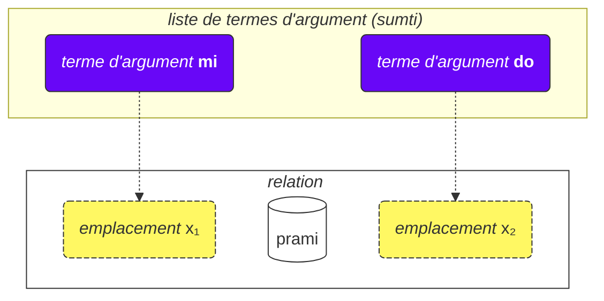
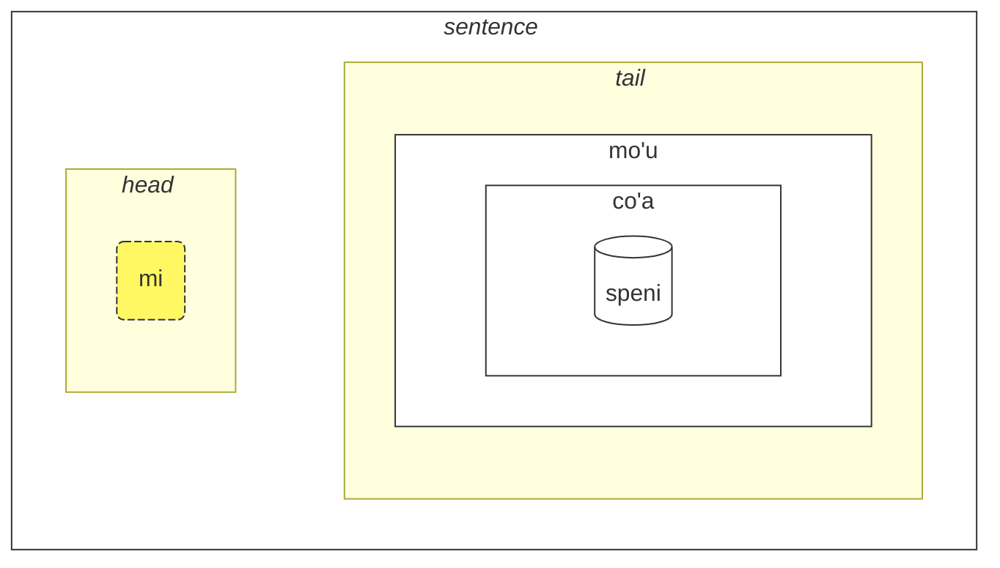

## Leçon 2. Encore plus de choses de base

### Types de mots

Les mots lojban sont divisés en trois groupes :

- Mots de relation (appelés **selbrivla** en lojban)
  - Exemples : **gleki**, **klama**.
  - Ces mots contiennent au moins un groupe de consonnes (deux consonnes ou plus l'une après l'autre) dans les 5 premiers sons + ils se terminent par une voyelle.
- Particules (appelées **cmavo** en lojban)
  - Exemples : **le**, **nu**, **mi**, **fa'a**.
  - Elles commencent par une consonne (l'une de **b d g v z j p t k f s c x l m n r i u**), suivie d'une voyelle (l'une de **a e i o u y au ai ei oi**). Facultativement, après cela, il peut y avoir une ou plusieurs séquences d'une apostrophe (**'**) et d'une voyelle suivante. Par exemple, **xa'a'a'a'a'a'a** et **ba'au'oi'a'e'o** sont des particules possibles (même si aucune signification ne leur est attribuée).
  - Il est assez courant d'écrire plusieurs particules consécutivement sans espaces entre elles. Cela est permis par la grammaire du lojban. Donc, ne soyez pas surpris de voir **lenu** au lieu de **le nu**, **naku** au lieu de **na ku**, **jonai** au lieu de **jo nai**, et ainsi de suite. Cela ne change pas la signification. Cependant, cette règle ne s'applique pas aux mots de relation ; les mots de relation doivent être séparés par des espaces.
- Mots-noms (appelés **cmevla** en lojban)
  - Exemples : **.alis.**, **.doris**, **.lojban.**
  - Généralement utilisés pour les noms de personnes, les noms de lieux, etc.
  - Ils peuvent être facilement distingués des autres types de mots car ils se terminent par une consonne. De plus, ils sont entourés de deux points au début et à la fin. Familièrement, les points peuvent être omis lors de l'écriture, mais lors de la parole, les pauses qui correspondent à ces points sont toujours obligatoires.

#### Exercice

Cachez la partie droite du tableau. Essayez d'identifier le type de chaque mot lojban en utilisant les règles qui viennent d'être décrites.

<table>
<tbody><tr>
<td><b>le</b></td>
<td>particule (commence par une consonne suivie d'une voyelle)</td>
</tr>
<tr>
<td><b>melbi</b></td>
<td>mot de relation (contient le groupe de consonnes 'lb')</td>
</tr>
<tr>
<td><b>.paris.</b></td>
<td>mot-nom (se termine par une consonne, a des points autour)</td>
</tr>
<tr>
<td><b>mi'o</b></td>
<td>particule (contient une apostrophe entre les voyelles)</td>
</tr></tbody></table>

### Ordre des arguments

Plus tôt, nous avions des définitions de mots de relation telles que :

mlatu
: … est un chat, être un chat

citka
: … mange …

prami
: … aime …

klama
: … vient à …

Les dictionnaires peuvent présenter des définitions de mots de relation avec des symboles tels que x₁, x₂ etc. :

prami
: x₁ aime x₂

karce
: x₁ est une voiture …

citka
: x₁ mange x₂ …

klama
: x₁ vient à x₂ …

Ces x₁, x₂, et ainsi de suite sont la notation explicite pour ce qu'on appelle les _emplacements_ (autres noms : _places_, _rôles de relation_, **terbricmi** en lojban). Les emplacements sont remplis par des termes d'argument (**sumti**) dans la phrase.

Les nombres représentent l'ordre dans lequel ces emplacements doivent être remplis par des arguments.

Par exemple :

> **mi prami do**
> _Je t'aime._

Cette phrase implique également que

- x₁ dénote _celui qui aime_, et
- x₂ dénote _celui qui est aimé par_.

En d'autres termes, chaque relation a un ou plusieurs emplacements, et ces emplacements sont spécifiés et étiquetés comme x₁, x₂, et ainsi de suite. Nous plaçons des arguments comme **mi**, **do**, **le tavla** etc. dans l'ordre, remplissant ainsi ces emplacements et donnant un sens concret à la relation, formant ainsi une phrase.

L'avantage de ce style de définitions est qu'il contient <u>tous</u> les participants possibles d'une relation immédiatement spécifiés.

Nous pouvons également omettre des arguments rendant la phrase plus vague :

> **carvi**
> _Il pleut._ > `est pluie, pleut`

(bien que le temps ici soit déterminé par le contexte, cela peut aussi signifier _Il pleut souvent_, _Il pleuvait_, etc.)

> **prami do**
> _Quelqu'un t'aime._ > `aime toi`

Tous les emplacements omis dans une relation signifient simplement **zo'e** = _quelque chose/quelqu'un_ donc cela signifie la même chose que

> **zo'e prami do**
> _Quelqu'un t'aime._

Et

> **prami**

est la même chose que

> **zo'e prami zo'e**
> _Quelqu'un aime quelqu'un._

zo'e
: pronom : quelque chose ou quelqu'un non spécifié ou supposé à partir du contexte

Les termes modaux comme **ca**, **fa'a** etc. ajoutent de nouveaux emplacements aux relations, mais ils ne remplissent pas les emplacements des relations. Dans

> **mi klama fa'a do**
> _Je viens vers toi._

le deuxième emplacement de **klama** est toujours omis. Par exemple :

> **mi klama fa'a le cmana le zdani**
> _Je viens (dans la direction de la montagne) à la maison._

le cmana
: la montagne

<pixra url="/assets/pixra/cilre-xekri-g-out/cmana.webp" caption="cmana" definition="… est une montagne"></pixra>

Ici, le deuxième emplacement de **klama** est **le zdani**. La phrase signifie que la montagne n'est qu'une direction, alors que le point final est la maison.

Ici, le terme **fa'a la cmana** (_dans la direction de la montagne_) ne remplace pas le deuxième emplacement de la relation **klama**. Le deuxième emplacement de **klama** est **le zdani** ici.

La phrase signifie que ma maison est simplement située dans la direction de la montagne, mais cela ne signifie pas nécessairement que je veux atteindre cette montagne. La destination finale de ma venue n'est pas la montagne mais la maison.

De même, dans

> **mi citka ba le nu mi cadzu**
> _Je mange après avoir marché._

le deuxième emplacement de **citka** est toujours omis. Un nouveau terme **ba** avec son argument **le nu mi cadzu** ajoute du sens à la phrase.

L'ordre des arguments d'une relation composée est le même que celui du dernier composant de celle-ci :

> **tu sutra bajra pendo mi**
> _C'est mon ami qui court rapidement._ > `C'est un ami qui court rapidement de moi.`

> **tu pendo mi**
> _C'est mon ami._ > `C'est un ami de moi.`

pendo
: … est un ami de … (quelqu'un)

Donc l'ordre des arguments de **sutra bajra pendo** est le même que celui de **pendo** seul.

#### Exercice

Cachez la partie droite du tableau. Pour chaque mot de relation, identifiez quelle structure d'emplacements est correcte.

<table>
<tbody><tr>
<td><b>klama</b></td>
<td>x₁ vient à x₂ depuis x₃</td>
</tr>
<tr>
<td><b>prami</b></td>
<td>x₁ aime x₂</td>
</tr>
<tr>
<td><b>karce</b></td>
<td>x₁ est une voiture</td>
</tr>
<tr>
<td><b>citka</b></td>
<td>x₁ mange x₂</td>
</tr></tbody></table>

### Plus de deux emplacements

Une relation peut avoir plus de deux emplacements. Par exemple :

> **mi pinxe le djacu le kabri**
> _Je bois l'eau de la tasse._

pinxe
: x₁ boit x₂ depuis x₃

> **le kabri**
> _la tasse_

Dans ce cas, il y a trois emplacements, et si vous voulez exclure le deuxième emplacement au milieu, vous devez utiliser **zo'e** :

> **mi pinxe zo'e le kabri**
> _Je bois \[quelque chose\] de la tasse._

Si nous omettons **zo'e**, nous obtenons quelque chose de dénué de sens :

> **mi pinxe le kabri**
> _Je bois la tasse._

Un autre exemple :

> **mi plicru do le plise**
> _Je te donne les pommes._

plicru
: x₁ donne, offre à x₂ un objet x₃ ; x₁ permet à quelqu'un x₂ d'utiliser x₃

#### Exercice

zgana
: x₁ observe/remarque x₂ en utilisant les sens x₃

Cachez la partie droite du tableau. Traduisez les phrases à gauche depuis le lojban.

<table style="table-layout: fixed;">
<tbody><tr>
<td><b>mi zgana do le kanla</b></td>
<td><i>Je t'observe avec mes yeux.</i></td>
</tr>
<tr>
<td><b>mi pinxe le djacu le kabri</b></td>
<td><i>Je bois l'eau de la tasse.</i></td>
</tr>
<tr>
<td><b>mi plicru le plise do</b></td>
<td><i>Je te donne la pomme.</i></td>
</tr></tbody></table>

Cachez la partie droite du tableau. Traduisez les phrases à gauche vers le lojban.

<table style="table-layout: fixed;">
<tbody><tr>
<td><i>Je bois du café du verre.</i></td>
<td><b>mi pinxe le ckafi le kabri</b></td>
</tr>
<tr>
<td><i>Je donne le livre à l'enfant.</i></td>
<td><b>mi plicru le cukta le verba</b></td>
</tr></tbody></table>

### Relations à l'intérieur de relations

Dans

> **le nicte cu nu mi viska le lunra**
> _La nuit est quand je vois la Lune._

nous avons

- **le nicte** comme x₁ de la relation,
- **nu mi viska le lunra** comme la relation principale.

Cependant, à l'intérieur de **nu mi viska le lunra**, nous avons une autre phrase avec

- **mi** - x₁ de la relation interne,
- **viska** - la relation interne,
- **le lunra** - x₂ de la relation interne.

Donc, malgré une structure interne, **nu mi viska le lunra** est toujours une relation avec son premier terme rempli par **le nicte** dans ce cas.

De même, dans

> **mi citka ba le nu mi dansu**
> _Je mange après avoir dansé._

nous avons

- **mi** comme x₁, le premier emplacement de la relation,
- **citka** comme la construction de relation principale,
- **ba le nu mi dansu** comme un terme modal de la relation principale de la phrase.

À l'intérieur de ce terme, nous avons :

- **mi** comme x₁, le premier emplacement de la relation à l'intérieur du terme
- **dansu** comme la construction de relation principale à l'intérieur du terme.

Un tel mécanisme « récursif » d'encapsulation de relations dans des relations permet d'exprimer des idées complexes avec précision.

#### Exercice

Cachez la partie droite du tableau. Identifiez quels termes appartiennent aux relations internes.

<table>
<tbody><tr>
<td><b>le nicte cu nu mi viska le lunra</b></td>
<td>Relation interne : <i>mi viska le lunra</i> (Je vois la lune)</td>
</tr>
<tr>
<td><b>mi citka ba le nu mi dansu</b></td>
<td>Relation interne : <i>mi dansu</i> (Je danse)</td>
</tr>
<tr>
<td><b>mi djica le nu do klama</b></td>
<td>Relation interne : <i>do klama</i> (tu viens)</td>
</tr></tbody></table>

### Pourquoi les mots de relation sont-ils définis de cette manière ?

L'anglais utilise un ensemble limité de prépositions qui sont réutilisées à travers divers verbes et, par conséquent, n'ont pas de signification fixe. Par exemple, considérez la préposition anglaise _to_ :

> _I speak to you._

<!-- -->

> _I come to you._

<!-- -->

> _To me it looks pretty._

Dans chacun de ces exemples, _to_ a un nouveau rôle qui est, au mieux, vaguement similaire aux rôles dans d'autres phrases.

Il est important de noter que d'autres langues utilisent différentes façons de marquer les rôles des verbes qui, dans de nombreux cas, sont très différents de ceux utilisés en anglais.

Le lojban, par exemple, marque les rôles centraux (emplacements) des relations en définissant complètement de telles relations avec les rôles placés en séquence (ou marqués avec **fa**, **fe**, et ainsi de suite) :

klama
: x₁ vient à x₂ …

tavla
: x₁ parle à x₂ …

melbi
: x₁ est beau, joli pour x₂ …

De tels rôles centraux sont essentiels pour définir les relations.

Cependant, il peut y avoir des rôles optionnels qui rendent les relations plus précises :

> _Je te parle pendant que je mange._

<!-- -->

> _C'est difficile pour moi parce que cette chose est lourde._

En lojban, une notion similaire de tels rôles optionnels est exprimée via des relations séparées ou, pour les cas les plus courants, avec des termes modaux :

> **mi tavla do ze'a le nu mi citka**
> _Je te parle pendant que je mange._

<!-- -->

> **nandu mi ri'a le nu ti tilju**
> _C'est difficile pour moi parce que cette chose est lourde._

nandu
: x₁ est difficile pour x₂

tilju
: x₁ est lourd

Les prépositions en anglais sont similaires aux particules modales en lojban, bien qu'une préposition anglaise usuelle puisse avoir de nombreuses significations alors qu'en lojban, chaque particule modale n'a qu'une seule signification (même si vague).

#### Exercice

le zarci
: le marché
le dinju
: le bâtiment
klama
: x₁ vient à x₂ depuis x₃

Cachez la partie droite du tableau. Identifiez si ces phrases utilisent des arguments centraux ou des termes modaux optionnels.

<table>
<tbody><tr>
<td><b>mi klama le zarci le dinju</b></td>
<td>Utilise des arguments centraux (x₂ et x₃ de klama)</td>
</tr>
<tr>
<td><b>mi klama le zarci ca le nu do pinxe</b></td>
<td>Utilise un argument central (x₂ = le zarci) et un terme modal (ca le nu do pinxe)</td>
</tr>
<tr>
<td><b>mi klama fa'a le zarci</b></td>
<td>Utilise un terme modal (fa'a le zarci) au lieu d'un argument central</td>
</tr></tbody></table>

### Règles générales dans l'ordre des arguments

L'ordre des emplacements dans les relations peut parfois être difficile à retenir, mais ne nous inquiétons pas — vous n'avez pas besoin de vous souvenir de tous les emplacements de tous les mots de relation. (Vous souvenez-vous de la signification de centaines de milliers de mots en français ?)

Vous pouvez étudier les emplacements lorsque vous les trouvez utiles ou lorsque les gens les utilisent dans un dialogue avec vous.

La plupart des mots de relation ont deux ou trois emplacements.

Habituellement, vous pouvez deviner l'ordre en utilisant le contexte et quelques règles empiriques :

1. Le premier emplacement est souvent la personne ou la chose qui fait quelque chose ou est quelque chose :

   **klama** = _x₁ va …_

2. L'objet d'une action est généralement juste après le premier emplacement :

   **punji** = _x₁ met x₂ sur x₃_,

3. Et l'emplacement suivant sera généralement rempli par le destinataire :

   **punji** = _x₁ met x₂ sur x₃_,

4. Les emplacements de destination (_vers_) viennent presque toujours avant les emplacements d'origine (_depuis_) :

   **klama** = _x₁ va à x₂ depuis x₃_

   <pixra url="/assets/pixra/cilre-xekri-g-out/klama_fi.webp" caption="le prenu cu klama fi le zarci" definition="La personne sort du magasin."></pixra>

5. Les emplacements moins utilisés viennent vers la fin. Ceux-ci ont tendance à être des choses comme _selon le standard_, _par moyen_ ou _fait de_.

L'idée générale est que les emplacements qui sont les plus susceptibles d'être utilisés viennent en premier.

Pas besoin de remplir tous les emplacements tout le temps. Les emplacements non remplis ont simplement des valeurs non pertinentes ou évidentes pour le locuteur (ils prennent la valeur de **zo'e** = _quelque chose_).

#### Exercice

dunda
: x₁ donne x₂ à x₃
benji
: x₁ transfère x₂ à x₃ depuis x₄
lebna
: x₁ prend x₂ de x₃

Cachez la partie droite du tableau. Prédisez quel emplacement vient ensuite dans ces relations en fonction des règles générales.

<table>
<tbody><tr>
<td><b>dunda</b> - "le donneur ___, le cadeau ___, le destinataire ___"</td>
<td>L'ordre suit la règle : l'acteur d'abord, puis l'objet, puis le destinataire</td>
</tr>
<tr>
<td><b>benji</b> - "l'expéditeur ___, la chose envoyée ___, destination ___, source ___"</td>
<td>L'ordre suit la règle : l'acteur d'abord, l'objet en deuxième, la destination avant la source</td>
</tr>
<tr>
<td><b>lebna</b> - "le preneur ___, la chose prise ___, source ___"</td>
<td>L'ordre suit la règle : l'acteur d'abord, l'objet en deuxième, la source en dernier</td>
</tr></tbody></table>

### Infinitifs

Les infinitifs sont des verbes qui sont souvent préfixés par _to_ en anglais. Les exemples incluent _I like to run_, avec _to run_ étant l'infinitif.

> **le verba cu troci le ka cadzu**
> _L'enfant essaie de marcher._

le verba
: l'enfant, les enfants

troci
: x₁ essaie de faire ou d'être x₂ (ka)

cadzu
: x₁ marche

<pixra url="/assets/pixra/cilre-xekri-g-out/troci_cadzu.webp" caption="le verba cu troci le ka cadzu" definition="L'enfant essaie de marcher."></pixra>

La particule **ka** fonctionne un peu comme **nu**. Elle enveloppe une phrase.

La principale différence est qu'un certain emplacement dans la phrase enveloppée doit être lié par un argument à l'extérieur de cette phrase.

Dans ce cas, le premier argument **le verba** de la relation **troci** fait un lien vers le premier emplacement non rempli de la phrase interne **cadzu** (qui est à l'intérieur de **ka**).

En d'autres termes, l'enfant essaie d'atteindre un état où **le verba cu cadzu** (l'argument **le verba** remplirait le premier emplacement non rempli de la relation **cadzu**).

Certaines relations ne nécessitent que des infinitifs dans certains de leurs emplacements. Les définitions de tels mots marquent ces emplacements comme _propriété_ ou **ka**. Par exemple :

cinmo
: x₁ ressent x₂ (ka)

Cela signifie que l'infinitif dans le deuxième emplacement (x₂) est appliqué à un autre emplacement (très probablement, le premier emplacement, x₁). Les cas où l'infinitif est appliqué à des emplacements autres que x₂ sont rares et sont expliqués dans les dictionnaires pour les relations correspondantes ou dans le cas de mots de relation inventés non officiellement, peuvent être déduits du bon sens par analogie avec d'autres mots de relation similaires.

Un autre exemple :

<pixra url="/assets/pixra/cilre-xekri-g-out/sidju.webp" caption="ra sidju le pendo le ka bevri le dakli" definition="Il/elle aide l'ami à porter les sacs."></pixra>

> **ra sidju le pendo le ka bevri le dakli**
> _Il/elle aide l'ami à porter les sacs._

sidju
: x₁ aide x₂ à faire x₃ (ka)

Le mot de relation **sidju** nécessite que son troisième emplacement soit rempli par un infinitif.

bevri
: x₁ porte x₂

le dakli
: le sac, les sacs

Notez que seul le premier emplacement non rempli de la relation intégrée prend la signification de l'emplacement externe :

> **mi troci le ka do prami**
> _J'essaie d'être aimé par toi._

tcidu
: x₁ lit x₂ depuis x₃

Ici, le premier emplacement non rempli est le deuxième emplacement de **prami**, donc il prend la valeur **mi** (_je_).

Il est également possible en utilisant le pronom **ce'u** de marquer explicitement un emplacement qui doit être appliqué à un argument externe :

> **mi troci le ka do prami ce'u**
> _J'essaie d'être aimé par toi._

Un autre exemple :

> **mi cinmo le ka xebni ce'u**
> **mi cinmo le ka se xebni**
> _J'ai l'impression que quelqu'un me déteste._ > _Je me sens détesté._

#### Exercice

zgana
: x₁ observe x₂
kakne
: x₁ est capable de faire x₂ (propriété)
nelci
: x₁ aime x₂

Cachez la partie droite du tableau. Convertissez ces phrases avec des infinitifs en leurs significations.

<table>
<tbody><tr>
<td><b>mi kakne le ka zgana</b></td>
<td>Je suis capable d'observer (quelque chose)</td>
</tr>
<tr>
<td><b>do kakne le ka nelci mi</b></td>
<td>Tu es capable de m'aimer</td>
</tr>
<tr>
<td><b>mi nelci le ka zgana do</b></td>
<td>J'aime t'observer</td>
</tr></tbody></table>

### Types d'emplacements

Le dictionnaire mentionne souvent d'autres types d'emplacements, par exemple :

djica
: x₁ veut x₂ (événement)

Cet _événement_ signifie que vous devez remplir l'emplacement avec un argument qui représente un événement. Par exemple :

le nicte
: la nuit

le nu mi dansu
: moi dansant

Donc nous obtenons

> **mi djica le nicte**
> _Je veux l'événement nocturne._

<!-- -->

> **do djica le nu mi dansu**
> _Tu veux que je danse._

En lojban, il n'est pas permis de dire, par exemple :

> **mi djica le plise**
> _Je veux la pomme._ 

parce que vous voulez faire quelque chose avec la pomme ou vous voulez qu'un événement se produise avec la pomme, tel que :

> **mi djica le nu mi citka le plise**
> _Je veux manger la pomme._ > `Je veux que je mange la pomme.`

Notez qu'envelopper une relation attendant un événement dans un **nu** change la signification :

> **le zekri cu cumki**
> _Le crime est possible._

zekri
: x₁ est un événement criminel, x₁ (événement) un crime

cumki
: x₁ (événement) est possible

Comparez :

> **le nu zekri cu cumki**
> `Que ce soit criminel est possible.` > _Il est possible que quelque chose soit un crime._

#### Exercice

nelci
: x₁ aime x₂

djica
: x₁ veut x₂ (événement)

Cachez la partie droite du tableau. Traduisez les phrases à gauche depuis le lojban.

<table style="table-layout: fixed;">
<tbody><tr>
<td><b>mi nelci le nu do cisma</b></td>
<td><i>J'aime que tu souris.</i></td>
</tr>
<tr>
<td><b>mi djica le nu mi citka le plise</b></td>
<td><i>Je veux manger la pomme.</i></td>
</tr>
<tr>
<td><b>mi na ku djica le plise</b></td>
<td><i>Je ne veux pas la pomme. (usage incorrect)</i></td>
</tr></tbody></table>

Cachez la partie droite du tableau. Traduisez les phrases à gauche vers le lojban.

<table style="table-layout: fixed;">
<tbody><tr>
<td><i>Je veux que tu danses.</i></td>
<td><b>mi djica le nu do dansu</b></td>
</tr>
<tr>
<td><i>J'aime que tu sois intelligent.</i></td>
<td><b>mi nelci le nu do stati</b></td>
</tr></tbody></table>

### Élévation

> **mi stidi le ka klama le barja**
> _Je suggère d'aller au pub._

stidi
: x₁ suggère l'action x₂ (propriété) à x₃

> **mi stidi tu'a le barja**
> _Je suggère le pub._

tu'a le barja
: quelque chose à propos du pub

> **mi djica le nu mi citka le plise**
> _Je veux manger une pomme._

<!-- -->

> **mi djica tu'a le titla**
> _Je veux la douceur._

tu'a le titla
: quelque chose à propos de la douceur

titla
: … est doux, … est une douceur

<pixra url="/assets/pixra/cilre-xekri-g-out/djica_tuha_le_titla.webp" caption="le prenu cu djica tu'a le titla" definition="La personne veut la douceur."></pixra>

La structure des emplacements peut mettre trop de poids sur la spécification des actions ou des événements. Parfois, nous voulons spécifier seulement un objet dans ces événements ou emplacements et sauter complètement la description de l'action ou de l'événement.

Dans les exemples ci-dessus _Je suggère le pub._ implique très probablement d'aller au pub et _Je veux la pomme._ implique de la manger.

Cependant, le mot de relation lojban **stidi** nécessite une propriété dans son emplacement x₂. De même, **djica** nécessite un événement dans son emplacement x₂.

Le court mot qualificateur **tu'a** avant un terme implique une abstraction (propriété, événement ou proposition) mais sélectionne seulement ce terme de cette abstraction en sautant le reste. Il peut être vaguement traduit par _quelque chose à propos de_ :

> **mi stidi tu'a le barja**
> _Je suggère quelque chose à propos du pub (peut-être le visiter, se rencontrer près de lui, etc.)._

<!-- -->

> **mi djica tu'a le plise**
> _Je désire quelque chose lié à la pomme (peut-être la manger, la mâcher, la lécher, la lancer sur un ami, etc.)_

> **tu'a le cakla cu pluka mi**
> _Le chocolat m'est agréable (probablement en raison de son goût)._ > `Quelque chose à propos du chocolat m'est agréable`

cakla
: x₁ est du chocolat

Lorsqu'on saute des abstractions, seul le contexte nous dit ce qui a été omis.

Il est également possible de modifier la construction relationnelle principale :

> **le cakla cu jai pluka mi**
> **tu'a le cakla cu pluka mi**
> _Le chocolat m'est agréable._

Cela permet la création de termes d'argument vagues avec **jai** :

> **le jai pluka cu zvati ti**
> _La chose agréable est ici._

Puisque **le pluka** (_l'événement agréable_) est abstrait, il est impossible de spécifier son emplacement. Cependant, un participant à l'abstraction peut être physiquement placé quelque part.

#### Exercice

stidi
: x₁ suggère x₂ (propriété) à x₃

Cachez la partie droite du tableau. Traduisez les phrases à gauche depuis le lojban.

<table style="table-layout: fixed;">
<tbody><tr>
<td><b>mi stidi tu'a le karce</b></td>
<td><i>Je suggère quelque chose à propos de la voiture.</i></td>
</tr>
<tr>
<td><b>mi djica tu'a le najnimre</b></td>
<td><i>Je veux quelque chose à propos de l'orange.</i></td>
</tr>
<tr>
<td><b>mi nelci tu'a le mlatu</b></td>
<td><i>J'aime quelque chose à propos du chat.</i></td>
</tr></tbody></table>

Cachez la partie droite du tableau. Traduisez les phrases à gauche vers le lojban.

<table style="table-layout: fixed;">
<tbody><tr>
<td><i>Je suggère le jardin (quelque chose à son propos).</i></td>
<td><b>mi stidi tu'a le purdi</b></td>
</tr>
<tr>
<td><i>Je veux le livre (quelque chose à son propos).</i></td>
<td><b>mi djica tu'a le cukta</b></td>
</tr></tbody></table>

### Emplacements à l'intérieur des arguments

Comment dire _Tu es mon ami_ ?

> **do pendo mi**
> _Tu es mon ami._ > `Tu es un ami de moi.`

<pixra url="/assets/pixra/cilre-xekri-g-out/pendo.webp" caption="le pendo" definition="l'ami / les amis"></pixra>

Et maintenant, comment dire _Mon ami est intelligent._ ?

> **le pendo be mi cu stati**
> _Mon ami est intelligent._

Donc, lorsque nous convertissons une relation en argument (**pendo** — _être un ami_ en **le pendo** — _l'ami_), nous pouvons toujours conserver les autres emplacements de cette relation en plaçant **be** après elle.

Par défaut, il attache le deuxième emplacement (x₂). Nous pouvons attacher plus d'emplacements en les séparant avec **bei** :

> **mi plicru do le plise**
> _Je te donne la pomme._

<pixra url="/assets/pixra/cilre-xekri-g-out/plicru.webp" caption="le prenu cu plicru le pendo le plise" definition="La personne donne à l'ami la pomme."></pixra>

<!-- -->

> **le plicru be mi bei le plise**
> _Le donateur de la pomme à moi_

<!-- -->

> **le plicru be mi bei le plise cu pendo mi**
> _Le donneur de la pomme à moi est mon ami._ > `Celui qui me donne la pomme est un ami à moi.`

Un autre exemple :

<!-- > **le pendo be mi cu tavla**
> _Les amis à moi parlent._
> **le pendo mi cu tavla**
> **le pendo cu tavla mi**
> _Les amis me parlent._ -->

> **mi klama le pendo be do**
> _Je viens à un ami à toi._

klama
: x₁ vient à x₂ depuis x₃ …

Nous ne pouvons pas omettre **be** car **le pendo do** sont deux emplacements indépendants :

> **mi klama le pendo do**
> _Je viens à un ami depuis toi._

Ici, **do** a pris le troisième emplacement de **klama** puisqu'il n'est pas lié à _pendo_ via **be**.

Nous ne pouvions pas non plus utiliser **nu** car **le nu pendo do** est l'événement de quelqu'un étant ton ami.

Donc **le pendo be do** est la solution correcte.

Un autre exemple :

> **la .lojban. cu bangu mi**
> _Le lojban est ma langue._ > `Le lojban est une langue de moi.`

Cependant,

> **mi nelci le bangu be mi**
> _J'aime ma langue._

Utiliser **be** pour des relations non converties en arguments n'a aucun effet :

> **mi nelci be do** est la même chose que
> **mi nelci do**

#### Exercice

ctuca
: x₁ enseigne x₂ (sujet) à x₃
cmene
: x₁ est un nom de x₂ utilisé par x₃

Cachez la partie droite du tableau. Convertissez ces constructions utilisant "be" en leurs significations.

<table>
<tbody><tr>
<td><b>le ctuca be mi bei la lojban</b></td>
<td>le professeur de moi en lojban</td>
</tr>
<tr>
<td><b>le cmene be la paris bei la frank</b></td>
<td>le nom de Paris utilisé par Frank</td>
</tr>
<tr>
<td><b>le ctuca be le verba bei la lojban</b></td>
<td>le professeur des enfants en lojban</td>
</tr></tbody></table>

### Propositions relatives

> **le prenu poi pendo mi cu tavla mi**
> _La personne qui est mon ami me parle._

<!-- -->

> **le prenu noi pendo mi cu tavla mi**
> _La personne, qui soit dit en passant est mon ami, me parle._

blabi
: … est blanc

Dans la première phrase, le mot _qui_ est essentiel pour identifier la personne en question. Il clarifie de qui parmi les personnes dans le contexte nous parlons. Nous choisissons seulement ceux qui sont mes amis parmi probablement beaucoup de personnes autour. Peut-être qu'il n'y a qu'une seule personne autour qui est mon ami.

Quant à _qui soit dit en passant est mon ami_ de la deuxième phrase, cela fournit simplement des informations supplémentaires sur la personne. Cela n'aide pas à identifier la personne. Par exemple, cela pourrait arriver lorsque toutes les personnes autour sont mes amis.

**poi pendo mi** est une proposition relative, une relation attachée à droite de l'argument **le prenu**. Elle se termine juste avant le mot suivant **cu** :

> **le prenu (poi pendo mi) cu tavla mi**
> _La personne qui est mon ami me parle._

En lojban, nous utilisons **poi** pour les propositions relatives qui identifient des entités (objets, personnes ou événements) et **noi** pour des informations accessoires.

> **la .bob. ba co'a speni le ninmu poi pu xabju le nurma**
> _Bob épousera une fille qui vivait à la campagne._

xabju
: … vit dans …, … habite … (lieu, objet)

le nurma
: la zone rurale

Cette phrase n'exclut pas que Bob épouse quelqu'un d'autre également ! Supprimer la proposition relative avec **poi** change la signification :

> **la .bob. ba co'a speni le ninmu**
> _Bob épousera une fille._

Un autre exemple :

> **le prenu poi gleki cu ze'u renvi**
> _Les personnes (lesquelles ?) qui sont heureuses vivent longtemps._

ze'u
: terme modal : pendant longtemps

renvi
: survivre

Supprimer la proposition relative avec **poi** change la signification :

> **le prenu ze'u renvi**
> _Les personnes vivent longtemps._

D'autre part, les propositions relatives avec **noi** contiennent juste des informations supplémentaires sur l'argument auquel elles sont attachées. Cet argument est suffisamment défini par lui-même de sorte que supprimer une proposition relative avec **noi** ne change pas sa signification :

> **mi nelci la .doris. noi mi ta'e zgana bu'u le panka**
> _J'aime Doris que je vois habituellement dans le parc._ > _J'aime Doris. Que puis-je dire d'autre à son sujet ? Je la vois habituellement dans le parc._

zgana
: observer (en utilisant tous les sens)

<pixra url="/assets/pixra/cilre-xekri-g-out/panka_ninmu.webp" caption="le prenu noi mi ta'e zgana bu'u le panka" definition="La personne que je vois habituellement dans le parc."></pixra>

Supprimer la proposition relative avec **noi** conserve la signification : _J'aime Doris._

En anglais parlé, la distinction est souvent obtenue en utilisant l'intonation ou en devinant. De plus, les propositions relatives avec **noi** sont traditionnellement séparées par des virgules en anglais. Elles utilisent _which_ ou _who_, et le mot _that_ n'est pas utilisé dans celles-ci.

Prenons un autre exemple.

> **mi klama le pa tricu**
> _Je viens à l'arbre._

<!-- -->

> **le pa tricu cu barda**
> _L'arbre est grand._

le pa tricu
: l'arbre (un arbre)

barda
: x₁ est grand/gros

Et maintenant joignons ces deux phrases :

> **le tricu noi mi klama ke'a cu barda**
> _L'arbre, auquel je viens, est grand._

Notez le mot **ke'a**. Nous déplaçons la deuxième phrase sur le même arbre dans une proposition relative et remplaçons l'argument **le tricu** par **ke'a** dans la proposition relative. Donc le pronom **ke'a** est comme _qui_ et _lequel_ en français. Il pointe en arrière vers l'argument auquel la proposition relative est attachée.

Donc littéralement notre phrase lojbanique sonne comme

> _L'arbre, tel que je vais vers lequel, est grand._

**ke'a** peut être omis si le contexte est suffisamment clair. Les deux phrases suivantes signifient la même chose :

> **le prenu poi pendo mi cu tavla mi**
> **le prenu poi ke'a pendo mi cu tavla mi**
> _La personne qui est mon ami me parle._

**ke'a** est souvent supposé aller au premier emplacement non rempli :

> **mi nelci la .doris. noi mi ta'e zgana bu'u le panka**
> **mi nelci la .doris. noi mi ta'e zgana ke'a bu'u le panka**
> _J'aime Doris que je vois habituellement dans le parc._

Ici, **mi** remplit le premier emplacement de la relation **ta'e zgana** (_… voit habituellement …_), donc, **ke'a** est supposé pour le suivant, le deuxième emplacement.

Les propositions relatives comme les relations habituelles peuvent contenir des constructions avec des termes modaux :

> **le tricu noi mi pu klama ke'a ca le cabdei cu barda**
> _L'arbre, auquel je suis allé aujourd'hui, est grand._

<pixra url="/assets/pixra/cilre-xekri-g-out/le_tricu_cu_barda.webp" caption="le tricu cu barda" definition="L'arbre est grand."></pixra>

le cabdei
: le jour d'aujourd'hui

Notez que **ca le cabdei** appartient à la proposition relative. Comparez :

> **le tricu noi mi pu klama ke'a cu barda ca le cabdei**
> _L'arbre, auquel je suis allé, est grand aujourd'hui._

La signification a beaucoup changé.

Enfin, **voi** est utilisé pour former des arguments de type **le** mais avec des propositions relatives :

> **ti voi le nu ke'a cisma cu pluka mi cu zutse tu**
> _Ceux dont le sourire me plaît sont assis._

<pixra url="/assets/pixra/cilre-xekri-g-out/voi.webp" caption="mi nelci ti voi le nu ke'a cisma cu pluka mi" definition="J'aime ceux dont les sourires me plaisent."></pixra>

ti
: celui-ci près de moi, ceux-ci près de moi

cisma
: x₁ sourit

pluka
: x₁ est agréable à x₂

zutse
: x₁ est assis, est assis sur x₂

Ici, **voi** définit l'objet près de moi.

Comparez-le à :

> **ti poi le nu ke'a cisma cu pluka mi cu zutse**
> _Parmi ceux-ci ceux dont le sourire me plaît sont assis._

**poi** restreint la sélection à ceux décrits dans la proposition relative.
Cet exemple pourrait impliquer qu'il y a de nombreux objets (personnes etc.) autour de moi mais avec **poi** je sélectionne seulement les nécessaires.

Comparez-le à :

> **ti noi le nu ke'a cisma cu pluka mi cu zutse**
> _Ceux-ci (qui sont incidemment tels que leur sourire me plaît) sont assis._

**noi** ajoute simplement des informations accessoires qui ne sont pas nécessaires pour déterminer à quoi **ti** (_ceux-ci_) fait référence. Peut-être qu'il n'y a personne d'autre autour à décrire.

Enfin, tout comme **nu** a le marqueur de bordure droite **kei**, nous avons

ku'o
: marqueur de bordure droite pour **poi**, **noi** et **voi**.

> **mi tavla la .doris. noi ca zutse tu ku'o .e la .alis. noi ca cisma**
> _Je parle à Doris, qui est maintenant assise là-bas, et Alice qui sourit maintenant._

Notez que sans **ku'o** nous aurions **tu** (_là-bas_) rejoint avec **la .alis.** (_Alice_) conduisant à une signification bizarre :

> **mi tavla la .doris. noi ca zutse tu .e la .alis. noi ca cisma**
> _Je parle à Doris, qui est maintenant assise là-bas et sur Alice (qui sourit maintenant)._

Notez la partie **zutse tu .e la .alis.**.

Pour tous **poi**, **noi** et **voi** le marqueur de bordure droite est toujours le même : **ku'o**.

#### Exercice

ctuca
: x₁ enseigne x₂ à x₃

Cachez la partie droite du tableau. Traduisez les phrases à gauche depuis le lojban.

<table style="table-layout: fixed;">
<tbody><tr>
<td><b>mi tavla le prenu poi ctuca mi</b></td>
<td><i>Je parle à la personne qui m'enseigne.</i></td>
</tr>
<tr>
<td><b>le gerku noi mi nelci ke'a cu citka</b></td>
<td><i>Le chien, que j'aime, mange.</i></td>
</tr>
<tr>
<td><b>le prenu poi ke'a ctuca mi cu stati</b></td>
<td><i>La personne qui m'enseigne est intelligente.</i></td>
</tr></tbody></table>

Cachez la partie droite du tableau. Traduisez les phrases à gauche vers le lojban.

<table style="table-layout: fixed;">
<tbody><tr>
<td><i>Je vois le chien qui court.</i></td>
<td><b>mi viska le gerku poi bajra</b></td>
</tr>
<tr>
<td><i>La personne, qui est intelligente, me parle.</i></td>
<td><b>le prenu noi stati cu tavla mi</b></td>
</tr></tbody></table>

### Propositions relatives courtes. '_À propos de_'

Parfois, vous pourriez avoir besoin d'attacher un argument supplémentaire à un autre argument :

> **mi djuno le vajni pe do**
> _Je sais quelque chose d'important à ton sujet._

le vajni
: quelque chose d'important

**pe** et **ne** sont similaires à **poi** et **noi**, mais ils attachent des arguments à des arguments :

> **le pa penbi pe mi cu xunre**
> _Le stylo qui est à moi est rouge._ (_le mien_ est essentiel pour identifier le stylo en question)

<!-- -->

> **le pa penbi ne mi cu xunre**
> _Le stylo, qui est à moi, est rouge._ (information supplémentaire)

ne
: qui est à propos de, a une relation avec … (un argument suit)

pe
: qui est à propos de, a une relation avec … (un argument suit)

> **le pa penbi ne mi ge'u .e le pa fonxa ne do cu xunre**
> _Le stylo, qui est à moi, et le téléphone, qui est à toi, sont rouges._

ge'u
: marqueur de bordure droite pour **pe**, **ne**.

#### Exercice

Cachez la partie droite du tableau. Traduisez les phrases à gauche depuis le lojban.

<table style="table-layout: fixed;">
<tbody><tr>
<td><b>le penbi pe mi cu xunre</b></td>
<td><i>Le stylo qui est à moi est rouge.</i></td>
</tr>
<tr>
<td><b>le mlatu ne mi cu melbi</b></td>
<td><i>Le chat, qui est à moi, est beau.</i></td>
</tr>
<tr>
<td><b>mi tavla le prenu pe do</b></td>
<td><i>Je parle à la personne liée à toi.</i></td>
</tr></tbody></table>

Cachez la partie droite du tableau. Traduisez les phrases à gauche vers le lojban.

<table style="table-layout: fixed;">
<tbody><tr>
<td><i>La maison qui est à moi est grande.</i></td>
<td><b>le zdani pe mi cu barda</b></td>
</tr>
<tr>
<td><i>La voiture, qui est à toi, est belle.</i></td>
<td><b>le karce ne do cu melbi</b></td>
</tr></tbody></table>

### «**be**» et «**pe**»

Notez que les propositions relatives sont attachées aux arguments, alors que **be** fait partie de la relation.

En fait, **le bangu pe mi** est une meilleure traduction de _ma langue_, puisque, comme en français, les deux arguments sont liés l'un à l'autre de manière vague.

Cependant, vous pouvez dire **le birka be mi** comme _mon bras_. Même si vous sciez votre bras, il sera toujours à vous. C'est pourquoi **birka** a un emplacement pour le propriétaire :

birka
: x₁ est un bras de x₂

Montrons encore une fois qu'une construction avec **be** fait partie de la relation, alors que **pe**, **ne**, **poi** et **noi** s'attachent aux arguments :

> **le pa melbi be mi fonxa pe le pa pendo be mi cu barda**
> `Le téléphone beau pour moi de l'ami à moi est grand.`

Ici, **be mi** est attaché à la relation **melbi** = _être beau pour … (quelqu'un)_ et crée ainsi une nouvelle relation **melbi be mi** = _être beau pour moi_. Mais **pe le pa pendo be mi** (_de mon ami_) est appliqué à tout l'argument **le pa melbi be mi fonxa** (_le téléphone beau pour moi_).

Il peut aussi arriver que nous ayons besoin d'attacher **be** à une relation, transformer cette relation en argument et ensuite attacher **pe** à cet argument :

> **le pa pendo be do be'o pe la .paris. cu stati**
> _L'ami à toi qui est lié à Paris est intelligent._ > (<b>pe la .paris.</b> est attaché à tout l'argument <b>le pa pendo be do be'o</b>)

<!-- -->

> **le pu plicru be do bei le pa plise be'o pe la .paris. cu stati**
> _Qui t'a donné la pomme (et qui est lié à Paris) est intelligent._ > (<b>pe la .paris.</b> est attaché à tout l'argument <b>le pu plicru be do bei le pa plise be'o</b>)

be'o
: marqueur de bordure droite pour la chaîne de termes attachés avec **be** et **bei**

Dans ces deux exemples, votre ami a une relation avec Paris (peut-être, il/elle vient de Paris).

Comparez-le à :

> **le pa pendo be do pe la .paris. cu stati**
> _L'ami de toi (toi qui est lié à Paris) est intelligent._

<!-- -->

> **le pu plicru be do bei le pa plise pe la .paris. cu stati**
> _Qui t'a donné la pomme (la pomme qui est liée à Paris) est intelligent._

Dans ces deux derniers exemples, cependant, soit vous êtes lié à Paris soit la pomme.

#### Exercice

Cachez la partie droite du tableau. Traduisez les phrases à gauche depuis le lojban.

<table style="table-layout: fixed;">
<tbody><tr>
<td><b>le melbi be mi cu stati</b></td>
<td><i>Celui qui est beau pour moi est intelligent.</i></td>
</tr>
<tr>
<td><b>le pendo be do bei mi cu tavla</b></td>
<td><i>L'ami de toi et moi parle.</i></td>
</tr>
<tr>
<td><b>le pampe'o be do pe mi cu melbi</b></td>
<td><i>Mon papier à toi est beau.</i></td>
</tr></tbody></table>

Cachez la partie droite du tableau. Traduisez les phrases à gauche vers le lojban.

<table style="table-layout: fixed;">
<tbody><tr>
<td><i>Celui qui est gentil pour moi et intelligent pour toi parle.</i></td>
<td><b>le pluka be mi bei do cu tavla</b></td>
</tr>
<tr>
<td><i>L'ami à moi qui est lié à Paris est intelligent.</i></td>
<td><b>le pendo be mi be'o pe la .paris. cu stati</b></td>
</tr></tbody></table>

### '_Alice est professeur_' et '_Alice est le professeur_'

En français, le verbe _être_ fait fonctionner un nom comme un verbe. En lojban, même des concepts comme _chat_ (**mlatu**), _personne_ (**prenu**), _maison_ (**dinju**), _foyer_ (**zdani**) fonctionnent comme des verbes (relations) par défaut. Seuls les pronoms fonctionnent comme des arguments.

Cependant, voici trois cas :

> **la .alis. cu ctuca**
> _Alice enseigne._

<pixra url="/assets/pixra/cilre-xekri-g-out/ctuca.webp" caption="mi ctuca" definition="J'enseigne / Je suis professeur."></pixra>

<!-- -->

> **la .alis. cu me le ctuca**
> _Alice est l'un des professeurs._

me
: … est parmi …, … est l'un de …, … sont membres de … (un argument suit)

> **la .alis. ta'e ctuca**
> _Alice enseigne habituellement._

ta'e
: particule modale : l'événement se produit habituellement

> **la .alis. cu du le ctuca**
> _Alice est le professeur._

du
: … est identique à …

La particule **me** prend un argument après elle et indique qu'il y a probablement d'autres professeurs, et Alice est l'un parmi eux.

La particule **du** est utilisée lorsqu'Alice est, par exemple, le professeur que nous avons cherché ou dont nous avons parlé. Elle indique l'identité.

Ainsi, **me** et **du** peuvent parfois correspondre à ce qu'en français nous exprimons en utilisant le verbe _être/est/était_.

En lojban, nous priorisons la signification de ce que nous voulons dire, plutôt que de nous appuyer sur la façon dont cela est littéralement exprimé en français ou dans d'autres langues.

Autres exemples :

> **mi me la .bond.**
> _Je suis Bond._

<!-- -->

> **mi du la .kevin.**
> _Je suis Kevin (celui dont tu avais besoin)._

<!-- -->

> **ti du la .alis. noi mi ta'e zgana bu'u le panka**
> _Ceci est Alice que je vois habituellement dans le parc._

**noi du** et **poi du** sont utilisés pour introduire des noms alternatifs pour quelque chose. Ils correspondent au français _à savoir, c'est-à-dire_ :

> **la .alis. cu penmi le prenu noi du la .abdul.**
> _Alice a rencontré la personne, à savoir Abdul._

Lorsque vous utilisez **me**, vous pouvez connecter plusieurs arguments avec _et_ :

> **tu me le pendo be mi be'o .e le tunba be mi**
> _Ce sont quelques (ou tous) mes amis et mes frères et sœurs._

tunba
: x₁ est un frère ou une sœur de x₂

<pixra url="/assets/pixra/cilre-xekri-g-out/tunba.webp" caption="do tunba mi" definition="Tu es mon frère/ma sœur."></pixra>

#### Exercice

gerku
: x₁ est un chien
banana
: x₁ est une banane
pendo
: x₁ est un ami de x₂

Cachez la partie droite du tableau. Traduisez ces phrases en utilisant les mots appropriés pour "être".

<table>
<tbody><tr>
<td><i>Ce sont quelques-uns de mes amis</i></td>
<td><b>tu me le pendo be mi</b></td>
</tr>
<tr>
<td><i>C'est le chien que nous cherchions</i></td>
<td><b>ta du le gerku</b></td>
</tr>
<tr>
<td><i>Cette chose jaune est une banane</i></td>
<td><b>ti pelxu gi'e me le banana</b></td>
</tr></tbody></table>

### Relations avec particules modales

Nous pouvons placer une particule modale non seulement avant la construction de relation principale de la phrase mais aussi à la fin de celle-ci, produisant le même résultat :

> **mi ca tcidu**
> **mi tcidu ca**
> _Je (lis maintenant)._

tcidu
: lire (un texte)

Lorsque nous utilisons **nu**, nous créons une relation décrivant un événement. Notez la différence entre ces deux exemples :

> **le nu tcidu ca cu nandu**
> _La lecture actuelle est compliquée, difficile._

<!-- -->

> **le nu tcidu cu ca nandu**
> _La lecture est maintenant compliquée._

Autres exemples :

> **mi klama le pa cmana pu**
> _Je suis allé à la montagne._ > `Je vais à une montagne (dans le passé).`

<!-- -->

> **le nu mi klama le pa cmana pu cu pluka**
> _Que je sois allé à une montagne est agréable._

Nous pouvons également placer une ou plusieurs particules modales comme premier élément d'une construction de relation et par ex. utiliser une telle relation enrichie sous forme d'argument :

<pixra url="/assets/pixra/cilre-xekri-g-out/coha_purdi.webp" caption="le pu kunti tumla ca purdi" definition="Ce qui était un désert est maintenant un jardin."></pixra>

> **le pu kunti tumla ca purdi**
> _Ce qui était un désert est maintenant un jardin._

**pu** appartient à **le kunti tumla** et **ca** appartient à **purdi** (car **le pu kunti tumla** ne peut pas ajouter **ca** à la fin).

<!-- This doesn't contradict using **be** after the verb since, with **be**, you change the verb: **bangu be mi** is considered one verb. -->

Avoir plusieurs particules modales dans l'ordre n'est pas un problème :

> **le pu ze'u kunti tumla ca purdi**
> _Ce qui était un désert pendant longtemps est maintenant un jardin._

ze'u
: terme modal : pendant longtemps

Placer des particules de terme après les noms les lie aux relations externes :

<pixra url="/assets/pixra/cilre-xekri-g-out/cohu_purdi.webp" caption="le kunti tumla pu purdi" definition="Le désert était un jardin."></pixra>

> **le kunti tumla pu purdi**
> **(le kunti tumla) pu purdi**
> _Le désert était un jardin._

#### Exercice

melbi
: x₁ est beau
sutra
: x₁ est rapide

Cachez la partie droite du tableau. Montrez où les particules modales s'appliquent dans ces phrases.

<table>
<tbody><tr>
<td><b>mi ca melbi</b></td>
<td>Le "ca" (temps présent) s'applique à "melbi" - Je suis maintenant beau</td>
</tr>
<tr>
<td><b>le nu mi melbi ca cu sutra</b></td>
<td>Le "ca" s'applique à "sutra" - mon fait d'être beau est maintenant rapide</td>
</tr>
<tr>
<td><b>le pu sutra ca melbi</b></td>
<td>Le "pu" appartient à "sutra" et "ca" appartient à "melbi" - ce qui était rapide est maintenant beau</td>
</tr></tbody></table>

### Nouveaux arguments depuis des emplacements de la même relation

> **do plicru mi ti**
> _Tu me donnes ceci._

<!-- -->

> **mi se plicru ti do**
> _Je reçois ceci de toi._

plicru
: x₁ donne à x₂ quelque chose x₃ pour usage

Nous pouvons échanger les deux premiers emplacements dans la relation en utilisant **se** et ainsi changer la structure des emplacements.

**do plicru mi ti** signifie exactement la même chose que **mi se plicru do ti**. La différence est uniquement de style.

Vous pourriez vouloir changer les choses pour un accent différent, par exemple, pour mentionner les choses les plus importantes dans une phrase en premier. Donc les paires suivantes signifient la même chose :

> **mi prami do**
> _Je t'aime._

<!-- -->

> **do se prami mi**
> _Tu es aimé par moi._

<!-- -->

> **le nu mi tadni la .lojban. cu xamgu mi**
> _Mon étude du lojban est bonne pour moi._

xamgu
: … est bon pour (quelqu'un)

> **mi se xamgu le nu mi tadni la .lojban.**
> _Pour moi, il est bon d'étudier le lojban._

La même chose peut être faite lorsque les relations sont utilisées lors de la création d'arguments :

le plicru
: ceux qui donnent, les donneurs, les donateurs

le se plicru
: ceux à qui on donne, les bénéficiaires de cadeaux

le te plicru
: ces objets qui sont donnés pour usage, les cadeaux

**te** échange les premier et troisième emplacements des relations.

Comme nous le savons, lorsque nous ajoutons **le** devant une construction de relation, elle devient un argument. Donc

- **le plicru** signifie _ceux qui pourraient correspondre au premier emplacement de **plicru**_
- **le se plicru** signifie _ceux qui pourraient correspondre au deuxième emplacement de **plicru**_
- **le te plicru** signifie _ceux qui pourraient correspondre au troisième emplacement de **plicru**_

Ainsi, en lojban, nous n'avons pas besoin de mots séparés pour _donateur_, _bénéficiaire_ et _cadeau_. Nous réutilisons la même relation et économisons beaucoup d'effort grâce à une telle conception intelligente. En effet, nous ne pouvons pas imaginer un cadeau sans impliquer que quelqu'un l'a donné ou le donnera. Lorsque des phénomènes utiles sont interconnectés, le lojban le reflète.

<!-- TODO: DwE: For the ease of understanding and memorizing: predicate words prefixed with **se**, **te** are put into the dictionary in entries for many verbs together with their definitions, although you can figure out their meaning yourself. -->

#### Exercice

vecnu
: x₁ vend x₂ à x₃ pour le prix x₄
ciska
: x₁ écrit x₂ sur la surface x₃ avec l'outil x₄

Cachez la partie droite du tableau. Convertissez ces relations en utilisant se/te/ve.

<table>
<tbody><tr>
<td><b>le se vecnu</b></td>
<td>ce qui est vendu (la marchandise)</td>
</tr>
<tr>
<td><b>le te vecnu</b></td>
<td>l'acheteur</td>
</tr>
<tr>
<td><b>le ve ciska</b></td>
<td>l'instrument d'écriture</td>
</tr>
<tr>
<td><b>le te ciska</b></td>
<td>la surface d'écriture</td>
</tr></tbody></table>

### Changer d'autres emplacements dans les relations principales

La série **se, te, ve, xe** (par ordre alphabétique) consiste en des particules qui changent les emplacements dans les relations principales :

- **se** échange les premier et deuxième emplacements
- **te** échange les premier et troisième emplacements
- **ve** échange les premier et quatrième emplacements
- **xe** échange les premier et cinquième emplacements.

> **mi zbasu le pa stizu le mudri**
> _J'ai fabriqué la chaise à partir du morceau de bois._

zbasu
: x₁ construit, fait x₂ à partir de x₃

le pa stizu
: la chaise

le mudri
: le morceau de bois

> **le mudri cu te zbasu le stizu mi**
> _Le morceau de bois est ce dont la chaise est faite par moi._

Le **mi** a maintenant déménagé au troisième emplacement de la relation et peut être supprimé si nous sommes trop paresseux pour spécifier qui a fait la chaise ou si nous ne savons tout simplement pas qui l'a faite :

> **le mudri cu te zbasu le stizu**
> _Le morceau de bois est le matériau de la chaise._

De même que notre exemple avec **le se plicru** (_le bénéficiaire_) et **le te plicru** (_le cadeau_), nous pouvons utiliser **te**, **ve**, **xe** pour dériver plus de mots d'autres emplacements de mots de relation :

klama
: x₁ va à x₂ depuis x₃ via x₄ par moyen x₅

Ainsi, nous pouvons dériver que

le klama
: celui qui vient / ceux qui viennent

le se klama
: le lieu de destination

le te klama
: le lieu d'origine du mouvement

le ve klama
: l'itinéraire

le xe klama
: le moyen de venir

**le xe klama** et le cinquième emplacement de **klama** peuvent désigner n'importe quel moyen de déplacement, comme conduire une voiture ou marcher à pied.

**se** est utilisé plus fréquemment que les autres particules pour échanger des emplacements.

#### Exercice

mrilu
: x₁ envoie par courrier x₂ à x₃ depuis x₄ par transporteur x₅
pagbu
: x₁ est une partie de x₂

Cachez la partie droite du tableau. Identifiez à quels emplacements ces relations converties font référence.

<table>
<tbody><tr>
<td><b>le xe mrilu</b></td>
<td>le transporteur/service utilisé pour l'envoi</td>
</tr>
<tr>
<td><b>le se pagbu</b></td>
<td>le tout dont quelque chose est une partie</td>
</tr>
<tr>
<td><b>le ve mrilu</b></td>
<td>l'origine de l'envoi</td>
</tr>
<tr>
<td><b>mi te mrilu do ti</b></td>
<td>Tu es le destinataire de cette chose que j'envoie</td>
</tr></tbody></table>

### Ordre libre des mots : balises pour les rôles dans les relations

Habituellement, nous n'avons pas besoin de tous les emplacements, places d'une relation, nous pouvons donc omettre ceux qui sont inutiles en les remplaçant par **zo'e**. Cependant, nous pouvons utiliser des _balises de place_ pour faire référence explicitement à un emplacement nécessaire. Les balises de place fonctionnent comme des particules modales mais traitent de la structure des emplacements des relations :

> **mi prami do** est la même chose que
> **fa mi prami fe do**
> _Je t'aime._

- **fa** marque l'argument qui remplit le premier emplacement d'une relation (x₁)
- **fe** marque l'argument qui remplit le deuxième emplacement (x₂)
- **fi** marque l'argument qui remplit le troisième emplacement (x₃)
- **fo** marque l'argument qui remplit le quatrième emplacement (x₄)
- **fu** marque l'argument qui remplit le cinquième emplacement (x₅)

Plus d'exemples :

> **mi klama fi le tcadu**
> _Je viens de la ville._

**fi** marque **le tcadu** comme le troisième emplacement de **klama** (l'origine du mouvement). Sans **fi**, la phrase se transformerait en **mi klama le tcadu**, signifiant _Je vais à la ville._

> **mi pinxe fi le kabri** est la même chose que
> **mi pinxe zo'e le kabri**
> _Je bois (quelque chose) dans la tasse._

pinxe
: x₁ boit x₂ depuis x₃

le kabri
: la tasse, le verre

<pixra url="/assets/pixra/cilre-xekri-g-out/pinxe_fi_le_kabri.webp" caption="le prenu cu pinxe fi le kabri" definition="La personne boit dans le verre."></pixra>

> **mi tugni zo'e le nu vitke le rirni**
> **mi tugni fi le nu vitke le rirni**
> _Je suis d'accord (avec quelqu'un) sur le fait de visiter les parents._

tugni
: x₁ est d'accord avec quelqu'un x₂ à propos de x₃ (proposition)

le rirni
: le parent / les parents

Avec les balises de place, nous pouvons déplacer les emplacements :

> **fe mi fi le plise pu plicru**
> _Quelqu'un a donné la pomme à moi._

Ici,

- **le plise** = _la pomme_, nous la mettons dans le troisième emplacement de **plicru**, ce qui est donné
- **mi** = _moi_, nous le mettons dans le deuxième emplacement de **plicru**, le bénéficiaire.

Comme nous pouvons le voir dans le dernier exemple, nous ne pouvons même pas refléter l'ordre des mots dans sa traduction française.

L'utilisation extensive de balises de place peut rendre notre discours plus difficile à percevoir, mais elles permettent plus de liberté.

Contrairement à la série **se**, l'utilisation de balises de place comme **fa** ne change pas la structure des emplacements.

---

Nous pouvons utiliser des balises de place à l'intérieur des arguments en les plaçant après **be** :

> **le pa klama be fi le tcadu cu pendo mi**
> _Celui qui vient de la ville est mon ami._

---

Nous pouvons également mettre tous les arguments d'une relation principale devant la queue de la phrase (en préservant leur ordre relatif). En raison de cette liberté, nous pouvons dire :

> **mi do prami** qui est la même chose que
> **mi do cu prami** qui est la même chose que
> **mi prami do**
> _Je t'aime._

<!-- -->

> **ko kurji ko** est la même chose que
> **ko ko kurji**
> _Prends soin de toi._

Les phrases suivantes sont également égales en signification :

> **mi plicru do le pa plise**
> _Je te donne la pomme._

<!-- -->

> **mi do cu plicru le pa plise**
> _Je toi donne la pomme._

<!-- -->

> **mi do le pa plise cu plicru**
> _Je toi la pomme donne._

#### Exercice

dunda
: x₁ donne x₂ à x₃
xamgu
: x₁ est bon pour x₂
cuxna
: x₁ choisit x₂ parmi x₃

Cachez la partie droite du tableau. Pour chaque phrase, dites quels emplacements de la relation sont remplis.

<table>
<tbody><tr>
<td><b>fi do fe le plise fa mi dunda</b></td>
<td>x₁ = mi, x₂ = le plise, x₃ = do (Je donne la pomme à toi)</td>
</tr>
<tr>
<td><b>fe mi fi le zgike xamgu</b></td>
<td>x₁ non spécifié, x₂ = mi, x₃ = le zgike (quelque chose est bon pour moi en termes de musique)</td>
</tr>
<tr>
<td><b>fi le prenu fe le melbi fo le xunre fa mi cuxna</b></td>
<td>x₁ = mi, x₂ = le melbi, x₃ = le prenu, x₄ = le xunre (Je choisis le beau parmi les personnes parmi les rouges)</td>
</tr></tbody></table>

### Prénexe

Le prénexe est un "préfixe" de relation, dans lequel vous pouvez déclarer des variables à utiliser plus tard :

> **pa da poi pendo mi zo'u da tavla da**
> _Il y a quelqu'un qui est mon ami tel qu'il/elle parle à lui-même/elle-même_

zo'u
: séparateur de prénexe

da
: pronom : variable.

Le pronom **da** se traduit par _il y a quelque chose/quelqu'un …_ Si nous utilisons **da** une deuxième fois dans la même relation, il fait toujours référence à la même chose que le premier **da** :

> **mi djica le nu su'o da poi kukte zo'u mi citka da**
> _Je souhaite qu'il y ait au moins quelque chose de savoureux pour que je le mange._

su'o
: nombre : au moins 1

Si la variable est utilisée dans la même relation et pas dans des relations intégrées, alors vous pouvez omettre complètement le prénexe :

> **mi djica le nu su'o da poi kukte zo'u mi citka da**
> **mi djica le nu mi citka su'o da poi kukte**
> _Je souhaite qu'il y ait au moins quelque chose de savoureux pour que je le mange._ > _Je souhaite que quelque chose soit tel que je le mange._

Les deux exemples signifient la même chose, dans les deux cas **su'o da** dénote _il y a (avait/aura) quelque chose ou quelqu'un_.

Cependant, le prénexe est utile et nécessaire lorsque vous devez utiliser **da** profondément à l'intérieur de votre relation, c'est-à-dire dans des relations intégrées :

> **su'o da poi kukte zo'u mi djica le nu mi citka da**
> _Il y a au moins quelque chose de savoureux : je souhaite le manger, je veux le manger._ > _Il y a quelque chose de savoureux que je souhaite manger._

Notez comment le sens change. Ici, nous ne pouvons pas omettre le prénexe car cela changerait la signification de l'exemple précédent.

Plus d'exemples :

> **mi tavla**
> _Je parle._

<!-- -->

> **mi tavla su'o da**
> **mi tavla da**
> _Il y a quelqu'un à qui je parle._

Par défaut, **da** en tant que pronom seul signifie la même chose que **su'o da** (_il y a au moins un …_) sauf si un nombre explicite est utilisé.

> **da tavla da**
> _Quelqu'un parle à lui-même._

<!-- -->

> **da tavla da da**
> _Quelqu'un parle à lui-même de lui-même._

tavla
: x₁ parle à quelqu'un x₂ à propos du sujet x₃

> **pa da poi ckape zo'u mi djica le nu da na ku fasnu**
> _Il y a une chose dangereuse : je souhaite qu'elle n'arrive jamais._

**da** n'implique aucun objet ou événement particulier, ce qui est souvent utile :

> **xu do tavla su'o da poi na ku slabu do**
> _Parles-tu à quelqu'un qui ne t'est pas familier ? (aucune personne particulière en tête n'est décrite)._

<!-- -->

> **.e'u mi joi do casnu bu'u su'o da poi drata**
> _Discutons dans un autre endroit (aucun endroit particulier en tête)_

#### Exercice

nelci
: x₁ aime x₂
citka
: x₁ mange x₂
djuno
: x₁ sait x₂ (fait) à propos de x₃

Cachez la partie droite du tableau. Dites à quoi chaque variable fait référence dans ces phrases.

<table>
<tbody><tr>
<td><b>da poi prenu zo'u da nelci mi</b></td>
<td>Il existe quelqu'un qui est une personne et qui m'aime (da fait référence à la même entité les deux fois)</td>
</tr>
<tr>
<td><b>da citka da</b></td>
<td>Quelque chose se mange lui-même (da fait référence à la même entité dans les deux emplacements)</td>
</tr>
<tr>
<td><b>su'o da poi djuno zo'u mi djica le nu da djuno ri</b></td>
<td>Il existe quelqu'un de savant tel que je veux qu'il le sache (da fait référence au connaisseur)</td>
</tr></tbody></table>

### Arguments d'existence

> **pa da poi me le pendo be mi zo'u mi prami da**
> _Il y a quelqu'un qui est mon ami, tel que je l'aime._

Puisque **da** n'est utilisé qu'une seule fois, nous pourrions être tentés de nous débarrasser du prénexe. Mais comment devrions-nous gérer la proposition relative **poi pendo mi** (_qui est mon ami_) ?

Heureusement, en lojban il y a un raccourci :

> **pa da poi me le pendo be mi zo'u mi prami da**
> **mi prami pa le pendo be mi**
> _Il y a quelqu'un qui est mon ami, tel que je l'aime._

Les deux phrases signifient la même chose.

Les arguments commençant par des nombres comme **pa le pendo** (_il y a quelqu'un qui est mon ami_), **ci le prenu** (_il y a trois personnes_) peuvent faire référence à de nouvelles entités chaque fois qu'ils sont utilisés. C'est pourquoi

> **pa le pendo be mi ca tavla pa le pendo be mi**
> _Il y a un de mes amis qui parle à un de mes amis._

Cette phrase n'est pas précise pour dire si c'est votre ami qui se parle à lui-même/elle-même, ou si vous décrivez deux de vos amis tels que le premier parle à votre deuxième.

Il est plus raisonnable de dire :

> **le pa pendo be mi ca tavla ri**
> _L'ami à moi parle à lui-même/elle-même._

ri
: pronom : fait référence à l'argument précédent en excluant **mi**, **do**.

Ici, **ri** fait référence à l'argument précédent : **le pa pendo** dans son ensemble.

Notez la différence :

- **da** signifie _il y a quelque chose/quelqu'un_, **da** fait toujours référence à la même entité lorsqu'il est utilisé plus d'une fois dans la même relation.
- un argument comme **pa le mlatu** (avec un nombre seul) est similaire à l'utilisation de **pa da poi me le mlatu** mais il peut faire référence à de nouvelles entités chaque fois qu'il est utilisé.

> **mi nitcu le nu pa da poi mikce zo'u da kurju mi**
> _J'ai besoin qu'un médecin prenne soin de moi (impliquant "n'importe quel médecin fera l'affaire")._

<!-- -->

> **pa da poi mikce zo'u mi nitcu le nu da kurju mi**
> _Il y a un médecin dont j'ai besoin pour prendre soin de moi._

Un autre exemple :

> **le nu pilno pa le bangu kei na ku banzu**
> _Utiliser juste une des langues n'est pas suffisant._

pilno
: … utilise …

banzu
: … est suffisant pour le but …

Comparez-le à :

> **le nu pilno le pa bangu kei na ku banzu**
> _Utiliser la langue (celle en question) n'est pas suffisant._

Les arguments d'existence sont naturellement utilisés à l'intérieur des relations internes et avec **tu'a** :

> **mi djica le nu mi citka pa le plise**
> _Je veux manger une pomme, quelque pomme._

> **mi djica tu'a pa le plise**
> _Je veux quelque chose à propos d'une pomme, quelque pomme (probablement, la manger, peut-être la mâcher, la lécher, la lancer sur votre ami etc.)_

Notez la différence :

> **mi djica tu'a le pa plise**
> _Je veux quelque chose à propos de la pomme (la pomme en question)._

#### Exercice

nelci
: x₁ aime x₂
zmadu
: x₁ dépasse x₂ dans la propriété x₃
mlatu
: x₁ est un chat

Cachez la partie droite du tableau. Expliquez la différence de signification entre ces phrases.

<table>
<tbody><tr>
<td><b>pa da poi mlatu cu nelci mi</b> vs <b>mi nelci pa le mlatu</b></td>
<td>Le premier signifie "Il existe un chat spécifique qui m'aime", le second signifie "J'aime un chat (n'importe quel chat)"</td>
</tr>
<tr>
<td><b>re da poi prenu cu zmadu pa de poi prenu</b> vs <b>re le prenu cu zmadu pa le prenu</b></td>
<td>Le premier signifie "Deux personnes spécifiques dépassent une personne spécifique", le second pourrait faire référence à différentes personnes à chaque fois</td>
</tr>
<tr>
<td><b>da tavla da</b> vs <b>pa le prenu cu tavla pa le prenu</b></td>
<td>Le premier signifie "Quelqu'un se parle à lui-même", le second pourrait signifier soit se parler à soi-même soit une personne parlant à une autre</td>
</tr></tbody></table>

### '_J'ai un bras._' '_J'ai un frère._'

Le verbe français _avoir_ a plusieurs significations. Listons-en quelques-unes.

> **pa da birka mi**
> _J'ai un bras._ > `Il y a quelque chose qui est un bras de moi`

birka
: x₁ est un bras de x₂

Nous utilisons la même stratégie pour exprimer les relations familiales :

> **pa da bruna mi**
> **mi se bruna pa da**
> _Quelqu'un est mon frère._ > _J'ai un frère._ > `Il y a quelqu'un qui est un frère de moi`

<!-- -->

> **re lo bruna be mi cu clani**
> _J'ai deux frères, et ils sont grands._

clani
: x₁ est long, grand

Donc nous n'avons pas besoin du verbe _avoir_ pour dénoter de telles relations. Il en va de même pour les autres membres de la famille :

> **da mamta mi**
> **mi se mamta da**
> _J'ai une mère._

<!-- -->

> **da patfu mi**
> **mi se patfu da**
> _J'ai un père._

<!-- -->

> **da mensi mi**
> **mi se mensi da**
> _J'ai une sœur._

<!-- -->

> **da panzi mi**
> **mi se panzi da**
> _J'ai un enfant (ou des enfants)._

panzi
: x₁ est un enfant, descendant de x₂

Notez que l'utilisation d'un nombre devant **da** n'est pas nécessaire si le contexte est suffisant.

---

Une autre signification de _avoir_ est _garder_ :

> **mi ralte le pa gerku**
> _J'ai le chien._ > `Je garde le chien`

<!-- -->

> **mi ralte le pa karce**
> _J'ai la voiture._

ralte
: x₁ garde x₂ en sa possession

---

Si vous possédez quelque chose selon une loi ou des documents, vous devez utiliser **ponse** :

> **mi ponse le karce**
> _Je possède la voiture._ > _J'ai la voiture._

ponse
: x₁ possède x₂

#### Exercice

mamta
: x₁ est une mère de x₂
patfu
: x₁ est un père de x₂
ralte
: x₁ garde x₂ en sa possession
ponse
: x₁ possède légalement x₂

Cachez la partie droite du tableau. Convertissez ces phrases françaises sur la possession en lojban.

<table>
<tbody><tr>
<td><i>J'ai une sœur</i></td>
<td><b>mi se mensi da</b> ou <b>da mensi mi</b></td>
</tr>
<tr>
<td><i>Ils ont deux enfants</i></td>
<td><b>re da panzi ri</b> ou <b>ri se panzi re da</b></td>
</tr>
<tr>
<td><i>J'ai (possède) le livre</i></td>
<td><b>mi ponse le cukta</b></td>
</tr>
<tr>
<td><i>J'ai (garde) un animal de compagnie</i></td>
<td><b>mi ralte le danlu pendo</b></td>
</tr></tbody></table>

### Portée

<pixra url="/assets/pixra/cilre-xekri-g-out/xa_verba.webp" caption="ci le prenu cu tavla re le verba" definition="Trois personnes parlent chacune à deux enfants."></pixra>

L'ordre de

- termes, commençant par des nombres,
- termes modaux, et
- particules modales de constructions de relation,

est important et doit être lu de gauche à droite :

> **ci le pendo cu tavla re le verba**
> _Il y a trois amis, chacun parlant à deux enfants._

Le nombre total d'enfants ici peut être aussi élevé que six.

En utilisant **zo'u**, nous pouvons rendre notre phrase plus claire :

> **ci da poi me le pendo ku'o re de poi me le verba zo'u da tavla de**
> _Pour trois **da** qui sont parmi les amis, pour deux **de** qui sont parmi les enfants : **da** parle à **de**._

Ici, nous voyons que chacun des amis est dit parler à deux enfants, et cela pourrait être des enfants différents à chaque fois, avec jusqu'à six enfants au total.

Comment alors pouvons-nous exprimer l'autre interprétation, dans laquelle seulement deux enfants sont impliqués ? Nous ne pouvons pas simplement inverser l'ordre des variables dans le prénexe pour :

> **re de poi me le verba ku'o ci da poi me le pendo zo'u da tavla de**
> _Pour deux **de** qui sont parmi les enfants, pour trois **da** qui sont parmi les amis, **da** parle à **de**_

Bien que nous ayons maintenant limité le nombre d'enfants à exactement deux, nous nous retrouvons avec un nombre indéterminé d'amis, allant de trois à six. Cette distinction est appelée une "distinction de portée" : dans le premier exemple, **ci da poi me le pendo** est dit avoir une portée plus large que **re de poi me le verba**, et précède donc celui-ci dans le prénexe. Dans le deuxième exemple, c'est l'inverse qui est vrai.

Pour rendre la portée égale, nous utilisons une conjonction spéciale **ce'e** reliant deux termes :

> **ci da poi me le pendo ce'e re de poi me le verba cu tavla**
> **ci le pendo ce'e re le verba cu tavla**
> _Trois amis [et] deux enfants, parlent._

Cela sélectionne deux groupes, l'un de trois amis et l'autre de deux enfants, et dit que chacun des amis parle à chacun des enfants.

L'ordre est important avec les particules modales modifiant aussi les constructions de relation principale :

> **mi speni**
> _Je suis marié, j'ai une femme ou un mari._

<!-- -->

> **mi co'a speni**
> _Je me marie._

<!-- -->

> **mi mo'u speni**
> _Je suis veuf/veuve._

mo'u
: terme : l'événement est terminé

Maintenant comparez :

> **mi mo'u co'a speni**
> _Je suis jeune marié._ > `J'ai fini de devenir une personne mariée.`

> **mi co'a mo'u speni**
> _Je deviens veuf/veuve._ > `Je deviens finissant d'être marié.`

S'il y a plusieurs particules modales dans une phrase, la règle est que nous les lisons de gauche à droite ensemble, en pensant à cela comme un soi-disant _voyage imaginaire_. Nous commençons à un point implicite dans le temps et l'espace (le "maintenant et ici" du locuteur si aucun argument n'est attaché à droite), puis nous suivons les modales l'une après l'autre de gauche à droite.

Prenons **mi mo'u co'a speni**.

**mo'u** signifie qu'un événement est terminé. Quel événement ? L'événement **co'a speni** — devenir marié. Donc, **mi mo'u co'a speni** signifie _Je termine le processus de devenir marié_, c'est-à-dire, _Je suis jeune marié._

Dans de tels cas, nous disons que **co'a speni** est dans la "portée" de **mo'u**.

Dans **mi co'a mo'u speni**, l'ordre des événements est différent.

D'abord, il est dit qu'un événement a commencé (**co'a**), ensuite il est déclaré que c'est un événement de finir d'être marié. Donc, **mi co'a mo'u speni** signifie _Je deviens veuf/veuve_.

Nous pouvons dire qu'ici **mo'u speni** est dans la "portée" de **co'a**.

Un autre exemple :

> **mi co'a ta'e citka**
> _Je commence à manger habituellement._

<!-- -->

> **mi ta'e co'a citka**
> _Je commence habituellement à manger._

Exemples avec des temps simples :

> **mi pu ba klama le cmana**
> _C'est arrivé avant que je n'aille à la montagne._ > `Je au passé : au futur : vais à la montagne.`

> **mi ba pu klama le cmana**
> _Cela arrivera après que je sois allé à la montagne._ > `Je au futur : au passé : vais à la montagne.`

La règle de lire les termes de gauche à droite peut être outrepassée en connectant les particules modales avec la conjonction **ce'e** :

> **mi ba ce'e pu klama le cmana**
> _Je suis allé et irai à la montagne._ > `Je au futur et au passé : vais à la montagne.`

> **mi cadzu ba le nu mi citka ce'e pu le nu mi sipna**
> _Je marche après avoir mangé et avant de dormir._

#### Exercice

tavla
: x₁ parle à x₂ à propos de x₃
zgana
: x₁ observe x₂
citka
: x₁ mange x₂

Cachez la partie droite du tableau. Expliquez la différence de signification entre ces phrases avec des portées différentes.

<table>
<tbody><tr>
<td><b>ci le prenu cu tavla re le verba</b> vs <b>re le verba cu se tavla ci le prenu</b></td>
<td>Premier : Trois personnes parlent chacune à deux enfants (jusqu'à 6 enfants au total). Deuxième : Deux enfants spécifiques reçoivent la parole de trois personnes</td>
</tr>
<tr>
<td><b>mi ca'o zgana re le mlatu</b> vs <b>re le mlatu ca'o se zgana mi</b></td>
<td>Premier : J'observe deux chats (n'importe lesquels deux). Deuxième : Deux chats spécifiques sont observés par moi</td>
</tr>
<tr>
<td><b>mi pu co'a citka</b> vs <b>co'a mi pu citka</b></td>
<td>Premier : Dans le passé j'ai commencé à manger. Deuxième : Cela a commencé que dans le passé j'ai mangé</td>
</tr></tbody></table>

### Particules modales + «**da**» + arguments qui commencent par des nombres

Comme avec les termes modaux, la position de **da** est importante :

> **mi ponse da**
> _Il y a quelque chose que je possède._

<!-- -->

> **mi co'u ponse da**
> _J'ai perdu tous mes biens._

ponse
: x₁ possède x₂

co'u
: terme modal : l'événement s'arrête

Cela peut ressembler à un exemple déroutant. Ici, une personne pouvait dire _Je possède quelque chose._ Mais ensuite pour tout ce que la personne possédait, cette situation a pris fin.

Un autre exemple :

> **ro da vi cu cizra**
> _Tout est étrange ici._ > `Chaque chose ici étrange`

vi
: ici, à courte distance

cizra
: x₁ est étrange

> **vi ku ro da cizra**
> _Ici, tout est étrange._ > `Ici : chaque chose étrange`

Avez-vous saisi la différence ?

1. _Tout est étrange ici_ signifie que si quelque chose n'est pas étrange quelque part, cela devient étrange à cet endroit.
2. _Ici, tout est étrange_ décrit simplement ces objets ou événements qui sont ici (et ils sont étranges). Nous ne savons rien sur les autres dans d'autres endroits.

<pixra url="/assets/pixra/cilre-xekri-g-out/viku_cizra.webp" caption="vi ku ro da cizra" definition="Ici, tout est étrange."></pixra>

Un autre exemple avec un terme d'argument commençant par un nombre :

> **pa le prenu ta'e jundi**
> _Il y a une personne qui est habituellement attentive._

— c'est la même personne qui est attentive.

> **ta'e ku pa le prenu cu jundi**
> _Il arrive habituellement qu'il y ait une personne qui soit attentive._

— c'est toujours qu'une personne est attentive. Les personnes peuvent changer, mais il y a toujours une personne attentive.

#### Exercice

stati
: x₁ est intelligent/malin
jundi
: x₁ est attentif à x₂
zvati
: x₁ est présent à x₂

Cachez la partie droite du tableau. Expliquez comment la position des termes modaux et des arguments existentiels change la signification.

<table>
<tbody><tr>
<td><b>pa le prenu ca stati</b> vs <b>ca ku pa le prenu cu stati</b></td>
<td>Premier : Une personne spécifique est maintenant intelligente. Deuxième : Maintenant, il y a une personne qui est intelligente (pourrait être des personnes différentes à différents moments)</td>
</tr>
<tr>
<td><b>da vi cu jundi</b> vs <b>vi ku da jundi</b></td>
<td>Premier : Quelque chose est attentif ici (pourrait ne pas être attentif ailleurs). Deuxième : Ici, quelque chose est attentif (ne dit rien sur ailleurs)</td>
</tr>
<tr>
<td><b>su'o da zo'u da pu zvati</b> vs <b>pu ku su'o da zvati</b></td>
<td>Premier : Il existe quelque chose qui était présent. Deuxième : Dans le passé, quelque chose existait qui était présent</td>
</tr></tbody></table>

### Arguments génériques. 'J'aime les chats (en général)'. Ensembles

> **mi nelci le'e mlatu**
> _J'aime les chats._

Nous avons vu **le** être principalement traduit par le français _le/la/les_. Cependant, dans certains cas, nous pourrions vouloir décrire un objet ou un événement typique qui exemplifie le mieux un type d'objet ou d'événement dans notre contexte. Dans ce cas, nous remplaçons **le** par **le'e** :

> **mi nelci le'e badna .i mi na ku nelci le'e plise**
> _J'aime les bananes. Je n'aime pas les pommes._

Je pourrais ne pas avoir de bananes ou de pommes sous la main. Je parle simplement des bananes et des pommes comme je les comprends, les mémorise ou les définis.

Pour créer un terme d'argument décrivant l'ensemble des objets ou événements (à partir duquel nous dérivons un tel élément typique), nous utilisons le mot **le'i** :

> **le danlu pendo pe mi cu mupli le ka ca da co'a morsi kei le'i mabru**
> _Mon animal de compagnie est un exemple que à un moment donné les mammifères meurent._

danlu
: x₁ est un mammifère

morsi
: x₁ est mort

co'a morsi
: x₁ meurt

ca da
: à un moment dans le temps

mupli
: x₁ est un exemple de x₂ (propriété) parmi x₃ (ensemble)

Les dictionnaires spécifient les emplacements des relations qui doivent être remplis avec des ensembles.

#### Exercice

nelci
: x₁ aime x₂
mupli
: x₁ est un exemple de x₂ parmi x₃
le'e
: article pour les éléments typiques
le'i
: article pour les ensembles

Cachez la partie droite du tableau. Convertissez ces phrases en utilisant les articles appropriés.

<table>
<tbody><tr>
<td><i>J'aime les chiens (en général)</i></td>
<td><b>mi nelci le'e gerku</b></td>
</tr>
<tr>
<td><i>Ce chat représente tous les chats</i></td>
<td><b>ti mupli le ka gerku kei le'i gerku</b></td>
</tr>
<tr>
<td><i>J'aime le fruit typique</i></td>
<td><b>mi nelci le'e grute</b></td>
</tr></tbody></table>

### Masses

> **lei prenu pu sruri le jubme**
> _Les gens ont entouré la table._ > `La masse de gens a entouré la table.`

<pixra url="/assets/pixra/cilre-xekri-g-out/sruri.webp" caption="lei prenu cu sruri le jubme" definition="Les gens ont entouré la table."></pixra>

Nous utilisons **lei** au lieu de **le** pour montrer que la masse des objets est pertinente pour l'action, mais pas nécessairement chacun de ces objets individuellement. Comparez :

> **le prenu pu smaji**
> _Les personnes étaient silencieuses._

> **lei prenu pu smaji**
> _La foule était silencieuse._

le prenu
: la personne, les personnes

lei prenu
: la foule, la masse de personnes

smaji
: x₁ est silencieux

> **le since cu sruri le garna**
> _Les serpents ont entouré le bâton._ > _Chacun des serpents a entouré le bâton._

— ici, chaque serpent a entouré le bâton probablement en s'enroulant autour de lui.

> **lei since cu sruri le garna**
> _Les serpents ont entouré le bâton._ > _Les serpents ensemble en tant que masse ont entouré le bâton._

— ici, nous ne nous soucions pas des serpents individuels, mais nous déclarons que les serpents en tant que masse ont collectivement entouré le bâton.

<pixra url="/assets/pixra/cilre-xekri-g-out/sruri_since.webp" caption="le pa since cu sruri le prenu" definition="Le serpent a entouré la personne."></pixra>

> **lei re djine cu sinxa la .lojban.**
> _Les deux anneaux sont un symbole du lojban._

> **na ku re le djine cu sinxa la lojban**
> _Il n'est pas vrai que chacun des deux anneaux soit un symbole du lojban._

djine
: x₁ est un anneau

En effet, seuls les deux anneaux ensemble forment un symbole.

Considérez une phrase :

> _Les pommes sont lourdes._

Est-ce que cela signifie que chaque pomme est lourde, ou est-ce que cela signifie qu'elles sont lourdes si prises ensemble ?

En lojban, nous pouvons facilement distinguer entre ces deux cas :

> **le ci plise cu tilju**
> _Chacune des trois pommes est lourde._

> **le plise cu tilju**
> _Chacune des pommes est lourde._

> **lei ci plise cu tilju**
> _Les trois pommes sont lourdes au total._
> (de sorte que chaque pomme pourrait être légère, mais ensemble elles sont lourdes)

tilju
: x₁ est lourd

Comme vous pouvez le voir, il y a une différence importante entre décrire un objet dans une masse et décrire la masse elle-même.

#### Exercice

gunma
: x₁ est une masse formée de composants x₂
barda
: x₁ est grand/gros
zvati
: x₁ est présent à x₂

Cachez la partie droite du tableau. Expliquez la différence entre l'utilisation de le et lei.

<table>
<tbody><tr>
<td><b>le prenu cu barda</b> vs <b>lei prenu cu barda</b></td>
<td>Premier : Chaque personne est grande. Deuxième : La masse de personnes est grande (alors que les individus pourraient être petits)</td>
</tr>
<tr>
<td><b>le pa ci mlatu cu zvati le zdani</b> vs <b>lei pa ci mlatu cu zvati le zdani</b></td>
<td>Premier : Chacun des 13 chats est à la maison. Deuxième : Le groupe de 13 chats est à la maison (ensemble)</td>
</tr>
<tr>
<td><b>le ratcu cu citka le cirla</b> vs <b>lei ratcu cu citka lei cirla</b></td>
<td>Premier : Chaque rat mange chaque morceau de fromage. Deuxième : La masse de rats mange la masse de fromage</td>
</tr></tbody></table>

### Nombres dans les emplacements

> **le ci plise cu grake li pa no no**
> _Chacune des trois pommes pèse 100 grammes._

<!-- -->

> **lei ci plise cu grake li pa no no**
> _Les trois pommes pèsent 100 grammes au total._
> (de sorte que chaque pomme pèse ≈ 33 grammes en moyenne)

grake
: x₁ pèse x₂ (nombre) grammes

Lorsqu'un emplacement d'une relation nécessite un nombre comme mentionné par le dictionnaire, alors pour utiliser ce nombre, nous le préfixons avec le mot **li**.

**li** est un préfixe signalant qu'un nombre, un horodatage ou une expression mathématique arrive.

> **li mu no**
> _Le nombre 50._

Un simple **mu no** qui n'est pas préfixé par **li** serait utilisé pour dénoter 50 objets ou événements.

#### Exercice

grake
: x₁ pèse x₂ (nombre) grammes

Cachez la partie droite du tableau. Traduisez les phrases à gauche depuis le lojban.

<table style="table-layout: fixed;">
<tbody><tr>
<td><b>lei ci prenu cu grake li pa no no</b></td>
<td><i>Les trois personnes ensemble pèsent 100 grammes.</i></td>
</tr>
<tr>
<td><b>le ci plise cu grake li pa no no</b></td>
<td><i>Chacune des trois pommes pèse 100 grammes.</i></td>
</tr>
<tr>
<td><b>lei za'u re prenu cu tilju</b></td>
<td><i>Plus de deux personnes ensemble sont lourdes.</i></td>
</tr></tbody></table>

Cachez la partie droite du tableau. Traduisez les phrases à gauche vers le lojban.

<table style="table-layout: fixed;">
<tbody><tr>
<td><i>Chacune des cinq pommes pèse 20 grammes.</i></td>
<td><b>le mu plise cu grake li re no</b></td>
</tr>
<tr>
<td><i>Les six personnes ensemble pèsent 300 grammes.</i></td>
<td><b>lei xa prenu cu grake li ci no no</b></td>
</tr></tbody></table>
