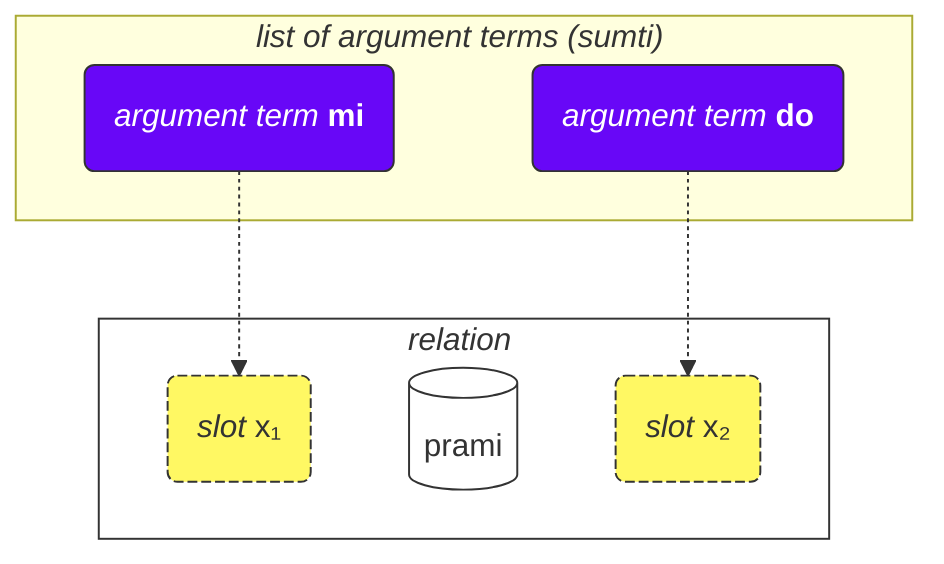
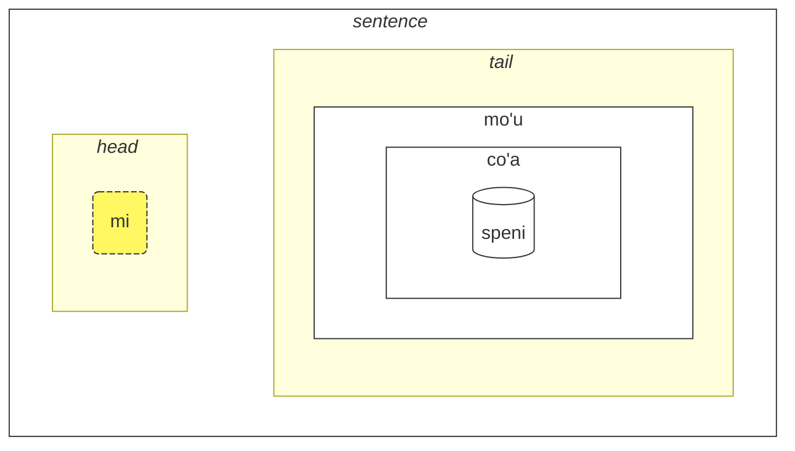

## Leçon 2. Plus de choses de base

### Types of words

All Lojban words are divided into three groups:

- Relation words (called **selbrivla** in Lojban)
  - Examples: **gleki**, **klama**.
  - Such words contain at least a cluster of consonants (two or more consonants one after another) within the first 5 sounds + they end in a vowel.
- Particles (called **cmavo** in Lojban)
  - Examples: **le**, **nu**, **mi**, **fa'a**.
  - They start with a consonant (one of **b d g v z j p t k f s c x l m n r i u**), followed by a vowel (one of **a e i o u y au ai ei oi**). Optionally, after that, there can be one or more sequences of an apostrophe (**'**) and a following vowel. For example, **xa'a'a'a'a'a'a** and **ba'au'oi'a'e'o** are possible particles (even if no meaning is assigned to them).
  - It is quite common to write several particles consecutively without spaces between them. This is allowed by Lojban grammar. So, don't be surprised to see **lenu** instead of **le nu**, **naku** instead of **na ku**, **jonai** instead of **jo nai**, and so on. This doesn't change the meaning. However, this rule does not apply to relation words; relation words should be separated by spaces.
- Name words (called **cmevla** in Lojban)
  - Examples: **.alis.**, **.doris**, **.lojban.**
  - Usually used for names.
  - They can be easily distinguished from the other types of words since they end in a consonant. Additionally, they are wrapped with two dots at the beginning and at the end. Colloquially, dots can be omitted when writing, but when speaking, pauses that correspond to those dots are still a must.

### Ordre des arguments

Plus tôt, nous avons fourni des définitions de mots de relation tels que :

mlatu
: … être un chat

citka
: … manger …

prami
: … aimer …

klama
: … venir à, aller à …

Les dictionnaires peuvent présenter des définitions de mots de relation avec des symboles tels que $x_1$, $x_2$ etc. :

prami
: $x_1$ aime $x_2$

karce
: $x_1$ est une voiture …

citka
: $x_1$ mange $x_2$ …

klama
: $x_1$ vient à $x_2$ …

These $x_1$, $x_2$, and so on is the explicit notation for the _slots_ (other names are: _places_, _roles of relation_, **terbricmi** in Lojban), which are filled by argument terms (**sumti**) in the sentence. 

Numbers represent the order in which those slots are to be filled by arguments.

For example:

> **mi prami do**
> _Je t'aime._

Cette phrase implique également que

- $x_1$ désigne _celui qui aime_, et
- $x_2$ désigne _celui qui est aimé par_.

In other words, each relation has one or more slots, and those slots are specified and labeled as $x_1$, $x_2$, and so on. We put arguments like **mi**, **do**, **le tavla** etc. in order, thus filling these slots and giving a concrete meaning to the relation, thus forming a sentence.

L'avantage d'un tel style de définitions est que tous les participants d'une relation sont dans une seule définition.

Nous pouvons également omettre des arguments, rendant la phrase plus vague :

> **carvi**
> _Il pleut._
> `pleut, est en train de pleuvoir`

(bien que le temps ici soit déterminé par le contexte, cela peut aussi signifier _Il pleut souvent_, _Il pleuvait_, etc.)

> **prami do**
> _Quelqu'un t'aime._
> `t'aime`

Toutes les places omises dans une relation signifient simplement **zo'e** = _quelque chose/quelqu'un_, donc cela signifie la même chose que

> **zo'e prami do**
> _Quelqu'un t'aime._

Et

> **prami**

est la même chose que

> **zo'e prami zo'e**
> _Quelqu'un aime quelqu'un._

<!-- Les termes modaux tels que **ca**, **fa'a**, etc. ajoutent de nouvelles places aux relations, mais ils ne suppriment pas les places existantes des verbes. Dans -->

Modal terms like **ca**, **fa'a** etc. add new places to relations, but they don't fill slots of relations. In

> **mi klama fa'a do**
> _Je viens vers toi._

la deuxième place de **klama** est toujours omise. Par exemple :

> **mi klama fa'a le cmana le zdani**
> _Je viens (en direction de la montagne) à la maison._

le cmana
: la montagne

<pixra url="/assets/pixra/cilre/cmana.webp" caption="cmana" definition="… être une montagne"></pixra>

Ici, la deuxième place de **klama** est **do**. La phrase signifie que la montagne est juste une direction, tandis que le point final est toi.

Ici, le terme **fa'a la cmana** (_en direction de la montagne_) ne remplace pas la deuxième place de la relation **klama**. La deuxième place de **klama** est **le zdani** ici.

La phrase signifie que ma maison est simplement située dans la direction de la montagne, mais cela ne signifie pas nécessairement que je veux atteindre cette montagne. La destination finale de ma venue n'est pas nécessairement la montagne mais la maison.

De même, dans

> **mi citka ba le nu mi cadzu**
> _Je mange après avoir marché._

le deuxième argument de **citka** est toujours omis. Un nouveau mot **ba** avec son argument **le nu mi cadzu** ajoute du sens à la phrase.

L'ordre des arguments des relations composées est le même que celui du dernier mot verbe qui le compose :

> **tu sutra bajra pendo mi**
> _C'est mon ami qui court rapidement._
> `C'est un ami qui court rapidement de moi.`

> **tu pendo mi**
> _That is my riend._
> `That is a friend of me.`

pendo
: … être un ami de … (quelqu'un)

Ainsi, l'ordre des arguments est le même que celui de **pendo** seul. 

### Plus de deux endroits

Il peut y avoir plus de deux endroits. Par exemple:

> **mi pinxe le djacu le kabri**
> _Je bois l'eau de la tasse._

pinxe
: $x_1$ boit $x_2$ de $x_3$

> **le kabri**
> _la tasse_

Dans ce cas, il y a trois endroits, et si vous voulez exclure le deuxième endroit au milieu, vous devez utiliser **zo'e**:
> **mi pinxe zo'e le kabri**
> _Je bois \[quelque chose\] de la tasse._

Si nous omettons **zo'e**, nous obtenons quelque chose de sans signification:

> **mi pinxe le kabri**
> _Je bois la tasse._

Un autre exemple:

> **mi plicru do le plise**
> _Je te donne les pommes._

plicru
: $x_1$ donne, fait don à $x_2$ d'un objet $x_3$; $x_1$ permet à quelqu'un $x_2$ d'utiliser $x_3$ 

### Relations à l'intérieur des relations

Dans
> **le nicte cu nu mi viska le lunra**
> *La nuit est quand je vois la Lune.*

nous avons

- **le nicte** comme $x_1$ de la relation,
- **nu mi viska le lunra** comme la relation principale.

Cependant, à l'intérieur de **nu mi viska le lunra**, nous avons une autre phrase avec

- **mi** - $x_1$ de la relation intérieure,
- **viska** - la relation intérieure,
- **le lunra** - $x_2$ de la relation intérieure.

Ainsi, malgré une structure interne, **nu mi viska le lunra** est toujours une relation avec son premier terme rempli de **le nicte** dans ce cas.

De même, dans

> **mi citka ba le nu mi dansu**
> _Je mange après avoir dansé._

nous avons

- **mi** comme $x_1$ de la relation,
- **citka** comme la construction de relation principale,
- **ba le nu mi dansu** comme terme modal de la relation principale de la phrase.

À l'intérieur de ce terme, nous avons:

- **mi** comme $x_1$ de la relation à l'intérieur du terme
- **dansu** comme la construction de relation principale à l'intérieur du terme.

Un tel mécanisme "récursif" d'emballage de relations dans des relations permet d'exprimer des idées complexes avec précision.

### Pourquoi les mots de relation sont-ils définis de cette manière ?

L'anglais utilise un ensemble limité de prépositions qui sont réutilisées dans divers verbes et, par conséquent, n'ont pas de signification fixe. Par exemple, considérez la préposition anglaise _to_ :

> _Je te parle._

<!-- -->
> _Je viens vers toi._
<!-- -->

> _Pour moi, cela semble joli._

Dans chacun de ces exemples, _to_ a un nouveau rôle qui est, au mieux, vaguement similaire aux rôles dans d'autres phrases.

Il est important de noter que d'autres langues utilisent différentes façons de marquer les rôles des verbes qui, dans de nombreux cas, sont très différents de ceux utilisés en anglais.

Lojban, for instance, marks core roles (slots) of relations by fully defining such relations with the roles placed in sequence (or marked with **fa**, **fe**, and so on):

<!-- Le lojban, par exemple, marque les rôles principaux des relations en définissant entièrement de telles relations avec les rôles placés en séquence (ou marqués avec **fa**, **fe**, etc.) : -->

klama
: $x_1$ vient vers $x_2$ …

tavla
: $x_1$ parle à $x_2$ …

melbi
: $x_1$ est beau, joli pour $x_2$ …

Ces rôles principaux sont essentiels pour définir les relations.

Cependant, il peut y avoir des rôles facultatifs qui rendent les relations plus précises :

> _Je te parle pendant que je mange._
<!-- -->

> _C'est difficile pour moi parce que cette chose est lourde._

En lojban, une notion similaire de tels rôles facultatifs est exprimée via des relations séparées ou, pour la plupart des cas courants, avec des termes modaux :

> **mi tavla do ze'a le nu mi citka**
> _Je te parle pendant que je mange._
<!-- -->
> **nandu mi ri'a le nu ti tilju**
> _C'est difficile pour moi parce que cette chose est lourde._

nandu
: $x_1$ est difficile pour $x_2$

tilju
: $x_1$ est lourd

Les prépositions en anglais sont similaires aux particules modales en lojban, bien qu'une préposition anglaise habituelle puisse avoir de nombreuses significations tandis qu'en lojban, chaque particule modale n'a qu'une seule signification (même si vague).

### Règles générales dans l'ordre des arguments

The order of places in relations might be sometimes hard to remember, but let's not worry — you don't need to remember all the places of all relation words. (Do you remember the meaning of hundreds of thousands of words in English?)

<!-- L'ordre des places dans les verbes peut parfois être difficile à retenir, mais ne vous inquiétez pas — vous n'avez pas besoin de vous souvenir de toutes les places de tous les verbes. (Vous souvenez-vous de la signification de centaines de milliers de mots en anglais ?) -->

Vous pouvez étudier les places lorsque vous les trouvez utiles ou lorsque les gens les utilisent dans un dialogue avec vous.

La plupart des mots de relation ont deux ou trois places.

En général, vous pouvez deviner l'ordre en utilisant le contexte et quelques règles empiriques :

1. La première place est souvent la personne ou la chose qui fait quelque chose ou qui est quelque chose :

    **klama** = _$x_1$ va…_

2. L'objet d'une action est généralement juste après la première place :

    **punji** = _$x_1$ met $x_2$ sur $x_3$_,

3. Et la place suivante sera généralement remplie par le destinataire :

    **punji** = _$x_1$ met $x_2$ sur $x_3$_,

4. Les lieux de destination (_vers_) viennent presque toujours avant les lieux d'origine (_de_) :

    **klama** = _$x_1$ va à $x_2$ depuis $x_3$_

    <pixra url="/assets/pixra/cilre/klama_fi.webp" caption="le prenu cu klama fi le zarci" definition="La personne sort du magasin."></pixra>

5. Les places moins utilisées viennent vers la fin. Ce sont généralement des choses comme _par défaut_, _par moyen_ ou _fait de_.

L'idée générale est que les places les plus susceptibles d'être utilisées viennent en premier.

Pas besoin de remplir toutes les places tout le temps. Les places non remplies ont simplement des valeurs non pertinentes ou évidentes pour le locuteur (elles prennent la valeur de **zo'e** = _quelque chose_).

### Infinitifs

Les infinitifs sont des verbes qui sont souvent précédés de _to_ en anglais. Des exemples incluent _I like to run_, avec _to run_ étant l'infinitif.

> **le verba cu troci le ka cadzu**
> _L'enfant essaie de marcher._

le verba
: l'enfant, les enfants

troci
: $x_1$ essaie de faire ou d'être $x_2$ (ka)

cadzu
: $x_1$ marche

<pixra url="/assets/pixra/cilre/troci_cadzu.webp" caption="le verba cu troci le ka cadzu" definition="L'enfant essaie de marcher."></pixra>

The particle **ka** works much like **nu**. It wraps a sentence.

The main difference is that some slot in the wrapped sentence is to be linked by some argument outside this sentence.

In this case the first argument **le verba** of the relation **troci** makes a link to the first unfilled slot of the inner sentence **cadzu** (which is inside **ka**).

In other words, the child tries to achieve a state where **le verba cu cadzu** (the argument **le verba** would fill the first unfilled slot of the relation **cadzu**).

Some relations require only infinitives in some of their slots. Definitions of such words mark such slots as _property_ or **ka**. For example:

cinmo
: $x_1$ ressent $x_2$ (ka)

This means that the infinitive in the second slot ($x_2$) is applied to some other slot (most likely, the first slot, $x_1$). Cases where the infinitive is applied to slots other than $x_2$ are rare and are explained for corresponding relations or in the case of relation words invented unofficially, can be deduced from common sense.

Another example:

<pixra url="/assets/pixra/cilre/sidju.webp" caption="ra sidju le pendo le ka bevri le dakli" definition="He/she helps the friend to carry the bags."></pixra>

> **ra sidju le pendo le ka bevri le dakli**
> _He/she helps the friend to carry the bags._
sidju
: $x_1$ helps $x_2$ do $x_3$ (ka)

The relation word **sidju** requires its third slot to be filled with an infinitive. 

bevri
: $x_1$ carries $x_2$

le dakli
: the bag, the bags

Notez que seul le premier endroit non rempli de la relation intégrée prend le sens de l'endroit externe:

> **mi troci le ka do prami**
> _J'essaie d'être aimé par toi._

tcidu
: $x_1$ lit $x_2$ de $x_3$

Ici, le premier endroit non rempli est la deuxième place de **prami**, donc il prend la valeur **mi** (_je_).

Il est également possible d'utiliser le pronom **ce'u** pour marquer explicitement un endroit qui doit être appliqué à un argument externe:

> **mi troci le ka do prami ce'u**
> _J'essaie d'être aimé par toi._

Un autre exemple:

> **mi cinmo le ka xebni ce'u**
> **mi cinmo le ka se xebni**
> _Je me sens comme si quelqu'un me détestait._
> _Je me sens détesté._

### Types d'emplacements

Le dictionnaire mentionne souvent d'autres types d'emplacements, par exemple:

djica
: $x_1$ veut $x_2$ (évènement)

Cet _évènement_ signifie que vous devez remplir l'endroit avec un argument qui représente un évènement. Par exemple:

le nicte
: la nuit

le nu mi dansu
: moi dansant

Nous obtenons donc:

> **mi djica le nicte**
> _Je veux l'évènement de la nuit._

<!-- -->

> **do djica le nu mi dansu**
> _Tu veux que je danse._

En lojban, il n'est pas autorisé de dire, par exemple:

> **mi djica le plise**
> _Je veux la pomme._ 

 

parce que vous voulez faire quelque chose avec la pomme ou vous voulez qu'un évènement se produise avec la pomme, comme:

> **mi djica le nu mi citka le plise**
> _Je veux manger la pomme._
> `Je veux que je mange la pomme.`

Notez que envelopper une relation attendant un événement dans un **nu** change la signification :

> **le zekri cu cumki**
> _Le crime est possible._

zekri
: $x_1$ (événement) est un événement criminel, $x_1$ (événement) un crime

cumki
: $x_1$ (événement) est possible

Comparer:

> **le nu zekri cu cumki**
> `Que [ce soit] criminel est possible.'
> _Il est possible que quelque chose soit un crime._

### Élévation

> **mi stidi le ka klama le barja**
> _Je suggère d'aller au pub._

stidi
: $x_1$ suggère l'action $x_2$ (propriété) à $x_3$

> **mi stidi tu'a le barja**
> _Je suggère le pub._

tu'a le barja
: quelque chose à propos du pub

> **mi djica le nu mi citka le plise**
> _Je veux manger une pomme._

<!-- -->

> **mi djica tu'a le titla**
> _Je veux le bonbon._

tu'a le titla
: quelque chose à propos du bonbon

titla
: … être sucré, … être un bonbon

<pixra url="/assets/pixra/cilre/djica_tuha_le_titla.webp" caption="le prenu cu djica tu'a le titla" definition="La personne veut le bonbon."></pixra>

La structure de lieu peut mettre trop de charge sur la spécification des actions ou des évènements. Parfois, nous voulons spécifier seulement un objet dans ces évènements ou lieux et sauter la description de l'action ou de l'évènement entièrement.

Dans les exemples ci-dessus, _Je suggère le pub._ implique très probablement d'aller au pub et _Je veux la pomme._ implique de la manger.

Cependant, le mote de relation **stidi** nécessite une propriété dans son lieu $x_2$. De même, **djica** nécessite un évènement dans son lieu $x_2$.

Le court mot qualificatif appelé **tu'a** avant un terme implique une abstraction (propriété, évènement ou proposition) mais ne sélectionne que ce terme de cette abstraction en sautant le reste. Il peut être vaguement traduit par _quelque chose à propos de_ :

> **mi stidi tu'a le barja**
> _Je suggère quelque chose à propos du pub (peut-être le visiter, se rencontrer près de lui, etc.)._

<!-- -->

> **mi djica tu'a le plise**
> _I desire something related to the apple (perhaps eating, chewing, licking, throwing it at a friend, etc.)_

> **tu'a le cakla cu pluka mi**
> _The chocolate is pleasing to me (likely due to its taste)._
> `Something about the chocolate is pleasant to me`

cakla
: $x_1$ is some chocolate

Lors de l'omission d'abstractions, seul le contexte nous indique ce qui a été omis.

Il est également possible de modifier la construction relationnelle principale :

> **le cakla cu jai pluka mi**
> **tu'a le cakla cu pluka mi**
> _Le chocolat me plaît._

Cela permet de créer des noms vagues avec **jai** :

> **le jai pluka cu zvati ti**
> _La chose agréable est ici._

Étant donné que **le pluka** (_l'événement plaisant_) est abstrait, il est impossible de spécifier son emplacement. Cependant, un participant à l'abstraction peut être physiquement placé quelque part.

### Endroits pour les arguments

Comment dit-on _Tu es mon ami._ ?

> **do pendo mi**
> _Tu es mon ami._
> `Tu es un ami à moi.`

<pixra url="/assets/pixra/cilre/pendo.webp" caption="le pendo" definition="l'ami / les amis"></pixra>

Et maintenant, comment dit-on _My friend is smart._ ?

> **le pendo be mi cu stati**
> _Mon ami est intelligent._

Ainsi, lorsque nous convertissons unu relation en un argument (**pendo** - _être un ami_ en **le pendo** - _l'ami_), nous pouvons toujours conserver d'autres endroits de ce tte relation en plaçant **be** après celui-ci.

Par défaut, il attache le deuxième endroit ($x_2$). Nous pouvons attacher plus d'endroits en les séparant avec **bei** :

> **mi plicru do le plise**
> _Je te donne la pomme._

<pixra url="/assets/pixra/cilre/plicru.webp" caption="le prenu cu plicru le pendo le plise" definition="La personne donne à l'ami la pomme."></pixra>
<!-- -->

> **le plicru be mi bei le plise**
> _Le donateur de la pomme pour moi_

<!-- -->

> **le plicru be mi bei le plise cu pendo mi**
> _Celui qui me donne la pomme est mon ami._
> `Celui qui me donne la pomme est un ami à moi.`

Un autre exemple :

<!-- > **le pendo be mi cu tavla**
> _Les amis à moi parlent._
> **le pendo mi cu tavla**
> **le pendo cu tavla mi**
> _Les amis me parlent._ -->

> **mi klama le pendo be do**
> _Je viens chez un de tes amis._

klama
: $x_1$ vient à $x_2$ de $x_3$ …

Nous ne pouvons pas omettre **be** car **le pendo do** sont deux endroits indépendants :

> **mi klama le pendo do**
> _Je viens chez un ami de toi._

Ici, **do** a pris la troisième place de **klama** car il n'est pas lié à _pendo_ via **be**.

Nous ne pouvons pas non plus utiliser **nu** car **le nu pendo do** est l'évènement de quelqu'un qui est ton ami.

Ainsi, **le pendo be do** est la solution correcte.

Un autre exemple :

> **la .lojban. cu bangu mi**
> _Le lojban est ma langue._
> `Le lojban est une langue à moi.`

Cependant,

> **mi nelci le bangu be mi**
> _J'aime ma langue._

Utiliser **be** pour les relations non convertis en arguments n'a aucun effet :

> **mi nelci be do** est identique à
> **mi nelci do**.

### Propositions relatives

> **le prenu poi pendo mi cu tavla mi**
> _La personne qui est mon ami me parle._

<!-- -->

> **le prenu noi pendo mi cu tavla mi**
> _La personne, qui est accessoirement mon ami, me parle._

blabi
: … être blanc

Dans la première phrase, le mot _that_ est essentiel pour identifier la personne en question. Il clarifie qui parmi les personnes dans le contexte dont nous parlons. Nous choisissons seulement ceux qui sont mes amis parmi probablement beaucoup de gens autour. Peut-être qu'il n'y a qu'une seule personne autour qui est mon ami.

Quant à _qui est accessoirement mon ami_ de la deuxième phrase, cela fournit simplement des informations supplémentaires sur la personne. Cela ne nous aide pas à identifier la personne. Par exemple, cela peut arriver lorsque toutes les personnes autour sont mes amis.

**poi pendo mi** est une proposition relative, une relation attachée à droite du argument **le prenu**. Elle se termine juste avant le mot suivant **cu**:

> **le prenu (poi pendo mi) cu tavla mi**
> _La personne qui est mon ami me parle._

En lojban, nous utilisons **poi** pour les propositions relatives qui identifient des entités (objets, personnes ou évènements) et **noi** pour les informations accessoires.

> **la .bob. ba co'a speni le ninmu poi pu xabju le nurma**
> _Bob va épouser une fille qui vivait à la campagne._

xabju
: … vivre dans …, habiter … (lieu, objet)

le nurma
: la zone rurale

Cette phrase n'exclut pas que Bob épouse quelqu'un d'autre aussi ! Enlever la proposition relative avec **poi** change le sens :

> **la .bob. ba co'a speni le ninmu**
> _Bob va épouser une fille._

Un autre exemple :

> **le prenu poi gleki cu ze'u renvi**
> _Les gens (lesquels ?) qui sont heureux vivent longtemps._

ze'u
: terme modal : pendant longtemps

renvi
: survivre

Enlever la proposition relative avec **poi** change le sens :

> **le prenu ze'u renvi**
> _Les gens vivent longtemps._

D'autre part, les propositions relatives avec **noi** contiennent simplement des informations supplémentaires sur l'argument auquel elles sont attachées. cet argument est suffisamment défini par lui-même pour que l'enlèvement d'une proposition relative avec **noi** ne change pas son sens :

> **mi nelci la .doris. noi mi ta'e zgana bu'u le panka**
> _J'aime Doris que je vois habituellement dans le parc._
> _J'aime Doris. Que puis-je dire d'autre à son sujet ? Je la vois habituellement dans le parc._

zgana
: observer (en utilisant tous les sens)

<pixra url="/assets/pixra/cilre/panka_ninmu.webp" caption="le prenu noi mi ta'e zgana bu'u le panka" definition="La personne que je vois habituellement dans le parc."></pixra>

Enlever la proposition relative avec **noi** conserve le sens : _J'aime Doris._

En anglais parlé, la distinction est souvent réalisée en utilisant l'intonation ou en devinant. De plus, les propositions relatives avec **noi** sont traditionnellement séparées par des virgules en anglais. Elles utilisent _which_ ou _who_, et le mot _that_ n'est pas utilisé dans ces propositions.

Prenons un autre exemple.

> **mi klama le pa tricu**
> _Je viens à l'arbre._

<!-- -->

> **le pa tricu cu barda**
> _L'arbre est grand._

le pa tricu
: l'arbre (un arbre)

barda

: $x_1$ est grand/gros

Et maintenant, joignons ces deux phrases :

> **le tricu noi mi klama ke'a cu barda**
> _L'arbre, auquel je viens, est grand._

Notez le mot **ke'a**. Nous déplaçons la deuxième phrase sur le même arbre dans une proposition relative et remplaçons l'argument **le tricu** par **ke'a** dans la proposition relative. Ainsi, le pronom **ke'a** est comme _qui_ et _que_ en anglais. Il renvoie à l'argument auquel la proposition relative est attachée.

Donc, littéralement, notre phrase lojbanique sonne comme

> _L'arbre, tel que je vais à lui, est grand._

**ke'a** peut être omis si le contexte est suffisant. Les deux phrases suivantes signifient la même chose :

> **le prenu poi pendo mi cu tavla mi**
> **le prenu poi ke'a pendo mi cu tavla mi**
> _La personne qui est mon ami me parle._

**ke'a** est souvent supposé aller à la première place non remplie :

> **mi nelci la .doris. noi mi ta'e zgana bu'u le panka**
> **mi nelci la .doris. noi mi ta'e zgana ke'a bu'u le panka**
> _J'aime Doris que je vois habituellement dans le parc._

Ici, **mi** remplit la premier emplacement de la relation **ta'e zgana** (_… voit habituellement …_), donc **ke'a** est supposé pour la place suivante, la deuxième.

Les propositions relatives comme les relations habituelles peuvent contenir des constructions avec des termes modaux :

> **le tricu noi mi pu klama ke'a ca le cabdei cu barda**
> _L'arbre, auquel je suis allé aujourd'hui, est grand._

<pixra url="/assets/pixra/cilre/le_tricu_cu_barda.webp" caption="le tricu cu barda" definition="L'arbre est grand."></pixra>

le cabdei
: le jour d'aujourd'hui

Notez que **ca le cabdei** appartient à la proposition relative. Comparez :

> **le tricu noi mi pu klama ke'a cu barda ca le cabdei**
> _L'arbre, auquel je suis allé, est grand aujourd'hui._

Le sens a beaucoup changé.

Enfin, **voi** est utilisé pour former des arguments similaires à **le** mais avec des propositions relatives :

> **ti voi le nu ke'a cisma cu pluka mi cu zutse tu**
> _Ceux dont le sourire me plait sont assis._

<pixra url="/assets/pixra/cilre/voi.webp" caption="mi nelci ti voi le nu ke'a cisma cu pluka mi" definition="J'aime ceux dont le sourire me plait."></pixra>

ti
: celui-ci près de moi, ceux-ci près de moi

cisma
: $x_1$ sourit

pluka
: $x_1$ est agréable à $x_2$

zutse
: $x_1$ est assis, est assis sur $x_2$

Ici, **voi** définit l'objet près de moi.

Comparez-le à :

> **ti poi le nu ke'a cisma cu pluka mi cu zutse**
> _De ceux-ci, ceux dont le sourire me plait sont assis._

**poi** restreint la sélection à ceux décrits dans la proposition relative.
Cet exemple pourrait impliquer qu'il y a beaucoup d'objets (personnes, etc.) autour de moi, mais avec **poi**, je ne sélectionne que ceux nécessaires.

Comparez-le à :

> **ti noi le nu ke'a cisma cu pluka mi cu zutse**
> _Ceux-ci (qui sont accessoirement tels que leur sourire me plait) sont assis._

**noi** ajoute simplement des informations incidentes qui ne sont pas nécessaires pour déterminer à quoi **ti** (_ceux-ci_) se réfère. Peut-être qu'il n'y a personne d'autre autour à décrire.

Enfin, tout comme **nu** a le marqueur de bordure droite **kei**, nous avons

ku'o
: marqueur de bordure droite pour **poi**, **noi** et **voi**.

> **mi tavla la .doris. noi ca zutse tu ku'o .e la .alis. noi ca cisma**
> _Je parle à Doris, qui est assise là-bas maintenant, et à Alice qui sourit maintenant._

Remarquez que sans **ku'o**, nous aurions **tu** (_là-bas_) joint à **la .alis.** (_Alice_), ce qui donnerait un sens étrange :

> **mi tavla la .doris. noi ca zutse tu .e la .alis. noi ca cisma**
> _Je parle à Doris, qui est maintenant assise là-bas et sur Alice (qui sourit maintenant)._

Remarquez la partie **zutse tu .e la .alis.**.

Pour tous les cas de **poi**, **noi** et **voi**, le marqueur de bordure droite reste le même : **ku'o**.

### Courtes propositions relatives. « _À propos de_ »

Parfois, vous pourriez avoir besoin d'attacher un argument supplémentaire à un autre argument :

> **mi djuno le vajni pe do**
> _Je sais quelque chose d'important à propos de toi._

le vajni
: quelque chose d'important

**pe** et **ne** sont similaires à **poi** et **noi**, mais ils relient des arguments à des arguments :

> **le pa penbi pe mi cu xunre**
> _Le stylo qui est à moi est rouge._ (_à moi_ est essentiel pour identifier le stylo en question)

<!-- -->

> **le pa penbi ne mi cu xunre**
> _Le stylo, qui est à moi, est rouge._ (information supplémentaire)

ne
: qui est à propos de, a une relation avec … (un argument suit)

pe
: qui est à propos de, a une relation avec … (un argument suit)

> **le pa penbi ne mi ge'u .e le pa fonxa ne do cu xunre**
> _Le stylo, qui est à moi, et le téléphone, qui est à toi, sont rouges._

ge'u
: marqueur de bordure droite pour **pe**, **ne**.

### « **be** » et « **pe** »

Notez que les propositions relatives sont attachées aux arguments, tandis que **be** fait partie du verbe.

En fait, **le bangu pe mi** est une meilleure traduction de _ma langue_, car, comme en anglais, les deux arguments sont liés l'un à l'autre de manière vague.

Cependant, vous pouvez dire **le birka be mi** comme _mon bras_. Même si vous vous coupez le bras, il sera toujours à vous. C'est pourquoi **birka** a une place de propriétaire :

birka
: $x_1$ est un bras de $x_2$

Montrons une fois de plus qu'une construction avec **be** fait partie de la relation, tandis que **pe**, **ne**, **poi** et **noi** sont attachés aux arguments :

> **le pa melbi be mi fonxa pe le pa pendo be mi cu barda**
> `Le téléphone beau pour moi de mon ami est grand.`

Ici, **be mi** est attaché à la relation **melbi** = _être beau pour … (quelqu'un)_ et crée ainsi une nouvelle relation **melbi be mi** = _être beau pour moi_. Mais **pe le pa pendo be mi** (_de mon ami_) est appliqué à tout l'argument **le pa melbi be mi fonxa** (_le téléphone beau pour moi_).

Il peut également arriver que nous devions attacher **be** à une relation, transformer cette relation en argument, puis attacher **pe** à cet argument :

> **le pa pendo be do be'o pe la .paris. cu stati**
> _Ton ami qui est lié à Paris est intelligent._

<!-- -->

> **le pu plicru be do bei le pa plise be'o pe la .paris. cu stati**
> _Celui qui t'a donné la pomme (et qui est lié à Paris) est intelligent._

be'o
: marqueur de bordure droite pour la chaine de noms attachés avec **be** et **bei**

Dans ces exemples, **pe la .paris.** est attaché à tout le nom **le pa pendo be do be'o** et à tout le nom **le pu plicru be do bei le pa plise be'o**.

Dans ces deux exemples, votre ami a une relation avec Paris (peut-être est-il/elle de Paris).

Comparez-le à :

> **le pa pendo be do pe la .paris. cu stati**
> _Ton ami (toi qui est lié à Paris) est intelligent._
> (**pe la .paris.** is attached to the whole argument **le pa pendo be do be'o**)

<!-- -->

> **le pu plicru be do bei le pa plise pe la .paris. cu stati**
> _Celui qui t'a donné la pomme (la pomme qui est liée à Paris) est intelligent._
> (**pe la .paris.** is attached to the whole argument **le pu plicru be do bei le pa plise be'o**)

be'o
: right border marker for the string of terms attached with **be** and **bei**

Dans ces deux derniers exemples, cependant, soit vous êtes lié à Paris, soit la pomme l'est.

### « _Alice est une enseignante_ » et « _Alice est l'enseignante_ »

En anglais, le verbe _is, are, to be_ fait fonctionner un nom comme un verbe. En lojban, même des concepts tels que _chat_ (**mlatu**), _personne_ (**prenu**), _maison_ (**dinju**), _domicile_ (**zdani**) fonctionnent comme des relations par défaut. Seuls les pronoms fonctionnent comme des arguments.

Cependant, voici trois cas :

> **la .alis. cu ctuca**
> _Alice enseigne._

<!-- -->

> **la .alis. cu me le ctuca**
> _Alice est l'un des enseignants._

me
: … être parmi …, … être l'un des …, … être membre de … (l'argument suit)

> **la .alis. ta'e ctuca**
> _Alice enseigne habituellement._

ta'e
: particule modale : l'évènement se produit habituellement

> **la .alis. cu du le ctuca**
> _Alice est l'enseignante._

du
: … être identique / égal à …

La particule **me** prend un argument après elle et indique qu'il y a probablement d'autres enseignants, et Alice en est un parmi eux.

La particule **du** est utilisée lorsque Alice est, par exemple, l'enseignante que nous avons cherchée ou dont nous avons parlé. Elle indique l'identité.

Ainsi, **me** et **du** peuvent parfois correspondre à ce que nous exprimons en anglais en utilisant le verbe _to be/is/was_.

En lojban, nous privilégions le sens de ce que nous voulons dire, plutôt que de nous appuyer sur la façon dont il est littéralement exprimé en anglais ou dans d'autres langues.

Autres exemples :

> **mi me la .bond.**
> _Je suis Bond._

<!-- -->

> **mi du la .kevin.**
> _Je suis Kevin (celui dont vous aviez besoin)._

<!-- -->

> **ti du la .alis. noi mi ta'e zgana bu'u le panka**
> _C'est Alice que je vois habituellement dans le parc._

**noi du** et **poi du** sont utilisés pour introduire des noms alternatifs pour quelque chose. Ils correspondent à l'anglais _namely, i.e._ :

> **la .alis. cu penmi le prenu noi du la .abdul.**
> _Alice a rencontré la personne, à savoir Abdul._

Lorsque vous utilisez **me**, vous pouvez connecter plusieurs arguments avec _and_ :

> **tu me le pendo be mi be'o .e le tunba be mi**
> _Ce sont certains (ou tous) de mes amis et de mes frères et sœurs._

tunba
: $x_1$ est un frère ou une sœur de $x_2$

<pixra url="/assets/pixra/cilre/tunba.webp" caption="do tunba mi" definition="You are my sibling."></pixra>

### Relations avec des particules modales

Nous pouvons placer une particule modale non seulement avant la construction de relation principale de la phrase, mais aussi à la fin de celle-ci, produisant le même résultat :

> **mi ca tcidu**
> **mi tcidu ca**
> _Je (lis maintenant)._

tcidu
: lire (du texte)

Lorsque nous utilisons **nu**, nous créons une relation décrivant un évènement. Remarquez la différence entre ces deux exemples :

> **le nu tcidu ca cu nandu**
> _La lecture actuelle est compliquée, difficile._

<!-- -->

> **le nu tcidu cu ca nandu**
> _La lecture est maintenant compliquée._

Autres exemples :

> **mi klama le pa cmana pu**
> _Je suis allé à la montagne._
> `Je vais à une montagne (dans le passé).`

<!-- -->

> **le nu mi klama le pa cmana pu cu pluka**
> _Le fait que je suis allé à la montagne est agréable._

We can also put one or more modal particles as the first element of a relation construct and e.g. use such enriched relation in an argument form:

<!-- Lorsque nous n'utilisons pas **nu**, nous n'avons pas de relations d'évènements. Les noms commencent par **le** et se terminent par leur verbe (qu'il s'agisse d'un verbe simple ou composé, avec une construction **be** ou non). Ainsi, nous pouvons placer des particules de terme avant un verbe dans un nom uniquement avant ce verbe : -->

<pixra url="/assets/pixra/cilre/coha_purdi.webp" caption="le pu kunti tumla ca purdi" definition="Ce qui était un désert est maintenant un jardin."></pixra>

> **le pu kunti tumla ca purdi**
> _Ce qui était un désert est maintenant un jardin._

**pu** belongs to **le kunti tumla** and **ca** belongs to **purdi** (as **le pu kunti tumla** can't add **ca** at the end).

<!-- Ainsi, **pu** appartient à **le kunti tumla** et **ca** appartient à **purdi** (puisque **le pu kunti tumla** ne peut pas ajouter **ca** à la fin). -->

<!-- Cela ne contredit pas l'utilisation de **be** après le verbe, car avec **be**, vous changez le verbe : **bangu be mi** est considéré comme un seul verbe. -->

Avoir plusieurs particules modales dans l'ordre n'est pas un problème :
> **le pu ze'u kunti tumla ca purdi**
> _Ce qui était un désert depuis longtemps est maintenant un jardin._

ze'u
: terme modal : depuis longtemps

Placer des particules de terme après des noms les lie à des relations extérieures :

<pixra url="/assets/pixra/cilre/cohu_purdi.webp" caption="le kunti tumla pu purdi" definition="Le désert était un jardin."></pixra>

> **le kunti tumla pu purdi**
> **(le kunti tumla) pu purdi**
> _Le désert était un jardin._

### Nouveaux arguments des emplacements de la même relation

> **do plicru mi ti**
> _Tu me donnes ceci._

<!-- -->

> **mi se plicru ti do**
> _Je reçois ceci de toi._

plicru
: $x_1$ donne à $x_2$ quelque chose $x_3$ pour utilisation

Nous pouvons échanger les deux premiers endroits dans la relation en utilisant **se** et ainsi changer la structure de l'endroit.

**do plicru mi ti** signifie exactement la même chose que **mi se plicru do ti**. La différence est uniquement stylistique.

Vous pouvez vouloir changer les choses pour différentes emphases, par exemple, pour mentionner les choses les plus importantes dans une phrase en premier. Ainsi, les paires suivantes signifient la même chose:

> **mi prami do**
> _Je t'aime._

<!-- -->

> **do se prami mi**
> _Tu es aimé par moi._

<!-- -->

> **le nu mi tadni la .lojban. cu xamgu mi**
> _Mon étude du lojban est bonne pour moi._

xamgu
: … être bon pour (quelqu'un)

> **mi se xamgu le nu mi tadni la .lojban.**
> _Pour moi, c'est bien d'étudier le lojban._

La même chose peut être faite avec des arguments:

le plicru
: ceux qui donnent, les donateurs

le se plicru
: ceux qui reçoivent des cadeaux, les bénéficiaires

le te plicru
: les objets qui sont donnés pour utilisation, les cadeaux

**te** échange les premier et troisième endroits des relations.

Comme nous le savons, lorsque nous ajoutons **le** devant une relation, il devient un argument. Donc

- **le plicru** signifie _ceux qui pourraient s'adapter à la première place de **plicru**_
- **le se plicru** signifie _ceux qui pourraient s'adapter à la deuxième place de **plicru**_
- **le te plicru** signifie _ceux qui pourraient s'adapter à la troisième place de **plicru**_

Ainsi, en lojban, nous n'avons pas besoin de mots séparés pour _donneur_, _bénéficiaire_ et _cadeau_. Nous réutilisons la même relation et économisons beaucoup d'efforts grâce à une conception aussi intelligente. En effet, nous ne pouvons pas imaginer un cadeau sans impliquer que quelqu'un l'a donné ou le donnera. Lorsque des phénomènes utiles sont interconnectés, le lojban reflète cela.

<!--  TODO: DwE: Pour faciliter la compréhension et la mémorisation des mots prédicatifs préfixés par **se**, **te** sont mis dans le dictionnaire dans des entrées pour de nombreux verbes avec leurs définitions, bien que vous puissiez en déduire leur signification vous-même. -->

### Changer d'autres endroits dans les relations principales

La série **se, te, ve, xe** (par ordre alphabétique) se compose de particules qui changent de place dans les relations principales :

- **se** échange les première et deuxième places
- **te** échange les première et troisième places
- **ve** échange les première et quatrième places
- **xe** échange les première et cinquième places.

> **mi zbasu le pa stizu le mudri**  
> _J'ai fabriqué la chaise à partir du morceau de bois._

zbasu
: $x_1$ construit, fabrique $x_2$ à partir de $x_3$

le pa stizu
: la chaise

le mudri
: le morceau de bois

> **le mudri cu te zbasu le stizu mi**  
> _Le morceau de bois est ce dont la chaise est faite par moi._

Le **mi** est maintenant déplacé à la troisième place de la relation et peut être supprimé si nous sommes trop paresseux pour préciser qui a fabriqué la chaise ou si nous ne savons tout simplement pas qui l'a fabriquée :

> **le mudri cu te zbasu le stizu**  
> _Le morceau de bois est le matériau de la chaise._

De même que dans notre exemple avec **le se plicru** (_le destinataire_) et **le te plicru** (_le cadeau_), nous pouvons utiliser **te**, **ve**, **xe** pour dériver plus de mots à partir d'autres endroits des mots de relation :

klama
: $x_1$ va à $x_2$ depuis $x_3$ via $x_4$ par le moyen de $x_5$

Ainsi, nous pouvons déduire que

le klama
: le venu / les venus

le se klama
: le lieu de destination

le te klama
: le lieu d'origine du mouvement

le ve klama
: l'itinéraire

le xe klama
: le moyen de venir

**le xe klama** et la cinquième place de **klama** peuvent désigner n'importe quel moyen de déplacement, comme conduire une voiture ou marcher à pied.

**se** est utilisé plus fréquemment que les autres particules pour échanger les places.

### Ordre libre des mots : balises pour les rôles dans les relations

Généralement, nous n'avons pas besoin de tous les slots, lieux d'une relation, donc nous pouvons omettre les lieux inutiles en les remplaçant par **zo'e**. Cependant, nous pouvons utiliser des _balises de lieu_ pour faire référence explicitement à un emplacement nécessaire. Les balises de lieu fonctionnent comme des particules modales mais traitent de la structure de lieu des relations :

> **mi prami do** est la même chose que
> **fa mi prami fe do**
> _Je t'aime._

- **fa** marque le premier argument d'une relation ($x_1$)
- **fe** marque le deuxième argument ($x_2$)
- **fi** marque le troisième argument ($x_3$)
- **fo** marque le quatrième argument ($x_4$)
- **fu** marque le cinquième argument ($x_5$)

Plus d'exemples :

> **mi klama fi le tcadu**
> _Je vais de la ville._

**fi** marque **le tcadu** comme le troisième lieu de **klama** (l'origine du mouvement). Sans **fi**, la phrase deviendrait **mi klama le tcadu**, ce qui signifie _Je vais à la ville._

> **mi pinxe fi le kabri** est la même chose que
> **mi pinxe zo'e le kabri**
> _Je bois (quelque chose) dans la tasse._

pinxe
: $x_1$ boit $x_2$ dans $x_3$

le kabri
: la tasse, le verre

<pixra url="/assets/pixra/cilre/pinxe_fi_le_kabri.webp" caption="le prenu cu pinxe fi le kabri" definition="La personne boit dans le verre."></pixra>

> **mi tugni zo'e le nu vitke le rirni**
> **mi tugni fi le nu vitke le rirni**
> _Je suis d'accord (avec quelqu'un) pour rendre visite aux parents._

tugni
: $x_1$ est d'accord avec quelqu'un $x_2$ à propos de $x_3$ (proposition)

le rirni
: le parent / les parents

Avec les balises de lieu, nous pouvons déplacer les lieux :

> **fe mi fi le plise pu plicru**
> _Quelqu'un m'a donné la pomme._

Ici,

- **le plise** = _la pomme_, nous la mettons dans le troisième lieu de **plicru**, ce qui est donné
- **mi** = _moi_, nous le mettons dans le deuxième lieu de **plicru**, le destinataire.

Comme on peut le voir dans le dernier exemple, nous ne pouvons même pas refléter l'ordre des mots dans sa traduction en anglais.

L'utilisation intensive des balises de lieu peut rendre notre discours plus difficile à percevoir, mais elles permettent plus de liberté.

Contrairement à la série **se**, l'utilisation de balises de lieu comme **fa** ne change pas la structure de lieu.

---

Nous pouvons utiliser des balises de lieu à l'intérieur des arguments en les plaçant après **be** :

> **le pa klama be fi le tcadu cu pendo mi**
> _Celui qui vient en ville est mon ami._

---

Nous pouvons également mettre tous les arguments d'une relation principale à l'avant de la phrase (en préservant leur ordre relatif). Grâce à cette liberté, nous pouvons dire :

> **mi do prami** qui est la même chose que
> **mi do cu prami** qui est la même chose que
> **mi prami do**
> _Je t'aime._

<!-- -->

> **ko kurji ko** est la même chose que
> **ko ko kurji**
> _Prends soin de toi._

Les phrases suivantes sont également équivalentes en signification :

> **mi plicru do le pa plise**
> _Je te donne la pomme._

<!-- -->

> **mi do cu plicru le pa plise**
> _Je te donne la pomme._

<!-- -->

> **mi do le pa plise cu plicru**
> _Je te donne la pomme._

### Prenex

Prenex est un "préfixe" de relation, dans lequel vous pouvez déclarer des variables à utiliser plus tard :

> **pa da poi pendo mi zo'u da tavla da**
> _Il y a quelqu'un qui est mon ami et qui parle à lui-même._

zo'u
: séparateur de prenex

da
: pronom : variable.

Le pronom **da** est traduit par _il y a quelque chose/quelqu'un…_ Si nous utilisons **da** une deuxième fois dans la même relation, il fait toujours référence à la même chose que le premier **da** :

> **mi djica le nu su'o da poi kukte zo'u mi citka da**
> _Je souhaite qu'il y ait au moins quelque chose de savoureux pour que je le mange._

su'o
: nombre : au moins 1

Si la variable est utilisée dans la même relation et non dans des relations imbriquées, vous pouvez omettre le prenex :

> **mi djica le nu su'o da poi kukte zo'u mi citka da**
> **mi djica le nu mi citka su'o da poi kukte**
> _Je souhaite qu'il y ait au moins quelque chose de savoureux pour que je le mange._
> _Je souhaite que quelque chose soit pour que je le mange._

Les deux exemples signifient la même chose, dans les deux cas **su'o da** désigne _il y a (avait/aura) quelque chose ou quelqu'un_.

Cependant, le prenex est utile et nécessaire lorsque vous avez besoin d'utiliser **da** profondément à l'intérieur de votre relation, c'est-à-dire dans des relations imbriquées :

> **su'o da poi kukte zo'u mi djica le nu mi citka da**
> _Il y a au moins quelque chose de savoureux : je souhaite l'avoir mangé, je veux le manger._
> _Il y a quelque chose de savoureux que je souhaite manger._

Remarquez comment le sens change. Ici, nous ne pouvons pas omettre le prenex car cela changera le sens de l'exemple précédent.

Plus d'exemples :

> **mi tavla**
> _Je parle._

<!-- -->

> **mi tavla su'o da**
> **mi tavla da**
> _Il y a quelqu'un à qui je parle._

Par défaut, **da** en tant que pronom seul signifie la même chose que **su'o da** (_il y a au moins un(e) …_) sauf si un nombre explicite est utilisé.

> **da tavla da**
> _Quelqu'un parle à lui-même._

<!-- -->

> **da tavla da da**
> _Quelqu'un parle à lui-même à propos de lui-même._

tavla
: $x_1$ parle à quelqu'un $x_2$ à propos du sujet $x_3$

> **pa da poi ckape zo'u mi djica le nu da na ku fasnu**
> _Il y a une chose dangereuse : je souhaite qu'elle ne se produise jamais._

**da** n'implique aucun objet ou évènement particulier, ce qui est souvent utile :

> **xu do tavla su'o da poi na ku slabu do**
> _Parlez-vous à quelqu'un qui ne vous est pas familier ? (aucune personne particulière n'est décrite en tête)._

<!-- -->

> **.e'u mi joi do casnu bu'u su'o da poi drata**
> _Discutons dans un autre endroit (aucun endroit particulier en tête)._

### Arguments d'existence

> **pa da poi me le pendo be mi zo'u mi prami da**
> _Il y a quelqu'un qui est mon ami, que j'aime._

Puisque **da** est utilisé une seule fois, nous pourrions être tentés de nous débarrasser du préfixe. Mais comment devrions-nous gérer la proposition relative **poi pendo mi** (_qui est mon ami_) ?

Heureusement, en lojban, il y a un raccourci:

> **pa da poi me le pendo be mi zo'u mi prami da**
> **mi prami pa le pendo be mi**
> _Il y a quelqu'un qui est mon ami, que j'aime._

Les deux phrases signifient la même chose.

Les arguments commençant par des nombres comme **pa le pendo** (_il y a quelqu'un qui est mon ami_), **ci le prenu** (_il y a trois personnes_) peuvent se référer à de nouvelles entités chaque fois qu'ils sont utilisés. C'est pourquoi

> **pa le pendo be mi ca tavla pa le pendo be mi**
> _Il y a un ami à moi qui parle à un ami à moi._

Cette phrase n'est pas précise pour dire s'il s'agit de votre ami qui parle à lui-même, ou si vous décrivez deux de vos amis tels que le premier parle au second.

Il est plus raisonnable de dire:

> **le pa pendo be mi ca tavla ri**
> _L'ami à moi parle à lui-même._

ri
: pronom: se réfère à l'argument précédent à l'exclusion de **mi**, **do**.

Ici, **ri** se réfère à l'argument précédent: **le pa pendo** dans son ensemble.

Notez la différence:

- **da** signifie _il y a quelque chose/quelqu'un_, **da** se réfère toujours à la même entité lorsqu'il est utilisé plus d'une fois dans la même relation.
- un argument comme **pa le mlatu** (avec un nombre nu) est similaire à l'utilisation de **pa da poi me le mlatu** mais peut se référer à de nouvelles entités chaque fois qu'il est utilisé.

> **mi nitcu le nu pa da poi mikce zo'u da kurju mi**
> _J'ai besoin d'un médecin pour prendre soin de moi (impliquant "n'importe quel médecin fera l'affaire")._

<!-- -->

> **pa da poi mikce zo'u mi nitcu le nu da kurju mi**
> _Il y a un médecin dont j'ai besoin pour prendre soin de moi._

Un autre exemple:

> **le nu pilno pa le bangu kei na ku banzu**
> _Utiliser seulement une des langues n'est pas suffisant._

pilno
: … utiliser …

banzu
: … être suffisant pour le but …

Comparez-le à:

> **le nu pilno le pa bangu kei na ku banzu**
> _Utiliser la langue (celle en question) n'est pas suffisant._

Les arguments d'existence sont naturellement utilisés à l'intérieur de relations internes et avec **tu'a**:

> **mi djica le nu mi citka pa le plise**
> _Je veux manger une pomme, des pommes._

> **mi djica tu'a pa le plise**
> _Je veux quelque chose à propos d'une pomme, des pommes (probablement, la manger, peut-être la mâcher, la lécher, la jeter à votre ami, etc.)_

Remarquez la différence:

> **mi djica tu'a le pa plise**
> _Je veux quelque chose à propos de la pomme (la pomme en question)._

### « _J'ai un bras._ » « _J'ai un frère._ »

Le verbe anglais _to have_ a plusieurs significations. En voici quelques-unes.

> **pa da birka mi**
> _J'ai un bras._
> `Il y a quelque chose qui est un bras de moi`

birka
: $x_1$ est un bras de $x_2$

Nous utilisons la même stratégie pour exprimer les relations familiales :

> **pa da bruna mi**
> **mi se bruna pa da**
> _Quelqu'un est mon frère._
> _J'ai un frère._
> `Il y a quelqu'un qui est un frère de moi`

<!-- -->

> **re lo bruna be mi cu clani**
> _J'ai deux frères, et ils sont grands._

clani
: $x_1$ est grand, long

Nous n'avons donc pas besoin du verbe _to have_ pour dénoter de telles relations. Il en va de même pour les autres membres de la famille :

> **da mamta mi**
> **mi se mamta da**
> _J'ai une mère._

<!-- -->

> **da patfu mi**
> **mi se patfu da**
> _J'ai un père._

<!-- -->

> **da mensi mi**
> **mi se mensi da**
> _J'ai une sœur._

<!-- -->

> **da panzi mi**
> **mi se panzi da**
> _J'ai un enfant (ou des enfants)._

panzi
: $x_1$ est un enfant, un descendant de $x_2$

Notez que l'utilisation d'un nombre devant **da** n'est pas nécessaire si le contexte est suffisant.

---

Une autre signification de _to have_ est _to keep_ :

> **mi ralte le pa gerku**
> _J'ai le chien._
> `Je garde le chien`

<!-- -->

> **mi ralte le pa karce**
> _J'ai la voiture._

ralte
: $x_1$ garde $x_2$ en sa possession

---

Si vous possédez quelque chose selon une loi ou des documents, vous devez utiliser **ponse** :

> **mi ponse le karce**
> _Je possède la voiture._
> _J'ai la voiture._

ponse
: $x_1$ possède $x_2$

### Portée

L'ordre des 
* termes, commençant par des nombres,
* termes modaux, et
* particules modales de constructions de relation,

est important et doit être lu de gauche à droite :

> **ci le pendo cu tavla re le verba**
> _Il y a trois amis, chacun parlant à deux enfants._

Le nombre total d'enfants peut être aussi élevé que six.

En utilisant **zo'u**, nous pouvons rendre notre phrase plus claire :

> **ci da poi me le pendo ku'o re de poi me le verba zo'u da tavla de**
> _Pour trois **da** qui sont parmi les amis, pour deux **de** qui sont parmi les enfants : **da** parle à **de**._

Ici, nous voyons que chacun des amis est dit parler à deux enfants, et cela peut être des enfants différents à chaque fois, avec jusqu'à six enfants au total.

Comment pouvons-nous alors exprimer l'autre interprétation, dans laquelle seuls deux enfants sont impliqués ? Nous ne pouvons pas simplement inverser l'ordre des variables dans le prénex pour :

> **re de poi me le verba ku'o ci da poi me le pendo zo'u da tavla de**
> _Pour deux **de** qui sont parmi les enfants, pour trois **da** qui sont parmi les amis, **da** parle à **de**_

Bien que nous ayons maintenant limité le nombre d'enfants à exactement deux, nous nous retrouvons avec un nombre indéterminé d'amis, allant de trois à six. Cette distinction est appelée une « distinction de portée » : dans le premier exemple, **ci da poi me le pendo** est dit avoir une portée plus large que **re de poi me le verba**, et le précède donc dans le prénex. Dans le deuxième exemple, c'est l'inverse.

Pour rendre la portée égale, nous utilisons une conjonction spéciale **ce'e** reliant deux arguments :

> **ci da poi me le pendo ce'e re de poi me le verba cu tavla**
> **ci le pendo ce'e re le verba cu tavla**
> _Trois amis [et] deux enfants, parlent._

Cela sélectionne deux groupes, l'un de trois amis et l'autre de deux enfants, et dit que chacun des amis parle à chacun des enfants.

L'ordre est également important avec les particules modales modifiant les constructions de relation principales :

> **mi speni**
> _Je suis marié, j'ai une femme ou un mari._

<!-- -->

> **mi co'a speni**
> _Je me marie._

<!-- -->

> **mi mo'u speni**
> _Je suis veuf._

mo'u
: terme : l'évènement est terminé

Maintenant, comparons :

> **mi mo'u co'a speni**
> _Je suis nouvellement marié._
> `J'ai fini de devenir une personne mariée.`

> **mi co'a mo'u speni**
> _Je deviens veuf._
> `Je finis d'être marié.`

S'il y a plusieurs particules modales dans une phrase, la règle est que nous les lisons de gauche à droite ensemble, en pensant à un soi-disant _voyage imaginaire_. Nous commençons à un point implicite dans le temps et l'espace (le "maintenant et ici" du locuteur si aucun argument n'est attaché à droite), puis suivons les modaux l'un après l'autre de gauche à droite.

Prenons **mi mo'u co'a speni**.

**mo'u** signifie qu'un évènement est terminé. Quel évènement ? L'évènement **co'a speni** — devenir marié. Ainsi, **mi mo'u co'a speni** signifie _J'ai fini le processus de devenir marié_, c'est-à-dire _Je suis nouvellement marié._

Dans de tels cas, nous disons que **co'a speni** est dans la « portée » de **mo'u**.

Dans **mi co'a mo'u speni**, l'ordre des évènements est différent.

D'abord, il est dit qu'un évènement a commencé (**co'a**), puis il est déclaré qu'il s'agit d'un évènement de fin de mariage. Ainsi, **mi co'a mo'u speni** signifie _Je deviens veuf/veuve_.

On peut dire qu'ici **mo'u speni** est dans la "portée" de **co'a**.

Un autre exemple :

> **mi co'a ta'e citka**
> _Je commence à manger habituellement._

<!-- -->

> **mi ta'e co'a citka**
> _Je commence habituellement à manger._

Exemples avec des temps simples :

> **mi pu ba klama le cmana**
> _Cela s'est produit avant que je ne sois allé à la montagne._
> `Je au passé : au futur : aller à la montagne.`

> **mi ba pu klama le cmana**
> _Cela se produira après que je serai allé à la montagne._
> `Je au futur : au passé : aller à la montagne.`

La règle de lecture des termes de gauche à droite peut être remplacée en connectant des particules modales avec la conjonction **ce'e** :

> **mi ba ce'e pu klama le cmana**
> _Je suis allé et j'irai à la montagne._
> `Je au futur et au passé : aller à la montagne.`

> **mi cadzu ba le nu mi citka ce'e pu le nu mi sipna**
> _Je marche après avoir mangé et avant de dormir._

### Particules modales + « **da** » + arguments commençant par des nombres

Comme avec les termes modaux, la position de **da** est importante :

> **mi ponse da**
> _Il y a quelque chose que je possède._

<!-- -->

> **mi co'u ponse da**
> _J'ai perdu toutes mes propriétés._

ponse
: $x_1$ possède $x_2$

co'u
: terme modal : l'évènement s'arrête

Cela peut sembler être un exemple difficile à comprendre. Ici, une personne a pu dire _Je possède quelque chose._ Mais ensuite, pour tout ce que la personne possédait, cette situation s'est terminée.

Un autre exemple :

> **ro da vi cu cizra**
> _Tout est étrange ici._
> `Chaque chose ici est étrange`

vi
: ici, à une courte distance

cizra
: $x_1$ est étrange

> **vi ku ro da cizra**
> _Ici, tout est étrange._
> `Ici : chaque chose est étrange`

Avez-vous remarqué la différence ?

1. _Tout est étrange ici_ signifie que si quelque chose n'est pas étrange quelque part, il devient étrange à cet endroit.
2. _Ici, tout est étrange_ décrit simplement les objets ou évènements qui sont ici (et ils sont étranges). Nous ne savons rien des autres dans d'autres endroits.

<pixra url="/assets/pixra/cilre/viku_cizra.webp" caption="vi ku ro da cizra" definition="Ici, tout est étrange."></pixra>

Un autre exemple avec un argument commençant par un nombre :

> **pa le prenu ta'e jundi**
> _Il y a une personne qui est habituellement attentive._

— c'est la même personne qui est attentive.

> **ta'e ku pa le prenu cu jundi**
> _Il arrive habituellement qu'il y ait une personne attentive._

— c'est toujours la même personne qui est attentive. Les gens peuvent changer, mais il y a toujours une personne attentive.

### Arguments génériques. « J'aime les chats (en général) ». Ensembles

> **mi nelci le'e mlatu**
> _J'aime les chats._

Nous avons vu que **le** est principalement traduit en anglais par _the_. Cependant, dans certains cas, nous voulons peut-être décrire un objet ou un évènement typique qui illustre le mieux un type d'objet ou d'évènement dans notre contexte. Dans ce cas, nous remplaçons **le** par **le'e** :

> **mi nelci le'e badna .i mi na ku nelci le'e plise**
> _J'aime les bananes. Je n'aime pas les pommes._

Je n'ai peut-être pas de bananes ou de pommes sous la main. Je parle simplement de bananes et de pommes telles que je les comprends, les rappelle ou les définis.

Pour faire un argument décrivant l'ensemble d'objets ou d'évènements (à partir duquel nous dérivons un élément typique), nous utilisons le mot **le'i** :

> **le danlu pendo pe mi cu mupli le ka ca da co'a morsi kei le'i mabru**
> _Mon animal de compagnie est un exemple que les mammifères meurent à un moment donné._

danlu
: $x_1$ est un mammifère

morsi
: $x_1$ est mort

co'a morsi
: $x_1$ meurt

ca da
: à un moment donné

mupli
: $x_1$ est un exemple de $x_2$ (propriété) parmi $x_3$ (ensemble)

Les dictionnaires précisent les endroits des mots de relation qui doivent être remplis avec des ensembles.

### Masses

> **lei prenu pu sruri le jubme**
> _Les gens ont entouré la table._
> `La masse de gens a entouré la table.`

<pixra url="/assets/pixra/cilre/sruri.webp" caption="lei prenu cu sruri le jubme" definition="Les gens ont entouré la table."></pixra>

Nous utilisons **lei** au lieu de **le** pour montrer que la masse d'objets est pertinente pour l'action, mais pas nécessairement chaque objet individuellement. Comparez :

> **le prenu pu smaji**
> _Les gens étaient silencieux._

> **lei prenu pu smaji**
> _La foule était silencieuse._

le prenu
: la personne, les gens

lei prenu
: la foule, la masse de gens

smaji
: $x_1$ est silencieux

> **le since cu sruri le garna**
> _Les serpents ont entouré la tige._
> _Chaque serpent a entouré la tige._

— ici, chaque serpent a probablement entouré la tige en s'enroulant autour.

> **lei since cu sruri le garna**
> _Les serpents ont entouré la tige._
> _Les serpents ensemble en tant que masse ont entouré la tige._

— ici, nous ne nous soucions pas des serpents individuels, mais nous déclarons que les serpents en tant que masse ont collectivement entouré la tige.

<pixra url="/assets/pixra/cilre/sruri_since.webp" caption="le pa since cu sruri le prenu" definition="Le serpent a entouré la personne."></pixra>

> **lei re djine cu sinxa la .lojban.**
> _Les deux anneaux sont un symbole du lojban._

> **na ku re le djine cu sinxa la lojban**
> _Il n'est pas vrai que chacun des deux anneaux est un symbole du lojban._

djine
: $x_1$ est un anneau

En effet, seuls les deux anneaux ensemble forment un symbole.

Considérez une phrase :

> _Les pommes sont lourdes._

Est-ce que cela signifie que chaque pomme est lourde, ou est-ce que cela signifie qu'elles sont lourdes si elles sont prises ensemble ?

En lojban, nous pouvons facilement distinguer ces deux cas :

> **le ci plise cu tilju**
> _Chacune des trois pommes est lourde._

> **le plise cu tilju**
> _Chacune des pommes est lourde._

> **lei ci plise cu tilju**
> _Les trois pommes sont lourdes en tout._
> (de sorte que chaque pomme pourrait être légère, mais ensemble elles sont lourdes)

tilju
: $x_1$ est lourd

Comme vous pouvez le voir, il y a une différence importante entre décrire un objet dans une masse et décrire la masse elle-même.

### Nombres dans les places

> **le ci plise cu grake li pa no no**
> _Chacune des trois pommes pèse 100 grammes._

<!-- -->

> **lei ci plise cu grake li pa no no**
> _Les trois pommes pèsent 100 grammes au total._
> (de sorte que chaque pomme pèse ≈ 33 grammes en moyenne)

grake
: $x_1$ pèse $x_2$ (nombre) grammes

Lorsqu'une place d'une relation nécessite un nombre tel que mentionné dans le dictionnaire, alors pour utiliser ce nombre, nous le préfixons avec le mot **li**.

**li** est un préfixe signalant qu'un nombre, une horodatage ou une expression mathématique arrive.

> **li mu no**
> _Nombre 50._

Un simple **mu no** non préfixé par **li** serait utilisé pour désigner 50 objets ou évènements.