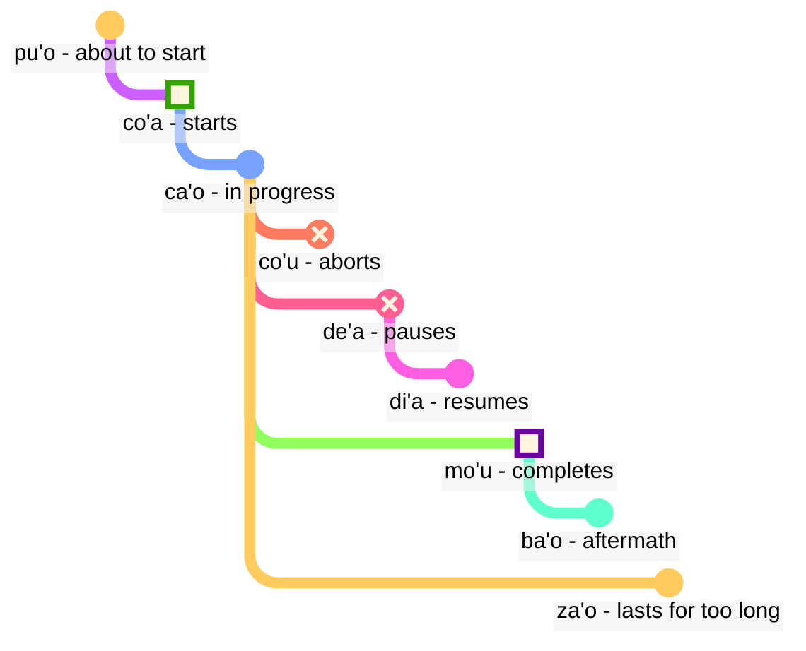

## Leçon 6 : termes modaux : temps et espace

> **mi citka le cirla**

Traductions possibles :

> _Je mange du fromage._
> _J'ai mangé du fromage._
> _Je mange toujours du fromage._
> _Dans un instant, je viens de finir de manger du fromage._

Les temps en lojban sont facultatifs ; nous n'avons pas besoin de réfléchir tout le temps à quel temps utiliser.

Le contexte résout souvent ce qui est correct. Nous ajoutons des temps quand nous sentons que nous en avons besoin.

Les temps en lojban traitent le temps et l'espace de la même manière. Dire que _j'ai travaillé il y a longtemps_ n'est pas grammaticalement différent de dire _je travaille loin au nord_. L'anglais traite les mots comme _plus tôt_, la terminaison du passé en _-ed_, et les mots d'espace comme _dans_ ou _près_ dans trois schémas différents, tandis qu'en lojban, ils suivent le même principe.

### Points dans le temps et l'espace

Une particule modale tendue sans argument qui la suit décrit l'événement comme relatif à _ici_ et _maintenant_ :

> **mi pinxe ba**
> **mi ba pinxe**
> _Je vais boire._

<!-- -->

> **mi pinxe bu'u**
> **mi bu'u pinxe**
> _Je bois à cet endroit._

Un terme modal tendu suivi d'un argument décrit l'événement comme relatif à l'événement dans cet argument :

> **mi pinxe ba le nu mi cadzu**
> _Je bois après avoir marché._

### Évènements relatifs à d'autres évènements dans le temps

En anglais, nous utilisons la soi-disant "séquence des temps":

> **la .alis. pu cusku le se du'u ri pu penmi la .doris. la'u le djedi be li ci**
> _Alice a dit qu'elle avait vu Doris trois jours auparavant._

Ici, l'évènement _avait vu Doris_ se produit avant l'évènement _Alice a dit_. Cependant, dans

> **la .alis. pu cusku le se du'u ri ca kansa la .doris.**
> _Alice a dit qu'elle était avec Doris._

les deux évènements (_a dit_ et _était avec Doris_) se produisent en même temps.

Ainsi, en anglais:

- le temps de la relation principale est compris par rapport à celui qui énonce cette relation.
- le temps de la relation à l'intérieur de la relation principale est également compris par rapport à celui qui énonce cette relation.

En lojban:

- seul le temps de la relation principale est relatif à celui qui énonce la relation.
- les autres temps sont relatifs les uns aux autres. C'est pourquoi, dans **la .alis. pu cusku le se du'u ri pu penmi la .doris. la'u le djedi be li ci** le deuxième **pu** est relatif au premier **pu**. Dans **la .alis. pu cusku le se du'u ri ca kansa la .doris.**, nous utilisons **ca** (_en même temps_) qui est relatif à la relation extérieure (**pu cusku** — _a dit_).

Cependant, nous pouvons utiliser le terme modal **nau** (_au moment ou à l'endroit du locuteur_), qui donnera le même effet que l'anglais:

Voici un exemple dans le style anglais:

> **la .alis. pu cusku le se du'u ri nau pu kansa la .doris.**
> _Alis a dit qu'elle était avec Doris._

<!-- Pour dire des phrases telles que `dans trois jours` ou `il y a deux ans`, nous mettons essentiellement des intervalles de temps en séquence sans se chevaucher. D'où un nouveau verbe:

> **le cabna cu dzoli le nu mi penmi do kei li ci le ka prulamdei**
> _Je te rencontrerai dans trois jours (à partir de maintenant)._

> **dzoli le nu mi penmi do kei li ci le ka prulamdei**
> **dzoli le nu mi penmi do kei li ci le ka prulamdei**
> **prulamdeidzo le nu mi penmi do kei li ci**
> **mi penmi do fi'o prulamdeidzo be fi li ci**
> _Je te rencontrerai dans trois jours._

> **le cabna cu dzoli le nu mi zvati le stuzi kei li re le ka bavlamdeidzo**
> **le nu mi zvati le stuzi kei le cabna cu dzoli li re le ka prulamdeidzo**
> _J'ai visité cet endroit il y a deux ans._ -->

### Distance in time and space

fau
: terme modal : au même moment, endroit ou situation que …

ca
: terme modal : à … (un certain temps), en même temps que … ; "temps présent"

bu'u
: terme modal : à … (un certain endroit) ; ici (à cet endroit)

zi
: _juste_ (il y a peu de temps) ou _bientôt_ (dans un court laps de temps)

vi
: près de …

za
: _il y a un moment_ ou _dans un moment, à un moment non spécifié_

va
: pas loin de …

zu
: _il y a longtemps_ ou _dans longtemps_

vu
: loin de … ; loin

Voici comment nous pouvons utiliser des combinaisons de temps pour spécifier à quelle distance nous allons dans le passé ou le futur :

- **pu zu** signifie _il y a longtemps_
- **pu za** signifie _il y a un moment_
- **pu zi** signifie _juste_
- **ba zi** signifie _bientôt_
- **ba za** signifie _dans un moment_
- **ba zu** signifie _dans longtemps_

Remarquez l'ordre des voyelles **i**, **a** et **u**. Cet ordre apparait souvent en lojban et il vaut peut-être la peine de le mémoriser. _Court_ et _long_ sont toujours dépendants du contexte, relatifs et subjectifs. Par exemple, deux cents ans est un court laps de temps pour une espèce à évoluer mais un long moment à attendre le bus.

**zi**, **za** et **zu** modifient la particule de temps comme **pu** et **ba** qui est dite avant :

- **pu zu** est _il y a longtemps_. **pu** montre que nous commençons dans le passé, et **zu** indique que c'est il y a longtemps.
- **zu pu** est _loin dans le temps ; il y a un point après un évènement_. **zu** montre que nous commençons à un certain point loin dans le temps à partir de maintenant, et **pu** indique que nous nous déplaçons en arrière à partir de ce point.

Ainsi, **pu zu** est toujours dans le passé, tandis que **zu pu** pourrait être dans le futur.

La distance spatiale est marquée de manière similaire par **vi**, **va** et **vu** pour la distance courte, non spécifiée (moyenne) et longue dans l'espace.

Pour spécifier la distance dans le temps ou l'espace, nous utilisons le terme modal **la'u** avec un argument spécifiant la distance :

> **ba ku la'u le djedi be li ci mi zvati ti**
> _Dans trois jours, je serai ici._

L'équivalent spatial de **ca** est **bu'u**, et **fau** est plus vague que les deux, car il peut signifier le temps, l'espace ou la situation.

> **ba za vu ku mi gunka**
> _À un moment donné dans le futur, je travaillerai dans un endroit loin d'ici._

gunka
: travailler

> **mi bu'u pu zu gunka**
> _Je travaillais ici il y a longtemps._
> `Je ici-passé-longue-distance travailler`

> **pu zu vu ku zasti fa le ninmu .e le nanmu**
> _Il y a longtemps et loin, une femme et un homme vivaient._

La dernière phrase est souvent la façon dont les contes de fées commencent.

### Durée dans le temps et l'espace

ze'i
: terme modal : pour une courte période

ve'i
: terme modal : sur une petite surface

ze'a
: terme modal : pendant un certain temps

ve'a
: terme modal : sur une certaine surface

ze'u
: terme modal : pendant une longue période

ve'u
: terme modal : sur une grande surface

Encore une fois, c'est facile à retenir avec le modèle **i**, **a**, **u**.

> **mi ze'u bajra**
> _Je cours pendant une longue période._
<!-- -->
> **do ze'u klama le mi'a gugde ze'u**
> _Tu passes beaucoup de temps à venir dans notre pays._
mi'a
: nous sans toi

gugde
: … être un pays

> **mi ba zi ze'a xabju la .djakartas.**
> _Bientôt, je vais vivre à Jakarta pendant un certain temps._
<!-- -->

> **le jenmi pe la .romas. ba ze'u gunta la .kart.xadact.**
> _L'armée des Romains attaquera Carthage pendant une longue période._

Cela ne signifie pas que les Romains n'attaquent pas Carthage ces jours-ci. En lojban, si nous disons que quelque chose est vrai à un moment donné, cela ne signifie pas que ce n'est pas vrai à un autre moment. Vous pouvez dire **pu ba ze'u** pour que nous sachions que cette activité était dans le futur lorsqu'elle était vue à partir d'un certain point dans le passé, mais dans le passé lorsqu'elle est vue à partir d'aujourd'hui.

> **le xamsi**
> _mer/océan_
<!-- -->

> **le ve'u xamsi**
> _océan_

<pixra url="/assets/pixra/cilre/le_vehi_ja_vehu_cmana.webp" caption="le ve'i cmana cu jibni le ve'u cmana" definition="La colline est proche de la montagne."></pixra>

> **le cmana**
> _montagne/colline_
<!-- -->

> **le ve'u cmana**
> _montagne_
<!-- -->

> **le ve'i cmana**
> _colline_
<!-- -->

> **ti ve'u gerku**
> _C'est un gros chien. C'est un chien qui couvre une grande surface._

### « **pu'o** » — ‘_être sur le point de_’, « **ba'o** » — ‘_ne plus_’, « **za'o** » — ‘_encore_’, « **xa'o** » — ‘_déjà_’

Voici plusieurs ensembles de termes modaux qui peuvent nous aider à ajouter des nuances de sens lorsque cela est nécessaire.

Avec les _contours d'évènements_, contrairement à **pu**, **ca**, et **ba**, nous considérons chaque évènement comme ayant une forme avec certaines étapes :

pu'o
: terme modal : être sur le point de faire quelque chose (l'évènement n'a pas encore eu lieu)

ba'o
: terme modal : ne plus faire quelque chose, avoir fait quelque chose (l'évènement est terminé)

Exemples :

> **mi ba tavla le mikce**
> _Je vais parler au médecin (et je pourrais parler maintenant aussi)._

mikce
: x1 est un médecin

<!-- -->

> **mi pu pu'o tavla le mikce**
> _J'étais sur le point de parler au médecin (je ne parlais pas à ce moment-là, l'évènement n'avait pas encore commencé à ce moment-là)._

<pixra url="/assets/pixra/cilre/puho_nenri.webp" caption="le prenu pu'o zvati le nenri" definition="La personne est sur le point d'être à l'intérieur."></pixra>

<!-- -->

> **le sanmi ca pu'o bredi**
> _Le repas n'est pas encore prêt._

<!-- -->

> **mi pu ba'o tavla le mikce**
> _J'avais parlé au médecin._

<pixra url="/assets/pixra/cilre/baho_carvi.webp" caption="ba'o carvi" definition="Après la pluie. La pluie s'est arrêtée."></pixra>

<!-- -->

> **mi ba ba'o tavla le mikce**
> _J'aurai parlé au médecin._

<!-- -->

> **.a'o mi ba zi ba'o gunka**
> _J'espère bientôt avoir fait le travail._

za'o
: terme modal : encore. L'évènement est en cours au-delà de sa fin naturelle

xa'o
: terme modal non officiel : déjà, trop tôt. L'évènement a déjà commencé et il est trop tôt

Exemples :

> **ri'a ma do za'o zvati vi**
> _Pourquoi es-tu encore ici ?_

<!-- -->

> **la .kevin. xa'o zvati vi**
> _Kevin est déjà ici._

### Étapes de l'évènement

> **mi co'a tavla**
> _J'ai commencé à parler._

<!-- -->

> **ra ca'o ciska**
> _Elle continue d'écrire._

<!-- -->

> **ra pu co'u vasxu**
> _Il a arrêté de respirer (changement soudain et imprévisible)._

vasxu
: $x_1$ respire $x_2$

> **mi pu mo'u citka le plise**
> _J'ai mangé la pomme jusqu'au bout._

<!-- -->

> **la .maks. pu mo'u zbasu ti voi dinju**
> _Max a construit cette maison._

<!-- -->

> **ra pu de'a vasxu**
> _Elle a cessé de respirer (mais peut respirer à nouveau plus tard)._

<pixra url="/assets/pixra/cilre/deha_vasxu.webp" caption="mi de'a vasxu" definition="Je fais une pause dans la respiration. Je retiens mon souffle."></pixra>

<!-- -->

> **mi pu di'a citka le plise**
> _J'ai repris à manger des pommes._

<pixra url="/assets/pixra/cilre/diha_vasxu.webp" caption="mi di'a vasxu" definition="Je reprends ma respiration."></pixra>

co'a
: terme modal : l'évènement commence (la frontière de l'évènement)

ca'o
: terme modal : être en train de faire quelque chose (l'évènement est en cours)

co'u
: terme modal : l'évènement s'arrête

mo'u
: terme modal : l'évènement se termine (la frontière de l'évènement)

de'a
: l'évènement fait une pause (l'évènement peut être attendu pour continuer)

di'a
: l'évènement reprend

> **mi de'a ze'i jundi**
> _BRB (Je reviens tout de suite)._

<!-- -->

> **mi di'a jundi**
> _Je suis de retour (en étant attentif)._

jundi
: $x_1$ fait attention à $x_2$

Ces deux expressions sont courantes dans les discussions textuelles pour indiquer que vous êtes absent ou que vous ne prêtez pas attention, puis que vous revenez en ligne :

On pourrait bien sûr dire simplement **de'a** ou **di'a** et espérer que le message passe.

### Évènements continus et progressifs

ru'i
: terme modal : l'évènement est continu

> **.i mi pu ru'i citka le plise**
> _Je mangeais continuellement des pommes._

Notez la différence :

- **ru'i** indique que l'évènement est continu et ne s'arrête jamais.
- **ca'o** implique que l'évènement progresse. Il peut parfois faire une pause puis reprendre sa progression.

### Contours de lieu

Les contours d'évènements peuvent être utilisés pour se référer à l'espace si nous les préfixons avec **fe'e** :

> **le rokci cu fe'e ro roi zvati**
> _Les pierres sont partout._

### "_à gauche_", "_à droite_"

> **le prenu cu sanli le dertu bu'u le pritu be mi**
> _La personne se tient sur le sol à ma droite._

<!-- -->

> **le gerku cu vreta le ckana bu'u le zunle be le verba**
> _Le chien est couché sur le lit à gauche d'un enfant._

<!-- -->

> **ko jgari le panbi poi zunle**
> _Prends le stylo sur la gauche._

<!-- -->

> **le mlatu cu plipe bu'u le crane be do**
> _Un chat saute devant toi._

<!-- -->

> **ko catlu le dinju poi crane**
> _Regarde la maison devant._

<!-- -->

> **le verba cu zutse le stizu bu'u le trixe be mi**
> _L'enfant est assis sur la chaise derrière moi._

<!-- -->

> **le prenu cu sanli ki mi bu'u le pritu be le tricu bei mi**
> _La personne se tient à droite d'un arbre depuis mon point de vue._

<!-- -->

> **le dinju cu zunle le rokci ti**
> _La maison est à gauche de la pierre si vue d'ici._

zunle
: $x_1$ est à gauche de $x_2$ tel que vu de $x_3$

pritu
: $x_1$ est à droite de $x_2$ tel que vu de $x_3$

crane
: $x_1$ est devant $x_2$ ($x_1$ est entre $x_2$ et celui qui regarde) tel que vu de $x_3$

trixe
: $x_1$ est derrière $x_2$ tel que vu de $x_3$

sanli
: $x_1$ se tient sur $x_2$

zutse
: $x_1$ est assis sur $x_2$

vreta
: $x_1$ est couché sur $x_2$

le dertu
: le sol, la terre

le ckana
: le lit

le stizu
: la chaise

le pelji
: le papier

le penbi
: le stylo

### Pratique : position

<table>
<tbody><tr>
<td style="text-align:right;"><b>ma nabmi</b>
</td>
<td><i>Quel est le problème ?</i>
</td></tr>
<tr>
<td style="text-align:right;"><b>ma'a nitcu tu'a le fonxa pe la .alis.</b>
</td>
<td><i>Nous avons besoin du téléphone d'Alice.</i>
</td></tr>
<tr>
<td style="text-align:right;"><b>.i la .alis. ca zvati ma</b>
</td>
<td><i>Où est Alice ?</i>
</td></tr>
<tr>
<td style="text-align:right;"><b>la .alis. ca na ku zvati le bu'u tcadu .i mi pu mrilu le srana be le fonxa fi la .alis. .i ri ca ca'o vofli la .paris. .i ku'i mi pu zi te benji le se mrilu be la .alis. .i ri curmi le nu mi'a pilno le fonxa .i .e'o do bevri ri mi</b>
</td>
<td> Alice n'est actuellement pas dans la ville. Je lui ai envoyé un courrier concernant le téléphone. Alice est maintenant en train de voler vers Paris. Mais je viens juste de recevoir un courrier d'elle. Elle nous permet d'utiliser le téléphone. S'il vous plait, apportez-le moi.
</td></tr>
<tr>
<td style="text-align:right;"><b>.i bu'u ma mi ka'e cpacu le fonxa</b>
</td>
<td>Où puis-je obtenir le téléphone ?
</td></tr>
<tr>
<td style="text-align:right;"><b>le purdi .i .e'o do klama le bartu</b>
</td>
<td>Dans le jardin. S'il vous plait, sortez.
</td></tr>
<tr>
<td style="text-align:right;"><b>mi ca zvati ne'a le vorme .i ei mi ca klama ma</b>
</td>
<td>Je suis près de la porte. Maintenant, où dois-je aller ?
</td></tr>
<tr>
<td style="text-align:right;"><b>ko klama le zunle be le tricu .i ba ku do viska le pa jubme</b>
</td>
<td>Allez à gauche de l'arbre. Ensuite, vous verrez une table.
</td></tr>
<tr>
<td style="text-align:right;"><b>mi zgana no jubme</b>
</td>
<td>Je ne remarque aucune table.
</td></tr>
<tr>
<td style="text-align:right;"><b>ko carna gi'e muvdu le pritu .i le jubme cu crane le cmalu dinju .i le fonxa cu cpana le jubme .i ji'a ko jgari le penbi .e le pelji .i le za'u dacti cu cpana si'a le jubme .i ba ku ko bevri le ci dacti le zdani gi'e punji fi le sledi'u pe mi</b>
</td>
<td>Tournez et déplacez-vous vers la droite. La table est en face d'un petit bâtiment. Le téléphone est sur la table. Prenez également un crayon et du papier. Ils sont également sur la table. Ensuite, ramenez les trois choses à la maison et mettez-les dans ma chambre.
</td></tr>
<tr>
<td style="text-align:right;"><b>vi'o</b>
</td>
<td>D'accord.
</td></tr></tbody></table>

### Pratique : véhicules

<table>

<tbody><tr>
<td style="text-align:right;"><b>mi jo'u le pendo be mi pu ca'o litru le barda rirxe bu'u le bloti</b>
</td>
<td><i>Mes amis et moi voyagions sur une grande rivière dans un bateau.</i>
</td></tr>
<tr>
<td style="text-align:right;"><b>.i ba bo mi'a klama le vinji tcana</b>
</td>
<td><i>Ensuite, nous sommes allés à un aéroport.</i>
</td></tr>
<tr>
<td style="text-align:right;"><b>.i xu do se marce le karce</b>
</td>
<td><i>As-tu pris une voiture ?</i>
</td></tr>
<tr>
<td style="text-align:right;"><b>.i na ku se marce .i mi'a pu klama fu le trene .i ze'a le cacra mi'a zvati bu'u le carce</b>
</td>
<td><i>Non. Nous sommes allés en train. Pendant une heure, nous étions dans un wagon.</i>
</td></tr></tbody></table>

marce
: $x_1$ est un véhicule transportant $x_2$

se marce
: $x_1$ est un passager de $x_2$

<!-- jai zu'e se marce
: $x_1$ prend un véhicule $x_2$ en tant que passager -->

karce
: $x_1$ est une voiture transportant $x_2$

bloti
: $x_1$ est un bateau transportant $x_2$

vinji
: $x_1$ est un avion transportant $x_2$

trene
: $x_1$ est un train de voitures $x_2$

### Enrichissement du vocabulaire. Nouveaux mots utilisant les temps

De nombreux mots anglais simples correspondent à des combinaisons de mots en lojban :

le ve'i cmana
: la colline (littéralement "montagne/colline couvrant peu d'espace")

le ve'u xamsi
: l'océan (littéralement "mer/océan couvrant un grand espace")

le ba'o tricu
: souche d'un arbre (littéralement "l'arbre qui n'est plus")
