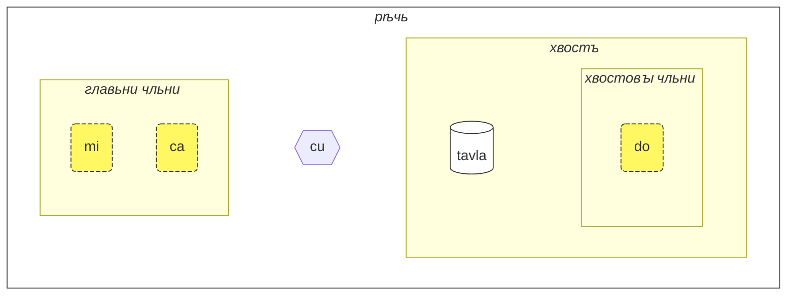
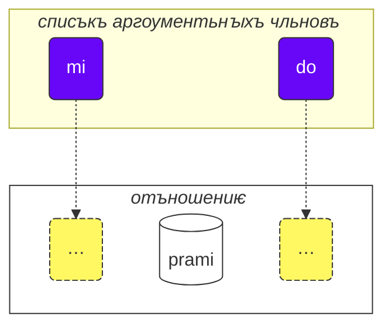

Како сѧ польꙁовати сѣмь оучениѥмь:

1. чьти є
2. събирати своѩ мꙑсли и съвѣтꙑ
3. посꙑлати ѩ къ [💬 живомоу бесѣдованию](https://lojban.pw/en/articles/live_chat/)

## Оучениѥ 1. Ѩꙁꙑкъ въ кратьцѣ

### Аꙁъбоукꙑ

Пьрвоѥ, ѥжє подобаѥтъ вѣдѣти о ложбанѣ, сѹть аꙁъбоукꙑ.

ложбанъ польꙁоуѥтъ латиньскꙑѩ аꙁъбоукꙑ (гласьнаѩ пометꙑ сѹть цвѣтомь):

<dl><dd><b>a b c d e f g i j k l m n o p r s t u v x y z ' .</b></dd></dl>

Словеса глаголѭтъ сѧ, ꙗкоже пишѹтъ сѧ.

Десѧть гласьнꙑхъ въ ложбанѣ сѹть:

<table>
<tbody><tr>
<td><b class="audio-inline">a</b></td>
<td>ꙗкоже <u>а</u> въ словѣ <i>б<u>а</u>тька</i></td>
</tr>
<tr>
<td><b class="audio-inline">e</b></td>
<td>ꙗкоже <u>э</u> въ словѣ <i>с<u>э</u>ръ</i></td>
</tr>
<tr>
<td><b class="audio-inline">i</b></td>
<td>ꙗкоже <u>и</u> въ словѣ <i>с<u>и</u>ла</i></td>
</tr>
<tr>
<td><b class="audio-inline">o</b></td>
<td>ꙗкоже <u>о</u> въ словѣ <i>м<u>о</u>ре</i> (<b>o</b> въ ложбанѣ вьсегда глаголѥтъ сѧ чьтъко, не прѣвращаѥтъ сѧ въ подобиѥ <u>а</u>)</td>
</tr>
<tr>
<td><b class="audio-inline">u</b></td>
<td>ꙗкоже <u>у</u> въ словѣ <i>б<u>у</u>ря</i></td>
</tr>
<tr>
<td><b class="audio-inline">y</b></td>
<td>ꙗкоже беꙁоударьноѥ <u>о</u> въ словѣ <i>к<u>о</u>маръ</i></td>
</tr>
</tbody></table>

4 гласьнаѩ пишѹтъ сѧ съчетаниѥмь писмѧнъ:

<table>
<tbody><tr>
<td><b class="audio-inline">au</b></td>
<td>ꙗкоже <u>ау</u> въ словѣ <i><u>ау</u>тъ</i>, нъ при томь <u>у</u> подобаѥтъ бꙑти кратъкою</td></tr>
<tr>
<td><b class="audio-inline">ai</b></td>
<td>ꙗкоже <u>ай</u> въ словѣ <i>м<u>ай</u></i></td></tr>
<tr>
<td><b class="audio-inline">ei</b></td>
<td>ꙗкоже въ словѣ <i><u>эй</u></i></td></tr>
<tr>
<td><b class="audio-inline">oi</b></td>
<td>ꙗкоже въ словѣ <i><u>ой</u></i></td></tr>
</tbody></table>

О съгласьнꙑхъ же, глаголѭтъ сѧ ꙗкоже въ роусьстѣмь или латиньстѣмь ѩꙁꙑцѣ, нъ нѣколико разликъ сѹть:

<table>
<tbody><tr>
<td><b class="guibutton">c</b>
</td>
<td>глаголѥтъ сѧ ꙗкоже <i>ш</i>.
</td></tr>
<tr>
<td><b class="guibutton">g</b>
</td>
<td>вьсегда <i>г</i> ꙗкоже въ <i>гора</i>.
</td></tr>
<tr>
<td><b class="guibutton">j</b>
</td>
<td>ꙗкоже <i>ж</i>.
</td></tr>
<tr>
<td><b class="guibutton">x</b>
</td>
<td>ꙗкоже <i>х</i> въ словѣ <i>хорошо</i>. Покоуси сѧ глаголати <i>ksss</i> дрьжѧ ѩꙁꙑкъ долѣ и полоучиши сь гласъ.
</td></tr>
<tr>
<td><b class="guibutton"> ' </b>
</td>
<td>ꙗкоже <i>h</i> въ грьчьстѣмь <i>ὁ</i> (_ho_, _оу_) или въ жидовьстѣмь <i>הוּא</i> (_hu_, _онъ_) или ꙗкоже глухоѥ <i>г</i> въ словѣ <i>господи</i> (нъ тъкъмо аще се слово глаголѥтъ сѧ въ варианть съ глухою съгласьною). Тако апострофъ почитаѥтъ сѧ правꙑмь писмѧномь ложбана и глаголѥтъ сѧ ꙗкоже <i>h</i>. Можетъ бꙑти тъкъмо межи гласьнꙑми. Напримѣръ, <b>a'i</b> глаголѥтъ сѧ ꙗкоже <i>аhи</i> (а <b>ai</b> глаголѥтъ сѧ ꙗкоже <i>ай</i>).
</td></tr>
<tr>
<td><b>.</b>
</td>
<td>точька (тъчька, раꙁдѣлъ словесъ) такожде почитаѥтъ сѧ писмѧномь въ ложбанѣ. Ѥсть кратъка паоуꙁа въ рѣчи, да не съливаѭтъ сѧ словеса въкоупѣ. Въистиноу, вьсѣкоѥ слово, начинаѭщеѥ сѧ гласьною, имѣѥтъ точькоу прѣдъ собою. Се помагаѥтъ прѣдъвратити нежеланоѥ съливаниѥ дъвою послѣдоватѥльнꙑхъ словесъ въ ѥдино.
</td></tr>
<tr>
<td><b>i</b>
</td>
<td><b>i</b> прѣдъ гласьнꙑми почитаѥтъ сѧ съгласьною и глаголѥтъ сѧ ꙗкоже <u>й</u>, напримѣръ:
<ul><li><b>ia</b> глаголѥтъ сѧ ꙗкоже <i>я</i> въ <i>ясно</i></li>
<li><b>ie</b> глаголѥтъ сѧ ꙗкоже <i>е</i> въ <i>если</i></li></ul>
</td></tr>
<tr>
<td><b>u</b>
</td>
<td><b>u</b> прѣдъ гласьнꙑми почитаѥтъ сѧ съгласьною и глаголѥтъ сѧ краче, ꙗкоже <i>ў</i> въ лѧдьскꙑхъ нарѣчиихъ (западънꙑхъ славѧньскꙑхъ), напримѣръ:
<ul><li><b>ua</b> глаголѥтъ сѧ ꙗкоже <i>ўа</i> или ꙗкоже <i>уа</i> въ словѣ <i>уазъ</i></li>
<li><b>ue</b> глаголѥтъ сѧ ꙗкоже <i>ўэ</i></li></ul>
</td></tr></tbody></table>

Оударениѥ полагаѥтъ сѧ на вторꙑѭ отъ конца гласьноую. Аще слово имѣѥтъ тъкъмо ѥдиноу гласьноую, не оударѧѥши є.

Писмѧ **r** можетъ глаголати сѧ ꙗкоже _р_ въ роусьстѣмь или ꙗкоже _r_ въ грьчьстѣмь или латиньстѣмь, тѣмьже сѹть мънога приѥмлѥмаѩ изглаголаниѩ ѥго.

Неложбаньскꙑѩ гласьнꙑѩ ꙗкоже краткꙑѩ _i_ и _u_, польꙁоуѭтъ нѣции чловѣци къ раꙁдѣлѥнию съгласьнꙑхъ. Тако, аще имѣѥши трѹдъ глаголати дъвѣ съгласьнꙑѩ въкоупѣ (напримѣръ **vl** въ **tavla**, ѥжє ꙁначитъ _глаголати къ_), можеши рещи _tavɪla_ — идѣже _ɪ_ ѥсть вельми кратъко. Нъ инꙑѩ гласьнꙑѩ ꙗкоже **a** и **u** подобаѭтъ бꙑти дългꙑ.

### Простѣишаѩ рѣчь

Основьнаѩ ѥдиница въ ложбанѣ ѥсть «рѣчь». Сѣ три простꙑ примѣри:

> **le prenu cu tavla mi**
> _Чловѣкъ глаголѥтъ къ мънѣ._

le prenu
: чловѣкъ

tavla
: … глаголѥтъ къ …, … бесѣдоуѥтъ съ …

mi
: аꙁъ, мънѣ

> **mi prami do**
> _Аꙁъ люблѭ тѧ._

prami
: … любитъ … (кого)

do
: тꙑ, тебе

> **mi ca cu tavla do**
> _Аꙁъ нꙑнѣ глаголѭ къ тебѣ._

ca
: нꙑнѣ (глаголѥтъ сѧ ꙗкоже **ша**)

<pixra url="/assets/pixra/cilre-xekri-g-out/tavla.webp" caption="le prenu cu tavla mi" definition="Чловѣкъ глаголѥтъ къ мънѣ."></pixra>

<pixra url="/assets/pixra/cilre-xekri-g-out/mi.webp" caption="mi" definition="аꙁъ / мънѣ"></pixra>

<pixra url="/assets/pixra/cilre-xekri-g-out/mi_prami_do2.webp" caption="mi prami do" definition="Аꙁъ люблѭ тѧ."></pixra>

<pixra url="/assets/pixra/cilre-xekri-g-out/do.webp" caption="do" definition="тꙑ"></pixra>

Вьсѣка рѣчь въ ложбанѣ състоитъ сѧ отъ сихъ частии слѣва на право:

- глава:
  - състоитъ сѧ отъ нарицаѥмꙑхъ «чльновъ»,
    - **le prenu** ѥсть ѥдинъ главьнъ чльнъ въ примѣрѣ **le prenu cu tavla mi** горѣ,
    - **mi**, **ca** сѹть главьни чльни въ примѣрѣ **mi ca cu tavla do** горѣ.
- главꙑ раꙁдѣлитель **cu**:
  - глаголѥтъ сѧ ꙗкоже _шу_, понеже **c** ѥсть ꙗкоже _ш_,
  - поꙁнаваѥтъ, ꙗко глава коньчала сѧ ѥсть,
  - можетъ опоущати сѧ, ѥгда ꙗсно ѥсть, ꙗко глава съвьршена ѥсть.
- хвостъ:
  - главьнꙑи отъношениѥвъ съставъ (нарицаѥмꙑи «**selbrisni**» въ ложбанѣ)
  - \+ можебꙑтъ ѥдинъ или вѧще чльновъ по немь,
    - **tavla**, **prami** сѹть selbrisni, главьни отъношениѥвꙑ съставꙑ въ примѣрѣхъ горѣ.
    - **mi** ѥсть ѥдинъ хвостовъ чльнъ въ примѣрѣ **le prenu cu tavla mi** горѣ.
    - **do** ѥсть ѥдинъ хвостовъ чльнъ въ примѣрѣ **mi prami do** горѣ.

Въ ложбанѣ глаголѥмъ вѧще о отъношениихъ нежели о имѧнѣхъ или глаголѣхъ.

Сѣ дъва отъношениѥва словеса, ѩжє приближаѭтъ сѧ къ глаголомъ:

prenu
: … ѥсть чловѣкъ / сѹть чловѣци

tavla
: … глаголѥтъ къ …

Вьсѣко отъношениѥ имѣѥтъ ѥдиноу или вѧще мѣстъ, ѩжє можетъ такожде нарицати сѧ «гнѣꙁда» или «мѣста». Горѣ, ѩ ꙁнамѧнована сѹть съ «…» Си гнѣꙁда подобаѥтъ исплънити аргоументꙑ (нарицаѥмꙑ «**sumti**» въ ложбанѣ). Аргоументьни чльни сѹть съставꙑ ꙗкоже **le prenu**, **mi**, **do** не ꙁависимо отъ того, сѹть ли си чльни въ главѣ или въ хвостѣ рѣчи. Полагаѥмъ аргоументьнꙑѩ чльнꙑ по чиноу, тако исплънѧѭще си гнѣꙁда и даѭще конкрѣтьноѥ ꙁначениѥ отъношению.

Можемъ такожде обратити таково отъношениѥ въ аргоументьнъ чльнъ.

Къ томоу полагаѥмъ кратъко слово **le** прѣдъ нимь:

prenu
: … ѥсть чловѣкъ

le prenu
: чловѣкъ, чловѣци

Подобьнѣ,

tavla
: … глаголѥтъ къ …

и тако

le tavla
: глаголѭщии, глаголѭщь

Можетъ ꙁвоучати страньно, како _чловѣкъ_ можетъ бꙑти «глаголъ», нъ въистиноу, се дѣлаѥтъ ложбанъ вельми простꙑмь:

<table>
<thead>
<tr>
<th>отъношениѥво слово съ неисплънѥнꙑми гнѣꙁдꙑ</th>
<th>аргоументьнаѩ форма (<b>sumti</b>)</th></tr>
</thead>
<tbody>
<tr>
<td><b>prenu</b> — <i>… (кто) ѥсть чловѣкъ</i> </td>
<td><b>le prenu</b> — <i>чловѣкъ / чловѣци</i>
     <b>le prenu</b> — <i>тъ, иже ѥсть чловѣкъ / ти, иже сѹть чловѣци</i>
</td></tr>
<tr>
<td><b>tavla</b> — <i>… (кто) глаголѥтъ къ … (комоу)</i> </td>
<td><b>le tavla</b> — <i>глаголѭщии / глаголѭщь</i>
     <b>le tavla</b> — <i>тъ, иже ѥсть глаголѭщь / ти, иже сѹть глаголѭщии</i>
</td></tr>
</tbody></table>

Пьрвоѥ гнѣꙁдо отъношении исчеꙁаѥтъ, ѥгда польꙁоуѥмъ **le**, тѣмьже таковꙑ алтернативьнꙑ прѣводꙑ ꙗкоже _тъ, иже …_ сѹть въꙁможьни.

Въꙁьми, ꙗко ложбанъ, по обꙑчаю, не оуꙁаконѧѥтъ числа межи _глаголѭщиимь_ или _глаголѭщими_. Се ѥсть, **le tavla** ѥсть неꙗсьно въ томь отъношении, и скоро обрѧщемъ начини оуꙁаконити число.

Кромѣ аргоументьнꙑхъ чльновъ сѹть модальни чльни ꙗкоже **ca**:

> **mi ca cu tavla do**
> _Аꙁъ нꙑнѣ глаголѭ къ тебѣ._

ca
: нꙑнѣ

Модальни чльни не исплънѧѭтъ гнѣꙁдъ главьнаго отъношениѥва състава («**selbrisni**»). Вмѣсто того, приложаѭтъ сѧ къ вьсѣи рѣчи обогащаѭще или оуꙁаконѧѭще ѥѩ ꙁначениѥ.

Тако, чльни въ ложбанѣ прѣдъставлѧѭтъ сѧ съ:

- аргоументьнꙑми чльнꙑ, иже исплънѧѭтъ гнѣꙁда отъношении. Примѣри сѹть:
  - имѧна ꙗкоже **le prenu** (_чловѣкъ_)
  - мѣстоимѧна ꙗкоже **mi** (_аꙁъ_, _мънѣ_), **do** (_тꙑ_). Мѣстоимѧна дѣиствоуѭтъ точьно ꙗкоже имѧна, нъ **le** не польꙁоуѥтъ сѧ съ ними. Дѣиствоуѭтъ ꙗкоже аргоументꙑ сами по себѣ.
- модальнꙑми чльнꙑ, иже не исплънѧѭтъ гнѣꙁдъ отъношении, нъ оуꙁаконѧѭтъ дополънителънꙑѩ, проѩсънѧѭщꙑѩ вѣдомости.
  - напримѣръ, **ca** (_нꙑнѣ, въ настоѧщемь_).

Нѣколико вѧще примѣровъ:

<pixra url="/assets/pixra/cilre-xekri-g-out/nintadni.webp" caption="mi nintadni" definition="Аꙁъ ѥсмь новъ оученикъ."></pixra>

> **mi nintadni**
> _Аꙁъ ѥсмь новъ оученикъ._

nintadni
: … (кто) ѥсть новъ оученикъ, новоначальникъ

Неподобьно грьчьскомоу или латиньскомоу, не подобаѥтъ намъ приложати глаголъ «ѥсмь/ѥси/ѥсть/бꙑти» къ рѣчи. Оуже въложено ѥсть. Отъношениѥво слово **nintadni** (_… ѥсть новъ оученикъ_) оуже имѣѥтъ се грьчьскоѥ или латиньскоѥ «бꙑти» въложено въ свои прѣводъ.

> **do jimpe**
> _Тꙑ раꙁоумѣѥши._

jimpe
: … (кто) раꙁоумѣѥтъ … (что)

<pixra url="/assets/pixra/cilre-xekri-g-out/pilno_le_fonxa.webp" caption="le prenu cu pilno le fonxa" definition="Чловѣкъ польꙁоуѥтъ дальнозвономь."></pixra>

> **mi pilno le fonxa**
> _Аꙁъ польꙁоуѭ дальнозвономь._

pilno
: … (кто) польꙁоуѥтъ … (чимь)

fonxa
: … ѥсть дальнозвонъ, телефѡ́нъ, … сѹть дальнозвони

le fonxa
: дальнозвонъ, дальнозвони

<pixra url="/assets/pixra/cilre-xekri-g-out/citka.webp" caption="mi citka" definition="Аꙁъ ѣмь."></pixra>

> **mi citka**
> _Аꙁъ ѣмь._

citka
: … (кто) ѣстъ … (что)

> **do citka**
> _Тꙑ ѣси._

<!-- -->

> **mi citka le plise**
> _Аꙁъ ѣмь ѩблъка._

<pixra url="/assets/pixra/cilre-xekri-g-out/le_plise_cu_kukte.webp" caption="le plise cu kukte" definition="Ѩблъка сѹть въкоусьна."></pixra>

> **le plise cu kukte**
> _Ѩблъка сѹть въкоусьна._

le plise
: ѩблъка

kukte
: … (что) ѥсть въкоусьно

Простѣишаѩ рѣчь въ ложбанѣ съдрьжала бꙑ тъкъмо ѥдино главьноѥ отъношениѥво слово:

<pixra url="/assets/pixra/cilre-xekri-g-out/karce.webp" caption="karce" definition="Се ѥсть колесьница."></pixra>

> **karce**
> _Колесьница!_
> _Се ѥсть колесьница._

Можеши рещи се, ѥгда видиши колесьницоу грѧдѹщѹ. Сѣ контекстъ бꙑлъ бꙑ доволѣ ꙗсенъ, ꙗко ѥсть колесьница гдѣ либо окрестъ и можебꙑтъ опасьна ѥсть.

**karce** само по себѣ ѥсть отъношениѥво слово ꙁначѧщеѥ _ѥсть колесьница_.

Можемъ конечьно бꙑти точьнѣише и рещи, напримѣръ:

> **bolci**
> _Мѧчь!_
> _Се ѥсть мѧчь._

идѣже **bolci** ѥсть отъношениѥво слово ꙁначѧщеѥ _ѥсть мѧчь_.

> **ti bolci**
> _Се ѥсть мѧчь близъ мене._

<!-- -->

> **ta bolci**
> _Се ѥсть мѧчь близъ тебе._

ti
: мѣстоимѧ: си вещь близъ мене

ta
: мѣстоимѧ: си/та вещь близъ тебе

tu
: мѣстоимѧ: она вещь далече отъ тебе и мене

<pixra url="/assets/pixra/cilre-xekri-g-out/ti.webp" caption="ti" definition="си (близъ мене, глаголѭщаго)"></pixra>

<pixra url="/assets/pixra/cilre-xekri-g-out/ta.webp" caption="ta" definition="си (близъ тебе, слꙑшѧщаго)"></pixra>

<pixra url="/assets/pixra/cilre-xekri-g-out/tu.webp" caption="tu" definition="она тамо (далече отъ тебе и мене)"></pixra>

Подобьнѣ, можеши рещи

<pixra url="/assets/pixra/cilre-xekri-g-out/carvi.webp" caption="carvi" definition="… ѥсть дъждь"></pixra>

> **carvi**
> _Дъждитъ._

идѣже

carvi
: … ѥсть дъждь, … дъждитъ

или

> **pluka**
> _Се ѥсть приѧтьно._

идѣже

pluka
: … ѥсть приѧтьно

Въꙁьми, ꙗко въ ложбанѣ нѣсть потрѣбꙑ въ словѣ _се_ въ таковомь смꙑслѣ. Тъкъмо польꙁоуѥши отъношениѥвꙑмь словомь, ѥгоже требоуѥши.

> **prami**
> _Кто любитъ._

<pixra url="/assets/pixra/cilre-xekri-g-out/bajra.webp" caption="le prenu cu bajra" definition="Чловѣкъ бѣжитъ."></pixra>

> **bajra**
> _Кто бѣжитъ._

bajra
: … бѣжитъ польꙁоуѧ оудꙑ

Паки контекстъ можебꙑтъ повѣдалъ бꙑ, кто любитъ кого и кто бѣжитъ.

#### Ꙁаданиѥ

pinxe
: … пиѥтъ … (что)

le djacu
: вода

<pixra url="/assets/pixra/cilre-xekri-g-out/pinxe_le_djacu.webp" caption="le prenu cu pinxe le djacu" definition="Чловѣкъ пиѥтъ водоу."></pixra>

Ꙁакрꙑи правоую часть таблицꙑ. Прѣложи рѣчи слѣва отъ ложбана.

<table style="table-layout: fixed;">
<tbody><tr>
<td><b>do citka</b>
</td>
<td><i>Тꙑ ѣси.</i>
</td></tr>
<tr>
<td><b>mi pinxe le djacu</b>
</td>
<td><i>Аꙁъ пиѭ водоу.</i>
</td></tr>
<tr>
<td><b>mi citka le plise</b>
</td>
<td><i>Аꙁъ ѣмь ѩблъка.</i>
</td></tr></tbody></table>

### «**.i**» раꙁдѣлѧѥтъ рѣчи

Полагаѥмъ кратъко слово **.i** къ раꙁдѣлѥнию двою послѣдоватѥльнꙑхъ рѣчии:

> **mi tavla le prenu .i le prenu cu tavla mi**
> _Аꙁъ глаголѭ къ чловѣкомъ. Чловѣци глаголѭтъ къ мънѣ._

**.i** раꙁдѣлѧѥтъ рѣчи ꙗкоже точька (тъчька) въ концѣ рѣчии въ грьчьскихъ или латиньскихъ пьсаниихъ.

Ѥгда глаголѥмъ ѥдиноу рѣчь по дроугои въ грьчьстѣмь или латиньстѣмь, творимъ паоуꙁоу (можетъ бꙑти кратъкоу) межи ими. Нъ паоуꙁа имѣѥтъ мънога различна ꙁначениѩ въ сихъ ѩꙁꙑцѣхъ. Въ ложбанѣ имѣѥмъ лоучии начинъ раꙁоумѣти, гдѣ ѥдина рѣчь коньчаѥтъ сѧ и дроугаѩ начинаѥтъ сѧ.

Такожде въꙁьми, ꙗко инъгда, ѥгда изглаголѧѥмъ словеса бꙑстро, не можемъ раꙁобрати, гдѣ ѥдина рѣчь коньчаѥтъ сѧ и слово слѣдоующеѩ рѣчи начинаѥтъ сѧ. Тѣмьже съвѣтоуѥтъ сѧ польꙁовати словомь **.i** прѣжде начѧтиѩ новꙑѩ рѣчи.

### Числа: '_1 2 3 4 5 6 7 8 9 0_' = «**pa re ci vo mu xa ze bi so no**»

**le** простѣ обращаѥтъ отъношениѥвъ съставъ въ аргоументъ, нъ таковъ аргоументъ не имѣѥтъ числа съвѧꙁана съ нимь. Рѣчь

> **le prenu cu tavla mi**
> _Чловѣци глаголѭтъ къ мънѣ._
> _Чловѣкъ глаголѥтъ къ мънѣ._

не оуꙁаконѧѥтъ числа чловѣкъ глаголѭщихъ къ мънѣ. Въ грьчьстѣмь или латиньстѣмь, невъꙁможьно ѥсть опоустити число понеже мъножьствѥньноѥ число подраꙁоумѣваѥтъ _вѧще нежели ѥдинъ чловѣкъ_. Нъ въ ложбанѣ, можеши опоустити число.

Нꙑнѣ оуꙁаконимъ, колико чловѣкъ сѹть вѧꙁани къ нашемоу бесѣдованию.

Приложимъ число по **le**.

<table>
<tbody><tr>
<td><b>pa</b>
</td>
<td><b>re</b>
</td>
<td><b>ci</b>
</td>
<td><b>vo</b>
</td>
<td><b>mu</b>
</td>
<td><b>xa</b>
</td>
<td><b>ze</b>
</td>
<td><b>bi</b>
</td>
<td><b>so</b>
</td>
<td><b>no</b>
</td></tr>
<tr>
<td> 1
</td>
<td> 2
</td>
<td> 3
</td>
<td> 4
</td>
<td> 5
</td>
<td> 6
</td>
<td> 7
</td>
<td> 8
</td>
<td> 9
</td>
<td> 0
</td>
</tr></tbody></table>

<pixra url="/assets/pixra/cilre-xekri-g-out/le_mu_prenu.webp" caption="le mu prenu" definition="Пѧть чловѣкъ"></pixra>

> **le pa prenu cu tavla mi**
> _Чловѣкъ глаголѥтъ къ мънѣ._
> _Ѥдинъ чловѣкъ глаголѥтъ къ мънѣ._

Приложаѥмъ число по **le** и тако оуꙁаконѧѥмъ отъдѣльнꙑѩ чловѣкꙑ.

Къ числамъ състоѧщимъ сѧ отъ нѣколикихъ цифръ, простѣ съчетаѥмъ си цифрꙑ въкоупѣ:

> **le re mu prenu cu tavla mi**
> _25 чловѣкъ глаголѭтъ къ мънѣ._

Да, тако простѣ ѥсть.

Аще хощемъ чьсти, можемъ раꙁдѣлити числа съ **.i**:

> **mu .i vo .i ci .i re .i pa .i no**
> _5 … 4 … 3 … 2 … 1 … 0_

Число **za'u** ꙁначитъ _вѧще нежели …_ (_\>_ въ математицѣ), число **me'i** ꙁначитъ _мънѣ нежели_ (_<_ въ математицѣ):

> **le za'u re prenu cu tavla mi**
> _Вѧще дъвою чловѣкъ глаголѭтъ къ мънѣ._

<!-- -->

> **le me'i pa no prenu cu tavla mi**
> _Мънѣ 10 чловѣкъ глаголѭтъ къ мънѣ._

<!-- -->

> **le za'u ci prenu cu tavla mi**
> _Вѧще трии чловѣкъ глаголѭтъ къ мънѣ._

Къ глаголанию простѣ _чловѣци_ (мъножьствѥньноѥ число) противъ _ѥдинъ чловѣкъ_, польꙁоуѥмъ **za'u pa**, _вѧще ѥдиного_ или простѣ **za'u**.

> **le za'u pa prenu cu tavla mi**
> **le za'u prenu cu tavla mi**
> _Чловѣци глаголѭтъ къ мънѣ._

**za'u** по обꙑчаю ꙁначитъ **za'u pa**, тѣмьже таково съкращениѥ въꙁможьно ѥсть.

le prenu
: чловѣкъ / чловѣци

le pa prenu
: чловѣкъ (ѥдинъ числомь)

le za'u prenu
: чловѣци (дъва или вѧще числомь)

#### Ꙁаданиѥ

stati
: … (кто) ѥсть мѹдръ, … имѣѥтъ даръ

<pixra url="/assets/pixra/cilre-xekri-g-out/stati.webp" caption="stati" definition="… имѣѥтъ даръ"></pixra>

klama
: … приходитъ къ … (нѣкомоу мѣстоу или вещи)

<pixra url="/assets/pixra/cilre-xekri-g-out/klama_ti.webp" caption="le prenu cu klama ti" definition="Чловѣкъ приде сѣмо."></pixra>

nelci
: … люби … (что)

le zarci
: търгъ

<pixra url="/assets/pixra/cilre-xekri-g-out/zarci.webp" caption="le prenu cu zvati le zarci" definition="Чловѣкъ ѥсть на търгоу."></pixra>

le najnimre
: апелсинъ (плодъ), апелсини

<pixra url="/assets/pixra/cilre-xekri-g-out/najnimre.webp" caption="najnimre" definition="… ѥсть апелсинъ"></pixra>

le badna
: бананъ, банани

<pixra url="/assets/pixra/cilre-xekri-g-out/badna.webp" caption="badna" definition="… ѥсть бананъ"></pixra>

Ꙁакрꙑи правоую часть таблицꙑ. Прѣложи рѣчи слѣва отъ ложбана.

<table style="table-layout: fixed;">
 <tbody>
  <tr>
   <td>le mu prenu cu klama le zarci</td>
   <td>Пѧть чловѣкъ приходѧтъ на търгъ.</td>
  </tr>
  <tr>
   <td>le pa re prenu cu stati .i do stati</td>
   <td>12 чловѣкъ сѹть мѹдри. Тꙑ ѥси мѹдръ.</td>
  </tr>
  <tr>
   <td>le prenu cu nelci le plise</td>
   <td>Чловѣци любѧтъ ѩблъка.</td>
  </tr>
  <tr>
   <td>le za'u re prenu cu citka .i le me'i mu prenu cu pinxe le djacu</td>
   <td>Вѧще дъвою чловѣкъ ѣдѧтъ. Мънѣ 5 чловѣкъ пиѭтъ водоу.</td>
  </tr>
  <tr>
   <td>le za'u re prenu cu stati</td>
   <td>Вѧще дъвою чловѣкъ сѹть мѹдри.</td>
  </tr>
 </tbody>
</table>

Ꙁакрꙑи правоую часть таблицꙑ. Прѣложи рѣчи слѣва къ ложбаноу.

<table style="table-layout: fixed;">
 <tbody>
  <tr>
   <td>256 чловѣкъ сѹть мѹдри.</td>
   <td>le re mu xa prenu cu stati</td>
  </tr>
  <tr>
   <td>Мънѣ 12 ѩблъкъ сѹть въкоусьна.</td>
   <td>le me'i pa re plise cu kukte</td>
  </tr>
 </tbody>
</table>

### Съставьноѥ отъношениѥ

Съставьноѥ отъношениѥво съставъ (**tanru** въ ложбанѣ) сѹть нѣколико отъношениѥвꙑхъ словесъ положенꙑхъ ѥдино по дроугомь.

> **tu melbi zdani**
> _Она ѥсть красьна обитѣль._

<pixra url="/assets/pixra/cilre-xekri-g-out/melbi_zdani.webp" caption="melbi zdani" definition="… ѥсть красьна обитѣль"></pixra>

tu
: она (далече отъ тебе и мене)

melbi
: … ѥсть красьно, лѣпо

zdani
: … ѥсть обитѣль или гнѣꙁдо … (комоу)

melbi zdani
: съставьноѥ отъношениѥво съставъ: … ѥсть красьна обитѣль … (комоу)

<pixra url="/assets/pixra/cilre-xekri-g-out/dansu.webp" caption="le prenu cu melbi dansu" definition="Чловѣкъ красьно плѧшетъ."></pixra>

> **do melbi dansu**
> _Тꙑ красьно плѧшеши._

dansu
: … плѧшетъ

Сѣ, отъношениѥ **melbi** приложаѥтъ дополънителъноѥ ꙁначениѥ, понеже положено ѥсть лѣво отъ иного отъношениѩ: **zdani**. Лѣвꙑи съставъ обꙑчаино прѣводитъ сѧ польꙁоуѧ прилагателънꙑми и нарѣчиѩми.

Съставьнꙑѩ отъношениѩ сѹть мощьна особина, ѩжє творитъ богатѣишꙑѩ ꙁначениѩ. Простѣ съчетаѥши дъва отъношениѥва словеса въкоупѣ, и лѣвꙑи съставъ приложаѥтъ вкоусъ правомоу.

Можемъ положити **le** (напримѣръ съ числомь) лѣво отъ таковаго съставьнаго отъношениѩ полоучаѭще богатѣишь аргоументьнъ чльнъ:

le pa melbi zdani
: красьна обитѣль

Нꙑнѣ вѣмъ, почто бѣ **cu** по главьнꙑхъ чльнѣхъ въ нашемь примѣрѣ:

> **le pa prenu cu tavla mi**
> _Чловѣкъ глаголѥтъ къ мънѣ._

Беꙁъ **cu** обратило бꙑ сѧ въ **le pa prenu tavla**, ѥжє имѣло бꙑ ꙁначениѥ _чловѣкъ-глаголѭщии_ — что либо то ꙁначило бꙑ.

Раꙁмотри:

> **le pa tavla pendo**
> _Глаголѭщии дроугъ_

<!-- -->

> **le pa tavla cu pendo**
> _Глаголѭщии ѥсть дроугъ._

Помьни о полаганию **cu** прѣдъ главьнꙑмь отъношениѥвꙑмь съставомь въ рѣчи, да прѣдъвратиши нехотѣноѥ съꙁиданиѥ съставьнꙑхъ отъношении.

Съставьноѥ отъношениѥ можетъ съдрьжати вѧще дъвою съставовъ. Въ семь слоучаи, пьрвоѥ отъношениѥ мѣнитъ второѥ, второѥ мѣнитъ третиѥ, и тако далѣ:

<pixra url="/assets/pixra/cilre-xekri-g-out/cmalu_karce.webp" caption="ti cmalu karce" definition="Се ѥсть мала колесьница."></pixra>

> **le pa melbi cmalu karce**
> _красьно-мала колесьница, колесьница мала въ красьнъ начинъ_

<!-- -->

> **le mutce melbi zdani**
> _вельми красьна обитѣль_

mutce
: … ѥсть вельми, … ѥсть мъного

#### Ꙁаданиѥ

sutra
: … ѥсть бꙑстръ

barda
: … ѥсть великъ

cmalu
: … ѥсть малъ

mlatu
: … ѥсть котъ

Ꙁакрꙑи правоую часть таблицꙑ. Прѣложи рѣчи слѣва отъ ложбана.

<table style="table-layout: fixed;">
<tbody><tr>
<td><b>le melbi karce</b>
</td>
<td><i>красьна колесьница / красьнꙑѩ колесьницꙑ</i>
</td></tr>
<tr>
<td><b>do sutra klama</b>
</td>
<td><i>Тꙑ бꙑстро приходиши.</i>
</td></tr>
<tr>
<td><b>tu barda zdani</b>
</td>
<td><i>Она ѥсть велика обитѣль.</i>
</td></tr>
<tr>
<td><b>le pa sutra bajra mlatu</b>
</td>
<td><i>бꙑстро бѣгаѭщии котъ</i>
</td></tr>
<tr>
<td><b>le pa sutra mlatu</b>
</td>
<td><i>бꙑстрꙑи котъ</i>
</td></tr>
<tr>
<td><b>le pa bajra mlatu</b>
</td>
<td><i>бѣгаѭщии котъ</i>
</td></tr></tbody></table>

Ꙁакрꙑи правоую часть таблицꙑ. Прѣложи рѣчи слѣва къ ложбаноу.

cadzu
: … ходитъ

<table style="table-layout: fixed;">

<tbody><tr>
<td><i>Се ѥсть мала колесьница.</i>
</td>
<td><b>ti cmalu karce</b>
</td></tr>
<tr>
<td><i>въкоусьнꙑѩ ѩблъка</i>
</td>
<td><b>le kukte plise</b>
</td></tr>
<tr>
<td><i>бꙑстро ѣдѹщии</i>
</td>
<td><b>le sutra citka</b>
</td></tr>
<tr>
<td><i>Тꙑ ѥси бꙑстро ходѧщии чловѣкъ.</i>
</td>
<td><b>do sutra cadzu prenu</b>
</td></tr></tbody></table>

### Въпроси '_Да/Нѣ_'

Въ грьчьстѣмь или латиньстѣмь, творимъ въпросъ _да/нѣ_ мѣнѧѭще чинъ словесъ или польꙁоуѧ въпросьнꙑѩ частицꙑ, напримѣръ

> _Тꙑ ѥси … ⇒ Ѥси ли тꙑ …?_

или польꙁоуѧ инꙑѩ начины, напримѣръ:

> _Тꙑ вѣси … ⇒ Вѣси ли тꙑ …?_

Въ ложбанѣ, чинъ словесъ можетъ съхранѧти сѧ. Да обратимъ любоѥ оутвьрждениѥ въ въпросъ _да/нѣ_, простѣ въставлѧѥмъ слово **xu** въ начѧлѣ рѣчи:

> **xu do nelci le gerku**
> _Любиши ли тꙑ пьсꙑ?_

le gerku
: пьсъ, пьси

<pixra url="/assets/pixra/cilre-xekri-g-out/le_prenu_e_le_gerku.webp" caption="ti prenu .i ti gerku" definition="Се ѥсть чловѣкъ. Се ѥсть пьсъ."></pixra>

Помьни, ꙗко въ ложбанѣ, пънктоуациѩ ꙗкоже «?» (въпросителънꙑи ꙁнакъ) ѥсть необѧꙁателъна и польꙁоуѥтъ сѧ вѧще къ оукрашенію. Се понеже въпросьноѥ слово **xu** оуже поꙁнаваѥтъ, ꙗко се ѥсть въпросъ.

Инꙑ примѣри:

> **xu mi klama**
> _Приходѭ ли аꙁъ?_

klama
: … приходитъ къ … (нѣкамо)

> **xu pelxu**
> _Ѥсть ли жльто?_

pelxu
: … ѥсть жльтъ

Можемъ прѣмѣстити ꙁначениѥ полагаѭще **xu** по различнꙑмъ частѧмъ рѣчи. Обѧсънениѩ, что измѣнило сѧ въ ꙁначении, дана сѹть въ скобахъ:

> **xu do nelci le gerku**
> _Любиши ли тꙑ пьсꙑ?_

<!-- -->

> **do xu nelci le gerku**
> _ТꙐ ли любиши пьсꙑ?_ (Мънѣ сѧ, ꙗко инъ кто любитъ ѩ).

<!-- -->

> **do nelci xu le gerku**
> _ЛЮБИШИ ли тꙑ пьсꙑ? (Мънѣ сѧ, ꙗко тꙑ тъкъмо равьнодоушьнъ бꙑлъ къ нимъ)._

<!-- -->

> **do nelci le xu gerku**
> _Любиши ли тꙑ ПЬСꙐ? (Мънѣ сѧ, ꙗко тꙑ любилъ коткꙑ)._

<!-- -->

> **do nelci le gerku xu**
> _Тꙑ любиши си вещи, сѹть ли ѩ пьси? (Тъкъмо въпрошаѥши правилъность отъношениѩ **gerku**)._

Что изглаголѥтъ сѧ интонациѥѭ въ грьчьстѣмь или латиньстѣмь, изглаголѥтъ сѧ прѣмѣщениѥмь **xu** по части, ѭжє хощемъ подчьркноути въ ложбанѣ. Въꙁьми, ꙗко пьрваѩ рѣчь съ **xu** въ начѧлѣ въпрошаѥтъ наиболѣ обьщии въпросъ беꙁъ подчьркиваниѩ нѣкоѥѩ особьнꙑѩ части.

**xu** ѥсть междометьноѥ слово. Сѣ особинꙑ ложбаньскихъ междометии:

- междометиѥ мѣнитъ съставъ прѣдъ нимь:

> **do xu nelci le gerku**
> _ТꙐ ли любиши пьсꙑ?_

- ѥгда положено въ начѧлѣ отъношениѩ, междометиѥ мѣнитъ вьсе отъношениѥ:

> **xu do nelci le gerku**
> _Любиши ли тꙑ пьсꙑ?_

- междометиѩ могѹтъ полагати сѧ по различнꙑмъ частѧмъ тогоже отъношениѩ къ прѣмѣщенію ꙁначениѩ.

> **do nelci le gerku xu**
> _Тꙑ любиши си вещи, сѹть ли ѩ пьси?_

Сѣ, тъкъмо отъношениѥ **gerku** (не аргоументъ **le gerku**) мѣнѧѥтъ сѧ въпросьнꙑмь словомь **xu**. Тако сѣ въпрошаѥмъ тъкъмо о томь отъношении. Оутвьрждаѥмъ, ꙗко тꙑ любиши си вещи или живꙑѩ сѹщества и въпрошаѥмъ тѧ, сѹть ли ѩ пьси.

Междометиѩ не раꙁрꙑваѭтъ съставьнꙑхъ отъношении, могѹтъ польꙁовати сѧ въ нихъ:

> **do nelci le barda xu gerku**
> _Любиши ли тꙑ ВЕЛИКꙐѨ пьсꙑ?_

Нꙑнѣ, како отъвѣщати на таковꙑѩ 'да/нѣ' въпросꙑ? Повторѧѥмъ главьноѥ отъношениѥво съставъ:

> **— xu le mlatu cu melbi**
> **— melbi**
> _— Сѹть ли котци красьни?_
> _— Красьни._

Да отъвѣщати 'нѣ', польꙁоуѥмъ модальнꙑмь чльномь **na ku**:

> **— xu le mlatu cu melbi**
> **— na ku melbi**
> _— Сѹть ли котци красьни?_
> _— Не красьни._

na ku
: чльнъ: лъжьно ѥсть, ꙗко …

Или, можемъ польꙁовати особꙑмь отъношениѥвꙑмь словомь **go'i**:

> **— xu le mlatu cu melbi**
> **— go'i**
> _— Сѹть ли котци красьни?_
> _— Красьни._

go'i
: отъношениѥво слово, ѥжє повторѧѥтъ главьноѥ отъношениѥ прѣдъидоущеѩ рѣчи

Сѣ, **go'i** ꙁначитъ тоже, что **melbi**, понеже **melbi** ѥсть отъношениѥ прѣдъидоущеѩ рѣчи.

> **— xu le mlatu cu melbi**
> **— na ku go'i**
> _— Сѹть ли котци красьни?_
> _— Не красьни._

Модальнꙑи чльнъ **na ku** можетъ польꙁовати сѧ не тъкъмо въ отъвѣтѣхъ:

> **na ku mi nelci le gerku**
> _Лъжьно ѥсть, ꙗко аꙁъ люблѭ пьсꙑ._
> _Не люблѭ аꙁъ пьсовъ._

<!-- -->

> **mi na ku nelci do**
> _Не люблѭ аꙁъ тебе._

Ѥго противоположьность, чльнъ **ja'a ku** оутвьрждаѥтъ ꙁначениѥ:

> **mi ja'a ku nelci do**
> _Въистиноу люблѭ аꙁъ тебе._

ja'a ku
: чльнъ: истиньно ѥсть, ꙗко …

#### Ꙁаданиѥ

Ꙁакрꙑи правоую часть таблицꙑ. Прѣложи рѣчи слѣва отъ ложбана.

le verba
: дѣтѧ, дѣтѧте

<table style="table-layout: fixed;">

<tbody><tr>
<td><b>xu le barda zdani cu melbi</b>
</td>
<td><i>Ѥсть ли велика обитѣль красьна?</i>
</td></tr>
<tr>
<td><b>— le prenu cu stati xu — na ku stati</b>
</td>
<td><i>— Сѹть ли чловѣци мѹдри? — Нѣ.</i>
</td></tr>
<tr>
<td><b>do klama le zarci xu</b>
</td>
<td><i>Идеши ли тꙑ на търгъ?</i>
</td></tr>
<tr>
<td><b>xu le verba cu prami le mlatu</b>
</td>
<td><i>Любитъ ли дѣтѧте коткꙑ?</i>
</td></tr></tbody></table>

Ꙁакрꙑи правоую часть таблицꙑ. Прѣложи рѣчи слѣва къ ложбаноу.

<table style="table-layout: fixed;">

<tbody><tr>
<td><i>Ѥсть ли колесьница бꙑстра?</i>
</td>
<td><b>xu le karce cu sutra</b>
</td></tr>
<tr>
<td><i>— Ѥсть ли апелсинъ въкоусьнъ? — Да, ѥсть.</i>
</td>
<td><b>— xu le najnimre cu kukte — kukte</b>
</td></tr>
<tr>
<td><i>Любитъ ли пьсъ тебе?</i>
</td>
<td><b>xu le gerku cu prami do</b>
</td></tr></tbody></table>

### Радость и вѣжливꙑѩ просьбꙑ: '_Ура!_' = «**ui**», '_Молѭ!_' = «**.e'o**»

Междометиѥ **ui** поꙁнаваѥтъ радость глаголѭщаго. Польꙁоуѥтъ сѧ ꙗкоже оусмѣхаѭщеѥ сѧ лице '_:)_' въ посланиихъ, да поꙁнати, ꙗко радоуѥши сѧ чемоу. Аще оусмѣхꙑ могѹтъ бꙑти двоꙗкꙑ, **ui** имѣѥтъ тъкъмо ѥдино ꙁначениѥ, ѥжє оудобьно ѥсть.

> **ui do klama**
> _Ура, тꙑ приходиши!_

ui
: междометиѥ: _Ура!_, междометиѥ радости

Междометиѥ **.e'o** въ начѧлѣ рѣчи обращаѥтъ ѭ въ вѣжливоу просьбоу:

> **.e'o do lebna le fonxa**
> _Можеши ли вьꙁѧти дальнозвонъ, молѭ?_
> `Молѭ, вьꙁьми дальнозвонъ.`

.e'o
: междометиѥ: молѭ (глаголѥтъ сѧ ꙗкоже _eh-haw_ съ кратъкою паоуꙁою или прѣрꙑвомь прѣдъ словомь)

lebna
: вьꙁѧти (что)

Въ аглиньстѣмь, да бꙑти вѣжливꙑмь, подобаѥтъ польꙁовати _could you_ + _please_ + въпросъ. Въ ложбанѣ, **.e'o** доволѣ ѥсть къ сътворѥнию вѣжливꙑѩ просьбꙑ.

#### Ꙁаданиѥ

Ꙁакрꙑи правоую часть таблицꙑ. Прѣложи рѣчи слѣва отъ ложбана.

le tcati
: чаи

<pixra url="/assets/pixra/cilre-xekri-g-out/tcati.webp" caption="tcati" definition="… ѥсть чаи"></pixra>

le ckafi
: кофии

<pixra url="/assets/pixra/cilre-xekri-g-out/ckafi.webp" caption="ckafi" definition="… ѥсть кофии"></pixra>

zgana
: ꙁьрѣти, наблюдати (польꙁоуѧ любꙑми чоувьствꙑ)

le skina
: кинѣма, образъ движѹщии сѧ

<pixra url="/assets/pixra/cilre-xekri-g-out/zgana_le_skina.webp" caption="le prenu cu zgana le skina" definition="Чловѣкъ ꙁьритъ кинѣмоу."></pixra>

kurji
: пещи сѧ о (комь, чемь)

<table style="table-layout: fixed;">

<tbody>
<tr>
<td><b>ui carvi</b>
</td>
<td><i>Ура, дъждитъ!</i>
</td></tr>
<tr>
<td><b>.e'o do sutra bajra</b>
</td>
<td><i>Бѣжи бꙑстро!</i>
</td></tr>
<tr>
<td><b>.e'o do pinxe le tcati</b>
</td>
<td><i>Молѭ, пии чаи!</i>
</td></tr>
<tr>
<td><b>.e'o zgana le skina</b>
</td>
<td><i>Молѭ, ꙁьри кинѣмоу!</i>
</td></tr></tbody></table>

Ꙁакрꙑи правоую часть таблицꙑ. Прѣложи рѣчи слѣва къ ложбаноу.

<table style="table-layout: fixed;">

<tbody><tr>
<td><i>Молѭ, бѹди мѹдръ!</i>
</td>
<td><b>.e'o do stati</b>
</td></tr>
<tr>
<td><i>Молѭ, иди домовь!</i>
</td>
<td><b>.e'o do klama le zdani</b>
</td></tr>
<tr>
<td><i>Молѭ, пии кофии!</i>
</td>
<td><b>.e'o do pinxe le ckafi</b>
</td></tr>
<tr>
<tr>
<td><i>Ура, аꙁъ глаголѭ къ тебѣ!</i>
</td>
<td><b>ui mi tavla do</b>
</td></tr>
<tr>
<td><i>Молѭ, пьци сѧ о дѣтѧти.</i>
</td>
<td><b>.e'o do kurji le verba</b>
</td></tr></tbody></table>

### '_И_' и '_или_'

> **do nintadni .i je mi nintadni**
> _Тꙑ ѥси новоначальникъ. И аꙁъ ѥсмь новоначальникъ._

<!-- -->

> **do .e mi nintadni**
> _Тꙑ и аꙁъ ѥсвѣ новоначальници._

<pixra url="/assets/pixra/cilre-xekri-g-out/do_e_mi_nintadni.webp" caption="do .e mi nintadni" definition="Тꙑ и аꙁъ ѥсвѣ нови оученици."></pixra>

<!-- -->

> **mi tadni .i je mi tavla do**
> _Аꙁъ оучѹ сѧ. И аꙁъ глаголѭ къ тебѣ._

<!-- -->

> **mi tadni gi'e tavla do**
> _Аꙁъ оучѹ сѧ и глаголѭ къ тебѣ._

.i je
: съвѧꙁъка «и» съчетаѭщаѩ рѣчи въ ѥдиноу.

.e
: съвѧꙁъка «и» съчетаѭщаѩ аргоументꙑ.

gi'e
: съвѧꙁъка «и» съчетаѭщаѩ хвостꙑ рѣчии.

Можемъ съчетати дъвѣ рѣчи въ ѥдино оутвьрждениѥ польꙁоуѧ съвѧꙁъкою **.i je**, ѩжє ꙁначитъ _и_:

> **do nintadni .i je mi nintadni**
> _Тꙑ ѥси новоначальникъ. И аꙁъ ѥсмь новоначальникъ._

Понеже обѣ рѣчи имѣѭтъ тъжде хвостъ, можемъ польꙁовати съкращениѥмь: съвѧꙁъка **.e** ꙁначитъ _и_ къ аргоументомъ:

> **do .e mi nintadni**
> _Тꙑ и аꙁъ ѥсвѣ новоначальници._

**do nintadni .i je mi nintadni** ꙁначитъ точьно тоже, что **do .e mi nintadni**

Можемъ такожде польꙁовати **.e** къ съчетанию аргоументовъ въ инꙑхъ положениихъ.

Обѣ си рѣчи ꙁначѧтъ тоже:

> **mi pinxe le djacu .e le jisra**
> _Аꙁъ пиѭ водоу и сокъ._
> **mi pinxe le djacu .i je mi pinxe le jisra**
> _Аꙁъ пиѭ водоу, и аꙁъ пиѭ сокъ._

le jisra
: сокъ

<pixra url="/assets/pixra/cilre-xekri-g-out/pinxe_le_jisra.webp" caption="le prenu cu pinxe le jisra" definition="Чловѣкъ пиѥтъ сокъ."></pixra>

Аще глава рѣчи ѥсть таже, нъ хвостꙑ различаѭтъ сѧ, польꙁоуѥмъ съвѧꙁъкою **gi'e**, ѩжє ꙁначитъ _и_ къ хвостомъ рѣчии:

> **mi tadni .i je mi tavla do**
> **mi tadni gi'e tavla do**
> _Аꙁъ оучѹ сѧ и глаголѭ къ тебѣ._

Обѣ варианти ꙁначѧтъ тоже; **gi'e** простѣ вѣдетъ къ краткѣишеи формѣ.

Сѹть такожде начини приложити _и_ къ съставомъ съставьнꙑхъ отъношении:

> **le melbi je cmalu zdani cu jibni ti**
> _Красьна и мала обитѣль ѥсть близъ._

<pixra url="/assets/pixra/cilre-xekri-g-out/melbi_je_cmalu_zdani.webp" caption="melbi je cmalu zdani" definition="… ѥсть красьна-и-мала обитѣль"></pixra>

jibni
: … ѥсть близъ …

ti
: си вещь, се мѣсто близъ мене

**je** ѥсть съвѧꙁъка, ѩжє ꙁначитъ _и_ въ съставьнꙑхъ отъношениихъ.

Беꙁъ **je**, рѣчь мѣнитъ ꙁначениѥ:

> **le melbi cmalu zdani cu jibni**
> _Красьно мала обитѣль ѥсть близъ._

Сѣ **melbi** мѣнитъ **cmalu**, и **melbi cmalu** мѣнитъ **zdani**, по томоу, како съставьнꙑѩ отъношениѩ дѣиствоуѭтъ.

Въ **le melbi je cmalu zdani** (_красьна и мала обитѣль_) обѣ **melbi** и **cmalu** мѣнѧтъ **zdani** простѣ.

Инꙑѩ обьщꙑѩ съвѧꙁъкꙑ сѹть:

> **le verba cu fengu ja bilma**
> _Дѣтѧте ѥсть гнѣвьно или болѣꙁньно (или можебꙑтъ обоѥ гнѣвьно и болѣꙁньно)_

<!-- -->

> **do .a mi ba vitke le dzena**
> _Тꙑ или аꙁъ (или обоѥ) посѣтимъ прѣдъка._

ja
: _и/или_ въ съставьнꙑхъ отъношениихъ

.a
: _и/или_ ѥгда съчетаѥмъ аргоументꙑ

fengu
: … ѥсть гнѣвьнъ

<pixra url="/assets/pixra/cilre-xekri-g-out/fengu.webp" caption="fengu" definition="… ѥсть гнѣвьнъ"></pixra>

bilma
: … ѥсть болѣꙁьнъ

<pixra url="/assets/pixra/cilre-xekri-g-out/bilma.webp" caption="le prenu cu bilma" definition="Чловѣкъ ѥсть болѣꙁьнъ"></pixra>

vitke
: посѣтити (кого)

dzena
: … ѥсть прѣдъкъ …

<pixra url="/assets/pixra/cilre-xekri-g-out/dzena.webp" caption="dzena" definition="… ѥсть прѣдъкъ …"></pixra>

> **le karce cu blabi jo nai grusi**
> _Колесьница ѥсть или бѣла или сѣра._

<!-- -->

> **do .o nai mi vitke le laldo**
> _Или тꙑ или аꙁъ посѣтимъ старьца._

jo nai
: или … или … нъ не обоѥ

.o nai
: или … или … нъ не обоѥ (ѥгда съчетаѥмъ аргоументꙑ)

laldo
: … ѥсть старъ

<pixra url="/assets/pixra/cilre-xekri-g-out/laldo.webp" caption="laldo" definition="… ѥсть старъ"></pixra>

Въꙁьми: лоучьше ѥсть помьнити **jo nai** ꙗкоже ѥдинъ съставъ, и тоже къ **.o nai**.

> **mi prami do .i ju do stati**
> _Аꙁъ люблѭ тѧ. Любо тꙑ мѹдръ любо нѣси._

<!-- -->

> **le verba cu nelci le plise .u le badna**
> _Дѣтѧте любитъ ѩблъка любо любитъ любо не любитъ банани._

ju
: любо … любо не …

.u
: любо … любо не … (ѥгда съчетаѥмъ аргоументꙑ)

### «**joi**» ѥсть '_и_' къ съборьнꙑмъ дѣиствиѥмъ

> **do joi mi casnu le bangu**
> _Тꙑ и аꙁъ бесѣдоуѥвѣ о ѩꙁꙑцѣ._

casnu
: … бесѣдоуѥтъ о …

le bangu
: ѩꙁꙑкъ

joi
: съвѧꙁъка _и_ къ съборомъ

Аще рекѹ **do .e mi casnu le bangu** можетъ ꙁначити, ꙗко тꙑ бесѣдоуѥши о ѩꙁꙑцѣ, и аꙁъ бесѣдоуѭ о ѩꙁꙑцѣ. Нъ не обѧꙁателъно ꙁначитъ, ꙗко ѥсвѣ въ томьже бесѣдовании!

Се раꙁличиѥ можетъ бꙑти видимѣише, аще раꙁширимъ сиѭ рѣчь польꙁоуѧ **.i je**:

> **do .e mi casnu le bangu**
> **do casnu le bangu .i je mi casnu le bangu**
> _Тꙑ бесѣдоуѥши о ѩꙁꙑцѣ. И аꙁъ бесѣдоуѭ о ѩꙁꙑцѣ._

Да подчьркноути, ꙗко тꙑ и аꙁъ оучаствоуѥвѣ въ томьже дѣиствии, польꙁоуѥмъ особою съвѧꙁъкою **joi** ꙁначѧщеѭ _и_, ѩжє творитъ «съборъ»:

> **do joi mi casnu le bangu**
> _Тꙑ и аꙁъ бесѣдоуѥвѣ о ѩꙁꙑцѣ._
> _Тꙑ и аꙁъ бꙑвъше ѥдинꙑмь сѹществомь къ семоу дѣиствию бесѣдоуѥвѣ о ѩꙁꙑцѣ._

Сѹществоуѥтъ такожде мѣстоимѧ **mi'o** (_тꙑ и аꙁъ въкоупѣ_), ѥжє можетъ прѣфраꙁовати сѧ ꙗкоже **mi joi do** (тъкъмо дльжѣише ѥсть). Въ ложбанѣ, можеши польꙁовати не ѥдинꙑмь словомь къ _мꙑ_ нъ точьнѣишими съставꙑ ꙗкоже **mi joi le pendo** (простѣ _аꙁъ и дроуꙁи_).

<pixra url="/assets/pixra/cilre-xekri-g-out/casnu.webp" caption="do joi le pendo joi mi casnu" definition="Тꙑ, дроугъ и аꙁъ ѥсмъ въ бесѣдовании."></pixra>

#### Ꙁаданиѥ

Ꙁакрꙑи правоую часть таблицꙑ. Прѣложи рѣчи слѣва отъ ложбана.

<table style="table-layout: fixed;">

<tbody><tr>
<td><b>mi nelci le badna .e le plise</b>
</td>
<td><i>Аꙁъ люблѭ банани, и аꙁъ люблѭ ѩблъка. Аꙁъ люблѭ банани и ѩблъка.</i>
</td></tr>
<tr>
<td><b>do sutra ja stati</b>
</td>
<td><i>Тꙑ ѥси бꙑстръ или мѹдръ или обоѥ.</i>
</td></tr>
<tr>
<td><b>le za'u prenu cu casnu le karce .u le gerku</b>
</td>
<td><i>Чловѣци бесѣдоуѭтъ о колесьницахъ любо бесѣдоуѭтъ любо не бесѣдоуѭтъ о пьсѣхъ.</i>
</td></tr>
<tr>
<td><b>mi citka le najnimre .o nai le badna</b>
</td>
<td><i>Аꙁъ ѣмь или апелсини или банани.</i>
</td></tr></tbody></table>

Ꙁакрꙑи правоую часть таблицꙑ. Прѣложи рѣчи слѣва къ ложбаноу.

le pendo
: дроугъ, дроуꙁи

catlu
: ꙁьрѣти на … (что)

<table style="table-layout: fixed;">

<tbody><tr>
<td><i>Дроуꙁи и аꙁъ любимъ дъждь.</i>
</td>
<td><b>le pendo .e mi cu nelci le carvi</b>
</td></tr>
<tr>
<td><i>Или аꙁъ или тꙑ идемъ на търгъ.</i>
</td>
<td><b>mi .o nai do klama le zarci</b>
</td></tr>
<tr>
<td><i>Аꙁъ ꙁьрѭ на великоу и красьноу колесьницоу.</i>
</td>
<td><b>mi catlu le barda je melbi karce</b>
</td></tr>
<tr>
<td><i>Дѣтѧте пиѥтъ водоу и/или сокъ.</i>
</td>
<td><b>le verba cu pinxe le djacu .a le jisra</b>
</td></tr>
<tr>
<td><i>Дѣтѧте и малꙑи бесѣдоуѭтъ о колесьници.</i>
</td>
<td><b>le verba joi le pa cmalu cu casnu le karce</b> (въꙁьми польꙁованиѥ <b>joi</b>. <i>малꙑи</i> ѥсть простѣ <b>le pa cmalu</b>).
</td></tr></tbody></table>

### Нъ …

> **le najnimre cu barda .i je ku'i le badna cu cmalu**
> _Апелсини сѹть велици. Нъ банани сѹть мали._

ku'i
: междометиѥ: нъ, обаче

Въистиноу, въ аглиньстѣмь, _but_ ѥсть тоже, что _and_, и приложаѥтъ вкоусъ противоположениѩ.

Въ ложбанѣ, простѣ польꙁоуѥмъ съвѧꙁъкоу **.i je** (или **.e**, **gi'e**, **je**, ꙁависимо отъ того, что съчетаѥмъ) и приложаѥмъ вкоусъ противоположениѩ къ неи съ междометиѥмь **ku'i**. Ꙗкоже обꙑчаино, междометиѥ мѣнитъ съставъ прѣдъ нимь.

### Дѣиствиѩ: '_плѧсаниѥ и бꙑваниѥ въкоупѣ_' — «**le nu dansu .e le nu kansa**»

Нѣкаѩ гнѣꙁда отъношении очакоуѭтъ дѣиствиѥ:

> **le cabna cu nicte**
> _Нꙑнѣ ѥсть ношть. Въ настоѧщемь ѥсть ношть._

cabna
: … (дѣиствиѥ) ѥсть въ настоѧщемь съ …; … (дѣиствиѥ) дѣѥтъ сѧ нꙑнѣ

le cabna
: настоѧщеѥ врѣмѧ, настоѧщеѥ дѣиствиѥ

nicte
: … (дѣиствиѥ) дѣѥтъ сѧ ношиѭ

Нъ что аще хощемъ описати дѣиствиѥ польꙁоуѧ цѣлою рѣчиѭ?

Любаѩ рѣчь можетъ обратити сѧ въ отъношениѥвъ съставъ полагаѭще **nu** прѣдъ нею:

> **le nicte cu nu mi viska le lunra**
> _Ношть ѥсть, ѥгда аꙁъ виждѹ мѣсѧць._
> `Ношьноѥ врѣмѧ ѥсть дѣиствиѥ, ѥгда аꙁъ виждѹ мѣсѧць.`

le nicte
: ношьноѥ врѣмѧ, ношьнꙑѩ врѣмѧна

viska
: видѣти (что)

le lunra
: мѣсѧць

Сѣ, **le nicte** ѥсть пьрвꙑи аргоументъ рѣчи и **nu mi viska le lunra** ѥсть главьноѥ отъношениѥво съставъ рѣчи. Обаче, въ семь главьнѣмь отъношении, можемъ видѣти иноѥ отъношениѥ: **mi viska le lunra** въложено!

Слово **nu** прѣобращаѥтъ цѣлоу рѣчь въ отъношениѥ, ѥжє ꙁначитъ дѣиствиѥ (въ обьщемь смꙑслѣ, можетъ бꙑти процесъ, състоѧниѥ и прочаѩ).

Сѣ нѣколико вѧще примѣровъ:

nu mi tavla
: … ѥсть дѣиствиѥ мене глаголѭща

nu do tavla
: … ѥсть дѣиствиѥ тебе глаголѭща

Приложаѭще **le** прѣдъ **nu**, творимъ аргоументъ, иже ꙁначитъ дѣиствиѥ:

pinxe ⇒ le nu pinxe
: … пиѥтъ ⇒ питиѥ

dansu ⇒ le nu dansu
: … плѧшетъ ⇒ плѧсаниѥ

kansa ⇒ le nu kansa
: … ѥсть въкоупѣ съ … ⇒ бꙑваниѥ въкоупѣ

klama ⇒ le nu klama
: … приходитъ къ … ⇒ приходъ

le nu do klama
: приходъ твои, тꙑ приходѧщии

**le nu** часто отъвѣчаѥтъ грьчьскꙑмъ или латиньскꙑмъ отглагольнꙑмь именамь и дѣепричастіꙗмь (напримѣръ, латиньскꙑѩ _veniendi_ (_приходъ_), _veniens_ (_приходѧщии_), грьчьскꙑѩ _τὸ ἔρχεσθαι_ (_приходъ_), _ἐρχόμενος_ (_приходѧщии_)).

Нѣколико вѧще примѣровъ съ гнѣꙁдꙑ, ѩжє очакоуѭтъ дѣиствиѩ вмѣсто обꙑчаинꙑхъ вещии:

> **mi djica le nu do klama ti**
> _Аꙁъ хощѹ, да тꙑ придеши сѣмо (на се мѣсто)_

djica
: … хощетъ … (нѣкоѥ дѣиствиѥ)

> **mi gleki le nu do klama**
> _Аꙁъ радоуѭ сѧ, понеже тꙑ приходиши._

gleki
: … ѥсть радостьнъ о … (нѣкомь дѣиствии)

<pixra url="/assets/pixra/cilre-xekri-g-out/gleki.webp" caption="gleki" definition="… ѥсть радостьнъ о дѣиствии …"></pixra>

> **le nu pinxe le jisra cu nabmi mi**
> _Питиѥ сока ѥсть проблѣма мънѣ._

nabmi
: … (дѣиствиѥ) ѥсть проблѣма … (комоу), … (дѣиствиѥ) ѥсть проблѣматично … (комоу)

#### Ꙁаданиѥ

Ꙁакрꙑи правоую часть таблицꙑ. Прѣложи рѣчи слѣва отъ ложбана.

pilno
: польꙁовати (чимь)

le skami
: числоснѧсть

<table style="table-layout: fixed;">

<tbody><tr>
<td><b>mi nelci le nu do dansu</b>
</td>
<td><i>Аꙁъ люблѭ тебе плѧшѹща.</i>
</td></tr>
<tr>
<td><b>xu do gleki le nu do pilno le skami</b>
</td>
<td><i>Радоуѥши ли сѧ тꙑ польꙁованиѭ числоснѧсти?</i>
</td></tr>
<tr>
<td><b>do djica le nu mi citka le plise xu</b>
</td>
<td><i>Хощеши ли тꙑ, да аꙁъ ѣмь <u>ѩблъко</u>?</i>
</td></tr></tbody></table>

Ꙁакрꙑи правоую часть таблицꙑ. Прѣложи рѣчи слѣва къ ложбаноу.

<table style="table-layout: fixed;">

<tbody><tr>
<td><i>Приходъ сѣмо ѥсть проблѣма.</i>
</td>
<td><b>le nu klama ti cu nabmi</b>
</td></tr>
<tr>
<td><i>Аꙁъ хощѹ, да тꙑ бѹдеши радостьнъ.</i>
</td>
<td><b>mi djica le nu do gleki</b>
</td></tr></tbody></table>

### Модальни чльни. Простꙑѩ врѣмѧна: '_бѣ_', '_ѥсть_', '_бѹдетъ_' — «**pu**», «**ca**», «**ba**»

Въ ложбанѣ, изглаголѥмъ врѣмѧ, ѥгда нѣчто дѣѥтъ сѧ (грамматично, въ грьчьстѣмь или латиньстѣмь обꙑчаино нарицаѥтъ сѧ _врѣмѧ_) съ модальнꙑми чльнꙑ. Оуже видѣхомъ модальнъ чльнъ **ca** ꙁначѧщии _въ настоѧщемь_.

Сѣ рѧдъ врѣмѧ-съвѧꙁанꙑхъ чльновъ, иже глаголѭтъ <u>ѥгда</u> нѣчто дѣѥтъ сѧ:

> **le prenu pu cu tavla mi**
> _Чловѣци глаголаахѹ къ мънѣ._

<!-- -->

> **le prenu ca cu tavla mi**
> _Чловѣци глаголѭтъ къ мънѣ (въ настоѧщемь)._

<!-- -->

> **le prenu ba cu tavla mi**
> _Чловѣци бѹдѹтъ глаголати къ мънѣ._

Ѥгда по врѣмѧ-съвѧꙁаннѣи частици полагаѥмъ простъ аргоументъ, творимъ чльнъ съ мало различьнꙑмь ꙁначениѥмь:

> **mi pinxe le djacu ca le nu do klama**
> _Аꙁъ пиѭ водоу, дондеже тꙑ приходиши._

Часть **ca le nu do klama** ѥсть дългъ чльнъ ꙁначѧщии _дондеже тꙑ приходиши / дондеже тꙑ приходѧщии ѥси_. **le nu do klama** ѥсть аргоументъ ꙁначѧщии _приходъ твои, тꙑ приходѧщии_.

> **mi citka ba le nu mi dansu**
> _Аꙁъ ѣмь по томь, ꙗко аꙁъ плѧшѹ._

Врѣмѧ-съвѧꙁанꙑѩ частицꙑ съгроупована сѹть въ рѧдꙑ по своѥмоу ꙁначению, да бꙑти лѣгче помьнити и польꙁовати.

Словеса къ простꙑмъ врѣмѧнамъ:

- **pu** ꙁначитъ _прѣжде … (нѣкоѥго дѣиствиѩ)_, **pu** само ꙁначитъ минѹвъшеѥ врѣмѧ.
- **ca** ꙁначитъ _въ тоже врѣмѧ, ꙗкоже … (нѣкоѥ дѣиствиѥ)_, **ca** само ꙁначитъ настоѧщеѥ врѣмѧ.
- **ba** ꙁначитъ _по … (нѣкомь дѣиствии)_, **ba** само ꙁначитъ бѹдѹщеѥ врѣмѧ.

Врѣмѧна приложаѭтъ вѣдомость о врѣмѧни, ѥгда нѣчто дѣѥтъ сѧ. Грьчьскъ или латиньскъ принѹждаѥтъ насъ польꙁовати нѣкими врѣмѧнꙑ. Подобаѥтъ избьрати межи

- _Чловѣци глаголѭтъ къ мънѣ_ (настоѧщеѥ).
- _Чловѣци глаголаахѹ къ мънѣ_ (минѹвъшеѥ).
- _Чловѣци бѹдѹтъ глаголати къ мънѣ_ (бѹдѹщеѥ).

и инꙑми подобьнꙑми избраниѩми.

Нъ въ ложбанѣ врѣмѧньнꙑѩ частицꙑ сѹть необѧꙁателънꙑ, можемъ бꙑти ꙗкоже неꙗснꙑ тако точьнꙑ, ꙗкоже хощемъ.

Рѣчь

> **le prenu cu tavla mi**
> _Чловѣци глаголѭтъ къ мънѣ._

въистиноу не глаголѥтъ ничтоже о томь, ѥгда се дѣѥтъ сѧ. Контекстъ ѥсть доволѣ ꙗсенъ въ болѣ слоучаихъ и можетъ помощи намъ. Нъ аще требоуѥмъ вѧще точьности, простѣ приложаѥмъ вѧще словесъ.

**ba** ꙁначитъ _по … (нѣкомь дѣиствии)_ тако ѥгда глаголѥмъ **mi ba cu citka** ꙁначимъ, ꙗко ѣмъ по моментоу глаголаниѩ, тѣмьже ꙁначитъ _аꙁъ бѹдѹ ѣсти_.

Можемъ съчетати врѣмѧньнꙑѩ частицꙑ съ и беꙁъ аргоументовъ по нихъ:

> **mi pu cu citka le plise ba le nu mi dansu**
> _Аꙁъ ѣдохъ ѩблъка по томь, ꙗко аꙁъ плѧсахъ._

Въꙁьми, ꙗко чльнъ **pu** (минѹвъшеѥ врѣмѧ) положенъ ѥсть тъкъмо въ главьнѣмь отъношении (**mi pu cu citka**). Въ ложбанѣ, подраꙁоумѣваѥтъ сѧ, ꙗко дѣиствиѥ _аꙁъ плѧсахъ_ дѣѥтъ сѧ отъносително дѣиствиѩ ѣдениѩ.

Не подобаѥтъ полагати **pu** съ **dansu** (неподобьно грьчьскомоу или латиньскомоу), понеже **mi dansu** ꙁьримо ѥсть отъносително **mi pu cu citka** тако оуже вѣмъ, ꙗко вьсе бѣ въ минѹвъшемь.

Вѧще примѣровъ врѣмѧ-съвѧꙁанꙑхъ чльновъ:

> **le nicte cu pluka**
> _Ношть ѥсть приѧтьна._

pluka
: … ѥсть приѧтьно

> **ba le nicte cu pluka**
> _По ноши ѥсть приѧтьно._

Сѣ, глава рѣчи съдрьжитъ ѥдинъ чльнъ **ba le nicte**, модальнъ чльнъ съ своимь вѫтрѣньнимь аргоументомь. Потомь по раꙁдѣлителѹ **cu**, главьноѥ отъношениѥ рѣчи **pluka** слѣдоуѥтъ (**pluka** само ꙁначитъ _Се ѥсть приѧтьно._)

Да рещи _бѹдетъ приѧтьно_ подобаѥтъ польꙁовати бѹдѹщии врѣмѧньнъ чльнъ:

> **le nicte ba cu pluka**
> _Ношть бѹдетъ приѧтьна._

Такожде въꙁьми, ꙗко приложаниѥ аргоумента по врѣмѧ-съвѧꙁаннѣи частици можетъ вести къ вельми различьномоу ꙁначению:

> **le nicte ba le nu citka cu pluka**
> _Ношть ѥсть приѧтьна по ѣдении._

Въꙁьми, ꙗко **ca** можетъ простирати сѧ мало въ минѹвъшеѥ и бѹдѹщеѥ, ꙁначѧ _простѣ нꙑнѣ_. Тако, **ca** отъражаѥтъ широко польꙁоуѥмоѥ окрестъ мира понѧтиѥ «настоѧщаго врѣмѧне».

Въꙁможьно ѥсть такожде въложити модальнꙑѩ частицꙑ въ главьноѥ отъношениѥво съставъ:

> **le nicte ba cu pluka**
> **le nicte ba pluka**
> _Ношть бѹдетъ приѧтьна._

Обѣ рѣчи ꙁначѧтъ тоже, **ba pluka** ѥсть отъношениѥвъ съставъ ꙁначѧщии _… бѹдетъ приѧтьно_.

Строѥниѥ **le nicte ba pluka** ѥсть слѣдоующеѥ:

- **le nicte** — глава рѣчи съ тъкъмо ѥдинꙑмь чльномь **le nicte**
- **ba pluka** — хвостъ рѣчи, иже тъкъмо състоитъ сѧ отъ отъношениѩ **ba pluka**

Противоположи се съ прѣдъидоущею рѣчиѭ **le nicte ba cu pluka**:

- **le nicte ba** — глава рѣчи съ дъвѣма чльнома **le nicte** и **ba**
- **pluka** — хвостъ рѣчи, иже тъкъмо състоитъ сѧ отъ отъношениѩ **pluka**

Польꙁа **le nicte ba pluka** надъ **le nicte ba cu pluka** ѥсть тъкъмо въ краткости; можеши обꙑчаино опоустити глаголаниѥ **cu** въ таковихъ слоучаихъ, понеже рѣчь не можетъ раꙁоумѣти сѧ инако въ любомь слоучаи.

Аще желаѥши положити модальнъ чльнъ прѣдъ аргоументьнꙑмь чльномь, можеши раꙁдѣлити є отъ слѣдоующаго пьсаниѩ ꙗвьно «коньчаѭще» чльнъ съ помощьнꙑмь словомь **ku**:

> **ba ku le nicte cu pluka**
> **le nicte ba cu pluka**
> **le nicte ba pluka**
> _Ношть бѹдетъ приѧтьна._

**ku** прѣдъвращаѥтъ **ba le nicte** отъ ꙗвлѥниѩ, тако съхранѧѭще **ba ku** и **le nicte** ꙗкоже раꙁдѣльнꙑѩ чльнꙑ.

Послѣдънѧѩ въꙁьма: грьчьскꙑѩ или латиньскꙑѩ опрѣдѣлѥниѩ ложбаньскихъ словесъ могѹтъ польꙁовати врѣмѧнꙑ дажє ѥгда исходьнꙑѩ ложбаньскꙑѩ словеса не подраꙁоумѣваѭтъ ихъ, напримѣръ:

tavla
: … глаголѥтъ къ …, … бесѣдоуѥтъ съ …

pluka
: … ѥсть приѧтьно

Аще глаголꙑ и прочаѩ сѹть въ настоѧщемь врѣмѧни (не можемъ вьсегда избавити сѧ отъ врѣмѧне въ грьчьскихъ или латиньскихъ словѣхъ, понеже тако си ѩꙁꙑци дѣиствоуѭтъ), подобаѥтъ вьсегда подраꙁоумѣвати, ꙗко врѣмѧ не подраꙁоумѣваѥтъ сѧ въ ꙁначении опрѣдѣлѧѥмꙑхъ ложбаньскихъ словесъ, аще грьчьскоѥ или латиньскоѥ опрѣдѣлѥниѥ таковихъ словесъ ꙗвьно не помѧнѹѥтъ таковꙑхъ врѣмѧньнꙑхъ ограничении.

#### Ꙁаданиѥ

Ꙁакрꙑи правоую часть таблицꙑ. Прѣложи отъ ложбана:

<table>
<tbody><tr>
<td><b>mi pu gleki</b></td>
<td><i>Аꙁъ бѣхъ радостьнъ.</i></td>
</tr>
<tr>
<td><b>do ba tavla mi</b></td>
<td><i>Тꙑ бѹдеши глаголати къ мънѣ.</i></td>
</tr>
<tr>
<td><b>le verba ca citka</b></td>
<td><i>Дѣтѧте ѣстъ (нꙑнѣ).</i></td>
</tr>
<tr>
<td><b>mi pu citka ba le nu mi cadzu</b></td>
<td><i>Аꙁъ ѣдохъ по томь, ꙗко аꙁъ ходихъ.</i></td>
</tr></tbody></table>

Ꙁакрꙑи правоую часть таблицꙑ. Прѣложи къ ложбаноу:

tsali
: … ѥсть крѣпъкъ

<table>
<tbody><tr>
<td><i>Аꙁъ бѹдѹ крѣпъкъ.</i></td>
<td><b>mi ba tsali</b></td>
</tr>
<tr>
<td><i>Пьсъ бѣ малъ.</i></td>
<td><b>le gerku pu cmalu</b></td>
</tr>
<tr>
<td><i>Аꙁъ ѣмь прѣжде спаниѩ.</i></td>
<td><b>mi citka pu le nu mi sipna</b></td>
</tr></tbody></table>

### Модальни чльни. Дѣиствиѥвꙑ очьрци: «**co'a**», «**ca'o**», «**co'i**»

Инъ рѧдъ врѣмѧ-съвѧꙁанꙑхъ частицъ, _дѣиствиѥвꙑ очьрци_:

co'a
: врѣмѧньнаѩ частица: дѣиствиѥ ѥсть въ своѥмь начѧлѣ

ca'o
: врѣмѧньнаѩ частица: дѣиствиѥ ѥсть въ процесѣ

mo'u
: врѣмѧньнаѩ частица: дѣиствиѥ ѥсть съвьршено

co'i
: врѣмѧньнаѩ частица: дѣиствиѥ ꙁьримо ѥсть ꙗкоже цѣлоѥ (начѧло сѧ ѥсть и потомь коньчало сѧ)

Болѣ отъношениѥвꙑхъ словесъ описоуѭтъ дѣиствиѩ беꙁъ оуꙁаконѧниѩ стадиѩ сихъ дѣиствии. Дѣиствиѥвꙑ очьрци даѭтъ намъ бꙑти точьнѣишими:

> **mi pu co'a сu cikna**
> **mi pu co'a cikna**
> _Аꙁъ проснѹхъ сѧ._

cikna
: … ѥсть боудрꙑи

co'a cikna
: … боудитъ сѧ, бꙑваѥтъ боудрꙑмь

pu co'a cikna
: … проснѹ сѧ, бꙑстъ боудрꙑмь

<pixra url="/assets/pixra/cilre-xekri-g-out/coha_cikna.webp" caption="le prenu co'a cikna" definition="Чловѣкъ боудитъ сѧ."></pixra>

Да точьно изглаголати грьчьскоѥ или латиньскоѥ дѣепричастьноѥ врѣмѧ, польꙁоуѥмъ **ca'o**:

> **mi pu ca'o сu sipna**
> **mi pu ca'o sipna**
> _Аꙁъ спахъ._

sipna
: … спитъ

<pixra url="/assets/pixra/cilre-xekri-g-out/sipna.webp" caption="le mlatu ca'o sipna" definition="Котъ спитъ."></pixra>

<!-- -->

> **mi ca ca'o pinxe**
> _Аꙁъ пиѭ._

<!-- -->

> **mi ba ca'o pinxe**
> _Аꙁъ бѹдѹ пити._

**mo'u** польꙁоуѥтъ сѧ къ описанию съвьршениѩ дѣиствии:

> **mi mo'u klama le tcana**
> _Аꙁъ прибꙑхъ на станъ._

le tcana
: станъ

<pixra url="/assets/pixra/cilre-xekri-g-out/mohu_klama_le_tcana.webp" caption="le prenu mo'u klama le tcana" definition="Чловѣкъ прибꙑлъ ѥсть на станъ."></pixra>

**co'i** обꙑчаино отъвѣчаѥтъ грьчьскомоу или латиньскомоу съвьршеноѥ врѣмѧ:

> **le verba ca co'i pinxe le jisra**
> _Дѣтѧ испиша сокъ._

Можемъ опоустити **ca** въ сихъ рѣчахъ, понеже контекстъ бꙑлъ бꙑ доволѣ ꙗсенъ въ болѣ таковихъ слоучаихъ.

Грьчьскоѥ или латиньскоѥ простоѥ настоѧщеѥ врѣмѧ описоуѥтъ дѣиствиѩ, ѩжє дѣѭтъ сѧ инъгда:

> **le prenu ca ta'e tavla**
> _Чловѣци (обꙑчаино, инъгда) глаголѭтъ._

ta'e
: простоѥ врѣмѧ: дѣиствиѥ дѣѥтъ сѧ обꙑчаино

Можемъ польꙁовати тѣмиже правилꙑ къ описанию минѹвъшаго польꙁоуѧ **pu** вмѣсто **ca** или бѹдѹщаго польꙁоуѧ **ba**:

> **le prenu pu co'i tavla mi**
> _Чловѣци глаголаахѹ бꙑша къ мънѣ._

<!-- -->

> **le prenu ba co'i tavla mi**
> _Чловѣци бѹдѹтъ глаголавъше къ мънѣ._

Отъносителънъ чинъ врѣмѧ-съвѧꙁанꙑхъ частицъ ѥсть важьнъ. Въ **ca co'i** пьрвѣѥ глаголѥмъ, ꙗко нѣчто дѣѥтъ сѧ въ настоѧщемь (**ca**), потомь оутвьрждаѥмъ, ꙗко въ семь настоѧщемь врѣмѧни, описоуѥмоѥ дѣиствиѥ съвьршено бꙑло ѥсть (**co'i**). Тъкъмо польꙁоуѧ сь чинъ полоучаѥмъ настоѧщеѥ съвьршеноѥ врѣмѧ.

#### Ꙁаданиѥ

Ꙁакрꙑи правоую часть таблицꙑ. Прѣложи отъ ложбана:

<table>
<tbody><tr>
<td><b>mi co'a sipna</b></td>
<td><i>Аꙁъ ꙁаснѹхъ.</i></td>
</tr>
<tr>
<td><b>mi ca'o pinxe le tcati</b></td>
<td><i>Аꙁъ пиѭ чаи.</i></td>
</tr>
<tr>
<td><b>le prenu co'i tavla</b></td>
<td><i>Чловѣкъ глаголалъ ѥсть.</i></td>
</tr>
<tr>
<td><b>mi mo'u citka le plise</b></td>
<td><i>Аꙁъ коньчахъ ѣсти ѩблъко.</i></td>
</tr></tbody></table>

Ꙁакрꙑи правоую часть таблицꙑ. Прѣложи къ ложбаноу:

<table>
<tbody><tr>
<td><i>Аꙁъ бѹдѹ спати.</i></td>
<td><b>mi ba ca'o sipna</b></td>
</tr>
<tr>
<td><i>Дѣтѧте ѣло ѥсть.</i></td>
<td><b>le verba co'i citka</b></td>
</tr>
<tr>
<td><i>Пьсъ начѧтъ бѣгати.</i></td>
<td><b>le gerku co'a bajra</b></td>
</tr></tbody></table>

### Модальни чльни. Промежоутъци: '_въ продолъжениѥ_' — «**ze'a**»

Инъ рѧдъ модальнꙑхъ частицъ подчьркиваѥтъ, ꙗко дѣиствиѩ дѣѭтъ сѧ въ продолъжениѥ промежоутъка:

ze'i
: къ кратъко врѣмѧ

ze'a
: чреꙁъ нѣкоѥ врѣмѧ, къ нѣкоѥ врѣмѧ, въ продолъжениѥ …

ze'u
: къ дългоѥ врѣмѧ

> **mi pu ze'a cu sipna**
> **mi pu ze'a sipna**
> _Аꙁъ спахъ къ нѣкоѥ врѣмѧ._

<!-- -->

<pixra url="/assets/pixra/cilre-xekri-g-out/sipna_zeha.webp" caption="le prenu cu sipna ze'a le nu carvi" definition="Чловѣкъ спитъ, дондеже дъждитъ."></pixra>

> **mi pu ze'a le nicte cu sipna**
> _Аꙁъ спахъ чреꙁъ ношть. Аꙁъ спахъ вьсѭ ношть._

Въꙁьми: не можемъ опоустити **cu** сѣ, понеже **nicte sipna** (_… ѥсть ношьнъ спѧщии_) ѥсть tanru и тако вело бꙑ къ иномоу (аще страньномоу) ꙁначению.

> **mi pu ze'i le nicte cu sipna**
> _Аꙁъ спахъ чреꙁъ кратъкоу ношть._

Противоположи **ze'a** съ **ca**:

> **mi pu ca le nicte cu sipna**
> _Аꙁъ спахъ ношиѭ._

le nicte
: ношьноѥ врѣмѧ

Ѥгда польꙁоуѥмъ **ze'a**, глаголѥмъ о цѣломь промежоутъцѣ того, ѥжє описоуѥмъ.

Въꙁьми, ꙗко **nicte** само по себѣ ѥсть дѣиствиѥ, тако не требоуѥмъ **nu** сѣ.

#### Ꙁаданиѥ

Ꙁакрꙑи правоую часть таблицꙑ. Прѣложи отъ ложбана:

<table>
<tbody><tr>
<td><b>mi ze'a sipna</b></td>
<td><i>Аꙁъ спахъ къ нѣкоѥ врѣмѧ.</i></td>
</tr>
<tr>
<td><b>mi ze'u tavla do</b></td>
<td><i>Аꙁъ глаголѭ къ тебѣ къ дългоѥ врѣмѧ.</i></td>
</tr>
<tr>
<td><b>mi ze'i citka</b></td>
<td><i>Аꙁъ ѣмь къ кратъко врѣмѧ.</i></td>
</tr>
<tr>
<td><b>mi pu ze'a cadzu</b></td>
<td><i>Аꙁъ ходихъ къ нѣкоѥ врѣмѧ.</i></td>
</tr></tbody></table>

Ꙁакрꙑи правоую часть таблицꙑ. Прѣложи къ ложбаноу:

kelci
: … играѥтъ

<table>
<tbody><tr>
<td><i>Аꙁъ бѹдѹ спати чреꙁъ ношть.</i></td>
<td><b>mi ba ze'a le nicte cu sipna</b></td>
</tr>
<tr>
<td><i>Аꙁъ пихъ къ дългоѥ врѣмѧ.</i></td>
<td><b>mi pu ze'u pinxe</b></td>
</tr>
<tr>
<td><i>Дѣтѧте бѹдетъ играти къ кратъко врѣмѧ.</i></td>
<td><b>le verba ba ze'i kelci</b></td>
</tr></tbody></table>

### Модальни чльни. '_понеже_' — «**ri'a**», '_къ_' — «**fa'a**», '_на (мѣстѣ)_' — «**bu'u**»

Модальна частица къ _понеже_:

> **mi pinxe ri'a le nu mi taske**
> _Аꙁъ пиѭ, понеже аꙁъ жаждѹ._

<!-- -->

> **mi citka ri'a le nu mi xagji**
> _Аꙁъ ѣмь, понеже аꙁъ алъчѹ._

ri'a
: понеже … (нѣкоѥго дѣиствиѩ)

taske
: … жаждетъ

<pixra url="/assets/pixra/cilre-xekri-g-out/taske.webp" caption="taske" definition="… жаждетъ"></pixra>

xagji
: … алъчетъ

<pixra url="/assets/pixra/cilre-xekri-g-out/xagji.webp" caption="xagji" definition="… алъчетъ"></pixra>

Модальнꙑѩ частицꙑ ꙁнамѧнѹѭщꙑѩ мѣсто дѣиствоуѭтъ тѣмьже начиномь:

> **mi cadzu fa'a do to'o le zdani**
> _Аꙁъ ходѭ въ направлѥниѥ тебе отъ обители._

Въꙁьми, ꙗко, неподобьно **klama**, модальнꙑѩ частицꙑ **fa'a** и **to'o** ꙁнамѧнѹѭтъ направлѥниѩ, не обѧꙁателъно начѧльнꙑѩ или коньчьнꙑѩ точькꙑ поути. Напримѣръ:

> **le prenu cu klama fa'a do**
> _Чловѣкъ приходитъ къ тебѣ._

ꙁначитъ, ꙗко чловѣкъ простѣ движетъ сѧ къ твоѥмоу направлѥнию, нъ не обѧꙁателъно къ тебѣ (можебꙑтъ къ нѣкомоу мѣстоу или чловѣкоу близъ тебе).

<!-- -->

> **mi cadzu bu'u le tcadu**
> _Аꙁъ ходѭ въ градѣ._

tcadu
: … ѥсть градъ

fa'a
: къ …, въ направлѥниѥ …

to'o
: отъ …, отъ направлѥниѩ …

bu'u
: на … (нѣкомь мѣстѣ)

Въꙁьми: **nu** поꙁнаваѥтъ, ꙗко нова вѫтрѣньнѧѩ въложена рѣчь начинаѥтъ сѧ въ главьнѣи рѣчи. Полагаѥмъ **kei** по таковомь отъношении, да поꙁнати ѥго правꙑи краи, подобьно томоу, како польꙁоуѥмъ \")\" или \"]\" въ математицѣ. Напримѣръ:

> **le gerku cu plipe fa'a mi ca le nu do ca'o klama**
> _Пьсъ скачетъ къ мънѣ, ѥгда тꙑ приходиши._

<pixra url="/assets/pixra/cilre-xekri-g-out/le_gerku_faha_plipe.webp" caption="le gerku cu plipe fa'a mi" definition="Пьсъ скачетъ къ мънѣ."></pixra>

plipe
: скакати

нъ

> **le gerku cu plipe ca le (nu do ca'o klama kei) fa'a mi**
> _Пьсъ скачетъ (ѥгда тꙑ приходиши) къ мънѣ._

Скобꙑ _(_ и _)_ польꙁована сѹть сѣ тъкъмо да поꙁнати строѥниѥ; не сѹть потрѣбьнꙑ въ обꙑчаинѣмь ложбаньстѣмь пьсании.

Польꙁоуѥмъ **kei** по вѫтрѣньнѣи рѣчи **do ca'o klama**, да поꙁнати, ꙗко коньчала сѧ ѥсть, и хвостъ вънѣшьнꙑѩ рѣчи (**\*le gerku cu plipe...**) продолъжаѥтъ сѧ съ своими чльнꙑ.

Противоположи сиѭ рѣчь съ слѣдоующею:

> **le gerku cu plipe ca le (nu do ca'o klama fa'a mi)**
> _Пьсъ скачетъ (ѥгда тꙑ приходиши къ мънѣ)._

Ꙗкоже видиши, **do klama fa'a mi** ѥсть отъношениѥ въ болѣ великомь, тако **fa'a mi** нꙑнѣ въ немь ѥсть.

Нꙑнѣ, не пьсъ приходитъ къ мънѣ, нъ тꙑ.

Въ концѣ рѣчии, **kei** никогдаже не требоуѥтъ сѧ, понеже конецъ любꙑѩ рѣчи ѥсть правꙑи краи самъ по себѣ въ любомь слоучаи.

Раꙁмотри слѣдоующии примѣръ съ врѣмѧ-съвѧꙁанною частицею:

> **mi pu citka le plise ba le nu mi dansu**
> _Аꙁъ ѣдохъ ѩблъка по томь, ꙗко аꙁъ плѧсахъ._

<!-- -->

> **mi pu citka ba le nu mi dansu kei le plise**
> _Аꙁъ ѣдохъ (по томь, ꙗко аꙁъ плѧсахъ) ѩблъка._

Можемъ прѣоустроити рѣчь прѣмѣщаѭще **ba le nu mi dansu** окрестъ, дондеже остаѥтъ по **pu**.

#### Ꙁаданиѥ

Ꙁакрꙑи правоую часть таблицꙑ. Прѣложи рѣчи слѣва отъ ложбана.

ko
: тꙑ (польꙁоуѥтъ сѧ къ повелѣниѥмъ и просьбамъ)

le tsani
: небо

zvati
: …ѥсть сѹщии на … (нѣкомь мѣстѣ или дѣиствии), … пребꙑваѥтъ на … (нѣкомь мѣстѣ)

le canko
: окъно

le fagri
: огнь

mi'o
: Тꙑ и аꙁъ

le purdi
: садъ

le tcati
: чаи

<table style="table-layout: fixed;">

<tbody><tr>
<td><b>mi ca gleki le nu do catlu le tsani</b>
</td>
<td><i>Аꙁъ радоуѭ сѧ, ꙗко тꙑ ꙁьриши на небо.</i>
</td></tr>
<tr>
<td><b>xu le gerku pu ca'o zvati le zdani</b>
</td>
<td><i>Пьси ли пребꙑваахѹ въ обители?</i>
</td></tr>
<tr>
<td><b>do pu citka le plise ba le nu mi pinxe le jisra</b>
</td>
<td><i>Тꙑ ѣлъ ѩблъка по томь, ꙗко аꙁъ пихъ сокъ.</i>
</td></tr>
<tr>
<td><b>ko catlu fa'a le canko</b>
</td>
<td><i>Ꙁьри къ окънѹ.</i>
</td></tr>
<tr>
<td><b>xu do gleki ca le nu do ca'o cadzu bu'u le purdi</b>
</td>
<td><i>Радоуѥши ли сѧ тꙑ, ѥгда ходиши въ садѣ?</i>
</td></tr>
<tr>
<td><b>ca le nu mi klama le zdani kei do pinxe le tcati ri'a le nu do taske</b>
</td>
<td><i>Ѥгда аꙁъ идѹ домовь, тꙑ пиѥши чаи, понеже жаждеши.</i>
</td></tr></tbody></table>

Ꙁакрꙑи правоую часть таблицꙑ. Прѣложи рѣчи слѣва къ ложбаноу.

<table style="table-layout: fixed;">

<tbody><tr>
<td><i>Тꙑ бѹдеши ꙁьрѣти на колесьницоу.</i>
</td>
<td><b>do ba catlu le karce</b>
</td></tr>
<tr>
<td><i>Тꙑ хощеши, да дъждитъ въ бѹдѹщемь.</i>
</td>
<td><b>do ca djica le nu ba carvi</b>
</td></tr>
<tr>
<td><i>Бꙑстро бѣжи отъ огнѧ!</i>
</td>
<td><b>ko sutra bajra to'o le fagri</b>
</td></tr>
<tr>
<td><i>Тꙑ и аꙁъ пребꙑваахомъ въкоупѣ въ обители, ѥгда дъждѧше.</i>
</td>
<td><b>mi'o pu ca'o zvati le zdani ca le nu carvi</b>
</td></tr></tbody></table>

#### Ꙁаданиѥ

Ꙁакрꙑи правоую часть таблицꙑ. Прѣложи отъ ложбана:

<table>
<tbody><tr>
<td><b>mi citka ri'a le nu mi xagji</b></td>
<td><i>Аꙁъ ѣмь, понеже алъчѹ.</i></td>
</tr>
<tr>
<td><b>mi cadzu fa'a le zdani</b></td>
<td><i>Аꙁъ ходѭ къ обители.</i></td>
</tr>
<tr>
<td><b>mi sipna bu'u le zdani</b></td>
<td><i>Аꙁъ сплѭ въ обители.</i></td>
</tr>
<tr>
<td><b>mi cadzu to'o do</b></td>
<td><i>Аꙁъ ходѭ отъ тебе.</i></td>
</tr></tbody></table>

Ꙁакрꙑи правоую часть таблицꙑ. Прѣложи къ ложбаноу:

terpa
: … боитъ сѧ … (нѣкоѥго дѣиствиѩ)

<table>
<tbody><tr>
<td><i>Аꙁъ бѣгѹ, понеже боѭ сѧ.</i></td>
<td><b>mi bajra ri'a le nu mi terpa</b></td>
</tr>
<tr>
<td><i>Пьсъ ходитъ въ садѣ.</i></td>
<td><b>le gerku cu cadzu bu'u le purdi</b></td>
</tr>
<tr>
<td><i>Дѣтѧте бѣжитъ къ мънѣ.</i></td>
<td><b>le verba cu bajra fa'a mi</b></td>
</tr></tbody></table>

### Имѧна. Избираниѥ имѧне

**cmevla**, или _имѧ слово_, ѥсть особꙑи родъ слова польꙁоуѥмꙑи къ съꙁиданию имѧнъ. Лѣгъко ѥсть поꙁнати le cmevla въ пьсаннѣмь потоцѣ, понеже сѹть ѥдинꙑѩ словеса, ѩжє коньчаѭтъ сѧ съгласьною и обьрнѹтꙑ сѹть ѥдинꙑмь точькомь съ вьсѣкꙑѩ странꙑ.

Примѣри le cmevla сѹть: **.paris.**, **.robin.**

Аще чиѥ имѧ ѥсть _Bob_, можемъ съꙁдати cmevla сами, ѥжє ꙁвоучало бꙑ ꙗкоже можьно ближе къ семоу имѧни, напримѣръ: **.bab.**

Простѣишии примѣръ польꙁованиѩ имѧне бꙑлъ бꙑ

> **la .bab. cu tcidu**
> _Бобъ чьтетъ/чьтѧщии ѥсть._

tcidu
: … чьтетъ

<pixra url="/assets/pixra/cilre-xekri-g-out/tcidu_la_lojban.webp" caption="le prenu ca'o tcidu" definition="Чловѣкъ чьтетъ."></pixra>

**la** подобьно ѥсть **le**, нъ обращаѥтъ слово въ имѧ вмѣсто простаго аргоумента.

Въ грьчьстѣмь или латиньстѣмь, начинаѥмъ слово съ великꙑѩ литерꙑ, да поꙁнати, ꙗко ѥсть имѧ. Въ ложбанѣ, польꙁоуѥмъ прѣдъложьноѥ слово **la**.

Вьсегда польꙁоуи **la**, ѥгда твориши имѧна!

Имѧ можетъ състоѧти сѧ отъ нѣколикихъ cmevla ѥдино по дроугомь:

> **la .bab.djansyn. cu tcidu**
> _Бобъ Джонсонъ чьтетъ/чьтѧщии ѥсть._

Сѣ, раꙁдѣлихомъ дъва cmevla тъкъмо ѥдинꙑмь точькомь, ѥжє доволѣ ѥсть.

Обьщѣ ѥсть опоущати точькꙑ прѣдъ и въ концѣ le cmevla, да пьсати пьсаниѩ бꙑстрѣѥ, напримѣръ, ѥгда бесѣдоуѥмъ въ пьсмѣхъ. По вьсемь, le cmevla вьсе раꙁдѣлѧѭтъ сѧ отъ съсѣдьнихъ словесъ прострѫньствꙑ окрестъ нихъ:

> **la bab djansyn cu tcidu**

Обаче, въ глаголаннѣмь ѩꙁꙑцѣ, вьсе потрѣбьно ѥсть полагати кратъкоу паоуꙁоу прѣдъ и по le cmevla.

Бобово пьрвоѥ имѧ, имѧ ѩꙁꙑка _Lojban_, можетъ польꙁовати сѧ въ ложбанѣ беꙁъ мъногихъ измѣнении:

> **la .lojban. cu bangu mi**
> _Аꙁъ глаголѭ ложбаномь._
> ложбанъ ѥсть ѩꙁꙑкъ мои.
> `ложбанъ ѥсть ѩꙁꙑкъ, иже польꙁоуѭ.`

bangu
: … ѥсть ѩꙁꙑкъ польꙁоуѥмꙑи … (кѣмь)

<!-- -->

> **mi nintadni la .lojban.**
> _Аꙁъ ѥсмь новъ оученикъ ложбана._

<!-- -->

> **mi tadni la .lojban.**
> _Аꙁъ оучѹ сѧ ложбаноу._

<pixra url="/assets/pixra/cilre-xekri-g-out/tadni.webp" caption="le prenu ca ca'o tadni la .lojban." definition="Чловѣкъ нꙑнѣ оучитъ сѧ ложбаноу."></pixra>

ложбаньскꙑѩ литерꙑ простѣ отъвѣчаѭтъ ꙁвоукомъ, тако сѹть нѣкаѩ правила къ приспособлѥнию имѧнъ къ томоу, како пишѹтъ сѧ въ ложбанѣ. Се можетъ ꙁвоучати страньно — по вьсемь, имѧ ѥсть имѧ — нъ вьси ѩꙁꙑци творѧтъ се въ нѣкои мѣрѣ. Напримѣръ, грьчьстии или латиньстии глаголѭщии обꙑчаино изглаголѭтъ инꙑѩ имѧна по своѥмоу, и инꙑѩ имѧна въ иныхъ ѩꙁꙑцѣхъ изглаголѭтъ сѧ различьно. Нѣции ꙁвоуци простѣ не сѹществоуѭтъ въ нѣкихъ ѩꙁꙑцѣхъ, тако подобаѥтъ прѣпьсати имѧ, да съдрьжало тъкъмо ложбаньскꙑѩ ꙁвоукꙑ и пьсало сѧ по литера-ꙁвоуковои отъвѣтьности.

Напримѣръ:

la .djansyn.
: Джонсонъ (можебꙑтъ, ближе къ америкаискомоу изглаголанию)

la .suzyn.
: Соусанъ (дъвѣ литерꙑ _s_ изглаголѭтъ сѧ различьно: втораѩ въистиноу ѥсть _z_, и _a_ не въистиноу ѥсть ꙁвоукъ _a_)

Вьнимаи, како имѧ изглаголѥтъ сѧ родьно. Въ рѣꙁоультатѣ, грьчьскꙑѩ и латиньскꙑѩ имѧна исходѧтъ различьно въ ложбанѣ: грьчьскоѥ имѧ _Ἀλέξανδρος_ можетъ бꙑти **.aleksandros.**, нъ латиньскоѥ _Alexander_ ѥсть **.aleksander.**

Сѣ «ложбаниꙁации» нѣкихъ имѧнъ:

- _Alice_ ⇒ **la .alis.**
- _Mei Li_ ⇒ **la .meilis.**
- _Bob_ ⇒ **la .bab.**
- _Abdul_ ⇒ **la .abdul.**
- _Yan or Ian_ ⇒ **la .ian.**
- _Ali_ ⇒ **la .al.**
- _Doris_ ⇒ **la .doris.**
- _Michelle_ ⇒ **la .micel.**
- _Kevin_ ⇒ **la .kevin.**
- _Edward_ ⇒ **la .edvard.**
- _Adam_ ⇒ **la .adam.**
- _Lucas_ ⇒ **la .lukas.**

Въꙁьмꙑ:

- Дъвѣ дополънителънꙑѩ точькꙑ (тъчькꙑ) сѹть потрѣбьнꙑ, понеже аще не полагаѥши сихъ паоуꙁъ въ рѣчи, можетъ стати трѹдьно вѣдѣти, гдѣ имѧ начинаѥтъ сѧ и коньчаѥтъ сѧ, или инꙑми словꙑ, гдѣ прѣдъидоущеѥ слово коньчаѥтъ сѧ и слѣдоующеѥ слово начинаѥтъ сѧ.
- Послѣдънѧѩ литера cmevla подобаѥтъ бꙑти съгласьна. Аще имѧ не коньчаѥтъ сѧ съгласьною, обꙑчаино приложаѥмъ **s** въ концѣ; тако въ ложбанѣ, _Mary_ бꙑваѥтъ **.meris.**, _Joe_ бꙑваѥтъ **.djos.**, и тако далѣ. Алтернативьно, можемъ опоустити послѣдънѭѭ гласьноую, тако _Mary_ бꙑла бꙑ **.mer.** или **.meir**.
- Можеши такожде положити точькоу межи чловѣчиимь пьрвꙑмь и родовꙑмь имѧнꙑ (аще не обѧꙁателъно), тако _Jim Jones_ бꙑваѥтъ **.djim.djonz.**

#### Ꙁаданиѥ

Исплъни таблицоу приспособлѧѭще си имѧна по ложбаньскимъ правиломъ:

<table>
<tbody><tr>
<td>Mary</td>
<td><b>la .meris.</b> или <b>la .mer.</b></td>
</tr>
<tr>
<td>Susan</td>
<td><b>la .suzyn.</b></td>
</tr>
<tr>
<td>Harry</td>
<td><b>la .xaris.</b> или <b>la .aris.</b></td>
</tr>
<tr>
<td>Kevin Johnson</td>
<td><b>la .kevin.djonson.</b></td>
</tr>
<tr>
<td>Joe</td>
<td><b>la .djos.</b></td>
</tr></tbody></table>

### Правила къ творѥнию le cmevla

Сѣ съкращено прѣдъставлѥниѥ ложбаньскихъ ꙁвоуковъ:

- гласьнꙑѩ:
  - **a e i o u y au ai ei oi**
- съгласьнꙑѩ:
  - **b d g v z j** (ꙁвоньчащꙑѩ)
  - **p t k f s c x** (беꙁꙁвоньчащꙑѩ)
  - **l m n r**
  - **i u**. Почитаѭтъ сѧ съгласьнꙑми, ѥгда положенꙑ сѹть межи дъвѣма гласьнꙑми или въ начѧлѣ слова. **iaua** — **i** и **u** сѹть съгласьнꙑ сѣ. **iai** — сѣ ѥсть съгласьна **i** съ гласьною **ai** по неи.
  - **'** (апострофъ). Полагаѥтъ сѧ тъкъмо межи дъвѣма гласьнꙑми: **.e'e**, **.u'i**
  - **.** (точька, раꙁдѣлъ словесъ)

Да съꙁдати ложбаньскоѥ имѧ, слѣдоуи симъ правиломъ:

1. имѧ подобаѥтъ коньчати сѧ съгласьною кромѣ **'**. Аще нѣ, приложи съгласьноую въ концѣ самъ. Дополънителъно, обьрни є точькою съ вьсѣкꙑѩ странꙑ: **.lojban.**.
2. гласьнꙑѩ могѹтъ полагати сѧ тъкъмо межи дъвѣма съгласьнꙑми: **.sam.**, **.no'am.**
3. дъвоинꙑѩ съгласьнꙑѩ съливаѭтъ сѧ въ ѥдиноу: _dd_ бꙑваѥтъ **d**, _nn_ бꙑваѥтъ **n** и прочаѩ. Или **y** полагаѥтъ сѧ межи ними: **.nyn.**
4. аще ꙁвоньчащаѩ и беꙁꙁвоньчащаѩ съгласьнꙑѩ сѹть рѧдомъ, въстави **y** межи ними: **kv** бꙑваѥтъ **kyv**. Алтернативьно, можеши оудалити ѥдиноу отъ литеръ вмѣсто: **pb** можетъ обратити сѧ въ ѥдиноу **p** или ѥдиноу **b**.
5. аще ѥдина отъ **c**, **j**, **s**, **z** рѧдомъ сѹть, въстави **y** межи ними: **jz** бꙑваѥтъ **jyz**. Алтернативьно, можеши оудалити ѥдиноу отъ литеръ вмѣсто: **cs** можетъ обратити сѧ въ ѥдиноу **c** или ѥдиноу **s**.
6. аще **x** рѧдомъ ѥсть съ **c** или съ **k**, въстави **y** межи ними: **cx** бꙑваѥтъ **cyx**, **xk** бꙑваѥтъ **xyk**. Алтернативьно, можеши оудалити ѥдиноу отъ литеръ вмѣсто: **kx** можетъ обратити сѧ въ ѥдиноу **x**.
7. подъстрокꙑ **mz**, **nts**, **ntc**, **ndz**, **ndj** исправлѧѭтъ сѧ приложѥниѥмь **y** въ срѣдѣ или оудалѥниѥмь ѥдинꙑѩ отъ литеръ: **nytc** или **nc**, **.djeimyz.**
8. дъвоина **ii** межи гласьнꙑми съливаѥтъ сѧ въ ѥдиноу **i**: **.eian.** (нъ не **.eiian.**)
9. дъвоина **uu** межи гласьнꙑми съливаѥтъ сѧ въ ѥдиноу **u**: **.auan.** (нъ не **.auuan.**)
10. ꙁвоукъ къ грьчьскомоу или латиньскомоу "h" можетъ или опоущати сѧ или ꙁамѣнѧти сѧ съ **x**. Имѧ съ симъ ꙁвоукомь можетъ стати съ **.aris.** или **.xaris.**

### Отъношениѥвꙑѩ словеса ꙗкоже имѧна

Можеши избьрати приѧтьноѥ прꙑщьноѥ имѧ въ ложбанѣ польꙁоуѧ не тъкъмо cmevla нъ такожде отъношениѥвꙑми словесꙑ. Можеши такожде прѣвести своѥ настоѧщеѥ имѧ въ ложбанъ, аще вѣси, что ꙁначитъ, или избьрати съвьршѣньно ново ложбаньскоѥ имѧ.

Сѣ нѣколико примѣровъ:

<table>
<thead>
<tr>
<th>Исходьноѥ имѧ </th>
<th>Исходьноѥ ꙁначениѥ </th>
<th>Слово въ ложбанѣ </th>
<th>Ꙁначениѥ въ ложбанѣ </th>
<th>Твоѥ имѧ
</th></tr>
</thead>
<tbody>
<tr>
<td> Alexis </td>
<td> <i>помощьникъ</i> въ грьчьстѣмь </td>
<td><b>le sidju</b></td>
<td><i>помощьникъ</i> </td>
<td><b>la sidju</b>
</td></tr>
<tr>
<td> Ethan </td>
<td> <i>твьрдъ, трѹпъкъ</i> въ жидовьстѣмь </td>
<td><b>le sligu</b></td>
<td><i>твьрдꙑи</i> </td>
<td><b>la sligu</b>
</td></tr>
<tr>
<td> Mei Li </td>
<td><i>красьнъ</i> въ китаискѣмь </td>
<td><b>le melbi</b></td>
<td><i>красьнии</i> </td>
<td><b>la melbi</b>
</td></tr></tbody></table>

### '_онъ_' '_она_'

ложбанъ не имѣѥтъ раꙁдѣльнꙑхъ словесъ къ _онъ_ или _она_. Въꙁможьнꙑѩ рѣшениѩ:

le ninmu
: жена (въ родовомь смꙑслѣ)

<pixra url="/assets/pixra/cilre-xekri-g-out/ninmu.webp" caption="le ninmu" definition="жена (женьскъ чловѣкъ)"></pixra>

le nanmu
: моужь (въ родовомь смꙑслѣ)

<pixra url="/assets/pixra/cilre-xekri-g-out/nanmu.webp" caption="le nanmu" definition="моужь (моужьскъ чловѣкъ)"></pixra>

> **le ninmu cu tavla le nanmu .i le ninmu cu jatna**
> _Жена глаголѥтъ къ моужоу. Она ѥсть вождь._

jatna
: … ѥсть вождь, командиръ

ложбанисти прѣдъложиша различьнꙑѩ словеса къ инꙑмъ родомъ ꙗкоже

le nonmu
: беꙁродовъ чловѣкъ

le nunmu
: небинарьно-родовъ чловѣкъ

Обаче, въ болѣ ситоуациихъ, польꙁованиѥ **le prenu** (_чловѣкъ_) или личьнꙑхъ имѧнъ ѥсть доволѣ.

Иноѥ избраниѥ ѥсть польꙁовати кратъкꙑмь мѣстоимѧномь **ri**, ѥжє отъноситъ сѧ къ прѣдъидоущемоу аргоументьномоу чльноу:

> **mi pu klama le nurma .i ri melbi**
> _Аꙁъ идохъ въ село. Оно бѣ красьно._

le nurma
: сельска область

melbi
: … ѥсть красьно, лѣпо … (комоу)

Сѣ, **ri** отъноситъ сѧ къ селоу.

<pixra url="/assets/pixra/cilre-xekri-g-out/nurma.webp" caption="nurma" definition="… ѥсть сельска область"></pixra>

> **mi tavla le pendo .i ri jundi**
> _Аꙁъ глаголѭ къ дроугоу. Онъ/она ѥсть вънимателънъ._

jundi
: … ѥсть вънимателънъ

Сѣ, **ri** отъноситъ сѧ къ дроугоу.

<pixra url="/assets/pixra/cilre-xekri-g-out/tinjuhi.webp" caption="le gerku cu jundi" definition="Пьсъ ѥсть вънимателънъ."></pixra>

Въꙁьми: **ri** прѣскакоуѥтъ мѣстоимѧна **mi** (_аꙁъ_) и **do** (_тꙑ_):

> **le prenu cu tavla mi .i ri pendo mi**
> _Чловѣкъ глаголѥтъ къ мънѣ. Онъ/она ѥсть дроугъ мои._

Сѣ, **ri** прѣскакоуѥтъ прѣдъидоущеѥ мѣстоимѧ **mi** и тако отъноситъ сѧ къ **le prenu**, ѥжє ѥсть прѣдъидоущии доступьнъ аргоументьнъ чльнъ.

Дъва инꙑѩ подобьнꙑѩ мѣстоимѧна сѹть **ra** и **ru**.

ra
: отъноситъ сѧ къ недавьно польꙁованомоу аргоументьномоу чльноу

ru
: отъноситъ сѧ къ дажє ранѣише польꙁованомоу аргоументьномоу чльноу

> **le pendo pu klama le nurma .i ri melbi ra**
> _Дроугъ идѧше въ село. Село бѣ красьно ѥмоу._

Сѣ, понеже **ri** польꙁовано ѥсть, **ra** подобаѥтъ отъносити сѧ къ болѣ недавьно съвьршенномоу аргоументьномоу чльноу, иже къ семоу отъдѣльномоу примѣроу ѥсть **le pendo**. Аргоументꙑ ꙗкоже **mi** и **do** такожде прѣскакоуѭтъ сѧ **ra**.

Аще **ri** не польꙁовано ѥсть, **ra** можетъ отъносити сѧ дажє къ послѣдънемоу съвьршенномоу аргоументоу:

> **le pendo pu klama le nurma .i ra melbi ru**
> _Дроугъ идѧше въ село. Село бѣ красьно ѥмоу._

**ra** ѥсть оудобьнѣише, ѥгда лѣнивъ ѥси и контекстъ рѣшилъ бꙑ отъношениѥ въ любомь слоучаи.

### Прѣдъставлѧниѥ себе. Ꙁъвателънꙑѩ

Въ ложбанѣ, _ꙁъвателънꙑѩ_ сѹть словеса, ѩжє дѣиствоуѭтъ ꙗкоже междометиѩ (ꙗкоже **xu**, ѥжє ранѣѥ обсѹдихомъ), нъ требоуѭтъ аргоумента, да бꙑти приложенꙑмь справа отъ нихъ:

> **coi do**
> _Здравьствоуи, тꙑ!_

coi
: ꙁъвателъноѥ: Здравьствоуи! Привѣтъ!

<pixra url="/assets/pixra/cilre-xekri-g-out/coi.webp" caption="coi do" definition="Здравьствоуи тебѣ!"></pixra>

Польꙁоуѥмъ **coi** слѣдоуѥмоѥ аргоументьнꙑмь чльномь, да привѣтьствовати кого.

> **co'o do**
> _Прости тебѣ._

co'o
: ꙁъвателъноѥ: прости!

<pixra url="/assets/pixra/cilre-xekri-g-out/coho.webp" caption="co'o do" definition="Прости тебѣ!"></pixra>

> **coi ro do**
> _Здравьствоуите вьси!_
> `Здравьствоуи вьсѣкомоу отъ васъ`

— ѥсть, како чловѣци обꙑчаино начинаѭтъ бесѣдованиѥ съ нѣколикими чловѣкꙑ. Инꙑѩ числа въꙁможьнꙑ сѹть конечьно: **coi re do** ꙁначитъ _Здравьствоуита вама дъвѣма_ и прочаѩ.

Понеже ꙁъвателънꙑѩ дѣиствоуѭтъ ꙗкоже междометиѩ, имѣѥмъ лѣпꙑѩ видꙑ привѣтьствии:

<pixra url="/assets/pixra/cilre-xekri-g-out/cerni.webp" caption="cerni" definition="… ѥсть оутро"></pixra>
<pixra url="/assets/pixra/cilre-xekri-g-out/donri.webp" caption="donri" definition="… ѥсть дьньноѥ врѣмѧ"></pixra>
<pixra url="/assets/pixra/cilre-xekri-g-out/vanci.webp" caption="vanci" definition="… ѥсть вечеръ"></pixra>
<pixra url="/assets/pixra/cilre-xekri-g-out/nicte_fi_mi.webp" caption="nicte" definition="… ѥсть ношьноѥ врѣмѧ"></pixra>

> **cerni coi**
> _Доброѥ оутро!_
> `Ѥсть оутро — Здравьствоуи!`

> **vanci coi**
> _Добрꙑи вечеръ!_

> **donri coi**
> _Добрꙑи дьнь!_

<!-- -->

> **nicte coi**
> _Ношьнꙑѩ привѣтьствиѩ!_

Въꙁьми: въ грьчьстѣмь или латиньстѣмь привѣтьствиѩ къ ноши могутъ ꙁнамѧнѹвати прощаніѥ или желаниѥ комоу доброѩ ноши. По своѥмоу ꙁначению, таковꙑѩ привѣтьствиѩ не принадлежатъ къ рѧдоу привѣтьствии горѣ. Тако, польꙁоуѥмъ различьноѥ словосъчетаниѥ въ ложбанѣ:

> **nicte co'o**
> _Добра ношть!_

или

> **.a'o pluka nicte**
> _Приѧтьна ношть!_

.a'o
: междометиѥ: оупъваѭ

pluka
: … ѥсть приѧтьно … (комоу)

Конечьно, можемъ бꙑти неꙗснꙑ простѣ глаголѭще **pluka nicte** (простѣ ꙁначѧщеѥ _приѧтьна ношть_ беꙁъ любꙑхъ желании ꙗвьно рѣченꙑхъ).

Ꙁъвателъноѥ **mi'e** + аргоументъ польꙁоуѥтъ сѧ къ прѣдъставлѥнию себе:

> **mi'e la .doris.**
> _Аꙁъ ѥсмь Дорисъ. Се Дорисъ глаголѥтъ._

mi'e
: ꙁъвателъноѥ: опрѣдѣлѧѥтъ глаголѭщаго

Ꙁъвателъноѥ **doi** польꙁоуѥтъ сѧ къ обращению къ комоу простѣ:

> **mi cliva doi la .robert.**
> _Аꙁъ отъходѭ, Роберте._

cliva
: отъходити (отъ чего или кого)

Беꙁъ **doi**, имѧ можетъ исплънити пьрвꙑи аргоументъ отъношениѩ:

> **mi cliva la .robert.**
> _Аꙁъ отъходѭ Роберта._

**doi** ѥсть ꙗкоже грьчьскоѥ или латиньскоѥ ꙁъвателъноѥ (ꙗкоже въ латиньстѣмь _Et tu, Brute_). Нѣции ѩꙁꙑци не раꙁличаѭтъ межи симъ контекстꙑ, аще ꙗкоже видиши, грьчьскъ и латиньскъ раꙁличаахѹ.

Дъва вѧще ꙁъвателънꙑѩ сѹть **ki'e** къ благодарѥнию и **je'e** къ приѥмлѥнию ихъ:

> **— ki'e do do pu sidju mi**
> **— je'e do**
> _— Благодарѭ тѧ, тꙑ помоглъ ми._
> _— Не ꙁа что._

sidju
: … помагаѥтъ … (комоу)

Можемъ опоустити аргоументъ по ꙁъвателъномь тъкъмо въ концѣ рѣчи. Напримѣръ, можемъ простѣ рещи:

> **— coi .i xu do kanro**
> _— Здравьствоуи. Како дѣлаѥши?_
> `— Здравьствоуи. Ѥси ли ꙁдравъ?`

kanro
: … ѥсть ꙁдравъ

Сѣ, нова рѣчь начинаѥтъ сѧ простѣ по ꙁъвателъномь **coi**, тако опоустихомъ имѧ. Или можемъ рещи:

> **coi do mi djica le nu do sidju mi**
> _Здравьствоуи. Хощѹ, да тꙑ помогъ ми._
> `Здравьствоуи тебѣ. Хощѹ, да тꙑ помогъ ми.`

Тако, аще не вѣси имѧне слꙑшѧщаго и хощеши продолъжити тоужде рѣчь по ꙁъвателъномь, простѣ полагаѥши **do** по немь.

Аще польꙁоуѥши ꙁъвателъноѥ само по себѣ (беꙁъ аргоумента по немь) и рѣчь не съвьршена вьсе, подобаѥтъ раꙁдѣлити є отъ остатъка. Се понеже вещи, ѩжє наиболѣ вѣроѧтьно слѣдоуѭтъ ꙁъвателъномоу въ рѣчи, могѹтъ лѣгъко раꙁоумѣти сѧ ꙗкоже описоуѭщꙑѩ твоѥго адресата. Да раꙁдѣлити є отъ слѣдоующаго аргоумента, польꙁоуи словомь **do**. Напримѣръ,

> **coi do la .alis. la .doris. pu cliva**
> _Здравьствоуи! Алисъ отъиде Дорисъ._
> `Здравьствоуи тебѣ! Алисъ отъиде Дорисъ`

<!-- -->

> **coi la .alis. la .doris. pu cliva**
> _Здравьствоуи, Алисе! Дорисъ отъиде._

И аще хощеши положити обѣ ꙁъвателънꙑѩ и междометиѩ, мѣнѧѭщꙑѩ цѣлоу рѣчь, молѭ, полагаи междометиѩ пьрвѣѥ:

> **.ui coi do la .alis. la .doris. pu cliva**
> _Ура, Здравьствоуи! Алисъ отъиде Дорисъ._

Въꙁьми: въ начѧлѣ рѣчи, междометиѩ обꙑчаино полагаѭтъ сѧ прѣдъ ꙁъвателънꙑми, понеже:

> **coi .ui do la .alis. la .doris. pu cliva** ꙁначитъ

> _Здравьствоуи (аꙁъ радоуѭ сѧ о семь привѣтьствии) тебѣ! Алисъ отъиде Дорисъ._

Тако междометиѥ простѣ по ꙁъвателъномь мѣнитъ то ꙁъвателъноѥ. Подобьнѣ, междометиѥ мѣнитъ аргоументъ ꙁъвателънаго, ѥгда положено по немь:

> **coi do .ui la .alis. la .doris. pu cliva**
> _Здравьствоуи тебѣ (аꙁъ радоуѭ сѧ о тебѣ)! Алисъ отъиде Дорисъ._

#### Ꙁаданиѥ

Ꙁакрꙑи правоую часть таблицꙑ. Прѣложи отъ ложбана:

<table>
<tbody><tr>
<td><b>coi do mi viska do</b></td>
<td><i>Здравьствоуи, виждѹ тѧ.</i></td>
</tr>
<tr>
<td><b>mi'e la .alis.</b></td>
<td><i>Аꙁъ ѥсмь Алисъ.</i></td>
</tr>
<tr>
<td><b>— ki'e do .i do pu sidju mi — je'e do</b></td>
<td><i>— Благодарѭ тѧ, тꙑ помоглъ ми. — Не ꙁа что.</i></td>
</tr></tbody></table>

Ꙁакрꙑи правоую часть таблицꙑ. Прѣложи къ ложбаноу:

<table>
<tbody><tr>
<td><i>Прости!</i></td>
<td><b>co'o do</b></td>
</tr>
<tr>
<td><i>Здравьствоуи, дроуже мои!</i></td>
<td><b>coi le pendo</b></td>
</tr>
<tr>
<td><i>Доброѥ оутро! Аꙁъ ѥсмь Бобъ.</i></td>
<td><b>cerni coi .i mi'e la .bab.</b></td>
</tr></tbody></table>
