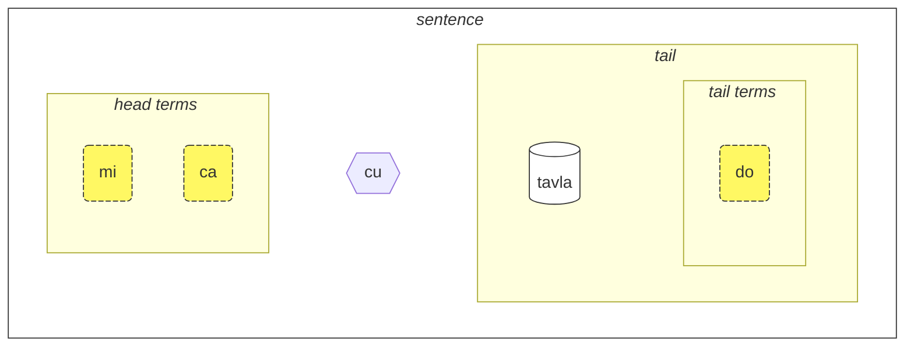
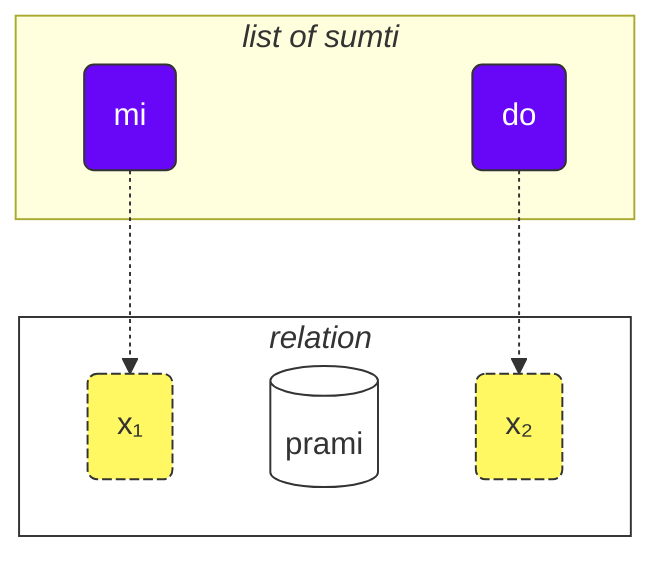
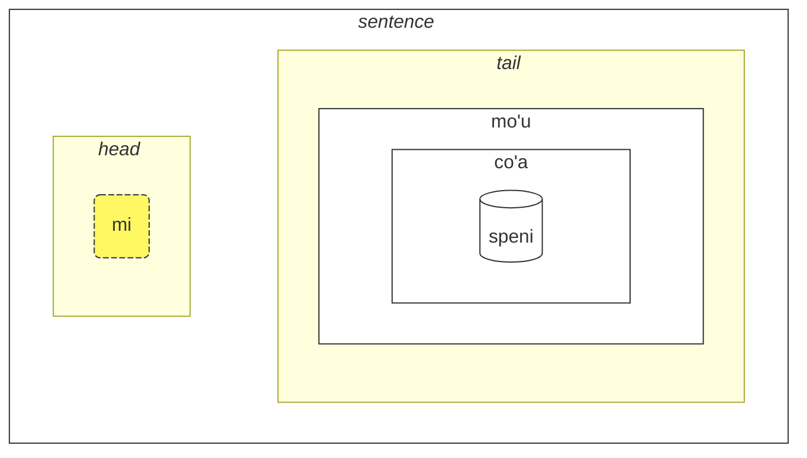
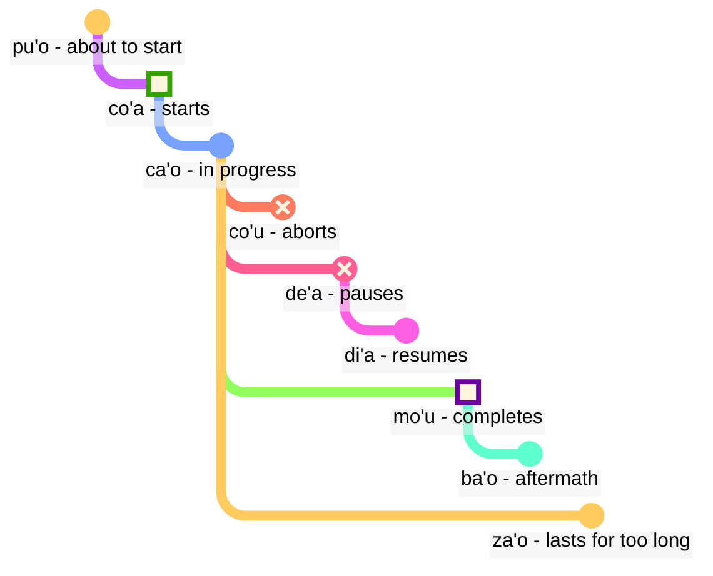

<div class="lojbo"></div>
<div class="print:hidden">

[📁 Versão em PDF desta página](/vreji/uencu/learn-lojban.pdf)

<hr/>
</div>

<div class="lojbo"></div>

Como usar este curso:

1. leia-o
2. colete seus comentários e sugestões
3. envie-os para [💬 o chat ao vivo](https://lojban.pw/articles/live_chat/)
## Lição 1. O idioma em um relance

### Alfabeto

A coisa básica que você precisa saber sobre Lojban é o alfabeto.

Lojban usa o alfabeto latino (as vogais estão coloridas):

<dl><dd><b><font color="#FF1493">a</font> b c d <font color="#FF1493">e</font> f g <font color="#FF1493">i</font> j k l m n <font color="#FF1493">o</font> p r s t <font color="#FF1493">u</font> v x <font color="#FF1493">y</font> z ' .</b></dd></dl>

As letras são pronunciadas como são escritas.

Existem 10 vogais em Lojban:

<table>
<tbody><tr>
<td><b class="audio-inline"><font color="#FF1493" class="guibutton">a</font></b></td>
<td> como em <i>p<u>ai</u></i> (não como em <i>face</i>)</td>
</tr>
<tr>
<td><b class="audio-inline"><font class="guibutton"color="#FF1493">e</font></b></td>
<td> como em <i>g<u>et</u></i></td>
</tr>
<tr>
<td><b class="audio-inline"><font class="guibutton" color="#FF1493">i</font></b></td>
<td> como em <i>m<u>aqu</u>ina</i> (não como em <i>hit</i>)</td>
</tr>
<tr>
<td><b class="audio-inline"><font class="guibutton" color="#FF1493">o</font></b></td>
<td> como em <i>ch<u>o</u>ice</i>, <i>n<u>o</u>t</i> ou <i>ough</i> em <i>th<u>ough</u>t</i> (não como em <i>so</i>, <b>o</b> deve ser um som "puro").</td>
</tr>
<tr>
<td><b class="audio-inline"><font class="guibutton" color="#FF1493">u</font></b></td>
<td> como em <i>c<u>oo</u>l</i> (não como em <i>but</i>)</td>
</tr>
<tr>
<td><b class="audio-inline"><font class="guibutton" color="#FF1493">y</font></b></td>
<td> como em <i>comm<u>a</u></i> (não como em <i>misty</i> ou <i>cycle</i>)</td>
</tr>
<tr>
</tbody></table>

4 vogais são escritas usando combinações de letras:

<table>
<tbody><tr>
<td><b class="audio-inline"><font color="#FF1493" class="guibutton">au</font></b></td>
<td> como em <i>c<u>ow</u></i></td></tr>
<tr>
<td><b class="audio-inline"><font color="#FF1493" class="guibutton">ai</font></b></td>
<td> como em <i>h<u>igh</u></i></td></tr>
<tr>
<td><b class="audio-inline"><font class="guibutton"color="#FF1493">ei</font></b></td>
<td> como em <i>w<u>eigh</u></i></td></tr>
<tr>
<td><b class="audio-inline"><font class="guibutton" color="#FF1493">oi</font></b></td>
<td> como em <i>b<u>oy</u></i></td></tr>
</tbody></table>

Quanto às consoantes, elas são pronunciadas como em inglês ou latim, mas há várias diferenças:

<table>
<tbody><tr>
<td><span class="audio-inline"><b class="guibutton">c</b></span>
</td>
<td>é pronunciado como <i>c</i> em <i>ocean</i>, como <i>sh</i> em <i>shop</i>.
</td></tr>
<tr>
<td><span class="audio-inline"><b class="guibutton">g</b></span>
</td>
<td>sempre <i>g</i> como em <i>gum</i> (nunca <i>g</i> como em <i>gem</i>).
</td></tr>
<tr>
<td><span class="audio-inline"><b class="guibutton">j</b></span>
</td>
<td>como <i>s</i> em <i>pleasure</i> ou <i>treasure</i>, como <i>j</i> em francês <i>bonjour</i>.
</td></tr>
<tr>
<td><span class="audio-inline"><b class="guibutton">x</b></span>
</td>

html
<td>como <i>ch</i> em <i>loch</i> escocês ou como em <i>Bach</i> alemão, como <i>J</i> em <i>Jose</i> espanhol ou <i>Kh</i> em árabe moderno <i>Khaled</i>. Tente pronunciar <i>ksss</i> mantendo a língua para baixo e você obterá esse som.
</td></tr>
<tr>
<td><span class="audio-inline"><b class="guibutton"> ' </b></span>
</td>
<td>como o inglês <i>h</i>. Portanto, o apóstrofo é considerado uma letra própria do Lojban e pronunciado como um <i>h</i>. Ele só pode ser encontrado entre vogais. Por exemplo, <b>u'i</b> é pronunciado como <i>oo-hee</i> (enquanto <b>ui</b> é pronunciado como <i>wee</i>).
</td></tr>
<tr>
<td><span class="audio-inline"><b>.</b></span>
</td>
<td>um ponto final (período, quebra de palavra) também é considerado uma letra em Lojban. É uma pausa curta na fala para impedir que as palavras se fundam. Na verdade, qualquer palavra que comece com uma vogal tem um ponto final colocado na frente dela. Isso ajuda a evitar a fusão indesejável de duas palavras sequenciais em uma.
</td></tr>
<tr>
<td><span class="audio-inline"><b>i</b></span>
</td>
<td><span class="audio-inline"><b>i</b></span> antes de vogais é considerado uma consoante e pronunciado mais curto, por exemplo:
<ul><li><b>ia</b> é pronunciado como <i>ya</i> em <i>yard</i></li>
<li><b>ie</b> é pronunciado como <i>ye</i> em <i>yes</i></li></ul>
</td></tr>
<tr>
<td><span class="audio-inline"><b>u</b></span>
</td>
<td><span class="audio-inline"><b>u</b></span> antes de vogais é considerado uma consoante e pronunciado mais curto, por exemplo:
<ul><li><b>ua</b> é pronunciado como <i>wo</i> em <i>wow</i></li>
<li><b>ue</b> é pronunciado como <i>whe</i> em <i>when</i></li></ul>
</td></tr></tbody></table>

O estresse é colocado na penúltima vogal. Se uma palavra tiver apenas uma vogal, você simplesmente não a estressa.

A letra **r** pode ser pronunciada como o _r_ em inglês, escocês, russo, então há uma variedade de pronúncias aceitáveis para ela.

Vogais não-Lojban como o _i_ curto e o _u_ em inglês britânico padrão _hit_ e _but_, são usados por algumas pessoas para separar consoantes. Portanto, se você tiver dificuldade em pronunciar duas consoantes seguidas (por exemplo, o **vl** em **tavla**, que significa _falar com_), então você pode dizer _tavɪla_ - onde o _ɪ_ é muito curto. No entanto, outras vogais como **a** e **u** devem ser longas.

### A frase mais simples

Agora, vamos construir nossas primeiras frases em Lojban.

A unidade básica em Lojban é a "frase". Aqui estão três exemplos simples:

> **le prenu cu tavla mi**
> _A pessoa fala comigo._

le prenu
: a pessoa

tavla
: ... fala com ..., ... conversa com ...

mi
: eu, me

> **mi prami do**
> _Eu te amo._

prami
: ... ama ... (alguém)

do
: você

> **mi ca cu tavla do**
> _Eu agora falo com você._

ca
: agora

Cada frase em Lojban consiste nas seguintes partes da esquerda para a direita:

- a cabeça:
  - consiste em "termos" chamados assim,
  - **le prenu** é o único termo da cabeça no exemplo **le prenu cu tavla mi** acima,
  - **mi**, **ca** são termos da cabeça no exemplo **mi ca cu tavla do** acima.
- o separador da cabeça **cu**:
  - pronunciado como _shoe_ já que **c** é para _sh_,
  - mostra que a cabeça terminou,
  - pode ser omitido quando está claro que a cabeça foi concluída.
- a cauda:
  - a construção principal da relação (**tavla**, **prami**) com possivelmente um ou mais termos depois dela,
  - **mi** é o único termo da cauda no exemplo **le prenu cu tavla mi** acima.
  - **do** é o único termo da cauda no exemplo **mi ca cu tavla do** acima.



<pixra url="/assets/pixra/cilre/tavla.svg" caption="le prenu cu tavla mi" definition="A pessoa fala comigo."></pixra>

<pixra url="/assets/pixra/cilre/mi.svg" caption="mi" definition="Eu / me"></pixra>

<pixra url="/assets/pixra/cilre/mi_prami_do2.svg" caption="mi prami do" definition="Eu te amo."></pixra>

<pixra url="/assets/pixra/cilre/do.svg" caption="do" definition="você"></pixra>

Em Lojban, falamos principalmente de relações em vez de substantivos e verbos.

Aqui estão as duas palavras de relação, que correspondem aproximadamente a verbos:

prenu
: ... é uma pessoa / são pessoas

tavla
: ... fala com ...

Para transformar tal "verbo" em um substantivo, colocamos uma palavra curta **le** na frente dele:

le prenu
: a pessoa

Da mesma forma,

tavla
: ... fala com ...

e assim

le tavla
: o falante

Pode parecer estranho como _pessoa_ pode ser um "verbo", mas na verdade, isso torna Lojban muito simples:

<table>
<thead>
<tr>
<th>palavra de relação</th>
<th>substantivo</th></tr>
</thead>
<tbody>
<tr>
<td><b>prenu</b> — <i>ser uma pessoa</i> </td>

<td><b>le prenu</b> — <i>a pessoa</i>
</td></tr>
<tr>
<td><b>tavla</b> — <i>falar com</i> </td>
<td><b>le tavla</b> — <i>o falante</i>
</td></tr>
</tbody></table>

Também podemos dizer que **le** cria um substantivo a partir de uma construção de relação com o significado aproximado de _aquele que é..._ (_é uma pessoa_ — _a pessoa_), ou mesmo _aqueles que fazem..._ (_falar com_ — _os falantes_), _aqueles que são..._ (_são pessoas_ — _as pessoas_).

Observe que o Lojban, por padrão, não diferencia entre _o falante_ ou _os falantes_. Ou seja, **le tavla** é vago nesse sentido, e logo descobriremos maneiras de definir o número.

Termos em Lojban, não importa onde são usados em uma determinada frase, são principalmente representados por:

- substantivos como **le prenu** (_a pessoa_)
- pronomes como **mi** (_eu_, _me_), **do** (_você_). Os pronomes funcionam exatamente como substantivos, mas **le** não é usado para eles. Eles funcionam como substantivos por conta própria.
- termos modais como **ca** (_agora, no presente_). Os termos modais especificam informações adicionais e esclarecedoras.

Alguns exemplos:

> **mi nintadni**
> _Eu sou um novo aluno._

nintadni
: ... é um novo aluno, um novato

<pixra url="/assets/pixra/cilre/nintadni.svg" caption="mi nintadni" definition="Eu sou um novo aluno, um calouro."></pixra>

Ao contrário do inglês, não precisamos adicionar o verbo "ser/estar" à frase. Já está lá. A palavra de relação **nintadni** (_... é um novo aluno_) já tem esse "ser/estar" em sua tradução em inglês.

> **do jimpe**
> _Você entende._

jimpe
: ... entende ... (algo)
<!-- -->

<pixra url="/assets/pixra/cilre/pilno_le_fonxa.svg" caption="le prenu cu pilno le fonxa" definition="A pessoa usa o telefone."></pixra>

> **mi pilno le fonxa**
> _Eu uso o telefone._

pilno
: ... usa ... (algo)

fonxa
: ... é um telefone, ... são telefones

le fonxa
: o telefone, os telefones


> **mi citka**
> _Eu como._

citka
: ... come ... (algo)

<pixra url="/assets/pixra/cilre/citka.svg" caption="mi citka" definition="Eu como."></pixra>
<!-- -->

> **do citka**
> _Você come._

<!-- -->

> **mi citka le plise**
> _Eu como as maçãs._

<!-- -->

> **le plise cu kukte**
> _As maçãs são saborosas._

<pixra url="/assets/pixra/cilre/le_plise_cu_kukte.svg" caption="le plise cu kukte" definition="As maçãs são saborosas."></pixra>

Aqui, **le plise** significa _as maçãs_, **kukte** significa _é saboroso / são saborosos_.

Uma frase mais simples em Lojban conteria apenas uma palavra de relação principal:

<pixra url="/assets/pixra/cilre/karce.svg" caption="karce" definition="É um carro."></pixra>

> **karce**
> _Carro!_
> _É um carro._

Você poderia dizer isso quando vê um carro se aproximando. Aqui, o contexto seria claro o suficiente de que há um carro em algum lugar e provavelmente é perigoso.

**karce** em si é um verbo que significa _é um carro, ser um carro_.

Podemos, é claro, ser mais precisos e dizer, por exemplo:

> **ti karce**
> _Este é um carro._

ti
: pronome: esta coisa perto de mim

<pixra url="/assets/pixra/cilre/ti.svg" caption="ti" definition="este (perto de mim, o falante)"></pixra>

Da mesma forma, você pode dizer

> **carvi**
> _Está chovendo._

onde

carvi
: … é uma chuva, … está chovendo

<pixra url="/assets/pixra/cilre/carvi.svg" caption="carvi" definition="… é uma chuva"></pixra>

ou

> **pluka**
> _Está agradável._

onde

pluka
: … é agradável

Observe que em Lojban não há necessidade da palavra _it_ nesse sentido. Você simplesmente usa a palavra de relação que precisa.

> **prami**
> _Alguém ama._

<!-- -->

> **bajra**
> _Alguém corre._

bajra
: … corre usando membros

Novamente, o contexto provavelmente diria quem ama quem e quem corre.

<pixra url="/assets/pixra/cilre/bajra.svg" caption="le prenu cu bajra" definition="A pessoa corre."></pixra>

#### Tarefa

<pixra url="/assets/pixra/cilre/pinxe_le_djacu.svg" caption="A pessoa bebe água" definition="A pessoa bebe água."></pixra>

pinxe
: ... bebe ... (algo)

le djacu
: a água

Feche a parte direita da tabela. Traduza as frases à esquerda do Lojban.

<table style="table-layout: fixed;">
<tbody><tr>
<td><b>do citka</b>
</td>
<td><i>Você come.</i>
</td></tr>
<tr>
<td><b>mi pinxe le djacu</b>
</td>
<td><i>Eu bebo água.</i>
</td></tr>
<tr>
<td><b>mi citka le plise</b>
</td>
<td><i>Eu como maçãs.</i>
</td></tr></tbody></table>
### «**.i**» separa as frases

A maneira mais precisa de pronunciar ou escrever frases em Lojban seria colocar uma palavra curta **.i** no início de cada uma delas:

> **mi tavla le prenu .i le prenu cu tavla mi**
> _Estou falando com as pessoas. As pessoas estão falando comigo._

**.i** separa as frases como o ponto final no final das frases em textos em inglês.

Ao dizer uma frase após a outra em inglês, fazemos uma pausa (pode ser curta) entre elas. Mas a pausa tem muitos significados diferentes em inglês. Em Lojban, temos uma maneira melhor de entender onde uma frase termina e outra começa.

Observe também que às vezes, ao pronunciar palavras rapidamente, você não consegue descobrir onde uma frase termina e a palavra da próxima frase começa. Portanto, é aconselhável usar a palavra **.i** antes de começar uma nova frase.

### Números: ‘_1 2 3 4 5 6 7 8 9 0_’ = «**pa re ci vo mu xa ze bi so no**»

**le** simplesmente transforma um verbo em um substantivo, mas tal substantivo não tem número associado a ele. A frase

> **le prenu cu tavla mi**
> _As pessoas falam comigo._
> _A pessoa fala comigo._

não especifica o número de pessoas falando comigo. Em inglês, é impossível omitir o número porque _people_ em inglês implica _mais de uma pessoa_. No entanto, em Lojban, você pode omitir o número mesmo que seja plural.

Agora vamos especificar quantas pessoas são relevantes para nossa discussão.

Vamos adicionar um número após **le**.

<table>
<tbody><tr>
<td><b>pa</b>
</td>
<td><b>re</b>
</td>
<td><b>ci</b>
</td>
<td><b>vo</b>
</td>
<td><b>mu</b>
</td>
<td><b>xa</b>
</td>
<td><b>ze</b>
</td>
<td><b>bi</b>
</td>
<td><b>so</b>
</td>
<td><b>no</b>
</td></tr>
<tr>
<td> 1
</td>
<td> 2
</td>
<td> 3
</td>
<td> 4
</td>
<td> 5
</td>
<td> 6
</td>
<td> 7
</td>
<td> 8
</td>
<td> 9
</td>
<td> 0
</td>
</tr></tbody></table>

<pixra url="/assets/pixra/cilre/ci_prenu.svg" caption="le ci prenu" definition="As três pessoas"></pixra>

> **le pa prenu cu tavla mi**
> _A pessoa fala comigo._
> _A única pessoa fala comigo._

Adicionamos um número após **le** e, assim, especificamos pessoas individuais.

Para números compostos por vários dígitos, basta juntar esses dígitos.

> **le re mu prenu cu tavla mi**
> _As 25 pessoas falam comigo._

Sim, é simples assim.

Se quisermos contar, podemos separar os números com **.i**:

> **mu .i vo .i ci .i re .i pa .i no**
> _5 … 4 … 3 … 2 … 1 … 0_

O número **za'u** significa _mais que ..._ (_\>_ em matemática), o número **me'i** significa _menos que_ (_<_ em matemática):

> **le za'u re prenu cu tavla mi**
> _Mais de duas pessoas falam comigo._

<!-- -->

> **le me'i pa no prenu cu tavla mi**
> _Menos de 10 pessoas falam comigo._

<!-- -->

> **le za'u ci prenu cu tavla mi**
> _Mais de três pessoas falam comigo._

Para dizer apenas _pessoas_ (número plural) em oposição a _uma pessoa_, usamos **za'u pa**, _mais de um_ ou simplesmente **za'u**.

> **le za'u pa prenu cu tavla mi**
> **le za'u prenu cu tavla mi**
> _As pessoas falam comigo._

**za'u** por padrão significa **za'u pa**, portanto, tal contração é possível.

le prenu
: a pessoa / as pessoas (em geral)

le pa prenu
: a pessoa (um em número)

le za'u prenu
: as pessoas (duas ou mais em número)

#### Tarefa

stati
: ... é inteligente, ... tem um talento

<pixra url="/assets/pixra/cilre/stati.svg" caption="stati" definition="... tem um talento"></pixra>

klama
: ... vem para ... (algum lugar ou objeto)

<pixra url="/assets/pixra/cilre/klama_ti.svg" caption="le prenu cu klama ti" definition="A pessoa veio aqui."></pixra>

nelci
: ... gosta (de algo)

le zarci
: o mercado

<pixra url="/assets/pixra/cilre/zarci.svg" caption="le prenu cu zvati le zarci" definition="A pessoa está na loja."></pixra>

le najnimre
: a laranja (fruta), as laranjas

<pixra url="/assets/pixra/cilre/najnimre.svg" caption="najnimre" definition="... é uma laranja"></pixra>

le badna
: a banana, as bananas

<pixra url="/assets/pixra/cilre/badna.svg" caption="badna" definition="... é uma banana"></pixra>

Feche a parte direita da tabela. Traduza as frases à esquerda do Lojban.

<table style="table-layout: fixed;">
 <tbody>
  <tr>
   <td>le mu prenu cu klama le zarci</td>
   <td>As cinco pessoas vêm ao mercado.</td>
  </tr>
  <tr>
   <td>le pa re prenu cu stati .i do stati</td>
   <td>As 12 pessoas são inteligentes. Você é inteligente.</td>
  </tr>
  <tr>
   <td>le prenu cu nelci le plise</td>
   <td>As pessoas gostam das maçãs.</td>
  </tr>
  <tr>
   <td>le za'u re prenu cu citka .i le me'i mu prenu cu pinxe le djacu</td>
   <td>Mais de duas pessoas comem. Menos de 5 pessoas bebem a água.</td>
  </tr>
  <tr>
   <td>le za'u re prenu cu stati</td>
   <td>Mais de duas pessoas são inteligentes.</td>
  </tr>
 </tbody>
</table>

Feche a parte direita da tabela. Traduza as frases à esquerda para Lojban.

<table style="table-layout: fixed;">
 <tbody>
  <tr>
   <td>The 256 people are smart.</td>
   <td>le re mu xa prenu cu stati</td>
  </tr>
  <tr>
   <td>Fewer than 12 apples are tasty.</td>
   <td>le me'i pa re plise cu kukte</td>
  </tr>
 </tbody>
</table>

### Verbo composto

Verbo composto (**le tanru** em Lojban) são vários verbos colocados um após o outro.

> **tu melbi zdani**
> _Aquele é uma casa bonita._

<pixra url="/assets/pixra/cilre/melbi_zdani.svg" caption="melbi zdani" definition="… é uma casa bonita"></pixra>

tu
: aquele (longe de você e de mim)

melbi
: … é bonito, agradável

zdani
: … é uma casa ou ninho para … (alguém)

<pixra url="/assets/pixra/cilre/dansu.svg" caption="le prenu cu melbi dansu" definition="A pessoa dança bem."></pixra>

> **do melbi dansu**
> _Você dança bem._

Aqui, o verbo **melbi** adiciona um significado adicional, pois é colocado à esquerda de outro verbo: **zdani**. A parte esquerda geralmente é traduzida usando adjetivos e advérbios.

Verbos compostos são um recurso poderoso que produz significados mais ricos. Basta juntar dois verbos e a parte esquerda desse verbo composto adiciona um sabor ao segundo.

Podemos colocar **le** (por exemplo, com um número) à esquerda desse verbo composto, obtendo um substantivo composto:

le pa melbi zdani
: a casa bonita

Agora você sabe por que havia **cu** após os substantivos em nosso exemplo:

> **le pa prenu cu tavla mi**
> _A pessoa fala comigo._

Sem **cu**, isso se transformaria em **le pa prenu tavla**, que teria o significado de _a pessoa-falante_ - o que quer que isso signifique.

Considere:

> **le pa tavla pendo**
> _O amigo falante_
<!-- -->
> **le pa tavla cu pendo**
> _O falante é um amigo._

Lembre-se de colocar **cu** antes do principal construtor de relação em uma frase para evitar a criação acidental de verbos compostos.

Verbos compostos podem conter mais de dois verbos. Nesse caso, o primeiro verbo modifica o segundo, o segundo modifica o terceiro e assim por diante:

<pixra url="/assets/pixra/cilre/cmalu_karce.svg" caption="ti cmalu karce" definition="Este é um carro pequeno."></pixra>

> **le pa melbi cmalu karce**
> _o carro bonito-pequeno, o carro pequeno de uma maneira bonita_

<!-- -->

> **le mutce melbi zdani**
> _a casa muito bonita_

mutce
: … é muito, … é muito

#### Tarefa

sutra
: ... é rápido

barda
: ... é grande

cmalu
: ... é pequeno

mlatu
: ... é um gato

Feche a parte direita da tabela. Traduza as frases à esquerda do Lojban.

<table style="table-layout: fixed;">
<tbody><tr>
<td><b>le melbi karce</b>
</td>
<td><i>o carro bonito / os carros bonitos</i>
</td></tr>
<tr>
<td><b>do sutra klama</b>
</td>
<td><i>Você vem rapidamente. Você vem rápido.</i>
</td></tr>
<tr>
<td><b>tu barda zdani</b>
</td>
<td><i>Aquilo é uma casa grande.</i>
</td></tr>
<tr>
<td><b>le pa sutra bajra mlatu</b>
</td>
<td><i>o gato correndo rapidamente</i>
</td></tr>
<tr>
<td><b>le pa sutra mlatu</b>
</td>
<td><i>o gato rápido</i>
</td></tr>
<tr>
<td><b>le pa bajra mlatu</b>
</td>
<td><i>o gato correndo</i>
</td></tr></tbody></table>

Feche a parte direita da tabela. Traduza as frases à esquerda para Lojban.

<table style="table-layout: fixed;">

<tbody><tr>
<td><i>Este é um carro pequeno.</i>
</td>
<td><b>ti cmalu karce</b>
</td></tr>
<tr>
<td><i>maçãs saborosas</i>
</td>
<td><b>le kukte plise</b>
</td></tr>
<tr>
<td><i>os comedores rápidos</i>
</td>
<td><b>le sutra citka</b>
</td></tr>
<tr>
<td><i>Você é uma pessoa que caminha rapidamente.</i>
</td>
<td><b>do sutra cadzu prenu</b>
</td></tr></tbody></table>

### Perguntas 'Sim/Não'

Em inglês, formamos uma pergunta 'sim/não' mudando a ordem das palavras, por exemplo:

> _You are … ⇒ Are you …?_

ou usando alguma forma do verbo _to do_ no início, por exemplo:

> _You know … ⇒ Do you know?_

Em Lojban, a ordem das palavras pode ser mantida. Para transformar qualquer afirmação em uma pergunta 'sim/não', simplesmente inserimos a palavra **xu** em algum lugar da frase, por exemplo, no início:

> **xu do nelci le gerku**
> _Você gosta dos cachorros?_

le gerku
: o cachorro, os cachorros

<pixra url="/assets/pixra/cilre/le_prenu_e_le_gerku.svg" caption="ti prenu .i ti gerku" definition="Esta é uma pessoa. Este é um cachorro."></pixra>

Lembre-se de que, em Lojban, a pontuação como "?" (ponto de interrogação) é principalmente opcional e usada principalmente para fins estilísticos. Isso ocorre porque a palavra de pergunta **xu** já mostra que é uma pergunta.

Outros exemplos:

> **xu mi klama**
> _Eu estou vindo?_

klama
: ... vem para ... (em algum lugar)

> **xu pelxu**
> _É amarelo?_

pelxu
: ... é amarelo

Podemos mudar o significado colocando **xu** após diferentes partes da relação. As explicações do que mudou no significado são dadas entre parênteses:

> **xu do nelci le gerku**
> _Você gosta dos cachorros?_

<!-- -->

> **do xu nelci le gerku**
> _Você gosta dos cachorros?_ (Eu pensei que era outra pessoa que gostava deles).

<!-- -->

> **do nelci xu le gerku**
> _Você GOSTA dos cachorros? (Eu pensei que você fosse apenas neutro em relação a eles)._

<!-- -->

> **do nelci le gerku xu**
> _Você gosta dos CACHORROS? (Eu pensei que você gostasse de gatos)._

O que é expresso usando entonação em inglês é expresso movendo **xu** após a parte que queremos enfatizar em Lojban. Observe que a primeira frase com **xu** no início faz a pergunta mais genérica sem enfatizar nenhum aspecto em particular.

**xu** é uma palavra de interjeição. Aqui estão as características das interjeições em Lojban:

- a interjeição modifica a construção anterior a ela. Portanto, quando colocada após certas partes da relação, como pronomes ou verbos, ela modifica esse verbo:

 > **do xu nelci le gerku**
 > _Você gosta dos cachorros?_

- quando colocadas no início de uma relação, as interjeições modificam toda a relação:

 > **xu do nelci le gerku**
 > _Você gosta dos cachorros?_

- as interjeições podem ser colocadas após diferentes partes da mesma relação para mudar o significado.

As interjeições não quebram verbos compostos, elas podem ser usadas dentro deles:

> **do nelci le barda xu gerku**
> _Você gosta dos cachorros GRANDES?_

Agora, como responder a essas perguntas 'sim/não'? Você repete a relação principal:

> **— xu le mlatu cu melbi**
> **— melbi**
> _— Os gatos são bonitos?_
> _— Bonitos._

Para responder 'não', usamos o termo modal **na ku**:

> **— xu le mlatu cu melbi**
> **— na ku melbi**
> _— Os gatos são bonitos?_
> _— Não bonitos._

na ku
: termo: é falso que ...

Ou, podemos usar um verbo especial **go'i**:

> **— xu le mlatu cu melbi**
> **— go'i**
> _— Os gatos são bonitos?_
> _— Bonitos._

go'i
: verbo que repete a relação principal da frase anterior

Aqui, **go'i** significa o mesmo que **melbi** já que **melbi** é a relação da relação anterior.

> **— xu le mlatu cu melbi**
> **— na ku go'i**
> _— Os gatos são bonitos?_
> _— Não são bonitos._

<!-- Este curso não recomenda negar **go'i** para respostas negativas. Apenas use **je'u nai**. -->

O termo modal **na ku** pode ser usado não apenas em respostas:

> **na ku mi nelci le gerku**
> _É falso que eu goste dos cachorros._
> _Eu não gosto dos cachorros._
<!-- -->
> **mi na ku nelci do**
> _Eu não gosto de você._

Seu oposto, o termo **ja'a ku** afirma o significado:

> **mi ja'a ku nelci do**
> _Eu gosto de você._

ja'a ku
: termo: é verdade que ...

#### Tarefa

Feche a parte direita da tabela. Traduza as frases à esquerda para Lojban.

<table style="table-layout: fixed;">

<tbody><tr>
<td><b>xu le barda zdani cu melbi</b>
</td>
<td><i>A casa grande é bonita?</i>
</td></tr>
<tr>
<td><b>— le prenu cu stati xu<br/>— na ku stati</b>
</td>
<td><i>— As pessoas são inteligentes?<br/>— Não.</i>
</td></tr>
<tr>
<td><b>do klama le zarci xu</b>
</td>
<td><i>Você vai ao mercado?</i>
</td></tr>
<tr>
<td><b>xu le verba cu prami le mlatu</b>
</td>
<td><i>A criança ama os gatos?</i>
</td></tr></tbody></table>

Feche a parte direita da tabela. Traduza as frases à esquerda para Lojban.

<table style="table-layout: fixed;">

<tbody><tr>
<td><i>O carro é rápido?</i>
</td>
<td><b>xu le karce cu sutra</b>
</td></tr>
<tr>
<td><i>— A laranja é saborosa?<br/>— Sim, é.</i>
</td>
<td><b>— xu le najnimre cu kukte<br/>— kukte</b>
</td></tr>
<tr>
<td><i>O cachorro te ama?</i>
</td>
<td><b>xu le gerku cu prami do</b>
</td></tr></tbody></table>

### Felicidade e pedidos educados: ‘_Yay!_’ = «**ui**», ‘_Por favor!_’ = «**.e'o**»

A interjeição **ui** mostra a felicidade de quem está falando. É usada como o rosto sorridente ‘_:)_’ em mensagens, para indicar que você está feliz com algo. Embora os smileys possam ser ambíguos, **ui** tem apenas um significado, o que é útil.

> **ui do klama**
> _Yay, você está vindo!_

ui
: interjeição: _Yay!_, interjeição de felicidade

A interjeição **.e'o** no início de uma frase a transforma em um pedido educado:

> **.e'o do lebna le fonxa**
> _Você poderia pegar o telefone, por favor?_
> `Por favor, pegue o telefone.`

.e'o
: interjeição: por favor (pronunciada como _eh-haw_ com uma pausa curta ou quebra antes da palavra)

lebna
: pegar (algo)

Em inglês, para ser educado, é preciso usar _could you_ + _please_ + uma pergunta). Em Lojban, **.e'o** é suficiente para fazer um pedido educado.

#### Tarefa

Feche a parte direita da tabela. Traduza as frases à esquerda do Lojban.

le tcati
: o chá

<pixra url="/assets/pixra/cilre/tcati.svg" caption="tcati" definition="… é algum chá"></pixra>

le ckafi
: o café

<pixra url="/assets/pixra/cilre/ckafi.svg" caption="ckafi" definition="… é algum café"></pixra>

zgana
: observar, assistir (usando qualquer sentido)

le skina
: o filme

<pixra url="/assets/pixra/cilre/zgana_le_skina.svg" caption="le prenu cu zgana le skina" definition="A pessoa assiste o filme."></pixra>

kurji
: cuidar de (alguém, algo)

<table style="table-layout: fixed;">

<tbody>
<tr>
<td><b>ui carvi</b>
</td>
<td><i>Yay, está chovendo!</i>
</td></tr>
<tr>
<td><b>.e'o do sutra bajra</b>
</td>
<td><i>Corra rápido!</i>
</td></tr>
<tr>
<td><b>.e'o do pinxe le tcati</b>
</td>
<td><i>Por favor, beba chá!</i>
</td></tr>
<tr>
<td><b>.e'o zgana le skina</b>
</td>
<td><i>Por favor, assista o filme!</i>
</td></tr></tbody></table>

Feche a parte direita da tabela. Traduza as frases à esquerda para Lojban.

<table style="table-layout: fixed;">

<tbody><tr>
<td><i>Por favor, seja inteligente!</i>
</td>
<td><b>.e'o stati</b>
</td></tr>
<tr>
<td><i>Por favor, vá para casa!</i>
</td>
<td><b>.e'o do klama le zdani</b>
</td></tr>
<tr>
<td><i>Por favor, beba o café!</i>
</td>
<td><b>.e'o do pinxe le ckafi</b>
</td></tr>
<tr>
<tr>
<td><i>Yay, eu falo com você!</i>
</td>
<td><b>ui mi tavla do</b>
</td></tr>
<tr>
<td><i>Por favor, cuide da criança.</i>
</td>
<td><b>.e'o do kurji le verba</b>
</td></tr></tbody></table>

### 'E' e 'ou'

> **do nintadni .i je mi nintadni**
> _Você é um novato. E eu sou um novato._

<!-- -->

> **do .e mi nintadni**
> _Você e eu somos novatos._

<pixra url="/assets/pixra/cilre/do_e_mi_nintadni.svg" caption="do .e mi nintadni" definition="Você e eu somos novos alunos."></pixra>

<!-- -->

> **mi tadni .i je mi tavla do**
> _Eu estudo. E eu falo com você._

<!-- -->

> **mi tadni gi'e tavla do**
> _Eu estudo e falo com você._

.i je
: conjunção "e" combinando frases em uma.

.e
: conjunção "e" conectando substantivos.

gi'e
: conjunção "e" conectando caudas de frases.

Podemos combinar duas frases em uma declaração usando a conjunção **.i je**, que significa _e_:

> **do nintadni .i je mi nintadni**
> _Você é um novato. E eu sou um novato._

Como ambas as frases têm a mesma cauda, podemos usar uma contração: a conjunção **.e** significa _e_ para substantivos e pronomes:

> **do .e mi nintadni**
> _Você e eu somos novatos._

**do nintadni .i je mi nintadni** significa exatamente a mesma coisa que **do .e mi nintadni**

Também podemos usar **.e** para conectar substantivos e pronomes em outras posições.

Ambas as frases significam a mesma coisa.

> **mi pinxe le djacu .e le jisra**
> _Eu bebo a água e o suco._
> **mi pinxe le djacu .i je mi pinxe le jisra**
> _Eu bebo a água e bebo o suco._

le jisra
: suco

<pixra url="/assets/pixra/cilre/pinxe_le_jisra.svg" caption="le prenu cu pinxe le jisra" definition="A pessoa bebe o suco."></pixra>

Se a cabeça da frase é a mesma, mas as caudas diferem, usamos a conjunção **gi'e**, que significa _e_ para as caudas das frases:

> **mi tadni .i je mi tavla do**
> **mi tadni gi'e tavla do**
> _Eu estudo e falo com você._

Ambas as variações significam a mesma coisa; **gi'e** simplesmente leva a uma realização mais concisa.

Também temos ferramentas para adicionar _e_ para componentes de verbos compostos:

> **le melbi je cmalu zdani cu jibni ti**
> _A casa bonita e pequena está perto._

<pixra url="/assets/pixra/cilre/melbi_je_cmalu_zdani.svg" caption="melbi je cmalu zdani" definition="... é uma casa bonita e pequena"></pixra>

jibni
: ... está perto de ...

ti
: esta coisa, este lugar perto de mim

**je** é uma conjunção em Lojban que significa _e_ em verbos compostos.

Sem **je**, a frase muda de significado:

> **le melbi cmalu zdani cu jibni**
> _A casa bonita e pequena está perto._

Aqui, **melbi** modifica **cmalu**, e **melbi cmalu** modifica **zdani**, de acordo com o funcionamento dos verbos compostos.

Em **le melbi je cmalu zdani** (_a casa bonita e pequena_), tanto **melbi** quanto **cmalu** modificam **zdani** diretamente.

Outras conjunções comuns incluem:

> **le verba cu fengu ja bilma**
> _A criança está com raiva ou doente (ou talvez ambos com raiva e doente)_

<!-- -->

> **do .a mi ba vitke le dzena**
> _Você ou eu (ou ambos) visitaremos o ancestral._

ja
: e/ou

**.a** = _e/ou_ ao conectar substantivos e pronomes.


fengu
: ... está com raiva

<pixra url="/assets/pixra/cilre/fengu.svg" caption="fengu" definition="... está com raiva"></pixra>

bilma
: ... está doente

<pixra url="/assets/pixra/cilre/bilma.svg" caption="le prenu cu bilma" definition="A pessoa está doente"></pixra>

vitke
: visitar

dzena
: ... é um ancestral de ...

<pixra url="/assets/pixra/cilre/dzena.svg" caption="dzena" definition="... é um ancestral de ..."></pixra>

> **le karce cu blabi jo nai grusi**
> _O carro é branco ou cinza, mas não ambos._

<!-- -->

> **do .o nai mi vitke le laldo**
> _Ou você ou eu visitamos o velho._

jo nai
: ou ... ou ... mas não ambos

.o nai
: ou ... ou ... mas não ambos (quando conectando substantivos e pronomes)

laldo
: ... é velho

Nota: é melhor lembrar **jo nai** como uma construção única, e o mesmo para **.o nai**.

> **mi prami do .i ju do stati**
> _Eu te amo. Quer você seja inteligente ou não._

<!-- -->

> **le verba cu nelci le plise .u le badna**
> _A criança gosta das maçãs, quer goste ou não das bananas._

ju
: quer ... ou não ...

.u
: quer ... ou não ... (quando conectando substantivos e pronomes)

### «**joi**» é ‘_e_’ para ações em massa

> **do joi mi casnu le bangu**
> _Você e eu estamos discutindo a língua._

casnu
: … discute …

le bangu
: a língua

joi
: conjunção _e_ para massas

Se eu digo **do .e mi casnu le bangu** pode significar que você discute a língua, e eu discuto a língua. Mas isso não significa necessariamente que estamos na mesma conversa!

Isso pode ser mais visível se expandirmos isso usando **.i je**:

> **do .e mi casnu le bangu**
> **do casnu le bangu .i je mi casnu le bangu**
> _Você discute a língua. E eu discuto a língua._

Para enfatizar que você e eu participamos da mesma ação, usamos uma conjunção especial **joi** que significa _e_ e forma uma "massa":

> **do joi mi casnu le bangu**
> _Você e eu estamos discutindo a língua._
> _Você e eu sendo uma única entidade para este evento estamos discutindo a língua._

O pronome **mi'o** (_você e eu juntos_) pode realmente ser expresso como **mi joi do**, que significa exatamente o mesmo (é apenas mais longo). Em Lojban, você pode não usar uma única palavra para _nós_, mas construções mais precisas como **mi joi le pendo** (literalmente _eu e os amigos_).

<pixra url="/assets/pixra/cilre/casnu.svg" caption="do joi le pendo joi mi casnu" definition="Você, o amigo e eu estamos em uma discussão."></pixra>
#### Tarefa

Feche a parte direita da tabela. Traduza as frases à esquerda do Lojban.

<table style="table-layout: fixed;">

<tbody><tr>
<td><b>mi nelci le badna .e le plise</b>
</td>
<td><i>Eu gosto das bananas e das maçãs. Eu gosto das bananas e das maçãs.</i>
</td></tr>
<tr>
<td><b>do sutra ja stati</b>
</td>
<td><i>Você é rápido ou inteligente ou ambos.</i>
</td></tr>
<tr>
<td><b>le za'u prenu cu casnu le karce .u le gerku</b>
</td>
<td><i>As pessoas discutem os carros, quer discutam ou não os cães.</i>
</td></tr>
<tr>
<td><b>mi citka le najnimre .o nai le badna</b>
</td>
<td><i>Eu como ou as laranjas ou as bananas.</i>
</td></tr></tbody></table>

Feche a parte direita da tabela. Traduza as frases à esquerda para Lojban.

<table style="table-layout: fixed;">

<tbody><tr>
<td><i>Os amigos e eu gostamos da chuva.</i>
</td>
<td><b>le pendo .e mi cu nelci le carvi</b>
</td></tr>
<tr>
<td><i>Ou eu ou você vai ao mercado.</i>
</td>
<td><b>mi .o nai do klama le zarci</b>
</td></tr>
<tr>
<td><i>Eu olho para o carro grande e bonito.</i>
</td>
<td><b>mi catlu le barda je melbi karce</b>
</td></tr>
<tr>
<td><i>A criança bebe a água e/ou o suco.</i>
</td>
<td><b>le verba cu pinxe le djacu .a le jisra</b>
</td></tr>
<tr>
<td><i>A criança e o pequeno discutem o carro.</i>
</td>
<td><b>le verba joi le pa cmalu cu casnu le karce</b> (observe o uso de <b>joi</b>. <i>o pequeno</i> é apenas <b>le pa cmalu</b>).
</td></tr></tbody></table>

### Mas...

> **le najnimre cu barda .i je ku'i le badna cu cmalu**
> _As laranjas são grandes. Mas as bananas são pequenas._

ku'i
: interjeição: mas, no entanto

Na verdade, em inglês, _but_ é o mesmo que _and_, e adiciona um sabor de contraste.

Em Lojban, usamos apenas a conjunção **.i je** (ou **.e**, **gi'e**, **je**, dependendo do que estamos conectando) e adicionamos o sabor de contraste com a interjeição **ku'i**. Isso nos dará o contraste necessário. Como de costume, a interjeição modifica a construção antes dela.

### Eventos: '_dançar e estar juntos_' — «**le nu dansu .e le nu kansa**»

Qualquer relação pode ser transformada em um verbo colocando **nu** na frente dela:

> **le nicte cu nu mi viska le lunra**
> _A noite é quando eu vejo a Lua._
> `A noite é um evento quando eu vejo a Lua.`


nicte
: (algum evento) é a noite

<pixra url="/assets/pixra/cilre/nicte_fi_mi.svg" caption="le nicte" definition="a noite"></pixra>

le nicte
: a noite, noites

viska
: ver (algo)

le lunra
: a Lua

Aqui, **le nicte** é um substantivo na frase e **nu mi viska le lunra** é a relação principal da frase. No entanto, dentro dessa relação principal, podemos ver outra relação: **mi viska le lunra** incorporada!

A palavra **nu** transforma uma frase em um verbo que denota um evento ou um processo.

Ao adicionar **le** na frente de **nu**, criamos um substantivo que denota um evento:

pinxe ⇒ le nu pinxe
: beber ⇒ a bebida

dansu ⇒ le nu dansu
: dançar ⇒ a dança

kansa ⇒ le nu kansa
: ... está junto com ... ⇒ estar juntos

klama ⇒ le nu klama
: vir para ... ⇒ a chegada

le nu do klama
: a chegada de você, você chegando

**le nu** muitas vezes corresponde a _\-ing_, _\-ção_, _\-sion_ em inglês.

Alguns verbos exigem o uso de eventos em vez de substantivos comuns. Por exemplo:

> **mi djica le nu do klama ti**
> _Eu quero que você venha aqui (para este lugar)_

djica
: querer (algum evento)

> **mi gleki le nu do klama**
> _Estou feliz porque você está vindo._

gleki
: ... está feliz (de algum evento)

<pixra url="/assets/pixra/cilre/gleki.svg" caption="gleki" definition="... está feliz sobre o evento ..."></pixra>

Alguns substantivos descrevem eventos por si só, então não é usado **le nu**:

> **le cabna cu nicte**
> _Agora é noite. No momento é noite._

le cabna
: o tempo presente, o evento presente.

Substantivos feitos com **le nu** podem ser usados para verbos que descrevem eventos por si só:

> **le nu pinxe le jisra cu nabmi mi**
> _Beber o suco é um problema para mim._

nabmi
: (evento) é um problema (para alguém), (evento) é problemático (para alguém)

Todas as palavras Lojban são divididas em dois grupos:

- partículas (chamadas de **le cmavo** em Lojban). Exemplos: **le**, **nu**, **mi**
- verbos (chamados de **le selbrivla** em Lojban). Exemplos: **gleki**, **klama**.
  É bastante comum escrever várias partículas uma após a outra sem espaços entre elas. Isso é permitido pela gramática Lojban. Então, não se surpreenda ao ver **lenu** em vez de **le nu**, **naku** em vez de **na ku**, **jonai** em vez de **jo nai** e assim por diante. Isso não muda o significado. No entanto, isso não se aplica a verbos: eles devem ser separados com espaços.

#### Tarefa

Feche a parte direita da tabela. Traduza as frases à esquerda do Lojban.

pilno
: usar (algo)

le skami
: o computador

<table style="table-layout: fixed;">

<tbody><tr>
<td><b>mi nelci le nu do dansu</b>
</td>
<td><i>Eu gosto de você dançando.</i>
</td></tr>
<tr>
<td><b>xu do gleki le nu do pilno le skami</b>
</td>
<td><i>Você está feliz em usar computadores?</i>
</td></tr>
<tr>
<td><b>do djica le nu mi citka le plise xu</b>
</td>
<td><i>Você quer que eu coma a <u>maçã</u>?</i>
</td></tr></tbody></table>

Feche a parte direita da tabela. Traduza as frases à esquerda para Lojban.

<table style="table-layout: fixed;">

<tbody><tr>
<td><i>Vir aqui é um problema.</i>
</td>
<td><b>le nu klama ti cu nabmi</b>
</td></tr>
<tr>
<td><i>Eu quero que você seja feliz.</i>
</td>
<td><b>mi djica le nu do gleki</b>
</td></tr></tbody></table>

### Termos modais. Tempos simples: ‘_was_’, ‘_is_’, ‘_will be_’ — «**pu**», «**ca**», «**ba**»

Em Lojban, expressamos o tempo em que algo acontece (gramaticalmente, em inglês, geralmente é chamado de _tense_) com termos modais. Já vimos o termo modal **ca** que significa _no presente_.

Aqui estão uma série de termos relacionados ao tempo que indicam quando algo acontece:

> **le prenu pu cu tavla mi**
> _As pessoas falaram comigo._

<!-- -->

> **le prenu ca cu tavla mi**
> _As pessoas falam comigo (no presente)._

<!-- -->

> **le prenu ba cu tavla mi**
> _As pessoas falarão comigo._

Quando colocamos um substantivo nu após a partícula relacionada ao tempo, formamos um termo com um significado ligeiramente diferente:

> **mi pinxe le djacu ca le nu do klama**
> _Eu bebo água enquanto você está vindo._

A parte **ca le nu do klama** é um termo longo que significa _enquanto você vem / enquanto você está vindo_. O **le nu do klama** é um substantivo que significa **vinda de você, você vindo**.

> **mi citka ba le nu mi dansu**
> _Eu como depois de dançar._

As partículas relacionadas ao tempo são agrupadas em séries por seu significado para torná-las mais fáceis de lembrar e usar.

Palavras para tempos simples:

- **pu** significa _antes de ... (algum evento)_, **pu** sozinho denota tempo passado.
- **ca** significa _ao mesmo tempo que ... (algum evento)_, **ca** sozinho denota tempo presente.
- **ba** significa _depois de ... (algum evento)_, **ba** sozinho denota tempo futuro.

Os tempos adicionam informações sobre o tempo em que algo acontece. O inglês nos obriga a usar certos tempos. Temos que escolher entre

- _As pessoas falam comigo_.
- _As pessoas falaram comigo_.
- _As pessoas falarão comigo_.

e outras escolhas semelhantes.

Mas em Lojban, as partículas de tempo são opcionais, podemos ser tão vagos ou precisos quanto quisermos.

A frase

> **le prenu cu tavla mi**
> _As pessoas falam comigo._

na verdade não diz nada sobre quando isso acontece. O contexto é claro o suficiente na maioria dos casos e pode nos ajudar. Mas se precisarmos de mais precisão, basta adicionar mais palavras.

Da mesma forma, **ba** significa _depois de ... (algum evento)_ então quando dizemos **mi ba cu citka** queremos dizer que comemos depois do momento da fala, é por isso que significa _eu vou comer_.

Podemos combinar partículas de tempo com e sem argumentos de substantivo depois delas:

> **mi pu cu citka le plise ba le nu mi dansu**
> _Eu comi as maçãs depois de dançar._

Observe que o termo **pu** (tempo passado) é colocado apenas na relação principal (**mi pu cu citka**). Em Lojban, assume-se que o evento _eu dancei_ ocorre em relação ao evento de comer.

Não devemos colocar **pu** com **dansu** (ao contrário do inglês) porque **mi dansu** é visto em relação a **mi pu cu citka**, então já sabemos que tudo estava no passado.

Mais exemplos de termos relacionados ao tempo:

> **le nicte cu pluka**
> _A noite é agradável._

pluka
: ... é agradável

> **ba le nicte cu pluka**
> _Depois da noite, é agradável._

Aqui, a cabeça da frase contém um termo **ba le nicte**, um termo com seu substantivo. Então, após o separador **cu**, segue a relação principal da frase **pluka** (**pluka** sozinho significa _É agradável._)

Para dizer _será agradável_ devemos usar o termo no passado:

> **le nicte ba cu pluka**
> _A noite será agradável._

Também observe que adicionar um substantivo após uma partícula relacionada ao tempo pode levar a um significado drasticamente diferente:

> **le nicte ba le nu citka cu pluka**
> _A noite é agradável depois de comer._

Observe que **ca** pode se estender um pouco para o passado e para o futuro, significando _agora mesmo_. Assim, **ca** reflete uma noção amplamente utilizada em todo o mundo de "tempo presente".

Também é possível integrar partículas modais na construção principal da relação:

> **le nicte ba cu pluka**
> **le nicte ba pluka**
> _A noite será agradável._

Ambas as frases significam a mesma coisa, **ba pluka** é uma construção de relação que significa _... será agradável_.

A estrutura de **le nicte ba pluka** é a seguinte:

- **le nicte** - a cabeça da frase com apenas um termo **le nicte**
- **ba pluka** - a cauda da frase com apenas um verbo **ba pluka**

Contraste isso com a frase anterior **le nicte ba cu pluka**:

- **le nicte ba** - a cabeça da frase com dois termos **le nicte** e **ba**
- **pluka** - a cauda da frase com apenas um verbo **pluka**

A vantagem de **le nicte ba pluka** sobre **le nicte ba cu pluka** é apenas na concisão; você geralmente pode pular o **cu** em tais casos, já que a frase não pode ser entendida de outra forma de qualquer maneira.

Se você deseja colocar um termo modal antes de um substantivo, pode separá-lo do texto seguinte "terminando" o termo com a palavra auxiliar **ku**:

> **ba ku le nicte cu pluka**
> **le nicte ba cu pluka**
> **le nicte ba pluka**
> _A noite será agradável._

**ku** impede que **ba le nicte** apareça, mantendo **ba ku** e **le nicte** como termos separados.

Uma última observação: as definições em inglês das palavras Lojban podem usar tempos verbais mesmo quando as palavras originais Lojban não os implicam, por exemplo:

tavla
: ... fala com ..., ... conversa com ...

pluka
: ... é agradável

Embora _fala_, _é_ etc. estejam no tempo presente (nem sempre podemos nos livrar do tempo em palavras em inglês porque é assim que o inglês funciona), sempre devemos assumir que o tempo não é implicado no significado das palavras Lojban definidas, a menos que a definição em inglês dessas palavras mencione explicitamente tais restrições de tempo.

### Termos modais. Contornos de eventos: «**co'a**», «**ca'o**», «**co'i**»

Outra série de partículas relacionadas ao tempo, _contornos de eventos_:

co'a
: partícula de tempo: o evento está no seu início

ca'o
: partícula de tempo: o evento está em progresso

mo'u
: partícula de tempo: o evento está completo

co'i
: partícula de tempo: o evento é visto como um todo (começou e depois terminou)

A maioria dos verbos descreve eventos sem especificar a fase desses eventos. Os contornos de eventos nos permitem ser mais precisos:

> **mi pu co'a сu cikna**
> **mi pu co'a cikna**
> _Eu acordei._

cikna
: … está acordado

co'a cikna
: … acorda, fica acordado

pu co'a cikna
: … acordou, ficou acordado

<pixra url="/assets/pixra/cilre/coha_cikna.svg" caption="le prenu co'a cikna" definition="A pessoa acorda."></pixra>

Para expressar precisamente o tempo progressivo em inglês, usamos **ca'o**:

> **mi pu ca'o сu sipna**
> **mi pu ca'o sipna**
> _Eu estava dormindo._

sipna
: … dorme

<pixra url="/assets/pixra/cilre/sipna.svg" caption="le prenu ca'o sipna" definition="A pessoa está dormindo."></pixra>

<!-- -->

> **mi ca ca'o pinxe**
> _Eu estou bebendo._

<!-- -->

> **mi ba ca'o pinxe**
> _Eu estarei bebendo._

**mo'u** é usado para descrever a conclusão de eventos:

> **mi mo'u klama le tcana**
> _Eu cheguei à estação._

le tcana
: a estação

<pixra url="/assets/pixra/cilre/mohu_klama_le_tcana.svg" caption="le prenu mo'u klama le tcana" definition="A pessoa chegou à estação."></pixra>

**co'i** geralmente corresponde ao tempo perfeito em inglês:

> **le verba ca co'i pinxe le jisra**
> _As crianças beberam o suco._

Poderíamos omitir **ca** nessas frases, já que o contexto seria claro o suficiente na maioria dos casos.

O tempo presente simples em inglês descreve eventos que acontecem às vezes:

> **le prenu ca ta'e tavla**
> _As pessoas (habitualmente, às vezes) falam._

ta'e
: tempo simples: o evento acontece habitualmente

Podemos usar as mesmas regras para descrever o passado usando **pu** em vez de **ca** ou o futuro usando **ba**:

> **le prenu pu co'i tavla mi**
> _As pessoas tinham falado comigo._

<!-- -->

> **le prenu ba co'i tavla mi**
> _As pessoas terão falado comigo._

A ordem relativa das partículas relacionadas ao tempo é importante. Em **ca co'i** primeiro dizemos que algo acontece no presente (**ca**), depois afirmamos que neste momento presente, o evento descrito foi concluído (**co'i**). Somente ao usar essa ordem obtemos o tempo presente perfeito.

### Termos modais. Intervalos: '_durante_' — «**ze'a**»

Outra série de partículas modais enfatiza que eventos ocorrem durante um intervalo:

ze'i
: por um curto período de tempo

ze'a
: por algum tempo, por um tempo, durante...

ze'u
: por um longo período de tempo

> **mi pu ze'a cu sipna**
> **mi pu ze'a sipna**
> _Eu dormi por um tempo._

<!-- -->

<pixra url="/assets/pixra/cilre/sipna_zeha.svg" caption="a pessoa está dormindo enquanto está chovendo" definition="A pessoa está dormindo enquanto está chovendo."></pixra>

> **mi pu ze'a le nicte cu sipna**
> _Eu dormi a noite toda._

Nota: não podemos omitir **cu** aqui, já que **nicte sipna** (_... é um dorminhoco noturno_) é um tanru e, portanto, levaria a algum outro significado (se estranho).

> **mi pu ze'i le nicte cu sipna**
> _Eu dormi durante a curta noite._

Compare **ze'a** com **ca**:

> **mi pu ca le nicte cu sipna**
> _Eu dormi à noite._

le nicte
: a noite

Ao usar **ze'a**, estamos falando sobre todo o intervalo do que descrevemos.

Observe que **nicte** é em si um evento, então não precisamos de **nu** aqui.

### Termos modais. ‘_porque_’ — «**ri'a**», ‘_em direção a_’ — «**fa'a**», ‘_em (lugar)_’ — «**bu'u**»

Partícula modal para _porque_:

> **mi pinxe ri'a le nu mi taske**
> _Eu bebo porque estou com sede._

<!-- -->

> **mi citka ri'a le nu mi xagji**
> _Eu como porque estou com fome._

ri'a
: porque … (de algum evento)


taske
: … está com sede

<pixra url="/assets/pixra/cilre/taske.svg" caption="taske" definition="… está com sede"></pixra>

xagji
: … está com fome

<pixra url="/assets/pixra/cilre/xagji.svg" caption="xagji" definition="… está com fome"></pixra>

Partículas modais que denotam lugar funcionam da mesma maneira:

> **mi cadzu fa'a do to'o le zdani**
> _Eu ando em sua direção, longe de casa._

Observe que, ao contrário de **klama**, as partículas modais **fa'a** e **to'o** denotam direções, não necessariamente pontos de partida ou chegada da rota. Por exemplo:

> **le prenu cu klama fa'a do**
> _A pessoa vem em sua direção._

significa que a pessoa está simplesmente se movendo em sua direção, mas não necessariamente para você (talvez para algum lugar ou pessoa perto de você).

<!-- -->

> **mi cadzu bu'u le tcadu**
> _Eu ando na cidade._

fa'a
: em direção a …, na direção de …

to'o
: de …, na direção de …

bu'u
: em … (algum lugar)

Nota: **nu** mostra que uma nova frase interna incorporada começa dentro da frase principal. Colocamos **kei** após essa relação para mostrar sua borda direita, semelhante a como usamos ")" ou "]" em matemática. Por exemplo:

> **le gerku cu plipe fa'a mi ca le nu do ca'o klama**
> _O cachorro pula em minha direção quando você está chegando._

<pixra url="/assets/pixra/cilre/le_gerku_faha_plipe.svg" caption="le gerku cu plipe fa'a mi" definition="O cachorro pula em minha direção."></pixra>

plipe
: pular

mas

> **le gerku cu plipe ca le (nu do ca'o klama kei) fa'a mi**
> _O cachorro pula (quando você está chegando) em minha direção._

Parênteses _(_ e_)_ são usados aqui apenas para mostrar a estrutura; eles não são necessários em um texto normal em Lojban.

Usamos **kei** após a frase interna **do ca'o klama** para mostrar que ela terminou e a relação principal continua com seu **cu**, termos, substantivos, pronomes.

Compare esta frase com a seguinte:

> **le gerku cu plipe ca le (nu do ca'o klama fa'a mi)**
> _O cachorro pula (quando você está vindo em minha direção)._

Como você pode ver, **do klama fa'a mi** é uma relação dentro da maior, então **fa'a mi** está agora dentro dela.

Agora, não é o cachorro que vem em minha direção, mas você.

No final da declaração, **kei** nunca é necessário, pois já significa a borda direita.

Considere o seguinte exemplo com uma partícula relacionada ao tempo:

> **mi pu citka le plise ba le nu mi dansu**
> _Eu comi as maçãs depois que dancei._

<!-- -->

> **mi pu citka ba le nu mi dansu kei le plise**
> _Eu comi (depois que dancei) as maçãs._

Podemos reorganizar a frase movendo **ba le nu mi dansu** ao redor, desde que permaneça após **pu**.

#### Tarefa

Feche a parte direita da tabela. Traduza as frases à esquerda do Lojban.

le tsani
: o céu

zvati
: ...está presente em... (algum lugar ou evento), ...permanece em... (algum lugar)

le canko
: a janela

le fagri
: o fogo

mi'o
: você e eu

le purdi
: o jardim

le tcati
: o chá

<table style="table-layout: fixed;">

<tbody><tr>
<td><b>mi ca gleki le nu do catlu le tsani</b>
</td>
<td><i>Estou feliz que você olhe para o céu.</i>
</td></tr>
<tr>
<td><b>xu le gerku pu ca'o zvati le zdani</b>
</td>
<td><i>Os cães estavam em casa?</i>
</td></tr>
<tr>
<td><b>do pu citka le plise ba le nu mi pinxe le jisra</b>
</td>
<td><i>Você comeu as maçãs depois que eu bebi o suco.</i>
</td></tr>
<tr>
<td><b>ko catlu fa'a le canko</b>
</td>
<td><i>Olhe em direção à janela.</i>
</td></tr>
<tr>
<td><b>xu do gleki ca le nu do ca'o cadzu bu'u le purdi</b>
</td>
<td><i>Você está feliz quando está caminhando no jardim?</i>
</td></tr>
<tr>
<td><b>ca le nu mi klama le zdani kei do pinxe le tcati ri'a le nu do taske</b>
</td>
<td><i>Quando eu chegar em casa, você bebe chá porque está com sede.</i>
</td></tr></tbody></table>

Feche a parte direita da tabela. Traduza as frases à esquerda para Lojban.

<table style="table-layout: fixed;">

<tbody><tr>
<td><i>Você vai olhar para o carro.</i>
</td>
<td><b>do ba catlu le karce</b>
</td></tr>
<tr>
<td><i>Você quer que chova no futuro.</i>
</td>
<td><b>do ca djica le nu ba carvi</b>
</td></tr>
<tr>
<td><i>Corra rapidamente para longe do fogo!</i>
</td>
<td><b>ko sutra bajra to'o le fagri</b>
</td></tr>
<tr>
<td><i>Você e eu estávamos juntos em casa quando estava chovendo.</i>
</td>
<td><b>mi'o pu ca'o zvati le zdani ca le nu carvi</b>
</td></tr></tbody></table>

### Nomes. Escolhendo um nome

**le cmevla**, ou _palavra-nome_, é um tipo especial de palavra usada para construir nomes pessoais. É fácil reconhecer le cmevla em um fluxo de texto, pois são as únicas palavras que terminam em uma consoante e são envolvidas por um ponto em cada lado.

Exemplos de le cmevla são: **.paris.**, **.robin.**

Se o nome de alguém é _Bob_, então podemos criar um cmevla nós mesmos que soaria o mais próximo possível desse nome, por exemplo: **.bab.**

O exemplo mais simples de usar um nome seria

> **la .bab. cu tcidu**
> _Bob lê/está lendo._

tcidu
: ... lê

<pixra url="/assets/pixra/cilre/tcidu_la_lojban.svg" caption="le prenu ca'o tcidu" definition="A pessoa está lendo."></pixra>

**la** é semelhante a **le**, mas converte uma palavra em um nome em vez de um simples substantivo.

Em inglês, começamos uma palavra com uma letra maiúscula para mostrar que é um nome. Em Lojban, usamos a palavra prefixo **la**.

Sempre use **la** ao produzir nomes!

Um nome pode consistir em vários cmevla um após o outro:

> **la .bab.djansyn. cu tcidu**
> _Bob Johnson lê/está lendo._

Aqui, separamos os dois cmevla com apenas um ponto, o que é suficiente.

É comum omitir pontos na frente e no final de le cmevla para escrever textos mais rapidamente, por exemplo, ao conversar por texto. Afinal, le cmevla ainda são separados de palavras vizinhas por espaços ao redor deles:

> **la bab djansyn cu tcidu**

No entanto, na linguagem falada, ainda é necessário colocar uma pausa curta antes e depois de le cmevla.

O primeiro nome de Bob, o nome da língua _Lojban_, pode ser usado em Lojban sem muitas mudanças:

> **la .lojban. cu bangu mi**
> _Eu falo Lojban._
> Lojban é uma língua minha.
> `Lojban é uma língua que eu uso.`

bangu
: ... é uma língua usada por ... (alguém)

<!-- -->
> **mi nintadni la .lojban.**
> _Eu sou um novo estudante de Lojban._
<!-- -->
> **mi tadni la .lojban.**
> _Eu estudo Lojban._

<pixra url="/assets/pixra/cilre/tadni.svg" caption="le prenu ca ca'o tadni la .lojban." definition="A pessoa está estudando Lojban agora."></pixra>

As letras Lojban correspondem diretamente aos sons, então existem algumas regras para adaptar nomes à forma como são escritos em Lojban. Isso pode parecer estranho - afinal, um nome é um nome - mas todas as línguas fazem isso em algum grau. Por exemplo, falantes de inglês tendem a pronunciar _Jose_ como _Hozay_, e _Margaret_ em chinês é _Magelita_. Alguns sons simplesmente não existem em algumas línguas, então você precisa reescrever o nome para que contenha apenas sons Lojban e seja soletrado de acordo com a correspondência letra-som.

Por exemplo:

la .djansyn.
: Johnson (provavelmente, mais próximo da pronúncia americana)

la .suzyn.
: Susan (as duas letras _s_ são pronunciadas de forma diferente: a segunda é na verdade um _z_, e o _a_ não é realmente um som de _a_)

Preste atenção em como o nome é pronunciado nativamente. Como resultado, os nomes em inglês e francês _Robert_ saem de maneira diferente em Lojban: o nome em inglês é **.robyt.** no inglês britânico, ou **.rabyrt.** em alguns dialetos americanos, mas o francês é **.rober.**

Aqui estão algumas "Lojbanizações" de alguns nomes:

- _Alice_ ⇒ **la .alis.**
- _Mei Li_ ⇒ **la .meilis.**
- _Bob_ ⇒ **la .bab.**
- _Abdul_ ⇒ **la .abdul.**
- _Yan ou Ian_ ⇒ **la .ian.**
- _Ali_ ⇒ **la .al.**
- _Doris_ ⇒ **la .doris.**
- _Michelle_ ⇒ **la .micel.**
- _Kevin_ ⇒ **la .kevin.**
- _Edward_ ⇒ **la .edvard.**
- _Adam_ ⇒ **la .adam.**
- _Lucas_ ⇒ **la .lukas.**

Notas:

* Dois pontos finais adicionais são necessários porque se você não colocar essas pausas na fala, pode se tornar difícil saber onde o nome começa e termina, ou em outras palavras, onde a palavra anterior termina e a próxima começa.
* A última letra de um cmevla deve ser uma consoante. Se um nome não termina em uma consoante, geralmente adicionamos um **s** ao final; então, em Lojban, _Mary_ se torna **.meris.**, _Joe_ se torna **.djos.**, e assim por diante. Alternativamente, podemos deixar de fora a última vogal, então _Mary_ se tornaria **.mer.** ou **.meir**.
* Você também pode colocar um ponto final entre o primeiro e o último nome de uma pessoa (embora não seja obrigatório), então _Jim Jones_ se torna **.djim.djonz.**

### Regras para criar le cmevla

Aqui está uma representação compacta dos sons do Lojban:

- vogais:
  - **a e i o u y au ai ei oi**
- consoantes:
  - **b d g v z j** (vozeadas)
  - **p t k f s c x** (não vozeadas)
  - **l m n r**
  - **i u**. Eles são considerados consoantes quando colocados entre duas vogais ou no início de uma palavra. **.iaua** — **i** e **u** são consoantes aqui. **.iai** — aqui está a consoante **i** com a vogal **ai** depois dela.
  - **'** (apóstrofo). É colocado apenas entre duas vogais: **.e'e**, **.u'i**
  - **.** (ponto, quebra de palavra)

Para criar um nome Lojban, siga estas regras:

1. o nome deve terminar em uma consoante, exceto **'**. Se não, adicione uma consoante no final. Além disso, envolva-o com um ponto de cada lado: **.lojban.**.
2. vogais só podem ser colocadas entre duas consoantes: **.sam.**, **.no'am.**
3. consoantes duplas são fundidas em uma: _dd_ se torna **d**, _nn_ se torna **n** etc. Ou um **y** é colocado entre eles: **.nyn.**
4. se uma consoante vozeada e uma não vozeada estiverem lado a lado, insira um **y** entre elas: **kv** se torna **kyv**. Alternativamente, você pode remover uma das letras: **pb** pode ser transformado em um único **p** ou um único **b**.
5. se um dos **c**, **j**, **s**, **z** estiverem lado a lado, insira um **y** entre eles: **jz** se torna **jyz**. Alternativamente, você pode remover uma das letras: **cs** pode ser transformado em um único **c** ou um único **s**.
6. se **x** estiver ao lado de **c** ou ao lado de **k**, insira um **y** entre eles: **cx** se torna **cyx**, **xk** se torna **xyk**. Alternativamente, você pode remover uma das letras: **kx** pode ser transformado em um único **x**.
7. as substrings **mz**, **nts**, **ntc**, **ndz**, **ndj** são corrigidas adicionando um **y** dentro ou excluindo uma das letras: **nytc** ou **nc**, **.djeimyz.**
8. o duplo **ii** entre vogais é fundido em um único **i**: **.eian.** (mas não **.eiian.**)
9. o duplo **uu** entre vogais é fundido em um único **u**: **.auan.** (mas não **.auuan.**)
10. o som do "h" em inglês, como em Harry, pode ser eliminado ou substituído por **x**. _Harry_ pode se tornar **.aris.** ou **.xaris.**

### Palavras de relação como nomes

Você pode escolher um apelido agradável em Lojban usando não apenas cmevla, mas também palavras de relação. Você também pode traduzir seu nome atual para Lojban se souber o que significa, ou escolher um nome completamente novo em Lojban.

Aqui estão alguns exemplos:

<table>
<thead>
<tr>
<th> Nome original </th>
<th> Significado original </th>
<th> Palavra em Lojban </th>
<th> Significado em Lojban </th>
<th> Seu nome
</th></tr>
</thead>
<tbody>
<tr>
<td> Alexis </td>
<td> <i>ajudante</i> em grego </td>
<td><b>le sidju</b></td>
<td><i>o ajudante</i> </td>
<td><b>la sidju</b>
</td></tr>
<tr>
<td> Ethan </td>
<td> <i>sólido, durante</i> em hebraico </td>
<td><b>le sligu</b></td>
<td><i>o sólido</i> </td>
<td><b>la sligu</b>
</td></tr>
<tr>
<td> Mei Li </td>
<td><i>bonita</i> em mandarim </td>
<td><b>le melbi</b></td>
<td><i>as bonitas</i> </td>
<td><b>la melbi</b>
</td></tr></tbody></table>
### ‘_ele_’ ‘_ela_’

Lojban não tem palavras distintas para _ele_ ou _ela_. Possíveis soluções:

le ninmu
: a mulher (no sentido de gênero)

<pixra url="/assets/pixra/cilre/ninmu.svg" caption="le ninmu" definition="a mulher (humana fêmea)"></pixra>

le nanmu
: o homem (no sentido de gênero)

<pixra url="/assets/pixra/cilre/nanmu.svg" caption="le nanmu" definition="o homem (humano macho)"></pixra>

> **le ninmu cu tavla le nanmu .i le ninmu cu jatna**
> _A mulher fala com o homem. Ela é uma líder._

jatna
: … é um líder, comandante

Os lojbanistas propuseram várias palavras para outros gêneros, como

le nonmu
: a pessoa sem gênero

le nunmu
: a pessoa não-binária

No entanto, na maioria das situações, usar **le prenu** (_a pessoa_) ou nomes pessoais é suficiente.

Outra opção é usar o pronome curto **ri**, que se refere ao substantivo anterior:

> **mi pu klama le nurma .i ri melbi**
> _Eu fui para o campo. Era bonito._

le nurma
: a área rural

Aqui, **ri** se refere ao campo.

<pixra url="/assets/pixra/cilre/nurma.svg" caption="nurma" definition="… é uma área rural"></pixra>

> **mi tavla le pendo .i ri jundi**
> _Eu falo com o amigo. Ele/ela é atencioso(a)._

jundi
: … é atencioso(a)

Aqui, **ri** se refere ao amigo.

<pixra url="/assets/pixra/cilre/jundi.svg" caption="le prenu cu jundi" definition="A pessoa é atenciosa."></pixra>

Nota: **ri** pula os pronomes **mi** (_eu_) e **do** (_você_):

> **le prenu cu tavla mi .i ri pendo mi**
> _A pessoa fala comigo. Ele/ela é meu amigo._

Aqui, **ri** pula o pronome anterior **mi** e, portanto, se refere a **le prenu**, que é o substantivo/pronome anterior disponível.

### Apresentando-se. Vocativos

Em Lojban, _vocativos_ são palavras que se comportam como interjeições (como **xu** que discutimos anteriormente), mas exigem que o substantivo seguinte seja anexado a elas:

> **coi do**
> _Olá, você!_

coi
: vocativo: Olá! Oi!

Usamos **coi** seguido de um substantivo ou pronome para cumprimentar alguém.

> **co'o do**
> _Adeus para você._

co'o
: vocativo: adeus!

<pixra url="/assets/pixra/cilre/coho.svg" caption="co'o do" definition="Adeus para você!"></pixra>

<div class="common"></div>

> **coi ro do**
> _Olá a todos!_
> `Olá a cada um de vocês`

- é como as pessoas geralmente começam uma conversa com várias pessoas. Outros números são possíveis, é claro: **coi re do** significa *Olá para vocês dois* etc.

Como os vocativos funcionam como interjeições, temos tipos agradáveis de cumprimentos:

<pixra url="/assets/pixra/cilre/cerni.svg" caption="cerni" definition="… é manhã"></pixra>
<pixra url="/assets/pixra/cilre/donri.svg" caption="donri" definition="… é hora do dia"></pixra>
<pixra url="/assets/pixra/cilre/vanci.svg" caption="vanci" definition="… é noite"></pixra>
<pixra url="/assets/pixra/cilre/nicte.svg" caption="nicte" definition="… é noite"></pixra>

<div class="common"></div>

> **cerni coi**
> _Bom dia!_
> `É manhã - Olá!`

<div class="common"></div>

> **vanci coi**
> _Boa noite!_

<div class="common"></div>

> **donri coi**
> _Boa tarde!_

<!-- -->

> **nicte coi**
> _Saudações noturnas!_

Nota: em inglês, _Goodnight!_ significa _Adeus!_ ou denota desejar a alguém uma boa noite. Por seu significado, _Goodnight!_ não pertence à série de cumprimentos acima. Assim, usamos uma redação diferente em Lojban:

<div class="common"></div>

> **nicte co'o**
> _Boa noite!_

ou

<div class="common"></div>

> **.a'o pluka nicte**
> _Noite agradável!_

.a'o
: interjeição: espero

pluka
: … é agradável para … (alguém)

Claro, podemos ser vagos dizendo apenas **pluka nicte** (apenas significando _noite agradável_ sem nenhum desejo explicitamente dito).

O vocativo **mi'e** + um substantivo/pronome é usado para se apresentar:

> **mi'e la .doris.**
> _Eu sou Doris. Aqui é Doris falando._

mi'e
: vocativo: identifica o falante

O vocativo **doi** é usado para se dirigir diretamente a alguém:

> **mi cliva doi la .robert.**
> _Estou saindo, Robert._

cliva
: sair (algo ou alguém)

Sem **doi**, o nome pode se tornar o primeiro substantivo da relação:

> **mi cliva la .robert.**
> _Estou saindo Robert._

**doi** é como o antigo inglês _O_ (como em _O ye of little faith_) ou o vocativo latino (como em _Et tu, Brute_). Algumas línguas não distinguem entre esses contextos, embora, como você pode ver, o inglês antigo e o latim o fizessem.

Dois outros vocativos são **ki'e** para agradecer e **je'e** para aceitá-los:

> **- ki'e do do pu sidju mi**
> **- je'e do**
> _- Obrigado, você me ajudou._
> _- De nada._

sidju
: … ajuda … (alguém)

Podemos omitir o substantivo após o vocativo apenas se este estiver no final da frase. Por exemplo, podemos apenas dizer:

> **— coi .i xu do kanro**
> _— Olá. Como você está?_
> `— Olá. Você está saudável?`

kanro
: ... está saudável

Aqui, uma nova frase começa imediatamente após o vocativo **coi**, então omitimos o nome. Ou podemos dizer:

> **coi do mi djica le nu do sidju mi**
> _Olá. Eu quero que você me ajude._
> `Olá você. Eu quero que você me ajude.`

Assim, se você não sabe o nome do ouvinte e quer continuar a mesma frase após o vocativo, basta colocar **do** depois dele.

Se você usar o vocativo sozinho (sem um substantivo depois dele) e a frase ainda não estiver terminada, então você precisa separá-lo do resto. Isso ocorre porque as coisas que são mais propensas a seguir o vocativo em uma frase podem ser facilmente mal interpretadas como descrevendo seu interlocutor. Para separá-lo do pronome/substantivo seguinte, use a palavra **do**. Por exemplo,

> **coi do la .alis. la .doris. pu cliva**
> _Olá! Alice saiu de Doris._
> `Olá você! Alice saiu de Doris.`

<!-- -->

> **coi la .alis. la .doris. pu cliva**
> _Olá, Alice! Doris saiu._

E se você quiser colocar tanto vocativos quanto interjeições, modificando toda a frase, coloque as interjeições primeiro:

> **.ui coi do la .alis. la .doris. pu cliva**
> _Uhu, Olá! Alice saiu de Doris._

Nota: no início de uma frase, as interjeições geralmente são colocadas antes dos vocativos porque:

> **coi .ui do la .alis. la .doris. pu cliva** significa

> _Olá (estou feliz com esta saudação) você! Alice saiu de Doris._

Assim, uma interjeição imediatamente após um vocativo modifica esse vocativo. Da mesma forma, uma interjeição modifica o substantivo do vocativo quando colocada depois dele:

> **coi do .ui la .alis. la .doris. pu cliva**
> _Olá você (estou feliz com você)! Alice saiu de Doris._

## Lição 2. Mais coisas básicas

### Ordem dos argumentos

Anteriormente, fornecemos definições de verbos como:

mlatu
: ... é um gato, ser um gato

citka
: ... come ...

prami
: ... ama ...

klama
: ... chegar a ...

Dicionários podem apresentar verbos com símbolos como $x_1$, $x_2$ etc.:

prami
: $x_1$ ama $x_2$

karce
: $x_1$ é um carro ...

citka
: $x_1$ come $x_2$ ...

klama
: $x_1$ chega a $x_2$ ...

Esses $x_1$, $x_2$ e assim por diante são chamados de _lugares_, _papéis de relação_ ou _argumentos_, e eles representam a ordem em que colocamos substantivos ou pronomes na frase. Por exemplo:

> **mi prami do**
> _Eu te amo._

Essa frase também implica que

- $x_1$ denota _aquele que ama_, e
- $x_2$ denota _aquele que é amado por_.

Em outras palavras, cada relação tem um ou mais papéis, e esses papéis são especificados e rotulados como $x_1$, $x_2$ e assim por diante. Colocamos substantivos e pronomes em ordem, preenchendo assim esses papéis e dando um significado concreto à relação, formando assim uma frase.



A vantagem desse estilo de definições é que todos os participantes de uma relação estão em uma definição.

Também podemos omitir substantivos tornando a frase mais vaga:

> **carvi**
> _Está chovendo._
> `é chuva, está chovendo`

(embora o tempo aqui seja determinado pelo contexto, também pode significar _Chove frequentemente_, _Estava chovendo_, etc.)

> **prami do**
> _Alguém te ama._
> `ama você`

Todos os lugares omitidos em uma relação significam apenas **zo'e** = _algo/alguém_, então significa o mesmo que

> **zo'e prami do**
> _Alguém te ama._

E

> **prami**

é o mesmo que

> **zo'e prami zo'e**
> _Alguém ama alguém._

Termos modais como **ca**, **fa'a** etc. adicionam novos lugares às relações, mas não removem lugares existentes dos verbos. Em

> **mi klama fa'a do**
> _Eu vou em sua direção._

o segundo lugar de **klama** ainda está omitido. Por exemplo:

> **mi klama fa'a le cmana le zdani**
> _Eu vou (na direção da montanha) para casa._

le cmana
: a montanha

<pixra url="/assets/pixra/cilre/cmana.svg" caption="cmana" definition="... é uma montanha"></pixra>

E aqui, o segundo lugar de **klama** é **do**. A frase significa que a montanha é apenas uma direção, enquanto o ponto final é você.

Aqui, o termo **fa'a la cmana** (_na direção da montanha_) não substitui o segundo lugar do verbo **klama**. O segundo lugar de **klama** é **le zdani** aqui.

A frase significa que minha casa está simplesmente localizada na direção da montanha, mas isso não significa necessariamente que eu queira chegar àquela montanha. O destino final de eu vir não é necessariamente a montanha, mas sim a casa.

Da mesma forma, em

> **mi citka ba le nu mi cadzu**
> _Eu como depois de caminhar._

o segundo lugar de **citka** ainda está omitido. Uma nova palavra **ba** com seu argumento **le nu mi cadzu** adiciona significado à frase.

A ordem dos argumentos dos verbos compostos é a mesma que a do último verbo na palavra:

> **tu sutra bajra pendo mi**
> _Esse é meu amigo que corre rapidamente._
> `Esse é um amigo que corre rapidamente de mim.`

pendo
: ... é um amigo de ... (alguém)

Portanto, a ordem dos argumentos é a mesma que a de **pendo** sozinho.

### Mais de dois lugares

Pode haver mais de dois lugares. Por exemplo:

> **mi pinxe le djacu le kabri**
> _Eu bebo a água do copo._

pinxe
: $x_1$ bebe $x_2$ de $x_3$

> **le kabri**
> _o copo_

Neste caso, há três lugares, e se você quiser excluir o segundo lugar no meio, você tem que usar **zo'e**:
> **mi pinxe zo'e le kabri**
> _Eu bebo \[algo\] do copo._

Se omitirmos **zo'e**, obtemos algo sem sentido:

> **mi pinxe le kabri**
> _Eu bebo o copo._

Outro exemplo:

> **mi plicru do le plise**
> _Eu te dou as maçãs._

plicru
: $x_1$ dá, doa para $x_2$ algum objeto $x_3$; $x_1$ permite que alguém $x_2$ use $x_3$ 

### Relações dentro de relações

Em
> **le nicte cu nu mi viska le lunra**
> *A noite é quando eu vejo a Lua.*

nós temos

- **le nicte** como $x_1$ da relação,
- **nu mi viska le lunra** como a relação principal.

No entanto, dentro de **nu mi viska le lunra**, temos outra frase com

- **mi** - $x_1$ da relação interna,
- **viska** - a relação interna,
- **le lunra** - $x_2$ da relação interna.

Assim, apesar de ter uma estrutura interna, **nu mi viska le lunra** ainda é uma relação com seu primeiro termo preenchido com **le nicte** neste caso.

Da mesma forma, em

> **mi citka ba le nu mi dansu**
> _Eu como depois de dançar._

nós temos

- **mi** como $x_1$ da relação,
- **citka** como a construção principal da relação,
- **ba le nu mi dansu** como um termo modal da relação principal da frase.

Dentro desse termo, temos:

- **mi** como $x_1$ da relação dentro do termo
- **dansu** como a construção principal da relação dentro do termo.

Esse mecanismo "recursivo" de envolver relações em relações permite expressar ideias complexas com precisão.

### Por que os verbos são definidos da maneira que são?

O inglês usa um conjunto limitado de preposições que são reutilizadas em vários verbos e, portanto, não têm significado fixo. Por exemplo, considere a preposição inglesa _to_:

> _Eu falo com você._

<!-- -->
> _Eu venho até você._
<!-- -->

> _Para mim parece bonito._

Em cada um desses exemplos, _to_ tem um novo papel que é, na melhor das hipóteses, remotamente semelhante aos papéis em outras frases.

É importante notar que outras línguas usam maneiras diferentes de marcar os papéis dos verbos que, em muitos casos, são muito diferentes daqueles usados em inglês.

Lojban, por exemplo, marca os papéis principais das relações definindo completamente tais relações com os papéis colocados em sequência (ou marcados com **fa**, **fe**, e assim por diante):

klama
: $x_1$ vem até $x_2$ …

tavla
: $x_1$ fala com $x_2$ …

melbi
: $x_1$ é bonito, bonita para $x_2$ …

Tais papéis principais são essenciais na definição de relações.

No entanto, pode haver papéis opcionais que tornam as relações mais precisas:

> _Eu falo com você enquanto estou comendo._
<!-- -->

> _É difícil para mim porque esta coisa é pesada._

Em Lojban, uma noção semelhante de tais papéis opcionais é expressa por meio de relações separadas ou, para a maioria dos casos comuns, com termos modais:

> **mi tavla do ze'a le nu mi citka**
> _Eu falo com você enquanto estou comendo._
<!-- -->
> **nandu mi ri'a le nu ti tilju**
> _É difícil para mim porque esta coisa é pesada._

nandu
: $x_1$ é difícil para $x_2$

tilju
: $x_1$ é pesado

Preposições em inglês são semelhantes a partículas modais em Lojban, embora uma preposição inglesa comum possa ter muitos significados, enquanto em Lojban, cada partícula modal tem apenas um (mesmo que vago) significado.

### Regras gerais na ordem dos argumentos

A ordem dos lugares nos verbos pode ser difícil de lembrar às vezes, mas não se preocupe - você não precisa lembrar todos os lugares de todos os verbos. (Você se lembra do significado de centenas de milhares de palavras em inglês?)

Você pode estudar os lugares quando os encontrar úteis ou quando as pessoas os usarem em um diálogo com você.

A maioria dos verbos tem dois ou três lugares.

Normalmente, você pode adivinhar a ordem usando o contexto e algumas regras práticas:

1. O primeiro lugar é frequentemente a pessoa ou coisa que faz algo ou é algo:

    **klama** = _$x_1$ vai ..._

2. O objeto de alguma ação geralmente vem logo após o primeiro lugar:

    **punji** = _$x_1$ coloca $x_2$ em $x_3$_,

3. E o próximo lugar geralmente será preenchido com o destinatário:

    **punji** = _$x_1$ coloca $x_2$ em $x_3$_,

4. Os lugares de destino (_para_) quase sempre vêm antes dos lugares de origem (_de_):

    **klama** = _$x_1$ vai para $x_2$ de $x_3$_

    <pixra url="/assets/pixra/cilre/klama_fi.svg" caption="le prenu cu klama fi le zarci" definition="A pessoa sai da loja."></pixra>

5. Lugares menos usados vêm em direção ao final. Esses tendem a ser coisas como _por padrão_, _por meio_ ou _feito de_.

A ideia geral é que primeiro vêm os lugares que são mais propensos a serem usados.

Não há necessidade de preencher todos os lugares o tempo todo. Lugares não preenchidos têm valores irrelevantes ou óbvios para o falante (eles assumem o valor de **zo'e** = _algo_).

### Infinitivos

Infinitivos são verbos que muitas vezes são prefixados com _to_ em inglês. Exemplos incluem _I like to run_, com _to run_ sendo o infinitivo.

> **le verba cu troci le ka cadzu**
> _A criança está tentando andar._

le verba
: a criança, as crianças

troci
: $x_1$ tenta fazer ou ser $x_2$ (ka)

cadzu
: $x_1$ anda

<pixra url="/assets/pixra/cilre/troci_cadzu.svg" caption="le verba cu troci le ka cadzu" definition="A criança tenta andar."></pixra>

A partícula **ka** funciona muito como **nu**, mas indica que o substantivo à esquerda faz ou faria a ação que segue **ka**. Ela faz com que o primeiro substantivo do verbo externo (**troci** neste caso) também seja o primeiro substantivo omitido do verbo incorporado iniciado por **ka** (**cadzu** neste caso), para que você não precise repetir esse substantivo na segunda vez.

Alguns verbos exigem apenas infinitivos em alguns de seus lugares. As definições dessas palavras marcam esses lugares com o termo _property_ ou **ka**. Por exemplo:

cinmo
: $x_1$ sente $x_2$ (ka)

Isso significa que o infinitivo no segundo lugar ($x_2$) é aplicado a algum lugar (provavelmente, o primeiro lugar, $x_1$). Casos em que o infinitivo é aplicado a lugares diferentes de $x_2$ são raros e são explicados para verbos correspondentes ou, no caso de verbos inventados informalmente, podem ser deduzidos pelo senso comum.

Observe que apenas o primeiro lugar não preenchido da relação incorporada assume o significado do lugar externo:

> **mi troci le ka do prami**
> _Eu tento ser amado por você._

tcidu
: $x_1$ lê $x_2$ de $x_3$

Aqui, o primeiro lugar não preenchido é o segundo lugar de **prami**, portanto, ele assume o valor **mi** (_eu_).

Também é possível usar o pronome **ce'u** para marcar explicitamente um lugar que deve ser aplicado a algum substantivo externo:

> **mi troci le ka do prami ce'u**
> _Eu tento ser amado por você._

Outro exemplo:

> **mi cinmo le ka xebni ce'u**
> **mi cinmo le ka se xebni**
> _Eu sinto que alguém me odeia._
> _Eu sinto que estou sendo odiado._

### Tipos de lugares

O dicionário frequentemente menciona outros tipos de lugares, por exemplo:

djica
: $x_1$ quer $x_2$ (evento)

Este _evento_ significa que você tem que preencher o lugar com um substantivo que represente um evento. Por exemplo:

le nicte
: noite

le nu mi dansu
: eu dançando

Então temos

> **mi djica le nicte**
> _Eu quero o evento da noite._

<!-- -->

> **do djica le nu mi dansu**
> _Você quer que eu dance._

Em Lojban, não é permitido dizer, por exemplo:

> **mi djica le plise**
> _Eu quero a maçã._ <div class="naldra"></div> 

porque você quer fazer algo com a maçã ou quer que algo aconteça com a maçã, como:

> **mi djica le nu mi citka le plise**
> _Eu quero comer a maçã._
> `Eu quero que eu coma a maçã.`

### Elevação

> **mi stidi le ka klama le barja**
> _Eu sugiro ir ao pub._

stidi
: $x_1$ sugere a ação $x_2$ (propriedade) para $x_3$

> **mi stidi tu'a le barja**
> _Eu sugiro o pub._

tu'a le barja
: algo sobre o pub

> **mi djica le nu mi citka le plise**
> _Eu quero comer uma maçã._

<!-- -->

> **mi djica tu'a le titla**
> _Eu quero o doce._

tu'a le titla
: algo sobre o doce

titla
: ... é doce, ... é um doce

<pixra url="/assets/pixra/cilre/djica_tuha_le_titla.svg" caption="le prenu cu djica tu'a le titla" definition="A pessoa quer o doce."></pixra>

A estrutura de lugar pode colocar muito peso na especificação de ações ou eventos. Às vezes, queremos especificar apenas algum objeto nesses eventos ou lugares e pular a descrição da ação ou do evento completamente.

Nos exemplos acima, _Eu sugiro o pub._ provavelmente implica em ir ao pub e _Eu quero a maçã._ implica em comê-la.

No entanto, o verbo Lojban **stidi** requer uma propriedade em seu lugar $x_2$. Da mesma forma, **djica** requer um evento em seu lugar $x_2$.

A pequena palavra qualificadora chamada **tu'a** antes de um termo implica uma abstração (propriedade, evento ou proposição), mas seleciona apenas este termo dessa abstração, pulando o resto. Pode ser vagamente traduzido como _algo sobre_:

> **mi stidi tu'a le barja**
> _Eu sugiro algo sobre o pub (talvez visitá-lo, encontrar perto dele, etc.)._

<!-- -->

> **mi djica tu'a le plise**
> _Eu quero algo sobre a maçã (provavelmente, comê-la, talvez mastigá-la, lambê-la, jogá-la no seu amigo, etc.)_

Ao pular abstrações, apenas o contexto nos diz o que foi pulado.

### Lugares para substantivos

Como dizemos _Você é meu amigo_?

> **do pendo mi**
> _Você é meu amigo._
> `Você é um amigo meu.`

<pixra url="/assets/pixra/cilre/pendo.svg" caption="le pendo" definition="o amigo / os amigos"></pixra>

E agora, como dizemos _Meu amigo é inteligente_?

> **le pendo be mi cu stati**
> _Meu amigo é inteligente._

Então, quando convertemos um verbo em um substantivo (**pendo** - _ser um amigo_ em **le pendo** - _um amigo_), ainda podemos manter outros lugares desse verbo colocando **be** depois dele.

Por padrão, ele anexa o segundo lugar ($x_2$). Podemos anexar mais lugares separando-os com **bei**:

> **mi plicru do le plise**
> _Eu te dou a maçã._

<pixra url="/assets/pixra/cilre/plicru.svg" caption="le prenu cu plicru le pendo le plise" definition="A pessoa dá ao amigo a maçã."></pixra>
<!-- -->

> **le plicru be mi bei le plise**
> _O doador da maçã para mim_

<!-- -->

> **le plicru be mi bei le plise cu pendo mi**
> _Quem me dá a maçã é meu amigo._
> `Quem me dá a maçã é um amigo meu.`

Outro exemplo:

<!-- > **le pendo be mi cu tavla**
> _Os amigos meus estão conversando._
> **le pendo mi cu tavla**
> **le pendo cu tavla mi**
> _Os amigos estão conversando comigo._ -->

> **mi klama le pendo be do**
> _Eu vou a um amigo seu._

klama
: $x_1$ vem para $x_2$ de $x_3$ ...

Não podemos omitir **be** porque **le pendo do** são dois lugares independentes:

> **mi klama le pendo do**
> _Eu vou a um amigo seu._

Aqui, **do** assumiu o terceiro lugar de **klama** porque não está ligado a _pendo_ via **be**.

Também não poderíamos usar **nu** porque **le nu pendo do** é o evento de alguém ser seu amigo.

Então **le pendo be do** é a solução correta.

Outro exemplo:

> **la .lojban. cu bangu mi**
> _Lojban é minha língua._
> `Lojban é uma língua minha.`

No entanto,

> **mi nelci le bangu be mi**
> _Eu gosto da minha língua._

Usar **be** para verbos não convertidos em substantivos não tem efeito: **mi nelci be do** é o mesmo que **mi nelci do**.

### Cláusulas relativas

> **le prenu poi pendo mi cu tavla mi**
> _A pessoa que é minha amiga fala comigo._

<!-- -->

> **le prenu noi pendo mi cu tavla mi**
> _A pessoa, que incidentalmente é minha amiga, fala comigo._

blabi
: ... é branco

Na primeira frase, a palavra _que_ é essencial para identificar a pessoa em questão. Ela esclarece quem, entre as pessoas no contexto, estamos falando. Escolhemos apenas aqueles que são meus amigos, dentre provavelmente muitas pessoas ao redor. Talvez haja apenas uma pessoa ao redor que é minha amiga.

Quanto a _que incidentalmente é minha amiga_ da segunda frase, isso apenas fornece informações adicionais sobre a pessoa. Isso não nos ajuda a identificar a pessoa. Por exemplo, isso pode acontecer quando todas as pessoas ao redor são minhas amigas.

**poi pendo mi** é uma cláusula relativa, uma relação anexada à direita do substantivo **le prenu**. Ela termina logo antes da próxima palavra **cu**:

> **le prenu (poi pendo mi) cu tavla mi**
> _A pessoa que é minha amiga fala comigo._

Em Lojban, usamos **poi** para cláusulas relativas que identificam entidades (objetos, pessoas ou eventos) e **noi** para informações incidentais.

> **la .bob. ba co'a speni le ninmu poi pu xabju le nurma**
> _Bob vai se casar com uma garota que morava no campo._

xabju
: ... vive em ..., ... habita ... (lugar, objeto)

le nurma
: a área rural

Esta frase não exclui Bob se casando com outra pessoa também! Remover a cláusula relativa com **poi** muda o significado:

> **la .bob. ba co'a speni le ninmu**
> _Bob vai se casar com uma garota._

Outro exemplo:

> **le prenu poi gleki cu ze'u renvi**
> _Pessoas (quais?) que são felizes vivem muito tempo._

ze'u
: termo modal: por muito tempo

renvi
: sobreviver

Remover a cláusula relativa com **poi** muda o significado:

> **le prenu ze'u renvi**
> _As pessoas vivem muito tempo._

Por outro lado, cláusulas relativas com **noi** contêm apenas informações adicionais sobre o substantivo ao qual estão anexadas. Esse substantivo é suficientemente definido por si só, de modo que remover uma cláusula relativa com **noi** não muda seu significado:

> **mi nelci la .doris. noi mi ta'e zgana bu'u le panka**
> _Eu gosto da Doris, a quem eu vejo habitualmente no parque._
> _Eu gosto da Doris. O que mais posso dizer sobre ela? Eu a vejo habitualmente no parque._

zgana
: observar (usando qualquer sentido)

<pixra url="/assets/pixra/cilre/panka_ninmu.svg" caption="le prenu noi mi ta'e zgana bu'u le panka" definition="A pessoa que eu vejo habitualmente no parque."></pixra>

Remover a cláusula relativa com **noi** mantém o significado: _Eu gosto da Doris._

No inglês falado, a distinção é frequentemente alcançada usando entonação ou por adivinhação. Além disso, cláusulas relativas com **noi** são tradicionalmente separadas por vírgulas em inglês. Elas usam _which_ ou _who_, e a palavra _that_ não é usada nelas.

Vamos ter outro exemplo.

> **mi klama le pa tricu**
> _Eu vou até a árvore._

<!-- -->

> **le pa tricu cu barda**
> _A árvore é grande._

le pa tricu
: a árvore (uma árvore)

barda

: $x_1$ é grande

E agora vamos juntar essas duas frases:

> **le tricu noi mi klama ke'a cu barda**
> _A árvore, para a qual eu vou, é grande._

Observe a palavra **ke'a**. Movemos a segunda frase sobre a mesma árvore para uma cláusula relativa e substituímos o substantivo **le tricu** por **ke'a** na cláusula relativa. Portanto, o pronome **ke'a** é como _who_ e _which_ em inglês. Ele aponta de volta para o substantivo ao qual a cláusula relativa está anexada.

Literalmente, nossa frase em Lojban soa como

> _A árvore, tal que eu vou para ela, é grande._

**ke'a** pode ser omitido se o contexto for suficiente. As duas frases seguintes significam a mesma coisa:

> **le prenu poi pendo mi cu tavla mi**
> **le prenu poi ke'a pendo mi cu tavla mi**
> _A pessoa que é minha amiga fala comigo._

**ke'a** é frequentemente assumido para ir para o primeiro lugar não preenchido:

> **mi nelci la .doris. noi mi ta'e zgana bu'u le panka**
> **mi nelci la .doris. noi mi ta'e zgana ke'a bu'u le panka**
> _Eu gosto da Doris, com quem eu habitualmente vejo no parque._

Aqui, **mi** preenche o primeiro lugar do verbo **ta'e zgana** (_… habitualmente vê …_), portanto, **ke'a** é assumido para o próximo, segundo lugar.

Cláusulas relativas como relações usuais podem conter construções com termos modais:

> **le tricu noi mi pu klama ke'a ca le cabdei cu barda**
> _A árvore, para a qual eu fui hoje, é grande._

<pixra url="/assets/pixra/cilre/le_tricu_cu_barda.svg" caption="le tricu cu barda" definition="A árvore é grande."></pixra>

le cabdei
: o dia de hoje

Observe que **ca le cabdei** pertence à cláusula relativa. Compare:

> **le tricu noi mi pu klama ke'a cu barda ca le cabdei**
> _A árvore, para a qual eu fui, é grande hoje._

O significado mudou muito.

Finalmente, **voi** é usado para formar substantivos como **le** mas com cláusulas relativas:

> **ti voi le nu ke'a cisma cu pluka mi cu zutse tu**
> _Esses, cujo sorriso me agrada, estão sentados._

<pixra url="/assets/pixra/cilre/voi.svg" caption="mi nelci ti voi le nu ke'a cisma cu pluka mi" definition="Eu gosto desses cujos sorrisos me agradam."></pixra>

ti
: este próximo a mim, estes próximos a mim

cisma
: $x_1$ sorri

pluka
: $x_1$ é agradável para $x_2$

zutse
: $x_1$ senta, está sentado em $x_2$

Aqui, **voi** define o objeto próximo a mim.

Compare com:

> **ti poi le nu ke'a cisma cu pluka mi cu zutse**
> _Desses, aqueles cujo sorriso me agrada, estão sentados._

**poi** restringe a seleção àqueles descritos na cláusula relativa.
Este exemplo pode implicar que há muitos objetos (pessoas etc.) ao meu redor, mas com **poi** eu seleciono apenas os necessários.

Compare com:

> **ti noi le nu ke'a cisma cu pluka mi cu zutse**
> _Esses (que são incidentalmente tais que seu sorriso me agrada) estão sentados._

**noi** simplesmente adiciona informações incidentais que não são necessárias para determinar a que se refere **ti** (_esses_). Talvez não haja mais ninguém por perto para descrever.

Finalmente, assim como **nu** tem o marcador de borda direita **kei**, temos

ku'o
: marcador de borda direita para **poi**, **noi** e **voi**.

> **mi tavla la .doris. noi ca zutse tu ku'o .e la .alis. noi ca cisma**
> _Eu falo com Doris, que está sentada ali, e Alice que sorri agora._

Observe que sem **ku'o** teríamos **tu** (_ali_) unido com **la .alis.** (_Alice_), levando a um significado estranho:

> **mi tavla la .doris. noi ca zutse tu .e la .alis. noi ca cisma**
> _Eu falo com Doris, que está sentada ali e em cima de Alice (que sorri agora)._

Observe a parte **zutse tu .e la .alis.**.

Para todos os casos de **poi**, **noi** e **voi**, o marcador de borda direita ainda é o mesmo: **ku'o**.

### Cláusulas curtas relativas. '_Sobre_'

Às vezes, você pode precisar anexar um substantivo ou pronome adicional a outro substantivo:

> **mi djuno le vajni pe do**
> _Eu sei algo importante sobre você._

le vajni
: algo importante

**pe** e **ne** são semelhantes a **poi** e **noi**, mas conectam substantivos (e pronomes) a substantivos:

> **le pa penbi pe mi cu xunre**
> _A caneta que é minha é vermelha._ <span>(_minha_ é essencial para identificar a caneta em questão)</span>

<!-- -->

> **le pa penbi ne mi cu xunre**
> _A caneta, que é minha, é vermelha._ <span>(informação adicional)</span>

ne
: que é sobre, tem relação com ... (segue um substantivo/pronome)

pe
: que é sobre, tem relação com ... (segue um substantivo/pronome)

> **le pa penbi ne mi ge'u .e le pa fonxa ne do cu xunre**
> _A caneta, que é minha, e o telefone, que é seu, são vermelhos._

ge'u
: marcador de borda direita para **pe**, **ne**.
### «**be**» e «**pe**»

Observe que as cláusulas relativas são anexadas a substantivos, enquanto **be** é parte do verbo.

Na verdade, **le bangu pe mi** é uma tradução melhor de _minha língua_, já que, como em inglês, os dois substantivos estão relacionados entre si de maneira vaga.

No entanto, você pode dizer **le birka be mi** como _meu braço_. Mesmo que você corte seu braço, ele ainda será seu. É por isso que **birka** tem um lugar do proprietário:

birka
: $x_1$ é um braço de $x_2$

Vamos mostrar novamente que uma construção com **be** é parte do verbo, enquanto **pe**, **ne**, **poi** e **noi** se anexam a substantivos:

> **le pa melbi be mi fonxa pe le pa pendo be mi cu barda**
> `O telefone bonito para mim do meu amigo é grande.`

Aqui, **be mi** está anexado ao verbo **melbi** = _ser bonito para ... (alguém)_ e, assim, cria um novo verbo **melbi be mi** = _ser bonito para mim_. Mas **pe le pa pendo be mi** (_do meu amigo_) é aplicado a todo o substantivo **le pa melbi be mi fonxa** (_o telefone bonito para mim_).

Também pode acontecer de precisarmos anexar **be** a um verbo, transformar esse verbo em um substantivo e, em seguida, anexar **pe** a esse substantivo:

> **le pa pendo be do be'o pe la .paris. cu stati**
> _Seu amigo que está relacionado a Paris é inteligente._

<!-- -->

> **le pu plicru be do bei le pa plise be'o pe la .paris. cu stati**
> _Quem lhe deu a maçã (e que está relacionado a Paris) é inteligente._

be'o
: marcador de borda direita para a sequência de substantivos anexados com **be** e **bei**

Nesses exemplos, **pe la .paris.** está anexado a todo o substantivo **le pa pendo be do be'o** e a todo o substantivo **le pu plicru be do bei le pa plise be'o**.

Nesses dois exemplos, seu amigo tem alguma relação com Paris (talvez ele/ela seja de Paris).

Compare com:

> **le pa pendo be do pe la .paris. cu stati**
> _Seu amigo (você que está relacionado a Paris) é inteligente._

<!-- -->

> **le pu plicru be do bei le pa plise pe la .paris. cu stati**
> _Quem lhe deu a maçã (a maçã que está relacionada a Paris) é inteligente._

Nesses dois últimos exemplos, no entanto, ou você está relacionado a Paris ou a maçã.

### ‘_Alice é uma professora_’ e ‘_Alice é a professora_’

Em inglês, o verbo _is, are, to be_ faz com que um substantivo funcione como um verbo. Em Lojban, até mesmo conceitos como _gato_ (**mlatu**), _pessoa_ (**prenu**), _casa_ (**dinju**), _lar_ (**zdani**) funcionam como verbos por padrão. Somente os pronomes funcionam como substantivos.

No entanto, existem três casos:

> **la .alis. cu ctuca**
> _Alice ensina._

<!-- -->

> **la .alis. cu me le ctuca**
> _Alice é uma das professoras._

me
: … está entre …, … é um dos …, … são membros de … (o substantivo segue)

> **la .alis. ta'e ctuca**
> _Alice ensina habitualmente._

ta'e
: partícula modal: o evento acontece habitualmente

> **la .alis. cu du le ctuca**
> _Alice é a professora._

du
: … é idêntico a …

A partícula **me** é seguida por um substantivo e indica que provavelmente existem outros professores, e Alice é um deles.

A partícula **du** é usada quando Alice é, por exemplo, a professora que estávamos procurando ou falando. Indica identidade.

Assim, **me** e **du** às vezes podem corresponder ao que em inglês expressamos usando o verbo _to be/is/was_.

Em Lojban, priorizamos o significado do que pretendemos dizer, em vez de depender de como é expresso literalmente em inglês ou em outros idiomas.

Outros exemplos:

> **mi me la .bond.**
> _Eu sou Bond._

<!-- -->

> **mi du la .kevin.**
> _Eu sou Kevin (o que você precisava)._

<!-- -->

> **ti du la .alis. noi mi ta'e zgana bu'u le panka**
> _Esta é Alice, a quem eu vejo habitualmente no parque._

**noi du** e **poi du** são usados para introduzir nomes alternativos para algo. Eles correspondem ao inglês _namely, i.e._:

> **la .alis. cu penmi le prenu noi du la .abdul.**
> _Alice conheceu a pessoa, ou seja, Abdul._

Ao usar **me**, você pode conectar vários substantivos com _and_:

> **tu me le pendo be mi be'o .e le tunba be mi**
> _Esses são alguns (ou todos) dos meus amigos e irmãos._

tunba
: $x_1$ é irmão/irmã de $x_2$

### Partículas modais dentro de substantivos

Podemos colocar uma partícula modal não apenas antes do construto de relação principal da frase, mas também no final dele, produzindo o mesmo resultado:

> **mi ca tcidu**
> **mi tcidu ca**
> _Eu (agora leio)._

tcidu
: ler (algum texto)

Ao usar **nu**, criamos uma relação descrevendo algum evento. Observe a diferença entre esses dois exemplos:

> **le nu tcidu ca cu nandu**
> _A leitura atual é complicada, difícil._

<!-- -->

> **le nu tcidu cu ca nandu**
> _A leitura agora é complicada._

Outros exemplos:

> **mi klama le pa cmana pu**
> _Eu fui para a montanha._
> `Eu vou para uma montanha (no passado).`

<!-- -->

> **le nu mi klama le pa cmana pu cu pluka**
> _Que eu fui para uma montanha é agradável._

Quando não usamos **nu**, não temos relações de eventos. Substantivos começam com **le** e terminam com seu verbo (seja um verbo simples ou composto, com construção **be** neles ou não). Assim, podemos colocar partículas de termo antes de um verbo em um substantivo apenas antes desse verbo:

<pixra url="/assets/pixra/cilre/coha_purdi.svg" caption="le pu kunti tumla ca purdi" definition="O que era um deserto agora é um jardim."></pixra>

> **le pu kunti tumla ca purdi**
> _O que era um deserto agora é um jardim._

Então **pu** pertence a **le kunti tumla** e **ca** pertence a **purdi** (já que **le pu kunti tumla** não pode adicionar **ca** no final).

Isso não contradiz o uso de **be** após o verbo, já que, com **be**, você muda o verbo: **bangu be mi** é considerado um único verbo.

Ter várias partículas modais em ordem não é um problema:
> **le pu ze'u kunti tumla ca purdi**
> _O que era um deserto por muito tempo agora é um jardim._

ze'u
: termo modal: por muito tempo

Colocar partículas de termo após substantivos os vincula a verbos externos:

<pixra url="/assets/pixra/cilre/cohu_purdi.svg" caption="le kunti tumla pu purdi" definition="O deserto era um jardim."></pixra>

> **le kunti tumla pu purdi**
> **(le kunti tumla) pu purdi**
> _O deserto era um jardim._

### Novos substantivos a partir de lugares do mesmo verbo

> **do plicru mi ti**
> _Você me concede isso._

<!-- -->

> **mi se plicru ti do**
> _Isso me é concedido por você._

plicru
: $x_1$ dá algo $x_3$ para $x_2$ usar

Podemos trocar os dois primeiros lugares no verbo usando **se** e, assim, mudar a estrutura do lugar.

**do plicru mi ti** significa exatamente o mesmo que **mi se plicru do ti**. A diferença está apenas no estilo.

Você pode querer mudar as coisas para diferentes ênfases, por exemplo, para mencionar as coisas mais importantes em uma frase primeiro. Então, os seguintes pares significam a mesma coisa:

> **mi prami do**
> _Eu te amo._

<!-- -->

> **do se prami mi**
> _Você é amado por mim._

<!-- -->

> **le nu mi tadni la .lojban. cu xamgu mi**
> _Meu estudo de Lojban é bom para mim._

xamgu
: ... é bom para (alguém)

> **mi se xamgu le nu mi tadni la .lojban.**
> _Para mim, é bom estudar Lojban._

O mesmo pode ser feito com substantivos:

le plicru
: aqueles que dão, os doadores

le se plicru
: aqueles que recebem presentes, os beneficiários

le te plicru
: aqueles objetos que são dados para uso, presentes

**te** troca o primeiro e o terceiro lugares dos verbos.

Como sabemos, quando adicionamos **le** na frente de um verbo, ele se torna um substantivo. Então,

- **le plicru** significa _aqueles que poderiam se encaixar no primeiro lugar de **plicru**_
- **le se plicru** significa _aqueles que poderiam se encaixar no segundo lugar de **plicru**_
- **le te plicru** significa _aqueles que poderiam se encaixar no terceiro lugar de **plicru**_

Assim, em Lojban, não precisamos de palavras separadas para _doador_, _beneficiário_ e _presente_. Reutilizamos o mesmo verbo e economizamos muito esforço por causa de um design tão inteligente. De fato, não podemos imaginar um presente sem implicar que alguém o deu ou o dará. Quando fenômenos úteis estão interconectados, Lojban reflete isso.

Para facilitar a compreensão e memorização de palavras de predicado prefixadas com **se**, **te**, elas são colocadas no dicionário em entradas para muitos verbos juntamente com suas definições, embora você possa descobrir seu significado sozinho.

### Alterando outras posições nas relações principais

A série **se, te, ve, xe** (em ordem alfabética) consiste em partículas que trocam de lugar nas relações principais:

- **se** troca o primeiro e o segundo lugares
- **te** troca o primeiro e o terceiro lugares
- **ve** troca o primeiro e o quarto lugares
- **xe** troca o primeiro e o quinto lugares.

> **mi zbasu le pa stizu le mudri**  
> _Eu fiz a cadeira com o pedaço de madeira._

zbasu
: $x_1$ constrói, faz $x_2$ com $x_3$

le pa stizu
: a cadeira

le mudri
: o pedaço de madeira

> **le mudri cu te zbasu le stizu mi**  
> _O pedaço de madeira é o que a cadeira é feita por mim._

O **mi** agora está na terceira posição da relação e pode ser omitido se formos preguiçosos para especificar quem fez a cadeira ou se simplesmente não soubermos quem a fez:

> **le mudri cu te zbasu le stizu**  
> _O pedaço de madeira é o material da cadeira._

Assim como em nosso exemplo com **le se plicru** (_o destinatário_) e **le te plicru** (_o presente_), podemos usar **te**, **ve**, **xe** para derivar mais palavras de outras posições de verbos:

klama
: $x_1$ vai para $x_2$ de $x_3$ via $x_4$ por meio de $x_5$

Assim, podemos derivar que

le klama
: o que vem / os que vêm

le se klama
: o lugar de destino

le te klama
: o lugar de origem do movimento

le ve klama
: a rota

le xe klama
: o meio de chegada

**le xe klama** e o quinto lugar de **klama** podem denotar qualquer meio de movimento, como dirigir um carro ou caminhar a pé.

**se** é usado com mais frequência do que as outras partículas para trocar de lugar.

### Ordem livre das palavras: tags para lugares

Normalmente, não precisamos de todos os lugares de um verbo, então podemos omitir os desnecessários substituindo-os por **zo'e**. No entanto, podemos usar _tags de lugar_ para nos referirmos explicitamente a um lugar necessário. As tags de lugar funcionam como partículas modais, mas lidam com a estrutura de lugar das relações:

> **mi prami do** é o mesmo que
> **fa mi prami fe do**
> _Eu te amo._

- **fa** marca o primeiro lugar de um verbo ($x_1$)
- **fe** marca o segundo lugar ($x_2$)
- **fi** marca o terceiro lugar ($x_3$)
- **fo** marca o quarto lugar ($x_4$)
- **fu** marca o quinto lugar ($x_5$)

Mais exemplos:

> **mi klama fi le tcadu**
> _Eu vou da cidade._

**fi** marca **le tcadu** como o terceiro lugar de **klama** (a origem do movimento). Sem **fi**, a frase se tornaria **mi klama le tcadu**, significando _Eu vou para a cidade._

> **mi pinxe fi le kabri** é o mesmo que
> **mi pinxe zo'e le kabri**
> _Eu bebo (algo) do copo._

pinxe
: $x_1$ bebe $x_2$ de $x_3$

le kabri
: o copo, o vidro

<pixra url="/assets/pixra/cilre/pinxe_fi_le_kabri.svg" caption="le prenu cu pinxe fi le kabri" definition="A pessoa bebe do copo."></pixra>

> **mi tugni zo'e le nu vitke le rirni**
> **mi tugni fi le nu vitke le rirni**
> _Eu concordo (com alguém) sobre visitar os pais._

tugni
: $x_1$ concorda com alguém $x_2$ sobre $x_3$ (proposição)

le rirni
: o pai / os pais

Com as tags de lugar, podemos mover os lugares ao redor:

> **fe mi fi le plise pu plicru**
> _Alguém me deu a maçã._

Aqui,

- **le plise** = _a maçã_, colocamos-a no terceiro lugar de **plicru**, o que é dado
- **mi** = _me_, colocamos-o no segundo lugar de **plicru**, o destinatário.

Como podemos ver no último exemplo, nem mesmo podemos refletir a ordem das palavras em sua tradução para o inglês.

O uso extensivo de tags de lugar pode tornar nossa fala mais difícil de perceber, mas elas permitem mais liberdade.

Ao contrário da série **se**, o uso de tags de lugar como **fa** não altera a estrutura do lugar.

---

Podemos usar tags de lugar dentro de substantivos colocando-as após **be**:

> **le pa klama be fi le tcadu cu pendo mi**
> _Aquele que vem para a cidade é meu amigo._

---

Também podemos colocar todos os substantivos de uma relação principal na frente da cauda da frase (preservando sua ordem relativa). Por causa dessa liberdade, podemos dizer:

> **mi do prami** que é o mesmo que
> **mi do cu prami** que é o mesmo que
> **mi prami do**
> _Eu te amo._

<!-- -->

> **ko kurji ko** é o mesmo que
> **ko ko kurji**
> _Cuide de si mesmo._

As seguintes frases também são iguais em significado:

> **mi plicru do le pa plise**
> _Eu te dou a maçã._

<!-- -->

> **mi do cu plicru le pa plise**
> _Eu te dou a maçã._

<!-- -->

> **mi do le pa plise cu plicru**
> _Eu te dou a maçã._

### Prenex

Prenex é um "prefixo" de relação, no qual você pode declarar variáveis para serem usadas posteriormente:

> **pa da poi pendo mi zo'u da tavla da**
> _Existe alguém que é meu amigo tal que ele/ela fala consigo mesmo/mesma_

zo'u
: separador de prenex

da
: pronome: variável.

O pronome **da** é traduzido como _existe algo/alguém …_ Se usarmos **da** pela segunda vez na mesma relação, ele sempre se refere à mesma coisa que o primeiro **da**:

> **mi djica le nu su'o da poi kukte zo'u mi citka da**
> _Eu gostaria que houvesse pelo menos algo saboroso para que eu pudesse comê-lo._

su'o
: número: pelo menos 1

Se a variável é usada na mesma relação e não em nenhuma relação incorporada, então você pode omitir a prenex completamente:

> **mi djica le nu su'o da poi kukte zo'u mi citka da**
> **mi djica le nu mi citka su'o da poi kukte**
> _Eu gostaria que houvesse pelo menos algo saboroso para que eu pudesse comê-lo._
> _Eu gostaria que algo fosse assim que eu pudesse comê-lo._

Ambos os exemplos significam a mesma coisa, em ambos os casos **su'o da** denota _existe (estava/estará) algo ou alguém_.

No entanto, prenex é útil e necessário quando você precisa usar **da** profundamente dentro de sua relação, ou seja, dentro de relações incorporadas:

> **su'o da poi kukte zo'u mi djica le nu mi citka da**
> _Existe pelo menos algo saboroso: eu gostaria de tê-lo comido, eu quero comê-lo._
> _Existe algo saboroso que eu gostaria de comer._

Observe como o significado muda. Aqui, não podemos omitir a prenex porque isso mudará o significado do exemplo anterior.

Mais exemplos:

> **mi tavla**
> _Eu falo._

<!-- -->

> **mi tavla su'o da**
> **mi tavla da**
> _Existe alguém com quem eu falo._

Por padrão, **da** como pronome sozinho significa o mesmo que **su'o da** (_existe pelo menos um …_) a menos que um número explícito seja usado.

> **da tavla da**
> _Alguém fala consigo mesmo._

<!-- -->

> **da tavla da da**
> _Alguém fala consigo mesmo sobre si mesmo._

tavla
: $x_1$ fala com alguém $x_2$ sobre o tópico $x_3$

> **pa da poi ckape zo'u mi djica le nu da na ku fasnu**
> _Existe uma coisa perigosa: eu gostaria que isso nunca acontecesse._

**da** não implica nenhum objeto ou evento em particular, o que é frequentemente útil:

> **xu do tavla su'o da poi na ku slabu do**
> _Você fala com alguém que não conhece? (nenhuma pessoa em particular é descrita)._

<!-- -->

> **.e'u mi joi do casnu bu'u su'o da poi drata**
> _Vamos discutir em outro lugar (nenhum lugar em particular em mente)_

### Substantivos de existência

> **pa da poi me le pendo be mi zo'u mi prami da**
> _Existe alguém que é meu amigo, tal que eu os amo._

Como **da** é usado apenas uma vez, podemos ser tentados a nos livrar do prenex. Mas como devemos lidar com a oração relativa **poi pendo mi** (_que é meu amigo_)?

Felizmente, em Lojban há um atalho:

> **pa da poi me le pendo be mi zo'u mi prami da**
> **mi prami pa le pendo be mi**
> _Existe alguém que é meu amigo, tal que eu os amo._

Ambas as frases significam a mesma coisa.

Substantivos que começam com números como **pa le pendo** (_existe alguém que é meu amigo_), **ci le prenu** (_existem três pessoas_) podem se referir a novas entidades toda vez que são usados. É por isso que

> **pa le pendo be mi ca tavla pa le pendo be mi**
> _Existe um amigo meu que fala com um amigo meu._

Esta frase não é precisa em dizer se é seu amigo falando consigo mesmo, ou se você está descrevendo dois amigos seus, tal que o primeiro está falando com o segundo.

É mais razoável dizer:

> **le pa pendo be mi ca tavla ri**
> _O amigo meu está falando consigo mesmo._

ri
: pronome: refere-se ao substantivo anterior excluindo **mi**, **do**.

Aqui, **ri** se refere ao substantivo anterior: **le pa pendo** como um todo.

Observe a diferença:

- **da** significa _existe algo/alguém_, **da** sempre se refere à mesma entidade quando usado mais de uma vez na mesma relação.
- substantivo como **pa le mlatu** (com um número nu) é semelhante ao uso de **pa da poi me le mlatu**, mas pode se referir a novas entidades toda vez que é usado.

> **mi nitcu le nu pa da poi mikce zo'u da kurju mi**
> _Eu preciso de um médico para cuidar de mim (implicando "qualquer médico servirá")._

<!-- -->

> **pa da poi mikce zo'u mi nitcu le nu da kurju mi**
> _Existe um médico que eu preciso para cuidar de mim._

Mais um exemplo:

> **le nu pilno pa le bangu kei na ku banzu**
> _Usar apenas uma das línguas não é suficiente._

pilno
: … usa …

banzu
: … é suficiente para o propósito …

Compare com:

> **le nu pilno le pa bangu kei na ku banzu**
> _Usar a língua (a que está em questão) não é suficiente._

Substantivos de existência são naturalmente usados dentro de relações internas e com **tu'a**:

> **mi djica le nu mi citka pa le plise**
> _Eu quero comer uma maçã, algumas maçãs._

> **mi djica tu'a pa le plise**
> _Eu quero algo sobre uma maçã, algumas maçãs (provavelmente, comê-la, talvez mastigá-la, lambê-la, jogá-la em seu amigo etc.)_

Observe a diferença:

> **mi djica tu'a le pa plise**
> _Eu quero algo sobre a maçã (a maçã em questão)._

### '_Eu tenho um braço._' '_Eu tenho um irmão._'

O verbo em inglês _to have_ tem vários significados. Vamos listar alguns deles.

> **pa da birka mi**
> _Eu tenho um braço._
> `Existe algo que é um braço meu`

birka
: $x_1$ é um braço de $x_2$

Usamos a mesma estratégia para expressar relacionamentos familiares:

> **pa da bruna mi**
> **mi se bruna pa da**
> _Alguém é meu irmão._
> _Eu tenho um irmão._
> `Existe alguém que é um irmão meu`

<!-- -->

> **re lo bruna be mi cu clani**
> _Eu tenho dois irmãos, e eles são altos._

clani
: $x_1$ é longo, alto

Portanto, não precisamos do verbo _to have_ para denotar tais relacionamentos. O mesmo se aplica a outros membros da família:

> **da mamta mi**
> **mi se mamta da**
> _Eu tenho uma mãe._

<!-- -->

> **da patfu mi**
> **mi se patfu da**
> _Eu tenho um pai._

<!-- -->

> **da mensi mi**
> **mi se mensi da**
> _Eu tenho uma irmã._

<!-- -->

> **da panzi mi**
> **mi se panzi da**
> _Eu tenho uma criança (ou crianças)._

panzi
: $x_1$ é uma criança, descendente de $x_2$

Observe que usar um número na frente de **da** não é necessário se o contexto for suficiente.

---

Outro significado de _to have_ é _manter_:

> **mi ralte le pa gerku**
> _Eu tenho o cachorro._
> `Eu mantenho o cachorro`

<!-- -->

> **mi ralte le pa karce**
> _Eu tenho o carro._

ralte
: $x_1$ mantém $x_2$ em sua posse

---

Se você possui algo de acordo com alguma lei ou documento, você deve usar **ponse**:

> **mi ponse le karce**
> _Eu possuo o carro._
> _Eu tenho o carro._

ponse
: $x_1$ possui $x_2$

### Escopo

A ordem de
* termos, começando com números,
* termos modais e
* partículas modais de construções de relação,

importa e deve ser lida da esquerda para a direita:

> **ci le pendo cu tavla re le verba**
> _Existem três amigos, cada um falando com duas crianças._

O número total de crianças aqui pode ser de até seis.

Usando **zo'u**, podemos tornar nossa frase mais clara:

> **ci da poi me le pendo ku'o re de poi me le verba zo'u da tavla de**
> _Para três **da** que estão entre os amigos, para dois **de** que estão entre as crianças: **da** fala com **de**._

Aqui, vemos que cada um dos amigos é dito falar com duas crianças, e pode ser crianças diferentes a cada vez, com um total de até seis crianças.

Como então podemos expressar a outra interpretação, em que apenas duas crianças estão envolvidas? Não podemos simplesmente inverter a ordem das variáveis no prenexo para:

> **re de poi me le verba ku'o ci da poi me le pendo zo'u da tavla de**
> _Para dois **de** que estão entre as crianças, para três **da** que estão entre os amigos, **da** fala com **de**_

Embora agora tenhamos limitado o número de crianças para exatamente duas, acabamos com um número indeterminado de amigos, variando de três a seis. Essa distinção é chamada de "distinção de escopo": no primeiro exemplo, **ci da poi me le pendo** é dito ter um escopo mais amplo do que **re de poi me le verba**, e portanto precede-o no prenexo. No segundo exemplo, o inverso é verdadeiro.

Para tornar o escopo igual, usamos uma conjunção especial **ce'e** conectando dois substantivos:

> **ci da poi me le pendo ce'e re de poi me le verba cu tavla**
> **ci le pendo ce'e re le verba cu tavla**
> _Três amigos [e] duas crianças, falam._

Isso seleciona dois grupos, um de três amigos e outro de duas crianças, e diz que cada um dos amigos fala com cada uma das crianças.

A ordem importa também com partículas modais modificando construções de relação principais:

> **mi speni**
> _Eu sou casado, tenho uma esposa ou um marido._

<!-- -->

> **mi co'a speni**
> _Eu me caso._

<!-- -->

> **mi mo'u speni**
> _Eu sou viúvo._

mo'u
: termo: o evento está completo

Agora compare:

> **mi mo'u co'a speni**
> _Eu sou recém-casado._
> `Eu terminei de me tornar uma pessoa casada.`

> **mi co'a mo'u speni**
> _Eu fico viúvo._
> `Eu começo a terminar de ser casado.`

Se houver várias partículas modais em uma frase, a regra é que as lemos da esquerda para a direita juntas, pensando nisso como uma chamada _jornada imaginária_. Começamos em um ponto implícito no tempo e no espaço (o "agora e aqui" do falante se nenhum substantivo seguir), e então seguimos as partículas uma após a outra da esquerda para a direita.

Vamos pegar **mi mo'u co'a speni**.

**mo'u** significa que um evento está completo. Qual evento? O evento **co'a speni** - se casar. Portanto, **mi mo'u co'a speni** significa _Eu termino o processo de me casar_, ou seja, _Eu sou recém-casado._

Nesses casos, dizemos que **co'a speni** está dentro do "escopo" de **mo'u**.



Em **mi co'a mo'u speni**, a ordem dos eventos é diferente.

Primeiro, é dito que um evento começou (**co'a**), depois é afirmado que é um evento de terminar de ser casado. Portanto, **mi co'a mo'u speni** significa _eu fico viúvo_.

Podemos dizer que aqui **mo'u speni** está dentro do "escopo" de **co'a**.

Outro exemplo:

> **mi co'a ta'e citka**
> _Eu começo a comer habitualmente._

<!-- -->

> **mi ta'e co'a citka**
> _Eu começo a comer habitualmente._

Exemplos com tempos simples:

> **mi pu ba klama le cmana**
> _Isso aconteceu antes de eu ir para a montanha._
> `Eu no passado: no futuro: ir para a montanha.`

> **mi ba pu klama le cmana**
> _Isso acontecerá depois de eu ir para a montanha._
> `Eu no futuro: no passado: ir para a montanha.`

A regra de ler os termos da esquerda para a direita pode ser anulada conectando partículas modais com a conjunção **ce'e**:

> **mi ba ce'e pu klama le cmana**
> _Eu fui e vou para a montanha._
> `Eu no futuro e no passado: ir para a montanha.`

> **mi cadzu ba le nu mi citka ce'e pu le nu mi sipna**
> _Eu ando depois de comer e antes de dormir._

### Partículas modais + «**da**» + substantivos que começam com números

Assim como com os termos modais, a posição de **da** importa:

> **mi ponse da**
> _Há algo que eu possuo._

<!-- -->

> **mi co'u ponse da**
> _Eu perdi toda a minha propriedade._

ponse
: $x_1$ possui $x_2$

co'u
: termo modal: o evento para

Isso pode parecer um exemplo que quebra a mente. Aqui, uma pessoa foi capaz de dizer _Eu possuo algo._ Mas então para tudo o que a pessoa possuía, essa situação acabou.

Outro exemplo:

> **ro da vi cu cizra**
> _Tudo é estranho aqui._
> `Toda coisa aqui estranha`

vi
: aqui, a uma curta distância

cizra
: $x_1$ é estranho

> **vi ku ro da cizra**
> _Aqui, tudo é estranho._
> `Aqui: toda coisa estranha`

Você percebeu a diferença?

1. _Tudo é estranho aqui_ significa que se algo não é estranho em algum lugar, ele se torna estranho neste lugar.
2. _Aqui, tudo é estranho_ simplesmente descreve aqueles objetos ou eventos que estão aqui (e eles são estranhos). Não sabemos nada sobre outros em outros lugares.

<pixra url="/assets/pixra/cilre/viku_cizra.svg" caption="vi ku ro da cizra" definition="Aqui, tudo é estranho."></pixra>

Outro exemplo com um substantivo que começa com um número:

> **pa le prenu ta'e jundi**
> _Há uma pessoa que é habitualmente atenta._

— é a mesma pessoa que é atenta.

> **ta'e ku pa le prenu cu jundi**
> _Acontece habitualmente que há uma pessoa que é atenta._

— é sempre aquela pessoa que é atenta. As pessoas podem mudar, mas sempre há uma pessoa atenta.

### Substantivos genéricos. ‘Eu gosto de gatos (em geral)’. Conjuntos

> **mi nelci le'e mlatu**
> _Eu gosto de gatos._

Vimos **le** sendo principalmente traduzido como o inglês _the_. No entanto, em alguns casos, podemos querer descrever um objeto ou evento típico que melhor exemplifica um tipo de objeto ou evento em nosso contexto. Nesse caso, substituímos **le** por **le'e**:

> **mi nelci le'e badna .i mi na ku nelci le'e plise**
> _Eu gosto de bananas. Eu não gosto de maçãs._

Eu posso não ter bananas ou maçãs à mão. Estou simplesmente falando sobre bananas e maçãs como eu as entendo, lembro ou defino.

Para fazer um substantivo que descreve o conjunto de objetos ou eventos (do qual derivamos tal elemento típico), usamos a palavra **le'i**:

> **le danlu pendo pe mi cu mupli le ka ca da co'a morsi kei le'i mabru**
> _Meu animal de estimação é um exemplo de que em algum momento os mamíferos morrem._

danlu
: $x_1$ é um mamífero

morsi
: $x_1$ está morto

co'a morsi
: $x_1$ morre

ca da
: em algum momento no tempo

mupli
: $x_1$ é um exemplo de $x_2$ (propriedade) entre $x_3$ (conjunto)

Dicionários especificam lugares de verbos que devem ser preenchidos com conjuntos.

### Massas

> **lei prenu pu sruri le jubme**
> _As pessoas cercaram a mesa._
> `A massa de pessoas cercou a mesa.`

<pixra url="/assets/pixra/cilre/sruri.svg" caption="lei prenu cu sruri le jubme" definition="As pessoas cercaram a mesa."></pixra>

Usamos **lei** em vez de **le** para mostrar que a massa de objetos é relevante para a ação, mas não necessariamente cada um desses objetos individualmente. Compare:

> **le prenu pu smaji**
> _As pessoas estavam em silêncio._

> **lei prenu pu smaji**
> _A multidão estava em silêncio._

le prenu
: a pessoa, as pessoas

lei prenu
: a multidão, a massa de pessoas

smaji
: $x_1$ está em silêncio

> **le since cu sruri le garna**
> _As cobras cercaram a vara._
> _Cada uma das cobras cercou a vara._

- aqui, cada cobra cercou a vara provavelmente enrolando-se em torno dela.

> **lei since cu sruri le garna**
> _As cobras cercaram a vara._
> _As cobras juntas como uma massa cercaram a vara._

- aqui, não nos importamos com as cobras individuais, mas afirmamos que as cobras como uma massa coletivamente cercaram a vara.

<pixra url="/assets/pixra/cilre/sruri_since.svg" caption="le pa since cu sruri le prenu" definition="A cobra cercou a pessoa."></pixra>

> **lei re djine cu sinxa la .lojban.**
> _Os dois anéis são um símbolo do Lojban._

> **na ku re le djine cu sinxa la lojban**
> _Não é verdade que cada um dos dois anéis é um símbolo do Lojban._

djine
: $x_1$ é um anel

De fato, apenas os dois anéis juntos formam um símbolo.

Considere uma frase:

> _As maçãs são pesadas._

Isso significa que cada maçã é pesada ou significa que elas são pesadas se consideradas juntas?

Em Lojban, podemos facilmente distinguir entre esses dois casos:

> **le ci plise cu tilju**
> _Cada uma das três maçãs é pesada._

> **le plise cu tilju**
> _Cada uma das maçãs é pesada._

> **lei ci plise cu tilju**
> _As três maçãs são pesadas no total._
> (para que cada maçã possa ser leve, mas juntas são pesadas)

tilju
: $x_1$ é pesado

Como você pode ver, há uma diferença importante entre descrever um objeto dentro de uma massa e descrever a massa em si.

### Números em lugares

> **le ci plise cu grake li pa no no**
> _Cada uma das três maçãs pesa 100 gramas._

<!-- -->

> **lei ci plise cu grake li pa no no**
> _As três maçãs pesam 100 gramas no total._
> (para que cada maçã pese ≈ 33 gramas em média)

grake
: $x_1$ pesa $x_2$ (número) gramas

Quando um lugar de uma relação requer um número conforme mencionado pelo dicionário, então para usar esse número, o prefixamos com a palavra **li**.

**li** é um prefixo que sinaliza que um número, um carimbo de data/hora ou alguma expressão matemática está chegando.

> **li mu no**
> _Número 50._

Um simples **mu no** que não é prefixado por **li** seria usado para denotar 50 objetos ou eventos.

## Lição 3. Citações. Perguntas. Interjeições

### «**sei**»: comentários sobre o texto

A partícula **sei** permite inserir um comentário sobre nossa atitude em relação ao que é dito em uma relação:

> **do jinga sei mi gleki**
> _Você ganhou! (Estou feliz com isso!)_

No entanto:

> **do jinga sei la .ian. cu gleki**
> _Você ganhou! (E Yan está feliz com isso!)_

Assim como com substantivos formados usando **le**, a relação formada com **sei** deve terminar em um verbo.

> **la .alis. cu prami (sei la .bob. cu gleki) la .kevin.**
> _Alice ama (Bob está feliz) Kevin._
> _Alice ama Kevin (Bob está feliz)._

Podemos adicionar mais substantivos ao verbo com **be** e **bei** como fazemos para substantivos:

> **do jinga sei mi zausku be fo la fircku**
> _Você ganhou! (Vou postar parabéns no Facebook)_

la fircku
: Facebook

zausku
: x1 elogia x2 para a audiência x3 por meio x4

### Aspas

Para citar um texto, colocamos a partícula de citação **lu** antes da citação e colocamos **li'u** depois dela. O resultado é um substantivo que representa o texto citado:

> **mi cusku lu mi prami do li'u**
> _Eu digo "Eu te amo"._

cusku
: $x_1$ expressa/diz $x_2$ (citação) para a audiência $x_3$

Uma característica interessante do Lojban é que as marcas de citação **lu** - «citar» e **li'u** - «descitar» são pronunciáveis. É bastante útil, pois no Lojban falado, você não precisa mudar a entonação para mostrar onde um texto citado começa e termina.

No entanto, em texto escrito que cita uma conversa, o autor muitas vezes chama a atenção do leitor para o conteúdo das citações. Nesses casos, **sei** é preferido.

Também podemos aninhar citações, por exemplo:

> **la .ian. pu cusku lu la .djein. pu cusku lu coi li'u mi li'u**
> _Yan disse: "Jane disse 'Olá' para mim"._

que é semelhante a

> **la .ian. pu cusku lu la .djein. pu rinsa mi li'u**
> _Yan disse: "Jane me cumprimentou"._

rinsa
: $x_1$ cumprimenta alguém $x_2$

<pixra url="/assets/pixra/cilre/rinsa2.svg" caption="le prenu cu rinsa le pendo" definition="A pessoa cumprimenta o amigo."></pixra>

Observe que, em Lojban, distinguimos coisas e seus nomes:

> **lu le munje li'u cu cmalu**
> _"O universo" é pequeno._

<!-- -->

> **le munje na ku cmalu**
> _O universo não é pequeno._

le munje
: o universo, mundo

Aqui, o texto _"o universo"_ é pequeno, enquanto o universo não é.

---

Interjeições e vocativos funcionam como construções **sei**:

> **je'u mi jinga sei ra cusku**
> _Verdadeiramente, "Eu ganhei", ele disse._

je'u
: interjeição: verdadeiramente

Como você pode ver, **je'u** não faz parte de suas palavras. Ele representa sua atitude em relação à relação. Se você quiser citar "**je'u mi jinga**", use aspas assim:

> **lu je'u mi jinga li'u se cusku ra**
> _"Verdadeiramente, eu ganhei", ele disse._

Note a diferença entre os dois exemplos?

Aqui estão vários verbos comuns relacionados à fala:

> **ra pu retsku lu do klama ma li'u**
> _Ela perguntou: "Para onde você vai?"_

<!-- -->

> **mi pu spusku lu mi klama le zdani li'u**
> _Eu respondi: "Eu estou indo para casa."_

<!-- -->

> **mi pu spuda le se retsku be ra le ka spusku lu mi klama le zdani li'u**
> _Eu respondi à pergunta dela dizendo: "Eu estou indo para casa."_

spuda
: $x_1$ responde a $x_2$ fazendo $x_3$ (propriedade de $x_1$)

Os três verbos restantes têm a mesma estrutura de lugar:

cusku
: $x_1$ expressa/diz $x_2$ (citação) para a audiência $x_3$

retsku
: $x_1$ pergunta $x_2$ (citação) para a audiência $x_3$

spusku
: $x_1$ responde/diz a resposta $x_2$ (citação) para a audiência $x_3$

### «**zo**» — citando uma palavra

**zo** é um marcador de citação, semelhante a **lu**. No entanto, **zo** cita apenas uma palavra imediatamente após ele. Isso significa que não requer uma palavra de desmarcação como **li'u**; já sabemos onde a citação termina. Ao fazer isso, economizamos duas sílabas e tornamos nosso discurso mais conciso.

> **zo .robin. cmene mi**
> _"Robin" é meu nome._
> _Meu nome é Robin._

cmene
: $x_1$ (citação) é um nome de $x_2$ ...

Para se apresentar em Lojban usando seu nome Lojbanizado, siga o exemplo acima. Se o seu nome consistir em mais de uma palavra de verbo, use **lu ... li'u**:

> **lu .robin.djonsyn. li'u cmene mi**
> _Robin Johnson é meu nome._

Outra abordagem é usar **me**:

> **mi me la .robin.djonsyn.**
> _Eu sou Robin Johnson._

Observe a diferença: _"Robin"_ com aspas é um nome citado, enquanto Robin é uma pessoa.

Para mostrar isso melhor, aqui está uma variação boba:
> **zo .robin. cmene la .robin.**
> _"Robin" é o nome de Robin._
> _"Robin" é um nome de Robin._

O primeiro lugar de **cmene** é uma citação, um texto. Portanto, usamos **lu ... li'u** ou **zo** para criar uma citação e preencher o primeiro lugar de **cmene** com ela, em vez de **la** (prefixo para nomes).
### Verbos de fala

Aqui estão algumas relações relacionadas à fala:

> **mi pu skicu le purdi le pendo be mi lo ka bredi**
> _Eu contei ao meu amigo sobre meu jardim estar pronto._

skicu
: $x_1$ conta sobre $x_1$ (objeto/evento/estado) para $x_3$ com descrição $x_4$ (propriedade)

bredi
: ... está pronto para ...

> **mi pu cusku lu le purdi cu bredi li'u le pendo be mi lo ka cladu bacru**
> _Eu disse ao meu amigo: "O jardim está pronto", ao pronunciá-lo em voz alta._

cusku
: $x_1$ diz $x_2$ (texto) para a audiência $x_3$ via meio $x_4$

cladu
: ... é alto

> **mi pu tavla le pendo be mi le nu le purdi cu bredi kei le lojbo**
> _Eu conversei com meu amigo em Lojban sobre o jardim estar pronto._

tavla
: $x_1$ conversa com $x_2$ sobre o assunto $x_3$ em língua $x_4$

Em resumo:

* **skicu** significa _contar_, _descrever com alguma descrição_,
* **cusku** significa _dizer algum texto_,
* **tavla** significa _conversar em uma língua_.

### Perguntas de conteúdo

O inglês tem várias palavras de pergunta _wh-_ — _who_, _what_ etc. Em Lojban, usamos uma palavra para todas essas: **ma**. Isso é como uma instrução para preencher o espaço em branco. Por exemplo:

> **— do klama ma**
> **— la .london.**
> _— Para onde você está indo?_
> _— Londres._

<!-- -->

> **— ma klama la .london.**
> **— la .kevin.**
> _— Quem vai para Londres?_
> _— Kevin._

<!-- -->

> **— mi plicru do ma**
> **— le plise**
> <span>_— Eu te dou o quê?_ (provavelmente significando _O que eu deveria estar te dando?_)</span>
> _— A maçã._

Para traduzir _which/what_, também usamos **ma**:

> **— ma gugde gi'e se xabju do**
> **— le gugde'usu**
> _— Em que país você mora?_
> _— EUA_
> `— O que é um país e é habitado por você`
> `— EUA`

xabju
: … (alguém) habita … (algum lugar)

se xabju
: … (algum lugar) é habitado por … (alguém)

**mo** é semelhante a **ma**, mas questiona a relação principal em vez de um substantivo. É como perguntar _O que X faz?_ ou _O que é X?_ em inglês (lembre-se, Lojban não o obriga a distinguir entre ser e fazer!).

Podemos ver **mo** como pedindo a alguém para descrever a relação entre os substantivos na pergunta.

> **— do mo**
> _— Como você está? O que há de novo?_
> `— Você é o quê, você faz o quê?`

Esta é a maneira mais comum de perguntar _Como você está?_ ou _Oi?_ em Lojban. Algumas respostas possíveis:

> **— mi gleki**
> _— Estou feliz._

gleki
: $x_1$ é feliz

> **— mi kanro**
> _— Estou saudável._

<!-- -->

> **mi tatpi**
> _Estou cansado._

<!-- -->

> **mi gunka**
> _Estou trabalhando._

Outra maneira de perguntar _Como você está?_:

> **— do cinmo le ka mo**
> _— Como você se sente (emocionalmente)?_

cinmo
: $x_1$ sente $x_2$ (propriedade de $x_1$)

Outros exemplos:

> **ti mo**
> _O que é isso?_

<!-- -->

> **la .meilis. cu mo**
> _Quem é Mei Li? / O que é Mei Li? / O que Mei Li está fazendo?_

Possíveis respostas dependendo do contexto:

- **ninmu**: _Ela é uma mulher._
- **jungo**: _Ela é chinesa._
- **pulji**: _Ela é uma policial._
- **sanga**: _Ela é uma cantora_ ou _Ela está cantando._

> **do mo la .kevin.**
> _O que você é para Kevin?_
> `Você é o quê (você faz o quê) para Kevin.`

A resposta depende do contexto. Possíveis respostas para esta pergunta são:

- **nelci**: _Eu gosto dele._
- **pendo**: _Eu sou amigo dele._
- **prami**: _Eu adoro/estou apaixonado por ele._
- **xebni**: _Eu o odeio._
- **fengu**: _Estou com raiva dele._
- **cinba**: _Eu o beijei._

Note novamente que o tempo não é importante aqui: assim como **cinba** pode significar _beijar_, _beijou_, _vai beijar_ e assim por diante, **mo** não faz uma pergunta sobre nenhum tempo específico.

Para diferenciar entre _fazer_ e _ser alguém ou algo_, usamos verbos adicionais com **ma**:

> **la meilis cu zukte ma**
> `Mei Li faz o quê?`

> **la meilis cu zukte le ka lumci**
> _Mei Li está limpando._

zukte
: $x_1$ faz $x_2$ (propriedade de $x_1$)

lumci
: limpar (algo)

> **do du ma**
> `Você é quem?`

> **mi du le ctuca**
> _Eu sou o professor._

Usar termos modais com **ma** pode nos dar outras perguntas úteis:

<table>
<tbody><tr>
<th>palavra
</th>
<th>significado
</th>
<th><tt>[literalmente]</tt>
</th></tr>
<tr>
<td><b>ca ma</b>
</td>
<td>Quando?
</td>
<td>durante o que
</td></tr>
<tr>
<td><b>bu'u ma</b>
</td>
<td>Onde?
</td>
<td>em que
</td></tr>
<tr>
<td><b>ma prenu gi'e …</b>
</td>
<td>Quem?
</td>
<td>quem é uma pessoa e …
</td></tr>
<tr>
<td><b>ma dacti gi'e</b>
</td>
<td>O que? (sobre objetos)
</td>
<td>o que é um objeto e …
</td></tr>
<tr>
<td><b>ri'a ma</b>
</td>
<td>Por quê?
</td>
<td>por causa de quê
</td></tr>
<tr>
<td><b>pe ma</b>
</td>
<td>De quem? Qual? Sobre o que?
</td>
<td>relativo a quem ou o quê
</td></tr>
<tr>
<td><b>le mlatu poi mo</b>
</td>
<td>Qual gato? Que tipo de gato?
</td>
<td>
</td></tr></tbody></table>

**pe ma** é anexado apenas a substantivos:

> **le penbi pe ma cu zvati le jubme**
> _De quem é a caneta que está na mesa?_

### Perguntas numéricas

> **le xo prenu cu klama ti**
> _Quantas pessoas estão vindo aqui?_

<!-- -->

> **mu**
> _Cinco._

A palavra **xo** significa _Quantas?_ e, portanto, pede um número. A resposta completa será:

> **le mu prenu cu klama ti**
> _As 5 pessoas estão vindo para este lugar._

A pessoa que está sendo perguntada deve colocar um valor apropriado no lugar de **xo**.

Aqui estão mais alguns exemplos:

> **le xo botpi cu kunti**
> _Quantas garrafas estão vazias?_

<!-- -->

> **do ralte le xo gerku**
> _Quantos cachorros você tem?_

### Verbos de fatos

Considere o exemplo:

> **mi djuno le du'u do stati**
> _Eu sei que você é inteligente._

djuno
: $x_1$ sabe $x_2$ (proposição) sobre $x_3$

> **mi jimpe le du'u do pu citka**
> _Eu entendo que você estava comendo._

jimpe
: $x_1$ entende $x_2$ (proposição) sobre $x_3$

<pixra url="/assets/pixra/cilre/na_jimpe.svg" caption="mi na jimpe" definition="Eu não entendo."></pixra>

Em lugares que descrevem fatos, a partícula **du'u** é usada (em vez de **nu**).

**djuno** (_saber_) e **jimpe** (_entender_) descrevem fatos. Seria ilógico dizer: _Eu entendo que você estava comendo, mas na verdade, você não estava._

Observe que a relação iniciada com **du'u** não precisa ser verdadeira:

> **le du'u do mlatu cu jitfa**
> _Que você é um gato é falso._

jitfa
: $x_1$ (proposição) é falso

Quando usar **du'u** e quando usar **nu**? Você pode consultar o dicionário:

- O rótulo _(du'u)_ ou _(proposição)_ marca lugares onde **du'u** é recomendado.
- O rótulo _(nu)_ ou _(evento)_ marca lugares onde **nu** é recomendado.

Se você usar **nu** por engano em vez de **du'u**, ainda será entendido. No entanto, falantes fluentes de Lojban geralmente distinguem entre essas partículas.

### Perguntas indiretas

> **mi djuno le du'u ma kau tadni la .lojban.**
> _Eu sei quem está estudando Lojban._

Isso é chamado de pergunta indireta. A palavra _quem_ aqui não é um pedido de informação, e não há ponto de interrogação. A resposta é presumida, e na verdade, você mesmo sabe a resposta para a pergunta _Quem está aprendendo Lojban?_

**kau** é uma interjeição que colocamos após uma palavra interrogativa para indicar que é uma pergunta indireta.

Se eu te perguntar **ma tadni la .lojban.**, você sabe qual valor preencher no espaço **ma**: **la .kevin.** Então você poderia dizer simplesmente:

> **ma tadni la .lojban.**
> _Quem está estudando Lojban?_

<!-- -->

> **mi djuno le du'u ma kau tadni la .lojban.**
> _Eu sei quem está estudando Lojban. Eu sei a identidade da pessoa que está estudando Lojban._

<!-- -->

> **mi djica le nu ma tadni la .lojban.**
> _Quem eu quero que estude Lojban?_
> `Eu quero quem estude Lojban?`

Isso nunca pode ser uma pergunta indireta: está pedindo uma resposta (mesmo que você esteja fazendo isso retoricamente).

Você pode colocá-lo após outras palavras interrogativas:

> **mi djuno le du'u le xo kau prenu cu tadni la .lojban.**
> _Eu sei quantas pessoas estudam Lojban._

### Citações indiretas (discurso relatado): ‘_Eu disse que viria._’

Uma relação como _Alice disse, "Michelle disse, 'Olá' para mim"_ também pode ser expressa de uma maneira mais sutil:

> **la .alis. pu cusku zo'e pe le nu la .micel. pu rinsa le ninmu**
> _Alice disse algo sobre Michelle cumprimentá-la antes._
> `Alice disse algo sobre o evento de Michelle cumprimentá-la.`

Alternativamente, você pode torná-lo mais curto:

> **la .alis. pu cusku le se du'u la .micel. pu rinsa le ninmu**
> _Alice disse que Michelle a cumprimentou._

A combinação **se du'u** permite a expressão de discurso indireto.

Aqui estão alguns exemplos de verbos relacionados a falar ao usar discurso relatado:

> **le ninmu pu retsku le se du'u mi klama ma kau**
> _Ela perguntou para onde eu estava indo._

<!-- -->

> **mi pu spusku le se du'u mi klama le zdani**
> _Eu respondi que estava indo para casa._

<!-- -->

> **mi pu spuda le se retsku be le ninmu le ka spusku le se du'u mi klama le zdani**
> _Eu respondi à pergunta dela dizendo em resposta que estava indo para casa._

Perguntas em discurso relatado:

> **mi pu cusku le se du'u ma tadni la .lojban.**
> _Quem eu disse que está estudando Lojban?_
> `Eu disse quem está estudando Lojban?`

Assim, Lojban tem várias palavras para _que …_, dependendo do tipo de coisa que se quer dizer.

- Se _que_ descreve o que pode ser visto, ouvido ou o que acontece, use **nu**.
- Se _que_ descreve o que você pensa, algum fato ou informação, use **du'u**.
- Se _que_ descreve o que você diz, use **se du'u**.
  - Mas se você precisa de uma citação literal, use **lu … li'u**.

### Interjeições emocionais: ‘_Yay!_’ = «**ui**», ‘_Aye!_’ = «**ie**», ‘_Phew!_’ = «**.o'u**»

Conhecemos essas interjeições como **ui** (_Yay!_), **.a'o** (_Eu espero_).

> **do jinga ui**
> _Você ganhou! (Estou feliz com isso!)_

ui
: interjeição: _Yay!_, interjeição de felicidade

<pixra url="/assets/pixra/cilre/ui_jinga.svg" caption="ui mi jinga" definition="Yay! Eu ganhei!"></pixra>

As interjeições funcionam como **sei** com suas relações. **ui** significa o mesmo que **sei mi gleki**, então poderíamos dizer **do jinga sei mi gleki** significando o mesmo (embora seja um pouco mais longo).

Existem interjeições que expressam outros estados emocionais. Elas são semelhantes aos emoticons como ;-) ou :-(, mas em Lojban, podemos ser mais específicos sobre nossas emoções, mantendo ainda a concisão em nossa fala.

> **ie tu mlatu**
> _Sim, isso é um gato._

<!-- -->

> **ie nai .i tu na ku mlatu**
> _Não, eu não concordo. Isso não é um gato._

ie
: interjeição: _Yeah! Aye!_ (concordância)

ie nai
: interjeição: discordância

> **.ai mi vitke do**
> _Eu vou te visitar._

.ai
: interjeição: _Eu vou …_ (intenção)

> **.au do kanro**
> _Eu desejo que você esteja saudável._

.au
: interjeição de desejo

<pixra url="/assets/pixra/cilre/clira.svg" caption="mi clira klama" definition="Eu cheguei cedo."></pixra>

> **.a'o do clira klama**
> _Eu espero que você chegue cedo._

.a'o
: interjeição: Eu espero

clira
: $x_1$ acontece cedo

<pixra url="/assets/pixra/cilre/ciska.svg" caption=".ei mi ciska le xatra ti voi pelji ku'o le penbi" definition="Eu devo escrever a carta neste papel usando a caneta."></pixra>

> **.ei mi ciska le xatra le pelji le penbi**
> _Eu devo escrever a carta neste papel usando a caneta._

.ei
: Eu devo … (obrigação)

ciska
: $x_1$ escreve $x_2$ em meio $x_4$

> **.i'e do pu gunka le vajni**
> _Muito bem! Você fez um trabalho importante._

.i'e
: interjeição: _Ótimo!_ (aprovação)

> **.o'u tu mlatu**
> _Ah, é só um gato._

.o'u
: interjeição: _Ufa!_ (alívio)

Nesse caso, você provavelmente pensou que era algo perigoso, mas é só um gato, então você está dizendo **.o'u**.

> **.u'i ti zmitci**
> _Ha-ha, isso é um robô._

.u'i
: interjeição: _Ha-ha!_ (diversão)

zmitci
: … é uma ferramenta automática

Você pode adicionar ou remover interjeições de ou para uma frase sem o risco de quebrá-la.

Qualquer palavra que comece com uma vogal pura (excluindo **u** e **i** antes de vogais) é prefixada com um ponto em Lojban na escrita e com uma pausa na fala. Então, a grafia correta é **.a'o** e assim por diante. É comum omitir pontos na escrita. No entanto, ao falar, você deve sempre mostrar esse ponto fazendo uma pausa curta antes de dizer tal palavra para evitar a fusão de duas palavras vizinhas em uma.

Assim como com **xu** ou **sei**-relações, podemos adicionar interjeições após qualquer substantivo, pronome ou verbo, expressando assim nossa atitude em relação àquela parte da frase.

### Interjeições de urgência

Um grupo especial de interjeições "imperativas/hortativas" são usadas para instigações, comandos e pedidos. Já encontramos **.e'o**:

> **.e'o mi ciksi da poi mi cusku djica**
> _Por favor, deixe-me explicar o que eu quero dizer._

.e'o
: interjeição: _Por favor ..._ (pedido)

> **— au mi klama le nenri**
> **— .e'a**
> _— Eu gostaria de entrar._
> _— Por favor, entre._

.e'a
: interjeição: _Eu permito, você pode ..._ (permissão)

le nenri
: o interior, o que está dentro

> **.e'ei do zukte**
> _Vamos lá, faça isso!_

.e'ei
: interjeição: _Vamos lá!_ (encorajamento, instigação, provocação). Palavra não oficial

> **.e'i do zutse doi le verba**
> _Sente-se, criança!_

.e'i
: interjeição: _Faça isso!_ (comando)

> **.e'u do pinxe le jisra**
> _Eu sugiro que você beba o suco. É melhor você beber o suco._

.e'u
: interjeição: _Vamos ..._ (sugestão)

### «**ko**» para urgências mais rápidas

> **do bajra**
> _Você corre._

<!-- -->

> **bajra**
> _Alguém corre._

Em inglês, o próprio verbo é um comando:

> _Corra!_

Em Lojban, **bajra** como uma frase significa _Alguém corre_ (ou _está correndo_ / _corria_, dependendo do contexto). **bajra** também pode significar um comando, _Corra! Faça isso!_, mas às vezes o contexto não é suficiente para determinar se é um pedido para correr ou simplesmente uma afirmação de que alguém corre ou está correndo.

O pronome **ko** é usado em vez de **do** para fazer pedidos, sugestões ou comandos:

> **ko bajra**
> _Corra! Faça isso! Faça isso para que você corra!_

**ko** é uma alternativa mais vaga para **do .e'o**, **do .e'u**, **do .e'i**.

É perfeitamente aceitável dizer algo mais preciso, como:

> **do .e'o bajra**
> _Você, por favor, corra!_

colocando a ênfase em nossa polidez em **do** (_você_).

Movendo **ko** em uma relação, o comando/pedido é movido para essa parte. Por exemplo:

> **nelci ko**
> _Faça para que alguém goste de você!_

nelci
: ... gosta de ... (algo ou alguém)

Como você pode ver, temos que reestruturar essa relação em inglês, o que ainda soa estranho. No entanto, você poderia usá-lo em Lojban no sentido de _Tente causar uma boa impressão._

Observe que **prami** corresponde a _amar_ em inglês, enquanto **nelci** corresponde a _gostar_ em inglês.

Podemos até ter vários **ko** em uma frase:

> **ko kurji ko**
> _Cuide de si mesmo._

kurji
: ... cuida de ... (alguém ou algo)

### Interjeições discursivas

> **au mi citka le salta .e ji'a le grute**
> _Eu gostaria de comer a salada e também as frutas._

ji'a
: _adicionalmente, também_, significa que existem outros que também são iguais (_você_ neste caso) ou que fazem o mesmo

salta
: ... é uma salada

grute
: ... é uma fruta

> **mi si'a nelci do**
> `Eu também gosto de você`

<!-- -->
> **— mi nelci le'e mlatu**
> **— mi si'a nelci le'e mlatu**
> _— Eu gosto de gatos._
> _— Eu também gosto de gatos (Eu também)._

si'a
: _similarmente, também_, denota que algo é semelhante enquanto é diferente em outros aspectos não mencionados

### Estrutura das interjeições: «**nai**», «**sai**», «**pei**», «**dai**»

As interjeições podem consistir em

1. a raiz, como **ui** (_Uau!_)
2. após ela, sufixos como **pei**, **dai**, **zo'o**:

    > **ui zo'o**
    > _Uau! (brincadeira, eu não estou realmente feliz)_

3. tanto a raiz quanto cada um dos sufixos podem ser modificados com partículas escalares como **nai**:

    > **ui nai**
    > _Ai de mim!_

    <!-- -->
    > **ui nai zo'o**
    > _Ai de mim! (brincadeira, eu não estou falando sério)_

    <!-- -->
    > **ui nai zo'o nai**
    > _Ai de mim, não estou brincando, estou infeliz_

Alguns exemplos de como as partículas escalares funcionam.

- **ju'o** = _interjeição: tenho certeza (certeza)_
- **ju'o cu'i** = _interjeição: talvez, possivelmente (incerteza)_
- **ju'o nai** = _interjeição: não faço ideia!_

Exemplos comuns de interjeições:

- uma interjeição feita de uma raiz simples:

 > **ju'o le bruna co'i klama**
 > _Tenho certeza, o irmão chegou._

- a partícula escalar **cu'i** transforma uma interjeição de raiz simples em sua atitude intermediária:

 > **ju'o cu'i le bruna co'i klama**
 > _Talvez o irmão tenha chegado, não tenho certeza._

- a partícula escalar **nai** transforma a interjeição em atitude oposta:

 > **ju'o nai le bruna co'i klama**
 > _Talvez o irmão tenha chegado, talvez não, não faço ideia._

Da mesma forma, **ui** é _Uau!_, enquanto **ui nai** significa _Ai de mim!_

Os significados precisos das interjeições que são significativas com suas partículas escalares **cu'i** e **nai** são dados no dicionário.

- a partícula escalar **sai** denota forte intensidade de interjeição:

 > **.u'i sai**
 > _Ha-ha-ha!_

Vocativos também podem ser modificados com partículas escalares:

> **ki'e sai do**
> _Muito obrigado!_

Sufixos são adicionados após a raiz da interjeição (junto com suas partículas escalares, se as usarmos):

- o sufixo de interjeição **pei** transforma a interjeição em uma pergunta.

 > **— .au pei do .e mi klama le zarci**
 > **— .au cu'i**
 > _— Você quer que eu e você vamos à loja?_
 > _— Meh, não tenho preferências._

 <!-- -->

 > **— ie pei tu melbi**
 > **— ie**
 > _— Aquele é bonito, não é?_
 > _— Sim._

- o sufixo de interjeição **dai** mostra os sentimentos dos outros, não os sentimentos do falante:

 > **ui nai dai do na ku co'i jinga**
 > _Você deve estar triste, você não ganhou._

 <!-- -->

 > **.a'u**
 > _Isso é interessante!_

 <!-- -->

 > **.a'u dai**
 > _Isso deve ter sido interessante para você!_

- Interjeições simples expressam a atitude do falante. **ei do cliva** não significa _Você deve sair_, mas _Sinto a obrigação de você sair_. **dai** mostra que o falante está se identificando com os sentimentos de outra pessoa.

 > **.ei dai do cliva**
 > _Você sente a obrigação de sair._

Observe que as interjeições não necessariamente mostram atitude em relação aos próprios falantes. Em vez disso, elas expressam a atitude dos falantes em relação a outras coisas.

- o sufixo de interjeição **zo'o** marca a atitude como expressa não seriamente:

 > **.e'u zo'o do pinxe ti**

> _Sugiro que você beba isso (brincadeira)._

- Sufixos também podem ser modificados com partículas escalares:

> **ie zo'o nai**
> _Eu concordo (sem brincadeira)._

- **zo'o nai** é usado para mostrar que a informação não é uma piada:

> **zo'o nai ra pu klama la .paris.**
> _- Estou falando sério, ele foi para Paris._

- Sufixos podem ser usados sozinhos:

  - **pei** quando usado sozinho pede qualquer interjeição que o ouvinte sinta apropriada:

> **- pei le lunra cu crino**
> **- .ie nai**
> _- A lua é verde (qual é o seu sentimento sobre isso?)_
> _- Eu discordo._

- Para outros sufixos, significa que a interjeição raiz **ju'a** (_Eu afirmo_) foi omitida:

> **zo'o do kusru**
> **ju'a zo'o do kusru**
> _Você é cruel (brincadeira)._

ju'a
: interjeição: Eu afirmo (não confunda com **ju'o** (Eu tenho certeza))

### Apenas para referência: interjeições em tabelas

Aqui está uma visão mais abrangente: interjeições emocionais, instigantes e várias outras por série.

<table>
<tbody><tr>
<td><b>.au</b><br/><i>Desejo …</i>
</td>
<td><b>.ai</b><br/><i>Eu vou …</i>
</td>
<td><b>.ei</b><br/><i>Deveria ser …</i>
</td>
<td><b>.oi</b><br/><i>Ai!</i>
</td></tr>
<tr>
<td><b>.au cu'i</b><br/><i>meh</i><br/>indiferença
</td>
<td><b>.ai cu'i</b><br/>indecisão
</td>
<td><b>.ei cu'i</b>
</td>
<td><b>.oi cu'i</b>
</td></tr>
<tr>
<td><b>.au nai</b><br/><i>Não!</i><br/>desinclinação, relutância
</td>
<td><b>.ai nai</b><br/>sem intenção, acidentalmente
</td>
<td><b>.ei nai</b><br/>liberdade, como as coisas podem não precisar ser
</td>
<td><b>.oi nai</b><br/>prazer
</td></tr>
</tbody></table>

<table>
<thead><tr><th colspan="5">Emoção</th></tr></thead>
<tbody>
<tr>
<td><b>ua</b><br/><small>"wah" como em "<u>wo</u>n", "<u>o</u>nce"</small><br/><i>Aha! Eureka!</i>
</td>
<td><b>ue</b><br/><small>"weh" como em "<u>we</u>t"</small><br/><i>Que surpresa!</i>
</td>
<td><b>ui</b><br/><small>"weeh" como "we"</small><br/><i>viva!</i>
</td>
<td><b>uo</b><br/><small>"woh" como em "<u>wo</u>mbat", "<u>wha</u>t"</small><br/><i>voilà!</i>
</td>
<td><b>uu</b><br/><small>"wooh" como "woo"</small><br/><i>coitadinho</i>
</td></tr>
<tr>
<td><b>ua cu'i</b><br/>&nbsp;
</td>
<td><b>ue cu'i</b><br/><i>Não estou realmente surpreso</i>
</td>
<td><b>ui cu'i</b><br/>&nbsp;
</td>
<td><b>uo cu'i</b><br/>&nbsp;
</td>
<td><b>uu cu'i</b><br/>&nbsp;
</td></tr>
<tr>
<td><b>ua nai</b><br/><i>Ah, não entendi!</i><br/>confusão
</td>
<td><b>ue nai</b><br/>expectativa, falta de surpresa
</td>
<td><b>ui nai</b><br/><i>Oh, não!</i><br/>sentindo-se infeliz
</td>
<td><b>uo nai</b><br/>sentindo-se incompleto
</td>
<td><b>uu nai</b><br/><i>Mwa ha ha!</i><br/>crueldade
</td></tr>
</tbody></table>

<table>
<thead><tr><th colspan="5">Emoção</th></tr></thead>
<tbody>
<tr>
<td><b>ia</b><br/><small>"yah" como em "<u>ya</u>rd"</small><br/><i>Acredito</i>
</td>
<td><b>ie</b><br/><small>"yeh" como em "<u>ye</u>s"</small><br/><i>sim! concordo!</i>
</td>
<td><b>ii</b><br/><small>"yeeh" como em "hear <u>ye</u>"</small><br/><i>ai!</i>
</td>
<td><b>io</b><br/><small>"yoh" como em "<u>yo</u>gurt"</small><br/><i>respeito</i>
</td>
<td><b>iu</b><br/><small>"yooh" como em "c<u>u</u>te, d<u>ew</u>"</small><br/><i>eu amo isso</i>
</td></tr>
<tr>
<td><b>ia cu'i</b><br/>&nbsp;
</td>
<td><b>ie cu'i</b><br/>&nbsp;
</td>
<td><b>ii cu'i</b><br/>&nbsp;
</td>
<td><b>io cu'i</b><br/>&nbsp;
</td>
<td><b>iu cu'i</b><br/>&nbsp;
</td></tr>
<tr>
<td><b>ia nai</b><br/><i>Pff!</i><br/>descrença
</td>
<td><b>ie nai</b><br/>discordância
</td>
<td><b>ii nai</b><br/><i>Sinto-me seguro</i>
</td>
<td><b>io nai</b><br/>desrespeito
</td>
<td><b>iu nai</b><br/>ódio
</td></tr>
</tbody></table>

<table>
<thead><tr><th colspan="5">Emoção</th></tr></thead>
<tbody>
<tr>
<td><b>.u'a</b><br/><small>"oohah" como em "t<u>wo ha</u>lves"</small><br/><i>ganho</i>
</td>
</tbody></table>

html
<td><b>.u'e</b><br/><small>"ooheh" como em "do<u>is ca</u>beças"</small><br/><i>que maravilha!</i>
</td>
<td><b>.u'i</b><br/><small>"ooheeh" como em "do<u>is sa</u>patos"</small><br/><i>hahaha!</i>
</td>
<td><b>.u'o</b><br/><small>"oohoh" como em "do<u>is falcõ</u>es"</small><br/><i>coragem</i>
</td>
<td><b>.u'u</b><br/><small>"oohooh" como em "do<u>is coru</u>jões"</small><br/><i>desculpe!</i>
</td></tr>
<tr>
<td><b>.u'a cu'i</b><br/>&nbsp;
</td>
<td><b>.u'e cu'i</b><br/>&nbsp;
</td>
<td><b>.u'i cu'i</b><br/>&nbsp;
</td>
<td><b>.u'o cu'i</b><br/>timidez
</td>
<td><b>.u'u cu'i</b><br/>&nbsp;
</td></tr>
<tr>
<td><b>.u'a nai</b><br/>perda
</td>
<td><b>.u'e nai</b><br/><i>Pff!</i><br/>banalidade
</td>
<td><b>.u'i nai</b><br/><i>Blah</i><br/>cansaço
</td>
<td><b>.u'o nai</b><br/>covardia
</td>
<td><b>.u'u nai</b><br/>&nbsp;
</td></tr>
</tbody></table>

<table>
<thead><tr><th colspan="5">Atitude</th></tr></thead>
<tbody>
<tr>
<td><b>.i'a</b><br/><small>"eehah" como em "casa de <u>eha</u>"</small><br/><i>ok, eu aceito isso</i>
</td>
<td><b>.i'e</b><br/><small>"eeheh" como em "ca<u>beça de</u>nte"</small><br/><i>eu aprovo!</i>
</small></td>
<td><b>.i'i</b><br/><small>"eeheeh" como em "qu<u>e he</u>at"</small><br/><i>eu estou com você nisso</i>
</td>
<td><b>.i'o</b><br/><small>"eehoh" como em "qu<u>e haw</u>"</small><br/><i>graças a isso</i>
</td>
<td><b>.i'u</b><br/><small>"eehooh" como em "qu<u>e hoo</u>k"</small><br/><i>familiaridade</i>
</td></tr>
<tr>
<td><b>.i'a cu'i</b><br/>&nbsp;
</td>
<td><b>.i'e cu'i</b><br/>não aprovação
</td>
<td><b>.i'i cu'i</b><br/>&nbsp;
</td>
<td><b>.i'o cu'i</b><br/>&nbsp;
</td>
<td><b>.i'u cu'i</b><br/>&nbsp;
</td></tr>
<tr>
<td><b>.i'a nai</b><br/>resistência
</td>
<td><b>.i'e nai</b><br/><i>Boo!</i><br/>desaprovação
</td>
<td><b>.i'i nai</b><br/>sentindo antagonismo
</td>
<td><b>.i'o nai</b><br/>inveja
</td>
<td><b>.i'u nai</b><br/>desconhecimento
</td></tr>
</tbody></table>

<table>
<thead><tr><th colspan="5">Anexo à situação</th></tr></thead>
<tbody>
<tr>
</td>
<td><b>.a'a</b><br/><small>"ahah" como "aha"</small><br/><i>estou ouvindo</i>
</td>
<td><b>.a'e</b><br/><small>"aheh"</small><br/><i>atenção</i>
</td>
<td><b>.a'i</b><br/><small>"aheeh" como em "Sw<u>ahi</u>li"</small><br/><i>oomph!</i><br/>esforço
</td>
<td><b>.a'o</b><br/><small></small><br/><i>eu espero</i>
</td>
<td><b>.a'u</b><br/><small></small><br/><i>hm, eu me pergunto...</i>
</td></tr>
<tr>
<td><b>.a'a cu'i</b><br/>inatentamente
</td>
<td><b>.a'e cu'i</b><br/>&nbsp;
</td>
<td><b>.a'i cu'i</b><br/>sem esforço especial
</td>
<td><b>.a'o cu'i</b><br/>&nbsp;
</td>
<td><b>.a'u cu'i</b><br/><i>Ho-hum</i><br/>desinteresse
</td></tr>
<tr>
<td><b>.a'a nai</b><br/>evitando
</td>
<td><b>.a'e nai</b><br/><i>Estou cansado</i>
</td>
<td><b>.a'i nai</b><br/>repouso
</td>
<td><b>.a'o nai</b><br/><i>Gah!</i><br/>desespero
</td>
<td><b>.a'u nai</b><br/><i>Eww! Yuck!</i><br/>repulsa
</td></tr>
</tbody></table>

<table>
<thead><tr><th colspan="5">Urgência</th></tr></thead>
<tbody>
<tr>
</td>

<td><b>.e'a</b><br/><small>"ehah"</small><br/><i>você pode</i>
</td>
<td><b>.e'ei</b><br/><small>"ehey"</small><br/><i>vamos, faça isso!</i>
</td>
<td><b>.e'i</b><br/><small>"eheeh"</small><br/><i>faça isso!</i>
</td>
<td><b>.e'o</b><br/><small>"ehoh"</small><br/><i>por favor, faça isso</i>
</td>
<td><b>.e'u</b><br/><small>"ehooh"</small><br/><i>eu sugiro</i>
</td></tr>
<tr>
<td><b>.e'a cu'i</b><br/>&nbsp;
</td>
<td><b>.e'ei cu'i</b><br/>&nbsp;
</td>
<td><b>.e'i cu'i</b><br/>&nbsp;
</td>
<td><b>.e'o cu'i</b><br/>&nbsp;
</td>
<td><b>.e'u cu'i</b><br/>&nbsp;
</td></tr>
<tr>
<td><b>.e'a nai</b><br/>proibindo
</td>
<td><b>.e'ei nai</b><br/>expressando desânimo, desmoralização
</td>
<td><b>.e'i nai</b><br/>&nbsp;
</td>
<td><b>.e'o nai</b><br/>oferecendo, concedendo
</td>
<td><b>.e'u nai</b><br/>avisando, desaconselhando
</td></tr>
</tbody></table>

<table>
<thead><tr><th colspan="5">Emoção</th></tr></thead>
<tbody>
<tr>
</td>
<td><b>.o'a</b><br/><small>"ohah"</small><br/><i>orgulho</i>
</td>
<td><b>.o'e</b><br/><small>"oheh"</small><br/><i>sinto que está próximo</i>
</td>
<td><b>.o'i</b><br/><small>"oheeh"</small><br/><i>perigo!</i>
</td>
<td><b>.o'o</b><br/><small>"ohoh" como em "s<u>awho</u>rse"</small><br/><i>paciência</i>
</td>
<td><b>.o'u</b><br/><small>"ohooh"</small><br/><i>relaxamento</i>
</td></tr>
<tr>
<td><b>.o'a cu'i</b><br/>modéstia, humildade
</td>
<td><b>.o'e cu'i</b><br/>&nbsp;
</td>
<td><b>.o'i cu'i</b><br/>&nbsp;
</td>
<td><b>.o'o cu'i</b><br/>mera tolerância
</td>
<td><b>.o'u cu'i</b><br/>compostura, equilíbrio
</td></tr>
<tr>
<td><b>.o'a nai</b><br/><i>Que vergonha.<br/>Isso me faz sentir envergonhado.</i>
</td>
<td><b>.o'e nai</b><br/>distância
</td>
<td><b>.o'i nai</b><br/>imprudência, temeridade
</td>
<td><b>.o'o nai</b><br/>impaciência, intolerância
</td>
<td><b>.o'u nai</b><br/>estresse, ansiedade
</td></tr></tbody></table>

Observe como uma emoção muda para sua oposta ao usar **nai**, e para a emoção intermediária ao usar **cu'i**.

Por que algumas células de interjeições com **cu'i** e **nai** estão vazias? Porque o inglês não tem maneiras concisas de expressar tais emoções.

Além disso, muitas dessas interjeições são raramente usadas.

### Combinando interjeições

> **iu ui nai**
> _Infelizmente apaixonado._

<!-- -->

> **ue ui do jinga**
> _Oh, você ganhou! Estou tão feliz!_

jinga
: ... ganha

Neste caso, a vitória foi improvável, então estou surpreso e feliz ao mesmo tempo.

Interjeições (ao contrário de partículas escalares e sufixos de interjeição) não se modificam entre si:

> **ue ui do jinga**
> **ui ue do jinga**
> _Oh, você ganhou! Estou tão feliz!_

Aqui, duas interjeições modificam a mesma construção (a frase inteira), mas não se modificam entre si, então a ordem não é importante.

> **pei .u'i le gerku cu sutra plipe**
> _(O que você sente?) Heh, o cachorro está pulando rapidamente._

Aqui, **pei** é usado sozinho e não modifica **.u'i**, que é colocado depois dele.

### Esqueceu de colocar uma interjeição no início?

> **do pu sidju mi ui**
> _Você me ajuda (yay!)_

**ui** modifica apenas o pronome **mi**, colocando a atitude apenas em relação a _mim_.

> **ui do pu sidju mi**
> _Yay, você me ajudou._

E se esquecemos de adicionar **ui** no início desta frase?

Podemos rotular explicitamente a relação como completa com **vau** e depois colocar a interjeição:

> **do pu sidju mi vau ui**
> _Você me ajudou, yay!_

## Lição 4. Prática

Agora que conhecemos as partes mais importantes da gramática, podemos começar a acumular novas palavras por meio de situações.

### Expressões coloquiais

Aqui estão algumas estruturas comuns usadas por falantes fluentes de Lojban, juntamente com exemplos que ilustram seu uso.

Elas podem ajudá-lo a se acostumar com o Lojban coloquial mais rapidamente.

- <dl><dt>.i ku'i</dt><dd>Mas…</dd></dl>
 > **mi djuno .i ku'i mi na ku djica**
 > _Eu sei. Mas eu não quero._
 >
- <dl><dt>mi djica le nu</dt><dd>Eu quero que …</dd></dl>

 > **mi djica le nu mi sipna**
 > _Eu quero dormir._
 > `Eu quero que eu durma.`
 >
- <dl><dt>mi djuno le du'u ma kau</dt><dd>Eu sei o que/quem …</dd></dl>

 > **mi djuno le du'u ma kau smuni zo coi**
 > _Eu sei o que significa **coi**._

 <!-- -->

 > **mi na ku djuno**
 > _Eu não sei._
 >
- <dl><dt>jinvi le du'u</dt><dd>… tem uma opinião de que …</dd></dl>

 > **mi jinvi le du'u la .lojban. cu zabna**
 > _Eu acho que Lojban é legal._

 <!-- -->

 > **coi ro do**
 > _Olá, pessoal!_

 <!-- -->

 > **co'o ro do**
 > _Tchau, pessoal!_
 >
- <dl><dt>jinvi le du'u</dt><dd>… tem uma opinião de que …</dd></dl>

 > **ai mi cliva .i co'o**
 > _Eu vou sair. Tchau!_
 >
- <dl><dt>.ei mi</dt><dd>Eu deveria …</dd></dl>

 > **.ei mi citka .i co'o**
 > _Eu deveria comer. Tchau!_
 >
- <dl><dt>ca le nu</dt><dd>quando …</dd></dl>

 > **mi pu bebna ca le nu mi citno**
 > _Eu era estúpido quando era jovem._
 >
- <dl><dt>va'o le nu</dt><dd>desde que …</dd></dl>

 > **va'o le nu do djica kei mi ka'e ciksi**
 > _Se você quiser, eu posso explicar._
 >
- <dl><dt>simlu le ka</dt><dd>… parece ser …</dd></dl>

 > **simlu le ka zabna**
 > _Parece ser legal._
 >
- <dl><dt>ca le cabdei</dt><dd>hoje</dd></dl>
 ca le cabdei
 : hoje

 > **pu ce'e ca le cabdei mi surla**
 > _Hoje eu descansei._
 >
- <dl><dt>mi nelci</dt><dd>Eu gosto</dd></dl>

 > **mi nelci le mlatu**
 > _Eu gosto do gato._
 >
- <dl><dt>le nu pilno</dt><dd>usando …</dd></dl>

 > **na ku le nu pilno le vlaste cu nandu**
 > _Usar dicionários não é difícil._
 >
- <dl><dt>kakne le ka</dt><dd>capaz de …</dd></dl>

 > **xu do kakne le ka sutra tavla**
 > _Você é capaz de falar rapidamente?_
 >
- <dl><dt>tavla fi</dt><dd>falar sobre …</dd></dl>

 > **.e'ei tavla fi le skami**
 > _Vamos falar sobre computadores!_
 >
- <dl><dt>mutce le ka</dt><dd>muito …</dd></dl>

 > **mi mutce le ka se cinri**
 > _Eu estou muito interessado._
 >
- <dl><dt>troci le ka</dt><dd>… tenta …</dd></dl>

 > **mi troci le ka tavla fo la .lojban.**
 > _Eu estou tentando falar em Lojban._
 >
- <dl><dt>rinka le nu</dt><dd>(evento) leva a …</dd></dl>

 > **le nu mi tadni la .lojban. cu rinka le nu mi jimpe fi do**
 > _O fato de eu estudar Lojban me faz entender você._
 >
- <dl><dt>gasnu le nu</dt><dd>(agente) causa …</dd></dl>

<pixra url="/assets/pixra/cilre/tadni.svg" caption="mi tadni" definition="Eu estudo."></pixra>

 > **mi pu gasnu le nu le skami pe mi co'a spofu**
 > _Eu fiz com que meu computador quebrasse._
 >
- <dl><dt>xusra le du'u</dt><dd>afirmar que …</dd></dl>

 > **xu do xusra le du'u mi na ku drani**
 > _Você afirma que eu não estou certo?_
 >

- <dl><dt>kanpe le du'u</dt><dd>esperar (no sentido de avaliação, previsão) que...</dd></dl>

<!-- -->

> **mi na ku kanpe le du'u mi jinga**
> _Eu não espero ganhar._

### Um diálogo simples

> **coi la .alis.**
> _Oi, Alice!_
<!-- -->
> **coi la .doris.**
> _Oi, Doris!_
<!-- -->
> **do mo**
>_Como você está?_
<!-- -->
> **mi kanro .i mi ca tadni la .lojban. .i mi troci le ka tavla do**
> _Estou saudável. Agora estudo Lojban. Estou tentando falar com você._

kanro
: estar saudável

tadni
: estudar … (algo)

troci
: tentar … (fazer algo)

tavla
: falar [com alguém]

> **zabna .i ma tcima ca le bavlamdei**
> _Bom. Como estará o tempo amanhã?_

zabna
: … é bom, legal

tcima
: … é o tempo

ca
: em (algum momento)

le bavlamdei
: dia de amanhã

> **mi na ku djuno .i le solri sei mi pacna**
> _Eu não sei. Espero que esteja ensolarado._

djuno
: saber (fato)

le solri
: o sol

Observe que **le solri cu tcima** (literalmente _o sol é o tempo_) é a forma de usar **tcima** em Lojban.

sei
: comentário começa

pacna
: esperar (por algum evento)

> **mi jimpe**
> _Eu entendo._

> **co'o**
> _Tchau._

### Sentidos humanos

> **ju'i la .alis.**
> _Ei, Alice!_

ju'i
: vocativo que chama a atenção: _Ei! Psst! Ahem! Atenção!_

> **re'i**
> _Ouvindo._

re'i
: vocativo: _Estou pronto para receber informações._

> **xu do viska ta**
> _Você vê aquela coisa perto de você?_

Em inglês, dizemos _Can you see_, em Lojban dizemos apenas **xu do viska** — _Você vê?_

----

Os verbos relacionados à percepção serão explicados após o diálogo.

> **viska .i plise**
> **.i le plise cu xunre .i skari le ka xunre**
> _Sim. É uma maçã._
> _A maçã é vermelha. Ela é colorida de vermelho._

> **xu do viska le tarmi be le plise**
> _Você vê a forma da maçã?_

<!-- -->

> **viska .i le plise cu barda**
> _Sim. A maçã é grande._

<!-- -->

> **xu do jinvi le du'u le plise ca makcu**
> _Você acha que a maçã está madura?_

makcu
: ... está maduro

> **.au mi zgana le sefta be le plise**
> _Eu gostaria de apalpá-la._

> **.i ua xutla**
> _Oh, é lisa._

> **.i mi pacna le nu makcu ie**
> _Eu espero que esteja madura, sim._

<!-- -->

> **panci pei**
> _E o cheiro?_

> **.i .e'o do sumne le plise**
> _Por favor, cheire._

<!-- -->

> **le xrula cu panci**
> _Cheira a flores._

> **.i .au mi zgana le vrusi be le plise**
> _Eu gostaria de provar a maçã._

> **.i .oi nai le kukte cu vrusi**
> _Hum, é doce._

> **.i .oi**
> _Oh-não._

le xrula
: a(s) flor(es)

<pixra url="/assets/pixra/cilre/xrula.svg" caption="xrula" definition="flor"></pixra>

> **ma pu fasnu**
> _O que aconteceu?_

<!-- -->

> **mi pu farlu fi le ve'i cmana**
> _Eu caí da colina._

<!-- -->

> **xu do cortu**
> _Você sente dor?_

<!-- -->

> **cortu .i mi cortu le cidni**
> _Sim, sinto dor no joelho._

> **.i na ku ckape**
> _Não é perigoso._

> **.i ca ti mi ganse le nu da vi zvati**
> _E agora eu posso sentir a presença de alguém aqui._

<!-- -->

> **doi la .alis. do cliva .e'o sai**
> _Alice, por favor, volte imediatamente!_

<!-- -->

> **ko denpa .i mi ca tirna le sance**
> _Espere, eu posso ouvir algum som._

<!-- -->

> **le sance be ma**
> _Um som de quê?_

<!-- -->

> **mi pu tirna le nu le prenu cu tavla**
> _Eu ouvi uma pessoa falando._

> **.i ca ti mi zgana le lenku**
> _Agora eu sinto frio._

<!-- -->

> **ju'i la .alis.**
> _Ei, Alice!.._

Neste diálogo, os verbos mais importantes para os sentidos humanos foram usados. Nas seções seguintes, explicaremos suas estruturas de colocação, juntamente com verbos adicionais e exemplos.

#### Visão

viska
: $x_1$ vê $x_2$ (objeto, forma, cor)

skari
: $x_1$ é um objeto com a cor $x_2$ (propriedade)

tarmi
: $x_1$ é a forma de $x_2$

cukla
: $x_1$ é redondo (em forma)

<pixra url="/assets/pixra/cilre/coha_viska.svg" caption="le prenu co'a viska le cipni" definition="A pessoa percebe, começa a ver o pássaro."></pixra>

> **mi viska le plise**
> _Eu vejo a maçã._

> **mi viska le tarmi be le plise**
> _Eu vejo a forma da maçã._

> **.i le plise cu se tarmi le cukla**
> _A maçã é redonda._

<!-- -->
<!-- > **mi viska le se skari be le plise**
> _Eu vejo a cor da maçã._ -->

> **.i le plise cu skari le ka xunre**
> _A maçã é vermelha._

Nota: podemos dizer tanto "ver a forma da maçã" quanto "ver a maçã".

#### Audição

tirna
: $x_1$ ouve $x_2$ (objeto ou som)

<pixra url="/assets/pixra/cilre/le_prenu_cu_tirna_lei_djacu.svg" caption="le prenu cu tirna lei djacu" definition="A pessoa ouve as águas."></pixra>

> **mi tirna le palta**
> _Eu ouço o prato._

<!-- -->

> **mi tirna le sance be le palta poi ca'o porpi**
> _Eu ouço o som de um prato caindo._

> **.i le palta cu se sance le cladu**
> _Soa alto._

le palta
: o prato

cladu
: $x_1$ é alto

tolycladu
: $x_1$ é bastante silencioso

tonga
: $x_1$ é um tom de $x_2$

Podemos usar **cladu** e palavras similares diretamente:

> **mi tirna le cladu**
> _Eu ouço algo alto._

<!-- -->

> **mi tirna le tolycladu**
> _Eu ouço algo bastante silencioso._

<!-- -->

> **mi tirna le tonga be le palta poi farlu**
> _Eu ouço o tom do prato caindo._

Assim como na visão, podemos dizer "ouvir um som" e "ouvir algo produzindo o som":

> **— ma sance gi'e se tirna do**
> _— Que som você ouve?_

> **— le zgike**
> _— A música._

<!-- -->

> **— do tirna le sance be ma**
> _— Você ouve um som de quê?_

> **— a maçã que caiu**
> _— A maçã que caiu._

#### Percepção em geral

Também podemos usar o vago **ganse** - _sentir estímulo_.

ganse
: $x_1$ sente o estímulo $x_2$ (objeto, evento) por meio de $x_3$

ganse le glare
: sentir o calor

ganse le lenku
: sentir o frio

> **mi ganse le plise**
> _Eu sinto a maçã._

<!-- -->

Para observar nossas percepções, podemos usar **zgana**:

> **mi zgana le tarmi be le plise**
> _Eu observo a forma de uma maçã._

> **.i le plise cu se tarmi le'e cukla**
> _A maçã é redonda._

zgana
: $x_1$ percebe, observa, assiste $x_2$. Não limitado à visão

Algumas palavras podem ser usadas com diferentes verbos sensoriais. Por exemplo, podemos

viska le sefta
: ver a superfície

zgana le sefta
: palpar a superfície

#### Sentido do olfato

sumne
: $x_1$ cheira $x_2$ (odor)

panci
: $x_1$ é um odor de $x_2$ (objeto)

<pixra url="/assets/pixra/cilre/sumne.svg" caption="le mlatu cu sumne le xrula" definition="O gato cheira a flor."></pixra>

> **mi sumne le xrula**
> _Eu cheiro a flor._

<!-- -->

> **mi sumne le panci be le za'u xrula**
> _Eu cheiro o odor das flores._

<!-- -->

> **mi sumne le panci be le plise**
> _Eu cheiro o odor da maçã._

> **.i le plise cu se panci le xrula**
> _A maçã cheira a flores._

Note que o inglês pode ser confuso quando se trata de distinguir entre cheirar um odor e cheirar um objeto que produz esse odor. Dizemos _cheirar a maçã_, _a maçã cheira a flores (tem o cheiro de flores)_. Essa distinção dupla é importante porque uma maçã produz partículas aromáticas que são distintas da própria maçã. O mesmo se aplica a um prato caindo e seu som - pode não queremos misturá-los.

Em Lojban, podemos separar facilmente esses casos, como demonstrado nos exemplos acima.

#### Sentido do paladar

vrusi
: $x_1$ é um sabor de $x_2$

<pixra url="/assets/pixra/cilre/zgana_le_vrusi.svg" caption="le prenu cu zgana le vrusi be le grute" definition="A pessoa prova, observa o sabor da fruta."></pixra>

> **mi zgana le vrusi be le grute**
> _Eu provo a maçã._
> `Eu observo o sabor da fruta`

le grute
: a fruta, as frutas
<!-- -->

<pixra url="/assets/pixra/cilre/se_vrusi_lo_ka_kukte.svg" caption="le grute cu se vrusi le titla" definition="As frutas são doces."></pixra>

> **.i le plise cu se vrusi le titla**
> _A maçã tem um sabor doce._

titla
: ... é doce, ... é um doce
#### Sentido do tato

sefta
: $x_1$ é uma superfície de $x_2$

> **mi zgana le sefta be le plise**
> _Eu palpo, sinto a superfície da maçã._

<!-- -->

> **.i le plise cu se sefta le xutla**
> _A maçã tem uma superfície lisa._
#### Dor

> **mi cortu le birka be mi**
> _Eu sinto dor no meu braço._
> _Meu braço dói._

<!-- -->

<pixra url="/assets/pixra/cilre/cortu.svg" caption="mi cortu le cidni be mi" definition="Meu joelho dói."></pixra>

> **mi cortu le cidni**
> _Eu sinto dor no meu joelho, meu joelho dói._

cortu
: $x_1$ sente dor em $x_2$ (órgão, parte do corpo de $x_1$)

cidni
: $x_1$ é um joelho de $x_2$

#### Cores

Diferentes idiomas usam diferentes conjuntos de palavras para denotar cores. Alguns idiomas simplesmente se referem às cores fazendo referência a outros objetos "protótipos" com cores, tons ou formas semelhantes. Em Lojban, usamos todas as opções:

> **ti xunre**
> _Isso é vermelho._

xunre
: $x_1$ é vermelho

> **ti skari le ka xunre**
> _Isso é vermelho. Isso tem a cor de coisas vermelhas._

<!-- -->

> **ti skari le ka ciblu**
> _Isso tem a cor do sangue._

le ciblu
: o sangue

Aqui estão alguns exemplos de cores que se alinham com a língua inglesa. Você também pode usar outros verbos de cor, refletindo a maneira como os falantes de diferentes idiomas categorizam as coisas.

> **le tsani cu xunre ca le cerni**
> _O céu é vermelho de manhã._

le tsani
: o céu

> **.i le solri cu simlu le ka narju**
> _O sol parece ser laranja._

le solri
: o Sol

<pixra url="/assets/pixra/cilre/tsani.svg" caption="tsani .i solri" definition="O céu. O sol."></pixra>

simlu
: $x_1$ parece com $x_2$ (propriedade de $x_1$)

> **.i le pelxu xrula cu se farna le solri**
> _Flores amarelas estão orientadas para o Sol._

se farna
: $x_1$ está orientado para $x_2$

farna
: $x_1$ é a direção de $x_2$

> **.i le pezli be le tricu cu crino**
> _As folhas das árvores são verdes._

pezli
: $x_1$ é uma folha de $x_2$

le tricu
: árvore

> **.i mi zvati le korbi be le blanu xamsi**
> _Estou na fronteira de um mar azul._

zvati
: ... está presente em ...

korbi
: $x_1$ é a fronteira de $x_2$

le xamsi
: mar

> **.i mi catlu le prenu noi dasni le zirpu taxfu**
> _Eu olho para uma pessoa que veste um vestido violeta._

dasni
: $x_1$ veste $x_2$ (algo)

xunre
: $x_1$ é vermelho

narju
: $x_1$ é laranja

pelxu
: $x_1$ é amarelo

crino
: $x_1$ é verde

blanu
: $x_1$ é azul

zirpu
: $x_1$ é violeta

Outros verbos úteis:

> **le gusni be le manku pagbu pu na ku carmi**
> _A luz que ilumina áreas escuras não era intensa._

<!-- -->

> **le gusni be fi le solri pu carmi**
> _A luz do Sol era intensa._

gusni
: $x_1$ é uma luz que ilumina $x_2$ a partir da fonte de luz $x_3$

carmi
: $x_1$ é intenso, brilhante

manku
: $x_1$ é escuro

### «**sipna**» — ‘_dormir_’, «**sanji**» — ‘_estar ciente_’

Os exemplos a seguir ilustram alguns aspectos básicos da mente:

> **pu ku mi cikna gi'e ku'i na ganse le nu do klama**
> _Eu estava acordado, mas não percebi sua chegada._

<!-- -->

> **pu ku ca le nu mi sipna kei mi ganse ku'i le nu do klama**
> _Enquanto eu dormia, ainda assim percebi você chegando._

<!-- -->

<pixra url="/assets/pixra/cilre/le_prenu_cu_senva_tuha_le_nei.svg" caption="mi ca'o sipna gi'e sanji le nu mi sipna" definition="Eu durmo e estou ciente de que estou dormindo."></pixra>

> **pu ku mi ca'o sipna gi'e sanji le nu mi sipna**
> _Eu estava dormindo e estava ciente de que estava dormindo._
> _Eu estava tendo um sonho lúcido._

<!-- -->

> **mi sanji le nu mi sanji**
> _Eu estou ciente de que estou ciente._
> _Eu sou autoconsciente._

sipna
: $x_1$ dorme

cikna
: $x_1$ está acordado

ganse
: observador $x_1$ percebe, nota algum estímulo (evento) por meio de $x_3$

sanji
: $x_1$ está consciente, ciente de $x_2$ (evento)

**ganse** não implica nenhum processamento mental; apenas descreve percepção, reconhecimento, detecção de algum estímulo por meio de canais sensoriais (especificados em $x_3$).

Por outro lado, **sanji** descreve a percepção passiva, que envolve processamento mental, mas não necessariamente por meio de entradas sensoriais (algumas relações mentais não são detectadas pelos sentidos).

### Emoções: «**cmila**» — ‘_rir_’, «**cisma**» — ‘_sorrir_’

> **coi**
> **.i ma nuzba**
> **.i do simlu le ka badri**
> _Oi._
> _Quais são as novidades?_
> _Você parece estar triste._

badri
: $x_1$ está triste sobre $x_2$

<pixra url="/assets/pixra/cilre/badri.svg" caption="A pessoa parece estar triste." definition="A pessoa parece estar triste."></pixra>

> **mi steba le nu le bruna be mi co'a speni le ninmu**
> _Estou frustrado que meu irmão se case com a mulher._

steba
: $x_1$ sente frustração sobre $x_2$

> **mi se cfipu**
> **.i xu do na ku gleki le nu le bruna co'a speni**
> _Estou confuso._
> _Você não está feliz que o irmão se case?_

se cfipu
: $x_1$ está confuso sobre $x_2$

gleki
: $x_1$ está feliz sobre $x_2$

> **ie**
> **.i le ninmu cu pindi**
> **.i le ninmu na ku ponse le jdini**
> **.i mi na ku kakne le ka ciksi**
> _Sim._
> _A mulher é pobre._
> _Ela não tem dinheiro._
> _Eu não consigo explicar._

le jdini
: o dinheiro

kakne
: $x_1$ é capaz de $x_2$ (propriedade de $x_1$)

> **ua**
> **.i la'a do kanpe le nu le ninmu na ku prami le bruna**
> _Ah!_
> _Provavelmente, você espera que a mulher não goste do irmão._

la'a
: interjeição: provavelmente, é provável

kanpe
: $x_1$ espera $x_2$ (algum evento)

> **mi terpa le nu le ninmu ba tarti lo xlali**
> **.i ku'i le bruna cu cisma ca ro nu ri tavla le ninmu**
> **.i ri ta'e cmila**
> _Estou com medo de que ela se comporte mal._
> _Mas o irmão sorri toda vez que fala com ela._
> _E ela geralmente ri._

terpa
: $x_1$ tem medo de $x_2$

cisma
: $x_1$ sorri

cmila
: $x_1$ ri

> **mi kucli le nu le ninmu cu prami le bruna**
> _Eu me pergunto se a garota gosta do irmão._

kucli
: $x_1$ está curioso sobre $x_2$

> **mi na ku kanpe**
> _Eu não espero isso._

kanpe
: $x_1$ espera que $x_2$ (evento) aconteça

> **ko surla**
> _Relaxe!_

surla
: $x_1$ relaxa fazendo $x_2$ (propriedade de $x_1$)

cinmo
: $x_1$ sente emoção $x_2$ (propriedade de $x_1$)

nelci
: $x_1$ gosta de $x_2$

manci
: $x_1$ sente admiração ou espanto sobre $x_2$

fengu
: $x_1$ está com raiva sobre $x_2$

xajmi
: $x_1$ acha que $x_2$ é engraçado

se zdile
: $x_1$ está divertido por $x_2$

zdile
: $x_1$ é divertido

djica
: $x_1$ deseja $x_2$

pacna
: $x_1$ espera que $x_2$ seja verdadeiro

### Saúde

> **ca glare**
> _Está quente agora._

<!-- -->

> **.i ku'i mi ganse le lenku**
> _Mas eu sinto frio._

ku'i
: interjeição: mas, no entanto

> **xu do bilma**
> _Você está doente?_

<!-- -->

> **bilma**
> _Sim._

<!-- -->

> **xu do bilma fi le vidru**
> **.i .e'u do klama le mikce**
> _Você tem um vírus? Eu sugiro que você vá a um médico._

le vidru
: o vírus

le mikce
: médico

> **mi bilma le ka cortu le galxe**
> **.i mi sruma le du'u mi bilma fi la .zukam.**
> _Meus sintomas são que minha garganta dói._
> _Eu presumo que eu tenha um resfriado._

cortu
: $x_1$ tem dor em $x_2$ (órgão, parte do corpo de $x_1$)

la .zukam.
: resfriado comum (doença)

> **ko kanro**
> _Melhore logo!_

kanro
: $x_1$ está saudável

> **ki'e**
> _Obrigado._

bilma
: $x_1$ está doente ou com sintomas $x_2$ da doença $x_3$

Observe que o segundo lugar de **bilma** descreve sintomas, como **le ka cortu le galxe** = _ter dor na garganta_. O terceiro lugar indica o nome da doença que causa esses sintomas. Obviamente, você pode optar por não preencher esses lugares de **bilma**.

### Corpo humano

> **le nanmu cu se xadni le clani**
> _O homem tem um corpo longo. O homem é alto._

se xadni
: $x_1$ tem o corpo $x_2$

xadni
: $x_1$ é o corpo de $x_2$

> **mi pu darxi fi le stedu .e le zunle xance**
> **.i ca ti le degji be le xance cu cortu**
> **.i ku'i le pritu xance na ku cortu**
> _Eu bati em algo com a cabeça e a mão esquerda. Agora o dedo da mão dói. Mas a mão direita não dói._

darxi
: $x_1$ bate em $x_2$ com $x_3$

A maioria das palavras para partes do corpo tem a mesma estrutura de lugar que **xadni**:

stedu
: $x_1$ é a cabeça de $x_2$

No entanto, algumas descrevem partes menores:

degji
: $x_1$ é um dedo / dedo do pé na parte $x_2$ (mão, pé)

> **le degji be le xance be le ninmu cu clani**
> _Os dedos da mulher são longos._
> `Dedos da mão da mulher são longos`

> **mi viska le jamfu .i ku'i mi na ku viska le degji be le jamfu**
> _Eu posso ver os pés. Mas eu não vejo os dedos._

janco
: $x_1$ é uma articulação que conecta os membros $x_2$

ctebi
: $x_1$ é um lábio da boca, orifício $x_2$

cidni
: $x_1$ é um joelho ou cotovelo do membro $x_2$


### Parentesco

> **coi do mi se cmene zo .adam.**
> **.i ti du la .alis.**
> **.i ri speni mi**
> _Olá para você. Eu sou chamado de "Adam"._
> _Esta é a Alice._
> _Ela é minha esposa._

<!-- -->

> **pluka fa le ka penmi do**
> **.i .e'o do klama le nenri be le dinju**
> _Prazer em conhecê-lo._
> _Por favor, entre na casa._

<!-- -->

> **ki'e**
> _Obrigado._

<!-- -->

> **.i .au gau mi do co'a slabu le lanzu be mi**
> **.i le re verba cu panzi mi**
> **.i le tixnu cu se cmene zo .flor.**
> **.i la .karl. cu du le bersa**
> _Gostaria que você conhecesse minha família._
> _Os dois filhos são meus descendentes._
> _A filha se chama "Flor"._
> _Karl é o filho._

<!-- -->

> **la .karl. cu mutce citno**
> _Karl é muito jovem._

<!-- -->

> **ie**
> _Sim._

<!-- -->

> **.i ji'a mi se tunba re da noi ca na ku zvati le dinju**
> **.i sa'e mi se tunba le pa bruna .e le pa mensi**
> _Também tenho dois irmãos que não estão em casa agora._
> _Para ser preciso, tenho um irmão e uma irmã._

<!-- -->

> **ue**
> **.i le lanzu be do cu barda**
> _Uau!_
> _Sua família é grande._

<!-- -->

> **je'u pei**
> _Mesmo?_

je'u
: interjeição: verdadeiramente

Os verbos para nomes de membros da família têm uma estrutura de lugar semelhante:

speni
: $x_1$ é um marido/esposa de $x_2$

**co'a speni** significa _casar-se_:

> **mi co'a speni la .suzan.**
> _Eu me casei com Susan._

lanzu
: $x_1$ é uma família que inclui $x_2$

panzi
: $x_1$ é um filho de $x_2$

tixnu
: $x_1$ é uma filha de $x_2$

bersa
: $x_1$ é um filho de $x_2$

tunba
: $x_1$ é um irmão/irmã de $x_2$

bruna
: $x_1$ é um irmão de $x_2$

mensi
: $x_1$ é uma irmã de $x_2$

Observe que **panzi** pode ser aplicado a filhos adultos:

verba
: $x_1$ é uma criança, pessoa imatura de idade $x_2$ (evento)

panzi
: $x_1$ é uma criança, descendente de $x_2$

**verba** não necessariamente fala da criança como um membro da família:

> **le bersa be le pendo be mi cu verba le nanca be li ci**
> _O filho do meu amigo é uma criança de três anos._

citno
: $x_1$ é jovem

laldo
: $x_1$ é velho, idoso

Pares de palavras tradicionais (apenas para humanos):

le ninmu
: mulher / mulheres

le nanmu
: homem / homens

le nixli
: as meninas

le nanla
: os meninos

le remna
: os humanos

Observe que **le prenu** significa _as pessoas_ ou _os indivíduos_. Em contos de fadas e histórias fantásticas, não apenas humanos (**lo'e remna**) mas também animais ou seres alienígenas de outros planetas podem ser considerados pessoas.

Essas palavras podem ser usadas para descrever sexo geneticamente determinado (tanto em animais quanto em humanos) em oposição ao gênero:

le fetsi
: a fêmea

le nakni
: o macho

Essas palavras descrevem relações parentais (não necessariamente genéticas):

mamta
: $x_1$ é mãe de $x_2$, $x_1$ age maternalmente

patfu
: $x_1$ é pai de $x_2$

rirni
: $x_1$ é pai/mãe de $x_2$, $x_1$ cria $x_2$

### Na loja

> **ue**
> **do pu te vecnu le laldo karce**
> _Uau!_
> _Você comprou um carro velho._

<!-- -->

> **ie**
> **.i ku'i mi na ku pu pleji le so'i jdini**
> _Sim._
> _Mas eu não paguei muito dinheiro._

<!-- -->

> **ma pu jdima le karce**
> _Qual foi o preço do carro?_

<!-- -->

> **mi pu pleji le rupnusudu be li pa ki'o le kagni le karce**
> _Eu paguei mil dólares para a empresa pelo carro._

<!-- -->

> **mi pu vecnu le laldo karce pe mi le pendo be mi**
> **.i le pendo pu pleji le rupne'uru be li re ki'o mi le karce**
> _Eu vendi um carro velho meu para meu amigo._
> _O amigo pagou 2.000 euros pelo carro._

ki'o
: vírgula entre dígitos para que **pa ki'o** seja _1.000_ (_mil_)

vecnu
: $x_1$ vende $x_2$ para $x_3$

te vecnu
: $x_1$ compra $x_2$ de $x_3$

pleji
: $x_1$ paga $x_2$ para $x_3$ por $x_4$

jdima
: $x_1$ é o preço de $x_2$

jdini
: $x_1$ é dinheiro

rupnusudu
: $x_1$ custa $x_2$ (número) dólares americanos

rupne'uru
: $x_1$ custa $x_2$ (número) euros

### Loja, edifícios

> **ma stuzi le zdani be do**
> _Qual é a localização da sua casa?_

<!-- -->

> **le korbi be le cmana**
> **.i mi se zdani le nurma**
> **.i le zdani be mi cu barda dinju gi'e se sledi'u ci da .e le vimstu .e le lumstu**
> _A borda da montanha._
> _Eu moro no campo._
> _Minha casa é uma casa grande e tem três quartos mais um banheiro mais um banheiro._

<!-- -->

> **je'e**
> **.i ku'i mi pu jbena le tcadu .i je ca ti mi se zdani le jarbu be la .paris.**
> **.i mi xabju ne'a le zarci**
> _Entendi._
> _Mas eu nasci na cidade e agora moro nos subúrbios de Paris._
> _Eu moro perto de uma loja._

stuzi
: $x_1$ é um lugar

dinju
: $x_1$ é um edifício, casa

sledi'u
: $x_1$ é um quarto, uma parte de um edifício $x_2$

vimstu
: $x_1$ é um banheiro, um lugar para excretar

lumstu
: $x_1$ é um banheiro, um lugar para lavar algo

zdani
: $x_1$ é uma casa de $x_2$

se zdani
: $x_1$ mora em $x_2$, $x_1$ habita $x_2$

tcadu
: $x_1$ é uma cidade ou vila

jarbu
: $x_1$ é uma área suburbana da cidade/vila $x_2$

nurma
: $x_1$ é uma área rural, $x_1$ está no campo

zarci
: $x_1$ é uma loja

## Lição 5. Termos modais, «**da**», sua posição relativa

### Como os termos modais se referem à relação?

Alguns termos modais, como aqueles que descrevem o tempo (tempo verbal), conectam a relação atual com a que está no substantivo após eles:

> **mi cadzu ca le nu le cipni cu vofli**
> _Eu ando quando os pássaros voam._

cadzu
: … anda

le cipni
: o pássaro/os pássaros

vofli
: … voa para …

> **mi pu cadzu fa'a le rirxe**
> _Eu andei em direção ao rio._

<!-- -->

> **mi pu cadzu se ka'a le rirxe**
> _Eu andei até o rio._

se ka'a
: chegando a …

fa'a
: diretamente em direção a …

Os termos modais não removem os lugares ordenados (**fa**, **fe**, **fi**, **fo**, **fu**) da relação:

> **mi klama se ka'a le rirxe le dinju**
> **mi klama fe le rirxe .e le dinju**
> _Eu vou para um rio, para uma casa._

No primeiro exemplo, **se ka'a** conecta **le rirxe** e, em seguida, o segundo lugar de **klama** segue, sendo preenchido com **le dinju**. É o mesmo que preencher o segundo lugar de **klama** duas vezes, conectando-os com **.e** — _e_.

No entanto, **se ka'a** é útil quando aplicado a outros verbos como **cadzu** em um exemplo anterior.

> **le prenu pu cadzu tai le nu ri bevri su'o da poi tilju**
> _A pessoa andou como se estivesse carregando algo pesado._

bevri
: $x_1$ carrega $x_2$

tai
: termo modal: como …, parecendo …

<!--
- Alguns termos descrevem relações do primeiro lugar da relação com o substantivo após o termo:

>**mi jinga se rai le ka clani**
>_Eu venço sendo o mais alto._

se rai
: termo de **se traji**: sendo o mais em …

Aqui, $x_1$ da relação corresponde ao mais alto em comparação especificado após **se rai**.

- Finalmente, alguns termos descrevem relações do primeiro lugar da relação e da própria relação com o substantivo após o termo:

>**le fragari cu se nelci mi te rai le'i jbari**
>_De frutas, eu gosto mais de morangos._

te rai
: termo de **te traji**: preferindo de …

lo fragari
: morangos

lo jbari
: frutas

$x_1$ da relação descreve o mais em comparação, a própria relação descreve a comparação.

O dicionário explica casos complicados em que a relação definida pelo termo pode apresentar dificuldades. Na prática, a relação geralmente é clara a partir dos exemplos fornecidos. -->

### Usando «**ne**» + termo. «**se mau**» — ‘_mais do que …_’

**mi ne se mau do cu melbi**
_Eu sou mais bonito(a) do que você._

se mau
: termo de **se zmadu**: mais do que; a relação em si descreve a comparação

Este exemplo é semelhante a

> **mi zmadu do le ka melbi**
> _Eu excedo você em beleza._

Em outras palavras, a relação principal **melbi** é semelhante ao terceiro lugar de **zmadu**, que especifica o critério de comparação. Mais dois exemplos:

> **mi prami do ne se mau la .doris.**
> _Eu amo você mais do que a Doris._

<!-- -->

> **mi ne se mau la .doris. cu prami do**
> _Eu amo você mais do que a Doris ama._
> _Eu amo você mais do que a Doris ama você._
> `Eu (mais do que a Doris) amo você.`

Mais exemplos:

> **mi nelci le'e pesxu ne se mau le'e jisra**
> _Eu gosto mais de geleia do que de suco._

pesxu
: … é geleia

> **le'e pesxu cu zmadu le'e jisra le ka mi nelci**
> _Eu gosto mais de geleia do que de suco._
> `Geleia excede suco em quanto eu gosto disso.`

E agora uma frase interessante:

> _Bob gosta mais da Betty do que da Mary._

Isso pode significar duas coisas diferentes em inglês!

1. Bob gosta da Betty e gosta menos da Mary.
2. Bob gosta da Betty, mas a Mary também gosta da Betty, embora não tanto quanto o Bob!

Nós comparamos a Betty com a Mary em como o Bob gosta delas?

Ou em vez disso, comparamos o Bob com a Mary em como eles gostam da Betty?

O inglês é ambíguo nesse sentido.

No entanto, **se mau** sempre compara o substantivo depois dele com o primeiro lugar da relação, sabemos o que obtemos:

> **la .bob. ne se mau la .maris. cu nelci la .betis.**
> **la .bob. cu nelci la .betis. se mau la .maris.**
> _Bob (comparado com a Mary) gosta mais da Betty. Mary gosta menos da Betty._

<!-- -->

> **la .betis. cu se nelci la .bob. se mau la .maris.**
> _A Betty é amada pelo Bob mais do que pela Mary. Bob gosta menos da Mary._
### Comparativos: ‘_igual_’, ‘_o mesmo_’

> **Eu sou tão grande quanto minha irmã, mas não sou ela.**
> _Eu sou igual a minha irmã em metros, mas não sou idêntico(a) a ela._

dunli
: $x_1$ (qualquer tipo) é igual a $x_2$ (qualquer tipo) em $x_3$ (propriedade de $x_1$ e $x_2$ com **kau**)

mitre
: $x_1$ tem $x_2$ metros de comprimento

du
: $x_1$ (qualquer tipo) é idêntico(a) a $x_2$ (qualquer tipo)

**dunli** compara dois lugares para uma única propriedade, enquanto **du** compara para identidade. Minha irmã e eu temos a mesma altura, mas não somos a mesma pessoa. Clark Kent e Superman têm admiradores diferentes, mas são a mesma pessoa.

O mesmo vale para outros dois verbos:

> **Nós diferimos um do outro no que gostamos.**
> _Eu difiro de você em gostar do quê._

<!-- -->

> **Alguém que não sou eu é capaz de ajudar.**

frica
: $x_1$ (qualquer tipo) difere de $x_2$ (qualquer tipo) em $x_3$ (propriedade de $x_1$ e $x_2$ com **kau**)

drata
: $x_1$ (qualquer tipo) não é o mesmo que $x_2$ (qualquer tipo)

### O conceito de '_apenas_'

> **mi .e no le pendo be mi cu nelci le'e badna**
> _Eu e nenhum dos meus amigos gostamos de bananas._
> _Entre meus amigos, eu sou o único que gosta de bananas._

O conceito de _não apenas_ é expresso de forma semelhante:

> **mi .e le su'o pendo be mi cu nelci le'e badna**
> _Não sou apenas eu que gosta de bananas entre meus amigos._
> _Eu e alguns dos meus amigos gostamos de bananas._

<!-- Uma forma mais precisa:

> **mi se steci le ka nelci le'e badna kei le'i pendo be mi**
> _Eu sou o único que gosta de bananas entre meus amigos._ (aliás, implicando que você é amigo de si mesmo)

se steci
: $x_1$ é o único em $x_2$ (propriedade de $x_1$) entre $x_3$ (conjunto) -->

<!-- Note que este exemplo implica que você é amigo de si mesmo :) Caso contrário, por favor, use uma declaração ainda mais precisa:

> **mi se steci le ka nelci le'e badna kei le'i me mi .e le pendo be mi**
> _Eu sou o único que gosta de bananas entre o conjunto de mim e meus amigos._ -->

<!-- Negando isso, temos:

> **na ku mi se steci le ka nelci le'e badna**
> _Não é verdade que apenas eu gosto de bananas._

— talvez ninguém goste de bananas, talvez eu + outros gostem. -->

<!-- Mais um exemplo interessante:

> **le'e troci cu se steci le ka snada**
> _Apenas aquele que tenta tem sucesso._
> `Quem tenta é o único que tem sucesso.`

> **le'e po'o zukte be le ka troci cu fliba**
> _Aquele que apenas tenta falha._
> `Aquele que faz tentativas e nada mais falha.`

troci
: $x_1$ tenta fazer $x_2$ (propriedade de $x_1$)

snada
: $x_1$ tem sucesso em fazer $x_2$ (propriedade de $x_1$)
.
fliba
: $x_1$ falha em fazer $x_2$ (propriedade de $x_1$)

E mais uma solução:

> **ro snada pu troci**
> _Todos que têm sucesso tentaram._

ro
: número: cada, todo

Como você pode ver, o Lojban oferece diferentes métodos de dizer o mesmo, alguns dos quais podem diferir significativamente das formas em inglês. -->
### '_A maioria_', '_muitos_' e '_muito_'

Palavras como _a maioria_ e _muitos_ também são números em Lojban:

<table>
<tbody><tr>
<td><b>ro</b>
</td>
<td><i>cada</i>
</td></tr>
<tr>
<td><b>so'a</b>
</td>
<td><i>quase todos</i>
</td></tr>
<tr>
<td><b>so'e</b>
</td>
<td><i>a maioria</i>
</td></tr>
<tr>
<td><b>so'i</b>
</td>
<td><i>muitos</i>, <i>muito</i>
</td></tr>
<tr>
<td><b>so'o</b>
</td>
<td><i>alguns</i>
</td></tr>
<tr>
<td><b>so'u</b>
</td>
<td><i>poucos</i>
</td></tr>
<tr>
<td><b>no</b>
</td>
<td><i>zero</i>, <i>nenhum</i>
</td></tr>
<tr>
<td><b>su'e</b>
</td>
<td><i>no máximo</i>
</td></tr>
<tr>
<td><b>su'o</b>
</td>
<td><i>no mínimo</i>
</td></tr>
<tr>
<td><b>za'u</b>
</td>
<td><i>mais que ...</i>
</td></tr>
<tr>
<td><b>du'e</b>
</td>
<td><i>muitos demais</i>
</td></tr></tbody></table>

Alguns exemplos:

> **su'e re no le prenu ba klama**
> _Não mais que 20 pessoas virão._

<!-- -->

> **su'o pa le prenu cu prami do**
> _Pelo menos uma pessoa te ama._

### ‘_nunca_’ — «**no roi**», ‘_sempre_’ — «**ro roi**»

Termos que especificam o número de vezes:

- **no roi** = _nunca_
- **pa roi** = _uma vez_
- **re roi** = _duas vezes_
- **ci roi** = _três vezes_

…

- **so'i roi** = _muitas vezes_
- **so'u roi** = _algumas vezes_
- **du'e roi** = _muitas vezes demais_
- **ro roi** = _sempre_

> **mi du'e roi klama le zarci**
> _Eu vou ao mercado com muita frequência._

zarci
: $x_1$ é um mercado

> **mi pu re roi klama le zarci**
> _Eu fui ao mercado duas vezes._

Sem o **pu**, a construção **re roi** pode significar que eu fui ao mercado uma vez, mas a segunda vez que estarei lá só acontecerá no futuro. Essas partículas relacionadas ao tempo podem ser usadas com um substantivo depois delas:

> **mi klama ti pa roi le jeftu**
> _Eu venho aqui uma vez por semana._
### ‘_pela primeira vez_’ — «**pa re'u**», ‘_pela última vez_’ — «**ro re'u**»

- **pa re'u** = _pela primeira vez_
- **re re'u** = _pela segunda vez_

…

- **za'u re'u** = _novamente_
- **ro re'u** = _pela última vez_

A partícula relacionada ao tempo **re'u** funciona como **roi**, mas indica o número de iterações em que o evento ocorre.

Compare:

> **mi pa roi klama le muzga**
> _Eu visitei o museu uma vez._

<!-- -->

> **mi pa re'u klama le muzga**
> _Eu visitei o museu pela primeira vez._

<!-- -->

> **mi za'u roi klama le muzga**
> _Eu visitei o museu várias vezes._

<!-- -->

> **mi za'u re'u klama le muzga**
> _Eu visitei o museu novamente._

<!-- -->

> **mi za'u pa roi klama le muzga**
> _Eu visitei o museu mais de uma vez._

<!-- -->

> **mi za'u pa re'u klama le muzga**
> _Eu visitei o museu não pela primeira vez (talvez pela segunda/terceira etc.))_

vitke
: visitar (alguém ou algo)

Observe a diferença entre:

za'u re'u
: novamente, não pela primeira vez

re re'u
: pela segunda vez (aqui também, nenhum contexto é necessário e até o número exato de vezes é dado)
### Partículas modais: sua localização dentro de uma relação


> **le nu tcidu kei ca cu nandu**
> _Ler agora é difícil._

<!-- -->

> **ca ku le nu tcidu cu nandu**
> _Agora ler é difícil._

Termos simples sem argumentos depois deles podem ser movidos pela frase adicionando **ku** depois deles.

**ku** impede que os substantivos seguintes sejam anexados a esses termos. Compare:

> **ca le nu tcidu cu nandu**
> _Quando se lê, é difícil._

Aqui estão vários lugares onde as partículas modais podem ser colocadas.

- O termo modal modifica a relação à direita dele:

  > **ca ku mi citka**
  > _Agora eu como._

  — aqui o termo é rotulado com a palavra **ku** como sendo concluído.

  > **ca le cabdei mi citka**
  > _Hoje eu como._

  — aqui o termo tem um substantivo depois dele como seu argumento.

  > **mi ca citka**
  > _Eu como agora._

  — aqui a partícula modal é parte da construção principal da relação e sem um substantivo.

- O termo modal é aplicado a toda a relação:

  > **mi citka ca**
  > _Eu como agora._

  — aqui o termo modal está no final da relação.

### Juntando declarações com modais

> **mi pinxe le jisra ca le nu do co'i klama le zdani**
> _Estou bebendo o suco quando você chega em casa._

<!-- -->

> **mi pinxe le jisra .i ca bo do co'i klama le zdani**
> _Estou bebendo o suco, e ao mesmo tempo você chega em casa._

Os dois exemplos transmitem o mesmo significado. A segunda opção é usada principalmente quando qualquer uma das relações originais soa volumosa.

Outro uso é mover termos modais fora do escopo de outros termos modais:

> **mi na ku te vecnu ki'u le nu kargu**
> _Não é verdade que eu compro porque é caro._

Neste exemplo, pode-se supor que eu só compro coisas se elas forem caras. No entanto, esse não é o caso.

Aqui, **na ku** nega que _eu compro coisas porque elas são caras_. **na ku** é aplicado a toda a relação, assim ele "cobre" **ki'u**.

> **mi na ku te vecnu .i ki'u bo kargu**
> _Eu não compro. É porque é caro._

Neste caso, eu não compro coisas. Por quê? Porque elas são caras. Talvez eu prefira apenas coisas baratas.

Aqui, **ki'u** é colocado em outra frase. Assim, **na ku** não se aplica a ele.

Ambos os exemplos podem ser traduzidos como _Eu não compro porque é caro._ No entanto, eles significam coisas diferentes.

Uma regra especial é para usar **.i ba bo** e **.i pu bo**. Compare:

> **mi cadzu pu le nu mi citka**
> _Eu ando antes de comer._

<!-- -->

> **mi cadzu .i ba bo mi citka**
> _Eu ando, e então eu como._

**.i ba bo** significa _depois, então_. A frase após **.i ba bo** se refere a algo que ocorreu depois do que ocorreu na relação anterior.

**pu** é trocado por **ba**, e vice-versa. Essa regra especial para Lojban foi feita por analogia com as línguas naturais. Então, você só precisa lembrar esse comportamento especial dessas duas palavras.

### Coisas existentes, '_there are ..._'

Na verdade, existem três palavras na série **da**: **da**, **de** e **di**. Usamos elas ao nos referirmos a objetos diferentes em um discurso:

> **ci le mlatu cu citka re le finpe**
> _Existem três gatos, há dois peixes para cada gato e cada gato come dois peixes._

Se você precisar de mais palavras desse tipo em um discurso, adicione um sufixo **xi** a elas e, em seguida, qualquer número (que podemos chamar de índice). Assim,

- **da xi pa** é o mesmo que simples **da**,
- **da xi re** é o mesmo que **de**,
- **da xi ci** é o mesmo que **di**
- **da xi vo** é o quarto "algo" e assim por diante ...

### Tópico e comentário. «**zo'u**»

Às vezes é útil mostrar o tópico de uma relação e, em seguida, fazer um comentário sobre ele:

> **le'e finpe zo'u mi nelci le'e salmone**
> _Quanto a peixe, eu gosto de salmão._

salmone
: ... é um salmão

zo'u
: encerra o tópico e inicia o comentário da relação

**zo'u** é mais útil quando um pronome como **da** é definido no tópico e, em seguida, usado no comentário:

> **su'o da zo'u mi viska da**
> _Existe uma coisa tal que eu a vejo._

<!-- -->

> **ro da poi gerku zo'u mi nelci da**
> _Para cada coisa que é um cachorro: eu gosto dela._
> _Eu gosto de todos os cachorros._

<!-- -->

> **da de zo'u da viska de**
> _Existem **da** e **de** tal que **da** vê **de**._

Os dois pronomes **da** e **de** indicam que existem duas coisas que estão na relação em que uma vê a outra. Pode ser o caso de que as duas coisas supostas sejam realmente apenas uma única coisa que se ama: nada na frase exclui essa interpretação, é por isso que a tradução coloquial não diz _Alguém vê outra pessoa._ As coisas referidas por diferentes pronomes da série **da** podem ser diferentes ou iguais.

É perfeitamente aceitável que esses pronomes apareçam mais de uma vez na mesma frase:

> **da zo'u da prami da**
> _Existe **da** tal que **da** ama **da**. Há alguém que ama a si mesmo._

Não é necessário que um pronome seja o substantivo direto da relação:

> **da zo'u le gerku pe da cu viska mi**
> _Existe **da** tal que o cachorro deles me vê. O cachorro de alguém me vê._

### 'Qualquer' e 'algum' em exemplos

As palavras _qualquer_ e _algum_, juntamente com seus derivados, têm muitos significados em inglês. Devemos ter cuidado ao traduzir o significado pretendido:

Traduzindo como **da**:

- _algum_: algo não especificado:

  > **da pu klama .i je ko smadi le du'u da me ma kau**
  > _Alguém veio. Adivinhe quem foi._

  <!-- -->

  > **mi pu tirna da .i je mi fliba le ka jimpe le du'u da mo kau**
  > _Eu ouvi algo, mas não entendi o que era._

- _algum_ em perguntas se transforma em _qualquer coisa_, _qualquer pessoa_; em Lojban, ainda é **da**:

  > **xu su'o da pu klama**
  > _Alguém veio?_

- _algum_ ao usar comandos, pedidos ou sugestões:

  > **.e'u mi'o pilno su'o da poi drata**
  > _Vamos tentar outra coisa. Vamos tentar outras coisas._

  <!-- -->

  > **.e'u mi'o troci bu'u su'o da poi drata**
  > _Vamos tentar em outro lugar._

- _qualquer_ pode ser usado em relações internas:

  > **mi rivbi le ka jdice da**
  > _Eu evitei tomar qualquer decisão._

  Como em relações dentro de termos modais:

  > **ba le nu do zgana da kei ko klama**
  > _Depois que você notar qualquer coisa, venha!_

- Escopo: _qualquer_ é usado em inglês quando negando, enquanto Lojban usa **na ku** mas ainda **da**:

  > **mi na ku viska su'o da poi prenu**
  > _Eu não vejo ninguém._

- _qualquer_ é usado quando não fazemos distinção entre os membros que estamos falando:

  > **.au nai mi tavla su'o da poi na ku slabu mi**
  > _Eu não quero falar com qualquer pessoa._

- Escopo: A negação deve ser usada em uma relação apropriada, como mostrado abaixo:

  > **mi jinvi le du'u na ku da jimpe**
  > _Eu não acho que alguém entenda._

  Isso pode ser reformulado como:

  > **mi jinvi le du'u no da jimpe**
  > _Eu acho que ninguém entende._

- Em comparações, _cada_ é transformado em _qualquer_ e traduzido como **ro da**:

  > **do zmadu ro da le ka se canlu**
  > _Você é mais alto do que qualquer um._
  > `Você excede todo mundo em tamanho.`

- Ao fornecer escolha, _qualquer_ é usado e traduzido como **ro da**:

  > **ro da poi do nelci zo'u .e'a do citka da**
  > _Você pode comer o que quiser._
  > `Para tudo o que você gosta, eu permito que você coma.`

- Para termos como _qualquer um_ e _em algum lugar_:

  > **.e'u mi'o troci bu'u su'o da poi drata**
  > _Vamos tentar em outro lugar._

  Aqui, **su'o da poi drata** significa _qualquer outra coisa ou coisas, lugar ou lugares_. O número desses lugares não é especificado, embora qualquer lugar desse tipo possa servir.

  Para dizer _qualquer lugar, mas apenas um lugar_, use:

  > **.e'u mi'o troci bu'u pa da poi drata**
  > _Vamos tentar em outro lugar._

- Traduzindo _qualquer_ como **le'e** em declarações genéricas:

  > **le'e gerku cu se tuple le vo da**
  > _Qualquer cachorro tem quatro patas. Espera-se que os cachorros tenham quatro patas._

- Usando **le** ao descrever objetos, lugares ou eventos específicos:

  > **le drata zo'u .e'u mi'o pilno ri**
  > _A outra coisa, vamos usá-la._

  > **le drata stuzi zo'u .e'u mi'o troci bu'u ri**
  > _O outro lugar, vamos tentar lá._

### Resumo: quais construções afetam o escopo?

O escopo é criado apenas por:

- fronteiras de relações,
- termos modais e partículas modais do construto de relação principal,
- substantivos que começam com números (como **pa le prenu** - _uma das pessoas_).
<!-- - interjeições discursivas **po'o**, **ji'a**. -->

**da**, **de**, **di** se usados sem um prenex e sem um número explícito na frente significam **su'o da**, **su'o de**, **su'o di** e, portanto, também criam escopo.

Assim, a ordem relativa dessas construções muda o significado:

> **pa le prenu ca ku zvati**
> _Existe uma pessoa que está presente agora._

> **ca ku pa le prenu ca zvati**
> _Agora há uma pessoa._

O escopo não é relevante para verbos e substantivos que começam com **le** (como **le prenu** ou **le re prenu**). Ambas as frases significam a mesma coisa:

> **le prenu ca ku zvati le zdani**
> **ca ku le prenu cu zvati le zdani**
> **ca ku fe le zdani fa le prenu cu zvati**
> _As pessoas estão presentes agora._

O escopo do termo modal vai de onde é usado até a direita da relação até que a relação e todas as suas relações internas (se presentes) terminem.

Aqui, **ki'u le nu kargu** está sob o escopo de **na ku**:

> **na ku mi te vecnu ki'u le nu kargu**
> _Não é verdade que: eu compro porque é caro._

Mas aqui, **ki'u le ne kargu** não está sob o escopo de **na ku**. **ki'u** é aplicado a toda a frase anterior, incluindo **na ku**:

> **mi na ku te vecnu .i ki'u bo kargu**
> _Eu não compro. É porque é caro._
## Lição 6: termos modais: tempo e espaço

> **mi citka le cirla**

Traduções possíveis:

> _Eu como queijo._
> _Eu comi queijo._
> _Eu sempre como queijo._
> _Em um momento, eu acabarei de comer queijo._

Os tempos em Lojban são opcionais; não precisamos pensar o tempo todo em qual tempo usar.

O contexto muitas vezes resolve o que é correto. Adicionamos tempos quando sentimos que precisamos deles.

Os tempos em Lojban tratam tempo e espaço da mesma forma. Dizer que _eu trabalhei há muito tempo_ não é gramaticalmente diferente de dizer _eu trabalho longe ao norte_. O inglês trata palavras como _anteriormente_, o final do tempo passado _-ed_ e palavras de espaço como _em_ ou _perto_ em três esquemas diferentes, enquanto em Lojban eles seguem o mesmo princípio.
### Pontos no tempo e no espaço

Uma partícula modal sem um substantivo que a segue descreve o evento como relativo a _aqui_ e _agora_:

> **mi pinxe ba**
> **mi ba pinxe**
> _Eu vou beber._

<!-- -->

> **mi pinxe bu'u**
> **mi bu'u pinxe**
> _Eu bebo neste lugar._

Um termo modal com um substantivo que o segue descreve o evento como relativo ao evento nesse substantivo:

> **mi pinxe ba le nu mi cadzu**
> _Eu bebo depois de caminhar._

### Eventos relativos a outros eventos no tempo

Em inglês, usamos a chamada "sequência de tempos":

> **la .alis. pu cusku le se du'u ri pu penmi la .doris. la'u le djedi be li ci**
> _Alice disse que tinha visto Doris três dias antes._

Aqui, o evento _tinha visto Doris_ acontece antes do evento _Alice disse_. No entanto, em

> **la .alis. pu cusku le se du'u ri ca kansa la .doris.**
> _Alice disse que estava com Doris._

os dois eventos (_disse_ e _estava com Doris_) acontecem ao mesmo tempo.

Assim, em inglês:

- o tempo da relação principal é entendido em relação a quem pronuncia essa relação.
- o tempo da relação dentro da relação principal também é entendido em relação a quem pronuncia essa relação.

Em Lojban:

- apenas o tempo da relação principal é relativo a quem pronuncia a relação.
- os outros tempos são relativos entre si. É por isso que, em **la .alis. pu cusku le se du'u ri pu penmi la .doris. la'u le djedi be li ci** o segundo **pu** é relativo ao primeiro **pu**. Em **la .alis. pu cusku le se du'u ri ca kansa la .doris.**, usamos **ca** (_ao mesmo tempo_) que é relativo à relação externa (**pu cusku** — _disse_).

No entanto, podemos usar o termo modal **nau** (_no momento ou lugar do falante_), que dará o mesmo efeito que em inglês:

Aqui está um exemplo no estilo inglês:

> **la .alis. pu cusku le se du'u ri nau pu kansa la .doris.**
> _Alis disse que estava com Doris._

<!-- Para dizer frases como `em três dias` ou `há dois anos`, basicamente colocamos intervalos de tempo em sequência sem sobreposição. Daí um novo verbo:

> **le cabna cu dzoli le nu mi penmi do kei li ci le ka prulamdei**
> _Eu vou te encontrar em três dias (medidos a partir de agora)._

> **dzoli le nu mi penmi do kei li ci le ka prulamdei**
> **dzoli le nu mi penmi do kei li ci le ka prulamdei**
> **prulamdeidzo le nu mi penmi do kei li ci**
> **mi penmi do fi'o prulamdeidzo be fi li ci**
> _Eu vou te encontrar em três dias._

> **le cabna cu dzoli le nu mi zvati le stuzi kei li re le ka bavlamdeidzo**
> **le nu mi zvati le stuzi kei le cabna cu dzoli li re le ka prulamdeidzo**
> _Eu visitei aquele lugar há dois anos._ -->

### Distância no tempo e no espaço

fau
: termo modal: ao mesmo tempo, lugar ou situação que ...

ca
: termo modal: em ... (algum tempo), ao mesmo tempo que ...; "tempo presente"

bu'u
: termo modal: em ... (algum lugar); aqui (neste lugar)

zi
: _apenas_ (há pouco tempo) ou _em breve_ (em pouco tempo)

vi
: perto ...

za
: _há algum tempo_ ou _em algum tempo, em um tempo não especificado_

va
: não muito longe de ...

zu
: _há muito tempo_ ou _em muito tempo_

vu
: longe de ...; distante

Assim é como podemos usar combinações de tempos para especificar o quão longe vamos no passado ou futuro:

- **pu zu** significa _há muito tempo_
- **pu za** significa _há algum tempo_
- **pu zi** significa _apenas_
- **ba zi** significa _em breve_
- **ba za** significa _em algum tempo_
- **ba zu** significa _em muito tempo_

Observe a ordem das vogais **i**, **a** e **u**. Essa ordem aparece repetidamente no Lojban e pode valer a pena memorizar. _Curto_ e _longo_ são sempre dependentes do contexto, relativos e subjetivos. Por exemplo, duzentos anos é um tempo curto para uma espécie evoluir, mas um tempo longo para esperar pelo ônibus.

**zi**, **za** e **zu** modificam a partícula de tempo como **pu** e **ba** que é dita antes:

- **pu zu** é _há muito tempo_. **pu** mostra que começamos no passado, e **zu** indica que é um longo tempo para trás.
- **zu pu** é _longe no tempo; há um ponto após algum evento_. **zu** mostra que começamos em algum ponto distante no tempo a partir de agora, e **pu** indica que nos movemos para trás a partir desse ponto.

Assim, **pu zu** está sempre no passado, enquanto **zu pu** pode estar no futuro.

A distância espacial é marcada de forma semelhante por **vi**, **va** e **vu** para distâncias curtas, não especificadas (médias) e longas no espaço.

Para especificar a distância no tempo ou no espaço, usamos o termo modal **la'u** com um argumento que especifica a distância:

> **ba ku la'u le djedi be li ci mi zvati ti**
> _Em três dias, estarei aqui._

O equivalente espacial de **ca** é **bu'u**, e **fau** é mais vago do que os dois, pois pode significar tempo, espaço ou situação.

> **ba za vu ku mi gunka**
> _Em algum momento no futuro, trabalharei em um lugar distante._

gunka
: trabalhar

> **mi bu'u pu zu gunka**
> _Eu costumava trabalhar aqui há muito tempo._
> `Eu aqui-passado-distância-tempo trabalhar`

> **pu zu vu ku zasti fa le ninmu .e le nanmu**
> _Há muito tempo e longe, uma mulher e um homem viveram._

A última frase é como os contos de fadas costumam começar. 

### Distância no tempo e no espaço

fau
: termo modal: ao mesmo tempo, lugar ou situação que ...

ca
: termo modal: em ... (algum tempo), ao mesmo tempo que ...; "tempo presente"

bu'u
: termo modal: em ... (algum lugar); aqui (neste lugar)

zi
: _apenas_ (há pouco tempo) ou _em breve_ (em pouco tempo)

vi
: perto ...

za
: _há algum tempo_ ou _em algum tempo, em um tempo não especificado_

va
: não muito longe de ...

zu
: _há muito tempo_ ou _em muito tempo_

vu
: longe de ...; distante

Assim é como podemos usar combinações de tempos para especificar o quão longe vamos no passado ou futuro:

- **pu zu** significa _há muito tempo_
- **pu za** significa _há algum tempo_
- **pu zi** significa _apenas_
- **ba zi** significa _em breve_
- **ba za** significa _em algum tempo_
- **ba zu** significa _em muito tempo_

Observe a ordem das vogais **i**, **a** e **u**. Essa ordem aparece repetidamente no Lojban e pode valer a pena memorizar. _Curto_ e _longo_ são sempre dependentes do contexto, relativos e subjetivos. Por exemplo, duzentos anos é um tempo curto para uma espécie evoluir, mas um tempo longo para esperar pelo ônibus.

**zi**, **za** e **zu** modificam a partícula de tempo como **pu** e **ba** que é dita antes:

- **pu zu** é _há muito tempo_. **pu** mostra que começamos no passado, e **zu** indica que é um longo tempo para trás.
- **zu pu** é _longe no tempo; há um ponto após algum evento_. **zu** mostra que começamos em algum ponto distante no tempo a partir de agora, e **pu** indica que nos movemos para trás a partir desse ponto.

Assim, **pu zu** está sempre no passado, enquanto **zu pu** pode estar no futuro.

A distância espacial é marcada de forma semelhante por **vi**, **va** e **vu** para distâncias curtas, não especificadas (médias) e longas no espaço.

Para especificar a distância no tempo ou no espaço, usamos o termo modal **la'u** com um argumento que especifica a distância:

> **ba ku la'u le djedi be li ci mi zvati ti**
> _Em três dias, estarei aqui._

O equivalente espacial de **ca** é **bu'u**, e **fau** é mais vago do que os dois, pois pode significar tempo, espaço ou situação.

> **ba za vu ku mi gunka**
> _Em algum momento no futuro, trabalharei em um lugar distante._

gunka
: trabalhar

> **mi bu'u pu zu gunka**
> _Eu costumava trabalhar aqui há muito tempo._
> `Eu aqui-passado-distância-tempo trabalhar`

> **pu zu vu ku zasti fa le ninmu .e le nanmu**
> _Há muito tempo e longe, uma mulher e um homem viveram._

A última frase é como os contos de fadas costumam começar.

### Duração no tempo e espaço

ze'i
: termo modal: por um curto período de tempo

ve'i
: termo modal: sobre um pequeno espaço

ze'a
: termo modal: por algum tempo

ve'a
: termo modal: sobre algum espaço

ze'u
: termo modal: por um longo tempo

ve'u
: termo modal: sobre um espaço longo

Novamente, é fácil de lembrar dado o padrão **i**, **a**, **u**.

> **mi ze'u bajra**
> _Eu corro por um longo tempo._
<!-- -->
> **do ze'u klama le mi'a gugde ze'u**
> _Você leva um longo tempo para chegar ao nosso país._
mi'a
: nós sem você

gugde
: ... é um país

> **mi ba zi ze'a xabju la .djakartas.**
> _Em breve, vou morar em Jacarta por um tempo._
<!-- -->

> **le jenmi pe la .romas. ba ze'u gunta la .kart.xadact.**
> _O exército romano estará atacando Cartago por um longo tempo._

Isso não significa que os romanos não estejam atacando Cartago atualmente. Em Lojban, se dissermos que algo é verdadeiro em um determinado momento, isso não significa que não seja verdadeiro em nenhum outro momento. Você pode dizer **pu ba ze'u** para que saibamos que essa atividade estava no futuro quando vista de algum ponto no passado, mas no passado quando vista de hoje.

> **le xamsi**
> _mar/oceano_
<!-- -->

> **le ve'u xamsi**
> _oceano_

<pixra url="/assets/pixra/cilre/le_vehi_ja_vehu_cmana.svg" caption="le ve'i cmana cu jibni le ve'u cmana" definition="A colina está perto da montanha."></pixra>

> **le cmana**
> _montanha/colina_
<!-- -->

> **le ve'u cmana**
> _montanha_
<!-- -->

> **le ve'i cmana**
> _colina_
<!-- -->

> **ti ve'u gerku**
> _Esse é um cachorro grande. Este é um cachorro cobrindo um grande espaço._

### «**pu'o**» — ‘_estar prestes a_’, «**ba'o**» — ‘_não mais_’, «**za'o**» — ‘_ainda_’, «**xa'o**» — ‘_já_’

Aqui estão vários conjuntos de termos modais que podem nos ajudar a adicionar significados mais precisos quando necessário.

Com _contornos de eventos_, ao contrário de **pu**, **ca** e **ba**, vemos cada evento como tendo uma forma com certas etapas:

pu'o
: termo modal: estar prestes a fazer algo (o evento ainda não aconteceu)

ba'o
: termo modal: não estar mais fazendo algo, ter feito algo (o evento terminou)

Exemplos:

> **mi ba tavla le mikce**
> _Eu vou falar com o médico (e eu posso estar falando agora também)._

mikce
: x1 é um médico

<!-- -->

> **mi pu pu'o tavla le mikce**
> _Eu estava prestes a falar com o médico (eu não estava falando naquele momento, o evento ainda não tinha começado naquele momento)._

<pixra url="/assets/pixra/cilre/puho_nenri.svg" caption="le prenu pu'o zvati le nenri" definition="A pessoa está prestes a estar dentro."></pixra>

<!-- -->

> **le sanmi ca pu'o bredi**
> _A refeição ainda não está pronta._

<!-- -->

> **mi pu ba'o tavla le mikce**
> _Eu tinha falado com o médico._

<pixra url="/assets/pixra/cilre/baho_carvi.svg" caption="ba'o carvi" definition="Depois da chuva. A chuva parou."></pixra>

<!-- -->

> **mi ba ba'o tavla le mikce**
> _Eu terei falado com o médico._

<!-- -->

> **.a'o mi ba zi ba'o gunka**
> _Eu espero que em breve eu tenha feito o trabalho._

za'o
: termo modal: ainda. O evento está em processo além do seu fim natural

xa'o
: termo modal não oficial: já, cedo demais. O evento já começou e é cedo demais

Exemplos:

> **ri'a ma do za'o zvati vi**
> _Por que você ainda está aqui?_

<!-- -->

> **la .kevin. xa'o zvati vi**
> _Kevin já está aqui._

### Estágios de evento

> **mi co'a tavla**
> _Eu comecei a falar._

<!-- -->

> **ra ca'o ciska**
> _Ela continua escrevendo._

<!-- -->

> **ra pu co'u vasxu**
> _Ele parou de respirar (mudança súbita e imprevisível)._

vasxu
: $x_1$ respira $x_2$

> **mi pu mo'u citka le plise**
> _Eu comi a maçã inteira._

<!-- -->

> **la .maks. pu mo'u zbasu ti voi dinju**
> _Max construiu esta casa._

<!-- -->

> **ra pu de'a vasxu**
> _Ela parou de respirar (mas pode voltar a respirar mais tarde)._

<pixra url="/assets/pixra/cilre/deha_vasxu.svg" caption="mi de'a vasxu" definition="Eu pauso na respiração. Eu prendo a respiração."></pixra>

<!-- -->

> **mi pu di'a citka le plise**
> _Eu voltei a comer maçãs._

<pixra url="/assets/pixra/cilre/diha_vasxu.svg" caption="mi di'a vasxu" definition="Eu retomo a respiração."></pixra>

co'a
: termo modal: o evento começa (a borda do evento)

ca'o
: termo modal: estar fazendo algo (o evento está em andamento)

co'u
: termo modal: o evento para

mo'u
: termo modal: o evento termina (a borda do evento)

de'a
: o evento pausa (o evento pode ser esperado para continuar)

di'a
: o evento retoma

> **mi de'a ze'i jundi**
> _BRB (volto logo)._

<!-- -->

> **mi di'a jundi**
> _Estou de volta (prestando atenção)._

jundi
: $x_1$ presta atenção a $x_2$

Essas duas expressões são comuns em chats de texto para indicar que você está ausente ou não prestando atenção, e depois voltando online:

Claro que também se pode dizer apenas **de'a** ou **di'a** e esperar que o ponto seja entendido.



### Eventos contínuos e progressivos

ru'i
: termo modal: o evento é contínuo

> **.i mi pu ru'i citka le plise**
> _Eu estava comendo maçãs continuamente._

Observe a diferença:

- **ru'i** indica que o evento é contínuo e nunca pausa.
- **ca'o** implica que o evento está em progresso. Às vezes pode pausar e depois retomar seu progresso.

### Contornos de lugar

Os contornos de eventos podem ser usados para se referir ao espaço se os prefixarmos com **fe'e**:

> **le rokci cu fe'e ro roi zvati**
> _As pedras estão em todos os lugares._

### '_à esquerda_', '_à direita_'

> **le prenu cu sanli le dertu bu'u le pritu be mi**
> _A pessoa está em pé no chão à minha direita._

<!-- -->

> **le gerku cu vreta le ckana bu'u le zunle be le verba**
> _O cachorro está deitado na cama à esquerda de uma criança._

<!-- -->

> **ko jgari le panbi poi zunle**
> _Pegue a caneta à esquerda._

<!-- -->

> **le mlatu cu plipe bu'u le crane be do**
> _Um gato salta na sua frente._

<!-- -->

> **ko catlu le dinju poi crane**
> _Olhe para a casa na frente._

<!-- -->

> **le verba cu zutse le stizu bu'u le trixe be mi**
> _A criança está sentada na cadeira atrás de mim._

<!-- -->

> **le prenu cu sanli ki mi bu'u le pritu be le tricu bei mi**
> _A pessoa está à direita de uma árvore da minha perspectiva._

<!-- -->

> **le dinju cu zunle le rokci ti**
> _A casa está à esquerda da pedra se vista daqui._

zunle
: $x_1$ está à esquerda de $x_2$ visto de $x_3$

pritu
: $x_1$ está à direita de $x_2$ visto de $x_3$

crane
: $x_1$ está na frente de $x_2$ ($x_1$ está entre $x_2$ e quem está assistindo) visto de $x_3$

trixe
: $x_1$ está atrás de $x_2$ visto de $x_3$

sanli
: $x_1$ está em pé em $x_2$

zutse
: $x_1$ está sentado em $x_2$

vreta
: $x_1$ está deitado em $x_2$

le dertu
: o chão, a terra

le ckana
: a cama

le stizu
: a cadeira

le pelji
: o papel

le penbi
: a caneta

### Prática: posição

<table>
<tbody><tr>
<td style="text-align:right;"><b>ma nabmi</b>
</td>
<td><i>Qual é o problema?</i>
</td></tr>
<tr>
<td style="text-align:right;"><b>ma'a nitcu tu'a le fonxa pe la .alis.</b>
</td>
<td><i>Precisamos do telefone da Alice.</i>
</td></tr>
<tr>
<td style="text-align:right;"><b>.i la .alis. ca zvati ma</b>
</td>
<td><i>Onde está a Alice?</i>
</td></tr>
<tr>
<td style="text-align:right;"><b>la .alis. ca na ku zvati le bu'u tcadu<br/>.i mi pu mrilu le srana be le fonxa fi la .alis.<br/>.i ri ca ca'o vofli la .paris.<br/>.i ku'i mi pu zi te benji le se mrilu be la .alis.<br/>.i ri curmi le nu mi'a pilno le fonxa<br/>.i .e'o do bevri ri mi</b>
</td>
<td> Alice não está na cidade agora.<br/>Eu enviei um e-mail sobre o telefone para ela.<br/>Alice está voando para Paris agora.<br/>Mas eu acabei de receber um e-mail dela.<br/>Ela nos permite usar o telefone.<br/>Por favor, traga-o para mim.
</td></tr>
<tr>
<td style="text-align:right;"><b>.i bu'u ma mi ka'e cpacu le fonxa</b>
</td>
<td>Onde posso pegar o telefone?
</td></tr>
<tr>
<td style="text-align:right;"><b>le purdi .i .e'o do klama le bartu</b>
</td>
<td>No jardim. Por favor, saia.
</td></tr>
<tr>
<td style="text-align:right;"><b>mi ca zvati ne'a le vorme .i ei mi ca klama ma</b>
</td>
<td>Estou perto da porta. Agora, para onde devo ir?
</td></tr>
<tr>
<td style="text-align:right;"><b>ko klama le zunle be le tricu .i ba ku do viska le pa jubme</b>
</td>
<td>Vá para a esquerda da árvore. Então você verá uma mesa.
</td></tr>
<tr>
<td style="text-align:right;"><b>mi zgana no jubme</b>
</td>
<td>Não vejo nenhuma mesa.
</td></tr>
<tr>
<td style="text-align:right;"><b>ko carna gi'e muvdu le pritu .i le jubme cu crane le cmalu dinju .i le fonxa cu cpana le jubme .i ji'a ko jgari le penbi .e le pelji .i le za'u dacti cu cpana si'a le jubme .i ba ku ko bevri le ci dacti le zdani gi'e punji fi le sledi'u pe mi</b>
</td>
<td>Vire e mova-se para a direita. A mesa está na frente de um prédio pequeno. O telefone está em cima da mesa. Além disso, pegue um lápis e um papel. Eles também estão em cima da mesa. Em seguida, leve as três coisas para casa e coloque-as no meu quarto.
</td></tr>
<tr>
<td style="text-align:right;"><b>vi'o</b>
</td>
<td>Entendido.
</td></tr></tbody></table>

### Prática: veículos

<table>

<tbody><tr>
<td style="text-align:right;"><b>mi jo'u le pendo be mi pu ca'o litru le barda rirxe bu'u le bloti</b>
</td>
<td><i>Eu e meus amigos estávamos viajando em um grande rio em um barco.</i>
</td></tr>
<tr>
<td style="text-align:right;"><b>.i ba bo mi'a klama le vinji tcana</b>
</td>
<td><i>Então fomos para um aeroporto.</i>
</td></tr>
<tr>
<td style="text-align:right;"><b>.i xu do se marce le karce</b>
</td>
<td><i>Você pegou um carro?</i>
</td></tr>
<tr>
<td style="text-align:right;"><b>.i na ku se marce<br/>.i mi'a pu klama fu le trene<br/>.i ze'a le cacra mi'a zvati bu'u le carce</b>
</td>
<td><i>Não.<br/>Fomos de trem.<br/>Por uma hora, estávamos em um vagão.</i>
</td></tr></tbody></table>

marce
: $x_1$ é um veículo que transporta $x_2$

se marce
: $x_1$ é um passageiro de $x_2$

<!-- jai zu'e se marce
: $x_1$ pega um veículo $x_2$ como passageiro -->

karce
: $x_1$ é um carro que transporta $x_2$

bloti
: $x_1$ é um barco que transporta $x_2$

vinji
: $x_1$ é uma aeronave que transporta $x_2$

trene
: $x_1$ é um trem de carros $x_2$
## Lição 7. Letras, referindo-se a relações, datas

### Nomes das letras em Lojban

Cada letra tem um nome em Lojban.

A tabela a seguir representa o alfabeto básico de Lojban e como pronunciar as letras (abaixo de cada letra):

<table>
<tbody><tr>
<td>'
</td>
<td><b><font  class="guibutton" color="#FF1493">a</font></b>
</td>
<td>b
</td>
<td>c
</td>
<td>d
</td>
<td><b><font  class="guibutton" color="#FF1493">e</font></b>
</td></tr>
<tr>
<td><b>.y'y.</b>
</td>
<td><b>.a bu</b>
</td>
<td><b>by.</b>
</td>
<td><b>cy.</b>
</td>
<td><b>dy.</b>
</td>
<td><b>.ebu</b>
</td></tr>
<tr>
<td colspan="6">
</td></tr>
<tr>
<td>f
</td>
<td>g
</td>
<td><b><font  class="guibutton" color="#FF1493">i</font></b>
</td>
<td>j
</td>
<td>k
</td>
<td>l
</td></tr>
<tr>
<td><b>fy.</b>
</td>
<td><b>gy.</b>
</td>
<td><b>.i bu</b>
</td>
<td><b>jy.</b>
</td>
<td><b>ky.</b>
</td>
<td><b>ly.</b>
</td></tr>
<tr>
<td colspan="6">
</td></tr>
<tr>
<td>m
</td>
<td>n
</td>
<td><b><font class="guibutton" color="#FF1493">o</font></b>
</td>
<td>p
</td>
<td>r
</td>
<td>s
</td></tr>
<tr>
<td><b>my.</b>
</td>
<td><b>ny.</b>
</td>
<td><b>.o bu</b>
</td>
<td><b>py.</b>
</td>
<td><b>ry.</b>
</td>
<td><b>sy.</b>
</td></tr>
<tr>
<td colspan="6">
</td></tr>
<tr>
<td>t
</td>
<td><b><font  class="guibutton" color="#FF1493">u</font></b>
</td>
<td>v
</td>
<td>x
</td>
<td><b><font  class="guibutton" color="#FF1493">y</font></b>
</td>
<td>z
</td></tr>
<tr>
<td><b>ty.</b>
</td>
<td><b>.u bu</b>
</td>
<td><b>vy.</b>
</td>
<td><b>xy.</b>
</td>
<td><b>.y bu</b>
</td>
<td><b>zy.</b>
</td></tr></tbody></table>

Como você pode ver:

- para obter o nome de uma vogal, adicionamos a palavra **bu**.
- para obter o nome de uma consoante, adicionamos **y.** à consoante.
- a palavra para **'** (apóstrofo) é **.y'y**.

Podemos soletrar palavras usando esses nomes. Por exemplo, CNN será **cy. ny. ny.**

<!-- Uma letra maiúscula sozinha tem um significado especial. Ela denota o nome dessa letra:

**A** é o mesmo que **.abu**, **B** é o mesmo que **by.** e assim por diante. Eles significam o mesmo e até são lidos da mesma forma que **.abu**, **by.** etc. Então, _CNN_ também pode ser escrito como **CNN** em Lojban e ainda será pronunciado e significará o mesmo que **cy. ny. ny.** -->

### Letras em vez de ‘_ele_’ e ‘_ela_’

Uma sequência de uma ou mais letras pode funcionar como um pronome, fornecendo um método alternativo para se referir a nomes e substantivos mencionados anteriormente em um discurso.

> **la .alis. pu klama le nurma .i le nurma cu melbi la .alis.**
> **la .alis. pu klama le nurma .i ri melbi la .alis.**
> **la .alis. pu klama le nurma .i ny. melbi la .alis.**
> **la .alis. pu klama le nurma .i ny. melbi .a bu**
> _Alice foi para o campo. A área rural é bonita para Alice._
> _Alice foi para o campo. É bonito para ela._

Todas as variantes em Lojban acima têm o mesmo significado.

Uma vez que a primeira letra em **.alis.** é **a** (ignorando o ponto) e a primeira letra em **nurma** é **n**, podemos usar palavras de letra para se referir a esses substantivos correspondentes:

- **.a bu** se refere a **la .alis.**
- **ny.** se refere a **le nurma**

Este método pode ser mais conveniente do que o inglês _he_ ou _she_, ou mesmo Lojban **ri** ou **ra**. Ele nos permite tornar o discurso mais conciso, mas preciso, sem ter que repetir nomes ou substantivos potencialmente longos repetidamente.

No entanto, é importante notar que pode haver situações em que queremos nos referir de volta, por exemplo, a **le nurma**, mas outro substantivo ou nome começando com **n** aparece no meio tempo, tornando **ny.** incapaz de se referir à área rural. Nesses casos, a solução mais rápida é repetir todo o substantivo ou nome, ou seja, dizer **le nurma**:

> **bu'u le nurma la .alis. pu penmi la .nik. i ri se zdani bu'u le nurma**
> _No campo, Alice encontrou Nick. Ele tem sua casa no campo._

zdani
: … é uma casa para …

se zdani
: … tem uma casa …, … mora em …

Se um nome consistir em várias cmevla, você pode usar as primeiras letras delas para se referir a esse nome. O mesmo se aplica a verbos compostos:

> **la .djan.smit. cu citka le glare stasu .i dy.sy. nelci fy.sy.**
> _John Smith está comendo a sopa quente. Ele gosta._

glare
: … é quente

**dy.sy.** é um único pronome. O mesmo se aplica a **fy.sy.**.

Se você precisar colocar vários pronomes um após o outro, separe-os com a palavra **boi**:

> **mi klama la .paris. la .moskov.**
> _Eu vou para Paris de Moscou._

<!-- -->

> **mi klama py. boi my.**
> _Eu vou para P de M._

A frase **mi klama py. my.** significaria _Eu vou para PM_, o que significaria algo diferente.

> **la .tom.silver. pu zvati .i je'u ty. sy. boi .ui pu sidju mi**
> _Tom Silver estava presente. E na verdade, TS (yay!) me ajudou._

Se você colocar uma interjeição após essas letras, separe-as com **boi**. Sem **boi**, as interjeições se referirão à última letra.

### Diferentes maneiras de dizer ‘_nós_’ em Lojban

Em Lojban, existem vários pronomes próximos em significado a _nós_:

mi'o
: você e eu

mi'a
: nós sem você

ma'a
: você, eu e outros

Portanto, ao falar, você precisa ter mais cuidado sobre qual significado de _nós_ você precisa.

E finalmente:

mi
: eu ou os falantes

**mi** também pode significar _nós_! Lojban não faz distinção entre singular e plural por padrão. Então, se várias pessoas estiverem falando juntas, **mi** (que se refere a um ou mais falantes) é perfeitamente correto para _nós_. Na prática, você geralmente encontrará **mi** usado assim quando uma pessoa está presumindo falar (ou com mais frequência, escrever) em nome de outros.

Alguns exemplos:

> **mi prami do**
> _Eu te amo._

<!-- -->

> **mi'a ba penmi do**
> _Nós vamos encontrar você._

<!-- -->

> **ma'a remna**
> _Nós todos somos humanos._

<!-- -->

> **mi djica le nu do cliva**
> _Nós queremos que você vá embora._

cliva
: $x_1$ sai

### «**ri**» em vez de ‘_he_’ e ‘_she_’

Anteriormente, aprendemos sobre o pronome **ri**:

ri
: pronome: refere-se ao substantivo ou pronome anterior que acabou de ser mencionado (ignorando pronomes estáveis como **mi**, **do**, palavras para _nós_)

> **mi catlu le nanmu .i ri melbi**
> _Eu olho para o homem. Ele é bonito._

melbi
: $x_1$ é bonito / bonita / atraente para alguém $x_2$

**ri** refere-se ao substantivo anterior usado no texto ou no discurso de alguém:

> **la .alis. cu sipna bu'u le sledi'u pe la .alis.**
> _Alice dorme no quarto de Alice._
> `Alice dorme-no o-de-Alice quarto.`

> **la .alis. cu sipna bu'u le sledi'u pe ri**
> _Alice dorme no quarto dela._
> `Alice dorme no quarto de [substantivo anterior].`

sledi'u
: $x_1$ é um quarto para o propósito $x_2$ (proposição)

O **ri** é equivalente a repetir o último substantivo ou nome, que é **la .alis.** aqui.

Um aspecto a ser observado é que **ri** não repete **le sledi'u pe ri** (que também é um substantivo), porque **ri** é parte desse substantivo e, portanto, esse substantivo não é "anterior", não está concluído quando **ri** aparece. Isso impede que **ri** se refira recursivamente a si mesmo.

Outro exemplo:

> **le du'u le prenu cu melbi cu se djuno ri**
> _Que a pessoa é bonita é conhecido por ela mesma._

O **ri** refere-se a **le prenu** (e não a **le du'u le prenu cu melbi** embora ambos os substantivos estejam completos: **le prenu** começa por último, após o início de **le du'u le prenu cu melbi**).

A relação dentro das formas **sei** forma um texto paralelo. **ri** ignora substantivos dentro de relações **sei**:

> **mi viska la .lukas. sei la .doris. pu cusku .i ri jibni la .micel.**
> _Eu vejo Lucas, - disse Doris. Ele está perto de Michelle._

Neste exemplo, **ri** não pode se referir a **la .doris.** Simplesmente ignoramos toda a relação **sei la .doris. pu cusku** ao decidir a que **ri** deve se referir.

Pronomes que são estáveis ao longo do diálogo ou história são ignorados por **ri**. Apenas os repetimos diretamente:

> **mi lumci mi**
> _Eu me lavo._
> `Eu lavo-me`

lumci
: $x_1$ lava $x_2$

> **mi prami mi**
> _Eu amo a mim mesmo._
> `Eu amo-me.`

No entanto:

- os pronomes **ti**, **ta**, **tu** são captados por **ri** porque você pode ter mudado o que está apontando, então repetir **tu** pode não ser eficaz.
- da mesma forma, **ri** em si (ou melhor, seu antecedente) pode ser repetido por um **ri** posterior. Na verdade, uma sequência de palavras **ri** sem outros substantivos intermediários sempre repetirá o mesmo substantivo:

  > **la .alis. cu catlu le nanmu .i ri melbi .i ri co'a zgana .a bu**
  > _Alice percebe um homem. Ele é bonito. Ela percebe Alice._

zgana
: observar

co'a zgana
: começar a observar, perceber

Neste exemplo, o segundo **ri** tem o primeiro **ri** como seu antecedente, que por sua vez tem **le nanmu** como seu antecedente. Todos os três se referem à mesma coisa: o homem.

Em última análise, você decide o que, onde e quando usar na fala: o método com palavras **le**+verbo, o método com nomes de letras ou com **ri**.

<!-- ### "_Myself, themselves_" -->

Nas línguas eslavas, as pessoas dizem literalmente _Eu lavo a mim mesmo_. Para estar mais próximo do estilo eslavo, podemos usar **lo nei**.

> **mi nelci mi**
> _Eu gosto de mim mesmo._

> `Eu gosto de mim.`

Tem o mesmo significado que:

> **mi nelci lo nei**
> _Eu gosto de mim mesmo._

> **mi lumci mi**
> **mi lumci lo nei**
> _Eu lavo a mim mesmo._

> **la ian ca lumci lo nei**
> **la ian ca lumci ri**
> _Yan lava a si mesmo._

**lo nei** se refere ao primeiro substantivo da relação atual.

Lembre-se de que **ri** não pode se referir a pronomes como **mi**, então **lo nei** pode ser preferido no último exemplo. Ao mudar o primeiro substantivo, **lo nei** não muda, o que é bastante útil:

> **mi lumci lo nei i do lumci lo nei i la ian cu lumci lo nei**
> _Eu lavo a mim mesmo. Você lava a si mesmo. Yan lava a si mesmo._

> **la .doris. cu pensi lo nei**
> _Doris pensa em si mesma._

> **pa gerku cu batci lo nei**
> _Um cachorro morde a si mesmo._

---

**nei** funciona bem quando uma frase contém apenas uma relação. Mas quando tem várias relações incorporadas, podemos precisar de algo diferente. Em

> **la .doris. cu djuno lo du'u la .alis. cu prami lo nei**
> _Doris sabe que Alice ama a si mesma._

**lo nei** se refere a **la .alis.**

E se quisermos nos referir a Doris? Aqui está uma solução:

> **la .doris. cu djuno lo du'u la .alis. cu prami vo'a**
> _Doris sabe que Alice a ama._

Portanto, enquanto **lo nei** se refere ao primeiro substantivo da relação atual, **vo'a** se refere ao primeiro substantivo da frase atual.

Quando não há relações incorporadas, essas duas palavras significam a mesma coisa:

> **la .alis. cu prami vo'a** é o mesmo que **la .alis. cu prami lo nei**
> _Alice ama a si mesma._

- **vo'a** se refere ao primeiro substantivo da frase atual.
- **vo'e** se refere ao segundo substantivo da frase atual.
- **vo'i** se refere ao terceiro substantivo da frase atual.
- **vo'o** se refere ao quarto substantivo da frase atual.
- **vo'u** se refere ao quinto substantivo da frase atual.

---

**lo nei** pode dar resultados engraçados quando aplicado a ações mútuas:

> **la .alis. e la .kevin. cu cinba lo nei**
> _Alice beija a si mesma, e Kevin beija a si mesmo._

Aqui está a solução:

> **la .alis. jo'u la .kevin. cu cinba zu'ai**
> _Alice e Kevin se beijam_

Significa o mesmo que:

> **la alis cu cinba la kevin i je la kevin cu cinba la alis**
> _Alice beija Kevin, e Kevin beija Alice._

**zu'ai** é colocado no segundo lugar do verbo. Ele mostra a ação mútua entre o primeiro lugar e o segundo lugar. Os membros desta ação mútua são colocados no primeiro lugar e conectados com a conjunção **jo'u**.

### «**go'i**» para a relação anterior

> **la .alis. cu klama le barja .i la .alis. cu viska le nanmu**
> **la .alis. cu klama le barja .i le go'i cu viska le nanmu**
> _Alice vai ao bar. Ela vê um homem._

- **le go'i** refere-se ao primeiro lugar da relação anterior.
  - **go'i** apresenta mais uma maneira de se referir de volta a um substantivo que precisamos.
- **le se go'i** refere-se ao segundo lugar da relação anterior.
- **le te go'i** refere-se ao terceiro lugar, e assim por diante.

Exemplos:

> **.i la .alis. cu zgana le nanmu .i ri melbi**
> **.i la .alis. cu zgana le nanmu .i le se go'i cu melbi**
> _Alice observa um homem. Ele é bonito._

Aqui, **le se go'i** refere-se ao segundo lugar ($x_2$) da relação anterior, que é **le nanmu**.

Outro exemplo:

> _Bill viu Nick. Ele o atingiu._

O inglês não se preocupa com precisão aqui - _ele_ significa apenas _alguma pessoa do sexo masculino mencionada em algum lugar próximo no texto ou deduzida do contexto._ Bill atingiu Bob ou Bob atingiu Bill? Nós não sabemos. Em Lojban, podemos dizer:

> **la .bil. pu viska la .nik. .i le se go'i cu darxi le go'i**
> _Bill viu Nick. Nick atingiu Bill._

No entanto, na maioria dos casos, **ri** ou palavras de letra podem ser usados:

> **la .bil. cu viska la .nik. i ri darxi la .bil.**
> **la .bil. cu viska la .nik. i ny. darxi by.**
> _Bill viu Nick. Nick atingiu Bill._

**go'i** em si é um verbo, e assim tem uma estrutura de lugar:

> **mi tatpi .i do ji'a go'i**
> _Estou cansado. E você também._

Quando dizemos **do go'i**, repetimos a relação anterior, mas substituímos seu primeiro lugar por **do**. Em outras palavras, **do ji'a go'i** aqui é o mesmo que dizer **do ji'a tatpi**.

<!-- ### O que **go'i** copia?

Interjeições como **pei** (quando usadas sozinhas), **xu**, **.ui**, **.u'i**, **je'u** aquelas formadas com **sei** e a interjeição de pergunta não são partes de relações. Portanto, elas não são copiadas por **go'i**.

Termos como **na ku**, **pu**, negadores à esquerda como **na'e**, **no'e**, **to'e** são partes de relações.

Assim, **go'i** copia a relação anterior com essas partículas:

>— **la .bob. na ku prami la .alis.**
>— _**go'i**_

>— _Não é verdade que Bob ama Alice._

>— _Ele não (ama)._

> **— la .bob. na'e prami la .alis.**
> _— Bob não ama Alice._

> **— go'i**
> _— Ele não (ama)._

Para dizer "Não, ele a ama", usamos o verbo necessário diretamente:

> **— la .bob. na ku prami la .alis.**
> _Bob não ama Alice._

> **— ja'a ku go'i**
> _Bob ama Alice._

Aqui, **ja'a ku** substitui **na ku** na relação original. -->

### Hora do dia

> **— ma tcika ti**
> _Que horas são?_

<!-- -->

> **— li cacra bu pa pa**
> _Onze horas_

tcika
: $x_1$ (horas, minutos, segundos) é o tempo do evento $x_2$

Em Lojban, os tempos são sempre os tempos de algo. Então perguntamos qual é o tempo de **ti**, que significa _este evento/coisa_, ou, em outras palavras, _agora_.

**li**, um prefixo para números, também é usado para carimbos de tempo.

- **cacra bu** é um prefixo que sinaliza que o número de horas segue. O tempo de 24 horas é usado quase sempre em Lojban.
- **mentu bu** é um prefixo que sinaliza que o número de minutos segue.
- **snidu bu** é um prefixo que sinaliza que o número de segundos segue.

> **li cacra bu pa pa mentu bu pa no**
> _11:10 (Dez minutos depois das onze)_

<!-- -->

> **li cacra bu pa pa mentu bu pa no snidu bu pa ci**
> _11 horas, 10 minutos e 13 segundos._

<!-- -->

> **li cacra bu pa no mentu bu mu no**
> _10:50, dez para as onze_

Se quisermos dar o tempo de um evento, em vez de apenas dizer a hora, o segundo lugar é preenchido:

> **li cacra bu pa no tcika le nu mi klama**
> _As dez horas é a hora em que eu venho._

Usando o termo **de'i**, podemos obter uma frase com som mais natural:

> **mi klama de'i li cacra bu pa no**
> _Eu estou vindo às 10 horas._

de'i
: às ... (hora), em ... (data)

E um exemplo útil:

> **ca tcika le nu .ei sipna**
> _É hora de dormir._

### Datas

> **— ma detri ti**
> _Qual é a data de hoje?_

> **— li mastu bu ze djedi bu pa**
> _É 1º de julho._

detri
: $x_1$ (ano, mês, dia) é a data/hora do evento $x_2$

Outra opção:

> **— ma ca detri**
> _— Qual é a data agora?_

- **nanca bu** é um prefixo que sinaliza que o ano segue.
- **masti bu** é um prefixo que sinaliza que o mês segue.
- **jefydei bu** é um prefixo que sinaliza que o dia da semana segue.
- **djedi bu** é um prefixo que sinaliza que o dia segue.

Prefixos com números após eles podem ser usados em qualquer ordem (vamos usar dígitos para mostrar números):

> **li djedi bu 2 ca detri**
> _Hoje é o segundo dia do mês._

<!-- -->

> **li masti bu 4 djedi bu 1 ca detri**
> _É abril, o primeiro agora._

<!-- -->

> **li djedi bu 5 masti bu 7 nanca bu 2005 detri le nu mi jbena**
> _O quinto de julho (sétimo mês), ano de 2005 é quando eu nasci._

jbena
: $x_1$ nasce

Também podemos usar **de'i**:

> **mi ba klama de'i li masti bu pano**
> _Eu vou chegar em outubro._

Partículas em Lojban podem ser escritas sem espaços entre elas, como neste **pano**, que é o mesmo que **pa no**.

Para os dias da semana, geralmente, segunda-feira é o primeiro dia:

> **mi gunka de'i li jefydei bu pa**
> _Eu trabalho na segunda-feira._

<!-- -->

> **mi gunka ca ro se detri be li jefydei bu re**
> _Eu trabalho todas as terças-feiras._

<!-- -->

> **xu do pu zvati la .paris. de'i li jefydei bu ci**
> _Você estava em Paris na quarta-feira?_

### Especificando intervalos de tempo

> **mi nanca li re re**
> _Eu tenho 22 anos._

nanca
: $x_1$ tem duração de $x_2$ (número) anos

**nanca** especifica a duração, e para dizer _dois anos de duração_, preencha o segundo lugar com um número prefixado por **li**.

> **le verba cu masti li re**
> _A criança tem dois meses de idade._

masti
: $x_1$ tem duração de $x_2$ meses

> **le nu carvi cu djedi li ci**
> _Está chovendo há três dias._

djedi
: $x_1$ (evento) tem duração de $x_2$ dias inteiros

### Novos verbos de uma escala: ‘_diferente de_’ — «**na'e**», ‘_anti-_’ — «**to'e**»

> **mi na'e nelci do**
> _Eu não gosto de você._

Partículas de "escala esquerda" (à qual **na'e** pertence) são colocadas à esquerda das construções que afetam, formando uma escala:

A escala em si pode ser especificada usando a etiqueta modal **ci'u**.

- **je'a** = _de fato (posição afirmativa na escala)_. A palavra **je'a** confirma o significado de uma parte de uma frase. Geralmente, é omitida.

  > **mi je'a nelci do**
  > _Eu realmente gosto de você._

- **na'e** = _não- (diferente da posição afirmativa na escala)_

  > **mi na'e nelci do**
  > _Eu não gosto de você._

  > **le stizu cu na'e xunre be ci'u le ka skari**
  > _A cadeira tem uma cor não vermelha._
  > `A cadeira é diferente de vermelha na escala de ter uma cor`

- **no'e** = _não realmente (ponto médio na escala)_. A palavra **no'e** dá a uma parte da frase um significado intermediário.

  > **mi no'e nelci do**
  > _Quanto a amar ou odiar você, sou indiferente a você. Eu nem gosto nem odeio você._

- **to'e** = _anti-, des-, mal- etc. (oposto na escala)_. A palavra **to'e** dá a uma parte da frase um significado oposto. É semelhante ao prefixo em inglês _anti-_.

  > **mi to'e nelci do**
  > _Eu odeio você._
  > `Eu anti-gosto de você`

**na'e** é mais vago do que **no'e** e **to'e**; pode significar qualquer um deles quando você não se importa com o significado exato.

### Termos modais complexos: ‘_porque_’ — «**ki'u**», ‘_apesar de_’ — «**to'e ki'u nai**»

Termos modais podem ser negados de duas maneiras para obter significados relacionados.

ki'u
: termo modal: porque, devido à explicação ..., que pode ser explicado pelo fato de ...

> **ki'u ma do cusku zo co'o**
> _Por que você diz adeus?_

Adicionando o sufixo **nai** muda o significado:

ki'u nai
: termo modal: não porque, que não pode ser explicado pelo fato de ...

> **mi se nabmi ki'u nai le nu mi laldo ce'e ki'u le nu mi na certu**
> _Estou com problemas não porque sou velho, mas porque não sou um especialista._

nabmi
: x1 é um problema para x2

se nabmi
: x1 tem um problema x2

laldo
: x1 é velho ...

certu
: x1 é um especialista, profissional em propriedade x2

Adicionando **to'e** define a negação do significado:

to'e ki'u
: porque não, que pode ser explicado pelo fato de que não acontece que ...

> **mi jinga to'e ki'u le nu mi pu surla**
> _Eu ganhei porque não tinha descansado._

Combinando **to'e** e **nai** obtemos:

to'e ki'u nai
: apesar da razão ..., não porque não, que não pode ser explicado pelo fato de que não acontece ...

> **.i to'e ki'u nai le nu le mamta cu sanga su'o melbi kei le verba na snada lo ka sipna**
> _Apesar da mãe cantar lindamente, a criança não consegue dormir._

Usando **se** muda a ordem dos argumentos. Caso contrário, o significado é preservado.

se ki'u
: portanto, o que explica o fato de ...

> **ra bilma se ki'u le nu ra na pu cusku zo coi do**
> _Ele está doente, o que explica por que ele não disse olá para você._

se ki'u nai
: mas não segue que ..., o que não explica o fato de ...

> **ra bilma se ki'u nai le nu ra klama le drata tcadu**
> _Ele está doente, o que não explica por que ele está indo para outra cidade._

se to'e ki'u
: ..., cuja ausência explica o fato de ...

> **ra bilma se to'e ki'u le nu ra klama le drata tcadu**
> _Ele não está doente, e isso explica por que ele está indo para outra cidade._

se to'e ki'u nai
: ..., cuja ausência não explica o fato de ...

> **ra bilma se to'e ki'u nai le nu ra penmi le mikce**
> _Ele não está doente, e isso não explica por que ele está se encontrando com o médico._

mikce
: x1 é um médico
## Lição 8. Termos e matemática

### ‘_Possivelmente pode_’, ‘_foi_’ e ‘_ainda não foi_’

<!-- -->

> **le'e cipni ka'e vofli**
> _Pássaros podem voar._

<!-- -->

> **le pendo be mi ca'a xendo prenu**
> _Meu amigo se mostra como uma pessoa amigável._

<!-- -->

> **le pendo be mi ka'e litru bu'u ro da**
> _Um amigo meu pode viajar para qualquer lugar._

<!-- -->

> **mi ca'a zvati la .madrid.**
> _Estou em Madrid._

<!-- -->

> **mi pu'i zvati la .madrid.**
> _Eu estive em Madrid._

<!-- -->

> **mi nu'o zvati la .madrid.**
> _Eu nunca estive em Madrid._

ka'e
: termo de possibilidade: possivelmente pode

ca'a
: termo de possibilidade: realmente é

pu'i
: termo de possibilidade: já aconteceu

nu'o
: termo de possibilidade: nunca aconteceu

Esta série de termos de possibilidade descreve situações possíveis.

Observe que **ka'e** significa que um evento pode acontecer, enquanto, por exemplo,

> **le'e cipni cu kakne le ka vofli**
> _Pássaros são capazes de voar._

descreve habilidades dependentes das ações dos participantes.

### ‘_Mais_’ e ‘_menos_’

<!-- -->

> **li mu du li re su'i ci**
> _Cinco é igual a dois mais três._

**li** que vimos anteriormente é semelhante a **le**, mas inicia uma expressão matemática (ou apenas um número ou um carimbo de data e hora).

Observe que **li re su'i ci** (_2+3_) é considerado uma única expressão e tratado como um único substantivo.

**du** é um verbo e significa _ser igual a_.

- **su'i** significa _mais_.
- **vu'u** significa _menos_.
- **pi'i** significa _vezes_ e é usado para multiplicação.
- **fe'i** significa _dividido por_ e é usado para divisão.

**pi** é um separador decimal, então **no pi mu** significa _0,5_, e **ci ze pi pa so** significa _37,19_.

Em algumas notações, 0,35 pode ser escrito como .35, e em Lojban, também podemos eliminar o zero dizendo **pi mu**.

Aqui estão alguns outros exemplos:

> **li pare fe'i ci du li vo**
> _12: 3 = 4._

<!-- -->

> **li re pi'i re du li vo**
> _dois vezes dois é quatro_

<!-- -->

> **li pano vu'u mu pi'i re du li no**
> _10 - 5 ⋅ 2 = 0._

Observe que você coloca **li** apenas uma vez antes da equação e uma vez depois dela. Assim, _12: 3_ é considerado um número. De fato, _4_ é o mesmo que _12: 3_. Ambos são números.

Para pedir um número, usamos **ma**:

> **li ci su'i vo du ma**
> _3 + 4 = ?_

<!-- -->

> **li ze**
> _7_

### '_Primeiro_', '_segundo_', '_último_'

Números ordinais como _primeiro_, _segundo_ e _terceiro_ são usados para ordenar itens. Em Lojban, eles são formados adicionando um número seguido de **moi**:

pa moi
: $x_1$ é o primeiro entre $x_2$ (conjunto)

re moi
: $x_1$ é o segundo entre $x_2$ (conjunto)

ci moi
: $x_1$ é o terceiro entre $x_2$ (conjunto)

…

ro moi
: $x_1$ é o último entre $x_2$ (conjunto)

Verbos também podem ser usados em vez de números:

me mi moi
: $x_1$ é meu

me do moi
: $x_1$ é seu

Nesse caso, tivemos que converter pronomes em verbos usando **me**.

> **le prenu cu pa moi le'i se prami be mi**
> _Ele é meu primeiro amor._

<!-- -->

> **tu ro moi le'i ratcu pe mi**
> _Esse é meu último rato._

<!-- -->

> **le cerni tarci cu ro moi le'i tarci poi cumki fa le nu viska ke'a pu le nu co'a donri**
> _A estrela da manhã é a última estrela visível antes do amanhecer._

<!-- -->

> **tu me mi moi**
> _Isso é meu._

<!-- -->

> **tu me mi moi le'i stizu**
> **tu me mi moi stizu** (usando um verbo composto, tanru para concisão)

> _Esse é meu lugar._

<!-- -->

> **.i ti voi stizu cu me mi moi le'i pa ci stizu poi jibni le jubme**
> _Este lugar é meu entre os 13 lugares próximos à mesa._

Números cardinais são colocados antes dos números ordinais em uma sequência e separados por **boi**:

> **le ci boi pa moi be le'i kabri pe le ckafi**
> _os primeiros três copos de café_

Sem **boi**, se tornaria **ci pa moi** — _trigésimo primeiro_.

### «**gau**» — fazê-los fazer

O termo **gau** marca o agente de um evento:

> **le canko cu kalri**
> _A janela está aberta._

<!-- -->

> **le canko gau do kalri**
> _Você abre a janela._
> `A janela conduzida por você está aberta`

**gau**:
- termo modal: causado por ... (agente), conduzido por ... (alguém, algum objeto)

**kalri**:
- $x_1$ está aberto

Assim, verbos como _abrir algo_ e _mover algo_ podem ser reformulados como _fazer algo abrir_ e _fazer algo mover_. Portanto, não precisamos aprender verbos extras para cada significado desse tipo. Em vez disso, adicionamos o termo **gau** o tempo todo.

Há também outro método que mantém a mesma ordem de palavras que em inglês:

> **le canko gau ko kalri**
> **ko jai gau kalri fai le canko**
> _Abra a janela!_

Aqui, transformamos o verbo **kalri** — _estar aberto_ em um verbo:

**jai gau kalri**:
- abrir algo

O primeiro lugar de **kalri** pode ser mostrado usando uma tag de lugar **fai**.

Algumas variações a mais:

> **le pa karce cu muvdu**
> _O carro se move._

<!-- -->

> **ko jai gau muvdu fai le karce**
> **le karce gau ko muvdu**
> _Mova o carro! Faça o carro se mover!_

<!-- -->

> **le karce cu muvdu ti**
> **fa le karce cu muvdu fe ti**
> _O carro se move aqui._

<!-- -->

> **ko jai gau muvdu fai le karce fe ti**
> _Mova o carro aqui!_

**muvdu** — _move-se para algum lugar_ é transformado em um novo verbo **jai gau muvdu** — _mover algo ou alguém para algum lugar_.

**muvdu**:
- $x_1$ se move para $x_2$ de $x_3$ via $x_4$

**jai gau muvdu fai le karce**:
- $x_1$ move o carro para $x_2$ de $x_3$ via $x_4$

> **la .alis. cu klama**
> _Alice vem._

<!-- -->

> **la .alis. gau ko klama**
> _Faça Alice vir!_

### ‘_Por quê_?’ — «**ri'a**», «**ni'i**», «**mu'i**», «**ki'u**»

> **- ri'a ma carvi**
> _- Por que está chovendo?_

> **- le nu le dilnu ca klaku**
> _- Porque as nuvens estão chorando._

ri'a
: termo modal: por causa de … (algum evento)

ri'a ma
: por quê?

klaku
: $x_1$ chora

Ao contrário de **gau**, o termo **ri'a** não espera um agente, mas um evento, como _as nuvens estão chorando_:

> **le dilnu cu klaku ri'a le nu le dargu cu cilmo**
> _Os céus estão chorando, resultando na estrada molhada._

_Portanto_ é a palavra reversa em comparação com _porque_:

> **le dilnu cu klaku .i se ri'a bo le dargu cu cilmo**
> _Os céus estão chorando. Portanto, a estrada está molhada._

**cilmo**
: … está molhado

Outro tipo de _por quê_ é **ni'i**:

> **- ni'i ma nicte**
> **- le nu le solri na ku te gusni**
> _- Por que é noite?_
> _- Porque o sol não está brilhando._

<!-- -->

> **le solri na ku te gusni .i se ni'i bo nicte**
> _O sol não está brilhando. Portanto, é noite._

**ni'i**
: termo modal: logicamente por causa de …

**se ni'i**
: termo modal: com a consequência lógica de …, logicamente, portanto

Aqui, não podemos usar **ri'a** porque estamos falando não sobre um resultado, mas sobre implicação lógica. O fato de ser noite segue logicamente do sol não estar brilhando.

> **mi darxi la .kevin. mu'i le nu ky. lacpu le kerfa be mi**
> _Eu bati no Kevin porque ele puxou meu cabelo._

**mu'i**
: termo: porque (de motivo …)

Neste exemplo, o que temos não são dois eventos que estão fisicamente conectados, como nuvens e chuva, mas três eventos:

1. Kevin puxa meu cabelo.
2. Eu decido, como resultado disso, bater no Kevin.
3. Eu bato no Kevin.

O inglês omite o segundo evento e diz _Sally bateu no Joey porque ele puxou o cabelo dela._ No entanto, isso não é apenas vago, mas, alguns diriam, psicologicamente perigoso. As pessoas geralmente não reagem a estímulos automaticamente, mas como resultado da motivação, e confundir respostas complexas com causação física simples pode nos levar a acreditar que não temos controle sobre nossas emoções ou até mesmo nossas ações. Assim, muitas vezes é útil dizer não apenas reações físicas (**ri'a**), mas enfatizar respostas que têm um elemento cognitivo/emocional (**mu'i**).

> **le ctuca pu plicru la .ben. le jemna ki'u le nu by. pu zabna gunka**
> _O professor deu a Ben a joia como presente porque ele trabalhou bem._

**le ctuca**
: o professor

**le jemna**
: a joia

zabna
: $x_1$ é legal, agradável

gunka
: $x_1$ trabalha

ki'u
: termo modal: porque (devido à explicação …)

A diferença entre motivação e justificação nem sempre é clara, mas podemos dizer que a justificação envolve alguma regra ou padrão, enquanto a motivação não requer isso. Compare:

> **le ctuca pu plicru la .ben. le jemna ki'u le nu by. pu zabna gunka**
> _O professor deu a Ben a joia como presente, motivado por seu bom trabalho._

Isso diz apenas que o trabalho árduo de Ben motivou o professor a dar-lhe a joia, enquanto com **ki'u**, podemos implicar que é costume para os professores dar joias como recompensa pelo bom trabalho.

Aviso: Não confunda **ki'u** com **ku'i**, que significa _mas, no entanto_.

**ki'u** apela para considerações mais gerais do que **mu'i**, mas ainda lida com padrões humanos, não leis lógicas. Apenas um estudante muito ingênuo acreditaria que se um estudante recebe uma joia, isso deve implicar logicamente que o estudante trabalhou bem.

No caso de **ni'i ma nicte**, no entanto, o fato de o Sol não estar brilhando à noite implica logicamente que o Sol não está brilhando. Aqui, podemos usar **ni'i** com confiança. 

Nota: Não confunda **ki'u** com **ku'i**, que significa _mas, no entanto_.

**ki'u** apela para considerações mais gerais do que **mu'i**, mas ainda lida com padrões humanos, não leis lógicas. Apenas um estudante muito ingênuo acreditaria que se um estudante recebe uma joia, isso deve implicar logicamente que o estudante trabalhou bem.

No caso de **ni'i ma nicte**, no entanto, o fato de o Sol não estar brilhando à noite implica logicamente que o Sol não está brilhando. Aqui, podemos usar **ni'i** com confiança.

### ‘_Então … que_’

A expressão _então … que_ é expressa em Lojban dividindo a frase em duas:

> **mi tai galtu plipe .i ja'e bo mi farlu**
> _Eu pulei tão alto que caí._

ja'e
: termo modal: com o resultado de ...

tai
: termo modal: na maneira de ...

Outros exemplos:

> **mi tai zukte**
> _Eu ajo assim_

<!-- -->

> **mi tai fengu**
> _Eu estou tão bravo._

fengu
: $x_1$ está bravo com $x_2$ (cláusula) por ação $x_3$ (propriedade de $x_2$)

### ‘_Se … então_’

> **ba ku fau le nu do cizra kei mi prami do**
> _Se você for estranho, então eu vou te amar._

fau
: termo modal: com o evento de ..., sob circunstâncias ..., simultaneamente com ...

**fau** é muito parecido com **ca** (_quando_) ou **bu'u** (_em algum lugar_).

Em muitos casos, podemos substituir **fau** por **ca** para obter quase o mesmo significado (às vezes mais preciso):

> **mi ba prami do ca le nu do cizra**
> _Eu vou te amar quando você for estranho._

Podemos substituir **le** por **ro lo** em tais termos obtendo um novo significado:

> **mi ba prami do ca ro lo nu do cizra**
> _Eu vou te amar sempre que você for estranho._

### «**fau**» e «**da'i**». ‘_E se …_’

> **da'i mi turni**
> _Eu poderia ser um governador._

<!-- -->

> **da'i nai mi turni**
> _Eu sou um governador._

- A interjeição **da'i** marca a relação em que é colocada como descrevendo um evento imaginário.
- A interjeição oposta **da'i nai** marca a relação como descrevendo um evento real, atual.

Construções com **da'i** são geralmente traduzidas para o inglês com verbos auxiliares como _can/could, will/would, may/might, should_ e _must_. Relações marcadas com **da'i** em inglês são ditas estar no _modo subjuntivo_.

Omitir **da'i** ou **da'i nai** torna a frase clara apenas a partir do contexto, que geralmente é bastante transparente. É por isso que **da'i** ou **da'i nai** não é obrigatório. Usamos para clareza quando necessário.

Relações com **da'i** podem incluir o termo com **fau**:

> **da'i mi gleki fau le nu mi ponse le rupnusudu be li pa ki'o ki'o**
> _Eu seria feliz se tivesse um milhão de dólares._

fau
: com o evento de ...

rupnusudu
: $x_1$ custa $x_2$ (número) de dólares americanos

pa ki'o ki'o
: 1 milhão

> **mo da'i fau le nu mi cusku lu ie nai li'u**
> _E se eu disser "não"?_

Aqui, o evento dentro de **fau** é igualmente imaginado junto com **mi gleki**. E aqui está o exemplo reverso:

> **da'i nai mi gleki fau le nu mi ponse le rupnusudu be li pa ki'o ki'o**
> _Tendo um milhão de dólares, eu sou feliz._

Em muitas circunstâncias, a palavra **fau** pode ser substituída com segurança por apenas **ca** (_ao mesmo tempo que ..._):

> **da'i nai mi gleki ca le nu do klama**
> _Eu sou feliz quando você vem._

Outras preposições podem ser usadas quando necessário:

> **da'i mi denpa ze'a le nu do limna**
> _Eu esperaria enquanto você nadasse._

denpa
: $x_1$ espera por $x_2$ (evento) ...

ze'a
: através de algum tempo, por um tempo, durante ...

limna
: $x_1$ nada

### Probabilidades

Suponha que você chegue em casa e ouça alguém arranhando. Você pode dizer uma das seguintes frases:

> **fau su'o da tu mlatu**
> **fau da tu mlatu**
> _Isso pode ser/possivelmente é um gato. É possível que seja um gato._
> (Você tem vários animais em casa. Então pode ser seu gato arranhando, mas você não tem certeza.)

<!-- -->

> **fau ro da tu mlatu**
> _Isso deve ser/certamente é o gato._
> (Você tem um gato, e esse barulho pode ser produzido por apenas um objeto, esse gato.)

<!-- -->

> **fau so'e da tu mlatu**
> _Isso deve ser/provavelmente é o gato._
> (Se você tem um cachorro, então ele também pode produzir esses sons, mas seu cachorro geralmente não faz isso, então o gato é mais provável.)

<!-- -->

> **fau so'u da tu mlatu**
> _Não é provável que isso seja o gato._

<!-- -->

> **fau no da tu mlatu**
> _Isso não pode ser o gato. Isso não deve ser o gato. É impossível que isso seja o gato._

Observe que omitimos **da'i** por brevidade. Mas se quisermos ser explicitamente claros sobre os eventos serem imaginários, **da'i** nesses exemplos deve ser colocado dentro da relação **fau**:

1. **fau da'i da** denota que o evento nesta relação _é possível, pode/possivelmente acontecer._
2. **fau da'i ro da** - o evento _necessariamente aconteceria._
3. **fau da'i so'e da** - o evento _é provável, provavelmente acontecerá, é provável que aconteça._
4. **fau da'i so'o da** - o evento _é remotamente provável, poderia/acontecer._
5. **fau da'i so'u da** - o evento _não é provável, provavelmente não acontece._
6. **fau da'i no da** - o evento _não é possível._

A diferença entre eles está no número de situações imaginárias que levamos em consideração. Não descrevemos essas situações; apenas as marcamos como **da** (_algo_), deixando o contexto (ou nossos ouvintes) decidirem quais são essas situações.

### Possibilidade implícita em lugares de relações

Alguns verbos têm **da'i** implícito em alguns de seus lugares quando você não usa **da'i** explicitamente:

> **mi pacna le nu do ba pluka sipna**
> _Eu espero que você tenha um sono agradável._

pacna
: $x_1$ espera por $x_2$ (evento possível) com probabilidade $x_3$ (número, por padrão **li so'a** ou seja, próximo de 1)

> **mi kanpe le nu do klama**
> _Eu espero que você venha._

<!-- -->

> **mi kanpe le nu do ba jinga kei li so'e**
> _Você provavelmente vai ganhar._
> `Eu espero com alta probabilidade que você ganhe.`

<!-- -->

> **mi kanpe le nu mi cortu fau ro lo nu su'o lo rokci cu farlu le tuple be mi**
> _Eu sei com certeza que se uma pedra cair no meu pé, vai doer._

kanpe
: $x_1$ espera $x_2$ (evento possível) com probabilidade esperada $x_3$ (um número de 0 a 1, o valor padrão é **li so'a**, ou seja, próximo de 1)

Ao contrário de **pacna**, o verbo **kanpe** não necessariamente implica esperança ou desejo. Ele pode descrever uma expectativa imparcial, avaliação subjetiva da probabilidade de uma situação.

> **cumki fa le nu do jinga**
> _É possível que você ganhe._

<!-- -->

> **- xu ba carvi**
> **- cumki**
> _- Vai chover?_
> _- Talvez._

cumki
: $x_1$ (evento possível) é possível, $x_1$ pode, pode ocorrer, $x_1$ é um talvez.

> **- xu ba carvi**
> **- lakne**
> _- Vai chover?_
> _- Provavelmente._

lakne
: $x_1$ (evento possível) é provável, provável

> **mi djica le nu do jinga**
> _Eu quero que você ganhe._

<!-- -->

> **mi djica le nu mi klama la .paris.**
> _Eu prefiro visitar Paris. Eu quero visitar Paris._

djica
: $x_1$ quer $x_2$ (evento possível)

> **mi te mukti le ka klama la .paris.**
> _Eu vou visitar Paris. Eu estou motivado para visitar Paris._

<!-- -->

> **mi te mukti klama la .paris.**
> _Eu estou visitando Paris intencionalmente._

te mukti
: $x_1$ está motivado para alcançar o objetivo $x_2$ (evento possível) pelo motivo $x_3$ (evento)

> **mi kakne le ka limna**
> _Eu sou capaz de nadar._

<!-- -->

> **mi pu kakne le ka gunka**
> _Eu poderia trabalhar. Eu era capaz de trabalhar._

kakne
: $x_1$ pode, é capaz de fazer $x_2$ (propriedade de $x_1$)

$x_2$ descreve um evento possível.

> **mi nitcu le nu mi sipna**
> _Eu preciso dormir._

nitcu
: $x_1$ precisa $x_2$ (evento possível)

> **mi bilga le ka gunka**
> _Eu devo trabalhar. Eu sou obrigado a trabalhar._

bilga
: $x_1$ deve, é obrigado a fazer $x_2$ (propriedade de $x_1$)

> **mi curmi le nu do citka ti**
> _Eu permito que você coma isso._

curmi
: $x_1$ permite/permite $x_2$ (evento possível)

> **mi tolcru le nu do nerkla**
> _Eu proíbo você de entrar._

tolcru
: $x_1$ proíbe/proíbe $x_2$ (evento possível)

> **xu do stidi le ka sipna kei mi**
> _Você sugere que eu durma?_

stidi
: $x_1$ inspira $x_2$ (ação possível) no ator $x_3$

<!-- >**mi na ku birti le du'u ra klama**
>_Eu não tenho certeza se ele vem._

birti
: $x_1$ tem certeza de que $x_2$ (proposição) é verdadeira -->

> **mi senpi le du'u ra kakne le ka limna**
> _Eu duvido que ele possa nadar._

senpi
: $x_1$ duvida que $x_2$ (proposição) seja verdadeira

<!-- **senpi** é o mesmo que **na'e birti** -->

> **mi se xanri le nu mi pavyseljirna**
> _Eu imagino a mim mesmo sendo um unicórnio. Eu poderia ser um unicórnio._

<!-- -->

> **se xanri**
> _$x_1$ imagina $x_2$ (evento possível)_

<!-- -->

> **xanri**
> _$x_1$ (evento possível) é imaginado por $x_2$_

## Lição 9. Conjunções lógicas

As conjunções lógicas em Lojban são baseadas em 4 primitivas: **.a**, **.e**, **.o**, **.u**. Nesta lição, vamos cobri-las em detalhes.

### Conjunções lógicas para substantivos

Aqui estão as conjunções que combinam duas palavras: _este_ e _aquele_.

- **ti .a ta** = _este e/ou aquele_

  > **mi ba vitke le mamta .a le tamne**
  >_Eu visitarei a mãe ou o primo._

  Note que **.a** também pode ser traduzido como _pelo menos um dos dois valores_, deixando aberta a possibilidade de eu visitar ambos em algum momento.

- **ti .e ta** = _este e aquele_

  > **mi ralte le pa gerku .e le re mlatu**
  >_Eu tenho um cachorro e dois gatos._
  >`Eu tenho um cachorro e dois gatos.`

- **ti .o ta** = _ou este e aquele, ou nenhum_

  > **mi ba vitke le mamta .o le tamne**
  >_Eu visitarei ambos a mãe e o primo, ou nenhum deles._

- **ti .u ta** = _este, e talvez aquele_, _este, independentemente de aquele_

  > **mi ba vitke le mamta .u le tamne**
  >_Eu visitarei a mãe, independentemente de visitar o primo._

  **.u** apenas enfatiza que o segundo valor não afeta a verdade da sentença.

Colocar **nai** após uma conjunção nega o que está à direita dela. Colocar **na** antes de uma conjunção nega o que está à esquerda dela:

- **ti .e nai ta** = _este e não aquele_

  > **mi nelci la .bob. e nai la .alis.**
  >_Eu gosto de Bob, mas não de Alice._
  >`Eu gosto de Bob e não de Alice`

  Também podemos dizer **ti .e nai ku'i ta** (_este, mas não aquele_) adicionando um sabor de contraste para o segundo substantivo.

- **ti na .e ta** = _não este, mas aquele_

  > **mi nelci la .alis. na .e la .bob.**
  >_Eu não gosto de Alice, mas gosto de Bob._
  >`Eu gosto de Alice não e Bob`

  Isso pode parecer um pouco estranho para falantes de inglês (`Eu gosto de Alice não...`), então você pode preferir trocar os substantivos e usar **.e nai** em vez disso: **mi nelci la .bob. e nai la .alis.** ou até mesmo **mi nelci la .bob. i mi na ku nelci la .alis.** significará o mesmo.

- **ti na .e nai ta** = _nem este nem aquele (nenhum)_

  > **mi nelci la .alis. na .e nai la .bob.**
  >_Eu não gosto nem de Alice nem de Bob_

Negar com outras conjunções primitivas pode não parecer intuitivamente utilizável, você pode apenas aprendê-las a partir de exemplos:
- **ti .a nai ta** = _este se aquele_, _para este a condição exclusiva de acontecer é que_

  > **mi ba vitke le mamta .a nai le tamne**
  > _Eu visitarei a mãe, mas para isso acontecer, eu preciso visitar o primo._

  Assim, **ti .a nai ta** significa que **ta** é necessário (mas pode não ser a única condição) para **ti** ser aplicado.

- **ti .o nai ta** = _ou este ou aquele_

  > **mi ba vitke le mamta .o nai le tamne**
  > _Eu visitarei a mãe ou o primo._

  Se eu quiser dizer que visitarei apenas a mãe ou o primo, mas não ambos, eu preciso de **.o nai** (_ou/e_), ao contrário de **.a** (_e/ou_), onde posso visitar ambos.

- **ti na .u ta** = não influencia _(não este, mas talvez aquele)_
- **ti na .u nai ta** = não influencia _(não este, mas talvez aquele)_

- **ti se .u ta** = _talvez este, e aquele_
- **ti se .u nai ta** = _talvez este, mas não aquele_

<!-- **se** é usado apenas para **.u** porque em outros casos não tem efeito no significado. -->

Estes são usados para conectar substantivos. Para conectar partes de verbos compostos, usamos conjunções semelhantes: **ja**, **je**, **jo**, **ju**. Então, em vez do ponto (pausa), usamos **j** aqui.

<!-- É comum usar **ja**, **je**, **jo**, **ju** para conectar substantivos também. -->

### Conjunções lógicas para frases

Esta é uma forma mais concisa de dizer:

> **mi ralte le pa gerku .i je mi ralte le re mlatu**
> _Eu tenho um cachorro, e eu tenho dois gatos._

**.i je** une duas frases com um _e_ lógico, mostrando que ambas as frases fazem parte de um mesmo pensamento e são verdadeiras.

Aqui estão exemplos de outras conjunções para frases:

> **la .rome'os. cu prami la .djuliet. i je la .djuliet. cu prami la .rome'os.**
> _Romeu ama Julieta, <u>e</u> Julieta ama Romeu._

Isso significa que ambas as afirmações são verdadeiras, ou seja, Romeu e Julieta se amam.

O mesmo se aplica a outras conjunções:

> **la .rome'os. cu prami la .djuliet. i ja la .djuliet. cu prami la .rome'os.**
> _Romeu ama Julieta, e/ou Julieta ama Romeu._

Isso significa que um deles ama o outro, e talvez ambos amem.

> **la .rome'os. cu prami la .djuliet. i jo nai la .djuliet. cu prami la .rome'os.**
> _Ou Romeu ama Julieta ou Julieta ama Romeu._

Aqui, ou Romeu ama Julieta (mas ela não o ama), ou Julieta ama Romeu (mas ele não a ama).

> **la .rome'os. cu prami la .djuliet. i ja nai la .djuliet. cu prami la .rome'os.**
> _Para Romeu amar Julieta, é necessário que Julieta ame Romeu._

Isso significa que se Julieta ama Romeu, ele definitivamente a ama, mas ele pode amá-la de qualquer maneira (o único resultado impossível é que Julieta ame Romeu, mas ele não a ame).

> **la .rome'os. cu prami la .djuliet. i jo la .djuliet. cu prami la .rome'os.**
> _Ou Romeu ama Julieta e Julieta ama Romeu, ou nenhum dos dois eventos acontece._

Isso significa que se Julieta ama Romeu, ele a ama, e se ela não o ama, ele não a ama.

> **la .rome'os. cu prami la .djuliet. i ju la .djuliet. cu prami la .rome'os.**
> _Romeu ama Julieta, quer Julieta o ame ou não._

Observe como "Romeo" foi adaptado para o Lojban: a combinação "eo" é impossível em Lojban, então usamos "e'o" e adicionamos uma consoante no final de seu nome.

Observe que **da** se refere à mesma entidade quando várias frases são conectadas.

### Conjunções lógicas para verbos compostos

> **le melbi xunre fonxa**
> _telefones lindos e vermelhos_

<!-- -->

> **le melbi je xunre fonxa**
> _telefones lindos e vermelhos_

Outras conjunções também fazem sentido:

> **mi nelci ro tu voi xajmi ja melbi prenu**
> _Eu gosto de todas as pessoas que são engraçadas ou bonitas (ou ambas)._

<!-- -->

> **mi nelci ro tu voi xajmi jo nai melbi prenu**
> _Eu gosto de todas as pessoas que são engraçadas ou bonitas._

Isso pode ser explicado se, por exemplo, eu achar que as qualidades de humor e boa aparência são incompatíveis, ou seja, uma mistura dos dois seria demais.

> **mi nelci ro tu voi xajmi ju melbi nanmu**
> _Eu gosto de todas as pessoas que são engraçadas (sejam ou não bonitas)._

E mais uma vez, não devemos esquecer a diferença entre conectar substantivos e conectar partes de verbos compostos:

> **mi ba vitke le pa pendo .e le pa speni**
> _Eu vou visitar um amigo e um cônjuge._

<!-- -->

> **mi ba vitke le pa pendo je speni**
> _Eu vou visitar um amigo-e-cônjuge._

A última frase em Lojban significa que o amigo também é um cônjuge.

### Conjunções lógicas para caudas de relações

> **pu ku mi uantida la .soker. gi'e klama le zdani gi'e citka le badna**
> _Eu joguei futebol, fui para casa, comi a banana._

uantida
: um verbo não oficial: $x_1$ joga o jogo, participa do jogo $x_2$

**gi'e** conecta várias relações em uma com alguns substantivos compartilhados. Olhe para isso: Ele se expande em **pu ku mi kelci la .soker. i je pu ku mi klama le zdani** ... o que seria mais longo.

Com **gi'e**, mantemos a cabeça da relação constante e especificamos substantivos após cada um dos verbos (**kelci la .soker.**, **klama le zdani** ...).

Assim, ao usar **gi'e**, temos várias relações na cauda unidas, mas tendo uma cabeça comum.

**gi'e** tem a mesma vogal final que em **je** e, portanto, significa _e_.

Outras conjunções para unir caudas de relações:

- **gi'a** para _e/ou_
- **gi'o nai** para _ou … ou_
- **gi'u** para _seja ou não_ etc.

Essas conjunções têm o mesmo final que aquelas na série **.a**, **.o**, **.u**.

### Termos em frases com várias caudas

Observe que tempos como termos e tempos anexados à relação principal da relação fazem diferença quando aplicados a frases que contêm várias relações anexadas:

- Um termo na cabeça da frase é aplicado a todas as suas caudas:

  > **mi ba'o cu citka le badna gi'e pinxe**
  > _Eu não como mais a banana e não bebo mais._

  Aqui, **ba'o** é aplicado a **citka le badna gi'e pinxe**.

- Uma palavra de tempo que é parte do verbo é aplicada apenas a essa relação:

  > **mi ba'o citka le badna gi'e pinxe**
  > _Eu não como mais a banana, mas eu bebo._

  Aqui, **ba'o** é aplicado apenas à relação implícita **mi citka le badna**, mas não à relação implícita **mi pinxe**.

### Questões de escolha

Outro tipo de "ou" em inglês pode ser encontrado em perguntas:

> **— xu do pinxe le tcati .o nai le ckafi?**
> **— pinxe**
> _— Você vai beber chá ou café?_
> _— Sim._

Essa é uma resposta peculiar, mas perfeitamente razoável: _Sim, eu vou beber chá ou café._

Isso acontece porque "ou" tem vários significados em inglês:

1. _A ou B_ pode significar _ou A, ou B, mas não ambos_. Usamos **.onai** aqui.
2. _A ou B_ pode significar _A ou B ou ambos_. Usamos **.a** aqui.
3. _A ou B?_ pode ser uma pergunta significando _selecione entre A e B, qual deles você escolhe?_ Usamos **ji** aqui.

Assim, no último caso, usamos uma conjunção de pergunta separada **ji**:

> **— do pinxe le tcati ji le ckafi?**
> _— Você vai beber chá ou café?_

Possíveis respostas:

> **le tcati .e le ckafi**
> _Chá e café._

<!-- -->

> **le tcati**
> _Chá._

<!-- -->

> **le ckafi**
> _Café._

Também é possível usar conjunções ao responder:

> **.e** — <span>_Ambos_ (o primeiro e o segundo item são escolhidos)</span>

<!-- -->

> **.e nai** — <span>_O primeiro (chá)_ (o primeiro, mas não o segundo é escolhido)</span>

<!-- -->

> **na .e** — <span>_O segundo (café)_ (não o primeiro, mas o segundo é escolhido)</span>

<!-- -->

> **na .e nai** — _Nenhum_ (nem o primeiro, nem o segundo é escolhido)

Você pode fazer perguntas da mesma maneira sobre os outros tipos de conjunções que vimos. A conjunção interrogativa para caudas de relação é **gi'i**, para verbos compostos — **je'i**, para frases — **.i je'i**.

Perguntas indiretas são feitas usando **ji kau**:

Considere que o garçom pergunte a um visitante

> **- le'e dembi ji le'e rismi**
> _- Os feijões ou o arroz?_

Depois que o visitante responde, o garçom sabe se o visitante quer comer cordeiro ou carne bovina:

> **ba le nu le vitke cu spusku kei le bevri cu djuno le du'u le vitke cu djica le nu ri citka le'e dembi ji kau le'e rismi**
> _Depois que o visitante responde, o garçom sabe se o visitante quer comer os feijões ou o arroz._

### Conjunções de antecipação

> **ge do gi mi**
> _tanto você quanto eu_

<!-- -->

> **ge nai do gi mi**
> _Não você, mas eu_

<!-- -->

> **ge do gi nai mi**
> _Você, mas não eu_

<!-- -->

> **go nai do gi mi**
> _Ou você ou eu_

A conjunção de antecipação **ge** significa _e_, mas é colocada antes do primeiro substantivo, com **gi** separando os dois substantivos. Essa série é paralela a outras conjunções: **ga**, **ge**, **go**, **gu**, bem como **ga nai**, **ge nai**, **go nai**, etc. O separador **gi** é o mesmo para todos eles.

Usar essas conjunções é uma questão de conveniência:

> **mi citka ge nai le badna gi le plise**
> _Eu como não a banana, mas a maçã._

Aqui, como em inglês, _não_ é declarado antes do primeiro substantivo.

**ge** e palavras dessa série também podem ser usados para conectar relações:

> **ge mi dansu gi mi zgipli le pipno**
> _Eu danço e toco piano._

zgipli
: $x_1$ toca instrumento musical $x_2$

le pipno
: piano

> **.i ga nai pu zi carvi gi ca cilmo**
> _Se tem chovido recentemente, está molhado agora._
## Lição 10. Estruturando texto
### «**ju'a**» e afirmações

> **le prenu cu cizra .i ji'a je la .alis. cu jinvi le du'u go'i**
> _A pessoa é estranha. E Alice também pensa assim._

<!-- -->

> **la .alis. cu jinvi le du'u le prenu cu cizra**
> _Alice tem uma opinião de que a pessoa é estranha._

Por padrão, a relação principal de uma frase afirma alguma informação. Relações dentro de lugares ou relações que são relações relativas podem não ser afirmadas. No último exemplo, o fato de o homem ser estranho não é afirmado pelo falante; é apenas a opinião de Alice.

A interjeição **ju'a** torna a relação afirmada pelo falante. A primeira frase pode ser reformulada como:

> **la .alis. cu jinvi le du'u ju'a le prenu cu cizra**
> _Alice tem uma opinião de que a pessoa é estranha, e é assim._

O inglês muitas vezes não consegue traduzir esse poderoso **ju'a** de forma concisa, então a tradução em inglês não segue a ordem das palavras do original em Lojban.

Aqui está outro exemplo:

> **mi nelci le nu do dansu**
> _Eu gosto quando você dança._

<!-- -->

> **mi nelci le nu ju'a do dansu**
> _Eu gosto que você dance._

No segundo caso, o falante afirma _Você dança_.

### «**pe'a**» para metáforas, «**za'e**» para palavras inventadas, «**ba'e**» para ênfase
> **A mulher é uma estrela, falando metaforicamente. Em outras palavras, ela é famosa.**

pe'a
: interjeição: marca um construto como usado metaforicamente.

tarci
: $x_1$ é uma estrela

**tarci** denota estrelas reais, objetos no céu. A interjeição **pe'a** transforma seu significado em um sentido metafórico.

> **Então, eu vi um lugar estranho com um fogo dentro. Eu me aproximei do, digamos, "lugar do fogo".**

za'e
: interjeição esquerda: marca o construto seguinte como usado não em seu significado usual

As interjeições esquerdas, como o nome sugere, são colocadas antes de um construto modificado (enquanto outras interjeições são colocadas depois).

A interjeição esquerda **za'e** mostra que o construto seguinte, **le fagrystu** neste caso, é inventado ou usado não em seu significado padrão. Portanto, não há necessidade de procurá-lo no dicionário ou perguntar especificamente ao falante sobre o significado dessa palavra, já que a palavra é usada para descrever ainda mais a história.

> **Alice, não Kevin, me bateu!**

<!-- -->

> **Eu sei quem me bateu. No entanto, eu não sei quem te bateu.**

ba'e
: interjeição esquerda: coloca ênfase no construto seguinte

Para enfatizar uma palavra, usaríamos o estresse no inglês falado e sublinhado, itálico ou letras maiúsculas no inglês escrito. Em Lojban, usamos a interjeição esquerda **ba'e**.

### Parágrafos e separação de frases

**ni'o** funciona exatamente como **.i**, mas inicia um novo parágrafo. Parágrafos geralmente estão associados a novos tópicos.

É normal usar **.i** na fala para separar frases, mas você pode querer usar **ni'o**, especialmente em textos escritos, para estruturá-los.

<table>
 <tr>
  <td>ni'o</td>
  <td></td>
 </tr>
 <tr>
  <td>.i le pa nintadni cu klama le ctuca bu'u le galtu bu'u le darno cmana</td>
  <td>Um novato visitou o mestre lá no alto das montanhas.</td>
 </tr>
 <tr>
  <td>.i sei le nintadni cu cusku doi le ctuca noi certu tavla fo la .lojban. ku'o do skicu .e'o fi mi fe le nu fi ma kau fa la .lojban. cu frica le'e drata bangu</td>
  <td>O novato disse: "Mestre, você fala Lojban fluentemente. Por favor, me diga qual é a diferença entre Lojban e outras línguas."</td>
 </tr>
 <tr>
  <td>.i le ctuca cu friti tu'a le kabri be lei jinto djacu le nintadni gi'e ba bo cusku</td>
  <td>O mestre ofereceu-lhe uma xícara de água da nascente e então disse:</td>
 </tr>
 <tr>
  <td>lu .i ca ti ko catlu le djacu gi'e skicu ri li'u</td>
  <td>Agora olhe para a água e descreva-a.</td>
 </tr>
 <tr>
  <td>.i ku'i sei le nintadni cu cusku mi mo'u pinxe ri i je mi na ku kakne le ka catlu</td>
  <td>O novato disse: "Mas eu bebi tudo. Eu não posso olhar para ela."</td>
 </tr>
 <tr>
  <td>.i ki'u ma do na ku kakne sei le ctuca cu cusku</td>
  <td>Por que você não pode?, disse o mestre.</td>
 </tr>
 <tr>
  <td>.i sei le nintadni cu cusku le djacu ca pagbu le xadni be mi</td>
  <td>O novato disse: "Agora ela é parte do meu corpo."</td>
 </tr>
 <tr>
  <td>ni'o</td>
  <td></td>
 </tr>
 <tr>
  <td>.i su'o da poi prenu zo'u le mudri co'a pagbu le zdani be da</td>
  <td>Um pedaço de madeira se torna parte da casa de alguém.</td>
 </tr>
 <tr>
  <td>.i su'o de poi prenu zo'u su'o lo bangu poi se tadni cu co'a pagbu le menli be de</td>
  <td>Uma língua aprendida se torna parte da mente de alguém.</td>
 </tr>
 <tr>
  <td>.i su'o di zo'u le dirgo be le djacu co'a pagbu da poi zmadu fi le ka banli</td>
  <td>Uma gota de água se torna parte de algo maior.</td>
 </tr>
</table>


dirgo
: $x_1$ é uma gota de material $x_2$ ...

### «**to**» … «**toi**» para observações entre parênteses

Comentários colocados entre parênteses no texto em inglês são formados usando a palavra **to** em vez do parêntese esquerdo e **toi** em vez do parêntese direito:

> **ti poi to vi'o nai do mi na ku djica tu'a su'o lo drata toi plise cu fusra**
> _Este (não, eu não quero outro!) maçã está podre._

djica
: desejar

drata
: ... é diferente de ...

plise
: $x_1$ é uma maçã

fusra
: $x_1$ apodrece ou se decompõe com o agente $x_2$

Observações entre parênteses podem ser colocadas em qualquer lugar em que interjeições possam ser colocadas, o que significa que elas podem ser colocadas praticamente em qualquer lugar em uma frase em Lojban. Com parênteses, assim como com aspas, você precisa saber onde o parêntese começa e onde ele termina.

### Corrigindo erros na fala

Ao se corrigir, é importante saber como corrigir seus erros. Você pode usar duas palavras para deletar suas palavras anteriores:

si
: deleção: deleta apenas a última palavra

sa
: deleção: deleta de volta até o próximo cmavo falado

Elas deletam palavras como se nunca tivessem sido faladas. No entanto, elas não funcionam dentro de certas citações (todas as citações, exceto **lu...li'u**), pois isso tornaria impossível citar essas palavras. Usando vários **si** seguidos, você pode deletar várias palavras.

Em inglês, quando você comete um erro ao falar (factual ou gramatical), geralmente não se preocupa em corrigi-lo, mesmo que perceba que cometeu um erro. Isso ocorre porque o inglês é bastante redundante (por essa mesma razão!). Se percebemos que cometemos um erro em inglês, rapidamente fornecemos uma correção sem entrar em detalhes como quantas palavras devem ser canceladas: o contexto geralmente nos ajuda. Por exemplo:

> _Estou aprendendo a palavra em inglês, ... er, a palavra em Lojban._

O contexto e o bom senso ditam que _palavra em Lojban_ é para substituir _palavra em inglês_. Mas e se fosse para substituir _Estou aprendendo a palavra em inglês_? Normalmente, não nos importaríamos em línguas naturais.

No entanto, Lojban permite que você seja mais preciso sobre quais palavras está corrigindo.

**si** apaga a palavra imediatamente anterior. Se você quiser apagar duas palavras seguidas, diga **si si** depois delas. Em Lojban, a correção acima seria:

> **.i mi tadni le glico valsi si si lojbo valsi**
> _Estou aprendendo a palavra em inglês, ... er, a palavra em Lojban._

valsi
: $x_1$ é uma palavra com o significado $x_2$ na língua $x_3$

O problema com **si** é que você tem que contar as palavras. Isso pode se tornar tedioso, e você não deveria ter que manter uma transcrição de suas palavras quando quiser se corrigir.

A outra palavra de correção **sa** é mais útil: **sa** recebe como argumento a palavra seguinte. Então, este **sa** deleta palavras de volta até encontrar a mesma palavra ou uma palavra da mesma classe. Por exemplo:

> **.i mi tadni le sa .i mi tadni le lojbo valsi**
> _Estou aprendendo a ... er, estou aprendendo a palavra em Lojban._
> **.i mi tadni le lojbo valsi**

O argumento de **sa** é a palavra **.i**. Então, a sentença seguinte a **sa** substitui a sentença atual até e incluindo **sa**. Ou considere:

> **.i mi mrilu fi do de'i li jefydei bu pa sa de'i li jefydei bu re**
> _Eu enviei para você na segunda-feira, ... er, na terça-feira._
> _Na segunda-feira eu enviei para você, ... er, na verdade, foi na terça-feira._
> **.i mi mrilu fi do de'i li jefydei bu re**

A correção é **de'i li jefydei bu re** - _na terça-feira_. Então, o que ela substitui é tudo a partir da última relação que começa com **de'i**: **de'i li jefydei bu pa** - _na segunda-feira_.

### Lidando com mal-entendidos

> **— .i mi pu zi te vecnu le flokati**
> **— .i le flokati ki'a**
> _— Eu acabei de comprar um flokati._
> _— Flokati, huh?_

ki'a
: interjeição de inquérito: confusão sobre algo dito. _Huh? Whaat?? (confusão), perdão?_

Quando você não entende o que alguém acabou de dizer - seja porque você não entendeu a referência, não conhece a palavra ou a gramática o confundiu - você pode repetir a palavra ou relação que não entendeu e adicionar **ki'a** como um pedido de esclarecimento. Isso é ainda melhor do que _Huh?_, porque você pode apontar exatamente o que o fez dizer _Huh?_

Aqui está um diálogo:

> **— mi nelci le kalci**
> **— ki'a ?**
> _— Eu gosto de merda._
> _— O quê???_

**Nota:** Como **zo** cita qualquer palavra que o segue - qualquer palavra - acontece que **zo ki'a** não significa _zo? Huh?_ de forma alguma, mas sim _A palavra **ki'a**._ Para perguntar _zo? Huh?_, você terá que recorrer a **zo zo ki'a**.

### Invertendo «**mi**» e «**do**» usando «**ra'o**»

> **- mi prami do**
> **- go'i ra'o**
> _- Eu te amo._
> _- Eu te amo também._

ra'o
: interjeição: atualiza o significado do ponto de vista do falante atual

Se alguém diz **mi prami do** e você responde **go'i ra'o**, isso inverte os pronomes **mi** e **do** para que se apliquem do seu ponto de vista. Assim, cada pronome é reavaliado.

Compare:

> **- mi prami do**
> **- go'i**
> _- Eu te amo._
> _- Você me ama._

Um simples **go'i** ainda faz com que **mi** se refira à pessoa que o usou e **do** se refira ao ouvinte da pessoa que o disse.

## Lição 11. Tópicos mais difíceis

### Quatro significados de '_you_' em inglês

Já vimos dois pronomes pessoais, **mi** (_eu_ ou _me_) e **do** (_você_). No entanto, _you_ em inglês pode ter múltiplos significados, que são traduzidos para Lojban de maneiras específicas:

- _you_ como _a pessoa com quem estou falando_:

  > **le pa do**
  > _você um_

  Sabemos que **le re prenu** significa _as duas pessoas_. Também é possível colocar números depois de **le** e antes dos pronomes.

- _you_ como _todas as pessoas com quem estou falando_:

  > **ro do**
  > _cada um de vocês_, _todos vocês_ (ou no sul dos EUA, _y'all_)

  Também é possível usar números com **ko**:

  > **ro ko klama ti**
  > _Todos vocês, venham aqui._

- _you_ como _um número específico de pessoas com quem estou falando_:

  > **le re do**
  > _vocês dois_

  Por exemplo, pode-se começar e-mails para os pais com **coi le re do**.

  Note que **re do** significa _dois de vocês_ e **re le ci do** significa _dois de vocês três_.

- _you_ como _a pessoa ou pessoas com quem estou falando mais outra pessoa ou pessoas_:

  > **do'o**
  > _você e outra pessoa_

- _you_ como _qualquer pessoa_ (por exemplo, _O dinheiro não pode comprar o amor._):

  Geralmente é expresso por:

  > **ro da**
  > _todos **da**_

  ou

  > **ro lo prenu**
  > _todas as pessoas_

No entanto, muitas vezes é possível omiti-lo completamente ou colocar **zo'e** nessa posição.

### Mais sobre cláusulas relativas curtas

Cláusulas relativas curtas com um pronome após elas podem ser colocadas imediatamente após **le**:

> **le pe mi gerku**
> **le gerku pe mi**
> _Meu cachorro_

Nesses casos, **pe** pode até ser omitido:

> **le mi gerku**
> **le gerku pe mi**
> _Meu cachorro_

Assim, "**le** + substantivo + verbo" é equivalente a "**le** + verbo + **pe** + substantivo".

Algumas regras:

- se você quiser usar um substantivo convertido de um verbo (por exemplo, com **le**) ou um nome, é aconselhável usar **pe** e colocá-lo após o substantivo: **le gerku pe la .alis.** (_Cachorro da Alice_).
- omitir **pe** é aceitável apenas ao usar pronomes sem números na frente deles: **le do gerku** (_seu cachorro_) mas não **le pa do gerku** (= **le pa do cu gerku** = _um de vocês é um cachorro_).

É muito mais seguro usar **pe** explicitamente e colocá-lo após o substantivo ao qual está anexado: **le gerku pe la .alis.** e **le gerku pe mi** são as construções mais intuitivas.

### Citação de texto em diferentes idiomas

**zoi** é uma marca de citação para citar texto não-Lojban. Sua sintaxe é **zoi X. texto .X**, onde X é uma palavra Lojban (chamada de palavra delimitadora) que é separada do texto citado por pausas, e que não é encontrada no texto escrito ou na sequência fonêmica falada dentro dessa citação. É comum, mas não obrigatório, usar o nome de alguma letra, que corresponde ao nome Lojban do idioma que está sendo citado:

> **zoi gy. John is a man .gy. cu glico jufra**
> _"John is a man" é uma frase em inglês._

onde **gy.** significa **glico**. Outras escolhas populares de palavras delimitadoras são a palavra _zoi_ em si e uma palavra Lojban que sugere o tópico da citação.

Lojban evita estritamente qualquer confusão entre coisas e os nomes das coisas:

> **zo .bob. cmene la .bob.**
> `A palavra "Bob" é o nome daquele chamado Bob.`

**zo .bob.** é a palavra, enquanto **la .bob.** é a coisa nomeada pela palavra. As palavras qualificadoras curtas **la'e** e **lu'e** colocadas antes dos termos convertem de volta e para frente entre referências e seus referentes:

> **zo .bob. cmene la'e zo .bob.**
> _A palavra "Bob" é o nome do referente da palavra "Bob"._

<!-- -->

> **lu'e la .bob. cmene la .bob.**
> _Um símbolo para Bob é o nome de Bob._

Os dois últimos exemplos significam a mesma coisa. Mas isso é diferente:

> **la .bob. cu cmene la .bob.**
> _Bob é o nome de Bob._

e diz que Bob é tanto o nome quanto a coisa nomeada, uma situação improvável. Pessoas não são nomes.

**la'o** serve para marcar nomes não-Lojban, por exemplo, os nomes binomiais linnaeanos (como "Homo sapiens"), que são os nomes padronizados internacionalmente para espécies de animais e plantas.

Nomes internacionalmente conhecidos que podem ser mais facilmente reconhecidos pela grafia do que pela pronúncia, como _Goethe_, também podem aparecer em texto Lojban com **la'o**:

> **la'o dy. Goethe .dy. cu me la'o ly. Homo sapiens .ly.**
> _Goethe é um Homo sapiens._

Usar **la'o** para todos os nomes em vez de adaptá-los ao Lojban, no entanto, pode tornar o texto pesado.

Tudo expresso em texto também deve ser expresso em fala e vice-versa. Portanto, não pode haver pontuação que não seja pronunciada. Isso significa que Lojban tem uma ampla gama de palavras para citar outras palavras. Todos os Lojban convertem um texto em um substantivo.

**lu** ... **li'u** citam apenas texto gramaticalmente correto. Para citar qualquer texto Lojban, usamos as citações **lo'u** ... **le'u** em vez disso.

> **- xu lo'u je le'u lojbo sumsmi**
> **- na ku sumsmi**
> _- "Je" é um termo?_
> _- Não._

<!-- -->

> **ma xe fanva zoi gy.What's up?.gy. la .lojban.**
> _Como traduzir "What's up?" para Lojban?_

### Enriquecendo o vocabulário. Novas palavras usando tempos verbais

Muitas palavras em inglês correspondem a combinações de palavras em Lojban:

le ve'i cmana
: a colina (literalmente "montanha/colina cobrindo pouco espaço")

le ve'u xamsi
: o oceano (literalmente "mar/oceano cobrindo grande espaço")

le ba'o tricu
: toco de árvore (literalmente "a árvore que não é mais")

### Termos internos

Usando **be**, você pode anexar não apenas os lugares padrão dos verbos, mas também termos:

> **le xatra be de'i li vo cu se mrilu de'i li ze**
> _Esta carta, datada do dia 4, é enviada no dia 7_

xatra
: $x_1$ é uma carta

Uma data marcada com **de'i** se aplica apenas ao **xatra**. Compare:

> **le xatra de'i li vo cu se mrilu de'i li ze**
> _A carta do dia 4 é enviada no dia 7_ (o que quer que isso signifique)

Sem **be**, o termo **de'i li vo** se aplicaria a toda a relação, não ao **xatra**. O que queremos dizer é que a data anterior se aplica apenas à carta e a data posterior se aplica ao envio da carta. Isso significa que o dia 4, como data, se aplica apenas ao verbo **le xatra**, e não a toda a relação.

### Verbos compostos em detalhes

O agrupamento de termos na gramática Lojban é particularmente importante quando se trata de tanru (verbos compostos). A maneira como os verbos se agrupam em um tanru determina o que esse tanru significa. Por exemplo,

> _a revista de música ruim_

tem duas interpretações em inglês: uma revista ruim sobre música ou uma revista sobre música ruim. Em Lojban, seu equivalente

> **le xlali zgike karni**

tem apenas a interpretação _uma revista de música ruim_, porque os dois primeiros verbos (_xlali zgike_ — _música ruim_) se agrupam primeiro. É importante modificar o agrupamento de verbos para garantir que o tanru transmita o significado pretendido. Por essa razão, Lojban tem alguns mecanismos para fazer com que os tanru se agrupem corretamente.

Em inglês, usamos colchetes para estruturar o texto. Da mesma forma, para tanru, usamos **ke** para o colchete esquerdo e **ke'e** para o colchete direito.

**le xlali ke zgike karni** significa _a revista de música ruim_.

Como você pode ver, separamos **xlali** do resto do tanru e o aplicamos a todo o tanru. Não há necessidade de **ke'e** no final do tanru, pois já sabemos que ele termina aqui.

> **.i mi pu zi te vecnu le xlali ke zgike karni .i to'e zanru la'o gy.Eurythmics.gy.**
> _Acabei de comprar uma revista de música ruim. Ela criticou o Eurythmics._

Essa é uma maneira de agrupar verbos em tanru. A outra maneira é usar **bo** em um novo papel. Quando **bo** aparece entre dois verbos, significa que esses verbos se agrupam mais firmemente do que qualquer outra coisa. Então, uma maneira alternativa de dizer _música {revista}_ é

le xlali zgike bo karni
: a revista de música ruim

**bo** aqui é semelhante ao hífen na tradução em inglês. Isso significa que **zgike bo karni** deve contar como uma unidade, à qual **xlali** (_ruim_) se aplica.

Então, **bo** torna as conexões mais firmes:

> **la .doris. e la .alis. o nai bo la .bob.**
> _Doris e (ou Alice ou Bob)_

**ke** também pode ser usado com conectivos (embora não com frases; elas têm seu próprio tipo de colchete, **tu'e … tu'u**). Então, também poderíamos dizer

> **la .doris. e ke la .alis. o nai la .bob.**

Lembre-se de que o colchete direito **ke'e** pode muitas vezes ser deixado de fora sem alterar o significado (como neste caso).

Conjunções de previsão também são frequentemente usadas porque podem eliminar a necessidade de colchetes direitos:

> **ge la .doris. gi go nai la .alis. gi la .bob.**
> _Doris e (ou Alice ou Bob)_

e

> **go nai ge la .doris. gi la .alis. gi la .bob.**
> _Ou Doris e Alice, ou Bob_

Não há necessidade de **bo** ou **ke** com conjunções de previsão.

### «**co**» para mudar a ordem em verbos compostos

Existe outra maneira de reestruturar verbos compostos.

> **mi fanva se jibri**
> _Eu sou um tradutor profissional_

jibri
: $x_1$ é um trabalho de $x_2$

Se eu quisesse dizer que sou um tradutor profissional de inglês para alemão, eu poderia usar **be** e **bei**:

> **mi fanva be le dotco bei le glico be'o se jibri**
> _Eu sou um tradutor profissional para alemão de inglês._

dotco
: $x_1$ é alemão

glico
: $x_1$ é inglês

O fato de ser um verbo composto pode ser rapidamente perdido na fala devido à estrutura complicada da frase. Aqui, podemos usar a palavra **co**:

**co** — inverte o verbo composto, fazendo com que o verbo mais à direita modifique o mais à esquerda em vez do contrário. Qualquer substantivo anterior preenche o modificado, qualquer substantivo posterior preenche o modificador.

> **mi se jibri co fanva le dotco le glico**

É a mesma relação que a anterior em Lojban, mas muito mais fácil de entender. Observe que qualquer substantivo antes do verbo composto preenche **se jibri**, enquanto qualquer substantivo após ele preenche apenas o verbo modificador: **fanva**.

A força com que dois verbos são unidos com **co** é muito fraca — ainda mais fraca do que o agrupamento normal de verbos compostos sem palavras de agrupamento. Isso garante que, em uma construção co, o componente mais à esquerda seja sempre o verbo sendo modificado e o componente mais à direita sempre modifique, mesmo que qualquer uma dessas partes seja um verbo composto. Isso torna uma construção co fácil de entender:

> **ti pelxu plise co kukte**

é lido como **ti (pelxu plise) co kukte**, que é o mesmo que **ti kukte pelxu bo plise**. Isso também significa que um **ke … ke'e** não pode abranger um **co**.

Outro exemplo:

> **mi merko limna co mutce certu**
> _Eu sou um nadador americano muito experiente._

merko
: $x_1$ é americano (sentido dos EUA)

Aqui está a lista de diferentes tipos de agrupadores em verbos compostos classificados do mais apertado ao mais solto:

1. **bo** e **ke … ke'e**
2. conectivos lógicos para verbos compostos como **je**
3. não usar palavras de agrupamento
4. **co**
### Terminação explícita de substantivos

A pequena palavra **ku** pode ser usada no final de um substantivo para mostrar explicitamente sua borda direita. **ku** é análogo ao colchete direito em matemática.

> **tu du le badna ku ui**
> **tu du le ui badna**
> _Isso é a banana (yay!)_

Ao contrário de:

> **tu du le badna ui**
> _Isso é a banana (yay que é uma banana e não outra coisa na natureza!)_

### Evitando a terminação explícita
Outro estilo de fala envolve evitar a terminação. Aqui estão alguns casos comuns:

Eliminação de **li'u**, a aspa direita de citação:

> **lu mi prami do li'u cu se cusku la .alis.**
> **lu mi prami do li'u se cusku la .alis.**
> **lu mi prami do cu se cusku la .alis.**
> _"Eu te amo", disse Alice._

**li'u** pode ser omitido aqui porque não pode haver dois construtos de relação principal em uma única frase. Assim, primeiro lemos a parte **lu mi prami do**, e então quando vemos o **cu**, percebemos que não podemos continuar esta frase citada. Assumimos que a citação terminou e a frase externa continua. Assim, nenhuma ambiguidade surge.

Eliminação de **ku'o**, a borda direita de cláusulas relativas:

> **le prenu noi mi zgana ke'a ku'o ca tavla le pendo be mi**
> **le prenu noi mi zgana ke'a ca tavla le pendo be mi**
> _A pessoa que estou observando está falando com meu amigo agora._

**ku'o** pode ser omitido aqui quando a cláusula relativa que precisamos (**mi zgana ke'a**) termina em um termo, **ke'a** neste caso. Após a cláusula relativa, algo diferente de um termo começa, então a cláusula relativa não pode ser continuada, e assim sabemos que ela termina com sucesso sem quaisquer palavras explícitas de colchete direito.

Um truque semelhante seria sempre colocar **ke'a** no final da cláusula relativa:

> **le prenu noi ke'a melbi ku'o ca tavla le pendo be mi**
> **le prenu noi melbi fa ke'a ca tavla le pendo be mi**
> _A pessoa que é bonita está falando com meu amigo agora._

No entanto, no seguinte caso, a terminação é necessária:

> **le prenu noi mi zgana ke'a ku'o le pendo be mi ca tavla**
> _A pessoa que estou observando está falando com meu amigo agora._

porque após a cláusula relativa **mi zgana ke'a**, escolhemos colocar outro termo (**le pendo be mi**) que não pertence à cláusula relativa atual.

Um semi-truque aqui seria usar **ce'e**:

> **le prenu noi mi ke'a zgana ce'e le pendo be mi ca tavla**
> _A pessoa que estou observando está falando com meu amigo agora._

Aqui, terminamos a cláusula relativa com o construto de relação principal **zgana**. Então temos a conjunção **ce'e** e um termo depois (**le pendo be mi**). Como **ce'e** pode unir apenas termos, sabemos que à esquerda de **ce'e**, temos um termo, que só pode ser **le prenu noi mi ke'a**. Assim, o significado é mantido e nenhuma ambiguidade surge. Note que ainda precisamos de uma palavra separada, **ce'e**, nesses casos, então embora tenhamos eliminado a palavra de colchete brilhante, ainda tivemos que introduzir algo mais.

Eliminação de **kei**, a borda direita de frases internas:

> **mi cinmo le ka badri kei le tcini**
> **le ka badri cu se cinmo mi le tcini**
> **mi cinmo fi le tcini fe le ka badri**
> **mi cinmo le ka badri ce'e le tcini**
> _Eu me sinto triste em relação à situação._

> **mi stidi lo ka citka su'o da kei do**
> **mi stidi lo ka ce'u su'o da citka ce'e do**
> _Eu sugiro que você coma algo._

Como você pode ver, nenhum truque faz o resultado ficar mais curto do que o original com **kei**, então, para concisão, você pode querer usar **kei**.

### Conversão de conjuntos em massas

**le prenu cu pa moi le'i pendo be mi ku noi lu'o ke'a ca smaji**
_Ele é o primeiro entre meus amigos que ficam em silêncio juntos._
_A pessoa é a primeira entre o conjunto de meus amigos que agora, como multidão, estão em silêncio._

A palavra qualificadora **lu'o** colocada antes de um substantivo o converte em uma massa composta por membros desse substantivo. Neste caso, **ke'a** se refere ao conjunto de meus amigos **le'i pendo be mi** e, em seguida, **lu'o** converte os membros do conjunto em uma massa, a multidão de meus amigos.

### Conjuntos e subconjuntos

Alguns infinitivos podem implicar mais de um **ce'u**:

> **le'i prenu cu simxu le ka prami**
> **le'i prenu cu simxu le ka ce'u prami ce'u**
> _As pessoas amam umas às outras._

simxu
: membros do conjunto $x_1$ reciprocamente fazem $x_2$

O verbo **simxu** pega todos os pares possíveis do conjunto especificado no lugar $x_1$ e afirma a relação especificada dentro de $x_2$.

Se tivermos três pessoas, isso significaria que todas elas se amam.

> **do ce la .alis. ce mi simxu le ka prami**
> **do ce la .alis. ce mi simxu le ka ce'u prami ce'u**
> _Você, Alice e eu nos amamos._

ce
: conjunção: transforma vários substantivos/pronomes em um conjunto

A conjunção **ce** conecta substantivos e pronomes em um conjunto. Assim, **do ce la .alis. ce mi** pode ser uma maneira mais detalhada de **le'i prenu** do exemplo anterior quando queremos nomear os membros do conjunto.

No total, afirmamos 6 relações:

1. Você ama Alice.
2. Você me ama.
3. Alice me ama.
4. Alice ama você.
5. Eu amo Alice.
6. Eu amo você.

Portanto, **simxu** é um atalho útil para expressar relações mútuas.

Agora, considere o exemplo:

> **le'i su'o cmima be le'i prenu cu simxu le ka prami**
> _Algumas pessoas se amam._

cmima
: $x_1$ é um membro do conjunto $x_2$

Neste exemplo, mostramos que um subconjunto das pessoas em questão (um subconjunto de **le'i prenu**) tem amor mútuo.

Isso nos permite transmitir ideias ainda mais complicadas:

> **le'i su'o citno cmima be le'i stati prenu cu simxu le ka prami**
> _Alguns jovens daqueles indivíduos inteligentes se amam._
> `Alguns membros jovens do conjunto de pessoas inteligentes se amam.`

<!-- ## Lógica de segunda ordem

Vimos que **da** (e **de**, **di**) é uma "variável" em forma de substantivo com significados declarados dependendo das proposições dadas.
Geralmente é traduzido como _há X, existem X tais que..._

No entanto, por curiosidade, devo mencionar a série de verbos que também servem como "variáveis", mas em forma de verbo, ou seja, em forma de relacionamento:

>**su'o bu'a zo'u mi bu'a do**
>_Existe alguma relação ou propriedade: eu tenho essa relação com você._
> _Você e eu estamos relacionados de pelo menos uma maneira._

>**ro bu'a zo'u ga nai le'e mlatu cu bu'a gi la .dinas. bu'a**
>>_Para toda relação ou propriedade possível: se os gatos a têm, então Dinah também a tem._ (Assim, assumimos que Dinah é um gato.)

O raciocínio por trás desses verbos variáveis está oculto na lógica formal. Desnecessário dizer que eles são raramente usados na fala, mas aqui está um possível exemplo:

su'o bu'a zo'u ge ge da na bu'a gi su'o da su'o de zo'u ge da .e de bu'a gi da manci de gi ro da ro de zo'u da bu'a .ije da manci de .inaja de bu'a
- corrigir a frase -->

<!-- ## Coisas ainda não formalizadas em Lojban

Embora o Lojban possa ser a língua falada nº 1 no mundo em termos de gramática detalhada, ainda há algumas coisas
Não se sabe o que **ta'e na** significa em oposição a **na ta'e**.

Não se sabe como lidar com **na go'i**.
```

É desconhecido como o xorlo funciona quando precisamos de conversão explícita entre conjuntos e massas, como operar conjuntos em geral, como usar xorlo junto com lógica de segunda ordem como bu'a.

postoxorlo trabalhando com anáfora e quantificadores externos. -->

<!-- ## Sistema de conectivos não padrão

Algumas pessoas, em vez de usar

- **a**, **e**, **o**, **u**

para conectar substantivos, usam

- **ja**, **je**, **jo**, **ju**

Então, em vez de

>**mi e do nelci le plise**
>_Eu gosto de maçãs, e você gosta de maçãs._

elas dizem

>**mi je do nelci le plise**
>_Eu gosto de maçãs, e você gosta de maçãs._

Esta é uma abordagem não padrão. As pessoas usam esse estilo porque há menos conjunções para lembrar.

Mas você deve ter cuidado para não esquecer **le** ou números para formar substantivos: **mi nelci le plise je jisra** significaria _Eu gosto de algo que é uma maçã (ou maçãs) e é suco_ (?!)

A frase correta usa **le** para formar cada substantivo:

>**mi nelci le plise je le jisra**
>_Eu gosto de maçãs e suco._

Na abordagem padrão, o falante usa uma conjunção separada **e** ao conectar substantivos, e é mais fácil ver a diferença e o significado correto:

>**mi nelci le plise .e le jisra**
>_Eu gosto de maçãs e suco._ -->

## Comunidade Lojban

Junte-se ao [💬 chat ao vivo](https://lojban.pw/articles/live_chat/) para obter mais informações.
## [Dicionário](https://la-lojban.github.io/uncll/romoi/xhtml_section_chunks/go01.html)

Contém frases com exemplos de seu possível uso.