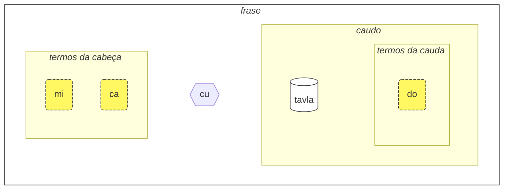
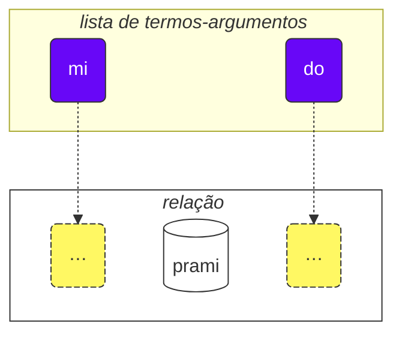

## Lição 1. A língua em um relance

### Alfabeto

A coisa básica que você precisa saber sobre Lojban é o alfabeto.

Lojban usa o alfabeto latino (as vogais estão coloridas):

<dl><dd><b>a b c d e f g i j k l m n o p r s t u v x y z ' .</b></dd></dl>

As palavras são pronunciadas como são escritas.

Existem 10 vogais em Lojban:

<table>
<tbody><tr>
<td><b class="audio-inline">a</b></td>
<td> como em <i>g<u>a</u>to</i></td>
</tr>
<tr>
<td><b class="audio-inline">e</b></td>
<td> como em <i>g<u>e</u>to</i></td>
</tr>
<tr>
<td><b class="audio-inline">i</b></td>
<td> como em <i>m<u>i</u>quina</i></td>
</tr>
<tr>
<td><b class="audio-inline">o</b></td>
<td> como em <i><u>o</u>lho</i>.</td>
</tr>
<tr>
<td><b class="audio-inline">u</b></td>
<td> como em <i>l<u>ú</u>cido</i></td>
</tr>
<tr>
<td><b class="audio-inline">y</b></td>
<td>No sotaque paulistano e sulista o <i>a</i> em <i>c<u>a</u>ma</i>, <i>m<u>a</u>ma</i>, <i>f<u>ã</u></i> e <i>hortel<u>ã</u></i> (não nazalizam o "a"), é próximo de <b>y</b> em Lojban. Em português europeu é <i>e</i> em <i>pergunta</i>.</td>
</tr>
<tr>
</tbody></table>

4 vogais são escritas usando combinações de letras:

<table>
<tbody><tr>
<td><b class="audio-inline">au</b></td>
<td> como em <i>m<u>au</u></i></td></tr>
<tr>
<td><b class="audio-inline">ai</b></td>
<td> como em <i>p<u>ai</u></i></td></tr>
<tr>
<td><b class="audio-inline">ei</b></td>
<td> como em <i>l<u>ei</u>te</i></td></tr>
<tr>
<td><b class="audio-inline">oi</b></td>
<td> como em <i>d<u>oi</u>s</i></td></tr>
</tbody></table>

Quanto às consoantes, elas são pronunciadas como em inglês ou latim, mas há várias diferenças:

<table>
<tbody><tr>
<td><b class="guibutton">c</b>
</td>
<td>é pronunciado como <i>ch</i> em <i>chave</i>.
</td></tr>
<tr>
<td><b class="guibutton">g</b>
</td>
<td>como <i>g</i> como em <i>fo<i>g</i>o</i>.
</td></tr>
<tr>
<td><b class="guibutton">j</b>
</td>
<td>como <i>g</i> em <i>gente</i>.
</td></tr>
<tr>
<td><b class="guibutton">x</b>
</td>
<td>como <i>ch</i> em escocês <i>loch</i> ou como em alemão <i>Bach</i>, como <i>J</i> em espanhol <i>Jose</i> ou <i>Kh</i> em árabe moderno <i>Khaled</i>. Tente pronunciar <i>ksss</i> mantendo a língua abaixada e você obterá esse som.
</td></tr>
<tr>
<td><b class="guibutton"> ' </b>
</td>
<td>como o <i>h</i> em inglês. Portanto, o apóstrofo é considerado uma letra própria do Lojban e pronunciado como um <i>h</i>. Ele só é encontrado entre vogais. Por exemplo, <b>u'i</b> é pronunciado como <i>oo-hee</i> (enquanto <b>ui</b> é pronunciado como <i>wee</i>).
</td></tr>
<tr>
<td><b>.</b>
</td>
<td>um ponto final (ponto, pausa entre palavras) também é considerado uma letra no Lojban. É uma pausa curta na fala para evitar que as palavras se fundam umas nas outras. Na verdade, qualquer palavra que comece com uma vogal tem um ponto final colocado na frente dela. Isso ajuda a evitar a fusão indesejada de duas palavras sequenciais em uma só.
</td></tr>
<tr>
<td><b>i</b>
</td>
<td><b>i</b> antes de vogais é considerado uma consoante e pronunciado mais curto, por exemplo:
<ul><li><b>ia</b> é pronunciado como <i>ia</i> em <i>saia</i></li>
<li><b>ie</b> é pronunciado como <i>ye</i> em <i>yeti</i></li></ul>
</td></tr>
<tr>
<td><b>u</b>
</td>
<td><b>u</b> antes de vogais é considerado uma consoante e pronunciado mais curto, por exemplo:
<ul><li><b>ua</b> é pronunciado como <i>uã</i> em <i>quão</i></li>
<li><b>ue</b> é pronunciado como <i>ue</i> em <i>frequente</i></li></ul>
</td></tr></tbody></table>

O estresse é colocado na segunda vogal a partir do final. Se uma palavra tiver apenas uma vogal, você simplesmente não a estressa.

A letra **r** pode ser pronunciada como o _r_ em inglês, escocês, russo, então há uma variedade de pronúncias aceitáveis para ela.

Vogais não-lojban como o _i_ curto e o _u_ em inglês britânico padrão em _hit_ e _but_, são usadas por algumas pessoas para separar consoantes. Portanto, se você tiver dificuldade em pronunciar duas consoantes seguidas (por exemplo, o **vl** em **tavla**, que significa _falar com_), então você pode dizer _tavɪla_ — onde o _ɪ_ é muito curto. No entanto, outras vogais como **a** e **u** devem ser longas.

### A frase mais simples

A unidade básica em Lojban é a "frase". Aqui estão três exemplos simples:

> **le prenu cu tavla mi**
> _A pessoa fala comigo._

le prenu
: a pessoa

tavla
: ... fala com ..., ... conversa com ...

mi
: eu, me

> **mi prami do**
> _Eu te amo._

prami
: ... ama ... (alguém)

do
: você

> **mi ca cu tavla do**
> _Eu agora falo com você._

ca
: agora

<pixra url="/assets/pixra/cilre/tavla.webp" caption="le prenu cu tavla mi" definition="A pessoa fala comigo."></pixra>

<pixra url="/assets/pixra/cilre/mi.webp" caption="mi" definition="Eu / me"></pixra>

<pixra url="/assets/pixra/cilre/mi_prami_do2.webp" caption="mi prami do" definition="Eu te amo."></pixra>

<pixra url="/assets/pixra/cilre/do.webp" caption="do" definition="você"></pixra>

Cada frase em Lojban consiste nas seguintes partes da esquerda para a direita:

- a cabeça:
  - consiste em chamadas "termos",
    - **le prenu** é o único termo da cabeça no exemplo **le prenu cu tavla mi** acima,
    - **mi**, **ca** são termos da cabeça no exemplo **mi ca cu tavla do** acima.
- o separador da cabeça **cu**:
  - pronunciado como _chu_ em _chuva_ já que **c** é para _ch_,
  - indica que a cabeça terminou,
  - pode ser omitido quando está claro que a cabeça está completa.
- a cauda:
  - a construção principal de relação (chamada "**selbrisni**" em Lojban)
  - \+ possivelmente um ou mais termos depois dela,
    - **tavla**, **prami** são selbrisni, construções principais de relação nos exemplos acima.
    - **mi** é o único termo da cauda no exemplo **le prenu cu tavla mi** acima.
    - **do** é o único termo da cauda no exemplo **mi prami do** acima.

Em Lojban, nós geralmente falamos de relações em vez de substantivos ou verbos.

Aqui estão as duas palavras de relação, que correspondem aproximadamente a verbos:

prenu
: ... é uma pessoa / são pessoas

tavla
: ... fala com ...

Cada relação tem um ou mais papéis que também podem ser chamados de "espaços" ou "lugares". Acima, eles são rotulados com "..." Esses espaços devem ser preenchidos com argumentos (chamados de "**sumti**" em Lojban). Os termos de argumento são construções como **le prenu**, **mi**, **do**, não importa se esses termos acabam sendo na cabeça ou na cauda de uma frase. Colocamos os termos de argumento em ordem, preenchendo assim esses espaços e dando um significado concreto à relação.

Também podemos transformar essa relação em um termo-argumento.

Para isso, colocamos uma palavra curta **le** na frente dela:

prenu
: ... é uma pessoa

le prenu
: a pessoa, as pessoas

Da mesma forma,

tavla
: ... fala com ...

e assim

le tavla
: o falante, os falantes

Pode parecer estranho como _pessoa_ pode ser um "verbo", mas na verdade, isso torna o Lojban muito simples:

<table>
<thead>
<tr>
<th>palavra de relação com espaços não preenchidos</th>
<th>forma de argumento (<b>sumti</b>)</th></tr>
</thead>
<tbody>
<tr>
<td><b>prenu</b> — <i>... (alguém) é uma pessoa</i> </td>
<td><b>le prenu</b> — <i>a pessoa / as pessoas</i>
     <b>le prenu</b> — <i>aquele que é uma pessoa / aqueles que são pessoas</i>
</td></tr>
<tr>
<td><b>tavla</b> — <i>... (alguém) fala com ... (alguém)</i> </td>
<td><b>le tavla</b> — <i>o falante / os falantes</i>
     <b>le tavla</b> — <i>aquele que é um falante / aqueles que são falantes</i>
</td></tr>
</tbody></table>

O primeiro espaço das relações desaparece ao usar **le**, portanto, traduções alternativas como _aquele que ..._ são possíveis.

<!-- Também podemos dizer que **le** cria um substantivo a partir de uma construção de relação com o significado aproximado de _aquele que é ..._ (_é uma pessoa_ — _a pessoa_), ou até mesmo _aqueles que fazem ..._ (_falar com_ — _os falantes_), _aqueles que são ..._ (_são pessoas_ — _as pessoas_). -->

Observe que o Lojban, por padrão, não especifica o número entre _o falante_ ou _os falantes_. Ou seja, **le tavla** é vago nesse aspecto, e em breve descobriremos maneiras de definir o número.

Além dos termos de argumento, existem termos modais como **ca**:

> **mi ca cu tavla do**
> _Eu agora falo com você._

ca
: agora

Os termos modais não preenchem espaços na estrutura principal da relação ("**selbrisni**"). Em vez disso, eles são aplicados a toda a frase, enriquecendo ou limitando seu significado.

Assim, os termos em Lojban são representados por:

- termos de argumento que preenchem espaços nas relações. Exemplos são:
  - substantivos como **le prenu** (_a pessoa_)
  - pronomes como **mi** (_eu_, _me_), **do** (_você_). Os pronomes funcionam exatamente como substantivos, mas **le** não é usado para eles. Eles funcionam como argumentos por si mesmos.
- termos modais que não preenchem espaços nas relações, mas especificam informações adicionais e esclarecedoras.
  - por exemplo, **ca** (_agora, no presente_).

Alguns exemplos adicionais:

<pixra url="/assets/pixra/cilre/nintadni.webp" caption="mi nintadni" definition="Eu sou um estudante novo, um calouro."></pixra>

> **mi nintadni**
> _Eu sou um estudante novo._

nintadni
: … (alguém) é um estudante novo, um novato

Ao contrário do inglês, não precisamos adicionar o verbo "ser/estar" à frase em Lojban. Isso já está implícito. A palavra de relação **nintadni** (_… é um estudante novo_) já possui o "ser/estar" em sua tradução para o inglês.

> **do jimpe**
> _Você entende._

jimpe
: … (alguém) entende … (algo)

<pixra url="/assets/pixra/cilre/pilno_le_fonxa.webp" caption="le prenu cu pilno le fonxa" definition="A pessoa usa o telefone."></pixra>

> **mi pilno le fonxa**
> _Eu uso o telefone._

pilno
: … (alguém) usa … (algo)

fonxa
: … é um telefone, … são telefones

le fonxa
: o telefone, os telefones

<pixra url="/assets/pixra/cilre/citka.webp" caption="mi citka" definition="Eu como."></pixra>

> **mi citka**
> _Eu como._

citka
: … (alguém) come … (algo)

> **do citka**
> _Você come._

<!-- -->

> **mi citka le plise**
> _Eu como as maçãs._

<pixra url="/assets/pixra/cilre/le_plise_cu_kukte.webp" caption="le plise cu kukte" definition="As maçãs são saborosas."></pixra>

> **le plise cu kukte**
> _As maçãs são saborosas._

le plise
: as maçãs

kukte
: … (algo) é saboroso

Uma frase mais simples em Lojban conteria apenas uma palavra principal de relação:

<pixra url="/assets/pixra/cilre/karce.webp" caption="karce" definition="É um carro."></pixra>

> **karce**
> _Carro!_
> _É um carro._

Você poderia dizer isso quando vê um carro se aproximando. Aqui, o contexto seria claro o suficiente de que há um carro em algum lugar e provavelmente é perigoso.

**karce** em si é uma palavra de relação que significa _é um carro_.

Podemos, é claro, ser mais precisos e dizer, por exemplo:

> **bolci**
> _Bola!_
> _É uma bola._

onde **bolci** é uma palavra de relação que significa _é uma bola_.

> **ti bolci**
> _Esta é uma bola perto de mim._
<!-- -->
> **ta bolci**
> _Esta é uma bola perto de você._

ti
: pronome: essa coisa perto de mim

ta
: pronome: isto/aquilo perto de você

tu
: pronome: aquele longe de você e de mim

<pixra url="/assets/pixra/cilre/ti.webp" caption="ti" definition="este (perto de mim, o falante)"></pixra>
<pixra url="/assets/pixra/cilre/ta.webp" caption="ta" definition="esse (perto de você, o ouvinte)"></pixra>
<pixra url="/assets/pixra/cilre/tu.webp" caption="tu" definition="aquele ali (longe de você e de mim)"></pixra>

Da mesma forma, você pode dizer

<pixra url="/assets/pixra/cilre/carvi.webp" caption="carvi" definition="… está chovendo"></pixra>

> **carvi**
> _Está chovendo._

onde

carvi
: … é uma chuva, … está chovendo

ou

> **pluka**
> _É agradável._

onde

pluka
: … é agradável

Observe que em Lojban não há necessidade da palavra _it_ nesse sentido. Você simplesmente usa a palavra de relação que precisa.

> **prami**
> _Alguém ama._

<pixra url="/assets/pixra/cilre/bajra.webp" caption="le prenu cu bajra" definition="A pessoa corre."></pixra>

> **bajra**
> _Alguém corre._

bajra
: … corre usando membros

Novamente, o contexto provavelmente diria quem ama quem e quem corre.

### Tarefa

<pixra url="/assets/pixra/cilre/pinxe_le_djacu.webp" caption="le prenu cu pinxe le djacu" definition="A pessoa bebe a água."></pixra>

pinxe
: … bebe … (algo)

le djacu
: a água

Feche a parte direita da tabela. Traduza as frases à esquerda do Lojban.

<table style="table-layout: fixed;">
<tbody><tr>
<td><b>do citka</b>
</td>
<td><i>Você come.</i>
</td></tr>
<tr>
<td><b>mi pinxe le djacu</b>
</td>
<td><i>Eu bebo água.</i>
</td></tr>
<tr>
<td><b>mi citka le plise</b>
</td>
<td><i>Eu como maçãs.</i>
</td></tr></tbody></table>

### «**.i**» separa as frases

Colocamos a palavra curta **.i** para separar duas frases consecutivas:

> **mi tavla le prenu .i le prenu cu tavla mi**
> _Estou conversando com as pessoas. As pessoas estão conversando comigo._

**.i** separa as frases, assim como o ponto final no final das frases em textos em inglês.

Ao falar uma frase após a outra em inglês, fazemos uma pausa (que pode ser curta) entre elas. Mas a pausa tem muitos significados diferentes em inglês. No Lojban, temos uma maneira melhor de entender onde uma frase termina e outra começa.

Também observe que, às vezes, ao pronunciar palavras rapidamente, você não consegue identificar onde uma frase termina e a palavra da próxima frase começa. Portanto, é aconselhável usar a palavra **.i** antes de começar uma nova frase.

### Números: ‘_1 2 3 4 5 6 7 8 9 0_’ = «**pa re ci vo mu xa ze bi so no**»

**le** simplesmente transforma uma construção de relação em um argumento, mas esse argumento não tem número associado a ele. A frase

> **le prenu cu tavla mi**
> _As pessoas falam comigo._

não especifica o número de pessoas falando comigo. Em inglês, é impossível omitir o número porque _people_ em inglês implica _mais de uma pessoa_. No entanto, em Lojban, você pode omitir o número.

Agora vamos especificar quantas das pessoas são relevantes para nossa discussão.

Vamos adicionar um número após **le**.

<table>
<tbody><tr>
<td><b>pa</b>
</td>
<td><b>re</b>
</td>
<td><b>ci</b>
</td>
<td><b>vo</b>
</td>
<td><b>mu</b>
</td>
<td><b>xa</b>
</td>
<td><b>ze</b>
</td>
<td><b>bi</b>
</td>
<td><b>so</b>
</td>
<td><b>no</b>
</td></tr>
<tr>
<td> 1
</td>
<td> 2
</td>
<td> 3
</td>
<td> 4
</td>
<td> 5
</td>
<td> 6
</td>
<td> 7
</td>
<td> 8
</td>
<td> 9
</td>
<td> 0
</td>
</tr></tbody></table>

<pixra url="/assets/pixra/cilre/ci_prenu.webp" caption="le ci prenu" definition="As três pessoas"></pixra>

> **le pa prenu cu tavla mi**
> _A pessoa fala comigo._

Adicionamos um número após **le** e assim especificamos pessoas individuais.

Para números compostos por vários dígitos, apenas juntamos esses dígitos:

> **le re mu prenu cu tavla mi**
> _As 25 pessoas falam comigo._

Sim, é tão simples assim.

Se quisermos contar, podemos separar os números com **.i**:

> **mu .i vo .i ci .i re .i pa .i no**
> _5 … 4 … 3 … 2 … 1 … 0_

O número **za'u** significa _mais que …_ (_\>_ em matemática), o número **me'i** significa _menos que_ (_<_ em matemática):

> **le za'u re prenu cu tavla mi**
> _Mais de duas pessoas falam comigo._

<!-- -->

> **le me'i pa no prenu cu tavla mi**
> _Menos de 10 pessoas falam comigo._

<!-- -->

> **le za'u ci prenu cu tavla mi**
> _Mais de três pessoas falam comigo._

Para dizer apenas _pessoas_ (número plural) em oposição a _uma pessoa_, usamos **za'u pa**, _mais de uma_ ou simplesmente **za'u**.

> **le za'u pa prenu cu tavla mi**
> **le za'u prenu cu tavla mi**
> _As pessoas falam comigo._

**za'u** por padrão significa **za'u pa**, portanto, essa contração é possível.

le prenu
: a pessoa / as pessoas

le pa prenu
: a pessoa (singular)

le za'u prenu
: as pessoas (duas ou mais)

### Tarefa

stati
: … (alguém) é inteligente, … tem um talento

<pixra url="/assets/pixra/cilre/stati.webp" caption="stati" definition="… tem um talento"></pixra>

klama
: … vem para … (algum lugar ou objeto)

<pixra url="/assets/pixra/cilre/klama_ti.webp" caption="le prenu cu klama ti" definition="A pessoa veio aqui."></pixra>

nelci
: … gosta de (algo)

le zarci
: o mercado

<pixra url="/assets/pixra/cilre/zarci.webp" caption="le prenu cu zvati le zarci" definition="A pessoa está na loja."></pixra>

le najnimre
: a laranja (fruta), as laranjas

<pixra url="/assets/pixra/cilre/najnimre.webp" caption="najnimre" definition="… é uma laranja"></pixra>

le badna
: a banana, as bananas

<pixra url="/assets/pixra/cilre/badna.webp" caption="badna" definition="… é uma banana"></pixra>

Feche a parte direita da tabela. Traduza as frases à esquerda do Lojban.

<table style="table-layout: fixed;">
 <tbody>
  <tr>
   <td>le mu prenu cu klama le zarci</td>
   <td>As cinco pessoas vão ao mercado.</td>
  </tr>
  <tr>
   <td>le pa re prenu cu stati .i do stati</td>
   <td>As 12 pessoas são inteligentes. Você é inteligente.</td>
  </tr>
  <tr>
   <td>le prenu cu nelci le plise</td>
   <td>As pessoas gostam das maçãs.</td>
  </tr>
  <tr>
   <td>le za'u re prenu cu citka .i le me'i mu prenu cu pinxe le djacu</td>
   <td>Mais de duas pessoas comem. Menos de 5 pessoas bebem a água.</td>
  </tr>
  <tr>
   <td>le za'u re prenu cu stati</td>
   <td>Mais de duas pessoas são inteligentes.</td>
  </tr>
 </tbody>
</table>

<table style="table-layout: fixed;">
 <tbody>
  <tr>
   <td>As 256 pessoas são inteligentes.</td>
   <td>le re mu prenu cu esperta</td>
  </tr>
  <tr>
   <td>Menos de 12 maçãs são saborosas.</td>
   <td>le me'i pa re macã cu gostosa</td>
  </tr>
 </tbody>
</table>

### Relação composta

A construção de relação composta (**tanru** em Lojban) consiste em várias palavras de relação colocadas uma após a outra.

> **tu melbi zdani**
> _Aquele ali é uma casa bonita._

<pixra url="/assets/pixra/cilre/melbi_zdani.webp" caption="melbi zdani" definition="... é uma casa bonita"></pixra>

tu
: aquele ali (longe de você e de mim)

melbi
: ... é bonito, agradável

zdani
: ... é uma casa ou ninho para ... (alguém)

melbi zdani
: construção de relação composta: ... é uma casa bonita para ... (alguém)

<pixra url="/assets/pixra/cilre/dansu.webp" caption="le prenu cu melbi dansu" definition="A pessoa dança lindamente."></pixra>

> **do melbi dansu**
> _Você dança lindamente._

dansu
: ... dança

Aqui, a relação **melbi** adiciona um significado adicional, pois é colocada à esquerda de outra relação: **zdani**. O componente esquerdo geralmente é traduzido usando adjetivos e advérbios.

Relações compostas são um recurso poderoso que produz significados mais ricos. Basta juntar duas palavras de relação e o componente esquerdo dessa relação composta adiciona um toque ao componente direito.

Podemos colocar **le** (por exemplo, com um número) à esquerda de tal relação composta para obter um termo de argumento mais rico:

le pa melbi zdani
: a casa bonita

Agora você sabe por que havia **cu** após os termos principais em nosso exemplo:

> **le pa prenu cu tavla mi**
> _A pessoa fala comigo._

Sem **cu**, se tornaria **le pa prenu tavla**, o que teria o significado de _a pessoa-falante_ - seja lá o que isso possa significar.

Considere:

> **le pa tavla pendo**
> _O amigo falante_
<!-- -->
> **le pa tavla cu pendo**
> _Aquele que fala é um amigo._

Lembre-se de colocar **cu** antes da construção de relação principal em uma frase para evitar a criação acidental de relações compostas.

As relações compostas podem conter mais de dois componentes. Nesse caso, a primeira relação modifica a segunda, a segunda modifica a terceira e assim por diante:

<pixra url="/assets/pixra/cilre/cmalu_karce.webp" caption="ti cmalu karce" definition="Este é um carro pequeno."></pixra>

> **le pa melbi cmalu karce**
> _o carro bonito-pequeno, o carro pequeno de uma maneira bonita_

<!-- -->

> **le mutce melbi zdani**
> _a casa muito bonita_

mutce
: ... é muito, ... é muito

### Tarefa

sutra
: ... é rápido

barda
: ... é grande

cmalu
: ... é pequeno

mlatu
: ... é um gato

Feche a parte direita da tabela. Traduza as frases à esquerda do Lojban.

<table style="table-layout: fixed;">
<tbody><tr>
<td><b>le melbi karce</b>
</td>
<td><i>o carro bonito / os carros bonitos</i>
</td></tr>
<tr>
<td><b>do sutra klama</b>
</td>
<td><i>Você vem rapidamente. Você vem rápido.</i>
</td></tr>
<tr>
<td><b>tu barda zdani</b>
</td>
<td><i>Aquilo é uma casa grande.</i>
</td></tr>
<tr>
<td><b>le pa sutra bajra mlatu</b>
</td>
<td><i>o gato correndo rapidamente</i>
</td></tr>
<tr>
<td><b>le pa sutra mlatu</b>
</td>
<td><i>o gato rápido</i>
</td></tr>
<tr>
<td><b>le pa bajra mlatu</b>
</td>
<td><i>o gato correndo</i>
</td></tr></tbody></table>

Feche a parte direita da tabela. Traduza as frases à esquerda para Lojban.

<table style="table-layout: fixed;">

<tbody><tr>
<td><i>Este é um carro pequeno.</i>
</td>
<td><b>ti cmalu karce</b>
</td></tr>
<tr>
<td><i>maçãs saborosas</i>
</td>
<td><b>le kukte plise</b>
</td></tr>
<tr>
<td><i>os comedores rápidos</i>
</td>
<td><b>le sutra citka</b>
</td></tr>
<tr>
<td><i>Você é uma pessoa que anda rapidamente.</i>
</td>
<td><b>do sutra cadzu prenu</b>
</td></tr></tbody></table>

### Perguntas de 'Sim/Não'

Em inglês, formamos uma pergunta de 'sim/não' alterando a ordem das palavras, por exemplo:

> _You are ... ⇒ Are you ...?_

ou usando alguma forma do verbo _to do_ no início, por exemplo:

> _You know ... ⇒ Do you know?_

Em Lojban, a ordem das palavras pode ser mantida. Para transformar qualquer afirmação em uma pergunta de 'sim/não', simplesmente inserimos a palavra **xu** em algum lugar da frase, por exemplo, no início:

> **xu do nelci le gerku**
> _Você gosta dos cachorros?_

le gerku
: o cachorro, os cachorros

<pixra url="/assets/pixra/cilre/le_prenu_e_le_gerku.webp" caption="ti prenu .i ti gerku" definition="Esta é uma pessoa. Este é um cachorro."></pixra>

Lembre-se de que, em Lojban, a pontuação como "?" (ponto de interrogação) é principalmente opcional e usada principalmente por motivos estilísticos. Isso ocorre porque a palavra interrogativa **xu** já indica que é uma pergunta.

Outros exemplos:

> **xu mi klama**
> _Eu estou indo?_

klama
: ... vai para ... (em algum lugar)

> **xu pelxu**
> _Isso é amarelo?_

pelxu
: ... é amarelo

Podemos alterar o significado colocando **xu** após diferentes partes da relação. Explicações sobre o que mudou no significado são fornecidas entre colchetes:

> **xu do nelci le gerku**
> _Você gosta dos cachorros?_

<!-- -->

> **do xu nelci le gerku**
> _VOCÊ gosta dos cachorros?_ (Eu pensei que era outra pessoa que gostava deles).

<!-- -->

> **do nelci xu le gerku**
> _Você GOSTA dos cachorros? (Eu pensei que você fosse apenas neutro em relação a eles)._

<!-- -->

> **do nelci le xu gerku**
> _Você gosta dos CACHORROS? (Eu pensei que você gostasse dos gatos)._

<!-- -->

> **do nelci le gerku xu**
> _Você gosta daquelas coisas, são cachorros? (Você apenas questiona a validade da relação **gerku**)._

O que é expresso por entonação em inglês é expresso movendo **xu** após a parte que queremos enfatizar em Lojban. Observe que a primeira frase com **xu** no início faz a pergunta mais genérica sem enfatizar nenhum aspecto específico.

**xu** é uma palavra interjeição. Aqui estão as características das interjeições em Lojban:

- A interjeição modifica a construção antes dela:

 > **do xu nelci le gerku**
 > _VOCÊ gosta dos cachorros?_

- Quando colocada no início de uma relação, a interjeição modifica toda a relação:

 > **xu do nelci le gerku**
 > _Você gosta dos cachorros?_

- As interjeições podem ser colocadas após diferentes partes da mesma relação para alterar o significado.

 > **do nelci le gerku xu**
 > _Você gosta daqueles objetos, são cachorros?_

 Aqui, apenas a relação **gerku** (não o argumento **le gerku**) é modificada pela palavra interrogativa **xu**. Portanto, aqui nos perguntamos apenas sobre essa relação. Afirmamos que você gosta desses objetos ou seres vivos e perguntamos se eles são cachorros.

As interjeições não quebram relações compostas, elas podem ser usadas dentro delas:

> **do nelci le barda xu gerku**
> _Você gosta dos cachorros GRANDES?_

Agora, como responder a essas perguntas de 'sim/não'? Você repete a construção da relação principal:

> **— xu le mlatu cu melbi**
> **— melbi**
> _— Os gatos são bonitos?_
> _— Bonitos._

Para responder 'não', usamos o termo modal **na ku**:

> **— xu le mlatu cu melbi**
> **— na ku melbi**
> _— Os gatos são bonitos?_
> _— Não bonitos._

na ku
: termo: é falso que ...

Ou, podemos usar uma palavra especial de relação **go'i**:

> **— xu le mlatu cu melbi**
> **— go'i**
> _— Os gatos são bonitos?_
> _— Bonitos._

go'i
: palavra de relação que repete a relação principal da frase anterior

Aqui, **go'i** significa o mesmo que **melbi** já que **melbi** é a relação da relação anterior.

> **— xu le mlatu cu melbi**
> **— na ku go'i**
> _— Os gatos são bonitos?_
> _— Não bonitos._

<!-- Este curso não recomenda negar **go'i** para respostas negativas. Apenas use **je'u nai**. -->

O termo modal **na ku** pode ser usado não apenas em respostas:

> **na ku mi nelci le gerku**
> _É falso que eu gosto dos cachorros._
> _Eu não gosto dos cachorros._
<!-- -->
> **mi na ku nelci do**
> _Eu não gosto de você._

Seu oposto, o termo **ja'a ku** afirma o significado:

> **mi ja'a ku nelci do**
> _Eu gosto de você._

ja'a ku
: termo: é verdade que ...

### Tarefa

Complete a parte direita da tabela. Traduza as frases da esquerda para o Lojban.

<table style="table-layout: fixed;">

<tbody><tr>
<td><b>xu le barda zdani cu melbi</b>
</td>
<td><i>A casa grande é bonita?</i>
</td></tr>
<tr>
<td><b>— le prenu cu stati xu — na ku stati</b>
</td>
<td><i>— As pessoas são inteligentes? — Não.</i>
</td></tr>
<tr>
<td><b>do klama le zarci xu</b>
</td>
<td><i>Você vai ao mercado?</i>
</td></tr>
<tr>
<td><b>xu le verba cu prami le mlatu</b>
</td>
<td><i>A criança ama os gatos?</i>
</td></tr></tbody></table>

Complete a parte direita da tabela. Traduza as frases da esquerda para o Lojban.

<table style="table-layout: fixed;">

<tbody><tr>
<td><i>O carro é rápido?</i>
</td>
<td><b>xu le karce cu sutra</b>
</td></tr>
<tr>
<td><i>— A laranja é saborosa? — Sim, é.</i>
</td>
<td><b>— xu le najnimre cu kukte — kukte</b>
</td></tr>
<tr>
<td><i>O cachorro te ama?</i>
</td>
<td><b>xu le gerku cu prami do</b>
</td></tr></tbody></table>

### Felicidade e pedidos educados: ‘_Yay!_’ = «**ui**», ‘_Please!_’ = «**.e'o**»

A interjeição **ui** expressa a felicidade de quem está falando. É usada da mesma forma que o rosto sorridente ‘_:)_’ em mensagens, para indicar que você está contente com algo. Embora os emojis possam ser ambíguos, **ui** tem apenas um significado, o que é útil.

> **ui do klama**
> _Yay, você está vindo!_

ui
: interjeição: _Yay!_, interjeição de felicidade

A interjeição **.e'o** no início de uma frase a transforma em um pedido educado:

> **.e'o do lebna le fonxa**
> _Você poderia pegar o telefone, por favor?_
> `Por favor, pegue o telefone.`

.e'o
: interjeição: por favor (pronunciado como _eh-haw_ com uma pausa curta antes da palavra)

lebna
: pegar (algo)

Em inglês, para ser educado, é necessário usar _could you_ + _please_ + uma pergunta. Em Lojban, **.e'o** é suficiente para fazer um pedido educado.

### Tarefa

Complete a parte direita da tabela. Traduza as frases da esquerda para o Lojban.

le tcati
: o chá

<pixra url="/assets/pixra/cilre/tcati.webp" caption="tcati" definition="... é um chá"></pixra>

le ckafi
: café

<pixra url="/assets/pixra/cilre/ckafi.webp" caption="ckafi" definition="... é um café"></pixra>

zgana
: observar, assistir (usando qualquer sentido)

le skina
: o filme

<pixra url="/assets/pixra/cilre/zgana_le_skina.webp" caption="le prenu cu zgana le skina" definition="A pessoa está assistindo o filme."></pixra>

kurji
: cuidar de (alguém, algo)

<table style="table-layout: fixed;">

<tbody>
<tr>
<td><b>ui carvi</b>
</td>
<td><i>Yay, está chovendo! Yay, está chovendo!</i>
</td></tr>
<tr>
<td><b>.e'o do sutra bajra</b>
</td>
<td><i>Corra rápido!</i>
</td></tr>
<tr>
<td><b>.e'o do pinxe le tcati</b>
</td>
<td><i>Por favor, beba chá!</i>
</td></tr>
<tr>
<td><b>.e'o zgana le skina</b>
</td>
<td><i>Por favor, assista o filme!</i>
</td></tr></tbody></table>

Complete a parte direita da tabela. Traduza as frases da esquerda para o Lojban.

<table style="table-layout: fixed;">

<tbody><tr>
<td><i>Por favor, seja inteligente!</i>
</td>
<td><b>.e'o stati</b>
</td></tr>
<tr>
<td><i>Por favor, vá para casa!</i>
</td>
<td><b>.e'o do klama le zdani</b>
</td></tr>
<tr>
<td><i>Por favor, beba o café!</i>
</td>
<td><b>.e'o do pinxe le ckafi</b>
</td></tr>
<tr>
<tr>
<td><i>Yay, estou falando com você!</i>
</td>
<td><b>ui mi tavla do</b>
</td></tr>
<tr>
<td><i>Por favor, cuide da criança.</i>
</td>
<td><b>.e'o do kurji le verba</b>
</td></tr></tbody></table>

### 'E' e 'OU'

> **do nintadni .i je mi nintadni**
> _Você é um novato. E eu sou um novato._

<!-- -->

> **do .e mi nintadni**
> _Você e eu somos novatos._

<pixra url="/assets/pixra/cilre/do_e_mi_nintadni.webp" caption="do .e mi nintadni" definition="Você e eu somos novos estudantes."></pixra>

<!-- -->

> **mi tadni .i je mi tavla do**
> _Eu estudo. E eu falo com você._

<!-- -->

> **mi tadni gi'e tavla do**
> _Eu estudo e falo com você._

.i je
: conjunção "e" que combina frases em uma.

.e
: conjunção "e" que conecta argumentos.

gi'e
: conjunção "e" que conecta caudas de frases.

Podemos combinar duas frases em uma única afirmação usando a conjunção **.i je**, que significa _e_:

> **do nintadni .i je mi nintadni**
> _Você é um novato. E eu sou um novato._

Como ambas as frases têm a mesma cauda, podemos usar uma contração: a conjunção **.e** significa _e_ para argumentos:

> **do .e mi nintadni**
> _Você e eu somos novatos._

**do nintadni .i je mi nintadni** significa exatamente a mesma coisa que **do .e mi nintadni**.

Também podemos usar **.e** para conectar argumentos em outras posições.

Ambas as frases significam a mesma coisa.

> **mi pinxe le djacu .e le jisra**
> _Eu bebo a água e o suco._
> **mi pinxe le djacu .i je mi pinxe le jisra**
> _Eu bebo a água, e eu bebo o suco._

le jisra
: suco

<pixra url="/assets/pixra/cilre/pinxe_le_jisra.webp" caption="le prenu cu pinxe le jisra" definition="A pessoa bebe o suco."></pixra>

Se a cabeça da frase é a mesma, mas as caudas são diferentes, usamos a conjunção **gi'e**, que significa _e_ para as caudas das frases:

> **mi tadni .i je mi tavla do**
> **mi tadni gi'e tavla do**
> _Eu estudo e falo com você._

Ambas as variações significam a mesma coisa; **gi'e** simplesmente leva a uma realização mais concisa.

Também temos ferramentas para adicionar _e_ para componentes de relações compostas:

> **le melbi je cmalu zdani cu jibni ti**
> _A casa bonita e pequena está perto._

<pixra url="/assets/pixra/cilre/melbi_je_cmalu_zdani.webp" caption="melbi je cmalu zdani" definition="... é uma casa bonita e pequena"></pixra>

jibni
: ... está perto de ...

ti
: esta coisa, este lugar perto de mim

**je** é uma conjunção em Lojban que significa _e_ em relações compostas.

Sem o **je**, a frase muda de significado:

> **le melbi cmalu zdani cu jibni**
> _A casa bonita e pequena está perto._

Aqui, **melbi** modifica **cmalu**, e **melbi cmalu** modifica **zdani**, de acordo com o funcionamento das relações compostas.

Em **le melbi je cmalu zdani** (_a casa bonita e pequena_), tanto **melbi** quanto **cmalu** modificam **zdani** diretamente.

Outras conjunções comuns incluem:

> **le verba cu fengu ja bilma**
> _A criança está zangada ou doente (ou talvez zangada e doente)_

<!-- -->

> **do .a mi ba vitke le dzena**
> _Você ou eu (ou ambos) visitaremos o ancestral._

ja
: e/ou

**.a** = _e/ou_ ao conectar argumentos.

fengu
: ... está zangado

<pixra url="/assets/pixra/cilre/fengu.webp" caption="fengu" definition="... está zangado"></pixra>

bilma
: ... está doente

<pixra url="/assets/pixra/cilre/bilma.webp" caption="le prenu cu bilma" definition="A pessoa está doente"></pixra>

vitke
: visitar

dzena
: ... é um ancestral de ...

<pixra url="/assets/pixra/cilre/dzena.webp" caption="dzena" definition="... é um ancestral de ..."></pixra>

> **le karce cu blabi jo nai grusi**
> _O carro é branco ou cinza._

<!-- -->

> **do .o nai mi vitke le laldo**
> _Você ou eu visitamos o mais velho._

jo nai
: ou ... ou ... mas não ambos

.o nai
: ou ... ou ... mas não ambos (ao conectar argumentos)

laldo
: ... é velho

<pixra url="/assets/pixra/cilre/laldo.webp" caption="laldo" definition="… is old"></pixra>

Observação: é melhor lembrar de **jo nai** como uma construção única, e o mesmo para **.o nai**.

> **mi prami do .i ju do stati**
> _Eu te amo. Esteja você inteligente ou não._

<!-- -->

> **le verba cu nelci le plise .u le badna**
> _A criança gosta das maçãs, esteja ela gostando ou não das bananas._

ju
: esteja ou não ...

.u
: esteja ou não ... (ao conectar argumentos)

### «**joi**» é ‘_e_’ para ações em massa

> **do joi mi casnu le bangu**
> _Você e eu estamos discutindo a língua._

casnu
: ... discute ...

le bangu
: a língua

joi
: conjunção _e_ para massas

Se eu disser **do .e mi casnu le bangu**, pode significar que você discute a língua e eu discuto a língua. Mas não necessariamente significa que estamos na mesma conversa!

Isso pode ser mais visível se expandirmos usando **.i je**:

> **do .e mi casnu le bangu**
> **do casnu le bangu .i je mi casnu le bangu**
> _Você discute a linguagem. E eu discuto a linguagem._

Para enfatizar que você e eu participamos da mesma ação, usamos uma conjunção especial **joi** que significa _e_ e forma uma "massa":

> **do joi mi casnu le bangu**
> _Você e eu estamos discutindo a linguagem._
> _Você e eu, sendo uma única entidade para este evento, estamos discutindo a linguagem._

O pronome **mi'o** (_você e eu juntos_) pode ser expresso como **mi joi do**, que significa exatamente a mesma coisa (é apenas mais longo). Em Lojban, você pode usar não apenas uma única palavra para _nós_, mas construções mais precisas como **mi joi le pendo** (literalmente _eu e os amigos_).

<pixra url="/assets/pixra/cilre/casnu.webp" caption="do joi le pendo joi mi casnu" definition="Você, o amigo e eu estamos em uma discussão."></pixra>

### Tarefa

Complete a parte direita da tabela. Traduza as frases da esquerda do Lojban.

<table style="table-layout: fixed;">

<tbody><tr>
<td><b>mi nelci le badna .e le plise</b>
</td>
<td><i>Gosto das bananas e das maçãs. Gosto das bananas e das maçãs.</i>
</td></tr>
<tr>
<td><b>do sutra ja stati</b>
</td>
<td><i>Você é rápido ou inteligente ou ambos.</i>
</td></tr>
<tr>
<td><b>le za'u prenu cu casnu le karce .u le gerku</b>
</td>
<td><i>As pessoas discutem os carros, quer discutam ou não os cachorros.</i>
</td></tr>
<tr>
<td><b>mi citka le najnimre .o nai le badna</b>
</td>
<td><i>Eu como ou as laranjas ou as bananas.</i>
</td></tr></tbody></table>

Complete a parte direita da tabela. Traduza as frases da esquerda para Lojban.

<table style="table-layout: fixed;">

<tbody><tr>
<td><i>Os amigos e eu gostamos da chuva.</i>
</td>
<td><b>le pendo .e mi cu nelci le carvi</b>
</td></tr>
<tr>
<td><i>Eu ou você vai ao mercado.</i>
</td>
<td><b>mi .o nai do klama le zarci</b>
</td></tr>
<tr>
<td><i>Eu olho para o carro grande e bonito.</i>
</td>
<td><b>mi catlu le barda je melbi karce</b>
</td></tr>
<tr>
<td><i>A criança bebe a água e/ou o suco.</i>
</td>
<td><b>le verba cu pinxe le djacu .a le jisra</b>
</td></tr>
<tr>
<td><i>A criança e o pequeno discutem o carro.</i>
</td>
<td><b>le verba joi le pa cmalu cu casnu le karce</b> (observe o uso de <b>joi</b>. <i>o pequeno</i> é apenas <b>le pa cmalu</b>).
</td></tr></tbody></table>

### Mas...

> **le najnimre cu barda .i je ku'i le badna cu cmalu**
> _As laranjas são grandes. Mas as bananas são pequenas._

ku'i
: interjeição: mas, no entanto

Na verdade, em inglês, _but_ é o mesmo que _and_, e adiciona um sabor de contraste.

Em Lojban, usamos apenas a conjunção **.i je** (ou **.e**, **gi'e**, **je**, dependendo do que estamos conectando) e adicionamos o sabor de contraste com a interjeição **ku'i**. Isso nos dará o contraste necessário. Como de costume, a interjeição modifica a construção anterior a ela.

### Eventos: '_dançar e estar juntos_' — «**le nu dansu .e le nu kansa**»

Alguns espaços de relações esperam um evento:

> **le cabna cu nicte**
> _Agora é noite. No momento, é noite._

cabna
: ... (evento) está presente com ...; ... (evento) acontece agora

le cabna
: o tempo presente, o evento presente

nicte
: ... (evento) acontece à noite

Mas e se quisermos descrever um evento usando uma frase inteira?

Qualquer frase pode ser transformada em uma construção de relação colocando **nu** na frente dela:

> **le nicte cu nu mi viska le lunra**
> _A noite é quando eu vejo a Lua._
> `A noite é um evento quando eu vejo a Lua.`

<pixra url="/assets/pixra/cilre/nicte_fi_mi.webp" caption="le nicte" definition="a noite"></pixra>

le nicte
: a noite, as noites

viska
: ver (algo)

le lunra
: a Lua

Aqui, **le nicte** é o primeiro argumento da frase e **nu mi viska le lunra** é a construção de relação principal da frase. No entanto, dentro dessa relação principal, podemos ver outra relação: **mi viska le lunra** incorporada!

A palavra **nu** transforma uma frase completa em uma relação que denota um evento (em seu sentido genérico, pode ser um processo, um estado, etc.)

Aqui estão mais alguns exemplos:

nu mi tavla
: ... é um evento de eu falar

nu do tavla
: ... é um evento de você falar

Ao adicionar **le** na frente de **nu**, criamos um argumento que denota um evento:

pinxe ⇒ le nu pinxe
: beber ⇒ a bebida

dansu ⇒ le nu dansu
: dançar ⇒ a dança

kansa ⇒ le nu kansa
: ... está junto com ... ⇒ estar juntos

klama ⇒ o ato de vir
: vir a ... ⇒ o ato de vir

o ato de você vir
: o ato de você vir, você vir

**o ato de** geralmente corresponde ao sufixo _-ção_, _-são_, _-mento_ em português.

Alguns exemplos adicionais com espaços que esperam eventos em vez de entidades comuns:

> **eu quero que você venha aqui**
> _mi djica le nu do klama ti_

djica
: querer (algum evento)

> **eu estou feliz porque você está vindo**
> _mi gleki le nu do klama_

gleki
: ... está feliz com ... (algum evento)

<pixra url="/assets/pixra/cilre/gleki.webp" caption="gleki" definition="... está feliz com o evento ..."></pixra>

> **beber o suco é um problema para mim**
> _le nu pinxe le jisra cu nabmi mi_

nabmi
: ... (evento) é um problema para ... (alguém), ... (evento) é problemático para ... (alguém)

### Tarefa

Complete a parte direita da tabela. Traduza as frases da esquerda do Lojban.

pilno
: usar (algo)

o komputador
: o computador

<table style="table-layout: fixed;">

<tbody><tr>
<td><b>eu gosto de você dançando</b>
</td>
<td><i>mi nelci le nu do dansu</i>
</td></tr>
<tr>
<td><b>você está feliz usando computadores?</b>
</td>
<td><i>xu do gleki le nu do pilno le skami</i>
</td></tr>
<tr>
<td><b>você quer que eu coma a maçã?</b>
</td>
<td><i>do djica le nu mi citka le plise xu</i>
</td></tr></tbody></table>

Complete a parte direita da tabela. Traduza as frases da esquerda para Lojban.

<table style="table-layout: fixed;">

<tbody><tr>
<td><i>Vir aqui é um problema.</i>
</td>
<td><b>le nu klama ti cu nabmi</b>
</td></tr>
<tr>
<td><i>Eu quero que você seja feliz.</i>
</td>
<td><b>mi djica le nu do gleki</b>
</td></tr></tbody></table>

### Termos modais. Tempos simples: ‘_era_’, ‘_é_’, ‘_será_’ — «**pu**», «**ca**», «**ba**»

Em Lojban, expressamos o tempo em que algo acontece (gramaticalmente, em inglês, geralmente chamado de _tempo verbal_) com termos modais. Já vimos o termo modal **ca** que significa _no presente_.

Aqui está uma série de termos relacionados ao tempo que indicam quando algo acontece:

> **le prenu pu cu tavla mi**
> *As pessoas falaram comigo*

<!-- -->

> **le prenu ca cu tavla mi**
> *As pessoas estão falando comigo (no presente).*

<!-- -->

> **le prenu ba cu tavla mi**
> _As pessoas vão falar comigo._

Quando colocamos um argumento simples após a partícula relacionada ao tempo, formamos um termo com um significado um pouco diferente:

> **mi pinxe le djacu ca le nu do klama**
> _Eu bebo a água enquanto você está vindo._

A parte **ca le nu do klama** é um termo longo que significa _enquanto você vem / enquanto você está vindo_. O **le nu do klama** é um argumento que significa *vinda de você, você vindo*.

> **mi citka ba le nu mi dansu**
> _Eu como depois de dançar._

As partículas relacionadas ao tempo são agrupadas em séries de acordo com seu significado para facilitar a memorização e o uso delas.

Palavras para tempos simples:

- **pu** significa _antes de... (algum evento)_, **pu** sozinho denota tempo passado.
- **ca** significa _ao mesmo tempo que... (algum evento)_, **ca** sozinho denota tempo presente.
- **ba** significa _depois de... (algum evento)_, **ba** sozinho denota tempo futuro.

Os tempos adicionam informações sobre quando algo acontece. O inglês nos obriga a usar certos tempos verbais. Temos que escolher entre:

- _As pessoas falam comigo._
- _As pessoas falaram comigo._
- _As pessoas vão falar comigo._

e outras escolhas semelhantes.

Mas em Lojban, as partículas de tempo são opcionais, podemos ser vagos ou precisos conforme desejarmos.

A frase

> **le prenu cu tavla mi**
> _As pessoas falam comigo._

na verdade não diz nada sobre quando isso acontece. O contexto geralmente é suficientemente claro e pode nos ajudar. Mas se precisarmos de mais precisão, basta adicionar mais palavras.

**ba** significa _depois de... (algum evento)_, então quando dizemos **mi ba cu citka**, queremos dizer que comemos depois do momento da fala, por isso significa _eu vou comer_.

Podemos combinar partículas de tempo com e sem argumentos após elas:

> **mi pu cu citka le plise ba le nu mi dansu**
> _Eu comi as maçãs depois de dançar._

Observe que o termo **pu** (tempo passado) é colocado apenas na relação principal (**mi pu cu citka**). Em Lojban, assume-se que o evento _eu dancei_ ocorre em relação ao evento de comer.

Não devemos colocar **pu** com **dansu** (ao contrário do inglês), pois **mi dansu** é visto em relação a **mi pu cu citka**, então já sabemos que tudo aconteceu no passado.

Mais exemplos de termos relacionados ao tempo:

> **le nicte cu pluka**
> _A noite está agradável._

pluka
: ... está agradável

> **ba le nicte cu pluka**
> _Depois da noite está agradável._

Aqui, a parte principal da frase contém um termo **ba le nicte**, um termo modal com seu argumento interno. Em seguida, após o separador **cu**, segue-se a relação principal da frase **pluka** (**pluka** sozinho significa _Está agradável._)

Para dizer _será agradável_, devemos usar o termo no tempo passado:

> **le nicte ba cu pluka**
> _A noite será agradável._

Também observe que adicionar um argumento após uma partícula relacionada ao tempo pode levar a um significado drasticamente diferente:

> **le nicte ba le nu citka cu pluka**
> _A noite está agradável depois de comer._

Observe que **ca** pode se estender um pouco para o passado e para o futuro, significando _agora mesmo_. Assim, **ca** reflete uma noção amplamente utilizada em todo o mundo de "tempo presente".

Também é possível integrar partículas modais na construção da relação principal:

> **le nicte ba cu pluka**
> **le nicte ba pluka**
> _A noite será agradável._

Ambas as frases têm o mesmo significado, **ba pluka** é uma construção de relação que significa _... será agradável_.

A estrutura de **le nicte ba pluka** é a seguinte:

- **le nicte** - a parte principal da frase com apenas um termo **le nicte**
- **ba pluka** - a parte final da frase que consiste apenas na relação **ba pluka**

Contraste isso com a frase anterior **le nicte ba cu pluka**:

- **le nicte ba** - a parte principal da frase com dois termos **le nicte** e **ba**
- **pluka** - a parte final da frase que consiste apenas na relação **pluka**

A vantagem de **le nicte ba pluka** em relação a **le nicte ba cu pluka** é apenas a concisão; geralmente é possível omitir o **cu** em tais casos, uma vez que a frase não pode ser entendida de outra forma de qualquer maneira.

Se você deseja colocar um termo modal antes de um termo de argumento, pode separá-lo do texto seguinte "encerrando" o termo com a palavra auxiliar **ku**:

> **ba ku le nicte cu pluka**
> **le nicte ba cu pluka**
> **le nicte ba pluka**
> _A noite será agradável._

**ku** impede que **ba le nicte** apareça, mantendo assim **ba ku** e **le nicte** como termos separados.

Uma última observação: As definições em inglês das palavras Lojban podem usar tempos verbais, mesmo quando as palavras originais em Lojban não os implicam, por exemplo:

tavla
: ... fala com ..., ... conversa com ...

pluka
: ... é agradável

Embora _fala_, _é_, etc. estejam no tempo presente (nem sempre podemos eliminar o tempo verbal nas palavras em inglês porque é assim que o inglês funciona), devemos sempre assumir que o tempo não está implícito no significado das palavras Lojban definidas, a menos que a definição em inglês dessas palavras mencione explicitamente restrições de tempo.

### Termos modais. Contornos de evento: «**co'a**», «**ca'o**», «**co'i**»

Outra série de partículas relacionadas ao tempo, _contornos de evento_:

co'a
: partícula de tempo: o evento está começando

ca'o
: partícula de tempo: o evento está em progresso

mo'u
: partícula de tempo: o evento está completo

co'i
: partícula de tempo: o evento é visto como um todo (começou e depois terminou)

A maioria das palavras de relação descreve eventos sem especificar a fase desses eventos. Os contornos de evento nos permitem ser mais precisos:

> **mi pu co'a сu cikna**
> **mi pu co'a cikna**
> _Eu acordei._

cikna
: ... está acordado

co'a cikna
: ... acorda, fica acordado

pu co'a cikna
: ... acordou, ficou acordado

<pixra url="/assets/pixra/cilre/coha_cikna.webp" caption="le prenu co'a cikna" definition="A pessoa acorda."></pixra>

Para expressar precisamente o tempo progressivo em inglês, usamos **ca'o**:

> **mi pu ca'o сu sipna**
> **mi pu ca'o sipna**
> _Eu estava dormindo._

sipna
: ... dorme

<pixra url="/assets/pixra/cilre/sipna.webp" caption="le mlatu ca'o sipna" definition="O gato está dormindo."></pixra>

<!-- -->

> **mi ca ca'o pinxe**
> _Eu estou bebendo._

<!-- -->

> **mi ba ca'o pinxe**
> _Eu estarei bebendo._

**mo'u** é usado para descrever a conclusão de eventos:

> **mi mo'u klama le tcana**
> _Eu cheguei à estação._

le tcana
: a estação

<pixra url="/assets/pixra/cilre/mohu_klama_le_tcana.webp" caption="le prenu mo'u klama le tcana" definition="A pessoa chegou à estação."></pixra>

**co'i** geralmente corresponde ao tempo perfeito em inglês:

> **le verba ca co'i pinxe le jisra**
> _As crianças têm bebido o suco._

Podemos omitir **ca** nessas frases, já que o contexto seria claro o suficiente na maioria dos casos.

O tempo presente simples em inglês descreve eventos que acontecem às vezes:

> **le prenu ca ta'e tavla**
> _As pessoas (habitualmente, às vezes) conversam._

ta'e
: tempo simples: o evento acontece habitualmente

Podemos usar as mesmas regras para descrever o passado usando **pu** em vez de **ca** ou o futuro usando **ba**:

> **le prenu pu co'i tavla mi**
> _As pessoas tinham conversado comigo._

<!-- -->

> **le prenu ba co'i tavla mi**
> _As pessoas terão conversado comigo._

A ordem relativa das partículas relacionadas ao tempo é importante. Em **ca co'i**, primeiro dizemos que algo acontece no presente (**ca**), e depois afirmamos que, neste momento presente, o evento descrito foi concluído (**co'i**). Somente ao usar essa ordem obtemos o tempo presente perfeito.

### Termos modais. Intervalos: ‘_durante_’ — «**ze'a**»

Outra série de partículas modais enfatiza que os eventos acontecem durante um intervalo:

ze'i
: por um curto período de tempo

ze'a
: durante algum tempo, por um tempo, durante...

ze'u
: por um longo período de tempo

> **mi pu ze'a cu sipna**
> **mi pu ze'a sipna**
> _Eu dormi por um tempo._

<!-- -->

<pixra url="/assets/pixra/cilre/sipna_zeha.webp" caption="A pessoa está dormindo enquanto está chovendo." definition="The person is sleeping while it's raining."></pixra>

> **mi pu ze'a le nicte cu sipna**
> _Eu dormi a noite toda._

Observação: não podemos omitir **cu** aqui, já que **nicte sipna** (_... é um dorminhoco noturno_) é um tanru e, portanto, levaria a algum outro significado (se estranho).

> **mi pu ze'i le nicte cu sipna**
> _Eu dormi durante a curta noite._

Compare **ze'a** com **ca**:

> **mi pu ca le nicte cu sipna**
> _Eu dormi à noite._

le nicte
: a noite

Ao usar **ze'a**, estamos falando sobre todo o intervalo do que estamos descrevendo.

Observe que **nicte** é em si um evento, então não precisamos de **nu** aqui.

### Termos modais. ‘_porque_’ — «**ri'a**», ‘_em direção a_’ — «**fa'a**», ‘_em (lugar)_’ — «**bu'u**»

Partícula modal para _porque_:

> **mi pinxe ri'a le nu mi taske**
> _Eu bebo porque estou com sede._

<!-- -->

> **mi citka ri'a le nu mi xagji**
> _Eu como porque estou com fome._

ri'a
: porque ... (devido a algum evento)

taske
: ... está com sede

<pixra url="/assets/pixra/cilre/taske.webp" caption="taske" definition="... está com sede"></pixra>

xagji
: ... está com fome

<pixra url="/assets/pixra/cilre/xagji.webp" caption="xagji" definition="... está com fome"></pixra>

Partículas modais que denotam lugar funcionam da mesma maneira:

> **mi cadzu fa'a do to'o le zdani**
> _Eu caminho na sua direção, longe de casa._

Observe que, ao contrário de **klama**, as partículas modais **fa'a** e **to'o** denotam direções, não necessariamente pontos de partida ou chegada da rota. Por exemplo:

> **le prenu cu klama fa'a do**
> _A pessoa vem em sua direção._

significa que a pessoa está simplesmente se movendo em sua direção, mas não necessariamente em sua direção (talvez em direção a algum lugar ou pessoa próxima a você).

<!-- -->

> **mi cadzu bu'u le tcadu**
> _Eu caminho na cidade._

tcadu
: … is a city

fa'a
: em direção a ..., na direção de ...

to'o
: de ..., na direção de ...

bu'u
: em ... (algum lugar)

Observação: **nu** indica que uma nova sentença interna começa dentro da sentença principal. Colocamos **kei** após essa relação para mostrar sua fronteira direita, semelhante ao uso de ")" ou "]" em matemática. Por exemplo:

> **le gerku cu plipe fa'a mi ca le nu do ca'o klama**
> _O cachorro pula em minha direção quando você está vindo._

<pixra url="/assets/pixra/cilre/le_gerku_faha_plipe.webp" caption="le gerku cu plipe fa'a mi" definition="O cachorro pula em minha direção."></pixra>

plipe
: pular

mas

> **le gerku cu plipe ca le (nu do ca'o klama kei) fa'a mi**
> _O cachorro pula (quando você está vindo) em minha direção._

Os parênteses _(_ e _) _ são usados aqui apenas para mostrar a estrutura; eles não são necessários em um texto normal em Lojban.

Usamos **kei** após a sentença interna **do ca'o klama** para mostrar que ela terminou e a parte final da sentença continua com seus termos.

Compare esta frase com a seguinte:

> **le gerku cu plipe ca le (nu do ca'o klama fa'a mi)**
> _O cachorro pula (quando você está vindo em minha direção)_.

Como você pode ver, **do klama fa'a mi** é uma relação dentro da maior, então **fa'a mi** agora está dentro dela.

Agora, não é o cachorro que vem em minha direção, mas você.

No final da declaração, **kei** nunca é necessário, pois já indica a borda direita.

Considere o seguinte exemplo com uma partícula relacionada ao tempo:

> **mi pu citka le plise ba le nu mi dansu**
> _Eu comi as maçãs depois que dancei._

<!-- -->

> **mi pu citka ba le nu mi dansu kei le plise**
> _Eu comi (depois que dancei) as maçãs._

Podemos rearranjar a frase movendo **ba le nu mi dansu** ao redor, desde que permaneça após **pu**.

#### Tarefa

Feche a parte direita da tabela. Traduza as frases à esquerda do Lojban.

le tsani
: o céu

zvati
: ...está presente em... (algum lugar ou evento), ...permanece em... (algum lugar)

le canko
: a janela

le fagri
: o fogo

mi'o
: você e eu

le purdi
: o jardim

le tcati
: o chá

<table style="table-layout: fixed;">

<tbody><tr>
<td><b>mi ca gleki le nu do catlu le tsani</b>
</td>
<td><i>Estou feliz que você olhe para o céu.</i>
</td></tr>
<tr>
<td><b>xu le gerku pu ca'o zvati le zdani</b>
</td>
<td><i>Os cachorros estavam em casa?</i>
</td></tr>
<tr>
<td><b>do pu citka le plise ba le nu mi pinxe le jisra</b>
</td>
<td><i>Você comeu as maçãs depois que eu bebi o suco.</i>
</td></tr>
<tr>
<td><b>ko catlu fa'a le canko</b>
</td>
<td><i>Olhe em direção à janela.</i>
</td></tr>
<tr>
<td><b>xu do gleki ca le nu do ca'o cadzu bu'u le purdi</b>
</td>
<td><i>Você está feliz quando está caminhando no jardim?</i>
</td></tr>
<tr>
<td><b>ca le nu mi klama le zdani kei do pinxe le tcati ri'a le nu do taske</b>
</td>
<td><i>Quando eu chego em casa, você bebe chá porque está com sede.</i>
</td></tr></tbody></table>

Feche a parte direita da tabela. Traduza as frases à esquerda para Lojban.

<table style="table-layout: fixed;">

<tbody><tr>
<td><i>Você vai olhar para o carro.</i>
</td>
<td><b>do ba catlu le karce</b>
</td></tr>
<tr>
<td><i>Você quer que chova no futuro.</i>
</td>
<td><b>do ca djica le nu ba carvi</b>
</td></tr>
<tr>
<td><i>Corra rapidamente para longe do fogo!</i>
</td>
<td><b>ko sutra bajra to'o le fagri</b>
</td></tr>
<tr>
<td><i>Você e eu estávamos juntos em casa quando estava chovendo.</i>
</td>
<td><b>mi'o pu ca'o zvati le zdani ca le nu carvi</b>
</td></tr></tbody></table>

### Nomes. Escolhendo um nome

**cmevla**, ou _palavra de nome_, é um tipo especial de palavra usada para construir nomes pessoais. É fácil reconhecer le cmevla em um texto, pois são as únicas palavras que terminam em uma consoante e são envolvidas por um ponto em cada lado.

Exemplos de le cmevla são: **.paris.**, **.robin.**

Se o nome de alguém for _Bob_, então podemos criar um cmevla que soe o mais próximo possível desse nome, por exemplo: **.bab.**

O exemplo mais simples de uso de um nome seria

> **la .bab. cu tcidu**
> _Bob lê/está lendo._

tcidu
: ... lê

<pixra url="/assets/pixra/cilre/tcidu_la_lojban.webp" caption="le prenu ca'o tcidu" definition="A pessoa está lendo."></pixra>

**la** é semelhante a **le**, mas converte uma palavra em um nome em vez de um simples argumento.

Em inglês, começamos uma palavra com uma letra maiúscula para mostrar que é um nome. Em Lojban, usamos o prefixo **la**.

Sempre use **la** ao produzir nomes!

Um nome pode consistir em vários cmevla um após o outro:

> **la .bab.djansyn. cu tcidu**
> _Bob Johnson lê/está lendo._

Aqui, separamos os dois cmevla com apenas um ponto, o que é suficiente.

É comum omitir pontos na frente e no final de le cmevla para escrever textos mais rapidamente, por exemplo, em bate-papos de texto. Afinal, le cmevla ainda são separados das palavras vizinhas por espaços ao redor deles:

> **la bab djansyn cu tcidu**

No entanto, na linguagem falada, ainda é necessário fazer uma pequena pausa antes e depois de le cmevla.

O primeiro nome de Bob, o nome da língua _Lojban_, pode ser usado em Lojban sem muitas alterações:

> **la .lojban. cu bangu mi**
> _Eu falo Lojban._
> Lojban é uma língua minha.
> `Lojban é uma língua que eu uso.`

bangu
: ... é uma língua usada por ... (alguém)

<!-- -->
> **mi nintadni la .lojban.**
> _Eu sou um novo estudante de Lojban._
<!-- -->
> **mi tadni la .lojban.**
> _Eu estudo Lojban._

<pixra url="/assets/pixra/cilre/tadni.webp" caption="le prenu ca ca'o tadni la .lojban." definition="A pessoa está estudando Lojban agora."></pixra>

As letras do Lojban correspondem diretamente aos sons, então existem algumas regras para adaptar nomes à forma como são escritos em Lojban. Isso pode parecer estranho - afinal, um nome é um nome - mas todas as línguas fazem isso em certa medida. Por exemplo, falantes de inglês tendem a pronunciar _Jose_ como _Hozay_, e _Margaret_ em chinês é _Magelita_. Alguns sons simplesmente não existem em algumas línguas, então você precisa reescrever o nome para que ele contenha apenas sons do Lojban e seja escrito de acordo com a correspondência entre letras e sons.

Por exemplo:

la .djansyn.
: Johnson (provavelmente, mais próximo da pronúncia americana)

la .suzyn.
: Susan (as duas letras _s_ são pronunciadas de forma diferente: a segunda é na verdade um _z_, e o _a_ não é realmente um som de _a_)

Preste atenção em como o nome é pronunciado nativamente. Como resultado, os nomes em inglês e francês _Robert_ são diferentes em Lojban: o nome em inglês é **.robyt.** no inglês britânico, ou **.rabyrt.** em alguns dialetos americanos, mas o francês é **.rober.**

Aqui estão algumas "Lojbanizações" de nomes:

- _Alice_ ⇒ **la .alis.**
- _Mei Li_ ⇒ **la .meilis.**
- _Bob_ ⇒ **la .bab.**
- _Abdul_ ⇒ **la .abdul.**
- _Yan ou Ian_ ⇒ **la .ian.**
- _Ali_ ⇒ **la .al.**
- _Doris_ ⇒ **la .doris.**
- _Michelle_ ⇒ **la .micel.**
- _Kevin_ ⇒ **la .kevin.**
- _Edward_ ⇒ **la .edvard.**
- _Adam_ ⇒ **la .adam.**
- _Lucas_ ⇒ **la .lukas.**

Notas:

* Dois pontos finais adicionais são necessários porque se você não colocar essas pausas na fala, pode se tornar difícil saber onde o nome começa e termina, ou em outras palavras, onde a palavra anterior termina e a próxima começa.
* A última letra de um cmevla deve ser uma consoante. Se um nome não terminar em consoante, geralmente adicionamos um **s** ao final; então, em Lojban, _Mary_ se torna **.meris.**, _Joe_ se torna **.djos.**, e assim por diante. Alternativamente, podemos omitir a última vogal, então _Mary_ se tornaria **.mer.** ou **.meir**.
* Você também pode colocar um ponto final entre o primeiro e o último nome de uma pessoa (embora não seja obrigatório), então _Jim Jones_ se torna **.djim.djonz.**

### Regras para criar le cmevla

Aqui está uma representação compacta dos sons em Lojban:

- vogais:
  - **a e i o u y au ai ei oi**
- consoantes:
  - **b d g v z j** (vozeadas)
  - **p t k f s c x** (não vozeadas)
  - **l m n r**
  - **i u**. São consideradas consoantes quando colocadas entre duas vogais ou no início de uma palavra. **.iaua** — **i** e **u** são consoantes aqui. **.iai** — aqui está a consoante **i** com a vogal **ai** depois dela.
  - **'** (apóstrofo). É colocado apenas entre duas vogais: **.e'e**, **.u'i**
  - **.** (ponto, separação de palavras)

Para criar um nome em Lojban, siga estas regras:

1. O nome deve terminar em uma consoante, exceto **'**. Se não terminar, adicione uma consoante no final. Além disso, envolva-o com um ponto de cada lado: **.lojban.**.
2. As vogais só podem ser colocadas entre duas consoantes: **.sam.**, **.no'am.**
3. Consoantes duplas são fundidas em uma só: _dd_ se torna **d**, _nn_ se torna **n**, etc. Ou um **y** é colocado entre elas: **.nyn.**
4. Se uma consoante sonora e uma surda estiverem uma ao lado da outra, insira um **y** entre elas: **kv** se torna **kyv**. Alternativamente, você pode remover uma das letras: **pb** pode se tornar um único **p** ou um único **b**.
5. Se um dos seguintes pares de letras estiverem juntos: **c**, **j**, **s**, **z**, insira um **y** entre eles: **jz** se torna **jyz**. Alternativamente, você pode remover uma das letras: **cs** pode se tornar um único **c** ou um único **s**.
6. Se **x** estiver ao lado de **c** ou ao lado de **k**, insira um **y** entre eles: **cx** se torna **cyx**, **xk** se torna **xyk**. Alternativamente, você pode remover uma das letras: **kx** pode se tornar um único **x**.
7. As sequências **mz**, **nts**, **ntc**, **ndz**, **ndj** são corrigidas adicionando um **y** dentro ou excluindo uma das letras: **nytc** ou **nc**, **.djeimyz.**
8. O duplo **ii** entre vogais é fundido em um único **i**: **.eian.** (mas não **.eiian.**)
9. O duplo **uu** entre vogais é fundido em um único **u**: **.auan.** (mas não **.auuan.**)
10. O som do "h" em inglês, como em Harry, pode ser omitido ou substituído por **x**. _Harry_ pode se tornar **.aris.** ou **.xaris.**

### Palavras de relação como nomes

Você pode escolher um apelido agradável em Lojban usando não apenas cmevla, mas também palavras de relação. Você também pode traduzir seu nome atual para Lojban se souber o que significa, ou escolher um nome completamente novo em Lojban.

Aqui estão alguns exemplos:

| Nome original | Significado original | Palavra em Lojban | Significado em Lojban | Seu nome |
| --- | --- | --- | --- | --- |
| Alexis | <i>ajudante</i> em grego | <b>le sidju</b> | <i>o ajudante</i> | <b>la sidju</b> |
| Ethan | <i>sólido, durante</i> em hebraico | <b>le sligu</b> | <i>o sólido</i> | <b>la sligu</b> |
| Mei Li | <i>bonito</i> em mandarim chinês | <b>le melbi</b> | <i>os bonitos</i> | <b>la melbi</b> |

### '_ele_' '_ela_'

O Lojban não possui palavras distintas para _ele_ ou _ela_. Possíveis soluções:

le ninmu
: a mulher (no sentido de gênero)

<pixra url="/assets/pixra/cilre/ninmu.webp" caption="le ninmu" definition="a mulher (ser humano do sexo feminino)"></pixra>

le nanmu
: o homem (no sentido de gênero)

<pixra url="/assets/pixra/cilre/nanmu.webp" caption="le nanmu" definition="o homem (ser humano do sexo masculino)"></pixra>

> **le ninmu cu tavla le nanmu .i le ninmu cu jatna**
> _A mulher fala com o homem. Ela é uma líder._

jatna
: ... é um líder, comandante

Os lojbanistas propuseram várias palavras para outros gêneros, como

le nonmu
: a pessoa sem gênero

le nunmu
: a pessoa com gênero não-binário

No entanto, na maioria das situações, usar **le prenu** (_a pessoa_) ou nomes próprios é suficiente.

Outra opção é usar o pronome curto **ri**, que se refere ao termo de argumento anterior:

> **mi pu klama le nurma .i ri melbi**
> _Eu fui para o campo. Ele/ela estava bonito(a)._

le nurma
: a área rural

melbi
: … is beautiful, nice to … (someone)

Aqui, **ri** se refere ao campo.

<pixra url="/assets/pixra/cilre/nurma.webp" caption="nurma" definition="... é uma área rural"></pixra>

> **mi tavla le pendo .i ri jundi**
> _Eu falo com o amigo. Ele/ela é atencioso(a)._

jundi
: ... é atencioso(a)

Aqui, **ri** se refere ao amigo.

<pixra url="/assets/pixra/cilre/jundi.webp" caption="le prenu cu jundi" definition="A pessoa é atenciosa."></pixra>

Observação: **ri** pula os pronomes **mi** (_eu_) e **do** (_você_):

> **le prenu cu tavla mi .i ri pendo mi**
> _A pessoa fala comigo. Ele/ela é um(a) amigo(a) meu/minha._

Aqui, **ri** pula o pronome anterior **mi** e, portanto, se refere a **le prenu**, que é o termo de argumento anterior disponível.

Outros dois pronomes semelhantes são **ra** e **ru**.

ra
: refere-se a um termo de argumento usado recentemente

ru
: refere-se a um termo de argumento usado ainda antes

> **le pendo pu klama le nurma .i ri melbi ra**
> _O amigo foi para o campo. O campo era lindo para ele._

Aqui, como **ri** é usado, **ra** deve se referir a um termo de argumento concluído mais recente, que para este exemplo isolado é **le pendo**. Argumentos como **mi** e **do** também são ignorados por **ra**.

Se **ri** não for usado, então **ra** poderá se referir até mesmo ao último argumento concluído:

> **le pendo pu klama le nurma .i ra melbi ru**
> _O amigo foi para o campo. O campo era lindo para ele._

**ra** é mais conveniente quando você é preguiçoso e o contexto resolveria a referência de qualquer maneira.

### Apresentando-se. Vocativos

Em Lojban, _vocativos_ são palavras que se comportam como interjeições (como **xu**, que discutimos anteriormente), mas exigem um argumento a ser anexado à direita delas:

> **coi do**
> _Olá, você!_

coi
: vocativo: Olá! Oi!

<pixra url="/assets/pixra/cilre/coi.webp" caption="coi do" definition="Hello to you!"></pixra>

Usamos **coi** seguido de um termo de argumento para cumprimentar alguém.

> **co'o do**
> _Adeus para você._

co'o
: vocativo: adeus!

<pixra url="/assets/pixra/cilre/coho.webp" caption="co'o do" definition="Adeus para você!"></pixra>

> **coi ro do**
> _Olá a todos!_
> `Olá a cada um de vocês`

- é assim que as pessoas geralmente começam uma conversa com várias pessoas. Outros números também são possíveis, é claro: **coi re do** significa *Olá para vocês dois*, etc.

Como os vocativos funcionam como interjeições, temos tipos agradáveis de cumprimentos:

<pixra url="/assets/pixra/cilre/cerni.webp" caption="cerni" definition="... é manhã"></pixra>
<pixra url="/assets/pixra/cilre/donri.webp" caption="donri" definition="... é hora do dia"></pixra>
<pixra url="/assets/pixra/cilre/vanci.webp" caption="vanci" definition="... é tardinha/noitinha"></pixra>
<pixra url="/assets/pixra/cilre/nicte.webp" caption="nicte" definition="... é noite"></pixra>

> **cerni coi**
> _Bom dia!_
> `É manhã - Olá!`

> **vanci coi**
> _Boa noite!_

> **donri coi**
> _Boa tarde!_

<!-- -->

> **nicte coi**
> _Saudações noturnas!_

Observação: em inglês, _Boa noite!_ significa _Adeus!_ ou deseja a alguém uma boa noite. Pelo seu significado, _Boa noite!_ não faz parte da série de cumprimentos acima. Portanto, usamos uma expressão diferente em Lojban:

> **nicte co'o**
> _Boa noite!_

ou

> **.a'o pluka nicte**
> _Noite agradável!_

.a'o
: interjeição: espero

pluka
: ... é agradável para ... (alguém)

Claro, podemos ser vagos apenas dizendo **pluka nicte** (significando apenas _noite agradável_ sem nenhum desejo explicitamente expresso).

O vocativo **mi'e** + um argumento é usado para se apresentar:

> **mi'e la .doris.**
> _Eu sou a Doris. Aqui é a Doris falando._

mi'e
: vocativo: identifica o falante

O vocativo **doi** é usado para se dirigir diretamente a alguém:

> **mi cliva doi la .robert.**
> _Estou indo embora, Robert._

cliva
: sair (algo ou alguém)

Sem o **doi**, o nome pode preencher o primeiro argumento da relação:

> **mi cliva la .robert.**
> _Estou indo embora, Robert._

**doi** é como o antigo inglês _O_ (como em _O vós de pouca fé_) ou o vocativo em latim (como em _Et tu, Brute_). Alguns idiomas não fazem essa distinção entre esses contextos, embora, como você pode ver, o antigo inglês e o latim fizessem.

Dois outros vocativos são **ki'e** para dizer obrigado e **je'e** para aceitá-los:

> **— ki'e do do pu sidju mi**
> **— je'e do**
> _— Obrigado, você me ajudou._
> _— De nada._

sidju
: … ajuda … (alguém)

Podemos omitir o argumento após o vocativo apenas no final da frase. Por exemplo, podemos apenas dizer:

> **— coi .i xu do kanro**
> _— Olá. Como você está?_
> `— Olá. Você está saudável?`

kanro
: … está saudável

Aqui, uma nova frase começa imediatamente após o vocativo **coi**, então omitimos o nome. Ou podemos dizer:

> **coi do mi djica le nu do sidju mi**
> _Olá. Eu quero que você me ajude._
> `Olá você. Eu quero que você me ajude.`

Assim, se você não sabe o nome do ouvinte e quer continuar a mesma frase após o vocativo, basta colocar **do** depois dele.

Se você usar o vocativo sozinho (sem um argumento depois dele) e a frase ainda não estiver terminada, então você precisa separá-lo do restante. Isso ocorre porque as coisas que são mais propensas a seguir o vocativo em uma frase podem ser facilmente interpretadas como descrevendo o destinatário. Para separá-lo do argumento seguinte, use a palavra **do**. Por exemplo,

> **coi do la .alis. la .doris. pu cliva**
> _Olá! Alice saiu de Doris._
> `Olá você! Alice saiu de Doris`

<!-- -->

> **coi la .alis. la .doris. pu cliva**
> _Olá, Alice! Doris saiu._

E se você quiser colocar tanto vocativos quanto interjeições, modificando toda a frase, por favor, coloque as interjeições primeiro:

> **.ui coi do la .alis. la .doris. pu cliva**
> _Uhu, Olá! Alice saiu de Doris._

Observação: no início de uma frase, as interjeições geralmente são colocadas antes dos vocativos porque:

> **coi .ui do la .alis. la .doris. pu cliva** significa

> _Olá (estou feliz com esta saudação) você! Alice saiu de Doris._

Portanto, uma interjeição imediatamente após um vocativo modifica esse vocativo. Da mesma forma, uma interjeição modifica o argumento de um vocativo quando é colocada depois dele:

> **coi do .ui la .alis. la .doris. pu cliva**
> _Olá você (estou feliz com você)! Alice saiu de Doris._