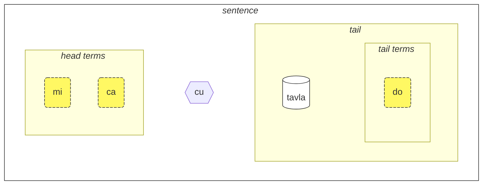
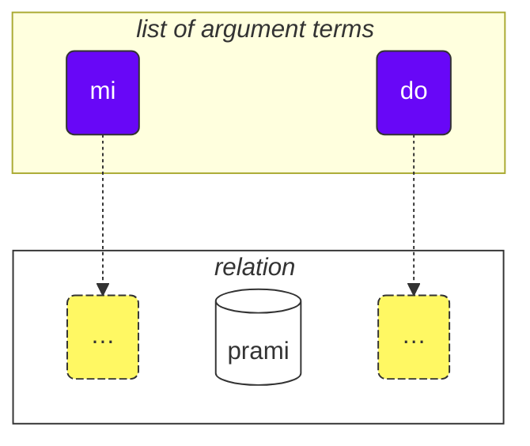

Como usar este curso:

1. leia-o
2. colete seus comentários e sugestões
3. envie-os para [💬 o chat ao vivo](https://lojban.pw/pt/articles/live_chat/)

## Lição 1. A língua em um relance

### Alfabeto

A coisa básica que você precisa saber sobre Lojban é o alfabeto.

Lojban usa o alfabeto latino (as vogais estão coloridas):

<dl><dd><b>a b c d e f g i j k l m n o p r s t u v x y z ' .</b></dd></dl>

As palavras são pronunciadas como são escritas.

Existem 10 vogais em Lojban:

<table>
<tbody><tr>
<td><b class="audio-inline">a</b></td>
<td> como o <i>a</i> em <i>g<u>a</u>to</i> (não como em inglês <i>face</i>)</td>
</tr>
<tr>
<td><b class="audio-inline">e</b></td>
<td> como o <i>e</i> em <i>m<u>e</u>sa</i></td>
</tr>
<tr>
<td><b class="audio-inline">i</b></td>
<td> como o <i>i</i> em <i>m<u>i</u>to</i> (não como em inglês <i>hit</i>)</td>
</tr>
<tr>
<td><b class="audio-inline">o</b></td>
<td> como o <i>o</i> em <i><u>o</u>lho</i>, <i>n<u>ó</u></i> ou <i>av<u>ó</u></i> (não como em inglês <i>so</i>, o <b>o</b> deve ser um som "puro").</td>
</tr>
<tr>
<td><b class="audio-inline">u</b></td>
<td> como o <i>u</i> em <i>l<u>u</u>a</i> (não como em inglês <i>but</i>)</td>
</tr>
<tr>
<td><b class="audio-inline">y</b></td>
<td> como o <i>a</i> final em <i>c<u>a</u>ma</i> ou <i>c<u>a</u>sa</i> quando pronunciado sem nasalização (comum no sotaque paulista e sulista). Em português europeu, é como o <i>e</i> em <i>p<u>e</u>rgunta</i>. É uma vogal neutra, semelhante ao <i>a</i> átono em inglês <i>comm<u>a</u></i>.</td>
</tr>
<tr>
</tbody></table>

4 vogais são escritas usando combinações de letras:

<table>
<tbody><tr>
<td><b class="audio-inline">au</b></td>
<td> como em <i>m<u>au</u></i></td></tr>
<tr>
<td><b class="audio-inline">ai</b></td>
<td> como em <i>p<u>ai</u></i></td></tr>
<tr>
<td><b class="audio-inline">ei</b></td>
<td> como em <i>l<u>ei</u>te</i></td></tr>
<tr>
<td><b class="audio-inline">oi</b></td>
<td> como em <i>d<u>oi</u>s</i></td></tr>
</tbody></table>

Quanto às consoantes, elas são pronunciadas como em inglês ou latim, mas há várias diferenças:

<table>
<tbody><tr>
<td><b class="guibutton">c</b>
</td>
<td>é pronunciado como <i>ch</i> em <i>chave</i>, como o <i>c</i> em inglês <i>ocean</i> ou <i>sh</i> em <i>shop</i>.
</td></tr>
<tr>
<td><b class="guibutton">g</b>
</td>
<td>sempre <i>g</i> como em <i>gato</i> (nunca <i>g</i> como em <i>gelo</i>).
</td></tr>
<tr>
<td><b class="guibutton">j</b>
</td>
<td>como <i>j</i> em francês <i>bonjour</i>, como o <i>g</i> em <i>gente</i>, ou como o <i>s</i> em inglês <i>pleasure</i> ou <i>treasure</i>.
</td></tr>
<tr>
<td><b class="guibutton">x</b>
</td>
<td>como <i>ch</i> em escocês <i>loch</i> ou como em alemão <i>Bach</i>, como <i>J</i> em espanhol <i>Jose</i> ou <i>Kh</i> em árabe moderno <i>Khaled</i>. Tente pronunciar <i>ksss</i> mantendo a língua abaixada e você obterá esse som.
</td></tr>
<tr>
<td><b class="guibutton"> ' </b>
</td>
<td>como o <i>h</i> em inglês. Portanto, o apóstrofo é considerado uma letra própria do Lojban e pronunciado como um <i>h</i>. Ele só é encontrado entre vogais. Por exemplo, <b>u'i</b> é pronunciado como <i>uu-hii</i> (enquanto <b>ui</b> é pronunciado como <i>uii</i>).
</td></tr>
<tr>
<td><b>.</b>
</td>
<td>um ponto final (ponto, pausa entre palavras) também é considerado uma letra no Lojban. É uma pausa curta na fala para evitar que as palavras se fundam umas nas outras. Na verdade, qualquer palavra que comece com uma vogal tem um ponto final colocado na frente dela. Isso ajuda a evitar a fusão indesejada de duas palavras sequenciais em uma só.
</td></tr>
<tr>
<td><b>i</b>
</td>
<td><b>i</b> antes de vogais é considerado uma consoante e pronunciado mais curto, por exemplo:
<ul><li><b>ia</b> é pronunciado como <i>ia</i> em <i>Itália</i></li>
<li><b>ie</b> é pronunciado como <i>ie</i> em <i>dieta</i></li></ul>
</td></tr>
<tr>
<td><b>u</b>
</td>
<td><b>u</b> antes de vogais é considerado uma consoante e pronunciado mais curto, por exemplo:
<ul><li><b>ua</b> é pronunciado como <i>ua</i> em <i>guarda</i></li>
<li><b>ue</b> é pronunciado como <i>ue</i> em <i>duelo</i></li></ul>
</td></tr></tbody></table>

A tônica é colocada na penúltima vogal. Se uma palavra tem apenas uma vogal, você simplesmente não a acentua.

A letra **r** pode ser pronunciada como o _r_ em inglês, escocês, russo, então há uma variedade de pronúncias aceitáveis para ela. No português brasileiro, pode ser o _r_ retroflexo caipira, o _r_ vibrante carioca, ou qualquer outra variação.

Vogais não-Lojban como o _i_ e _u_ curtos do inglês britânico padrão _hit_ e _but_, são usadas por algumas pessoas para separar consoantes. Então, se você tiver dificuldade em pronunciar duas consoantes seguidas (por exemplo, o **vl** em **tavla**, que significa _conversar com_), então você pode dizer _tavɪla_ — onde o _ɪ_ é muito curto. No entanto, outras vogais como **a** e **u** devem ser longas.

### A frase mais simples

A unidade básica em Lojban é a "frase". Aqui estão três exemplos simples:

> **le prenu cu tavla mi**
> _A pessoa fala comigo._

le prenu
: a pessoa

tavla
: … fala com …, … conversa com …

mi
: eu, me, mim

> **mi prami do**
> _Eu te amo._

prami
: … ama … (alguém)

do
: você, tu, te

> **mi ca cu tavla do**
> _Eu agora falo com você._

ca
: agora (pronunciado como **chá**)

<pixra url="/assets/pixra/cilre/tavla.webp" caption="le prenu cu tavla mi" definition="A pessoa fala comigo."></pixra>

<pixra url="/assets/pixra/cilre/mi.webp" caption="mi" definition="eu / me"></pixra>

<pixra url="/assets/pixra/cilre/mi_prami_do2.webp" caption="mi prami do" definition="Eu te amo."></pixra>

<pixra url="/assets/pixra/cilre/do.webp" caption="do" definition="você"></pixra>

Cada frase em Lojban consiste das seguintes partes da esquerda para a direita:

- a cabeça:
  - consiste de chamados "termos",
    - **le prenu** é o único termo da cabeça no exemplo **le prenu cu tavla mi** acima,
    - **mi**, **ca** são termos da cabeça no exemplo **mi ca cu tavla do** acima.
- o separador de cabeça **cu**:
  - pronunciado como _chu_ já que **c** é para _ch_,
  - mostra que a cabeça terminou,
  - pode ser omitido quando está claro que a cabeça foi completada.
- a cauda:
  - o construto de relação principal (chamado "**selbrisni**" em Lojban) 
  - \+ possivelmente um ou mais termos depois dele,
    - **tavla**, **prami** são selbrisni, construtos de relação principal nos exemplos acima.
    - **mi** é o único termo da cauda no exemplo **le prenu cu tavla mi** acima.
    - **do** é o único termo da cauda no exemplo **mi prami do** acima.

Em Lojban, falamos principalmente de relações em vez de substantivos ou verbos.

Aqui estão duas palavras de relação, que correspondem aproximadamente a verbos:

prenu
: … é uma pessoa / são pessoas

tavla
: … fala com …

Cada relação tem um ou mais papéis que também podem ser chamados de "espaços" ou "lugares". Acima, eles são rotulados com "…" Esses espaços devem ser preenchidos com argumentos (chamados "**sumti**" em Lojban). Termos argumentos são construtos como **le prenu**, **mi**, **do** não importa se esses termos acabam estando em uma cabeça ou em uma cauda de uma frase. Colocamos termos argumentos em ordem, assim preenchendo esses espaços e dando um significado concreto à relação.

Também podemos transformar tal relação em um termo argumento.

Para isso, colocamos uma palavra curta **le** na frente dela:

prenu
: … é uma pessoa

le prenu
: a pessoa, as pessoas

Similarmente,

tavla
: … fala com …

e assim

le tavla
: o falante, os falantes

Pode soar estranho como _pessoa_ pode ser um "verbo", mas na verdade, isso torna Lojban muito simples:

<table>
<thead>
<tr>
<th>palavra de relação com espaços não preenchidos</th>
<th>forma de argumento (<b>sumti</b>)</th></tr>
</thead>
<tbody>
<tr>
<td><b>prenu</b> — <i>… (alguém) é uma pessoa</i> </td>
<td><b>le prenu</b> — <i>a pessoa / as pessoas</i>
     <b>le prenu</b> — <i>aquele que é uma pessoa / aqueles que são pessoas</i>
</td></tr>
<tr>
<td><b>tavla</b> — <i>… (alguém) fala com … (alguém)</i> </td>
<td><b>le tavla</b> — <i>o falante / os falantes</i>
     <b>le tavla</b> — <i>aquele que é um falante / aqueles que são falantes</i>
</td></tr>
</tbody></table>

O primeiro espaço das relações desaparece ao usar **le**, daí tais traduções alternativas como _aquele que …_ serem possíveis.

<!-- We can also say that **le** creates a noun from a relation construct with roughly the meaning of _the one which is …_ (_is a person_ — _the person_), or even _those who do…_ (_to speak to_ — _the speakers_), _those who are…_ (_are people_ — _the people_). -->

Note que Lojban, por padrão, não especifica o número entre _o falante_ ou _os falantes_. Ou seja, **le tavla** é vago nesse sentido, e em breve descobriremos maneiras de definir o número.

Além dos termos argumentos, há termos modais como **ca**:

> **mi ca cu tavla do**
> _Eu agora falo com você._

ca
: agora

Termos modais não preenchem espaços do construto de relação principal ("**selbrisni**"). Em vez disso, eles são aplicados à frase inteira enriquecendo ou estreitando seu significado.

Assim, termos em Lojban são representados com:

- termos argumentos que preenchem espaços de relações. Exemplos são:
  - substantivos como **le prenu** (_a pessoa_)
  - pronomes como **mi** (_eu_, _me_), **do** (_você_). Pronomes funcionam exatamente como substantivos, mas **le** não é usado para eles. Eles funcionam como argumentos por si mesmos.
- termos modais que não preenchem espaços de relações mas especificam informação adicional, esclarecedora.
  - por exemplo, **ca** (_agora, no presente_).

Alguns exemplos mais:

<pixra url="/assets/pixra/cilre/nintadni.webp" caption="mi nintadni" definition="Eu sou um novo estudante, um calouro."></pixra>

> **mi nintadni**
> _Eu sou um novo estudante._

nintadni
: … (alguém) é um novo estudante, um novato

Diferentemente do inglês, não precisamos adicionar o verbo "sou/é/são/ser" à frase. Isso já está implícito. A palavra de relação **nintadni** (_… é um novo estudante_) já tem esse "sou/é/são/ser" do inglês embutido em sua tradução em português.

> **do jimpe**
> _Você entende._

jimpe
: … (alguém) entende … (algo)

<pixra url="/assets/pixra/cilre/pilno_le_fonxa.webp" caption="le prenu cu pilno le fonxa" definition="A pessoa usa o telefone."></pixra>

> **mi pilno le fonxa**
> _Eu uso o telefone._

pilno
: … (alguém) usa … (algo)

fonxa
: … é um telefone, … são telefones

le fonxa
: o telefone, os telefones

<pixra url="/assets/pixra/cilre/citka.webp" caption="mi citka" definition="Eu como."></pixra>

> **mi citka**
> _Eu como._

citka
: … (alguém) come … (algo)

> **do citka**
> _Você come._

<!-- -->

> **mi citka le plise**
> _Eu como as maçãs._

<pixra url="/assets/pixra/cilre/le_plise_cu_kukte.webp" caption="le plise cu kukte" definition="As maçãs são saborosas."></pixra>

> **le plise cu kukte**
> _As maçãs são saborosas._

le plise
: as maçãs

kukte
:  … (algo) é saboroso

Uma frase mais simples em Lojban conteria apenas uma palavra de relação principal:

<pixra url="/assets/pixra/cilre/karce.webp" caption="karce" definition="É um carro."></pixra>

> **karce**
> _Carro!_
> _É um carro._

Você poderia dizer isso quando vê um carro chegando. Aqui o contexto seria claro o suficiente de que há um carro em algum lugar por perto e provavelmente é perigoso.

**karce** em si é uma palavra de relação que significa _é um carro_.

Podemos, é claro, ser mais precisos e dizer, por exemplo:

> **bolci**
> _Bola!_
> _É uma bola._

onde **bolci** é uma palavra de relação que significa _é uma bola_.

> **ti bolci**
> _Isto é uma bola perto de mim._

<!-- -->
> **ta bolci**
> _Isto é uma bola perto de você._

ti
: pronome: esta coisa perto de mim

ta
: pronome: esta/essa coisa perto de você

tu
: pronome: aquela coisa longe de você e de mim

<pixra url="/assets/pixra/cilre/ti.webp" caption="ti" definition="esta (perto de mim, o falante)"></pixra>

<pixra url="/assets/pixra/cilre/ta.webp" caption="ta" definition="esta (perto de você, o ouvinte)"></pixra>

<pixra url="/assets/pixra/cilre/tu.webp" caption="tu" definition="aquela lá (longe de você e de mim)"></pixra>

Similarmente, você pode dizer

<pixra url="/assets/pixra/cilre/carvi.webp" caption="carvi" definition="… é chuva"></pixra>

> **carvi**
> _Está chovendo._

onde

carvi
: … é chuva, … está chovendo

ou

> **pluka**
> _É agradável._

onde

pluka
: … é agradável

Note que em Lojban não há necessidade da palavra _isso_ nesse sentido. Você apenas usa a palavra de relação que precisa.

> **prami**
> _Alguém ama._

<pixra url="/assets/pixra/cilre/bajra.webp" caption="le prenu cu bajra" definition="A pessoa corre."></pixra>

> **bajra**
> _Alguém corre._

bajra
: … corre usando membros

Novamente, o contexto provavelmente diria quem ama quem e quem corre.

#### Tarefa

<pixra url="/assets/pixra/cilre/pinxe_le_djacu.webp" caption="le prenu cu pinxe le djacu" definition="A pessoa bebe a água."></pixra>

pinxe
: … bebe … (algo)

le djacu
: a água

Cubra a parte direita da tabela. Traduza as frases à esquerda do Lojban.

<table style="table-layout: fixed;">
<tbody><tr>
<td><b>do citka</b>
</td>
<td><i>Você come.</i>
</td></tr>
<tr>
<td><b>mi pinxe le djacu</b>
</td>
<td><i>Eu bebo água.</i>
</td></tr>
<tr>
<td><b>mi citka le plise</b>
</td>
<td><i>Eu como maçãs.</i>
</td></tr></tbody></table>

### «**.i**» separa frases

Colocamos uma palavra curta **.i** para separar duas frases consecutivas:

> **mi tavla le prenu .i le prenu cu tavla mi**
> _Estou falando com as pessoas. As pessoas estão falando comigo._

**.i** separa frases como o ponto final no fim das frases em textos em português.

Quando dizemos uma frase após outra em português, fazemos uma pausa (que pode ser curta) entre elas. Mas a pausa tem muitos significados diferentes em português. Em Lojban temos uma maneira melhor de entender onde uma frase termina e outra começa.

Também note que às vezes ao pronunciar palavras rapidamente você não consegue descobrir onde uma frase termina e a palavra da próxima frase começa. Portanto, é aconselhável usar a palavra **.i** antes de começar uma nova frase.

### Números: '_1 2 3 4 5 6 7 8 9 0_' = «**pa re ci vo mu xa ze bi so no**»

**le** simplesmente transforma um construto de relação em um argumento, mas tal argumento não tem número associado a ele. A frase

> **le prenu cu tavla mi**
> _As pessoas falam comigo._
> _A pessoa fala comigo._

não especifica o número de pessoas falando comigo. Em português, é impossível omitir o número porque _pessoas_ em português implica _mais de uma pessoa_. No entanto, em Lojban, você pode omitir o número.

Agora vamos especificar quantas das pessoas são relevantes para nossa discussão.

Vamos adicionar um número depois de **le**.

<table>
<tbody><tr>
<td><b>pa</b>
</td>
<td><b>re</b>
</td>
<td><b>ci</b>
</td>
<td><b>vo</b>
</td>
<td><b>mu</b>
</td>
<td><b>xa</b>
</td>
<td><b>ze</b>
</td>
<td><b>bi</b>
</td>
<td><b>so</b>
</td>
<td><b>no</b>
</td></tr>
<tr>
<td> 1
</td>
<td> 2
</td>
<td> 3
</td>
<td> 4
</td>
<td> 5
</td>
<td> 6
</td>
<td> 7
</td>
<td> 8
</td>
<td> 9
</td>
<td> 0
</td>
</tr></tbody></table>

<pixra url="/assets/pixra/cilre/le_mu_prenu.webp" caption="le mu prenu" definition="As cinco pessoas"></pixra>

> **le pa prenu cu tavla mi**
> _A pessoa fala comigo._
> _A uma pessoa fala comigo._

Adicionamos um número depois de **le** e assim especificamos pessoas individuais.

Para números consistindo de vários dígitos, apenas juntamos esses dígitos:

> **le re mu prenu cu tavla mi**
> _As 25 pessoas falam comigo._

Sim, é tão simples assim.

Se quisermos contar, podemos separar números com **.i**:

> **mu .i vo .i ci .i re .i pa .i no**
> _5 … 4 … 3 … 2 … 1 … 0_

O número **za'u** significa _mais de …_ (_\>_ em matemática), o número **me'i** significa _menos de_ (_<_ em matemática):

> **le za'u re prenu cu tavla mi**
> _Mais de duas pessoas falam comigo._

<!-- -->

> **le me'i pa no prenu cu tavla mi**
> _Menos de 10 pessoas falam comigo._

<!-- -->

> **le za'u ci prenu cu tavla mi**
> _Mais de três pessoas falam comigo._

Para dizer apenas _pessoas_ (número plural) em oposição a _uma pessoa_, usamos **za'u pa**, _mais de uma_ ou simplesmente **za'u**.

> **le za'u pa prenu cu tavla mi**
> **le za'u prenu cu tavla mi**
> _As pessoas falam comigo._

**za'u** por padrão significa **za'u pa**, daí tal contração ser possível.

le prenu
: a pessoa / as pessoas

le pa prenu
: a pessoa (uma em número)

le za'u prenu
: as pessoas (duas ou mais em número)

#### Tarefa

stati
: … (alguém) é inteligente, … tem talento

<pixra url="/assets/pixra/cilre/stati.webp" caption="stati" definition="… tem talento"></pixra>

klama
: … vem para … (algum lugar ou objeto)

<pixra url="/assets/pixra/cilre/klama_ti.webp" caption="le prenu cu klama ti" definition="A pessoa veio aqui."></pixra>

nelci
: … gosta de … (algo)

le zarci
: o mercado

<pixra url="/assets/pixra/cilre/zarci.webp" caption="le prenu cu zvati le zarci" definition="A pessoa está na loja."></pixra>

le najnimre
: a laranja (fruta), as laranjas

<pixra url="/assets/pixra/cilre/najnimre.webp" caption="najnimre" definition="… é uma laranja"></pixra>

le badna
: a banana, bananas

<pixra url="/assets/pixra/cilre/badna.webp" caption="badna" definition="… é uma banana"></pixra>

Cubra a parte direita da tabela. Traduza as frases à esquerda do Lojban.

<table style="table-layout: fixed;">
 <tbody>
  <tr>
   <td>le mu prenu cu klama le zarci</td>
   <td>As cinco pessoas vêm ao mercado.</td>
  </tr>
  <tr>
   <td>le pa re prenu cu stati .i do stati</td>
   <td>As 12 pessoas são inteligentes. Você é inteligente.</td>
  </tr>
  <tr>
   <td>le prenu cu nelci le plise</td>
   <td>As pessoas gostam das maçãs.</td>
  </tr>
  <tr>
   <td>le za'u re prenu cu citka .i le me'i mu prenu cu pinxe le djacu</td>
   <td>Mais de duas pessoas comem. Menos de 5 pessoas bebem a água.</td>
  </tr>
  <tr>
   <td>le za'u re prenu cu stati</td>
   <td>Mais de duas pessoas são inteligentes.</td>
  </tr>
 </tbody>
</table>

Cubra a parte direita da tabela. Traduza as frases à esquerda para Lojban.

<table style="table-layout: fixed;">
 <tbody>
  <tr>
   <td>As 256 pessoas são inteligentes.</td>
   <td>le re mu xa prenu cu stati</td>
  </tr>
  <tr>
   <td>Menos de 12 maçãs são saborosas.</td>
   <td>le me'i pa re plise cu kukte</td>
  </tr>
 </tbody>
</table>

### Relação composta

Construto de relação composta (**tanru** em Lojban) são várias palavras de relação colocadas uma após a outra.

> **tu melbi zdani**
> _Aquela é uma casa bonita._

<pixra url="/assets/pixra/cilre/melbi_zdani.webp" caption="melbi zdani" definition="… é uma casa bonita"></pixra>

tu
: aquela (longe de você e de mim)

melbi
: … é bonito, lindo

zdani
: … é uma casa ou ninho para … (alguém)

melbi zdani
: construto de relação composta: … é uma casa bonita para … (alguém)

<pixra url="/assets/pixra/cilre/dansu.webp" caption="le prenu cu melbi dansu" definition="A pessoa dança lindamente."></pixra>

> **do melbi dansu**
> _Você dança lindamente._

dansu
: … dança

Aqui, a relação **melbi** adiciona um significado adicional pois está colocada à esquerda de outra relação: **zdani**. O componente esquerdo é geralmente traduzido usando adjetivos e advérbios.

Relações compostas são um recurso poderoso que produz significados mais ricos. Você apenas junta duas palavras de relação, e o componente esquerdo de tal relação composta adiciona um sabor ao direito.

Podemos colocar **le** (por exemplo, com um número) à esquerda de tal relação composta obtendo um termo argumento mais rico:

le pa melbi zdani
: a casa bonita

Agora sabemos por que havia **cu** após os termos da cabeça em nosso exemplo:

> **le pa prenu cu tavla mi**
> _A pessoa fala comigo._

Sem **cu** se transformaria em **le pa prenu tavla**, que teria o significado de _a pessoa-falante_ - seja lá o que isso pudesse significar.

Considere:

> **le pa tavla pendo**
> _O amigo falante_
<!-- -->
> **le pa tavla cu pendo**
> _O falante é um amigo._

Lembre-se de colocar **cu** antes do construto de relação principal em uma frase para evitar a criação não intencional de relações compostas.

Relação composta pode conter mais de dois componentes. Neste caso, a primeira relação modifica a segunda, a segunda modifica a terceira, e assim por diante:

<pixra url="/assets/pixra/cilre/cmalu_karce.webp" caption="ti cmalu karce" definition="Este é um carro pequeno."></pixra>

> **le pa melbi cmalu karce**
> _o carro bonito-pequeno, o carro pequeno de uma maneira bonita_

<!-- -->

> **le mutce melbi zdani**
> _a casa muito bonita_

mutce
: … é muito, … é muito

#### Tarefa

sutra
: … é rápido

barda
: … é grande

cmalu
: … é pequeno

mlatu
: … é um gato

Cubra a parte direita da tabela. Traduza as frases à esquerda do Lojban.

<table style="table-layout: fixed;">
<tbody><tr>
<td><b>le melbi karce</b>
</td>
<td><i>o carro bonito / os carros bonitos</i>
</td></tr>
<tr>
<td><b>do sutra klama</b>
</td>
<td><i>Você vem rapidamente. Você vem rápido.</i>
</td></tr>
<tr>
<td><b>tu barda zdani</b>
</td>
<td><i>Aquela é uma casa grande.</i>
</td></tr>
<tr>
<td><b>le pa sutra bajra mlatu</b>
</td>
<td><i>o gato que corre rapidamente</i>
</td></tr>
<tr>
<td><b>le pa sutra mlatu</b>
</td>
<td><i>o gato rápido</i>
</td></tr>
<tr>
<td><b>le pa bajra mlatu</b>
</td>
<td><i>o gato corredor</i>
</td></tr></tbody></table>

Cubra a parte direita da tabela. Traduza as frases à esquerda para Lojban.

<table style="table-layout: fixed;">

<tbody><tr>
<td><i>Este é um carro pequeno.</i>
</td>
<td><b>ti cmalu karce</b>
</td></tr>
<tr>
<td><i>maçãs saborosas</i>
</td>
<td><b>le kukte plise</b>
</td></tr>
<tr>
<td><i>os comedores rápidos</i>
</td>
<td><b>le sutra citka</b>
</td></tr>
<tr>
<td><i>Você é uma pessoa que anda rapidamente.</i>
</td>
<td><b>do sutra cadzu prenu</b>
</td></tr></tbody></table>

### Perguntas '_Sim/Não_'

Em português, formamos uma pergunta de _sim/não_ mudando a ordem das palavras, por exemplo

> _Você é … ⇒ Você é …?_

ou usando alguma forma do verbo _ser/estar_ no início, por exemplo:

> _Você sabe … ⇒ Você sabe?_

Em Lojban, a ordem das palavras pode ser mantida. Para transformar qualquer afirmação em uma pergunta de _sim/não_, simplesmente inserimos a palavra **xu** no início da frase:

> **xu do nelci le gerku**
> _Você gosta dos cachorros?_

le gerku
: o cachorro, os cachorros

<pixra url="/assets/pixra/cilre/le_prenu_e_le_gerku.webp" caption="ti prenu .i ti gerku" definition="Esta é uma pessoa. Este é um cachorro."></pixra>

Lembre-se de que em Lojban, pontuação como "?" (ponto de interrogação) é opcional e usada principalmente para propósitos estilísticos. Isso ocorre porque a palavra de pergunta **xu** já mostra que é uma pergunta.

Outros exemplos:

> **xu mi klama**
> _Eu estou vindo?_

klama
: … vem para … (algum lugar)

> **xu pelxu**
> _É amarelo?_

pelxu
: … é amarelo

Podemos mudar o significado colocando **xu** após diferentes partes da frase. Explicações sobre o que mudou no significado são dadas entre colchetes:

> **xu do nelci le gerku**
> _Você gosta dos cachorros?_

<!-- -->

> **do xu nelci le gerku**
> _VOCÊ gosta dos cachorros?_ (Eu pensei que era outra pessoa que gostava deles).

<!-- -->

> **do nelci xu le gerku**
> _Você GOSTA dos cachorros? (Eu pensei que você era apenas neutro em relação a eles)._

<!-- -->

> **do nelci le xu gerku**
> _Você gosta DOS CACHORROS? (Eu pensei que você gostasse dos gatos)._

<!-- -->

> **do nelci le gerku xu**
> _Você gosta daquelas coisas, são cachorros? (Você só questiona a validade da relação **gerku**)._

O que é expresso usando entonação em português é expresso movendo **xu** após a parte que queremos enfatizar em Lojban. Note que a primeira frase com **xu** no início faz a pergunta mais genérica sem enfatizar nenhum aspecto particular.

**xu** é uma palavra de interjeição. Aqui estão as características das interjeições de Lojban:

- interjeição modifica o construto antes dela:

 > **do xu nelci le gerku**
 > _VOCÊ gosta dos cachorros?_

- quando colocada no início de uma relação, interjeição modifica a relação inteira:

 > **xu do nelci le gerku**
 > _Você gosta dos cachorros?_

- interjeições podem ser colocadas após diferentes partes da mesma relação para mudar o significado.

 > **do nelci le gerku xu**
 > _Você gosta daquelas entidades, são cachorros?_

 Aqui, apenas a relação **gerku** (não o argumento **le gerku**) é modificada pela palavra de pergunta **xu**. Então aqui nos perguntamos apenas sobre aquela relação. Afirmamos que você gosta desses objetos ou seres vivos e perguntamos se esses são cachorros.

Interjeições não quebram relações compostas, elas podem ser usadas dentro delas:

> **do nelci le barda xu gerku**
> _Você gosta dos cachorros GRANDES?_

Agora, como responder a tais perguntas de 'sim/não'? Repetimos o construto de relação principal:

> **— xu le mlatu cu melbi**
> **— melbi**
> _— Os gatos são bonitos?_
> _— Bonitos._

Para responder 'não', usamos o termo modal **na ku**:

> **— xu le mlatu cu melbi**
> **— na ku melbi**
> _— Os gatos são bonitos?_
> _— Não bonitos._

na ku
: termo: é falso que …

Ou, podemos usar uma palavra de relação especial **go'i**:

> **— xu le mlatu cu melbi**
> **— go'i**
> _— Os gatos são bonitos?_
> _— Bonitos._

go'i
: palavra de relação que repete a relação principal da frase anterior

Aqui, **go'i** significa o mesmo que **melbi** já que **melbi** é a relação da relação anterior.

> **— xu le mlatu cu melbi**
> **— na ku go'i**
> _— Os gatos são bonitos?_
> _— Não bonitos._

<!-- This course doesn't recommend negating **go'i** for negative answers. Just use **je'u nai**. -->

O termo modal **na ku** pode ser usado não apenas em respostas:

> **na ku mi nelci le gerku**
> _É falso que eu gosto dos cachorros._
> _Eu não gosto dos cachorros._
<!-- -->
> **mi na ku nelci do**
> _Eu não gosto de você._

Seu oposto, o termo **ja'a ku** afirma o significado:

> **mi ja'a ku nelci do**
> _Eu realmente gosto de você._

ja'a ku
: termo: é verdade que …

#### Tarefa

Cubra a parte direita da tabela. Traduza as frases à esquerda do Lojban.

<table style="table-layout: fixed;">

<tbody><tr>
<td><b>xu le barda zdani cu melbi</b>
</td>
<td><i>A casa grande é bonita?</i>
</td></tr>
<tr>
<td><b>— le prenu cu stati xu — na ku stati</b>
</td>
<td><i>— As pessoas são inteligentes? — Não.</i>
</td></tr>
<tr>
<td><b>do klama le zarci xu</b>
</td>
<td><i>Você vai ao mercado?</i>
</td></tr>
<tr>
<td><b>xu le verba cu prami le mlatu</b>
</td>
<td><i>As crianças amam os gatos?</i>
</td></tr></tbody></table>

Cubra a parte direita da tabela. Traduza as frases à esquerda para Lojban.

<table style="table-layout: fixed;">

<tbody><tr>
<td><i>O carro é rápido?</i>
</td>
<td><b>xu le karce cu sutra</b>
</td></tr>
<tr>
<td><i>— A laranja é saborosa? — Sim, é.</i>
</td>
<td><b>— xu le najnimre cu kukte — kukte</b>
</td></tr>
<tr>
<td><i>O cachorro te ama?</i>
</td>
<td><b>xu le gerku cu prami do</b>
</td></tr></tbody></table>

### Felicidade e pedidos educados: '_Viva!_' = «**ui**», '_Por favor!_' = «**.e'o**»

A interjeição **ui** mostra felicidade de quem está falando. É usada assim como o emoticon de sorriso '_:)_' em mensagens, para indicar que você está feliz com algo. Embora os emoticons possam ser ambíguos, **ui** tem apenas um significado, o que é útil.

> **ui do klama**
> _Viva, você está vindo!_

ui
: interjeição: _Viva!_, interjeição de felicidade

A interjeição **.e'o** no início de uma frase a transforma em um pedido educado:

> **.e'o do lebna le fonxa**
> _Você poderia pegar o telefone, por favor?_
> `Por favor, pegue o telefone.`

.e'o
: interjeição: por favor (pronunciado como _eh-hô_ com uma pausa curta ou quebra antes da palavra)

lebna
: pegar (algo)

Em português, para ser educado, usa-se _você poderia_ + _por favor_ + uma pergunta. Em Lojban, **.e'o** é suficiente para fazer um pedido educado.

#### Tarefa

Cubra a parte direita da tabela. Traduza as frases à esquerda do Lojban.

le tcati
: o chá

<pixra url="/assets/pixra/cilre/tcati.webp" caption="tcati" definition="… é um chá"></pixra>

le ckafi
: café

<pixra url="/assets/pixra/cilre/ckafi.webp" caption="ckafi" definition="… é um café"></pixra>

zgana
: assistir, observar (usando quaisquer sentidos)

le skina
: o filme, o filme

<pixra url="/assets/pixra/cilre/zgana_le_skina.webp" caption="le prenu cu zgana le skina" definition="A pessoa assiste o filme."></pixra>

kurji
: cuidar de (alguém, algo)

<table style="table-layout: fixed;">

<tbody>
<tr>
<td><b>ui carvi</b>
</td>
<td><i>Viva, chove! Viva, está chovendo!</i>
</td></tr>
<tr>
<td><b>.e'o do sutra bajra</b>
</td>
<td><i>Corra rápido!</i>
</td></tr>
<tr>
<td><b>.e'o do pinxe le tcati</b>
</td>
<td><i>Por favor, beba chá!</i>
</td></tr>
<tr>
<td><b>.e'o zgana le skina</b>
</td>
<td><i>Por favor, assista o filme!</i>
</td></tr></tbody></table>

Cubra a parte direita da tabela. Traduza as frases à esquerda para Lojban.

<table style="table-layout: fixed;">

<tbody><tr>
<td><i>Por favor, seja inteligente!</i>
</td>
<td><b>.e'o do stati</b>
</td></tr>
<tr>
<td><i>Por favor, vá para casa!</i>
</td>
<td><b>.e'o do klama le zdani</b>
</td></tr>
<tr>
<td><i>Por favor, beba o café!</i>
</td>
<td><b>.e'o do pinxe le ckafi</b>
</td></tr>
<tr>
<tr>
<td><i>Viva, eu falo com você!</i>
</td>
<td><b>ui mi tavla do</b>
</td></tr>
<tr>
<td><i>Por favor, cuide da criança.</i>
</td>
<td><b>.e'o do kurji le verba</b>
</td></tr></tbody></table>

### '_E_' e '_ou_'

> **do nintadni .i je mi nintadni**
> _Você é um novato. E eu sou um novato._

<!-- -->

> **do .e mi nintadni**
> _Você e eu somos novatos._

<pixra url="/assets/pixra/cilre/do_e_mi_nintadni.webp" caption="do .e mi nintadni" definition="Você e eu somos novos estudantes."></pixra>

<!-- -->

> **mi tadni .i je mi tavla do**
> _Eu estudo. E eu falo com você._

<!-- -->

> **mi tadni gi'e tavla do**
> _Eu estudo e falo com você._

.i je
: conjunção "e" combinando frases em uma.

.e
: conjunção "e" conectando argumentos.

gi'e
: conjunção "e" conectando caudas de frases.

Podemos combinar duas frases em uma afirmação usando a conjunção **.i je**, que significa _e_:

> **do nintadni .i je mi nintadni**
> _Você é um novato. E eu sou um novato._

Como ambas as frases têm a mesma cauda, podemos usar uma contração: a conjunção **.e** significa _e_ para argumentos:

> **do .e mi nintadni**
> _Você e eu somos novatos._

**do nintadni .i je mi nintadni** significa exatamente o mesmo que **do .e mi nintadni**

Também podemos usar **.e** para conectar argumentos em outras posições.

Ambas essas frases significam a mesma coisa.

> **mi pinxe le djacu .e le jisra**
> _Eu bebo a água e o suco._
> **mi pinxe le djacu .i je mi pinxe le jisra**
> _Eu bebo a água, e eu bebo o suco._

le jisra
: suco

<pixra url="/assets/pixra/cilre/pinxe_le_jisra.webp" caption="le prenu cu pinxe le jisra" definition="A pessoa bebe o suco."></pixra>

Se a cabeça da frase é a mesma mas as caudas diferem, usamos a conjunção **gi'e**, que significa _e_ para caudas de frases:

> **mi tadni .i je mi tavla do**
> **mi tadni gi'e tavla do**
> _Eu estudo e falo com você._

Ambas variações significam o mesmo; **gi'e** simplesmente leva a uma forma mais concisa.

Também há maneiras de adicionar _e_ para componentes de relações compostas:

> **le melbi je cmalu zdani cu jibni ti**
> _A casa bonita e pequena está próxima._

<pixra url="/assets/pixra/cilre/melbi_je_cmalu_zdani.webp" caption="melbi je cmalu zdani" definition="… é uma casa bonita-e-pequena"></pixra>

jibni
: … está próximo de …

ti
: esta coisa, este lugar perto de mim

**je** é uma conjunção que significa _e_ em relações compostas.

Sem **je**, a frase muda o significado:

> **le melbi cmalu zdani cu jibni**
> _A casa bonitamente pequena está próxima._

Aqui **melbi** modifica **cmalu**, e **melbi cmalu** modifica **zdani**, de acordo com como relações compostas funcionam.

Em **le melbi je cmalu zdani** (_a casa bonita e pequena_) tanto **melbi** quanto **cmalu** modificam **zdani** diretamente.

Outras conjunções comuns incluem:

> **le verba cu fengu ja bilma**
> _A criança está irritada ou doente (ou talvez ambas irritada e doente)_

<!-- -->

> **do .a mi ba vitke le dzena**
> _Você ou eu (ou ambos) visitaremos o ancestral._

ja
: _e/ou_ dentro de relações compostas

.a
: _e/ou_ quando conectando argumentos

fengu
: … está irritado

<pixra url="/assets/pixra/cilre/fengu.webp" caption="fengu" definition="… está irritado"></pixra>

bilma
: … está doente

<pixra url="/assets/pixra/cilre/bilma.webp" caption="le prenu cu bilma" definition="A pessoa está doente"></pixra>

vitke
: visitar (alguém)

dzena
: … é um ancestral de …

<pixra url="/assets/pixra/cilre/dzena.webp" caption="dzena" definition="… é um ancestral de …"></pixra>

> **le karce cu blabi jo nai grusi**
> _O carro é branco ou cinza._

<!-- -->

> **do .o nai mi vitke le laldo**
> _Ou você ou eu visitamos o idoso._

jo nai
: ou … ou … mas não ambos

.o nai
: ou … ou … mas não ambos (quando conectando argumentos)

laldo
: … é idoso

<pixra url="/assets/pixra/cilre/laldo.webp" caption="laldo" definition="… é idoso"></pixra>

Nota: é melhor lembrar **jo nai** como um único construto, e o mesmo para **.o nai**.

> **mi prami do .i ju do stati**
> _Eu te amo. Se você é inteligente ou não._

<!-- -->

> **le verba cu nelci le plise .u le badna**
> _A criança gosta das maçãs se (ele/ela gosta) ou não das bananas._

ju
: se … ou não …

.u
: se … ou não … (quando conectando argumentos)

### «**joi**» é '_e_' para ações coletivas

> **do joi mi casnu le bangu**
> _Você e eu estamos discutindo a língua._

casnu
: … discute …

le bangu
: a língua

joi
: conjunção _e_ para massas

Se eu digo **do .e mi casnu le bangu** pode significar que você discute a língua, e eu discuto a língua. Mas não necessariamente significa que estamos na mesma conversa!

Essa distinção pode ser mais visível se expandirmos essa frase usando **.i je**:

> **do .e mi casnu le bangu**
> **do casnu le bangu .i je mi casnu le bangu**
> _Você discute a língua. E eu discuto a língua._

Para enfatizar que você e eu participamos da mesma ação, usamos uma conjunção especial **joi** que significa _e_ que forma uma "massa":

> **do joi mi casnu le bangu**
> _Você e eu estamos discutindo a língua._
> _Você e eu sendo uma única entidade para este evento estamos discutindo a língua._

Também existe um pronome **mi'o** (_você e eu juntos_), que pode ser reformulado como **mi joi do** (é apenas mais longo). Em Lojban, você pode não usar uma única palavra para _nós_ mas construtos mais precisos como **mi joi le pendo** (literalmente _eu e os amigos_).

<pixra url="/assets/pixra/cilre/casnu.webp" caption="do joi le pendo joi mi casnu" definition="Você, o amigo e eu estamos em uma discussão."></pixra>

#### Tarefa

Cubra a parte direita da tabela. Traduza as frases à esquerda do Lojban.

<table style="table-layout: fixed;">

<tbody><tr>
<td><b>mi nelci le badna .e le plise</b>
</td>
<td><i>Eu gosto das bananas, e eu gosto das maçãs. Eu gosto das bananas e das maçãs.</i>
</td></tr>
<tr>
<td><b>do sutra ja stati</b>
</td>
<td><i>Você é rápido ou inteligente ou ambos.</i>
</td></tr>
<tr>
<td><b>le za'u prenu cu casnu le karce .u le gerku</b>
</td>
<td><i>As pessoas discutem os carros se (discutem) ou não os cachorros.</i>
</td></tr>
<tr>
<td><b>mi citka le najnimre .o nai le badna</b>
</td>
<td><i>Eu como ou as laranjas ou as bananas.</i>
</td></tr></tbody></table>

Cubra a parte direita da tabela. Traduza as frases à esquerda para Lojban.

<table style="table-layout: fixed;">

<tbody><tr>
<td><i>Os amigos e eu gostamos da chuva.</i>
</td>
<td><b>le pendo .e mi cu nelci le carvi</b>
</td></tr>
<tr>
<td><i>Ou eu ou você vai ao mercado.</i>
</td>
<td><b>mi .o nai do klama le zarci</b>
</td></tr>
<tr>
<td><i>Eu olho para o carro grande e bonito.</i>
</td>
<td><b>mi catlu le barda je melbi karce</b>
</td></tr>
<tr>
<td><i>A criança bebe a água e/ou o suco.</i>
</td>
<td><b>le verba cu pinxe le djacu .a le jisra</b>
</td></tr>
<tr>
<td><i>A criança e o pequeno discutem o carro.</i>
</td>
<td><b>le verba joi le pa cmalu cu casnu le karce</b> (note o uso de <b>joi</b>. <i>o pequeno</i> é apenas <b>le pa cmalu</b>).
</td></tr></tbody></table>

### Mas …

> **le najnimre cu barda .i je ku'i le badna cu cmalu**
> _As laranjas são grandes. Mas as bananas são pequenas._

ku'i
: interjeição: mas, porém

Na verdade, em português, _mas_ é o mesmo que _e_, e adiciona um sabor de contraste.

Em Lojban, apenas usamos a conjunção **.i je** (ou **.e**, **gi'e**, **je**, dependendo do que conectamos) e adicionamos o sabor de contraste a ela com a interjeição **ku'i**. Como de costume, a interjeição modifica o construto antes dela.

### Eventos: '_dançar e estar junto_' — «**le nu dansu .e le nu kansa**»

Alguns espaços de relações esperam um evento:

> **le cabna cu nicte**
> _Agora é noite. No presente é noite._

cabna
: … (evento) está no presente com …; … (evento) acontece agora

le cabna
: o tempo presente, o evento presente

nicte
: … (evento) acontece à noite

Mas e se quisermos descrever um evento usando uma frase inteira?

Qualquer frase pode ser transformada em um construto de relação colocando **nu** na frente dela:

> **le nicte cu nu mi viska le lunra**
> _A noite é quando eu vejo a Lua._
> `A noite é um evento quando eu vejo a Lua.`

<pixra url="/assets/pixra/cilre/nicte_fi_mi.webp" caption="le nicte" definition="a noite"></pixra>

le nicte
: a noite, as noites

viska
: ver (algo)

le lunra
: a Lua

Aqui, **le nicte** é o primeiro argumento da frase e **nu mi viska le lunra** é o construto de relação principal da frase. No entanto, dentro deste construto principal, podemos ver outra relação: **mi viska le lunra** embutida!

A palavra **nu** transforma uma frase completa em uma relação que denota um evento (em seu sentido genérico, pode ser um processo, um estado etc.)

Aqui estão alguns exemplos mais:

nu mi tavla
: … é um evento de eu falar

nu do tavla
: … é um evento de você falar

Ao adicionar **le** na frente de **nu**, criamos um argumento que denota um evento:

pinxe ⇒ le nu pinxe
: … bebe ⇒ o beber

dansu ⇒ le nu dansu
: … dança ⇒ o dançar

kansa ⇒ le nu kansa
: … está junto com … ⇒ estar junto

klama ⇒ le nu klama
: … vem para … ⇒ o vir

le nu do klama
: o vir de você, você vindo

**le nu** frequentemente corresponde ao português _\-ndo_, _\-ção_, _\-são_.

Alguns exemplos mais com espaços que esperam eventos em vez de entidades comuns:

> **mi djica le nu do klama ti**
> _Eu quero que você venha aqui (para este lugar)_

djica
: … quer … (algum evento)

> **mi gleki le nu do klama**
> _Estou feliz porque você está vindo._

gleki
: … está feliz de … (algum evento)

<pixra url="/assets/pixra/cilre/gleki.webp" caption="gleki" definition="… está feliz sobre o evento …"></pixra>

> **le nu pinxe le jisra cu nabmi mi**
> _Beber o suco é um problema para mim._

nabmi
: … (evento) é um problema para … (alguém), … (evento) é problemático para … (alguém)

#### Tarefa

Cubra a parte direita da tabela. Traduza as frases à esquerda do Lojban.

pilno
: usar (algo)

le skami
: o computador

<table style="table-layout: fixed;">

<tbody><tr>
<td><b>mi nelci le nu do dansu</b>
</td>
<td><i>Eu gosto de você dançando.</i>
</td></tr>
<tr>
<td><b>xu do gleki le nu do pilno le skami</b>
</td>
<td><i>Você está feliz de usar computadores?</i>
</td></tr>
<tr>
<td><b>do djica le nu mi citka le plise xu</b>
</td>
<td><i>Você quer que eu coma as maçãs?</i>
</td></tr></tbody></table>

Cubra a parte direita da tabela. Traduza as frases à esquerda para Lojban.

<table style="table-layout: fixed;">

<tbody><tr>
<td><i>Vir aqui é um problema.</i>
</td>
<td><b>le nu klama ti cu nabmi</b>
</td></tr>
<tr>
<td><i>Eu quero que você seja feliz.</i>
</td>
<td><b>mi djica le nu do gleki</b>
</td></tr></tbody></table>

### Termos modais. Tempos simples: '_estava_', '_está_', '_estará_' — «**pu**», «**ca**», «**ba**»

Em Lojban, expressamos o tempo quando algo acontece (gramaticalmente, em português é geralmente chamado de _tempo verbal_) com termos modais. Já vimos o termo modal **ca** significando _no presente_.

Aqui está uma série de termos relacionados ao tempo que dizem <u>quando</u> algo acontece:

> **le prenu pu cu tavla mi**
> _As pessoas falaram comigo._

<!-- -->

> **le prenu ca cu tavla mi**
> _As pessoas falam comigo (no presente)._

<!-- -->

> **le prenu ba cu tavla mi**
> _As pessoas falarão comigo._

Quando após a partícula relacionada ao tempo colocamos um argumento simples, então formamos um termo com um significado ligeiramente diferente:

> **mi pinxe le djacu ca le nu do klama**
> _Eu bebo a água enquanto você está vindo._

A parte **ca le nu do klama** é um termo longo que significa _enquanto você vem / enquanto você está vindo_. O **le nu do klama** é um argumento que significa *vinda de você, você vindo*.

> **mi citka ba le nu mi dansu**
> _Eu como depois que eu danço._

Partículas relacionadas ao tempo são agrupadas em séries por seu significado para torná-las mais fáceis de lembrar e usar.

Palavras para tempo simples:

- **pu** significa _antes de … (algum evento)_, **pu** sozinho denota tempo passado.
- **ca** significa _ao mesmo tempo que … (algum evento)_, **ca** sozinho denota tempo presente.
- **ba** significa _depois de … (algum evento)_, **ba** sozinho denota tempo futuro.

Tempos adicionam informação sobre quando algo acontece. O português nos força a usar certos tempos. É preciso escolher entre

- _As pessoas falam comigo_.
- _As pessoas falaram comigo_.
- _As pessoas falarão comigo_.

e outras escolhas similares.

Mas em Lojban as partículas de tempo são opcionais, podemos ser tão vagos ou tão precisos quanto quisermos.

A frase

> **le prenu cu tavla mi**
> _As pessoas falam comigo._

na verdade não diz nada sobre quando isso acontece. O contexto é claro o suficiente na maioria dos casos e pode nos ajudar. Mas se precisarmos de mais precisão, apenas adicionamos mais palavras.

**ba** significa _depois de … (algum evento)_ então quando dizemos **mi ba cu citka** queremos dizer que comemos depois do momento de falar, por isso significa _Eu comerei_.

Podemos combinar partículas de tempo com e sem argumentos depois delas:

> **mi pu cu citka le plise ba le nu mi dansu**
> _Eu comi as maçãs depois que eu dancei._

Note que o termo **pu** (tempo passado) é colocado apenas na relação principal (**mi pu cu citka**). Em Lojban, assume-se que o evento _eu dancei_ ocorre em relação ao evento de comer.

Não devemos colocar **pu** com **dansu** (diferentemente do português) já que **mi dansu** é visto em relação a **mi pu cu citka** então já sabemos que tudo estava no passado.

Mais exemplos de termos relacionados ao tempo:

> **le nicte cu pluka**
> _A noite é agradável._

pluka
: … é agradável

> **ba le nicte cu pluka**
> _Depois da noite é agradável._

Aqui, a cabeça da frase contém um termo **ba le nicte**, um termo modal com seu argumento interno. Então depois do separador **cu**, a relação principal da frase **pluka** segue (**pluka** sozinho significa _É agradável._)

Para dizer _será agradável_ devemos usar o termo de tempo futuro:

> **le nicte ba cu pluka**
> _A noite será agradável._

Também note que adicionar um argumento após uma partícula relacionada ao tempo pode levar a um significado drasticamente diferente:

> **le nicte ba le nu citka cu pluka**
> _A noite é agradável depois de comer._

Note que **ca** pode se estender ligeiramente para o passado e o futuro, significando _agora mesmo_. Assim, **ca** reflete uma noção amplamente usada ao redor do mundo de "tempo presente".

Também é possível integrar partículas modais no construto de relação principal:

> **le nicte ba cu pluka**
> **le nicte ba pluka**
> _A noite será agradável._

Ambas frases significam o mesmo, **ba pluka** é um construto de relação que significa _… será agradável_.

A estrutura de **le nicte ba pluka** é a seguinte:

- **le nicte** — a cabeça da frase com apenas um termo **le nicte**
- **ba pluka** — a cauda da frase que consiste apenas da relação **ba pluka**

Contraste isso com a frase anterior **le nicte ba cu pluka**:

- **le nicte ba** — a cabeça da frase com dois termos **le nicte** e **ba**
- **pluka** — a cauda da frase que consiste apenas da relação **pluka**

A vantagem de **le nicte ba pluka** sobre **le nicte ba cu pluka** é apenas em concisão; você geralmente pode pular dizer **cu** em tais casos já que a frase não pode ser entendida de outra forma de qualquer maneira.

Se você deseja colocar um termo modal antes de um termo argumento você pode separá-lo do texto seguinte "terminando" explicitamente o termo com a palavra auxiliar **ku**:

> **ba ku le nicte cu pluka**
> **le nicte ba cu pluka**
> **le nicte ba pluka**
> _A noite será agradável._

**ku** previne que **ba le nicte** apareça, assim retendo **ba ku** e **le nicte** como termos separados.

Uma última nota: definições em português de palavras Lojban podem usar tempos verbais mesmo quando as palavras originais em Lojban não os implicam, por exemplo:

tavla
: … fala com …, … conversa com …

pluka
: … é agradável

Embora _fala_, _é_ etc. estejam no tempo presente (nem sempre podemos nos livrar do tempo em palavras em português porque é assim que o português funciona), devemos sempre assumir que o tempo não está implícito no significado das palavras Lojban definidas, a menos que a definição em português de tais palavras mencione explicitamente tais restrições de tempo.

#### Tarefa

Cubra a parte direita da tabela. Traduza do Lojban:

<table>
<tbody><tr>
<td><b>mi pu gleki</b></td>
<td><i>Eu estava feliz.</i></td>
</tr>
<tr>
<td><b>do ba tavla mi</b></td>
<td><i>Você falará comigo.</i></td>
</tr>
<tr>
<td><b>le verba ca citka</b></td>
<td><i>A criança come (agora).</i></td>
</tr>
<tr>
<td><b>mi pu citka ba le nu mi cadzu</b></td>
<td><i>Eu comi depois que eu caminhei.</i></td>
</tr></tbody></table>

Cubra a parte direita da tabela. Traduza para Lojban:

<table>
<tbody><tr>
<td><i>Eu serei forte.</i></td>
<td><b>mi ba tsali</b></td>
</tr>
<tr>
<td><i>O cachorro era pequeno.</i></td>
<td><b>le gerku pu cmalu</b></td>
</tr>
<tr>
<td><i>Eu como antes de dormir.</i></td>
<td><b>mi citka pu le nu mi sipna</b></td>
</tr></tbody></table>

### Termos modais. Contornos de eventos: «**co'a**», «**ca'o**», «**co'i**»

Outra série de partículas relacionadas ao tempo, _contornos de eventos_:

co'a
: partícula de tempo: o evento está em seu início

ca'o
: partícula de tempo: o evento está em progresso

mo'u
: partícula de tempo: o evento está completo

co'i
: partícula de tempo: o evento é visto como um todo (começou e então terminou)

A maioria das palavras de relação descrevem eventos sem especificar o estágio desses eventos. Contornos de eventos nos permitem ser mais precisos:

> **mi pu co'a сu cikna**
> **mi pu co'a cikna**
> _Eu acordei._

cikna
: … está acordado

co'a cikna
: … acorda, fica acordado

pu co'a cikna
: … acordou, ficou acordado

<pixra url="/assets/pixra/cilre/coha_cikna.webp" caption="le prenu co'a cikna" definition="A pessoa acorda."></pixra>

Para expressar precisamente o tempo Progressivo do português, usamos **ca'o**:

> **mi pu ca'o сu sipna**
> **mi pu ca'o sipna**
> _Eu estava dormindo._

sipna
: … dorme

<pixra url="/assets/pixra/cilre/sipna.webp" caption="le mlatu ca'o sipna" definition="O gato está dormindo."></pixra>

<!-- -->

> **mi ca ca'o pinxe**
> _Eu estou bebendo._

<!-- -->

> **mi ba ca'o pinxe**
> _Eu estarei bebendo._

**mo'u** é usado para descrever a conclusão de eventos:

> **mi mo'u klama le tcana**
> _Eu cheguei à estação._

le tcana
: a estação

<pixra url="/assets/pixra/cilre/mohu_klama_le_tcana.webp" caption="le prenu mo'u klama le tcana" definition="A pessoa chegou à estação."></pixra>

**co'i** geralmente corresponde ao tempo Perfeito do português:

> **le verba ca co'i pinxe le jisra**
> _As crianças beberam o suco._

Poderíamos omitir **ca** nessas frases já que o contexto seria claro o suficiente na maioria de tais casos.

O tempo Presente Simples do português descreve eventos que acontecem às vezes:

> **le prenu ca ta'e tavla**
> _As pessoas (habitualmente, às vezes) falam._

ta'e
: tempo simples: o evento acontece habitualmente

Podemos usar as mesmas regras para descrever o passado usando **pu** em vez de **ca** ou o futuro usando **ba**:

> **le prenu pu co'i tavla mi**
> _As pessoas tinham falado comigo._

<!-- -->

> **le prenu ba co'i tavla mi**
> _As pessoas terão falado comigo._

A ordem relativa das partículas relacionadas ao tempo é importante. Em **ca co'i** primeiro dizemos que algo acontece no presente (**ca**), então afirmamos que neste tempo presente, o evento descrito foi completado (**co'i**). Apenas usando esta ordem obtemos o tempo Presente Perfeito.

#### Tarefa

Cubra a parte direita da tabela. Traduza do Lojban:

<table>
<tbody><tr>
<td><b>mi co'a sipna</b></td>
<td><i>Eu adormeci.</i></td>
</tr>
<tr>
<td><b>mi ca'o pinxe le tcati</b></td>
<td><i>Eu estou bebendo o chá.</i></td>
</tr>
<tr>
<td><b>le prenu co'i tavla</b></td>
<td><i>A pessoa falou.</i></td>
</tr>
<tr>
<td><b>mi mo'u citka le plise</b></td>
<td><i>Eu terminei de comer a maçã.</i></td>
</tr></tbody></table>

Cubra a parte direita da tabela. Traduza para Lojban:

<table>
<tbody><tr>
<td><i>Eu estarei dormindo.</i></td>
<td><b>mi ba ca'o sipna</b></td>
</tr>
<tr>
<td><i>A criança comeu.</i></td>
<td><b>le verba co'i citka</b></td>
</tr>
<tr>
<td><i>O cachorro começou a correr.</i></td>
<td><b>le gerku co'a bajra</b></td>
</tr></tbody></table>

### Termos modais. Intervalos: '_durante_' — «**ze'a**»

Outra série de partículas modais enfatiza que eventos acontecem durante um intervalo:

ze'i
: por um curto tempo

ze'a
: através de algum tempo, por um tempo, durante …

ze'u
: por um longo tempo

> **mi pu ze'a cu sipna**
> **mi pu ze'a sipna**
> _Eu dormi por um tempo._

<!-- -->

<pixra url="/assets/pixra/cilre/sipna_zeha.webp" caption="le prenu cu sipna ze'a le nu carvi" definition="A pessoa está dormindo enquanto chove."></pixra>

> **mi pu ze'a le nicte cu sipna**
> _Eu dormi durante a noite. Eu dormi a noite toda._

Nota: não podemos elidir **cu** aqui já que **nicte sipna** (_… é um dormidor noturno_) é um tanru e assim levaria a algum outro (se estranho) significado.

> **mi pu ze'i le nicte cu sipna**
> _Eu dormi durante a noite curta._

Compare **ze'a** com **ca**:

> **mi pu ca le nicte cu sipna**
> _Eu dormi à noite._

le nicte
: a noite

Quando usando **ze'a**, estamos falando sobre o intervalo inteiro do que descrevemos.

Note que **nicte** é em si um evento, então não precisamos de **nu** aqui.

#### Tarefa

Cubra a parte direita da tabela. Traduza do Lojban:

<table>
<tbody><tr>
<td><b>mi ze'a sipna</b></td>
<td><i>Eu dormi por um tempo.</i></td>
</tr>
<tr>
<td><b>mi ze'u tavla do</b></td>
<td><i>Eu falo com você por um longo tempo.</i></td>
</tr>
<tr>
<td><b>mi ze'i citka</b></td>
<td><i>Eu como por um curto tempo.</i></td>
</tr>
<tr>
<td><b>mi pu ze'a cadzu</b></td>
<td><i>Eu caminhei por um tempo.</i></td>
</tr></tbody></table>

Cubra a parte direita da tabela. Traduza para Lojban:

<table>
<tbody><tr>
<td><i>Eu dormirei durante a noite.</i></td>
<td><b>mi ba ze'a le nicte cu sipna</b></td>
</tr>
<tr>
<td><i>Eu bebi por um longo tempo.</i></td>
<td><b>mi pu ze'u pinxe</b></td>
</tr>
<tr>
<td><i>A criança brincará por um curto tempo.</i></td>
<td><b>le verba ba ze'i kelci</b></td>
</tr></tbody></table>

### Termos modais. '_porque_' — «**ri'a**», '_em direção a_' — «**fa'a**», '_em (lugar)_' — «**bu'u**»

Partícula modal para _porque_:

> **mi pinxe ri'a le nu mi taske**
> _Eu bebo porque estou com sede._

<!-- -->

> **mi citka ri'a le nu mi xagji**
> _Eu como porque estou com fome._

ri'a
: porque … (de algum evento)

taske
: … está com sede

<pixra url="/assets/pixra/cilre/taske.webp" caption="taske" definition="… está com sede"></pixra>

xagji
: … está com fome

<pixra url="/assets/pixra/cilre/xagji.webp" caption="xagji" definition="… está com fome"></pixra>

Partículas modais denotando lugar funcionam da mesma maneira:

> **mi cadzu fa'a do to'o le zdani**
> _Eu ando na direção de você longe da casa._

Note que, diferentemente de **klama**, as partículas modais **fa'a** e **to'o** denotam direções, não necessariamente pontos de início ou fim da rota. Por exemplo:

> **le prenu cu klama fa'a do**
> _A pessoa vem em sua direção._

significa que a pessoa está simplesmente se movendo em sua direção, mas não necessariamente até você (talvez para algum lugar ou pessoa perto de você).
 
<!-- -->

> **mi cadzu bu'u le tcadu**
> _Eu ando na cidade._

tcadu
: … é uma cidade

fa'a
: em direção a …, na direção de …

to'o
: de …, da direção de …

bu'u
: em … (algum lugar)

Nota: **nu** mostra que uma nova frase interna embutida começa dentro da frase principal. Colocamos **kei** depois de tal relação para mostrar sua borda direita, semelhante a como usamos ")" ou "]" em matemática. Por exemplo:

> **le gerku cu plipe fa'a mi ca le nu do ca'o klama**
> _O cachorro pula em minha direção quando você está vindo._

<pixra url="/assets/pixra/cilre/le_gerku_faha_plipe.webp" caption="le gerku cu plipe fa'a mi" definition="O cachorro pula em minha direção."></pixra>

plipe
: pular

mas

> **le gerku cu plipe ca le (nu do ca'o klama kei) fa'a mi**
> _O cachorro pula (quando você está vindo) em minha direção._

Colchetes _(_ e _)_ são usados aqui apenas para mostrar a estrutura; eles não são necessários em um texto Lojban normal.

Usamos **kei** após a frase interna **do ca'o klama** para mostrar que ela terminou, e a cauda da frase externa (***le gerku cu plipe...**) continua com seus termos.

Compare esta frase com a seguinte:

> **le gerku cu plipe ca le (nu do ca'o klama fa'a mi)**
> _O cachorro pula (quando você está vindo em minha direção)._

Como você pode ver, **do klama fa'a mi** é uma relação dentro da maior, então **fa'a mi** está agora dentro dela.

Agora, não é o cachorro que vem em minha direção, mas você.

No final das frases, **kei** nunca é necessário já que o fim de qualquer frase é uma borda direita por si só de qualquer maneira.

Considere o seguinte exemplo com uma partícula relacionada ao tempo:

> **mi pu citka le plise ba le nu mi dansu**
> _Eu comi as maçãs depois que eu dancei._

<!-- -->

> **mi pu citka ba le nu mi dansu kei le plise**
> _Eu comi (depois que eu dancei) as maçãs._

Podemos rearranjar a frase movendo **ba le nu mi dansu** por aí, desde que permaneça depois de **pu**.

#### Tarefa

Cubra a parte direita da tabela. Traduza as frases à esquerda do Lojban.

le tsani
: o céu

zvati
: …está presente em … (algum lugar ou evento), … permanece em … (algum lugar)

le canko
: a janela

le fagri
: o fogo

mi'o
: Você e eu

le purdi
: o jardim

le tcati
: o chá

<table style="table-layout: fixed;">

<tbody><tr>
<td><b>mi ca gleki le nu do catlu le tsani</b>
</td>
<td><i>Estou feliz que você olha para o céu.</i>
</td></tr>
<tr>
<td><b>xu le gerku pu ca'o zvati le zdani</b>
</td>
<td><i>Os cachorros estavam ficando em casa?</i>
</td></tr>
<tr>
<td><b>do pu citka le plise ba le nu mi pinxe le jisra</b>
</td>
<td><i>Você comeu as maçãs depois que eu bebi o suco.</i>
</td></tr>
<tr>
<td><b>ko catlu fa'a le canko</b>
</td>
<td><i>Olhe para a janela.</i>
</td></tr>
<tr>
<td><b>xu do gleki ca le nu do ca'o cadzu bu'u le purdi</b>
</td>
<td><i>Você está feliz quando está caminhando no jardim?</i>
</td></tr>
<tr>
<td><b>ca le nu mi klama le zdani kei do pinxe le tcati ri'a le nu do taske</b>
</td>
<td><i>Quando eu vou para casa você bebe chá porque está com sede.</i>
</td></tr></tbody></table>

Cubra a parte direita da tabela. Traduza as frases à esquerda para Lojban.

<table style="table-layout: fixed;">

<tbody><tr>
<td><i>Você olhará para o carro.</i>
</td>
<td><b>do ba catlu le karce</b>
</td></tr>
<tr>
<td><i>Você quer que chova no futuro.</i>
</td>
<td><b>do ca djica le nu ba carvi</b>
</td></tr>
<tr>
<td><i>Corra rapidamente para longe do fogo!</i>
</td>
<td><b>ko sutra bajra to'o le fagri</b>
</td></tr>
<tr>
<td><i>Você e eu estávamos ficando juntos em casa quando estava chovendo.</i>
</td>
<td><b>mi'o pu ca'o zvati le zdani ca le nu carvi</b>
</td></tr></tbody></table>

#### Tarefa

Cubra a parte direita da tabela. Traduza do Lojban:

<table>
<tbody><tr>
<td><b>mi citka ri'a le nu mi xagji</b></td>
<td><i>Eu como porque estou com fome.</i></td>
</tr>
<tr>
<td><b>mi cadzu fa'a le zdani</b></td>
<td><i>Eu ando em direção à casa.</i></td>
</tr>
<tr>
<td><b>mi sipna bu'u le zdani</b></td>
<td><i>Eu durmo na casa.</i></td>
</tr>
<tr>
<td><b>mi cadzu to'o do</b></td>
<td><i>Eu ando para longe de você.</i></td>
</tr></tbody></table>

Cubra a parte direita da tabela. Traduza para Lojban:

<table>
<tbody><tr>
<td><i>Eu corro porque estou com medo.</i></td>
<td><b>mi bajra ri'a le nu mi terpa</b></td>
</tr>
<tr>
<td><i>O cachorro anda no jardim.</i></td>
<td><b>le gerku cu cadzu bu'u le purdi</b></td>
</tr>
<tr>
<td><i>A criança corre em minha direção.</i></td>
<td><b>le verba cu bajra fa'a mi</b></td>
</tr></tbody></table>

### Nomes. Escolhendo um nome

**cmevla**, ou _palavra de nome_, é um tipo especial de palavra usada para construir nomes. É fácil reconhecer le cmevla em um fluxo de texto, pois são as únicas palavras que terminam em uma consoante e são envolvidas por um ponto de cada lado.

Exemplos de le cmevla são: **.paris.**, **.robin.**

Se o nome de alguém é _Bob_ então podemos criar um cmevla nós mesmos que soaria o mais próximo possível deste nome, por exemplo: **.bab.**

O exemplo mais simples de usar um nome seria

> **la .bab. cu tcidu**
> _Bob lê/está lendo._

tcidu
: … lê

<pixra url="/assets/pixra/cilre/tcidu_la_lojban.webp" caption="le prenu ca'o tcidu" definition="A pessoa está lendo."></pixra>

**la** é similar a **le**, mas converte uma palavra em um nome em vez de um simples argumento.

Em português, começamos uma palavra com uma letra maiúscula para mostrar que é um nome. Em Lojban, usamos a palavra prefixo **la**.

Sempre use **la** ao produzir nomes!

Um nome pode consistir de vários cmevla um após o outro:

> **la .bab.djansyn. cu tcidu**
> _Bob Johnson lê/está lendo._

Aqui, separamos os dois cmevla com apenas um ponto, o que é suficiente.

É comum omitir pontos na frente e no final de le cmevla para escrever textos mais rápido, por exemplo, ao conversar por texto. Afinal, le cmevla ainda estão separados de palavras vizinhas por espaços ao redor deles:

> **la bab djansyn cu tcidu**

No entanto, na linguagem falada, ainda é necessário colocar uma pausa curta antes e depois de le cmevla.

O primeiro nome de Bob, o nome da língua _Lojban_, pode ser usado em Lojban sem muitas mudanças:

> **la .lojban. cu bangu mi**
> _Eu falo Lojban._
> Lojban é uma língua minha.
> `Lojban é uma língua que eu uso.`

bangu
: … é uma língua usada por … (alguém)

<!-- -->
> **mi nintadni la .lojban.**
> _Eu sou um novo estudante de Lojban._
<!-- -->
> **mi tadni la .lojban.**
> _Eu estudo Lojban._

<pixra url="/assets/pixra/cilre/tadni.webp" caption="le prenu ca ca'o tadni la .lojban." definition="A pessoa está agora estudando Lojban."></pixra>

As letras Lojban correspondem diretamente a sons, então há algumas regras para adaptar nomes a como eles são escritos em Lojban. Isso pode soar estranho — afinal, um nome é um nome — mas todas as línguas fazem isso em alguma medida. Por exemplo, falantes de inglês tendem a pronunciar _José_ como _Hozei_, e _Margarete_ em chinês é _Mǎgélìtè_. Alguns sons simplesmente não existem em algumas línguas, então você precisa reescrever o nome para que contenha apenas sons Lojban e seja escrito de acordo com a correspondência letra-som.

Por exemplo:

la .djansyn.
: Johnson (provavelmente, mais próximo da pronúncia americana)

la .suzyn.
: Susan (as duas letras _s_ são pronunciadas de forma diferente: a segunda é na verdade um _z_, e o _a_ não é realmente um som _a_)

Preste atenção em como o nome é pronunciado nativamente. Como resultado, os nomes inglês e francês _Robert_ saem diferentes em Lojban: o nome inglês é **.robyt.** em inglês britânico, ou **.rabyrt.** em alguns dialetos americanos, mas o francês é **.rober.**

Aqui estão "Lojbanizações" de alguns nomes:

- _Alice_ ⇒ **la .alis.**
- _Mei Li_ ⇒ **la .meilis.**
- _Bob_ ⇒ **la .bab.**
- _Abdul_ ⇒ **la .abdul.**
- _Yan ou Ian_ ⇒ **la .ian.**
- _Ali_ ⇒ **la .al.**
- _Doris_ ⇒ **la .doris.**
- _Michelle_ ⇒ **la .micel.**
- _Kevin_ ⇒ **la .kevin.**
- _Edward_ ⇒ **la .edvard.**
- _Adam_ ⇒ **la .adam.**
- _Lucas_ ⇒ **la .lukas.**

Notas:

* Dois pontos finais adicionais (períodos) são necessários porque se você não colocar essas pausas na fala, pode se tornar difícil saber onde o nome começa e termina, ou em outras palavras, onde a palavra anterior termina e a próxima palavra começa.
* A última letra de um cmevla deve ser uma consoante. Se um nome não termina em uma consoante, geralmente adicionamos um **s** no final; então em Lojban, _Mary_ se torna **.meris.**, _Joe_ se torna **.djos.**, e assim por diante. Alternativamente, podemos deixar de fora a última vogal, então _Mary_ se tornaria **.mer.** ou **.meir**.
* Você também pode colocar um ponto final entre o primeiro e o último nome de uma pessoa (embora não seja obrigatório), então _Jim Jones_ se torna **.djim.djonz.**

#### Tarefa

Complete a tabela adaptando estes nomes de acordo com as regras do Lojban:

<table>
<tbody><tr>
<td>Mary</td>
<td><b>la .meris.</b> ou <b>la .mer.</b></td>
</tr>
<tr>
<td>Susan</td>
<td><b>la .suzyn.</b></td>
</tr>
<tr>
<td>Harry</td>
<td><b>la .xaris.</b> ou <b>la .aris.</b></td>
</tr>
<tr>
<td>Kevin Johnson</td>
<td><b>la .kevin.djonson.</b></td>
</tr>
<tr>
<td>Joe</td>
<td><b>la .djos.</b></td>
</tr></tbody></table>

### Regras para fazer le cmevla

Aqui está uma representação compacta dos sons Lojban:

- vogais:
  - **a e i o u y au ai ei oi**
- consoantes:
  - **b d g v z j** (sonoras)
  - **p t k f s c x** (não sonoras)
  - **l m n r**
  - **i u**. Eles são considerados consoantes quando colocados entre duas vogais ou no início de uma palavra. **iaua** — **i** e **u** são consoantes aqui. **iai** — aqui está a consoante **i** com a vogal **ai** depois dela.
  - **'** (apóstrofo). É colocado apenas entre duas vogais: **.e'e**, **.u'i**
  - **.** (ponto, pausa entre palavras)

Para criar um nome Lojban, siga estas regras:

1. o nome deve terminar em uma consoante exceto **'**. Se não, adicione uma consoante no final você mesmo. Além disso, envolva-o com um ponto de cada lado: **.lojban.**.
2. vogais só podem ser colocadas entre duas consoantes:  **.sam.**, **.no'am.**
3. consoantes duplas são fundidas em uma: _dd_ se torna **d**, _nn_ se torna **n** etc. Ou um **y** é colocado entre elas: **.nyn.**
4. se uma consoante sonora e uma não sonora estão próximas, insira um **y** entre elas: **kv** se torna **kyv**. Alternativamente, você pode remover uma das letras em vez disso: **pb** pode ser transformado em um único **p** ou um único **b**.
5. se uma de **c**, **j**, **s**, **z** estão próximas, insira um **y** entre elas: **jz** se torna **jyz**. Alternativamente, você pode remover uma das letras em vez disso: **cs** pode ser transformado em um único **c** ou um único **s**.
6. se **x** está próximo de **c** ou próximo de **k**, insira um **y** entre eles: **cx** se torna **cyx**, **xk** se torna **xyk**. Alternativamente, você pode remover uma das letras em vez disso: **kx** pode ser transformado em um único **x**.
7. as substrings **mz**, **nts**, **ntc**, **ndz**, **ndj** são corrigidas adicionando um **y** dentro ou deletando uma das letras: **nytc** ou **nc**, **.djeimyz.**
8. duplo **ii** entre vogais é fundido em um único **i**: **.eian.** (mas não **.eiian.**)
9. duplo **uu** entre vogais é fundido em um único **u**: **.auan.** (mas não **.auuan.**)
10. o som para o "h" do inglês como em Harry pode ser descartado ou substituído por **x**. _Harry_ pode se tornar **.aris.** ou **.xaris.**

### Palavras de relação como nomes

Você pode selecionar um apelido agradável em Lojban usando não apenas cmevla mas também palavras de relação. Você também pode traduzir seu nome atual para Lojban se souber o que significa, ou escolher um nome Lojban completamente novo.

Aqui estão alguns exemplos:

<table>
<thead>
<tr>
<th> Nome original </th>
<th> Significado original </th>
<th> Palavra em Lojban </th>
<th> Significado em Lojban </th>
<th> Seu nome
</th></tr>
</thead>
<tbody>
<tr>
<td> Alexis </td>
<td> <i>ajudante</i> em grego </td>
<td><b>le sidju</b></td>
<td><i>o ajudante</i> </td>
<td><b>la sidju</b>
</td></tr>
<tr>
<td> Ethan </td>
<td> <i>sólido, duradouro</i> em hebraico </td>
<td><b>le sligu</b></td>
<td><i>o sólido</i> </td>
<td><b>la sligu</b>
</td></tr>
<tr>
<td> Mei Li </td>
<td><i>bonita</i> em chinês mandarim </td>
<td><b>le melbi</b></td>
<td><i>as bonitas</i> </td>
<td><b>la melbi</b>
</td></tr></tbody></table>

### '_ele_' '_ela_'

Lojban não tem palavras distintas para _ele_ ou _ela_. Soluções possíveis:

le ninmu
: a mulher (no sentido de gênero)

<pixra url="/assets/pixra/cilre/ninmu.webp" caption="le ninmu" definition="a mulher (humano feminino)"></pixra>

le nanmu
: o homem masculino (no sentido de gênero)

<pixra url="/assets/pixra/cilre/nanmu.webp" caption="le nanmu" definition="o homem (humano masculino)"></pixra>

> **le ninmu cu tavla le nanmu .i le ninmu cu jatna**
> _A mulher fala com o homem. Ela é uma líder._

jatna
: … é um líder, comandante

Lojbanistas propuseram várias palavras para outros gêneros como

le nonmu
: a pessoa agênero

le nunmu
: a pessoa de gênero não-binário

No entanto, na maioria das situações, usar **le prenu** (_a pessoa_) ou nomes pessoais é suficiente.

Outra escolha é usar o pronome curto **ri**, que se refere ao termo argumento anterior:

> **mi pu klama le nurma .i ri melbi**
> _Eu fui para o campo. Era bonito._

le nurma
: a área rural

melbi
: … é bonito, agradável para … (alguém)

Aqui, **ri** se refere ao campo.

<pixra url="/assets/pixra/cilre/nurma.webp" caption="nurma" definition="… é uma área rural"></pixra>

> **mi tavla le pendo .i ri jundi**
> _Eu falo com o amigo. Ele/ela é atento(a)._

jundi
: … é atento

Aqui, **ri** se refere ao amigo.

<pixra url="/assets/pixra/cilre/tinjuhi.webp" caption="le gerku cu jundi" definition="O cachorro está atento."></pixra>

Nota: **ri** pula pronomes **mi** (_eu_) e **do** (_você_):

> **le prenu cu tavla mi .i ri pendo mi**
> _A pessoa fala comigo. Ele/ela é um amigo meu._

Aqui, **ri** pula o pronome anterior **mi** e assim se refere a **le prenu** que é o termo argumento precedente disponível.

Outros dois pronomes similares são **ra** e **ru**.

ra
: se refere a um termo argumento usado recentemente

ru
: se refere a um termo argumento usado ainda mais cedo

> **le pendo pu klama le nurma .i ri melbi ra**
> _O amigo foi para o campo. O campo era bonito para ele/ela._

Aqui, já que **ri** é usado, **ra** tem que se referir a um termo argumento completo mais recente, que para este exemplo isolado é **le pendo**. Argumentos como **mi** e **do** também são pulados por **ra**.

Se **ri** não é usado então **ra** pode se referir mesmo ao último argumento completo:

> **le pendo pu klama le nurma .i ra melbi ru**
> _O amigo foi para o campo. O campo era bonito para ele/ela._

**ra** é mais conveniente quando você está com preguiça e o contexto resolveria a referência de qualquer maneira.

### Apresentando-se. Vocativos

Em Lojban, _vocativos_ são palavras que se comportam como interjeições (como **xu** que discutimos anteriormente), mas exigem que um argumento seja anexado à direita delas:

> **coi do**
> _Olá, você!_

coi
: vocativo: Olá! Oi!

<pixra url="/assets/pixra/cilre/coi.webp" caption="coi do" definition="Olá para você!"></pixra>

Usamos **coi** seguido de um termo argumento para cumprimentar alguém.

> **co'o do**
> _Adeus para você._

co'o
: vocativo: adeus!

<pixra url="/assets/pixra/cilre/coho.webp" caption="co'o do" definition="Adeus para você!"></pixra>

> **coi ro do**
> _Olá a todos!_
> `Olá cada um de vocês`

— é como as pessoas geralmente começam uma conversa com várias pessoas. Outros números são possíveis, é claro: **coi re do** significa *Olá vocês dois* etc.

Já que vocativos funcionam como interjeições, temos tipos legais de saudações:

<pixra url="/assets/pixra/cilre/cerni.webp" caption="cerni" definition="… é manhã"></pixra>
<pixra url="/assets/pixra/cilre/donri.webp" caption="donri" definition="… é hora do dia"></pixra>
<pixra url="/assets/pixra/cilre/vanci.webp" caption="vanci" definition="… é noite"></pixra>
<pixra url="/assets/pixra/cilre/nicte.webp" caption="nicte" definition="… é noite (hora)"></pixra>

> **cerni coi**
> _Bom dia!_
> `É manhã — Olá!`

> **vanci coi**
> _Boa noite!_

> **donri coi**
> _Bom dia!_

<!-- -->

> **nicte coi**
> _Saudações noturnas!_

Nota: em português _Boa noite!_ pode significar _Adeus!_ ou denotar desejar a alguém uma boa noite. Por seu significado, _Boa noite!_ não pertence à série de saudações acima. Assim, usamos redação diferente em Lojban:

> **nicte co'o**
> _Boa noite!_

ou

> **.a'o pluka nicte**
> _Noite agradável!_

.a'o
: interjeição: Eu espero

pluka
: … é agradável para … (alguém)

É claro, podemos ser vagos apenas dizendo **pluka nicte** (apenas significando _noite agradável_ sem nenhum desejo explicitamente dito).

O vocativo **mi'e** + um argumento é usado para se apresentar:

> **mi'e la .doris.**
> _Eu sou Doris. Aqui é Doris falando._

mi'e
: vocativo: identifica o falante

O vocativo **doi** é usado para se dirigir a alguém diretamente:

> **mi cliva doi la .robert.**
> _Estou saindo, Robert._

cliva
: deixar (algo ou alguém)

Sem **doi**, o nome poderia preencher o primeiro argumento da relação:

> **mi cliva la .robert.**
> _Estou deixando Robert._

**doi** é como o _Ó_ do português antigo (como em _Ó vós de pouca fé_) ou o vocativo latim (como em _Et tu, Brute_). Algumas línguas não distinguem entre esses contextos, embora como você pode ver, o português antigo e o latim distinguiam.

Dois vocativos mais são **ki'e** para dizer obrigado e **je'e** para aceitá-los:

> **— ki'e do do pu sidju mi**
> **— je'e do**
> _— Obrigado, você me ajudou._
> _— De nada._

sidju
: … ajuda … (alguém)

Podemos omitir o argumento após o vocativo apenas no final da frase. Por exemplo, podemos apenas dizer:

> **— coi .i xu do kanro**
> _— Olá. Como vai?_
> `— Olá. Você está saudável?`

kanro
: … é saudável

Aqui, uma nova frase começa imediatamente após o vocativo **coi**, então omitimos o nome. Ou podemos dizer:

> **coi do mi djica le nu do sidju mi**
> _Olá. Eu quero que você me ajude._
> `Olá você. Eu quero que você me ajude.`

Assim, se você não sabe o nome do ouvinte e quer continuar a mesma frase após o vocativo, você apenas coloca **do** após ele.

Se você usa o vocativo sozinho (sem um argumento depois dele) e a frase ainda não terminou, então você precisa separá-lo do resto. Isso porque as coisas que são mais prováveis de seguir o vocativo em uma frase podem facilmente ser mal interpretadas como descrevendo seu destinatário. Para separá-lo do argumento seguinte, use a palavra **do**. Por exemplo,

> **coi do la .alis. la .doris. pu cliva**
> _Olá! Alice deixou Doris._
> `Olá você! Alice deixou Doris`

<!-- -->

> **coi la .alis. la .doris. pu cliva**
> _Olá, Alice! Doris saiu._

E se você quiser colocar tanto vocativos quanto interjeições, modificando a frase inteira, por favor coloque as interjeições primeiro:

> **.ui coi do la .alis. la .doris. pu cliva**
> _Viva, Olá! Alice deixou Doris._

Nota: no início de uma frase, interjeições são geralmente colocadas antes dos vocativos porque:

> **coi .ui do la .alis. la .doris. pu cliva** significa

> _Olá (estou feliz sobre esta saudação) você! Alice deixou Doris._

Então uma interjeição imediatamente após um vocativo modifica aquele vocativo. Similarmente, uma interjeição modifica o argumento de um vocativo quando colocada após ele:

> **coi do .ui la .alis. la .doris. pu cliva**
> _Olá você (estou feliz sobre você)! Alice deixou Doris._

#### Tarefa

Cubra a parte direita da tabela. Traduza do Lojban:

<table>
<tbody><tr>
<td><b>coi do mi viska do</b></td>
<td><i>Olá, eu vejo você.</i></td>
</tr>
<tr>
<td><b>mi'e la .alis.</b></td>
<td><i>Eu sou Alice.</i></td>
</tr>
<tr>
<td><b>— ki'e do .i do pu sidju mi — je'e do</b></td>
<td><i>— Obrigado, você me ajudou. — De nada.</i></td>
</tr></tbody></table>

Cubra a parte direita da tabela. Traduza para Lojban:

<table>
<tbody><tr>
<td><i>Adeus!</i></td>
<td><b>co'o do</b></td>
</tr>
<tr>
<td><i>Olá, meu amigo!</i></td>
<td><b>coi le pendo</b></td>
</tr>
<tr>
<td><i>Bom dia! Eu sou Bob.</i></td>
<td><b>cerni coi .i mi'e la .bab.</b></td>
</tr></tbody></table>

