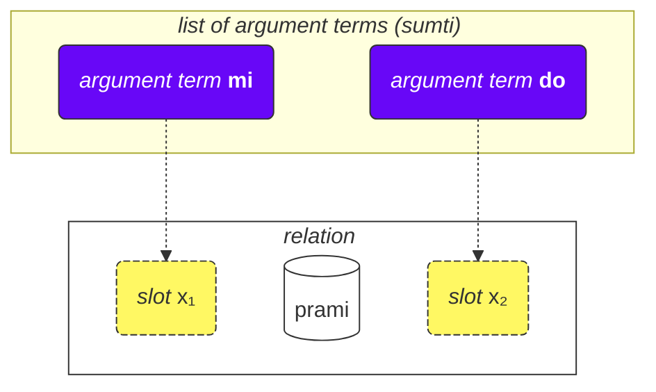
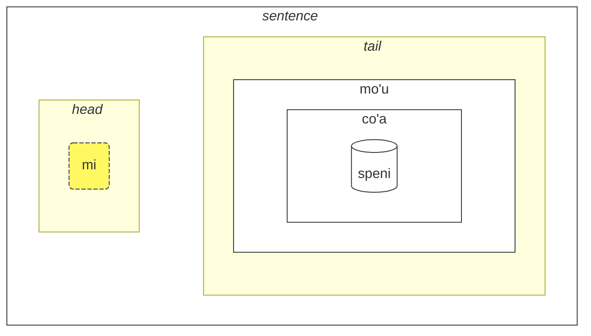

## Lição 2. Mais coisas básicas

### Tipos de palavras

Todas as palavras em Lojban são divididas em três grupos:

- Palavras de relação (chamadas de **selbrivla** em Lojban)
  - Exemplos: **gleki**, **klama**.
  - Essas palavras contêm pelo menos um agrupamento de consoantes (duas ou mais consoantes uma após a outra) dentro dos primeiros 5 sons + terminam em uma vogal.
- Partículas (chamadas de **cmavo** em Lojban)
  - Exemplos: **le**, **nu**, **mi**, **fa'a**.
  - Elas começam com uma consoante (uma das **b d g v z j p t k f s c x l m n r i u**), seguida por uma vogal (uma das **a e i o u y au ai ei oi**). Opcionalmente, após isso, pode haver uma ou mais sequências de um apóstrofo (**'**) e uma vogal seguinte. Por exemplo, **xa'a'a'a'a'a'a** e **ba'au'oi'a'e'o** são possíveis partículas (mesmo que nenhum significado seja atribuído a elas).
  - É bastante comum escrever várias partículas consecutivamente sem espaços entre elas. Isso é permitido pela gramática de Lojban. Portanto, não se surpreenda ao ver **lenu** em vez de **le nu**, **naku** em vez de **na ku**, **jonai** em vez de **jo nai**, e assim por diante. Isso não altera o significado. No entanto, essa regra não se aplica a palavras de relação; palavras de relação devem ser separadas por espaços.
- Palavras de nome (chamadas de **cmevla** em Lojban)
  - Exemplos: **.alis.**, **.doris**, **.lojban.**
  - Geralmente usadas para nomes.
  - Elas podem ser facilmente distinguidas dos outros tipos de palavras, pois terminam em uma consoante. Além disso, elas são envolvidas por dois pontos no início e no final. Coloquialmente, os pontos podem ser omitidos ao escrever, mas ao falar, as pausas correspondentes a esses pontos ainda são obrigatórias.

### Ordem dos argumentos

Anteriormente, fornecemos definições de palavras de relação, como:

mlatu
: ... é um gato, ser um gato

citka
: ... come ...

prami
: ... ama ...

klama
: ... vem para ...

Dicionários podem apresentar definições de palavras de relação com símbolos como $x_1$, $x_2$, etc.:

prami
: $x_1$ ama $x_2$

karce
: $x_1$ é um carro ...

citka
: $x_1$ come $x_2$ ...

klama
: $x_1$ vem para $x_2$ ...

Esses $x_1$, $x_2$ e assim por diante são a notação explícita para os _slots_ (outros nomes são: _lugares_, _funções da relação_, **terbricmi** em Lojban), que são preenchidos por termos de argumento (**sumti**) na frase.

Os números representam a ordem em que esses espaços devem ser preenchidos pelos argumentos.

Por exemplo:

> **mi prami do**
> _Eu te amo._

Essa frase também implica que

- $x_1$ denota _aquele que ama_, e
- $x_2$ denota _aquele que é amado por_.

Em outras palavras, cada relação tem um ou mais espaços, e esses espaços são especificados e rotulados como $x_1$, $x_2$, e assim por diante. Colocamos argumentos como **mi**, **do**, **le tavla**, etc., em ordem, preenchendo esses espaços e dando um significado concreto à relação, formando assim uma frase.

A vantagem desse estilo de definições é que todos os participantes de uma relação estão em uma definição.

Também podemos omitir argumentos, tornando a frase mais vaga:

> **carvi**
> _Está chovendo._
> `é chuva, está chovendo`

(embora o tempo aqui seja determinado pelo contexto, também pode significar _Chove frequentemente_, _Estava chovendo_, etc.)

> **prami do**
> _Alguém te ama._
> `ama você`

Todos os espaços omitidos em uma relação significam apenas **zo'e** = _algo/alguém_, então significa a mesma coisa que

> **zo'e prami do**
> _Alguém te ama._

E

> **prami**

é o mesmo que

> **zo'e prami zo'e**
> _Alguém ama alguém._

Termos modais como **ca**, **fa'a**, etc., adicionam novos espaços às relações, mas não preenchem os espaços das relações. Em

> **mi klama fa'a do**
> _Eu vou em sua direção._

o segundo espaço de **klama** ainda está omitido. Por exemplo:

> **mi klama fa'a le cmana le zdani**
> _Eu vou (na direção da montanha) para casa._

le cmana
: a montanha

<pixra url="/assets/pixra/cilre/cmana.webp" caption="cmana" definition="… é uma montanha"></pixra>

Aqui, o segundo espaço de **klama** é **do**. A frase significa que a montanha é apenas uma direção, enquanto o ponto final é você.

Aqui, o termo **fa'a la cmana** (_na direção da montanha_) não substitui o segundo espaço da relação **klama**. O segundo espaço de **klama** aqui é **le zdani**.

A frase significa que minha casa está simplesmente localizada na direção da montanha, mas não necessariamente significa que eu quero alcançar aquela montanha. O destino final de eu ir não é necessariamente a montanha, mas sim a casa.

Da mesma forma, em

> **mi citka ba le nu mi cadzu**
> _Eu como depois de eu caminhar._

o segundo lugar de **citka** ainda está omitido. Uma nova palavra **ba** com seu argumento **le nu mi cadzu** adiciona significado à frase.

A ordem dos argumentos de uma relação composta é a mesma que a do último componente nela:

> **tu sutra bajra pendo mi**
> _Aquela é minha amiga que corre rapidamente._
> `Aquela é uma amiga que corre rapidamente para mim.`

> **tu pendo mi**
> _Aquela é minha amiga._
> `Aquela é uma amiga para mim.`

pendo
: ... é um(a) amigo(a) de ... (alguém)

Portanto, a ordem dos argumentos é a mesma que a de **pendo** sozinho.

### Mais de dois lugares

Pode haver mais de dois lugares. Por exemplo:

> **mi pinxe le djacu le kabri**
> _Eu bebo a água do copo._

pinxe
: $x_1$ bebe $x_2$ de $x_3$

> **le kabri**
> _o copo_

Nesse caso, existem três lugares, e se você quiser excluir o segundo lugar no meio, você deve usar **zo'e**:
> **mi pinxe zo'e le kabri**
> _Eu bebo \[algo\] do copo._

Se omitirmos **zo'e**, obtemos algo sem sentido:

> **mi pinxe le kabri**
> _Eu bebo o copo._

Outro exemplo:

> **mi plicru do le plise**
> _Eu te dou as maçãs._

plicru
: $x_1$ dá, doa para $x_2$ algum objeto $x_3$; $x_1$ permite que alguém $x_2$ use $x_3$

### Relações dentro de relações

Em
> **le nicte cu nu mi viska le lunra**
> *A noite é quando eu vejo a Lua.*

temos

- **le nicte** como $x_1$ da relação,
- **nu mi viska le lunra** como a relação principal.

No entanto, dentro de **nu mi viska le lunra**, temos outra frase com

- **mi** - $x_1$ da relação interna,
- **viska** - a relação interna,
- **le lunra** - $x_2$ da relação interna.

Portanto, apesar de ter uma estrutura interna, **nu mi viska le lunra** ainda é uma relação com seu primeiro termo preenchido com **le nicte** neste caso.

Da mesma forma, em

> **mi citka ba le nu mi dansu**
> _Eu como depois de eu dançar._

temos

- **mi** como $x_1$ da relação,
- **citka** como a construção principal da relação,
- **ba le nu mi dansu** como um termo modal da relação principal da frase.

Dentro deste termo, temos:

- **mi** como $x_1$ da relação dentro do termo
- **dansu** como a construção principal da relação dentro do termo.

Esse mecanismo "recursivo" de envolver relações em relações permite expressar ideias complexas de forma precisa.

### Por que as palavras de relação são definidas dessa maneira?

O inglês usa um conjunto limitado de preposições que são reutilizadas em vários verbos e, portanto, não têm um significado fixo. Por exemplo, considere a preposição em inglês _to_:

> _Eu falo com você._

<!-- -->
> _Eu vou até você._
<!-- -->

> _Para mim, parece bonito._

Em cada um desses exemplos, _to_ tem um novo papel que, na melhor das hipóteses, é remotamente semelhante aos papéis em outras frases.

É importante observar que outras línguas usam maneiras diferentes de marcar os papéis dos verbos que, em muitos casos, são muito diferentes dos usados em inglês.

Lojban, por exemplo, marca os papéis principais (slots) das relações definindo completamente tais relações com os papéis colocados em sequência (ou marcados com **fa**, **fe**, e assim por diante):

klama
: $x_1$ vai até $x_2$ …

tavla
: $x_1$ fala com $x_2$ …

melbi
: $x_1$ é bonito, bonita para $x_2$ …

Esses papéis principais são essenciais na definição das relações.

No entanto, pode haver papéis opcionais que tornam as relações mais precisas:

> _Eu falo com você enquanto estou comendo._
<!-- -->

> _É difícil para mim porque essa coisa é pesada._

Em Lojban, uma noção semelhante de tais papéis opcionais é expressa por meio de relações separadas ou, para casos mais comuns, com termos modais:

> **mi tavla do ze'a le nu mi citka**
> _Eu falo com você enquanto estou comendo._
<!-- -->
> **nandu mi ri'a le nu ti tilju**
> _É difícil para mim porque essa coisa é pesada._

nandu
: $x_1$ é difícil para $x_2$

tilju
: $x_1$ é pesado

As preposições em inglês são semelhantes às partículas modais em Lojban, embora uma preposição comum em inglês possa ter muitos significados, enquanto em Lojban, cada partícula modal tem apenas um significado (mesmo que vago).

### Regras gerais na ordem dos argumentos

A ordem dos lugares nas relações pode ser difícil de lembrar às vezes, mas não se preocupe — você não precisa lembrar todos os lugares de todas as palavras de relação. (Você se lembra do significado de centenas de milhares de palavras em inglês?)

Você pode estudar lugares quando os encontrar úteis ou quando as pessoas os usarem em um diálogo com você.

A maioria das palavras de relação tem dois ou três lugares.

Normalmente, você pode adivinhar a ordem usando o contexto e algumas regras básicas:

1. O primeiro lugar geralmente é a pessoa ou coisa que faz algo ou é algo:

    **klama** = _$x_1$ vai..._

2. O objeto de alguma ação geralmente vem logo após o primeiro lugar:

    **punji** = _$x_1$ coloca $x_2$ em $x_3$_,

3. E o próximo lugar geralmente será preenchido com o destinatário:

    **punji** = _$x_1$ coloca $x_2$ em $x_3$_,

4. Lugares de destino (_para_) quase sempre vêm antes de lugares de origem (_de_):

    **klama** = _$x_1$ vai para $x_2$ de $x_3$_

    <pixra url="/assets/pixra/cilre/klama_fi.webp" caption="le prenu cu klama fi le zarci" definition="A pessoa sai da loja."></pixra>

5. Lugares menos usados vêm mais para o final. Geralmente são coisas como _por padrão_, _por meio_ ou _feito de_.

A ideia geral é que primeiro vêm os lugares que são mais prováveis de serem usados.

Não é necessário preencher todos os lugares o tempo todo. Lugares não preenchidos têm valores irrelevantes ou óbvios para o falante (eles recebem o valor de **zo'e** = _algo_).

### Infinitivos

Infinitivos são verbos que geralmente são prefixados com _to_ em inglês. Exemplos incluem _Eu gosto de correr_, com _correr_ sendo o infinitivo.

> **le verba cu troci le ka cadzu**
> _A criança está tentando andar._

le verba
: a criança, as crianças

troci
: $x_1$ tenta fazer ou ser $x_2$ (ka)

cadzu
: $x_1$ anda

<pixra url="/assets/pixra/cilre/troci_cadzu.webp" caption="le verba cu troci le ka cadzu" definition="A criança tenta andar."></pixra>

A partícula **ka** funciona de maneira semelhante a **nu**. Ela envolve uma frase.

A principal diferença é que algum espaço na frase envolvida deve ser vinculado a algum argumento fora dessa frase.

Nesse caso, o primeiro argumento **le verba** da relação **troci** faz uma ligação com o primeiro espaço não preenchido da frase interna **cadzu** (que está dentro de **ka**).

Em outras palavras, a criança tenta alcançar um estado em que **le verba cu cadzu** (o argumento **le verba** preencheria o primeiro espaço não preenchido da relação **cadzu**).

Algumas relações requerem apenas infinitivos em alguns de seus espaços. Definições de tais palavras marcam esses espaços como _propriedade_ ou **ka**. Por exemplo:

cinmo
: $x_1$ sente $x_2$ (ka)

Isso significa que o infinitivo no segundo espaço ($x_2$) é aplicado a algum lugar (provavelmente, o primeiro lugar, $x_1$). Casos em que o infinitivo é aplicado a lugares diferentes de $x_2$ são raros e são explicados para relações correspondentes ou, no caso de palavras de relação inventadas informalmente, podem ser deduzidos pelo bom senso.

Observe que apenas o primeiro espaço não preenchido da relação incorporada assume o significado do espaço externo:

> **mi troci le ka do prami**
> _Eu tento ser amado por você._

tcidu
: $x_1$ lê $x_2$ de $x_3$

Aqui, o primeiro espaço não preenchido é o segundo espaço de **prami**, portanto, assume o valor **mi** (_eu_).

Também é possível usar o pronome **ce'u** para marcar explicitamente um espaço que deve ser aplicado a algum argumento externo:

> **mi troci le ka do prami ce'u**
> _Eu tento ser amado por você._

Outro exemplo:

> **mi cinmo le ka xebni ce'u**
> **mi cinmo le ka se xebni**
> _Eu sinto que alguém me odeia._
> _Eu sinto que estou sendo odiado._

### Tipos de espaços

O dicionário frequentemente menciona outros tipos de espaços, por exemplo:

djica
: $x_1$ deseja $x_2$ (evento)

Esse _evento_ significa que você deve preencher o espaço com um argumento que represente um evento. Por exemplo:

le nicte
: noite

le nu mi dansu
: eu dançando

Então temos:

> **mi djica le nicte**
> _Eu desejo o evento da noite._

<!-- -->

> **do djica le nu mi dansu**
> _Você deseja que eu dance._

Em Lojban, não é permitido dizer, por exemplo:

> **mi djica le plise**
> _Eu quero a maçã._ 

porque você quer fazer algo com a maçã ou quer que algum evento aconteça com a maçã, como:

> **mi djica le nu mi citka le plise**
> _Eu quero comer a maçã._
> `Eu quero que eu coma a maçã.`

Observe que agrupar uma relação que espera um evento em **nu** altera o significado:

> **le zekri cu cumki**
> _O crime é possível._

zekri
: $x_1$ (evento) é um evento criminoso, $x_1$ (evento) um crime

cumki
: $x_1$ (evento) é possível

Comparar:

> **le nu zekri cu cumki**
> `Que seja criminoso é possível.`
> _É possível que algo seja crime._

### Raising

> **mi stidi le ka klama le barja**
> _Eu sugiro ir ao pub._

stidi
: $x_1$ sugere ação $x_2$ (propriedade) para $x_3$

> **mi stidi tu'a le barja**
> _Eu sugiro o pub._

tu'a o bar
: algo sobre o bar

> **eu quero comer uma maçã.**
> _I want to eat an apple._

<!-- -->

> **eu quero o doce.**
> _I want the sweetie._

tu'a o doce
: algo sobre o doce

doce
: ... é doce, ... é um doce

<pixra url="/assets/pixra/cilre/djica_tuha_le_titla.webp" caption="a pessoa quer o doce." definition="The person wants the sweetie."></pixra>

A estrutura de lugar pode colocar um fardo muito grande na especificação de ações ou eventos. Às vezes, queremos especificar apenas algum objeto nesses eventos ou lugares e pular a descrição da ação ou do evento completamente.

Nos exemplos acima, _eu sugiro o bar._ provavelmente implica em ir ao bar e _eu quero a maçã._ implica em comê-la.

No entanto, a palavra de relação Lojban **stidi** requer uma propriedade em seu slot $x_2$. Da mesma forma, **djica** requer um evento em seu slot $x_2$.

A pequena palavra qualificadora chamada **tu'a** antes de um termo implica uma abstração (propriedade, evento ou proposição), mas seleciona apenas esse termo dessa abstração, pulando o resto. Pode ser vagamente traduzido como _algo sobre_:

> **eu sugiro algo sobre o bar (talvez visitá-lo, encontrar-se perto dele, etc.).**
> _I suggest something about the pub (maybe visiting it, meeting near it, etc.)._

<!-- -->

> **eu desejo algo relacionado à maçã (talvez comer, mastigar, lamber, jogar em um amigo, etc.).**
> _I desire something related to the apple (perhaps eating, chewing, licking, throwing it at a friend, etc.)_

> **algo sobre o chocolate é agradável para mim.**
> _The chocolate is pleasing to me (likely due to its taste)._
> `Something about the chocolate is pleasant to me`

chocolate
: x1 é algum chocolate

Ao pular abstrações, apenas o contexto nos diz o que foi omitido.

Também é possível modificar a construção relacional principal:

> **o chocolate é agradável para mim.**
> **algo sobre o chocolate é agradável para mim.**
> _The chocolate is pleasing to me._

Isso permite a criação de termos de argumento vagos com **jai**:

> **a coisa agradável está aqui.**
> _The pleasurable thing is here._

Como **o agradável evento** (_the pleasant event_) é abstrato, é impossível especificar sua localização. No entanto, um participante na abstração pode ser colocado fisicamente em algum lugar.

### Lugares dentro de argumentos

Como dizemos _Você é meu amigo_?

> **do pendo mi**
> _Você é meu amigo._
> `Você é um amigo meu.`

<pixra url="/assets/pixra/cilre/pendo.webp" caption="le pendo" definition="o amigo / os amigos"></pixra>

E agora, como dizemos _Meu amigo é inteligente._?

> **le pendo be mi cu stati**
> _Meu amigo é inteligente._

Portanto, quando convertemos uma relação em um argumento (**pendo** — _ser um amigo_ para **le pendo** — _o amigo_), ainda podemos manter outros lugares dessa relação colocando **be** depois dele.

Por padrão, ele se liga ao segundo lugar ($x_2$). Podemos ligar mais lugares separando-os com **bei**:

> **mi plicru do le plise**
> _Eu te dou a maçã._

<pixra url="/assets/pixra/cilre/plicru.webp" caption="le prenu cu plicru le pendo le plise" definition="A pessoa dá ao amigo a maçã."></pixra>
<!-- -->

> **le plicru be mi bei le plise**
> _O doador da maçã para mim_

<!-- -->

> **le plicru be mi bei le plise cu pendo mi**
> _A pessoa que me dá a maçã é meu amigo._
> `Aquele que me dá a maçã é um amigo meu.`

Outro exemplo:

<!-- > **le pendo be mi cu tavla**
> _Os amigos meus estão conversando._
> **le pendo mi cu tavla**
> **le pendo cu tavla mi**
> _Os amigos estão conversando comigo._ -->

> **mi klama le pendo be do**
> _Eu vou a um amigo seu._

klama
: $x_1$ vai para $x_2$ de $x_3$ …

Não podemos omitir **be** porque **le pendo do** são dois lugares independentes:

> **mi klama le pendo do**
> _Eu vou a um amigo seu._

Aqui, **do** ocupa o terceiro lugar de **klama** pois não está ligado a _pendo_ por meio de **be**.

Também não podemos usar **nu** porque **le nu pendo do** é o evento de alguém ser seu amigo.

Portanto, **le pendo be do** é a solução correta.

Outro exemplo:

> **la .lojban. cu bangu mi**
> _Lojban é minha língua._
> `Lojban é uma língua minha.`

No entanto,

> **mi nelci le bangu be mi**
> _Eu gosto da minha língua._

Usar **be** para relações que não foram convertidas em argumentos não tem efeito:

> **mi nelci be do** é o mesmo que
> **mi nelci do**

### Cláusulas relativas

> **le prenu poi pendo mi cu tavla mi**
> _A pessoa que é amiga minha fala comigo._

<!-- -->

> **le prenu noi pendo mi cu tavla mi**
> _A pessoa, que por acaso é amiga minha, fala comigo._

blabi
: ... é branco

Na primeira frase, a palavra _que_ é essencial para identificar a pessoa em questão. Ela esclarece entre as pessoas no contexto de quem estamos falando. Escolhemos apenas aquelas que são minhas amigas, dentre provavelmente muitas pessoas ao redor. Talvez haja apenas uma pessoa ao redor que seja minha amiga.

Quanto a _que por acaso é amiga minha_ na segunda frase, isso apenas fornece informações adicionais sobre a pessoa. Isso não nos ajuda a identificar a pessoa. Por exemplo, isso pode acontecer quando todas as pessoas ao redor são minhas amigas.

**poi pendo mi** é uma cláusula relativa, uma relação anexada à direita do argumento **le prenu**. Ela termina logo antes da próxima palavra **cu**:

> **le prenu (poi pendo mi) cu tavla mi**
> _A pessoa que é amiga minha fala comigo._

Em Lojban, usamos **poi** para cláusulas relativas que identificam entidades (objetos, pessoas ou eventos) e **noi** para informações incidentais.

> **la .bob. ba co'a speni le ninmu poi pu xabju le nurma**
> _Bob vai se casar com uma garota que morava no campo._

xabju
: ... mora em ..., ... habita ... (lugar, objeto)

le nurma
: a área rural

Essa frase não exclui Bob de se casar com outra pessoa também! Remover a cláusula relativa com **poi** muda o significado:

> **la .bob. ba co'a speni le ninmu**
> _Bob vai se casar com uma garota._

Outro exemplo:

> **le prenu poi gleki cu ze'u renvi**
> _As pessoas (quais?) que são felizes vivem muito tempo._

ze'u
: termo modal: por muito tempo

renvi
: sobreviver

Remover a cláusula relativa com **poi** muda o significado:

> **le prenu ze'u renvi**
> _As pessoas vivem muito tempo._

Por outro lado, cláusulas relativas com **noi** contêm apenas informações adicionais sobre o argumento ao qual estão anexadas. Esse argumento já está suficientemente definido por si só, de modo que remover uma cláusula relativa com **noi** não muda seu significado:

> **mi gosta da Doris. O que mais posso dizer sobre ela? Eu a vejo habitualmente no parque.**
> _I like Doris. What else can I say about her? I see her habitually in the park._

zgana
: observar (usando qualquer sentido)

<pixra url="/assets/pixra/cilre/panka_ninmu.webp" caption="a pessoa que eu vejo habitualmente no parque." definition="A pessoa que eu vejo habitualmente no parque."></pixra>

Remover a oração relativa com **noi** mantém o significado: _Eu gosto de Doris._

No inglês falado, a distinção muitas vezes é feita usando entonação ou por adivinhação. Além disso, orações relativas com **noi** são tradicionalmente separadas por vírgulas em inglês. Elas usam _which_ ou _who_, e a palavra _that_ não é usada nelas.

Vamos ter outro exemplo.

> **mi veni le tricu**
> _Eu vou até a árvore._

<!-- -->

> **le tricu cu moli**
> _A árvore está morta._

le tricu
: a árvore (uma árvore)

moli
: $x_1$ está morto(a)

E agora vamos juntar essas duas frases:

> **le tricu noi mi veni le'u cu moli**
> _A árvore, para a qual eu vou, está morta._

Note a palavra **le'u**. Movemos a segunda frase sobre a mesma árvore para uma oração relativa e substituímos o argumento **le tricu** por **le'u** na oração relativa. Portanto, o pronome **le'u** é como _que_ e _o qual_ em português. Ele se refere de volta ao argumento ao qual a oração relativa está ligada.

Literalmente, nossa frase em Lojban soa como

> _A árvore, tal que eu vou até ela, está morta._

**le'u** pode ser omitido se o contexto for suficiente. As duas frases a seguir têm o mesmo significado:

> **a pessoa que é minha amiga fala comigo**
> **a pessoa que le'u é minha amiga fala comigo**
> _A pessoa que é minha amiga fala comigo._

**le'u** é frequentemente assumido para preencher o primeiro lugar vazio:

> **mi gosta da Doris. O que mais posso dizer sobre ela? Eu a vejo habitualmente no parque.**
> **mi gosta da Doris. O que mais posso dizer sobre ela? Eu a vejo habitualmente le'u no parque.**
> _Eu gosto de Doris, a quem eu vejo habitualmente no parque._

As cláusulas relativas, assim como as relações usuais, podem conter construções com termos modais:

> **le tricu noi mi pu klama ke'a ca le cabdei cu barda**
> _A árvore, para a qual eu fui hoje, é grande._

<pixra url="/assets/pixra/cilre/le_tricu_cu_barda.webp" caption="le tricu cu barda" definition="A árvore é grande."></pixra>

le cabdei
: o dia de hoje

Note que **ca le cabdei** pertence à cláusula relativa. Compare:

> **le tricu noi mi pu klama ke'a cu barda ca le cabdei**
> _A árvore, para a qual eu fui, é grande hoje._

O significado mudou bastante.

Por fim, **voi** é usado para formar argumentos semelhantes a **le**, mas com cláusulas relativas:

> **ti voi le nu ke'a cisma cu pluka mi cu zutse tu**
> _Esses, cujo sorriso me agrada, estão sentados._

<pixra url="/assets/pixra/cilre/voi.webp" caption="mi nelci ti voi le nu ke'a cisma cu pluka mi" definition="Eu gosto desses, cujo sorriso me agrada."></pixra>

ti
: este(s) próximo(s) de mim

cisma
: $x_1$ sorri

pluka
: $x_1$ é agradável para $x_2$

zutse
: $x_1$ senta, está sentado em $x_2$

Aqui, **voi** define o objeto próximo a mim.

Compare com:

> **ti poi le nu ke'a cisma cu pluka mi cu zutse**
> _Dentre esses, aqueles cujo sorriso me agrada estão sentados._

**poi** restringe a seleção àqueles descritos na cláusula relativa.
Este exemplo pode implicar que há muitos objetos (pessoas etc.) ao meu redor, mas com **poi** eu seleciono apenas os necessários.

Compare com:

> **ti noi le nu ke'a cisma cu pluka mi cu zutse**
> _Esses (que incidentalmente têm o sorriso que me agrada) estão sentados._

**noi** simplesmente adiciona informações incidentais que não são necessárias para determinar a que se refere **ti** (_esses_). Talvez não haja mais ninguém por perto para descrever.

Por fim, assim como **nu** tem o marcador de limite direito **kei**, temos:

ku'o
: marcador de limite direito para **poi**, **noi** e **voi**.

> **mi tavla la .doris. noi ca zutse tu ku'o .e la .alis. noi ca cisma**
> _Eu converso com Doris, que está sentada ali, e Alice, que está sorrindo._

Observe que, sem **ku'o**, teríamos **tu** (_ali_) juntado com **la .alis.** (_Alice_), levando a um significado estranho:

> **eu falo com a Doris, que está sentada ali e em cima da Alice (que agora sorri).**

Observe a parte **zutse tu .e la .alis.**.

Para **poi**, **noi** e **voi**, o marcador de limite direito ainda é o mesmo: **ku'o**.

### Cláusulas relativas curtas. '_Sobre_'

Às vezes, você pode precisar anexar um argumento adicional a outro argumento:

> **eu sei algo importante sobre você.**

le vajni
: algo importante

**pe** e **ne** são semelhantes a **poi** e **noi**, mas eles anexam argumentos a argumentos:

> **a caneta que é minha é vermelha.** (_minha_ é essencial para identificar a caneta em questão)

<!-- -->

> **a caneta, que é minha, é vermelha.** (informação adicional)

ne
: que é sobre, tem relação com ... (um argumento segue)

pe
: que é sobre, tem relação com ... (um argumento segue)

> **a caneta, que é minha, e o telefone, que é seu, são vermelhos.**

ge'u
: marcador de limite direito para **pe**, **ne**.

### «**be**» e «**pe**»

Observe que as cláusulas relativas são anexadas a argumentos, enquanto **be** é parte da relação.

Na verdade, **le bangu pe mi** é uma tradução melhor para _minha língua_, pois, como em inglês, os dois argumentos estão relacionados de forma vaga.

No entanto, você pode dizer **le birka be mi** como _meu braço_. Mesmo que você corte seu braço, ele ainda será seu. É por isso que **birka** tem um lugar para o proprietário:

birka
: $x_1$ é um braço de $x_2$

Vamos mostrar novamente que uma construção com **be** é parte da relação, enquanto **pe**, **ne**, **poi** e **noi** se anexam a argumentos:

> **o telefone bonito para mim do amigo meu é grande.**

Aqui, **be mi** está anexado à relação **melbi** = _ser bonito para ... (alguém)_ e, assim, cria uma nova relação **melbi be mi** = _ser bonito para mim_. Mas **pe le pa pendo be mi** (_do meu amigo_) é aplicado a todo o argumento **le pa melbi be mi fonxa** (_o telefone bonito para mim_).

Também pode acontecer que precisemos anexar **be** a uma relação, transformar essa relação em um argumento e, em seguida, anexar **pe** a esse argumento:

> **le pa pendo be do be'o pe la .paris. cu stati**
> _O amigo seu que está relacionado a Paris é inteligente._
> (**pe la .paris.** está anexado a todo o argumento **le pa pendo be do be'o**)

<!-- -->

> **le pu plicru be do bei le pa plise be'o pe la .paris. cu stati**
> _Quem te deu a maçã (e que está relacionado a Paris) é inteligente._
> (**pe la .paris.** está anexado a todo o argumento **le pu plicru be do bei le pa plise be'o**)

be'o
: marcador de limite direito para a sequência de termos anexados com **be** e **bei**

Nesses dois exemplos, seu amigo tem alguma relação com Paris (talvez ele/ela seja de Paris).

Compare com:

> **le pa pendo be do pe la .paris. cu stati**
> _O amigo seu (você que está relacionado a Paris) é inteligente._

<!-- -->

> **le pu plicru be do bei le pa plise pe la .paris. cu stati**
> _Quem te deu a maçã (a maçã que está relacionada a Paris) é inteligente._

Nos últimos dois exemplos, no entanto, ou você está relacionado a Paris ou a maçã.

### ‘_Alice é uma professora_’ e ‘_Alice é a professora_’

Em inglês, o verbo _is, are, to be_ faz com que um substantivo funcione como um verbo. Em Lojban, até mesmo conceitos como _gato_ (**mlatu**), _pessoa_ (**prenu**), _casa_ (**dinju**), _lar_ (**zdani**) funcionam como verbos (relações) por padrão. Apenas os pronomes funcionam como argumentos.

No entanto, aqui estão três casos:

> **la .alis. cu ctuca**
> _Alice ensina._

<!-- -->

> **la .alis. cu me le ctuca**
> _Alice é uma das professoras._

me
: ... está entre ..., ... é um dos ..., ... são membros de ... (argumento segue)

> **la .alis. ta'e ctuca**
> _Alice ensina habitualmente._

ta'e
: partícula modal: o evento acontece habitualmente

> **la .alis. cu du le ctuca**
> _Alice é a professora._

du
: ... é idêntico a ...

A partícula **me** recebe um argumento após ela e indica que provavelmente existem outros professores, e Alice é uma entre eles.

A partícula **du** é usada quando Alice é, por exemplo, a professora que estávamos procurando ou falando sobre. Ela indica identidade.

Assim, **me** e **du** às vezes podem corresponder ao que em inglês expressamos usando o verbo _ser/estar/era_.

No Lojban, priorizamos o significado do que pretendemos dizer, em vez de depender de como é expresso literalmente em inglês ou em outras línguas.

Outros exemplos:

> **mi me la .bond.**
> _Eu sou o Bond._

<!-- -->

> **mi du la .kevin.**
> _Eu sou o Kevin (aquele que você precisa)._

<!-- -->

> **ti du la .alis. noi mi ta'e zgana bu'u le panka**
> _Esta é a Alice, a quem eu vejo habitualmente no parque._

**noi du** e **poi du** são usados para introduzir nomes alternativos para algo. Eles correspondem ao inglês _namely, i.e._:

> **la .alis. cu penmi le prenu noi du la .abdul.**
> _Alice encontrou a pessoa, ou seja, Abdul._

Ao usar **me**, você pode conectar vários argumentos com _e_:

> **tu me le pendo be mi be'o .e le tunba be mi**
> _Esses são alguns (ou todos) dos meus amigos e meus irmãos._

tunba
: $x_1$ é irmão de $x_2$

### Relações com partículas modais

Podemos colocar uma partícula modal não apenas antes da construção principal da relação da frase, mas também no final dela, produzindo o mesmo resultado:

> **mi ca tcidu**
> **mi tcidu ca**
> _Eu (agora leio)._

tcidu
: ler (um texto)

Ao usar **nu**, criamos uma relação que descreve algum evento. Observe a diferença entre esses dois exemplos:

> **le nu tcidu ca cu nandu**
> _A leitura atual está complicada, difícil._

<!-- -->

> **le nu tcidu cu ca nandu**
> _A leitura está agora complicada._

Outros exemplos:

> **mi klama le pa cmana pu**
> _Eu fui para a montanha._
> `Eu vou para uma montanha (no passado).`

<!-- -->

> **le nu mi klama le pa cmana pu cu pluka**
> _O fato de eu ter ido para a montanha é agradável._

Também podemos colocar uma ou mais partículas modais como o primeiro elemento de uma construção de relação e, por exemplo, usar essa relação enriquecida em uma forma de argumento:

<pixra url="/assets/pixra/cilre/coha_purdi.webp" caption="le pu kunti tumla ca purdi" definition="O que era um deserto agora é um jardim."></pixra>

> **le pu kunti tumla ca purdi**
> _O que era um deserto agora é um jardim._

**pu** pertence a **le kunti tumla** e **ca** pertence a **purdi** (já que **le pu kunti tumla** não pode adicionar **ca** no final).

<!-- Isso não contradiz o uso de **ser** após o verbo, já que, com **ser**, você muda o verbo: **bangu ser eu** é considerado um único verbo. -->

Ter várias partículas modais em sequência não é um problema:
> **le pu ze'u kunti tumla ca purdi**
> _O que era um deserto por muito tempo agora é um jardim._

ze'u
: termo modal: por muito tempo

Colocar partículas de termo após substantivos as vincula a relações externas:

<pixra url="/assets/pixra/cilre/cohu_purdi.webp" caption="le kunti tumla pu purdi" definition="O deserto era um jardim."></pixra>

> **le kunti tumla pu purdi**
> **(le kunti tumla) pu purdi**
> _O deserto era um jardim._

### Novos argumentos a partir de slots da mesma relação

> **do plicru mi ti**
> _Você me concede isso._

<!-- -->

> **mi se plicru ti do**
> _Isso me é concedido por você._

plicru
: $x_1$ dá a $x_2$ algo $x_3$ para uso

Podemos trocar as duas primeiras posições na relação usando **se** e, assim, alterar a estrutura do lugar.

**do plicru mi ti** significa exatamente a mesma coisa que **mi se plicru do ti**. A diferença está apenas no estilo.

Você pode querer mudar as coisas para enfatizar diferentes aspectos, por exemplo, mencionar as coisas mais importantes em uma frase primeiro. Portanto, os pares a seguir têm o mesmo significado:

> **mi prami do**
> _Eu te amo._

<!-- -->

> **do se prami mi**
> _Você é amado por mim._

<!-- -->

> **le nu mi tadni la .lojban. cu xamgu mi**
> _Meu estudo de Lojban é bom para mim._

xamgu
: ... é bom para (alguém)

> **mi se xamgu le nu mi tadni la .lojban.**
> _Para mim, é bom estudar Lojban._

O mesmo pode ser feito quando relações são usadas para criar argumentos:

le plicru
: aqueles que dão, os doadores

le se plicru
: aqueles que são dados, os beneficiários dos presentes

le te plicru
: aqueles objetos que são dados para uso, os presentes

**te** troca a primeira e a terceira posições das relações.

Como sabemos, quando adicionamos **le** antes de uma construção de relação, ela se torna um argumento. Portanto,

- **le plicru** significa _aqueles que poderiam se encaixar na primeira posição de **plicru**_
- **le se plicru** significa _aqueles que poderiam se encaixar na segunda posição de **plicru**_
- **le te plicru** significa _aqueles que poderiam se encaixar na terceira posição de **plicru**_

Assim, em Lojban, não precisamos de palavras separadas para _doador_, _destinatário_ e _presente_. Reutilizamos a mesma relação e economizamos muito esforço por causa desse design inteligente. Na verdade, não conseguimos imaginar um presente sem implicar que alguém o deu ou o dará. Quando fenômenos úteis estão interconectados, o Lojban reflete isso.

<!-- TODO: DwE: Para facilitar o entendimento e a memorização: palavras predicativas prefixadas com **se**, **te** são colocadas no dicionário em entradas para muitos verbos, juntamente com suas definições, embora você possa descobrir o significado delas por si mesmo. -->

### Mudando outros lugares nas relações principais

A série **se, te, ve, xe** (em ordem alfabética) consiste em partículas que trocam de lugar nas relações principais:

- **se** troca o primeiro e o segundo lugares
- **te** troca o primeiro e o terceiro lugares
- **ve** troca o primeiro e o quarto lugares
- **xe** troca o primeiro e o quinto lugares.

> **mi zbasu le pa stizu le mudri**  
> _Eu fiz a cadeira com o pedaço de madeira._

zbasu
: $x_1$ constrói, faz $x_2$ com $x_3$

le pa stizu
: a cadeira

le mudri
: o pedaço de madeira

> **le mudri cu te zbasu le stizu mi**  
> _O pedaço de madeira é do que a cadeira é feita por mim._

O **mi** agora foi movido para o terceiro lugar da relação e pode ser omitido se formos preguiçosos demais para especificar quem fez a cadeira ou se simplesmente não sabemos quem a fez:

> **le mudri cu te zbasu le stizu**  
> _O pedaço de madeira é o material da cadeira._

Da mesma forma que nosso exemplo com **le se plicru** (_o destinatário_) e **le te plicru** (_o presente_), podemos usar **te**, **ve**, **xe** para derivar mais palavras de outros lugares das palavras de relação:

klama
: $x_1$ vai para $x_2$ de $x_3$ via $x_4$ por meio de $x_5$

Assim, podemos derivar que

le klama
: o que chega / os que chegam

le se klama
: o local de destino

le te klama
: o local de origem do movimento

le ve klama
: a rota

le xe klama
: o meio de chegada

**le xe klama** e o quinto lugar de **klama** podem denotar qualquer meio de movimento, como dirigir um carro ou caminhar a pé.

**se** é usado com mais frequência do que as outras partículas para trocar de lugar.

### Ordem livre de palavras: tags para papéis em relações

Normalmente, não precisamos de todos os espaços, lugares de uma relação, então podemos omitir os desnecessários substituindo-os por **zo'e**. No entanto, podemos usar _tags de lugar_ para nos referirmos explicitamente a um espaço necessário. As tags de lugar funcionam como partículas modais, mas lidam com a estrutura de lugar das relações:

> **mi prami do** é o mesmo que
> **fa mi prami fe do**
> _Eu te amo._

- **fa** marca o argumento que preenche o primeiro espaço de uma relação ($x_1$)
- **fe** marca o argumento que preenche o segundo espaço ($x_2$)
- **fi** marca o argumento que preenche o terceiro espaço ($x_3$)
- **fo** marca o argumento que preenche o quarto espaço ($x_4$)
- **fu** marca o argumento que preenche o quinto espaço ($x_5$)

Mais exemplos:

> **mi klama fi le tcadu**
> _Eu vou da cidade._

**fi** marca **le tcadu** como o terceiro lugar de **klama** (a origem do movimento). Sem **fi**, a frase se tornaria **mi klama le tcadu**, significando _Eu vou para a cidade._

> **mi pinxe fi le kabri** é o mesmo que
> **mi pinxe zo'e le kabri**
> _Eu bebo (algo) do copo._

pinxe
: $x_1$ bebe $x_2$ do $x_3$

le kabri
: o copo, o cálice

<pixra url="/assets/pixra/cilre/pinxe_fi_le_kabri.webp" caption="le prenu cu pinxe fi le kabri" definition="A pessoa bebe do copo."></pixra>

> **mi tugni zo'e le nu vitke le rirni**
> **mi tugni fi le nu vitke le rirni**
> _Eu concordo (com alguém) sobre visitar os pais._

tugni
: $x_1$ concorda com alguém $x_2$ sobre $x_3$ (proposição)

le rirni
: o pai / os pais

Com as tags de lugar, podemos mover os lugares ao redor:

> **fe mi fi le plise pu plicru**
> _Alguém deu a maçã para mim._

Aqui,

- **le plise** = _a maçã_, colocamos no terceiro lugar de **plicru**, o que é dado
- **mi** = _mim_, colocamos no segundo lugar de **plicru**, o destinatário.

Como podemos ver no último exemplo, nem mesmo podemos refletir a ordem das palavras em sua tradução para o inglês.

O uso extensivo de tags de lugar pode tornar nossa fala mais difícil de entender, mas permite mais liberdade.

Ao contrário das séries **se**, usar etiquetas de lugar como **fa** não altera a estrutura do lugar.

---

Podemos usar etiquetas de lugar dentro de argumentos, colocando-as após **be**:

> **le pa klama be fi le tcadu cu pendo mi**
> _Aquele que vai para a cidade é meu amigo._

---

Também podemos colocar todos os argumentos de uma relação principal na frente da frase (preservando sua ordem relativa). Por causa dessa liberdade, podemos dizer:

> **mi do prami**, que é o mesmo que
> **mi do cu prami**, que é o mesmo que
> **mi prami do**
> _Eu te amo._

<!-- -->

> **ko kurji ko** é o mesmo que
> **ko ko kurji**
> _Cuide de si mesmo._

As seguintes frases também têm o mesmo significado:

> **mi plicru do le pa plise**
> _Eu te dou a maçã._

<!-- -->

> **mi do cu plicru le pa plise**
> _Eu te dou a maçã._

<!-- -->

> **mi do le pa plise cu plicru**
> _Eu te dou a maçã._

### Prenex

Prenex é um "prefixo" de relação, no qual você pode declarar variáveis para serem usadas posteriormente:

> **pa da poi pendo mi zo'u da tavla da**
> _Existe alguém que é meu amigo e que fala consigo mesmo_

zo'u
: separador de prenex

da
: pronome: variável.

O pronome **da** é traduzido como _existe algo/alguém..._ Se usarmos **da** pela segunda vez na mesma relação, ele sempre se refere à mesma coisa que o primeiro **da**:

> **mi djica le nu su'o da poi kukte zo'u mi citka da**
> _Eu gostaria que houvesse pelo menos algo saboroso para que eu possa comer._

su'o
: número: pelo menos 1

Se a variável for usada na mesma relação e não em relações embutidas, você pode omitir o prenex completamente:

> **mi djica le nu su'o da poi kukte zo'u mi citka da**
> **mi djica le nu mi citka su'o da poi kukte**
> _Eu gostaria que houvesse pelo menos algo saboroso para que eu possa comer._
> _Eu desejo que algo exista para que eu possa comer._

Ambos os exemplos têm o mesmo significado, em ambos os casos **su'o da** denota _existe (existia/existirá) algo ou alguém_.

No entanto, o prenex é útil e necessário quando você precisa usar **da** profundamente em sua relação, ou seja, dentro de relações embutidas:

> **su'o da poi kukte zo'u mi djica le nu mi citka da**
> _Existe algo saboroso: Eu gostaria de comê-lo, eu quero comê-lo._
> _Existe algo saboroso que eu gostaria de comer._

Observe como o significado muda. Aqui, não podemos omitir o prenexo porque isso alteraria o significado do exemplo anterior.

Mais exemplos:

> **mi tavla**
> _Eu falo._

<!-- -->

> **mi tavla su'o da**
> **mi tavla da**
> _Existe alguém com quem eu falo._

Por padrão, **da** como um pronome sozinho significa o mesmo que **su'o da** (_existe pelo menos um(a) ..._) a menos que um número explícito seja usado.

> **da tavla da**
> _Alguém fala consigo mesmo._

<!-- -->

> **da tavla da da**
> _Alguém fala consigo mesmo sobre si mesmo._

tavla
: $x_1$ fala com alguém $x_2$ sobre o assunto $x_3$

> **pa da poi ckape zo'u mi djica le nu da na ku fasnu**
> _Existe uma coisa perigosa: Eu gostaria que isso nunca acontecesse._

**da** não implica em objetos ou eventos específicos, o que é frequentemente útil:

> **xu do tavla su'o da poi na ku slabu do**
> _Você fala com alguém que não é familiar para você? (nenhuma pessoa específica em mente é descrita)._

<!-- -->

> **.e'u mi joi do casnu bu'u su'o da poi drata**
> _Vamos discutir em outro lugar (nenhum lugar específico em mente)_

### Argumentos de existência

> **pa da poi me le pendo be mi zo'u mi prami da**
> _Existe alguém que é um amigo meu, tal que eu amo essa pessoa._

Como **da** é usado apenas uma vez, poderíamos ser tentados a eliminar o prenexo. Mas como devemos lidar com a oração relativa **poi pendo mi** (_que é um amigo meu_)?

Felizmente, em Lojban, há um atalho:

> **pa da poi me le pendo be mi zo'u mi prami da**
> **mi prami pa le pendo be mi**
> _Existe alguém que é um amigo meu, tal que eu amo essa pessoa._

Ambas as frases têm o mesmo significado.

Argumentos que começam com números como **pa le pendo** (_existe alguém que é um amigo meu_), **ci le prenu** (_existem três pessoas_) podem se referir a novas entidades toda vez que são usados. É por isso que

> **pa le pendo be mi ca tavla pa le pendo be mi**
> _Existe um amigo meu que fala com um amigo meu._

Esta frase não é precisa em dizer se é seu amigo falando consigo mesmo, ou se você está descrevendo dois amigos seus, onde o primeiro está falando com o segundo.

É mais razoável dizer:

> **le pa pendo be mi ca tavla ri**
> _O amigo meu está falando consigo mesmo._

ri
: pronome: refere-se ao argumento anterior excluindo **mi**, **do**.

Aqui, **ri** se refere ao argumento anterior: **le pa pendo** como um todo.

Observe a diferença:

- **da** significa _há algo/alguém_, **da** sempre se refere à mesma entidade quando usado mais de uma vez na mesma relação.
- argumento como **pa le mlatu** (com um número simples) é similar a usar **pa da poi me le mlatu**, mas pode se referir a novas entidades cada vez que é usado.

> **mi nitcu le nu pa da poi mikce zo'u da kurju mi**
> _Eu preciso de um médico para cuidar de mim (implicando "qualquer médico serve")._

<!-- -->

> **pa da poi mikce zo'u mi nitcu le nu da kurju mi**
> _Há um médico que eu preciso para cuidar de mim._

Mais um exemplo:

> **le nu pilno pa le bangu kei na ku banzu**
> _Usar apenas uma das línguas não é suficiente._

pilno
: … usa …

banzu
: … é suficiente para o propósito …

Compare com:

> **le nu pilno le pa bangu kei na ku banzu**
> _Usar a língua (a que está em questão) não é suficiente._

Argumentos de existência são naturalmente usados dentro de relações internas e com **tu'a**:

> **mi djica le nu mi citka pa le plise**
> _Eu quero comer uma maçã, alguma maçã._

> **mi djica tu'a pa le plise**
> _Eu quero algo relacionado a uma maçã, alguma maçã (provavelmente, comê-la, talvez mastigá-la, lambê-la, jogá-la no seu amigo, etc.)_

Observe a diferença:

> **mi djica tu'a le pa plise**
> _Eu quero algo relacionado à maçã (a maçã em questão)._

### ‘_Eu tenho um braço._’ ‘_Eu tenho um irmão._’

O verbo em inglês _to have_ tem vários significados. Vamos listar alguns deles.

> **pa da birka mi**
> _Eu tenho um braço._
> `Há algo que é um braço meu`

birka
: $x_1$ é um braço de $x_2$

Usamos a mesma estratégia para expressar relações familiares:

> **re le verba cu tavla ci le pendo**
> _Two children are talking to three friends._

This sentence implies that only two children are involved in the conversation, regardless of the total number of friends.

---

Remember that the order of terms and modal terms is important. Let's see an example:

> **mi klama le zarci be le pendo**
> _I go to the store of the friend._

Here, the store belongs to the friend. But if we change the order:

> **mi klama le pendo be le zarci**
> _I go to the friend of the store._

Now, the friend belongs to the store. So, be careful with the order of terms to convey the correct meaning.

---

That's it! Let me know if you need any further assistance.

> **Para dois **de** que estão entre as crianças, para três **da** que estão entre os amigos, **da** fala com **de**_
> _Embora agora tenhamos limitado o número de crianças para exatamente duas, acabamos com um número indeterminado de amigos, variando de três a seis. Essa distinção é chamada de "distinção de escopo": no primeiro exemplo, **ci da poi me le pendo** é dito ter um escopo mais amplo do que **re de poi me le verba**, e, portanto, precede-o no prenex. No segundo exemplo, o contrário é verdadeiro._

> _Para igualar o escopo, usamos uma conjunção especial **ce'e** conectando dois termos:_

> **ci da poi me le pendo ce'e re de poi me le verba cu tavla**
> **ci le pendo ce'e re le verba cu tavla**
> _Três amigos [e] duas crianças, conversam._

> _Isso seleciona dois grupos, um de três amigos e outro de duas crianças, e diz que cada um dos amigos fala com cada uma das crianças._

> _A ordem também importa com partículas modais modificando construções de relações principais:_

> **mi speni**
> _Eu sou casado, eu tenho uma esposa ou um marido._

> **mi co'a speni**
> _Eu me caso._

> **mi mo'u speni**
> _Eu sou viúvo(a)._

> _mo'u: termo: o evento está completo_

> _Agora compare:_

> **mi mo'u co'a speni**
> _Eu sou recém-casado(a)._
> `Eu terminei de me tornar uma pessoa casada.`

> **mi co'a mo'u speni**
> _Eu fico viúvo(a)._
> `Eu começo a terminar de ser casado(a).`

> _Se houver várias partículas modais em uma frase, a regra é que as lemos da esquerda para a direita juntas, pensando nisso como uma chamada _jornada imaginária_. Começamos em um ponto implícito no tempo e no espaço (o "agora e aqui" do falante se nenhum argumento estiver anexado à direita) e, em seguida, seguimos as modais uma após a outra da esquerda para a direita._

> _Vamos pegar **mi mo'u co'a speni**._

> **mo'u** significa que um evento está completo. Qual evento? O evento **co'a speni** - se tornar casado. Portanto, **mi mo'u co'a speni** significa _Eu termino o processo de me tornar casado_, ou seja, _Eu sou recém-casado(a)._ 

> _Nesses casos, dizemos que **co'a speni** está dentro do "escopo" de **mo'u**.

Em **mi co'a mo'u speni**, a ordem dos eventos é diferente.

Primeiro, é dito que um evento começou (**co'a**), depois é afirmado que é um evento de terminar de ser casado. Portanto, **mi co'a mo'u speni** significa _eu fico viúvo(a)_.

Podemos dizer que aqui **mo'u speni** está dentro do "escopo" de **co'a**.

Outro exemplo:

> **mi co'a ta'e citka**
> _Eu começo a comer habitualmente._

<!-- -->

> **mi ta'e co'a citka**
> _Eu habitualmente começo a comer._

Exemplos com tempos simples:

> **mi pu ba klama le cmana**
> _Isso aconteceu antes de eu ir para a montanha._
> `Eu no passado: no futuro: ir para a montanha.`

> **mi ba pu klama le cmana**
> _Isso acontecerá depois de eu ir para a montanha._
> `Eu no futuro: no passado: ir para a montanha.`

A regra de ler os termos da esquerda para a direita pode ser substituída conectando partículas modais com a conjunção **ce'e**:

> **mi ba ce'e pu klama le cmana**
> _Eu fui e irei para a montanha._
> `Eu no futuro e no passado: ir para a montanha.`

> **mi cadzu ba le nu mi citka ce'e pu le nu mi sipna**
> _Eu ando depois de comer e antes de dormir._

### Partículas modais + «**da**» + argumentos que começam com números

Assim como com termos modais, a posição de **da** importa:

> **mi ponse da**
> _Há algo que eu possuo._

<!-- -->

> **mi co'u ponse da**
> _Eu perdi toda a minha propriedade._

ponse
: $x_1$ possui $x_2$

co'u
: termo modal: o evento para

Isso pode parecer um exemplo confuso. Aqui, uma pessoa foi capaz de dizer _Eu possuo algo_. Mas então, para tudo o que a pessoa possuía, essa situação acabou.

Outro exemplo:

> **ro da vi cu cizra**
> _Tudo é estranho aqui._
> `Toda coisa aqui estranha`

vi
: aqui, a uma curta distância

cizra
: $x_1$ é estranho

> **vi ku ro da cizra**
> _Aqui, tudo é estranho._
> `Aqui: toda coisa estranha`

Você percebeu a diferença?

1. _Tudo é estranho aqui_ significa que se algo não é estranho em algum lugar, ele se torna estranho neste lugar.
2. _Aqui, tudo é estranho_ simplesmente descreve aqueles objetos ou eventos que estão aqui (e eles são estranhos). Não sabemos nada sobre outros em outros lugares.

<pixra url="/assets/pixra/cilre/viku_cizra.webp" caption="aqui, tudo é estranho." definition="Aqui, tudo é estranho."></pixra>

Outro exemplo com um termo de argumento começando com um número:

> **pa le prenu ta'e jundi**
> _Existe uma pessoa que está habitualmente atenta._

— é a mesma pessoa que está atenta.

> **ta'e ku pa le prenu cu jundi**
> _Acontece habitualmente que existe uma pessoa que está atenta._

— sempre é aquela pessoa que está atenta. As pessoas podem mudar, mas sempre há uma pessoa atenta.

### Argumentos genéricos. 'Eu gosto de gatos (em geral)'. Conjuntos

> **mi nelci le'e mlatu**
> _Eu gosto de gatos._

Vimos que **le** é geralmente traduzido como o inglês _the_. No entanto, em alguns casos, podemos querer descrever um objeto ou evento típico que melhor exemplifica um tipo de objeto ou evento em nosso contexto. Nesse caso, substituímos **le** por **le'e**:

> **mi nelci le'e badna .i mi na ku nelci le'e plise**
> _Eu gosto de bananas. Eu não gosto de maçãs._

Eu posso não ter bananas ou maçãs em mãos. Estou simplesmente falando sobre bananas e maçãs como eu entendo, lembro ou defino.

Para fazer um termo de argumento que descreva o conjunto de objetos ou eventos (do qual derivamos tal elemento típico), usamos a palavra **le'i**:

> **le danlu pendo pe mi cu mupli le ka ca da co'a morsi kei le'i mabru**
> _Meu animal de estimação é um exemplo de que em algum momento os mamíferos morrem._

danlu
: $x_1$ é um mamífero

morsi
: $x_1$ está morto

co'a morsi
: $x_1$ morre

ca da
: em algum ponto no tempo

mupli
: $x_1$ é um exemplo de $x_2$ (propriedade) entre $x_3$ (conjunto)

Dicionários especificam espaços de relações que devem ser preenchidos com conjuntos.

### Massas

> **lei prenu pu sruri le jubme**
> _As pessoas cercaram a mesa._
> `A massa de pessoas cercou a mesa.`

<pixra url="/assets/pixra/cilre/sruri.webp" caption="lei prenu cu sruri le jubme" definition="As pessoas cercaram a mesa."></pixra>

Usamos **lei** em vez de **le** para mostrar que a massa de objetos é relevante para a ação, mas não necessariamente cada um desses objetos individualmente. Compare:

> **le prenu pu smaji**
> _As pessoas estavam em silêncio._

> **lei prenu pu smaji**
> _A multidão estava em silêncio._

le prenu
: a pessoa, as pessoas

lei prenu
: a multidão, o grupo de pessoas

smaji
: $x_1$ está em silêncio

> **le since cu sruri le garna**
> _As cobras cercaram a vara._
> _Cada uma das cobras cercou a vara._

— aqui, cada cobra provavelmente cercou a vara enrolando-se ao redor dela.

> **lei since cu sruri le garna**
> _As cobras cercaram a vara._
> _As cobras, como um grupo, cercaram a vara._

— aqui, não nos importamos com as cobras individuais, mas afirmamos que as cobras, como um grupo, cercaram a vara.

<pixra url="/assets/pixra/cilre/sruri_since.webp" caption="le pa since cu sruri le prenu" definition="A cobra cercou a pessoa."></pixra>

> **lei re djine cu sinxa la .lojban.**
> _Os dois anéis são um símbolo do Lojban._

> **na ku re le djine cu sinxa la lojban**
> _Não é verdade que cada um dos dois anéis seja um símbolo do Lojban._

djine
: $x_1$ é um anel

De fato, apenas os dois anéis juntos formam um símbolo.

Considere a seguinte frase:

> _As maçãs são pesadas._

Isso significa que cada maçã é pesada, ou significa que elas são pesadas quando consideradas em conjunto?

No Lojban, podemos facilmente distinguir entre esses dois casos:

> **le ci plise cu tilju**
> _Cada uma das três maçãs é pesada._

> **le plise cu tilju**
> _Cada uma das maçãs é pesada._

> **lei ci plise cu tilju**
> _As três maçãs são pesadas em total._
> (de modo que cada maçã pode ser leve, mas juntas elas são pesadas)

tilju
: $x_1$ é pesado

Como você pode ver, há uma diferença importante entre descrever um objeto dentro de um grupo e descrever o grupo em si.

### Números em lugares

> **le ci plise cu grake li pa no no**
> _Cada uma das três maçãs pesa 100 gramas._

<!-- -->

> **lei ci plise cu grake li pa no no**
> _As três maçãs pesam 100 gramas no total._
> (de modo que cada maçã pesa ≈ 33 gramas em média)

grake
: $x_1$ pesa $x_2$ (número) gramas

Quando um lugar de uma relação requer um número conforme mencionado no dicionário, então, para usar esse número, o prefixamos com a palavra **li**.

**li** é um prefixo que indica que um número, um carimbo de data e hora ou alguma expressão matemática está chegando.

> **li mu no**
> _Número 50._

Um simples **mu no** que não é prefixado por **li** seria usado para denotar 50 objetos ou eventos.