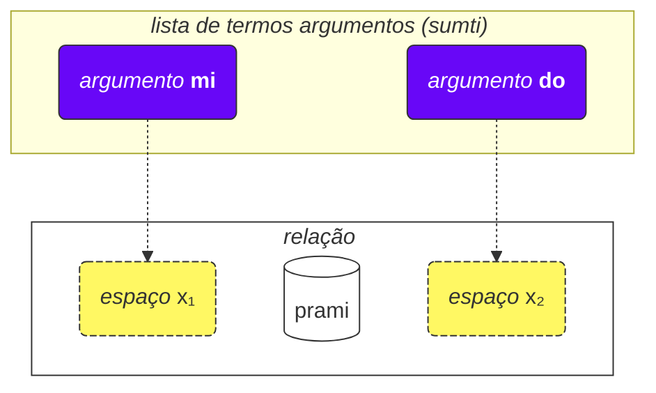
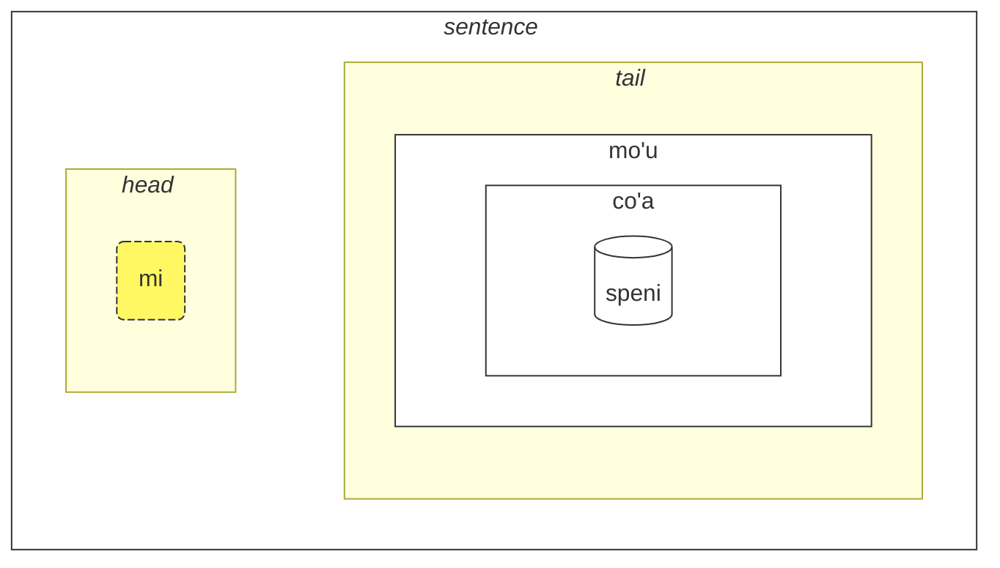

## Lição 2. Mais coisas básicas

### Tipos de palavras

As palavras Lojban são divididas em três grupos:

- Palavras de relação (chamadas **selbrivla** em Lojban)
  - Exemplos: **gleki**, **klama**.
  - Tais palavras contêm pelo menos um grupo de consoantes (duas ou mais consoantes uma após a outra) dentro dos primeiros 5 sons + elas terminam em uma vogal.
- Partículas (chamadas **cmavo** em Lojban)
  - Exemplos: **le**, **nu**, **mi**, **fa'a**.
  - Elas começam com uma consoante (uma de **b d g v z j p t k f s c x l m n r i u**), seguida de uma vogal (uma de **a e i o u y au ai ei oi**). Opcionalmente, depois disso, pode haver uma ou mais sequências de um apóstrofo (**'**) e uma vogal seguinte. Por exemplo, **xa'a'a'a'a'a'a** e **ba'au'oi'a'e'o** são partículas possíveis (mesmo que nenhum significado seja atribuído a elas).
  - É bastante comum escrever várias partículas consecutivamente sem espaços entre elas. Isso é permitido pela gramática Lojban. Então, não se surpreenda ao ver **lenu** em vez de **le nu**, **naku** em vez de **na ku**, **jonai** em vez de **jo nai**, e assim por diante. Isso não muda o significado. No entanto, esta regra não se aplica a palavras de relação; palavras de relação devem ser separadas por espaços.
- Palavras de nome (chamadas **cmevla** em Lojban)
  - Exemplos: **.alis.**, **.doris**, **.lojban.**
  - Geralmente usadas para nomes pessoais, nomes de lugares etc.
  - Elas podem ser facilmente distinguidas dos outros tipos de palavras, pois terminam em uma consoante. Além disso, elas são envolvidas com dois pontos no início e no final. Coloquialmente, os pontos podem ser omitidos ao escrever, mas ao falar, pausas que correspondem a esses pontos ainda são obrigatórias.

#### Tarefa

Cubra a parte direita da tabela. Tente identificar o tipo de cada palavra Lojban usando as regras que acabaram de ser descritas.

<table>
<tbody><tr>
<td><b>le</b></td>
<td>partícula (começa com consoante seguida de vogal)</td>
</tr>
<tr>
<td><b>melbi</b></td>
<td>palavra de relação (contém grupo de consoantes 'lb')</td>
</tr>
<tr>
<td><b>.paris.</b></td>
<td>palavra de nome (termina em consoante, tem pontos ao redor)</td>
</tr>
<tr>
<td><b>mi'o</b></td>
<td>partícula (contém apóstrofo entre vogais)</td>
</tr></tbody></table>

### Ordem dos argumentos

Anteriormente tivemos definições de palavras de relação tais como:

mlatu
: … é um gato, ser um gato

citka
: … come …

prami
: … ama …

klama
: … vem para …

Dicionários podem apresentar definições de palavras de relação com símbolos como x₁, x₂ etc.:

prami
: x₁ ama x₂

karce
: x₁ é um carro …

citka
: x₁ come x₂ …

klama
: x₁ vem para x₂ …

Estes x₁, x₂, e assim por diante é a notação explícita para os chamados _espaços_ (outros nomes são: _lugares_, _papéis de relação_, **terbricmi** em Lojban). Os espaços são preenchidos por termos argumentos (**sumti**) na frase.

Os números representam a ordem na qual esses espaços devem ser preenchidos por argumentos.

Por exemplo:

> **mi prami do**
> _Eu te amo._

Esta frase também implica que

- x₁ denota _aquele que ama_, e
- x₂ denota _aquele que é amado por_.

Em outras palavras, cada relação tem um ou mais espaços, e esses espaços são especificados e rotulados como x₁, x₂, e assim por diante. Colocamos argumentos como **mi**, **do**, **le tavla** etc. em ordem, assim preenchendo esses espaços e dando um significado concreto à relação, assim formando uma frase.

A vantagem de tal estilo de definições é que contém <u>todos</u> os participantes possíveis de uma relação imediatamente especificados.

Também podemos omitir argumentos tornando a frase mais vaga:

> **carvi**
> _Está chovendo._
> `é chuva, está chovendo`

(embora o tempo aqui seja determinado pelo contexto, também pode significar _Frequentemente chove_, _Estava chovendo_, etc.)

> **prami do**
> _Alguém te ama._
> `ama você`

Todos os lugares omitidos em uma relação apenas significam **zo'e** = _algo/alguém_ então significa o mesmo que

> **zo'e prami do**
> _Alguém te ama._

E

> **prami**

é o mesmo que

> **zo'e prami zo'e**
> _Alguém ama alguém._

zo'e
: pronome: algo ou alguém não especificado ou presumido do contexto

Termos modais como **ca**, **fa'a** etc. adicionam novos lugares às relações, mas não preenchem espaços de relações. Em

> **mi klama fa'a do**
> _Eu venho em sua direção._

o segundo lugar de **klama** ainda está omitido. Por exemplo:

> **mi klama fa'a le cmana le zdani**
> _Eu venho (na direção da montanha) para casa._

le cmana
: a montanha

<pixra url="/assets/pixra/cilre-xekri-g-out/cmana.webp" caption="cmana" definition="… é uma montanha"></pixra>

Aqui, o segundo lugar de **klama** é **do**. A frase significa que a montanha é apenas uma direção, enquanto o ponto final é você.

Aqui, o termo **fa'a la cmana** (_na direção da montanha_) não substitui o segundo lugar da relação **klama**. O segundo lugar de **klama** é **le zdani** aqui.

A frase significa que minha casa está simplesmente localizada na direção da montanha, mas não significa necessariamente que quero alcançar aquela montanha. O destino final de minha vinda não é a montanha mas a casa.

Similarmente, em

> **mi citka ba le nu mi cadzu**
> _Eu como depois que eu ando._

o segundo lugar de **citka** ainda está omitido. Um novo termo **ba** com seu argumento **le nu mi cadzu** adiciona significado à frase.

A ordem dos argumentos de relação composta é a mesma que a do último componente nela:

> **tu sutra bajra pendo mi**
> _Aquele é meu amigo que corre rapidamente._
> `Aquele é um amigo que corre rapidamente de mim.`

> **tu pendo mi**
> _Aquele é meu amigo._
> `Aquele é um amigo de mim.`

pendo
: … é um amigo de … (alguém)

Então a ordem dos argumentos de **sutra bajra pendo** é a mesma que a de **pendo** sozinho.

#### Tarefa

Cubra a parte direita da tabela. Para cada palavra de relação, identifique qual estrutura de lugar está correta.

<table>
<tbody><tr>
<td><b>klama</b></td>
<td>x₁ vem para x₂ de x₃</td>
</tr>
<tr>
<td><b>prami</b></td>
<td>x₁ ama x₂</td>
</tr>
<tr>
<td><b>karce</b></td>
<td>x₁ é um carro</td>
</tr>
<tr>
<td><b>citka</b></td>
<td>x₁ come x₂</td>
</tr></tbody></table>

### Mais de dois lugares

Relação pode ter mais de dois lugares. Por exemplo:

> **mi pinxe le djacu le kabri**
> _Eu bebo a água do copo._

pinxe
: x₁ bebe x₂ de x₃

> **le kabri**
> _o copo_

Neste caso, há três lugares, e se você quiser excluir o segundo lugar no meio, você tem que usar **zo'e**:

> **mi pinxe zo'e le kabri**
> _Eu bebo \[algo\] do copo._

Se omitirmos **zo'e**, obtemos algo sem sentido:

> **mi pinxe le kabri**
> _Eu bebo o copo._

Outro exemplo:

> **mi plicru do le plise**
> _Eu te dou as maçãs._

plicru
: x₁ dá, doa para x₂ algum objeto x₃; x₁ permite que alguém x₂ use x₃

#### Tarefa

zgana
: x₁ observa/nota x₂ usando sentidos x₃

Cubra a parte direita da tabela. Traduza as frases à esquerda do Lojban.

<table style="table-layout: fixed;">
<tbody><tr>
<td><b>mi zgana do le kanla</b></td>
<td><i>Eu observo você com meus olhos.</i></td>
</tr>
<tr>
<td><b>mi pinxe le djacu le kabri</b></td>
<td><i>Eu bebo a água do copo.</i></td>
</tr>
<tr>
<td><b>mi plicru do le plise</b></td>
<td><i>Eu dou a maçã para você.</i></td>
</tr></tbody></table>

Cubra a parte direita da tabela. Traduza as frases à esquerda para Lojban.

<table style="table-layout: fixed;">
<tbody><tr>
<td><i>Eu bebo café do copo.</i></td>
<td><b>mi pinxe le ckafi le kabri</b></td>
</tr>
<tr>
<td><i>Eu dou o livro para a criança.</i></td>
<td><b>mi plicru le verba le cukta</b></td>
</tr></tbody></table>

### Relações dentro de relações

Em

> **le nicte cu nu mi viska le lunra**
> _A noite é quando eu vejo a Lua._

temos

- **le nicte** como x₁ da relação,
- **nu mi viska le lunra** como a relação principal.

No entanto, dentro de **nu mi viska le lunra**, temos outra frase com

- **mi** - x₁ da relação interna,
- **viska** - a relação interna,
- **le lunra** - x₂ da relação interna.

Então, apesar de ter uma estrutura interna, **nu mi viska le lunra** ainda é uma relação com seu primeiro termo preenchido com **le nicte** neste caso.

Similarmente, em

> **mi citka ba le nu mi dansu**
> _Eu como depois que eu danço._

temos

- **mi** como x₁, o primeiro lugar da relação,
- **citka** como o construto de relação principal,
- **ba le nu mi dansu** como um termo modal da relação principal da frase.

Dentro deste termo, temos:

- **mi** como x₁, o primeiro lugar da relação dentro do termo
- **dansu** como o construto de relação principal dentro do termo.

Tal mecanismo "recursivo" de envolver relações em relações permite expressar ideias complexas com precisão.

#### Tarefa

Cubra a parte direita da tabela. Identifique quais termos pertencem a relações internas.

<table>
<tbody><tr>
<td><b>le nicte cu nu mi viska le lunra</b></td>
<td>Relação interna: <i>mi viska le lunra</i> (eu vejo a lua)</td>
</tr>
<tr>
<td><b>mi citka ba le nu mi dansu</b></td>
<td>Relação interna: <i>mi dansu</i> (eu danço)</td>
</tr>
<tr>
<td><b>mi djica le nu do klama</b></td>
<td>Relação interna: <i>do klama</i> (você vem)</td>
</tr></tbody></table>

### Por que as palavras de relação são definidas do jeito que são?

O português usa um conjunto limitado de preposições que são reutilizadas em vários verbos e, portanto, não têm significado fixo. Por exemplo, considere a preposição portuguesa _para_:

> _Eu falo para você._

<!-- -->

> _Eu venho para você._

<!-- -->

> _Para mim parece bonito._

Em cada um desses exemplos, _para_ tem um novo papel que é, na melhor das hipóteses, remotamente similar a papéis em outras frases.

É importante notar que outras línguas usam maneiras diferentes de marcar papéis de verbos que, em muitos casos, são muito diferentes daqueles usados em português.

Lojban, por exemplo, marca papéis centrais (espaços) de relações definindo totalmente tais relações com os papéis colocados em sequência (ou marcados com **fa**, **fe**, e assim por diante):

klama
: x₁ vem para x₂ …

tavla
: x₁ fala com x₂ …

melbi
: x₁ é bonito, lindo para x₂ …

Tais papéis centrais são essenciais na definição de relações.

No entanto, pode haver papéis opcionais que tornam as relações mais precisas:

> _Eu falo com você enquanto estou comendo._

<!-- -->

> _É difícil para mim porque essa coisa é pesada._

Em Lojban, uma noção similar de tais papéis opcionais é expressa via relações separadas ou, para os casos mais comuns, com termos modais:

> **mi tavla do ze'a le nu mi citka**
> _Eu falo com você enquanto estou comendo._

<!-- -->

> **nandu mi ri'a le nu ti tilju**
> _É difícil para mim porque essa coisa é pesada._

nandu
: x₁ é difícil para x₂

tilju
: x₁ é pesado

Preposições em português são similares a partículas modais em Lojban, embora uma preposição comum em português possa ter muitos significados enquanto em Lojban, cada partícula modal tem apenas um (mesmo que vago) significado.

#### Tarefa

le zarci
: o mercado
le dinju
: o prédio
klama
: x₁ vem para x₂ de x₃

Cubra a parte direita da tabela. Identifique se estas frases usam argumentos centrais ou termos modais opcionais.

<table>
<tbody><tr>
<td><b>mi klama le zarci le dinju</b></td>
<td>Usa argumentos centrais (x₂ e x₃ de klama)</td>
</tr>
<tr>
<td><b>mi klama le zarci ca le nu do pinxe</b></td>
<td>Usa argumento central (x₂ = le zarci) e termo modal (ca le nu do pinxe)</td>
</tr>
<tr>
<td><b>mi klama fa'a le zarci</b></td>
<td>Usa termo modal (fa'a le zarci) em vez de argumento central</td>
</tr></tbody></table>

### Regras gerais na ordem dos argumentos

A ordem dos lugares em relações pode ser às vezes difícil de lembrar, mas não vamos nos preocupar — você não precisa lembrar todos os lugares de todas as palavras de relação. (Você se lembra do significado de centenas de milhares de palavras em português?)

Você pode estudar lugares quando os encontrar úteis ou quando as pessoas os usam em um diálogo com você.

A maioria das palavras de relação tem dois-três lugares.

Geralmente, você pode adivinhar a ordem usando o contexto e algumas regras práticas:

1. O primeiro lugar é frequentemente a pessoa ou coisa que faz algo ou é algo:

   **klama** = _x₁ vai …_

2. O objeto de alguma ação geralmente está logo após o primeiro lugar:

   **punji** = _x₁ coloca x₂ em x₃_,

3. E o próximo lugar geralmente será preenchido com o destinatário:

   **punji** = _x₁ coloca x₂ em x₃_,

4. Lugares de destino (_para_) quase sempre vêm antes de lugares de origem (_de_):

   **klama** = _x₁ vai para x₂ de x₃_

   <pixra url="/assets/pixra/cilre-xekri-g-out/klama_fi.webp" caption="le prenu cu klama fi le zarci" definition="A pessoa sai da loja."></pixra>

5. Lugares menos usados vêm no final. Estes tendem a ser coisas como _por padrão_, _por meio_ ou _feito de_.

A ideia geral é que primeiro vêm os lugares que são mais prováveis de serem usados.

Não há necessidade de preencher todos os lugares o tempo todo. Lugares não preenchidos apenas têm valores irrelevantes ou óbvios para o falante (eles assumem o valor de **zo'e** = _algo_).

#### Tarefa

dunda
: x₁ dá x₂ para x₃
benji
: x₁ transfere x₂ para x₃ de x₄
lebna
: x₁ pega x₂ de x₃

Cubra a parte direita da tabela. Preveja qual lugar vem a seguir nestas relações com base nas regras gerais.

<table>
<tbody><tr>
<td><b>dunda</b> - "o doador ___, o presente ___, o destinatário ___"</td>
<td>A ordem segue a regra: fazedor primeiro, depois objeto, depois destinatário</td>
</tr>
<tr>
<td><b>benji</b> - "o remetente ___, a coisa enviada ___, destino ___, fonte ___"</td>
<td>A ordem segue a regra: fazedor primeiro, objeto segundo, destino antes da fonte</td>
</tr>
<tr>
<td><b>lebna</b> - "o que pega ___, a coisa pegada ___, fonte ___"</td>
<td>A ordem segue a regra: fazedor primeiro, objeto segundo, fonte por último</td>
</tr></tbody></table>

### Infinitivos

Infinitivos são verbos que são frequentemente prefixados com _a_ em português. Exemplos incluem _Eu gosto de correr_, com _de correr_ sendo o infinitivo.

> **le verba cu troci le ka cadzu**
> _A criança está tentando andar._

le verba
: a criança, as crianças

troci
: x₁ tenta fazer ou ser x₂ (ka)

cadzu
: x₁ anda

<pixra url="/assets/pixra/cilre-xekri-g-out/troci_cadzu.webp" caption="le verba cu troci le ka cadzu" definition="A criança tenta andar."></pixra>

A partícula **ka** funciona muito como **nu**. Ela envolve uma frase.

A principal diferença é que algum espaço na frase envolvida deve ser vinculado por algum argumento fora desta frase.

Neste caso, o primeiro argumento **le verba** da relação **troci** faz uma ligação ao primeiro espaço não preenchido da frase interna **cadzu** (que está dentro de **ka**).

Em outras palavras, a criança tenta alcançar um estado onde **le verba cu cadzu** (o argumento **le verba** preencheria o primeiro espaço não preenchido da relação **cadzu**).

Algumas relações requerem apenas infinitivos em alguns de seus espaços. Definições de tais palavras marcam tais espaços como _propriedade_ ou **ka**. Por exemplo:

cinmo
: x₁ sente x₂ (ka)

Isso significa que o infinitivo no segundo espaço (x₂) é aplicado a algum outro espaço (mais provavelmente, o primeiro espaço, x₁). Casos onde o infinitivo é aplicado a espaços diferentes de x₂ são raros e são explicados em dicionários para relações correspondentes ou no caso de palavras de relação inventadas não oficialmente, podem ser deduzidos do senso comum por analogia com outras palavras de relação similares.

Outro exemplo:

<pixra url="/assets/pixra/cilre-xekri-g-out/sidju.webp" caption="ra sidju le pendo le ka bevri le dakli" definition="Ele/ela ajuda o amigo a carregar as bolsas."></pixra>

> **ra sidju le pendo le ka bevri le dakli**
> _Ele/ela ajuda o amigo a carregar as bolsas._

sidju
: x₁ ajuda x₂ a fazer x₃ (ka)

A palavra de relação **sidju** requer que seu terceiro espaço seja preenchido com um infinitivo.

bevri
: x₁ carrega x₂

le dakli
: a bolsa, as bolsas

Note que apenas o primeiro lugar não preenchido da relação embutida assume o significado do lugar externo:

> **mi troci le ka do prami**
> _Eu tento ser amado por você._

tcidu
: x₁ lê x₂ de x₃

Aqui, o primeiro lugar não preenchido é o segundo lugar de **prami**, assim ele assume o valor **mi** (_eu_).

Também é possível usando o pronome **ce'u** marcar explicitamente um lugar que tem que ser aplicado a algum argumento externo:

> **mi troci le ka do prami ce'u**
> _Eu tento ser amado por você._

Outro exemplo:

> **mi cinmo le ka xebni ce'u**
> **mi cinmo le ka se xebni**
> _Sinto como se alguém me odiasse._
> _Sinto estar sendo odiado._

#### Tarefa

zgana
: x₁ observa x₂

kakne
: x₁ é capaz de fazer x₂ (propriedade)

nelci
: x₁ gosta de x₂

Cubra a parte direita da tabela. Converta estas frases com infinitivos para seus significados.

<table>
<tbody><tr>
<td><b>mi kakne le ka zgana</b></td>
<td>Eu sou capaz de observar (algo)</td>
</tr>
<tr>
<td><b>do kakne le ka nelci mi</b></td>
<td>Você é capaz de gostar de mim</td>
</tr>
<tr>
<td><b>mi nelci le ka zgana do</b></td>
<td>Eu gosto de observar você</td>
</tr></tbody></table>

### Tipos de lugares

O dicionário frequentemente menciona outros tipos de lugares, por exemplo:

djica
: x₁ quer x₂ (evento)

Este _evento_ significa que você tem que preencher o lugar com um argumento que representa um evento. Por exemplo:

le nicte
: noite

le nu mi dansu
: eu dançando

Então obtemos

> **mi djica le nicte**
> _Eu quero o evento noturno._

<!-- -->

> **do djica le nu mi dansu**
> _Você quer que eu dance._

Em Lojban, não é permitido dizer, por exemplo:

> **mi djica le plise**
> _Eu quero a maçã._ 

porque você quer fazer algo com a maçã ou você quer algum evento acontecendo com a maçã, como:

> **mi djica le nu mi citka le plise**
> _Eu quero comer a maçã._
> `Eu quero que eu coma a maçã.`

Note que envolver uma relação que espera um evento em um **nu** muda o significado:

> **le zekri cu cumki**
> _O crime é possível._

zekri
: x₁ é um evento criminal, x₁ (evento) um crime

cumki
: x₁ (evento) é possível

Compare:

> **le nu zekri cu cumki**
> `Que seja criminal é possível.` > _É possível que algo seja um crime._

#### Tarefa

nelci
: x₁ gosta de x₂

djica
: x₁ quer x₂ (evento)

Cubra a parte direita da tabela. Traduza as frases à esquerda do Lojban.

<table style="table-layout: fixed;">
<tbody><tr>
<td><b>mi nelci le nu do cisma</b></td>
<td><i>Eu gosto que você sorria.</i></td>
</tr>
<tr>
<td><b>mi djica le nu mi citka le plise</b></td>
<td><i>Eu quero comer a maçã.</i></td>
</tr>
<tr>
<td><b>mi na ku djica le plise</b></td>
<td><i>Eu não quero a maçã. (uso incorreto)</i></td>
</tr></tbody></table>

Cubra a parte direita da tabela. Traduza as frases à esquerda para Lojban.

<table style="table-layout: fixed;">
<tbody><tr>
<td><i>Eu quero que você dance.</i></td>
<td><b>mi djica le nu do dansu</b></td>
</tr>
<tr>
<td><i>Eu gosto que você seja inteligente.</i></td>
<td><b>mi nelci le nu do stati</b></td>
</tr></tbody></table>

### Elevação

> **mi stidi le ka klama le barja**
> _Eu sugiro ir ao bar._

stidi
: x₁ sugere ação x₂ (propriedade) para x₃

> **mi stidi tu'a le barja**
> _Eu sugiro o bar._

tu'a le barja
: algo sobre o bar

> **mi djica le nu mi citka le plise**
> _Eu quero comer uma maçã._

<!-- -->

> **mi djica tu'a le titla**
> _Eu quero o docinho._

tu'a le titla
: algo sobre o docinho

titla
: … é doce, … é um docinho

<pixra url="/assets/pixra/cilre-xekri-g-out/djica_tuha_le_titla.webp" caption="le prenu cu djica tu'a le titla" definition="A pessoa quer o docinho."></pixra>

A estrutura de lugar pode colocar muito peso em especificar ações ou eventos. Às vezes queremos especificar apenas algum objeto nesses eventos ou lugares e pular a descrição da ação ou do evento completamente.

Nos exemplos acima _Eu sugiro o bar._ provavelmente implica ir ao bar e _Eu quero a maçã._ implica comê-la.

No entanto, a palavra de relação Lojban **stidi** requer uma propriedade em seu espaço x₂. Similarmente, **djica** requer um evento em seu espaço x₂.

A palavra qualificadora curta chamada **tu'a** antes de um termo implica uma abstração (propriedade, evento ou proposição) mas seleciona apenas este termo desta abstração pulando o resto. Pode ser vagamente traduzida como _algo sobre_:

> **mi stidi tu'a le barja**
> _Eu sugiro algo sobre o bar (talvez visitá-lo, encontrar perto dele etc.)._

<!-- -->

> **mi djica tu'a le plise**
> _Eu desejo algo relacionado à maçã (talvez comê-la, mastigá-la, lambê-la, jogá-la em um amigo, etc.)_

> **tu'a le cakla cu pluka mi**
> _O chocolate é agradável para mim (provavelmente devido ao seu sabor)._
> `Algo sobre o chocolate é agradável para mim`

cakla
: x₁ é algum chocolate

Quando pulamos abstrações, apenas o contexto nos diz o que foi omitido.

Também é possível modificar o construto relacional principal:

> **le cakla cu jai pluka mi**
> **tu'a le cakla cu pluka mi**
> _O chocolate é agradável para mim._

Isso permite a criação de termos argumentos vagos com **jai**:

> **le jai pluka cu zvati ti**
> _A coisa prazerosa está aqui._

Já que **le pluka** (_o evento agradável_) é abstrato, é impossível especificar sua localização. No entanto, um participante na abstração pode ser fisicamente colocado em algum lugar.

#### Tarefa

stidi
: x₁ sugere x₂ (propriedade) para x₃

Cubra a parte direita da tabela. Traduza as frases à esquerda do Lojban.

<table style="table-layout: fixed;">
<tbody><tr>
<td><b>mi stidi tu'a le karce</b></td>
<td><i>Eu sugiro algo sobre o carro.</i></td>
</tr>
<tr>
<td><b>mi djica tu'a le najnimre</b></td>
<td><i>Eu quero algo sobre a laranja.</i></td>
</tr>
<tr>
<td><b>mi nelci tu'a le mlatu</b></td>
<td><i>Eu gosto de algo sobre o gato.</i></td>
</tr></tbody></table>

Cubra a parte direita da tabela. Traduza as frases à esquerda para Lojban.

<table style="table-layout: fixed;">
<tbody><tr>
<td><i>Eu sugiro o jardim (algo sobre ele).</i></td>
<td><b>mi stidi tu'a le purdi</b></td>
</tr>
<tr>
<td><i>Eu quero o livro (algo sobre ele).</i></td>
<td><b>mi djica tu'a le cukta</b></td>
</tr></tbody></table>

### Lugares dentro de argumentos

Como dizemos _Você é meu amigo_?

> **do pendo mi**
> _Você é meu amigo._
> `Você é um amigo de mim.`

<pixra url="/assets/pixra/cilre-xekri-g-out/pendo.webp" caption="le pendo" definition="o amigo / os amigos"></pixra>

E agora, como dizemos _Meu amigo é inteligente._?

> **le pendo be mi cu stati**
> _Meu amigo é inteligente._

Então quando convertemos uma relação em um argumento (**pendo** — _ser um amigo_ em **le pendo** — _o amigo_), ainda podemos reter outros lugares dessa relação colocando **be** depois dela.

Por padrão, ele anexa o segundo lugar (x₂). Podemos anexar mais lugares separando-os com **bei**:

> **mi plicru do le plise**
> _Eu te dou a maçã._

<pixra url="/assets/pixra/cilre-xekri-g-out/plicru.webp" caption="le prenu cu plicru le pendo le tutci" definition="A pessoa dá ao amigo o utensílio."></pixra>

<!-- -->

> **le plicru be mi bei le plise**
> _O doador da maçã para mim_

<!-- -->

> **le plicru be mi bei le plise cu pendo mi**
> _O doador da maçã para mim é meu amigo._
> `Aquele que me dá a maçã é um amigo meu.`

Outro exemplo:

<!-- > **le pendo be mi cu tavla**
> _Os amigos meus estão falando._
> **le pendo mi cu tavla**
> **le pendo cu tavla mi**
> _Os amigos estão falando comigo._ -->

> **mi klama le pendo be do**
> _Eu venho a um amigo seu._

klama
: x₁ vem para x₂ de x₃ …

Não podemos omitir **be** porque **le pendo do** são dois lugares independentes:

> **mi klama le pendo do**
> _Eu venho a um amigo de você._

Aqui, **do** assumiu o terceiro lugar de **klama** já que não está ligado a _pendo_ via **be**.

Nem poderíamos usar **nu** porque **le nu pendo do** é o evento de alguém ser um amigo seu.

Então **le pendo be do** é a solução correta.

Outro exemplo:

> **la .lojban. cu bangu mi**
> _Lojban é minha língua._
> `Lojban é uma língua de mim.`

No entanto,

> **mi nelci le bangu be mi**
> _Eu gosto da minha língua._

Usar **be** para relações não convertidas em argumentos não tem efeito:

> **mi nelci be do** é o mesmo que
> **mi nelci do**

#### Tarefa

ctuca
: x₁ ensina x₂ (assunto) para x₃
cmene
: x₁ é um nome de x₂ usado por x₃

Cubra a parte direita da tabela. Converta estas construções usando "be" para seus significados.

<table>
<tbody><tr>
<td><b>le ctuca be mi bei la lojban</b></td>
<td>o professor de mim em Lojban</td>
</tr>
<tr>
<td><b>le cmene be la paris bei la frank</b></td>
<td>o nome de Paris usado por Frank</td>
</tr>
<tr>
<td><b>le ctuca be le verba bei la lojban</b></td>
<td>o professor das crianças em Lojban</td>
</tr></tbody></table>

### Orações relativas

> **le prenu poi pendo mi cu tavla mi**
> _A pessoa que é amiga minha fala comigo._

<!-- -->

> **le prenu noi pendo mi cu tavla mi**
> _A pessoa, que por acaso é uma amiga minha, fala comigo._

Na primeira frase, a palavra _que_ é essencial para identificar a pessoa em questão. Ela esclarece quem entre as pessoas no contexto estamos falando. Escolhemos apenas aqueles que são meus amigos dentre provavelmente muitas pessoas ao redor. Talvez haja apenas uma pessoa por perto que seja minha amiga.

Quanto a _que por acaso é uma amiga minha_ da segunda frase, ela apenas fornece informação adicional sobre a pessoa. Não ajuda a identificar a pessoa. Por exemplo, isso pode acontecer quando todas as pessoas ao redor são minhas amigas.

**poi pendo mi** é uma oração relativa, uma relação anexada à direita do argumento **le prenu**. Ela termina logo antes da próxima palavra **cu**:

> **le prenu (poi pendo mi) cu tavla mi**
> _A pessoa que é amiga minha fala comigo._

Em Lojban, usamos **poi** para orações relativas que identificam entidades (objetos, pessoas ou eventos) e **noi** para informação incidental.

> **la .bob. ba co'a speni le ninmu poi pu xabju le nurma**
> _Bob se casará com uma garota que morou no campo._

xabju
: … vive em …, … habita … (lugar, objeto)

le nurma
: a área rural

Esta frase não exclui Bob se casar com outra pessoa também! Remover a oração relativa com **poi** muda o significado:

> **la .bob. ba co'a speni le ninmu**
> _Bob se casará com uma garota._

Outro exemplo:

> **le prenu poi gleki cu ze'u renvi**
> _Pessoas (quais?) que são felizes vivem muito._

ze'u
: termo modal: por um longo tempo

renvi
: sobreviver

Remover a oração relativa com **poi** muda o significado:

> **le prenu ze'u renvi**
> _As pessoas vivem muito._

Por outro lado, orações relativas com **noi** contêm apenas informação adicional sobre o argumento, ao qual estão anexadas. Aquele argumento é suficientemente definido por si mesmo então remover uma oração relativa com **noi** não muda seu significado:

> **mi nelci la .doris. noi mi ta'e zgana bu'u le panka**
> _Eu gosto de Doris que habitualmente vejo no parque._
> _Eu gosto de Doris. O que mais posso dizer sobre ela? Habitualmente a vejo no parque._

zgana
: observar (usando quaisquer sentidos)

<pixra url="/assets/pixra/cilre-xekri-g-out/se_penmi_fi_le_panka.webp" caption="le gerku noi mi ta'e zgana bu'u le panka" definition="O cão que habitualmente vejo no parque."></pixra>

Remover a oração relativa com **noi** retém o significado: _Eu gosto de Doris._

Em português falado, a distinção é frequentemente alcançada usando entonação ou adivinhando. Também, orações relativas com **noi** são tradicionalmente separadas com vírgulas em português. Elas usam _que_ ou _quem_, e a palavra _que_ não é usada nelas de forma restritiva.

Vamos ter outro exemplo.

> **mi klama le pa tricu**
> _Eu venho para a árvore._

<!-- -->

> **le pa tricu cu barda**
> _A árvore é grande._

le pa tricu
: a árvore (uma árvore)

barda
: x₁ é grande/largo

E agora vamos juntar essas duas frases:

> **le tricu noi mi klama ke'a cu barda**
> _A árvore, para a qual eu venho, é grande._

Note a palavra **ke'a**. Movemos a segunda frase sobre a mesma árvore para uma oração relativa e substituímos o argumento **le tricu** com **ke'a** na oração relativa. Então o pronome **ke'a** é como _que_ e _qual_ em português. Ele aponta de volta ao argumento ao qual a oração relativa está anexada.

Então literalmente nossa frase Lojban soa como

> _A árvore, tal que eu vou para a qual, é grande._

**ke'a** pode ser omitido se o contexto for suficientemente claro. As duas frases seguintes significam o mesmo:

> **le prenu poi pendo mi cu tavla mi**
> **le prenu poi ke'a pendo mi cu tavla mi**
> _A pessoa que é amiga minha fala comigo._

**ke'a** é frequentemente assumido ir para o primeiro lugar não preenchido:

> **mi nelci la .doris. noi mi ta'e zgana bu'u le panka**
> **mi nelci la .doris. noi mi ta'e zgana ke'a bu'u le panka**
> _Eu gosto de Doris que habitualmente vejo no parque._

Aqui, **mi** preenche o primeiro espaço da relação **ta'e zgana** (_… habitualmente vê …_), assim, **ke'a** é assumido para o próximo, segundo lugar.

Orações relativas como relações usuais podem conter construtos com termos modais:

> **le tricu noi mi pu klama ke'a ca le cabdei cu barda**
> _A árvore, para a qual eu fui hoje, é grande._

<pixra url="/assets/pixra/cilre-xekri-g-out/le_tricu_cu_barda.webp" caption="le tricu cu barda" definition="A árvore é grande."></pixra>

le cabdei
: o dia de hoje

Note que **ca le cabdei** pertence à oração relativa. Compare:

> **le tricu noi mi pu klama ke'a cu barda ca le cabdei**
> _A árvore, para a qual eu fui, é grande hoje._

O significado mudou bastante.

Finalmente, **voi** é usado para formar argumentos tipo **le** mas com orações relativas:

> **ti voi le nu ke'a cisma cu pluka mi cu zutse tu**
> _Estes cujo sorriso me agrada estão sentados._

<pixra url="/assets/pixra/cilre-xekri-g-out/voi.webp" caption="mi nelci ti voi le nu ke'a cisma cu pluka mi" definition="Eu gosto destes cujos sorrisos me agradam."></pixra>

ti
: este perto de mim, estes perto de mim

cisma
: x₁ sorri

pluka
: x₁ é agradável para x₂

zutse
: x₁ senta, está sentado em x₂

Aqui, **voi** define o objeto perto de mim.

Compare com:

> **ti poi le nu ke'a cisma cu pluka mi cu zutse**
> _Destes aqueles cujo sorriso me agrada estão sentados._

**poi** restringe a seleção àqueles descritos na oração relativa.
Este exemplo pode implicar que há muitos objetos (pessoas etc.) ao meu redor mas com **poi** eu seleciono apenas os necessários.

Compare com:

> **ti noi le nu ke'a cisma cu pluka mi cu zutse**
> _Estes (que são por acaso tais que seu sorriso me agrada) estão sentados._

**noi** simplesmente adiciona informação incidental que não é necessária para determinar a que **ti** (_estes_) se refere. Talvez, não haja mais ninguém por perto para descrever.

Finalmente, assim como **nu** tem o marcador de borda direita **kei**, temos

ku'o
: marcador de borda direita para **poi**, **noi** e **voi**.

> **mi tavla la .doris. noi ca zutse tu ku'o .e la .alis. noi ca cisma**
> _Eu falo com Doris, que está agora sentada lá, e Alice que agora sorri._

Note que sem **ku'o** teríamos **tu** (_lá_) junto com **la .alis.** (_Alice_) levando a um significado estranho:

> **mi tavla la .doris. noi ca zutse tu .e la .alis. noi ca cisma**
> _Eu falo com Doris, que está agora sentada lá e em cima de Alice (que agora sorri)._

Note a parte **zutse tu .e la .alis.**.

Para todos **poi**, **noi** e **voi** o marcador de borda direita ainda é o mesmo: **ku'o**.

#### Tarefa

ctuca
: x₁ ensina x₂ para x₃

Cubra a parte direita da tabela. Traduza as frases à esquerda do Lojban.

<table style="table-layout: fixed;">
<tbody><tr>
<td><b>mi tavla le prenu poi ctuca mi</b></td>
<td><i>Eu falo com a pessoa que me ensina.</i></td>
</tr>
<tr>
<td><b>le gerku noi mi nelci ke'a cu citka</b></td>
<td><i>O cachorro, que eu gosto, come.</i></td>
</tr>
<tr>
<td><b>le prenu poi ke'a ctuca mi cu stati</b></td>
<td><i>A pessoa que me ensina é inteligente.</i></td>
</tr></tbody></table>

Cubra a parte direita da tabela. Traduza as frases à esquerda para Lojban.

<table style="table-layout: fixed;">
<tbody><tr>
<td><i>Eu vejo o cachorro que corre.</i></td>
<td><b>mi viska le gerku poi bajra</b></td>
</tr>
<tr>
<td><i>A pessoa, que é inteligente, fala comigo.</i></td>
<td><b>le prenu noi stati cu tavla mi</b></td>
</tr></tbody></table>

### Orações relativas curtas. '_Sobre_'

Às vezes, você pode precisar anexar um argumento adicional a outro argumento:

> **mi djuno le vajni pe do**
> _Eu sei algo importante sobre você._

le vajni
: algo importante

**pe** e **ne** são similares a **poi** e **noi**, mas eles anexam argumentos a argumentos:

> **le pa penbi pe mi cu xunre**
> _A caneta que é minha é vermelha._ (_minha_ é essencial para identificar a caneta em questão)

<!-- -->

> **le pa penbi ne mi cu xunre**
> _A caneta, que é minha, é vermelha._ (informação adicional)

ne
: que é sobre, tem relação com … (um argumento segue)

pe
: que é sobre, tem relação com … (um argumento segue)

> **le pa penbi ne mi ge'u .e le pa fonxa ne do cu xunre**
> _A caneta, que é minha, e o telefone, que é seu, são vermelhos._

ge'u
: marcador de borda direita para **pe**, **ne**.

#### Tarefa

Cubra a parte direita da tabela. Traduza as frases à esquerda do Lojban.

<table style="table-layout: fixed;">
<tbody><tr>
<td><b>le penbi pe mi cu xunre</b></td>
<td><i>A caneta que é minha é vermelha.</i></td>
</tr>
<tr>
<td><b>le mlatu ne mi cu melbi</b></td>
<td><i>O gato, que é meu, é bonito.</i></td>
</tr>
<tr>
<td><b>mi tavla le prenu pe do</b></td>
<td><i>Eu falo com a pessoa relacionada a você.</i></td>
</tr></tbody></table>

Cubra a parte direita da tabela. Traduza as frases à esquerda para Lojban.

<table style="table-layout: fixed;">
<tbody><tr>
<td><i>A casa que é minha é grande.</i></td>
<td><b>le zdani pe mi cu barda</b></td>
</tr>
<tr>
<td><i>O carro, que é seu, é bonito.</i></td>
<td><b>le karce ne do cu melbi</b></td>
</tr></tbody></table>

### «**be**» e «**pe**»

Note que orações relativas são anexadas a argumentos, enquanto **be** é uma parte da relação.

Na verdade, **le bangu pe mi** é uma melhor tradução de _minha língua_, já que, como em português, os dois argumentos estão relacionados um ao outro de uma maneira vaga.

No entanto, você pode dizer **le birka be mi** como _meu braço_. Mesmo se você cortar seu braço, ele ainda será seu. É por isso que **birka** tem um lugar do dono:

birka
: x₁ é um braço de x₂

Vamos mostrar mais uma vez que um construto com **be** é uma parte da relação, enquanto **pe**, **ne**, **poi** e **noi** se anexam a argumentos:

> **le pa melbi be mi fonxa pe le pa pendo be mi cu barda**
> `O bonito para mim telefone do amigo de mim é grande.`

Aqui, **be mi** está anexado à relação **melbi** = _ser bonito para … (alguém)_ e assim cria uma nova relação **melbi be mi** = _ser bonito para mim_. Mas **pe le pa pendo be mi** (_do meu amigo_) é aplicado ao argumento inteiro **le pa melbi be mi fonxa** (_o telefone bonito para mim_).

Também pode acontecer que precisemos anexar **be** a uma relação, transformar aquela relação em um argumento e então anexar **pe** a aquele argumento:

> **le pa pendo be do be'o pe la .paris. cu stati**
> _O amigo seu que está relacionado a Paris é inteligente._
> (<b>pe la .paris.</b> está anexado ao argumento inteiro <b>le pa pendo be do be'o</b>)

<!-- -->

> **le pu plicru be do bei le pa plise be'o pe la .paris. cu stati**
> _Quem te deu a maçã (e que está relacionado a Paris) é inteligente._
> (<b>pe la .paris.</b> está anexado ao argumento inteiro <b>le pu plicru be do bei le pa plise be'o</b>)

be'o
: marcador de borda direita para a cadeia de termos anexados com **be** e **bei**

Nestes dois exemplos, seu amigo tem alguma relação com Paris (talvez, ele/ela seja de Paris).

Compare com:

> **le pa pendo be do pe la .paris. cu stati**
> _O amigo de você (você que está relacionado a Paris) é inteligente._

<!-- -->

> **le pu plicru be do bei le pa plise pe la .paris. cu stati**
> _Quem te deu a maçã (a maçã que está relacionada a Paris) é inteligente._

Nestes últimos dois exemplos, no entanto, ou você está relacionado a Paris ou a maçã.

#### Tarefa

Cubra a parte direita da tabela. Traduza as frases à esquerda do Lojban.

<table style="table-layout: fixed;">
<tbody><tr>
<td><b>le melbi be mi fonxa cu barda</b></td>
<td><i>O telefone que é bonito para mim é grande.</i></td>
</tr>
<tr>
<td><b>le fonxa pe mi cu melbi</b></td>
<td><i>O telefone que é meu é bonito.</i></td>
</tr>
<tr>
<td><b>le pendo be do cu tavla</b></td>
<td><i>O amigo seu fala.</i></td>
</tr>
<tr>
<td><b>le pendo be mi be'o pe la .paris. cu stati</b></td>
<td><i>O amigo meu que está relacionado a Paris é inteligente.</i></td>
</tr>
<tr>
<td><b>le pa melbi be mi fonxa pe le pa pendo be mi cu barda</b></td>
<td><i>O bonito para mim telefone do amigo de mim é grande.</i></td>
</tr></tbody></table>

Cubra a parte direita da tabela. Traduza as frases à esquerda para Lojban.

tuple
: x₁ é uma perna de x₂

<table style="table-layout: fixed;">
<tbody><tr>
<td><i>Suas pernas são longas.</i></td>
<td><b>le tuple be do cu clani</b></td>
</tr>
<tr>
<td><i>O livro que é meu é interessante.</i></td>
<td><b>le cukta pe mi cu cinri</b></td>
</tr>
<tr>
<td><i>A pessoa relacionada a você é inteligente.</i></td>
<td><b>le prenu pe do cu stati</b></td>
</tr>
<tr>
<td><i>O amigo seu que está relacionado a Paris é inteligente.</i></td>
<td><b>le pendo be do be'o pe la .paris. cu stati</b></td>
</tr>
<tr>
<td><i>O bonito para mim telefone do meu amigo é grande.</i></td>
<td><b>le pa melbi be mi fonxa pe le pa pendo be mi cu barda</b></td>
</tr></tbody></table>

### '_Alice é uma professora_' e '_Alice é a professora_'

Em português, o verbo _é, são, ser_ faz um substantivo funcionar como um verbo. Em Lojban, mesmo conceitos como _gato_ (**mlatu**), _pessoa_ (**prenu**), _casa_ (**dinju**), _lar_ (**zdani**) funcionam como verbos (relações) por padrão. Apenas pronomes funcionam como argumentos.

No entanto, aqui estão três casos:

> **la .alis. cu ctuca**
> _Alice ensina._

<pixra url="/assets/pixra/cilre-xekri-g-out/ctuca.webp" caption="mi ctuca" definition="Eu ensino / Eu sou um professor."></pixra>

<!-- -->

> **la .alis. cu me le ctuca**
> _Alice é uma das professoras._

me
: … está entre …, … é um de …, … são membros de … (argumento segue)

> **la .alis. ta'e ctuca**
> _Alice habitualmente ensina._

ta'e
: partícula modal: o evento acontece habitualmente

> **la .alis. cu du le ctuca**
> _Alice é a professora._

du
: … é idêntico a …

A partícula **me** pega um argumento depois dela e indica que há provavelmente outras professoras, e Alice é uma entre elas.

A partícula **du** é usada quando Alice é, por exemplo, a professora que estávamos procurando ou falando sobre. Indica identidade.

Assim, **me** e **du** podem às vezes corresponder ao que em português expressamos usando o verbo _ser/é/era_.

Em Lojban, priorizamos o significado do que pretendemos dizer, em vez de confiar em como é literalmente expresso em português ou outras línguas.

Outros exemplos:

> **mi me la .bond.**
> _Eu sou Bond._

<!-- -->

> **mi du la .kevin.**
> _Eu sou Kevin (aquele que você precisava)._

<!-- -->

> **ti du la .alis. noi mi ta'e zgana bu'u le panka**
> _Esta é Alice que habitualmente vejo no parque._

**noi du** e **poi du** são usados para introduzir nomes alternativos para algo. Eles correspondem ao português _isto é, ou seja_:

> **la .alis. cu penmi le prenu noi du la .abdul.**
> _Alice conheceu a pessoa, isto é Abdul._

Quando usando **me**, você pode conectar vários argumentos com _e_:

> **tu me le pendo be mi be'o .e le tunba be mi**
> _Aqueles são alguns (ou todos) dos meus amigos e meus irmãos._

tunba
: x₁ é um irmão de x₂

<pixra url="/assets/pixra/cilre-xekri-g-out/tunba.webp" caption="do tunba mi" definition="Você é meu irmão."></pixra>

#### Tarefa

gerku
: x₁ é um cachorro
banana
: x₁ é uma banana
pendo
: x₁ é um amigo de x₂

Cubra a parte direita da tabela. Traduza estas frases usando palavras apropriadas para "é/são".

<table>
<tbody><tr>
<td><i>Aqueles são alguns dos meus amigos</i></td>
<td><b>tu me le pendo be mi</b></td>
</tr>
<tr>
<td><i>Aquele é o cachorro que estávamos procurando</i></td>
<td><b>ta du le gerku</b></td>
</tr>
<tr>
<td><i>Esta coisa amarela é uma banana</i></td>
<td><b>ti pelxu gi'e me le banana</b></td>
</tr></tbody></table>

### Relações com partículas modais

Podemos colocar uma partícula modal não apenas antes do construto de relação principal da frase mas também no final dela, produzindo o mesmo resultado:

> **mi ca tcidu**
> **mi tcidu ca**
> _Eu (agora leio)._

tcidu
: ler (algum texto)

Quando usando **nu**, criamos uma relação descrevendo algum evento. Note a diferença entre estes dois exemplos:

> **le nu tcidu ca cu nandu**
> _A leitura atual é complicada, difícil._

<!-- -->

> **le nu tcidu cu ca nandu**
> _A leitura é agora complicada._

Outros exemplos:

> **mi klama le pa cmana pu**
> _Eu fui para a montanha._
> `Eu vou para uma montanha (no passado).`

<!-- -->

> **le nu mi klama le pa cmana pu cu pluka**
> _Que eu fui para a montanha é agradável._

Também podemos colocar uma ou mais partículas modais como o primeiro elemento de um construto de relação e por exemplo usar tal relação enriquecida em uma forma de argumento:

<pixra url="/assets/pixra/cilre-xekri-g-out/coha_purdi.webp" caption="le pu kunti tumla ca purdi" definition="O que era um deserto é agora um jardim."></pixra>

> **le pu kunti tumla ca purdi**
> _O que era um deserto é agora um jardim._

**pu** pertence a **le kunti tumla** e **ca** pertence a **purdi** (já que **le pu kunti tumla** não pode adicionar **ca** no final).

Ter várias partículas modais em ordem não é um problema:

> **le pu ze'u kunti tumla ca purdi**
> _O que era um deserto por um longo tempo é agora um jardim._

ze'u
: termo modal: por um longo tempo

Colocar partículas de termo após substantivos as vincula a relações externas:

<pixra url="/assets/pixra/cilre-xekri-g-out/cohu_purdi.webp" caption="le kunti tumla pu purdi" definition="O deserto era um jardim."></pixra>

> **le kunti tumla pu purdi**
> **(le kunti tumla) pu purdi**
> _O deserto era um jardim._

#### Tarefa

melbi
: x₁ é bonito
sutra
: x₁ é rápido

Cubra a parte direita da tabela. Mostre onde as partículas modais se aplicam nestas frases.

<table>
<tbody><tr>
<td><b>mi ca melbi</b></td>
<td>O "ca" (tempo presente) se aplica a "melbi" - Eu sou agora bonito</td>
</tr>
<tr>
<td><b>le nu mi melbi ca cu sutra</b></td>
<td>O "ca" se aplica a "sutra" - meu ser bonito é agora rápido</td>
</tr>
<tr>
<td><b>le pu sutra ca melbi</b></td>
<td>O "pu" pertence a "sutra" e "ca" pertence a "melbi" - o que era rápido é agora bonito</td>
</tr></tbody></table>

### Novos argumentos de espaços da mesma relação

> **do plicru mi ti**
> _Você me concede isto._

<!-- -->

> **mi se plicru do ti**
> _Me é concedido isto por você._

plicru
: x₁ dá x₂ algo x₃ para uso

Podemos trocar os dois primeiros lugares na relação usando **se** e assim mudar a estrutura de lugar.

**do plicru mi ti** significa exatamente o mesmo que **mi se plicru do ti**. A diferença é apenas de estilo.

Você pode querer mudar as coisas para dar ênfase diferente, por exemplo, para mencionar as coisas mais importantes em uma frase primeiro. Então os seguintes pares significam a mesma coisa:

> **mi prami do**
> _Eu te amo._

<!-- -->

> **do se prami mi**
> _Você é amado por mim._

<!-- -->

> **le nu mi tadni la .lojban. cu xamgu mi**
> _Meu estudo de Lojban é bom para mim._

xamgu
: … é bom para (alguém)

> **mi se xamgu le nu mi tadni la .lojban.**
> _Para mim, é bom estudar Lojban._

O mesmo pode ser feito quando relações são usadas ao criar argumentos:

le plicru
: aqueles que dão, os doadores, os doadores

le se plicru
: aqueles para quem é dado, recipientes de presentes

le te plicru
: aqueles objetos que são dados para uso, presentes

**te** troca o primeiro e terceiro lugares de relações.

Como sabemos, quando adicionamos **le** na frente de um construto de relação, ele se torna um argumento. Então

- **le plicru** significa _aqueles que poderiam caber no primeiro lugar de **plicru**_
- **le se plicru** significa _aqueles que poderiam caber no segundo lugar de **plicru**_
- **le te plicru** significa _aqueles que poderiam caber no terceiro lugar de **plicru**_

Assim, em Lojban, não precisamos de palavras separadas para _doador_, _recipiente_ e _presente_. Reutilizamos a mesma relação e economizamos muito esforço por causa desse design inteligente. De fato, não podemos imaginar um presente sem implicar que alguém o deu ou o dará. Quando fenômenos úteis estão interconectados, Lojban reflete isso.

#### Tarefa

vecnu
: x₁ vende x₂ para x₃ pelo preço x₄
ciska
: x₁ escreve x₂ na superfície x₃ com ferramenta x₄

Cubra a parte direita da tabela. Converta estas relações usando se/te/ve.

<table>
<tbody><tr>
<td><b>le se vecnu</b></td>
<td>o que é vendido (a mercadoria)</td>
</tr>
<tr>
<td><b>le te vecnu</b></td>
<td>o comprador</td>
</tr>
<tr>
<td><b>le ve ciska</b></td>
<td>o implemento de escrita</td>
</tr>
<tr>
<td><b>le te ciska</b></td>
<td>a superfície de escrita</td>
</tr></tbody></table>

### Mudando outros lugares em relações principais

A série **se, te, ve, xe** (em ordem alfabética) consiste de partículas que mudam lugares em relações principais:

- **se** troca o primeiro e segundo lugares
- **te** troca o primeiro e terceiro lugares
- **ve** troca o primeiro e quarto lugares
- **xe** troca o primeiro e quinto lugares.

> **mi zbasu le pa stizu le mudri**
> _Eu fiz a cadeira da peça de madeira._

zbasu
: x₁ constrói, faz x₂ de x₃

le pa stizu
: a cadeira

le mudri
: a peça de madeira

> **le mudri cu te zbasu le stizu mi**
> _A peça de madeira é do que a cadeira é feita por mim._

O **mi** agora se moveu para o terceiro lugar da relação e pode ser omitido se estivermos com muita preguiça de especificar quem fez a cadeira ou se simplesmente não sabemos quem a fez:

> **le mudri cu te zbasu le stizu**
> _A peça de madeira é o material da cadeira._

Similarmente ao nosso exemplo com **le se plicru** (_o recipiente_) e **le te plicru** (_o presente_), podemos usar **te**, **ve**, **xe** para derivar mais palavras de outros lugares de palavras de relação:

klama
: x₁ vai para x₂ de x₃ via x₄ por meio x₅

Assim, podemos derivar que

le klama
: o que vem / os que vêm

le se klama
: o lugar de destino

le te klama
: o lugar de origem do movimento

le ve klama
: a rota

le xe klama
: o meio de vir

**le xe klama** e o quinto lugar de **klama** podem denotar qualquer meio de movimento, como dirigir um carro ou andar a pé.

**se** é usado mais frequentemente que as outras partículas para trocar lugares.

#### Tarefa

mrilu
: x₁ envia por correio x₂ para x₃ de x₄ pelo transportador x₅
pagbu
: x₁ é uma parte de x₂

Cubra a parte direita da tabela. Identifique a quais lugares estas relações convertidas se referem.

<table>
<tbody><tr>
<td><b>le xe mrilu</b></td>
<td>o transportador/serviço usado para envio</td>
</tr>
<tr>
<td><b>le se pagbu</b></td>
<td>o todo do qual algo é uma parte</td>
</tr>
<tr>
<td><b>le ve mrilu</b></td>
<td>a origem do envio</td>
</tr>
<tr>
<td><b>mi te mrilu do ti</b></td>
<td>Você é o destinatário desta coisa que eu envio</td>
</tr></tbody></table>

### Ordem livre de palavras: etiquetas para papéis em relações

Geralmente, não precisamos de todos os espaços, lugares de uma relação, então podemos omitir os desnecessários substituindo-os por **zo'e**. No entanto, podemos usar _etiquetas de lugar_ para nos referirmos explicitamente a um espaço necessário. Etiquetas de lugar funcionam como partículas modais mas lidam com a estrutura de lugar de relações:

> **mi prami do** é o mesmo que
> **fa mi prami fe do**
> _Eu te amo._

- **fa** marca o argumento que preenche o primeiro espaço de uma relação (x₁)
- **fe** marca o argumento que preenche o segundo espaço (x₂)
- **fi** marca o argumento que preenche o terceiro espaço (x₃)
- **fo** marca o argumento que preenche o quarto espaço (x₄)
- **fu** marca o argumento que preenche o quinto espaço (x₅)

Mais exemplos:

> **mi klama fi le tcadu**
> _Eu venho da cidade._

**fi** marca **le tcadu** como o terceiro lugar de **klama** (a origem do movimento). Sem **fi**, a frase se transformaria em **mi klama le tcadu**, significando _Eu vou para a cidade._

> **mi pinxe fi le kabri** é o mesmo que
> **mi pinxe zo'e le kabri**
> _Eu bebo (algo) do copo._

pinxe
: x₁ bebe x₂ de x₃

le kabri
: o copo, o copo

<pixra url="/assets/pixra/cilre-xekri-g-out/pinxe_fi_le_kabri.webp" caption="le prenu cu pinxe fi le kabri" definition="A pessoa bebe do copo."></pixra>

> **mi tugni zo'e le nu vitke le rirni**
> **mi tugni fi le nu vitke le rirni**
> _Eu concordo (com alguém) sobre visitar os pais._

tugni
: x₁ concorda com alguém x₂ sobre x₃ (proposição)

le rirni
: o pai / os pais

Com etiquetas de lugar, podemos mover lugares:

> **fe mi fi le plise pu plicru**
> _Alguém me deu a maçã._

Aqui,

- **le plise** = _a maçã_, colocamos no terceiro lugar de **plicru**, o que é dado
- **mi** = _me_, colocamos no segundo lugar de **plicru**, o recipiente.

Como podemos ver no último exemplo, não podemos nem refletir a ordem das palavras em sua tradução em português.

Uso extensivo de etiquetas de lugar pode tornar nossa fala mais difícil de perceber, mas elas permitem mais liberdade.

Diferentemente da série **se**, usar etiquetas de lugar como **fa** não muda a estrutura de lugar.

---

Podemos usar etiquetas de lugar dentro de argumentos colocando-as após **be**:

> **le pa klama be fi le tcadu cu pendo mi**
> _Aquele que vem da cidade é meu amigo._

---

Também podemos colocar todos os argumentos de uma relação principal na frente da cauda da frase (preservando sua ordem relativa). Por causa desta liberdade, podemos dizer:

> **mi do prami** que é o mesmo que
> **mi do cu prami** que é o mesmo que
> **mi prami do**
> _Eu te amo._

<!-- -->

> **ko kurji ko** é o mesmo que
> **ko ko kurji**
> _Cuide de si mesmo._

As seguintes frases também são iguais em significado:

> **mi plicru do le pa plise**
> _Eu te dou a maçã._

<!-- -->

> **mi do cu plicru le pa plise**
> _Eu você dou a maçã._

<!-- -->

> **mi do le pa plise cu plicru**
> _Eu você a maçã dou._

#### Tarefa

dunda
: x₁ dá x₂ para x₃
xamgu
: x₁ é bom para x₂
cuxna
: x₁ escolhe x₂ dentre x₃

Cubra a parte direita da tabela. Para cada frase, diga quais lugares da relação são preenchidos.

<table>
<tbody><tr>
<td><b>fi do fe le plise fa mi dunda</b></td>
<td>x₁ = mi, x₂ = le plise, x₃ = do (Eu dou a maçã para você)</td>
</tr>
<tr>
<td><b>fe mi fi le zgike xamgu</b></td>
<td>x₁ não especificado, x₂ = mi, x₃ = le zgike (algo é bom para mim em termos de música)</td>
</tr>
<tr>
<td><b>fi le prenu fe le melbi fo le xunre fa mi cuxna</b></td>
<td>x₁ = mi, x₂ = le melbi, x₃ = le prenu, x₄ = le xunre (Eu escolho o bonito dentre as pessoas dentre os vermelhos)</td>
</tr></tbody></table>

### Prenex

Prenex é um "prefixo" de relação, no qual você pode declarar variáveis a serem usadas mais tarde:

> **pa da poi pendo mi zo'u da tavla da**
> _Há alguém que é amigo meu tal que ele/ela fala consigo mesmo/a_

zo'u
: separador de prenex

da
: pronome: variável.

O pronome **da** é traduzido como _há algo/alguém …_ Se usarmos **da** a segunda vez na mesma relação, ele sempre se refere à mesma coisa que o primeiro **da**:

> **mi djica le nu su'o da poi kukte zo'u mi citka da**
> _Eu desejo que houvesse pelo menos algo saboroso para que eu o coma._

su'o
: número: pelo menos 1

Se a variável é usada na mesma relação e não em quaisquer relações embutidas, então você pode omitir o prenex completamente:

> **mi djica le nu su'o da poi kukte zo'u mi citka da**
> **mi djica le nu mi citka su'o da poi kukte**
> _Eu desejo que houvesse pelo menos algo saboroso para que eu o coma._

Ambos exemplos significam o mesmo, em ambos os casos **su'o da** denota _há (havia/haverá) algo ou alguém_.

No entanto, prenex é útil e necessário quando você precisa usar **da** profundamente dentro de sua relação, ou seja, dentro de relações embutidas:

> **su'o da poi kukte zo'u mi djica le nu mi citka da**
> _Há pelo menos algo saboroso: Eu desejo que eu o comesse, Eu quero comê-lo._
> _Há algo saboroso que eu desejo comer._

Note como o significado muda. Aqui, não podemos omitir o prenex porque mudará o significado do exemplo anterior.

Mais exemplos:

> **mi tavla**
> _Eu falo._

<!-- -->

> **mi tavla su'o da**
> **mi tavla da**
> _Há alguém com quem eu falo._

Por padrão, **da** como um pronome sozinho significa o mesmo que **su'o da** (_há pelo menos um …_) a menos que um número explícito seja usado.

> **da tavla da**
> _Alguém fala consigo mesmo._

<!-- -->

> **da tavla da da**
> _Alguém fala consigo mesmo sobre si mesmo._

tavla
: x₁ fala com alguém x₂ sobre tópico x₃

> **pa da poi ckape zo'u mi djica le nu da na ku fasnu**
> _Há uma coisa perigosa: Eu desejo que nunca aconteça._

**da** não implica quaisquer objetos ou eventos particulares, o que é frequentemente útil:

> **xu do tavla su'o da poi na ku slabu do**
> _Você fala com alguém não familiar a você? (nenhuma pessoa particular em mente é descrita)._

<!-- -->

> **.e'u mi joi do casnu bu'u su'o da poi drata**
> _Vamos discutir em outro lugar (nenhum lugar particular em mente)_

### Argumentos de existência

> **pa da poi me le pendo be mi zo'u mi prami da**
> _Há alguém que é um amigo meu, tal que eu o amo._

Já que **da** é usado apenas uma vez, poderíamos ser tentados a nos livrar do prenex. Mas como devemos lidar com a oração relativa **poi pendo mi** (_que é um amigo meu_)?

Felizmente, em Lojban há um atalho:

> **pa da poi me le pendo be mi zo'u mi prami da**
> **mi prami pa le pendo be mi**
> _Há alguém que é um amigo meu, tal que eu o amo._

Ambas frases significam o mesmo.

Argumentos começando com números como **pa le pendo** (_há alguém que é um amigo meu_), **ci le prenu** (_há três pessoas_) podem se referir a novas entidades toda vez que são usados. É por isso que

> **pa le pendo be mi ca tavla pa le pendo be mi**
> _Há um amigo meu que fala com um amigo meu._

Esta frase não é precisa em dizer se é seu amigo falando consigo mesmo/a, ou você está descrevendo dois amigos seus tal que o primeiro está falando com seu segundo.

É mais razoável dizer:

> **le pa pendo be mi ca tavla ri**
> _O amigo meu está falando consigo mesmo/a._

ri
: pronome: refere-se ao argumento anterior excluindo **mi**, **do**.

Aqui, **ri** refere-se ao argumento anterior: **le pa pendo** completamente.

Note a diferença:

- **da** significa _há algo/alguém_, **da** sempre se refere à mesma entidade quando usado mais de uma vez na mesma relação.
- argumento como **pa le mlatu** (com um número simples) é similar a usar **pa da poi me le mlatu** mas pode se referir a novas entidades toda vez que é usado.

> **mi nitcu le nu pa da poi mikce zo'u da kurju mi**
> _Eu preciso de um médico para cuidar de mim (implicando "qualquer médico serve")._

<!-- -->

> **pa da poi mikce zo'u mi nitcu le nu da kurju mi**
> _Há um médico de quem eu preciso para cuidar de mim._

Mais um exemplo:

> **le nu pilno pa le bangu kei na ku banzu**
> _Usar apenas uma das línguas não é suficiente._

pilno
: … usa …

banzu
: … é suficiente para propósito …

Compare com:

> **le nu pilno le pa bangu kei na ku banzu**
> _Usar a língua (aquela em questão) não é suficiente._

Argumentos de existência são naturalmente usados dentro de relações internas e com **tu'a**:

> **mi djica le nu mi citka pa le plise**
> _Eu quero comer uma maçã, alguma maçã._

> **mi djica tu'a pa le plise**
> _Eu quero algo sobre uma maçã, alguma maçã (provavelmente, comê-la, talvez mastigá-la, lambê-la, jogá-la em seu amigo etc.)_

Note a diferença:

> **mi djica tu'a le pa plise**
> _Eu quero algo sobre a maçã (a maçã em questão)._

### '_Eu tenho um braço._' '_Eu tenho um irmão._'

O verbo português _ter_ tem vários significados. Vamos listar alguns deles.

> **pa da birka mi**
> _Eu tenho um braço._
> `Há algo que é um braço de mim`

birka
: x₁ é um braço de x₂

Usamos a mesma estratégia para expressar relacionamentos familiares:

> **pa da bruna mi**
> **mi se bruna pa da**
> _Alguém é meu irmão._
> _Eu tenho um irmão._
> `Há alguém que é um irmão de mim`

<!-- -->

> **re lo bruna be mi cu clani**
> _Eu tenho dois irmãos, e eles são altos._

clani
: x₁ é longo, alto

Então não precisamos do verbo _ter_ para denotar tais relacionamentos. O mesmo se aplica a outros membros da família:

> **da mamta mi**
> **mi se mamta da**
> _Eu tenho uma mãe._

<!-- -->

> **da patfu mi**
> **mi se patfu da**
> _Eu tenho um pai._

<!-- -->

> **da mensi mi**
> **mi se mensi da**
> _Eu tenho uma irmã._

<!-- -->

> **da panzi mi**
> **mi se panzi da**
> _Eu tenho um filho (ou filhos)._

panzi
: x₁ é um filho, descendente de x₂

Note que usar um número na frente de **da** não é necessário se o contexto for suficiente.

---

Outro significado de _ter_ é _manter_:

> **mi ralte le pa gerku**
> _Eu tenho o cachorro._
> `Eu mantenho o cachorro`

<!-- -->

> **mi ralte le pa karce**
> _Eu tenho o carro._

ralte
: x₁ mantém x₂ em sua posse

---

Se você possui algo de acordo com alguma lei ou documentos, você deve usar **ponse**:

> **mi ponse le karce**
> _Eu possuo o carro._
> _Eu tenho o carro._

ponse
: x₁ possui x₂

### Escopo

<pixra url="/assets/pixra/cilre-xekri-g-out/xa_verba.webp" caption="ci le prenu cu tavla re le verba" definition="Três pessoas falam cada uma com duas crianças."></pixra>

A ordem de

- termos, começando com números,
- termos modais, e
- partículas modais de construtos de relação,

importa e deve ser lida da esquerda para a direita:

> **ci le pendo cu tavla re le verba**
> _Há três amigos, cada um falando com duas crianças._

O número total de crianças aqui pode ser tão alto quanto seis.

Usando **zo'u**, podemos tornar nossa frase mais clara:

> **ci da poi me le pendo ku'o re de poi me le verba zo'u da tavla de**
> _Para três **da** que estão entre os amigos, para dois **de** que estão entre as crianças: **da** fala com **de**._

Aqui, vemos que cada um dos amigos é dito falar com duas crianças, e podem ser crianças diferentes cada vez, com até seis crianças no total.

Como então podemos expressar a outra interpretação, na qual apenas duas crianças estão envolvidas? Não podemos simplesmente reverter a ordem das variáveis no prenex para:

> **re de poi me le verba ku'o ci da poi me le pendo zo'u da tavla de**
> _Para dois **de** que estão entre as crianças, para três **da** que estão entre os amigos, **da** fala com **de**_

Embora agora tenhamos limitado o número de crianças a exatamente duas, acabamos com um número indeterminado de amigos, variando de três a seis. Esta distinção é chamada de "distinção de escopo": no primeiro exemplo, **ci da poi me le pendo** é dito ter um escopo mais amplo que **re de poi me le verba**, e portanto o precede no prenex. No segundo exemplo, o inverso é verdadeiro.

Para tornar o escopo igual, usamos uma conjunção especial **ce'e** conectando dois termos:

> **ci da poi me le pendo ce'e re de poi me le verba cu tavla**
> **ci le pendo ce'e re le verba cu tavla**
> _Três amigos [e] duas crianças, falam._

Isso seleciona dois grupos, um de três amigos e outro de duas crianças, e diz que cada um dos amigos fala com cada uma das crianças.

A ordem importa com partículas modais modificando construtos de relação principal também:

> **mi speni**
> _Eu sou casado, tenho uma esposa ou um marido._

<!-- -->

> **mi co'a speni**
> _Eu me caso._

<!-- -->

> **mi mo'u speni**
> _Eu sou viúvo._

mo'u
: termo: o evento está completo

Agora compare:

> **mi mo'u co'a speni**
> _Eu sou recém-casado._
> `Eu terminei de me tornar uma pessoa casada.`

> **mi co'a mo'u speni**
> _Eu fico viúvo._
> `Eu me torno terminando de estar casado.`

Se há várias partículas modais em uma frase, a regra é que as lemos da esquerda para a direita juntas, pensando nisso como uma chamada _jornada imaginária_. Começamos em um ponto implícito no tempo e espaço (o "agora e aqui" do falante se nenhum argumento estiver anexado à direita), e então seguimos os modais um após o outro da esquerda para a direita.

Vamos pegar **mi mo'u co'a speni**.

**mo'u** significa que um evento está completo. Qual evento? O evento **co'a speni** — tornar-se casado. Portanto, **mi mo'u co'a speni** significa _Eu termino o processo de me casar_, ou seja, _Eu sou recém-casado._

Em tais casos, dizemos que **co'a speni** está dentro do "escopo" de **mo'u**.

Em **mi co'a mo'u speni**, a ordem dos eventos é diferente.

Primeiro, é dito que um evento começou (**co'a**), então é declarado que é um evento de terminar de estar casado. Portanto, **mi co'a mo'u speni** significa _Eu fico viúvo_.

Podemos dizer que aqui **mo'u speni** está dentro do "escopo" de **co'a**.

Outro exemplo:

> **mi co'a ta'e citka**
> _Eu começo a comer habitualmente._

<!-- -->

> **mi ta'e co'a citka**
> _Eu habitualmente começo a comer._

Exemplos com tempos simples:

> **mi pu ba klama le cmana**
> _Aconteceu antes que eu fui para a montanha._
> `Eu no passado: no futuro: vou para a montanha.`

> **mi ba pu klama le cmana**
> _Vai acontecer depois que eu fui para a montanha._
> `Eu no futuro: no passado: vou para a montanha.`

A regra de ler termos da esquerda para a direita pode ser sobrescrita conectando partículas modais com a conjunção **ce'e**:

> **mi ba ce'e pu klama le cmana**
> _Eu fui e vou para a montanha._
> `Eu no futuro e no passado: vou para a montanha.`

> **mi cadzu ba le nu mi citka ce'e pu le nu mi sipna**
> _Eu ando depois que eu como e antes que eu durmo._

### Partículas modais + «**da**» + argumentos que começam com números

Como com termos modais, a posição de **da** importa:

> **mi ponse da**
> _Há algo que eu possuo._

<!-- -->

> **mi co'u ponse da**
> _Eu perdi toda minha propriedade._

ponse
: x₁ possui x₂

co'u
: termo modal: o evento para

Isto pode parecer um exemplo quebra-cabeças. Aqui, uma pessoa era capaz de dizer _Eu possuo algo._ Mas então para tudo que a pessoa possuía, esta situação terminou.

Outro exemplo:

> **ro da vi cu cizra**
> _Tudo é estranho aqui._
> `Toda coisa aqui estranha`

vi
: aqui, a uma curta distância

cizra
: x₁ é estranho

> **vi ku ro da cizra**
> _Aqui, tudo é estranho._
> `Aqui: toda coisa estranha`

Você captou a diferença?

1. _Tudo é estranho aqui_ significa que se algo não é estranho em algum lugar, torna-se estranho neste lugar.
2. _Aqui, tudo é estranho_ simplesmente descreve aqueles objetos ou eventos que estão aqui (e eles são estranhos). Não sabemos nada sobre outros em outros lugares.

<pixra url="/assets/pixra/cilre-xekri-g-out/viku_cizra.webp" caption="vi ku ro da cizra" definition="Aqui, tudo é estranho."></pixra>

Outro exemplo com um termo de argumento começando com um número:

> **pa le prenu ta'e jundi**
> _Há uma pessoa que é habitualmente atenta._

— é a mesma pessoa que é atenta.

> **ta'e ku pa le prenu cu jundi**
> _Habitualmente acontece que há uma pessoa que é atenta._

— é sempre que uma pessoa é atenta. As pessoas podem mudar, mas sempre há uma pessoa atenta.

### Argumentos genéricos. 'Eu gosto de gatos (em geral)'. Conjuntos

> **mi nelci le'e mlatu**
> _Eu gosto de gatos._

Vimos **le** sendo principalmente traduzido como o português _o/a_. No entanto, em alguns casos, podemos querer descrever um objeto ou evento típico que melhor exemplifica um tipo de objeto ou evento em nosso contexto. Neste caso, substituímos **le** por **le'e**:

> **mi nelci le'e badna .i mi na ku nelci le'e plise**
> _Eu gosto de bananas. Eu não gosto de maçãs._

Posso não ter bananas ou maçãs à mão. Estou simplesmente falando sobre bananas e maçãs como eu entendo, lembro ou defino.

Para fazer um termo de argumento descrevendo o conjunto de objetos ou eventos (do qual derivamos tal elemento típico), usamos a palavra **le'i**:

> **le danlu pendo pe mi cu mupli le ka ca da co'a morsi kei le'i mabru**
> _Meu animal de estimação é um exemplo de que em algum momento mamíferos morrem._

danlu
: x₁ é um mamífero

morsi
: x₁ está morto

co'a morsi
: x₁ morre

ca da
: em algum ponto no tempo

mupli
: x₁ é um exemplo de x₂ (propriedade) entre x₃ (conjunto)

Dicionários especificam espaços de relações que devem ser preenchidos com conjuntos.

### Massas

> **lei prenu pu sruri le jubme**
> _As pessoas cercaram a mesa._
> `A massa de pessoas cercou a mesa.`

<pixra url="/assets/pixra/cilre-xekri-g-out/sruri.webp" caption="lei prenu cu sruri le jubme" definition="As pessoas cercaram a mesa."></pixra>

Usamos **lei** em vez de **le** para mostrar que a massa de objetos é relevante para a ação, mas não necessariamente cada um desses objetos individualmente. Compare:

> **le prenu pu smaji**
> _As pessoas estavam silenciosas._

> **lei prenu pu smaji**
> _A multidão estava silenciosa._

le prenu
: a pessoa, as pessoas

lei prenu
: a multidão, a massa de pessoas

smaji
: x₁ é silencioso

> **le since cu sruri le garna**
> _As cobras cercaram a vara._
> _Cada uma das cobras cercou a vara._

— aqui, cada cobra cercou a vara provavelmente enrolando-se ao redor dela.

> **lei since cu sruri le garna**
> _As cobras cercaram a vara._
> _As cobras juntas como uma massa cercaram a vara._

— aqui, não nos importamos com cobras individuais, mas afirmamos que as cobras como uma massa coletivamente cercaram a vara.

<pixra url="/assets/pixra/cilre-xekri-g-out/sruri_since.webp" caption="le pa since cu sruri le prenu" definition="A cobra cercou a pessoa."></pixra>

> **lei re djine cu sinxa la .lojban.**
> _Os dois anéis são um símbolo de Lojban._

> **na ku re le djine cu sinxa la lojban**
> _Não é verdade que cada um dos dois anéis é um símbolo de Lojban._

djine
: x₁ é um anel

De fato, apenas os dois anéis juntos formam um símbolo.

Considere uma frase:

> _Maçãs são pesadas._

Significa que cada maçã é pesada, ou significa que elas são pesadas se tomadas juntas?

Em Lojban, podemos facilmente distinguir entre esses dois casos:

> **le ci plise cu tilju**
> _Cada uma das três maçãs é pesada._

> **le plise cu tilju**
> _Cada uma das maçãs é pesada._

> **lei ci plise cu tilju**
> _As três maçãs são pesadas no total._
> (de modo que cada maçã pode ser leve, mas juntas são pesadas)

tilju
: x₁ é pesado

Como você pode ver, há uma diferença importante entre descrever um objeto dentro de uma massa e descrever a massa em si.

### Números em lugares

> **le ci plise cu grake li pa no no**
> _Cada uma das três maçãs pesa 100 gramas._

<!-- -->

> **lei ci plise cu grake li pa no no**
> _As três maçãs pesam 100 gramas no total._
> (de modo que cada maçã pesa ≈ 33 gramas em média)

grake
: x₁ pesa x₂ (número) gramas

Quando um lugar de uma relação requer um número como mencionado pelo dicionário, então para usar esse número, prefixamos ele com a palavra **li**.

**li** é um prefixo sinalizando que um número, um timestamp, ou alguma expressão matemática está vindo.

> **li mu no**
> _Número 50._

Um simples **mu no** não sendo prefixado por **li** seria usado para denotar 50 objetos ou eventos.

#### Tarefa

grake
: x₁ pesa x₂ (número) gramas

Cubra a parte direita da tabela. Traduza as frases à esquerda do Lojban.

<table style="table-layout: fixed;">
<tbody><tr>
<td><b>lei ci prenu cu grake li pa no no</b></td>
<td><i>As três pessoas juntas pesam 100 gramas.</i></td>
</tr>
<tr>
<td><b>le ci plise cu grake li pa no no</b></td>
<td><i>Cada uma das três maçãs pesa 100 gramas.</i></td>
</tr>
<tr>
<td><b>lei za'u re prenu cu tilju</b></td>
<td><i>Mais de duas pessoas juntas são pesadas.</i></td>
</tr></tbody></table>

Cubra a parte direita da tabela. Traduza as frases à esquerda para Lojban.

<table style="table-layout: fixed;">
<tbody><tr>
<td><i>Cada uma das cinco maçãs pesa 20 gramas.</i></td>
<td><b>le mu plise cu grake li re no</b></td>
</tr>
<tr>
<td><i>As seis pessoas juntas pesam 300 gramas.</i></td>
<td><b>lei xa prenu cu grake li ci no no</b></td>
</tr></tbody></table>

### Posição de termos modais e argumentos existenciais

A posição de termos modais e de argumentos existenciais é importante.

Compare:

> **su'o da zo'u mi co'u ponse da**
> _Houve algo que eu possuía mas não possuo mais._
> _Eu perdi algo._

ponse
: x₁ possui x₂

co'u
: termo modal: o evento para

su'o da zo'u
: Para pelo menos um objeto $x$ é verdade que … (usado para objetos ou eventos sobre os quais se quer falar sem especificar qual ou quais deles são)

Neste caso, primeiro especificamos que existe algo, e então afirmamos que paramos de possuir isso.

Mas:

<!-- -->

> **mi co'u ponse da**
> _Eu perdi toda minha propriedade._

Isto pode parecer um exemplo que quebra a mente. Aqui, uma pessoa era capaz de dizer _Eu possuo algo._ Mas então para tudo que a pessoa possuía, esta situação terminou.

Outro exemplo:

> **ro da vi cu cizra**
> _Tudo é estranho aqui._
> `Cada coisa aqui estranha`

vi
: aqui, a uma curta distância

cizra
: x₁ é estranho

> **vi ku ro da cizra**
> _Aqui, tudo é estranho._
> `Aqui: cada coisa estranha`

Você pegou a diferença?

1. _Tudo é estranho aqui_ significa que se algo não é estranho em algum lugar, torna-se estranho neste lugar.
2. _Aqui, tudo é estranho_ simplesmente descreve aqueles objetos ou eventos que estão aqui (e eles são estranhos). Não sabemos nada sobre outros em outros lugares.

<pixra url="/assets/pixra/cilre-xekri-g-out/viku_cizra.webp" caption="vi ku ro da cizra" definition="Aqui, tudo é estranho."></pixra>

Outro exemplo com um termo argumento começando com um número:

> **pa le prenu ta'e jundi**
> _Há uma pessoa que é habitualmente atenta._

— é a mesma pessoa que é atenta.

> **ta'e ku pa le prenu cu jundi**
> _Habitualmente acontece que há uma pessoa que é atenta._

— é sempre que uma pessoa é atenta. As pessoas podem mudar, mas sempre há uma pessoa atenta.

#### Tarefa

stati
: x₁ é esperto/inteligente
jundi
: x₁ é atento a x₂
zvati
: x₁ está presente em x₂

Cubra a parte direita da tabela. Explique como a posição de termos modais e argumentos existenciais muda o significado.

<table>
<tbody><tr>
<td><b>pa le prenu ca stati</b> vs <b>ca ku pa le prenu cu stati</b></td>
<td>Primeiro: Uma pessoa específica é agora inteligente. Segundo: Agora, há uma pessoa que é inteligente (pode ser pessoas diferentes em momentos diferentes)</td>
</tr>
<tr>
<td><b>da vi cu jundi</b> vs <b>vi ku da jundi</b></td>
<td>Primeiro: Algo é atento aqui (pode não ser atento em outro lugar). Segundo: Aqui, algo é atento (não diz nada sobre outro lugar)</td>
</tr>
<tr>
<td><b>su'o da zo'u da pu zvati</b> vs <b>pu ku su'o da zvati</b></td>
<td>Primeiro: Existe algo que estava presente. Segundo: No passado, algo existia que estava presente</td>
</tr></tbody></table>

### Argumentos genéricos. 'Eu gosto de gatos (em geral)'. Conjuntos

> **mi nelci le'e mlatu**
> _Eu gosto de gatos._

Vimos **le** sendo traduzido principalmente como o português _o/a/os/as_. No entanto, em alguns casos, podemos querer descrever um objeto típico ou evento que melhor exemplifica um tipo de objeto ou evento em nosso contexto. Neste caso, substituímos **le** por **le'e**:

> **mi nelci le'e badna .i mi na ku nelci le'e plise**
> _Eu gosto de bananas. Eu não gosto de maçãs._

Eu posso não ter nenhuma banana ou maçã à mão. Estou simplesmente falando sobre bananas e maçãs como eu entendo, lembro ou defino-as.

Para fazer um termo argumento descrevendo o conjunto de objetos ou eventos (do qual derivamos tal elemento típico), usamos a palavra **le'i**:

> **le danlu pendo pe mi cu mupli le ka ca da co'a morsi kei le'i mabru**
> _Meu animal de estimação é um exemplo de que em algum ponto os mamíferos morrem._

danlu
: x₁ é um animal

mabru
: x₁ é um mamífero

morsi
: x₁ está morto

co'a morsi
: x₁ morre

ca da
: em algum momento, uma vez

mupli
: x₁ é um exemplo de x₂ (propriedade) entre x₃ (conjunto)
