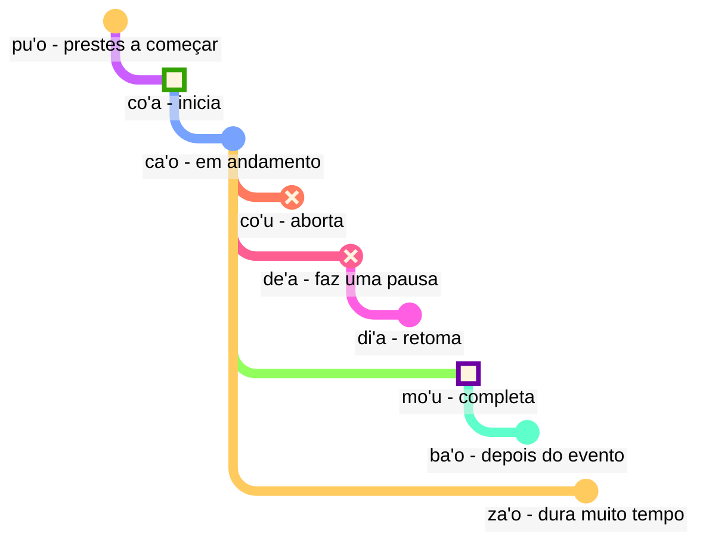

## Lição 6: termos modais: tempo e espaço

> **mi citka le cirla**

Possíveis traduções:

> _Eu como queijo._
> _Eu comi queijo._
> _Eu sempre como queijo._
> _Em um momento, eu acabarei de comer queijo._

Os tempos em Lojban são opcionais; não precisamos pensar o tempo todo em qual tempo usar.

O contexto muitas vezes resolve o que é correto. Adicionamos tempos quando sentimos que precisamos deles.

Os tempos em Lojban tratam tempo e espaço da mesma forma. Dizer que _eu trabalhei há muito tempo_ não é gramaticalmente diferente de dizer _eu trabalho longe ao norte_. O inglês trata palavras como _anteriormente_, o sufixo de tempo passado _-ed_, e palavras de espaço como _em_ ou _perto_ em três esquemas diferentes, enquanto em Lojban eles seguem o mesmo princípio.

### Pontos no tempo e no espaço

Uma partícula modal de tempo sem um argumento que a segue descreve o evento como relativo a _aqui_ e _agora_:

> **mi pinxe ba**
> **mi ba pinxe**
> _Eu vou beber._

<!-- -->

> **mi pinxe bu'u**
> **mi bu'u pinxe**
> _Eu bebo neste lugar._

Um termo modal de tempo com um argumento que o segue descreve o evento como relativo ao evento nesse argumento:

> **mi pinxe ba le nu mi cadzu**
> _Eu bebo depois de eu caminhar._

### Eventos relativos a outros eventos no tempo

Em inglês, usamos a chamada "sequência de tempos":

> **la .alis. pu cusku le se du'u ri pu penmi la .doris.**
> _Alice contou que já tinha visto Doris antes._

Aqui, o evento _tinha visto Doris_ acontece antes do evento _Alice disse_. No entanto, em

> **la .alis. pu cusku le se du'u ri ca kansa la .doris.**
> _Alice disse que ela estava com Doris._

os dois eventos (_disse_ e _estava com Doris_) acontecem ao mesmo tempo.

Assim, em Português:

- o tempo da relação principal é entendido em relação a quem a pronuncia.
- o tempo da relação dentro da relação principal também é entendido em relação a quem a pronuncia.

Em Lojban:

- apenas o tempo da relação principal é relativo a quem a pronuncia.
- os outros tempos são relativos entre si. É por isso que, em **la .alis. pu cusku le se du'u ri pu penmi la .doris.**, o segundo **pu** é relativo ao primeiro **pu**. Em **la .alis. pu cusku le se du'u ri ca kansa la .doris.**, usamos **ca** (_ao mesmo tempo_) que é relativo à relação externa (**pu cusku** — _disse_).

No entanto, podemos usar o termo modal **nau** (_no momento ou lugar do falante_), que terá o mesmo efeito que o inglês:

Aqui está um exemplo no estilo em inglês:

> **la .alis. pu cusku le se du'u ri nau pu kansa la .doris.**
> _Alis disse que ela estava com Doris._

<!-- Para dizer frases como `em três dias` ou `há dois anos`, basicamente colocamos intervalos de tempo em sequência sem sobreposição. Portanto, um novo verbo:

> **le cabna cu dzoli le nu mi penmi do kei li ci le ka prulamdei**
> _Eu vou te encontrar em três dias (a partir de agora)._

> **dzoli le nu mi penmi do kei li ci le ka prulamdei**
> **dzoli le nu mi penmi do kei li ci le ka prulamdei**
> **prulamdeidzo le nu mi penmi do kei li ci**
> **mi penmi do fi'o prulamdeidzo be fi li ci**
> _Eu vou te encontrar em três dias._

> **le cabna cu dzoli le nu mi zvati le stuzi kei li re le ka bavlamdeidzo**
> **le nu mi zvati le stuzi kei le cabna cu dzoli li re le ka prulamdeidzo**
> _Eu visitei aquele lugar há dois anos._ -->

### Distância no tempo e no espaço

fau
: termo modal: ao mesmo tempo, lugar ou situação que …

ca
: termo modal: em … (algum tempo), ao mesmo tempo que …; "tempo presente"

bu'u
: termo modal: em … (algum lugar); aqui (neste lugar)

zi
: _agora mesmo_ (há pouco tempo) ou _em breve_ (em pouco tempo)

vi
: perto de …

za
: _há algum tempo_ ou _daqui a algum tempo, em um tempo não especificado_

va
: não muito longe de …

zu
: _há muito tempo_ ou _daqui a muito tempo_

vu
: longe de ...; distante

Assim é como podemos usar combinações de tempos para especificar o quão longe vamos no passado ou futuro:

- **pu zu** significa _há muito tempo atrás_
- **pu za** significa _algum tempo atrás_
- **pu zi** significa _agora mesmo_
- **ba zi** significa _em breve_
- **ba za** significa _daqui a pouco_
- **ba zu** significa _daqui a muito tempo_

Observe a ordem das vogais **i**, **a** e **u**. Essa ordem aparece repetidamente no Lojban e pode valer a pena memorizar. _Curto_ e _longo_ são sempre dependentes do contexto, relativos e subjetivos. Por exemplo, duzentos anos é um tempo curto para uma espécie evoluir, mas um longo tempo para esperar pelo ônibus.

**zi**, **za** e **zu** modificam a partícula de tempo como **pu** e **ba** que é dita antes dela:

- **pu zu** é _há muito tempo atrás_. **pu** mostra que começamos no passado, e **zu** indica que é um longo tempo para trás.
- **zu pu** é _longe no tempo; há um ponto após algum evento_. **zu** mostra que começamos em algum ponto distante no tempo a partir de agora, e **pu** indica que nos movemos para trás a partir desse ponto.

Assim, **pu zu** está sempre no passado, enquanto **zu pu** pode estar no futuro.

A distância espacial é marcada de forma semelhante por **vi**, **va** e **vu** para distância curta, não especificada (média) e longa no espaço.

Para especificar a distância no tempo ou espaço, usamos o termo modal **la'u** com um argumento que especifica a distância:

> **ba ku la'u le djedi be li ci mi zvati ti**
> _Em três dias, estarei aqui._

O equivalente espacial de **ca** é **bu'u**, e **fau** é mais vago do que os dois, pois pode significar tempo, espaço ou situação.

> **ba za vu ku mi gunka**
> _Em algum momento no futuro, eu vou trabalhar em um lugar distante._

gunka
: trabalhar

> **mi bu'u pu zu gunka**
> _Eu costumava trabalhar aqui há muito tempo atrás._
> `Eu aqui-passado-distância-tempo trabalho`

> **pu zu vu ku zasti fa le ninmu .e le nanmu**
> _Há muito tempo atrás e longe daqui, uma mulher e um homem viviam._

A última frase é como os contos de fadas costumam começar.

### Duração no tempo e espaço

ze'i
: termo modal: por um curto período de tempo

ve'i
: termo modal: em um espaço pequeno

ze'a
: termo modal: por algum tempo

ve'a
: termo modal: sobre algum espaço

ze'u
: termo modal: por muito tempo

ve'u
: termo modal: sobre um espaço longo

Novamente, é fácil de lembrar seguindo o padrão **i**, **a**, **u**.

> **mi ze'u bajra**
> _Eu corro por muito tempo._
<!-- -->
> **do ze'u klama le mi'a gugde ze'u**
> _Você leva muito tempo para chegar ao nosso país._
mi'a
: nós sem você

gugde
: ... é um país

> **mi ba zi ze'a xabju la .djakartas.**
> _Em breve, vou morar em Jacarta por um tempo._
<!-- -->

> **le jenmi pe la .romas. ba ze'u gunta la .kart.xadact.**
> _O exército dos romanos estará atacando Cartago por muito tempo._

Isso não significa que os romanos não estão atacando Cartago nos dias de hoje. Em Lojban, se dizemos que algo é verdade em um determinado momento, isso não significa que não seja verdade em nenhum outro momento. Você pode dizer **pu ba ze'u** para que saibamos que essa atividade estava no futuro quando vista de algum ponto no passado, mas no passado quando vista a partir de hoje.

> **le xamsi**
> _mar/oceano_
<!-- -->

> **le ve'u xamsi**
> _oceano_

<pixra url="/assets/pixra/cilre/le_vehi_ja_vehu_cmana.webp" caption="le ve'i cmana cu jibni le ve'u cmana" definition="A colina está perto da montanha."></pixra>

> **le cmana**
> _montanha/colina_
<!-- -->

> **le ve'u cmana**
> _montanha_
<!-- -->

> **le ve'i cmana**
> _colina_
<!-- -->

> **ti ve'u gerku**
> _Esse é um cachorro grande. É um cachorro que ocupa um espaço grande._

### «**pu'o**» — ‘_estar prestes a_’, «**ba'o**» — ‘_não mais_’, «**za'o**» — ‘_ainda_’, «**xa'o**» — ‘_já_’

Aqui estão vários conjuntos de termos modais que podem nos ajudar a adicionar significados mais precisos quando necessário.

Com _contornos de evento_, ao contrário de **pu**, **ca** e **ba**, vemos cada evento como tendo uma forma com certas etapas:

pu'o
: termo modal: estar prestes a fazer algo (o evento ainda não aconteceu)

ba'o
: termo modal: não estar mais fazendo algo, ter feito algo (o evento terminou)

Exemplos:

> **mi ba tavla le mikce**
> _Eu vou falar com o médico (e talvez esteja falando agora também)._

mikce
: $x_1$ é um médico

> **mi pu pu'o tavla le mikce**
> _Eu estava prestes a falar com o médico (Eu não estava falando naquele momento, o evento ainda não tinha começado)._

<pixra url="/assets/pixra/cilre/puho_nenri.webp" caption="le prenu pu'o zvati le nenri" definition="A pessoa está prestes a entrar."></pixra>

<!-- -->

> **le sanmi ca pu'o bredi**
> _A refeição ainda não está pronta._

<!-- -->

> **mi pu ba'o tavla le mikce**
> _Eu tinha falado com o médico._

<pixra url="/assets/pixra/cilre/baho_carvi.webp" caption="ba'o carvi" definition="Depois da chuva. A chuva parou."></pixra>

<!-- -->

> **mi ba ba'o tavla le mikce**
> _Eu terei falado com o médico._

<!-- -->

> **.a'o mi ba zi ba'o gunka**
> _Espero que em breve eu tenha terminado o trabalho._

za'o
: termo modal: ainda. O evento está em andamento além do seu fim natural

xa'o
: termo modal não oficial: já, muito cedo. O evento já começou e é muito cedo

Exemplos:

> **ri'a ma do za'o zvati vi**
> _Por que você ainda está aqui?_

<!-- -->

> **la .kevin. xa'o zvati vi**
> _Kevin já está aqui._

### Estágios do evento

> **mi co'a tavla**
> _Comecei a falar._

<!-- -->

> **ra ca'o ciska**
> _Ela continua escrevendo._

<!-- -->

> **ra pu co'u vasxu**
> _Ele parou de respirar (mudança súbita e imprevisível)._

vasxu
: $x_1$ respira $x_2$

> **mi pu mo'u citka le plise**
> _Eu comi a maçã até o fim._

<!-- -->

> **la .maks. pu mo'u zbasu ti voi dinju**
> _Max construiu esta casa._

<!-- -->

> **ra pu de'a vasxu**
> _Ela parou de respirar (mas pode voltar a respirar mais tarde)._

<pixra url="/assets/pixra/cilre/deha_vasxu.webp" caption="mi de'a vasxu" definition="Eu pauso a respiração. Eu prendo a respiração."></pixra>

<!-- -->

> **mi pu di'a citka le plise**
> _Eu retomei a comer maçãs._

<pixra url="/assets/pixra/cilre/diha_vasxu.webp" caption="mi di'a vasxu" definition="Eu retomo a respiração."></pixra>

co'a
: termo modal: o evento começa (a fronteira do evento)

ca'o
: termo modal: estar fazendo algo (o evento está em progresso)

co'u
: termo modal: o evento para

mo'u
: termo modal: o evento termina (a fronteira do evento)

de'a
: o evento pausa (o evento pode ser esperado para continuar)

di'a
: o evento retoma

> **mi de'a ze'i jundi**
> _BRB (Volto já)._

<!-- -->

> **mi di'a jundi**
> _Estou de volta (atento)._

jundi
: $x_1$ presta atenção a $x_2$

Essas duas expressões são comuns em chats de texto para indicar que você está ausente ou não prestando atenção, e depois voltar online:

Claro, também se pode dizer apenas **de'a** ou **di'a** e esperar que o ponto seja entendido.

### Eventos contínuos e progressivos

ru'i
: termo modal: o evento é contínuo

> **.i mi pu ru'i citka le plise**
> _Eu estava comendo maçãs continuamente._

Observe a diferença:

- **ru'i** indica que o evento é contínuo e nunca pausa.
- **ca'o** implica que o evento está em progresso. Às vezes pode pausar e depois retomar seu progresso.

### Contornos de lugar

Contornos de evento podem ser usados para se referir ao espaço se os prefixarmos com **fe'e**:

> **le rokci cu fe'e ro roi zvati**
> _As pedras estão em todos os lugares._

### '_à esquerda_', '_à direita_'

> **le prenu cu sanli le dertu bu'u le pritu be mi**
> _A pessoa está em pé no chão à minha direita._

<!-- -->

> **le gerku cu vreta le ckana bu'u le zunle be le verba**
> _O cachorro está deitado na cama à esquerda de uma criança._

<!-- -->

> **ko jgari le panbi poi zunle**
> _Pegue a caneta à esquerda._

<!-- -->

> **le mlatu cu plipe bu'u le crane be do**
> _Um gato pula na sua frente._

<!-- -->

> **ko catlu le dinju poi crane**
> _Olhe para a casa na frente._

<!-- -->

> **le verba cu zutse le stizu bu'u le trixe be mi**
> _A criança está sentada na cadeira atrás de mim._

<!-- -->

> **le prenu cu sanli ki mi bu'u le pritu be le tricu bei mi**
> _A pessoa está à direita de uma árvore do meu ponto de vista._

<!-- -->

> **le dinju cu zunle le rokci ti**
> _A casa está à esquerda da pedra se vista daqui._

zunle
: $x_1$ está à esquerda de $x_2$ visto de $x_3$

pritu
: $x_1$ está à direita de $x_2$ visto de $x_3$

crane
: $x_1$ está na frente de $x_2$ ($x_1$ está entre $x_2$ e quem está observando) visto de $x_3$

trixe
: $x_1$ está atrás de $x_2$ visto de $x_3$

sanli
: $x_1$ está em cima de $x_2$

zutse
: $x_1$ está sentado em $x_2$

vreta
: $x_1$ está deitado em $x_2$

le dertu
: o chão, a terra

le ckana
: a cama

le stizu
: a cadeira

le pelji
: o papel

le penbi
: a caneta

### Prática: posição

<table>
<tbody><tr>
<td style="text-align:right;"><b>ma nabmi</b>
</td>
<td><i>Qual é o problema?</i>
</td></tr>
<tr>
<td style="text-align:right;"><b>ma'a nitcu tu'a le fonxa pe la .alis.</b>
</td>
<td><i>Nós precisamos do telefone da Alice.</i>
</td></tr>
<tr>
<td style="text-align:right;"><b>.i la .alis. ca zvati ma</b>
</td>
<td><i>Onde está a Alice?</i>
</td></tr>
<tr>
<td style="text-align:right;"><b>la .alis. ca na ku zvati le bu'u tcadu .i mi pu mrilu le srana be le fonxa fi la .alis. .i ri ca ca'o vofli la .paris. .i ku'i mi pu zi te benji le se mrilu be la .alis. .i ri curmi le nu mi'a pilno le fonxa .i .e'o do bevri ri mi</b>
</td>
<td>Alice não está na cidade agora. Eu enviei um e-mail sobre o telefone para ela. Ela está voando para Paris agora. Mas eu acabei de receber um e-mail dela. Ela nos permite usar o telefone. Por favor, traga-o para mim.
</td></tr>
<tr>
<td style="text-align:right;"><b>.i bu'u ma mi ka'e cpacu le fonxa</b>
</td>
<td>Onde posso pegar o telefone?
</td></tr>
<tr>
<td style="text-align:right;"><b>le purdi .i .e'o do klama le bartu</b>
</td>
<td>No jardim. Por favor, vá para fora.
</td></tr>
<tr>
<td style="text-align:right;"><b>mi ca zvati ne'a le vorme .i ei mi ca klama ma</b>
</td>
<td>Estou perto da porta. Agora, para onde devo ir?
</td></tr>
<tr>
<td style="text-align:right;"><b>ko klama le zunle be le tricu .i ba ku do viska le pa jubme</b>
</td>
<td>Vá para a esquerda da árvore. Então você verá uma mesa.
</td></tr>
<tr>
<td style="text-align:right;"><b>mi zgana no jubme</b>
</td>
<td>Não vejo nenhuma mesa.
</td></tr>
<tr>
<td style="text-align:right;"><b>ko carna gi'e muvdu le pritu .i le jubme cu crane le cmalu dinju .i le fonxa cu cpana le jubme .i ji'a ko jgari le penbi .e le pelji .i le za'u dacti cu cpana si'a le jubme .i ba ku ko bevri le ci dacti le zdani gi'e punji fi le sledi'u pe mi</b>
</td>
<td>Vire e mova-se para a direita. A mesa está na frente de um prédio pequeno. O telefone está em cima da mesa. Além disso, pegue uma caneta e um papel. Eles também estão em cima da mesa. Em seguida, leve as três coisas para casa e coloque-as no meu quarto.
</td></tr>
<tr>
<td style="text-align:right;"><b>vi'o</b>
</td>
<td>Entendido.
</td></tr></tbody></table>

### Prática: veículos

<tabela>

<tbody><tr>
<td style="text-align:right;"><b>mi jo'u le pendo be mi pu ca'o litru le barda rirxe bu'u le bloti</b>
</td>
<td><i>Eu e meus amigos estávamos viajando em um grande rio em um barco.</i>
</td></tr>
<tr>
<td style="text-align:right;"><b>.i ba bo mi'a klama le vinji tcana</b>
</td>
<td><i>Então fomos para um aeroporto.</i>
</td></tr>
<tr>
<td style="text-align:right;"><b>.i xu do se marce le karce</b>
</td>
<td><i>Você foi de carro?</i>
</td></tr>
<tr>
<td style="text-align:right;"><b>.i na ku se marce .i mi'a pu klama fu le trene .i ze'a le cacra mi'a zvati bu'u le carce</b>
</td>
<td><i>Não. Fomos de trem. Durante uma hora estivemos em um vagão.</i>
</td></tr></tbody></table>

marce
: $x_1$ é um veículo que transporta $x_2$

se marce
: $x_1$ é um passageiro de $x_2$

<!-- jai zu'e se marce
: $x_1$ takes a vehicle $x_2$ as a passenger -->

karce
: $x_1$ é um carro que transporta $x_2$

bloti
: $x_1$ é um barco que transporta $x_2$

vinji
: $x_1$ é uma aeronave que transporta $x_2$

trene
: $x_1$ é um trem de carros $x_2$

### Enriquecendo o vocabulário. Novas palavras usando tempos verbais

Muitas palavras em inglês correspondem a combinações de palavras em lojban:

pixra
: $x_1$ is a picture of $x_3$

le vi'a pixra
: the picture in 2D

le vi'u pixra
: the picture in 3D, a sculpture

<pixra url="/assets/pixra/cilre/viha_pixra.webp" caption="vi'a pixra" definition="2D picture, 2D drawing."></pixra>

<pixra url="/assets/pixra/cilre/vihu_pixra.webp" caption="vi'u pixra" definition="3D picture, sculpture."></pixra>

le ve'i cmana
: a colina (literalmente "montanha/colina cobrindo pouco espaço")

le ve'u xamsi
: o oceano (literalmente "mar/oceano cobrindo grande espaço")

le ba'o tricu
: toco de árvore (literalmente "a árvore que não é mais")
