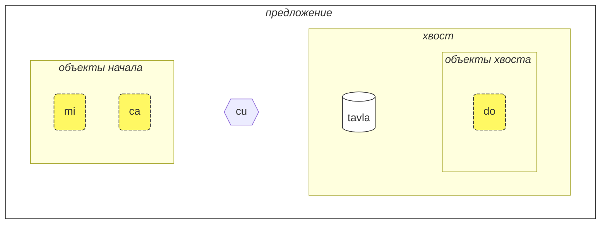
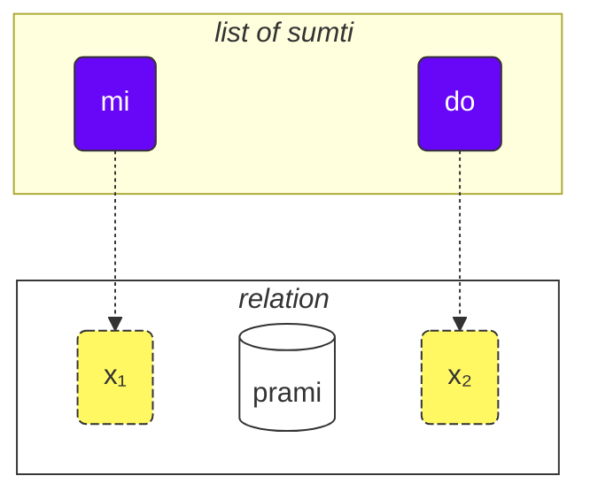
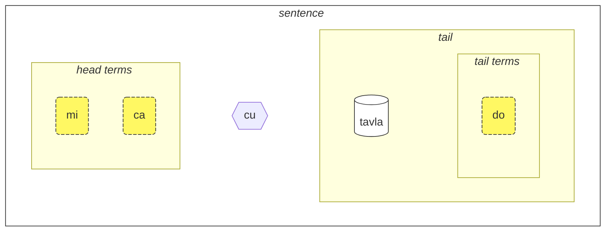
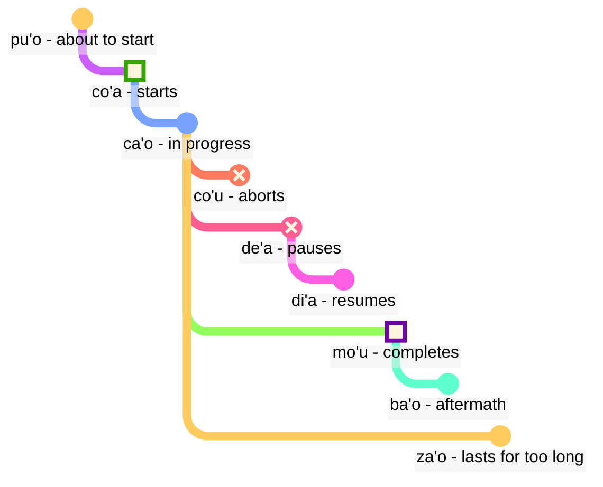

[📁 PDF версия этой страницы](/vreji/uencu/learn-lojban.pdf)

Как использовать этот курс:

1. прочитайте его
2. собери отзывы и предложения
3. отправьте их в [💬 онлайн-чат](https://lojban.pw/articles/live_chat/)

## Урок 1. Язык с первого взглядв

### Алфавит

Первое, что нужно узнать о ложбане, это алфавит.

ложбан использует латинский алфавит (гласные выделены цветом):

<dl><dd><b>a b c d e f g i j k l m n o p r s t u v x y z ' .</b></dd></dl>

Слова произносятся так, как пишутся.

В ложбане 10 гласных:

<table>
<tbody><tr>
<td><b class="audio-inline">a</b></td>
<td> как <u>а</u> в слове <i>б<u>a</u>с</i></td>
</tr>
<tr>
<td><b class="audio-inline">e</b></td>
<td> как <u>э</u> в слове <i>с<u>э</u>р</i></td>
</tr>
<tr>
<td><b class="audio-inline">i</b></td>
<td> как <u>и</u> в слове <i>с<u>и</u>ла</i></td>
</tr>
<tr>
<td><b class="audio-inline">o</b></td>
<td> как <u>о</u> в слове <i>м<u>о</u>ре</i> (<u>o</u> в ложбане всегда произносится чётко, не превращаясь в подобие <u>а</u>)</td>
</tr>
<tr>
<td><b class="audio-inline">u</b></td>
<td> как <u>у</u> в слове <i>б<u>у</u>ря</i></td>
</tr>
<tr>
<td><b class="audio-inline">y</b></td>
<td> как безударная <u>о</u> в слове <i>к<u>о</u>мар</i></td>
</tr>
<tr>
</tbody></table>

4 гласные записываются с помощью комбинаций букв:

<table>
<tbody><tr>
<td><b class="audio-inline">au</b></td>
<td> как <u>ау</u> в слове <i><u>ау</u>т</i>, но при этом <u>у</u> должна быть краткой</td></tr>
<tr>
<td><b class="audio-inline">ai</b></td>
<td> как <u>ай</u> в слове <i>м<u>ай</u></i></td></tr>
<tr>
<td><b class="audio-inline">ei</b></td>
<td> как в слове <i><u>эй</u></i></td></tr>
<tr>
<td><b class="audio-inline">oi</b></td>
<td> как в слове <i><u>ой</u></i></td></tr>
</tbody></table>

Что касается согласных, они произносятся как в английском или латинском языках, но есть несколько отличий:

<table>
<tbody><tr>
<td><b class="guibutton">c</b>
</td>
<td>произносится как <i>ш</i>.
</td></tr>
<tr>
<td><b class="guibutton">j</b>
</td>
<td>как <i>ж</i>
</td></tr>
<tr>
<td><b class="guibutton">x</b>
</td>
<td>как <i>х</i> в слове <i>хорошо</i>
</td></tr>
<tr>
<td><b class="guibutton"> ' </b>
</td>
<td>как английская/татарская/казахская <i>h</i>. Таким образом, апостроф считается полноценной буквой ложбана и произносится как <i>h</i>. Он может находиться только между гласными. Например, <b>a'i</b> произносится как <i>аhи</i> (в то время как <b>ai</b> произносится как <i>ай</i>).
</td></tr>
<tr>
<td><b>.</b>
</td>
<td>точка (период, разрыв слова) также считается буквой в ложбане. Это короткая пауза в речи, чтобы отделить некоторые слова. Фактически, перед любым словом, начинающимся с гласной, ставится точка. Это помогает предотвратить нежелательное слияние двух последовательных слов в одно.
</td></tr>
<tr>
<td><b>i</b>
</td>
<td><b>i</b> перед гласными считается согласной и произносится как <u>й</u>, например:
<ul><li><b>ia</b> произносится как <i>я</i> в <i>ясно</i></li>
<li><b>ie</b> произносится как <i>е</i> в <i>если</i></li></ul>
</td></tr>
<tr>
<td><b>u</b>
</td>
<td><b>u</b> перед гласными считается согласной и произносится кратко, как <i>ў</i> в белорусском, например:
<ul><li><b>ua</b> произносится как <i>ўа</i></li>
<li><b>ue</b> произносится как <i>ўэ</i></li></ul>
</td></tr></tbody></table>

Ударение ставится на предпоследний гласный. Если слово имеет только один гласный, то ударение в слове просто не ставится.

Буква **r** может произноситься как _r_ в русском, английском, так что есть диапазон приемлемых произношений для неё.

### Самое простое предложение

Теперь давайте построим наши первые предложения на ложбане.

Базовой единицей в ложбане является "предложение". Вот три простых примера:

> **le prenu cu tavla mi**
> _Человек говорит со мной._

le prenu
: человек

tavla
: … говорит с …, … разговаривает с …

mi
: я, мне, мной, ...

> **mi prami do**
> _Я люблю тебя._

prami
: … любит … (кого-то)

do
: ты, тебя, тебе, тобой, ...

> **mi ca cu tavla do**
> _Я сейчас говорю с тобой._

ca
: сейчас

Каждое предложение на ложбане состоит из следующих частей слева направо:

- начало предложения:
  - состоит из так называемых объектов,
  - **le prenu** является единственным объектом начала предложения **le prenu cu tavla mi** выше,
  - **mi**, **ca** являются объектами начала предложения в примере **mi ca cu tavla do** выше.
- разделитель **cu**:
  - произносится как _шу_ так как **c** звучит как _ш_,
  - показывает, что начало завершено,
  - может быть опущен, когда ясно, что начало завершено.
- хвост:
  - основная конструкция-отношение (**tavla**, **prami**) с возможно одним или несколькими объектами после неё,
  - **mi** является единственным объектом в хвосте в примере **le prenu cu tavla mi** выше.
  - **do** является единственным объектом в хвосте в примере **mi ca cu tavla do** выше.

<pixra url="/assets/pixra/cilre/tavla.svg" caption="le prenu cu tavla mi" definition="Человек говорит со мной."></pixra>

<pixra url="/assets/pixra/cilre/mi.svg" caption="mi" definition="я / мне / меня / ..."></pixra>

<pixra url="/assets/pixra/cilre/mi_prami_do2.svg" caption="mi prami do" definition="Я люблю тебя."></pixra>

<pixra url="/assets/pixra/cilre/do.svg" caption="do" definition="ты / тебе / тебя / ..."></pixra>

На ложбане мы в основном говорим об отношениях, а не о существительных и глаголах.

Вот два слова-отношения, которые приблизительно соответствуют глаголам:

prenu
: … является человеком / людьми

tavla
: … говорит с …

Чтобы превратить такой "глагол" в существительное, мы ставим перед ним короткое слово **le**:

le prenu
: человек

Аналогично,

tavla
: … говорит с …

и таким образом

le tavla
: говорящий

Может показаться странным, как _человек_ может быть "глаголом", но на самом деле это делает ложбан очень простым:

<table>
<thead>
<tr>
<th>слово-отношение</th>
<th>существительное</th></tr>
</thead>
<tbody>
<tr>
<td><b>prenu</b> — <i>быть человеком</i> </td>
<td><b>le prenu</b> — <i>человек</i>
</td></tr>
<tr>
<td><b>tavla</b> — <i>говорить с</i> </td>
<td><b>le tavla</b> — <i>говорящий</i>
</td></tr>
</tbody></table>

Мы также можем сказать, что **le** создает существительное из конструкции-отношения с примерным значением _тот, который …_ (_являться человеком_ — _человек_), или даже _те, кто делают…_ (_говорить с_ — _говорящие_), _те, кто являются…_ (_- являться людьми_ — _люди_).

Обратите внимание, что ложбан по умолчанию не различает _говорящего_ или _говорящих_. То есть **le tavla** неопределен в этом отношении, и мы скоро обнаружим способы определения числа.

Объекты предложения в ложбане, независимо от того, где они используются в конкретном предложении, в основном представлены:

- существительными, такими как **le prenu** (_человек_)
- местоимениями, такими как **mi** (_я_, _меня_), **do** (_ты_). Местоимения работают точно так же, как существительные, но для них не используется **le**. Они работают как существительные самостоятельно.
- модальными объектами, такими как **ca** (_сейчас, в настоящее время_). Модальные объекты указывают дополнительную, уточняющую информацию.

Несколько примеров:

> **mi nintadni**
> _Я новый студент._

nintadni
: … - это новый студент, новичок

<pixra url="/assets/pixra/cilre/nintadni.svg" caption="mi nintadni" definition="Я новый студент, новичок."></pixra>

В отличие от русского языка, нам не нужно добавлять связку "- это" в предложение. Она уже подразумевается. Слово-отношение **nintadni** (_… - это новый студент_) уже имеет связку "- это" встроенной.

> **do jimpe**
> _Ты понимаешь._

jimpe
: … (кто-то) понимает … (что-то)
<!-- -->

<pixra url="/assets/pixra/cilre/pilno_le_fonxa.svg" caption="le prenu cu pilno le fonxa" definition="Человек использует телефон."></pixra>

> **mi pilno le fonxa**
> _Я использую телефон._

pilno
: … (кто-то) использует … (что-то)

fonxa
: … - это телефон, … - это телефоны

le fonxa
: телефон, телефоны

> **mi citka**
> _Я ем._

citka
: … (кто-то) ест … (что-то)

<pixra url="/assets/pixra/cilre/citka.svg" caption="mi citka" definition="Я ем."></pixra>
<!-- -->

> **do citka**
> _Ты ешь._

<!-- -->

> **mi citka le plise**
> _Я ем яблоки._

<!-- -->

> **le plise cu kukte**
> _Яблоки вкусные._

le plise
: яблоки

kukte
:  … (что-то) - вкусно, вкусное

<pixra url="/assets/pixra/cilre/le_plise_cu_kukte.svg" caption="le plise cu kukte" definition="Яблоки вкусные."></pixra>

Здесь **le plise** означает _яблоки_, **kukte** означает _вкусный / вкусные_.

А вот более простое предложение на ложбане, оно содержит конструцию-отношение только из одного слова-отношения:

<pixra url="/assets/pixra/cilre/karce.svg" caption="karce" definition="Это машина."></pixra>

> **karce**
> _Машина!_

Вы можете сказать это, когда видите приближающуюся машину. Здесь контекст будет достаточным, чтобы понять, что где-то есть машина, и, вероятно, это опасно.

**karce** сам по себе является словом-отношением, означающим _машина, быть машиной_.

Мы, конечно, можем быть более точными и сказать, например:

> **ti karce**
> _Это машина._

ti
: местоимение: эта вещь рядом со мной

<pixra url="/assets/pixra/cilre/ti.svg" caption="ti" definition="это, эта, этот, эти (рядом со мной, говорящим)"></pixra>

Аналогично, Вы можете сказать

> **carvi**
> _Идет дождь._

где

carvi
: … это дождь, … идет дождь, … дождит

<pixra url="/assets/pixra/cilre/carvi.svg" caption="carvi" definition="… - это дождь"></pixra>

или

> **pluka**
> _Приятно._

где

pluka
: … - является приятным

> **prami**
> _Любит. Кто-то любит._

<!-- -->

> **bajra**
> _Бежит. Кто-то бежит._

bajra
: … бежит, используя конечности

Опять же, контекст, вероятно, подскажет, кто любит кого и кто бежит.

<pixra url="/assets/pixra/cilre/bajra.svg" caption="le prenu cu bajra" definition="Человек бежит."></pixra>

#### Задание

<pixra url="/assets/pixra/cilre/pinxe_le_djacu.svg" caption="le prenu cu pinxe le djacu" definition="Человек пьет воду."></pixra>

pinxe
: … пьёт … (что-то)

le djacu
: вода

Закройте правую часть таблицы. Переведите предложения слева с ложбана.

<table style="table-layout: fixed;">
<tbody><tr>
<td><b>do citka</b>
</td>
<td><i>Ты ешь.</i>
</td></tr>
<tr>
<td><b>mi pinxe le djacu</b>
</td>
<td><i>Я пью воду.</i>
</td></tr>
<tr>
<td><b>mi citka le plise</b>
</td>
<td><i>Я ем яблоки.</i>
</td></tr></tbody></table>

### «**.i**» разделяет предложения

В ложбане с помощью короткого слова **.i** мы разделяем два следующих друг за другом предложения:

> **mi tavla le prenu .i le prenu cu tavla mi**
> _Я говорю с людьми. Люди говорят со мной._

**.i** разделяет предложения, как точка в конце предложений в русских текстах.

Когда мы говорим одно предложение за другим на русском, мы делаем паузу (она может быть короткой) между ними. Но пауза имеет много разных значений в русском. В ложбане у нас есть лучший способ понимать, где заканчивается одно предложение и начинается другое.

Также обратите внимание, что иногда, когда произносим слова быстро, мы не можем понять, где заканчивается одно предложение и начинается слово следующего предложения. Поэтому рекомендуется использовать слово **.i** перед началом нового предложения.

### Числа: ‘_1 2 3 4 5 6 7 8 9 0_’ = «**pa re ci vo mu xa ze bi so no**»

**le** просто превращает глагол в существительное, но такое существительное не имеет числа. Предложение

> **le prenu cu tavla mi**
> _Люди говорят со мной._
> _Человек говорит со мной._

не указывает количество людей, говорящих со мной. В русском языке невозможно опустить число, потому что _люди_ в русском подразумевает _более одного человека_. Однако в ложбане мы можем не указывать число.

Но давайте теперь уточним, сколько людей имеют отношение к нашему обсуждению.

Добавим число после **le**.

<table>
<tbody><tr>
<td><b>pa</b>
</td>
<td><b>re</b>
</td>
<td><b>ci</b>
</td>
<td><b>vo</b>
</td>
<td><b>mu</b>
</td>
<td><b>xa</b>
</td>
<td><b>ze</b>
</td>
<td><b>bi</b>
</td>
<td><b>so</b>
</td>
<td><b>no</b>
</td></tr>
<tr>
<td> 1
</td>
<td> 2
</td>
<td> 3
</td>
<td> 4
</td>
<td> 5
</td>
<td> 6
</td>
<td> 7
</td>
<td> 8
</td>
<td> 9
</td>
<td> 0
</td>
</tr></tbody></table>

<pixra url="/assets/pixra/cilre/ci_prenu.svg" caption="le ci prenu" definition="Три человека"></pixra>

> **le pa prenu cu tavla mi**
> _Один человек говорит со мной._

Мы добавляем число после **le** и тем самым указываем отдельных людей.

Для чисел, состоящих из нескольких цифр, мы просто ставим эти цифры друг за другом:

> **le re mu prenu cu tavla mi**
> _25 человек говорят со мной._

Да, это так просто.

Если мы вести счёт, мы можем разделять числа с помощью **.i**:

> **mu .i vo .i ci .i re .i pa .i no**
> _5 … 4 … 3 … 2 … 1 … 0_

Число **za'u** означает _больше, чем …_ (_\>_ в математике), число **me'i** означает _меньше, чем_ (_<_ в математике):

> **le za'u re prenu cu tavla mi**
> _Более двух человек говорят со мной._

<!-- -->

> **le me'i pa no prenu cu tavla mi**
> _Меньше, чем 10 человек говорят со мной._

<!-- -->

> **le za'u ci prenu cu tavla mi**
> _Более трех человек говорят со мной._

Чтобы сказать просто _люди_ (множественное число) в отличие от _одного человека_, мы используем **za'u pa**, _более одного_ или просто **za'u**.

> **le za'u pa prenu cu tavla mi**
> **le za'u prenu cu tavla mi**
> _Люди говорят со мной._

**za'u** по умолчанию означает **za'u pa**, поэтому такое сокращение возможно.

le prenu
: человек / люди

le pa prenu
: один человек

le za'u prenu
: люди (два или более в числе)

#### Задание

stati
: … (кто-то) умён, умный, талантлив

<pixra url="/assets/pixra/cilre/stati.svg" caption="stati" definition="… имеет талант"></pixra>

klama
: … приходит к … (какому-то месту или объекту)

<pixra url="/assets/pixra/cilre/klama_ti.svg" caption="le prenu cu klama ti" definition="Человек пришел сюда."></pixra>

nelci
: … нравится (что-то)

le zarci
: рынок

<pixra url="/assets/pixra/cilre/zarci.svg" caption="le prenu cu zvati le zarci" definition="Человек находится в магазине."></pixra>

le najnimre
: апельсин (фрукт), апельсины

<pixra url="/assets/pixra/cilre/najnimre.svg" caption="najnimre" definition="… это апельсин"></pixra>

le badna
: банан, бананы

<pixra url="/assets/pixra/cilre/badna.svg" caption="badna" definition="… это банан"></pixra>

Закройте правую часть таблицы. Переведите предложения слева с ложбана.

<table style="table-layout: fixed;">
 <tbody>
  <tr>
   <td>le mu prenu cu klama le zarci</td>
   <td>Пять человек приходят на рынок.</td>
  </tr>
  <tr>
   <td>le pa re prenu cu stati .i do stati</td>
   <td>Двенадцать человек умны. Ты умный.</td>
  </tr>
  <tr>
   <td>le prenu cu nelci le plise</td>
   <td>Люди любят яблоки.</td>
  </tr>
  <tr>
   <td>le za'u re prenu cu citka .i le me'i mu prenu cu pinxe le djacu</td>
   <td>Более двух человек едят. Менее пяти человек пьют воду.</td>
  </tr>
  <tr>
   <td>le za'u re prenu cu stati</td>
   <td>Более двух человек умны.</td>
  </tr>
 </tbody>
</table>

Закройте правую часть таблицы. Переведите предложения слева на ложбан.

<table style="table-layout: fixed;">
 <tbody>
  <tr>
   <td>The 256 people are smart.</td>
   <td>le re mu xa prenu cu stati</td>
  </tr>
  <tr>
   <td>Fewer than 12 apples are tasty.</td>
   <td>le me'i pa re plise cu kukte</td>
  </tr>
 </tbody>
</table>

### Сложный глагол

Сложный глагол (**le tanru** на языке ложбан) - это несколько глаголов, расположенных один за другим.

> **tu melbi zdani**
> _Тот красивый дом._

<pixra url="/assets/pixra/cilre/melbi_zdani.svg" caption="melbi zdani" definition="… красивый дом"></pixra>

tu
: тот (далеко от нас)

melbi
: … красивый, приятный

zdani
: … дом или гнездо для … (кого-то)

<pixra url="/assets/pixra/cilre/dansu.svg" caption="le prenu cu melbi dansu" definition="Человек красиво танцует."></pixra>

> **do melbi dansu**
> _Ты красиво танцуешь._

Здесь глагол **melbi** добавляет дополнительный смысл, так как он расположен слева от другого глагола: **zdani**. Левая часть обычно переводится прилагательными и наречиями.

Сложные глаголы - это мощная функция, которая создает более богатые значения. Вы просто соединяете два глагола, и левая часть такого сложного глагола добавляет вкус к правому.

Мы можем поставить **le** (например, с числом) слева от такого сложного глагола, получив сложное существительное:

le pa melbi zdani
: красивый дом

Теперь вы знаете, почему в нашем примере после существительных было **cu**:

> **le pa prenu cu tavla mi**
> _Человек говорит со мной._

Без **cu** это превратилось бы в **le pa prenu tavla**, что означало бы _человек-говоритель_ - что бы это ни значило.

Рассмотрим:

> **le pa tavla pendo**
> _Говорящий друг_
<!-- -->
> **le pa tavla cu pendo**
> _Говорящий - друг._

Не забывайте ставить **cu** перед основной конструкцией отношения в предложении, чтобы избежать непреднамеренного создания сложных глаголов.

Сложные глаголы могут содержать более двух глаголов. В этом случае первый глагол модифицирует второй, второй модифицирует третий и так далее:

<pixra url="/assets/pixra/cilre/cmalu_karce.svg" caption="ti cmalu karce" definition="Это маленькая машина."></pixra>

> **le pa melbi cmalu karce**
> _красиво-маленькая машина, машина маленькая в красивом стиле_

<!-- -->

> **le mutce melbi zdani**
> _очень красивый дом_

mutce
: … очень, … много

#### Задание

sutra
: ...быстрый

barda
: ...большой

cmalu
: ...маленький

mlatu
: ...кот

Закройте правую часть таблицы. Переведите предложения слева с ложбана.

<table style="table-layout: fixed;">
<tbody><tr>
<td><b>le melbi karce</b>
</td>
<td><i>красивая машина / красивые машины</i>
</td></tr>
<tr>
<td><b>do sutra klama</b>
</td>
<td><i>Ты быстро приходишь. Ты приходишь быстро.</i>
</td></tr>
<tr>
<td><b>tu barda zdani</b>
</td>
<td><i>Это большой дом.</i>
</td></tr>
<tr>
<td><b>le pa sutra bajra mlatu</b>
</td>
<td><i>быстро бегущий кот</i>
</td></tr>
<tr>
<td><b>le pa sutra mlatu</b>
</td>
<td><i>быстрый кот</i>
</td></tr>
<tr>
<td><b>le pa bajra mlatu</b>
</td>
<td><i>бегущий кот</i>
</td></tr></tbody></table>

Закройте правую часть таблицы. Переведите предложения слева на ложбан.

<table style="table-layout: fixed;">

<tbody><tr>
<td><i>Это маленькая машина.</i>
</td>
<td><b>ti cmalu karce</b>
</td></tr>
<tr>
<td><i>вкусные яблоки</i>
</td>
<td><b>le kukte plise</b>
</td></tr>
<tr>
<td><i>быстрые едоки</i>
</td>
<td><b>le sutra citka</b>
</td></tr>
<tr>
<td><i>Ты быстро идущий человек.</i>
</td>
<td><b>do sutra cadzu prenu</b>
</td></tr></tbody></table>

### Вопросы типа «Да/Нет»

На английском языке мы формируем вопрос типа «Да/Нет», меняя порядок слов, например:

> _You are … ⇒ Are you …?_

или используя какую-то форму глагола _to do_ в начале, например:

> _You know … ⇒ Do you know?_

В языке ложбан порядок слов можно сохранить. Чтобы превратить любое утверждение в вопрос типа «Да/Нет», мы просто вставляем слово **xu** где-то в предложении, например, в начале:

> **xu do nelci le gerku**
> _Вы любите собак?_

le gerku
: собака, собаки

<pixra url="/assets/pixra/cilre/le_prenu_e_le_gerku.svg" caption="ti prenu .i ti gerku" definition="Это человек. Это собака."></pixra>

Помните, что в языке ложбан знаки препинания, такие как "?" (вопросительный знак), в основном необязательны и используются в основном для стилистических целей. Это потому, что слово-вопрос **xu** уже показывает, что это вопрос.

Другие примеры:

> **xu mi klama**
> _Я иду?_

klama
: … приходит к … (куда-то)

> **xu pelxu**
> _Оно желтое?_

pelxu
: … желтый

Мы можем изменить значение, поместив **xu** после разных частей отношения. Объяснения, что изменилось в значении, даны в скобках:

> **xu do nelci le gerku**
> _Вы любите собак?_

<!-- -->

> **do xu nelci le gerku**
> _Вы любите СОБАК?_ (Я думал, что это кто-то другой, кто их любит).

<!-- -->

> **do nelci xu le gerku**
> _Вы ЛЮБИТЕ собак? (Я думал, что вы к ним просто равнодушны)._

<!-- -->

> **do nelci le gerku xu**
> _Вы любите собак? (Я думал, что вы любите кошек)._

То, что выражается интонацией на английском языке, выражается перемещением **xu** после той части, которую мы хотим подчеркнуть, в языке ложбан. Обратите внимание, что первое предложение с **xu** в начале задает наиболее общий вопрос без ударения на каком-либо конкретном аспекте.

**xu** - это междометие. Вот особенности междометий ложбан:

- междометие изменяет конструкцию перед ним. Так, когда оно ставится после определенных частей отношения, таких как местоимения или глаголы, оно изменяет этот глагол:

 > **do xu nelci le gerku**
 > _Вы любите СОБАК?_

- когда оно ставится в начале отношения, междометие изменяет всё отношение:

 > **xu do nelci le gerku**
 > _Вы любите собак?_

- междометия могут ставиться после разных частей одного и того же отношения, чтобы изменить значение.

Междометия не разбивают сложные глаголы, их можно использовать внутри них:

> **do nelci le barda xu gerku**
> _Вы любите БОЛЬШИХ собак?_

Теперь, как ответить на такие вопросы типа «Да/Нет»? Вы повторяете основное отношение:

> **— xu le mlatu cu melbi**
> **— melbi**
> _— Кошки красивые?_
> _— Красивые._

Чтобы ответить «нет», мы используем модальный термин **na ku**:

> **— xu le mlatu cu melbi**
> **— na ku melbi**
> _— Кошки красивые?_
> _— Не красивые._

na ku
: термин: это неверно, что …

Или мы можем использовать специальный глагол **go'i**:

> **— xu le mlatu cu melbi**
> **— go'i**
> _— Кошки красивые?_
> _— Красивые._

go'i
: глагол, который повторяет основное отношение предыдущего предложения

Здесь **go'i** означает то же самое, что и **melbi**, так как **melbi** является отношением предыдущего отношения.

> **— xu le mlatu cu melbi**
> **— na ku go'i**
> _— Кошки красивые?_
> _— Не красивые._

<!-- Этот курс не рекомендует использовать отрицание **go'i** для отрицательных ответов. Просто используйте **je'u nai**. -->

Модальный термин **na ku** может использоваться не только в ответах:

> **na ku mi nelci le gerku**
> _Это ложь, что я люблю собак._
> _Я не люблю собак._
<!-- -->
> **mi na ku nelci do**
> _Я не люблю тебя._

Его противоположность, термин **ja'a ku**, подтверждает значение:

> **mi ja'a ku nelci do**
> _Я люблю тебя._

ja'a ku
: термин: это правда, что …

#### Задание

Закройте правую часть таблицы. Переведите предложения слева с ложбана.

<table style="table-layout: fixed;">

<tbody><tr>
<td><b>xu le barda zdani cu melbi</b>
</td>
<td><i>Большой дом красивый?</i>
</td></tr>
<tr>
<td><b>— le prenu cu stati xu — na ku stati</b>
</td>
<td><i>— Люди умные? — Нет.</i>
</td></tr>
<tr>
<td><b>do klama le zarci xu</b>
</td>
<td><i>Ты идешь на рынок?</i>
</td></tr>
<tr>
<td><b>xu le verba cu prami le mlatu</b>
</td>
<td><i>Ребенок любит кошек?</i>
</td></tr></tbody></table>

Закройте правую часть таблицы. Переведите предложения слева на ложбан.

<table style="table-layout: fixed;">

<tbody><tr>
<td><i>Машина быстрая?</i>
</td>
<td><b>xu le karce cu sutra</b>
</td></tr>
<tr>
<td><i>— Апельсин вкусный? — Да, вкусный.</i>
</td>
<td><b>— xu le najnimre cu kukte — kukte</b>
</td></tr>
<tr>
<td><i>Собака любит тебя?</i>
</td>
<td><b>xu le gerku cu prami do</b>
</td></tr></tbody></table>

### Счастье и вежливые просьбы: «_Ура!_» = «**ui**», «_Пожалуйста!_» = «**.e'o**»

Междометие **ui** выражает радость говорящего. Оно используется так же, как улыбающийся смайлик в сообщениях, чтобы показать, что вы рады чему-то. Хотя смайлики могут быть неоднозначными, **ui** имеет только одно значение, что удобно.

> **ui do klama**
> _Ура, ты идешь!_

ui
: междометие: _Ура!_, междометие радости

Междометие **.e'o** в начале предложения превращает его в вежливую просьбу:

> **.e'o do lebna le fonxa**
> _Можешь взять телефон, пожалуйста?_
> `Пожалуйста, возьми телефон.`

.e'o
: междометие: пожалуйста (произносится как _э-хоу_ с короткой паузой или перерывом перед словом)

lebna
: брать (что-то)

На английском языке, чтобы быть вежливым, нужно использовать _could you_ + _please_ + вопрос). В ложбане **.e'o** достаточно, чтобы сделать вежливую просьбу.

#### Задание

Закройте правую часть таблицы. Переведите предложения слева на ложбан.

le tcati
: чай

<pixra url="/assets/pixra/cilre/tcati.svg" caption="tcati" definition="… это чай"></pixra>

le ckafi
: кофе

<pixra url="/assets/pixra/cilre/ckafi.svg" caption="ckafi" definition="… это кофе"></pixra>

zgana
: наблюдать, наблюдение (используя любые чувства)

le skina
: фильм, кино

<pixra url="/assets/pixra/cilre/zgana_le_skina.svg" caption="le prenu cu zgana le skina" definition="Человек смотрит фильм."></pixra>

kurji
: заботиться о (кому-то, чем-то)

<table style="table-layout: fixed;">

<tbody>
<tr>
<td><b>ui carvi</b>
</td>
<td><i>Ура, идет дождь! Ура, идет дождь!</i>
</td></tr>
<tr>
<td><b>.e'o do sutra bajra</b>
</td>
<td><i>Беги быстро!</i>
</td></tr>
<tr>
<td><b>.e'o do pinxe le tcati</b>
</td>
<td><i>Пожалуйста, выпейте чай!</i>
</td></tr>
<tr>
<td><b>.e'o zgana le skina</b>
</td>
<td><i>Пожалуйста, посмотрите фильм!</i>
</td></tr></tbody></table>

Закройте правую часть таблицы. Переведите предложения слева на ложбан.

<table style="table-layout: fixed;">

<tbody><tr>
<td><i>Пожалуйста, будьте умны!</i>
</td>
<td><b>.e'o stati</b>
</td></tr>
<tr>
<td><i>Пожалуйста, идите домой!</i>
</td>
<td><b>.e'o do klama le zdani</b>
</td></tr>
<tr>
<td><i>Пожалуйста, выпейте кофе!</i>
</td>
<td><b>.e'o do pinxe le ckafi</b>
</td></tr>
<tr>
<tr>
<td><i>Ура, я говорю с тобой!</i>
</td>
<td><b>ui mi tavla do</b>
</td></tr>
<tr>
<td><i>Пожалуйста, позаботьтесь о ребенке.</i>
</td>
<td><b>.e'o do kurji le verba</b>
</td></tr></tbody></table>

### 'И' и 'или'

> **do nintadni .i je mi nintadni**
> _Вы новичок. И я новичок._

<!-- -->

> **do .e mi nintadni**
> _Вы и я новички._

<pixra url="/assets/pixra/cilre/do_e_mi_nintadni.svg" caption="do .e mi nintadni" definition="Вы и я новые студенты."></pixra>

<!-- -->

> **mi tadni .i je mi tavla do**
> _Я учусь. И я говорю с вами._

<!-- -->

> **mi tadni gi'e tavla do**
> _Я учусь и говорю с вами._

.i je
: союз "и" объединяет предложения в одно.

.e
: союз "и" соединяет существительные.

gi'e
: союз "и" соединяет хвосты предложений.

Мы можем объединить два предложения в одно, используя союз **.i je**, который означает _и_:

> **do nintadni .i je mi nintadni**
> _Вы новичок. И я новичок._

Поскольку оба предложения имеют одинаковый хвост, мы можем использовать сокращение: союз **.e** означает _и_ для существительных и местоимений:

> **do .e mi nintadni**
> _Вы и я новички._

**do nintadni .i je mi nintadni** означает точно то же самое, что и **do .e mi nintadni**

Мы также можем использовать **.e** для соединения существительных и местоимений в других позициях.

Оба эти предложения означают одно и то же.

> **mi pinxe le djacu .e le jisra**
> _Я пью воду и сок._
> **mi pinxe le djacu .i je mi pinxe le jisra**
> _Я пью воду, и я пью сок._

le jisra
: сок

<pixra url="/assets/pixra/cilre/pinxe_le_jisra.svg" caption="le prenu cu pinxe le jisra" definition="Человек пьет сок."></pixra>

Если голова предложения одинакова, но хвосты отличаются, мы используем союз **gi'e**, который означает _и_ для хвостов предложений:

> **mi tadni .i je mi tavla do**
> **mi tadni gi'e tavla do**
> _Я учусь и говорю с вами._

Обе вариации означают то же самое; **gi'e** просто приводит к более краткой реализации.

У нас также есть инструменты для добавления _и_ для компонентов сложных глаголов:

> **le melbi je cmalu zdani cu jibni ti**
> _Красивый и маленький дом находится рядом._

<pixra url="/assets/pixra/cilre/melbi_je_cmalu_zdani.svg" caption="melbi je cmalu zdani" definition="… это красивый и маленький дом"></pixra>

jibni
: … находится рядом с …

ti
: это место, это место рядом со мной

**je** - это союз в ложбане, который означает _и_ в составных глаголах.

Без **je** значение предложения меняется:

> **le melbi cmalu zdani cu jibni**
> _Красивый маленький дом находится рядом._

Здесь **melbi** модифицирует **cmalu**, а **melbi cmalu** модифицирует **zdani**, в соответствии с тем, как работают составные глаголы.

В **le melbi je cmalu zdani** (_красивый и маленький дом_) и **melbi**, и **cmalu** модифицируют **zdani** непосредственно.

Другие распространенные союзы включают:

> **le verba cu fengu ja bilma**
> _Ребенок зол и больной (или может быть и зол, и больной)_

<!-- -->

> **do .a mi ba vitke le dzena**
> _Вы или я (или оба) посетим предков._

ja
: и/или

**.a** = _и/или_ при соединении существительных и местоимений.

fengu
: … зол

<pixra url="/assets/pixra/cilre/fengu.svg" caption="fengu" definition="… зол"></pixra>

bilma
: … болен, больной

<pixra url="/assets/pixra/cilre/bilma.svg" caption="le prenu cu bilma" definition="Человек болен"></pixra>

vitke
: посещать

dzena
: … является предком …

<pixra url="/assets/pixra/cilre/dzena.svg" caption="dzena" definition="… является предком …"></pixra>

> **le karce cu blabi jo nai grusi**
> _Машина белая или серая._

<!-- -->

> **do .o nai mi vitke le laldo**
> _Либо ты, либо я посещаем старого._

jo nai
: либо … или … но не оба

.o nai
: либо … или … но не оба (при соединении существительных и местоимений)

laldo
: … старый

Примечание: лучше запомнить **jo nai** как единый конструкт, и то же самое для **.o nai**.

> **mi prami do .i ju do stati**
> _Я люблю тебя. Ты умный или нет._

<!-- -->

> **le verba cu nelci le plise .u le badna**
> _Ребенок любит яблоки, нравятся ли ему бананы или нет._

ju
: нравятся ли …

.u
: нравятся ли … (при соединении существительных и местоимений)

### «**joi**» это «_и_» для массовых действий

> **do joi mi casnu le bangu**
> _Ты и я обсуждаем язык._

casnu
: … обсуждает …

le bangu
: язык

joi
: союз _и_ для масс

Если я скажу **do .e mi casnu le bangu**, это может означать, что ты обсуждаешь язык, а я обсуждаю язык. Но это не обязательно означает, что мы находимся в одном разговоре!

Это можно сделать более заметным, если мы расширим это с помощью **.i je**:

> **do .e mi casnu le bangu**
> **do casnu le bangu .i je mi casnu le bangu**
> _Ты обсуждаешь язык. И я обсуждаю язык._

Чтобы подчеркнуть, что ты и я участвуем в одном действии, мы используем специальный союз **joi**, означающий _и_, который формирует «массу»:

> **do joi mi casnu le bangu**
> _Ты и я обсуждаем язык._
> _Ты и я, будучи единым целым для этого события, обсуждаем язык._

Местоимение **mi'o** (_ты и я вместе_) на самом деле может быть выражено как **mi joi do**, что означает точно то же самое (это просто длиннее). В ложбан вы можете использовать не одно слово для _мы_, а более точные конструкции, такие как **mi joi le pendo** (буквально _я и друзья_).

<pixra url="/assets/pixra/cilre/casnu.svg" caption="do joi le pendo joi mi casnu" definition="Ты, друг и я обсуждаем."></pixra>
#### Задание

Закройте правую часть таблицы. Переведите предложения слева с ложбан.

<table style="table-layout: fixed;">

<tbody><tr>
<td><b>mi nelci le badna .e le plise</b>
</td>
<td><i>Мне нравятся бананы, и мне нравятся яблоки. Мне нравятся бананы и яблоки.</i>
</td></tr>
<tr>
<td><b>do sutra ja stati</b>
</td>
<td><i>Ты быстрый или умный или и то, и другое.</i>
</td></tr>
<tr>
<td><b>le za'u prenu cu casnu le karce .u le gerku</b>
</td>
<td><i>Люди обсуждают машины, независимо от того, обсуждают ли они собак.</i>
</td></tr>
<tr>
<td><b>mi citka le najnimre .o nai le badna</b>
</td>
<td><i>Я ем или апельсины, или бананы.</i>
</td></tr></tbody></table>

Закройте правую часть таблицы. Переведите предложения слева на ложбан.

<table style="table-layout: fixed;">

<tbody><tr>
<td><i>Друзья и я любим дождь.</i>
</td>
<td><b>le pendo .e mi cu nelci le carvi</b>
</td></tr>
<tr>
<td><i>Либо я, либо ты идем на рынок.</i>
</td>
<td><b>mi .o nai do klama le zarci</b>
</td></tr>
<tr>
<td><i>Я смотрю на большую и красивую машину.</i>
</td>
<td><b>mi catlu le barda je melbi karce</b>
</td></tr>
<tr>
<td><i>Ребенок пьет воду и / или сок.</i>
</td>
<td><b>le verba cu pinxe le djacu .a le jisra</b>
</td></tr>
<tr>
<td><i>Ребенок и маленький обсуждают машину.</i>
</td>
<td><b>le verba joi le pa cmalu cu casnu le karce</b> (обратите внимание на использование <b>joi</b>. <i>маленький</i> - это просто <b>le pa cmalu</b>).
</td></tr></tbody></table>

### Но ...

> **le najnimre cu barda .i je ku'i le badna cu cmalu**
> _Апельсины большие. Но бананы маленькие._

ku'i
: междометие: но, однако

На самом деле, в английском языке _but_ означает то же самое, что и _and_, и добавляет оттенок контраста.

В ложбан мы просто используем союз **.i je** (или **.e**, **gi'e**, **je**, в зависимости от того, что мы соединяем) и добавляем к нему оттенок контраста с помощью междометия **ku'i**. Это даст нам необходимый контраст. Как обычно, междометие модифицирует конструкцию перед ним.

### События: «_танцы и быть вместе_» — «**le nu dansu .e le nu kansa**»

Любое отношение можно превратить в глагол, добавив перед ним **nu**:

> **le nicte cu nu mi viska le lunra**
> _Ночь — это когда я вижу Луну._
> `Ночь — это событие, когда я вижу Луну.`

nicte
: (некоторое событие) — ночь

<pixra url="/assets/pixra/cilre/nicte_fi_mi.svg" caption="le nicte" definition="ночь"></pixra>

le nicte
: ночь, ночные события

viska
: видеть (что-то)

le lunra
: Луна

Здесь **le nicte** является существительным в предложении, а **nu mi viska le lunra** — главным отношением предложения. Однако внутри этого главного отношения мы можем увидеть другое отношение: **mi viska le lunra** вложенное!

Слово **nu** превращает предложение в глагол, обозначающий событие или процесс.

Добавив перед **nu** **le**, мы создаем существительное, обозначающее событие:

pinxe ⇒ le nu pinxe
: пить ⇒ питье

dansu ⇒ le nu dansu
: танцевать ⇒ танцы

kansa ⇒ le nu kansa
: … быть вместе с … ⇒ совместное пребывание

klama ⇒ le nu klama
: приходить к … ⇒ прибытие

le nu do klama
: прибытие тебя, твой приход

**le nu** часто соответствует английскому суффиксу _\-ing_, _\-tion_, _\-sion_.

Некоторые глаголы требуют использования событий вместо обычных существительных. Например:

> **mi djica le nu do klama ti**
> _Я хочу, чтобы ты пришел сюда (в это место)_

djica
: хотеть (некоторое событие)

> **mi gleki le nu do klama**
> _Я счастлив, потому что ты приходишь._

gleki
: … радуется (некоторому событию)

<pixra url="/assets/pixra/cilre/gleki.svg" caption="gleki" definition="… радуется событию …"></pixra>

Некоторые существительные описывают события сами по себе, поэтому **le nu** не используется:

> **le cabna cu nicte**
> _Сейчас ночь. В настоящее время ночь._

le cabna
: настоящее время, настоящее событие.

Существительные, составленные с помощью **le nu**, могут использоваться для глаголов, описывающих события сами по себе:

> **le nu pinxe le jisra cu nabmi mi**
> _Питье сока — это проблема для меня._

nabmi
: (событие) является проблемой (для кого-то), (событие) проблематично (для кого-то)

Все слова ложбана разделены на две группы:

- частицы (называемые **le cmavo** в ложбане). Примеры: **le**, **nu**, **mi**
- глаголы (называемые **le selbrivla** в ложбане). Примеры: **gleki**, **klama**.
  Довольно часто несколько частиц пишутся одна за другой без пробелов между ними. Это разрешено грамматикой ложбана. Так что не удивляйтесь, если увидите **lenu** вместо **le nu**, **naku** вместо **na ku**, **jonai** вместо **jo nai** и т.д. Это не меняет значение. Однако это не относится к глаголам: они должны быть разделены пробелами.

#### Задание

Закройте правую часть таблицы. Переведите предложения слева с ложбана.

pilno
: использовать (что-то)

le skami
: компьютер

<table style="table-layout: fixed;">

<tbody><tr>
<td><b>mi nelci le nu do dansu</b>
</td>
<td><i>Мне нравится, когда ты танцуешь.</i>
</td></tr>
<tr>
<td><b>xu do gleki le nu do pilno le skami</b>
</td>
<td><i>Ты счастлив, используя компьютеры?</i>
</td></tr>
<tr>
<td><b>do djica le nu mi citka le plise xu</b>
</td>
<td><i>Хочешь, чтобы я съел <u>яблоко</u>?</i>
</td></tr></tbody></table>

Закройте правую часть таблицы. Переведите предложения слева на ложбан.

<table style="table-layout: fixed;">

<tbody><tr>
<td><i>Приходить сюда - проблема.</i>
</td>
<td><b>le nu klama ti cu nabmi</b>
</td></tr>
<tr>
<td><i>Я хочу, чтобы ты был счастлив.</i>
</td>
<td><b>mi djica le nu do gleki</b>
</td></tr></tbody></table>

### Модальные термины. Простые времена: «_был_», «_есть_», «_будет_» — «**pu**», «**ca**», «**ba**»

В языке ложбан мы выражаем время, когда что-то происходит (грамматически, на английском это обычно называется _временем_) с помощью модальных терминов. Мы уже видели модальный термин **ca**, означающий _в настоящее время_.

Вот ряд временных терминов, которые говорят, когда что-то происходит:

> **le prenu pu cu tavla mi**
> _Люди говорили со мной._

<!-- -->

> **le prenu ca cu tavla mi**
> _Люди говорят со мной (в настоящее время)._

<!-- -->

> **le prenu ba cu tavla mi**
> _Люди будут говорить со мной._

Когда после частицы, связанной со временем, мы ставим голое существительное, то мы образуем термин с немного другим значением:

> **mi pinxe le djacu ca le nu do klama**
> _Я пью воду, пока ты приходишь._

Часть **ca le nu do klama** - это долгосрочный термин, означающий _пока ты приходишь / пока ты приходишь_. **Le nu do klama** - это существительное, означающее **приход тебя, твой приход**.

> **mi citka ba le nu mi dansu**
> _Я ем после того, как танцую._

Частицы, связанные со временем, группируются по своему значению, чтобы их было легче запомнить и использовать.

Слова для простых времен:

- **pu** означает _до … (некоторого события)_, **pu** в одиночку обозначает прошедшее время.
- **ca** означает _в то же время, что и … (некоторое событие)_, **ca** в одиночку обозначает настоящее время.
- **ba** означает _после … (некоторого события)_, **ba** в одиночку обозначает будущее время.

Времена добавляют информацию о времени, когда что-то происходит. Английский язык заставляет нас использовать определенные времена. Нам нужно выбирать между

- _Люди говорят со мной._
- _Люди говорили со мной._
- _Люди будут говорить со мной._

и другими подобными вариантами.

Но в ложбане частицы времени необязательны, мы можем быть такими же неопределенными или точными, как хотим.

Предложение

> **le prenu cu tavla mi**
> _Люди говорят со мной._

на самом деле ничего не говорит о том, когда это происходит. Контекст в большинстве случаев достаточно ясен и может помочь нам. Но если нам нужна большая точность, мы просто добавляем больше слов.

Аналогично, **ba** означает _после … (некоторого события)_, поэтому, когда мы говорим **mi ba cu citka**, мы имеем в виду, что мы едим после момента речи, поэтому это означает _я буду есть_.

Мы можем объединять частицы времени с и без существительных аргументов после них:

> **mi pu cu citka le plise ba le nu mi dansu**
> _Я ел яблоки после того, как танцевал._

Обратите внимание, что термин **pu** (прошедшее время) ставится только в главном отношении (**mi pu cu citka**). В ложбане предполагается, что событие _я танцевал_ происходит относительно события еды.

Мы не должны ставить **pu** с **dansu** (в отличие от английского), так как **mi dansu** рассматривается относительно **mi pu cu citka**, поэтому мы уже знаем, что все было в прошлом.

Еще примеры временных терминов:

> **le nicte cu pluka**
> _Ночь приятна._

pluka
: … приятно

> **ba le nicte cu pluka**
> _После ночи будет приятно._

Здесь голова предложения содержит один термин **ba le nicte**, термин с его существительным. Затем после разделителя **cu** следует главное отношение предложения **pluka** (**pluka** в одиночку означает _Это приятно._)

Для выражения _будет приятно_ мы должны использовать глагол в прошедшем времени:

> **le nicte ba cu pluka**
> _Ночь будет приятной._

Также обратите внимание, что добавление существительного после частицы, связанной со временем, может привести к существенно отличающемуся значению:

> **le nicte ba le nu citka cu pluka**
> _Ночь приятна после еды._

Заметьте, что **ca** может немного распространяться в прошлое и будущее, означая _прямо сейчас_. Таким образом, **ca** отражает широко используемое во всем мире понятие "настоящего времени".

Также возможно интегрировать модальные частицы в основную конструкцию отношения:

> **le nicte ba cu pluka**
> **le nicte ba pluka**
> _Ночь будет приятной._

Обе фразы означают одно и то же, **ba pluka** - это конструкция отношения, означающая _...будет приятно_.

Структура **le nicte ba pluka** следующая:

- **le nicte** - голова предложения с одним термином **le nicte**
- **ba pluka** - хвост предложения с одним глаголом **ba pluka**

В отличие от предыдущего предложения **le nicte ba cu pluka**:

- **le nicte ba** - голова предложения с двумя терминами **le nicte** и **ba**
- **pluka** - хвост предложения с одним глаголом **pluka**

Преимущество **le nicte ba pluka** перед **le nicte ba cu pluka** только в краткости; в таких случаях обычно можно пропустить **cu**, так как предложение все равно не может быть понято иначе.

Если вы хотите поставить модальный термин перед существительным, вы можете отделить его от следующего текста, явно "закончив" термин вспомогательным словом **ku**:

> **ba ku le nicte cu pluka**
> **le nicte ba cu pluka**
> **le nicte ba pluka**
> _Ночь будет приятной._

**ku** предотвращает появление **ba le nicte**, сохраняя **ba ku** и **le nicte** как отдельные термины.

Еще одно замечание: английские определения слов ложбан могут использовать времена, даже если оригинальные слова ложбан не подразумевают их, например:

tavla
: ...говорит с..., ...разговаривает с...

pluka
: ...приятный

Хотя _говорит_, _есть_ и т.д. настоящего времени (мы не всегда можем избавиться от времени в английских словах, потому что так работает английский язык), мы всегда должны предполагать, что время не подразумевается в значении определенных слов ложбан, если английское определение таких слов явно не упоминает таких ограничений времени.

### Модальные частицы. Контуры событий: «**co'a**», «**ca'o**», «**co'i**»

Еще одна серия временных частиц, _контуры событий_:

co'a
: частица времени: событие находится в начале

ca'o
: частица времени: событие происходит в настоящее время

mo'u
: частица времени: событие завершено

co'i
: частица времени: событие рассматривается как целое (началось и закончилось)

Большинство глаголов описывают события, не указывая стадию этих событий. Контуры событий позволяют нам быть более точными:

> **mi pu co'a су цикна**
> **mi pu co'a цикна**
> _Я проснулся._

cikna
: … проснулся

co'a cikna
: … просыпается, становится проснувшимся

pu co'a cikna
: … проснулся, стал проснувшимся

<pixra url="/assets/pixra/cilre/coha_cikna.svg" caption="человек просыпается" definition="The person wakes up."></pixra>

Чтобы точно выразить английское прогрессивное время, мы используем **ca'o**:

> **mi pu ca'o су сипна**
> **mi pu ca'o сипна**
> _Я спал._

sipna
: … спит

<pixra url="/assets/pixra/cilre/sipna.svg" caption="человек спит" definition="The person is sleeping."></pixra>

<!-- -->

> **mi ca ca'o пинхе**
> _Я пью._

<!-- -->

> **mi ба ca'o пинхе**
> _Я буду пить._

**mo'u** используется для описания завершения событий:

> **mi mo'u клама ле тцана**
> _Я прибыл на станцию._

le tcana
: станция

<pixra url="/assets/pixra/cilre/mohu_klama_le_tcana.svg" caption="человек прибыл на станцию" definition="The person has arrived at the station."></pixra>

**co'i** обычно соответствует английскому совершенному времени:

> **ле верба ca co'i пинхе ле жисра**
> _Дети выпили сок._

Мы могли бы опустить **ca** в этих предложениях, так как контекст был бы достаточно ясен в большинстве таких случаев.

Английское простое настоящее время описывает события, которые происходят иногда:

> **ле прену ca ta'e тавла**
> _Люди (обычно, иногда) разговаривают._

ta'e
: простое время: событие происходит обычно

Мы можем использовать те же правила для описания прошлого, используя **pu** вместо **ca**, или будущего, используя **ba**:

> **ле прену pu co'i тавла ми**
> _Люди говорили со мной._

<!-- -->

> **ле прену ba co'i тавла ми**
> _Люди будут говорить со мной._

Относительный порядок временных частиц важен. В **ca co'i** мы сначала говорим, что что-то происходит в настоящее время (**ca**), затем мы утверждаем, что в этот момент времени описанное событие завершено (**co'i**). Только используя этот порядок, мы получаем настоящее совершенное время.

### Модальные частицы. Интервалы: «_в течение_» — «**ze'a**»

Еще одна серия модальных частиц подчеркивает, что события происходят в течение интервала:

ze'i
: на короткое время

ze'a
: через некоторое время, некоторое время, в течение...

ze'u
: на долгое время

> **mi pu ze'a cu sipna**
> **mi pu ze'a sipna**
> _Я спал некоторое время._

<!-- -->

<pixra url="/assets/pixra/cilre/sipna_zeha.svg" caption="человек спит, пока идет дождь" definition="The person is sleeping while it's raining."></pixra>

> **mi pu ze'a le nicte cu sipna**
> _Я спал всю ночь._

Примечание: мы не можем опустить **cu** здесь, так как **nicte sipna** (_... это спящий ночью_) является танру и, следовательно, приведет к какому-то другому (если и странному) значению.

> **mi pu ze'i le nicte cu sipna**
> _Я спал всю короткую ночь._

Сравните **ze'a** с **ca**:

> **mi pu ca le nicte cu sipna**
> _Я спал ночью._

le nicte
: ночное время

Используя **ze'a**, мы говорим о всем интервале того, что описываем.

Обратите внимание, что **nicte** само по себе является событием, поэтому нам не нужно **nu** здесь.

### Модальные частицы. «_потому что_» — «**ri'a**», «_в направлении_» — «**fa'a**», «_в (месте)_» — «**bu'u**»

Модальная частица для _потому что_:

> **mi pinxe ri'a le nu mi taske**
> _Я пью, потому что я хочу пить._

<!-- -->

> **mi citka ri'a le nu mi xagji**
> _Я ем, потому что я голоден._

ri'a
: потому что … (из-за какого-то события)

taske
: … хочет пить

<pixra url="/assets/pixra/cilre/taske.svg" caption="taske" definition="… хочет пить"></pixra>

xagji
: … голоден

<pixra url="/assets/pixra/cilre/xagji.svg" caption="xagji" definition="… голоден"></pixra>

Модальные частицы, обозначающие место, работают так же:

> **mi cadzu fa'a do to'o le zdani**
> _Я иду в твоем направлении, удаляясь от дома._

Обратите внимание, что, в отличие от **klama**, модальные частицы **fa'a** и **to'o** обозначают направления, а не обязательно начальную или конечную точки маршрута. Например:

> **le prenu cu klama fa'a do**
> _Человек идет в твоем направлении._

означает, что человек просто движется в вашем направлении, но не обязательно к вам (может быть к какому-то месту или человеку рядом с вами).

<!-- -->

> **mi cadzu bu'u le tcadu**
> _Я иду в городе._

fa'a
: в направлении …, в сторону …

to'o
: от …, в направлении …

bu'u
: в … (некотором месте)

Примечание: **nu** показывает, что новое вложенное предложение начинается внутри главного предложения. Мы ставим **kei** после такого отношения, чтобы показать его правую границу, аналогично тому, как мы используем ")" или "]" в математике. Например:

> **le gerku cu plipe fa'a mi ca le nu do ca'o klama**
> _Собака прыгает в моем направлении, когда ты приходишь._

<pixra url="/assets/pixra/cilre/le_gerku_faha_plipe.svg" caption="le gerku cu plipe fa'a mi" definition="Собака прыгает в моем направлении."></pixra>

plipe
: прыгать

но

> **le gerku cu plipe ca le (nu do ca'o klama kei) fa'a mi**
> _Собака прыгает (когда ты приходишь) в моем направлении._

Скобки _(_ и_)_ используются здесь только для показа структуры; они не являются необходимыми в обычном тексте на ложбан.

Мы используем **kei** после внутреннего предложения **do ca'o klama**, чтобы показать, что оно закончилось, и главное отношение продолжается со своими **cu**, терминами, существительными, местоимениями.

Сравните это предложение с следующим:

> **le gerku cu plipe ca le (nu do ca'o klama fa'a mi)**
> _Собака прыгает (когда ты приходишь в моем направлении)._

Как видите, **do klama fa'a mi** - это отношение внутри более крупного, поэтому **fa'a mi** теперь внутри него.

Теперь это не собака, которая приближается ко мне, а ты.

В конце высказывания **kei** не нужен, так как он уже обозначает правую границу.

Рассмотрим следующий пример с частицей, связанной со временем:

> **mi pu citka le plise ba le nu mi dansu**
> _Я ел яблоки после того, как танцевал._

<!-- -->

> **mi pu citka ba le nu mi dansu kei le plise**
> _Я ел (после того, как танцевал) яблоки._

Мы можем переставить **ba le nu mi dansu** в предложении, оставляя его после **pu**.

#### Задание

Закройте правую часть таблицы. Переведите предложения слева с ложбана.

le tsani
: небо

zvati
: …находится в … (некотором месте или событии), …остается в … (некотором месте)

le canko
: окно

le fagri
: огонь

mi'o
: ты и я

le purdi
: сад

le tcati
: чай

<table style="table-layout: fixed;">

<tbody><tr>
<td><b>mi ca gleki le nu do catlu le tsani</b>
</td>
<td><i>Я счастлив, что ты смотришь на небо.</i>
</td></tr>
<tr>
<td><b>xu le gerku pu ca'o zvati le zdani</b>
</td>
<td><i>Собаки оставались дома?</i>
</td></tr>
<tr>
<td><b>do pu citka le plise ba le nu mi pinxe le jisra</b>
</td>
<td><i>Ты ел яблоки после того, как я выпил сок.</i>
</td></tr>
<tr>
<td><b>ko catlu fa'a le canko</b>
</td>
<td><i>Посмотри в сторону окна.</i>
</td></tr>
<tr>
<td><b>xu do gleki ca le nu do ca'o cadzu bu'u le purdi</b>
</td>
<td><i>Ты счастлив, когда гуляешь в саду?</i>
</td></tr>
<tr>
<td><b>ca le nu mi klama le zdani kei do pinxe le tcati ri'a le nu do taske</b>
</td>
<td><i>Когда я иду домой, ты пьешь чай, потому что тебе хочется.</i>
</td></tr></tbody></table>

Закройте правую часть таблицы. Переведите предложения слева на ложбан.

<table style="table-layout: fixed;">

<tbody><tr>
<td><i>You will look at the car.</i>
</td>
<td><b>do ba catlu le karce</b>
</td></tr>
<tr>
<td><i>You want it to rain in future.</i>
</td>
<td><b>do ca djica le nu ba carvi</b>
</td></tr>
<tr>
<td><i>Quickly run away from the fire!</i>
</td>
<td><b>ko sutra bajra to'o le fagri</b>
</td></tr>
<tr>
<td><i>You and I were staying together at home when it was raining.</i>
</td>
<td><b>mi'o pu ca'o zvati le zdani ca le nu carvi</b>
</td></tr></tbody></table>

### Имена. Выбор имени

**le cmevla**, или _именное слово_, является особой разновидностью слов, используемых для создания личных имен. Легко узнать le cmevla в потоке текста, так как они являются единственными словами, которые заканчиваются на согласную и обрамлены точкой с каждой стороны.

Примеры le cmevla: **.paris.**, **.robin.**

Если имя человека - _Боб_, то мы можем создать cmevla сами, которое звучало бы как можно ближе к этому имени, например: **.bab.**

Самый простой пример использования имени будет

> **la .bab. cu tcidu**
> _Боб читает/читает._

tcidu
: … читает

<pixra url="/assets/pixra/cilre/tcidu_la_lojban.svg" caption="человек читает" definition="Человек читает."></pixra>

**la** похож на **le**, но он превращает слово в имя, а не простое существительное.

В английском языке мы начинаем слово с заглавной буквы, чтобы показать, что это имя. В ложбан мы используем префиксное слово **la**.

Всегда используйте **la**, когда создаете имена!

Имя может состоять из нескольких cmevla один за другим:

> **la .bab.djansyn. cu tcidu**
> _Боб Джонсон читает/читает._

Здесь мы разделили два cmevla только одной точкой, что достаточно.

Обычно точки опускаются перед и в конце le cmevla, чтобы быстрее писать тексты, например, при общении в чате. В конце концов, le cmevla все еще отделены от соседних слов пробелами вокруг них:

> **la bab djansyn cu tcidu**

Однако в устной речи все еще необходимо ставить короткую паузу перед и после le cmevla.

Имя Боба, название языка _ложбан_, можно использовать на ложбан без больших изменений:

> **la .lojban. cu bangu mi**
> _Я говорю на ложбан._
> ложбан - это мой язык.
> `Я использую язык ложбан.`

bangu
: … это язык, используемый … (кем-то)

<!-- -->
> **mi nintadni la .lojban.**
> _Я новый студент ложбан._
<!-- -->
> **mi tadni la .lojban.**
> _Я изучаю ложбан._

<pixra url="/assets/pixra/cilre/tadni.svg" caption="человек учится на ложбан" definition="Человек сейчас учится на ложбан."></pixra>

Буквы ложбан напрямую соответствуют звукам, поэтому есть некоторые правила для адаптации имен к тому, как они пишутся на ложбан. Это может звучать странно - в конце концов, имя - это имя - но все языки делают это в какой-то степени. Например, англоязычные говорящие обычно произносят _Jose_ как _Hozay_, а _Margaret_ на китайском - _Magelita_. Некоторые звуки просто не существуют на некоторых языках, поэтому вам нужно переписать имя так, чтобы оно содержало только звуки ложбан и было написано в соответствии с соответствием буквам и звукам.

Например:

la .djansyn.
: Джонсон (вероятно, ближе к американскому произношению)

la .suzyn.
: Сьюзен (две буквы _s_ произносятся по-разному: вторая на самом деле _z_, а _a_ на самом деле не звучит как _a_)

Обратите внимание на то, как имя произносится на родном языке. В результате английские и французские имена _Robert_ звучат по-разному на ложбан: английское имя - **.robyt.** в британском английском языке или **.rabyrt.** в некоторых американских диалектах, но французское - **.rober.**

Вот "ложбанизации" некоторых имен:

- _Alice_ ⇒ **la .alis.**
- _Mei Li_ ⇒ **la .meilis.**
- _Bob_ ⇒ **la .bab.**
- _Abdul_ ⇒ **la .abdul.**
- _Yan or Ian_ ⇒ **la .ian.**
- _Ali_ ⇒ **la .al.**
- _Doris_ ⇒ **la .doris.**
- _Michelle_ ⇒ **la .micel.**
- _Kevin_ ⇒ **la .kevin.**
- _Edward_ ⇒ **la .edvard.**
- _Adam_ ⇒ **la .adam.**
- _Lucas_ ⇒ **la .lukas.**

Примечания:

* Два дополнительных знака препинания (точки) необходимы, потому что если вы не ставите эти паузы в речи, может стать трудно понять, где начинается и заканчивается имя, или другими словами, где заканчивается предыдущее слово и начинается следующее.
* Последняя буква цмевла должна быть согласной. Если имя не заканчивается на согласную, мы обычно добавляем **s** в конец; таким образом, на ложбане _Mary_ становится **.meris.**, _Joe_ становится **.djos.**, и так далее. В качестве альтернативы мы можем опустить последнюю гласную, так что _Mary_ станет **.mer.** или **.meir**.
* Вы также можете поставить точку между именем и фамилией человека (хотя это не обязательно), так что _Jim Jones_ становится **.djim.djonz.**

### Правила создания лохбанских имен (cmevla)

Вот компактное представление звуков лохбанского языка:

- гласные:
  - **a e i o u y au ai ei oi**
- согласные:
  - **b d g v z j** (звонкие)
  - **p t k f s c x** (беззвучные)
  - **l m n r**
  - **i u**. Они считаются согласными, когда стоят между двумя гласными или в начале слова. **.iaua** — здесь буквы **i** и **u** являются согласными. **.iai** — здесь буква **i** является согласной, а за ней следует гласная **ai**.
  - **'** (апостроф). Он ставится только между двумя гласными: **.e'e**, **.u'i**
  - **.** (точка, разделитель слов)

Чтобы создать лохбанское имя, следуйте этим правилам:

1. имя должно заканчиваться на согласную, кроме **'**. Если это не так, добавьте согласную в конец самостоятельно. Кроме того, оберните его точками с обеих сторон: **.lojban.**.
2. гласные могут стоять только между двумя согласными: **.sam.**, **.no'am.**
3. двойные согласные объединяются в одну: _dd_ становится **d**, _nn_ становится **n** и т.д. Или между ними ставится **y**: **.nyn.**
4. если рядом находятся звонкий и беззвучный согласные, между ними вставляется **y**: **kv** становится **kyv**. В качестве альтернативы можно удалить одну из букв: **pb** можно превратить в одну **p** или одну **b**.
5. если рядом находятся **c**, **j**, **s**, **z**, между ними вставляется **y**: **jz** становится **jyz**. В качестве альтернативы можно удалить одну из букв: **cs** можно превратить в одну **c** или одну **s**.
6. если **x** находится рядом с **c** или рядом с **k**, между ними вставляется **y**: **cx** становится **cyx**, **xk** становится **xyk**. В качестве альтернативы можно удалить одну из букв: **kx** можно превратить в одну **x**.
7. подстроки **mz**, **nts**, **ntc**, **ndz**, **ndj** исправляются путем добавления **y** внутри или удаления одной из букв: **nytc** или **nc**, **.djeimyz.**
8. двойное **ii** между гласными объединяется в одно **i**: **.eian.** (но не **.eiian.**)
9. двойное **uu** между гласными объединяется в одно **u**: **.auan.** (но не **.auuan.**)
10. звук для английской буквы "h", как в слове Harry, может быть опущен или заменен на **x**. _Harry_ может стать **.aris.** или **.xaris.**

### Слова-отношения как имена

Вы можете выбрать приятное прозвище на ложбан, используя не только cmevla, но и слова-отношения. Вы также можете перевести свое настоящее имя на ложбан, если знаете, что оно означает, или выбрать совершенно новое имя на ложбан.

Вот несколько примеров:

<table>
<thead>
<tr>
<th> Оригинальное имя </th>
<th> Оригинальное значение </th>
<th> Слово на ложбан </th>
<th> Значение на ложбан </th>
<th> Ваше имя
</th></tr>
</thead>
<tbody>
<tr>
<td> Alexis </td>
<td> <i>помощник</i> на греческом </td>
<td><b>le sidju</b></td>
<td><i>помощник</i> </td>
<td><b>la sidju</b>
</td></tr>
<tr>
<td> Ethan </td>
<td> <i>твердый, во время</i> на иврите </td>
<td><b>le sligu</b></td>
<td><i>твердый</i> </td>
<td><b>la sligu</b>
</td></tr>
<tr>
<td> Mei Li </td>
<td><i>красивый</i> на мандаринском китайском </td>
<td><b>le melbi</b></td>
<td><i>красивые</i> </td>
<td><b>la melbi</b>
</td></tr></tbody></table>
### ‘_he_’ ‘_she_’

ложбан не имеет отдельных слов для _he_ или _she_. Возможные решения:

le ninmu
: женщина (в смысле пола)

<pixra url="/assets/pixra/cilre/ninmu.svg" caption="le ninmu" definition="женщина (женский человек)"></pixra>

le nanmu
: мужчина (в смысле пола)

<pixra url="/assets/pixra/cilre/nanmu.svg" caption="le nanmu" definition="мужчина (мужской человек)"></pixra>

> **le ninmu cu tavla le nanmu .i le ninmu cu jatna**
> _Женщина говорит с мужчиной. Она лидер._

jatna
: … лидер, командир

ложбанисты предложили различные слова для других полов, таких как

le nonmu
: человек без пола

le nunmu
: человек с не-бинарным полом

Однако в большинстве ситуаций достаточно использовать **le prenu** (_человек_) или личные имена.

Еще один выбор - использовать короткое местоимение **ri**, которое относится к предыдущему существительному:

> **mi pu klama le nurma .i ri melbi**
> _Я поехал в сельскую местность. Она была красивой._

le nurma
: сельская местность

Здесь **ri** относится к сельской местности.

<pixra url="/assets/pixra/cilre/nurma.svg" caption="nurma" definition="… это сельская местность"></pixra>

> **mi tavla le pendo .i ri jundi**
> _Я говорю с другом. Он/она внимательный._

jundi
: … внимательный

Здесь **ri** относится к другу.

<pixra url="/assets/pixra/cilre/jundi.svg" caption="le prenu cu jundi" definition="Человек внимателен."></pixra>

Примечание: **ri** пропускает местоимения **mi** (_я_) и **do** (_ты_):

> **le prenu cu tavla mi .i ri pendo mi**
> _Человек говорит со мной. Он/она мой друг._

Здесь **ri** пропускает предыдущее местоимение **mi** и, следовательно, относится к **le prenu**, которое является предшествующим доступным существительным/местоимением.

### Представление о себе. Обращения

В ложбане _обращения_ - это слова, которые ведут себя как междометия (например, **xu**, о котором мы ранее говорили), но они требуют, чтобы следующее существительное было прикреплено к ним:

> **coi do**
> _Привет, ты!_

coi
: обращение: Привет! Здравствуй!

Мы используем **coi**, за которым следует существительное или местоимение, чтобы поприветствовать кого-то.

> **co'o do**
> _Прощай!_

co'o
: обращение: прощай!

<pixra url="/assets/pixra/cilre/coho.svg" caption="co'o do" definition="Прощай!"></pixra>

> **coi ro do**
> _Привет всем!_
> `Привет каждому из вас`

- так люди обычно начинают разговор с несколькими людьми. Конечно, возможны и другие числа: **coi re do** означает *Привет вам обоим* и т.д.

Поскольку обращения работают как междометия, у нас есть хорошие типы приветствий:

<pixra url="/assets/pixra/cilre/cerni.svg" caption="cerni" definition="… это утро"></pixra>
<pixra url="/assets/pixra/cilre/donri.svg" caption="donri" definition="… это дневное время"></pixra>
<pixra url="/assets/pixra/cilre/vanci.svg" caption="vanci" definition="… это вечер"></pixra>
<pixra url="/assets/pixra/cilre/nicte.svg" caption="nicte" definition="… это ночное время"></pixra>

> **cerni coi**
> _Доброе утро!_
> `Это утро - Привет!`

> **vanci coi**
> _Добрый вечер!_

> **donri coi**
> _Добрый день!_

<!-- -->

> **nicte coi**
> _Ночные приветствия!_

Примечание: на английском _Goodnight!_ означает _Доброй ночи!_ или выражает пожелание кому-то хорошей ночи. По своему значению _Goodnight!_ не относится к серии приветствий выше. Таким образом, мы используем другую формулировку на ложбане:

> **nicte co'o**
> _Спокойной ночи!_

или

> **.a'o pluka nicte**
> _Приятной ночи!_

.a'o
: междометие: Я надеюсь

pluka
: … приятно для … (кого-то)

Конечно, мы можем быть неопределенными, просто сказав **pluka nicte** (означает только _приятная ночь_ без явно выраженных пожеланий).

Обращение **mi'e** + существительное/местоимение используется для представления о себе:

> **mi'e la .doris.**
> _Я Дорис. Говорит Дорис._

mi'e
: обращение: идентифицирует говорящего

Обращение **doi** используется для обращения к кому-то напрямую:

> **mi cliva doi la .robert.**
> _Я ухожу, Роберт._

cliva
: уходить (от чего-то или кого-то)

Без **doi** имя может стать первым существительным отношения:

> **mi cliva la .robert.**
> _Я ухожу Роберта._

**doi** похоже на староанглийское _O_ (как в _O ye of little faith_) или латинское обращение (как в _Et tu, Brute_). Некоторые языки не различают эти контексты, хотя, как вы можете видеть, староанглийский и латынь это делали.

Еще два обращения: **ki'e** для благодарности и **je'e** для их принятия:

> **— ki'e do do pu sidju mi**
> **— je'e do**
> _— Спасибо, ты мне помог._
> _— Не за что._

sidju
: … помогает … (кому-то)

Мы можем опустить существительное после обращения только если это в конце предложения. Например, мы можем просто сказать:

> **— coi .i xu do kanro**
> _— Привет. Как дела?_
> `— Привет. Ты здоров?`

kanro
: ... здоров

Здесь новое предложение начинается сразу после вокатива **coi**, поэтому мы опустили имя. Или мы можем сказать:

> **coi do mi djica le nu do sidju mi**
> _Привет. Я хочу, чтобы ты мне помог._
> `Привет тебе. Я хочу, чтобы ты мне помог.`

Таким образом, если вы не знаете имя слушателя и хотите продолжить то же предложение после вокатива, вы просто ставите **do** после него.

Если вы используете вокатив сам по себе (без существительного после него) и предложение еще не закончено, то вам нужно отделить его от остальной части. Это связано с тем, что то, что, скорее всего, следует за вокативом в предложении, может быть легко истолковано как описание вашего адресата. Чтобы отделить его от следующего существительного/местоимения, используйте слово **do**. Например,

> **coi do la .alis. la .doris. pu cliva**
> _Привет тебе! Алиса ушла от Дорис._
> `Привет тебе! Алиса ушла от Дорис`

<!-- -->

> **coi la .alis. la .doris. pu cliva**
> _Привет, Алиса! Дорис ушла._
> `Привет, Алиса! Дорис ушла.`

И если вы хотите поместить и вокативы, и междометия, изменяя всё предложение, пожалуйста, поместите междометия первыми:

> **.ui coi do la .alis. la .doris. pu cliva**
> _Ура, привет! Алиса ушла от Дорис._

Примечание: в начале предложения междометия обычно ставятся перед вокативами, потому что:

> **coi .ui do la .alis. la .doris. pu cliva** означает

> _Привет (я рад этому приветствию) тебе! Алиса ушла от Дорис._

Таким образом, междометие сразу после вокатива изменяет этот вокатив. Аналогично, междометие изменяет существительное вокатива, когда оно ставится после него:

> **coi do .ui la .alis. la .doris. pu cliva**
> _Привет тебе (я рад тебе)! Алиса ушла от Дорис._

## Урок 2. Больше базовых вещей

### Порядок аргументов

Ранее мы предоставили определения глаголов, таких как:

mlatu
: … является кошкой, быть кошкой

citka
: … ест …

prami
: … любит …

klama
: … приходит к …

Словари могут представлять глаголы с помощью символов, таких как $x_1$, $x_2$ и т.д.:

prami
: $x_1$ любит $x_2$

karce
: $x_1$ это машина …

citka
: $x_1$ ест $x_2$ …

klama
: $x_1$ приходит к $x_2$ …

Эти $x_1$, $x_2$ и так далее называются _местами_, _ролями отношения_ или _аргументами_, и они представляют порядок, в котором мы помещаем существительные или местоимения в предложение. Например:

> **mi prami do**
> _Я люблю тебя._

Это предложение также подразумевает, что

- $x_1$ обозначает _тех, кто любит_, и
- $x_2$ обозначает _тех, кого любят_.

Другими словами, каждое отношение имеет одну или несколько ролей, и эти роли указываются и маркируются как $x_1$, $x_2$ и т.д. Мы расставляем существительные и местоимения в порядке, заполняя эти роли и придавая конкретный смысл отношению, таким образом, формируя предложение.

Преимущество такого стиля определений заключается в том, что все участники отношения находятся в одном определении.

Мы также можем опустить существительные, сделав предложение более неопределенным:

> **carvi**
> _Идет дождь._
> `is rain, is raining`

(хотя время здесь определяется контекстом, это также может означать _Часто идет дождь_, _Шел дождь_ и т.д.)

> **prami do**
> _Кто-то любит тебя._
> `loves you`

Все опущенные места в отношении означают просто **zo'e** = _что-то/кто-то_, поэтому это означает то же самое, что и

> **zo'e prami do**
> _Кто-то любит тебя._

И

> **prami**

то же самое, что и

> **zo'e prami zo'e**
> _Кто-то любит кого-то._

Модальные термины, такие как **ca**, **fa'a** и т.д., добавляют новые места в отношения, но не удаляют существующие места глаголов. В

> **mi klama fa'a do**
> _Я прихожу к тебе._

второе место **klama** все еще опущено. Например:

> **mi klama fa'a le cmana le zdani**
> _Я прихожу (в направлении горы) домой._

le cmana
: гора

<pixra url="/assets/pixra/cilre/cmana.svg" caption="cmana" definition="… это гора"></pixra>

И здесь второе место **klama** - это **do**. Предложение означает, что гора - это просто направление, а конечной точкой являешься ты.

Здесь термин **fa'a la cmana** (_в направлении горы_) не заменяет второе место глагола **klama**. Второе место глагола **klama** здесь - **le zdani**.

Это предложение означает, что мой дом находится просто в направлении горы, но это не обязательно означает, что я хочу достичь этой горы. Конечный пункт назначения моего прихода не обязательно гора, а дом.

Аналогично, в

> **mi citka ba le nu mi cadzu**
> _I eat after I walk._

второе место **citka** все еще опущено. Новое слово **ba** со своим аргументом **le nu mi cadzu** добавляет значение к предложению.

Порядок аргументов составных глаголов такой же, как у последнего глагольного слова в нем:

> **tu sutra bajra pendo mi**
> _That is my quickly running friend._
> `That is a quickly running friend of me.`

pendo
: ... является другом ... (кого-то)

Таким образом, порядок аргументов такой же, как у **pendo** в одиночку.

### Более двух мест

Может быть более двух мест. Например:

> **mi pinxe le djacu le kabri**
> _Я пью воду из чашки._

pinxe
: $x_1$ пьет $x_2$ из $x_3$

> **le kabri**
> _чашка_

В этом случае есть три места, и если вы хотите исключить второе место посередине, вам нужно использовать **zo'e**:
> **mi pinxe zo'e le kabri**
> _Я пью \[что-то\] из чашки._

Если мы опустим **zo'e**, мы получим нечто бессмысленное:

> **mi pinxe le kabri**
> _Я пью чашку._

Еще один пример:

> **mi plicru do le plise**
> _Я даю тебе яблоки._

plicru
: $x_1$ дает, дарит $x_2$ некоторый объект $x_3$; $x_1$ позволяет кому-то $x_2$ использовать $x_3$ 

### Отношения внутри отношений

В
> **le nicte cu nu mi viska le lunra**
> *Ночь - это когда я вижу Луну.*

у нас есть

- **le nicte** в качестве $x_1$ отношения,
- **nu mi viska le lunra** в качестве основного отношения.

Однако внутри **nu mi viska le lunra** у нас есть еще одно предложение с

- **mi** - $x_1$ внутреннего отношения,
- **viska** - внутреннее отношение,
- **le lunra** - $x_2$ внутреннего отношения.

Таким образом, несмотря на наличие внутренней структуры, **nu mi viska le lunra** по-прежнему является отношением с заполненным первым термином **le nicte** в данном случае.

Аналогично, в

> **mi citka ba le nu mi dansu**
> _Я ем после танца._

у нас есть

- **mi** в качестве $x_1$ отношения,
- **citka** в качестве основной конструкции отношения,
- **ba le nu mi dansu** в качестве модального термина основного отношения предложения.

Внутри этого термина у нас есть:

- **mi** в качестве $x_1$ отношения внутри термина
- **dansu** в качестве основной конструкции отношения внутри термина.

Такой "рекурсивный" механизм обертывания отношений в отношения позволяет точно выражать сложные идеи.

### Почему глаголы определены таким образом?

Английский язык использует ограниченный набор предлогов, которые повторно используются в различных глаголах и, следовательно, не имеют фиксированного значения. Например, рассмотрим английский предлог _to_:

> _I speak to you._
<!-- -->
> _I come to you._
<!-- -->
> _To me it looks pretty._

В каждом из этих примеров _to_ имеет новую роль, которая, в лучшем случае, отдаленно похожа на роли в других предложениях.

Важно отметить, что другие языки используют различные способы обозначения ролей глаголов, которые во многих случаях очень отличаются от используемых в английском языке.

Например, в ложбане роли основных отношений обозначаются путем полного определения таких отношений с ролями, расположенными в последовательности (или помеченными **fa**, **fe** и т. д.):

klama
: $x_1$ приходит к $x_2$ …

tavla
: $x_1$ говорит с $x_2$ …

melbi
: $x_1$ красивый, милый для $x_2$ …

Такие основные роли существенны для определения отношений.

Однако могут быть дополнительные роли, которые делают отношения более точными:

> _I speak to you while I'm eating._
<!-- -->
> _It's hard to me because this thing is heavy._

В ложбане подобное понятие дополнительных ролей выражается через отдельные отношения или, для наиболее распространенных случаев, с помощью модальных терминов:

> **mi tavla do ze'a le nu mi citka**
> _I speak to you while I'm eating._
<!-- -->
> **nandu mi ri'a le nu ti tilju**
> _It's hard to me because this thing is heavy._

nandu
: $x_1$ трудно для $x_2$

tilju
: $x_1$ тяжелый

Предлоги в английском языке похожи на модальные частицы в ложбане, хотя обычный английский предлог может иметь много значений, в то время как в ложбане каждая модальная частица имеет только одно (даже если неопределенное) значение.

### Общие правила порядка аргументов

Порядок мест в глаголах иногда может быть трудным для запоминания, но не беспокойтесь - вам не нужно запоминать все места всех глаголов. (Вы же не помните значение сотен тысяч слов на английском языке?)

Вы можете изучать места, когда они вам пригодятся или когда люди будут использовать их в диалоге с вами.

У большинства глаголов два-три места.

Обычно вы можете догадаться о порядке, используя контекст и несколько правил:

1. Первое место часто является лицом или вещью, которая что-то делает или является чем-то:

    **klama** = _$x_1$ идет …_

2. Объект некоторого действия обычно следует сразу за первым местом:

    **punji** = _$x_1$ кладет $x_2$ на $x_3$_,

3. И следующее место обычно будет заполнено получателем:

    **punji** = _$x_1$ кладет $x_2$ на $x_3$_,

4. Места назначения (_к_) почти всегда идут перед местами отправления (_от_):

    **klama** = _$x_1$ идет в $x_2$ из $x_3$_

    <pixra url="/assets/pixra/cilre/klama_fi.svg" caption="le prenu cu klama fi le zarci" definition="Человек выходит из магазина."></pixra>

5. Менее используемые места идут ближе к концу. Это обычно вещи вроде _по стандарту_, _по средствам_ или _сделано из_.

Общая идея заключается в том, что сначала идут места, которые наиболее вероятно будут использоваться.

Не нужно заполнять все места все время. Незаполненные места просто имеют значения, не имеющие отношения к действию или очевидные для говорящего (они принимают значение **zo'e** = _что-то_).

### Инфинитивы

Инфинитивы - это глаголы, которые часто приставляются с _to_ в английском языке. Примеры включают _I like to run_, где _to run_ является инфинитивом.

> **le verba cu troci le ka cadzu**
> _Ребенок пытается ходить._

le verba
: ребенок, дети

troci
: $x_1$ пытается сделать или быть $x_2$ (ka)

cadzu
: $x_1$ ходит

<pixra url="/assets/pixra/cilre/troci_cadzu.svg" caption="le verba cu troci le ka cadzu" definition="Ребенок пытается ходить."></pixra>

Частица **ka** работает подобно nu, но она указывает, что существительное слева делает или будет делать действие, следующее за **ka**. Она делает первое существительное во внешнем глаголе (**troci** в данном случае) также первым опущенным существительным во встроенном глаголе, начатом с **ka** (**cadzu** в данном случае), так что вам не нужно повторять это существительное второй раз.

Некоторые глаголы требуют только инфинитивов в некоторых из своих мест. Определения таких слов помечают такие места термином _property_ или **ka**. Например:

cinmo
: $x_1$ чувствует $x_2$ (ka)

Это означает, что инфинитив на втором месте ($x_2$) применяется к некоторому месту (скорее всего, к первому месту, $x_1$). Случаи, когда инфинитив применяется к местам, отличным от $x_2$, редки и объясняются для соответствующих глаголов или в случае глаголов, изобретенных неофициально, могут быть выведены из здравого смысла.

Обратите внимание, что только первое незаполненное место во встроенном отношении принимает значение внешнего места:

> **mi troci le ka do prami**
> _Я пытаюсь быть любимым тобой._

tcidu
: $x_1$ читает $x_2$ из $x_3$

Здесь первое незаполненное место - второе место **prami**, поэтому оно принимает значение **mi** (_I_).

Также можно явно пометить место, которое должно быть применено к некоторому внешнему существительному, используя местоимение **ce'u**:

> **mi troci le ka do prami ce'u**
> _Я пытаюсь быть любимым тобой._

Еще один пример:

> **mi cinmo le ka xebni ce'u**
> **mi cinmo le ka se xebni**
> _Я чувствую, что меня ненавидят._
> _Я чувствую, что меня ненавидят._

### Типы мест

Словарь часто упоминает другие типы мест, например:

djica
: $x_1$ хочет $x_2$ (событие)

Это _событие_ означает, что вы должны заполнить место существительным, представляющим событие. Например:

le nicte
: ночное время

le nu mi dansu
: я танцую

Итак, мы получаем

> **mi djica le nicte**
> _Я хочу событие ночи._

<!-- -->

> **do djica le nu mi dansu**
> _Ты хочешь, чтобы я танцевал._

В ложбан нельзя сказать, например:

> **mi djica le plise**
> _Я хочу яблоко._ 

 

потому что вы хотите что-то сделать с яблоком или вы хотите, чтобы произошло какое-то событие с яблоком, например:

> **mi djica le nu mi citka le plise**
> _Я хочу съесть яблоко._
> `Я хочу, чтобы я ел яблоко.`

### Поднятие

> **mi stidi le ka klama le barja**
> _Я предлагаю пойти в паб._

stidi
: $x_1$ предлагает действие $x_2$ (свойство) $x_3$

> **mi stidi tu'a le barja**
> _Я предлагаю паб._

tu'a le barja
: что-то о пабе

> **mi djica le nu mi citka le plise**
> _Я хочу съесть яблоко._

<!-- -->

> **mi djica tu'a le titla**
> _Я хочу сладкое._

tu'a le titla
: что-то о сладком

titla
: ... сладкий, ... сладкое

<pixra url="/assets/pixra/cilre/djica_tuha_le_titla.svg" caption="le prenu cu djica tu'a le titla" definition="Человек хочет сладкое."></pixra>

Структура места может создавать слишком большую нагрузку на описание действий или событий. Иногда мы хотим указать только какой-то объект в этих событиях или местах и пропустить описание действия или события в целом.

В приведенных выше примерах _Я предлагаю паб._ скорее всего подразумевает поход в паб, а _Я хочу яблоко._ подразумевает его съедение.

Однако глагол ложбана **stidi** требует свойство в своем месте $x_2$. Аналогично, **djica** требует событие в своем месте $x_2$.

Краткое, так называемое квалифицирующее слово **tu'a** перед термином подразумевает абстракцию (свойство, событие или предложение), но выбирает только этот термин из этой абстракции, пропуская остальное. Его можно нечетко перевести как _что-то о_:

> **mi stidi tu'a le barja**
> _Я предлагаю что-то о пабе (возможно, посетить его, встретиться рядом и т. д.)._

<!-- -->

> **mi djica tu'a le plise**
> _Я хочу что-то о яблоке (вероятно, съесть его, может быть, пережевать, облизать, бросить в друга и т. д.)_

При пропуске абстракций только контекст говорит нам, что было пропущено.

### Места для существительных

Как сказать _You are my friend_?

> **do pendo mi**
> _You are my friend._
> `You are a friend of me.`

<pixra url="/assets/pixra/cilre/pendo.svg" caption="le pendo" definition="друг / друзья"></pixra>

А теперь, как сказать _My friend is smart._?

> **le pendo be mi cu stati**
> _My friend is smart._

Таким образом, когда мы превращаем глагол в существительное (**pendo** — _быть другом_ в **le pendo** — _друг_), мы все еще можем сохранить другие места этого глагола, поместив **be** после него.

По умолчанию он присоединяет второе место ($x_2$). Мы можем присоединить больше мест, разделив их **bei**:

> **mi plicru do le plise**
> _I give you the apple._

<pixra url="/assets/pixra/cilre/plicru.svg" caption="le prenu cu plicru le pendo le plise" definition="Человек дает другу яблоко."></pixra>
<!-- -->

> **le plicru be mi bei le plise**
> _The grantor of the apple to me_

<!-- -->

> **le plicru be mi bei le plise cu pendo mi**
> _The giver of the apple to me is my friend._
> `The one who gives me the apple is a friend of mine.`

Еще один пример:

<!-- > **le pendo be mi cu tavla**
> _The friends of mine are talking._
> **le pendo mi cu tavla**
> **le pendo cu tavla mi**
> _The friends are talking to me._ -->

> **mi klama le pendo be do**
> _I come to a friend of yours._

klama
: $x_1$ приходит к $x_2$ от $x_3$ …

Мы не можем опустить **be**, потому что **le pendo do** являются двумя независимыми местами:

> **mi klama le pendo do**
> _I come to a friend from you._

Здесь **do** занял третье место **klama**, так как он не связан с _pendo_ через **be**.

Мы также не можем использовать **nu**, потому что **le nu pendo do** - это событие того, что кто-то является вашим другом.

Таким образом, **le pendo be do** - правильное решение.

Еще один пример:

> **la .lojban. cu bangu mi**
> _ложбан is my language._
> `ложбан is a language of me.`

Однако,

> **mi nelci le bangu be mi**
> _I like my language._

Использование **be** для глаголов, не превращенных в существительные, не имеет эффекта: **mi nelci be do** то же самое, что и **mi nelci do**.

### Относительные предложения

> **le prenu poi pendo mi cu tavla mi**
> _Человек, который мой друг, говорит со мной._

<!-- -->

> **le prenu noi pendo mi cu tavla mi**
> _Человек, который, кстати, мой друг, говорит со мной._

blabi
: ...белый

В первом предложении слово _that_ необходимо для идентификации человека, о котором идет речь. Оно уточняет, кого из людей в контексте мы имеем в виду. Мы выбираем только тех, кто является моими друзьями, возможно, из многих людей вокруг. Возможно, вокруг есть только один человек, который является моим другом.

Что касается _кто, кстати, мой друг_ из второго предложения, это просто дополнительная информация о человеке. Она не помогает нам идентифицировать человека. Например, это может произойти, когда все люди вокруг являются моими друзьями.

**poi pendo mi** - это относительное предложение, отношение, прикрепленное справа от существительного **le prenu**. Оно заканчивается прямо перед следующим словом **cu**:

> **le prenu (poi pendo mi) cu tavla mi**
> _Человек, который мой друг, говорит со мной._

В ложбане мы используем **poi** для относительных предложений, которые идентифицируют сущности (объекты, люди или события), а **noi** для случайной информации.

> **la .bob. ba co'a speni le ninmu poi pu xabju le nurma**
> _Боб женится на девушке, которая жила в деревне._

xabju
: ...живет в..., ...обитает в... (место, объект)

le nurma
: сельская местность

Это предложение не исключает того, что Боб женится на ком-то еще! Удаление относительного предложения с **poi** меняет значение:

> **la .bob. ba co'a speni le ninmu**
> _Боб женится на девушке._

Еще один пример:

> **le prenu poi gleki cu ze'u renvi**
> _Люди (какие?) , которые счастливы, живут долго._

ze'u
: модальный термин: долго

renvi
: выживать

Удаление относительного предложения с **poi** меняет значение:

> **le prenu ze'u renvi**
> _Люди живут долго._

С другой стороны, относительные предложения с **noi** содержат только дополнительную информацию о существительном, к которому они прикреплены. Это существительное достаточно определено само по себе, чтобы удаление относительного предложения с **noi** не меняло его значение:

> **mi nelci la .doris. noi mi ta'e zgana bu'u le panka**
> _Мне нравится Дорис, которую я обычно вижу в парке._
> _Мне нравится Дорис. Что еще я могу сказать о ней? Я обычно вижу ее в парке._

zgana
: наблюдать (используя любые чувства)

<pixra url="/assets/pixra/cilre/panka_ninmu.svg" caption="le prenu noi mi ta'e zgana bu'u le panka" definition="Человек, которого я обычно вижу в парке."></pixra>

Удаление относительного предложения с **noi** сохраняет значение: _Мне нравится Дорис._

В разговорном английском языке различие часто достигается интонацией или догадкой. Кроме того, относительные предложения с **noi** традиционно разделяются запятыми в английском языке. Они используют _which_ или _who_, а слово _that_ в них не используется.

Давайте рассмотрим еще один пример.

> **mi klama le pa tricu**
> _Я прихожу к дереву._

<!-- -->

> **le pa tricu cu barda**
> _Дерево большое._

le pa tricu
: дерево (одно дерево)

barda

: $x_1$ большой/крупный

А теперь объединим эти два предложения:

> **le tricu noi mi klama ke'a cu barda**
> _Дерево, к которому я пришел, большое._

Обратите внимание на слово **ke'a**. Мы переносим второе предложение о том же дереве в относительное предложение и заменяем существительное **le tricu** на **ke'a** в относительном предложении. Таким образом, местоимение **ke'a** подобно _who_ и _which_ в английском языке. Оно указывает на существительное, к которому прикреплено относительное предложение.

Дословно наше ложбанское предложение звучит как

> _Дерево, такое, что я иду к нему, большое._

**ke'a** может быть опущено, если контекст достаточно ясен. Следующие два предложения имеют одинаковый смысл:

> **le prenu poi pendo mi cu tavla mi**
> **le prenu poi ke'a pendo mi cu tavla mi**
> _Человек, который мой друг, говорит со мной._

**ke'a** часто предполагается идти на первое незаполненное место:

> **mi nelci la .doris. noi mi ta'e zgana bu'u le panka**
> **mi nelci la .doris. noi mi ta'e zgana ke'a bu'u le panka**
> _Мне нравится Дорис, которую я обычно вижу в парке._

Здесь **mi** заполняет первое место глагола **ta'e zgana** (_… обычно видит …_), поэтому для следующего, второго места предполагается **ke'a**.

Относительные предложения, как и обычные отношения, могут содержать конструкции с модальными терминами:

> **le tricu noi mi pu klama ke'a ca le cabdei cu barda**
> _Дерево, к которому я сегодня пришел, большое._

<pixra url="/assets/pixra/cilre/le_tricu_cu_barda.svg" caption="le tricu cu barda" definition="Дерево большое."></pixra>

le cabdei
: сегодня

Обратите внимание, что **ca le cabdei** относится к относительному предложению. Сравните:

> **le tricu noi mi pu klama ke'a cu barda ca le cabdei**
> _Дерево, к которому я пришел, большое сегодня._

Смысл изменился сильно.

Наконец, **voi** используется для формирования существительных, подобных **le**, но с относительными предложениями:

> **ti voi le nu ke'a cisma cu pluka mi cu zutse tu**
> _Те, чья улыбка мне нравится, сидят._

<pixra url="/assets/pixra/cilre/voi.svg" caption="mi nelci ti voi le nu ke'a cisma cu pluka mi" definition="Мне нравятся те, чьи улыбки мне нравятся."></pixra>

ti
: это рядом со мной, эти рядом со мной

cisma
: $x_1$ улыбается

pluka
: $x_1$ приятен $x_2$

zutse
: $x_1$ сидит, сидит на $x_2$

Здесь **voi** определяет объект рядом со мной.

Сравните это с:

> **ti poi le nu ke'a cisma cu pluka mi cu zutse**
> _Из этих тех, чья улыбка мне нравится, сидят._

**poi** ограничивает выбор тех, которые описаны в относительном предложении.
Этот пример может подразумевать, что вокруг меня много объектов (людей и т.д.), но с помощью **poi** я выбираю только необходимые.

Сравните это с:

> **ti noi le nu ke'a cisma cu pluka mi cu zutse**
> _Эти (которые случайно такие, что их улыбка мне нравится), сидят._

**noi** просто добавляет случайную информацию, которая необходима для определения того, на что ссылается **ti** (_эти_). Возможно, вокруг никого больше нет, чтобы описать.

Наконец, как и у **nu** есть правый граничный маркер **kei**, у нас есть

ku'o

: правый граничный маркер для **poi**, **noi** и **voi**.

> **mi tavla la .doris. noi ca zutse tu ku'o .e la .alis. noi ca cisma**
> _Я говорю с Дорис, которая сейчас сидит там, и Алисой, которая сейчас улыбается._

Обратите внимание, что без **ku'o** мы бы имели **tu** (_там_) соединенный с **la .alis.** (_Алиса_), что привело бы к странному значению:

> **mi tavla la .doris. noi ca zutse tu .e la .alis. noi ca cisma**
> _Я говорю с Дорис, которая сейчас сидит там и находится сверху Алисы (которая сейчас улыбается)._

Обратите внимание на часть **zutse tu .e la .alis.**.

Для всех **poi**, **noi** и **voi** правый граничный маркер остается тем же: **ku'o**.

### Короткие относительные придаточные. «_О_»

Иногда вам может потребоваться присоединить дополнительное существительное или местоимение к другому существительному:

> **mi djuno le vajni pe do**
> _Я знаю что-то важное о тебе._

le vajni
: что-то важное

**pe** и **ne** похожи на **poi** и **noi**, но они соединяют существительные (и местоимения) с существительными:

> **le pa penbi pe mi cu xunre**
> _Ручка, которая моя, красная._ (_моя_ необходима для идентификации ручки вопроса)

<!-- -->

> **le pa penbi ne mi cu xunre**
> _Ручка, которая моя, красная._ (дополнительная информация)

ne
: который относится к … (следует за существительным/местоимением)

pe
: который относится к … (следует за существительным/местоимением)

> **le pa penbi ne mi ge'u .e le pa fonxa ne do cu xunre**
> _Ручка, которая моя, и телефон, который твой, красные._

ge'u
: правый граничный маркер для **pe**, **ne**.

### «**be**» и «**pe**»

Обратите внимание, что относительные придаточные прикрепляются к существительным, а **be** является частью глагола.

Фактически, **le bangu pe mi** - лучший перевод _моего языка_, так как, как и на английском языке, два существительных связаны между собой неопределенным образом.

Однако вы можете сказать **le birka be mi** как _моя рука_. Даже если вы отрежете свою руку, она все еще будет вашей. Вот почему у **birka** есть место владельца:

birka
: $x_1$ - рука $x_2$

Давайте еще раз покажем, что конструкция с **be** является частью глагола, тогда как **pe**, **ne**, **poi** и **noi** прикрепляются к существительным:

> **le pa melbi be mi fonxa pe le pa pendo be mi cu barda**
> `Красивый для меня телефон моего друга большой.`

Здесь **be mi** прикреплен к глаголу **melbi** = _быть красивым для … (кого-то)_ и таким образом создает новый глагол **melbi be mi** = _быть красивым для меня_. Но **pe le pa pendo be mi** (_моего друга_) применяется ко всему существительному **le pa melbi be mi fonxa** (_красивый для меня телефон_).

Также может случиться, что нам нужно прикрепить **be** к глаголу, превратить этот глагол в существительное, а затем прикрепить **pe** к этому существительному:

> **le pa pendo be do be'o pe la .paris. cu stati**
> _Твой друг, который связан с Парижем, умный._

<!-- -->

> **le pu plicru be do bei le pa plise be'o pe la .paris. cu stati**
> _Кто дал тебе яблоко (и кто связан с Парижем), умный._

be'o
: правый граничный маркер для строки существительных, прикрепленных с помощью **be** и **bei**

В этих примерах **pe la .paris.** прикреплен к целому существительному **le pa pendo be do be'o** и к целому существительному **le pu plicru be do bei le pa plise be'o**.

В этих двух примерах ваш друг имеет какое-то отношение к Парижу (может быть, он/она из Парижа).

Сравните это с:

> **le pa pendo be do pe la .paris. cu stati**
> _Твой друг (ты, кто связан с Парижем), умный._

<!-- -->

> **le pu plicru be do bei le pa plise pe la .paris. cu stati**
> _Кто дал тебе яблоко (яблоко, которое связано с Парижем), умный._

В этих двух последних примерах либо вы связаны с Парижем, либо яблоко.

### «_Алиса — учительница_» и «_Алиса — учительница_»

В английском языке глагол _is, are, to be_ заставляет существительное работать как глагол. В ложбане даже такие понятия, как _кошка_ (**mlatu**), _человек_ (**prenu**), _дом_ (**dinju**), _домашний_ (**zdani**) по умолчанию функционируют как глаголы. Только местоимения работают как существительные.

Однако есть три случая:

> **la .alis. cu ctuca**
> _Алиса преподает._

<!-- -->

> **la .alis. cu me le ctuca**
> _Алиса — один из учителей._

me
: … является одним из …, … являются членами … (за ним следует существительное)

> **la .alis. ta'e ctuca**
> _Алиса преподает обычно._

ta'e
: модальная частица: событие происходит обычно

> **la .alis. cu du le ctuca**
> _Алиса — учительница._

du
: … идентичен …

Частица **me** берет за собой существительное и указывает на то, что, вероятно, есть другие учителя, а Алиса — один из них.

Частица **du** используется, когда Алиса, например, является учителем, которого мы искали или о котором говорили. Она указывает на идентичность.

Таким образом, **me** и **du** иногда могут соответствовать тому, что на английском мы выражаем с помощью глагола _to be/is/was_.

В ложбане мы придаем приоритет значению того, что мы хотим сказать, а не полагаемся на то, как это буквально выражено на английском или других языках.

Другие примеры:

> **mi me la .bond.**
> _Я — Бонд._

<!-- -->

> **mi du la .kevin.**
> _Я — Кевин (тот, кого вы искали)._

<!-- -->

> **ti du la .alis. noi mi ta'e zgana bu'u le panka**
> _Это Алиса, которую я обычно вижу в парке._

**noi du** и **poi du** используются для введения альтернативных имен для чего-то. Они соответствуют английскому _namely, i.e._:

> **la .alis. cu penmi le prenu noi du la .abdul.**
> _Алиса встретила человека, а именно Абдула._

Используя **me**, вы можете соединять несколько существительных с помощью _and_:

> **tu me le pendo be mi be'o .e le tunba be mi**
> _Это некоторые (или все) мои друзья и мои братья и сестры._

tunba
: $x_1$ — брат/сестра $x_2$

### Модальные частицы внутри существительных

Модальную частицу можно поместить не только перед основным конструктом отношения в предложении, но и в конце, получая тот же результат:

> **mi ca tcidu**
> **mi tcidu ca**
> _Я (сейчас читаю)._

tcidu
: читать (некоторый текст)

Используя **nu**, мы создаем отношение, описывающее какое-то событие. Обратите внимание на разницу между этими двумя примерами:

> **le nu tcidu ca cu nandu**
> _Текущее чтение сложное, трудное._

<!-- -->

> **le nu tcidu cu ca nandu**
> _Чтение сейчас сложное._

Другие примеры:

> **mi klama le pa cmana pu**
> _Я пошел на гору._
> `Я иду на гору (в прошлом).`

<!-- -->

> **le nu mi klama le pa cmana pu cu pluka**
> _Что я пошел на гору, приятно._

Если не используем **nu**, у нас нет отношений событий. Существительные начинаются с **le** и заканчиваются своим глаголом (будь то одиночный или составной глагол, с конструкцией **be** в них или нет). Таким образом, мы можем поместить модальные частицы перед глаголом в существительном только перед этим глаголом:

<pixra url="/assets/pixra/cilre/coha_purdi.svg" caption="le pu kunti tumla ca purdi" definition="Что было пустыней, теперь является садом."></pixra>

> **le pu kunti tumla ca purdi**
> _Что было пустыней, теперь является садом._

Таким образом, **pu** относится к **le kunti tumla**, а **ca** относится к **purdi** (так как **le pu kunti tumla** не может добавить **ca** в конце).

Это не противоречит использованию **be** после глагола, так как с **be** вы меняете глагол: **bangu be mi** считается одним глаголом.

Наличие нескольких модальных частиц подряд не является проблемой:
> **le pu ze'u kunti tumla ca purdi**
> _Что долгое время было пустыней, теперь является садом._

ze'u
: модальная частица: долгое время

Размещение модальных частиц после существительных связывает их с внешними глаголами:

<pixra url="/assets/pixra/cilre/cohu_purdi.svg" caption="le kunti tumla pu purdi" definition="Пустыня была садом."></pixra>

> **le kunti tumla pu purdi**
> **(le kunti tumla) pu purdi**
> _Пустыня была садом._

### Новые существительные от места одного и того же глагола

> **do plicru mi ti**
> _Ты даришь мне это._

<!-- -->

> **mi se plicru ti do**
> _Мне это дарит ты._

plicru
: $x_1$ дает $x_2$ что-то $x_3$ для использования

Мы можем поменять местами первые два места в глаголе, используя **se**, и тем самым изменить структуру мест.

**do plicru mi ti** означает точно то же самое, что и **mi se plicru do ti**. Разница только в стиле.

Вы можете изменять порядок слов для разного ударения, например, чтобы упомянуть более важные вещи в предложении первыми. Так что следующие пары означают одно и то же:

> **mi prami do**
> _Я люблю тебя._

<!-- -->

> **do se prami mi**
> _Ты любим мной._

<!-- -->

> **le nu mi tadni la .lojban. cu xamgu mi**
> _Мое изучение ложбана хорошо для меня._

xamgu
: ... хорошо для (кого-то)

> **mi se xamgu le nu mi tadni la .lojban.**
> _Для меня хорошо изучать ложбан._

То же самое можно сделать с существительными:

le plicru
: те, кто дает, дарители, доноры

le se plicru
: те, кому дарят, получатели подарков

le te plicru
: те объекты, которые дают для использования, подарки

**te** меняет местами первое и третье места глаголов.

Как мы знаем, когда мы добавляем **le** перед глаголом, он становится существительным. Таким образом,

- **le plicru** означает _те, которые могут поместиться на первое место в **plicru**_
- **le se plicru** означает _те, которые могут поместиться на второе место в **plicru**_
- **le te plicru** означает _те, которые могут поместиться на третье место в **plicru**_

Таким образом, в ложбане нам не нужны отдельные слова для _донора_, _получателя_ и _подарка_. Мы повторно используем тот же глагол и экономим много усилий благодаря такому умному дизайну. Действительно, мы не можем представить себе подарок без того, чтобы подразумевать, что кто-то его дал или даст. Когда полезные явления взаимосвязаны, ложбан отражает это.

Для удобства понимания и запоминания предикативных слов с префиксами **se**, **te** помещаются в словарь вместе с их определениями для многих глаголов, хотя вы можете понять их значение самостоятельно.

### Изменение других мест в основных отношениях

Серия **se, te, ve, xe** (в алфавитном порядке) состоит из частиц, которые меняют местами в основных отношениях:

- **se** меняет первое и второе места
- **te** меняет первое и третье места
- **ve** меняет первое и четвертое места
- **xe** меняет первое и пятое места.

> **mi zbasu le pa stizu le mudri**  
> _Я сделал стул из куска дерева._

zbasu
: $x_1$ строит, делает $x_2$ из $x_3$

le pa stizu
: стул

le mudri
: кусок дерева

> **le mudri cu te zbasu le stizu mi**  
> _Стул сделан из куска дерева мной._

**mi** теперь переместился на третье место отношения и может быть опущен, если мы слишком ленивы указать, кто сделал стул, или если мы просто не знаем, кто его сделал:

> **le mudri cu te zbasu le stizu**  
> _Кусок дерева - материал стула._

Аналогично нашему примеру с **le se plicru** (_получатель_) и **le te plicru** (_подарок_), мы можем использовать **te**, **ve**, **xe** для получения большего количества слов из других мест глаголов:

klama
: $x_1$ идет в $x_2$ из $x_3$ через $x_4$ с помощью $x_5$

Таким образом, мы можем получить:

le klama
: пришедший / пришедшие

le se klama
: место назначения

le te klama
: место происхождения движения

le ve klama
: маршрут

le xe klama
: средство передвижения

**le xe klama** и пятая позиция **klama** могут обозначать любое средство передвижения, например, вождение автомобиля или ходьбу пешком.

**se** используется чаще, чем другие частицы для обмена местами.

### Свободный порядок слов: теги для мест

Обычно нам не нужны все места глагола, поэтому мы можем опустить ненужные, заменив их на **zo'e**. Однако мы можем использовать _теги места_, чтобы явно ссылаться на нужное место. Теги мест работают как модальные частицы, но относятся к местной структуре отношений:

> **mi prami do** то же самое, что и
> **fa mi prami fe do**
> _Я люблю тебя._

- **fa** обозначает первое место глагола ($x_1$)
- **fe** обозначает второе место ($x_2$)
- **fi** обозначает третье место ($x_3$)
- **fo** обозначает четвертое место ($x_4$)
- **fu** обозначает пятое место ($x_5$)

Больше примеров:

> **mi klama fi le tcadu**
> _Я иду из города._

**fi** обозначает **le tcadu** как третье место **klama** (источник движения). Без **fi** предложение превратилось бы в **mi klama le tcadu**, что означает _Я иду в город._

> **mi pinxe fi le kabri** то же самое, что и
> **mi pinxe zo'e le kabri**
> _Я пью (что-то) из чашки._

pinxe
: $x_1$ пьет $x_2$ из $x_3$

le kabri
: чашка, стакан

<pixra url="/assets/pixra/cilre/pinxe_fi_le_kabri.svg" caption="le prenu cu pinxe fi le kabri" definition="Человек пьет из стакана."></pixra>

> **mi tugni zo'e le nu vitke le rirni**
> **mi tugni fi le nu vitke le rirni**
> _Я согласен (с кем-то) о посещении родителей._

tugni
: $x_1$ соглашается с кем-то $x_2$ о $x_3$ (предложение)

le rirni
: родитель / родители

С помощью тегов мест мы можем перемещать места:

> **fe mi fi le plise pu plicru**
> _Кто-то дал мне яблоко._

Здесь

- **le plise** = _яблоко_, мы помещаем его в третье место **plicru**, то, что дается
- **mi** = _мне_, мы помещаем его во второе место **plicru**, получатель.

Как мы видим в последнем примере, мы даже не можем отразить порядок слов в его английском переводе.

Интенсивное использование тегов мест может сделать нашу речь более трудной для восприятия, но они позволяют большую свободу.

В отличие от серии **se**, использование тегов мест, таких как **fa**, не меняет местную структуру.

---

Мы можем использовать теги мест внутри существительных, поместив их после **be**:

> **le pa klama be fi le tcadu cu pendo mi**
> _Тот, кто приходит в город, мой друг._

---

Мы также можем поместить все существительные одного основного отношения перед хвостом предложения (сохраняя их относительный порядок). Благодаря этой свободе мы можем сказать:

> **mi do prami** то же самое, что и
> **mi do cu prami** то же самое, что и
> **mi prami do**
> _Я люблю тебя._

<!-- -->

> **ko kurji ko** то же самое, что и
> **ko ko kurji**
> _Заботься о себе._

Следующие предложения также равнозначны по смыслу:

> **mi plicru do le pa plise**
> _Я даю тебе яблоко._

<!-- -->

> **mi do cu plicru le pa plise**
> _Я даю тебе яблоко._

<!-- -->

> **mi do le pa plise cu plicru**
> _Я даю тебе яблоко._

### Prenex

Prenex - это "префикс" отношения, в котором вы можете объявлять переменные, которые будут использоваться позже:

> **pa da poi pendo mi zo'u da tavla da**
> _Есть кто-то, кто является моим другом, так что он/она говорит с собой_

zo'u
: разделитель префикса

da
: местоимение: переменная.

Местоимение **da** переводится как _есть что-то/кто-то …_ Если мы используем **da** второй раз в том же отношении, оно всегда относится к тому же, что и первое **da**:

> **mi djica le nu su'o da poi kukte zo'u mi citka da**
> _Я хочу, чтобы было хотя бы что-то вкусное, чтобы я это съел._

su'o
: число: по крайней мере 1

Если переменная используется в том же отношении и не в каких-либо вложенных отношениях, то вы можете вообще опустить префикс:

> **mi djica le nu su'o da poi kukte zo'u mi citka da**
> **mi djica le nu mi citka su'o da poi kukte**
> _Я хочу, чтобы было хотя бы что-то вкусное, чтобы я это съел._
> _Я хочу, чтобы что-то было, чтобы я это съел._

Оба примера означают то же самое, в обоих случаях **su'o da** обозначает _есть (было/будет) что-то или кто-то_.

Однако префикс полезен и необходим, когда вам нужно использовать **da** глубоко внутри вашего отношения, т.е. во вложенных отношениях:

> **su'o da poi kukte zo'u mi djica le nu mi citka da**
> _Есть по крайней мере что-то вкусное: я хочу, чтобы я это съел, я хочу это съесть._
> _Есть что-то вкусное, что я хочу съесть._

Обратите внимание, как меняется значение. Здесь мы не можем опустить префикс, потому что это изменит значение предыдущего примера.

Больше примеров:

> **mi tavla**
> _Я говорю._

<!-- -->

> **mi tavla su'o da**
> **mi tavla da**
> _Есть кто-то, с кем я разговариваю._

По умолчанию **da** как местоимение одно и то же, что и **su'o da** (_есть по крайней мере один …_), если не используется явное число.

> **da tavla da**
> _Кто-то говорит с собой._

<!-- -->

> **da tavla da da**
> _Кто-то говорит с собой о себе._

tavla
: $x_1$ говорит с кем-то $x_2$ на тему $x_3$

> **pa da poi ckape zo'u mi djica le nu da na ku fasnu**
> _Есть одна опасная вещь: я хочу, чтобы этого никогда не произошло._

**da** не подразумевает какие-либо конкретные объекты или события, что часто бывает полезно:

> **xu do tavla su'o da poi na ku slabu do**
> _Вы разговариваете с кем-то, кого не знаете? (не описывается никакой конкретный человек)._

<!-- -->

> **.e'u mi joi do casnu bu'u su'o da poi drata**
> _Давайте обсудим в другом месте (не описывается никакое конкретное место)_

### Существительные существования

> **pa da poi me le pendo be mi zo'u mi prami da**
> _Есть кто-то, кто является моим другом, так что я люблю их._

Поскольку **da** используется только один раз, мы можем попытаться избавиться от пренекса. Но как мы должны обрабатывать относительное предложение **poi pendo mi** (_кто является моим другом_)?

К счастью, в ложбан есть ярлык:

> **pa da poi me le pendo be mi zo'u mi prami da**
> **mi prami pa le pendo be mi**
> _Есть кто-то, кто является моим другом, так что я люблю их._

Обе фразы означают одно и то же.

Существительные, начинающиеся с чисел, такие как **pa le pendo** (_есть кто-то, кто является моим другом_), **ci le prenu** (_есть три человека_), могут относиться к новым сущностям каждый раз, когда они используются. Вот почему

> **pa le pendo be mi ca tavla pa le pendo be mi**
> _Есть мой друг, который говорит с моим другом._

Это предложение не точно указывает, говорит ли ваш друг сам с собой или вы описываете двух своих друзей, так что первый говорит со вторым.

Более разумно сказать:

> **le pa pendo be mi ca tavla ri**
> _Мой друг говорит сам с собой._

ri
: местоимение: относится к предыдущему существительному, исключая **mi**, **do**.

Здесь **ri** относится к предыдущему существительному: **le pa pendo** вместе.

Обратите внимание на разницу:

- **da** означает _что-то/кто-то есть_, **da** всегда относится к одной и той же сущности, когда он используется более одного раза в одной связи.
- существительное, например, **pa le mlatu** (с голым числом), подобно использованию **pa da poi me le mlatu**, но оно может относиться к новым сущностям каждый раз, когда оно используется.

> **mi nitcu le nu pa da poi mikce zo'u da kurju mi**
> _Мне нужен врач, чтобы позаботиться обо мне (подразумевая "любой врач подойдет")._

<!-- -->

> **pa da poi mikce zo'u mi nitcu le nu da kurju mi**
> _Есть врач, которого мне нужно, чтобы позаботиться обо мне._

Еще один пример:

> **le nu pilno pa le bangu kei na ku banzu**
> _Использование только одного языка недостаточно._

pilno
: … использует …

banzu
: … достаточно для цели …

Сравните это с:

> **le nu pilno le pa bangu kei na ku banzu**
> _Использование языка (вопрос о том, какой) недостаточно._

Существительные существования естественно используются внутри внутренних отношений и с **tu'a**:

> **mi djica le nu mi citka pa le plise**
> _Я хочу съесть яблоко, некоторое яблоко._

> **mi djica tu'a pa le plise**
> _Я хочу что-то о яблоке, некоторое яблоко (вероятно, съесть его, может быть, жевать, лизать, бросать в друга и т. д.)_

Обратите внимание на разницу:

> **mi djica tu'a le pa plise**
> _Я хочу что-то об этом яблоке (вопрос о том, каком яблоке)._

### «_У меня есть рука._» «_У меня есть брат._»

Английский глагол _to have_ имеет несколько значений. Давайте перечислим некоторые из них.

> **pa da birka mi**
> _У меня есть рука._
> `У меня есть что-то, что является моей рукой`

birka
: $x_1$ - рука $x_2$

Мы используем ту же стратегию для выражения семейных отношений:

> **pa da bruna mi**
> **mi se bruna pa da**
> _Кто-то мой брат._
> _У меня есть один брат._
> `Есть кто-то, кто является моим братом`

<!-- -->

> **re lo bruna be mi cu clani**
> _У меня два брата, и они высокие._

clani
: $x_1$ - длинный, высокий

Таким образом, нам не нужен глагол _to have_, чтобы обозначать такие отношения. То же самое относится к другим членам семьи:

> **da mamta mi**
> **mi se mamta da**
> _У меня есть мать._

<!-- -->

> **da patfu mi**
> **mi se patfu da**
> _У меня есть отец._

<!-- -->

> **da mensi mi**
> **mi se mensi da**
> _У меня есть сестра._

<!-- -->

> **da panzi mi**
> **mi se panzi da**
> _У меня есть ребенок (или дети)._

panzi
: $x_1$ - ребенок, потомок $x_2$

Обратите внимание, что использование числа перед **da** не обязательно, если контекст достаточен.

---

Еще одно значение _to have_ - _to keep_:

> **mi ralte le pa gerku**
> _У меня есть собака._
> `Я держу собаку`

<!-- -->

> **mi ralte le pa karce**
> _У меня есть машина._

ralte
: $x_1$ - держит $x_2$ в своем владении

---

Если вы владеете, обладаете чем-то в соответствии с каким-то законом или документами, вы должны использовать **ponse**:

> **mi ponse le karce**
> _Я владею машиной._
> _У меня есть машина._

ponse
: $x_1$ - владеет $x_2$

### Область действия

Порядок
* терминов, начинающихся с чисел,
* модальных терминов и
* модальных частиц конструкций отношений

важен и должен читаться слева направо:

> **ci le pendo cu tavla re le verba**
> _Есть три друга, каждый говорит с двумя детьми._

Общее количество детей здесь может быть до шести.

Используя **zo'u**, мы можем сделать наше предложение более ясным:

> **ci da poi me le pendo ku'o re de poi me le verba zo'u da tavla de**
> _Для трех **da**, которые среди друзей, для двух **de**, которые среди детей: **da** говорит с **de**._

Здесь мы видим, что каждый из друзей говорит с двумя детьми, и это может быть разными детьми каждый раз, в общей сложности до шести детей.

Как же мы можем выразить другую интерпретацию, в которой участвуют только двое детей? Мы не можем просто поменять порядок переменных в пренексе на:

> **re de poi me le verba ku'o ci da poi me le pendo zo'u da tavla de**
> _Для двух **de**, которые среди детей, для трех **da**, которые среди друзей, **da** говорит с **de**_

Хотя мы теперь ограничили количество детей до двух, мы получаем неопределенное количество друзей, от трех до шести. Это различие называется "различием области действия": в первом примере **ci da poi me le pendo** считается имеющим более широкую область действия, чем **re de poi me le verba**, и поэтому идет перед ним в пренексе. Во втором примере наоборот.

Чтобы сделать область действия равной, мы используем специальное союзное слово **ce'e**, соединяющее два существительных:

> **ci da poi me le pendo ce'e re de poi me le verba cu tavla**
> **ci le pendo ce'e re le verba cu tavla**
> _Три друга [и] двое детей, говорят._

Это выделяет две группы, одну из трех друзей и другую из двух детей, и говорит, что каждый из друзей говорит с каждым из детей.

Порядок важен и с модальными частицами, модифицирующими основные конструкции отношений:

> **mi speni**
> _Я женат, у меня есть жена или муж._

<!-- -->

> **mi co'a speni**
> _Я женюсь._

<!-- -->

> **mi mo'u speni**
> _Я овдовел._

mo'u
: термин: событие завершено

Теперь сравним:

> **mi mo'u co'a speni**
> _Я только что женился._
> `Я закончил становиться женатым человеком.`

> **mi co'a mo'u speni**
> _Я разведен._
> `Я заканчиваю быть женатым.`

Если в одном предложении несколько модальных частиц, правило такое: мы читаем их слева направо вместе, думая об этом как о так называемом _воображаемом путешествии_. Мы начинаем с предполагаемой точки во времени и пространстве (если за ним не следует существительное), а затем следуем за модальными частицами одна за другой слева направо.

Возьмем **mi mo'u co'a speni**.

**mo'u** означает, что событие завершено. Какое событие? Событие **co'a speni** — стать женатым. Следовательно, **mi mo'u co'a speni** означает _Я закончил процесс становления женатым_, то есть _Я только что женился._

В таких случаях говорят, что **co'a speni** находится в "области действия" **mo'u**.

В **mi co'a mo'u speni** порядок событий отличается.

Сначала говорится, что событие началось (**co'a**), затем утверждается, что это событие закончилось, а именно, что человек перестал быть женатым. Следовательно, **mi co'a mo'u speni** означает _Я овдовел_.

Можно сказать, что здесь **mo'u speni** находится в "области действия" **co'a**.

Еще один пример:

> **mi co'a ta'e citka**
> _Я начинаю привычно есть._

<!-- -->

> **mi ta'e co'a citka**
> _Я привычно начинаю есть._

Примеры с простыми временами:

> **mi pu ba klama le cmana**
> _Это произошло до того, как я пошел в горы._
> `Я в прошлом: в будущем: пойти в горы.`

> **mi ba pu klama le cmana**
> _Это произойдет после того, как я пойду в горы._
> `Я в будущем: в прошлом: пойти в горы.`

Правило чтения терминов слева направо может быть переопределено путем соединения модальных частиц союзом **ce'e**:

> **mi ba ce'e pu klama le cmana**
> _Я пошел и буду идти в горы._
> `Я в будущем и в прошлом: пойти в горы.`

> **mi cadzu ba le nu mi citka ce'e pu le nu mi sipna**
> _Я гуляю после того, как ем и перед тем, как сплю._

### Модальные частицы + «**da**» + существительные, начинающиеся с чисел

Как и с модальными терминами, позиция **da** имеет значение:

> **mi ponse da**
> _У меня есть что-то, что я владею._

<!-- -->

> **mi co'u ponse da**
> _Я потерял всю свою собственность._

ponse
: $x_1$ владеет $x_2$

co'u
: модальный термин: событие прекращается

Это может выглядеть как пример, который ломает мозг. Здесь человек смог сказать _У меня есть что-то, что я владею._ Но затем для всего, что принадлежало этому человеку, эта ситуация закончилась.

Еще один пример:

> **ro da vi cu cizra**
> _Здесь все странное._
> `Каждая вещь здесь странная`

vi
: здесь, на коротком расстоянии

cizra
: $x_1$ странный

> **vi ku ro da cizra**
> _Здесь все странное._
> `Здесь: каждая вещь странная`

Вы уловили разницу?

1. _Здесь все странное_ означает, что если что-то не странное где-то, то оно становится странным в этом месте.
2. _Здесь все странное_ просто описывает те объекты или события, которые здесь (и они странные). Мы ничего не знаем о других в других местах.

<pixra url="/assets/pixra/cilre/viku_cizra.svg" caption="vi ku ro da cizra" definition="Здесь все странное."></pixra>

Еще один пример с существительным, начинающимся с числа:

> **pa le prenu ta'e jundi**
> _Есть один человек, который привычно внимателен._

— это тот же человек, который внимателен.

> **ta'e ku pa le prenu cu jundi**
> _Привычно происходит так, что есть один человек, который внимателен._

— всегда есть один внимательный человек. Люди могут меняться, но всегда есть один внимательный человек.

### Общие существительные. «Мне нравятся кошки (в общем)». Множества

> **mi nelci le'e mlatu**
> _Мне нравятся кошки._

Мы видели, что **le** в основном переводится как английский _the_. Однако в некоторых случаях мы можем хотеть описать типичный объект или событие, который лучше всего иллюстрирует тип объекта или события в нашем контексте. В этом случае мы заменяем **le** на **le'e**:

> **mi nelci le'e badna .i mi na ku nelci le'e plise**
> _Мне нравятся бананы. Я не люблю яблоки._

У меня может не быть ни бананов, ни яблок под рукой. Я просто говорю о бананах и яблоках, как я их понимаю, помню или определяю.

Чтобы сделать существительное, описывающее множество объектов или событий (из которых мы получаем такой типичный элемент), мы используем слово **le'i**:

> **le danlu pendo pe mi cu mupli le ka ca da co'a morsi kei le'i mabru**
> _Мое домашнее животное является примером того, что в какой-то момент млекопитающие умирают._

danlu
: $x_1$ млекопитающее

morsi
: $x_1$ мертв

co'a morsi
: $x_1$ умирает

ca da
: в какой-то момент времени

mupli
: $x_1$ является примером $x_2$ (свойство) среди $x_3$ (множество)

Словари указывают места глаголов, которые должны быть заполнены множествами.

### Массы

> **lei prenu pu sruri le jubme**
> _Люди окружили стол._
> `Масса людей окружила стол.`

<pixra url="/assets/pixra/cilre/sruri.svg" caption="lei prenu cu sruri le jubme" definition="Люди окружили стол."></pixra>

Мы используем **lei** вместо **le**, чтобы показать, что масса объектов имеет отношение к действию, но не обязательно каждый из этих объектов индивидуально. Сравните:

> **le prenu pu smaji**
> _Люди были тихи._

> **lei prenu pu smaji**
> _Толпа была тихой._

le prenu
: человек, люди

lei prenu
: толпа, масса людей

smaji
: $x_1$ молчит

> **le since cu sruri le garna**
> _Змеи окружили жезл._
> _Каждая из змей окружила жезл._

— здесь каждая змея, вероятно, обвившись вокруг него, окружила жезл.

> **lei since cu sruri le garna**
> _Змеи окружили жезл._
> _Змеи вместе как масса окружили жезл._

— здесь мы не заботимся об отдельных змеях, но утверждаем, что змеи как масса коллективно окружили жезл.

<pixra url="/assets/pixra/cilre/sruri_since.svg" caption="le pa since cu sruri le prenu" definition="Змея окружила человека."></pixra>

> **lei re djine cu sinxa la .lojban.**
> _Два кольца являются символом ложбана._

> **na ku re le djine cu sinxa la lojban**
> _Не верно, что каждое из двух колец является символом ложбана._

djine
: $x_1$ - кольцо

Действительно, только два кольца вместе образуют символ.

Рассмотрим предложение:

> _Яблоки тяжелые._

Означает ли это, что каждое яблоко тяжелое, или это означает, что они тяжелые, если взять их вместе?

В ложбане мы легко различаем эти два случая:

> **le ci plise cu tilju**
> _Каждое из трех яблок тяжелое._

> **le plise cu tilju**
> _Каждое яблоко тяжелое._

> **lei ci plise cu tilju**
> _Три яблока вместе тяжелые._
> (так что каждое яблоко может быть легким, но вместе они тяжелые)

tilju
: $x_1$ тяжелый

Как видите, есть важная разница между описанием объекта внутри массы и описанием самой массы.

### Числа в местах

> **le ci plise cu grake li pa no no**
> _Каждое из трех яблок весит 100 грамм._

<!-- -->

> **lei ci plise cu grake li pa no no**
> _Три яблока вместе весят 100 грамм._
> (так что каждое яблоко весит ≈ 33 грамма в среднем)

grake
: $x_1$ весит $x_2$ (число) грамм

Когда место отношения требует числа, как указано в словаре, то для использования этого числа мы добавляем перед ним слово **li**.

**li** - это префикс, сигнализирующий, что идет число, временная метка или какое-то математическое выражение.

> **li mu no**
> _Число 50._

Простое **mu no**, не предваряемое **li**, будет использоваться для обозначения 50 объектов или событий.

## Урок 3. Цитирование. Вопросы. Вставки

### «**sei**»: комментарии к тексту

Частица **sei** позволяет вставлять комментарий о нашем отношении к тому, что сказано в отношении:

> **do jinga sei mi gleki**
> _Ты выиграл! (Я рад этому!)_

Однако:

> **do jinga sei la .ian. cu gleki**
> _Ты выиграл! (И Ян рад этому!)_

Как и с существительными, образованными с помощью **le**, отношение, образованное с помощью **sei**, должно заканчиваться глаголом.

> **la .alis. cu prami sei la .bob. cu gleki la .kevin.**

Добавим скобки, чтобы сделать его более читаемым.

> **la .alis. cu prami (sei la .bob. cu gleki) la .kevin.**
> _Алиса любит (Боб счастлив) Кевина._
> _Алиса любит Кевина (Боб счастлив)._

Мы можем добавлять больше существительных к глаголу с помощью **be** и **bei**, как мы делаем для существительных:

> **do jinga sei mi zausku be fo la fircku**
> _Ты выиграл! (Я опубликую поздравления на Facebook)_

la fircku
: Facebook

zausku
: x1 хвалит x2 для аудитории x3 через средства x4

### Кавычки

Для цитирования текста мы помещаем частицу цитирования **lu** перед цитатой и ставим **li'u** после нее. Результатом является существительное, представляющее цитируемый текст:

> **mi cusku lu mi prami do li'u**
> _Я говорю "Я люблю тебя"._

cusku
: $x_1$ выражает/говорит $x_2$ (цитата) аудитории $x_3$

Хорошей особенностью ложбана является то, что маркеры **lu** - «цитата» и **li'u** - «отмена цитаты» произносимы. Это довольно удобно, поскольку в устном ложбане не нужно менять интонацию, чтобы показать, где начинается и заканчивается цитируемый текст.

Однако в письменном тексте, который цитирует разговор, автор часто обращает внимание читателя на содержание цитат. В таких случаях предпочтительнее использовать **sei**.

Мы также можем вкладывать цитаты, например:

> **la .ian. pu cusku lu la .djein. pu cusku lu coi li'u mi li'u**
> _Ян сказал: "Джейн сказала мне 'Привет'."_

что похоже на

> **la .ian. pu cusku lu la .djein. pu rinsa mi li'u**
> _Ян сказал: "Джейн поприветствовала меня."_

rinsa
: $x_1$ приветствует кого-то $x_2$

<pixra url="/assets/pixra/cilre/rinsa2.svg" caption="le prenu cu rinsa le pendo" definition="Человек приветствует друга."></pixra>

Обратите внимание, что в ложбане мы различаем вещи и их имена:

> **lu le munje li'u cu cmalu**
> _"Вселенная" мала._

<!-- -->

> **le munje na ku cmalu**
> _Вселенная не мала._

le munje
: вселенная, мир

Здесь текст _"вселенная"_ маленький, тогда как вселенная нет.

---

Междометия и обращения работают как конструкции **sei**:

> **je'u mi jinga sei ra cusku**
> _Действительно, "Я выиграл", - сказал он._

je'u
: междометие: действительно

Как видите, **je'u** не является частью его слов. Он представляет ваше отношение к отношению. Если вы хотите процитировать "**je'u mi jinga**", используйте кавычки, как показано ниже:

> **lu je'u mi jinga li'u se cusku ra**
> _"Действительно, я выиграл", - сказал он._

Заметьте разницу между двумя примерами?

Вот несколько общих глаголов, связанных с разговорами:

> **ra pu retsku lu do klama ma li'u**
> _Она спросила: "Куда ты идешь?"_

<!-- -->

> **mi pu spusku lu mi klama le zdani li'u**
> _Я ответил: "Я иду домой."_

<!-- -->

> **mi pu spuda le se retsku be ra le ka spusku lu mi klama le zdani li'u**
> _Я ответил на ее вопрос, сказав: "Я иду домой."_

spuda
: $x_1$ отвечает $x_2$ сделав $x_3$ (свойство $x_1$)

У оставшихся трех глаголов одинаковая структура мест:

cusku
: $x_1$ выражает/говорит $x_2$ (цитата) аудитории $x_3$

retsku
: $x_1$ спрашивает $x_2$ (цитата) аудитории $x_3$

spusku
: $x_1$ отвечает/говорит ответ $x_2$ (цитата) аудитории $x_3$

### «**zo**» — цитирование одного слова

**zo** — это маркер цитирования, аналогичный **lu**. Однако **zo** цитирует только одно слово, непосредственно следующее за ним. Это означает, что не требуется слово для отмены цитирования, как **li'u**; мы уже знаем, где заканчивается цитата. Таким образом, мы экономим два слога и делаем нашу речь более лаконичной.

> **zo .robin. cmene mi**
> _"Robin" это мое имя._
> _Меня зовут Робин._

cmene
: $x_1$ (цитата) это имя $x_2$ …

Чтобы представить себя на ложбан с использованием вашего именованного имени, следуйте приведенному выше примеру. Если ваше имя состоит из более чем одного глагольного слова, используйте **lu … li'u**:

> **lu .robin.djonsyn. li'u cmene mi**
> _Меня зовут Робин Джонсон._

Другой подход - использовать **me**:

> **mi me la .robin.djonsyn.**
> _Я Робин Джонсон._

Обратите внимание на разницу: _"Robin"_ в кавычках - это процитированное имя, тогда как Robin - это человек.

Чтобы продемонстрировать это лучше, вот глупая вариация:
> **zo .robin. cmene la .robin.**
> _"Robin" это имя Робина._
> _"Robin" это имя Робина._

Первое место **cmene** - это цитата, текст. Поэтому мы используем **lu … li'u** или **zo**, чтобы создать цитату и заполнить ее первое место в **cmene**, вместо **la** (префикс для имен).
### Глаголы речи

Вот несколько отношений, связанных с речью:

> **mi pu skicu le purdi le pendo be mi lo ka bredi**
> _Я рассказал моему другу о том, что мой сад готов._

skicu
: $x_1$ рассказывает о $x_1$ (объект/событие/состояние) $x_3$ с описанием $x_4$ (свойство)

bredi
: … готов к …

> **mi pu cusku lu le purdi cu bredi li'u le pendo be mi lo ka cladu bacru**
> _Я сказал моему другу: "Сад готов", произнося это громко._

cusku
: $x_1$ говорит $x_2$ (текст) для аудитории $x_3$ через средство $x_4$

cladu
: … громкий

> **mi pu tavla le pendo be mi le nu le purdi cu bredi kei le lojbo**
> _Я говорил с моим другом на ложбан о том, что сад готов._

tavla
: $x_1$ говорит $x_2$ о теме $x_3$ на языке $x_4$

Кратко:

* **skicu** означает _рассказать_, _описать с каким-то описанием_,
* **cusku** означает _сказать какой-то текст_,
* **tavla** означает _говорить на языке_.

### Вопросы о содержании

В английском языке есть несколько вопросительных слов на букву "wh" - who, what и т.д. В языке ложбан мы используем одно слово для всех этих случаев: **ma**. Это похоже на инструкцию заполнить пропущенное место. Например:

> **— do klama ma**
> **— la .london.**
> _— Куда ты идешь?_
> _— В Лондон._

<!-- -->

> **— ma klama la .london.**
> **— la .kevin.**
> _— Кто идет в Лондон?_
> _— Кевин._

<!-- -->

> **— mi plicru do ma**
> **— le plise**
> _— Я даю тебе что?_ (вероятно, имеется в виду _Что я должен был тебе давать?_)
> _— Яблоко._

Для перевода _какой/что_, мы также используем **ma**:

> **— ma gugde gi'e se xabju do**
> **— le gugde'usu**
> _— В какой стране ты живешь?_
> _— США_
> `— Что такое страна и кто в ней живет`
> `— США`

xabju
: ... (кто-то) живет ... (где-то)

se xabju
: ... (где-то) живет ... (кто-то)

**mo** похож на **ma**, но задает вопрос о главном отношении, а не о существительном. Это похоже на вопрос "Что делает X?" или "Что такое X?" на английском языке (помните, что в ложбане вам не нужно различать "быть" и "делать"!).

Мы можем рассматривать **mo** как просьбу описать отношение между существительными в вопросе.

> **— do mo**
> _— Как дела? Что нового?_
> `— Кто ты, что ты делаешь?`

Это наиболее распространенный способ спросить "Как дела?" или "Привет?" на ложбане. Некоторые возможные ответы:

> **— mi gleki**
> _— Я счастлив._

gleki
: $x_1$ счастлив

> **— mi kanro**
> _— Я здоров._

<!-- -->

> **mi tatpi**
> _Я устал._

<!-- -->

> **mi gunka**
> _Я работаю._

Другой способ спросить "Как дела?":

> **— do cinmo le ka mo**
> _— Как ты себя чувствуешь (эмоционально)?_

cinmo
: $x_1$ чувствует $x_2$ (свойство $x_1$)

Другие примеры:

> **ti mo**
> _Что это?_

<!-- -->

> **la .meilis. cu mo**
> _Кто такая Мэй Ли? / Что такое Мэй Ли? / Что делает Мэй Ли?_

Возможные ответы в зависимости от контекста:

- **ninmu**: _Она женщина._
- **jungo**: _Она китаянка._
- **pulji**: _Она полицейский._
- **sanga**: _Она певица_ или _Она поет._

> **do mo la .kevin.**
> _Кто ты для Кевина?_
> `Ты кто (ты делаешь что) для Кевина.`

Ответ зависит от контекста. Возможные ответы на этот вопрос:

- **nelci**: _Я люблю его._
- **pendo**: _Я его друг_
- **prami**: _Я обожаю/люблю его._
- **xebni**: _Я ненавижу его._
- **fengu**: _Я злюсь на него._
- **cinba**: _Я поцеловал его._

Обратите внимание, что время здесь не важно: так же, как **cinba** может означать _целовать_, _поцеловал_, _поцелует_ и т.д., **mo** не задает вопрос о какое-то конкретное время.

Чтобы различать _делать_ и _быть кем-то или чем-то_, мы используем дополнительные глаголы с **ma**:

> **la meilis cu zukte ma**
> `Что делает Мэй Ли?`

> **la meilis cu zukte le ka lumci**
> _Мэй Ли убирается._

zukte
: $x_1$ делает $x_2$ (свойство $x_1$)

lumci
: убирать (что-то)

> **do du ma**
> `Ты кто?`

> **mi du le ctuca**
> _Я учитель._

Использование модальных терминов с **ma** может дать нам другие полезные вопросы:

<table>
<tbody><tr>
<th>слово
</th>
<th>значение
</th>
<th><tt>[буквально]</tt>
</th></tr>
<tr>
<td><b>ca ma</b>
</td>
<td>Когда?
</td>
<td>во время чего
</td></tr>
<tr>
<td><b>bu'u ma</b>
</td>
<td>Где?
</td>
<td>в чем
</td></tr>
<tr>
<td><b>ma prenu gi'e …</b>
</td>
<td>Кто?
</td>
<td>кто является человеком и …
</td></tr>
<tr>
<td><b>ma dacti gi'e</b>
</td>
<td>Что? (об объектах)
</td>
<td>что является объектом и …
</td></tr>
<tr>
<td><b>ri'a ma</b>
</td>
<td>Почему?
</td>
<td>из-за чего
</td></tr>
<tr>
<td><b>pe ma</b>
</td>
<td>Чей? Какой? О чем?
</td>
<td>относительно чего или кого
</td></tr>
<tr>
<td><b>le mlatu poi mo</b>
</td>
<td>Какой кот? Какой вид кота?
</td>
<td>
</td></tr></tbody></table>

**pe ma** присоединяется только к существительным:

> **le penbi pe ma cu zvati le jubme**
> _Чей ручка на столе?_

### Вопросы о числах

> **le xo prenu cu klama ti**
> _Сколько людей приходят сюда?_

<!-- -->

> **mu**
> _Пять._

Слово **xo** означает _Сколько?_ и, следовательно, запрашивает число. Полный ответ будет:

> **le mu prenu cu klama ti**
> _Пять человек приходят в это место._

Человек, которому задают вопрос, должен подставить соответствующее значение вместо **xo**.

Вот еще несколько примеров:

> **le xo botpi cu kunti**
> _Сколько бутылок пусты?_

<!-- -->

> **do ralte le xo gerku**
> _Сколько собак вы держите?_

### Глаголы фактов

Рассмотрим пример:

> **mi djuno le du'u do stati**
> _Я знаю, что ты умный._

djuno
: $x_1$ знает $x_2$ (предложение) о $x_3$

> **mi jimpe le du'u do pu citka**
> _Я понимаю, что ты ел._

jimpe
: $x_1$ понимает $x_2$ (предложение) о $x_3$

<pixra url="/assets/pixra/cilre/na_jimpe.svg" caption="mi na jimpe" definition="Я не понимаю."></pixra>

В местах, описывающих факты, используется частица **du'u** (вместо **nu**).

**djuno** (_знать_) и **jimpe** (_понимать_) описывают факты. Было бы нелогично сказать: _Я понимаю, что ты ел, но на самом деле ты не ел._

Обратите внимание, что отношение, начатое с **du'u**, не обязательно должно быть истинным:

> **le du'u do mlatu cu jitfa**
> _Что ты кот - ложь._

jitfa
: $x_1$ (предложение) ложно

Когда следует использовать **du'u**, а когда следует использовать **nu**? Вы можете обратиться к словарю:

- Метка _(du'u)_ или _(предложение)_ обозначает места, где рекомендуется использовать **du'u**.
- Метка _(nu)_ или _(событие)_ обозначает места, где рекомендуется использовать **nu**.

Если вы ошибочно используете **nu** вместо **du'u**, вас все равно поймут. Однако свободно владеющие языком ложбан обычно различают эти частицы.

### Косвенные вопросы

> **mi djuno le du'u ma kau tadni la .lojban.**
> _Я знаю, кто изучает ложбан._

Это называется косвенным вопросом. Слово _кто_ здесь не является запросом информации, и знака вопроса нет. Ответ предполагается, и, на самом деле, вы сами знаете ответ на вопрос _Кто изучает ложбан?_

**kau** - это междометие, которое мы ставим после вопросительного слова, чтобы указать, что это косвенный вопрос.

Если я задам вам вопрос **ma tadni la .lojban.**, вы знаете, какое значение нужно подставить в место **ma**: **la .kevin.** Так что вы можете просто сказать

> **ma tadni la .lojban.**
> _Кто изучает ложбан?_

<!-- -->

> **mi djuno le du'u ma kau tadni la .lojban.**
> _Я знаю, кто изучает ложбан. Я знаю личность человека, который изучает ложбан._

<!-- -->

> **mi djica le nu ma tadni la .lojban.**
> _Кого я хочу, чтобы изучал ложбан?_
> `Я хочу, чтобы кто-то изучал ложбан?`

Это никогда не может быть косвенным вопросом: это запрос на ответ (даже если вы делаете это риторически).

Вы можете поставить его после других вопросительных слов:

> **mi djuno le du'u le xo kau prenu cu tadni la .lojban.**
> _Я знаю, сколько людей изучают ложбан._

### Косвенная речь (передача чужой речи): «_Я сказал, что приду._»

Отношение вроде _Алиса сказала: «Мишель сказала мне "Привет"»_ можно выразить более тонко:

> **la .alis. pu cusku zo'e pe le nu la .micel. pu rinsa le ninmu**
> _Алиса сказала что-то о том, что Мишель поприветствовала ее._
> `Алиса сказала что-то об событии, когда Мишель поприветствовала ее.`

В качестве альтернативы, можно сделать это короче:

> **la .alis. pu cusku le se du'u la .micel. pu rinsa le ninmu**
> _Алиса сказала, что Мишель поприветствовала ее._

Комбинация **se du'u** позволяет выражать косвенную речь.

Вот несколько примеров глаголов, связанных с разговорами, при использовании косвенной речи:

> **le ninmu pu retsku le se du'u mi klama ma kau**
> _Она спросила, куда я иду._

<!-- -->

> **mi pu spusku le se du'u mi klama le zdani**
> _Я ответил, что иду домой._

<!-- -->

> **mi pu spuda le se retsku be le ninmu le ka spusku le se du'u mi klama le zdani**
> _Я ответил на ее вопрос, сказав, что иду домой._

Вопросы в косвенной речи:

> **mi pu cusku le se du'u ma tadni la .lojban.**
> _Кто, по моим словам, изучает ложбан?_
> `Я сказал, кто изучает ложбан?`

Таким образом, в ложбане есть несколько слов для _что …_, в зависимости от того, что имеется в виду.

- Если _что_ описывает то, что можно увидеть, услышать или что происходит, используйте **nu**.
- Если _что_ описывает то, что вы думаете, какой-то факт или информацию, используйте **du'u**.
- Если _что_ описывает то, что вы говорите, используйте **se du'u**.
  - Но если вам нужна буквальная цитата, используйте **lu … li'u**.

### Эмоциональные междометия: ‘_Yay!_’ = «**ui**», ‘_Aye!_’ = «**ie**», ‘_Phew!_’ = «**.o'u**»

Мы знаем такие междометия, как **ui** (_Yay!_), **.a'o** (_I hope_).

> **do jinga ui**
> _Вы выиграли! (Я рад этому!)_

ui
: междометие: _Yay!_, междометие радости

<pixra url="/assets/pixra/cilre/ui_jinga.svg" caption="ui mi jinga" definition="Yay! Я выиграл!"></pixra>

Междометия работают как **sei** с их отношениями. **ui** означает то же самое, что и **sei mi gleki**, так что мы могли бы также сказать **do jinga sei mi gleki**, что означает то же самое (хотя это немного длиннее).

Есть междометия, выражающие другие эмоциональные состояния. Они похожи на смайлики, такие как ;-) или :-(, но на ложбане мы можем быть более конкретными в наших эмоциях, оставаясь при этом краткими в нашей речи.

> **ie tu mlatu**
> _Да, это кошка._

<!-- -->

> **ie nai .i tu na ku mlatu**
> _Нет, я не согласен. Это не кошка._

ie
: междометие: _Yeah! Aye!_ (согласие)

ie nai
: междометие: несогласие

> **.ai mi vitke do**
> _Я собираюсь навестить тебя._

.ai
: междометие: _I'm going to …_ (намерение)

> **.au do kanro**
> _Я желаю, чтобы ты был здоров._

.au
: междометие желания

<pixra url="/assets/pixra/cilre/clira.svg" caption="mi clira klama" definition="Я пришел рано."></pixra>

> **.a'o do clira klama**
> _Я надеюсь, ты придешь рано._

.a'o
: междометие: надеюсь

clira
: $x_1$ происходит рано

<pixra url="/assets/pixra/cilre/ciska.svg" caption=".ei mi ciska le xatra ti voi pelji ku'o le penbi" definition="Я должен написать письмо на этой бумаге, используя ручку."></pixra>

> **.ei mi ciska le xatra le pelji le penbi**
> _Я должен написать письмо на бумаге, используя ручку._

.ei
: Я должен … (обязательство)

ciska
: $x_1$ пишет $x_2$ на средстве $x_4$

> **.i'e do pu gunka le vajni**
> _Очень хорошо! Вы выполнили важную работу._

.i'e
: междометие: _Fine!_ (одобрение)

> **.o'u tu mlatu**
> _Ох, это всего лишь кошка._

.o'u
: междометие: _Phew!_ (облегчение)

В этом случае вы, вероятно, думали, что это что-то опасное, но это всего лишь кошка, поэтому вы говорите **.o'u**.

> **.u'i ti zmitci**
> _Ха-ха, это робот._

.u'i
: междометие: _Ha-ha!_ (веселье)

zmitci
: … является автоматическим инструментом

Вы можете добавлять или удалять междометия в предложении без риска его нарушения.

Любое слово, начинающееся с чистого гласного (за исключением **u** и **i** перед гласными), в письменной форме на ложбане предваряется точкой, а в устной речи - паузой. Таким образом, правильное написание **.a'o** и так далее. Обычно точки опускаются в письменной форме. Однако при разговоре вы всегда должны показывать эту точку, сделав короткую паузу перед произнесением такого слова, чтобы предотвратить слияние двух соседних слов в одно.

Как и с **xu** или **sei**-отношениями, мы можем добавлять междометия после любого существительного, местоимения или глагола, выражая тем самым свое отношение к этой части предложения.

### Побуждающие междометия

Особая группа междометий "повелительных/побуждающих" используется для подстрекательства, команд и просьб. Мы уже сталкивались с **.e'o**:

> **.e'o mi ciksi da poi mi cusku djica**
> _Пожалуйста, позвольте мне объяснить, что я хочу сказать._

.e'o
: междометие: _Пожалуйста ..._ (просьба)

> **— au mi klama le nenri**
> **— .e'a**
> _— Я хочу войти._
> _— Пожалуйста._

.e'a
: междометие: _Я разрешаю, вы можете ..._ (разрешение)

le nenri
: внутреннее, то, что внутри

> **.e'ei do zukte**
> _Давай, сделай это!_

.e'ei
: междометие: _Давай!_ (поощрение, подстрекательство, провокация). Неофициальное слово

> **.e'i do zutse doi le verba**
> _Сядь, ребенок!_

.e'i
: междометие: _Сделай это!_ (команда)

> **.e'u do pinxe le jisra**
> _Я предлагаю вам выпить сок. Вам лучше выпить сок._

.e'u
: междометие: _Давайте ..._ (предложение)

### «**ko**» для более быстрых побуждений

> **do bajra**
> _Ты беги._

<!-- -->

> **bajra**
> _Кто-то бежит._

На английском языке сам глагол является командой:

> _Беги!_

В ложбан **bajra** как предложение означает _Кто-то бежит_ (или _бежал_, в зависимости от контекста). **bajra** также может означать команду, _Беги!_, но иногда контекст недостаточен, чтобы определить, является ли это призывом к бегу или просто утверждением, что кто-то бежит или бежал.

Местоимение **ko** используется вместо **do** для запросов, предложений или команд:

> **ko bajra**
> _Беги! Сделай это, чтобы ты бежал!_

**ko** является более неопределенной альтернативой **do .e'o**, **do .e'u**, **do .e'i**.

Совершенно нормально сказать что-то более точное, например:

> **do .e'o bajra**
> _Ты, пожалуйста, беги!_

ставя акцент на нашу вежливость на **do** (_ты_).

Перемещая **ko** в отношении, команда/запрос перемещается в эту часть. Например:

> **nelci ko**
> _Сделай так, чтобы тебя кто-то любил!_

nelci
: ... нравится ... (что-то или кто-то)

Как видите, мы должны перестроить это отношение на английском языке, что все еще звучит странно. Однако вы можете использовать это на ложбан в смысле _Постарайтесь произвести хорошее впечатление._

Обратите внимание, что **prami** соответствует английскому _любить_, а **nelci** соответствует английскому _нравиться_.

Мы даже можем иметь несколько **ko** в одном предложении:

> **ko kurji ko**
> _Заботься о себе._

kurji
: ... заботится о ... (кто-то или что-то)

### Разговорные междометия

> **au mi citka le salta .e ji'a le grute**
> _Я бы хотел съесть салат и фрукты тоже._

ji'a
: _дополнительно, также_, означает, что есть другие, кто также является таким же (_вы_ в данном случае) или кто делает то же самое

salta
: ... это какой-то салат

grute
: ... это фрукт

> **mi si'a nelci do**
> `Я тоже люблю тебя`

<!-- -->
> **— mi nelci le'e mlatu**
> **— mi si'a nelci le'e mlatu**
> _— Я люблю кошек._
> _— Я тоже люблю кошек (Я тоже)._

si'a
: _также_, обозначает, что что-то похоже, но отличается в других неупомянутых аспектах

### Структура междометий: «**nai**», «**sai**», «**pei**», «**dai**»

Междометия могут состоять из

1. корня, например **ui** (_Ура!_)
2. после него суффиксов, таких как **pei**, **dai**, **zo'o**:

    > **ui zo'o**
    > _Ура! (шутка, я на самом деле не счастлив)_

3. как корень, так и каждый из суффиксов могут быть изменены скалярными частицами, такими как **nai**:

    > **ui nai**
    > _Увы!_

    <!-- -->
    > **ui nai zo'o**
    > _Увы! (шутка, я не серьезно в этом чувстве)_

    <!-- -->
    > **ui nai zo'o nai**
    > _Увы, я не шучу, я чувствую себя несчастным_

Некоторые примеры того, как работают скалярные частицы.

- **ju'o** = _междометие: Я уверен (определенность)_
- **ju'o cu'i** = _междометие: может быть, возможно (неопределенность)_
- **ju'o nai** = _междометие: Я не имею понятия!_

Общие примеры междометий:

- междометие, состоящее только из корня:

 > **ju'o le bruna co'i klama**
 > _Я уверен, брат пришел._

- скалярная частица **cu'i** превращает междометие, состоящее только из корня, в его среднее отношение:

 > **ju'o cu'i le bruna co'i klama**
 > _Может быть, брат пришел, я не уверен._

- скалярная частица **nai** превращает междометие в противоположное отношение:

 > **ju'o nai le bruna co'i klama**
 > _Может быть, брат пришел, а может быть и нет, я не имею понятия_

 Аналогично, **ui** означает _Ура!_, а **ui nai** означает _Увы!_

Точные значения междометий, которые имеют смысл с их скалярными частицами **cu'i** и **nai**, приведены в словаре.

- скалярная частица **sai** обозначает сильную интенсивность междометия:

 > **.u'i sai**
 > _Ха-ха-ха!_

Междометия также могут быть изменены скалярными частицами:

> **ki'e sai do**
> _Большое спасибо!_

Суффиксы добавляются после корня междометия (вместе со своими скалярными частицами, если мы их использовали):

- суффикс междометия **pei** превращает междометие в вопрос.

 > **— .au pei do .e mi klama le zarci**
 > **— .au cu'i**
 > _— Ты хочешь, чтобы мы пошли в магазин?_
 > _— Не имею предпочтений._

 <!-- -->

 > **— ie pei tu melbi**
 > **— ie**
 > _— Этот красивый, не так ли?_
 > _— Да._

- суффикс междометия **dai** показывает чувства других, а не чувства говорящего:

 > **ui nai dai do na ku co'i jinga**
 > _Тебе, должно быть, грустно, ты не выиграл._

 <!-- -->

 > **.a'u**
 > _Это интересно!_

 <!-- -->

 > **.a'u dai**
 > _Это, должно быть, было интересно для тебя!_

- Голые междометия выражают отношение говорящего. **ei do cliva** означает не _Тебе следует уйти_, а _Я чувствую обязанность тебя покинуть_. **dai** показывает, что говорящий сочувствует чувствам кого-то другого.

 > **.ei dai do cliva**
 > _Ты чувствуешь обязанность уйти._

Обратите внимание, что междометия не обязательно выражают отношение к говорящим. Вместо этого они выражают отношение говорящих к другим вещам.

- суффикс междометия **zo'o** обозначает отношение, выраженное не серьезно:

 > **.e'u zo'o do pinxe ti**

> _Я предлагаю вам выпить его (шучу)._

- Суффиксы также могут быть изменены с помощью скалярных частиц:

> **ie zo'o nai**
> _Я согласен (не шучу)._

- **zo'o nai** используется, чтобы показать, что информация не является шуткой:

> **zo'o nai ra pu klama la .paris.**
> _— Я серьезен, он поехал в Париж._

- Суффиксы могут использоваться самостоятельно:

  - **pei**, когда используется сам по себе, запрашивает любую междометие, которое слушатель почувствует уместным:

> **— pei le lunra cu crino**
> **— .ie nai**
> _— Луна зеленая (каково ваше чувство по этому поводу?)_
> _— Я не согласен._

- Для других суффиксов это означает, что корневое междометие **ju'a** (_Я утверждаю_) было опущено:

> **zo'o do kusru**
> **ju'a zo'o do kusru**
> _Ты жестокий (шучу)._

ju'a
: междометие: Я утверждаю (не путать с **ju'o** (Я уверен))

### Просто для справки: междометия в таблицах

Вот более полное представление: эмоциональные, настойчивые и различные другие междометия по сериям.

<table>
<tbody><tr>
<td><b>.au</b> <i>Хочу …</i>
</td>
<td><b>.ai</b> <i>Я собираюсь …</i>
</td>
<td><b>.ei</b> <i>Это должно быть …</i>
</td>
<td><b>.oi</b> <i>Ай!</i>
</td></tr>
<tr>
<td><b>.au cu'i</b> <i>мэх</i> безразличие
</td>
<td><b>.ai cu'i</b> нерешительность
</td>
<td><b>.ei cu'i</b>
</td>
<td><b>.oi cu'i</b>
</td></tr>
<tr>
<td><b>.au nai</b> <i>Нет-нет!</i> нежелание, неохота
</td>
<td><b>.ai nai</b> непреднамеренно, случайно
</td>
<td><b>.ei nai</b> свобода, как вещи могут не нуждаться
</td>
<td><b>.oi nai</b> удовольствие
</td></tr>
</tbody></table>

<table>
<thead><tr><th colspan="5">Эмоция</th></tr></thead>
<tbody>
<tr>
<td><b>ua</b> <small>"вах" как в "<u>вон</u>ь", "<u>од</u>нажды"</small> <i>Ага! Еврека!</i>
</td>
<td><b>ue</b> <small>"вэ" как в "<u>вет</u>ер"</small> <i>Какой сюрприз!</i>
</td>
<td><b>ui</b> <small>"вии" как "ви"</small> <i>ура!</i>
</td>
<td><b>uo</b> <small>"вох" как в "<u>вомбат</u>", "<u>что</u>"</small> <i>вуаля!</i>
</td>
<td><b>uu</b> <small>"вух" как "ву"</small> <i>бедняжка</i>
</td></tr>
<tr>
<td><b>ua cu'i</b> &nbsp;
</td>
<td><b>ue cu'i</b> <i>Я не слишком удивлен</i>
</td>
<td><b>ui cu'i</b> &nbsp;
</td>
<td><b>uo cu'i</b> &nbsp;
</td>
<td><b>uu cu'i</b> &nbsp;
</td></tr>
<tr>
<td><b>ua nai</b> <i>Да ладно! Я не понимаю!</i> путаница
</td>
<td><b>ue nai</b> ожидание, отсутствие удивления
</td>
<td><b>ui nai</b> <i>Увы!</i> чувство несчастья
</td>
<td><b>uo nai</b> чувство неполноты
</td>
<td><b>uu nai</b> <i>Муа-ха-ха!</i> жестокость
</td></tr>
</tbody></table>

<table>
<thead><tr><th colspan="5">Эмоция</th></tr></thead>
<tbody>
<tr>
<td><b>ia</b> <small>"ях" как в "<u>я</u>рд"</small> <i>Я верю</i>
</td>
<td><b>ie</b> <small>"йэ" как в "<u>да</u>"</small> <i>да! согласен!</i>
</td>
<td><b>ii</b> <small>"йии" как в "слышь <u>ты</u>"</small> <i>ой!</i>
</td>
<td><b>io</b> <small>"йох" как в "<u>йогурт</u>"</small> <i>уважение</i>
</td>
<td><b>iu</b> <small>"йух" как в "мил<u>у</u>й, р<u>о</u>са"</small> <i>Я люблю это</i>
</td></tr>
<tr>
<td><b>ia cu'i</b> &nbsp;
</td>
<td><b>ie cu'i</b> &nbsp;
</td>
<td><b>ii cu'i</b> &nbsp;
</td>
<td><b>io cu'i</b> &nbsp;
</td>
<td><b>iu cu'i</b> &nbsp;
</td></tr>
<tr>
<td><b>ia nai</b> <i>Фу!</i> недоверие
</td>
<td><b>ie nai</b> несогласие
</td>
<td><b>ii nai</b> <i>Я чувствую себя в безопасности</i>
</td>
<td><b>io nai</b> неуважение
</td>
<td><b>iu nai</b> ненависть
</td></tr>
</tbody></table>

<table>
<thead><tr><th colspan="5">Эмоция</th></tr></thead>
<tbody>
<tr>
<td><b>.u'a</b> <small>"уха" как в "пол<u>у ха</u>лва"</small> <i>выгода</i>
</td>
<td><b>.u'e</b> <small>"ooheh" как "два головы"</small> <i>какое чудо!</i>
</td>
<td><b>.u'i</b> <small>"ooheeh" как "два каблука"</small> <i>ха-ха-ха!</i>
</td>
<td><b>.u'o</b> <small>"oohoh" как "два ястреба"</small> <i>смелость</i>
</td>
<td><b>.u'u</b> <small>"oohooh" как "два совы"</small> <i>извините!</i>
</td></tr>
<tr>
<td><b>.u'a cu'i</b> &nbsp;
</td>
<td><b>.u'e cu'i</b> &nbsp;
</td>
<td><b>.u'i cu'i</b> &nbsp;
</td>
<td><b>.u'o cu'i</b> стеснительность
</td>
<td><b>.u'u cu'i</b> &nbsp;
</td></tr>
<tr>
<td><b>.u'a nai</b> потеря
</td>
<td><b>.u'e nai</b> <i>Ффф!</i> банальность
</td>
<td><b>.u'i nai</b> <i>Фу</i> усталость
</td>
<td><b>.u'o nai</b> трусость
</td>
<td><b>.u'u nai</b> &nbsp;
</td></tr>
</tbody></table>

<table>
<thead><tr><th colspan="5">Отношение</th></tr></thead>
<tbody>
<tr>
<td><b>.i'a</b> <small>"eehah" как "эхо"</small> <i>хорошо, я принимаю это</i>
</td>
<td><b>.i'e</b> <small>"eeheh" как "эхэд"</small> <i>Я согласен!</i>
</small></td>
<td><b>.i'i</b> <small>"eeheeh" как "вэ хэт"</small> <i>Я с тобой в этом</i>
</td>
<td><b>.i'o</b> <small>"eehoh" как "вэ хоу"</small> <i>благодаря этому</i>
</td>
<td><b>.i'u</b> <small>"eehooh" как "вэ хук"</small> <i>знакомство</i>
</td></tr>
<tr>
<td><b>.i'a cu'i</b> &nbsp;
</td>
<td><b>.i'e cu'i</b> несогласие
</td>
<td><b>.i'i cu'i</b> &nbsp;
</td>
<td><b>.i'o cu'i</b> &nbsp;
</td>
<td><b>.i'u cu'i</b> &nbsp;
</td></tr>
<tr>
<td><b>.i'a nai</b> сопротивление
</td>
<td><b>.i'e nai</b> <i>Бу!</i> несогласие
</td>
<td><b>.i'i nai</b> чувство враждебности
</td>
<td><b>.i'o nai</b> зависть
</td>
<td><b>.i'u nai</b> незнакомство
</td></tr>
</tbody></table>

<table>
<thead><tr><th colspan="5">Привязанность к ситуации</th></tr></thead>
<tbody>
<tr>
</td>
<td><b>.a'a</b> <small>"ахах" как "аха"</small> <i>Я слушаю</i>
</td>
<td><b>.a'e</b> <small>"ахэх"</small> <i>бдительность</i>
</td>
<td><b>.a'i</b> <small>"ахээх" как "Суахили"</small> <i>ух!</i> усилие
</td>
<td><b>.a'o</b> <small></small> <i>Я надеюсь</i>
</td>
<td><b>.a'u</b> <small></small> <i>хм, интересно…</i>
</td></tr>
<tr>
<td><b>.a'a cu'i</b> невнимательно
</td>
<td><b>.a'e cu'i</b> &nbsp;
</td>
<td><b>.a'i cu'i</b> без особого усилия
</td>
<td><b>.a'o cu'i</b> &nbsp;
</td>
<td><b>.a'u cu'i</b> <i>Хо-хум</i> безразличие
</td></tr>
<tr>
<td><b>.a'a nai</b> избегание
</td>
<td><b>.a'e nai</b> <i>Я устал</i>
</td>
<td><b>.a'i nai</b> отдых
</td>
<td><b>.a'o nai</b> <i>Фу!</i> отчаяние
</td>
<td><b>.a'u nai</b> <i>Фу! Фу!</i> отвращение
</td></tr>
</tbody></table>

<td><b>.e'a</b> <small>"ehah"</small> <i>вы можете</i>
</td>
<td><b>.e'ei</b> <small>"эй-хей"</small> <i>давай, делай это!</i>
</td>
<td><b>.e'i</b> <small>"эй-хи"</small> <i>делай это!</i>
</td>
<td><b>.e'o</b> <small>"эй-хо"</small> <i>пожалуйста, сделай это</i>
</td>
<td><b>.e'u</b> <small>"эй-ху"</small> <i>я предлагаю</i>
</td></tr>
<tr>
<td><b>.e'a cu'i</b> &nbsp;
</td>
<td><b>.e'ei cu'i</b> &nbsp;
</td>
<td><b>.e'i cu'i</b> &nbsp;
</td>
<td><b>.e'o cu'i</b> &nbsp;
</td>
<td><b>.e'u cu'i</b> &nbsp;
</td></tr>
<tr>
<td><b>.e'a nai</b> запрещение
</td>
<td><b>.e'ei nai</b> выражение неудовольствия, деморализации
</td>
<td><b>.e'i nai</b> &nbsp;
</td>
<td><b>.e'o nai</b> предложение, предоставление
</td>
<td><b>.e'u nai</b> предупреждение, несовет
</td></tr>
</tbody></table>

<table>
<thead><tr><th colspan="5">Эмоция</th></tr></thead>
<tbody>
<tr>
</td>
<td><b>.o'a</b> <small>"охах"</small> <i>гордость</i>
</td>
<td><b>.o'e</b> <small>"охэх"</small> <i>Я чувствую это на расстоянии вытянутой руки</i>
</td>
<td><b>.o'i</b> <small>"охээ"</small> <i>опасность!</i>
</td>
<td><b>.o'o</b> <small>"охох" как в "с<u>ахо</u>р"</small> <i>терпение</i>
</td>
<td><b>.o'u</b> <small>"охух"</small> <i>расслабление</i>
</td></tr>
<tr>
<td><b>.o'a cu'i</b> скромность, смирение
</td>
<td><b>.o'e cu'i</b> &nbsp;
</td>
<td><b>.o'i cu'i</b> &nbsp;
</td>
<td><b>.o'o cu'i</b> просто терпимость
</td>
<td><b>.o'u cu'i</b> спокойствие, равновесие
</td></tr>
<tr>
<td><b>.o'a nai</b> <i>Как неловко. Это заставляет меня стыдиться.</i>
</td>
<td><b>.o'e nai</b> расстояние
</td>
<td><b>.o'i nai</b> безрассудство, безрассудство
</td>
<td><b>.o'o nai</b> нетерпение, нетерпимость
</td>
<td><b>.o'u nai</b> стресс, тревога
</td></tr></tbody></table>

Обратите внимание, как эмоция меняется на противоположную при использовании **nai**, и на среднюю эмоцию при использовании **cu'i**.

Почему некоторые ячейки междометий с **cu'i** и **nai** пусты? Потому что в английском языке нет кратких способов выражения таких эмоций.

Кроме того, многие из этих междометий редко используются.

### Комбинирование междометий

> **iu ui nai**
> _Несчастливо влюблен._

<!-- -->

> **ue ui do jinga**
> _О, ты выиграл! Я так счастлив!_

jinga
: … побеждает

В этом случае победа была невероятной, поэтому я удивлен и счастлив одновременно.

Междометия (в отличие от скалярных частиц и суффиксов междометий) не изменяют друг друга:

> **ue ui do jinga**
> **ui ue do jinga**
> _О, ты выиграл! Я так счастлив!_

Здесь два междометия изменяют одну конструкцию (все предложение), но они не изменяют друг друга, поэтому их порядок не важен.

> **pei .u'i le gerku cu sutra plipe**
> _(Как ты себя чувствуешь?) Хех, собака быстро прыгает._

Здесь **pei** используется один и не изменяет **.u'i**, который стоит после него.

### Забыли поставить междометие в начале?

> **do pu sidju mi ui**
> _Ты помог мне (ура!)_

**ui** изменяет только местоимение **mi**, выражая отношение только к _мне_.

> **ui do pu sidju mi**
> _Ура, ты помог мне._

Что, если мы забыли добавить **ui** в начале этого предложения?

Мы можем явно пометить отношение как завершенное с помощью **vau** и затем добавить междометие:

> **do pu sidju mi vau ui**
> _Ты помог мне, ура!_
## Урок 4. Практика

Теперь мы знаем наиболее важные части грамматики и можем начать накапливать новые слова через ситуации.

### Разговорные выражения

Вот некоторые общие структуры, используемые свободно говорящими на ложбане, а также примеры, иллюстрирующие их использование.

Они могут помочь вам быстрее привыкнуть к разговорному ложбану.

- <dl><dt>.i ku'i</dt><dd>Но…</dd></dl>
 > **mi djuno .i ku'i mi na ku djica**
 > _Я знаю. Но я не хочу._
 >
- <dl><dt>mi djica le nu</dt><dd>Я хочу, чтобы …</dd></dl>

 > **mi djica le nu mi sipna**
 > _Я хочу спать._
 > `Я хочу, чтобы я спал.`
 >
- <dl><dt>mi djuno le du'u ma kau</dt><dd>Я знаю, что/кто …</dd></dl>

 > **mi djuno le du'u ma kau smuni zo coi**
 > _Я знаю, что означает **coi**._

 <!-- -->

 > **mi na ku djuno**
 > _Я не знаю._
 >
- <dl><dt>jinvi le du'u</dt><dd>… имеет мнение, что …</dd></dl>

 > **mi jinvi le du'u la .lojban. cu zabna**
 > _Я думаю, что ложбан крут._

 <!-- -->

 > **coi ro do**
 > _Привет всем!_

 <!-- -->

 > **co'o ro do**
 > _Пока всем!_
 >
- <dl><dt>jinvi le du'u</dt><dd>… имеет мнение, что …</dd></dl>

 > **ai mi cliva .i co'o**
 > _Я ухожу. Пока!_
 >
- <dl><dt>.ei mi</dt><dd>Я должен …</dd></dl>

 > **.ei mi citka .i co'o**
 > _Я должен поесть. Пока!_
 >
- <dl><dt>ca le nu</dt><dd>когда …</dd></dl>

 > **mi pu bebna ca le nu mi citno**
 > _Я был глуп, когда был молод._
 >
- <dl><dt>va'o le nu</dt><dd>при условии, что …</dd></dl>

 > **va'o le nu do djica kei mi ka'e ciksi**
 > _Если вы хотите, я могу объяснить._
 >
- <dl><dt>simlu le ka</dt><dd>… кажется …</dd></dl>

 > **simlu le ka zabna**
 > _Кажется, это круто._
 >
- <dl><dt>ca le cabdei</dt><dd>сегодня</dd></dl>
 ca le cabdei
 : сегодня

 > **pu ce'e ca le cabdei mi surla**
 > _Сегодня я отдыхал._
 >
- <dl><dt>mi nelci</dt><dd>Мне нравится</dd></dl>

 > **mi nelci le mlatu**
 > _Мне нравится кошка._
 >
- <dl><dt>le nu pilno</dt><dd>используя …</dd></dl>

 > **na ku le nu pilno le vlaste cu nandu**
 > _Использование словарей не сложно._
 >
- <dl><dt>kakne le ka</dt><dd>способен на …</dd></dl>

 > **xu do kakne le ka sutra tavla**
 > _Ты умеешь говорить быстро?_
 >
- <dl><dt>tavla fi</dt><dd>говорить о …</dd></dl>

 > **.e'ei tavla fi le skami**
 > _Давайте поговорим о компьютерах!_
 >
- <dl><dt>mutce le ka</dt><dd>очень …</dd></dl>

 > **mi mutce le ka se cinri**
 > _Меня очень интересует._
 >
- <dl><dt>troci le ka</dt><dd>… пытается …</dd></dl>

 > **mi troci le ka tavla fo la .lojban.**
 > _Я пытаюсь говорить на ложбане._
 >
- <dl><dt>rinka le nu</dt><dd>(событие) приводит к …</dd></dl>

 > **le nu mi tadni la .lojban. cu rinka le nu mi jimpe fi do**
 > _То, что я изучаю ложбан, заставляет меня понимать вас._
 >
- <dl><dt>gasnu le nu</dt><dd>(агент) вызывает …</dd></dl>

<pixra url="/assets/pixra/cilre/tadni.svg" caption="mi tadni" definition="Я учусь."></pixra>

 > **mi pu gasnu le nu le skami pe mi co'a spofu**
 > _Я сделал так, чтобы мой компьютер сломался._
 >
- <dl><dt>xusra le du'u</dt><dd>утверждать, что …</dd></dl>

 > **xu do xusra le du'u mi na ku drani**
 > _Вы утверждаете, что я не прав?_
 >

- <dl><dt>kanpe le du'u</dt><dd>ожидать (в смысле оценки, предсказания), что …</dd></dl>

<!-- -->

> **mi na ku kanpe le du'u mi jinga**
> _Я не ожидаю, что выиграю._

### Простой диалог

> **coi la .alis.**
> _Привет, Алиса!_
<!-- -->
> **coi la .doris.**
> _Привет, Дорис!_
<!-- -->
> **do mo**
>_Как дела?_
<!-- -->
> **mi kanro .i mi ca tadni la .lojban. .i mi troci le ka tavla do**
> _У меня все хорошо. Я сейчас изучаю ложбан. Я пытаюсь с тобой поговорить._

kanro
: быть здоровым

tadni
: изучать … (что-то)

troci
: пытаться … (сделать что-то)

tavla
: говорить [с кем-то]

> **zabna .i ma tcima ca le bavlamdei**
> _Хорошо. Какая будет погода завтра?_

zabna
: … хорошо, прохладно

tcima
: … погода

ca
: в (какое-то время)

le bavlamdei
: завтрашний день

> **mi na ku djuno .i le solri sei mi pacna**
> _Я не знаю. Будет солнечно, надеюсь._

djuno
: знать (факт)

le solri
: солнце

Обратите внимание, что **le solri cu tcima** (буквально _солнце - это погода_) - это способ использования **tcima** в ложбане.

sei
: начало комментария

pacna
: надеяться (на какое-то событие)

> **mi jimpe**
> _Я понимаю._

> **co'o**
> _До свидания._

### Человеческие чувства

> **ju'i la .alis.**
> _Эй, Алиса!_

ju'i
: обращение, привлекающее внимание: _Эй! Пс-с-с! Ага! Внимание!_

> **re'i**
> _Слушаю._

re'i
: обращение: _Я готов получать информацию._

> **xu do viska ta**
> _Ты видишь то, что рядом с тобой?_

На английском мы говорим _Can you see_, на ложбане мы говорим просто **xu do viska** — _Ты видишь?_

----

Глаголы, связанные с восприятием, будут объяснены после диалога.

> **viska .i plise**
> **.i le plise cu xunre .i skari le ka xunre**
> _Да. Это яблоко._
> _Яблоко красное. Оно окрашено в красный цвет._

> **xu do viska le tarmi be le plise**
> _Ты видишь форму яблока?_

<!-- -->

> **viska .i le plise cu barda**
> _Да. Яблоко большое._

<!-- -->

> **xu do jinvi le du'u le plise ca makcu**
> _Ты думаешь, что яблоко спелое?_

makcu
: … спелое

> **.au mi zgana le sefta be le plise**
> _Я бы хотел потрогать его._

> **.i ua xutla**
> _О, оно гладкое._

> **.i mi pacna le nu makcu ie**
> _Я надеюсь, что оно спелое, да._

<!-- -->

> **panci pei**
> _А как насчет запаха?_

> **.i .e'o do sumne le plise**
> _Пожалуйста, понюхай его._

<!-- -->

> **le xrula cu panci**
> _Он пахнет цветами._

> **.i .au mi zgana le vrusi be le plise**
> _Я бы хотел попробовать яблоко._

> **.i .oi nai le kukte cu vrusi**
> _Ммм, оно сладкое._

> **.i .oi**
> _Ой._

le xrula
: цветок(и)

<pixra url="/assets/pixra/cilre/xrula.svg" caption="xrula" definition="цветок"></pixra>

> **ma pu fasnu**
> _Что случилось?_

<!-- -->

> **mi pu farlu fi le ve'i cmana**
> _Я упал с холма._

<!-- -->

> **xu do cortu**
> _Тебе больно?_

<!-- -->

> **cortu .i mi cortu le cidni**
> _Да, мне больно в колене._

> **.i na ku ckape**
> _Это не опасно._

> **.i ca ti mi ganse le nu da vi zvati**
> _И сейчас я чувствую присутствие кого-то здесь._

<!-- -->

> **doi la .alis. do cliva .e'o sai**
> _Алиса, пожалуйста, вернись немедленно!_

<!-- -->

> **ko denpa .i mi ca tirna le sance**
> _Подожди, я слышу какой-то звук._

<!-- -->

> **le sance be ma**
> _Звук чего?_

<!-- -->

> **mi pu tirna le nu le prenu cu tavla**
> _Я слышал, как кто-то говорил._

> **.i ca ti mi zgana le lenku**
> _Теперь мне холодно._

<!-- -->

> **ju'i la .alis.**
> _Эй, Алиса!.._

В этом диалоге были использованы наиболее важные глаголы для человеческих чувств. В следующих разделах мы объясним их структуры местоимений, а также дополнительные глаголы и примеры.

#### Видение

viska
: $x_1$ видит $x_2$ (объект, форму, цвет)

skari
: $x_1$ - объект с цветом $x_2$ (свойство)

tarmi
: $x_1$ - форма $x_2$

cukla
: $x_1$ - круглый (по форме)

<pixra url="/assets/pixra/cilre/coha_viska.svg" caption="le prenu co'a viska le cipni" definition="Человек замечает, начинает видеть птицу."></pixra>

> **mi viska le plise**
> _Я вижу яблоко._

> **mi viska le tarmi be le plise**
> _Я вижу форму яблока._

> **.i le plise cu se tarmi le cukla**
> _Яблоко круглое._

<!-- -->
<!-- > **mi viska le se skari be le plise**
> _I see the color of the apple._ -->

> **.i le plise cu skari le ka xunre**
> _Яблоко красного цвета._

Примечание: мы можем говорить как "видеть форму яблока", так и "видеть яблоко".

#### Слух

tirna
: $x_1$ слышит $x_2$ (объект или звук)

<pixra url="/assets/pixra/cilre/le_prenu_cu_tirna_lei_djacu.svg" caption="le prenu cu tirna lei djacu" definition="Человек слышит воду."></pixra>

> **mi tirna le palta**
> _Я слышу тарелку._

<!-- -->

> **mi tirna le sance be le palta poi ca'o porpi**
> _Я слышу звук тарелки, которая падает._

> **.i le palta cu se sance le cladu**
> _Она звучит громко._

le palta
: тарелка

cladu
: $x_1$ громкий

tolycladu
: $x_1$ достаточно тихий

tonga
: $x_1$ - тональность $x_2$

Мы можем использовать **cladu** и подобные слова напрямую:

> **mi tirna le cladu**
> _Я слышу что-то громкое._

<!-- -->

> **mi tirna le tolycladu**
> _Я слышу что-то достаточно тихое._

<!-- -->

> **mi tirna le tonga be le palta poi farlu**
> _Я слышу тональность тарелки, которая упала._

Как и в случае с видением, мы можем говорить "слышать звук" и "слышать что-то, издаваемое звуком":

> **— ma sance gi'e se tirna do**
> _— Какой звук ты слышишь?_

> **— le zgike**
> _— Музыка._

<!-- -->

> **— do tirna le sance be ma**
> _— Ты слышишь звук чего?_

> **— le plise poi co'i farlu**
> _— Яблоко, которое упало._
#### Восприятие в целом

Мы также можем использовать неопределенный **ganse** - "ощущать стимул".

ganse
: $x_1$ ощущает стимул $x_2$ (объект, событие) с помощью $x_3$

ganse le glare
: чувствовать жар

ganse le lenku
: чувствовать холод

> **mi ganse le plise**
> _Я ощущаю яблоко._

<!-- -->

Для наблюдения за нашими восприятиями мы можем использовать **zgana**:

> **mi zgana le tarmi be le plise**
> _Я наблюдаю за формой яблока._

> **.i le plise cu se tarmi le'e cukla**
> _Яблоко круглое._

zgana
: $x_1$ замечает, наблюдает, смотрит на $x_2$. Не ограничивается зрением

Некоторые слова могут использоваться с разными глаголами ощущения. Например, мы можем

viska le sefta
: видеть поверхность

zgana le sefta
: ощупывать поверхность

#### Обоняние

sumne
: $x_1$ пахнет $x_2$ (запах)

panci
: $x_1$ - это запах $x_2$ (объект)

<pixra url="/assets/pixra/cilre/sumne.svg" caption="le mlatu cu sumne le xrula" definition="Кот нюхает цветок."></pixra>

> **mi sumne le xrula**
> _Я нюхаю цветок._

<!-- -->

> **mi sumne le panci be le za'u xrula**
> _Я чувствую запах цветов._

<!-- -->

> **mi sumne le panci be le plise**
> _Я чувствую запах яблока._

> **.i le plise cu se panci le xrula**
> _Яблоко пахнет цветами._

Обратите внимание, что английский язык может быть запутанным, когда речь идет о различии между нюханием запаха и нюханием объекта, который производит этот запах. Мы говорим "нюхать яблоко", "яблоко пахнет цветами". Это двойное различие важно, потому что яблоко производит ароматические частицы, которые отличаются от самого яблока. То же самое относится к падающей тарелке и ее звуку - мы не хотим их смешивать.

На ложбане мы легко можем разделить эти случаи, как показано в приведенных выше примерах.

#### Вкус

vrusi
: $x_1$ - это вкус $x_2$

<pixra url="/assets/pixra/cilre/zgana_le_vrusi.svg" caption="le prenu cu zgana le vrusi be le grute" definition="Человек пробует, ощущает вкус фрукта."></pixra>

> **mi zgana le vrusi be le grute**
> _Я пробую яблоко._
> `Я ощущаю вкус фрукта`

le grute
: фрукт, фрукты
<!-- -->

<pixra url="/assets/pixra/cilre/se_vrusi_lo_ka_kukte.svg" caption="le grute cu se vrusi le titla" definition="Фрукты сладкие."></pixra>

> **.i le plise cu se vrusi le titla**
> _Яблоко сладкое на вкус._

titla
: ... сладкий, ... сладость

#### Осязание

sefta
: $x_1$ - это поверхность $x_2$

> **mi zgana le sefta be le plise**
> _Я осязаю поверхность яблока._

<!-- -->

> **.i le plise cu se sefta le xutla**
> _У яблока гладкая поверхность._

#### Боль

> **mi cortu le birka be mi**
> _Я чувствую боль в руке._
> _Моя рука болит._

<!-- -->

<pixra url="/assets/pixra/cilre/cortu.svg" caption="mi cortu le cidni be mi" definition="Мое колено болит."></pixra>

> **mi cortu le cidni**
> _Я чувствую боль в колене, мое колено болит._

cortu
: $x_1$ чувствует боль в $x_2$ (орган, часть тела $x_1$)

cidni
: $x_1$ - это колено $x_2$

#### Цвета

Разные языки используют разные наборы слов для обозначения цветов. Некоторые языки просто обращаются к цветам, ссылаясь на другие "прототипические" объекты с похожими цветами, оттенками или формами. В ложбане мы используем все варианты:

> **ti xunre**
> _Это красное._

xunre
: $x_1$ красный

> **ti skari le ka xunre**
> _Это красное. У этого цвет красных вещей._

<!-- -->

> **ti skari le ka ciblu**
> _У этого цвет крови._

le ciblu
: кровь

Вот несколько примеров цветов, соответствующих английскому языку. Вы также можете использовать другие глаголы цвета, отражающие способ, которым говорящие на разных языках обычно категоризируют вещи.

> **le tsani cu xunre ca le cerni**
> _Небо красное утром._

le tsani
: небо

> **.i le solri cu simlu le ka narju**
> _Солнце кажется оранжевым._

le solri
: Солнце

<pixra url="/assets/pixra/cilre/tsani.svg" caption="tsani .i solri" definition="Небо. Солнце."></pixra>

simlu
: $x_1$ выглядит как $x_2$ (свойство $x_1$)

> **.i le pelxu xrula cu se farna le solri**
> _Желтые цветы ориентированы на Солнце._

se farna
: $x_1$ ориентирован на $x_2$

farna
: $x_1$ - направление $x_2$

> **.i le pezli be le tricu cu crino**
> _Листья деревьев зеленые._

pezli
: $x_1$ - лист $x_2$

le tricu
: дерево

> **.i mi zvati le korbi be le blanu xamsi**
> _Я на границе синего моря._

zvati
: … присутствует в …

korbi
: $x_1$ - граница $x_2$

le xamsi
: море

> **.i mi catlu le prenu noi dasni le zirpu taxfu**
> _Я смотрю на человека, который носит фиолетовое платье._

dasni
: $x_1$ носит $x_2$ (что-то)

xunre
: $x_1$ красный

narju
: $x_1$ оранжевый

pelxu
: $x_1$ желтый

crino
: $x_1$ зеленый

blanu
: $x_1$ синий

zirpu
: $x_1$ фиолетовый

Другие полезные глаголы:

> **le gusni be le manku pagbu pu na ku carmi**
> _Свет, освещающий темные области, не был интенсивным._

<!-- -->

> **le gusni be fi le solri pu carmi**
> _Свет от Солнца был интенсивным._

gusni
: $x_1$ - свет, освещающий $x_2$ от источника света $x_3$

carmi
: $x_1$ - интенсивный, яркий

manku
: $x_1$ - темный

### «**sipna**» — ‘_спать_’, «**sanji**» — ‘_быть осознанным_’

Следующие примеры иллюстрируют некоторые основные аспекты сознания:

> **pu ku mi cikna gi'e ku'i na ganse le nu do klama**
> _Я был бодрствующим, но не почувствовал твоего прибытия._

<!-- -->

> **pu ku ca le nu mi sipna kei mi ganse ku'i le nu do klama**
> _Пока я спал, я тем не менее почувствовал, что ты пришел._

<!-- -->

<pixra url="/assets/pixra/cilre/le_prenu_cu_senva_tuha_le_nei.svg" caption="mi ca'o sipna gi'e sanji le nu mi sipna" definition="Я сплю и осознаю, что я сплю."></pixra>

> **pu ku mi ca'o sipna gi'e sanji le nu mi sipna**
> _Я спал и осознавал, что я спал._
> _У меня был осознанный сон._

<!-- -->

> **mi sanji le nu mi sanji**
> _Я осознаю, что я осознаю._
> _Я самосознательный._

sipna
: $x_1$ спит

cikna
: $x_1$ бодрствует

ganse
: наблюдатель $x_1$ ощущает, замечает какой-то стимул (событие) с помощью средств $x_3$

sanji
: $x_1$ осознает, знает о $x_2$ (событие)

**ganse** не подразумевает никакой умственной обработки; это просто описание восприятия, распознавания, обнаружения какого-то стимула через сенсорные каналы (указанные в $x_3$).

С другой стороны, **sanji** описывает пассивное восприятие, которое включает умственную обработку, но не обязательно через сенсорные входы вообще (некоторые умственные отношения не обнаруживаются чувствами).

### Эмоции: «**cmila**» — ‘_смеяться_’, «**cisma**» — ‘_улыбаться_’

> **coi**
> **.i ma nuzba**
> **.i do simlu le ka badri**
> _Привет._
> _Какие новости?_
> _Ты кажешься грустным._

badri
: $x_1$ грустит из-за $x_2$

<pixra url="/assets/pixra/cilre/badri.svg" caption="le prenu cu simlu lo ka badri" definition="Человек кажется грустным."></pixra>

> **mi steba le nu le bruna be mi co'a speni le ninmu**
> _Меня расстраивает, что мой брат женится на женщине._

steba
: $x_1$ чувствует разочарование из-за $x_2$

> **mi se cfipu**
> **.i xu do na ku gleki le nu le bruna co'a speni**
> _Я запутался._
> _Ты не рад, что брат женится?_

se cfipu
: $x_1$ запутался из-за $x_2$

gleki
: $x_1$ рад из-за $x_2$

> **ie**
> **.i le ninmu cu pindi**
> **.i le ninmu na ku ponse le jdini**
> **.i mi na ku kakne le ka ciksi**
> _Да._
> _Женщина бедна._
> _У нее нет денег._
> _Я не могу объяснить._

le jdini
: деньги

kakne
: $x_1$ способен на $x_2$ (свойство $x_1$)

> **ua**
> **.i la'a do kanpe le nu le ninmu na ku prami le bruna**
> _Ах!_
> _Возможно, ты ожидаешь, что женщина не любит брата._

la'a
: междометие: вероятно, это возможно

kanpe
: $x_1$ ожидает $x_2$ (некоторое событие)

> **mi terpa le nu le ninmu ba tarti lo xlali**
> **.i ku'i le bruna cu cisma ca ro nu ri tavla le ninmu**
> **.i ri ta'e cmila**
> _Я боюсь, что она будет плохо себя вести._
> _Но брат улыбается каждый раз, когда говорит с ней._
> _И она обычно смеется._

terpa
: $x_1$ боится $x_2$

cisma
: $x_1$ улыбается

cmila
: $x_1$ смеется

> **mi kucli le nu le ninmu cu prami le bruna**
> _Я задаюсь вопросом, нравится ли девушке брат._

kucli
: $x_1$ любопытствует о $x_2$

> **mi na ku kanpe**
> _Я не ожидаю этого._

kanpe
: $x_1$ ожидает, что произойдет $x_2$ (событие)

> **ko surla**
> _Расслабься!_

surla
: $x_1$ расслабляется, делая $x_2$ (свойство $x_1$)

cinmo
: $x_1$ чувствует эмоцию $x_2$ (свойство $x_1$)

nelci
: $x_1$ нравится $x_2$

manci
: $x_1$ чувствует благоговение или удивление по поводу $x_2$

fengu
: $x_1$ злится из-за $x_2$

xajmi
: $x_1$ думает, что $x_2$ смешно

se zdile
: $x_1$ веселится из-за $x_2$

zdile
: $x_1$ забавный

djica
: $x_1$ желает $x_2$

pacna
: $x_1$ надеется, что $x_2$ правда

### Здоровье

> **ca glare**
> _Сейчас жарко._

<!-- -->

> **.i ku'i mi ganse le lenku**
> _Но мне холодно._

ku'i
: междометие: но, однако

> **xu do bilma**
> _Вы болеете?_

<!-- -->

> **bilma**
> _Да._

<!-- -->

> **xu do bilma fi le vidru**
> **.i .e'u do klama le mikce**
> _У вас есть вирус? Я предлагаю вам пойти к врачу._

le vidru
: вирус

le mikce
: врач

> **mi bilma le ka cortu le galxe**
> **.i mi sruma le du'u mi bilma fi la .zukam.**
> _У меня симптомы, что болит горло._
> _Я предполагаю, что у меня простуда._

cortu
: $x_1$ испытывает боль в $x_2$ (орган, часть тела $x_1$)

la .zukam.
: простуда (болезнь)

> **ko kanro**
> _Выздоравливайте!_

kanro
: $x_1$ здоров

> **ki'e**
> _Спасибо._

bilma
: $x_1$ болен или больной с симптомами $x_2$ от болезни $x_3$

Обратите внимание, что второе место **bilma** описывает симптомы, такие как **le ka cortu le galxe** = _чтобы испытывать боль в горле_. Третье место указывает на название болезни, вызывающей эти симптомы. Очевидно, вы можете пропустить заполнение этих мест **bilma**.

### Человеческое тело

> **le nanmu cu se xadni le clani**
> _У мужчины длинное тело. Мужчина высокий._

se xadni
: $x_1$ имеет тело $x_2$

xadni
: $x_1$ является телом $x_2$

> **mi pu darxi fi le stedu .e le zunle xance**
> **.i ca ti le degji be le xance cu cortu**
> **.i ku'i le pritu xance na ku cortu**
> _Я ударил что-то головой и левой рукой. Теперь болит палец на руке. Но правая рука не болит._

darxi
: $x_1$ ударяет $x_2$ с помощью $x_3$

Большинство слов для частей тела имеют такую ​​же структуру места, как **xadni**:

stedu
: $x_1$ - голова $x_2$

Однако некоторые описывают более мелкие части:

degji
: $x_1$ - палец/палец на части $x_2$ (рука, нога)

> **le degji be le xance be le ninmu cu clani**
> _Пальцы женщины длинные._
> `Пальцы руки женщины длинные`

> **mi viska le jamfu .i ku'i mi na ku viska le degji be le jamfu**
> _Я вижу ноги. Но я не вижу их пальцы._

janco
: $x_1$ - сустав, соединяющий конечности $x_2$

ctebi
: $x_1$ - губа рта, отверстие $x_2$

cidni
: $x_1$ - колено или локоть конечности $x_2$

### Родство

> **coi do mi se cmene zo .adam.**
> **.i ti du la .alis.**
> **.i ri speni mi**
> _Привет тебе. Меня зовут "Адам"._
> _Это Алиса._
> _Она моя жена._

<!-- -->

> **pluka fa le ka penmi do**
> **.i .e'o do klama le nenri be le dinju**
> _Приятно познакомиться._
> _Пожалуйста, зайдите в дом._

<!-- -->

> **ki'e**
> _Спасибо._

<!-- -->

> **.i .au gau mi do co'a slabu le lanzu be mi**
> **.i le re verba cu panzi mi**
> **.i le tixnu cu se cmene zo .flor.**
> **.i la .karl. cu du le bersa**
> _Я хотел бы, чтобы вы познакомились с моей семьей._
> _Двое детей - мои потомки._
> _Дочь зовут "Флор"._
> _Карл - сын._

<!-- -->

> **la .karl. cu mutce citno**
> _Карл очень молодой._

<!-- -->

> **ie**
> _Да._

<!-- -->

> **.i ji'a mi se tunba re da noi ca na ku zvati le dinju**
> **.i sa'e mi se tunba le pa bruna .e le pa mensi**
> _У меня также есть двое братьев и сестер, которые сейчас не в доме._
> _Чтобы быть точным, у меня есть брат и сестра._

<!-- -->

> **ue**
> **.i le lanzu be do cu barda**
> _Вау!_
> _У вас большая семья._

<!-- -->

> **je'u pei**
> _Действительно?_

je'u
: межд. - действительно

Глаголы для имен семьи имеют похожую структуру:

speni
: $x_1$ - муж/жена $x_2$

**co'a speni** означает _жениться_:

> **mi co'a speni la .suzan.**
> _Я женился на Сьюзен._

lanzu
: $x_1$ - семья, включающая $x_2$

panzi
: $x_1$ - ребенок $x_2$

tixnu
: $x_1$ - дочь $x_2$

bersa
: $x_1$ - сын $x_2$

tunba
: $x_1$ - брат/сестра $x_2$

bruna
: $x_1$ - брат $x_2$

mensi
: $x_1$ - сестра $x_2$

Обратите внимание, что **panzi** может применяться к взрослым детям:

verba
: $x_1$ - ребенок, незрелый человек в возрасте $x_2$ (событие)

panzi
: $x_1$ - ребенок, потомок $x_2$

**verba** не обязательно говорит о ребенке как о члене семьи:

> **le bersa be le pendo be mi cu verba le nanca be li ci**
> _Сын моего друга - ребенок трех лет._

citno
: $x_1$ - молодой

laldo
: $x_1$ - старый, пожилой

Пары традиционных слов (только для людей):

le ninmu
: женщина / женщины

le nanmu
: мужчина / мужчины

le nixli
: девочки

le nanla
: мальчики

le remna
: люди

Обратите внимание, что **le prenu** означает _люди_ или _лица_. В сказках и фантастических историях не только люди (**lo'e remna**), но и животные или инопланетные существа с других планет могут считаться лицами.

Эти слова могут использоваться для описания генетически определенного пола (как в животных, так и в людях), в отличие от гендера:

le fetsi
: женский

le nakni
: мужской

Эти слова описывают родительские (не обязательно генетические) отношения:

mamta
: $x_1$ - мать $x_2$, $x_1$ действует матерински

patfu
: $x_1$ - отец $x_2$

rirni
: $x_1$ - родитель $x_2$, $x_1$ воспитывает $x_2$

### В магазине

> **ue**
> **do pu te vecnu le laldo karce**
> _Вау!_
> _Вы купили старую машину._

<!-- -->

> **ie**
> **.i ku'i mi na ku pu pleji le so'i jdini**
> _Да._
> _Но я не заплатил много денег._

<!-- -->

> **ma pu jdima le karce**
> _Какова была цена машины?_

<!-- -->

> **mi pu pleji le rupnusudu be li pa ki'o le kagni le karce**
> _Я заплатил тысячу долларов компании за машину._

<!-- -->

> **mi pu vecnu le laldo karce pe mi le pendo be mi**
> **.i le pendo pu pleji le rupne'uru be li re ki'o mi le karce**
> _Я продал свою старую машину другу._
> _Друг заплатил 2 000 евро за машину._

ki'o
: запятая между цифрами, так что **pa ki'o** - это _1, 000_ (_одна тысяча_)

vecnu
: $x_1$ продает $x_2$ $x_3$

te vecnu
: $x_1$ покупает $x_2$ у $x_3$

pleji
: $x_1$ платит $x_2$ $x_3$ за $x_4$

jdima
: $x_1$ - цена $x_2$

jdini
: $x_1$ - деньги

rupnusudu
: $x_1$ стоит $x_2$ (число) долларов США

rupne'uru
: $x_1$ стоит $x_2$ (число) евро

### Магазин, здания

> **ma stuzi le zdani be do**
> _Где находится ваш дом?_

<!-- -->

> **le korbi be le cmana**
> **.i mi se zdani le nurma**
> **.i le zdani be mi cu barda dinju gi'e se sledi'u ci da .e le vimstu .e le lumstu**
> _Край горы._
> _Я живу в деревне._
> _Мой дом - большой дом и имеет три комнаты плюс туалет плюс ванную._

<!-- -->

> **je'e**
> **.i ku'i mi pu jbena le tcadu .i je ca ti mi se zdani le jarbu be la .paris.**
> **.i mi xabju ne'a le zarci**
> _Я понимаю._
> _Но я родился в городе, и теперь я живу в пригороде Парижа._
> _Я живу рядом с магазином._

stuzi
: $x_1$ - место

dinju
: $x_1$ - здание, дом

sledi'u
: $x_1$ - комната, часть здания $x_2$

vimstu
: $x_1$ - туалет, место для выделения

lumstu
: $x_1$ - ванная, место для мытья чего-либо

zdani
: $x_1$ - дом $x_2$

se zdani
: $x_1$ живет в $x_2$, $x_1$ обитает в $x_2$

tcadu
: $x_1$ - город или городок

jarbu
: $x_1$ - пригород города/городка $x_2$

nurma
: $x_1$ - сельская местность, $x_1$ находится в деревне

zarci
: $x_1$ - магазин

## Урок 5. Модальные термины, «**da**», их относительное положение

### Как модальные термины относятся к отношению?

Некоторые модальные термины, такие как те, которые описывают время (время), связывают текущее отношение с тем, что находится после них:

> **mi cadzu ca le nu le cipni cu vofli**
> _Я иду, когда птицы летят._

cadzu
: … идет

le cipni
: птица / птицы

vofli
: … летит к …

> **mi pu cadzu fa'a le rirxe**
> _Я шел к реке._

<!-- -->

> **mi pu cadzu se ka'a le rirxe**
> _Я шел к реке._

se ka'a
: приближаясь к …

fa'a
: прямо к …

Модальные термины не удаляют упорядоченные места (**fa**, **fe**, **fi**, **fo**, **fu**) из отношения:

> **mi klama se ka'a le rirxe le dinju**
> **mi klama fe le rirxe .e le dinju**
> _Я иду к реке, к дому._

В первом примере **se ka'a** соединяет **le rirxe**, а затем следует второе место **klama**, заполненное **le dinju**. Это то же самое, что заполнить второе место **klama** дважды, соединив их с помощью **.e** — _и_.

Однако **se ka'a** полезен, когда применяется к другим глаголам, например, к **cadzu** в предыдущем примере.

> **le prenu pu cadzu tai le nu ri bevri su'o da poi tilju**
> _Человек шел, как будто нес что-то тяжелое._

bevri
: $x_1$ несет $x_2$

tai
: модальный термин: как …, напоминающий …

<!--
- Некоторые термины описывают отношения первого места отношения с существительным после термина:

>**mi jinga se rai le ka clani**
>_Я побеждаю, будучи самым высоким._

se rai
: термин из **se traji**: быть наиболее в …

Здесь $x_1$ отношения соответствует наиболее высокому в сравнении, указанному после **se rai**.

- Наконец, некоторые термины описывают отношения первого места отношения и самого отношения с существительным после термина:

>**le fragari cu se nelci mi te rai le'i jbari**
>_Из ягод я больше всего люблю клубнику._

te rai
: термин из **te traji**: предпочитая из …

lo fragari
: клубника

lo jbari
: ягоды

$x_1$ отношения описывает наиболее важное в этом сравнении, само отношение описывает сравнение.

Словарь объясняет такие сложные случаи, когда отношение, определенное термином, может вызвать затруднения. На практике отношение часто ясно из приведенных примеров. -->

### Использование «**ne**» + термин. «**se mau**» — ‘_больше, чем …_’

**mi ne se mau do cu melbi**
_Я красивее, чем ты._

se mau
: термин из **se zmadu**: больше, чем; само отношение описывает сравнение

Этот пример похож на

> **mi zmadu do le ka melbi**
> _Я превосхожу тебя в красоте._

Другими словами, главное отношение **melbi** похоже на третье место **zmadu**, которое определяет критерии сравнения. Еще два примера:

> **mi prami do ne se mau la .doris.**
> _Я люблю тебя больше, чем Дорис._

<!-- -->

> **mi ne se mau la .doris. cu prami do**
> _Я люблю тебя больше, чем Дорис любит тебя._
> `Я (больше, чем Дорис) люблю тебя.`

Еще примеры:

> **mi nelci le'e pesxu ne se mau le'e jisra**
> _Мне нравится варенье больше, чем сок._

pesxu
: … это варенье

> **le'e pesxu cu zmadu le'e jisra le ka mi nelci**
> _Мне нравится варенье больше, чем сок._
> `Варенье превосходит сок в том, насколько я его люблю.`

А теперь интересное предложение:

> _Боб любит Бетти больше, чем Мэри._

В английском языке это может означать две разные вещи!

1. Боб любит Бетти, а Мэри меньше.
2. Боб любит Бетти, но Мэри тоже любит Бетти, хотя не так сильно, как Боб!

Мы сравниваем Бетти с Мэри в том, как Боб их любит?

Или вместо этого мы сравниваем Боба с Мэри в том, как они любят Бетти?

Английский язык неоднозначен в этом отношении.

Однако **se mau** всегда сравнивает существительное после него с первым местом отношения, и мы знаем, что получаем:

> **la .bob. ne se mau la .maris. cu nelci la .betis.**
> **la .bob. cu nelci la .betis. se mau la .maris.**
> _Боб (по сравнению с Мэри) любит Бетти больше. Мэри любит Бетти меньше._

<!-- -->

> **la .betis. cu se nelci la .bob. se mau la .maris.**
> _Бетти любима Бобом больше, чем Мэри. Боб любит Мэри меньше._
### Сравнения: ‘_равный_’, ‘_такой же_’

> **I am as big as my sister, but I'm not her.**
> _Я равен моей сестре в метрах, но я не идентичен ей._

dunli
: $x_1$ (любого типа) равен $x_2$ (любого типа) в $x_3$ (свойство $x_1$ и $x_2$ с **kau**)

mitre
: $x_1$ длиной $x_2$ метров

du
: $x_1$ (любого типа) идентичен $x_2$ (любого типа)

**dunli** сравнивает два места для одного свойства, а **du** сравнивает на идентичность. Моя сестра и я одинаковой высоты, но мы не одинаковые люди. Кларк Кент и Супермен имеют разных поклонников, но это один и тот же человек.

То же самое относится к другим двум глаголам:

> **We differ from each other in what we like.**
> _Мы отличаемся друг от друга в том, что нам нравится._

<!-- -->

> **Someone other than me is able to help.**

frica
: $x_1$ (любого типа) отличается от $x_2$ (любого типа) в $x_3$ (свойство $x_1$ и $x_2$ с **kau**)

drata
: $x_1$ (любого типа) не идентичен $x_2$ (любого типа)

### Концепция «только»

> **mi .e no le pendo be mi cu nelci le'e badna**
> _Я и ни один из моих друзей не любим бананы._
> _Среди моих друзей только я люблю бананы._

Концепция «не только» выражается аналогично:

> **mi .e le su'o pendo be mi cu nelci le'e badna**
> _Не только я люблю бананы среди моих друзей._
> _Я и некоторые из моих друзей любим бананы._

<!-- Более точный вариант:

> **mi se steci le ka nelci le'e badna kei le'i pendo be mi**
> _Среди моих друзей только я люблю бананы._ (кстати, подразумевая, что вы являетесь другом для себя)

se steci
: $x_1$ - единственный в $x_2$ (свойство $x_1$) среди $x_3$ (множество) -->

<!-- Обратите внимание, что этот пример подразумевает, что вы являетесь другом для себя :) В противном случае, используйте еще более точное утверждение:

> **mi se steci le ka nelci le'e badna kei le'i me mi .e le pendo be mi**
> _Среди множества меня и моих друзей только я люблю бананы._ -->

<!-- Отрицая это, мы получаем:

> **na ku mi se steci le ka nelci le'e badna**
> _Не только я люблю бананы._

— может быть, никто не любит бананы, может быть, я + другие любят их. -->

<!-- Еще один интересный пример:

> **le'e troci cu se steci le ka snada**
> _Только тот, кто пытается, достигает успеха._
> `Кто пытается, тот единственный, кто достигает успеха.`

> **le'e po'o zukte be le ka troci cu fliba**
> _Тот, кто только пытается, терпит неудачу._
> `Тот, кто только пытается, но ничего, кроме этого, не делает, терпит неудачу.`

troci
: $x_1$ пытается сделать $x_2$ (свойство $x_1$)

snada
: $x_1$ достигает успеха в сделанном $x_2$ (свойство $x_1$)

fliba
: $x_1$ терпит неудачу в сделанном $x_2$ (свойство $x_1$)

И еще одно решение:

> **ro snada pu troci**
> _Каждый, кто достигает успеха, пытался._

ro
: число: каждый, все

Как видите, в ложбане предлагаются разные способы выражения одного и того же, некоторые из которых могут значительно отличаться от английских форм. -->
### «Большинство», «многие» и «слишком много»

Слова, такие как _большинство_ и _многие_, также являются числами в ложбане:

<table>
<tbody><tr>
<td><b>ro</b>
</td>
<td><i>каждый</i>
</td></tr>
<tr>
<td><b>so'a</b>
</td>
<td><i>почти все</i>
</td></tr>
<tr>
<td><b>so'e</b>
</td>
<td><i>большинство</i>
</td></tr>
<tr>
<td><b>so'i</b>
</td>
<td><i>многие</i>, <i>много</i>
</td></tr>
<tr>
<td><b>so'o</b>
</td>
<td><i>несколько</i>
</td></tr>
<tr>
<td><b>so'u</b>
</td>
<td><i>мало</i>
</td></tr>
<tr>
<td><b>no</b>
</td>
<td><i>ноль</i>, <i>ничего</i>
</td></tr>
<tr>
<td><b>su'e</b>
</td>
<td><i>не более</i>
</td></tr>
<tr>
<td><b>su'o</b>
</td>
<td><i>как минимум</i>
</td></tr>
<tr>
<td><b>za'u</b>
</td>
<td><i>более чем …</i>
</td></tr>
<tr>
<td><b>du'e</b>
</td>
<td><i>слишком много</i>
</td></tr></tbody></table>

Некоторые примеры:

> **su'e re no le prenu ba klama**
> _Не более 20 человек придут._

<!-- -->

> **su'o pa le prenu cu prami do**
> _Как минимум один человек любит тебя._

### ‘_никогда_’ — «**no roi**», ‘_всегда_’ — «**ro roi**»

Термины, указывающие на количество раз:

- **no roi** = _никогда_
- **pa roi** = _один раз_
- **re roi** = _два раза_
- **ci roi** = _три раза_

…

- **so'i roi** = _много раз_
- **so'u roi** = _несколько раз_
- **du'e roi** = _слишком много раз_
- **ro roi** = _всегда_

> **mi du'e roi klama le zarci**
> _Я слишком часто хожу на рынок._

zarci
: $x_1$ - рынок

> **mi pu re roi klama le zarci**
> _Я пошел на рынок дважды._

Без **pu**, конструкция **re roi** может означать, что я пошел на рынок один раз, но второй раз это произойдет только в будущем. Эти частицы, связанные со временем, могут использоваться с существительным после них:

> **mi klama ti pa roi le jeftu**
> _Я прихожу сюда раз в неделю._
### ‘_в первый раз_’ — «**pa re'u**», ‘_в последний раз_’ — «**ro re'u**»

- **pa re'u** = _в первый раз_
- **re re'u** = _во второй раз_

…

- **za'u re'u** = _снова_
- **ro re'u** = _в последний раз_

Частица, связанная со временем, **re'u** работает как **roi**, но указывает количество итераций, в течение которых происходит событие.

Сравните:

> **mi pa roi klama le muzga**
> _Я посетил музей один раз._

<!-- -->

> **mi pa re'u klama le muzga**
> _Я посетил музей в первый раз._

<!-- -->

> **mi za'u roi klama le muzga**
> _Я посетил музей несколько раз._

<!-- -->

> **mi za'u re'u klama le muzga**
> _Я снова посетил музей._

<!-- -->

> **mi za'u pa roi klama le muzga**
> _Я посетил музей более одного раза._

<!-- -->

> **mi za'u pa re'u klama le muzga**
> _Я посетил музей не в первый раз (может быть, во второй/третий и т.д.)_

vitke
: посещать (кого-то или что-то)

Обратите внимание на разницу между:

za'u re'u
: снова, не в первый раз

re re'u
: во второй раз (здесь также не требуется контекст, и даже указывается точное количество раз)
### Модальные частицы: их расположение внутри отношения

> **le nu tcidu kei ca cu nandu**
> _Чтение сейчас трудно._

<!-- -->

> **ca ku le nu tcidu cu nandu**
> _Сейчас чтение трудно._

Голые термины без аргументов после них могут перемещаться по предложению, добавляя после них **ku**.

**ku** предотвращает присоединение следующих существительных к таким терминам. Сравните:

> **ca le nu tcidu cu nandu**
> _Когда читаешь, это трудно._

Здесь несколько мест, где модальные частицы могут находиться.

- Модальный термин изменяет отношение справа от него:

  > **ca ku mi citka**
  > _Сейчас я ем._

  — здесь термин помечен словом **ku** как завершенный.

  > **ca le cabdei mi citka**
  > _Сегодня я ем._

  — здесь термин имеет существительное после него в качестве своего аргумента.

  > **mi ca citka**
  > _Я сейчас ем._

  — здесь модальная частица является частью основной конструкции отношения и без существительного.

- Модальный термин применяется ко всему отношению:

  > **mi citka ca**
  > _Я ем сейчас._

  — здесь модальный термин в конце отношения.

### Объединение высказываний с модальными словами

> **mi pinxe le jisra ca le nu do co'i klama le zdani**
> _Я пью сок, когда ты приходишь домой._

<!-- -->

> **mi pinxe le jisra .i ca bo do co'i klama le zdani**
> _Я пью сок, и в то же время ты приходишь домой._

Оба примера выражают одно и то же значение. Второй вариант чаще используется, когда любые из первоначальных отношений звучат громоздко.

Еще одно использование - перемещение модальных терминов за пределы других модальных терминов:

> **mi na ku te vecnu ki'u le nu kargu**
> _Не правда, что я покупаю, потому что это дорого._

В этом примере можно предположить, что я покупаю только дорогие вещи. Однако это не так.

Здесь **na ku** отрицает, что _я покупаю вещи, потому что они дорогие_. **na ku** применяется ко всему отношению, поэтому оно "покрывает" **ki'u**.

> **mi na ku te vecnu .i ki'u bo kargu**
> _Я не покупаю. Это потому, что это дорого._

В этом случае я не покупаю вещи. Почему? Потому что они дорогие. Может быть, я предпочитаю только дешевые вещи.

Здесь **ki'u** находится в другом предложении. Таким образом, **na ku** не распространяется на него.

Оба примера могут быть переведены как _Я не покупаю, потому что это дорого._ Однако они имеют разное значение.

Существует особое правило для использования **.i ba bo** и **.i pu bo**. Сравните:

> **mi cadzu pu le nu mi citka**
> _Я гуляю перед тем, как есть._

<!-- -->

> **mi cadzu .i ba bo mi citka**
> _Я гуляю, а затем ем._

**.i ba bo** означает _после этого, затем_. Предложение после **.i ba bo** относится к чему-то, что произошло позже, чем то, что произошло в отношении до.

**pu** заменяется на **ba**, и наоборот. Это особое правило для ложбана было создано по аналогии с естественными языками. Так что вам просто нужно запомнить это особое поведение этих двух слов.

### Существующие вещи, «_there are …_»

На самом деле есть три слова в серии **da**: **da**, **de** и **di**. Мы используем их, когда обращаемся к разным объектам в одном дискурсе:

> **ci le mlatu cu citka re le finpe**
> _Есть три кошки, на каждую кошку приходится две рыбы, и каждая кошка съедает две рыбы._

Если вам нужно больше таких слов в одном дискурсе, добавьте к ним суффикс **xi** и любое число (которое мы можем назвать индексом). Таким образом,

- **da xi pa** то же самое, что и просто **da**,
- **da xi re** то же самое, что и **de**,
- **da xi ci** то же самое, что и **di**
- **da xi vo** - четвертый "что-то" и так далее ...

### Тема и комментарий. «**zo'u**»

Иногда полезно показать тему отношения, а затем сказать о ней комментарий:

> **le'e finpe zo'u mi nelci le'e salmone**
> _Что касается рыбы, мне нравится лосось._

salmone
: ... это лосось

zo'u
: заканчивает тему и начинает комментарий отношения

**zo'u** более полезен, когда местоимение, такое как **da**, определено в теме, а затем используется в комментарии:

> **su'o da zo'u mi viska da**
> _Существует вещь, такая что я ее вижу._

<!-- -->

> **ro da poi gerku zo'u mi nelci da**
> _Для каждой вещи, которая является собакой: я люблю ее._
> _Я люблю всех собак._

<!-- -->

> **da de zo'u da viska de**
> _Существует **da** и **de**, такие что **da** видит **de**._

Два местоимения **da** и **de** указывают на то, что есть две вещи, которые находятся в отношении, что одна видит другую. Может быть так, что предполагаемые две вещи на самом деле являются одной вещью, которая любит сама себя: ничто в предложении не исключает эту интерпретацию, поэтому разговорный перевод не говорит _Кто-то видит кого-то другого._ Вещи, на которые указывают разные местоимения серии **da**, могут быть разными или одними и теми же.

Совершенно нормально, если эти местоимения появляются более одного раза в одном предложении:

> **da zo'u da prami da**
> _Существует **da**, который любит **da**. Есть кто-то, кто любит себя._

Не обязательно, чтобы местоимение было прямым существительным отношения:

> **da zo'u le gerku pe da cu viska mi**
> _Существует **da**, такой что его собака видит меня. Собака кого-то видит меня._

### ‘_any_’ и ‘_some_’ в примерах

Слова _any_ и _some_, а также их производные, имеют много значений в английском языке. Мы должны быть осторожны при переводе предполагаемого значения:

Перевод как **da**:

- _some_: что-то неопределенное:

  > **da pu klama .i je ko smadi le du'u da me ma kau**
  > _Кто-то пришел. Угадай, кто это был._

  <!-- -->

  > **mi pu tirna da .i je mi fliba le ka jimpe le du'u da mo kau**
  > _Я что-то слышал, но не понимаю, что это было._

- _some_ в вопросах превращается в _anything_, _anybody_; в ложбан это все еще **da**:

  > **xu su'o da pu klama**
  > _Кто-то пришел?_

- _some_ при использовании команд, запросов или предложений:

  > **.e'u mi'o pilno su'o da poi drata**
  > _Давайте попробуем что-то другое. Давайте попробуем другие вещи._

  <!-- -->

  > **.e'u mi'o troci bu'u su'o da poi drata**
  > _Давайте попробуем где-то еще._

- _any_ может использоваться во внутренних отношениях:

  > **mi rivbi le ka jdice da**
  > _Я избегал принятия какого-либо решения._

  Как в отношениях внутри модальных терминов:

  > **ba le nu do zgana da kei ko klama**
  > _После того, как вы заметите что-то, приходите!_

- Область действия: _any_ используется на английском языке при отрицании, в то время как ложбан использует **na ku**, но все еще **da**:

  > **mi na ku viska su'o da poi prenu**
  > _Я никого не вижу._

- _any_ используется, когда не делается различий между членами, о которых мы говорим:

  > **.au nai mi tavla su'o da poi na ku slabu mi**
  > _Я не хочу говорить с кем угодно._

- Область действия: Отрицание должно использоваться в соответствующем отношении, как показано ниже:

  > **mi jinvi le du'u na ku da jimpe**
  > _Я думаю, что никто не понимает._

  Это можно перефразировать как:

  > **mi jinvi le du'u no da jimpe**
  > _Я думаю, что никто не понимает._

- В сравнениях _every_ превращается в _any_ и переводится как **ro da**:

  > **do zmadu ro da le ka se canlu**
  > _Ты выше, чем кто-либо._
  > `Вы превосходите всех по размеру.`

- При предоставлении выбора используется _any_ и переводится как **ro da**:

  > **ro da poi do nelci zo'u .e'a do citka da**
  > _Вы можете есть все, что вам нравится._
  > `Для всего, что вам нравится, я разрешаю вам это есть.`

- Для терминов, таких как _anyone_ и _somewhere_:

  > **.e'u mi'o troci bu'u su'o da poi drata**
  > _Давайте попробуем где-то еще._

  Здесь **su'o da poi drata** означает _любая другая вещь или место_. Количество таких мест не указано, хотя любое такое место может подойти.

  Чтобы сказать _любое место, но только одно место_, используйте:

  > **.e'u mi'o troci bu'u pa da poi drata**
  > _Давайте попробуем в другом месте._

- Перевод _any_ как **le'e** в общих высказываниях:

  > **le'e gerku cu se tuple le vo da**
  > _У любой собаки четыре ноги. Ожидается, что у собак должно быть четыре ноги._

- Использование **le** при описании конкретных объектов, мест или событий:

  > **le drata zo'u .e'u mi'o pilno ri**
  > _Другая вещь, давайте используем ее._

  > **le drata stuzi zo'u .e'u mi'o troci bu'u ri**
  > _Другое место, давайте попробуем там._

### Резюме: какие конструкции влияют на область видимости?

Область видимости создается только:

- границами отношений,
- модальными терминами и модальными частицами основной конструкции отношения,
- существительными, начинающимися с чисел (например, **pa le prenu** - _один из людей_).
<!-- - дискурсивными междометиями **po'o**, **ji'a**. -->

**da**, **de**, **di**, если используются без префикса и без явного числа впереди, предполагаются как **su'o da**, **su'o de**, **su'o di** и также создают область видимости.

Таким образом, относительный порядок таких конструкций меняет значение:

> **pa le prenu ca ku zvati**
> _Есть один человек, который сейчас присутствует._

> **ca ku pa le prenu ca zvati**
> _Сейчас есть один человек._

Область видимости не имеет значения для глаголов и существительных, начинающихся с **le** (например, **le prenu** или **le re prenu**). Обе эти предложения означают одно и то же:

> **le prenu ca ku zvati le zdani**
> **ca ku le prenu cu zvati le zdani**
> **ca ku fe le zdani fa le prenu cu zvati**
> _Люди сейчас присутствуют._

Область видимости модального термина начинается от места его использования и продолжается до конца отношения и всех его внутренних отношений (если они есть).

Здесь **ki'u le nu kargu** находится под областью видимости **na ku**:

> **na ku mi te vecnu ki'u le nu kargu**
> _Это не правда, что: я покупаю, потому что это дорого._

Но здесь **ki'u le ne kargu** не находится под областью видимости **na ku**. **ki'u** применяется ко всему предыдущему предложению, включая **na ku**:

> **mi na ku te vecnu .i ki'u bo kargu**
> _Я не покупаю. Это потому что это дорого._
## Урок 6: модальные термины: время и место

> **mi citka le cirla**

Возможные переводы:

> _Я ем сыр._
> _Я ел сыр._
> _Я всегда ем сыр._
> _Через мгновение я только что закончу есть сыр._

Времена в ложбан необязательны; нам не нужно все время думать о том, какое время использовать.

Контекст часто разрешает, что правильно. Мы добавляем времена, когда чувствуем, что они нам нужны.

Времена ложбан обрабатывают время и место одинаково. Говорить, что _я работал давно_, грамматически не отличается от говорить _я работаю далеко на севере_. В английском языке слова, такие как _раньше_, окончание прошедшего времени _-ed_ и слова места, такие как _в_ или _рядом_ в трех разных схемах, а в ложбан они следуют одному и тому же принципу.
### Точки во времени и месте

Модальная частица без следующего за ней существительного описывает событие относительно _здесь_ и _сейчас_:

> **mi pinxe ba**
> **mi ba pinxe**
> _Я буду пить._

<!-- -->

> **mi pinxe bu'u**
> **mi bu'u pinxe**
> _Я пью в этом месте._

Модальный термин с последующим за ним существительным описывает событие относительно события в этом существительном:

> **mi pinxe ba le nu mi cadzu**
> _Я буду пить после того, как пройду._

### События, относящиеся к другим событиям во времени

На английском мы используем так называемую "последовательность времен":

> **la .alis. pu cusku le se du'u ri pu penmi la .doris. la'u le djedi be li ci**
> _Алиса сказала, что она видела Дорис три дня назад._

Здесь событие _видела Дорис_ произошло до события _Алиса сказала_. Однако в

> **la .alis. pu cusku le se du'u ri ca kansa la .doris.**
> _Алиса сказала, что она была с Дорис._

два события (_сказала_ и _была с Дорис_) происходят одновременно.

Таким образом, на английском:

- время главного отношения понимается относительно того, кто произносит это отношение.
- время отношения внутри главного отношения также понимается относительно того, кто произносит это отношение.

На ложбан:

- только время главного отношения относительно того, кто произносит отношение.
- другие времена относятся друг к другу. Поэтому в **la .alis. pu cusku le se du'u ri pu penmi la .doris. la'u le djedi be li ci** второе **pu** относится к первому **pu**. В **la .alis. pu cusku le se du'u ri ca kansa la .doris.** мы используем **ca** (_одновременно_), который относится к внешнему отношению (**pu cusku** — _сказал_).

Однако мы можем использовать модальный термин **nau** (_во время или месте говорящего_), который даст тот же эффект, что и на английском:

Вот пример в стиле английского языка:

> **la .alis. pu cusku le se du'u ri nau pu kansa la .doris.**
> _Алиса сказала, что она была с Дорис._

<!-- Чтобы говорить такие фразы, как `через три дня` или `два года назад`, мы в основном ставим временные интервалы в последовательность без перекрытия. Отсюда новый глагол:

> **le cabna cu dzoli le nu mi penmi do kei li ci le ka prulamdei**
> _Я встречусь с тобой через три дня (измеренных от сейчас)._

> **dzoli le nu mi penmi do kei li ci le ka prulamdei**
> **dzoli le nu mi penmi do kei li ci le ka prulamdei**
> **prulamdeidzo le nu mi penmi do kei li ci**
> **mi penmi do fi'o prulamdeidzo be fi li ci**
> _Я встречусь с тобой через три дня._

> **le cabna cu dzoli le nu mi zvati le stuzi kei li re le ka bavlamdeidzo**
> **le nu mi zvati le stuzi kei le cabna cu dzoli li re le ka prulamdeidzo**
> _Я посетил это место два года назад._ -->

### Расстояние во времени и пространстве

fau
: модальный термин: в то же время, месте или ситуации, что и ...

ca
: модальный термин: в ... (некоторое время), в то же время, что и ...; "настоящее время"

bu'u
: модальный термин: в ... (некотором месте); здесь (в этом месте)

zi
: _только что_ (недавно) или _скоро_ (в ближайшее время)

vi
: близко ...

za
: _некоторое время назад_ или _через некоторое время, в неопределенное время_

va
: недалеко от ...

zu
: _давно_ или _через долгое время_

vu
: далеко от ...; далеко

Так мы можем использовать комбинации временных форм, чтобы указать, насколько далеко мы уходим в прошлое или будущее:

- **pu zu** означает _давно_
- **pu za** означает _некоторое время назад_
- **pu zi** означает _только что_
- **ba zi** означает _скоро_
- **ba za** означает _через некоторое время_
- **ba zu** означает _через долгое время_

Обратите внимание на порядок гласных **i**, **a** и **u**. Этот порядок появляется многократно в ложбан и может быть полезно запомнить. _Короткое_ и _долгое_ всегда зависят от контекста, относительны и субъективны. Например, двести лет - это короткое время для эволюции видов, но долгое время для ожидания автобуса.

**zi**, **za** и **zu** изменяют временную частицу, такую как **pu** и **ba**, которая была сказана перед ней:

- **pu zu** - _давно_. **pu** показывает, что мы начинаем в прошлом, а **zu** указывает, что это давно назад.
- **zu pu** - _далеко во времени; есть точка после некоторого события_. **zu** показывает, что мы начинаем с какой-то далекой точки во времени от настоящего момента, а **pu** указывает, что мы движемся назад от этой точки.

Таким образом, **pu zu** всегда в прошлом, тогда как **zu pu** может быть в будущем.

Пространственное расстояние обозначается аналогично с помощью **vi**, **va** и **vu** для короткого, неопределенного (среднего) и длинного расстояния в пространстве.

Чтобы указать расстояние во времени или пространстве, мы используем модальный термин **la'u** с аргументом, указывающим расстояние:

> **ba ku la'u le djedi be li ci mi zvati ti**
> _Через три дня я буду здесь._

Пространственный эквивалент **ca** - **bu'u**, а **fau** более неопределенный, чем оба из них, так как он может означать время, пространство или ситуацию.

> **ba za vu ku mi gunka**
> _В будущем я буду работать в далеком месте._

gunka
: работать

> **mi bu'u pu zu gunka**
> _Я работал здесь давно._
> `Я здесь-прошлое-долгое-время работал`

> **pu zu vu ku zasti fa le ninmu .e le nanmu**
> _Давным-давно и далеко-далеко жили женщина и мужчина._

Последнее предложение - это то, как часто начинаются сказки.

### Продолжительность во времени и пространстве

ze'i
: модальный термин: на короткое время

ve'i
: модальный термин: на небольшое расстояние

ze'a
: модальный термин: на некоторое время

ve'a
: модальный термин: на некоторое расстояние

ze'u
: модальный термин: на долгое время

ve'u
: модальный термин: на большое расстояние

Опять же, легко запомнить по шаблону **i**, **a**, **u**.

> **mi ze'u bajra**
> _Я бегаю долгое время._
<!-- -->
> **do ze'u klama le mi'a gugde ze'u**
> _Ты тратишь много времени, приезжая в нашу страну._
mi'a
: мы без тебя

gugde
: … это страна

> **mi ba zi ze'a xabju la .djakartas.**
> _Скоро я некоторое время буду жить в Джакарте._
<!-- -->

> **le jenmi pe la .romas. ba ze'u gunta la .kart.xadact.**
> _Армия римлян будет атаковать Карфаген на долгое время._

Это не означает, что римляне не атакуют Карфаген в наши дни. В ложбане, если мы говорим, что что-то верно в определенное время, это не означает, что это не верно в любое другое время. Вы можете сказать **pu ba ze'u**, чтобы мы знали, что эта деятельность была в будущем, когда ее рассматривали из прошлого, но в прошлом, когда ее рассматривают сегодня.

> **le xamsi**
> _море/океан_
<!-- -->

> **le ve'u xamsi**
> _океан_

<pixra url="/assets/pixra/cilre/le_vehi_ja_vehu_cmana.svg" caption="le ve'i cmana cu jibni le ve'u cmana" definition="Холм близок к горе."></pixra>

> **le cmana**
> _гора/холм_
<!-- -->

> **le ve'u cmana**
> _гора_
<!-- -->

> **le ve'i cmana**
> _холм_
<!-- -->

> **ti ve'u gerku**
> _Это большая собака. Это собака, занимающая большое пространство._

### «**pu'o**» — ‘_собираться что-то сделать_’, «**ba'o**» — ‘_больше не_’, «**za'o**» — ‘_все еще_’, «**xa'o**» — ‘_уже_’

Вот несколько наборов модальных терминов, которые могут помочь нам добавить более тонкие значения, когда это необходимо.

С _контуром событий_, в отличие от **pu**, **ca** и **ba**, мы рассматриваем каждое событие как имеющее форму с определенными этапами:

pu'o
: модальный термин: собираться что-то сделать (событие еще не произошло)

ba'o
: модальный термин: больше не делать что-то, уже сделано (событие закончилось)

Примеры:

> **mi ba tavla le mikce**
> _Я буду говорить с доктором (и я могу уже говорить)._

mikce
: x1 - доктор

<!-- -->

> **mi pu pu'o tavla le mikce**
> _Я собирался говорить с доктором (я не говорил в то время, событие еще не началось)._

<pixra url="/assets/pixra/cilre/puho_nenri.svg" caption="le prenu pu'o zvati le nenri" definition="Человек собирается оказаться внутри."></pixra>

<!-- -->

> **le sanmi ca pu'o bredi**
> _Еда еще не готова._

<!-- -->

> **mi pu ba'o tavla le mikce**
> _Я был поговорившим с доктором._

<pixra url="/assets/pixra/cilre/baho_carvi.svg" caption="ba'o carvi" definition="Последствия дождя. Дождь прекратился."></pixra>

<!-- -->

> **mi ba ba'o tavla le mikce**
> _Я буду поговорившим с доктором._

<!-- -->

> **.a'o mi ba zi ba'o gunka**
> _Я надеюсь, скоро я закончу работу._

za'o
: модальный термин: все еще. Событие продолжается за пределами своего естественного конца

xa'o
: неофициальный модальный термин: уже, слишком рано. Событие уже началось и слишком рано

Примеры:

> **ri'a ma do za'o zvati vi**
> _Почему ты все еще здесь?_

<!-- -->

> **la .kevin. xa'o zvati vi**
> _Кевин уже здесь._

### Этапы событий

> **mi co'a tavla**
> _Я начал говорить._

<!-- -->

> **ra ca'o ciska**
> _Она продолжает писать._

<!-- -->

> **ra pu co'u vasxu**
> _Он прекратил дышать (внезапное непредсказуемое изменение)._

vasxu
: $x_1$ дышит $x_2$

> **mi pu mo'u citka le plise**
> _Я съел яблоко._

<!-- -->

> **la .maks. pu mo'u zbasu ti voi dinju**
> _Макс построил этот дом._

<!-- -->

> **ra pu de'a vasxu**
> _Она перестала дышать (но может снова начать дышать позже)._

<pixra url="/assets/pixra/cilre/deha_vasxu.svg" caption="mi de'a vasxu" definition="Я приостановил дыхание. Я задержал дыхание."></pixra>

<!-- -->

> **mi pu di'a citka le plise**
> _Я возобновил поедание яблок._

<pixra url="/assets/pixra/cilre/diha_vasxu.svg" caption="mi di'a vasxu" definition="Я возобновил дыхание."></pixra>

co'a
: модальный термин: событие начинается (граница события)

ca'o
: модальный термин: что-то делается (событие продолжается)

co'u
: модальный термин: событие заканчивается

mo'u
: модальный термин: событие заканчивается (граница события)

de'a
: событие приостанавливается (событие может продолжаться)

di'a
: событие возобновляется

> **mi de'a ze'i jundi**
> _BRB (Я скоро вернусь)._

<!-- -->

> **mi di'a jundi**
> _Я вернулся (буду внимателен)._

jundi
: $x_1$ обращает внимание на $x_2$

Эти два выражения часто используются в текстовых чатах для указания на то, что вы отошли или не обращаете внимание, а затем снова появились в сети:

Конечно, можно также сказать просто **de'a** или **di'a** и надеяться, что смысл понятен.

### Непрерывные и прогрессивные события

ru'i
: модальный термин: событие непрерывно

> **.i mi pu ru'i citka le plise**
> _Я непрерывно ел яблоки._

Обратите внимание на разницу:

- **ru'i** указывает на то, что событие непрерывно и никогда не останавливается.
- **ca'o** подразумевает, что событие продвигается. Иногда оно может останавливаться, а затем возобновлять свой ход.

### Контуры места

Контуры событий могут использоваться для обозначения пространства, если мы добавим к ним префикс **fe'e**:

> **le rokci cu fe'e ro roi zvati**
> _Камни везде._

### «_слева_», «_справа_»

> **le prenu cu sanli le dertu bu'u le pritu be mi**
> _Человек стоит на земле справа от меня._

<!-- -->

> **le gerku cu vreta le ckana bu'u le zunle be le verba**
> _Собака лежит на кровати слева от ребенка._

<!-- -->

> **ko jgari le panbi poi zunle**
> _Возьми ручку слева._

<!-- -->

> **le mlatu cu plipe bu'u le crane be do**
> _Кошка прыгает перед тобой._

<!-- -->

> **ko catlu le dinju poi crane**
> _Посмотри на дом впереди._

<!-- -->

> **le verba cu zutse le stizu bu'u le trixe be mi**
> _Ребенок сидит на стуле за мной._

<!-- -->

> **le prenu cu sanli ki mi bu'u le pritu be le tricu bei mi**
> _Человек стоит справа от дерева с моей точки зрения._

<!-- -->

> **le dinju cu zunle le rokci ti**
> _Дом слева от камня, если смотреть отсюда._

zunle
: $x_1$ слева от $x_2$, как видно от $x_3$

pritu
: $x_1$ справа от $x_2$, как видно от $x_3$

crane
: $x_1$ перед $x_2$ ($x_1$ между $x_2$ и тем, кто смотрит), как видно от $x_3$

trixe
: $x_1$ позади $x_2$, как видно от $x_3$

sanli
: $x_1$ стоит на $x_2$

zutse
: $x_1$ сидит на $x_2$

vreta
: $x_1$ лежит на $x_2$

le dertu
: земля, грязь

le ckana
: кровать

le stizu
: стул

le pelji
: бумага

le penbi
: ручка

### Практика: позиция

<table>
<tbody><tr>
<td style="text-align:right;"><b>ма набми</b>
</td>
<td><i>В чем проблема?</i>
</td></tr>
<tr>
<td style="text-align:right;"><b>ма'a нитcu tu'a ле фонкса пе ла .алис.</b>
</td>
<td><i>Нам нужен телефон Алисы.</i>
</td></tr>
<tr>
<td style="text-align:right;"><b>.и ла .алис. са звати ма</b>
</td>
<td><i>Где Алиса?</i>
</td></tr>
<tr>
<td style="text-align:right;"><b>ла .алис. са на ку звати ле бу'у тцаду .и ми пу мрилу ле срана бе ле фонкса фи ла .алис. .и ри са са'о вофли ла .парис. .и ку'и ми пу зи те бенжи ле се мрилу бе ла .алис. .и ри цурми ле ну ми'а пилно ле фонкса .и .е'о до беври ри ми</b>
</td>
<td>Алиса сейчас не в городе. Я отправил ей письмо о телефоне. Алиса сейчас летит в Париж. Но я только что получил письмо от нее. Она разрешает нам использовать телефон. Пожалуйста, принесите его мне.
</td></tr>
<tr>
<td style="text-align:right;"><b>.и бу'у ма ми ка'е цпацу ле фонкса</b>
</td>
<td>Где я могу получить телефон?
</td></tr>
<tr>
<td style="text-align:right;"><b>ле пурди .и .е'о до кла'а ле барту</b>
</td>
<td>В саду. Пожалуйста, выйдите на улицу.
</td></tr>
<tr>
<td style="text-align:right;"><b>ми са звати не'а ле ворме .и эй ми са кла'а ма</b>
</td>
<td>Я у двери. Куда мне теперь идти?
</td></tr>
<tr>
<td style="text-align:right;"><b>ко кла'а ле зу'нле бе ле трису .и ба ку до виска ле па джубме</b>
</td>
<td>Идите налево от дерева. Затем вы увидите стол.
</td></tr>
<tr>
<td style="text-align:right;"><b>ми згана но джубме</b>
</td>
<td>Я не замечаю столов.
</td></tr>
<tr>
<td style="text-align:right;"><b>ко царна ги'е мувду ле приту .и ле джубме су цране ле цмалу динжу .и ле фонкса су цпана ле джубме .и жи'а ко жгари ле пенби .е ле пелжи .и ле за'у дакти су цпана си'а ле джубме .и ба ку ко беври ле ци дакти ле здани ги'е пунджи фи ле следи'у пе ми</b>
</td>
<td>Поверните и двигайтесь вправо. Стол находится перед небольшим зданием. Телефон находится на столе. Также возьмите карандаш и бумагу. Они также находятся на столе. Затем принесите три вещи домой и положите их в мою комнату.
</td></tr>
<tr>
<td style="text-align:right;"><b>ви'о</b>
</td>
<td>Хорошо.
</td></tr></tbody></table>

### Практика: транспортные средства

<table>

<tbody><tr>
<td style="text-align:right;"><b>mi jo'u le pendo be mi pu ca'o litru le barda rirxe bu'u le bloti</b>
</td>
<td><i>Я и мои друзья путешествовали на большой реке на лодке.</i>
</td></tr>
<tr>
<td style="text-align:right;"><b>.i ba bo mi'a klama le vinji tcana</b>
</td>
<td><i>Затем мы отправились в аэропорт.</i>
</td></tr>
<tr>
<td style="text-align:right;"><b>.i xu do se marce le karce</b>
</td>
<td><i>Вы ехали на машине?</i>
</td></tr>
<tr>
<td style="text-align:right;"><b>.i na ku se marce .i mi'a pu klama fu le trene .i ze'a le cacra mi'a zvati bu'u le carce</b>
</td>
<td><i>Нет. Мы ехали на поезде. В течение часа мы были в вагоне.</i>
</td></tr></tbody></table>

marce
: $x_1$ - транспортное средство, перевозящее $x_2$

se marce
: $x_1$ - пассажир $x_2$

<!-- jai zu'e se marce
: $x_1$ берет транспортное средство $x_2$ в качестве пассажира -->

karce
: $x_1$ - машина, перевозящая $x_2$

bloti
: $x_1$ - лодка, перевозящая $x_2$

vinji
: $x_1$ - самолет, перевозящий $x_2$

trene
: $x_1$ - поезд из вагонов $x_2$
## Урок 7. Буквы, относящиеся к отношениям, датам

### Названия букв в ложбане

Каждая буква имеет свое название в ложбане.

Следующая таблица представляет основной алфавит ложбана и как произносить буквы (под каждой буквой):

<table>
<tbody><tr>
<td>'
</td>
<td><b>a</b>
</td>
<td>b
</td>
<td>c
</td>
<td>d
</td>
<td><b>e</b>
</td></tr>
<tr>
<td><b>.y'y.</b>
</td>
<td><b>.a bu</b>
</td>
<td><b>by.</b>
</td>
<td><b>cy.</b>
</td>
<td><b>dy.</b>
</td>
<td><b>.ebu</b>
</td></tr>
<tr>
<td colspan="6">
</td></tr>
<tr>
<td>f
</td>
<td>g
</td>
<td><b>i</b>
</td>
<td>j
</td>
<td>k
</td>
<td>l
</td></tr>
<tr>
<td><b>fy.</b>
</td>
<td><b>gy.</b>
</td>
<td><b>.i bu</b>
</td>
<td><b>jy.</b>
</td>
<td><b>ky.</b>
</td>
<td><b>ly.</b>
</td></tr>
<tr>
<td colspan="6">
</td></tr>
<tr>
<td>m
</td>
<td>n
</td>
<td><b>o</b>
</td>
<td>p
</td>
<td>r
</td>
<td>s
</td></tr>
<tr>
<td><b>my.</b>
</td>
<td><b>ny.</b>
</td>
<td><b>.o bu</b>
</td>
<td><b>py.</b>
</td>
<td><b>ry.</b>
</td>
<td><b>sy.</b>
</td></tr>
<tr>
<td colspan="6">
</td></tr>
<tr>
<td>t
</td>
<td><b>u</b>
</td>
<td>v
</td>
<td>x
</td>
<td><b>y</b>
</td>
<td>z
</td></tr>
<tr>
<td><b>ty.</b>
</td>
<td><b>.u bu</b>
</td>
<td><b>vy.</b>
</td>
<td><b>xy.</b>
</td>
<td><b>.y bu</b>
</td>
<td><b>zy.</b>
</td></tr></tbody></table>

Как видите:

- чтобы получить название гласной, мы добавляем слово **bu**.
- чтобы получить название согласной, мы добавляем **y.** к согласной.
- слово для **'** (апострофа) - **.y'y**.

Мы можем произносить слова, используя эти названия. Например, CNN будет **cy. ny. ny.**

<!-- Одна заглавная буква имеет особое значение. Она обозначает название этой буквы:

**A** - то же самое, что и **.abu**, **B** - то же самое, что и **by.** и так далее. Они означают то же самое и даже произносятся так же, как обычные **.abu**, **by.** и т.д. Таким образом, _CNN_ также может быть написано как **CNN** на ложбане, и это все еще будет произноситься и означать то же самое, что и **cy. ny. ny.** -->

### Буквы вместо «_he_» и «_she_»

Строка из одного или нескольких имен-букв может служить местоимением, предоставляя альтернативный способ ссылки на ранее упомянутые существительные и имена в речи.

> **la .alis. pu klama le nurma .i le nurma cu melbi la .alis.**
> **la .alis. pu klama le nurma .i ri melbi la .alis.**
> **la .alis. pu klama le nurma .i ny. melbi la .alis.**
> **la .alis. pu klama le nurma .i ny. melbi .a bu**
> _Алиса поехала за город. Сельская местность красива для Алисы._
> _Алиса поехала за город. Она красива._

Все варианты ложбана выше имеют одно и то же значение.

Поскольку первая буква в **.alis.** - это **a** (игнорируя точку), а первая буква в **nurma** - это **n**, мы можем использовать буквенные слова для соответствующих существительных:

- **.a bu** относится к **la .alis.**
- **ny.** относится к **le nurma**

Этот метод может быть более удобным, чем английский _he_ или _she_, или даже ложбан **ri** или **ra**. Он позволяет нам делать речь более краткой, но точной, не повторяя потенциально длинные имена или существительные несколько раз.

Однако важно отметить, что могут быть ситуации, когда мы хотим ссылаться обратно, например, на **le nurma**, но в это время появляется другое существительное или имя, начинающееся на **n**, что делает **ny.** неспособным ссылаться на сельскую местность. В таких случаях быстрое решение - повторить всё существительное или имя, т.е. сказать **le nurma**:

> **bu'u le nurma la .alis. pu penmi la .nik. i ri se zdani bu'u le nurma**
> _В сельской местности Алиса встретила Ника. Он имеет свой дом в сельской местности._

zdani
: … является домом для …

se zdani
: … имеет дом …, … живет в …

Если имя состоит из нескольких cmevla, вы можете использовать первые буквы из них, чтобы ссылаться на это имя. То же самое относится к составным глаголам:

> **la .djan.smit. cu citka le glare stasu .i dy.sy. nelci fy.sy.**
> _Джон Смит ест горячий суп. Он любит это._

glare
: … горячий

**dy.sy.** - это одно местоимение. То же самое относится к **fy.sy.**.

Если вам нужно поставить несколько местоимений одно за другим, разделите их словом **boi**:

> **mi klama la .paris. la .moskov.**
> _Я еду в Париж из Москвы._

<!-- -->

> **mi klama py. boi my.**
> _Я еду в P из M._

Предложение **mi klama py. my.** будет означать _Я еду в PM_, что будет означать нечто другое.

> **la .tom.silver. pu zvati .i je'u ty. sy. boi .ui pu sidju mi**
> _Том Сильвер был присутствующим. И на самом деле, ТС (ура!) помог мне._

Если вы ставите междометие после таких букв, разделяйте их **boi**. Без **boi** междометия будут относиться к последней букве.

### Различные способы сказать «мы» на языке ложбан

На языке ложбан есть несколько местоимений, близких по значению к «мы»:

mi'o
: ты и я

mi'a
: мы без тебя

ma'a
: ты, я и другие

Так что, говоря, вам нужно быть более внимательным к тому, какое значение «мы» вам нужно.

И, наконец:

mi
: я или говорящий

**mi** также может означать _мы_! ложбан по умолчанию не делает различий между единственным и множественным числом. Так что, если несколько человек говорят вместе, **mi** (который относится к одному или нескольким говорящим) совершенно правильно для _мы_. На практике вы обычно найдете **mi**, используемый таким образом, когда один человек предполагает говорить (или, чаще всего, писать) от имени других.

Некоторые примеры:

> **mi prami do**
> _Я люблю тебя._

<!-- -->

> **mi'a ba penmi do**
> _Мы встретим тебя._

<!-- -->

> **ma'a remna**
> _Мы все люди._

<!-- -->

> **mi djica le nu do cliva**
> _Мы хотим, чтобы ты ушел._

cliva
: $x_1$ уходит

### «**ri**» вместо «_he_» и «_she_»

Ранее мы узнали о местоимении **ri**:

ri
: местоимение: относится к предыдущему существительному или местоимению, которое только что было употреблено (пропускаются стабильные местоимения, такие как **mi**, **do**, слова для _мы_)

> **mi catlu le nanmu .i ri melbi**
> _Я смотрю на мужчину. Он красивый._

melbi
: $x_1$ красивый / милый / привлекательный для кого-то $x_2$

**ri** относится к предыдущему завершенному существительному, использованному в тексте или речи:

> **la .alis. cu sipna bu'u le sledi'u pe la .alis.**
> _Алиса спит в своей комнате._
> `Алиса спит-в в-комнате Алисы.`

> **la .alis. cu sipna bu'u le sledi'u pe ri**
> _Алиса спит в своей комнате._
> `Алиса спит в комнате [предыдущего существительного].`

sledi'u
: $x_1$ - комната для цели $x_2$ (предложение)

**ri** эквивалентно повторению последнего существительного или имени, которое здесь является **la .alis.**.

Одним из аспектов, который следует отметить, является то, что **ri** не повторяет **le sledi'u pe ri** (которое также является существительным), потому что **ri** является частью этого существительного, и поэтому это существительное не является "предыдущим", не завершено, когда появляется **ri**. Это предотвращает рекурсивную ссылку **ri** на самого себя.

Еще один пример:

> **le du'u le prenu cu melbi cu se djuno ri**
> _То, что человек красив, известно ему самому._

**ri** относится к **le prenu** (а не к **le du'u le prenu cu melbi**, хотя оба существительных завершены: **le prenu** начинается последним, после начала **le du'u le prenu cu melbi**).

Отношение внутри **sei** формирует параллельный текст. **ri** пропускает существительные внутри **sei**-отношений:

> **mi viska la .lukas. sei la .doris. pu cusku .i ri jibni la .micel.**
> _Я вижу Лукаса, - сказала Дорис. Он рядом с Мишель._

В этом примере **ri** не может относиться к **la .doris.** Мы просто пропускаем всю связь **sei la .doris. pu cusku**, когда решаем, на что должен ссылаться **ri**.

Местоимения, которые остаются неизменными на протяжении диалога или истории, игнорируются **ri**. Мы просто повторяем их напрямую:

> **mi lumci mi**
> _Я моюсь._
> `Я мою себя`

lumci
: $x_1$ моет $x_2$

> **mi prami mi**
> _Я люблю себя._
> `Я люблю себя.`

Однако:

- местоимения **ti**, **ta**, **tu** выбираются **ri**, потому что вы могли изменить то, на что указываете, поэтому повторение **tu** может быть неэффективным.
- аналогично, **ri** само (или, скорее, его антецедент) может быть повторено позднее **ri**. Фактически, строка слов **ri** без других промежуточных существительных всегда будет повторять одно и то же существительное:

  > **la .alis. cu catlu le nanmu .i ri melbi .i ri co'a zgana .a bu**
  > _Алиса замечает мужчину. Он красивый. Она замечает Алису._

zgana
: наблюдать

co'a zgana
: начать наблюдать, заметить

В этом примере второе **ri** имеет первое **ri** в качестве своего антецедента, который в свою очередь имеет **le nanmu** в качестве своего антецедента. Все три относятся к одному и тому же: к мужчине.

В конечном итоге вы решаете, что, где и когда использовать в речи: метод с глагольными словами **le**, метод с буквенными именами или с **ri**.

### «**go'i**» для предыдущего отношения

> **la .alis. cu klama le barja .i la .alis. cu viska le nanmu**
> **la .alis. cu klama le barja .i le go'i cu viska le nanmu**
> _Алиса идет в бар. Она видит мужчину._

- **le go'i** относится к первому месту предыдущего отношения.
  - **go'i** представляет еще один способ ссылаться на существительное, которое нам нужно.
- **le se go'i** относится ко второму месту предыдущего отношения.
- **le te go'i** относится к третьему месту и так далее.

Примеры:

> **.i la .alis. cu zgana le nanmu .i ri melbi**
> **.i la .alis. cu zgana le nanmu .i le se go'i cu melbi**
> _Алиса наблюдает за мужчиной. Он красивый._

Здесь **le se go'i** относится ко второму месту ($x_2$) предыдущего отношения, которое является **le nanmu**.

Еще один пример:

> _Билл увидел Ника. Он ударил его._

В английском здесь нет точности - _he_ означает _какой-то мужчина, упомянутый где-то в тексте или выведенный из контекста._ Ударил ли Билл Боба или Боб ударил Билла? Мы не знаем. В ложбан мы можем сказать:

> **la .bil. pu viska la .nik. .i le se go'i cu darxi le go'i**
> _Билл увидел Ника. Ник ударил Билла._

Однако в большинстве случаев можно использовать **ri** или буквенные слова:

> **la .bil. cu viska la .nik. i ri darxi la .bil.**
> **la .bil. cu viska la .nik. i ny. darxi by.**
> _Билл увидел Ника. Ник ударил Билла._

**go'i** сам по себе является глаголом, и у него есть структура мест:

> **mi tatpi .i do ji'a go'i**
> _Я устал. И ты тоже._

Когда мы говорим **do go'i**, мы повторяем предыдущее отношение, но заменяем его первое место на **do**. Другими словами, **do ji'a go'i** здесь то же самое, что и сказать **do ji'a tatpi**.

<!-- ### Что копирует **go'i**?

Междометия, такие как **pei** (когда используется один), **xu**, **.ui**, **.u'i**, **je'u** те, которые образованы с помощью **sei** и вопросительные междометия, не являются частями отношений. Таким образом, они не копируются **go'i**.

Термины, такие как **na ku**, **pu**, левые отрицатели, такие как **na'e**, **no'e**, **to'e**, являются частями отношений.

Таким образом, **go'i** копирует предыдущее отношение с этими частицами:

>— **la .bob. na ku prami la .alis.**
>— _**go'i**_

>— _It is not true that Bob loves Alice._

>— _ He doesn't (love)._

> **— la .bob. na'e prami la .alis.**
> _— Боб не любит Алису._

> **— go'i**
> _— Он не любит._

Чтобы сказать "Нет, он любит ее", мы используем нужный глагол напрямую:

> **— la .bob. na ku prami la .alis.**
> _Боб не любит Алису._

> **— ja'a ku go'i**
> _Боб любит Алису._

Здесь **ja'a ku** заменяет **na ku** в исходном отношении. -->

### Время суток

> **— ma tcika ti**
> _Который час?_

<!-- -->

> **— li cacra bu pa pa**
> _Одиннадцать часов_

tcika
: $x_1$ (часы, минуты, секунды) - время события $x_2$

В языке ложбан время всегда относится к чему-то. Поэтому мы спрашиваем, какое время у **ti**, что означает _это событие/вещь_, или, другими словами, _сейчас_.

**li**, префикс для чисел, также используется для временных меток.

- **cacra bu** - префикс, сигнализирующий, что следует количество часов. В ложбане почти всегда используется 24-часовой формат времени.
- **mentu bu** - префикс, сигнализирующий, что следует количество минут.
- **snidu bu** - префикс, сигнализирующий, что следует количество секунд.

> **li cacra bu pa pa mentu bu pa no**
> _11:10 (десять минут одиннадцать)_

<!-- -->

> **li cacra bu pa pa mentu bu pa no snidu bu pa ci**
> _11 часов, 10 минут и 13 секунд._

<!-- -->

> **li cacra bu pa no mentu bu mu no**
> _10:50, десять минут одиннадцать_

Если мы хотим указать время события, а не просто сказать время, то заполняется второе место:

> **li cacra bu pa no tcika le nu mi klama**
> _Десять часов - это время, когда я приду._

Используя термин **de'i**, мы можем получить более естественное предложение:

> **mi klama de'i li cacra bu pa no**
> _Я приду в 10 часов._

de'i
: в ... (время), в ... (дата)

И один полезный пример:

> **ca tcika le nu .ei sipna**
> _Пора спать._

### Даты

> **— ma detri ti**
> _Какое сегодня число?_

> **— li mastu bu ze djedi bu pa**
> _1 июля._

detri
: $x_1$ (год, месяц, день) - дата/время события $x_2$

Другой вариант:

> **— ma ca detri**
> _— Какое сейчас число?_

- **nanca bu** - префикс, сигнализирующий, что следует год.
- **masti bu** - префикс, сигнализирующий, что следует месяц.
- **jefydei bu** - префикс, сигнализирующий, что следует день недели.
- **djedi bu** - префикс, сигнализирующий, что следует день.

Префиксы с числами после них могут использоваться в любом порядке (давайте будем использовать цифры для обозначения чисел):

> **li djedi bu 2 ca detri**
> _Сейчас второй день месяца._

<!-- -->

> **li masti bu 4 djedi bu 1 ca detri**
> _Сейчас апрель, первое._

<!-- -->

> **li djedi bu 5 masti bu 7 nanca bu 2005 detri le nu mi jbena**
> _Пятого июля (седьмой месяц), 2005 год - это когда я родился._

jbena
: $x_1$ родился

Мы также можем использовать **de'i**:

> **mi ba klama de'i li masti bu pano**
> _Я приду в октябре._

Частицы в ложбане могут быть написаны без пробелов между ними, как в этом **pano**, что означает то же самое, что и **pa no**.

Для дней недели обычно понедельник является первым днем:

> **mi gunka de'i li jefydei bu pa**
> _Я работаю в понедельник._

<!-- -->

> **mi gunka ca ro se detri be li jefydei bu re**
> _Я работаю каждый вторник._

<!-- -->

> **xu do pu zvati la .paris. de'i li jefydei bu ci**
> _Вы были в Париже в среду?_

### Указание временных интервалов

> **mi nanca li re re**
> _Мне 22 года._

nanca
: $x_1$ длится $x_2$ (число) лет

**nanca** указывает продолжительность, и чтобы сказать _двухлетний_, заполните второе место числом, предваренным **li**.

> **le verba cu masti li re**
> _Ребенку два месяца._

masti
: $x_1$ длится $x_2$ месяцев

> **le nu carvi cu djedi li ci**
> _Идет дождь три дня._

djedi
: $x_1$ (событие) длится $x_2$ (число) полных дней
### Новые глаголы из одной шкалы: «_кроме_» — «**na'e**», «_анти-_» — «**to'e**»

> **mi na'e nelci do**
> _Я не люблю тебя._

Частицы "левой шкалы" (к которым относится **na'e**) располагаются слева от конструкций, которые они затрагивают, образуя шкалу:

Сама шкала может быть указана с помощью модального тега **ci'u**.

- **je'a** = _действительно (утвердительная позиция на шкале)_. Слово **je'a** подтверждает значение части предложения. Обычно оно просто опускается.

  > **mi je'a nelci do**
  > _Я действительно люблю тебя._

- **na'e** = _не- (кроме утвердительной позиции на шкале)_

  > **mi na'e nelci do**
  > _Я не люблю тебя._

  > **le stizu cu na'e xunre be ci'u le ka skari**
  > _Стул имеет не-красный цвет._
  > `Стул имеет цвет, отличный от красного на шкале цвета`

- **no'e** = _не очень (середина шкалы)_. Слово **no'e** дает части предложения среднее значение.

  > **mi no'e nelci do**
  > _Относительно того, люблю ли я тебя или ненавижу, я к тебе безразличен. Я не люблю и не ненавижу тебя._

- **to'e** = _анти-, дис-, мис- и т. д. (противоположное на шкале)_. Слово **to'e** дает части предложения противоположное значение. Оно похоже на английский префикс _anti-_.

  > **mi to'e nelci do**
  > _Я ненавижу тебя._
  > `Я анти-люблю тебя`

**na'e** более неопределен, чем **no'e** и **to'e**; оно может означать любое из них, когда вам не важен точный смысл.

### Сложные модальные термины: «_because_» — «**ki'u**», «_despite_» — «**to'e ki'u nai**»

Модальные термины могут быть отрицательными двумя способами, чтобы получить связанные значения.

ki'u
: модальный термин: потому что, из-за объяснения ..., которое можно объяснить тем, что ...

> **ki'u ma do cusku zo co'o**
> _Почему ты прощаешься?_

Добавление суффикса **nai** меняет значение:

ki'u nai
: модальный термин: не потому что, что нельзя объяснить тем, что ...

> **mi se nabmi ki'u nai le nu mi laldo ce'e ki'u le nu mi na certu**
> _У меня проблемы не потому, что я старый, а потому что я не эксперт._

nabmi
: x1 является проблемой для x2

se nabmi
: x1 имеет проблему x2

laldo
: x1 старый ...

certu
: x1 является экспертом, профессионалом в свойстве x2

Добавление **to'e** устанавливает отрицание значения:

to'e ki'u
: потому что не, что можно объяснить тем, что это не происходит ...

> **mi jinga to'e ki'u le nu mi pu surla**
> _Я выиграл, потому что я не отдыхал._

Комбинируя **to'e** и **nai**, мы получаем:

to'e ki'u nai
: несмотря на причину ..., не потому что нет, что нельзя объяснить тем, что это не происходит ...

> **.i to'e ki'u nai le nu le mamta cu sanga su'o melbi kei le verba na snada lo ka sipna**
> _Несмотря на то, что мать поет красиво, ребенок не может заснуть._

Использование **se** меняет порядок аргументов. В остальном значение сохраняется.

se ki'u
: следовательно, что объясняет тот факт, что ...

> **ra bilma se ki'u le nu ra na pu cusku zo coi do**
> _Он болен, что объясняет, почему он не поздоровался с вами._

se ki'u nai
: но это не означает, что ..., что не объясняет тот факт, что ...

> **ra bilma se ki'u nai le nu ra klama le drata tcadu**
> _Он болен, что не объясняет, почему он едет в другой город._

se to'e ki'u
: ..., отсутствие которого объясняет тот факт, что ...

> **ra bilma se to'e ki'u le nu ra klama le drata tcadu**
> _Он не болен, и это объясняет, почему он едет в другой город._

se to'e ki'u nai
: ..., отсутствие которого не объясняет тот факт, что ...

> **ra bilma se to'e ki'u nai le nu ra penmi le mikce**
> _Он не болен, и это не объясняет, почему он встречается с доктором._

mikce
: x1 является доктором
## Урок 8. Термины и математика

### ‘_Может быть_’, ‘_было_’ и ‘_еще не было_’

<!-- -->

> **le'e cipni ka'e vofli**
> _Птицы могут летать._

<!-- -->

> **le pendo be mi ca'a xendo prenu**
> _Мой друг проявляет себя как дружелюбный человек._

<!-- -->

> **le pendo be mi ka'e litru bu'u ro da**
> _Мой друг может путешествовать в любом месте._

<!-- -->

> **mi ca'a zvati la .madrid.**
> _Я нахожусь в Мадриде._

<!-- -->

> **mi pu'i zvati la .madrid.**
> _Я был в Мадриде._

<!-- -->

> **mi nu'o zvati la .madrid.**
> _Я никогда не был в Мадриде._

ka'e
: термин потенциала: возможно может

ca'a
: термин потенциала: на самом деле есть

pu'i
: термин потенциала: уже произошло

nu'o
: термин потенциала: никогда не происходило

Эта серия так называемых терминов потенциала описывает возможные ситуации.

Обратите внимание, что **ka'e** означает, что событие может произойти, тогда как, например,

> **le'e cipni cu kakne le ka vofli**
> _Птицы способны летать._

описывает способности, зависящие от действий участников.

### ‘_Плюс_’ и ‘_минус_’

<!-- -->

> **li mu du li re su'i ci**
> _Пять равно двум плюс три._

**li**, который мы видели ранее, похож на **le**, но он начинает математическое выражение (или просто число или временную метку).

Обратите внимание, что **li re su'i ci** (_2+3_) считается одним выражением и рассматривается как одно существительное.

**du** - это глагол и означает _равняться_.

- **su'i** означает _плюс_.
- **vu'u** означает _минус_.
- **pi'i** означает _умножить_ и используется для умножения.
- **fe'i** означает _разделить_ и используется для деления.

**pi** - это десятичный разделитель, поэтому **no pi mu** означает _0,5_, а **ci ze pi pa so** означает _37,19_.

В некоторых обозначениях 0,35 можно записать как .35, а в ложбан мы также можем опустить ноль, сказав **pi mu**.

Вот еще несколько примеров:

> **li pare fe'i ci du li vo**
> _12 : 3 = 4._

<!-- -->

> **li re pi'i re du li vo**
> _два умножить на два равно четырем_

<!-- -->

> **li pano vu'u mu pi'i re du li no**
> _10 — 5 ⋅ 2 = 0._

Обратите внимание, что вы ставите **li** только один раз перед уравнением и один раз после него. Таким образом, _12 : 3_ считается одним числом. Действительно, _4_ то же самое, что и _12 : 3_. Они оба являются числами.

Для запроса числа мы используем **ma**:

> **li ci su'i vo du ma**
> _3 + 4 = ?_

<!-- -->

> **li ze**
> _7_

### «Первый», «второй», «последний»

Порядковые числительные, такие как «первый», «второй» и «третий», используются для упорядочивания элементов. В ложбан они образуются путем добавления числа, за которым следует **moi**:

pa moi
: $x_1$ первый среди $x_2$ (набор)

re moi
: $x_1$ второй среди $x_2$ (набор)

ci moi
: $x_1$ третий среди $x_2$ (набор)

…

ro moi
: $x_1$ последний среди $x_2$ (набор)

Глаголы также могут использоваться вместо чисел:

me mi moi
: $x_1$ мой

me do moi
: $x_1$ твой

В этом случае мы должны были превратить местоимения в глаголы, используя **me**.

> **le prenu cu pa moi le'i se prami be mi**
> _Он моя первая любовь._

<!-- -->

> **tu ro moi le'i ratcu pe mi**
> _Это моя последняя крыса._

<!-- -->

> **le cerni tarci cu ro moi le'i tarci poi cumki fa le nu viska ke'a pu le nu co'a donri**
> _Утренняя звезда - последняя звезда, которую можно увидеть перед наступлением дня._

<!-- -->

> **tu me mi moi**
> _Это мое._

<!-- -->

> **tu me mi moi le'i stizu**
> **tu me mi moi stizu** (используя составной глагол, tanru для краткости)

> _Это мое место._

<!-- -->

> **.i ti voi stizu cu me mi moi le'i pa ci stizu poi jibni le jubme**
> _Это мое место среди 13 мест возле стола._

Кардинальные числа ставятся перед порядковыми числительными в строке и разделяются **boi**:

> **le ci boi pa moi be le'i kabri pe le ckafi**
> _первые три чашки кофе_

Без **boi** это станет **ci pa moi** - _тридцать первый_.

### «**gau**» — заставь их это сделать

Термин **gau** обозначает агента события:

> **le canko cu kalri**
> _Окно открыто._

<!-- -->

> **le canko gau do kalri**
> _Ты открываешь окно._
> `Окно, открытое тобой`

**gau**:
- модальный термин: вызванный ... (агентом), управляемый ... (кем-то, чем-то)

**kalri**:
- $x_1$ открыто

Таким образом, глаголы, такие как _открыть что-то_ и _переместить что-то_, можно перефразировать как _заставить что-то открыться_ и _заставить что-то двигаться_. Поэтому нам не нужно учить дополнительные глаголы для каждого такого значения. Вместо этого мы всегда добавляем термин **gau**.

Существует также другой метод, который сохраняет тот же порядок слов, что и в английском языке:

> **le canko gau ko kalri**
> **ko jai gau kalri fai le canko**
> _Открой окно!_

Здесь мы преобразуем глагол **kalri** — _быть открытым_ в глагол:

**jai gau kalri**:
- открыть что-то

Первое место **kalri** можно показать, используя тег места **fai**.

Некоторые другие варианты:

> **le pa karce cu muvdu**
> _Машина движется._

<!-- -->

> **ko jai gau muvdu fai le karce**
> **le karce gau ko muvdu**
> _Двигай машину! Заставь машину двигаться!_

<!-- -->

> **le karce cu muvdu ti**
> **fa le karce cu muvdu fe ti**
> _Машина движется сюда._

<!-- -->

> **ko jai gau muvdu fai le karce fe ti**
> _Двигай машину сюда!_

**muvdu** — _движется в какое-то место_ преобразуется в новый глагол **jai gau muvdu** — _переместить что-то или кого-то в какое-то место_.

**muvdu**:
- $x_1$ движется в $x_2$ из $x_3$ через $x_4$

**jai gau muvdu fai le karce**:
- $x_1$ перемещает машину в $x_2$ из $x_3$ через $x_4$

> **la .alis. cu klama**
> _Алиса приходит._

<!-- -->

> **la .alis. gau ko klama**
> _Заставь Алису прийти!_

### ‘_Почему_?’ — «**ri'a**», «**ni'i**», «**mu'i**», «**ki'u**»

> **- ri'a ma carvi**
> _- Почему идет дождь?_

> **- le nu le dilnu ca klaku**
> _- Потому что облака плачут._

ri'a
: модальный термин: из-за … (некоторого события)

ri'a ma
: почему?

klaku
: $x_1$ плачет

В отличие от **gau**, термин **ri'a** ожидает не агента, а событие, такое как _облака плачут_:

> **le dilnu cu klaku ri'a le nu le dargu cu cilmo**
> _Небо плачет, что приводит к мокрой дороге._

_Therefore_ является обратным словом по сравнению с _because_:

> **le dilnu cu klaku .i se ri'a bo le dargu cu cilmo**
> _Небо плачет. Следовательно, дорога мокрая._

**cilmo**
: … мокрый

Еще один тип _почему_ - это **ni'i**:

> **- ni'i ma nicte**
> **- le nu le solri na ku te gusni**
> _- Почему ночь?_
> _- Потому что солнце не светит._

<!-- -->

> **le solri na ku te gusni .i se ni'i bo nicte**
> _Солнце не светит. Следовательно, ночь._

**ni'i**
: модальный термин: логически из-за …

**se ni'i**
: модальный термин: с логическим следствием …, логически, следовательно

Здесь мы не можем использовать **ri'a**, так как мы говорим не о результате, а о логической импликации. Факт, что наступила ночь, логически следует из того, что солнце не светит.

> **mi darxi la .kevin. mu'i le nu ky. lacpu le kerfa be mi**
> _Я ударил Кевина, потому что он потянул мои волосы._

**mu'i**
: термин: потому что (из-за мотива …)

В этом примере у нас не два события, которые физически связаны, как облака и дождь, а три события:

1. Кевин тянет мои волосы.
2. Я решаю в результате этого ударить Кевина.
3. Я ударяю Кевина.

Английский язык опускает второе событие и говорит _Салли ударила Джоуи, потому что он потянул ее волосы._ Однако это не только неясно, но, как считают некоторые, психологически опасно. Люди обычно не реагируют на стимулы автоматически, а в результате мотивации, и смешивание сложных ответов с простой физической причиной может заставить нас верить, что мы не контролируем свои эмоции или даже свои действия. Таким образом, часто полезно говорить не только о физических реакциях (**ri'a**), но и подчеркивать ответы, которые имеют когнитивный/эмоциональный элемент (**mu'i**).

> **le ctuca pu plicru la .ben. le jemna ki'u le nu by. pu zabna gunka**
> _Учитель дал Бену камень в подарок, потому что он хорошо работал._

**le ctuca**
: учитель

**le jemna**
: камень

zabna
: $x_1$ крутой, хороший

gunka
: $x_1$ работает

ki'u
: модальный термин: потому что (из-за объяснения …)

Разница между мотивацией и оправданием не всегда ясна, но мы можем сказать, что оправдание включает в себя некоторое правило или стандарт, в то время как мотивация не требует этого. Сравните:

> **le ctuca pu plicru la .ben. le jemna ki'u le nu by. pu zabna gunka**
> _Учитель дал Бену камень в подарок, мотивированный его хорошей работой._

Здесь говорится только о том, что усердная работа Бена мотивировала учителя дать ему камень, тогда как с **ki'u** мы можем подразумевать, что преподаватели дают камни в награду за хорошую работу.

Примечание: Не путайте **ki'u** с **ku'i**, что означает _но, однако_.

**ki'u** обращается к более общим соображениям, чем **mu'i**, но все же имеет дело со стандартами человеческого поведения, а не логическими законами. Только очень наивный студент поверит, что если студенту дали драгоценный камень, это логически подразумевает, что студент хорошо поработал.

В случае **ni'i ma nicte**, однако, тот факт, что Солнце не светит ночью, логически подразумевает, что Солнце не светит. Здесь мы можем уверенно использовать **ni'i**.

### ‘_So … that_’

Выражение _so … that_ на ложбане выражается разделением предложения на две части:

> **mi tai galtu plipe .i ja'e bo mi farlu**
> _I jumped so high that I fell down._

ja'e
: модальный термин: с результатом …

tai
: модальный термин: таким образом …

Другие примеры:

> **mi tai zukte**
> _I act this way_

<!-- -->

> **mi tai fengu**
> _I am so angry._

fengu
: $x_1$ злится на $x_2$ (предложение) за действие $x_3$ (свойство $x_2$)

### ‘_If … then_’

> **ba ku fau le nu do cizra kei mi prami do**
> _If you are strange then I'll love you._

fau
: модальный термин: событие …, в условиях …, одновременно с …

**fau** очень похож на **ca** (_when_) или **bu'u** (_at (some place)_).

Во многих случаях мы можем заменить **fau** на **ca**, чтобы получить почти тот же смысл (иногда более точный):

> **mi ba prami do ca le nu do cizra**
> _I'll love you when you are strange._

Мы можем заменить **le** на **ro lo** в таких терминах, получая новый смысл:

> **mi ba prami do ca ro lo nu do cizra**
> _I'll love you whenever you are strange._

### «**fau**» и «**da'i**». ‘_What if …_’

> **da'i mi turni**
> _I could be a governor._

<!-- -->

> **da'i nai mi turni**
> _I am a governor._

- Междометие **da'i** обозначает отношение, в котором оно ставится, как описывающее воображаемое событие.
- Противоположное междометие **da'i nai** обозначает отношение, как описывающее фактическое, реальное событие.

Конструкции с **da'i** обычно переводятся на английский язык вспомогательными глаголами, такими как _can/could, will/would, may/might, should_, и _must_. Отношения, помеченные **da'i**, на английском языке говорятся в _сослагательном наклонении_.

Пропуск **da'i** или **da'i nai** делает предложение понятным только из контекста, который обычно довольно прозрачен. Поэтому **da'i** или **da'i nai** не обязательны. Мы используем его для ясности, когда это необходимо.

Отношения с **da'i** могут включать термин с **fau**:

> **da'i mi gleki fau le nu mi ponse le rupnusudu be li pa ki'o ki'o**
> _I would/could be happy if I had one million dollars._

fau
: событие …

rupnusudu
: $x_1$ стоит $x_2$ (число) долларов США

pa ki'o ki'o
: 1 миллион

> **mo da'i fau le nu mi cusku lu ie nai li'u**
> _What if I say "no"?_

Здесь событие внутри **fau** также воображаемо вместе с **mi gleki**. А вот обратный пример:

> **da'i nai mi gleki fau le nu mi ponse le rupnusudu be li pa ki'o ki'o**
> _Having one million dollars, I am happy._

Во многих случаях слово **fau** можно безопасно заменить на просто **ca** (_at the same time as …_):

> **da'i nai mi gleki ca le nu do klama**
> _I'm happy when you come._

При необходимости можно использовать другие предлоги:

> **da'i mi denpa ze'a le nu do limna**
> _I would wait while you took a swim._

denpa
: $x_1$ ждет $x_2$ (событие)…

ze'a
: через некоторое время, на время, во время …

limna
: $x_1$ плавает

### Вероятности

Предположим, вы пришли домой и слышите, как кто-то царапается. Вы можете сказать одно из следующих предложений:

> **fau su'o da tu mlatu**
> **fau da tu mlatu**
> _Это может быть/возможно, что это кошка. Возможно, что это кошка._
> (У вас дома несколько животных. Так что это может быть ваша кошка, но вы не уверены.)

<!-- -->

> **fau ro da tu mlatu**
> _Это должна быть/определенно кошка._
> (У вас есть кошка, и такой шум может производить только один объект, та кошка.)

<!-- -->

> **fau so'e da tu mlatu**
> _Это должно быть/вероятно, что это кошка._
> (Если у вас есть собака, то она тоже может производить такие звуки, но ваша собака обычно этого не делает, поэтому кошка более вероятна.)

<!-- -->

> **fau so'u da tu mlatu**
> _Это не вероятно, что это кошка._

<!-- -->

> **fau no da tu mlatu**
> _Это не может быть кошкой. Это не должно быть кошкой. Это невозможно, что это кошка._

Обратите внимание, что мы опустили **da'i** для краткости. Но если мы хотим явно указать на то, что события являются воображаемыми, **da'i** в этих примерах должно быть помещено внутри отношения **fau**:

1. **fau da'i da** обозначает, что событие в этом отношении _возможно, может/может произойти._
2. **fau da'i ro da** - событие _обязательно произойдет._
3. **fau da'i so'e da** - событие _вероятно, произойдет, скорее всего._
4. **fau da'i so'o da** - событие _отдаленно вероятно, может произойти._
5. **fau da'i so'u da** - событие _маловероятно, вероятно, не произойдет._
6. **fau da'i no da** - событие _невозможно._

Разница между ними заключается в количестве воображаемых ситуаций, которые мы учитываем. Мы не описываем эти ситуации; мы просто помечаем их как **da** (_что-то_), оставляя контекст (или наших слушателей) решать, что это за ситуации.

### Возможность, подразумеваемая в местах отношений

Некоторые глаголы подразумевают **da'i** в некоторых своих местах, когда вы не используете **da'i** явно:

> **mi pacna le nu do ba pluka sipna**
> _Я надеюсь, что у тебя будет приятный сон._

pacna
: $x_1$ надеется на $x_2$ (возможное событие) с вероятностью $x_3$ (число, по умолчанию **li so'a**, то есть близко к 1)

> **mi kanpe le nu do klama**
> _Я ожидаю, что ты придешь._

<!-- -->

> **mi kanpe le nu do ba jinga kei li so'e**
> _Ты, вероятно, победишь._
> `Я ожидаю с высокой вероятностью, что ты победишь.`

<!-- -->

> **mi kanpe le nu mi cortu fau ro lo nu su'o lo rokci cu farlu le tuple be mi**
> _Я точно знаю, что если камень упадет на мою ногу, это будет больно._

kanpe
: $x_1$ ожидает $x_2$ (возможное событие) с ожидаемой вероятностью $x_3$ (число от 0 до 1, значение по умолчанию **li so'a**, то есть близко к 1)

В отличие от **pacna**, глагол **kanpe** не обязательно подразумевает надежду или желание. Он может описывать безразличное ожидание, субъективную оценку вероятности ситуации.

> **cumki fa le nu do jinga**
> _Возможно, ты победишь._

<!-- -->

> **- xu ba carvi**
> **- cumki**
> _- Будет ли дождь?_
> _- Может быть._

cumki
: $x_1$ (возможное событие) возможно, $x_1$ может произойти, $x_1$ возможно.

> **- xu ba carvi**
> **- lakne**
> _- Будет ли дождь?_
> _- Вероятно._

lakne
: $x_1$ (возможное событие) вероятно, возможно

> **mi djica le nu do jinga**
> _Я хочу, чтобы ты победил._

<!-- -->

> **mi djica le nu mi klama la .paris.**
> _Я бы предпочел посетить Париж. Я хочу посетить Париж._

djica
: $x_1$ хочет, чтобы $x_2$ (возможное событие)

> **mi te mukti le ka klama la .paris.**
> _Я посетю Париж. Я мотивирован посетить Париж._

<!-- -->

> **mi te mukti klama la .paris.**
> _Я посещаю Париж намеренно._

te mukti
: $x_1$ мотивирован достижением цели $x_2$ (возможное событие) мотивом $x_3$ (событие)

> **mi kakne le ka limna**
> _Я умею плавать._

<!-- -->

> **mi pu kakne le ka gunka**
> _Я мог работать. Я мог работать._

kakne
: $x_1$ может, способен сделать $x_2$ (свойство $x_1$)

$x_2$ описывает возможное событие.

> **mi nitcu le nu mi sipna**
> _Мне нужно спать._

nitcu
: $x_1$ нуждается в $x_2$ (возможное событие)

> **mi bilga le ka gunka**
> _Я должен работать. Я обязан работать._

bilga
: $x_1$ должен, обязан сделать $x_2$ (свойство $x_1$)

> **mi curmi le nu do citka ti**
> _Я разрешаю тебе есть это._

curmi
: $x_1$ разрешает/позволяет $x_2$ (возможное событие)

> **mi tolcru le nu do nerkla**
> _Я запрещаю тебе входить._

tolcru
: $x_1$ запрещает/запрещает $x_2$ (возможное событие)

> **xu do stidi le ka sipna kei mi**
> _Ты предлагаешь мне спать?_

stidi
: $x_1$ вдохновляет $x_2$ (возможное действие) в актере $x_3$

<!-- >**mi na ku birti le du'u ra klama**
>_Я не уверен, придет ли он._

birti
: $x_1$ уверен, что $x_2$ (предложение) верно -->

> **mi senpi le du'u ra kakne le ka limna**
> _Я сомневаюсь, что он умеет плавать._

senpi
: $x_1$ сомневается, что $x_2$ (предложение) верно

<!-- **senpi** то же, что и **na'e birti** --> 

> **mi se xanri le nu mi pavyseljirna**
> _Я представляю себя единорогом. Я мог бы быть единорогом._

<!-- -->

> **se xanri**
> _$x_1$ представляет себе $x_2$ (возможное событие)_

<!-- -->

> **xanri**
> _$x_1$ (возможное событие) представляется $x_2$_

## Урок 9. Логические связки

Логические связки в ложбане основаны на 4 примитивных: **.a**, **.e**, **.o**, **.u**. В этом уроке мы рассмотрим их подробно.

### Логические союзы для существительных

Вот союзы, объединяющие два слова: _это_ и _то_.

- **ti .a ta** = _это и/или то_

  > **mi ba vitke le mamta .a le tamne**
  >_Я навещу мать или кузена._

  Обратите внимание, что **.a** также может быть переведено как _хотя бы одно из двух значений_, и таким образом оставляет открытой возможность того, что я когда-нибудь навещу обоих.

- **ti .e ta** = _это и то_

  > **mi ralte le pa gerku .e le re mlatu**
  >_У меня есть собака и две кошки._
  >`Я держу одну собаку и двух кошек.`

- **ti .o ta** = _либо это и то, либо ничего_

  > **mi ba vitke le mamta .o le tamne**
  >_Я навещу либо и мать, и кузена, либо никого из них._

- **ti .u ta** = _это, и возможно то_, _это независимо от того, будет ли то_

  > **mi ba vitke le mamta .u le tamne**
  >_Я навещу мать, независимо от того, навещу ли я кузена._

  **.u** просто подчеркивает, что второе значение не влияет на правдивость предложения.

Поставив **nai** после союза, мы отрицаем то, что находится справа от него. Поставив **na** перед союзом, мы отрицаем то, что находится слева от него:

- **ti .e nai ta** = _это и не то_

  > **mi nelci la .bob. e nai la .alis.**
  >_Мне нравится Боб, но не Алиса._
  >`Мне нравится Боб, а не Алиса`

  Мы также можем сказать **ti .e nai ku'i ta** (_это, но не то_) добавляя оттенок контраста для второго существительного.

- **ti na .e ta** = _не это, а то_

  > **mi nelci la .alis. na .e la .bob.**
  >_Мне не нравится Алиса, но мне нравится Боб._
  >`Мне нравится Алиса не и Боб`

  Это может звучать немного странно для англоязычных, поэтому вы можете предпочесть поменять местами существительные и использовать **.e nai** вместо этого: **mi nelci la .bob. e nai la .alis.** или даже **mi nelci la .bob. i mi na ku nelci la .alis.** будет означать то же самое.

- **ti na .e nai ta** = _ни это, ни то (ничего)_

  > **mi nelci la .alis. na .e nai la .bob.**
  >_Мне не нравится ни Алиса, ни Боб_

Отрицание с другими примитивными союзами может выглядеть не интуитивно понятным, вы можете просто учить их на примерах:
- **ti .a nai ta** = _это, если то_, _для того, чтобы это произошло, необходимо, чтобы_

  > **mi ba vitke le mamta .a nai le tamne**
  > _Я навещу мать, но для этого мне нужно навестить кузена._

  Таким образом, **ti .a nai ta** означает, что **ta** необходимо (но может не быть единственным условием) для применения **ti**.

- **ti .o nai ta** = _либо это, либо то_

  > **mi ba vitke le mamta .o nai le tamne**
  > _Я навещу либо мать, либо кузена._

  Если я хочу сказать, что я навещу либо мать, либо кузена, но не обоих, мне нужно использовать **.o nai** (_либо/или_). Это не похоже на **.a** (_и/или_), где я могу навестить обоих.

- **ti na .u ta** = не влияет _(не это, но возможно то)_
- **ti na .u nai ta** = не влияет _(не это, но возможно то)_

- **ti se .u ta** = _возможно это, и то_
- **ti se .u nai ta** = _возможно это, но не то_

<!-- **se** используется только для **.u**, потому что в других случаях это не влияет на значение. -->

Они используются для соединения существительных. Для соединения частей сложных глаголов мы используем аналогичные союзы: **ja**, **je**, **jo**, **ju**. Так что вместо точки (паузы) мы здесь используем **j**.

<!-- Обычно **ja**, **je**, **jo**, **ju** также используются для соединения существительных. -->

### Логические связки для предложений

Это более краткий способ сказать:

> **mi ralte le pa gerku .i je mi ralte le re mlatu**
> _У меня есть собака, и у меня есть две кошки._

**.i je** соединяет два предложения логическим _и_, показывая, что оба предложения являются частью одной мысли и истинны.

Вот примеры других связок для предложений:

> **la .rome'os. cu prami la .djuliet. i je la .djuliet. cu prami la .rome'os.**
> _Ромео любит Джульетту, <u>и</u> Джульетта любит Ромео._

Это означает, что оба утверждения верны, то есть Ромео и Джульетта любят друг друга.

То же самое относится и к другим связкам:

> **la .rome'os. cu prami la .djuliet. i ja la .djuliet. cu prami la .rome'os.**
> _Ромео любит Джульетту, и/или Джульетта любит Ромео._

Это означает, что один из них любит другого, а возможно, что оба любят друг друга.

> **la .rome'os. cu prami la .djuliet. i jo nai la .djuliet. cu prami la .rome'os.**
> _Либо Ромео любит Джульетту (но Джульетта его не любит), либо Джульетта любит Ромео (но он ее не любит)._

Здесь либо Ромео любит Джульетту (но Джульетта его не любит), либо Джульетта любит Ромео (но он ее не любит).

> **la .rome'os. cu prami la .djuliet. i ja nai la .djuliet. cu prami la .rome'os.**
> _Для того, чтобы Ромео любил Джульетту, необходимо, чтобы Джульетта любила Ромео._

Это означает, что если Джульетта любит Ромео, то он определенно любит ее, но он может любить ее в любом случае (единственным невозможным исходом является то, что Джульетта любит Ромео, но он ее не любит).

> **la .rome'os. cu prami la .djuliet. i jo la .djuliet. cu prami la .rome'os.**
> _Либо Ромео любит Джульетту, и Джульетта любит Ромео, либо ни одно из двух событий не происходит._

Это означает, что если Джульетта любит Ромео, то он любит ее, а если она его не любит, то он ее не любит.

> **la .rome'os. cu prami la .djuliet. i ju la .djuliet. cu prami la .rome'os.**
> _Ромео любит Джульетту, независимо от того, любит ли Джульетта Ромео._

Обратите внимание, как мы ложбанизировали имя "Ромео": сочетание "eo" невозможно на ложбане, поэтому мы использовали "e'o" и добавили согласную в конце его имени.

Обратите внимание, что **da** относится к тому же объекту, когда несколько предложений соединены.

### Логические связки для составных глаголов

> **le melbi xunre fonxa**
> _красивые красные телефоны_

<!-- -->

> **le melbi je xunre fonxa**
> _красивые и красные телефоны_

Другие союзы тоже имеют смысл:

> **mi nelci ro tu voi xajmi ja melbi prenu**
> _Мне нравятся все люди, которые смешные или красивые (или оба)._

<!-- -->

> **mi nelci ro tu voi xajmi jo nai melbi prenu**
> _Мне нравятся все люди, которые либо смешные, либо красивые._

Это может быть объяснено, если, например, я считаю, что качества юмора и хорошей внешности несовместимы, то есть смесь двух была бы слишком много.

> **mi nelci ro tu voi xajmi ju melbi nanmu**
> _Мне нравятся все люди, которые смешные (независимо от того, красивые они или нет)._

И еще раз, мы не должны забывать разницу между соединением существительных и соединением частей составных глаголов:

> **mi ba vitke le pa pendo .e le pa speni**
> _Я навещу друга и супруга._

<!-- -->

> **mi ba vitke le pa pendo je speni**
> _Я навещу друга-и-супруга._

Последнее предложение на ложбан означает, что друг также является супругом.

### Логические связки для хвостов отношений

> **pu ku mi uantida la .soker. gi'e klama le zdani gi'e citka le badna**
> _Я играл в футбол, пошел домой, съел банан._

uantida
: неофициальный глагол: $x_1$ играет в игру, участвует в игре $x_2$

**gi'e** соединяет несколько отношений в одно с некоторыми общими существительными. Взгляните на это: Он расширяется до **pu ku mi kelci la .soker. i je pu ku mi klama le zdani** ... что было бы более длинным.

С помощью **gi'e** мы сохраняем голову отношения постоянной и указываем существительные после каждого из глаголов (**kelci la .soker.**, **klama le zdani** ...).

Таким образом, при использовании **gi'e** у нас есть несколько отношений в хвосте, объединенных вместе, но имеющих общую голову.

**gi'e** имеет ту же конечную гласную, что и **je**, и означает _и_.

Другие союзы для объединения хвостов отношений:

- **gi'a** для _и/или_
- **gi'o nai** для _либо ... либо_
- **gi'u** для _независимо от того, или нет_ и т.д.

Эти союзы имеют ту же конечную гласную, что и те, что в серии **.a**, **.o**, **.u**.

### Термины в предложениях с несколькими хвостами

Обратите внимание, что времена как термины и времена, прикрепленные к главному отношению отношения, имеют разницу при применении к предложениям, которые содержат несколько прикрепленных отношений:

- Термин в голове предложения применяется ко всем его хвостам:

  > **mi ba'o cu citka le badna gi'e pinxe**
  > _Я больше не ем банан и больше не пью._

  Здесь **ba'o** применяется к **citka le badna gi'e pinxe**.

- Слово времени, которое является частью глагола, применяется только к этому отношению:

  > **mi ba'o citka le badna gi'e pinxe**
  > _Я больше не ем банан, но я пью._

  Здесь **ba'o** применяется только к предполагаемому отношению **mi citka le badna**, но не к предполагаемому отношению **mi pinxe**.

### Вопросы с выбором

Еще один тип английского "или" можно найти в вопросах:

> **— xu do pinxe le tcati .o nai le ckafi?**
> **— pinxe**
> _— Вы будете пить чай или кофе?_
> _— Да._

Это странный, но вполне разумный ответ: _Да, я буду пить чай или кофе._

Это происходит потому, что "или" имеет несколько значений в английском языке:

1. _A или B_ может означать _либо A, либо B, но не оба_. Здесь мы используем **.onai**.
2. _A или B_ может означать _A или B или оба_. Здесь мы используем **.a**.
3. _A или B?_ может быть вопросом, означающим _выберите из A и B, что вы выбираете?_ Здесь мы используем **ji**.

Таким образом, в последнем случае мы используем отдельное союзное слово **ji**:

> **— do pinxe le tcati ji le ckafi?**
> _— Вы будете пить чай или кофе?_

Возможные ответы:

> **le tcati .e le ckafi**
> _Чай и кофе._

<!-- -->

> **le tcati**
> _Чай._

<!-- -->

> **le ckafi**
> _Кофе._

Также можно использовать союзы при ответе:

> **.e** — _Оба_ (выбраны первый и второй пункты)

<!-- -->

> **.e nai** — _Первый (чай)_ (выбран первый, но не второй пункт)

<!-- -->

> **na .e** — _Второй (кофе)_ (не выбран первый, но выбран второй пункт)

<!-- -->

> **na .e nai** — _Ни один_ (ни первый, ни второй пункт не выбран)

Вы можете задавать вопросы таким же образом о других типах союзов, которые мы рассмотрели. Вопросительный союз для отношений - **gi'i**, для составных глаголов - **je'i**, для предложений - **.i je'i**.

Косвенные вопросы достигаются с помощью **ji kau**:

Представьте, что официант спрашивает посетителя

> **- le'e dembi ji le'e rismi**
> _- Бобы или рис?_

Как только посетитель ответит, официант узнает, хочет ли посетитель есть баранину или говядину:

> **ba le nu le vitke cu spusku kei le bevri cu djuno le du'u le vitke cu djica le nu ri citka le'e dembi ji kau le'e rismi**
> _После ответа посетителя официант узнает, хочет ли посетитель есть бобы или рис._

### Союзы предварительной мысли

> **ge do gi mi**
> _и ты и я_

<!-- -->

> **ge nai do gi mi**
> _не ты, а я_

<!-- -->

> **ge do gi nai mi**
> _ты, но не я_

<!-- -->

> **go nai do gi mi**
> _либо ты, либо я_

Союз предварительной мысли **ge** означает _и_, но он ставится перед первым существительным, а **gi** разделяет два существительных. Эта серия параллельна другим союзам: **ga**, **ge**, **go**, **gu**, а также **ga nai**, **ge nai**, **go nai** и т.д. Разделитель **gi** одинаков для всех из них.

Использование этих союзов - это вопрос удобства:

> **mi citka ge nai le badna gi le plise**
> _Я ем не банан, а яблоко._

Здесь, как и на английском, _не_ указывается перед первым существительным.

**ge** и слова этой серии также могут использоваться для связывания отношений:

> **ge mi dansu gi mi zgipli le pipno**
> _Я и танцую, и играю на пианино._

zgipli
: $x_1$ играет на музыкальном инструменте $x_2$

le pipno
: пианино

> **.i ga nai pu zi carvi gi ca cilmo**
> _Если недавно шел дождь, то сейчас мокро._
## Урок 10. Структурирование текста
### «**ju'a**» и утверждения

> **le prenu cu cizra .i ji'a je la .alis. cu jinvi le du'u go'i**
> _Этот человек странный. И Алиса тоже так думает._

<!-- -->

> **la .alis. cu jinvi le du'u le prenu cu cizra**
> _У Алисы есть мнение, что этот человек странный._

По умолчанию главное отношение предложения утверждает какую-то информацию. Отношения внутри мест или отношения, которые являются относительными отношениями, могут не утверждаться. В последнем примере говорящий не утверждает, что человек странный; это только мнение Алисы.

Междометие **ju'a** делает отношение утвержденным говорящим. Первое предложение можно перефразировать так:

> **la .alis. cu jinvi le du'u ju'a le prenu cu cizra**
> _У Алисы есть мнение, что этот человек странный, и это так._

Английский язык часто не может кратко перевести это мощное **ju'a**, поэтому английский перевод не следует оригиналу на ложбане.

Вот еще один пример:

> **mi nelci le nu do dansu**
> _Мне нравится, когда ты танцуешь._

<!-- -->

> **mi nelci le nu ju'a do dansu**
> _Мне нравится, что ты танцуешь._

Во втором случае говорящий утверждает _Ты танцуешь_.

### «**pe'a**» для метафор, «**za'e**» для слов, используемых не в своем обычном значении, «**ba'e**» для ударения
> **Женщина - звезда, в переносном смысле. Другими словами, она знаменита.**

pe'a
: междометие: обозначает, что конструкция используется в переносном смысле.

tarci
: $x_1$ - звезда

**tarci** обозначает настоящие звезды, объекты на небе. Междометие **pe'a** превращает его в переносный смысл.

> **Затем я увидел странное место с огнем внутри. Я подошел к, скажем, "месту для огня".**

za'e
: левое междометие: обозначает, что следующая конструкция используется не в своем обычном значении

Левые междометия, как следует из их названия, ставятся перед измененной конструкцией (в то время как другие междометия ставятся после нее).

Левое междометие **za'e** показывает, что следующая конструкция, **le fagrystu** в данном случае, составлена или используется не в своем стандартном значении. Таким образом, нет необходимости искать его в словаре или спрашивать у говорящего о значении этого слова, так как слово используется для дальнейшего описания истории.

> **Элис, а не Кевин, ударила меня!**

<!-- -->

> **Я знаю, кто меня ударил. Однако я не знаю, кто ударил тебя.**

ba'e
: левое междометие: ставит ударение на следующую конструкцию

Чтобы подчеркнуть слово, мы бы использовали ударение в устной речи и подчеркивание, курсив или заглавные буквы в письменной речи на английском языке. В ложбане мы используем левое междометие **ba'e** для ударения.

### Параграфы и разделение предложений

**ni'o** работает точно так же, как **.i**, но начинает новый параграф. Параграфы обычно связаны с новыми темами.

В речи обычно используется **.i** для разделения предложений, но в письменном тексте вы можете использовать **ni'o**, особенно для структурирования текста.

<table>
 <tr>
  <td>ni'o</td>
  <td></td>
 </tr>
 <tr>
  <td>.i le pa nintadni cu klama le ctuca bu'u le galtu bu'u le darno cmana</td>
  <td>Новичок посетил мастера, живущего высоко в горах.</td>
 </tr>
 <tr>
  <td>.i sei le nintadni cu cusku doi le ctuca noi certu tavla fo la .lojban. ku'o do skicu .e'o fi mi fe le nu fi ma kau fa la .lojban. cu frica le'e drata bangu</td>
  <td>Новичок сказал: "Мастер, вы говорите свободно на ложбане. Пожалуйста, скажите мне, в чем разница между ложбаном и другими языками."</td>
 </tr>
 <tr>
  <td>.i le ctuca cu friti tu'a le kabri be lei jinto djacu le nintadni gi'e ba bo cusku</td>
  <td>Мастер предложил ему чашку родниковой воды, а затем сказал:</td>
 </tr>
 <tr>
  <td>lu .i ca ti ko catlu le djacu gi'e skicu ri li'u</td>
  <td>Теперь посмотрите на воду и опишите ее.</td>
 </tr>
 <tr>
  <td>.i ku'i sei le nintadni cu cusku mi mo'u pinxe ri i je mi na ku kakne le ka catlu</td>
  <td>Новичок сказал: "Но я выпил ее. Я не могу на нее посмотреть."</td>
 </tr>
 <tr>
  <td>.i ki'u ma do na ku kakne sei le ctuca cu cusku</td>
  <td>Почему ты не можешь?, спросил мастер.</td>
 </tr>
 <tr>
  <td>.i sei le nintadni cu cusku le djacu ca pagbu le xadni be mi</td>
  <td>Новичок сказал: "Теперь это часть моего тела."</td>
 </tr>
 <tr>
  <td>ni'o</td>
  <td></td>
 </tr>
 <tr>
  <td>.i su'o da poi prenu zo'u le mudri co'a pagbu le zdani be da</td>
  <td>Кусок дерева становится частью дома кого-то.</td>
 </tr>
 <tr>
  <td>.i su'o de poi prenu zo'u su'o lo bangu poi se tadni cu co'a pagbu le menli be de</td>
  <td>Язык, изученный, становится частью ума кого-то.</td>
 </tr>
 <tr>
  <td>.i su'o di zo'u le dirgo be le djacu co'a pagbu da poi zmadu fi le ka banli</td>
  <td>Капля воды становится частью чего-то большего.</td>
 </tr>
</table>

dirgo
: $x_1$ - это капля материала $x_2$ ...

### «**to**» … «**toi**» для вставок в скобках

Комментарии, помещенные в скобки в английском тексте, формируются с помощью слова **to** вместо левой скобки и **toi** вместо правой скобки:

> **ti poi to vi'o nai do mi na ku djica tu'a su'o lo drata toi plise cu fusra**
> _Это (нет, я не хочу другое!) яблоко испорчено._

djica
: желать

drata
: ... отличается от ...

plise
: $x_1$ - это яблоко

fusra
: $x_1$ гниет или разлагается с агентом $x_2$

Вставки в скобках могут быть размещены в любом месте, где могут быть вставлены междометия, что означает, что их можно размещать практически в любом месте в предложении на ложбане. Как и в случае с кавычками, вам нужно знать, где начинается скобка и где она заканчивается.

### Исправление ошибок в речи

При исправлении себя важно знать, как исправить свои ошибки. Вы можете использовать два слова, чтобы удалить предыдущие слова:

si
: удаление: удаляет только последнее слово

sa
: удаление: удаляет назад до следующего произнесенного cmavo

Они удаляют слова, как если бы эти слова никогда не были произнесены. Однако они не работают внутри определенных кавычек (все кавычки, кроме **lu…li'u**), так как это сделало бы невозможным процитировать эти слова. Использование нескольких **si** подряд удаляет несколько слов.

На английском языке, когда вы допускаете ошибку в речи (фактическую или грамматическую), вы обычно не беспокоитесь об исправлении ее, даже если понимаете, что допустили ошибку. Это потому, что английский язык довольно избыточен (из-за этой самой причины!). Если мы замечаем, что совершаем ошибку на английском языке, мы быстро предоставляем исправление, не углубляясь в детали, сколько слов следует отменить: контекст обычно помогает нам. Например:

> _Я изучаю английское слово, … ээ, ложбанское слово._

Контекст и здравый смысл подсказывают, что _ложбанское слово_ должно заменить _английское слово_. Но что, если оно должно было заменить _Я изучаю английское слово_? Мы обычно не обращаем внимания на это в естественных языках.

Однако в ложбане вы можете быть более точными в том, какие слова вы исправляете.

**si** стирает непосредственно предшествующее слово. Если вы хотите стереть два слова подряд, вы говорите **si si** после них. В ложбане исправление выше будет выглядеть так:

> **.i mi tadni le glico valsi si si lojbo valsi**
> _Я изучаю английское слово, … ээ, ложбанское слово._

valsi
: $x_1$ - это слово с значением $x_2$ на языке $x_3$

Проблема с **si** заключается в том, что вам нужно считать слова. Это может стать утомительным, и вам не нужно вести транскрипцию своих слов, когда вы хотите исправить себя.

Другое слово исправления **sa** более полезно: **sa** принимает в качестве аргумента следующее за ним слово. Затем это **sa** удаляет слова назад, пока не найдет то же слово или слово того же класса. Например:

> **.i mi tadni le sa .i mi tadni le lojbo valsi**
> _Я изучаю … ээ, я изучаю ложбанское слово._
> **.i mi tadni le lojbo valsi**

Аргументом **sa** является слово **.i**. Таким образом, предложение, следующее за **sa**, заменяет текущее предложение до и включая **sa**. Или рассмотрим:

> **.i mi mrilu fi do de'i li jefydei bu pa sa de'i li jefydei bu re**
> _Я отправил вам письмо в понедельник, … ээ, во вторник._
> _В понедельник я отправил вам его, … ээ, на самом деле, это был вторник._
> **.i mi mrilu fi do de'i li jefydei bu re**

Исправление - **de'i li jefydei bu re** - _во вторник_. Так что то, что он заменяет, - это все, что начинается с последнего отношения, начинающегося с **de'i**: **de'i li jefydei bu pa** - _в понедельник_.

### Работа с непониманием

> **— .i mi pu zi te vecnu le flokati**
> **— .i le flokati ki'a**
> _— Я только что купил флокати._
> _— Флокати, ага?_

ki'a
: междометие-вопрос: недопонимание сказанного. _Хм? Что? (недопонимание), извините?_

Когда вы не понимаете, что только что было сказано — потому что вы не понимаете, на что они ссылались, вы не знаете слово или грамматика вас запутала — вы можете повторить слово или отношение, которое вы не поняли, и добавить **ki'a** как просьбу о разъяснении. Это даже лучше, чем _Хм?_, потому что вы можете указать на то, что именно заставило вас сказать _Хм?_

Вот диалог:

> **— mi nelci le kalci**
> **— ki'a ?**
> _— Мне нравится дерьмо._
> _— Что???_

**Примечание:** Поскольку **zo** цитирует любое слово, следующее за ним — любое слово — оказывается, что **zo ki'a** вовсе не означает _zo? Хм?_, а _Слово **ki'a**._ Чтобы спросить _zo? Хм?_, вам придется прибегнуть к **zo zo ki'a**.

### Обращение «**mi**» и «**do**» с помощью «**ra'o**»

> **- mi prami do**
> **- go'i ra'o**
> _- Я люблю тебя._
> _- Я тоже люблю тебя._

ra'o
: междометие: обновляет значение с точки зрения текущего говорящего

Если кто-то говорит **mi prami do**, и вы отвечаете **go'i ra'o**, это обращает местами местоимения **mi** и **do**, чтобы они применялись с вашей точки зрения. Таким образом, каждое местоимение переоценивается.

Сравните:

> **- mi prami do**
> **- go'i**
> _- Я люблю тебя._
> _- Ты меня._

Простое **go'i** все еще заставляет **mi** относиться к человеку, который его использовал, а **do** относиться к слушателю того, кто это сказал.
## Урок 11. Более сложные темы

### Четыре значения слова «_you_» в английском языке

Мы уже видели два личных местоимения, **mi** (_я_ или _меня_) и **do** (_ты_). Однако _you_ в английском языке может иметь несколько значений, которые переводятся на ложбан специфическим образом:

- _you_ как _тот человек, с которым я разговариваю_:

  > **le pa do**
  > _ты один_

  Мы знаем, что **le re prenu** означает _два человека_. Также возможно ставить числа после **le** и перед местоимениями.

- _you_ как _все люди, с которыми я разговариваю_:

  > **ro do**
  > _каждый из вас_, _вы все_ (или южноамериканское _y'all_)

  Можно также использовать числа с **ko**:

  > **ro ko klama ti**
  > _Все вы, сюда._

- _you_ как _определенное количество людей, с которыми я разговариваю_:

  > **le re do**
  > _вы двое_

  Например, можно начинать электронные письма своим родителям с **coi le re do**.

  Обратите внимание, что **re do** означает _двое из вас_, а **re le ci do** означает _двое из вас троих_.

- _you_ как _человек или люди, с которыми я разговариваю, плюс кто-то еще_:

  > **do'o**
  > _ты и кто-то еще_

- _you_ как _любой человек_ (например, _Деньги не могут купить тебе любовь._):

  Обычно выражается:

  > **ro da**
  > _все **da**_

  или

  > **ro lo prenu**
  > _все люди_

Однако его часто можно опускать или ставить **zo'e** на это место.

### Больше о коротких относительных предложениях

Короткие относительные предложения с местоимением, следующим за ними, могут быть помещены непосредственно после **le**:

> **le pe mi gerku**
> **le gerku pe mi**
> _Моя собака_

В таких случаях **pe** даже может быть опущен:

> **le mi gerku**
> **le gerku pe mi**
> _Моя собака_

Таким образом, "**le** + существительное + глагол" эквивалентно "**le** + глагол + **pe** + существительное".

Несколько правил:

- если вы хотите использовать существительное, преобразованное из глагола (например, с **le**) или имя, рекомендуется использовать **pe** и поместить его после существительного: **le gerku pe la .alis.** (_собака Алисы_).
- опускание **pe** допустимо только при использовании местоимений без чисел перед ними: **le do gerku** (_твоя собака_), но не **le pa do gerku** (= **le pa do cu gerku** = _один из вас - собака_).

Гораздо безопаснее явно использовать **pe** и поместить его после существительного, к которому он прикреплен: **le gerku pe la .alis.** и **le gerku pe mi** - наиболее интуитивные конструкции.

### Цитирование текста на разных языках

**zoi** - это кавычка для цитирования не-ложбан текста. Его синтаксис выглядит как **zoi X. text .X**, где X - это слово ложбан (называемое разделительным словом), которое отделяет процитированный текст от пауз, и которое не найдено в написанном тексте или произнесенном фонемном потоке внутри этой цитаты. Обычно, но не обязательно, используется имя какой-то буквы, которая соответствует ложбан-названию языка, на котором происходит цитирование:

> **zoi gy. John is a man .gy. cu glico jufra**
> _“John is a man” is an English sentence._

где **gy.** означает **glico**. Другие популярные варианты разделительных слов - это слово _zoi_ само по себе и слово на ложбан, которое предлагает тему цитаты.

ложбан строго избегает любых неясностей между вещами и их названиями:

> **zo .bob. cmene la .bob.**
> `The-word “Bob” is-the-name-of the-one-named Bob.`

**zo .bob.** - это слово, а **la .bob.** - это вещь, названная этим словом. Краткие квалификаторы **la'e** и **lu'e**, расположенные перед терминами, преобразуют ссылки и их референты в обе стороны:

> **zo .bob. cmene la'e zo .bob.**
> _The-word “Bob” is-the-name-of the-referent-of the-word “Bob”._

<!-- -->

> **lu'e la .bob. cmene la .bob.**
> _A-symbol-for Bob is-the-name-of Bob._

Последние два примера означают одно и то же. Но это отличается:

> **la .bob. cu cmene la .bob.**
> _Bob is the name of Bob._

и говорит, что Боб является именем и вещью, названной этим именем, что маловероятно. Люди не являются именами.

**la'o** служит для обозначения не-ложбан имен, например, биномиальных латинских названий Линнея (например, "Homo sapiens"), которые являются международно стандартизированными названиями для видов животных и растений.

Международно известные имена, которые можно легче узнать по написанию, а не по произношению, такие как _Goethe_, также могут появляться в тексте ложбан с помощью **la'o**:

> **la'o dy. Goethe .dy. cu me la'o ly. Homo sapiens .ly.**
> _Goethe is a Homo sapiens._

Однако использование **la'o** для всех имен вместо адаптации их к ложбан может привести к громоздкому тексту.

Все, что выражено в тексте, также должно быть выражено в речи и наоборот. Поэтому не может быть никакой пунктуации, которая не произносится. Это означает, что у ложбан есть широкий спектр слов для цитирования других слов. Все ложбан преобразуют текст в существительное.

**lu** … **li'u** цитируют только грамматически правильный текст. Чтобы процитировать любой текст на ложбан, мы используем цитаты **lo'u** … **le'u** вместо этого.

> **— xu lo'u je le'u lojbo sumsmi**
> **— na ku sumsmi**
> _— Is "je" a term?_
> _— No._

<!-- -->

> **ma xe fanva zoi gy.What's up?.gy. la .lojban.**
> _How to translate "What's up?" to ложбан?_

### Обогащение словарного запаса. Новые слова с использованием времен

Многие отдельные английские слова соответствуют комбинациям слов в ложбан:

le ve'i cmana
: холм (буквально "гора/холм, покрывающая мало места")

le ve'u xamsi
: океан (буквально "море/океан, покрывающее большое пространство")

le ba'o tricu
: пень (буквально "уже не дерево")

### Внутренние термины

Используя **be**, вы можете присоединить не только стандартные места глаголов, но и термины:

> **le xatra be de'i li vo cu se mrilu de'i li ze**
> _Это письмо, датированное 4-м, отправлено 7-го_

xatra
: $x_1$ - письмо

Дата, помеченная **de'i**, относится только к **xatra**. Сравните:

> **le xatra de'i li vo cu se mrilu de'i li ze**
> _Письмо 4-го отправлено 7-го_ (что бы это ни значило)

Без **be**, термин **de'i li vo** применялся бы ко всему отношению, а не к **xatra**. Мы хотим сказать, что первая дата относится только к письму, а вторая дата относится к отправке письма. Это означает, что 4-е число, как дата, относится только к глаголу **le xatra**, а не ко всему отношению.

### Подробности о составных глаголах

Группировка терминов в грамматике ложбана особенно важна, когда речь идет о танру (составных глаголах). Способ, которым глаголы группируются в танру, определяет, что означает этот танру. Например,

> _the bad music magazine_

имеет два значения на английском языке: плохой журнал о музыке или журнал о плохой музыке. В ложбане его эквивалент

> **le xlali zgike karni**

имеет только значение _журнал о плохой музыке_, потому что первые два глагола (_xlali zgike_ — _плохая музыка_) группируются вместе. Важно изменять группировку глаголов, чтобы танру передавал задуманное значение. По этой причине в ложбане есть несколько механизмов для правильной группировки танру.

На английском мы используем скобки для структурирования текста. Аналогично для танру мы используем **ke** для левой скобки и **ke'e** для правой скобки.

**le xlali ke zgike karni** означает _журнал о плохой музыке_.

Как видите, мы отделили **xlali** от остального танру и сделали его применимым к всему танру. Нет необходимости в **ke'e** в конце танру, так как мы уже знаем, что он заканчивается здесь.

> **.i mi pu zi te vecnu le xlali ke zgike karni .i to'e zanru la'o gy.Eurythmics.gy.**
> _Я только что купил журнал о плохой музыке. Он оскорбил Eurythmics._

Это один из способов группировки глаголов в танру. Другой способ - использовать **bo** в новой роли. Когда **bo** появляется между двумя глаголами, это означает, что эти глаголы группируются более плотно, чем что-либо другое. Таким образом, альтернативный способ сказать _плохой {музыкальный журнал}_:

le xlali zgike bo karni
: журнал о плохой музыке

**bo** здесь аналогичен дефису в английском переводе. Это означает, что **zgike bo karni** должен считаться единицей, к которой применяется **xlali** (_плохой_).

Таким образом, **bo** делает связи более плотными:

> **la .doris. e la .alis. o nai bo la .bob.**
> _Doris и (либо Alice, либо Bob)_

**ke** также может использоваться с союзами (хотя не с предложениями; у них есть свой вид скобок, **tu'e … tu'u**). Так что мы также могли бы сказать

> **la .doris. e ke la .alis. o nai la .bob.**

Помните, что правую скобку **ke'e** часто можно опустить, не изменяя значения (как в этом случае).

Союзы предварительного мышления также часто используются, потому что они могут устранить необходимость в правых скобках:

> **ge la .doris. gi go nai la .alis. gi la .bob.**
> _Doris и либо Alice, либо Bob_

и

> **go nai ge la .doris. gi la .alis. gi la .bob.**
> _Либо Doris и Alice, либо Bob_

Союзы предварительного мышления не требуют **bo** или **ke**.

### «**co**» для изменения порядка в составных глаголах

Существует еще один способ перестроения составных глаголов.

> **mi fanva se jibri**
> _Я профессиональный переводчик._

jibri
: $x_1$ - работа $x_2$

Если я хочу сказать, что я профессиональный переводчик с английского на немецкий, я могу использовать **be** и **bei**:

> **mi fanva be le dotco bei le glico be'o se jibri**
> _Я профессиональный переводчик на немецкий с английского._

dotco
: $x_1$ - немецкий

glico
: $x_1$ - английский

Факт того, что это составной глагол, может быстро потеряться в речи из-за сложной структуры предложения. Здесь мы можем использовать слово **co**:

**co** - инвертирует составной глагол, заставляя правый глагол изменять левый вместо обратного. Любое предыдущее существительное заполняет изменяемое, любое следующее существительное заполняет модифицирующий.

> **mi se jibri co fanva le dotco le glico**

Это то же самое отношение, что и предыдущее на ложбане, но намного проще понять. Обратите внимание, что любое существительное перед составным глаголом заполняет **se jibri**, а любое следующее за ним заполняет только модифицирующий глагол: **fanva**.

Сила, с которой два глагола связаны с помощью **co**, очень слабая - даже слабее, чем обычная группировка составных глаголов без каких-либо слов группировки. Это гарантирует, что в конструкции co левый компонент всегда является изменяемым глаголом, а правый компонент всегда модифицирует, даже если какая-либо из этих частей является составным глаголом. Это делает конструкцию co легкой для понимания:

> **ti pelxu plise co kukte**

читается как **ti (pelxu plise) co kukte**, что эквивалентно **ti kukte pelxu bo plise**. Это также означает, что **ke ... ke'e** не может охватывать **co**.

Еще один пример:

> **mi merko limna co mutce certu**
> _Я очень опытный американский пловец._

merko
: $x_1$ - американский (в смысле США)

Вот список различных видов группировщиков в составных глаголах, от самых плотных до самых свободных:

1. **bo** и **ke ... ke'e**
2. логические связки для составных глаголов, такие как **je**
3. не использование слов группировки
4. **co**

### Явное завершение существительных

Маленькое слово **ku** может использоваться в конце существительного, чтобы явно показать его правую границу. **ku** аналогичен правой скобке в математике.

> **tu du le badna ku ui**
> **tu du le ui badna**
> _Это банан (ура!)_

В отличие от:

> **tu du le badna ui**
> _Это банан (ура, что это банан, а не что-то другое в природе!)_

### Избегание явного завершения
Еще один стиль речи предполагает избегание завершения. Вот несколько общих случаев:

Удаление **li'u**, правой кавычки:

> **lu mi prami do li'u cu se cusku la .alis.**
> **lu mi prami do li'u se cusku la .alis.**
> **lu mi prami do cu se cusku la .alis.**
> _"Я люблю тебя", сказала Алиса._

**li'u** может быть опущен здесь, потому что в одном предложении не может быть двух основных конструкций отношений. Таким образом, мы сначала читаем часть **lu mi prami do**, а затем, когда видим **cu**, мы понимаем, что не можем продолжать эту цитируемую фразу дальше. Мы предполагаем, что цитата закончилась, и продолжается внешнее предложение. Таким образом, не возникает никакой неоднозначности.

Удаление **ku'o**, правой границы относительных предложений:

> **le prenu noi mi zgana ke'a ku'o ca tavla le pendo be mi**
> **le prenu noi mi zgana ke'a ca tavla le pendo be mi**
> _Человек, которого я наблюдаю, сейчас разговаривает с моим другом._

**ku'o** может быть опущен здесь, когда относительное предложение, которое нам нужно (**mi zgana ke'a**), заканчивается термином, в данном случае **ke'a**. После относительного предложения начинается что-то, кроме термина, поэтому относительное предложение не может быть продолжено, и мы знаем, что оно успешно заканчивается без явных слов правой скобки.

Аналогичный трюк заключается в том, чтобы всегда помещать **ke'a** в конце относительного предложения:

> **le prenu noi ke'a melbi ku'o ca tavla le pendo be mi**
> **le prenu noi melbi fa ke'a ca tavla le pendo be mi**
> _Человек, который красив, сейчас разговаривает с моим другом._

Однако в следующем случае завершение необходимо:

> **le prenu noi mi zgana ke'a ku'o le pendo be mi ca tavla**
> _Человек, которого я наблюдаю, сейчас разговаривает с моим другом._

потому что после относительного предложения **mi zgana ke'a** мы выбрали поместить еще один термин (**le pendo be mi**), не относящийся к текущему относительному предложению.

Полу-трюк здесь заключается в использовании **ce'e**:

> **le prenu noi mi ke'a zgana ce'e le pendo be mi ca tavla**
> _Человек, которого я наблюдаю, сейчас разговаривает с моим другом._

Здесь мы заканчиваем относительное предложение основной конструкцией отношений **zgana**. Затем у нас есть союз **ce'e** и термин после (**le pendo be mi**). Поскольку **ce'e** может соединять только термины, мы знаем, что слева от **ce'e** у нас есть термин, который может быть только **le prenu noi mi ke'a**. Таким образом, значение сохраняется, и не возникает никакой неоднозначности. Обратите внимание, что в таких случаях нам все еще нужно отдельное слово, **ce'e**, поэтому, хотя мы убрали яркое слово скобки, нам все еще пришлось что-то ввести.

Удаление **kei**, правой границы внутренних предложений:

> **mi cinmo le ka badri kei le tcini**
> **le ka badri cu se cinmo mi le tcini**
> **mi cinmo fi le tcini fe le ka badri**
> **mi cinmo le ka badri ce'e le tcini**
> _Я чувствую грусть по поводу ситуации._

> **mi stidi lo ka citka su'o da kei do**
> **mi stidi lo ka ce'u su'o da citka ce'e do**
> _Я предлагаю, чтобы ты что-то съел._

Как видите, никакой трюк не делает результат короче оригинала с **kei**, поэтому для краткости вы можете использовать **kei**.

### Преобразование из множества в массу

**le prenu cu pa moi le'i pendo be mi ku noi lu'o ke'a ca smaji**
_Он первый среди моих друзей, которые молчат вместе._
_Этот человек является первым среди множества моих друзей, которые сейчас, как толпа, молчат._

Квалификатор **lu'o**, расположенный перед существительным, преобразует его в массу, состоящую из членов этого существительного. В данном случае **ke'a** относится к множеству моих друзей **le'i pendo be mi**, а затем **lu'o** преобразует членов множества в массу, толпу моих друзей.

### Множества и подмножества

Некоторые инфинитивы могут подразумевать более одного **ce'u**:

> **le'i prenu cu simxu le ka prami**
> **le'i prenu cu simxu le ka ce'u prami ce'u**
> _Люди любят друг друга._

simxu
: члены множества $x_1$ взаимно выполняют $x_2$

Глагол **simxu** берет каждую возможную пару из множества, указанного на месте $x_1$, и утверждает отношение, указанное в $x_2$.

Если у нас есть три человека, то это означает, что все они любят друг друга.

> **do ce la .alis. ce mi simxu le ka prami**
> **do ce la .alis. ce mi simxu le ka ce'u prami ce'u**
> _Ты, Алиса и я любим друг друга._

ce
: союз: объединяет несколько существительных/местоимений в множество

Союз **ce** объединяет существительные и местоимения в множество. Таким образом, **do ce la .alis. ce mi** может быть более подробным способом записи **le'i prenu** из предыдущего примера, когда мы хотим назвать членов множества.

Всего мы утверждаем 6 отношений:

1. Ты любишь Алису.
2. Ты любишь меня.
3. Алиса любит меня.
4. Алиса любит тебя.
5. Я люблю Алису.
6. Я люблю тебя.

Таким образом, **simxu** - это хороший способ выражения взаимных отношений.

Теперь рассмотрим пример:

> **le'i su'o cmima be le'i prenu cu simxu le ka prami**
> _Некоторые люди любят друг друга._

cmima
: $x_1$ является членом множества $x_2$

В этом примере мы показываем, что подмножество людей вопроса (подмножество **le'i prenu**) имеет взаимную любовь.

Это позволяет нам передавать еще более сложные идеи:

> **le'i su'o citno cmima be le'i stati prenu cu simxu le ka prami**
> _Некоторые молодые люди из тех умных людей любят друг друга._
> `Некоторые молодые члены множества умных людей любят друг друга.`

<!-- ## Логика второго порядка

Мы видели, что **da** (и **de**, **di**) является "переменной" в форме существительного с объявленными значениями, зависящими от данных предложений.
Обычно это переводится как _есть X, есть X такие, что …_

Однако, ради любопытства, я должен упомянуть серию глаголов, которые также служат целью "переменных", но в глагольной форме, то есть в форме отношения:

>**su'o bu'a zo'u mi bu'a do**
>_Существует некоторое отношение или свойство: у меня есть это отношение к вам._
> _Вы и я связаны хотя бы одним способом._

>**ro bu'a zo'u ga nai le'e mlatu cu bu'a gi la .dinas. bu'a**
>>_Для каждого возможного отношения или свойства: если у кошек есть это, то у Дины тоже есть это._ (Таким образом, мы предполагаем, что Дина - это кошка.)

Основание для этих глаголов-переменных скрыто в формальной логике. Не нужно говорить, что они редко используются в речи, но вот один возможный пример:

su'o bu'a zo'u ge ge da na bu'a gi su'o da su'o de zo'u ge da .e de bu'a gi da manci de gi ro da ro de zo'u da bu'a .ije da manci de .inaja de bu'a
- исправить предложение -->

<!-- ## Вещи, еще не формализованные в ложбан

Хотя ложбан может быть самым говоримым языком №1 в мире, его грамматика настолько подробна. Тем не менее, есть некоторые
Неизвестно, что означает **ta'e na** в отличие от **na ta'e**.

Неизвестно, как работать с **na go'i**. -->

Неизвестно, как работает xorlo, когда нам нужно явное преобразование между множествами и массами, как работать с множествами в целом, как использовать xorlo вместе со вторым порядком логики, например, bu'a.

postoxorlo работает с анафорой и внешними квантификаторами. -->

<!-- ## Нестандартная система связывания

Некоторые люди для связывания существительных вместо

- **a**, **e**, **o**, **u**

используют

- **ja**, **je**, **jo**, **ju**

То есть вместо

>**mi e do nelci le plise**
>_Я люблю яблоки, и ты любишь яблоки._

они говорят

>**mi je do nelci le plise**
>_Я люблю яблоки, и ты любишь яблоки._

Это нестандартный подход. Люди используют этот стиль, потому что в нем меньше союзов, которые нужно запомнить.

Но нужно быть осторожным, чтобы не забыть **le** или числа для образования существительных: **mi nelci le plise je jisra** будет означать _Я люблю что-то, что является яблоком (или яблоками) и соком_ (?!)

Правильное предложение использует **le** для образования каждого существительного:

>**mi nelci le plise je le jisra**
>_Я люблю яблоки и сок._

В стандартном подходе говорящий использует отдельный союз **e** при связывании существительных, и легче увидеть разницу и правильный смысл:

>**mi nelci le plise .e le jisra**
>_Я люблю яблоки и сок._ -->

## Сообщество ложбана

Присоединяйтесь к [💬 онлайн-чату](https://lojban.pw/articles/live_chat/), чтобы получить больше информации.
## [Словарь](https://la-lojban.github.io/uncll/romoi/xhtml_section_chunks/go01.html)

Содержит фразы с примерами их возможного использования.