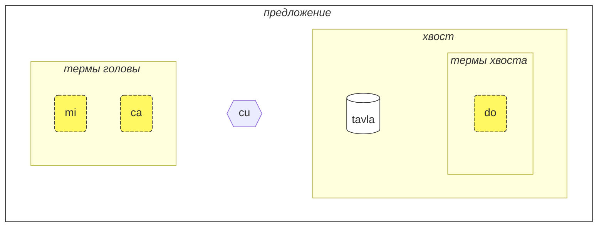
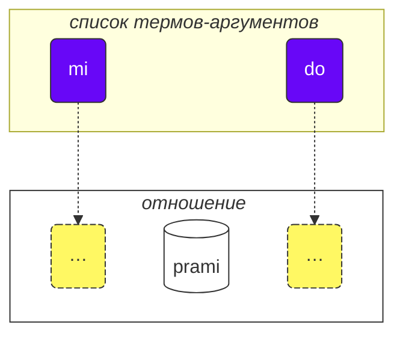
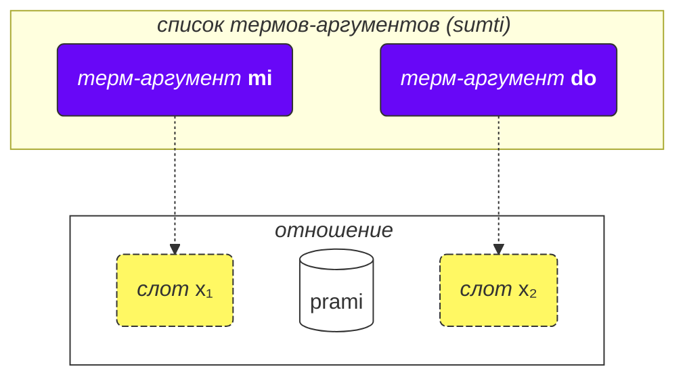
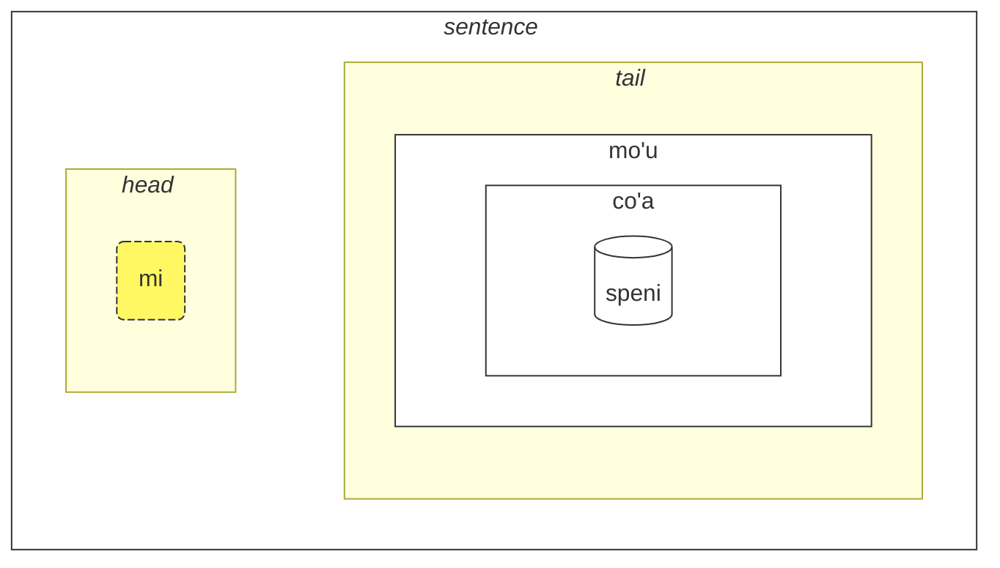

<div class="lojbo simple_blockquotes"></div>
<div class="print:hidden">

[📁 PDF версия этой страницы](/vreji/uencu/learn-lojban.pdf)

<hr/>
</div>

<div class="lojbo simple_blockquotes"></div>

Как использовать этот курс:

1. прочитайте курс
2. соберите отзывы и предложения
3. отправьте их в [💬 онлайн-чат](https://lojban.pw/articles/live_chat/)

## Урок 1. Язык с первого взгляда

### Алфавит

Первое, что нужно узнать о ложбане, это алфавит.

Ложбан использует латинский алфавит (гласные выделены цветом):

<dl><dd><b><font color="#FF1493">a</font> b c d <font color="#FF1493">e</font> f g <font color="#FF1493">i</font> j k l m n <font color="#FF1493">o</font> p r s t <font color="#FF1493">u</font> v x <font color="#FF1493">y</font> z ' .</b></dd></dl>

Слова произносятся так, как пишутся.

В ложбане 10 гласных:

<table>
<tbody><tr>
<td><b class="audio-inline"><font color="#FF1493" class="guibutton">a</font></b></td>
<td> как <u>а</u> в слове <i>б<u>a</u>с</i></td>
</tr>
<tr>
<td><b class="audio-inline"><font class="guibutton"color="#FF1493">e</font></b></td>
<td> как <u>э</u> в слове <i>с<u>э</u>р</i></td>
</tr>
<tr>
<td><b class="audio-inline"><font class="guibutton" color="#FF1493">i</font></b></td>
<td> как <u>и</u> в слове <i>с<u>и</u>ла</i></td>
</tr>
<tr>
<td><b class="audio-inline"><font class="guibutton" color="#FF1493">o</font></b></td>
<td> как <u>о</u> в слове <i>м<u>о</u>ре</i> (<u>o</u> в ложбане всегда произносится чётко, не превращаясь в подобие <u>а</u>)</td>
</tr>
<tr>
<td><b class="audio-inline"><font class="guibutton" color="#FF1493">u</font></b></td>
<td> как <u>у</u> в слове <i>б<u>у</u>ря</i></td>
</tr>
<tr>
<td><b class="audio-inline"><font class="guibutton" color="#FF1493">y</font></b></td>
<td> как безударная <u>о</u> в слове <i>к<u>о</u>мар</i></td>
</tr>
<tr>
</tbody></table>

4 гласные буквы записываются с использованием комбинаций букв:

<table>
<tbody><tr>
<td><b class="audio-inline"><font color="#FF1493" class="guibutton">au</font></b></td>
<td> как <u>ау</u> в слове <i><u>ау</u>т</i>, но при этом <u>у</u> должна быть краткой</td></tr>
<tr>
<td><b class="audio-inline"><font color="#FF1493" class="guibutton">ai</font></b></td>
<td> как <u>ай</u> в слове <i>м<u>ай</u></i></td></tr>
<tr>
<td><b class="audio-inline"><font class="guibutton"color="#FF1493">ei</font></b></td>
<td> как в слове <i><u>эй</u></i></td></tr>
<tr>
<td><b class="audio-inline"><font class="guibutton" color="#FF1493">oi</font></b></td>
<td> как в слове <i><u>ой</u></i></td></tr>
</tbody></table>

Что касается согласных, они произносятся так же, как на английском или латыни, но есть несколько отличий:

<table>
<tbody><tr>
<td><span class="audio-inline"><b class="guibutton">c</b></span>
</td>
<td>произносится как <i>ш</i>.
</td></tr>
<tr>
<td><span class="audio-inline"><b class="guibutton">j</b></span>
</td>
<td>как <i>ж</i>
</td></tr>
<tr>
<td><span class="audio-inline"><b class="guibutton">x</b></span>
</td>
<td>как <i>х</i> в слове <i>хорошо</i>
</td></tr>
<tr>
<td><span class="audio-inline"><b class="guibutton"> ' </b></span>
</td>
<td>как английская/татарская/казахская <i>h</i>. Таким образом, апостроф считается полноценной буквой ложбана и произносится как <i>h</i>. Он может находиться только между гласными. Например, <b>a'i</b> произносится как <i>аhи</i> (в то время как <b>ai</b> произносится как <i>ай</i>).
</td></tr>
<tr>
<td><span class="audio-inline"><b>.</b></span>
</td>
<td>точка (период, разрыв слова) также считается буквой в ложбане. Это короткая пауза в речи, чтобы отделить некоторые слова. Фактически, перед любым словом, начинающимся с гласной, ставится точка. Это помогает предотвратить нежелательное слияние двух последовательных слов в одно.
</td></tr>
<tr>
<td><span class="audio-inline"><b>i</b></span>
</td>
<td><span class="audio-inline"><b>i</b></span> перед гласными считается согласной и произносится как <u>й</u>, например:
<ul><li><b>ia</b> произносится как <i>я</i> в <i>ясно</i></li>
<li><b>ie</b> произносится как <i>е</i> в <i>если</i></li></ul>
</td></tr>
<tr>
<td><span class="audio-inline"><b>u</b></span>
</td>
<td><span class="audio-inline"><b>u</b></span> перед гласными считается согласной и произносится кратко, как <i>ў</i> в белорусском, например:
<ul><li><b>ua</b> произносится как <i>ўа</i></li>
<li><b>ue</b> произносится как <i>ўэ</i></li></ul>
</td></tr></tbody></table>

Ударение ставится на предпоследний гласный. Если слово имеет только один гласный, то ударение в слове просто не ставится.

Буква **r** может произноситься как _r_ в русском, английском, так что есть диапазон приемлемых произношений для неё.

### Самое простое предложение

Основная единица в ложбане — "предложение". Вот три примера простых предложений:

> **le prenu cu tavla mi**
> _Человек говорит со мной._

le prenu
: человек

tavla
: … говорит с …, … разговаривает с …

mi
: я, мне

> **mi prami do**
> _Я люблю тебя._

prami
: … любит … (кого-то)

do
: ты

> **mi ca cu tavla do**
> _Я сейчас говорю с тобой._

ca
: сейчас

<pixra url="/assets/pixra/cilre/tavla.webp" caption="le prenu cu tavla mi" definition="Человек говорит со мной."></pixra>

<pixra url="/assets/pixra/cilre/mi.webp" caption="mi" definition="Я / мне"></pixra>

<pixra url="/assets/pixra/cilre/mi_prami_do2.webp" caption="mi prami do" definition="Я люблю тебя."></pixra>

<pixra url="/assets/pixra/cilre/do.webp" caption="do" definition="ты"></pixra>

Каждое предложение в ложбане состоит из следующих частей слева направо:

- голова:
  - состоит из так называемых "термов",
    - **le prenu** — единственный терм головы в примере **le prenu cu tavla mi** выше,
    - **mi**, **ca** — термы головы в примере **mi ca cu tavla do** выше.
- разделитель головы **cu**:
  - произносится как _шу_, так как **c** обозначает _ш_,
  - показывает, что голова закончилась,
  - может быть опущен, когда ясно, что голова завершена.
- хвост:
  - основная конструкция отношения (называемая "**selbrisni**" в ложбане),
  - \+ возможно, один или несколько термов после неё,
    - **tavla**, **prami** — это selbrisni, основные конструкции отношения в приведенных выше примерах.
    - **mi** — единственный терм хвоста в примере **le prenu cu tavla mi** выше.
    - **do** — единственный терм хвоста в примере **mi prami do** выше.



На ложбане мы в основном говорим об отношениях, а не о существительных или глаголах.

Вот два слова-отношения, которые примерно соответствуют глаголам:

prenu
: … является человеком / являются людьми

tavla
: … разговаривает с …

У каждого отношения есть одна или несколько ролей, которые также можно назвать "слотами" или "местами". Выше они помечены "…" Эти слоты должны быть заполнены аргументами (называемыми "**sumti**" на ложбане). Аргументы - это конструкции вроде **le prenu**, **mi**, **do**, независимо от того, окажутся ли эти термы в голове или хвосте предложения. Мы располагаем аргументы в определенном порядке, заполняя эти слоты и придавая конкретный смысл отношению.



Мы также можем превратить такое отношение в терм-аргумент.

Для этого мы ставим перед ним короткое слово **le**:

prenu
: … является человеком

le prenu
: человек, люди

Аналогично,

tavla
: … разговаривает с …

и таким образом

le tavla
: говорящий, разговорщик, разговорщики

Может показаться странным, как _человек_ может быть "глаголом", но на самом деле это делает ложбан очень простым:

<table>
<thead>
<tr>
<th>отношение с незаполненными слотами</th>
<th>форма аргумента (<b>sumti</b>)</th></tr>
</thead>
<tbody>
<tr>
<td><b>prenu</b> — <i>… (кто-то) является человеком</i> </td>
<td><b>le prenu</b> — <i>человек / люди</i>
    <br/><b>le prenu</b> — <i>тот, кто является человеком / те, кто являются людьми</i>
</td></tr>
<tr>
<td><b>tavla</b> — <i>… (кто-то) разговаривает с … (кем-то)</i> </td>
<td><b>le tavla</b> — <i>говорящий / разговорщик / разговорщики</i>
    <br/><b>le tavla</b> — <i>тот, кто говорит / те, кто говорит</i>
</td></tr>
</tbody></table>

Первый слот отношений исчезает при использовании **le**, поэтому возможны такие альтернативные переводы, как _тот, кто …_.

<!-- Мы также можем сказать, что **le** создает существительное из конструкции отношения с примерным значением _тот, который …_ (_является человеком_ — _человек_), или даже _те, кто делает …_ (_разговаривать с_ — _разговорщики_), _те, кто являются …_ (_являются людьми_ — _люди_). -->

Обратите внимание, что ложбан по умолчанию не определяет число _говорящих_. То есть **le tavla** в этом отношении неопределен, это может быть один или более говорящих, и вскоре мы узнаем способы определения числа.

Помимо аргументов, существуют модальные термы, такие как **ca**:

> **mi ca cu tavla do**
> _Я сейчас разговариваю с тобой._

ca
: сейчас

Модальные термы не занимают слоты основной конструкции отношения ("**selbrisni**"). Вместо этого они применяются ко всему предложению, обогащая или уточняя его значение.

Таким образом, термы в ложбане представлены следующим образом:

- аргументы-термы, которые занимают слоты отношений. Примеры:
  - существительные, такие как **le prenu** (_человек_)
  - местоимения, такие как **mi** (_я_, _меня_), **do** (_ты_). Местоимения работают точно так же, как существительные, но для них не используется **le**. Они работают как аргументы самостоятельно.
- модальные термы, которые не занимают слоты отношений, но указывают дополнительную, уточняющую информацию.
  - например, **ca** (_сейчас, в настоящий момент_).

Несколько примеров:

<pixra url="/assets/pixra/cilre/nintadni.webp" caption="mi nintadni" definition="Я новый студент, первокурсник."></pixra>

> **mi nintadni**
> _Я новый студент._

nintadni
: … (кто-то) новый студент, новичок

В отличие от русского, нам не нужно добавлять конструкцию "- это" в предложение. Оно уже подразумевается. Слово отношения **nintadni** (_… быть новым студентом_) уже содержит в себе русское "- это", когды мы переводим на русский.

> **do jimpe**
> _Ты понимаешь._

jimpe
: … (кто-то) понимает … (что-то)

<pixra url="/assets/pixra/cilre/pilno_le_fonxa.webp" caption="le prenu cu pilno le fonxa" definition="Человек использует телефон."></pixra>

> **mi pilno le fonxa**
> _Я использую телефон._

pilno
: … (кто-то) использует … (что-то)

fonxa
: … телефон, … телефоны

le fonxa
: телефон, телефоны

<pixra url="/assets/pixra/cilre/citka.webp" caption="mi citka" definition="Я ем."></pixra>

> **mi citka**
> _Я ем._

citka
: … (кто-то) ест … (что-то)

> **do citka**
> _Ты ешь._

<!-- -->

> **mi citka le plise**
> _Я ем яблоки._

<pixra url="/assets/pixra/cilre/le_plise_cu_kukte.webp" caption="le plise cu kukte" definition="Яблоки вкусные."></pixra>

> **le plise cu kukte**
> _Яблоки вкусные._

le plise
: яблоки

kukte
:  … (что-то) вкусное

Простое предложение на ложбане будет содержать только одно основное слово-отношение:

<pixra url="/assets/pixra/cilre/karce.webp" caption="karce" definition="Это автомобиль."></pixra>

> **karce**
> _Автомобиль!_
> _Это автомобиль._

Вы можете сказать так, когда видите приближающийся автомобиль. Здесь контекст будет достаточно ясным, что где-то рядом есть автомобиль (и, вероятно, это опасно).

**karce** само по себе означает отношение _быть автомобилем, являться автомобилем_.

Конечно, мы можем быть более точными и сказать, например:

> **ti karce**
> _Это автомобиль._

ti
: местоимение: это вещь рядом со мной

<pixra url="/assets/pixra/cilre/ti.webp" caption="ti" definition="это (рядом со мной, говорящим)"></pixra>

Аналогично, вы можете сказать

<pixra url="/assets/pixra/cilre/carvi.webp" caption="carvi" definition="… идет дождь"></pixra>

> **carvi**
> _Идет дождь._

где

carvi
: … идет дождь, … дождится

или

> **pluka**
> _Это приятно._

где

pluka
: … приятно

> **prami**
> _Кто-то любит._

<pixra url="/assets/pixra/cilre/bajra.webp" caption="le prenu cu bajra" definition="Человек бежит."></pixra>

> **bajra**
> _Кто-то бежит._

bajra
: … бежит, используя конечности

Опять же, контекст, вероятно, скажет, кто кого любит и кто бежит.

### Задание

<pixra url="/assets/pixra/cilre/pinxe_le_djacu.webp" caption="le prenu cu pinxe le djacu" definition="Человек пьет воду."></pixra>

pinxe
: … пьет … (что-то)

le djacu
: вода

Закройте правую часть таблицы. Переведите предложения слева с ложбана.

<table style="table-layout: fixed;">
<tbody><tr>
<td><b>do citka</b>
</td>
<td><i>Ты ешь.</i>
</td></tr>
<tr>
<td><b>mi pinxe le djacu</b>
</td>
<td><i>Я пью воду.</i>
</td></tr>
<tr>
<td><b>mi citka le plise</b>
</td>
<td><i>Я ем яблоки.</i>
</td></tr></tbody></table>

### «**.i**» разделяет предложения

Мы ставим короткое слово **.i** для разделения любых двух последовательных предложений:

> **mi tavla le prenu .i le prenu cu tavla mi**
> _Я разговариваю с людьми. Люди разговаривают со мной._

**.i** разделяет предложения, как точка в конце предложений в русских текстах.

Когда мы произносим одно предложение за другим на русском, мы делаем паузу (она может быть короткой) между ними. Но пауза имеет много разных значений в русском. В ложбане у нас есть лучший способ понять, где заканчивается одно предложение и начинается другое.

Также обратите внимание, что иногда, когда мы быстро произносим слова, мы не можем определить, где заканчивается одно предложение и начинается слово следующего предложения. Поэтому рекомендуется использовать слово **.i** перед началом нового предложения.

### Числа: «_1 2 3 4 5 6 7 8 9 0_» = «**pa re ci vo mu xa ze bi so no**»

**le** просто превращает конструкцию отношения в аргумент, но такой аргумент не имеет связанного с ним числа. Предложение

> **le prenu cu tavla mi**
> _Люди говорят со мной._
> _Человек говорит со мной._

не указывает количество людей, говорящих со мной. На русском невозможно опустить число, потому что _люди_ в русском подразумевает _более одного человека_. Однако в ложбане вы можете опустить число.

Теперь давайте уточним, сколько из этих людей имеют отношение к нашему обсуждению.

Добавим число после **le**.

<table>
<tbody><tr>
<td><b>pa</b>
</td>
<td><b>re</b>
</td>
<td><b>ci</b>
</td>
<td><b>vo</b>
</td>
<td><b>mu</b>
</td>
<td><b>xa</b>
</td>
<td><b>ze</b>
</td>
<td><b>bi</b>
</td>
<td><b>so</b>
</td>
<td><b>no</b>
</td></tr>
<tr>
<td> 1
</td>
<td> 2
</td>
<td> 3
</td>
<td> 4
</td>
<td> 5
</td>
<td> 6
</td>
<td> 7
</td>
<td> 8
</td>
<td> 9
</td>
<td> 0
</td>
</tr></tbody></table>

<pixra url="/assets/pixra/cilre/ci_prenu.webp" caption="le ci prenu" definition="Три человека"></pixra>

> **le pa prenu cu tavla mi**
> _Человек говорит со мной._
> _Один человек говорит со мной._

Мы добавляем число после **le** и тем самым указываем отдельных людей.

Для чисел, состоящих из нескольких цифр, мы просто объединяем эти цифры вместе:

> **le re mu prenu cu tavla mi**
> _25 человек говорят со мной._

Да, это так просто.

Если мы хотим считать, мы можем разделять числа с помощью **.i**:

> **mu .i vo .i ci .i re .i pa .i no**
> _5 … 4 … 3 … 2 … 1 … 0_

Число **za'u** означает _больше чем …_ (_\>_ в математике), число **me'i** означает _меньше чем_ (_<_ в математике):

> **le za'u re prenu cu tavla mi**
> _Больше двух человек разговаривают со мной._

<!-- -->

> **le me'i pa no prenu cu tavla mi**
> _Меньше 10 человек разговаривают со мной._

<!-- -->

> **le za'u ci prenu cu tavla mi**
> _Больше трех человек разговаривают со мной._

Чтобы сказать просто _люди_ (во множественном числе) в отличие от _одного человека_, мы используем **za'u pa**, _больше одного_ или просто **za'u**.

> **le za'u pa prenu cu tavla mi**
> **le za'u prenu cu tavla mi**
> _Люди разговаривают со мной._

**za'u** по умолчанию означает **za'u pa**, поэтому такое сокращение возможно.

le prenu
: человек / люди

le pa prenu
: один человек

le za'u prenu
: люди (два или более)

### Задание

stati
: … (кто-то) - умный, … (кто-то) талантлив

<pixra url="/assets/pixra/cilre/stati.webp" caption="stati" definition="… талантливый"></pixra>

klama
: … приходит в … (место или объект)

<pixra url="/assets/pixra/cilre/klama_ti.webp" caption="le prenu cu klama ti" definition="Человек пришел сюда."></pixra>

nelci
: … (кому-то) нравится (что-то)

le zarci
: магазин

<pixra url="/assets/pixra/cilre/zarci.webp" caption="le prenu cu zvati le zarci" definition="Человек находится в магазине."></pixra>

le najnimre
: апельсин (фрукт), апельсины

<pixra url="/assets/pixra/cilre/najnimre.webp" caption="najnimre" definition="… апельсин"></pixra>

le badna
: банан, бананы

<pixra url="/assets/pixra/cilre/badna.webp" caption="badna" definition="… банан"></pixra>

Закройте правую часть таблицы. Переведите предложения слева с ложбана.

<table style="table-layout: fixed;">
 <tbody>
  <tr>
   <td>le mu prenu cu klama le zarci</td>
   <td>Пять человек идут в магазин.</td>
  </tr>
  <tr>
   <td>le pa re prenu cu stati .i do stati</td>
   <td>Двенадцать человек умны. Ты умный.</td>
  </tr>
  <tr>
   <td>le prenu cu nelci le plise</td>
   <td>Людям нравятся яблоки.</td>
  </tr>
  <tr>
   <td>le za'u re prenu cu citka .i le me'i mu prenu cu pinxe le djacu</td>
   <td>Больше двух человек едят. Меньше пяти человек пьют воду.</td>
  </tr>
  <tr>
   <td>le za'u re prenu cu stati</td>
   <td>Больше двух человек умны.</td>
  </tr>
 </tbody>
</table>

<table style="table-layout: fixed;">
 <tbody>
  <tr>
   <td>le re mu xa prenu cu stati</td>
   <td>256 человек умны.</td>
  </tr>
  <tr>
   <td>le me'i pa re plise cu kukte</td>
   <td>Меньше 12 яблок вкусные.</td>
  </tr>
 </tbody>
</table>

### Составное отношение

Составное отношение (**tanru** на ложбане) - это несколько относительных слов, расположенных одно за другим.

> **tu melbi zdani**
> _Тот дом красивый._

<pixra url="/assets/pixra/cilre/melbi_zdani.webp" caption="melbi zdani" definition="…красивый дом"></pixra>

tu
: тот (далеко от тебя и меня)

melbi
: …красивый, приятный

zdani
: …дом или гнездо для … (кого-то)

melbi zdani
: составное отношение: …красивый дом для … (кого-то)

<pixra url="/assets/pixra/cilre/dansu.webp" caption="le prenu cu melbi dansu" definition="Человек красиво танцует."></pixra>

> **do melbi dansu**
> _Ты красиво танцуешь._

dansu
: …танцует

Здесь отношение **melbi** добавляет дополнительный смысл, так как оно расположено слева от другого отношения: **zdani**. Левая компонента обычно переводится с помощью прилагательных и наречий.

Составные отношения - это мощная функция, которая создает более богатые значения. Просто объедините два относительных слова, и левая компонента такого составного отношения добавит оттенок к правой.

Мы можем поставить **le** (например, с числом) слева от такого составного отношения, чтобы получить более богатый аргумент:

le pa melbi zdani
: красивый дом

Теперь вы знаете, почему в нашем примере после главных термов было **cu**:

> **le pa prenu cu tavla mi**
> _Человек говорит со мной._

Без **cu** это стало бы **le pa prenu tavla**, что имело бы значение _говорящий человек_ - что бы это ни значило.

Подумайте:

> **le pa tavla pendo**
> _Говорящий друг_
<!-- -->
> **le pa tavla cu pendo**
> _Говорящий - друг._

Не забывайте ставить **cu** перед основным отношением в предложении, чтобы избежать непреднамеренного создания составных отношений.

Составное отношение может содержать более двух компонентов. В этом случае первое отношение модифицирует второе, второе модифицирует третье и так далее:

<pixra url="/assets/pixra/cilre/cmalu_karce.webp" caption="ti cmalu karce" definition="Это маленькая машина."></pixra>

> **le pa melbi cmalu karce**
> _красивая-маленькая машина, машина маленькая в красивом стиле_

<!-- -->

> **le mutce melbi zdani**
> _очень красивый дом_

mutce
: … очень, … много

### Задание

sutra
: … быстрый

barda
: … большой

cmalu
: … маленький

mlatu
: … кошка

Закройте правую часть таблицы. Переведите предложения слева с ложбана.

<table style="table-layout: fixed;">
<tbody><tr>
<td><b>le melbi karce</b>
</td>
<td><i>красивая машина / красивые машины</i>
</td></tr>
<tr>
<td><b>do sutra klama</b>
</td>
<td><i>Ты быстро приходишь. Ты приходишь быстро.</i>
</td></tr>
<tr>
<td><b>tu barda zdani</b>
</td>
<td><i>Это большой дом.</i>
</td></tr>
<tr>
<td><b>le pa sutra bajra mlatu</b>
</td>
<td><i>быстро бегущая кошка</i>
</td></tr>
<tr>
<td><b>le pa sutra mlatu</b>
</td>
<td><i>быстрая кошка</i>
</td></tr>
<tr>
<td><b>le pa bajra mlatu</b>
</td>
<td><i>бегущая кошка</i>
</td></tr></tbody></table>

Закройте правую часть таблицы. Переведите предложения слева на ложбан.

<table style="table-layout: fixed;">

<tbody><tr>
<td><i>Это маленькая машина.</i>
</td>
<td><b>ti cmalu karce</b>
</td></tr>
<tr>
<td><i>вкусные яблоки</i>
</td>
<td><b>le kukte plise</b>
</td></tr>
<tr>
<td><i>быстрые поедатели</i>
</td>
<td><b>le sutra citka</b>
</td></tr>
<tr>
<td><i>Ты быстро идущий человек.</i>
</td>
<td><b>do sutra cadzu prenu</b>
</td></tr></tbody></table>

### Вопросы типа «Да/Нет»

На русском языке мы формируем вопрос типа «Да/Нет», меняя интонацию слов или используя частицу *ли*, например:

В ложбане чтобы превратить любое утверждение в вопрос типа «Да/Нет», мы просто вставляем слово **xu** где-то в предложении, например, в начале:

> **xu do nelci le gerku**
> _Тебе нравятся собаки?_
> _Нравятся ли тебе собаки?_

le gerku
: собака, собаки

<pixra url="/assets/pixra/cilre/le_prenu_e_le_gerku.webp" caption="ti prenu .i ti gerku" definition="Это человек. Это собака."></pixra>

Помни, что в ложбане знаки препинания, такие как "?" (вопросительный знак), в основном необязательны и используются больше для стилистических целей. Это потому, что вопросительное слово **xu** уже показывает, что это вопрос.

Другие примеры:

> **xu mi klama**
> _Я иду?_

klama
: …идет куда-то…

> **xu pelxu**
> _Оно желтое?_

pelxu
: …желтый

Мы можем изменить значение, поместив **xu** после разных частей отношения. Объяснения о том, что изменилось в значении, даны в скобках:

> **xu do nelci le gerku**
> _Тебе нравятся собаки?_

<!-- -->

> **do xu nelci le gerku**
> _Тебе нравятся собаки?_ (Я думал, что это кто-то другой их любит).

<!-- -->

> **do nelci xu le gerku**
> _Тебе НРАВЯТСЯ собаки? (Я думал, что ты к ним равнодушен)._

<!-- -->

> **do nelci le xu gerku**
> _Тебе нравятся СОБАКИ? (Я думал, что тебе нравятся кошки)._

<!-- -->

> **do nelci le gerku xu**
> _Тебе нравятся эти вещи, они собаки? (Ты только сомневаешься в правильности отношения **gerku**)._

То, что выражается интонацией в русском языке, выражается перемещением **xu** после той части, которую мы хотим подчеркнуть, в ложбане. Обратите внимание, что первое предложение с **xu** в начале задает самый общий вопрос, не подчеркивая никакой конкретной стороны.

**xu** - это междометие. Вот особенности междометий в ложбане:

- междометие изменяет конструкцию перед ним:

 > **do xu nelci le gerku**
 > _Тебе нравятся собаки?_

- когда оно ставится в начале отношения, междометие изменяет всё отношение:

 > **xu do nelci le gerku**
 > _Тебе нравятся собаки?_

- междометия могут быть помещены после разных частей одного и того же отношения, чтобы изменить значение.

  > **do nelci le gerku xu**
  > _Тебе нравятся эти объекты, они собаки?_

  Здесь только отношение **gerku** (а не аргумент **le gerku**) изменяется вопросительным словом **xu**. Так что мы интересуемся только этим отношением. Мы утверждаем, что тебе нравятся эти объекты или живые существа, и спрашиваем, являются ли они собаками.

Interjections don't break compound relations, they can be used within them:

> **do nelci le barda xu gerku**
> _Тебе нравятся БОЛЬШИЕ собаки?_

Now, how to reply to such 'yes/no' questions? You repeat the main relation construct:

> **— xu le mlatu cu melbi**
> **— melbi**
> _— Кошки красивые?_
> _— Красивые._

To answer 'no', we use the modal term **na ku**:

> **— xu le mlatu cu melbi**
> **— na ku melbi**
> _— Кошки красивые?_
> _— Не красивые._

na ku
: терм: это неправда, что …

Or, we can use a special relation word **go'i**:

> **— xu le mlatu cu melbi**
> **— go'i**
> _— Кошки красивые?_
> _— Красивые._

go'i
: слово-связка, которое повторяет основную связку предыдущего предложения

Здесь **go'i** означает то же самое, что и **melbi**, так как **melbi** является связкой предыдущей связки.

> **— xu le mlatu cu melbi**
> **— na ku go'i**
> _— Кошки красивые?_
> _— Не красивые._

<!-- В этом курсе не рекомендуется отрицать **go'i** для отрицательных ответов. Просто используйте **je'u nai**. -->

Модальный терм **na ku** можно использовать не только в ответах:

> **na ku mi nelci le gerku**
> _Это неправда, что мне нравятся собаки._
> _Мне не нравятся собаки._
<!-- -->
> **mi na ku nelci do**
> _Мне не нравишься ты._

Его противоположность, терм **ja'a ku**, подтверждает значение:

> **mi ja'a ku nelci do**
> _Мне нравишься ты._

ja'a ku
: терм: это правда, что …

### Задание

Закройте правую часть таблицы. Переведите предложения слева с ложбанского языка.

<table style="table-layout: fixed;">

<tbody><tr>
<td><b>xu le barda zdani cu melbi</b>
</td>
<td><i>Большой дом красивый?</i>
</td></tr>
<tr>
<td><b>— le prenu cu stati xu<br/>— na ku stati</b>
</td>
<td><i>— Люди умные?<br/>— Нет.</i>
</td></tr>
<tr>
<td><b>do klama le zarci xu</b>
</td>
<td><i>Ты идешь на рынок?</i>
</td></tr>
<tr>
<td><b>xu le verba cu prami le mlatu</b>
</td>
<td><i>Ребенок любит кошек?</i>
</td></tr></tbody></table>

Закройте правую часть таблицы. Переведите предложения слева на ложбанский язык.

<table style="table-layout: fixed;">

<tbody><tr>
<td><i>Машина быстрая?</i>
</td>
<td><b>xu le karce cu sutra</b>
</td></tr>
<tr>
<td><i>— Апельсин вкусный?<br/>— Да, вкусный.</i>
</td>
<td><b>— xu le najnimre cu kukte<br/>— kukte</b>
</td></tr>
<tr>
<td><i>Собака любит тебя?</i>
</td>
<td><b>xu le gerku cu prami do</b>
</td></tr></tbody></table>

### Счастье и вежливые просьбы: ‘_Yay!_’ = «**ui**», ‘_Please!_’ = «**.e'o**»

Междометие **ui** выражает радость говорящего. Оно используется так же, как улыбающийся смайлик ‘_:)_’ в сообщениях, чтобы показать, что вы рады чему-то. Хотя смайлики могут быть двусмысленными, **ui** имеет только одно значение, что очень удобно.

> **ui do klama**
> _Ура, ты идешь!_

ui
: междометие: _Ура!_, междометие радости


Междометие **.e'o** в начале предложения превращает его в вежливую просьбу:

> **.e'o do lebna le fonxa**
> _Можешь взять телефон, пожалуйста?_
> `Пожалуйста, возьми телефон.`

.e'o
: междометие: пожалуйста (произносится как _э-хау_ с короткой паузой или перерывом перед словом)

lebna
: брать (что-то)

В русском языке, чтобы быть вежливым, нужно использовать _не могли бы Вы_ + _пожалуйста_ + вопрос. В ложбане достаточно **.e'o**, чтобы вежливо попросить.

### Задание

Закройте правую часть таблицы. Переведите предложения слева с ложбана.

le tcati
: чай

<pixra url="/assets/pixra/cilre/tcati.webp" caption="tcati" definition="… это чай"></pixra>

le ckafi
: кофе

<pixra url="/assets/pixra/cilre/ckafi.webp" caption="ckafi" definition="… это кофе"></pixra>

zgana
: наблюдать, наблюдение (используя любые чувства)

le skina
: фильм

<pixra url="/assets/pixra/cilre/zgana_le_skina.webp" caption="le prenu cu zgana le skina" definition="Человек смотрит фильм."></pixra>

kurji
: заботиться о (ком-то, чем-то)

<table style="table-layout: fixed;">

<tbody>
<tr>
<td><b>ui carvi</b>
</td>
<td><i>Ура, идет дождь! Ура, идет дождь!</i>
</td></tr>
<tr>
<td><b>.e'o do sutra bajra</b>
</td>
<td><i>Беги быстро!</i>
</td></tr>
<tr>
<td><b>.e'o do pinxe le tcati</b>
</td>
<td><i>Пожалуйста, выпей чай!</i>
</td></tr>
<tr>
<td><b>.e'o zgana le skina</b>
</td>
<td><i>Пожалуйста, посмотри фильм!</i>
</td></tr></tbody></table>

Закройте правую часть таблицы. Переведите предложения слева на ложбан.

<table style="table-layout: fixed;">

<tbody><tr>
<td><i>Пожалуйста, будь умным!</i>
</td>
<td><b>.e'o stati</b>
</td></tr>
<tr>
<td><i>Пожалуйста, иди домой!</i>
</td>
<td><b>.e'o do klama le zdani</b>
</td></tr>
<tr>
<td><i>Пожалуйста, выпей кофе!</i>
</td>
<td><b>.e'o do pinxe le ckafi</b>
</td></tr>
<tr>
<tr>
<td><i>Ура, я разговариваю с тобой!</i>
</td>
<td><b>ui mi tavla do</b>
</td></tr>
<tr>
<td><i>Пожалуйста, позаботься о ребенке.</i>
</td>
<td><b>.e'o do kurji le verba</b>
</td></tr></tbody></table>

### «И» и «или»

> **do nintadni .i je mi nintadni**
> _Ты новичок. И я новичок._

<!-- -->

> **do .e mi nintadni**
> _Ты и я - новички._

<pixra url="/assets/pixra/cilre/do_e_mi_nintadni.webp" caption="do .e mi nintadni" definition="Ты и я - новые ученики."></pixra>

<!-- -->

> **mi tadni .i je mi tavla do**
> _Я учусь. И я разговариваю с тобой._

<!-- -->

> **mi tadni gi'e tavla do**
> _Я учусь и разговариваю с тобой._

.i je
: союз "и" объединяет предложения в одно.

.e
: союз "и" соединяет аргументы.

gi'e
: союз "и" соединяет хвосты предложений.

Мы можем объединить два предложения в одно, используя союз **.i je**, который означает _и_:

> **do nintadni .i je mi nintadni**
> _Ты новичок. И я новичок._

Поскольку оба предложения имеют одинаковый хвост, мы можем использовать сокращение: союз **.e** означает _и_ для аргументов:

> **do .e mi nintadni**
> _Ты и я - новички._

**do nintadni .i je mi nintadni** означает точно то же самое, что и **do .e mi nintadni**.

Мы также можем использовать **.e** для соединения аргументов в других позициях.

Оба эти предложения имеют одинаковое значение.


> **mi pinxe le djacu .e le jisra**
> _Я пью воду и сок._
> **mi pinxe le djacu .i je mi pinxe le jisra**
> _Я пью воду, и я пью сок._

le jisra
: сок

<pixra url="/assets/pixra/cilre/pinxe_le_jisra.webp" caption="le prenu cu pinxe le jisra" definition="Человек пьет сок."></pixra>

Если голова предложения одинаковая, но хвосты разные, мы используем союз **gi'e**, который означает _и_ для хвостов предложений:

> **mi tadni .i je mi tavla do**
> **mi tadni gi'e tavla do**
> _Я учусь и разговариваю с тобой._

Оба варианта имеют одно и то же значение; **gi'e** просто приводит к более краткой формулировке.

У нас также есть инструменты для добавления _и_ для компонентов составных отношений:

> **le melbi je cmalu zdani cu jibni ti**
> _Красивый и маленький дом находится рядом._

<pixra url="/assets/pixra/cilre/melbi_je_cmalu_zdani.webp" caption="melbi je cmalu zdani" definition="…это красивый и маленький дом"></pixra>

jibni
: …близко к…

ti
: это вещь, это место рядом со мной

**je** - союз в языке ложбан, который означает _и_ в составных отношениях.

Без **je** предложение меняет значение:

> **le melbi cmalu zdani cu jibni**
> _Красивый маленький дом находится рядом._

Здесь **melbi** модифицирует **cmalu**, а **melbi cmalu** модифицирует **zdani**, в соответствии с тем, как работают составные отношения.

В **le melbi je cmalu zdani** (_красивый и маленький дом_) и **melbi**, и **cmalu** непосредственно модифицируют **zdani**.

Другие распространенные союзы включают:

> **le verba cu fengu ja bilma**
> _Ребенок злой или болен (или и то, и другое)_

<!-- -->

> **do .a mi ba vitke le dzena**
> _Ты или я (или оба) посетим предка._

ja
: и/или

**.a** = _и/или_ при соединении аргументов.

fengu
: …злой

<pixra url="/assets/pixra/cilre/fengu.webp" caption="fengu" definition="…злой"></pixra>

bilma
: …болен

<pixra url="/assets/pixra/cilre/bilma.webp" caption="le prenu cu bilma" definition="Человек болен"></pixra>

vitke
: посещать

dzena
: …является предком…

<pixra url="/assets/pixra/cilre/dzena.webp" caption="dzena" definition="…является предком…"></pixra>

> **le karce cu blabi jo nai grusi**
> _Машина либо белая, либо серая._

<!-- -->

> **do .o nai mi vitke le laldo**
> _Либо ты, либо я посещаем старого._

jo nai
: либо … либо …, но не оба

.o nai
: либо … либо …, но не оба (при соединении аргументов)

laldo
: …старый

Примечание: лучше запомнить **jo nai** как одну конструкцию, и то же самое для **.o nai**.

> **mi prami do .i ju do stati**
> _Я люблю тебя. Будь ты умным или нет._

<!-- -->

> **le verba cu nelci le plise .u le badna**
> _Ребенок любит яблоки, будь то (он/она любит) бананы или нет._

ju
: будь то …

.u
: будь то … (при соединении аргументов)

### «**joi**» - это «_и_» для массовых действий

> **do joi mi casnu le bangu**
> _Ты и я обсуждаем язык._

casnu
: …обсуждает…

le bangu
: язык

joi
: союз _и_ для масс

Если я скажу **do .e mi casnu le bangu**, это может означать, что ты обсуждаешь язык, и я обсуждаю язык. Но это не обязательно означает, что мы находимся в одном разговоре!

Это можно сделать более заметным, если мы расширим это с помощью **.i je**:

> **do .e mi casnu le bangu**
> **do casnu le bangu .i je mi casnu le bangu**
> _Ты обсуждаешь язык. И я обсуждаю язык._

Чтобы подчеркнуть, что ты и я участвуем в одном действии, мы используем специальное союзное слово **joi**, означающее _и_, которое формирует "массу":

> **do joi mi casnu le bangu**
> _Ты и я обсуждаем язык._
> _Ты и я, будучи единым целым для этого события, обсуждаем язык._

Местоимение **mi'o** (_ты и я вместе_) на самом деле может быть выражено как **mi joi do**, что означает точно то же самое (просто длиннее). В ложбане вы можете использовать не одно слово для _мы_, а более точные конструкции, например, **mi joi le pendo** (буквально _я и друзья_).

<pixra url="/assets/pixra/cilre/casnu.webp" caption="do joi le pendo joi mi casnu" definition="Ты, друг и я обсуждаем."></pixra>

### Задание

Закройте правую часть таблицы. Переведите предложения слева с ложбана.

<table style="table-layout: fixed;">

<tbody><tr>
<td><b>mi nelci le badna .e le plise</b>
</td>
<td><i>Мне нравятся бананы и яблоки. Мне нравятся бананы и яблоки.</i>
</td></tr>
<tr>
<td><b>do sutra ja stati</b>
</td>
<td><i>Ты быстрый или умный или и то, и другое.</i>
</td></tr>
<tr>
<td><b>le za'u prenu cu casnu le karce .u le gerku</b>
</td>
<td><i>Люди обсуждают машины, независимо от того, обсуждают ли они собак.</i>
</td></tr>
<tr>
<td><b>mi citka le najnimre .o nai le badna</b>
</td>
<td><i>Я ем или апельсины, или бананы.</i>
</td></tr></tbody></table>

Закройте правую часть таблицы. Переведите предложения слева на ложбан.

<table style="table-layout: fixed;">

<tbody><tr>
<td><i>Друзья и я любим дождь.</i>
</td>
<td><b>le pendo .e mi cu nelci le carvi</b>
</td></tr>
<tr>
<td><i>Либо я, либо ты идем на рынок.</i>
</td>
<td><b>mi .o nai do klama le zarci</b>
</td></tr>
<tr>
<td><i>Я смотрю на большую и красивую машину.</i>
</td>
<td><b>mi catlu le barda je melbi karce</b>
</td></tr>
<tr>
<td><i>Ребенок пьет воду и/или сок.</i>
</td>
<td><b>le verba cu pinxe le djacu .a le jisra</b>
</td></tr>
<tr>
<td><i>Ребенок и маленький обсуждают машину.</i>
</td>
<td><b>le verba joi le pa cmalu cu casnu le karce</b> (обратите внимание на использование <b>joi</b>. <i>маленький</i> просто <b>le pa cmalu</b>).
</td></tr></tbody></table>

### Но…

> **le najnimre cu barda .i je ku'i le badna cu cmalu**
> _Апельсины большие. Но бананы маленькие._

ku'i
: междометие: но, однако

На самом деле, в русском языке _но_ имеет тот же смысл, что и _и_, и добавляет оттенок контраста.

В ложбане мы просто используем союз **.i je** (или **.e**, **gi'e**, **je**, в зависимости от того, что мы соединяем) и добавляем оттенок контраста с помощью междометия **ku'i**. Таким образом, мы получаем необходимый контраст. Как обычно, междометие модифицирует конструкцию перед ним.

### События: «_танцы и быть вместе_» — «**le nu dansu .e le nu kansa**»

Некоторые слоты отношений ожидают событие:

> **le cabna cu nicte**
> _Сейчас ночь. В настоящее время ночь._

cabna
: … (событие) настоящее время с …; … (событие) происходит сейчас

le cabna
: настоящее время, настоящее событие

nicte
: … (событие) происходит ночью

Но что, если мы хотим описать событие с помощью целого предложения?

Любое предложение можно превратить в конструкцию отношения, поставив перед ним **nu**:

> **le nicte cu nu mi viska le lunra**
> _Ночь - это когда я вижу Луну._
> `Ночное время - это событие, когда я вижу Луну.`

<pixra url="/assets/pixra/cilre/nicte_fi_mi.webp" caption="le nicte" definition="ночное время"></pixra>

le nicte
: ночное время, ночные времена

viska
: видеть (что-то)

le lunra
: Луна

Здесь **le nicte** является первым аргументом предложения, а **nu mi viska le lunra** - основной конструкцией отношения предложения. Однако внутри этого основного отношения мы видим другое отношение: **mi viska le lunra** вложено!

Слово **nu** превращает полное предложение в отношение, обозначающее событие (в общем смысле, это может быть процесс, состояние и т. д.)

Вот еще несколько примеров:

nu mi tavla
: … является событием моего разговора

nu do tavla
: … является событием твоего разговора

Добавляя **le** перед **nu**, мы создаем аргумент, обозначающий событие:

pinxe ⇒ le nu pinxe
: пить ⇒ питье

dansu ⇒ le nu dansu
: танцевать ⇒ танцы

kansa ⇒ le nu kansa
: … находится вместе с … ⇒ быть вместе

klama ⇒ приходить ⇒ приход

le nu klama ⇒ приход ⇒ приход

le nu do klama ⇒ приход тебя ⇒ твой приход

**le nu** часто соответствует русскому суффиксу _\-ние_, _\-ция_,.

Несколько примеров с пустыми местами, которые ожидают событий вместо обычных сущностей:

> **mi djica le nu do klama ti**
> _Я хочу, чтобы ты пришел сюда (в это место)._

djica ⇒ хотеть (какое-то событие)

> **mi gleki le nu do klama**
> _Я счастлив, потому что ты приходишь._

gleki ⇒ … радуется (какому-то событию)

<pixra url="/assets/pixra/cilre/gleki.webp" caption="gleki" definition="… радуется событию …"></pixra>

> **le nu pinxe le jisra cu nabmi mi**
> _Пить сок для меня проблема._

nabmi ⇒ … (событие) проблема для … (кого-то), … (событие) проблематично для … (кого-то)

### Задание

Закройте правую часть таблицы. Переведите предложения слева с ложбана.

pilno ⇒ использовать (что-то)

le skami ⇒ компьютер

<table style="table-layout: fixed;">

<tbody><tr>
<td><b>mi nelci le nu do dansu</b>
</td>
<td><i>Мне нравится, как ты танцуешь.</i>
</td></tr>
<tr>
<td><b>xu do gleki le nu do pilno le skami</b>
</td>
<td><i>Ты счастлив от использования компьютеров?</i>
</td></tr>
<tr>
<td><b>do djica le nu mi citka le plise xu</b>
</td>
<td><i>Ты хочешь, чтобы я съел <u>яблоко</u>?</i>
</td></tr></tbody></table>

Закройте правую часть таблицы. Переведите предложения слева на ложбан.

<table style="table-layout: fixed;">

<tbody><tr>
<td><i>Приход сюда — проблема.</i>
</td>
<td><b>le nu klama ti cu nabmi</b>
</td></tr>
<tr>
<td><i>Я хочу, чтобы ты был счастлив.</i>
</td>
<td><b>mi djica le nu do gleki</b>
</td></tr></tbody></table>

### Модальные термы. Простые времена: «_был_», «_есть_», «_будет_» — «**pu**», «**ca**», «**ba**»

В ложбане мы выражаем время, когда что-то происходит (в грамматике русского языке это называется _временем глаголов_), с помощью модальных термов. Мы уже видели модальный терм **ca**, который означает _в настоящее время_.

Вот ряд временных термов, которые говорят о том, когда что-то происходит:

> **le prenu pu cu tavla mi**
> _Люди говорили со мной._

<!-- -->

> **le prenu ca cu tavla mi**
> _Люди говорят со мной (в настоящее время)._

<!-- -->

> **le prenu ba cu tavla mi**
> _Люди будут разговаривать со мной._

Когда после частицы, связанной со временем, мы помещаем голый аргумент, мы формируем терм с немного другим значением:

> **mi pinxe le djacu ca le nu do klama**
> _Я пью воду, пока ты идешь._

Часть **ca le nu do klama** - это длинный терм, означающий _пока ты приходишь / пока ты идешь_. Часть **le nu do klama** - это аргумент, означающий *приход тебя, твое прибытие*.

> **mi citka ba le nu mi dansu**
> _Я ем после того, как танцую._

Частицы, связанные со временем, группируются по своему значению, чтобы их было легче запомнить и использовать.

Слова для простого времени:

- **pu** означает _до … (какого-то события)_, **pu** само по себе обозначает прошедшее время.
- **ca** означает _в то же время, что и … (какое-то событие)_, **ca** само по себе обозначает настоящее время.
- **ba** означает _после … (какого-то события)_, **ba** само по себе обозначает будущее время.

Времена добавляют информацию о времени, когда что-то происходит. В русском языке мы вынуждены использовать определенные времена. Нам приходится выбирать между

- _Люди разговаривают со мной._
- _Люди разговаривали со мной._
- _Люди будут разговаривать со мной._

и другими подобными вариантами.

Но в ложбане частицы времени являются необязательными, мы можем быть такими размытыми или точными, как нам нужно.

Предложение

> **le prenu cu tavla mi**
> _Люди разговаривают со мной._

на самом деле ничего не говорит о том, когда это происходит. Контекст в большинстве случаев достаточно ясен и может помочь нам. Но если нам нужна большая точность, мы просто добавляем больше слов.

Аналогично, **ba** означает _после … (какого-то события)_, поэтому когда мы говорим **mi ba cu citka**, мы имеем в виду, что мы едим после момента речи, поэтому это означает _Я буду есть_.

Мы можем комбинировать частицы времени с аргументами и без них:

> **mi pu cu citka le plise ba le nu mi dansu**
> _Я ел яблоки после того, как танцевал._

Обратите внимание, что терм **pu** (прошедшее время) ставится только в основное отношение (**mi pu cu citka**). В ложбане предполагается, что событие _Я танцевал_ происходит относительно события поедания.

Как и в русском, мы не должны ставить **pu** с **dansu**, так как **mi dansu** рассматривается относительно **mi pu cu citka**, поэтому мы уже знаем, что все произошло в прошлом.

Дополнительные примеры термов, связанных со временем:

> **le nicte cu pluka**
> _Ночь приятная._

pluka
: …приятная

> **ba le nicte cu pluka**
> _После ночи будет приятно._

Здесь главная часть предложения содержит один терм **ba le nicte**, модальный терм с его внутренним аргументом. Затем после разделителя **cu** следует основное отношение предложения **pluka** (**pluka** в одиночку означает _Это приятно._)

Чтобы сказать _будет приятно_, мы должны использовать терм прошедшего времени:

> **le nicte ba cu pluka**
> _Ночь будет приятной._

Также обратите внимание, что добавление аргумента после временной частицы может привести к существенно отличающемуся значению:

> **le nicte ba le nu citka cu pluka**
> _Ночь приятна после еды._

Обратите внимание, что **ca** может немного распространяться в прошлое и будущее, означая _прямо сейчас_. Таким образом, **ca** отражает широко используемую во всем мире концепцию "настоящего времени".

Также возможно интегрировать модальные частицы в основную конструкцию отношения:

> **le nicte ba cu pluka**
> **le nicte ba pluka**
> _Ночь будет приятной._

Оба предложения имеют одно и то же значение, **ba pluka** - это конструкция отношения, означающая _…будет приятно_.

Структура **le nicte ba pluka** следующая:

- **le nicte** - главная часть предложения с одним термом **le nicte**
- **ba pluka** - хвост предложения, состоящий только из отношения **ba pluka**

В отличие от предыдущего предложения **le nicte ba cu pluka**:

- **le nicte ba** - главная часть предложения с двумя термами **le nicte** и **ba**
- **pluka** - хвост предложения, состоящий только из отношения **pluka**

Преимущество **le nicte ba pluka** перед **le nicte ba cu pluka** заключается только в краткости; в таких случаях обычно можно пропустить использование **cu**, так как предложение все равно не может быть понято иначе.

Если вы хотите поставить модальный терм перед аргументом, вы можете отделить его от следующего текста, явно "закончив" терм с помощью вспомогательного слова **ku**:

> **ba ku le nicte cu pluka**
> **le nicte ba cu pluka**
> **le nicte ba pluka**
> _Ночь будет приятной._

**ku** предотвращает появление **ba le nicte**, сохраняя **ba ku** и **le nicte** как отдельные термы.

Еще одно замечание: русские определения слов на ложбане могут использовать времена, даже если исходные слова на ложбане не подразумевают их, например:

tavla
: …говорит с…, …разговаривает с…

pluka
: …приятный

Хотя _говорит_, _есть_ и т.д. находятся в настоящем времени (мы не всегда можем избавиться от времени в русском, потому что так работает русский язык), мы всегда должны предполагать, что временные формы не подразумеваются в значении определенных слов на ложбане, если русское определение таких слов явно не указывает на такие ограничения времени.

### Модальные термы. Контуры событий: «**co'a**», «**ca'o**», «**co'i**»

Еще одна серия временных частиц, _контуры событий_:

co'a
: временная частица: событие начинается

ca'o
: временная частица: событие происходит

mo'u
: временная частица: событие завершено

co'i
: временная частица: событие рассматривается как целое (началось и закончилось)

Большинство слов-отношений описывают события, не указывая стадию этих событий. Контуры событий позволяют нам быть более точными:

> **mi pu co'a сu cikna**
> **mi pu co'a cikna**
> _Я проснулся._

cikna
: …бодрствует

co'a cikna
: …просыпается, становится бодрым

pu co'a cikna
: …проснулся, стал бодрым

<pixra url="/assets/pixra/cilre/coha_cikna.webp" caption="le prenu co'a cikna" definition="Человек просыпается."></pixra>

Для точного выражения прогрессивного времени мы используем **ca'o**:

> **mi pu ca'o сu sipna**
> **mi pu ca'o sipna**
> _Я спал._
> _Я был в процессе сна._

sipna
: …спит

<pixra url="/assets/pixra/cilre/sipna.webp" caption="le prenu ca'o sipna" definition="Человек спит."></pixra>

<!-- -->

> **mi ca ca'o pinxe**
> _Я пью._

<!-- -->

> **mi ba ca'o pinxe**
> _Я буду пить._

**mo'u** используется для описания завершения событий:

> **mi mo'u klama le tcana**
> _Я прибыл на станцию._

le tcana
: станция

<pixra url="/assets/pixra/cilre/mohu_klama_le_tcana.webp" caption="le prenu mo'u klama le tcana" definition="Человек прибыл на станцию."></pixra>

**co'i** обычно соответствует русскому совершенному времени:

> **le verba ca co'i pinxe le jisra**
> _Дети выпили сок._

В большинстве случаев мы можем опустить **ca** в таких предложениях, так как контекст будет достаточно ясным.

Простое время в русском может описывать события, которые происходят иногда. Вот как это можно сделать в ложбане:

> **le prenu ca ta'e tavla**
> _Люди (обычно, иногда) разговаривают._

ta'e
: простое время: событие происходит обычно

Мы можем использовать те же правила для описания прошлого времени, используя **pu** вместо **ca**, или будущего времени, используя **ba**:

> **le prenu pu co'i tavla mi**
> _Люди разговаривали со мной._

<!-- -->

> **le prenu ba co'i tavla mi**
> _Люди будут разговаривать со мной._

Относительный порядок временных частиц важен. В **ca co'i** мы сначала говорим, что что-то происходит в настоящем (**ca**), затем утверждаем, что в этом настоящем времени описанное событие завершено (**co'i**). Только при использовании этого порядка мы получаем соверщенному время.

### Модальные термы. Интервалы: «_в течение_» — «**ze'a**»

Еще одна серия модальных частиц подчеркивает, что события происходят в течение интервала:

ze'i
: в течение короткого времени

ze'a
: в течение некоторого времени, некоторое время, в течение …

ze'u
: в течение длительного времени

> **mi pu ze'a cu sipna**
> **mi pu ze'a sipna**
> _Я спал некоторое время._

<!-- -->

<pixra url="/assets/pixra/cilre/sipna_zeha.webp" caption="Человек спит, пока идет дождь."></pixra>

> **mi pu ze'a le nicte cu sipna**
> _Я спал всю ночь. Я спал всю ночь._

Примечание: мы не можем опустить **cu** здесь, так как **nicte sipna** (_… спит ночью_) является танру и может привести к другому (хотя и странному) значению.

> **mi pu ze'i le nicte cu sipna**
> _Я спал в течение короткой ночи._

Сравните **ze'a** с **ca**:

> **mi pu ca le nicte cu sipna**
> _Я спал ночью._

le nicte
: ночное время

При использовании **ze'a** мы говорим о всем интервале того, что описываем.

Обратите внимание, что **nicte** само по себе является событием, поэтому нам не нужно **nu** здесь.

### Модальные термы. «_потому что_» — «**ri'a**», «_к_» — «**fa'a**», «_в (место)_» — «**bu'u**»

Модальная частица для _потому что_:

> **mi pinxe ri'a le nu mi taske**
> _Я пью, потому что я испытываю жажду._

<!-- -->

> **mi citka ri'a le nu mi xagji**
> _Я ем, потому что я голоден._

ri'a
: потому что … (из-за какого-то события)

taske
: … испытывает жажду

<pixra url="/assets/pixra/cilre/taske.webp" caption="taske" definition="… испытывает жажду"></pixra>

xagji
: … голоден

<pixra url="/assets/pixra/cilre/xagji.webp" caption="xagji" definition="… голоден"></pixra>

Модальные частицы, обозначающие место, работают таким же образом:

> **mi cadzu fa'a do to'o le zdani**
> _Я иду в твоем направлении, прочь от дома._

Обратите внимание, что, в отличие от **klama**, модальные частицы **fa'a** и **to'o** обозначают направления, а не обязательно начальные или конечные точки маршрута. Например:

> **le prenu cu klama fa'a do**
> _Человек идет в твоем направлении._

означает, что человек просто движется в твоем направлении, но не обязательно к тебе (может быть к какому-то месту или человеку рядом с тобой).

<!-- -->

> **mi cadzu bu'u le tcadu**
> _Я гуляю по городу._

fa'a
: в направлении …

to'o
: из направления …

bu'u
: в … (некоторое место)

Примечание: **nu** показывает, что новое внутреннее вложенное предложение начинается внутри главного предложения. Мы ставим **kei** после такого отношения, чтобы показать его правую границу, подобно тому, как мы используем ")" или "]" в математике. Например:

> **le gerku cu plipe fa'a mi ca le nu do ca'o klama**
> _Собака прыгает в мою сторону, когда ты приходишь._

<pixra url="/assets/pixra/cilre/le_gerku_faha_plipe.webp" caption="le gerku cu plipe fa'a mi" definition="Собака прыгает в мою сторону."></pixra>

plipe
: прыгать

но

> **le gerku cu plipe ca le (nu do ca'o klama kei) fa'a mi**
> _Собака прыгает (когда ты приходишь) в мою сторону._

Скобки _(_ и _)_, используемые здесь, только показывают структуру; они не являются необходимыми в обычном тексте на ложбане.

Мы используем **kei** после внутреннего предложения **do ca'o klama**, чтобы показать, что оно закончилось, и хвост предложения продолжается со своими термами.

Сравните это предложение с следующим:

> **le gerku cu plipe ca le (nu do ca'o klama fa'a mi)**
> _Собака прыгает (когда ты приходишь в мою сторону)_.

Как видите, **do klama fa'a mi** - это отношение внутри более крупного, поэтому **fa'a mi** теперь находится внутри него.

Теперь это не собака, которая идет ко мне, а ты.

В конце выражения **kei** никогда не нужен, так как он уже обозначает правую границу.

Рассмотрим следующий пример с частицей, связанной со временем:

> **mi pu citka le plise ba le nu mi dansu**
> _Я съел яблоки после того, как я танцевал._

<!-- -->

> **mi pu citka ba le nu mi dansu kei le plise**
> _Я съел (после того, как я танцевал) яблоки._

Мы можем переставить фразу, перемещая **ba le nu mi dansu** вокруг, при условии, что она остается после **pu**.

#### Задание

Закройте правую часть таблицы. Переведите предложения слева с ложбана.

le tsani
: небо

zvati
: …находится в … (некотором месте или событии), …остается в … (некотором месте)

le canko
: окно

le fagri
: огонь

mi'o
: ты и я

le purdi
: сад

le tcati
: чай

<table style="table-layout: fixed;">

<tbody><tr>
<td><b>mi ca gleki le nu do catlu le tsani</b>
</td>
<td><i>Я рад, что ты смотришь на небо.</i>
</td></tr>
<tr>
<td><b>xu le gerku pu ca'o zvati le zdani</b>
</td>
<td><i>Собаки оставались дома?</i>
</td></tr>
<tr>
<td><b>do pu citka le plise ba le nu mi pinxe le jisra</b>
</td>
<td><i>Ты съел яблоки после того, как я выпил сок.</i>
</td></tr>
<tr>
<td><b>ko catlu fa'a le canko</b>
</td>
<td><i>Смотри в сторону окна.</i>
</td></tr>
<tr>
<td><b>xu do gleki ca le nu do ca'o cadzu bu'u le purdi</b>
</td>
<td><i>Ты счастлив, когда гуляешь в саду?</i>
</td></tr>
<tr>
<td><b>ca le nu mi klama le zdani kei do pinxe le tcati ri'a le nu do taske</b>
</td>
<td><i>Когда я иду домой, ты пьешь чай, потому что тебе хочется.</i>
</td></tr></tbody></table>

Закройте правую часть таблицы. Переведите предложения слева на ложбан.

<table style="table-layout: fixed;">

<tbody><tr>
<td><i>Ты будешь смотреть на машину.</i>
</td>
<td><b>do ba catlu le karce</b>
</td></tr>
<tr>
<td><i>Ты хочешь, чтобы в будущем шел дождь.</i>
</td>
<td><b>do ca djica le nu ba carvi</b>
</td></tr>
<tr>
<td><i>Быстро убегай от огня!</i>
</td>
<td><b>ko sutra bajra to'o le fagri</b>
</td></tr>
<tr>
<td><i>Ты и я оставались вместе дома, когда шел дождь.</i>
</td>
<td><b>mi'o pu ca'o zvati le zdani ca le nu carvi</b>
</td></tr></tbody></table>

### Имена. Выбор имени

**cmevla**, или _слово-имя_, является особой категорией слов, используемых для создания личных имен. Легко узнать le cmevla в тексте, так как они являются единственными словами, оканчивающимися на согласную и заключенными между двух точек.

Примеры le cmevla: **.paris.**, **.robin.**

Если имя человека - _Боб_, то мы можем создать cmevla, которое будет звучать как можно ближе к этому имени, например: **.bob.**

Простейший пример использования имени будет

> **la .bab. cu tcidu**
> _Боб читает/читает._

tcidu
: …читает

<pixra url="/assets/pixra/cilre/tcidu_la_lojban.webp" caption="le prenu ca'o tcidu" definition="Человек читает."></pixra>

**la** похоже на **le**, но оно превращает слово в имя, а не простой аргумент.

На русском мы начинаем слово с заглавной буквы, чтобы показать, что это имя. В ложбане мы используем префиксное слово **la**.

Всегда используйте **la**, когда создаете имена!

Имя может состоять из нескольких cmevla, идущих одно за другим:

> **la .bab.djansyn. cu tcidu**
> _Боб Джонсон читает/читает._

Здесь мы разделили два cmevla всего одной точкой, что достаточно.

Обычно точки опускаются перед и в конце le cmevla, чтобы писать тексты быстрее, например, при текстовом общении. В конце концов, le cmevla все равно отделяются от соседних слов пробелами вокруг них:

> **la bab djansyn cu tcidu**

Однако в устной речи все же необходимо делать небольшую паузу перед и после le cmevla.

Имя Боба, имя языка _ложбан_, можно использовать в ложбане без больших изменений:

> **la .lojban. cu bangu mi**
> _Я говорю на ложбане._
> `Ложбан - это язык меня.`
> `Ложбан - это язык, которым я пользуюсь.`

bangu
: …это язык, которым пользуется … (кто-то)

<!-- -->
> **mi nintadni la .lojban.**
> `Я новый студент ложбана.`
<!-- -->
> **mi tadni la .lojban.**
> _Я изучаю ложбан._

<pixra url="/assets/pixra/cilre/tadni.webp" caption="le prenu ca ca'o tadni la .ложбан." definition="Человек сейчас изучает ложбан."></pixra>

Буквы ложбана прямо соответствуют звукам, поэтому есть некоторые правила для адаптации имен к тому, как они пишутся на ложбане. Это может показаться странным - ведь имя это имя - но все языки делают это в какой-то степени. Например, англоязычные говорящие часто произносят _Jose_ как _Хозэй_, а _Margaret_ на китайском звучит как _Magelita_. Некоторые звуки просто не существуют в некоторых языках, поэтому нужно переписать имя так, чтобы оно содержало только звуки ложбана и соответствовало правилам соответствия буквам и звукам.

Например:

la .djansyn.
: Джонсон (вероятно, ближе к американскому произношению)

la .suzyn.
: Сьюзен (две буквы _s_ произносятся по-разному: вторая на самом деле _z_, а _a_ не является звуком _a_)

Обратите внимание на то, как имя произносится на родном языке. В результате, английское и французское имена _Robert_ звучат по-разному на ложбане: английское имя - **.robyt.** в британском английском или **.rabyrt.** в некоторых американских диалектах, но французское - **.rober.**

Вот "ложбанизации" некоторых имен:

- _Alice_ ⇒ **la .alis.**
- _Mei Li_ ⇒ **la .meilis.**
- _Bob_ ⇒ **la .bab.**
- _Abdul_ ⇒ **la .abdul.**
- _Yan or Ian_ ⇒ **la .ian.**
- _Ali_ ⇒ **la .al.**
- _Doris_ ⇒ **la .doris.**
- _Michelle_ ⇒ **la .micel.**
- _Kevin_ ⇒ **la .kevin.**
- _Edward_ ⇒ **la .edvard.**
- _Adam_ ⇒ **la .adam.**
- _Lucas_ ⇒ **la .lukas.**

Примечания:

* Два дополнительных точки (периода) необходимы, потому что если вы не ставите эти паузы в речи, может стать сложно понять, где начинается и заканчивается имя, или другими словами, где заканчивается предыдущее слово и начинается следующее.
* Последняя буква цмевла должна быть согласной. Если имя не заканчивается согласной, мы обычно добавляем **s** в конец; таким образом, на ложбане _Mary_ становится **.meris.**, _Joe_ становится **.djos.**, и так далее. В качестве альтернативы, мы можем опустить последнюю гласную, поэтому _Mary_ станет **.mer.** или **.meir**.
* Вы также можете поставить точку между именем и фамилией человека (хотя это необязательно), поэтому _Jim Jones_ становится **.djim.djonz.**

### Правила создания le cmevla

Вот компактное представление звуков ложбана:

- гласные:
  - **a e i o u y au ai ei oi**
- согласные:
  - **b d g v z j** (звонкие)
  - **p t k f s c x** (беззвучные)
  - **l m n r**
  - **i u**. Они считаются согласными, когда стоят между двумя гласными или в начале слова. **.iaua** — здесь **i** и **u** являются согласными. **.iai** — здесь согласная **i** с гласной **ai** после нее.
  - **'** (апостроф). Он ставится только между двумя гласными: **.e'e**, **.u'i**
  - **.** (точка, разделитель слов)

Для создания имени на ложбане следуйте этим правилам:

1. Имя должно заканчиваться на согласную, кроме **'**. Если это не так, добавьте согласную в конец самостоятельно. Кроме того, оберните его точками с обеих сторон: **.lojban.**.
2. Гласные могут находиться только между двумя согласными: **.sam.**, **.no'am.**
3. Двойные согласные объединяются в одну: _dd_ становится **d**, _nn_ становится **n** и т.д. Или между ними ставится **y**: **.nyn.**
4. Если рядом находятся звонкий и глухой согласные, вставьте между ними **y**: **kv** становится **kyv**. В качестве альтернативы можно удалить одну из букв: **pb** можно превратить в одну **p** или одну **b**.
5. Если рядом находятся **c**, **j**, **s**, **z**, вставьте между ними **y**: **jz** становится **jyz**. В качестве альтернативы можно удалить одну из букв: **cs** можно превратить в одну **c** или одну **s**.
6. Если **x** находится рядом с **c** или рядом с **k**, вставьте между ними **y**: **cx** становится **cyx**, **xk** становится **xyk**. В качестве альтернативы можно удалить одну из букв: **kx** можно превратить в одну **x**.
7. Подстроки **mz**, **nts**, **ntc**, **ndz**, **ndj** исправляются путем добавления **y** внутри или удаления одной из букв: **nytc** или **nc**, **.djeimyz.**
8. Двойное **ii** между гласными объединяется в одну **i**: **.eian.** (но не **.eiian.**)
9. Двойное **uu** между гласными объединяется в одну **u**: **.auan.** (но не **.auuan.**)
10. Звук английской "h" в слове "Harry" можно опустить или заменить на **x**. _Harry_ может стать **.aris.** или **.xaris.**

### Слова-отношения в качестве имен

Вы можете выбрать приятное прозвище на ложбане, используя не только cmevla, но и слова-отношения. Вы также можете перевести свое текущее имя на ложбан, если знаете его значение, или выбрать совершенно новое имя на ложбан.

Вот несколько примеров:

<table>
<thead>
<tr>
<th> Оригинальное имя </th>
<th> Оригинальное значение </th>
<th> Слово на ложбане </th>
<th> Значение на ложбане </th>
<th> Ваше имя
</th></tr>
</thead>
<tbody>
<tr>
<td> Alexis </td>
<td> <i>помощник</i> на греческом </td>
<td><b>le sidju</b></td>
<td><i>помощник</i> </td>
<td><b>la sidju</b>
</td></tr>
<tr>
<td> Ethan </td>
<td> <i>твердый, во время</i> на иврите </td>
<td><b>le sligu</b></td>
<td><i>твердый</i> </td>
<td><b>la sligu</b>
</td></tr>
<tr>
<td> Mei Li </td>
<td><i>красивый</i> на китайском </td>
<td><b>le melbi</b></td>
<td><i>красивые</i> </td>
<td><b>la melbi</b>
</td></tr></tbody></table>

### «Он» и «она»

В ложбане нет отдельных слов для «он» и «она». Возможные решения:

le ninmu
: женщина (по полу)

<pixra url="/assets/pixra/cilre/ninmu.webp" caption="le ninmu" definition="женщина (женский пол)"></pixra>

le nanmu
: мужчина (по полу)

<pixra url="/assets/pixra/cilre/nanmu.webp" caption="le nanmu" definition="мужчина (мужской пол)"></pixra>

> **le ninmu cu tavla le nanmu .i le ninmu cu jatna**
> _Женщина разговаривает с мужчиной. Она лидер._

jatna
: …лидер, командир

Ложбанисты предложили различные слова для других гендеров, такие как

le nonmu
: человек без гендера

le nunmu
: человек с не-бинарным гендером

Однако в большинстве ситуаций достаточно использовать **le prenu** (_человек_) или личные имена.

Другой вариант - использовать короткое местоимение **ri**, которое относится к предыдущему аргументу:

> **mi pu klama le nurma .i ri melbi**
> _Я поехал в сельскую местность. Она была красивой._

le nurma
: сельская местность

Здесь **ri** относится к сельской местности.

<pixra url="/assets/pixra/cilre/nurma.webp" caption="nurma" definition="…это сельская местность"></pixra>

> **mi tavla le pendo .i ri jundi**
> _Я разговариваю с другом. Он/она внимателен._

jundi
: …внимателен

Здесь **ri** относится к другу.

<pixra url="/assets/pixra/cilre/jundi.webp" caption="le prenu cu jundi" definition="Человек внимателен."></pixra>

Примечание: **ri** пропускает местоимения **mi** (_я_) и **do** (_ты_):

> **le prenu cu tavla mi .i ri pendo mi**
> _Человек разговаривает со мной. Он/она мой друг._

Здесь **ri** пропускает предыдущее местоимение **mi** и, таким образом, относится к **le prenu**, которое является предшествующим доступным аргументом.

### Представление себя. Обращения

В ложбане _обращения_ - это слова, которые ведут себя как междометия (например, **xu**, о котором мы ранее говорили), но они требуют аргумента, который прикрепляется справа от них:

> **coi do**
> _Привет, ты!_

coi
: обращение: Привет! Здравствуй!

Мы используем **coi**, за которым следует аргумент, чтобы поприветствовать кого-то.

> **co'o do**
> _Прощай, ты._

co'o
: обращение: прощай!

<pixra url="/assets/pixra/cilre/coho.webp" caption="co'o do" definition="Прощай!"></pixra>

<div class="common"></div>

> **coi ro do**
> _Привет всем!_
> `Привет каждому из вас`

— так обычно начинают разговор с несколькими людьми. Конечно, возможны и другие числа: **coi re do** означает *Привет вам двоим* и так далее.

Поскольку обращения работают как междометия, у нас есть приятные типы приветствий:

<pixra url="/assets/pixra/cilre/cerni.webp" caption="cerni" definition="… это утро"></pixra>
<pixra url="/assets/pixra/cilre/donri.webp" caption="donri" definition="… это дневное время"></pixra>
<pixra url="/assets/pixra/cilre/vanci.webp" caption="vanci" definition="… это вечер"></pixra>
<pixra url="/assets/pixra/cilre/nicte.webp" caption="nicte" definition="… это ночное время"></pixra>

<div class="common"></div>

> **cerni coi**
> _Доброе утро!_
> `Это утро — Привет!`

<div class="common"></div>

> **vanci coi**
> _Добрый вечер!_

<div class="common"></div>

> **donri coi**
> _Добрый день!_

<!-- -->

> **nicte coi**
> _Ночные приветствия!_

Дополнение:

<div class="common"></div>

> **nicte co'o**
> _Спокойной ночи!_

или

<div class="common"></div>

> **.a'o pluka nicte**
> _Приятной ночи!_

.a'o
: междометие: надеюсь

pluka
: … приятно для … (кого-то)

Конечно, мы можем быть неопределенными, просто сказав **pluka nicte** (имея в виду только _приятную ночь_ без явно выраженных пожеланий).

Обращение **mi'e** + аргумент используется для представления себя:

> **mi'e la .doris.**
> _Я Дорис. Говорит Дорис._

mi'e
: обращение: идентифицирует говорящего

Обращение **doi** используется для обращения к кому-то напрямую:

> **mi cliva doi la .robert.**
> _Я ухожу, Роберт._

cliva
: уходить (от чего-то или кого-то)

Без **doi**, имя может занимать первый аргумент отношения:

> **mi cliva la .robert.**
> _Я ухожу Роберта._

**doi** подобно древнерусскому _О_ или завтельному падежу (как в _О старче, …_).

Два других обращения - **ki'e** для выражения благодарности и **je'e** для их принятия:

> **— ki'e do do pu sidju mi**
> **— je'e do**
> _— Спасибо, ты помог мне._
> _— Пожалуйста._

sidju
: … помогает … (кому-то)

Мы можем опустить аргумент после обращения только в конце предложения. Например, мы можем просто сказать:

> **— coi .i xu do kanro**
> _— Привет. Как дела?_
> `— Привет. Ты здоров?`

kanro
: … здоров

Здесь новое предложение начинается сразу после обращения **coi**, поэтому мы опустили имя. Или мы можем сказать:

> **coi do mi djica le nu do sidju mi**
> _Привет. Я хочу, чтобы ты помог мне._
> `Привет тебе. Я хочу, чтобы ты помог мне.`

Таким образом, если вы не знаете имя слушателя и хотите продолжить то же предложение после обращения, просто поместите **do** после него.

Если вы используете обращение самостоятельно (без аргумента после него) и предложение еще не закончено, то вам нужно отделить его от остальной части. Это связано с тем, что то, что, скорее всего, следует за обращением в предложении, может быть легко неправильно истолковано как описание вашего адресата. Чтобы отделить его от следующего аргумента, используйте слово **do**. Например,

> **coi do la .alis. la .doris. pu cliva**
> _Привет! Алиса ушла от Дорис._
> `Привет тебе! Алиса ушла от Дорис`

<!-- -->

> **coi la .alis. la .doris. pu cliva**
> _Привет, Алиса! Дорис ушла._

И если вы хотите использовать и обращения, и междометия, изменяя всё предложение, пожалуйста, поместите междометия в начало:

> **.ui coi do la .alis. la .doris. pu cliva**
> _Ура, привет! Алиса ушла от Дорис._

Примечание: в начале предложения междометия обычно ставятся перед обращениями, потому что:

> **coi .ui do la .alis. la .doris. pu cliva** означает

> _Привет (я рад этому приветствию) тебе! Алиса ушла от Дорис._

Таким образом, междометие сразу после обращения изменяет это обращение. Аналогично, междометие изменяет аргумент обращения, когда оно ставится после него:

> **coi do .ui la .alis. la .doris. pu cliva**
> _Привет тебе (я рад тебе)! Алиса ушла от Дорис._

## Урок 2. Больше основных вещей

### Типы слов

Все слова в ложбане разделены на три группы:

- Слова отношений (называемые **selbrivla** в ложбане)
  - Примеры: **gleki**, **klama**.
  - Такие слова содержат по крайней мере одну группу согласных (две или более согласных подряд) в первых 5 звуках + они заканчиваются гласной.
- Частицы (называемые **cmavo** в ложбане)
  - Примеры: **le**, **nu**, **mi**, **fa'a**.
  - Они начинаются с согласной (одной из **b d g v z j p t k f s c x l m n r i u**), за которой следует гласная (одна из **a e i o u y au ai ei oi**). После этого может быть одна или несколько последовательностей апострофа (**'**) и следующей за ним гласной. Например, **xa'a'a'a'a'a'a** и **ba'au'oi'a'e'o** - это возможные частицы (даже если им не присвоен смысл).
  - Довольно распространено писать несколько частиц подряд без пробелов между ними. Это разрешено грамматикой ложбана. Так что не удивляйтесь, если увидите **lenu** вместо **le nu**, **naku** вместо **na ku**, **jonai** вместо **jo nai** и так далее. Это не меняет значение. Однако эта правило не применяется к словам отношений; слова отношений должны быть разделены пробелами.
- Имена (называемые **cmevla** в ложбане)
  - Примеры: **.alis.**, **.doris**, **.lojban.**
  - Обычно используются для имен.
  - Их легко отличить от других типов слов, так как они заканчиваются согласной. Кроме того, они обрамлены двумя точками в начале и в конце. В разговорной речи точки могут быть опущены при написании, но паузы, соответствующие этим точкам, все равно необходимы.

### Порядок аргументов

Ранее мы предоставили определения слов отношений, таких как:

mlatu
: … является кошкой, быть кошкой

citka
: … ест …

prami
: … любит …

klama
: … приходит к …

Словари могут представлять определения слов отношений с помощью символов, таких как $x_1$, $x_2$ и т.д.:

prami
: $x_1$ любит $x_2$

karce
: $x_1$ - это автомобиль …

citka
: $x_1$ ест $x_2$ …

klama
: $x_1$ приходит к $x_2$ …

Эти $x_1$, $x_2$ и так далее - это явная запись для _слотов_ (другие названия: _места_, _роли отношения_, **terbricmi** в ложбане), которые заполняются аргументами (**sumti**) в предложении.

Числа обозначают порядок, в котором эти слоты должны быть заполнены аргументами.

Например:

> **mi prami do**
> _Я люблю тебя._

Это предложение также подразумевает, что

- $x_1$ обозначает _того, кто любит_, и
- $x_2$ обозначает _того, кого любят_.

Другими словами, каждое отношение имеет один или несколько слотов, и эти слоты указываются и маркируются как $x_1$, $x_2$ и так далее. Мы расставляем аргументы, такие как **mi**, **do**, **le tavla** и т.д., в порядке, заполняя эти слоты и придавая конкретный смысл отношению, таким образом, формируя предложение.



Преимущество такого стиля определений заключается в том, что все участники отношения находятся в одном определении.

Мы также можем опустить аргументы, делая предложение более неопределенным:

> **carvi**
> _Идет дождь._
> `дождь, идет дождь`

(хотя время здесь определяется контекстом, это также может означать _Часто идет дождь_, _Шел дождь_ и т.д.)

> **prami do**
> _Кто-то любит тебя._
> `любит тебя`

Все опущенные места в отношении просто означают **zo'e** = _что-то/кто-то_, поэтому это означает то же самое, что и

> **zo'e prami do**
> _Кто-то любит тебя._

И

> **prami**

означает то же самое, что и

> **zo'e prami zo'e**
> _Кто-то любит кого-то._

Модальные термы, такие как **ca**, **fa'a** и т.д., добавляют новые места в отношения, но они не заполняют слоты отношений. В предложении

> **mi klama fa'a do**
> _Я иду в твою сторону._

второе место отношения **klama** все еще опущено. Например:

> **mi klama fa'a le cmana le zdani**
> _Я иду (в сторону горы) к дому._

le cmana
: гора

<pixra url="/assets/pixra/cilre/cmana.webp" caption="cmana" definition="… это гора"></pixra>

Здесь второе место отношения **klama** - это **do**. Предложение означает, что гора - это просто направление, в то время как конечной точкой являешься ты.

Здесь терм **fa'a la cmana** (_в сторону горы_) не заменяет второе место отношения **klama**. Второе место отношения **klama** здесь - это **le zdani**.

Предложение означает, что мой дом просто находится в направлении горы, но это не обязательно означает, что я хочу достичь этой горы. Конечная цель моего прихода - не обязательно гора, а дом.

Точно так же, в

> **mi citka ba le nu mi cadzu**
> _Я ем после того, как я иду._

второе место **citka** все еще опущено. Новое слово **ba** со своим аргументом **le nu mi cadzu** добавляет значение к предложению.

Порядок аргументов составного отношения такой же, как у последнего компонента в нем:

> **tu sutra bajra pendo mi**
> _Это мой быстро бегающий друг._
> `Это быстро бегающий друг мне.`

> **tu pendo mi**
> _Это мой друг._
> `Это друг мне.`

pendo
: …это друг…

Таким образом, порядок аргументов такой же, как у **pendo** в отдельности.

### Больше двух мест

Может быть больше двух мест. Например:

> **mi pinxe le djacu le kabri**
> _Я пью воду из чашки._

pinxe
: $x_1$ пьет $x_2$ из $x_3$

> **le kabri**
> _чашка_

В этом случае есть три места, и если вы хотите исключить второе место посередине, вам нужно использовать **zo'e**:
> **mi pinxe zo'e le kabri**
> _Я пью \[что-то\] из чашки._

Если мы опустим **zo'e**, мы получим что-то бессмысленное:

> **mi pinxe le kabri**
> _Я пью чашку._

Еще один пример:

> **mi plicru do le plise**
> _Я даю тебе яблоки._

plicru
: $x_1$ дает, передает $x_2$ некоторый объект $x_3$; $x_1$ позволяет кому-то $x_2$ использовать $x_3$

### Отношения внутри отношений

В
> **le nicte cu nu mi viska le lunra**
> *Ночь - это когда я вижу Луну.*

у нас есть

- **le nicte** в качестве $x_1$ отношения,
- **nu mi viska le lunra** в качестве основного отношения.

Однако внутри **nu mi viska le lunra** у нас есть еще одно предложение с

- **mi** - $x_1$ внутреннего отношения,
- **viska** - внутреннее отношение,
- **le lunra** - $x_2$ внутреннего отношения.

Таким образом, несмотря на наличие внутренней структуры, **nu mi viska le lunra** все равно является отношением, в котором первый терм заполнен **le nicte** в данном случае.

Аналогично, в

> **mi citka ba le nu mi dansu**
> _Я ем после того, как я танцую._

у нас есть

- **mi** в качестве $x_1$ отношения,
- **citka** в качестве основной конструкции отношения,
- **ba le nu mi dansu** в качестве модального терма основного отношения предложения.

Внутри этого терма у нас есть:

- **mi** в качестве $x_1$ отношения внутри терма
- **dansu** в качестве основной конструкции отношения внутри терма.

Такой "рекурсивный" механизм оборачивания отношений в отношения позволяет точно выражать сложные идеи.

### Почему слова отношений определены таким образом?

Русский язык использует ограниченный набор предлогов и падежей, которые повторно используются с различными глаголами и, таким образом, не имеют фиксированного значения. Например, рассмотрим русский дательный падеж:

* Адресат:
  > Дайте книгу моему другу.
  <!-- -->
  > _Я говорю тебе._
* Испытывающий чувство:
  > Ты виден мне.
  <!-- -->
  > _Мне это кажется красивым._
* Цель:
  > Помогите детям.

В каждом из этих примеровдательный падеж играет новую роль, которая, в лучшем случае, отдаленно похожа на роли в других предложениях.

Важно отметить, что другие языки используют различные способы обозначения ролей глаголов, которые во многих случаях очень отличаются от используемых в русском языке.

Например, в ложбане роли отношений обозначаются путем полного определения таких отношений с ролями, расположенными последовательно (или помеченными как **fa**, **fe** и так далее):

plicru
: … (кто-то) даёт … (что-то) … (кому-то)

tavla
: … (кто-то) говорит … (кому-то) …

viska
: $x_1$ (кто-то) видит $x_2$ (что-то), то есть $x_2$ (что-то) видно $x_1$ (кому-то)

melbi
: … - красив, милый $x_2$ (кому-то) …

sidju
: … (кто-то) помогает … (кому-то) в … (чём-то) 

Такие роли ядра являются неотъемлемыми при определении отношений.

Однако могут быть дополнительные роли, которые делают отношения более точными:

> _Я говорю с тобой, пока ем._
<!-- -->

> _Мне это трудно, потому что эта вещь тяжелая._

В ложбане подобное понятие дополнительных ролей выражается с помощью отдельных отношений или, в большинстве случаев, с помощью модальных термов:

> **mi tavla do ze'a le nu mi citka**
> _Я говорю с тобой, пока ем._
<!-- -->
> **nandu mi ri'a le nu ti tilju**
> _Мне это трудно, потому что эта вещь тяжелая._

nandu
: $x_1$ трудно для $x_2$ (кого-то)

tilju
: $x_1$ тяжелый

Предлоги в русском языке похожи на модальные частицы в ложбане, хотя обычный русский предлог может иметь много значений, в то время как в ложбане каждая модальная частица имеет только одно (даже если широкое) значение.

### Общие правила порядка аргументов

Порядок мест в отношениях иногда может быть трудным для запоминания, но не беспокойтесь — вам не нужно запоминать все места всех слов отношений. (Вы помните значение сотен тысяч слов в русском языке?)

Вы можете изучать места, когда они вам пригодятся или когда люди используют их в диалоге с вами.

У большинства слов связи есть два-три места.

Обычно вы можете догадаться о порядке, используя контекст и несколько правил:

1. Первое место часто относится к человеку или вещи, которая что-то делает или является чем-то:

    **klama** = _$x_1$ идет …_

2. Объект действия обычно следует сразу после первого места:

    **punji** = _$x_1$ кладет $x_2$ на $x_3$_,

3. Следующее место обычно заполняется получателем:

    **punji** = _$x_1$ кладет $x_2$ на $x_3$_,

4. Места назначения (_к_) почти всегда идут перед местами отправления (_от_):

    **klama** = _$x_1$ идет в $x_2$ из $x_3$_

    <pixra url="/assets/pixra/cilre/klama_fi.webp" caption="le prenu cu klama fi le zarci" definition="Человек выходит из магазина."></pixra>

5. Менее используемые места идут ближе к концу. Обычно это вещи, такие как _по стандарту_, _с помощью_ или _сделано из_.

Общая идея заключается в том, что сначала идут места, которые наиболее вероятно будут использоваться.

Не обязательно заполнять все места всегда. Незаполненные места имеют значения, не имеющие отношения к действительности или очевидные для говорящего (они принимают значение **zo'e** = _что-то_).

### Инфинитивы

Инфинитивы - это глаголы, которые часто предшествуют суффиксу _-ть_ в русском языке. Примеры включают _Мне нравится бегать_, где _бегать_ является инфинитивом.

> **le verba cu troci le ka cadzu**
> _Ребенок пытается ходить._

le verba
: ребенок, дети

troci
: $x_1$ пытается сделать или быть $x_2$ (ka)

cadzu
: $x_1$ ходит

<pixra url="/assets/pixra/cilre/troci_cadzu.webp" caption="le verba cu troci le ka cadzu" definition="Ребенок пытается ходить."></pixra>

Частица **ka** работает подобно **nu**. Она обрамляет предложение.

Основное отличие заключается в том, что какой-то слот внутри обрамленного предложения должен быть связан с каким-то аргументом вне этого предложения.

В данном случае первый аргумент **le verba** отношения **troci** связывается с первым незаполненным слотом внутреннего предложения **cadzu** (которое находится внутри **ka**).

Другими словами, ребенок пытается достичь состояния, где **le verba cu cadzu** (аргумент **le verba** заполнит первый незаполненный слот отношения **cadzu**).

Некоторые отношения требуют только инфинитивы в некоторых своих слотах. Определения таких слов помечают такие слоты как _property_ или **ka**. Например:

cinmo
: $x_1$ чувствует $x_2$ (ka)

Это означает, что инфинитив находится на втором месте ($x_2$) и применяется к какому-то месту (скорее всего, к первому месту, $x_1$). Случаи, когда инфинитив применяется к местам, отличным от $x_2$, редки и объясняются для соответствующих отношений или, в случае неофициально придуманных слов отношений, могут быть выведены из здравого смысла.

Обратите внимание, что только первое незаполненное место вложенного отношения принимает значение внешнего места:

> **mi troci le ka do prami**
> _Я пытаюсь быть любимым тобой._

tcidu
: $x_1$ читает $x_2$ из $x_3$

Здесь первое незаполненное место - второе место **prami**, поэтому оно принимает значение **mi** (_я_).

Также можно использовать местоимение **ce'u**, чтобы явно указать место, которое должно быть применено к какому-то внешнему аргументу:

> **mi troci le ka do prami ce'u**
> _Я пытаюсь быть любимым тобой._

Еще один пример:

> **mi cinmo le ka xebni ce'u**
> **mi cinmo le ka se xebni**
> _Я чувствую, что кто-то ненавидит меня._
> _Я чувствую, что меня ненавидят._

### Типы мест

В словаре часто упоминаются другие типы мест, например:

djica
: $x_1$ хочет $x_2$ (событие)

Это _событие_ означает, что вы должны заполнить место аргументом, представляющим событие. Например:

le nicte
: ночь

le nu mi dansu
: я танцую

Таким образом, мы получаем

> **mi djica le nicte**
> _Я хочу событие "ночь"._

<!-- -->

> **do djica le nu mi dansu**
> _Ты хочешь, чтобы я танцевал._

В ложбане нельзя сказать, например:

> **mi djica le plise**
> _Я хочу яблоко._ <div class="naldra"></div> 

потому что вы хотите что-то сделать с яблоком или вы хотите, чтобы с яблоком произошло какое-то событие, например:

> **mi djica le nu mi citka le plise**
> _Я хочу съесть яблоко._
> `Я хочу, чтобы я съел яблоко.`

### Поднятие

> **mi stidi le ka klama le barja**
> _Я предлагаю пойти в паб._

stidi
: $x_1$ предлагает действие $x_2$ (property) $x_3$

> **mi stidi tu'a le barja**
> _Я предлагаю паб._

tu'a le barja
: что-то о пабе

> **mi djica le nu mi citka le plise**
> _Я хочу съесть яблоко._

<!-- -->

> **mi djica tu'a le titla**
> _Я хочу сладкое._

tu'a le titla
: что-то о сладком

titla
: … сладкий, … сладкое

<pixra url="/assets/pixra/cilre/djica_tuha_le_titla.webp" caption="le prenu cu djica tu'a le titla" definition="Человек хочет сладкое."></pixra>

Структура предложения может слишком сильно нагружать описание действий или событий. Иногда мы хотим указать только некоторый объект в этих событиях или местах и пропустить описание действия или события полностью.

В приведенных выше примерах _I suggest the pub._ скорее всего подразумевает посещение паба, а _I want the apple._ подразумевает его съедение.

Однако, ложбанское слово **stidi** требует свойство в своем слоте $x_2$. Аналогично, **djica** требует событие в своем слоте $x_2$.

Короткое так называемое квалификаторное слово **tu'a** перед термом подразумевает абстракцию (свойство, событие или предложение), но выбирает только этот терм из этой абстракции, пропуская остальное. Его можно перевести как _что-то о_:

> **mi stidi tu'a le barja**
> _Я предлагаю что-то о пабе (возможно, посещение, встреча рядом и т. д.)._

<!-- -->

> **mi djica tu'a le plise**
> _Я желаю что-то связанное с яблоком (возможно, съедение, жевание, облизывание, бросание в друга и т. д.)._

> **tu'a le cakla cu pluka mi**
> _Шоколад приятен мне (вероятно, из-за его вкуса)._

cakla
: x1 - это шоколад

При пропуске абстракций только контекст позволяет нам понять, что было опущено.

Также возможно изменение основной реляционной конструкции:

> **le cakla cu jai pluka mi**
> **tu'a le cakla cu pluka mi**
> _Шоколад приятен мне._

Это позволяет создавать неопределенные аргументы с помощью **jai**:

> **le jai pluka cu zvati ti**
> _Приятная вещь здесь._

Поскольку **le pluka** (_приятное событие_) является абстрактным, невозможно указать его местоположение. Однако участник абстракции может быть физически размещен где-то.

### Места внутри аргументов

Как мы говорим "Ты мой друг"?

> **do pendo mi**
> _Ты мой друг._
> `Ты друг для меня.`

<pixra url="/assets/pixra/cilre/pendo.webp" caption="le pendo" definition="друг / друзья"></pixra>

А теперь, как мы говорим "Мой друг умный."?

> **le pendo be mi cu stati**
> _Мой друг умный._

Таким образом, когда мы преобразуем отношение в аргумент (**pendo** — _быть другом_ в **le pendo** — _друг_), мы все равно можем сохранить другие места этого отношения, поместив **be** после него.

По умолчанию оно присоединяет второе место ($x_2$). Мы можем присоединить больше мест, разделяя их с помощью **bei**:

> **mi plicru do le plise**
> _Я даю тебе яблоко._

<pixra url="/assets/pixra/cilre/plicru.webp" caption="le prenu cu plicru le pendo le plise" definition="Человек дает другу яблоко."></pixra>
<!-- -->

> **le plicru be mi bei le plise**
> _Даритель яблока мне_

<!-- -->

> **le plicru be mi bei le plise cu pendo mi**
> _Тот, кто дает мне яблоко, является моим другом._
> `Тот, кто дает мне яблоко, является моим другом.`

Еще один пример:

<!-- > **le pendo be mi cu tavla**
> _The friends of mine are talking._
> **le pendo mi cu tavla**
> **le pendo cu tavla mi**
> _The friends are talking to me._ -->

> **mi klama le pendo be do**
> _Я иду к другу твоему._

klama
: $x_1$ приходит к $x_2$ от $x_3$ …

Мы не можем опустить **be**, потому что **le pendo do** являются двумя независимыми местами:

> **mi klama le pendo do**
> _Я иду к другу от тебя._

Здесь **do** занял третье место **klama**, так как оно не связано с _pendo_ через **be**.

Мы также не можем использовать **nu**, потому что **le nu pendo do** является событием того, что кто-то является твоим другом.

Таким образом, **le pendo be do** является правильным решением.

Еще один пример:

> **la .lojban. cu bangu mi**
> _ложбан — мой язык._
> `ложбан — язык для меня.`

Однако,

> **mi nelci le bangu be mi**
> _Мне нравится мой язык._

Использование **be** для отношений, не преобразованных в аргументы, не имеет эффекта:

> **mi nelci be do** то же самое, что и
> **mi nelci do**

### Относительные придаточные предложения

> **le prenu poi pendo mi cu tavla mi**
> _Человек, который является моим другом, разговаривает со мной._

<!-- -->

> **le prenu noi pendo mi cu tavla mi**
> _Человек, который, кстати, является моим другом, разговаривает со мной._

blabi
: …белый

В первом предложении слово "that" необходимо для идентификации человека, о котором идет речь. Оно уточняет, кого из людей в контексте мы имеем в виду. Мы выбираем только тех, кто является моими друзьями, возможно, среди множества людей вокруг. Возможно, вокруг есть только один человек, который является моим другом.

Что касается фразы "who is incidentally a friend of mine" из второго предложения, она просто предоставляет дополнительную информацию о человеке. Она не помогает нам идентифицировать этого человека. Например, это может произойти, когда все люди вокруг являются моими друзьями.

**poi pendo mi** - это относительное предложение, связанное справа от аргумента **le prenu**. Оно заканчивается прямо перед следующим словом **cu**:

> **le prenu (poi pendo mi) cu tavla mi**
> _Человек, который является моим другом, разговаривает со мной._

В языке ложбан мы используем **poi** для относительных предложений, которые идентифицируют сущности (объекты, людей или события), и **noi** для дополнительной информации.

> **la .bob. ba co'a speni le ninmu poi pu xabju le nurma**
> _Боб женится на девушке, которая жила в деревне._

xabju
: …живет в…, …обитает в… (место, объект)

le nurma
: сельская местность

Это предложение не исключает возможность того, что Боб женится также на кем-то другом! Удаление относительного предложения с помощью **poi** меняет значение:

> **la .bob. ba co'a speni le ninmu**
> _Боб женится на девушке._

Еще один пример:

> **le prenu poi gleki cu ze'u renvi**
> _Люди (какие именно?), которые счастливы, живут долго._

ze'u
: модальный терм: долгое время

renvi
: выживать

Удаление относительного предложения с помощью **poi** меняет значение:

> **le prenu ze'u renvi**
> _Люди живут долго._

С другой стороны, относительные предложения с **noi** содержат только дополнительную информацию о аргументе, к которому они относятся. Этот аргумент достаточно определен сам по себе, поэтому удаление относительного предложения с **noi** не меняет его значение:

> **mi nelci la .doris. noi mi ta'e zgana bu'u le panka**
> _Мне нравится Дорис, которую я часто встречаю в парке._
> *Мне нравится Дорис. Что еще я могу сказать о ней? Я часто встречаю её в парке.*


zgana
: наблюдать (используя любые чувства)

<pixra url="/assets/pixra/cilre/panka_ninmu.webp" caption="le prenu noi mi ta'e zgana bu'u le panka" definition="человек, которого я часто вижу в парке."></pixra>

Удаление относительной клаузы с помощью **noi** сохраняет смысл: _мне нравится Дорис._

В разговорном русском различие часто достигается с помощью интонации или догадкой. Кроме того, относительные клаузы с **noi** разделяются запятыми в русском языке. В них используются _которые_ или _кто_.

Давайте рассмотрим еще один пример.

> **я иду к дереву**
> _I come to the tree._

<!-- -->

> **дерево большое**
> _The tree is big._

le pa tricu
: дерево (одно дерево)

barda
: $x_1$ большой/крупный

А теперь объединим эти два предложения:

> **le tricu noi mi klama ke'a cu barda**
> *Дерево, к которому я иду, большое.*

Обратите внимание на слово **ke'a**. Мы перемещаем второе предложение о том же дереве в относительную клаузу и заменяем аргумент **le tricu** на **ke'a** в относительной клаузе. Таким образом, местоимение **ke'a** аналогично _кто_ и _который_ в русском языке. Оно указывает на аргумент, к которому присоединена относительная клауза.

Дословно наш ложбанский предложение звучит как

> _Дерево, такое, что я иду к нему, большое._

**ke'a** можно опустить, если контекст достаточно ясен. Следующие два предложения имеют одинаковый смысл:

> **человек, который мой друг, разговаривает со мной**
> **человек, который ke'a друг мой, разговаривает со мной**
> _The person that is friend of mine talks to me._

**ke'a** часто предполагается идти на первое незаполненное место:

> **мне нравится Дорис, которую я часто вижу в парке**
> **мне нравится Дорис, которую я часто вижу ke'a в парке**
> _I like Doris whom I habitually see in the park._

Здесь **mi** заполняет первое место отношения **ta'e zgana** (_…часто видит…_), поэтому для следующего, второго места предполагается **ke'a**.

Относительные предложения, как и обычные отношения, могут содержать конструкции с модальными термами:

> **le tricu noi mi pu klama ke'a ca le cabdei cu barda**
> _Дерево, к которому я сегодня пошел, большое._

<pixra url="/assets/pixra/cilre/le_tricu_cu_barda.webp" caption="le tricu cu barda" definition="Дерево большое."></pixra>

le cabdei
: сегодняшний день

Обратите внимание, что **ca le cabdei** относится к относительному предложению. Сравните:

> **le tricu noi mi pu klama ke'a cu barda ca le cabdei**
> _Дерево, к которому я пошел, сегодня большое._

Значение изменилось сильно.

Наконец, **voi** используется для образования аргументов, подобных **le**, но с относительными предложениями:

> **ti voi le nu ke'a cisma cu pluka mi cu zutse tu**
> _Эти, чья улыбка радует меня, сидят._

<pixra url="/assets/pixra/cilre/voi.webp" caption="mi nelci ti voi le nu ke'a cisma cu pluka mi" definition="Мне нравятся эти, чьи улыбки радуют меня."></pixra>

ti
: этот рядом со мной, эти рядом со мной

cisma
: $x_1$ улыбается

pluka
: $x_1$ приятен для $x_2$

zutse
: $x_1$ сидит, сидит на $x_2$

Здесь **voi** определяет объект рядом со мной.

Сравните с:

> **ti poi le nu ke'a cisma cu pluka mi cu zutse**
> _Из этих тех, чья улыбка радует меня, сидят._

**poi** ограничивает выборку только теми, описанными в относительном предложении.
Этот пример может подразумевать, что вокруг меня много объектов (людей и т. д.), но с помощью **poi** я выбираю только необходимых.

Сравните с:

> **ti noi le nu ke'a cisma cu pluka mi cu zutse**
> _Эти (которые случайно такие, что их улыбка радует меня) сидят._

**noi** просто добавляет случайную информацию, которая не является необходимой для определения, на что ссылается **ti** (_эти_). Возможно, вокруг нет никого еще, кого можно было бы описать.

Наконец, так же как **nu** имеет правый граничный маркер **kei**, у нас есть

ku'o
: правый граничный маркер для **poi**, **noi** и **voi**.

> **mi tavla la .doris. noi ca zutse tu ku'o .e la .alis. noi ca cisma**
> _Я разговариваю с Дорис, которая сейчас сидит там, и Алисой, которая сейчас улыбается._

Обратите внимание, что без **ku'o** у нас было бы **tu** (_там_) объединено с **la .alis.** (_Алиса_), что привело бы к странному значению:

> **mi tavla la .doris. noi ca zutse tu .e la .alis. noi ca cisma**
> _Я разговариваю с Дорис, которая сейчас сидит там и находится над Алисой (которая сейчас улыбается)._

Обратите внимание на часть **zutse tu .e la .alis.**.

Для всех **poi**, **noi** и **voi** правый граничный маркер остается тем же: **ku'o**.

### Короткие относительные предложения. «_О_»

Иногда вам может понадобиться присоединить дополнительный аргумент к другому аргументу:

> **mi djuno le vajni pe do**
> _Я знаю что-то важное о тебе._

le vajni
: что-то важное

**pe** и **ne** похожи на **poi** и **noi**, но они присоединяют аргументы к аргументам:

> **le pa penbi pe mi cu xunre**
> _Ручка, которая моя, красная._ <span>(_моя_ необходима для идентификации ручки вопроса)</span>

<!-- -->

> **le pa penbi ne mi cu xunre**
> _Ручка, которая моя, красная._ <span>(дополнительная информация)</span>

ne
: которая относится к … (следует аргумент)

pe
: которая относится к … (следует аргумент)

> **le pa penbi ne mi ge'u .e le pa fonxa ne do cu xunre**
> _Ручка, которая моя, и телефон, который твой, красные._

ge'u
: правый граничный маркер для **pe**, **ne**.

### «**be**» и «**pe**»

Обратите внимание, что относительные предложения присоединяются к аргументам, в то время как **be** является частью отношения.

На самом деле, **le bangu pe mi** - это лучший перевод _мой язык_, так как, подобно русскому, два аргумента связаны друг с другом неопределенным образом.

Однако, вы можете сказать **le birka be mi** как _моя рука_. Даже если вы отрежете свою руку, она все равно будет вашей. Вот почему у **birka** есть место владельца:

birka
: $x_1$ - рука $x_2$

Давайте еще раз покажем, что конструкция с **be** является частью отношения, в то время как **pe**, **ne**, **poi** и **noi** присоединяются к аргументам:

> **le pa melbi be mi fonxa pe le pa pendo be mi cu barda**
> `Красивый для меня телефон друга мой большой.`

Здесь **be mi** присоединяется к отношению **melbi** = _быть красивым для … (кого-то)_ и таким образом создает новое отношение **melbi be mi** = _быть красивым для меня_. Но **pe le pa pendo be mi** (_друга моего_) применяется ко всему аргументу **le pa melbi be mi fonxa** (_красивый для меня телефон_).

Может случиться так, что нам нужно присоединить **be** к отношению, превратить это отношение в аргумент и затем присоединить **pe** к этому аргументу:

> **le pa pendo be do be'o pe la .paris. cu stati**
> _Твой друг, который связан с Парижем, умный._
> (**pe la .paris.** присоединяется ко всему аргументу **le pa pendo be do be'o**)

<!-- -->

> **le pu plicru be do bei le pa plise be'o pe la .paris. cu stati**
> _Кто дал тебе яблоко (и кто связан с Парижем), умный._
> (**pe la .paris.** присоединяется ко всему аргументу **le pu plicru be do bei le pa plise be'o**)

be'o
: правый граничный маркер для строки термов, присоединенных с помощью **be** и **bei**

В этих двух примерах ваш друг имеет отношение к Парижу (возможно, он/она из Парижа).

Сравните это с:

> **le pa pendo be do pe la .paris. cu stati**
> _Твой друг (ты, кто связан с Парижем), умный._

<!-- -->

> **le pu plicru be do bei le pa plise pe la .paris. cu stati**
> _Кто дал тебе яблоко (яблоко, которое связано с Парижем), умный._
> 

В этих двух последних примерах либо вы связаны с Парижем, либо яблоко.

### «Алиса — учитель» и «Алиса — учительница»

В русском языке связки _—_ и _— это_ заставляют существительное работать как глагол. В ложбане даже такие понятия, как _кошка_ (**mlatu**), _человек_ (**prenu**), _дом_ (**dinju**), _домашний_ (**zdani**), по умолчанию функционируют как глаголы (отношения). Только местоимения работают как аргументы.

Однако есть три случая:

> **la .alis. cu ctuca**
> _Алиса учит._

<!-- -->

> **la .alis. cu me le ctuca**
> _Алиса — один из учителей._

me
: … среди …, … один из …, … являются членами … (следует аргумент)

> **la .alis. ta'e ctuca**
> _Алиса обычно учит._

ta'e
: модальная частица: событие происходит обычно

> **la .alis. cu du le ctuca**
> _Алиса — учительница._

du
: … идентичен …

Частица **me** принимает аргумент после себя и указывает на то, что, вероятно, есть и другие учителя, а Алиса — один из них.

Частица **du** используется, когда Алиса, например, является учителем, о котором мы искали или говорили. Она указывает на идентичность.

Таким образом, **me** и **du** иногда могут соответствовать тому, что на английском мы выражаем с помощью глагола _быть/являться/был_.

В ложбане мы придаем приоритет значению того, что мы хотим сказать, а не полагаемся на то, как это буквально выражено в русском или других языках.

Другие примеры:

> **mi me la .bond.**
> _Я - Бонд._

<!-- -->

> **mi du la .kevin.**
> _Я - Кевин (тот, кого ты искал)._

<!-- -->

> **ti du la .alis. noi mi ta'e zgana bu'u le panka**
> _Это Алиса, которую я обычно вижу в парке._

**noi du** и **poi du** используются для введения альтернативных имен для чего-то. Они соответствуют русскому _то есть, а именно_:

> **la .alis. cu penmi le prenu noi du la .abdul.**
> _Алиса встретила человека, а именно Абдула._

При использовании **me**, вы можете соединить несколько аргументов с помощью _и_:

> **tu me le pendo be mi be'o .e le tunba be mi**
> _Это некоторые (или все) мои друзья и мои братья и сестры._

tunba
: $x_1$ - брат/сестра $x_2$

### Связь с модальными частицами

Мы можем поместить модальную частицу не только перед основной конструкцией отношения в предложении, но и в конце, получая тот же результат:

> **mi ca tcidu**
> **mi tcidu ca**
> _Я (сейчас читаю)._

tcidu
: читать (некоторый текст)

При использовании **nu**, мы создаем отношение, описывающее какое-то событие. Обратите внимание на разницу между этими двумя примерами:

> **le nu tcidu ca cu nandu**
> _Текущее чтение сложное, трудное._

<!-- -->

> **le nu tcidu cu ca nandu**
> _Чтение сейчас сложное._

Другие примеры:

> **mi klama le pa cmana pu**
> _Я пошел на гору._
> `Я иду на гору (в прошлом).`

<!-- -->

> **le nu mi klama le pa cmana pu cu pluka**
> _Что я пошел на гору - приятно._

Мы также можем поместить одну или несколько модальных частиц в качестве первого элемента конструкции отношения и, например, использовать такое обогащенное отношение в форме аргумента:

<pixra url="/assets/pixra/cilre/coha_purdi.webp" caption="le pu kunti tumla ca purdi" definition="Что было пустыней, теперь сад."></pixra>

> **le pu kunti tumla ca purdi**
> _Что было пустыней, теперь сад._

**pu** принадлежит **le kunti tumla**, а **ca** принадлежит **purdi** (так как **le pu kunti tumla** не может добавить **ca** в конце).

<!-- Это не противоречит использованию **быть** после глагола, так как с **быть** меняется глагол: **бангу быть мной** считается одним глаголом. -->

Наличие нескольких модальных частиц в порядке не является проблемой:
> **le pu ze'u kunti tumla ca purdi**
> _То, что долгое время было пустыней, теперь является садом._

ze'u
: модальная частица: долгое время

Размещение частиц после существительных связывает их с внешними отношениями:

<pixra url="/assets/pixra/cilre/cohu_purdi.webp" caption="le kunti tumla pu purdi" definition="Пустыня стала садом."></pixra>

> **le kunti tumla pu purdi**
> **(le kunti tumla) pu purdi**
> _Пустыня стала садом._

### Новые аргументы из слотов одного отношения

> **do plicru mi ti**
> _Ты даришь мне это._

<!-- -->

> **mi se plicru ti do**
> _Мне это дарит ты._

plicru
: $x_1$ дарит $x_2$ что-то $x_3$ для использования

Мы можем поменять местами первые два места в отношении, используя **se**, и тем самым изменить структуру мест.

**do plicru mi ti** означает точно то же самое, что и **mi se plicru do ti**. Разница только в стиле.

Вы можете изменять порядок слов для разного ударения, например, чтобы упомянуть более важные вещи в предложении первыми. Так что следующие пары означают одно и то же:

> **mi prami do**
> _Я люблю тебя._

<!-- -->

> **do se prami mi**
> _Ты любим мной._

<!-- -->

> **le nu mi tadni la .lojban. cu xamgu mi**
> _Мое изучение ложбана хорошо для меня._

xamgu
: … хорошо для (кого-то)

> **mi se xamgu le nu mi tadni la .lojban.**
> _Для меня хорошо изучать ложбан._

То же самое можно сделать, используя отношения при создании аргументов:

le plicru
: те, кто дает, дарители, доноры

le se plicru
: те, кому дарят, получатели подарков

le te plicru
: те объекты, которые дают для использования, подарки

**te** меняет местами первое и третье места отношений.

Как мы знаем, когда мы добавляем **le** перед конструкцией отношения, она становится аргументом. Таким образом,

- **le plicru** означает _те, которые могут подходить на первое место в **plicru**_
- **le se plicru** означает _те, которые могут подходить на второе место в **plicru**_
- **le te plicru** означает _те, которые могут подходить на третье место в **plicru**_

Таким образом, в ложбане нам не нужны отдельные слова для _донора_, _получателя_ и _подарка_. Мы повторно используем ту же самую связь и экономим много усилий благодаря такому умному дизайну. Действительно, мы не можем представить себе подарок без подразумевания, что кто-то его дал или даст. Когда полезные явления взаимосвязаны, ложбан отражает это.

<!-- TODO: DwE: Для удобства понимания и запоминания: предикатные слова с приставками **se**, **te** включены в словарь вместе с их определениями для многих глаголов, хотя вы можете сами понять их значение. -->

### Изменение других мест в основных отношениях

Серия **se, te, ve, xe** (в алфавитном порядке) состоит из частиц, меняющих места в основных отношениях:

- **se** меняет местами первое и второе места
- **te** меняет местами первое и третье места
- **ve** меняет местами первое и четвертое места
- **xe** меняет местами первое и пятое места.

> **mi zbasu le pa stizu le mudri**  
> _Я сделал стул из куска дерева._

zbasu
: $x_1$ строит, делает $x_2$ из $x_3$

le pa stizu
: стул

le mudri
: кусок дерева

> **le mudri cu te zbasu le stizu mi**  
> _Кусок дерева - это то, из чего сделан стул мной._

Теперь **mi** переместилось на третье место в отношении и может быть опущено, если мы слишком ленивы указывать, кто сделал стул, или если мы просто не знаем, кто его сделал:

> **le mudri cu te zbasu le stizu**  
> _Кусок дерева - это материал стула._

Аналогично нашему примеру с **le se plicru** (_получатель_) и **le te plicru** (_подарок_), мы можем использовать **te**, **ve**, **xe** для получения больше слов из других мест в словах отношений:

klama
: $x_1$ идет в $x_2$ из $x_3$ через $x_4$ с помощью $x_5$

Таким образом, мы можем получить, что

le klama
: приходящий / приходящие

le se klama
: место назначения

le te klama
: место происхождения движения

le ve klama
: маршрут

le xe klama
: средство прибытия

**le xe klama** и пятая позиция в **klama** могут обозначать любые средства передвижения, такие как вождение автомобиля или ходьба пешком.

**se** используется чаще, чем другие частицы для обмена местами.

### Свободный порядок слов: теги для ролей в отношениях

Обычно нам не нужны все слоты, места в отношении, поэтому мы можем опустить ненужные, заменив их на **zo'e**. Однако мы можем использовать _теги места_, чтобы явно указать на нужный слот. Теги места работают как модальные частицы, но относятся к структуре места в отношениях:

> **mi prami do** то же самое, что и
> **fa mi prami fe do**
> _Я люблю тебя._

- **fa** обозначает аргумент, заполняющий первый слот отношения ($x_1$)
- **fe** обозначает аргумент, заполняющий второй слот ($x_2$)
- **fi** обозначает аргумент, заполняющий третий слот ($x_3$)
- **fo** обозначает аргумент, заполняющий четвёртый слот ($x_4$)
- **fu** обозначает аргумент, заполняющий пятый слот ($x_5$)

Дополнительные примеры:

> **mi klama fi le tcadu**
> _Я иду из города._

**fi** обозначает **le tcadu** как третье место в отношении **klama** (место, откуда движение начинается). Без **fi**, предложение превратилось бы в **mi klama le tcadu**, что означает _Я иду в город._

> **mi pinxe fi le kabri** то же самое, что и
> **mi pinxe zo'e le kabri**
> _Я пью (что-то) из чашки._

pinxe
: $x_1$ пьёт $x_2$ из $x_3$

le kabri
: чашка, стакан

<pixra url="/assets/pixra/cilre/pinxe_fi_le_kabri.webp" caption="le prenu cu pinxe fi le kabri" definition="Человек пьёт из стакана."></pixra>

> **mi tugni zo'e le nu vitke le rirni**
> **mi tugni fi le nu vitke le rirni**
> _Я согласен (с кем-то) о посещении родителей._

tugni
: $x_1$ соглашается с кем-то $x_2$ о $x_3$ (предложение)

le rirni
: родитель / родители

С помощью тегов места мы можем перемещать места:

> **fe mi fi le plise pu plicru**
> _Кто-то дал мне яблоко._

Здесь,

- **le plise** = _яблоко_, мы помещаем его в третье место отношения **plicru**, то, что дается
- **mi** = _мне_, мы помещаем его во второе место отношения **plicru**, получателя.

Как видно из последнего примера, мы даже не можем отразить порядок слов в его русском переводе.

Интенсивное использование тегов места может сделать нашу речь более сложной для восприятия, но они позволяют больше свободы.

В отличие от серии **se**, использование местных тегов, таких как **fa**, не изменяет структуру места.

---

Мы можем использовать местные теги внутри аргументов, размещая их после **be**:

> **le pa klama be fi le tcadu cu pendo mi**
> _Тот, кто приходит в город, мой друг._

---

Мы также можем поместить все аргументы одного основного отношения перед хвостом предложения (с сохранением их относительного порядка). Из-за этой свободы мы можем сказать:

> **mi do prami**, что то же самое, что и
> **mi do cu prami**, что то же самое, что и
> **mi prami do**
> _Я люблю тебя._

<!-- -->

> **ko kurji ko**, то же самое, что и
> **ko ko kurji**
> _Позаботься о себе._

Следующие предложения также равнозначны по смыслу:

> **mi plicru do le pa plise**
> _Я даю тебе яблоко._

<!-- -->

> **mi do cu plicru le pa plise**
> _Я даю тебе яблоко._

<!-- -->

> **mi do le pa plise cu plicru**
> _Я даю тебе яблоко._

### Предикат

Предикат - это "префикс" отношения, в котором вы можете объявить переменные, которые будут использоваться позже:

> **pa da poi pendo mi zo'u da tavla da**
> _Есть кто-то, кто является моим другом и говорит сам с собой._

zo'u
: разделитель предиката

da
: местоимение: переменная.

Местоимение **da** переводится как _есть что-то/кто-то …_ Если мы используем **da** второй раз в том же отношении, оно всегда относится к тому же самому, что и первое **da**:

> **mi djica le nu su'o da poi kukte zo'u mi citka da**
> _Я хочу, чтобы было хотя бы что-то вкусное, чтобы я съел его._

su'o
: число: хотя бы 1

Если переменная используется в том же отношении и не вложена в другие отношения, то вы можете вообще опустить предикат:

> **mi djica le nu su'o da poi kukte zo'u mi citka da**
> **mi djica le nu mi citka su'o da poi kukte**
> _Я хочу, чтобы было хотя бы что-то вкусное, чтобы я съел его._
> _Я хочу, чтобы что-то было, чтобы я съел его._

Оба примера имеют одинаковый смысл, в обоих случаях **su'o da** обозначает _есть (было/будет) что-то или кто-то_.

Однако предикат полезен и необходим, когда вам нужно использовать **da** глубоко внутри вашего отношения, то есть во вложенных отношениях:

> **su'o da poi kukte zo'u mi djica le nu mi citka da**
> _Есть хотя бы что-то вкусное: я хочу съесть это._
> _Есть что-то вкусное, что я хочу съесть._

Обратите внимание, как меняется значение. Здесь мы не можем опустить предикат, потому что это изменит значение предыдущего примера.

Дополнительные примеры:

> **mi tavla**
> _Я разговариваю._

<!-- -->

> **mi tavla su'o da**
> **mi tavla da**
> _Есть кто-то, с кем я разговариваю._

По умолчанию **da** как местоимение в одиночку означает то же самое, что и **su'o da** (_есть хотя бы один …_), если не указано явное число.

> **da tavla da**
> _Кто-то разговаривает с самим собой._

<!-- -->

> **da tavla da da**
> _Кто-то разговаривает с самим собой о себе._

tavla
: $x_1$ разговаривает с кем-то $x_2$ на тему $x_3$

> **pa da poi ckape zo'u mi djica le nu da na ku fasnu**
> _Есть одна опасная вещь: я хочу, чтобы этого никогда не произошло._

**da** не предполагает какие-либо конкретные объекты или события, что часто бывает полезно:

> **xu do tavla su'o da poi na ku slabu do**
> _Ты разговариваешь с кем-то, кто тебе незнаком? (не указывается конкретное лицо)._

<!-- -->

> **.e'u mi joi do casnu bu'u su'o da poi drata**
> _Давай обсудим в другом месте (не указывается конкретное место)_

### Аргументы существования

> **pa da poi me le pendo be mi zo'u mi prami da**
> _Есть кто-то, кто является моим другом, которого я люблю._

Поскольку **da** используется только один раз, мы могли бы попытаться избавиться от предиката. Но как мы должны обрабатывать относительную клаузу **poi pendo mi** (_кто является моим другом_)?

К счастью, в ложбане есть упрощение:

> **pa da poi me le pendo be mi zo'u mi prami da**
> **mi prami pa le pendo be mi**
> _Есть кто-то, кто является моим другом, которого я люблю._

Оба предложения имеют одно и то же значение.

Аргументы, начинающиеся с чисел, таких как **pa le pendo** (_есть кто-то, кто является моим другом_), **ci le prenu** (_есть три человека_), могут относиться к новым сущностям каждый раз при использовании. Вот почему

> **pa le pendo be mi ca tavla pa le pendo be mi**
> _Есть один мой друг, который разговаривает с одним моим другом._

Это предложение не ясно указывает, говорит ли ваш друг сам себе или вы описываете двух своих друзей, при этом первый разговаривает со вторым.

Более разумно сказать:

> **le pa pendo be mi ca tavla ri**
> _Мой друг разговаривает сам с собой._

ri
: местоимение: относится к предыдущему аргументу, исключая **mi**, **do**.

Здесь **ri** относится к предыдущему аргументу: **le pa pendo** вместе.

Обратите внимание на разницу:

- **da** означает _что-то/кого-то есть_, **da** всегда относится к одной и той же сущности, когда используется более одного раза в одной и той же связи.
- аргумент вроде **pa le mlatu** (с голым числом) похож на использование **pa da poi me le mlatu**, но он может относиться к новым сущностям каждый раз, когда он используется.

> **mi nitcu le nu pa da poi mikce zo'u da kurju mi**
> _Мне нужен врач, чтобы позаботиться обо мне (подразумевая "любой врач подойдет")._

<!-- -->

> **pa da poi mikce zo'u mi nitcu le nu da kurju mi**
> _Есть врач, о котором я должен позаботиться._

Еще один пример:

> **le nu pilno pa le bangu kei na ku banzu**
> _Использование только одного языка недостаточно._

pilno
: … использует …

banzu
: … достаточно для цели …

Сравните это с:

> **le nu pilno le pa bangu kei na ku banzu**
> _Использование языка (речь идет о конкретном языке) недостаточно._

Аргументы существования естественно используются внутри внутренних отношений и с **tu'a**:

> **mi djica le nu mi citka pa le plise**
> _Я хочу съесть яблоко, некоторое яблоко._

> **mi djica tu'a pa le plise**
> _Я хочу что-то с яблоком, некоторое яблоко (вероятно, съесть его, может быть, пережевать, облизать, бросить в друга и т. д.)_

Обратите внимание на разницу:

> **mi djica tu'a le pa plise**
> _Я хочу что-то с яблоком (речь идет о конкретном яблоке)._

### «_У меня есть рука._» «_У меня есть брат._»

Русский глагол _иметь_ и выражение _у (кого-то) есть …_ имеет несколько значений. Давайте перечислим некоторые из них.

> **pa da birka mi**
> _У меня есть рука._
> `Есть что-то, что является моей рукой`

birka
: $x_1$ - рука $x_2$

Мы используем ту же стратегию для выражения семейных отношений:

> **pa da bruna mi**
> **mi se bruna pa da**
> *У меня есть брат.*
> `У меня есть кто-то, кто является моим братом.`
> `Я являюсь братом к кому-то.`
> _У меня есть один брат._
> `Есть кто-то, кто является моим братом.`

<!-- -->

> **re lo bruna be mi cu clani**
> _У меня есть два брата, и они высокие._
> `Есть два брата меня, [и они] высокие._

clani
: $x_1$ длинный, высокий

Таким образом, нам не нужно использовать глагол "иметь" или говорить _у меня есть …_, чтобы обозначать такие отношения. То же самое относится и к другим членам семьи:

> **da mamta mi**
> **mi se mamta da**
> *У меня есть мама.*

<!-- -->

> **da patfu mi**
> *У меня есть папа.*

<!-- -->

> **da mensi mi**
> *У меня есть сестра.*

<!-- -->

> **da panzi mi**
> *У меня есть ребенок (или дети).*

panzi
: $x_1$ - ребенок, потомок $x_2$

Обратите внимание, что использование числа перед **da** необязательно, если контекст достаточно ясен.

---

Другое значение "иметь" - "держать, хранить":

> **mi ralte le pa gerku**
> _У меня есть собака._
> `Я держу собаку.`

<!-- -->

> **mi ralte le pa karce**
> _У меня есть машина._
> `Я держу машину.`

ralte
: $x_1$ хранит $x_2$ в своем владении

---

Если вы владеете, обладаете чем-то согласно какому-то закону или документу, вы должны использовать **ponse**:

> **mi ponse le karce**
> _У меня есть машина._
> `Я владею машиной.`

ponse
: $x_1$ владеет $x_2$

### Область применения

Порядок
* термов, начинающихся с чисел,
* модальных термов и
* модальных частиц отношений,

важен и должен читаться слева направо:

> **ci le pendo cu tavla re le verba**
> _Есть три друга, каждый разговаривает с двумя детьми._

Общее количество детей здесь может быть до шести.

Используя **zo'u**, мы можем сделать наше предложение более ясным:

> **ci da poi me le pendo ku'o re de poi me le verba zo'u da tavla de**
> _Для трех **da**, которые являются среди друзей, для двух **de**, которые являются среди детей: **da** разговаривает с **de**._

Здесь мы видим, что каждый из друзей говорит с двумя детьми, и это могут быть разные дети каждый раз, в общей сложности до шести детей.

Как тогда можно выразить другую интерпретацию, в которой участвуют только два ребенка? Мы не можем просто поменять местами переменные в пренексе на:

> **re de poi me le verba ku'o ci da poi me le pendo zo'u da tavla de**
> _Два из детей говорят среди себя, а трое из друзей говорят среди себя._

Хотя мы теперь ограничили количество детей ровно двумя, мы все равно имеем неопределенное количество друзей, от трех до шести. Это различие называется "различием в области действия": в первом примере **ci da poi me le pendo** имеет более широкую область действия, чем **re de poi me le verba**, и поэтому идет перед ним в преамбуле. Во втором примере наоборот.

Чтобы сделать область действия равной, мы используем специальное соединение **ce'e**, соединяющее два терма:

> **ci da poi me le pendo ce'e re de poi me le verba cu tavla**
> **ci le pendo ce'e re le verba cu tavla**
> _Три друга [и] двое детей говорят._

Это выделяет две группы: одну из трех друзей и другую из двух детей, и говорит, что каждый из друзей говорит с каждым из детей.

Порядок также имеет значение для модальных частиц, модифицирующих основные конструкции отношений:

> **mi speni**
> _Я замужем, у меня есть жена или муж._

<!-- -->

> **mi co'a speni**
> _Я вступаю в брак._

<!-- -->

> **mi mo'u speni**
> _Я овдовел._

mo'u
: терм: событие завершено

Теперь сравним:

> **mi mo'u co'a speni**
> _Я только что поженился._
> `Я завершил процесс вступления в брак.`

> **mi co'a mo'u speni**
> _Я разведен._
> `Я завершил процесс брака.`

Если в одном предложении есть несколько модальных частиц, правило состоит в том, что мы читаем их слева направо вместе, представляя себе так называемое _воображаемое путешествие_. Мы начинаем с неявной точки во времени и пространстве (настоящее время и место говорящего, если справа нет аргумента), а затем следуем за модальными частицами одна за другой слева направо.

Возьмем, например, **mi mo'u co'a speni**.

**mo'u** означает, что событие завершено. Какое событие? Событие **co'a speni** — вступление в брак. Таким образом, **mi mo'u co'a speni** означает _Я завершаю процесс вступления в брак_, то есть _Я только что поженился._

В таких случаях говорят, что **co'a speni** находится в "области действия" **mo'u**.



В **mi co'a mo'u speni**, порядок событий отличается.

Сначала говорится, что событие началось (**co'a**), затем утверждается, что это событие - событие окончания брака. Таким образом, **mi co'a mo'u speni** означает _Я овдовел_.

Можно сказать, что здесь **mo'u speni** находится в "области действия" **co'a**.

Еще один пример:

> **mi co'a ta'e citka**
> _Я начинаю привычно есть._

<!-- -->

> **mi ta'e co'a citka**
> _Я привычно начинаю есть._

Примеры с простыми временами:

> **mi pu ba klama le cmana**
> _Это произошло до того, как я пошел в горы._
> `Я в прошлом: в будущем: пойти в горы.`

> **mi ba pu klama le cmana**
> _Это произойдет после того, как я пошел в горы._
> `Я в будущем: в прошлом: пойти в горы.`

Правило чтения термов слева направо может быть нарушено путем соединения модальных частиц с союзом **ce'e**:

> **mi ba ce'e pu klama le cmana**
> _Я пошел и буду идти в горы._
> `Я в будущем и в прошлом: пойти в горы.`

> **mi cadzu ba le nu mi citka ce'e pu le nu mi sipna**
> _Я гуляю после того, как я ем и перед тем, как я сплю._

### Модальные частицы + «**da**» + аргументы, начинающиеся с чисел

Как и с модальными термами, позиция **da** имеет значение:

> **mi ponse da**
> _У меня есть что-то, что я владею._

<!-- -->

> **mi co'u ponse da**
> _Я потерял всю свою собственность._

ponse
: $x_1$ владеет $x_2$

co'u
: модальный терм: событие прекращается

Этот пример может показаться сложным. Здесь человек смог сказать _У меня есть что-то, что я владею._ Но затем для всего, что принадлежало этому человеку, эта ситуация закончилась.

Еще один пример:

> **ro da vi cu cizra**
> _Здесь все странное._
> `Каждая вещь здесь странная`

vi
: здесь, на небольшом расстоянии

cizra
: $x_1$ странное

> **vi ku ro da cizra**
> _Здесь все странное._
> `Здесь: каждая вещь странная`

Вы уловили разницу?

1. _Здесь все странное_ означает, что если что-то не странное где-то, оно становится странным в этом месте.
2. _Здесь все странное_ просто описывает те объекты или события, которые находятся здесь (и они странные). Мы ничего не знаем о других в других местах.

<pixra url="/assets/pixra/cilre/viku_cizra.webp" caption="здесь все странно" definition="Здесь все странно."></pixra>

Еще один пример с аргументом, начинающимся с числа:

> **pa le prenu ta'e jundi**
> _Есть один человек, который постоянно внимателен._

— это тот же самый человек, который внимателен.

> **ta'e ku pa le prenu cu jundi**
> _Постоянно происходит так, что есть один человек, который внимателен._

— всегда есть один внимательный человек. Люди могут меняться, но всегда есть один внимательный человек.

### Обобщенные аргументы. «Мне нравятся кошки (в общем)». Множества

> **mi nelci le'e mlatu**
> _Мне нравятся кошки._

Мы видели, что **le** в основном переводится как английский артикль _the_. Однако в некоторых случаях мы можем хотеть описать типичный объект или событие, наилучшим образом представляющий тип объекта или события в нашем контексте. В этом случае мы заменяем **le** на **le'e**:

> **mi nelci le'e badna .i mi na ku nelci le'e plise**
> _Мне нравятся бананы. Я не люблю яблоки._

У меня может не быть под рукой ни бананов, ни яблок. Я просто говорю о бананах и яблоках так, как я их понимаю, помню или определяю.

Чтобы создать аргумент, описывающий множество объектов или событий (из которого мы получаем такой типичный элемент), мы используем слово **le'i**:

> **le danlu pendo pe mi cu mupli le ka ca da co'a morsi kei le'i mabru**
> _Моё домашнее животное является примером того, что в какой-то момент млекопитающие умирают._

danlu
: $x_1$ - млекопитающее

morsi
: $x_1$ - мертв

co'a morsi
: $x_1$ умирает

ca da
: в какой-то момент времени

mupli
: $x_1$ - пример $x_2$ (свойство) среди $x_3$ (множество)

Словари указывают слоты отношений, которые должны быть заполнены множествами.

### Массы

> **lei prenu pu sruri le jubme**
> _Люди окружили стол._
> `Масса людей окружила стол.`

<pixra url="/assets/pixra/cilre/sruri.webp" caption="масса людей окружила стол" definition="Люди окружили стол."></pixra>

Мы используем **lei** вместо **le**, чтобы показать, что масса объектов имеет значение для действия, но не обязательно каждый из этих объектов индивидуально. Сравните:

> **le prenu pu smaji**
> _Люди были молчаливы._

> **lei prenu pu smaji**
> _Толпа была молчаливой._

le prenu
: человек, люди

lei prenu
: толпа, масса людей

smaji
: $x_1$ молчит

> **le since cu sruri le garna**
> _Змеи окружали палку._
> _Каждая из змей окружала палку._

— здесь каждая змея, вероятно, обвивала палку.

> **lei since cu sruri le garna**
> _Змеи окружали палку._
> _Змеи вместе, как масса, окружали палку._

— здесь нам не важны отдельные змеи, но мы утверждаем, что змеи вместе, как масса, окружали палку.

<pixra url="/assets/pixra/cilre/sruri_since.webp" caption="le pa since cu sruri le prenu" definition="Змея окружает человека."></pixra>

> **lei re djine cu sinxa la .lojban.**
> _Два кольца являются символом ложбана._

> **na ku re le djine cu sinxa la lojban**
> _Не верно, что каждое из двух колец является символом ложбана._

djine
: $x_1$ - кольцо

Действительно, только два кольца вместе образуют символ.

Рассмотрим предложение:

> _Яблоки тяжелые._

Оно означает, что каждое яблоко тяжелое, или оно означает, что они тяжелые, если взять их вместе?

В ложбане мы легко различаем эти два случая:

> **le ci plise cu tilju**
> _Каждое из трех яблок тяжелое._

> **le plise cu tilju**
> _Каждое из яблок тяжелое._

> **lei ci plise cu tilju**
> _Три яблока вместе тяжелые._
> (так что каждое яблоко может быть легким, но вместе они тяжелые)

tilju
: $x_1$ тяжелый

Как видите, есть важная разница между описанием объекта внутри массы и описанием самой массы.

### Числа на местах

> **le ci plise cu grake li pa no no**
> _Каждое из трех яблок весит 100 грамм._

<!-- -->

> **lei ci plise cu grake li pa no no**
> _Три яблока вместе весят 100 грамм._
> (так что каждое яблоко весит ≈ 33 грамма в среднем)

grake
: $x_1$ весит $x_2$ (число) грамм

Когда место отношения требует числа, как указано в словаре, чтобы использовать это число, мы предваряем его словом **li**.

**li** - это префикс, сигнализирующий о том, что следует число, временная метка или математическое выражение.

> **li mu no**
> _Число 50._

Простое слово **mu no**, не предваряемое префиксом **li**, используется для обозначения 50 объектов или событий.

## Урок 3. Цитирование. Вопросы. Междометия

### «**sei**»: комментарии к тексту

Частица **sei** позволяет вставить комментарий о нашем отношении к сказанному в отношении:

> **do jinga sei mi gleki**
> _Ты выиграл! (Я рад этому!)_

Однако:

> **do jinga sei la .ian. cu gleki**
> _Ты выиграл! (И Ян рад этому!)_

Как и с аргументами, образованными с помощью **le**, отношение, образованное с помощью **sei**, должно заканчиваться конструкцией отношения.

> **la .alis. cu prami sei la .bob. cu gleki la .kevin.**

Добавим скобки, чтобы сделать его более читаемым.

> **la .alis. cu prami (sei la .bob. cu gleki) la .kevin.**
> _Алиса любит (Боб счастлив) Кевина._
> _Алиса любит Кевина (Боб счастлив)._

Конечно, мы можем добавить больше аргументов к отношению с помощью **be** и **bei**, как мы делаем это внутри аргументных термов:

> **do jinga sei mi zausku be fo la fircku**
> _Ты выиграл! (Я напишу поздравления на Facebook)_

la fircku
: Facebook

zausku
: x1 хвалит x2 для аудитории x3 с помощью средства x4

### Кавычки

Для цитирования текста мы помещаем частицу цитирования **lu** перед цитатой и ставим **li'u** после нее. Результатом является аргумент, представляющий цитируемый текст:

> **mi cusku lu mi prami do li'u**
> _Я говорю "Я тебя люблю"._

cusku
: $x_1$ выражает/говорит $x_2$ (цитата) аудитории $x_3$

Хорошей особенностью ложбана является то, что маркеры **lu** - «начало цитаты» и **li'u** - «конец цитаты» произносимы. Это довольно удобно, поскольку в устном ложбане не нужно менять интонацию, чтобы показать, где начинается и заканчивается цитируемый текст.

Однако в письменном тексте, цитирующем разговор, автор часто обращает внимание читателя на содержание цитат. В таких случаях предпочтительно использовать **sei**.

Мы также можем вкладывать цитаты друг в друга, например:

> **la .ian. pu cusku lu la .djein. pu cusku lu coi li'u mi li'u**
> _Ян сказал: "Джейн сказала: 'Привет' мне"._

что похоже на

> **la .ian. pu cusku lu la .djein. pu rinsa mi li'u**
> _Ян сказал: "Джейн поприветствовала меня"._

rinsa
: $x_1$ приветствует кого-то $x_2$

<pixra url="/assets/pixra/cilre/rinsa2.webp" caption="le prenu cu rinsa le pendo" definition="Человек приветствует друга."></pixra>

Обратите внимание, что в ложбане мы различаем вещи и их имена:

> **lu le munje li'u cu cmalu**
> _"Вселенная" мала._

<!-- -->

> **le munje na ku cmalu**
> _Вселенная не мала._

le munje
: вселенная, мир

Здесь текст _"вселенная"_ маленький, в то время как сама вселенная не мала.

---

Междометия и обращения работают как конструкции с **sei**:

> **je'u mi jinga sei ra cusku**
> _Правда, "Я победил", - сказал он._

je'u
: междометие: правда

Как видите, **je'u** не является частью его слов. Оно представляет ваше отношение к отношению. Если вы хотите процитировать "**je'u mi jinga**", используйте кавычки, как в этом примере:

> **lu je'u mi jinga li'u se cusku ra**
> _"Правда, я победил", - сказал он._

Заметьте разницу между этими двумя примерами?

Вот несколько общих слов, связанных с разговорами:

> **ra pu retsku lu do klama ma li'u**
> _Она спросила: "Куда ты идешь?"_

<!-- -->

> **mi pu spusku lu mi klama le zdani li'u**
> _Я ответил: "Я иду домой"._

<!-- -->

> **mi pu spuda le se retsku be ra le ka spusku lu mi klama le zdani li'u**
> _Я ответил на ее вопрос, сказав: "Я иду домой"._

spuda
: $x_1$ отвечает $x_2$ путем совершения действия $x_3$ (свойство $x_1$)

У оставшихся трех слов отношения одинаковая структура мест:

cusku
: $x_1$ выражает/говорит $x_2$ (цитата) аудитории $x_3$

retsku
: $x_1$ задает вопрос $x_2$ (цитата) аудитории $x_3$

spusku
: $x_1$ отвечает/говорит ответ $x_2$ (цитата) аудитории $x_3$

### «**zo**» — цитирование одного слова

**zo** - это маркер цитаты, аналогичный **lu**. Однако **zo** цитирует только одно слово, непосредственно следующее за ним. Это означает, что он не требует слова для окончания цитаты, такого как **li'u**; мы уже знаем, где заканчивается цитата. Таким образом, мы экономим два слога и делаем нашу речь более лаконичной.

> **zo .robin. cmene mi**
> _"Робин" - мое имя._
> _Меня зовут Робин._

cmene
: $x_1$ (цитата) - это имя $x_2$ …

Чтобы представить себя на ложбане, используя свое ложбанизированное имя, следуйте приведенному выше примеру. Если ваше имя состоит из нескольких слов, используйте **lu … li'u**:

> **lu .robin.djonsyn. li'u cmene mi**
> _Меня зовут Робин Джонсон._

Другой подход - использовать **me**:

> **mi me la .robin.djonsyn.**
> _Я Робин Джонсон._

Обратите внимание на разницу: _"Робин"_ в кавычках - это цитируемое имя, тогда как Робин - это человек.

Чтобы продемонстрировать это лучше, вот глупая вариация:
> **zo .robin. cmene la .robin.**
> _"Робин" - это имя Робина._
> _"Робин" - это имя Робина._

Первое место в **cmene** - это цитата, текст. Поэтому мы используем **lu … li'u** или **zo**, чтобы создать цитату и заполнить первое место **cmene** им, вместо **la** (префикс для имен).

### Глаголы речи

Вот несколько отношений, описывающих речь:

> **mi pu skicu le purdi le pendo be mi lo ka bredi**
> _Я рассказал моему другу о том, что мой сад готов._

skicu
: $x_1$ рассказывает о $x_1$ (объект/событие/состояние) $x_3$ с описанием $x_4$ (свойство)

bredi
: … готов к …

> **mi pu cusku lu le purdi cu bredi li'u le pendo be mi lo ka cladu bacru**
> _Я сказал моему другу: "Сад готов", произнеся это громко._

cusku
: $x_1$ говорит $x_2$ (текст) для аудитории $x_3$ с помощью средства $x_4$

cladu
: … громкий

> **mi pu tavla le pendo be mi le nu le purdi cu bredi kei le lojbo**
> _Я разговаривал с моим другом на ложбане о том, что сад готов._

tavla
: $x_1$ разговаривает с $x_2$ о теме $x_3$ на языке $x_4$

Вкратце:

* **skicu** означает _рассказывать_, _описывать с помощью описания_,
* **cusku** означает _говорить какой-то текст_,
* **tavla** означает _разговаривать на языке_.

### Вопросы о содержании

В русском языке есть несколько вопросительных слов _кто?_, _что?_, _как?_, _почему?_ и т. д. В ложбане для всех из них используется одно слово: **ma**. Это слово является аргументом (как **mi**, **le prenu** и т. д.) и является призывом заполнить пропущенное место. Например:

> **— do klama ma**
> **— la .london.**
> _— Куда ты едешь?_
> _— В Лондон._

<!-- -->

> **— ma klama la .london.**
> **— la .kevin.**
> _— Кто едет в Лондон?_
> _— Кевин._

<!-- -->

> **— mi plicru do ma**
> **— le plise**
> <span>_— Что я тебе даю?_ (вероятно, имеется в виду _Что я должен тебе дать?_)</span>
> _— Яблоко._

Для перевода _какой/какая/какое_, мы также используем **ma**:

> **— ma gugde gi'e se xabju do**
> **— le gugde'usu**
> _— В какой стране ты живешь?_
> _— США_
> `— Что является страной и место обитания тебя?`
> `— США`

xabju
: … (кто-то) живет в … (каком-то месте)

se xabju
: … (какое-то место) населено … (кем-то)

**mo** похоже на **ma**, но это - слово-отношение.

**mo** предлагает заполнить отношение вместо аргумента. Это как вопрос _Что делает X?_ или _Что такое X?_ в русском (в ложбане вам не нужно различать между бытием и действием).

Мы можем рассматривать **mo** как призыв описать отношение между аргументами в вопросе.

> **— do mo**
> _— Как дела? Что нового?_
> `— Ты - кто? Ты что делаешь?`

Это наиболее распространенный способ спросить _Как дела?_ или _Привет?_ на ложбане. Некоторые возможные ответы:

> **— mi gleki**
> _— Я счастлив._

глеки
: $x_1$ счастлив

> **— mi kanro**
> _— Я здоров._

<!-- -->

> **ми татпи**
> _Я устал._

<!-- -->

> **ми гунка**
> _Я работаю._

Другой способ спросить _Как дела?_:

> **— до цинмо ле ка мо**
> _— Как ты себя чувствуешь (эмоционально)?_

цинмо
: $x_1$ чувствует $x_2$ (свойство $x_1$)

Другие примеры:

> **ти мо**
> _Что это?_

<!-- -->

> **ла .мейлис. цу мо**
> _Кто такая Мэй Ли? / Что такое Мэй Ли? / Что делает Мэй Ли?_

Возможные ответы в зависимости от контекста:

- **нинму**: _Она женщина._
- **джунго**: _Она китаянка._
- **пульджи**: _Она полицейский._
- **санга**: _Она певица_ или _Она поет._

> **до мо ла .кевин.**
> _Кто ты для Кевина?_
> `Ты что (ты что делаешь) для Кевина.`

Ответ зависит от контекста. Возможные ответы на этот вопрос:

- **нельци**: _Я его люблю._
- **пендо**: _Я его друг._
- **прами**: _Я обожаю его._
- **хебни**: _Я его ненавижу._
- **фенгу**: _Я злюсь на него._
- **цинба**: _Я поцеловал его._

Обратите внимание, что время здесь не важно: так же, как **цинба** может означать _целовать_, _поцеловал_, _поцелует_ и так далее, **мо** не задает вопрос о каком-либо конкретном времени.

Если мы хотим различать _делать_ и _быть кем-то или чем-то_, мы используем дополнительные отношения:

> **la Мэй Ли занимается чем?**
> `Что делает Мэй Ли?`

> **чистка.**

<!-- -->

> **la Мэй Ли занимается чисткой.**
> _Мэй Ли занимается чисткой._

zukte
: $x_1$ делает $x_2$ (свойство $x_1$)

lumci
: чистить (что-то)

> **ты кто?**
> `Кто ты?`

> **я учитель.**
> _Я учитель._

Использование модальных термов с **ma** может дать нам другие полезные вопросы:

<table>
<tbody><tr>
<th>слово
</th>
<th>значение
</th>
<th><tt>[буквально]</tt>
</th></tr>
<tr>
<td><b>когда?
</td>
<td>When?
</td>
<td>во время чего
</td></tr>
<tr>
<td><b>где?
</td>
<td>Where?
</td>
<td>в чем
</td></tr>
<tr>
<td><b>кто?
</td>
<td>Who?
</td>
<td>кто является человеком и …
</td></tr>
<tr>
<td><b>что? (об объектах)
</td>
<td>What? (about objects)
</td>
<td>что является объектом и …
</td></tr>
<tr>
<td><b>почему?
</td>
<td>Why?
</td>
<td>из-за чего
</td></tr>
<tr>
<td><b>чей? Какой? О чем?
</td>
<td>Whose? Which? About what?
</td>
<td>относящийся к чему или кому
</td></tr>
<tr>
<td><b>какая кошка? Какой вид кошки?
</td>
<td>Which cat? Which kind of cat?
</td>
<td>
</td></tr></tbody></table>

**pe ma** присоединяется только к аргументам:

> **чей ручка на столе?**
> _Whose pen is on the table?_

### Вопросы о числе

> **сколько человек приходит сюда?**
> _How many people are coming here?_

> **пять.**
> _Five._

Слово **сколько?** означает _How many?_ и поэтому спрашивает о числе. Полный ответ будет:

> **пять человек приходят сюда.**
> _The 5 people are coming to this place._

Человеку, которому задается вопрос, предполагается вставить соответствующее значение вместо **сколько?**.

Вот еще несколько примеров:

> **сколько пустых бутылок?**
> _How many bottles are empty?_

> **сколько собак ты содержишь?**
> _How many dogs do you keep?_

### Глаголы фактов

Рассмотрим пример:

> **я знаю, что ты умный.**
> _I know that you are smart._

djuno
: $x_1$ знает $x_2$ (предложение) о $x_3$

> **я понимаю, что ты ел.**
> _I understand that you were eating._

jimpe
: $x_1$ понимает $x_2$ (утверждение) о $x_3$

<pixra url="/assets/pixra/cilre/na_jimpe.webp" caption="mi na jimpe" definition="Я не понимаю."></pixra>

В местах, где описываются факты, используется частица **du'u** (вместо **nu**).

**djuno** (_знать_) и **jimpe** (_понимать_) описывают факты. Было бы нелогично сказать: "Я понимаю, что ты ел, но на самом деле ты не ел".

Обратите внимание, что утверждение, начинающееся с **du'u**, не обязательно должно быть истинным:

> **le du'u do mlatu cu jitfa**
> _То, что ты кот, неверно._

jitfa
: $x_1$ (утверждение) неверно

Когда следует использовать **du'u**, а когда следует использовать **nu**? Вы можете обратиться к словарю:

- Метка _(du'u)_ или _(утверждение)_ указывает на места, где рекомендуется использовать **du'u**.
- Метка _(nu)_ или _(событие)_ указывает на места, где рекомендуется использовать **nu**.

Если вы ошибочно используете **nu** вместо **du'u**, вас все равно поймут. Однако, свободно владеющие языком ложбан обычно различают эти частицы.

### Косвенные вопросы

> **mi djuno le du'u ma kau tadni la .lojban.**
> _Я знаю, кто изучает ложбан._

Это называется косвенным вопросом. Слово _кто_ здесь не является просьбой о информации, и знака вопроса нет. Ответ предполагается, и на самом деле вы сами знаете ответ на вопрос "Кто изучает ложбан?"

**kau** - это междометие, которое мы ставим после вопросительного слова, чтобы указать, что это косвенный вопрос.

Если я задам вам вопрос **ma tadni la .lojban.**, вы знаете, какое значение заполнить в слоте **ma**: **la .kevin.** Так что вы можете просто сказать

> **ma tadni la .lojban.**
> _Кто изучает ложбан?_

<!-- -->

> **mi djuno le du'u ma kau tadni la .lojban.**
> _Я знаю, кто изучает ложбан. Я знаю личность человека, который изучает ложбан._

<!-- -->

> **mi djica le nu ma tadni la .lojban.**
> _Кого я хочу, чтобы изучал ложбан?_
> `Я хочу, чтобы кто-то изучал ложбан?`

Это никогда не может быть косвенным вопросом: это вопрос, на который требуется ответ (даже если вы делаете это риторически).

Вы можете поставить его после других вопросительных слов:

> **мне известно, сколько людей изучает ложбан.**

### Косвенная речь: «_Я сказал, что приду._»

Отношение вроде _Алиса сказала: "Мишель сказала мне 'Привет'"_ также можно выразить более тонким способом:

> **Алиса сказала что-то о том, что Мишель приветствовала ее раньше.**
> `Алиса сказала что-то о событии, когда Мишель приветствовала ее.`

Или можно сделать это короче:

> **Алиса сказала, что Мишель приветствовала ее.**
> _Алиса сказала, что Мишель приветствовала ее._

Комбинация **se du'u** позволяет выражать косвенную речь.

Вот несколько примеров отношений, полезных для косвенной речи:

> **Она спросила, куда я иду.**
> _She asked where I was going._

<!-- -->

> **Я ответил, что иду домой.**
> _I replied that I was going home._

<!-- -->

> **Я ответил на ее вопрос, сказав, что иду домой.**
> _I replied to her question by saying that I was going home._

Вопросы в косвенной речи:

> **Кого я сказал, что изучает ложбан?**
> _Who did I say is studying Lojban?_
> `I said who is studying Lojban?`

Таким образом, в ложбане есть несколько слов для _that …_, в зависимости от того, что именно имеется в виду.

- Если _that_ описывает то, что можно видеть, слышать или что происходит, используйте **nu**.
- Если _that_ описывает то, что вы думаете, какой-то факт или информацию, используйте **du'u**.
- Если _that_ описывает то, что вы говорите, используйте **se du'u**.
  - Но если вам нужна буквальная цитата, используйте **lu … li'u**.

### Эмоциональные междометия: «_Ура!_» = «**уи**», «_Да!_» = «**ие**», «_Уф!_» = «**.о'у**»

Мы знаем такие междометия, как **уи** (_Ура!_), **.а'о** (_Я надеюсь_).

> **Ты выиграл! (Я рад этому!)**
> _You won! (I'm happy about that!)_

уи
: междометие: _Ура!_, междометие радости

<pixra url="/assets/pixra/cilre/ui_jinga.webp" caption="уи ми выиграл" definition="Ура! Я выиграл!"></pixra>

Междометия работают как **sei** со своими отношениями. **уи** означает то же самое, что и **sei mi gleki**, поэтому мы могли бы также сказать **Ты выиграл sei mi gleki**, что означает то же самое (хотя это немного длиннее).

Есть междометия, выражающие другие эмоциональные состояния. Они похожи на смайлики, такие как ;-), или :-(, но на ложбане мы можем быть более конкретными в выражении наших эмоций, оставаясь при этом краткими в речи.

> **ie tu mlatu**
> _Да, это кошка._

<!-- -->

> **ie nai .i tu na ku mlatu**
> _Нет, я не согласен. Это не кошка._

ie
: междометие: _Да! Ага!_ (согласие)

ie nai
: междометие: несогласие

> **.ai mi vitke do**
> _Я собираюсь навестить тебя._

.ai
: междометие: _Я собираюсь …_ (намерение)

> **.au do kanro**
> _Я желаю, чтобы ты был здоров._

.au
: междометие: желание

<pixra url="/assets/pixra/cilre/clira.webp" caption="mi clira klama" definition="Я пришел рано."></pixra>

> **.a'o do clira klama**
> _Я надеюсь, ты придешь рано._

.a'o
: междометие: надежда

clira
: $x_1$ происходит рано

<pixra url="/assets/pixra/cilre/ciska.webp" caption=".ei mi ciska le xatra ti voi pelji ku'o le penbi" definition="Мне следует написать письмо на этой бумаге, используя ручку."></pixra>

> **.ei mi ciska le xatra le pelji le penbi**
> _Мне следует написать письмо на бумаге, используя ручку._

.ei
: Мне следует … (обязанность)

ciska
: $x_1$ пишет $x_2$ на средстве $x_4$

> **.i'e do pu gunka le vajni**
> _Очень хорошо! Ты выполнил важную работу._

.i'e
: междометие: _Отлично!_ (одобрение)

> **.o'u tu mlatu**
> _Ой, это всего лишь кошка._

.o'u
: междометие: _Уф!_ (облегчение)

В этом случае, вы, вероятно, подумали, что это что-то опасное, но это всего лишь кошка, поэтому вы говорите **.o'u**.

> **.u'i ti zmitci**
> _Ха-ха, это робот._

.u'i
: междометие: _Ха-ха!_ (веселье)

zmitci
: … является автоматическим инструментом

Вы можете добавлять или удалять междометия в предложении без риска его нарушения.

Любое слово, начинающееся с чистого гласного (за исключением **u** и **i** перед гласными), в ложбане в письменной форме предваряется точкой, а в устной речи - паузой. Таким образом, правильное написание - **.a'o** и так далее. Обычно точки опускаются при письме. Однако, при разговоре вы всегда должны показывать эту точку, сделав короткую паузу перед произнесением такого слова, чтобы предотвратить слияние двух соседних слов в одно.

Как и с **xu** или **sei**-отношениями, мы можем добавлять междометия после любого аргумента или конструкции отношения, выражая таким образом наше отношение к этой части предложения.

### Побуждающие междометия

Особая группа "императивных/побуждающих" междометий используется для подстрекательств, команд и просьб. Мы уже сталкивались с **.e'o**:

> **.e'o mi ciksi da poi mi cusku djica**
> _Пожалуйста, позвольте мне объяснить, что я хочу сказать._

.e'o
: междометие: _Пожалуйста …_ (просьба)

> **— au mi klama le nenri**
> **— .e'a**
> _— Я хотел бы войти._
> _— Пожалуйста, пойдите._

.e'a
: междометие: _Я разрешаю, вы можете …_ (разрешение)

le nenri
: внутренность, то, что находится внутри

> **.e'ei do zukte**
> _Давай, сделай это!_

.e'ei
: междометие: _Давай!_ (поощрение, подстрекательство, провокация). Неофициальное слово

> **.e'i do zutse doi le verba**
> _Садись, ребенок!_

.e'i
: междометие: _Сделай это!_ (команда)

> **.e'u do pinxe le jisra**
> _Я предлагаю тебе выпить сок. Тебе лучше выпить сок._

.e'u
: междометие: _Давайте …_ (предложение)

### «**ko**» для более быстрых побуждений

> **do bajra**
> _Ты бежишь._

<!-- -->

> **bajra**
> _Кто-то бежит._

Местоимение **ko** используется вместо **do** для выражения просьб, предложений или команд:

> **ko bajra**
> _Беги! Сделай это, чтобы ты бежал!_

**ko** является более неопределенной альтернативой **do .e'o**, **do .e'u**, **do .e'i**.

Совершенно нормально сказать что-то более точное, например:

> **do .e'o bajra**
> _Ты, пожалуйста, беги!_

ставя акцент на нашу вежливость перед **do** (_ты_).

Перемещая **ko** в отношение, команда/просьба переносится на эту часть. Например:

> **nelci ko**
> _Сделай так, чтобы ты кому-то понравился!_

nelci
: … (кому-то) нравится … (что-то или кто-то)

Как видите, нам приходится перестраивать это отношение на английском языке, что все равно звучит странно. Однако вы можете использовать это в Lojban в смысле _Постарайся произвести хорошее впечатление_.

Обратите внимание, что **prami** соответствует русскому _любить_, а **nelci** соответствует русскому _нравиться_.

Мы даже можем иметь несколько **ko** в одном предложении:

> **ko kurji ko**
> _Позаботься о себе._

kurji
: … (кто-то) заботится о … (кому-то или чём-то)

### Разговорные междометия

> **au mi citka le salta .e ji'a le grute**
> _Я бы хотел съесть салат и также фрукты._

ji'a
: _дополнительно, также_, означает, что есть другие, кто также такой же (в данном случае _вы_) или делает то же самое

salta
: … это какой-то салат

grute
: … это фрукт

> **mi si'a nelci do**
> `Я тоже люблю тебя`

<!-- -->
> **— mi nelci le'e mlatu**
> **— mi si'a nelci le'e mlatu**
> _— Мне нравятся кошки._
> _— Мне тоже нравятся кошки (Я тоже)._

si'a
: _аналогично, тоже_, указывает на то, что что-то похоже, но отличается в других неупомянутых аспектах

### Структура междометий: «**nai**», «**sai**», «**pei**», «**dai**»

Междометия могут состоять из

1. корня, например, **ui** (_Ура!_)
2. после него могут следовать суффиксы, такие как **pei**, **dai**, **zo'o**:

    > **ui zo'o**
    > _Ура! (шучу, я на самом деле не рад)_

3. как корень, так и каждый из суффиксов могут быть изменены скалярными частицами, такими как **nai**:

    > **ui nai**
    > _Увы!_

    <!-- -->
    > **ui nai zo'o**
    > _Увы! (шучу, я не серьезно в этом чувстве)_

    <!-- -->
    > **ui nai zo'o nai**
    > _Увы, я не шучу, я чувствую себя несчастным_

Некоторые примеры того, как работают скалярные частицы.

- **ju'o** = _междометие: Я уверен (уверенность)_
- **ju'o cu'i** = _междометие: возможно, может быть (неопределенность)_
- **ju'o nai** = _междометие: У меня нет понятия!_

Общие примеры междометий:

- междометие, состоящее только из корня:

 > **ju'o le bruna co'i klama**
 > _Я уверен, брат пришел._

- скалярная частица **cu'i** превращает междометие с голым корнем в среднюю оценку:

 > **ju'o cu'i le bruna co'i klama**
 > _Возможно, брат пришел, я не уверен._

- скалярная частица **nai** превращает междометие в противоположную оценку:

 > **ju'o nai le bruna co'i klama**
 > _Возможно, брат пришел, а может и нет, я не знаю_

Точно так же, **ui** означает _Ура! Ура!_, а **ui nai** означает _Увы!_

Точные значения междометий, которые имеют смысл скалярных частиц **cu'i** и **nai**, приведены в словаре.

- скалярная частица **sai** обозначает сильную интенсивность междометия:

 > **.u'i sai**
 > _Ха-ха-ха!_

Междометия также могут модифицироваться скалярными частицами:

> **ki'e sai do**
> _Большое спасибо!_

Суффиксы добавляются после корня междометия (вместе с его скалярными частицами, если мы их использовали):

- суффикс междометия **pei** превращает междометие в вопрос.

 > **— .au pei do .e mi klama le zarci**
 > **— .au cu'i**
 > _— Хочешь, чтобы мы пошли в магазин?_
 > _— Не особо._

 <!-- -->

 > **— ie pei tu melbi**
 > **— ie**
 > _— Он красивый, не так ли?_
 > _— Да._

- суффикс междометия **dai** показывает чувства других, а не чувства говорящего:

 > **ui nai dai do na ku co'i jinga**
 > _Тебе, должно быть, грустно, ты не выиграл._

 <!-- -->

 > **.a'u**
 > _Это интересно!_

 <!-- -->

 > **.a'u dai**
 > _Тебе, должно быть, это было интересно!_

- Голые междометия выражают отношение говорящего. **ei do cliva** означает не _Тебе следует уйти_, а _Я чувствую обязанность тебе уйти_. **dai** показывает, что говорящий сопереживает чувствам других.

 > **.ei dai do cliva**
 > _Ты чувствуешь обязанность уйти._

Обратите внимание, что междометия не обязательно выражают отношение к самим говорящим. Вместо этого они выражают отношение говорящих к другим вещам.

- суффикс междометия **zo'o** указывает на то, что отношение выражено не серьезно:

 > **.e'u zo'o do pinxe ti**
 > _Я предлагаю тебе выпить это (шутя)._

- Суффиксы также могут модифицироваться скалярными частицами:

 > **ie zo'o nai**
 > _Я согласен (не шутя)._

- **zo'o nai** используется, чтобы показать, что информация не является шуткой:

  > **zo'o nai ra pu klama la .paris.**
  > _— Я серьезно, он поехал в Париж._

- Суффиксы могут использоваться самостоятельно:

  - **pei** при использовании в одиночку запрашивает любое междометие, которое слушатель почувствует подходящим:

> **— пей ле лунра ку црино**
> **— .ие най**
> _— Луна зеленая (каково твое чувство об этом?)_
> _— Я не согласен._

- Для других суффиксов означает, что корневое междометие **жуа** (_я утверждаю_) было опущено:

 > **зо'о до кусру**
 > **жуа зо'о до кусру**
 > _Ты жестокий (шутишь)._

 жуа
 : междометие: я утверждаю (не путать с **жуо** (я уверен))

### Только для справки: междометия в таблицах

Вот более полное представление: эмоциональные, побуждающие и различные другие междометия по сериям.

<table>
<tbody><tr>
<td><b>.ау</b><br/><i>Желание …</i>
</td>
<td><b>.ай</b><br/><i>Я собираюсь…</i>
</td>
<td><b>.ей</b><br/><i>Это должно быть…</i>
</td>
<td><b>.ой</b><br/><i>Ой!</i>
</td></tr>
<tr>
<td><b>.ау ку'и</b><br/><i>мэх</i><br/>безразличие
</td>
<td><b>.ай ку'и</b><br/>нерешительность
</td>
<td><b>.ей ку'и</b>
</td>
<td><b>.ой ку'и</b>
</td></tr>
<tr>
<td><b>.ау най</b><br/><i>Нет-нет!</i><br/>нежелание, неохота
</td>
<td><b>.ай най</b><br/>непреднамеренно, случайно
</td>
<td><b>.ей най</b><br/>свобода, как вещи могут быть необязательными
</td>
<td><b>.ой най</b><br/>удовольствие
</td></tr>
</tbody></table>

<table>
<thead><tr><th colspan="5">Эмоция</th></tr></thead>
<tbody>
<tr>
<td><b>уа</b><br/><small>"ва" как в "<u>во</u>нь", "<u>о</u>дин"</small><br/><i>Ага! Эврика!</i>
</td>
<td><b>уе</b><br/><small>"вэ" как в "<u>ве</u>т"</small><br/><i>Какой сюрприз!</i>
</td>
<td><b>уи</b><br/><small>"вии" как "ви"</small><br/><i>ура!</i>
</td>
<td><b>уо</b><br/><small>"вох" как в "<u>во</u>мбат", "<u>ха</u>чу"</small><br/><i>вот!</i>
</td>
<td><b>уу</b><br/><small>"вух" как "ву"</small><br/><i>бедняжка</i>
</td></tr>
<tr>
<td><b>уа ку'и</b><br/>&nbsp;
</td>
<td><b>уе ку'и</b><br/><i>Я не слишком удивлен</i>
</td>
<td><b>уи ку'и</b><br/>&nbsp;
</td>
<td><b>уо ку'и</b><br/>&nbsp;
</td>
<td><b>уу ку'и</b><br/>&nbsp;
</td></tr>
<tr>
<td><b>уа най</b><br/><i>Ага! Я не понимаю!</i><br/>путаница
</td>
<td><b>уе най</b><br/>ожидание, отсутствие удивления
</td>
<td><b>уи най</b><br/><i>Увы!</i><br/>чувство несчастья
</td>
<td><b>уо най</b><br/>чувство неполноценности
</td>
<td><b>уу най</b><br/><i>Муа-ха-ха!</i><br/>жестокость
</td></tr>
</tbody></table>

<table>
<thead><tr><th colspan="5">Эмоция</th></tr></thead>
<tbody>
<tr>
<td><b>ia</b><br/><small>"я" как в слове "ярд"</small><br/><i>Я верю</i>
</td>
<td><b>ie</b><br/><small>"йэ" как в слове "yes"</small><br/><i>ай! согласен!</i>
</td>
<td><b>ii</b><br/><small>"йи" как в фразе "hear ye"</small><br/><i>ой!</i>
</td>
<td><b>io</b><br/><small>"йо" как в слове "йогурт"</small><br/><i>уважение</i>
</td>
<td><b>iu</b><br/><small>"йу" как в словах "cute, dew"</small><br/><i>Мне нравится</i>
</td></tr>
<tr>
<td><b>ia cu'i</b><br/>&nbsp;
</td>
<td><b>ie cu'i</b><br/>&nbsp;
</td>
<td><b>ii cu'i</b><br/>&nbsp;
</td>
<td><b>io cu'i</b><br/>&nbsp;
</td>
<td><b>iu cu'i</b><br/>&nbsp;
</td></tr>
<tr>
<td><b>ia nai</b><br/><i>Фшш!</i><br/>недоверие
</td>
<td><b>ie nai</b><br/>несогласие
</td>
<td><b>ii nai</b><br/><i>Я чувствую себя в безопасности</i>
</td>
<td><b>io nai</b><br/>неуважение
</td>
<td><b>iu nai</b><br/>ненависть
</td></tr>
</tbody></table>

<table>
<thead><tr><th colspan="5">Эмоция</th></tr></thead>
<tbody>
<tr>
<td><b>.u'a</b><br/><small>"уха" как в фразе "two halves"</small><br/><i>прирост</i>
</td>
<td><b>.u'e</b><br/><small>"ухэ" как в фразе "two heads"</small><br/><i>какое чудо!</i>
</td>
<td><b>.u'i</b><br/><small>"ухи" как в фразе "two heels"</small><br/><i>ха-ха-ха!</i>
</td>
<td><b>.u'o</b><br/><small>"ухо" как в фразе "two hawks"</small><br/><i>смелость</i>
</td>
<td><b>.u'u</b><br/><small>"уху" как в фразе "two hoods"</small><br/><i>извините!</i>
</td></tr>
<tr>
<td><b>.u'a cu'i</b><br/>&nbsp;
</td>
<td><b>.u'e cu'i</b><br/>&nbsp;
</td>
<td><b>.u'i cu'i</b><br/>&nbsp;
</td>
<td><b>.u'o cu'i</b><br/>застенчивость
</td>
<td><b>.u'u cu'i</b><br/>&nbsp;
</td></tr>
<tr>
<td><b>.u'a nai</b><br/>потеря
</td>
<td><b>.u'e nai</b><br/><i>Ффф!</i><br/>обыденность
</td>
<td><b>.u'i nai</b><br/><i>Бла</i><br/>усталость
</td>
<td><b>.u'o nai</b><br/>трусость
</td>
<td><b>.u'u nai</b><br/>&nbsp;
</td></tr>
</tbody></table>

<table>
<thead><tr><th colspan="5">Отношение</th></tr></thead>
<tbody>
<tr>
<td><b>.i'a</b><br/><small>"иах" как в слове "eahouse"</small><br/><i>хорошо, я принимаю это</i>
</td>
<td><b>.i'e</b><br/><small>"иех" как в слове "eahead"</small><br/><i>Я одобряю!</i>
</small></td>
<td><b>.i'i</b><br/><small>"иехи" как в фразе "we heat"</small><br/><i>Я с тобой в этом</i>
</td>
<td><b>.i'o</b><br/><small>"иехо" как в фразе "we haw"</small><br/><i>благодаря этому</i>
</td>
<td><b>.i'u</b><br/><small>"иеху" как в фразе "we hook"</small><br/><i>знакомство</i>
</td></tr>
<tr>
<td><b>.i'a cu'i</b><br/>&nbsp;
</td>
<td><b>.i'e cu'i</b><br/>несогласие
</td>
<td><b>.i'i cu'i</b><br/>&nbsp;
</td>
<td><b>.i'o cu'i</b><br/>&nbsp;
</td>
<td><b>.i'u cu'i</b><br/>&nbsp;
</td></tr>
<tr>
<td><b>.i'a nai</b><br/>сопротивление
</td>
<td><b>.i'e nai</b><br/><i>Бу!</i><br/>неодобрение
</td>
<td><b>.i'i nai</b><br/>чувство враждебности
</td>
<td><b>.i'o nai</b><br/>зависть
</td>
<td><b>.i'u nai</b><br/>незнакомство
</td></tr>
</tbody></table>

<table>
<thead><tr><th colspan="5">Прикрепление к ситуации</th></tr></thead>
<tbody>
<tr>
</td>
<td><b>.а'а</b><br/><small>"аха" как "аха"</small><br/><i>Я слушаю</i>
</td>
<td><b>.а'э</b><br/><small>"ахэх"</small><br/><i>бдительность</i>
</td>
<td><b>.а'и</b><br/><small>"ахии" как в "Сва<u>хи</u>ли"</small><br/><i>уф!</i><br/>усилие
</td>
<td><b>.а'о</b><br/><small></small><br/><i>Я надеюсь</i>
</td>
<td><b>.а'у</b><br/><small></small><br/><i>хм, интересно…</i>
</td></tr>
<tr>
<td><b>.а'а ку'и</b><br/>невнимательно
</td>
<td><b>.а'э ку'и</b><br/>&nbsp;
</td>
<td><b>.а'и ку'и</b><br/>без особых усилий
</td>
<td><b>.а'о ку'и</b><br/>&nbsp;
</td>
<td><b>.а'у ку'и</b><br/><i>Хм-хм</i><br/>отсутствие интереса
</td></tr>
<tr>
<td><b>.а'а на'и</b><br/>избегание
</td>
<td><b>.а'э на'и</b><br/><i>Я устал</i>
</td>
<td><b>.а'и на'и</b><br/>покой
</td>
<td><b>.а'о на'и</b><br/><i>Фу!</i><br/>отчаяние
</td>
<td><b>.а'у на'и</b><br/><i>Фу! Фу!</i><br/>отвращение
</td></tr>
</tbody></table>

<table>
<thead><tr><th colspan="5">Побуждение</th></tr></thead>
<tbody>
<tr>
</td>
<td><b>.э'а</b><br/><small>"эхах"</small><br/><i>ты можешь</i>
</td>
<td><b>.э'эй</b><br/><small>"эхей"</small><br/><i>давай, делай!</i>
</td>
<td><b>.э'и</b><br/><small>"эхии"</small><br/><i>делай!</i>
</td>
<td><b>.э'о</b><br/><small>"эхох"</small><br/><i>пожалуйста, сделай это</i>
</td>
<td><b>.э'у</b><br/><small>"эхух"</small><br/><i>я предлагаю</i>
</td></tr>
<tr>
<td><b>.э'а ку'и</b><br/>&nbsp;
</td>
<td><b>.э'эй ку'и</b><br/>&nbsp;
</td>
<td><b>.э'и ку'и</b><br/>&nbsp;
</td>
<td><b>.э'о ку'и</b><br/>&nbsp;
</td>
<td><b>.э'у ку'и</b><br/>&nbsp;
</td></tr>
<tr>
<td><b>.э'а на'и</b><br/>запрещение
</td>
<td><b>.э'эй на'и</b><br/>выражение обескураженности, деморализации
</td>
<td><b>.э'и на'и</b><br/>&nbsp;
</td>
<td><b>.э'о на'и</b><br/>предложение, дарование
</td>
<td><b>.э'у на'и</b><br/>предупреждение, отсоветование
</td></tr>
</tbody></table>

<table>
<thead><tr><th colspan="5">Эмоция</th></tr></thead>
<tbody>
<tr>
</td>
<td><b>.о'а</b><br/><small>"охах"</small><br/><i>гордость</i>
</td>
<td><b>.о'э</b><br/><small>"охэх"</small><br/><i>Я чувствую это под рукой</i>
</td>
<td><b>.о'и</b><br/><small>"охии"</small><br/><i>опасность!</i>
</td>
<td><b>.о'о</b><br/><small>"охох" как в "с<u>ахо</u>р"</small><br/><i>терпение</i>
</td>
<td><b>.о'у</b><br/><small>"охух"</small><br/><i>расслабление</i>
</td></tr>
<tr>
<td><b>.о'а ку'и</b><br/>скромность, смирение
</td>
<td><b>.о'э ку'и</b><br/>&nbsp;
</td>
<td><b>.о'и ку'и</b><br/>&nbsp;
</td>
<td><b>.о'о ку'и</b><br/>просто терпимость
</td>
<td><b>.о'у ку'и</b><br/>спокойствие, равновесие
</td></tr>
<tr>
<td><b>.о'а на'и</b><br/><i>Как неловко.<br/>Мне стыдно.</i>
</td>
<td><b>.о'э на'и</b><br/>удаление
</td>
<td><b>.о'и на'и</b><br/>безрассудство, безрассудность
</td>
<td><b>.о'о на'и</b><br/>нетерпение, нетерпимость
</td>
<td><b>.о'у на'и</b><br/>стресс, беспокойство
</td></tr></tbody></table>

Обратите внимание, как эмоция меняется на противоположную, когда используется **nai**, и на среднюю эмоцию, когда используется **cu'i**.

Почему некоторые ячейки с междометиями с **cu'i** и **nai** пусты? Потому что в русском языке нет кратких способов выражения таких эмоций.

Более того, многие из этих междометий редко используются.

### Комбинирование междометий

> **iu ui nai**
> _Несчастливо влюбленный._

<!-- -->

> **ue ui do jinga**
> _О, ты выиграл! Я так счастлив!_

jinga
: … побеждает

В этом случае победа была невероятной, поэтому я удивлен и счастлив одновременно.

Междометия (в отличие от скалярных частиц и суффиксов междометий) не изменяют друг друга:

> **ue ui do jinga**
> **ui ue do jinga**
> _О, ты выиграл! Я так счастлив!_

Здесь два междометия изменяют одну конструкцию (весь предложение), но они не изменяют друг друга, поэтому их порядок не имеет значения.

> **pei .u'i le gerku cu sutra plipe**
> _(Как ты себя чувствуешь?) Ха, собака быстро прыгает._

Здесь **pei** используется в одиночку и не изменяет **.u'i**, который стоит после него.

### Забыли добавить междометие в начало?

> **do pu sidju mi ui**
> _Ты помог мне (ура!)_

**ui** изменяет только местоимение **mi**, выражая отношение только к _мне_.

> **ui do pu sidju mi**
> _Ура, ты помог мне._

Что, если мы забыли добавить **ui** в начало этого предложения?

Мы можем явно указать отношение как завершенное с помощью **vau**, а затем добавить междометие:

> **do pu sidju mi vau ui**
> _Ты помог мне, ура!_

## Урок 4. Практика

Теперь мы знаем самые важные части грамматики и можем начать накапливать новые слова через ситуации.

### Разговорные выражения

Вот некоторые общие структуры, используемые свободно говорящими на ложбане, вместе с примерами, иллюстрирующими их использование.

Они могут помочь вам быстрее привыкнуть к разговорному ложбану.

- <dl><dt>.i ku'i</dt><dd>Но…</dd></dl>
 > **mi djuno .i ku'i mi na ku djica**
 > _Я знаю. Но я не хочу._
 >
- <dl><dt>mi djica le nu</dt><dd>Я хочу, чтобы …</dd></dl>

 > **mi djica le nu mi sipna**
 > _Я хочу спать._
 > `Я хочу, чтобы я спал.`
 >
- <dl><dt>mi djuno le du'u ma kau</dt><dd>Я знаю, что/кто …</dd></dl>

> **mi djuno le du'u ma kau smuni zo coi**
> _Я знаю, что означает слово "coi"._

<!-- -->

> **mi na ku djuno**
> _Я не знаю._
>
- <dl><dt>jinvi le du'u</dt><dd>… имеет мнение, что …</dd></dl>

> **mi jinvi le du'u la .lojban. cu zabna**
> _Я думаю, что Lojban крутой._

<!-- -->

> **coi ro do**
> _Привет всем!_

<!-- -->

> **co'o ro do**
> _Пока всем!_
>
- <dl><dt>jinvi le du'u</dt><dd>… имеет мнение, что …</dd></dl>

> **ai mi cliva .i co'o**
> _Я собираюсь уйти. Пока!_
>
- <dl><dt>.ei mi</dt><dd>Я должен …</dd></dl>

> **.ei mi citka .i co'o**
> _Я должен поесть. Пока!_
>
- <dl><dt>ca le nu</dt><dd>когда …</dd></dl>

> **mi pu bebna ca le nu mi citno**
> _Я был глупым, когда был молодым._
>
- <dl><dt>va'o le nu</dt><dd>при условии, что …</dd></dl>

> **va'o le nu do djica kei mi ka'e ciksi**
> _Если хочешь, я могу объяснить._
>
- <dl><dt>simlu le ka</dt><dd>… кажется …</dd></dl>

> **simlu le ka zabna**
> _Кажется, что это круто._
>
- <dl><dt>ca le cabdei</dt><dd>сегодня</dd></dl>
ca le cabdei
: сегодня

> **pu ce'e ca le cabdei mi surla**
> _Сегодня я отдыхал._
>
- <dl><dt>mi nelci</dt><dd>Мне нравится</dd></dl>

> **mi nelci le mlatu**
> _Мне нравится кошка._
>
- <dl><dt>le nu pilno</dt><dd>используя …</dd></dl>

> **na ku le nu pilno le vlaste cu nandu**
> _Использование словарей несложно._
>
- <dl><dt>kakne le ka</dt><dd>способен на …</dd></dl>

> **xu do kakne le ka sutra tavla**
> _Ты умеешь говорить быстро?_
>
- <dl><dt>tavla fi</dt><dd>говорить о …</dd></dl>

> **.e'ei tavla fi le skami**
> _Давай поговорим о компьютерах!_
>
- <dl><dt>mutce le ka</dt><dd>очень …</dd></dl>

> **mi mutce le ka se cinri**
> _Мне очень интересно._
>
- <dl><dt>troci le ka</dt><dd>пытаться …</dd></dl>

> **mi troci le ka tavla fo la .lojban.**
> _Я пытаюсь говорить на Lojban._
>
- <dl><dt>rinka le nu</dt><dd>(событие) приводит к …</dd></dl>

> **le nu mi tadni la .lojban. cu rinka le nu mi jimpe fi do**
> _То, что я изучаю Lojban, позволяет мне понимать тебя._
>
- <dl><dt>gasnu le nu</dt><dd>(агент) вызывает …</dd></dl>

<pixra url="/assets/pixra/cilre/tadni.webp" caption="mi tadni" definition="Я учусь."></pixra>

 > **mi pu gasnu le nu le skami pe mi co'a spofu**
 > _Я сделал так, что мой комьютер сломался._
 >
- <dl><dt>xusra le du'u …</dt><dd>утверждает, что …</dd></dl>

 > **xu do xusra le du'u mi na ku drani**
 > *Ты утверждаешь, что я не прав?*
 >
- <dl><dt>kanpe le du'u</dt><dd>прогнозирует, ожидает (в смысле оценки), что …</dd></dl>

 <!-- -->

 > **mi na ku kanpe le du'u mi jinga**
 > *Я не ожидаю, что я одержу победу.*

### Простой диалог

> **coi la .alis.**
> *Привет, Алиса!*
<!-- -->
> **coi la .doris.**
> *Привет, Дорис!*
<!-- -->
> **do mo**
> *Как ты?*
<!-- -->
> **mi kanro .i mi ca tadni la .lojban. .i mi troci le ka tavla do**
> *Я здорова. Я сейчас учу ложбан. Я пытаюсь с тобой говорить.*

kanro
: быть здоровым

tadni
: учиться … (чему-то)

troci
: пытаться … (сделать что-то)

tavla
: разговаривать [с кем-то]

> **zabna .i ma tcima ca le bavlamdei**
> *Отлично. Какая будет погода завтра?*

zabna
: … быть отличным

tcima
: … - погода

ca
: во время (какого-то события)

le bavlamdei
: завтрашний день (как событие)

> **mi na ku djuno .i le solri sei mi pacna**
> *Я не знаю. Солнечно, надеюсь.*

djuno
: знать (факт)

le solri
: солнце

Обратите внимание, что **le solri cu tcima** (буквально _солнце — это погода_) — так используется **tcima** в ложбане.

sei
: начало комментария

pacna
: надеяться (на какое-то событие)

> **mi jimpe**
> *Я понимаю.*

> **co'o**
> _Пока, до свидания!_

### Человеческие ощущения

> **ju'i la .alis.**
> _Эй, Алиса!_

ju'i
: обращение, привлекающее внимание: _Эй! Внимание!_

> **re'i**
> **Готов слушать. Да, приём**

re'i
: обращение: _Приём, я готов получать информацию._

> **xu do viska ta**
> *Ты видишь это около тебя?*

----

Отношения, описывающие восприятие, будут объяснены после диалога.

> **viska .i plise**
> **.i le plise cu xunre .i skari le ka xunre**
> *Вижу. Это яблоко.*
> *Яблоко красное. Оно окрашено в красный цвет.*

> **xu do viska le tarmi be le plise**
> *Ты видишь форму яблока?*

<!-- -->
> **viska .i le plise cu barda**
> _Да. Яблоко большое._

<!-- -->
> **xu do jinvi le du'u le plise ca makcu**
> _Ты думаешь, что яблоко созревшее?_

makcu
: … - созревшее

> **.au mi zgana le sefta be le plise**
> _Я хотела бы его ощупать._

> **.i ua xutla**
> _О, оно гладкое._

> **.i mi pacna le nu makcu ie**
> _Я надеюсь, что оно созревшее, да._
<!-- -->

> **panci pei**
> _А как насчет запаха?_

> **.i .e'o do sumne le plise**
> _Пожалуйста, понюхай его._

<!-- -->

> **le xrula cu panci**
> _Оно пахнет цветами._

> **.i .au mi zgana le vrusi be le plise**
> _Я бы хотела попробовать на вкус яблоко._

> **.i .oi nai le kukte cu vrusi**
> _О, оно сладкое._

> **.i .oi**
> _Ой._

le xrula
: цветок(и)

<pixra url="/assets/pixra/cilre/xrula.webp" caption="xrula" definition="цветок"></pixra>

> **ma pu fasnu**
> *Что случилось?*

> **mi pu farlu fi le ve'i cmana**
> *Я упала с холма.*

> **xu do cortu**
> *Ты чувствуешь боль?*

> **cortu .i mi cortu le cidni**
> *Чувствую боль. Я чувствую боль в колене.*

> **.i na ku ckape**
> *Это не опасно.*

> **.i ca ti mi ganse le nu da vi zvati**
> *Сейчас я чувствую присутствие кого-то здесь.*

> **doi la .alis. do cliva .e'o sai**
> *Алиса, пожалуйста, вернись, прошу!*

> **ko denpa .i mi ca tirna le sance**
> **Подожди, я слышу какой-то звук.*

> **le sance be ma**
> *Звук чего?*

> **mi pu tirna le nu le prenu cu tavla**
> *Я слышал, как человек разговаривал.*

> **.i ca ti mi zgana le lenku**
> *Сейчас я чувствую холод.*

> **ju'i la .alis.**
> *Эй, Алиса!*

В этом диалоге были затронуты наиболее важные понятия для человеческих чувств. В следующих разделах мы объясним их структуры слотов, а также дополнительные отношения и примеры.

#### Зрение

viska
: $x_1$ видит $x_2$ (объект, форма, цвет)

skari
: $x_1$ - объект с цветом $x_2$ (свойство)

tarmi
: $x_1$ - форма $x_2$

cukla
: $x_1$ - круглый (по форме)

<pixra url="/assets/pixra/cilre/coha_viska.webp" caption="le prenu co'a viska le cipni" definition="Человек замечает, начинает видеть птицу."></pixra>

> **mi viska le plise**
> _Я вижу яблоко._

> **mi viska le tarmi be le plise**
> _Я вижу форму яблока._

> **.i le plise cu se tarmi le cukla**
> _Яблоко круглое._

<!-- -->
<!-- > **mi viska le se skari be le plise**
> _I see the color of the apple._ -->

> **.i le plise cu skari le ka xunre**
> _Яблоко красного цвета._

Примечание: мы можем сказать и "вижу форму яблока" и "вижу яблоко".

#### Слух

tirna
: $x_1$ слышит $x_2$ (объект или звук)

<pixra url="/assets/pixra/cilre/le_prenu_cu_tirna_lei_djacu.webp" caption="le prenu cu tirna lei djacu" definition="Человек слышит воду."></pixra>

> **mi tirna le palta**
> _Я слышу тарелку._

<!-- -->

> **mi tirna le sance be le palta poi ca'o porpi**
> _Я слышу звук падающей тарелки._

> **.i le palta cu se sance le cladu**
> _Он звучит громко._

le palta
: тарелка

cladu
: $x_1$ громкий

tolycladu
: $x_1$ достаточно громкий

tonga
: $x_1$ - тона $x_2$

Мы можем использовать **cladu** и подобные слова напрямую:

> **mi tirna le cladu**
> _Я слышу что-то громкое._

<!-- -->

> **mi tirna le tolycladu**
> _Я слышу что-то достаточно громкое._

<!-- -->

> **mi tirna le tonga be le palta poi farlu**
> _Я слышу звук падающей тарелки._

Аналогично зрению, мы можем сказать "слышать звук" и "слышать что-то, издавая звук":

> **— ma sance gi'e se tirna do**
> _— Какой звук ты слышишь?_

> **— le zgike**
> _— Музыка._

<!-- -->

> **— do tirna le sance be ma**
> _— Ты слышишь звук чего?_

> **— le plise poi co'i farlu**
> _— Яблоко, которое упало._

#### Восприятие в целом

Мы также можем использовать неопределенное **ganse** — _ощущать стимул_.

ganse
: $x_1$ ощущает стимул $x_2$ (объект, событие) с помощью $x_3$

ganse le glare
: чувствовать жару

ganse le lenku
: чувствовать холод

> **mi ganse le plise**
> _Я ощущаю яблоко._

<!-- -->

Для наблюдения за нашими восприятиями мы можем использовать **zgana**:

> **mi zgana le tarmi be le plise**
> _Я наблюдаю форму яблока._

> **.i le plise cu se tarmi le'e cukla**
> _Яблоко круглое._

zgana
: $x_1$ замечает, наблюдает, видит $x_2$. Не ограничивается только зрением.

Некоторые аргументы могут использоваться с различными чувствительными отношениями. Например, мы можем

viska le sefta
: видеть поверхность

zgana le sefta
: ощупывать поверхность

#### Обоняние

sumne
: $x_1$ чувствует запах $x_2$ (запах)

panci
: $x_1$ - запах $x_2$ (объект)

<pixra url="/assets/pixra/cilre/sumne.webp" caption="le mlatu cu sumne le xrula" definition="Кот чувствует запах цветка."></pixra>

> **mi sumne le xrula**
> _Я чувствую запах цветка._

<!-- -->

> **mi sumne le panci be le za'u xrula**
> _Я чувствую запах цветов._

<!-- -->

> **mi sumne le panci be le plise**
> _Я чувствую запах яблока._

> **.i le plise cu se panci le xrula**
> _Яблоко пахнет цветами._

Обратите внимание, что английский язык может быть запутанным, когда речь идет о различии между чувствованием запаха и чувствованием объекта, который производит этот запах. Мы говорим "почувствовать запах яблока", "яблоко пахнет цветами". Это двойное различие важно, потому что яблоко выделяет ароматические частицы, которые отличаются от самого яблока. То же самое относится к падающей тарелке и ее звуку - мы не хотим их смешивать.

В ложбане мы легко можем разделить эти случаи, как показано в приведенных выше примерах.

#### Вкус

vrusi
: $x_1$ - вкус $x_2$

<pixra url="/assets/pixra/cilre/zgana_le_vrusi.webp" caption="le prenu cu zgana le vrusi be le grute" definition="Человек ощущает вкус фрукта."></pixra>

> **mi zgana le vrusi be le grute**
> _Я ощущаю вкус яблока._
> `Я наблюдаю вкус фрукта`

le grute
: фрукт, фрукты
<!-- -->

<pixra url="/assets/pixra/cilre/se_vrusi_lo_ka_kukte.webp" caption="le grute cu se vrusi le titla" definition="Фрукты сладкие."></pixra>

> **.i le plise cu se vrusi le titla**
> _Яблоко сладкое._

titla
: … сладкий, … сладость

#### Осязание

sefta
: $x_1$ - поверхность $x_2$

> **mi zgana le sefta be le plise**
> _Я ощупываю поверхность яблока._

<!-- -->

> **.i le plise cu se sefta le xutla**
> _Яблоко имеет гладкую поверхность._

#### Боль

> **mi cortu le birka be mi**
> _Я чувствую боль в руке._
> _Моя рука болит._

<!-- -->

<pixra url="/assets/pixra/cilre/cortu.webp" caption="mi cortu le cidni be mi" definition="Моя нога болит."></pixra>

> **mi cortu le cidni**
> _Я чувствую боль в колене, мое колено болит._

cortu
: $x_1$ чувствует боль в $x_2$ (орган, часть тела $x_1$)

cidni
: $x_1$ - колено $x_2$

#### Цвета

Разные языки используют разные наборы слов для обозначения цветов. Некоторые языки просто ссылается на цвета, используя другие "прототипные" объекты с похожими цветами, оттенками или формами. В ложбане мы используем все варианты:

> **ti xunre**
> _Это красное._

xunre
: $x_1$ - красный

> **ti skari le ka xunre**
> _Это красное. Это имеет цвет красных вещей._

<!-- -->

> **ti skari le ka ciblu**
> _Это имеет цвет крови._

le ciblu
: кровь

Вот несколько примеров цветов, соответствующих английскому языку. Вы также можете использовать другие слова для цветов, отражая способ, которым носители разных языков обычно категоризируют вещи.

> **le tsani cu xunre ca le cerni**
> _Небо утром красное._

le tsani
: небо

> **.i le solri cu simlu le ka narju**
> _Солнце кажется оранжевым._

le solri
: Солнце

<pixra url="/assets/pixra/cilre/tsani.webp" caption="tsani .i solri" definition="Небо. Солнце."></pixra>

simlu
: $x_1$ выглядит как $x_2$ (свойство $x_1$)

> **.i le pelxu xrula cu se farna le solri**
> _Желтые цветы повернуты к Солнцу._

se farna
: $x_1$ повернут в сторону $x_2$

farna
: $x_1$ - направление $x_2$

> **.i le pezli be le tricu cu crino**
> _Листья деревьев зеленые._

pezli
: $x_1$ - лист $x_2$

le tricu
: дерево

> **.i mi zvati le korbi be le blanu xamsi**
> _Я на границе синего моря._

zvati
: … присутствует в …

korbi
: $x_1$ - граница $x_2$

le xamsi
: море

> **.i mi catlu le prenu noi dasni le zirpu taxfu**
> _Я смотрю на человека, который носит фиолетовое платье._

dasni
: $x_1$ носит $x_2$ (что-то)

xunre
: $x_1$ красный

narju
: $x_1$ оранжевый

pelxu
: $x_1$ желтый

crino
: $x_1$ зеленый

blanu
: $x_1$ синий

zirpu
: $x_1$ фиолетовый

Другие полезные отношения:

> **le gusni be le manku pagbu pu na ku carmi**
> _Свет, освещающий темные области, был неярким._

<!-- -->

> **le gusni be fi le solri pu carmi**
> _Свет от Солнца был ярким._

gusni
: $x_1$ - свет, освещающий $x_2$ от источника света $x_3$

carmi
: $x_1$ - интенсивный, яркий

manku
: $x_1$ - темный

### «**sipna**» — ‘_спать_’, «**sanji**» — ‘_быть осознанным_’

Следующие примеры иллюстрируют некоторые основные аспекты сознания:

> **pu ku mi cikna gi'e ku'i na ganse le nu do klama**
> _Я был бодрствующим, но не почувствовал твоего прихода._

<!-- -->

> **pu ku ca le nu mi sipna kei mi ganse ku'i le nu do klama**
> _Пока я спал, я тем не менее почувствовал, что ты пришел._

<!-- -->

<pixra url="/assets/pixra/cilre/le_prenu_cu_senva_tuha_le_nei.webp" caption="mi ca'o sipna gi'e sanji le nu mi sipna" definition="Я сплю и осознаю, что я сплю."></pixra>

> **pu ku mi ca'o sipna gi'e sanji le nu mi sipna**
> _Я спал и осознавал, что я сплю._
> _У меня был осознанный сон._

<!-- -->

> **mi sanji le nu mi sanji**
> _Я осознаю, что я осознаю._
> _Я самосознателен._

sipna
: $x_1$ спит

cikna
: $x_1$ бодрствует

ganse
: наблюдатель $x_1$ ощущает, замечает некоторый стимул (событие) через средство $x_3$

sanji
: $x_1$ осознает, осознает $x_2$ (событие)

**ganse** не предполагает никакой умственной обработки; он просто описывает восприятие, распознавание, обнаружение некоторого стимула через сенсорные каналы (указанные в $x_3$).

С другой стороны, **sanji** описывает пассивное восприятие, которое включает умственную обработку, но не обязательно через сенсорные входы (некоторые умственные связи не обнаруживаются органами чувств).

### Эмоции: «**cmila**» — ‘_смеяться_’, «**cisma**» — ‘_улыбаться_’

> **coi**
> **.i ma nuzba**
> **.i do simlu le ka badri**
> _Привет._
> _Какие новости?_
> _Ты кажешься грустным._

badri
: $x_1$ грустит из-за $x_2$

<pixra url="/assets/pixra/cilre/badri.webp" caption="le prenu cu simlu lo ka badri" definition="Человек кажется грустным."></pixra>

> **mi steba le nu le bruna be mi co'a speni le ninmu**
> *Мне неприятно, что мой брат женится на этой женщине.*

steba
: $x_1$ чувствует разочарование по поводу $x_2$

> **mi se cfipu**
> **.i xu do na ku gleki le nu le bruna co'a speni**
> *Я запутался.*
> *Ты не рад, что брат женится?*

se cfipu
: $x_1$ запутался в $x_2$

gleki
: $x_1$ рад по поводу $x_2$

> **ie**
> **.i le ninmu cu pindi**
> **.i le ninmu na ku ponse le jdini**
> **.i mi na ku kakne le ka ciksi**
> *Да.*
> _Женщина бедная._
> _У нее нет денег._
> _Я не могу объяснить._

le jdini
: деньги

kakne
: $x_1$ способен на $x_2$ (свойство $x_1$)

> **ах!**
> _наверное, ты ожидаешь, что женщина не любит брата._
> _la'a do kanpe le nu le ninmu na ku prami le bruna_

la'a
: межд. вероятно, возможно

kanpe
: $x_1$ ожидает $x_2$ (какое-то событие)

> **я боюсь, что она будет плохо себя вести.**
> _но брат улыбается каждый раз, когда разговаривает с ней._
> _и она обычно смеется._
> _mi terpa le nu le ninmu ba tarti lo xlali_
> _ku'i le bruna cu cisma ca ro nu ri tavla le ninmu_
> _ri ta'e cmila_

terpa
: $x_1$ боится $x_2$

cisma
: $x_1$ улыбается

cmila
: $x_1$ смеется

> **я интересуюсь, нравится ли девушке брат.**
> _mi kucli le nu le ninmu cu prami le bruna_

kucli
: $x_1$ любопытствует о $x_2$

> **я не ожидаю этого.**
> _mi na ku kanpe_

kanpe
: $x_1$ ожидает, что $x_2$ (событие) произойдет

> **расслабься!**
> _ko surla_

surla
: $x_1$ расслабляется, делая $x_2$ (свойство $x_1$)

cinmo
: $x_1$ чувствует эмоцию $x_2$ (свойство $x_1$)

nelci
: $x_1$ нравится $x_2$

manci
: $x_1$ испытывает восхищение или удивление по поводу $x_2$

fengu
: $x_1$ злится из-за $x_2$

xajmi
: $x_1$ считает, что $x_2$ смешно

se zdile
: $x_1$ развлекается с $x_2$

zdile
: $x_1$ забавный

djica
: $x_1$ желает $x_2$

pacna
: $x_1$ надеется, что $x_2$ верно

### Здоровье

> **сейчас жарко.**
> _ca glare_

<!-- -->

> **но я чувствую холод.**
> _ku'i mi ganse le lenku_

ku'i
: межд. но, однако

> **ты болен?**
> _xu do bilma_

<!-- -->

> **билма**
> _Да._

<!-- -->

> **xu do bilma fi le vidru**
> **.i .e'u do klama le mikce**
> _У тебя есть вирус? Я предлагаю тебе пойти к врачу._

вирус
: вирус

врач
: доктор

> **mi bilma le ka cortu le galxe**
> **.i mi sruma le du'u mi bilma fi la .zukam.**
> *У меня болит горло. Я думаю, что у меня простуда.*

cortu
: $x_1$ испытывает боль в $x_2$ (орган, часть тела $x_1$)

la .zukam.
: простуда (болезнь)

> **ko kanro**
> _Выздоравливай!_

здоров
: $x_1$ здоров

> **ki'e**
> _Спасибо._

bilma
: $x_1$ болен или имеет симптомы $x_2$ от болезни $x_3$

Обратите внимание, что второе место **bilma** описывает симптомы, такие как **le ka cortu le galxe** = _иметь боль в горле_. Третье место указывает на название болезни, вызывающей эти симптомы. Конечно, вы можете не заполнять эти места **bilma**.

### Человеческое тело

> **У мужчины длинное тело. Мужчина высокий.**
> _У мужчины длинное тело. Мужчина высокий._

се xадни
: $x_1$ имеет тело $x_2$

xадни
: $x_1$ - тело $x_2$

> **Я ударился головой и левой рукой. Теперь болит палец на руке. Но правая рука не болит.**
> _Я ударился головой и левой рукой. Теперь болит палец на руке. Но правая рука не болит._

ударить
: $x_1$ ударяет $x_2$ с помощью $x_3$

Большинство слов для частей тела имеют такую же структуру места, как и **се xадни**:

стеду
: $x_1$ - голова $x_2$

Однако некоторые описывают более мелкие части:

дэгжи
: $x_1$ - палец/палец на части $x_2$ (рука, нога)

> **Пальцы женщины длинные.**
> `Пальцы руки женщины длинные`

> **Я вижу ноги. Но я не вижу пальцы на ноге.**
> _Я вижу ноги. Но я не вижу пальцы на ноге._

янцо
: $x_1$ - сустав, соединяющий конечности $x_2$

цэби
: $x_1$ - губа рта, отверстие $x_2$

цидни
: $x_1$ - колено или локоть конечности $x_2$


### Родство

> **Привет, меня зовут "Адам".**
> _Привет, меня зовут "Адам"._

> **Это Алиса.**
> _Это Алиса._

> **Она моя жена.**
> _Она моя жена._

<!-- -->

> **плука фа ле ну пенми до**
> **.и .э'о до клама ле ненри бе ле динжу**
> _Рад познакомиться с вами._
> _Пожалуйста, войдите в дом._

<!-- -->

> **ки'э**
> _Спасибо._

<!-- -->

> **.и .ау гау ми до со'а слабу ле ланзу бе ми**
> **.и ле ре верба ку панзи ми**
> **.и ле тиксну ку се смэне зо .флор.**
> **.и ла .карл. ку ду ле берса**
> _Я хотел бы, чтобы вы познакомились с моей семьей._
> _Это двое детей - мои потомки._
> _Дочь зовут "Флор"._
> _Карл - сын._

<!-- -->

> **ла .карл. ку мутсе цитно**
> _Карл очень молодой._

<!-- -->

> **ие**
> _Да._

<!-- -->

> **.и жи'а ми се тунба ре да нои ца на ку звати ле динжу**
> **.и са'е ми се тунба ле па бруна .е ле па менси**
> _У меня также есть двое братьев и сестра, которые сейчас не в доме._
> _Чтобы быть точным, у меня есть брат и сестра._

<!-- -->

> **уэ**
> **.и ле ланзу бе до ку барда**
> _Вау!_
> _У вас большая семья._

<!-- -->

> **же'у пэй**
> _Действительно?_

же'у
: междометие: действительно

Слова для обозначения членов семьи имеют схожую структуру:

спени
: $x_1$ - муж/жена $x_2$

**со'а спени** означает _выйти замуж/жениться_:

> **ми со'а спени ла .сузан.**
> _Я вышел замуж за Сьюзан._

ланзу
: $x_1$ - семья, включающая $x_2$

панзи
: $x_1$ - ребенок $x_2$

тиксну
: $x_1$ - дочь $x_2$

берса
: $x_1$ - сын $x_2$

тунба
: $x_1$ - брат/сестра $x_2$

бруна
: $x_1$ - брат $x_2$

менси
: $x_1$ - сестра $x_2$

Обратите внимание, что **панзи** может применяться к взрослым детям:

верба
: $x_1$ - ребенок, незрелый человек возраста $x_2$ (событие)

панзи
: $x_1$ - ребенок, потомок $x_2$

**верба** не обязательно указывает на ребенка как на члена семьи:

> **ле берса бе ле пэндо бе ми ку верба ле нанца бе ли ци**
> _Сын моего друга - ребенок трех лет._

цитно
: $x_1$ - молодой

лалдо
: $x_1$ - старый, пожилой

Пары традиционных слов (только для людей):

ле нинму
: женщина / женщины

ле нанму
: мужчина / мужчины

ле никси
: девочки

ле нанла
: мальчики

ле ремна
: люди

Обратите внимание, что **ле прену** означает _люди_ или _лица_. В сказках и фантастических историях, не только люди (**ло'э ремна**), но и животные или инопланетные существа могут считаться личностями.

Эти слова могут использоваться для описания генетически обусловленного пола (как у животных, так и у людей), в отличие от гендера:

le fetsi
: женский пол

le nakni
: мужской пол

Эти слова описывают родительские (не обязательно генетические) отношения:

mamta
: $x_1$ - мать $x_2$, $x_1$ ведет себя матерински

patfu
: $x_1$ - отец $x_2$

rirni
: $x_1$ - родитель $x_2$, $x_1$ воспитывает $x_2$

### В магазине

> **ue**
> **do pu te vecnu le laldo karce**
> _Ух ты!_
> _Ты купил старую машину._

<!-- -->

> **ie**
> **.i ku'i mi na ku pu pleji le so'i jdini**
> _Да._
> _Но я заплатил не много денег._

<!-- -->

> **ma pu jdima le karce**
> _Сколько стоила машина?_

<!-- -->

> **mi pu pleji le rupnusudu be li pa ki'o le kagni le karce**
> _Я заплатил тысячу долларов компании за машину._

<!-- -->

> **mi pu vecnu le laldo karce pe mi le pendo be mi**
> **.i le pendo pu pleji le rupne'uru be li re ki'o mi le karce**
> _Я продал свою старую машину другу._
> _Друг заплатил 2 000 евро за машину._

ki'o
: запятая между цифрами, чтобы **pa ki'o** было _1, 000_ (_одна тысяча_)

vecnu
: $x_1$ продает $x_2$ $x_3$

te vecnu
: $x_1$ покупает $x_2$ у $x_3$

pleji
: $x_1$ платит $x_2$ $x_3$ за $x_4$

jdima
: $x_1$ - цена $x_2$

jdini
: $x_1$ - деньги

rupnusudu
: $x_1$ стоит $x_2$ (число) долларов США

rupne'uru
: $x_1$ стоит $x_2$ (число) евро

### Магазин, здания

> **ma stuzi le zdani be do**
> _Где находится ваш дом?_

<!-- -->

> **le korbi be le cmana**
> **.i mi se zdani le nurma**
> **.i le zdani be mi cu barda dinju gi'e se sledi'u ci da .e le vimstu .e le lumstu**
> _Край горы._
> _Я живу в деревне._
> _Мой дом - большой дом и имеет три комнаты плюс туалет и ванную._

<!-- -->

> **je'e**
> **.i ku'i mi pu jbena le tcadu .i je ca ti mi se zdani le jarbu be la .paris.**
> **.i mi xabju ne'a le zarci**
> _Понятно._
> _Но я родился в городе, и сейчас живу в пригороде Парижа._
> _Я живу рядом с магазином._

stuzi
: $x_1$ - место

dinju
: $x_1$ - здание, дом

sledi'u
: $x_1$ - комната, часть здания $x_2$

vimstu
: $x_1$ - это туалет, место для выделения

lumstu
: $x_1$ - это ванная комната, место для мытья чего-либо

zdani
: $x_1$ - это дом $x_2$

se zdani
: $x_1$ живет в $x_2$, $x_1$ обитает в $x_2$

tcadu
: $x_1$ - это город или поселок

jarbu
: $x_1$ - это пригородный район города/поселка $x_2$

nurma
: $x_1$ - это сельская местность, $x_1$ находится в сельской местности

zarci
: $x_1$ - это магазин

## Урок 5. Модальные термы, «**da**», их относительное положение

### Как модальные термы относятся к отношению?

Некоторые модальные термы, такие как те, которые описывают время (временную форму), связывают текущее отношение с тем, которое следует после них:

> **mi cadzu ca le nu le cipni cu vofli**
> _Я иду, когда птицы летят._

cadzu
: … идет

le cipni
: птица/птицы

vofli
: … летит к …

> **mi pu cadzu fa'a le rirxe**
> _Я шел в сторону реки._

<!-- -->

> **mi pu cadzu se ka'a le rirxe**
> _Я шел к реке._

se ka'a
: приближаясь к …

fa'a
: прямо в сторону …

Модальные термы не удаляют упорядоченные места (**fa**, **fe**, **fi**, **fo**, **fu**) из отношения:

> **mi klama se ka'a le rirxe le dinju**
> **mi klama fe le rirxe .e le dinju**
> _Я иду к реке, к дому._

В первом примере **se ka'a** связывает **le rirxe**, а затем следует второе место **klama**, заполняемое **le dinju**. Это то же самое, что просто дважды заполнить второе место **klama**, связывая их с помощью **.e** — _и_.

Однако **se ka'a** полезен, когда применяется к другим отношениям, например, к **cadzu** в предыдущем примере.

> **le prenu pu cadzu tai le nu ri bevri su'o da poi tilju**
> _Человек шел, как будто нес что-то тяжелое._

bevri
: $x_1$ несет $x_2$

tai
: модальный терм: как …, похожий на …

<!--
- Некоторые термы описывают отношения первого места отношения с существительным после терма:

>**mi jinga se rai le ka clani**
>_Я побеждаю, будучи самым высоким._

se rai
: терм из **se traji**: быть самым в …

Здесь $x_1$ относится к самому высокому в сравнении, указанному после **se rai**.

- Наконец, некоторые термы описывают отношения первого места отношения и самого отношения с существительным после терма:

>**я предпочитаю клубнику больше всего из ягод.**

я предпочитаю
: терм **предпочитать**: предпочитая …

клубнику
: клубника

ягоды
: ягоды

$x_1$ отношения описывает наиболее предпочитаемый объект в этом сравнении, само отношение описывает сравнение.

Словарь объясняет такие сложные случаи, когда отношение, определенное термом, может вызывать затруднения. На практике отношение часто ясно из приведенных примеров. -->

### Использование «**ne**» + терм «**se mau**» — ‘_больше, чем …_’

**mi ne se mau do melbi**
_Я красивее тебя._

se mau
: терм из **больше**: больше, чем; само отношение описывает сравнение

Этот пример похож на

> **mi zmadu do lo ka melbi**
> _Я превосхожу тебя в красоте._

Другими словами, основное отношение **melbi** подобно третьему месту **zmadu**, который определяет критерии сравнения. Еще два примера:

> **я люблю тебя больше, чем Дорис.**
> _Я люблю тебя больше, чем Дорис._

<!-- -->

> **я не се больше Дорис люблю тебя**
> _Я люблю тебя больше, чем Дорис._
> _Я люблю тебя больше, чем Дорис любит тебя._
> `Я (больше, чем Дорис) люблю тебя.`

Дополнительные примеры:

> **мне нравится варенье больше, чем сок.**
> _Мне нравится варенье больше, чем сок._

варенье
: … это варенье

> **варенье больше сока, когда я его люблю**
> _Мне нравится варенье больше, чем сок._
> `Варенье превосходит сок в том, насколько я его люблю.`

И теперь интересное предложение:

> _Боб любит Бетти больше, чем Мэри._

В английском языке это может иметь два разных значения!

1. Боб любит Бетти, а Мэри он любит меньше.
2. Боб любит Бетти, но Мэри тоже любит Бетти, хотя не так сильно, как Боб!

Мы сравниваем Бетти с Мэри в том, как Боб их любит?

Или, наоборот, мы сравниваем Боба с Мэри в том, как они любят Бетти?

Английский язык в этом отношении неоднозначен.

В ложбане мы можем различить два значения, добавив **се больше** к соответствующим аргументам:

> **Боб (по сравнению с Мэри) любит Бетти больше. Мэри любит Бетти меньше.**
> _Боб любит Бетти больше, чем Мэри._

> **la .bob. cu nelci la .betis. ne se mau la .maris.**
> _Боб любит Бетти, а Мэри он любит меньше._
> _Боб любит Бетти больше, чем Мэри._

### Сравнения: «_равный_», «_тот же_»

> **Я такой же большой, как моя сестра, но я не она.**
> _Я равен моей сестре в метрах, но я не идентичен ей._

dunli
: $x_1$ (любого типа) равен $x_2$ (любого типа) в свойстве $x_3$ (свойство $x_1$ и $x_2$ с **kau**)

mitre
: $x_1$ имеет длину $x_2$ метров

du
: $x_1$ (любого типа) идентичен $x_2$ (любого типа)

**dunli** сравнивает два места по одному свойству, в то время как **du** сравнивает по идентичности. Моя сестра и я одинаковой высоты, но мы не одинаковые люди. Кларк Кент и Супермен имеют разных поклонников, но они один и тот же человек.

То же самое относится к этим двум глаголам:

> **Мы различаемся друг от друга в том, что нам нравится.**
> _Я отличаюсь от тебя в том, что мне нравится._

<!-- -->

> **Кто-то помимо меня может помочь.**

frica
: $x_1$ (любого типа) отличается от $x_2$ (любого типа) в свойстве $x_3$ (свойство $x_1$ и $x_2$ с **kau**)

drata
: $x_1$ (любого типа) не является тем же самым, что и $x_2$ (любого типа)

### Понятие «_только_»

> **Я и ни один из моих друзей не любим бананы.**
> _Среди моих друзей только я люблю бананы._

Понятие _не только_ выражается аналогично:

> **Не только я люблю бананы среди моих друзей.**
> _Я и некоторые из моих друзей любим бананы._

<!-- Более точное выражение:

> **Я единственный, кто любит бананы среди моих друзей.**
> _Я единственный, кто любит бананы среди моих друзей._ (кстати, предполагается, что вы являетесь другом для себя)

se steci
: $x_1$ является единственным в $x_2$ (свойство $x_1$) среди $x_3$ (множество) -->

<!-- Обратив это утверждение, получим:

> **на ку ми се стеци ле ка нельци ле'е бадна**
> _Не правда, что только я люблю бананы._

— возможно, никому не нравятся бананы, возможно, мне и другим они нравятся. -->

<!-- Еще один интересный пример:

> **ле'е троци су стеци ле ка снада**
> _Только тот, кто пытается, достигает успеха._
> `Тот, кто пытается, единственный, кто достигает успеха.`

> **ле'е по'о зукте бе ле ка троци су флиба**
> _Тот, кто только пытается, терпит неудачу._
> `Тот, кто делает попытки и ничего, кроме этого, терпит неудачу.`

троци
: $x_1$ пытается сделать $x_2$ (свойство $x_1$)

снада
: $x_1$ достигает успеха в сделке $x_2$ (свойство $x_1$)
.
флиба
: $x_1$ терпит неудачу в сделке $x_2$ (свойство $x_1$)

И еще одно решение:

> **ро снада пу троци**
> _Каждый, кто достигает успеха, пытался._

ро
: число: каждый, каждая

Как видите, ложбан предлагает разные способы выражения одного и того же, некоторые из которых могут значительно отличаться от английских форм. -->

### «_Большинство_», «_много_» и «_слишком много_»

Слова, такие как _большинство_ и _много_, также являются числами в ложбане:

<table>
<tbody><tr>
<td><b>ро</b>
</td>
<td><i>каждый</i>
</td></tr>
<tr>
<td><b>со'а</b>
</td>
<td><i>почти все</i>
</td></tr>
<tr>
<td><b>со'е</b>
</td>
<td><i>большинство</i>
</td></tr>
<tr>
<td><b>со'и</b>
</td>
<td><i>много</i>, <i>множество</i>
</td></tr>
<tr>
<td><b>со'о</b>
</td>
<td><i>несколько</i>
</td></tr>
<tr>
<td><b>со'у</b>
</td>
<td><i>немного</i>
</td></tr>
<tr>
<td><b>но</b>
</td>
<td><i>ноль</i>, <i>ничего</i>
</td></tr>
<tr>
<td><b>су'е</b>
</td>
<td><i>как максимум</i>
</td></tr>
<tr>
<td><b>су'о</b>
</td>
<td><i>как минимум</i>
</td></tr>
<tr>
<td><b>за'у</b>
</td>
<td><i>больше, чем …</i>
</td></tr>
<tr>
<td><b>ду'е</b>
</td>
<td><i>слишком много</i>
</td></tr></tbody></table>

Некоторые примеры:

> **су'е ре но ле прену ба клама**
> _Не более 20 человек придут._

<!-- -->

> **су'о па ле прену су прами до**
> _Как минимум один человек любит тебя._

### «_никогда_» — «**но рой**», «_всегда_» — «**ро рой**»

Термы, указывающие количество раз:

- **но рой** = _никогда_
- **па рой** = _один раз_
- **ре рой** = _два раза_
- **ци рой** = _три раза_

…

- **со'и рой** = _много раз_
- **со'у рой** = _несколько раз_
- **ду'е рой** = _слишком много раз_
- **ро рой** = _всегда_

> **mi du'e roi klama le zarci**
> _Я слишком часто хожу в магазин._

zarci
: $x_1$ - магазин

> **mi pu re roi klama le zarci**
> _Я пошел в магазин дважды._

Без **pu**, конструкция **re roi** может означать, что я пошел в магазин один раз, но второй раз это произойдет только в будущем. Эти частицы, связанные со временем, могут использоваться с аргументом после них:

> **mi klama ti pa roi le jeftu**
> _Я прихожу сюда раз в неделю._

### ‘_впервые_’ — «**pa re'u**», ‘_в последний раз_’ — «**ro re'u**»

- **pa re'u** = _впервые_
- **re re'u** = _во второй раз_

…

- **za'u re'u** = _снова_
- **ro re'u** = _в последний раз_

Частица **re'u** связана со временем, работает как **roi**, но указывает количество итераций, в течение которых происходит событие.

Сравните:

> **mi pa roi klama le muzga**
> _Я посетил музей один раз._

<!-- -->

> **mi pa re'u klama le muzga**
> _Я посетил музей впервые._

<!-- -->

> **mi za'u roi klama le muzga**
> _Я посетил музей несколько раз._

<!-- -->

> **mi za'u re'u klama le muzga**
> _Я снова посетил музей._

<!-- -->

> **mi za'u pa roi klama le muzga**
> _Я посетил музей более одного раза._

<!-- -->

> **mi za'u pa re'u klama le muzga**
> _Я посетил музей не в первый раз (может быть, во второй/третий и т.д.))_

vitke
: посещать (кого-то или что-то)

Обратите внимание на разницу между:

za'u re'u
: снова, не в первый раз

re re'u
: во второй раз (здесь также не требуется контекст, и даже указано точное количество раз)

### Модальные частицы: их расположение внутри отношения


> **le nu tcidu kei ca cu nandu**
> _Чтение сейчас трудно._

<!-- -->

> **ca ku le nu tcidu cu nandu**
> _Сейчас чтение трудно._

Голые термы без аргументов после них могут перемещаться по предложению, добавив после них **ku**.

**ku** предотвращает присоединение следующих аргументов к таким термам. Сравните:

> **ca le nu tcidu cu nandu**
> _Когда читаешь, это трудно._

Вот несколько мест, где могут находиться модальные частицы.

- Модальный терм изменяет отношение справа от него:

  > **ca ku mi citka**
  > _Теперь я ем._

  — здесь терм помечен словом **ku** как завершенный.

  > **ca le cabdei mi citka**
  > _Сегодня я ем._

  — здесь после терма идет аргумент.

  > **mi ca citka**
  > _Я сейчас ем._

  — здесь модальная частица является частью основной конструкции отношения и не имеет аргумента.

- Модальный терм применяется ко всему отношению:

  > **mi citka ca**
  > _Я ем сейчас._

  — здесь модальный терм находится в конце отношения.

### Соединение высказываний с модальными термами

> **mi pinxe le jisra ca le nu do co'i klama le zdani**
> _Я пью сок, когда ты приходишь домой._

<!-- -->

> **mi pinxe le jisra .i ca bo do co'i klama le zdani**
> _Я пью сок, и в то же время ты приходишь домой._

Оба примера передают одно и то же значение. Второй вариант чаще используется, когда любое из исходных отношений звучит громоздко.

Еще одно использование - перемещение модальных термов за пределы других модальных термов:

> **mi na ku te vecnu ki'u le nu kargu**
> _Не правда, что я покупаю, потому что это дорого._

В этом примере можно подумать, что я покупаю только то, что дорого. Однако это не так.

Здесь **na ku** отрицает, что _я покупаю вещи, потому что они дорогие_. **na ku** применяется ко всему отношению, поэтому "покрывает" **ki'u**.

> **mi na ku te vecnu .i ki'u bo kargu**
> _Я не покупаю. Потому что это дорого._

В этом случае я не покупаю вещи. Почему? Потому что они дорогие. Может быть, я предпочитаю только дешевые вещи.

Здесь **ki'u** находится в другом предложении. Таким образом, **na ku** не распространяется на него.

Оба примера можно перевести как _Я не покупаю, потому что это дорого._ Однако они имеют разное значение.

Существует особое правило для использования **.i ba bo** и **.i pu bo**. Сравните:

> **mi cadzu pu le nu mi citka**
> _Я иду перед тем, как я ем._

<!-- -->

> **mi cadzu .i ba bo mi citka**
> _Я иду, а затем я ем._

**.i ba bo** означает _после этого, затем_. Предложение после **.i ba bo** относится к чему-то, что произошло позже, чем то, что произошло в отношении до этого.

**pu** меняется на **ba**, и наоборот. Это особое правило для языка ложбан, созданное по аналогии с естественными языками. Поэтому вам просто нужно запомнить это особое поведение этих двух слов.

### Существующие вещи, «_есть …_»

На самом деле есть три слова в серии **da**: **da**, **de** и **di**. Мы используем их, когда обращаемся к разным объектам в одном тексте:

> **ci le mlatu cu citka re le finpe**
> _Есть три кошки, есть две рыбы для каждой кошки, и каждая кошка съедает две рыбы._

Если вам нужно больше таких слов в одном тексте, добавьте к ним суффикс **xi** и затем любое число (которое мы можем назвать индексом). Таким образом,

- **da xi pa** то же самое, что и просто **da**,
- **da xi re** то же самое, что и **de**,
- **da xi ci** то же самое, что и **di**
- **da xi vo** - четвертый "что-то" и так далее…

### Тема и комментарий. «**zo'u**»

Иногда полезно показать тему отношения, а затем сказать комментарий о ней:

> **le'e finpe zo'u mi nelci le'e salmone**
> _Что касается рыбы, мне нравится лосось._

salmone
: …это лосось

zo'u
: завершает тему и начинает комментарий отношения

**zo'u** более полезно, когда местоимение, такое как **da**, определено в теме, а затем используется в комментарии:

> **su'o da zo'u mi viska da**
> _Есть такая вещь, что я вижу ее._

<!-- -->

> **ro da poi gerku zo'u mi nelci da**
> _Для каждой вещи, которая является собакой: я ее люблю._
> _Мне нравятся все собаки._

<!-- -->

> **da de zo'u da viska de**
> _Есть **da** и **de**, такие что **da** видит **de**._

Два местоимения **da** и **de** указывают на то, что есть две вещи, которые находятся в отношении, что одна видит другую. Может быть так, что предполагаемые две вещи на самом деле являются одной и той же вещью, которая любит сама себя: ничто в предложении не исключает такую интерпретацию, поэтому разговорный перевод не говорит _Кто-то видит кого-то другого._ Вещи, на которые указывают разные местоимения серии **da**, могут быть разными или одними и теми же.

Совершенно нормально, если эти местоимения появляются более одного раза в одном предложении:

> **da zo'u da prami da**
> _Есть **da**, такой что **da** любит **da**. Есть кто-то, кто любит себя._

Не обязательно, чтобы местоимение было прямым аргументом отношения:

> **da zo'u le gerku pe da cu viska mi**
> _Существует **кто-то**, чья собака видит меня. Собака кого-то видит меня._

### «_любой_» и «_некоторый_» в примерах

Слова _любой_ и _некоторый_, а также их производные, имеют много значений в английском языке. Мы должны быть осторожны при переводе желаемого значения:

Переводим как **da**:

- _некоторый_: что-то неопределенное:

  > **da pu klama .i je ko smadi le du'u da me ma kau**
  > _Кто-то пришел. Угадай, кто это был._

  <!-- -->

  > **mi pu tirna da .i je mi fliba le ka jimpe le du'u da mo kau**
  > _Я что-то слышал, но не понимаю, что это было._

- _некоторый_ в вопросах превращается в _что-нибудь_, _кто-нибудь_; в ложбане это все равно **da**:

  > **xu su'o da pu klama**
  > _Кто-нибудь пришел?_

- _некоторый_ при использовании команд, просьб или предложений:

  > **.e'u mi'o pilno su'o da poi drata**
  > _Давайте попробуем что-то другое. Давайте попробуем другие вещи._

  <!-- -->

  > **.e'u mi'o troci bu'u su'o da poi drata**
  > _Давайте попробуем где-то еще._

- _любой_ может использоваться внутри отношений:

  > **mi rivbi le ka jdice da**
  > _Я избегал принятия какого-либо решения._

  Как в отношениях внутри модальных термов:

  > **ba le nu do zgana da kei ko klama**
  > _После того, как ты заметишь что-нибудь, приходи!_

- Область действия: _любой_ используется в английском языке при отрицании, в то время как в ложбане используется **na ku**, но все равно **da**:

  > **mi na ku viska su'o da poi prenu**
  > _Я никого не вижу._

- _любой_ используется, когда мы не делаем различий среди обсуждаемых членов:

  > **.au nai mi tavla su'o da poi na ku slabu mi**
  > _Я не хочу говорить с кем угодно._

- Область действия: Отрицание следует использовать в соответствующем отношении, как показано ниже:

  > **mi jinvi le du'u na ku da jimpe**
  > _Я думаю, что никто не понимает._

  Это можно перефразировать как:

  > **mi jinvi le du'u no da jimpe**
  > _Я думаю, что никто не понимает._

- В сравнениях _каждый_ превращается в _любой_ и переводится как **ro da**:

  > **do zmadu ro da le ka se canlu**
  > _Ты выше всех._
  > `Ты превосходишь всех по размеру.`

- При предоставлении выбора, _любой_ используется и переводится как **ro da**:

  > **ro da poi do nelci zo'u .e'a do citka da**
  > _Вы можете есть все, что вам нравится._
  > `Для всего, что вам нравится, я разрешаю вам это съесть.`

- Для таких термов, как _любой_ и _где-нибудь_:

  > **.e'u mi'o troci bu'u su'o da poi drata**
  > _Давайте попробуем где-нибудь еще._

  Здесь **su'o da poi drata** означает _любую другую вещь или место_. Количество таких мест не указано, хотя любое из них может подойти.

  Чтобы сказать _любое место, но только одно место_, используйте:

  > **.e'u mi'o troci bu'u pa da poi drata**
  > _Давайте попробуем в другом месте._

- Перевод _любой_ как **le'e** в общих утверждениях:

  > **le'e gerku cu se tuple le vo da**
  > _У любой собаки четыре ноги. Ожидается, что у собак будут четыре ноги._

- Использование **le** при описании конкретных объектов, мест или событий:

  > **le drata zo'u .e'u mi'o pilno ri**
  > _Другую вещь, давайте используем ее._

  > **le drata stuzi zo'u .e'u mi'o troci bu'u ri**
  > _Другое место, давайте попробуем там._

### Резюме: какие конструкции влияют на область действия?

Область действия создается только:

- границами отношений,
- модальными термами и модальными частицами основной конструкции отношения,
- аргументами, начинающимися с чисел (например, **pa le prenu** — _один из людей_).
<!-- - дискурсивными междометиями **po'o**, **ji'a**. -->

**da**, **de**, **di**, если используются без префикса и без явного числа впереди, предполагаются как **su'o da**, **su'o de**, **su'o di** и также создают область действия.

Таким образом, относительный порядок таких конструкций меняет значение:

> **pa le prenu ca ku zvati**
> _Есть один человек, который сейчас присутствует._

> **ca ku pa le prenu ca zvati**
> _Сейчас есть один человек._

Область действия не имеет значения для конструкций отношений и для аргументов, начинающихся с **le** (например, **le prenu** или **le re prenu**). Оба эти предложения имеют одинаковое значение:

> **le prenu ca ku zvati le zdani**
> **ca ku le prenu cu zvati le zdani**
> **ca ku fe le zdani fa le prenu cu zvati**
> _Люди сейчас присутствуют._

Область действия модального терма распространяется от его использования до правого отношения, пока отношение и все его внутренние отношения (если они есть) не закончатся.

Вот, **ki'u le nu kargu** находится в пределах **na ku**:

> **na ku mi te vecnu ki'u le nu kargu**
> _Это не правда, что: Я покупаю, потому что это дорого._

Но здесь **ki'u le ne kargu** не находится в пределах **na ku**. **ki'u** применяется ко всему предыдущему предложению, включая **na ku**:

> **mi na ku te vecnu .i ki'u bo kargu**
> _Я не покупаю. Это потому что это дорого._

## Урок 6: модальные термы: время и пространство

> **mi citka le cirla**

Возможные переводы:

> _Я ем сыр._
> _Я ел сыр._
> _Я всегда ем сыр._
> _Через мгновение я только что закончил есть сыр._

Времена в Lojban необязательны; нам не нужно все время думать о том, какое время использовать.

Контекст часто определяет, что является правильным. Мы добавляем времена, когда чувствуем, что они нам нужны.

В Lojban времена и пространство рассматриваются одинаково. Сказать, что _я работал давно_, грамматически не отличается от сказать _я работаю далеко на севере_. В английском языке слова, такие как _раньше_, прошедшее время оканчивается на _-ed_, и слова, связанные с пространством, такие как _в_ или _рядом_, используются в трех разных схемах, тогда как в Lojban они следуют одному и тому же принципу.

### Точки во времени и месте

Модальная частица времени без следующего за ней аргумента описывает событие относительно _здесь_ и _сейчас_:

> **mi pinxe ba**
> **mi ba pinxe**
> _Я буду пить._

<!-- -->

> **mi pinxe bu'u**
> **mi bu'u pinxe**
> _Я пью в этом месте._

Модальный терм времени с последующим аргументом описывает событие относительно события в этом аргументе:

> **mi pinxe ba le nu mi cadzu**
> _Я пью после того, как я иду._

### События относительно других событий во времени

В английском языке мы используем так называемую "последовательность времен":

> **la .alis. pu cusku le se du'u ri pu penmi la .doris. la'u le djedi be li ci**
> _Алиса сказала, что она видела Дорис три дня назад._

Здесь событие _видела Дорис_ происходит перед событием _Алиса сказала_. Однако в

> **la .alis. pu cusku le se du'u ri ca kansa la .doris.**
> _Алиса сказала, что она была с Дорис._

два события (_сказала_ и _была с Дорис_) происходят одновременно.

Таким образом, на английском языке:

- время основного отношения понимается относительно того, кто высказывает это отношение.
- время отношения внутри основного отношения также понимается относительно того, кто высказывает это отношение.

На ложбане:

- только время основного отношения относительно того, кто высказывает отношение.
- другие времена относятся друг к другу. Поэтому в **la .alis. pu cusku le se du'u ri pu penmi la .doris. la'u le djedi be li ci** второе **pu** относится к первому **pu**. В **la .alis. pu cusku le se du'u ri ca kansa la .doris.** мы используем **ca** (_в то же время_), которое относится к внешнему отношению (**pu cusku** — _сказал_).

Однако мы можем использовать модальное слово **nau** (_в момент или месте говорящего_), которое даст тот же эффект, что и в английском языке:

Вот пример в стиле английского языка:

> **la .alis. pu cusku le se du'u ri nau pu kansa la .doris.**
> _Алиса сказала, что она была с Дорис._

<!-- Чтобы сказать такие фразы, как `через три дня` или `два года назад`, мы просто ставим временные интервалы в последовательность без перекрытия. Поэтому у нас есть новый глагол:

> **le cabna cu dzoli le nu mi penmi do kei li ci le ka prulamdei**
> _Я встречусь с тобой через три дня (отсчитываемых от настоящего момента)._

> **dzoli le nu mi penmi do kei li ci le ka prulamdei**
> **dzoli le nu mi penmi do kei li ci le ka prulamdei**
> **prulamdeidzo le nu mi penmi do kei li ci**
> **mi penmi do fi'o prulamdeidzo be fi li ci**
> _Я встречусь с тобой через три дня._

> **le cabna cu dzoli le nu mi zvati le stuzi kei li re le ka bavlamdeidzo**
> **le nu mi zvati le stuzi kei le cabna cu dzoli li re le ka prulamdeidzo**
> _Я посетил это место два года назад._ -->

### Расстояние во времени и пространстве

fau
: модальное слово: в то же время, месте или ситуации, что и …

ca
: модальное слово: в … (некоторое время), в то же время, что и …; "настоящее время"

bu'u
: модальное слово: в … (некотором месте); здесь (в этом месте)

zi
: _только что_ (недавно) или _скоро_ (в ближайшее время)

vi
: близко …

za
: _некоторое время назад_ или _через некоторое время, в неопределенное время_

va
: недалеко от …

zu
: _давно_ или _через долгое время_

ву
: далеко от …; далеко

Вот как мы можем использовать комбинации временных форм, чтобы указать, насколько далеко мы уходим в прошлое или будущее:

- **пу зу** означает _давно_
- **пу за** означает _некоторое время назад_
- **пу зи** означает _только что_
- **ба зи** означает _скоро_
- **ба за** означает _через некоторое время_
- **ба зу** означает _через долгое время_

Обратите внимание на порядок гласных **и**, **а** и **у**. Этот порядок часто встречается в языке ложбан и может быть полезно запомнить. _Короткое_ и _долгое_ всегда зависят от контекста, относительны и субъективны. Например, двести лет - это короткое время для эволюции видов, но долгое время для ожидания автобуса.

**зи**, **за** и **зу** изменяют временную частицу, такую как **пу** и **ба**, которая стоит перед ними:

- **пу зу** означает _давно_. **пу** показывает, что мы начинаем в прошлом, а **зу** указывает, что это долгое время назад.
- **зу пу** означает _далеко во времени; есть точка после какого-то события_. **зу** показывает, что мы начинаем с какой-то точки, далекой во времени от настоящего, а **пу** указывает, что мы движемся назад от этой точки.

Таким образом, **пу зу** всегда находится в прошлом, тогда как **зу пу** может быть в будущем.

Пространственное расстояние обозначается аналогично с помощью **ви**, **ва** и **ву** для короткого, неопределенного (среднего) и дальнего расстояния в пространстве.

Чтобы указать расстояние во времени или пространстве, мы используем модальное слово **ла'у** с аргументом, указывающим расстояние:

> **ба ку ла'у ле джеди бе ли ци ми звати ти**
> _Через три дня я буду здесь._

Пространственный эквивалент **са** - **бу'у**, а **фау** более неопределенный, чем оба из них, так как он может означать время, пространство или ситуацию.

> **ба за ву ку ми гунка**
> _В будущем я буду работать в далеком месте._

гунка
: работать

> **ми бу'у пу зу гунка**
> _Давно я работал здесь._
> `Я здесь-прошлое-долгое-время работать`

> **пу зу ву ку засты фа ле нинму .е ле нанму**
> _Давным-давно и далеко-далеко жили женщина и мужчина._

Последнее предложение - это типичное начало сказки.

### Продолжительность во времени и пространстве

зе'и
: модальное слово: на короткое время

ве'и
: модальное слово: на небольшое пространство

ze'a
: модальный терм: в течение некоторого времени

ve'a
: модальный терм: на протяжении некоторого пространства

ze'u
: модальный терм: в течение длительного времени

ve'u
: модальный терм: на протяжении длительного пространства

Снова, легко запомнить, следуя шаблону **i**, **a**, **u**.

> **mi ze'u bajra**
> _Я бегаю долгое время._
<!-- -->
> **do ze'u klama le mi'a gugde ze'u**
> _Ты проводишь долгое время, приезжая в нашу страну._
mi'a
: мы без тебя

gugde
: …это страна

> **mi ba zi ze'a xabju la .djakartas.**
> _Скоро я собираюсь жить в Джакарте некоторое время._
<!-- -->

> **le jenmi pe la .romas. ba ze'u gunta la .kart.xadact.**
> _Армия римлян будет атаковать Карфаген в течение длительного времени._

Это не означает, что римляне не атакуют Карфаген в наши дни. В ложбане, если мы говорим, что что-то верно в определенное время, это не означает, что оно не верно в любое другое время. Вы можете сказать **pu ba ze'u**, чтобы мы знали, что эта активность была в будущем, если рассматривать ее с точки зрения прошлого, но в прошлом, если рассматривать ее сегодня.

> **le xamsi**
> _море/океан_
<!-- -->

> **le ve'u xamsi**
> _океан_

<pixra url="/assets/pixra/cilre/le_vehi_ja_vehu_cmana.webp" caption="le ve'i cmana cu jibni le ve'u cmana" definition="Холм близок к горе."></pixra>

> **le cmana**
> _гора/холм_
<!-- -->

> **le ve'u cmana**
> _гора_
<!-- -->

> **le ve'i cmana**
> _холм_
<!-- -->

> **ti ve'u gerku**
> _Это большая собака. Это собака, занимающая большое пространство._

### «**pu'o**» — ‘_собираться_’, «**ba'o**» — ‘_уже не_’, «**za'o**» — ‘_все еще_’, «**xa'o**» — ‘_уже_’

Вот несколько наборов модальных термов, которые могут помочь нам добавить более точные значения, когда это необходимо.

С _контуром события_, в отличие от **pu**, **ca** и **ba**, мы рассматриваем каждое событие как имеющее форму с определенными стадиями:

pu'o
: модальный терм: собираться что-то сделать (событие еще не произошло)

ba'o
: модальный терм: перестать делать что-то, уже сделать что-то (событие завершилось)

Примеры:

> **mi ba tavla le mikce**
> _Я поговорю с доктором (и, возможно, я говорю сейчас тоже)._

mikce
: x1 - доктор

> **mi pu pu'o tavla le mikce**
> _Я собирался поговорить с врачом (Я не говорил в то время, событие еще не началось)._

<pixra url="/assets/pixra/cilre/puho_nenri.webp" caption="le prenu pu'o zvati le nenri" definition="Человек собирается войти."></pixra>

<!-- -->

> **le sanmi ca pu'o bredi**
> _Еда еще не готова._

<!-- -->

> **mi pu ba'o tavla le mikce**
> _Я уже поговорил с врачом._

<pixra url="/assets/pixra/cilre/baho_carvi.webp" caption="ba'o carvi" definition="Последствия дождя. Дождь прекратился."></pixra>

<!-- -->

> **mi ba ba'o tavla le mikce**
> _Я буду уже поговорил с врачом._

<!-- -->

> **.a'o mi ba zi ba'o gunka**
> _Я надеюсь, скоро я закончу работу._

za'o
: модальное слово: все еще. Событие продолжается после своего естественного окончания

xa'o
: неофициальное модальное слово: уже, слишком рано. Событие уже началось и слишком рано

Примеры:

> **ri'a ma do za'o zvati vi**
> _Почему ты все еще здесь?_

<!-- -->

> **la .kevin. xa'o zvati vi**
> _Кевин уже здесь._

### Этапы события

> **mi co'a tavla**
> _Я начал разговаривать._

<!-- -->

> **ra ca'o ciska**
> _Она продолжает писать._

<!-- -->

> **ra pu co'u vasxu**
> _Он перестал дышать (внезапное непредсказуемое изменение)._

vasxu
: $x_1$ дышит $x_2$

> **mi pu mo'u citka le plise**
> _Я съел яблоко полностью._

<!-- -->

> **la .maks. pu mo'u zbasu ti voi dinju**
> _Макс построил этот дом._

<!-- -->

> **ra pu de'a vasxu**
> _Она перестала дышать (но может снова начать дышать позже)._

<pixra url="/assets/pixra/cilre/deha_vasxu.webp" caption="mi de'a vasxu" definition="Я приостанавливаю дыхание. Я задерживаю дыхание."></pixra>

<!-- -->

> **mi pu di'a citka le plise**
> _Я возобновил поедание яблок._

<pixra url="/assets/pixra/cilre/diha_vasxu.webp" caption="mi di'a vasxu" definition="Я возобновляю дыхание."></pixra>

co'a
: модальное слово: начало события (граница события)

ca'o
: модальное слово: делать что-то (событие продолжается)

co'u
: модальное слово: событие прекращается

mo'u
: модальное слово: конец события (граница события)

de'a
: событие приостанавливается (ожидается, что событие продолжится)

di'a
: событие возобновляется

> **mi de'a ze'i jundi**
> _Сейчас вернусь (я сейчас вернусь)._

<!-- -->

> **mi di'a jundi**
> _Я вернулся (буду внимателен)._

jundi
: $x_1$ обращает внимание на $x_2$

Эти два выражения часто используются в текстовых чатах, чтобы указать, что вы отошли или не обращаете внимание, а затем снова появились в сети:

Конечно, можно просто сказать **de'a** или **di'a** и надеяться, что смысл будет понятен.

```mermaid
%%{
    init: { 
        'logLevel': 'debug',
        'theme': 'base',
        'themeVariables': {
                'commitLabelColor': '#000',
                'commitLabelBackground': '#eee',
                'commitLabelFontSize': '16px',
                'tagLabelFontSize': '14px'
        },
        'htmlLabels': true,
        'gitGraph': {
            'showCommitLabel':true,
            'mainBranchName': 'event',
            'rotateCommitLabel': false,
            'showBranches': false
        }
    }
}%%

gitGraph
    checkout event
    commit id: "pu'o - about to start"

    checkout event
    branch start
    commit id: "co'a - starts" type:HIGHLIGHT

    checkout start
    branch progress
    commit id: "ca'o - in progress"

    checkout progress
    branch stop
    commit id: "co'u - aborts" type: REVERSE

    checkout progress
    branch "pause"
    commit id: "de'a - pauses" type: REVERSE

    checkout "pause"
    branch resume
    commit id: "di'a - resumes"

    checkout progress
    branch completion
    commit id: "mo'u - completes" type: HIGHLIGHT

    checkout completion
    branch aftermath
    commit id: "ba'o - aftermath"

    checkout progress
    branch overdue
    commit id: "za'o - lasts for too long"
```

### Непрерывные и прогрессивные события

ru'i
: модальный терм: событие непрерывно

> **.i mi pu ru'i citka le plise**
> _Я непрерывно ел яблоки._

Обратите внимание на разницу:

- **ru'i** указывает на то, что событие непрерывно и никогда не приостанавливается.
- **ca'o** подразумевает, что событие продвигается. Иногда оно может приостановиться, а затем возобновить свой ход.

### Контуры места

Контуры событий могут использоваться для обозначения пространства, если мы добавим префикс **fe'e**:

> **le rokci cu fe'e ro roi zvati**
> _Камни везде._

### «_слева_», «_справа_»

> **le prenu cu sanli le dertu bu'u le pritu be mi**
> _Человек стоит на земле справа от меня._

<!-- -->

> **le gerku cu vreta le ckana bu'u le zunle be le verba**
> _Собака лежит на кровати слева от ребенка._

<!-- -->

> **ko jgari le panbi poi zunle**
> _Возьми ручку слева._

<!-- -->

> **le mlatu cu plipe bu'u le crane be do**
> _Кот прыгает перед тобой._

<!-- -->

> **ko catlu le dinju poi crane**
> _Посмотри на дом спереди._

<!-- -->

> **le verba cu zutse le stizu bu'u le trixe be mi**
> _Ребенок сидит на стуле позади меня._

<!-- -->

> **le prenu cu sanli ki mi bu'u le pritu be le tricu bei mi**
> _Человек стоит справа от дерева с моей точки зрения._

<!-- -->

> **le dinju cu zunle le rokci ti**
> _Дом слева от камня, если смотреть отсюда._

zunle
: $x_1$ находится слева от $x_2$, с точки зрения $x_3$

pritu
: $x_1$ находится справа от $x_2$, с точки зрения $x_3$

crane
: $x_1$ находится перед $x_2$ ($x_1$ находится между $x_2$ и тем, кто наблюдает), с точки зрения $x_3$

trixe
: $x_1$ находится позади $x_2$, с точки зрения $x_3$

sanli
: $x_1$ стоит на $x_2$

zutse
: $x_1$ сидит на $x_2$

vreta
: $x_1$ лежит на $x_2$

le dertu
: земля, грязь

le ckana
: кровать

le stizu
: стул

le pelji
: бумага

le penbi
: ручка

### Практика: положение

<table>
<tbody><tr>
<td style="text-align:right;"><b>ma nabmi</b>
</td>
<td><i>В чем проблема?</i>
</td></tr>
<tr>
<td style="text-align:right;"><b>ma'a nitcu tu'a le fonxa pe la .alis.</b>
</td>
<td><i>Нам нужен телефон Алисы.</i>
</td></tr>
<tr>
<td style="text-align:right;"><b>.i la .alis. ca zvati ma</b>
</td>
<td><i>Где находится Алиса?</i>
</td></tr>
<tr>
<td style="text-align:right;"><b>la .alis. ca na ku zvati le bu'u tcadu<br/>.i mi pu mrilu le srana be le fonxa fi la .alis.<br/>.i ri ca ca'o vofli la .paris.<br/>.i ku'i mi pu zi te benji le se mrilu be la .alis.<br/>.i ri curmi le nu mi'a pilno le fonxa<br/>.i .e'o do bevri ri mi</b>
</td>
<td>Алиса сейчас не в городе.<br/>Я отправил ей письмо о телефоне.<br/>Она сейчас летит в Париж.<br/>Но я только что получил письмо от нее.<br/>Она разрешает нам использовать телефон.<br/>Пожалуйста, принесите его мне.
</td></tr>
<tr>
<td style="text-align:right;"><b>.i bu'u ma mi ka'e cpacu le fonxa</b>
</td>
<td>Где я могу получить телефон?
</td></tr>
<tr>
<td style="text-align:right;"><b>le purdi .i .e'o do klama le bartu</b>
</td>
<td>В саду. Пожалуйста, выйдите наружу.
</td></tr>
<tr>
<td style="text-align:right;"><b>mi ca zvati ne'a le vorme .i ei mi ca klama ma</b>
</td>
<td>Я нахожусь рядом с дверью. Куда мне теперь идти?
</td></tr>
<tr>
<td style="text-align:right;"><b>ko klama le zunle be le tricu .i ba ku do viska le pa jubme</b>
</td>
<td>Иди влево от дерева. Затем увидишь стол.
</td></tr>
<tr>
<td style="text-align:right;"><b>mi zgana no jubme</b>
</td>
<td>Я не замечаю столов.
</td></tr>
<tr>
<td style="text-align:right;"><b>ko carna gi'e muvdu le pritu .i le jubme cu crane le cmalu dinju .i le fonxa cu cpana le jubme .i ji'a ko jgari le penbi .e le pelji .i le za'u dacti cu cpana si'a le jubme .i ba ku ko bevri le ci dacti le zdani gi'e punji fi le sledi'u pe mi</b>
</td>
<td>Повернись и двигайся вправо. Стол находится перед маленьким зданием. Телефон находится на столе. Также возьми ручку и бумагу. Они также находятся на столе. Затем принеси три вещи домой и положи их в мою комнату.
</td></tr>
<tr>
<td style="text-align:right;"><b>vi'o</b>
</td>
<td>Хорошо.
</td></tr></tbody></table>

### Практика: транспортные средства

<table>

<tbody><tr>
<td style="text-align:right;"><b>mi jo'u le pendo be mi pu ca'o litru le barda rirxe bu'u le bloti</b>
</td>
<td><i>Я и мои друзья путешествовали на большой реке на лодке.</i>
</td></tr>
<tr>
<td style="text-align:right;"><b>.i ba bo mi'a klama le vinji tcana</b>
</td>
<td><i>Затем мы отправились в аэропорт.</i>
</td></tr>
<tr>
<td style="text-align:right;"><b>.i xu do se marce le karce</b>
</td>
<td><i>Ты ехал на машине?</i>
</td></tr>
<tr>
<td style="text-align:right;"><b>.i na ku se marce<br/>.i mi'a pu klama fu le trene<br/>.i ze'a le cacra mi'a zvati bu'u le carce</b>
</td>
<td><i>Нет.<br/>Мы поехали на поезде.<br/>В течение часа мы находились в вагоне.</i>
</td></tr></tbody></table>

marce
: $x_1$ - транспортное средство, перевозящее $x_2$

se marce
: $x_1$ - пассажир $x_2$

<!-- jai zu'e se marce
: $x_1$ takes a vehicle $x_2$ as a passenger -->

karce
: $x_1$ - машина, перевозящая $x_2$

bloti
: $x_1$ - лодка, перевозящая $x_2$

vinji
: $x_1$ - самолет, перевозящий $x_2$

trene
: $x_1$ - поезд из вагонов $x_2$

## Урок 7. Буквы, относящиеся к отношениям, датам

### Названия букв на ложбане

Каждая буква имеет свое название на ложбане.

Следующая таблица представляет основной алфавит ложбана и произношение букв (под каждой буквой):

<table>
<tbody><tr>
<td>'
</td>
<td><b><font  class="guibutton" color="#FF1493">a</font></b>
</td>
<td>b
</td>
<td>c
</td>
<td>d
</td>
<td><b><font  class="guibutton" color="#FF1493">e</font></b>
</td></tr>
<tr>
<td><b>.y'y.</b>
</td>
<td><b>.a bu</b>
</td>
<td><b>by.</b>
</td>
<td><b>cy.</b>
</td>
<td><b>dy.</b>
</td>
<td><b>.ebu</b>
</td></tr>
<tr>
<td colspan="6">
</td></tr>
<tr>
<td>f
</td>
<td>g
</td>
<td><b><font  class="guibutton" color="#FF1493">i</font></b>
</td>
<td>j
</td>
<td>k
</td>
<td>l
</td></tr>
<tr>
<td><b>fy.</b>
</td>
<td><b>gy.</b>
</td>
<td><b>.i bu</b>
</td>
<td><b>jy.</b>
</td>
<td><b>ky.</b>
</td>
<td><b>ly.</b>
</td></tr>
<tr>
<td colspan="6">
</td></tr>
<tr>
<td>m
</td>
<td>n
</td>
<td><b><font class="guibutton" color="#FF1493">o</font></b>
</td>
<td>p
</td>
<td>r
</td>
<td>s
</td></tr>
<tr>
<td><b>my.</b>
</td>
<td><b>ny.</b>
</td>
<td><b>.o bu</b>
</td>
<td><b>py.</b>
</td>
<td><b>ry.</b>
</td>
<td><b>sy.</b>
</td></tr>
<tr>
<td colspan="6">
</td></tr>
<tr>
<td>t
</td>
<td><b><font  class="guibutton" color="#FF1493">u</font></b>
</td>
<td>v
</td>
<td>x
</td>
<td><b><font  class="guibutton" color="#FF1493">y</font></b>
</td>
<td>z
</td></tr>
<tr>
<td><b>ty.</b>
</td>
<td><b>.u bu</b>
</td>
<td><b>vy.</b>
</td>
<td><b>xy.</b>
</td>
<td><b>.y bu</b>
</td>
<td><b>zy.</b>
</td></tr></tbody></table>

Как вы можете видеть:

- чтобы получить название гласной, мы добавляем слово **bu**.
- чтобы получить название согласной, мы добавляем **y.** к согласной.
- слово для **'** (апострофа) - **.y'y**.

Мы можем произносить слова, используя эти названия. Например, CNN будет **cy. ny. ny.**

<!-- Заглавная буква сама по себе имеет особое значение. Она обозначает название этой буквы:

**A** означает то же самое, что и **.abu**, **B** означает то же самое, что и **by.** и так далее. Они означают то же самое и даже произносятся так же, как обычные **.abu**, **by.** и т. д. Так что _CNN_ также можно написать как **CNN** на ложбане, и это все равно будет произноситься и означать то же самое, что и **cy. ny. ny.** -->

### Буквы вместо «он» и «она»

Строка из одного или нескольких названий букв может служить местоимением, предоставляя альтернативный способ обращения к ранее упомянутым аргументам в речи.

> **la .alis. pu klama le nurma .i le nurma cu melbi la .alis.**
> **la .alis. pu klama le nurma .i ri melbi la .alis.**
> **la .alis. pu klama le nurma .i ny. melbi la .alis.**
> **la .alis. pu klama le nurma .i ny. melbi .a bu**
> _Алиса пошла в сельскую местность. Сельская местность красива для Алисы._
> _Алиса пошла в сельскую местность. Она красива для нее._

Все ложбанские варианты выше имеют одно и то же значение.

Поскольку первая буква в **.alis.** - **a** (игнорируя точку), а первая буква в **nurma** - **n**, мы можем использовать слова-буквы для соответствующего обозначения этих аргументов:

- **.a bu** относится к **la .alis.**
- **ny.** относится к **le nurma**

Этот метод может быть более удобным, чем английские _he_ или _she_, или даже ложбанские **ri** или **ra**. Он позволяет сделать речь более краткой, но точной, не повторяя потенциально длинные имена или другие термы аргументов.

Однако важно отметить, что могут возникнуть ситуации, когда мы хотим сослаться, например, на **le nurma**, но в это время появляется другой аргумент, начинающийся на **n**, что делает **ny.** неспособным ссылаться на сельскую местность. В таких случаях самым быстрым решением будет повторить весь аргумент, то есть сказать **le nurma**:

> **bu'u le nurma la .alis. pu penmi la .nik. i ri se zdani bu'u le nurma**
> _В стране Алиса встретила Ника. Он имеет свой дом в стране._

zdani
: … является домом для …

se zdani
: … имеет дом …, … живет в …

Если имя состоит из нескольких cmevla, вы можете использовать первые буквы для обращения к этому имени. То же самое относится к составным отношениям:

> **la .djan.smit. cu citka le glare stasu .i dy.sy. nelci fy.sy.**
> _Джон Смит ест горячий суп. Ему нравится это._

glare
: … горячий

**dy.sy.** - это одно местоимение. То же самое относится к **fy.sy.**.

Если вам нужно поставить несколько местоимений одно за другим, разделите их словом **boi**:

> **mi klama la .paris. la .moskov.**
> _Я еду в Париж из Москвы._

<!-- -->

> **mi klama py. boi my.**
> _Я еду в П из М._

Предложение **mi klama py. my.** означало бы _Я еду в ПМ_, что означало бы нечто другое.

> **la .tom.silver. pu zvati .i je'u ty. sy. boi .ui pu sidju mi**
> _Том Сильвер был присутствующим. И на самом деле, ТС (ура!) помог мне._

Если вы ставите междометие после таких букв, разделите их **boi**. Без **boi**, междометия будут относиться к последней букве.

### Разные способы сказать «мы» на Lojban

В Lojban есть несколько местоимений, близких по значению к «мы»:

mi'o
: ты и я

mi'a
: мы без тебя

ma'a
: ты, я и другие

Так что, говоря, вам нужно быть внимательным к тому, какое значение «мы» вам нужно.

И наконец:

mi
: я или говорящие

**mi** также может означать _мы_! Lojban по умолчанию не делает различия между единственным и множественным числом. Так что, если несколько человек говорят вместе, **mi** (которое относится к одному или нескольким говорящим) вполне правильно для _мы_. На практике вы обычно найдете **mi** использованным таким образом, когда один человек предполагает говорить (или чаще писать) от имени других.

Некоторые примеры:

> **mi prami do**
> _Я люблю тебя._

<!-- -->

> **mi'a ba penmi do**
> _Мы встретим тебя._

<!-- -->

> **ma'a remna**
> _Мы все люди._

<!-- -->

> **mi djica le nu do cliva**
> _Мы хотим, чтобы ты ушел._

cliva
: $x_1$ уходит

### «**ri**» вместо ‘_he_’ и ‘_she_’

Ранее мы узнали о местоимении **ri**:

ri
: местоимение: относится к предыдущему аргументу, который только что завершился (пропускает стабильные местоимения, такие как **mi**, **do**, слова для _мы_)

> **mi catlu le nanmu .i ri melbi**
> _Я смотрю на мужчину. Он красивый._

melbi
: $x_1$ красивый / симпатичный / привлекательный для кого-то $x_2$

**ri** относится к предыдущему завершенному аргументу, использованному в тексте или речи:

> **la .alis. cu sipna bu'u le sledi'u pe la .alis.**
> _Алиса спит в своей комнате._
> `Алиса спит-в в комнате-Алисы.`

> **la .alis. cu sipna bu'u le sledi'u pe ri**
> _Алиса спит в своей комнате._
> `Алиса спит в комнате [предыдущего аргумента].`

sledi'u
: $x_1$ - комната для цели $x_2$ (предложение)

**ri** эквивалентно повторению последнего аргумента, который здесь является **la .alis.**.

Одним из аспектов, на который следует обратить внимание, является то, что **ri** не повторяет **le sledi'u pe ri** (который также является аргументом), потому что **ri** является частью этого аргумента и, следовательно, этот аргумент не является "предыдущим", не завершенным, когда появляется **ri**. Это предотвращает рекурсивное ссылание **ri** на самого себя.

Еще один пример:

> **le du'u le prenu cu melbi cu se djuno ri**
> _Что человек красивый, известно ей самой._

**ri** относится к **le prenu** (а не к **le du'u le prenu cu melbi**, хотя оба аргумента завершены: **le prenu** начинается последним, после начала **le du'u le prenu cu melbi**).

Отношение внутри форм **sei** образует параллельный текст. **ri** пропускает аргументы внутри отношений **sei**:

> **mi viska la .lukas. sei la .doris. pu cusku .i ri jibni la .micel.**
> _Я вижу Лукаса, — сказала Дорис. Он рядом с Мишель._

В этом примере **ri** не может относиться к **la .doris.** Мы просто пропускаем всю связь **sei la .doris. pu cusku**, когда решаем, к чему должно относиться **ri**.

Местоимения, которые остаются неизменными на протяжении диалога или истории, игнорируются **ri**. Мы просто повторяем их напрямую:

> **mi lumci mi**
> _Я моюсь._
> `Я мою себя`

lumci
: $x_1$ моет $x_2$

> **mi prami mi**
> _Я люблю себя._
> `Я люблю себя.`

Однако:

- местоимения **ti**, **ta**, **tu** заменяются на **ri**, потому что вы можете изменить то, на что указываете, поэтому повторение **tu** может быть неэффективным.
- аналогично, **ri** само по себе (или, скорее, его антецедент) может быть повторено позже **ri**. Фактически, последовательность слов **ri** без других промежуточных аргументов всегда будет повторять один и тот же аргумент:

  > **la .alis. cu catlu le nanmu .i ri melbi .i ri co'a zgana .a bu**
  > _Алиса замечает мужчину. Он красивый. Он замечает Алису._

zgana
: наблюдать

co'a zgana
: начать наблюдать, заметить

В этом примере второе **ri** имеет первое **ri** в качестве антецедента, которое, в свою очередь, имеет **le nanmu** в качестве антецедента. Все три относятся к одному и тому же: к мужчине.

В конечном итоге, вы решаете, что, где и когда использовать в речи: метод с **le** + отношение, метод с именами букв или с **ri**.

<!-- ### "_Myself, themselves_"

В славянских языках люди говорят буквально _I wash self_. Чтобы быть ближе к славянскому стилю, мы можем использовать **lo nei**.

>**mi nelci mi**
>_Мне нравлюсь я._

>`Мне нравлюсь я.`

Это то же самое по смыслу, что и:

>**mi nelci lo nei**
>_Мне нравлюсь я._

>**mi lumci mi**
>**mi lumci lo nei**
>_Я моюсь._

>**la ian ca lumci lo nei**
>**la ian ca lumci ri**
>_Ян моет себя._

**lo nei** ссылается на первое существительное текущего отношения.

Помните, что **ri** не может ссылаться на местоимения, такие как **mi**, поэтому в последнем примере может быть предпочтительно использовать **lo nei**. При изменении первого существительного **lo nei** не меняется, что довольно удобно:

>**mi lumci lo nei i do lumci lo nei i la ian cu lumci lo nei**
>_Я моюсь. Ты моешься. Ян моет себя._

>**la .doris. cu pensi lo nei**
>_Дорис думает о себе._

>**pa gerku cu batci lo nei**
>_Собака кусает себя._

---

**nei** хорошо работает, когда в предложении содержится только одно отношение. Но когда в нем есть несколько вложенных отношений, нам может понадобиться что-то другое. В

>**la .doris. cu djuno lo du'u la .alis. cu prami lo nei**
>_Дорис знает, что Алиса любит себя._

**lo nei** относится к **la .alis.**

Что если мы хотим ссылаться на Дорис? Вот решение:

>**la .doris. cu djuno lo du'u la .alis. cu prami vo'a**
>_Дорис знает, что Алиса любит ее._

Таким образом, в то время как **lo nei** относится к первому существительному текущего отношения, **vo'a** относится к первому существительному текущего предложения.

Когда нет вложенных отношений, эти два слова означают то же самое:

>**la .alis. cu prami vo'a** то же самое, что и **la .alis. cu prami lo nei**
>_Алиса любит себя._

- **vo'a** относится к первому существительному текущего предложения.
- **vo'e** относится ко второму существительному текущего предложения.
- **vo'i** относится к третьему существительному текущего предложения.
- **vo'o** относится к четвертому существительному текущего предложения.
- **vo'u** относится к пятому существительному текущего предложения.

---

**lo nei** может давать забавные результаты, когда применяется к взаимным действиям:

>**la .alis. e la .kevin. cu cinba lo nei**
>_Алиса целует себя, а Кевин целует себя._

Вот решение:

>**la .alis. jo'u la .kevin. cu cinba zu'ai**
>_Алиса и Кевин целуют друг друга._

Это означает то же самое, что и:

>**la alis cu cinba la kevin i je la kevin cu cinba la alis**
>_Алиса целует Кевина, а Кевин целует Алису._

**zu'ai** помещается на второе место глагола. Он показывает взаимное действие между первым местом и вторым местом. Участники этого взаимного действия помещаются на первое место и соединяются союзом **jo'u**. -->

### «**go'i**» для предыдущего отношения

> **la .alis. cu klama le barja .i la .alis. cu viska le nanmu**
> **la .alis. cu klama le barja .i le go'i cu viska le nanmu**
> _Алиса идет в бар. Она видит мужчину._

- **le go'i** относится к первому месту предыдущего отношения.
  - **go'i** представляет еще один способ ссылки на аргумент, который нам нужен.
- **le se go'i** относится ко второму месту предыдущего отношения.
- **le te go'i** относится к третьему месту и так далее.

Примеры:

> **.i la .alis. cu zgana le nanmu .i ri melbi**
> **.i la .alis. cu zgana le nanmu .i le se go'i cu melbi**
> _Алиса наблюдает за мужчиной. Он красивый._

Здесь **le se go'i** относится ко второму месту ($x_2$) предыдущего отношения, которым является **le nanmu**.

Ещё один пример:

> _Билл увидел Ника. Он ударил его._

В английском языке здесь нет точности — _он_ просто означает _какое-то мужское лицо, упомянутое где-то рядом в тексте или выведенное из контекста_. Мы не знаем, ударил ли Билл Боба или Боб ударил Билла. В ложбане мы можем сказать:

> **la .bil. pu viska la .nik. .i le se go'i cu darxi le go'i**
> _Билл увидел Ника. Ник ударил Билла._

Однако в большинстве случаев можно использовать **ri** или буквенные слова:

> **la .bil. cu viska la .nik. i ri darxi la .bil.**
> **la .bil. cu viska la .nik. i ny. darxi by.**
> _Билл увидел Ника. Ник ударил Билла._

**go'i** сам по себе является словом отношения и, следовательно, имеет структуру мест:

> **mi tatpi .i do ji'a go'i**
> _Я устал. И ты тоже._

Когда мы говорим **do go'i**, мы повторяем предыдущее отношение, но заменяем его первое место на **do**. Другими словами, **do ji'a go'i** здесь то же самое, что и сказать **do ji'a tatpi**.

<!-- ### Что копирует **go'i**?

Междометия, такие как **pei** (когда используется отдельно), **xu**, **.ui**, **.u'i**, **je'u** и те, которые образованы с помощью **sei**, а также вопросительное междометие, не являются частями отношений. Поэтому они не копируются с помощью **go'i**.

Термы, такие как **na ku**, **pu**, отрицатели слева, такие как **na'e**, **no'e**, **to'e**, являются частями отношений.

Таким образом, **go'i** копирует предыдущее отношение с этими частицами:

>— **la .bob. na ku prami la .alis.**
>— _**go'i**_

>— _It is not true that Bob loves Alice._

>— _ He doesn't (love)._

> **— la .bob. na'e prami la .alis.**
> _— Bob doesn't love Alice._

> **— go'i**
> _— He doesn't (love)._

Чтобы сказать "Нет, он действительно любит её", мы используем нужный глагол напрямую:

> **— la .bob. na ku prami la .alis.**
> _Bob doesn't love Alice._

> **— ja'a ku go'i**
> _Bob does love Alice._

Здесь **ja'a ku** заменяет **na ku** в исходном отношении. -->

### Время суток

> **— ma tcika ti**
> _Который час?_

<!-- -->

> **— li cacra bu pa pa**
> _Одиннадцать часов_

tcika
: $x_1$ (часы, минуты, секунды) — время события $x_2$

В ложбане время всегда является временем чего-то. Поэтому мы спрашиваем, какое время события **ti**, что означает _это событие/вещь_, или, другими словами, _сейчас_.

**li**, префикс для чисел, также используется для временных меток.

- **cacra bu** - префикс, указывающий на количество часов. В языке ложбан почти всегда используется 24-часовой формат времени.
- **mentu bu** - префикс, указывающий на количество минут.
- **snidu bu** - префикс, указывающий на количество секунд.

> **li cacra bu pa pa mentu bu pa no**
> _11:10 (Десять минут после одиннадцати)_

<!-- -->

> **li cacra bu pa pa mentu bu pa no snidu bu pa ci**
> _11 часов, 10 минут и 13 секунд._

<!-- -->

> **li cacra bu pa no mentu bu mu no**
> _10:50, десять минут до одиннадцати_

Если мы хотим указать время события, а не только сообщить время, заполняется второе место:

> **li cacra bu pa no tcika le nu mi klama**
> _Десять часов - это время, когда я прихожу._

Используя терм **de'i**, мы можем получить более естественное предложение:

> **mi klama de'i li cacra bu pa no**
> _Я прихожу в 10 часов._

de'i
: в … (время), в … (дата)

И один полезный пример:

> **ca tcika le nu .ei sipna**
> _Пора спать._

### Даты

> **— ma detri ti**
> _Какое сегодня число?_

> **— li mastu bu ze djedi bu pa**
> _1 июля._

detri
: $x_1$ (год, месяц, день) - дата/время события $x_2$

Другой вариант:

> **— ma ca detri**
> _— Какая сейчас дата?_

- **nanca bu** - префикс, указывающий на год.
- **masti bu** - префикс, указывающий на месяц.
- **jefydei bu** - префикс, указывающий на день недели.
- **djedi bu** - префикс, указывающий на день.

Префиксы с числами после них могут использоваться в любом порядке (давайте использовать цифры для обозначения чисел):

> **li djedi bu 2 ca detri**
> _Сегодня второе число месяца._

<!-- -->

> **li masti bu 4 djedi bu 1 ca detri**
> _Сейчас апрель, первое число._

<!-- -->

> **li djedi bu 5 masti bu 7 nanca bu 2005 detri le nu mi jbena**
> _Пятого июля (седьмой месяц), 2005 год - это когда я родился._

jbena
: $x_1$ рождается

Мы также можем использовать **de'i**:

> **mi ba klama de'i li masti bu pano**
> _Я приду в октябре._

В языке ложбан частицы могут быть написаны без пробелов между ними, как в этом **pano**, что эквивалентно **pa no**.

Для дней недели обычно понедельник является первым днем:

> **mi gunka de'i li jefydei bu pa**
> _Я работаю в понедельник._

<!-- -->

> **mi gunka ca ro se detri be li jefydei bu re**
> _Я работаю каждый вторник._

<!-- -->

> **xu do pu zvati la .paris. de'i li jefydei bu ci**
> _Ты был в Париже в среду?_

### Указание временных интервалов

> **mi nanca li re re**
> _Мне 22 года._

nanca
: $x_1$ длится $x_2$ (число) лет

**nanca** указывает продолжительность, и чтобы сказать _двухлетний_, заполни второе место числом, предваренным **li**.

> **le verba cu masti li re**
> _Ребенку два месяца._

masti
: $x_1$ длится $x_2$ месяцев

> **le nu carvi cu djedi li ci**
> _Идет дождь три дня._

djedi
: $x_1$ (событие) длится $x_2$ (число) полных дней

### Новые глаголы из одной шкалы: «_кроме_» — «**na'e**», «_анти-_» — «**to'e**»

> **mi na'e nelci do**
> _Я не люблю тебя._

"Левые скалярные" частицы (к которым относится **na'e**) располагаются слева от конструкций, которые они затрагивают, образуя шкалу:

Сама шкала может быть указана с помощью модального тега **ci'u**.

- **je'a** = _действительно (утвердительная позиция на шкале)_. Слово **je'a** подтверждает значение части предложения. Обычно оно просто опускается.

  > **mi je'a nelci do**
  > _Я действительно люблю тебя._

- **na'e** = _не (кроме утвердительной позиции на шкале)_

  > **mi na'e nelci do**
  > _Я не люблю тебя._

  > **le stizu cu na'e xunre be ci'u le ka skari**
  > _Стул имеет не-красный цвет._
  > `Стул отличается от красного на шкале наличия цвета`

- **no'e** = _не совсем (середина шкалы)_. Слово **no'e** придает части предложения среднее значение.

  > **mi no'e nelci do**
  > _Что касается того, люблю ли я или ненавижу тебя, я к тебе безразличен. Я ни люблю, ни ненавижу тебя._

- **to'e** = _анти-, дез-, неправильно и т. д. (противоположная позиция на шкале)_. Слово **to'e** придает части предложения противоположное значение. Оно похоже на английский префикс _anti-_.

  > **mi to'e nelci do**
  > _Я ненавижу тебя._
  > `Я анти-люблю тебя`

**na'e** более неопределенное, чем **no'e** и **to'e**; оно может означать любое из них, когда вам не важен точный смысл.

### Сложные модальные термы: «_потому что_» — «**ki'u**», «_несмотря на_» — «**to'e ki'u nai**»

Модальные термы могут быть отрицательными двумя способами, чтобы получить связанные значения.

ki'u
: модальный терм: потому что, из-за объяснения …, что можно объяснить фактом, что …

> **ki'u ma do cusku zo co'o**
> _Почему ты говоришь прощай?_

Добавление суффикса **nai** меняет значение:

ki'u nai
: модальный терм: не потому что, что нельзя объяснить фактом, что …

> **mi se nabmi ki'u nai le nu mi laldo ce'e ki'u le nu mi na certu**
> _У меня проблемы не потому что я старый, а потому что я не эксперт._

nabmi
: x1 - проблема для x2

se nabmi
: x1 имеет проблему x2

laldo
: x1 - старый …

certu
: x1 - эксперт, профессионал в свойстве x2

Добавление **to'e** устанавливает отрицание значения:

to'e ki'u
: потому что не, что можно объяснить фактом, что это не происходит …

> **mi jinga to'e ki'u le nu mi pu surla**
> _Я выиграл, потому что я не отдыхал._

Комбинируя **to'e** и **nai**, мы получаем:

to'e ki'u nai
: несмотря на причину …, не потому что не, что нельзя объяснить фактом, что это не происходит …

> **.i to'e ki'u nai le nu le mamta cu sanga su'o melbi kei le verba na snada lo ka sipna**
> _Несмотря на то, что мама поет красиво, ребенок не может заснуть._

Использование **se** меняет порядок аргументов. В остальном значение сохраняется.

se ki'u
: следовательно, что объясняет факт, что …

> **ra bilma se ki'u le nu ra na pu cusku zo coi do**
> _Он болен, что объясняет, почему он не поздоровался с тобой._

se ki'u nai
: но это не означает, что …, что не объясняет факт, что …

> **ra bilma se ki'u nai le nu ra klama le drata tcadu**
> _Он болен, что не объясняет, почему он едет в другой город._

se to'e ki'u
: …, отсутствие которого объясняет факт, что …

> **ra bilma se to'e ki'u le nu ra klama le drata tcadu**
> _Он не болен, и это объясняет, почему он едет в другой город._

se to'e ki'u nai
: …, отсутствие которого не объясняет тот факт, что …

> **ra bilma se to'e ki'u nai le nu ra penmi le mikce**
> _Он не болен, и это не объясняет, почему он встречается с врачом._

mikce
: x1 - врач

## Урок 8. Термы и математика

### «_Возможно может_», «_были_» и «_еще не были_»

<!-- -->

> **le'e cipni ka'e vofli**
> _Птицы могут летать._

<!-- -->

> **le pendo be mi ca'a xendo prenu**
> _Мой друг проявляет себя как дружелюбный человек._

<!-- -->

> **le pendo be mi ka'e litru bu'u ro da**
> _Мой друг может путешествовать в любом месте._

<!-- -->

> **mi ca'a zvati la .madrid.**
> _Я нахожусь в Мадриде._

<!-- -->

> **mi pu'i zvati la .madrid.**
> _Я был в Мадриде._

<!-- -->

> **mi nu'o zvati la .madrid.**
> _Я никогда не был в Мадриде._

ka'e
: терм потенциала: возможно может

ca'a
: терм потенциала: фактически есть

pu'i
: терм потенциала: уже произошло

nu'o
: терм потенциала: никогда не происходило

Эта серия так называемых термов потенциала описывает возможные ситуации.

Обратите внимание, что **ka'e** означает, что событие может произойти, в то время как, например,

> **le'e cipni cu kakne le ka vofli**
> _Птицы способны летать._

описывает способности, зависящие от действий участников.

### «_Плюс_» и «_минус_»

<!-- -->

> **li mu du li re su'i ci**
> _Пять равно два плюс три._

**li**, который мы видели ранее, похож на **le**, но он начинает математическое выражение (или просто число или временную метку).

Обратите внимание, что **li re su'i ci** (_2+3_) считается одним выражением и рассматривается как один аргумент.

**du** - это слово отношения и означает _… равно …_.

- **su'i** означает _плюс_.
- **vu'u** означает _минус_.
- **pi'i** означает _умножить_ и используется для умножения.
- **fe'i** означает _разделить на_ и используется для деления.

**pi** - это десятичный разделитель, поэтому **no pi mu** означает _0,5_, а **ci ze pi pa so** означает _37,19_.

В некоторых обозначениях 0,35 можно записать как .35, а в ложбане мы также можем опустить ноль, сказав **pi mu**.

Вот еще несколько примеров:

> **li pare fe'i ci du li vo**
> _12 : 3 = 4._

> **li re pi'i re du li vo**
> _два раза два равно четыре_

> **li pano vu'u mu pi'i re du li no**
> _10 — 5 ⋅ 2 = 0._

Обратите внимание, что вы ставите **li** только один раз перед уравнением и один раз после него. Таким образом, _12 : 3_ считается одним числом. Действительно, _4_ то же самое, что и _12 : 3_. Они оба являются числами.

Для запроса числа мы используем **ma**:

> **li ci su'i vo du ma**
> _3 + 4 = ?_

> **li ze**
> _7_

### «_first_» — «**па мой**», «_second_» — «**ре мой**», «_last_» — «**ро мой**»

Порядковые числительные, такие как _первый_, _второй_ и _третий_, используются для упорядочивания элементов. В ложбане они образуются путем добавления числа, за которым следует **мой**:

па мой
: $x_1$ первый среди $x_2$ (множество)

ре мой
: $x_1$ второй среди $x_2$ (множество)

ци мой
: $x_1$ третий среди $x_2$ (множество)

…

ро мой
: $x_1$ последний среди $x_2$ (множество)

Вместо чисел можно использовать отношения:

ме ми мой
: $x_1$ мое

ме до мой
: $x_1$ твое

В этом случае мы должны были преобразовать местоимения в отношения, используя **ме**.

> **ле прену ку па мой леи се прами бе ми**
> _Он моя первая любовь._

> **ту ро мой леи ратцу пе ми**
> _Это моя последняя крыса._

> **ле церни тарци ку ро мой леи тарци пои цумки фа ле ну виска кеа пу ле ну цоа донри**
> _Утренняя звезда — последняя звезда, которую видно перед наступлением дня._

> **ту ме ми мой**
> _Это мое._

> **ту ме ми мой леи стизу**
> **ту ме ми мой стизу** (используя составное отношение для краткости)
> _Это мое место._

> **.и ти вои стизу ку ме ми мой леи па ци стизу пои джибни ле джубме**
> _Это мое место среди 13 мест рядом с столом._

Кардинальные числа ставятся перед порядковыми числами в строке и разделяются **бой**:

> **ле ци бой па мой бе леи кабри пе ле цкафи**
> _первые три чашки кофе_

Без **бой** это станет **ци па мой** — _тридцать первый_.

### «**гау**» — заставить их сделать это

Терм **гау** указывает на агента события:

> **ле цанко ку калри**
> _Окно открыто._

> **ле цанко гау до калри**
> _Ты открываешь окно._
> `Окно открыто тобой`

**gau**:
- модальный терм: вызвано … (агентом), движимо … (кем-то, чем-то)

**kalri**:
- $x_1$ открыто

Таким образом, глаголы вроде _открыть что-то_ и _переместить что-то_ можно перефразировать как _сделать что-то открытым_ и _сделать что-то движущимся_. Поэтому нам не нужно изучать дополнительные глаголы для каждого такого значения. Вместо этого мы всегда добавляем терм **gau**.

Есть также другой метод, который сохраняет тот же порядок слов, что и в английском:

> **le canko gau ko kalri**
> **ko jai gau kalri fai le canko**
> _Открой окно!_

Здесь мы преобразуем отношение **kalri** — _быть открытым_ в новое отношение:

**jai gau kalri**
: открыть что-то

Первое место **kalri** можно показать, используя местоименную метку **fai**.

Несколько вариантов:

> **le pa karce cu muvdu**
> _Машина движется._

<!-- -->

> **ko jai gau muvdu fai le karce**
> **le karce gau ko muvdu**
> _Подвинь машину! Заставь машину двигаться!_

<!-- -->

> **le karce cu muvdu ti**
> **fa le karce cu muvdu fe ti**
> _Машина движется сюда._

<!-- -->

> **ko jai gau muvdu fai le karce fe ti**
> _Подвинь машину сюда!_

**muvdu** — _двигается в какое-то место_ преобразуется в новое отношение **jai gau muvdu** — _переместить что-то или кого-то в какое-то место_.

**muvdu**:
- $x_1$ движется в $x_2$ из $x_3$ через $x_4$

**jai gau muvdu fai le karce**:
- $x_1$ перемещает машину в $x_2$ из $x_3$ через $x_4$

> **la .alis. cu klama**
> _Алиса приходит._

<!-- -->

> **la .alis. gau ko klama**
> _Заставь Алису прийти!_

### «**Почему**?» — «**ri'a**», «**ni'i**», «**mu'i**», «**ki'u**»

> **- ri'a ma carvi**
> _- Почему идет дождь?_

> **- le nu le dilnu ca klaku**
> _- Потому что облака плачут._

ri'a
: модальный терм: из-за … (какого-то события)

ri'a ma
: почему?

klaku
: $x_1$ плачет

В отличие от **gau**, терм **ri'a** ожидает не агента, а событие, например, _облака плачут_:

> **le dilnu cu klaku ri'a le nu le dargu cu cilmo**
> _Небо плачет, что приводит к мокрой дороге._

_Поэтому_ является обратным словом по сравнению с _потому что_:

> **le dilnu cu klaku .i se ri'a bo le dargu cu cilmo**
> _Небо плачет. Поэтому дорога мокрая._

**cilmo**
: … мокрый

Другой тип _почему_ - это **ni'i**:

> **- ni'i ma nicte**
> **- Почему наступает ночь?**
> **- Потому что солнце не светит.**

<!-- -->

> **le solri na ku te gusni .i se ni'i bo nicte**
> _Солнце не светит. Следовательно, наступает ночь._

**ni'i**
: модальный терм: логически из-за …

**se ni'i**
: модальный терм: с логическим следствием …, логически поэтому

Здесь мы не можем использовать **ri'a**, так как мы говорим не о результате, а о логической импликации. Факт, что наступает ночь, логически следует из того, что солнце не светит.

> **mi darxi la .kevin. mu'i le nu ky. lacpu le kerfa be mi**
> _Я ударил Кевина, потому что он потянул мои волосы._

**mu'i**
: терм: потому что (из-за мотива …)

В этом примере у нас не два события, которые физически связаны, например, облака и дождь, а три события:

1. Кевин тянет мои волосы.
2. Я решаю в результате этого ударить Кевина.
3. Я ударяю Кевина.

Английский язык опускает второе событие и говорит _Салли ударила Джоуи, потому что он потянул ей волосы._ Однако это не только неясно, но, как некоторые скажут, психологически опасно. Люди обычно не реагируют на стимулы автоматически, а в результате мотивации, и путать сложные реакции с простой физической причиной может привести нас к мысли, что у нас нет контроля над нашими эмоциями или даже нашими действиями. Таким образом, часто полезно говорить не только о физических реакциях (**ri'a**), но и подчеркивать ответы, которые имеют когнитивный/эмоциональный элемент (**mu'i**).

> **le ctuca pu plicru la .ben. le jemna ki'u le nu by. pu zabna gunka**
> _Учитель подарил Бену драгоценный камень, потому что он хорошо работал._

**le ctuca**
: учитель

**le jemna**
: драгоценный камень

zabna
: $x_1$ крутой, хороший

gunka
: $x_1$ работает

ki'u
: модальный терм: потому что (из-за объяснения …) 

Разница между мотивацией и обоснованием не всегда ясна, но мы можем сказать, что обоснование включает в себя некоторое правило или стандарт, в то время как мотивация не требует этого. Сравните:

> **le ctuca pu plicru la .ben. le jemna ki'u le nu by. pu zabna gunka**
> _Учитель подарил Бену драгоценный камень, мотивированный его хорошей работой._

Это говорит только о том, что усердная работа Бена побудила учителя дать ему самоцвет, тогда как с **ki'u** мы можем подразумевать, что это обычай для учителей давать самоцветы в качестве награды за хорошую работу.

Примечание: Не путайте **ki'u** с **ku'i**, что означает _но, однако_.

**ki'u** обращается к более общим соображениям, чем **mu'i**, но все же оно имеет дело с человеческими стандартами, а не с логическими законами. Только очень наивный ученик поверит, что если ученику дали самоцвет, это должно логически подразумевать, что ученик хорошо поработал.

Однако, в случае **ni'i ma nicte**, тот факт, что Солнце не светит ночью, логически подразумевает, что Солнце не светит. Здесь мы можем уверенно использовать **ni'i**.

### «_Так … что_»

Выражение «так … что» на ложбане выражается разделением предложения на две части:

> **mi tai galtu plipe .i ja'e bo mi farlu**
> _Я прыгнул так высоко, что упал._

ja'e
: модальный терм: с результатом …

tai
: модальный терм: таким образом …

Другие примеры:

> **mi tai zukte**
> _Я поступаю таким образом._

<!-- -->

> **mi tai fengu**
> _Я так злой._

fengu
: $x_1$ злой на $x_2$ (предложение) из-за действия $x_3$ (свойство $x_2$)

### «_Если … то_»

> **ba ku fau le nu do cizra kei mi prami do**
> _Если ты странный, то я буду тебя любить._

fau
: модальный терм: событие …, в условиях …, одновременно с …

**fau** очень похож на **ca** (_когда_) или **bu'u** (_в (некотором месте)_).

Во многих случаях мы можем заменить **fau** на **ca**, чтобы получить почти тот же смысл (иногда более точный):

> **mi ba prami do ca le nu do cizra**
> _Я буду любить тебя, когда ты будешь странным._

Мы можем заменить **le** на **ro lo** в таких термах, получая новый смысл:

> **mi ba prami do ca ro lo nu do cizra**
> _Я буду любить тебя всякий раз, когда ты будешь странным._

### «**fau**» и «**da'i**». «_А что, если …_»

> **da'i mi turni**
> _Я мог бы быть правителем._

<!-- -->

> **da'i nai mi turni**
> _Я правитель._

- Междометие **da'i** указывает на то, что оно описывает вымышленное событие.
- Противоположное междометие **da'i nai** указывает на то, что оно описывает реальное событие.

Конструкции с **da'i** обычно переводятся на английский с помощью вспомогательных глаголов, таких как _can/could, will/would, may/might, should_, и _must_. Отношения, отмеченные **da'i** на английском языке, находятся в _сослагательном наклонении_.

Пропуск **da'i** или **da'i nai** делает предложение понятным только из контекста, который обычно является достаточно прозрачным. Поэтому **da'i** или **da'i nai** не является обязательным. Мы используем его для ясности, когда это необходимо.

Отношения с **da'i** могут включать терм **fau**:

> **da'i mi gleki fau le nu mi ponse le rupnusudu be li pa ki'o ki'o**
> _Я был бы счастлив, если бы у меня был миллион долларов._

fau
: событие …

rupnusudu
: $x_1$ стоит $x_2$ (число) долларов США

pa ki'o ki'o
: 1 миллион

> **mo da'i fau le nu mi cusku lu ie nai li'u**
> _Что, если я скажу "нет"?_

Здесь событие внутри **fau** воображается вместе с **mi gleki**. А вот обратный пример:

> **da'i nai mi gleki fau le nu mi ponse le rupnusudu be li pa ki'o ki'o**
> _Имея миллион долларов, я счастлив._

Во многих случаях слово **fau** можно безопасно заменить просто на **ca** (_в то же время, что и …_):

> **da'i nai mi gleki ca le nu do klama**
> _Я счастлив, когда ты приходишь._

Другие предлоги могут использоваться при необходимости:

> **da'i mi denpa ze'a le nu do limna**
> _Я бы подождал, пока ты плаваешь._

denpa
: $x_1$ ждет $x_2$ (событие)…

ze'a
: через некоторое время, некоторое время, во время …

limna
: $x_1$ плавает

### Вероятности

Предположим, вы приходите домой и слышите, как кто-то царапает. Вы можете сказать одно из следующих предложений:

> **fau su'o da tu mlatu**
> **fau da tu mlatu**
> _Это может быть/возможно кошка. Возможно, это кошка._
> (У вас дома содержится несколько животных. Так что это может быть ваша кошка, но вы не уверены.)

<!-- -->

> **fau ro da tu mlatu**
> _Это должно быть/определенно кошка._
> (У вас есть кошка, и такой шум может производить только один объект, эта кошка.)

<!-- -->

> **fau so'e da tu mlatu**
> _Это, вероятно, кошка._
> (Если у вас есть собака, то она тоже может издавать такие звуки, но ваша собака обычно этого не делает, поэтому кошка более вероятна.)

> **fau so'u da tu mlatu**
> _Вероятно, это не кошка._

> **fau no da tu mlatu**
> _Это не может быть кошкой. Это не должно быть кошкой. Невозможно, что это кошка._

Обратите внимание, что мы опустили **da'i** для краткости. Но если мы хотим явно указать на то, что события являются вымышленными, **da'i** в этих примерах следует поместить внутрь отношения **fau**:

1. **fau da'i da** означает, что событие в этом отношении _возможно, может произойти_.
2. **fau da'i ro da** — событие _обязательно произойдет_.
3. **fau da'i so'e da** — событие _вероятно, скорее всего произойдет_.
4. **fau da'i so'o da** — событие _возможно, может произойти_.
5. **fau da'i so'u da** — событие _маловероятно, вероятно не происходит_.
6. **fau da'i no da** — событие _невозможно_.

Разница между ними заключается в количестве вымышленных ситуаций, которые мы учитываем. Мы не описываем эти ситуации; мы просто помечаем их как **da** (_что-то_), позволяя контексту (или нашим слушателям) определить, что это за ситуации.

### Возможность, подразумеваемая в отношениях

Некоторые отношения подразумевают **da'i** в некоторых своих слотах, когда вы не используете **da'i** явно:

> **mi pacna le nu do ba pluka sipna**
> _Я надеюсь, у тебя будет приятный сон._

pacna
: $x_1$ надеется на $x_2$ (возможное событие) с вероятностью $x_3$ (число, по умолчанию **li so'a**, то есть близкое к 1)

> **mi kanpe le nu do klama**
> _Я ожидаю, что ты придешь._

> **mi kanpe le nu do ba jinga kei li so'e**
> _Ты, вероятно, победишь._
> `Я ожидаю с высокой вероятностью, что ты победишь.`

> **mi kanpe le nu mi cortu fau ro lo nu su'o lo rokci cu farlu le tuple be mi**
> _Я точно знаю, что если камень упадет на мою ногу, это будет болеть._

kanpe
: $x_1$ ожидает $x_2$ (возможное событие) с ожидаемой вероятностью $x_3$ (число от 0 до 1, значение по умолчанию **li so'a**, то есть близкое к 1)

В отличие от **pacna**, отношение **kanpe** не обязательно подразумевает надежду или желание. Оно может описывать безразличное ожидание, субъективную оценку вероятности ситуации.

> **цумки фа ле ну до джинга**
> _Возможно, ты победишь._

<!-- -->

> **- шу ба царви**
> **- цумки**
> _- Будет ли дождь?_
> _- Может быть._

цумки
: $x_1$ (возможное событие) возможно, $x_1$ может произойти, $x_1$ возможно.

> **- шу ба царви**
> **- лакне**
> _- Будет ли дождь?_
> _- Вероятно._

лакне
: $x_1$ (возможное событие) вероятно, возможно

> **ми джица ле ну до джинга**
> _Я хочу, чтобы ты победил._

<!-- -->

> **ми джица ле ну ми клама ла .парис.**
> _Я предпочел бы посетить Париж. Я хочу посетить Париж._

джица
: $x_1$ хочет, чтобы $x_2$ (возможное событие)

> **ми те мукти ле ка клама ла .парис.**
> _Я посещу Париж. Я мотивирован посетить Париж._

<!-- -->

> **ми те мукти клама ла .парис.**
> _Я посещаю Париж намеренно._

те мукти
: $x_1$ мотивирован достичь цели $x_2$ (возможное событие) посредством мотива $x_3$ (событие)

> **ми кахне ле ка лимна**
> _Я умею плавать._

<!-- -->

> **ми пу кахне ле ка гунка**
> _Я мог работать. Я мог работать._

кахне
: $x_1$ может, способен делать $x_2$ (свойство $x_1$)

$x_2$ описывает возможное событие.

> **ми нитцу ле ну ми сипна**
> _Мне нужно спать._

нитцу
: $x_1$ нуждается в $x_2$ (возможное событие)

> **ми бильга ле ка гунка**
> _Мне нужно работать. Я обязан работать._

бильга
: $x_1$ должен, обязан делать $x_2$ (свойство $x_1$)

> **ми цурми ле ну до джинга**
> _Я разрешаю тебе есть это._

цурми
: $x_1$ разрешает/позволяет $x_2$ (возможное событие)

> **ми толцру ле ну до неркла**
> _Я запрещаю тебе входить._

толцру
: $x_1$ запрещает/препятствует $x_2$ (возможное событие)

> **шу до стиди ле ка сипна кэй ми**
> _Ты предлагаешь, чтобы я спал?_

стиди
: $x_1$ вдохновляет $x_2$ (возможное действие) в исполнителе $x_3$

<!-- >**ми на ку бирти ле ду'у ра клама**
> _Я не уверен, придет ли он._

бирти
: $x_1$ уверен, что $x_2$ (предложение) верно -->

> **ми сенпи ле ду'у ра кахне ле ка лимна**
> _Я сомневаюсь, что он умеет плавать._

сенпи
: $x_1$ сомневается, что $x_2$ (предложение) верно

<!-- **сенпи** то же самое, что и **на'е бирти** -->

> **ми се ханри ле ну до павысельжирна**
> _Я представляю себя единорогом. Я мог бы быть единорогом._

<!-- -->

> **se xanri**
> _$x_1$ представляет себе $x_2$ (возможное событие)_

<!-- -->

> **xanri**
> _$x_1$ (возможное событие) представляется $x_2$_

## Урок 9. Логические союзы

Логические союзы в ложбане основаны на 4 примитивных: **.a**, **.e**, **.o**, **.u**. В этом уроке мы рассмотрим их подробно.

### Логические союзы для аргументов

Вот союзы, объединяющие два слова: _это_ и _то_.

- **ti .a ta** = _это и/или то_

  > **mi ba vitke le mamta .a le tamne**
  >_Я навещу маму или двоюродного брата._

  Обратите внимание, что **.a** также может быть переведено как _хотя бы одно из двух значений_, и таким образом оставляет открытой возможность, что я в конечном итоге навещу обоих.

- **ti .e ta** = _это и то_

  > **mi ralte le pa gerku .e le re mlatu**
  >_У меня есть собака и две кошки._
  >`У меня есть одна собака и две кошки.`

- **ti .o ta** = _либо это и то, либо ничего_

  > **mi ba vitke le mamta .o le tamne**
  >_Я навещу либо и маму, и двоюродного брата, либо никого из них._

- **ti .u ta** = _это, и возможно, то_, _это независимо от того, будет ли то_

  > **mi ba vitke le mamta .u le tamne**
  >_Я навещу маму, независимо от того, навещу ли я двоюродного брата._

  **.u** просто подчеркивает, что второе значение не влияет на истинность предложения.

Помещение **nai** после союза отрицает то, что находится справа от него. Помещение **na** перед союзом отрицает то, что находится слева от него:

- **ti .e nai ta** = _это и не то_

  > **mi nelci la .bob. e nai la .alis.**
  >_Мне нравится Боб, но не Алиса._
  >`Мне нравится Боб, а не Алиса`

  Мы также можем сказать **ti .e nai ku'i ta** (_это, но не то_) добавляя оттенок контраста для второго аргумента.

- **ti na .e ta** = _не это, а то_

  > **mi nelci la .alis. na .e la .bob.**
  >_Мне не нравится Алиса, но нравится Боб._
  >`Мне нравится Алиса, а не Боб`

  Это может звучать немного странно для носителей английского языка (`Мне нравится Алиса не…`), поэтому вы можете предпочесть поменять аргументы и использовать **.e nai** вместо этого: **mi nelci la .bob. e nai la .alis.** или даже **mi nelci la .bob. i mi na ku nelci la .alis.** будет означать то же самое.

- **ti на .е наи та** = _ни это, ни то (ничего)_

  > **мне не нравится ни Алиса, ни Боб**
  > _Мне не нравится ни Алиса, ни Боб_

Отрицание с помощью других примитивных союзов может показаться неинтуитивным, вы можете просто изучить их на примерах:
- **ти .а наи та** = _это, если то_, _для этого единственное условие_

  > **я навещу маму, но для этого мне нужно навестить кузена**
  > _Я навещу маму, но для этого мне нужно навестить кузена._

  Таким образом, **ти .а наи та** означает, что **та** необходимо (но может быть не единственным условием) для применения **ти**.

- **ти .о наи та** = _либо это, либо то_

  > **я навещу либо маму, либо кузена**
  > _Я навещу либо маму, либо кузена._

  Если я хочу сказать, что я навещу либо маму, либо кузена, но не обоих, мне нужно использовать **.о наи** (_либо/или_). Это отличается от **.а** (_или/или_), где я могу навестить обоих.

- **ти на .у та** = не влияет _(не это, но возможно то)_
- **ти на .у наи та** = не влияет _(не это, но возможно то)_

- **ти се .у та** = _возможно это, и то_
- **ти се .у наи та** = _возможно это, но не то_

<!-- **се** используется только для **.у**, потому что в других случаях это не влияет на значение. -->

Это используется для соединения аргументов. Для соединения частей составных отношений мы используем аналогичные союзы: **я**, **йе**, **йо**, **ю**. Так что вместо точки (паузы) мы здесь используем **й**.

<!-- Также обычно используются **я**, **йе**, **йо**, **ю** для соединения аргументов. -->

### Логические союзы для предложений

Это более краткий способ сказать:

> **у меня есть собака .и я имею двух кошек**
> _У меня есть собака, и у меня есть две кошки._

**.и** соединяет два предложения с логическим _и_, показывая, что оба предложения являются частью одной мысли и истинны.

Вот примеры других союзов для предложений:

> **Ромео любит Джульетту .и Джульетта любит Ромео**
> _Ромео любит Джульетту, <u>и</u> Джульетта любит Ромео._

Это означает, что оба утверждения истинны, то есть Ромео и Джульетта любят друг друга.

То же самое относится и к другим союзам:

> **la .rome'os. cu prami la .djuliet. i ja la .djuliet. cu prami la .rome'os.**
> _Ромео любит Джульетту, и/или Джульетта любит Ромео._

Это означает, что один из них любит другого, а возможно, что оба.

> **la .rome'os. cu prami la .djuliet. i jo nai la .djuliet. cu prami la .rome'os.**
> _Либо Ромео любит Джульетту, либо Джульетта любит Ромео._

Здесь либо Ромео любит Джульетту (но она его не любит), либо Джульетта любит Ромео (но он ее не любит).

> **la .rome'os. cu prami la .djuliet. i ja nai la .djuliet. cu prami la .rome'os.**
> _Для того, чтобы Ромео любил Джульетту, необходимо, чтобы Джульетта любила Ромео._

Это означает, что если Джульетта любит Ромео, то он определенно любит ее, но он может любить ее в любом случае (единственным невозможным исходом является, когда Джульетта любит Ромео, но он ее не любит).

> **la .rome'os. cu prami la .djuliet. i jo la .djuliet. cu prami la .rome'os.**
> _Либо Ромео любит Джульетту и Джульетта любит Ромео, либо ни одно из этих событий не происходит._

Это означает, что если Джульетта любит Ромео, то он любит ее, и если она его не любит, то он ее не любит.

> **la .rome'os. cu prami la .djuliet. i ju la .djuliet. cu prami la .rome'os.**
> _Ромео любит Джульетту, независимо от того, любит ли Джульетта Ромео._

Обратите внимание, как мы преобразовали имя "Ромео" в ложбане: сочетание "eo" невозможно в ложбане, поэтому мы использовали "e'o" и добавили согласный в конце его имени.

Обратите внимание, что **da** относится к одной и той же сущности, когда несколько предложений связаны.

### Логические союзы в составных отношениях

> **le melbi xunre fonxa**
> _красивые красные телефоны_

<!-- -->

> **le melbi je xunre fonxa**
> _красивые и красные телефоны_

Другие союзы также имеют смысл:

> **mi nelci ro tu voi xajmi ja melbi prenu**
> _Мне нравятся все люди, которые смешные или красивые (или и то, и другое)._

<!-- -->

> **mi nelci ro tu voi xajmi jo nai melbi prenu**
> _Мне нравятся все люди, которые либо смешные, либо красивые._

Это может быть объяснено, например, если я считаю, что качества юмора и хорошей внешности несовместимы, то есть смесь двух будет слишком много.

> **mi nelci ro tu voi xajmi ju melbi nanmu**
> _Мне нравятся все люди, которые смешные (независимо от того, красивые они или нет)._

И еще раз, не забываем разницу между соединением аргументов и соединением частей составных отношений:

> **mi ba vitke le pa pendo .e le pa speni**
> _Я навещу друга и супруга._

<!-- -->

> **mi ba vitke le pa pendo je speni**
> _Я навещу друга-и-супруга._

Последнее предложение на ложбане означает, что друг также является супругом.

### Логические союзы для хвостов отношений

> **pu ku mi uantida la .soker. gi'e klama le zdani gi'e citka le badna**
> _Я играл в футбол, пошел домой, съел банан._

uantida
: неофициальное отношение: $x_1$ играет в игру $x_2$, участвует в игре $x_2$

**gi'e** соединяет несколько отношений в одно с некоторыми общими термами. Посмотрите: Он расширяется в **pu ku mi kelci la .soker. i je pu ku mi klama le zdani** … что было бы длиннее.

С помощью **gi'e** мы сохраняем голову отношения постоянной и указываем термы после каждой конструкции отношения (**kelci la .soker.**, **klama le zdani** …).

Таким образом, при использовании **gi'e** у нас есть несколько отношений в хвосте, объединенных вместе, но имеющих общую голову.

**gi'e** имеет ту же конечную гласную, что и **je**, и поэтому означает _и_.

Другие союзы для соединения хвостов отношений:

- **gi'a** для _и/или_
- **gi'o nai** для _либо … либо_
- **gi'u** для _независимо от того, или нет_ и т.д.

Эти союзы имеют ту же окончательную гласную, что и те в серии **.a**, **.o**, **.u**.

### Термы в предложениях с несколькими хвостами

Обратите внимание, что времена как термы и времена, присоединенные к основному отношению отношения, имеют разницу при применении к предложениям, содержащим несколько присоединенных отношений:

- Терм в голове предложения применяется ко всем его хвостам:

  > **mi ba'o cu citka le badna gi'e pinxe**
  > _Я больше не ем банан и больше не пью._

  Здесь **ba'o** применяется к **citka le badna gi'e pinxe**.

- Слово времени, которое является частью отношения, применяется только к этому отношению:

  > **mi ba'o citka le badna gi'e pinxe**
  > _Я больше не ем банан, но пью._

Вот, **ba'o** применяется только к предполагаемому отношению **mi citka le badna**, но не к предполагаемому отношению **mi pinxe**.

### Вопросы выбора

Другой тип английского "или" можно найти в вопросах:

> **— xu do pinxe le tcati .o nai le ckafi?**
> **— pinxe**
> _— Ты будешь пить чай или кофе?_
> _— Да._

Это странный, но вполне разумный ответ: _Да, я буду пить чай или кофе._

Это происходит потому, что "или" имеет несколько значений в английском языке:

1. _A или B_ может означать _либо A, либо B, но не оба_. Здесь мы используем **.onai**.
2. _A или B_ может означать _A или B или оба_. Здесь мы используем **.a**.
3. _A или B?_ может быть вопросом, означающим _выбери из A и B, что ты выбираешь?_ Здесь мы используем **ji**.

Таким образом, в последнем случае мы используем отдельное вопросительное соединение **ji**:

> **— do pinxe le tcati ji le ckafi?**
> _— Ты будешь пить чай или кофе?_

Возможные ответы:

> **le tcati .e le ckafi**
> _Чай и кофе._

<!-- -->

> **le tcati**
> _Чай._

<!-- -->

> **le ckafi**
> _Кофе._

Также можно использовать союзы при ответе:

> **.e** — <span>_Оба_ (выбраны и первый, и второй пункт)</span>

<!-- -->

> **.e nai** — <span>_Первый (чай)_ (выбран только первый пункт)</span>

<!-- -->

> **na .e** — <span>_Второй (кофе)_ (выбран только второй пункт)</span>

<!-- -->

> **na .e nai** — _Ни один_ (ни первый, ни второй пункт не выбран)

Вы можете задавать вопросы таким же образом относительно других видов союзов, о которых мы говорили. Вопросительное соединение для отношений-хвостов — **gi'i**, для составных отношений — **je'i**, для предложений — **.i je'i**.

Косвенные вопросы достигаются с помощью **ji kau**:

Представьте себе, что официант спрашивает посетителя:

> **- le'e dembi ji le'e rismi**
> _- Фасоль или рис?_

Когда посетитель отвечает, официант знает, хочет ли посетитель есть баранину или говядину:

> **ba le nu le vitke cu spusku kei le bevri cu djuno le du'u le vitke cu djica le nu ri citka le'e dembi ji kau le'e rismi**
> _После ответа посетителя официант знает, хочет ли посетитель есть фасоль или рис._

### Предварительные союзы

> **ge do gi mi**
> _и ты и я_

<!-- -->

> **ge nai do gi mi**
> _Не ты, а я_

<!-- -->

> **ge do gi nai mi**
> _Ты, но не я_

<!-- -->

> **go nai do gi mi**
> _Либо ты, либо я_

Предварительный союз **ge** означает _и_, но он ставится перед первым аргументом, с **gi** разделяющим два аргумента. Эта серия параллельна другим союзам: **ga**, **ge**, **go**, **gu**, а также **ga nai**, **ge nai**, **go nai** и т. д. Разделитель **gi** одинаков для всех из них.

Использование этих союзов - это вопрос удобства:

> **mi citka ge nai le badna gi le plise**
> _Я ем не банан, а яблоко._

Здесь, как и в английском языке, _не_ указывается перед первым аргументом.

**ge** и слова в этой серии также могут использоваться для связывания отношений:

> **ge mi dansu gi mi zgipli le pipno**
> _Я и танцую, и играю на пианино._

zgipli
: $x_1$ играет на музыкальном инструменте $x_2$

le pipno
: пианино

> **.i ga nai pu zi carvi gi ca cilmo**
> _Если недавно шел дождь, сейчас мокро._

## Урок 10. Структурирование текста

### «**ju'a**» и утверждения

> **le prenu cu cizra .i ji'a je la .alis. cu jinvi le du'u go'i**
> _Этот человек странный. И Алиса тоже так думает._

<!-- -->

> **la .alis. cu jinvi le du'u le prenu cu cizra**
> _У Алисы есть мнение, что этот человек странный._

По умолчанию, основное отношение в предложении утверждает какую-то информацию. Отношения внутри мест или отношения, которые являются относительными отношениями, могут не утверждаться. В последнем примере, странность человека не утверждается говорящим; это только мнение Алисы.

Междометие **ju'a** делает отношение утверждаемым говорящим. Первое предложение можно перефразировать так:

> **la .alis. cu jinvi le du'u ju'a le prenu cu cizra**
> _У Алисы есть мнение, что этот человек странный, и это так._

Английский язык часто не может точно перевести это мощное **ju'a**, поэтому английский перевод не следует порядку слов оригинала на Lojban.

Вот еще один пример:

> **mi nelci le nu do dansu**
> _Мне нравится, когда ты танцуешь._

<!-- -->

> **mi nelci le nu ju'a do dansu**
> _Мне нравится, что ты танцуешь._

Во втором случае говорящий утверждает _Ты танцуешь_.

### «**pe'a**» для метафор, «**za'e**» для слов, «**ba'e**» для усиления
> **Женщина - звезда, в переносном смысле. Другими словами, она известна.**

pe'a
: межд. : обозначает использование конструкции в переносном смысле.

tarci
: $x_1$ - звезда

Слово **tarci** обозначает реальные звезды, объекты на небе. Междометие **pe'a** превращает его в переносное значение.

> **Затем я увидел странное место с огнем внутри. Подошел к, скажем, "огненному месту".**

za'e
: левое межд. : обозначает использование следующей конструкции не в ее обычном значении

Левые междометия, как следует из их названия, ставятся перед измененной конструкцией (в то время как другие междометия ставятся после нее).

Левое междометие **za'e** показывает, что следующая конструкция, **le fagrystu** в данном случае, выдумана или используется не в своем стандартном значении. Таким образом, нет необходимости искать ее в словаре или специально спрашивать у говорящего о значении этого слова, так как оно используется для дальнейшего описания истории.

> **Алиса, а не Кевин, ударила меня!**

<!-- -->

> **Я знаю, кто ударил меня. Однако, я не знаю, кто ударил тебя.**

ba'e
: левое межд. : усиливает следующую конструкцию

Для подчеркивания слова мы бы использовали ударение в устной речи и подчеркивание, курсив или заглавные буквы в письменной речи на английском языке. В ложбане мы используем левое междометие **ba'e**.

### Параграфы и разделение предложений

**ni'o** работает точно так же, как **.i**, но начинает новый параграф. Параграфы обычно связаны с новыми темами.

В устной речи обычно используется **.i** для разделения предложений, но в письменном тексте вы можете использовать **ni'o**, особенно для структурирования текста.

<table>
 <tr>
  <td>ni'o</td>
  <td></td>
 </tr>
 <tr>
  <td>.i le pa nintadni cu klama le ctuca bu'u le galtu bu'u le darno cmana</td>
  <td>Новичок посетил мастера, который жил высоко в горах.</td>
 </tr>
 <tr>
  <td>.i sei le nintadni cu cusku doi le ctuca noi certu tavla fo la .lojban. ku'o do skicu .e'o fi mi fe le nu fi ma kau fa la .lojban. cu frica le'e drata bangu</td>
  <td>Новичок сказал: "Мастер, ты свободно говоришь на ложбане. Пожалуйста, расскажи мне, в чем разница между ложбаном и другими языками".</td>
 </tr>
 <tr>
  <td>.i le ctuca cu friti tu'a le kabri be lei jinto djacu le nintadni gi'e ba bo cusku</td>
  <td>Мастер предложил ему чашку родниковой воды и затем сказал:</td>
 </tr>
 <tr>
  <td>lu .i ca ti ko catlu le djacu gi'e skicu ri li'u</td>
  <td>Теперь посмотри на воду и опиши ее.</td>
 </tr>
 <tr>
  <td>.i ku'i sei le nintadni cu cusku mi mo'u pinxe ri i je mi na ku kakne le ka catlu</td>
  <td>Новичок сказал: "Но я выпил ее. Я не могу посмотреть на нее".</td>
 </tr>
 <tr>
  <td>.i ki'u ma do na ku kakne sei le ctuca cu cusku</td>
  <td>Почему ты не можешь?, сказал мастер.</td>
 </tr>
 <tr>
  <td>.i sei le nintadni cu cusku le djacu ca pagbu le xadni be mi</td>
  <td>Новичок сказал: "Теперь она стала частью моего тела".</td>
 </tr>
 <tr>
  <td>ni'o</td>
  <td></td>
 </tr>
 <tr>
  <td>.i su'o da poi prenu zo'u le mudri co'a pagbu le zdani be da</td>
  <td>Кусок дерева становится частью чьего-то дома.</td>
 </tr>
 <tr>
  <td>.i su'o de poi prenu zo'u su'o lo bangu poi se tadni cu co'a pagbu le menli be de</td>
  <td>Изученный язык становится частью чьего-то разума.</td>
 </tr>
 <tr>
  <td>.i su'o di zo'u le dirgo be le djacu co'a pagbu da poi zmadu fi le ka banli</td>
  <td>Капля воды становится частью чего-то большего.</td>
 </tr>
</table>

dirgo
: $x_1$ - это капля материала $x_2$ …

### «**to**» … «**toi**» для вставок в скобках

Комментарии, помещенные в скобки в английском тексте, образуются с использованием слова **to** вместо левой скобки и **toi** вместо правой скобки:

> **ti poi to vi'o nai do mi na ku djica tu'a su'o lo drata toi plise cu fusra**
> _Это (нет, я не хочу еще одно!) яблоко испортилось._

djica
: желать

drata
: … отличается от …

plise
: $x_1$ - это яблоко

fusra
: $x_1$ гниет или разлагается с агентом $x_2$

Вставки в скобках могут быть размещены практически в любом месте предложения на Lojban, так же, как и междометия. Как и в случае с кавычками, вам нужно знать, где начинается и где заканчивается скобка.

### Исправление ошибок в речи

Когда вы исправляете себя, важно знать, как исправить свои ошибки. Вы можете использовать два слова, чтобы удалить предыдущие слова:

si
: удаление: удаляет только последнее слово

sa
: удаление: удаляет назад до следующего произнесенного cmavo

Они удаляют слова так, как будто они никогда не были произнесены. Однако они не работают внутри определенных кавычек (всех кавычек, кроме **lu…li'u**), так как это сделало бы невозможным процитировать эти слова. Использование нескольких **si** подряд удаляет несколько слов.

На английском языке, когда вы делаете ошибку во время разговора (фактическую или грамматическую), обычно вы не беспокоитесь исправить ее, даже если вы понимаете, что сделали ошибку. Это потому, что английский язык достаточно избыточен (из-за этой самой причины!). Если мы замечаем, что сделали ошибку на английском языке, мы быстро предоставляем исправление, не углубляясь в детали, сколько слов следует отменить: контекст обычно помогает нам. Например:

> _I'm learning the English word, … er, Lojban word._

Контекст и здравый смысл подсказывают, что _Lojban word_ должно заменить _English word_. Но что, если оно должно заменить _I'm learning the English word_? Мы обычно не обращаем внимания на это в естественных языках.

Однако Lojban позволяет быть более точным в отношении того, какие слова вы исправляете.

**si** стирает непосредственно предшествующее слово. Если вы хотите стереть два слова подряд, вы говорите **si si** после них. В Lojban исправление выше будет:

> **.i mi tadni le glico valsi si si lojbo valsi**
> _Я изучаю английские слова, … эм, слова на ложбане._

valsi
: $x_1$ - это слово со значением $x_2$ на языке $x_3$

Проблема с **si** заключается в том, что вам приходится считать слова. Это может стать утомительным, и вам не нужно вести транскрипцию своих слов, когда вы хотите исправиться.

Другое исправление **sa** более полезно: **sa** принимает в качестве аргумента следующее за ним слово. Затем **sa** удаляет слова назад, пока не найдет то же слово или слово того же класса. Например:

> **.i mi tadni le sa .i mi tadni le lojbo valsi**
> _Я изучаю … эм, я изучаю слово на ложбане._
> **.i mi tadni le lojbo valsi**

Аргументом **sa** является слово **.i**. Поэтому предложение, следующее за **sa**, заменяет текущее предложение до и включая **sa**. Или рассмотрим:

> **.i mi mrilu fi do de'i li jefydei bu pa sa de'i li jefydei bu re**
> _Я отправил тебе в понедельник … эм, во вторник._
> _В понедельник я отправил это тебе … эм, на самом деле, это был вторник._
> **.i mi mrilu fi do de'i li jefydei bu re**

Исправление - **de'i li jefydei bu re** - _во вторник_. Так что то, что оно заменяет, это все, начиная с последнего отношения, начинающегося с **de'i**: **de'i li jefydei bu pa** - _в понедельник_.

### Разбор непонимания

> **— .i mi pu zi te vecnu le flokati**
> **— .i le flokati ki'a**
> _— Я только что купил флокати._
> _— Флокати, а?_

ki'a
: междометие-вопрос: недоумение по поводу сказанного. _Хм? Что? (недоумение), извините?_

Когда вы не понимаете, что только что сказали — потому что вы не понимаете, о чем они говорили, не знаете слово или вас запутала грамматика — вы можете повторить слово или отношение, которое вы не поняли, и добавить **ki'a** как просьбу о разъяснении. Это даже лучше, чем _Хм?_, потому что вы можете указать именно то, что заставило вас сказать _Хм?_

Вот диалог:

> **— mi nelci le kalci**
> **— ki'a ?**
> _— Мне нравится дерьмо._
> _— Что???_

**Примечание:** Поскольку **zo** цитирует любое следующее за ним слово - любое слово - оказывается, что **zo ki'a** вовсе не означает _zo? Что?_, а _Слово **ki'a**_. Чтобы задать _zo? Что?_, вам придется прибегнуть к **zo zo ki'a**.

### Переставьте «**mi**» и «**do**» с помощью «**ra'o**»

> **- mi prami do**
> **- go'i ra'o**
> _- Я люблю тебя._
> _- Я тоже тебя люблю._

ra'o
: междометие: обновляет значение с точки зрения текущего говорящего

Если кто-то говорит **mi prami do**, а вы отвечаете **go'i ra'o**, это меняет местами местоимения **mi** и **do**, чтобы они применялись с вашей точки зрения. Таким образом, каждое местоимение переоценивается.

Сравните:

> **- mi prami do**
> **- go'i**
> _- Я люблю тебя._
> _- Ты делаешь._

Простое **go'i** все равно заставляет **mi** относиться к человеку, который его использовал, а **do** относиться к слушателю того, кто его сказал.

## Урок 11. Более сложные темы

### Четыре значения «_you_» в английском языке

Мы уже видели два личных местоимения, **mi** (_я_ или _меня_) и **do** (_ты_). Однако, _you_ в английском языке может иметь несколько значений, которые переводятся на ложбан специфическим образом:

- _you_ как _тот человек, с которым я разговариваю_:

  > **le pa do**
  > _ты один_

  Мы знаем, что **le re prenu** означает _двое людей_. Также можно ставить числа после **le** и перед местоимениями.

- _you_ как _все люди, с которыми я разговариваю_:

  > **ro do**
  > _каждый из вас_, _все вы_ (или южноамериканский вариант _y'all_)

  Можно также использовать числа с **ko**:

  > **ro ko klama ti**
  > _Все вы, подойдите сюда._

- _you_ как _определенное количество людей, с которыми я разговариваю_:

  > **le re do**
  > _вы двое_

  Например, можно начинать письма родителям с **coi le re do**.

  Обратите внимание, что **re do** означает _вас двое_, а **re le ci do** означает _вас двое из трех_.

- _you_ как _человек или люди, с которыми я разговариваю, плюс кто-то еще_:

  > **do'o**
  > _ты и кто-то еще_

- _you_ как _любой_ (например, _Деньги не могут купить тебе любовь._):

  Обычно выражается следующим образом:

  > **ro da**
  > _все **da**_

  или

  > **ro lo prenu**
  > _все люди_

Однако, вы часто можете опустить его полностью или поставить **zo'e** на это место.
<!-- Рекомендуемый метод - сначала превратить местоимения в глаголы:

>**lo re me do ko klama ti**
>_Вы двое, идите сюда._

В этой позиции можно опустить **me** и сказать **lo re do ko klama ti**, но это может вызвать путаницу у начинающих. -->

### Больше о коротких относительных предложениях

Короткие относительные предложения с притяжательным местоимением могут быть помещены непосредственно после **le**:

> **le pe mi gerku**
> **le gerku pe mi**
> _Моя собака_

В таких случаях **pe** даже может быть опущено:

> **le mi gerku**
> **le gerku pe mi**
> _Моя собака_

Таким образом, "**le** + аргумент + конструкция отношения" эквивалентно "**le** + конструкция отношения + **pe** + аргумент".

Несколько правил:

- если вы хотите использовать аргумент, преобразованный из отношения (например, с помощью **le**) или если это имя, рекомендуется использовать **pe** и поместить его после аргумента: **le gerku pe la .alis.** (_Собака Алисы_).
- опускание **pe** допустимо только при использовании местоимений без чисел перед ними: **le do gerku** (_твоя собака_), но не **le pa do gerku** (= **le pa do cu gerku** = _один из вас - собака_).

Гораздо безопаснее явно использовать **pe** и поместить его после аргумента, к которому он относится: **le gerku pe la .alis.** и **le gerku pe mi** - наиболее интуитивные конструкции.

### Цитирование текста на разных языках

**zoi** - это кавычка для цитирования текста на неложбанском языке. Его синтаксис выглядит так: **zoi X. текст .X**, где X - ложбанское слово (называемое ограничивающим словом), которое отделяется от цитируемого текста паузами и которое не встречается в написанном тексте или произносимом фонемном потоке внутри этой цитаты. Обычно, но не обязательно, используется имя какой-либо буквы, соответствующей ложбанскому названию цитируемого языка:

> **zoi gy. John is a man .gy. cu glico jufra**
> _«John is a man» - это предложение на английском языке._

где **gy.** означает **glico**. Другие популярные варианты ограничивающих слов - само слово _zoi_ и ложбанское слово, подсказывающее тему цитаты.

Ложбан строго избегает путаницы между вещами и их названиями:

> **zo .bob. cmene la .bob.**
> `Слово "Bob" - это имя некоего Боба.`

**zo .bob.** - это слово, в то время как **la .bob.** - это то, что названо этим словом. Краткие квалификаторы **la'e** и **lu'e**, расположенные перед термами, преобразуют ссылки и их объекты в обе стороны:

> **zo .bob. cmene la'e zo .bob.**
> _Слово "Боб" является именем, обозначающим существо с именем "Боб"._

<!-- -->

> **lu'e la .bob. cmene la .bob.**
> _Символ для Боба является именем Боба._

Последние два примера имеют одно и то же значение. Но это отличается:

> **la .bob. cu cmene la .bob.**
> _Боб - это имя Боба._

и говорит, что Боб является именем и вещью, которая названа, что маловероятно. Люди не являются именами.

**la'o** используется для обозначения не-лоджбанских имен, например, линнеевских биномиальных имен (например, "Homo sapiens"), которые являются международно стандартизированными именами для видов животных и растений.

Международно известные имена, которые легче узнать по написанию, а не по произношению, такие как _Гёте_, также могут появляться в тексте на лоджбан с помощью **la'o**:

> **la'o dy. Goethe .dy. cu me la'o ly. Homo sapiens .ly.**
> _Гёте - это Homo sapiens._

Однако использование **la'o** для всех имен вместо адаптации их к лоджбану может сделать текст громоздким.

Все, что выражено в тексте, также должно быть выражено в речи и наоборот. Поэтому не может быть никакой пунктуации, которая не произносится. Это означает, что в лоджбане есть широкий спектр слов для цитирования других слов. Все лоджбан преобразуют текст в аргументный терм.

**lu** … **li'u** цитируют только грамматически правильный текст. Для цитирования любого лоджбанского текста мы используем цитаты **lo'u** … **le'u**.

> **— xu lo'u je le'u lojbo sumsmi**
> **— na ku sumsmi**
> _— Является ли "je" термом?_
> _— Нет._

<!-- -->

> **ma xe fanva zoi gy.What's up?.gy. la .lojban.**
> _Как перевести "What's up?" на лоджбан?_

### Обогащение словарного запаса. Новые слова с использованием времен

Многие отдельные английские слова соответствуют комбинациям слов в лоджбане:

le ve'i cmana
: холм (буквально "гора/холм, занимающая мало места")

le ve'u xamsi
: океан (буквально "море/океан, занимающий большое пространство")

le ba'o tricu
: пень (буквально "уже не дерево")

### Внутренние термы

Используя **be**, вы можете заполнить не только слоты отношений, но также добавить модальные термы:

> **le xatra be de'i li vo cu se mrilu de'i li ze**
> _Это письмо, датированное 4-м, отправлено 7-го_

xatra
: $x_1$ - это письмо

Дата, помеченная как **de'i**, относится только к **xatra**. Сравните:

> **le xatra de'i li vo cu se mrilu de'i li ze**
> _Письмо, отправленное 4-го, доставляется 7-го_ (что бы это ни значило)

Без **be**, терм **de'i li vo** применялся бы ко всему отношению, а не к **xatra**. Мы хотим сказать, что первая дата относится только к письму, а вторая дата относится к отправке письма. Это означает, что в **le xatra be de'i li vo** часть **de'i li vo** (_4-е число, как дата_) применяется только к аргументу **le xatra**, а не ко всему предложению.

### Подробности о составных отношениях

Группировка термов в грамматике ложбана особенно важна, когда речь идет о танру (составных отношениях). Способ, которым отношения группируются в танру, определяет его значение. Например,

> _плохой музыкальный журнал_

имеет два значения на английском: плохой журнал о музыке или журнал о плохой музыке. В ложбане его эквивалент

> **le xlali zgike karni**

имеет только значение _плохой музыкальный журнал_, потому что первые два отношения (_xlali zgike_ — _плохая музыка_) группируются вместе. Важно изменить группировку отношений, чтобы танру передавало задуманное значение. Поэтому в ложбане есть несколько механизмов, чтобы танру группировались правильно.

На английском мы используем скобки для структурирования текста. Аналогично, для танру мы используем **ke** в качестве левой скобки и **ke'e** в качестве правой скобки.

**le xlali ke zgike karni** означает _плохой музыкальный журнал_.

Как видите, мы отделили **xlali** от остального танру и сделали его применимым ко всему танру. В конце танру нет необходимости в **ke'e**, так как мы уже знаем, что он заканчивается здесь.

> **.i mi pu zi te vecnu le xlali ke zgike karni .i to'e zanru la'o gy.Eurythmics.gy.**
> _Я только что купил плохой музыкальный журнал. Он оскорбил Eurythmics._

Это один из способов группировки компонентов в танру. Другой способ - использовать **bo** в новой роли. Когда **bo** появляется между двумя компонентами, это означает, что эти компоненты группируются более плотно, чем все остальное. Таким образом, альтернативный способ сказать _плохой {музыкальный журнал}_ это

ле xlali zgike bo karni
: плохой музыкальный журнал

**bo** здесь аналогично дефису в английском переводе. Это означает, что **zgike bo karni** должно считаться единым целым, к которому применяется **xlali** (_плохой_).

Таким образом, **bo** делает связи более плотными:

> **la .doris. e la .alis. o nai bo la .bob.**
> _Дорис и (либо Алиса, либо Боб)_

**ke** также может использоваться с союзами (хотя не с предложениями; у них есть свои скобки, **tu'e … tu'u**). Так что мы также можем сказать

> **la .doris. e ke la .alis. o nai la .bob.**

Помните, что правую скобку **ke'e** часто можно опустить без изменения значения (как в этом случае).

Предварительные союзы также часто используются, потому что они могут устранить необходимость в правых скобках:

> **ge la .doris. gi go nai la .alis. gi la .bob.**
> _Дорис и либо Алиса, либо Боб_

и

> **go nai ge la .doris. gi la .alis. gi la .bob.**
> _Либо Дорис и Алиса, либо Боб_

С предварительными союзами нет необходимости в **bo** или **ke**.

### «**co**» для изменения порядка в составных отношениях

Существует еще один способ переструктурирования составных отношений.

> **mi fanva se jibri**
> _Я профессиональный переводчик_

jibri
: $x_1$ - работа $x_2$

Если я хочу сказать, что я профессиональный переводчик с английского на немецкий, я могу использовать **be** и **bei**:

> **mi fanva be le dotco bei le glico be'o se jibri**
> _Я профессиональный переводчик на немецкий с английского._

dotco
: $x_1$ - немецкий

glico
: $x_1$ - английский

Факт того, что это было составное отношение, может быстро потеряться в речи из-за сложной структуры предложения. Здесь мы можем использовать слово **co**:

**co** - инвертирует составное отношение, делая правый компонент модифицирующим левый, а не наоборот. Любой предыдущий аргумент заполняет модифицируемый, любой следующий аргумент заполняет модификатор.

> **mi se jibri co fanva le dotco le glico**

Это то же самое отношение, что и предыдущее ложбанское, но намного проще понять. Обратите внимание, что любой аргумент перед составным отношением заполняет **se jibri**, в то время как любой следующий за ним заполняет только модифицирующий компонент: **fanva**.

Сила, с которой два компонента связаны с помощью **co**, очень слабая - даже слабее, чем обычная группировка составных отношений без использования группирующих слов. Это гарантирует, что в **co**-конструкции левый компонент всегда является модифицируемым компонентом, а правый компонент всегда модифицирует, даже если какая-либо из этих частей является составным отношением. Это делает **co**-конструкцию легкой для понимания:

> **ti pelxu plise co kukte**

читается как **ti (pelxu plise) co kukte**, что эквивалентно **ti kukte pelxu bo plise**. Это также означает, что **ke … ke'e** не может охватывать **co**.

Еще один пример:

> **mi merko limna co mutce certu**
> _Я очень опытный американский пловец._

merko
: $x_1$ - американец (в смысле США)

Вот список различных видов группировщиков в составных отношениях, от самого плотного до самого свободного:

1. **bo** и **ke … ke'e**
2. логические связки внутри составных отношений, такие как **je**
3. отсутствие группирующих слов
4. **co**

### Явное завершение аргументов

Маленькое слово **ku** может использоваться в конце аргумента, чтобы явно показать его правую границу. **ku** аналогично правой скобке в математике.

> **tu du le badna ku ui**
> **tu du le ui badna**
> _Это банан (ура!)_

В отличие от:

> **tu du le badna ui**
> _Это банан (ура, что это банан, а не что-то другое в природе!)_

### Избегание явного завершения
Еще один стиль речи включает избегание завершения. Вот некоторые общие случаи:

Удаление **li'u**, правой кавычки:

> **lu mi prami do li'u cu se cusku la .alis.**
> **lu mi prami do li'u se cusku la .alis.**
> **lu mi prami do cu se cusku la .alis.**
> _"Я тебя люблю", - сказала Алиса._

**li'u** может быть опущено здесь, потому что в одном предложении не может быть двух основных конструкций отношений. Поэтому мы сначала читаем часть **lu mi prami do**, а затем, когда видим **cu**, мы понимаем, что не можем продолжать эту цитату дальше. Мы предполагаем, что цитата закончилась, и продолжается внешнее предложение. Таким образом, не возникает никакой неоднозначности.

Устранение **ku'o**, правой границы относительных предложений:

> **le prenu noi mi zgana ke'a ku'o ca tavla le pendo be mi**
> **le prenu, которого я наблюдаю, сейчас разговаривает с моим другом.**

**ku'o** может быть опущено здесь, когда относительное предложение, которое нам нужно (**mi zgana ke'a**), заканчивается термом, в данном случае **ke'a**. После относительного предложения начинается что-то другое, кроме терма, поэтому относительное предложение не может продолжаться, и мы знаем, что оно успешно заканчивается без явных слов-ограничителей справа.

Аналогичный трюк заключается в том, чтобы всегда помещать **ke'a** в конце относительного предложения:

> **le prenu noi ke'a melbi ku'o ca tavla le pendo be mi**
> **le prenu, который красивый, сейчас разговаривает с моим другом.**

Однако в следующем случае требуется явное завершение:

> **le prenu noi mi zgana ke'a ku'o le pendo be mi ca tavla**
> **человек, которого я наблюдаю, сейчас разговаривает с моим другом.**

потому что после относительного предложения **mi zgana ke'a** мы выбрали поместить еще один терм (**le pendo be mi**), не относящийся к текущему относительному предложению.

Полу-трюк здесь заключается в использовании **ce'e**:

> **le prenu noi mi ke'a zgana ce'e le pendo be mi ca tavla**
> **человек, которого я наблюдаю, сейчас разговаривает с моим другом.**

Здесь мы завершаем относительное предложение основной конструкцией **zgana**. Затем у нас есть союз **ce'e** и терм после (**le pendo be mi**). Поскольку **ce'e** может соединять только термы, мы знаем, что слева от **ce'e** у нас есть терм, который может быть только **le prenu noi mi ke'a**. Таким образом, сохраняется значение, и не возникает неоднозначности. Обратите внимание, что нам все равно нужно отдельное слово, **ce'e**, в таких случаях, поэтому, хотя мы устранили яркое слово-ограничитель, нам все равно пришлось ввести что-то другое.

Устранение **kei**, правой границы внутренних предложений:

> **mi cinmo le ka badri kei le tcini**
> **Я чувствую грусть по поводу ситуации.**

> **mi stidi lo ka citka su'o da kei do**
> **mi stidi lo ka ce'u su'o da citka ce'e do**
> _Я предлагаю тебе что-нибудь съесть._

Как видите, никакой трюк не делает результат короче оригинала с использованием **kei**, поэтому для краткости вы можете использовать **kei**.

### Преобразование из множества в массу

> **le prenu cu pa moi le'i pendo be mi ku noi lu'o ke'a ca smaji**
> _Он первый среди моих друзей, которые молчат вместе._
> _Этот человек является первым среди множества моих друзей, которые сейчас, как толпа, молчат._

Квалификатор **lu'o**, помещенный перед аргументом, преобразует его в массу, состоящую из членов этого аргумента. В данном случае **ke'a** относится к множеству моих друзей **le'i pendo be mi**, а затем **lu'o** преобразует членов множества в массу, толпу моих друзей.

### Множества и подмножества

Некоторые инфинитивы могут подразумевать более одного **ce'u**:

> **le'i prenu cu simxu le ka prami**
> **le'i prenu cu simxu le ka ce'u prami ce'u**
> _Люди любят друг друга._

simxu
: члены множества $x_1$ взаимно делают $x_2$

Отношение **simxu** берет каждую возможную пару из указанного множества в аргументе $x_1$ и утверждает указанное отношение в аргументе $x_2$.

Если у нас есть три человека, это означает, что все они любят друг друга.

> **do ce la .alis. ce mi simxu le ka prami**
> **do ce la .alis. ce mi simxu le ka ce'u prami ce'u**
> _Ты, Алиса и я все любим друг друга._

ce
: союз: объединяет несколько аргументов в множество

Союз **ce** объединяет аргументы в множество. Таким образом, **do ce la .alis. ce mi** может быть более подробным способом представления **le'i prenu** из предыдущего примера, когда мы хотим назвать членов множества.

Всего мы утверждаем 6 отношений:

1. Ты любишь Алису.
2. Ты любишь меня.
3. Алиса любит меня.
4. Алиса любит тебя.
5. Я люблю Алису.
6. Я люблю тебя.

Таким образом, **simxu** является удобным сокращением для выражения взаимных отношений.

Теперь рассмотрим пример:

> **le'i su'o cmima be le'i prenu cu simxu le ka prami**
> _Некоторые из людей любят друг друга._

cmima
: $x_1$ является членом множества $x_2$

В этом примере мы показываем, что подмножество людей вопроса (подмножество **le'i prenu**) имеет взаимную любовь.

Это позволяет нам передавать даже более сложные идеи:

> **le'i su'o citno cmima be le'i stati prenu cu simxu le ka prami**
> _Некоторые молодые члены группы умных людей любят друг друга._
> `Некоторые молодые члены группы умных людей любят друг друга.`

<!-- ## Логика второго порядка

Мы видели, что **da** (и **de**, **di**) является "переменной" в форме существительного с объявленными значениями, зависящими от заданных предложений.
Обычно он переводится как _существует X, существуют X такие, что …_

Однако, ради любопытства, я должен упомянуть серию глаголов, которые также служат цели "переменных", но в глагольной, то есть отношения форме:

>**su'o bu'a zo'u mi bu'a do**
>_Существует некоторое отношение или свойство: у меня есть это отношение к тебе._
> _Ты и я связаны хотя бы одним способом._

>**ro bu'a zo'u ga nai le'e mlatu cu bu'a gi la .dinas. bu'a**
>>_Для каждого возможного отношения или свойства: если у кошек оно есть, то у Дины оно тоже есть._ (Таким образом, мы предполагаем, что Дина - кошка.)

Основание для использования этих переменных-глаголов скрыто в формальной логике. Не нужно говорить, что они редко используются в речи, но вот один возможный пример:

su'o bu'a zo'u ge ge da na bu'a gi su'o da su'o de zo'u ge da .e de bu'a gi da manci de gi ro da ro de zo'u da bu'a .ije da manci de .inaja de bu'a
- исправьте предложение -->

<!-- ## Вещи, которые еще не формализованы в ложбане

Хотя ложбан может быть самым говоримым языком №1 в мире, его грамматика очень подробна. Тем не менее, есть некоторые вещи, которые еще не были формализованы.

Неизвестно, что означает **ta'e na** в отличие от **na ta'e**.

Неизвестно, как работать с **na go'i**.

Неизвестно, как работает xorlo, когда нам нужно явное преобразование между множествами и массами, как работать с множествами в общем, как использовать xorlo вместе со вторичной логикой, такой как bu'a.

postoxorlo работает с анафорой и внешними квантификаторами. -->

<!-- ## Нестандартная система связывания

Некоторые люди для связывания существительных вместо

- **a**, **e**, **o**, **u**

используют

- **ja**, **je**, **jo**, **ju**

То есть вместо

>**mi e do nelci le plise**
>_Мне нравятся яблоки, и тебе нравятся яблоки._

они говорят

>**mi je do nelci le plise**
>_Мне нравятся яблоки, и тебе нравятся яблоки._

Это нестандартный подход. Люди используют этот стиль, потому что в нем меньше союзов, которые нужно запоминать.

Но вам следует быть осторожными, чтобы не забыть **le** или числа для образования существительных: **mi nelci le plise je jisra** будет означать _Мне нравится что-то, что является яблоком (или яблоками) и соком_ (?!)

Правильное предложение использует **le** для образования каждого существительного:

>**mi nelci le plise je le jisra**
>_Мне нравятся яблоки и сок._

В стандартном подходе говорящий использует отдельный союз **e** при соединении существительных, и легче увидеть разницу и правильное значение:

>**mi nelci le plise .e le jisra**
>_Мне нравятся яблоки и сок._ -->

## Сообщество ложбан

Присоединяйтесь к [💬 живому чату](https://lojban.pw/articles/live_chat/) для получения дополнительной информации.

## [Словарь](https://la-lojban.github.io/uncll/romoi/xhtml_section_chunks/go01.html)

Содержит фразы с примерами их возможного использования.
