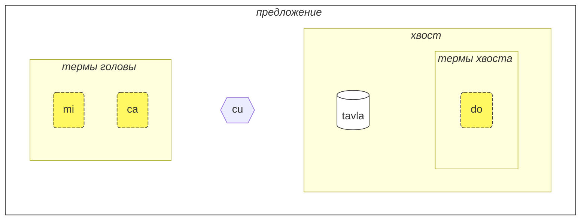
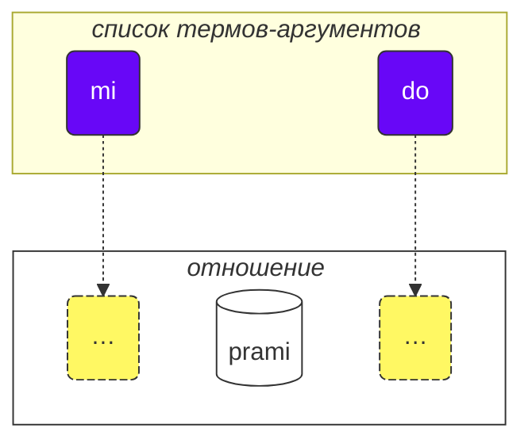

Как пользоваться этим курсом:

1. читайте текст
2. собирайте свои замечания и предложения
3. отправляйте их в [💬 онлайн-чат](https://lojban.pw/ru/articles/live_chat/)

## Урок 1. Язык с первого взгляда

### Алфавит

Основное, что нужно знать о ложбане — это алфавит.

Ложбан использует латинский алфавит (гласные выделены цветом):

<dl><dd><b>a b c d e f g i j k l m n o p r s t u v x y z ' .</b></dd></dl>

Слова произносятся так, как пишутся.

В ложбане 10 гласных:

<table>
<tbody><tr>
<td><b class="audio-inline">a</b></td>
<td> как <u>а</u> в слове <i>б<u>а</u>с</i></td>
</tr>
<tr>
<td><b class="audio-inline">e</b></td>
<td> как <u>э</u> в слове <i>с<u>э</u>р</i></td>
</tr>
<tr>
<td><b class="audio-inline">i</b></td>
<td> как <u>и</u> в слове <i>с<u>и</u>ла</i></td>
</tr>
<tr>
<td><b class="audio-inline">o</b></td>
<td> как <u>о</u> в слове <i>м<u>о</u>ре</i> (<u>o</u> в ложбане всегда произносится чётко, не превращаясь в подобие <u>а</u>)</td>
</tr>
<tr>
<td><b class="audio-inline">u</b></td>
<td> как <u>у</u> в слове <i>б<u>у</u>ря</i></td>
</tr>
<tr>
<td><b class="audio-inline">y</b></td>
<td> как безударная <u>о</u> в слове <i>к<u>о</u>мар</i></td>
</tr>
<tr>
</tbody></table>

4 гласных записываются комбинациями букв:

<table>
<tbody><tr>
<td><b class="audio-inline">au</b></td>
<td> как <u>ау</u> в слове <i><u>ау</u>т</i>, но при этом <u>у</u> должна быть краткой</td></tr>
<tr>
<td><b class="audio-inline">ai</b></td>
<td> как <u>ай</u> в слове <i>м<u>ай</u></i></td></tr>
<tr>
<td><b class="audio-inline">ei</b></td>
<td> как в слове <i><u>эй</u></i></td></tr>
<tr>
<td><b class="audio-inline">oi</b></td>
<td> как в слове <i><u>ой</u></i></td></tr>
</tbody></table>

Что касается согласных, они произносятся как в английском или латыни, но есть несколько отличий:

<table>
<tbody><tr>
<td><b class="guibutton">c</b>
</td>
<td>произносится как <i>ш</i>.
</td></tr>
<tr>
<td><b class="guibutton">j</b>
</td>
<td>как <i>ж</i>
</td></tr>
<tr>
<td><b class="guibutton">x</b>
</td>
<td>как <i>х</i> в слове <i>хорошо</i>
</td></tr>
<tr>
<td><b class="guibutton"> ' </b>
</td>
<td>как английская/татарская/казахская <i>h</i> или как глухая <i>г</i> в слове <i>ага</i> (но только если это слово произносится в варианте с глухой согласной). Таким образом, апостроф считается полноценной буквой ложбана и произносится как <i>h</i>. Он может находиться только между гласными. Например, <b>a'i</b> произносится как <i>аhи</i> (в то время как <b>ai</b> произносится как <i>ай</i>).
</td></tr>
<tr>
<td><b>.</b>
</td>
<td>точка (период, разрыв слова) также считается буквой в ложбане. Это короткая пауза в речи, чтобы отделить некоторые слова. Фактически, перед любым словом, начинающимся с гласной, ставится точка. Это помогает предотвратить нежелательное слияние двух последовательных слов в одно.
</td></tr>
<tr>
<td><b>i</b>
</td>
<td><b>i</b> перед гласными считается согласной и произносится как <u>й</u>, например:
<ul><li><b>ia</b> произносится как <i>я</i> в <i>ясно</i></li>
<li><b>ie</b> произносится как <i>е</i> в <i>если</i></li></ul>
</td></tr>
<tr>
<td><b>u</b>
</td>
<td><b>u</b> перед гласными считается согласной и произносится кратко, как <i>ў</i> в белорусском, например:
<ul><li><b>ua</b> произносится как <i>ўа</i> или как <i>уа</i> в слове <i>уаз</i></li>
<li><b>ue</b> произносится как <i>ўэ</i></li></ul>
</td></tr></tbody></table>

Ударение ставится на предпоследний гласный. Если в слове только один гласный, вы просто не делаете на нём ударения.

Буква **r** может произноситься как _р_ в русском или _r_ в английском, то есть есть диапазон допустимых произношений для неё.

Негласные ложбана, такие как краткие _i_ и _u_ в британском английском _hit_ и _but_, используются некоторыми людьми для разделения согласных. Так что, если вам трудно произнести два согласных подряд (например, **vl** в **tavla**, что означает _разговаривать с_), тогда вы можете сказать _тавɪла_ — где _ɪ_ очень короткая. Однако другие гласные, такие как **a** и **u**, должны быть долгими.

### Простейшее предложение

Базовая единица в ложбане — это «предложение». Вот три простых примера:

> **le prenu cu tavla mi** > _Человек разговаривает со мной._

le prenu
: человек

tavla
: … разговаривает с …, … говорит с …

mi
: я, мне, меня

> **mi prami do** > _Я люблю тебя._

prami
: … любит … (кого-то)

do
: ты, тебя, тебе

> **mi ca cu tavla do** > _Я сейчас разговариваю с тобой._

ca
: сейчас (произносится как **ша**)

<pixra url="/assets/pixra/cilre-xekri-g-out/tavla.webp" caption="le prenu cu tavla mi" definition="Человек разговаривает со мной."></pixra>

<pixra url="/assets/pixra/cilre-xekri-g-out/mi.webp" caption="mi" definition="я / мне / меня"></pixra>

<pixra url="/assets/pixra/cilre-xekri-g-out/mi_prami_do2.webp" caption="mi prami do" definition="Я люблю тебя."></pixra>

<pixra url="/assets/pixra/cilre-xekri-g-out/do.webp" caption="do" definition="ты / тебя / тебе"></pixra>

Каждое предложение в ложбане состоит из следующих частей слева направо:

- голова:
  - состоит из так называемых «термов»,
    - **le prenu** — единственный терм головы в примере **le prenu cu tavla mi** выше,
    - **mi**, **ca** — термы головы в примере **mi ca cu tavla do** выше.
- разделитель головы **cu**:
  - произносится как _шу_, поскольку **c** означает _ш_,
  - показывает, что голова закончилась,
  - может быть опущен, когда ясно, что голова завершена.
- хвост:
  - главная конструкция отношения (называемая «**selbrisni**» в ложбане)
  - \+ возможно один или несколько термов после неё,
    - **tavla**, **prami** — selbrisni, главные конструкции отношения в примерах выше.
    - **mi** — единственный терм хвоста в примере **le prenu cu tavla mi** выше.
    - **do** — единственный терм хвоста в примере **mi prami do** выше.

В ложбане мы в основном говорим об отношениях, а не о существительных или глаголах.

Вот два слова-отношения, которые примерно соответствуют глаголам:

prenu
: … является человеком / являются людьми

tavla
: … говорит с …

Каждое отношение имеет одну или несколько ролей, которые также можно назвать «слотами» или «местами». Выше они обозначены как «…». Эти слоты нужно заполнить аргументами (называемыми «**sumti**» в ложбане). Термы-аргументы — это конструкции типа **le prenu**, **mi**, **do**, независимо от того, окажутся ли эти термы в голове или в хвосте предложения. Мы размещаем термы-аргументы в определённом порядке, таким образом заполняя эти слоты и придавая конкретное значение отношению.

Мы также можем превратить такое отношение в терм-аргумент.

Для этого мы ставим короткое слово **le** перед ним:

prenu
: … является человеком

le prenu
: человек, люди

Аналогично,

tavla
: … говорит с …

и следовательно

le tavla
: говорящий, говорящие

Может показаться странным, как _человек_ может быть «глаголом», но на самом деле это делает ложбан очень простым:

<table>
<thead>
<tr>
<th>слово-отношение с незаполненными слотами</th>
<th>форма аргумента (<b>sumti</b>)</th></tr>
</thead>
<tbody>
<tr>
<td><b>prenu</b> — <i>… (кто-то) является человеком</i> </td>
<td><b>le prenu</b> — <i>человек / люди</i>
     <b>le prenu</b> — <i>тот, кто является человеком / те, кто являются людьми</i>
</td></tr>
<tr>
<td><b>tavla</b> — <i>… (кто-то) говорит с … (кем-то)</i> </td>
<td><b>le tavla</b> — <i>говорящий / говорящие</i>
     <b>le tavla</b> — <i>тот, кто говорит / те, кто говорят</i>
</td></tr>
</tbody></table>

Первый слот отношений исчезает при использовании **le**, отсюда возможны такие альтернативные переводы как _тот, кто …_.

<!-- We can also say that **le** creates a noun from a relation construct with roughly the meaning of _the one which is …_ (_is a person_ — _the person_), or even _those who do…_ (_to speak to_ — _the speakers_), _those who are…_ (_are people_ — _the people_). -->

Обратите внимание, что ложбан по умолчанию не указывает число между _говорящий_ или _говорящие_. То есть **le tavla** неоднозначно в этом отношении, и мы скоро узнаем способы определить число.

Помимо термов-аргументов существуют модальные термы, такие как **ca**:

> **mi ca cu tavla do** > _Я сейчас разговариваю с тобой._

ca
: сейчас

Модальные термы не заполняют слоты главной конструкции отношения («**selbrisni**»). Вместо этого они применяются ко всему предложению, обогащая или уточняя его значение.

Таким образом, термы в ложбане представлены:

- термами-аргументами, которые заполняют слоты отношений. Примеры:
  - существительные типа **le prenu** (_человек_)
  - местоимения типа **mi** (_я_, _мне_), **do** (_ты_, _тебе_). Местоимения работают точно так же, как существительные, но **le** для них не используется. Они сами по себе работают как аргументы.
- модальными термами, которые не заполняют слоты отношений, но указывают дополнительную, уточняющую информацию.
  - например, **ca** (_сейчас, в настоящем_).

Ещё несколько примеров:

<pixra url="/assets/pixra/cilre-xekri-g-out/nintadni.webp" caption="mi nintadni" definition="Я новый студент, новичок."></pixra>

> **mi nintadni** > _Я новый студент._

nintadni
: … (кто-то) является новым студентом, новичком

В отличие от английского, нам не нужно добавлять глагол «am/is/are/to be» в предложение. Он уже подразумевается. Слово-отношение **nintadni** (_… является новым студентом_) уже имеет это английское «am/is/are/to be», встроенное в его английский перевод.

> **do jimpe** > _Ты понимаешь._

jimpe
: … (кто-то) понимает … (что-то)

<pixra url="/assets/pixra/cilre-xekri-g-out/pilno_le_fonxa.webp" caption="le prenu cu pilno le fonxa" definition="Человек использует телефон."></pixra>

> **mi pilno le fonxa** > _Я использую телефон._

pilno
: … (кто-то) использует … (что-то)

fonxa
: … является телефоном, … являются телефонами

le fonxa
: телефон, телефоны

<pixra url="/assets/pixra/cilre-xekri-g-out/citka.webp" caption="mi citka" definition="Я ем."></pixra>

> **mi citka** > _Я ем._

citka
: … (кто-то) ест … (что-то)

> **do citka** > _Ты ешь._

<!-- -->

> **mi citka le plise** > _Я ем яблоки._

<pixra url="/assets/pixra/cilre-xekri-g-out/le_plise_cu_kukte.webp" caption="le plise cu kukte" definition="Яблоки вкусные."></pixra>

> **le plise cu kukte** > _Яблоки вкусные._

le plise
: яблоки

kukte
: … (что-то) вкусное

Более простое предложение в ложбане содержало бы только одно главное слово-отношение:

<pixra url="/assets/pixra/cilre-xekri-g-out/karce.webp" caption="karce" definition="Это машина."></pixra>

> **karce** > _Машина!_ > _Это машина._

Вы могли бы сказать это, когда видите приближающуюся машину. Здесь из контекста было бы достаточно ясно, что где-то рядом есть машина и, вероятно, это опасно.

**karce** само по себе является словом-отношением, означающим _является машиной_.

Мы, конечно, можем быть более точными и сказать, например:

> **bolci** > _Мяч!_ > _Это мяч._

где **bolci** — слово-отношение, означающее _является мячом_.

> **ti bolci** > _Это мяч рядом со мной._

<!-- -->

> **ta bolci** > _Это мяч рядом с тобой._

ti
: местоимение: эта вещь рядом со мной

ta
: местоимение: эта/та вещь рядом с тобой

tu
: местоимение: та вещь вдали от тебя и меня

<pixra url="/assets/pixra/cilre-xekri-g-out/ti.webp" caption="ti" definition="это (рядом со мной, говорящим)"></pixra>

<pixra url="/assets/pixra/cilre-xekri-g-out/ta.webp" caption="ta" definition="это (рядом с тобой, слушающим)"></pixra>

<pixra url="/assets/pixra/cilre-xekri-g-out/tu.webp" caption="tu" definition="то вон там (вдали от тебя и меня)"></pixra>

Аналогично, вы можете сказать

<pixra url="/assets/pixra/cilre-xekri-g-out/carvi.webp" caption="carvi" definition="… это дождь"></pixra>

> **carvi** > _Идёт дождь._

где

carvi
: … является дождём, … идёт дождь

или

> **pluka** > _Это приятно._

где

pluka
: … приятно

Обратите внимание, что в ложбане нет необходимости в слове _это_ в таком смысле. Вы просто используете нужное вам слово-отношение.

> **prami** > _Кто-то любит._

<pixra url="/assets/pixra/cilre-xekri-g-out/bajra.webp" caption="le prenu cu bajra" definition="Человек бежит."></pixra>

> **bajra** > _Кто-то бежит._

bajra
: … бежит, используя конечности

Опять же, из контекста, вероятно, будет ясно, кто кого любит и кто бежит.

#### Задание

<pixra url="/assets/pixra/cilre-xekri-g-out/pinxe_le_djacu.webp" caption="le prenu cu pinxe le djacu" definition="Человек пьёт воду."></pixra>

pinxe
: … пьёт … (что-то)

le djacu
: вода

Закройте правую часть таблицы. Переведите предложения слева с ложбана.

<table style="table-layout: fixed;">
<tbody><tr>
<td><b>do citka</b>
</td>
<td><i>Ты ешь.</i>
</td></tr>
<tr>
<td><b>mi pinxe le djacu</b>
</td>
<td><i>Я пью воду.</i>
</td></tr>
<tr>
<td><b>mi citka le plise</b>
</td>
<td><i>Я ем яблоки.</i>
</td></tr></tbody></table>

### «**.i**» разделяет предложения

Мы ставим короткое слово **.i**, чтобы разделить любые два последовательных предложения:

> **mi tavla le prenu .i le prenu cu tavla mi** > _Я разговариваю с людьми. Люди разговаривают со мной._

**.i** разделяет предложения так же, как точка в конце предложений в английских текстах.

Когда мы произносим одно предложение за другим в английском, мы делаем паузу (она может быть короткой) между ними. Но пауза имеет много разных значений в английском. В ложбане у нас есть лучший способ понять, где заканчивается одно предложение и начинается другое.

Также обратите внимание, что иногда при быстром произнесении слов невозможно понять, где заканчивается одно предложение и начинается слово следующего предложения. Поэтому рекомендуется использовать слово **.i** перед началом нового предложения.

### Числа: '_1 2 3 4 5 6 7 8 9 0_' = «**pa re ci vo mu xa ze bi so no**»

**le** просто превращает конструкцию отношения в аргумент, но такой аргумент не имеет связанного с ним числа. Предложение

> **le prenu cu tavla mi** > _Люди разговаривают со мной._ > _Человек разговаривает со мной._

не уточняет количество людей, разговаривающих со мной. В английском невозможно опустить число, потому что _people_ в английском подразумевает _более одного человека_. Однако в ложбане вы можете опустить число.

Теперь давайте уточним, сколько людей имеют отношение к нашему обсуждению.

Давайте добавим число после **le**.

<table>
<tbody><tr>
<td><b>pa</b>
</td>
<td><b>re</b>
</td>
<td><b>ci</b>
</td>
<td><b>vo</b>
</td>
<td><b>mu</b>
</td>
<td><b>xa</b>
</td>
<td><b>ze</b>
</td>
<td><b>bi</b>
</td>
<td><b>so</b>
</td>
<td><b>no</b>
</td></tr>
<tr>
<td> 1
</td>
<td> 2
</td>
<td> 3
</td>
<td> 4
</td>
<td> 5
</td>
<td> 6
</td>
<td> 7
</td>
<td> 8
</td>
<td> 9
</td>
<td> 0
</td>
</tr></tbody></table>

<pixra url="/assets/pixra/cilre-xekri-g-out/le_mu_prenu.webp" caption="le mu prenu" definition="Пять человек"></pixra>

> **le pa prenu cu tavla mi** > _Человек разговаривает со мной._ > _Один человек разговаривает со мной._

Мы добавляем число после **le** и таким образом указываем конкретных людей.

Для чисел, состоящих из нескольких цифр, мы просто соединяем эти цифры вместе:

> **le re mu prenu cu tavla mi** > _25 человек разговаривают со мной._

Да, всё так просто.

Если мы хотим считать, мы можем разделять числа с помощью **.i**:

> **mu .i vo .i ci .i re .i pa .i no** > _5 … 4 … 3 … 2 … 1 … 0_

Число **za'u** означает _более чем …_ (_\>_ в математике), число **me'i** означает _менее чем_ (_<_ в математике):

> **le za'u re prenu cu tavla mi** > _Более двух человек разговаривают со мной._

<!-- -->

> **le me'i pa no prenu cu tavla mi** > _Менее 10 человек разговаривают со мной._

<!-- -->

> **le za'u ci prenu cu tavla mi** > _Более трёх человек разговаривают со мной._

Чтобы сказать просто _люди_ (множественное число) в противоположность _одному человеку_, мы используем **za'u pa**, _более одного_ или просто **za'u**.

> **le za'u pa prenu cu tavla mi** > **le za'u prenu cu tavla mi** > _Люди разговаривают со мной._

**za'u** по умолчанию означает **za'u pa**, отсюда возможно такое сокращение.

le prenu
: человек / люди

le pa prenu
: человек (один по количеству)

le za'u prenu
: люди (два или более по количеству)

#### Задание

stati
: … (кто-то) умный, … имеет талант

<pixra url="/assets/pixra/cilre-xekri-g-out/stati.webp" caption="stati" definition="… имеет талант"></pixra>

klama
: … приходит в … (какое-то место или к объекту)

<pixra url="/assets/pixra/cilre-xekri-g-out/klama_ti.webp" caption="le prenu cu klama ti" definition="Человек пришёл сюда."></pixra>

nelci
: … нравится … (что-то)

le zarci
: рынок

<pixra url="/assets/pixra/cilre-xekri-g-out/zarci.webp" caption="le prenu cu zvati le zarci" definition="Человек находится в магазине."></pixra>

le najnimre
: апельсин (фрукт), апельсины

<pixra url="/assets/pixra/cilre-xekri-g-out/najnimre.webp" caption="najnimre" definition="… это апельсин"></pixra>

le badna
: банан, бананы

<pixra url="/assets/pixra/cilre-xekri-g-out/badna.webp" caption="badna" definition="… это банан"></pixra>

Закройте правую часть таблицы. Переведите предложения слева с ложбана.

<table style="table-layout: fixed;">
 <tbody>
  <tr>
   <td>le mu prenu cu klama le zarci</td>
   <td>Пять человек приходят на рынок.</td>
  </tr>
  <tr>
   <td>le pa re prenu cu stati .i do stati</td>
   <td>12 человек умны. Ты умный.</td>
  </tr>
  <tr>
   <td>le prenu cu nelci le plise</td>
   <td>Людям нравятся яблоки.</td>
  </tr>
  <tr>
   <td>le za'u re prenu cu citka .i le me'i mu prenu cu pinxe le djacu</td>
   <td>Более двух человек едят. Менее 5 человек пьют воду.</td>
  </tr>
  <tr>
   <td>le za'u re prenu cu stati</td>
   <td>Более двух человек умны.</td>
  </tr>
 </tbody>
</table>

Закройте правую часть таблицы. Переведите предложения слева на ложбан.

<table style="table-layout: fixed;">
 <tbody>
  <tr>
   <td>256 человек умны.</td>
   <td>le re mu xa prenu cu stati</td>
  </tr>
  <tr>
   <td>Менее 12 яблок вкусные.</td>
   <td>le me'i pa re plise cu kukte</td>
  </tr>
 </tbody>
</table>

### Составное отношение

Составная конструкция отношения (**tanru** в ложбане) — это несколько слов-отношений, расположенных одно за другим.

> **tu melbi zdani** > _То — красивый дом._

<pixra url="/assets/pixra/cilre-xekri-g-out/melbi_zdani.webp" caption="melbi zdani" definition="… это красивый дом"></pixra>

tu
: то (вдали от тебя и меня)

melbi
: … красивый, приятный

zdani
: … является домом или гнездом для … (кого-то)

melbi zdani
: составная конструкция отношения: … является красивым домом для … (кого-то)

<pixra url="/assets/pixra/cilre-xekri-g-out/dansu.webp" caption="le prenu cu melbi dansu" definition="Человек красиво танцует."></pixra>

> **do melbi dansu** > _Ты красиво танцуешь._

dansu
: … танцует

Здесь отношение **melbi** добавляет дополнительное значение, так как оно размещено слева от другого отношения: **zdani**. Левый компонент обычно переводится с помощью прилагательных и наречий.

Составные отношения — это мощная функция, которая создаёт более богатые значения. Вы просто соединяете два слова-отношения вместе, и левый компонент такого составного отношения добавляет оттенок правому.

Мы можем поставить **le** (например, с числом) слева от такого составного отношения, получая более богатый терм-аргумент:

le pa melbi zdani
: красивый дом

Теперь мы знаем, почему **cu** было после термов головы в нашем примере:

> **le pa prenu cu tavla mi** > _Человек разговаривает со мной._

Без **cu** это превратилось бы в **le pa prenu tavla**, что имело бы значение _человек-разговаривающий_ — что бы это ни значило.

Рассмотрим:

> **le pa tavla pendo** > _Разговаривающий друг_

<!-- -->

> **le pa tavla cu pendo** > _Разговаривающий — это друг._

Помните о размещении **cu** перед главной конструкцией отношения в предложении, чтобы предотвратить непреднамеренное создание составных отношений.

Составное отношение может содержать более двух компонентов. В этом случае первое отношение модифицирует второе, второе модифицирует третье, и так далее:

<pixra url="/assets/pixra/cilre-xekri-g-out/cmalu_karce.webp" caption="ti cmalu karce" definition="Это маленькая машина."></pixra>

> **le pa melbi cmalu karce** > _красиво-маленькая машина, машина, маленькая красивым образом_

<!-- -->

> **le mutce melbi zdani** > _очень красивый дом_

mutce
: … очень, … много

#### Задание

sutra
: … быстрый

barda
: … большой

cmalu
: … маленький

mlatu
: … это кошка

Закройте правую часть таблицы. Переведите предложения слева с ложбана.

<table style="table-layout: fixed;">
<tbody><tr>
<td><b>le melbi karce</b>
</td>
<td><i>красивая машина / красивые машины</i>
</td></tr>
<tr>
<td><b>do sutra klama</b>
</td>
<td><i>Ты быстро приходишь.</i>
</td></tr>
<tr>
<td><b>tu barda zdani</b>
</td>
<td><i>То — большой дом.</i>
</td></tr>
<tr>
<td><b>le pa sutra bajra mlatu</b>
</td>
<td><i>быстро бегающая кошка</i>
</td></tr>
<tr>
<td><b>le pa sutra mlatu</b>
</td>
<td><i>быстрая кошка</i>
</td></tr>
<tr>
<td><b>le pa bajra mlatu</b>
</td>
<td><i>бегущая кошка</i>
</td></tr></tbody></table>

Закройте правую часть таблицы. Переведите предложения слева на ложбан.

<table style="table-layout: fixed;">

<tbody><tr>
<td><i>Это маленькая машина.</i>
</td>
<td><b>ti cmalu karce</b>
</td></tr>
<tr>
<td><i>вкусные яблоки</i>
</td>
<td><b>le kukte plise</b>
</td></tr>
<tr>
<td><i>быстрые едоки</i>
</td>
<td><b>le sutra citka</b>
</td></tr>
<tr>
<td><i>Ты быстро идущий человек.</i>
</td>
<td><b>do sutra cadzu prenu</b>
</td></tr></tbody></table>

### Вопросы '_Да/Нет_'

В русском языке мы формируем вопрос типа «да/нет», меняя интонацию слов или используя частицу _ли_.

В ложбане чтобы превратить любое утверждение в вопрос типа «да/нет», мы просто вставляем слово **xu** в начале предложения:

> **xu do nelci le gerku** > _Тебе нравятся собаки?_ > _Нравятся ли тебе собаки?_

le gerku
: собака, собаки

<pixra url="/assets/pixra/cilre-xekri-g-out/le_prenu_e_le_gerku.webp" caption="ti prenu .i ti gerku" definition="Это человек. Это собака."></pixra>

В ложбане знаки препинания, такие как "?" (вопросительный знак), необязательны и используются больше для стилистических целей. Дело в том, что вопросительное слово **xu** уже показывает, что это вопрос.

Другие примеры:

> **xu mi klama** > _Я прихожу?_

klama
: … приходит в … (куда-то)

> **xu pelxu** > _Это жёлтое?_

pelxu
: … жёлтый

Мы можем сместить смысл, помещая **xu** после разных частей предложения. Объяснения того, что изменилось в значении, даны в скобках:

> **xu do nelci le gerku** > _Тебе нравятся собаки?_

<!-- -->

> **do xu nelci le gerku** > _ТЕБЕ нравятся собаки?_ (Я думал, это был кто-то другой, кому они нравятся).

<!-- -->

> **do nelci xu le gerku** > _Тебе НРАВЯТСЯ собаки? (Я думал, ты просто нейтрально к ним относишься)._

<!-- -->

> **do nelci le xu gerku** > _Тебе нравятся СОБАКИ? (Я думал, тебе нравятся кошки)._

<!-- -->

> **do nelci le gerku xu** > _Ты любишь эти вещи, они собаки? (Ты ставишь под вопрос только правильность отношения **gerku**)._

То, что выражается интонацией в английском, выражается перемещением **xu** после той части, которую мы хотим подчеркнуть, в ложбане. Обратите внимание, что первое предложение с **xu** в начале задаёт самый общий вопрос без выделения какого-либо конкретного аспекта.

**xu** — это междометие. Вот особенности междометий в ложбане:

- междометие модифицирует конструкцию перед ним:

> **do xu nelci le gerku** > _ТЕБЕ нравятся собаки?_

- когда помещается в начало отношения, междометие модифицирует всё отношение:

> **xu do nelci le gerku** > _Тебе нравятся собаки?_

- междометия могут быть помещены после разных частей одного и того же отношения, чтобы сместить значение.

> **do nelci le gerku xu** > _Ты любишь эти сущности, они собаки?_

Здесь только отношение **gerku** (а не аргумент **le gerku**) модифицируется вопросительным словом **xu**. Так что здесь мы интересуемся только этим отношением. Мы утверждаем, что ты любишь эти объекты или живые существа, и спрашиваем тебя, являются ли они собаками.

Междометия не разрывают составные отношения, они могут использоваться внутри них:

> **do nelci le barda xu gerku** > _Тебе нравятся БОЛЬШИЕ собаки?_

Теперь, как отвечать на такие вопросы типа 'да/нет'? Мы повторяем главную конструкцию отношения:

> **— xu le mlatu cu melbi** > **— melbi** > _— Кошки красивые?_ > _— Красивые._

Чтобы ответить «нет», мы используем модальный терм **na ku**:

> **— xu le mlatu cu melbi** > **— na ku melbi** > _— Кошки красивые?_ > _— Не красивые._

na ku
: терм: неверно, что …

Или мы можем использовать специальное слово-отношение **go'i**:

> **— xu le mlatu cu melbi** > **— go'i** > _— Кошки красивые?_ > _— Красивые._

go'i
: слово-отношение, которое повторяет главное отношение предыдущего предложения

Здесь **go'i** означает то же, что и **melbi**, поскольку **melbi** является отношением предыдущего предложения.

> **— xu le mlatu cu melbi** > **— na ku go'i** > _— Кошки красивые?_ > _— Не красивые._

<!-- This course doesn't recommend negating **go'i** for negative answers. Just use **je'u nai**. -->

Модальный терм **na ku** может использоваться не только в ответах:

> **na ku mi nelci le gerku** > _Неверно, что мне нравятся собаки._ > _Мне не нравятся собаки._

<!-- -->

> **mi na ku nelci do** > _Ты мне не нравишься._

Его противоположность, терм **ja'a ku**, подтверждает значение:

> **mi ja'a ku nelci do** > _Ты мне действительно нравишься._

ja'a ku
: терм: верно, что …

#### Задание

Закройте правую часть таблицы. Переведите предложения слева с ложбана.

<table style="table-layout: fixed;">

<tbody><tr>
<td><b>xu le barda zdani cu melbi</b>
</td>
<td><i>Большой дом красивый?</i>
</td></tr>
<tr>
<td><b>— le prenu cu stati xu — na ku stati</b>
</td>
<td><i>— Люди умные? — Нет.</i>
</td></tr>
<tr>
<td><b>do klama le zarci xu</b>
</td>
<td><i>Ты идёшь на рынок?</i>
</td></tr>
<tr>
<td><b>xu le verba cu prami le mlatu</b>
</td>
<td><i>Ребёнок любит кошек?</i>
</td></tr></tbody></table>

Закройте правую часть таблицы. Переведите предложения слева на ложбан.

<table style="table-layout: fixed;">

<tbody><tr>
<td><i>Машина быстрая?</i>
</td>
<td><b>xu le karce cu sutra</b>
</td></tr>
<tr>
<td><i>— Апельсин вкусный? — Да.</i>
</td>
<td><b>— xu le najnimre cu kukte — kukte</b>
</td></tr>
<tr>
<td><i>Собака любит тебя?</i>
</td>
<td><b>xu le gerku cu prami do</b>
</td></tr></tbody></table>

### Счастье и вежливые просьбы: '_Ура!_' = «**ui**», '_Пожалуйста!_' = «**.e'o**»

Междометие **ui** показывает радость говорящего. Оно используется так же, как смайлик '_:)_' в сообщениях, чтобы показать, что вы рады чему-то. Хотя смайлики могут быть неоднозначными, **ui** имеет только одно значение, что удобно.

> **ui do klama** > _Ура, ты идёшь!_

ui
: междометие: _Ура!_, междометие счастья

Междометие **.e'o** в начале предложения превращает его в вежливую просьбу:

> **.e'o do lebna le fonxa** > _Не мог бы ты взять телефон, пожалуйста?_ > `Пожалуйста, возьми телефон.`

.e'o
: междометие: пожалуйста (произносится как _эх-хо_ с короткой паузой или разрывом перед словом)

lebna
: брать (что-то)

В английском, чтобы быть вежливым, нужно использовать _could you_ + _please_ + вопрос. В ложбане **.e'o** достаточно, чтобы сделать вежливую просьбу.

#### Задание

Закройте правую часть таблицы. Переведите предложения слева с ложбана.

le tcati
: чай

<pixra url="/assets/pixra/cilre-xekri-g-out/tcati.webp" caption="tcati" definition="… это чай"></pixra>

le ckafi
: кофе

<pixra url="/assets/pixra/cilre-xekri-g-out/ckafi.webp" caption="ckafi" definition="… это кофе"></pixra>

zgana
: наблюдать, смотреть (используя любые чувства)

le skina
: фильм, кино

<pixra url="/assets/pixra/cilre-xekri-g-out/zgana_le_skina.webp" caption="le prenu cu zgana le skina" definition="Человек смотрит фильм."></pixra>

kurji
: заботиться о (ком-то, чём-то)

<table style="table-layout: fixed;">

<tbody>
<tr>
<td><b>ui carvi</b>
</td>
<td><i>Ура, идёт дождь!</i>
</td></tr>
<tr>
<td><b>.e'o do sutra bajra</b>
</td>
<td><i>Беги быстро!</i>
</td></tr>
<tr>
<td><b>.e'o do pinxe le tcati</b>
</td>
<td><i>Пожалуйста, пей чай!</i>
</td></tr>
<tr>
<td><b>.e'o zgana le skina</b>
</td>
<td><i>Пожалуйста, посмотри фильм!</i>
</td></tr></tbody></table>

Закройте правую часть таблицы. Переведите предложения слева на ложбан.

<table style="table-layout: fixed;">

<tbody><tr>
<td><i>Пожалуйста, будь умным!</i>
</td>
<td><b>.e'o do stati</b>
</td></tr>
<tr>
<td><i>Пожалуйста, иди домой!</i>
</td>
<td><b>.e'o do klama le zdani</b>
</td></tr>
<tr>
<td><i>Пожалуйста, пей кофе!</i>
</td>
<td><b>.e'o do pinxe le ckafi</b>
</td></tr>
<tr>
<tr>
<td><i>Ура, я разговариваю с тобой!</i>
</td>
<td><b>ui mi tavla do</b>
</td></tr>
<tr>
<td><i>Пожалуйста, позаботься о ребёнке.</i>
</td>
<td><b>.e'o do kurji le verba</b>
</td></tr></tbody></table>

### '_И_' и '_или_'

> **do nintadni .i je mi nintadni** > _Ты новичок. И я новичок._

<!-- -->

> **do .e mi nintadni** > _Ты и я — новички._

<pixra url="/assets/pixra/cilre-xekri-g-out/do_e_mi_nintadni.webp" caption="do .e mi nintadni" definition="Ты и я — новые студенты."></pixra>

<!-- -->

> **mi tadni .i je mi tavla do** > _Я учусь. И я разговариваю с тобой._

<!-- -->

> **mi tadni gi'e tavla do** > _Я учусь и разговариваю с тобой._

.i je
: союз «и», объединяющий предложения в одно.

.e
: союз «и», соединяющий аргументы.

gi'e
: союз «и», соединяющий хвосты предложений.

Мы можем объединить два предложения в одно утверждение, используя союз **.i je**, который означает _и_:

> **do nintadni .i je mi nintadni** > _Ты новичок. И я новичок._

Поскольку оба предложения имеют одинаковый хвост, мы можем использовать сокращение: союз **.e** означает _и_ для аргументов:

> **do .e mi nintadni** > _Ты и я — новички._

**do nintadni .i je mi nintadni** означает точно то же самое, что и **do .e mi nintadni**

Мы также можем использовать **.e** для соединения аргументов в других позициях.

Оба этих предложения означают одно и то же.

> **mi pinxe le djacu .e le jisra** > _Я пью воду и сок._ > **mi pinxe le djacu .i je mi pinxe le jisra** > _Я пью воду, и я пью сок._

le jisra
: сок

<pixra url="/assets/pixra/cilre-xekri-g-out/pinxe_le_jisra.webp" caption="le prenu cu pinxe le jisra" definition="Человек пьёт сок."></pixra>

Если голова предложения одинакова, но хвосты различаются, мы используем союз **gi'e**, который означает _и_ для хвостов предложений:

> **mi tadni .i je mi tavla do** > **mi tadni gi'e tavla do** > _Я учусь и разговариваю с тобой._

Обе вариации означают одно и то же; **gi'e** просто приводит к более лаконичной форме.

Существуют также способы добавления _и_ для компонентов составных отношений:

> **le melbi je cmalu zdani cu jibni ti** > _Красивый и маленький дом рядом._

<pixra url="/assets/pixra/cilre-xekri-g-out/melbi_je_cmalu_zdani.webp" caption="melbi je cmalu zdani" definition="… это красивый-и-маленький дом"></pixra>

jibni
: … находится рядом с …

ti
: эта вещь, это место рядом со мной

**je** — это союз, который означает _и_ в составных отношениях.

Без **je** предложение меняет значение:

> **le melbi cmalu zdani cu jibni** > _Красиво маленький дом рядом._

Здесь **melbi** модифицирует **cmalu**, а **melbi cmalu** модифицирует **zdani**, в соответствии с тем, как работают составные отношения.

В **le melbi je cmalu zdani** (_красивый и маленький дом_) оба **melbi** и **cmalu** модифицируют **zdani** напрямую.

Другие распространённые союзы включают:

> **le verba cu fengu ja bilma** > _Ребёнок сердится или болеет (или, возможно, и сердится, и болеет)_

<!-- -->

> **do .a mi ba vitke le dzena** > _Ты или я (или оба из нас) посетим предка._

ja
: _и/или_ внутри составных отношений

.a
: _и/или_ при соединении аргументов

fengu
: … сердится

<pixra url="/assets/pixra/cilre-xekri-g-out/fengu.webp" caption="fengu" definition="… сердится"></pixra>

bilma
: … болеет

<pixra url="/assets/pixra/cilre-xekri-g-out/bilma.webp" caption="le prenu cu bilma" definition="Человек болеет"></pixra>

vitke
: посещать (кого-то)

dzena
: … является предком …

<pixra url="/assets/pixra/cilre-xekri-g-out/dzena.webp" caption="dzena" definition="… является предком …"></pixra>

> **le karce cu blabi jo nai grusi** > _Машина либо белая, либо серая._

<!-- -->

> **do .o nai mi vitke le laldo** > _Либо ты, либо я посещаем старого._

jo nai
: либо … либо … но не оба

.o nai
: либо … либо … но не оба (при соединении аргументов)

laldo
: … старый

<pixra url="/assets/pixra/cilre-xekri-g-out/laldo.webp" caption="laldo" definition="… старый"></pixra>

Примечание: лучше запоминать **jo nai** как единую конструкцию, и то же самое для **.o nai**.

> **mi prami do .i ju do stati** > _Я люблю тебя. Независимо от того, умный ты или нет._

<!-- -->

> **le verba cu nelci le plise .u le badna** > _Ребёнку нравятся яблоки независимо от того, (нравятся ли ему/ей) бананы._

ju
: независимо от того … или нет

.u
: независимо от того … или нет (при соединении аргументов)

### «**joi**» — это '_и_' для массовых действий

> **do joi mi casnu le bangu** > _Ты и я обсуждаем язык._

casnu
: … обсуждает …

le bangu
: язык

joi
: союз _и_ для масс

Если я скажу **do .e mi casnu le bangu**, это может означать, что ты обсуждаешь язык, и я обсуждаю язык. Но это не обязательно означает, что мы находимся в одной и той же беседе!

Это различие может быть сделано более заметным, если мы раскроем это предложение с помощью **.i je**:

> **do .e mi casnu le bangu** > **do casnu le bangu .i je mi casnu le bangu** > _Ты обсуждаешь язык. И я обсуждаю язык._

Чтобы подчеркнуть, что ты и я участвуем в одном и том же действии, мы используем специальный союз **joi**, означающий _и_, который формирует «массу»:

> **do joi mi casnu le bangu** > _Ты и я обсуждаем язык._ > _Ты и я, являясь единой сущностью для этого события, обсуждаем язык._

Также существует местоимение **mi'o** (_ты и я вместе_), которое можно перефразировать как **mi joi do** (просто длиннее). В ложбане вы можете использовать не одно слово для _мы_, а более точные конструкции, такие как **mi joi le pendo** (буквально _я и друзья_).

<pixra url="/assets/pixra/cilre-xekri-g-out/casnu.webp" caption="do joi le pendo joi mi casnu" definition="Ты, друг и я в обсуждении."></pixra>

#### Задание

Закройте правую часть таблицы. Переведите предложения слева с ложбана.

<table style="table-layout: fixed;">

<tbody><tr>
<td><b>mi nelci le badna .e le plise</b>
</td>
<td><i>Мне нравятся бананы, и мне нравятся яблоки. Мне нравятся бананы и яблоки.</i>
</td></tr>
<tr>
<td><b>do sutra ja stati</b>
</td>
<td><i>Ты быстрый или умный, или то, и другое.</i>
</td></tr>
<tr>
<td><b>le za'u prenu cu casnu le karce .u le gerku</b>
</td>
<td><i>Люди обсуждают машины независимо от того, (обсуждают ли они) собак.</i>
</td></tr>
<tr>
<td><b>mi citka le najnimre .o nai le badna</b>
</td>
<td><i>Я ем либо апельсины, либо бананы.</i>
</td></tr></tbody></table>

Закройте правую часть таблицы. Переведите предложения слева на ложбан.

<table style="table-layout: fixed;">

<tbody><tr>
<td><i>Друзья и я любим дождь.</i>
</td>
<td><b>le pendo .e mi cu nelci le carvi</b>
</td></tr>
<tr>
<td><i>Либо я, либо ты идём на рынок.</i>
</td>
<td><b>mi .o nai do klama le zarci</b>
</td></tr>
<tr>
<td><i>Я смотрю на большую и красивую машину.</i>
</td>
<td><b>mi catlu le barda je melbi karce</b>
</td></tr>
<tr>
<td><i>Ребёнок пьёт воду и/или сок.</i>
</td>
<td><b>le verba cu pinxe le djacu .a le jisra</b>
</td></tr>
<tr>
<td><i>Ребёнок и маленький обсуждают машину.</i>
</td>
<td><b>le verba joi le pa cmalu cu casnu le karce</b> (обратите внимание на использование <b>joi</b>. <i>маленький</i> — это просто <b>le pa cmalu</b>).
</td></tr></tbody></table>

### Но …

> **le najnimre cu barda .i je ku'i le badna cu cmalu** > _Апельсины большие. Но бананы маленькие._

ku'i
: междометие: но, однако

На самом деле, в английском _but_ — это то же, что и _and_, и оно добавляет оттенок контраста.

В ложбане мы просто используем союз **.i je** (или **.e**, **gi'e**, **je**, в зависимости от того, что мы соединяем) и добавляем к нему оттенок контраста с помощью междометия **ku'i**. Как обычно, междометие модифицирует конструкцию перед ним.

### События: '_танцевать и быть вместе_' — «**le nu dansu .e le nu kansa**»

Некоторые слоты отношений ожидают событие:

> **le cabna cu nicte** > _Сейчас ночь. В настоящее время ночь._

cabna
: … (событие) происходит в настоящем с …; … (событие) происходит сейчас

le cabna
: настоящее время, настоящее событие

nicte
: … (событие) происходит ночью

Но что, если мы хотим описать событие, используя целое предложение?

Любое предложение может быть превращено в конструкцию отношения, поставив **nu** перед ним:

> **le nicte cu nu mi viska le lunra** > _Ночь — это когда я вижу Луну._ > `Ночное время — это событие, когда я вижу Луну.`

<pixra url="/assets/pixra/cilre-xekri-g-out/nicte_fi_mi.webp" caption="le nicte" definition="ночное время"></pixra>

le nicte
: ночное время, ночные времена

viska
: видеть (что-то)

le lunra
: Луна

Здесь **le nicte** — это первый аргумент предложения, а **nu mi viska le lunra** — главная конструкция отношения предложения. Однако внутри этой главной конструкции мы можем видеть другое отношение: **mi viska le lunra** встроено!

Слово **nu** преобразует полное предложение в отношение, которое обозначает событие (в его общем смысле, это может быть процесс, состояние и т.д.)

Вот ещё несколько примеров:

nu mi tavla
: … это событие моего разговора

nu do tavla
: … это событие твоего разговора

Добавляя **le** перед **nu**, мы создаём аргумент, который обозначает событие:

pinxe ⇒ le nu pinxe
: … пьёт ⇒ питьё

dansu ⇒ le nu dansu
: … танцует ⇒ танец

kansa ⇒ le nu kansa
: … находится вместе с … ⇒ пребывание вместе

klama ⇒ le nu klama
: … приходит в … ⇒ приход

le nu do klama
: твой приход, ты приходишь

**le nu** часто соответствует английским окончаниям _\-ing_, _\-tion_, _\-sion_.

Ещё несколько примеров со слотами, которые ожидают события вместо обычных сущностей:

> **mi djica le nu do klama ti** > _Я хочу, чтобы ты пришёл сюда (в это место)_

djica
: … хочет … (какое-то событие)

> **mi gleki le nu do klama** > _Я счастлив, потому что ты идёшь._

gleki
: … счастлив из-за … (какого-то события)

<pixra url="/assets/pixra/cilre-xekri-g-out/gleki.webp" caption="gleki" definition="… счастлив из-за события …"></pixra>

> **le nu pinxe le jisra cu nabmi mi** > _Питьё сока — это проблема для меня._

nabmi
: … (событие) является проблемой для … (кого-то), … (событие) проблематично для … (кого-то)

#### Задание

Закройте правую часть таблицы. Переведите предложения слева с ложбана.

pilno
: использовать (что-то)

le skami
: компьютер

<table style="table-layout: fixed;">

<tbody><tr>
<td><b>mi nelci le nu do dansu</b>
</td>
<td><i>Мне нравится, как ты танцуешь.</i>
</td></tr>
<tr>
<td><b>xu do gleki le nu do pilno le skami</b>
</td>
<td><i>Ты счастлив, используя компьютер?</i>
</td></tr>
<tr>
<td><b>do djica le nu mi citka le plise xu</b>
</td>
<td><i>Ты хочешь, чтобы я съел <u>яблоко</u>?</i>
</td></tr></tbody></table>

Закройте правую часть таблицы. Переведите предложения слева на ложбан.

<table style="table-layout: fixed;">

<tbody><tr>
<td><i>Прийти сюда — это проблема.</i>
</td>
<td><b>le nu klama ti cu nabmi</b>
</td></tr>
<tr>
<td><i>Я хочу, чтобы ты был счастлив.</i>
</td>
<td><b>mi djica le nu do gleki</b>
</td></tr></tbody></table>

### Модальные термы. Простые времена: '_был_', '_есть_', '_будет_' — «**pu**», «**ca**», «**ba**»

В ложбане мы выражаем время, когда что-то происходит (грамматически, в английском это обычно называется _tense_), с помощью модальных термов. Мы уже видели модальный терм **ca**, означающий _в настоящем_.

Вот серия связанных со временем термов, которые говорят, <u>когда</u> что-то происходит:

> **le prenu pu cu tavla mi** > _Люди разговаривали со мной._

<!-- -->

> **le prenu ca cu tavla mi** > _Люди разговаривают со мной (в настоящем)._

<!-- -->

> **le prenu ba cu tavla mi** > _Люди будут разговаривать со мной._

Когда после частицы времени мы помещаем простой аргумент, мы формируем терм с немного другим значением:

> **mi pinxe le djacu ca le nu do klama** > _Я пью воду, пока ты идёшь._

Часть **ca le nu do klama** — это длинный терм, означающий _пока ты идёшь_. **le nu do klama** — это аргумент, означающий _твой приход, ты идёшь_.

> **mi citka ba le nu mi dansu** > _Я ем после того, как танцую._

Частицы времени сгруппированы в серии по их значению, чтобы их было легче запомнить и использовать.

Слова для простых времён:

- **pu** означает _до … (какого-то события)_, **pu** само по себе обозначает прошедшее время.
- **ca** означает _в то же время, что и … (какое-то событие)_, **ca** само по себе обозначает настоящее время.
- **ba** означает _после … (какого-то события)_, **ba** само по себе обозначает будущее время.

Времена добавляют информацию о том, когда что-то происходит. Английский заставляет нас использовать определённые времена. Нужно выбирать между

- _Люди разговаривают со мной_.
- _Люди разговаривали со мной_.
- _Люди будут разговаривать со мной_.

и другими подобными вариантами.

Но в ложбане частицы времени необязательны, мы можем быть настолько неопределёнными или точными, насколько хотим.

Предложение

> **le prenu cu tavla mi** > _Люди разговаривают со мной._

на самом деле ничего не говорит о том, когда это происходит. Контекст в большинстве случаев достаточно ясен и может нам помочь. Но если нам нужна большая точность, мы просто добавляем больше слов.

**ba** означает _после … (какого-то события)_, поэтому когда мы говорим **mi ba cu citka**, мы имеем в виду, что мы едим после момента речи, вот почему это означает _Я буду есть_.

Мы можем комбинировать частицы времени с аргументами после них и без них:

> **mi pu cu citka le plise ba le nu mi dansu** > _Я ел яблоки после того, как танцевал._

Обратите внимание, что терм **pu** (прошедшее время) ставится только в главном отношении (**mi pu cu citka**). В ложбане предполагается, что событие _я танцевал_ происходит относительно события еды.

Мы не должны ставить **pu** с **dansu** (в отличие от английского), так как **mi dansu** рассматривается относительно **mi pu cu citka**, поэтому мы уже знаем, что всё было в прошлом.

Больше примеров связанных со временем термов:

> **le nicte cu pluka** > _Ночь приятная._

pluka
: … приятно

> **ba le nicte cu pluka** > _После ночи будет приятно._

Здесь голова предложения содержит один терм **ba le nicte**, модальный терм с его внутренним аргументом. Затем после разделителя **cu** следует главное отношение предложения **pluka** (**pluka** само по себе означает _Это приятно._)

Чтобы сказать _будет приятно_, мы должны использовать терм будущего времени:

> **le nicte ba cu pluka** > _Ночь будет приятной._

Также обратите внимание, что добавление аргумента после частицы времени может привести к значительно другому значению:

> **le nicte ba le nu citka cu pluka** > _Ночь приятна после еды._

Обратите внимание, что **ca** может немного распространяться в прошлое и будущее, означая _примерно сейчас_. Таким образом, **ca** отражает широко используемое во всём мире понятие «настоящего времени».

Также возможно интегрировать модальные частицы в главную конструкцию отношения:

> **le nicte ba cu pluka** > **le nicte ba pluka** > _Ночь будет приятной._

Оба предложения означают одно и то же, **ba pluka** — это конструкция отношения, означающая _… будет приятно_.

Структура **le nicte ba pluka** следующая:

- **le nicte** — голова предложения с только одним термом **le nicte**
- **ba pluka** — хвост предложения, который состоит только из отношения **ba pluka**

Сравните это с предыдущим предложением **le nicte ba cu pluka**:

- **le nicte ba** — голова предложения с двумя термами **le nicte** и **ba**
- **pluka** — хвост предложения, который состоит только из отношения **pluka**

Преимущество **le nicte ba pluka** перед **le nicte ba cu pluka** только в лаконичности; вы обычно можете пропустить **cu** в таких случаях, так как предложение всё равно не может быть понято иначе.

Если вы хотите поместить модальный терм перед термом-аргументом, вы можете отделить его от следующего текста, явно «завершив» терм вспомогательным словом **ku**:

> **ba ku le nicte cu pluka** > **le nicte ba cu pluka** > **le nicte ba pluka** > _Ночь будет приятной._

**ku** предотвращает появление **ba le nicte**, таким образом сохраняя **ba ku** и **le nicte** как отдельные термы.

Последнее замечание: английские определения слов ложбана могут использовать времена, даже когда исходные слова ложбана их не подразумевают, например:

tavla
: … разговаривает с …, … говорит с …

pluka
: … приятно

Хотя _разговаривает_, _есть_ и т.д. находятся в настоящем времени (мы не всегда можем избавиться от времени в английских словах, потому что так работает английский), мы всегда должны предполагать, что время не подразумевается в значении определённых слов ложбана, если только английское определение таких слов явно не упоминает такие ограничения по времени.

#### Задание

Закройте правую часть таблицы. Переведите с ложбана:

<table>
<tbody><tr>
<td><b>mi pu gleki</b></td>
<td><i>Я был счастлив.</i></td>
</tr>
<tr>
<td><b>do ba tavla mi</b></td>
<td><i>Ты будешь разговаривать со мной.</i></td>
</tr>
<tr>
<td><b>le verba ca citka</b></td>
<td><i>Ребёнок ест (сейчас).</i></td>
</tr>
<tr>
<td><b>mi pu citka ba le nu mi cadzu</b></td>
<td><i>Я ел после того, как гулял.</i></td>
</tr></tbody></table>

Закройте правую часть таблицы. Переведите на ложбан:

<table>
<tbody><tr>
<td><i>Я буду сильным.</i></td>
<td><b>mi ba tsali</b></td>
</tr>
<tr>
<td><i>Собака была маленькой.</i></td>
<td><b>le gerku pu cmalu</b></td>
</tr>
<tr>
<td><i>Я ем перед тем, как сплю.</i></td>
<td><b>mi citka pu le nu mi sipna</b></td>
</tr></tbody></table>

### Модальные термы. Контуры событий: «**co'a**», «**ca'o**», «**co'i**»

Ещё одна серия связанных со временем частиц, _контуры событий_:

co'a
: частица времени: событие в начале

ca'o
: частица времени: событие в процессе

mo'u
: частица времени: событие завершено

co'i
: частица времени: событие рассматривается как целое (началось и затем закончилось)

Большинство слов-отношений описывают события, не уточняя стадию этих событий. Контуры событий позволяют нам быть более точными:

> **mi pu co'a сu cikna** > **mi pu co'a cikna** > _Я проснулся._

cikna
: … бодрствует

co'a cikna
: … просыпается, становится бодрым

pu co'a cikna
: … проснулся, стал бодрым

<pixra url="/assets/pixra/cilre-xekri-g-out/coha_cikna.webp" caption="le prenu co'a cikna" definition="Человек просыпается."></pixra>

Чтобы точно выразить английское прогрессивное время, мы используем **ca'o**:

> **mi pu ca'o сu sipna** > **mi pu ca'o sipna** > _Я спал._

sipna
: … спит

<pixra url="/assets/pixra/cilre-xekri-g-out/sipna.webp" caption="le mlatu ca'o sipna" definition="Кошка спит."></pixra>

<!-- -->

> **mi ca ca'o pinxe** > _Я пью._

<!-- -->

> **mi ba ca'o pinxe** > _Я буду пить._

**mo'u** используется для описания завершения событий:

> **mi mo'u klama le tcana** > _Я прибыл на станцию._

le tcana
: станция

<pixra url="/assets/pixra/cilre-xekri-g-out/mohu_klama_le_tcana.webp" caption="le prenu mo'u klama le tcana" definition="Человек прибыл на станцию."></pixra>

**co'i** обычно соответствует английскому перфектному времени:

> **le verba ca co'i pinxe le jisra** > _Дети выпили сок._

Мы могли бы опустить **ca** в этих предложениях, так как контекст в большинстве таких случаев был бы достаточно ясен.

Английское простое настоящее время описывает события, которые происходят иногда:

> **le prenu ca ta'e tavla** > _Люди (обычно, иногда) разговаривают._

ta'e
: простое время: событие происходит обычно

Мы можем использовать те же правила для описания прошлого, используя **pu** вместо **ca**, или будущего, используя **ba**:

> **le prenu pu co'i tavla mi** > _Люди поговорили со мной._

<!-- -->

> **le prenu ba co'i tavla mi** > _Люди будут поговорить со мной._

Относительный порядок частиц времени важен. В **ca co'i** мы сначала говорим, что что-то происходит в настоящем (**ca**), затем утверждаем, что в этом настоящем времени описанное событие было завершено (**co'i**). Только при использовании этого порядка мы получаем перфектное настоящее время.

#### Задание

Закройте правую часть таблицы. Переведите с ложбана:

<table>
<tbody><tr>
<td><b>mi co'a sipna</b></td>
<td><i>Я заснул.</i></td>
</tr>
<tr>
<td><b>mi ca'o pinxe le tcati</b></td>
<td><i>Я пью чай.</i></td>
</tr>
<tr>
<td><b>le prenu co'i tavla</b></td>
<td><i>Человек поговорил.</i></td>
</tr>
<tr>
<td><b>mi mo'u citka le plise</b></td>
<td><i>Я закончил есть яблоко.</i></td>
</tr></tbody></table>

Закройте правую часть таблицы. Переведите на ложбан:

<table>
<tbody><tr>
<td><i>Я буду спать.</i></td>
<td><b>mi ba ca'o sipna</b></td>
</tr>
<tr>
<td><i>Ребёнок поел.</i></td>
<td><b>le verba co'i citka</b></td>
</tr>
<tr>
<td><i>Собака начала бежать.</i></td>
<td><b>le gerku co'a bajra</b></td>
</tr></tbody></table>

### Модальные термы. Интервалы: '_в течение_' — «**ze'a**»

Ещё одна серия модальных частиц подчёркивает, что события происходят в течение интервала:

ze'i
: на короткое время

ze'a
: некоторое время, какое-то время, в течение …

ze'u
: на долгое время

> **mi pu ze'a cu sipna** > **mi pu ze'a sipna** > _Я спал какое-то время._

<!-- -->

<pixra url="/assets/pixra/cilre-xekri-g-out/sipna_zeha.webp" caption="le prenu cu sipna ze'a le nu carvi" definition="Человек спит, пока идёт дождь."></pixra>

> **mi pu ze'a le nicte cu sipna** > _Я спал всю ночь._

Примечание: мы не можем опустить **cu** здесь, так как **nicte sipna** (_… это ночной спящий_) является tanru и, таким образом, привело бы к какому-то другому (пусть и странному) значению.

> **mi pu ze'i le nicte cu sipna** > _Я спал короткую ночь._

Сравните **ze'a** с **ca**:

> **mi pu ca le nicte cu sipna** > _Я спал ночью._

le nicte
: ночное время

Когда мы используем **ze'a**, мы говорим о всём интервале того, что мы описываем.

Обратите внимание, что **nicte** само по себе является событием, поэтому нам не нужно **nu** здесь.

#### Задание

Закройте правую часть таблицы. Переведите с ложбана:

<table>
<tbody><tr>
<td><b>mi ze'a sipna</b></td>
<td><i>Я спал какое-то время.</i></td>
</tr>
<tr>
<td><b>mi ze'u tavla do</b></td>
<td><i>Я долго разговариваю с тобой.</i></td>
</tr>
<tr>
<td><b>mi ze'i citka</b></td>
<td><i>Я ем недолго.</i></td>
</tr>
<tr>
<td><b>mi pu ze'a cadzu</b></td>
<td><i>Я гулял какое-то время.</i></td>
</tr></tbody></table>

Закройте правую часть таблицы. Переведите на ложбан:

<table>
<tbody><tr>
<td><i>Я буду спать всю ночь.</i></td>
<td><b>mi ba ze'a le nicte cu sipna</b></td>
</tr>
<tr>
<td><i>Я пил долго.</i></td>
<td><b>mi pu ze'u pinxe</b></td>
</tr>
<tr>
<td><i>Ребёнок будет играть недолго.</i></td>
<td><b>le verba ba ze'i kelci</b></td>
</tr></tbody></table>

### Модальные термы. '_потому что_' — «**ri'a**», '_к_' — «**fa'a**», '_в (место)_' — «**bu'u**»

Модальная частица для _потому что_:

> **mi pinxe ri'a le nu mi taske** > _Я пью, потому что хочу пить._

<!-- -->

> **mi citka ri'a le nu mi xagji** > _Я ем, потому что я голоден._

ri'a
: потому что … (из-за какого-то события)

taske
: … хочет пить

<pixra url="/assets/pixra/cilre-xekri-g-out/taske.webp" caption="taske" definition="… хочет пить"></pixra>

xagji
: … голоден

<pixra url="/assets/pixra/cilre-xekri-g-out/xagji.webp" caption="xagji" definition="… голоден"></pixra>

Модальные частицы, обозначающие место, работают так же:

> **mi cadzu fa'a do to'o le zdani** > _Я иду в направлении к тебе от дома._

Обратите внимание, что, в отличие от **klama**, модальные частицы **fa'a** и **to'o** обозначают направления, а не обязательно начальные или конечные точки маршрута. Например:

> **le prenu cu klama fa'a do** > _Человек идёт к тебе._

означает, что человек просто движется в вашем направлении, но не обязательно к вам (может быть, к какому-то месту или человеку рядом с вами).

<!-- -->

> **mi cadzu bu'u le tcadu** > _Я гуляю в городе._

tcadu
: … это город

fa'a
: к …, в направлении …

to'o
: от …, из направления …

bu'u
: в … (каком-то месте)

Примечание: **nu** показывает, что новое внутреннее встроенное предложение начинается внутри главного предложения. Мы ставим **kei** после такого отношения, чтобы показать его правую границу, аналогично тому, как мы используем ")" или "]" в математике. Например:

> **le gerku cu plipe fa'a mi ca le nu do ca'o klama** > _Собака прыгает ко мне, когда ты идёшь._

<pixra url="/assets/pixra/cilre-xekri-g-out/le_gerku_faha_plipe.webp" caption="le gerku cu plipe fa'a mi" definition="Собака прыгает ко мне."></pixra>

plipe
: прыгать

но

> **le gerku cu plipe ca le (nu do ca'o klama kei) fa'a mi** > _Собака прыгает (когда ты идёшь) ко мне._

Скобки _(_ и _)_ используются здесь только для показа структуры; они не нужны в обычном тексте на ложбане.

Мы используем **kei** после внутреннего предложения **do ca'o klama**, чтобы показать, что оно закончилось, и хвост внешнего предложения (**\*le gerku cu plipe...**) продолжается со своими термами.

Сравните это предложение со следующим:

> **le gerku cu plipe ca le (nu do ca'o klama fa'a mi)** > _Собака прыгает (когда ты идёшь ко мне)._

Как видите, **do klama fa'a mi** — это отношение внутри большего, поэтому **fa'a mi** теперь внутри него.

Теперь не собака идёт ко мне, а ты.

В конце предложений **kei** никогда не нужен, так как конец любого предложения сам по себе является правой границей.

Рассмотрим следующий пример с частицей времени:

> **mi pu citka le plise ba le nu mi dansu** > _Я ел яблоки после того, как танцевал._

<!-- -->

> **mi pu citka ba le nu mi dansu kei le plise** > _Я ел (после того, как танцевал) яблоки._

Мы можем переставить предложение, перемещая **ba le nu mi dansu**, пока оно остаётся после **pu**.

#### Задание

Закройте правую часть таблицы. Переведите предложения слева с ложбана.

le tsani
: небо

zvati
: … присутствует в … (каком-то месте или событии), … остаётся в … (каком-то месте)

le canko
: окно

le fagri
: огонь

mi'o
: Ты и я

le purdi
: сад

le tcati
: чай

<table style="table-layout: fixed;">

<tbody><tr>
<td><b>mi ca gleki le nu do catlu le tsani</b>
</td>
<td><i>Я счастлив, что ты смотришь на небо.</i>
</td></tr>
<tr>
<td><b>xu le gerku pu ca'o zvati le zdani</b>
</td>
<td><i>Собаки были дома?</i>
</td></tr>
<tr>
<td><b>do pu citka le plise ba le nu mi pinxe le jisra</b>
</td>
<td><i>Ты ел яблоки после того, как я выпил сок.</i>
</td></tr>
<tr>
<td><b>ko catlu fa'a le canko</b>
</td>
<td><i>Смотри в сторону окна.</i>
</td></tr>
<tr>
<td><b>xu do gleki ca le nu do ca'o cadzu bu'u le purdi</b>
</td>
<td><i>Ты счастлив, когда гуляешь в саду?</i>
</td></tr>
<tr>
<td><b>ca le nu mi klama le zdani kei do pinxe le tcati ri'a le nu do taske</b>
</td>
<td><i>Когда я иду домой, ты пьёшь чай, потому что хочешь пить.</i>
</td></tr></tbody></table>

Закройте правую часть таблицы. Переведите предложения слева на ложбан.

<table style="table-layout: fixed;">

<tbody><tr>
<td><i>Ты будешь смотреть на машину.</i>
</td>
<td><b>do ba catlu le karce</b>
</td></tr>
<tr>
<td><i>Ты хочешь, чтобы в будущем пошёл дождь.</i>
</td>
<td><b>do ca djica le nu ba carvi</b>
</td></tr>
<tr>
<td><i>Быстро беги от огня!</i>
</td>
<td><b>ko sutra bajra to'o le fagri</b>
</td></tr>
<tr>
<td><i>Ты и я были вместе дома, когда шёл дождь.</i>
</td>
<td><b>mi'o pu ca'o zvati le zdani ca le nu carvi</b>
</td></tr></tbody></table>

#### Задание

Закройте правую часть таблицы. Переведите с ложбана:

<table>
<tbody><tr>
<td><b>mi citka ri'a le nu mi xagji</b></td>
<td><i>Я ем, потому что голоден.</i></td>
</tr>
<tr>
<td><b>mi cadzu fa'a le zdani</b></td>
<td><i>Я иду к дому.</i></td>
</tr>
<tr>
<td><b>mi sipna bu'u le zdani</b></td>
<td><i>Я сплю в доме.</i></td>
</tr>
<tr>
<td><b>mi cadzu to'o do</b></td>
<td><i>Я иду от тебя.</i></td>
</tr></tbody></table>

Закройте правую часть таблицы. Переведите на ложбан:

<table>
<tbody><tr>
<td><i>Я бегу, потому что боюсь.</i></td>
<td><b>mi bajra ri'a le nu mi terpa</b></td>
</tr>
<tr>
<td><i>Собака гуляет в саду.</i></td>
<td><b>le gerku cu cadzu bu'u le purdi</b></td>
</tr>
<tr>
<td><i>Ребёнок бежит ко мне.</i></td>
<td><b>le verba cu bajra fa'a mi</b></td>
</tr></tbody></table>

### Имена. Выбор имени

**cmevla**, или _слово-имя_, — это особый вид слова, используемый для построения имён. Их легко распознать в тексте, так как это единственные слова, которые заканчиваются на согласную и окружены точкой с каждой стороны.

Примеры cmevla: **.paris.**, **.robin.**

Если чьё-то имя _Bob_, мы можем создать cmevla сами, которое звучало бы как можно ближе к этому имени, например: **.bab.**

Простейший пример использования имени:

> **la .bab. cu tcidu** > _Боб читает._

tcidu
: … читает

<pixra url="/assets/pixra/cilre-xekri-g-out/tcidu_la_lojban.webp" caption="le prenu ca'o tcidu" definition="Человек читает."></pixra>

**la** похоже на **le**, но оно превращает слово в имя вместо простого аргумента.

В английском мы начинаем слово с заглавной буквы, чтобы показать, что это имя. В ложбане мы используем префиксное слово **la**.

Всегда используйте **la** при создании имён!

Имя может состоять из нескольких cmevla одно за другим:

> **la .bab.djansyn. cu tcidu** > _Боб Джонсон читает._

Здесь мы разделили два cmevla только одной точкой, чего достаточно.

Обычно опускают точки в начале и в конце cmevla, чтобы писать тексты быстрее, например, при текстовом общении. В конце концов, cmevla всё равно отделены от соседних слов пробелами вокруг них:

> **la bab djansyn cu tcidu**

Однако в устной речи всё ещё необходимо делать короткую паузу до и после cmevla.

Имя Боб, название языка _Lojban_, можно использовать в ложбане без многих изменений:

> **la .lojban. cu bangu mi** > _Я говорю на ложбане._
> Ложбан — это язык для меня.
> `Ложбан — это язык, который я использую.`

bangu
: … это язык, используемый … (кем-то)

<!-- -->

> **mi nintadni la .lojban.** > _Я новый студент ложбана._

<!-- -->

> **mi tadni la .lojban.** > _Я изучаю ложбан._

<pixra url="/assets/pixra/cilre-xekri-g-out/tadni.webp" caption="le prenu ca ca'o tadni la .lojban." definition="Человек сейчас изучает ложбан."></pixra>

Буквы ложбана напрямую соответствуют звукам, поэтому есть некоторые правила адаптации имён к тому, как они пишутся в ложбане. Это может звучать странно — ведь имя есть имя — но все языки делают это в той или иной степени. Например, англоговорящие склонны произносить _Jose_ как _Хозэй_, а _Margaret_ на китайском — _Mǎgélìtè_. Некоторые звуки просто не существуют в некоторых языках, поэтому нужно переписать имя так, чтобы оно содержало только звуки ложбана и было написано в соответствии с буквенно-звуковым соответствием.

Например:

la .djansyn.
: Джонсон (вероятно, ближе к американскому произношению)

la .suzyn.
: Сьюзан (две буквы _s_ произносятся по-разному: вторая на самом деле _z_, а _a_ не совсем звук _а_)

Обратите внимание на то, как имя произносится изначально. В результате английские и французские имена _Robert_ выходят по-разному в ложбане: английское имя — **.robyt.** в британском английском, или **.rabyrt.** в некоторых американских диалектах, но французское — **.rober.**

Вот «ложбанизации» некоторых имён:

- _Alice_ ⇒ **la .alis.**
- _Mei Li_ ⇒ **la .meilis.**
- _Bob_ ⇒ **la .bab.**
- _Abdul_ ⇒ **la .abdul.**
- _Yan or Ian_ ⇒ **la .ian.**
- _Ali_ ⇒ **la .al.**
- _Doris_ ⇒ **la .doris.**
- _Michelle_ ⇒ **la .micel.**
- _Kevin_ ⇒ **la .kevin.**
- _Edward_ ⇒ **la .edvard.**
- _Adam_ ⇒ **la .adam.**
- _Lucas_ ⇒ **la .lukas.**

Примечания:

- Две дополнительные точки (периоды) необходимы, потому что если вы не делаете этих пауз в речи, может стать трудно понять, где имя начинается и заканчивается, или, другими словами, где заканчивается предыдущее слово и начинается следующее.
- Последняя буква cmevla должна быть согласной. Если имя не заканчивается на согласную, мы обычно добавляем **s** в конец; так что в ложбане _Mary_ становится **.meris.**, _Joe_ становится **.djos.** и так далее. Альтернативно, мы можем опустить последнюю гласную, так что _Mary_ станет **.mer.** или **.meir**.
- Вы также можете поставить точку между именем и фамилией человека (хотя это не обязательно), так что _Jim Jones_ становится **.djim.djonz.**

#### Задание

Заполните таблицу, адаптируя эти имена согласно правилам ложбана:

<table>
<tbody><tr>
<td>Mary</td>
<td><b>la .meris.</b> или <b>la .mer.</b></td>
</tr>
<tr>
<td>Susan</td>
<td><b>la .suzyn.</b></td>
</tr>
<tr>
<td>Harry</td>
<td><b>la .xaris.</b> или <b>la .aris.</b></td>
</tr>
<tr>
<td>Kevin Johnson</td>
<td><b>la .kevin.djonson.</b></td>
</tr>
<tr>
<td>Joe</td>
<td><b>la .djos.</b></td>
</tr></tbody></table>

### Правила создания cmevla

Вот компактное представление звуков ложбана:

- гласные:
  - **a e i o u y au ai ei oi**
- согласные:
  - **b d g v z j** (звонкие)
  - **p t k f s c x** (глухие)
  - **l m n r**
  - **i u**. Они считаются согласными, когда расположены между двумя гласными или в начале слова. **iaua** — **i** и **u** здесь согласные. **iai** — здесь согласная **i** с гласной **ai** после неё.
  - **'** (апостроф). Он ставится только между двумя гласными: **.e'e**, **.u'i**
  - **.** (точка, разрыв слова)

Чтобы создать имя в ложбане, следуйте этим правилам:

1. имя должно заканчиваться на согласную, кроме **'**. Если нет, добавьте согласную в конец сами. Дополнительно оберните его точкой с каждой стороны: **.lojban.**.
2. гласные могут быть размещены только между двумя согласными: **.sam.**, **.no'am.**
3. двойные согласные сливаются в одну: _dd_ становится **d**, _nn_ становится **n** и т.д. Или **y** размещается между ними: **.nyn.**
4. если звонкая и глухая согласные рядом друг с другом, вставьте **y** между ними: **kv** становится **kyv**. Альтернативно, вы можете удалить одну из букв: **pb** может быть превращено в одну **p** или одну **b**.
5. если одна из **c**, **j**, **s**, **z** рядом друг с другом, вставьте **y** между ними: **jz** становится **jyz**. Альтернативно, вы можете удалить одну из букв: **cs** может быть превращено в одну **c** или одну **s**.
6. если **x** рядом с **c** или рядом с **k**, вставьте **y** между ними: **cx** становится **cyx**, **xk** становится **xyk**. Альтернативно, вы можете удалить одну из букв: **kx** может быть превращено в одну **x**.
7. подстроки **mz**, **nts**, **ntc**, **ndz**, **ndj** исправляются добавлением **y** внутри или удалением одной из букв: **nytc** или **nc**, **.djeimyz.**
8. двойное **ii** между гласными сливается в одну **i**: **.eian.** (но не **.eiian.**)
9. двойное **uu** между гласными сливается в одну **u**: **.auan.** (но не **.auuan.**)
10. звук английской "h" как в Harry может быть либо опущен, либо заменён на **x**. _Harry_ может стать **.aris.** или **.xaris.**

### Слова-отношения как имена

Вы можете выбрать приятное прозвище в ложбане, используя не только cmevla, но и слова-отношения. Вы также можете перевести своё нынешнее имя на ложбан, если знаете, что оно означает, или выбрать совершенно новое имя на ложбане.

Вот несколько примеров:

<table>
<thead>
<tr>
<th> Оригинальное имя </th>
<th> Оригинальное значение </th>
<th> Слово в ложбане </th>
<th> Значение в ложбане </th>
<th> Ваше имя
</th></tr>
</thead>
<tbody>
<tr>
<td> Alexis </td>
<td> <i>помощник</i> по-гречески </td>
<td><b>le sidju</b></td>
<td><i>помощник</i> </td>
<td><b>la sidju</b>
</td></tr>
<tr>
<td> Ethan </td>
<td> <i>твёрдый, длящийся</i> на иврите </td>
<td><b>le sligu</b></td>
<td><i>твёрдый</i> </td>
<td><b>la sligu</b>
</td></tr>
<tr>
<td> Mei Li </td>
<td><i>красивая</i> на мандаринском китайском </td>
<td><b>le melbi</b></td>
<td><i>красивые</i> </td>
<td><b>la melbi</b>
</td></tr></tbody></table>

### '_он_' '_она_'

В ложбане нет отдельных слов для _он_ или _она_. Возможные решения:

le ninmu
: женщина (в гендерном смысле)

<pixra url="/assets/pixra/cilre-xekri-g-out/ninmu.webp" caption="le ninmu" definition="женщина (женщина-человек)"></pixra>

le nanmu
: мужчина-мужчина (в гендерном смысле)

<pixra url="/assets/pixra/cilre-xekri-g-out/nanmu.webp" caption="le nanmu" definition="мужчина (мужчина-человек)"></pixra>

> **le ninmu cu tavla le nanmu .i le ninmu cu jatna** > _Женщина разговаривает с мужчиной. Она лидер._

jatna
: … является лидером, командиром

Ложбанисты предложили различные слова для других гендеров, такие как

le nonmu
: агендерный человек

le nunmu
: человек с небинарным гендером

Однако в большинстве ситуаций достаточно использовать **le prenu** (_человек_) или личные имена.

Другой выбор — использовать короткое местоимение **ri**, которое относится к предыдущему терму-аргументу:

> **mi pu klama le nurma .i ri melbi** > _Я ходил в сельскую местность. Она была красивой._

le nurma
: сельская местность

melbi
: … красивый, приятный для … (кого-то)

Здесь **ri** относится к сельской местности.

<pixra url="/assets/pixra/cilre-xekri-g-out/nurma.webp" caption="nurma" definition="… это сельская местность"></pixra>

> **mi tavla le pendo .i ri jundi** > _Я разговариваю с другом. Он/она внимательный._

jundi
: … внимательный

Здесь **ri** относится к другу.

<pixra url="/assets/pixra/cilre-xekri-g-out/tinjuhi.webp" caption="le gerku cu jundi" definition="Собака внимательна."></pixra>

Примечание: **ri** пропускает местоимения **mi** (_я_) и **do** (_ты_):

> **le prenu cu tavla mi .i ri pendo mi** > _Человек разговаривает со мной. Он/она мой друг._

Здесь **ri** пропускает предыдущее местоимение **mi** и, таким образом, относится к **le prenu**, который является предшествующим доступным термом-аргументом.

Два других похожих местоимения — это **ra** и **ru**.

ra
: относится к недавно использованному терму-аргументу

ru
: относится к ещё раньше использованному терму-аргументу

> **le pendo pu klama le nurma .i ri melbi ra** > _Друг ходил в сельскую местность. Сельская местность была для него/неё красивой._

Здесь, поскольку используется **ri**, **ra** должно относиться к более недавному завершённому терму-аргументу, которым для этого изолированного примера является **le pendo**. Аргументы типа **mi** и **do** также пропускаются **ra**.

Если **ri** не используется, то **ra** может относиться даже к последнему завершённому аргументу:

> **le pendo pu klama le nurma .i ra melbi ru** > _Друг ходил в сельскую местность. Сельская местность была для него/неё красивой._

**ra** более удобно, когда вы ленивы, и контекст всё равно разрешит ссылку.

### Представление себя. Вокативы

В ложбане _вокативы_ — это слова, которые ведут себя как междометия (такие как **xu**, которые мы ранее обсуждали), но они требуют, чтобы аргумент был присоединён справа от них:

> **coi do** > _Привет тебе!_

coi
: вокатив: Привет! Здравствуй!

<pixra url="/assets/pixra/cilre-xekri-g-out/coi.webp" caption="coi do" definition="Привет тебе!"></pixra>

Мы используем **coi**, за которым следует терм-аргумент, чтобы поприветствовать кого-то.

> **co'o do** > _Прощай._

co'o
: вокатив: до свидания!

<pixra url="/assets/pixra/cilre-xekri-g-out/coho.webp" caption="co'o do" definition="До свидания!"></pixra>

> **coi ro do** > _Всем привет!_ > `Привет каждому из вас`

— так люди обычно начинают разговор с несколькими людьми. Другие числа тоже возможны, конечно: **coi re do** означает _Привет вам двоим_ и т.д.

Поскольку вокативы работают как междометия, у нас есть приятные типы приветствий:

<pixra url="/assets/pixra/cilre-xekri-g-out/cerni.webp" caption="cerni" definition="… это утро"></pixra>
<pixra url="/assets/pixra/cilre-xekri-g-out/donri.webp" caption="donri" definition="… это дневное время"></pixra>
<pixra url="/assets/pixra/cilre-xekri-g-out/vanci.webp" caption="vanci" definition="… это вечер"></pixra>
<pixra url="/assets/pixra/cilre-xekri-g-out/nicte.webp" caption="nicte" definition="… это ночное время"></pixra>

> **cerni coi** > _Доброе утро!_ > `Это утро — Привет!`

> **vanci coi** > _Добрый вечер!_

> **donri coi** > _Добрый день!_

<!-- -->

> **nicte coi** > _Ночные приветствия!_

Примечание: в английском _Goodnight!_ означает _Goodbye!_ или обозначает пожелание кому-то спокойной ночи. По своему значению _Goodnight!_ не принадлежит к серии приветствий выше. Таким образом, мы используем другую формулировку в ложбане:

> **nicte co'o** > _Спокойной ночи!_

или

> **.a'o pluka nicte** > _Приятной ночи!_

.a'o
: междометие: я надеюсь

pluka
: … приятно для … (кого-то)

Конечно, мы можем быть расплывчатыми, просто говоря **pluka nicte** (просто означая _приятной ночи_ без явно выраженных пожеланий).

Вокатив **mi'e** + аргумент используется для представления себя:

> **mi'e la .doris.** > _Я Дорис. Это говорит Дорис._

mi'e
: вокатив: идентифицирует говорящего

Вокатив **doi** используется для прямого обращения к кому-то:

> **mi cliva doi la .robert.** > _Я ухожу, Роберт._

cliva
: уходить (от чего-то или кого-то)

Без **doi** имя может заполнить первый аргумент отношения:

> **mi cliva la .robert.** > _Я оставляю Роберта._

**doi** похоже на древнеанглийское _O_ (как в _O ye of little faith_) или латинский вокатив (как в _Et tu, Brute_). Некоторые языки не различают эти контексты, хотя, как видите, древнеанглийский и латынь различали.

Ещё два вокатива — это **ki'e** для выражения благодарности и **je'e** для их принятия:

> **— ki'e do do pu sidju mi** > **— je'e do** > _— Спасибо, ты помог мне._ > _— Не за что._

sidju
: … помогает … (кому-то)

Мы можем опустить аргумент после вокатива только в конце предложения. Например, мы можем просто сказать:

> **— coi .i xu do kanro** > _— Привет. Как дела?_ > `— Привет. Ты здоров?`

kanro
: … здоров

Здесь новое предложение начинается сразу после вокатива **coi**, поэтому мы опустили имя. Или мы можем сказать:

> **coi do mi djica le nu do sidju mi** > _Привет. Я хочу, чтобы ты помог мне._ > `Привет тебе. Я хочу, чтобы ты помог мне.`

Таким образом, если вы не знаете имени слушателя и хотите продолжить то же предложение после вокатива, вы просто ставите **do** после него.

Если вы используете вокатив сам по себе (без аргумента после него), и предложение ещё не закончено, тогда вам нужно отделить его от остального. Это потому, что то, что, скорее всего, последует за вокативом в предложении, может легко быть неправильно истолковано как описание вашего адресата. Чтобы отделить его от следующего аргумента, используйте слово **do**. Например,

> **coi do la .alis. la .doris. pu cliva** > _Привет! Алиса оставила Дорис._ > `Привет тебе! Алиса оставила Дорис`

<!-- -->

> **coi la .alis. la .doris. pu cliva** > _Привет, Алиса! Дорис ушла._

И если вы хотите поставить и вокативы, и междометия, модифицирующие всё предложение, пожалуйста, ставьте междометия первыми:

> **.ui coi do la .alis. la .doris. pu cliva** > _Ура, Привет! Алиса оставила Дорис._

Примечание: в начале предложения междометия обычно ставятся перед вокативами, потому что:

> **coi .ui do la .alis. la .doris. pu cliva** означает

> _Привет (я рад этому приветствию) тебе! Алиса оставила Дорис._

Так что междометие сразу после вокатива модифицирует этот вокатив. Аналогично, междометие модифицирует аргумент вокатива, когда помещается после него:

> **coi do .ui la .alis. la .doris. pu cliva** > _Привет тебе (я рад тебе)! Алиса оставила Дорис._

#### Задание

Закройте правую часть таблицы. Переведите с ложбана:

<table>
<tbody><tr>
<td><b>coi do mi viska do</b></td>
<td><i>Привет, я вижу тебя.</i></td>
</tr>
<tr>
<td><b>mi'e la .alis.</b></td>
<td><i>Я Алиса.</i></td>
</tr>
<tr>
<td><b>— ki'e do .i do pu sidju mi — je'e do</b></td>
<td><i>— Спасибо, ты помог мне. — Пожалуйста.</i></td>
</tr></tbody></table>

Закройте правую часть таблицы. Переведите на ложбан:

<table>
<tbody><tr>
<td><i>До свидания!</i></td>
<td><b>co'o do</b></td>
</tr>
<tr>
<td><i>Привет, мой друг!</i></td>
<td><b>coi le pendo</b></td>
</tr>
<tr>
<td><i>Доброе утро! Я Боб.</i></td>
<td><b>cerni coi .i mi'e la .bab.</b></td>
</tr></tbody></table>
