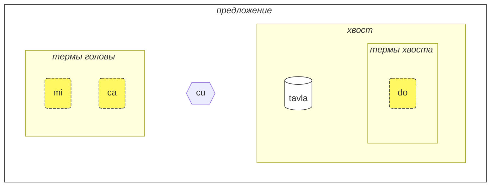
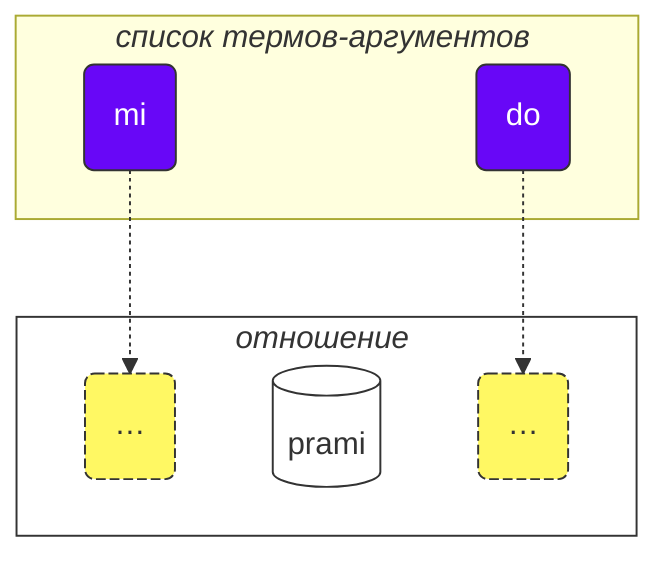

Как проходить этот курс:

* прочтите текст курса
* выпишите вопросы и предложения по курсу
* отправьте их в <a href="https://lojban.pw/ru/articles/live_chat/" data-md-type="link">💬 онлайн-чат</a>

## Урок 1. Язык с первого взгляда

### Алфавит

Начнём с основ - с алфавита.

Ложбан использует латинский алфавит (гласные выделены цветом):

<dl><dd><b>a b c d e f g i j k l m n o p r s t u v x y z ' .</b></dd></dl>

Слова произносятся так, как пишутся.

В ложбане 10 гласных:

<table>
<tbody><tr>
<td><b class="audio-inline">a</b></td>
<td> как <u>а</u> в слове <i>б<u>a</u>с</i></td>
</tr>
<tr>
<td><b class="audio-inline">e</b></td>
<td> как <u>э</u> в слове <i>с<u>э</u>р</i></td>
</tr>
<tr>
<td><b class="audio-inline">i</b></td>
<td> как <u>и</u> в слове <i>с<u>и</u>ла</i></td>
</tr>
<tr>
<td><b class="audio-inline">o</b></td>
<td> как <u>о</u> в слове <i>м<u>о</u>ре</i> (<u>o</u> в ложбане всегда произносится чётко, не превращаясь в подобие <u>а</u>)</td>
</tr>
<tr>
<td><b class="audio-inline">u</b></td>
<td> как <u>у</u> в слове <i>б<u>у</u>ря</i></td>
</tr>
<tr>
<td><b class="audio-inline">y</b></td>
<td> как безударная <u>о</u> в слове <i>к<u>о</u>мар</i></td>
</tr>
<tr>
</tbody></table>

4 гласные буквы записываются с использованием комбинаций букв:

<table>
<tbody><tr>
<td><b class="audio-inline">au</b></td>
<td> как <u>ау</u> в слове <i><u>ау</u>т</i>, но при этом <u>у</u> должна быть краткой</td></tr>
<tr>
<td><b class="audio-inline">ai</b></td>
<td> как <u>ай</u> в слове <i>м<u>ай</u></i></td></tr>
<tr>
<td><b class="audio-inline">ei</b></td>
<td> как в слове <i><u>эй</u></i></td></tr>
<tr>
<td><b class="audio-inline">oi</b></td>
<td> как в слове <i><u>ой</u></i></td></tr>
</tbody></table>

Что касается согласных, они произносятся так же, как на английском или латыни, но есть несколько отличий:

<table>
<tbody><tr>
<td><b class="guibutton">c</b>
</td>
<td>произносится как <i>ш</i>.
</td></tr>
<tr>
<td><b class="guibutton">j</b>
</td>
<td>как <i>ж</i>
</td></tr>
<tr>
<td><b class="guibutton">x</b>
</td>
<td>как <i>х</i> в слове <i>хорошо</i>
</td></tr>
<tr>
<td><b class="guibutton"> ' </b>
</td>
<td>как английская/татарская/казахская <i>h</i> или как глухая <i>г</i> в слове <i>ага</i> (но только если это слово произносится в варианте с глухой согласной). Таким образом, апостроф считается полноценной буквой ложбана и произносится как <i>h</i>. Он может находиться только между гласными. Например, <b>a'i</b> произносится как <i>аhи</i> (в то время как <b>ai</b> произносится как <i>ай</i>).
</td></tr>
<tr>
<td><b>.</b>
</td>
<td>точка (период, разрыв слова) также считается буквой в ложбане. Это короткая пауза в речи, чтобы отделить некоторые слова. Фактически, перед любым словом, начинающимся с гласной, ставится точка. Это помогает предотвратить нежелательное слияние двух последовательных слов в одно.
</td></tr>
<tr>
<td><b>i</b>
</td>
<td><b>i</b> перед гласными считается согласной и произносится как <u>й</u>, например:
<ul><li><b>ia</b> произносится как <i>я</i> в <i>ясно</i></li>
<li><b>ie</b> произносится как <i>е</i> в <i>если</i></li></ul>
</td></tr>
<tr>
<td><b>u</b>
</td>
<td><b>u</b> перед гласными считается согласной и произносится кратко, как <i>ў</i> в белорусском, например:
<ul><li><b>ua</b> произносится как <i>ўа</i></li>
<li><b>ue</b> произносится как <i>ўэ</i></li></ul>
</td></tr></tbody></table>

Ударение ставится на предпоследний гласный. Если слово имеет только один гласный, то ударение в слове просто не ставится.

Буква **r** может произноситься как _р_ в русском или _r_ в английском, то есть есть диапазон допустимых произношений для неё.

### Самое простое предложение

Основная единица в ложбане — "предложение". Вот три примера простого предложения:

> **le prenu cu tavla mi**
> _Человек говорит со мной._

le prenu
: человек

tavla
: … говорит с …, … разговаривает с …

mi
: я, мне

> **mi prami do**
> _Я люблю тебя._

prami
: … любит … (кого-то)

do
: ты

> **mi ca cu tavla do**
> _Я сейчас говорю с тобой._

ca
: сейчас (произносится как **ша**)

<pixra url="/assets/pixra/cilre/tavla.webp" caption="le prenu cu tavla mi" definition="Человек говорит со мной."></pixra>

<pixra url="/assets/pixra/cilre/mi.webp" caption="mi" definition="Я / мне"></pixra>

<pixra url="/assets/pixra/cilre/mi_prami_do2.webp" caption="mi prami do" definition="Я люблю тебя."></pixra>

<pixra url="/assets/pixra/cilre/do.webp" caption="do" definition="ты"></pixra>

Каждое предложение в ложбане состоит из следующих частей слева направо:

- голова:
  - состоит из так называемых "термов",
    - **le prenu** — единственный терм головы в примере **le prenu cu tavla mi** выше,
    - **mi**, **ca** — термы головы в примере **mi ca cu tavla do** выше.
- разделитель головы **cu**:
  - произносится как _шу_, так как **c** обозначает _ш_,
  - показывает, что голова завершена,
  - может быть опущен, когда и так очевидно, что голова уже завершена.
- хвост:
  - основная конструкция отношения (называемая "**selbrisni**" в ложбане),
  - \+ возможно, один или несколько термов после неё,
    - **tavla**, **prami** — это selbrisni, основные конструкции отношения в приведенных выше примерах.
    - **mi** — единственный терм хвоста в примере **le prenu cu tavla mi** выше.
    - **do** — единственный терм хвоста в примере **mi prami do** выше.

На ложбане мы в основном говорим об отношениях, а не о существительных или глаголах.

Вот два слова-отношения, которые примерно соответствуют глаголам:

prenu
: … является человеком / являются людьми

tavla
: … разговаривает с …

У каждого отношения есть одна или несколько ролей, которые также можно назвать "слотами" или "местами". Выше они помечены с помощью "…" Эти слоты должны быть заполнены аргументами (называемыми "**sumti**" на ложбане). Аргументы - это конструкции вроде **le prenu**, **mi**, **do**, независимо от того, окажутся ли эти термы в голове или хвосте предложения. Мы располагаем аргументы в определенном порядке, заполняя эти слоты и придавая конкретный смысл отношению.

Мы также можем превратить каждое такое отношение в терм-аргумент.

Для этого мы ставим перед ним короткое слово **le**:

prenu
: … является человеком

le prenu
: человек, люди

Аналогично,

tavla
: … разговаривает с …

и таким образом

le tavla
: говорящий, разговорщик, разговорщики

Может показаться странным, как _человек_ может быть "глаголом", но на самом деле это делает ложбан очень простым:

<table>
<thead>
<tr>
<th>отношение с незаполненными слотами</th>
<th>форма аргумента (<b>sumti</b>)</th></tr>
</thead>
<tbody>
<tr>
<td><b>prenu</b> — <i>… (кто-то) является человеком</i> </td>
<td><b>le prenu</b> — <i>человек / люди</i>
     <b>le prenu</b> — <i>тот, кто является человеком / те, кто являются людьми</i>
</td></tr>
<tr>
<td><b>tavla</b> — <i>… (кто-то) разговаривает с … (кем-то)</i> </td>
<td><b>le tavla</b> — <i>говорящий / разговорщик / разговорщики</i>
     <b>le tavla</b> — <i>тот, кто говорит / те, кто говорит</i>
</td></tr>
</tbody></table>

Первый слот отношения всегда исчезает при использовании **le**, поэтому и возможны такие альтернативные переводы, как _тот, кто …_.

<!-- Мы также можем сказать, что **le** создает существительное из конструкции отношения с примерным значением _тот, который …_ (_является человеком_ — _человек_), или даже _те, кто делает …_ (_разговаривать с_ — _разговорщики_), _те, кто являются …_ (_являются людьми_ — _люди_). -->

Обратите внимание, что ложбан по умолчанию не определяет число _говорящих_. То есть **le tavla** в этом отношении неопределён, это может быть один или несколько говорящих, и вскоре мы узнаем способы выражения числа.

Помимо аргументов, существуют модальные термы, такие как **ca**:

> **mi ca cu tavla do**
> _Я сейчас разговариваю с тобой._

ca
: сейчас

Модальные термы не занимают слоты основной конструкции отношения ("**selbrisni**"). Вместо этого они применяются ко всему предложению, обогащая или уточняя его значение.

Таким образом, термы в ложбане представлены следующим образом:

- аргументы-термы, которые занимают слоты отношений. Примеры:
  - существительные, такие как **le prenu** (_человек_)
  - местоимения, такие как **mi** (_я_, _меня_), **do** (_ты_). Местоимения работают точно так же, как существительные, но для них не используется **le**. Они работают как аргументы самостоятельно.
- модальные термы, которые не занимают слоты отношений, но указывают дополнительную, уточняющую информацию.
  - например, **ca** (_сейчас, в настоящий момент_).

Несколько примеров:

<pixra url="/assets/pixra/cilre/nintadni.webp" caption="mi nintadni" definition="Я новый студент, первокурсник."></pixra>

> **mi nintadni**
> _Я — новый студент._

nintadni
: … (кто-то) новый студент, новичок

В отличие от русского, нам не нужно добавлять в ложбане конструкцию "- это" или "—". Она уже подразумевается. Слово-отношение **nintadni** (_… быть новым студентом_) уже содержит в себе русское "- это", когды мы переводим его на русский.

> **do jimpe**
> _Ты понимаешь._

jimpe
: … (кто-то) понимает … (что-то)

<pixra url="/assets/pixra/cilre/pilno_le_fonxa.webp" caption="le prenu cu pilno le fonxa" definition="Человек использует телефон."></pixra>

> **mi pilno le fonxa**
> _Я использую телефон._

pilno
: … (кто-то) использует … (что-то)

fonxa
: … телефон, … телефоны

le fonxa
: телефон, телефоны

<pixra url="/assets/pixra/cilre/citka.webp" caption="mi citka" definition="Я ем."></pixra>

> **mi citka**
> _Я ем._

citka
: … (кто-то) ест … (что-то)

> **do citka**
> _Ты ешь._

<!-- -->

> **mi citka le plise**
> _Я ем яблоки._

<pixra url="/assets/pixra/cilre/le_plise_cu_kukte.webp" caption="le plise cu kukte" definition="Яблоки вкусные."></pixra>

> **le plise cu kukte**
> _Яблоки вкусные._

le plise
: яблоки

kukte
:  … (что-то) — вкусное

Простое предложение на ложбане может содержать только одну основную конструкцию отношения (**selbrisni**):

<pixra url="/assets/pixra/cilre/karce.webp" caption="karce" definition="Это автомобиль."></pixra>

> **karce**
> _Автомобиль!_
> _Это автомобиль._

Вы можете сказать так, когда видите приближающийся автомобиль. Здесь контекст будет достаточно ясным, что где-то рядом есть автомобиль (и, вероятно, это опасно).

**karce** - это слово-отношение, означающее _являться автомобилем_.

Конечно, мы можем быть более точными и сказать, например:

<!-- -->
> **bolci**
> _Мяч!_
> _Это мяч._

где **bolci** - слово-отношение, означающее _... — мяч_.

> **ti bolci**
> _Эта штука около меня - мяч._
<!-- -->
> **ta bolci**
> _Вот эта штука локоло тебя - мяч._

ti
: местоимение: это около меня

ta
: местоимение: это около тебя

tu
: местоимение: вон то вдали от меня и тебя

<pixra url="/assets/pixra/cilre/ti.webp" caption="ti" definition="это (рядом со мной, говорящим)"></pixra>
<pixra url="/assets/pixra/cilre/ta.webp" caption="ta" definition="вот это (рядом со тобой, моим собеседником)"></pixra>
<pixra url="/assets/pixra/cilre/tu.webp" caption="tu" definition="вон то там (вдали от тебя и меня)"></pixra>

Аналогично, вы можете сказать

<pixra url="/assets/pixra/cilre/carvi.webp" caption="carvi" definition="… идет дождь"></pixra>

> **carvi**
> _Идёт дождь._

где

carvi
: … идет дождь, … дождится

или

> **pluka**
> _Приятно._

где

pluka
: … - приятно

> **prami**
> _Кто-то любит._

<pixra url="/assets/pixra/cilre/bajra.webp" caption="le prenu cu bajra" definition="Человек бежит."></pixra>

> **bajra**
> _Кто-то бежит._

bajra
: … бежит, используя конечности

Опять же, контекст, вероятно, скажет, кто кого любит и кто бежит.

### Задание

<pixra url="/assets/pixra/cilre/pinxe_le_djacu.webp" caption="le prenu cu pinxe le djacu" definition="Человек пьёт воду."></pixra>

pinxe
: … пьёт … (что-то)

le djacu
: вода

Закройте правую часть таблицы. Переведите предложения в левой части с ложбана.

<table style="table-layout: fixed;">
<tbody><tr>
<td><b>do citka</b>
</td>
<td><i>Ты ешь.</i>
</td></tr>
<tr>
<td><b>mi pinxe le djacu</b>
</td>
<td><i>Я пью воду.</i>
</td></tr>
<tr>
<td><b>mi citka le plise</b>
</td>
<td><i>Я ем яблоки.</i>
</td></tr></tbody></table>

### «**.i**» разделяет предложения

Мы ставим короткое слово **.i** для разделения любых двух последовательных предложений:

> **mi tavla le prenu .i le prenu cu tavla mi**
> _Я разговариваю с людьми. Люди разговаривают со мной._

Когда мы произносим одно предложение за другим на русском, мы делаем паузу (она может быть короткой) между ними. Но пауза имеет много разных значений в русском. Иногда, когда мы быстро произносим слова, мы не можем определить, где заканчивается одно предложение и начинается слово следующего предложения. В ложбане у нас есть лучший способ понять, где заканчивается одно предложение и начинается другое.

**.i** разделяет предложения, как точка в конце предложений в русских текстах.

### Числа: «_1 2 3 4 5 6 7 8 9 0_» = «**pa re ci vo mu xa ze bi so no**»

**le** просто превращает конструкцию отношения в аргумент, но такой аргумент не имеет связанного с ним числа. Предложение

> **le prenu cu tavla mi**
> _Люди говорят со мной._
> _Человек говорит со мной._

не указывает количество людей, говорящих со мной. В русском невозможно опустить число, потому что _люди_ в русском подразумевает _более одного человека_. Однако в ложбане можно опустить число.

Теперь давайте уточним, сколько из этих людей имеют отношение к нашему обсуждению.

Добавим число после **le**.

<table>
<tbody><tr>
<td><b>pa</b>
</td>
<td><b>re</b>
</td>
<td><b>ci</b>
</td>
<td><b>vo</b>
</td>
<td><b>mu</b>
</td>
<td><b>xa</b>
</td>
<td><b>ze</b>
</td>
<td><b>bi</b>
</td>
<td><b>so</b>
</td>
<td><b>no</b>
</td></tr>
<tr>
<td> 1
</td>
<td> 2
</td>
<td> 3
</td>
<td> 4
</td>
<td> 5
</td>
<td> 6
</td>
<td> 7
</td>
<td> 8
</td>
<td> 9
</td>
<td> 0
</td>
</tr></tbody></table>

<pixra url="/assets/pixra/cilre/ci_prenu.webp" caption="le ci prenu" definition="Три человека"></pixra>

> **le pa prenu cu tavla mi**
> _Человек говорит со мной._
> _Один человек говорит со мной._

Мы добавляем число после **le** и тем самым указываем число людей.

Для чисел, состоящих из нескольких цифр, мы просто ставим эти цифры друг за другом:

> **le re mu prenu cu tavla mi**
> _25 человек говорят со мной._

Да, это так просто.

Если мы хотим вести счёт, мы можем разделять числа с помощью **.i**:

> **mu .i vo .i ci .i re .i pa .i no**
> _5 … 4 … 3 … 2 … 1 … 0_

Число **za'u** означает _больше чем …_ (_\>_ в математике), число **me'i** означает _меньше чем_ (_<_ в математике):

> **le za'u re prenu cu tavla mi**
> _Больше двух человек разговаривают со мной._

<!-- -->

> **le me'i pa no prenu cu tavla mi**
> _Меньше 10 человек разговаривают со мной._

<!-- -->

> **le za'u ci prenu cu tavla mi**
> _Больше трех человек разговаривают со мной._

Чтобы сказать просто _люди_ (во множественном числе) в отличие от _одного человека_, мы используем **za'u pa**, _больше одного_ или просто **za'u**.

> **le za'u pa prenu cu tavla mi**
> **le za'u prenu cu tavla mi**
> _Люди разговаривают со мной._

**za'u** по умолчанию означает **za'u pa**, поэтому такое сокращение возможно.

le prenu
: человек / люди

le pa prenu
: один человек

le za'u prenu
: люди (два или более)

### Задание

stati
: … (кто-то) - умный, … (кто-то) талантлив

<pixra url="/assets/pixra/cilre/stati.webp" caption="stati" definition="… талантливый"></pixra>

klama
: … приходит в … (место или объект)

<pixra url="/assets/pixra/cilre/klama_ti.webp" caption="le prenu cu klama ti" definition="Человек пришел сюда."></pixra>

nelci
: … (кому-то) нравится … (что-то)

le zarci
: магазин

<pixra url="/assets/pixra/cilre/zarci.webp" caption="le prenu cu zvati le zarci" definition="Человек находится в магазине."></pixra>

le najnimre
: апельсин (фрукт), апельсины

<pixra url="/assets/pixra/cilre/najnimre.webp" caption="najnimre" definition="… апельсин"></pixra>

le badna
: банан, бананы

<pixra url="/assets/pixra/cilre/badna.webp" caption="badna" definition="… банан"></pixra>

Закройте правую часть таблицы. Переведите предложения в левой части с ложбана.

<table style="table-layout: fixed;">
 <tbody>
  <tr>
   <td>le mu prenu cu klama le zarci</td>
   <td>Пять человек идут в магазин.</td>
  </tr>
  <tr>
   <td>le pa re prenu cu stati .i do stati</td>
   <td>Двенадцать человек умны. Ты умный.</td>
  </tr>
  <tr>
   <td>le prenu cu nelci le plise</td>
   <td>Людям нравятся яблоки.</td>
  </tr>
  <tr>
   <td>le za'u re prenu cu citka .i le me'i mu prenu cu pinxe le djacu</td>
   <td>Больше двух человек едят. Меньше пяти человек пьют воду.</td>
  </tr>
  <tr>
   <td>le za'u re prenu cu stati</td>
   <td>Больше двух человек умны.</td>
  </tr>
 </tbody>
</table>

<table style="table-layout: fixed;">
 <tbody>
  <tr>
   <td>le re mu xa prenu cu stati</td>
   <td>256 человек умны.</td>
  </tr>
  <tr>
   <td>le me'i pa re plise cu kukte</td>
   <td>Меньше 12 яблок вкусные.</td>
  </tr>
 </tbody>
</table>

### Составное отношение

Составное отношение (**tanru** на ложбане) - это несколько слов-отношений, расположенных одно за другим.

> **tu melbi zdani**
> _Вон то - красивый дом._

<pixra url="/assets/pixra/cilre/melbi_zdani.webp" caption="melbi zdani" definition="…красивый дом"></pixra>

tu
: тот (далеко от тебя и меня)

melbi
: … - красивый, приятный

zdani
: … - дом или гнездо для … (кого-то)

melbi zdani
: составное отношение: … - красивый дом для … (кого-то)

<pixra url="/assets/pixra/cilre/dansu.webp" caption="le prenu cu melbi dansu" definition="Человек красиво танцует."></pixra>

> **do melbi dansu**
> _Ты красиво танцуешь._

dansu
: …танцует

Здесь отношение **melbi** добавляет дополнительный смысл, так как оно расположено слева от другого отношения: **zdani**. Левая компонента обычно переводится с помощью прилагательных и наречий.

Составные отношения - это мощная функция, которая создает более богатые значения. Мы просто ставим два слова-отношения друг за другом, и левая компонента такого составного отношения добавит оттенок к правой.

Мы можем поставить **le** (например, с числом) слева от такого составного отношения, чтобы получить более богатый терм-аргумент:

le pa melbi zdani
: красивый дом

Теперь мы знаем, почему в нашем примере после главных термов было **cu**:

> **le pa prenu cu tavla mi**
> _Человек говорит со мной._

Без **cu** это превратилось бы в **le pa prenu tavla**, что имело бы значение _говорящий человек_ - что бы это ни значило.

Подумайте:

> **le pa tavla pendo**
> _Говорящий друг_
<!-- -->
> **le pa tavla cu pendo**
> _Говорящий - друг._

Не забывайте ставить **cu** перед основной конструкцией отношения (**selbrisni**), чтобы избежать непреднамеренного создания составных отношений.

Составное отношение может содержать более двух компонентов. В этом случае первое отношение модифицирует второе, второе модифицирует третье и так далее:

<pixra url="/assets/pixra/cilre/cmalu_karce.webp" caption="ti cmalu karce" definition="Это маленькая машина."></pixra>

> **le pa melbi cmalu karce**
> _красиво-маленькая машина, машина маленькая в красивом стиле_

<!-- -->

> **le mutce melbi zdani**
> _очень красивый дом_

mutce
: … - очень

### Задание

sutra
: … быстрый

barda
: … большой

cmalu
: … маленький

mlatu
: … кошка

Закройте правую часть таблицы. Переведите предложения в левой части с ложбана.

<table style="table-layout: fixed;">
<tbody><tr>
<td><b>le melbi karce</b>
</td>
<td><i>красивая машина / красивые машины</i>
</td></tr>
<tr>
<td><b>do sutra klama</b>
</td>
<td><i>Ты быстро приходишь. Ты приходишь быстро.</i>
</td></tr>
<tr>
<td><b>tu barda zdani</b>
</td>
<td><i>Это большой дом.</i>
</td></tr>
<tr>
<td><b>le pa sutra bajra mlatu</b>
</td>
<td><i>быстро бегущая кошка</i>
</td></tr>
<tr>
<td><b>le pa sutra mlatu</b>
</td>
<td><i>быстрая кошка</i>
</td></tr>
<tr>
<td><b>le pa bajra mlatu</b>
</td>
<td><i>бегущая кошка</i>
</td></tr></tbody></table>

Закройте правую часть таблицы. Переведите предложения в левой части на ложбан.

<table style="table-layout: fixed;">

<tbody><tr>
<td><i>Эта около меня - маленькая машина.</i>
</td>
<td><b>ti cmalu karce</b>
</td></tr>
<tr>
<td><i>вкусные яблоки</i>
</td>
<td><b>le kukte plise</b>
</td></tr>
<tr>
<td><i>быстрые поедатели</i>
</td>
<td><b>le sutra citka</b>
</td></tr>
<tr>
<td><i>Ты - быстро идущий человек.</i>
</td>
<td><b>do sutra cadzu prenu</b>
</td></tr></tbody></table>

### Вопросы типа «да/нет»

В русском языке мы формируем вопрос типа «да/нет», меняя интонацию слов или используя частицу *ли*.

В ложбане чтобы превратить любое утверждение в вопрос типа «да/нет», мы просто вставляем слово **xu** в начале предложения:

> **xu do nelci le gerku**
> _Тебе нравятся собаки?_
> _Нравятся ли тебе собаки?_

le gerku
: собака, собаки

<pixra url="/assets/pixra/cilre/le_prenu_e_le_gerku.webp" caption="ti prenu .i ti gerku" definition="Это человек. Это собака."></pixra>

В ложбане знаки препинания, такие как "?" (вопросительный знак), необязательны и используются больше для стилистических целей. Дело в том, что вопросительное слово **xu** уже показывает, что это вопрос.

Другие примеры:

> **xu mi klama**
> _Я иду?_

klama
: … - приходит  в …

> **xu pelxu**
> _Оно желтое?_

pelxu
: … - желтый

Мы можем менять значение, ставя **xu** после разных частей предложения. В скобках даны объяснения того, что меняется в значении:

> **xu do nelci le gerku**
> _Тебе нравятся собаки?_

<!-- -->

> **do xu nelci le gerku**
> _*ТЕБЕ* нравятся собаки?_ (Я думал, что это кто-то другой их любит).

<!-- -->

> **do nelci xu le gerku**
> _Тебе *НРАВЯТСЯ* собаки?_ (Я думал, что ты к ним равнодушен).

<!-- -->

> **do nelci le xu gerku**
> _Тебе нравятся *СОБАКИ*?_ (Я думал, что тебе нравятся кошки).

<!-- -->

> **do nelci le gerku xu**
> _Тебе нравятся эти объекты, они - собаки?_ (Ты только сомневаешься в применимости отношения **gerku**).

То, что выражается интонацией в русском языке, выражается перемещением **xu** после той части, которую мы хотим подчеркнуть, в ложбане. Обратите внимание, что первое предложение с **xu** в начале задает самый общий вопрос, не подчеркивая никакой конкретной стороны.

**xu** - это междометие. Вот особенности междометий в ложбане:

- междометие изменяет конструкцию перед ним:

 > **do xu nelci le gerku**
 > _*ТЕБЕ* нравятся собаки?_

- когда оно ставится в начале предложения, междометие изменяет всё предложение:

 > **xu do nelci le gerku**
 > _Тебе нравятся собаки?_

- междометия могут быть помещены после разных частей одного и того же отношения, чтобы изменить значение.

 > **do nelci le gerku xu**
 > _Тебе нравятся эти объекты, они - собаки?_

 Здесь только отношение **gerku** (а не аргумент **le gerku**) изменяется вопросительным словом **xu**. Так что мы интересуемся только этим отношением. Мы утверждаем, что тебе нравятся эти объекты или живые существа, и спрашиваем, являются ли они собаками.

Междометия не разбивают составные отношения на компоненты, междометия  можно использовать внутри них:

> **do nelci le barda xu gerku**
> _Тебе нравятся *БОЛЬШИЕ* собаки?_

Как отвечать на такие вопросы «да/нет»? Мы повторяем основную конструкцию отношения:

> **— xu le mlatu cu melbi**
> **— melbi**
> _— Кошки красивые?_
> _— Красивые._

Чтобы ответить «нет», мы используем модальный терм **na ku**:

> **— xu le mlatu cu melbi**
> **— na ku melbi**
> _— Кошки красивые?_
> _— Не красивые._

na ku
: терм: неверно, что …

Или мы можем использовать специальное слово-отношение **go'i**:

> **— xu le mlatu cu melbi**
> **— go'i**
> _— Кошки красивые?_
> _— Красивые._

go'i
: слово-отношение, которое повторяет основную конструкцию отношения из предыдущего предложения

Здесь **go'i** означает то же самое, что и **melbi**, так как **melbi** является связкой предыдущей связки.

> **— xu le mlatu cu melbi**
> **— na ku go'i**
> _— Кошки красивые?_
> _— Не красивые._

<!-- В этом курсе не рекомендуется отрицать **go'i** для отрицательных ответов. Просто используйте **je'u nai**. -->

Модальный терм **na ku** можно использовать не только в ответах:

> **na ku mi nelci le gerku**
> _Это неправда, что мне нравятся собаки._
> _Мне не нравятся собаки._
<!-- -->
> **mi na ku nelci do**
> _Мне не нравишься ты._

Его противоположность, терм **ja'a ku**, подтверждает значение:

> **mi ja'a ku nelci do**
> _Мне ты нравишься ты._
> _Мне ты нравишься._

ja'a ku
: терм: это верно, что …

### Задание

Закройте правую часть таблицы. Переведите предложения в левой части с ложбана.

<table style="table-layout: fixed;">

<tbody><tr>
<td><b>xu le barda zdani cu melbi</b>
</td>
<td><i>Большой дом красив?</i>
</td></tr>
<tr>
<td><b>— le prenu cu stati xu — na ku stati</b>
</td>
<td><i>— Люди умные? — Нет.</i>
</td></tr>
<tr>
<td><b>do klama le zarci xu</b>
</td>
<td><i>Ты идёшь на рынок?</i>
</td></tr>
<tr>
<td><b>xu le verba cu prami le mlatu</b>
</td>
<td><i>Ребёнок любит кошек?</i>
</td></tr></tbody></table>

Закройте правую часть таблицы. Переведите предложения в левой части на ложбанский язык.

<table style="table-layout: fixed;">

<tbody><tr>
<td><i>Машина быстрая?</i>
</td>
<td><b>xu le karce cu sutra</b>
</td></tr>
<tr>
<td><i>— Апельсин вкусный? — Да, вкусный.</i>
</td>
<td><b>— xu le najnimre cu kukte — kukte</b>
</td></tr>
<tr>
<td><i>Собака любит тебя?</i>
</td>
<td><b>xu le gerku cu prami do</b>
</td></tr></tbody></table>

### Счастье и вежливые просьбы: ‘_Ура!_’ = «**ui**», ‘_Пожалуйста!_’ = «**.e'o**»

Междометие **ui** выражает радость говорящего. Оно используется так же, как улыбающийся смайлик ‘_:)_’ в сообщениях, чтобы показать, что вы рады чему-то. Хотя смайлики могут быть двусмысленными, **ui** имеет только одно значение, что очень удобно.

> **ui do klama**
> _Ура, ты идешь!_

ui
: междометие: _Ура!_, междометие радости

Междометие **.e'o** в начале предложения превращает его в вежливую просьбу:

> **.e'o do lebna le fonxa**
> _Можешь взять телефон, пожалуйста?_
> `Пожалуйста, возьми телефон.`

.e'o
: междометие: пожалуйста (произносится как _э-хау_ с короткой паузой или перерывом перед словом)

lebna
: брать (что-то)

### Задание

Закройте правую часть таблицы. Переведите предложения в левой части с ложбана.

le tcati
: чай

<pixra url="/assets/pixra/cilre/tcati.webp" caption="tcati" definition="… - это чай"></pixra>

le ckafi
: кофе

<pixra url="/assets/pixra/cilre/ckafi.webp" caption="ckafi" definition="… - это кофе"></pixra>

zgana
: наблюдать (используя любые чувства)

le skina
: фильм

<pixra url="/assets/pixra/cilre/zgana_le_skina.webp" caption="le prenu cu zgana le skina" definition="Человек смотрит фильм."></pixra>

kurji
: заботиться о (ком-то, чем-то)

<table style="table-layout: fixed;">

<tbody>
<tr>
<td><b>ui carvi</b>
</td>
<td><i>Ура, идёт дождь! Ура, идёт дождь!</i>
</td></tr>
<tr>
<td><b>.e'o do sutra bajra</b>
</td>
<td><i>Пожалуйста, беги быстро!</i>
</td></tr>
<tr>
<td><b>.e'o do pinxe le tcati</b>
</td>
<td><i>Пожалуйста, выпей чай!</i>
</td></tr>
<tr>
<td><b>.e'o zgana le skina</b>
</td>
<td><i>Пожалуйста, посмотри фильм!</i>
</td></tr></tbody></table>

Закройте правую часть таблицы. Переведите предложения в левой части на ложбан.

<table style="table-layout: fixed;">

<tbody><tr>
<td><i>Пожалуйста, будь умным!</i>
</td>
<td><b>.e'o do stati</b>
</td></tr>
<tr>
<td><i>Пожалуйста, иди домой!</i>
</td>
<td><b>.e'o do klama le zdani</b>
</td></tr>
<tr>
<td><i>Пожалуйста, выпей кофе!</i>
</td>
<td><b>.e'o do pinxe le ckafi</b>
</td></tr>
<tr>
<tr>
<td><i>Ура, я разговариваю с тобой!</i>
</td>
<td><b>ui mi tavla do</b>
</td></tr>
<tr>
<td><i>Пожалуйста, позаботься о ребенке.</i>
</td>
<td><b>.e'o do kurji le verba</b>
</td></tr></tbody></table>

### «И» и «или»

> **do nintadni .i je mi nintadni**
> _Ты новичок. И я новичок._

<!-- -->

> **do .e mi nintadni**
> _Ты и я - новички._

<pixra url="/assets/pixra/cilre/do_e_mi_nintadni.webp" caption="do .e mi nintadni" definition="Ты и я - новые ученики."></pixra>

<!-- -->

> **mi tadni .i je mi tavla do**
> _Я учусь. И я разговариваю с тобой._

<!-- -->

> **mi tadni gi'e tavla do**
> _Я учусь и разговариваю с тобой._

.i je
: союз "и" объединяет предложения в одно.

.e
: союз "и" соединяет аргументы.

gi'e
: союз "и" соединяет хвосты предложений.

Мы можем объединить два предложения в одно, используя союз **.i je**, который означает _и_:

> **do nintadni .i je mi nintadni**
> _Ты новичок. И я новичок._

Поскольку оба предложения имеют одинаковый хвост, мы можем использовать сокращение: союз **.e** означает _и_ для аргументов:

> **do .e mi nintadni**
> _Ты и я - новички._

**do nintadni .i je mi nintadni** означает точно то же самое, что и **do .e mi nintadni**.

Мы также можем использовать **.e** для соединения аргументов в других позициях.

Оба эти предложения имеют одинаковое значение.

> **mi pinxe le djacu .e le jisra**
> _Я пью воду и сок._
> **mi pinxe le djacu .i je mi pinxe le jisra**
> _Я пью воду, и я пью сок._

le jisra
: сок

<pixra url="/assets/pixra/cilre/pinxe_le_jisra.webp" caption="le prenu cu pinxe le jisra" definition="Человек пьет сок."></pixra>

Если голова предложения одинаковая, но хвосты разные, мы используем союз **gi'e**, который означает _и_ и применяется только для хвостов предложений:

> **mi tadni .i je mi tavla do**
> **mi tadni gi'e tavla do**
> _Я учусь и разговариваю с тобой._

Оба варианта имеют одно и то же значение; **gi'e** просто даёт более компактное предложение.

Также есть инструменты для добавления _и_ для компонентов составных отношений:

> **le melbi je cmalu zdani cu jibni ti**
> _Красивый и маленький дом находится рядом._

<pixra url="/assets/pixra/cilre/melbi_je_cmalu_zdani.webp" caption="melbi je cmalu zdani" definition="…это красивый и маленький дом"></pixra>

jibni
: …близко к…

ti
: это вещь, это место рядом со мной

**je** - союз, который означает _и_ в составных отношениях.

Без **je** предложение меняет значение:

> **le melbi cmalu zdani cu jibni**
> _Красиво маленький дом находится рядом._

Здесь **melbi** модифицирует **cmalu**, а **melbi cmalu** модифицирует **zdani**, в соответствии с тем, как работают составные отношения.

В **le melbi je cmalu zdani** (_красивый и маленький дом_) и **melbi**, и **cmalu** непосредственно модифицируют **zdani**.

Другие распространенные союзы включают:

> **le verba cu fengu ja bilma**
> _Ребенок злой или болен (или и то, и другое)_

<!-- -->

> **do .a mi ba vitke le dzena**
> _Ты или я (или оба) посетим предка._

ja
: _и/или_ внутри составных отношений

.a
: _и/или_ при соединении аргументов

fengu
: … - злой

<pixra url="/assets/pixra/cilre/fengu.webp" caption="fengu" definition="… - злой"></pixra>

bilma
: …болен

<pixra url="/assets/pixra/cilre/bilma.webp" caption="le prenu cu bilma" definition="Человек болен."></pixra>

vitke
: посещать

dzena
: … - является предком … (кого-то)

<pixra url="/assets/pixra/cilre/dzena.webp" caption="dzena" definition="… - является предком … (кого-то)"></pixra>

> **le karce cu blabi jo nai grusi**
> _Машина либо белая, либо серая._

grusi
: …  - серый
<!-- -->

> **do .o nai mi vitke le laldo**
> _Либо ты, либо я посещаем старого._

jo nai
: либо … либо …, но не оба

.o nai
: либо … либо …, но не оба (при соединении аргументов)

laldo
: … - старый

<pixra url="/assets/pixra/cilre/laldo.webp" caption="laldo" definition="… - старый"></pixra>

Примечание: лучше запомнить **jo nai** как единую конструкцию, то же самое для **.o nai**.

> **mi prami do .i ju do stati**
> _Я люблю тебя. Будь ты умным или нет._

<!-- -->

> **le verba cu nelci le plise .u le badna**
> _Ребёнок любит яблоки, будь то (он/она любит) бананы или нет._

.i ju
: _будь то … или нет_ для соединения предложений

ju
: _будь то … или нет_ внутри составных отношений

.u
: _будь то … или нет_ при соединении аргументов

### «**joi**» - это «_и_» для совместных действий

> **do joi mi casnu le bangu**
> _Ты и я обсуждаем язык._

casnu
: … обсуждает … (что-то)

le bangu
: язык

joi
: союз _и_ для совместных действий

Если я скажу **do .e mi casnu le bangu**, это может означать, что ты обсуждаешь язык, и я обсуждаю язык. Но это не обязательно означает, что мы участники одного разговора!

Это различие можно сделать более заметным, если мы расширим предложение с помощью **.i je**:

> **do .e mi casnu le bangu**
> **do casnu le bangu .i je mi casnu le bangu**
> _Ты обсуждаешь язык. И я обсуждаю язык._

Чтобы подчеркнуть, что ты и я участвуем в одном действии, мы используем специальное союзное слово **joi**, означающее _и_, которое формирует "массу":

> **do joi mi casnu le bangu**
> _Ты и я обсуждаем язык._
> _Ты и я, будучи единым целым для этого события, обсуждаем язык._

Также существует и местоимение **mi'o** (_ты и я вместе_), которое означает то же, что и **mi joi do** (просто последнее длиннее). В ложбане вы можете использовать не одно слово для _мы_, а более точные конструкции, например, **mi joi le pendo** (буквально _я и друзья_).

<pixra url="/assets/pixra/cilre/casnu.webp" caption="do joi le pendo joi mi casnu" definition="Ты, друг и я обсуждаем."></pixra>

### Задание

Закройте правую часть таблицы. Переведите предложения в левой части с ложбана.

<table style="table-layout: fixed;">

<tbody><tr>
<td><b>mi nelci le badna .e le plise</b>
</td>
<td><i>Мне нравятся бананы, и мне нравятся яблоки. Мне нравятся бананы и яблоки.</i>
</td></tr>
<tr>
<td><b>do sutra ja stati</b>
</td>
<td><i>Ты быстрый или умный или и то, и другое.</i>
</td></tr>
<tr>
<td><b>le za'u prenu cu casnu le karce .u le gerku</b>
</td>
<td><i>Люди обсуждают машины, независимо от того, обсуждают ли они собак.</i>
</td></tr>
<tr>
<td><b>mi citka le najnimre .o nai le badna</b>
</td>
<td><i>Я ем или апельсины, или бананы.</i>
</td></tr></tbody></table>

Закройте правую часть таблицы. Переведите предложения в левой части на ложбан.

<table style="table-layout: fixed;">

<tbody><tr>
<td><i>Друзья и я любим дождь.</i>
</td>
<td><b>le pendo .e mi cu nelci le carvi</b>
</td></tr>
<tr>
<td><i>Либо я, либо ты идём на рынок.</i>
</td>
<td><b>mi .o nai do klama le zarci</b>
</td></tr>
<tr>
<td><i>Я смотрю на большую и красивую машину.</i>
</td>
<td><b>mi catlu le barda je melbi karce</b>
</td></tr>
<tr>
<td><i>Ребенок пьёт воду и/или сок.</i>
</td>
<td><b>le verba cu pinxe le djacu .a le jisra</b>
</td></tr>
<tr>
<td><i>Ребенок и некто маленький обсуждают машину.</i>
</td>
<td><b>le verba joi le pa cmalu cu casnu le karce</b> (обратите внимание на использование <b>joi</b>. <i>маленький</i> просто <b>le pa cmalu</b>).
</td></tr></tbody></table>

### Но…

> **le najnimre cu barda .i je ku'i le badna cu cmalu**
> _Апельсины большие. Но бананы маленькие._

ku'i
: междометие: но, однако

На самом деле, в русском языке _но_ имеет тот же смысл, что и _и_, и при этом оно добавляет оттенок контраста.

В ложбане мы просто используем союз **.i je** (или **.e**, **gi'e**, **je**, в зависимости от того, что мы соединяем) и добавляем оттенок контраста с помощью междометия **ku'i**. Как обычно, междометие модифицирует конструкцию перед ним.

### События: «_танцы и быть вместе_» — «**le nu dansu .e le nu kansa**»

Некоторые слоты отношений подразумевают событие:

> **le cabna cu nicte**
> _Сейчас ночь. В настоящее время ночь._

cabna
: … (событие) происходит в одном времени с … (событием); … (событие) происходит сейчас

le cabna
: настоящее время, настоящее событие

nicte
: … (событие) происходит ночью

Но что, если мы хотим описать событие с помощью целого предложения?

Любое предложение можно превратить в конструкцию отношения, поставив перед ним **nu**:

> **le nicte cu nu mi viska le lunra**
> _Ночь - это когда я вижу Луну._
> `Ночное время - это событие, когда я вижу Луну.`

<pixra url="/assets/pixra/cilre/nicte_fi_mi.webp" caption="le nicte" definition="ночное время"></pixra>

le nicte
: ночное время

viska
: видеть (что-то)

le lunra
: Луна

Здесь **le nicte** является первым аргументом предложения, а **nu mi viska le lunra** - основной конструкцией отношения предложения. Однако внутри этого основного отношения мы видим другое отношение: **mi viska le lunra** вложено!

Слово **nu** превращает полное предложение в отношение, обозначающее событие (в общем смысле, это может быть процесс, состояние и т. д.)

Вот еще несколько примеров:

nu mi tavla
: … - является событием моего разговора (с кем-то)

nu do tavla
: … - является событием твоего разговора (с кем-то)

Добавляя **le** перед **nu**, мы создаем аргумент, обозначающий событие:

pinxe ⇒ le nu pinxe
: пить ⇒ питьё

dansu ⇒ le nu dansu
: танцевать ⇒ танцы

kansa ⇒ le nu kansa
: … находится вместе с … ⇒ быть вместе

klama ⇒ le nu klama
: … приходит к … ⇒ приход

le nu do klama
: приход тебя, твой приход

**le nu** часто соответствует русскому суффиксу _\-ние_, _\-ция_,.

Несколько примеров с местами, которые предполагают события вместо обычных сущностей:

> **mi djica le nu do klama ti**
> _Я хочу, чтобы ты пришел сюда (в это место)._

djica
: … хочет (какое-то событие)

> **mi gleki le nu do klama**
> _Я счастлив, потому что ты приходишь._

gleki
: … радуется (какому-то событию)

<pixra url="/assets/pixra/cilre/gleki.webp" caption="gleki" definition="… радуется событию …"></pixra>

> **le nu pinxe le jisra cu nabmi mi**
> _Пить сок для меня проблема._

nabmi
: … (событие) проблема для … (кого-то), … (событие) проблематично для … (кого-то)

### Задание

Закройте правую часть таблицы. Переведите предложения в левой части с ложбана.

pilno
: … использует … (что-то)

le skami
: компьютер

<table style="table-layout: fixed;">

<tbody><tr>
<td><b>mi nelci le nu do dansu</b>
</td>
<td><i>Мне нравится, что ты танцуешь.</i>
</td></tr>
<tr>
<td><b>xu do gleki le nu do pilno le skami</b>
</td>
<td><i>Ты счастлив от использования компьютеров?</i>
</td></tr>
<tr>
<td><b>do djica le nu mi citka le plise xu</b>
</td>
<td><i>Ты хочешь, чтобы я съел <u>яблоко</u>?</i>
</td></tr></tbody></table>

Закройте правую часть таблицы. Переведите предложения в левой части на ложбан.

<table style="table-layout: fixed;">

<tbody><tr>
<td><i>Приход сюда — проблема.</i>
</td>
<td><b>le nu klama ti cu nabmi</b>
</td></tr>
<tr>
<td><i>Я хочу, чтобы ты был счастлив.</i>
</td>
<td><b>mi djica le nu do gleki</b>
</td></tr></tbody></table>

### Модальные термы. Простые времена: «_был_», «_есть_», «_будет_» — «**pu**», «**ca**», «**ba**»

В ложбане мы выражаем время, когда что-то происходит (в грамматике русского языке это называется _временем глагола_), с помощью модальных термов. Мы уже видели модальный терм **ca**, который означает _в настоящее время_.

Вот ряд термов для обозначения времени, которые сообщают о том, <u>когда</u> что-то происходит:

> **le prenu pu cu tavla mi**
> _Люди говорили со мной._

<!-- -->

> **le prenu ca cu tavla mi**
> _Люди говорят со мной (в настоящее время)._

<!-- -->

> **le prenu ba cu tavla mi**
> _Люди будут разговаривать со мной._

Когда после частицы, связанной со временем, мы помещаем голый аргумент, мы формируем терм с немного другим значением:

> **mi pinxe le djacu ca le nu do klama**
> _Я пью воду, пока ты идешь._

Часть **ca le nu do klama** - это длинный терм, означающий _пока ты приходишь / пока ты идешь_. Часть **le nu do klama** - это аргумент, означающий *приход тебя, твоё прибытие*.

> **mi citka ba le nu mi dansu**
> _Я ем после того, как танцую._

Частицы, связанные со временем, группируются по своему значению, чтобы их было легче запомнить и использовать.

Слова для простых времён:

- **pu** означает _до … (какого-то события)_, **pu** само по себе обозначает прошедшее время.
- **ca** означает _в то же время, что и … (какое-то событие)_, **ca** само по себе обозначает настоящее время.
- **ba** означает _после … (какого-то события)_, **ba** само по себе обозначает будущее время.

В русском языке нам приходится выбирать между

- _Люди разговаривают со мной._
- _Люди разговаривали со мной._
- _Люди будут разговаривать со мной._

и другими подобными вариантами.

Но в ложбане частицы времени являются необязательными, мы можем быть настолько точными в речи, насколько нам нужно.

Предложение

> **le prenu cu tavla mi**
> _Люди разговаривают со мной._

на самом деле ничего не говорит о том, когда это происходит. Контекст в большинстве случаев достаточно ясен и может помочь нам. Но если нам нужна бо́льшая точность, мы просто добавляем больше слов.

**ba** означает _после … (какого-то события)_, поэтому когда мы говорим **mi ba cu citka**, мы имеем в виду, что мы едим после момента речи, поэтому это означает _Я буду есть_.

Мы можем комбинировать частицы времени с аргументами и без них:

> **mi pu cu citka le plise ba le nu mi dansu**
> _Я ел яблоки после того, как танцевал._

Обратите внимание, что терм **pu** (прошедшее время) ставится только в основное отношение (**mi pu cu citka**). В ложбане предполагается, что событие _Я танцевал_ происходит относительно события поедания.

Как и в русском, мы не должны ставить **pu** с **dansu**, так как **mi dansu** рассматривается относительно **mi pu cu citka**, поэтому мы уже знаем, что все произошло в прошлом.

Дополнительные примеры термов, связанных со временем:

> **le nicte cu pluka**
> _Ночь приятная._

pluka
: …приятная

> **ba le nicte cu pluka**
> _После ночи будет приятно._

Здесь главная часть предложения содержит один терм **ba le nicte**, модальный терм с его внутренним аргументом. Затем после разделителя **cu** следует основное отношение предложения **pluka** (**pluka** в одиночку означает _Это приятно._)

Чтобы сказать _будет приятно_, мы должны использовать терм будущего времени:

> **le nicte ba cu pluka**
> _Ночь будет приятной._

Также обратите внимание, что добавление аргумента после временной частицы может привести к существенно отличающемуся значению:

> **le nicte ba le nu citka cu pluka**
> _Ночь приятна после еды._

Обратите внимание, что **ca** может немного распространяться в прошлое и будущее, означая _прямо сейчас_. Таким образом, **ca** отражает широко используемую во всём мире концепцию "настоящего времени".

Также возможно интегрировать модальные частицы в основную конструкцию отношения:

> **le nicte ba cu pluka**
> **le nicte ba pluka**
> _Ночь будет приятной._

Оба предложения имеют одно и то же значение, **ba pluka** - это конструкция отношения, означающая _… будет приятно_.

Структура **le nicte ba pluka** следующая:

- **le nicte** - главная часть предложения с одним термом **le nicte**
- **ba pluka** - хвост предложения, состоящий только из отношения **ba pluka**

В отличие от предыдущего предложения **le nicte ba cu pluka**:

- **le nicte ba** - главная часть предложения с двумя термами **le nicte** и **ba**
- **pluka** - хвост предложения, состоящий только из отношения **pluka**

Преимущество **le nicte ba pluka** перед **le nicte ba cu pluka** заключается только в краткости; в таких случаях обычно можно пропустить использование **cu**, так как предложение все равно не может быть понято иначе.

Если вы хотите поставить модальный терм перед аргументом, вы можете отделить его от следующего текста, явно "закончив" терм с помощью вспомогательного слова **ku**:

> **ba ku le nicte cu pluka**
> **le nicte ba cu pluka**
> **le nicte ba pluka**
> _Ночь будет приятной._

**ku** предотвращает появление **ba le nicte**, сохраняя **ba ku** и **le nicte** как отдельные термы.

Еще одно замечание: русские определения слов на ложбане могут использовать времена, даже если исходные слова на ложбане не подразумевают их, например:

tavla
: … говорит с …, … разговаривает с …

pluka
: … приятно

Хотя _говорит_, _есть_ и т.д. находятся в настоящем времени (мы не всегда можем избавиться от времени в русском, потому что так работает русский язык), мы всегда должны предполагать, что временные формы не подразумеваются в значении определенных слов на ложбане, если русское определение таких слов явно не указывает на такие ограничения времени.

### Модальные термы. Контуры событий: «**co'a**», «**ca'o**», «**co'i**»

Еще одна серия временных частиц, _контуры событий_:

co'a
: временная частица: событие начинается

ca'o
: временная частица: событие в процессе

mo'u
: временная частица: событие завершено

co'i
: временная частица: событие рассматривается как целое (началось и закончилось), совершенное время

Большинство слов-отношений описывают события, не указывая стадию этих событий. Контуры событий позволяют нам быть более точными:

> **mi pu co'a cu cikna**
> **mi pu co'a cikna**
> _Я проснулся._

cikna
: … бодрствует

co'a cikna
: … просыпается, начинает бодрствовать

pu co'a cikna
: … проснулся, начал бодрствовать

<pixra url="/assets/pixra/cilre/coha_cikna.webp" caption="le prenu co'a cikna" definition="Человек просыпается."></pixra>

Для точного выражения прогрессивного времени мы используем **ca'o**:

> **mi pu ca'o cu sipna**
> **mi pu ca'o sipna**
> _Я спал._
> _Я был в процессе сна._

sipna
: … спит

<pixra url="/assets/pixra/cilre/sipna.webp" caption="le mlatu ca'o sipna" definition="Кошка спит."></pixra>

<!-- -->

> **mi ca ca'o pinxe**
> _Я пью._

<!-- -->

> **mi ba ca'o pinxe**
> _Я буду пить._

**mo'u** используется для описания завершения событий:

> **mi mo'u klama le tcana**
> _Я прибыл на станцию._

le tcana
: станция

<pixra url="/assets/pixra/cilre/mohu_klama_le_tcana.webp" caption="le prenu mo'u klama le tcana" definition="Человек прибыл на станцию."></pixra>

**co'i** обычно соответствует русскому совершенному времени:

> **le verba ca co'i pinxe le jisra**
> _Дети выпили сок._

В большинстве случаев мы можем опустить **ca** в таких предложениях, так как контекст будет достаточно ясным.

Простое время в русском может описывать события, которые происходят иногда. Вот как это можно сделать в ложбане:

> **le prenu ca ta'e tavla**
> _Люди (обычно, иногда) разговаривают._

ta'e
: простое время: событие происходит привычно

Мы можем использовать те же правила для описания прошлого времени, используя **pu** вместо **ca**, или будущего времени, используя **ba**:

> **le prenu pu co'i tavla mi**
> _Люди разговаривали со мной._

<!-- -->

> **le prenu ba co'i tavla mi**
> _Люди будут разговаривать со мной._

Относительный порядок временных частиц важен. В **ca co'i** мы сначала говорим, что что-то происходит в настоящем (**ca**), затем утверждаем, что в этом настоящем времени описанное событие завершено (**co'i**). Только при использовании этого порядка мы получаем соверщенному время.

### Модальные термы. Интервалы: «_в течение_» — «**ze'a**»

Еще одна серия модальных частиц подчеркивает, что события происходят в течение интервала:

ze'i
: в течение короткого времени

ze'a
: в течение некоторого времени, некоторое время, в течение …

ze'u
: в течение длительного времени

> **mi pu ze'a cu sipna**
> **mi pu ze'a sipna**
> _Я спал некоторое время._

<!-- -->

<pixra url="/assets/pixra/cilre/sipna_zeha.webp" caption="Человек спит, пока идет дождь."></pixra>

> **mi pu ze'a le nicte cu sipna**
> _Я спал всю ночь._

Примечание: мы не можем опустить **cu** здесь, так как **nicte sipna** (_… спит ночью_) является tanru и может привести к другому (хотя и странному) значению.

> **mi pu ze'i le nicte cu sipna**
> _Я спал в течение короткой ночи._

Сравните **ze'a** с **ca**:

> **mi pu ca le nicte cu sipna**
> _Я спал ночью._

le nicte
: ночное время

При использовании **ze'a** мы говорим обо всём интервале того, что описываем.

Обратите внимание, что **nicte** само по себе является событием, поэтому нам не нужно **nu** здесь.

### Модальные термы. «_потому что_» — «**ri'a**», «_к_» — «**fa'a**», «_в (место)_» — «**bu'u**»

Модальная частица для _потому что_:

> **mi pinxe ri'a le nu mi taske**
> _Я пью, потому что я испытываю жажду._

<!-- -->

> **mi citka ri'a le nu mi xagji**
> _Я ем, потому что я голоден._

ri'a
: потому что … (из-за какого-то события)

taske
: … испытывает жажду

<pixra url="/assets/pixra/cilre/taske.webp" caption="taske" definition="… испытывает жажду"></pixra>

xagji
: … голоден

<pixra url="/assets/pixra/cilre/xagji.webp" caption="xagji" definition="… голоден"></pixra>

Модальные частицы, обозначающие место, работают таким же образом:

> **mi cadzu fa'a do to'o le zdani**
> _Я иду в твоем направлении, прочь от дома._

Обратите внимание, что, в отличие от **klama**, модальные частицы **fa'a** и **to'o** обозначают направления, а не обязательно начальные или конечные точки маршрута. Например:

> **le prenu cu klama fa'a do**
> _Человек идет в твоем направлении._

означает, что человек просто движется в твоем направлении, но не обязательно к тебе (может быть к какому-то месту или человеку рядом с тобой).

<!-- -->

> **mi cadzu bu'u le tcadu**
> _Я гуляю по городу._

tcadu
: … is a city

fa'a
: в направлении …

to'o
: из направления …

bu'u
: в … (некотором месте)

Примечание: **nu** показывает, что новое внутреннее вложенное предложение начинается внутри главного предложения. Мы ставим **kei** после такого отношения, чтобы показать его правую границу, подобно тому, как мы используем ")" или "]" в математике. Например:

> **le gerku cu plipe fa'a mi ca le nu do ca'o klama**
> _Собака прыгает в мою сторону, когда ты приходишь._

<pixra url="/assets/pixra/cilre/le_gerku_faha_plipe.webp" caption="le gerku cu plipe fa'a mi" definition="Собака прыгает в мою сторону."></pixra>

plipe
: прыгать

но

> **le gerku cu plipe ca le (nu do ca'o klama kei) fa'a mi**
> _Собака прыгает (когда ты приходишь) в мою сторону._

Скобки _(_ и _)_, используемые здесь, только показывают структуру; они не являются необходимыми в обычном тексте на ложбане.

Мы используем **kei** после внутреннего предложения **do ca'o klama**, чтобы показать, что оно закончилось, и хвост внешнего предложения (***le gerku cu plipe...**) продолжается со своими термами.

Сравним это предложение с следующим:

> **le gerku cu plipe ca le (nu do ca'o klama fa'a mi)**
> _Собака прыгает (когда ты приходишь в мою сторону)_.

Как видим, **do klama fa'a mi** - это отношение внутри более крупного, поэтому **fa'a mi** теперь находится внутри него.

Теперь это не собака, которая идет ко мне, а ты.

В конце предложений **kei** никогда не нужен, так как конец предложения - сам по себе является правой границей.

Рассмотрим следующий пример с частицей, обозначающей время:

> **mi pu citka le plise ba le nu mi dansu**
> _Я съел яблоки после того, как я танцевал._

<!-- -->

> **mi pu citka ba le nu mi dansu kei le plise**
> _Я съел (после того, как я танцевал) яблоки._

Мы можем перемещать **ba le nu mi dansu** внутри предложения без изменения смысла, при условии, что **ba le nu mi dansu** остается после **pu**.

#### Задание

Закройте правую часть таблицы. Переведите предложения в левой части с ложбана.

le tsani
: небо

zvati
: … находится в … (некотором месте или событии), … остается в … (некотором месте)

le canko
: окно

le fagri
: огонь

mi'o
: ты и я

le purdi
: сад

le tcati
: чай

<table style="table-layout: fixed;">

<tbody><tr>
<td><b>mi ca gleki le nu do catlu le tsani</b>
</td>
<td><i>Я рад, что ты смотришь на небо.</i>
</td></tr>
<tr>
<td><b>xu le gerku pu ca'o zvati le zdani</b>
</td>
<td><i>Собаки оставались дома?</i>
</td></tr>
<tr>
<td><b>do pu citka le plise ba le nu mi pinxe le jisra</b>
</td>
<td><i>Ты съел яблоки после того, как я выпил сок.</i>
</td></tr>
<tr>
<td><b>ko catlu fa'a le canko</b>
</td>
<td><i>Посмотри в сторону окна.</i>
</td></tr>
<tr>
<td><b>xu do gleki ca le nu do ca'o cadzu bu'u le purdi</b>
</td>
<td><i>Ты счастлив, когда гуляешь в саду?</i>
</td></tr>
<tr>
<td><b>ca le nu mi klama le zdani kei do pinxe le tcati ri'a le nu do taske</b>
</td>
<td><i>Когда я иду домой, ты пьешь чай, потому что тебе хочется.</i>
</td></tr></tbody></table>

Закройте правую часть таблицы. Переведите предложения в левой части на ложбан.

<table style="table-layout: fixed;">

<tbody><tr>
<td><i>Ты будешь смотреть на машину.</i>
</td>
<td><b>do ba catlu le karce</b>
</td></tr>
<tr>
<td><i>Ты хочешь, чтобы в будущем шёл дождь.</i>
</td>
<td><b>do ca djica le nu ba carvi</b>
</td></tr>
<tr>
<td><i>Быстро убегай от огня!</i>
</td>
<td><b>ko sutra bajra to'o le fagri</b>
</td></tr>
<tr>
<td><i>Ты и я оставались вместе дома, когда шёл дождь.</i>
</td>
<td><b>mi'o pu ca'o zvati le zdani ca le nu carvi</b>
</td></tr></tbody></table>

### Имена. Выбор имени

**cmevla**, или _слово-имя_, является особой категорией слов, используемых для создания имён. Легко узнать le cmevla в тексте, так как они являются единственными словами, оканчивающимися на согласную и заключенными между двух точек.

Примеры le cmevla: **.paris.**, **.robin.**

Если имя человека - _Боб_, то мы можем создать cmevla, которое будет звучать как можно более похоже на это имя, например: **.bob.**

Простейший пример использования имени будет

> **la .bab. cu tcidu**
> _Боб читает/читает._

tcidu
: …читает

<pixra url="/assets/pixra/cilre/tcidu_la_lojban.webp" caption="le prenu ca'o tcidu" definition="Человек читает."></pixra>

**la** похоже на **le**, но оно превращает слово в имя, а не простой аргумент.

На русском мы начинаем слово с заглавной буквы, чтобы показать, что это имя. В ложбане мы используем префиксное слово **la**.

Всегда используйте **la**, когда создаете имена!

Имя может состоять из нескольких cmevla, идущих одно за другим:

> **la .bab.djansyn. cu tcidu**
> _Боб Джонсон читает/читает._

Здесь мы разделили два cmevla всего одной точкой, чего достаточно.

Неформально для скорости ложбанисты опускают точки перед и после le cmevla, например, в текстовых чатах. В конце концов, le cmevla все равно отделяются от соседних слов пробелами вокруг них:

> **la bab djansyn cu tcidu**

Однако в устной речи все же необходимо делать небольшую паузу перед и после le cmevla.

Имя Боба, имя языка _ложбан_, можно использовать в ложбане без больших изменений:

> **la .lojban. cu bangu mi**
> _Я говорю на ложбане._
> `Ложбан - это язык меня.`
> `Ложбан - это язык, которым я пользуюсь.`

bangu
: … это язык, которым пользуется … (кто-то)

<!-- -->
> **mi nintadni la .lojban.**
> `Я новый студент ложбана.`
<!-- -->
> **mi tadni la .lojban.**
> _Я изучаю ложбан._

<pixra url="/assets/pixra/cilre/tadni.webp" caption="le prenu ca ca'o tadni la .ложбан." definition="Человек сейчас изучает ложбан."></pixra>

Буквы ложбана прямо соответствуют звукам, поэтому есть некоторые правила для адаптации имен к тому, как они пишутся на ложбане. Это может показаться странным - ведь имя это имя - но все языки делают это в какой-то степени. Например, англоязычные говорящие часто произносят _Хозе_ как _Хозэй_, а _Маргарита_ на китайском звучит как _Mǎgélìtè_. Некоторые звуки просто не существуют в некоторых языках, поэтому нужно переписать имя так, чтобы оно содержало только звуки ложбана и соответствовало правилам соответствия буквам и звукам.

Например:

la .djansyn.
: Джонсон (вероятно, ближе к американскому произношению)

la .suzyn.
: Сьюзен (две буквы _s_ произносятся по-разному: вторая на самом деле _z_, а _a_ не является звуком _a_)

Обратите внимание на то, как имя произносится в изначальном языке. В результате, английское и французское имена _Robert_ звучат по-разному на ложбане: английское имя - **.robyt.** в британском английском или **.rabyrt.** в некоторых американских диалектах, но французское - **.rober.**

Вот примеры "ложбанизации" некоторых имён:

- _Alice_ ⇒ **la .alis.**
- _Mei Li_ ⇒ **la .meilis.**
- _Bob_ ⇒ **la .bab.**
- _Абдул_ ⇒ **la .abdul.**
- _Ян_ ⇒ **la .ian.**
- _Али_ ⇒ **la .al.**
- _Doris_ ⇒ **la .doris.**
- _Michelle_ ⇒ **la .micel.**
- _Kevin_ ⇒ **la .kevin.**
- _Эдвард_ ⇒ **la .edvard.**
- _Адам_ ⇒ **la .adam.**
- _Лукас_ ⇒ **la .lukas.**

Примечания:

* Две дополнительных точки необходимы, чтобы понять, где начинается и заканчивается имя, или другими словами, где заканчивается предыдущее слово и начинается следующее.
* Последняя буква cmevla должна быть согласной. Если имя не заканчивается согласной, мы обычно добавляем **s** в конец; таким образом, на ложбане _Mary_ становится **.meris.**, _Joe_ становится **.djos.**, и так далее. В качестве альтернативы, мы можем опустить последнюю гласную, тогда _Mary_ станет **.mer.** или **.meir**.
* Вы также можете поставить точку между именем и фамилией человека (хотя это необязательно), например, _Джим Джонз_ станет **.djim.djonz.**

### Правила создания le cmevla

Вот компактное представление звуков ложбана:

- гласные:
  - **a e i o u y au ai ei oi**
- согласные:
  - **b d g v z j** (звонкие)
  - **p t k f s c x** (беззвучные)
  - **l m n r**
  - **i u**. Они считаются согласными, когда стоят между двумя гласными или в начале слова. **iaua** — здесь **i** и **u** являются согласными. **iai** — здесь согласная **i** с гласной **ai** после нее.
  - **'** (апостроф). Он ставится только между двумя гласными: **.e'e**, **.u'i**
  - **.** (точка, разделитель слов)

Для создания имени на ложбане следуйте этим правилам:

1. Имя должно заканчиваться на согласную, кроме **'**. Если это не так, добавьте согласную в конец самостоятельно. Кроме того, оберните имя точками с обеих сторон: **.lojban.**.
2. Гласные могут находиться только между двумя согласными: **.sam.**, **.no'am.**
3. Двойные согласные объединяются в одну: _dd_ становится **d**, _nn_ становится **n** и т.д. Или между ними ставится **y**: **.nyn.**
4. Если рядом находятся звонкий и глухой согласные, вставьте между ними **y**: **kv** станет **kyv**. В качестве альтернативы можно удалить одну из букв: **pb** можно превратить в одну **p** или одну **b**.
5. Если рядом находятся **c**, **j**, **s**, **z**, вставьте между ними **y**: **jz** станет **jyz**. В качестве альтернативы можно удалить одну из букв: **cs** можно превратить в одну **c** или одну **s**.
6. Если **x** находится рядом с **c** или рядом с **k**, вставьте между ними **y**: **cx** становится **cyx**, **xk** становится **xyk**. В качестве альтернативы можно удалить одну из букв: **kx** можно превратить в одну **x**.
7. Подстроки **mz**, **nts**, **ntc**, **ndz**, **ndj** исправляются путем добавления **y** внутри или удаления одной из букв: **nytc** или **nc**, **.djeimyz.**
8. Двойное **ii** между гласными объединяется в одну **i**: **.eian.** (но не **.eiian.**)
9. Двойное **uu** между гласными объединяется в одну **u**: **.auan.** (но не **.auuan.**)
10. Звук английской "h" в слове "Harry" можно опустить или заменить на **x**. _Harry_ может стать **.aris.** или **.xaris.**

### Слова-отношения в качестве имен

Вы можете выбрать приятную кличку/ник на ложбане, используя не только cmevla, но и основные конструкции отнощения (**selbrisni**). Вы также можете перевести свое текущее имя на ложбан, если знаете его значение, или выбрать совершенно новое имя на ложбане.

Вот несколько примеров:

<table>
<thead>
<tr>
<th> Оригинальное имя </th>
<th> Оригинальное значение </th>
<th> Слово на ложбане </th>
<th> Значение на ложбане </th>
<th> Ваше имя
</th></tr>
</thead>
<tbody>
<tr>
<td> Alexis </td>
<td> <i>помощник</i> на греческом </td>
<td><b>le sidju</b></td>
<td><i>помощник</i> </td>
<td><b>la sidju</b>
</td></tr>
<tr>
<td> Ethan </td>
<td> <i>твердый</i> на иврите </td>
<td><b>le sligu</b></td>
<td><i>твердый</i> </td>
<td><b>la sligu</b>
</td></tr>
<tr>
<td> Mei Li </td>
<td><i>красивый</i> на китайском </td>
<td><b>le melbi</b></td>
<td><i>красивый</i> </td>
<td><b>la melbi</b>
</td></tr></tbody></table>

### «Он» и «она»

В ложбане нет отдельных слов для «он» и «она». Возможные решения:

le ninmu
: женщина

<pixra url="/assets/pixra/cilre/ninmu.webp" caption="le ninmu" definition="женщина"></pixra>

le nanmu
: мужчина

<pixra url="/assets/pixra/cilre/nanmu.webp" caption="le nanmu" definition="мужчина"></pixra>

> **le ninmu cu tavla le nanmu .i le ninmu cu jatna**
> _Женщина разговаривает с мужчиной. Она лидер._

jatna
: … - лидер, командир

Ложбанисты предложили различные слова для других гендеров, такие как

le nonmu
: человек без гендера

le nunmu
: человек с не-бинарным гендером

Однако в большинстве ситуаций достаточно использовать **le prenu** (_человек_) или личные имена.

Другой вариант - использовать короткое местоимение **ri**, которое относится к предыдущему аргументу:

> **mi pu klama le nurma .i ri melbi**
> _Я поехал в сельскую местность. Она была красивой._

le nurma
: сельская местность

melbi
: … - красива для … (кого-то)

Здесь **ri** относится к сельской местности.

<pixra url="/assets/pixra/cilre/nurma.webp" caption="nurma" definition="… - это сельская местность"></pixra>

> **mi tavla le pendo .i ri jundi**
> _Я разговариваю с другом. Он/она внимателен._

jundi
: … внимателен

Здесь **ri** относится к другу.

<pixra url="/assets/pixra/cilre/tinjuhi.webp" caption="le gerku cu jundi" definition="Собака внимательна."></pixra>

Примечание: **ri** пропускает местоимения **mi** (_я_) и **do** (_ты_), не может ссылаться на них:

> **le prenu cu tavla mi .i ri pendo mi**
> _Человек разговаривает со мной. Он/она мой друг._

Здесь **ri** пропускает предыдущее местоимение **mi** и, таким образом, относится к **le prenu**, которое является предшествующим доступным аргументом.

Два других подобных местоимения — **ra** и **ru**.

ra
: относится к недавно использованному терму-аргументу.

ru
: относится к еще более раннему терму-аргументу.

> **le pendo pu klama le nurma .i ri melbi ra**
> _Друг уехал в деревню. Сельская местность была прекрасна для нее/него._

Здесь, поскольку используется **ri**, **ra** должно относиться к более позднему завершенному терму-аргументу, которым в этом отдельном примере является **le pendo**. Аргументы типа **mi** и **do** частица **ra** также пропускает.

Если **ri** не используется, то **ra** может относиться даже к последнему завершенному аргументу:

> **le pendo pu klama le nurma .i ra melbi ru**
> _Друг уехал в деревню. Сельская местность была прекрасна для нее/него._

Местоимение **ra** более удобно, когда вы ленивы и контекст все равно достаточен, чтобы понять к чему или кому была отсылка.

### Представление себя. Звательные частицы

В ложбане _звательные частицы_ - это слова, которые ведут себя как междометия (например, **xu**, о котором мы ранее говорили), но они требуют аргумента, который прикрепляется справа от них:

> **coi do**
> _Привет, ты!_

coi
: звательная частица: Привет! Здравствуй!

<pixra url="/assets/pixra/cilre/coi.webp" caption="coi do" definition="Привет тебе!"></pixra>

Мы используем **coi**, за которым следует аргумент, чтобы поприветствовать кого-то.

> **co'o do**
> _Прощай, ты._

co'o
: звательная частица: прощай!

<pixra url="/assets/pixra/cilre/coho.webp" caption="co'o do" definition="Прощай!"></pixra>

> **coi ro do**
> _Привет всем!_
> `Привет каждому из вас`

— так обычно начинают разговор с несколькими людьми. Конечно, возможны и другие числа: **coi re do** означает *Привет вам двоим* и так далее.

Поскольку звательные частицы работают как междометия, у нас есть удобные типы приветствий:

<pixra url="/assets/pixra/cilre/cerni.webp" caption="cerni" definition="… - это утро"></pixra>
<pixra url="/assets/pixra/cilre/donri.webp" caption="donri" definition="… - это дневное время"></pixra>
<pixra url="/assets/pixra/cilre/vanci.webp" caption="vanci" definition="… - это вечер"></pixra>
<pixra url="/assets/pixra/cilre/nicte.webp" caption="nicte" definition="… - это ночное время"></pixra>

> **cerni coi**
> _Доброе утро!_
> `Утро — привет!`

> **vanci coi**
> _Добрый вечер!_

> **donri coi**
> _Добрый день!_

<!-- -->

> **nicte coi**
> _Ночные приветствия!_

Дополнение:

> **nicte co'o**
> _Спокойной ночи!_

или

> **.a'o pluka nicte**
> _Приятной ночи!_

.a'o
: междометие: надеюсь

pluka
: … приятно для … (кого-то)

Конечно, мы можем быть неопределёнными, просто сказав **pluka nicte** (имея в виду только _приятную ночь_ без явно выраженных пожеланий).

Звательная частица **mi'e** + аргумент используется для представления себя:

> **mi'e la .doris.**
> _Я Дорис. Говорит Дорис._

mi'e
: звательная частица: идентифицирует говорящего

Звательная частица **doi** используется для обращения к кому-то напрямую:

> **mi cliva doi la .robert.**
> _Я ухожу, Роберт._

cliva
: уходить (от чего-то или кого-то)

Без **doi**, имя может занимать первый аргумент отношения:

> **mi cliva la .robert.**
> _Я ухожу Роберта._

**doi** подобно древнерусскому _О_, звательному падежу (как в _О старче, …_ или в современном русском _Алёш, подойди сюда_ вместо _Алёша_).

Две других звательных частицы - **ki'e** для выражения благодарности и **je'e** для их принятия:

> **— ki'e do do pu sidju mi**
> **— je'e do**
> _— Спасибо, ты помог мне._
> _— Пожалуйста._

sidju
: … помогает … (кому-то)

Мы можем опустить аргумент после звательной частицы только в конце предложения. Например, мы можем просто сказать:

> **— coi .i xu do kanro**
> _— Привет. Как дела?_
> `— Привет. Ты здоров?`

kanro
: … здоров

Здесь новое предложение начинается сразу после звательной частицы **coi**, поэтому мы опустили имя. Или мы можем сказать:

> **coi do mi djica le nu do sidju mi**
> _Привет. Я хочу, чтобы ты помог мне._
> `Привет тебе. Я хочу, чтобы ты помог мне.`

Таким образом, если вы не знаете имя слушателя и хотите продолжить то же предложение после звательной частицы, просто поместите **do** после неё.

Если вы используете звательную частицу саму по себе (без аргумента после неё) и предложение еще не закончено, то вам нужно отделить его от остальной части. Это связано с тем, что то, что, скорее всего, следует за звательной частицой в предложении, может быть легко неправильно истолковано как описание вашего адресата. Чтобы отделить его от следующего аргумента, используйте слово **do**. Например,

> **coi do la .alis. la .doris. pu cliva**
> _Привет! Алиса ушла от Дорис._
> `Привет тебе! Алиса ушла от Дорис`

<!-- -->

> **coi la .alis. la .doris. pu cliva**
> _Привет, Алиса! Дорис ушла._

И если вы хотите использовать и звательные частицы, и междометия, изменяя всё предложение, поместите междометия в начало:

> **.ui coi do la .alis. la .doris. pu cliva**
> _Ура, привет! Алиса ушла от Дорис._

Примечание: в начале предложения междометия обычно ставятся перед звательными частицами, потому что:

> **coi .ui do la .alis. la .doris. pu cliva** означает

> _Привет (я рад этому приветствию) тебе! Алиса ушла от Дорис._

Таким образом, междометие сразу после звательной частицы изменяет эту звательную частицу. Аналогично, междометие изменяет аргумент звательной частицы, когда оно ставится после него:

> **coi do .ui la .alis. la .doris. pu cliva**
> _Привет тебе (я рад тебе)! Алиса ушла от Дорис._