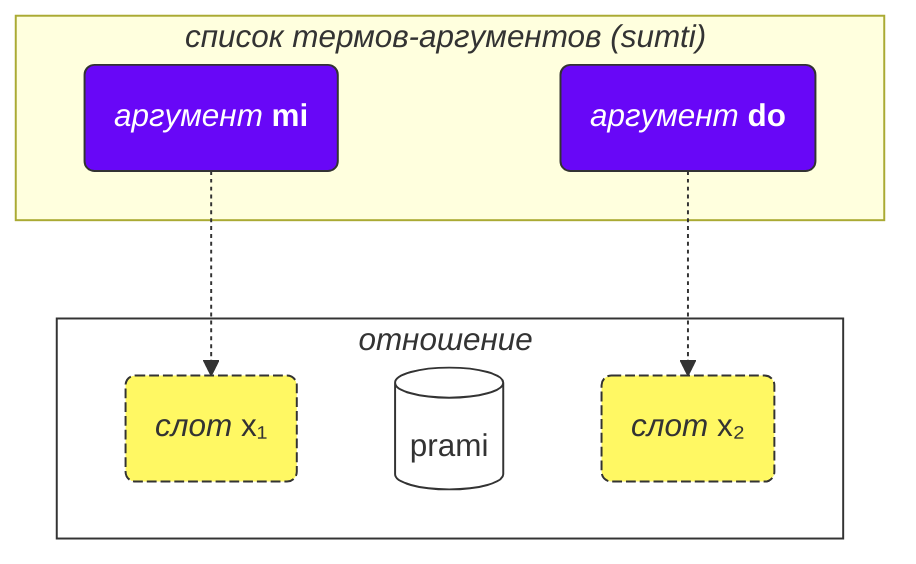
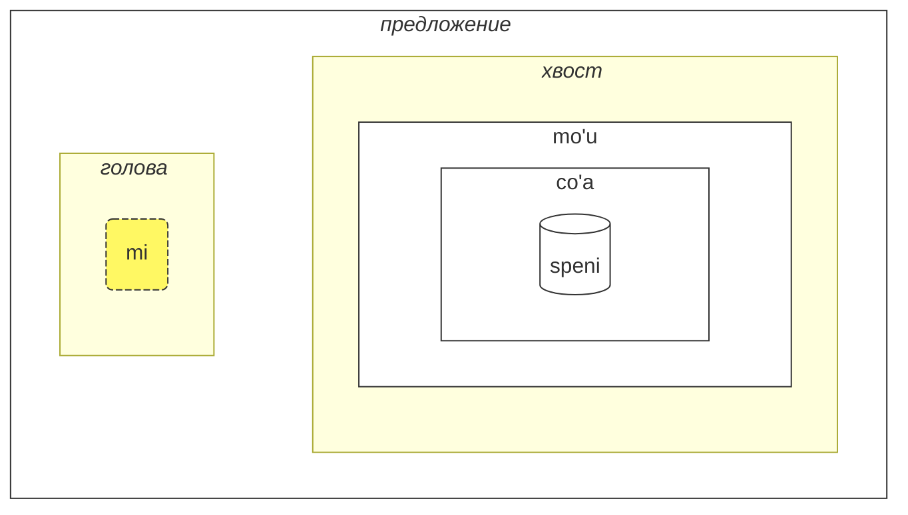

## Урок 2. Ещё основы

### Типы слов

Слова ложбана делятся на три группы:

- Слова-отношения (называемые **selbrivla** в ложбане)
  - Примеры: **gleki**, **klama**.
  - Такие слова содержат хотя бы одну группу согласных (две или более согласных одна за другой) в первых 5 звуках + они заканчиваются на гласную.
- Частицы (называемые **cmavo** в ложбане)
  - Примеры: **le**, **nu**, **mi**, **fa'a**.
  - Они начинаются с согласной (одна из **b d g v z j p t k f s c x l m n r i u**), за которой следует гласная (одна из **a e i o u y au ai ei oi**). Опционально, после этого может быть одна или несколько последовательностей апострофа (**'**) и следующей гласной. Например, **xa'a'a'a'a'a'a** и **ba'au'oi'a'e'o** — возможные частицы (даже если им не присвоено значение).
  - Довольно часто несколько частиц пишутся подряд без пробелов между ними. Это разрешено грамматикой ложбана. Так что не удивляйтесь, увидев **lenu** вместо **le nu**, **naku** вместо **na ku**, **jonai** вместо **jo nai**, и так далее. Это не меняет значение. Однако это правило не применяется к словам-отношениям; слова-отношения должны быть разделены пробелами.
- Слова-имена (называемые **cmevla** в ложбане)
  - Примеры: **.alis.**, **.doris**, **.lojban.**
  - Обычно используются для личных имён, названий мест и т.д.
  - Их легко отличить от других типов слов, так как они заканчиваются на согласную. Кроме того, они обёрнуты двумя точками в начале и в конце. В разговорной речи точки можно опускать при письме, но при произнесении паузы, соответствующие этим точкам, всё ещё обязательны.

#### Задание

Закройте правую часть таблицы. Попробуйте определить тип каждого слова ложбана, используя только что описанные правила.

<table>
<tbody><tr>
<td><b>le</b></td>
<td>частица (начинается с согласной, за которой следует гласная)</td>
</tr>
<tr>
<td><b>melbi</b></td>
<td>слово-отношение (содержит группу согласных 'lb')</td>
</tr>
<tr>
<td><b>.paris.</b></td>
<td>слово-имя (заканчивается на согласную, имеет точки вокруг)</td>
</tr>
<tr>
<td><b>mi'o</b></td>
<td>частица (содержит апостроф между гласными)</td>
</tr></tbody></table>

### Порядок аргументов

Ранее у нас были определения слов-отношений такие как:

mlatu
: … это кошка, быть кошкой

citka
: … ест …

prami
: … любит …

klama
: … приходит в …

Словари могут представлять определения слов-отношений с символами типа x₁, x₂ и т.д.:

prami
: x₁ любит x₂

karce
: x₁ это машина …

citka
: x₁ ест x₂ …

klama
: x₁ приходит в x₂ …

Эти x₁, x₂ и так далее — это явное обозначение так называемых _слотов_ (другие названия: _места_, _роли отношения_, **terbricmi** в ложбане). Слоты заполняются термами-аргументами (**sumti**) в предложении.

Числа представляют порядок, в котором эти слоты должны быть заполнены аргументами.

Например:

> **mi prami do**
> _Я люблю тебя._

Это предложение также подразумевает, что

- x₁ обозначает _того, кто любит_, и
- x₂ обозначает _того, кого любят_.

Другими словами, каждое отношение имеет один или несколько слотов, и эти слоты указываются и помечаются как x₁, x₂ и так далее. Мы помещаем аргументы типа **mi**, **do**, **le tavla** и т.д. по порядку, таким образом заполняя эти слоты и придавая конкретное значение отношению, таким образом формируя предложение.

Преимущество такого стиля определений в том, что он содержит <u>всех</u> возможных участников отношения, сразу указанных.

Мы также можем опускать аргументы, делая предложение более расплывчатым:

> **carvi**
> _Идёт дождь._
> `дождь, идёт дождь`

(хотя время здесь определяется контекстом, это также может означать _Часто идёт дождь_, _Шёл дождь_ и т.д.)

> **prami do**
> _Кто-то любит тебя._
> `любит тебя`

Все опущенные места в отношении просто означают **zo'e** = _что-то/кто-то_, так что это означает то же самое, что и

> **zo'e prami do**
> _Кто-то любит тебя._

И

> **prami**

то же самое, что и

> **zo'e prami zo'e**
> _Кто-то любит кого-то._

zo'e
: местоимение: что-то или кто-то неуказанный или предполагаемый из контекста

Модальные термы типа **ca**, **fa'a** и т.д. добавляют новые места к отношениям, но они не заполняют слоты отношений. В

> **mi klama fa'a do**
> _Я иду к тебе._

второе место **klama** всё ещё опущено. Например:

> **mi klama fa'a le cmana le zdani**
> _Я иду (в направлении горы) к дому._

le cmana
: гора

<pixra url="/assets/pixra/cilre/cmana.webp" caption="cmana" definition="… это гора"></pixra>

Здесь второе место **klama** — это **do**. Предложение означает, что гора — это просто направление, тогда как конечная точка — это ты.

Здесь терм **fa'a la cmana** (_в направлении горы_) не заменяет второе место отношения **klama**. Второе место **klama** здесь — это **le zdani**.

Предложение означает, что мой дом просто расположен в направлении горы, но это не обязательно означает, что я хочу достичь этой горы. Конечный пункт моего прихода — не гора, а дом.

Аналогично, в

> **mi citka ba le nu mi cadzu**
> _Я ем после того, как гуляю._

второе место **citka** всё ещё опущено. Новый терм **ba** с его аргументом **le nu mi cadzu** добавляет значение к предложению.

Порядок аргументов составного отношения такой же, как у последнего компонента в нём:

> **tu sutra bajra pendo mi**
> _То мой быстро бегающий друг._
> `То быстро бегающий друг меня.`

> **tu pendo mi**
> _То мой друг._
> `То друг меня.`

pendo
: … является другом … (кого-то)

Таким образом, порядок аргументов **sutra bajra pendo** такой же, как у **pendo** отдельно.

#### Задание

Закройте правую часть таблицы. Для каждого слова-отношения определите, какая структура мест правильная.

<table>
<tbody><tr>
<td><b>klama</b></td>
<td>x₁ приходит в x₂ из x₃</td>
</tr>
<tr>
<td><b>prami</b></td>
<td>x₁ любит x₂</td>
</tr>
<tr>
<td><b>karce</b></td>
<td>x₁ это машина</td>
</tr>
<tr>
<td><b>citka</b></td>
<td>x₁ ест x₂</td>
</tr></tbody></table>

### Более двух мест

Отношение может иметь более двух мест. Например:

> **mi pinxe le djacu le kabri**
> _Я пью воду из чашки._

pinxe
: x₁ пьёт x₂ из x₃

> **le kabri**
> _чашка_

В этом случае есть три места, и если вы хотите исключить второе место посередине, вы должны использовать **zo'e**:
> **mi pinxe zo'e le kabri**
> _Я пью \[что-то\] из чашки._

Если мы опустим **zo'e**, мы получим что-то бессмысленное:

> **mi pinxe le kabri**
> _Я пью чашку._

Другой пример:

> **mi plicru do le plise**
> _Я даю тебе яблоки._

plicru
: x₁ даёт, дарит x₂ какой-то объект x₃; x₁ позволяет кому-то x₂ использовать x₃ 

#### Задание

zgana
: x₁ наблюдает/замечает x₂, используя чувства x₃

Закройте правую часть таблицы. Переведите предложения слева с ложбана.

<table style="table-layout: fixed;">
<tbody><tr>
<td><b>mi zgana do le kanla</b></td>
<td><i>Я наблюдаю за тобой своими глазами.</i></td>
</tr>
<tr>
<td><b>mi pinxe le djacu le kabri</b></td>
<td><i>Я пью воду из чашки.</i></td>
</tr>
<tr>
<td><b>mi plicru le plise do</b></td>
<td><i>Я даю яблоко тебе.</i></td>
</tr></tbody></table>

Закройте правую часть таблицы. Переведите предложения слева на ложбан.

<table style="table-layout: fixed;">
<tbody><tr>
<td><i>Я пью кофе из стакана.</i></td>
<td><b>mi pinxe le ckafi le kabri</b></td>
</tr>
<tr>
<td><i>Я даю книгу ребёнку.</i></td>
<td><b>mi plicru le cukta le verba</b></td>
</tr></tbody></table>

### Отношения внутри отношений

В
> **le nicte cu nu mi viska le lunra**
> *Ночь — это когда я вижу Луну.*

у нас есть

- **le nicte** как x₁ отношения,
- **nu mi viska le lunra** как главное отношение.

Однако внутри **nu mi viska le lunra** у нас есть другое предложение с

- **mi** - x₁ внутреннего отношения,
- **viska** - внутреннее отношение,
- **le lunra** - x₂ внутреннего отношения.

Таким образом, несмотря на наличие внутренней структуры, **nu mi viska le lunra** всё ещё является отношением, первый терм которого заполнен **le nicte** в данном случае.

Аналогично, в

> **mi citka ba le nu mi dansu**
> _Я ем после того, как танцую._

у нас есть

- **mi** как x₁, первое место отношения,
- **citka** как главная конструкция отношения,
- **ba le nu mi dansu** как модальный терм главного отношения предложения.

Внутри этого терма у нас есть:

- **mi** как x₁, первое место отношения внутри терма
- **dansu** как главная конструкция отношения внутри терма.

Такой «рекурсивный» механизм вложения отношений в отношения позволяет точно выражать сложные идеи.

#### Задание

Закройте правую часть таблицы. Определите, какие термы принадлежат внутренним отношениям.

<table>
<tbody><tr>
<td><b>le nicte cu nu mi viska le lunra</b></td>
<td>Внутреннее отношение: <i>mi viska le lunra</i> (Я вижу луну)</td>
</tr>
<tr>
<td><b>mi citka ba le nu mi dansu</b></td>
<td>Внутреннее отношение: <i>mi dansu</i> (Я танцую)</td>
</tr>
<tr>
<td><b>mi djica le nu do klama</b></td>
<td>Внутреннее отношение: <i>do klama</i> (ты идёшь)</td>
</tr></tbody></table>

### Почему слова-отношения определены именно так?

Русский язык использует ограниченный набор предлогов и падежей, которые повторно используются с различными глаголами и, таким образом, не имеют фиксированного значения. Например, рассмотрим некоторые значения русского дательного падежа:

Значения:

* Адресат:
 >Дайте книгу моему другу.
  <!-- -->
 >_Я говорю тебе._
* Испытывающий чувство:
 >Ты виден мне.
  <!-- -->
 >_Мне это кажется красивым._
* Цель:
 >Помогите детям.

В каждом из этих примеров дательный падеж играет новую роль, которая, в лучшем случае, отдаленно похожа на роли в других предложениях.

Важно отметить, что другие языки используют разные способы обозначения ролей глаголов, которые во многих случаях очень отличаются от тех, что используются в русском.

Например, в ложбане роли отношений обозначаются путем полного определения таких отношений с ролями, расположенными последовательно (или помеченными как **fa**, **fe** и так далее):

klama
: x₁ приходит в x₂ …

tavla
: x₁ разговаривает с x₂ …

melbi
: x₁ красивый, приятный для x₂ …

Такие основные роли существенны при определении отношений.

Однако могут быть дополнительные роли, которые делают отношения более точными:

> _Я говорю с тобой, пока ем._
<!-- -->

> _Мне это трудно, потому что эта вещь тяжелая._

В ложбане аналогичное понятие таких необязательных ролей выражается через отдельные отношения или, для наиболее распространённых случаев, с помощью модальных термов:

> **mi tavla do ze'a le nu mi citka**
> _Я разговариваю с тобой, пока ем._
<!-- -->
> **nandu mi ri'a le nu ti tilju**
> _Мне трудно, потому что эта вещь тяжёлая._

nandu
: x₁ трудно для x₂

tilju
: x₁ тяжёлый

Предлоги в русском языке похожи на модальные частицы в ложбане, хотя обычный русский предлог может иметь много значений, в то время как в ложбане каждая модальная частица имеет только одно (даже если и широкое) значение.

### Общие правила порядка аргументов

Порядок мест в отношениях иногда может быть трудно запомнить, но давайте не будем волноваться — вам не нужно запоминать все места всех слов-отношений. (Помните ли вы значение сотен тысяч слов в русском?)

Вы можете изучать места, когда находите их полезными или когда люди используют их в диалоге с вами.

Большинство слов-отношений имеют два-три места.

Обычно вы можете угадать порядок, используя контекст и несколько практических правил:

1. Первое место часто — это человек или вещь, которая что-то делает или чем-то является:

    **klama** = _x₁ идёт …_

2. Объект какого-то действия обычно идёт сразу после первого места:

    **punji** = _x₁ кладёт x₂ на x₃_,

3. И следующее место обычно будет заполнено получателем:

    **punji** = _x₁ кладёт x₂ на x₃_,

4. Места назначения (_к_) почти всегда идут перед местами происхождения (_из_):

    **klama** = _x₁ идёт к x₂ из x₃_

    <pixra url="/assets/pixra/cilre/klama_fi.webp" caption="le prenu cu klama fi le zarci" definition="Человек выходит из магазина."></pixra>

5. Менее используемые места идут ближе к концу. Обычно это такие вещи, как _по стандарту_, _посредством_ или _сделано из_.

Общая идея в том, что первыми идут места, которые, скорее всего, будут использоваться.

Не нужно заполнять все места всё время. Незаполненные места просто имеют значения, неуместные или очевидные для говорящего (они принимают значение **zo'e** = _что-то_).

#### Задание

dunda
: x₁ даёт x₂ к x₃
benji
: x₁ передаёт x₂ к x₃ из x₄
lebna
: x₁ берёт x₂ из x₃

Закройте правую часть таблицы. Предскажите, какое место идёт следующим в этих отношениях на основе общих правил.

<table>
<tbody><tr>
<td><b>dunda</b> - "дающий ___, дар ___, получатель ___"</td>
<td>Порядок следует правилу: делающий первым, затем объект, затем получатель</td>
</tr>
<tr>
<td><b>benji</b> - "отправитель ___, отправленная вещь ___, место назначения ___, источник ___"</td>
<td>Порядок следует правилу: делающий первым, объект вторым, место назначения перед источником</td>
</tr>
<tr>
<td><b>lebna</b> - "берущий ___, взятая вещь ___, источник ___"</td>
<td>Порядок следует правилу: делающий первым, объект вторым, источник последним</td>
</tr></tbody></table>

### Инфинитивы

Инфинитивы - это глаголы, которые часто предшествуют суффиксу _-ть_ в русском языке. Примеры включают _Мне нравится бегать_, где _бегать_ является инфинитивом.

> **le verba cu troci le ka cadzu**
> _Ребенок пытается ходить._

le verba
: ребёнок, дети

troci
: x₁ пытается делать или быть x₂ (ka)

cadzu
: x₁ идёт

<pixra url="/assets/pixra/cilre/troci_cadzu.webp" caption="le verba cu troci le ka cadzu" definition="Ребёнок пытается ходить."></pixra>

Частица **ka** работает очень похоже на **nu**. Она оборачивает предложение.

Основная разница в том, что некоторый слот в обёрнутом предложении должен быть связан каким-то аргументом вне этого предложения.

В этом случае первый аргумент **le verba** отношения **troci** создаёт связь с первым незаполненным слотом внутреннего предложения **cadzu** (которое находится внутри **ka**).

Другими словами, ребёнок пытается достичь состояния, где **le verba cu cadzu** (аргумент **le verba** заполнил бы первый незаполненный слот отношения **cadzu**).

Некоторые отношения требуют только инфинитивов в некоторых своих слотах. Определения таких слов отмечают такие слоты как _свойство_ или **ka**. Например:

cinmo
: x₁ чувствует x₂ (ka)

Это означает, что инфинитив во втором слоте (x₂) применяется к какому-то другому слоту (скорее всего, первому слоту, x₁). Случаи, когда инфинитив применяется к слотам, отличным от x₂, редки и объясняются в словарях для соответствующих отношений или, в случае неофициально изобретённых слов-отношений, могут быть выведены из здравого смысла по аналогии с другими похожими словами-отношениями.

Другой пример:

<pixra url="/assets/pixra/cilre/sidju.webp" caption="ra sidju le pendo le ka bevri le dakli" definition="Он/она помогает другу нести сумки."></pixra>

> **ra sidju le pendo le ka bevri le dakli**
> _Он/она помогает другу нести сумки._

sidju
: x₁ помогает x₂ делать x₃ (ka)

Слово-отношение **sidju** требует, чтобы его третий слот был заполнен инфинитивом. 

bevri
: x₁ несёт x₂

le dakli
: сумка, сумки

Обратите внимание, что только первое незаполненное место встроенного отношения принимает значение внешнего места:

> **mi troci le ka do prami**
> _Я пытаюсь быть любимым тобой._

tcidu
: x₁ читает x₂ из x₃

Здесь первое незаполненное место — это второе место **prami**, таким образом оно принимает значение **mi** (_я_).

Также возможно, используя местоимение **ce'u**, явно отметить место, которое должно быть применено к какому-то внешнему аргументу:

> **mi troci le ka do prami ce'u**
> _Я пытаюсь быть любимым тобой._

Другой пример:

> **mi cinmo le ka xebni ce'u**
> **mi cinmo le ka se xebni**
> _Я чувствую, что кто-то ненавидит меня._
> _Я чувствую себя ненавидимым._

#### Задание

zgana
: x₁ наблюдает x₂
kakne
: x₁ способен делать x₂ (свойство)
nelci
: x₁ нравится x₂

Закройте правую часть таблицы. Преобразуйте эти предложения с инфинитивами в их значения.

<table>
<tbody><tr>
<td><b>mi kakne le ka zgana</b></td>
<td>Я способен наблюдать (что-то)</td>
</tr>
<tr>
<td><b>do kakne le ka nelci mi</b></td>
<td>Ты способен любить меня</td>
</tr>
<tr>
<td><b>mi nelci le ka zgana do</b></td>
<td>Мне нравится наблюдать за тобой</td>
</tr></tbody></table>

### Типы мест

Словарь часто упоминает другие типы мест, например:

djica
: x₁ хочет x₂ (событие)

Это _событие_ означает, что вы должны заполнить место аргументом, который представляет событие. Например:

le nicte
: ночное время

le nu mi dansu
: я танцую

Так что мы получаем

> **mi djica le nicte**
> _Я хочу ночное время._

<!-- -->

> **do djica le nu mi dansu**
> _Ты хочешь, чтобы я танцевал._

В ложбане не разрешено говорить, например:

> **mi djica le plise**
> _Я хочу яблоко._ 

 

потому что вы хотите что-то сделать с яблоком, или вы хотите, чтобы произошло какое-то событие с яблоком, например:

> **mi djica le nu mi citka le plise**
> _Я хочу съесть яблоко._
> `Я хочу, чтобы я съел яблоко.`

Обратите внимание, что обёртывание отношения, ожидающего событие, в **nu** меняет значение:

> **le zekri cu cumki**
> _Преступление возможно._

zekri
: x₁ является преступным событием, x₁ (событие) преступление

cumki
: x₁ (событие) возможно

Сравните:

> **le nu zekri cu cumki**
> `То, что преступление, возможно.`
> _Возможно, что что-то является преступлением._

#### Задание

nelci
: x₁ нравится x₂

djica
: x₁ хочет x₂ (событие)

Закройте правую часть таблицы. Переведите предложения слева с ложбана.

<table style="table-layout: fixed;">
<tbody><tr>
<td><b>mi nelci le nu do cisma</b></td>
<td><i>Мне нравится, что ты улыбаешься.</i></td>
</tr>
<tr>
<td><b>mi djica le nu mi citka le plise</b></td>
<td><i>Я хочу съесть яблоко.</i></td>
</tr>
<tr>
<td><b>mi na ku djica le plise</b></td>
<td><i>Я не хочу яблоко. (неправильное использование)</i></td>
</tr></tbody></table>

Закройте правую часть таблицы. Переведите предложения слева на ложбан.

<table style="table-layout: fixed;">
<tbody><tr>
<td><i>Я хочу, чтобы ты танцевал.</i></td>
<td><b>mi djica le nu do dansu</b></td>
</tr>
<tr>
<td><i>Мне нравится, что ты умный.</i></td>
<td><b>mi nelci le nu do stati</b></td>
</tr></tbody></table>

### Подъём

> **mi stidi le ka klama le barja**
> _Я предлагаю пойти в бар._

stidi
: x₁ предлагает действие x₂ (свойство) к x₃

> **mi stidi tu'a le barja**
> _Я предлагаю бар._

tu'a le barja
: что-то о баре

> **mi djica le nu mi citka le plise**
> _Я хочу съесть яблоко._

<!-- -->

> **mi djica tu'a le titla**
> _Я хочу сладость._

tu'a le titla
: что-то о сладости

titla
: … сладкий, … это сладость

<pixra url="/assets/pixra/cilre/djica_tuha_le_titla.webp" caption="le prenu cu djica tu'a le titla" definition="Человек хочет сладость."></pixra>

Структура мест может накладывать слишком большую нагрузку на указание действий или событий. Иногда мы хотим указать только какой-то объект в этих событиях или местах и пропустить описание действия или события вообще.

В примерах выше _Я предлагаю бар._ скорее всего подразумевает поход в бар, а _Я хочу яблоко._ подразумевает его съесть.

Однако слово-отношение ложбана **stidi** требует свойство в своём слоте x₂. Аналогично, **djica** требует событие в своём слоте x₂.

Короткое так называемое слово-квалификатор **tu'a** перед термом подразумевает абстракцию (свойство, событие или утверждение), но выбирает только этот терм из этой абстракции, пропуская остальное. Его можно расплывчато перевести как _что-то о_:

> **mi stidi tu'a le barja**
> _Я предлагаю что-то о баре (может быть, посещение его, встречу рядом с ним и т.д.)._

<!-- -->

> **mi djica tu'a le plise**
> _Я хочу что-то связанное с яблоком (возможно, съесть, жевать, лизать, бросить его в друга и т.д.)_

> **tu'a le cakla cu pluka mi**
> _Шоколад приятен мне (скорее всего, из-за своего вкуса)._
> `Что-то о шоколаде приятно мне`

cakla
: x₁ это какой-то шоколад

Когда пропускаются абстракции, только контекст говорит нам, что было опущено.

Также возможно модифицировать главную конструкцию отношения:

> **le cakla cu jai pluka mi**
> **tu'a le cakla cu pluka mi**
> _Шоколад приятен мне._

Это позволяет создавать расплывчатые термы-аргументы с **jai**:

> **le jai pluka cu zvati ti**
> _Приятная вещь здесь._

Поскольку **le pluka** (_приятное событие_) абстрактно, невозможно указать его местоположение. Однако участник абстракции может быть физически размещён где-то.

#### Задание

stidi
: x₁ предлагает x₂ (свойство) к x₃

Закройте правую часть таблицы. Переведите предложения слева с ложбана.

<table style="table-layout: fixed;">
<tbody><tr>
<td><b>mi stidi tu'a le karce</b></td>
<td><i>Я предлагаю что-то о машине.</i></td>
</tr>
<tr>
<td><b>mi djica tu'a le najnimre</b></td>
<td><i>Я хочу что-то об апельсине.</i></td>
</tr>
<tr>
<td><b>mi nelci tu'a le mlatu</b></td>
<td><i>Мне нравится что-то о кошке.</i></td>
</tr></tbody></table>

Закройте правую часть таблицы. Переведите предложения слева на ложбан.

<table style="table-layout: fixed;">
<tbody><tr>
<td><i>Я предлагаю сад (что-то о нём).</i></td>
<td><b>mi stidi tu'a le purdi</b></td>
</tr>
<tr>
<td><i>Я хочу книгу (что-то о ней).</i></td>
<td><b>mi djica tu'a le cukta</b></td>
</tr></tbody></table>

### Места внутри аргументов

Как мы скажем _Ты мой друг_?

> **do pendo mi**
> _Ты мой друг._
> `Ты друг меня.`

<pixra url="/assets/pixra/cilre/pendo.webp" caption="le pendo" definition="друг / друзья"></pixra>

А теперь, как мы скажем _Мой друг умный._?

> **le pendo be mi cu stati**
> _Мой друг умный._

Итак, когда мы преобразуем отношение в аргумент (**pendo** — _быть другом_ в **le pendo** — _друг_), мы всё ещё можем сохранить другие места этого отношения, поместив **be** после него.

По умолчанию это присоединяет второе место (x₂). Мы можем присоединить больше мест, разделяя их с помощью **bei**:

> **mi plicru do le plise**
> _Я даю тебе яблоко._

<pixra url="/assets/pixra/cilre/plicru.webp" caption="le prenu cu plicru le pendo le plise" definition="Человек даёт другу яблоко."></pixra>
<!-- -->

> **le plicru be mi bei le plise**
> _Даритель яблока мне_

<!-- -->

> **le plicru be mi bei le plise cu pendo mi**
> _Даритель яблока мне — мой друг._
> `Тот, кто даёт мне яблоко, мой друг.`

Другой пример:

<!-- > **le pendo be mi cu tavla**
> _The friends of mine are talking._
> **le pendo mi cu tavla**
> **le pendo cu tavla mi**
> _The friends are talking to me._ -->

> **mi klama le pendo be do**
> _Я иду к твоему другу._

klama
: x₁ приходит в x₂ из x₃ …

Мы не можем опустить **be**, потому что **le pendo do** — это два независимых места:

> **mi klama le pendo do**
> _Я иду к другу от тебя._

Здесь **do** заняло третье место **klama**, так как оно не связано с _pendo_ через **be**.

Мы также не могли бы использовать **nu**, потому что **le nu pendo do** — это событие того, что кто-то является твоим другом.

Так что **le pendo be do** — правильное решение.

Другой пример:

> **la .lojban. cu bangu mi**
> _Ложбан — мой язык._
> `Ложбан — язык меня.`

Однако,

> **mi nelci le bangu be mi**
> _Мне нравится мой язык._

Использование **be** для отношений, не преобразованных в аргументы, не имеет эффекта: 

> **mi nelci be do** то же самое, что 
> **mi nelci do**

#### Задание

ctuca
: x₁ учит x₂ (предмет) x₃
cmene
: x₁ это имя x₂, используемое x₃

Закройте правую часть таблицы. Преобразуйте эти конструкции с использованием "be" в их значения.

<table>
<tbody><tr>
<td><b>le ctuca be mi bei la lojban</b></td>
<td>учитель меня в ложбане</td>
</tr>
<tr>
<td><b>le cmene be la paris bei la frank</b></td>
<td>имя Парижа, используемое Фрэнком</td>
</tr>
<tr>
<td><b>le ctuca be le verba bei la lojban</b></td>
<td>учитель детей в ложбане</td>
</tr></tbody></table>

### Относительные придаточные предложения

> **le prenu poi pendo mi cu tavla mi**
> _Человек, который является моим другом, разговаривает со мной._

<!-- -->

> **le prenu noi pendo mi cu tavla mi**
> _Человек, который, кстати, мой друг, разговаривает со мной._

blabi
: … белый

В первом предложении слово _который_ существенно для идентификации человека, о котором идёт речь. Оно уточняет, о ком из людей в контексте мы говорим. Мы выбираем только тех, кто является моими друзьями, из вероятно многих людей вокруг. Может быть, вокруг есть только один человек, который мой друг.

Что касается _который, кстати, мой друг_ из второго предложения, это просто предоставляет дополнительную информацию о человеке. Это не помогает нам идентифицировать человека. Например, это может произойти, когда все люди вокруг — мои друзья.

**poi pendo mi** — это относительное придаточное предложение, отношение, присоединённое справа от аргумента **le prenu**. Оно заканчивается непосредственно перед следующим словом **cu**:

> **le prenu (poi pendo mi) cu tavla mi**
> _Человек, который является моим другом, разговаривает со мной._

В ложбане мы используем **poi** для относительных придаточных предложений, которые идентифицируют сущности (объекты, людей или события), и **noi** для случайной информации.

> **la .bob. ba co'a speni le ninmu poi pu xabju le nurma**
> _Боб женится на девушке, которая жила в деревне._

xabju
: … живёт в …, … обитает в … (место, объект)

le nurma
: сельская местность

Это предложение не исключает, что Боб женится и на ком-то ещё! Удаление относительного придаточного с **poi** меняет значение:

> **la .bob. ba co'a speni le ninmu**
> _Боб женится на девушке._

Другой пример:

> **le prenu poi gleki cu ze'u renvi**
> _Люди (какие именно?) которые счастливы, живут долго._

ze'u
: модальный терм: долго

renvi
: выживать

Удаление относительного придаточного с **poi** меняет значение:

> **le prenu ze'u renvi**
> _Люди живут долго._

С другой стороны, относительные придаточные с **noi** содержат просто дополнительную информацию об аргументе, к которому они присоединены. Этот аргумент достаточно определён сам по себе, так что удаление относительного придаточного с **noi** не меняет его значения:

> **mi nelci la .doris. noi mi ta'e zgana bu'u le panka**
> _Мне нравится Дорис, которую я обычно вижу в парке._
> _Мне нравится Дорис. Что ещё я могу сказать о ней? Я обычно вижу её в парке._

zgana
: наблюдать (используя любые чувства)

<pixra url="/assets/pixra/cilre/panka_ninmu.webp" caption="le prenu noi mi ta'e zgana bu'u le panka" definition="Человек, которого я обычно вижу в парке."></pixra>

Удаление относительного придаточного с **noi** сохраняет значение: _Мне нравится Дорис._

В разговорном английском различие часто достигается с помощью интонации или догадки. Также относительные придаточные с **noi** традиционно отделяются запятыми в английском. Они используют _which_ или _who_, и слово _that_ в них не используется.

Давайте рассмотрим другой пример.

> **mi klama le pa tricu**
> _Я иду к дереву._

<!-- -->

> **le pa tricu cu barda**
> _Дерево большое._

le pa tricu
: дерево (одно дерево)

barda
: x₁ большой/крупный

А теперь давайте объединим эти два предложения:

> **le tricu noi mi klama ke'a cu barda**
> _Дерево, к которому я иду, большое._

Обратите внимание на слово **ke'a**. Мы перемещаем второе предложение о том же дереве в относительное придаточное и заменяем аргумент **le tricu** на **ke'a** в относительном придаточном. Таким образом, местоимение **ke'a** похоже на _who_ и _which_ в английском. Оно указывает обратно на аргумент, к которому присоединено относительное придаточное.

Так что буквально наше предложение на ложбане звучит как

> _Дерево, такое, что я иду к которому, большое._

**ke'a** может быть опущено, если контекст достаточно ясен. Следующие два предложения означают одно и то же:

> **le prenu poi pendo mi cu tavla mi**
> **le prenu poi ke'a pendo mi cu tavla mi**
> _Человек, который является моим другом, разговаривает со мной._

**ke'a** часто предполагается для первого незаполненного места:

> **mi nelci la .doris. noi mi ta'e zgana bu'u le panka**
> **mi nelci la .doris. noi mi ta'e zgana ke'a bu'u le panka**
> _Мне нравится Дорис, которую я обычно вижу в парке._

Здесь **mi** заполняет первый слот отношения **ta'e zgana** (_… обычно видит …_), таким образом, **ke'a** предполагается для следующего, второго места.

Относительные придаточные, как обычные отношения, могут содержать конструкции с модальными термами:

> **le tricu noi mi pu klama ke'a ca le cabdei cu barda**
> _Дерево, к которому я ходил сегодня, большое._

<pixra url="/assets/pixra/cilre/le_tricu_cu_barda.webp" caption="le tricu cu barda" definition="Дерево большое."></pixra>

le cabdei
: сегодняшний день

Обратите внимание, что **ca le cabdei** принадлежит относительному придаточному. Сравните:

> **le tricu noi mi pu klama ke'a cu barda ca le cabdei**
> _Дерево, к которому я ходил, большое сегодня._

Значение сильно изменилось.

Наконец, **voi** используется для формирования аргументов типа **le**, но с относительными придаточными:

> **ti voi le nu ke'a cisma cu pluka mi cu zutse tu**
> _Те, чья улыбка мне приятна, сидят._

<pixra url="/assets/pixra/cilre/voi.webp" caption="mi nelci ti voi le nu ke'a cisma cu pluka mi" definition="Мне нравятся те, чьи улыбки мне приятны."></pixra>

ti
: это рядом со мной, эти рядом со мной

cisma
: x₁ улыбается

pluka
: x₁ приятно для x₂

zutse
: x₁ сидит, сидит на x₂

Здесь **voi** определяет объект рядом со мной.

Сравните это с:

> **ti poi le nu ke'a cisma cu pluka mi cu zutse**
> _Из этих те, чья улыбка мне приятна, сидят._

**poi** ограничивает выбор теми, кто описан в относительном придаточном.
Этот пример может подразумевать, что вокруг меня много объектов (людей и т.д.), но с **poi** я выбираю только необходимых.

Сравните это с:

> **ti noi le nu ke'a cisma cu pluka mi cu zutse**
> _Эти (которые, кстати, такие, что их улыбка мне приятна) сидят._

**noi** просто добавляет случайную информацию, которая не нужна для определения того, к чему относится **ti** (_эти_). Возможно, больше никого вокруг нет, чтобы описывать.

Наконец, точно так же, как **nu** имеет правый граничный маркер **kei**, у нас есть

ku'o
: правый граничный маркер для **poi**, **noi** и **voi**.

> **mi tavla la .doris. noi ca zutse tu ku'o .e la .alis. noi ca cisma**
> _Я разговариваю с Дорис, которая сейчас сидит вон там, и Алисой, которая сейчас улыбается._

Обратите внимание, что без **ku'o** у нас было бы **tu** (_вон там_) объединённое с **la .alis.** (_Алиса_), ведущее к странному значению:

> **mi tavla la .doris. noi ca zutse tu .e la .alis. noi ca cisma**
> _Я разговариваю с Дорис, которая сейчас сидит вон там и на Алисе (которая сейчас улыбается)._

Обратите внимание на часть **zutse tu .e la .alis.**.

Для всех **poi**, **noi** и **voi** правый граничный маркер остаётся тем же: **ku'o**.

#### Задание

ctuca
: x₁ учит x₂ x₃

Закройте правую часть таблицы. Переведите предложения слева с ложбана.

<table style="table-layout: fixed;">
<tbody><tr>
<td><b>mi tavla le prenu poi ctuca mi</b></td>
<td><i>Я разговариваю с человеком, который учит меня.</i></td>
</tr>
<tr>
<td><b>le gerku noi mi nelci ke'a cu citka</b></td>
<td><i>Собака, которая мне нравится, ест.</i></td>
</tr>
<tr>
<td><b>le prenu poi ke'a ctuca mi cu stati</b></td>
<td><i>Человек, который учит меня, умный.</i></td>
</tr></tbody></table>

Закройте правую часть таблицы. Переведите предложения слева на ложбан.

<table style="table-layout: fixed;">
<tbody><tr>
<td><i>Я вижу собаку, которая бежит.</i></td>
<td><b>mi viska le gerku poi bajra</b></td>
</tr>
<tr>
<td><i>Человек, который умный, разговаривает со мной.</i></td>
<td><b>le prenu noi stati cu tavla mi</b></td>
</tr></tbody></table>

### Короткие относительные придаточные. '_О_'

Иногда вам может понадобиться присоединить дополнительный аргумент к другому аргументу:

> **mi djuno le vajni pe do**
> _Я знаю что-то важное о тебе._

le vajni
: что-то важное

**pe** и **ne** похожи на **poi** и **noi**, но они присоединяют аргументы к аргументам:

> **le pa penbi pe mi cu xunre**
> _Ручка, которая моя, красная._ (_моя_ существенна для идентификации ручки, о которой идёт речь)

<!-- -->

> **le pa penbi ne mi cu xunre**
> _Ручка, которая моя, красная._ (дополнительная информация)

ne
: которая о, имеет отношение к … (следует аргумент)

pe
: которая о, имеет отношение к … (следует аргумент)

> **le pa penbi ne mi ge'u .e le pa fonxa ne do cu xunre**
> _Ручка, которая моя, и телефон, который твой, красные._

ge'u
: правый граничный маркер для **pe**, **ne**.

#### Задание

Закройте правую часть таблицы. Переведите предложения слева с ложбана.

<table style="table-layout: fixed;">
<tbody><tr>
<td><b>le penbi pe mi cu xunre</b></td>
<td><i>Ручка, которая моя, красная.</i></td>
</tr>
<tr>
<td><b>le mlatu ne mi cu melbi</b></td>
<td><i>Кошка, которая моя, красивая.</i></td>
</tr>
<tr>
<td><b>mi tavla le prenu pe do</b></td>
<td><i>Я разговариваю с человеком, связанным с тобой.</i></td>
</tr></tbody></table>

Закройте правую часть таблицы. Переведите предложения слева на ложбан.

<table style="table-layout: fixed;">
<tbody><tr>
<td><i>Дом, который мой, большой.</i></td>
<td><b>le zdani pe mi cu barda</b></td>
</tr>
<tr>
<td><i>Машина, которая твоя, красивая.</i></td>
<td><b>le karce ne do cu melbi</b></td>
</tr></tbody></table>

### «**be**» и «**pe**»

Обратите внимание, что относительные придаточные присоединяются к аргументам, в то время как **be** является частью отношения.

На самом деле, **le bangu pe mi** — это лучший перевод _мой язык_, поскольку, как и в русском, два аргумента связаны друг с другом расплывчатым образом.

Однако вы можете сказать **le birka be mi** как _моя рука_. Даже если вы отпилите свою руку, она всё ещё будет вашей. Вот почему **birka** имеет место владельца:

birka
: x₁ это рука x₂

Давайте ещё раз покажем, что конструкция с **be** является частью отношения, тогда как **pe**, **ne**, **poi** и **noi** присоединяются к аргументам:

> **le pa melbi be mi fonxa pe le pa pendo be mi cu barda**
> `Красивый для меня телефон моего друга большой.`

Здесь **be mi** присоединяется к отношению **melbi** = _быть красивым для … (кого-то)_ и таким образом создаёт новое отношение **melbi be mi** = _быть красивым для меня_. Но **pe le pa pendo be mi** (_моего друга_) применяется ко всему аргументу **le pa melbi be mi fonxa** (_красивый для меня телефон_).

Также может случиться, что нам нужно присоединить **be** к отношению, преобразовать это отношение в аргумент, а затем присоединить **pe** к этому аргументу:

> **le pa pendo be do be'o pe la .paris. cu stati**
> _Твой друг, который связан с Парижем, умный._
> (<b>pe la .paris.</b> присоединяется ко всему аргументу <b>le pa pendo be do be'o</b>)

<!-- -->

> **le pu plicru be do bei le pa plise be'o pe la .paris. cu stati**
> _Тот, кто дал тебе яблоко (и кто связан с Парижем), умный._
> (<b>pe la .paris.</b> присоединяется ко всему аргументу <b>le pu plicru be do bei le pa plise be'o</b>)

be'o
: правый граничный маркер для строки термов, присоединённых с **be** и **bei**

В этих двух примерах ваш друг имеет какое-то отношение к Парижу (может быть, он/она из Парижа).

Сравните это с:

> **le pa pendo be do pe la .paris. cu stati**
> _Друг тебя (тебя, который связан с Парижем) умный._

<!-- -->

> **le pu plicru be do bei le pa plise pe la .paris. cu stati**
> _Тот, кто дал тебе яблоко (яблоко, которое связано с Парижем), умный._

В этих последних двух примерах, однако, либо вы связаны с Парижем, либо яблоко.

#### Задание

Закройте правую часть таблицы. Переведите предложения слева с ложбана.

<table style="table-layout: fixed;">
<tbody><tr>
<td><b>le melbi be mi cu stati</b></td>
<td><i>Тот, кто красив для меня, умный.</i></td>
</tr>
<tr>
<td><b>le pendo be do bei mi cu tavla</b></td>
<td><i>Друг тебя и меня разговаривает.</i></td>
</tr>
<tr>
<td><b>le pampe'o be do pe mi cu melbi</b></td>
<td><i>Моя бумага твоя красивая.</i></td>
</tr></tbody></table>

Закройте правую часть таблицы. Переведите предложения слева на ложбан.

<table style="table-layout: fixed;">
<tbody><tr>
<td><i>Тот, кто приятен для меня и умный для тебя, разговаривает.</i></td>
<td><b>le pluka be mi bei do cu tavla</b></td>
</tr>
<tr>
<td><i>Мой друг, который связан с Парижем, умный.</i></td>
<td><b>le pendo be mi be'o pe la .paris. cu stati</b></td>
</tr></tbody></table>

### '_Алиса — учитель_' и '_Алиса — это учитель_'

В английском глагол _is, are, to be_ заставляет существительное работать как глагол. В ложбане даже такие понятия, как _кот_ (**mlatu**), _человек_ (**prenu**), _дом_ (**dinju**), _жилище_ (**zdani**) функционируют как глаголы (отношения) по умолчанию. Только местоимения работают как аргументы.

Однако вот три случая:

> **la .alis. cu ctuca**
> _Алиса преподаёт._

<pixra url="/assets/pixra/cilre/ctuca.webp" caption="mi ctuca" definition="Я преподаю / Я учитель."></pixra>

<!-- -->

> **la .alis. cu me le ctuca**
> _Алиса — одна из учителей._

me
: … является среди …, … один из …, … являются членами … (следует аргумент)

> **la .alis. ta'e ctuca**
> _Алиса обычно преподаёт._

ta'e
: модальная частица: событие происходит обычно

> **la .alis. cu du le ctuca**
> _Алиса — это учитель._

du
: … идентичен …

Частица **me** берёт аргумент после себя и указывает, что, вероятно, есть другие учителя, а Алиса — одна из них.

Частица **du** используется, когда Алиса, например, тот учитель, которого мы искали или о котором говорили. Она указывает на идентичность.

Таким образом, **me** и **du** иногда могут соответствовать тому, что в русском мы выражаем с помощью глагола _быть/является/был_.

В ложбане мы приоритизируем значение того, что мы намереваемся сказать, а не полагаемся на то, как это буквально выражается в английском или других языках.

Другие примеры:

> **mi me la .bond.**
> _Я Бонд._

<!-- -->

> **mi du la .kevin.**
> _Я Кевин (тот, который вам нужен)._

<!-- -->

> **ti du la .alis. noi mi ta'e zgana bu'u le panka**
> _Это Алиса, которую я обычно вижу в парке._

**noi du** и **poi du** используются для введения альтернативных имён для чего-либо. Они соответствуют русскому _а именно, т.е._:

> **la .alis. cu penmi le prenu noi du la .abdul.**
> _Алиса встретила человека, а именно Абдула._

Когда используете **me**, вы можете соединить несколько аргументов с _и_:

> **tu me le pendo be mi be'o .e le tunba be mi**
> _Те — некоторые (или все) мои друзья и мои братья и сёстры._

tunba
: x₁ это брат или сестра x₂

<pixra url="/assets/pixra/cilre/tunba.webp" caption="do tunba mi" definition="Ты мой брат/сестра."></pixra>

#### Задание

gerku
: x₁ это собака
banana
: x₁ это банан
pendo
: x₁ это друг x₂

Закройте правую часть таблицы. Переведите эти предложения, используя подходящие слова для "является/являются".

<table>
<tbody><tr>
<td><i>Те — некоторые из моих друзей</i></td>
<td><b>tu me le pendo be mi</b></td>
</tr>
<tr>
<td><i>Та — это собака, которую мы искали</i></td>
<td><b>ta du le gerku</b></td>
</tr>
<tr>
<td><i>Эта жёлтая вещь — банан</i></td>
<td><b>ti pelxu gi'e me le banana</b></td>
</tr></tbody></table>

### Отношения с модальными частицами

Мы можем поместить модальную частицу не только перед главной конструкцией отношения предложения, но и в конце её, производя тот же результат:

> **mi ca tcidu**
> **mi tcidu ca**
> _Я (сейчас читаю)._

tcidu
: читать (какой-то текст)

Когда используем **nu**, мы создаём отношение, описывающее некоторое событие. Обратите внимание на разницу между этими двумя примерами:

> **le nu tcidu ca cu nandu**
> _Текущее чтение сложное, трудное._

<!-- -->

> **le nu tcidu cu ca nandu**
> _Чтение сейчас сложное._

Другие примеры:

> **mi klama le pa cmana pu**
> _Я ходил в горы._
> `Я иду в гору (в прошлом).`

<!-- -->

> **le nu mi klama le pa cmana pu cu pluka**
> _То, что я ходил в горы, приятно._

Мы также можем поместить одну или несколько модальных частиц как первый элемент конструкции отношения и, например, использовать такое обогащённое отношение в форме аргумента:

<pixra url="/assets/pixra/cilre/coha_purdi.webp" caption="le pu kunti tumla ca purdi" definition="То, что было пустыней, сейчас сад."></pixra>

> **le pu kunti tumla ca purdi**
> _То, что было пустыней, сейчас сад._

**pu** принадлежит **le kunti tumla**, а **ca** принадлежит **purdi** (так как **le pu kunti tumla** не может добавить **ca** в конце).

<!-- This doesn't contradict using **be** after the verb since, with **be**, you change the verb: **bangu be mi** is considered one verb. -->

Наличие нескольких модальных частиц по порядку не проблема:
> **le pu ze'u kunti tumla ca purdi**
> _То, что было пустыней долгое время, сейчас сад._

ze'u
: модальный терм: долго

Размещение термовых частиц после существительных связывает их с внешними отношениями:

<pixra url="/assets/pixra/cilre/cohu_purdi.webp" caption="le kunti tumla pu purdi" definition="Пустыня была садом."></pixra>

> **le kunti tumla pu purdi**
> **(le kunti tumla) pu purdi**
> _Пустыня была садом._

#### Задание

melbi
: x₁ красивый
sutra
: x₁ быстрый

Закройте правую часть таблицы. Покажите, где применяются модальные частицы в этих предложениях.

<table>
<tbody><tr>
<td><b>mi ca melbi</b></td>
<td>"ca" (настоящее время) применяется к "melbi" - Я сейчас красивый</td>
</tr>
<tr>
<td><b>le nu mi melbi ca cu sutra</b></td>
<td>"ca" применяется к "sutra" - моё бытие красивым сейчас быстрое</td>
</tr>
<tr>
<td><b>le pu sutra ca melbi</b></td>
<td>"pu" принадлежит "sutra", а "ca" принадлежит "melbi" - то, что было быстрым, сейчас красивое</td>
</tr></tbody></table>

### Новые аргументы из слотов того же отношения

> **do plicru mi ti**
> _Ты даришь мне это._

<!-- -->

> **mi se plicru ti do**
> _Мне даришь это ты._

plicru
: x₁ даёт x₂ что-то x₃ для использования

Мы можем поменять местами первые два места в отношении, используя **se**, и таким образом изменить структуру мест.

**do plicru mi ti** означает в точности то же самое, что и **mi se plicru do ti**. Разница только в стиле.

Вы можете захотеть изменить порядок для разного акцента, например, чтобы упомянуть более важные вещи в предложении первыми. Итак, следующие пары означают одно и то же:

> **mi prami do**
> _Я люблю тебя._

<!-- -->

> **do se prami mi**
> _Ты любим мной._

<!-- -->

> **le nu mi tadni la .lojban. cu xamgu mi**
> _Моё изучение ложбана хорошо для меня._

xamgu
: … хорошо для (кого-то)

> **mi se xamgu le nu mi tadni la .lojban.**
> _Для меня хорошо изучать ложбан._

То же самое можно сделать, когда отношения используются при создании аргументов:

le plicru
: те, кто дают, дарители, доноры

le se plicru
: те, кому дают, получатели подарков

le te plicru
: те объекты, которые даются для использования, подарки

**te** меняет местами первое и третье места отношений.

Как мы знаем, когда мы добавляем **le** перед конструкцией отношения, она становится аргументом. Так что

- **le plicru** означает _те, которые могли бы подойти для первого места **plicru**_
- **le se plicru** означает _те, которые могли бы подойти для второго места **plicru**_
- **le te plicru** означает _те, которые могли бы подойти для третьего места **plicru**_

Таким образом, в ложбане нам не нужны отдельные слова для _даритель_, _получатель_ и _подарок_. Мы переиспользуем то же отношение и экономим много усилий благодаря такому умному дизайну. Действительно, мы не можем представить подарок без подразумевания, что кто-то дал его или даст его. Когда полезные явления взаимосвязаны, ложбан это отражает.

<!-- TODO: DwE: For the ease of understanding and memorizing: predicate words prefixed with **se**, **te** are put into the dictionary in entries for many verbs together with their definitions, although you can figure out their meaning yourself. -->

#### Задание

vecnu
: x₁ продаёт x₂ к x₃ за цену x₄
ciska
: x₁ пишет x₂ на поверхности x₃ инструментом x₄

Закройте правую часть таблицы. Преобразуйте эти отношения, используя se/te/ve.

<table>
<tbody><tr>
<td><b>le se vecnu</b></td>
<td>то, что продаётся (товар)</td>
</tr>
<tr>
<td><b>le te vecnu</b></td>
<td>покупатель</td>
</tr>
<tr>
<td><b>le ve ciska</b></td>
<td>пишущий инструмент</td>
</tr>
<tr>
<td><b>le te ciska</b></td>
<td>поверхность для письма</td>
</tr></tbody></table>

### Изменение других мест в главных отношениях

Серия **se, te, ve, xe** (в алфавитном порядке) состоит из частиц, которые меняют места в главных отношениях:

- **se** меняет местами первое и второе места
- **te** меняет местами первое и третье места
- **ve** меняет местами первое и четвёртое места
- **xe** меняет местами первое и пятое места.

> **mi zbasu le pa stizu le mudri**
> _Я сделал стул из куска дерева._

zbasu
: x₁ строит, делает x₂ из x₃

le pa stizu
: стул

le mudri
: кусок дерева

> **le mudri cu te zbasu le stizu mi**
> _Кусок дерева — это то, из чего сделан стул мной._

**mi** теперь переместилось на третье место отношения и может быть опущено, если мы слишком ленивы, чтобы указывать, кто сделал стул, или если мы просто не знаем, кто сделал его:

> **le mudri cu te zbasu le stizu**
> _Кусок дерева — материал стула._

Аналогично нашему примеру с **le se plicru** (_получатель_) и **le te plicru** (_подарок_), мы можем использовать **te**, **ve**, **xe**, чтобы производить больше слов из других мест слов-отношений:

klama
: x₁ идёт к x₂ из x₃ через x₄ посредством x₅

Таким образом, мы можем вывести, что

le klama
: идущий / идущие

le se klama
: место назначения

le te klama
: место происхождения движения

le ve klama
: маршрут

le xe klama
: средство прихода

**le xe klama** и пятое место **klama** могут обозначать любое средство передвижения, такое как езда на машине или ходьба пешком.

**se** используется чаще, чем другие частицы для перестановки мест.

#### Задание

mrilu
: x₁ отправляет по почте x₂ к x₃ из x₄ перевозчиком x₅
pagbu
: x₁ это часть x₂

Закройте правую часть таблицы. Определите, к каким местам относятся эти преобразованные отношения.

<table>
<tbody><tr>
<td><b>le xe mrilu</b></td>
<td>перевозчик/служба, используемая для отправки по почте</td>
</tr>
<tr>
<td><b>le se pagbu</b></td>
<td>целое, частью которого что-то является</td>
</tr>
<tr>
<td><b>le ve mrilu</b></td>
<td>происхождение отправки по почте</td>
</tr>
<tr>
<td><b>mi te mrilu do ti</b></td>
<td>Ты получатель этой вещи, которую я отправляю по почте</td>
</tr></tbody></table>

### Свободный порядок слов: теги для ролей в отношениях

Обычно нам не нужны все слоты, места отношения, поэтому мы можем опустить ненужные, заменив их на **zo'e**. Однако мы можем использовать _теги мест_ для явного обращения к нужному слоту. Теги мест работают как модальные частицы, но имеют дело со структурой мест отношений:

> **mi prami do** то же самое, что
> **fa mi prami fe do**
> _Я люблю тебя._

- **fa** отмечает аргумент, который заполняет первый слот отношения (x₁)
- **fe** отмечает аргумент, который заполняет второй слот (x₂)
- **fi** отмечает аргумент, который заполняет третий слот (x₃)
- **fo** отмечает аргумент, который заполняет четвёртый слот (x₄)
- **fu** отмечает аргумент, который заполняет пятый слот (x₅)

Больше примеров:

> **mi klama fi le tcadu**
> _Я иду из города._

**fi** отмечает **le tcadu** как третье место **klama** (происхождение движения). Без **fi** предложение превратилось бы в **mi klama le tcadu**, означающее _Я иду в город._

> **mi pinxe fi le kabri** то же самое, что
> **mi pinxe zo'e le kabri**
> _Я пью (что-то) из чашки._

pinxe
: x₁ пьёт x₂ из x₃

le kabri
: чашка, стакан

<pixra url="/assets/pixra/cilre/pinxe_fi_le_kabri.webp" caption="le prenu cu pinxe fi le kabri" definition="Человек пьёт из стакана."></pixra>

> **mi tugni zo'e le nu vitke le rirni**
> **mi tugni fi le nu vitke le rirni**
> _Я соглашаюсь (с кем-то) о посещении родителей._

tugni
: x₁ соглашается с кем-то x₂ о x₃ (утверждение)

le rirni
: родитель / родители

С тегами мест мы можем перемещать места:

> **fe mi fi le plise pu plicru**
> _Кто-то дал яблоко мне._

Здесь,

- **le plise** = _яблоко_, мы помещаем его в третье место **plicru**, что даётся
- **mi** = _я_, мы помещаем его во второе место **plicru**, получатель.

Как мы видим в последнем примере, мы даже не можем отразить порядок слов в его английском переводе.

Обширное использование тегов мест может сделать нашу речь труднее воспринимаемой, но они позволяют больше свободы.

В отличие от серии **se**, использование тегов мест, таких как **fa**, не меняет структуру мест.

---

Мы можем использовать теги мест внутри аргументов, помещая их после **be**:

> **le pa klama be fi le tcadu cu pendo mi**
> _Тот, кто приходит из города, мой друг._

---

Мы также можем поместить все аргументы одного главного отношения перед хвостом предложения (сохраняя их относительный порядок). Из-за этой свободы мы можем сказать:

> **mi do prami** что то же самое, что
> **mi do cu prami** что то же самое, что
> **mi prami do**
> _Я люблю тебя._

<!-- -->

> **ko kurji ko** то же самое, что
> **ko ko kurji**
> _Позаботься о себе._

Следующие предложения также равны по значению:

> **mi plicru do le pa plise**
> _Я даю тебе яблоко._

<!-- -->

> **mi do cu plicru le pa plise**
> _Я тебе даю яблоко._

<!-- -->

> **mi do le pa plise cu plicru**
> _Я тебе яблоко даю._

#### Задание

dunda
: x₁ даёт x₂ к x₃
xamgu
: x₁ хорошо для x₂
cuxna
: x₁ выбирает x₂ из x₃

Закройте правую часть таблицы. Для каждого предложения скажите, какие места отношения заполнены.

<table>
<tbody><tr>
<td><b>fi do fe le plise fa mi dunda</b></td>
<td>x₁ = mi, x₂ = le plise, x₃ = do (Я даю яблоко тебе)</td>
</tr>
<tr>
<td><b>fe mi fi le zgike xamgu</b></td>
<td>x₁ не указано, x₂ = mi, x₃ = le zgike (что-то хорошо для меня в плане музыки)</td>
</tr>
<tr>
<td><b>fi le prenu fe le melbi fo le xunre fa mi cuxna</b></td>
<td>x₁ = mi, x₂ = le melbi, x₃ = le prenu, x₄ = le xunre (Я выбираю красивое из людей из красных)</td>
</tr></tbody></table>

### Пренекс

Пренекс — это «префикс» отношения, в котором вы можете объявить переменные для последующего использования:

> **pa da poi pendo mi zo'u da tavla da**
> _Есть кто-то, кто мой друг, такой, что он/она разговаривает с собой_

zo'u
: разделитель пренекса

da
: местоимение: переменная.

Местоимение **da** переводится как _есть что-то/кто-то …_ Если мы используем **da** во второй раз в том же отношении, оно всегда относится к той же вещи, что и первое **da**:

> **mi djica le nu su'o da poi kukte zo'u mi citka da**
> _Я хочу, чтобы было хотя бы что-то вкусное, чтобы я съел это._

su'o
: число: по крайней мере 1

Если переменная используется в том же отношении, а не в каких-либо встроенных отношениях, то вы можете полностью опустить пренекс:

> **mi djica le nu su'o da poi kukte zo'u mi citka da**
> **mi djica le nu mi citka su'o da poi kukte**
> _Я хочу, чтобы было хотя бы что-то вкусное, чтобы я съел это._
> _Я хочу, чтобы было что-то, что я съем._

Оба примера означают одно и то же, в обоих случаях **su'o da** обозначает _есть (было/будет) что-то или кто-то_.

Однако пренекс полезен и необходим, когда вам нужно использовать **da** глубоко внутри вашего отношения, т.е. внутри встроенных отношений:

> **su'o da poi kukte zo'u mi djica le nu mi citka da**
> _Есть по крайней мере что-то вкусное: я хочу, чтобы я съел это, я хочу съесть это._
> _Есть что-то вкусное, что я хочу съесть._

Обратите внимание, как меняется значение. Здесь мы не можем опустить пренекс, потому что это изменит значение предыдущего примера.

Больше примеров:

> **mi tavla**
> _Я разговариваю._

<!-- -->

> **mi tavla su'o da**
> **mi tavla da**
> _Есть кто-то, с кем я разговариваю._

По умолчанию **da** как местоимение в одиночку означает то же самое, что **su'o da** (_есть хотя бы один …_), если только не используется явное число.

> **da tavla da**
> _Кто-то разговаривает с собой._

<!-- -->

> **da tavla da da**
> _Кто-то разговаривает с собой о себе._

tavla
: x₁ разговаривает с кем-то x₂ на тему x₃

> **pa da poi ckape zo'u mi djica le nu da na ku fasnu**
> _Есть одна опасная вещь: я хочу, чтобы она никогда не произошла._

**da** не подразумевает каких-либо конкретных объектов или событий, что часто полезно:

> **xu do tavla su'o da poi na ku slabu do**
> _Ты разговариваешь с кем-то, не знакомым тебе? (конкретный человек не имеется в виду)._

<!-- -->

> **.e'u mi joi do casnu bu'u su'o da poi drata**
> _Давайте обсудим в другом месте (конкретное место не имеется в виду)_

#### Задание

nelci
: x₁ нравится x₂
citka
: x₁ ест x₂
djuno
: x₁ знает x₂ (факт) о x₃

Закройте правую часть таблицы. Скажите, к чему относится каждая переменная в этих предложениях.

<table>
<tbody><tr>
<td><b>da poi prenu zo'u da nelci mi</b></td>
<td>Существует кто-то, кто является человеком и кому нравлюсь я (da относится к одной и той же сущности оба раза)</td>
</tr>
<tr>
<td><b>da citka da</b></td>
<td>Что-то ест себя (da относится к одной и той же сущности в обоих местах)</td>
</tr>
<tr>
<td><b>su'o da poi djuno zo'u mi djica le nu da djuno ri</b></td>
<td>Существует кто-то знающий такой, что я хочу, чтобы он знал об этом (da относится к знающему)</td>
</tr></tbody></table>

### Аргументы существования

> **pa da poi me le pendo be mi zo'u mi prami da**
> _Есть кто-то, кто является моим другом, такой, что я люблю его._

Поскольку **da** используется только один раз, нам может показаться заманчивым избавиться от пренекса. Но как нам обращаться с относительным придаточным **poi pendo mi** (_который является моим другом_)?

К счастью, в ложбане есть короткий путь:

> **pa da poi me le pendo be mi zo'u mi prami da**
> **mi prami pa le pendo be mi**
> _Есть кто-то, кто является моим другом, такой, что я люблю его._

Оба предложения означают одно и то же.

Аргументы, начинающиеся с чисел, как **pa le pendo** (_есть кто-то, кто является моим другом_), **ci le prenu** (_есть три человека_), могут относиться к новым сущностям каждый раз, когда они используются. Вот почему

> **pa le pendo be mi ca tavla pa le pendo be mi**
> _Есть один мой друг, который разговаривает с одним моим другом._

Это предложение неточно говорит, разговаривает ли ваш друг с собой, или вы описываете двух своих друзей так, что первый разговаривает со вторым.

Разумнее сказать:

> **le pa pendo be mi ca tavla ri**
> _Мой друг разговаривает с собой._

ri
: местоимение: относится к предыдущему аргументу, исключая **mi**, **do**.

Здесь **ri** относится к предыдущему аргументу: **le pa pendo** целиком.

Обратите внимание на разницу:

- **da** означает _есть что-то/кто-то_, **da** всегда относится к той же сущности, когда используется более одного раза в том же отношении.
- аргумент типа **pa le mlatu** (с голым числом) похож на использование **pa da poi me le mlatu**, но может относиться к новым сущностям каждый раз, когда используется.

> **mi nitcu le nu pa da poi mikce zo'u da kurju mi**
> _Мне нужен врач, чтобы позаботиться обо мне (подразумевая "подойдёт любой врач")._

<!-- -->

> **pa da poi mikce zo'u mi nitcu le nu da kurju mi**
> _Есть врач, который мне нужен, чтобы позаботиться обо мне._

Ещё один пример:

> **le nu pilno pa le bangu kei na ku banzu**
> _Использования только одного из языков недостаточно._

pilno
: … использует …

banzu
: … достаточно для цели …

Сравните это с:

> **le nu pilno le pa bangu kei na ku banzu**
> _Использования языка (того, о котором идёт речь) недостаточно._

Аргументы существования естественно используются внутри внутренних отношений и с **tu'a**:

> **mi djica le nu mi citka pa le plise**
> _Я хочу съесть яблоко, какое-то яблоко._

> **mi djica tu'a pa le plise**
> _Я хочу что-то о яблоке, каком-то яблоке (вероятно, съесть его, может быть, жевать его, лизать его, бросить его в вашего друга и т.д.)_

Обратите внимание на разницу:

> **mi djica tu'a le pa plise**
> _Я хочу что-то о яблоке (яблоке, о котором идёт речь)._

#### Задание

nelci
: x₁ нравится x₂
zmadu
: x₁ превосходит x₂ в свойстве x₃
mlatu
: x₁ это кот

Закройте правую часть таблицы. Объясните разницу в значении между этими предложениями.

<table>
<tbody><tr>
<td><b>pa da poi mlatu cu nelci mi</b> против <b>mi nelci pa le mlatu</b></td>
<td>Первое означает "Существует определённый кот, которому нравлюсь я", второе означает "Мне нравится какой-то кот (любой кот)"</td>
</tr>
<tr>
<td><b>re da poi prenu cu zmadu pa de poi prenu</b> против <b>re le prenu cu zmadu pa le prenu</b></td>
<td>Первое означает "Два определённых человека превосходят одного определённого человека", второе может относиться к разным людям каждый раз</td>
</tr>
<tr>
<td><b>da tavla da</b> против <b>pa le prenu cu tavla pa le prenu</b></td>
<td>Первое означает "Кто-то разговаривает с собой", второе может означать либо разговор с собой, либо один человек разговаривает с другим</td>
</tr></tbody></table>

### '_У меня есть рука._' '_У меня есть брат._'

Английский глагол _to have_ имеет несколько значений. Давайте перечислим некоторые из них.

> **pa da birka mi**
> _У меня есть рука._
> `Есть что-то, что является рукой меня`

birka
: x₁ это рука x₂

Мы используем ту же стратегию для выражения семейных отношений:

> **pa da bruna mi**
> **mi se bruna pa da**
> _Кто-то мой брат._
> _У меня есть один брат._
> `Есть кто-то, кто является братом меня`

<!-- -->

> **re lo bruna be mi cu clani**
> _У меня два брата, и они высокие._

clani
: x₁ длинный, высокий

Так что нам не нужен глагол _иметь_ для обозначения таких отношений. То же самое применимо к другим членам семьи:

> **da mamta mi**
> **mi se mamta da**
> _У меня есть мать._

<!-- -->

> **da patfu mi**
> **mi se patfu da**
> _У меня есть отец._

<!-- -->

> **da mensi mi**
> **mi se mensi da**
> _У меня есть сестра._

<!-- -->

> **da panzi mi**
> **mi se panzi da**
> _У меня есть ребёнок (или дети)._

panzi
: x₁ это ребёнок, потомок x₂

Обратите внимание, что использование числа перед **da** не обязательно, если контекста достаточно.

---

Другое значение _иметь_ — это _хранить_:

> **mi ralte le pa gerku**
> _У меня есть собака._
> `Я храню собаку`

<!-- -->

> **mi ralte le pa karce**
> _У меня есть машина._

ralte
: x₁ хранит x₂ в своём владении

---

Если вы владеете, обладаете чем-то согласно какому-то закону или документам, вы должны использовать **ponse**:

> **mi ponse le karce**
> _Я владею машиной._
> _У меня есть машина._

ponse
: x₁ владеет x₂

#### Задание

mamta
: x₁ это мать x₂
patfu
: x₁ это отец x₂
ralte
: x₁ хранит x₂ в своём владении
ponse
: x₁ юридически владеет x₂

Закройте правую часть таблицы. Преобразуйте эти английские предложения о владении на ложбан.

<table>
<tbody><tr>
<td><i>У меня есть сестра</i></td>
<td><b>mi se mensi da</b> или <b>da mensi mi</b></td>
</tr>
<tr>
<td><i>У них есть двое детей</i></td>
<td><b>re da panzi ri</b> или <b>ri se panzi re da</b></td>
</tr>
<tr>
<td><i>У меня есть (владею) книга</i></td>
<td><b>mi ponse le cukta</b></td>
</tr>
<tr>
<td><i>У меня есть (держу) домашний питомец</i></td>
<td><b>mi ralte le danlu pendo</b></td>
</tr></tbody></table>

### Область действия

<pixra url="/assets/pixra/cilre/xa_verba.webp" caption="ci le prenu cu tavla re le verba" definition="Трое людей, каждый разговаривает с двумя детьми."></pixra>

Порядок 
* термов, начинающихся с чисел,
* модальных термов, и
* модальных частиц конструкций отношений,

имеет значение и должен читаться слева направо:

> **ci le pendo cu tavla re le verba**
> _Есть три друга, каждый из которых разговаривает с двумя детьми._

Общее количество детей здесь может достигать шести.

Используя **zo'u**, мы можем сделать наше предложение более ясным:

> **ci da poi me le pendo ku'o re de poi me le verba zo'u da tavla de**
> _Для трёх **da**, которые среди друзей, для двух **de**, которые среди детей: **da** разговаривает с **de**._

Здесь мы видим, что о каждом друге говорится, что он разговаривает с двумя детьми, и это могут быть разные дети каждый раз, всего до шести детей.

Как же тогда мы можем выразить другую интерпретацию, при которой задействовано только двое детей? Мы не можем просто поменять порядок переменных в пренексе на:

> **re de poi me le verba ku'o ci da poi me le pendo zo'u da tavla de**
> _Для двух **de**, которые среди детей, для трёх **da**, которые среди друзей, **da** разговаривает с **de**_

Хотя мы теперь ограничили количество детей ровно двумя, мы получаем неопределённое количество друзей, от трёх до шести. Это различие называется «различием области действия»: в первом примере говорится, что **ci da poi me le pendo** имеет более широкую область действия, чем **re de poi me le verba**, и поэтому предшествует ему в пренексе. Во втором примере всё наоборот.

Чтобы сделать область действия равной, мы используем специальную конъюнкцию **ce'e**, соединяющую два терма:

> **ci da poi me le pendo ce'e re de poi me le verba cu tavla**
> **ci le pendo ce'e re le verba cu tavla**
> _Три друга [и] двое детей, разговаривают._

Это выбирает две группы, одну из трёх друзей и другую из двух детей, и говорит, что каждый из друзей разговаривает с каждым из детей.

Порядок имеет значение и с модальными частицами, модифицирующими главные конструкции отношений:

> **mi speni**
> _Я женат/замужем, у меня есть жена или муж._

<!-- -->

> **mi co'a speni**
> _Я женюсь/выхожу замуж._

<!-- -->

> **mi mo'u speni**
> _Я вдовец/вдова._

mo'u
: терм: событие завершено

Теперь сравните:

> **mi mo'u co'a speni**
> _Я новобрачный._
> `Я закончил становиться женатым человеком.`

> **mi co'a mo'u speni**
> _Я становлюсь вдовцом/вдовой._
> `Я начинаю заканчивать быть женатым.`

Если в одном предложении несколько модальных частиц, правило состоит в том, что мы читаем их слева направо вместе, думая о них как о так называемом _воображаемом путешествии_. Мы начинаем с подразумеваемой точки во времени и пространстве («сейчас и здесь» говорящего, если справа не присоединён аргумент), а затем следуем модальным частицам одна за другой слева направо.

Возьмём **mi mo'u co'a speni**.

**mo'u** означает, что событие завершено. Какое событие? Событие **co'a speni** — стать женатым. Следовательно, **mi mo'u co'a speni** означает _Я заканчиваю процесс становления женатым_, то есть _Я новобрачный._

В таких случаях мы говорим, что **co'a speni** находится в «области действия» **mo'u**.

В **mi co'a mo'u speni** порядок событий другой.

Во-первых, говорится, что событие началось (**co'a**), затем утверждается, что это событие завершения быть женатым. Следовательно, **mi co'a mo'u speni** означает _Я становлюсь вдовцом/вдовой_.

Мы можем сказать, что здесь **mo'u speni** находится в «области действия» **co'a**.

Другой пример:

> **mi co'a ta'e citka**
> _Я начинаю обычно есть._

<!-- -->

> **mi ta'e co'a citka**
> _Я обычно начинаю есть._

Примеры с простыми временами:

> **mi pu ba klama le cmana**
> _Случилось до того, как я пошёл в горы._
> `Я в прошлом: в будущем: иду в горы.`

> **mi ba pu klama le cmana**
> _Случится после того, как я пошёл в горы._
> `Я в будущем: в прошлом: иду в горы.`

Правило чтения термов слева направо может быть отменено соединением модальных частиц с конъюнкцией **ce'e**:

> **mi ba ce'e pu klama le cmana**
> _Я ходил и буду ходить в горы._
> `Я в будущем и в прошлом: иду в горы.`

> **mi cadzu ba le nu mi citka ce'e pu le nu mi sipna**
> _Я гуляю после того, как я ем, и перед тем, как я сплю._

#### Задание

tavla
: x₁ разговаривает с x₂ о x₃
zgana
: x₁ наблюдает x₂
citka
: x₁ ест x₂

Закройте правую часть таблицы. Объясните разницу в значении между этими предложениями с разной областью действия.

<table>
<tbody><tr>
<td><b>ci le prenu cu tavla re le verba</b> против <b>re le verba cu se tavla ci le prenu</b></td>
<td>Первое: Три человека каждый разговаривают с двумя детьми (до 6 детей всего). Второе: С двумя конкретными детьми разговаривают три человека</td>
</tr>
<tr>
<td><b>mi ca'o zgana re le mlatu</b> против <b>re le mlatu ca'o se zgana mi</b></td>
<td>Первое: Я наблюдаю двух котов (любых двух). Второе: Два конкретных кота наблюдаются мной</td>
</tr>
<tr>
<td><b>mi pu co'a citka</b> против <b>co'a mi pu citka</b></td>
<td>Первое: В прошлом я начал есть. Второе: Началось, что в прошлом я ел</td>
</tr></tbody></table>

### Модальные частицы + «**da**» + аргументы, которые начинаются с чисел

Как и с модальными термами, положение **da** имеет значение:

> **mi ponse da**
> _Есть что-то, чем я владею._

<!-- -->

> **mi co'u ponse da**
> _Я потерял всю свою собственность._

ponse
: x₁ владеет x₂

co'u
: модальный терм: событие останавливается

Это может выглядеть как сбивающий с толку пример. Здесь человек мог сказать _Я владею чем-то._ Но затем для всего, чем человек владел, эта ситуация закончилась.

Другой пример:

> **ro da vi cu cizra**
> _Всё странное здесь._
> `Всякая вещь здесь странная`

vi
: здесь, на небольшом расстоянии

cizra
: x₁ странный

> **vi ku ro da cizra**
> _Здесь всё странное._
> `Здесь: всякая вещь странная`

Уловили разницу?

1. _Всё странное здесь_ означает, что если что-то не странное где-то, оно становится странным в этом месте.
2. _Здесь всё странное_ просто описывает те объекты или события, которые здесь (и они странные). Мы ничего не знаем о других в других местах.

<pixra url="/assets/pixra/cilre/viku_cizra.webp" caption="vi ku ro da cizra" definition="Здесь всё странное."></pixra>

Другой пример с термом-аргументом, начинающимся с числа:

> **pa le prenu ta'e jundi**
> _Есть один человек, который обычно внимателен._

— это один и тот же человек, который внимателен.

> **ta'e ku pa le prenu cu jundi**
> _Обычно происходит так, что есть один человек, который внимателен._

— всегда есть один человек, который внимателен. Люди могут меняться, но всегда есть один внимательный человек.

#### Задание

stati
: x₁ умный/умный
jundi
: x₁ внимателен к x₂
zvati
: x₁ присутствует в x₂

Закройте правую часть таблицы. Объясните, как положение модальных термов и экзистенциальных аргументов меняет значение.

<table>
<tbody><tr>
<td><b>pa le prenu ca stati</b> против <b>ca ku pa le prenu cu stati</b></td>
<td>Первое: Конкретный человек сейчас умный. Второе: Сейчас есть один человек, который умный (может быть разные люди в разное время)</td>
</tr>
<tr>
<td><b>da vi cu jundi</b> против <b>vi ku da jundi</b></td>
<td>Первое: Что-то внимательно здесь (может быть невнимательным где-то ещё). Второе: Здесь что-то внимательно (ничего не говорит о других местах)</td>
</tr>
<tr>
<td><b>su'o da zo'u da pu zvati</b> против <b>pu ku su'o da zvati</b></td>
<td>Первое: Существует что-то, что присутствовало. Второе: В прошлом существовало что-то, что присутствовало</td>
</tr></tbody></table>

### Общие аргументы. 'Мне нравятся кошки (вообще)'. Множества

> **mi nelci le'e mlatu**
> _Мне нравятся кошки._

Мы видели, что **le** в основном переводится как английский _the_. Однако в некоторых случаях мы можем захотеть описать типичный объект или событие, которое лучше всего иллюстрирует тип объекта или события в нашем контексте. В этом случае мы заменяем **le** на **le'e**:

> **mi nelci le'e badna .i mi na ku nelci le'e plise**
> _Мне нравятся бананы. Мне не нравятся яблоки._

У меня может не быть под рукой бананов или яблок. Я просто говорю о бананах и яблоках так, как я понимаю, помню или определяю их.

Чтобы сделать термин-аргумент, описывающий множество объектов или событий (из которого мы выводим такой типичный элемент), мы используем слово **le'i**:

> **le danlu pendo pe mi cu mupli le ka ca da co'a morsi kei le'i mabru**
> _Мой питомец — пример того, что в какой-то момент млекопитающие умирают._

danlu
: x₁ это млекопитающее

morsi
: x₁ мёртв

co'a morsi
: x₁ умирает

ca da
: в какой-то момент времени

mupli
: x₁ это пример x₂ (свойство) среди x₃ (множество)

Словари указывают слоты отношений, которые должны быть заполнены множествами.

#### Задание

nelci
: x₁ нравится x₂
mupli
: x₁ это пример x₂ среди x₃
le'e
: артикль для типичных элементов
le'i
: артикль для множеств

Закройте правую часть таблицы. Преобразуйте эти предложения, используя подходящие артикли.

<table>
<tbody><tr>
<td><i>Мне нравятся собаки (вообще)</i></td>
<td><b>mi nelci le'e gerku</b></td>
</tr>
<tr>
<td><i>Эта кошка представляет всех кошек</i></td>
<td><b>ti mupli le ka gerku kei le'i gerku</b></td>
</tr>
<tr>
<td><i>Мне нравится типичный фрукт</i></td>
<td><b>mi nelci le'e grute</b></td>
</tr></tbody></table>

### Массы

> **lei prenu pu sruri le jubme**
> _Люди окружили стол._
> `Масса людей окружила стол.`

<pixra url="/assets/pixra/cilre/sruri.webp" caption="lei prenu cu sruri le jubme" definition="Люди окружили стол."></pixra>

Мы используем **lei** вместо **le**, чтобы показать, что масса объектов имеет отношение к действию, но не обязательно каждый из этих объектов по отдельности. Сравните:

> **le prenu pu smaji**
> _Люди молчали._

> **lei prenu pu smaji**
> _Толпа молчала._

le prenu
: человек, люди

lei prenu
: толпа, масса людей

smaji
: x₁ молчит

> **le since cu sruri le garna**
> _Змеи окружили прут._
> _Каждая из змей окружила прут._

— здесь каждая змея окружила прут, вероятно, обернувшись вокруг него.

> **lei since cu sruri le garna**
> _Змеи окружили прут._
> _Змеи вместе как масса окружили прут._

— здесь нас не волнуют отдельные змеи, но мы утверждаем, что змеи как масса коллективно окружили прут.

<pixra url="/assets/pixra/cilre/sruri_since.webp" caption="le pa since cu sruri le prenu" definition="Змея окружила человека."></pixra>

> **lei re djine cu sinxa la .lojban.**
> _Два кольца — символ ложбана._

> **na ku re le djine cu sinxa la lojban**
> _Неправда, что каждое из двух колец — символ ложбана._

djine
: x₁ это кольцо

Действительно, только два кольца вместе образуют символ.

Рассмотрим предложение:

> _Яблоки тяжёлые._

Означает ли это, что каждое яблоко тяжёлое, или что они тяжёлые, если взять вместе?

В ложбане мы можем легко различить эти два случая:

> **le ci plise cu tilju**
> _Каждое из трёх яблок тяжёлое._

> **le plise cu tilju**
> _Каждое из яблок тяжёлое._

> **lei ci plise cu tilju**
> _Три яблока тяжёлые в сумме._
> (так что каждое яблоко может быть лёгким, но вместе они тяжёлые)

tilju
: x₁ тяжёлый

Как вы можете видеть, есть важная разница между описанием объекта внутри массы и описанием самой массы.

#### Задание

gunma
: x₁ это масса, образованная из компонентов x₂
barda
: x₁ большой/крупный
zvati
: x₁ присутствует в x₂

Закройте правую часть таблицы. Объясните разницу между использованием le и lei.

<table>
<tbody><tr>
<td><b>le prenu cu barda</b> против <b>lei prenu cu barda</b></td>
<td>Первое: Каждый человек большой. Второе: Масса людей большая (в то время как отдельные люди могут быть маленькими)</td>
</tr>
<tr>
<td><b>le pa ci mlatu cu zvati le zdani</b> против <b>lei pa ci mlatu cu zvati le zdani</b></td>
<td>Первое: Каждая из 13 кошек дома. Второе: Группа из 13 кошек дома (вместе)</td>
</tr>
<tr>
<td><b>le ratcu cu citka le cirla</b> против <b>lei ratcu cu citka lei cirla</b></td>
<td>Первое: Каждая крыса ест каждый кусочек сыра. Второе: Масса крыс ест массу сыра</td>
</tr></tbody></table>

### Числа в местах

> **le ci plise cu grake li pa no no**
> _Каждое из трёх яблок весит 100 граммов._

<!-- -->

> **lei ci plise cu grake li pa no no**
> _Три яблока весят 100 граммов в сумме._
> (так что каждое яблоко весит ≈ 33 грамма в среднем)

grake
: x₁ весит x₂ (число) граммов

Когда место отношения требует число, как упомянуто в словаре, то для использования этого числа мы добавляем к нему префикс **li**.

**li** — это префикс, сигнализирующий, что идёт число, временная метка или какое-то математическое выражение.

> **li mu no**
> _Число 50._

Простое **mu no**, не имеющее префикса **li**, будет использоваться для обозначения 50 объектов или событий.

#### Задание

grake
: x₁ весит x₂ (число) граммов

Закройте правую часть таблицы. Переведите предложения слева с ложбана.

<table style="table-layout: fixed;">
<tbody><tr>
<td><b>lei ci prenu cu grake li pa no no</b></td>
<td><i>Три человека вместе весят 100 граммов.</i></td>
</tr>
<tr>
<td><b>le ci plise cu grake li pa no no</b></td>
<td><i>Каждое из трёх яблок весит 100 граммов.</i></td>
</tr>
<tr>
<td><b>lei za'u re prenu cu tilju</b></td>
<td><i>Более двух человек вместе тяжёлые.</i></td>
</tr></tbody></table>

Закройте правую часть таблицы. Переведите предложения слева на ложбан.

<table style="table-layout: fixed;">
<tbody><tr>
<td><i>Каждое из пяти яблок весит 20 граммов.</i></td>
<td><b>le mu plise cu grake li re no</b></td>
</tr>
<tr>
<td><i>Шесть человек вместе весят 300 граммов.</i></td>
<td><b>lei xa prenu cu grake li ci no no</b></td>
</tr></tbody></table>

