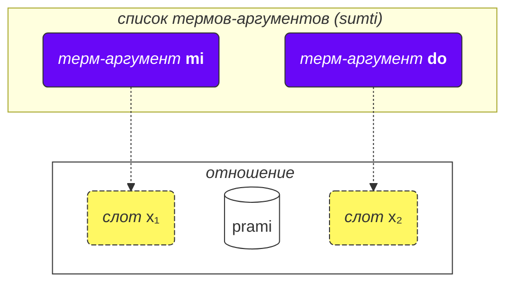
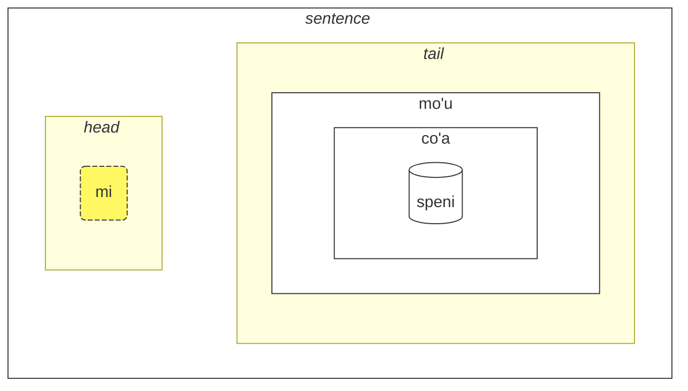

## Урок 2. Больше из основ

### Типы слов

Все слова в ложбане разделены на три группы:

- Слова отношений (называемые **selbrivla** в ложбане)
  - Примеры: **gleki**, **klama**.
  - Такие слова содержат по крайней мере одну группу согласных (две или более согласных подряд) в первых 5 звуках + они заканчиваются гласной.
- Частицы (называемые **cmavo** в ложбане)
  - Примеры: **le**, **nu**, **mi**, **fa'a**.
  - Они начинаются с согласной (одной из **b d g v z j p t k f s c x l m n r i u**), за которой следует гласная (одна из **a e i o u y au ai ei oi**). После этого может быть одна или несколько последовательностей апострофа (**'**) и следующей за ним гласной. Например, **xa'a'a'a'a'a'a** и **ba'au'oi'a'e'o** - это возможные частицы (даже если им не присвоен смысл).
  - Довольно распространено писать несколько частиц подряд без пробелов между ними. Это разрешено грамматикой ложбана. Так что не удивляйтесь, если увидите **lenu** вместо **le nu**, **naku** вместо **na ku**, **jonai** вместо **jo nai** и так далее. Это не меняет значение. Однако эта правило не применяется к словам отношений; слова отношений должны быть разделены пробелами.
- Имена (называемые **cmevla** в ложбане)
  - Примеры: **.alis.**, **.doris**, **.lojban.**
  - Обычно используются для имен.
  - Их легко отличить от других типов слов, так как они заканчиваются согласной. Кроме того, они обрамлены двумя точками в начале и в конце. В разговорной речи точки могут быть опущены при написании, но паузы, соответствующие этим точкам, все равно необходимы.

### Порядок аргументов

Ранее мы предоставили определения слов отношений, таких как:

mlatu
: … является кошкой, быть кошкой

citka
: … ест …

prami
: … любит …

klama
: … приходит к …

Словари могут представлять определения слов отношений с помощью символов, таких как $x_1$, $x_2$ и т.д.:

prami
: $x_1$ любит $x_2$

karce
: $x_1$ - это автомобиль …

citka
: $x_1$ ест $x_2$ …

klama
: $x_1$ приходит к $x_2$ …

Эти $x_1$, $x_2$ и так далее - это явная запись для _слотов_ (другие названия: _места_, _роли отношения_, **terbricmi** в ложбане), которые заполняются аргументами (**sumti**) в предложении.

Числа обозначают порядок, в котором эти слоты должны быть заполнены аргументами.

Например:

> **mi prami do**
> _Я люблю тебя._

Это предложение также подразумевает, что

- $x_1$ обозначает _того, кто любит_, и
- $x_2$ обозначает _того, кого любят_.

Другими словами, каждое отношение имеет один или несколько слотов, и эти слоты указываются и маркируются как $x_1$, $x_2$ и так далее. Мы расставляем аргументы, такие как **mi**, **do**, **le tavla** и т.д., в порядке, заполняя эти слоты и придавая конкретный смысл отношению, таким образом, формируя предложение.

Преимущество такого стиля определений заключается в том, что все участники отношения находятся в одном определении.

Мы также можем опустить аргументы, делая предложение более неопределенным:

> **carvi**
> _Идет дождь._
> `дождь, идет дождь`

(хотя время здесь определяется контекстом, это также может означать _Часто идет дождь_, _Шел дождь_ и т.д.)

> **prami do**
> _Кто-то любит тебя._
> `любит тебя`

Все опущенные места в отношении просто означают **zo'e** = _что-то/кто-то_, поэтому это означает то же самое, что и

> **zo'e prami do**
> _Кто-то любит тебя._

И

> **prami**

означает то же самое, что и

> **zo'e prami zo'e**
> _Кто-то любит кого-то._

Модальные термы, такие как **ca**, **fa'a** и т.д., добавляют новые места в отношения, но они не заполняют слоты отношений. В предложении

> **mi klama fa'a do**
> _Я иду в твою сторону._

второе место отношения **klama** все еще опущено. Например:

> **mi klama fa'a le cmana le zdani**
> _Я иду (в сторону горы) к дому._

le cmana
: гора

<pixra url="/assets/pixra/cilre/cmana.webp" caption="cmana" definition="… это гора"></pixra>

Здесь второе место отношения **klama** - это **do**. Предложение означает, что гора - это просто направление, в то время как конечной точкой являешься ты.

Здесь терм **fa'a la cmana** (_в сторону горы_) не заменяет второе место отношения **klama**. Второе место отношения **klama** здесь - это **le zdani**.

Предложение означает, что мой дом просто находится в направлении горы, но это не обязательно означает, что я хочу достичь этой горы. Конечная цель моего прихода - не обязательно гора, а дом.

Точно так же, в

> **mi citka ba le nu mi cadzu**
> _Я ем после того, как я иду._

второе место **citka** все еще опущено. Новое слово **ba** со своим аргументом **le nu mi cadzu** добавляет значение к предложению.

Порядок аргументов составного отношения такой же, как у последнего компонента в нем:

> **tu sutra bajra pendo mi**
> _Это мой быстро бегающий друг._
> `Это быстро бегающий друг мне.`

> **tu pendo mi**
> _Это мой друг._
> `Это друг мне.`

pendo
: …это друг…

Таким образом, порядок аргументов такой же, как у **pendo** в отдельности.

### Больше двух мест

Может быть больше двух мест. Например:

> **mi pinxe le djacu le kabri**
> _Я пью воду из чашки._

pinxe
: $x_1$ пьет $x_2$ из $x_3$

> **le kabri**
> _чашка_

В этом случае есть три места, и если вы хотите исключить второе место посередине, вам нужно использовать **zo'e**:
> **mi pinxe zo'e le kabri**
> _Я пью \[что-то\] из чашки._

Если мы опустим **zo'e**, мы получим что-то бессмысленное:

> **mi pinxe le kabri**
> _Я пью чашку._

Еще один пример:

> **mi plicru do le plise**
> _Я даю тебе яблоки._

plicru
: $x_1$ дает, передает $x_2$ некоторый объект $x_3$; $x_1$ позволяет кому-то $x_2$ использовать $x_3$

### Отношения внутри отношений

В
> **le nicte cu nu mi viska le lunra**
> *Ночь - это когда я вижу Луну.*

у нас есть

- **le nicte** в качестве $x_1$ отношения,
- **nu mi viska le lunra** в качестве основного отношения.

Однако внутри **nu mi viska le lunra** у нас есть еще одно предложение с

- **mi** - $x_1$ внутреннего отношения,
- **viska** - внутреннее отношение,
- **le lunra** - $x_2$ внутреннего отношения.

Таким образом, несмотря на наличие внутренней структуры, **nu mi viska le lunra** все равно является отношением, в котором первый терм заполнен **le nicte** в данном случае.

Аналогично, в

> **mi citka ba le nu mi dansu**
> _Я ем после того, как я танцую._

у нас есть

- **mi** в качестве $x_1$ отношения,
- **citka** в качестве основной конструкции отношения,
- **ba le nu mi dansu** в качестве модального терма основного отношения предложения.

Внутри этого терма у нас есть:

- **mi** в качестве $x_1$ отношения внутри терма
- **dansu** в качестве основной конструкции отношения внутри терма.

Такой "рекурсивный" механизм оборачивания отношений в отношения позволяет точно выражать сложные идеи.

### Почему слова отношений определены таким образом?

Русский язык использует ограниченный набор предлогов и падежей, которые повторно используются с различными глаголами и, таким образом, не имеют фиксированного значения. Например, рассмотрим русский дательный падеж:

* Адресат:
 >Дайте книгу моему другу.
  <!-- -->
 >_Я говорю тебе._
* Испытывающий чувство:
 >Ты виден мне.
  <!-- -->
 >_Мне это кажется красивым._
* Цель:
 >Помогите детям.

В каждом из этих примеровдательный падеж играет новую роль, которая, в лучшем случае, отдаленно похожа на роли в других предложениях.

Важно отметить, что другие языки используют различные способы обозначения ролей глаголов, которые во многих случаях очень отличаются от используемых в русском языке.

Например, в ложбане роли отношений обозначаются путем полного определения таких отношений с ролями, расположенными последовательно (или помеченными как **fa**, **fe** и так далее):

plicru
: … (кто-то) даёт … (что-то) … (кому-то)

tavla
: … (кто-то) говорит … (кому-то) …

viska
: $x_1$ (кто-то) видит $x_2$ (что-то), то есть $x_2$ (что-то) видно $x_1$ (кому-то)

melbi
: … - красив, милый $x_2$ (кому-то) …

sidju
: … (кто-то) помогает … (кому-то) в … (чём-то) 

Такие роли ядра являются неотъемлемыми при определении отношений.

Однако могут быть дополнительные роли, которые делают отношения более точными:

> _Я говорю с тобой, пока ем._
<!-- -->

> _Мне это трудно, потому что эта вещь тяжелая._

В ложбане подобное понятие дополнительных ролей выражается с помощью отдельных отношений или, в большинстве случаев, с помощью модальных термов:

> **mi tavla do ze'a le nu mi citka**
> _Я говорю с тобой, пока ем._
<!-- -->
> **nandu mi ri'a le nu ti tilju**
> _Мне это трудно, потому что эта вещь тяжелая._

nandu
: $x_1$ трудно для $x_2$ (кого-то)

tilju
: $x_1$ тяжелый

Предлоги в русском языке похожи на модальные частицы в ложбане, хотя обычный русский предлог может иметь много значений, в то время как в ложбане каждая модальная частица имеет только одно (даже если широкое) значение.

### Общие правила порядка аргументов

Порядок мест в отношениях иногда может быть трудным для запоминания, но не беспокойтесь — вам не нужно запоминать все места всех слов отношений. (Вы помните значение сотен тысяч слов в русском языке?)

Вы можете изучать места, когда они вам пригодятся или когда люди используют их в диалоге с вами.

У большинства слов связи есть два-три места.

Обычно вы можете догадаться о порядке, используя контекст и несколько правил:

1. Первое место часто относится к человеку или вещи, которая что-то делает или является чем-то:

    **klama** = _$x_1$ идет …_

2. Объект действия обычно следует сразу после первого места:

    **punji** = _$x_1$ кладет $x_2$ на $x_3$_,

3. Следующее место обычно заполняется получателем:

    **punji** = _$x_1$ кладет $x_2$ на $x_3$_,

4. Места назначения (_к_) почти всегда идут перед местами отправления (_от_):

    **klama** = _$x_1$ идет в $x_2$ из $x_3$_

    <pixra url="/assets/pixra/cilre/klama_fi.webp" caption="le prenu cu klama fi le zarci" definition="Человек выходит из магазина."></pixra>

5. Менее используемые места идут ближе к концу. Обычно это вещи, такие как _по стандарту_, _с помощью_ или _сделано из_.

Общая идея заключается в том, что сначала идут места, которые наиболее вероятно будут использоваться.

Не обязательно заполнять все места всегда. Незаполненные места имеют значения, не имеющие отношения к действительности или очевидные для говорящего (они принимают значение **zo'e** = _что-то_).

### Инфинитивы

Инфинитивы - это глаголы, которые часто предшествуют суффиксу _-ть_ в русском языке. Примеры включают _Мне нравится бегать_, где _бегать_ является инфинитивом.

> **le verba cu troci le ka cadzu**
> _Ребенок пытается ходить._

le verba
: ребенок, дети

troci
: $x_1$ пытается сделать или быть $x_2$ (ka)

cadzu
: $x_1$ ходит

<pixra url="/assets/pixra/cilre/troci_cadzu.webp" caption="le verba cu troci le ka cadzu" definition="Ребенок пытается ходить."></pixra>

Частица **ka** работает подобно **nu**. Она обрамляет предложение.

Основное отличие заключается в том, что какой-то слот внутри обрамленного предложения должен быть связан с каким-то аргументом вне этого предложения.

В данном случае первый аргумент **le verba** отношения **troci** связывается с первым незаполненным слотом внутреннего предложения **cadzu** (которое находится внутри **ka**).

Другими словами, ребенок пытается достичь состояния, где **le verba cu cadzu** (аргумент **le verba** заполнит первый незаполненный слот отношения **cadzu**).

Некоторые отношения требуют только инфинитивы в некоторых своих слотах. Определения таких слов помечают такие слоты как _property_ или **ka**. Например:

cinmo
: $x_1$ чувствует $x_2$ (ka)

Это означает, что инфинитив во втором слоте ($x_2$) применяется к какому-то другому слоту (скорее всего, к первому слоту, $x_1$). Случаи, когда инфинитив применяется к слотам, отличным от $x_2$, редки и объясняются в словаре для соответствующих слов-отношений или в случае слов-отношений, изобретенных неофициально, их можно вывести, исходя из здравого смысла или по аналогии с другими подобными словами.

Другой пример:

<pixra url="/assets/pixra/cilre/sidju.webp" caption="ra sidju le pendo le ka bevri le dakli" Definition="Он/она помогает другу нести сумки."></pixra>

> **ra sidju le pendo le ka bevri le dakli**
> _Он/она помогает другу нести сумки._

sidju
: $x_1$ помогает $x_2$ сделать $x_3$ (ка)

Слово-отношение **sidju** требует, чтобы его третья позиция была заполнена инфинитивом.

bevri
: $x_1$ содержит $x_2$

le dakli
: сумка, сумки

Обратите внимание, что только первое незаполненное место вложенного отношения принимает значение внешнего места:

> **mi troci le ka do prami**
> _Я пытаюсь быть любимым тобой._

tcidu
: $x_1$ читает $x_2$ из $x_3$

Здесь первое незаполненное место - второе место **prami**, поэтому оно принимает значение **mi** (_я_).

Также можно использовать местоимение **ce'u**, чтобы явно указать место, которое должно быть применено к какому-то внешнему аргументу:

> **mi troci le ka do prami ce'u**
> _Я пытаюсь быть любимым тобой._

Еще один пример:

> **mi cinmo le ka xebni ce'u**
> **mi cinmo le ka se xebni**
> _Я чувствую, что кто-то ненавидит меня._
> _Я чувствую, что меня ненавидят._

### Типы мест

В словаре часто упоминаются другие типы мест, например:

djica
: $x_1$ хочет $x_2$ (событие)

Это _событие_ означает, что вы должны заполнить место аргументом, представляющим событие. Например:

le nicte
: ночь

le nu mi dansu
: я танцую

Таким образом, мы получаем

> **mi djica le nicte**
> _Я хочу событие "ночь"._

<!-- -->

> **do djica le nu mi dansu**
> _Ты хочешь, чтобы я танцевал._

В ложбане нельзя сказать, например:

> **mi djica le plise**
> _Я хочу яблоко._ 

 

потому что вы хотите что-то сделать с яблоком или вы хотите, чтобы с яблоком произошло какое-то событие, например:

> **mi djica le nu mi citka le plise**
> _Я хочу съесть яблоко._
> `Я хочу, чтобы я съел яблоко.`

Обратите внимание, что оборачивание отношения, ожидающего события, внутрь **nu** меняет смысл:

> **le zekri cu cumki**
> _Преступление возможно._

zekri
: $x_1$ — криминальное событие, $x_1$ (событие) — преступно

cumki
: $x_1$ (событие) возможно

Сравнивать:

> **le nu zekri cu cumki**
> `То, что [это] является криминальным, возможно.`
> _Возможно, произошедшее было преступлением._ _Возможно, происходящее - преступление._

### Поднятие

> **mi stidi le ka klama le barja**
> _Я предлагаю пойти в паб._

stidi
: $x_1$ предлагает действие $x_2$ (property) $x_3$

> **mi stidi tu'a le barja**
> _Я предлагаю паб._

tu'a le barja
: что-то о пабе

> **mi djica le nu mi citka le plise**
> _Я хочу съесть яблоко._

<!-- -->

> **mi djica tu'a le titla**
> _Я хочу сладкое._

tu'a le titla
: что-то о сладком

titla
: … сладкий, … сладкое

<pixra url="/assets/pixra/cilre/djica_tuha_le_titla.webp" caption="le prenu cu djica tu'a le titla" definition="Человек хочет сладкое."></pixra>

Структура предложения может слишком сильно нагружать описание действий или событий. Иногда мы хотим указать только некоторый объект в этих событиях или местах и пропустить описание действия или события полностью.

В приведенных выше примерах _I suggest the pub._ скорее всего подразумевает посещение паба, а _I want the apple._ подразумевает его съедение.

Однако, ложбанское слово **stidi** требует свойство в своем слоте $x_2$. Аналогично, **djica** требует событие в своем слоте $x_2$.

Короткое так называемое квалификаторное слово **tu'a** перед термом подразумевает абстракцию (свойство, событие или предложение), но выбирает только этот терм из этой абстракции, пропуская остальное. Его можно перевести как _что-то о_:

> **mi stidi tu'a le barja**
> _Я предлагаю что-то о пабе (возможно, посещение, встреча рядом и т. д.)._

<!-- -->

> **mi djica tu'a le plise**
> _Я желаю что-то связанное с яблоком (возможно, съедение, жевание, облизывание, бросание в друга и т. д.)._

> **tu'a le cakla cu pluka mi**
> _Шоколад приятен мне (вероятно, из-за его вкуса)._

cakla
: $x_1$ - это шоколад

При пропуске абстракций только контекст позволяет нам понять, что было опущено.

Также возможно изменение основной реляционной конструкции:

> **le cakla cu jai pluka mi**
> **tu'a le cakla cu pluka mi**
> _Шоколад приятен мне._

Это позволяет создавать неопределенные аргументы с помощью **jai**:

> **le jai pluka cu zvati ti**
> _Приятная вещь здесь._

Поскольку **le pluka** (_приятное событие_) является абстрактным, невозможно указать его местоположение. Однако участник абстракции может быть физически размещен где-то.

### Места внутри аргументов

Как мы говорим "Ты мой друг"?

> **do pendo mi**
> _Ты мой друг._
> `Ты друг для меня.`

<pixra url="/assets/pixra/cilre/pendo.webp" caption="le pendo" definition="друг / друзья"></pixra>

А теперь, как мы говорим "Мой друг умный."?

> **le pendo be mi cu stati**
> _Мой друг умный._

Таким образом, когда мы преобразуем отношение в аргумент (**pendo** — _быть другом_ в **le pendo** — _друг_), мы все равно можем сохранить другие места этого отношения, поместив **be** после него.

По умолчанию оно присоединяет второе место ($x_2$). Мы можем присоединить больше мест, разделяя их с помощью **bei**:

> **mi plicru do le plise**
> _Я даю тебе яблоко._

<pixra url="/assets/pixra/cilre/plicru.webp" caption="le prenu cu plicru le pendo le plise" definition="Человек дает другу яблоко."></pixra>
<!-- -->

> **le plicru be mi bei le plise**
> _Даритель яблока мне_

<!-- -->

> **le plicru be mi bei le plise cu pendo mi**
> _Тот, кто дает мне яблоко, является моим другом._
> `Тот, кто дает мне яблоко, является моим другом.`

Еще один пример:

<!-- > **le pendo be mi cu tavla**
> _The friends of mine are talking._
> **le pendo mi cu tavla**
> **le pendo cu tavla mi**
> _The friends are talking to me._ -->

> **mi klama le pendo be do**
> _Я иду к другу твоему._

klama
: $x_1$ приходит к $x_2$ от $x_3$ …

Мы не можем опустить **be**, потому что **le pendo do** являются двумя независимыми местами:

> **mi klama le pendo do**
> _Я иду к другу от тебя._

Здесь **do** занял третье место **klama**, так как оно не связано с _pendo_ через **be**.

Мы также не можем использовать **nu**, потому что **le nu pendo do** является событием того, что кто-то является твоим другом.

Таким образом, **le pendo be do** является правильным решением.

Еще один пример:

> **la .lojban. cu bangu mi**
> _ложбан — мой язык._
> `ложбан — язык для меня.`

Однако,

> **mi nelci le bangu be mi**
> _Мне нравится мой язык._

Использование **be** для отношений, не преобразованных в аргументы, не имеет эффекта:

> **mi nelci be do** то же самое, что и
> **mi nelci do**

### Придаточные предложения

> **le prenu poi pendo mi cu tavla mi**
> _Человек, который является моим другом, разговаривает со мной._

<!-- -->

> **le prenu noi pendo mi cu tavla mi**
> _Человек, который, кстати, является моим другом, разговаривает со мной._

blabi
: …белый

В первом предложении придаточная часть _, который является моим другом,_ необходима для идентификации человека, о котором идет речь. Она уточняет, кого из людей в контексте мы имеем в виду. Мы выбираем только тех, кто является моими друзьями, возможно, среди множества людей вокруг. Возможно, вокруг есть только один человек, который является моим другом.

Что касается придаточного _, который, кстати, является моим другом,_ из второго примера, оно просто предоставляет дополнительную информацию о человеке. Это придаточное не помогает нам идентифицировать этого человека; например, это может произойти, когда все люди вокруг являются моими друзьями.

**poi pendo mi** - это придаточное предложение, связанное справа от аргумента **le prenu**. Оно заканчивается прямо перед следующим словом **cu**:

> **le prenu (poi pendo mi) cu tavla mi**
> _Человек, который является моим другом, разговаривает со мной._

В языке ложбан мы используем **poi** для придаточных предложений, которые идентифицируют сущности (объекты, людей или события), и **noi** для дополнительной информации.

> **la .bob. ba co'a speni le ninmu poi pu xabju le nurma**
> _Боб женится на девушке, которая жила в деревне._

xabju
: …живет в…, …обитает в… (место, объект)

le nurma
: сельская местность

Это предложение не исключает возможность того, что Боб женится также на кем-то другом! Удаление придаточного предложения с помощью **poi** меняет значение:

> **la .bob. ba co'a speni le ninmu**
> _Боб женится на девушке._

Еще один пример:

> **le prenu poi gleki cu ze'u renvi**
> _Люди (какие именно?), которые счастливы, живут долго._

ze'u
: модальный терм: долгое время

renvi
: выживать

Удаление придаточного предложения с помощью **poi** меняет значение:

> **le prenu ze'u renvi**
> _Люди живут долго._

С другой стороны, придаточные предложения с **noi** содержат только дополнительную информацию о аргументе, к которому они относятся. Этот аргумент достаточно определен сам по себе, поэтому удаление придаточного предложения с **noi** не меняет его значение:

> **mi nelci la .doris. noi mi ta'e zgana bu'u le panka**
> _Мне нравится Дорис, которую я часто встречаю в парке._
> *Мне нравится Дорис. Что еще я могу сказать о ней? Я часто встречаю её в парке.*

zgana
: наблюдать (используя любые чувства)

<pixra url="/assets/pixra/cilre/panka_ninmu.webp" caption="le prenu noi mi ta'e zgana bu'u le panka" definition="человек, которого я часто вижу в парке."></pixra>

Удаление придаточного предложения с помощью **noi** сохраняет смысл: _мне нравится Дорис._

В разговорном русском различие часто достигается с помощью интонации или догадкой.

Давайте рассмотрим еще один пример.

> **mi klama le pa tricu**
> _Я иду к дереву._

<!-- -->

> **le pa tricu cu barda**
> _Дерево большое._

le pa tricu
: дерево (одно дерево)

barda
: $x_1$ большой/крупный

А теперь объединим эти два предложения:

> **le tricu noi mi klama ke'a cu barda**
> *Дерево, к которому я иду, большое.*

Обратите внимание на слово **ke'a**. Мы перемещаем второе предложение о том же дереве в придаточное предложение и заменяем аргумент **le tricu** на **ke'a** в придаточном предложении. Таким образом, местоимение **ke'a** аналогично _кто_ и _который_ в русском языке. Оно указывает на аргумент, к которому присоединено придаточное.

Дословно наш ложбанский предложение звучит как

> _Дерево, такое, что я иду к нему, большое._

**ke'a** можно опустить, если контекст достаточно ясен. Следующие два предложения имеют одинаковый смысл:

> **le prenu poi pendo mi cu tavla mi**
> **le prenu poi ke'a pendo mi cu tavla mi**
> _The person that is friend of mine talks to me._

**ke'a** часто предполагается идти на первое незаполненное место:

> **mi nelci la .doris. noi mi ta'e zgana bu'u le panka**
> **mi nelci la .doris. noi mi ta'e zgana ke'a bu'u le panka**
> _I like Doris whom I habitually see in the park._

Здесь **mi** заполняет первое место отношения **ta'e zgana** (_…часто видит…_), поэтому для следующего, второго места предполагается **ke'a**.

Придаточные предложения, как и обычные отношения, могут содержать конструкции с модальными термами:

> **le tricu noi mi pu klama ke'a ca le cabdei cu barda**
> _Дерево, к которому я сегодня пошел, большое._

<pixra url="/assets/pixra/cilre/le_tricu_cu_barda.webp" caption="le tricu cu barda" definition="Дерево большое."></pixra>

le cabdei
: сегодняшний день

Обратите внимание, что **ca le cabdei** относится к придаточному предложению. Сравните:

> **le tricu noi mi pu klama ke'a cu barda ca le cabdei**
> _Дерево, к которому я пошел, сегодня большое._

Значение изменилось сильно.

Наконец, **voi** используется для образования аргументов, подобных **le**, но с придаточными предложениями:

> **ti voi le nu ke'a cisma cu pluka mi cu zutse tu**
> _Эти, чья улыбка радует меня, сидят._

<pixra url="/assets/pixra/cilre/voi.webp" caption="mi nelci ti voi le nu ke'a cisma cu pluka mi" definition="Мне нравятся эти, чьи улыбки радуют меня."></pixra>

ti
: этот рядом со мной, эти рядом со мной

cisma
: $x_1$ улыбается

pluka
: $x_1$ приятен для $x_2$

zutse
: $x_1$ сидит, сидит на $x_2$

Здесь **voi** определяет объект рядом со мной.

Сравните с:

> **ti poi le nu ke'a cisma cu pluka mi cu zutse**
> _Из этих тех, чья улыбка радует меня, сидят._

**poi** ограничивает выборку только теми, описанными в придаточном предложении.
Этот пример может подразумевать, что вокруг меня много объектов (людей и т. д.), но с помощью **poi** я выбираю только необходимых.

Сравните с:

> **ti noi le nu ke'a cisma cu pluka mi cu zutse**
> _Эти (которые случайно такие, что их улыбка радует меня) сидят._

**noi** просто добавляет случайную информацию, которая не является необходимой для определения, на что ссылается **ti** (_эти_). Возможно, вокруг нет никого еще, кого можно было бы описать.

Наконец, так же как **nu** имеет правый граничный маркер **kei**, у нас есть

ku'o
: правый граничный маркер для **poi**, **noi** и **voi**.

> **mi tavla la .doris. noi ca zutse tu ku'o .e la .alis. noi ca cisma**
> _Я разговариваю с Дорис, которая сейчас сидит там, и Алисой, которая сейчас улыбается._

Обратите внимание, что без **ku'o** у нас было бы **tu** (_там_) объединено с **la .alis.** (_Алиса_), что привело бы к странному значению:

> **mi tavla la .doris. noi ca zutse tu .e la .alis. noi ca cisma**
> _Я разговариваю с Дорис, которая сейчас сидит там и находится над Алисой (которая сейчас улыбается)._

Обратите внимание на часть **zutse tu .e la .alis.**.

Для всех **poi**, **noi** и **voi** правый граничный маркер остается тем же: **ku'o**.

### Короткие придаточные предложения. «_О_»

Иногда вам может понадобиться присоединить дополнительный аргумент к другому аргументу:

> **mi djuno le vajni pe do**
> _Я знаю что-то важное о тебе._

le vajni
: что-то важное

**pe** и **ne** похожи на **poi** и **noi**, но они присоединяют аргументы к аргументам:

> **le pa penbi pe mi cu xunre**
> _Ручка, которая моя, красная._ (_моя_ необходима для идентификации ручки вопроса)

<!-- -->

> **le pa penbi ne mi cu xunre**
> _Ручка, которая моя, красная._ (дополнительная информация)

ne
: которая относится к … (следует аргумент)

pe
: которая относится к … (следует аргумент)

> **le pa penbi ne mi ge'u .e le pa fonxa ne do cu xunre**
> _Ручка, которая моя, и телефон, который твой, красные._

ge'u
: правый граничный маркер для **pe**, **ne**.

### «**be**» и «**pe**»

Обратите внимание, что придаточные предложения присоединяются к аргументам, в то время как **be** является частью отношения.

На самом деле, **le bangu pe mi** - это лучший перевод _мой язык_, так как, подобно русскому, два аргумента связаны друг с другом неопределенным образом.

Однако, вы можете сказать **le birka be mi** как _моя рука_. Даже если вы отрежете свою руку, она все равно будет вашей. Вот почему у **birka** есть место владельца:

birka
: $x_1$ - рука $x_2$

Давайте еще раз покажем, что конструкция с **be** является частью отношения, в то время как **pe**, **ne**, **poi** и **noi** присоединяются к аргументам:

> **le pa melbi be mi fonxa pe le pa pendo be mi cu barda**
> `Красивый для меня телефон друга мой большой.`

Здесь **be mi** присоединяется к отношению **melbi** = _быть красивым для … (кого-то)_ и таким образом создает новое отношение **melbi be mi** = _быть красивым для меня_. Но **pe le pa pendo be mi** (_друга моего_) применяется ко всему аргументу **le pa melbi be mi fonxa** (_красивый для меня телефон_).

Может случиться так, что нам нужно присоединить **be** к отношению, превратить это отношение в аргумент и затем присоединить **pe** к этому аргументу:

> **le pa pendo be do be'o pe la .paris. cu stati**
> _Твой друг, который связан с Парижем, умный._
> (<b>pe la .paris.</b> присоединяется ко всему аргументу <b>le pa pendo be do be'o</b>)

<!-- -->

> **le pu plicru be do bei le pa plise be'o pe la .paris. cu stati**
> _Кто дал тебе яблоко (и кто связан с Парижем), умный._
> (<b>pe la .paris.</b> присоединяется ко всему аргументу <b>le pu plicru be do bei le pa plise be'o</b>)

be'o
: правый граничный маркер для строки термов, присоединенных с помощью **be** и **bei**

В этих двух примерах ваш друг имеет отношение к Парижу (возможно, он/она из Парижа).

Сравните это с:

> **le pa pendo be do pe la .paris. cu stati**
> _Твой друг (ты, кто связан с Парижем), умный._

<!-- -->

> **le pu plicru be do bei le pa plise pe la .paris. cu stati**
> _Кто дал тебе яблоко (яблоко, которое связано с Парижем), умный._
> 

В этих двух последних примерах либо вы связаны с Парижем, либо яблоко.

### «Алиса — учитель» и «Алиса — учительница»

В русском языке связки _—_ и _— это_ заставляют существительное работать как глагол. В ложбане даже такие понятия, как _кошка_ (**mlatu**), _человек_ (**prenu**), _дом_ (**dinju**), _домашний_ (**zdani**), по умолчанию функционируют как глаголы (отношения). Только местоимения работают как аргументы.

Однако есть три случая:

> **la .alis. cu ctuca**
> _Алиса учит._

<!-- -->

> **la .alis. cu me le ctuca**
> _Алиса — один из учителей._

me
: … среди …, … один из …, … являются членами … (следует аргумент)

> **la .alis. ta'e ctuca**
> _Алиса обычно учит._

ta'e
: модальная частица: событие происходит обычно

> **la .alis. cu du le ctuca**
> _Алиса — учительница._

du
: … идентичен …

Частица **me** принимает аргумент после себя и указывает на то, что, вероятно, есть и другие учителя, а Алиса — один из них.

Частица **du** используется, когда Алиса, например, является учителем, о котором мы искали или говорили. Она указывает на идентичность.

Таким образом, **me** и **du** иногда могут соответствовать тому, что в русском мы выражаем с помощью глагола _быть/являться/был_.

В ложбане мы придаем приоритет значению того, что мы хотим сказать, а не полагаемся на то, как это буквально выражено в русском или других языках.

Другие примеры:

> **mi me la .bond.**
> _Я - Бонд._

<!-- -->

> **mi du la .kevin.**
> _Я - Кевин (тот, кого ты искал)._

<!-- -->

> **ti du la .alis. noi mi ta'e zgana bu'u le panka**
> _Это Алиса, которую я обычно вижу в парке._

**noi du** и **poi du** используются для введения альтернативных имен для чего-то. Они соответствуют русскому _то есть, а именно_:

> **la .alis. cu penmi le prenu noi du la .abdul.**
> _Алиса встретила человека, а именно Абдула._

При использовании **me**, вы можете соединить несколько аргументов с помощью _и_:

> **tu me le pendo be mi be'o .e le tunba be mi**
> _Это некоторые (или все) мои друзья и мои братья и сестры._

tunba
: $x_1$ - брат/сестра $x_2$

<pixra url="/assets/pixra/cilre/tunba.webp" caption="do tunba mi" definition="You are my sibling."></pixra>

### Связь с модальными частицами

Мы можем поместить модальную частицу не только перед основной конструкцией отношения в предложении, но и в конце, получая тот же результат:

> **mi ca tcidu**
> **mi tcidu ca**
> _Я (сейчас читаю)._

tcidu
: читать (некоторый текст)

При использовании **nu**, мы создаем отношение, описывающее какое-то событие. Обратите внимание на разницу между этими двумя примерами:

> **le nu tcidu ca cu nandu**
> _Текущее чтение сложное, трудное._

<!-- -->

> **le nu tcidu cu ca nandu**
> _Чтение сейчас сложное._

Другие примеры:

> **mi klama le pa cmana pu**
> _Я пошел на гору._
> `Я иду на гору (в прошлом).`

<!-- -->

> **le nu mi klama le pa cmana pu cu pluka**
> _Что я пошел на гору - приятно._

Мы также можем поместить одну или несколько модальных частиц в качестве первого элемента конструкции отношения и, например, использовать такое обогащенное отношение в форме аргумента:

<pixra url="/assets/pixra/cilre/coha_purdi.webp" caption="le pu kunti tumla ca purdi" definition="Что было пустыней, теперь сад."></pixra>

> **le pu kunti tumla ca purdi**
> _Что было пустыней, теперь сад._

**pu** принадлежит **le kunti tumla**, а **ca** принадлежит **purdi** (так как **le pu kunti tumla** не может добавить **ca** в конце).

<!-- Это не противоречит использованию **be** после глагола, так как с **be** меняется глагол: **bangu be me** считается одним глаголом. -->

Наличие нескольких модальных частиц в порядке не является проблемой:
> **le pu ze'u kunti tumla ca purdi**
> _То, что долгое время было пустыней, теперь является садом._

ze'u
: модальная частица: долгое время

Размещение частиц после существительных связывает их с внешними отношениями:

<pixra url="/assets/pixra/cilre/cohu_purdi.webp" caption="le kunti tumla pu purdi" definition="Пустыня стала садом."></pixra>

> **le kunti tumla pu purdi**
> **(le kunti tumla) pu purdi**
> _Пустыня стала садом._

### Новые аргументы из слотов одного отношения

> **do plicru mi ti**
> _Ты даришь мне это._

<!-- -->

> **mi se plicru ti do**
> _Мне это дарит ты._

plicru
: $x_1$ дарит $x_2$ что-то $x_3$ для использования

Мы можем поменять местами первые два места в отношении, используя **se**, и тем самым изменить структуру мест.

**do plicru mi ti** означает точно то же самое, что и **mi se plicru do ti**. Разница только в стиле.

Вы можете изменять порядок слов для разного ударения, например, чтобы упомянуть более важные вещи в предложении первыми. Так что следующие пары означают одно и то же:

> **mi prami do**
> _Я люблю тебя._

<!-- -->

> **do se prami mi**
> _Ты любим мной._

<!-- -->

> **le nu mi tadni la .lojban. cu xamgu mi**
> _Мое изучение ложбана хорошо для меня._

xamgu
: … хорошо для (кого-то)

> **mi se xamgu le nu mi tadni la .lojban.**
> _Для меня хорошо изучать ложбан._

То же самое можно сделать, используя отношения при создании аргументов:

le plicru
: те, кто дает, дарители, доноры

le se plicru
: те, кому дарят, получатели подарков

le te plicru
: те объекты, которые дают для использования, подарки

**te** меняет местами первое и третье места отношений.

Как мы знаем, когда мы добавляем **le** перед конструкцией отношения, она становится аргументом. Таким образом,

- **le plicru** означает _те, которые могут подходить на первое место в **plicru**_
- **le se plicru** означает _те, которые могут подходить на второе место в **plicru**_
- **le te plicru** означает _те, которые могут подходить на третье место в **plicru**_

Таким образом, в ложбане нам не нужны отдельные слова для _донора_, _получателя_ и _подарка_. Мы повторно используем ту же самую связь и экономим много усилий благодаря такому умному дизайну. Действительно, мы не можем представить себе подарок без подразумевания, что кто-то его дал или даст. Когда полезные явления взаимосвязаны, ложбан отражает это.

<!-- TODO: DwE: Для удобства понимания и запоминания: предикатные слова с приставками **se**, **te** включены в словарь вместе с их определениями для многих глаголов, хотя вы можете сами понять их значение. -->

### Изменение других мест в основных отношениях

Серия **se, te, ve, xe** (в алфавитном порядке) состоит из частиц, меняющих места в основных отношениях:

- **se** меняет местами первое и второе места
- **te** меняет местами первое и третье места
- **ve** меняет местами первое и четвертое места
- **xe** меняет местами первое и пятое места.

> **mi zbasu le pa stizu le mudri**
> _Я сделал стул из куска дерева._

zbasu
: $x_1$ строит, делает $x_2$ из $x_3$

le pa stizu
: стул

le mudri
: кусок дерева

> **le mudri cu te zbasu le stizu mi**
> _Кусок дерева - это то, из чего сделан стул мной._

Теперь **mi** переместилось на третье место в отношении и может быть опущено, если мы слишком ленивы указывать, кто сделал стул, или если мы просто не знаем, кто его сделал:

> **le mudri cu te zbasu le stizu**
> _Кусок дерева - это материал стула._

Аналогично нашему примеру с **le se plicru** (_получатель_) и **le te plicru** (_подарок_), мы можем использовать **te**, **ve**, **xe** для получения больше слов из других мест в словах отношений:

klama
: $x_1$ идет в $x_2$ из $x_3$ через $x_4$ с помощью $x_5$

Таким образом, мы можем получить, что

le klama
: приходящий / приходящие

le se klama
: место назначения

le te klama
: место происхождения движения

le ve klama
: маршрут

le xe klama
: средство прибытия

**le xe klama** и пятая позиция в **klama** могут обозначать любые средства передвижения, такие как вождение автомобиля или ходьба пешком.

**se** используется чаще, чем другие частицы для обмена местами.

### Свободный порядок слов: теги для ролей в отношениях

Обычно нам не нужны все слоты, места в отношении, поэтому мы можем опустить ненужные, заменив их на **zo'e**. Однако мы можем использовать _теги места_, чтобы явно указать на нужный слот. Теги места работают как модальные частицы, но относятся к структуре места в отношениях:

> **mi prami do** то же самое, что и
> **fa mi prami fe do**
> _Я люблю тебя._

- **fa** обозначает аргумент, заполняющий первый слот отношения ($x_1$)
- **fe** обозначает аргумент, заполняющий второй слот ($x_2$)
- **fi** обозначает аргумент, заполняющий третий слот ($x_3$)
- **fo** обозначает аргумент, заполняющий четвёртый слот ($x_4$)
- **fu** обозначает аргумент, заполняющий пятый слот ($x_5$)

Дополнительные примеры:

> **mi klama fi le tcadu**
> _Я иду из города._

**fi** обозначает **le tcadu** как третье место в отношении **klama** (место, откуда движение начинается). Без **fi**, предложение превратилось бы в **mi klama le tcadu**, что означает _Я иду в город._

> **mi pinxe fi le kabri** то же самое, что и
> **mi pinxe zo'e le kabri**
> _Я пью (что-то) из чашки._

pinxe
: $x_1$ пьёт $x_2$ из $x_3$

le kabri
: чашка, стакан

<pixra url="/assets/pixra/cilre/pinxe_fi_le_kabri.webp" caption="le prenu cu pinxe fi le kabri" definition="Человек пьёт из стакана."></pixra>

> **mi tugni zo'e le nu vitke le rirni**
> **mi tugni fi le nu vitke le rirni**
> _Я согласен (с кем-то) о посещении родителей._

tugni
: $x_1$ соглашается с кем-то $x_2$ о $x_3$ (предложение)

le rirni
: родитель / родители

С помощью тегов места мы можем перемещать места:

> **fe mi fi le plise pu plicru**
> _Кто-то дал мне яблоко._

Здесь,

- **le plise** = _яблоко_, мы помещаем его в третье место отношения **plicru**, то, что дается
- **mi** = _мне_, мы помещаем его во второе место отношения **plicru**, получателя.

Как видно из последнего примера, мы даже не можем отразить порядок слов в его русском переводе.

Интенсивное использование тегов места может сделать нашу речь более сложной для восприятия, но они позволяют больше свободы.

В отличие от серии **se**, использование местных тегов, таких как **fa**, не изменяет структуру места.

---

Мы можем использовать местные теги внутри аргументов, размещая их после **be**:

> **le pa klama be fi le tcadu cu pendo mi**
> _Тот, кто приходит в город, мой друг._

---

Мы также можем поместить все аргументы одного основного отношения перед хвостом предложения (с сохранением их относительного порядка). Из-за этой свободы мы можем сказать:

> **mi do prami**, что то же самое, что и
> **mi do cu prami**, что то же самое, что и
> **mi prami do**
> _Я люблю тебя._

<!-- -->

> **ko kurji ko**, то же самое, что и
> **ko ko kurji**
> _Позаботься о себе._

Следующие предложения также равнозначны по смыслу:

> **mi plicru do le pa plise**
> _Я даю тебе яблоко._

<!-- -->

> **mi do cu plicru le pa plise**
> _Я даю тебе яблоко._

<!-- -->

> **mi do le pa plise cu plicru**
> _Я даю тебе яблоко._

### Пренекс

Пренекс - это "префикс" отношения, в котором вы можете объявить переменные, которые будут использоваться позже:

> **pa da poi pendo mi zo'u da tavla da**
> _Есть кто-то, кто является моим другом и говорит сам с собой._

zo'u
: отделитесь пренекса

da
: местоимение: переменная.

Местоимение **da** переводится как _есть что-то/кто-то …_ Если мы используем **da** второй раз в том же отношении, оно всегда относится к тому же самому, что и первое **da**:

> **mi djica le nu su'o da poi kukte zo'u mi citka da**
> _Я хочу, чтобы было хотя бы что-то вкусное, чтобы я съел его._

su'o
: число: хотя бы 1

Если переменная используется в том же отношении и не вложена в другие отношения, то можно вообще опустить пренекс:

> **mi djica le nu su'o da poi kukte zo'u mi citka da**
> **mi djica le nu mi citka su'o da poi kukte**
> _Я хочу, чтобы было хотя бы что-то вкусное, чтобы я съел его._
> _Я хочу, чтобы что-то было, чтобы я съел его._

Оба примера имеют одинаковый смысл, в обоих случаях **su'o da** обозначает _есть (было/будет) что-то или кто-то_.

Однако пренекс полезен и необходим, когда вам нужно использовать **da** глубоко внутри вашего отношения, то есть во вложенных отношениях:

> **su'o da poi kukte zo'u mi djica le nu mi citka da**
> _Есть хотя бы что-то вкусное: я хочу съесть это._
> _Есть что-то вкусное, что я хочу съесть._

Обратите внимание, как меняется значение. Здесь мы не можем опустить пренекс, потому что это изменит значение предыдущего примера.

Дополнительные примеры:

> **mi tavla**
> _Я разговариваю._

<!-- -->

> **mi tavla su'o da**
> **mi tavla da**
> _Есть кто-то, с кем я разговариваю._

По умолчанию **da** как местоимение в одиночку означает то же самое, что и **su'o da** (_есть хотя бы один …_), если не указано явное число.

> **da tavla da**
> _Кто-то разговаривает с самим собой._

<!-- -->

> **da tavla da da**
> _Кто-то разговаривает с самим собой о себе._

tavla
: $x_1$ разговаривает с кем-то $x_2$ на тему $x_3$

> **pa da poi ckape zo'u mi djica le nu da na ku fasnu**
> _Есть одна опасная вещь: я хочу, чтобы этого никогда не произошло._

**da** не предполагает какие-либо конкретные объекты или события, что часто бывает полезно:

> **xu do tavla su'o da poi na ku slabu do**
> _Ты разговариваешь с кем-то, кто тебе незнаком? (не указывается конкретное лицо)._

<!-- -->

> **.e'u mi joi do casnu bu'u su'o da poi drata**
> _Давай обсудим в другом месте (не указывается конкретное место)_

### Аргументы существования

> **pa da poi me le pendo be mi zo'u mi prami da**
> _Есть кто-то, кто является моим другом, которого я люблю._

Поскольку **da** используется только один раз, мы могли бы попытаться избавиться от пренекса. Но как мы должны обрабатывать придаточное **poi pendo mi** (_кто является моим другом_)?

К счастью, в ложбане есть упрощение:

> **pa da poi me le pendo be mi zo'u mi prami da**
> **mi prami pa le pendo be mi**
> _Есть кто-то, кто является моим другом, которого я люблю._

Оба предложения имеют одно и то же значение.

Аргументы, начинающиеся с чисел, таких как **pa le pendo** (_есть кто-то, кто является моим другом_), **ci le prenu** (_есть три человека_), могут относиться к новым сущностям каждый раз при использовании. Вот почему

> **pa le pendo be mi ca tavla pa le pendo be mi**
> _Есть один мой друг, который разговаривает с одним моим другом._

Это предложение не ясно указывает, говорит ли ваш друг сам себе или вы описываете двух своих друзей, при этом первый разговаривает со вторым.

Более разумно сказать:

> **le pa pendo be mi ca tavla ri**
> _Мой друг разговаривает сам с собой._

ri
: местоимение: относится к предыдущему аргументу, исключая **mi**, **do**.

Здесь **ri** относится к предыдущему аргументу: **le pa pendo** вместе.

Обратите внимание на разницу:

- **da** означает _что-то/кого-то есть_, **da** всегда относится к одной и той же сущности, когда используется более одного раза в одной и той же связи.
- аргумент вроде **pa le mlatu** (с голым числом) похож на использование **pa da poi me le mlatu**, но он может относиться к новым сущностям каждый раз, когда он используется.

> **mi nitcu le nu pa da poi mikce zo'u da kurju mi**
> _Мне нужен врач, чтобы позаботиться обо мне (подразумевая "любой врач подойдет")._

<!-- -->

> **pa da poi mikce zo'u mi nitcu le nu da kurju mi**
> _Есть врач, о котором я должен позаботиться._

Еще один пример:

> **le nu pilno pa le bangu kei na ku banzu**
> _Использование только одного языка недостаточно._

pilno
: … использует …

banzu
: … достаточно для цели …

Сравните это с:

> **le nu pilno le pa bangu kei na ku banzu**
> _Использование языка (речь идет о конкретном языке) недостаточно._

Аргументы существования естественно используются внутри внутренних отношений и с **tu'a**:

> **mi djica le nu mi citka pa le plise**
> _Я хочу съесть яблоко, некоторое яблоко._

> **mi djica tu'a pa le plise**
> _Я хочу что-то с яблоком, некоторое яблоко (вероятно, съесть его, может быть, пережевать, облизать, бросить в друга и т. д.)_

Обратите внимание на разницу:

> **mi djica tu'a le pa plise**
> _Я хочу что-то с яблоком (речь идет о конкретном яблоке)._

### «_У меня есть рука._» «_У меня есть брат._»

Русский глагол _иметь_ и выражение _у (кого-то) есть …_ имеет несколько значений. Давайте перечислим некоторые из них.

> **pa da birka mi**
> _У меня есть рука._
> `Есть что-то, что является моей рукой`

birka
: $x_1$ - рука $x_2$

Мы используем ту же стратегию для выражения семейных отношений:

> **pa da bruna mi**
> **mi se bruna pa da**
> *У меня есть брат.*
> `У меня есть кто-то, кто является моим братом.`
> `Я являюсь братом к кому-то.`
> _У меня есть один брат._
> `Есть кто-то, кто является моим братом.`

<!-- -->

> **re lo bruna be mi cu clani**
> _У меня есть два брата, и они высокие._
> `Есть два брата меня, [и они] высокие._

clani
: $x_1$ длинный, высокий

Таким образом, нам не нужно использовать глагол "иметь" или говорить _у меня есть …_, чтобы обозначать такие отношения. То же самое относится и к другим членам семьи:

> **da mamta mi**
> **mi se mamta da**
> *У меня есть мама.*

<!-- -->

> **da patfu mi**
> *У меня есть папа.*

<!-- -->

> **da mensi mi**
> *У меня есть сестра.*

<!-- -->

> **da panzi mi**
> *У меня есть ребенок (или дети).*

panzi
: $x_1$ - ребенок, потомок $x_2$

Обратите внимание, что использование числа перед **da** необязательно, если контекст достаточно ясен.

---

Другое значение "иметь" - "держать, хранить":

> **mi ralte le pa gerku**
> _У меня есть собака._
> `Я держу собаку.`

<!-- -->

> **mi ralte le pa karce**
> _У меня есть машина._
> `Я держу машину.`

ralte
: $x_1$ хранит $x_2$ в своем владении

---

Если вы владеете, обладаете чем-то согласно какому-то закону или документу, вы должны использовать **ponse**:

> **mi ponse le karce**
> _У меня есть машина._
> `Я владею машиной.`

ponse
: $x_1$ владеет $x_2$

### Область видимости

Порядок
* термов, начинающихся с чисел,
* модальных термов и
* модальных частиц отношений,

важен и должен читаться слева направо:

> **ci le pendo cu tavla re le verba**
> _Есть три друга, каждый разговаривает с двумя детьми._

Общее количество детей здесь может быть до шести.

Используя **zo'u**, мы можем сделать наше предложение более ясным:

> **ci da poi me le pendo ku'o re de poi me le verba zo'u da tavla de**
> _Для трех **da**, которые являются среди друзей, для двух **de**, которые являются среди детей: **da** разговаривает с **de**._

Здесь мы видим, что каждый из друзей говорит с двумя детьми, и это могут быть разные дети каждый раз, в общей сложности до шести детей.

Как тогда можно выразить другую интерпретацию, в которой участвуют только два ребёнка? Мы не можем просто поменять местами переменные в пренексе на:

> **re de poi me le verba ku'o ci da poi me le pendo zo'u da tavla de**
> _Два из детей говорят среди себя, а трое из друзей говорят среди себя._

Хотя мы теперь ограничили количество детей ровно двумя, мы все равно имеем неопределенное количество друзей, от трех до шести. Это различие называется "различием в области видимости": в первом примере **ci da poi me le pendo** имеет более широкую область видимости, чем **re de poi me le verba**, и поэтому идет перед ним в преамбуле. Во втором примере наоборот.

Чтобы сделать область видимости равной, мы используем специальное соединение **ce'e**, соединяющее два терма:

> **ci da poi me le pendo ce'e re de poi me le verba cu tavla**
> **ci le pendo ce'e re le verba cu tavla**
> _Три друга [и] двое детей говорят._

Это выделяет две группы: одну из трех друзей и другую из двух детей, и говорит, что каждый из друзей говорит с каждым из детей.

Порядок также имеет значение для модальных частиц, модифицирующих основные конструкции отношений:

> **mi speni**
> _Я замужем, у меня есть жена или муж._

<!-- -->

> **mi co'a speni**
> _Я вступаю в брак._

<!-- -->

> **mi mo'u speni**
> _Я овдовел._

mo'u
: терм: событие завершено

Теперь сравним:

> **mi mo'u co'a speni**
> _Я только что поженился._
> `Я завершил процесс вступления в брак.`

> **mi co'a mo'u speni**
> _Я разведен._
> `Я завершил процесс брака.`

Если в одном предложении есть несколько модальных частиц, правило состоит в том, что мы читаем их слева направо вместе, представляя себе так называемое _воображаемое путешествие_. Мы начинаем с неявной точки во времени и пространстве (настоящее время и место говорящего, если справа нет аргумента), а затем следуем за модальными частицами одна за другой слева направо.

Возьмем, например, **mi mo'u co'a speni**.

**mo'u** означает, что событие завершено. Какое событие? Событие **co'a speni** — вступление в брак. Таким образом, **mi mo'u co'a speni** означает _Я завершаю процесс вступления в брак_, то есть _Я только что поженился._

В таких случаях говорят, что **co'a speni** находится в "области видимости" **mo'u**.

В **mi co'a mo'u speni**, порядок событий отличается.

Сначала говорится, что событие началось (**co'a**), затем утверждается, что это событие - событие окончания брака. Таким образом, **mi co'a mo'u speni** означает _Я овдовел_.

Можно сказать, что здесь **mo'u speni** находится в "области видимости" **co'a**.

Еще один пример:

> **mi co'a ta'e citka**
> _Я начинаю привычно есть._

<!-- -->

> **mi ta'e co'a citka**
> _Я привычно начинаю есть._

Примеры с простыми временами:

> **mi pu ba klama le cmana**
> _Это произошло до того, как я пошел в горы._
> `Я в прошлом: в будущем: пойти в горы.`

> **mi ba pu klama le cmana**
> _Это произойдет после того, как я пошел в горы._
> `Я в будущем: в прошлом: пойти в горы.`

Правило чтения термов слева направо может быть нарушено путем соединения модальных частиц с союзом **ce'e**:

> **mi ba ce'e pu klama le cmana**
> _Я пошел и буду идти в горы._
> `Я в будущем и в прошлом: пойти в горы.`

> **mi cadzu ba le nu mi citka ce'e pu le nu mi sipna**
> _Я гуляю после того, как я ем и перед тем, как я сплю._

### Модальные частицы + «**da**» + аргументы, начинающиеся с чисел

Как и с модальными термами, позиция **da** имеет значение:

> **mi ponse da**
> _У меня есть что-то, что я владею._

<!-- -->

> **mi co'u ponse da**
> _Я потерял всю свою собственность._

ponse
: $x_1$ владеет $x_2$

co'u
: модальный терм: событие прекращается

Этот пример может показаться сложным. Здесь человек смог сказать _У меня есть что-то, что я владею._ Но затем для всего, что принадлежало этому человеку, эта ситуация закончилась.

Еще один пример:

> **ro da vi cu cizra**
> _Здесь все странное._
> `Каждая вещь здесь странная`

vi
: здесь, на небольшом расстоянии

cizra
: $x_1$ странное

> **vi ku ro da cizra**
> _Здесь все странное._
> `Здесь: каждая вещь странная`

Уловили разницу?

1. _Здесь все странное_ означает, что если что-то не странное где-то, оно становится странным в этом месте.
2. _Здесь все странное_ просто описывает те объекты или события, которые находятся здесь (и они странные). Мы ничего не знаем о других в других местах.

<pixra url="/assets/pixra/cilre/viku_cizra.webp" caption="здесь все странно" definition="Здесь все странно."></pixra>

Еще один пример с аргументом, начинающимся с числа:

> **pa le prenu ta'e jundi**
> _Есть один человек, который постоянно внимателен._

— это тот же самый человек, который внимателен.

> **ta'e ku pa le prenu cu jundi**
> _Постоянно происходит так, что есть один человек, который внимателен._

— всегда есть один внимательный человек. Люди могут меняться, но всегда есть один внимательный человек.

### Обобщенные аргументы. «Мне нравятся кошки (в общем)». Множества

> **mi nelci le'e mlatu**
> _Мне нравятся кошки._

Мы видели, что **le** превращает отношения в аргументы. Однако в некоторых случаях мы можем хотеть описать типичный объект или событие, наилучшим образом представляющий тип объекта или события в нашем контексте. В этом случае мы заменяем **le** на **le'e**:

> **mi nelci le'e badna .i mi na ku nelci le'e plise**
> _Мне нравятся бананы. Я не люблю яблоки._

У меня может не быть под рукой ни бананов, ни яблок. Я просто говорю о бананах и яблоках так, как я их понимаю, помню или определяю.

Чтобы создать аргумент, описывающий множество объектов или событий (из которого мы получаем такой типичный элемент), мы используем слово **le'i**:

> **le danlu pendo pe mi cu mupli le ka ca da co'a morsi kei le'i mabru**
> _Моё домашнее животное является примером того, что в какой-то момент млекопитающие умирают._

danlu
: $x_1$ - млекопитающее

morsi
: $x_1$ - мертв

co'a morsi
: $x_1$ умирает

ca da
: в какой-то момент времени

mupli
: $x_1$ - пример $x_2$ (свойство) среди $x_3$ (множество)

Словари указывают слоты отношений, которые должны быть заполнены множествами.

### Массы

> **lei prenu pu sruri le jubme**
> _Люди окружили стол._
> `Масса людей окружила стол.`

<pixra url="/assets/pixra/cilre/sruri.webp" caption="масса людей окружила стол" definition="Люди окружили стол."></pixra>

Мы используем **lei** вместо **le**, чтобы показать, что масса объектов имеет значение для действия, но не обязательно каждый из этих объектов индивидуально. Сравните:

> **le prenu pu smaji**
> _Люди были молчаливы._

> **lei prenu pu smaji**
> _Толпа была молчаливой._

le prenu
: человек, люди

lei prenu
: толпа, масса людей

smaji
: $x_1$ молчит

> **le since cu sruri le garna**
> _Змеи окружали палку._
> _Каждая из змей окружала палку._

— здесь каждая змея, вероятно, обвивала палку.

> **lei since cu sruri le garna**
> _Змеи окружали палку._
> _Змеи вместе, как масса, окружали палку._

— здесь нам не важны отдельные змеи, но мы утверждаем, что змеи вместе, как масса, окружали палку.

<pixra url="/assets/pixra/cilre/sruri_since.webp" caption="le pa since cu sruri le prenu" definition="Змея окружает человека."></pixra>

> **lei re djine cu sinxa la .lojban.**
> _Два кольца являются символом ложбана._

> **na ku re le djine cu sinxa la lojban**
> _Не верно, что каждое из двух колец является символом ложбана._

djine
: $x_1$ - кольцо

Действительно, только два кольца вместе образуют символ.

Рассмотрим предложение:

> _Яблоки тяжелые._

Оно означает, что каждое яблоко тяжелое, или оно означает, что они тяжелые, если взять их вместе?

В ложбане мы легко различаем эти два случая:

> **le ci plise cu tilju**
> _Каждое из трех яблок тяжелое._

> **le plise cu tilju**
> _Каждое из яблок тяжелое._

> **lei ci plise cu tilju**
> _Три яблока вместе тяжелые._
> (так что каждое яблоко может быть легким, но вместе они тяжелые)

tilju
: $x_1$ тяжелый

Как видите, есть важная разница между описанием объекта внутри массы и описанием самой массы.

### Числа на местах

> **le ci plise cu grake li pa no no**
> _Каждое из трех яблок весит 100 грамм._

<!-- -->

> **lei ci plise cu grake li pa no no**
> _Три яблока вместе весят 100 грамм._
> (так что каждое яблоко весит ≈ 33 грамма в среднем)

grake
: $x_1$ весит $x_2$ (число) грамм

Когда место отношения требует числа, как указано в словаре, чтобы использовать это число, мы предваряем его словом **li**.

**li** - это префикс, сигнализирующий о том, что следует число, временная метка или математическое выражение.

> **li mu no**
> _Число 50._

Простое слово **mu no**, не предваряемое префиксом **li**, используется для обозначения 50 объектов или событий.