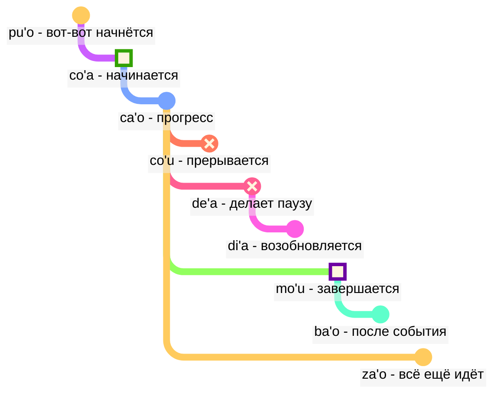

## Урок 6: модальные термы: время и пространство

> **mi citka le cirla**

Возможные переводы:

> _Я ем сыр._
> _Я ел сыр._
> _Я всегда ем сыр._
> _Через мгновение я закончу есть сыр._

Времена в ложбане необязательны; нам не нужно все время думать о том, какое время использовать.

Контекст часто определяет, что является правильным. Мы добавляем времена, когда чувствуем, что они нам нужны.

В ложбане времена и пространство рассматриваются одинаково. Сказать, что _я работал давно_, грамматически не отличается от сказать _я работаю далеко на севере_. В русском языке для обозначения времени есть много разных конструкций, глаголы имеют разную форму, тогда как в ложбане они следуют одному и тому же принципу.

### Точки во времени и месте

Модальная частица времени без следующего за ней аргумента описывает событие относительно _здесь_ и _сейчас_:

> **mi pinxe ba**
> **mi ba pinxe**
> _Я буду пить._

<!-- -->

> **mi pinxe bu'u**
> **mi bu'u pinxe**
> _Я пью в этом месте._

Модальный терм времени с последующим аргументом описывает событие относительно события в этом аргументе:

> **mi pinxe ba le nu mi cadzu**
> _Я пью после того, как я иду._

### События относительно других событий во времени

В русском языке мы используем так называемую "относительность времен":

> **la .alis. pu cusku le se du'u ri pu penmi la .doris. la'u le djedi be li ci**
> _Алиса сказала, что она видела Дорис три дня назад._

Здесь событие _видела Дорис_ происходит перед событием _Алиса сказала_. Однако в

> **la .alis. pu cusku le se du'u ri ca kansa la .doris.**
> _Алиса сказала, что она сейчас с Дорис._

два события (_сказала_ и _сейчас с Дорис_) происходят одновременно.

Таким образом, в русском языке:

- время основного отношения понимается относительно того, кто высказывает это отношение.
- время отношения внутри отношения понимается относительно внешнего отношщения.

В ложбане схема та же:

- только время основного отношения относительно того, кто высказывает отношение.
- другие времена относятся друг к другу. Поэтому в **la .alis. pu cusku le se du'u ri pu penmi la .doris. la'u le djedi be li ci** второе **pu** относится к первому **pu**. В **la .alis. pu cusku le se du'u ri ca kansa la .doris.** мы используем **ca** (_в то же время_), которое относится к внешнему отношению (**pu cusku** — _сказал_).

Однако мы можем использовать модальное слово **nau** (_в момент или месте говорящего_), которое даст возможность определить время относительного того, что произносит текст:

Вот пример в стиле английского языка:

> **la .alis. pu cusku le se du'u ri nau pu kansa la .doris.**
> _Алиса сказала, что она была с Дорис._

Здесь **nau pu** находится в прошлом произносящего этот текст, но не обязательно относительно времени, когда Алиса это сказала.

<!-- Чтобы сказать такие фразы, как `через три дня` или `два года назад`, мы просто ставим временные интервалы в последовательность без перекрытия. Поэтому у нас есть новый глагол:

> **le cabna cu dzoli le nu mi penmi do kei li ci le ka prulamdei**
> _Я встречусь с тобой через три дня (отсчитываемых от настоящего момента)._

> **dzoli le nu mi penmi do kei li ci le ka prulamdei**
> **dzoli le nu mi penmi do kei li ci le ka prulamdei**
> **prulamdeidzo le nu mi penmi do kei li ci**
> **mi penmi do fi'o prulamdeidzo be fi li ci**
> _Я встречусь с тобой через три дня._

> **le cabna cu dzoli le nu mi zvati le stuzi kei li re le ka bavlamdeidzo**
> **le nu mi zvati le stuzi kei le cabna cu dzoli li re le ka prulamdeidzo**
> _Я посетил это место два года назад._ -->

### Расстояние во времени и пространстве

fau
: модальное слово: в то же время, месте или ситуации, что и …

ca
: модальное слово: в … (некоторое время), в то же время, что и …; "настоящее время"

bu'u
: модальное слово: в … (некотором месте); здесь (в этом месте)

zi
: _только что_ (недавно) или _скоро_ (в ближайшее время)

vi
: близко …

za
: _некоторое время назад_ или _через некоторое время, в неопределенное время_

va
: недалеко от …

zu
: _давно_ или _через долгое время_

vu
: далеко от …; далеко

Вот как мы можем использовать комбинации временных форм, чтобы указать, насколько далеко мы уходим в прошлое или будущее:

- **pu zu** означает _давно_
- **pu za** означает _некоторое время назад_
- **pu zi** означает _только что_
- **ba zi** означает _скоро_
- **ba za** означает _через некоторое время_
- **ba zu** означает _через долгое время_

Обратите внимание на порядок гласных **i**, **a** и **u**. Этот порядок часто встречается в языке ложбан и может быть полезно запомнить. _Короткое_ и _долгое_ всегда зависят от контекста, относительны и субъективны. Например, двести лет - это короткое время для эволюции видов, но долгое время для ожидания автобуса.

**zi**, **za** и **zu** изменяют временную частицу, такую как **pu** и **ba**, которая стоит перед ними:

- **pu zu** означает _давно_. **pu** показывает, что мы начинаем в прошлом, а **zu** указывает, что это долгое время назад.
- **zu pu** означает _далеко во времени; есть точка после какого-то события_. **zu** показывает, что мы начинаем с какой-то точки, далекой во времени от настоящего, а **pu** указывает, что мы движемся назад от этой точки.

Таким образом, **pu zu** всегда находится в прошлом, тогда как **zu pu** может быть в будущем.

Пространственное расстояние обозначается аналогично с помощью **vi**, **va** и **vu** для короткого, неопределенного (среднего) и дальнего расстояния в пространстве.

Чтобы указать расстояние во времени или пространстве, мы используем модальное слово **la'u** с аргументом, указывающим расстояние:

> **ba ku la'u le djedi be li ci mi zvati ti**
> _Через три дня я буду здесь._

Пространственный эквивалент **ca** - **bu'u**, а **fau** более неопределенный, чем оба из них, так как он может означать время, пространство или ситуацию.

> **ba za vu ku mi gunka**
> _В будущем я буду работать в далеком месте._

гунка
: работать

> **mi bu'u pu zu gunka**
> _Давно я работал здесь._
> `Я здесь-прошлое-долгое-время работать`

> **pu zu vu ku zasty fa le ninmu .e le nanmu**
> _Давным-давно и далеко-далеко жили женщина и мужчина._

Последнее предложение - это типичное начало сказки.

### Продолжительность во времени и пространстве

ze'i
: модальное слово: на короткое время

ve'i
: модальное слово: на небольшое пространство

ze'a
: модальный терм: в течение некоторого времени

ve'a
: модальный терм: на протяжении некоторого пространства

ze'u
: модальный терм: в течение длительного времени

ve'u
: модальный терм: на протяжении длительного пространства

Снова, легко запомнить, следуя шаблону **i**, **a**, **u**.

> **mi ze'u bajra**
> _Я бегаю долгое время._
<!-- -->
> **do ze'u klama le mi'a gugde ze'u**
> _Ты проводишь долгое время, приезжая в нашу страну._

mi'a
: мы без тебя

gugde
: …это страна

> **mi ba zi ze'a xabju la .djakartas.**
> _Скоро я собираюсь жить в Джакарте некоторое время._
<!-- -->

> **le jenmi pe la .romas. ba ze'u gunta la .kart.xadact.**
> _Армия римлян будет атаковать Карфаген в течение длительного времени._

Это не означает, что римляне не атакуют Карфаген в наши дни. В ложбане, если мы говорим, что что-то верно в определенное время, это не означает, что оно не верно в любое другое время. Вы можете сказать **pu ba ze'u**, чтобы мы знали, что эта активность была в будущем, если рассматривать ее с точки зрения прошлого, но в прошлом, если рассматривать ее сегодня.

> **le xamsi**
> _море/океан_
<!-- -->

> **le ve'u xamsi**
> _океан_

<pixra url="/assets/pixra/cilre/le_vehi_ja_vehu_cmana.webp" caption="le ve'i cmana cu jibni le ve'u cmana" definition="Холм близок к горе."></pixra>

> **le cmana**
> _гора/холм_
<!-- -->

> **le ve'u cmana**
> _гора_
<!-- -->

> **le ve'i cmana**
> _холм_
<!-- -->

> **ti ve'u gerku**
> _Это большая собака. Это собака, занимающая большое пространство._

### «**pu'o**» — ‘_вот-вот_’, «**ba'o**» — ‘_уже не_’, «**za'o**» — ‘_всё ещё_’, «**xa'o**» — ‘_уже_’

Вот несколько наборов модальных термов, которые могут помочь нам добавить более точные значения, когда это необходимо.

С _контуром события_, в отличие от **pu**, **ca** и **ba**, мы рассматриваем каждое событие как имеющее форму с определенными стадиями:

pu'o
: модальный терм: собираться что-то сделать (событие еще не произошло)

ba'o
: модальный терм: перестать делать что-то, уже сделать что-то (событие завершилось)

Примеры:

> **mi ba tavla le mikce**
> _Я поговорю с доктором (и, возможно, я говорю сейчас тоже)._

mikce
: $x_1$ - доктор

> **mi pu pu'o tavla le mikce**
> _Я собирался поговорить с врачом (Я не говорил в то время, событие еще не началось)._

<pixra url="/assets/pixra/cilre/puho_nenri.webp" caption="le prenu pu'o zvati le nenri" definition="Человек собирается войти."></pixra>

<!-- -->

> **le sanmi ca pu'o bredi**
> _Еда ещё не готова._

<!-- -->

> **mi pu ba'o tavla le mikce**
> _Я уже поговорил с врачом._

<pixra url="/assets/pixra/cilre/baho_carvi.webp" caption="ba'o carvi" definition="Последствия дождя. Дождь прекратился."></pixra>

<!-- -->

> **mi ba ba'o tavla le mikce**
> _Я буду уже поговорил с врачом._

<!-- -->

> **.a'o mi ba zi ba'o gunka**
> _Я надеюсь, скоро я закончу работу._

za'o
: модальное слово: все еще. Событие продолжается после своего естественного окончания

xa'o
: неофициальное модальное слово: уже, слишком рано. Событие уже началось и слишком рано

Примеры:

> **ri'a ma do za'o zvati vi**
> _Почему ты все еще здесь?_

<!-- -->

> **la .kevin. xa'o zvati vi**
> _Кевин уже здесь._

### Этапы события

> **mi co'a tavla**
> _Я начал разговаривать._

<!-- -->

> **ra ca'o ciska**
> _Она продолжает писать._

<!-- -->

> **ra pu co'u vasxu**
> _Он перестал дышать (внезапное непредсказуемое изменение)._

vasxu
: $x_1$ дышит $x_2$

> **mi pu mo'u citka le plise**
> _Я съел яблоко полностью._

<!-- -->

> **la .maks. pu mo'u zbasu ti voi dinju**
> _Макс построил этот дом._

<!-- -->

> **ra pu de'a vasxu**
> _Она перестала дышать (но может снова начать дышать позже)._

<pixra url="/assets/pixra/cilre/deha_vasxu.webp" caption="mi de'a vasxu" definition="Я приостанавливаю дыхание. Я задерживаю дыхание."></pixra>

<!-- -->

> **mi pu di'a citka le plise**
> _Я возобновил поедание яблок._

<pixra url="/assets/pixra/cilre/diha_vasxu.webp" caption="mi di'a vasxu" definition="Я возобновляю дыхание."></pixra>

co'a
: модальное слово: начало события (граница события)

ca'o
: модальное слово: делать что-то (событие продолжается)

co'u
: модальное слово: событие прекращается

mo'u
: модальное слово: конец события (граница события)

de'a
: событие приостанавливается (ожидается, что событие продолжится)

di'a
: событие возобновляется

> **mi de'a ze'i jundi**
> _Сейчас вернусь (я сейчас вернусь)._

<!-- -->

> **mi di'a jundi**
> _Я вернулся (буду внимателен)._

jundi
: $x_1$ обращает внимание на $x_2$

Эти два выражения часто используются в текстовых чатах, чтобы указать, что вы отошли или не обращаете внимание, а затем снова появились в сети:

Конечно, можно просто сказать **de'a** или **di'a** и надеяться, что смысл будет понятен.

### Непрерывные и прогрессивные события

ru'i
: модальный терм: событие непрерывно

> **.i mi pu ru'i citka le plise**
> _Я непрерывно ел яблоки._

Обратите внимание на разницу:

- **ru'i** указывает на то, что событие непрерывно и никогда не приостанавливается.
- **ca'o** подразумевает, что событие продвигается. Иногда оно может приостановиться, а затем возобновить свой ход.

### Контуры места

Контуры событий могут использоваться для обозначения пространства, если мы добавим префикс **fe'e**:

> **le rokci cu fe'e ro roi zvati**
> _Камни везде._

### «_слева_», «_справа_»

> **le prenu cu sanli le dertu bu'u le pritu be mi**
> _Человек стоит на земле справа от меня._

<!-- -->

> **le gerku cu vreta le ckana bu'u le zunle be le verba**
> _Собака лежит на кровати слева от ребенка._

<!-- -->

> **ko jgari le panbi poi zunle**
> _Возьми ручку слева._

<!-- -->

> **le mlatu cu plipe bu'u le crane be do**
> _Кот прыгает перед тобой._

<!-- -->

> **ko catlu le dinju poi crane**
> _Посмотри на дом спереди._

<!-- -->

> **le verba cu zutse le stizu bu'u le trixe be mi**
> _Ребенок сидит на стуле позади меня._

<!-- -->

> **le prenu cu sanli ki mi bu'u le pritu be le tricu bei mi**
> _Человек стоит справа от дерева с моей точки зрения._

<!-- -->

> **le dinju cu zunle le rokci ti**
> _Дом слева от камня, если смотреть отсюда._

zunle
: $x_1$ находится слева от $x_2$, с точки зрения $x_3$

pritu
: $x_1$ находится справа от $x_2$, с точки зрения $x_3$

crane
: $x_1$ находится перед $x_2$ ($x_1$ находится между $x_2$ и тем, кто наблюдает), с точки зрения $x_3$

trixe
: $x_1$ находится позади $x_2$, с точки зрения $x_3$

sanli
: $x_1$ стоит на $x_2$

zutse
: $x_1$ сидит на $x_2$

vreta
: $x_1$ лежит на $x_2$

le dertu
: земля, грязь

le ckana
: кровать

le stizu
: стул

le pelji
: бумага

le penbi
: ручка

### Практика: положение

<table>
<tbody><tr>
<td style="text-align:right;"><b>ma nabmi</b>
</td>
<td><i>В чем проблема?</i>
</td></tr>
<tr>
<td style="text-align:right;"><b>ma'a nitcu tu'a le fonxa pe la .alis.</b>
</td>
<td><i>Нам нужен телефон Алисы.</i>
</td></tr>
<tr>
<td style="text-align:right;"><b>.i la .alis. ca zvati ma</b>
</td>
<td><i>Где находится Алиса?</i>
</td></tr>
<tr>
<td style="text-align:right;"><b>la .alis. ca na ku zvati le bu'u tcadu .i mi pu mrilu le srana be le fonxa fi la .alis. .i ri ca ca'o vofli la .paris. .i ku'i mi pu zi te benji le se mrilu be la .alis. .i ri curmi le nu mi'a pilno le fonxa .i .e'o do bevri ri mi</b>
</td>
<td>Алиса сейчас не в городе. Я отправил ей письмо о телефоне. Она сейчас летит в Париж. Но я только что получил письмо от нее. Она разрешает нам использовать телефон. Пожалуйста, принесите его мне.
</td></tr>
<tr>
<td style="text-align:right;"><b>.i bu'u ma mi ka'e cpacu le fonxa</b>
</td>
<td>Где я могу получить телефон?
</td></tr>
<tr>
<td style="text-align:right;"><b>le purdi .i .e'o do klama le bartu</b>
</td>
<td>В саду. Пожалуйста, выйдите наружу.
</td></tr>
<tr>
<td style="text-align:right;"><b>mi ca zvati ne'a le vorme .i ei mi ca klama ma</b>
</td>
<td>Я нахожусь рядом с дверью. Куда мне теперь идти?
</td></tr>
<tr>
<td style="text-align:right;"><b>ko klama le zunle be le tricu .i ba ku do viska le pa jubme</b>
</td>
<td>Иди влево от дерева. Затем увидишь стол.
</td></tr>
<tr>
<td style="text-align:right;"><b>mi zgana no jubme</b>
</td>
<td>Я не замечаю столов.
</td></tr>
<tr>
<td style="text-align:right;"><b>ko carna gi'e muvdu le pritu .i le jubme cu crane le cmalu dinju .i le fonxa cu cpana le jubme .i ji'a ko jgari le penbi .e le pelji .i le za'u dacti cu cpana si'a le jubme .i ba ku ko bevri le ci dacti le zdani gi'e punji fi le sledi'u pe mi</b>
</td>
<td>Повернись и двигайся вправо. Стол находится перед маленьким зданием. Телефон находится на столе. Также возьми ручку и бумагу. Они также находятся на столе. Затем принеси три вещи домой и положи их в мою комнату.
</td></tr>
<tr>
<td style="text-align:right;"><b>vi'o</b>
</td>
<td>Хорошо.
</td></tr></tbody></table>

### Практика: транспортные средства

<table>

<tbody><tr>
<td style="text-align:right;"><b>mi jo'u le pendo be mi pu ca'o litru le barda rirxe bu'u le bloti</b>
</td>
<td><i>Я и мои друзья путешествовали на большой реке на лодке.</i>
</td></tr>
<tr>
<td style="text-align:right;"><b>.i ba bo mi'a klama le vinji tcana</b>
</td>
<td><i>Затем мы отправились в аэропорт.</i>
</td></tr>
<tr>
<td style="text-align:right;"><b>.i xu do se marce le karce</b>
</td>
<td><i>Ты ехал на машине?</i>
</td></tr>
<tr>
<td style="text-align:right;"><b>.i na ku se marce .i mi'a pu klama fu le trene .i ze'a le cacra mi'a zvati bu'u le carce</b>
</td>
<td><i>Нет. Мы поехали на поезде. В течение часа мы находились в вагоне.</i>
</td></tr></tbody></table>

marce
: $x_1$ - транспортное средство, перевозящее $x_2$

se marce
: $x_1$ - пассажир $x_2$

<!-- jai zu'e se marce
: $x_1$ takes a vehicle $x_2$ as a passenger -->

karce
: $x_1$ - автомобиль, перевозящий $x_2$

bloti
: $x_1$ - лодка, перевозящая $x_2$

vinji
: $x_1$ - самолет, перевозящий $x_2$

trene
: $x_1$ - поезд из вагонов $x_2$

### Обогащение словарного запаса. Новые слова с использованием времён

Многие отдельные английские слова соответствуют комбинациям слов в лоджбане:

pixra
: $x_1$ is a picture of $x_3$

le vi'a pixra
: the picture in 2D

le vi'u pixra
: the picture in 3D, a sculpture

<pixra url="/assets/pixra/cilre/viha_pixra.webp" caption="vi'a pixra" definition="2D picture, 2D drawing."></pixra>

<pixra url="/assets/pixra/cilre/vihu_pixra.webp" caption="vi'u pixra" definition="3D picture, sculpture."></pixra>

le ve'i cmana
: холм (буквально "гора/холм, занимающая мало места")

le ve'u xamsi
: океан (буквально "море/океан, занимающий большое пространство")

le ba'o tricu
: пень (буквально "уже не дерево")
