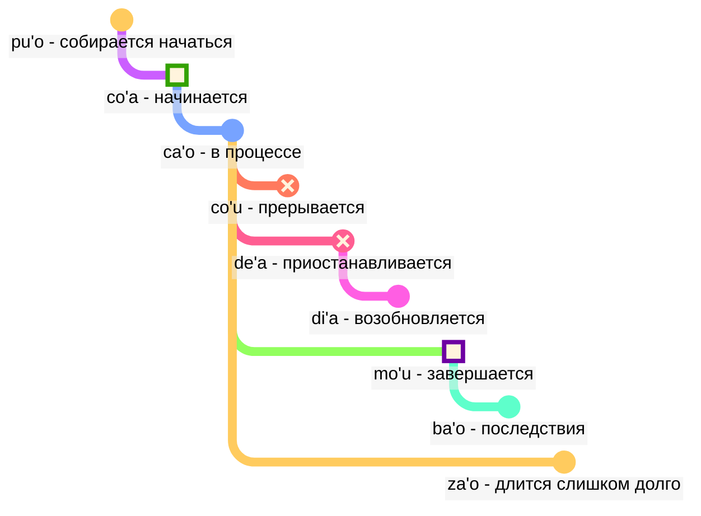

## Урок 6: модальные термы: время и пространство

> **mi citka le cirla**

Возможные переводы:

> _Я ем сыр._
> _Я ел сыр._
> _Я всегда ем сыр._
> _Через мгновение я только что закончу есть сыр._

Времена в ложбане опциональны; нам не нужно постоянно думать о том, какое время использовать.

Контекст часто решает, что правильно. Мы добавляем времена, когда чувствуем, что они нам нужны.

Времена в ложбане одинаково обрабатывают время и пространство. Сказать _Я работал давно_ грамматически не отличается от того, чтобы сказать _Я работаю далеко на севере_. Английский обрабатывает слова типа _раньше_, окончание прошедшего времени _-ed_ и пространственные слова типа _в_ или _около_ по трём разным схемам, в то время как в ложбане они следуют одному и тому же принципу.

### Точки во времени и пространстве

Временная модальная частица без аргумента после неё описывает событие относительно _здесь_ и _сейчас_:

> **mi pinxe ba**
> **mi ba pinxe**
> _Я буду пить._

<!-- -->

> **mi pinxe bu'u**
> **mi bu'u pinxe**
> _Я пью в этом месте._

Временный модальный терм с аргументом после него описывает событие относительно события в этом аргументе:

> **mi pinxe ba le nu mi cadzu**
> _Я пью после того, как гуляю._

#### Задание

Закройте правую часть таблицы. Переведите с ложбана:

<table>
<tbody><tr>
<td><b>mi bu'u pinxe</b></td>
<td><i>Я пью здесь.</i></td></tr>
<tr>
<td><b>mi ba citka le plise</b></td>
<td><i>Я буду есть яблоко.</i></td></tr>
<tr>
<td><b>mi pinxe ba le nu mi cadzu</b></td>
<td><i>Я пью после того, как гуляю.</i></td></tr>
</tbody></table>

Переведите на ложбан:
<table>
<tbody><tr>
<td><i>Я буду гулять.</i></td>
<td><b>mi ba cadzu</b></td></tr>
<tr>
<td><i>Я пью до того, как сплю.</i></td>
<td><b>mi pinxe pu le nu mi sipna</b></td></tr>
</tbody></table>

### События относительно других событий во времени

В английском мы используем так называемую "последовательность времён":

> **la .alis. pu cusku le se du'u ri pu penmi la .doris.**
> _Алиса сказала, что она встречала Дорис раньше._

Здесь событие _встречала Дорис_ происходит до события _Алиса сказала_. Однако в

> **la .alis. pu cusku le se du'u ri ca kansa la .doris.**
> _Алиса сказала, что она была с Дорис._

два события (_сказала_ и _была с Дорис_) происходят одновременно.

Таким образом, в английском:

- время главного отношения понимается относительно того, кто произносит это отношение.
- время отношения внутри главного отношения также понимается относительно того, кто произносит это отношение.

В ложбане:

- только время главного отношения относительно того, кто произносит отношение.
- другие времена относительны друг к другу. Вот почему в **la .alis. pu cusku le se du'u ri pu penmi la .doris.** второе **pu** относительно первого **pu**. В **la .alis. pu cusku le se du'u ri ca kansa la .doris.** мы используем **ca** (_в то же время_), которое относительно внешнего отношения (**pu cusku** — _сказала_).

Однако мы можем использовать модальный терм **nau** (_во время или в месте говорящего_), который даст тот же эффект, что и в английском:

Вот пример в английском стиле:

> **la .alis. pu cusku le se du'u ri nau pu kansa la .doris.**
> _Алиса сказала, что она была с Дорис._

<!-- To say such phrases as `in three days` or `two years ago` we basically put time intervals in sequence without overlapping. Hence a new verb:

> **le cabna cu dzoli le nu mi penmi do kei li ci le ka prulamdei**
> _I will meet you in three days (as measured from now)._

> **dzoli le nu mi penmi do kei li ci le ka prulamdei**
> **dzoli le nu mi penmi do kei li ci le ka prulamdei**
> **prulamdeidzo le nu mi penmi do kei li ci**
> **mi penmi do fi'o prulamdeidzo be fi li ci**
> _I will meet you in three days._

> **le cabna cu dzoli le nu mi zvati le stuzi kei li re le ka bavlamdeidzo**
> **le nu mi zvati le stuzi kei le cabna cu dzoli li re le ka prulamdeidzo**
> _I visited that place two years ago._ -->

#### Задание

Закройте правую часть таблицы. Переведите с ложбана:

<table>
<tbody><tr>
<td><b>la .alis. pu cusku le se du'u ri ba penmi la .doris.</b></td>
<td><i>Алиса сказала, что встретит Дорис.</i></td></tr>
<tr>
<td><b>mi pu djuno le du'u do ca gunka</b></td>
<td><i>Я знал, что ты работаешь.</i></td></tr>
<tr>
<td><b>mi pu na djuno le du'u do ba zvati ti</b></td>
<td><i>Я не знал, что ты будешь здесь.</i></td></tr></tbody></table>

Закройте правую часть таблицы. Переведите на ложбан:

<table>
<tbody><tr>
<td><i>Она сказала мне, что была дома.</i></td>
<td><b>ri pu cusku le se du'u ri pu zvati le zdani</b></td></tr>
<tr>
<td><i>Я знаю, что ты умный.</i></td>
<td><b>mi djuno le du'u do ca stati</b></td></tr></tbody></table>

### Расстояние во времени и пространстве

fau
: модальный терм: в то же время, место или ситуацию, что …

ca
: модальный терм: в … (какое-то время), в то же время, что …; "настоящее время"

bu'u
: модальный терм: в … (каком-то месте); здесь (в этом месте)

zi
: _только что_ (короткое время назад) или _скоро_ (через короткое время)

vi
: около …

za
: _некоторое время назад_ или _через некоторое время, в неопределённое время_

va
: недалеко от …

zu
: _давно_ или _через долгое время_

vu
: далеко от …; далеко

Вот как мы можем использовать комбинации времён, чтобы указать, насколько далеко мы уходим в прошлое или будущее:

- **pu zu** означает _давно_
- **pu za** означает _некоторое время назад_
- **pu zi** означает _только что_
- **ba zi** означает _скоро_
- **ba za** означает _через некоторое время_
- **ba zu** означает _через долгое время_

Обратите внимание на порядок гласных **i**, **a** и **u**. Этот порядок повторяется в ложбане и может быть полезно его запомнить. _Короткое_ и _долгое_ всегда зависят от контекста, относительны и субъективны. Например, двести лет — это короткое время для эволюции вида, но долгое время ожидания автобуса.

**zi**, **za** и **zu** модифицируют временную частицу, как **pu** и **ba**, которая произносится перед ней:

- **pu zu** это _давно_. **pu** показывает, что мы начинаем в прошлом, а **zu** указывает, что это долгое время назад.
- **zu pu** это _далеко во времени; есть точка после какого-то события_. **zu** показывает, что мы начинаем в какой-то точке далеко во времени от настоящего, а **pu** указывает, что мы движемся назад от этой точки.

Таким образом, **pu zu** всегда в прошлом, тогда как **zu pu** может быть в будущем.

Пространственное расстояние аналогично отмечается **vi**, **va** и **vu** для короткого, неопределённого (среднего) и долгого расстояния в пространстве.

Чтобы указать расстояние во времени или пространстве, мы используем модальный терм **la'u** с аргументом, указывающим расстояние:

> **ba ku la'u le djedi be li ci mi zvati ti**
> _Через три дня я буду здесь._

Пространственный эквивалент **ca** это **bu'u**, а **fau** более неопределённый, чем два из них, поскольку может означать время, пространство или ситуацию.

> **ba za vu ku mi gunka**
> _Через некоторое время в будущем я буду работать в месте далеко отсюда._

gunka
: работать

> **mi bu'u pu zu gunka**
> _Я раньше работал здесь давно._
> `Я здесь-прошлое-долгое-время-расстояние работать`

> **pu zu vu ku zasti fa le ninmu .e le nanmu**
> _Давным-давно и далеко-далеко жили женщина и мужчина._

Последнее предложение — это то, как часто начинаются сказки.

#### Задание

Закройте правую часть таблицы. Переведите с ложбана:

<table>
<tbody><tr>
<td><b>mi pu zu gunka</b></td>
<td><i>Я работал давно.</i></td></tr>
<tr>
<td><b>do ba zi cliva</b></td>
<td><i>Ты скоро уйдёшь.</i></td></tr>
<tr>
<td><b>mi vu zvati</b></td>
<td><i>Я далеко.</i></td></tr>
</tbody></table>

Переведите на ложбан:
<table>
<tbody><tr>
<td><i>Я буду работать через некоторое время.</i></td>
<td><b>mi ba za gunka</b></td></tr>
<tr>
<td><i>Ты рядом.</i></td>
<td><b>do vi zvati</b></td></tr>
</tbody></table>

### Длительность во времени и пространстве

ze'i
: модальный терм: на короткое время

ve'i
: модальный терм: на малое пространство

ze'a
: модальный терм: на некоторое время

ve'a
: модальный терм: на некоторое пространство

ze'u
: модальный терм: на долгое время

ve'u
: модальный терм: на длинное пространство

Опять же, это легко запомнить, учитывая шаблон **i**, **a**, **u**.

> **mi ze'u bajra**
> _Я бегу долгое время._
<!-- -->
> **do ze'u klama le mi'a gugde ze'u**
> _Ты тратишь долгое время, чтобы добраться до нашей страны._
mi'a
: мы без тебя

gugde
: … это страна

> **mi ba zi ze'a xabju la .djakartas.**
> _Довольно скоро я буду жить в Джакарте некоторое время._
<!-- -->

> **le jenmi pe la .romas. ba ze'u gunta la .kart.xadact.**
> _Армия римлян будет атаковать Карфаген долгое время._

Это не означает, что римляне не атакуют Карфаген в наши дни. В ложбане, если мы говорим, что что-то истинно в определённое время, это не означает, что это не истинно в любое другое время. Вы можете сказать **pu ba ze'u**, чтобы мы знали, что эта активность была в будущем, если смотреть из какой-то точки в прошлом, но в прошлом, если смотреть из сегодняшнего дня.

> **le xamsi**
> _море/океан_
<!-- -->

> **le ve'u xamsi**
> _океан_

<pixra url="/assets/pixra/cilre/le_vehi_ja_vehu_cmana.webp" caption="le ve'i cmana cu jibni le ve'u cmana" definition="Холм рядом с горой."></pixra>

> **le cmana**
> _гора/холм_
<!-- -->

> **le ve'u cmana**
> _гора_
<!-- -->

> **le ve'i cmana**
> _холм_
<!-- -->

> **ti ve'u gerku**
> _Это большая собака. Это собака, покрывающая большое пространство._

#### Задание

Закройте правую часть таблицы. Переведите с ложбана:

<table>
<tbody><tr>
<td><b>mi ze'u pinxe le tcati</b></td>
<td><i>Я пью чай долгое время.</i></td></tr>
<tr>
<td><b>mi ve'i zvati le kumfa</b></td>
<td><i>Я нахожусь в маленькой комнате.</i></td></tr>
</tbody></table>

Переведите на ложбан:
<table>
<tbody><tr>
<td><i>Я останусь здесь на некоторое время.</i></td>
<td><b>mi ze'a zvati ti</b></td></tr>
<tr>
<td><i>Собака покрывает большое пространство.</i></td>
<td><b>le gerku cu ve'u zvati</b></td></tr>
</tbody></table>

### «**pu'o**» — '_собираться_', «**ba'o**» — '_больше не_', «**za'o**» — '_всё ещё_', «**xa'o**» — '_уже_'

Вот несколько наборов модальных термов, которые могут помочь нам добавить более тонкие значения, когда это необходимо.

С _контурами событий_, в отличие от **pu**, **ca** и **ba**, мы рассматриваем каждое событие как имеющее форму с определёнными стадиями:

pu'o
: модальный терм: собираться сделать что-то (событие ещё не произошло)

ba'o
: модальный терм: больше не делать что-то, сделать что-то (событие закончилось)

Примеры:

> **mi ba tavla le mikce**
> _Я буду говорить с врачом (и я могу говорить и сейчас тоже)._

mikce
: x₁ это врач

<!-- -->

> **mi pu pu'o tavla le mikce**
> _Я собирался говорить с врачом (я не говорил в то время, событие не началось к тому времени)._

<pixra url="/assets/pixra/cilre/puho_nenri.webp" caption="le prenu pu'o zvati le nenri" definition="Человек собирается быть внутри."></pixra>

<!-- -->

> **le sanmi ca pu'o bredi**
> _Еда ещё не готова._

<!-- -->

> **mi pu ba'o tavla le mikce**
> _Я говорил с врачом._

<pixra url="/assets/pixra/cilre/baho_carvi.webp" caption="ba'o carvi" definition="После дождя. Дождь прекратился."></pixra>

<!-- -->

> **mi ba ba'o tavla le mikce**
> _Я буду говорить с врачом._

<!-- -->

> **.a'o mi ba zi ba'o gunka**
> _Надеюсь, скоро я закончу работу._

za'o
: модальный терм: всё ещё. Событие происходит за пределами своего естественного конца

xa'o
: неофициальный модальный терм: уже, слишком рано. Событие уже началось, и это слишком рано

Примеры:

> **ri'a ma do za'o zvati vi**
> _Почему ты всё ещё здесь?_

<!-- -->

> **la .kevin. xa'o zvati vi**
> _Кевин уже здесь._

#### Задание

Закройте правую часть таблицы. Переведите с ложбана:

<table>
<tbody><tr>
<td><b>mi pu pu'o ciska</b></td>
<td><i>Я собирался писать.</i></td></tr>
<tr>
<td><b>le sanmi ba'o jukpa</b></td>
<td><i>Еда больше не готовится.</i></td></tr>
<tr>
<td><b>mi za'o kelci</b></td>
<td><i>Я всё ещё играю (дольше, чем ожидалось).</i></td></tr>
</tbody></table>

Переведите на ложбан:
<table>
<tbody><tr>
<td><i>Я уже ушёл.</i></td>
<td><b>mi xa'o cliva</b></td></tr>
<tr>
<td><i>Еда будет готова.</i></td>
<td><b>le cidja ba bredi</b></td></tr>
</tbody></table>

### Стадии события

> **mi co'a tavla**
> _Я начал говорить._

<!-- -->

> **ra ca'o ciska**
> _Она продолжает писать._

<!-- -->

> **ra pu co'u vasxu**
> _Он перестал дышать (внезапное непредсказуемое изменение)._

vasxu
: x₁ дышит x₂

> **mi pu mo'u citka le plise**
> _Я съел яблоко до конца._

<!-- -->

> **la .maks. pu mo'u zbasu ti voi dinju**
> _Макс построил этот дом._

<!-- -->

> **ra pu de'a vasxu**
> _Она перестала дышать (но может дышать снова позже)._

<pixra url="/assets/pixra/cilre/deha_vasxu.webp" caption="mi de'a vasxu" definition="Я приостанавливаю дыхание. Я задерживаю дыхание."></pixra>

<!-- -->

> **mi pu di'a citka le plise**
> _Я возобновил есть яблоки._

<pixra url="/assets/pixra/cilre/diha_vasxu.webp" caption="mi di'a vasxu" definition="Я возобновляю дыхание."></pixra>

co'a
: модальный терм: событие начинается (граница события)

ca'o
: модальный терм: делать что-то (событие в процессе)

co'u
: модальный терм: событие останавливается

mo'u
: модальный терм: событие заканчивается (граница события)

de'a
: событие приостанавливается (можно ожидать, что событие продолжится)

di'a
: событие возобновляется

> **mi de'a ze'i jundi**
> _Скоро вернусь._

<!-- -->

> **mi di'a jundi**
> _Я вернулся (внимателен)._

jundi
: x₁ обращает внимание на x₂

Эти два выражения распространены в текстовых чатах для обозначения того, что вы отошли или не обращаете внимания, а затем возвращаетесь онлайн:

Можно, конечно, также сказать просто **de'a** или **di'a** и надеяться, что смысл понятен.

#### Задание

Закройте правую часть таблицы. Переведите с ложбана:

<table>
<tbody><tr>
<td><b>mi co'a tavla</b></td>
<td><i>Я начал говорить.</i></td></tr>
<tr>
<td><b>mi ca'o pinxe le tcati</b></td>
<td><i>Я пью чай.</i></td></tr>
<tr>
<td><b>mi co'u tavla</b></td>
<td><i>Я перестал говорить.</i></td></tr>
<tr>
<td><b>mi de'a vasxu</b></td>
<td><i>Я приостанавливаю дыхание.</i></td></tr>
</tbody></table>

Переведите на ложбан:
<table>
<tbody><tr>
<td><i>Я возобновляю работу.</i></td>
<td><b>mi di'a gunka</b></td></tr>
<tr>
<td><i>Я закончил есть.</i></td>
<td><b>mi mo'u citka</b></td></tr>
</tbody></table>

### Непрерывные и прогрессивные события

ru'i
: модальный терм: событие непрерывное

> **.i mi pu ru'i citka le plise**
> _Я непрерывно ел яблоки._

Обратите внимание на разницу:

- **ru'i** указывает, что событие непрерывное и никогда не прерывается.
- **ca'o** подразумевает, что событие прогрессирует. Оно может иногда приостанавливаться, а затем возобновлять свой прогресс.

#### Задание

Закройте правую часть таблицы. Переведите с ложбана:

<table>
<tbody><tr>
<td><b>mi pu ru'i citka le plise</b></td>
<td><i>Я непрерывно ел яблоки.</i></td></tr>
<tr>
<td><b>le mlatu cu ru'i sipna</b></td>
<td><i>Кошка спит непрерывно.</i></td></tr>
<tr>
<td><b>xu do ca'o kelci</b></td>
<td><i>Ты играешь (всё ещё в процессе)?</i></td></tr></tbody></table>

kelci
: играть

Закройте правую часть таблицы. Переведите на ложбан:

<table>
<tbody><tr>
<td><i>Я непрерывно работаю здесь.</i></td>
<td><b>mi ru'i gunka bu'u</b></td></tr>
<tr>
<td><i>Они всё ещё танцуют.</i></td>
<td><b>ri ca'o dansu</b></td></tr></tbody></table>

### Пространственные контуры

Контуры событий можно использовать для обозначения пространства, если мы добавляем к ним префикс **fe'e**:

> **le rokci cu fe'e ro roi zvati**
> _Камни везде._

### '_слева_', '_справа_'

<pixra url="/assets/pixra/cilre/pritu_le_tricu.webp" caption="le prenu cu pritu le tricu le zgana" definition="Человек находится справа от дерева с точки зрения наблюдателя."></pixra>

> **le prenu cu sanli le dertu bu'u le pritu be mi**
> _Человек стоит на земле справа от меня._

<!-- -->

> **le gerku cu vreta le ckana bu'u le zunle be le verba**
> _Собака лежит на кровати слева от ребёнка._

<!-- -->

> **ko jgari le panbi poi zunle**
> _Возьми ручку слева._

<!-- -->

> **le mlatu cu plipe bu'u le crane be do**
> _Кошка прыгает перед тобой._

<!-- -->

> **ko catlu le dinju poi crane**
> _Посмотри на дом впереди._

<!-- -->

> **le verba cu zutse le stizu bu'u le trixe be mi**
> _Ребёнок сидит на стуле позади меня._

<!-- -->

> **le prenu cu sanli ki mi bu'u le pritu be le tricu bei mi**
> _Человек стоит справа от дерева с моей точки зрения._

<!-- -->

> **le dinju cu zunle le rokci ti**
> _Дом находится слева от камня, если смотреть отсюда._

zunle
: x₁ находится слева от x₂, если смотреть от x₃

pritu
: x₁ находится справа от x₂, если смотреть от x₃

crane
: x₁ находится перед x₂ (x₁ между x₂ и тем, кто смотрит), если смотреть от x₃

trixe
: x₁ находится позади x₂, если смотреть от x₃

sanli
: x₁ стоит на x₂

zutse
: x₁ сидит на x₂

vreta
: x₁ лежит на x₂

le dertu
: земля, грязь

le ckana
: кровать

le stizu
: стул

le pelji
: бумага

le penbi
: ручка

#### Задание

Закройте правую часть таблицы. Переведите с ложбана:

<table>
<tbody><tr>
<td><b>le mlatu cu zunle le gerku</b></td>
<td><i>Кошка находится слева от собаки.</i></td></tr>
<tr>
<td><b>ko cadzu le crane be mi</b></td>
<td><i>Иди перед мной.</i></td></tr>
<tr>
<td><b>le prenu cu sanli le trixe be le dinju</b></td>
<td><i>Человек стоит позади дома.</i></td></tr>
</tbody></table>

Переведите на ложбан:
<table>
<tbody><tr>
<td><i>Собака справа от меня.</i></td>
<td><b>le gerku cu pritu mi</b></td></tr>
<tr>
<td><i>Сядь перед домом.</i></td>
<td><b>ko zutse le crane be le dinju</b></td></tr>
</tbody></table>

### Практика: позиция

<table>
<tbody><tr>
<td style="text-align:right;"><b>ma nabmi</b>
</td>
<td><i>В чём проблема?</i>
</td></tr>
<tr>
<td style="text-align:right;"><b>ma'a nitcu tu'a le fonxa pe la .alis.</b>
</td>
<td><i>Нам нужен телефон Алисы.</i>
</td></tr>
<tr>
<td style="text-align:right;"><b>.i la .alis. ca zvati ma</b>
</td>
<td><i>Где Алиса?</i>
</td></tr>
<tr>
<td style="text-align:right;"><b>la .alis. ca na ku zvati le bu'u tcadu .i mi pu mrilu le srana be le fonxa fi la .alis. .i ri ca ca'o vofli la .paris. .i ku'i mi pu zi te benji le se mrilu be la .alis. .i ri curmi le nu mi'a pilno le fonxa .i .e'o do bevri ri mi</b>
</td>
<td> Алиса сейчас не в городе. Я послал письмо о телефоне ей. Алиса сейчас летит в Париж. Но я только что получил письмо от неё. Она разрешает нам использовать телефон. Пожалуйста, принеси его мне.
</td></tr>
<tr>
<td style="text-align:right;"><b>.i bu'u ma mi ka'e cpacu le fonxa</b>
</td>
<td>Где я могу получить телефон?
</td></tr>
<tr>
<td style="text-align:right;"><b>le purdi .i .e'o do klama le bartu</b>
</td>
<td>В саду. Пожалуйста, выйди наружу.
</td></tr>
<tr>
<td style="text-align:right;"><b>mi ca zvati ne'a le vorme .i ei mi ca klama ma</b>
</td>
<td>Я нахожусь рядом с дверью. Куда мне теперь идти?
</td></tr>
<tr>
<td style="text-align:right;"><b>ko klama le zunle be le tricu .i ba ku do viska le pa jubme</b>
</td>
<td>Иди налево от дерева. Тогда ты увидишь стол.
</td></tr>
<tr>
<td style="text-align:right;"><b>mi zgana no jubme</b>
</td>
<td>Я не вижу столов.
</td></tr>
<tr>
<td style="text-align:right;"><b>ko carna gi'e muvdu le pritu .i le jubme cu crane le cmalu dinju .i le fonxa cu cpana le jubme .i ji'a ko jgari le penbi .e le pelji .i le za'u dacti cu cpana si'a le jubme .i ba ku ko bevri le ci dacti le zdani gi'e punji fi le sledi'u pe mi</b>
</td>
<td>Повернись и двигайся вправо. Стол находится перед маленьким зданием. Телефон на столе. Также возьми карандаш и бумагу. Они аналогично на столе. Затем принеси эти три вещи домой и положи в мою комнату.
</td></tr>
<tr>
<td style="text-align:right;"><b>vi'o</b>
</td>
<td>Сделаю.
</td></tr></tbody></table>

### Практика: транспортные средства

<table>

<tbody><tr>
<td style="text-align:right;"><b>mi jo'u le pendo be mi pu ca'o litru le barda rirxe bu'u le bloti</b>
</td>
<td><i>Я и мои друзья путешествовали по большой реке на лодке.</i>
</td></tr>
<tr>
<td style="text-align:right;"><b>.i ba bo mi'a klama le vinji tcana</b>
</td>
<td><i>Затем мы поехали в аэропорт.</i>
</td></tr>
<tr>
<td style="text-align:right;"><b>.i xu do se marce le karce</b>
</td>
<td><i>Вы ехали на машине?</i>
</td></tr>
<tr>
<td style="text-align:right;"><b>.i na ku se marce .i mi'a pu klama fu le trene .i ze'a le cacra mi'a zvati bu'u le carce</b>
</td>
<td><i>Нет. Мы ехали на поезде. В течение одного часа мы были в вагоне.</i>
</td></tr></tbody></table>

marce
: x₁ это транспортное средство, перевозящее x₂

se marce
: x₁ это пассажир x₂

<!-- jai zu'e se marce
: x₁ takes a vehicle x₂ as a passenger -->

karce
: x₁ это машина, перевозящая x₂

bloti
: x₁ это лодка, перевозящая x₂

vinji
: x₁ это самолёт, перевозящий x₂

trene
: x₁ это поезд из вагонов x₂

### Обогащение словаря. Новые слова с использованием времён

Многие отдельные английские слова соответствуют словосочетаниям в ложбане:

pixra
: x₁ это картина x₃

le vi'a pixra
: картина в 2D

le vi'u pixra
: картина в 3D, скульптура

<pixra url="/assets/pixra/cilre/viha_pixra.webp" caption="vi'a pixra" definition="2D картина, 2D рисунок."></pixra>

<pixra url="/assets/pixra/cilre/vihu_pixra.webp" caption="vi'u pixra" definition="3D картина, скульптура."></pixra>

le ve'i cmana
: холм (буквально "гора/холм, покрывающая малое пространство")

le ve'u xamsi
: океан (буквально "море/океан, покрывающее большое пространство")

le ba'o tricu
: пень дерева (буквально "больше не дерево")
