Paano gamitin ang kursong ito:

1. basahin ito
2. kolektahin ang iyong mga puna at mungkahi
3. ipadala ang mga ito sa [💬 live chat](https://lojban.pw/tl/articles/live_chat/)

## Aralin 1. Ang wika sa isang sulyap

### Alpabeto

Ang pangunahing bagay na kailangan mong malaman tungkol sa Lojban ay ang alpabeto.

Ginagamit ng Lojban ang alpabetong Latin (ang mga patinig ay may kulay):

<dl><dd><b>a b c d e f g i j k l m n o p r s t u v x y z ' .</b></dd></dl>

Ang mga salita ay binibigkas ayon sa kung paano ito isinusulat.

Mayroong 10 patinig sa Lojban:

<table>
<tbody><tr>
<td><b class="audio-inline">a</b></td>
<td> tulad sa Tagalog na <i>b<u>a</u>ta</i>, <i>t<u>a</u>o</i></td>
</tr>
<tr>
<td><b class="audio-inline">e</b></td>
<td> tulad sa Tagalog na <i>h<u>e</u>to</i>, <i>m<u>e</u>sa</i></td>
</tr>
<tr>
<td><b class="audio-inline">i</b></td>
<td> tulad sa Tagalog na <i>s<u>i</u>ya</i>, <i>p<u>i</u>no</i> (hindi tulad sa maikling <i>i</i> ng Ingles sa <i>hit</i>)</td>
</tr>
<tr>
<td><b class="audio-inline">o</b></td>
<td> tulad sa Tagalog na <i><u>o</u>po</i>, <i>l<u>o</u>la</i> (dapat "puro" ang tunog, hindi tulad sa Ingles na <i>so</i>)</td>
</tr>
<tr>
<td><b class="audio-inline">u</b></td>
<td> tulad sa Tagalog na <i>p<u>u</u>so</i>, <i>b<u>u</u>hay</i></td>
</tr>
<tr>
<td><b class="audio-inline">y</b></td>
<td> tulad sa tunog ng <i>e</i> sa salitang Ingles na <i>comm<u>a</u></i> o <i>th<u>e</u></i> — ito ay isang neutral na patinig na tinatawag na "schwa". Hindi ito umiiral sa Tagalog, ngunit parang mabilis at magaang "e" o "a" ito.</td>
</tr>
<tr>
</tbody></table>

Ang 4 na patinig ay isinusulat gamit ang mga kombinasyon ng mga titik:

<table>
<tbody><tr>
<td><b class="audio-inline">au</b></td>
<td> tulad sa Tagalog na <i>s<u>aw</u>a</i>, <i>b<u>ao</u></i></td></tr>
<tr>
<td><b class="audio-inline">ai</b></td>
<td> tulad sa Tagalog na <i>tat<u>ay</u></i>, <i>b<u>ai</u>t</i></td></tr>
<tr>
<td><b class="audio-inline">ei</b></td>
<td> tulad sa Tagalog na <i>R<u>ey</u></i>, <i>h<u>ey</u></i></td></tr>
<tr>
<td><b class="audio-inline">oi</b></td>
<td> tulad sa Tagalog na <i>lang<u>oy</u></i>, <i>b<u>oy</u></i></td></tr>
</tbody></table>

Tungkol sa mga katinig, ang kanilang pagbigkas ay katulad sa Tagalog o Ingles, ngunit may ilang pagkakaiba:

<table>
<tbody><tr>
<td><b class="guibutton">c</b>
</td>
<td>binibigkas bilang <i>sy</i> tulad sa <i>siyempre</i>, o tulad sa Ingles na <i>sh</i> sa <i>shop</i>.
</td></tr>
<tr>
<td><b class="guibutton">g</b>
</td>
<td>palaging <i>g</i> tulad sa <i>gatas</i> (hindi kailanman tulad sa <i>j</i> sa Ingles na <i>gem</i>).
</td></tr>
<tr>
<td><b class="guibutton">j</b>
</td>
<td>tulad ng <i>s</i> sa Ingles na <i>pleasure</i> o <i>treasure</i>, tulad ng <i>j</i> sa French na <i>bonjour</i>. Hindi ito ang karaniwang tunog ng "j" sa Tagalog.
</td></tr>
<tr>
<td><b class="guibutton">x</b>
</td>
<td>tulad ng <i>ch</i> sa Scottish na <i>loch</i> o sa German na <i>Bach</i>, tulad ng <i>J</i> sa Spanish na <i>Jose</i> o <i>Kh</i> sa Arabic na <i>Khaled</i>. Para makuha ang tunog na ito, subukan mong bigkasin ang <i>k</i> habang bukas ang lalamunan mo at hinihipan ang hangin.
</td></tr>
<tr>
<td><b class="guibutton"> ' </b>
</td>
<td>tulad ng Tagalog at Ingles na <i>h</i>. Kaya ang apostrophe ay itinuturing bilang isang tamang titik ng Lojban at binibigkas tulad ng <i>h</i>. Matatagpuan ito lamang sa pagitan ng mga patinig. Halimbawa, ang <b>u'i</b> ay binibigkas bilang <i>u-hi</i> (samantalang ang <b>ui</b> ay binibigkas bilang <i>wi</i>).
</td></tr>
<tr>
<td><b>.</b>
</td>
<td>ang tuldok (period, word break) ay itinuturing din bilang isang titik sa Lojban. Ito ay isang maikling hinto sa pagsasalita upang pigilan ang pagsasama-sama ng mga salita. Sa katunayan, ang anumang salitang nagsisimula sa isang patinig ay may tuldok na inilalagay sa harap nito. Ito ay tumutulong sa pagpigil ng hindi kanais-nais na pagsasama ng dalawang magkasunod na salita sa isa.
</td></tr>
<tr>
<td><b>i</b>
</td>
<td><b>i</b> bago ang mga patinig ay itinuturing na isang katinig at binibigkas nang mas maikli, halimbawa:
<ul><li><b>ia</b> ay binibigkas bilang <i>ya</i> tulad sa <i>yaya</i></li>
<li><b>ie</b> ay binibigkas bilang <i>ye</i> tulad sa Ingles na <i>yes</i></li></ul>
</td></tr>
<tr>
<td><b>u</b>
</td>
<td><b>u</b> bago ang mga patinig ay itinuturing na isang katinig at binibigkas nang mas maikli, halimbawa:
<ul><li><b>ua</b> ay binibigkas bilang <i>wa</i> tulad sa <i>wala</i></li>
<li><b>ue</b> ay binibigkas bilang <i>we</i> tulad sa Ingles na <i>wet</i></li></ul>
</td></tr></tbody></table>

Ang diin ay inilalagay sa pangalawa mula sa huling patinig. Kung ang isang salita ay mayroon lamang isang patinig, hindi mo ito binibigyan ng diin.

Ang titik **r** ay maaaring bigkasin tulad ng _r_ sa Tagalog, Ingles, o Spanish, kaya may iba't ibang tinatanggap na pagbigkas para dito.

Ang mga patinig na hindi Lojban tulad ng maikling _i_ at _u_ sa Standard British English na _hit_ at _but_, ay ginagamit ng ilang tao upang paghiwalayin ang mga katinig. Kaya, kung nahihirapan kang bigkasin ang dalawang katinig nang magkasunod (halimbawa, ang **vl** sa **tavla**, na nangangahulugang _makipag-usap sa_), maaari mong sabihin na _tavɪla_ — kung saan ang _ɪ_ ay napakaikli. Gayunpaman, ang iba pang patinig tulad ng **a** at **u** ay dapat na mahaba.

### Ang pinakasimpleng pangungusap

Ang pangunahing yunit sa Lojban ay ang "pangungusap". Narito ang tatlong simpleng halimbawa:

> **le prenu cu tavla mi**
> _Ang tao ay nakikipag-usap sa akin._

le prenu
: ang tao

tavla
: … nakikipag-usap sa …, … nagsasalita sa …

mi
: ako, sa akin

> **mi prami do**
> _Mahal kita._

prami
: … nagmamahal sa … (isang tao)

do
: ikaw

> **mi ca cu tavla do**
> _Ngayon ay nakikipag-usap ako sa iyo._

ca
: ngayon (binibigkas na **syah**)

<pixra url="/assets/pixra/cilre-xekri-g-out/tavla.webp" caption="le prenu cu tavla mi" definition="Ang tao ay nakikipag-usap sa akin."></pixra>

<pixra url="/assets/pixra/cilre-xekri-g-out/mi.webp" caption="mi" definition="Ako / sa akin"></pixra>

<pixra url="/assets/pixra/cilre-xekri-g-out/mi_prami_do2.webp" caption="mi prami do" definition="Mahal kita."></pixra>

<pixra url="/assets/pixra/cilre-xekri-g-out/do.webp" caption="do" definition="ikaw"></pixra>

Bawat pangungusap sa Lojban ay binubuo ng mga sumusunod na bahagi mula kaliwa patungo sa kanan:

- ang ulo:
  - binubuo ng tinatawag na "mga termino",
    - **le prenu** ang tanging termino sa ulo sa halimbawang **le prenu cu tavla mi** sa itaas,
    - **mi**, **ca** ay mga termino sa ulo sa halimbawang **mi ca cu tavla do** sa itaas.
- ang panghiwalay ng ulo **cu**:
  - binibigkas na _syu_ dahil ang **c** ay para sa _sy_,
  - nagpapakita na natapos na ang ulo,
  - maaaring alisin kapag malinaw na natapos na ang ulo.
- ang buntot:
  - ang pangunahing konstruksyon ng relasyon (tinatawag na "**selbrisni**" sa Lojban)
  - \+ posibleng isa o higit pang mga termino pagkatapos nito,
    - **tavla**, **prami** ay selbrisni, pangunahing konstruksyon ng relasyon sa mga halimbawa sa itaas.
    - **mi** ang tanging termino sa buntot sa halimbawang **le prenu cu tavla mi** sa itaas.
    - **do** ang tanging termino sa buntot sa halimbawang **mi prami do** sa itaas.

Sa Lojban, kadalasan ay nagsasalita tayo ng mga relasyon kaysa sa mga pangngalan o pandiwa.

Narito ang dalawang salitang relasyon, na halos katumbas ng mga pandiwa:

prenu
: … ay isang tao / mga tao

tavla
: … nakikipag-usap sa …

Bawat relasyon ay may isa o higit pang mga papel na maaari ring tawaging "mga puwang" o "mga lugar". Sa itaas, sila ay may label na "…" Ang mga puwang na ito ay dapat punan ng mga argumento (tinatawag na "**sumti**" sa Lojban). Ang mga terminong argumento ay mga konstruksyon tulad ng **le prenu**, **mi**, **do** kahit na ang mga terminong ito ay mapupunta sa ulo o sa buntot ng pangungusap. Inilalagay natin ang mga terminong argumento sa pagkakasunod-sunod, kaya napupunan ang mga puwang na ito at nagbibigay ng kongkretong kahulugan sa relasyon.

```mermaid
flowchart TB
    %%common settings
    subgraph bridi["<i>relasyon</i>#nbsp;"]
        x1("…")
        selbri
        x2("…")
    end
    subgraph sumti["<i>listahan ng mga terminong argumento</i>#nbsp;"]
        s1-.->x1
        s2-.->x2
    end
    classDef s fill:#6807F7,stroke:#333,stroke-width:1px,color:#fff;
    class s1 s;
    class s2 s;
    classDef x fill:#FFF863,stroke:#333,stroke-width:1px,stroke-dasharray: 5 2;
    class x1 x;
    class x2 x;
    classDef blabi fill:#fff,stroke:#333;
    class selbri blabi;
    class bridi blabi;

    %% input your sumti:
    s1(mi)
    s2(do)
    %% input your selbri
    selbri[(prami)]

```

Maaari rin nating gawing terminong argumento ang ganitong relasyon.

Para dito, inilalagay natin ang maikling salitang **le** sa harap nito:

prenu
: … ay isang tao

le prenu
: ang tao, ang mga tao

Gayundin,

tavla
: … nakikipag-usap sa …

at kaya

le tavla
: ang nagsasalita, ang mga nagsasalita

Maaaring kakaiba kung paano maging "pandiwa" ang _tao_, ngunit sa katunayan, ginagawa nito ang Lojban na napakasimple:

<table>
<thead>
<tr>
<th>salitang relasyon na walang laman ang mga puwang</th>
<th>porma ng argumento (<b>sumti</b>)</th></tr>
</thead>
<tbody>
<tr>
<td><b>prenu</b> — <i>… (isang tao) ay isang tao</i> </td>
<td><b>le prenu</b> — <i>ang tao / ang mga tao</i>
     <b>le prenu</b> — <i>ang isang tao / ang mga taong tao</i>
</td></tr>
<tr>
<td><b>tavla</b> — <i>… (isang tao) nakikipag-usap sa … (isang tao)</i> </td>
<td><b>le tavla</b> — <i>ang nagsasalita / ang mga nagsasalita</i>
     <b>le tavla</b> — <i>ang isang nagsasalita / ang mga taong nagsasalita</i>
</td></tr>
</tbody></table>

Ang unang puwang ng mga relasyon ay nawawala kapag gumagamit ng **le**, kaya posible ang ganitong alternatibong pagsasalin tulad ng _ang isang …_.

<!-- We can also say that **le** creates a noun from a relation construct with roughly the meaning of _the one which is …_ (_is a person_ — _the person_), or even _those who do…_ (_to speak to_ — _the speakers_), _those who are…_ (_are people_ — _the people_). -->

Pansinin na sa Lojban, sa default, hindi itinutukoy ang bilang sa pagitan ng _ang nagsasalita_ o _ang mga nagsasalita_. Ibig sabihin, ang **le tavla** ay malabo sa aspetong iyon, at malapit na nating matutuklasan ang mga paraan upang tukuyin ang bilang.

Maliban sa mga terminong argumento, mayroon ding mga modal na termino tulad ng **ca**:

> **mi ca cu tavla do**
> _Ngayon ay nakikipag-usap ako sa iyo._

ca
: ngayon

Ang mga modal na termino ay hindi nagpupuno ng mga puwang ng pangunahing konstruksyon ng relasyon ("**selbrisni**"). Sa halip, inilalapat ang mga ito sa buong pangungusap na nagpapayaman o nagpapakitid ng kahulugan nito.

Kaya, ang mga termino sa Lojban ay kinakatawanan ng:

- mga terminong argumento na nagpupuno sa mga puwang ng mga relasyon. Mga halimbawa nito ay:
  - mga pangngalan tulad ng **le prenu** (_ang tao_)
  - mga panghalip tulad ng **mi** (_ako_, _sa akin_), **do** (_ikaw_). Ang mga panghalip ay gumagana nang eksakto tulad ng mga pangngalan, ngunit hindi ginagamit ang **le** para sa kanila. Gumagana sila bilang mga argumento sa kanilang sarili.
- mga modal na termino na hindi nagpupuno ng mga puwang ng mga relasyon ngunit nagtatakda ng karagdagang, naglilinaw na impormasyon.
  - halimbawa, **ca** (_ngayon, sa kasalukuyan_).

Ilan pang mga halimbawa:

<pixra url="/assets/pixra/cilre-xekri-g-out/nintadni.webp" caption="mi nintadni" definition="Ako ay isang bagong estudyante, isang baguhan."></pixra>

> **mi nintadni**
> _Ako ay isang bagong estudyante._

nintadni
: … (isang tao) ay isang bagong estudyante, isang baguhan

Hindi tulad sa Ingles, hindi natin kailangang idagdag ang pandiwa na "am/is/are/to be" sa pangungusap. Ito ay ipinahihiwatig na. Ang salitang relasyon na **nintadni** (_… ay isang bagong estudyante_) ay mayroon nang "am/is/are/to be" na kasama sa Ingles na pagsasalin nito.

> **do jimpe**
> _Naiintindihan mo._

jimpe
: … (isang tao) naiintindihan … (isang bagay)

<pixra url="/assets/pixra/cilre-xekri-g-out/pilno_le_fonxa.webp" caption="le prenu cu pilno le fonxa" definition="Ang tao ay gumagamit ng telepono."></pixra>

> **mi pilno le fonxa**
> _Gumagamit ako ng telepono._

pilno
: … (isang tao) gumagamit ng … (isang bagay)

fonxa
: … ay telepono, … ay mga telepono

le fonxa
: ang telepono, ang mga telepono

<pixra url="/assets/pixra/cilre-xekri-g-out/citka.webp" caption="mi citka" definition="Kumakain ako."></pixra>

> **mi citka**
> _Kumakain ako._

citka
: … (isang tao) kumakain ng … (isang bagay)

> **do citka**
> _Kumakain ka._

<!-- -->

> **mi citka le plise**
> _Kumakain ako ng mga mansanas._

<pixra url="/assets/pixra/cilre-xekri-g-out/le_plise_cu_kukte.webp" caption="le plise cu kukte" definition="Ang mga mansanas ay masarap."></pixra>

> **le plise cu kukte**
> _Ang mga mansanas ay masarap._

le plise
: ang mga mansanas

kukte
: … (isang bagay) ay masarap

Ang isang mas simpleng pangungusap sa Lojban ay naglalaman lamang ng isang pangunahing salitang relasyon:

<pixra url="/assets/pixra/cilre-xekri-g-out/karce.webp" caption="karce" definition="Ito ay isang kotse."></pixra>

> **karce**
> _Kotse!_
> _Ito ay isang kotse._

Maaari mong sabihin ito kapag nakakita ka ng isang kotse na paparating. Dito, malinaw ang konteksto na may kotse sa paligid at marahil ito ay mapanganib.

Ang **karce** mismo ay isang salitang relasyon na nangangahulugang _ay isang kotse_.

Maaari tayong maging mas tumpak at sabihin, halimbawa:

> **bolci**
> _Bola!_
> _Ito ay isang bola._

kung saan ang **bolci** ay isang salitang relasyon na nangangahulugang _ay isang bola_.

> **ti bolci**
> _Ito ay isang bola malapit sa akin._

<!-- -->

> **ta bolci**
> _Iyan ay isang bola malapit sa iyo._

ti
: panghalip: ang bagay na ito malapit sa akin

ta
: panghalip: ang bagay na iyan malapit sa iyo

tu
: panghalip: ang bagay na iyon malayo sa iyo at sa akin

<pixra url="/assets/pixra/cilre-xekri-g-out/ti.webp" caption="ti" definition="ito (malapit sa akin, ang nagsasalita)"></pixra>

<pixra url="/assets/pixra/cilre-xekri-g-out/ta.webp" caption="ta" definition="iyan (malapit sa iyo, ang nakikinig)"></pixra>

<pixra url="/assets/pixra/cilre-xekri-g-out/tu.webp" caption="tu" definition="iyon doon (malayo sa iyo at sa akin)"></pixra>

Gayundin, maaari mong sabihin

<pixra url="/assets/pixra/cilre-xekri-g-out/carvi.webp" caption="carvi" definition="… ay ulan"></pixra>

> **carvi**
> _Umuulan._

kung saan

carvi
: … ay ulan, … umuulan

o

> **pluka**
> _Kaaya-aya._

kung saan

pluka
: … ay kaaya-aya

Pansinin na sa Lojban, hindi kailangan ang salitang _ito_ sa ganitong kahulugan. Ginagamit mo lang ang salitang relasyon na kailangan mo.

> **prami**
> _May nagmamahal._

<pixra url="/assets/pixra/cilre-xekri-g-out/bajra.webp" caption="le prenu cu bajra" definition="Ang tao ay tumatakbo."></pixra>

> **bajra**
> _May tumatakbo._

bajra
: … tumatakbo gamit ang mga paa

Muli, ang konteksto ang magsasabi kung sino ang nagmamahal ng sino at sino ang tumatakbo.

#### Pagsasanay

pinxe
: … umiinom ng … (isang bagay)

le djacu
: ang tubig

<pixra url="/assets/pixra/cilre-xekri-g-out/pinxe_le_djacu.webp" caption="le prenu cu pinxe le djacu" definition="Ang tao ay umiinom ng tubig."></pixra>

Takpan ang kanang bahagi ng talahanayan. Isalin ang mga pangungusap sa kaliwa mula sa Lojban.

<table style="table-layout: fixed;">
<tbody><tr>
<td><b>do citka</b>
</td>
<td><i>Kumakain ka.</i>
</td></tr>
<tr>
<td><b>mi pinxe le djacu</b>
</td>
<td><i>Umiinom ako ng tubig.</i>
</td></tr>
<tr>
<td><b>mi citka le plise</b>
</td>
<td><i>Kumakain ako ng mga mansanas.</i>
</td></tr></tbody></table>

### Ang «**.i**» ay naghihiwalay ng mga pangungusap

Inilalagay natin ang maikling salitang **.i** upang paghiwalayin ang anumang dalawang magkasunod na pangungusap:

> **mi tavla le prenu .i le prenu cu tavla mi**
> _Nakikipag-usap ako sa mga tao. Ang mga tao ay nakikipag-usap sa akin._

Ang **.i** ay naghihiwalay ng mga pangungusap tulad ng tuldok (period) sa dulo ng mga pangungusap sa mga tekstong Ingles.

Kapag nagsasabi ng isang pangungusap pagkatapos ng isa sa Ingles, gumagawa tayo ng paghinto (maaaring maikli) sa pagitan nila. Ngunit ang paghinto ay may maraming iba't ibang kahulugan sa Ingles. Sa Lojban, mayroon tayong mas mahusay na paraan ng pag-unawa kung saan nagtatapos ang isang pangungusap at nagsisimula ang isa pa.

Tandaan din na kung minsan kapag mabilis na binibigkas ang mga salita, hindi mo malalaman kung saan nagtatapos ang isang pangungusap at nagsisimula ang salita ng susunod na pangungusap. Kaya't ipinapayo na gamitin ang salitang **.i** bago magsimula ng bagong pangungusap.

### Mga Bilang: '_1 2 3 4 5 6 7 8 9 0_' = «**pa re ci vo mu xa ze bi so no**»

Ang **le** ay simpleng ginagawang argumento ang isang konstruksyon ng relasyon, ngunit ang ganitong argumento ay walang bilang na nauugnay dito. Ang pangungusap na

> **le prenu cu tavla mi**
> _Ang mga tao ay nakikipag-usap sa akin._
> _Ang tao ay nakikipag-usap sa akin._

ay hindi nagtatakda ng bilang ng mga taong nakikipag-usap sa akin. Sa Ingles, imposibleng alisin ang bilang dahil ang _people_ sa Ingles ay nangangahulugang _higit sa isang tao_. Gayunpaman, sa Lojban, maaari mong alisin ang bilang.

Ngayon, tukuyin natin kung ilan sa mga tao ang may kaugnayan sa ating usapan.

Magdagdag tayo ng bilang pagkatapos ng **le**.

<table>
<tbody><tr>
<td><b>pa</b>
</td>
<td><b>re</b>
</td>
<td><b>ci</b>
</td>
<td><b>vo</b>
</td>
<td><b>mu</b>
</td>
<td><b>xa</b>
</td>
<td><b>ze</b>
</td>
<td><b>bi</b>
</td>
<td><b>so</b>
</td>
<td><b>no</b>
</td></tr>
<tr>
<td> 1
</td>
<td> 2
</td>
<td> 3
</td>
<td> 4
</td>
<td> 5
</td>
<td> 6
</td>
<td> 7
</td>
<td> 8
</td>
<td> 9
</td>
<td> 0
</td>
</tr></tbody></table>

<pixra url="/assets/pixra/cilre-xekri-g-out/le_mu_prenu.webp" caption="le mu prenu" definition="Ang limang tao"></pixra>

> **le pa prenu cu tavla mi**
> _Ang tao ay nakikipag-usap sa akin._
> _Ang isang tao ay nakikipag-usap sa akin._

Nagdagdag tayo ng bilang pagkatapos ng **le** at sa gayon ay tinutukoy ang mga indibidwal na tao.

Para sa mga bilang na binubuo ng ilang mga digit, isinasama lang natin ang mga digit na iyon:

> **le re mu prenu cu tavla mi**
> _Ang 25 tao ay nakikipag-usap sa akin._

Oo, ganyan lang kasimple.

Kung gusto nating magbilang, maaari nating paghiwalayin ang mga bilang gamit ang **.i**:

> **mu .i vo .i ci .i re .i pa .i no**
> _5 … 4 … 3 … 2 … 1 … 0_

Ang bilang na **za'u** ay nangangahulugang _higit sa …_ (_\>_ sa matematika), ang bilang na **me'i** ay nangangahulugang _mas mababa sa_ (_<_ sa matematika):

> **le za'u re prenu cu tavla mi**
> _Higit sa dalawang tao ang nakikipag-usap sa akin._

<!-- -->

> **le me'i pa no prenu cu tavla mi**
> _Mas mababa sa 10 tao ang nakikipag-usap sa akin._

<!-- -->

> **le za'u ci prenu cu tavla mi**
> _Higit sa tatlong tao ang nakikipag-usap sa akin._

Para sabihin lang na _mga tao_ (maramihang bilang) kumpara sa _isang tao_, ginagamit natin ang **za'u pa**, _higit sa isa_ o simpleng **za'u**.

> **le za'u pa prenu cu tavla mi**
> **le za'u prenu cu tavla mi**
> _Ang mga tao ay nakikipag-usap sa akin._

Ang **za'u** sa default ay nangangahulugang **za'u pa**, kaya posible ang ganitong pagpapaikli.

le prenu
: ang tao / ang mga tao

le pa prenu
: ang tao (isa sa bilang)

le za'u prenu
: ang mga tao (dalawa o higit pa sa bilang)

#### Pagsasanay

stati
: … (isang tao) ay matalino, … may talento

<pixra url="/assets/pixra/cilre-xekri-g-out/stati.webp" caption="stati" definition="… may talento"></pixra>

klama
: … pumupunta sa … (isang lugar o bagay)

<pixra url="/assets/pixra/cilre-xekri-g-out/klama_ti.webp" caption="le prenu cu klama ti" definition="Ang tao ay pumunta rito."></pixra>

nelci
: … gusto ng … (isang bagay)

le zarci
: ang palengke, ang tindahan

<pixra url="/assets/pixra/cilre-xekri-g-out/zarci.webp" caption="le prenu cu zvati le zarci" definition="Ang tao ay nasa tindahan."></pixra>

le najnimre
: ang kahel (prutas), ang mga kahel

<pixra url="/assets/pixra/cilre-xekri-g-out/najnimre.webp" caption="najnimre" definition="… ay isang kahel"></pixra>

le badna
: ang saging, ang mga saging

<pixra url="/assets/pixra/cilre-xekri-g-out/badna.webp" caption="badna" definition="… ay isang saging"></pixra>

Takpan ang kanang bahagi ng talahanayan. Isalin ang mga pangungusap sa kaliwa mula sa Lojban.

<table style="table-layout: fixed;">
 <tbody>
  <tr>
   <td>le mu prenu cu klama le zarci</td>
   <td>Ang limang tao ay pumupunta sa palengke.</td>
  </tr>
  <tr>
   <td>le pa re prenu cu stati .i do stati</td>
   <td>Ang 12 tao ay matalino. Matalino ka.</td>
  </tr>
  <tr>
   <td>le prenu cu nelci le plise</td>
   <td>Gusto ng mga tao ang mga mansanas.</td>
  </tr>
  <tr>
   <td>le za'u re prenu cu citka .i le me'i mu prenu cu pinxe le djacu</td>
   <td>Higit sa dalawang tao ang kumakain. Mas mababa sa 5 tao ang umiinom ng tubig.</td>
  </tr>
  <tr>
   <td>le za'u re prenu cu stati</td>
   <td>Higit sa dalawang tao ang matalino.</td>
  </tr>
 </tbody>
</table>

Takpan ang kanang bahagi ng talahanayan. Isalin ang mga pangungusap sa kaliwa sa Lojban.

<table style="table-layout: fixed;">
 <tbody>
  <tr>
   <td>Ang 256 tao ay matalino.</td>
   <td>le re mu xa prenu cu stati</td>
  </tr>
  <tr>
   <td>Mas mababa sa 12 mansanas ang masarap.</td>
   <td>le me'i pa re plise cu kukte</td>
  </tr>
 </tbody>
</table>

### Tambalang relasyon

Ang tambalang konstruksyon ng relasyon (**tanru** sa Lojban) ay ilang mga salitang relasyon na inilalagay nang magkasunod.

> **tu melbi zdani**
> _Iyon ay isang magandang tahanan._

<pixra url="/assets/pixra/cilre-xekri-g-out/melbi_zdani.webp" caption="melbi zdani" definition="… ay isang magandang tahanan"></pixra>

tu
: iyon (malayo sa iyo at sa akin)

melbi
: … ay maganda, kaakit-akit

zdani
: … ay isang tahanan o pugad ng … (isang tao)

melbi zdani
: tambalang konstruksyon ng relasyon: … ay isang magandang tahanan ng … (isang tao)

<pixra url="/assets/pixra/cilre-xekri-g-out/dansu.webp" caption="le prenu cu melbi dansu" definition="Ang tao ay maganda sa pagsayaw."></pixra>

> **do melbi dansu**
> _Maganda kang sumayaw._

dansu
: … sumasayaw

Dito, ang relasyon na **melbi** ay nagdaragdag ng karagdagang kahulugan dahil ito ay inilalagay sa kaliwa ng isa pang relasyon: **zdani**. Ang kaliwang bahagi ay karaniwang isinasalin gamit ang mga pang-uri at pang-abay.

Ang mga tambalang relasyon ay isang makapangyarihang tampok na nagbibigay ng mas mayamang kahulugan. Isinasama mo lang ang dalawang salitang relasyon, at ang kaliwang bahagi ng ganitong tambalang relasyon ay nagdaragdag ng lasa sa kanan.

Maaari nating ilagay ang **le** (halimbawa, kasama ang bilang) sa kaliwa ng ganitong tambalang relasyon upang makakuha ng mas mayamang terminong argumento:

le pa melbi zdani
: ang magandang tahanan

Ngayon alam na natin kung bakit may **cu** pagkatapos ng mga termino sa ulo sa ating halimbawa:

> **le pa prenu cu tavla mi**
> _Ang tao ay nakikipag-usap sa akin._

Kung walang **cu**, magiging **le pa prenu tavla** ito, na magkakaroon ng kahulugang _ang taong-nagsasalita_ — anuman ang ibig sabihin noon.

Isipin ito:

> **le pa tavla pendo**
> _Ang kaibigang nagsasalita_

<!-- -->

> **le pa tavla cu pendo**
> _Ang nagsasalita ay isang kaibigan._

Tandaan na ilagay ang **cu** bago ang pangunahing konstruksyon ng relasyon sa isang pangungusap upang maiwasan ang hindi sinasadyang paglikha ng mga tambalang relasyon.

Ang mga tambalang relasyon ay maaaring maglaman ng higit sa dalawang bahagi. Sa kasong ito, ang unang relasyon ay nagbabago sa pangalawa, ang pangalawa ay nagbabago sa pangatlo, at iba pa:

<pixra url="/assets/pixra/cilre-xekri-g-out/cmalu_karce.webp" caption="ti cmalu karce" definition="Ito ay isang maliit na kotse."></pixra>

> **le pa melbi cmalu karce**
> _ang maganda-maliit na kotse, ang kotseng maliit sa magandang paraan_

<!-- -->

> **le mutce melbi zdani**
> _ang napakagandang tahanan_

mutce
: … ay sobra, … ay labis

#### Pagsasanay

sutra
: … ay mabilis

barda
: … ay malaki

cmalu
: … ay maliit

mlatu
: … ay isang pusa

Takpan ang kanang bahagi ng talahanayan. Isalin ang mga pangungusap sa kaliwa mula sa Lojban.

<table style="table-layout: fixed;">
<tbody><tr>
<td><b>le melbi karce</b>
</td>
<td><i>ang magandang kotse / ang mga magandang kotse</i>
</td></tr>
<tr>
<td><b>do sutra klama</b>
</td>
<td><i>Mabilis kang pumupunta. Mabilis kang dumating.</i>
</td></tr>
<tr>
<td><b>tu barda zdani</b>
</td>
<td><i>Iyon ay isang malaking tahanan.</i>
</td></tr>
<tr>
<td><b>le pa sutra bajra mlatu</b>
</td>
<td><i>ang mabilis na tumatakbong pusa</i>
</td></tr>
<tr>
<td><b>le pa sutra mlatu</b>
</td>
<td><i>ang mabilis na pusa</i>
</td></tr>
<tr>
<td><b>le pa bajra mlatu</b>
</td>
<td><i>ang tumatakbong pusa</i>
</td></tr></tbody></table>

Takpan ang kanang bahagi ng talahanayan. Isalin ang mga pangungusap sa kaliwa sa Lojban.

<table style="table-layout: fixed;">

<tbody><tr>
<td><i>Ito ay isang maliit na kotse.</i>
</td>
<td><b>ti cmalu karce</b>
</td></tr>
<tr>
<td><i>masarap na mga mansanas</i>
</td>
<td><b>le kukte plise</b>
</td></tr>
<tr>
<td><i>ang mga mabilis na kumakain</i>
</td>
<td><b>le sutra citka</b>
</td></tr>
<tr>
<td><i>Ikaw ay isang mabilis na naglalakad na tao.</i>
</td>
<td><b>do sutra cadzu prenu</b>
</td></tr></tbody></table>

### Mga tanong na '_Oo/Hindi_'

Sa Ingles, bumubuo tayo ng tanong na _oo/hindi_ sa pamamagitan ng pagbabago ng pagkakasunod-sunod ng mga salita, halimbawa

> _Ikaw ay … ⇒ Ikaw ba ay …?_

o sa pamamagitan ng paggamit ng ilang anyo ng pandiwa na _to do_ sa simula, halimbawa:

> _Alam mo … ⇒ Alam mo ba?_

Sa Lojban, maaaring panatilihin ang pagkakasunod-sunod ng mga salita. Upang gawing tanong na _oo/hindi_ ang anumang pahayag, isinasama lang natin ang salitang **xu** sa simula ng pangungusap:

> **xu do nelci le gerku**
> _Gusto mo ba ang mga aso?_

le gerku
: ang aso, ang mga aso

<pixra url="/assets/pixra/cilre-xekri-g-out/le_prenu_e_le_gerku.webp" caption="ti prenu .i ti gerku" definition="Ito ay isang tao. Ito ay isang aso."></pixra>

Tandaan na sa Lojban, ang mga bantas tulad ng "?" (tandang pananong) ay opsyonal at ginagamit lamang para sa mga layuning pangistilo. Ito ay dahil ang salitang pananong na **xu** ay nagpapakita na ito ay isang tanong.

Iba pang mga halimbawa:

> **xu mi klama**
> _Pupunta ba ako?_

klama
: … pumupunta sa … (isang lugar)

> **xu pelxu**
> _Dilaw ba ito?_

pelxu
: … ay dilaw

Maaari nating baguhin ang kahulugan sa pamamagitan ng paglalagay ng **xu** pagkatapos ng iba't ibang bahagi ng pangungusap. Ang mga paliwanag kung ano ang nagbago sa kahulugan ay ibinigay sa mga panaklong:

> **xu do nelci le gerku**
> _Gusto mo ba ang mga aso?_

<!-- -->

> **do xu nelci le gerku**
> _IKAW ba ang may gusto sa mga aso?_ (Akala ko iba ang may gusto sa kanila).

<!-- -->

> **do nelci xu le gerku**
> _GUSTO mo ba ang mga aso? (Akala ko neutral ka lang sa kanila)._

<!-- -->

> **do nelci le xu gerku**
> _Gusto mo ba ang MGA ASO? (Akala ko gusto mo ang mga pusa)._

<!-- -->

> **do nelci le gerku xu**
> _Gusto mo ang mga bagay na iyon, mga aso ba ang mga iyon? (Tinatanong mo lang ang katumpakan ng relasyon na **gerku**)._

Ang ipinapahayag gamit ang tono ng boses sa Ingles ay ipinapahayag sa pamamagitan ng paglipat ng **xu** pagkatapos ng bahaging gusto nating bigyang-diin sa Lojban. Tandaan na ang unang pangungusap na may **xu** sa simula ay nagtatanong ng pinakakaraniwang tanong nang hindi nagbibigay-diin sa anumang partikular na aspeto.

Ang **xu** ay isang salitang interjection. Narito ang mga tampok ng mga interjection sa Lojban:

- ang interjection ay nagbabago sa konstruksyon bago ito:

> **do xu nelci le gerku**
> _IKAW ba ang may gusto sa mga aso?_

- kapag inilagay sa simula ng relasyon, binabago ng interjection ang buong relasyon:

> **xu do nelci le gerku**
> _Gusto mo ba ang mga aso?_

- ang mga interjection ay maaaring ilagay pagkatapos ng iba't ibang bahagi ng parehong relasyon upang baguhin ang kahulugan.

> **do nelci le gerku xu**
> _Gusto mo ang mga bagay na iyon, mga aso ba ang mga iyon?_

Dito, tanging ang relasyon na **gerku** (hindi ang argumento na **le gerku**) ang binabago ng salitang pananong na **xu**. Kaya dito, nagtataka lamang tayo tungkol sa relasyon na iyon. Sinasabi natin na gusto mo ang mga bagay o mga nilalang na ito at tinatanong ka namin kung mga aso ba ang mga iyon.

Ang mga interjection ay hindi sumisira sa mga tambalang relasyon, maaari silang gamitin sa loob ng mga ito:

> **do nelci le barda xu gerku**
> _Gusto mo ba ang MALALAKING aso?_

Ngayon, paano sumagot sa mga tanong na 'oo/hindi'? Inuulit natin ang pangunahing konstruksyon ng relasyon:

> **— xu le mlatu cu melbi**
> **— melbi**
> _— Maganda ba ang mga pusa?_
> _— Maganda._

Para sumagot ng 'hindi', ginagamit natin ang modal na termino na **na ku**:

> **— xu le mlatu cu melbi**
> **— na ku melbi**
> _— Maganda ba ang mga pusa?_
> _— Hindi maganda._

na ku
: termino: hindi totoo na …

O, maaari nating gamitin ang espesyal na salitang relasyon na **go'i**:

> **— xu le mlatu cu melbi**
> **— go'i**
> _— Maganda ba ang mga pusa?_
> _— Maganda._

go'i
: salitang relasyon na inuulit ang pangunahing relasyon ng nakaraang pangungusap

Dito, ang **go'i** ay nangangahulugan ng pareho ng **melbi** dahil ang **melbi** ang relasyon ng nakaraang relasyon.

> **— xu le mlatu cu melbi**
> **— na ku go'i**
> _— Maganda ba ang mga pusa?_
> _— Hindi maganda._

<!-- This course doesn't recommend negating **go'i** for negative answers. Just use **je'u nai**. -->

Ang modal na termino na **na ku** ay maaaring gamitin hindi lamang sa mga sagot:

> **na ku mi nelci le gerku**
> _Hindi totoo na gusto ko ang mga aso._
> _Hindi ko gusto ang mga aso._

<!-- -->

> **mi na ku nelci do**
> _Hindi kita gusto._

Ang kabaligtaran nito, ang termino na **ja'a ku** ay nagpapatunay ng kahulugan:

> **mi ja'a ku nelci do**
> _Talagang gusto kita._

ja'a ku
: termino: totoo na …

#### Pagsasanay

le verba
: ang bata, ang mga bata

Takpan ang kanang bahagi ng talahanayan. Isalin ang mga pangungusap sa kaliwa mula sa Lojban.

<table style="table-layout: fixed;">

<tbody><tr>
<td><b>xu le barda zdani cu melbi</b>
</td>
<td><i>Maganda ba ang malaking tahanan?</i>
</td></tr>
<tr>
<td><b>— le prenu cu stati xu — na ku stati</b>
</td>
<td><i>— Matalino ba ang mga tao? — Hindi.</i>
</td></tr>
<tr>
<td><b>do klama le zarci xu</b>
</td>
<td><i>Pupunta ka ba sa palengke?</i>
</td></tr>
<tr>
<td><b>xu le verba cu prami le mlatu</b>
</td>
<td><i>Mahal ba ng bata ang mga pusa?</i>
</td></tr></tbody></table>

Takpan ang kanang bahagi ng talahanayan. Isalin ang mga pangungusap sa kaliwa sa Lojban.

<table style="table-layout: fixed;">

<tbody><tr>
<td><i>Mabilis ba ang kotse?</i>
</td>
<td><b>xu le karce cu sutra</b>
</td></tr>
<tr>
<td><i>— Masarap ba ang kahel? — Oo, masarap.</i>
</td>
<td><b>— xu le najnimre cu kukte — kukte</b>
</td></tr>
<tr>
<td><i>Mahal ka ba ng aso?</i>
</td>
<td><b>xu le gerku cu prami do</b>
</td></tr></tbody></table>

### Kaligayahan at magalang na kahilingan: '_Yehey!_' = «**ui**», '_Pakiusap!_' = «**.e'o**»

Ang interjection na **ui** ay nagpapakita ng kaligayahan ng nagsasalita. Ito ay ginagamit tulad ng smiley face na '_:)_' sa pagmemensahe, upang ipahiwatig na masaya ka sa isang bagay. Bagaman, ang mga smiley ay maaaring magkaroon ng iba't ibang kahulugan, at ang **ui** ay may isang kahulugan lamang, na kapaki-pakinabang.

> **ui do klama**
> _Yehey, paparating ka!_

ui
: interjection: _Yehey!_, interjection ng kaligayahan

Ang interjection na **.e'o** sa simula ng pangungusap ay ginagawang magalang na kahilingan ito:

> **.e'o do lebna le fonxa**
> _Maaari mo bang kunin ang telepono, pakiusap?_
> `Pakiusap kunin ang telepono.`

.e'o
: interjection: pakiusap (binibigkas na _eh-ho_ na may maikling paghinto o pagputol bago ang salita)

lebna
: kunin (isang bagay)

Sa Ingles, para maging magalang, kailangang gamitin ang _could you_ + _please_ + isang tanong. Sa Lojban, sapat na ang **.e'o** para gumawa ng magalang na kahilingan.

#### Pagsasanay

Takpan ang kanang bahagi ng talahanayan. Isalin ang mga pangungusap sa kaliwa mula sa Lojban.

le tcati
: ang tsaa

<pixra url="/assets/pixra/cilre-xekri-g-out/tcati.webp" caption="tcati" definition="… ay tsaa"></pixra>

le ckafi
: kape

<pixra url="/assets/pixra/cilre-xekri-g-out/ckafi.webp" caption="ckafi" definition="… ay kape"></pixra>

zgana
: manood, magmasid (gamit ang anumang pandama)

le skina
: ang pelikula, ang sine

<pixra url="/assets/pixra/cilre-xekri-g-out/zgana_le_skina.webp" caption="le prenu cu zgana le skina" definition="Ang tao ay nanonood ng pelikula."></pixra>

kurji
: mag-alaga ng (isang tao, isang bagay)

<table style="table-layout: fixed;">

<tbody>
<tr>
<td><b>ui carvi</b>
</td>
<td><i>Yehey, umuulan! Yehey, umuulan na!</i>
</td></tr>
<tr>
<td><b>.e'o do sutra bajra</b>
</td>
<td><i>Mabilis kang tumakbo!</i>
</td></tr>
<tr>
<td><b>.e'o do pinxe le tcati</b>
</td>
<td><i>Pakiusap, uminom ka ng tsaa!</i>
</td></tr>
<tr>
<td><b>.e'o zgana le skina</b>
</td>
<td><i>Pakiusap, manood ka ng pelikula!</i>
</td></tr></tbody></table>

Takpan ang kanang bahagi ng talahanayan. Isalin ang mga pangungusap sa kaliwa sa Lojban.

<table style="table-layout: fixed;">

<tbody><tr>
<td><i>Pakiusap, maging matalino ka!</i>
</td>
<td><b>.e'o do stati</b>
</td></tr>
<tr>
<td><i>Pakiusap, umuwi ka!</i>
</td>
<td><b>.e'o do klama le zdani</b>
</td></tr>
<tr>
<td><i>Pakiusap, uminom ka ng kape!</i>
</td>
<td><b>.e'o do pinxe le ckafi</b>
</td></tr>
<tr>
<tr>
<td><i>Yehey, nakikipag-usap ako sa iyo!</i>
</td>
<td><b>ui mi tavla do</b>
</td></tr>
<tr>
<td><i>Pakiusap, alagaan mo ang bata.</i>
</td>
<td><b>.e'o do kurji le verba</b>
</td></tr></tbody></table>

### '_At_' at '_o_'

> **do nintadni .i je mi nintadni**
> _Ikaw ay isang baguhan. At ako ay isang baguhan._

<!-- -->

> **do .e mi nintadni**
> _Ikaw at ako ay mga baguhan._

<pixra url="/assets/pixra/cilre-xekri-g-out/do_e_mi_nintadni.webp" caption="do .e mi nintadni" definition="Ikaw at ako ay mga bagong estudyante."></pixra>

<!-- -->

> **mi tadni .i je mi tavla do**
> _Nag-aaral ako. At nakikipag-usap ako sa iyo._

<!-- -->

> **mi tadni gi'e tavla do**
> _Nag-aaral ako at nakikipag-usap sa iyo._

.i je
: pangatnig "at" na nag-uugnay ng mga pangungusap sa isa.

.e
: pangatnig "at" na nag-uugnay ng mga argumento.

gi'e
: pangatnig "at" na nag-uugnay ng mga buntot ng pangungusap.

Maaari nating pagsamahin ang dalawang pangungusap sa isang pahayag gamit ang pangatnig na **.i je**, na nangangahulugang _at_:

> **do nintadni .i je mi nintadni**
> _Ikaw ay isang baguhan. At ako ay isang baguhan._

Dahil pareho ang buntot ng dalawang pangungusap, maaari nating gamitin ang pagpapaikli: ang pangatnig na **.e** ay nangangahulugang _at_ para sa mga argumento:

> **do .e mi nintadni**
> _Ikaw at ako ay mga baguhan._

Ang **do nintadni .i je mi nintadni** ay eksaktong nangangahulugan ng **do .e mi nintadni**

Maaari rin nating gamitin ang **.e** para sa pag-uugnay ng mga argumento sa ibang mga posisyon.

Ang dalawang pangungusap na ito ay nangangahulugan ng parehong bagay.

> **mi pinxe le djacu .e le jisra**
> _Umiinom ako ng tubig at ng juice._
> **mi pinxe le djacu .i je mi pinxe le jisra**
> _Umiinom ako ng tubig, at umiinom ako ng juice._

le jisra
: juice

<pixra url="/assets/pixra/cilre-xekri-g-out/pinxe_le_jisra.webp" caption="le prenu cu pinxe le jisra" definition="Ang tao ay umiinom ng juice."></pixra>

Kung pareho ang ulo ng pangungusap ngunit magkaiba ang mga buntot, ginagamit natin ang pangatnig na **gi'e**, na nangangahulugang _at_ para sa mga buntot ng pangungusap:

> **mi tadni .i je mi tavla do**
> **mi tadni gi'e tavla do**
> _Nag-aaral ako at nakikipag-usap sa iyo._

Ang dalawang bersyon ay nangangahulugan ng pareho; ang **gi'e** ay nagdudulot lamang ng mas maikli at mas maigting na anyo.

Mayroon ding mga paraan upang magdagdag ng _at_ para sa mga bahagi ng mga tambalang relasyon:

> **le melbi je cmalu zdani cu jibni ti**
> _Ang maganda at maliit na tahanan ay malapit dito._

<pixra url="/assets/pixra/cilre-xekri-g-out/melbi_je_cmalu_zdani.webp" caption="melbi je cmalu zdani" definition="… ay isang maganda-at-maliit na tahanan"></pixra>

jibni
: … ay malapit sa …

ti
: ang bagay na ito, ang lugar na ito malapit sa akin

Ang **je** ay isang pangatnig na nangangahulugang _at_ sa mga tambalang relasyon.

Kung walang **je**, nagbabago ang kahulugan ng pangungusap:

> **le melbi cmalu zdani cu jibni**
> _Ang maganda-maliit na tahanan ay malapit._

Dito, binabago ng **melbi** ang **cmalu**, at binabago ng **melbi cmalu** ang **zdani**, ayon sa kung paano gumagana ang mga tambalang relasyon.

Sa **le melbi je cmalu zdani** (_ang maganda at maliit na tahanan_), parehong direktang binabago ng **melbi** at **cmalu** ang **zdani**.

Iba pang mga karaniwang pangatnig:

> **le verba cu fengu ja bilma**
> _Ang bata ay galit o may sakit (o pareho)_

<!-- -->

> **do .a mi ba vitke le dzena**
> _Ikaw o ako (o pareho) ay bibisita sa ninuno._

ja
: _at/o_ sa loob ng mga tambalang relasyon

.a
: _at/o_ kapag nag-uugnay ng mga argumento

fengu
: … ay galit

<pixra url="/assets/pixra/cilre-xekri-g-out/fengu.webp" caption="fengu" definition="… ay galit"></pixra>

bilma
: … ay may sakit

<pixra url="/assets/pixra/cilre-xekri-g-out/bilma.webp" caption="le prenu cu bilma" definition="Ang tao ay may sakit"></pixra>

vitke
: bumisita (sa isang tao)

dzena
: … ay isang ninuno ng …

<pixra url="/assets/pixra/cilre-xekri-g-out/dzena.webp" caption="dzena" definition="… ay isang ninuno ng …"></pixra>

> **le karce cu blabi jo nai grusi**
> _Ang kotse ay puti o kulay-abo._

<!-- -->

> **do .o nai mi vitke le laldo**
> _Ikaw o ako ang bibisita sa matanda._

jo nai
: alinman sa … o … ngunit hindi pareho

.o nai
: alinman sa … o … ngunit hindi pareho (kapag nag-uugnay ng mga argumento)

laldo
: … ay matanda

<pixra url="/assets/pixra/cilre-xekri-g-out/laldo.webp" caption="laldo" definition="… ay matanda"></pixra>

Tandaan: mas mainam na tandaan ang **jo nai** bilang isang buong konstruksyon, at ganoon din para sa **.o nai**.

> **mi prami do .i ju do stati**
> _Mahal kita. Matalino ka man o hindi._

<!-- -->

> **le verba cu nelci le plise .u le badna**
> _Gusto ng bata ang mga mansanas, gusto man niya ang mga saging o hindi._

ju
: kahit man o hindi …

.u
: kahit man o hindi … (kapag nag-uugnay ng mga argumento)

### Ang «**joi**» ay '_at_' para sa mga sama-samang aksyon

> **do joi mi casnu le bangu**
> _Ikaw at ako ay nag-uusap tungkol sa wika._

casnu
: … nag-uusap tungkol sa …

le bangu
: ang wika

joi
: pangatnig _at_ para sa mga masa

Kung sasabihin ko na **do .e mi casnu le bangu**, maaaring mangahulugan ito na ikaw ay nag-uusap tungkol sa wika, at ako ay nag-uusap tungkol sa wika. Ngunit hindi ito nangangahulugan na magkasama tayo sa parehong usapan!

Ang pagkakaibang ito ay mas malinaw kung gagamitin natin ang **.i je**:

> **do .e mi casnu le bangu**
> **do casnu le bangu .i je mi casnu le bangu**
> _Ikaw ay nag-uusap tungkol sa wika. At ako ay nag-uusap tungkol sa wika._

Upang bigyang-diin na ikaw at ako ay nakikilahok sa parehong aksyon, ginagamit natin ang espesyal na pangatnig na **joi** na nangangahulugang _at_ na bumubuo ng isang "masa":

> **do joi mi casnu le bangu**
> _Ikaw at ako ay nag-uusap tungkol sa wika._
> _Ikaw at ako bilang isang entidad para sa pangyayaring ito ay nag-uusap tungkol sa wika._

Mayroon ding panghalip na **mi'o** (_ikaw at ako nang magkasama_), na maaaring ipahayag bilang **mi joi do** (ito ay mas mahaba lamang). Sa Lojban, maaari kang gumamit hindi ng isang salita para sa _tayo_ kundi ng mas tumpak na mga konstruksyon tulad ng **mi joi le pendo** (literal na _ako at ang mga kaibigan_).

<pixra url="/assets/pixra/cilre-xekri-g-out/casnu.webp" caption="do joi le pendo joi mi casnu" definition="Ikaw, ang kaibigan at ako ay nasa isang usapan."></pixra>

#### Pagsasanay

Takpan ang kanang bahagi ng talahanayan. Isalin ang mga pangungusap sa kaliwa mula sa Lojban.

<table style="table-layout: fixed;">

<tbody><tr>
<td><b>mi nelci le badna .e le plise</b>
</td>
<td><i>Gusto ko ang mga saging, at gusto ko ang mga mansanas. Gusto ko ang mga saging at ang mga mansanas.</i>
</td></tr>
<tr>
<td><b>do sutra ja stati</b>
</td>
<td><i>Ikaw ay mabilis o matalino o pareho.</i>
</td></tr>
<tr>
<td><b>le za'u prenu cu casnu le karce .u le gerku</b>
</td>
<td><i>Ang mga tao ay nag-uusap tungkol sa mga kotse, nag-uusap man sila tungkol sa mga aso o hindi.</i>
</td></tr>
<tr>
<td><b>mi citka le najnimre .o nai le badna</b>
</td>
<td><i>Kumakain ako ng mga kahel o ng mga saging.</i>
</td></tr></tbody></table>

Takpan ang kanang bahagi ng talahanayan. Isalin ang mga pangungusap sa kaliwa sa Lojban.

le pendo
: ang kaibigan, ang mga kaibigan

catlu
: … tumitingin sa … (isang bagay)

<table style="table-layout: fixed;">

<tbody><tr>
<td><i>Gusto ng mga kaibigan at ko ang ulan.</i>
</td>
<td><b>le pendo .e mi cu nelci le carvi</b>
</td></tr>
<tr>
<td><i>Alinman sa ako o ikaw ang pupunta sa palengke.</i>
</td>
<td><b>mi .o nai do klama le zarci</b>
</td></tr>
<tr>
<td><i>Tinitingnan ko ang malaki at magandang kotse.</i>
</td>
<td><b>mi catlu le barda je melbi karce</b>
</td></tr>
<tr>
<td><i>Umiinom ang bata ng tubig at/o ng juice.</i>
</td>
<td><b>le verba cu pinxe le djacu .a le jisra</b>
</td></tr>
<tr>
<td><i>Ang bata at ang maliit ay nag-uusap tungkol sa kotse.</i>
</td>
<td><b>le verba joi le pa cmalu cu casnu le karce</b> (tandaan ang paggamit ng <b>joi</b>. <i>ang maliit</i> ay simpleng <b>le pa cmalu</b>).
</td></tr></tbody></table>

### Ngunit …

> **le najnimre cu barda .i je ku'i le badna cu cmalu**
> _Ang mga kahel ay malaki. Ngunit ang mga saging ay maliit._

ku'i
: interjection: ngunit, gayunpaman

Sa katunayan, sa Ingles, ang _but_ ay pareho ng _and_, at nagdaragdag ito ng lasa ng pagkakaiba.

Sa Lojban, ginagamit lang natin ang pangatnig na **.i je** (o **.e**, **gi'e**, **je**, depende sa kung ano ang ating ikinukonekta) at idinadagdag ang lasa ng pagkakaiba dito gamit ang interjection na **ku'i**. Tulad ng dati, binabago ng interjection ang konstruksyon bago ito.

### Mga Pangyayari: '_pagsayaw at pagsasama_' — «**le nu dansu .e le nu kansa**»

Ang ilang mga puwang ng mga relasyon ay nangangailangan ng isang pangyayari:

> **le cabna cu nicte**
> _Ngayon ay gabi. Sa kasalukuyan ay gabi._

cabna
: … (pangyayari) ay sa kasalukuyan kasama ng …; … (pangyayari) ay nangyayari ngayon

le cabna
: ang kasalukuyang panahon, ang kasalukuyang pangyayari

nicte
: … (pangyayari) ay nangyayari sa gabi

Ngunit paano kung gusto nating ilarawan ang isang pangyayari gamit ang isang buong pangungusap?

Ang anumang pangungusap ay maaaring gawing konstruksyon ng relasyon sa pamamagitan ng paglalagay ng **nu** sa harap nito:

> **le nicte cu nu mi viska le lunra**
> _Ang gabi ay kapag nakikita ko ang Buwan._
> `Ang gabi ay isang pangyayari kapag nakikita ko ang Buwan.`

<!-- <pixra url="/assets/pixra/cilre-xekri-g-out/nicte_fi_mi.webp" caption="le nicte" definition="ang gabi"></pixra> -->

le nicte
: ang gabi, ang mga gabi

viska
: makita (isang bagay)

le lunra
: ang Buwan

Dito, ang **le nicte** ang unang argumento ng pangungusap at ang **nu mi viska le lunra** ang pangunahing konstruksyon ng relasyon ng pangungusap. Gayunpaman, sa loob ng pangunahing relasyon na ito, makikita natin ang isa pang relasyon: **mi viska le lunra** na nakapaloob!

Ang salitang **nu** ay nagpapalit ng isang buong pangungusap sa isang relasyon na tumutukoy sa isang pangyayari (sa pangkalahatang kahulugan nito, maaari itong maging proseso, kalagayan, atbp.)

Narito ang ilang mga halimbawa:

nu mi tavla
: … ay isang pangyayari ng aking pagsasalita

nu do tavla
: … ay isang pangyayari ng iyong pagsasalita

Sa pamamagitan ng pagdagdag ng **le** sa harap ng **nu**, lumilikha tayo ng isang argumento na tumutukoy sa isang pangyayari:

pinxe ⇒ le nu pinxe
: … umiinom ⇒ ang pag-inom

dansu ⇒ le nu dansu
: … sumasayaw ⇒ ang pagsayaw

kansa ⇒ le nu kansa
: … ay kasama ng … ⇒ ang pagsasama

klama ⇒ le nu klama
: … pumupunta sa … ⇒ ang pagpunta

le nu do klama
: ang pagpunta mo, ang iyong pagdating

Ang **le nu** ay madalas na katumbas ng Tagalog na _pag-_, _-an_, _-han_.

Ilan pang mga halimbawa na may mga puwang na nangangailangan ng mga pangyayari sa halip na mga karaniwang entidad:

> **mi djica le nu do klama ti**
> _Gusto kong pumunta ka rito (sa lugar na ito)_

djica
: … gusto ng … (isang pangyayari)

> **mi gleki le nu do klama**
> _Masaya ako dahil paparating ka._

gleki
: … ay masaya tungkol sa … (isang pangyayari)

<pixra url="/assets/pixra/cilre-xekri-g-out/gleki.webp" caption="gleki" definition="… ay masaya tungkol sa pangyayari …"></pixra>

> **le nu pinxe le jisra cu nabmi mi**
> _Ang pag-inom ng juice ay isang problema para sa akin._

nabmi
: … (pangyayari) ay isang problema para sa … (isang tao), … (pangyayari) ay may problema para sa … (isang tao)

#### Pagsasanay

Takpan ang kanang bahagi ng talahanayan. Isalin ang mga pangungusap sa kaliwa mula sa Lojban.

pilno
: gumamit ng (isang bagay)

le skami
: ang kompyuter

<table style="table-layout: fixed;">

<tbody><tr>
<td><b>mi nelci le nu do dansu</b>
</td>
<td><i>Gusto ko ang pagsayaw mo.</i>
</td></tr>
<tr>
<td><b>xu do gleki le nu do pilno le skami</b>
</td>
<td><i>Masaya ka ba sa paggamit ng mga kompyuter?</i>
</td></tr>
<tr>
<td><b>do djica le nu mi citka le plise xu</b>
</td>
<td><i>Gusto mo bang kainin ko ang <u>mansanas</u>?</i>
</td></tr></tbody></table>

Takpan ang kanang bahagi ng talahanayan. Isalin ang mga pangungusap sa kaliwa sa Lojban.

<table style="table-layout: fixed;">

<tbody><tr>
<td><i>Ang pagpunta rito ay isang problema.</i>
</td>
<td><b>le nu klama ti cu nabmi</b>
</td></tr>
<tr>
<td><i>Gusto kong maging masaya ka.</i>
</td>
<td><b>mi djica le nu do gleki</b>
</td></tr></tbody></table>

### Mga modal na termino. Mga simpleng panahunan: '_nakaraan_', '_kasalukuyan_', '_hinaharap_' — «**pu**», «**ca**», «**ba**»

Sa Lojban, ipinapahayag natin ang oras kung kailan may nangyayari (sa gramatika, sa Tagalog at Ingles ito ay karaniwang tinatawag na _panahunan_) gamit ang mga modal na termino. Nakita na natin ang modal na termino na **ca** na nangangahulugang _sa kasalukuyan_.

Narito ang isang serye ng mga terminong nauugnay sa oras na nagsasabi kung <u>kailan</u> may nangyayari:

> **le prenu pu cu tavla mi**
> _Kinausap ako ng mga tao._

<!-- -->

> **le prenu ca cu tavla mi**
> _Kinakausap ako ng mga tao (ngayon)._

<!-- -->

> **le prenu ba cu tavla mi**
> _Kakausapin ako ng mga tao._

Kapag pagkatapos ng partikulo na may kaugnayan sa oras ay naglalagay tayo ng isang argumento, bumubuo tayo ng isang termino na may bahagyang naiibang kahulugan:

> **mi pinxe le djacu ca le nu do klama**
> _Umiinom ako ng tubig habang paparating ka._

Ang bahaging **ca le nu do klama** ay isang mahabang termino na nangangahulugang _habang dumarating ka / habang paparating ka_. Ang **le nu do klama** ay isang argumento na nangangahulugang _ang pagdating mo, ang iyong pagdating_.

> **mi citka ba le nu mi dansu**
> _Kumakain ako pagkatapos kong sumayaw._

Ang mga partikulo na may kaugnayan sa oras ay pinagsasama-sama sa mga serye ayon sa kanilang kahulugan upang gawing mas madaling tandaan at gamitin.

Mga salita para sa simpleng panahunan:

- **pu** ay nangangahulugang _bago ang … (isang pangyayari)_, **pu** lamang ay nagpapahiwatig ng nakaraang panahunan.
- **ca** ay nangangahulugang _kasabay ng … (isang pangyayari)_, **ca** lamang ay nagpapahiwatig ng kasalukuyang panahunan.
- **ba** ay nangangahulugang _pagkatapos ng … (isang pangyayari)_, **ba** lamang ay nagpapahiwatig ng hinaharap na panahunan.

Ang mga panahunan ay nagdaragdag ng impormasyon tungkol sa oras kung kailan may nangyayari. Pinipilit tayo ng Tagalog at Ingles na gumamit ng ilang mga panahunan. Kailangang pumili sa pagitan ng

- _Kinakausap ako ng mga tao_.
- _Kinausap ako ng mga tao_.
- _Kakausapin ako ng mga tao_.

at iba pang katulad na mga pagpipilian.

Ngunit sa Lojban, ang mga partikulo ng panahunan ay opsyonal, maaari tayong maging malabo o kasing-tumpak hangga't gusto natin.

Ang pangungusap na

> **le prenu cu tavla mi**
> _Ang mga tao ay nakikipag-usap sa akin._

ay wala talagang sinasabi tungkol sa kung kailan ito nangyayari. Ang konteksto ay sapat na malinaw sa karamihan ng mga kaso at maaaring makatulong sa atin. Ngunit kung kailangan natin ng higit na katumpakan, magdaragdag lamang tayo ng higit pang mga salita.

**ba** ay nangangahulugang _pagkatapos ng … (isang pangyayari)_ kaya kapag sinabi natin **mi ba cu citka**, ibig sabihin ay kakain tayo pagkatapos ng sandaling ito, kaya nangangahulugan ito ng _Kakain ako_.

Maaari nating pagsamahin ang mga partikulo ng panahunan na may o walang mga argumento pagkatapos nito:

> **mi pu cu citka le plise ba le nu mi dansu**
> _Kumain ako ng mga mansanas pagkatapos kong sumayaw._

Tandaan na ang terminong **pu** (nakaraang panahunan) ay inilalagay lamang sa pangunahing relasyon (**mi pu cu citka**). Sa Lojban, ipinapalagay na ang pangyayaring _sumayaw ako_ ay nangyayari kaugnay ng pangyayaring kumain.

Hindi natin dapat ilagay ang **pu** kasama ng **dansu** (hindi tulad sa Ingles) dahil ang **mi dansu** ay tinitingnan kaugnay ng **mi pu cu citka** kaya alam na natin na lahat ay nangyari sa nakaraan.

Higit pang mga halimbawa ng mga terminong may kaugnayan sa oras:

> **le nicte cu pluka**
> _Ang gabi ay kaaya-aya._

pluka
: … ay kaaya-aya

> **ba le nicte cu pluka**
> _Pagkatapos ng gabi ay kaaya-aya._

Dito, ang ulo ng pangungusap ay naglalaman ng isang terminong **ba le nicte**, isang modal na termino kasama ang kanyang panloob na argumento. Pagkatapos ng tagapaghiwalay na **cu**, ang pangunahing relasyon ng pangungusap na **pluka** ay sumusunod (**pluka** lamang ay nangangahulugang _Kaaya-aya._)

Upang sabihing _magiging kaaya-aya_, dapat nating gamitin ang terminong hinaharap na panahunan:

> **le nicte ba cu pluka**
> _Ang gabi ay magiging kaaya-aya._

Tandaan din na ang pagdaragdag ng argumento pagkatapos ng isang partikulo na may kaugnayan sa oras ay maaaring magdulot ng lubos na naiibang kahulugan:

> **le nicte ba le nu citka cu pluka**
> _Ang gabi ay kaaya-aya pagkatapos kumain._

Tandaan na ang **ca** ay maaaring umaabot nang kaunti sa nakaraan at sa hinaharap, na nangangahulugang _ngayon lang_. Kaya, ang **ca** ay nagpapakita ng isang malawak na ginagamit na konsepto ng "kasalukuyang panahon" sa buong mundo.

Maaari rin nating isama ang mga modal na partikulo sa pangunahing konstruksyon ng relasyon:

> **le nicte ba cu pluka**
> **le nicte ba pluka**
> _Ang gabi ay magiging kaaya-aya._

Ang dalawang pangungusap ay nangangahulugan ng pareho, ang **ba pluka** ay isang konstruksyon ng relasyon na nangangahulugang _… ay magiging kaaya-aya_.

Ang istraktura ng **le nicte ba pluka** ay ang sumusunod:

- **le nicte** — ang ulo ng pangungusap na may isang terminong **le nicte** lamang
- **ba pluka** — ang buntot ng pangungusap na binubuo lamang ng relasyon na **ba pluka**

Ihambing ito sa naunang pangungusap na **le nicte ba cu pluka**:

- **le nicte ba** — ang ulo ng pangungusap na may dalawang termino na **le nicte** at **ba**
- **pluka** — ang buntot ng pangungusap na binubuo lamang ng relasyon na **pluka**

Ang kalamangan ng **le nicte ba pluka** sa **le nicte ba cu pluka** ay ang pagiging maikli lamang; maaari mong laktawan ang pagsabi ng **cu** sa mga ganitong kaso dahil hindi mauunawaan ang pangungusap sa ibang paraan.

Kung nais mong ilagay ang isang modal na termino bago ang isang terminong argumento, maaari mo itong ihiwalay mula sa sumusunod na teksto sa pamamagitan ng tahasang "pagtatapos" ng termino gamit ang salitang pantulong na **ku**:

> **ba ku le nicte cu pluka**
> **le nicte ba cu pluka**
> **le nicte ba pluka**
> _Ang gabi ay magiging kaaya-aya._

Ang **ku** ay pumipigil sa **ba le nicte** mula sa paglabas kaya nananatiling hiwalay ang **ba ku** at **le nicte** bilang magkahiwalay na mga termino.

Isang huling tala: ang mga kahulugang Ingles ng mga salitang Lojban ay maaaring gumamit ng mga panahunan kahit na ang orihinal na mga salitang Lojban ay hindi nagpapahiwatig ng mga ito, hal.:

tavla
: … nakikipag-usap sa …, … nagsasalita sa …

pluka
: … ay kaaya-aya

Bagaman ang _nakikipag-usap_, _ay_ atbp. ay nasa kasalukuyang panahunan (hindi natin palaging maaalis ang panahunan sa mga salitang Tagalog o Ingles dahil ganoon gumagana ang mga wikang ito), dapat nating palaging ipalagay na ang panahunan ay hindi ipinapahiwatig sa kahulugan ng tinukoy na mga salitang Lojban maliban kung ang kahulugang Ingles ng mga salitang iyon ay tahasang nagbabanggit ng mga paghihigpit sa panahunan.

#### Gawain

Isara ang kanang bahagi ng talahanayan. Isalin mula sa Lojban:

<table>
<tbody><tr>
<td><b>mi pu gleki</b></td>
<td><i>Masaya ako noon.</i></td>
</tr>
<tr>
<td><b>do ba tavla mi</b></td>
<td><i>Kakausapin mo ako.</i></td>
</tr>
<tr>
<td><b>le verba ca citka</b></td>
<td><i>Kumakain ang bata (ngayon).</i></td>
</tr>
<tr>
<td><b>mi pu citka ba le nu mi cadzu</b></td>
<td><i>Kumain ako pagkatapos kong maglakad.</i></td>
</tr></tbody></table>

tsali
: … malakas

Isara ang kanang bahagi ng talahanayan. Isalin sa Lojban:

<table>
<tbody><tr>
<td><i>Magiging malakas ako.</i></td>
<td><b>mi ba tsali</b></td>
</tr>
<tr>
<td><i>Maliit ang aso noon.</i></td>
<td><b>le gerku pu cmalu</b></td>
</tr>
<tr>
<td><i>Kumakain ako bago ako matulog.</i></td>
<td><b>mi citka pu le nu mi sipna</b></td>
</tr></tbody></table>

### Mga modal na termino. Mga hugis ng pangyayari: «**co'a**», «**ca'o**», «**co'i**»

Isa pang serye ng mga partikulo na may kaugnayan sa oras, ang _mga hugis ng pangyayari_:

co'a
: partikulo ng panahunan: ang pangyayari ay nagsisimula

ca'o
: partikulo ng panahunan: ang pangyayari ay nagpapatuloy

mo'u
: partikulo ng panahunan: ang pangyayari ay natapos

co'i
: partikulo ng panahunan: ang pangyayari ay tinitingnan bilang buo (nagsimula at pagkatapos ay natapos)

Karamihan sa mga salitang relasyon ay naglalarawan ng mga pangyayari nang hindi tinutukoy ang yugto ng mga pangyayaring iyon. Ang mga hugis ng pangyayari ay nagpapahintulot sa atin na maging mas tumpak:

> **mi pu co'a сu cikna**
> **mi pu co'a cikna**
> _Nagising ako._

cikna
: … ay gising

co'a cikna
: … nagigising, nagiging gising

pu co'a cikna
: … nagising, naging gising

<pixra url="/assets/pixra/cilre-xekri-g-out/coha_cikna.webp" caption="le prenu co'a cikna" definition="Nagigising ang tao."></pixra>

Upang maipahayag nang tumpak ang panahunan na Progressive sa Ingles, ginagamit natin ang **ca'o**:

> **mi pu ca'o сu sipna**
> **mi pu ca'o sipna**
> _Natutulog ako noon._

sipna
: … natutulog

<pixra url="/assets/pixra/cilre-xekri-g-out/sipna.webp" caption="le mlatu ca'o sipna" definition="Natutulog ang pusa."></pixra>

<!-- -->

> **mi ca ca'o pinxe**
> _Umiinom ako._

<!-- -->

> **mi ba ca'o pinxe**
> _Magiinom ako._

Ang **mo'u** ay ginagamit upang ilarawan ang pagkumpleto ng mga pangyayari:

> **mi mo'u klama le tcana**
> _Nakarating ako sa istasyon._

le tcana
: ang istasyon

<pixra url="/assets/pixra/cilre-xekri-g-out/mohu_klama_le_tcana.webp" caption="le prenu mo'u klama le tcana" definition="Nakarating na ang tao sa istasyon."></pixra>

Ang **co'i** ay karaniwang tumutugma sa panahunan na Perfect sa Ingles:

> **le verba ca co'i pinxe le jisra**
> _Nakainom na ang mga bata ng juice._

Maaari nating alisin ang **ca** sa mga pangungusap na ito dahil ang konteksto ay magiging sapat na malinaw sa karamihan ng mga ganitong kaso.

Ang panahunan na Present Simple sa Ingles ay naglalarawan ng mga pangyayaring nangyayari minsan-minsan:

> **le prenu ca ta'e tavla**
> _Ang mga tao ay (karaniwan, paminsan-minsan) nakikipag-usap._

ta'e
: simpleng panahunan: ang pangyayari ay karaniwang nangyayari

Maaari nating gamitin ang parehong mga patakaran para sa paglalarawan ng nakaraan gamit ang **pu** sa halip ng **ca** o ang hinaharap gamit ang **ba**:

> **le prenu pu co'i tavla mi**
> _Nakipag-usap na sa akin ang mga tao._

<!-- -->

> **le prenu ba co'i tavla mi**
> _Makakausap na ako ng mga tao._

Mahalaga ang relatibong pagkakasunod-sunod ng mga partikulo na may kaugnayan sa oras. Sa **ca co'i** una nating sinasabi na may nangyayari sa kasalukuyan (**ca**), pagkatapos ay sinasabi natin na sa kasalukuyang panahon na ito, ang inilarawan na pangyayari ay nakumpleto na (**co'i**). Sa ganitong pagkakasunod-sunod lamang natin nakukuha ang panahunan na Present Perfect.

#### Gawain

Isara ang kanang bahagi ng talahanayan. Isalin mula sa Lojban:

<table>
<tbody><tr>
<td><b>mi co'a sipna</b></td>
<td><i>Nakatulog ako.</i></td>
</tr>
<tr>
<td><b>mi ca'o pinxe le tcati</b></td>
<td><i>Umiinom ako ng tsaa.</i></td>
</tr>
<tr>
<td><b>le prenu co'i tavla</b></td>
<td><i>Nakapag-usap na ang tao.</i></td>
</tr>
<tr>
<td><b>mi mo'u citka le plise</b></td>
<td><i>Naubos ko na ang mansanas.</i></td>
</tr></tbody></table>

Isara ang kanang bahagi ng talahanayan. Isalin sa Lojban:

<table>
<tbody><tr>
<td><i>Matutulog ako.</i></td>
<td><b>mi ba ca'o sipna</b></td>
</tr>
<tr>
<td><i>Nakakain na ang bata.</i></td>
<td><b>le verba co'i citka</b></td>
</tr>
<tr>
<td><i>Nagsimulang tumakbo ang aso.</i></td>
<td><b>le gerku co'a bajra</b></td>
</tr></tbody></table>

### Mga modal na termino. Mga agwat: '_habang_' — «**ze'a**»

Isa pang serye ng mga modal na partikulo ang nagbibigay-diin na ang mga pangyayari ay nangyayari sa loob ng isang agwat:

ze'i
: sa maikling panahon

ze'a
: sa loob ng ilang panahon, sandali, habang …

ze'u
: sa mahabang panahon

> **mi pu ze'a cu sipna**
> **mi pu ze'a sipna**
> _Natulog ako sandali._

<!-- -->

<pixra url="/assets/pixra/cilre-xekri-g-out/sipna_zeha.webp" caption="le prenu cu sipna ze'a le nu carvi" definition="Natutulog ang tao habang umuulan."></pixra>

> **mi pu ze'a le nicte cu sipna**
> _Natulog ako sa buong gabi. Buong gabi akong natulog._

Tandaan: hindi natin maaaring alisin ang **cu** dito dahil ang **nicte sipna** (_… ay isang gabi-natutulog_) ay isang tanru at maaaring magdulot ng ibang (kahit kakaibang) kahulugan.

> **mi pu ze'i le nicte cu sipna**
> _Natulog ako sa maikling gabi._

Ihambing ang **ze'a** sa **ca**:

> **mi pu ca le nicte cu sipna**
> _Natulog ako sa gabi._

le nicte
: ang gabi

Kapag gumagamit ng **ze'a**, pinag-uusapan natin ang buong agwat ng ating inilalarawan.

Tandaan na ang **nicte** mismo ay isang pangyayari, kaya hindi natin kailangan ang **nu** dito.

#### Gawain

Isara ang kanang bahagi ng talahanayan. Isalin mula sa Lojban:

<table>
<tbody><tr>
<td><b>mi ze'a sipna</b></td>
<td><i>Natulog ako sandali.</i></td>
</tr>
<tr>
<td><b>mi ze'u tavla do</b></td>
<td><i>Nakikipag-usap ako sa iyo nang matagal.</i></td>
</tr>
<tr>
<td><b>mi ze'i citka</b></td>
<td><i>Kumakain ako sandali.</i></td>
</tr>
<tr>
<td><b>mi pu ze'a cadzu</b></td>
<td><i>Naglakad ako sandali.</i></td>
</tr></tbody></table>

kelci
: … naglalaro

Isara ang kanang bahagi ng talahanayan. Isalin sa Lojban:

<table>
<tbody><tr>
<td><i>Matutulog ako sa buong gabi.</i></td>
<td><b>mi ba ze'a le nicte cu sipna</b></td>
</tr>
<tr>
<td><i>Uminom ako nang matagal.</i></td>
<td><b>mi pu ze'u pinxe</b></td>
</tr>
<tr>
<td><i>Maglalaro ang bata sandali.</i></td>
<td><b>le verba ba ze'i kelci</b></td>
</tr></tbody></table>

### Mga modal na termino. '_dahil_' — «**ri'a**», '_patungo sa_' — «**fa'a**», '_sa (lugar)_' — «**bu'u**»

Modal na partikulo para sa _dahil_:

> **mi pinxe ri'a le nu mi taske**
> _Umiinom ako dahil nauuhaw ako._

<!-- -->

> **mi citka ri'a le nu mi xagji**
> _Kumakain ako dahil gutom ako._

ri'a
: dahil sa … (isang pangyayari)

taske
: … ay nauuhaw

<pixra url="/assets/pixra/cilre-xekri-g-out/taske.webp" caption="taske" definition="… ay nauuhaw"></pixra>

xagji
: … ay gutom

<pixra url="/assets/pixra/cilre-xekri-g-out/xagji.webp" caption="xagji" definition="… ay gutom"></pixra>

Ang mga modal na partikulo na tumutukoy sa lugar ay gumagana sa parehong paraan:

> **mi cadzu fa'a do to'o le zdani**
> _Naglalakad ako patungo sa iyo palayo sa bahay._

Tandaan na, hindi tulad ng **klama**, ang mga modal na partikulo na **fa'a** at **to'o** ay tumutukoy sa mga direksyon, hindi kinakailangang simula o dulo ng ruta. Halimbawa:

> **le prenu cu klama fa'a do**
> _Ang tao ay papalapit sa iyo._

ay nangangahulugang ang tao ay gumagalaw lamang patungo sa iyong direksyon, ngunit hindi kinakailangang sa iyo (marahil sa ilang lugar o tao malapit sa iyo).

<!-- -->

> **mi cadzu bu'u le tcadu**
> _Naglalakad ako sa lungsod._

tcadu
: … ay isang lungsod

fa'a
: patungo sa …, sa direksyon ng …

to'o
: mula sa …, mula sa direksyon ng …

bu'u
: sa … (isang lugar)

Tandaan: ang **nu** ay nagpapakita na may bagong nakapaloob na pangungusap na nagsisimula sa loob ng pangunahing pangungusap. Inilalagay natin ang **kei** pagkatapos ng relasyon na iyon upang ipakita ang kanang hangganan nito, katulad ng paggamit natin ng ")" o "]" sa matematika. Halimbawa:

> **le gerku cu plipe fa'a mi ca le nu do ca'o klama**
> _Ang aso ay tumatalon patungo sa akin kapag paparating ka._

<pixra url="/assets/pixra/cilre-xekri-g-out/le_gerku_faha_plipe.webp" caption="le gerku cu plipe fa'a mi" definition="Ang aso ay tumatalon patungo sa akin."></pixra>

plipe
: tumatalon

ngunit

> **le gerku cu plipe ca le (nu do ca'o klama kei) fa'a mi**
> _Ang aso ay tumatalon (kapag paparating ka) patungo sa akin._

Ang mga panaklong _(_ at _)_ ay ginagamit dito lamang upang ipakita ang istraktura; hindi ito kinakailangan sa normal na tekstong Lojban.

Ginagamit natin ang **kei** pagkatapos ng panloob na pangungusap na **do ca'o klama** upang ipakita na ito ay natapos, at ang buntot ng panlabas na pangungusap (**\*le gerku cu plipe...**) ay nagpapatuloy sa mga termino nito.

Ihambing ang pangungusap na ito sa sumusunod:

> **le gerku cu plipe ca le (nu do ca'o klama fa'a mi)**
> _Ang aso ay tumatalon (kapag paparating ka patungo sa akin)._

Tulad ng makikita mo, ang **do klama fa'a mi** ay isang relasyon sa loob ng mas malaki, kaya ang **fa'a mi** ay nasa loob na nito ngayon.

Ngayon, hindi ang aso ang pumupunta patungo sa akin, kundi ikaw.

Sa dulo ng mga pangungusap, hindi kailanman kailangan ang **kei** dahil ang dulo ng anumang pangungusap ay isang kanang hangganan sa sarili nito.

Isaalang-alang ang sumusunod na halimbawa na may partikulo na may kaugnayan sa oras:

> **mi pu citka le plise ba le nu mi dansu**
> _Kumain ako ng mga mansanas pagkatapos kong sumayaw._

<!-- -->

> **mi pu citka ba le nu mi dansu kei le plise**
> _Kumain ako (pagkatapos kong sumayaw) ng mga mansanas._

Maaari nating baguhin ang pangungusap sa pamamagitan ng paglipat ng **ba le nu mi dansu** sa paligid, hangga't nananatili ito pagkatapos ng **pu**.

#### Gawain

ko
: ikaw (ginagamit para sa mga utos at kahilingan)

Isara ang kanang bahagi ng talahanayan. Isalin ang mga pangungusap sa kaliwa mula sa Lojban.

le tsani
: ang langit

zvati
: …ay naroroon sa … (isang lugar o pangyayari), … nananatili sa … (isang lugar)

le canko
: ang bintana

le fagri
: ang apoy

mi'o
: Ikaw at ako

le purdi
: ang hardin

le tcati
: ang tsaa

<table style="table-layout: fixed;">

<tbody><tr>
<td><b>mi ca gleki le nu do catlu le tsani</b>
</td>
<td><i>Masaya ako na tinitingnan mo ang langit.</i>
</td></tr>
<tr>
<td><b>xu le gerku pu ca'o zvati le zdani</b>
</td>
<td><i>Nanatili ba ang mga aso sa bahay?</i>
</td></tr>
<tr>
<td><b>do pu citka le plise ba le nu mi pinxe le jisra</b>
</td>
<td><i>Kumain ka ng mga mansanas pagkatapos kong uminom ng juice.</i>
</td></tr>
<tr>
<td><b>ko catlu fa'a le canko</b>
</td>
<td><i>Tumingin patungo sa bintana.</i>
</td></tr>
<tr>
<td><b>xu do gleki ca le nu do ca'o cadzu bu'u le purdi</b>
</td>
<td><i>Masaya ka ba kapag naglalakad ka sa hardin?</i>
</td></tr>
<tr>
<td><b>ca le nu mi klama le zdani kei do pinxe le tcati ri'a le nu do taske</b>
</td>
<td><i>Kapag umuuwi ako, umiinom ka ng tsaa dahil nauuhaw ka.</i>
</td></tr></tbody></table>

Isara ang kanang bahagi ng talahanayan. Isalin ang mga pangungusap sa kaliwa sa Lojban.

<table style="table-layout: fixed;">

<tbody><tr>
<td><i>Titingnan mo ang kotse.</i>
</td>
<td><b>do ba catlu le karce</b>
</td></tr>
<tr>
<td><i>Gusto mo na umulan sa hinaharap.</i>
</td>
<td><b>do ca djica le nu ba carvi</b>
</td></tr>
<tr>
<td><i>Mabilis na tumakbo palayo sa apoy!</i>
</td>
<td><b>ko sutra bajra to'o le fagri</b>
</td></tr>
<tr>
<td><i>Ikaw at ako ay nanatiling magkasama sa bahay noong umuulan.</i>
</td>
<td><b>mi'o pu ca'o zvati le zdani ca le nu carvi</b>
</td></tr></tbody></table>

#### Gawain

Isara ang kanang bahagi ng talahanayan. Isalin mula sa Lojban:

<table>
<tbody><tr>
<td><b>mi citka ri'a le nu mi xagji</b></td>
<td><i>Kumakain ako dahil gutom ako.</i></td>
</tr>
<tr>
<td><b>mi cadzu fa'a le zdani</b></td>
<td><i>Naglalakad ako patungo sa bahay.</i></td>
</tr>
<tr>
<td><b>mi sipna bu'u le zdani</b></td>
<td><i>Natutulog ako sa bahay.</i></td>
</tr>
<tr>
<td><b>mi cadzu to'o do</b></td>
<td><i>Naglalakad ako palayo sa iyo.</i></td>
</tr></tbody></table>

terpa
: … natatakot sa … (isang pangyayari)

Isara ang kanang bahagi ng talahanayan. Isalin sa Lojban:

<table>
<tbody><tr>
<td><i>Tumatakbo ako dahil natatakot ako.</i></td>
<td><b>mi bajra ri'a le nu mi terpa</b></td>
</tr>
<tr>
<td><i>Naglalakad ang aso sa hardin.</i></td>
<td><b>le gerku cu cadzu bu'u le purdi</b></td>
</tr>
<tr>
<td><i>Tumatakbo ang bata patungo sa akin.</i></td>
<td><b>le verba cu bajra fa'a mi</b></td>
</tr></tbody></table>

### Mga pangalan. Pagpili ng pangalan

Ang **cmevla**, o _salitang pangalan_, ay isang espesyal na uri ng salita na ginagamit upang bumuo ng mga pangalan. Madaling makilala ang le cmevla sa daloy ng teksto, dahil ito lamang ang mga salitang nagtatapos sa isang katinig at nakabalot ng isang tuldok sa bawat panig.

Ang mga halimbawa ng le cmevla ay: **.paris.**, **.robin.**

Kung ang pangalan ng isang tao ay _Bob_, maaari tayong lumikha ng cmevla na tutunog nang malapit hangga't maaari sa pangalang ito, halimbawa: **.bab.**

Ang pinakasimpleng halimbawa ng paggamit ng pangalan ay

> **la .bab. cu tcidu**
> _Nagbabasa si Bob._

tcidu
: … nagbabasa

<pixra url="/assets/pixra/cilre-xekri-g-out/tcidu_la_lojban.webp" caption="le prenu ca'o tcidu" definition="Nagbabasa ang tao."></pixra>

Ang **la** ay katulad ng **le**, ngunit ito ay nagpapalit ng salita sa isang pangalan sa halip na isang simpleng argumento.

Sa Tagalog at Ingles, nagsisimula tayo ng salita na may malaking titik upang ipakita na ito ay isang pangalan. Sa Lojban, ginagamit natin ang unlaping salitang **la**.

Palaging gamitin ang **la** kapag gumagawa ng mga pangalan!

Ang isang pangalan ay maaaring binubuo ng ilang cmevla na magkakasunod:

> **la .bab.djansyn. cu tcidu**
> _Nagbabasa si Bob Johnson._

Dito, pinaghiwalay natin ang dalawang cmevla ng isang tuldok lamang, na sapat na.

Karaniwan nang alisin ang mga tuldok sa harap at sa dulo ng le cmevla upang mas mabilis na magsulat ng mga teksto, halimbawa, kapag nagme-mensahe. Sa huli, ang le cmevla ay hiwalay pa rin mula sa mga katabing salita sa pamamagitan ng mga puwang sa paligid nila:

> **la bab djansyn cu tcidu**

Gayunpaman, sa pasalitang wika, kinakailangan pa ring maglagay ng maikling paghinto bago at pagkatapos ng le cmevla.

Ang unang pangalan ni Bob, ang pangalan ng wikang _Lojban_, ay maaaring gamitin sa Lojban nang hindi masyadong binabago:

> **la .lojban. cu bangu mi**
> _Nagsasalita ako ng Lojban._
> Ang Lojban ay isang wika ko.
> `Ang Lojban ay isang wikang ginagamit ko.`

bangu
: … ay isang wika na ginagamit ng … (isang tao)

<!-- -->

> **mi nintadni la .lojban.**
> _Ako ay isang bagong mag-aaral ng Lojban._

<!-- -->

> **mi tadni la .lojban.**
> _Nag-aaral ako ng Lojban._

<pixra url="/assets/pixra/cilre-xekri-g-out/tadni.webp" caption="le prenu ca ca'o tadni la .lojban." definition="Ang tao ay kasalukuyang nag-aaral ng Lojban."></pixra>

Ang mga titik ng Lojban ay direktang tumutugma sa mga tunog, kaya may ilang mga patakaran para sa pag-aangkop ng mga pangalan sa kung paano ito isinusulat sa Lojban. Maaaring kakaiba ito — sa huli, ang isang pangalan ay isang pangalan — ngunit lahat ng wika ay gumagawa nito sa ilang antas. Halimbawa, ang mga nagsasalita ng Ingles ay karaniwang binibigkas ang _Jose_ bilang _Hozay_, at ang _Margaret_ sa Tsino ay _Mǎgélìtè_. Ang ilang mga tunog ay hindi umiiral sa ilang mga wika, kaya kailangan mong baguhin ang pangalan upang maglaman lamang ito ng mga tunog ng Lojban at i-ispeling ayon sa korespondensya ng titik at tunog.

Halimbawa:

la .djansyn.
: Johnson (marahil, mas malapit sa Amerikanong pagbigkas)

la .suzyn.
: Susan (ang dalawang titik na _s_ ay binibigkas nang iba: ang pangalawa ay talagang _z_, at ang _a_ ay hindi talaga tunog na _a_)

Bigyang-pansin kung paano binibigkas ang pangalan sa orihinal na wika. Bilang resulta, ang mga pangalang Ingles at Pranses na _Robert_ ay magkaiba sa Lojban: ang pangalang Ingles ay **.robyt.** sa UK English, o **.rabyrt.** sa ilang diyalektong Amerikano, ngunit ang Pranses ay **.rober.**

Narito ang mga "Lojbanisasyon" ng ilang mga pangalan:

- _Alice_ ⇒ **la .alis.**
- _Mei Li_ ⇒ **la .meilis.**
- _Bob_ ⇒ **la .bab.**
- _Abdul_ ⇒ **la .abdul.**
- _Yan o Ian_ ⇒ **la .ian.**
- _Ali_ ⇒ **la .al.**
- _Doris_ ⇒ **la .doris.**
- _Michelle_ ⇒ **la .micel.**
- _Kevin_ ⇒ **la .kevin.**
- _Edward_ ⇒ **la .edvard.**
- _Adam_ ⇒ **la .adam.**
- _Lucas_ ⇒ **la .lukas.**

Mga tala:

- Dalawang karagdagang tuldok (period) ang kinakailangan dahil kung hindi mo ilalagay ang mga paghintong iyon sa pagsasalita, maaaring maging mahirap malaman kung saan nagsisimula at nagtatapos ang pangalan, o sa ibang salita, kung saan nagtatapos ang naunang salita at nagsisimula ang susunod na salita.
- Ang huling titik ng isang cmevla ay dapat na isang katinig. Kung ang isang pangalan ay hindi nagtatapos sa isang katinig, karaniwang idinadagdag natin ang **s** sa dulo; kaya sa Lojban, ang _Mary_ ay nagiging **.meris.**, ang _Joe_ ay nagiging **.djos.**, at iba pa. Bilang alternatibo, maaari nating alisin ang huling patinig, kaya ang _Mary_ ay magiging **.mer.** o **.meir**.
- Maaari mo ring ilagay ang isang tuldok sa pagitan ng unang at huling pangalan ng isang tao (bagaman hindi ito obligado), kaya ang _Jim Jones_ ay nagiging **.djim.djonz.**

#### Gawain

Kumpletuhin ang talahanayan sa pamamagitan ng pag-aangkop ng mga pangalang ito ayon sa mga patakaran ng Lojban:

<table>
<tbody><tr>
<td>Mary</td>
<td><b>la .meris.</b> o <b>la .mer.</b></td>
</tr>
<tr>
<td>Susan</td>
<td><b>la .suzyn.</b></td>
</tr>
<tr>
<td>Harry</td>
<td><b>la .xaris.</b> o <b>la .aris.</b></td>
</tr>
<tr>
<td>Kevin Johnson</td>
<td><b>la .kevin.djonson.</b></td>
</tr>
<tr>
<td>Joe</td>
<td><b>la .djos.</b></td>
</tr></tbody></table>

### Mga patakaran sa paglikha ng le cmevla

Narito ang isang kompaktong representasyon ng mga tunog sa Lojban:

- mga patinig:
  - **a e i o u y au ai ei oi**
- mga katinig:
  - **b d g v z j** (may boses)
  - **p t k f s c x** (walang boses)
  - **l m n r**
  - **i u**. Itinuturing silang mga katinig kapag inilalagay sa pagitan ng dalawang patinig o sa simula ng isang salita. Ang **iaua** — ang **i** at **u** ay mga katinig dito. Ang **iai** — narito ang katinig na **i** na may patinig na **ai** pagkatapos nito.
  - **'** (apostrophe). Inilalagay lamang ito sa pagitan ng dalawang patinig: **.e'e**, **.u'i**
  - **.** (tuldok, paghinto ng salita)

Upang lumikha ng pangalan sa Lojban, sundin ang mga patakarang ito:

1. ang pangalan ay dapat magtapos sa isang katinig maliban sa **'**. Kung hindi, magdagdag ng katinig sa dulo. Dagdagan ito ng tuldok mula sa bawat panig: **.lojban.**.
2. ang mga patinig ay maaari lamang ilagay sa pagitan ng dalawang katinig: **.sam.**, **.no'am.**
3. ang mga dobleng katinig ay pinagsasama sa isa: ang _dd_ ay nagiging **d**, ang _nn_ ay nagiging **n** atbp. O isang **y** ang inilalagay sa pagitan nila: **.nyn.**
4. kung ang isang katinig na may boses at isang katinig na walang boses ay magkatabi, isingit ang isang **y** sa pagitan nila: ang **kv** ay nagiging **kyv**. Bilang alternatibo, maaari mong alisin ang isa sa mga titik: ang **pb** ay maaaring maging isang **p** o isang **b**.
5. kung ang **c**, **j**, **s**, **z** ay magkatabi, isingit ang isang **y** sa pagitan nila: ang **jz** ay nagiging **jyz**. Bilang alternatibo, maaari mong alisin ang isa sa mga titik: ang **cs** ay maaaring maging isang **c** o isang **s**.
6. kung ang **x** ay katabi ng **c** o katabi ng **k**, isingit ang isang **y** sa pagitan nila: ang **cx** ay nagiging **cyx**, ang **xk** ay nagiging **xyk**. Bilang alternatibo, maaari mong alisin ang isa sa mga titik: ang **kx** ay maaaring maging isang **x**.
7. ang mga substring na **mz**, **nts**, **ntc**, **ndz**, **ndj** ay inaayos sa pamamagitan ng pagdaragdag ng **y** sa loob o pag-aalis ng isa sa mga titik: **nytc** o **nc**, **.djeimyz.**
8. ang dobleng **ii** sa pagitan ng mga patinig ay pinagsasama sa isang **i**: **.eian.** (ngunit hindi **.eiian.**)
9. ang dobleng **uu** sa pagitan ng mga patinig ay pinagsasama sa isang **u**: **.auan.** (ngunit hindi **.auuan.**)
10. ang tunog para sa "h" sa Ingles tulad ng sa Harry ay maaaring alisin o palitan ng **x**. Ang _Harry_ ay maaaring maging **.aris.** o **.xaris.**

### Mga salitang relasyon bilang mga pangalan

Maaari kang pumili ng isang kasiya-siyang palayaw sa Lojban sa pamamagitan ng paggamit hindi lamang ng cmevla kundi pati na rin ng mga salitang relasyon. Maaari mo ring isalin ang iyong kasalukuyang pangalan sa Lojban kung alam mo ang kahulugan nito, o pumili ng isang lubos na bagong pangalan sa Lojban.

Narito ang ilang mga halimbawa:

<table>
<thead>
<tr>
<th> Orihinal na pangalan </th>
<th> Orihinal na kahulugan </th>
<th> Salita sa Lojban </th>
<th> Kahulugan sa Lojban </th>
<th> Iyong pangalan
</th></tr>
</thead>
<tbody>
<tr>
<td> Alexis </td>
<td> <i>katulong</i> sa Griyego </td>
<td><b>le sidju</b></td>
<td><i>ang katulong</i> </td>
<td><b>la sidju</b>
</td></tr>
<tr>
<td> Ethan </td>
<td> <i>matibay, matatag</i> sa Hebreo </td>
<td><b>le sligu</b></td>
<td><i>ang matibay</i> </td>
<td><b>la sligu</b>
</td></tr>
<tr>
<td> Mei Li </td>
<td><i>maganda</i> sa Mandarin Chinese </td>
<td><b>le melbi</b></td>
<td><i>ang mga magaganda</i> </td>
<td><b>la melbi</b>
</td></tr></tbody></table>

### '_siya_' '_siya_'

Walang magkaibang salita ang Lojban para sa _siya_ (lalaki) o _siya_ (babae). Mga posibleng solusyon:

le ninmu
: ang babae (sa kasarian)

<pixra url="/assets/pixra/cilre-xekri-g-out/ninmu.webp" caption="le ninmu" definition="ang babae (babaeng tao)"></pixra>

le nanmu
: ang lalaking tao (sa kasarian)

<pixra url="/assets/pixra/cilre-xekri-g-out/nanmu.webp" caption="le nanmu" definition="ang lalaki (lalaking tao)"></pixra>

> **le ninmu cu tavla le nanmu .i le ninmu cu jatna**
> _Ang babae ay nakikipag-usap sa lalaki. Siya ay isang pinuno._

jatna
: … ay isang pinuno, kumander

Nagmungkahi ang mga Lojbanista ng iba't ibang salita para sa iba pang kasarian tulad ng

le nonmu
: ang taong walang kasarian

le nunmu
: ang taong hindi binary ang kasarian

Gayunpaman, sa karamihan ng mga sitwasyon, sapat na ang paggamit ng **le prenu** (_ang tao_) o mga personal na pangalan.

Ang isa pang pagpipilian ay ang paggamit ng maikling panghalip na **ri**, na tumutukoy sa naunang terminong argumento:

> **mi pu klama le nurma .i ri melbi**
> _Pumunta ako sa kanayunan. Maganda ito._

le nurma
: ang kanayunan

melbi
: … ay maganda, kaakit-akit sa … (isang tao)

Dito, ang **ri** ay tumutukoy sa kanayunan.

<pixra url="/assets/pixra/cilre-xekri-g-out/nurma.webp" caption="nurma" definition="… ay isang kanayunan"></pixra>

> **mi tavla le pendo .i ri jundi**
> _Nakikipag-usap ako sa kaibigan. Siya ay matulungin._

jundi
: … ay matulungin

Dito, ang **ri** ay tumutukoy sa kaibigan.

<pixra url="/assets/pixra/cilre-xekri-g-out/tinjuhi.webp" caption="le gerku cu jundi" definition="Ang aso ay matulungin."></pixra>

Tandaan: Ang **ri** ay lumalaktaw sa mga panghalip na **mi** (_ako_) at **do** (_ikaw_):

> **le prenu cu tavla mi .i ri pendo mi**
> _Ang tao ay nakikipag-usap sa akin. Siya ay kaibigan ko._

Dito, ang **ri** ay lumalaktaw sa naunang panghalip na **mi** at kaya tumutukoy sa **le prenu** na siyang naunang terminong argumento na magagamit.

Dalawang katulad na panghalip ay ang **ra** at **ru**.

ra
: tumutukoy sa kamakailan ginamit na terminong argumento

ru
: tumutukoy sa mas naunang ginamit na terminong argumento

> **le pendo pu klama le nurma .i ri melbi ra**
> _Ang kaibigan ay pumunta sa kanayunan. Ang kanayunan ay maganda sa kanya._

Dito, dahil ginamit ang **ri**, ang **ra** ay dapat tumukoy sa mas kamakailan natapos na terminong argumento, na para sa hiwalay na halimbawang ito ay **le pendo**. Ang mga argumento tulad ng **mi** at **do** ay nilalaktawan din ng **ra**.

Kung hindi ginamit ang **ri**, ang **ra** ay maaaring tumukoy kahit sa huling natapos na argumento:

> **le pendo pu klama le nurma .i ra melbi ru**
> _Ang kaibigan ay pumunta sa kanayunan. Ang kanayunan ay maganda sa kanya._

Ang **ra** ay mas maginhawa kapag tamad ka at malamang na malulutas pa rin ng konteksto ang sanggunian.

### Pagpapakilala sa sarili. Mga Vocative

Sa Lojban, ang _mga vocative_ ay mga salita na kumikilos tulad ng mga interjection (tulad ng **xu** na tinalakay natin kanina), ngunit kailangan nilang ikabit ang isang argumento sa kanan nila:

> **coi do**
> _Kamusta, ikaw!_

coi
: vocative: Kamusta! Hi!

<pixra url="/assets/pixra/cilre-xekri-g-out/coi.webp" caption="coi do" definition="Kamusta sa iyo!"></pixra>

Ginagamit natin ang **coi** na sinusundan ng isang terminong argumento upang batiin ang isang tao.

> **co'o do**
> _Paalam sa iyo._

co'o
: vocative: paalam!

<pixra url="/assets/pixra/cilre-xekri-g-out/coho.webp" caption="co'o do" definition="Paalam sa iyo!"></pixra>

> **coi ro do**
> _Kamusta sa lahat!_
> `Kamusta sa bawat isa sa inyo`

— ito ang karaniwang paraan ng mga tao sa pagsisimula ng isang usapan sa ilang tao. Posible rin ang ibang mga bilang: ang **coi re do** ay nangangahulugang _Kamusta sa inyong dalawa_ atbp.

Dahil ang mga vocative ay gumagana tulad ng mga interjection, mayroon tayong magagandang uri ng pagbati:

<pixra url="/assets/pixra/cilre-xekri-g-out/cerni.webp" caption="cerni" definition="… ay umaga"></pixra>
<pixra url="/assets/pixra/cilre-xekri-g-out/donri.webp" caption="donri" definition="… ay oras ng araw"></pixra>
<pixra url="/assets/pixra/cilre-xekri-g-out/vanci.webp" caption="vanci" definition="… ay gabi"></pixra>
<pixra url="/assets/pixra/cilre-xekri-g-out/nicte_fi_mi.webp" caption="nicte" definition="… ay gabi"></pixra>

> **cerni coi**
> _Magandang umaga!_
> `Ito ay umaga — Kamusta!`

> **vanci coi**
> _Magandang gabi!_

> **donri coi**
> _Magandang araw!_

<!-- -->

> **nicte coi**
> _Pagbati sa gabi!_

Tandaan: sa Ingles, ang _Goodnight!_ ay nangangahulugang _Paalam!_ o nagpapahiwatig ng paghahangad sa isang tao ng magandang gabi. Ayon sa kahulugan nito, ang _Goodnight!_ ay hindi kabilang sa serye ng mga pagbati sa itaas. Kaya, gumagamit tayo ng ibang pagkakasabi sa Lojban:

> **nicte co'o**
> _Magandang gabi!_

o

> **.a'o pluka nicte**
> _Kasiya-siyang gabi!_

.a'o
: interjection: Umaasa ako

pluka
: … ay kasiya-siya sa … (isang tao)

Siyempre, maaari tayong maging malabo sa pamamagitan ng simpleng pagsabi ng **pluka nicte** (nangangahulugang _kasiya-siyang gabi_ nang walang anumang tahasang sinabi na hangarin).

Ang vocative na **mi'e** + isang argumento ay ginagamit upang ipakilala ang iyong sarili:

> **mi'e la .doris.**
> _Ako si Doris. Ito si Doris na nagsasalita._

mi'e
: vocative: nagpapakilala sa nagsasalita

Ang vocative na **doi** ay ginagamit upang direktang tawagin ang isang tao:

> **mi cliva doi la .robert.**
> _Aalis ako, Robert._

cliva
: umalis (sa isang bagay o tao)

Kung walang **doi**, maaaring punan ng pangalan ang unang argumento ng relasyon:

> **mi cliva la .robert.**
> _Aalis ako kay Robert._

Ang **doi** ay parang lumang Ingles na _O_ (tulad ng _O ye of little faith_) o ang Latin vocative (tulad ng _Et tu, Brute_). Ang ilang mga wika ay hindi nagtatangi sa pagitan ng mga kontekstong ito, bagaman tulad ng makikita mo, ginawa ito ng lumang Ingles at Latin.

Dalawang karagdagang vocative ay ang **ki'e** para sa pagpapasalamat at **je'e** para sa pagtanggap sa mga ito:

> **— ki'e do do pu sidju mi**
> **— je'e do**
> _— Salamat, tumulong ka sa akin._
> _— Walang anuman._

sidju
: … tumutulong sa … (isang tao)

Maaari nating alisin ang argumento pagkatapos ng vocative lamang sa dulo ng pangungusap. Halimbawa, maaari nating sabihin lamang:

> **— coi .i xu do kanro**
> _— Kamusta. Kamusta ka?_
> `— Kamusta. Malusog ka ba?`

kanro
: … ay malusog

Dito, agad nagsisimula ang bagong pangungusap pagkatapos ng vocative na **coi**, kaya inalis natin ang pangalan. O maaari nating sabihin:

> **coi do mi djica le nu do sidju mi**
> _Kamusta. Gusto kong tulungan mo ako._
> `Kamusta ikaw. Gusto ko na tulungan mo ako.`

Kaya, kung hindi mo alam ang pangalan ng nakikinig at gusto mong ipagpatuloy ang parehong pangungusap pagkatapos ng vocative, ilagay mo lang ang **do** pagkatapos nito.

Kung gagamitin mo ang vocative nang mag-isa (walang argumento pagkatapos nito) at hindi pa tapos ang pangungusap, kailangan mong ihiwalay ito mula sa iba. Ito ay dahil ang mga bagay na malamang na susunod sa vocative sa isang pangungusap ay madaling ma-misinterpret bilang paglalarawan sa iyong kinakausap. Upang ihiwalay ito mula sa sumusunod na argumento, gamitin ang salitang **do**. Halimbawa,

> **coi do la .alis. la .doris. pu cliva**
> _Kamusta! Umalis si Alice kay Doris._
> `Kamusta ikaw! Umalis si Alice kay Doris`

<!-- -->

> **coi la .alis. la .doris. pu cliva**
> _Kamusta, Alice! Umalis si Doris._

At kung gusto mong ilagay ang parehong mga vocative at interjection, na nagbabago sa buong pangungusap, ilagay muna ang mga interjection:

> **.ui coi do la .alis. la .doris. pu cliva**
> _Yehey, Kamusta! Umalis si Alice kay Doris._

Tandaan: sa simula ng isang pangungusap, ang mga interjection ay karaniwang inilalagay bago ang mga vocative dahil:

> **coi .ui do la .alis. la .doris. pu cliva** ay nangangahulugang

> _Kamusta (Masaya ako sa pagbating ito) ikaw! Umalis si Alice kay Doris._

Kaya ang isang interjection kaagad pagkatapos ng isang vocative ay nagbabago sa vocative na iyon. Gayundin, ang isang interjection ay nagbabago sa argumento ng vocative kapag inilagay pagkatapos nito:

> **coi do .ui la .alis. la .doris. pu cliva**
> _Kamusta ikaw (Masaya ako sa iyo)! Umalis si Alice kay Doris._

#### Gawain

Isara ang kanang bahagi ng talahanayan. Isalin mula sa Lojban:

<table>
<tbody><tr>
<td><b>coi do mi viska do</b></td>
<td><i>Kamusta, nakikita kita.</i></td>
</tr>
<tr>
<td><b>mi'e la .alis.</b></td>
<td><i>Ako si Alice.</i></td>
</tr>
<tr>
<td><b>— ki'e do .i do pu sidju mi — je'e do</b></td>
<td><i>— Salamat, tumulong ka sa akin. — Walang anuman.</i></td>
</tr></tbody></table>

Isara ang kanang bahagi ng talahanayan. Isalin sa Lojban:

<table>
<tbody><tr>
<td><i>Paalam!</i></td>
<td><b>co'o do</b></td>
</tr>
<tr>
<td><i>Kamusta, kaibigan ko!</i></td>
<td><b>coi le pendo</b></td>
</tr>
<tr>
<td><i>Magandang umaga! Ako si Bob.</i></td>
<td><b>cerni coi .i mi'e la .bab.</b></td>
</tr></tbody></table>
