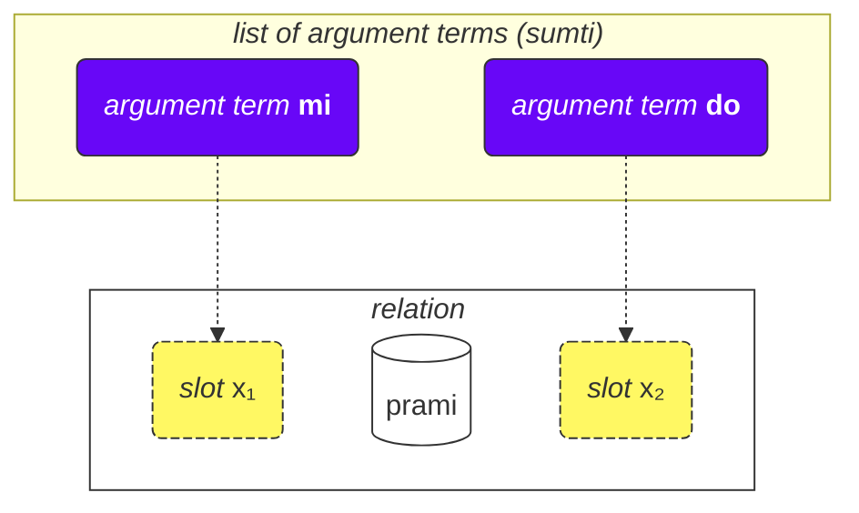
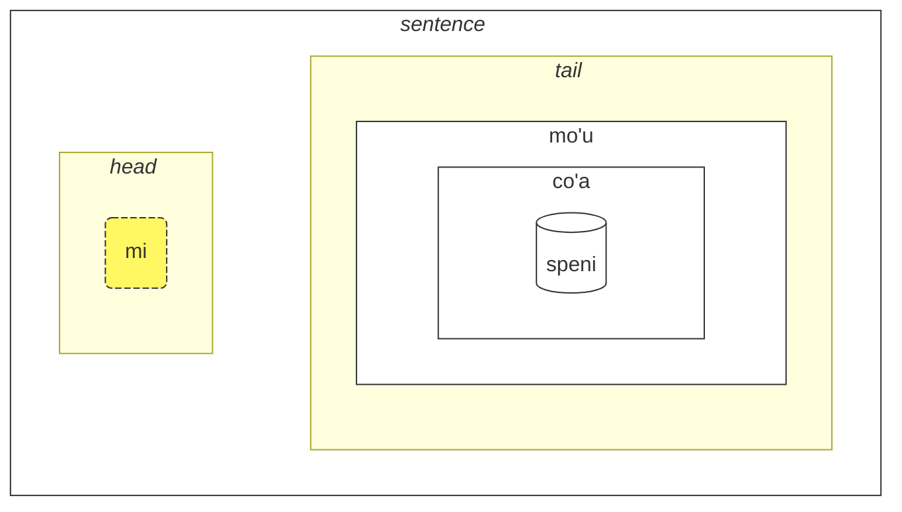

## Aralin 2. Mas maraming batayang bagay

### Uri ng mga salita

Ang lahat ng mga salita sa Lojban ay nahahati sa tatlong pangkat:

- Mga salitang kaugnayan (tinatawag na **selbrivla** sa Lojban)
  - Mga Halimbawa: **gleki**, **klama**.
  - Ang mga salitang ito ay naglalaman ng hindi bababa sa isang kumpol ng mga katinig (dalawang o higit pang katinig na sunod-sunod) sa loob ng unang 5 tunog + sila ay nagtatapos sa isang patinig.
- Partikulo (tinatawag na **cmavo** sa Lojban)
  - Mga Halimbawa: **le**, **nu**, **mi**, **fa'a**.
  - Nagsisimula sila sa isang katinig (isa sa **b d g v z j p t k f s c x l m n r i u**), sinundan ng isang patinig (isa sa **a e i o u y au ai ei oi**). Opsyonal, pagkatapos nito, maaaring magkaroon ng isa o higit pang sunod-sunod na pagkakasunod ng apostrophe (**'**) at isang sumusunod na patinig. Halimbawa, maaaring maging mga partikulo ang **xa'a'a'a'a'a'a** at **ba'au'oi'a'e'o** (kahit na walang kahulugan na itinakda sa kanila).
  - Karaniwan na isulat ang ilang partikulo nang sunod-sunod nang walang puwang sa pagitan nila. Ipinapahintulot ito ng gramatika ng Lojban. Kaya, huwag magulat kung makakakita ka ng **lenu** sa halip ng **le nu**, **naku** sa halip ng **na ku**, **jonai** sa halip ng **jo nai**, at iba pa. Hindi binabago nito ang kahulugan. Gayunpaman, hindi ito naaangkop sa mga salitang kaugnayan; dapat paghiwalayin ang mga salitang kaugnayan ng mga puwang.
- Mga salitang pangalan (tinatawag na **cmevla** sa Lojban)
  - Mga Halimbawa: **.alis.**, **.doris**, **.lojban.**
  - Karaniwang ginagamit para sa mga pangalan.
  - Madaling maipagkaiba ang mga ito mula sa iba pang uri ng mga salita dahil sila ay nagtatapos sa isang katinig. Bukod dito, sila ay nakabalot ng dalawang tuldok sa simula at sa dulo. Sa pang-araw-araw na usapan, maaaring hindi isulat ang mga tuldok, ngunit sa pagsasalita, ang mga hinto na katumbas ng mga tuldok ay kailangan pa rin.

### Ayos ng mga argumento

Noong una ay ibinigay namin ang mga kahulugan ng mga salitang kaugnayan tulad ng:

mlatu
: … ay isang pusa, upang maging isang pusa

citka
: … kumakain …

prami
: … umiibig …

klama
: … pumupunta sa …

Maaaring magbigay ang mga diksiyunaryo ng mga kahulugan ng mga salitang kaugnayan gamit ang mga simbolo tulad ng x₁, x₂ atbp.:

prami
: x₁ umiibig sa x₂

karce
: x₁ ay isang sasakyan …

citka
: x₁ kumakain ng x₂ …

klama
: x₁ pumupunta sa x₂ …

Ang mga x₁, x₂, at iba pa ay ang eksplisitong tanda para sa _mga puwang_ (ibang tawag: _mga lugar_, _mga papel ng kaugnayan_, **terbricmi** sa Lojban), na kinakailangang punuin ng mga terminong argumento (**sumti**) sa pangungusap.

Ang mga numero ay kumakatawan sa pagkakasunod-sunod ng mga puwang na iyon na dapat punuin ng mga argumento.

Halimbawa:

> **mi prami do**
> _Iniibig kita._

Ang pangungusap na ito ay nagpapahiwatig din na

- x₁ ay tumutukoy sa _ang nagmamahal_, at
- x₂ ay tumutukoy sa _ang minamahal_.

Ibig sabihin, bawat relasyon ay may isa o higit pang mga puwang, at ang mga puwang na iyon ay tinutukoy at tinatalaga bilang x₁, x₂, at iba pa. Inilalagay natin ang mga argumento tulad ng **mi**, **do**, **le tavla** atbp. nang sunod-sunod, kaya't napupunan ang mga puwang na ito at nagbibigay ng konkretong kahulugan sa relasyon, kaya't nabubuo ang isang pangungusap.

Ang kagandahan ng ganitong estilo ng mga kahulugan ay ang lahat ng mga kalahok sa isang relasyon ay nasa isang kahulugan.

Maaari rin nating tanggalin ang mga argumento upang gawing mas malabo ang pangungusap:

> **carvi**
> _Umuulan._
> `ulan, umuulan`

(kahit na ang oras dito ay natutukoy sa konteksto, maaari rin itong ibig sabihin ng _Madalas umuulan_, _Umuulan noon_, atbp.)

> **prami do**
> _May nagmamahal sa iyo._
> `nagmamahal sa iyo`

Ang lahat ng mga puwang na hindi tinukoy sa isang relasyon ay nangangahulugang **zo'e** = _isang bagay/isang tao_ kaya't pareho ito ng

> **zo'e prami do**
> _May nagmamahal sa iyo._

At

> **prami**

ay pareho ng

> **zo'e prami zo'e**
> _May nagmamahal sa isang tao._

Ang mga modal na termino tulad ng **ca**, **fa'a** atbp. ay nagdaragdag ng mga bagong puwang sa mga relasyon, ngunit hindi nila napupunan ang mga puwang ng mga relasyon. Sa

> **mi klama fa'a do**
> _Pupunta ako patungo sa iyo._

ang ikalawang puwang ng **klama** ay hindi pa rin tinukoy. Halimbawa:

> **mi klama fa'a le cmana le zdani**
> _Pupunta ako (patungo sa bundok) sa tahanan._

dito, ang ikalawang puwang ng **klama** ay **do**. Ang pangungusap ay nangangahulugang ang bundok ay isang direksyon lamang, samantalang ikaw ang dulo.

Dito, ang terminong **fa'a la cmana** (_patungo sa direksyon ng bundok_) ay hindi pumapalit sa ikalawang puwang ng relasyon na **klama**. Ang ikalawang puwang ng **klama** ay **le zdani** dito.

Ang pangungusap ay nangangahulugang na ang aking tahanan ay simpleng matatagpuan sa direksyon ng bundok, ngunit hindi kinakailangang ibig sabihin na gusto kong marating ang bundok na iyon. Ang pangwakas na destinasyon ng aking pagdating ay hindi kinakailangang ang bundok kundi ang tahanan.

Gayundin, sa

> **mi citka ba le nu mi cadzu**
> _Kumakain ako pagkatapos akong maglakad._

ang ikalawang lugar ng **citka** ay hindi pa rin isinama. Ang bagong salita na **ba** kasama ang kanyang argumento na **le nu mi cadzu** ay nagdaragdag ng kahulugan sa pangungusap.

Ang pagkakasunod-sunod ng mga argumento ng compound relation ay pareho sa huli nitong bahagi:

> **tu sutra bajra pendo mi**
> _Iyan ang aking mabilis na kaibigan na tumatakbo._
> `Iyan ay isang mabilis na kaibigan na tumatakbo para sa akin.`

> **tu pendo mi**
> _Iyan ang aking kaibigan._
> `Iyan ay kaibigan para sa akin.`

pendo
: ... ay kaibigan ng ... (isang tao)

Kaya ang pagkakasunod-sunod ng mga argumento ay pareho sa **pendo** lamang.

### Higit sa dalawang lugar

Maaaring may higit sa dalawang lugar. Halimbawa:

> **mi pinxe le djacu le kabri**
> _Umiinom ako ng tubig mula sa tasa._

pinxe
: x₁ umiinom ng x₂ mula sa x₃

> **le kabri**
> _ang tasa_

Sa kasong ito, may tatlong lugar, at kung nais mong alisin ang ikalawang lugar sa gitna, dapat mong gamitin ang **zo'e**:
> **mi pinxe zo'e le kabri**
> _Umiinom ako ng \[bagay\] mula sa tasa._

Kung hindi mo isasama ang **zo'e**, makakakuha ka ng walang kabuluhang bagay:

> **mi pinxe le kabri**
> _Umiinom ako ng tasa._

Isang halimbawa pa:

> **mi plicru do le plise**
> _Binibigyan kita ng mga mansanas._

plicru
: x₁ nagbibigay, nagdodonate sa x₂ ng ilang bagay x₃; pinapayagan ni x₁ ang isang tao x₂ na gamitin ang x₃

### Mga relasyon sa loob ng relasyon

Sa
> **le nicte cu nu mi viska le lunra**
> *Ang gabi ay kung kailan ko nakikita ang Buwan.*

mayroon tayong

- **le nicte** bilang x₁ ng relasyon,
- **nu mi viska le lunra** bilang pangunahing relasyon.

Gayunpaman, sa loob ng **nu mi viska le lunra**, mayroon tayong isa pang pangungusap na mayroon

- **mi** - x₁ ng inner relation,
- **viska** - ang inner relation,
- **le lunra** - x₂ ng inner relation.

Kaya, bagaman mayroong inner structure, ang **nu mi viska le lunra** ay pa rin isang relasyon na ang unang term ay puno ng **le nicte** sa kasong ito.

Gayundin, sa

> **mi citka ba le nu mi dansu**
> _Kumakain ako pagkatapos akong sumayaw._

mayroon tayong

- **mi** bilang x₁ ng relasyon,
- **citka** bilang pangunahing konstruksyon ng relasyon,
- **ba le nu mi dansu** bilang isang modal na term ng pangunahing relasyon ng pangungusap.

Sa loob ng term na ito, mayroon tayong:

- **mi** bilang x₁ ng relasyon sa loob ng term
- **dansu** bilang pangunahing konstruksyon ng relasyon sa loob ng term.

Ang "recursive" na mekanismo ng pagbabalot ng mga relasyon sa loob ng mga relasyon ay nagbibigay-daan sa eksaktong pagsasalarawan ng mga komplikadong ideya.

### Bakit inilalarawan ang mga salitang relasyon sa paraang iyon?

Ang Ingles ay gumagamit ng limitadong set ng mga preposisyon na paulit-ulit na ginagamit sa iba't ibang mga pandiwa at, kaya, walang tiyak na kahulugan. Halimbawa, tingnan ang preposisyon sa Ingles na _to_:

> _I speak to you._

<!-- -->
> _I come to you._
<!-- -->

> _To me it looks pretty._

Sa bawat halimbawa na iyon, mayroon ang _to_ ng bagong papel na, sa pinakamabuti, medyo katulad sa mga papel sa iba pang mga pangungusap.

Mahalaga na tandaan na gumagamit ng iba't ibang paraan ang ibang wika sa pagtatakda ng mga papel ng mga pandiwa na, sa maraming kaso, ay lubos na iba sa mga ginagamit sa Ingles.

Halimbawa, sa Lojban, itinatakda ang mga pangunahing papel (slots) ng mga relasyon sa pamamagitan ng ganap na pagtatakda ng mga relasyon na may mga papel na inilalagay sa sunod-sunod (o may marka na **fa**, **fe**, at iba pa):

klama
: x₁ pumupunta sa x₂ …

tavla
: x₁ nagsasalita sa x₂ …

melbi
: x₁ maganda, maganda sa paningin ni x₂ …

Ang mga pangunahing papel na ito ay mahalaga sa pagtatakda ng mga relasyon.

Gayunpaman, maaaring may mga opsyonal na papel na gumagawa ng mga relasyon na mas eksakto:

> _I speak to you while I'm eating._
<!-- -->

> _It's hard to me because this thing is heavy._

Sa Lojban, ang katulad na konsepto ng mga opsyonal na papel na ito ay ipinapahayag sa pamamagitan ng hiwalay na mga relasyon o, para sa karamihan ng mga karaniwang kaso, gamit ang mga modal terms:

> **mi tavla do ze'a le nu mi citka**
> _I speak to you while I'm eating._
<!-- -->
> **nandu mi ri'a le nu ti tilju**
> _It's hard to me because this thing is heavy._

nandu
: x₁ mahirap para kay x₂

tilju
: x₁ mabigat

Ang mga preposisyon sa Ingles ay katulad ng mga modal particles sa Lojban, bagaman maaaring magkaroon ng maraming kahulugan ang isang karaniwang preposisyon sa Ingles habang sa Lojban, bawat modal particle ay mayroon lamang isang (kahit pa labis na malabo) na kahulugan.

### Pangkalahatang mga patakaran sa pagkakasunod-sunod ng mga argumento

Minsan ay mahirap tandaan ang pagkakasunod-sunod ng mga lugar sa mga relasyon, ngunit huwag mag-alala — hindi mo kailangang tandaan ang lahat ng mga lugar ng lahat ng mga salitang relasyon. (Naalala mo ba ang kahulugan ng daan-daang libo ng mga salita sa Ingles?)

Maaari kang mag-aral ng mga lugar kapag ito ay makabuluhan o kapag ginagamit ito ng mga tao sa pakikipag-usap sa iyo.

Karamihan sa mga salitang may kaugnayan ay may dalawa o tatlong lugar.

Karaniwan, maaari mong hulaan ang pagkakasunod-sunod gamit ang konteksto at ilang mga panuntunan:

1. Ang unang lugar ay kadalasang ang tao o bagay na gumagawa ng isang bagay o mayroon ng isang katangian:

    **klama** = _x₁ goes …_

2. Ang bagay na tinutukoy ng isang aksyon ay karaniwan nasa pagkatapos ng unang lugar:

    **punji** = _x₁ puts x₂ on x₃_,

3. At karaniwan ay puno ang susunod na lugar ng tumatanggap:

    **punji** = _x₁ puts x₂ on x₃_,

4. Ang mga lugar ng destinasyon (_to_) ay halos palaging nasa unahan bago ang mga lugar ng pinanggalingan (_from_):

    **klama** = _x₁ goes to x₂ from x₃_

    <pixra url="/assets/pixra/cilre/klama_fi.webp" caption="le prenu cu klama fi le zarci" definition="Ang tao ay lumalabas ng tindahan."></pixra>

5. Ang mga lugar na hindi gaanong ginagamit ay karaniwan nasa dulo. Ito ay mga bagay tulad ng _by standard_, _by means_ o _made of_.

Ang pangkalahatang ideya ay ang mga lugar na pinakamalamang na gagamitin ay nauuna.

Hindi kailangang punuin ang lahat ng mga lugar sa lahat ng pagkakataon. Ang mga hindi napupunan na mga lugar ay may mga hindi kaukulang halaga o halata sa tagapagsalita (kumukuha ito ng halaga ng **zo'e** = _something_).

### Mga Infinitive

Ang mga infinitive ay mga pandiwa na kadalasang may prefix na _to_ sa Ingles. Halimbawa nito ay _I like to run_, kung saan ang _to run_ ay ang infinitive.

> **le verba cu troci le ka cadzu**
> _Ang bata ay sumusubok na maglakad._

le verba
: ang bata, ang mga bata

troci
: x₁ sumusubok na gawin o maging x₂ (ka)

cadzu
: x₁ naglalakad

<pixra url="/assets/pixra/cilre/troci_cadzu.webp" caption="le verba cu troci le ka cadzu" definition="Ang bata ay sumusubok na maglakad."></pixra>

Ang partikula ng **ka** ay gumagana katulad ng **nu**. Ito ay naglalaman ng isang pangungusap.

Ang pangunahing pagkakaiba ay may isang puwang sa loob ng pangungusap na dapat i-link sa pamamagitan ng isang argumento sa labas ng pangungusap na ito.

Sa kasong ito, ang unang argumento **le verba** ng relasyon **troci** ay naglalagay ng link sa unang hindi napupunan na puwang ng loob na pangungusap **cadzu** (na nasa loob ng **ka**).

Sa ibang salita, ang bata ay sumusubok na makamit ang isang kalagayan kung saan **le verba cu cadzu** (ang argumentong **le verba** ay magpupuno sa unang hindi napupunan na puwang ng relasyon **cadzu**).

May mga relasyon na nangangailangan lamang ng mga infinitive sa ilang mga puwang nila. Ang mga kahulugan ng mga salitang gaya nito ay nagtatakda ng mga puwang na gaya nito bilang _property_ o **ka**. Halimbawa:

cinmo
: x₁ feels x₂ (ka)

Ibig sabihin nito ay ang infinitive sa pangalawang puwang (x₂) ay inilalapat sa ibang puwang (malamang, sa unang puwang, x₁). Ang mga kaso kung saan inilalapat ang infinitive sa mga puwang maliban sa x₂ ay bihirang mangyari at ipinaliwanag sa mga diksyunaryo para sa mga kaugnay na relasyon o sa kaso ng mga salitang relasyon na imbento nang hindi opisyal, maaaring maipaliwanag sa pamamagitan ng common sense sa pamamagitan ng analogy sa iba pang mga salitang relasyon.

Isang halimbawa pa:

<pixra url="/assets/pixra/cilre/sidju.webp" caption="ra sidju le pendo le ka bevri le dakli" definition="He/she helps the friend to carry the bags."></pixra>

> **ra sidju le pendo le ka bevri le dakli**
> _Siya ay tumutulong sa kaibigan na magdala ng mga bag._

sidju
: x₁ tumutulong sa x₂ na gawin ang x₃ (ka)

Ang salitang relasyon na **sidju** ay nangangailangan na punan ang ikatlong puwang nito ng isang infinitive.

bevri
: x₁ nagdadala ng x₂

le dakli
: ang bag, ang mga bag

Tandaan na ang kahulugan lamang ng unang puwang na hindi pa napupunan ng embedded relation ang kahulugan ng outer place:

> **mi troci le ka do prami**
> _Sinusubukan kong mahalin ka ng iyo._

tcidu
: x₁ nagbabasa ng x₂ mula sa x₃

Dito, ang unang puwang na hindi pa napupunan ay ang ikalawang puwang ng **prami**, kaya ito ay kumukuha ng halaga **mi** (_ako_).

Maaari rin gamitin ang panghalip na **ce'u** upang tuwirang tukuyin ang isang puwang na kailangang ilapat sa isang outer argument:

> **mi troci le ka do prami ce'u**
> _Sinusubukan kong mahalin ka ng iyo._

Isang halimbawa pa:

> **mi cinmo le ka xebni ce'u**
> **mi cinmo le ka se xebni**
> _Nararamdaman ko na may isang taong may galit sa akin._
> _Nararamdaman ko ang pagkakagalit sa akin._

### Uri ng mga puwang

Madalas na binabanggit ng diksyunaryo ang iba't ibang uri ng mga puwang, halimbawa:

djica
: x₁ gustong-gusto x₂ (event)

Ang _event_ na ito ay nangangahulugan na kailangan mong punan ang puwang ng isang argumentong kumakatawan sa isang pangyayari. Halimbawa:

le nicte
: gabi

le nu mi dansu
: ang aking pagsasayaw

Kaya nakuha natin

> **mi djica le nicte**
> _Gusto ko ang pangyayaring gabi._

<!-- -->

> **do djica le nu mi dansu**
> _Gusto mo akong sumayaw._

Sa Lojban, hindi pinapayagan na sabihin, halimbawa:

> **mi djica le plise**
> _Gusto ko ang mansanas._

dahil gusto mong gawin ang isang bagay sa mansanas o gusto mong maganap ang isang pangyayari na may kinalaman sa mansanas, tulad ng:

> **mi djica le nu mi citka le plise**
> _Gusto kong kumain ng mansanas._

Pansinin na ang paglalagay ng isang relasyon na umaasahan ng isang pangyayari sa loob ng **nu** ay nagbabago ng kahulugan:

> **le zekri cu cumki**
> _Ang krimen ay posible._

Ihambing:

> **le nu zekri cu cumki**
> _Posible na ang isang bagay ay isang krimen._

### Pag-angat

> **mi stidi le ka klama le barja**
> _Inirerekomenda ko ang pagpunta sa bar._

> **mi stidi tu'a le barja**
> _Inirerekomenda ko ang bar._

> **mi djica le nu mi citka le plise**
> _Gusto kong kumain ng mansanas._

> **mi djica tu'a le titla**
> _Gusto ko ang matamis._

Ang pagkakabuo ng lugar ay maaaring magdulot ng labis na pasanin sa pagtukoy ng mga aksyon o pangyayari. Minsan, nais nating tukuyin lamang ang ilang bagay sa mga pangyayari o lugar na iyon at iwasan ang paglalarawan ng aksyon o pangyayari sa kabuuan.

Sa mga halimbawa sa itaas, ang _Inirerekomenda ko ang bar._ malamang na nangangahulugan ng pagpunta sa bar at ang _Gusto ko ang mansanas._ ay nangangahulugan ng pagkain nito.

Gayunpaman, ang salitang relasyon sa Lojban na **stidi** ay nangangailangan ng isang katangian sa kanyang x₂ slot. Gayundin, ang **djica** ay nangangailangan ng isang pangyayari sa kanyang x₂ slot.

Ang maikling tinatawag na salitang **tu'a** bago sa isang termino ay nagpapahiwatig ng isang abstraksyon (katangian, pangyayari, o proposisyon) ngunit pumipili lamang ng terminong ito mula sa abstraksyong ito at iniiskip ang iba pa. Maaari itong maging malaboang isalin bilang _something about_:

> **mi stidi tu'a le barja**
> _Inirerekomenda ko ang tungkol sa bar (marahil ang pagbisita dito, pagkikita malapit dito, atbp.)._

<!-- -->

> **mi djica tu'a le plise**
> _Nais ko ng isang bagay na may kinalaman sa mansanas (marahil pagkain, pagnguya, pagdila, pagtapon sa kaibigan, atbp.)_

> **tu'a le cakla cu pluka mi**
> _Nakakatuwa sa akin ang tsokolate (marahil dahil sa lasa nito)._
> `Mayroong nakakatuwang bagay sa tsokolate para sa akin`

cakla
: x₁ ay isang tsokolate

Kapag iniwasan ang mga abstraksyon, tanging ang konteksto lamang ang nagpapakilala kung ano ang hindi isinama.

Maaari rin baguhin ang pangunahing konstruksiyon ng relasyonal:

> **le cakla cu jai pluka mi**
> **tu'a le cakla cu pluka mi**
> _Nakakatuwa sa akin ang tsokolate._

Ito ay nagbibigay-daan sa paglikha ng malabo o di-tiyak na mga termino ng argumento gamit ang **jai**:

> **le jai pluka cu zvati ti**
> _Narito ang nakakatuwang bagay._

Dahil ang **le pluka** (_ang nakakatuwang pangyayari_) ay abstrakto, hindi maaaring tukuyin ang lokasyon nito. Gayunpaman, maaaring mailagay ang isang partisipante sa abstraksyon sa isang tiyak na lugar.

### Mga Lugar sa loob ng mga argumento

Paano natin sasabihin _Ikaw ay kaibigan ko_?

> **do pendo mi**
> _Ikaw ay kaibigan ko._
> `Ikaw ay isang kaibigan ng akin.`

<pixra url="/assets/pixra/cilre/pendo.webp" caption="le pendo" definition="ang kaibigan / ang mga kaibigan"></pixra>

At ngayon, paano natin sasabihin _Matalino ang kaibigan ko._?

> **le pendo be mi cu stati**
> _Matalino ang kaibigan ko._

Kaya kapag binago natin ang isang relasyon patungo sa isang argumento (**pendo** — _maging kaibigan_ patungo sa **le pendo** — _ang kaibigan_), maaari pa rin nating panatilihin ang iba pang mga lugar ng relasyon na iyon sa pamamagitan ng paglalagay ng **be** pagkatapos nito.

Sa pangkaraniwan, ito ay naglalagay sa ikalawang lugar (x₂). Maaari nating ilagay ang higit pang mga lugar sa pamamagitan ng paghihiwalay sa mga ito gamit ang **bei**:

> **mi plicru do le plise**
> _Binibigyan kita ng mansanas._

<pixra url="/assets/pixra/cilre/plicru.webp" caption="le prenu cu plicru le pendo le plise" definition="Ang tao ay nagbibigay sa kaibigan ng mansanas."></pixra>
<!-- -->

> **le plicru be mi bei le plise**
> _Ang nagbibigay ng mansanas sa akin_

<!-- -->

> **le plicru be mi bei le plise cu pendo mi**
> _Ang nagbibigay sa akin ng mansanas ay kaibigan ko._
> `Ang nagbibigay sa akin ng mansanas ay kaibigan ko.`

Isang halimbawa pa:

<!-- > **le pendo be mi cu tavla**
> _Ang mga kaibigan ko ay nag-uusap._
> **le pendo mi cu tavla**
> **le pendo cu tavla mi**
> _Ang mga kaibigan ay nagsasalita sa akin._ -->

> **mi klama le pendo be do**
> _Pumupunta ako sa isang kaibigan mo._

klama
: x₁ pumupunta sa x₂ mula kay x₃ …

Hindi natin maaaring alisin ang **be** dahil ang **le pendo do** ay dalawang independiyenteng lugar:

> **mi klama le pendo do**
> _Pumupunta ako sa isang kaibigan mula sa iyo._

Dito, ang **do** ay kumuha ng ikatlong puwesto ng **klama** dahil hindi ito konektado sa _pendo_ sa pamamagitan ng **be**.

Hindi rin natin magagamit ang **nu** dahil ang **le nu pendo do** ay ang pangyayari ng pagiging kaibigan mo.

Kaya ang **le pendo be do** ang tamang solusyon.

Isang halimbawa pa:

> **la .lojban. cu bangu mi**
> _Ang Lojban ay ang wika ko._
> `Ang Lojban ay isang wika ko.`

Gayunpaman,

> **mi nelci le bangu be mi**
> _Gusto ko ang aking wika._

Ang paggamit ng **be** para sa mga relasyon na hindi nai-convert sa mga argumento ay walang epekto:

> **mi nelci be do** ay pareho sa
> **mi nelci do**

### Mga Pangungusap na Relatibo

> **le prenu poi pendo mi cu tavla mi**
> _Ang tao na kaibigan ko ay nagsasalita sa akin._

<!-- -->

> **le prenu noi pendo mi cu tavla mi**
> _Ang tao, na sa pagkakataon ay kaibigan ko, ay nagsasalita sa akin._

blabi
: … ay puti

Sa unang pangungusap, ang salitang _that_ ay mahalaga sa pagkilala sa taong tinutukoy. Ito ay naglilinaw kung sino sa mga tao sa konteksto ang tinutukoy natin. Pinipili natin ang mga kaibigan ko sa marahil maraming tao sa paligid. Baka mayroong isang tao lang sa paligid na kaibigan ko.

Tungkol naman sa _na sa pagkakataon ay kaibigan ko_ mula sa pangalawang pangungusap, ito ay nagbibigay lamang ng karagdagang impormasyon tungkol sa tao. Hindi ito tumutulong sa atin na kilalanin ang tao. Halimbawa, maaaring mangyari ito kapag lahat ng tao sa paligid ay kaibigan ko.

**poi pendo mi** ay isang pangungusap na relativo, isang relasyon na nakakabit sa kanan ng argumento **le prenu**. Ito ay natatapos bago ang susunod na salita na **cu**:

> **le prenu (poi pendo mi) cu tavla mi**
> _Ang tao na kaibigan ko ay nagsasalita sa akin._

Sa Lojban, ginagamit natin ang **poi** para sa mga pangungusap na relativo na nagpapakilala ng mga entidad (bagay, tao o pangyayari) at **noi** para sa karagdagang impormasyon.

> **la .bob. ba co'a speni le ninmu poi pu xabju le nurma**
> _Si Bob ay mag-aasawa ng isang babae na nanirahan sa probinsya._

xabju
: … nakatira sa …, … naninirahan sa … (lugar, bagay)

le nurma
: ang rural na lugar

Ang pangungusap na ito ay hindi nagsasabi na si Bob ay hindi mag-aasawa ng iba! Ang pagtanggal ng pangungusap na may **poi** ay nagbabago ng kahulugan:

> **la .bob. ba co'a speni le ninmu**
> _Mag-aasawa si Bob ng isang babae._

Isang halimbawa pa:

> **le prenu poi gleki cu ze'u renvi**
> _Ang mga taong masaya ay namumuhay ng matagal._

ze'u
: modal na termino: sa mahabang panahon

renvi
: mabuhay

Ang pagtanggal ng pangungusap na may **poi** ay nagbabago ng kahulugan:

> **le prenu ze'u renvi**
> _Ang mga tao ay namumuhay ng matagal._

Sa kabilang dako, ang pangungusap na may **noi** ay naglalaman lamang ng karagdagang impormasyon tungkol sa argumento na kanilang kinakabit. Sapat na tukuyin ng argumento na ito ang kanyang sarili kaya ang pagtanggal ng pangungusap na may **noi** ay hindi nagbabago ng kahulugan nito:

> **mi nelci la .doris. noi mi ta'e zgana bu'u le panka**
> _Gusto ko si Doris na madalas kong makita sa parke._
> _Gusto ko si Doris. Ano pa ba ang masasabi ko tungkol sa kanya? Madalas kong makita siya sa parke._

zgana
: magmasid (gamit ang anumang pandama)

<pixra url="/assets/pixra/cilre/panka_ninmu.webp" caption="le prenu noi mi ta'e zgana bu'u le panka" definition="Ang tao na madalas kong makita sa parke."></pixra>

Ang pagtanggal ng pangungusap na may **noi** ay nagpapalit ng kahulugan: _Gusto ko si Doris._

Sa pagsasalita ng Ingles, madalas na natutukoy ang pagkakaiba gamit ang intonasyon o sa pamamagitan ng hula. Bukod dito, ang pangungusap na may **noi** ay karaniwang may mga commas sa Ingles. Ginagamit ang _which_ o _who_ sa kanila, at hindi ginagamit ang salitang _that_ sa kanila.

Magkaroon tayo ng isa pang halimbawa.

> **mi klama le pa tricu**
> _Pumupunta ako sa puno._

<!-- -->

> **le pa tricu cu barda**
> _Ang puno ay malaki._

le pa tricu
: ang puno (isang puno)

barda
: x₁ ay malaki

At ngayon pagsamahin natin ang dalawang pangungusap na iyon:

> **le tricu noi mi klama ke'a cu barda**
> _Ang puno, kung saan ako pumupunta, ay malaki._

Pansinin ang salitang **ke'a**. Inilipat natin ang pangalawang pangungusap tungkol sa parehong puno sa isang pangungusap na may kaugnay at pinalitan ang argumento na **le tricu** ng **ke'a** sa pangungusap na may kaugnay. Kaya ang panghalip **ke'a** ay katulad ng _who_ at _which_ sa Ingles. Ito ay tumutukoy sa argumento na kinakabit ng pangungusap na may kaugnay.

Kaya, narito ang pagsasalin:

Kaya, literal na ang aming pangungusap sa Lojban ay naririnig na

> _Ang puno, na pupuntahan ko, ay malaki._

**ke'a** ay maaaring alisin kung sapat na ang konteksto. Pareho ang ibig sabihin ng dalawang sumusunod na pangungusap:

> **ang tao na kaibigan ko ay nagsasalita sa akin**
> **ang tao na ke'a kaibigan ko ay nagsasalita sa akin**
> _Ang tao na kaibigan ko ay nagsasalita sa akin._

Madalas na iniisip na ang **ke'a** ay pupunta sa unang lugar na walang laman:

> **gusto ko si Doris na madalas kong makita sa parke**
> **gusto ko si Doris na ke'a madalas kong makita sa parke**
> _Gusto ko si Doris na madalas kong makita sa parke._

Dito, ang **mi** ay pumupuno sa unang puwang ng relasyon **ta'e zgana** (_… madalas na nakikita …_), kaya iniisip na ang **ke'a** ay para sa sumunod na ikalawang puwang.

Ang mga pangungusap na may kaugnayan ay maaaring maglaman ng mga konstrak na may mga modal na termino:

> **ang puno na pinuntahan ko ngayon ay malaki**
> _Ang puno, na pinuntahan ko ngayon, ay malaki._

<pixra url="/assets/pixra/cilre/le_tricu_cu_barda.webp" caption="ang puno ay malaki" definition="Ang puno ay malaki."></pixra>

le cabdei
: ang araw na ito

Tandaan na ang **ca le cabdei** ay bahagi ng pangungusap na may kaugnayan. Ihalintulad ito sa:

> **ang puno na pinuntahan ko ay malaki ngayon**
> _Ang puno, na pinuntahan ko, ay malaki ngayon._

Ang kahulugan ay nagbago ng malaki.

Sa wakas, ang **voi** ay ginagamit upang bumuo ng mga argumento na katulad ng **le** ngunit may mga pangungusap na may kaugnayan:

> **ang mga ito na ang ngiti ay nagpapasaya sa akin ay nakaupo**
> _Ang mga ito na ang ngiti ay nagpapasaya sa akin ay nakaupo._

<pixra url="/assets/pixra/cilre/voi.webp" caption="gusto ko ang mga ito na ang ngiti ay nagpapasaya sa akin" definition="Gusto ko ang mga ito na ang ngiti ay nagpapasaya sa akin."></pixra>

ti
: ito malapit sa akin, mga ito malapit sa akin

cisma
: x₁ ngumiti

pluka
: x₁ ay kaaya-aya sa x₂

zutse
: x₁ umuupo, nakaupo sa x₂

Dito, itinatadhana ng **voi** ang bagay malapit sa akin.

Ihalintulad ito sa:

> **ito na ang ngiti ay nagpapasaya sa akin ay nakaupo**
> _Sa mga ito, ang ngiti ay nagpapasaya sa akin ay nakaupo._

**poi** naglilimita sa pagpili sa mga tinukoy sa pangungusap na may kaugnayan.
Ang halimbawang ito ay maaaring magpahiwatig na maraming mga bagay (tao, atbp.) sa paligid ko ngunit sa **poi** pinipili ko lamang ang mga kinakailangan.

> **ti noi le nu ke'a cisma cu pluka mi cu zutse**
> _Ang mga ito (na kung saan ang kanilang ngiti ay nakapagpapasaya sa akin) ay nakaupo._

**noi** simpleng nagdaragdag ng impormasyon na hindi kailangan upang matukoy kung saan tumutukoy ang **ti** (_ang mga ito_). Marahil, walang ibang tao sa paligid upang ilarawan.

Sa wakas, tulad ng **nu** may tamang marker sa kanang gilid na **kei**, mayroon tayong

ku'o
: tamang marker sa kanang gilid para sa **poi**, **noi**, at **voi**.

> **mi tavla la .doris. noi ca zutse tu ku'o .e la .alis. noi ca cisma**
> _Nag-uusap ako kay Doris, na ngayon ay nakaupo doon, at kay Alice na ngayon ay ngumingiti._

Pansinin na kung walang **ku'o** ay magkakaroon tayo ng **tu** (_doon_) na magkasama sa **la .alis.** (_Alice_) na magdudulot ng kakaibang kahulugan:

> **mi tavla la .doris. noi ca zutse tu .e la .alis. noi ca cisma**
> _Nag-uusap ako kay Doris, na ngayon ay nakaupo doon at nasa ibabaw ni Alice (na ngayon ay ngumingiti)._

Pansinin ang bahagi ng **zutse tu .e la .alis.**.

Para sa lahat ng **poi**, **noi**, at **voi** ang tamang marker sa kanang gilid ay pareho pa rin: **ku'o**.

### Maikling pangungusap. ‘_Tungkol sa_’

Minsan, maaaring kailanganin mong idikit ang karagdagang argumento sa isa pang argumento:

> **mi djuno le vajni pe do**
> _Alam ko ang isang mahalagang bagay tungkol sa iyo._

le vajni
: isang mahalagang bagay

Ang **pe** at **ne** ay katulad ng **poi** at **noi**, ngunit idinidikit nila ang mga argumento sa mga argumento:

> **le pa penbi pe mi cu xunre**
> _Ang pluma na akin ay pula._ (_akin_ ay mahalaga sa pagtukoy sa pluma na tinutukoy)

<!-- -->

> **le pa penbi ne mi cu xunre**
> _Ang pluma, na akin, ay pula._ (karagdagang impormasyon)

ne
: na may kaugnayan sa ... (may sumunod na argumento)

pe
: na may kaugnayan sa ... (may sumunod na argumento)

> **le pa penbi ne mi ge'u .e le pa fonxa ne do cu xunre**
> _Ang pluma, na akin, at ang telepono, na sa iyo, ay pula._

ge'u
: tamang marker sa kanang gilid para sa **pe**, **ne**.

### «**be**» at «**pe**»

Tandaan na ang mga pangungusap na may kaugnayan ay idinidikit sa mga argumento, habang ang **be** ay bahagi ng relasyon.

Sa katunayan, **le bangu pe mi** ang mas mahusay na pagsasalin ng _aking wika_, dahil, tulad sa Ingles, ang dalawang argumento ay may kaugnayan sa isa't isa sa isang malabo at malawak na paraan.

Gayunpaman, maaari mong sabihin **le birka be mi** bilang _ang aking braso_. Kahit na putulin mo ang iyong braso, mananatili pa rin ito sa iyo. Kaya't may lugar ang **birka** sa may-ari:

birka
: x₁ ay isang braso ng x₂

Ipapakita natin muli na ang isang konstrak na may **be** ay isang bahagi ng relasyon, samantalang ang **pe**, **ne**, **poi** at **noi** ay naglalapat sa mga argumento:

> **le pa melbi be mi fonxa pe le pa pendo be mi cu barda**
> `Ang magandang telepono sa akin ng kaibigan ko ay malaki.`

Dito, ang **be mi** ay nakalapat sa relasyon na **melbi** = _upang maging maganda sa … (isang tao)_ at sa gayon ay lumilikha ng bagong relasyon na **melbi be mi** = _upang maging maganda sa akin_. Ngunit ang **pe le pa pendo be mi** (_ng aking kaibigan_) ay inilalapat sa buong argumento na **le pa melbi be mi fonxa** (_ang magandang telepono sa akin_).

Maaari rin na mangyari na kailangan nating ilalapat ang **be** sa isang relasyon, baguhin ang relasyon na iyon sa isang argumento at pagkatapos ay ilalapat ang **pe** sa argumentong iyon:

> **le pa pendo be do be'o pe la .paris. cu stati**
> _Ang kaibigan mo na may kaugnayan sa Paris ay matalino._
> (<b>pe la .paris.</b> ay nakalapat sa buong argumento <b>le pa pendo be do be'o</b>)

<!-- -->

> **le pu plicru be do bei le pa plise be'o pe la .paris. cu stati**
> _Sino ang nagbigay sa iyo ng mansanas (at may kaugnayan sa Paris) ay matalino._
> (<b>pe la .paris.</b> ay nakalapat sa buong argumento <b>le pu plicru be do bei le pa plise be'o</b>)

be'o
: tama na marka sa kanang gilid ng string ng mga term na nakalapat sa **be** at **bei**

Sa mga halimbawang ito, may kaugnayan ang iyong kaibigan sa Paris (marahil, siya ay mula sa Paris).

Ihambing ito sa:

> **le pa pendo be do pe la .paris. cu stati**
> _Ang kaibigan mo (ikaw na may kaugnayan sa Paris) ay matalino._

<!-- -->

> **le pu plicru be do bei le pa plise pe la .paris. cu stati**
> _Sino ang nagbigay sa iyo ng mansanas (ang mansanas na may kaugnayan sa Paris) ay matalino._

Sa mga huling dalawang halimbawa, gayunpaman, ikaw ay may kaugnayan sa Paris o sa mansanas.

### ‘_Si Alice ay isang guro_’ at ‘_Si Alice ang guro_’

Sa Ingles, ang pandiwa _is, are, to be_ ay gumagawa ng isang pangngalan na gumagana tulad ng isang pandiwa. Sa Lojban, kahit ang mga konsepto tulad ng _pusa_ (**mlatu**), _tao_ (**prenu**), _bahay_ (**dinju**), _tahanan_ (**zdani**) ay gumagana tulad ng mga pandiwa (relasyon) sa default. Tanging mga panghalip ang gumagana bilang mga argumento.

Ngunit, narito ang tatlong mga kaso:

> **la .alis. cu ctuca**
> _Si Alice ay nagtuturo._

<pixra url="/assets/pixra/cilre/ctuca.webp" caption="mi ctuca" definition="Ako ay nagtuturo / Ako ay isang guro."></pixra>

<!-- -->

> **la .alis. cu me le ctuca**
> _Si Alice ay isa sa mga guro._

me
: … ay kasama sa …, … ay isa sa …, … ay mga miyembro ng … (sumusunod ang argumento)

> **la .alis. ta'e ctuca**
> _Si Alice ay madalas magturo._

ta'e
: modal na partikulo: ang pangyayari ay madalas mangyari

> **la .alis. cu du le ctuca**
> _Si Alice ang guro._

du
: … ay katulad ng …

Ang partikulong **me** ay may kasunod na argumento at nagpapahiwatig na malamang may iba pang mga guro, at si Alice ay isa sa kanila.

Ang partikulong **du** ay ginagamit kapag si Alice ay, halimbawa, ang guro na hinahanap o pinag-uusapan natin. Ito ay nagpapahiwatig ng pagkakakilanlan.

Kaya, maaaring ang **me** at **du** ay kung minsan ay katumbas ng kung paano natin ipinapahayag sa Ingles gamit ang pandiwa _to be/is/was_.

Sa Lojban, binibigyang-pansin natin ang kahulugan ng ating intensyon sabihin, kaysa sa pagtitiwala sa kung paano ito literal na ipinapahayag sa Ingles o iba pang wika.

Iba pang mga halimbawa:

> **mi me la .bond.**
> _Ako si Bond._

<!-- -->

> **mi du la .kevin.**
> _Ako si Kevin (ang hinahanap mo)._

<!-- -->

> **ti du la .alis. noi mi ta'e zgana bu'u le panka**
> _Ito si Alice na madalas kong makita sa parke._

**noi du** at **poi du** ay ginagamit upang ipakilala ang mga alternatibong pangalan para sa isang bagay. Ito ay katumbas sa Ingles _namely, i.e._:

> **la .alis. cu penmi le prenu noi du la .abdul.**
> _Si Alice ay nakilala ang tao, si Abdul._

Kapag gumagamit ng **me**, maaari mong iugnay ang ilang mga argumento gamit ang _at_:

> **tu me le pendo be mi be'o .e le tunba be mi**
> _Ito ang ilan (o lahat) ng aking mga kaibigan at mga kapatid._

tunba
: x₁ ay kapatid ni x₂

<pixra url="/assets/pixra/cilre/tunba.webp" caption="do tunba mi" definition="Ikaw ay aking kapatid."></pixra>

### Mga Ugnayan sa mga Modal na Partikulo

Maaari nating ilagay ang isang modal na partikulo hindi lamang bago ang pangunahing konstruksyon ng ugnayan ng pangungusap kundi pati na rin sa dulo nito, na nagbibigay ng parehong resulta:

> **mi ca tcidu**
> **mi tcidu ca**
> _Ako (ngayon ay nagbabasa)._

tcidu
: basahin (ang isang teksto)

Kapag gumagamit ng **nu**, lumilikha tayo ng isang relasyon na naglalarawan ng isang pangyayari. Pansinin ang pagkakaiba sa pagitan ng dalawang halimbawa na ito:

> **le nu tcidu ca cu nandu**
> _Ang kasalukuyang pagbabasa ay komplikado, mahirap._

<!-- -->

> **le nu tcidu cu ca nandu**
> _Ang pagbasa ngayon ay komplikado._

Iba pang mga halimbawa:

> **mi klama le pa cmana pu**
> _Pumunta ako sa bundok._
> `Pupunta ako sa isang bundok (sa nakaraan).`

<!-- -->

> **le nu mi klama le pa cmana pu cu pluka**
> _Na pumunta ako sa bundok ay nakakatuwa._

Maaari rin nating ilagay ang isa o higit pang mga modal na bahagi bilang unang elemento ng isang konstruksyon ng relasyon at halimbawa gamitin ang ganitong pinahusay na relasyon sa isang anyo ng argumento:

<pixra url="/assets/pixra/cilre/coha_purdi.webp" caption="le pu kunti tumla ca purdi" definition="Ang dating disyerto ay ngayon ay hardin."></pixra>

> **le pu kunti tumla ca purdi**
> _Ang dating disyerto ay ngayon ay hardin._

**pu** ay nauugnay sa **le kunti tumla** at **ca** ay nauugnay sa **purdi** (dahil ang **le pu kunti tumla** ay hindi maaaring magdagdag ng **ca** sa dulo).

<!-- Ito ay hindi nagtutol sa paggamit ng **be** pagkatapos ng pandiwa dahil, sa **be**, binabago mo ang pandiwa: itinuturing na iisang pandiwa ang **bangu be mi**. -->

Hindi problema ang pagkakaroon ng ilang modal na bahagi sa pagsunod:
> **le pu ze'u kunti tumla ca purdi**
> _Ang dating disyerto sa matagal na panahon ay ngayon ay hardin._

ze'u
: modal na termino: sa matagal na panahon

Ang paglalagay ng mga terminong bahagi pagkatapos ng mga pangngalan ay nag-uugnay sa kanila sa mga panlabas na relasyon:

<pixra url="/assets/pixra/cilre/cohu_purdi.webp" caption="le kunti tumla pu purdi" definition="Ang disyerto ay naging isang hardin."></pixra>

> **le kunti tumla pu purdi**
> **(le kunti tumla) pu purdi**
> _Ang disyerto ay naging isang hardin._

### Mga bagong argumento mula sa mga puwang ng parehong relasyon

> **do plicru mi ti**
> _Binibigyan mo ako nito._

<!-- -->

> **mi se plicru ti do**
> _Binibigyan ako nito ng iyo._

plicru
: Ang x₁ ay nagbibigay sa x₂ ng isang bagay na x₃ para sa paggamit

Maaari nating palitan ang unang dalawang puwesto sa relasyon gamit ang **se** at sa gayon ay mababago ang istraktura ng puwesto.

Ang **do plicru mi ti** ay nangangahulugang eksakto ang parehong bagay ng **mi se plicru do ti**. Ang pagkakaiba ay nasa estilo lamang.

Maaaring gusto mong baguhin ang mga bagay para sa iba't ibang diin, halimbawa, upang banggitin ang mga mas mahalagang bagay sa isang pangungusap nang mauna. Kaya ang sumusunod na mga pares ay nangangahulugang pareho:

> **mi prami do**
> _Iniibig kita._

<!-- -->

> **do se prami mi**
> _Iniibig ako ng iyo._

<!-- -->

> **le nu mi tadni la .lojban. cu xamgu mi**
> _Ang aking pag-aaral ng Lojban ay mabuti para sa akin._

xamgu
: … ay mabuti para sa (isang tao)

> **mi se xamgu le nu mi tadni la .lojban.**
> _Para sa akin, mabuti ang mag-aral ng Lojban._

Maaari ring gawin ito kapag ginagamit ang mga relasyon sa pagbuo ng mga argumento:

le plicru
: ang mga nagbibigay, ang mga nagbibigay, ang mga nagbibigay, ang mga nagbibigay

le se plicru
: ang mga tinanggap, mga tatanggap ng mga regalo

le te plicru
: ang mga bagay na ibinigay para sa paggamit, mga regalo

**te** ay pinalitan ang unang at ikatlong lugar ng mga relasyon.

Tulad ng alam natin, kapag idinagdag natin ang **le** sa harap ng isang konstruksyon ng relasyon, ito ay naging isang argumento.

- **le plicru** ay nangangahulugang _mga bagay na maaaring mag-fit sa unang lugar ng **plicru**_
- **le se plicru** ay nangangahulugang _mga bagay na maaaring mag-fit sa ikalawang lugar ng **plicru**_
- **le te plicru** ay nangangahulugang _mga bagay na maaaring mag-fit sa ikatlong lugar ng **plicru**_

Kaya sa Lojban, hindi natin kailangan ng mga hiwalay na salita para sa _nagbibigay_, _tatanggap_, at _regalo_. Ginagamit natin muli ang parehong relasyon at nag-iipon ng maraming pagsisikap dahil sa ganitong matalinong disenyo. Tunay nga, hindi natin maipaliwanag ang isang regalo nang hindi inilalagay sa isip na may nagbigay o magbibigay nito. Kapag ang mga kapaki-pakinabang na phenomena ay magkakaugnay, ipinapakita ito ng Lojban.

### Pagbabago sa iba pang mga lugar sa pangunahing relasyon

Ang serye ng **se, te, ve, xe** (sa alpabetikong ayos) ay binubuo ng mga partikula na pinalitan ang mga lugar sa pangunahing relasyon:

- **se** ay pinalitan ang unang at ikalawang lugar
- **te** ay pinalitan ang unang at ikatlong lugar
- **ve** ay pinalitan ang unang at ikaapat na lugar
- **xe** ay pinalitan ang unang at ikalimang lugar.

> **mi zbasu le pa stizu le mudri**
> _Ako ay gumawa ng upuan mula sa piraso ng kahoy._

zbasu
: x₁ nagtatayo, gumagawa ng x₂ mula sa x₃

le pa stizu
: ang upuan

le mudri
: ang piraso ng kahoy

> **le mudri cu te zbasu le stizu mi**
> _Ang piraso ng kahoy ang ginagamit ko sa paggawa ng upuan._

Ang **mi** ay ngayon ay naipwesto na sa ikatlong lugar ng relasyon at maaaring alisin kung tamad tayong tukuyin kung sino ang gumawa ng upuan o kung hindi natin alam kung sino ang gumawa nito:

> **le mudri cu te zbasu le stizu**
> _Ang piraso ng kahoy ang materyal ng upuan._

Katulad ng ating halimbawa sa **le se plicru** (_ang tatanggap_) at **le te plicru** (_ang regalo_), maaari nating gamitin ang **te**, **ve**, **xe** upang mag-derive ng higit pang mga salita mula sa iba't ibang mga lugar ng mga salitang may relasyon:

klama
: Ang x₁ ay pumupunta sa x₂ mula sa x₃ sa pamamagitan ng x₄ sa pamamagitan ng x₅

Kaya, maaari nating ma-derive na

le klama
: ang pumupunta / ang mga pumupunta

le se klama
: ang destinasyon na lugar

le te klama
: ang lugar ng pinagmulan ng paggalaw

le ve klama
: ang ruta

le xe klama
: ang paraan ng pagdating

**le xe klama** at ang ikalimang lugar ng **klama** ay maaaring magtukoy sa anumang paraan ng paggalaw, tulad ng pagmamaneho ng kotse o paglalakad.

Ang **se** ay mas madalas na ginagamit kaysa sa iba pang mga partikulo para sa pagpapalit ng mga lugar.

### Malayang pagkakasunod-sunod ng mga salita: mga tag para sa mga papel sa mga relasyon

Karaniwan, hindi natin kailangan ang lahat ng mga puwang, mga lugar ng isang relasyon, kaya maaari nating iwasan ang mga hindi kinakailangang mga ito sa pamamagitan ng pagpapalit sa mga ito ng **zo'e**. Gayunpaman, maaari nating gamitin ang _place tags_ upang tuwirang tumukoy sa isang kinakailangang puwang. Ang mga place tags ay gumagana tulad ng mga modal na partikulo ngunit tumutukoy sa istraktura ng lugar ng mga relasyon:

> Ang **mi prami do** ay pareho sa
> **fa mi prami fe do**
> _Iniibig kita._

- **fa** nagtatakda sa argumento na pumupuno sa unang puwang ng isang relasyon (x₁)
- **fe** nagtatakda sa argumento na pumupuno sa ikalawang puwang (x₂)
- **fi** nagtatakda sa argumento na pumupuno sa ikatlong puwang (x₃)
- **fo** nagtatakda sa argumento na pumupuno sa ikaapat na puwang (x₄)
- **fu** nagtatakda sa argumento na pumupuno sa ikalimang puwang (x₅)

Mga halimbawa pa:

> **mi klama fi le tcadu**
> _Ako ay pumupunta mula sa lungsod._

Ipinapakita ng **fi** na ang **le tcadu** ang ikatlong puwang ng **klama** (ang pinagmulan ng paggalaw). Kung walang **fi**, ang pangungusap ay magiging **mi klama le tcadu**, na nangangahulugang _Ako ay pumupunta sa lungsod._

> **mi pinxe fi le kabri** ay pareho sa
> **mi pinxe zo'e le kabri**
> _Ako ay umiinom (ng kahit ano) mula sa tasa._

pinxe
: Ang x₁ ay umiinom ng x₂ mula sa x₃

le kabri
: ang tasa, ang baso

<pixra url="/assets/pixra/cilre/pinxe_fi_le_kabri.webp" caption="le prenu cu pinxe fi le kabri" definition="Ang tao ay umiinom mula sa baso."></pixra>

> **mi tugni zo'e le nu vitke le rirni**
> **mi tugni fi le nu vitke le rirni**
> _Sumasang-ayon ako (sa isang tao) tungkol sa pagbisita sa mga magulang._

tugni
: x₁ sumasang-ayon sa isang tao x₂ tungkol sa x₃ (panukala)

le rirni
: ang magulang / ang mga magulang

Sa mga tag ng lugar, maaari nating ilipat ang mga lugar:

> **fe mi fi le plise pu plicru**
> _May nagbigay ng mansanas sa akin._

Dito,

- **le plise** = _ang mansanas_, inilagay natin ito sa ikatlong lugar ng **plicru**, kung ano ang ibinigay
- **mi** = _sa akin_, inilagay natin ito sa ikalawang lugar ng **plicru**, ang tatanggap.

Tulad ng makikita natin sa huling halimbawa, hindi natin maaaring isalamin ang pagkakasunod-sunod ng mga salita sa pagsasalin nito sa Ingles.

Ang malawak na paggamit ng mga tag ng lugar ay maaaring gawing mas mahirap ang ating pagsasalita, ngunit nagbibigay ito ng higit na kalayaan.

Hindi tulad ng serye ng **se**, ang paggamit ng mga tag ng lugar tulad ng **fa** ay hindi nagbabago ng istraktura ng lugar.

---

Maaari nating gamitin ang mga tag ng lugar sa loob ng mga argumento sa pamamagitan ng paglalagay sa kanila pagkatapos ng **be**:

> **le pa klama be fi le tcadu cu pendo mi**
> _Ang pumupunta sa lungsod ay kaibigan ko._

---

Maaari rin nating ilagay lahat ng mga argumento ng isang pangunahing relasyon sa harap ng hulihang bahagi ng pangungusap (pinananatili ang kanilang relasyon sa isa't isa). Dahil sa kalayaaan na ito, maaari nating sabihin:

> **mi do prami** na pareho sa
> **mi do cu prami** na pareho sa
> **mi prami do**
> _Iniibig kita._

<!-- -->

> **ko kurji ko** ay pareho sa
> **ko ko kurji**
> _Mag-ingat ka._

Ang sumusunod na mga pangungusap ay pareho rin sa kahulugan:

> **mi plicru do le pa plise**
> _Binibigyan kita ng mansanas._

<!-- -->

> **mi do cu plicru le pa plise**
> _Binibigyan kita ng mansanas._

<!-- -->

> **mi do le pa plise cu plicru**
> _Binibigyan kita ng mansanas._

### Prenex

Ang Prenex ay isang "prefix" ng relasyon, kung saan maaari mong ideklara ang mga baryabol na gagamitin mamaya:

> **pa da poi pendo mi zo'u da tavla da**
> _Mayroong isang tao na kaibigan ko na siya'y nagsasalita sa kanyang sarili_

zo'u
: prenex separator

da
: panghalip: baryabol.

Ang panghalip na **da** ay isinalin bilang _mayroong isang bagay/mayroong isang tao…_ Kung gagamitin natin ang **da** sa ikalawang pagkakataon sa parehong relasyon, laging tumutukoy ito sa parehong bagay na tinutukoy ng unang **da**:

> **mi djica le nu su'o da poi kukte zo'u mi citka da**
> _Nais ko na mayroong kahit isang masarap na pagkain para kainin ko ito._

su'o
: bilang: kahit na 1

Kung ang baryabol ay gagamitin sa parehong relasyon at hindi sa anumang nakasulid na relasyon, maaari mong alisin ang prenex sa kabuuan:

> **mi djica le nu su'o da poi kukte zo'u mi citka da**
> **mi djica le nu mi citka su'o da poi kukte**
> _Nais ko na mayroong kahit isang masarap na pagkain para kainin ko ito._
> _Nais ko na mayroong bagay na kainin ko ito._

 parehong halimbawa ay nangangahulugan pareho, sa parehong mga kaso **su'o da** ay tumutukoy sa _mayroong (mayroon/walangroon) isang bagay o tao_.

Gayunpaman, ang prenex ay kapaki-pakinabang at kinakailangan kapag kailangan mong gamitin ang **da** nang malalim sa loob ng iyong relasyon, halimbawa sa nakasulid na relasyon:

> **su'o da poi kukte zo'u mi djica le nu mi citka da**
> _Mayroong kahit isang masarap na pagkain: Nais ko na kainin ko ito._

Pansinin kung paano nagbabago ang kahulugan. Dito, hindi natin maaaring alisin ang prenex dahil magbabago ito ng kahulugan ng naunang halimbawa.

Mga karagdagang halimbawa:

> **mi tavla**
> _Nag-uusap ako._

<!-- -->

> **mi tavla su'o da**
> **mi tavla da**
> _Mayroong isang taong kausap ko._

Sa pangkalahatan, ang **da** bilang isang panghalip mag-isa ay nangangahulugan ng pareho ng **su'o da** (_mayroong kahit isang…_) maliban kung ang eksplisitong bilang ay ginamit.

> **da tavla da**
> _Mayroong taong kausap ang sarili._

<!-- -->

> **da tavla da da**
> _Mayroong taong kausap ang sarili tungkol sa sarili._

tavla
: x₁ kausap ang isang tao x₂ tungkol sa paksa x₃

> **pa da poi ckape zo'u mi djica le nu da na ku fasnu**
> _Mayroong isang mapanganib na bagay: Nais ko na hindi ito mangyari._

**da** ay hindi nangangahulugan ng anumang partikular na bagay o pangyayari, na kadalasang kapaki-pakinabang:

> **xu do tavla su'o da poi na ku slabu do**
> _Nag-uusap ka ba sa isang hindi pamilyar sa iyo? (walang partikular na tao sa isip ang inilalarawan)._

<!-- -->

> **.e'u mi joi do casnu bu'u su'o da poi drata**
> _Mag-usap tayo sa ibang lugar (walang partikular na lugar sa isip)._

### Mga Argumento ng Pag-iral

> **pa da poi me le pendo be mi zo'u mi prami da**
> _Mayroong isang taong kaibigan ko, na aking minamahal sila._

Dahil ginamit lamang ang **da** ng isang beses, maaaring tayo ay ma-tempt na alisin ang prenex. Pero paano natin haharapin ang relative clause na **poi pendo mi** (_na kaibigan ko_)?

Sa kabutihang palad, sa Lojban may shortcut:

> **pa da poi me le pendo be mi zo'u mi prami da**
> **mi prami pa le pendo be mi**
> _Mayroong isang taong kaibigan ko, na aking minamahal sila._

 pareho ang kahulugan ng dalawang pangungusap.

Ang mga argumento na nagsisimula sa mga numero tulad ng **pa le pendo** (_mayroong isang taong kaibigan ko_), **ci le prenu** (_may tatlong tao_) ay maaaring tumukoy sa mga bagong entidad tuwing sila ay ginagamit. Kaya

> **pa le pendo be mi ca tavla pa le pendo be mi**
> _May isang kaibigan ako na nagsasalita sa isang kaibigan ko._

Ang pangungusap na ito ay hindi eksakto sa pagpapahayag kung ang iyong kaibigan ba ay nagsasalita sa kanyang sarili, o ikaw ay naglalarawan ng dalawang kaibigan mo na ang una ay nagsasalita sa ikalawang kaibigan mo.

Mas makatuwiran sabihin:

> **le pa pendo be mi ca tavla ri**
> _Ang kaibigan ko ay nagsasalita sa kanyang sarili._

ri
: pronoun: tumutukoy sa naunang argumento maliban sa **mi**, **do**.

Dito, ang **ri** ay tumutukoy sa naunang argumento: **le pa pendo** sa kabuuan.

Pansinin ang pagkakaiba:

- **da** ibig sabihin ay _mayroong bagay/tao_, ang **da** laging tumutukoy sa parehong entidad kapag ginamit ng higit sa isang beses sa parehong relasyon.
- argumento tulad ng **pa le mlatu** (may isang bilang lamang) ay katulad ng paggamit ng **pa da poi me le mlatu** ngunit maaaring tumukoy sa mga bagong entidad tuwing ito ay ginagamit.

> **mi nitcu le nu pa da poi mikce zo'u da kurju mi**
> _Kailangan ko ng isang doktor na mag-alaga sa akin (na nagpapahiwatig ng "kahit na anong doktor ay gagawin")._

<!-- -->

> **pa da poi mikce zo'u mi nitcu le nu da kurju mi**
> _Mayroong isang doktor na kailangan kong mag-alaga sa akin._

Isang halimbawa pa:

> **le nu pilno pa le bangu kei na ku banzu**
> _Ang paggamit ng isang wika lamang ay hindi sapat._

pilno
: … gumagamit ng …

banzu
: … sapat na para sa layunin …

> **le nu pilno le pa bangu kei na ku banzu**
> _Ang paggamit ng wika (ang isa sa usapan) ay hindi sapat._

Ang mga argumento ng pag-iral ay natural na ginagamit sa loob ng mga inner relation at sa **tu'a**:

> **mi djica le nu mi citka pa le plise**
> _Gusto kong kumain ng isang mansanas, ilang mansanas._

> **mi djica tu'a pa le plise**
> _Gusto ko ng tungkol sa isang mansanas, ilang mansanas (marahil, pagkain nito, marahil pagnguya, paglalaway, pagtapon sa kaibigan mo, atbp.)_

Pansinin ang pagkakaiba:

> **mi djica tu'a le pa plise**
> _Gusto ko ng tungkol sa mansanas (ang mansanas na tinutukoy)._

### ‘_Mayroon akong braso._’ ‘_Mayroon akong kapatid._’

Ang salitang Ingles na _to have_ ay may ilang kahulugan. Narito ang ilan sa mga ito.

> **pa da birka mi**
> _Mayroon akong braso._
> `Mayroong isang bagay na braso ko`

birka
: x₁ ay isang braso ni x₂

Ginagamit natin ang parehong diskarte para ipahayag ang mga relasyon sa pamilya:

> **pa da bruna mi**
> **mi se bruna pa da**
> _Mayroong isang taong kapatid ko._
> _Mayroon akong isang kapatid._
> `Mayroong isang taong kapatid ko`

<!-- -->

> **re lo bruna be mi cu clani**
> _Mayroon akong dalawang kapatid, at sila ay matatangkad._

clani
: x₁ ay mahaba, matangkad

Kaya hindi natin kailangan ang salitang _to have_ upang tukuyin ang mga ganitong relasyon. Ganito rin sa iba pang miyembro ng pamilya:

> **da mamta mi**
> **mi se mamta da**
> _Mayroon akong ina._

<!-- -->

> **da patfu mi**
> **mi se patfu da**
> _Mayroon akong ama._

<!-- -->

> **da mensi mi**
> **mi se mensi da**
> _Mayroon akong kapatid na babae._

<!-- -->

> **da panzi mi**
> **mi se panzi da**
> _Mayroon akong anak (o mga anak)._

panzi
: x₁ ay isang anak, bunga ni x₂

Tandaan na hindi kailangang gamitin ang isang bilang sa harap ng **da** kung sapat na ang konteksto.

---

Ang isa pang kahulugan ng _to have_ ay _to keep_:

> **mi ralte le pa gerku**
> _Mayroon akong aso._
> `Aking inaalagaan ang aso`

<!-- -->

> **mi ralte le pa karce**
> _Mayroon akong kotse._

ralte
: x₁ ay nag-aalaga ng x₂ sa kanilang pag-aari

---

Kung ikaw ay may-ari, may hawak ng isang bagay ayon sa ilang batas o dokumento, dapat mong gamitin ang **ponse**:

> **mi ponse le karce**
> _Akin ang kotse._
> _Mayroon akong kotse._

ponse
: x₁ ay may-ari ng x₂

### Saklaw

Ang pagkakasunod-sunod ng 
* mga termino, simula sa mga numero,
* mga modal terms, at
* mga modal particles ng mga relasyon na mga konstrak,

ay mahalaga at dapat basahin mula kaliwa patungo sa kanan:

> **ci le pendo cu tavla re le verba**
> _May tatlong kaibigan, bawat isa'y nakikipag-usap sa dalawang bata._

Ang kabuuang bilang ng mga bata dito ay maaaring hanggang anim.

Sa pamamagitan ng **zo'u**, maaari nating gawing mas malinaw ang ating pangungusap:

> **ci da poi me le pendo ku'o re de poi me le verba zo'u da tavla de**
> _Para sa tatlong **da** na kasama sa mga kaibigan, para sa dalawang **de** na kasama sa mga bata: nagsasalita si **da** kay **de**._

Dito, nakikita natin na bawat kaibigan ay sinasabing nakikipag-usap sa dalawang bata, at maaaring iba-iba ang mga bata tuwing pag-uusap, na may kabuuang anim na bata.

Paano natin maipapahayag ang ibang interpretasyon, kung saan dalawang bata lamang ang kasangkot? Hindi natin maaaring basta baligtarin ang pagkakasunod ng mga variables sa prenex patungo sa:

> **re de poi me le verba ku'o ci da poi me le pendo zo'u da tavla de**
> _Para sa dalawang **de** na kasama sa mga bata, para sa tatlong **da** na kasama sa mga kaibigan, nagsasalita si **da** kay **de**_

Bagaman limitado na natin ang bilang ng mga bata sa eksaktong dalawa, natatapos pa rin tayo sa hindi tiyak na bilang ng mga kaibigan, mula sa tatlo hanggang anim. Tinatawag na "scope distinction" ang pagkakaiba na ito: sa unang halimbawa, ang **ci da poi me le pendo** ay sinasabing may mas malawak na saklaw kaysa sa **re de poi me le verba**, kaya nauuna ito sa prenex. Sa ikalawang halimbawa, ang kabaligtaran ang totoo.

Upang gawing pantay ang saklaw, ginagamit natin ang espesyal na pangatnig na **ce'e** na nag-uugnay ng dalawang termino:

> **ci da poi me le pendo ce'e re de poi me le verba cu tavla**
> **ci le pendo ce'e re le verba cu tavla**
> _Tatlong kaibigan [at] dalawang bata, nag-uusap._

Ito ay pumipili ng dalawang grupo, isa para sa tatlong kaibigan at isa para sa dalawang bata, at nagsasabing bawat kaibigan ay nakikipag-usap sa bawat bata.

Mahalaga rin ang pagkakasunod-sunod ng mga modal particles na nagmumodipika sa pangunahing mga konstrak ng relasyon:

> **mi speni**
> _Ako ay kasal, may asawa o asawang lalaki._

<!-- -->

> **mi co'a speni**
> _Ako ay ikakasal._

<!-- -->

> **mi mo'u speni**
> _Ako'y balo._

mo'u
: term: ang pangyayari ay natapos

Kumpara natin ito:

> **mi mo'u co'a speni**
> _Ako'y bagong kasal._
> `Ako'y tapos na maging isang kasal na tao.`

> **mi co'a mo'u speni**
> _Ako'y naulila._
> `Ako'y naging tapos sa pagiging kasal.`

Kapag may ilang mga modal na partikulo sa isang pangungusap, ang patakaran ay basahin natin ang mga ito mula kaliwa patungo sa kanan nang magkasama, isipin ito bilang isang tinatawag na _imahinaryong paglalakbay_. Nagsisimula tayo sa isang tinatayang punto sa oras at espasyo (ang "ngayon at dito" ng tagapagsalita kung walang argumento na nakakabit sa kanan), at pagkatapos sinusunod natin ang mga modal nang isa-isa mula kaliwa patungo sa kanan.

Tingnan natin ang **mi mo'u co'a speni**.

Ang **mo'u** ay nangangahulugang ang isang pangyayari ay tapos na. Anong pangyayari? Ang pangyayaring **co'a speni** — ang maging kasal. Kaya, ang **mi mo'u co'a speni** ay nangangahulugang _Ako'y natapos na sa proseso ng pagiging kasal_, ibig sabihin, _Ako'y bagong kasal._

Sa ganitong mga kaso, sinasabi natin na ang **co'a speni** ay nasa "scope" ng **mo'u**.

Sa **mi co'a mo'u speni**, ang pagkakasunod-sunod ng mga pangyayari ay iba.

Una, sinasabi na nagsimula ang isang pangyayari (**co'a**), pagkatapos sinasabi na ito ay isang pangyayaring tapos na sa pagiging kasal. Kaya, ang **mi co'a mo'u speni** ay nangangahulugang _Ako'y naulila._

Maaari nating sabihin dito na ang **mo'u speni** ay nasa "scope" ng **co'a**.

Isang halimbawa pa:

> **mi co'a ta'e citka**
> _Ako'y nagsisimula nang palaging kumain._

<!-- -->

> **mi ta'e co'a citka**
> _Ako'y palaging nagsisimula nang kumain._

Mga halimbawa na may simpleng mga panahon:

> **mi pu ba klama le cmana**
> _Nangyari ito bago ako pumunta sa bundok._
> `Ako noong nakaraan: sa hinaharap: pupunta sa bundok.`

> **mi ba pu klama le cmana**
> _Mangyayari ito pagkatapos ako pumunta sa bundok._
> `Ako sa hinaharap: noong nakaraan: pupunta sa bundok.`

Maaaring balewalain ang patakaran ng pagbabasa ng mga term mula kaliwa patungo sa kanan sa pamamagitan ng pag-uugnay ng mga modal na partikulo gamit ang pangatnig na **ce'e**:

> **mi ba ce'e pu klama le cmana**
> _Pumunta ako at pupunta sa bundok._
> `Ako sa hinaharap at noong nakaraan: pupunta sa bundok.`

> **mi cadzu ba le nu mi citka ce'e pu le nu mi sipna**
> _Naglalakad ako pagkatapos kumain at bago matulog._

### Mga Modal na Partikulo + «**da**» + mga argumento na nagsisimula sa mga numero

Kagaya ng sa mga modal na term, mahalaga ang posisyon ng **da**:

> **mi ponse da**
> _Mayroong isang bagay na akin._

<!-- -->

> **mi co'u ponse da**
> _Nawala ko ang lahat ng aking ari-arian._

ponse
: x₁ ang may-ari ng x₂

co'u
: modal term: ang pangyayari ay tumigil

Maaaring ito ay tila isang nakakalito na halimbawa. Dito, isang tao ay nakapagsabi ng _Akin ang isang bagay._ Ngunit pagkatapos, para sa lahat ng bagay na pag-aari ng tao, natapos ang sitwasyong ito.

Isang halimbawa pa:

> **ro da vi cu cizra**
> _Lahat ay kakaiba dito._
> `Bawat bagay dito ay kakaiba`

vi
: dito, sa maikling distansya

cizra
: x₁ ay kakaiba

> **vi ku ro da cizra**
> _Dito, lahat ay kakaiba._
> `Dito: bawat bagay ay kakaiba`

Nakuha mo ba ang pagkakaiba?

1. _Lahat ay kakaiba dito_ ay nangangahulugang kung mayroong bagay na hindi kakaiba sa ibang lugar, ito ay magiging kakaiba sa lugar na ito.
2. _Dito, lahat ay kakaiba_ lamang ang naglalarawan sa mga bagay o pangyayari na narito (at sila ay kakaiba). Hindi natin alam ang tungkol sa iba sa ibang mga lugar.

<pixra url="/assets/pixra/cilre/viku_cizra.webp" caption="vi ku ro da cizra" definition="Dito, lahat ay kakaiba."></pixra>

Isang halimbawa pa na may argument term na nagsisimula sa isang numero:

> **pa le prenu ta'e jundi**
> _Mayroong isang tao na palaging maingat._

— ito ay parehong tao na maingat.

> **ta'e ku pa le prenu cu jundi**
> _Madalas na mayroong isang tao na maingat._

— palaging may isang taong maingat. Maaaring magbago ang mga tao, ngunit palaging may isang maingat na tao.

### Generic arguments. ‘Gusto ko ang mga pusa (sa pangkalahatan)’. Mga set

> **mi nelci le'e mlatu**
> _Gusto ko ang mga pusa._

Nakita natin na ang **le** ay kadalasang isinalin bilang _the_ sa Ingles. Gayunpaman, sa ilang mga kaso, maaaring nais nating ilarawan ang isang karaniwang bagay o pangyayari na pinakamahusay na nagpapakita ng uri ng bagay o pangyayari sa ating konteksto. Sa ganitong kaso, papalitan natin ang **le** ng **le'e**:

> **mi nelci le'e badna .i mi na ku nelci le'e plise**
> _Gusto ko ang mga saging. Hindi ko gusto ang mga mansanas._

Maaaring wala akong saging o mansanas sa kamay. Binabanggit ko lamang ang mga saging at mansanas ayon sa aking pang-unawa, alaala, o depinisyon sa kanila.

Upang gumawa ng isang terminong argumento na naglalarawan ng set ng mga bagay o pangyayari (mula sa kung saan natin hinuhugot ang isang tipikal na elemento), ginagamit natin ang salitang **le'i**:

> **le danlu pendo pe mi cu mupli le ka ca da co'a morsi kei le'i mabru**
> _Ang aking alagang hayop ay isang halimbawa na sa isang punto ang mga mamalya ay namamatay._

danlu
: x₁ ay isang mamalya

morsi
: x₁ ay patay

co'a morsi
: x₁ ay namamatay

ca da
: sa isang punto ng panahon

mupli
: x₁ ay isang halimbawa ng x₂ (katangian) sa gitna ng x₃ (set)

Ang mga diksiyunaryo ay nagtatakda ng mga puwang ng mga relasyon na kailangang punan ng mga set.

### Mga Grupo

> **lei prenu pu sruri le jubme**
> _Ang mga tao ay pumalibot sa mesa._
> `Ang grupo ng mga tao ay pumalibot sa mesa.`

<pixra url="/assets/pixra/cilre/sruri.webp" caption="lei prenu cu sruri le jubme" definition="Ang mga tao ay pumalibot sa mesa."></pixra>

Ginagamit natin ang **lei** sa halip ng **le** upang ipakita na ang grupo ng mga bagay ay may kinalaman sa aksyon, ngunit hindi kinakailangan na bawat isa sa mga bagay na iyon nang hiwalay. Ihalintulad:

> **le prenu pu smaji**
> _Ang mga tao ay tahimik._

> **lei prenu pu smaji**
> _Ang karamihan ay tahimik._

le prenu
: ang tao, ang mga tao

lei prenu
: ang karamihan, ang grupo ng mga tao

smaji
: x₁ ay tahimik

> **le since cu sruri le garna**
> _Ang mga ahas ay pumalibot sa patpat._
> _Bawat ahas ay pumalibot sa patpat._

— dito, bawat ahas ay malamang na pumalibot sa patpat sa pamamagitan ng pag-ikot dito.

> **lei since cu sruri le garna**
> _Ang mga ahas ay pumalibot sa patpat._
> _Ang mga ahas bilang isang grupo ay pumalibot sa patpat._

— dito, hindi natin iniisip ang bawat ahas, ngunit sinasabi natin na ang mga ahas bilang isang grupo ay kolektibong pumalibot sa patpat.

<pixra url="/assets/pixra/cilre/sruri_since.webp" caption="le pa since cu sruri le prenu" definition="Ang ahas ay pumalibot sa tao."></pixra>

> **lei re djine cu sinxa la .lojban.**
> _Ang dalawang singsing ay isang simbolo ng Lojban._

> **na ku re le djine cu sinxa la lojban**
> _Hindi totoo na bawat isa sa dalawang singsing ay isang simbolo ng Lojban._

djine
: x₁ ay isang singsing

Tunay nga, ang dalawang singsing lamang ang bumubuo ng isang simbolo.

Isipin ang isang pangungusap:

> _Ang mga mansanas ay mabigat._

Ibig sabihin ba nito na mabigat ang bawat mansanas, o ibig sabihin ba nito na sila ay mabigat kapag pinagsama-sama?

Sa Lojban, madali nating maipagkaiba ang dalawang kaso na ito:

> **le ci plise cu tilju**
> _Bawat isa sa tatlong mansanas ay mabigat._

> **le plise cu tilju**
> _Bawat isa sa mga mansanas ay mabigat._

> **lei ci plise cu tilju**
> _Ang tatlong mansanas ay mabigat sa kabuuan._
> (kaya baka bawat mansanas ay maaaring magaan, ngunit kapag pinagsama-sama ay mabigat)

tilju
: x₁ ay mabigat

Tulad ng makikita mo, may mahalagang pagkakaiba sa paglalarawan ng isang bagay sa loob ng isang pangkat at sa paglalarawan ng pangkat mismo.

### Mga Numero sa mga Lugar

> **le ci plise cu grake li pa no no**
> _Bawat isa sa tatlong mansanas ay nagtutimbang ng 100 gramo._

<!-- -->

> **lei ci plise cu grake li pa no no**
> _Ang tatlong mansanas ay nagtutimbang ng 100 gramo sa kabuuan._
> (kaya bawat mansanas ay nagtutimbang ng ≈ 33 gramo sa average)

grake
: x₁ ay nagtutimbang ng x₂ (bilang) na gramo

Kapag ang isang lugar ng isang relasyon ay nangangailangan ng isang numero tulad ng nabanggit sa diksyunaryo, upang gamitin ang numero na iyon, inuuna natin ito ng salitang **li**.

**li** ay isang unlaping nagpapahiwatig na may darating na numero, timestamp, o ilang ekspresyon sa matematika.

> **li mu no**
> _Numero 50._

Ang simpleng **mu no** na hindi inuuna ng **li** ay ginagamit upang tukuyin ang 50 na mga bagay o pangyayari.
