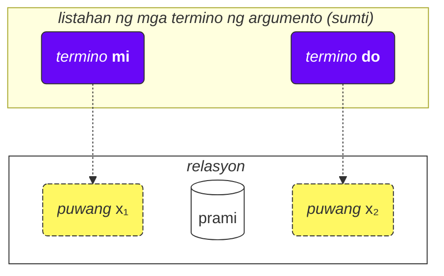
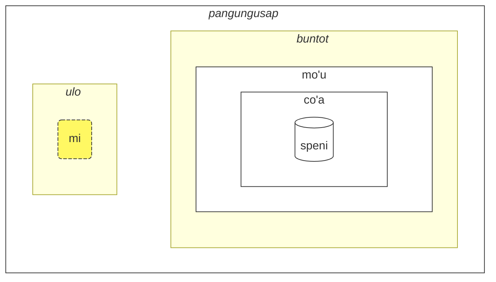

## Aralin 2. Iba pang pangunahing bagay

### Mga uri ng salita

Ang mga salita sa Lojban ay nahahati sa tatlong grupo:

- Mga salitang relasyon (tinatawag na **selbrivla** sa Lojban)
  - Mga halimbawa: **gleki**, **klama**.
  - Ang mga salitang ito ay naglalaman ng kahit isang kumpol ng mga katinig (dalawa o higit pang katinig na magkakasunod) sa unang 5 tunog + nagtatapos sa patinig.
- Mga partikulya (tinatawag na **cmavo** sa Lojban)
  - Mga halimbawa: **le**, **nu**, **mi**, **fa'a**.
  - Nagsisimula sa isang katinig (isa sa **b d g v z j p t k f s c x l m n r i u**), sinusundan ng patinig (isa sa **a e i o u y au ai ei oi**). Opsyonal, pagkatapos nito, maaaring magkaroon ng isa o higit pang pagkakasunod-sunod ng apostrophe (**'**) at kasunod na patinig. Halimbawa, **xa'a'a'a'a'a'a** at **ba'au'oi'a'e'o** ay posibleng mga partikulya (kahit walang kahulugang nakatakda sa kanila).
  - Karaniwan nang isulat ang ilang partikulya nang magkakasunod nang walang puwang sa pagitan. Ito ay pinapayagan ng gramatika ng Lojban. Kaya, huwag magtaka kung makita mo ang **lenu** sa halip na **le nu**, **naku** sa halip na **na ku**, **jonai** sa halip na **jo nai**, at iba pa. Hindi ito nagbabago ng kahulugan. Gayunpaman, ang alituntunin na ito ay hindi naaangkop sa mga salitang relasyon; ang mga salitang relasyon ay dapat na pinaghihiwalay ng mga puwang.
- Mga pangalang salita (tinatawag na **cmevla** sa Lojban)
  - Mga halimbawa: **.alis.**, **.doris**, **.lojban.**
  - Karaniwang ginagamit para sa mga personal na pangalan, mga pangalan ng lugar, atbp.
  - Madaling makilala mula sa ibang uri ng mga salita dahil nagtatapos ang mga ito sa katinig. Bukod dito, nakabalot sila ng dalawang tuldok sa simula at sa dulo. Sa karaniwang pagsulat, maaaring alisin ang mga tuldok, ngunit sa pagsasalita, ang mga pagtigil na tumutugon sa mga tuldok na iyon ay kinakailangan pa rin.

#### Gawain

Takpan ang kanang bahagi ng talahanayan. Subukang tukuyin ang uri ng bawat salitang Lojban gamit ang mga alituntuning inilarawan.

<table>
<tbody><tr>
<td><b>le</b></td>
<td>partikulya (nagsisimula sa katinig na sinusundan ng patinig)</td>
</tr>
<tr>
<td><b>melbi</b></td>
<td>salitang relasyon (naglalaman ng kumpol ng katinig na 'lb')</td>
</tr>
<tr>
<td><b>.paris.</b></td>
<td>pangalang salita (nagtatapos sa katinig, may mga tuldok sa paligid)</td>
</tr>
<tr>
<td><b>mi'o</b></td>
<td>partikulya (naglalaman ng apostrophe sa pagitan ng mga patinig)</td>
</tr></tbody></table>

### Pagkakasunod-sunod ng mga argumento

Kanina, nagkaroon tayo ng mga kahulugan ng mga salitang relasyon tulad ng:

mlatu
: … ay isang pusa, maging pusa

citka
: … ay kumakain ng …

prami
: … ay nagmamahal sa …

klama
: … ay pumupunta sa …

Ang mga diksyunaryo ay maaaring magpakita ng mga kahulugan ng mga salitang relasyon na may mga simbolo tulad ng x₁, x₂, atbp.:

prami
: x₁ ay nagmamahal sa x₂

karce
: x₁ ay isang kotse …

citka
: x₁ ay kumakain ng x₂ …

klama
: x₁ ay pumupunta sa x₂ …

Ang mga x₁, x₂, at iba pa ay ang tahasang notasyon para sa tinatawag na _mga puwang_ (ibang pangalan ay: _mga lugar_, _mga tungkulin ng relasyon_, **terbricmi** sa Lojban). Ang mga puwang ay pinupunan ng mga termino ng argumento (**sumti**) sa pangungusap.

Ang mga numero ay kumakatawan sa pagkakasunod-sunod kung paano dapat punan ang mga puwang na iyon ng mga argumento.

Halimbawa:

> **mi prami do**
> _Mahal kita._

Ang pangungusap na ito ay nagpapahiwatig din na

- x₁ ay tumutukoy sa _ang nagmamahal_, at
- x₂ ay tumutukoy sa _ang minamahal_.

Sa madaling salita, bawat relasyon ay may isa o higit pang mga puwang, at ang mga puwang na iyon ay tinukoy at minarkahan bilang x₁, x₂, at iba pa. Inilalagay natin ang mga argumento tulad ng **mi**, **do**, **le tavla**, atbp. sa pagkakasunod-sunod, kaya pinupunan ang mga puwang na ito at binibigyan ng kongkretong kahulugan ang relasyon, na bumubuo ng isang pangungusap.

Ang bentahe ng ganitong istilo ng mga kahulugan ay naglalaman ito ng <u>lahat</u> ng posibleng kalahok sa isang relasyon na agad na tinukoy.

Maaari rin nating alisin ang mga argumento upang gawing mas malabo ang pangungusap:

> **carvi**
> _Umuulan._
> `ay ulan, umuulan`

(bagaman ang oras dito ay tinutukoy ng konteksto, maaari rin itong mangahulugan ng _Madalas umulan_, _Umuulan noon_, atbp.)

> **prami do**
> _May nagmamahal sa iyo._
> `nagmamahal sa iyo`

Ang lahat ng inalis na mga lugar sa isang relasyon ay nangangahulugang **zo'e** = _isang bagay/isang tao_ kaya nangangahulugan ito ng pareho sa

> **zo'e prami do**
> _May nagmamahal sa iyo._

At

> **prami**

ay kapareho ng

> **zo'e prami zo'e**
> _May nagmamahal sa isang tao._

zo'e
: panghalip: isang bagay o isang tao na hindi tinukoy o ipinapalagay mula sa konteksto

Ang mga modal na termino tulad ng **ca**, **fa'a**, atbp. ay nagdaragdag ng mga bagong lugar sa mga relasyon, ngunit hindi nila pinupunan ang mga puwang ng mga relasyon. Sa

> **mi klama fa'a do**
> _Papunta ako sa direksyon mo._

ang pangalawang lugar ng **klama** ay hindi pa rin napunan. Halimbawa:

> **mi klama fa'a le cmana le zdani**
> _Papunta ako (sa direksyon ng bundok) sa bahay._

le cmana
: ang bundok

<pixra url="/assets/pixra/cilre-xekri-g-out/cmana.webp" caption="cmana" definition="… ay isang bundok"></pixra>

Dito, ang pangalawang lugar ng **klama** ay **do**. Ang pangungusap ay nangangahulugan na ang bundok ay isang direksyon lamang, samantalang ang huling patutunguhan ay ikaw.

Dito, ang termino na **fa'a la cmana** (_sa direksyon ng bundok_) ay hindi pinapalitan ang pangalawang lugar ng relasyong **klama**. Ang pangalawang lugar ng **klama** ay **le zdani** dito.

Ang pangungusap ay nangangahulugan na ang aking bahay ay simpleng matatagpuan sa direksyon ng bundok, ngunit hindi kinakailangang nangangahulugan na gusto kong makarating sa bundok na iyon. Ang huling patutunguhan ng aking pagpunta ay hindi ang bundok kundi ang bahay.

Gayundin, sa

> **mi citka ba le nu mi cadzu**
> _Kumakain ako pagkatapos kong maglakad._

ang pangalawang lugar ng **citka** ay hindi pa rin napunan. Isang bagong termino na **ba** kasama ang argumento nitong **le nu mi cadzu** ang nagdaragdag ng kahulugan sa pangungusap.

Ang pagkakasunod-sunod ng mga argumento ng pinagsama-samang relasyon ay kapareho ng sa huling bahagi nito:

> **tu sutra bajra pendo mi**
> _Iyon ay aking mabilis na tumatakbong kaibigan._
> `Iyon ay isang mabilis na tumatakbong kaibigan ko.`

> **tu pendo mi**
> _Iyon ay kaibigan ko._
> `Iyon ay isang kaibigan ko.`

pendo
: … ay isang kaibigan ng … (isang tao)

Kaya ang pagkakasunod-sunod ng mga argumento ng **sutra bajra pendo** ay kapareho ng sa **pendo** lamang.

#### Gawain

Takpan ang kanang bahagi ng talahanayan. Para sa bawat salitang relasyon, tukuyin kung aling estruktura ng lugar ang tama.

<table>
<tbody><tr>
<td><b>klama</b></td>
<td>x₁ ay pumupunta sa x₂ mula sa x₃</td>
</tr>
<tr>
<td><b>prami</b></td>
<td>x₁ ay nagmamahal sa x₂</td>
</tr>
<tr>
<td><b>karce</b></td>
<td>x₁ ay isang kotse</td>
</tr>
<tr>
<td><b>citka</b></td>
<td>x₁ ay kumakain ng x₂</td>
</tr></tbody></table>

### Higit sa dalawang lugar

Ang relasyon ay maaaring magkaroon ng higit sa dalawang lugar. Halimbawa:

> **mi pinxe le djacu le kabri**
> _Iniinom ko ang tubig mula sa baso._

pinxe
: x₁ ay umiinom ng x₂ mula sa x₃

> **le kabri**
> _ang baso_

Sa kasong ito, may tatlong lugar, at kung gusto mong alisin ang pangalawang lugar sa gitna, kailangan mong gumamit ng **zo'e**:

> **mi pinxe zo'e le kabri**
> _Umiinom ako ng \[isang bagay\] mula sa baso._

Kung aalisin natin ang **zo'e**, makakakuha tayo ng isang bagay na walang kahulugan:

> **mi pinxe le kabri**
> _Iniinom ko ang baso._

Isa pang halimbawa:

> **mi plicru do le plise**
> _Binibigyan kita ng mga mansanas._

plicru
: x₁ ay nagbibigay, nag-aalok sa x₂ ng bagay na x₃; x₁ ay nagpapahintulot sa isang tao x₂ na gamitin ang x₃

#### Gawain

zgana
: x₁ ay nagmamasid/napapansin ng x₂ gamit ang pandama x₃

Takpan ang kanang bahagi ng talahanayan. Isalin ang mga pangungusap sa kaliwa mula sa Lojban.

<table style="table-layout: fixed;">
<tbody><tr>
<td><b>mi zgana do le kanla</b></td>
<td><i>Pinapanood kita gamit ang aking mga mata.</i></td>
</tr>
<tr>
<td><b>mi pinxe le djacu le kabri</b></td>
<td><i>Iniinom ko ang tubig mula sa baso.</i></td>
</tr>
<tr>
<td><b>mi plicru do le plise</b></td>
<td><i>Binibigay ko ang mansanas sa iyo.</i></td>
</tr></tbody></table>

Takpan ang kanang bahagi ng talahanayan. Isalin ang mga pangungusap sa kaliwa sa Lojban.

<table style="table-layout: fixed;">
<tbody><tr>
<td><i>Umiinom ako ng kape mula sa baso.</i></td>
<td><b>mi pinxe le ckafi le kabri</b></td>
</tr>
<tr>
<td><i>Binibigay ko ang libro sa bata.</i></td>
<td><b>mi plicru le verba le cukta</b></td>
</tr></tbody></table>

### Mga relasyon sa loob ng mga relasyon

Sa

> **le nicte cu nu mi viska le lunra**
> _Ang gabi ay kapag nakikita ko ang Buwan._

mayroon tayong

- **le nicte** bilang x₁ ng relasyon,
- **nu mi viska le lunra** bilang pangunahing relasyon.

Gayunpaman, sa loob ng **nu mi viska le lunra**, mayroon tayong isa pang pangungusap na may

- **mi** - x₁ ng panloob na relasyon,
- **viska** - ang panloob na relasyon,
- **le lunra** - x₂ ng panloob na relasyon.

Kaya, sa kabila ng pagkakaroon ng panloob na estruktura, ang **nu mi viska le lunra** ay relasyon pa rin na ang unang termino ay napunan ng **le nicte** sa kasong ito.

Gayundin, sa

> **mi citka ba le nu mi dansu**
> _Kumakain ako pagkatapos kong sumayaw._

mayroon tayong

- **mi** bilang x₁, ang unang lugar ng relasyon,
- **citka** bilang pangunahing konstruksyon ng relasyon,
- **ba le nu mi dansu** bilang modal na termino ng pangunahing relasyon ng pangungusap.

Sa loob ng terminong ito, mayroon tayong:

- **mi** bilang x₁, ang unang lugar ng relasyon sa loob ng termino
- **dansu** bilang pangunahing konstruksyon ng relasyon sa loob ng termino.

Ang ganitong "recursive" na mekanismo ng pagbabalot ng mga relasyon sa mga relasyon ay nagpapahintulot sa pagpapahayag ng mga kumplikadong ideya nang tumpak.

#### Gawain

Takpan ang kanang bahagi ng talahanayan. Tukuyin kung aling mga termino ang kabilang sa mga panloob na relasyon.

<table>
<tbody><tr>
<td><b>le nicte cu nu mi viska le lunra</b></td>
<td>Panloob na relasyon: <i>mi viska le lunra</i> (Nakikita ko ang buwan)</td>
</tr>
<tr>
<td><b>mi citka ba le nu mi dansu</b></td>
<td>Panloob na relasyon: <i>mi dansu</i> (Sumasayaw ako)</td>
</tr>
<tr>
<td><b>mi djica le nu do klama</b></td>
<td>Panloob na relasyon: <i>do klama</i> (pumupunta ka)</td>
</tr></tbody></table>

### Bakit ganito ang pagkakadefine ng mga salitang relasyon?

Ang Ingles ay gumagamit ng limitadong hanay ng mga pang-ukol na ginagamit muli sa iba't ibang pandiwa at, dahil dito, walang tiyak na kahulugan. Halimbawa, tingnan ang pang-ukol na Ingles na _to_:

> _I speak to you._
> _Kinakausap kita._

<!-- -->

> _I come to you._
> _Pumupunta ako sa iyo._

<!-- -->

> _To me it looks pretty._
> _Para sa akin ay maganda ito._

Sa bawat isa sa mga halimbawang iyon, ang _to_ ay may bagong tungkulin na, sa pinakamaganda, ay malayo ang pagkakahalintulad sa mga tungkulin sa ibang mga pangungusap.

Mahalagang tandaan na ang ibang mga wika ay gumagamit ng iba't ibang paraan ng pagmamarka ng mga tungkulin ng mga pandiwa na, sa maraming kaso, ay ibang-iba sa mga ginagamit sa Ingles.

Halimbawa, sa Lojban, ang mga pangunahing tungkulin (mga puwang) ng mga relasyon ay minarkahan sa pamamagitan ng buong pagdedefine ng mga relasyong iyon na may mga tungkulin na nakaayos sa pagkakasunod-sunod (o minarkahan ng **fa**, **fe**, at iba pa):

klama
: x₁ ay pumupunta sa x₂ …

tavla
: x₁ ay nakikipag-usap sa x₂ …

melbi
: x₁ ay maganda, kaakit-akit para sa x₂ …

Ang mga pangunahing tungkuling ito ay mahalaga sa pagdedefine ng mga relasyon.

Gayunpaman, maaaring may mga opsyonal na tungkulin na nagpapapreciso sa mga relasyon:

> _I speak to you while I'm eating._
> _Kinakausap kita habang kumakain ako._

<!-- -->

> _It's hard to me because this thing is heavy._
> _Mahirap para sa akin dahil mabigat ang bagay na ito._

Sa Lojban, ang katulad na konsepto ng mga opsyonal na tungkulin na ito ay ipinapahayag sa pamamagitan ng hiwalay na mga relasyon o, para sa mga pinakakaraniwang kaso, sa pamamagitan ng mga modal na termino:

> **mi tavla do ze'a le nu mi citka**
> _Kinakausap kita habang kumakain ako._

<!-- -->

> **nandu mi ri'a le nu ti tilju**
> _Mahirap para sa akin dahil mabigat ang bagay na ito._

nandu
: x₁ ay mahirap para sa x₂

tilju
: x₁ ay mabigat

Ang mga pang-ukol sa Ingles ay katulad ng mga modal na partikulya sa Lojban, bagaman ang karaniwang pang-ukol sa Ingles ay maaaring magkaroon ng maraming kahulugan samantalang sa Lojban, bawat modal na partikulya ay may isa lamang (kahit malabo) na kahulugan.

#### Gawain

le zarci
: ang palengke
le dinju
: ang gusali
klama
: x₁ ay pumupunta sa x₂ mula sa x₃

Takpan ang kanang bahagi ng talahanayan. Tukuyin kung ang mga pangungusap na ito ay gumagamit ng mga pangunahing argumento o opsyonal na modal na termino.

<table>
<tbody><tr>
<td><b>mi klama le zarci le dinju</b></td>
<td>Gumagamit ng mga pangunahing argumento (x₂ at x₃ ng klama)</td>
</tr>
<tr>
<td><b>mi klama le zarci ca le nu do pinxe</b></td>
<td>Gumagamit ng pangunahing argumento (x₂ = le zarci) at modal na termino (ca le nu do pinxe)</td>
</tr>
<tr>
<td><b>mi klama fa'a le zarci</b></td>
<td>Gumagamit ng modal na termino (fa'a le zarci) sa halip na pangunahing argumento</td>
</tr></tbody></table>

### Pangkalahatang mga alituntunin sa pagkakasunod-sunod ng mga argumento

Ang pagkakasunod-sunod ng mga lugar sa mga relasyon ay maaaring mahirap tandaan minsan, ngunit huwag mag-alala — hindi mo kailangang tandaan ang lahat ng mga lugar ng lahat ng mga salitang relasyon. (Natatandaan mo ba ang kahulugan ng daan-daang libong mga salita sa Ingles?)

Maaari mong pag-aralan ang mga lugar kapag nakita mong kapaki-pakinabang ang mga ito o kapag ginamit ng mga tao ang mga ito sa isang pag-uusap sa iyo.

Karamihan sa mga salitang relasyon ay may dalawa hanggang tatlong lugar.

Karaniwan, maaari mong hulaan ang pagkakasunod-sunod gamit ang konteksto at ilang mga patakaran ng hinlalaki:

1. Ang unang lugar ay kadalasang ang tao o bagay na gumagawa ng isang bagay o naging isang bagay:

   **klama** = _x₁ ay pumupunta …_

2. Ang bagay na kinikilusan ng isang aksyon ay karaniwang nasa pagkatapos ng unang lugar:

   **punji** = _x₁ ay naglalagay ng x₂ sa x₃_,

3. At ang susunod na lugar ay karaniwang pupunan ng tumatanggap:

   **punji** = _x₁ ay naglalagay ng x₂ sa x₃_,

4. Ang mga lugar ng patutunguhan (_sa_) ay halos laging nauuna sa mga lugar ng pinagmulan (_mula sa_):

   **klama** = _x₁ ay pumupunta sa x₂ mula sa x₃_

   <pixra url="/assets/pixra/cilre-xekri-g-out/klama_fi.webp" caption="le prenu cu klama fi le zarci" definition="Umaalis ang tao mula sa tindahan."></pixra>

5. Ang mga lugar na hindi gaanong ginagamit ay nasa dulo. Ang mga ito ay mga bagay tulad ng _ayon sa pamantayan_, _sa pamamagitan ng paraan_ o _gawa sa_.

Ang pangkalahatang ideya ay unang dumating ang mga lugar na malamang na gamitin.

Hindi kailangang punan ang lahat ng mga lugar sa lahat ng oras. Ang mga lugar na hindi napunan ay may mga halaga na hindi nauugnay o halata sa nagsasalita (kinukuha nila ang halaga ng **zo'e** = _isang bagay_).

#### Gawain

dunda
: x₁ ay nagbibigay ng x₂ sa x₃
benji
: x₁ ay naglilipat ng x₂ sa x₃ mula sa x₄
lebna
: x₁ ay kumukuha ng x₂ mula sa x₃

Takpan ang kanang bahagi ng talahanayan. Hulaan kung aling lugar ang susunod sa mga relasyong ito batay sa pangkalahatang mga alituntunin.

<table>
<tbody><tr>
<td><b>dunda</b> - "ang nagbibigay ___, ang regalo ___, ang tumatanggap ___"</td>
<td>Ang pagkakasunod-sunod ay sumusunod sa alituntunin: gumagawa muna, pagkatapos ay bagay, pagkatapos ay tumatanggap</td>
</tr>
<tr>
<td><b>benji</b> - "ang nagpapadala ___, ang ipinadala ___, patutunguhan ___, pinagmulan ___"</td>
<td>Ang pagkakasunod-sunod ay sumusunod sa alituntunin: gumagawa muna, bagay pangalawa, patutunguhan bago pinagmulan</td>
</tr>
<tr>
<td><b>lebna</b> - "ang kumukuha ___, ang kinuha ___, pinagmulan ___"</td>
<td>Ang pagkakasunod-sunod ay sumusunod sa alituntunin: gumagawa muna, bagay pangalawa, pinagmulan sa huli</td>
</tr></tbody></table>

### Mga infinitive

Ang mga infinitive ay mga pandiwa na madalas na may panlapi na _to_ sa Ingles. Kabilang sa mga halimbawa ang _I like to run_ (Gusto kong tumakbo), kung saan _to run_ ang infinitive.

> **le verba cu troci le ka cadzu**
> _Sinusubukan ng bata na maglakad._

le verba
: ang bata, ang mga bata

troci
: x₁ ay sumusubok na gawin o maging x₂ (ka)

cadzu
: x₁ ay naglalakad

<pixra url="/assets/pixra/cilre-xekri-g-out/troci_cadzu.webp" caption="le verba cu troci le ka cadzu" definition="Sinusubukan ng bata na maglakad."></pixra>

Ang partikulyang **ka** ay gumagana na katulad ng **nu**. Binabalot nito ang isang pangungusap.

Ang pangunahing pagkakaiba ay ang ilang puwang sa nakabalot na pangungusap ay dapat na maiugnay sa ilang argumento sa labas ng pangungusap na ito.

Sa kasong ito, ang unang argumento na **le verba** ng relasyong **troci** ay lumilikha ng ugnayan sa unang hindi napunang puwang ng panloob na pangungusap na **cadzu** (na nasa loob ng **ka**).

Sa madaling salita, sinusubukan ng bata na makamit ang isang kalagayan kung saan **le verba cu cadzu** (ang argumento na **le verba** ay pupunan ang unang hindi napunang puwang ng relasyong **cadzu**).

Ang ilang mga relasyon ay nangangailangan lamang ng mga infinitive sa ilan sa kanilang mga puwang. Ang mga kahulugan ng mga salitang ito ay minarkahan ang mga puwang na iyon bilang _property_ o **ka**. Halimbawa:

cinmo
: x₁ ay nakakaramdam ng x₂ (ka)

Nangangahulugan ito na ang infinitive sa pangalawang puwang (x₂) ay inilalapat sa ibang puwang (malamang, ang unang puwang, x₁). Ang mga kaso kung saan ang infinitive ay inilalapat sa mga puwang maliban sa x₂ ay bihira at ipinapaliwanag sa mga diksyunaryo para sa mga kaukulang relasyon o sa kaso ng mga salitang relasyon na hindi opisyal na inimbento, maaaring mahulaan mula sa sentido komun sa pamamagitan ng paghahambing sa ibang katulad na mga salitang relasyon.

Isa pang halimbawa:

<pixra url="/assets/pixra/cilre-xekri-g-out/sidju.webp" caption="ra sidju le pendo le ka bevri le dakli" definition="Tinutulungan niya ang kaibigan na dalhin ang mga bag."></pixra>

> **ra sidju le pendo le ka bevri le dakli**
> _Tinutulungan niya ang kaibigan na dalhin ang mga bag._

sidju
: x₁ ay tumutulong sa x₂ na gawin ang x₃ (ka)

Ang salitang relasyon na **sidju** ay nangangailangan na ang ikatlong puwang nito ay mapunan ng isang infinitive.

bevri
: x₁ ay nagdadala ng x₂

le dakli
: ang bag, ang mga bag

Tandaan na tanging ang unang hindi napunang lugar ng naka-embed na relasyon ang kumukuha ng kahulugan ng panlabas na lugar:

> **mi troci le ka do prami**
> _Sinusubukan kong mahalin mo._

tcidu
: x₁ ay nagbabasa ng x₂ mula sa x₃

Dito, ang unang hindi napunang lugar ay ang pangalawang lugar ng **prami**, kaya kinukuha nito ang halaga na **mi** (_ako_).

Posible rin sa pamamagitan ng paggamit ng panghalip na **ce'u** na tahasang markahan ang isang lugar na dapat ilapat sa ilang panlabas na argumento:

> **mi troci le ka do prami ce'u**
> _Sinusubukan kong mahalin mo._

Isa pang halimbawa:

> **mi cinmo le ka xebni ce'u**
> **mi cinmo le ka se xebni**
> _Nararamdaman kong may namumuhi sa akin._
> _Nararamdaman kong kinasusuklaman ako._

#### Gawain

zgana
: x₁ ay nagmamasid sa x₂

kakne
: x₁ ay may kakayahang gawin ang x₂ (property)

nelci
: x₁ ay gusto ng x₂

Takpan ang kanang bahagi ng talahanayan. Isalin ang mga pangungusap na may mga infinitive sa kanilang mga kahulugan.

<table>
<tbody><tr>
<td><b>mi kakne le ka zgana</b></td>
<td>May kakayahan akong magmasid (ng isang bagay)</td>
</tr>
<tr>
<td><b>do kakne le ka nelci mi</b></td>
<td>May kakayahan kang magustuhan ako</td>
</tr>
<tr>
<td><b>mi nelci le ka zgana do</b></td>
<td>Gusto kong masdan ka</td>
</tr></tbody></table>

### Mga uri ng mga lugar

Ang diksyunaryo ay madalas na nagbabanggit ng ibang mga uri ng mga lugar, halimbawa:

djica
: x₁ ay gustong mangyari ang x₂ (pangyayari)

Ang _pangyayari_ na ito ay nangangahulugan na kailangan mong punan ang lugar ng isang argumento na kumakatawan sa isang pangyayari. Halimbawa:

le nicte
: gabi

le nu mi dansu
: ang pagsayaw ko

Kaya nakukuha natin

> **mi djica le nicte**
> _Gusto ko ang pangyayaring gabi._

<!-- -->

> **do djica le nu mi dansu**
> _Gusto mong sumayaw ako._

Sa Lojban, hindi pinapayagan na sabihin, halimbawa:

> **mi djica le plise**
> _Gusto ko ang mansanas._ 

dahil gusto mong gumawa ng isang bagay sa mansanas o gusto mong may mangyaring pangyayari sa mansanas, tulad ng:

> **mi djica le nu mi citka le plise**
> _Gusto kong kainin ang mansanas._
> `Gusto kong kainin ko ang mansanas.`

Pansinin na ang pagbabalot ng isang relasyon na umaasang pangyayari sa isang **nu** ay nagbabago ng kahulugan:

> **le zekri cu cumki**
> _Ang krimen ay posible._

zekri
: x₁ ay isang kriminal na pangyayari, x₁ (pangyayari) ay isang krimen

cumki
: x₁ (pangyayari) ay posible

Ihambing:

> **le nu zekri cu cumki**
> `Ang maging kriminal ay posible.` > _Posible na ang isang bagay ay isang krimen._

#### Gawain

nelci
: x₁ ay gusto ng x₂

djica
: x₁ ay gustong mangyari ang x₂ (pangyayari)

Takpan ang kanang bahagi ng talahanayan. Isalin ang mga pangungusap sa kaliwa mula sa Lojban.

<table style="table-layout: fixed;">
<tbody><tr>
<td><b>mi nelci le nu do cisma</b></td>
<td><i>Gusto kong ngumiti ka.</i></td>
</tr>
<tr>
<td><b>mi djica le nu mi citka le plise</b></td>
<td><i>Gusto kong kainin ang mansanas.</i></td>
</tr>
<tr>
<td><b>mi na ku djica le plise</b></td>
<td><i>Hindi ko gusto ang mansanas. (hindi tamang paggamit)</i></td>
</tr></tbody></table>

Takpan ang kanang bahagi ng talahanayan. Isalin ang mga pangungusap sa kaliwa sa Lojban.

<table style="table-layout: fixed;">
<tbody><tr>
<td><i>Gusto kong sumayaw ka.</i></td>
<td><b>mi djica le nu do dansu</b></td>
</tr>
<tr>
<td><i>Gusto kong matalino ka.</i></td>
<td><b>mi nelci le nu do stati</b></td>
</tr></tbody></table>

### Pag-aangat (Raising)

> **mi stidi le ka klama le barja**
> _Iminumungkahi kong pumunta sa bar._

stidi
: x₁ ay nagmumungkahi ng aksyon na x₂ (property) sa x₃

> **mi stidi tu'a le barja**
> _Iminumungkahi ko ang bar._

tu'a le barja
: isang bagay tungkol sa bar

> **mi djica le nu mi citka le plise**
> _Gusto kong kumain ng mansanas._

<!-- -->

> **mi djica tu'a le titla**
> _Gusto ko ang matamis._

tu'a le titla
: isang bagay tungkol sa matamis

titla
: … ay matamis, … ay isang matamis

<pixra url="/assets/pixra/cilre-xekri-g-out/djica_tuha_le_titla.webp" caption="le prenu cu djica tu'a le titla" definition="Gusto ng tao ang matamis."></pixra>

Ang estruktura ng lugar ay maaaring maglagay ng labis na pasanin sa pagtukoy ng mga aksyon o pangyayari. Minsan gusto nating tukuyin lamang ang ilang bagay sa mga pangyayari o lugar na iyon at laktawan ang paglalarawan ng aksyon o pangyayari nang buo.

Sa mga halimbawa sa itaas, ang _Iminumungkahi ko ang bar._ ay malamang na nagpapahiwatig ng pagpunta sa bar at ang _Gusto ko ang mansanas._ ay nagpapahiwatig ng pagkain nito.

Gayunpaman, ang salitang relasyon sa Lojban na **stidi** ay nangangailangan ng property sa puwang nitong x₂. Gayundin, ang **djica** ay nangangailangan ng pangyayari sa puwang nitong x₂.

Ang maikling tinatawag na qualifier word na **tu'a** bago ang isang termino ay nagpapahiwatig ng isang abstraction (property, pangyayari, o proposisyon) ngunit pinipili lamang ang terminong ito mula sa abstraction na ito na inilalaktawan ang natitira. Maaari itong malabong isalin bilang _isang bagay tungkol sa_:

> **mi stidi tu'a le barja**
> _Iminumungkahi ko ang isang bagay tungkol sa bar (marahil pagbisita dito, pagkikita malapit dito, atbp.)._

<!-- -->

> **mi djica tu'a le plise**
> _Gusto ko ang isang bagay na may kaugnayan sa mansanas (marahil pagkain, pagkagat, pagdila, paghagis nito sa kaibigan, atbp.)_

> **tu'a le cakla cu pluka mi**
> _Nakakatuwa sa akin ang tsokolate (malamang dahil sa lasa nito)._
> `Ang isang bagay tungkol sa tsokolate ay nakakatuwa sa akin`

cakla
: x₁ ay ilang tsokolate

Kapag inilaktawan ang mga abstraction, tanging ang konteksto ang nagsasabi sa atin kung ano ang inalis.

Posible rin na baguhin ang pangunahing konstruksyon ng relasyon:

> **le cakla cu jai pluka mi**
> **tu'a le cakla cu pluka mi**
> _Nakakatuwa sa akin ang tsokolate._

Ito ay nagpapahintulot sa paglikha ng mga malabong termino ng argumento gamit ang **jai**:

> **le jai pluka cu zvati ti**
> _Ang nakakatuwang bagay ay nandito._

Dahil ang **le pluka** (_ang nakakatuwang pangyayari_) ay abstract, imposibleng tukuyin ang lokasyon nito. Gayunpaman, ang isang kalahok sa abstraction ay maaaring pisikal na mailagay sa isang lugar.

#### Gawain

stidi
: x₁ ay nagmumungkahi ng x₂ (property) sa x₃

Takpan ang kanang bahagi ng talahanayan. Isalin ang mga pangungusap sa kaliwa mula sa Lojban.

<table style="table-layout: fixed;">
<tbody><tr>
<td><b>mi stidi tu'a le karce</b></td>
<td><i>Iminumungkahi ko ang isang bagay tungkol sa kotse.</i></td>
</tr>
<tr>
<td><b>mi djica tu'a le najnimre</b></td>
<td><i>Gusto ko ang isang bagay tungkol sa kahel.</i></td>
</tr>
<tr>
<td><b>mi nelci tu'a le mlatu</b></td>
<td><i>Gusto ko ang isang bagay tungkol sa pusa.</i></td>
</tr></tbody></table>

Takpan ang kanang bahagi ng talahanayan. Isalin ang mga pangungusap sa kaliwa sa Lojban.

<table style="table-layout: fixed;">
<tbody><tr>
<td><i>Iminumungkahi ko ang hardin (isang bagay tungkol dito).</i></td>
<td><b>mi stidi tu'a le purdi</b></td>
</tr>
<tr>
<td><i>Gusto ko ang libro (isang bagay tungkol dito).</i></td>
<td><b>mi djica tu'a le cukta</b></td>
</tr></tbody></table>

### Mga lugar sa loob ng mga argumento

Paano natin sasabihin ang _Ikaw ay kaibigan ko_?

> **do pendo mi**
> _Ikaw ay kaibigan ko._
> `Ikaw ay isang kaibigan ko.`

<pixra url="/assets/pixra/cilre-xekri-g-out/pendo.webp" caption="le pendo" definition="ang kaibigan / ang mga kaibigan"></pixra>

At ngayon, paano natin sasabihin ang _Ang kaibigan ko ay matalino._?

> **le pendo be mi cu stati**
> _Ang kaibigan ko ay matalino._

Kaya kapag ginawa nating argumento ang isang relasyon (**pendo** — _maging kaibigan_ sa **le pendo** — _ang kaibigan_), maaari pa rin nating panatilihin ang ibang mga lugar ng relasyong iyon sa pamamagitan ng paglalagay ng **be** pagkatapos nito.

Bilang default, ikinakabit nito ang pangalawang lugar (x₂). Maaari nating ikabit ang higit pang mga lugar sa pamamagitan ng paghihiwalay sa kanila ng **bei**:

> **mi plicru do le plise**
> _Binibigyan kita ng mansanas._

<pixra url="/assets/pixra/cilre-xekri-g-out/plicru.webp" caption="le prenu cu plicru le pendo le tutci" definition="Binibigyan ng tao ang kaibigan ng kagamitan."></pixra>

<!-- -->

> **le plicru be mi bei le plise**
> _Ang nagbibigay ng mansanas sa akin_

<!-- -->

> **le plicru be mi bei le plise cu pendo mi**
> _Ang nagbibigay ng mansanas sa akin ay kaibigan ko._
> `Ang nagbibigay sa akin ng mansanas ay isang kaibigan ko.`

Isa pang halimbawa:

<!-- > **le pendo be mi cu tavla**
> _Ang mga kaibigan ko ay nag-uusap._
> **le pendo mi cu tavla**
> **le pendo cu tavla mi**
> _Ang mga kaibigan ay nakikipag-usap sa akin._ -->

> **mi klama le pendo be do**
> _Pupunta ako sa kaibigan mo._

klama
: x₁ ay pumupunta sa x₂ mula sa x₃ …

Hindi natin maaaring alisin ang **be** dahil ang **le pendo do** ay dalawang independenteng lugar:

> **mi klama le pendo do**
> _Pupunta ako sa kaibigan mula sa iyo._

Dito, kinuha ng **do** ang ikatlong lugar ng **klama** dahil hindi ito nakatali sa _pendo_ sa pamamagitan ng **be**.

Hindi rin natin maaaring gamitin ang **nu** dahil ang **le nu pendo do** ay ang pangyayari ng pagiging kaibigan mo ng isang tao.

Kaya ang **le pendo be do** ang tamang solusyon.

Isa pang halimbawa:

> **la .lojban. cu bangu mi**
> _Ang Lojban ay wika ko._
> `Ang Lojban ay isang wika ko.`

Gayunpaman,

> **mi nelci le bangu be mi**
> _Gusto ko ang wika ko._

Ang paggamit ng **be** para sa mga relasyon na hindi ginawang argumento ay walang epekto:

> **mi nelci be do** ay kapareho ng
> **mi nelci do**

#### Gawain

ctuca
: x₁ ay nagtuturo ng x₂ (paksa) sa x₃
cmene
: x₁ ay isang pangalan ng x₂ na ginagamit ng x₃

Takpan ang kanang bahagi ng talahanayan. Isalin ang mga konstruksyong ito gamit ang "be" sa kanilang mga kahulugan.

<table>
<tbody><tr>
<td><b>le ctuca be mi bei la lojban</b></td>
<td>ang guro ko sa Lojban</td>
</tr>
<tr>
<td><b>le cmene be la paris bei la frank</b></td>
<td>ang pangalan ng Paris na ginagamit ni Frank</td>
</tr>
<tr>
<td><b>le ctuca be le verba bei la lojban</b></td>
<td>ang guro ng mga bata sa Lojban</td>
</tr></tbody></table>

### Mga relative clause

> **le prenu poi pendo mi cu tavla mi**
> _Ang tao na kaibigan ko ay nakikipag-usap sa akin._

<!-- -->

> **le prenu noi pendo mi cu tavla mi**
> _Ang tao, na nagkataong kaibigan ko, ay nakikipag-usap sa akin._

Sa unang pangungusap, ang salitang _na_ ay mahalaga sa pagtukoy sa taong tinutukoy. Nililinaw nito kung sino sa mga tao sa konteksto ang tinutukoy natin. Pinipili lamang natin ang mga kaibigan ko mula sa malamang na maraming tao sa paligid. Marahil ay may isang tao lamang sa paligid na kaibigan ko.

Tungkol naman sa _na nagkataong kaibigan ko_ mula sa pangalawang pangungusap, nagbibigay lamang ito ng karagdagang impormasyon tungkol sa tao. Hindi ito tumutulong sa pagtukoy sa tao. Halimbawa, maaaring mangyari ito kapag lahat ng mga tao sa paligid ay mga kaibigan ko.

Ang **poi pendo mi** ay isang relative clause, isang relasyon na nakakabit sa kanan ng argumento na **le prenu**. Nagtatapos ito bago ang susunod na salita na **cu**:

> **le prenu (poi pendo mi) cu tavla mi**
> _Ang tao na kaibigan ko ay nakikipag-usap sa akin._

Sa Lojban, ginagamit natin ang **poi** para sa mga relative clause na tumutukoy sa mga entity (bagay, tao o pangyayari) at **noi** para sa pangkaragdagang impormasyon.

> **la .bob. ba co'a speni le ninmu poi pu xabju le nurma**
> _Si Bob ay magpapakasal sa isang babae na nakatira sa kanayunan._

xabju
: … ay nakatira sa …, … ay naninirahan sa … (lugar, bagay)

le nurma
: ang kanayunan

Ang pangungusap na ito ay hindi nagbubukod na si Bob ay magpapakasal din sa iba! Ang pag-alis ng relative clause na may **poi** ay nagbabago ng kahulugan:

> **la .bob. ba co'a speni le ninmu**
> _Si Bob ay magpapakasal sa isang babae._

Isa pang halimbawa:

> **le prenu poi gleki cu ze'u renvi**
> _Ang mga tao (alin?) na masaya ay matagal na nabubuhay._

ze'u
: modal na termino: sa mahabang panahon

renvi
: mabuhay

Ang pag-alis ng relative clause na may **poi** ay nagbabago ng kahulugan:

> **le prenu ze'u renvi**
> _Ang mga tao ay matagal na nabubuhay._

Sa kabilang banda, ang mga relative clause na may **noi** ay naglalaman lamang ng karagdagang impormasyon tungkol sa argumento kung saan ito nakakabit. Ang argumento na iyon ay sapat na tinukoy sa sarili nito kaya ang pag-alis ng relative clause na may **noi** ay hindi nagbabago ng kahulugan nito:

> **mi nelci la .doris. noi mi ta'e zgana bu'u le panka**
> _Gusto ko si Doris na palagi kong nakikita sa parke._
> _Gusto ko si Doris. Ano pa ang masasabi ko tungkol sa kanya? Palagi ko siyang nakikita sa parke._

zgana
: magmasid (gamit ang anumang pandama)

<pixra url="/assets/pixra/cilre-xekri-g-out/se_penmi_fi_le_panka.webp" caption="le gerku noi mi ta'e zgana bu'u le panka" definition="Ang aso na palagi kong nakikita sa parke."></pixra>

Ang pag-alis ng relative clause na may **noi** ay pinapanatili ang kahulugan: _Gusto ko si Doris._

Sa pasalitang Ingles, ang pagkakaiba ay madalas na nakakamit sa pamamagitan ng tono o paghula. Gayundin, ang mga relative clause na may **noi** ay tradisyonal na pinaghihiwalay ng mga kuwit sa Ingles. Ginagamit nila ang _which_ o _who_, at ang salitang _that_ ay hindi ginagamit sa kanila.

Tingnan natin ang isa pang halimbawa.

> **mi klama le pa tricu**
> _Pupunta ako sa puno._

<!-- -->

> **le pa tricu cu barda**
> _Malaki ang puno._

le pa tricu
: ang puno (isang puno)

barda
: x₁ ay malaki/malawak

At ngayon pagsamahin natin ang dalawang pangungusap na iyon:

> **le tricu noi mi klama ke'a cu barda**
> _Ang puno, na pinupuntahan ko, ay malaki._

Pansinin ang salitang **ke'a**. Inilipat natin ang pangalawang pangungusap tungkol sa parehong puno sa isang relative clause at pinalitan ang argumento na **le tricu** ng **ke'a** sa relative clause. Kaya ang panghalip na **ke'a** ay katulad ng _who_ at _which_ sa Ingles. Tumuturo ito pabalik sa argumento kung saan nakakabit ang relative clause.

Kaya literal na ang ating pangungusap sa Lojban ay tunog na

> _Ang puno, na ganoon na pumupunta ako dito, ay malaki._

Ang **ke'a** ay maaaring alisin kung sapat ang konteksto. Ang sumusunod na dalawang pangungusap ay may parehong kahulugan:

> **le prenu poi pendo mi cu tavla mi**
> **le prenu poi ke'a pendo mi cu tavla mi**
> _Ang tao na kaibigan ko ay nakikipag-usap sa akin._

Ang **ke'a** ay madalas na ipinapalagay na pumupunta sa unang hindi napunang lugar:

> **mi nelci la .doris. noi mi ta'e zgana bu'u le panka**
> **mi nelci la .doris. noi mi ta'e zgana ke'a bu'u le panka**
> _Gusto ko si Doris na palagi kong nakikita sa parke._

Dito, ang **mi** ay pumupuno sa unang puwang ng relasyong **ta'e zgana** (_… palaging nakakakita ng …_), kaya ang **ke'a** ay ipinapalagay para sa susunod, pangalawang lugar.

Ang mga relative clause tulad ng karaniwang mga relasyon ay maaaring maglaman ng mga konstruksyon na may mga modal na termino:

> **le tricu noi mi pu klama ke'a ca le cabdei cu barda**
> _Ang puno, na pinuntahan ko ngayong araw, ay malaki._

<pixra url="/assets/pixra/cilre-xekri-g-out/le_tricu_cu_barda.webp" caption="le tricu cu barda" definition="Malaki ang puno."></pixra>

le cabdei
: ang araw ngayon

Pansinin na ang **ca le cabdei** ay kabilang sa relative clause. Ihambing:

> **le tricu noi mi pu klama ke'a cu barda ca le cabdei**
> _Ang puno, na pinuntahan ko, ay malaki ngayon._

Malaki ang pagbabago ng kahulugan.

Sa wakas, ang **voi** ay ginagamit upang bumuo ng mga argumento na tulad ng **le** ngunit may mga relative clause:

> **ti voi le nu ke'a cisma cu pluka mi cu zutse tu**
> _Ang mga ito na ang ngiti ay nakakatuwa sa akin ay nakaupo doon._

<pixra url="/assets/pixra/cilre-xekri-g-out/voi.webp" caption="mi nelci ti voi le nu ke'a cisma cu pluka mi" definition="Gusto ko ang mga ito na ang ngiti ay nakakatuwa sa akin."></pixra>

ti
: ito malapit sa akin, ang mga ito malapit sa akin

cisma
: x₁ ay ngumingiti

pluka
: x₁ ay nakakatuwa sa x₂

zutse
: x₁ ay nakaupo, nakaupong nasa x₂

Dito, tinutukoy ng **voi** ang bagay na malapit sa akin.

Ihambing ito sa:

> **ti poi le nu ke'a cisma cu pluka mi cu zutse**
> _Mula sa mga ito, ang mga ang ngiti ay nakakatuwa sa akin ay nakaupo._

Ang **poi** ay naglilimita sa pagpili sa mga inilalarawan sa relative clause.
Ang halimbawang ito ay maaaring magpahiwatig na maraming bagay (tao, atbp.) sa paligid ko ngunit gamit ang **poi** pinipili ko lamang ang mga kailangan.

Ihambing ito sa:

> **ti noi le nu ke'a cisma cu pluka mi cu zutse**
> _Ang mga ito (na nagkataong ganoon na ang ngiti nila ay nakakatuwa sa akin) ay nakaupo._

Ang **noi** ay nagdaragdag lamang ng pangkaragdagang impormasyon na hindi kinakailangan upang matukoy kung ano ang tinutukoy ng **ti** (_ang mga ito_). Marahil, wala nang iba pang tao sa paligid na ilalarawan.

Sa wakas, tulad ng **nu** na may kanang border marker na **kei**, mayroon tayo ng

ku'o
: kanang border marker para sa **poi**, **noi** at **voi**.

> **mi tavla la .doris. noi ca zutse tu ku'o .e la .alis. noi ca cisma**
> _Nakikipag-usap ako kay Doris, na nakaupo doon, at kay Alice, na ngumingiti ngayon._

Pansinin na kung wala ang **ku'o** magkakabit ang **tu** (_doon_) kasama ang **la .alis.** (_Alice_) na magdudulot ng kakaibang kahulugan:

> **mi tavla la .doris. noi ca zutse tu .e la .alis. noi ca cisma**
> _Nakikipag-usap ako kay Doris, na nakaupo doon at sa ibabaw ni Alice (na ngumingiti ngayon)._

Pansinin ang bahaging **zutse tu .e la .alis.**.

Para sa lahat ng **poi**, **noi** at **voi** ang kanang border marker ay pareho pa rin: **ku'o**.

#### Gawain

ctuca
: x₁ ay nagtuturo ng x₂ sa x₃

Takpan ang kanang bahagi ng talahanayan. Isalin ang mga pangungusap sa kaliwa mula sa Lojban.

<table style="table-layout: fixed;">
<tbody><tr>
<td><b>mi tavla le prenu poi ctuca mi</b></td>
<td><i>Nakikipag-usap ako sa tao na nagtuturo sa akin.</i></td>
</tr>
<tr>
<td><b>le gerku noi mi nelci ke'a cu citka</b></td>
<td><i>Ang aso, na gusto ko, ay kumakain.</i></td>
</tr>
<tr>
<td><b>le prenu poi ke'a ctuca mi cu stati</b></td>
<td><i>Ang tao na nagtuturo sa akin ay matalino.</i></td>
</tr></tbody></table>

Takpan ang kanang bahagi ng talahanayan. Isalin ang mga pangungusap sa kaliwa sa Lojban.

<table style="table-layout: fixed;">
<tbody><tr>
<td><i>Nakikita ko ang aso na tumatakbo.</i></td>
<td><b>mi viska le gerku poi bajra</b></td>
</tr>
<tr>
<td><i>Ang tao, na matalino, ay nakikipag-usap sa akin.</i></td>
<td><b>le prenu noi stati cu tavla mi</b></td>
</tr></tbody></table>

### Maikling mga relative clause. '_Tungkol sa_'

Minsan, maaaring kailanganin mong ikabit ang isang karagdagang argumento sa isa pang argumento:

> **mi djuno le vajni pe do**
> _Alam ko ang isang bagay na mahalaga tungkol sa iyo._

le vajni
: isang bagay na mahalaga

Ang **pe** at **ne** ay katulad ng **poi** at **noi**, ngunit ikinakabit nila ang mga argumento sa mga argumento:

> **le pa penbi pe mi cu xunre**
> _Ang panulat na sa akin ay pula._ (_sa akin_ ay mahalaga sa pagtukoy sa panulat na tinutukoy)

<!-- -->

> **le pa penbi ne mi cu xunre**
> _Ang panulat, na sa akin, ay pula._ (karagdagang impormasyon)

ne
: na tungkol sa, may kaugnayan sa … (isang argumento ang sumusunod)

pe
: na tungkol sa, may kaugnayan sa … (isang argumento ang sumusunod)

> **le pa penbi ne mi ge'u .e le pa fonxa ne do cu xunre**
> _Ang panulat, na sa akin, at ang telepono, na sa iyo, ay pula._

ge'u
: kanang border marker para sa **pe**, **ne**.

#### Gawain

Takpan ang kanang bahagi ng talahanayan. Isalin ang mga pangungusap sa kaliwa mula sa Lojban.

<table style="table-layout: fixed;">
<tbody><tr>
<td><b>le penbi pe mi cu xunre</b></td>
<td><i>Ang panulat na sa akin ay pula.</i></td>
</tr>
<tr>
<td><b>le mlatu ne mi cu melbi</b></td>
<td><i>Ang pusa, na sa akin, ay maganda.</i></td>
</tr>
<tr>
<td><b>mi tavla le prenu pe do</b></td>
<td><i>Nakikipag-usap ako sa tao na may kaugnayan sa iyo.</i></td>
</tr></tbody></table>

Takpan ang kanang bahagi ng talahanayan. Isalin ang mga pangungusap sa kaliwa sa Lojban.

<table style="table-layout: fixed;">
<tbody><tr>
<td><i>Ang bahay na sa akin ay malaki.</i></td>
<td><b>le zdani pe mi cu barda</b></td>
</tr>
<tr>
<td><i>Ang kotse, na sa iyo, ay maganda.</i></td>
<td><b>le karce ne do cu melbi</b></td>
</tr></tbody></table>

### «**be**» at «**pe**»

Tandaan na ang mga relative clause ay nakakabit sa mga argumento, samantalang ang **be** ay bahagi ng relasyon.

Sa katunayan, ang **le bangu pe mi** ay mas mahusay na pagsasalin ng _ang wika ko_, dahil, tulad ng sa Ingles, ang dalawang argumento ay magkaugnay sa isa't isa sa isang malabong paraan.

Gayunpaman, maaari mong sabihin ang **le birka be mi** bilang _ang braso ko_. Kahit na putulin mo ang iyong braso, ito ay magiging sa iyo pa rin. Kaya naman ang **birka** ay may lugar ng may-ari:

birka
: x₁ ay isang braso ng x₂

Ipakita nating muli na ang isang konstruksyon na may **be** ay bahagi ng relasyon, samantalang ang **pe**, **ne**, **poi** at **noi** ay nakakabit sa mga argumento:

> **le pa melbi be mi fonxa pe le pa pendo be mi cu barda**
> `Ang maganda para sa akin na telepono ng kaibigan ko ay malaki.`

Dito, ang **be mi** ay nakakabit sa relasyong **melbi** = _maging maganda para sa … (isang tao)_ at kaya lumilikha ng bagong relasyon na **melbi be mi** = _maging maganda para sa akin_. Ngunit ang **pe le pa pendo be mi** (_ng kaibigan ko_) ay inilalapat sa buong argumento na **le pa melbi be mi fonxa** (_ang maganda para sa akin na telepono_).

Maaari ring mangyari na kailangan nating ikabit ang **be** sa isang relasyon, gawing argumento ang relasyong iyon at pagkatapos ay ikabit ang **pe** sa argumento na iyon:

> **le pa pendo be do be'o pe la .paris. cu stati**
> _Ang kaibigan mo na may kaugnayan sa Paris ay matalino._
> (<b>pe la .paris.</b> ay nakakabit sa buong argumento na <b>le pa pendo be do be'o</b>)

<!-- -->

> **le pu plicru be do bei le pa plise be'o pe la .paris. cu stati**
> _Ang nagbigay sa iyo ng mansanas (at may kaugnayan sa Paris) ay matalino._
> (<b>pe la .paris.</b> ay nakakabit sa buong argumento na <b>le pu plicru be do bei le pa plise be'o</b>)

be'o
: kanang border marker para sa hanay ng mga termino na nakakabit sa **be** at **bei**

Sa dalawang halimbawang ito, ang iyong kaibigan ay may kaugnayan sa Paris (marahil, siya ay taga-Paris).

Ihambing ito sa:

> **le pa pendo be do pe la .paris. cu stati**
> _Ang kaibigan mo (na ikaw na may kaugnayan sa Paris) ay matalino._

<!-- -->

> **le pu plicru be do bei le pa plise pe la .paris. cu stati**
> _Ang nagbigay sa iyo ng mansanas (ang mansanas na may kaugnayan sa Paris) ay matalino._

Sa huling dalawang halimbawa, gayunpaman, ikaw o ang mansanas ang may kaugnayan sa Paris.

#### Gawain

Takpan ang kanang bahagi ng talahanayan. Isalin ang mga pangungusap sa kaliwa mula sa Lojban.

<table style="table-layout: fixed;">
<tbody><tr>
<td><b>le melbi be mi fonxa cu barda</b></td>
<td><i>Ang telepono na maganda para sa akin ay malaki.</i></td>
</tr>
<tr>
<td><b>le fonxa pe mi cu melbi</b></td>
<td><i>Ang telepono na sa akin ay maganda.</i></td>
</tr>
<tr>
<td><b>le pendo be do cu tavla</b></td>
<td><i>Ang kaibigan mo ay nag-uusap.</i></td>
</tr>
<tr>
<td><b>le pendo be mi be'o pe la .paris. cu stati</b></td>
<td><i>Ang kaibigan ko na may kaugnayan sa Paris ay matalino.</i></td>
</tr>
<tr>
<td><b>le pa melbi be mi fonxa pe le pa pendo be mi cu barda</b></td>
<td><i>Ang maganda para sa akin na telepono ng kaibigan ko ay malaki.</i></td>
</tr></tbody></table>

Takpan ang kanang bahagi ng talahanayan. Isalin ang mga pangungusap sa kaliwa sa Lojban.

tuple
: x₁ ay isang binti ng x₂

<table style="table-layout: fixed;">
<tbody><tr>
<td><i>Ang mga binti mo ay mahaba.</i></td>
<td><b>le tuple be do cu clani</b></td>
</tr>
<tr>
<td><i>Ang libro na sa akin ay kawili-wili.</i></td>
<td><b>le cukta pe mi cu cinri</b></td>
</tr>
<tr>
<td><i>Ang tao na may kaugnayan sa iyo ay matalino.</i></td>
<td><b>le prenu pe do cu stati</b></td>
</tr>
<tr>
<td><i>Ang kaibigan mo na may kaugnayan sa Paris ay matalino.</i></td>
<td><b>le pendo be do be'o pe la .paris. cu stati</b></td>
</tr>
<tr>
<td><i>Ang maganda para sa akin na telepono ng kaibigan ko ay malaki.</i></td>
<td><b>le pa melbi be mi fonxa pe le pa pendo be mi cu barda</b></td>
</tr></tbody></table>

### '_Si Alice ay isang guro_' at '_Si Alice ang guro_'

Sa Ingles, ang pandiwa na _is, are, to be_ ay nagpapagana sa isang pangngalan na gumana bilang pandiwa. Sa Lojban, kahit ang mga konsepto tulad ng _pusa_ (**mlatu**), _tao_ (**prenu**), _gusali_ (**dinju**), _bahay_ (**zdani**) ay gumagana bilang mga pandiwa (relasyon) bilang default. Tanging ang mga panghalip ang gumagana bilang mga argumento.

Gayunpaman, narito ang tatlong kaso:

> **la .alis. cu ctuca**
> _Si Alice ay nagtuturo._

<pixra url="/assets/pixra/cilre-xekri-g-out/ctuca.webp" caption="mi ctuca" definition="Nagtuturo ako / Ako ay isang guro."></pixra>

<!-- -->

> **la .alis. cu me le ctuca**
> _Si Alice ay isa sa mga guro._

me
: … ay kabilang sa …, … ay isa sa …, … ay mga miyembro ng … (sumusunod ang argumento)

> **la .alis. ta'e ctuca**
> _Si Alice ay palaging nagtuturo._

ta'e
: modal na partikulya: ang pangyayari ay nangyayari nang palagian

> **la .alis. cu du le ctuca**
> _Si Alice ang guro._

du
: … ay kapareho ng …

Ang partikulyang **me** ay kumukuha ng argumento pagkatapos nito at nagpapahiwatig na malamang may ibang mga guro, at si Alice ay isa sa kanila.

Ang partikulyang **du** ay ginagamit kapag si Alice ay, halimbawa, ang guro na hinahanap natin o pinag-uusapan. Nagpapahiwatig ito ng pagkakakilanlan.

Kaya, ang **me** at **du** ay minsan ay maaaring tumugma sa kung ano ang ipinapahayag natin sa Ingles gamit ang pandiwa na _to be/is/was_.

Sa Lojban, inuuna natin ang kahulugan ng gusto nating sabihin, sa halip na umasa sa kung paano ito literal na ipinapahayag sa Ingles o ibang mga wika.

Iba pang mga halimbawa:

> **mi me la .bond.**
> _Ako si Bond._

<!-- -->

> **mi du la .kevin.**
> _Ako si Kevin (ang kailangan mo)._

<!-- -->

> **ti du la .alis. noi mi ta'e zgana bu'u le panka**
> _Ito si Alice na palagi kong nakikita sa parke._

Ang **noi du** at **poi du** ay ginagamit upang magpakilala ng mga alternatibong pangalan para sa isang bagay. Tumutugma sila sa Ingles na _namely, i.e._:

> **la .alis. cu penmi le prenu noi du la .abdul.**
> _Nakilala ni Alice ang tao, si Abdul._

Kapag gumagamit ng **me**, maaari mong pagsamahin ang ilang argumento gamit ang _at_:

> **tu me le pendo be mi be'o .e le tunba be mi**
> _Iyon ay ilan (o lahat) ng mga kaibigan ko at mga kapatid ko._

tunba
: x₁ ay kapatid ng x₂

<pixra url="/assets/pixra/cilre-xekri-g-out/tunba.webp" caption="do tunba mi" definition="Ikaw ay kapatid ko."></pixra>

#### Gawain

gerku
: x₁ ay isang aso
banana
: x₁ ay isang saging
pendo
: x₁ ay kaibigan ng x₂

Takpan ang kanang bahagi ng talahanayan. Isalin ang mga pangungusap na ito gamit ang angkop na mga salita para sa "is/are".

<table>
<tbody><tr>
<td><i>Iyon ay ilan sa mga kaibigan ko</i></td>
<td><b>tu me le pendo be mi</b></td>
</tr>
<tr>
<td><i>Iyon ang aso na hinahanap natin</i></td>
<td><b>ta du le gerku</b></td>
</tr>
<tr>
<td><i>Ang dilaw na bagay na ito ay isang saging</i></td>
<td><b>ti pelxu gi'e me le banana</b></td>
</tr></tbody></table>

### Mga relasyon na may mga modal na partikulya

Maaari nating ilagay ang isang modal na partikulya hindi lamang bago ang pangunahing konstruksyon ng relasyon ng pangungusap kundi pati na rin sa dulo nito, na nagbubunga ng parehong resulta:

> **mi ca tcidu**
> **mi tcidu ca**
> _Nagbabasa ako (ngayon)._

tcidu
: magbasa (ng ilang teksto)

Kapag gumagamit ng **nu**, lumilikha tayo ng relasyon na naglalarawan ng ilang pangyayari. Pansinin ang pagkakaiba sa pagitan ng dalawang halimbawang ito:

> **le nu tcidu ca cu nandu**
> _Ang kasalukuyang pagbabasa ay mahirap, kumplikado._

<!-- -->

> **le nu tcidu cu ca nandu**
> _Ang pagbabasa ay mahirap ngayon._

Iba pang mga halimbawa:

> **mi klama le pa cmana pu**
> _Pumunta ako sa bundok._
> `Pumupunta ako sa isang bundok (sa nakaraan).`

<!-- -->

> **le nu mi klama le pa cmana pu cu pluka**
> _Ang pagpunta ko sa bundok ay nakakatuwa._

Maaari rin nating ilagay ang isa o higit pang modal na partikulya bilang unang elemento ng isang konstruksyon ng relasyon at halimbawa, gamitin ang gayong pinayamang relasyon sa anyo ng argumento:

<pixra url="/assets/pixra/cilre-xekri-g-out/coha_purdi.webp" caption="le pu kunti tumla ca purdi" definition="Ang dating disyerto ay ngayon isang hardin."></pixra>

> **le pu kunti tumla ca purdi**
> _Ang dating disyerto ay ngayon isang hardin._

Ang **pu** ay kabilang sa **le kunti tumla** at ang **ca** ay kabilang sa **purdi** (dahil ang **le pu kunti tumla** ay hindi maaaring magdagdag ng **ca** sa dulo).

<!-- Hindi ito sumasalungat sa paggamit ng **be** pagkatapos ng pandiwa dahil, sa **be**, binabago mo ang pandiwa: ang **bangu be mi** ay itinuturing na isang pandiwa. -->

Ang pagkakaroon ng ilang modal na partikulya nang magkakasunod ay hindi problema:

> **le pu ze'u kunti tumla ca purdi**
> _Ang dating disyerto sa mahabang panahon ay ngayon isang hardin._

ze'u
: modal na termino: sa mahabang panahon

Ang paglalagay ng mga partikulyang termino pagkatapos ng mga pangngalan ay nagbubuklod sa kanila sa mga panlabas na relasyon:

<pixra url="/assets/pixra/cilre-xekri-g-out/cohu_purdi.webp" caption="le kunti tumla pu purdi" definition="Ang disyerto ay dating hardin."></pixra>

> **le kunti tumla pu purdi**
> **(le kunti tumla) pu purdi**
> _Ang disyerto ay dating hardin._

#### Gawain

melbi
: x₁ ay maganda
sutra
: x₁ ay mabilis

Takpan ang kanang bahagi ng talahanayan. Ipakita kung saan inilalapat ang mga modal na partikulya sa mga pangungusap na ito.

<table>
<tbody><tr>
<td><b>mi ca melbi</b></td>
<td>Ang "ca" (kasalukuyang panahon) ay inilalapat sa "melbi" - Maganda ako ngayon</td>
</tr>
<tr>
<td><b>le nu mi melbi ca cu sutra</b></td>
<td>Ang "ca" ay inilalapat sa "sutra" - ang pagiging maganda ko ay mabilis ngayon</td>
</tr>
<tr>
<td><b>le pu sutra ca melbi</b></td>
<td>Ang "pu" ay kabilang sa "sutra" at ang "ca" ay kabilang sa "melbi" - ang dating mabilis ay ngayon maganda</td>
</tr></tbody></table>

### Mga bagong argumento mula sa mga puwang ng parehong relasyon

> **do plicru mi ti**
> _Ipinagkakaloob mo sa akin ito._

<!-- -->

> **mi se plicru do ti**
> _Ipinagkakaloob sa akin ito ng iyo._

plicru
: x₁ ay nagbibigay sa x₂ ng isang bagay na x₃ para gamitin

Maaari nating palitan ang unang dalawang lugar sa relasyon gamit ang **se** at sa gayon ay baguhin ang estruktura ng lugar.

Ang **do plicru mi ti** ay eksaktong kapareho ng kahulugan ng **mi se plicru do ti**. Ang pagkakaiba ay nasa estilo lamang.

Maaaring gusto mong baguhin ang mga bagay para sa iba't ibang diin, halimbawa, upang banggitin ang mas mahahalagang bagay sa isang pangungusap muna. Kaya ang mga sumusunod na pares ay may parehong kahulugan:

> **mi prami do**
> _Mahal kita._

<!-- -->

> **do se prami mi**
> _Minamahal ka ko._

<!-- -->

> **le nu mi tadni la .lojban. cu xamgu mi**
> _Ang pag-aaral ko ng Lojban ay mabuti para sa akin._

xamgu
: … ay mabuti para sa (isang tao)

> **mi se xamgu le nu mi tadni la .lojban.**
> _Para sa akin, mabuti ang mag-aral ng Lojban._

Ang pareho ay maaaring gawin kapag ang relasyon ay ginagamit sa paglikha ng mga argumento:

le plicru
: ang mga nagbibigay, ang mga donor

le se plicru
: ang mga binibigyan, ang mga tumatanggap ng regalo

le te plicru
: ang mga bagay na ibinibigay para gamitin, ang mga regalo

Ang **te** ay nagpapalitan ng una at ikatlong lugar ng mga relasyon.

Tulad ng alam natin, kapag nagdagdag tayo ng **le** sa harap ng isang konstruksyon ng relasyon, ito ay nagiging argumento. Kaya

- ang **le plicru** ay nangangahulugang _ang mga maaaring magkasya sa unang lugar ng **plicru**_
- ang **le se plicru** ay nangangahulugang _ang mga maaaring magkasya sa pangalawang lugar ng **plicru**_
- ang **le te plicru** ay nangangahulugang _ang mga maaaring magkasya sa ikatlong lugar ng **plicru**_

Kaya, sa Lojban, hindi natin kailangan ng hiwalay na mga salita para sa _donor_, _tumatanggap_, at _regalo_. Ginagamit nating muli ang parehong relasyon at nakakatipid ng maraming pagsisikap dahil sa matalinong disenyo na ito. Sa katunayan, hindi natin maiisip ang isang regalo nang hindi ipinapahiwatig na may nagbigay nito o magbibigay nito. Kapag ang mga kapaki-pakinabang na phenomena ay magkakaugnay, sinasalamin ito ng Lojban.

<!-- TODO: DwE: Para sa mas madaling pag-unawa at pagkakabisa: ang mga salitang predicate na may prefix na **se**, **te** ay inilalagay sa diksyunaryo sa mga entry para sa maraming pandiwa kasama ang kanilang mga kahulugan, bagaman maaari mong alamin ang kanilang kahulugan sa iyong sarili. -->

#### Gawain

vecnu
: x₁ ay nagbebenta ng x₂ sa x₃ sa presyong x₄
ciska
: x₁ ay nagsusulat ng x₂ sa ibabaw na x₃ gamit ang kasangkapang x₄

Takpan ang kanang bahagi ng talahanayan. Isalin ang mga relasyong ito gamit ang se/te/ve.

<table>
<tbody><tr>
<td><b>le se vecnu</b></td>
<td>ang ibinebenta (ang kalakal)</td>
</tr>
<tr>
<td><b>le te vecnu</b></td>
<td>ang bumibili</td>
</tr>
<tr>
<td><b>le ve ciska</b></td>
<td>ang kasangkapan sa pagsusulat</td>
</tr>
<tr>
<td><b>le te ciska</b></td>
<td>ang ibabaw na sinusulatan</td>
</tr></tbody></table>

### Pagbabago ng ibang mga lugar sa mga pangunahing relasyon

Ang serye na **se, te, ve, xe** (sa alpabetikong pagkakasunod-sunod) ay binubuo ng mga partikulya na nagpapalit ng mga lugar sa mga pangunahing relasyon:

- ang **se** ay nagpapalit ng una at pangalawang lugar
- ang **te** ay nagpapalit ng una at ikatlong lugar
- ang **ve** ay nagpapalit ng una at ikaapat na lugar
- ang **xe** ay nagpapalit ng una at ikalimang lugar.

> **mi zbasu le pa stizu le mudri**
> _Ginawa ko ang upuan mula sa piraso ng kahoy._

zbasu
: x₁ ay gumagawa, nagtatayo ng x₂ mula sa x₃

le pa stizu
: ang upuan

le mudri
: ang piraso ng kahoy

> **le mudri cu te zbasu le stizu mi**
> _Ang piraso ng kahoy ay kung saan ginawa ang upuan sa akin._

Ang **mi** ay lumipat na sa ikatlong lugar ng relasyon at maaaring alisin kung masyadong tamad tayong tukuyin kung sino ang gumawa ng upuan o kung hindi natin alam kung sino ang gumawa nito:

> **le mudri cu te zbasu le stizu**
> _Ang piraso ng kahoy ang materyal ng upuan._

Katulad ng ating halimbawa sa **le se plicru** (_ang tumatanggap_) at **le te plicru** (_ang regalo_), maaari nating gamitin ang **te**, **ve**, **xe** upang kumuha ng higit pang mga salita mula sa ibang mga lugar ng mga salitang relasyon:

klama
: x₁ ay pumupunta sa x₂ mula sa x₃ sa pamamagitan ng x₄ gamit ang paraan na x₅

Kaya, maaari nating kunin na

le klama
: ang pumupunta / ang mga pumupunta

le se klama
: ang lugar ng patutunguhan

le te klama
: ang lugar ng pinagmulan ng paggalaw

le ve klama
: ang ruta

le xe klama
: ang paraan ng pagpunta

Ang **le xe klama** at ang ikalimang lugar ng **klama** ay maaaring tumukoy sa anumang paraan ng paggalaw, tulad ng pagmamaneho ng kotse o paglalakad.

Ang **se** ay mas madalas gamitin kaysa sa ibang mga partikulya para sa pagpapalit ng mga lugar.

#### Gawain

mrilu
: x₁ ay nagpapadala ng x₂ sa x₃ mula sa x₄ sa pamamagitan ng tagapagdala na x₅
pagbu
: x₁ ay bahagi ng x₂

Takpan ang kanang bahagi ng talahanayan. Tukuyin kung aling mga lugar ang tinutukoy ng mga na-convert na relasyong ito.

<table>
<tbody><tr>
<td><b>le xe mrilu</b></td>
<td>ang tagapagdala/serbisyo na ginagamit sa pagpapadala</td>
</tr>
<tr>
<td><b>le se pagbu</b></td>
<td>ang kabuuan kung saan ang isang bagay ay bahagi</td>
</tr>
<tr>
<td><b>le ve mrilu</b></td>
<td>ang pinagmulan ng pagpapadala</td>
</tr>
<tr>
<td><b>mi te mrilu do ti</b></td>
<td>Ikaw ang tumatanggap ng bagay na ito na ipinapadala ko</td>
</tr></tbody></table>

### Malayang pagkakasunod-sunod ng mga salita: mga tag para sa mga tungkulin sa mga relasyon

Karaniwan, hindi natin kailangan ang lahat ng mga puwang, mga lugar ng isang relasyon, kaya maaari nating alisin ang mga hindi kailangan sa pamamagitan ng pagpapalit sa kanila ng **zo'e**. Gayunpaman, maaari nating gamitin ang _mga place tag_ upang tahasang tumukoy sa isang kinakailangang puwang. Ang mga place tag ay gumagana tulad ng mga modal na partikulya ngunit tumutugon sa estruktura ng lugar ng mga relasyon:

> **mi prami do** ay kapareho ng
> **fa mi prami fe do**
> _Mahal kita._

- ang **fa** ay nagmamarka sa argumento na pumupuno sa unang puwang ng isang relasyon (x₁)
- ang **fe** ay nagmamarka sa argumento na pumupuno sa pangalawang puwang (x₂)
- ang **fi** ay nagmamarka sa argumento na pumupuno sa ikatlong puwang (x₃)
- ang **fo** ay nagmamarka sa argumento na pumupuno sa ikaapat na puwang (x₄)
- ang **fu** ay nagmamarka sa argumento na pumupuno sa ikalimang puwang (x₅)

Higit pang mga halimbawa:

> **mi klama fi le tcadu**
> _Umaalis ako mula sa lungsod._

Ang **fi** ay nagmamarka sa **le tcadu** bilang ikatlong lugar ng **klama** (ang pinagmulan ng paggalaw). Kung walang **fi**, ang pangungusap ay magiging **mi klama le tcadu**, na nangangahulugang _Pumupunta ako sa lungsod._

> **mi pinxe fi le kabri** ay kapareho ng
> **mi pinxe zo'e le kabri**
> _Umiinom ako (ng isang bagay) mula sa baso._

pinxe
: x₁ ay umiinom ng x₂ mula sa x₃

le kabri
: ang baso

<pixra url="/assets/pixra/cilre-xekri-g-out/pinxe_fi_le_kabri.webp" caption="le prenu cu pinxe fi le kabri" definition="Umiinom ang tao mula sa baso."></pixra>

> **mi tugni zo'e le nu vitke le rirni**
> **mi tugni fi le nu vitke le rirni**
> _Sumasang-ayon ako (sa isang tao) tungkol sa pagbisita sa mga magulang._

tugni
: x₁ ay sumasang-ayon sa isang tao x₂ tungkol sa x₃ (proposisyon)

le rirni
: ang magulang / ang mga magulang

Gamit ang mga place tag, maaari nating ilipat ang mga lugar:

> **fe mi fi le plise pu plicru**
> _May nagbigay ng mansanas sa akin._

Dito,

- **le plise** = _ang mansanas_, inilalagay natin ito sa ikatlong lugar ng **plicru**, ang ibinibigay
- **mi** = _ako_, inilalagay natin ito sa pangalawang lugar ng **plicru**, ang tumatanggap.

Tulad ng makikita natin sa huling halimbawa, hindi natin maisasalamin ang pagkakasunod-sunod ng mga salita sa pagsasalin nito sa Ingles.

Ang malawakang paggamit ng mga place tag ay maaaring magpahirap sa pag-unawa ng ating pananalita, ngunit nagbibigay sila ng higit na kalayaan.

Hindi tulad ng serye ng **se**, ang paggamit ng mga place tag tulad ng **fa** ay hindi nagbabago ng estruktura ng lugar.

---

Maaari nating gamitin ang mga place tag sa loob ng mga argumento sa pamamagitan ng paglalagay sa kanila pagkatapos ng **be**:

> **le pa klama be fi le tcadu cu pendo mi**
> _Ang isa na pumupunta sa lungsod ay kaibigan ko._

---

Maaari rin nating ilagay ang lahat ng mga argumento ng isang pangunahing relasyon sa harap ng buntot ng pangungusap (na pinapanatili ang kanilang relatibong pagkakasunod-sunod). Dahil sa kalayaang ito, maaari nating sabihin:

> **mi do prami** na kapareho ng
> **mi do cu prami** na kapareho ng
> **mi prami do**
> _Mahal kita._

<!-- -->

> **ko kurji ko** ay kapareho ng
> **ko ko kurji**
> _Alagaan mo ang iyong sarili._

Ang mga sumusunod na pangungusap ay magkapareho rin sa kahulugan:

> **mi plicru do le pa plise**
> _Binibigyan kita ng mansanas._

<!-- -->

> **mi do cu plicru le pa plise**
> _Ako ikaw binibigyan ng mansanas._

<!-- -->

> **mi do le pa plise cu plicru**
> _Ako ikaw ang mansanas binibigyan._

#### Gawain

dunda
: x₁ ay nagbibigay ng x₂ sa x₃
xamgu
: x₁ ay mabuti para sa x₂
cuxna
: x₁ ay pumipili ng x₂ mula sa x₃

Takpan ang kanang bahagi ng talahanayan. Para sa bawat pangungusap, sabihin kung aling mga lugar ng relasyon ang napunan.

<table>
<tbody><tr>
<td><b>fi do fe le plise fa mi dunda</b></td>
<td>x₁ = mi, x₂ = le plise, x₃ = do (Binibigyan kita ng mansanas)</td>
</tr>
<tr>
<td><b>fe mi fi le zgike xamgu</b></td>
<td>x₁ hindi tinukoy, x₂ = mi, x₃ = le zgike (may mabuti para sa akin sa usapin ng musika)</td>
</tr>
<tr>
<td><b>fi le prenu fe le melbi fo le xunre fa mi cuxna</b></td>
<td>x₁ = mi, x₂ = le melbi, x₃ = le prenu, x₄ = le xunre (Pinipili ko ang maganda mula sa mga tao sa mga pula)</td>
</tr></tbody></table>

### Prenex

Ang Prenex ay isang "prefix" ng relasyon, kung saan maaari kang magdeklara ng mga variable na gagamitin mamaya:

> **pa da poi pendo mi zo'u da tavla da**
> _May isang tao na kaibigan ko na ganoon na siya ay nakikipag-usap sa kanyang sarili_

zo'u
: panghiwalay ng prenex

da
: panghalip: variable.

Ang panghalip na **da** ay isinasalin bilang _may isang bagay/isang tao …_ Kung gamitin natin ang **da** sa pangalawang pagkakataon sa parehong relasyon, lagi itong tumutukoy sa parehong bagay tulad ng unang **da**:

> **mi djica le nu su'o da poi kukte zo'u mi citka da**
> _Gusto kong magkaroon ng kahit isang bagay na masarap para kainin ko ito._

su'o
: numero: kahit isa

Kung ang variable ay ginagamit sa parehong relasyon at hindi sa anumang naka-embed na relasyon, maaari mong alisin ang prenex nang buo:

> **mi djica le nu su'o da poi kukte zo'u mi citka da**
> **mi djica le nu mi citka su'o da poi kukte**
> _Gusto kong magkaroon ng kahit isang bagay na masarap para kainin ko ito._
> _Gusto kong may kainin ako._

Ang dalawang halimbawa ay may parehong kahulugan, sa parehong kaso ang **su'o da** ay tumutukoy sa _may (nagkaroon/magkakaroon) isang bagay o isang tao_.

Gayunpaman, ang prenex ay kapaki-pakinabang at kinakailangan kapag kailangan mong gamitin ang **da** sa malalim na bahagi ng iyong relasyon, ibig sabihin sa loob ng mga naka-embed na relasyon:

> **su'o da poi kukte zo'u mi djica le nu mi citka da**
> _May kahit isang bagay na masarap: gusto kong kainin ko ito, gusto kong kainin ito._
> _May masarap na gusto kong kainin._

Pansinin kung paano nagbabago ang kahulugan. Dito, hindi natin maaaring alisin ang prenex dahil babaguhin nito ang kahulugan ng nakaraang halimbawa.

Higit pang mga halimbawa:

> **mi tavla**
> _Nag-uusap ako._

<!-- -->

> **mi tavla su'o da**
> **mi tavla da**
> _May kausap ako._

Bilang default, ang **da** bilang panghalip lamang ay nangangahulugan ng pareho sa **su'o da** (_may kahit isa …_) maliban kung may tahasang numerong ginamit.

> **da tavla da**
> _May nag-uusap sa kanyang sarili._

<!-- -->

> **da tavla da da**
> _May nag-uusap sa kanyang sarili tungkol sa kanyang sarili._

tavla
: x₁ ay nakikipag-usap sa isang tao x₂ tungkol sa paksang x₃

> **pa da poi ckape zo'u mi djica le nu da na ku fasnu**
> _May isang mapanganib na bagay: gusto kong hindi ito mangyari._

Ang **da** ay hindi nagpapahiwatig ng anumang partikular na bagay o pangyayari, na madalas na kapaki-pakinabang:

> **xu do tavla su'o da poi na ku slabu do**
> _Nakikipag-usap ka ba sa isang tao na hindi mo kakilala? (walang partikular na tao sa isip na inilalarawan)._

<!-- -->

> **.e'u mi joi do casnu bu'u su'o da poi drata**
> _Mag-usap tayo sa ibang lugar (walang partikular na lugar sa isip)_

#### Gawain

nelci
: x₁ ay gusto ng x₂
citka
: x₁ ay kumakain ng x₂
djuno
: x₁ ay nakakaalam ng x₂ (katotohanan) tungkol sa x₃

Takpan ang kanang bahagi ng talahanayan. Sabihin kung ano ang tinutukoy ng bawat variable sa mga pangungusap na ito.

<table>
<tbody><tr>
<td><b>da poi prenu zo'u da nelci mi</b></td>
<td>May umiiral na isang tao na gusto ako (ang da ay tumutukoy sa parehong entity sa dalawang pagkakataon)</td>
</tr>
<tr>
<td><b>da citka da</b></td>
<td>May isang bagay na kumakain sa kanyang sarili (ang da ay tumutukoy sa parehong entity sa dalawang lugar)</td>
</tr>
<tr>
<td><b>su'o da poi djuno zo'u mi djica le nu da djuno ri</b></td>
<td>May umiiral na isang tao na marunong na ganoon na gusto kong malaman niya ito (ang da ay tumutukoy sa marunong)</td>
</tr></tbody></table>

### Mga argumento ng pag-iral

> **pa da poi me le pendo be mi zo'u mi prami da**
> _May isang tao na kaibigan ko, na ganoon na mahal ko siya._

Dahil ang **da** ay isang beses lamang ginamit, maaaring matukso tayong alisin ang prenex. Ngunit paano natin dapat pangasiwaan ang relative clause na **poi pendo mi** (_na kaibigan ko_)?

Sa kabutihang palad, sa Lojban may shortcut:

> **pa da poi me le pendo be mi zo'u mi prami da**
> **mi prami pa le pendo be mi**
> _May isang tao na kaibigan ko, na ganoon na mahal ko siya._

Ang dalawang pangungusap ay may parehong kahulugan.

Ang mga argumento na nagsisimula sa mga numero tulad ng **pa le pendo** (_may isang kaibigan ko_), **ci le prenu** (_may tatlong tao_) ay maaaring tumukoy sa mga bagong entity sa bawat pagkakataon na ginagamit ang mga ito. Kaya naman

> **pa le pendo be mi ca tavla pa le pendo be mi**
> _May isang kaibigan ko na nakikipag-usap sa isang kaibigan ko._

Ang pangungusap na ito ay hindi tumpak sa pagsasabi kung ang iyong kaibigan ay nakikipag-usap sa kanyang sarili, o inilalarawan mo ang dalawang kaibigan mo na ang una ay nakikipag-usap sa pangalawa.

Mas makatuwiran na sabihin:

> **le pa pendo be mi ca tavla ri**
> _Ang kaibigan ko ay nakikipag-usap sa kanyang sarili._

ri
: panghalip: tumutukoy sa nakaraang argumento maliban sa **mi**, **do**.

Dito, ang **ri** ay tumutukoy sa nakaraang argumento: **le pa pendo** sa kabuuan.

Tandaan ang pagkakaiba:

- ang **da** ay nangangahulugang _may isang bagay/isang tao_, ang **da** ay laging tumutukoy sa parehong entity kapag ginamit ng higit sa isang beses sa parehong relasyon.
- ang argumento tulad ng **pa le mlatu** (na may simpleng numero) ay katulad ng paggamit ng **pa da poi me le mlatu** ngunit maaari itong tumukoy sa mga bagong entity sa bawat pagkakataon na ginagamit ito.

> **mi nitcu le nu pa da poi mikce zo'u da kurju mi**
> _Kailangan ko ng isang doktor na mag-alaga sa akin (nagpapahiwatig na "kahit sinong doktor ay pwede")._

<!-- -->

> **pa da poi mikce zo'u mi nitcu le nu da kurju mi**
> _May isang doktor na kailangan kong mag-alaga sa akin._

Isa pang halimbawa:

> **le nu pilno pa le bangu kei na ku banzu**
> _Ang paggamit lamang ng isa sa mga wika ay hindi sapat._

pilno
: … ay gumagamit ng …

banzu
: … ay sapat para sa layuning …

Ihambing ito sa:

> **le nu pilno le pa bangu kei na ku banzu**
> _Ang paggamit ng wika (ang tinutukoy) ay hindi sapat._

Ang mga argumento ng pag-iral ay natural na ginagamit sa loob ng mga panloob na relasyon at kasama ng **tu'a**:

> **mi djica le nu mi citka pa le plise**
> _Gusto kong kumain ng isang mansanas, kahit anong mansanas._

> **mi djica tu'a pa le plise**
> _Gusto ko ng isang bagay tungkol sa isang mansanas, kahit anong mansanas (marahil, pagkain nito, marahil pagkagat, pagdila, paghagis nito sa kaibigan mo, atbp.)_

Pansinin ang pagkakaiba:

> **mi djica tu'a le pa plise**
> _Gusto ko ng isang bagay tungkol sa mansanas (ang tinutukoy na mansanas)._

#### Gawain

nelci
: x₁ ay gusto ng x₂
zmadu
: x₁ ay higit sa x₂ sa katangiang x₃
mlatu
: x₁ ay isang pusa

Takpan ang kanang bahagi ng talahanayan. Ipaliwanag ang pagkakaiba sa kahulugan sa pagitan ng mga pangungusap na ito.

<table>
<tbody><tr>
<td><b>pa da poi mlatu cu nelci mi</b> vs <b>mi nelci pa le mlatu</b></td>
<td>Ang una ay nangangahulugang "May umiiral na isang partikular na pusa na gusto ako", ang pangalawa ay nangangahulugang "Gusto ko ang isang pusa (kahit anong pusa)"</td>
</tr>
<tr>
<td><b>re da poi prenu cu zmadu pa de poi prenu</b> vs <b>re le prenu cu zmadu pa le prenu</b></td>
<td>Ang una ay nangangahulugang "Dalawang partikular na tao ang higit sa isang partikular na tao", ang pangalawa ay maaaring tumukoy sa iba't ibang tao sa bawat pagkakataon</td>
</tr>
<tr>
<td><b>da tavla da</b> vs <b>pa le prenu cu tavla pa le prenu</b></td>
<td>Ang una ay nangangahulugang "May nag-uusap sa kanyang sarili", ang pangalawa ay maaaring mangahulugan ng pag-uusap sa sarili o isang tao na nakikipag-usap sa iba</td>
</tr></tbody></table>

### '_May braso ako._' '_May kapatid na lalaki ako._'

Ang pandiwang Ingles na _to have_ ay may ilang kahulugan. Ilista natin ang ilan sa mga ito.

> **pa da birka mi**
> _May braso ako._
> `May isang bagay na isang braso ko`

birka
: x₁ ay isang braso ng x₂

Ginagamit natin ang parehong estratehiya para sa pagpapahayag ng mga relasyon sa pamilya:

> **pa da bruna mi**
> **mi se bruna pa da**
> _May isang kapatid na lalaki ko._
> _May isang kapatid na lalaki ako._
> `May isang tao na kapatid na lalaki ko`

<!-- -->

> **re lo bruna be mi cu clani**
> _May dalawa akong kapatid na lalaki, at sila ay matangkad._

clani
: x₁ ay mahaba, matangkad

Kaya hindi natin kailangan ang pandiwang _to have_ para ipahayag ang mga ganitong relasyon. Ang pareho ay naaangkop sa ibang mga miyembro ng pamilya:

> **da mamta mi**
> **mi se mamta da**
> _May nanay ako._

<!-- -->

> **da patfu mi**
> **mi se patfu da**
> _May tatay ako._

<!-- -->

> **da mensi mi**
> **mi se mensi da**
> _May kapatid na babae ako._

<!-- -->

> **da panzi mi**
> **mi se panzi da**
> _May anak (o mga anak) ako._

panzi
: x₁ ay isang anak, supling ng x₂

Tandaan na ang paggamit ng numero sa harap ng **da** ay hindi kinakailangan kung sapat ang konteksto.

---

Isa pang kahulugan ng _to have_ ay _to keep_ (itago, panatilihin):

> **mi ralte le pa gerku**
> _May aso ako._
> `Pinapanatili ko ang aso`

<!-- -->

> **mi ralte le pa karce**
> _May kotse ako._

ralte
: x₁ ay nagpapanatili ng x₂ sa kanilang pag-aari

---

Kung ikaw ay nagmamay-ari, nagtataglay ng isang bagay ayon sa ilang batas o dokumento, dapat mong gamitin ang **ponse**:

> **mi ponse le karce**
> _Pag-aari ko ang kotse._
> _May kotse ako._

ponse
: x₁ ay nagmamay-ari ng x₂

#### Gawain

mamta
: x₁ ay isang nanay ng x₂
patfu
: x₁ ay isang tatay ng x₂
ralte
: x₁ ay nagpapanatili ng x₂ sa kanilang pag-aari
ponse
: x₁ ay legal na nagmamay-ari ng x₂

Takpan ang kanang bahagi ng talahanayan. Isalin ang mga pangungusap na Ingles tungkol sa pag-aari sa Lojban.

<table>
<tbody><tr>
<td><i>May kapatid na babae ako</i></td>
<td><b>mi se mensi da</b> o <b>da mensi mi</b></td>
</tr>
<tr>
<td><i>May dalawa silang anak</i></td>
<td><b>re da panzi ri</b> o <b>ri se panzi re da</b></td>
</tr>
<tr>
<td><i>Pag-aari ko ang libro</i></td>
<td><b>mi ponse le cukta</b></td>
</tr>
<tr>
<td><i>May alaga akong hayop</i></td>
<td><b>mi ralte le danlu pendo</b></td>
</tr></tbody></table>

### Saklaw (Scope)

<pixra url="/assets/pixra/cilre-xekri-g-out/xa_verba.webp" caption="ci le prenu cu tavla re le verba" definition="Tatlong tao ang bawat isa ay nakikipag-usap sa dalawang bata."></pixra>

Ang pagkakasunod-sunod ng

- mga termino, na nagsisimula sa mga numero,
- mga modal na termino, at
- mga modal na partikulya ng mga konstruksyon ng relasyon,

ay mahalaga at dapat basahin mula kaliwa pakanan:

> **ci le pendo cu tavla re le verba**
> _May tatlong kaibigan, bawat isa ay nakikipag-usap sa dalawang bata._

Ang kabuuang bilang ng mga bata dito ay maaaring umabot sa anim.

Sa pamamagitan ng paggamit ng **zo'u**, maaari nating gawing mas malinaw ang ating pangungusap:

> **ci da poi me le pendo ku'o re de poi me le verba zo'u da tavla de**
> _Para sa tatlong **da** na kabilang sa mga kaibigan, para sa dalawang **de** na kabilang sa mga bata: ang **da** ay nakikipag-usap sa **de**._

Dito, nakikita natin na ang bawat isa sa mga kaibigan ay sinasabing nakikipag-usap sa dalawang bata, at maaaring iba-ibang mga bata ito sa bawat pagkakataon, na may hanggang anim na bata sa kabuuan.

Paano naman natin maipapahayag ang ibang interpretasyon, kung saan dalawang bata lamang ang kasangkot? Hindi natin basta-basta mababaligtad ang pagkakasunod-sunod ng mga variable sa prenex sa:

> **re de poi me le verba ku'o ci da poi me le pendo zo'u da tavla de**
> _Para sa dalawang **de** na kabilang sa mga bata, para sa tatlong **da** na kabilang sa mga kaibigan, ang **da** ay nakikipag-usap sa **de**_

Bagaman nalimitahan na natin ang bilang ng mga bata sa eksaktong dalawa, nagkakaroon tayo ng hindi tiyak na bilang ng mga kaibigan, na mula tatlo hanggang anim. Ang pagkakaibang ito ay tinatawag na "scope distinction": sa unang halimbawa, ang **ci da poi me le pendo** ay sinasabing may mas malawak na saklaw kaysa **re de poi me le verba**, at kaya nauuna ito sa prenex. Sa pangalawang halimbawa, ang kabaligtaran ang totoo.

Upang gawing pantay ang saklaw, ginagamit natin ang isang espesyal na conjunction na **ce'e** na nag-uugnay ng dalawang termino:

> **ci da poi me le pendo ce'e re de poi me le verba cu tavla**
> **ci le pendo ce'e re le verba cu tavla**
> _Tatlong kaibigan [at] dalawang bata, nag-uusap._

Pinipili nito ang dalawang grupo, isa na may tatlong kaibigan at ang isa ay may dalawang bata, at sinasabi na ang bawat isa sa mga kaibigan ay nakikipag-usap sa bawat isa sa mga bata.

Ang pagkakasunod-sunod ay mahalaga rin sa mga modal na partikulya na nagbabago ng mga pangunahing konstruksyon ng relasyon:

> **mi speni**
> _May asawa ako._

<!-- -->

> **mi co'a speni**
> _Nagpapakasal ako._

<!-- -->

> **mi mo'u speni**
> _Balo na ako._

mo'u
: termino: ang pangyayari ay natapos na

Ngayon ihambing:

> **mi mo'u co'a speni**
> _Bagong kasal ako._
> `Natapos ko nang maging may-asawa.`

> **mi co'a mo'u speni**
> _Naging balo ako._
> `Nagsimula akong matapos ang pagiging may-asawa.`

Kung may ilang modal na partikulya sa isang pangungusap, ang alituntunin ay binabasa natin ang mga ito mula kaliwa pakanan nang magkasama, iniisip ito bilang tinatawag na _imaginary journey_. Nagsisimula tayo sa isang ipinahiwatig na punto sa oras at espasyo (ang "ngayon at dito" ng nagsasalita kung walang argumento na nakakabit sa kanan), at pagkatapos ay sinusundan ang mga modal nang isa-isa mula kaliwa pakanan.

Tingnan natin ang **mi mo'u co'a speni**.

Ang **mo'u** ay nangangahulugang ang isang pangyayari ay kumpleto. Anong pangyayari? Ang pangyayaring **co'a speni** — ang maging may-asawa. Kaya, ang **mi mo'u co'a speni** ay nangangahulugang _Natapos ko ang proseso ng pagiging may-asawa_, ibig sabihin, _Bagong kasal ako._

Sa mga ganitong kaso, sinasabi natin na ang **co'a speni** ay nasa loob ng "saklaw" ng **mo'u**.

Sa **mi co'a mo'u speni**, ang pagkakasunod-sunod ng mga pangyayari ay iba.

Una, sinasabi na nagsimula ang isang pangyayari (**co'a**), pagkatapos ay sinasabi na ito ay isang pangyayari ng pagtatapos ng pagiging may-asawa. Kaya, ang **mi co'a mo'u speni** ay nangangahulugang _Naging balo ako_.

Maaari nating sabihin na dito ang **mo'u speni** ay nasa loob ng "saklaw" ng **co'a**.

Isa pang halimbawa:

> **mi co'a ta'e citka**
> _Nagsimula akong kumain nang palagian._

<!-- -->

> **mi ta'e co'a citka**
> _Palagi akong nagsisimulang kumain._

Mga halimbawa na may simpleng mga panahon:

> **mi pu ba klama le cmana**
> _Nangyari ito bago pumunta ako sa bundok._
> `Ako sa nakaraan: sa hinaharap: pumupunta sa bundok.`

> **mi ba pu klama le cmana**
> _Mangyayari ito pagkatapos kong pumunta sa bundok._
> `Ako sa hinaharap: sa nakaraan: pumupunta sa bundok.`

Ang alituntunin ng pagbasa ng mga termino mula kaliwa pakanan ay maaaring ma-override sa pamamagitan ng pag-uugnay ng mga modal na partikulya gamit ang conjunction na **ce'e**:

> **mi ba ce'e pu klama le cmana**
> _Pumunta ako at pupunta sa bundok._
> `Ako sa hinaharap at sa nakaraan: pumupunta sa bundok.`

> **mi cadzu ba le nu mi citka ce'e pu le nu mi sipna**
> _Naglalakad ako pagkatapos kumain at bago matulog._

#### Gawain

tavla
: x₁ ay nakikipag-usap sa x₂ tungkol sa x₃
zgana
: x₁ ay nagmamasid sa x₂
citka
: x₁ ay kumakain ng x₂

Takpan ang kanang bahagi ng talahanayan. Ipaliwanag ang pagkakaiba sa kahulugan sa pagitan ng mga pangungusap na ito na may iba't ibang saklaw.

<table>
<tbody><tr>
<td><b>ci le prenu cu tavla re le verba</b> vs <b>re le verba cu se tavla ci le prenu</b></td>
<td>Una: Tatlong tao ang bawat isa ay nakikipag-usap sa dalawang bata (hanggang 6 na bata sa kabuuan). Pangalawa: Dalawang partikular na bata ang kinakausap ng tatlong tao</td>
</tr>
<tr>
<td><b>mi ca'o zgana re le mlatu</b> vs <b>re le mlatu ca'o se zgana mi</b></td>
<td>Una: Nagmamasid ako ng dalawang pusa (kahit anong dalawa). Pangalawa: Dalawang partikular na pusa ang minamasdan ko</td>
</tr>
<tr>
<td><b>mi pu co'a citka</b> vs <b>co'a mi pu citka</b></td>
<td>Una: Sa nakaraan nagsimula akong kumain. Pangalawa: Nagsimula na sa nakaraan ay kumain ako</td>
</tr></tbody></table>

### Mga modal na partikulya + «**da**» + mga argumento na nagsisimula sa mga numero

Tulad ng sa mga modal na termino, ang posisyon ng **da** ay mahalaga:

> **mi ponse da**
> _May isang bagay na pag-aari ko._

<!-- -->

> **mi co'u ponse da**
> _Nawala ko ang lahat ng aking pag-aari._

ponse
: x₁ ay nagmamay-ari ng x₂

co'u
: modal na termino: humihinto ang pangyayari

Maaaring mukhang nakakabaliw na halimbawa ito. Dito, ang isang tao ay nakapagsabi ng _May pag-aari ako._ Ngunit pagkatapos para sa lahat ng pag-aari ng tao, natapos ang sitwasyong ito.

Isa pang halimbawa:

> **ro da vi cu cizra**
> _Lahat ay kakaiba dito._
> `Bawat bagay dito kakaiba`

vi
: dito, sa maikling distansya

cizra
: x₁ ay kakaiba

> **vi ku ro da cizra**
> _Dito, lahat ay kakaiba._
> `Dito: bawat bagay kakaiba`

Nakuha mo ba ang pagkakaiba?

1. Ang _Lahat ay kakaiba dito_ ay nangangahulugang kung ang isang bagay ay hindi kakaiba sa ibang lugar, nagiging kakaiba ito sa lugar na ito.
2. Ang _Dito, lahat ay kakaiba_ ay simpleng naglalarawan ng mga bagay o pangyayari na nandito (at sila ay kakaiba). Wala tayong alam tungkol sa iba sa ibang mga lugar.

<pixra url="/assets/pixra/cilre-xekri-g-out/viku_cizra.webp" caption="vi ku ro da cizra" definition="Dito, lahat ay kakaiba."></pixra>

Isa pang halimbawa na may termino ng argumento na nagsisimula sa numero:

> **pa le prenu ta'e jundi**
> _May isang tao na palaging matulungin._

— pareho ang taong matulungin.

> **ta'e ku pa le prenu cu jundi**
> _Palaging nangyayari na may isang tao na matulungin._

— laging may isang tao na matulungin. Maaaring magbago ang mga tao, ngunit laging may isang matulungin na tao.

#### Gawain

stati
: x₁ ay matalino/matalas
jundi
: x₁ ay matulungin sa x₂
zvati
: x₁ ay naroroon sa x₂

Takpan ang kanang bahagi ng talahanayan. Ipaliwanag kung paano nagbabago ang kahulugan ng posisyon ng mga modal na termino at mga argumento ng pag-iral.

<table>
<tbody><tr>
<td><b>pa le prenu ca stati</b> vs <b>ca ku pa le prenu cu stati</b></td>
<td>Una: Isang partikular na tao ang matalino ngayon. Pangalawa: Ngayon, may isang tao na matalino (maaaring iba-ibang tao sa iba't ibang oras)</td>
</tr>
<tr>
<td><b>da vi cu jundi</b> vs <b>vi ku da jundi</b></td>
<td>Una: May isang bagay na matulungin dito (maaaring hindi matulungin sa ibang lugar). Pangalawa: Dito, may isang bagay na matulungin (walang sinasabi tungkol sa ibang lugar)</td>
</tr>
<tr>
<td><b>su'o da zo'u da pu zvati</b> vs <b>pu ku su'o da zvati</b></td>
<td>Una: May umiiral na isang bagay na naroroon. Pangalawa: Sa nakaraan, may umiiral na isang bagay na naroroon</td>
</tr></tbody></table>

### Mga pangkalahatang argumento. 'Gusto ko ang mga pusa (sa pangkalahatan)'. Mga Set

> **mi nelci le'e mlatu**
> _Gusto ko ang mga pusa._

Nakita na natin na ang **le** ay kadalasang isinasalin bilang Ingles na _the_. Gayunpaman, sa ilang mga kaso, maaaring gusto nating ilarawan ang isang tipikal na bagay o pangyayari na pinakamagandang kumakatawan sa isang uri ng bagay o pangyayari sa ating konteksto. Sa kasong ito, pinapalitan natin ang **le** ng **le'e**:

> **mi nelci le'e badna .i mi na ku nelci le'e plise**
> _Gusto ko ang mga saging. Hindi ko gusto ang mga mansanas._

Maaaring wala akong mga saging o mansanas sa kamay. Simpleng pinag-uusapan ko ang mga saging at mansanas ayon sa aking pagkakaunawa, pagkakatanda, o pagkakadefine sa kanila.

Upang gumawa ng termino ng argumento na naglalarawan ng set ng mga bagay o pangyayari (kung saan kinukuha natin ang gayong tipikal na elemento), ginagamit natin ang salitang **le'i**:

> **le danlu pendo pe mi cu mupli le ka ca da co'a morsi kei le'i mabru**
> _Ang alaga kong hayop ay isang halimbawa na sa isang punto ang mga mammal ay namamatay._

danlu
: x₁ ay isang mammal

morsi
: x₁ ay patay

co'a morsi
: x₁ ay namamatay

ca da
: sa isang punto sa oras

mupli
: x₁ ay isang halimbawa ng x₂ (property) sa x₃ (set)

Tinutukoy ng mga diksyunaryo ang mga puwang ng mga relasyon na kailangang punan ng mga set.

#### Gawain

nelci
: x₁ ay gusto ng x₂
mupli
: x₁ ay isang halimbawa ng x₂ sa x₃
le'e
: artikulo para sa mga tipikal na elemento
le'i
: artikulo para sa mga set

Takpan ang kanang bahagi ng talahanayan. Isalin ang mga pangungusap na ito gamit ang mga angkop na artikulo.

<table>
<tbody><tr>
<td><i>Gusto ko ang mga aso (sa pangkalahatan)</i></td>
<td><b>mi nelci le'e gerku</b></td>
</tr>
<tr>
<td><i>Ang pusang ito ay kumakatawan sa lahat ng mga pusa</i></td>
<td><b>ti mupli le ka gerku kei le'i gerku</b></td>
</tr>
<tr>
<td><i>Gusto ko ang tipikal na prutas</i></td>
<td><b>mi nelci le'e grute</b></td>
</tr></tbody></table>

### Mga Masa

> **lei prenu pu sruri le jubme**
> _Pinalibutan ng mga tao ang mesa._
> `Ang masa ng mga tao ay pumaligid sa mesa.`

<pixra url="/assets/pixra/cilre-xekri-g-out/sruri.webp" caption="lei prenu cu sruri le jubme" definition="Pinalibutan ng mga tao ang mesa."></pixra>

Ginagamit natin ang **lei** sa halip na **le** upang ipakita na ang masa ng mga bagay ay may kaugnayan sa aksyon, ngunit hindi kinakailangang bawat isa sa mga bagay na iyon nang indibidwal. Ihambing:

> **le prenu pu smaji**
> _Tahimik ang mga tao._

> **lei prenu pu smaji**
> _Tahimik ang karamihan._

le prenu
: ang tao, ang mga tao

lei prenu
: ang karamihan, ang masa ng mga tao

smaji
: x₁ ay tahimik

> **le since cu sruri le garna**
> _Pinalibutan ng mga ahas ang tungkod._
> _Bawat isa sa mga ahas ay pumaligid sa tungkod._

— dito, bawat ahas ay pumaligid sa tungkod malamang sa pamamagitan ng pag-ikot dito.

> **lei since cu sruri le garna**
> _Pinalibutan ng mga ahas ang tungkod._
> _Ang mga ahas na magkasama bilang isang masa ay pumaligid sa tungkod._

— dito, hindi natin pinapansin ang mga indibidwal na ahas, ngunit sinasabi natin na ang mga ahas bilang isang masa ay kolektibong pumaligid sa tungkod.

<pixra url="/assets/pixra/cilre-xekri-g-out/sruri_since.webp" caption="le pa since cu sruri le prenu" definition="Pinalibutan ng ahas ang tao."></pixra>

> **lei re djine cu sinxa la .lojban.**
> _Ang dalawang singsing ay isang simbolo ng Lojban._

> **na ku re le djine cu sinxa la lojban**
> _Hindi totoo na ang bawat isa sa dalawang singsing ay isang simbolo ng Lojban._

djine
: x₁ ay isang singsing

Sa katunayan, ang dalawang singsing na magkasama lamang ang bumubuo ng simbolo.

Isaalang-alang ang pangungusap:

> _Mabigat ang mga mansanas._

Nangangahulugan ba ito na ang bawat mansanas ay mabigat, o nangangahulugan ba ito na mabigat sila kung pinagsama-sama?

Sa Lojban, madali nating makilala ang dalawang kasong ito:

> **le ci plise cu tilju**
> _Ang bawat isa sa tatlong mansanas ay mabigat._

> **le plise cu tilju**
> _Ang bawat isa sa mga mansanas ay mabigat._

> **lei ci plise cu tilju**
> _Ang tatlong mansanas ay mabigat sa kabuuan._
> (kaya ang bawat mansanas ay maaaring magaan, ngunit magkakasama sila ay mabigat)

tilju
: x₁ ay mabigat

Tulad ng makikita mo, may mahalagang pagkakaiba sa pagitan ng paglalarawan ng isang bagay sa loob ng isang masa at paglalarawan ng masa mismo.

#### Gawain

gunma
: x₁ ay isang masa na binubuo ng mga bahaging x₂
barda
: x₁ ay malaki/malawak
zvati
: x₁ ay naroroon sa x₂

Takpan ang kanang bahagi ng talahanayan. Ipaliwanag ang pagkakaiba sa pagitan ng paggamit ng le at lei.

<table>
<tbody><tr>
<td><b>le prenu cu barda</b> vs <b>lei prenu cu barda</b></td>
<td>Una: Malaki ang bawat tao. Pangalawa: Malaki ang masa ng mga tao (habang ang mga indibidwal ay maaaring maliit)</td>
</tr>
<tr>
<td><b>le pa ci mlatu cu zvati le zdani</b> vs <b>lei pa ci mlatu cu zvati le zdani</b></td>
<td>Una: Ang bawat isa sa 13 na pusa ay nasa bahay. Pangalawa: Ang grupo ng 13 na pusa ay nasa bahay (magkakasama)</td>
</tr>
<tr>
<td><b>le ratcu cu citka le cirla</b> vs <b>lei ratcu cu citka lei cirla</b></td>
<td>Una: Ang bawat daga ay kumakain ng bawat piraso ng keso. Pangalawa: Ang masa ng mga daga ay kumakain ng masa ng keso</td>
</tr></tbody></table>

### Mga numero sa mga lugar

> **le ci plise cu grake li pa no no**
> _Ang bawat isa sa tatlong mansanas ay tumitimbang ng 100 gramo._

<!-- -->

> **lei ci plise cu grake li pa no no**
> _Ang tatlong mansanas ay tumitimbang ng 100 gramo sa kabuuan._
> (kaya ang bawat mansanas ay tumitimbang ng ≈ 33 gramo sa average)

grake
: x₁ ay tumitimbang ng x₂ (numero) gramo

Kapag ang isang lugar ng isang relasyon ay nangangailangan ng numero tulad ng binanggit sa diksyunaryo, upang gamitin ang numerong iyon, nilalagyan natin ito ng prefix na salitang **li**.

Ang **li** ay isang prefix na nagpapahiwatig na isang numero, timestamp, o ilang mathematical expression ang darating.

> **li mu no**
> _Numero 50._

Ang simpleng **mu no** na walang prefix na **li** ay gagamitin upang tumukoy sa 50 bagay o pangyayari.

#### Gawain

grake
: x₁ ay tumitimbang ng x₂ (numero) gramo

Takpan ang kanang bahagi ng talahanayan. Isalin ang mga pangungusap sa kaliwa mula sa Lojban.

<table style="table-layout: fixed;">
<tbody><tr>
<td><b>lei ci prenu cu grake li pa no no</b></td>
<td><i>Ang tatlong tao na magkakasama ay tumitimbang ng 100 gramo.</i></td>
</tr>
<tr>
<td><b>le ci plise cu grake li pa no no</b></td>
<td><i>Ang bawat isa sa tatlong mansanas ay tumitimbang ng 100 gramo.</i></td>
</tr>
<tr>
<td><b>lei za'u re prenu cu tilju</b></td>
<td><i>Higit sa dalawang tao na magkakasama ay mabigat.</i></td>
</tr></tbody></table>

Takpan ang kanang bahagi ng talahanayan. Isalin ang mga pangungusap sa kaliwa sa Lojban.

<table style="table-layout: fixed;">
<tbody><tr>
<td><i>Ang bawat isa sa limang mansanas ay tumitimbang ng 20 gramo.</i></td>
<td><b>le mu plise cu grake li re no</b></td>
</tr>
<tr>
<td><i>Ang anim na tao na magkakasama ay tumitimbang ng 300 gramo.</i></td>
<td><b>lei xa prenu cu grake li ci no no</b></td>
</tr></tbody></table>
