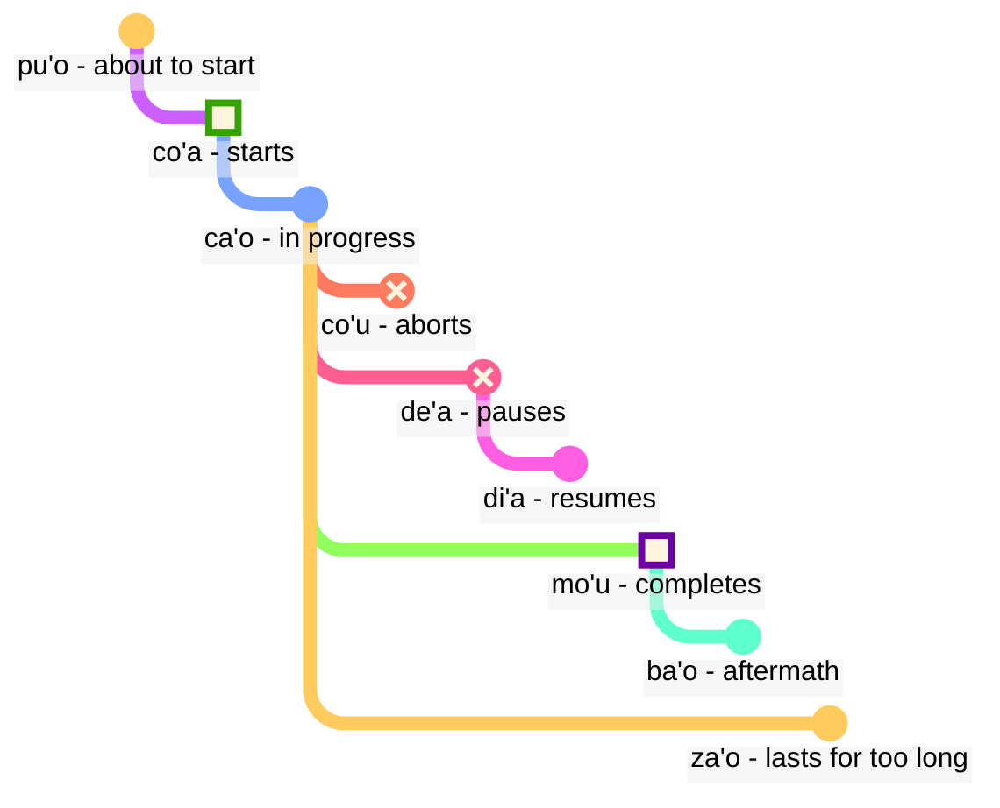

## Aralin 6: mga modal na termino: oras at espasyo

> **mi citka le cirla**

Mga posibleng pagsasalin:

> _Kumakain ako ng keso._
> _Kumain ako ng keso._
> _Laging kumakain ako ng keso._
> _Sa sandaling iyon, kakatapos ko lang kumain ng keso._

Ang mga panahon sa Lojban ay opsyonal; hindi natin kailangang palaging mag-isip kung aling panahon ang gagamitin.

Madalas na ang konteksto ang nagtatakda kung aling tama. Nagdaragdag tayo ng mga panahon kapag nararamdaman nating kailangan natin ang mga ito.

Ang mga panahon sa Lojban ay pareho ang pagtrato sa oras at espasyo. Ang pagsasabing _Nagtatrabaho ako noon_ ay hindi naiiba sa pagsasabing _Nagtatrabaho ako sa malayo sa hilaga_. Ang Ingles ay nagtrato ng mga salita tulad ng _noon_, ang pagtatapos ng nakaraang panahon na _-ed_, at mga salitang espasyo tulad ng _sa_ o _malapit_ sa tatlong magkaibang paraan, samantalang sa Lojban ay sumusunod sila sa parehong prinsipyo.

### Mga Punto sa oras at lugar

Ang isang partikular na modal na bahagi ng panahon nang walang sumusunod na argumento ay naglalarawan ng pangyayari bilang kaugnay sa _rito_ at _ngayon_:

> **mi pinxe ba**
> **mi ba pinxe**
> _Mag-iinom ako._

<!-- -->

> **mi pinxe bu'u**
> **mi bu'u pinxe**
> _Nag-iinom ako sa lugar na ito._

Ang isang modal na termino ng panahon na may sumusunod na argumento ay naglalarawan ng pangyayari bilang kaugnay sa pangyayari sa argumentong iyon:

> **mi pinxe ba le nu mi cadzu**
> _Mag-iinom ako pagkatapos kong maglakad._

### Mga Pangyayari kaugnay sa iba pang mga pangyayari sa oras

Sa Ingles, ginagamit natin ang tinatawag na "sunod-sunod ng mga panahon":

> **la .alis. pu cusku le se du'u ri pu penmi la .doris.**
> _Sinabi ni Alice na nakita niya si Doris noon._

Dito, ang pangyayaring _nakita si Doris_ ay nangyari bago ang pangyayaring _sinabi ni Alice_. Gayunpaman, sa

> **la .alis. pu cusku le se du'u ri ca kansa la .doris.**
> _Sinabi ni Alice na kasama niya si Doris._

ang dalawang pangyayari (_sinabi_ at _kasama si Doris_) ay nangyayari sa parehong oras.

Kaya, sa Ingles:

- ang panahon ng pangunahing relasyon ay nauunawaan batay sa sinumang nagsasabi ng relasyon na ito.
- ang panahon ng relasyon sa loob ng pangunahing relasyon ay nauunawaan din batay sa sinumang nagsasabi ng relasyon na ito.

Sa Lojban:

- ang panahon lamang ng pangunahing relasyon ay nauunawaan batay sa sinumang nagsasabi ng relasyon.
- ang iba pang mga panahon ay nauunawaan batay sa isa't isa. Kaya, sa **la .alis. pu cusku le se du'u ri pu penmi la .doris.** ang pangalawang **pu** ay nauunawaan batay sa unang **pu**. Sa **la .alis. pu cusku le se du'u ri ca kansa la .doris.**, ginagamit natin ang **ca** (_sa parehong oras_) na nauunawaan batay sa panlabas na relasyon (**pu cusku** — _sinabi_).

Gayunpaman, maaari nating gamitin ang modal na salita **nau** (_sa oras o lugar ng nagsasalita_), na magbibigay ng parehong epekto tulad ng paggamit sa Ingles:

Narito ang isang halimbawa sa istilo ng Ingles:

> **la .alis. pu cusku le se du'u ri nau pu kansa la .doris.**
> _Sinabi ni Alis na kasama niya si Doris._

<!-- Upang sabihin ang mga pariralang tulad ng `sa loob ng tatlong araw` o `dalawang taon na ang nakalipas` sa pangkalahatan ay inilalagay natin ang mga interval ng oras sa sunod-sunod na hindi nag-ooverlap. Kaya't may bagong pandiwa:

> **le cabna cu dzoli le nu mi penmi do kei li ci le ka prulamdei**
> _Magkikita tayo sa loob ng tatlong araw (batay sa kasalukuyan)._

> **dzoli le nu mi penmi do kei li ci le ka prulamdei**
> **dzoli le nu mi penmi do kei li ci le ka prulamdei**
> **prulamdeidzo le nu mi penmi do kei li ci**
> **mi penmi do fi'o prulamdeidzo be fi li ci**
> _Magkikita tayo sa loob ng tatlong araw._

> **le cabna cu dzoli le nu mi zvati le stuzi kei li re le ka bavlamdeidzo**
> **le nu mi zvati le stuzi kei le cabna cu dzoli li re le ka prulamdeidzo**
> _Binisita ko ang lugar na iyon dalawang taon na ang nakalipas._ -->

### Distansya sa oras at espasyo

fau
: modal na salita: sa parehong oras, lugar o sitwasyon tulad ng …

ca
: modal na salita: sa … (isang oras), sa parehong oras ng …; "kasalukuyang panahon"

bu'u
: modal na salita: sa … (isang lugar); dito (sa lugar na ito)

zi
: _kahapon lamang_ (kamakailan lang) o _mamaya_ (sa maikling panahon)

vi
: malapit sa …

za
: _kahapon_ o _sa kalaunan, sa hindi tiyak na oras_

va
: hindi malayo mula sa …

zu
: _matagal na ang nakalipas_ o _sa matagal na panahon_

vu
: malayo mula sa …; malayo

Ito ang paraan kung paano natin magagamit ang mga kombinasyon ng panahon upang tukuyin kung gaano kalayo tayo pumunta sa nakaraan o hinaharap:

- Ang **pu zu** ay nangangahulugang _matagal na ang nakalipas_
- Ang **pu za** ay nangangahulugang _kahapon lamang_
- Ang **pu zi** ay nangangahulugang _kahapon lamang_
- Ang **ba zi** ay nangangahulugang _mamaya_
- Ang **ba za** ay nangangahulugang _sa kalaunan_
- Ang **ba zu** ay nangangahulugang _sa matagal na panahon_

Pansinin ang pagkakasunod-sunod ng mga patinig **i**, **a**, at **u**. Ang pagkakasunod-sunod na ito ay paulit-ulit na lumilitaw sa Lojban at marahil ay karapat-dapat tandaan. Ang _maikli_ at _mahaba_ ay laging nakasalalay sa konteksto, relatibo, at subhetibo. Halimbawa, ang dalawang daang taon ay maikling panahon para sa isang species na mag-evolve ngunit mahabang panahon para maghintay ng bus. 

Ang **zi**, **za**, at **zu** ay nagmumodipika sa partikulang panahon tulad ng **pu** at **ba** na sinasabi bago ito:

- **pu zu** ay _isang matagal na panahon ang nakalipas_. Ang **pu** ay nagpapakita na nagsisimula tayo sa nakaraan, at ang **zu** ay nagsasaad na ito ay isang matagal na panahon ang nakaraan.
- **zu pu** ay _malayo sa panahon; may isang punto pagkatapos ng ilang pangyayari_. Ang **zu** ay nagpapakita na nagsisimula tayo sa isang punto na malayo sa panahon mula ngayon, at ang **pu** ay nagsasaad na tayo ay gumagalaw pabalik mula sa punto na iyon.

Kaya, ang **pu zu** ay laging nasa nakaraan, samantalang ang **zu pu** ay maaaring sa hinaharap.

Ang distansya sa espasyo ay parehong tandaan gamit ang **vi**, **va**, at **vu** para sa maikli, hindi tiyak (gitna), at malayong distansya sa espasyo.

Upang tukuyin ang distansya sa panahon o espasyo, ginagamit natin ang modal na salita na **la'u** na may argumento na nagtutukoy sa distansya:

> **ba ku la'u le djedi be li ci mi zvati ti**
> _Sa loob ng tatlong araw, narito ako._

Ang katumbas sa panahon ng **ca** ay **bu'u**, at ang **fau** ay mas kumplikado kaysa sa dalawa, dahil maaari itong mangahulugan ng panahon, espasyo, o sitwasyon.

> **ba za vu ku mi gunka**
> _Sa hinaharap, magtatrabaho ako sa isang lugar na malayo._

gunka
: magtrabaho

> **mi bu'u pu zu gunka**
> _Dati akong nagtatrabaho dito sa isang matagal na panahon ang nakalipas._
> `Ako dito-nakaraang-matagal na panahon-distansya trabaho`

> **pu zu vu ku zasti fa le ninmu .e le nanmu**
> _Noong unang panahon at malayo, may isang babae at isang lalaki na namuhay._

Ang huling pangungusap ay kung paano madalas magsimula ang mga kuwento ng engkanto.

### Tagal ng panahon at espasyo

ze'i
: modal na salita: para sa maikling panahon

ve'i
: modal na salita: sa maliit na espasyo

ze'a
: modal na salita: para sa ilang panahon

ve'a
: modal na salita: sa ilang espasyo

ze'u
: modal na salita: para sa mahabang panahon

ve'u
: modal na salita: sa malawak na espasyo

Muling madaling tandaan ito sa pamamagitan ng padrino **i**, **a**, **u**.

> **mi ze'u bajra**
> _Tumatakbo ako ng matagal._
<!-- -->
> **do ze'u klama le mi'a gugde ze'u**
> _Naglaan ka ng matagal na panahon sa pagdating sa aming bansa._
mi'a
: kami nang wala ka

gugde
: … ay isang bansa

> **mi ba zi ze'a xabju la .djakartas.**
> _Sa lalong madaling panahon, titira ako sa Jakarta ng pansamantala._
<!-- -->

> **le jenmi pe la .romas. ba ze'u gunta la .kart.xadact.**
> _Ang hukbo ng mga Romano ay mag-aatake sa Carthage ng matagal na panahon._

Ito ay hindi nangangahulugang hindi na atakehan ng mga Romano ang Carthage sa mga araw na ito. Sa Lojban, kapag sinabi natin na totoo ang isang bagay sa partikular na panahon, hindi ibig sabihin na hindi ito totoo sa anumang ibang panahon. Maaari mong sabihin ang **pu ba ze'u** upang malaman natin na ang aktibidad na ito ay sa hinaharap kapag tiningnan mula sa isang punto sa nakaraan ngunit sa nakaraan kapag tiningnan mula sa ngayon.

> **le xamsi**
> _dagat/karagatan_
<!-- -->

> **le ve'u xamsi**
> _karagatan_

<pixra url="/assets/pixra/cilre/le_vehi_ja_vehu_cmana.webp" caption="Ang burol ay malapit sa bundok." definition="The hill is near the mountain."></pixra>

> **le cmana**
> _bundok/burol_
<!-- -->

> **le ve'u cmana**
> _bundok_
<!-- -->

> **le ve'i cmana**
> _burol_
<!-- -->

> **ti ve'u gerku**
> _Iyan ay isang malaking aso. Ito ay isang aso na sumasakop ng malaking espasyo._

### «**pu'o**» — ‘_to be about_’, «**ba'o**» — ‘_no longer_’, «**za'o**» — ‘_still_’, «**xa'o**» — ‘_already_’

Narito ang ilang mga set ng mga modal na termino na makakatulong sa atin na magdagdag ng mas detalyadong kahulugan kapag kinakailangan.

Sa _mga hugis ng pangyayari_, hindi katulad ng **pu**, **ca**, at **ba**, tinitingnan natin ang bawat pangyayari na may hugis na may mga yugto:

pu'o
: modal na termino: na magiging tungkol sa paggawa ng isang bagay (ang pangyayari ay hindi pa nangyayari)

ba'o
: modal na termino: hindi na gumagawa ng isang bagay, nagawa na ang isang bagay (natapos na ang pangyayari)

Mga Halimbawa:

> **mi ba tavla le mikce**
> _Ako ay magsasalita sa doktor (at maaaring ako ay nagsasalita na ngayon din)._

mikce
: $x_1$ ay isang doktor

<!-- -->

> **mi pu pu'o tavla le mikce**
> _Ako ay mag-uumpisa nang magsalita sa doktor (hindi ako nagsasalita sa oras na iyon, hindi pa nagsimula ang pangyayari sa oras na iyon)._

<pixra url="/assets/pixra/cilre/puho_nenri.webp" caption="Ang tao ay malapit nang pumasok." definition="The person is about to be inside."></pixra>

<!-- -->

> **le sanmi ca pu'o bredi**
> _Ang pagkain ay hindi pa handa._

<!-- -->

> **mi pu ba'o tavla le mikce**
> _Ako ay nakapagsalita na sa doktor._

<pixra url="/assets/pixra/cilre/baho_carvi.webp" caption="ba'o carvi" definition="Kasunod ng ulan. Huminto na ang ulan."></pixra>

<!-- -->

> **mi ba ba'o tavla le mikce**
> _Ako ay magiging nakapagsalita na sa doktor._

<!-- -->

> **.a'o mi ba zi ba'o gunka**
> _Umaasa ako na sa lalong madaling panahon ay matapos ko na ang trabaho._

za'o
: modal na termino: pa rin. Ang pangyayari ay patuloy pa rin kahit tapos na ito sa natural na wakas

xa'o
: di opisyal na modal na termino: na, masyadong maaga. Ang pangyayari ay nagsimula na at masyadong maaga

Mga Halimbawa:

> **ri'a ma do za'o zvati vi**
> _Bakit ka pa rin dito?_

<!-- -->

> **la .kevin. xa'o zvati vi**
> _Kevin ay nandito na._

### Mga Yugto ng Pangyayari

> **mi co'a tavla**
> _Nagsimula akong magsalita._

<!-- -->

> **ra ca'o ciska**
> _Siya ay patuloy na sumusulat._

<!-- -->

> **ra pu co'u vasxu**
> _Siya ay huminto sa paghinga (biglang hindi inaasahan na pagbabago)._

vasxu
: $x_1$ humihinga ng $x_2$

> **mi pu mo'u citka le plise**
> _Nakakain ko na ang mansanas._

<!-- -->

> **la .maks. pu mo'u zbasu ti voi dinju**
> _Si Max ay nagtayo ng bahay na ito._

<!-- -->

> **ra pu de'a vasxu**
> _Siya ay tumigil sa paghinga (ngunit maaaring huminga ulit mamaya)._

<pixra url="/assets/pixra/cilre/deha_vasxu.webp" caption="mi de'a vasxu" definition="Huminto ako sa paghinga. Pinigilan ko ang aking paghinga."></pixra>

<!-- -->

> **mi pu di'a citka le plise**
> _Nagpatuloy ako sa pagkain ng mga mansanas._

<pixra url="/assets/pixra/cilre/diha_vasxu.webp" caption="mi di'a vasxu" definition="Nagpatuloy ako sa paghinga."></pixra>

co'a
: modal na termino: nagsisimula ang pangyayari (ang hangganan ng pangyayari)

ca'o
: modal na termino: gumagawa ng isang bagay (ang pangyayari ay nasa progreso)

co'u
: modal na termino: huminto ang pangyayari

mo'u
: modal na termino: nagtatapos ang pangyayari (ang hangganan ng pangyayari)

de'a
: ang pangyayari ay huminto (maaaring magpatuloy ang pangyayari)

di'a
: ang pangyayari ay nagpapatuloy

> **mi de'a ze'i jundi**
> _BRB (Ako ay babalik agad)._

<!-- -->

> **mi di'a jundi**
> _Ako ay bumalik (nagiging maingat)._

jundi
: $x_1$ nagbibigay ng pansin kay $x_2$

Ang dalawang ekspresyon na ito ay karaniwan sa mga chat sa teksto para ipahiwatig na wala ka o hindi nagbibigay ng pansin, at pagkatapos ay bumalik online:

Maaari rin namang sabihin lamang ang **de'a** o **di'a** at umaasa na maunawaan ang punto.

### Patuloy at Progresibong mga Pangyayari

ru'i
: modal na termino: ang pangyayari ay patuloy

> **.i mi pu ru'i citka le plise**
> _Ako ay patuloy na kumakain ng mga mansanas._

Tandaan ang pagkakaiba:

- Ang **ru'i** ay nagsasaad na ang pangyayari ay patuloy at hindi tumitigil.
- Ang **ca'o** ay nagpapahiwatig na ang pangyayari ay nagpapatuloy. Minsan ay maaaring huminto ito at pagkatapos ay magpatuloy sa pag-unlad nito.

### Mga Kontur ng Lugar

Ang mga kontur ng pangyayari ay maaaring gamitin upang magtukoy sa espasyo kung gagamitan natin ito ng **fe'e**:

> **le rokci cu fe'e ro roi zvati**
> _Ang mga bato ay nasaan man._

### ‘_sa kaliwa_’, ‘_sa kanan_’

> **le prenu cu sanli le dertu bu'u le pritu be mi**
> _Ang tao ay nakatayo sa lupa sa kanan ko._

<!-- -->

> **le gerku cu vreta le ckana bu'u le zunle be le verba**
> _Ang aso ay nakahiga sa kama sa kaliwa ng isang bata._

<!-- -->

> **ko jgari le panbi poi zunle**
> _Kumuha ng pluma sa kaliwa._

<!-- -->

> **le mlatu cu plipe bu'u le crane be do**
> _Isang pusa ay tumatalon sa harap mo._

<!-- -->

> **ko catlu le dinju poi crane**
> _Tumingin sa bahay sa harap._

<!-- -->

> **le verba cu zutse le stizu bu'u le trixe be mi**
> _Ang bata ay nakaupo sa upuan sa likod ko._

<!-- -->

> **le prenu cu sanli ki mi bu'u le pritu be le tricu bei mi**
> _Ang tao ay nakatayo sa kanan ng isang puno mula sa aking pananaw._

<!-- -->

> **le dinju cu zunle le rokci ti**
> _Ang bahay ay nasa kaliwa ng bato dito._

zunle
: $x_1$ ay sa kaliwa ni $x_2$ ayon sa pananaw ni $x_3$

pritu
: $x_1$ ay sa kanan ni $x_2$ ayon sa pananaw ni $x_3$

crane
: $x_1$ ay nasa harap ni $x_2$ ($x_1$ ay nasa pagitan ni $x_2$ at ng sinumang nanonood) ayon sa pananaw ni $x_3$

trixe
: $x_1$ ay nasa likod ni $x_2$ ayon sa pananaw ni $x_3$

sanli
: $x_1$ ay nakatayo sa $x_2$

zutse
: $x_1$ ay nakaupo sa $x_2$

vreta
: $x_1$ ay naka-higa sa $x_2$

le dertu
: ang lupa, ang dumi

le ckana
: ang kama

le stizu
: ang upuan

le pelji
: ang papel

le penbi
: ang pluma

### Pagsasanay: posisyon

<table>
<tbody><tr>
<td style="text-align:right;"><b>ma nabmi</b>
</td>
<td><i>Ano ang problema?</i>
</td></tr>
<tr>
<td style="text-align:right;"><b>ma'a nitcu tu'a le fonxa pe la .alis.</b>
</td>
<td><i>Kailangan natin ang telepono ni Alice.</i>
</td></tr>
<tr>
<td style="text-align:right;"><b>.i la .alis. ca zvati ma</b>
</td>
<td><i>Nasaan si Alice?</i>
</td></tr>
<tr>
<td style="text-align:right;"><b>la .alis. ca na ku zvati le bu'u tcadu .i mi pu mrilu le srana be le fonxa fi la .alis. .i ri ca ca'o vofli la .paris. .i ku'i mi pu zi te benji le se mrilu be la .alis. .i ri curmi le nu mi'a pilno le fonxa .i .e'o do bevri ri mi</b>
</td>
<td> Si Alice ngayon ay hindi nasa lungsod. Nagpadala ako ng sulat tungkol sa telepono sa kanya. Si Alice ngayon ay lumilipad papuntang Paris. Ngunit ngayon lang ako nakatanggap ng sulat mula sa kanya. Pinapayagan niya tayo na gamitin ang telepono. Mangyaring dalhin ito sa akin.
</td></tr>
<tr>
<td style="text-align:right;"><b>.i bu'u ma mi ka'e cpacu le fonxa</b>
</td>
<td>Saan ko maaaring makuha ang telepono?
</td></tr>
<tr>
<td style="text-align:right;"><b>le purdi .i .e'o do klama le bartu</b>
</td>
<td>Sa hardin. Paki-labas ka, mangyaring.
</td></tr>
<tr>
<td style="text-align:right;"><b>mi ca zvati ne'a le vorme .i ei mi ca klama ma</b>
</td>
<td>Ako ay malapit sa pinto. Ngayon saan ako pupunta?
</td></tr>
<tr>
<td style="text-align:right;"><b>ko klama le zunle be le tricu .i ba ku do viska le pa jubme</b>
</td>
<td>Pumunta sa kaliwa ng puno. Pagkatapos makikita mo ang isang mesa.
</td></tr>
<tr>
<td style="text-align:right;"><b>mi zgana no jubme</b>
</td>
<td>Walang nakikita na mesa.
</td></tr>
<tr>
<td style="text-align:right;"><b>ko carna gi'e muvdu le pritu .i le jubme cu crane le cmalu dinju .i le fonxa cu cpana le jubme .i ji'a ko jgari le penbi .e le pelji .i le za'u dacti cu cpana si'a le jubme .i ba ku ko bevri le ci dacti le zdani gi'e punji fi le sledi'u pe mi</b>
</td>
<td>Bumaling at lumipat sa kanan. Ang mesa ay nasa harap ng maliit na gusali. Ang telepono ay nasa ibabaw ng mesa. Pati na rin, kunin ang lapis at papel. Pareho silang nasa ibabaw ng mesa. Pagkatapos dalhin ang tatlong bagay sa bahay at ilagay sa aking silid.
</td></tr>
<tr>
<td style="text-align:right;"><b>vi'o</b>
</td>
<td>Gagawin ko.
</td></tr></tbody></table>

### Pagsasanay: mga sasakyan

<table>

<tbody><tr>
<td style="text-align:right;"><b>mi jo'u le pendo be mi pu ca'o litru le barda rirxe bu'u le bloti</b>
</td>
<td><i>Ako at ang aking mga kaibigan ay naglalakbay sa isang malaking ilog sa isang bangka.</i>
</td></tr>
<tr>
<td style="text-align:right;"><b>.i ba bo mi'a klama le vinji tcana</b>
</td>
<td><i>Pumunta kami sa isang paliparan.</i>
</td></tr>
<tr>
<td style="text-align:right;"><b>.i xu do se marce le karce</b>
</td>
<td><i>Nagdala ka ba ng sasakyan?</i>
</td></tr>
<tr>
<td style="text-align:right;"><b>.i na ku se marce .i mi'a pu klama fu le trene .i ze'a le cacra mi'a zvati bu'u le carce</b>
</td>
<td><i>Hindi. Pumunta kami sa pamamagitan ng tren. Isang oras kami nasa isang wagon.</i>
</td></tr></tbody></table>

marce
: $x_1$ ay isang sasakyan na nagdadala ng $x_2$

se marce
: $x_1$ ay isang pasahero ng $x_2$

<!-- jai zu'e se marce
: $x_1$ takes a vehicle $x_2$ as a passenger -->

karce
: $x_1$ ay isang sasakyan na nagdadala ng $x_2$

bloti
: $x_1$ ay isang bangka na nagdadala ng $x_2$

vinji
: $x_1$ ay isang eroplano na nagdadala ng $x_2$

trene
: $x_1$ ay isang tren ng mga sasakyan $x_2$

### Pagpapayaman ng bokabularyo. Mga bagong salita gamit ang mga panahon

Maraming salitang Ingles na katumbas ng mga kombinasyon ng salita sa Lojban:

pixra
: $x_1$ ay isang larawan ng $x_3$

le vi'a pixra
: ang larawan sa 2D

le vi'u pixra
: ang larawan sa 3D, isang eskultura

<pixra url="/assets/pixra/cilre/viha_pixra.webp" caption="vi'a pixra" definition="Larawan sa 2D, 2D drawing."></pixra>

<pixra url="/assets/pixra/cilre/vihu_pixra.webp" caption="vi'u pixra" definition="Larawan sa 3D, eskultura."></pixra>

le ve'i cmana
: ang burol (literal na "bundok/burol na sumasakop ng maliit na espasyo")

le ve'u xamsi
: ang karagatan (literal na "dagat/karagatan na sumasakop ng malaking espasyo")

le ba'o tricu
: tadtad ng puno (literal na "ang hindi na puno")

