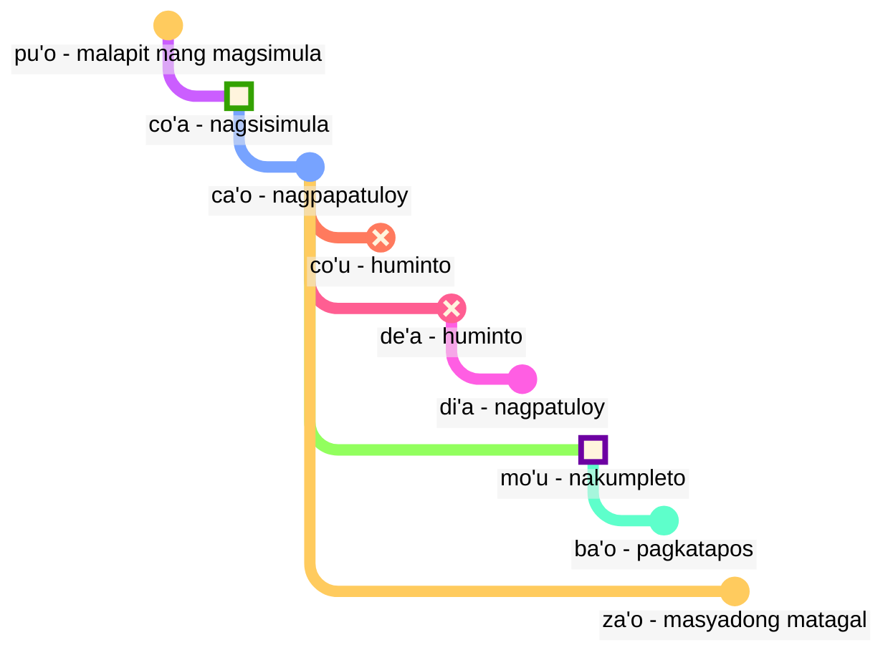

## Aralin 6: mga modal na termino: oras at espasyo

> **mi citka le cirla**

Mga posibleng pagsasalin:

> _Kumakain ako ng keso._ > _Kumain ako ng keso._ > _Palagi akong kumakain ng keso._ > _Sa sandali, matatapos na akong kumain ng keso._

Ang mga panahunan sa Lojban ay opsyonal; hindi natin kailangang mag-isip palagi kung aling panahunan ang gagamitin.

Kadalasan ay niresolba ng konteksto kung ano ang tama. Nagdadagdag tayo ng mga panahunan kapag kailangan natin.

Ang mga panahunan sa Lojban ay tinatrato ang oras at espasyo nang pareho. Ang pagsasabi na _Nagtrabaho ako matagal na panahon ang nakalipas_ ay hindi grammatically naiiba sa pagsasabi na _Nagtatrabaho ako malayo sa hilaga_. Ang Ingles ay tinatrato ang mga salita tulad ng _kanina_, ang past tense ending _-ed_, at mga salita ng espasyo tulad ng _sa_ o _malapit_ sa tatlong magkaibang scheme, habang sa Lojban ay sumusunod sila sa parehong prinsipyo.

### Mga punto sa oras at lugar

Ang isang tense modal particle na walang sumusunod na argumento ay naglalarawan ng pangyayari bilang relative sa _dito_ at _ngayon_:

> **mi pinxe ba** > **mi ba pinxe** > _Iinom ako._

<!-- -->

> **mi pinxe bu'u** > **mi bu'u pinxe** > _Umiinom ako sa lugar na ito._

Ang isang tense modal term na may sumusunod na argumento ay naglalarawan ng pangyayari bilang relative sa pangyayari sa argumentong iyon:

> **mi pinxe ba le nu mi cadzu** > _Umiinom ako pagkatapos kong maglakad._

#### Pagsasanay

Takpan ang kanang bahagi ng talahanayan. Isalin mula sa Lojban:

<table>
<tbody><tr>
<td><b>mi bu'u pinxe</b></td>
<td><i>Umiinom ako dito.</i></td></tr>
<tr>
<td><b>mi ba citka le plise</b></td>
<td><i>Kakain ako ng mansanas.</i></td></tr>
<tr>
<td><b>mi pinxe ba le nu mi cadzu</b></td>
<td><i>Umiinom ako pagkatapos kong maglakad.</i></td></tr>
</tbody></table>

Isalin sa Lojban:

<table>
<tbody><tr>
<td><i>Maglalakad ako.</i></td>
<td><b>mi ba cadzu</b></td></tr>
<tr>
<td><i>Umiinom ako bago ako matulog.</i></td>
<td><b>mi pinxe pu le nu mi sipna</b></td></tr>
</tbody></table>

### Mga pangyayaring relative sa ibang mga pangyayari sa oras

Sa Tagalog, ginagamit natin ang tinatawag na "sequence of tenses":

> **la .alis. pu cusku le se du'u ri pu penmi la .doris.** > _Sinabi ni Alice na nakita niya si Doris noon._

Dito, ang pangyayaring _nakita si Doris_ ay nangyari bago ang pangyayaring _sinabi ni Alice_. Gayunman, sa

> **la .alis. pu cusku le se du'u ri ca kansa la .doris.** > _Sinabi ni Alice na kasama niya si Doris._

ang dalawang pangyayari (_sinabi_ at _kasama si Doris_) ay nangyari sa parehong oras.

Kaya, sa Tagalog:

- ang panahunan ng pangunahing relasyon ay nauunawaan bilang relative sa sinumang nagsasabi ng relasyong ito.
- ang panahunan ng relasyon sa loob ng pangunahing relasyon ay nauunawaan din bilang relative sa sinumang nagsasabi ng relasyong ito.

Sa Lojban:

- ang panahunan lamang ng pangunahing relasyon ang relative sa sinumang nagsasabi ng relasyon.
- ang ibang mga panahunan ay relative sa bawat isa. Kaya, sa **la .alis. pu cusku le se du'u ri pu penmi la .doris.** ang pangalawang **pu** ay relative sa unang **pu**. Sa **la .alis. pu cusku le se du'u ri ca kansa la .doris.**, ginagamit natin ang **ca** (_sa parehong oras_) na relative sa panlabas na relasyon (**pu cusku** — _sinabi_).

Gayunman, maaari nating gamitin ang modal term na **nau** (_sa oras o lugar ng nagsasalita_), na magbibigay ng parehong epekto tulad ng sa Tagalog:

Narito ang isang halimbawa sa istilo ng Tagalog:

> **la .alis. pu cusku le se du'u ri nau pu kansa la .doris.** > _Sinabi ni Alice na kasama niya si Doris._

#### Pagsasanay

Takpan ang kanang bahagi ng talahanayan. Isalin mula sa Lojban:

<table>
<tbody><tr>
<td><b>la .alis. pu cusku le se du'u ri ba penmi la .doris.</b></td>
<td><i>Sinabi ni Alice na makikita niya si Doris.</i></td></tr>
<tr>
<td><b>mi pu djuno le du'u do ca gunka</b></td>
<td><i>Alam kong nagtatrabaho ka.</i></td></tr>
<tr>
<td><b>mi pu na djuno le du'u do ba zvati ti</b></td>
<td><i>Hindi ko alam na naririto ka.</i></td></tr></tbody></table>

Takpan ang kanang bahagi ng talahanayan. Isalin sa Lojban:

<table>
<tbody><tr>
<td><i>Sinabi niya sa akin na nasa bahay siya.</i></td>
<td><b>ri pu cusku le se du'u ri pu zvati le zdani</b></td></tr>
<tr>
<td><i>Alam kong matalino ka.</i></td>
<td><b>mi djuno le du'u do ca stati</b></td></tr></tbody></table>

### Distansya sa oras at espasyo

fau
: modal term: sa parehong oras, lugar o sitwasyon tulad ng …

ca
: modal term: sa … (ilang oras), sa parehong oras tulad ng …; "kasalukuyang panahunan"

bu'u
: modal term: sa … (ilang lugar); dito (sa lugar na ito)

zi
: _kamakailan_ (maikling oras ang nakalipas) o _malapit na_ (sa maikling oras)

vi
: malapit sa …

za
: _kanina_ o _sa ilang sandali, sa hindi tiyak na oras_

va
: hindi malayo sa …

zu
: _matagal na ang nakalipas_ o _sa matagal na panahon_

vu
: malayo sa …; malayo

Ito kung paano natin magagamit ang mga kombinasyon ng panahunan upang tukuyin kung gaano kalayo tayo sa nakaraan o hinaharap:

- **pu zu** ay nangangahulugang _matagal na ang nakalipas_
- **pu za** ay nangangahulugang _kanina_
- **pu zi** ay nangangahulugang _kamakailan_
- **ba zi** ay nangangahulugang _malapit na_
- **ba za** ay nangangahulugang _sa ilang sandali_
- **ba zu** ay nangangahulugang _sa matagal na panahon_

Pansinin ang pagkakasunod-sunod ng patinig na **i**, **a**, at **u**. Ang pagkakasunod-sunod na ito ay paulit-ulit na lumilitaw sa Lojban at maaaring sulit tandaan. Ang _maikli_ at _mahaba_ ay palaging nakadepende sa konteksto, relative, at subjective. Halimbawa, dalawang daang taon ay maikling panahon para sa isang species na mag-evolve pero matagal na panahon para maghintay ng bus.

Binabago ng **zi**, **za**, at **zu** ang tense particle tulad ng **pu** at **ba** na sinasabi bago ito:

- **pu zu** ay _matagal na ang nakalipas_. Ipinapakita ng **pu** na nagsisimula tayo sa nakaraan, at ipinapahiwatig ng **zu** na ito ay matagal na panahon pabalik.
- **zu pu** ay _malayo sa oras; may punto pagkatapos ng ilang pangyayari_. Ipinapakita ng **zu** na nagsisimula tayo sa ilang punto na malayo sa oras mula ngayon, at ipinapahiwatig ng **pu** na umaatras tayo mula sa puntong iyon.

Kaya, ang **pu zu** ay palaging nasa nakaraan, habang ang **zu pu** ay maaaring nasa hinaharap.

Ang spatial distance ay minarkahan din ng **vi**, **va**, at **vu** para sa maikli, hindi tiyak (medium), at mahabang distansya sa espasyo.

Upang tukuyin ang distansya sa oras o espasyo, ginagamit natin ang modal term na **la'u** na may argumento na tumutukoy sa distansya:

> **ba ku la'u le djedi be li ci mi zvati ti** > _Sa tatlong araw, narito ako._

Ang space equivalent ng **ca** ay **bu'u**, at ang **fau** ay mas malabo kaysa sa dalawa, dahil maaari itong mangahulugan ng oras, espasyo, o sitwasyon.

> **ba za vu ku mi gunka** > _Balang araw sa hinaharap, magtatrabaho ako sa isang lugar na malayo._

gunka
: magtrabaho

> **mi bu'u pu zu gunka** > _Dati akong nagtatrabaho dito matagal na panahon ang nakalipas._ > `Ako dito-nakaraan-matagal-distansya trabaho`

> **pu zu vu ku zasti fa le ninmu .e le nanmu** > _Noong unang panahon at sa isang malayong lugar, may naninirahan na babae at lalaki._

Ang huling pangungusap ay kung paano kadalasang nagsisimula ang mga kuwentong engkanto.

#### Pagsasanay

Takpan ang kanang bahagi ng talahanayan. Isalin mula sa Lojban:

<table>
<tbody><tr>
<td><b>mi pu zu gunka</b></td>
<td><i>Nagtrabaho ako matagal na panahon ang nakalipas.</i></td></tr>
<tr>
<td><b>do ba zi cliva</b></td>
<td><i>Aalis ka na malapit na.</i></td></tr>
<tr>
<td><b>mi vu zvati</b></td>
<td><i>Malayo ako.</i></td></tr>
</tbody></table>

Isalin sa Lojban:

<table>
<tbody><tr>
<td><i>Magtatrabaho ako sa ilang sandali.</i></td>
<td><b>mi ba za gunka</b></td></tr>
<tr>
<td><i>Malapit ka.</i></td>
<td><b>do vi zvati</b></td></tr>
</tbody></table>

### Tagal sa oras at espasyo

ze'i
: modal term: sa maikling panahon

ve'i
: modal term: sa maliit na espasyo

ze'a
: modal term: sa ilang panahon

ve'a
: modal term: sa ilang espasyo

ze'u
: modal term: sa matagal na panahon

ve'u
: modal term: sa malawak na espasyo

Muli, madaling tandaan dahil sa pattern na **i**, **a**, **u**.

> **mi ze'u bajra** > _Tumatakbo ako nang matagal._

<!-- -->

> **do ze'u klama le mi'a gugde ze'u** > _Matagal mong ginugugol ang pagpunta sa ating bansa._

mi'a
: kami na hindi kasama ka

gugde
: … ay isang bansa

> **mi ba zi ze'a xabju la .djakartas.** > _Sa madaling panahon, titira ako sa Jakarta nang ilang sandali._

<!-- -->

> **le jenmi pe la .romas. ba ze'u gunta la .kart.xadact.** > _Ang hukbo ng Roma ay aatake sa Carthage nang matagal na panahon._

Hindi ito nangangahulugan na ang mga Romano ay hindi umaatake sa Carthage ngayon. Sa Lojban, kung sinasabi nating totoo ang isang bagay sa isang partikular na oras, hindi ito nangangahulugan na hindi ito totoo sa ibang oras. Maaari mong sabihin ang **pu ba ze'u** upang malaman natin na ang aktibidad na ito ay nasa hinaharap kapag tiningnan mula sa isang punto sa nakaraan pero nasa nakaraan kapag tiningnan mula ngayon.

> **le xamsi** > _dagat/karagatan_

<!-- -->

> **le ve'u xamsi** > _karagatan_

<pixra url="/assets/pixra/cilre-xekri-g-out/le_vehi_ja_vehu_cmana.webp" caption="le ve'i cmana cu jibni le ve'u cmana" definition="Ang burol ay malapit sa bundok."></pixra>

> **le cmana** > _bundok/burol_

<!-- -->

> **le ve'u cmana** > _bundok_

<!-- -->

> **le ve'i cmana** > _burol_

<!-- -->

> **ti ve'u gerku** > _Iyon ay malaking aso. Ito ay isang aso na sumasaklaw sa malaking espasyo._

#### Pagsasanay

Takpan ang kanang bahagi ng talahanayan. Isalin mula sa Lojban:

<table>
<tbody><tr>
<td><b>mi ze'u pinxe le tcati</b></td>
<td><i>Umiinom ako ng tsaa nang matagal.</i></td></tr>
<tr>
<td><b>mi ve'i zvati le kumfa</b></td>
<td><i>Nasa maliit na silid ako.</i></td></tr>
</tbody></table>

Isalin sa Lojban:

<table>
<tbody><tr>
<td><i>Mananatili ako dito nang ilang sandali.</i></td>
<td><b>mi ze'a zvati ti</b></td></tr>
<tr>
<td><i>Ang aso ay sumasaklaw sa malaking espasyo.</i></td>
<td><b>le gerku cu ve'u zvati</b></td></tr>
</tbody></table>

### «**pu'o**» — '_malapit nang_', «**ba'o**» — '_hindi na_', «**za'o**» — '_pa rin_', «**xa'o**» — '_na_'

Narito ang ilang hanay ng mga modal term na makakatulong sa atin na magdagdag ng mas pinong kahulugan kapag kinakailangan.

Sa _mga contour ng pangyayari_, hindi tulad ng **pu**, **ca**, at **ba**, tinitingnan natin ang bawat pangyayari bilang may hugis na may mga tiyak na yugto:

pu'o
: modal term: malapit nang gawin ang isang bagay (hindi pa nangyayari ang pangyayari)

ba'o
: modal term: hindi na ginagawa ang isang bagay, natapos na ang isang bagay (natapos na ang pangyayari)

Mga halimbawa:

> **mi ba tavla le mikce** > _Makikipag-usap ako sa doktor (at maaaring nakikipag-usap na rin ako ngayon)._

mikce
: x₁ ay doktor

<!-- -->

> **mi pu pu'o tavla le mikce** > _Malapit na akong makipag-usap sa doktor (hindi pa ako nakikipag-usap noon, hindi pa nagsisimula ang pangyayari noon)._

<pixra url="/assets/pixra/cilre-xekri-g-out/puho_nenri.webp" caption="le prenu pu'o zvati le nenri" definition="Malapit nang pumasok ang tao."></pixra>

<!-- -->

> **le sanmi ca pu'o bredi** > _Hindi pa handa ang pagkain._

<!-- -->

> **mi pu ba'o tavla le mikce** > _Nakausap ko na ang doktor._

<pixra url="/assets/pixra/cilre-xekri-g-out/baho_carvi.webp" caption="ba'o carvi" definition="Pagkatapos ng ulan. Tumigil na ang ulan."></pixra>

<!-- -->

> **mi ba ba'o tavla le mikce** > _Nakausap ko na ang doktor._

<!-- -->

> **.a'o mi ba zi ba'o gunka** > _Sana malapit na akong matapos sa trabaho._

za'o
: modal term: pa rin. Nagpapatuloy ang pangyayari lampas sa natural na katapusan nito

xa'o
: hindi opisyal na modal term: na, masyadong maaga. Nagsimula na ang pangyayari at masyadong maaga

Mga halimbawa:

> **ri'a ma do za'o zvati vi** > _Bakit nandito ka pa rin?_

<!-- -->

> **la .kevin. xa'o zvati vi** > _Nandito na si Kevin._

#### Pagsasanay

Takpan ang kanang bahagi ng talahanayan. Isalin mula sa Lojban:

<table>
<tbody><tr>
<td><b>mi pu pu'o ciska</b></td>
<td><i>Malapit na akong sumulat.</i></td></tr>
<tr>
<td><b>le sanmi ba'o jukpa</b></td>
<td><i>Hindi na niluluto ang pagkain.</i></td></tr>
<tr>
<td><b>mi za'o kelci</b></td>
<td><i>Naglalaro pa rin ako (mas matagal kaysa inaasahan).</i></td></tr>
</tbody></table>

Isalin sa Lojban:

<table>
<tbody><tr>
<td><i>Umalis na ako.</i></td>
<td><b>mi xa'o cliva</b></td></tr>
<tr>
<td><i>Magiging handa ang pagkain.</i></td>
<td><b>le cidja ba bredi</b></td></tr>
</tbody></table>

### Mga yugto ng pangyayari

> **mi co'a tavla** > _Nagsimula akong magsalita._

<!-- -->

> **ra ca'o ciska** > _Patuloy siyang sumusulat._

<!-- -->

> **ra pu co'u vasxu** > _Tumigil siyang huminga (biglaang hindi inaasahang pagbabago)._

vasxu
: x₁ ay humihinga ng x₂

> **mi pu mo'u citka le plise** > _Naubos ko nang kainin ang mansanas._

<!-- -->

> **la .maks. pu mo'u zbasu ti voi dinju** > _Naitayo na ni Max ang bahay na ito._

<!-- -->

> **ra pu de'a vasxu** > _Tumigil siya sa paghinga (pero maaaring huminga ulit mamaya)._

<pixra url="/assets/pixra/cilre-xekri-g-out/deha_vasxu.webp" caption="mi de'a vasxu" definition="Huminto ako sa paghinga. Humihinga ako."></pixra>

<!-- -->

> **mi pu di'a citka le plise** > _Nagpatuloy akong kumain ng mansanas._

<pixra url="/assets/pixra/cilre-xekri-g-out/diha_vasxu.webp" caption="mi di'a vasxu" definition="Nagpatuloy akong huminga."></pixra>

co'a
: modal term: nagsisimula ang pangyayari (ang hangganan ng pangyayari)

ca'o
: modal term: ginagawa ang isang bagay (nagpapatuloy ang pangyayari)

co'u
: modal term: tumitigil ang pangyayari

mo'u
: modal term: nagtatapos ang pangyayari (ang hangganan ng pangyayari)

de'a
: humihinto ang pangyayari (inaasahang magpapatuloy ang pangyayari)

di'a
: nagpapatuloy ang pangyayari

> **mi de'a ze'i jundi** > _BRB (Babalik ako agad)._

<!-- -->

> **mi di'a jundi** > _Bumalik na ako (nagbibigay pansin)._

jundi
: x₁ ay nagbibigay pansin sa x₂

Ang dalawang ekspresyong ito ay karaniwan sa text chat para ipahiwatig na wala ka o hindi nagbibigay pansin, at pagkatapos ay bumalik online:

Maaari ring sabihin lang ang **de'a** o **di'a** at umasang maiintindihan.

#### Pagsasanay

Takpan ang kanang bahagi ng talahanayan. Isalin mula sa Lojban:

<table>
<tbody><tr>
<td><b>mi co'a tavla</b></td>
<td><i>Nagsimula akong magsalita.</i></td></tr>
<tr>
<td><b>mi ca'o pinxe le tcati</b></td>
<td><i>Umiinom ako ng tsaa.</i></td></tr>
<tr>
<td><b>mi co'u tavla</b></td>
<td><i>Tumigil akong magsalita.</i></td></tr>
<tr>
<td><b>mi de'a vasxu</b></td>
<td><i>Huminto ako sa paghinga.</i></td></tr>
</tbody></table>

Isalin sa Lojban:

<table>
<tbody><tr>
<td><i>Nagpatuloy akong magtrabaho.</i></td>
<td><b>mi di'a gunka</b></td></tr>
<tr>
<td><i>Natapos akong kumain.</i></td>
<td><b>mi mo'u citka</b></td></tr>
</tbody></table>

### Tuloy-tuloy at progresibong mga pangyayari

ru'i
: modal term: tuloy-tuloy ang pangyayari

> **.i mi pu ru'i citka le plise** > _Tuloy-tuloy akong kumain ng mansanas._

Pansinin ang pagkakaiba:

- Ipinapahiwatig ng **ru'i** na tuloy-tuloy ang pangyayari at hindi humihinto.
- Ipinapahiwatig ng **ca'o** na nagpapatuloy ang pangyayari. Maaari itong minsan huminto at pagkatapos ay magpatuloy.

#### Pagsasanay

Takpan ang kanang bahagi ng talahanayan. Isalin mula sa Lojban:

<table>
<tbody><tr>
<td><b>mi pu ru'i citka le plise</b></td>
<td><i>Tuloy-tuloy akong kumain ng mansanas.</i></td></tr>
<tr>
<td><b>le mlatu cu ru'i sipna</b></td>
<td><i>Tuloy-tuloy na natutulog ang pusa.</i></td></tr>
<tr>
<td><b>xu do ca'o kelci</b></td>
<td><i>Naglalaro ka ba (nagpapatuloy pa)?</i></td></tr></tbody></table>

kelci
: maglaro

Takpan ang kanang bahagi ng talahanayan. Isalin sa Lojban:

<table>
<tbody><tr>
<td><i>Tuloy-tuloy akong nagtatrabaho dito.</i></td>
<td><b>mi ru'i gunka bu'u</b></td></tr>
<tr>
<td><i>Sumasayaw pa rin sila.</i></td>
<td><b>ri ca'o dansu</b></td></tr></tbody></table>

### Mga contour ng lugar

Ang mga contour ng pangyayari ay maaaring gamitin upang tumukoy sa espasyo kung lalagyan natin ng **fe'e** sa harap:

> **le rokci cu fe'e ro roi zvati** > _Ang mga bato ay nasa lahat ng dako._

### '_sa kaliwa_', '_sa kanan_'

<pixra url="/assets/pixra/cilre-xekri-g-out/pritu_le_tricu.webp" caption="le prenu cu pritu le tricu le zgana" definition="Ang tao ay nasa kanan ng puno mula sa punto de vista ng tagamasid."></pixra>

> **le prenu cu sanli le dertu bu'u le pritu be mi** > _Nakatayo ang tao sa lupa sa kanan ko._

<!-- -->

> **le gerku cu vreta le ckana bu'u le zunle be le verba** > _Nakahiga ang aso sa kama sa kaliwa ng bata._

<!-- -->

> **ko jgari le panbi poi zunle** > _Kunin mo ang panulat sa kaliwa._

<!-- -->

> **le mlatu cu plipe bu'u le crane be do** > _Tumalon ang pusa sa harap mo._

<!-- -->

> **ko catlu le dinju poi crane** > _Tingnan mo ang bahay sa harap._

<!-- -->

> **le verba cu zutse le stizu bu'u le trixe be mi** > _Nakaupo ang bata sa upuan sa likod ko._

<!-- -->

> **le prenu cu sanli ki mi bu'u le pritu be le tricu bei mi** > _Nakatayo ang tao sa kanan ng puno mula sa aking punto de vista._

<!-- -->

> **le dinju cu zunle le rokci ti** > _Ang bahay ay nasa kaliwa ng bato kung titingnan mula rito._

zunle
: x₁ ay nasa kaliwa ng x₂ kung titingnan mula sa x₃

pritu
: x₁ ay nasa kanan ng x₂ kung titingnan mula sa x₃

crane
: x₁ ay nasa harap ng x₂ (x₁ ay nasa pagitan ng x₂ at ng sinumang tumitingin) kung titingnan mula sa x₃

trixe
: x₁ ay nasa likod ng x₂ kung titingnan mula sa x₃

sanli
: x₁ ay nakatayo sa x₂

zutse
: x₁ ay nakaupo sa x₂

vreta
: x₁ ay nakahiga sa x₂

le dertu
: ang lupa, ang dumi

le ckana
: ang kama

le stizu
: ang upuan

le pelji
: ang papel

le penbi
: ang panulat

#### Pagsasanay

Takpan ang kanang bahagi ng talahanayan. Isalin mula sa Lojban:

<table>
<tbody><tr>
<td><b>le mlatu cu zunle le gerku</b></td>
<td><i>Ang pusa ay nasa kaliwa ng aso.</i></td></tr>
<tr>
<td><b>ko cadzu le crane be mi</b></td>
<td><i>Maglakad ka sa harap ko.</i></td></tr>
<tr>
<td><b>le prenu cu sanli le trixe be le dinju</b></td>
<td><i>Nakatayo ang tao sa likod ng bahay.</i></td></tr>
</tbody></table>

Isalin sa Lojban:

<table>
<tbody><tr>
<td><i>Ang aso ay nasa kanan ko.</i></td>
<td><b>le gerku cu pritu mi</b></td></tr>
<tr>
<td><i>Umupo ka sa harap ng bahay.</i></td>
<td><b>ko zutse le crane be le dinju</b></td></tr>
</tbody></table>

### Pagsasanay: posisyon

<table>
<tbody><tr>
<td style="text-align:right;"><b>ma nabmi</b>
</td>
<td><i>Ano ang problema?</i>
</td></tr>
<tr>
<td style="text-align:right;"><b>ma'a nitcu tu'a le fonxa pe la .alis.</b>
</td>
<td><i>Kailangan namin ang telepono ni Alice.</i>
</td></tr>
<tr>
<td style="text-align:right;"><b>.i la .alis. ca zvati ma</b>
</td>
<td><i>Nasaan si Alice?</i>
</td></tr>
<tr>
<td style="text-align:right;"><b>la .alis. ca na ku zvati le bu'u tcadu .i mi pu mrilu le srana be le fonxa fi la .alis. .i ri ca ca'o vofli la .paris. .i ku'i mi pu zi te benji le se mrilu be la .alis. .i ri curmi le nu mi'a pilno le fonxa .i .e'o do bevri ri mi</b>
</td>
<td> Wala si Alice sa lungsod ngayon. Nag-email ako sa kanya tungkol sa telepono. Lumilipad si Alice ngayon patungong Paris. Pero kamakailan ay nakatanggap ako ng email mula sa kanya. Pinapayagan niya tayong gamitin ang telepono. Pakidala ito sa akin.
</td></tr>
<tr>
<td style="text-align:right;"><b>.i bu'u ma mi ka'e cpacu le fonxa</b>
</td>
<td>Saan ko makukuha ang telepono?
</td></tr>
<tr>
<td style="text-align:right;"><b>le purdi .i .e'o do klama le bartu</b>
</td>
<td>Sa hardin. Pakipunta sa labas.
</td></tr>
<tr>
<td style="text-align:right;"><b>mi ca zvati ne'a le vorme .i ei mi ca klama ma</b>
</td>
<td>Malapit ako sa pinto. Ngayon saan ako dapat pumunta?
</td></tr>
<tr>
<td style="text-align:right;"><b>ko klama le zunle be le tricu .i ba ku do viska le pa jubme</b>
</td>
<td>Pumunta ka sa kaliwa ng puno. Pagkatapos ay makikita mo ang isang mesa.
</td></tr>
<tr>
<td style="text-align:right;"><b>mi zgana no jubme</b>
</td>
<td>Wala akong nakikitang mesa.
</td></tr>
<tr>
<td style="text-align:right;"><b>ko carna gi'e muvdu le pritu .i le jubme cu crane le cmalu dinju .i le fonxa cu cpana le jubme .i ji'a ko jgari le penbi .e le pelji .i le za'u dacti cu cpana si'a le jubme .i ba ku ko bevri le ci dacti le zdani gi'e punji fi le sledi'u pe mi</b>
</td>
<td>Lumiko ka at lumipat sa kanan. Ang mesa ay nasa harap ng maliit na gusali. Ang telepono ay nasa ibabaw ng mesa. Gayundin, kunin mo ang lapis at papel. Nasa ibabaw din sila ng mesa. Pagkatapos ay dalhin mo ang tatlong bagay sa bahay at ilagay sa silid ko.
</td></tr>
<tr>
<td style="text-align:right;"><b>vi'o</b>
</td>
<td>Gagawin ko.
</td></tr></tbody></table>

### Pagsasanay: mga sasakyan

<table>

<tbody><tr>
<td style="text-align:right;"><b>mi jo'u le pendo be mi pu ca'o litru le barda rirxe bu'u le bloti</b>
</td>
<td><i>Ako at ang mga kaibigan ko ay naglalakbay sa malaking ilog sakay ng bangka.</i>
</td></tr>
<tr>
<td style="text-align:right;"><b>.i ba bo mi'a klama le vinji tcana</b>
</td>
<td><i>Pagkatapos ay pumunta kami sa paliparan.</i>
</td></tr>
<tr>
<td style="text-align:right;"><b>.i xu do se marce le karce</b>
</td>
<td><i>Sumakay ka ba ng kotse?</i>
</td></tr>
<tr>
<td style="text-align:right;"><b>.i na ku se marce .i mi'a pu klama fu le trene .i ze'a le cacra mi'a zvati bu'u le carce</b>
</td>
<td><i>Hindi. Pumunta kami sakay ng tren. Sa loob ng isang oras, nasa bagon kami.</i>
</td></tr></tbody></table>

marce
: x₁ ay sasakyan na nagdadala ng x₂

se marce
: x₁ ay pasahero ng x₂

karce
: x₁ ay kotse na nagdadala ng x₂

bloti
: x₁ ay bangka na nagdadala ng x₂

vinji
: x₁ ay eroplano na nagdadala ng x₂

trene
: x₁ ay tren ng mga bagon na x₂

### Pagpapayaman ng bokabularyo. Mga bagong salita gamit ang mga panahunan

Maraming salita sa Tagalog ang tumutugma sa mga kombinasyon ng salita sa Lojban:

pixra
: x₁ ay larawan ng x₃

le vi'a pixra
: ang larawan sa 2D

le vi'u pixra
: ang larawan sa 3D, iskultura

<pixra url="/assets/pixra/cilre-xekri-g-out/viha_pixra.webp" caption="vi'a pixra" definition="2D na larawan, 2D na guhit."></pixra>

<pixra url="/assets/pixra/cilre-xekri-g-out/vihu_pixra.webp" caption="vi'u pixra" definition="3D na larawan, iskultura."></pixra>

le ve'i cmana
: ang burol (literal na "bundok/burol na sumasaklaw sa maliit na espasyo")

le ve'u xamsi
: ang karagatan (literal na "dagat/karagatan na sumasaklaw sa malaking espasyo")

le ba'o tricu
: tuod ng puno (literal na "ang hindi na puno")
