<!--

[📁 PDF version of this page](/vreji/uencu/learn-lojban.pdf)

-->

o kepeken lipu ni lon nasin ni:

1. o lukin e lipu
2. o kama sona e ni: pilin sina la lipu li pona seme li ike seme
3. o toki e pilin ale lon [💬 ilo toki kulupu](https://lojban.pw/articles/live_chat/)

## lipu sona #1) tenpo lili la ijo suli pi nasin toki

### sitelen nimi

toki Losupan la open la o sona e ijo suli ni: sitelen seme li sitelen e nimi.

toki Losupan li kepeken nasin sitelen Lasina. (kalama pi uta open la sitelen li kule.)

<dl><dd><b>a b c d e f g i j k l m n o p r s t u v x y z ' .</b></dd></dl>

kalama nimi li sama sitelen nimi.

toki Losupan la kalama pi uta open li luka luka.

<table>
<tbody><tr>
<td><b class="audio-inline">a</b></td>
<td> sama nimi <i>p<u>a</u>li</i></td>
</tr>
<tr>
<td><b class="audio-inline">e</b></td>
<td> sama nimi <i>j<u>e</u>lo</i></td>
</tr>
<tr>
<td><b class="audio-inline">i</b></td>
<td> sama nimi <i>k<u>i</u>li</i></td>
</tr>
<tr>
<td><b class="audio-inline">o</b></td>
<td> sama nimi <i>s<u>o</u>na</i></td>
</tr>
<tr>
<td><b class="audio-inline">u</b></td>
<td> sama nimi <i>m<u>u</u></i></td>
</tr>
<tr>
<td><b class="audio-inline">y</b></td>
<td> toki pona la kalama ni li lon ala. kalama ale pi uta open la, uta li kama lape la, kalama ni li kama. kalama ante ale pi uta open la kalama ni li lon insa. toki Inli la sama nimi <i>comm<u>a</u></i>.</td>
</tr>
<tr>
</tbody></table>

kalama tu tu ante li sama ni: kalama tu li kama wan. sitelen li sama li sitelen tu.

<table>
<tbody><tr>
<td><b class="audio-inline">au</b></td>
<td> lili la sama ni: <i>aw</i></td></tr>
<tr>
<td><b class="audio-inline">ai</b></td>
<td> lili la sama ni: <i>aj</i></td></tr>
<tr>
<td><b class="audio-inline">ei</b></td>
<td> lili la sama ni: <i>ej</i></td></tr>
<tr>
<td><b class="audio-inline">oi</b></td>
<td> lili la sama ni: <i>oj</i></td></tr>
</tbody></table>

kalama pi uta pini la, suli la kalama li sama toki Lasina sama toki Epelanto, taso sitelen pi mute lili li ante:

<table>
<tbody><tr>
<td><b class="guibutton">c</b>
</td>
<td>sama mu <i>ŝ</i> pi toki Epelanto. mu <i>si</i> pi toki pona la, tenpo pi mu <i>s</i> la supa ko uta li tawa poka pi mu <i>i</i> la, kalama li kama sama mu <i>ci</i> pi toki Losupan.
</td></tr>
<tr>
<td><b class="guibutton">j</b>
</td>
<td>sama mu <i>ĵ</i> pi toki Epelanto. sama ni: mu <i>c</i> la anpa uta li mu. sama mu <i>j</i> lon nimi <i>bonjour</i> pi toki Kanse.
</td></tr>
<tr>
<td><b class="guibutton">x</b>
</td>
<td>sama mu <i>ĥ</i> pi toki Epelanto lon nimi <i>eĥo</i>. sama mu <i>ch</i> lon nimi <i>loch</i> pi toki Sukosi lon nimi <i>Bach</i> pi toki Tosi. sama mu <i>J</i> lon nimi <i>Jose</i> pi toki Epanja. sama mu <i>Kh</i> lon nimi <i>Khaled</i> pi toki Alapi. <!-- XXX Try pronouncing <i>ksss</i> while keeping your tongue down and you get this sound. -->
</td></tr>
<tr>
<td><b class="guibutton"> ' </b>
</td>
<td>mu ni la kon li tawa lon uta la ala li pini e ona. toki Inli la mu ni li sitelen <i>h</i>. toki ante la sitelen linja lili ni li namako taso li sitelen ala e kalama, taso toki Losupan la ni li sitelen kalama a, li mu <i>h</i>. ona li ken lon ni taso: kalama tu pi uta open la insa. sama ni: sitelen <b>u'i</b> la kalama li sama <i>uhi</i> (taso sitelen <b>ui</b> li sama mu <i>wi</i> pi toki pona).
</td></tr>
<tr>
<td><b>.</b>
</td>
<td>sitelen sike lili li pini e toki lon toki ante, taso ona li sitelen kalama a lon toki Losupan. ona li sitelen e tenpo lili pi weka kalama li pona e ni: nimi tu poka li kama ala sama nimi wan tawa kute. nimi la mu nanpa wan li kalama pi uta open la lon la kalama ni pi sike lili ni li lon open. ni la nimi tu poka li awen nimi tu tawa kute.
</td></tr>
<tr>
<td><b>i</b>
</td>
<td>sitelen <b>i</b> la sitelen kama nanpa wan li kalama pi uta open la lon la sitelen ni li kalama pi uta pini li mu <i>j</i>, sama ni:
<ul><li>sitelen <b>ia</b> la mu li sama <i>ja</i></li>
<li>sitelen <b>ie</b> la mi li sama <i>je</i></li></ul>
</td></tr>
<tr>
<td><b>u</b>
</td>
<td>sitelen <b>u</b> la sitelen kama nanpa wan li kalama pi uta open la lon la sitelen ni li kalama pi uta pini li mu <i>w</i>, sama ni:
<ul><li>sitelen <b>ua</b> la mu li sama <i>wa</i></li>
<li>sitelen <b>ue</b> la mu li sama <i>we</i></li></ul>
</td></tr></tbody></table>

nimi la tenpo kalama wan li wawa li lon ni: kalama pi uta open la, ni pini nanpa tu. kalama wan taso pi uta open li lon la, tenpo wawa li lon ala.

sitelen **r** li ken mu sama toki Inli sama toki Sukosi sama toki Lusi kin. ken mute li lon li pona.

jan pi mute lili li kepeken mu pi uta open pi toki Losupan ala lon ni: mu tu pi uta pini o lon poka, la ni li pilin ike lon uta, la mu lili sin li ken lon insa. mu tu ni li ken: toki Inli pi ma Inli la mu _i_ li lon nimi _hit_, mu _u_ li lon nimi _but_. nimi **tavla** la, mu **vl** li nasa lon uta sina la, sina ken mu sama ni: _tavɪla_ — ni la mu _ɪ_ o lili mute. taso, mu lon pi toki Losupan o lili ala o sama ala ni.

### nasin lili la toki lili

<!-- XXX -->
toki Losupan la jan li toki suli la toki wan mute li lon ona. toki wan li toki e sona wan, la ona li ken toki sona. o lukin e toki sona tu wan:

> **le prenu cu tavla mi**
> _jan li toki tawa mi._

le prenu
: jan

tavla
: … li toki tawa …

mi
: mi

> **mi prami do**
> _mi olin e sina._

prami
: … li olin e ijo …

do
: sina

> **mi ca cu tavla do**
> _mi toki tawa sina lon tenpo ni._

ca
: lon tenpo ni

<pixra url="/assets/pixra/cilre/tavla.webp" caption="le prenu cu tavla mi" definition="jan li toki tawa mi."></pixra>

<pixra url="/assets/pixra/cilre/mi.webp" caption="mi" definition="mi"></pixra>

<pixra url="/assets/pixra/cilre/mi_prami_do2.webp" caption="mi prami do" definition="mi olin e sina."></pixra>

<pixra url="/assets/pixra/cilre/do.webp" caption="do" definition="sina"></pixra>

toki sona wan la kipisi ni li lon. mi toki tan open toki tawa pini toki.

- open:
  - "ijo lili toki" mute li ken lon. sona ona li lili; kama la nimi sona li lon li wan e ijo lili ale tawa sona. <!-- ijo ni li ken nimi ijo, li ken sona namako lili. --><!-- XXX nimi nasa. sona li lon ala pini li lon kama. -->
    - toki **le prenu cu tavla mi** la kipisi open la nimi **le prenu** taso li ijo.
    - toki **mi ca cu tavla do** la kipisi open la nimi **mi** en nimi **ca** li ijo.
- nimi **cu** li tu e open e pini:
  - kalama la sitelen pi toki Epelanto la _ŝu_.
  - ona li kama la kipisi open li pini.
  - jan kute li ken sona e pini pi kipisi open tan ijo ante la nimi ni li ken weka.
- pini:
  <!-- XXX -->
  - nanpa wan la nimi sona lawa li lon. ona li lawa e sona pi toki sona li wan e sona tan ijo lili toki ale. (toki Losupan la ni li "**selbrisni**")
  - \+ kama la ijo lili ante mute li ken lon
    - toki lili pini poka la nimi **tavla** en nimi **prami** li nimi lawa sona _selbrisni_.
    - toki **le prenu cu tavla mi** la ijo **mi** taso li ijo lon kipisi pini.
    - toki **mi prami do** la ijo **do** taso li ijo lon kipisi pini.

<!--

bridi: toki wan pi sona wan
selbri: lawa sona
sumti: ijo, nimi ijo. ona li lon anpa pi nimi lawa sona la nimi sona lawa li pana e sona ni: ijo anpa ona la seme li lon
sumtcita: namako sona. ona li anpa ala ?
sumsmi: namako sona 

-->

toki mute la, nimi ijo en nimi pali li lon. toki Losupan la, ni ale li nasin wan ni: nimi sona.

nimi sona li toki ni e sona: ijo lili ale toki li wan seme? ona la seme li lon?

nimi sona tu li lon toki pini poka. lili la nimi sona ni li sama nimi pali.

prenu
: … li jan

tavla
: … li toki tawa …

nimi sona li toki e sona tan ijo, la ona li wile e ijo. wile ijo li sama poki, sama lupa. lipu ni la sitelen "…" li sitelen e poki. ijo lili toki la ijo mute li nimi ijo li ken lon poki. (toki Losupan la nimi ijo ni li "**sumti**".) nimi **le prenu** en nimi **mi** en nimi **do** li ijo sama ni. kipisi toki la nimi ijo li ken lon open li ken lon pini. nimi ijo ale toki li tawa poki pi nimi sona, la nimi sona li kama toki e sona wan kepeken ijo.

Each relation has one or more roles that can also be called "slots" or "places". Above, they are labelled with "…" Those slots are to be filled with arguments (called "**sumti**" in Lojban). Argument terms are constructs like **le prenu**, **mi**, **do** no matter whether those terms end up being in a head or in a tail of a sentence. We put argument terms in order, thus filling these slots and giving a concrete meaning to the relation.

```mermaid
flowchart TB
    %%common settings
    subgraph bridi["<i>nimi sona</i>#nbsp;"]
        x1("…")
        selbri
        x2("…")
    end
    subgraph sumti["<i>ijo ni li ken lon poki</i>#nbsp;"]
        s1-.->x1
        s2-.->x2
    end
    classDef s fill:#6807F7,stroke:#333,stroke-width:1px,color:#fff;
    class s1 s;
    class s2 s;
    classDef x fill:#FFF863,stroke:#333,stroke-width:1px,stroke-dasharray: 5 2;
    class x1 x;
    class x2 x;
    classDef blabi fill:#fff,stroke:#333;
    class selbri blabi;
    class bridi blabi;

    %% input your sumti:
    s1(mi)
    s2(do)
    %% input your selbri
    selbri[(prami)]

```

nimi sona li ken kama nimi ijo li ken tawa poki pi nimi sona.

nasin li ni: o pana e nimi lili **le** lon open.

prenu
: … li jan

le prenu
: jan

sama la,

tavla
: … li toki tawa …

la

le tavla
: jan toki

sama toki pona la, nimi ijo _jan_ en nimi pali _toki_ li nasin sama lon toki. ni la nasin pi toki Losupan li ken lili mute.

<table>
<thead>
<tr>
<th>nimi sona (ijo ala li kama lon poki)</th>
<th>ijo (<b>sumti</b>)</th></tr>
</thead>
<tbody>
<tr>
<td><b>prenu</b> — <i>ijo … li jan</i> </td>
<td><b>le prenu</b> — <i>jan</i>
     <b>le prenu</b> — <i>ijo ni: ona li jan</i>
</td></tr>
<tr>
<td><b>tavla</b> — <i>ijo … li toki tawa ijo …</i> </td>
<td><b>le tavla</b> — <i>jan toki</i>
     <b>le tavla</b> — <i>ijo ni: ona li toki tawa ijo</i>
</td></tr>
</tbody></table>

nimi *le* li moku e poki nanpa wan pi nimi sona. ni la sona pi nimi **le** li ken kama toki pona lon nasin ante ni: _ijo ni: ona li (sona) …_

<!-- We can also say that **le** creates a noun from a relation construct with roughly the meaning of _the one which is …_ (_is a person_ — _the person_), or even _those who do…_ (_to speak to_ — _the speakers_), _those who are…_ (_are people_ — _the people_). -->

sama toki pona la, toki Losupan la, nimi ijo li toki ala e mute ijo. **le tavla** li ken _jan wan_ li ken _jan mute_. tenpo kama poka la sina kama sona e nasin ni: sina ken toki a e nanpa.

<!-- XXX -->
ijo lili toki li ken nimi ijo ala. nasin ante li lon: namako sona. nimi **ca** li sama ni:

> **mi ca cu tavla do**
> _mi toki tawa sina lon tenpo ni._

ca
: lon tenpo ni

nimi pi namako sona li tawa ala poki pi nimi sona lawa ("**selbrisni**"). ona li tawa ale toki li ken namako e sona li ken lili e ken.

ale la, ijo toki wan li ken ni tu:

- ijo li tawa poki pi nimi sona, sama ni:
  - ijo li tan nimi sona sama ni: **le prenu** (_jan_)
  - nimi ijo lili sama **mi** (_mi_) sama **do** (_sina_). ona li wile ala e nimi **le**, ona taso li ijo li ken lon poki.
- ijo li tawa ala poki pi nimi sona, li pana e sona namako pona.
  - sama ni: **ca** (_lon tenpo ni_).

o lukin e toki ni:

<pixra url="/assets/pixra/cilre/nintadni.webp" caption="mi nintadni" definition="mi jan sin pi kama sona."></pixra>

> **mi nintadni**
> _mi jan sin pi kama sona._

nintadni
: jan … li jan sin pi kama sona, li sin tawa kama sona

<!-- Unlike in English we don't have to add the verb "am/is/are/to be" to the sentence. It is already implied. The relation word **nintadni** (_… li jan sin pi kama sona_) already has this English "am/is/are/to be" built into its English translation. -->

> **do jimpe**
> _sina sona e kon._

jimpe
: jan … li sona e kon pi ijo …

<pixra url="/assets/pixra/cilre/pilno_le_fonxa.webp" caption="le prenu cu pilno le fonxa" definition="jan li kepeken ilo toki."></pixra>

> **mi pilno le fonxa**
> _mi kepeken ilo toki._

pilno
: jan … li kepeken ijo …

fonxa
: … li ilo toki

le fonxa
: ilo toki

<pixra url="/assets/pixra/cilre/citka.webp" caption="mi citka" definition="mi moku."></pixra>

> **mi citka**
> _mi moku._

citka
: jan … li moku e ijo …

> **do citka**
> _sina moku._

<!-- -->

> **mi citka le plise**
> _mi moku e kili loje._

<pixra url="/assets/pixra/cilre/le_plise_cu_kukte.webp" caption="le plise cu kukte" definition="kili loje li pona uta."></pixra>

> **le plise cu kukte**
> _kili loje li pona uta.._

le plise
: kili loje

kukte
:  ijo … li pona tawa uta

toki Losupan la toki li ken lili mute li ken nimi sona wan taso:

<pixra url="/assets/pixra/cilre/karce.webp" caption="karce" definition="ni li tomo tawa."></pixra>

> **karce**
> _tomo tawa!_
> _tomo tawa li lon._

ilo tawa li kama la sina ken toki sama ni. ken suli la tan ijo poka la jan kute li ken sona e kon ni: ilo tawa li lon, li ken pakala e jan.

nimi **karce** li nimi sona li toki e ni: _ijo li tomo tawa_.

nimi sona wan taso la sona li lili ike la, mi ken suli e sona, sama toki ni:

> **ti karce**
> _ni li tomo tawa._

ti
: nimi ijo lili: ijo ni poka

<pixra url="/assets/pixra/cilre/ti.webp" caption="ti" definition="ijo ni (lon poka mi, lon poka pi jan toki)"></pixra>

nasin sama la, jan li ken toki ni:

<pixra url="/assets/pixra/cilre/carvi.webp" caption="carvi" definition="ijo … li telo tan sewi"></pixra>

> **carvi**
> _telo li kama tan sewi._

nimi sona ni:

carvi
: … is a rain, … is raining

sama la toki ni:

> **pluka**
> _ijo li pona pilin_

nimi sona ni:

pluka
: ijo … li pona tawa pilin

o lukin e ni: toki Losupan la ijo li lon la nimi lili _ijo_ _lon_ li wile ala. o kepeken nimi sona taso.

> **prami**
> _ijo li olin e ijo._

<pixra url="/assets/pixra/cilre/bajra.webp" caption="le prenu cu bajra" definition="jan li tawa noka wawa."></pixra>

> **bajra**
> _ijo li tawa noka wawa._

bajra
: ijo … li tawa wawa kepeken noka

ni kin la ken suli la ijo poka li pana e sona ni: seme li olin e seme, seme li tawa noka wawa.

### pali

<pixra url="/assets/pixra/cilre/pinxe_le_djacu.webp" caption="le prenu cu pinxe le djacu" definition="jan li moku e telo."></pixra>

pinxe
: jan … li moku e telo …

le djacu
: telo pi namako ala

o len e poka pini pi lipu ni. o lukin e poka open o ante e toki ale tawa toki Losupan.

<table style="table-layout: fixed;">
<tbody><tr>
<td><b>do citka</b>
</td>
<td><i>sina moku.</i>
</td></tr>
<tr>
<td><b>mi pinxe le djacu</b>
</td>
<td><i>mi moku e telo.</i>
</td></tr>
<tr>
<td><b>mi citka le plise</b>
</td>
<td><i>mi moku e kili loje.</i>
</td></tr></tbody></table>

### nimi «**.i**» li tu e toki tu

toki sona tu li lon poka la nimi lili **.i** li lon insa li tu e ona:

> **mi tavla le prenu .i le prenu cu tavla mi**
> _mi toki tawa jan. jan li toki tawa mi._

nimi **.i** li pini e toki li open e toki sin. sitelen `.` li sama lon toki pona.

toki pona la jan li toki uta e toki tu lon poka la jan o lape lili lon insa pi toki tu. taso lape ni li ken pini ala e toki li ken lape uta taso. toki Losupan la nasin ante pona li lon li pana pona e sona ni: seme la toki wan li pini la toki ante li open.

sina toki uta e nimi mute lon tenpo lili la jan kute li ken sona ala e ni: tenpo seme la toki wan li pini la toki kama li open. ni la sina open e toki sin la o open kepeken nimi **.i**.

### nanpa: ‘_1 2 3 4 5 6 7 8 9 0_’ = «**pa re ci vo mu xa ze bi so no**»

nimi **le** li ijo e nimi sona, taso ni li toki ala e nanpa pi mute ijo. toki ni:

> **le prenu cu tavla mi**
> _jan li toki tawa mi._

la sama toki pona la toki ni li pana ala e sona ni: jan pi mute seme li toki tawa mi. ken la jan mute li toki. ken la jan wan li toki.

mi o toki e mute jan toki.

o pana e nanpa lon pini pi nimi **le**.

<table>
<tbody><tr>
<td><b>pa</b>
</td>
<td><b>re</b>
</td>
<td><b>ci</b>
</td>
<td><b>vo</b>
</td>
<td><b>mu</b>
</td>
<td><b>xa</b>
</td>
<td><b>ze</b>
</td>
<td><b>bi</b>
</td>
<td><b>so</b>
</td>
<td><b>no</b>
</td></tr>
<tr>
<td> 1
</td>
<td> 2
</td>
<td> 3
</td>
<td> 4
</td>
<td> 5
</td>
<td> 6
</td>
<td> 7
</td>
<td> 8
</td>
<td> 9
</td>
<td> 0
</td>
</tr></tbody></table>

<pixra url="/assets/pixra/cilre/ci_prenu.webp" caption="le ci prenu" definition="jan tu wan"></pixra>

> **le pa prenu cu tavla mi**
> _jan wan li toki tawa mi._

nanpa li lon pini pi nimi **le** la ni li toki e mute jan.

nasin li sama sitelen nanpa Alapi. nanpa li wile e sitelen mute la, o pana taso e nimi nanpa mute lon poka.

> **le re mu prenu cu tavla mi**
> _jan 25 li toki tawa mi._

ni li ale! nasin li lili a.

nanpa li kama lili lon tenpo la mi wile toki e nanpa ale lon tenpo la, mi tu e nimi nanpa kepeken nimi **.i**

> **mu .i vo .i ci .i re .i pa .i no**
> _5 … 4 … 3 … 2 … 1 … 0_

nanpa **za'u** li ni: _nanpa li suli tawa nanpa …_ (toki nanpa la _\>_.) nanpa **me'i** li ni: _nanpa li lili tawa nanpa …_ (toki nanpa la _<_.)

> **le za'u re prenu cu tavla mi**
> _jan mute li toki tawa mi. mute ni li suli tawa tu._

<!-- -->

> **le me'i pa no prenu cu tavla mi**
> _jan mute li toki tawa mi. mute ni li lili tawa 10._

<!-- -->

> **le za'u ci prenu cu tavla mi**
> _jan mute li toki tawa mi. mute ni li suli tawa tu wan._

mi wile toki e _jan mute_, e _jan wan_ taso ala, la mi kepeken nimi **za'u pa**. _mute li suli tawa wan._ ni li ken lili li ken nimi **za'u** taso.

> **le za'u pa prenu cu tavla mi**
> **le za'u prenu cu tavla mi**
> _jan mute li toki tawa mi._

nimi **za'u** la nimi nanpa ante ala li kama la ona li sama **za'u pa**, la lili ni li ken.

le prenu
: jan

le pa prenu
: jan wan

le za'u prenu
: jan mute

### pali

stati
: jan … li sona pali wawa, li wile ala kama sona, wawa li tan insa a

<pixra url="/assets/pixra/cilre/stati.webp" caption="stati" definition="jan … li sona wawa"></pixra>

klama
: ijo … li tawa ma/ijo …, ijo … li kama tawa ma …

<pixra url="/assets/pixra/cilre/klama_ti.webp" caption="le prenu cu klama ti" definition="jan li tawa ma ni."></pixra>

nelci
: jan … la ijo … li pona

le zarci
: tomo esun

<pixra url="/assets/pixra/cilre/zarci.webp" caption="le prenu cu zvati le zarci" definition="jan li lon tomo esun."></pixra>

le najnimre
: kili suwi pi loje jelo

<pixra url="/assets/pixra/cilre/najnimre.webp" caption="najnimre" definition="ijo … li kili loje jelo"></pixra>

le badna
: kili palisa jelo

<pixra url="/assets/pixra/cilre/badna.webp" caption="badna" definition="ijo … li kili palisa jelo"></pixra>

o len e poka pini pi lipu ni. o lukin e poka open o ante e toki ale tan toki Losupan.

<table style="table-layout: fixed;">
 <tbody>
  <tr>
   <td>le mu prenu cu klama le zarci</td>
   <td>jan luka li tawa esun.</td>
  </tr>
  <tr>
   <td>le pa re prenu cu stati .i do stati</td>
   <td>jan luka luka tu li sona wawa. sina sona wawa.</td>
  </tr>
  <tr>
   <td>le prenu cu nelci le plise</td>
   <td>jan la kili loje li pona.</td>
  </tr>
  <tr>
   <td>le za'u re prenu cu citka .i le me'i mu prenu cu pinxe le djacu</td>
   <td>jan tu en jan ante li moku. jan pi mute lili li moku e telo; mute li lili tawa luka.</td>
  </tr>
  <tr>
   <td>le za'u re prenu cu stati</td>
   <td>jan tu en jan ante li wawa.</td>
  </tr>
 </tbody>
</table>

o len e poka pini pi lipu ni. o lukin e poka open o ante e toki ale tawa toki Losupan.

<table style="table-layout: fixed;">
 <tbody>
  <tr>
   <td>jan 256 li sona wawa.</td>
   <td>le re mu xa prenu cu stati</td>
  </tr>
  <tr>
   <td>kili pi mute lili li pona uta. mute li lili tawa 12.</td>
   <td>le me'i pa re plise cu kukte</td>
  </tr>
 </tbody>
</table>

### kulupu pi nimi sona

nimi sona mute li lon poka la ona li kama kulupu. (toki Losupan la ni li **tanru**.)

> **tu melbi zdani**
> _ni weka li tomo pona._

<pixra url="/assets/pixra/cilre/melbi_zdani.webp" caption="melbi zdani" definition="… li tomo pona"></pixra>

tu
: ijo ni weka (lon weka mi lon weka sina)

melbi
: … li pona lukin, li pona pilin

zdani
: … li tomo pi jan …

melbi zdani
: kulupu pi nimi sona: … li tomo pi pona pilin pi jan …

<pixra url="/assets/pixra/cilre/dansu.webp" caption="le prenu cu melbi dansu" definition="jan li tawa musi pi pona lukin."></pixra>

> **do melbi dansu**
> _sina tawa musi pi pona lukin._

dansu
: … li tawa musi

nimi sona **melbi** en nimi sona ante **zdani** li lon poka la nimi nanpa wan li namako e sona. nasin pi toki ante la ni li sama ni: nimi nanpa wan li nimi kule li kule e nimi nanpa tu.

nasin ni pi kulupu nimi li wawa li ken kule mute e kon toki. o poka taso e nimi sona tu. nimi nanpa wan li kule namako e nimi nanpa tu.

nimi **le** en nanpa li ken lon open pi kulupu nimi, la nimi ijo namako li kama:

le pa melbi zdani
: tomo wan pi pona pilin

tenpo ni la sina ken sona e ni: tenpo pini pi lipu ni la, ijo pi kipisi open toki la nimi **cu** o lon pini:

> **le pa prenu cu tavla mi**
> _jan li toki tawa mi._

nimi **cu** li lon ala la toki li kama ni: **le pa prenu tavla**. ni li _ijo ni wan: ona li toki jan_ - taso _toki jan_ li seme? mi sona ala.

o lukin e ni:

> **le pa tavla pendo**
> _jan poka toki wan_
<!-- -->
> **le pa tavla cu pendo**
> _jan toki wan li jan poka._

o awen sona e ni: toki la, nimi sona lawa la nimi sona ante li lon poka la, nimi **cu** o lon open pi nimi lawa. ni la ona en nimi poka li kama ala kulupu.

kulupu nimi li ken nimi tu taso ala. ni li lon la, nimi #wan li kule e nimi #tu, la nimi #tu li kule e nimi #tu wan, la ni li awen. ale la nimi li kule e nimi kama nanpa wan.

<pixra url="/assets/pixra/cilre/cmalu_karce.webp" caption="ti cmalu karce" definition="ni li tomo tawa lili."></pixra>

> **le pa melbi cmalu karce**
> _tomo tawa wan ni: ona li lili pi pona lukin_ (lili pi pona lukin li seme??)

<!-- -->

> **le mutce melbi zdani**
> _tomo pi pona lukin mute_

mutce
: … li … mute

### pali

sutra
: … li kepeken tenpo lili, … li tawa wawa

barda
: … li suli

cmalu
: … li lili

mlatu
: … li soweli suwi pi linja uta

o len e poka pini pi lipu ni. o lukin e poka open o ante e toki ale tan toki Losupan.

<table style="table-layout: fixed;">
<tbody><tr>
<td><b>le melbi karce</b>
</td>
<td><i>tomo tawa pi pona lukin</i>
</td></tr>
<tr>
<td><b>do sutra klama</b>
</td>
<td><i>sina tawa kepeken tenpo lili.</i>
</td></tr>
<tr>
<td><b>tu barda zdani</b>
</td>
<td><i>ni li tomo suli.</i>
</td></tr>
<tr>
<td><b>le pa sutra bajra mlatu</b>
</td>
<td><i>soweli ni: ona li tawa noka wawa pi tenpo lili</i>
</td></tr>
<tr>
<td><b>le pa sutra mlatu</b>
</td>
<td><i>soweli wan pi tenpo lili</i>
</td></tr>
<tr>
<td><b>le pa bajra mlatu</b>
</td>
<td><i>soweli wan pi tawa noka wawa</i>
</td></tr></tbody></table>

o len e poka pini pi lipu ni. o lukin e poka open o ante e toki ale tawa toki Losupan.

<table style="table-layout: fixed;">

<tbody><tr>
<td><i>ni li tomo tawa lili.</i>
</td>
<td><b>ti cmalu karce</b>
</td></tr>
<tr>
<td><i>kili loje pi pona uta</i>
</td>
<td><b>le kukte plise</b>
</td></tr>
<tr>
<td><i>jan moku pi tenpo lili</i>
</td>
<td><b>le sutra citka</b>
</td></tr>
<tr>
<td><i>sina jan pi (tawa noka pi tenpo lili).</i>
</td>
<td><b>do sutra cadzu prenu</b>
</td></tr></tbody></table>

### wile sona: '_lon ala lon_'

toki pona la, mi wile sona e lon ijo la, mi ken pana e nimi _anu seme_ lon pini toki, li ken ante e nimi _ijo_ tawa _ijo ala ijo_.

> _sina ni … anu seme?_

> _sina ni ala ni … ?_

toki Losupan la, o pana e nimi **xu** lon toki. ona li lon open la, toki li sama ni:

> **xu do nelci le gerku**
> _soweli li pona ala pona tawa sina?_

le gerku
: soweli pi kule ni: ona li wile pona tawa jan

<pixra url="/assets/pixra/cilre/le_prenu_e_le_gerku.webp" caption="ti prenu .i ti gerku" definition="ni li jan. ni li soweli."></pixra>

sama toki pona la, toki Losupan la sitelen "?" pi wile sona li suli ala tawa sona li namako taso. nimi **xu** li pana a e sona ni: toki ni li wile sona.

toki mute:

> **xu mi klama**
> _mi tawa ala tawa?_

klama
: … li tawa ma …

> **xu pelxu**
> _ijo li jelo ala jelo?_

pelxu
: … li jelo

nimi **xu** li lon poka ante toki la sona li ante lili. o lukin e ni lon toki ni. poka pi toki pona la toki sona li lon poki li toki e ni: nimi **xu** li tawa la sona li ante seme.

> **xu do nelci le gerku**
> _soweli li pona ala pona tawa sina?_
> _ni li lon ala lon: soweli li pona tawa sina?_

<!-- -->

> **do xu nelci le gerku**
> _sina anu seme la soweli li pona? (pilin mi la soweli li pona tawa jan ante a)._

<!-- -->

> **do nelci xu le gerku**
> _soweli li pona anu seme tawa sina? (pilin mi la soweli li ike tawa sina)._

<!-- -->

> **do nelci le xu gerku**
> _soweli anu seme li pona tawa sina? (pilin mi la waso li pona tawa sina)._

<!-- -->

> **do nelci le gerku xu**
> _ijo li pona tawa sina. ijo ni li soweli ala soweli? (nimi sona **gerku** taso la sina pilin e ni: sona ona li ken lon ala)._

toki pona la wile sona ni la mi pana e nimi _anu seme_ lon poka nasa. toki Losupan la nimi **xu** li ken lon ale. o pana lon poka pi ijo ni: pilin sina la, ni li ken lon ala. taso nimi **xu** li lon open a, sama toki ni nanpa wan, la ni li toki ala e pilin ni: ijo wan a li lon ala. ale toki li ken lon li ken lon ala. ni li sama nasin pi toki pona pi nasa ala.

nasin la nimi **xu** li nimi pilin. nasin pi nimi pilin li sama ni:

- nimi pilin li kule e ijo pini poka nanpa wan:

 > **do xu nelci le gerku**
 > _sina anu seme la soweli li pona?_

- nimi pilin li lon open toki la, ona li kule e ale toki:

 > **xu do nelci le gerku**
 > _soweli li pona tawa sina, anu seme?_

- toki sona la nimi pilin li ken lon poka mute, poka ante la ona li kule e ijo ante.
  interjections can be placed after different parts of the same relation to shift the meaning.

  > **do nelci le gerku xu**
  > _ijo ni li pona tawa sina. ijo ni li soweli ala soweli?_

  toki ni la, nimi **xu** li kule e sona **gerku** taso e ijo **le gerku** ala. sona ni taso la mi pilin e ni: ona li ken lon ala. mi toki a e ni: ijo li pona tawa sina. ni la mi wile sona e ni: ijo li soweli ala soweli?

nimi pilin li tu ala e kulupu nimi, li ken lon insa a:

> **do nelci le barda xu gerku**
> _soweli pi suli anu seme li pona tawa sina?_

jan li toki e wile sona sama ni tawa sina la, sina ken toki seme? sama toki pona la, sina ken toki sin e nimi sona lawa:

> **— xu le mlatu cu melbi**
> **— melbi**
> _— soweli li suwi ala suwi?_
> _— suwi._

sina wile toki e 'lon ala', la o kepeken nimi namako sona **na ku** lon poka pi nimi sona.

> **— xu le mlatu cu melbi**
> **— na ku melbi**
> _— soweli li suwi ala suwi?_
> _— suwi ala._

na ku
: namako sona: toki ni li lon ala

nasin ante la sina ken kepeken nimi sona nasa **go'i**:

> **— xu le mlatu cu melbi**
> **— go'i**
> _— soweli li suwi ala suwi?_
> _— ni. (suwi)._

go'i
: nimi sona: ona li toki sin e sona suli pi toki pini

toki ni la, nimi **go'i** li toki sama nimi **melbi** tan ni: toki pini nanpa wan la nimi sona lawa li nimi **melbi**.

> **— xu le mlatu cu melbi**
> **— na ku go'i**
> _— soweli li suwi ala suwi?_
> _— ni ala. (suwi ala)._

<!-- This course doesn't recommend negating **go'i** for negative answers. Just use **je'u nai**. -->

nimi **na ku** li ken lon toki pi wile sona taso ala:

> **na ku mi nelci le gerku**
> _ni li lon ala: soweli li pona tawa mi._
> _soweli li pona ala tawa mi._
<!-- -->
> **mi na ku nelci do**
> _sina pona ala tawa mi._

nimi **ja'a ku** li weka pi nimi **na ku** li toki e ni: toki li lon a.

> **mi ja'a ku nelci do**
> _sina pona a tawa mi._

ja'a ku
: namako sona: toki ni li lon a

### pali

o len e poka pini pi lipu ni. o lukin e poka open o ante e toki ale tan toki Losupan.

<table style="table-layout: fixed;">

<tbody><tr>
<td><b>xu le barda zdani cu melbi</b>
</td>
<td><i>tomo suli li pona ala pona lukin?</i>
</td></tr>
<tr>
<td><b>— le prenu cu stati xu — na ku stati</b>
</td>
<td><i>— jan li wawa ala wawa sona? — ala.</i>
</td></tr>
<tr>
<td><b>do klama le zarci xu</b>
</td>
<td><i>sina tawa ala tawa esun?</i>
</td></tr>
<tr>
<td><b>xu le verba cu prami le mlatu</b>
</td>
<td><i>jan lili li olin ala olin e soweli?</i>
</td></tr></tbody></table>

o len e poka pini pi lipu ni. o lukin e poka open o ante e toki ale tawa toki Losupan.

<table style="table-layout: fixed;">

<tbody><tr>
<td><i>ilo tawa li kepeken ala kepeken tenpo lili?</i>
</td>
<td><b>xu le karce cu sutra</b>
</td></tr>
<tr>
<td><i>— kili loje jelo li pona ala pona uta? — pona uta.</i>
</td>
<td><b>— xu le najnimre cu kukte — kukte</b>
</td></tr>
<tr>
<td><i>soweli li olin ala olin e sina?</i>
</td>
<td><b>xu le gerku cu prami do</b>
</td></tr></tbody></table>

### pilin la pona en wile: ‘_pona!_’ = «**ui**», ‘_o ni!_’ = «**.e'o**»

nimi pilin **ui** li toki e ni: jan toki li pilin pona. ilo toki la sitelen sinpin '_:)_' pi pilin pona li lon, nimi **ui** li sama a. taso, sitelen sinpin li ken toki e ijo mute anu seme, taso nimi **ui** li ken toki e sona wan taso, la pona.

> **ui do klama**
> _pona! sina tawa!_

ui
: nimi pilin: _pona!_, mu pi pilin pona

nimi **.e'o** li lon open toki la toki li toki suwi e ni: jan kute o ijo.

> **.e'o do lebna le fonxa**
> _sina o kama jo e ilo toki._

.e'o
: nimi pilin: (pilin suwi la) sina o ni <!-- XXX (kalama la pronounced as _eh-haw_ with a short pause or break before the word) -->

lebna
: … li kama jo e ijo …

toki pona la, jan li ken toki e wile kepeken nimi _o_ taso li wile ala pana e suwi. <!-- XXX seme la ni la seme? --> toki Losupan la, nimi **e'o** li toki e wile li suwi kin e pilin.

### pali

o len e poka pini pi lipu ni. o lukin e poka open o ante e toki ale tan toki Losupan.

le tcati
: telo seli kasi

<pixra url="/assets/pixra/cilre/tcati.webp" caption="tcati" definition="… li telo seli kasi"></pixra>

le ckafi
: telo seli pimeja

<pixra url="/assets/pixra/cilre/ckafi.webp" caption="ckafi" definition="… li telo seli pimeja"></pixra>

zgana
: li lukin e ijo, li pilin e ijo (kepeken ilo pilin ante)

le skina
: sitelen tawa

<pixra url="/assets/pixra/cilre/zgana_le_skina.webp" caption="le prenu cu zgana le skina" definition="jan li lukin e sitelen tawa."></pixra>

kurji
: li sama mama tawa ijo, li awen e ijo

<table style="table-layout: fixed;">

<tbody>
<tr>
<td><b>ui carvi</b>
</td>
<td><i>pona! telo li kama tan sewi!</i>
</td></tr>
<tr>
<td><b>.e'o do sutra bajra</b>
</td>
<td><i>sina o tawa noka wawa!</i>
</td></tr>
<tr>
<td><b>.e'o do pinxe le tcati</b>
</td>
<td><i>sina o moku e telo kasi!</i>
</td></tr>
<tr>
<td><b>.e'o zgana le skina</b>
</td>
<td><i>sina o lukin e sitelen tawa!</i>
</td></tr></tbody></table>

o len e poka pini pi lipu ni. o lukin e poka open o ante e toki ale tawa toki Losupan.

<table style="table-layout: fixed;">

<tbody><tr>
<td><i>sina o wawa sona!</i>
</td>
<td><b>.e'o stati</b>
</td></tr>
<tr>
<td><i>sina o tawa tomo!</i>
</td>
<td><b>.e'o do klama le zdani</b>
</td></tr>
<tr>
<td><i>sina o moku e telo seli pimeja!</i>
</td>
<td><b>.e'o do pinxe le ckafi</b>
</td></tr>
<tr>
<tr>
<td><i>pona! mi toki tawa sina!</i>
</td>
<td><b>ui mi tavla do</b>
</td></tr>
<tr>
<td><i>sina o awen e jan lili!</i>
</td>
<td><b>.e'o do kurji le verba</b>
</td></tr></tbody></table>

### ‘_en_’, ‘_anu_’

> **do nintadni .i je mi nintadni**
> _ni tu: sina jan sin pi kama sona. mi jan sin pi kama sona._

<!-- -->

> **do .e mi nintadni**
> _You and I are newbies._

<pixra url="/assets/pixra/cilre/do_e_mi_nintadni.webp" caption="do .e mi nintadni" definition="sina en mi li jan sin pi kama sona."></pixra>

<!-- -->

> **mi tadni .i je mi tavla do**
> _ni tu: mi kama sona. mi toki tawa sina._

<!-- -->

> **mi tadni gi'e tavla do**
> _mi kama sona, li toki tawa sina._

.i je
: toki sona tu la wan ni: ona tu li lon.

.e
: nimi ijo tu la wan ni: ona tu li lon.

gi'e
: kipisi pini toki tu la wan ni: ona tu li lon.

toki suli tu la mi ken wan e ona kepeken nimi ni pi kama wan: **.i je**. ona li toki e ni: toki tu li lon.

> **do nintadni .i je mi nintadni**
> _ni tu: sina jan sin pi kama sona. mi jan sin pi kama sona._

toki tu ni la kipisi pini li sama. ni la nasin pi nimi lili li lon. nimi **.e** li wan e nimi ijo li toki e ni: ijo tu li lon.

> **do .e mi nintadni**
> _sina en mi li jan sin pi kama sona._

toki **do nintadni .i je mi nintadni** en toki **do .e mi nintadni** la sona li sama ale.

nimi **.e** li ken wan e nimi ijo lon poka ale toki lon open taso ala.

toki ni tu la sona li sama ale:

> **mi pinxe le djacu .e le jisra**
> _mi moku e telo pi namako ala e telo kili._
> **mi pinxe le djacu .i je mi pinxe le jisra**
> _ni tu: mi moku e telo pi namako ala. mi moku e telo kili._

le jisra
: telo kili

<pixra url="/assets/pixra/cilre/pinxe_le_jisra.webp" caption="le prenu cu pinxe le jisra" definition="jan li moku e telo kili."></pixra>

kipisi open toki li sama la kipisi pini taso li ante la, nimi **gi'e** li pona. ona li wan e kipisi pini toki tu li toki e ni: ona tu li lon.

> **mi tadni .i je mi tavla do**
> **mi tadni gi'e tavla do**
> _mi kama sona li toki tawa sina._

toki tu ni li ante lili, taso sona li sama ale. nimi **gi'e** li lili taso e mute nimi.

nasin ante ni li lon: mi ken wan e nimi sona tu, lon insa kulupu pi nimi sona.

> **le melbi je cmalu zdani cu jibni ti**
> _tomo li lon poka ni. tomo li pona lukin li lili._
> _tomo lili pi pona lukin li lon poka ni._

<pixra url="/assets/pixra/cilre/melbi_je_cmalu_zdani.webp" caption="melbi je cmalu zdani" definition="… li tomo lili pi pona lukin"></pixra>

jibni
: ijo … li lon poka pi ijo …, ijo tu la mute weka li lili

ti
: ni poka, ma ni poka

toki Losupan la nimi **je** li wan e nimi sona tu lon kulupu pi nimi sona, li toki e ni: ona tu li lon.

nimi **je** li lon ala la, sona li ante:

> **le melbi cmalu zdani cu jibni**
> _tomo li lon poka. tomo li lili pi pona lukin.
> _tomo pi (lili pi pona lukin) li lon poka._

ni la nimi **melbi** li kule e nimi **cmalu**, la kulupu nimi **melbi cmalu** li kule e nimi **zdani**. tan ni: ni li nasin lon kulupu pi nimi sona.

toki **le melbi je cmalu zdani** la _tomo li pona lukin li lili_. nimi **melbi** en nimi **cmalu** kin li kule e nimi **zdani**.

nimi ante pi kama wan la ni li lon tenpo mute:

> **le verba cu fengu ja bilma**
> _ken la jan lili li pilin utala. ken la ona li ike sijelo. (ken la ni tu.)_

<!-- -->

> **do .a mi ba vitke le dzena**
> _ken la mi tawa mama mama lon tenpo lili. ken la sina ni. (ken la mi en sina.)

ja
: ni wan li lon, ken la ni tu li lon.

.a
: nimi ijo tu la: ona wan li lon, ken la tu.

<!-- -->

fengu
: … li pilin utala

<pixra url="/assets/pixra/cilre/fengu.webp" caption="fengu" definition="… li pilin utala"></pixra>

bilma
: … li ike sijelo

<pixra url="/assets/pixra/cilre/bilma.webp" caption="le prenu cu bilma" definition="jan li ike sijelo"></pixra>

vitke
: … li awen lon poka pi jan … lon tenpo lili

dzena
: … li mama weka pi jan …

<pixra url="/assets/pixra/cilre/dzena.webp" caption="dzena" definition="… li mama weka pi jan …"></pixra>

> **le karce cu blabi jo nai grusi**
> _ilo tawa li ken walo li ken pimeja walo (li ni wan taso.)_

<!-- -->

> **do .o nai mi vitke le laldo**
> _mi en sina la ni wan li lon jan majuna lon tenpo lili._

jo nai
: ni wan taso li lon, ni ante li lon ala.

.o nai
: nimi ijo tu la: ona wan taso li lon.

laldo
: ijo … li majuna

o sona lili ni: nimi **jo nai** e nimi **.o nai** la nasin pona la o pilin sama ni: ona li nimi wan li ijo wan li tu ala.

> **mi prami do .i ju do stati**
> _mi olin e sina. sina ken wawa sona li ken ni ala; ni li suli ala tawa olin._
> _sina ken wawa sona li ken wawa sona ala, taso mi olin e sina._

<!-- -->

> **le verba cu nelci le plise .u le badna**
> _jan lili la, kili loje li pona. kili jelo palisa li ken pona li ken pona ala, ni li suli ala.
> _jan lili la, kili jelo palisa li ken pona li ken pona ala, taso kili loje li pona.

ju
: ni nanpa wan li lon. ni nanpa tu li ken lon li ken lon ala.

.u
: nimi ijo la: ni nanpa wan li lon, ni nanpa tu li ken lon li ken lon ala.

### nimi «**joi**» li poka e jan lon pali

> **do joi mi casnu le bangu**
> _sina en mi li toki lon nasin toki._

casnu
: jan … li toki lon ijo …

le bangu
: nasin toki

joi
: ijo tu la wan ni: ona li pali lon poka

mi toki **do .e mi casnu le bangu** la mi toki e ni: mi toki lon nasin toki. sina toki lon nasin toki. taso ken la mi tu li lon ala toki sama li toki lon poka ala!

nasin ni la mi ken lukin pona e nasa ni: kepeken nimi **.i je** la mi suli e toki li awen e sona sama.

> **do .e mi casnu le bangu**
> **do casnu le bangu .i je mi casnu le bangu**
> _ni tu: sina toki lon nasin toki. mi toki lon nasin toki._

mi en sina li lon pali sama la mi wile toki wawa e ni la mi kepeken nimi ni pi kama wan: **joi**. ona li wan ni e ijo tu: ijo tu ni li pali lon poka.

> **do joi mi casnu le bangu**
> _sina en mi li toki lon nasin toki._
> _sina en mi li lon pali wan ni: sina en mi li toki lon nasin toki.

nimi **mi'o** li ni: sina en mi. lon la nimi **mi joi do** kin li ken toki e ni, li sama ale lon sona (li ike ni taso: ona li nimi mute). toki Losupan la, nimi wan taso ala li sama nimi _mi mute_. nasin mute la sina ken pana e sona suli sama ni: **mi joi le pendo** (_mi en jan pona_).

<pixra url="/assets/pixra/cilre/casnu.webp" caption="do joi le pendo joi mi casnu" definition="sina en jan pona e mi li toki."></pixra>

### pali

o len e poka pini pi lipu ni. o lukin e poka open o ante e toki ale tan toki Losupan.

<table style="table-layout: fixed;">

<tbody><tr>
<td><b>mi nelci le badna .e le plise</b>
</td>
<td><i>kili palisa jelo li pona tawa mi, kili loje li pona tawa mi. kili palisa jelo en kili loje li pona tawa mi.</i>
</td></tr>
<tr>
<td><b>do sutra ja stati</b>
</td>
<td><i>ken la sina kepeken tenpo lili. ken la sina wawa sona. ken la ni tu.</i>
</td></tr>
<tr>
<td><b>le za'u prenu cu casnu le karce .u le gerku</b>
</td>
<td><i>jan mute li toki lon ilo tawa. ken la ona li toki lon soweli, ken la ala - ni li suli ala.</i>
</td></tr>
<tr>
<td><b>mi citka le najnimre .o nai le badna</b>
</td>
<td><i>kili jelo loje en kili jelo palisa la, mi moku e ni wan taso.</i>
</td></tr></tbody></table>

o len e poka pini pi lipu ni. o lukin e poka open o ante e toki ale tawa toki Losupan.

<table style="table-layout: fixed;">

<tbody><tr>
<td><i>jan pona en mi la telo sewi li pona.</i>
</td>
<td><b>le pendo .e mi cu nelci le carvi</b>
</td></tr>
<tr>
<td><i>mi en sina la ni wan taso li tawa esun.</i>
</td>
<td><b>mi .o nai do klama le zarci</b>
</td></tr>
<tr>
<td><i>mi lukin e ilo tawa suli pi pona lukin.</i>
</td>
<td><b>mi catlu le barda je melbi karce</b>
</td></tr>
<tr>
<td><i>jan lili li moku e telo pi namako ala e telo kili. ken la telo ni wan, ken la ni tu.</i>
</td>
<td><b>le verba cu pinxe le djacu .a le jisra</b>
</td></tr>
<tr>
<td><i>jan lili en ijo lili wan li toki lon ilo tawa.</i>
</td>
<td><b>le verba joi le pa cmalu cu casnu le karce</b> (o lukin a e ni: ni li wile e nimi <b>joi</b>. <i>ijo lili wan</i> li ni taso: <b>le pa cmalu</b>).
</td></tr></tbody></table>

### taso …

> **le najnimre cu barda .i je ku'i le badna cu cmalu**
> _kili jelo loje li suli. taso kili jelo palisa li lili. But the bananas are small._

ku'i
: nimi pilin: taso (lon nasin ni: ona li lon open toki)

lon la, toki pona la, nimi _taso_ li sona sama nimi _kin_, li pana e pilin namako lili ni: toki kama li nasa tawa toki pini.

toki Losupan la, o kepeken nimi pi kama wan sama nimi **.i je** (sina wan e ijo ante la nimi ante: **.e**, **gi'e**, **je**) o pana e pilin namako kepeken nimi pilin **ku'i**. ni li toki e nasa lili sama wile. sama nimi pilin ale la nimi pilin ni li kule e ijo ni: ona li lon pini.

### tenpo: ‘_tenpo ni: mi tawa musi, mi lon poka kulupu_’ — «**le nu dansu .e le nu kansa**»

poki pi nimi sona li ken wile e tenpo:

> **le cabna cu nicte**
> _tenpo ni li tenpo pimeja._

cabna
: tenpo … li lon tenpo …; tenpo … li lon tenpo ni

le cabna
: tenpo ni, tenpo lon

nicte
: tenpo … li lon tenpo pimeja

taso mi wile toki e tenpo kepeken nimi lili ala, kepeken toki sona suli, la nasin li seme?
<!-- But what if we want to describe an event using a whole sentence? -->

nimi **nu** li kama lon open pi toki sona la ona li kama tenpo pi toki sona.

> **le nicte cu nu mi viska le lunra**
> _tenpo pimeja la mi lukin e mun._
> `tenpo pimeja li tenpo ni: mi lukin e mun.`

<pixra url="/assets/pixra/cilre/nicte_fi_mi.webp" caption="le nicte" definition="tenpo pimeja"></pixra>

le nicte
: tenpo pimeja

viska
: … li lukin e ijo …

le lunra
: mun ni: ona li suli nanpa wan lon sewi pimeja

toki ni la, nimi **le nicte** li nimi ijo nanpa wan lon toki. nimi **nu mi viska le lunra** li nimi sona lawa a. taso, nimi sona la, toki sona ante ni li lon insa: **mi viska le lunra**!

nimi **nu** li ante e toki sona tawa nimi sona ni: ona li toki e tenpo pi toki sona ni. ("tenpo pi toki sona" li ken ijo mute pi ante lili: ijo toki li ken lon, li ken kama, li ken awen, li ken pali. ni la nimi "tenpo" li pona lon ale ala. tenpo ni, kama ni, lon ni... taso tenpo mute la ante ni li suli ala.)
<!-- XXX o pali sin e toki ni. o pona e nasin toki sona o kama pana e sona sama lon toki lili. -->

o lukin e nasin lon toki mute ni:

nu mi tavla
: tenpo … li tenpo ni: mi toki

nu do tavla
: … li tenpo ni: sina toki

nimi **le** li kama lon open pi nimi **nu** la, nimi sona tenpo li kama nimi ijo tenpo:

pinxe ⇒ le nu pinxe
: li moku e telo ⇒ tenpo ni: ijo li moku e telo

dansu ⇒ le nu dansu
: li tawa musi ⇒ tenpo ni: ijo li tawa musi

kansa ⇒ le nu kansa
: jan … li lon poka pi jan … ⇒ tenpo ni: jan li lon poka

klama ⇒ le nu klama
: ijo li tawa ma … ⇒ tenpo ni: ijo li tawa

le nu do klama
: tenpo ni: sina tawa

tenpo mute la nimi **le nu** li sama ni pi toki pona: "ni:"

o lukin e toki ni. ona li kepeken nimi sona ni: ona li wile e tenpo.

> **mi djica le nu do klama ti**
> _mi wile e ni: sina tawa ni (tawa ma ni)_

djica
: … li wile e kama ni: …

> **mi gleki le nu do klama**
> _mi pilin pona tan ni: sina tawa._

gleki
: … li pilin pona tan kama ni: …

<pixra url="/assets/pixra/cilre/gleki.webp" caption="gleki" definition="… li pilin pona tan kama ni: …"></pixra>

> **le nu pinxe le jisra cu nabmi mi**
> _ni li pakala tawa mi: ijo li moku e telo kili._

nabmi
: kama ni … li pakala li ike e pali pi jan …

### pali

o len e poka pini pi lipu ni. o lukin e poka open o ante e toki ale tan toki Losupan.

pilno
: … li kepeken ijo …

le skami
: ilo nanpa

<table style="table-layout: fixed;">

<tbody><tr>
<td><b>mi nelci le nu do dansu</b>
</td>
<td><i>ni li pona tawa mi: sina tawa musi.</i>
</td></tr>
<tr>
<td><b>xu do gleki le nu do pilno le skami</b>
</td>
<td><i>sina pilin ala pilin pona tan ni: sina kepeken ilo nanpa?</i>
</td></tr>
<tr>
<td><b>do djica le nu mi citka le plise xu</b>
</td>
<td><i>sina wile ala wile e ni: mi moku e <u>kili loje</u>?</i>
</td></tr></tbody></table>

o len e poka pini pi lipu ni. o lukin e poka open o ante e toki ale tawa toki Losupan.

<table style="table-layout: fixed;">

<tbody><tr>
<td><i>ni li pakala e pali mi: ijo li tawa ma ni.</i>
</td>
<td><b>le nu klama ti cu nabmi</b>
</td></tr>
<tr>
<td><i>mi wile e ni: sina pilin pona.</i>
</td>
<td><b>mi djica le nu do gleki</b>
</td></tr></tbody></table>

### namako sona la, nimi tenpo lili: ‘_lon tenpo pini_’, ‘_lon tenpo ni_’, ‘_lon tenpo kama_’ — «**pu**», «**ca**», «**ba**»

toki Losupan la, mi wile toki e tenpo la, nimi pi namako sona li lon. tenpo pini la sina lukin e nimi namako **ca**. ona li toki e ni: _lon tenpo ni_.

o lukin e toki ni. nimi tenpo mute li lon li ken toki e ni: ijo li kama lon tenpo seme.

> **le prenu pu cu tavla mi**
> _jan li toki tawa mi lon tenpo pini._

<!-- -->

> **le prenu ca cu tavla mi**
> _jan li toki tawa mi lon tenpo ni._

<!-- -->

> **le prenu ba cu tavla mi**
> _jan li toki tawa mi lon tenpo kama._

pini pi nimi tenpo la nimi ijo li lon la, ni tu li kama namako sona lon nasin pi ante lili:

> **mi pinxe le djacu ca le nu do klama**
> _mi moku e telo lon tenpo ni: sina tawa._

nimi **ca le nu do klama** li namako sona suli wan li toki sama ni: _lon tenpo ni: sina tawa_. nimi **le nu do klama** li nimi ijo li sama ni: _tenpo ni: sina tawa_.

> **mi citka ba le nu mi dansu**
> _mi moku lon tenpo kama pi tenpo ni: mi tawa musi._

nimi tenpo la kulupu mute ni li lon: nimi pi kon sama li kulupu. ni li pona e kama sona.

kulupu pi nimi tenpo lili li ni:

- nimi **pu** la: _lon tenpo pini pi tenpo ni: …_, nimi **pu** li taso la: _lon tenpo pini_.
- nimi **ca** la: _lon tenpo sama pi tenpo ni:_, nimi **ca** li taso la: _lon tenpo ni_.
- nimi **ba** la: _lon tenpo kama pi tenpo ni: …_, nimi **ba** li taso la: _lon tenpo kama_.

nimi tenpo li pana e sona ni: ijo li kama lon tenpo seme. taso, sama toki pona la, toki Losupan la sona ni li ken lon ala. wile la, mi ken toki ale e tenpo, li ken toki ala e tenpo.

> **le prenu cu tavla mi**
> _jan li toki tawa mi._

toki ni li toki ala a e ni: tenpo seme la ni li kama. tenpo mute la jan kute li sona pona tan ijo ante. taso mi wile suli e sona la mi ken pana e nimi mute.

nimi **ba** li toki e ni: _lon tenpo kama pi tenpo ni: …_. mi toki **mi ba cu citka** la ni: tenpo pi toki mi la, tenpo kama la, mi moku. ni li sama ni: _mi moku lon tenpo kama_.

toki wan la nimi tenpo mute li ken lon sama ni: nimi wan li jo ala e ijo, nimi wan li jo a.
We can combine tense particles with and without arguments after them:

> **mi pu cu citka le plise ba le nu mi dansu**
> _tenpo pini la mi moku e kili lon tenpo kama pi tenpo ni: mi tawa musi._

nimi **pu** pi tenpo pini li wile lon toki sona suli taso (**mi pu cu citka**), li wile ala lon toki sona insa **mi dansu**, tan ni: toki sona tenpo li lon insa pi toki ante suli la, tenpo pi toki insa li tan tenpo pi toki suli. tenpo pi tawa musi li sama tenpo pi moku kili.

o pana ala e nimi **pu** lon nimi **dansu** tan ni: tenpo pi toki **mi dansu** li tan tenpo pi toki **mi pu cu citka**. sona ni li lon a: toki ale li lon tenpo pini.

o lukin e nasin mute pi nimi tenpo lon toki ni:

> **le nicte cu pluka**
> _tenpo pimeja li pona pilin._

pluka
: ijo … li pona pilin

> **ba le nicte cu pluka**
> _tenpo pimeja li pini la pona pilin li lon._

toki ni la kipisi open la ijo wan taso **ba le nicte** li lon. ni li namako sona li poki kin e nimi ijo lon insa. kama la nimi **cu** li tu e toki li toki e ni: nimi sona lawa li kama. nimi ni li **pluka**. (nimi **pluka** taso li lon la sona li sama ni: _ijo li pona pilin. pona pilin li lon._)

_ijo li pona lon tenpo kama_ la o kepeken nimi pi tenpo kama sama ni:

> **le nicte ba cu pluka**
> _tenpo pimeja li pona pilin lon tenpo kama._

o sona e ni kin: nimi tenpo la sina pana e nimi ijo lon pini la sona toki li ken ante wawa sama ni:

> **le nicte ba le nu citka cu pluka**
> _tenpo pimeja li pona pilin lon ni: tenpo ni li pini: mi moku._

tenpo pi nimi **ca** li ken tenpo lon wan taso ala, li ken weka lili li ken _poka pi tenpo lon_. nimi **ca** li wile sama ni: ma mute la jan mute la "tenpo lon" li sama ni.

kin la nimi namako sona en nimi sona li ken kama wan sama ni:

> **le nicte ba cu pluka**
> **le nicte ba pluka**
> _tenpo kama la tenpo pimeja li pona pilin._

toki tu ni li sona sama. nimi **ba pluka** li wan li nimi sona li toki e ni: _ijo … li pona pilin lon tenpo kama_.

toki **le nicte ba pluka** la kipisi li sama ni:

- **le nicte** — ni li kipisi open. ona li ijo ni wan taso: **le nicte**
- **ba pluka** — ni li kipisi pini. ona li nimi sona ni wan taso: **ba pluka**

toki ante **le nicte ba cu pluka** li ante ni:

- **le nicte ba** — ni li kipisi open. ijo tu ni li lon: **le nicte**, **ba**
- **pluka** — ni li kipisi pini. ona li nimi sona ni wan taso: **pluka**

toki ni tu la toki lili **le nicte ba pluka** li pona ni taso: nimi li mute lili. toki li sama ni la tenpo mute la sina ken weka e nimi **cu**, tan ni: ona li weka la sona li sama.

nimi pi namako sona li lon la, sina wile pana e nimi ijo tawa poka, tawa insa ala pi nimi namako la, sina ken pini a e poki pi nimi namako kepeken nimi lili **ku** sama ni:

> **ba ku le nicte cu pluka**
> **le nicte ba cu pluka**
> **le nicte ba pluka**
> _tenpo kama la tenpo pimeja li pona pilin._

nimi **ku** li ken ala e ni: namako sona **ba le nicte** li wan. ijo **ba ku** en ijo **le nicte** li awen ijo ante tu.

### namako sona la, kama tenpo: «**co'a**», «**ca'o**», «**co'i**»

kulupu ante pi nimi tenpo la, o lukin e nimi pi _kama tenpo_:

co'a
: nimi tenpo: tenpo li kama open; lon open tenpo

ca'o
: nimi tenpo: tenpo li open li pini ala li awen; lon insa tenpo

mo'u
: nimi tenpo: tenpo li kama pini

co'i
: nimi tenpo: tenpo suli ni li sama tenpo wan li pini <!-- XXX mi sona ala e nimi ni ! -->

nimi sona mute li toki e ni taso: ijo li kama. ona li toki ala e ni: kama ni la, mi lon open anu pini anu seme? nimi pi kama tenpo li ken pana e sona:

> **mi pu co'a сu cikna**
> **mi pu co'a cikna**
> _tenpo pini la mi kama lape ala._

cikna
: jan … li lape ala

co'a cikna
: jan … li kama lape ala

pu co'a cikna
: tenpo pini la jan … li kama lape ala

<pixra url="/assets/pixra/cilre/coha_cikna.webp" caption="le prenu co'a cikna" definition="jan li kama lape ala."></pixra>

nimi **ca'o** li toki e ni: tenpo pi kama ni li open li pini ala. insa pi tenpo ni li lon. toki pona la nasin ala li toki e sona tenpo pi sama a. taso tenpo pi mute lili la ni li ken sama _awen_.

> **mi pu ca'o сu sipna**
> **mi pu ca'o sipna**
> _mi lon lape._
> _mi lon insa pi tenpo ni: mi lape._

sipna
: jan … li lape

<pixra url="/assets/pixra/cilre/sipna.webp" caption="le prenu ca'o sipna" definition="jan li lon lape."></pixra>

<!-- -->

> **mi ca ca'o pinxe**
> _tenpo ni la mi lon insa pi tenpo ni: mi moku e telo._

<!-- -->

> **mi ba ca'o pinxe**
> _tenpo kama la mi lon insa pi tenpo ni: mi moku e telo._

nimi **mo'u** li toki e ni: tenpo pi kama ni li kama pini.

> **mi mo'u klama le tcana**
> _ni li kama pini: mi tawa ma awen pi ilo tawa._
> _mi kama lon ma awen pi ilo tawa._

le tcana
: ma awen pi ilo tawa.

<pixra url="/assets/pixra/cilre/mohu_klama_le_tcana.webp" caption="le prenu mo'u klama le tcana" definition="jan li kama lon ma awen pi ilo tawa."></pixra>

nimi **co'i** li FUCKING SEME

<!-- XXX

> **le verba ca co'i pinxe le jisra**
> _The children have drunk the juice._

We could omit **ca** in these sentence since the context would be clear enough in most such cases.

he English Present Simple tense describes events that happen sometimes:

> **le prenu ca ta'e tavla**
> _The people (habitually, sometimes) talk._

ta'e
: simple tense: the event happens habitually

We can use the same rules for describing the past using **pu** instead of **ca** or the future using **ba**:

> **le prenu pu co'i tavla mi**
> _The people had talked to me._

<!-- ~~>

> **le prenu ba co'i tavla mi**
> _The people will have talked to me._

The relative order of time-related particles is important. In **ca co'i** we first say something happens in present (**ca**), then we state that in this present time, the described event has been completed (**co'i**). Only when using this order do we get the Present Perfect tense.

-->

### namako sona la, suli tenpo: ‘_lon suli tenpo ni_’ — «**ze'a**»

kulupu ante pi nimi tenpo li toki e ni: tenpo li suli seme?

ze'i
: lon tenpo lili

ze'a
: lon tenpo pi suli lili, lon ale pi tenpo ni: …

ze'u
: lon tenpo suli

> **mi pu ze'a cu sipna**
> **mi pu ze'a sipna**
> _mi lape lon tenpo pi suli lili._

<!-- -->

<pixra url="/assets/pixra/cilre/sipna_zeha.webp" caption="le prenu cu sipna ze'a le nu carvi" definition="jan li lape lon ale pi tenpo ni: sewi li pana e telo."></pixra>

> **mi pu ze'a le nicte cu sipna**
> _(tenpo pini la) mi lape lon ale pi tenpo pimeja._

o sona: toki ni la nimi **cu** li ken ala weka tan ni: nimi **nicte sipna** li kulupu pi nimi sona li sama ni: _jan … li lape pi tenpo pimeja._ ni la nimi **cu** li weka la sona li ante li nasa.

> **mi pu ze'i le nicte cu sipna**
> _(tenpo pini la) mi lape lon ale pi tenpo lili ni: tenpo pimeja._

nimi **ze'a** la nimi **ca** li ante. o lukin:

> **mi pu ca le nicte cu sipna**
> _(tenpo pini la) mi lape lon tenpo pimeja._

le nicte
: tenpo pimeja

nimi **ze'a** la mi toki e suli pi tenpo toki, e ni: ona li sama ale pi tenpo ni.

nimi **nicte** li toki a e tenpo; ona li wile ala e nimi **nu** tawa ni.

### namako sona la, ‘_tan (tenpo)_’ — «**ri'a**», ‘_tawa (ma)_’ — «**fa'a**», ‘_lon (ma)_’ — «**bu'u**»

namako sona ni li sama nimi _tan_:

> **mi pinxe ri'a le nu mi taske**
> _mi moku e telo tan ni: mi wile moku e telo._

<!-- -->

> **mi citka ri'a le nu mi xagji**
> _mi moku tan ni: mi wile moku._

ri'a
: tan ni: …

taske
: jan … li wile moku e telo

<pixra url="/assets/pixra/cilre/taske.webp" caption="taske" definition="… li wile moku e telo"></pixra>

xagji
: jan … li wile moku

<pixra url="/assets/pixra/cilre/xagji.webp" caption="xagji" definition="… li wile moku"></pixra>

namako sona ni li toki e ma li sama mute:

> **mi cadzu fa'a do to'o le zdani**
> _mi tawa noka, tawa sina, tan tomo._

o sona e ni: nimi **fa'a** en nimi **to'o** li ante tawa ijo pi nimi **klama**, li toki e ni: nasin li tawa ni li tan ni. ona li toki ala e ni: nasin li open lon ni li pini lon ni. o lukin:

> **le prenu cu klama fa'a do**
> _jan li tawa, tawa sina._

toki ni la nasin pi tawa jan li tawa sina. taso pini tawa li ken lon sina ala; ken la jan li ken kama ala lon sina li kama lon ijo ante pi poka sina.
 
<!-- -->

> **mi cadzu bu'u le tcadu**
> _mi tawa noka lon ma tomo._

fa'a
: tawa ma …, nasin tawa li tawa ma …

to'o
: tan ma …, nasin tawa li tan ma …

bu'u
: lon ma …

nimi **nu** li open e poki ni: toki sona li ken lon insa pi toki suli. nimi **kei** li ken pini e poki e toki insa, sama ni: sitelen pi pali nanpa la sitelen ")" li ken pini e poki. o lukin e toki:

> **le gerku cu plipe fa'a mi ca le nu do ca'o klama**
> _soweli li tawa noka sewi tawa mi lon tenpo ni: sina lon tenpo tawa._

<pixra url="/assets/pixra/cilre/le_gerku_faha_plipe.webp" caption="le gerku cu plipe fa'a mi" definition="soweli li tawa noka sewi tawa mi."></pixra>

plipe
: ijo … li tawa sewi kepeken noka tawa ijo …

toki ni li sama:

> **le gerku cu plipe ca le (nu do ca'o klama kei) fa'a mi**
> _soweli li tawa sewi noka, lon tenpo pi tawa sina, tawa mi._

sitelen poki _(_ _)_ li lon toki ni tan ni taso: tawa pana sona la ona li sitelen e nasin poki. toki Losupan lon li wile ala e ona.

nimi **kei** li lon pini pi toki insa **do ca'o klama** li toki e ni: toki insa li pini, ijo pi toki suli li awen.

toki pini en toki ni la o lukin e ante:

> **le gerku cu plipe ca le (nu do ca'o klama fa'a mi)**
> _soweli li tawa sewi noka, lon tenpo ni: sina tawa, tawa mi._

o lukin e ni: toki **do klama fa'a mi** li toki sona lili lon insa pi toki sona suli, la namako sona **fa'a mi** li lon insa ona a.

toki ni la, soweli ala, en sina a, li tawa mi.

pini pi toki suli la, nimi **kei** li wile ala, tan ni: toki suli li pini la poki insa ale li pini.

o lukin e ni lon toki ni pi nimi tenpo:

> **mi pu citka le plise ba le nu mi dansu**
> _tenpo pini la mi moku e kili loje lon tenpo kama pi tenpo ni: mi tawa musi._

<!-- -->

> **mi pu citka ba le nu mi dansu kei le plise**
> _tenpo pini la mi moku, lon tenpo kama pi tenpo pi tawa musi, e kili loje._

ni tu la ijo **ba le nu mi dansu** li tawa poka ante lon toki, taso toki li sona sama. sona sama la ijo ni li ken tawa poka mute, taso ona o awen lon pini pi nimi **pu**.

### pali

o len e poka pini pi lipu ni. o lukin e poka open o ante e toki ale tan toki Losupan.

le tsani
: sewi ma (mi lon ma li lukin e sewi la sewi ni)

zvati
: ijo … li lon ma …, ijo … li lon ijo pi tenpo …

le canko
: lupa lukin tomo

le fagri
: seli

mi'o
: sina en mi

le purdi
: ma lili pi pali kasi

le tcati
: telo seli kasi

<table style="table-layout: fixed;">

<tbody><tr>
<td><b>mi ca gleki le nu do catlu le tsani</b>
</td>
<td><i>tenpo ni la mi pilin pona tan ni: sina lukin e sewi.</i>
</td></tr>
<tr>
<td><b>xu le gerku pu ca'o zvati le zdani</b>
</td>
<td><i>tenpo pini la soweli li lape ala lape lon tomo?</i>
</td></tr>
<tr>
<td><b>do pu citka le plise ba le nu mi pinxe le jisra</b>
</td>
<td><i>tenpo pini la sina moku e kili loje lon tenpo kama pi tenpo ni: mi moku e telo kili.</i>
</td></tr>
<tr>
<td><b>ko catlu fa'a le canko</b>
</td>
<td><i>o lukin tawa lupa lukin tomo.</i>
</td></tr>
<tr>
<td><b>xu do gleki ca le nu do ca'o cadzu bu'u le purdi</b>
</td>
<td><i>tenpo ni la sina pilin ala pilin pona tan ni: sina tawa noka lon ma kasi?</i>
</td></tr>
<tr>
<td><b>ca le nu mi klama le zdani kei do pinxe le tcati ri'a le nu do taske</b>
</td>
<td><i>mi tawa tomo la sina moku e telo kasi suwi tan ni: sina wile moku e telo.</i>
</td></tr></tbody></table>

o len e poka pini pi lipu ni. o lukin e poka open o ante e toki ale tawa toki Losupan.

<table style="table-layout: fixed;">

<tbody><tr>
<td><i>tenpo kama la sina lukin e ilo tawa.</i>
</td>
<td><b>do ba catlu le karce</b>
</td></tr>
<tr>
<td><i>tenpo ni la sina wile e ni: tenpo kama la telo li kama tan sewi.</i>
</td>
<td><b>do ca djica le nu ba carvi</b>
</td></tr>
<tr>
<td><i>o tawa noka wawa tan seli kepeken tenpo lili!</i>
</td>
<td><b>ko sutra bajra to'o le fagri</b>
</td></tr>
<tr>
<td><i>tenpo pini la sina en mi li lon tomo lon tenpo ni: telo li kama tan sewi.</i>
</td>
<td><b>mi'o pu ca'o zvati le zdani ca le nu carvi</b>
</td></tr></tbody></table>

### nimi jan. nimi sina li seme?

<!-- XXX "nimi nimi" nimi ike -->

nasin nasin **cmevla** li tawa ni: nimi jan en nimi ma en nimi ante pi ijo wan taso li ken kepeken nimi cmevla. (nimi **cmevla** li sama _nimi nimi_.) sina lukin e sitelen toki mute la sina ken lukin e nasin nimi cmevla lon tenpo lili tan ni: nimi ni taso la kalama pini nanpa wan li kalama pi uta pini. kin la nimi ni taso la sitelen `.` li lon open lon pini.

nimi cmevla li ken sama ni: **.paris.**, **.robin.**

nimi jan li _Bob_ la mi ken pali e nimi ni pi nasin cmevla: kalama la ona li sama mute sama nimi jan ni. nimi ni la: **.bab.**

toki lili ni li kepeken nimi jan:

> **la .bab. cu tcidu**
> _jan Pa li lukin e lipu._

tcidu
: jan … li lukin e lipu

<pixra url="/assets/pixra/cilre/tcidu_la_lojban.webp" caption="le prenu ca'o tcidu" definition="jan li lukin e lipu."></pixra>

nimi **la** li sama nimi **le**, taso ijo insa ona li nimi taso li jo ala e sona, li nimi sona ala.

toki pona la sitelen nimi nanpa wan li suli la nimi li nimi pi toki ante. toki Losupan la nimi open poki **la** li sama.

o kepeken nimi **la** lon nimi nimi lon tenpo ale!

nimi nimi li ken nimi mute poka pi nasin cmevla:

> **la .bab.djansyn. cu tcidu**
> _jan Pa Sansan li lukin e lipu._

toki ni la nimi cmevla tu la sike lili wan taso li lon insa. ni taso li wile.

tenpo mute la jan li sitelen e nimi cmevla la ona li sitelen ala e sike lili open pini. ni la jan li ken sitelen kepeken tenpo lili. sitelen la nimi cmevla en nimi poka li awen tu tan ni: weka sitelen li lon sama ni:

> **la bab djansyn cu tcidu**

taso, jan li kalama e nimi cmevla la, lape lili open pini li ken ala weka.

nimi pi toki _Lojban_ li ken nimi cmevla li wile ala kama ante.

> **la .lojban. cu bangu mi**
> _mi toki kepeken toki Losupan._
> toki Losupan li toki mi.

bangu
: toki … li nasin toki. jan … li kepeken ona.

<!-- -->
> **mi nintadni la .lojban.**
> _mi jan sin pi kama sona li kama sona e toki Losupan._
<!-- -->
> **mi tadni la .lojban.**
> _mi kama sona e toki Losupan._

<pixra url="/assets/pixra/cilre/tadni.webp" caption="le prenu ca ca'o tadni la .lojban." definition="tenpo ni la jan li kama sona e toki Losupan."></pixra>

sitelen pi toki Losupan li sitelen a e kalama, la nasin li lon ni: nimi pi toki ante li kama ante li kama pona lon nasin sitelen pi toki Losupan. ni li nasa anu seme? ijo li jo e nimi la nimi ona li nimi ni li nimi ante ala anu seme? taso lon la toki ale li wile ante lili e nimi. nimi _Jose_ la jan pi toki pona li kalama sama _Ose_. nimi _Margaret_ la toki Sonko li kalama e ni sama _Magelita_. toki mute la kalama mute li lon ala. toki Losupan la sina o ante e nimi tawa ni: kalama ale nimi li ken lon toki Losupan, sitelen nimi li sama kalama nimi.

o lukin:

la .djansyn.
: jan Sonson (ken suli la nimi li Johnson lon toki Inli pi ma Mewika)

la .suzyn.
: jan Susan (toki Inli la sitelen _s_ tu li kalama ante. lon la sitelen tu li mu _z_. kin la sitelen _a_ pi toki Inli li kalama _a_ lon ala.)

o kute e ni: jan pi nimi ni li kalama seme e nimi? nimi _Robert_ la toki Inli en toki Kanse la nimi ante li kama lon toki Losupan tan toki ni. nimi ni pi toki Inli li nimi **.robyt.** lon toki Inli pi ma Juke, li ken nimi **.rabyrt.** lon nasin pi ma Mewika, taso nimi pi toki Kanse li kama nimi **.rober.**

ni la nimi mute li kama nimi pi toki Losupan lon kalama sama:

- _Alice_ ⇒ **la .alis.**
- _Mei Li_ ⇒ **la .meilis.**
- _Bob_ ⇒ **la .bab.**
- _Abdul_ ⇒ **la .abdul.**
- _Yan or Ian_ ⇒ **la .ian.**
- _Ali_ ⇒ **la .al.**
- _Doris_ ⇒ **la .doris.**
- _Michelle_ ⇒ **la .micel.**
- _Kevin_ ⇒ **la .kevin.**
- _Edward_ ⇒ **la .edvard.**
- _Adam_ ⇒ **la .adam.**
- _Lucas_ ⇒ **la .lukas.**

sona namako:

* sike lili tu pi weka lili kalama o lon tan ni: sina toki kalama la sina weka lili ala e kalama la jan li ken ala kute pona e ni: seme la nimi ni li open li pini? seme la nimi pini li pini la nimi ni li open? seme la nimi ni li pini la nimi kama li open?
* nasin nimi cmevla la sitelen pini nanpa wan o kalama pi uta pini. nimi la pini li kalama pi uta open la tenpo mute la jan li pana e mu **s** tawa pini. ni la toki Losupan la nimi _Mary_ li kama nimi **.meris.**. nimi _Joe_ li kama nimi **.djos.**. ken ante la jan li ken weka e mu pini pi uta open sama ni: nimi _Mary_ li ken kama nimi **.mer.** li ken kama nimi **.meir.**.
* You can also put a full stop between a person's first and last names (though it's not compulsory), so _Jim Jones_ becomes **.djim.djonz.**
* nimi jan li nimi tu la sike lili pi weka kalama li ken lon insa. (taso ni li ken lon ala.) nasin ni la nimi _Jim Jones_ li kama nimi **.djim.djonz.**

### nimi cmevla la nasin pali

lipu lili ni la ni li mu ale pi toki Losupan:

- mu pi uta open:
  - **a e i o u y au ai ei oi**
- mu pi uta pini:
  - **b d g v z j** (insa uta li mu)
  - **p t k f s c x** (insa uta li mu ala)
  - **l m n r**
  - **i u**. mu ni li sama mu pi uta pini lon ni: ona li lon insa pi mu tu ante pi uta open, anu li lon open nimi. nimi **.iaua** la — mu **i** en mu **u** la uta pini. nimi**.iai** la — mu **i** la uta pini mu **ai** pi uta open li kamaj
  - **'** (apostrophe). ni li ken lon ni taso: mu tu pi uta open la insa. sama ni: **.e'e**, **.u'i**
  - **.** (sike lili, pini nimi)

sina ante e nimi ijo tawa toki Losupan la, o kepeken nasin ni:

1. pini nimi la mu pi uta open o lon o mu **'** ala. mu pona li lon ala la o pana e mu sin tawa pini nimi. kin la o pana e sike lili lon open lon pini sama ni: **.lojban.**.
2. mu pi uta open li ken lon ni taso: mu tu pi uta pini la insa. **.sam**, **.no'am.**
3. mu sama tu pi uta pini li lon poka la ona li kama wan. _dd_ la **d**, _nn_ la **n**, sama ni. ken ante la mu **y** li ken kama lon insa sama ni: **.nyn.**
4. mu tu poka pi uta pini la, mu wan li kepeken mu insa uta la mu ante li kepeken ala la, o pana e mu **y** lon insa sama ni: **kv** la **kyv**. ken ante la sina ken weka taso e mu ni wan sama ni: mu **pb** li ken kama mu **p** taso li ken kama mu **b** taso.
5. mu **c** en mu **j** en mu **s** en mu **z** la, mu ni tu li poka la, o pana e mu **y** lon insa sama ni: **jz** la **jyz**. ken ante la sina ken weka taso e mu ni wan sama ni: mu **cs** li ken kama mu **c** taso li ken kama mu **s** taso.
6. mu **c** en mu **k** la, mu **x** li lon poka pi ni wan la, o pana e mu **y** lon insa sama ni: **cz** la **cyz**, **xk** la **xyk**. ken ante la sina ken weka taso e mu ni wan sama ni: mu **kx** li ken kama mu **x** taso.
7. mu **mz** en mu **nts** en mu **ntc** en mu **ndz** en mu **ndj** li pakala. o pona ni e ona: ken la o pana e mu **y** lon insa. ken la o weka e sitelen wan. sama ni: **nytc**, **nc**, **.djeimyz**
8. insa pi mu tu pi uta open la mu mu tu **ii** li kama mu **i** wan sama ni: **.eian.** (**.eiian.** ala)
9. insa pi mu tu pi uta open la mu mu tu **uu** li kama mu **u** wan sama ni: **.auan.** (**.auuan.** ala)
10. nimi Harry pi toki Inli la mu "h" li lon open. toki Losupan la mu ni li ken weka li ken kama mu **x**. nimi _Harry_ li ken kama nimi **.aris.** li ken kama nimi **.xaris.**.

### nimi sona li ken nimi sina

sina pana e nimi tawa sina lon toki Losupan la sina ken kepeken nimi cmevla taso ala li ken kepeken nimi sona a. sina sona e kon pi nimi sina la sina ken kepeken nimi sona sama. sina ken pali e nimi sin a kin.

o lukin e ken mute:

<table>
<thead>
<tr>
<th> nimi mama </th>
<th> kon mama </th>
<th> nimi sona pi toki Losupan </th>
<th> kon nimi pi toki Losupan </th>
<th> nimi sina
</th></tr>
</thead>
<tbody>
<tr>
<td> Alexis </td>
<td> toki Elena la <i>jan ni: ona li pana e pona</i> </td>
<td><b>le sidju</b></td>
<td><i>jan ni: ona li pana e pona</i> </td>
<td><b>la sidju</b>
</td></tr>
<tr>
<td> Ethan </td>
<td> toki Iwisi la <i>kiwen, awen</i> </td>
<td><b>le sligu</b></td>
<td><i>ijo kiwen awen</i> </td>
<td><b>la sligu</b>
</td></tr>
<tr>
<td> Mei Li </td>
<td>toki Sonko la <i>pona lukin</i> </td>
<td><b>le melbi</b></td>
<td><i>ijo ni: ona li pona lukin</i> </td>
<td><b>la melbi</b>
</td></tr></tbody></table>

### ‘_ona_’

toki Inli la nimi _ona_ li ken mije li ken meli. toki Losupan la ni li lon ala, sama toki pona. sina wile a toki e mije e meli la:

le ninmu
: jan meli

<pixra url="/assets/pixra/cilre/ninmu.webp" caption="le ninmu" definition="jan meli"></pixra>

le nanmu
: jan mije

<pixra url="/assets/pixra/cilre/nanmu.webp" caption="le nanmu" definition="jan mije"></pixra>

> **le ninmu cu tavla le nanmu .i le ninmu cu jatna**
> _meli li toki tawa mije. meli li jan lawa. She is a leader._

jatna
: jan … li lawa

kulupu pi toki Losupan li pali e nimi ante tawa nasin tonsi mute, sama ni:

le nonmu
: jan pi nasin mije meli tonsi ala

le nunmu
: jan tonsi

taso, tenpo mute la, nimi **le prenu** (_jan_) en nimi jan li pona ale wile.

ken ante la nimi lili **ri** li lon li toki sin e ijo ni: toki la, nimi ijo pini nanpa wan la, ijo pi nimi ni.

> **mi pu klama le nurma .i ri melbi**
> _tenpo pini la mi tawa ma pi tomo ala. ona (ma) li pona lukin._

le nurma
: ma pi tomo mute ala

toki ni la, nimi **ri** li toki e ma.

<pixra url="/assets/pixra/cilre/nurma.webp" caption="nurma" definition="ma … li ma pi tomo mute ala"></pixra>

> **mi tavla le pendo .i ri jundi**
> _I talk to the friend. He/she is attentive._
> _mi toki tawa jan pona. ona li kute pona._

jundi
: jan … li pana e wawa tawa ni: ona li ken kama pilin e ijo suli tan ijo …; jan … li kute pona e ijo …

toki ni la nimi **ri** li toki e jan pona.

<pixra url="/assets/pixra/cilre/jundi.webp" caption="le prenu cu jundi" definition="jan li kute pona."></pixra>

o sona e ni: nimi **ri** li alasa e ijo ona la ona li lukin ala e nimi **mi** (_mi_) e nimi **do** (_sina_).
Note: **ri** skips pronouns **mi** (_I_) and **do** (_you_):

> **le prenu cu tavla mi .i ri pendo mi**
> _jan li toki tawa mi. ona (jan) li jan pona mi._

toki ni la, nimi **ri** li alasa e ijo la, ona li lukin ala e nimi **mi**, li kama lukin e nimi **le prenu**, li kama toki e ijo ni.

### o toki e nimi sina. nimi pilin ijo

toki Losupan la _nimi pilin ijo_ li nasin nimi. nimi ni li sama nimi pilin (sama nimi **xu**, lipu ni li toki e ona lon tenpo pini.) taso ona li wile e ijo a li toki kepeken ijo ni.

> **coi do**
> _sina o, toki!_

coi
: nimi pilin ijo: toki! mi kama lukin e sina! toki li open!

mi kama lukin e jan li wile toki tawa ona la mi kepeken nimi **coi** kepeken nimi ijo pi jan ni.

> **co'o do**
> _sina o, tawa pona._

co'o
: nimi pilin ijo: toki li pini! tawa pona!

<pixra url="/assets/pixra/cilre/coho.webp" caption="co'o do" definition="sina o, tawa pona!"></pixra>

> **coi ro do**
> _sina ale o, toki!_

tenpo mute la jan li open e toki tawa jan mute la jan li toki ni. nanpa ante li ken a; **coi ro do** la *sina tu o, toki!*

nimi pilin ijo ni li sama nimi pilin la, mi ken toki e tenpo e suno lon mu pi open toki sama ni:

<pixra url="/assets/pixra/cilre/cerni.webp" caption="cerni" definition="tenpo … li open suno"></pixra>
<pixra url="/assets/pixra/cilre/donri.webp" caption="donri" definition="tenpo … li tenpo suno"></pixra>
<pixra url="/assets/pixra/cilre/vanci.webp" caption="vanci" definition="tenpo … li pini suno"></pixra>
<pixra url="/assets/pixra/cilre/nicte.webp" caption="nicte" definition="tenpo … li tenpo pimeja"></pixra>

> **cerni coi**
> _open suno la toki!_
> `open suno li lon — toki a!`

> **vanci coi**
> _pini suno la toki!_

> **donri coi**
> _tenpo suno la toki!_

<!-- -->

> **nicte coi**
> _tenpo pimeja la toki!_

tenpo pimeja la toki li pini la toki ni li ken:

> **nicte co'o**
> _tenpo pimeja la tawa pona!_

> **.a'o pluka nicte**
> _tenpo pimeja o pona pilin!_

.a'o
: nimi pilin: ni o lon; mi wile e ni (mi ken ala lon e ni, taso ni o kama)

pluka
: ijo … li pona pilin tawa jan …

toki lili la mi ken weka e nimi **a'o** li ken toki **pluka nicte** taso (_tenpo pimeja pona_ taso; ni li toki ala e wile.)

nimi pilin **mi'e** en nimi ijo la sina toki e nimi sina, sama ni:

> **mi'e la .doris.**
> _mi jan Towi. jan toki li jan Towi._

mi'e
: nimi pilin ijo: li toki e nimi pi jan toki

nimi pilin ijo **doi** li toki e nimi jan li wile kama e kute ona, sama nimi **o** pi toki pona pi nasin ni: ona li lon pini pi nimi jan.

> **mi cliva doi la .robert.**
> _mi tawa weka, jan Lope o._

cliva
: ijo … li tawa weka tan ijo …

toki ni la nimi **doi** li lon ala la nimi jan li kama lon poki pi nimi sona **cliva** sama ni:

> **mi cliva la .robert.**
> _mi tawa weka tan jan Lope._

o kama sona e nimi pilin sin tu. nimi **ki'e** li toki e ni: jan li pali pona. sina kute e ni la o toki e nimi **je'e** la sina toki e ni: sina kute e toki pi pona sina.

> **— ki'e do do pu sidju mi**
> **— je'e do**
> _— sina pona tan ni: tenpo pini la sina pana e pona tawa mi._
> _— pona._

sidju
: jan … li pana e pona tawa jan …

nimi pilin ijo la nimi ijo ona li ken weka, taso ni li ken lon pini taso pi toki wan. toki li ken sama ni:

> **— coi .i xu do kanro**
> _— toki. sina pona ala pona sijelo?_

kanro
: jan … la sijelo li pona

toki ni la, pini pi nimi pilin **coi** la, toki sin li open. ni la nimi ijo li ken weka. ken ante la toki li ken sama ni kin:

> **coi do mi djica le nu do sidju mi**
> _sina o, toki. mi wile e ni: sina pana e pona tawa mi._

ni la, sina toki e nimi pilin ijo li wile awen toki li wile ala open e toki sin, li sona ala e nimi pi jan kute, la o pana e nimi ijo **do** tawa nimi pilin.

sina wile kepeken nimi pilin ijo kepeken ijo ala la, sina lon pini toki ala la, sina o tu a e nimi pilin e nimi kama. ni li tan ni: jan li kute e toki la jan li ken pilin a e ni: nimi pilin sina li moku e nimi kama. o tu e nimi pilin e nimi kama kepeken nimi **do**, sama ni:

> **coi do la .alis. la .doris. pu cliva**
> _toki! jan Ali li tawa weka tan jan Towi._
> _sina o, toki! jan Ali li tawa weka tan jan Towi._

<!-- -->

> **coi la .alis. la .doris. pu cliva**
> _jan Ali o, toki! jan Towi li tawa weka._

sina wile kule e ale toki kepeken nimi pilin ijo kepeken nimi pilin pi ijo ala kin la, o pana nanpa wan e nimi pi ijo ala:

> **.ui coi do la .alis. la .doris. pu cliva**
> _pona! toki a! jan Ali li tawa weka tan jan Towi._

open toki la nimi pi ijo li nanpa wan lon tenpo mute tan ni:

> **coi .ui do la .alis. la .doris. pu cliva** means
> _sina o, toki! (open toki ni la mi pilin pona.) jan Ali li tawa weka tan jan Towi._

nimi pilin ijo la, nimi pilin pi ijo ala li kama la, nimi nanpa tu li kule e nimi nanpa wan. sama la, nimi pilin pi ijo ala li lon ijo pi nimi pilin ijo la, ona li kule e ijo, sama ni:

> **coi do .ui la .alis. la .doris. pu cliva**
> _sina o, toki! (sina la mi pilin pona.) jan Ali li tawa weka tan jan Towi._

<!--
## Lesson 2. More basic stuff

### Types of words

All Lojban words are divided into three groups:

- Relation words (called **selbrivla** in Lojban)
  - Examples: **gleki**, **klama**.
  - Such words contain at least a cluster of consonants (two or more consonants one after another) within the first 5 sounds + they end in a vowel.
- Particles (called **cmavo** in Lojban)
  - Examples: **le**, **nu**, **mi**, **fa'a**.
  - They start with a consonant (one of **b d g v z j p t k f s c x l m n r i u**), followed by a vowel (one of **a e i o u y au ai ei oi**). Optionally, after that, there can be one or more sequences of an apostrophe (**'**) and a following vowel. For example, **xa'a'a'a'a'a'a** and **ba'au'oi'a'e'o** are possible particles (even if no meaning is assigned to them).
  - It is quite common to write several particles consecutively without spaces between them. This is allowed by Lojban grammar. So, don't be surprised to see **lenu** instead of **le nu**, **naku** instead of **na ku**, **jonai** instead of **jo nai**, and so on. This doesn't change the meaning. However, this rule does not apply to relation words; relation words should be separated by spaces.
- Name words (called **cmevla** in Lojban)
  - Examples: **.alis.**, **.doris**, **.lojban.**
  - Usually used for names.
  - They can be easily distinguished from the other types of words since they end in a consonant. Additionally, they are wrapped with two dots at the beginning and at the end. Colloquially, dots can be omitted when writing, but when speaking, pauses that correspond to those dots are still a must.

### Order of arguments

Earlier we provided definitions of relation words such as:

mlatu
: … is a cat, to be a cat

citka
: … eats …

prami
: … loves …

klama
: … come to …

Dictionaries can present definitions of relation words with symbols such as $x_1$, $x_2$ etc.:

prami
: $x_1$ loves $x_2$

karce
: $x_1$ is a car …

citka
: $x_1$ eats $x_2$ …

klama
: $x_1$ comes to $x_2$ …

These $x_1$, $x_2$, and so on is the explicit notation for the _slots_ (other names are: _places_, _roles of relation_, **terbricmi** in Lojban), which are filled by argument terms (**sumti**) in the sentence. 

Numbers represent the order in which those slots are to be filled by arguments.

For example:

> **mi prami do**
> _I love you._

This sentence also implies that

- $x_1$ denotes _the one who loves_, and
- $x_2$ denotes _the one who is loved by_.

In other words, each relation has one or more slots, and those slots are specified and labeled as $x_1$, $x_2$, and so on. We put arguments like **mi**, **do**, **le tavla** etc. in order, thus filling these slots and giving a concrete meaning to the relation, thus forming a sentence.

The advantage of such style of definitions is that all participants of a relation are in one definition.

We can also omit arguments making the sentence more vague:

> **carvi**
> _It is raining._
> `is rain, is raining`

(although time here is determined by context, it can also mean _It often rains_, _It was raining_, etc.)

> **prami do**
> _Someone loves you._
> `loves you`

All omitted places in a relation just mean **zo'e** = _something/someone_ so it means the same as

> **zo'e prami do**
> _Someone loves you._

And

> **prami**

is the same as

> **zo'e prami zo'e**
> _Someone loves someone._

Modal terms like **ca**, **fa'a** etc. add new places to relations, but they don't fill slots of relations. In

> **mi klama fa'a do**
> _I come towards you._

the second place of **klama** is still omitted. For example:

> **mi klama fa'a le cmana le zdani**
> _I come (in the direction of the mountain) to the home._

le cmana
: the mountain

<pixra url="/assets/pixra/cilre/cmana.webp" caption="cmana" definition="… is a mountain"></pixra>

Here, the second place of **klama** is **do**. The sentence means that the mountain is just a direction, whereas the final point is you.

Here, the term **fa'a la cmana** (_in the direction of the mountain_) doesn't replace the second place of the relation **klama**. The second place of **klama** is **le zdani** here.

The sentence means that my home is simply located in the direction of the mountain, but it doesn't necessarily mean I want to reach that mountain. The final destination of me coming is not necessarily the mountain but the home.

Similarly, in

> **mi citka ba le nu mi cadzu**
> _I eat after I walk._

the second place of **citka** is still omitted. A new word **ba** with its argument **le nu mi cadzu** adds meaning to the sentence.

The order of arguments of compound relation is the same as the one of the last component in it:

> **tu sutra bajra pendo mi**
> _That is my quickly running friend._
> `That is a quickly running friend of me.`

> **tu pendo mi**
> _That is my riend._
> `That is a friend of me.`

pendo
: … is a friend of … (someone)

So the order of arguments is the same as that of **pendo** alone.

### More than two places

There might be more than two places. For example:

> **mi pinxe le djacu le kabri**
> _I drink the water from the cup._

pinxe
: $x_1$ drinks $x_2$ from $x_3$

> **le kabri**
> _the cup_

In this case, there are three places, and if you want to exclude the second place in the middle, you have to use **zo'e**:
> **mi pinxe zo'e le kabri**
> _I drink \[something\] from the cup._

If we omit **zo'e**, we get something meaningless:

> **mi pinxe le kabri**
> _I drink the cup._

Another example:

> **mi plicru do le plise**
> _I give you the apples._

plicru
: $x_1$ gives, donates to $x_2$ some object $x_3$; $x_1$ allows someone $x_2$ to use $x_3$ 

### Relations inside relations

In
> **le nicte cu nu mi viska le lunra**
> *The night is when I see the Moon.*

we have

- **le nicte** as $x_1$ of the relation,
- **nu mi viska le lunra** as the main relation.

However, inside **nu mi viska le lunra**, we have another sentence with

- **mi** - $x_1$ of the inner relation,
- **viska** - the inner relation,
- **le lunra** - $x_2$ of the inner relation.

So, despite having an inner structure, **nu mi viska le lunra** is still a relation with its first term filled with **le nicte** in this case.

Similarly, in

> **mi citka ba le nu mi dansu**
> _I eat after I dance._

we have

- **mi** as $x_1$ of the relation,
- **citka** as the main relation construct,
- **ba le nu mi dansu** as a modal term of the main relation of the sentence.

Inside this term, we have:

- **mi** as $x_1$ of the relation inside the term
- **dansu** as the main relation construct inside the term.

Such "recursive" mechanism of wrapping relations into relations allows expressing complex ideas precisely.

### Why are relation words defined the way they are?

English uses a limited set of prepositions that are reused across various verbs and, thus, have no fixed meaning. For example, consider the English preposition _to_:

> _I speak to you._

<!-- ~~>
> _I come to you._
<!-- ~~>

> _To me it looks pretty._

In each of those examples, _to_ has a new role that is, at best, remotely similar to roles in other sentences.

It's important to note that other languages use different ways of marking roles of verbs that, in many cases, are very different from those used in English.

Lojban, for instance, marks core roles (slots) of relations by fully defining such relations with the roles placed in sequence (or marked with **fa**, **fe**, and so on):

klama
: $x_1$ comes to $x_2$ …

tavla
: $x_1$ talks to $x_2$ …

melbi
: $x_1$ is beautiful, pretty to $x_2$ …

Such core roles are essential in defining relations.

However, there can be optional roles that make relations more precise:

> _I speak to you while I'm eating._
<!-- ~~>

> _It's hard to me because this thing is heavy._

In Lojban, a similar notion of such optional roles is expressed via separate relations or, for most common cases, with modal terms:

> **mi tavla do ze'a le nu mi citka**
> _I speak to you while I'm eating._
<!-- ~~>
> **nandu mi ri'a le nu ti tilju**
> _It's hard to me because this thing is heavy._

nandu
: $x_1$ is hard to $x_2$

tilju
: $x_1$ is heavy

Prepositions in English are similar to modal particles in Lojban, although a usual English preposition can have many meanings while in Lojban, every modal particle has only one (even if vague) meaning.

### General rules in the order of arguments

The order of places in relations might be sometimes hard to remember, but let's not worry — you don't need to remember all the places of all relation words. (Do you remember the meaning of hundreds of thousands of words in English?)

You may study places when you find them useful or when people use them in a dialogue with you.

Most relation words have two-three places.

Usually, you can guess the order using context and a few rules of thumb:

1. The first place is often the person or thing that does something or is something:

    **klama** = _$x_1$ goes …_

2. The object of some action is usually just after the first place:

    **punji** = _$x_1$ puts $x_2$ on $x_3$_,

3. And the next place will usually be filled with the recipient:

    **punji** = _$x_1$ puts $x_2$ on $x_3$_,

4. Destination (_to_) places nearly always come before origin (_from_) places:

    **klama** = _$x_1$ goes to $x_2$ from $x_3$_

    <pixra url="/assets/pixra/cilre/klama_fi.webp" caption="le prenu cu klama fi le zarci" definition="The person goes out of the shop."></pixra>

5. Less-used places come towards the end. These tend to be things like _by standard_, _by means_ or _made of_.

The general idea is that first come the places which are most likely to be used.

No need to fill all places all the time. Unfilled places just have values irrelevant or obvious to the speaker (they take the value of **zo'e** = _something_).

### Infinitives

Infinitives are verbs that are often prefixed with _to_ in English. Examples include _I like to run_, with _to run_ being the infinitive.

> **le verba cu troci le ka cadzu**
> _The child is trying to walk._

le verba
: the child, the children

troci
: $x_1$ tries to do or to be $x_2$ (ka)

cadzu
: $x_1$ walks

<pixra url="/assets/pixra/cilre/troci_cadzu.webp" caption="le verba cu troci le ka cadzu" definition="The child tries to walk."></pixra>

The particle **ka** works much like **nu**. It wraps a sentence.

The main difference is that some slot in the wrapped sentence is to be linked by some argument outside this sentence.

In this case the first argument **le verba** of the relation **troci** makes a link to the first unfilled slot of the inner sentence **cadzu** (which is inside **ka**).

In other words, the child tries to achieve a state where **le verba cu cadzu** (the argument **le verba** would fill the first unfilled slot of the relation **cadzu**).

Some relations require only infinitives in some of their slots. Definitions of such words mark such slots as _property_ or **ka**. For example:

cinmo
: $x_1$ feels $x_2$ (ka)

This means that the infinitive in the second place ($x_2$) is applied to some place (most likely, the first place, $x_1$). Cases where the infinitive is applied to places other than $x_2$ are rare and are explained for corresponding relations or in the case of relation words invented unofficially, can be deduced from common sense.

Note that only the first unfilled place of the embedded relation takes the meaning of the outer place:

> **mi troci le ka do prami**
> _I try to be loved by you._

tcidu
: $x_1$ reads $x_2$ from $x_3$

Here, the first unfilled place is the second place of **prami**, thus it takes the value **mi** (_I_).

It is also possible by using the pronoun **ce'u** to explicitly mark a place that has to be applied to some outer argument:

> **mi troci le ka do prami ce'u**
> _I try to be loved by you._

Another example:

> **mi cinmo le ka xebni ce'u**
> **mi cinmo le ka se xebni**
> _I feel like someone hates me._
> _I feel being hated._

### Types of places

The dictionary often mentions other types of places, for example:

djica
: $x_1$ wants $x_2$ (event)

This _event_ means that you have to fill the place with an argument that represents an event. For instance:

le nicte
: nighttime

le nu mi dansu
: me dancing

So we get

> **mi djica le nicte**
> _I want the nighttime event._

<!-- ~~>

> **do djica le nu mi dansu**
> _You want me to dance._

In Lojban, it is not allowed to say, for example:

> **mi djica le plise**
> _I want the apple._ 

 

because you want to do something with the apple or you want some event happening with the apple, such as:

> **mi djica le nu mi citka le plise**
> _I want to eat the apple._
> `I want that I eat the apple.`

### Raising

> **mi stidi le ka klama le barja**
> _I suggest going to the pub._

stidi
: $x_1$ suggest action $x_2$ (property) to $x_3$

> **mi stidi tu'a le barja**
> _I suggest the pub._

tu'a le barja
: something about the pub

> **mi djica le nu mi citka le plise**
> _I want to eat an apple._

<!-- ~~>

> **mi djica tu'a le titla**
> _I want the sweetie._

tu'a le titla
: something about the sweetie

titla
: … is sweet, … is a sweetie

<pixra url="/assets/pixra/cilre/djica_tuha_le_titla.webp" caption="le prenu cu djica tu'a le titla" definition="The person wants the sweetie."></pixra>

Place structure may put too much burden on specifying actions or events. Sometimes we want to specify only some object in those events or places and skip describing the action or the event altogether.

In the examples above _I suggest the pub._ most likely implies going to the pub and _I want the apple._ implies eating it.

However, the Lojban relation word **stidi** requires a property in its $x_2$ slot. Similarly, **djica** requires an event in its $x_2$ slot.

The short so called qualifier word **tu'a** before a term implies an abstraction (property, event, or proposition) but selects only this term from this abstraction skipping the rest. It can be vaguely translated as _something about_:

> **mi stidi tu'a le barja**
> _I suggest something about the pub (maybe visiting it, meeting near it etc.)._

<!-- ~~>

> **mi djica tu'a le plise**
> _I desire something related to the apple (perhaps eating, chewing, licking, throwing it at a friend, etc.)_

> **tu'a le cakla cu pluka mi**
> _The chocolate is pleasing to me (likely due to its taste)._
> `Something about the chocolate is pleasant to me`

cakla
: x1 is some chocolate

When skipping abstractions, only context tells us what was omitted.

It is also possible to modify the main relational construct:

> **le cakla cu jai pluka mi**
> **tu'a le cakla cu pluka mi**
> _The chocolate is pleasing to me._

This allows for the creation of vague argument terms with **jai**:

> **le jai pluka cu zvati ti**
> _The pleasurable thing is here._

Since **le pluka** (_the pleasant event_) is abstract, it's impossible to specify its location. However, a participant in the abstraction can be physically placed somewhere.

### Places inside arguments

How do we say _You are my friend_ ?

> **do pendo mi**
> _You are my friend._
> `You are a friend of me.`

<pixra url="/assets/pixra/cilre/pendo.webp" caption="le pendo" definition="the friend / the friends"></pixra>

And now, how do we say _My friend is smart._?

> **le pendo be mi cu stati**
> _My friend is smart._

So when we convert a relation into an argument (**pendo** — _to be a friend_ into **le pendo** — _the friend_), we can still retain other places of that relation by placing **be** after it.

By default it attaches the second place ($x_2$). We can attach more places by separating them with **bei**:

> **mi plicru do le plise**
> _I give you the apple._

<pixra url="/assets/pixra/cilre/plicru.webp" caption="le prenu cu plicru le pendo le plise" definition="The person gives to the friend the apple."></pixra>
<!-- ~~>

> **le plicru be mi bei le plise**
> _The grantor of the apple to me_

<!-- ~~>

> **le plicru be mi bei le plise cu pendo mi**
> _The giver of the apple to me is my friend._
> `The one who gives me the apple is a friend of mine.`

Another example:

<!-- > **le pendo be mi cu tavla**
> _The friends of mine are talking._
> **le pendo mi cu tavla**
> **le pendo cu tavla mi**
> _The friends are talking to me._ ~~>

> **mi klama le pendo be do**
> _I come to a friend of yours._

klama
: $x_1$ comes to $x_2$ from $x_3$ …

We can't omit **be** because **le pendo do** are two independent places:

> **mi klama le pendo do**
> _I come to a friend from you._

Here, **do** took the third place of **klama** since it's not bound to _pendo_ via **be**.

Neither could we use **nu** because **le nu pendo do** is the event of someone being a friend of yours.

So **le pendo be do** is the correct solution.

Another example:

> **la .lojban. cu bangu mi**
> _Lojban is my language._
> `Lojban is a language of me.`

However,

> **mi nelci le bangu be mi**
> _I like my language._

Using **be** for relations not converted to arguments has no effect: 

> **mi nelci be do** is the same as 
> **mi nelci do**

### Relative clauses

> **le prenu poi pendo mi cu tavla mi**
> _The person that is friend of mine talks to me._

<!-- ~~>

> **le prenu noi pendo mi cu tavla mi**
> _The person, who incidentally is a friend of mine, talks to me._

blabi
: … is white

In the first sentence, the word _that_ is essential to identifying the person in question. It clarifies whom among the people in the context we are talking about. We choose only those who are my friends out of probably many people around. Maybe there is only one person around that is my friend.

As for _who is incidentally a friend of mine_ from the second sentence, it just provides additional information about the person. It doesn't help us identify the person. For example, this might happen when all the people around are my friends.

**poi pendo mi** is a relative clause, a relation attached to the right of the argument **le prenu**. It ends just before the next word **cu**:

> **le prenu (poi pendo mi) cu tavla mi**
> _The person that is friend of mine talks to me._

In Lojban, we use **poi** for relative clauses that identify entities (objects, people or events) and **noi** for incidental information.

> **la .bob. ba co'a speni le ninmu poi pu xabju le nurma**
> _Bob will marry a girl who lived in the country._

xabju
: … lives in …, … inhabits … (place, object)

le nurma
: the rural area

This sentence doesn't exclude Bob marrying someone else as well! Removing the relative clause with **poi** changes the meaning:

> **la .bob. ba co'a speni le ninmu**
> _Bob will marry a girl._

Another example:

> **le prenu poi gleki cu ze'u renvi**
> _People (which ones?) who are happy live long._

ze'u
: modal term: for a long time

renvi
: to survive

Removing the relative clause with **poi** changes the meaning:

> **le prenu ze'u renvi**
> _The people live long._

On the other hand, relative clauses with **noi** contain just additional information about the argument, to which they are attached. That argument is sufficiently defined by itself so that removing a relative clause with **noi** doesn't change its meaning:

> **mi nelci la .doris. noi mi ta'e zgana bu'u le panka**
> _I like Doris whom I habitually see in the park._
> _I like Doris. What else can I say about her? I habitually see her in the park._

zgana
: to observe (using any senses)

<pixra url="/assets/pixra/cilre/panka_ninmu.webp" caption="le prenu noi mi ta'e zgana bu'u le panka" definition="The person whom I habitually see in the park."></pixra>

Removing the relative clause with **noi** retains the meaning: _I like Doris._

In spoken English, the distinction is often achieved using intonation or by guessing. Also, relative clauses with **noi** are traditionally separated with commas in English. They use _which_ or _who_, and the word _that_ is not used in them.

Let's have another example.

> **mi klama le pa tricu**
> _I come to the tree._

<!-- ~~>

> **le pa tricu cu barda**
> _The tree is big._

le pa tricu
: the tree (one tree)

barda
: $x_1$ is big/large

And now let's join those two sentences:

> **le tricu noi mi klama ke'a cu barda**
> _The tree, to which I come, is big._

Note the word **ke'a**. We move the second sentence about the same tree into a relative clause and replace the argument **le tricu** with **ke'a** in the relative clause. So the pronoun **ke'a** is like _who_ and _which_ in English. It points back to the argument to which the relative clause is attached.

So literally our Lojbanic sentence sounds like

> _The tree, such that I go to which, is big._

**ke'a** can be dropped if context is sufficient enough. The two following sentences mean the same:

> **le prenu poi pendo mi cu tavla mi**
> **le prenu poi ke'a pendo mi cu tavla mi**
> _The person that is friend of mine talks to me._

**ke'a** is often assumed to go to the first unfilled place:

> **mi nelci la .doris. noi mi ta'e zgana bu'u le panka**
> **mi nelci la .doris. noi mi ta'e zgana ke'a bu'u le panka**
> _I like Doris whom I habitually see in the park._

Here, **mi** fills the first slot of the relation **ta'e zgana** (_… habitually sees …_), thus, **ke'a** is assumed for the next, second place.

Relative clauses like usual relations can contain constructs with modal terms:

> **le tricu noi mi pu klama ke'a ca le cabdei cu barda**
> _The tree, to which I went today, is big._

<pixra url="/assets/pixra/cilre/le_tricu_cu_barda.webp" caption="le tricu cu barda" definition="The tree is big."></pixra>

le cabdei
: the day of today

Note that **ca le cabdei** belongs to the relative clause. Compare:

> **le tricu noi mi pu klama ke'a cu barda ca le cabdei**
> _The tree, to which I went, is big today._

The meaning has changed a lot.

Finally, **voi** is used to form **le**-like arguments but with relative clauses:

> **ti voi le nu ke'a cisma cu pluka mi cu zutse tu**
> _These ones whose smile pleases me are sitting down._

<pixra url="/assets/pixra/cilre/voi.webp" caption="mi nelci ti voi le nu ke'a cisma cu pluka mi" definition="I like these whose smiles pleases me."></pixra>

ti
: this one near me, these ones near me

cisma
: $x_1$ smiles

pluka
: $x_1$ is pleasant to $x_2$

zutse
: $x_1$ sits, is sitting on $x_2$

Here, **voi** defines the object near me.

Compare it to:

> **ti poi le nu ke'a cisma cu pluka mi cu zutse**
> _Of these ones those whose smile pleases me are sitting down._

**poi** restricts the selection to those described in the relative clause.
This example might imply that there are many objects (people etc.) around me but with **poi** I select only necessary ones.

Compare it to:

> **ti noi le nu ke'a cisma cu pluka mi cu zutse**
> _These ones (who are incidentally such that their smile pleases me) are sitting down._

**noi** simply adds incidental information that is not necessary to determine what **ti** (_these ones_) refers to. Perhaps, there is nobody else around to describe.

Finally, just like **nu** has the right border marker **kei**, we have 

ku'o
: right border marker for **poi**, **noi** and **voi**.

> **mi tavla la .doris. noi ca zutse tu ku'o .e la .alis. noi ca cisma**
> _I talk to Doris, who is now sitting over there, and Alice who now smiles._

Notice that without **ku'o** we would have **tu** (_over there_) joined together with **la .alis.** (_Alice_) leading to a weird meaning:

> **mi tavla la .doris. noi ca zutse tu .e la .alis. noi ca cisma**
> _I talk to Doris, who is now sitting over there and on top of Alice (who now smiles)._

Notice the **zutse tu .e la .alis.** part.

For all of **poi**, **noi** and **voi** the right border marker is still the same: **ku'o**.

### Short relative clauses. ‘_About_’

Sometimes, you might need to attach an additional argument to another argument:

> **mi djuno le vajni pe do**
> _I know something important about you._

le vajni
: something important

**pe** and **ne** are similar to **poi** and **noi**, but they attach arguments to arguments:

> **le pa penbi pe mi cu xunre**
> _The pen that is mine is red._ (_mine_ is essential to identifying the pen in question)

<!-- ~~>

> **le pa penbi ne mi cu xunre**
> _The pen, which is mine, is red._ (additional information)

ne
: which is about, has relation to … (an argument follows)

pe
: that is about, has relation to … (an argument follows)

> **le pa penbi ne mi ge'u .e le pa fonxa ne do cu xunre**
> _The pen, which is mine, and the phone, which is yours, are red._

ge'u
: right border marker for **pe**, **ne**.

### «**be**» and «**pe**»

Note that relative clauses are attached to arguments, while **be** is a part of the relation.

Actually, **le bangu pe mi** is a better translation of _my language_, since, like in English, the two arguments are related to each other in a vague way.

However, you can say **le birka be mi** as _my arm_. Even if you saw off your arm, it will still be yours. That's why **birka** has a place of the owner:

birka
: $x_1$ is an arm of $x_2$

Let's show once again that a construct with **be** is a part of the relation, whereas **pe**, **ne**, **poi** and **noi** attach to arguments:

> **le pa melbi be mi fonxa pe le pa pendo be mi cu barda**
> `The beautiful to me phone of the friend of mine is big.`

Here, **be mi** is attached to the relation **melbi** = _to be beautiful to … (someone)_ and thus creates a new relation **melbi be mi** = _to be beautiful to me_. But **pe le pa pendo be mi** (_of my friend_) is applied to the whole argument **le pa melbi be mi fonxa** (_the beautiful to me phone_).

It can also happen that we need to attach **be** to a relation, transform that relation into an argument and then attach **pe** to that argument:

> **le pa pendo be do be'o pe la .paris. cu stati**
> _The friend of yours who is related to Paris is smart._
> (**pe la .paris.** is attached to the whole argument **le pa pendo be do be'o**)

<!-- ~~>

> **le pu plicru be do bei le pa plise be'o pe la .paris. cu stati**
> _Who gave you the apple (and who is related to Paris) is smart._
> (**pe la .paris.** is attached to the whole argument **le pu plicru be do bei le pa plise be'o**)

be'o
: right border marker for the string of terms attached with **be** and **bei**

In these two examples, your friend has some relation to Paris (maybe, he/she is from Paris).

Compare it to:

> **le pa pendo be do pe la .paris. cu stati**
> _The friend of you (you who is related to Paris) is smart._

<!-- ~~>

> **le pu plicru be do bei le pa plise pe la .paris. cu stati**
> _Who gave you the apple (the apple that is related to Paris) is smart._

In these last two examples, however, either you are related to Paris or the apple.

### ‘_Alice is a teacher_’ and ‘_Alice is the teacher_’

In English, the verb _is, are, to be_ makes a noun work like a verb. In Lojban, even such concepts as _cat_ (**mlatu**), _person_ (**prenu**), _house_ (**dinju**), _home_ (**zdani**) function like verbs (relations) by default. Only pronouns work as arguments.

However, here are three cases:

> **la .alis. cu ctuca**
> _Alice teaches._

<!-- ~~>

> **la .alis. cu me le ctuca**
> _Alice is one of the teachers._

me
: … is among …, … is one of …, … are members of … (argument follows)

> **la .alis. ta'e ctuca**
> _Alice habitually teaches._

ta'e
: modal particle: the event happens habitually

> **la .alis. cu du le ctuca**
> _Alice is the teacher._

du
: … is identical to …

The particle **me** takes an argument after it and indicates that there are likely other teachers, and Alice is one among them.

The particle **du** is used when Alice is, for example, the teacher that we have been searching for or talking about. It indicates identity.

Thus, **me** and **du** can sometimes correspond to what in English we express using the verb _to be/is/was_.

In Lojban, we prioritize the meaning of what we intend to say, rather than relying on how it is literally expressed in English or other languages.

Other examples:

> **mi me la .bond.**
> _I am Bond._

<!-- ~~>

> **mi du la .kevin.**
> _I am Kevin (the one you needed)._

<!-- ~~>

> **ti du la .alis. noi mi ta'e zgana bu'u le panka**
> _This is Alice whom I habitually see in the park._

**noi du** and **poi du** are used to introduce alternate names for something. They correspond to English _namely, i.e._:

> **la .alis. cu penmi le prenu noi du la .abdul.**
> _Alice met the person, namely Abdul._

When using **me**, you can connect several arguments with _and_:

> **tu me le pendo be mi be'o .e le tunba be mi**
> _Those are some (or all) of my friends and my siblings._

tunba
: $x_1$ is a sibling of $x_2$

### Relations with modal particles

We can place a modal particle not only before the main relation construct of the sentence but also at the end of it, producing the same result:

> **mi ca tcidu**
> **mi tcidu ca**
> _I (now read)._

tcidu
: to read (some text)

When using **nu**, we create a relation describing some event. Notice the difference between these two examples:

> **le nu tcidu ca cu nandu**
> _The current reading is complicated, difficult._

<!-- ~~>

> **le nu tcidu cu ca nandu**
> _The reading is now complicated._

Other examples:

> **mi klama le pa cmana pu**
> _I went to the mountain._
> `I go to a mountain (in the past).`

<!-- ~~>

> **le nu mi klama le pa cmana pu cu pluka**
> _That I went to a mountain is pleasant._

We can also put one or more modal particles as the first element of a relation construct and e.g. use such enriched relation in an argument form:

<pixra url="/assets/pixra/cilre/coha_purdi.webp" caption="le pu kunti tumla ca purdi" definition="What was a desert is now a garden."></pixra>

> **le pu kunti tumla ca purdi**
> _What was a desert is now a garden._

**pu** belongs to **le kunti tumla** and **ca** belongs to **purdi** (as **le pu kunti tumla** can't add **ca** at the end).

<!-- This doesn't contradict using **be** after the verb since, with **be**, you change the verb: **bangu be mi** is considered one verb. ~~>

Having several modal particles in order is not a problem:
> **le pu ze'u kunti tumla ca purdi**
> _What was a desert for a long time is now a garden._

ze'u
: modal term: for a long time

Placing term particles after nouns binds them to outer relations:

<pixra url="/assets/pixra/cilre/cohu_purdi.webp" caption="le kunti tumla pu purdi" definition="The desert was a garden."></pixra>

> **le kunti tumla pu purdi**
> **(le kunti tumla) pu purdi**
> _The desert was a garden._

### New arguments from slots of the same relation

> **do plicru mi ti**
> _You grant me this._

<!-- ~~>

> **mi se plicru ti do**
> _I'm granted this by you._

plicru
: $x_1$ gives $x_2$ something $x_3$ for use

We can swap the first two places in the relation using **se** and thus change the place structure.

**do plicru mi ti** means exactly the same as **mi se plicru do ti**. The difference is solely in style.

You may want to change things around for different emphasis, for example, to mention the more important things in a sentence first. So the following pairs mean the same thing:

> **mi prami do**
> _I love you._

<!-- ~~>

> **do se prami mi**
> _You are loved by me._

<!-- ~~>

> **le nu mi tadni la .lojban. cu xamgu mi**
> _My study of Lojban is good for me._

xamgu
: … is good for (someone)

> **mi se xamgu le nu mi tadni la .lojban.**
> _For me, it's good to study Lojban._

The same can be done when relation are used when creating arguments:

le plicru
: those who give, the givers, the donors, the donators

le se plicru
: those who are given to, recipients of gifts

le te plicru
: those objects that are given for use, gifts

**te** swaps the first and third places of relations.

As we know, when we add **le** in front of a relation construct, it becomes an argument. So

- **le plicru** means _those which could fit in the first place of **plicru**_
- **le se plicru** means _those which could fit in the second place of **plicru**_
- **le te plicru** means _those which could fit in the third place of **plicru**_

Thus, in Lojban, we don't need separate words for _donor_, _recipient_, and _gift_. We reuse the same relation and save a lot of effort because of such clever design. Indeed, we can't imagine a gift without implying that someone gave it or will give it. When useful phenomena are interconnected, Lojban reflects this.

<!-- TODO: DwE: For the ease of understanding and memorizing: predicate words prefixed with **se**, **te** are put into the dictionary in entries for many verbs together with their definitions, although you can figure out their meaning yourself. ~~>

### Changing other places in main relations

The series **se, te, ve, xe** (in alphabetical order) consists of particles that change places in main relations:

- **se** swaps the first and second places
- **te** swaps the first and third places
- **ve** swaps the first and fourth places
- **xe** swaps the first and fifth places.

> **mi zbasu le pa stizu le mudri**  
> _I made the chair out of the piece of wood._

zbasu
: $x_1$ builds, makes $x_2$ out of $x_3$

le pa stizu
: the chair

le mudri
: the piece of wood

> **le mudri cu te zbasu le stizu mi**  
> _The piece of wood is what the chair is made of by me._

The **mi** has now moved to the third place of the relation and can be dropped if we are too lazy to specify who made the chair or if we just don't know who made it:

> **le mudri cu te zbasu le stizu**  
> _The piece of wood is the material of the chair._

Similarly to our example with **le se plicru** (_the recipient_) and **le te plicru** (_the gift_), we can use **te**, **ve**, **xe** to derive more words from other places of relation words:

klama
: $x_1$ goes to $x_2$ from $x_3$ via $x_4$ by means $x_5$

Thus, we can derive that

le klama
: the comer / the comers

le se klama
: the destination place

le te klama
: the place of origin of the movement

le ve klama
: the route

le xe klama
: the means of coming

**le xe klama** and the fifth place of **klama** can denote any means of movement, like driving a car or walking on foot.

**se** is used more frequently than the other particles for swapping places.

### Free word order: tags for roles in relations

Usually, we don't need all the slots, places of a relation, so we can omit the unnecessary ones by replacing them with **zo'e**. However, we can use _place tags_ to explicitly refer to a needed slot. Place tags work like modal particles but deal with the place structure of relations:

> **mi prami do** is the same as
> **fa mi prami fe do**
> _I love you._

- **fa** marks the argument that fills the first slot of a relation ($x_1$)
- **fe** marks the argument that fills the second slot ($x_2$)
- **fi** marks the argument that fills the third slot ($x_3$)
- **fo** marks the argument that fills the fourth slot ($x_4$)
- **fu** marks the argument that fills the fifth slot ($x_5$)

More examples:

> **mi klama fi le tcadu**
> _I go from the city._

**fi** marks **le tcadu** as the third place of **klama** (the origin of movement). Without **fi**, the sentence would turn into **mi klama le tcadu**, meaning _I go to the city._

> **mi pinxe fi le kabri** is the same as
> **mi pinxe zo'e le kabri**
> _I drink (something) from the cup._

pinxe
: $x_1$ drinks $x_2$ from $x_3$

le kabri
: the cup, the glass

<pixra url="/assets/pixra/cilre/pinxe_fi_le_kabri.webp" caption="le prenu cu pinxe fi le kabri" definition="The person drinks from the glass."></pixra>

> **mi tugni zo'e le nu vitke le rirni**
> **mi tugni fi le nu vitke le rirni**
> _I agree (with someone) about visiting parents._

tugni
: $x_1$ agrees with someone $x_2$ about $x_3$ (proposition)

le rirni
: the parent / the parents

With place tags, we can move places around:

> **fe mi fi le plise pu plicru**
> _Someone gave the apple to me._

Here,

- **le plise** = _the apple_, we put it into the third place of **plicru**, what is given
- **mi** = _me_, we put it into the second place of **plicru**, the recipient.

As we can see in the last example, we can't even reflect the order of words in its English translation.

Extensive use of place tags can make our speech harder to perceive, but they allow for more freedom.

Unlike **se** series, using place tags like **fa** doesn't change the place structure.

---

We can use place tags inside arguments by placing them after **be**:

> **le pa klama be fi le tcadu cu pendo mi**
> _The one who comes to the city is my friend._

---

We may also put all the arguments of one main relation in front of the sentence tail (preserving their relative order). Because of this freedom, we can say:

> **mi do prami** which is the same as
> **mi do cu prami** which is the same as
> **mi prami do**
> _I love you._

<!-- ~~>

> **ko kurji ko** is the same as
> **ko ko kurji**
> _Take care of yourself._

The following sentences are also equal in meaning:

> **mi plicru do le pa plise**
> _I give you the apple._

<!-- ~~>

> **mi do cu plicru le pa plise**
> _I you give the apple._

<!-- ~~>

> **mi do le pa plise cu plicru**
> _I you the apple give._

### Prenex

Prenex is a "prefix" of relation, in which you can declare variables to be used later:

> **pa da poi pendo mi zo'u da tavla da**
> _There is someone who is a friend of me such that he/she talks to himself/herself_

zo'u
: prenex separator

da
: pronoun: variable.

The pronoun **da** is translated as _there is something/someone …_ If we use **da** the second time in the same relation, it always refers to the same thing as the first **da**:

> **mi djica le nu su'o da poi kukte zo'u mi citka da**
> _I wish there was at least something tasty so that I eat it._

su'o
: number: at least 1

If the variable is used in the same relation and not in any embedded relations, then you can omit the prenex altogether:

> **mi djica le nu su'o da poi kukte zo'u mi citka da**
> **mi djica le nu mi citka su'o da poi kukte**
> _I wish there was at least something tasty so that I eat it._
> _I wish for something to be so that I eat it._

Both examples mean the same, in both cases **su'o da** denotes _there is (were/will be) something or somebody_.

However, prenex is useful and necessary when you need to use **da** deep inside your relation, i.e. within embedded relations:

> **su'o da poi kukte zo'u mi djica le nu mi citka da**
> _There is at least something tasty: I wish I ate it, I want to eat it._
> _There is something tasty I wish to eat._

Notice how the meaning changes. Here, we can't omit the prenex because it will change the meaning of the previous example.

More examples:

> **mi tavla**
> _I talk._

<!-- ~~>

> **mi tavla su'o da**
> **mi tavla da**
> _There is someone I talk to._

By default, **da** as a pronoun alone means the same as **su'o da** (_there is at least one …_) unless an explicit number is used.

> **da tavla da**
> _Someone talks to themselves._

<!-- ~~>

> **da tavla da da**
> _Someone talks to themselves about themselves._

tavla
: $x_1$ talks to someone $x_2$ about topic $x_3$

> **pa da poi ckape zo'u mi djica le nu da na ku fasnu**
> _There is one dangerous thing: I wish it never happens._

**da** doesn't imply any particular objects or events, which is often useful:

> **xu do tavla su'o da poi na ku slabu do**
> _Do you talk to someone not familiar to you? (no particular person in mind is described)._

<!-- ~~>

> **.e'u mi joi do casnu bu'u su'o da poi drata**
> _Let's discuss in another place (no particular place in mind)_

### Arguments of existence

> **pa da poi me le pendo be mi zo'u mi prami da**
> _There is someone who is a friend of mine, such that I love them._

Since **da** is used only once, we might be tempted to get rid of the prenex. But how should we handle the relative clause **poi pendo mi** (_who is a friend of mine_)?

Thankfully, in Lojban there is a shortcut:

> **pa da poi me le pendo be mi zo'u mi prami da**
> **mi prami pa le pendo be mi**
> _There is someone who is a friend of mine, such that I love them._

Both sentences mean the same.

Arguments starting with numbers like **pa le pendo** (_there is someone who is a friend of mine_), **ci le prenu** (_there are three people_) may refer to new entities every time they are used. That's why

> **pa le pendo be mi ca tavla pa le pendo be mi**
> _There is one friend of mine who talks to one friend of mine._

This sentence is not precise in telling whether it's your friend talking to himself/herself, or you are describing two friends of yours such that the first one is talking to your second one.

It's more reasonable to say:

> **le pa pendo be mi ca tavla ri**
> _The friend of mine is talking to himself/herself._

ri
: pronoun: refers to the previous argument excluding **mi**, **do**.

Here, **ri** refers to the previous argument: **le pa pendo** altogether.

Note the difference:

- **da** means _there is something/someone_, **da** always refers to the same entity when used more than once in the same relation.
- argument like **pa le mlatu** (with a bare number) is similar to using **pa da poi me le mlatu** but it can refer to new entities every time it is used.

> **mi nitcu le nu pa da poi mikce zo'u da kurju mi**
> _I need a doctor to take care of me (implying "any doctor will do")._

<!-- ~~>

> **pa da poi mikce zo'u mi nitcu le nu da kurju mi**
> _There is a doctor whom I need to take care of me._

One more example:

> **le nu pilno pa le bangu kei na ku banzu**
> _Using just one of the languages is not enough._

pilno
: … uses …

banzu
: … is enough for purpose …

Compare it to:

> **le nu pilno le pa bangu kei na ku banzu**
> _Using the language (the one in question) is not enough._

Arguments of existence are naturally used inside inner relations and with **tu'a**:

> **mi djica le nu mi citka pa le plise**
> _I want to eat an apple, some apple._

> **mi djica tu'a pa le plise**
> _I want something about an apple, some apple (probably, eating it, maybe chewing it, licking it, throwing it at your friend etc.)_

Notice the difference:

> **mi djica tu'a le pa plise**
> _I want something about the apple (the apple in question)._

### ‘_I have an arm._’ ‘_I have a brother._’

The English verb _to have_ has several meanings. Let's list some of them.

> **pa da birka mi**
> _I have an arm._
> `There is something that is an arm of me`

birka
: $x_1$ is an arm of $x_2$

We use the same strategy for expressing family relationships:

> **pa da bruna mi**
> **mi se bruna pa da**
> _Someone is my brother._
> _I have one brother._
> `There is someone who is a brother of me`

<!-- ~~>

> **re lo bruna be mi cu clani**
> _I have two brothers, and they are tall._

clani
: $x_1$ is long, tall

So we don't need the verb _to have_ to denote such relationships. The same applies to other family members:

> **da mamta mi**
> **mi se mamta da**
> _I have a mother._

<!-- ~~>

> **da patfu mi**
> **mi se patfu da**
> _I have a father._

<!-- ~~>

> **da mensi mi**
> **mi se mensi da**
> _I have a sister._

<!-- ~~>

> **da panzi mi**
> **mi se panzi da**
> _I have a child (or children)._

panzi
: $x_1$ is a child, offspring of $x_2$

Note that using a number in front of **da** isn't necessary if the context is enough.

---

Another meaning of _to have_ is _to keep_:

> **mi ralte le pa gerku**
> _I have the dog._
> `I keep the dog`

<!-- ~~>

> **mi ralte le pa karce**
> _I have the car._

ralte
: $x_1$ keeps $x_2$ in their possession

---

If you own, possess something according to some law or documents, you should use **ponse**:

> **mi ponse le karce**
> _I own the car._
> _I have the car._

ponse
: $x_1$ owns $x_2$

### Scope

The order of 
* terms, starting with numbers,
* modal terms, and
* modal particles of relation constructs,

matters and should be read from left to right:

> **ci le pendo cu tavla re le verba**
> _There are three friends, each talking to two children._

The overall number of children here may be as high as six.

By using **zo'u**, we can make our sentence clearer:

> **ci da poi me le pendo ku'o re de poi me le verba zo'u da tavla de**
> _For three **da** which are among the friends, for two **de** which are among the children: **da** talks to **de**._

Here, we see that each of the friends is said to talk to two children, and it might be different children each time, with up to six children in total.

How then can we express the other interpretation, in which just two children are involved? We cannot merely reverse the order of variables in the prenex to:

> **re de poi me le verba ku'o ci da poi me le pendo zo'u da tavla de**
> _For two **de** which are among the children, for three **da** which are among the friends, **da** talks to **de**_

Although we have now limited the number of children to exactly two, we end up with an indeterminate number of friends, ranging from three to six. This distinction is called a “scope distinction”: in the first example, **ci da poi me le pendo** is said to have a wider scope than **re de poi me le verba**, and therefore precedes it in the prenex. In the second example, the reverse is true.

To make the scope equal, we use a special conjunction **ce'e** connecting two terms:

> **ci da poi me le pendo ce'e re de poi me le verba cu tavla**
> **ci le pendo ce'e re le verba cu tavla**
> _Three friends [and] two children, talk._

This picks out two groups, one of three friends and the other of two children, and says that each of the friends talks to each of the children.

The order matters with modal particles modifying main relation constructs too:

> **mi speni**
> _I am married, I have a wife or a husband._

<!-- ~~>

> **mi co'a speni**
> _I get married._

<!-- ~~>

> **mi mo'u speni**
> _I am widowed._

mo'u
: term: the event is completed

Now compare:

> **mi mo'u co'a speni**
> _I am newlywed._
> `I finished becoming a married person.`

> **mi co'a mo'u speni**
> _I get widowed._
> `I become finishing being married.`

If there are several modal particles in one sentence, the rule is that we read them from left to right together, thinking of it as a so-called _imaginary journey_. We begin at an implied point in time and space (the speaker's "now and here" if no argument is attached to the right), and then follow the modals one after another from left to right.

Let's take **mi mo'u co'a speni**.

**mo'u** means that an event is complete. Which event? The event **co'a speni** — to become married. Hence, **mi mo'u co'a speni** means _I finish the process of becoming married_, i.e., _I am newlywed._

In such cases, we say that **co'a speni** is within the "scope" of **mo'u**.

In **mi co'a mo'u speni**, the order of events is different.

First, it is said that an event started (**co'a**), then it is stated that it is an event of finishing being married. Hence, **mi co'a mo'u speni** means _I get widowed_.

We can say that here **mo'u speni** is within the "scope" of **co'a**.

Another example:

> **mi co'a ta'e citka**
> _I start to habitually eat._

<!-- ~~>

> **mi ta'e co'a citka**
> _I habitually start to eat._

Examples with simple tenses:

> **mi pu ba klama le cmana**
> _It happened before I went to the mountain._
> `I in past: in future: go to the mountain.`

> **mi ba pu klama le cmana**
> _It will happen after I went to the mountain._
> `I in future: in past: go to the mountain.`

The rule of reading terms from left to right can be overridden by connecting modal particles with the conjunction **ce'e**:

> **mi ba ce'e pu klama le cmana**
> _I went and will go to the mountain._
> `I in future and in past: go to the mountain.`

> **mi cadzu ba le nu mi citka ce'e pu le nu mi sipna**
> _I walk after I eat and before I sleep._

### Modal particles + «**da**» + arguments that start with numbers

Like with modal terms, the position of **da** matters:

> **mi ponse da**
> _There is something I own._

<!-- ~~>

> **mi co'u ponse da**
> _I lost all my property._

ponse
: $x_1$ owns $x_2$

co'u
: modal term: the event stops

This might look like a mind-breaking example. Here, a person was able to say _I own something._ But then for everything the person owned, this situation ended.

Another example:

> **ro da vi cu cizra**
> _Everything is strange here._
> `Every thing here strange`

vi
: here, at a short distance

cizra
: $x_1$ is strange

> **vi ku ro da cizra**
> _Here, everything is strange._
> `Here: every thing strange`

Did you catch the difference?

1. _Everything is strange here_ means that if something is not strange somewhere, it becomes strange at this place.
2. _Here, everything is strange_ simply describes those objects or events that are here (and they are strange). We don't know anything about others in other places.

<pixra url="/assets/pixra/cilre/viku_cizra.webp" caption="vi ku ro da cizra" definition="Here, everything is strange."></pixra>

Another example with an argument term starting with a number:

> **pa le prenu ta'e jundi**
> _There is one person who is habitually attentive._

— it is the same person who is attentive.

> **ta'e ku pa le prenu cu jundi**
> _It habitually happens that there is one person who is attentive._

— it is always that one person is attentive. People may change, but there is always one attentive person.

### Generic arguments. ‘I like cats (in general)’. Sets

> **mi nelci le'e mlatu**
> _I like cats._

We've seen **le** being mostly translated as the English _the_. However, in some cases, we might want to describe a typical object or event that best exemplifies a type of object or event in our context. In this case, we replace **le** with **le'e**:

> **mi nelci le'e badna .i mi na ku nelci le'e plise**
> _I like bananas. I don't like apples._

I might not have any bananas or apples at hand. I'm simply talking about bananas and apples as I understand, remember, or define them.

To make an argument term describing the set of objects or events (from which we derive such a typical element), we use the word **le'i**:

> **le danlu pendo pe mi cu mupli le ka ca da co'a morsi kei le'i mabru**
> _My pet is an example that at one point mammals die._

danlu
: $x_1$ is a mammal

morsi
: $x_1$ is dead

co'a morsi
: $x_1$ dies

ca da
: at some point in time

mupli
: $x_1$ is an example of $x_2$ (property) among $x_3$ (set)

Dictionaries specify slots of relations that have to be filled with sets.

### Masses

> **lei prenu pu sruri le jubme**
> _The people surrounded the table._
> `The mass of people did surround the table.`

<pixra url="/assets/pixra/cilre/sruri.webp" caption="lei prenu cu sruri le jubme" definition="The people surrounded the table."></pixra>

We use **lei** instead of **le** to show that the mass of objects is relevant to the action, but not necessarily each of those objects individually. Compare:

> **le prenu pu smaji**
> _The people were silent._

> **lei prenu pu smaji**
> _The crowd was silent._

le prenu
: the person, the people

lei prenu
: the crowd, the mass of people

smaji
: $x_1$ is silent

> **le since cu sruri le garna**
> _The snakes surrounded the rod._
> _Each of the snakes surrounded the rod._

— here, each snake surrounded the rod probably by curling around it.

> **lei since cu sruri le garna**
> _The snakes surrounded the rod._
> _The snakes together as a mass surrounded the rod._

— here, we don't care about individual snakes, but we state that the snakes as a mass collectively surrounded the rod.

<pixra url="/assets/pixra/cilre/sruri_since.webp" caption="le pa since cu sruri le prenu" definition="The snake surrounded the person."></pixra>

> **lei re djine cu sinxa la .lojban.**
> _The two rings are a symbol of Lojban._

> **na ku re le djine cu sinxa la lojban**
> _It's not true that each of the two rings is a symbol of Lojban._

djine
: $x_1$ is a ring

Indeed, only the two rings together form a symbol.

Consider a sentence:

> _Apples are heavy._

Does it mean that each apple is heavy, or does it mean that they are heavy if taken together?

In Lojban, we can easily distinguish between these two cases:

> **le ci plise cu tilju**
> _Each of the three apples is heavy._

> **le plise cu tilju**
> _Each of the apples is heavy._

> **lei ci plise cu tilju**
> _The three apples are heavy in total._
> (so that every apple might be light, but together they are heavy)

tilju
: $x_1$ is heavy

As you can see, there is an important difference between describing an object within a mass and describing the mass itself.

### Numbers in places

> **le ci plise cu grake li pa no no**
> _Each of the three apples weigh 100 grams._

<!-- ~~>

> **lei ci plise cu grake li pa no no**
> _The three apples weigh 100 grams in total._
> (so that every apple weighs ≈ 33 grams on average)

grake
: $x_1$ weighs $x_2$ (number) grams

When a place of a relation requires a number as mentioned by the dictionary, then to use that number, we prefix it with the word **li**.

**li** is a prefix signaling that a number, a timestamp, or some math expression is coming.

> **li mu no**
> _Number 50._

A simple **mu no** not being prefixed by **li** would be used to denote 50 objects or events.

## Lesson 3. Quoting. Questions. Interjections

### «**sei**»: comments to the text

The particle **sei** allows inserting a comment about our attitude regarding what is said in a relation:

> **do jinga sei mi gleki**
> _You won! (I'm happy about that!)_

However:

> **do jinga sei la .ian. cu gleki**
> _You won! (And Yan is happy about that!)_

Like with arguments formed using **le**, the relation formed with **sei** must end in a relation construct.

> **la .alis. cu prami sei la .bob. cu gleki la .kevin.**

Let's add brackets to make it more easily readable.

> **la .alis. cu prami (sei la .bob. cu gleki) la .kevin.**
> _Alice loves (Bob is happy) Kevin._
> _Alice loves Kevin (Bob is happy)._

We can of course add more arguments to the relation with **be** and **bei** as we do inside argument terms:

> **do jinga sei mi zausku be fo la fircku**
> _You won! (I'll post congrats on Facebook)_

la fircku
: Facebook

zausku
: x1 praises x2 for audience x3 via means x4

### Quotation marks

For quoting text, we place the quotation particle **lu** before the quote and place **li'u** after it. The result is an argument representing the quoted text:

> **mi cusku lu mi prami do li'u**
> _I say "I love you."_

cusku
: $x_1$ expresses/says $x_2$ (quote) to audience $x_3$

A nice feature of Lojban is that **lu** — «quote» and **li'u** — «unquote» marks are pronounceable. It is quite handy since, in spoken Lojban, you don't have to change intonation to show where a quoted text starts and ends.

However, in written text that quotes a conversation, the author often draws the reader's attention to the content of quotations. In such cases, **sei** is preferred.

We can also nest quotations, for example:

> **la .ian. pu cusku lu la .djein. pu cusku lu coi li'u mi li'u**
> _Yan said, "Jane said, ‘Hello’ to me."_

which is similar to

> **la .ian. pu cusku lu la .djein. pu rinsa mi li'u**
> _Yan said, "Jane greeted me."_

rinsa
: $x_1$ greets someone $x_2$

<pixra url="/assets/pixra/cilre/rinsa2.webp" caption="le prenu cu rinsa le pendo" definition="The person greets the friend."></pixra>

Note that in Lojban, we distinguish things and their names:

> **lu le munje li'u cu cmalu**
> _"The universe" is small._

<!-- ~~>

> **le munje na ku cmalu**
> _The universe is not small._

le munje
: the universe, world

Here, the text _"the universe"_ is small, whereas the universe is not.

---

Interjections and vocatives work like **sei** constructs:

> **je'u mi jinga sei ra cusku**
> _Truly, "I won", he said._

je'u
: interjection: truly

As you can see, **je'u** is not part of his words. It represents your attitude toward the relation. If you want to quote "**je'u mi jinga**", use quotation marks like this:

> **lu je'u mi jinga li'u se cusku ra**
> _"Truly, I won", he said._

Notice the difference between the two examples?

Here are several common relation words related to talking:

> **ra pu retsku lu do klama ma li'u**
> _She asked, "Where do you go?"_

<!-- ~~>

> **mi pu spusku lu mi klama le zdani li'u**
> _I replied, "I am going home."_

<!-- ~~>

> **mi pu spuda le se retsku be ra le ka spusku lu mi klama le zdani li'u**
> _I replied to her question by saying, "I am going home."_

spuda
: $x_1$ replies to $x_2$ by doing $x_3$ (property of $x_1$)

The remaining three relation words have identical place structure:

cusku
: $x_1$ expresses/says $x_2$ (quote) to audience $x_3$

retsku
: $x_1$ asks $x_2$ (quote) to audience $x_3$

spusku
: $x_1$ replies/says answer $x_2$ (quote) to audience $x_3$

### «**zo**» — quoting one word

**zo** is a quotation marker, similar to **lu**. However, **zo** quotes only one word immediately following it. This means it does not require an unquote word like **li'u**; we already know where the quotation ends. By doing this, we save two syllables and make our speech more concise.

> **zo .robin. cmene mi**
> _"Robin" is my name._
> _My name is Robin._

cmene
: $x_1$ (quote) is a name of $x_2$ …

To present yourself in Lojban using your Lojbanized name, follow the example above. If your name consists of more than one word, use **lu … li'u**:

> **lu .robin.djonsyn. li'u cmene mi**
> _Robin Johnson is my name._

Another approach is to use **me**:

> **mi me la .robin.djonsyn.**
> _I'm Robin Johnson._

Notice the difference: _"Robin"_ with quotation marks is a quoted name, whereas Robin is a person.

To show this better, here is a silly variation:
> **zo .robin. cmene la .robin.**
> _"Robin" is Robin's name._
> _"Robin" is a name of Robin._

The first place of **cmene** is a quote, a text. Therefore, we use **lu … li'u** or **zo** to create a quote and fill the first place of **cmene** with it, instead of **la** (prefix for names).

### Verbs of speech

Here are some relations describing speech:

> **mi pu skicu le purdi le pendo be mi lo ka bredi**
> _I told my friend about my garden being ready._

skicu
: $x_1$ tells about $x_1$ (object/event/state) to $x_3$ with description $x_4$ (property)

bredi
: … is ready to …

> **mi pu cusku lu le purdi cu bredi li'u le pendo be mi lo ka cladu bacru**
> _I said to my friend, "The garden is ready," by uttering it loudly._

cusku
: $x_1$ says $x_2$ (text) for audience $x_3$ via medium $x_4$

cladu
: … is loud

> **mi pu tavla le pendo be mi le nu le purdi cu bredi kei le lojbo**
> _I talked to my friend in Lojban about the garden being ready._

tavla
: $x_1$ talks to $x_2$ about subject $x_3$ in language $x_4$

In short:

* **skicu** means _to tell_, _to describe with some description_,
* **cusku** means _to say some text_,
* **tavla** means _to talk in a language_.

### Content questions

English has several _wh-_ question words — _who_, _what_ etc. In Lojban, for both of them we use one word: **ma**. This word is an argument (like **mi**, **le prenu** etc.) and it'ss like a suggestion to to fill in the missing place. For example:

> **— do klama ma**
> **— la .london.**
> _— Where are you going?_
> _— London._

<!-- ~~>

> **— ma klama la .london.**
> **— la .kevin.**
> _— Who's going to London?_
> _— Kevin._

<!-- ~~>

> **— mi plicru do ma**
> **— le plise**
> _— I give you what?_ (probably meaning _What was it I was supposed to be giving you?_)
> _— The apple._

To translate _which/what_, we also use **ma**:

> **— ma gugde gi'e se xabju do**
> **— le gugde'usu**
> _— In what country do you live?_
> _— USA_
> `— What is a country and is inhabited by you`
> `— USA`

xabju
: … (someone) inhabits … (some place)

se xabju
: … (some place) is inhabited by … (someone)

**mo** is similar to **ma**, but it is a relation word.

**mo** suggests to fill in a relation instead of an argument. It's like asking _What does X do?_ or _What is X?_ in English (Lojban doesn't force you to distinguish between being and doing).

We can see **mo** as asking someone to describe the relationship between the arguments in the question.

> **— do mo**
> _— How do you do? What's up?_
> `— You are what, you do what?`

This is the most common way of asking _How do you do?_ or _Howdy?_ in Lojban. Some possible answers:

> **— mi gleki**
> _— I'm happy._

gleki
: $x_1$ is happy

> **— mi kanro**
> _— I'm healthy._

<!-- ~~>

> **mi tatpi**
> _I'm tired._

<!-- ~~>

> **mi gunka**
> _I'm working._

Another way of asking _How do you do?_:

> **— do cinmo le ka mo**
> _— How do you feel (emotionally)?_

cinmo
: $x_1$ feels $x_2$ (property of $x_1$)

Other examples:

> **ti mo**
> _What is this?_

<!-- ~~>

> **la .meilis. cu mo**
> _Who is Mei Li? / What is Mei Li? / What is Mei Li doing?_

Possible answers depending on context:

- **ninmu**: _She's a woman._
- **jungo**: _She's Chinese._
- **pulji**: _She's a police officer._
- **sanga**: _She's a singer_ or _She's singing._

> **do mo la .kevin.**
> _What are you to Kevin?_
> `You are what (you do what) to Kevin.`

The answer depends on the context. Possible answers to this question are:

- **nelci**: _I like him._
- **pendo**: _I am his friend_
- **prami**: _I adore/am in love with him._
- **xebni**: _I hate him._
- **fengu**: _I'm angry with him._
- **cinba**: _I kissed him._

Note once again that the time is not important here: just as **cinba** can mean _kiss_, _kissed_, _will kiss_ and so on, **mo** does not ask a question about any particular time.

If we do want to differentiate between _to do_ and _to be someone or something_ we use additional relations:

> **la meilis cu zukte ma**
> `Mei Li does what?`
> _What does Mei Li do?_

> **le ka lumci**
> _cleaning._

<!-- ~~>

> **la meilis cu zukte le ka lumci**
> _Mei Li is does cleaning._

zukte
: $x_1$ does $x_2$ (property of $x_1$)

lumci
: to clean (something)

> **do du ma**
> `You are who?`

> **mi du le ctuca**
> _I am the teacher._

Using modal terms with **ma** can give us other useful questions:

<table>
<tbody><tr>
<th>word
</th>
<th>meaning
</th>
<th><tt>[literally]</tt>
</th></tr>
<tr>
<td><b>ca ma</b>
</td>
<td>When?
</td>
<td>during what
</td></tr>
<tr>
<td><b>bu'u ma</b>
</td>
<td>Where?
</td>
<td>at what
</td></tr>
<tr>
<td><b>ma prenu gi'e …</b>
</td>
<td>Who?
</td>
<td>who is a person and …
</td></tr>
<tr>
<td><b>ma dacti gi'e</b>
</td>
<td>What? (about objects)
</td>
<td>what is an object and …
</td></tr>
<tr>
<td><b>ri'a ma</b>
</td>
<td>Why?
</td>
<td>because of what
</td></tr>
<tr>
<td><b>pe ma</b>
</td>
<td>Whose? Which? About what?
</td>
<td>pertaining to what or whom
</td></tr>
<tr>
<td><b>le mlatu poi mo</b>
</td>
<td>Which cat? Which kind of cat?
</td>
<td>
</td></tr></tbody></table>

**pe ma** is attached only to arguments:

> **le penbi pe ma cu zvati le jubme**
> _Whose pen is on the table?_

### Number questions

> **le xo prenu cu klama ti**
> _How many people are coming here?_

<!-- ~~>

> **mu**
> _Five._

The word **xo** means _How many?_ and thus asks for a number. The full answer will be:

> **le mu prenu cu klama ti**
> _The 5 people are coming to this place._

The person being asked is supposed to put an appropriate value in place of **xo**.

Here are a few more examples:

> **le xo botpi cu kunti**
> _How many bottles are empty?_

<!-- ~~>

> **do ralte le xo gerku**
> _How many dogs do you keep?_

### Verbs of facts

Consider the example:

> **mi djuno le du'u do stati**
> _I know that you are smart._

djuno
: $x_1$ knows $x_2$ (proposition) about $x_3$

> **mi jimpe le du'u do pu citka**
> _I understand that you were eating._

jimpe
: $x_1$ understands $x_2$ (proposition) about $x_3$

<pixra url="/assets/pixra/cilre/na_jimpe.webp" caption="mi na jimpe" definition="I don't understand."></pixra>

In places that describe facts, the particle **du'u** is used (instead of **nu**).

**djuno** (_to know_) and **jimpe** (_to understand_) describe facts. It would be illogical to say, _I understand that you were eating, but in fact, you weren't._

Note that the relation started with **du'u** doesn't have to be true:

> **le du'u do mlatu cu jitfa**
> _That you are a cat is false._

jitfa
: $x_1$ (proposition) is false

When should you use **du'u** and when should you use **nu**? You may consult the dictionary:

- The label _(du'u)_ or _(proposition)_ marks places where **du'u** is recommended.
- The label _(nu)_ or _(event)_ marks places where **nu** is recommended.

If you mistakenly use **nu** instead of **du'u**, you will still be understood. However, fluent Lojban speakers typically distinguish between these particles.

### Indirect questions

> **mi djuno le du'u ma kau tadni la .lojban.**
> _I know who is studying Lojban._

This is called an indirect question. The word _who_ here is not a request for information, and there is no question mark. The answer is presumed, and in fact, you yourself know the answer to the question _Who is learning Lojban?_

**kau** is an interjection that we put after a question word to indicate it's an indirect question.

If I ask you the question **ma tadni la .lojban.**, you know what value to fill in the **ma** slot with: **la .kevin.** So you could just say

> **ma tadni la .lojban.**
> _Who is studying Lojban?_

<!-- ~~>

> **mi djuno le du'u ma kau tadni la .lojban.**
> _I know who is studying Lojban. I know the identity of the person studying Lojban._

<!-- ~~>

> **mi djica le nu ma tadni la .lojban.**
> _Who do I want to study Lojban?_
> `I want who to study Lojban?`

This can never be an indirect question: it is asking for an answer (even if you're doing it rhetorically).

You can put it after other question words:

> **mi djuno le du'u le xo kau prenu cu tadni la .lojban.**
> _I know how many people study Lojban._

### Indirect quotations (reported speech): ‘_I said that I would come._’

A relation like _Alice said, "Michelle said, 'Hello' to me"_ can also be expressed in a subtler way:

> **la .alis. pu cusku zo'e pe le nu la .micel. pu rinsa le ninmu**
> _Alice said something about Michelle greeting her before._
> `Alice said something about the event of Michelle greeting her.`

Alternatively, you can make it shorter:

> **la .alis. pu cusku le se du'u la .micel. pu rinsa le ninmu**
> _Alice said that Michelle had greeted her._

The combination **se du'u** allows the expression of indirect speech.

Here are some examples of relations useful for reported speech:

> **le ninmu pu retsku le se du'u mi klama ma kau**
> _She asked where I was going._

<!-- ~~>

> **mi pu spusku le se du'u mi klama le zdani**
> _I replied that I was going home._

<!-- ~~>

> **mi pu spuda le se retsku be le ninmu le ka spusku le se du'u mi klama le zdani**
> _I replied to her question by saying in reply that I was going home._

Questions in reported speech:

> **mi pu cusku le se du'u ma tadni la .lojban.**
> _Who did I say is studying Lojban?_
> `I said who is studying Lojban?`

Thus, Lojban has several words for _that …_, depending on what sort of thing is meant.

- If _that_ describes what can be seen, heard, or what happens, use **nu**.
- If _that_ describes what you think, some fact, or information, use **du'u**.
- If _that_ describes what you say, use **se du'u**.
  - But if you need a literal quote, use **lu … li'u**.

### Emotional interjections: ‘_Yay!_’ = «**ui**», ‘_Aye!_’ = «**ie**», ‘_Phew!_’ = «**.o'u**»

We know such interjections as **ui** (_Yay!_), **.a'o** (_I hope_).

> **do jinga ui**
> _You won! (I'm happy about that!)_

ui
: interjection: _Yay!_, interjection of happiness

<pixra url="/assets/pixra/cilre/ui_jinga.webp" caption="ui mi jinga" definition="Yay! I won!"></pixra>

Interjections work like **sei** with their relations. **ui** means the same as **sei mi gleki** so we could as well say **do jinga sei mi gleki** meaning the same (although it's a bit more lengthy).

There are interjections expressing other emotional states. They are similar to smileys like ;-) or :-( but in Lojban, we can be more specific about our emotions while still remaining concise in our speech.

> **ie tu mlatu**
> _Yes, that is a cat._

<!-- ~~>

> **ie nai .i tu na ku mlatu**
> _No, I don't agree. That is not a cat._

ie
: interjection: _Yeah! Aye!_ (agreement)

ie nai
: interjection: disagreement

> **.ai mi vitke do**
> _I'm going to visit you._

.ai
: interjection: _I'm going to …_ (intent)

> **.au do kanro**
> _I wish you were healthy._

.au
: interjection of desire

<pixra url="/assets/pixra/cilre/clira.webp" caption="mi clira klama" definition="I came early."></pixra>

> **.a'o do clira klama**
> _I hope you come early._

.a'o
: interjection: I hope

clira
: $x_1$ happens early

<pixra url="/assets/pixra/cilre/ciska.webp" caption=".ei mi ciska le xatra ti voi pelji ku'o le penbi" definition="I should write the letter on this paper using the pen."></pixra>

> **.ei mi ciska le xatra le pelji le penbi**
> _I should write the letter on the paper using the pen._

.ei
: I should … (obligation)

ciska
: $x_1$ writes $x_2$ on medium $x_4$

> **.i'e do pu gunka le vajni**
> _Very good! You did important work._

.i'e
: interjection: _Fine!_ (approval)

> **.o'u tu mlatu**
> _Oh, that's only a cat._

.o'u
: interjection: _Phew!_ (relaxation)

In this case, you probably thought that was something dangerous, but it's only a cat, so you are saying **.o'u**.

> **.u'i ti zmitci**
> _Ha-ha, this is a robot._

.u'i
: interjection: _Ha-ha!_ (amusement)

zmitci
: … is an automatic tool

You can add or remove interjections to or from a sentence without the risk of breaking it.

Any word that starts with a pure vowel (excluding **u** and **i** before vowels) is prefixed with a dot in Lojban in writing and with a pause in speech. So, the correct spelling is **.a'o** and so on. It's common to omit dots in writing. However, while speaking, you should always show this dot by making a short pause before saying such a word to prevent merging two neighboring words together into one.

Like with **xu** or **sei**-relations, we can add interjections after any argument or relation construct, thus expressing our attitude towards that part of the sentence.

### Urging interjections

A special group of "imperative/hortative" interjections are used for instigations, commands, and requests. We have already encountered **.e'o**:

> **.e'o mi ciksi da poi mi cusku djica**
> _Please, let me explain what I want to say._

.e'o
: interjection: _Please …_ (request)

> **— au mi klama le nenri**
> **— .e'a**
> _— I'd like to enter._
> _— Please do._

.e'a
: interjection: _I allow, you may …_ (permission)

le nenri
: the interior, what is inside

> **.e'ei do zukte**
> _C'mon, do it!_

.e'ei
: interjection: _Come on!_ (encouragement, instigation, provocation). Unofficial word

> **.e'i do zutse doi le verba**
> _Sit down, child!_

.e'i
: interjection: _Do that!_ (command)

> **.e'u do pinxe le jisra**
> _I suggest that you drink the juice. You'd better drink the juice._

.e'u
: interjection: _Let's …_ (suggestion)

### «**ko**» for quicker urges

> **do bajra**
> _You run._

<!-- ~~>

> **bajra**
> _Someone runs._

In English, the verb itself is a command:

> _Run!_

In Lojban, **bajra** as a sentence means _Someone runs_ (or _is running_ / _was running_, depending on context). **bajra** can also mean a command, _Do run!_, but sometimes context isn't enough to determine if it's an urge to run or simply a statement that someone runs or is running.

The pronoun **ko** is used instead of **do** to make requests, suggestions, or commands:

> **ko bajra**
> _Run! Do run! Do it so that you run!_

**ko** is a more vague alternative to **do .e'o**, **do .e'u**, **do .e'i**.

It's perfectly fine to say something more precise, like:

> **do .e'o bajra**
> _You, please run!_

putting the emphasis in our politeness onto **do** (_you_).

By moving **ko** in a relation, the command/request is moved to that part. For example:

> **nelci ko**
> _Make it so you are liked by someone!_

nelci
: … likes … (something or someone)

As you can see, we have to restructure this relation in English, which still sounds strange. However, you could use it in Lojban in the sense of _Try to make a good impression._

Note that **prami** corresponds to English _to love_, while **nelci** corresponds to English _to like_.

We can even have several **ko** in one sentence:

> **ko kurji ko**
> _Take care of yourself._

kurji
: … takes care of … (someone or something)

### Discursive interjections

> **au mi citka le salta .e ji'a le grute**
> _I'd like to eat the salad and the fruits too._

ji'a
: _additionally, also_, means that there exist others who also are the same (_you_ in this case) or who do the same

salta
: … is some salad

grute
: … is a fruit

> **mi si'a nelci do**
> `I too like you`

<!-- ~~>
> **— mi nelci le'e mlatu**
> **— mi si'a nelci le'e mlatu**
> _— I like cats._
> _— I like cats too (Me too)._

si'a
: _similarly, too_, denotes that something is similar while being different in other unmentioned aspects

### Structure of interjections: «**nai**», «**sai**», «**pei**», «**dai**»

Interjections can consist of

1. the root, like **ui** (_Yay!_)
2. after it suffixes like **pei**, **dai**, **zo'o**:

    > **ui zo'o**
    > _Yay! (kidding, I'm not actually happy)_

3. both the root and each of the suffixes can be modified with scalar particles like **nai**:

    > **ui nai**
    > _Alas!_

    <!-- ~~>
    > **ui nai zo'o**
    > _Alas! (kidding, I'm not serious in this feeling)_

    <!-- ~~>
    > **ui nai zo'o nai**
    > _Alas, I'm not kidding, I feel unhappy_

Some examples of how scalar particles work.

- **ju'o** = _interjection: I'm sure (certaintty)_
- **ju'o cu'i** = _interjection: maybe, perhaps (uncertainty)_
- **ju'o nai** = _interjection: I have no idea!_

Common examples of interjections:

- an interjection made of a bare root:

 > **ju'o le bruna co'i klama**
 > _I'm sure, the brother has come._

- the scalar particle **cu'i** turns a bare root interjection into its middle attitude:

 > **ju'o cu'i le bruna co'i klama**
 > _Maybe the brother has come, I'm not sure._

- the scalar particle **nai** turns inttheyerjection into the opposite attitude:

 > **ju'o nai le bruna co'i klama**
 > _Maybe the brother has come, maybe not, I have no idea_

 Similarly, **ui** is _Whee! Yay!_, while **ui nai** means _Alas!_

 Precise meanings of interjections that are meaningful with their scalar particles **cu'i** and **nai** are given in the dictionary.

- the scalar particle **sai** denotes strong intensity of interjection:

 > **.u'i sai**
 > _Ha-ha-ha!_

Vocatives can also be modified with scalar particles:

> **ki'e sai do**
> _Thank you a lot!_

Suffixes are added after the root of the interjection (together with its scalar particles if we used them):

- the interjection suffix **pei** turns interjection into a question.

 > **— .au pei do .e mi klama le zarci**
 > **— .au cu'i**
 > _— Do you want that you and I go to the store?_
 > _— Meh, I don't have any preferences._

 <!-- ~~>

 > **— ie pei tu melbi**
 > **— ie**
 > _— That one is pretty, isn't it?_
 > _— Yeah._

- the interjection suffix **dai** shows feelings of others, not feelings of the speaker:

 > **ui nai dai do na ku co'i jinga**
 > _You must be sad, you haven't won._

 <!-- ~~>

 > **.a'u**
 > _That's interesting!_

 <!-- ~~>

 > **.a'u dai**
 > _That must have been interesting for you!_

- Bare interjections express the speaker's attitude. **ei do cliva** means not _You ought to leave_, but _I feel the obligation for you to leave_. **dai** shows that the speaker is empathizing someone else's feelings.

 > **.ei dai do cliva**
 > _You feel the obligation for yourself to leave._

Note that interjections don't necessarily show attitude towards the speakers themselves. Instead, they express the speakers' attitude towards other things.

- the interjection suffix **zo'o** marks the attitude as expressed not seriously:

 > **.e'u zo'o do pinxe ti**
 > _I suggest that you drink it (kidding)._

- Suffixes can also be modified with scalar particles:

 > **ie zo'o nai**
 > _I agree (not kidding)._

- **zo'o nai** is used to show that the information is not a joke:

  > **zo'o nai ra pu klama la .paris.**
  > _— I'm serious, he went to Paris._

- Suffixes can be used on its own:

  - **pei** when used alone asks for any interjection that the listener would feel appropriate:

  > **— pei le lunra cu crino**
  > **— .ie nai**
  > _— The moon is green (what is your feeling about it?)_
  > _— I disagree._

- For other suffixes, it means that the root interjection **ju'a** (_I state_) was omitted:

 > **zo'o do kusru**
 > **ju'a zo'o do kusru**
 > _You are cruel (kidding)._

 ju'a
 : interjection: I state (don't confuse it with **ju'o** (I'm sure))

### Just for reference: interjections in tables

Here is a more comprehensive view: emotional, urging, and various other interjections by series.

<table>
<tbody><tr>
<td><b>.au</b> <i>Wish …</i>
</td>
<td><b>.ai</b> <i>I'm gonna…</i>
</td>
<td><b>.ei</b> <i>It should be…</i>
</td>
<td><b>.oi</b> <i>Ouch!</i>
</td></tr>
<tr>
<td><b>.au cu'i</b> <i>meh</i> indifference
</td>
<td><b>.ai cu'i</b> indecision
</td>
<td><b>.ei cu'i</b>
</td>
<td><b>.oi cu'i</b>
</td></tr>
<tr>
<td><b>.au nai</b> <i>Nuh-uh!</i> disinclination, reluctance
</td>
<td><b>.ai nai</b> unintentionally, accidentally
</td>
<td><b>.ei nai</b> freedom, how things might need not be
</td>
<td><b>.oi nai</b> pleasure
</td></tr>
</tbody></table>

<table>
<thead><tr><th colspan="5">Emotion</th></tr></thead>
<tbody>
<tr>
<td><b>ua</b> <small>"wah" as in "<u>wo</u>n", "<u>o</u>nce"</small> <i>Aha! Eureka!</i>
</td>
<td><b>ue</b> <small>"weh" as in "<u>we</u>t"</small> <i>What a surprise!</i>
</td>
<td><b>ui</b> <small>"weeh" as "we"</small> <i>hooray!</i>
</td>
<td><b>uo</b> <small>"woh" as in "<u>wo</u>mbat", "<u>wha</u>t"</small> <i>voila!</i>
</td>
<td><b>uu</b> <small>"wooh" as "woo"</small> <i>oh poor thing</i>
</td></tr>
<tr>
<td><b>ua cu'i</b> &nbsp;
</td>
<td><b>ue cu'i</b> <i>I'm not really surprised</i>
</td>
<td><b>ui cu'i</b> &nbsp;
</td>
<td><b>uo cu'i</b> &nbsp;
</td>
<td><b>uu cu'i</b> &nbsp;
</td></tr>
<tr>
<td><b>ua nai</b> <i>Duh! I don't get it!</i> confusion
</td>
<td><b>ue nai</b> expectation, lack of surprise
</td>
<td><b>ui nai</b> <i>Alas!</i> feeling unhappy
</td>
<td><b>uo nai</b> feeling incomplete
</td>
<td><b>uu nai</b> <i>Mwa ha ha!</i> cruelty
</td></tr>
</tbody></table>

<table>
<thead><tr><th colspan="5">Emotion</th></tr></thead>
<tbody>
<tr>
<td><b>ia</b> <small>"yah" as in "<u>ya</u>rd"</small> <i>I believe</i>
</td>
<td><b>ie</b> <small>"yeh" as in "<u>ye</u>s"</small> <i>aye! agreed!</i>
</td>
<td><b>ii</b> <small>"yeeh" as in "hear <u>ye</u>"</small> <i>yikes!</i>
</td>
<td><b>io</b> <small>"yoh" as in "<u>yo</u>gurt"</small> <i>respect</i>
</td>
<td><b>iu</b> <small>"yooh" as in "c<u>u</u>te, d<u>ew</u>"</small> <i>I love it</i>
</td></tr>
<tr>
<td><b>ia cu'i</b> &nbsp;
</td>
<td><b>ie cu'i</b> &nbsp;
</td>
<td><b>ii cu'i</b> &nbsp;
</td>
<td><b>io cu'i</b> &nbsp;
</td>
<td><b>iu cu'i</b> &nbsp;
</td></tr>
<tr>
<td><b>ia nai</b> <i>Pshaw!</i> disbelief
</td>
<td><b>ie nai</b> disagreement
</td>
<td><b>ii nai</b> <i>I feel safe</i>
</td>
<td><b>io nai</b> disrespect
</td>
<td><b>iu nai</b> hatred
</td></tr>
</tbody></table>

<table>
<thead><tr><th colspan="5">Emotion</th></tr></thead>
<tbody>
<tr>
<td><b>.u'a</b> <small>"oohah" as in "t<u>wo ha</u>lves"</small> <i>gain</i>
</td>
<td><b>.u'e</b> <small>"ooheh" as in "t<u>wo hea</u>ds"</small> <i>what a wonder!</i>
</td>
<td><b>.u'i</b> <small>"ooheeh" as in "t<u>wo hee</u>ls"</small> <i>hahaha!</i>
</td>
<td><b>.u'o</b> <small>"oohoh" as in "t<u>wo haw</u>ks"</small> <i>courage</i>
</td>
<td><b>.u'u</b> <small>"oohooh" as in "t<u>wo hoo</u>ds"</small> <i>sorry!</i>
</td></tr>
<tr>
<td><b>.u'a cu'i</b> &nbsp;
</td>
<td><b>.u'e cu'i</b> &nbsp;
</td>
<td><b>.u'i cu'i</b> &nbsp;
</td>
<td><b>.u'o cu'i</b> shyness
</td>
<td><b>.u'u cu'i</b> &nbsp;
</td></tr>
<tr>
<td><b>.u'a nai</b> loss
</td>
<td><b>.u'e nai</b> <i>Pff!</i> commonplace
</td>
<td><b>.u'i nai</b> <i>Blah</i> weariness
</td>
<td><b>.u'o nai</b> cowardice
</td>
<td><b>.u'u nai</b> &nbsp;
</td></tr>
</tbody></table>

<table>
<thead><tr><th colspan="5">Attitude</th></tr></thead>
<tbody>
<tr>
<td><b>.i'a</b> <small>"eehah" as in "t<u>eaho</u>use"</small> <i>ok, I accept it</i>
</td>
<td><b>.i'e</b> <small>"eeheh" as in "t<u>eahea</u>d"</small> <i>I approve!</i>
</small></td>
<td><b>.i'i</b> <small>"eeheeh" as in "w<u>e hea</u>t"</small> <i>I'm with you in that</i>
</td>
<td><b>.i'o</b> <small>"eehoh" as in "w<u>e haw</u>"</small> <i>thanks to it</i>
</td>
<td><b>.i'u</b> <small>"eehooh" as in "w<u>e hoo</u>k"</small> <i>familiarity</i>
</td></tr>
<tr>
<td><b>.i'a cu'i</b> &nbsp;
</td>
<td><b>.i'e cu'i</b> non-approval
</td>
<td><b>.i'i cu'i</b> &nbsp;
</td>
<td><b>.i'o cu'i</b> &nbsp;
</td>
<td><b>.i'u cu'i</b> &nbsp;
</td></tr>
<tr>
<td><b>.i'a nai</b> resistance
</td>
<td><b>.i'e nai</b> <i>Boo!</i> disapproval
</td>
<td><b>.i'i nai</b> feeling antagonism
</td>
<td><b>.i'o nai</b> envy
</td>
<td><b>.i'u nai</b> unfamiliarity
</td></tr>
</tbody></table>

<table>
<thead><tr><th colspan="5">Attachment to situation</th></tr></thead>
<tbody>
<tr>
</td>
<td><b>.a'a</b> <small>"ahah" as "aha"</small> <i>I'm listening</i>
</td>
<td><b>.a'e</b> <small>"aheh"</small> <i>alertness</i>
</td>
<td><b>.a'i</b> <small>"aheeh" as in "Sw<u>ahi</u>li"</small> <i>oomph!</i> effort
</td>
<td><b>.a'o</b> <small></small> <i>I hope</i>
</td>
<td><b>.a'u</b> <small></small> <i>hm, I wonder…</i>
</td></tr>
<tr>
<td><b>.a'a cu'i</b> inattentively
</td>
<td><b>.a'e cu'i</b> &nbsp;
</td>
<td><b>.a'i cu'i</b> no special effort
</td>
<td><b>.a'o cu'i</b> &nbsp;
</td>
<td><b>.a'u cu'i</b> <i>Ho-hum</i> disinterest
</td></tr>
<tr>
<td><b>.a'a nai</b> avoiding
</td>
<td><b>.a'e nai</b> <i>I'm tired</i>
</td>
<td><b>.a'i nai</b> repose
</td>
<td><b>.a'o nai</b> <i>Gah!</i> despair
</td>
<td><b>.a'u nai</b> <i>Eww! Yuck!</i> repulsion
</td></tr>
</tbody></table>

<table>
<thead><tr><th colspan="5">Urging</th></tr></thead>
<tbody>
<tr>
</td>
<td><b>.e'a</b> <small>"ehah"</small> <i>you may</i>
</td>
<td><b>.e'ei</b> <small>"ehey"</small> <i>come on, do it!</i>
</td>
<td><b>.e'i</b> <small>"eheeh"</small> <i>do it!</i>
</td>
<td><b>.e'o</b> <small>"ehoh"</small> <i>please, do it</i>
</td>
<td><b>.e'u</b> <small>"ehooh"</small> <i>I suggest</i>
</td></tr>
<tr>
<td><b>.e'a cu'i</b> &nbsp;
</td>
<td><b>.e'ei cu'i</b> &nbsp;
</td>
<td><b>.e'i cu'i</b> &nbsp;
</td>
<td><b>.e'o cu'i</b> &nbsp;
</td>
<td><b>.e'u cu'i</b> &nbsp;
</td></tr>
<tr>
<td><b>.e'a nai</b> prohibiting
</td>
<td><b>.e'ei nai</b> expressing discouragement, demoralization
</td>
<td><b>.e'i nai</b> &nbsp;
</td>
<td><b>.e'o nai</b> offering, granting
</td>
<td><b>.e'u nai</b> warning, disadvise
</td></tr>
</tbody></table>

<table>
<thead><tr><th colspan="5">Emotion</th></tr></thead>
<tbody>
<tr>
</td>
<td><b>.o'a</b> <small>"ohah"</small> <i>pride</i>
</td>
<td><b>.o'e</b> <small>"oheh"</small> <i>I feel it at hand</i>
</td>
<td><b>.o'i</b> <small>"oheeh"</small> <i>danger!</i>
</td>
<td><b>.o'o</b> <small>"ohoh" as in "s<u>awho</u>rse"</small> <i>patience</i>
</td>
<td><b>.o'u</b> <small>"ohooh"</small> <i>relaxation</i>
</td></tr>
<tr>
<td><b>.o'a cu'i</b> modesty, humility
</td>
<td><b>.o'e cu'i</b> &nbsp;
</td>
<td><b>.o'i cu'i</b> &nbsp;
</td>
<td><b>.o'o cu'i</b> mere tolerance
</td>
<td><b>.o'u cu'i</b> composure, balance
</td></tr>
<tr>
<td><b>.o'a nai</b> <i>How embarrassing. It makes me ashamed.</i>
</td>
<td><b>.o'e nai</b> distance
</td>
<td><b>.o'i nai</b> rashness, recklessness
</td>
<td><b>.o'o nai</b> impatience, intolerance
</td>
<td><b>.o'u nai</b> stress, anxiety
</td></tr></tbody></table>

Notice how an emotion changes to its opposite when using **nai**, and to the middle emotion when using **cu'i**.

Why are some cells of interjections with **cu'i** and **nai** empty? Because English lacks concise ways of expressing such emotions.

Moreover, many of these interjections are rarely used.

### Combining interjections

> **iu ui nai**
> _Unhappily in love._

<!-- ~~>

> **ue ui do jinga**
> _Oh, you won! I'm so happy!_

jinga
: … wins

In this case, the victory was improbable, so I'm surprised and happy at the same time.

Interjections (unlike scalar particles and interjection suffixes) don't modify each other:

> **ue ui do jinga**
> **ui ue do jinga**
> _Oh, you won! I'm so happy!_

Here, two interjections modify the same construct (the whole sentence) but they don't modify each other so their order is not important.

> **pei .u'i le gerku cu sutra plipe**
> _(What do you feel?) Heh, the dog is quickly jumping._

Here, **pei** is used alone and doesn't modify **.u'i**, which is put after it.

### Forgot to put an interjection at the beginning?

> **do pu sidju mi ui**
> _You help me (yay!)_

**ui** modifies only the pronoun **mi** putting the attitude only to _me_.

> **ui do pu sidju mi**
> _Yay, you helped me._

What if we forgot to add **ui** at the beginning of this sentence?

We can explicitly label the relation as complete with **vau** and then put the interjection:

> **do pu sidju mi vau ui**
> _You helped me, yay!_

## Lesson 4. Practice

Now we know the most crucial parts of the grammar and can start accumulating new words through situations.

### Colloquial expressions

Here are some common structures used by fluent speakers of Lojban, along with examples illustrating their usage.

They may help you get used to colloquial Lojban more quickly.

- <dl><dt>.i ku'i</dt><dd>But…</dd></dl>
 > **mi djuno .i ku'i mi na ku djica**
 > _I know. But I don't want._
 >
- <dl><dt>mi djica le nu</dt><dd>I want that …</dd></dl>

 > **mi djica le nu mi sipna**
 > _I want to sleep._
 > `I want that I sleep.`
 >
- <dl><dt>mi djuno le du'u ma kau</dt><dd>I know what/who …</dd></dl>

 > **mi djuno le du'u ma kau smuni zo coi**
 > _I know what is the meaning of **coi**._

 <!-- ~~>

 > **mi na ku djuno**
 > _I don't know._
 >
- <dl><dt>jinvi le du'u</dt><dd>… has an opinion that …</dd></dl>

 > **mi jinvi le du'u la .lojban. cu zabna**
 > _I think that Lojban is cool._

 <!-- ~~>

 > **coi ro do**
 > _Hello, everyone!_

 <!-- ~~>

 > **co'o ro do**
 > _Bye, everyone!_
 >
- <dl><dt>jinvi le du'u</dt><dd>… has an opinion that …</dd></dl>

 > **ai mi cliva .i co'o**
 > _I'm going to leave. Bye!_
 >
- <dl><dt>.ei mi</dt><dd>I should …</dd></dl>

 > **.ei mi citka .i co'o**
 > _I should eat. Bye!_
 >
- <dl><dt>ca le nu</dt><dd>when …</dd></dl>

 > **mi pu bebna ca le nu mi citno**
 > _I was stupid when I was young._
 >
- <dl><dt>va'o le nu</dt><dd>provided that …</dd></dl>

 > **va'o le nu do djica kei mi ka'e ciksi**
 > _If you want I can explain._
 >
- <dl><dt>simlu le ka</dt><dd>… seems to be …</dd></dl>

 > **simlu le ka zabna**
 > _It seems to be cool._
 >
- <dl><dt>ca le cabdei</dt><dd>today</dd></dl>
 ca le cabdei
 : today

 > **pu ce'e ca le cabdei mi surla**
 > _Today I took a rest._
 >
- <dl><dt>mi nelci</dt><dd>I like</dd></dl>

 > **mi nelci le mlatu**
 > _I like the cat._
 >
- <dl><dt>le nu pilno</dt><dd>using …</dd></dl>

 > **na ku le nu pilno le vlaste cu nandu**
 > _Using dictionaries isn't hard._
 >
- <dl><dt>kakne le ka</dt><dd>capable of …</dd></dl>

 > **xu do kakne le ka sutra tavla**
 > _Are you able to talk quickly?_
 >
- <dl><dt>tavla fi</dt><dd>talk about …</dd></dl>

 > **.e'ei tavla fi le skami**
 > _Let's talk about computers!_
 >
- <dl><dt>mutce le ka</dt><dd>very …</dd></dl>

 > **mi mutce le ka se cinri**
 > _I am very interested._
 >
- <dl><dt>troci le ka</dt><dd>… tries to …</dd></dl>

 > **mi troci le ka tavla fo la .lojban.**
 > _I am trying to talk in Lojban._
 >
- <dl><dt>rinka le nu</dt><dd>(event) leads to …</dd></dl>

 > **le nu mi tadni la .lojban. cu rinka le nu mi jimpe fi do**
 > _That I study Lojban makes me understand you._
 >
- <dl><dt>gasnu le nu</dt><dd>(agent) causes …</dd></dl>

<pixra url="/assets/pixra/cilre/tadni.webp" caption="mi tadni" definition="I study."></pixra>

 > **mi pu gasnu le nu le skami pe mi co'a spofu**
 > _I made it so that my computer got broken._
 >
- <dl><dt>xusra le du'u</dt><dd>assert that …</dd></dl>

 > **xu do xusra le du'u mi na ku drani**
 > _Do you state that I am not right?_
 >
- <dl><dt>kanpe le du'u</dt><dd>expect (in the sense of assessment, prediction) that …</dd></dl>

 <!-- ~~>

 > **mi na ku kanpe le du'u mi jinga**
 > _I don't expect myself to win._

### A simple dialogue

> **coi la .alis.**
> _Hi, Alice!_
<!-- ~~>
> **coi la .doris.**
> _Hi, Doris!_
<!-- ~~>
> **do mo**
>_How are you?_
<!-- ~~>
> **mi kanro .i mi ca tadni la .lojban. .i mi troci le ka tavla do**
> _I'm healthy. I now study Lojban. I'm trying to talk to you._

kanro
: to be healthy

tadni
: to study … (something)

troci
: to try … (to do something)

tavla
: to talk [to someone]

> **zabna .i ma tcima ca le bavlamdei**
> _Good. What will be the weather tomorrow?_

zabna
: … is nice, cool

tcima
: … is the weather

ca
: at (some time)

le bavlamdei
: tomorrow day

> **mi na ku djuno .i le solri sei mi pacna**
> _I don't know. It'll be sunny, I hope._

djuno
: to know (fact)

le solri
: the sun

Note that **le solri cu tcima** (literally _the sun is the weather_) is the way of using **tcima** in Lojban.

sei
: comment starts

pacna
: to hope (for some event)

> **mi jimpe**
> _I understand._

> **co'o**
> _Goodbye._

### Human senses

> **ju'i la .alis.**
> _Hey, Alice!_

ju'i
: vocative that draws attention: _Hey! Psst! Ahem! Attention!_

> **re'i**
> _Listening._

re'i
: vocative: _I'm ready to receive information._

> **xu do viska ta**
> _Do you see that thing near you?_

In English we say _Сan you see_, in Lojban we say just **xu do viska** — _You see?_

----

Relations describing perception will be explained after the dialogue.

> **viska .i plise**
> **.i le plise cu xunre .i skari le ka xunre**
> _Yes. It is an apple._
> _The apple is red. It's colored red._

> **xu do viska le tarmi be le plise**
> _Can you see the form of the apple?_

<!-- ~~>

> **viska .i le plise cu barda**
> _Yes. The apple is big._

<!-- ~~>

> **xu do jinvi le du'u le plise ca makcu**
> _Do you think that the apple is ripe?_

makcu
: … is ripe

> **.au mi zgana le sefta be le plise**
> _I'd like to palpate it._

> **.i ua xutla**
> _Oh, it is smooth._

> **.i mi pacna le nu makcu ie**
> _I hope that it is ripe, yeah._

<!-- ~~>

> **panci pei**
> _What about the smell?_

> **.i .e'o do sumne le plise**
> _Please, smell it._

<!-- ~~>

> **le xrula cu panci**
> _It smells of flowers._

> **.i .au mi zgana le vrusi be le plise**
> _I'd like to taste the apple._

> **.i .oi nai le kukte cu vrusi**
> _Yum, it tastes sweet._

> **.i .oi**
> _Oh-no._

le xrula
: the flower(s)

<pixra url="/assets/pixra/cilre/xrula.webp" caption="xrula" definition="flower"></pixra>

> **ma pu fasnu**
> _What happened?_

<!-- ~~>

> **mi pu farlu fi le ve'i cmana**
> _I fell down from the hill._

<!-- ~~>

> **xu do cortu**
> _Do you feel pain?_

<!-- ~~>

> **cortu .i mi cortu le cidni**
> _Yes, I feel pain in the knee._

> **.i na ku ckape**
> _It's not dangerous._

> **.i ca ti mi ganse le nu da vi zvati**
> _And now I can sense a presence of someone here._

<!-- ~~>

> **doi la .alis. do cliva .e'o sai**
> _Alice, please, return immediately!_

<!-- ~~>

> **ko denpa .i mi ca tirna le sance**
> _Wait, I can hear some sound._

<!-- ~~>

> **le sance be ma**
> _A sound of what?_

<!-- ~~>

> **mi pu tirna le nu le prenu cu tavla**
> _I heard a person talking._

> **.i ca ti mi zgana le lenku**
> _Now I feel cold._

<!-- ~~>

> **ju'i la .alis.**
> _Hey, Alice!.._

In this dialogue, the most important concepts for human senses were touched. In the following sections we shall explain their place structures, along with additional relations and examples.

#### Vision

viska
: $x_1$ sees $x_2$ (object, form, color)

skari
: $x_1$ is an object with the color $x_2$ (property)

tarmi
: $x_1$ is the form of $x_2$

cukla
: $x_1$ is round (in form)

<pixra url="/assets/pixra/cilre/coha_viska.webp" caption="le prenu co'a viska le cipni" definition="The person notices, begins to see the bird."></pixra>

> **mi viska le plise**
> _I see the apple._

> **mi viska le tarmi be le plise**
> _I see the form of the apple._

> **.i le plise cu se tarmi le cukla**
> _The apple is round._

<!-- ~~>
<!-- > **mi viska le se skari be le plise**
> _I see the color of the apple._ ~~>

> **.i le plise cu skari le ka xunre**
> _The apple is colored red._

Note: we can both say _see the form of the apple_ and _see the apple_.

#### Hearing

tirna
: $x_1$ hears $x_2$ (object or sound)

<pixra url="/assets/pixra/cilre/le_prenu_cu_tirna_lei_djacu.webp" caption="le prenu cu tirna lei djacu" definition="The person hears the waters."></pixra>

> **mi tirna le palta**
> _I hear the plate_

<!-- ~~>

> **mi tirna le sance be le palta poi ca'o porpi**
> _I hear the sound of a plate that is falling._

> **.i le palta cu se sance le cladu**
> _It sounds loud._

le palta
: the plate

cladu
: $x_1$ is loud

tolycladu
: $x_1$ is quite in sound

tonga
: $x_1$ is a tone of $x_2$

We can use **cladu** and similar words directly:

> **mi tirna le cladu**
> _I hear something loud._

<!-- ~~>

> **mi tirna le tolycladu**
> _I hear something quite in sound._

<!-- ~~>

> **mi tirna le tonga be le palta poi farlu**
> _I hear the tone of the plate falling down._

Similarly to vision, we can say _hear a sound_ and _hear something producing the sound_:

> **— ma sance gi'e se tirna do**
> _— What sound do you hear?_

> **— le zgike**
> _— The music._

<!-- ~~>

> **— do tirna le sance be ma**
> _— You hear a sound of what?_

> **— le plise poi co'i farlu**
> _— The apple that has fallen down._

#### Perception in general

We can also use the vague **ganse** — _to sense stimulus_.

ganse
: $x_1$ senses stimulus $x_2$ (object, event) by means $x_3$

ganse le glare
: to feel the heat

ganse le lenku
: to feel the cold

> **mi ganse le plise**
> _I sense the apple._

<!-- ~~>

For observing our perceptions we can use **zgana**:

> **mi zgana le tarmi be le plise**
> _I observe the form of an apple._

> **.i le plise cu se tarmi le'e cukla**
> _The apple is round._

zgana
: $x_1$ notices, observes, watches $x_2$. Not limited to vision

Some arguments can be used with different sensory relations. For example, we can

viska le sefta
: to see the surface

zgana le sefta
: to palpate the surface

#### Sense of smell

sumne
: $x_1$ smells $x_2$ (odor)

panci
: $x_1$ is an odor of $x_2$ (object)

<pixra url="/assets/pixra/cilre/sumne.webp" caption="le mlatu cu sumne le xrula" definition="The cat smells the flower."></pixra>

> **mi sumne le xrula**
> _I smell the flower._

<!-- ~~>

> **mi sumne le panci be le za'u xrula**
> _I smell the odor of flowers._

<!-- ~~>

> **mi sumne le panci be le plise**
> _I smell the odor of the apple._

> **.i le plise cu se panci le xrula**
> _The apple smells of flowers._

Note that English can be confusing when it comes to distinguishing between smelling an odor and smelling an object that produces that odor. We say _to smell the apple_, _the apple smells of flowers (has the scent of flowers)_. This two-fold distinction is important because an apple produces aromatic particles that are distinct from the apple itself. The same applies to a falling plate and its sound — we may not want to mix them.

In Lojban, we can easily separate these cases, as demonstrated in the examples above.

#### Sense of taste

vrusi
: $x_1$ is a taste of $x_2$

<pixra url="/assets/pixra/cilre/zgana_le_vrusi.webp" caption="le prenu cu zgana le vrusi be le grute" definition="The person tastes, observes the taste of the fruit."></pixra>

> **mi zgana le vrusi be le grute**
> _I taste the apple._
> `I observe the taste of the fruit`

le grute
: the fruit, the fruits
<!-- ~~>

<pixra url="/assets/pixra/cilre/se_vrusi_lo_ka_kukte.webp" caption="le grute cu se vrusi le titla" definition="The fruits are sweet."></pixra>

> **.i le plise cu se vrusi le titla**
> _The apple tastes sweet._

titla
: … is sweet, … is a sweetie

#### Sense of touch

sefta
: $x_1$ is a surface of $x_2$

> **mi zgana le sefta be le plise**
> _I palpate, touch-feel the surface of the apple._

<!-- ~~>

> **.i le plise cu se sefta le xutla**
> _The apple has a smooth surface._

#### Pain

> **mi cortu le birka be mi**
> _I feel pain in my arm._
> _My arm hurts._

<!-- ~~>

<pixra url="/assets/pixra/cilre/cortu.webp" caption="mi cortu le cidni be mi" definition="My knee hurts."></pixra>

> **mi cortu le cidni**
> _I feel pain in my knee, my knee hurts._

cortu
: $x_1$ feels pain in $x_2$ (organ, part of $x_1$'s body)

cidni
: $x_1$ is a knee of $x_2$

#### Colors

Different languages use different sets of words to denote colors. Some languages simply refer to colors by referencing other "prototype" objects with similar colors, shades, or forms. In Lojban, we use all the options:

> **ti xunre**
> _This is red._

xunre
: $x_1$ is red

> **ti skari le ka xunre**
> _This is red. This has the color or red things._

<!-- ~~>

> **ti skari le ka ciblu**
> _This has the color of blood._

le ciblu
: the blood

Here are some color examples that align with the English language. You can also use other color words, reflecting the way how speakers of different languages typically categorize things.

> **le tsani cu xunre ca le cerni**
> _The sky is red in the morning._

le tsani
: the sky

> **.i le solri cu simlu le ka narju**
> _The sun seems to be orange._

le solri
: the Sun

<pixra url="/assets/pixra/cilre/tsani.webp" caption="tsani .i solri" definition="The sky. The sun."></pixra>

simlu
: $x_1$ looks like $x_2$ (property of $x_1$)

> **.i le pelxu xrula cu se farna le solri**
> _Yellow flowers are oriented towards the Sun._

se farna
: $x_1$ is oriented towards $x_2$

farna
: $x_1$ is the direction of $x_2$

> **.i le pezli be le tricu cu crino**
> _Leaves of trees are green._

pezli
: $x_1$ is a leaf of $x_2$

le tricu
: tree

> **.i mi zvati le korbi be le blanu xamsi**
> _I am at the border of a blue sea._

zvati
: … is present at …

korbi
: $x_1$ is the border of $x_2$

le xamsi
: sea

> **.i mi catlu le prenu noi dasni le zirpu taxfu**
> _I look at a person who wears the violet dress._

dasni
: $x_1$ wears $x_2$ (something)

xunre
: $x_1$ is red

narju
: $x_1$ is orange

pelxu
: $x_1$ is yellow

crino
: $x_1$ is green

blanu
: $x_1$ is blue

zirpu
: $x_1$ is violet

Other useful relations:

> **le gusni be le manku pagbu pu na ku carmi**
> _The light illuminating dark areas was not intense._

<!-- ~~>

> **le gusni be fi le solri pu carmi**
> _The light from the Sun was intense._

gusni
: $x_1$ is a light illuminating $x_2$ from the light source $x_3$

carmi
: $x_1$ is intense, bright

manku
: $x_1$ is dark

### «**sipna**» — ‘_to sleep_’, «**sanji**» — ‘_to be aware_’

The following examples illustrate some basic aspects of the mind:

> **pu ku mi cikna gi'e ku'i na ganse le nu do klama**
> _I was awake but didn't sense your arrival._

<!-- ~~>

> **pu ku ca le nu mi sipna kei mi ganse ku'i le nu do klama**
> _While I was asleep I nevertheless sensed you coming._

<!-- ~~>

<pixra url="/assets/pixra/cilre/le_prenu_cu_senva_tuha_le_nei.webp" caption="mi ca'o sipna gi'e sanji le nu mi sipna" definition="I sleep and I'm aware that I sleep."></pixra>

> **pu ku mi ca'o sipna gi'e sanji le nu mi sipna**
> _I was sleeping and I was aware that I was sleeping._
> _I was having a lucid dream._

<!-- ~~>

> **mi sanji le nu mi sanji**
> _I am aware that I'm aware._
> _I am self-conscious._

sipna
: $x_1$ sleeps

cikna
: $x_1$ is awake

ganse
: observer $x_1$ senses, notices some stimulus (event) by mrans $x_3$

sanji
: $x_1$ is conscious, aware of $x_2$ (event)

**ganse** doesn't imply any mental processing; it just describes perception, recognition, detection of some stimulus via sensory channels (specified in $x_3$).

On the other hand, **sanji** describes passive sensing, which involves mental processing but not necessarily via sensory inputs at all (some mental relationships are not detected by the senses).

### Emotions: «**cmila**» — ‘_to laugh_’, «**cisma**» — ‘_to smile_’

> **coi**
> **.i ma nuzba**
> **.i do simlu le ka badri**
> _Hi._
> _What are the news?_
> _You seem to be sad._

badri
: $x_1$ is sad about $x_2$

<pixra url="/assets/pixra/cilre/badri.webp" caption="le prenu cu simlu lo ka badri" definition="The person seems to be sad."></pixra>

> **mi steba le nu le bruna be mi co'a speni le ninmu**
> _I am frustrated that my brother gets married the woman._

steba
: $x_1$ feels frustration about $x_2$

> **mi se cfipu**
> **.i xu do na ku gleki le nu le bruna co'a speni**
> _I am confused._
> _You are not happy that the brother gets married?_

se cfipu
: $x_1$ is confused about $x_2$

gleki
: $x_1$ is happy about $x_2$

> **ie**
> **.i le ninmu cu pindi**
> **.i le ninmu na ku ponse le jdini**
> **.i mi na ku kakne le ka ciksi**
> _Yeah._
> _The woman is poor._
> _She doesn't have money._
> _I am not able to explain._

le jdini
: the money

kakne
: $x_1$ is capable of $x_2$ (property of $x_1$)

> **ua**
> **.i la'a do kanpe le nu le ninmu na ku prami le bruna**
> _Ah!_
> _Probably, you expect that the woman doesn't like the brother._

la'a
: interjection: probably, it's likely

kanpe
: $x_1$ expects $x_2$ (some event )

> **mi terpa le nu le ninmu ba tarti lo xlali**
> **.i ku'i le bruna cu cisma ca ro nu ri tavla le ninmu**
> **.i ri ta'e cmila**
> _I am afraid that she will behave bad._
> _But the brother smiles every time he talks to her._
> _And she usually laughs._

terpa
: $x_1$ fears $x_2$

cisma
: $x_1$ smiles

cmila
: $x_1$ laughs

> **mi kucli le nu le ninmu cu prami le bruna**
> _I wonder whether the girl likes the brother._

kucli
: $x_1$ is curious of $x_2$

> **mi na ku kanpe**
> _I don't expect that._

kanpe
: $x_1$ expects that $x_2$ (event) happens

> **ko surla**
> _Relax!_

surla
: $x_1$ relaxes by doing $x_2$ (property of $x_1$)

cinmo
: $x_1$ feels emotion $x_2$ (property of $x_1$)

nelci
: $x_1$ likes $x_2$

manci
: $x_1$ feels awe or wonder about $x_2$

fengu
: $x_1$ is angry about $x_2$

xajmi
: $x_1$ thinks $x_2$ is funny

se zdile
: $x_1$ is amused by $x_2$

zdile
: $x_1$ is amusing

djica
: $x_1$ desires $x_2$

pacna
: $x_1$ hopes that $x_2$ is true

### Health

> **ca glare**
> _It's hot now._

<!-- ~~>

> **.i ku'i mi ganse le lenku**
> _But I feel cold._

ku'i
: interjection: but, however

> **xu do bilma**
> _Are you ill?_

<!-- ~~>

> **bilma**
> _Yes._

<!-- ~~>

> **xu do bilma fi le vidru**
> **.i .e'u do klama le mikce**
> _Do you have a virus? I suggest you go to a doctor._

le vidru
: the virus

le mikce
: doctor

> **mi bilma le ka cortu le galxe**
> **.i mi sruma le du'u mi bilma fi la .zukam.**
> _My symptoms is that my throat aches._
> _I assume that I have a cold._

cortu
: $x_1$ has pain in $x_2$ (organ, part of $x_1$'s body)

la .zukam.
: common cold (disease)

> **ko kanro**
> _Get well!_

kanro
: $x_1$ is healthy

> **ki'e**
> _Thanks._

bilma
: $x_1$ is ill or sick with symptoms $x_2$ from disease $x_3$

Note that the second place of **bilma** describes symptoms, such as **le ka cortu le galxe** = _to have pain in the throat_. The third place indicates the name of the disease causing those symptoms. Obviously, you may wish to skip filling these places of **bilma**.

### Human body

> **le nanmu cu se xadni le clani**
> _The man has a long body. The man is tall._

se xadni
: $x_1$ has the body $x_2$

xadni
: $x_1$ is the body of $x_2$

> **mi pu darxi fi le stedu .e le zunle xance**
> **.i ca ti le degji be le xance cu cortu**
> **.i ku'i le pritu xance na ku cortu**
> _I hit something with the head and the left hand. Now the finger of the hand hurts. But the right hand doesn't hurt._

darxi
: $x_1$ hits $x_2$ with $x_3$

Most of words for parts of body have the same place structure as **xadni**:

stedu
: $x_1$ is a head of $x_2$

However, some describe smaller parts:

degji
: $x_1$ is a finger/toe on part $x_2$ (hand, foot)

> **le degji be le xance be le ninmu cu clani**
> _The woman's fingers are long._
> `Digits of hand of the woman are long`

> **mi viska le jamfu .i ku'i mi na ku viska le degji be le jamfu**
> _I can see the feet. But I don't see its toes._

janco
: $x_1$ is a joint attaching limbs $x_2$

ctebi
: $x_1$ is a lip of mouth, orifice $x_2$

cidni
: $x_1$ is a knee or elbow of limb $x_2$

### Kinship

> **coi do mi se cmene zo .adam.**
> **.i ti du la .alis.**
> **.i ri speni mi**
> _Hello to you. I am called "Adam"._
> _This is Alice._
> _She is my wife._

<!-- ~~>

> **pluka fa le nu penmi do**
> **.i .e'o do klama le nenri be le dinju**
> _Pleasure to meet you._
> _Please, come into the house._

<!-- ~~>

> **ki'e**
> _Thanks._

<!-- ~~>

> **.i .au gau mi do co'a slabu le lanzu be mi**
> **.i le re verba cu panzi mi**
> **.i le tixnu cu se cmene zo .flor.**
> **.i la .karl. cu du le bersa**
> _I'd like you to get to know my family._
> _The two children are my offspring._
> _The daughter is called "Flor"._
> _Karl is the son._

<!-- ~~>

> **la .karl. cu mutce citno**
> _Karl is very young._

<!-- ~~>

> **ie**
> _Yeah._

<!-- ~~>

> **.i ji'a mi se tunba re da noi ca na ku zvati le dinju**
> **.i sa'e mi se tunba le pa bruna .e le pa mensi**
> _Also I have two siblings who are now not in the house._
> _To be precise, I have a brother and a sister._

<!-- ~~>

> **ue**
> **.i le lanzu be do cu barda**
> _Wow!_
> _Your family is large._

<!-- ~~>

> **je'u pei**
> _Really?_

je'u
: interjection: truly

The words for names of family members have a similar place structure:

speni
: $x_1$ is a husband/wife of $x_2$

**co'a speni** means _to get married_:

> **mi co'a speni la .suzan.**
> _I married Susan._

lanzu
: $x_1$ is a family including $x_2$

panzi
: $x_1$ is a child of $x_2$

tixnu
: $x_1$ is a daughter of $x_2$

bersa
: $x_1$ is a son of $x_2$

tunba
: $x_1$ is a sibling (brother/sister) of $x_2$

bruna
: $x_1$ is a brother of $x_2$

mensi
: $x_1$ is a sister of $x_2$

Note that **panzi** can be applied to grown-up children:

verba
: $x_1$ is a child, immature person of age $x_2$ (event)

panzi
: $x_1$ is a child, offspring of $x_2$

**verba** doesn't necessarily talk of the child as of a family member:

> **le bersa be le pendo be mi cu verba le nanca be li ci**
> _The son of my friend is a child of three years old._

citno
: $x_1$ is young

laldo
: $x_1$ is old, aged

Pairs of traditional words (for humans only):

le ninmu
: woman / women

le nanmu
: male man / male men

le nixli
: the girls

le nanla
: the boys

le remna
: the humans

Note that **le prenu** means _the people_ or _the persons_. In fairy tales and fantastic stories, not only humans (**lo'e remna**) but also animals or alien beings from other planets can be considered persons.

These words can be used to describe genetically determined sex (both in animals and humans) as opposed to gender:

le fetsi
: the female

le nakni
: male

These word describe parental (not necessarily genetic) relations:

mamta
: $x_1$ is a mother of $x_2$, $x_1$ acts maternally

patfu
: $x_1$ is a father of $x_2$

rirni
: $x_1$ is a parent of $x_2$, $x_1$ raises $x_2$

### In the shop

> **ue**
> **do pu te vecnu le laldo karce**
> _Wow!_
> _You bought an old car._

<!-- ~~>

> **ie**
> **.i ku'i mi na ku pu pleji le so'i jdini**
> _Yeah._
> _But I didn't pay much money._

<!-- ~~>

> **ma pu jdima le karce**
> _What was the price of the car?_

<!-- ~~>

> **mi pu pleji le rupnusudu be li pa ki'o le kagni le karce**
> _I paid a thousand dollars to the company for the car._

<!-- ~~>

> **mi pu vecnu le laldo karce pe mi le pendo be mi**
> **.i le pendo pu pleji le rupne'uru be li re ki'o mi le karce**
> _I sold an old car of mine to my friend._
> _The friend paid 2 000 euro for the car._

ki'o
: comma between digits so that **pa ki'o** is _1, 000_ (_one thousand_)

vecnu
: $x_1$ sells $x_2$ to $x_3$

te vecnu
: $x_1$ buys $x_2$ from $x_3$

pleji
: $x_1$ pays $x_2$ to $x_3$ for $x_4$

jdima
: $x_1$ is the price of $x_2$

jdini
: $x_1$ is money

rupnusudu
: $x_1$ costs $x_2$ (number) US dollars

rupne'uru
: $x_1$ costs $x_2$ (number) euro

### Shop, buildings

> **ma stuzi le zdani be do**
> _What is the location of your home?_

<!-- ~~>

> **le korbi be le cmana**
> **.i mi se zdani le nurma**
> **.i le zdani be mi cu barda dinju gi'e se sledi'u ci da .e le vimstu .e le lumstu**
> _The edge of the mountain._
> _I live in the country._
> _My home is a big house and has three rooms plus a toilet plus a bathroom._

<!-- ~~>

> **je'e**
> **.i ku'i mi pu jbena le tcadu .i je ca ti mi se zdani le jarbu be la .paris.**
> **.i mi xabju ne'a le zarci**
> _I see._
> _But I was born in the city, and now I live in the suburbs of Paris._
> _I live near a shop._

stuzi
: $x_1$ is a place

dinju
: $x_1$ is a building, house

sledi'u
: $x_1$ is a room, a part of a building $x_2$

vimstu
: $x_1$ is a toilet, a place for excreting

lumstu
: $x_1$ is a bathroom, a place for washing something

zdani
: $x_1$ is a home of $x_2$

se zdani
: $x_1$ lives in $x_2$, $x_1$ inhabits $x_2$

tcadu
: $x_1$ is a city or town

jarbu
: $x_1$ is a suburban are of city/town $x_2$

nurma
: $x_1$ is a rural area, $x_1$ is in the country

zarci
: $x_1$ is a shop

## Lesson 5. Modal terms, «**da**», their relative position

### How do modal terms refer to the relation?

Some modal terms, like those that describe time (tense), connect the current relation with the one in the argument after them:

> **mi cadzu ca le nu le cipni cu vofli**
> _I walk when the birds fly._

cadzu
: … walks

le cipni
: the bird/birds

vofli
: … flies to …

> **mi pu cadzu fa'a le rirxe**
> _I walked towards the river._

<!-- ~~>

> **mi pu cadzu se ka'a le rirxe**
> _I walked to the river._

se ka'a
: coming to …

fa'a
: directly towards …

Modal terms don't remove ordered places (**fa**, **fe**, **fi**, **fo**, **fu**) from the relation:

> **mi klama se ka'a le rirxe le dinju**
> **mi klama fe le rirxe .e le dinju**
> _I go to a river, to a house._

In the first example, **se ka'a** connects **le rirxe** and then the second place of **klama** follows, being filled with **le dinju**. It's the same as just filling the second place of **klama** two times, connecting them with **.e** — _and_.

However, **se ka'a** is useful when applied to other relations like **cadzu** in a previous example.

> **le prenu pu cadzu tai le nu ri bevri su'o da poi tilju**
> _The person walked as if he was carrying something heavy._

bevri
: $x_1$ carries $x_2$

tai
: modal term: like …, resembling …

<!--
- Some terms describe relations of the first place of the relation with the noun after the term:

>**mi jinga se rai le ka clani**
>_I win being the tallest one._

se rai
: term from **se traji**: being most in …

Here $x_1$ of the relation corresponds to the most one in comparison specified after **se rai**.

- Finally, some terms describe relations of the first place of the relation and the relation itself with the noun after the term:

>**le fragari cu se nelci mi te rai le'i jbari**
>_Out of berries, I like strawberries most._

te rai
: term from **te traji**: preferring out of …

lo fragari
: strawberries

lo jbari
: berries

$x_1$ of the relation describes the most one in this comparison, the relation itself describes the comparison.

The dictionary explains such tricky cases where the relation defined by the term might pose difficulty. In practice, the relation is often clear from the examples provided. ~~>

### Using «**ne**» + term. «**se mau**» — ‘_more than …_’

**mi ne se mau do cu melbi**
_I am prettier than you._

se mau
: term from **se zmadu**: more than; the relation itself describes the comparison

This example is similar to

> **mi zmadu do le ka melbi**
> _I exceed you in prettiness._

In other words, the main relation **melbi** is similar to the third place of **zmadu**, which specifies the comparison criteria. Two more examples:

> **mi prami do ne se mau la .doris.**
> _I love you more than Doris._

<!-- ~~>

> **mi ne se mau la .doris. cu prami do**
> _I love you more than Doris does._
> _I love you more than Doris loves you._
> `I (more than Doris) love you.`

More examples:

> **mi nelci le'e pesxu ne se mau le'e jisra**
> _I like jam more than juice._

pesxu
: … is jam

> **le'e pesxu cu zmadu le'e jisra le ka mi nelci**
> _I like jam more than juice._
> `Jam exceeds juice in how much I like it.`

And now an interesting sentence:

> _Bob likes Betty more than Mary._

It can mean two different things in English!

1. Bob likes Betty and he likes Mary less.
2. Bob likes Betty but Mary likes Betty too, though not as much as Bob does!

Do we compare Betty with Mary in how Bob likes them?

Or instead we compare Bob with Mary in how they like Betty?

English is ambiguous in this regard.

In Lojban, we can differentiate the two meanings by attaching **se mau** to suitable arguments:

> **la .bob. ne se mau la .maris. cu nelci la .betis.**
> _Bob (compared to Mary) likes Betty more. Mary likes Betty less._
> _Bob likes Betty more than Mary._

<!-- ~~>

> **la .bob. cu nelci la .betis. ne se mau la .maris.**
> _Bob likes Betty, and he like Mary less._
> _Bob likes Betty more than Mary._

### Comparisons: ‘_equal_’, ‘_the same_’

> **I am as big as my sister, but I'm not her.**
> _I equal my sister in meters, but I am not identical to her._

dunli
: $x_1$ (any type) is equal to $x_2$ (any type) in $x_3$ (property of $x_1$ and $x_2$ with **kau**)

mitre
: $x_1$ is $x_2$ meters long

du
: $x_1$ (any type) is identical to $x_2$ (any type)

**dunli** compares two places for a single property, while **du** compares for identity. My sister and I are the same height, but we are not the same person. Clark Kent and Superman have different admirers, but they are the same person.

The same goes for these two verbs:

> **We differ from each other in what we like.**
> _I differ from you in liking what._

<!-- ~~>

> **Someone other than me is able to help.**

frica
: $x_1$ (any type) differs from $x_2$ (any type) in $x_3$ (property of $x_1$ and $x_2$ with **kau**)

drata
: $x_1$ (any type) is not the same as $x_2$ (any type)

### The concept of ‘_only_’

> **mi .e no le pendo be mi cu nelci le'e badna**
> _I and none of my friends like bananas._
> _Among my friends I'm the only one who likes bananas._

The concept of _not only_ is similarly expressed:

> **mi .e le su'o pendo be mi cu nelci le'e badna**
> _It's not just me who likes bananas among my friends._
> _I and some of my friends like bananas._

<!-- A more precise one:

> **mi se steci le ka nelci le'e badna kei le'i pendo be mi**
> _I'm the only one who likes bananas among my friends._ (by the way, implying that you are a friend to yourself)

se steci
: $x_1$ is the only one in $x_2$ (property of $x_1$) among $x_3$ (set) ~~>

<!-- Note that this example implies that you are a friend to yourself :) Otherwise, please, use an even more precise statement:

> **mi se steci le ka nelci le'e badna kei le'i me mi .e le pendo be mi**
> _I'm the only one who likes bananas among the set of me and my friends._ ~~>

<!-- Negating this we get:

> **na ku mi se steci le ka nelci le'e badna**
> _It's not true that only I like bananas._

— maybe no one likes bananas, maybe me + others lime them. ~~>

<!-- One more interesting example:

> **le'e troci cu se steci le ka snada**
> _Only the one who tries succeeds._
> `Who tries is the only one who succeeds.`

> **le'e po'o zukte be le ka troci cu fliba**
> _The only who only tries fails._
> `The one who does attempts and nothing but it fails.`

troci
: $x_1$ tries to do $x_2$ (property of $x_1$)

snada
: $x_1$ succeeds in doing $x_2$ (property of $x_1$)
.
fliba
: $x_1$ fails in doing $x_2$ (property of $x_1$)

And one more solution:

> **ro snada pu troci**
> _Everyone who succeeds tried._

ro
: number: each, every

As you can see, Lojban offers different methods of saying the same, some of which can significantly differ from English forms. ~~>

### ‘_Most_’, ‘_many_’ and ‘_too much_’

Words like _most_ and _many_ are also numbers in Lojban:

<table>
<tbody><tr>
<td><b>ro</b>
</td>
<td><i>each</i>
</td></tr>
<tr>
<td><b>so'a</b>
</td>
<td><i>almost all</i>
</td></tr>
<tr>
<td><b>so'e</b>
</td>
<td><i>most</i>
</td></tr>
<tr>
<td><b>so'i</b>
</td>
<td><i>many</i>, <i>a lot of</i>
</td></tr>
<tr>
<td><b>so'o</b>
</td>
<td><i>several</i>
</td></tr>
<tr>
<td><b>so'u</b>
</td>
<td><i>few</i>
</td></tr>
<tr>
<td><b>no</b>
</td>
<td><i>zero</i>, <i>none</i>
</td></tr>
<tr>
<td><b>su'e</b>
</td>
<td><i>at most</i>
</td></tr>
<tr>
<td><b>su'o</b>
</td>
<td><i>at least</i>
</td></tr>
<tr>
<td><b>za'u</b>
</td>
<td><i>more than …</i>
</td></tr>
<tr>
<td><b>du'e</b>
</td>
<td><i>too many</i>
</td></tr></tbody></table>

Some examples:

> **su'e re no le prenu ba klama**
> _No more than 20 of the people will come._

<!-- ~~>

> **su'o pa le prenu cu prami do**
> _At least one person loves you._

### ‘_never_’ — «**no roi**», ‘_always_’ — «**ro roi**»

Terms specifying the number of times:

- **no roi** = _never_
- **pa roi** = _once_
- **re roi** = _twice_
- **ci roi** = _thrice_

…

- **so'i roi** = _many times_
- **so'u roi** = _a few times_
- **du'e roi** = _too many times_
- **ro roi** = _always_

> **mi du'e roi klama le zarci**
> _I go to the market too often._

zarci
: $x_1$ is a market

> **mi pu re roi klama le zarci**
> _I went to the market twice._

Without **pu**, the construct **re roi** may mean that I went to the market once but the second time I will be there will only happen in the future. These time-related particles can be used with an argument after them:

> **mi klama ti pa roi le jeftu**
> _I come here once a week._

### ‘_for the first time_’ — «**pa re'u**», ‘_for the last time_’ — «**ro re'u**»

- **pa re'u** = _for the first time_
- **re re'u** = _for the second time_

…

- **za'u re'u** = _again_
- **ro re'u** = _for the last time_

The time-related particle **re'u** works like **roi**, but tells the number of iterations for which the event occurs.

Compare:

> **mi pa roi klama le muzga**
> _I visited the museum once._

<!-- ~~>

> **mi pa re'u klama le muzga**
> _I visited the museum for the first time._

<!-- ~~>

> **mi za'u roi klama le muzga**
> _I visited the museum more times._

<!-- ~~>

> **mi za'u re'u klama le muzga**
> _I visited the museum again._

<!-- ~~>

> **mi za'u pa roi klama le muzga**
> _I visited the museum more than once._

<!-- ~~>

> **mi za'u pa re'u klama le muzga**
> _I visited the museum not for the first time (maybe for the second/third etc.))_

vitke
: to visit (somebody or something)

Note the difference between:

za'u re'u
: again, not for the first time

re re'u
: for the second time (same here, no context is needed, and even the exact number of times is given)

### Modal particles: their location within a relation

> **le nu tcidu kei ca cu nandu**
> _Reading is now difficult._

<!-- ~~>

> **ca ku le nu tcidu cu nandu**
> _Now reading is difficult._

Bare terms without arguments after them can be moved around the sentence by adding **ku** after them.

**ku** prevents the following argument terms from attaching to such terms. Compare:

> **ca le nu tcidu cu nandu**
> _When reading, it's difficult._

Here are several places where modal particles can go.

- Modal term modifies the relation to the right of it:

  > **ca ku mi citka**
  > _Now I eat._

  — here the term is labeled with a word **ku** as being completed.

  > **ca le cabdei mi citka**
  > _Today I eat._

  — here the term has an argument after it.

  > **mi ca citka**
  > _I now eat._

  — here the modal particle is a part of the main relation construct and without an argument.

- Modal term is applied to the whole relation:

  > **mi citka ca**
  > _I eat now._

  — here the modal term at the end of the relation.

### Joining statements with modals

> **mi pinxe le jisra ca le nu do co'i klama le zdani**
> _I am drinking the juice when you come home._

<!-- ~~>

> **mi pinxe le jisra .i ca bo do co'i klama le zdani**
> _I am drinking the juice, and at the same time you come home._

The two examples convey the same meaning. The second option is mostly used when any of the original relations sound bulky.

Another use is to move modal terms out of scope of other modal terms:

> **mi na ku te vecnu ki'u le nu kargu**
> _It's not true that I buy because it's expensive._

In this example, one might suppose that I only buy things if they are expensive. However, that's not the case.

Here, **na ku** negates that _I buy things because they are expensive_. **na ku** is applied to the whole relation, thus it "covers" **ki'u**.

> **mi na ku te vecnu .i ki'u bo kargu**
> _I don't buy. It's because it's expensive._

In this case, I don't buy things. Why? Because they are expensive. Maybe I prefer only cheap things.

Here, **ki'u** is placed in another sentence. Thus, **na ku** doesn't scope over it.

Both examples could be translated as _I don't buy because it's expensive._ However, they mean different things.

A special rule is for using **.i ba bo** and **.i pu bo**. Compare:

> **mi cadzu pu le nu mi citka**
> _I walk before I eat._

<!-- ~~>

> **mi cadzu .i ba bo mi citka**
> _I walk, and then I eat._

**.i ba bo** means _afterwards, then_. The sentence after **.i ba bo** refers to something that took place later than what took place in the relation before.

**pu** is changed into **ba**, and vice versa. This special rule for Lojban was made by analogy of natural languages. So you just have to remember this special behavior of these two words.

### Existing things, ‘_there are …_’

There are actually three words in the **da** series: **da**, **de**, and **di**. We use them when referring to different objects in one discourse:

> **ci le mlatu cu citka re le finpe**
> _There are three cats, there are two fishes for each cat, and each cat eats two fishes._

If you need more such words in one discourse add a suffix **xi** to them and then any number (which we can call an index). Thus,

- **da xi pa** is the same as simple **da**,
- **da xi re** is the same as **de**,
- **da xi ci** is the same as **di**
- **da xi vo** is the fourth "something" and so on …

### Topic and comment. «**zo'u**»

Sometimes it is useful to show the topic of a relation and then say a comment about it:

> **le'e finpe zo'u mi nelci le'e salmone**
> _As for fish I like salmon._

salmone
: … is a salmon

zo'u
: ends the topic and starts the comment of the relation

**zo'u** is more useful when a pronoun like **da** is defined in the topic and then used in the comment:

> **su'o da zo'u mi viska da**
> _There is a thing such that I see it._

<!-- ~~>

> **ro da poi gerku zo'u mi nelci da**
> _For each thing that is a dog: I like it._
> _I like all dogs._

<!-- ~~>

> **da de zo'u da viska de**
> _There is **da** and **de** such that **da** sees **de**._

The two pronouns **da** and **de** indicate that there are two things which stand in the relationship that one sees the other. It might be the case that the supposed two things are really just a single thing that loves itself: nothing in the sentence rules out that interpretation, which is why the colloquial translation does not say _Somebody sees somebody else._ The things referred to by different pronouns of **da** series may be different or the same.

It is perfectly okay for these pronouns to appear more than once in the same sentence:

> **da zo'u da prami da**
> _There is **da** such that **da** loves **da**. There is someone who loves himself/herself._

It is not necessary for a pronoun to be the direct argument of the relation:

> **da zo'u le gerku pe da cu viska mi**
> _There is **da** such that the dog of them sees me. Somebody's dog sees me._

### ‘_any_’ and ‘_some_’ in examples

The words _any_ and _some_, along with their derivatives, have many meanings in English. We should be careful when translating the intended meaning:

Translating as **da**:

- _some_: something unspecified:

  > **da pu klama .i je ko smadi le du'u da me ma kau**
  > _Somebody came. Guess who it was._

  <!-- ~~>

  > **mi pu tirna da .i je mi fliba le ka jimpe le du'u da mo kau**
  > _I heard something, but I fail to understand what it was._

- _some_ in questions turns into _anything_, _anybody_; in Lojban, it's still **da**:

  > **xu su'o da pu klama**
  > _Did anybody come?_

- _some_ when using commands, requests, or suggestions:

  > **.e'u mi'o pilno su'o da poi drata**
  > _Let's try something else. Let's try other things._

  <!-- ~~>

  > **.e'u mi'o troci bu'u su'o da poi drata**
  > _Let's try somewhere else._

- _any_ can be used in inner relations:

  > **mi rivbi le ka jdice da**
  > _I avoided taking any decision._

  Like in relations inside modal terms:

  > **ba le nu do zgana da kei ko klama**
  > _After you notice anything, come!_

- Scope: _any_ is used in English when negating, while Lojban uses **na ku** but then still **da**:

  > **mi na ku viska su'o da poi prenu**
  > _I don't see anybody._

- _any_ is used when making no distinction among members we talk about:

  > **.au nai mi tavla su'o da poi na ku slabu mi**
  > _I don't want to talk to just anybody._

- Scope: Negation should be used in an appropriate relation, as shown below:

  > **mi jinvi le du'u na ku da jimpe**
  > _I don't think that anybody understands._

  This can be rephrased as:

  > **mi jinvi le du'u no da jimpe**
  > _I think that nobody understands._

- In comparisons, _every_ is turned into _any_ and translated as **ro da**:

  > **do zmadu ro da le ka se canlu**
  > _You are taller than anybody._
  > `You exceed everybody in size.`

- When providing choice, _any_ is used and translated as **ro da**:

  > **ro da poi do nelci zo'u .e'a do citka da**
  > _You may eat anything you like._
  > `For everything that you like, I allow you to eat it.`

- For terms like _anyone_ and _somewhere_:

  > **.e'u mi'o troci bu'u su'o da poi drata**
  > _Let's try somewhere else._

  Here, **su'o da poi drata** means _any other thing or things, place or places_. The number of such places is not specified, although any such place might fit.

  To say _any place but only one place_, use:

  > **.e'u mi'o troci bu'u pa da poi drata**
  > _Let's try at another place._

- Translating _any_ as **le'e** in generic statements:

  > **le'e gerku cu se tuple le vo da**
  > _Any dog has four legs. Dogs are expected to have four legs._

- Using **le** when describing specific objects, places, or events:

  > **le drata zo'u .e'u mi'o pilno ri**
  > _The other thing, let's use it._

  > **le drata stuzi zo'u .e'u mi'o troci bu'u ri**
  > _The other place, let's try there._

### Resume: which constructs does scope affect?

Scope is created only by:

- borders of relations,
- modal terms and modal particles of the main relation construct,
- argument terms starting with numbers (like **pa le prenu** — _one of the persons_).
<!-- - discursive interjections **po'o**, **ji'a**. ~~>

**da**, **de**, **di** if used without a prenex and without an explicit number in front are meant to mean **su'o da**, **su'o de**, **su'o di** and thus also create scope.

Thus, the relative order of such constructs changes the meaning:

> **pa le prenu ca ku zvati**
> _There is one person who is now present._

> **ca ku pa le prenu ca zvati**
> _Now there is one person._

Scope isn't relevant for relation constructs and for arguments starting with **le** (like **le prenu** or **le re prenu**). Both these sentences mean the same:

> **le prenu ca ku zvati le zdani**
> **ca ku le prenu cu zvati le zdani**
> **ca ku fe le zdani fa le prenu cu zvati**
> _People are now present._

Modal term scopes from where it's used to the right of the relation until the relation and all its inner relations (if present) end.

Here, **ki'u le nu kargu** is under the scope of **na ku**:

> **na ku mi te vecnu ki'u le nu kargu**
> _It's not true that: I buy because it's expensive._

But here, **ki'u le ne kargu** is not under the scope of **na ku**. **ki'u** is applied to the whole previous sentence, including **na ku**:

> **mi na ku te vecnu .i ki'u bo kargu**
> _I don't buy. It's because it's expensive._

## Lesson 6: modal terms: time and space

> **mi citka le cirla**

Possible translations:

> _I eat cheese._
> _I ate cheese._
> _I always eat cheese._
> _In a moment, I will have just finished eating cheese._

Tenses in Lojban are optional; we don't have to think all the time about which tense to use.

Context often resolves what is correct. We add tenses when we feel we need them.

Lojban tenses treat time and space the same. Saying that _I worked a long time ago_ is not grammatically different from saying _I work far away to the north_. English treats words like _earlier_, past tense ending _-ed_, and space words like _in_ or _near_ in three different schemes, while in Lojban they follow the same principle.

### Points in time and place

A tense modal particle without an argument following it describes the event as relative to _here_ and _now_:

> **mi pinxe ba**
> **mi ba pinxe**
> _I will drink._

<!-- ~~>

> **mi pinxe bu'u**
> **mi bu'u pinxe**
> _I drink at this place._

A tense modal term with an argument following it describes the event as relative to the event in that argument:

> **mi pinxe ba le nu mi cadzu**
> _I drink after I walk._

### Events relative to other events in time

In English, we use the so-called "sequence of tenses":

> **la .alis. pu cusku le se du'u ri pu penmi la .doris. la'u le djedi be li ci**
> _Alice told that she had seen Doris three days before._

Here, the event _had seen Doris_ happens before the event _Alice said_. However, in

> **la .alis. pu cusku le se du'u ri ca kansa la .doris.**
> _Alice told that she was with Doris._

the two events (_told_ and _was with Doris_) happen at the same time.

Thus, in English:

- the tense of the main relation is understood relative to whoever utters this relation.
- the tense of the relation inside the main relation is also understood relative to whoever utters this relation.

In Lojban:

- only the tense of the main relation is relative to whoever utters the relation.
- the other tenses are relative to each other. This is why, in **la .alis. pu cusku le se du'u ri pu penmi la .doris. la'u le djedi be li ci** the second **pu** is relative to the first **pu**. In **la .alis. pu cusku le se du'u ri ca kansa la .doris.**, we use **ca** (_at the same time_) which is relative to the outer relation (**pu cusku** — _said_).

However, we can use the modal term **nau** (_at the time or place of the speaker_), which will give the same effect as how English works:

Here is an example in English style:

> **la .alis. pu cusku le se du'u ri nau pu kansa la .doris.**
> _Alis said that she was with Doris._

<!-- To say such phrases as `in three days` or `two years ago` we basically put time intervals in sequence without overlapping. Hence a new verb:

> **le cabna cu dzoli le nu mi penmi do kei li ci le ka prulamdei**
> _I will meet you in three days (as measured from now)._

> **dzoli le nu mi penmi do kei li ci le ka prulamdei**
> **dzoli le nu mi penmi do kei li ci le ka prulamdei**
> **prulamdeidzo le nu mi penmi do kei li ci**
> **mi penmi do fi'o prulamdeidzo be fi li ci**
> _I will meet you in three days._

> **le cabna cu dzoli le nu mi zvati le stuzi kei li re le ka bavlamdeidzo**
> **le nu mi zvati le stuzi kei le cabna cu dzoli li re le ka prulamdeidzo**
> _I visited that place two years ago._ ~~>

### Distance in time and space

fau
: modal term: at the same time, place or situation as …

ca
: modal term: at … (some time), at the same time as …; "present tense"

bu'u
: modal term: at … (some place); here (at this place)

zi
: _just_ (short time ago) or _soon_ (in a short time)

vi
: near …

za
: _a while ago_ or _in a while, in an unspecified time_

va
: not far from …

zu
: _long time ago_ or _in a long time_

vu
: far away from …; far away

This is how we can use tense combinations to specify how far we go into the past or future:

- **pu zu** means _a long time ago_
- **pu za** means _a while ago_
- **pu zi** means _just_
- **ba zi** means _soon_
- **ba za** means _in a while_
- **ba zu** means _in a long time_

Notice the vowel order **i**, **a**, and **u**. This order appears repeatedly in Lojban and might be worth memorizing. _Short_ and _long_ are always context-dependent, relative, and subjective. For example, two hundred years is a short time for a species to evolve but a long time to wait for the bus.

**zi**, **za**, and **zu** modify the tense particle like **pu** and **ba** that is said before it:

- **pu zu** is _a long time ago_. **pu** shows that we begin in the past, and **zu** indicates that it is a long time backwards.
- **zu pu** is _far away in time; there is a point after some event_. **zu** shows that we begin at some point far away in time from now, and **pu** indicates that we move backward from that point.

Thus, **pu zu** is always in the past, whereas **zu pu** could be in the future.

Spatial distance is marked similarly by **vi**, **va**, and **vu** for short, unspecified (medium), and long distance in space.

To specify distance in time or space, we use the modal term **la'u** with an argument specifying the distance:

> **ba ku la'u le djedi be li ci mi zvati ti**
> _In three days, I will be here._

The space equivalent of **ca** is **bu'u**, and **fau** is more vague than the two of them, as it can mean time, space, or situation.

> **ba za vu ku mi gunka**
> _Some time in the future, I will work a place far away._

gunka
: to work

> **mi bu'u pu zu gunka**
> _I used to work here a long time ago._
> `I here-past-long-time-distance work`

> **pu zu vu ku zasti fa le ninmu .e le nanmu**
> _Long ago and far away, a woman and a man lived._

The last sentence is how fairy tales often begin.

### Duration in time and space

ze'i
: modal term: for a short time

ve'i
: modal term: over a small space

ze'a
: modal term: for some time

ve'a
: modal term: over some space

ze'u
: modal term: for a long time

ve'u
: modal term: over the long space

Again, it's easy to remember given the pattern **i**, **a**, **u**.

> **mi ze'u bajra**
> _I run for a long time._
<!-- ~~>
> **do ze'u klama le mi'a gugde ze'u**
> _You spend a long time coming to our country._
mi'a
: we without you

gugde
: … is a country

> **mi ba zi ze'a xabju la .djakartas.**
> _Pretty soon, I'm going to live in Jakarta for a while._
<!-- ~~>

> **le jenmi pe la .romas. ba ze'u gunta la .kart.xadact.**
> _The army of Romans will be attacking Carthage for a long time._

This does not mean that Romans are not attacking Carthage these days. In Lojban, if we say that something is true at a particular time, it doesn't mean that it is not true at any other time. You can say **pu ba ze'u** so that we know that this activity was in the future when viewed from some point in the past but in the past when viewed from today.

> **le xamsi**
> _sea/ocean_
<!-- ~~>

> **le ve'u xamsi**
> _ocean_

<pixra url="/assets/pixra/cilre/le_vehi_ja_vehu_cmana.webp" caption="le ve'i cmana cu jibni le ve'u cmana" definition="The hill is near the mountain."></pixra>

> **le cmana**
> _mountain/hill_
<!-- ~~>

> **le ve'u cmana**
> _mountain_
<!-- ~~>

> **le ve'i cmana**
> _hill_
<!-- ~~>

> **ti ve'u gerku**
> _That's a big dog. This is a dog covering a large space._

### «**pu'o**» — ‘_to be about_’, «**ba'o**» — ‘_no longer_’, «**za'o**» — ‘_still_’, «**xa'o**» — ‘_already_’

Here are several sets of modal terms that can help us add finer meanings when necessary.

With _event contours_, unlike **pu**, **ca**, and **ba**, we view each event as having a shape with certain stages:

pu'o
: modal term: to be about to do something (the event has not yet happened)

ba'o
: modal term: to be no longer doing something, to have done something (the event has ended)

Examples:

> **mi ba tavla le mikce**
> _I will speak to the doctor (and I might be speaking now too)._

mikce
: x1 is a doctor

<!-- ~~>

> **mi pu pu'o tavla le mikce**
> _I was about to speak to the doctor (I was not speaking at that time, the event hadn't started by that time)._

<pixra url="/assets/pixra/cilre/puho_nenri.webp" caption="le prenu pu'o zvati le nenri" definition="The person is about to be inside."></pixra>

<!-- ~~>

> **le sanmi ca pu'o bredi**
> _The meal is not ready yet._

<!-- ~~>

> **mi pu ba'o tavla le mikce**
> _I had spoken to the doctor._

<pixra url="/assets/pixra/cilre/baho_carvi.webp" caption="ba'o carvi" definition="Aftermath of the rain. The rain has stopped."></pixra>

<!-- ~~>

> **mi ba ba'o tavla le mikce**
> _I will have spoken to the doctor._

<!-- ~~>

> **.a'o mi ba zi ba'o gunka**
> _I hope soon I will have done the work._

za'o
: modal term: still. The event is in process beyond its natural end

xa'o
: unofficial modal term: already, too early. The event already started and it is too early

Examples:

> **ri'a ma do za'o zvati vi**
> _Why are you still here?_

<!-- ~~>

> **la .kevin. xa'o zvati vi**
> _Kevin is already here._

### Stages of event

> **mi co'a tavla**
> _I started talking._

<!-- ~~>

> **ra ca'o ciska**
> _She keeps writing._

<!-- ~~>

> **ra pu co'u vasxu**
> _He stopped breathing (sudden unpredictable change)._

vasxu
: $x_1$ breathes $x_2$

> **mi pu mo'u citka le plise**
> _I've eaten the apple up._

<!-- ~~>

> **la .maks. pu mo'u zbasu ti voi dinju**
> _Max has built this house._

<!-- ~~>

> **ra pu de'a vasxu**
> _She ceased to breath (but may breath again later)._

<pixra url="/assets/pixra/cilre/deha_vasxu.webp" caption="mi de'a vasxu" definition="I pause in breathing. I hold my breath."></pixra>

<!-- ~~>

> **mi pu di'a citka le plise**
> _I resumed eating apples._

<pixra url="/assets/pixra/cilre/diha_vasxu.webp" caption="mi di'a vasxu" definition="I resume breathing."></pixra>

co'a
: modal term: the event starts (the border of the event)

ca'o
: modal term: to be doing something (the event is in progress)

co'u
: modal term: the event stops

mo'u
: modal term: the event ends (the border of the event)

de'a
: the event pauses (the event can be expected to continue)

di'a
: the event resumes

> **mi de'a ze'i jundi**
> _BRB (I'll be right back)._

<!-- ~~>

> **mi di'a jundi**
> _I am back (being attentive)._

jundi
: $x_1$ pays attention to $x_2$

These two expressions are common in text chats for indicating that you are away or not paying attention, and then coming back online:

One could, of course, also say just **de'a** or **di'a** and hope the point gets across.

### Continuous and progressive events

ru'i
: modal term: the event is continuous

> **.i mi pu ru'i citka le plise**
> _I was continuously eating apples._

Note the difference:

- **ru'i** indicates that the event is continuous and never pauses.
- **ca'o** implies that the event progresses. It may sometimes pause and then resume its progress.

### Place contours

Event contours can be used to refer to space if we prefix them with **fe'e**:

> **le rokci cu fe'e ro roi zvati**
> _The stones are everywhere._

### ‘_to the left_’, ‘_to the right_’

> **le prenu cu sanli le dertu bu'u le pritu be mi**
> _The person stands on the ground to the right of me._

<!-- ~~>

> **le gerku cu vreta le ckana bu'u le zunle be le verba**
> _The dog is lying on the bed to the left of a child._

<!-- ~~>

> **ko jgari le panbi poi zunle**
> _Take the pen on the left._

<!-- ~~>

> **le mlatu cu plipe bu'u le crane be do**
> _A cat jumps in front of you._

<!-- ~~>

> **ko catlu le dinju poi crane**
> _Look at the house in the front._

<!-- ~~>

> **le verba cu zutse le stizu bu'u le trixe be mi**
> _The child sits on the chair behind me._

<!-- ~~>

> **le prenu cu sanli ki mi bu'u le pritu be le tricu bei mi**
> _The person stands to the right of a tree from my viewpoint._

<!-- ~~>

> **le dinju cu zunle le rokci ti**
> _The house is to the left of the rock if viewed from here._

zunle
: $x_1$ is to the left of $x_2$ as viewed from $x_3$

pritu
: $x_1$ is to the right of $x_2$ as viewed from $x_3$

crane
: $x_1$ is in front of $x_2$ ($x_1$ is between $x_2$ and whoever watches) as viewed from $x_3$

trixe
: $x_1$ is behind $x_2$ as viewed from $x_3$

sanli
: $x_1$ stands on $x_2$

zutse
: $x_1$ sits on $x_2$

vreta
: $x_1$ lies on $x_2$

le dertu
: the ground, the dirt

le ckana
: the bed

le stizu
: the chair

le pelji
: the paper

le penbi
: the pen

### Practice: position

<table>
<tbody><tr>
<td style="text-align:right;"><b>ma nabmi</b>
</td>
<td><i>What's the problem?</i>
</td></tr>
<tr>
<td style="text-align:right;"><b>ma'a nitcu tu'a le fonxa pe la .alis.</b>
</td>
<td><i>We need Alice's phone.</i>
</td></tr>
<tr>
<td style="text-align:right;"><b>.i la .alis. ca zvati ma</b>
</td>
<td><i>Where is Alice?</i>
</td></tr>
<tr>
<td style="text-align:right;"><b>la .alis. ca na ku zvati le bu'u tcadu .i mi pu mrilu le srana be le fonxa fi la .alis. .i ri ca ca'o vofli la .paris. .i ku'i mi pu zi te benji le se mrilu be la .alis. .i ri curmi le nu mi'a pilno le fonxa .i .e'o do bevri ri mi</b>
</td>
<td> Alice is now not in the city. I mailed about the phone to her. Alice is now flying to Paris. But I just received a mail from her. She allows us to use the phone. Please, bring it to me.
</td></tr>
<tr>
<td style="text-align:right;"><b>.i bu'u ma mi ka'e cpacu le fonxa</b>
</td>
<td>Where can I get the phone?
</td></tr>
<tr>
<td style="text-align:right;"><b>le purdi .i .e'o do klama le bartu</b>
</td>
<td>In the garden. Please, go outside.
</td></tr>
<tr>
<td style="text-align:right;"><b>mi ca zvati ne'a le vorme .i ei mi ca klama ma</b>
</td>
<td>I am near the door. Now where should I go?
</td></tr>
<tr>
<td style="text-align:right;"><b>ko klama le zunle be le tricu .i ba ku do viska le pa jubme</b>
</td>
<td>Go to the left of the tree. Then you will see a table.
</td></tr>
<tr>
<td style="text-align:right;"><b>mi zgana no jubme</b>
</td>
<td>I notice no tables.
</td></tr>
<tr>
<td style="text-align:right;"><b>ko carna gi'e muvdu le pritu .i le jubme cu crane le cmalu dinju .i le fonxa cu cpana le jubme .i ji'a ko jgari le penbi .e le pelji .i le za'u dacti cu cpana si'a le jubme .i ba ku ko bevri le ci dacti le zdani gi'e punji fi le sledi'u pe mi</b>
</td>
<td>Turn and move to the right. The table is in front of a small building. The phone is on top of the table. Also, take a pencil and a paper. They are similarly on top of the table. Then bring the three things home and put them to my room.
</td></tr>
<tr>
<td style="text-align:right;"><b>vi'o</b>
</td>
<td>Will do.
</td></tr></tbody></table>

### Practice: vehicles

<table>

<tbody><tr>
<td style="text-align:right;"><b>mi jo'u le pendo be mi pu ca'o litru le barda rirxe bu'u le bloti</b>
</td>
<td><i>I and my friends were traveling on a big river in a boat.</i>
</td></tr>
<tr>
<td style="text-align:right;"><b>.i ba bo mi'a klama le vinji tcana</b>
</td>
<td><i>Then we went to an airport.</i>
</td></tr>
<tr>
<td style="text-align:right;"><b>.i xu do se marce le karce</b>
</td>
<td><i>Did you take a car?</i>
</td></tr>
<tr>
<td style="text-align:right;"><b>.i na ku se marce .i mi'a pu klama fu le trene .i ze'a le cacra mi'a zvati bu'u le carce</b>
</td>
<td><i>No. We went by train. For one hour we were in a wagon.</i>
</td></tr></tbody></table>

marce
: $x_1$ is a vehicle carrying $x_2$

se marce
: $x_1$ is a passenger of $x_2$

<!-- jai zu'e se marce
: $x_1$ takes a vehicle $x_2$ as a passenger ~~>

karce
: $x_1$ is a car carrying $x_2$

bloti
: $x_1$ is a boat carrying $x_2$

vinji
: $x_1$ is an aircraft carrying $x_2$

trene
: $x_1$ is a train of cars $x_2$

## Lesson 7. Letters, referring to relations, dates

### Names of letters in Lojban

Each letter has a name in Lojban.

The following table represents the basic Lojban alphabet and how to pronounce letters (below each letter):

<table>
<tbody><tr>
<td>'
</td>
<td><b>a</b>
</td>
<td>b
</td>
<td>c
</td>
<td>d
</td>
<td><b>e</b>
</td></tr>
<tr>
<td><b>.y'y.</b>
</td>
<td><b>.a bu</b>
</td>
<td><b>by.</b>
</td>
<td><b>cy.</b>
</td>
<td><b>dy.</b>
</td>
<td><b>.ebu</b>
</td></tr>
<tr>
<td colspan="6">
</td></tr>
<tr>
<td>f
</td>
<td>g
</td>
<td><b>i</b>
</td>
<td>j
</td>
<td>k
</td>
<td>l
</td></tr>
<tr>
<td><b>fy.</b>
</td>
<td><b>gy.</b>
</td>
<td><b>.i bu</b>
</td>
<td><b>jy.</b>
</td>
<td><b>ky.</b>
</td>
<td><b>ly.</b>
</td></tr>
<tr>
<td colspan="6">
</td></tr>
<tr>
<td>m
</td>
<td>n
</td>
<td><b>o</b>
</td>
<td>p
</td>
<td>r
</td>
<td>s
</td></tr>
<tr>
<td><b>my.</b>
</td>
<td><b>ny.</b>
</td>
<td><b>.o bu</b>
</td>
<td><b>py.</b>
</td>
<td><b>ry.</b>
</td>
<td><b>sy.</b>
</td></tr>
<tr>
<td colspan="6">
</td></tr>
<tr>
<td>t
</td>
<td><b>u</b>
</td>
<td>v
</td>
<td>x
</td>
<td><b>y</b>
</td>
<td>z
</td></tr>
<tr>
<td><b>ty.</b>
</td>
<td><b>.u bu</b>
</td>
<td><b>vy.</b>
</td>
<td><b>xy.</b>
</td>
<td><b>.y bu</b>
</td>
<td><b>zy.</b>
</td></tr></tbody></table>

As you can see:

- to get the name for a vowel, we add the word **bu**.
- to get the name for a consonant, we add **y.** to the consonant.
- the word for **'** (apostrophe) is **.y'y**.

We can spell words using these names. For example, CNN will be **cy. ny. ny.**

<!-- A capital letter alone has a special meaning. It denotes the name of that letter:

**A** is the same as **.abu**, **B** is the same as **by.** and so on. They means the same and even are read the same as normal **.abu**, **by.** etc. So _CNN_ can also be written as **CNN** in Lojban and it will be still pronounced and mean the same as **cy. ny. ny.** ~~>

### Letters instead of ‘_he_’ and ‘_she_’

A string of one or more letter names can function as a pronoun, providing an alternative method for referring to previously mentioned arguments in speech.

> **la .alis. pu klama le nurma .i le nurma cu melbi la .alis.**
> **la .alis. pu klama le nurma .i ri melbi la .alis.**
> **la .alis. pu klama le nurma .i ny. melbi la .alis.**
> **la .alis. pu klama le nurma .i ny. melbi .a bu**
> _Alice went to the country. The rural area is beautiful to Alice._
> _Alice went to the country. It is beautiful to her._

All the Lojban variants above have the same meaning.

Since the first letter in **.alis.** is **a** (ignoring the dot) and the first letter in **nurma** is **n**, we can use letter words to refer to those arguments correspondingly:

- **.a bu** refers to **la .alis.**
- **ny.** refers to **le nurma**

This method might be more convenient than English _he_ or _she_, or even Lojban **ri** or **ra**. It allows us to make speech more concise yet precise, without having to repeat potentially long names or other argument terms repeatedly.

However, it's important to note that there may be situations where we want to refer back to, for example, **le nurma**, but another argument starting with **n** appears in the meantime, making **ny.** unable to refer to the rural area. In such cases, the quickest solution is to repeat the entire argument, i.e., say **le nurma**:

> **bu'u le nurma la .alis. pu penmi la .nik. i ri se zdani bu'u le nurma**
> _In the country, Alice met Nick. He has his home in the country._

zdani
: … is a home to …

se zdani
: … has a home …, … lives in …

If a name consists of several cmevla, you can use the first letters of them to refer to that name. The same applies to compound relations:

> **la .djan.smit. cu citka le glare stasu .i dy.sy. nelci fy.sy.**
> _John Smith is eating the hot soup. He likes it._

glare
: … is hot

**dy.sy.** is a single pronoun. The same applies to **fy.sy.**.

If you need to put several pronouns one after another, separate them with the word **boi**:

> **mi klama la .paris. la .moskov.**
> _I go to Paris from Moscow._

<!-- ~~>

> **mi klama py. boi my.**
> _I go to P from M._

The sentence **mi klama py. my.** would mean _I go to PM_, which would mean something different.

> **la .tom.silver. pu zvati .i je'u ty. sy. boi .ui pu sidju mi**
> _Tom Silver was present. And actually, TS (yay!) helped me._

If you put an interjection after such letters, separate them with **boi**. Without **boi**, interjections will refer to the last letter.

### Different ways of saying ‘_we_’ in Lojban

In Lojban, there are several pronouns close in meaning to _we_:

mi'o
: you and I

mi'a
: we without you

ma'a
: you, I, and others

So, when speaking, you have to be more careful about which meaning of _we_ you need.

And finally:

mi
: I or the speakers

**mi** can also mean _we_! Lojban makes no distinction between singular and plural by default. So, if several people are speaking together, **mi** (which refers to one or more speakers) is perfectly correct for _we_. In practice, you'll usually find **mi** used like this when one person is presuming to speak (or more often, to write) on behalf of others.

Some examples:

> **mi prami do**
> _I love you._

<!-- ~~>

> **mi'a ba penmi do**
> _We'll meet you._

<!-- ~~>

> **ma'a remna**
> _We are all human._

<!-- ~~>

> **mi djica le nu do cliva**
> _We want you to go away._

cliva
: $x_1$ leaves

### «**ri**» instead of ‘_he_’ and ‘_she_’

Earlier, we learned about the pronoun **ri**:

ri
: pronoun: refers to the previous argument that just finished (skipping stable pronouns like **mi**, **do**, words for _we_)

> **mi catlu le nanmu .i ri melbi**
> _I look at the man. He is handsome._

melbi
: $x_1$ is beautiful / pretty / handsome to someone $x_2$

**ri** refers to the previous completed argument used in text or someone's speech:

> **la .alis. cu sipna bu'u le sledi'u pe la .alis.**
> _Alice sleeps in Alice's room._
> `Alice sleeps-in the of-Alice room.`

> **la .alis. cu sipna bu'u le sledi'u pe ri**
> _Alice sleeps in her room._
> `Alice sleeps in the room of [previous argument term].`

sledi'u
: $x_1$ is a room for purpose $x_2$ (proposition)

The **ri** is equivalent to repeating the last argument, which is **la .alis.** here.

One aspect to notice is that **ri** does not repeat **le sledi'u pe ri** (which is also an argument), because **ri** is a part of that argument and therefore that argument is not "previous", not finished yet when **ri** appears. This prevents **ri** from making it recursively refer to itself.

Another example:

> **le du'u le prenu cu melbi cu se djuno ri**
> _That the person is pretty is known to herself._

The **ri** refers to **le prenu** (and not **le du'u le prenu cu melbi** although both arguments are complete: **le prenu** starts last, after the start of **le du'u le prenu cu melbi**).

Relation inside **sei** forms a parallel text. **ri** skips arguments inside **sei**-relations:

> **mi viska la .lukas. sei la .doris. pu cusku .i ri jibni la .micel.**
> _I see Lucas, — Doris said. He is near Michelle._

In this example, **ri** cannot refer to **la .doris.** We simply skip the whole **sei la .doris. pu cusku** relation when deciding what **ri** should refer to.

Pronouns that are stable across the dialogue or story are ignored by **ri**. We just repeat them directly:

> **mi lumci mi**
> _I wash myself._
> `I wash me`

lumci
: $x_1$ washes $x_2$

> **mi prami mi**
> _I love myself._
> `I love me.`

However:

- the pronouns **ti**, **ta**, **tu** are picked up by **ri** because you might have changed what you are pointing at, so repeating **tu** may not be effective.
- similarly, **ri** itself (or rather, its antecedent) can be repeated by a later **ri**. In fact, a string of **ri** words with no other intervening arguments will always repeat the same argument:

  > **la .alis. cu catlu le nanmu .i ri melbi .i ri co'a zgana .a bu**
  > _Alice notices a man. He is handsome. He notices Alice._

zgana
: to observe

co'a zgana
: to start observing, to notice

In this example, the second **ri** has the first **ri** as its antecedent, which in turn has **le nanmu** as its antecedent. All three refer to the same thing: the man.

Ultimately, you decide what, where, and when to use in speech: the method with **le** + relation, the method with letter names, or with **ri**.

<!-- ### "_Myself, themselves_"

In Slavic languages people say literally _I wash self_. In order to be closer to a Slavic style we can use **lo nei**.

>**mi nelci mi**
>_I like myself._

>`I like me.`

It is the same in meaning as:

>**mi nelci lo nei**
>_I like myself._

>**mi lumci mi**
>**mi lumci lo nei**
>_I wash myself._

>**la ian ca lumci lo nei**
>**la ian ca lumci ri**
>_Yan washes himself._

**lo nei** links to the first noun of the current relation.

Remember that **ri** can't refer back to pronouns like **mi** so **lo nei** might be preferred in the last example. When changing the first noun **lo nei** doesn't change which is quite handy:

>**mi lumci lo nei i do lumci lo nei i la ian cu lumci lo nei**
>_I wash myself. You wash yourself. Yan washes himself._

>**la .doris. cu pensi lo nei**
>_Doris thinks about herself._

>**pa gerku cu batci lo nei**
>_A dog bites itself._

---

**nei** works well when a sentence only contains one relation. But when it has several embedded relations we might need something different. In

>**la .doris. cu djuno lo du'u la .alis. cu prami lo nei**
>_Doris knows that Alice loves herself._

**lo nei** refers to **la .alis.**

What if we want to refer to Doris? Here is a solution:

>**la .doris. cu djuno lo du'u la .alis. cu prami vo'a**
>_Doris knows that Alice loves her._

So while **lo nei** refers to the first noun of the current relation, **vo'a** refers to the first noun of the current sentence.

When there are no embedded relations those two words mean the same:

>**la .alis. cu prami vo'a** is the same as **la .alis. cu prami lo nei**
>_Alice loves herself._

- **vo'a** refers to the first noun of the current sentence.
- **vo'e** refers to the second noun of the current sentence.
- **vo'i** refers to the third noun of the current sentence.
- **vo'o** refers to the 4th noun of the current sentence.
- **vo'u** refers to the 5th noun of the current sentence.

---

**lo nei** can give funny results when applied to mutual actions:

>**la .alis. e la .kevin. cu cinba lo nei**
>_Alice kisses herself, and Kevin kisses himself._

Here is the solution:

>**la .alis. jo'u la .kevin. cu cinba zu'ai**
>_Alice and Kevin kiss each other_

It means the same as:

>**la alis cu cinba la kevin i je la kevin cu cinba la alis**
>_Alice kisses Kevin, and Kevin kisses Alice._

**zu'ai** is put into the second place of the verb. It shows the mutual action between the first place and the second place. Members of this mutual action are put to the first and connected with the conjunction **jo'u**. ~~>

### «**go'i**» for the previous relation

> **la .alis. cu klama le barja .i la .alis. cu viska le nanmu**
> **la .alis. cu klama le barja .i le go'i cu viska le nanmu**
> _Alice comes to the bar. She sees a man._

- **le go'i** refers to the first place of the previous relation.
  - **go'i** presents yet another way of referring back to an argument that we need.
- **le se go'i** refers to the second place of the previous relation.
- **le te go'i** refers to the third place, and so on.

Examples:

> **.i la .alis. cu zgana le nanmu .i ri melbi**
> **.i la .alis. cu zgana le nanmu .i le se go'i cu melbi**
> _Alice watches a man. He is handsome._

Here, **le se go'i** refers to the second place ($x_2$) of the preceding relation, which is **le nanmu**.

Another example:

> _Bill saw Nick. He hit him._

English doesn't bother with precision here — _he_ just means _some male person mentioned somewhere near in the text or deduced from context._ Did Bill hit Bob, or did Bob hit Bill? We don't know. In Lojban, we can say:

> **la .bil. pu viska la .nik. .i le se go'i cu darxi le go'i**
> _Bill saw Nick. Nick hit Bill._

However, in most cases, **ri** or letter words can be used:

> **la .bil. cu viska la .nik. i ri darxi la .bil.**
> **la .bil. cu viska la .nik. i ny. darxi by.**
> _Bill saw Nick. Nick hit Bill._

**go'i** itself is a relation word, and it thus has a place structure:

> **mi tatpi .i do ji'a go'i**
> _I'm tired. And you too._

When we say **do go'i**, we repeat the previous relation but replace its first place with **do**. In other words, **do ji'a go'i** here is the same as saying **do ji'a tatpi**.

<!-- ### What does **go'i** copy?

Interjections like **pei** (when used alone), **xu**, **.ui**, **.u'i**, **je'u** those formed with **sei** and the question interjection are not parts of relations. Thus they are not copied by **go'i**.

Terms like **na ku**, **pu**, left negators like **na'e**, **no'e**, **to'e** are parts of relations.

Thus, **go'i** copies the previous relation with those particles:

>— **la .bob. na ku prami la .alis.**
>— _**go'i**_

>— _It is not true that Bob loves Alice._

>— _ He doesn't (love)._

> **— la .bob. na'e prami la .alis.**
> _— Bob doesn't love Alice._

> **— go'i**
> _— He doesn't (love)._

In order to say "No, he does love her" we use the needed verb directly:

> **— la .bob. na ku prami la .alis.**
> _Bob doesn't love Alice._

> **— ja'a ku go'i**
> _Bob does love Alice._

Here, **ja'a ku** replaces **na ku** in the original relation. ~~>

### Time of day

> **— ma tcika ti**
> _What's the time?_

<!-- ~~>

> **— li cacra bu pa pa**
> _Eleven hours_

tcika
: $x_1$ (hours, minutes, seconds) is the time of event $x_2$

In Lojban, times are always the times of something. So we ask what the time is of **ti**, meaning _this event/thing_, or, in other words, _now_.

**li**, a prefix for numbers, is used for timestamps too.

- **cacra bu** is a prefix signaling that the number of hours follows. 24-hour time is used almost always in Lojban.
- **mentu bu** is a prefix signaling that the number of minutes follows.
- **snidu bu** is a prefix signaling that the number of seconds follows.

> **li cacra bu pa pa mentu bu pa no**
> _11:10 (Ten minutes past eleven)_

<!-- ~~>

> **li cacra bu pa pa mentu bu pa no snidu bu pa ci**
> _11 hours, 10 minutes and 13 seconds._

<!-- ~~>

> **li cacra bu pa no mentu bu mu no**
> _10:50, ten to eleven_

If we want to give the time of an event, rather than just tell the time, the second place is filled:

> **li cacra bu pa no tcika le nu mi klama**
> _Ten o'clock is the time that I come._

By using the term **de'i** we can get a more naturally sounding sentence:

> **mi klama de'i li cacra bu pa no**
> _I am coming at 10 o'clock._

de'i
: at … (time), on … (date)

And one useful example:

> **ca tcika le nu .ei sipna**
> _It's time to sleep._

### Dates

> **— ma detri ti**
> _What's the date today?_

> **— li mastu bu ze djedi bu pa**
> _It's July, 1._

detri
: $x_1$ (year, month, day) is the date/time of event $x_2$

Another option:

> **— ma ca detri**
> _— What is the date now?_

- **nanca bu** is a prefix signaling that the year follows.
- **masti bu** is a prefix signaling that the month follows.
- **jefydei bu** is a prefix signaling that the day of week follows.
- **djedi bu** is a prefix signaling that the day follows.

Prefixes with numbers after them can be used in any order (let's use digits to show numbers):

> **li djedi bu 2 ca detri**
> _It's the second day of the month now._

<!-- ~~>

> **li masti bu 4 djedi bu 1 ca detri**
> _It's April, the first now._

<!-- ~~>

> **li djedi bu 5 masti bu 7 nanca bu 2005 detri le nu mi jbena**
> _The fifth of July (seventh month), year 2005 is when I was born._

jbena
: $x_1$ is born

We can also use **de'i**:

> **mi ba klama de'i li masti bu pano**
> _I will come in October._

Particles in Lojban can be written without spaces in between, like in this **pano**, which is the same as **pa no**.

For days of the week, usually, Monday is the first day:

> **mi gunka de'i li jefydei bu pa**
> _I work on Monday._

<!-- ~~>

> **mi gunka ca ro se detri be li jefydei bu re**
> _I work every Tuesday._

<!-- ~~>

> **xu do pu zvati la .paris. de'i li jefydei bu ci**
> _Were you in Paris on Wednesday?_

### Specifying time intervals

> **mi nanca li re re**
> _I am 22 years old._

nanca
: $x_1$ is of duration of $x_2$ (number) years

**nanca** specifies the duration, and to say _two years long_, fill the second place with a number prefixed by **li**.

> **le verba cu masti li re**
> _The child is two months old._

masti
: $x_1$ is $x_2$ months long

> **le nu carvi cu djedi li ci**
> _It's raining for three days._

djedi
: $x_1$ (event) is $x_2$ (number) full days long

### New verbs from one scale: ‘_other than_’ — «**na'e**», ‘_anti-_’ — «**to'e**»

> **mi na'e nelci do**
> _I other than like you._

"Left scalar" particles (to which **na'e** belongs) are placed to the left of constructs they affect, forming a scale:

The scale itself can be specified using the modal tag **ci'u**.

- **je'a** = _indeed (the affirmative position on the scale)_. The word **je'a** confirms the meaning of a part of a sentence. Usually, it's just omitted.

  > **mi je'a nelci do**
  > _I indeed like you._

- **na'e** = _non- (other than the affirmative position on the scale)_

  > **mi na'e nelci do**
  > _I other than like you._

  > **le stizu cu na'e xunre be ci'u le ka skari**
  > _The chair is of a non-red color._
  > `The chair is other-than red on the scale of having a color`

- **no'e** = _not really (midpoint on the scale)_. The word **no'e** gives a part of a sentence a middle meaning.

  > **mi no'e nelci do**
  > _As for whether I love or hate you, I'm indifferent to you. I neither like nor hate you._

- **to'e** = _anti-, dis-, mis- etc. (opposite on the scale)_. The word **to'e** gives a part of a sentence an opposite meaning. It's similar to the English prefix _anti-_.

  > **mi to'e nelci do**
  > _I hate you._
  > `I anti-like you`

**na'e** is more vague than **no'e** and **to'e**; it can mean any of them when you don't care about the exact meaning.

### Complex modal terms: ‘_because_’ — «**ki'u**», ‘_despite_’ — «**to'e ki'u nai**»

Modal terms can be negated in two ways to obtain related meanings.

ki'u
: modal term: because, due to explanation …, which can be explained by the fact that …

> **ki'u ma do cusku zo co'o**
> _Why do you say goodbye?_

Adding the suffix **nai** changes the meaning:

ki'u nai
: modal term: not because, which cannot be explained by the fact that …

> **mi se nabmi ki'u nai le nu mi laldo ce'e ki'u le nu mi na certu**
> _I'm in trouble not because I'm old but because I'm not an expert._

nabmi
: x1 is a problem to x2

se nabmi
: x1 has a problem x2

laldo
: x1 is old …

certu
: x1 is an expert, professional in property x2

Adding **to'e** sets the negation of the meaning:

to'e ki'u
: because not, which can be explained by the fact that it does not happen that …

> **mi jinga to'e ki'u le nu mi pu surla**
> _I won because I hadn't rested._

Combining both **to'e** and **nai** we get:

to'e ki'u nai
: despite the reason …, not because not, which cannot be explained by the fact that it does not happen…, 

> **.i to'e ki'u nai le nu le mamta cu sanga su'o melbi kei le verba na snada lo ka sipna**
> _Despite the mother singing beautifully, the child doesn't succeed in falling asleep._

Using **se** changes the order of arguments. Otherwise, the meaning is preserved.

se ki'u
: therefore, which explains the fact that …

> **ra bilma se ki'u le nu ra na pu cusku zo coi do**
> _He is ill, which explains why he didn't say hello to you._

se ki'u nai
: but it does not follow that …, which does not explain the fact that …

> **ra bilma se ki'u nai le nu ra klama le drata tcadu**
> _He is ill, which doesn't explain why he is going to another city._

se to'e ki'u
: …, the absence of which explains the fact that …

> **ra bilma se to'e ki'u le nu ra klama le drata tcadu**
> _He is not ill, and that explains why he is going to another city._

se to'e ki'u nai
: …, the absence of which does not explain the fact that …

> **ra bilma se to'e ki'u nai le nu ra penmi le mikce**
> _He is not ill, and that doesn't explain why he is meeting the doctor._

mikce
: x1 is a doctor

## Lesson 8. Terms and math

### ‘_Possibly can_’, ‘_have been_’ and ‘_haven't yet been_’

<!-- ~~>

> **le'e cipni ka'e vofli**
> _Birds can fly._

<!-- ~~>

> **le pendo be mi ca'a xendo prenu**
> _My friend shows himself as a friendly person._

<!-- ~~>

> **le pendo be mi ka'e litru bu'u ro da**
> _A friend of mine can travel in any place._

<!-- ~~>

> **mi ca'a zvati la .madrid.**
> _I am in Madrid._

<!-- ~~>

> **mi pu'i zvati la .madrid.**
> _I have been to Madrid._

<!-- ~~>

> **mi nu'o zvati la .madrid.**
> _I have never been to Madrid._

ka'e
: term of potential: possibly can

ca'a
: term of potential: actually is

pu'i
: term of potential: has already happened

nu'o
: term of potential: hasn't ever happened

This series of so-called terms of potential describes possible situations.

Note that **ka'e** means that an event can happen, whereas, for example,

> **le'e cipni cu kakne le ka vofli**
> _Birds are capable of flying._

describes abilities dependent on actions of participants.

### ‘_Plus_’ and ‘_minus_’

<!-- ~~>

> **li mu du li re su'i ci**
> _Five equals two plus three._

**li** that we saw earlier is similar to **le** but it starts a mathematical expression (or just a number or a timestamp).

Note that **li re su'i ci** (_2+3_) is considered a single expression and treated as one argument.

**du** is a relation word and means _… is equal to …_.

- **su'i** means _plus_.
- **vu'u** means _minus_.
- **pi'i** means _times_ and is used for multiplication.
- **fe'i** means _divided by_ and is used for division.

**pi** is a decimal separator, so **no pi mu** means _0.5_, and **ci ze pi pa so** means _37.19_.

In some notations, 0.35 can be written as .35, and in Lojban, we can also drop zero by saying **pi mu**.

Here are some other examples:

> **li pare fe'i ci du li vo**
> _12 : 3 = 4._

<!-- ~~>

> **li re pi'i re du li vo**
> _two times two is four_

<!-- ~~>

> **li pano vu'u mu pi'i re du li no**
> _10 — 5 ⋅ 2 = 0._

Notice that you put **li** only once before the equation and once after it. Thus, _12 : 3_ is considered one number. Indeed, _4_ is the same as _12 : 3_. They are both numbers.

For asking for a number, we use **ma**:

> **li ci su'i vo du ma**
> _3 + 4 = ?_

<!-- ~~>

> **li ze**
> _7_

### ‘_first_ — «**pa moi**», ‘_second_’ — «**re moi**», ‘_last_’ — «**ro moi**»

Ordinal numbers such as _first_, _second_, and _third_ are used to arrange items in order. In Lojban, they are formed by adding a number followed by **moi**:

pa moi
: $x_1$ is first among $x_2$ (set)

re moi
: $x_1$ is second among $x_2$ (set)

ci moi
: $x_1$ is third among $x_2$ (set)

…

ro moi
: $x_1$ is last among $x_2$ (set)

Relations can also be used instead of numbers:

me mi moi
: $x_1$ is mine

me do moi
: $x_1$ is yours

In this case, we had to convert pronouns to relations using **me**.

> **le prenu cu pa moi le'i se prami be mi**
> _He is my first love._

<!-- ~~>

> **tu ro moi le'i ratcu pe mi**
> _That is my last rat._

<!-- ~~>

> **le cerni tarci cu ro moi le'i tarci poi cumki fa le nu viska ke'a pu le nu co'a donri**
> _The morning star is the last star that's visible before the dawning of the day._

<!-- ~~>

> **tu me mi moi**
> _That's mine._

<!-- ~~>

> **tu me mi moi le'i stizu**
> **tu me mi moi stizu** (using a compound relation for conciseness)

> _That's my place._

<!-- ~~>

> **.i ti voi stizu cu me mi moi le'i pa ci stizu poi jibni le jubme**
> _This place is mine among the 13 places near the table._

Cardinal numbers are placed before ordinal numbers in a string and separated by **boi**:

> **le ci boi pa moi be le'i kabri pe le ckafi**
> _the first three cups of coffee_

Without **boi**, it would turn into **ci pa moi** — _thirty-first_.

### «**gau**» — make them do it

The term **gau** marks the agent of an event:

> **le canko cu kalri**
> _The window is open._

<!-- ~~>

> **le canko gau do kalri**
> _You open the window._
> `The window driven-by you is open`

**gau**:
- modal term: caused by … (agent), driven by … (someone, some object)

**kalri**:
- $x_1$ is open

Thus, verbs like _to open something_ and _to move something_ can be rephrased as _to make something open_ and _to make something move_. Therefore, we don't need to learn extra verbs for every such meaning. Instead, we add the term **gau** all the time.

There is also another method that retains the same order of words as in English:

> **le canko gau ko kalri**
> **ko jai gau kalri fai le canko**
> _Open the window!_

Here, we transform the relation **kalri** — _to be open_ into a new relation:

**jai gau kalri**
: to open something

The first place of **kalri** can be shown by using a place tag **fai**.

Some more variations:

> **le pa karce cu muvdu**
> _The car moves._

<!-- ~~>

> **ko jai gau muvdu fai le karce**
> **le karce gau ko muvdu**
> _Move the car! Make the car move!_

<!-- ~~>

> **le karce cu muvdu ti**
> **fa le karce cu muvdu fe ti**
> _The car moves here._

<!-- ~~>

> **ko jai gau muvdu fai le karce fe ti**
> _Move the car here!_

**muvdu** — _moves to some place_ is transformed into a new relation **jai gau muvdu** — _to move something or someone to some place_.

**muvdu**:
- $x_1$ moves to $x_2$ from $x_3$ via $x_4$

**jai gau muvdu fai le karce**:
- $x_1$ moves the car to $x_2$ from $x_3$ via $x_4$

> **la .alis. cu klama**
> _Alice comes._

<!-- ~~>

> **la .alis. gau ko klama**
> _Make Alice come!_

### ‘_Why_?’ — «**ri'a**», «**ni'i**», «**mu'i**», «**ki'u**»

> **- ri'a ma carvi**
> _- Why is it raining?_

> **- le nu le dilnu ca klaku**
> _- Because the clouds are crying._

ri'a
: modal term: because of … (some event)

ri'a ma
: why?

klaku
: $x_1$ cries

Unlike **gau**, the term **ri'a** expects not an agent, but an event, such as _the clouds are crying_:

> **le dilnu cu klaku ri'a le nu le dargu cu cilmo**
> _The skies are crying, resulting in the wet road._

_Therefore_ is the reverse word compared to _because_:

> **le dilnu cu klaku .i se ri'a bo le dargu cu cilmo**
> _The skies are crying. Therefore, the road is wet._

**cilmo**
: … is wet

Another type of _why_ is **ni'i**:

> **- ni'i ma nicte**
> **- le nu le solri na ku te gusni**
> _- Why is it night?_
> _- Because the sun is not shining._

<!-- ~~>

> **le solri na ku te gusni .i se ni'i bo nicte**
> _The sun is not shining. Therefore, it's night._

**ni'i**
: modal term: logically because of …

**se ni'i**
: modal term: with the logical consequence that …, logically therefore

Here, we can't use **ri'a** as we are talking not about a result but about logical implication. The fact that it is night just logically follows from the sun not shining.

> **mi darxi la .kevin. mu'i le nu ky. lacpu le kerfa be mi**
> _I hit Kevin because he pulled my hair._

**mu'i**
: term: because (of motive …)

In this example, what we have is not two events that are physically connected, like clouds and rain, but three events:

1. Kevin pulls my hair.
2. I decide, as a result of this, to hit Kevin.
3. I hit Kevin.

English omits the second event and says _Sally hit Joey because he pulled her hair._ However, this is not only vague but, some would say, psychologically dangerous. People do not generally react to stimuli automatically, but as a result of motivation, and confusing complex responses with simple physical causation may lead us to believe that we have no control over our emotions or even our actions. Thus, it is often useful to say not just physical reactions (**ri'a**) but emphasize responses which have a cognitive/emotional element (**mu'i**).

> **le ctuca pu plicru la .ben. le jemna ki'u le nu by. pu zabna gunka**
> _The teacher gave Ben the gem as a present because he worked well._

**le ctuca**
: the teacher

**le jemna**
: the gem

zabna
: $x_1$ is cool, nice

gunka
: $x_1$ works

ki'u
: modal term: because (due to explanation …)

The difference between motivation and justification is not always clear, but we can say that justification involves some rule or standard, while motivation does not require it. Compare:

> **le ctuca pu plicru la .ben. le jemna ki'u le nu by. pu zabna gunka**
> _The teacher gave Ben the gem as a present, motivated by his nice work._

This says only that Ben's hard work motivated the teacher to give him the gem, whereas with **ki'u**, we might imply that it is the custom for teachers to give gems as a reward for good work.

Note: Don't get **ki'u** mixed up with **ku'i**, which means _but, however_.

**ki'u** appeals to more general considerations than **mu'i**, but it still deals with human standards, not logical laws. Only a very naive student would believe that if a student is given a gem, it must logically imply that the student has worked nicely.

In the case of **ni'i ma nicte**, however, the fact that the Sun isn't shining at night logically entails that the Sun isn't shining. Here, we can confidently use **ni'i**.

### ‘_So … that_’

The expression _so … that_ is expressed in Lojban by splitting the sentence into two:

> **mi tai galtu plipe .i ja'e bo mi farlu**
> _I jumped so high that I fell down._

ja'e
: modal term: with the result of …

tai
: modal term: in the manner of …

Other examples:

> **mi tai zukte**
> _I act this way_

<!-- ~~>

> **mi tai fengu**
> _I am so angry._

fengu
: $x_1$ is angry at $x_2$ (clause) for action $x_3$ (property of $x_2$)

### ‘_If … then_’

> **ba ku fau le nu do cizra kei mi prami do**
> _If you are strange then I'll love you._

fau
: modal term: with the event of …, under circumstances …, concurrently with …

**fau** is much like **ca** (_when_) or **bu'u** (_at (some place)_).

In many cases, we can replace **fau** with **ca** to get almost the same meaning (sometimes more precise):

> **mi ba prami do ca le nu do cizra**
> _I'll love you when you are strange._

We can replace **le** with **ro lo** in such terms getting a new meaning:

> **mi ba prami do ca ro lo nu do cizra**
> _I'll love you whenever you are strange._

### «**fau**» and «**da'i**». ‘_What if …_’

> **da'i mi turni**
> _I could be a governor._

<!-- ~~>

> **da'i nai mi turni**
> _I am a governor._

- The interjection **da'i** marks the relation in which it is put as describing an imaginary event.
- The opposite interjection **da'i nai** marks the relation as describing an actual, real event.

Constructs with **da'i** are usually translated to English with auxiliary verbs such as _can/could, will/would, may/might, should_, and _must_. Relations marked with **da'i** in English are said to be in the _subjunctive mood_.

Omitting **da'i** or **da'i nai** makes the sentence clear only from context, which is usually quite transparent. That's why **da'i** or **da'i nai** is not obligatory. We use it for clarity when needed.

Relations with **da'i** may include the term with **fau**:

> **da'i mi gleki fau le nu mi ponse le rupnusudu be li pa ki'o ki'o**
> _I would/could be happy if I had one million dollars._

fau
: with the event of …

rupnusudu
: $x_1$ costs $x_2$ (number) US dollars

pa ki'o ki'o
: 1 million

> **mo da'i fau le nu mi cusku lu ie nai li'u**
> _What if I say "no"?_

Here, the event inside **fau** is equally imagined together with **mi gleki**. And here is the reverse example:

> **da'i nai mi gleki fau le nu mi ponse le rupnusudu be li pa ki'o ki'o**
> _Having one million dollars, I am happy._

In many circumstances, the word **fau** can be safely replaced with just **ca** (_at the same time as …_):

> **da'i nai mi gleki ca le nu do klama**
> _I'm happy when you come._

Other prepositions can be used when necessary:

> **da'i mi denpa ze'a le nu do limna**
> _I would wait while you took a swim._

denpa
: $x_1$ waits for $x_2$ (event)…

ze'a
: through some time, for a while, during …

limna
: $x_1$ swims

### Probabilities

Suppose you come home and hear someone scratching. You can say one of the following sentences:

> **fau su'o da tu mlatu**
> **fau da tu mlatu**
> _This might be/possibly is a cat. It is possible that this is a cat._
> (You keep several animals at home. So it might be your cat scratching, but you are not sure.)

<!-- ~~>

> **fau ro da tu mlatu**
> _This must be/certainly is the cat._
> (You have a cat, and such noise can be produced by only one object, that cat.)

<!-- ~~>

> **fau so'e da tu mlatu**
> _This should be/probably is the cat._
> (If you have a dog, then it can also produce such sounds, but your dog usually doesn't do that, so the cat is more likely.)

<!-- ~~>

> **fau so'u da tu mlatu**
> _It is not probable that this is the cat._

<!-- ~~>

> **fau no da tu mlatu**
> _This can't be the cat. This mustn't be the cat. It is impossible that this is the cat._

Notice that we omitted **da'i** for brevity. But if we want to be explicitly clear about the events being imaginary, **da'i** in these examples is to be put inside the **fau** relation:

1. **fau da'i da** denotes that the event in this relation _is possible, may/can possibly happen._
2. **fau da'i ro da** — the event _would necessarily happen._
3. **fau da'i so'e da** — the event _is probable, will probably happen, is likely to happen._
4. **fau da'i so'o da** — the event _is remotely probable, could/might happen._
5. **fau da'i so'u da** — the event _is not likely, probably doesn't happen._
6. **fau da'i no da** — the event _is not possible._

The difference between these is in the number of imaginary situations we take into account. We don't describe those situations; we just mark them as **da** (_something_), letting the context (or our listeners) decide what those situations are.

### Possibility implied in places of relations

Some relations have **da'i** implied in some of their slots when you don't use **da'i** explicitly:

> **mi pacna le nu do ba pluka sipna**
> _I hope you will have a pleasant sleep._

pacna
: $x_1$ hopes for $x_2$ (possible event) with likelihood $x_3$ (number, by default **li so'a** i.e. close to 1)

> **mi kanpe le nu do klama**
> _I expect you to come._

<!-- ~~>

> **mi kanpe le nu do ba jinga kei li so'e**
> _You'll probably win._
> `I expect with a high probability that you will win.`

<!-- ~~>

> **mi kanpe le nu mi cortu fau ro lo nu su'o lo rokci cu farlu le tuple be mi**
> _I know for a fact that if a rock lands on my foot, it will hurt._

kanpe
: $x_1$ expects $x_2$ (possible event) with expected likelihood $x_3$ (a number from 0 till 1, the default value is **li so'a**, i.e. near 1)

Unlike **pacna**, the relation **kanpe** doesn't necessarily imply hope or wish. It can describe impartial expectation, subjective evaluation of the probability of a situation.

> **cumki fa le nu do jinga**
> _It is possible that you win._

<!-- ~~>

> **- xu ba carvi**
> **- cumki**
> _- Will it rain?_
> _- Maybe._

cumki
: $x_1$ (possible event) is possible, $x_1$ may, might occur, $x_1$ is a maybe.

> **- xu ba carvi**
> **- lakne**
> _- Will it rain?_
> _- Probably._

lakne
: $x_1$ (possible event) is probable, likely

> **mi djica le nu do jinga**
> _I want you to win._

<!-- ~~>

> **mi djica le nu mi klama la .paris.**
> _I would rather visit Paris. I want to visit Paris._

djica
: $x_1$ wants $x_2$ (possible event)

> **mi te mukti le ka klama la .paris.**
> _I will visit Paris. I am motivated to visit Paris._

<!-- ~~>

> **mi te mukti klama la .paris.**
> _I'm visiting Paris intentionally._

te mukti
: $x_1$ is motivated to bring about goal $x_2$ (possible event) by motive $x_3$ (event)

> **mi kakne le ka limna**
> _I am able to swim._

<!-- ~~>

> **mi pu kakne le ka gunka**
> _I could work. I was able to work._

kakne
: $x_1$ can, is able to do $x_2$ (property of $x_1$)

$x_2$ describes a possible event.

> **mi nitcu le nu mi sipna**
> _I need to sleep._

nitcu
: $x_1$ needs $x_2$ (possible event)

> **mi bilga le ka gunka**
> _I must work. I am obliged to work._

bilga
: $x_1$ must, is obliged to do $x_2$ (property of $x_1$)

> **mi curmi le nu do citka ti**
> _I allow you to eat this._

curmi
: $x_1$ allows/permits $x_2$ (possible event)

> **mi tolcru le nu do nerkla**
> _I forbid you to enter._

tolcru
: $x_1$ forbids/prohibits $x_2$ (possible event)

> **xu do stidi le ka sipna kei mi**
> _Do you suggest that I sleep?_

stidi
: $x_1$ inspires $x_2$ (possible action) in actor $x_3$

<!-- >**mi na ku birti le du'u ra klama**
>_I'm not sure if he comes._

birti
: $x_1$ is sure that $x_2$ (proposition) is true ~~>

> **mi senpi le du'u ra kakne le ka limna**
> _I doubt that he can swim._

senpi
: $x_1$ doubts that $x_2$ (proposition) is true

<!-- **senpi** is the same as **na'e birti** ~~>

> **mi se xanri le nu mi pavyseljirna**
> _I imagine myself being a unicorn. I could be a unicorn._

<!-- ~~>

> **se xanri**
> _$x_1$ imagines $x_2$ (possible event)_

<!-- ~~>

> **xanri**
> _$x_1$ (possible event) is imagined by $x_2$_

## Lesson 9. Logical conjunctions

Logical conjunctions in Lojban are based on 4 primitive ones: **.a**, **.e**, **.o**, **.u**. In this lesson, we'll cover them in detail.

### Logical conjunctions for arguments

Here are the conjunctions combining two words: _this_ and _that_.

- **ti .a ta** = _this and/or that_

  > **mi ba vitke le mamta .a le tamne**
  >_I'll visit the mother or the cousin._

  Note that **.a** can also be translated as _at least one of the two values_, and thus leaves open the possibility that I will get around to visiting both of them at some point.

- **ti .e ta** = _this and that_

  > **mi ralte le pa gerku .e le re mlatu**
  >_I've got a dog and two cats._
  >`I keep one dog and two cats.`

- **ti .o ta** = _either this and that, or none_

  > **mi ba vitke le mamta .o le tamne**
  >_I will visit either both the mother and the cousin, or none of them._

- **ti .u ta** = _this, and perhaps that_, _this whether or not that_

  > **mi ba vitke le mamta .u le tamne**
  >_I'll visit the mother whether or not I'll visit the cousin._

  **.u** just emphasizes that the second value does not affect the truth of the sentence.

Placing **nai** after a conjunction negates what is to the right of it. Placing **na** before a conjunction negates what is to the left of it:

- **ti .e nai ta** = _this and not that_

  > **mi nelci la .bob. e nai la .alis.**
  >_I like Bob but not Alice._
  >`I like Bob and not Alice`

  We can also say **ti .e nai ku'i ta** (_this but not that_) adding a flavor of contrast for the second argument.

- **ti na .e ta** = _not this but that_

  > **mi nelci la .alis. na .e la .bob.**
  >_I don't like Alice but I do like Bob._
  >`I like Alice not and Bob`

  This may sound a bit weird for English speakers (`I like Alice not…`) so you might prefer to swap the arguments and use **.e nai** instead: **mi nelci la .bob. e nai la .alis.** or even **mi nelci la .bob. i mi na ku nelci la .alis.** will mean the same.

- **ti na .e nai ta** = _neither this nor that (none)_

  > **mi nelci la .alis. na .e nai la .bob.**
  >_I don't like neither Alice nor Bob_

Negating with other primitive conjunctions might not look intuitively usable, you can just learn them from examples:
- **ti .a nai ta** = _this if that_, _for this the exclusive condition to happen is that_

  > **mi ba vitke le mamta .a nai le tamne**
  > _I will visit the mother but for that to happen I need to visit the cousin._

  Thus, **ti .a nai ta** means that **ta** is necessary (but may not be the only condition) for **ti** to be applied.

- **ti .o nai ta** = _either this or that_

  > **mi ba vitke le mamta .o nai le tamne**
  > _I'll visit either the mother or the cousin._

  If I want to say that I will visit either the mother or the cousin but not both, I need **.o nai** (_either/or_). It's unlike **.a** (_and/or_) where I can visit both of them.

- **ti na .u ta** = doesn't influence _(not this, but perhaps that)_
- **ti na .u nai ta** = doesn't influence _(not this, but perhaps that)_

- **ti se .u ta** = _perhaps this, and that_
- **ti se .u nai ta** = _perhaps this but not that_

<!-- **se** is used only for **.u** because in other cases it leads to no effect in meaning. ~~>

These are used for connecting arguments. For connecting parts of compound relations we use similar conjunctions: **ja**, **je**, **jo**, **ju**. So instead of the dot (pause) we use **j** here.

<!-- It's common to use **ja**, **je**, **jo**, **ju** for connecting arguments too. ~~>

### Logical conjunctions for sentences

This is a more concise way of saying:

> **mi ralte le pa gerku .i je mi ralte le re mlatu**
> _I have a dog, and I have two cats._

**.i je** joins two sentences with a logical _and_, showing that both sentences are part of one thought and are true.

Here are examples of other conjunctions for sentences:

> **la .rome'os. cu prami la .djuliet. i je la .djuliet. cu prami la .rome'os.**
> _Romeo loves Juliet, <u>and</u> Juliet loves Romeo._

This means both statements are true, i.e., Romeo and Juliet love each other.

The same applies to other conjunctions:

> **la .rome'os. cu prami la .djuliet. i ja la .djuliet. cu prami la .rome'os.**
> _Romeo loves Juliet, and/or Juliet loves Romeo._

This means one of them loves the other, and perhaps both of them do.

> **la .rome'os. cu prami la .djuliet. i jo nai la .djuliet. cu prami la .rome'os.**
> _Either Romeo loves Juliet or Juliet loves Romeo._

Here, either Romeo loves Juliet (but Juliet doesn't love him), or Juliet loves Romeo (but he doesn't love her).

> **la .rome'os. cu prami la .djuliet. i ja nai la .djuliet. cu prami la .rome'os.**
> _For Romeo to love Juliet, it's necessary that Juliet loves Romeo._

This means that if Juliet loves Romeo, he definitely loves her, but he may love her anyway (the only impossible outcome is that Juliet loves Romeo but he doesn't love her).

> **la .rome'os. cu prami la .djuliet. i jo la .djuliet. cu prami la .rome'os.**
> _Either Romeo loves Juliet and Juliet loves Romeo, or neither of the two events happens._

This means that if Juliet loves Romeo, he loves her, and if she doesn't love him, he doesn't love her.

> **la .rome'os. cu prami la .djuliet. i ju la .djuliet. cu prami la .rome'os.**
> _Romeo loves Juliet whether or not Juliet loves Romeo._

Notice how we Lojbanize the name "Romeo": the combination "eo" is impossible in Lojban, so we used "e'o" and added a consonant at the end of his name.

Note that **da** refers to the same entity when several sentences are connected.

### Logical conjunctions inside compound relations

> **le melbi xunre fonxa**
> _beautifully red phones_

<!-- ~~>

> **le melbi je xunre fonxa**
> _beautiful and red phones_

Other conjunctions also make sense:

> **mi nelci ro tu voi xajmi ja melbi prenu**
> _I like all persons who are funny or handsome (or both)._

<!-- ~~>

> **mi nelci ro tu voi xajmi jo nai melbi prenu**
> _I like all persons who are either funny or beautiful._

This might be explained if, for example, I find the qualities of humor and good looks incompatible, i.e., a mixture of the two would be just too much.

> **mi nelci ro tu voi xajmi ju melbi nanmu**
> _I like all persons who are funny (whether or not beautiful)._

And once again, we shouldn't forget the difference between connecting arguments and connecting parts of compound relation constructs:

> **mi ba vitke le pa pendo .e le pa speni**
> _I will visit a friend and a spouse._

<!-- ~~>

> **mi ba vitke le pa pendo je speni**
> _I will visit a friend-and-spouse._

The last Lojban sentence means that the friend is also a spouse.

### Logical conjunctions for relation tails

> **pu ku mi uantida la .soker. gi'e klama le zdani gi'e citka le badna**
> _I played soccer, went home, ate the banana._

uantida
: non-official relation: $x_1$ plays the game $x_2$, participates in the game $x_2$

**gi'e** connects several relations into one with some terms shared. Look at this: It expands into **pu ku mi kelci la .soker. i je pu ku mi klama le zdani** … which would be lengthier.

With **gi'e**, we keep the head of the relation constant and specify terms after each of the relation construct (**kelci la .soker.**, **klama le zdani** …).

Thus, when using **gi'e**, we have several relations in the tail joined together but having a common head.

**gi'e** has the same final vowel as in **je** and thus means _and_.

Other conjunctions for joining relation tails:

- **gi'a** for _and/or_
- **gi'o nai** for _either … or_
- **gi'u** for _whether or not_ etc.

These conjunctions have the same ending as those in the **.a**, **.o**, **.u** series.

### Terms in sentences with several tails

Note that tenses as terms and tenses attached to the main relation of the relation make a difference when applied to sentences that contain several attached relations:

- A term in the head of the sentence is applied to all its tails:

  > **mi ba'o cu citka le badna gi'e pinxe**
  > _I no longer eat the banana and no longer drink._

  Here, **ba'o** is applied to **citka le badna gi'e pinxe**.

- A tense word that is a part of the relation is applied to that relation only:

  > **mi ba'o citka le badna gi'e pinxe**
  > _I no longer eat the banana, but I do drink._

  Here, **ba'o** is applied to the implied **mi citka le badna** relation only but not to the implied **mi pinxe** relation. 

### Choice questions

Another type of English "or" can be found in questions:

> **— xu do pinxe le tcati .o nai le ckafi?**
> **— pinxe**
> _— Will you drink tea or coffee?_
> _— Yes._

That's a peculiar, but perfectly reasonable answer: _Yes, I will drink tea or coffee._

This happens because "or" has several meanings in English:

1. _A or B_ can mean _either A, or B but not both_. We use **.onai** here.
2. _A or B_ can mean _A or B or both_. We use **.a** here.
3. _A or B?_ can be a question meaning _select from A and B, which of them do you choose?_ We use **ji** here.

Thus, in the last case, we use a separate question conjunction **ji**:

> **— do pinxe le tcati ji le ckafi?**
> _— Will you drink tea or coffee?_

Possible answers:

> **le tcati .e le ckafi**
> _Tea and coffee._

<!-- ~~>

> **le tcati**
> _Tea._

<!-- ~~>

> **le ckafi**
> _Coffee._

It is also possible to use conjunctions when replying:

> **.e** — _Both_ (the first and the second item is chosen)

<!-- ~~>

> **.e nai** — _The first one (tea)_ (the first but not the second one is chosen)

<!-- ~~>

> **na .e** — _The second one (coffee)_ (not the first but the second one is chosen)

<!-- ~~>

> **na .e nai** — _Neither_ (not the first and not the second one is chosen)

You can ask questions in the same way about the other kinds of conjunctions we have looked at. The interrogative conjunction for relation tails is **gi'i**, for compound relations — **je'i**, for sentences — **.i je'i**.

Indirect questions are achieved by using **ji kau**:

Consider the waiter asks a visitor

> **- le'e dembi ji le'e rismi**
> _- The beans or the rice?_

Once the visitor answers, the waiter knows whether the visitor wants to eat lamb or beef:

> **ba le nu le vitke cu spusku kei le bevri cu djuno le du'u le vitke cu djica le nu ri citka le'e dembi ji kau le'e rismi**
> _After the visitor replies, the waiter knows whether the visitor wants to eat the beans or the rice._

### Forethought conjunctions

> **ge do gi mi**
> _both you and I_

<!-- ~~>

> **ge nai do gi mi**
> _Not you but I_

<!-- ~~>

> **ge do gi nai mi**
> _You but not I_

<!-- ~~>

> **go nai do gi mi**
> _Either you or I_

The forethought conjunction **ge** means _and_, but it's placed before the first argument term, with **gi** separating the two arguments. This series is parallel to other conjunctions: **ga**, **ge**, **go**, **gu**, as well as **ga nai**, **ge nai**, **go nai**, etc. The separator **gi** is the same for all of them.

Using these conjunctions is a matter of convenience:

> **mi citka ge nai le badna gi le plise**
> _I eat not the banana but the apple._

Here, like in English, _not_ is stated before the first argument.

**ge** and words in this series can also be used for connecting relations:

> **ge mi dansu gi mi zgipli le pipno**
> _I both dance and play the piano._

zgipli
: $x_1$ plays musical instrument $x_2$

le pipno
: piano

> **.i ga nai pu zi carvi gi ca cilmo**
> _If it has been raining recently, it's wet now._

## Lesson 10. Structuring text

### «**ju'a**» and assertions

> **le prenu cu cizra .i ji'a je la .alis. cu jinvi le du'u go'i**
> _The person is strange. And Alice thinks that too._

<!-- ~~>

> **la .alis. cu jinvi le du'u le prenu cu cizra**
> _Alice has an opinion that the person is strange._

By default, the main relation of a sentence asserts some information. Relations inside places or relations that are relative relations may not be asserted. In the last example, the man being strange is not asserted by the speaker; it's only Alice's opinion.

The interjection **ju'a** makes the relation asserted by the speaker. The first sentence can be rephrased as:

> **la .alis. cu jinvi le du'u ju'a le prenu cu cizra**
> _Alice has an opinion that the person is strange, and it is so._

English often fails to translate this powerful **ju'a** concisely, so the English translation doesn't follow the word order of the Lojban original.

Here's another example:

> **mi nelci le nu do dansu**
> _I like when you dance._

<!-- ~~>

> **mi nelci le nu ju'a do dansu**
> _I like that you dance._

In the second case, the speaker asserts _You dance_.

### «**pe'a**» for metaphors, «**za'e**» for nonce words, «**ba'e**» for emphasis
> **The woman is a star, metaphorically speaking. In other words, she is famous.**

pe'a
: interjection: marks a construct as metaphorically used.

tarci
: $x_1$ is a star

**tarci** denotes real stars, objects in the sky. The interjection **pe'a** transforms it into a metaphorical meaning.

> **Then, I saw a strange place with a fire inside. I approached the, let's say, "fire-place."**

za'e
: left interjection: marks the following construct as used not in its usual meaning

Left interjections, as their name suggests, are placed before a modified construct (whereas other interjections are placed after it).

The left interjection **za'e** shows that the following construct, **le fagrystu** in this case, is made up or used not in its standard meaning. Thus, there is no need to look it up in the dictionary or ask the speaker specifically about the meaning of this word since the word is used to further describe the story.

> **Alice, not Kevin, hit me!**

<!-- ~~>

> **I know who hit me. However, I don't know who hit you.**

ba'e
: left interjection: puts an emphasis on the following construct

To emphasize a word, we would use stress in spoken English, and underlining, italics, or capital letters in written English. In Lojban, we use the left interjection **ba'e**.

### Paragraphs and separating sentences

**ni'o** works exactly like **.i** but starts a new paragraph. Paragraphs are usually associated with new topics.

It is normal to use **.i** in speech to separate sentences, but you might want to use **ni'o** especially in written text to structure it.

<table>
 <tr>
  <td>ni'o</td>
  <td></td>
 </tr>
 <tr>
  <td>.i le pa nintadni cu klama le ctuca bu'u le galtu bu'u le darno cmana</td>
  <td>A newbie visited the master far high in the mountains.</td>
 </tr>
 <tr>
  <td>.i sei le nintadni cu cusku doi le ctuca noi certu tavla fo la .lojban. ku'o do skicu .e'o fi mi fe le nu fi ma kau fa la .lojban. cu frica le'e drata bangu</td>
  <td>The newbie said: "Master, you speak fluent Lojban. Please, tell me what is the difference between Lojban and other languages."</td>
 </tr>
 <tr>
  <td>.i le ctuca cu friti tu'a le kabri be lei jinto djacu le nintadni gi'e ba bo cusku</td>
  <td>The master offered him a cup of spring water and then said:</td>
 </tr>
 <tr>
  <td>lu .i ca ti ko catlu le djacu gi'e skicu ri li'u</td>
  <td>Now look at the water and describe it.</td>
 </tr>
 <tr>
  <td>.i ku'i sei le nintadni cu cusku mi mo'u pinxe ri i je mi na ku kakne le ka catlu</td>
  <td>The newbie said: "But I drank it up. I can't look at it."</td>
 </tr>
 <tr>
  <td>.i ki'u ma do na ku kakne sei le ctuca cu cusku</td>
  <td>Why can't you?, the master said.</td>
 </tr>
 <tr>
  <td>.i sei le nintadni cu cusku le djacu ca pagbu le xadni be mi</td>
  <td>The newbie said: "Now it's a part of my body."</td>
 </tr>
 <tr>
  <td>ni'o</td>
  <td></td>
 </tr>
 <tr>
  <td>.i su'o da poi prenu zo'u le mudri co'a pagbu le zdani be da</td>
  <td>A piece of wood becomes a part of someone's house.</td>
 </tr>
 <tr>
  <td>.i su'o de poi prenu zo'u su'o lo bangu poi se tadni cu co'a pagbu le menli be de</td>
  <td>A language learnt becomes a part of someone's mind.</td>
 </tr>
 <tr>
  <td>.i su'o di zo'u le dirgo be le djacu co'a pagbu da poi zmadu fi le ka banli</td>
  <td>A drop of water becomes a part of something greater.</td>
 </tr>
</table>

dirgo
: $x_1$ is a drop of material $x_2$ …

### «**to**» … «**toi**» for parenthetical remarks

Comments placed inside parentheses in English text are formed using the word **to** instead of the left parenthesis and **toi** instead of the right parenthesis:

> **ti poi to vi'o nai do mi na ku djica tu'a su'o lo drata toi plise cu fusra**
> _This (no, I don't want another one!) apple is rotten._

djica
: to desire

drata
: … is different from …

plise
: $x_1$ is an apple

fusra
: $x_1$ rots or decays with agent $x_2$

Parenthetical remarks can go anywhere interjections can, meaning they can be placed pretty much anywhere in a Lojban sentence. With parentheses, just like with quotes, you need to know where the parenthesis starts and where it ends.

### Fixing errors in speech

When correcting yourself, it's important to know how to fix your mistakes. You can use two words to delete your previous words:

si
: deletion: deletes the last word only

sa
: deletion: deletes back until the next cmavo spoken

They delete words as if those words have never been spoken. However, they do not work inside certain quotes (all quotes except **lu…li'u**), as that would make it impossible to quote these words. Using multiple **si** in a row deletes multiple words.

In English, when you make a mistake while speaking (factual or grammatical), you usually don't bother to correct it, even if you realize you made a mistake. That's because English is fairly redundant (for this very reason!). If we catch ourselves making an error in English, we quickly provide a correction without going into details like how many words should be canceled: context usually helps us. For example:

> _I'm learning the English word, … er, Lojban word._

Context and common sense dictate that _Lojban word_ is meant to replace _English word_. But what if it was meant to replace _I'm learning the English word_? We wouldn't normally care in natural languages.

However, Lojban allows you to be more precise about which words you are correcting.

**si** erases the immediately preceding word. If you want to erase two words in a row, you say **si si** after them. In Lojban, the correction above would be:

> **.i mi tadni le glico valsi si si lojbo valsi**
> _I'm learning the English word, … er, Lojban word._

valsi
: $x_1$ is a word with the meaning $x_2$ in language $x_3$

The problem with **si** is that you have to count words. This can become tedious, and you shouldn't have to keep a transcript of your words when you want to correct yourself.

The other correction word **sa** is more helpful: **sa** takes as its argument the word following it. Then this **sa** deletes words back until it finds the same word or a word of the same class. For example:

> **.i mi tadni le sa .i mi tadni le lojbo valsi**
> _I'm learning the … er, I'm learning the Lojban word._
> **.i mi tadni le lojbo valsi**

The argument of **sa** is the word **.i**. So the sentence following **sa** replaces the current sentence up to and including **sa**. Or consider:

> **.i mi mrilu fi do de'i li jefydei bu pa sa de'i li jefydei bu re**
> _I mailed to you on Monday, … er, on Tuesday._
> _On Monday I mailed it to you, … er, actually, it was Tuesday._
> **.i mi mrilu fi do de'i li jefydei bu re**

The correction is **de'i li jefydei bu re** — _on Tuesday_. So what it replaces is everything from the last relation beginning with **de'i**: **de'i li jefydei bu pa** — _on Monday_.

### Dealing with misunderstanding

> **— .i mi pu zi te vecnu le flokati**
> **— .i le flokati ki'a**
> _— I just bought a flokati._
> _— Flokati, huh?_

ki'a
: interjection inquiry: confusion about something said. _Huh? Whaat?? (confusion), pardon?_

When you don't understand what someone has just said — whether because you don't get what they were referring to, you don't know the word, or the grammar confused you — you can repeat the word or relation you didn't get and add **ki'a** as a plaintive request for clarification. This is even better than _Huh?_, because you can point out exactly what made you say _Huh?_

Here is a dialogue:

> **— mi nelci le kalci**
> **— ki'a ?**
> _— I like shit._
> _— Whaat???_

**Note:** Since **zo** quotes any word following it — any word — it turns out that **zo ki'a** doesn't mean _zo? Huh?_ at all, but _The word **ki'a**._ To ask _zo? Huh?_, you'll have to resort to **zo zo ki'a**.

### Reverse «**mi**» and «**do**» using «**ra'o**»

> **- mi prami do**
> **- go'i ra'o**
> _- I love you._
> _- I love you too._

ra'o
: interjection: updates meaning from the viewpoint of the current speaker

If someone says **mi prami do** and you reply **go'i ra'o**, that reverses the pronouns **mi** and **do** so that they apply from your point of view. Thus, every pronoun gets re-evaluated.

Compare:

> **- mi prami do**
> **- go'i**
> _- I love you._
> _- You do._

A simple **go'i** still makes **mi** refer to the person who used it, and **do** refer to the listener of the person who said it.

## Lesson 11. Trickier topics

### Four meanings of ‘_you_’ in English

We've already seen two personal pronouns, **mi** (_I_ or _me_) and **do** (_you_). However, _you_ in English can have multiple meanings, which are translated to Lojban in specific ways:

- _you_ as _the one person I'm talking to_:

  > **le pa do**
  > _you one_

  We know that **le re prenu** means _the two people_. It's also possible to put numbers after **le** and before pronouns.

- _you_ as _all of the people I'm talking to_:

  > **ro do**
  > _each of you_, _all of you_ (or Southern U.S. _y'all_)

  One can also use numbers with **ko**:

  > **ro ko klama ti**
  > _All of you, get over here._

- _you_ as _a specific number of people I'm talking to_:

  > **le re do**
  > _you two_

  For example, one can start emails to their parents with **coi le re do**.

  Notice that **re do** means _two of you_ and **re le ci do** means _two of you three_.

- _you_ as _the person or people I'm talking to plus some other person or people_:

  > **do'o**
  > _you and someone else_

- _you_ as _anyone_ (e.g., _Money can't buy you love._):

  It's typically expressed by:

  > **ro da**
  > _all **da**_

  or

  > **ro lo prenu**
  > _all persons_

However, you can often omit it altogether or place **zo'e** in that position.
<!-- The recommended method is turning pronouns into verbs first:

>**lo re me do ko klama ti**
>_You two, come here._

It's possible to omit **me** in this position and say **lo re do ko klama ti** but this can lead to confusion in beginners. ~~>

### More about short relative clauses

Short relative clauses with a pronoun following them can be placed immediately after **le**:

> **le pe mi gerku**
> **le gerku pe mi**
> _My dog_

In such cases, **pe** can even be omitted:

> **le mi gerku**
> **le gerku pe mi**
> _My dog_

Thus, "**le** + argument + relation construct" is equivalent to "**le** + relation construct + **pe** + argument".

A few rules:

- if you want to use an argument converted from a relation (for example, with **le**) or if it's a name, it is advisable to use **pe** and place it after the argument: **le gerku pe la .alis.** (_Alice's dog_).
- omitting **pe** is acceptable only when using pronouns without numbers in front of them: **le do gerku** (_your dog_) but not **le pa do gerku** (= **le pa do cu gerku** = _one of you is a dog_).

It is much safer to use **pe** explicitly and place it after the argument to which it is attached: **le gerku pe la .alis.** and **le gerku pe mi** are the most intuitive constructs.

### Quoting text in different languages

**zoi** is a quotation mark for quoting non-Lojban text. Its syntax is **zoi X. text .X**, where X is a Lojban word (called the delimiting word) which is separated from the quoted text by pauses, and which is not found in the written text or spoken phoneme stream inside that quotation. It is common, but not required, to use the name of some letter, which corresponds to the Lojban name of the language being quoted:

> **zoi gy. John is a man .gy. cu glico jufra**
> _“John is a man” is an English sentence._

where **gy.** stands for **glico**. Other popular choices of delimiting words are the word _zoi_ itself and a Lojban word suggesting the topic of the quotation.

Lojban strictly avoids any confusion between things and the names of things:

> **zo .bob. cmene la .bob.**
> `The-word “Bob” is-the-name-of the-one-named Bob.`

**zo .bob.** is the word, whereas **la .bob.** is the thing named by the word. The short qualifier words **la'e** and **lu'e** placed before terms convert back and forth between references and their referents:

> **zo .bob. cmene la'e zo .bob.**
> _The-word “Bob” is-the-name-of the-referent-of the-word “Bob”._

<!-- ~~>

> **lu'e la .bob. cmene la .bob.**
> _A-symbol-for Bob is-the-name-of Bob._

The last two examples mean the same. But this is different:

> **la .bob. cu cmene la .bob.**
> _Bob is the name of Bob._

and says that Bob is both the name and the thing named, an unlikely situation. People are not names.

**la'o** serves to mark non-Lojban names, for example, the Linnaean binomial names (such as "Homo sapiens"), which are the internationally standardized names for species of animals and plants.

Internationally known names which can more easily be recognized by spelling rather than pronunciation, such as _Goethe_, can also appear in Lojban text with **la'o**:

> **la'o dy. Goethe .dy. cu me la'o ly. Homo sapiens .ly.**
> _Goethe is a Homo sapiens._

Using **la'o** for all names rather than adapting them to Lojban, however, can make for a cumbersome text.

Everything expressed in text should also be expressed in speech and vice versa. Therefore, there cannot be any punctuation which is not pronounced. This means that Lojban has a wide range of words to quote other words. All Lojban convert a text into an argument term.

**lu** … **li'u** quote only text that is grammatically correct. To quote any Lojban text, we use **lo'u** … **le'u** quotes instead.

> **— xu lo'u je le'u lojbo sumsmi**
> **— na ku sumsmi**
> _— Is "je" a term?_
> _— No._

<!-- ~~>

> **ma xe fanva zoi gy.What's up?.gy. la .lojban.**
> _How to translate "What's up?" to Lojban?_

### Enriching vocabulary. New words using tenses

Many single English words correspond to word combinations in Lojban:

le ve'i cmana
: the hill (literally "mountain/hill covering little space")

le ve'u xamsi
: the ocean (literally "sea/ocean covering large space")

le ba'o tricu
: stump of a tree (literally "the no longer tree")

### Internal terms

Using **be**, you can fill in not only slots of relations but also add modal terms:

> **le xatra be de'i li vo cu se mrilu de'i li ze**
> _This letter, dated the 4th, is mailed on the 7th_

xatra
: $x_1$ is a letter

A date tagged with **de'i** applies only to the **xatra**. Compare:

> **le xatra de'i li vo cu se mrilu de'i li ze**
> _The letter on the 4th is mailed on the 7th_ (whatever that can mean)

Without **be**, the term **de'i li vo** would apply to the whole relation, not to **xatra**. What we want to say is that the former date applies just to the letter, and the latter date applies to the mailing of the letter. This means that in **le xatra be de'i li vo** the part **de'i li vo** (_the 4th, as a date_), applies only to the argument **le xatra**, and not to the entire sentence.

### Compound relations in detail

The grouping of terms in Lojban grammar is particularly important when it comes to tanru (compound relations). The way relations group together in a tanru determines what that tanru means. For example,

> _the bad music magazine_

has two interpretations in English: a bad magazine about music or a magazine about bad music. In Lojban, its equivalent

> **le xlali zgike karni**

has only the interpretation _a bad-music magazine_, because the first two relations (_xlali zgike_ — _bad music_) group together first. It is important to modify the grouping of relations to ensure the tanru conveys the intended meaning. For that reason, Lojban has a couple of mechanisms in place for making tanru group together properly.

In English, we use brackets to structure the text. Similarly, for tanru, we use **ke** for the left bracket and **ke'e** for the right bracket.

**le xlali ke zgike karni** means _the bad music-magazine_.

As you can see, we separated **xlali** from the rest of the tanru and made it apply to the whole tanru. There is no need for **ke'e** at the end of the tanru since we already know that it ends here.

> **.i mi pu zi te vecnu le xlali ke zgike karni .i to'e zanru la'o gy.Eurythmics.gy.**
> _I just bought a bad music-magazine. It dissed the Eurythmics._

That's one way of grouping together components in tanru. The other way is to use **bo** in a new role. When **bo** appears between two components, it means that those components group together more tightly than anything else. So an alternative way of saying _bad {music magazine}_ is

le xlali zgike bo karni
: the bad music-magazine

**bo** here is similar to the hyphen in the English translation. This means that **zgike bo karni** should count as a unit, to which **xlali** (_bad_) applies.

So **bo** makes the connections tighter:

> **la .doris. e la .alis. o nai bo la .bob.**
> _Doris and (either Alice or Bob)_

**ke** can also be used with connectives (though not with sentences; they have their own kind of bracket, **tu'e … tu'u**). So we could also say

> **la .doris. e ke la .alis. o nai la .bob.**

Remember that the right bracket **ke'e** can often be left out without changing the meaning (as in this case).

Forethought conjunctions are also frequently used because they can eliminate the need for right brackets:

> **ge la .doris. gi go nai la .alis. gi la .bob.**
> _Doris and either Alice or Bob_

and

> **go nai ge la .doris. gi la .alis. gi la .bob.**
> _Either Doris and Alice, or Bob_

There is no need for **bo** or **ke** with forethought conjunctions.

### «**co**» for changing the order in compound relations

There is another way of restructuring compound relations.

> **mi fanva se jibri**
> _I'm a professional translator_

jibri
: $x_1$ is a job of $x_2$

If I wanted to say that I'm a professional translator from English to German, I could use **be** and **bei**:

> **mi fanva be le dotco bei le glico be'o se jibri**
> _I'm a professional translator to German from English._

dotco
: $x_1$ is German

glico
: $x_1$ is English

The fact that it was a compound relation could quickly be lost in speech due to the complicated structure of the sentence. Here, we can use the word **co**:

**co** — inverts the compound relation, making the rightmost component modify the leftmost instead of the other way around. Any previous argument term fills the modified, any following argument term fills the modifier.

> **mi se jibri co fanva le dotco le glico**

It is the same relation as the previous Lojban one, but much easier to understand. Notice that any argument before the compound relation fills **se jibri**, while any following it only fills the modifying component: **fanva**.

The strength by which two components are bound together with **co** is very weak — even weaker than normal compound relation grouping without any grouping words. This ensures that, in a co-construct, the leftmost component is always the component being modified, and the rightmost component always modifies, even if any of those parts are compound relations. This makes a **co**-construct easy to understand:

> **ti pelxu plise co kukte**

is read as **ti (pelxu plise) co kukte**, which is the same as **ti kukte pelxu bo plise**. This also means that a **ke … ke'e** cannot encompass a **co**.

Another example:

> **mi merko limna co mutce certu**
> _I am a much experienced American swimmer._

merko
: $x_1$ is American (the USA sense)

Here is the list of different kinds of groupers in compound relations ranked from the tightest to the most loose:

1. **bo** and **ke … ke'e**
2. logical connectives inside compound relations like **je**
3. not using grouping words
4. **co**

### Explicit termination of arguments

The small word **ku** can be used at the end of an argument to explicitly show its right border. **ku** is analogous to the right bracket in math.

> **tu du le badna ku ui**
> **tu du le ui badna**
> _That is the banana (yay!)_

As opposed to:

> **tu du le badna ui**
> _That is the banana (yay that it's a banana and not something else in nature!)_

### Avoiding explicit termination
Another style of speaking involves avoiding termination. Here are some common cases:

Elimination of **li'u**, the right quotation mark:

> **lu mi prami do li'u cu se cusku la .alis.**
> **lu mi prami do li'u se cusku la .alis.**
> **lu mi prami do cu se cusku la .alis.**
> _"I love you," said Alice._

**li'u** can be omitted here because there cannot be two main relation constructs in one sentence. Hence, we first read the **lu mi prami do** part, and then when we see the **cu**, we realize that we cannot continue this quoted sentence further. We assume that the quotation has ended and the outer sentence continues. Thus, no ambiguity arises.

Elimination of **ku'o**, the right border of relative clauses:

> **le prenu noi mi zgana ke'a ku'o ca tavla le pendo be mi**
> **le prenu noi mi zgana ke'a ca tavla le pendo be mi**
> _The person whom I'm observing is now talking to my friend._

**ku'o** can be omitted here when the relative clause that we need (**mi zgana ke'a**) ends in a term, **ke'a** in this case. After the relative clause, something other than a term starts, so the relative clause cannot be continued, and thus we know it successfully ends without any explicit right bracket words.

A similar trick would be to always place **ke'a** at the end of the relative clause:

> **le prenu noi ke'a melbi ku'o ca tavla le pendo be mi**
> **le prenu noi melbi fa ke'a ca tavla le pendo be mi**
> _The person who is pretty is now talking to my friend._

However, in the following case, termination is necessary:

> **le prenu noi mi zgana ke'a ku'o le pendo be mi ca tavla**
> _The person whom I'm observing is now talking to my friend._

because after the relative clause **mi zgana ke'a**, we chose to place another term (**le pendo be mi**) not belonging to the current relative clause.

A semi-trick here would be to use **ce'e**:

> **le prenu noi mi ke'a zgana ce'e le pendo be mi ca tavla**
> _The person whom I'm observing is now talking to my friend._

Here, we end the relative clause with the main relation construct **zgana**. Then we have the conjunction **ce'e** and a term afterward (**le pendo be mi**). Since **ce'e** can join only terms, we know that to the left of **ce'e**, we have a term, which can only be **le prenu noi mi ke'a**. Hence, the meaning is retained, and no ambiguity arises. Note that we still need a separate word, **ce'e**, in such cases, so although we eliminated the bright bracket word, we still had to introduce something else.

Elimination of **kei**, the right border of inner sentences:

> **mi cinmo le ka badri kei le tcini**
> **le ka badri cu se cinmo mi le tcini**
> **mi cinmo fi le tcini fe le ka badri**
> **mi cinmo le ka badri ce'e le tcini**
> _I feel sad regarding the situation._

> **mi stidi lo ka citka su'o da kei do**
> **mi stidi lo ka ce'u su'o da citka ce'e do**
> _I suggest that you eat something._

As you can see, no trick makes the result shorter than the original with **kei**, so for conciseness, you may wish to use **kei**.

### Conversion from sets to masses

> **le prenu cu pa moi le'i pendo be mi ku noi lu'o ke'a ca smaji**
> _He is the first among my friends who keep silence together._
> _The person is the first among the set of my friends who are now, as a crowd, being silent._

The qualifier word **lu'o** placed before an argument converts it into a mass made of members of that argument. In this case, **ke'a** refers to the set of my friends **le'i pendo be mi** and then **lu'o** converts the members of the set into a mass, the crowd of my friends.

### Sets and subsets

Some infinitives may imply more than one **ce'u**:

> **le'i prenu cu simxu le ka prami**
> **le'i prenu cu simxu le ka ce'u prami ce'u**
> _The people love each other._

simxu
: members of the set $x_1$ reciprocally do $x_2$

The relation **simxu** takes every possible pair from the set specified in place $x_1$ and asserts the relation specified within $x_2$.

If we have three people, then it would mean all of them love each other.

> **do ce la .alis. ce mi simxu le ka prami**
> **do ce la .alis. ce mi simxu le ka ce'u prami ce'u**
> _You, Alice, and I all love each other._

ce
: conjunction: joins several arguments into a set

The conjunction **ce** merges arguments into a set. Thus, **do ce la .alis. ce mi** might be a more verbose way of **le'i prenu** from the previous example when we want to name the members of the set.

In total, we assert 6 relations:

1. You love Alice.
2. You love me.
3. Alice loves me.
4. Alice loves you.
5. I love Alice.
6. I love you.

Hence, **simxu** is a nice shortcut for expressing mutual relations.

Now consider the example:

> **le'i su'o cmima be le'i prenu cu simxu le ka prami**
> _Some of the people love each other._

cmima
: $x_1$ is a member of set $x_2$

In this example, we show that a subset of the people in question (a subset of **le'i prenu**) has mutual love.

This allows us to convey even trickier ideas:

> **le'i su'o citno cmima be le'i stati prenu cu simxu le ka prami**
> _Some youngsters from those smart people love each other._
> `Some young members of the set of smart people love each other.`

<!-- ## Second order logic

We've seen **da** (and **de**, **di**) being a "variable" in noun form with declared meanings depending on propositions given.
It's usually translated as _there is X, there are X such that …_

However, for curiosity I must mention the series of verbs that also serve the purpose of "variables" but in verb, i.e. relationship form:

>**su'o bu'a zo'u mi bu'a do**
>_There is some relationship or property: I have this relationship to you._
> _You and I are related in at least one way._

>**ro bu'a zo'u ga nai le'e mlatu cu bu'a gi la .dinas. bu'a**
>>_For every possible relation or property: if cats have it then Dinah has it too._ (Thus we assume Dinah is a cat.)

The reasoning behind these variable verbs is hidden in formal logic. Needless to say, they are rearely used in speech but here is one possible example:

su'o bu'a zo'u ge ge da na bu'a gi su'o da su'o de zo'u ge da .e de bu'a gi da manci de gi ro da ro de zo'u da bu'a .ije da manci de .inaja de bu'a
- fix the sentence ~~>

<!-- ## Things not yet formalized in Lojban

Though Lojban might be the speakable language No.1 in the world is how detailed its grammar is. Still there are some
It's unknown what **ta'e na** means as opposed to **na ta'e**.

It's unknown how to deal with **na go'i**.

It's unknown how xorlo works when we need explicit conversion between sets and masses, how to operate sets in general, how to use xorlo together with second order logic like bu'a.

postoxorlo working with anaphora and outer quantifiers. ~~>

<!-- ## Non-standard connective system

Some people for connecting nouns instead of

- **a**, **e**, **o**, **u**

use

- **ja**, **je**, **jo**, **ju**

That is instead of

>**mi e do nelci le plise**
>_I like apples, and you like apples._

they say

>**mi je do nelci le plise**
>_I like apples, and you like apples._

This is a non-standard approach. People use this style because in it there are fewer conjunctions to remember.

But you should be careful not to forget **le** or numbers to form nouns: **mi nelci le plise je jisra** would mean _I like something that is an apple (or apples) and is juice_ (?!)

The correct sentence uses **le** to form every noun:

>**mi nelci le plise je le jisra**
>_I like apples and juice._

In standard approach the speaker uses a separate conjunction **e** when connecting nouns, and it's easier to see the difference and the correct meaning:

>**mi nelci le plise .e le jisra**
>_I like apples and juice._ ~~>

## Lojban community

Join the [💬 live chat](https://lojban.pw/articles/live_chat/) for more information.

## [Dictionary](https://la-lojban.github.io/uncll/romoi/xhtml_section_chunks/go01.html)

Contains phrases with examples of their possible usage.

-->
