*jan Tepo (tbodt) li ante e lipu ni tawa toki pona.*

o kepeken lipu ni lon nasin ni:

1. o lukin e lipu
2. o kama sona e ni: pilin sina la lipu li pona seme li ike seme
3. o toki e pilin ale lon [💬 ilo toki kulupu](https://lojban.pw/tok/articles/live_chat/)

## lipu sona #1) tenpo lili la ijo suli pi nasin toki

### sitelen nimi

toki Losupan la open la o sona e ijo suli ni: sitelen seme li sitelen e nimi.

toki Losupan li kepeken nasin sitelen Lasina. (kalama pi uta open la sitelen li kule.)

<dl><dd><b>a b c d e f g i j k l m n o p r s t u v x y z ' .</b></dd></dl>

kalama nimi li sama sitelen nimi.

toki Losupan la kalama pi uta open li luka luka.

<table>
<tbody><tr>
<td><b class="audio-inline">a</b></td>
<td> sama nimi <i>p<u>a</u>li</i></td>
</tr>
<tr>
<td><b class="audio-inline">e</b></td>
<td> sama nimi <i>j<u>e</u>lo</i></td>
</tr>
<tr>
<td><b class="audio-inline">i</b></td>
<td> sama nimi <i>k<u>i</u>li</i></td>
</tr>
<tr>
<td><b class="audio-inline">o</b></td>
<td> sama nimi <i>s<u>o</u>na</i></td>
</tr>
<tr>
<td><b class="audio-inline">u</b></td>
<td> sama nimi <i>m<u>u</u></i></td>
</tr>
<tr>
<td><b class="audio-inline">y</b></td>
<td> toki pona la kalama ni li lon ala. kalama ale pi uta open la, uta li kama lape la, kalama ni li kama. kalama ante ale pi uta open la kalama ni li lon insa. toki Inli la sama nimi <i>comm<u>a</u></i>.</td>
</tr>
<tr>
</tbody></table>

kalama tu tu ante li sama ni: kalama tu li kama wan. sitelen li sama li sitelen tu.

<table>
<tbody><tr>
<td><b class="audio-inline">au</b></td>
<td> lili la sama ni: <i>aw</i></td></tr>
<tr>
<td><b class="audio-inline">ai</b></td>
<td> lili la sama ni: <i>aj</i></td></tr>
<tr>
<td><b class="audio-inline">ei</b></td>
<td> lili la sama ni: <i>ej</i></td></tr>
<tr>
<td><b class="audio-inline">oi</b></td>
<td> lili la sama ni: <i>oj</i></td></tr>
</tbody></table>

kalama pi uta pini la, suli la kalama li sama toki Lasina sama toki Epelanto, taso sitelen pi mute lili li ante:

<table>
<tbody><tr>
<td><b class="guibutton">c</b>
</td>
<td>sama mu <i>ŝ</i> pi toki Epelanto. mu <i>si</i> pi toki pona la, tenpo pi mu <i>s</i> la supa ko uta li tawa poka pi mu <i>i</i> la, kalama li kama sama mu <i>ci</i> pi toki Losupan.
</td></tr>
<tr>
<td><b class="guibutton">j</b>
</td>
<td>sama mu <i>ĵ</i> pi toki Epelanto. sama ni: mu <i>c</i> la anpa uta li mu. sama mu <i>j</i> lon nimi <i>bonjour</i> pi toki Kanse.
</td></tr>
<tr>
<td><b class="guibutton">x</b>
</td>
<td>sama mu <i>ĥ</i> pi toki Epelanto lon nimi <i>eĥo</i>. sama mu <i>ch</i> lon nimi <i>loch</i> pi toki Sukosi lon nimi <i>Bach</i> pi toki Tosi. sama mu <i>J</i> lon nimi <i>Jose</i> pi toki Epanja. sama mu <i>Kh</i> lon nimi <i>Khaled</i> pi toki Alapi. <!-- XXX Try pronouncing <i>ksss</i> while keeping your tongue down and you get this sound. -->
</td></tr>
<tr>
<td><b class="guibutton"> ' </b>
</td>
<td>mu ni la kon li tawa lon uta la ala li pini e ona. toki Inli la mu ni li sitelen <i>h</i>. toki ante la sitelen linja lili ni li namako taso li sitelen ala e kalama, taso toki Losupan la ni li sitelen kalama a, li mu <i>h</i>. ona li ken lon ni taso: kalama tu pi uta open la insa. sama ni: sitelen <b>u'i</b> la kalama li sama <i>uhi</i> (taso sitelen <b>ui</b> li sama mu <i>wi</i> pi toki pona).
</td></tr>
<tr>
<td><b>.</b>
</td>
<td>sitelen sike lili li pini e toki lon toki ante, taso ona li sitelen kalama a lon toki Losupan. ona li sitelen e tenpo lili pi weka kalama li pona e ni: nimi tu poka li kama ala sama nimi wan tawa kute. nimi la mu nanpa wan li kalama pi uta open la lon la kalama ni pi sike lili ni li lon open. ni la nimi tu poka li awen nimi tu tawa kute.
</td></tr>
<tr>
<td><b>i</b>
</td>
<td>sitelen <b>i</b> la sitelen kama nanpa wan li kalama pi uta open la lon la sitelen ni li kalama pi uta pini li mu <i>j</i>, sama ni:
<ul><li>sitelen <b>ia</b> la mu li sama <i>ja</i></li>
<li>sitelen <b>ie</b> la mu li sama <i>je</i></li></ul>
</td></tr>
<tr>
<td><b>u</b>
</td>
<td>sitelen <b>u</b> la sitelen kama nanpa wan li kalama pi uta open la lon la sitelen ni li kalama pi uta pini li mu <i>w</i>, sama ni:
<ul><li>sitelen <b>ua</b> la mu li sama <i>wa</i></li>
<li>sitelen <b>ue</b> la mu li sama <i>we</i></li></ul>
</td></tr></tbody></table>

nimi la tenpo kalama wan li wawa [XXX wawa seme?] li lon ni: kalama pi uta open la, ni pini nanpa tu. kalama wan taso pi uta open li lon la, tenpo wawa li lon ala.

sitelen **r** li ken mu sama toki Inli sama toki Sukosi sama toki Lusi kin. ken mute li lon li pona.

jan pi mute lili li kepeken mu pi uta open pi toki Losupan ala lon ni: mu tu pi uta pini o lon poka, la ni li pilin ike lon uta, la mu lili sin li ken lon insa. mu tu ni li ken: toki Inli pi ma Inli la mu _i_ li lon nimi _hit_, mu _u_ li lon nimi _but_. nimi **tavla** la, mu **vl** li nasa lon uta sina la, sina ken mu sama ni: _tavɪla_ — ni la mu _ɪ_ o lili mute. taso, mu lon pi toki Losupan o lili ala o sama ala ni.

### nasin lili la toki lili

<!-- XXX -->
toki Losupan la jan li toki suli la toki wan mute li lon ona. toki wan li toki e sona wan, la ona li ken toki sona. o lukin e toki sona tu wan:

> **le prenu cu tavla mi**
> _jan li toki tawa mi._

le prenu
: jan

tavla
: … li toki tawa …

mi
: mi

> **mi prami do**
> _mi olin e sina._

prami
: … li olin e ijo …

do
: sina

> **mi ca cu tavla do**
> _mi toki tawa sina lon tenpo ni._

ca
: lon tenpo ni

<pixra url="/assets/pixra/cilre/tavla.webp" caption="le prenu cu tavla mi" definition="jan li toki tawa mi."></pixra>

<pixra url="/assets/pixra/cilre/mi.webp" caption="mi" definition="mi"></pixra>

<pixra url="/assets/pixra/cilre/mi_prami_do2.webp" caption="mi prami do" definition="mi olin e sina."></pixra>

<pixra url="/assets/pixra/cilre/do.webp" caption="do" definition="sina"></pixra>

toki sona wan la kipisi ni li lon. mi toki tan open toki tawa pini toki.

- open:
  - "ijo lili toki" mute li ken lon. sona ona li lili; kama la nimi sona li lon li wan e ijo lili ale tawa sona. <!-- ijo ni li ken nimi ijo, li ken sona namako lili. --><!-- XXX nimi nasa. sona li lon ala pini li lon kama. -->
    - toki **le prenu cu tavla mi** la kipisi open la nimi **le prenu** taso li ijo.
    - toki **mi ca cu tavla do** la kipisi open la nimi **mi** en nimi **ca** li ijo.
- nimi **cu** li tu e open e pini:
  - kalama la sitelen pi toki Epelanto la _ŝu_.
  - ona li kama la kipisi open li pini.
  - jan kute li ken sona e pini pi kipisi open tan ijo ante la nimi ni li ken weka.
- pini:
  <!-- XXX -->
  - nanpa wan la nimi sona lawa li lon. ona li lawa e sona pi toki sona li wan e sona tan ijo lili toki ale. (toki Losupan la ni li "**selbrisni**")
  - \+ kama la ijo lili ante mute li ken lon
    - toki lili pini poka la nimi **tavla** en nimi **prami** li nimi lawa sona _selbrisni_.
    - toki **le prenu cu tavla mi** la ijo **mi** taso li ijo lon kipisi pini.
    - toki **mi prami do** la ijo **do** taso li ijo lon kipisi pini.

<!--

bridi: toki wan pi sona wan
selbri: lawa sona
sumti: ijo, nimi ijo. ona li lon anpa pi nimi lawa sona la nimi sona lawa li pana e sona ni: ijo anpa ona la seme li lon
sumtcita: namako sona. ona li anpa ala ?
sumsmi: namako sona 

-->

toki mute la, nimi ijo en nimi pali li lon. toki Losupan la, ni ale li nasin wan ni: nimi sona.

nimi sona li toki ni e sona: ijo lili ale toki li wan seme? ona la seme li lon?

nimi sona tu li lon toki pini poka. lili la nimi sona ni li sama nimi pali.

prenu
: … li jan

tavla
: … li toki tawa …

nimi sona li toki e sona tan ijo, la ona li wile e ijo. wile ijo li sama poki, sama lupa. lipu ni la sitelen "…" li sitelen e poki. ijo lili toki la ijo mute li nimi ijo li ken lon poki. (toki Losupan la nimi ijo ni li "**sumti**".) nimi **le prenu** en nimi **mi** en nimi **do** li ijo sama ni. kipisi toki la nimi ijo li ken lon open li ken lon pini. nimi ijo ale toki li tawa poki pi nimi sona, la nimi sona li kama toki e sona wan kepeken ijo.

```mermaid
flowchart TB
    %%common settings
    subgraph bridi["<i>nimi sona</i>#nbsp;"]
        x1("…")
        selbri
        x2("…")
    end
    subgraph sumti["<i>ijo ni li ken lon poki</i>#nbsp;"]
        s1-.->x1
        s2-.->x2
    end
    classDef s fill:#6807F7,stroke:#333,stroke-width:1px,color:#fff;
    class s1 s;
    class s2 s;
    classDef x fill:#FFF863,stroke:#333,stroke-width:1px,stroke-dasharray: 5 2;
    class x1 x;
    class x2 x;
    classDef blabi fill:#fff,stroke:#333;
    class selbri blabi;
    class bridi blabi;

    %% input your sumti:
    s1(mi)
    s2(do)
    %% input your selbri
    selbri[(prami)]

```

nimi sona li ken kama nimi ijo li ken tawa poki pi nimi sona.

nasin li ni: o pana e nimi lili **le** lon open.

prenu
: … li jan

le prenu
: jan

sama la,

tavla
: … li toki tawa …

la

le tavla
: jan toki

sama toki pona la, nimi ijo _jan_ en nimi pali _toki_ li nasin sama lon toki. ni la nasin pi toki Losupan li ken lili mute.

<table>
<thead>
<tr>
<th>nimi sona (ijo ala li kama lon poki)</th>
<th>ijo (<b>sumti</b>)</th></tr>
</thead>
<tbody>
<tr>
<td><b>prenu</b> — <i>ijo … li jan</i> </td>
<td><b>le prenu</b> — <i>jan</i>
     <b>le prenu</b> — <i>ijo ni: ona li jan</i>
</td></tr>
<tr>
<td><b>tavla</b> — <i>ijo … li toki tawa ijo …</i> </td>
<td><b>le tavla</b> — <i>jan toki</i>
     <b>le tavla</b> — <i>ijo ni: ona li toki tawa ijo</i>
</td></tr>
</tbody></table>

nimi *le* li moku e poki nanpa wan pi nimi sona. ni la sona pi nimi **le** li ken kama toki pona lon nasin ante ni: _ijo ni: ona li (sona) …_

<!-- We can also say that **le** creates a noun from a relation construct with roughly the meaning of _the one which is …_ (_is a person_ — _the person_), or even _those who do…_ (_to speak to_ — _the speakers_), _those who are…_ (_are people_ — _the people_). -->

sama toki pona la, toki Losupan la, nimi ijo li toki ala e mute ijo. **le tavla** li ken _jan wan_ li ken _jan mute_. tenpo kama poka la sina kama sona e nasin ni: sina ken toki a e nanpa.

<!-- XXX -->
ijo lili toki li ken nimi ijo ala. nasin ante li lon: namako sona. nimi **ca** li sama ni:

> **mi ca cu tavla do**
> _mi toki tawa sina lon tenpo ni._

ca
: lon tenpo ni (kalama la sitelen pi toki Epelanto la _ŝa_)

nimi pi namako sona li tawa ala poki pi nimi sona lawa ("**selbrisni**"). ona li tawa ale toki li ken namako e sona li ken lili e ken.

ale la, ijo toki wan li ken ni tu:

- ijo li tawa poki pi nimi sona, sama ni:
  - ijo li tan nimi sona sama ni: **le prenu** (_jan_)
  - nimi ijo lili sama **mi** (_mi_) sama **do** (_sina_). ona li wile ala e nimi **le**, ona taso li ijo li ken lon poki.
- ijo li tawa ala poki pi nimi sona, li pana e sona namako pona.
  - sama ni: **ca** (_lon tenpo ni_).

o lukin e toki ni:

<pixra url="/assets/pixra/cilre/nintadni.webp" caption="mi nintadni" definition="mi jan sin pi kama sona."></pixra>

> **mi nintadni**
> _mi jan sin pi kama sona._

nintadni
: jan … li jan sin pi kama sona, li sin tawa kama sona

<!-- Unlike in English we don't have to add the verb "am/is/are/to be" to the sentence. It is already implied. The relation word **nintadni** (_… li jan sin pi kama sona_) already has this English "am/is/are/to be" built into its English translation. -->

> **do jimpe**
> _sina sona e kon._

jimpe
: jan … li sona e kon pi ijo …

<pixra url="/assets/pixra/cilre/pilno_le_fonxa.webp" caption="le prenu cu pilno le fonxa" definition="jan li kepeken ilo toki."></pixra>

> **mi pilno le fonxa**
> _mi kepeken ilo toki._

pilno
: jan … li kepeken ijo …

fonxa
: … li ilo toki

le fonxa
: ilo toki

<pixra url="/assets/pixra/cilre/citka.webp" caption="mi citka" definition="mi moku."></pixra>

> **mi citka**
> _mi moku._

citka
: jan … li moku e ijo …

> **do citka**
> _sina moku._

<!-- -->

> **mi citka le plise**
> _mi moku e kili loje._

<pixra url="/assets/pixra/cilre/le_plise_cu_kukte.webp" caption="le plise cu kukte" definition="kili loje li pona uta."></pixra>

> **le plise cu kukte**
> _kili loje li pona uta.._

le plise
: kili loje

kukte
:  ijo … li pona tawa uta

toki Losupan la toki li ken lili mute li ken nimi sona wan taso:

<pixra url="/assets/pixra/cilre/karce.webp" caption="karce" definition="ni li tomo tawa."></pixra>

> **karce**
> _tomo tawa!_
> _tomo tawa li lon._

ilo tawa li kama la sina ken toki sama ni. ken suli la tan ijo poka la jan kute li ken sona e kon ni: ilo tawa li lon, li ken pakala e jan.

nimi **karce** li nimi sona li toki e ni: _ijo li tomo tawa_.

nimi sona wan taso la sona li lili ike la, mi ken suli e sona, sama toki ni:

> **bolci**
> _sike!_
> _ni li sike._

toki ni la nimi **bolci** li nimi sona li toki e ni: _ijo li ijo sike_.

> **ti bolci**
> _ni pi poka mi li sike._

<!-- -->
> **ta bolci**
> _ni pi poka sina li sike._

ti
: nimi ijo lili: ijo ni; lon poka mi

ta
: nimi ijo lili: ijo ni; lon poka sina

tu
: nimi ijo lili: ijo pi ni weka; lon weka mi sina

<pixra url="/assets/pixra/cilre/ti.webp" caption="ti" definition="ijo ni (lon poka pi mi toki)"></pixra>

<pixra url="/assets/pixra/cilre/ta.webp" caption="ta" definition="ijo ni (lon poka pi sina kute)"></pixra>

<pixra url="/assets/pixra/cilre/tu.webp" caption="tu" definition="ijo pi ni weka (lon weka mi lon weka sina)"></pixra>

nasin sama la, jan li ken toki ni:

<pixra url="/assets/pixra/cilre/carvi.webp" caption="carvi" definition="ijo … li telo tan sewi"></pixra>

> **carvi**
> _telo li kama tan sewi._

nimi sona ni:

carvi
: telo … li kama tan sewi

sama la toki ni:

> **pluka**
> _ijo li pona pilin._

nimi sona ni:

pluka
: ijo … li pona tawa pilin

o lukin e ni: toki Losupan la ijo li lon la nimi lili _ijo_ _lon_ li wile ala. o kepeken nimi sona taso.

> **prami**
> _ijo li olin e ijo._

<pixra url="/assets/pixra/cilre/bajra.webp" caption="le prenu cu bajra" definition="jan li tawa noka wawa."></pixra>

> **bajra**
> _ijo li tawa noka wawa._

bajra
: ijo … li tawa wawa kepeken noka

ni kin la ken suli la ijo poka li pana e sona ni: seme li olin e seme, seme li tawa noka wawa.

### pali

<pixra url="/assets/pixra/cilre/pinxe_le_djacu.webp" caption="le prenu cu pinxe le djacu" definition="jan li moku e telo."></pixra>

pinxe
: jan … li moku e telo …

le djacu
: telo pi namako ala

o len e poka pini pi lipu ni. o lukin e poka open o ante e toki ale tawa toki Losupan.

<table style="table-layout: fixed;">
<tbody><tr>
<td><b>do citka</b>
</td>
<td><i>sina moku.</i>
</td></tr>
<tr>
<td><b>mi pinxe le djacu</b>
</td>
<td><i>mi moku e telo.</i>
</td></tr>
<tr>
<td><b>mi citka le plise</b>
</td>
<td><i>mi moku e kili loje.</i>
</td></tr></tbody></table>

### nimi «**.i**» li tu e toki tu

toki sona tu li lon poka la nimi lili **.i** li lon insa li tu e ona:

> **mi tavla le prenu .i le prenu cu tavla mi**
> _mi toki tawa jan. jan li toki tawa mi._

nimi **.i** li pini e toki li open e toki sin. sitelen `.` li sama lon toki pona.

toki pona la jan li toki uta e toki tu lon poka la jan o lape lili lon insa pi toki tu. taso lape ni li ken pini ala e toki li ken lape uta taso. toki Losupan la nasin ante pona li lon li pana pona e sona ni: seme la toki wan li pini la toki ante li open.

sina toki uta e nimi mute lon tenpo lili la jan kute li ken sona ala e ni: tenpo seme la toki wan li pini la toki kama li open. ni la sina open e toki sin la o open kepeken nimi **.i**.

### nanpa: ‘_1 2 3 4 5 6 7 8 9 0_’ = «**pa re ci vo mu xa ze bi so no**»

nimi **le** li ijo e nimi sona, taso ni li toki ala e nanpa pi mute ijo. toki ni:

> **le prenu cu tavla mi**
> _jan li toki tawa mi._

la sama toki pona la toki ni li pana ala e sona ni: jan pi mute seme li toki tawa mi. ken la jan mute li toki. ken la jan wan li toki.

mi o toki e ni: toki ni la jan li mute seme?

o pana e nanpa lon pini pi nimi **le**.

<table>
<tbody><tr>
<td><b>pa</b>
</td>
<td><b>re</b>
</td>
<td><b>ci</b>
</td>
<td><b>vo</b>
</td>
<td><b>mu</b>
</td>
<td><b>xa</b>
</td>
<td><b>ze</b>
</td>
<td><b>bi</b>
</td>
<td><b>so</b>
</td>
<td><b>no</b>
</td></tr>
<tr>
<td> 1
</td>
<td> 2
</td>
<td> 3
</td>
<td> 4
</td>
<td> 5
</td>
<td> 6
</td>
<td> 7
</td>
<td> 8
</td>
<td> 9
</td>
<td> 0
</td>
</tr></tbody></table>

<pixra url="/assets/pixra/cilre/le_mu_prenu.webp" caption="le mu prenu" definition="jan luka"></pixra>

> **le pa prenu cu tavla mi**
> _jan wan li toki tawa mi._

nanpa li lon pini pi nimi **le** la ni li toki e mute jan.

nasin li sama sitelen nanpa Alapi. nanpa li wile e sitelen mute la, o pana taso e nimi nanpa mute lon poka.

> **le re mu prenu cu tavla mi**
> _jan 25 li toki tawa mi._

ni li ale! nasin li lili a.

nanpa li kama lili lon tenpo la mi wile toki e nanpa ale lon tenpo la, mi tu e nimi nanpa kepeken nimi **.i**

> **mu .i vo .i ci .i re .i pa .i no**
> _5 … 4 … 3 … 2 … 1 … 0_

nanpa **za'u** li ni: _nanpa li suli tawa nanpa …_ (toki nanpa la _\>_.) nanpa **me'i** li ni: _nanpa li lili tawa nanpa …_ (toki nanpa la _<_.)

> **le za'u re prenu cu tavla mi**
> _jan mute li toki tawa mi. mute ni li suli tawa tu._

<!-- -->

> **le me'i pa no prenu cu tavla mi**
> _jan mute li toki tawa mi. mute ni li lili tawa 10._

<!-- -->

> **le za'u ci prenu cu tavla mi**
> _jan mute li toki tawa mi. mute ni li suli tawa tu wan._

mi wile toki e _jan mute_, e _jan wan_ taso ala, la mi kepeken nimi **za'u pa**. _mute li suli tawa wan._ ni li ken lili li ken nimi **za'u** taso.

> **le za'u pa prenu cu tavla mi**
> **le za'u prenu cu tavla mi**
> _jan mute li toki tawa mi._

nimi **za'u** la nimi nanpa ante ala li kama la ona li sama **za'u pa**, la lili ni li ken.

le prenu
: jan

le pa prenu
: jan wan

le za'u prenu
: jan mute

### pali

stati
: jan … li sona pali wawa, li wile ala kama sona, wawa li tan insa a

<pixra url="/assets/pixra/cilre/stati.webp" caption="stati" definition="jan … li sona wawa"></pixra>

klama
: ijo … li tawa ma/ijo …, ijo … li kama tawa ma …

<pixra url="/assets/pixra/cilre/klama_ti.webp" caption="le prenu cu klama ti" definition="jan li tawa ma ni."></pixra>

nelci
: jan … la ijo … li pona

le zarci
: tomo esun

<pixra url="/assets/pixra/cilre/zarci.webp" caption="le prenu cu zvati le zarci" definition="jan li lon tomo esun."></pixra>

le najnimre
: kili suwi pi loje jelo

<pixra url="/assets/pixra/cilre/najnimre.webp" caption="najnimre" definition="ijo … li kili loje jelo"></pixra>

le badna
: kili palisa jelo

<pixra url="/assets/pixra/cilre/badna.webp" caption="badna" definition="ijo … li kili palisa jelo"></pixra>

o len e poka pini pi lipu ni. o lukin e poka open o ante e toki ale tan toki Losupan.

<table style="table-layout: fixed;">
 <tbody>
  <tr>
   <td>le mu prenu cu klama le zarci</td>
   <td>jan luka li tawa esun.</td>
  </tr>
  <tr>
   <td>le pa re prenu cu stati .i do stati</td>
   <td>jan luka luka tu li sona wawa. sina sona wawa.</td>
  </tr>
  <tr>
   <td>le prenu cu nelci le plise</td>
   <td>jan la kili loje li pona.</td>
  </tr>
  <tr>
   <td>le za'u re prenu cu citka .i le me'i mu prenu cu pinxe le djacu</td>
   <td>jan tu en jan ante li moku. jan pi mute lili li moku e telo; mute li lili tawa luka.</td>
  </tr>
  <tr>
   <td>le za'u re prenu cu stati</td>
   <td>jan tu en jan ante li wawa.</td>
  </tr>
 </tbody>
</table>

o len e poka pini pi lipu ni. o lukin e poka open o ante e toki ale tawa toki Losupan.

<table style="table-layout: fixed;">
 <tbody>
  <tr>
   <td>jan 256 li sona wawa.</td>
   <td>le re mu xa prenu cu stati</td>
  </tr>
  <tr>
   <td>kili pi mute lili li pona uta. mute li lili tawa 12.</td>
   <td>le me'i pa re plise cu kukte</td>
  </tr>
 </tbody>
</table>

### kulupu pi nimi sona

nimi sona mute li lon poka la ona li kama kulupu. (toki Losupan la ni li **tanru**.)

> **tu melbi zdani**
> _ni weka li tomo pona._

<pixra url="/assets/pixra/cilre/melbi_zdani.webp" caption="melbi zdani" definition="… li tomo pona"></pixra>

tu
: ijo ni weka (lon weka mi lon weka sina)

melbi
: … li pona lukin, li pona pilin

zdani
: … li tomo pi jan …

melbi zdani
: kulupu pi nimi sona: … li tomo pi pona pilin pi jan …

<pixra url="/assets/pixra/cilre/dansu.webp" caption="le prenu cu melbi dansu" definition="jan li tawa musi pi pona lukin."></pixra>

> **do melbi dansu**
> _sina tawa musi pi pona lukin._

dansu
: … li tawa musi

nimi sona **melbi** en nimi sona ante **zdani** li lon poka la nimi nanpa wan li namako e sona. nasin pi toki ante la ni li sama ni: nimi nanpa wan li nimi kule li kule e nimi nanpa tu.

nasin ni pi kulupu nimi li wawa li ken kule mute e kon toki. o poka taso e nimi sona tu. nimi nanpa wan li kule namako e nimi nanpa tu.

nimi **le** en nanpa li ken lon open pi kulupu nimi, la nimi ijo namako li kama:

le pa melbi zdani
: tomo wan pi pona pilin

tenpo ni la sina ken sona e ni: tenpo pini pi lipu ni la, ijo pi kipisi open toki la nimi **cu** o lon pini:

> **le pa prenu cu tavla mi**
> _jan li toki tawa mi._

nimi **cu** li lon ala la toki li kama ni: **le pa prenu tavla**. ni li _ijo ni wan: ona li toki jan_ - taso _toki jan_ li seme? mi sona ala.

o lukin e ni:

> **le pa tavla pendo**
> _jan poka toki wan_
<!-- -->
> **le pa tavla cu pendo**
> _jan toki wan li jan poka._

o awen sona e ni: toki la, nimi sona lawa la nimi sona ante li lon poka la, nimi **cu** o lon open pi nimi lawa. ni la ona en nimi poka li kama ala kulupu.

kulupu nimi li ken nimi tu taso ala. ni li lon la, nimi #wan li kule e nimi #tu, la nimi #tu li kule e nimi #tu wan, la ni li awen. ale la nimi li kule e nimi kama nanpa wan.

<pixra url="/assets/pixra/cilre/cmalu_karce.webp" caption="ti cmalu karce" definition="ni li tomo tawa lili."></pixra>

> **le pa melbi cmalu karce**
> _tomo tawa wan ni: ona li lili pi pona lukin_ (lili pi pona lukin li seme??)

<!-- -->

> **le mutce melbi zdani**
> _tomo pi pona lukin mute_

mutce
: … li … mute

### pali

sutra
: … li kepeken tenpo lili, … li tawa wawa

barda
: … li suli

cmalu
: … li lili

mlatu
: … li soweli suwi pi linja uta

o len e poka pini pi lipu ni. o lukin e poka open o ante e toki ale tan toki Losupan.

<table style="table-layout: fixed;">
<tbody><tr>
<td><b>le melbi karce</b>
</td>
<td><i>tomo tawa pi pona lukin</i>
</td></tr>
<tr>
<td><b>do sutra klama</b>
</td>
<td><i>sina tawa kepeken tenpo lili.</i>
</td></tr>
<tr>
<td><b>tu barda zdani</b>
</td>
<td><i>ni li tomo suli.</i>
</td></tr>
<tr>
<td><b>le pa sutra bajra mlatu</b>
</td>
<td><i>soweli ni: ona li tawa noka wawa pi tenpo lili</i>
</td></tr>
<tr>
<td><b>le pa sutra mlatu</b>
</td>
<td><i>soweli wan pi tenpo lili</i>
</td></tr>
<tr>
<td><b>le pa bajra mlatu</b>
</td>
<td><i>soweli wan pi tawa noka wawa</i>
</td></tr></tbody></table>

o len e poka pini pi lipu ni. o lukin e poka open o ante e toki ale tawa toki Losupan.

<table style="table-layout: fixed;">

<tbody><tr>
<td><i>ni li tomo tawa lili.</i>
</td>
<td><b>ti cmalu karce</b>
</td></tr>
<tr>
<td><i>kili loje pi pona uta</i>
</td>
<td><b>le kukte plise</b>
</td></tr>
<tr>
<td><i>jan moku pi tenpo lili</i>
</td>
<td><b>le sutra citka</b>
</td></tr>
<tr>
<td><i>sina jan pi (tawa noka pi tenpo lili).</i>
</td>
<td><b>do sutra cadzu prenu</b>
</td></tr></tbody></table>

### wile sona: '_lon ala lon_'

toki pona la, mi wile sona e lon ijo la, mi ken pana e nimi _anu seme_ lon pini toki, li ken ante e nimi _ijo_ tawa _ijo ala ijo_.

> _sina ni … anu seme?_

> _sina ni ala ni … ?_

toki Losupan la, o pana e nimi **xu** lon toki. ona li lon open la, toki li sama ni:

> **xu do nelci le gerku**
> _soweli li pona ala pona tawa sina?_

le gerku
: soweli pi kule ni: ona li wile pona tawa jan

<pixra url="/assets/pixra/cilre/le_prenu_e_le_gerku.webp" caption="ti prenu .i ti gerku" definition="ni li jan. ni li soweli."></pixra>

sama toki pona la, toki Losupan la sitelen "?" pi wile sona li suli ala tawa sona li namako taso. nimi **xu** li pana a e sona ni: toki ni li wile sona.

toki mute:

> **xu mi klama**
> _mi tawa ala tawa?_

klama
: … li tawa ma …

> **xu pelxu**
> _ijo li jelo ala jelo?_

pelxu
: … li jelo

nimi **xu** li lon poka ante toki la sona li ante lili. o lukin e ni lon toki ni. poka pi toki pona la toki sona li lon poki li toki e ni: nimi **xu** li tawa la sona li ante seme.

> **xu do nelci le gerku**
> _soweli li pona ala pona tawa sina?_
> _ni li lon ala lon: soweli li pona tawa sina?_

<!-- -->

> **do xu nelci le gerku**
> _sina anu seme la soweli li pona? (pilin mi la soweli li pona tawa jan ante a)._

<!-- -->

> **do nelci xu le gerku**
> _soweli li pona anu seme tawa sina? (pilin mi la soweli li ike tawa sina)._

<!-- -->

> **do nelci le xu gerku**
> _soweli anu seme li pona tawa sina? (pilin mi la waso li pona tawa sina)._

<!-- -->

> **do nelci le gerku xu**
> _ijo li pona tawa sina. ijo ni li soweli ala soweli? (nimi sona **gerku** taso la sina pilin e ni: sona ona li ken lon ala)._

toki pona la wile sona ni la mi pana e nimi _anu seme_ lon poka nasa. toki Losupan la nimi **xu** li ken lon ale. o pana lon poka pi ijo ni: pilin sina la, ni li ken lon ala. taso nimi **xu** li lon open a, sama toki ni nanpa wan, la ni li toki ala e pilin ni: ijo wan a li lon ala. ale toki li ken lon li ken lon ala. ni li sama nasin pi toki pona pi nasa ala.

nasin la nimi **xu** li nimi pilin. nasin pi nimi pilin li sama ni:

- nimi pilin li kule e ijo pini poka nanpa wan:

 > **do xu nelci le gerku**
 > _sina anu seme la soweli li pona?_

- nimi pilin li lon open toki la, ona li kule e ale toki:

 > **xu do nelci le gerku**
 > _soweli li pona tawa sina, anu seme?_

- toki sona la nimi pilin li ken lon poka mute, poka ante la ona li kule e ijo ante.

 > **do nelci le gerku xu**
 > _ijo li pona tawa sina. ijo ni li soweli ala soweli?_

 toki ni la, nimi **xu** li kule e sona **gerku** taso e ijo **le gerku** ala. sona ni taso la mi pilin e ni: ona li ken lon ala. mi toki a e ni: ijo li pona tawa sina. ni la mi wile sona e ni: ijo li soweli ala soweli?

nimi pilin li tu ala e kulupu nimi, li ken lon insa a:

> **do nelci le barda xu gerku**
> _soweli pi suli anu seme li pona tawa sina?_

jan li toki e wile sona sama ni tawa sina la, sina ken toki seme? sama toki pona la, sina ken toki sin e nimi sona lawa:

> **— xu le mlatu cu melbi**
> **— melbi**
> _— soweli li suwi ala suwi?_
> _— suwi._

sina wile toki e 'lon ala', la o kepeken nimi namako sona **na ku** lon poka pi nimi sona.

> **— xu le mlatu cu melbi**
> **— na ku melbi**
> _— soweli li suwi ala suwi?_
> _— suwi ala._

na ku
: namako sona: toki ni li lon ala

nasin ante la sina ken kepeken nimi sona nasa **go'i**:

> **— xu le mlatu cu melbi**
> **— go'i**
> _— soweli li suwi ala suwi?_
> _— ni. (suwi)._

go'i
: nimi sona: ona li toki sin e sona suli pi toki pini

toki ni la, nimi **go'i** li toki sama nimi **melbi** tan ni: toki pini nanpa wan la nimi sona lawa li nimi **melbi**.

> **— xu le mlatu cu melbi**
> **— na ku go'i**
> _— soweli li suwi ala suwi?_
> _— ni ala. (suwi ala)._

<!-- This course doesn't recommend negating **go'i** for negative answers. Just use **je'u nai**. -->

nimi **na ku** li ken lon toki pi wile sona taso ala:

> **na ku mi nelci le gerku**
> _ni li lon ala: soweli li pona tawa mi._
> _soweli li pona ala tawa mi._
<!-- -->
> **mi na ku nelci do**
> _sina pona ala tawa mi._

nimi **ja'a ku** li weka pi nimi **na ku** li toki e ni: toki li lon a.

> **mi ja'a ku nelci do**
> _sina pona a tawa mi._

ja'a ku
: namako sona: toki ni li lon a

### pali

o len e poka pini pi lipu ni. o lukin e poka open o ante e toki ale tan toki Losupan.

<table style="table-layout: fixed;">

<tbody><tr>
<td><b>xu le barda zdani cu melbi</b>
</td>
<td><i>tomo suli li pona ala pona lukin?</i>
</td></tr>
<tr>
<td><b>— le prenu cu stati xu — na ku stati</b>
</td>
<td><i>— jan li wawa ala wawa sona? — ala.</i>
</td></tr>
<tr>
<td><b>do klama le zarci xu</b>
</td>
<td><i>sina tawa ala tawa esun?</i>
</td></tr>
<tr>
<td><b>xu le verba cu prami le mlatu</b>
</td>
<td><i>jan lili li olin ala olin e soweli?</i>
</td></tr></tbody></table>

o len e poka pini pi lipu ni. o lukin e poka open o ante e toki ale tawa toki Losupan.

<table style="table-layout: fixed;">

<tbody><tr>
<td><i>ilo tawa li kepeken ala kepeken tenpo lili?</i>
</td>
<td><b>xu le karce cu sutra</b>
</td></tr>
<tr>
<td><i>— kili loje jelo li pona ala pona uta? — pona uta.</i>
</td>
<td><b>— xu le najnimre cu kukte — kukte</b>
</td></tr>
<tr>
<td><i>soweli li olin ala olin e sina?</i>
</td>
<td><b>xu le gerku cu prami do</b>
</td></tr></tbody></table>

### pilin la pona en wile: ‘_pona!_’ = «**ui**», ‘_o ni!_’ = «**.e'o**»

nimi pilin **ui** li toki e ni: jan toki li pilin pona. ilo toki la sitelen sinpin '_:)_' pi pilin pona li lon, nimi **ui** li sama a. taso, sitelen sinpin li ken toki e ijo mute anu seme, taso nimi **ui** li ken toki e sona wan taso, la pona.

> **ui do klama**
> _pona! sina tawa!_

ui
: nimi pilin: _pona!_, mu pi pilin pona

nimi **.e'o** li lon open toki la toki li toki suwi e ni: jan kute o ijo.

> **.e'o do lebna le fonxa**
> _sina o kama jo e ilo toki._

.e'o
: nimi pilin: (pilin suwi la) sina o ni <!-- XXX (kalama la pronounced as _eh-haw_ with a short pause or break before the word) -->

lebna
: … li kama jo e ijo …

toki pona la, jan li ken toki e wile kepeken nimi _o_ taso li wile ala pana e suwi. <!-- XXX seme la ni la seme? --> toki Losupan la, nimi **e'o** li toki e wile li suwi kin e pilin.

### pali

o len e poka pini pi lipu ni. o lukin e poka open o ante e toki ale tan toki Losupan.

le tcati
: telo seli kasi

<pixra url="/assets/pixra/cilre/tcati.webp" caption="tcati" definition="… li telo seli kasi"></pixra>

le ckafi
: telo seli pimeja

<pixra url="/assets/pixra/cilre/ckafi.webp" caption="ckafi" definition="… li telo seli pimeja"></pixra>

zgana
: li lukin e ijo, li pilin e ijo (kepeken ilo pilin ante)

le skina
: sitelen tawa

<pixra url="/assets/pixra/cilre/zgana_le_skina.webp" caption="le prenu cu zgana le skina" definition="jan li lukin e sitelen tawa."></pixra>

kurji
: li sama mama tawa ijo, li awen e ijo

<table style="table-layout: fixed;">

<tbody>
<tr>
<td><b>ui carvi</b>
</td>
<td><i>pona! telo li kama tan sewi!</i>
</td></tr>
<tr>
<td><b>.e'o do sutra bajra</b>
</td>
<td><i>sina o tawa noka wawa!</i>
</td></tr>
<tr>
<td><b>.e'o do pinxe le tcati</b>
</td>
<td><i>sina o moku e telo kasi!</i>
</td></tr>
<tr>
<td><b>.e'o zgana le skina</b>
</td>
<td><i>sina o lukin e sitelen tawa!</i>
</td></tr></tbody></table>

o len e poka pini pi lipu ni. o lukin e poka open o ante e toki ale tawa toki Losupan.

<table style="table-layout: fixed;">

<tbody><tr>
<td><i>sina o wawa sona!</i>
</td>
<td><b>.e'o do stati</b>
</td></tr>
<tr>
<td><i>sina o tawa tomo!</i>
</td>
<td><b>.e'o do klama le zdani</b>
</td></tr>
<tr>
<td><i>sina o moku e telo seli pimeja!</i>
</td>
<td><b>.e'o do pinxe le ckafi</b>
</td></tr>
<tr>
<tr>
<td><i>pona! mi toki tawa sina!</i>
</td>
<td><b>ui mi tavla do</b>
</td></tr>
<tr>
<td><i>sina o awen e jan lili!</i>
</td>
<td><b>.e'o do kurji le verba</b>
</td></tr></tbody></table>

### ‘_en_’, ‘_anu_’

> **do nintadni .i je mi nintadni**
> _ni tu: sina jan sin pi kama sona. mi jan sin pi kama sona._

<!-- -->

> **do .e mi nintadni**
> _You and I are newbies._

<pixra url="/assets/pixra/cilre/do_e_mi_nintadni.webp" caption="do .e mi nintadni" definition="sina en mi li jan sin pi kama sona."></pixra>

<!-- -->

> **mi tadni .i je mi tavla do**
> _ni tu: mi kama sona. mi toki tawa sina._

<!-- -->

> **mi tadni gi'e tavla do**
> _mi kama sona, li toki tawa sina._

.i je
: toki sona tu la wan ni: ona tu li lon.

.e
: nimi ijo tu la wan ni: ona tu li lon.

gi'e
: kipisi pini toki tu la wan ni: ona tu li lon.

toki suli tu la mi ken wan e ona kepeken nimi ni pi kama wan: **.i je**. ona li toki e ni: toki tu li lon.

> **do nintadni .i je mi nintadni**
> _ni tu: sina jan sin pi kama sona. mi jan sin pi kama sona._

toki tu ni la kipisi pini li sama. ni la nasin pi nimi lili li lon. nimi **.e** li wan e nimi ijo li toki e ni: ijo tu li lon.

> **do .e mi nintadni**
> _sina en mi li jan sin pi kama sona._

toki **do nintadni .i je mi nintadni** en toki **do .e mi nintadni** la sona li sama ale.

nimi **.e** li ken wan e nimi ijo lon poka ale toki lon open taso ala.

toki ni tu la sona li sama ale:

> **mi pinxe le djacu .e le jisra**
> _mi moku e telo pi namako ala e telo kili._
> **mi pinxe le djacu .i je mi pinxe le jisra**
> _ni tu: mi moku e telo pi namako ala. mi moku e telo kili._

le jisra
: telo kili

<pixra url="/assets/pixra/cilre/pinxe_le_jisra.webp" caption="le prenu cu pinxe le jisra" definition="jan li moku e telo kili."></pixra>

kipisi open toki li sama la kipisi pini taso li ante la, nimi **gi'e** li pona. ona li wan e kipisi pini toki tu li toki e ni: ona tu li lon.

> **mi tadni .i je mi tavla do**
> **mi tadni gi'e tavla do**
> _mi kama sona li toki tawa sina._

toki tu ni li ante lili, taso sona li sama ale. nimi **gi'e** li lili taso e mute nimi.

nasin ante ni li lon: mi ken wan e nimi sona tu, lon insa kulupu pi nimi sona.

> **le melbi je cmalu zdani cu jibni ti**
> _tomo li lon poka ni. tomo li pona lukin li lili._
> _tomo lili pi pona lukin li lon poka ni._

<pixra url="/assets/pixra/cilre/melbi_je_cmalu_zdani.webp" caption="melbi je cmalu zdani" definition="… li tomo lili pi pona lukin"></pixra>

jibni
: ijo … li lon poka pi ijo …, ijo tu la mute weka li lili

ti
: ni poka, ma ni poka

toki Losupan la nimi **je** li wan e nimi sona tu lon kulupu pi nimi sona, li toki e ni: ona tu li lon.

nimi **je** li lon ala la, sona li ante:

> **le melbi cmalu zdani cu jibni**
> _tomo li lon poka. tomo li lili pi pona lukin.
> _tomo pi (lili pi pona lukin) li lon poka._

ni la nimi **melbi** li kule e nimi **cmalu**, la kulupu nimi **melbi cmalu** li kule e nimi **zdani**. tan ni: ni li nasin lon kulupu pi nimi sona.

toki **le melbi je cmalu zdani** la _tomo li pona lukin li lili_. nimi **melbi** en nimi **cmalu** kin li kule e nimi **zdani**.

nimi ante pi kama wan la ni li lon tenpo mute:

> **le verba cu fengu ja bilma**
> _ken la jan lili li pilin utala. ken la ona li ike sijelo. (ken la ni tu.)_

<!-- -->

> **do .a mi ba vitke le dzena**
> _ken la mi tawa mama mama lon tenpo lili. ken la sina ni. (ken la mi en sina.)

ja
: ni wan li lon, ken la ni tu li lon.

.a
: nimi ijo tu la: ona wan li lon, ken la tu.

<!-- -->

fengu
: … li pilin utala

<pixra url="/assets/pixra/cilre/fengu.webp" caption="fengu" definition="… li pilin utala"></pixra>

bilma
: … li ike sijelo

<pixra url="/assets/pixra/cilre/bilma.webp" caption="le prenu cu bilma" definition="jan li ike sijelo"></pixra>

vitke
: … li awen lon poka pi jan … lon tenpo lili

dzena
: … li mama weka pi jan …

<pixra url="/assets/pixra/cilre/dzena.webp" caption="dzena" definition="… li mama weka pi jan …"></pixra>

> **le karce cu blabi jo nai grusi**
> _ilo tawa li ken walo li ken pimeja walo (li ni wan taso.)_

<!-- -->

> **do .o nai mi vitke le laldo**
> _mi en sina la ni wan li lon jan majuna lon tenpo lili._

jo nai
: ni wan taso li lon, ni ante li lon ala.

.o nai
: nimi ijo tu la: ona wan taso li lon.

laldo
: ijo … li majuna

o sona lili ni: nimi **jo nai** e nimi **.o nai** la nasin pona la o pilin sama ni: ona li nimi wan li ijo wan li tu ala.

> **mi prami do .i ju do stati**
> _mi olin e sina. sina ken wawa sona li ken ni ala; ni li suli ala tawa olin._
> _sina ken wawa sona li ken wawa sona ala, taso mi olin e sina._

<!-- -->

> **le verba cu nelci le plise .u le badna**
> _jan lili la, kili loje li pona. kili jelo palisa li ken pona li ken pona ala, ni li suli ala.
> _jan lili la, kili jelo palisa li ken pona li ken pona ala, taso kili loje li pona.

ju
: ni nanpa wan li lon. ni nanpa tu li ken lon li ken lon ala.

.u
: nimi ijo la: ni nanpa wan li lon, ni nanpa tu li ken lon li ken lon ala.

### nimi «**joi**» li poka e jan lon pali

> **do joi mi casnu le bangu**
> _sina en mi li toki lon nasin toki._

casnu
: jan … li toki lon ijo …

le bangu
: nasin toki

joi
: ijo tu la wan ni: ona li pali lon poka

mi toki **do .e mi casnu le bangu** la mi toki e ni: mi toki lon nasin toki. sina toki lon nasin toki. taso ken la mi tu li lon ala toki sama li toki lon poka ala!

nasin ni la mi ken lukin pona e nasa ni: kepeken nimi **.i je** la mi suli e toki li awen e sona sama.

> **do .e mi casnu le bangu**
> **do casnu le bangu .i je mi casnu le bangu**
> _ni tu: sina toki lon nasin toki. mi toki lon nasin toki._

mi en sina li lon pali sama la mi wile toki wawa e ni la mi kepeken nimi ni pi kama wan: **joi**. ona li wan ni e ijo tu: ijo tu ni li pali lon poka.

> **do joi mi casnu le bangu**
> _sina en mi li toki lon nasin toki._
> _sina en mi li lon pali wan ni: sina en mi li toki lon nasin toki.

nimi **mi'o** li ni: sina en mi. lon la nimi **mi joi do** kin li ken toki e ni, li sama ale lon sona (li ike ni taso: ona li nimi mute). toki Losupan la, nimi wan taso ala li sama nimi _mi mute_. nasin mute la sina ken pana e sona suli sama ni: **mi joi le pendo** (_mi en jan pona_).

<pixra url="/assets/pixra/cilre/casnu.webp" caption="do joi le pendo joi mi casnu" definition="sina en jan pona en mi li toki."></pixra>

### pali

o len e poka pini pi lipu ni. o lukin e poka open o ante e toki ale tan toki Losupan.

<table style="table-layout: fixed;">

<tbody><tr>
<td><b>mi nelci le badna .e le plise</b>
</td>
<td><i>kili palisa jelo li pona tawa mi, kili loje li pona tawa mi. kili palisa jelo en kili loje li pona tawa mi.</i>
</td></tr>
<tr>
<td><b>do sutra ja stati</b>
</td>
<td><i>ken la sina kepeken tenpo lili. ken la sina wawa sona. ken la ni tu.</i>
</td></tr>
<tr>
<td><b>le za'u prenu cu casnu le karce .u le gerku</b>
</td>
<td><i>jan mute li toki lon ilo tawa. ken la ona li toki lon soweli, ken la ala - ni li suli ala.</i>
</td></tr>
<tr>
<td><b>mi citka le najnimre .o nai le badna</b>
</td>
<td><i>kili jelo loje en kili jelo palisa la, mi moku e ni wan taso.</i>
</td></tr></tbody></table>

o len e poka pini pi lipu ni. o lukin e poka open o ante e toki ale tawa toki Losupan.

<table style="table-layout: fixed;">

<tbody><tr>
<td><i>jan pona en mi la telo sewi li pona.</i>
</td>
<td><b>le pendo .e mi cu nelci le carvi</b>
</td></tr>
<tr>
<td><i>mi en sina la ni wan taso li tawa esun.</i>
</td>
<td><b>mi .o nai do klama le zarci</b>
</td></tr>
<tr>
<td><i>mi lukin e ilo tawa suli pi pona lukin.</i>
</td>
<td><b>mi catlu le barda je melbi karce</b>
</td></tr>
<tr>
<td><i>jan lili li moku e telo pi namako ala e telo kili. ken la telo ni wan, ken la ni tu.</i>
</td>
<td><b>le verba cu pinxe le djacu .a le jisra</b>
</td></tr>
<tr>
<td><i>jan lili en ijo lili wan li toki lon ilo tawa.</i>
</td>
<td><b>le verba joi le pa cmalu cu casnu le karce</b> (o lukin a e ni: ni li wile e nimi <b>joi</b>. <i>ijo lili wan</i> li ni taso: <b>le pa cmalu</b>).
</td></tr></tbody></table>

### taso …

> **le najnimre cu barda .i je ku'i le badna cu cmalu**
> _kili jelo loje li suli. taso kili jelo palisa li lili. But the bananas are small._

ku'i
: nimi pilin: taso (lon nasin ni: ona li lon open toki)

lon la, toki pona la, nimi _taso_ li sona sama nimi _kin_, li pana e pilin namako lili ni: toki kama li nasa tawa toki pini.

toki Losupan la, o kepeken nimi pi kama wan sama nimi **.i je** (sina wan e ijo ante la nimi ante: **.e**, **gi'e**, **je**) o pana e pilin namako kepeken nimi pilin **ku'i**. ni li toki e nasa lili sama wile. sama nimi pilin ale la nimi pilin ni li kule e ijo ni: ona li lon pini.

### tenpo: ‘_tenpo ni: mi tawa musi, mi lon poka kulupu_’ — «**le nu dansu .e le nu kansa**»

poki pi nimi sona li ken wile e tenpo:

> **le cabna cu nicte**
> _tenpo ni li tenpo pimeja._

cabna
: tenpo … li lon tenpo …; tenpo … li lon tenpo ni

le cabna
: tenpo ni, tenpo lon

nicte
: tenpo … li lon tenpo pimeja

taso mi wile toki e tenpo kepeken nimi lili ala, kepeken toki sona suli, la nasin li seme?
<!-- But what if we want to describe an event using a whole sentence? -->

nimi **nu** li kama lon open pi toki sona la ona li kama tenpo pi toki sona.

> **le nicte cu nu mi viska le lunra**
> _tenpo pimeja la mi lukin e mun._
> `tenpo pimeja li tenpo ni: mi lukin e mun.`

<pixra url="/assets/pixra/cilre/nicte_fi_mi.webp" caption="le nicte" definition="tenpo pimeja"></pixra>

le nicte
: tenpo pimeja

viska
: … li lukin e ijo …

le lunra
: mun ni: ona li suli nanpa wan lon sewi pimeja

toki ni la, nimi **le nicte** li nimi ijo nanpa wan lon toki. nimi **nu mi viska le lunra** li nimi sona lawa a. taso, nimi sona la, toki sona ante ni li lon insa: **mi viska le lunra**!

nimi **nu** li ante e toki sona tawa nimi sona ni: ona li toki e tenpo pi toki sona ni. ("tenpo pi toki sona" li ken ijo mute pi ante lili: ijo toki li ken lon, li ken kama, li ken awen, li ken pali. ni la nimi "tenpo" li pona lon ale ala. tenpo ni, kama ni, lon ni... taso tenpo mute la ante ni li suli ala.)
<!-- XXX o pali sin e toki ni. o pona e nasin toki sona o kama pana e sona sama lon toki lili. -->

o lukin e nasin lon toki mute ni:

nu mi tavla
: tenpo … li tenpo ni: mi toki

nu do tavla
: … li tenpo ni: sina toki

nimi **le** li kama lon open pi nimi **nu** la, nimi sona tenpo li kama nimi ijo tenpo:

pinxe ⇒ le nu pinxe
: ijo … li moku e telo ⇒ tenpo ni: ijo li moku e telo

dansu ⇒ le nu dansu
: ijo … li tawa musi ⇒ tenpo ni: ijo li tawa musi

kansa ⇒ le nu kansa
: jan … li lon poka pi jan … ⇒ tenpo ni: jan li lon poka

klama ⇒ le nu klama
: ijo … li tawa ma … ⇒ tenpo ni: ijo li tawa

le nu do klama
: tenpo ni: sina tawa

tenpo mute la nimi **le nu** li sama ni pi toki pona: "ni:"

o lukin e toki ni. ona li kepeken nimi sona ni: ona li wile e tenpo.

> **mi djica le nu do klama ti**
> _mi wile e ni: sina tawa ni (tawa ma ni)_

djica
: … li wile e kama ni: …

> **mi gleki le nu do klama**
> _mi pilin pona tan ni: sina tawa._

gleki
: … li pilin pona tan kama ni: …

<pixra url="/assets/pixra/cilre/gleki.webp" caption="gleki" definition="… li pilin pona tan kama ni: …"></pixra>

> **le nu pinxe le jisra cu nabmi mi**
> _ni li pakala tawa mi: ijo li moku e telo kili._

nabmi
: kama ni … li pakala li ike e pali pi jan …

### pali

o len e poka pini pi lipu ni. o lukin e poka open o ante e toki ale tan toki Losupan.

pilno
: … li kepeken ijo …

le skami
: ilo nanpa

<table style="table-layout: fixed;">

<tbody><tr>
<td><b>mi nelci le nu do dansu</b>
</td>
<td><i>ni li pona tawa mi: sina tawa musi.</i>
</td></tr>
<tr>
<td><b>xu do gleki le nu do pilno le skami</b>
</td>
<td><i>sina pilin ala pilin pona tan ni: sina kepeken ilo nanpa?</i>
</td></tr>
<tr>
<td><b>do djica le nu mi citka le plise xu</b>
</td>
<td><i>sina wile ala wile e ni: mi moku e <u>kili loje</u>?</i>
</td></tr></tbody></table>

o len e poka pini pi lipu ni. o lukin e poka open o ante e toki ale tawa toki Losupan.

<table style="table-layout: fixed;">

<tbody><tr>
<td><i>ni li pakala e pali mi: ijo li tawa ma ni.</i>
</td>
<td><b>le nu klama ti cu nabmi</b>
</td></tr>
<tr>
<td><i>mi wile e ni: sina pilin pona.</i>
</td>
<td><b>mi djica le nu do gleki</b>
</td></tr></tbody></table>

### namako sona la, nimi tenpo lili: ‘_lon tenpo pini_’, ‘_lon tenpo ni_’, ‘_lon tenpo kama_’ — «**pu**», «**ca**», «**ba**»

toki Losupan la, mi wile toki e tenpo la, nimi pi namako sona li lon. tenpo pini la sina lukin e nimi namako **ca**. ona li toki e ni: _lon tenpo ni_.

o lukin e toki ni. nimi tenpo mute li lon li ken toki e ni: ijo li kama lon tenpo seme.

> **le prenu pu cu tavla mi**
> _jan li toki tawa mi lon tenpo pini._

<!-- -->

> **le prenu ca cu tavla mi**
> _jan li toki tawa mi lon tenpo ni._

<!-- -->

> **le prenu ba cu tavla mi**
> _jan li toki tawa mi lon tenpo kama._

pini pi nimi tenpo la nimi ijo li lon la, ni tu li kama namako sona lon nasin pi ante lili:

> **mi pinxe le djacu ca le nu do klama**
> _mi moku e telo lon tenpo ni: sina tawa._

nimi **ca le nu do klama** li namako sona suli wan li toki sama ni: _lon tenpo ni: sina tawa_. nimi **le nu do klama** li nimi ijo li sama ni: _tenpo ni: sina tawa_.

> **mi citka ba le nu mi dansu**
> _mi moku lon tenpo kama pi tenpo ni: mi tawa musi._

nimi tenpo la kulupu mute ni li lon: nimi pi kon sama li kulupu. ni li pona e kama sona.

kulupu pi nimi tenpo lili li ni:

- nimi **pu** la: _lon tenpo pini pi tenpo ni: …_, nimi **pu** li taso la: _lon tenpo pini_.
- nimi **ca** la: _lon tenpo sama pi tenpo ni:_, nimi **ca** li taso la: _lon tenpo ni_.
- nimi **ba** la: _lon tenpo kama pi tenpo ni: …_, nimi **ba** li taso la: _lon tenpo kama_.

nimi tenpo li pana e sona ni: ijo li kama lon tenpo seme. taso, sama toki pona la, toki Losupan la sona ni li ken lon ala. wile la, mi ken toki ale e tenpo, li ken toki ala e tenpo.

> **le prenu cu tavla mi**
> _jan li toki tawa mi._

toki ni li toki ala a e ni: tenpo seme la ni li kama. tenpo mute la jan kute li sona pona tan ijo ante. taso mi wile suli e sona la mi ken pana e nimi mute.

nimi **ba** li toki e ni: _lon tenpo kama pi tenpo ni: …_. mi toki **mi ba cu citka** la ni: tenpo pi toki mi la, tenpo kama la, mi moku. ni li sama ni: _mi moku lon tenpo kama_.

toki wan la nimi tenpo mute li ken lon sama ni: nimi wan li jo ala e ijo, nimi wan li jo a.
We can combine tense particles with and without arguments after them:

> **mi pu cu citka le plise ba le nu mi dansu**
> _tenpo pini la mi moku e kili lon tenpo kama pi tenpo ni: mi tawa musi._

nimi **pu** pi tenpo pini li wile lon toki sona suli taso (**mi pu cu citka**), li wile ala lon toki sona insa **mi dansu**, tan ni: toki sona tenpo li lon insa pi toki ante suli la, tenpo pi toki insa li tan tenpo pi toki suli. tenpo pi tawa musi li sama tenpo pi moku kili.

o pana ala e nimi **pu** lon nimi **dansu** tan ni: tenpo pi toki **mi dansu** li tan tenpo pi toki **mi pu cu citka**. sona ni li lon a: toki ale li lon tenpo pini.

o lukin e nasin mute pi nimi tenpo lon toki ni:

> **le nicte cu pluka**
> _tenpo pimeja li pona pilin._

pluka
: ijo … li pona pilin

> **ba le nicte cu pluka**
> _tenpo pimeja li pini la pona pilin li lon._

toki ni la kipisi open la ijo wan taso **ba le nicte** li lon. ni li namako sona li poki kin e nimi ijo lon insa. kama la nimi **cu** li tu e toki li toki e ni: nimi sona lawa li kama. nimi ni li **pluka**. (nimi **pluka** taso li lon la sona li sama ni: _ijo li pona pilin. pona pilin li lon._)

_ijo li pona lon tenpo kama_ la o kepeken nimi pi tenpo kama sama ni:

> **le nicte ba cu pluka**
> _tenpo pimeja li pona pilin lon tenpo kama._

o sona e ni kin: nimi tenpo la sina pana e nimi ijo lon pini la sona toki li ken ante wawa sama ni:

> **le nicte ba le nu citka cu pluka**
> _tenpo pimeja li pona pilin lon ni: tenpo ni li pini: mi moku._

tenpo pi nimi **ca** li ken tenpo lon wan taso ala, li ken weka lili li ken _poka pi tenpo lon_. nimi **ca** li wile sama ni: ma mute la jan mute la "tenpo lon" li sama ni.

kin la nimi namako sona en nimi sona li ken kama wan sama ni:

> **le nicte ba cu pluka**
> **le nicte ba pluka**
> _tenpo kama la tenpo pimeja li pona pilin._

toki tu ni li sona sama. nimi **ba pluka** li wan li nimi sona li toki e ni: _ijo … li pona pilin lon tenpo kama_.

toki **le nicte ba pluka** la kipisi li sama ni:

- **le nicte** — ni li kipisi open. ona li ijo ni wan taso: **le nicte**
- **ba pluka** — ni li kipisi pini. ona li nimi sona ni wan taso: **ba pluka**

toki ante **le nicte ba cu pluka** li ante ni:

- **le nicte ba** — ni li kipisi open. ijo tu ni li lon: **le nicte**, **ba**
- **pluka** — ni li kipisi pini. ona li nimi sona ni wan taso: **pluka**

toki ni tu la toki lili **le nicte ba pluka** li pona ni taso: nimi li mute lili. toki li sama ni la tenpo mute la sina ken weka e nimi **cu**, tan ni: ona li weka la sona li sama.

nimi pi namako sona li lon la, sina wile pana e nimi ijo tawa poka, tawa insa ala pi nimi namako la, sina ken pini a e poki pi nimi namako kepeken nimi lili **ku** sama ni:

> **ba ku le nicte cu pluka**
> **le nicte ba cu pluka**
> **le nicte ba pluka**
> _tenpo kama la tenpo pimeja li pona pilin._

nimi **ku** li ken ala e ni: namako sona **ba le nicte** li wan. ijo **ba ku** en ijo **le nicte** li awen ijo ante tu.

### namako sona la, kama tenpo: «**co'a**», «**ca'o**», «**co'i**»

kulupu ante pi nimi tenpo la, o lukin e nimi pi _kama tenpo_:

co'a
: nimi tenpo: tenpo li kama open; lon open tenpo

ca'o
: nimi tenpo: tenpo li open li pini ala li awen; lon insa tenpo

mo'u
: nimi tenpo: tenpo li kama pini

co'i
: nimi tenpo: tenpo suli ni li sama tenpo wan li pini <!-- XXX mi sona ala e nimi ni ! -->

nimi sona mute li toki e ni taso: ijo li kama. ona li toki ala e ni: kama ni la, mi lon open anu pini anu seme? nimi pi kama tenpo li ken pana e sona:

> **mi pu co'a сu cikna**
> **mi pu co'a cikna**
> _tenpo pini la mi kama lape ala._

cikna
: jan … li lape ala

co'a cikna
: jan … li kama lape ala

pu co'a cikna
: tenpo pini la jan … li kama lape ala

<pixra url="/assets/pixra/cilre/coha_cikna.webp" caption="le prenu co'a cikna" definition="jan li kama lape ala."></pixra>

nimi **ca'o** li toki e ni: tenpo pi kama ni li open li pini ala. insa pi tenpo ni li lon. toki pona la nasin ala li toki e sona tenpo pi sama a. taso tenpo pi mute lili la ni li ken sama _awen_.

> **mi pu ca'o сu sipna**
> **mi pu ca'o sipna**
> _mi lon lape._
> _mi lon insa pi tenpo ni: mi lape._

sipna
: jan … li lape

<pixra url="/assets/pixra/cilre/sipna.webp" caption="le mlatu ca'o sipna" definition="soweli li lon lape."></pixra>

<!-- -->

> **mi ca ca'o pinxe**
> _tenpo ni la mi lon insa pi tenpo ni: mi moku e telo._

<!-- -->

> **mi ba ca'o pinxe**
> _tenpo kama la mi lon insa pi tenpo ni: mi moku e telo._

nimi **mo'u** li toki e ni: tenpo pi kama ni li kama pini.

> **mi mo'u klama le tcana**
> _ni li kama pini: mi tawa ma awen pi ilo tawa._
> _mi kama lon ma awen pi ilo tawa._

le tcana
: ma awen pi ilo tawa.

<pixra url="/assets/pixra/cilre/mohu_klama_le_tcana.webp" caption="le prenu mo'u klama le tcana" definition="jan li kama lon ma awen pi ilo tawa."></pixra>

nimi **co'i** li FUCKING SEME

<!--
g ui: @tbodt mi ba'o cortu - I'm no longer in pain. 
So ba'o is the stage after the event finished.

g ui: co'i says the event has all stages. ba'o says we are at a point where the event is no longer true. Like after an earthquake

g ui: I'm not sure how to emphasize co'i in toki pona though.

g ui: Need to refresh it

g ui: Maybe something like "the event: all it's parts are present"

g ui: Ali pi tenpo ali li lon? Not sure

g ui: Tenpo la ijo ali pi ona li lon

g ui: Whereas "mi ba'o cortu " would be e.g.
tenpo pini la mi pilin pakala. tenpo ni la mi pilin pona
-->

<!-- XXX

> **le verba ca co'i pinxe le jisra**
> _The children have drunk the juice._

We could omit **ca** in these sentence since the context would be clear enough in most such cases.

he English Present Simple tense describes events that happen sometimes:

> **le prenu ca ta'e tavla**
> _The people (habitually, sometimes) talk._

ta'e
: simple tense: the event happens habitually

We can use the same rules for describing the past using **pu** instead of **ca** or the future using **ba**:

> **le prenu pu co'i tavla mi**
> _The people had talked to me._

<!-- ~~>

> **le prenu ba co'i tavla mi**
> _The people will have talked to me._

The relative order of time-related particles is important. In **ca co'i** we first say something happens in present (**ca**), then we state that in this present time, the described event has been completed (**co'i**). Only when using this order do we get the Present Perfect tense.

-->

### namako sona la, suli tenpo: ‘_lon suli tenpo ni_’ — «**ze'a**»

kulupu ante pi nimi tenpo li toki e ni: tenpo li suli seme?

ze'i
: lon tenpo lili

ze'a
: lon tenpo pi suli lili, lon ale pi tenpo ni: …

ze'u
: lon tenpo suli

> **mi pu ze'a cu sipna**
> **mi pu ze'a sipna**
> _mi lape lon tenpo pi suli lili._

<!-- -->

<pixra url="/assets/pixra/cilre/sipna_zeha.webp" caption="le prenu cu sipna ze'a le nu carvi" definition="jan li lape lon ale pi tenpo ni: sewi li pana e telo."></pixra>

> **mi pu ze'a le nicte cu sipna**
> _(tenpo pini la) mi lape lon ale pi tenpo pimeja._

o sona: toki ni la nimi **cu** li ken ala weka tan ni: nimi **nicte sipna** li kulupu pi nimi sona li sama ni: _jan … li lape pi tenpo pimeja._ ni la nimi **cu** li weka la sona li ante li nasa.

> **mi pu ze'i le nicte cu sipna**
> _(tenpo pini la) mi lape lon ale pi tenpo lili ni: tenpo pimeja._

nimi **ze'a** la nimi **ca** li ante. o lukin:

> **mi pu ca le nicte cu sipna**
> _(tenpo pini la) mi lape lon tenpo pimeja._

le nicte
: tenpo pimeja

nimi **ze'a** la mi toki e suli pi tenpo toki, e ni: ona li sama ale pi tenpo ni.

nimi **nicte** li toki a e tenpo; ona li wile ala e nimi **nu** tawa ni.

### namako sona la, ‘_tan (tenpo)_’ — «**ri'a**», ‘_tawa (ma)_’ — «**fa'a**», ‘_lon (ma)_’ — «**bu'u**»

namako sona ni li sama nimi _tan_:

> **mi pinxe ri'a le nu mi taske**
> _mi moku e telo tan ni: mi wile moku e telo._

<!-- -->

> **mi citka ri'a le nu mi xagji**
> _mi moku tan ni: mi wile moku._

ri'a
: tan ni: …

taske
: jan … li wile moku e telo

<pixra url="/assets/pixra/cilre/taske.webp" caption="taske" definition="… li wile moku e telo"></pixra>

xagji
: jan … li wile moku

<pixra url="/assets/pixra/cilre/xagji.webp" caption="xagji" definition="… li wile moku"></pixra>

namako sona ni li toki e ma li sama mute:

> **mi cadzu fa'a do to'o le zdani**
> _mi tawa noka, tawa sina, tan tomo._

o sona e ni: nimi **fa'a** en nimi **to'o** li ante tawa ijo pi nimi **klama**, li toki e ni: nasin li tawa ni li tan ni. ona li toki ala e ni: nasin li open lon ni li pini lon ni. o lukin:

> **le prenu cu klama fa'a do**
> _jan li tawa, tawa sina._

toki ni la nasin pi tawa jan li tawa sina. taso pini tawa li ken lon sina ala; ken la jan li ken kama ala lon sina li kama lon ijo ante pi poka sina.
 
<!-- -->

> **mi cadzu bu'u le tcadu**
> _mi tawa noka lon ma tomo._

fa'a
: tawa ma …, nasin tawa li tawa ma …

to'o
: tan ma …, nasin tawa li tan ma …

bu'u
: lon ma …

nimi **nu** li open e poki ni: toki sona li ken lon insa pi toki suli. nimi **kei** li ken pini e poki e toki insa, sama ni: sitelen pi pali nanpa la sitelen ")" li ken pini e poki. o lukin e toki:

> **le gerku cu plipe fa'a mi ca le nu do ca'o klama**
> _soweli li tawa noka sewi tawa mi lon tenpo ni: sina lon tenpo tawa._

<pixra url="/assets/pixra/cilre/le_gerku_faha_plipe.webp" caption="le gerku cu plipe fa'a mi" definition="soweli li tawa noka sewi tawa mi."></pixra>

plipe
: ijo … li tawa sewi kepeken noka tawa ijo …

toki ni li sama:

> **le gerku cu plipe ca le (nu do ca'o klama kei) fa'a mi**
> _soweli li tawa sewi noka, lon tenpo pi tawa sina, tawa mi._

sitelen poki _(_ _)_ li lon toki ni tan ni taso: tawa pana sona la ona li sitelen e nasin poki. toki Losupan lon li wile ala e ona.

nimi **kei** li lon pini pi toki insa **do ca'o klama** li toki e ni: toki insa li pini, ijo pi toki suli li awen.

toki pini en toki ni la o lukin e ante:

> **le gerku cu plipe ca le (nu do ca'o klama fa'a mi)**
> _soweli li tawa sewi noka, lon tenpo ni: sina tawa, tawa mi._

o lukin e ni: toki **do klama fa'a mi** li toki sona lili lon insa pi toki sona suli, la namako sona **fa'a mi** li lon insa ona a.

toki ni la, soweli ala, en sina a, li tawa mi.

pini pi toki suli la, nimi **kei** li wile ala, tan ni: toki suli li pini la poki insa ale li pini.

o lukin e ni lon toki ni pi nimi tenpo:

> **mi pu citka le plise ba le nu mi dansu**
> _tenpo pini la mi moku e kili loje lon tenpo kama pi tenpo ni: mi tawa musi._

<!-- -->

> **mi pu citka ba le nu mi dansu kei le plise**
> _tenpo pini la mi moku, lon tenpo kama pi tenpo pi tawa musi, e kili loje._

ni tu la ijo **ba le nu mi dansu** li tawa poka ante lon toki, taso toki li sona sama. sona sama la ijo ni li ken tawa poka mute, taso ona o awen lon pini pi nimi **pu**.

### pali

o len e poka pini pi lipu ni. o lukin e poka open o ante e toki ale tan toki Losupan.

le tsani
: sewi ma (mi lon ma li lukin e sewi la sewi ni)

zvati
: ijo … li lon ma …, ijo … li lon ijo pi tenpo …

le canko
: lupa lukin tomo

le fagri
: seli

mi'o
: sina en mi

le purdi
: ma lili pi pali kasi

le tcati
: telo seli kasi

<table style="table-layout: fixed;">

<tbody><tr>
<td><b>mi ca gleki le nu do catlu le tsani</b>
</td>
<td><i>tenpo ni la mi pilin pona tan ni: sina lukin e sewi.</i>
</td></tr>
<tr>
<td><b>xu le gerku pu ca'o zvati le zdani</b>
</td>
<td><i>tenpo pini la soweli li lape ala lape lon tomo?</i>
</td></tr>
<tr>
<td><b>do pu citka le plise ba le nu mi pinxe le jisra</b>
</td>
<td><i>tenpo pini la sina moku e kili loje lon tenpo kama pi tenpo ni: mi moku e telo kili.</i>
</td></tr>
<tr>
<td><b>ko catlu fa'a le canko</b>
</td>
<td><i>o lukin tawa lupa lukin tomo.</i>
</td></tr>
<tr>
<td><b>xu do gleki ca le nu do ca'o cadzu bu'u le purdi</b>
</td>
<td><i>tenpo ni la sina pilin ala pilin pona tan ni: sina tawa noka lon ma kasi?</i>
</td></tr>
<tr>
<td><b>ca le nu mi klama le zdani kei do pinxe le tcati ri'a le nu do taske</b>
</td>
<td><i>mi tawa tomo la sina moku e telo kasi suwi tan ni: sina wile moku e telo.</i>
</td></tr></tbody></table>

o len e poka pini pi lipu ni. o lukin e poka open o ante e toki ale tawa toki Losupan.

<table style="table-layout: fixed;">

<tbody><tr>
<td><i>tenpo kama la sina lukin e ilo tawa.</i>
</td>
<td><b>do ba catlu le karce</b>
</td></tr>
<tr>
<td><i>tenpo ni la sina wile e ni: tenpo kama la telo li kama tan sewi.</i>
</td>
<td><b>do ca djica le nu ba carvi</b>
</td></tr>
<tr>
<td><i>o tawa noka wawa tan seli kepeken tenpo lili!</i>
</td>
<td><b>ko sutra bajra to'o le fagri</b>
</td></tr>
<tr>
<td><i>tenpo pini la sina en mi li lon tomo lon tenpo ni: telo li kama tan sewi.</i>
</td>
<td><b>mi'o pu ca'o zvati le zdani ca le nu carvi</b>
</td></tr></tbody></table>

### nimi jan. nimi sina li seme?

<!-- XXX "nimi nimi" nimi ike -->

nasin nasin **cmevla** li tawa ni: nimi jan en nimi ma en nimi ante pi ijo wan taso li ken kepeken nimi cmevla. (nimi **cmevla** li sama _nimi nimi_.) sina lukin e sitelen toki mute la sina ken lukin e nasin nimi cmevla lon tenpo lili tan ni: nimi ni taso la kalama pini nanpa wan li kalama pi uta pini. kin la nimi ni taso la sitelen `.` li lon open lon pini.

nimi cmevla li ken sama ni: **.paris.**, **.robin.**

nimi jan li _Bob_ la mi ken pali e nimi ni pi nasin cmevla: kalama la ona li sama mute sama nimi jan ni. nimi ni la: **.bab.**

toki lili ni li kepeken nimi jan:

> **la .bab. cu tcidu**
> _jan Pa li lukin e lipu._

tcidu
: jan … li lukin e lipu

<pixra url="/assets/pixra/cilre/tcidu_la_lojban.webp" caption="le prenu ca'o tcidu" definition="jan li lukin e lipu."></pixra>

nimi **la** li sama nimi **le**, taso ijo insa ona li nimi taso li jo ala e sona, li nimi sona ala.

toki pona la sitelen nimi nanpa wan li suli la nimi li nimi pi toki ante. toki Losupan la nimi open poki **la** li sama.

o kepeken nimi **la** lon nimi nimi lon tenpo ale!

nimi nimi li ken nimi mute poka pi nasin cmevla:

> **la .bab.djansyn. cu tcidu**
> _jan Pa Sansan li lukin e lipu._

toki ni la nimi cmevla tu la sike lili wan taso li lon insa. ni taso li wile.

tenpo mute la jan li sitelen e nimi cmevla la ona li sitelen ala e sike lili open pini. ni la jan li ken sitelen kepeken tenpo lili. sitelen la nimi cmevla en nimi poka li awen tu tan ni: weka sitelen li lon sama ni:

> **la bab djansyn cu tcidu**

taso, jan li kalama e nimi cmevla la, lape lili open pini li ken ala weka.

nimi pi toki _Lojban_ li ken nimi cmevla li wile ala kama ante.

> **la .lojban. cu bangu mi**
> _mi toki kepeken toki Losupan._
> toki Losupan li toki mi.

bangu
: toki … li nasin toki. jan … li kepeken ona.

<!-- -->
> **mi nintadni la .lojban.**
> _mi jan sin pi kama sona li kama sona e toki Losupan._
<!-- -->
> **mi tadni la .lojban.**
> _mi kama sona e toki Losupan._

<pixra url="/assets/pixra/cilre/tadni.webp" caption="le prenu ca ca'o tadni la .lojban." definition="tenpo ni la jan li kama sona e toki Losupan."></pixra>

sitelen pi toki Losupan li sitelen a e kalama, la nasin li lon ni: nimi pi toki ante li kama ante li kama pona lon nasin sitelen pi toki Losupan. ni li nasa anu seme? ijo li jo e nimi la nimi ona li nimi ni li nimi ante ala anu seme? taso lon la toki ale li wile ante lili e nimi. nimi _Jose_ la jan pi toki pona li kalama sama _Ose_. nimi _Margaret_ la toki Sonko li kalama e ni sama _Mǎgélìtè_. toki mute la kalama mute li lon ala. toki Losupan la sina o ante e nimi tawa ni: kalama ale nimi li ken lon toki Losupan, sitelen nimi li sama kalama nimi.

o lukin:

la .djansyn.
: jan Sonson (ken suli la nimi li Johnson lon toki Inli pi ma Mewika)

la .suzyn.
: jan Susan (toki Inli la sitelen _s_ tu li kalama ante. lon la sitelen tu li mu _z_. kin la sitelen _a_ pi toki Inli li kalama _a_ lon ala.)

o kute e ni: jan pi nimi ni li kalama seme e nimi? nimi _Robert_ la toki Inli en toki Kanse la nimi ante li kama lon toki Losupan tan toki ni. nimi ni pi toki Inli li nimi **.robyt.** lon toki Inli pi ma Juke, li ken nimi **.rabyrt.** lon nasin pi ma Mewika, taso nimi pi toki Kanse li kama nimi **.rober.**

ni la nimi mute li kama nimi pi toki Losupan lon kalama sama:

- _Alice_ ⇒ **la .alis.**
- _Mei Li_ ⇒ **la .meilis.**
- _Bob_ ⇒ **la .bab.**
- _Abdul_ ⇒ **la .abdul.**
- _Yan or Ian_ ⇒ **la .ian.**
- _Ali_ ⇒ **la .al.**
- _Doris_ ⇒ **la .doris.**
- _Michelle_ ⇒ **la .micel.**
- _Kevin_ ⇒ **la .kevin.**
- _Edward_ ⇒ **la .edvard.**
- _Adam_ ⇒ **la .adam.**
- _Lucas_ ⇒ **la .lukas.**

sona namako:

* sike lili tu pi weka lili kalama o lon tan ni: sina toki kalama la sina weka lili ala e kalama la jan li ken ala kute pona e ni: seme la nimi ni li open li pini? seme la nimi pini li pini la nimi ni li open? seme la nimi ni li pini la nimi kama li open?
* nasin nimi cmevla la sitelen pini nanpa wan o kalama pi uta pini. nimi la pini li kalama pi uta open la tenpo mute la jan li pana e mu **s** tawa pini. ni la toki Losupan la nimi _Mary_ li kama nimi **.meris.**. nimi _Joe_ li kama nimi **.djos.**. ken ante la jan li ken weka e mu pini pi uta open sama ni: nimi _Mary_ li ken kama nimi **.mer.** li ken kama nimi **.meir.**.
* You can also put a full stop between a person's first and last names (though it's not compulsory), so _Jim Jones_ becomes **.djim.djonz.**
* nimi jan li nimi tu la sike lili pi weka kalama li ken lon insa. (taso ni li ken lon ala.) nasin ni la nimi _Jim Jones_ li kama nimi **.djim.djonz.**

### nimi cmevla la nasin pali

lipu lili ni la ni li mu ale pi toki Losupan:

- mu pi uta open:
  - **a e i o u y au ai ei oi**
- mu pi uta pini:
  - **b d g v z j** (insa uta li mu)
  - **p t k f s c x** (insa uta li mu ala)
  - **l m n r**
  - **i u**. mu ni li sama mu pi uta pini lon ni: ona li lon insa pi mu tu ante pi uta open, anu li lon open nimi. nimi **.iaua** la — mu **i** en mu **u** la uta pini. nimi**.iai** la — mu **i** la uta pini mu **ai** pi uta open li kamaj
  - **'** (apostrophe). ni li ken lon ni taso: mu tu pi uta open la insa. sama ni: **.e'e**, **.u'i**
  - **.** (sike lili, pini nimi)

sina ante e nimi ijo tawa toki Losupan la, o kepeken nasin ni:

1. pini nimi la mu pi uta open o lon o mu **'** ala. mu pona li lon ala la o pana e mu sin tawa pini nimi. kin la o pana e sike lili lon open lon pini sama ni: **.lojban.**.
2. mu pi uta open li ken lon ni taso: mu tu pi uta pini la insa. **.sam**, **.no'am.**
3. mu sama tu pi uta pini li lon poka la ona li kama wan. _dd_ la **d**, _nn_ la **n**, sama ni. ken ante la mu **y** li ken kama lon insa sama ni: **.nyn.**
4. mu tu poka pi uta pini la, mu wan li kepeken mu insa uta la mu ante li kepeken ala la, o pana e mu **y** lon insa sama ni: **kv** la **kyv**. ken ante la sina ken weka taso e mu ni wan sama ni: mu **pb** li ken kama mu **p** taso li ken kama mu **b** taso.
5. mu **c** en mu **j** en mu **s** en mu **z** la, mu ni tu li poka la, o pana e mu **y** lon insa sama ni: **jz** la **jyz**. ken ante la sina ken weka taso e mu ni wan sama ni: mu **cs** li ken kama mu **c** taso li ken kama mu **s** taso.
6. mu **c** en mu **k** la, mu **x** li lon poka pi ni wan la, o pana e mu **y** lon insa sama ni: **cz** la **cyz**, **xk** la **xyk**. ken ante la sina ken weka taso e mu ni wan sama ni: mu **kx** li ken kama mu **x** taso.
7. mu **mz** en mu **nts** en mu **ntc** en mu **ndz** en mu **ndj** li pakala. o pona ni e ona: ken la o pana e mu **y** lon insa. ken la o weka e sitelen wan. sama ni: **nytc**, **nc**, **.djeimyz**
8. insa pi mu tu pi uta open la mu mu tu **ii** li kama mu **i** wan sama ni: **.eian.** (**.eiian.** ala)
9. insa pi mu tu pi uta open la mu mu tu **uu** li kama mu **u** wan sama ni: **.auan.** (**.auuan.** ala)
10. nimi Harry pi toki Inli la mu "h" li lon open. toki Losupan la mu ni li ken weka li ken kama mu **x**. nimi _Harry_ li ken kama nimi **.aris.** li ken kama nimi **.xaris.**.

### nimi sona li ken nimi sina

sina pana e nimi tawa sina lon toki Losupan la sina ken kepeken nimi cmevla taso ala li ken kepeken nimi sona a. sina sona e kon pi nimi sina la sina ken kepeken nimi sona sama. sina ken pali e nimi sin a kin.

o lukin e ken mute:

<table>
<thead>
<tr>
<th> nimi mama </th>
<th> kon mama </th>
<th> nimi sona pi toki Losupan </th>
<th> kon nimi pi toki Losupan </th>
<th> nimi sina
</th></tr>
</thead>
<tbody>
<tr>
<td> Alexis </td>
<td> toki Elena la <i>jan ni: ona li pana e pona</i> </td>
<td><b>le sidju</b></td>
<td><i>jan ni: ona li pana e pona</i> </td>
<td><b>la sidju</b>
</td></tr>
<tr>
<td> Ethan </td>
<td> toki Iwisi la <i>kiwen, awen</i> </td>
<td><b>le sligu</b></td>
<td><i>ijo kiwen awen</i> </td>
<td><b>la sligu</b>
</td></tr>
<tr>
<td> Mei Li </td>
<td>toki Sonko la <i>pona lukin</i> </td>
<td><b>le melbi</b></td>
<td><i>ijo ni: ona li pona lukin</i> </td>
<td><b>la melbi</b>
</td></tr></tbody></table>

### ‘_ona_’

toki Inli la nimi _ona_ li ken mije li ken meli. toki Losupan la ni li lon ala, sama toki pona. sina wile a toki e mije e meli la:

le ninmu
: jan meli

<pixra url="/assets/pixra/cilre/ninmu.webp" caption="le ninmu" definition="jan meli"></pixra>

le nanmu
: jan mije

<pixra url="/assets/pixra/cilre/nanmu.webp" caption="le nanmu" definition="jan mije"></pixra>

> **le ninmu cu tavla le nanmu .i le ninmu cu jatna**
> _meli li toki tawa mije. meli li jan lawa._

jatna
: jan … li lawa

kulupu pi toki Losupan li pali e nimi ante tawa nasin tonsi mute, sama ni:

le nonmu
: jan pi nasin mije meli tonsi ala

le nunmu
: jan tonsi

taso, tenpo mute la, nimi **le prenu** (_jan_) en nimi jan li pona ale wile.

ken ante la nimi lili **ri** li lon li toki sin e ijo ni: toki la, nimi ijo pini nanpa wan la, ijo pi nimi ni.

> **mi pu klama le nurma .i ri melbi**
> _tenpo pini la mi tawa ma pi tomo ala. ona (ma) li pona lukin._

le nurma
: ma pi tomo mute ala

melbi
: ijo … li pona lukin tawa jan …

toki ni la, nimi **ri** li toki e ma.

<pixra url="/assets/pixra/cilre/nurma.webp" caption="nurma" definition="ma … li ma pi tomo mute ala"></pixra>

> **mi tavla le pendo .i ri jundi**
> _I talk to the friend. He/she is attentive._
> _mi toki tawa jan pona. ona li kute pona._

jundi
: jan … li pana e wawa tawa ni: ona li ken kama pilin e ijo suli tan ijo …; jan … li kute pona e ijo …

toki ni la nimi **ri** li toki e jan pona.

<pixra url="/assets/pixra/cilre/tinjuhi.webp" caption="le gerku cu jundi" definition="soweli li kute pona."></pixra>

o sona e ni: nimi **ri** li alasa e ijo ona la ona li lukin ala e nimi **mi** (_mi_) e nimi **do** (_sina_).

> **le prenu cu tavla mi .i ri pendo mi**
> _jan li toki tawa mi. ona (jan) li jan pona mi._

toki ni la, nimi **ri** li alasa e ijo la, ona li lukin ala e nimi **mi**, li kama lukin e nimi **le prenu**, li kama toki e ijo ni.

nimi lili ante tu sama li lon li ni: nimi **ra** en nimi **ru**.

ra
: nimi ijo pi tenpo poka la ijo ona

ru
: nimi ijo pi tenpo weka la ijo ona

> **le pendo pu klama le nurma .i ri melbi ra**
> _tenpo pini la jan pona li tawa ma pi tomo ala. ona (ma) li pona tawa ona (jan)._

toki ni la nimi **ri** li lon la nimi **ra** li ken ala toki e ijo sama pi nimi **ri** li kama toki e ijo pi weka lili e ni: **le pendo**. nimi **ra** kin li lukin ala e nimi **mi** e nimi **sina** e nimi sama.

nimi **ri** li lon ala la ken la nimi **ra** li toki e ijo pini nanpa wan.

> **le pendo pu klama le nurma .i ra melbi ru**
> _tenpo pini la jan pona li tawa ma pi tomo ala. ona (ma) li pona tawa ona (jan)._

nimi **ra** li pona lon tenpo ni: sina wile lape li wile ala alasa mute lon ijo toki pini la ale li ken sona pona tan toki poka ale.

### o toki e nimi sina. nimi pilin ijo

toki Losupan la _nimi pilin ijo_ li nasin nimi. nimi ni li sama nimi pilin (sama nimi **xu**, lipu ni li toki e ona lon tenpo pini.) taso ona li wile e ijo a li toki kepeken ijo ni.

> **coi do**
> _sina o, toki!_

coi
: nimi pilin ijo: toki! mi kama lukin e sina! toki li open!

<pixra url="/assets/pixra/cilre/coi.webp" caption="coi do" definition="Hello to you!"></pixra>

mi kama lukin e jan li wile toki tawa ona la mi kepeken nimi **coi** kepeken nimi ijo pi jan ni.

> **co'o do**
> _sina o, tawa pona._

co'o
: nimi pilin ijo: toki li pini! tawa pona!

<pixra url="/assets/pixra/cilre/coho.webp" caption="co'o do" definition="sina o, tawa pona!"></pixra>

> **coi ro do**
> _sina ale o, toki!_

tenpo mute la jan li open e toki tawa jan mute la jan li toki ni. nanpa ante li ken a; **coi ro do** la *sina tu o, toki!*

nimi pilin ijo ni li sama nimi pilin la, mi ken toki e tenpo e suno lon mu pi open toki sama ni:

<pixra url="/assets/pixra/cilre/cerni.webp" caption="cerni" definition="tenpo … li open suno"></pixra>
<pixra url="/assets/pixra/cilre/donri.webp" caption="donri" definition="tenpo … li tenpo suno"></pixra>
<pixra url="/assets/pixra/cilre/vanci.webp" caption="vanci" definition="tenpo … li pini suno"></pixra>
<pixra url="/assets/pixra/cilre/nicte.webp" caption="nicte" definition="tenpo … li tenpo pimeja"></pixra>

> **cerni coi**
> _open suno la toki!_
> `open suno li lon — toki a!`

> **vanci coi**
> _pini suno la toki!_

> **donri coi**
> _tenpo suno la toki!_

<!-- -->

> **nicte coi**
> _tenpo pimeja la toki!_

tenpo pimeja la toki li pini la toki ni li ken:

> **nicte co'o**
> _tenpo pimeja la tawa pona!_

> **.a'o pluka nicte**
> _tenpo pimeja o pona pilin!_

.a'o
: nimi pilin: ni o lon; mi wile e ni (mi ken ala lon e ni, taso ni o kama)

pluka
: ijo … li pona pilin tawa jan …

toki lili la mi ken weka e nimi **a'o** li ken toki **pluka nicte** taso (_tenpo pimeja pona_ taso; ni li toki ala e wile.)

nimi pilin **mi'e** en nimi ijo la sina toki e nimi sina, sama ni:

> **mi'e la .doris.**
> _mi jan Towi. jan toki li jan Towi._

mi'e
: nimi pilin ijo: li toki e nimi pi jan toki

nimi pilin ijo **doi** li toki e nimi jan li wile kama e kute ona, sama nimi **o** pi toki pona pi nasin ni: ona li lon pini pi nimi jan.

> **mi cliva doi la .robert.**
> _mi tawa weka, jan Lope o._

cliva
: ijo … li tawa weka tan ijo …

toki ni la nimi **doi** li lon ala la nimi jan li kama lon poki pi nimi sona **cliva** sama ni:

> **mi cliva la .robert.**
> _mi tawa weka tan jan Lope._

o kama sona e nimi pilin sin tu. nimi **ki'e** li toki e ni: jan li pali pona. sina kute e ni la o toki e nimi **je'e** la sina toki e ni: sina kute e toki pi pona sina.

> **— ki'e do do pu sidju mi**
> **— je'e do**
> _— sina pona tan ni: tenpo pini la sina pana e pona tawa mi._
> _— pona._

sidju
: jan … li pana e pona tawa jan …

nimi pilin ijo la nimi ijo ona li ken weka, taso ni li ken lon pini taso pi toki wan. toki li ken sama ni:

> **— coi .i xu do kanro**
> _— toki. sina pona ala pona sijelo?_

kanro
: jan … la sijelo li pona

toki ni la, pini pi nimi pilin **coi** la, toki sin li open. ni la nimi ijo li ken weka. ken ante la toki li ken sama ni kin:

> **coi do mi djica le nu do sidju mi**
> _sina o, toki. mi wile e ni: sina pana e pona tawa mi._

ni la, sina toki e nimi pilin ijo li wile awen toki li wile ala open e toki sin, li sona ala e nimi pi jan kute, la o pana e nimi ijo **do** tawa nimi pilin.

sina wile kepeken nimi pilin ijo kepeken ijo ala la, sina lon pini toki ala la, sina o tu a e nimi pilin e nimi kama. ni li tan ni: jan li kute e toki la jan li ken pilin a e ni: nimi pilin sina li moku e nimi kama. o tu e nimi pilin e nimi kama kepeken nimi **do**, sama ni:

> **coi do la .alis. la .doris. pu cliva**
> _toki! jan Ali li tawa weka tan jan Towi._
> _sina o, toki! jan Ali li tawa weka tan jan Towi._

<!-- -->

> **coi la .alis. la .doris. pu cliva**
> _jan Ali o, toki! jan Towi li tawa weka._

sina wile kule e ale toki kepeken nimi pilin ijo kepeken nimi pilin pi ijo ala kin la, o pana nanpa wan e nimi pi ijo ala:

> **.ui coi do la .alis. la .doris. pu cliva**
> _pona! toki a! jan Ali li tawa weka tan jan Towi._

open toki la nimi pi ijo li nanpa wan lon tenpo mute tan ni:

> **coi .ui do la .alis. la .doris. pu cliva** means
> _sina o, toki! (open toki ni la mi pilin pona.) jan Ali li tawa weka tan jan Towi._

nimi pilin ijo la, nimi pilin pi ijo ala li kama la, nimi nanpa tu li kule e nimi nanpa wan. sama la, nimi pilin pi ijo ala li lon ijo pi nimi pilin ijo la, ona li kule e ijo, sama ni:

> **coi do .ui la .alis. la .doris. pu cliva**
> _sina o, toki! (sina la mi pilin pona.) jan Ali li tawa weka tan jan Towi._
